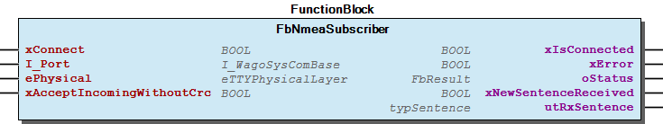

# WagoAppSerial_NMEA v1.6.4.0 (WAGO) - Complete Documentation


## 📋 Library Information

- **Company:** WAGO
- **Title:** WagoAppSerial_NMEA
- **Version:** 1.6.4.0
- **Categories:** WAGO LayerView|App; Application; WAGO FunctionalView|Connectivity|Serial
- **Namespace:** WagoAppSerial_NMEA
- **Author:** WAGO / u010545
- **Placeholder:** WagoAppSerial_NMEA

### Description ¶


This document is automatically generated. Because of this, the chapter 30 Visualization is not shown in this document. If you are interested in getting to know more about visualization, we refer to the library manager of e!Cockpit.

Functionblocks for serial NMEA 0183 communication [1]

This document is automatically generated. Because of this, the chapter 30 Visualization is not shown in this document. If you are interested in getting to know more about visualization, we refer to the library manager of e!Cockpit. Functionblocks for serial NMEA 0183 communication [1]

### Contents: ¶


Contents: - Documentation Index - Project Information - Library Information - Function Blocks - Methods FbNmeaSubscriber.GetEachSentence (METH) - FbNmeaSubscriber.GetFilteredSentence (METH) - FbNmeaSubscriber.WriteSentence (METH) Program Organization Global Variable Lists - ErrorNmea (GVL) - VersionHistory (GVL) Other Components - 80 Status - Data types - Enumeration - Parameter (PARAMS) - eErrorNmea (ENUM) - eSentenceType (ENUM) - typParameters (STRUCT) - typSentence (STRUCT)

### Indices and tables ¶


| [1] | Based on WagoAppSerial_NMEA.library, last modified 25.11.2020, 20:31:34. LibDoc 3.5.15.30 |

© WAGO Kontakttechnik GmbH & Co. KG, Germany 2018 – All rights reserved. For the avoidance of doubt, this copyright notice does not only apply to the information above but also and primarily to the described library itself. Please note that third-party products are always mentioned without reference to intellectual property rights, including patents, utility models, designs and trademarks, accordingly the existence of such rights cannot be excluded. WAGO is a registered trademark of WAGO Verwaltungsgesellschaft mbH.

- File and Project Information - Library Reference © WAGO Kontakttechnik GmbH & Co. KG, Germany 2018 – All rights reserved. For the avoidance of doubt, this copyright notice does not only apply to the information above but also and primarily to the described library itself. Please note that third-party products are always mentioned without reference to intellectual property rights, including patents, utility models, designs and trademarks, accordingly the existence of such rights cannot be excluded. WAGO is a registered trademark of WAGO Verwaltungsgesellschaft mbH.

### Documentation Index


## WagoAppSerial_NMEA Library Documentation


| Company: | WAGO |
| Title: | WagoAppSerial_NMEA |
| Version: | 1.6.4.0 |
| Categories: | WAGO LayerView\|App; Application; WAGO FunctionalView\|Connectivity\|Serial |
| Namespace: | WagoAppSerial_NMEA |
| Author: | WAGO / u010545 |
| Placeholder: | WagoAppSerial_NMEA |

### Description


This document is automatically generated. Because of this, the chapter 30 Visualization is not shown in this document. If you are interested in getting to know more about visualization, we refer to the library manager of e!Cockpit.

Functionblocks for serial NMEA 0183 communication [1]

This document is automatically generated. Because of this, the chapter 30 Visualization is not shown in this document. If you are interested in getting to know more about visualization, we refer to the library manager of e!Cockpit. Functionblocks for serial NMEA 0183 communication [1]

### Contents:


- 20 Program Organization Units Data types - Enumeration - FbNmeaSubscriber (FB) 80 Status - ErrorNmea (GVL) - eErrorNmea (ENUM) Parameter (PARAMS) VersionHistory (GVL)

### Indices and tables


| [1] | Based on WagoAppSerial_NMEA.library, last modified 25.11.2020, 20:31:34. LibDoc 3.5.15.30 |

© WAGO Kontakttechnik GmbH & Co. KG, Germany 2018 – All rights reserved. For the avoidance of doubt, this copyright notice does not only apply to the information above but also and primarily to the described library itself. Please note that third-party products are always mentioned without reference to intellectual property rights, including patents, utility models, designs and trademarks, accordingly the existence of such rights cannot be excluded. WAGO is a registered trademark of WAGO Verwaltungsgesellschaft mbH.

- File and Project Information - Library Reference © WAGO Kontakttechnik GmbH & Co. KG, Germany 2018 – All rights reserved. For the avoidance of doubt, this copyright notice does not only apply to the information above but also and primarily to the described library itself. Please note that third-party products are always mentioned without reference to intellectual property rights, including patents, utility models, designs and trademarks, accordingly the existence of such rights cannot be excluded. WAGO is a registered trademark of WAGO Verwaltungsgesellschaft mbH.

### Project Information


## File and Project Information


| Scope | Name | Type | Content |
| --- | --- | --- | --- |
| FileHeader | libraryFile | string | WagoAppSerial_NMEA.library |
| contentFile | WagoAppSerial_NMEA_clr.json |
| productName | e!COCKPIT |
| creationDateTime | date | 25.11.2020, 20:31:37 |
| companyName | string | WAGO |
| ProjectInformation | LastModificationDateTime | date | 25.11.2020, 20:31:34 |
| Description | string | See: Description |
| Copyright | © WAGO Kontakttechnik GmbH & Co. KG, Germany 2018 – All rights reserved. |
| Author | WAGO / u010545 |
| AutoResolveUnbound | bool | True |
| Placeholder | string | WagoAppSerial_NMEA |
| Company | WAGO |
| DocFormat | reStructuredText |
| Project | WagoAppSerial_NMEA |
| DefaultNamespace | WagoAppSerial_NMEA |
| Version | version | 1.6.4.0 |
| Title | string | WagoAppSerial_NMEA |
| LibraryCategories | library-category-list | WAGO LayerView\|App; Application; WAGO FunctionalView\|Connectivity\|Serial |

### Library Information


## Library Reference


This is a dictionary of all referenced libraries and their name spaces.

This is a dictionary of all referenced libraries and their name spaces.

### Standard


#### Library Identification


Placeholder: Standard Default Resolution: Standard, * (System) Namespace: Standard

#### Library Properties


| LinkAllContent: False QualifiedOnly: False | Key: Standard SystemLibrary: False | Optional: False |

### SysMem


#### Library Identification


Placeholder: SysMem Default Resolution: SysMem, * (System) Namespace: SysMem

#### Library Properties


| LinkAllContent: False QualifiedOnly: False | Key: SysMem SystemLibrary: False | Optional: False |

### WagoAppCom


#### Library Identification


Placeholder: WagoAppCom Default Resolution: WagoAppCom, * (WAGO) Namespace: WagoAppCom

#### Library Properties


| LinkAllContent: False QualifiedOnly: False | Key: WagoAppCom SystemLibrary: False | Optional: False |

#### Library Parameter


Parameter: CUIDEFAULTSYSTEMBUFFERSIZE = 1028

### WagoSysErrorBase


#### Library Identification


Placeholder: WagoSysErrorBase Default Resolution: WagoSysErrorBase, * (WAGO) Namespace: WagoSysErrorBase

#### Library Properties


| LinkAllContent: False QualifiedOnly: False | Key: WagoSysErrorBase SystemLibrary: False | Optional: False |

#### Library Parameter


Parameter: RES_LOG_MAX_FILESIZE = 2000 Parameter: RES_LOG_MAX_FILES = 1 Parameter: RES_LOG_MAX_ENTRIES = 200 Parameter: RES_LOG_NAME = ‘WagoAppResultLogger’

### WagoSysVersion


#### Library Identification


Name: WagoSysVersion Version: 1.0.0.0 Company: WAGO Namespace: WagoSysVersion

#### Library Properties


| LinkAllContent: False QualifiedOnly: False | Key: WagoSysVersion, 1.0.0.0 (WAGO) SystemLibrary: False | Optional: False |

### WagoTypesErrorBase


#### Library Identification


Placeholder: WagoTypesErrorBase Default Resolution: WagoTypesErrorBase, * (WAGO) Namespace: WagoTypesErrorBase

#### Library Properties


| LinkAllContent: False QualifiedOnly: False | Key: WagoTypesErrorBase SystemLibrary: False | Optional: False |

### Function Blocks


## FbNmeaSubscriber (FB)


| Scope | Name | Type | Initial | Comment |
| --- | --- | --- | --- | --- |
| Input | xConnect | BOOL |  |  |
| I_Port | WagoTypesCom.I_WagoSysComBase |  | Name of the Interface (e.g. ‘COM1’, ‘SER7.2’, ) |
| ePhysical | WagoTypesCom.eTTYPhysicalLayer |  | RS232, RS422, RS485, etc |
| xAcceptIncomingWithoutCrc | BOOL | FALSE | TRUE means accept frames without * crc but if a crc is present it have to be correct |
| Output | xIsConnected | BOOL |  |  |
| xError | BOOL |  |  |
| oStatus | WagoSysErrorBase.FbResult |  |  |
| xNewSentenceReceived | BOOL |  | impulse for one cycle if a new sentence is received |
| utRxSentence | typSentence |  | last valid received sentence |

```
VAR
    //... common object .............................
    myNmeaSubscriber    :   FbNmeaSubscriber;

    //... write objects ...............................................................................
    myWriteSentence     :   typSentence := (    SentenceType := eSentenceType.NMEA_PARAMETRIC_SENTENCE,
                                                AddressField := 'AABCD',
                                                Parameter    := (Count := 2, Value := ['123' , 'abc'] )
                                            );
    my_oStatusWrite     :   WagoSysErrorBase.FbResult;
    xWrite              :   BOOL;
    xReset              :   BOOL;

    //... get filtered sentences ............
    myFilteredSentence  :   typSentence;

    //... get each sentence .................
    myEachSentence      :   typSentence;
END_VAR


// C O M M O N  P A R T : (ALWAYS NEEDED)
//===============================================================================
// This is the basic part of a nmea subscriber
// This call is need to receive all sentences from the seriel line
// and for send all sentences given by "WriteSentence" to the
// serial line. You need this call once for each cycle in your project.
//===============================================================================
myNmeaSubscriber(
    xConnect             := TRUE,   // open the serial port
    I_Port               := my652,  // place here the name of used serial port
    ePhysical            := WagoTypesCom.eTTYPhysicalLayer.RS232,
    xIsConnected         => ,       // get here an information about successfully open the serial port
    xError               => ,       // get here an information about any error
    oStatus              => ,       // get here additional Information if an error occured
    xNewSentenceReceived => ,       // impulse for one cycle if a new sentence is received
    utRxSentence         => ,       // last valid received sentence
    xAcceptIncomingWithoutCrc   := FALSE    // if you place here TRUE sentences without crc will be accepted
);
//=====================================================================================

// W R I T E   P A R T : [optional]
//=== WRITE A SENTENCE TO SERIAL LINE ======================================
IF xWrite THEN // set xWrite for once at TRUE to write a sentence
    myNmeaSubscriber.WriteSentence( xEnable     := xWrite,
                                    xWithoutCrc := FALSE ,
                                    utSentence  := myWriteSentence,
                                    oStatus     := my_oStatusWrite,
                                    xReset      => xReset
                                  );
    xWrite R= xReset; // reset this variable when the sentence is written to the pipe
                      // or an error occured

    IF my_oStatusWrite.IsError() THEN // you have to process the error
        // process here any errors
    END_IF

END_IF
//==========================================================================


// G E T  E A C H   S E N T E N C E   P A R T : [optional]
//=== GET EACH SENTENCE ==============================================
// If you want to get all sentences received by NmeaReceiver
// then you can use this method
//====================================================================
IF myNmeaSubscriber.GetEachSentence(utSentence:= myEachSentence) THEN

    // you stay here once when a sentence was received
    // process here the new 'myEachSentence'

END_IF
//====================================================================


// G E T  F I L T E R E D   S E N T E N C E   P A R T : [optional]
//=== GET A FILTERED SENTENCE ==============================================================
// If you want to get a filtered sentence from all sentences received by NmeaReceiver
// then you can use this method to get the only one you have specified by the sentence type
// and the address pattern.
// For the sentence type you may combine with 'OR' different types
// At the address pattern you may use wildcards '*' and '?'
//==========================================================================================
IF myNmeaSubscriber.GetFilteredSentence(
                        eSentence_Type  :=      eSentenceType.NMEA_PARAMETRIC_SENTENCE   // you may combine different types
                                            OR  eSentenceType.NMEA_PROPRIETARY_SENTENCE, // with or

                        sAddressPattern := 'PP*',               // examples for pattern 'ABCDE', '*AB*', '??ABC' ...
                        xCaseSensitve   := FALSE,               // ignore uppercase / lowercase
                        utSentence      := myFilteredSentence   // get here your wanted sentence
                      ) THEN

        // you stay here once when one of your filtered sentences was received
        // process here the new 'myFilteredSentence'

END_IF
//=========================================================================================
```

NMEA - Receiver for receiving all NMEA-Sentences and send all given sentences. This FB contains the basic functionality for sending and receiving NMEA sentences. You have to call this function block once for each cycle in your project to process the common functionality.

To get sentences from all the internal received sentences this FB provides two methods (see FbNmeaSubscriber.GetFilteredSentence and FbNmeaSubscriber.GetEachSentence )

For sending any sentence it will supported by the method FbNmeaSubscriber.WriteSentence

You should always call this FB cyclic.

Graphical Illustration

Graphical Interface of FbNmeaSubscriber

Example for FUP

Interface variables Function NMEA - Receiver for receiving all NMEA-Sentences and send all given sentences. This FB contains the basic functionality for sending and receiving NMEA sentences. You have to call this function block once for each cycle in your project to process the common functionality. To get sentences from all the internal received sentences this FB provides two methods (see FbNmeaSubscriber.GetFilteredSentence and FbNmeaSubscriber.GetEachSentence ) For sending any sentence it will supported by the method FbNmeaSubscriber.WriteSentence Note You should always call this FB cyclic. Graphical Illustration  Graphical Interface of FbNmeaSubscriber Example For receive and write sentences. If you only want to receive sentences you may delete the part for sending (WriteSentence(..)). Also you may delete the part for get sentence if your want to send only. Example for FUP  - FbNmeaSubscriber.GetEachSentence (METH) - FbNmeaSubscriber.GetFilteredSentence (METH) - FbNmeaSubscriber.WriteSentence (METH)

### Methods


## FbNmeaSubscriber.GetEachSentence (METH)


| Scope | Name | Type | Comment |
| --- | --- | --- | --- |
| Return | GetEachSentence | BOOL |  |
| Inout | utSentence | typSentence | last valid, received and filtered sentence |

```
VAR
    //... common object .............................
    myNmeaSubscriber    :   FbNmeaSubscriber;

    //... get each sentence .................
    myEachSentence      :   typSentence;

END_VAR


// C O M M O N  P A R T : (ALWAYS NEEDED)
//===============================================================================
// This is the basic part of a nmea subscriber
// This call is need to receive all sentences from the seriel line
// and for send all sentences given by "WriteSentence" to the
// serial line. You need this call once for each cycle in your project.
//===============================================================================
myNmeaSubscriber(
    xConnect             := TRUE,   // open the serial port
    I_Port               := my652,  // place here the name of used serial port
    ePhysical            := WagoTypesCom.eTTYPhysicalLayer.RS232,
    xIsConnected         => ,       // get here an information about successfully open the serial port
    xError               => ,       // get here an information about any error
    oStatus              => ,       // get here additional Information if an error occured
    xNewSentenceReceived => ,       // impulse for one cycle if a new sentence is received
    utRxSentence         => ,       // last valid received sentence
    xAcceptIncomingWithoutCrc   := FALSE    // if you place here TRUE sentences without crc will be accepted
);
//=====================================================================================


// G E T  E A C H   S E N T E N C E   P A R T : [optional]
//=== GET EACH SENTENCE ==============================================
// If you want to get all sentences received by NmeaReceiver
// then you can use this method
//====================================================================
IF myNmeaSubscriber.GetEachSentence(utSentence:= myEachSentence) THEN

    // you stay here once when a sentence was received
    // process here the new 'myEachSentence'

END_IF
//====================================================================
```

For use this method you have to call the FbNmeaSubscriber cyclic.

Graphical Illustration

Graphical Interface of FbNmeaSubscriber.GetEachSentence

Interface variables Function Get each received sentences. Note For use this method you have to call the FbNmeaSubscriber cyclic. Graphical Illustration  Graphical Interface of FbNmeaSubscriber.GetEachSentence Example For receive each sentences.

## FbNmeaSubscriber.GetFilteredSentence (METH)


| Scope | Name | Type | Initial | Comment |
| --- | --- | --- | --- | --- |
| Return | GetFilteredSentence | BOOL |  |  |
| Input | eSentence_Type | eSentenceType | eSentenceType.NMEA_PARAMETRIC_SENTENCE | set wanted sentence-type if set to NMEA_UNKNOWN_TYPE then get all |
| sAddressPattern | STRING(NMEA_ADDRESSFIELD_SIZE) |  | set the filter by the addressfield ‘*’ and ‘?’ as wildcards are allowed -> empty string means get all |
| xCaseSensitve | BOOL |  | FALSE means uppercase/lowercase will be ignored |
| Inout | utSentence | typSentence |  | last valid, received and filtered sentence |

| Pattern | Description |
| --- | --- |
| ‘AB*’ | The address field have to start with ‘AB’ followed by as many of any chars as you like |
| ‘*XY*’ | The address field must contain anywhere ‘XY’ |
| ‘ABCDE’ | The address field must exact match ‘ABCDE’ |
| ‘AB???’ | The address field must have 5 characters and the first must be ‘AB’ |

```
VAR
    //... common object .............................
    myNmeaSubscriber    :   FbNmeaSubscriber;

    //... get filtered sentences ............
    myFilteredSentence  :   typSentence;
END_VAR

// C O M M O N  P A R T : (ALWAYS NEEDED)
//===============================================================================
// This is the basic part of a nmea subscriber
// This call is need to receive all sentences from the seriel line
// and for send all sentences given by "WriteSentence" to the
// serial line. You need this call once for each cycle in your project.
//===============================================================================
myNmeaSubscriber(
    xConnect             := TRUE,   // open the serial port
    I_Port               := my652,  // place here the name of used serial port
    ePhysical            := WagoTypesCom.eTTYPhysicalLayer.RS232,
    xIsConnected         => ,       // get here an information about successfully open the serial port
    xError               => ,       // get here an information about any error
    oStatus              => ,       // get here additional Information if an error occured
    xNewSentenceReceived => ,       // impulse for one cycle if a new sentence is received
    utRxSentence         => ,       // last valid received sentence
    xAcceptIncomingWithoutCrc   := FALSE    // if you place here TRUE sentences without crc will be accepted
);
//=====================================================================================


// G E T  F I L T E R E D   S E N T E N C E   P A R T : [optional]
//=== GET A FILTERED SENTENCE ==============================================================
// If you want to get a filtered sentence from all sentences received by NmeaReceiver
// then you can use this method to get the only one you have specified by the sentence type
// and the address pattern.
// For the sentence type you may combine with 'OR' different types
// At the address pattern you may use wildcards '*' and '?'
//==========================================================================================
IF myNmeaSubscriber.GetFilteredSentence(
                        eSentence_Type  :=      eSentenceType.NMEA_PARAMETRIC_SENTENCE   // you may combine different types
                                            OR  eSentenceType.NMEA_PROPRIETARY_SENTENCE, // with or

                        sAddressPattern := 'AB*',               // examples for pattern 'ABCDE', '*AB*', '??ABC' ...
                        xCaseSensitve   := FALSE,               // ignore uppercase / lowercase
                        utSentence      := myFilteredSentence   // get here your wanted sentence
                      ) THEN

        // you stay here once when one of your filtered sentences was received
        // process here the new 'myFilteredSentence'

END_IF
//=========================================================================================
```

Filters the sentences specified by sentence type and address pattern from all received sentences. Sentence types may be combine by ‘OR’ to get different types. Address pattern may use wildcards ‘?’ and ‘*’.

Examples of pattern

For use this method you have to call the FbNmeaSubscriber cyclic.

Graphical Illustration

Graphical Interface of FbNmeaSubscriber.GetFilteredSentence

Interface variables Function Filters the sentences specified by sentence type and address pattern from all received sentences. Sentence types may be combine by ‘OR’ to get different types. Address pattern may use wildcards ‘?’ and ‘*’. - ‘?’ means one of any char - ‘*’ means as many as you like of any char Examples of pattern Note For use this method you have to call the FbNmeaSubscriber cyclic. Graphical Illustration  Graphical Interface of FbNmeaSubscriber.GetFilteredSentence Example For receive filtered sentences.

## FbNmeaSubscriber.WriteSentence (METH)


| Scope | Name | Type | Initial | Comment |
| --- | --- | --- | --- | --- |
| Return | WriteSentence | BOOL |  |  |
| Input | xEnable | BOOL |  |  |
| xWithoutCrc | BOOL | FALSE | TRUE -> send the sentences without crc |
| Inout | utSentence | typSentence |  | sentence to send |
| oStatus | WagoSysErrorBase.FbResult |  |  |
| Output | xReset | BOOL |  |  |

```
VAR
    //... common object .............................
    myNmeaSubscriber    :   FbNmeaSubscriber;

    //... write objects ...............................................................................
    myWriteSentence     :   typSentence := (    eSentenceType := eSentenceType.NMEA_PARAMETRIC_SENTENCE,
                                                sAddressField := 'AABCD',
                                                utParameter   := (Count := 2, Value := ['123' , 'abc'] )
                                            );
    my_oStatusWrite     :   WagoSysErrorBase.FbResult;
    xWrite              :   BOOL;
    xReset              :   BOOL;
END_VAR


// C O M M O N  P A R T : (ALWAYS NEEDED see FbNmeaSubscriber)
//===============================================================================
// This is the basic part of a nmea subscriber
// This call is need to receive all sentences from the seriel line
// and for send all sentences given by "WriteSentence" to the
// serial line. You need this call once for each cycle in your project.
//===============================================================================
myNmeaSubscriber(
    xConnect             := TRUE,   // open the serial port
    I_Port               := my652,  // place here the name of used serial port
    ePhysical            := WagoTypesCom.eTTYPhysicalLayer.RS232,
    xIsConnected         => ,       // get here an information about successfully open the serial port
    xError               => ,       // get here an information about any error
    oStatus              => ,       // get here additional Information if an error occured
    xNewSentenceReceived => ,       // impulse for one cycle if a new sentence is received
    utRxSentence         => ,       // last valid received sentence
    xAcceptIncomingWithoutCrc   := FALSE    // if you place here TRUE sentences without crc will be accepted
);
//=====================================================================================

// W R I T E   P A R T : [optional]
//=== WRITE A SENTENCE TO SERIAL LINE ======================================
IF xWrite THEN // set xWrite for once at TRUE to write a sentence
    myNmeaSubscriber.WriteSentence( xEnable     := xWrite,
                                    xWithoutCrc := FALSE ,
                                    utSentence  := myWriteSentence,
                                    oStatus     := my_oStatusWrite,
                                    xReset      => xReset
                                  );
    xWrite R= xReset; // reset this variable when the sentence is written to the pipe
                      // or an error occured

    IF my_oStatusWrite.IsError() THEN // you have to process the error
        // process here any errors
    END_IF

END_IF
//==========================================================================
```

For use this method you have to call the FbNmeaSubscriber cyclic.

Graphical Illustration

Graphical Interface of FbNmeaSubscriber.GetWriteSentence

Interface variables Function Write a NMEA sentence to the serial interface. Note For use this method you have to call the FbNmeaSubscriber cyclic. Graphical Illustration  Graphical Interface of FbNmeaSubscriber.GetWriteSentence Example For write a sentence.

### Program Organization


## 20 Program Organization Units


- Data types typParameters (STRUCT) - typSentence (STRUCT) Enumeration - eSentenceType (ENUM) FbNmeaSubscriber (FB) - FbNmeaSubscriber.GetEachSentence (METH) - FbNmeaSubscriber.GetFilteredSentence (METH) - FbNmeaSubscriber.WriteSentence (METH)

### Global Variable Lists


## ErrorNmea (GVL)


| Value | Level | Description |
| --- | --- | --- |
| eErrorNmea.OK | WagoTypesErrorBase.eSeverity.none | ‘OK’ |
| eErrorNmea.CRC_ERROR | WagoTypesErrorBase.eSeverity.error | ‘CRC Error’ |
| eErrorNmea.MISSING_CRC | WagoTypesErrorBase.eSeverity.error | ‘Error missing crc’ |
| eErrorNmea.INVALID_CHAR | WagoTypesErrorBase.eSeverity.error | ‘Error invalid char’ |
| eErrorNmea.SECOND_STARTCHAR | WagoTypesErrorBase.eSeverity.error | ‘Error second startchar’ |
| eErrorNmea.SECOND_CRC_DELIM | WagoTypesErrorBase.eSeverity.error | ‘Error second crc delimiter’ |
| eErrorNmea.CRC_DELIM_TO_EARLY | WagoTypesErrorBase.eSeverity.error | ‘Error crc delimiter to early’ |
| eErrorNmea.FIELD_DELIM_TO_EARLY | WagoTypesErrorBase.eSeverity.error | ‘Error field delimiter to early’ |
| eErrorNmea.HEX_DELIM_TO_EARLY | WagoTypesErrorBase.eSeverity.error | ‘Error hex delimiter to early’ |
| eErrorNmea.TO_MANY_PARAMETERS | WagoTypesErrorBase.eSeverity.error | ‘Error to many parameters’ |
| eErrorNmea.PARAMETER_TO_LONG | WagoTypesErrorBase.eSeverity.error | ‘Error parameter to long’ |
| eErrorNmea.INVALID_SENTENCE_TYPE | WagoTypesErrorBase.eSeverity.error | ‘Error invalid sentence type’ |
| eErrorNmea.INVALID_ADDRESSFIELD | WagoTypesErrorBase.eSeverity.error | ‘Error invalid address field’ |
| eErrorNmea.PIPE_INVALID_PARAMETER | WagoTypesErrorBase.eSeverity.error | ‘Error Pipe invalid parameter’ |
| eErrorNmea.PIPE_NO_DATA | WagoTypesErrorBase.eSeverity.error | ‘Error Pipe no data available’ |
| eErrorNmea.PIPE_FULL | WagoTypesErrorBase.eSeverity.error | ‘Error Pipe no free space for new data -> Pipe full’ |

## VersionHistory (GVL)


| date | version | author | change |
| 25.09.2020 | 1.6.4.0 | u015842 | WAT32383 / 32271 -> Feature addressfield > 5 byte |
| 18.06.2020 | 1.6.3.0 | u015842 | bugfix |
| 08.01.2019 | 1.6.2.0 | u015842 | Properties: free placeholder added |
| 24.04.2018 | 1.6.1.1 | u010545 | Update documentation |
| 03.05.2017 | 1.6.1.0 | u010545 | WagoTypesComInternal removed |
| 05.07.2016 | 1.6.0.1 | u010545 | createtable error table |
| 02.03.2016 | 1.6.0.0 | u010545 | WagoTypesErrorBase changed to WagoSysErrorBase / WagoTypesErrorBase |
| 02.02.2016 | 1.5.0.5 | u010545 | Placeholder WagoTypesCom_Internal changed |
| 19.01.2016 | 1.5.0.4 | u010545 | VersionHistory -> always bind |
| 09.12.2015 | 0.0.0.4 | u010545 | handling of proprietary sentences modified |
| 30.09.2015 | 0.0.0.3 | u010545 | placeholder at librarymanger included |
| 24.08.2015 | 0.0.0.2 | u010545 | attribut placeholder included |
| 26.05.2015 | 0.0.0.1 | UU | created |

WagoAppSerial_NMEA

### Other Components


## 80 Status ¶


- ErrorNmea (GVL) - eErrorNmea (ENUM)

## Data types


- typParameters (STRUCT) - typSentence (STRUCT)

## Enumeration ¶


- eSentenceType (ENUM)

## Parameter (PARAMS)


| Scope | Name | Type | Initial | Comment |
| --- | --- | --- | --- | --- |
| Constant | NMEA_MAX_VALUES_PER_SENTENCE | UINT | 20 | this constant allow f.e. 20 parameter / values for each sentence |
| NMEA_MAX_VALUE_LENGTH | INT | 80 | this constant allow f.e. 80 ASCII-Characters for each parameter / value |
| NMEA_PIPE_SIZE | UINT | 1024 | size of the comunication buffer for sending NMEA sentences Note : It have to be big enough for one worst case sentence |
| NMEA_ADDRESSFIELD_SIZE | USINT | 10 | max. size of the addressfield |

## eErrorNmea (ENUM)


| Name | Initial | Comment |
| --- | --- | --- |
| OK | 0 |  |
| CRC_ERROR | 16#100 | calculated crc not EQ received crc |
| MISSING_CRC | 16#200 | Endchar before complete crc received |
| INVALID_CHAR | 16#300 | not expected char received |
| SECOND_STARTCHAR | 16#400 | second startchar (‘$’ or ‘!’) received |
| SECOND_CRC_DELIM | 16#500 | second crc-delimiter ( * ) received |
| CRC_DELIM_TO_EARLY | 16#600 | crc-delimiter before talker and formatter received |
| FIELD_DELIM_TO_EARLY | 16#700 | field-delimiter before talker and formatter received |
| HEX_DELIM_TO_EARLY | 16#800 | code-delimiter for HEX representation before address-field received |
| TO_MANY_PARAMETERS | 16#900 | Constant NMEA_MAX_VALUES_PER_SENTENCE to small |
| PARAMETER_TO_LONG | 16#A00 | Constant NMEA_MAX_VALUE_LENGTH to small |
| INVALID_SENTENCE_TYPE | 16#1000 | invalid sentence type |
| INVALID_ADDRESSFIELD | 16#2000 | invalid address field -> must have normaly 5 char -> for proprietary sentences only 4 char allowed |
| PIPE_INVALID_PARAMETER | 16#8001 |  |
| PIPE_NO_DATA | 16#8002 |  |
| PIPE_FULL | 16#8003 |  |

## eSentenceType (ENUM)


| Name | Initial |
| --- | --- |
| NMEA_UNKNOWN_TYPE | 0 |
| NMEA_PARAMETRIC_SENTENCE | 16#1 |
| NMEA_ENCAPSULATION_SENTENCE | 16#2 |
| NMEA_PROPRIETARY_SENTENCE | 16#4 |
| NMEA_ALL_SENTENCES | 16#FF |

## typParameters (STRUCT)


| Name | Type | Comment |
| --- | --- | --- |
| Count | BYTE | quantity of values |
| Value | ARRAY [1..NMEA_MAX_VALUES_PER_SENTENCE] OF STRING(NMEA_MAX_VALUE_LENGTH) |  |

## typSentence (STRUCT)


| Name | Type | Comment |
| --- | --- | --- |
| eSentenceType | eSentenceType | Type of this sentence -> parametric / encapsulation / ... |
| sAddressField | STRING(NMEA_ADDRESSFIELD_SIZE) |  |
| utParameter | typParameters |  |
| sRawSentence | STRING |  |