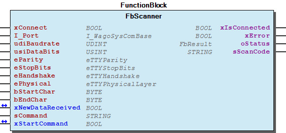

# WagoAppSerial_Scanner v1.6.1.0 (WAGO) - Complete Documentation

## 📋 Library Information

- **Company:** WAGO
- **Title:** WagoAppSerial_Scanner
- **Version:** 1.6.1.0
- **Categories:** WAGO LayerView|App; Application; WAGO FunctionalView|Connectivity|Serial
- **Author:** WAGO / u010545
- **Placeholder:** WagoAppSerial_Scanner

### Description ¶

This document is automatically generated. Because of this, the chapter 30 Visualization is not shown in this document. If you are interested in getting to know more about visualization, we refer to the library manager of e!Cockpit.

Function block for simple serial ASCII communication e.g. Barcodescanner with a startchar and an endchar [1]

This document is automatically generated. Because of this, the chapter 30 Visualization is not shown in this document. If you are interested in getting to know more about visualization, we refer to the library manager of e!Cockpit. Function block for simple serial ASCII communication e.g. Barcodescanner with a startchar and an endchar [1]

### Contents: ¶

Contents: - Documentation Index - Project Information - Library Information - Function Blocks - Program Organization - Global Variable Lists

### Indices and tables ¶

| [1] | Based on WagoAppSerial_Scanner.library, last modified 14.01.2019, 19:02:00. The content of this file was automatically generated with None on 14.01.2019, 19:02:02 |

© WAGO Kontakttechnik GmbH & Co. KG, Germany 2018 – All rights reserved. For the avoidance of doubt, this copyright notice does not only apply to the information above but also and primarily to the described library itself. Please note that third-party products are always mentioned without reference to intellectual property rights, including patents, utility models, designs and trademarks, accordingly the existence of such rights cannot be excluded. WAGO is a registered trademark of WAGO Verwaltungsgesellschaft mbH.

- File and Project Information - Library Reference © WAGO Kontakttechnik GmbH & Co. KG, Germany 2018 – All rights reserved. For the avoidance of doubt, this copyright notice does not only apply to the information above but also and primarily to the described library itself. Please note that third-party products are always mentioned without reference to intellectual property rights, including patents, utility models, designs and trademarks, accordingly the existence of such rights cannot be excluded. WAGO is a registered trademark of WAGO Verwaltungsgesellschaft mbH.

### Documentation Index

## WagoAppSerial_Scanner Library Documentation

| Company: | WAGO |
| Title: | WagoAppSerial_Scanner |
| Version: | 1.6.1.0 |
| Categories: | WAGO LayerView\|App; Application; WAGO FunctionalView\|Connectivity\|Serial |
| Author: | WAGO / u010545 |
| Placeholder: | WagoAppSerial_Scanner |

### Description

This document is automatically generated. Because of this, the chapter 30 Visualization is not shown in this document. If you are interested in getting to know more about visualization, we refer to the library manager of e!Cockpit.

Function block for simple serial ASCII communication e.g. Barcodescanner with a startchar and an endchar [1]

This document is automatically generated. Because of this, the chapter 30 Visualization is not shown in this document. If you are interested in getting to know more about visualization, we refer to the library manager of e!Cockpit. Function block for simple serial ASCII communication e.g. Barcodescanner with a startchar and an endchar [1]

### Contents:

- 20 Program Organization Units FbScanner (FB) VersionHistory (GVL)

### Indices and tables

| [1] | Based on WagoAppSerial_Scanner.library, last modified 14.01.2019, 19:02:00. The content of this file was automatically generated with None on 14.01.2019, 19:02:02 |

© WAGO Kontakttechnik GmbH & Co. KG, Germany 2018 – All rights reserved. For the avoidance of doubt, this copyright notice does not only apply to the information above but also and primarily to the described library itself. Please note that third-party products are always mentioned without reference to intellectual property rights, including patents, utility models, designs and trademarks, accordingly the existence of such rights cannot be excluded. WAGO is a registered trademark of WAGO Verwaltungsgesellschaft mbH.

- File and Project Information - Library Reference © WAGO Kontakttechnik GmbH & Co. KG, Germany 2018 – All rights reserved. For the avoidance of doubt, this copyright notice does not only apply to the information above but also and primarily to the described library itself. Please note that third-party products are always mentioned without reference to intellectual property rights, including patents, utility models, designs and trademarks, accordingly the existence of such rights cannot be excluded. WAGO is a registered trademark of WAGO Verwaltungsgesellschaft mbH.

### Project Information

## File and Project Information

| Scope | Name | Type | Content |
| --- | --- | --- | --- |
| FileHeader | libraryFile | string | WagoAppSerial_Scanner.library |
| contentFile | WagoAppSerial_Scanner_clr.json |
| productName | e!COCKPIT |
| creationDateTime | date | 14.01.2019, 19:02:02 |
| companyName | string | WAGO |
| ProjectInformation | LastModificationDateTime | date | 14.01.2019, 19:02:00 |
| Description | string | See: Description |
| Copyright | © WAGO Kontakttechnik GmbH & Co. KG, Germany 2018 – All rights reserved. |
| Author | WAGO / u010545 |
| AutoResolveUnbound | bool | True |
| Placeholder | string | WagoAppSerial_Scanner |
| Company | WAGO |
| DocFormat | reStructuredText |
| Project | WagoAppSerial_Scanner |
| DefaultNamespace |  |
| Version | version | 1.6.1.0 |
| Title | string | WagoAppSerial_Scanner |
| LibraryCategories | library-category-list | WAGO LayerView\|App; Application; WAGO FunctionalView\|Connectivity\|Serial |

### Library Information

## Library Reference

| LinkAllContent: False QualifiedOnly: True | SystemLibrary: False | Optional: False |

| LinkAllContent: False QualifiedOnly: False | SystemLibrary: False | Optional: False |

| LinkAllContent: False QualifiedOnly: False | SystemLibrary: False | Optional: False |

| LinkAllContent: False QualifiedOnly: True | SystemLibrary: False | Optional: False |

| LinkAllContent: False QualifiedOnly: False | SystemLibrary: False | Optional: False |

This is a dictionary of all referenced libraries and their name spaces.

This is a dictionary of all referenced libraries and their name spaces. Standard Library Identification : Placeholder: Standard Default Resolution: Standard, * (System) Namespace: Standard Library Properties : WagoSysErrorBase Library Identification : Placeholder: WagoSysErrorBase Default Resolution: WagoSysErrorBase, * (WAGO) Namespace: WagoSysErrorBase Library Properties : Library Parameter : Parameter: RES_LOG_MAX_FILESIZE = 2000 Parameter: RES_LOG_MAX_FILES = 1 Parameter: RES_LOG_MAX_ENTRIES = 200 Parameter: RES_LOG_NAME = ‘WagoAppResultLogger’ WagoSysSerial Library Identification : Placeholder: WagoSysSerial Default Resolution: WagoSysSerial, * (WAGO) Namespace: WagoSysSerial Library Properties : WagoSysVersion Library Identification : Name: WagoSysVersion Version: 1.0.0.0 Company: WAGO Namespace: WagoSysVersion Library Properties : WagoTypesCom Library Identification : Placeholder: WagoTypesCom Default Resolution: WagoTypesCom, * (WAGO) Namespace: WagoTypesCom Library Properties :

### Function Blocks

## FbScanner (FB)

| Scope | Name | Type | Initial | Comment | Inherited from |
| --- | --- | --- | --- | --- | --- |
| Input | xConnect | BOOL |  |  | FbBaseInterface |
| I_Port | WagoTypesCom.I_WagoSysComBase |  | Name of the Interface (e.g. ‘COM1’, ‘SER7.2’, ) | FbBaseInterface |
| udiBaudrate | UDINT |  | Baudrate (9600 = 9k6) | FbBaseInterface |
| usiDataBits | USINT |  | Number of Bits per frame (5..8) | FbBaseInterface |
| eParity | WagoTypesCom.eTTYParity |  | Parity | FbBaseInterface |
| eStopBits | WagoTypesCom.eTTYStopBits |  | Number of Stop-Bits, see note (1) | FbBaseInterface |
| eHandshake | WagoTypesCom.eTTYHandshake |  | TYPE of handshake (XON/XOFF, etc) | FbBaseInterface |
| ePhysical | WagoTypesCom.eTTYPhysicalLayer |  | RS232, RS422, RS485, etc | FbBaseInterface |
| Output | xIsConnected | BOOL |  |  | FbBaseInterface |
| xError | BOOL |  |  | FbBaseInterface |
| oStatus | WagoSysErrorBase.FbResult |  |  | FbBaseInterface |
| Input | bStartChar | BYTE | 16#2 | <STX> start char of the wanted receive frame |  |
| bEndChar | BYTE | 16#3 | <ETX> end char of the wanted receive frame |  |
| Inout | xNewDataReceived | BOOL |  | This variable is set by the FB if new data received. Your application have to reset this variable after process the received data. |  |
| Output | sScanCode | STRING |  | scan code without the defined startchar and endchar |  |
| Input | sCommand | STRING |  | string to send to the scanner |  |
| Inout | xStartCommand | BOOL |  | start send command to the scanner -> this variable have to set by the application and will be reseted by this fb when the job is done |  |

Graphical Illustration

Graphical Interface of FbScanner

Interface variables Function Control and read a Barcode Scanner. This functionblock supports the use of a serial barcode scanner with an simple ascii protocol using a startchar and an endchar. Example <STX>ascii data<ETX> Graphical Illustration  Graphical Interface of FbScanner

### Program Organization

## 20 Program Organization Units

This folder contains program organization units

This folder contains program organization units - FbScanner (FB)

### Global Variable Lists

## VersionHistory (GVL)

| Name | Type |
| --- | --- |
| Info | WagoSysVersion.ProjectInfo |

| date | version | author | change |
| 08.01.2019 | 1.6.1.0 | u015842 | Properties: free placeholder added |
| 02.03.2016 | 1.6.0.0 | u010545 | WagoAppErrorBase changed to WagoSysErrorBase / WagoTypesErrorBase |
| 11.02.2016 | 1.5.0.5 | u010545 | WagoAppErrorBase included |
| 19.01.2016 | 1.5.0.4 | u010545 | VersionHistory -> always bind |
| 02.10.2015 | 1.5.0.3 | u010545 | compiler changed to version 3.5.7.0 |
| 30.09.2015 | 1.5.0.2 | u010545 | placeholder at librarymanger included |
| 24.08.2015 | 1.5.0.1 | u010545 | attribut placeholder included |
| 03.06.2015 | 1.5.0.0 | u010545 | released |
| 07.05.2015 | 1.0.0.10 | u010545 | oError renamed to oStatus |
| 30.04.2015 | 1.0.0.9 | u010545 | bugfix |
| 24.02.2015 | 1.0.0.8 | u013972 | rename variales - WAT13530 |
| 24.02.2015 | 1.0.0.7 | u013972 | rename variales - WAT13530 |
| 26.01.2015 | 1.0.0.6 | u010545 | categories modified |
| 15.01.2015 | 1.0.0.5 | u010545 | documentation modified |
| 10.12.2014 | 1.0.0.4 | u010545 | Image changed from jpeg to png |
| 05.12.2014 | 1.0.0.3 | u010545 | FB_init removed |
| 07.10.2014 | 1.0.0.2 | u010545 | FB_init implemented |
| 24.09.2014 | 1.0.0.1 | u010545 | library name changed |
| 09.09.2014 | 1.0.0.0 | u010545 | released |
| 12.08.2014 | 0.0.0.0 | u010545 | created |

WagoAppSerial_Scanner

WagoAppSerial_Scanner