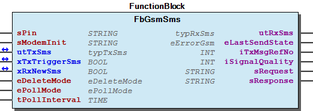
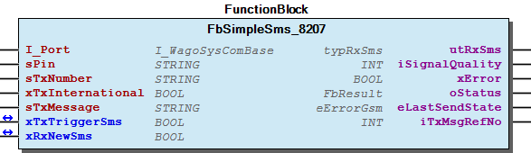
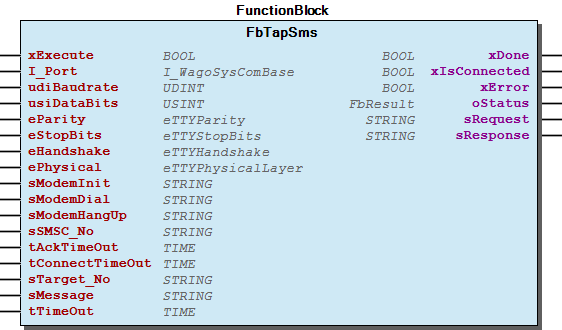
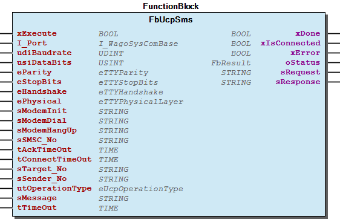

# WagoAppSerial_Sms v1.6.3.2 (WAGO) - Complete Documentation


## 📋 Library Information

- **Company:** WAGO
- **Title:** WagoAppSerial_Sms
- **Version:** 1.6.3.2
- **Categories:** WAGO LayerView|App; Application; WAGO FunctionalView|Connectivity|Serial
- **Namespace:** WagoAppSerial_Sms
- **Author:** WAGO / u010545
- **Placeholder:** WagoAppSerial_Sms

### Description ¶


This document is automatically generated. Because of this, the chapter 30 Visualization is not shown in this document. If you are interested in getting to know more about visualization, we refer to the library manager of e!Cockpit.

This library provides functions to use Short Message Services (SMS) [1]

This document is automatically generated. Because of this, the chapter 30 Visualization is not shown in this document. If you are interested in getting to know more about visualization, we refer to the library manager of e!Cockpit. This library provides functions to use Short Message Services (SMS) [1]

### Contents: ¶


Contents: - Documentation Index - Project Information - Library Information - Function Blocks FbGsmSms (FB) - FbSimpleSms_8207 (FB) - FbTapSms (FB) - FbUcpSms (FB) Methods Global Variable Lists - ErrorGsm (GVL) - ErrorTap (GVL) - ErrorUcp (GVL) - SmsStatus (GVL) - VersionHistory (GVL) Other Components - 20 Program Organization Unit - 80 Status - Data Types (GSM) - Data types - ErrorGsm - ErrorTap - ErrorUcp - GSM - GlobalTextList (Text List) - Parameter (PARAMS) - ... and 13 more

### Indices and tables ¶


| [1] | Based on WagoAppSerial_Sms.library, last modified 25.05.2021, 15:44:52. LibDoc 3.5.15.30 |

© WAGO Kontakttechnik GmbH & Co. KG, Germany 2018 – All rights reserved. For the avoidance of doubt, this copyright notice does not only apply to the information above but also and primarily to the described library itself. Please note that third-party products are always mentioned without reference to intellectual property rights, including patents, utility models, designs and trademarks, accordingly the existence of such rights cannot be excluded. WAGO is a registered trademark of WAGO Verwaltungsgesellschaft mbH.

- File and Project Information - Library Reference © WAGO Kontakttechnik GmbH & Co. KG, Germany 2018 – All rights reserved. For the avoidance of doubt, this copyright notice does not only apply to the information above but also and primarily to the described library itself. Please note that third-party products are always mentioned without reference to intellectual property rights, including patents, utility models, designs and trademarks, accordingly the existence of such rights cannot be excluded. WAGO is a registered trademark of WAGO Verwaltungsgesellschaft mbH.

### Documentation Index


## WagoAppSerial_Sms Library Documentation


| Company: | WAGO |
| Title: | WagoAppSerial_Sms |
| Version: | 1.6.3.2 |
| Categories: | WAGO LayerView\|App; Application; WAGO FunctionalView\|Connectivity\|Serial |
| Namespace: | WagoAppSerial_Sms |
| Author: | WAGO / u010545 |
| Placeholder: | WagoAppSerial_Sms |

### Description


This document is automatically generated. Because of this, the chapter 30 Visualization is not shown in this document. If you are interested in getting to know more about visualization, we refer to the library manager of e!Cockpit.

This library provides functions to use Short Message Services (SMS) [1]

This document is automatically generated. Because of this, the chapter 30 Visualization is not shown in this document. If you are interested in getting to know more about visualization, we refer to the library manager of e!Cockpit. This library provides functions to use Short Message Services (SMS) [1]

### Contents:


- 20 Program Organization Unit GSM - TAP (Telocator Alphanumeric Protocol) - UCP (EMI) 80 Status - ErrorGsm - ErrorTap - ErrorUcp GlobalTextList (Text List) Parameter (PARAMS) VersionHistory (GVL)

### Indices and tables


| [1] | Based on WagoAppSerial_Sms.library, last modified 25.05.2021, 15:44:52. LibDoc 3.5.15.30 |

© WAGO Kontakttechnik GmbH & Co. KG, Germany 2018 – All rights reserved. For the avoidance of doubt, this copyright notice does not only apply to the information above but also and primarily to the described library itself. Please note that third-party products are always mentioned without reference to intellectual property rights, including patents, utility models, designs and trademarks, accordingly the existence of such rights cannot be excluded. WAGO is a registered trademark of WAGO Verwaltungsgesellschaft mbH.

- File and Project Information - Library Reference © WAGO Kontakttechnik GmbH & Co. KG, Germany 2018 – All rights reserved. For the avoidance of doubt, this copyright notice does not only apply to the information above but also and primarily to the described library itself. Please note that third-party products are always mentioned without reference to intellectual property rights, including patents, utility models, designs and trademarks, accordingly the existence of such rights cannot be excluded. WAGO is a registered trademark of WAGO Verwaltungsgesellschaft mbH.

### Project Information


## File and Project Information


| Scope | Name | Type | Content |
| --- | --- | --- | --- |
| FileHeader | libraryFile | string | WagoAppSerial_Sms.library |
| contentFile | WagoAppSerial_Sms_clr.json |
| productName | e!COCKPIT |
| creationDateTime | date | 25.05.2021, 15:44:59 |
| companyName | string | WAGO |
| ProjectInformation | LastModificationDateTime | date | 25.05.2021, 15:44:52 |
| Description | string | See: Description |
| Copyright | © WAGO Kontakttechnik GmbH & Co. KG, Germany 2018 – All rights reserved. |
| Author | WAGO / u010545 |
| AutoResolveUnbound | bool | True |
| Placeholder | string | WagoAppSerial_Sms |
| Company | WAGO |
| DocFormat | reStructuredText |
| Project | WagoAppSerial_Sms |
| DefaultNamespace | WagoAppSerial_Sms |
| Version | version | 1.6.3.2 |
| Title | string | WagoAppSerial_Sms |
| LibraryCategories | library-category-list | WAGO LayerView\|App; Application; WAGO FunctionalView\|Connectivity\|Serial |
| CompiledLibraryCompatibilityVersion | string | CODESYS V3.5 SP16 Patch 3 |

### Library Information


## Library Reference


This is a dictionary of all referenced libraries and their name spaces.

This is a dictionary of all referenced libraries and their name spaces.

### Standard


#### Library Identification


Placeholder: Standard Default Resolution: Standard, * (System) Namespace: Standard

#### Library Properties


| LinkAllContent: False QualifiedOnly: True | Key: Standard SystemLibrary: False | Optional: False |

### VisuElem3DPath


#### Library Identification


Placeholder: System_VisuElem3DPath Default Resolution: VisuElem3DPath, 3.5.7.0 (System) Namespace: VisuElem3DPath

#### Library Properties


| LinkAllContent: False QualifiedOnly: False | Key: System_VisuElem3DPath SystemLibrary: True | Optional: False |

#### Library Parameter


Parameter: GC_POINTS_PER_POLYGON = 100

### VisuElemCamDisplayer


#### Library Identification


Placeholder: System_VisuElemCamDisplayer Default Resolution: VisuElemCamDisplayer, 3.5.7.0 (System) Namespace: VisuElemCamDisplayer

#### Library Properties


| LinkAllContent: False QualifiedOnly: False | Key: System_VisuElemCamDisplayer SystemLibrary: True | Optional: False |

#### Library Parameter


Parameter: GC_POINTS_PER_CAM = 100

### VisuElemMeter


#### Library Identification


Placeholder: System_VisuElemMeter Default Resolution: VisuElemMeter, 3.5.7.0 (System) Namespace: VisuElemMeter

#### Library Properties


| LinkAllContent: False QualifiedOnly: False | Key: System_VisuElemMeter SystemLibrary: True | Optional: False |

### VisuElemTextEditor


#### Library Identification


Placeholder: System_VisuElemTextEditor Default Resolution: VisuElemTextEditor, 3.5.7.0 (System) Namespace: VisuElemTextEditor

#### Library Properties


| LinkAllContent: False QualifiedOnly: False | Key: System_VisuElemTextEditor SystemLibrary: True | Optional: False |

### VisuElemTrace


#### Library Identification


Placeholder: System_VisuElemTrace Default Resolution: VisuElemTrace, 3.5.7.0 (System) Namespace: VisuElemTrace

#### Library Properties


| LinkAllContent: False QualifiedOnly: False | Key: System_VisuElemTrace SystemLibrary: True | Optional: False |

### VisuElems


#### Library Identification


Placeholder: System_VisuElems Default Resolution: VisuElems, 3.5.7.0 (System) Namespace: VisuElems

#### Library Properties


| LinkAllContent: False QualifiedOnly: False | Key: System_VisuElems SystemLibrary: True | Optional: False |

### VisuElemsAlarm


#### Library Identification


Placeholder: System_VisuElemsAlarm Default Resolution: VisuElemsAlarm, 3.5.7.0 (System) Namespace: VisuElemsAlarm

#### Library Properties


| LinkAllContent: False QualifiedOnly: False | Key: System_VisuElemsAlarm SystemLibrary: True | Optional: False |

### VisuElemsDateTime


#### Library Identification


Placeholder: System_VisuElemsDateTime Default Resolution: VisuElemsDateTime, 3.5.7.0 (System) Namespace: VisuElemsDateTime

#### Library Properties


| LinkAllContent: False QualifiedOnly: False | Key: System_VisuElemsDateTime SystemLibrary: True | Optional: False |

### VisuElemsSpecialControls


#### Library Identification


Placeholder: System_VisuElemsSpecialControls Default Resolution: VisuElemsSpecialControls, 3.5.7.0 (System) Namespace: VisuElemsSpecialControls

#### Library Properties


| LinkAllContent: False QualifiedOnly: False | Key: System_VisuElemsSpecialControls SystemLibrary: True | Optional: False |

### VisuElemsWinControls


#### Library Identification


Placeholder: System_VisuElemsWinControls Default Resolution: VisuElemsWinControls, 3.5.7.0 (System) Namespace: VisuElemsWinControls

#### Library Properties


| LinkAllContent: False QualifiedOnly: False | Key: System_VisuElemsWinControls SystemLibrary: True | Optional: False |

### VisuInputs


#### Library Identification


Placeholder: system_visuinputs Default Resolution: VisuInputs, 3.5.16.30 (System) Namespace: visuinputs

#### Library Properties


| LinkAllContent: False Optional: False | QualifiedOnly: False Key: system_visuinputs | SystemLibrary: True PublishSymbolsInContainer: True |

### VisuNativeControl


#### Library Identification


Placeholder: System_VisuNativeControl Default Resolution: VisuNativeControl, 3.5.7.0 (System) Namespace: VisuNativeControl

#### Library Properties


| LinkAllContent: False QualifiedOnly: False | Key: System_VisuNativeControl SystemLibrary: True | Optional: False |

### WagoAppCom


#### Library Identification


Placeholder: WagoAppCom Default Resolution: WagoAppCom, * (WAGO) Namespace: WagoAppCom

#### Library Properties


| LinkAllContent: False QualifiedOnly: True | Key: WagoAppCom SystemLibrary: False | Optional: False |

#### Library Parameter


Parameter: CUIDEFAULTSYSTEMBUFFERSIZE = 1028

### WagoAppSerial_Modem


#### Library Identification


Placeholder: WagoAppSerial_Modem Default Resolution: WagoAppSerial_Modem, * (WAGO) Namespace: WagoAppSerial_Modem

#### Library Properties


| LinkAllContent: False QualifiedOnly: True | Key: WagoAppSerial_Modem SystemLibrary: False | Optional: False |

### WagoSysErrorBase


#### Library Identification


Placeholder: WagoSysErrorBase Default Resolution: WagoSysErrorBase, * (WAGO) Namespace: WagoSysErrorBase

#### Library Properties


| LinkAllContent: False QualifiedOnly: False | Key: WagoSysErrorBase SystemLibrary: False | Optional: False |

#### Library Parameter


Parameter: RES_LOG_MAX_FILESIZE = 2000 Parameter: RES_LOG_MAX_FILES = 1 Parameter: RES_LOG_MAX_ENTRIES = 200 Parameter: RES_LOG_NAME = ‘WagoAppResultLogger’

### WagoSysSerial


#### Library Identification


Placeholder: WagoSysSerial Default Resolution: WagoSysSerial, * (WAGO) Namespace: WagoSysSerial

#### Library Properties


| LinkAllContent: False QualifiedOnly: True | Key: WagoSysSerial SystemLibrary: False | Optional: False |

### WagoSysVersion


#### Library Identification


Name: WagoSysVersion Version: 1.0.0.0 Company: WAGO Namespace: WagoSysVersion

#### Library Properties


| LinkAllContent: False QualifiedOnly: True | Key: WagoSysVersion, 1.0.0.0 (WAGO) SystemLibrary: False | Optional: False |

### WagoTypesCom


#### Library Identification


Placeholder: WagoTypesCom Default Resolution: WagoTypesCom, * (WAGO) Namespace: WagoTypesCom

#### Library Properties


| LinkAllContent: False Optional: False | QualifiedOnly: False Key: WagoTypesCom | SystemLibrary: False PublishSymbolsInContainer: True |

### WagoTypesErrorBase


#### Library Identification


Placeholder: WagoTypesErrorBase Default Resolution: WagoTypesErrorBase, * (WAGO) Namespace: WagoTypesErrorBase

#### Library Properties


| LinkAllContent: False QualifiedOnly: False | Key: WagoTypesErrorBase SystemLibrary: False | Optional: False |

### Function Blocks


## FbGsmSms (FB)


| Scope | Name | Type | Initial | Comment |
| --- | --- | --- | --- | --- |
| Input | sPin | STRING | ‘’ | pin for your sim card like ‘1234’. Empty String means -> no Pin needed |
| sModemInit | STRING | ‘ATE0\|AT+CMGF=0\|AT+CNMI=2,0,0,0,0\|AT+CMGL=0\|’ | Echo off \| PDU-Mode \| get all unread messages |
| Inout | utTxSms | typTxSms |  | message to send |
| xTxTriggerSms | BOOL |  | start transmission |
| xRxNewSms | BOOL |  | TRUE signals that a new message was received -> the application have to reset this variable |
| Input | eDeleteMode | eDeleteMode | DELETE_MODE_0 | delete all messages from modem after read one |
| ePollMode | ePollMode | POLL_MODE_SQ_OR_UNREAD_MSG |  |
| tPollInterval | TIME | TIME#2s0ms | poll interval for observe signal quality |
| Output | utRxSms | typRxSms |  | received sms |
| eLastSendState | eErrorGsm | eErrorGsm.OK |  |
| iTxMsgRefNo | INT |  | negative values are invalid |
| iSignalQuality | INT |  | signal quality [%] |
| sRequest | STRING(255) |  | last request |
| sResponse | STRING(255) |  | last responses |

| Supported characters by e!COCKPIT CP1252 |
| --- |
| Code | 0x00 | 0x01 | 0x02 | 0x03 | 0x04 | 0x05 | 0x06 | 0x07 | 0x08 | 0x09 | 0x0A | 0x0B | 0x0C | 0x0D | 0x0E | 0x0F |
| 0x00 |  |  |  |  |  |  |  |  |  |  | LF¹ |  |  | CR² |  |  |
| 0x10 |  |  |  |  |  |  |  |  |  |  |  |  |  |  |  |  |
| 0x20 | SP³ | ! | “ | # | $ | % | & | ‘ | ( | ) | * | + | , | - | . | / |
| 0x30 | 0 | 1 | 2 | 3 | 4 | 5 | 6 | 7 | 8 | 9 | : | ; | < | = | > | ? |
| 0x40 | @ | A | B | C | D | E | F | G | H | I | J | K | L | M | N | O |
| 0x50 | P | Q | R | S | T | U | V | W | X | Y | Z | [ |  | ] | ^ | _ |
| 0x60 |  | a | b | c | d | e | f | g | h | i | j | k | l | m | n | o |
| 0x70 | p | q | r | s | t | u | v | w | x | y | z | { | \| | } | ~ |  |
| 0x80 | € |  |  |  |  |  |  |  |  |  |  |  |  |  |  |  |
| 0x90 |  |  |  |  |  |  |  |  |  |  |  |  |  |  |  |  |
| 0xA0 |  | ¡ |  | £ | ¤ | ¥ |  | § |  |  |  |  |  |  |  |  |
| 0xB0 |  |  |  |  |  |  |  |  |  |  |  |  |  |  |  | ¿ |
| 0xC0 |  |  |  |  | Ä | Å | Æ | Ç |  | É |  |  |  |  |  |  |
| 0xD0 |  | Ñ |  |  |  |  | Ö |  | Ø |  |  |  | Ü |  |  | ß |
| 0xE0 | à |  |  |  | ä | å | æ |  | è | é |  |  | ì |  |  |  |
| 0xF0 |  | ñ | ò |  |  |  | ö |  | ø | ù |  |  | ü |  |  |  |

| Character Set for SMS (Basic Table GSM 03.38) |
| --- |
| Code | 0x00 | 0x01 | 0x02 | 0x03 | 0x04 | 0x05 | 0x06 | 0x07 | 0x08 | 0x09 | 0x0A | 0x0B | 0x0C | 0x0D | 0x0E | 0x0F |
| 0x00 | @ | £ | $ | ¥ | è | é | ù | ì | ò | Ç | LF¹ | Ø | ø | CR² | Å | å |
| 0x10 |  | _ |  |  |  |  |  |  |  |  |  | ESC | Æ | æ | ß | É |
| 0x20 | SP³ | ! | “ | # | ¤ | % | & | ‘ | ( | ) | * | + | , | - | . | / |
| 0x30 | 0 | 1 | 2 | 3 | 4 | 5 | 6 | 7 | 8 | 9 | : | ; | < | = | > | ? |
| 0x40 | ¡ | A | B | C | D | E | F | G | H | I | J | K | L | M | N | O |
| 0x50 | P | Q | R | S | T | U | V | W | X | Y | Z | Ä | Ö | Ñ | Ü | § |
| 0x60 | ¿ | a | b | c | d | e | f | g | h | i | j | k | l | m | n | o |
| 0x70 | p | q | r | s | t | u | v | w | x | y | z | ä | ö | ñ | ü | à |
| Character Set for SMS (Extended Table GSM 03.38) |
| 0x80 |  |  |  |  |  |  |  |  |  |  |  |  |  |  |  |  |
| 0x90 |  |  |  |  | ^ |  |  |  |  |  |  |  |  |  |  |  |
| 0xA0 |  |  |  |  |  |  |  |  | { | } |  |  |  |  |  |  |
| 0xB0 |  |  |  |  |  |  |  |  |  |  |  |  | [ | ~ | ] |  |
| 0xC0 | \| |  |  |  |  |  |  |  |  |  |  |  |  |  |  |  |
| 0xD0 |  |  |  |  |  | € |  |  |  |  |  |  |  |  |  |  |
| 0xE0 |  |  |  |  |  |  |  |  |  |  |  |  |  |  |  |  |
| 0xF0 |  |  |  |  |  |  |  |  |  |  |  |  |  |  |  |  |

| DELETE_NONE | Delete no Messages |
| DELETE_MODE_0 | Delete only the last read message from storage (default setting) |
| DELETE_MODE_1 | Delete all messages that was readed |
| DELETE_MODE_2 | Delete all messages that was readed or sended |
| DELETE_MODE_3 | Delete all messages that was readed and all sended and unsended messages |
| DELETE_MODE_4 | Delete all messages |

| POLL_MODE_NONE | Poll nothing |
| POLL_MODE_SIGNAL_QUALITY | Poll signal quality only |
| POLL_MODE_UNREAD_MSG | Poll unread messages from prefered storage |
| POLL_MODE_SQ_OR_UNREAD_MSG | Poll signal quality and for unread messages from preferd storage |

| \| | will be replaced through <RET> 0x0D before sending to the modem |
| \ | this character will not send to the modem but wait for an acknowledge for the command before |
| / | this character will not send to the modem but wait for one second before send the next character |

```
VAR
        mySms               : FbGsmSms;
        NewSmsReceived      : BOOL;
        TxMessage           : typTxSms := ( Dest_no         := (Number := '01607435123'),
                                            Msg             := 'Hello World!'
                                          );
        xSendSms            : BOOL;
        RxSms               : typRxSms;
        xNewSmsReceived     : BOOL;
        sMessage            : STRING(GSM_SMS_MSG_MAX_LENGTH);
END_VAR

mySms(  xConnect        := TRUE,  // open the serial port
        I_Port          := COM1,  // place here the name of your comport -> example for the onboard interface of a 750-8202
        udiBaudrate     := 19200, // plac here your used baudrate
        usiDataBits     := 8,
        eParity         := eTTYParity.None,
        eStopBits       := eTTYStopBits.One,
        eHandshake      := eTTYHandshake.None,
        ePhysical       := eTTYPhysicalLayer.RS232,
        sPin            := '',          // place here your pincode if needed
        sModemInit      := ,
        utTxSms         := TxMessage,   // this is your SMS for sending
        xTxTriggerSms   := xSendSms,    // TRUE triggers the sending. This variable is reset by the function block after job is done
        xRxNewSms       := xNewSmsReceived,
        utRxSms         => RxSms,       // this struct contains the last received sms
        eLastSendState  => ,
        iTxMsgRefNo     => ,
        iSignalQuality  =>
    );


IF xNewSmsReceived THEN
    xNewSmsReceived := FALSE;

    // process the reveived smms
    IF RxSms.Valid AND RxSms.xIsDeliverSms THEN // Process Message
        sMessage :=  RxSms.DeliverSms.Msg;

    ELSIF RxSms.Valid THEN // Status Sms
        ; // Process Status if you want
    END_IF

END_IF
```

This module supports the receiving and the sending of short messages using a GSM-Modem. The length of messages is limited to 160 characters per message.

For the limit of 160 characters there count each char from the GSM Extended Table as 2 chars.

You may use only one instance of this functionblock for each modem. It is not allowed to use different instances for the same modem.

Supported Character Set

e!COCKPIT TABLE CP1252

GSM 03.38 Table

Greek letters are not supported

Receiving messages:

By setting the parameter xConnect to TRUE, the parameterized interface is opened, the initialization string is sent to the GSM modem and, if error-free, the driver is set into condition “Listen”. If an error occurs you should set xConnect to FALSE and try again to open the modem connection.

Arriving messages are now entered by the driver into the output structure utRxSms and the transit parameter xRxNewSms is set.

New messages overwrite old messages, immediately upon arrival. Hence, the transit parameter xRxNewSms should be queried by the user and, if TRUE, the arrived message should immediately be copied to a buffer. xRxNewSms should then be deleted in order to recognize the arrival of a message.

The parameter eDeleteMode controls the handling of the modem storage after read a messege.

The timestamp of received messages is BCD coded.

Possible eDeleteModes

First, the structure utTxSms must be filled with the information to be sent. A single setting of the parameter xTxTriggerSms then initializes the send process. The GSM modem will now attempt to connect to the SMSC and to transmit the message. If the element utTxSms.SMSC_NO.Number is empty, the SMSC number stored in the modem will be used.

Upon termination of the send process, the parameter xTxTriggerSms is deleted automatically from the driver. Hence, the parameter object oError should be checked after a send order..

The module must be called up cyclic by the user.

Init String

The input parameter sModemInit initilize the modem. This commands will be send to the modem when the input parameter xConnect changes from FALSE to TRUE ore if a send order is triggered at first before the SMS is send.

Special characters

Special characters have a special meaning. This characters are not send to the modem. They control the behaviour of the initialization or are replaced by an other byte before send.

Graphical Illustration

Graphical Interface of FbGsmSms

Interface variables Function This module supports the receiving and the sending of short messages using a GSM-Modem. The length of messages is limited to 160 characters per message. Note For the limit of 160 characters there count each char from the GSM Extended Table as 2 chars. Warning You may use only one instance of this functionblock for each modem. It is not allowed to use different instances for the same modem. Supported Character Set e!COCKPIT TABLE CP1252 GSM 03.38 Table ¹ LF -> Line Feed ² CR -> Carriage Return ³ SP -> Space Note Greek letters are not supported Receiving messages: By setting the parameter xConnect to TRUE, the parameterized interface is opened, the initialization string is sent to the GSM modem and, if error-free, the driver is set into condition “Listen”. If an error occurs you should set xConnect to FALSE and try again to open the modem connection. Arriving messages are now entered by the driver into the output structure utRxSms and the transit parameter xRxNewSms is set. New messages overwrite old messages, immediately upon arrival. Hence, the transit parameter xRxNewSms should be queried by the user and, if TRUE, the arrived message should immediately be copied to a buffer. xRxNewSms should then be deleted in order to recognize the arrival of a message. The parameter eDeleteMode controls the handling of the modem storage after read a messege. Note The timestamp of received messages is BCD coded. Possible eDeleteModes Hint Check the manual of your used modem for supported modes by your modem. We would prefer to use DELETE_MODE_0 for best results. This is the default setting too. Poll Modes Hint We would prefer to use POLL_MODE_SQ_OR_UNREAD_MSG for best results. This is the default setting too. Sending messages: First, the structure utTxSms must be filled with the information to be sent. A single setting of the parameter xTxTriggerSms then initializes the send process. The GSM modem will now attempt to connect to the SMSC and to transmit the message. If the element utTxSms.SMSC_NO.Number is empty, the SMSC number stored in the modem will be used. Upon termination of the send process, the parameter xTxTriggerSms is deleted automatically from the driver. Hence, the parameter object oError should be checked after a send order.. Note The module must be called up cyclic by the user. Init String The input parameter sModemInit initilize the modem. This commands will be send to the modem when the input parameter xConnect changes from FALSE to TRUE ore if a send order is triggered at first before the SMS is send. Special characters Special characters have a special meaning. This characters are not send to the modem. They control the behaviour of the initialization or are replaced by an other byte before send. Hint If you use a controller with an internal modem like 750-8207 or the Wago-Modem 761-510, so you should prefer the follow init string in combination with ePollMode := POLL_MODE_SQ_OR_UNREAD_MSG ‘ATE0|AT+CMGF=0|AT+CNMI=2,0,0,0,0|AT+CMGL=0|’ This is the default setting for sModemInit too. If you use the term ‘AT+CMGL=0|’ for reading all unread messages then you have to place this term at the end of the init string. Graphical Illustration  Graphical Interface of FbGsmSms Example Receive and send SMS.

## FbSimpleSms_8207 (FB)


| Scope | Name | Type | Initial | Comment |
| --- | --- | --- | --- | --- |
| Input | I_Port | WagoTypesCom.I_WagoSysComBase |  |  |
| sPin | STRING | ‘’ | not used -> insert pin at WBM |
| sTxNumber | STRING(GSM_PHONE_NO_MAX_LENGTH) |  |  |
| xTxInternational | BOOL |  |  |
| sTxMessage | STRING(GSM_SMS_MSG_MAX_LENGTH) |  |  |
| Inout | xTxTriggerSms | BOOL |  | start transmission |
| xRxNewSms | BOOL |  | TRUE signals that a new message was received -> the application have to reset this variable |
| Output | utRxSms | typRxSms |  | received sms |
| iSignalQuality | INT |  | signal quality 0..100% |
| xError | BOOL |  |  |
| oStatus | WagoSysErrorBase.FbResult |  |  |
| eLastSendState | eErrorGsm | eErrorGsm.OK |  |
| iTxMsgRefNo | INT |  | negative values are invalid |

| Supported characters by e!COCKPIT CP1252 |
| --- |
| Code | 0x00 | 0x01 | 0x02 | 0x03 | 0x04 | 0x05 | 0x06 | 0x07 | 0x08 | 0x09 | 0x0A | 0x0B | 0x0C | 0x0D | 0x0E | 0x0F |
| 0x00 |  |  |  |  |  |  |  |  |  |  | LF¹ |  |  | CR² |  |  |
| 0x10 |  |  |  |  |  |  |  |  |  |  |  |  |  |  |  |  |
| 0x20 | SP³ | ! | “ | # | $ | % | & | ‘ | ( | ) | * | + | , | - | . | / |
| 0x30 | 0 | 1 | 2 | 3 | 4 | 5 | 6 | 7 | 8 | 9 | : | ; | < | = | > | ? |
| 0x40 | @ | A | B | C | D | E | F | G | H | I | J | K | L | M | N | O |
| 0x50 | P | Q | R | S | T | U | V | W | X | Y | Z | [ |  | ] | ^ | _ |
| 0x60 |  | a | b | c | d | e | f | g | h | i | j | k | l | m | n | o |
| 0x70 | p | q | r | s | t | u | v | w | x | y | z | { | \| | } | ~ |  |
| 0x80 | € |  |  |  |  |  |  |  |  |  |  |  |  |  |  |  |
| 0x90 |  |  |  |  |  |  |  |  |  |  |  |  |  |  |  |  |
| 0xA0 |  | ¡ |  | £ | ¤ | ¥ |  | § |  |  |  |  |  |  |  |  |
| 0xB0 |  |  |  |  |  |  |  |  |  |  |  |  |  |  |  | ¿ |
| 0xC0 |  |  |  |  | Ä | Å | Æ | Ç |  | É |  |  |  |  |  |  |
| 0xD0 |  | Ñ |  |  |  |  | Ö |  | Ø |  |  |  | Ü |  |  | ß |
| 0xE0 | à |  |  |  | ä | å | æ |  | è | é |  |  | ì |  |  |  |
| 0xF0 |  | ñ | ò |  |  |  | ö |  | ø | ù |  |  | ü |  |  |  |

| Character Set for SMS (Basic Table GSM 03.38) |
| --- |
| Code | 0x00 | 0x01 | 0x02 | 0x03 | 0x04 | 0x05 | 0x06 | 0x07 | 0x08 | 0x09 | 0x0A | 0x0B | 0x0C | 0x0D | 0x0E | 0x0F |
| 0x00 | @ | £ | $ | ¥ | è | é | ù | ì | ò | Ç | LF¹ | Ø | ø | CR² | Å | å |
| 0x10 |  | _ |  |  |  |  |  |  |  |  |  | ESC | Æ | æ | ß | É |
| 0x20 | SP³ | ! | “ | # | ¤ | % | & | ‘ | ( | ) | * | + | , | - | . | / |
| 0x30 | 0 | 1 | 2 | 3 | 4 | 5 | 6 | 7 | 8 | 9 | : | ; | < | = | > | ? |
| 0x40 | ¡ | A | B | C | D | E | F | G | H | I | J | K | L | M | N | O |
| 0x50 | P | Q | R | S | T | U | V | W | X | Y | Z | Ä | Ö | Ñ | Ü | § |
| 0x60 | ¿ | a | b | c | d | e | f | g | h | i | j | k | l | m | n | o |
| 0x70 | p | q | r | s | t | u | v | w | x | y | z | ä | ö | ñ | ü | à |
| Character Set for SMS (Extended Table GSM 03.38) |
| 0x80 |  |  |  |  |  |  |  |  |  |  |  |  |  |  |  |  |
| 0x90 |  |  |  |  | ^ |  |  |  |  |  |  |  |  |  |  |  |
| 0xA0 |  |  |  |  |  |  |  |  | { | } |  |  |  |  |  |  |
| 0xB0 |  |  |  |  |  |  |  |  |  |  |  |  | [ | ~ | ] |  |
| 0xC0 | \| |  |  |  |  |  |  |  |  |  |  |  |  |  |  |  |
| 0xD0 |  |  |  |  |  | € |  |  |  |  |  |  |  |  |  |  |
| 0xE0 |  |  |  |  |  |  |  |  |  |  |  |  |  |  |  |  |
| 0xF0 |  |  |  |  |  |  |  |  |  |  |  |  |  |  |  |  |

This module supports the receiving and the sending of short messages using the internal GSM-Modem of a WAGO controller 750-8207. The length of messages is limited to 160 characters per message.

For the limit of 160 characters there count each char from the GSM Extended Table as 2 chars.

This function block is designed special for the WAGO contoller 750-8207 and the use of the internal modem. Other modems may have problems by working with this fb. Please prefer FbGsmSms for other modems.

The input parameter sPin is ignored because it is not possible to set set the pin from plc. To set the pin please use the WBM.

You may use only one instance of this functionblock for each modem. It is not allowed to use different instances for the same modem.

Supported Character Set

e!COCKPIT TABLE CP1252

GSM 03.38 Table

Greek letters are not supported

Receiving messages:

Arriving messages are entered by the driver into the output structure utRxSms and the transit parameter xRxNewSms is set.

New messages overwrite old messages, immediately upon arrival. Hence, the transit parameter xRxNewSms should be queried by the user and, if TRUE, the arrived message should immediately be copied to a buffer. xRxNewSms should then be deleted in order to recognize the arrival of a message.

..note:: The timestamp of received messages is BCD coded.

First you have to place the phone number and the message at the input parameter.

A single setting of the parameter xTxTriggerSms initializes the send process. The GSM modem will now attempt to connect to the SMSC and to transmit the message. If the element utTxSms.SMSC_NO.Number is empty, the SMSC number stored in the modem will be used.

Upon termination of the send process, the parameter xTxTriggerSms is deleted automatically from the driver. Hence, the parameter object oError should be checked after a send order..

The module must be called up cyclic by the user.

Graphical Illustration

Graphical Interface of FbSimpleSms_8207

Interface variables Function This module supports the receiving and the sending of short messages using the internal GSM-Modem of a WAGO controller 750-8207. The length of messages is limited to 160 characters per message. Note For the limit of 160 characters there count each char from the GSM Extended Table as 2 chars. Hint This function block is designed special for the WAGO contoller 750-8207 and the use of the internal modem. Other modems may have problems by working with this fb. Please prefer FbGsmSms for other modems. Note The input parameter sPin is ignored because it is not possible to set set the pin from plc. To set the pin please use the WBM. Warning You may use only one instance of this functionblock for each modem. It is not allowed to use different instances for the same modem. Supported Character Set e!COCKPIT TABLE CP1252 GSM 03.38 Table ¹ LF -> Line Feed ² CR -> Carriage Return ³ SP -> Space Note Greek letters are not supported Receiving messages: Arriving messages are entered by the driver into the output structure utRxSms and the transit parameter xRxNewSms is set. New messages overwrite old messages, immediately upon arrival. Hence, the transit parameter xRxNewSms should be queried by the user and, if TRUE, the arrived message should immediately be copied to a buffer. xRxNewSms should then be deleted in order to recognize the arrival of a message. ..note:: The timestamp of received messages is BCD coded. Sending messages: First you have to place the phone number and the message at the input parameter. A single setting of the parameter xTxTriggerSms initializes the send process. The GSM modem will now attempt to connect to the SMSC and to transmit the message. If the element utTxSms.SMSC_NO.Number is empty, the SMSC number stored in the modem will be used. Upon termination of the send process, the parameter xTxTriggerSms is deleted automatically from the driver. Hence, the parameter object oError should be checked after a send order.. Note The module must be called up cyclic by the user. Graphical Illustration  Graphical Interface of FbSimpleSms_8207

## FbTapSms (FB)


| Scope | Name | Type | Initial | Comment | Inherited from |
| --- | --- | --- | --- | --- | --- |
| Input | xExecute | BOOL |  |  | FbSmsModemBase |
| I_Port | WagoTypesCom.I_WagoSysComBase |  |  | FbSmsModemBase |
| udiBaudrate | UDINT | 9600 | Baudrate (9600 = 9k6) | FbSmsModemBase |
| usiDataBits | USINT | 8 | Number of Bits per frame (5..8) | FbSmsModemBase |
| eParity | WagoTypesCom.eTTYParity | WagoTypesCom.eTTYParity.default | Parity | FbSmsModemBase |
| eStopBits | WagoTypesCom.eTTYStopBits | WagoTypesCom.eTTYStopBits.One | Number of Stop-Bits, see note (1) | FbSmsModemBase |
| eHandshake | WagoTypesCom.eTTYHandshake | WagoTypesCom.eTTYHandshake.None | TYPE of handshake (XON/XOFF, etc) | FbSmsModemBase |
| ePhysical | WagoTypesCom.eTTYPhysicalLayer | WagoTypesCom.eTTYPhysicalLayer.Default | RS232, RS422, RS485, etc | FbSmsModemBase |
| sModemInit | STRING | ‘AT&FE0Q0V1X3L0\|’ | &F -> Load factory defaults | FbSmsModemBase |
| sModemDial | STRING | ‘ATDT’ | Dialstring | FbSmsModemBase |
| sModemHangUp | STRING | ‘+++ATH0\|’ | Hang-up-string | FbSmsModemBase |
| sSMSC_No | STRING | ‘’ | Number of the short message service center | FbSmsModemBase |
| tAckTimeOut | TIME | TIME#7s0ms | max. wait time for ACK from Modem | FbSmsModemBase |
| tConnectTimeOut | TIME | TIME#45s0ms | max. wait time for connect | FbSmsModemBase |
| Output | xDone | BOOL |  |  | FbSmsModemBase |
| xIsConnected | BOOL |  |  | FbSmsModemBase |
| xError | BOOL |  |  | FbSmsModemBase |
| oStatus | WagoSysErrorBase.FbResult |  |  | FbSmsModemBase |
| sRequest | STRING(255) |  |  | FbSmsModemBase |
| sResponse | STRING(255) |  |  | FbSmsModemBase |
| Input | sTarget_No | STRING |  | Number of the sms receiver |  |
| sMessage | STRING(MAX_MESSAGE_LEN) |  | Message to send |  |
| tTimeOut | TIME | TIME#4s0ms | Timout for the accept acknowledge from the smc |  |

This module supports the sending of a SMS with Telocator Alphanumeric Protocol (TAP) from the landline via a modem connection.

The used Short Message Service Center (SMSC) must provide a modem access with TAP protocol. All required interface call-ups are encapsulated in this module, therefore, only the module “FbTapSms” must be called up cyclic.

It’s not supported to receive SMS

Graphical Illustration

Graphical Interface of FbTapSms

Interface variables Function This module supports the sending of a SMS with Telocator Alphanumeric Protocol (TAP) from the landline via a modem connection. The used Short Message Service Center (SMSC) must provide a modem access with TAP protocol. All required interface call-ups are encapsulated in this module, therefore, only the module “FbTapSms” must be called up cyclic. Note It’s not supported to receive SMS Graphical Illustration  Graphical Interface of FbTapSms

## FbUcpSms (FB)


| Scope | Name | Type | Initial | Comment | Inherited from |
| --- | --- | --- | --- | --- | --- |
| Input | xExecute | BOOL |  |  | FbSmsModemBase |
| I_Port | WagoTypesCom.I_WagoSysComBase |  |  | FbSmsModemBase |
| udiBaudrate | UDINT | 9600 | Baudrate (9600 = 9k6) | FbSmsModemBase |
| usiDataBits | USINT | 8 | Number of Bits per frame (5..8) | FbSmsModemBase |
| eParity | WagoTypesCom.eTTYParity | WagoTypesCom.eTTYParity.default | Parity | FbSmsModemBase |
| eStopBits | WagoTypesCom.eTTYStopBits | WagoTypesCom.eTTYStopBits.One | Number of Stop-Bits, see note (1) | FbSmsModemBase |
| eHandshake | WagoTypesCom.eTTYHandshake | WagoTypesCom.eTTYHandshake.None | TYPE of handshake (XON/XOFF, etc) | FbSmsModemBase |
| ePhysical | WagoTypesCom.eTTYPhysicalLayer | WagoTypesCom.eTTYPhysicalLayer.Default | RS232, RS422, RS485, etc | FbSmsModemBase |
| sModemInit | STRING | ‘AT&FE0Q0V1X3L0\|’ | &F -> Load factory defaults | FbSmsModemBase |
| sModemDial | STRING | ‘ATDT’ | Dialstring | FbSmsModemBase |
| sModemHangUp | STRING | ‘+++ATH0\|’ | Hang-up-string | FbSmsModemBase |
| sSMSC_No | STRING | ‘’ | Number of the short message service center | FbSmsModemBase |
| tAckTimeOut | TIME | TIME#7s0ms | max. wait time for ACK from Modem | FbSmsModemBase |
| tConnectTimeOut | TIME | TIME#45s0ms | max. wait time for connect | FbSmsModemBase |
| Output | xDone | BOOL |  |  | FbSmsModemBase |
| xIsConnected | BOOL |  |  | FbSmsModemBase |
| xError | BOOL |  |  | FbSmsModemBase |
| oStatus | WagoSysErrorBase.FbResult |  |  | FbSmsModemBase |
| sRequest | STRING(255) |  |  | FbSmsModemBase |
| sResponse | STRING(255) |  |  | FbSmsModemBase |
| Input | sTarget_No | STRING | ‘’ | phone number of the recipient |  |
| sSender_No | STRING | ‘’ | phone number of the sender |  |
| utOperationType | eUcpOperationType | UCP_OT_SMS_MESSAGE_TRANSFER |  |  |
| sMessage | STRING(MAX_MESSAGE_LEN) |  |  |  |
| tTimeOut | TIME | TIME#1m0s0ms |  |  |

This module supports the sending of a SMS with Universal Computer Protocol (UCP) from the landline via a modem connection.

The used Short Message Service Center (SMSC) must provide a modem access with UCP protocol.

Operation types 01; 30 und 51 as per EMI specification are supported. All required interface call-ups are encapsulated in this module, therefore, only the module “FbUcpSms” must be called up cyclic.

It’s not supported to receive SMS

Graphical Illustration

Graphical Interface of FbUcpSms

Interface variables Function This module supports the sending of a SMS with Universal Computer Protocol (UCP) from the landline via a modem connection. The used Short Message Service Center (SMSC) must provide a modem access with UCP protocol. Operation types 01; 30 und 51 as per EMI specification are supported. All required interface call-ups are encapsulated in this module, therefore, only the module “FbUcpSms” must be called up cyclic. Note It’s not supported to receive SMS Graphical Illustration  Graphical Interface of FbUcpSms

### Methods


## ePollMode (ENUM)


| Name | Initial | Comment |
| --- | --- | --- |
| POLL_MODE_NONE | 16#0 |  |
| POLL_MODE_SIGNAL_QUALITY | 16#1 | poll signal quality only |
| POLL_MODE_UNREAD_MSG | 16#2 | poll for unread messages only |
| POLL_MODE_SQ_OR_UNREAD_MSG | POLL_MODE_SIGNAL_QUALITY OR POLL_MODE_UNREAD_MSG | poll for signal quality and unread messages |

### Global Variable Lists


## ErrorGsm (GVL)


| Value | Level | Description |
| --- | --- | --- |
| eErrorGsm.OK | eSeverity.none | ‘OK’ |
| eErrorGsm.PARSE_ERROR | eSeverity.error | ‘Parse Error’ |
| eErrorGsm.CHANNEL_TIMEOUT_ERROR | eSeverity.error | ‘Channel Time Out’ |
| eErrorGsm.DATA_TIMEOUT_ERROR | eSeverity.error | ‘Data Time Out’ |
| eErrorGsm.DATA_VALID_ERROR | eSeverity.error | ‘Data invalid’ |
| eErrorGsm.DATA_PDU_ERROR | eSeverity.error | ‘PDU Error’ |
| eErrorGsm.ACK_TIMEOUT_ERROR | eSeverity.error | ‘Ack Time Out Error’ |
| eErrorGsm.SEND_ERROR | eSeverity.error | ‘Send Error’ |
| eErrorGsm.PORT_OPEN_TIMEOUT | eSeverity.error | ‘Port Open Time Out Error’ |
| eErrorGsm.POLL_ERROR | eSeverity.error | ‘Poll Error’ |
| eErrorGsm.PIN_ERROR | eSeverity.error | ‘Pin Error’ |
| eErrorGsm.PIN_TIMEOUT_ERROR | eSeverity.error | ‘Pin Time Out Error’ |
| eErrorGsm.MODEM_ERROR | eSeverity.error | ‘Error detected by modem’ |
| eErrorGsm.DELETE_TIMEOUT_ERROR | eSeverity.error | ‘Time Out while delete sms’ |
| eErrorGsm.INIT_ERROR | eSeverity.error | ‘Init Error -> check your Init-String’ |
| eErrorGsm.LOCK_TIMEOUT_ERROR | eSeverity.error | ‘Time out while command lock’ |
| eErrorGsm.NO_CPMS_SUPPORT | eSeverity.warning | ‘Some AT-Commands not supported by modem’ |
| eErrorGsm.INIT_DELETE_ERROR | eSeverity.error | ‘Error while init -> delete sms failed’ |
| eErrorGsm.INVALID_CHAR_ERROR | eSeverity.error | ‘Error -> not supported character in message’ |
| eErrorGsm.MESSAGE_GT_160_CHAR | eSeverity.error | ‘Message greater than 160 chars (Note: Chars from extended table count double)’ |
| eErrorGsm.STATE_DISCONNECTED | eSeverity.info | ‘Interface disconnected from modem’ |
| eErrorGsm.STATE_CHECKPIN | eSeverity.info | ‘State check pin’ |
| eErrorGsm.STATE_CHECK_SUPPORT | eSeverity.info | ‘State check for support by modem’ |
| eErrorGsm.STATE_INIT | eSeverity.info | ‘State init modem’ |
| eErrorGsm.STATE_LISTEN | eSeverity.info | ‘State listen for incoming messages’ |
| eErrorGsm.STATE_SEND_SMS | eSeverity.info | ‘State sending message’ |
| eErrorGsm.STATE_RECEIVE_SMS | eSeverity.info | ‘State receiving message’ |
| eErrorGsm.STATE_GET_SIG_QUALITY | eSeverity.info | ‘State get signal quality’ |
| eErrorGsm.STATE_DELETE_SMS | eSeverity.info | ‘State delete message’ |
| eErrorGsm.STATE_POLL_UNREAD_MSG | eSeverity.info | ‘Poll for unread messages from prefered storage’ |
| eErrorGsm.STATE_SEND_BUSY | eSeverity.info | ‘Sms send is busy’ |

## ErrorTap (GVL)


| Value | Level | Description |
| --- | --- | --- |
| eErrorTap.OK | eSeverity.info | ‘OK’ |
| eErrorTap.PROTOCOL_ERROR | eSeverity.error | ‘(TAP) Protocol error’ |
| eErrorTap.SYNC_ERROR | eSeverity.error | ‘(TAP) Sync error’ |
| eErrorTap.IDENTIFICATION_ERROR | eSeverity.error | ‘(TAP) Identification error’ |
| eErrorTap.TIMEOUT_ERROR | eSeverity.error | ‘(TAP) Time out’ |
| eErrorTap.CHECKSUM_ERROR | eSeverity.error | ‘(TAP) Checksum error’ |
| eErrorTap.SYNTAX_ERROR | eSeverity.error | ‘(TAP) Syntax error’ |
| eErrorTap.UNSOLLICITED | eSeverity.error | ‘(TAP) Unsolicited EOT from SMC’ |

## ErrorUcp (GVL)


| Value | Level | Description |
| --- | --- | --- |
| eErrorUcp.NO_ERROR | eSeverity.info | ‘OK’ |
| eErrorUcp.TIMEOUT_ERROR | eSeverity.error | ‘Time Out’ |
| eErrorUcp.SIO_TIMEOUT_ERROR | eSeverity.error | ‘Time Out at serial interface’ |
| eErrorUcp.NOT_SUPPORTED_OT | eSeverity.error | ‘Not supported opeation type’ |
| eErrorUcp.RESPONSE_CHECKSUM_ERROR | eSeverity.error | ‘Invalid checksum’ |
| eErrorUcp.RESPONSE_ACK_ERROR | eSeverity.error | ‘Response not expected acknowledge’ |
| eErrorUcp.CHECKSUM_ERROR | eSeverity.error | ‘Checksum error’ |
| eErrorUcp.SYNTAX_ERROR | eSeverity.error | ‘Syntax error’ |
| eErrorUcp.OPERATION_NOT_SUPP | eSeverity.error | ‘Oeration not supported by system’ |
| eErrorUcp.OPERATION_NOT_ALLOWED | eSeverity.error | ‘Operatin not alowed (at this point in time)’ |
| eErrorUcp.CALL_BARRING_ACTIVE | eSeverity.error | ‘Call barring active’ |
| eErrorUcp.AdC_INVALID | eSeverity.error | ‘AdC invalid’ |
| eErrorUcp.AUTHENTICATION_FAILURE | eSeverity.error | ‘Authentication failure’ |
| eErrorUcp.LEGITIMISATION_FAILURE | eSeverity.error | ‘Legitimisation code for calls |
| eErrorUcp.GA_NOT_VALID | eSeverity.error | ‘GA not valid’ |
| eErrorUcp.REPETITION_NOT_ALLOWED | eSeverity.error | ‘Repetition not allowed’ |
| eErrorUcp.LEGITIMISATION_REPETITION_FAILURE | eSeverity.error | ‘Legitimisation code for repetition |
| eErrorUcp.PRIORITY_CALL_NOT_ALLOWED | eSeverity.error | ‘Priority call not allowed’ |
| eErrorUcp.LEGITIMISATION_PRIORITY_FAILURE | eSeverity.error | ‘Legitimisation code for priority call |
| eErrorUcp.URGENT_MESSAGE_NOT_ALLOWED | eSeverity.error | ‘Urgent message not allowed’ |
| eErrorUcp.LEGITIMISATION_URGENT_MSG_FAILURE | eSeverity.error | ‘Legitimisation code for urgent message |
| eErrorUcp.REVERSE_CHARGING_NOT_ALLOWED | eSeverity.error | ‘Reverse charging not allowed’ |
| eErrorUcp.LEGITIMISATION_REV_CHARGING_FAILURE | eSeverity.error | ‘Legitimisation code for reverse charging |
| eErrorUcp.DEFERRED_DELIVERY_NOT_ALLOWED | eSeverity.error | ‘Deferred delivery not allowed’ |
| eErrorUcp.NEW_AC_NOT_VALID | eSeverity.error | ‘New AC not valid’ |
| eErrorUcp.NEW_LEGITIMISATION_NOT_VALID | eSeverity.error | ‘New legitimisation code not valid’ |
| eErrorUcp.STANDARD_TEXT_NOT_VALID | eSeverity.error | ‘Standard text not valid’ |
| eErrorUcp.TIME_PERIOD_NOT_VALID | eSeverity.error | ‘Time period not valid’ |
| eErrorUcp.MESSAGE_TYPE_NOT_SUPPORTED | eSeverity.error | ‘Message type not supported by system’ |
| eErrorUcp.MESSAGE_TOO_LONG | eSeverity.error | ‘Message too long’ |
| eErrorUcp.REQUEST_STANDARD_TEXT_NOT_VALID | eSeverity.error | ‘Requested standard text not valid’ |
| eErrorUcp.MESSAGE_TYPE_NOT_VALID_FOR_PAGER | eSeverity.error | ‘Message type not valid for the pager type’ |
| eErrorUcp.MESSAGE_NOT_FOUND_IN_SMSC | eSeverity.error | ‘Message not found in smsc’ |
| eErrorUcp.SUBSCRIBER_HANG_UP | eSeverity.error | ‘Subscriber hang-up’ |
| eErrorUcp.FAX_GROUP_NOT_SUPPORTED | eSeverity.error | ‘Fax group not supported’ |
| eErrorUcp.FAX_MSG_TYPE_NOT_SUPPORTED | eSeverity.error | ‘Fax message type not supported’ |
| eErrorUcp.ADDRESS_ALREADY_IN_LIST | eSeverity.error | ‘Address already in list (60 series)’ |
| eErrorUcp.ADDRESS_NOT_IN_LIST | eSeverity.error | ‘Address not in list (60 series)’ |
| eErrorUcp.LIST_FULL_CANNOT_ADD_ADDRESS | eSeverity.error | ‘List full |
| eErrorUcp.RPID_ALREADY_IN_USE | eSeverity.error | ‘RPID already in use’ |
| eErrorUcp.DELIVERY_IN_PROGRESS | eSeverity.error | ‘Delivery in progress’ |
| eErrorUcp.MESSAGE_FORWARDED | eSeverity.error | ‘Message forwarded’ |

## SmsStatus (GVL)


| Value | Level | Description |
| --- | --- | --- |
| 2#0 | eSeverity.none | ‘Short mesage received succesfully’ |
| 2#1 | eSeverity.info | ‘Short message forwarded to th mobile phone |
| 2#10 | eSeverity.info | ‘Short message replaced by the service center’ |
| 2#100000 | eSeverity.error | ‘Congestion’ |
| 2#100001 | eSeverity.error | ‘SME busy’ |
| 2#100010 | eSeverity.error | ‘No response from SME’ |
| 2#100011 | eSeverity.error | ‘Service rejected’ |
| 2#100100 | eSeverity.error | ‘Quality of service not available’ |
| 2#100101 | eSeverity.error | ‘Error in SME’ |
| 2#1000000 | eSeverity.error | ‘Remote procedure error’ |
| 2#1000001 | eSeverity.error | ‘Incompatible destination’ |
| 2#1000010 | eSeverity.error | ‘Connection rejected by SME’ |
| 2#1000011 | eSeverity.error | ‘Not obtainable’ |
| 2#1000100 | eSeverity.error | ‘Quality of service not available’ |
| 2#1000101 | eSeverity.error | ‘No interworking available’ |
| 2#1000110 | eSeverity.error | ‘SM validity period expiered’ |
| 2#1000111 | eSeverity.error | ‘SM deleted by originating SME’ |
| 2#1001000 | eSeverity.error | ‘SM deleted by service center administration’ |
| 2#1001001 | eSeverity.error | ‘SM does not exist’ |
| 2#1100000 | eSeverity.error | ‘Congestion’ |
| 2#1100001 | eSeverity.error | ‘SME busy’ |
| 2#1100010 | eSeverity.error | ‘No response from SME’ |
| 2#1100011 | eSeverity.error | ‘Service rejected’ |
| 2#1100100 | eSeverity.error | ‘Quality of service not available’ |
| 2#1100101 | eSeverity.error | ‘Error in SME’ |

## VersionHistory (GVL)


| date | version | author | change |
| 30.11.2020 | 1.6.3.2 | u010545 | update documentation -> WAT32495 |
| 13.11.2020 | 1.6.3.1 | u010545 | Unused parameters removed |
| 08.01.2019 | 1.6.3.0 | u015842 | Properties: free placeholder and copyright added |
| 03.04.2018 | 1.6.2.1 | u010545 | Default value for GSM_SMS_SEND_ACK_TIMEOUT changed from 15s to 180s WAT25807 |
| 12.03.2018 | 1.6.2.0 | u010545 | Support of GSM 3.18 Base character set with standard extension for FbGsmSms |
| 09.08.2017 | 1.6.1.1 | u010545 | WAT 22932 / calculate signal quality to percent |
| 03.05.2017 | 1.6.1.0 | u010545 | WagoTypesComInternal removed |
| 02.11.2016 | 1.6.0.4 | u010545 | bugfix for messages > 107 characters -> 160 characters should be possible |
| 05.07.2016 | 1.6.0.3 | u010545 | createtable error table |
| 02.05.2016 | 1.6.0.2 | u010545 | Simple FB for the use of the internal modem of 8207 |
| 15.03.2016 | 1.6.0.1 | u010545 | Documentation modified |
| 02.03.2016 | 1.6.0.0 | u010545 | WagoAppErrorBase changed to WagoSysErrorBase / WagoTypesErrorBase |
| 19.01.2016 | 1.5.0.10 | u010545 | VersionHistory -> always bind |
| 01.12.2015 | 1.5.0.9 | u010545 | Bugfix GSM_SMS |
| 26.11.2015 | 1.5.0.8 | u010545 | Bugfix Receiver |
| 23.11.2015 | 1.5.0.7 | u010545 | Receiver and Queue for FbGsmSms implemented |
| 16.10.2015 | 1.5.0.6 | u010545 | Time stamp status report fixed |
| 15.10.2015 | 1.5.0.5 | u010545 | Delete mode implemented |
| 14.10.2015 | 1.5.0.4 | u010545 | bugfix sending sms |
| 02.10.2015 | 1.5.0.3 | u010545 | changed to compiler version 3.5.7.0 |
| 30.09.2015 | 1.5.0.2 | u010545 | placeholder at librarymanger included |
| 24.08.2015 | 1.5.0.1 | u010545 | attribut placeholder included |
| 03.06.2015 | 1.5.0.0 | u010545 | released |
| 27.05.2015 | 1.0.0.9 | u010545 | Documentation modified |
| 07.05.2015 | 1.0.0.8 | u010545 | oError renamed to oStatus |
| 28.04.2015 | 1.0.0.7 | u010545 | Comport to I_Port changed |
| 07.04.2015 | 1.0.0.6 | u010545 | Error List modfied |
| 23.02.2015 | 1.0.0.5 | u013972 | rename variables - WAT13530 |
| 23.02.2015 | 1.0.0.4 | u013972 | rename variables - WAT13530 |
| 26.01.2015 | 1.0.0.3 | u010545 | categories modified |
| 13.01.2015 | 1.0.0.2 | u010545 | update documentation image path |
| 08.01.2015 | 1.0.0.1 | u010545 | update documentation |
| 10.12.2014 | 1.0.0.0 | u010545 | first release |
| 21.11.2014 | 0.0.0.0 | u010545 | created |

WagoAppSerial_Sms

### Other Components


## 20 Program Organization Unit


- GSM Data Types (GSM) typDeliverSms (STRUCT) - typPhoneNumber (STRUCT) - typRxSms (STRUCT) - typStatusSms (STRUCT) - typTimeStamp (STRUCT) - typTxSms (STRUCT) FbGsmSms (FB) FbSimpleSms_8207 (FB) eDeleteMode (ENUM) ePollMode (ENUM) TAP (Telocator Alphanumeric Protocol) - FbTapSms (FB) UCP (EMI) - Data types eUcpOperationType (ENUM) FbUcpSms (FB)

## 80 Status


- ErrorGsm ErrorGsm (GVL) - SmsStatus (GVL) - eErrorGsm (ENUM) ErrorTap - ErrorTap (GVL) - eErrorTap (ENUM) ErrorUcp - ErrorUcp (GVL) - eErrorUcp (ENUM)

## Data Types (GSM)


- typDeliverSms (STRUCT) - typPhoneNumber (STRUCT) - typRxSms (STRUCT) - typStatusSms (STRUCT) - typTimeStamp (STRUCT) - typTxSms (STRUCT)

## Data types ¶


- eUcpOperationType (ENUM)

## ErrorGsm


- ErrorGsm (GVL) - SmsStatus (GVL) - eErrorGsm (ENUM)

## ErrorTap ¶


- ErrorTap (GVL) - eErrorTap (ENUM)

## ErrorUcp ¶


- ErrorUcp (GVL) - eErrorUcp (ENUM)

## GSM


- Data Types (GSM) typDeliverSms (STRUCT) - typPhoneNumber (STRUCT) - typRxSms (STRUCT) - typStatusSms (STRUCT) - typTimeStamp (STRUCT) - typTxSms (STRUCT) FbGsmSms (FB) FbSimpleSms_8207 (FB) eDeleteMode (ENUM) ePollMode (ENUM)

## GlobalTextList (Text List) ¶


## Parameter (PARAMS)


| Scope | Name | Type | Initial | Comment |
| --- | --- | --- | --- | --- |
| Constant | GSM_CHAR_DELAY_TIMEOUT | TIME | TIME#500ms | max. time between two received bytes (Receiver) |
| GSM_DATA_TIMEOUT | TIME | TIME#4s0ms | max. time to transmit a gsm block |
| GSM_PIN_TIMEOUT | TIME | TIME#30s0ms | max. time to accept the pin |
| GSM_INIT_DELETE_TIMEOUT | TIME | TIME#15s0ms | max. time to accept the init delete |
| GSM_SMS_SEND_ACK_TIMEOUT | TIME | TIME#3m0s0ms | max. time to wait for an acknowledge from SMSC after sending a sms |
| GSM_QUEUE_SIZE | USINT | 30 | places for incomming notifications and outgoing commands |

## TAP (Telocator Alphanumeric Protocol)


## UCP (EMI)


- Data types eUcpOperationType (ENUM) FbUcpSms (FB)

## eDeleteMode (ENUM)


| Name | Initial | Comment |
| --- | --- | --- |
| DELETE_MODE_NONE | -1 | Delete no messages |
| DELETE_MODE_0 | 0 | Delete only the last read message from storage |
| DELETE_MODE_1 | 1 | Delete all messages that was readed |
| DELETE_MODE_2 | 2 | Delete all messages that was readed or sended |
| DELETE_MODE_3 | 3 | Delete all messages that was readed and all sended and unsended messages |
| DELETE_MODE_4 | 4 | Delete all messages |

## eErrorGsm (ENUM)


| Name | Initial | Comment |
| --- | --- | --- |
| OK | 0 |  |
| PARSE_ERROR | EAPP + 1 |  |
| CHANNEL_TIMEOUT_ERROR | EAPP + 2 |  |
| DATA_TIMEOUT_ERROR | EAPP + 3 |  |
| DATA_VALID_ERROR | EAPP + 4 |  |
| DATA_PDU_ERROR | EAPP + 5 |  |
| ACK_TIMEOUT_ERROR | EAPP + 6 |  |
| SEND_ERROR | EAPP + 7 |  |
| PORT_OPEN_TIMEOUT | EAPP + 8 |  |
| POLL_ERROR | EAPP + 9 | modem present but not ready |
| PIN_ERROR | EAPP + 10 |  |
| PIN_TIMEOUT_ERROR | EAPP + 11 |  |
| MODEM_ERROR | EAPP + 12 |  |
| DELETE_TIMEOUT_ERROR | EAPP + 13 |  |
| INIT_ERROR | EAPP + 14 |  |
| LOCK_TIMEOUT_ERROR | EAPP + 15 |  |
| NO_CPMS_SUPPORT | EAPP + 16 |  |
| INIT_DELETE_ERROR | EAPP + 17 |  |
| INVALID_CHAR_ERROR | EAPP + 30 | not supported character in message |
| MESSAGE_GT_160_CHAR | EAPP + 31 | message greater than 160 characters |
| STATE_DISCONNECTED | EAPP + 101 |  |
| STATE_CHECKPIN | EAPP + 102 |  |
| STATE_CHECK_SUPPORT | EAPP + 103 |  |
| STATE_INIT | EAPP + 104 |  |
| STATE_LISTEN | EAPP + 105 |  |
| STATE_SEND_SMS | EAPP + 106 |  |
| STATE_RECEIVE_SMS | EAPP + 107 |  |
| STATE_GET_SIG_QUALITY | EAPP + 108 |  |
| STATE_DELETE_SMS | EAPP + 109 |  |
| STATE_POLL_UNREAD_MSG | EAPP + 110 |  |
| STATE_SEND_BUSY | EAPP + 120 |  |

## eErrorTap (ENUM)


| Name | Initial |
| --- | --- |
| OK | 0 |
| PROTOCOL_ERROR | 1 |
| SYNC_ERROR | 2 |
| IDENTIFICATION_ERROR | 3 |
| TIMEOUT_ERROR | 4 |
| CHECKSUM_ERROR | 5 |
| SYNTAX_ERROR | 6 |
| UNSOLLICITED | 7 |

## eErrorUcp (ENUM)


| Name | Initial | Comment |
| --- | --- | --- |
| NO_ERROR | 0 |  |
| CHECKSUM_ERROR | 1 | — SMSC EMI Specification Ver. 3.1.2 —— |
| SYNTAX_ERROR | 2 |  |
| OPERATION_NOT_SUPP | 3 |  |
| OPERATION_NOT_ALLOWED | 4 |  |
| CALL_BARRING_ACTIVE | 5 |  |
| AdC_INVALID | 6 |  |
| AUTHENTICATION_FAILURE | 7 |  |
| LEGITIMISATION_FAILURE | 8 |  |
| GA_NOT_VALID | 9 |  |
| REPETITION_NOT_ALLOWED | 10 |  |
| LEGITIMISATION_REPETITION_FAILURE | 11 |  |
| PRIORITY_CALL_NOT_ALLOWED | 12 |  |
| LEGITIMISATION_PRIORITY_FAILURE | 13 |  |
| URGENT_MESSAGE_NOT_ALLOWED | 14 |  |
| LEGITIMISATION_URGENT_MSG_FAILURE | 15 |  |
| REVERSE_CHARGING_NOT_ALLOWED | 16 |  |
| LEGITIMISATION_REV_CHARGING_FAILURE | 17 |  |
| DEFERRED_DELIVERY_NOT_ALLOWED | 18 |  |
| NEW_AC_NOT_VALID | 19 |  |
| NEW_LEGITIMISATION_NOT_VALID | 20 |  |
| STANDARD_TEXT_NOT_VALID | 21 |  |
| TIME_PERIOD_NOT_VALID | 22 |  |
| MESSAGE_TYPE_NOT_SUPPORTED | 23 |  |
| MESSAGE_TOO_LONG | 24 |  |
| REQUEST_STANDARD_TEXT_NOT_VALID | 25 |  |
| MESSAGE_TYPE_NOT_VALID_FOR_PAGER | 26 |  |
| MESSAGE_NOT_FOUND_IN_SMSC | 27 |  |
| SUBSCRIBER_HANG_UP | 30 |  |
| FAX_GROUP_NOT_SUPPORTED | 31 |  |
| FAX_MSG_TYPE_NOT_SUPPORTED | 32 |  |
| ADDRESS_ALREADY_IN_LIST | 33 |  |
| ADDRESS_NOT_IN_LIST | 34 |  |
| LIST_FULL_CANNOT_ADD_ADDRESS | 35 |  |
| RPID_ALREADY_IN_USE | 36 |  |
| DELIVERY_IN_PROGRESS | 37 |  |
| MESSAGE_FORWARDED | 38 |  |
| MAX_EMI_SPEC | 200 | last error from EMI Specification Ver. 3.1.2 |
| TIMEOUT_ERROR | 1 + MAX_EMI_SPEC |  |
| SIO_TIMEOUT_ERROR | 2 + MAX_EMI_SPEC |  |
| NOT_SUPPORTED_OT | 3 + MAX_EMI_SPEC |  |
| RESPONSE_CHECKSUM_ERROR | 4 + MAX_EMI_SPEC |  |
| RESPONSE_ACK_ERROR | 5 + MAX_EMI_SPEC |  |

## eUcpOperationType (ENUM)


| Name | Initial |
| --- | --- |
| UCP_OT_CALL_INPUT | 1 |
| UCP_OT_SMS_MESSAGE_TRANSFER | 30 |
| UCP_OT_SUBMIT_SHORT_MESSAGE | 51 |

## typDeliverSms (STRUCT)


| Name | Type |
| --- | --- |
| SMSC_No | typPhoneNumber |
| Sender_No | typPhoneNumber |
| Time_Stamp | typTimeStamp |
| Msg | STRING(GSM_SMS_MSG_MAX_LENGTH) |

## typPhoneNumber (STRUCT)


| Name | Type | Initial |
| --- | --- | --- |
| International | BOOL | FALSE |
| Number | STRING(GSM_PHONE_NO_MAX_LENGTH) | ‘’ |

## typRxSms (STRUCT)


| Name | Type | Comment |
| --- | --- | --- |
| Valid | BOOL | TRUE means this sms is valid |
| xIsDeliverSms | BOOL | TRUE means this is a deliver sms otherwise status sms |
| DeliverSms | typDeliverSms |  |
| StatusSms | typStatusSms |  |

## typStatusSms (STRUCT)


| Name | Type | Comment |
| --- | --- | --- |
| SMSC_No | typPhoneNumber | Phone number of the service center |
| MsgRefNo | BYTE | Message Reference Number |
| Recipient_No | typPhoneNumber | Phone number of the recipient |
| SmscTimeStamp | typTimeStamp |  |
| DischargeTimeStamp | typTimeStamp |  |
| Status | BYTE | Status of the message |

| Status | Description |
| --- | --- |
| 16#00 | Short message received successfully |
| 16#01 | Short message forwarded to the mobile phone |
| 16#02 | Short message replaced by the service center |
| 16#03..16#0F | Reserved |
| 16#10..16#1F | Values specific to each service center |

| Status | Description |
| --- | --- |
| 16#20 | Congestion |
| 16#21 | Short Message Entity (SME) busy |
| 16#22 | No response from SME |
| 16#23 | Service rejected |
| 16#24 | Quality of service not available |
| 16#25 | Error in SME |
| 16#26..16#2F | Reserved |
| 16#30..16#3F | Values specific to each service center |

| Status | Description |
| --- | --- |
| 16#40 | Remote procedure error |
| 16#41 | Incompatible destination |
| 16#42 | Connection rejected by SME |
| 16#43 | Not obtainable |
| 16#44 | Quality of service not available |
| 16#45 | No interworking available |
| 16#46 | SM validity period expired |
| 16#47 | SM deleted by originating SME |
| 16#48 | SM deleted by service center administration |
| 16#49 | SM does not exist |
| 16#4A..16#4F | Reserved |
| 16#50..16#5F | Values specific to each service center |

| Status | Description |
| --- | --- |
| 16#60 | Congestion |
| 16#61 | SME busy |
| 16#62 | No response from SME |
| 16#63 | Service rejected |
| 16#64 | Quality of service not available |
| 16#65 | Error in SME |
| 16#66..16#6F | Reserved |
| 16#70..16#7F | Values specific to each service center |

Status Codes

Short messge transaction completed

Temporary error, Service center still trying to transfer SMS

Permanent error, Service center is not making any more transfer attempts

Temporary error, Service center is not making any more transfer attempts

InOut: Status Codes Short messge transaction completed Temporary error, Service center still trying to transfer SMS Permanent error, Service center is not making any more transfer attempts Temporary error, Service center is not making any more transfer attempts

## typTimeStamp (STRUCT)


| Name | Type | Comment |
| --- | --- | --- |
| Year | BYTE | BCD coded |
| Month | BYTE | BCD coded |
| Day | BYTE | BCD coded |
| Hour | BYTE | BCD coded |
| Minute | BYTE | BCD coded |
| Second | BYTE | BCD coded |
| Timezone | BYTE | BCD coded |

## typTxSms (STRUCT)


| Name | Type | Comment |
| --- | --- | --- |
| SMSC_No | typPhoneNumber |  |
| Dest_No | typPhoneNumber |  |
| Msg | STRING(GSM_SMS_MSG_MAX_LENGTH) |  |
| xStatusRequest | BOOL | TRUE means request for a status message |