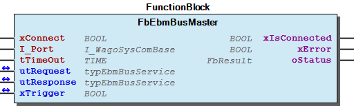

# WagoAppSerial_ebmBus v1.6.2.1 (WAGO) - Complete Documentation


## 📋 Library Information

- **Company:** WAGO
- **Title:** WagoAppSerial_ebmBus
- **Version:** 1.6.2.1
- **Categories:** WAGO LayerView|App; Application; WAGO FunctionalView|Connectivity|Serial
- **Author:** WAGO / u010545
- **Placeholder:** WagoAppSerial_ebmBus

### Description ¶


This document is automatically generated.

Functionblocks for serial ebmBus communication.

This document is automatically generated. Functionblocks for serial ebmBus communication.

### Contents: ¶


Contents: - Documentation Index - Project Information - Library Information - Function Blocks - Program Organization - Global Variable Lists ErrorEbmBus (GVL) - VersionHistory (GVL) Other Components - 30 Visualisations - 80 Status - GlobalTextList (Text List) - ImagePool (Image Pool) - Images - Parameter (PARAMS) - eEbmCommand (ENUM) - eErrorEbmBus (ENUM) - typEbmBusService (STRUCT)

### Indices and tables ¶


Based on WagoAppSerial_ebmBus.library, last modified 29.05.2024, 20:38:00. LibDoc 3.5.16.10

© WAGO GmbH & Co. KG, Germany 2018 – All rights reserved. For the avoidance of doubt, this copyright notice does not only apply to the information above but also and primarily to the described library itself. Please note that third-party products are always mentioned without reference to intellectual property rights, including patents, utility models, designs and trademarks, accordingly the existence of such rights cannot be excluded. WAGO is a registered trademark of WAGO Verwaltungsgesellschaft mbH.

- File and Project Information - Library Reference Based on WagoAppSerial_ebmBus.library, last modified 29.05.2024, 20:38:00. LibDoc 3.5.16.10 © WAGO GmbH & Co. KG, Germany 2018 – All rights reserved. For the avoidance of doubt, this copyright notice does not only apply to the information above but also and primarily to the described library itself. Please note that third-party products are always mentioned without reference to intellectual property rights, including patents, utility models, designs and trademarks, accordingly the existence of such rights cannot be excluded. WAGO is a registered trademark of WAGO Verwaltungsgesellschaft mbH.

### Documentation Index


## WagoAppSerial_ebmBus Library Documentation


| Company: | WAGO |
| Title: | WagoAppSerial_ebmBus |
| Version: | 1.6.2.1 |
| Categories: | WAGO LayerView\|App; Application; WAGO FunctionalView\|Connectivity\|Serial |
| Author: | WAGO / u010545 |
| Placeholder: | WagoAppSerial_ebmBus |

### Description


This document is automatically generated.

Functionblocks for serial ebmBus communication.

This document is automatically generated. Functionblocks for serial ebmBus communication.

### Contents:


- 20 Program Organization Units FbEbmBusMaster (FB) - eEbmCommand (ENUM) - typEbmBusService (STRUCT) 30 Visualisations 80 Status - ErrorEbmBus (GVL) - eErrorEbmBus (ENUM) GlobalTextList (Text List) Images - ImagePool (Image Pool) Parameter (PARAMS) VersionHistory (GVL)

### Indices and tables


Based on WagoAppSerial_ebmBus.library, last modified 29.05.2024, 20:38:00. LibDoc 3.5.16.10

© WAGO GmbH & Co. KG, Germany 2018 – All rights reserved. For the avoidance of doubt, this copyright notice does not only apply to the information above but also and primarily to the described library itself. Please note that third-party products are always mentioned without reference to intellectual property rights, including patents, utility models, designs and trademarks, accordingly the existence of such rights cannot be excluded. WAGO is a registered trademark of WAGO Verwaltungsgesellschaft mbH.

- File and Project Information - Library Reference Based on WagoAppSerial_ebmBus.library, last modified 29.05.2024, 20:38:00. LibDoc 3.5.16.10 © WAGO GmbH & Co. KG, Germany 2018 – All rights reserved. For the avoidance of doubt, this copyright notice does not only apply to the information above but also and primarily to the described library itself. Please note that third-party products are always mentioned without reference to intellectual property rights, including patents, utility models, designs and trademarks, accordingly the existence of such rights cannot be excluded. WAGO is a registered trademark of WAGO Verwaltungsgesellschaft mbH.

### Project Information


## File and Project Information


| Scope | Name | Type | Content |
| --- | --- | --- | --- |
| FileHeader | libraryFile | string | WagoAppSerial_ebmBus.library |
| contentFile | doc.clean.json |
| productName | e!COCKPIT |
| creationDateTime | date | 29.05.2024, 20:38:04 |
| companyName | string | WAGO |
| ProjectInformation | LastModificationDateTime | date | 29.05.2024, 20:38:00 |
| Description | string | See: Description |
| Copyright | © WAGO Kontakttechnik GmbH & Co. KG, Germany 2018 – All rights reserved. |
| Author | WAGO / u010545 |
| AutoResolveUnbound | bool | True |
| Placeholder | string | WagoAppSerial_ebmBus |
| Company | WAGO |
| DocFormat | reStructuredText |
| Project | WagoAppSerial_ebmBus |
| DefaultNamespace |  |
| Version | version | 1.6.2.1 |
| Title | string | WagoAppSerial_ebmBus |
| LibraryCategories | library-category-list | WAGO LayerView\|App; Application; WAGO FunctionalView\|Connectivity\|Serial |
| CompiledLibraryCompatibilityVersion | string | CODESYS V3.5 SP16 Patch 3 |

### Library Information


## Library Reference


| LinkAllContent: False QualifiedOnly: False | SystemLibrary: False | Optional: False |

| LinkAllContent: False QualifiedOnly: False | SystemLibrary: False | Optional: False |

| LinkAllContent: False Optional: False | QualifiedOnly: False SystemLibrary: False | PublishSymbolsInContainer: True |

| LinkAllContent: False QualifiedOnly: False | SystemLibrary: True | Optional: False |

| LinkAllContent: False QualifiedOnly: False | SystemLibrary: True | Optional: False |

| LinkAllContent: False QualifiedOnly: False | SystemLibrary: True | Optional: False |

| LinkAllContent: False QualifiedOnly: False | SystemLibrary: True | Optional: False |

| LinkAllContent: False QualifiedOnly: False | SystemLibrary: True | Optional: False |

| LinkAllContent: False QualifiedOnly: False | SystemLibrary: True | Optional: False |

| LinkAllContent: False QualifiedOnly: False | SystemLibrary: True | Optional: False |

| LinkAllContent: False QualifiedOnly: False | SystemLibrary: True | Optional: False |

| LinkAllContent: False QualifiedOnly: False | SystemLibrary: True | Optional: False |

| LinkAllContent: False QualifiedOnly: False | SystemLibrary: True | Optional: False |

| LinkAllContent: False QualifiedOnly: False | SystemLibrary: True | Optional: False |

| LinkAllContent: False Optional: False | QualifiedOnly: False SystemLibrary: True | PublishSymbolsInContainer: True |

| LinkAllContent: False QualifiedOnly: False | SystemLibrary: True | Optional: False |

| LinkAllContent: False QualifiedOnly: True | SystemLibrary: False | Optional: False |

| LinkAllContent: False QualifiedOnly: True | SystemLibrary: False | Optional: False |

| LinkAllContent: False QualifiedOnly: False | SystemLibrary: False | Optional: False |

| LinkAllContent: False QualifiedOnly: False | SystemLibrary: False | Optional: False |

| LinkAllContent: False Optional: False | QualifiedOnly: False SystemLibrary: False | PublishSymbolsInContainer: True |

| LinkAllContent: False QualifiedOnly: False | SystemLibrary: False | Optional: False |

This is a dictionary of all referenced libraries and their name spaces.

This is a dictionary of all referenced libraries and their name spaces. Standard Library Identification : Placeholder: Standard Default Resolution: Standard, * (System) Namespace: Standard Library Properties : SysMem Library Identification : Placeholder: SysMem Default Resolution: SysMem, * (System) Namespace: SysMem Library Properties : VisuDialogs Library Identification : Placeholder: VisuDialogs Default Resolution: VisuDialogs, * (System) Namespace: VisuDialogs Library Properties : VisuElem3DPath Library Identification : Placeholder: System_VisuElem3DPath Default Resolution: VisuElem3DPath, 3.5.10.0 (System) Namespace: VisuElem3DPath Library Properties : Library Parameter : Parameter: GC_POINTS_PER_POLYGON = 100 VisuElemCamDisplayer Library Identification : Placeholder: System_VisuElemCamDisplayer Default Resolution: VisuElemCamDisplayer, 3.5.10.0 (System) Namespace: VisuElemCamDisplayer Library Properties : Library Parameter : Parameter: GC_POINTS_PER_CAM = 100 VisuElemMeter Library Identification : Placeholder: System_VisuElemMeter Default Resolution: VisuElemMeter, 3.5.10.0 (System) Namespace: VisuElemMeter Library Properties : VisuElemTextEditor Library Identification : Placeholder: System_VisuElemTextEditor Default Resolution: VisuElemTextEditor, 3.5.10.0 (System) Namespace: VisuElemTextEditor Library Properties : VisuElemTrace Library Identification : Placeholder: System_VisuElemTrace Default Resolution: VisuElemTrace, 3.5.10.0 (System) Namespace: VisuElemTrace Library Properties : VisuElemXYChart Library Identification : Placeholder: System_VisuElemXYChart Default Resolution: VisuElemXYChart, 3.5.16.30 (System) Namespace: VisuElemXYChart Library Properties : VisuElems Library Identification : Placeholder: System_VisuElems Default Resolution: VisuElems, 3.5.10.0 (System) Namespace: VisuElems Library Properties : VisuElemsAlarm Library Identification : Placeholder: System_VisuElemsAlarm Default Resolution: VisuElemsAlarm, 3.5.10.0 (System) Namespace: VisuElemsAlarm Library Properties : VisuElemsDateTime Library Identification : Placeholder: System_VisuElemsDateTime Default Resolution: VisuElemsDateTime, 3.5.10.0 (System) Namespace: VisuElemsDateTime Library Properties : VisuElemsSpecialControls Library Identification : Placeholder: System_VisuElemsSpecialControls Default Resolution: VisuElemsSpecialControls, 3.5.10.0 (System) Namespace: VisuElemsSpecialControls Library Properties : VisuElemsWinControls Library Identification : Placeholder: System_VisuElemsWinControls Default Resolution: VisuElemsWinControls, 3.5.10.0 (System) Namespace: VisuElemsWinControls Library Properties : VisuInputs Library Identification : Placeholder: system_visuinputs Default Resolution: VisuInputs, 3.5.16.30 (System) Namespace: visuinputs Library Properties : VisuNativeControl Library Identification : Placeholder: System_VisuNativeControl Default Resolution: VisuNativeControl, 3.5.10.0 (System) Namespace: VisuNativeControl Library Properties : VisuSymbols Library Identification : Name: VisuSymbols Version: newest Company: System Namespace: VisuSymbols Library Properties : WagoAppCom Library Identification : Placeholder: WagoAppCom Default Resolution: WagoAppCom, * (WAGO) Namespace: WagoAppCom Library Properties : Library Parameter : Parameter: CUIDEFAULTSYSTEMBUFFERSIZE = 1028 WagoSysErrorBase Library Identification : Placeholder: WagoSysErrorBase Default Resolution: WagoSysErrorBase, * (WAGO) Namespace: WagoSysErrorBase Library Properties : Library Parameter : Parameter: RES_LOG_MAX_FILESIZE = 2000 Parameter: RES_LOG_MAX_FILES = 1 Parameter: RES_LOG_MAX_ENTRIES = 200 Parameter: RES_LOG_NAME = ‘WagoAppResultLogger’ WagoSysVersion Library Identification : Name: WagoSysVersion Version: 1.0.0.0 Company: WAGO Namespace: WagoSysVersion Library Properties : WagoTypesCom Library Identification : Placeholder: WagoTypesCom Default Resolution: WagoTypesCom, * (WAGO) Namespace: WagoTypesCom Library Properties : WagoTypesErrorBase Library Identification : Placeholder: WagoTypesErrorBase Default Resolution: WagoTypesErrorBase, * (WAGO) Namespace: WagoTypesErrorBase Library Properties :

### Function Blocks


## FbEbmBusMaster (FB)


| Scope | Name | Type | Initial | Comment |
| --- | --- | --- | --- | --- |
| Input | xConnect | BOOL |  |  |
| I_Port | WagoTypesCom.I_WagoSysComBase |  | Name of the Interface (e.g. ‘COM1’, ‘SER7.2’, ) |
| tTimeOut | TIME | TIME#80ms |  |
| Output | xIsConnected | BOOL |  |  |
| xError | BOOL |  |  |
| oStatus | WagoSysErrorBase.FbResult |  |  |
| Inout | utRequest | typEbmBusService |  |  |
| utResponse | typEbmBusService |  |  |
| xTrigger | BOOL |  | this variable starts a job. it would be reset by this fb if the job is done |

```
VAR
    myMaster    :   FbEbmBusMaster := (xConnect := TRUE);
    myTrigger   :   BOOL;
    myRequest   :   typEbmBusService := (   eCommand    := eEbmCommand.SET_TARGET_SPEED,
                                            bFanAddress := 1,
                                            bFanGroup   := 1,
                                            bDataCount  := 1,       // one parameter follows
                                            aData       := [16#00]  // speed 0..100%
                                        );
    myResponse  :   typEbmBusService;

    myDoItEvent :   BOOL; // this is my signal to start the job
    myEventFlk  :   BOOL; // helper for detect a rising edge of myDoItEvent

END_VAR

myDoItEvent := // place here your code for your event ....

// detect a rising edge of myDoItEvent and set xTrigger ---
myTrigger S= myDoItEvent AND NOT myEventFlk;
myEventFlk := myDoItEvent;
//---------------------------------------------------------

//--- call the master cyclic -------------------------------------------------
myMaster(   I_Port          := my750_652, // the name of the used serial port
            utRequest       := myRequest,
            utResponse      := myResponse,
            xTrigger        := myTrigger,
            tTimeOut        := T#70MS,

            xIsConnected    => ,
            xError          => ,
            oStatus         =>
        );
//----------------------------------------------------------------------------

IF NOT myTrigger AND myDoItEvent THEN // the job is done

    IF myMaster.xError THEN // ERROR

        // handle the error -> ask myMaster.oStatus for more information

    ELSE // OK

        // get the result from utResponse

    END_IF

END_IF
```

You have to call the FbEbmBusMaster cyclic.

Graphical Illustration

Graphical Interface of FbEbmBusMaster

Interface variables Function This function block supports the control of ebmBus slaves. To use this functions you have to fill the structure utRequest and after that to set xTrigger for once. If the job is done xTrigger will be reset automaticly by the function block and you should check xError . If no error occurs you can get the response at the structure utResponse . Otherwise you can ask oStatus for more information about the error. For the available services of your slave please read the manual of your slave. Note You have to call the FbEbmBusMaster cyclic. Graphical Illustration  Graphical Interface of FbEbmBusMaster Example For use the master to set the speed of one fan.

### Program Organization


## 20 Program Organization Units


- FbEbmBusMaster (FB) - eEbmCommand (ENUM) - typEbmBusService (STRUCT)

### Global Variable Lists


## ErrorEbmBus (GVL)


| Scope | Name | Type |
| --- | --- | --- |
| Constant | ERROR_ebmBus | ARRAY [0..8] OF WagoTypesErrorBase.typResultItem |

| Value | Level | Description |
| --- | --- | --- |
| eErrorEbmBus.OK | WagoTypesErrorBase.eSeverity.none | ‘OK’ |
| eErrorEbmBus.UNSUPPORTED_COMMAND | WagoTypesErrorBase.eSeverity.error | ‘Command not supported’ |
| eErrorEbmBus.INVALID_FAN_ADDRESS | WagoTypesErrorBase.eSeverity.error | ‘Invalid Fan Address’ |
| eErrorEbmBus.INVALID_GROUP_ADDRESS | WagoTypesErrorBase.eSeverity.error | ‘Invalid Group Address’ |
| eErrorEbmBus.INVALID_DATA_COUNT | WagoTypesErrorBase.eSeverity.error | ‘Invalid Data Count’ |
| eErrorEbmBus.RESPONSE_CRC | WagoTypesErrorBase.eSeverity.error | ‘Error response crc ‘ |
| eErrorEbmBus.RESPONSE_DATA | WagoTypesErrorBase.eSeverity.error | ‘Error response data’ |
| eErrorEbmBus.MAX_DATA_TO_SMALL | WagoTypesErrorBase.eSeverity.error | ‘response data are biger than the parameter EBM_MAX_DATA’ |
| eErrorEbmBus.TIME_OUT | WagoTypesErrorBase.eSeverity.error | ‘Time Out’ |

## VersionHistory (GVL)


| Name | Type |
| --- | --- |
| Info | ProjectInfo |

| date | version | author | change |
| 05.04.2024 | 1.6.2.1 | u0103719 | reset placeholder to * (VisuSymbols) |
| 08.01.2019 | 1.6.2.0 | u015842 | Properties: free placeholder added |
| 03.05.2017 | 1.6.1.0 | u010545 | WagoTypesCom_internal removed |
| 05.07.2016 | 1.6.0.1 | u010545 | createtable error table |
| 02.03.2016 | 1.6.0.0 | u010545 | WagoAppErrorBase changed to WagoSysErrorBase / WagoTypesErrorBase |
| 02.02.2016 | 1.5.0.2 | u010545 | WagoSysIcon removed |
| 19.01.2016 | 1.5.0.1 | u010545 | VersionHistory -> always bind |
| 28.09.2015 | 0.0.0.1 | u010545 | created |

WagoAppSerial_ebmBus

### Other Components


## 30 Visualisations ¶


## 80 Status ¶


- ErrorEbmBus (GVL) - eErrorEbmBus (ENUM)

## GlobalTextList (Text List) ¶


## ImagePool (Image Pool)


| ID | File name | Image | Link type |
| --- | --- | --- | --- |
| logo | logo.png |  | Embedded |

## Images ¶


- ImagePool (Image Pool)

## Parameter (PARAMS)


| Scope | Name | Type | Initial | Comment |
| --- | --- | --- | --- | --- |
| Constant | EBM_MAX_DATA | INT | 2 | max. data fields |
| EBM_MAX_JOBS | INT | 3 | Max. quantity of jobs in a joblist |

## eEbmCommand (ENUM)


| Name | Initial | Comment |
| --- | --- | --- |
| GET_STATUS | 0 | possible with broadcast address as service request |
| GET_ACTUAL_SPEED | 1 | not possible with broadcast |
| SET_TARGET_SPEED | 2 | possible as broadcast too |
| SOFTWARE_RESET | 3 | possible as broadcast too |
| WRITE_EEPROM | 6 | possible as broadcast too |
| READ_EEPROM | 7 | not possible with broadcast |

## eErrorEbmBus (ENUM)


| Name | Initial | Comment |
| --- | --- | --- |
| OK | 0 |  |
| UNSUPPORTED_COMMAND | 16#1 |  |
| INVALID_FAN_ADDRESS | 16#2 |  |
| INVALID_GROUP_ADDRESS | 16#3 |  |
| INVALID_DATA_COUNT | 16#4 | invalid data count for the requested service |
| RESPONSE_CRC | 16#11 |  |
| RESPONSE_DATA | 16#12 |  |
| MAX_DATA_TO_SMALL | 16#13 | response data are biger than const EBM_MAX_DATA |
| TIME_OUT | 16#99 |  |

## typEbmBusService (STRUCT)


| Name | Type |
| --- | --- |
| eCommand | eEbmCommand |
| bFanAddress | BYTE |
| bFanGroup | BYTE |
| bDataCount | BYTE |
| aData | ARRAY [1..EBM_MAX_DATA] OF BYTE |