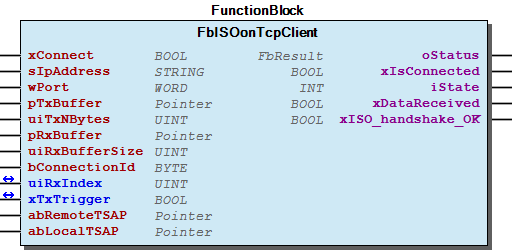
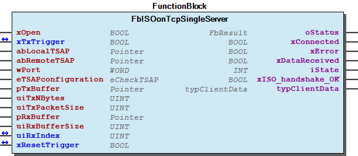
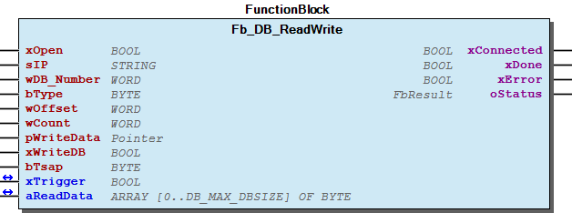

# WagoAppSiemensS7Protocol v1.7.0.4 (WAGO) - Complete Documentation

## 📋 Library Information

- **Company:** WAGO
- **Title:** WagoAppSiemensS7Protocol
- **Version:** 1.7.0.4
- **Categories:** WAGO LayerView|App; Application
- **Author:** Wago/u010663
- **Placeholder:** WagoAppSiemensS7Protocol

### Description ¶

This document is automatically generated.

Data exchange with a Siemens plc

This document is automatically generated. Data exchange with a Siemens plc

### Contents: ¶

Contents: - Documentation Index - Project Information - Library Information - Function Blocks FbISOonTcpClient (FB) - FbISOonTcpSingleServer (FB) - Fb_DB_ReadWrite (FB) Functions - Fu_DB_DWORD_READ_S7_TO_CoDeSys (FUN) - Fu_DB_DWORD_WRITE_CoDeSys_TO_S7 (FUN) - Fu_DB_REAL_READ_S7_TO_CoDeSys (FUN) - Fu_DB_REAL_WRITE_CoDeSys_TO_S7 (FUN) - Fu_DB_REAL_WRITE_CoDeSys_TO_S7_2 (FUN) - Fu_DB_WORD_READ_S7_TO_CoDeSys (FUN) - Fu_DB_WORD_WRITE_CoDeSys_TO_S7 (FUN) Methods Program Organization Global Variable Lists - ErrorIsoSocket (GVL) - Status (GVL) - VersionHistory (GVL) Other Components - 29 Data types - 80 Status - DataConversion - ISOonTCP - ParameterList (PARAMS) - eStatus (ENUM) - eStatusISOSocket (ENUM) - typClientData (STRUCT)

### Indices and tables ¶

Based on WagoAppSiemensS7Protocol.library, last modified 29.05.2024, 20:39:18. LibDoc 3.5.16.10

© WAGO GmbH & Co. KG, Germany 2018 – All rights reserved. For the avoidance of doubt, this copyright notice does not only apply to the information above but also and primarily to the described library itself. Please note that third-party products are always mentioned without reference to intellectual property rights, including patents, utility models, designs and trademarks, accordingly the existence of such rights cannot be excluded. WAGO is a registered trademark of WAGO Verwaltungsgesellschaft mbH.

- File and Project Information - Library Reference Based on WagoAppSiemensS7Protocol.library, last modified 29.05.2024, 20:39:18. LibDoc 3.5.16.10 © WAGO GmbH & Co. KG, Germany 2018 – All rights reserved. For the avoidance of doubt, this copyright notice does not only apply to the information above but also and primarily to the described library itself. Please note that third-party products are always mentioned without reference to intellectual property rights, including patents, utility models, designs and trademarks, accordingly the existence of such rights cannot be excluded. WAGO is a registered trademark of WAGO Verwaltungsgesellschaft mbH.

### Documentation Index

## WagoAppSiemensS7Protocol Library Documentation

| Company: | WAGO |
| Title: | WagoAppSiemensS7Protocol |
| Version: | 1.7.0.4 |
| Categories: | WAGO LayerView\|App; Application |
| Author: | Wago/u010663 |
| Placeholder: | WagoAppSiemensS7Protocol |

### Description

This document is automatically generated.

Data exchange with a Siemens plc

This document is automatically generated. Data exchange with a Siemens plc

### Contents:

- 20 Program Organization Units DataConversion - Fb_DB_ReadWrite (FB) - ISOonTCP 80 Status - ErrorIsoSocket (GVL) - Status (GVL) - eStatus (ENUM) - eStatusISOSocket (ENUM) ParameterList (PARAMS) VersionHistory (GVL)

### Indices and tables

Based on WagoAppSiemensS7Protocol.library, last modified 29.05.2024, 20:39:18. LibDoc 3.5.16.10

© WAGO GmbH & Co. KG, Germany 2018 – All rights reserved. For the avoidance of doubt, this copyright notice does not only apply to the information above but also and primarily to the described library itself. Please note that third-party products are always mentioned without reference to intellectual property rights, including patents, utility models, designs and trademarks, accordingly the existence of such rights cannot be excluded. WAGO is a registered trademark of WAGO Verwaltungsgesellschaft mbH.

- File and Project Information - Library Reference Based on WagoAppSiemensS7Protocol.library, last modified 29.05.2024, 20:39:18. LibDoc 3.5.16.10 © WAGO GmbH & Co. KG, Germany 2018 – All rights reserved. For the avoidance of doubt, this copyright notice does not only apply to the information above but also and primarily to the described library itself. Please note that third-party products are always mentioned without reference to intellectual property rights, including patents, utility models, designs and trademarks, accordingly the existence of such rights cannot be excluded. WAGO is a registered trademark of WAGO Verwaltungsgesellschaft mbH.

### Project Information

## File and Project Information

| Scope | Name | Type | Content |
| --- | --- | --- | --- |
| FileHeader | libraryFile | string | WagoAppSiemensS7Protocol.library |
| contentFile | doc.clean.json |
| productName | e!COCKPIT |
| creationDateTime | date | 29.05.2024, 20:39:19 |
| companyName | string | WAGO |
| ProjectInformation | LastModificationDateTime | date | 29.05.2024, 20:39:18 |
| Description | string | See: Description |
| Copyright | © WAGO Kontakttechnik GmbH & Co. KG, Germany 2018 – All rights reserved. |
| Author | Wago/u010663 |
| AutoResolveUnbound | bool | True |
| Placeholder | string | WagoAppSiemensS7Protocol |
| Company | WAGO |
| DocFormat | reStructuredText |
| Project | WagoAppSiemensS7Protocol |
| Version | version | 1.7.0.4 |
| Version string | string |  |
| Title | WagoAppSiemensS7Protocol |
| LibraryCategories | library-category-list | WAGO LayerView\|App; Application |
| CompiledLibraryCompatibilityVersion | string | CODESYS V3.5 SP16 Patch 3 |

### Library Information

## Library Reference

| LinkAllContent: False QualifiedOnly: False | SystemLibrary: False | Optional: False |

| LinkAllContent: False QualifiedOnly: False | SystemLibrary: False | Optional: False |

| LinkAllContent: False QualifiedOnly: False | SystemLibrary: False | Optional: False |

| LinkAllContent: False QualifiedOnly: False | SystemLibrary: False | Optional: False |

| LinkAllContent: False QualifiedOnly: False | SystemLibrary: False | Optional: False |

| LinkAllContent: False QualifiedOnly: False | SystemLibrary: False | Optional: False |

| LinkAllContent: False QualifiedOnly: False | SystemLibrary: False | Optional: False |

| LinkAllContent: False QualifiedOnly: False | SystemLibrary: False | Optional: False |

| LinkAllContent: False QualifiedOnly: False | SystemLibrary: False | Optional: False |

| LinkAllContent: False Optional: False | QualifiedOnly: False SystemLibrary: False | PublishSymbolsInContainer: True |

This is a dictionary of all referenced libraries and their name spaces.

This is a dictionary of all referenced libraries and their name spaces. CmpErrors2 Interfaces Library Identification : Name: CmpErrors2 Interfaces Version: newest Company: System Namespace: CmpErrors Library Properties : Standard Library Identification : Placeholder: Standard Default Resolution: Standard, * (System) Namespace: Standard Library Properties : SysTypes2 Interfaces Library Identification : Name: SysTypes2 Interfaces Version: newest Company: System Namespace: SysTypes Library Properties : WagoAppSocket Library Identification : Placeholder: WagoAppSocket Default Resolution: WagoAppSocket, * (WAGO) Namespace: WagoAppSocket Library Properties : Library Parameter : Parameter: ASYNC_MODE = WagoTypes.eSchedulingMode.Background Parameter: UIMULTICONNECT_NINSTANCELISTSIZE = 20 Parameter: UIBACKLOGDEFAULT = 5 Parameter: TMULTICONNECT_TIMEOUT = TIME#0ms WagoSysAsync Library Identification : Placeholder: WagoSysAsync Default Resolution: WagoSysAsync, * (WAGO) Namespace: WagoSysAsync Library Properties : WagoSysBSDSocket Library Identification : Placeholder: WagoSysBSDSocket Default Resolution: WagoSysBSDSocket, * (WAGO) Namespace: WagoSysBSDSocket Library Properties : WagoSysErrorBase Library Identification : Placeholder: WagoSysErrorBase Default Resolution: WagoSysErrorBase, * (WAGO) Namespace: WagoSysErrorBase Library Properties : Library Parameter : Parameter: RES_LOG_MAX_FILESIZE = 2000 Parameter: RES_LOG_MAX_FILES = 1 Parameter: RES_LOG_MAX_ENTRIES = 200 Parameter: RES_LOG_NAME = ‘WagoAppResultLogger’ WagoSysString Library Identification : Placeholder: WagoSysString Default Resolution: WagoSysString, * (WAGO) Namespace: WagoSysString Library Properties : WagoSysVersion Library Identification : Name: WagoSysVersion Version: 1.0.0.0 Company: WAGO Namespace: WagoSysVersion Library Properties : WagoTypesErrorBase Library Identification : Placeholder: WagoTypesErrorBase Default Resolution: WagoTypesErrorBase, * (WAGO) Namespace: WagoTypesErrorBase Library Properties :

### Function Blocks

## FbISOonTcpClient (FB)

| Scope | Name | Type | Initial | Comment |
| --- | --- | --- | --- | --- |
| Input | xConnect | BOOL |  | On rising edge, connecting, on falling edge, disconnecting |
| sIpAddress | STRING |  | Server Ip address |
| wPort | WORD | 102 | Server Port (default : 102) |
| pTxBuffer | POINTER TO ARRAY [0..MAX_ISO_PAYLOAD] OF BYTE |  | Only Payload, header will be added by function block |
| uiTxNBytes | UINT |  | Number of bytes to be transmitted |
| pRxBuffer | POINTER TO ARRAY [0..MAX_ISO_PAYLOAD] OF BYTE |  | Pointer to the received data buffer |
| uiRxBufferSize | UINT |  | Size of the receive buffer. Use Sizeof operator recommended. |
| bConnectionId | BYTE |  | Maybe used to identify the connection |
| Inout | uiRxIndex | UINT |  | Indicates the next free entry in the receive buffer |
| xTxTrigger | BOOL |  | TRUE => Send data to server |
| Input | abRemoteTSAP | POINTER TO BYTE |  | remote TSAP |
| abLocalTSAP | POINTER TO BYTE |  | local TSAP |
| Output | oStatus | WagoSysErrorBase.FbResult |  | Status |
| xIsConnected | BOOL |  | TRUE => Connected to the server |
| iState | INT |  | 50:allow transmitting data, 55:wait for data acknowledge |
| xDataReceived | BOOL |  | TRUE => New data |
| xISO_handshake_OK | BOOL |  | ISO connection succesful setup |

This is an ISO On-TCP client

Graphical Illustration

Graphical Interface of FbISOonTcpClient

Function Description

This function block acts as a client for an ISO On-TCP connection supporting class 0. Once a data message has arrived the output xDataReceived will be set for one cycle. The size of the data is displayed by uiRxIndex .It is recommended to set this variable to zero once the data has been processed. New data will always start in the receive buffer by index uiRxIndex . Using input xTxTrigger it is possible to transmit data from the client to the server. The variable xTxTrigger will be reset after an acknowledge from the server is received. Only than new data may be send.

TPDU size is always 1024 byte.

Interface variables Function This is an ISO On-TCP client Graphical Illustration  Graphical Interface of FbISOonTcpClient Function Description This function block acts as a client for an ISO On-TCP connection supporting class 0. Once a data message has arrived the output xDataReceived will be set for one cycle. The size of the data is displayed by uiRxIndex .It is recommended to set this variable to zero once the data has been processed. New data will always start in the receive buffer by index uiRxIndex . Using input xTxTrigger it is possible to transmit data from the client to the server. The variable xTxTrigger will be reset after an acknowledge from the server is received. Only than new data may be send. Note TPDU size is always 1024 byte.

## FbISOonTcpSingleServer (FB)

| Scope | Name | Type | Initial | Comment |
| --- | --- | --- | --- | --- |
| Input | xOpen | BOOL |  | Activate the server |
| Inout | xTxTrigger | BOOL |  | Transmitt data to the client. |
| Input | abLocalTSAP | POINTER TO BYTE |  | local TSAP |
| abRemoteTSAP | POINTER TO BYTE |  | remote TSAP |
| wPort | WORD | 102 | Port on which this server is listening |
| eTSAPconfiguration | eCheckTSAP |  | mode how to handle the TSAP information |
| pTxBuffer | POINTER TO ARRAY [0..65535] OF BYTE |  | Data to send |
| uiTxNBytes | UINT |  | Amount of data to send. Just user data since the header data is added internally by this server |
| uiTxPacketSize | UINT |  | the total amount will be sent in smaller packets defined by this input.If 0 than max TPDU size will be used |
| pRxBuffer | POINTER TO ARRAY [0..MAX_ISO_PAYLOAD] OF BYTE |  | User Data received. Header is internally removed |
| uiRxBufferSize | UINT |  | Size of the receive buffer.Use Sizeof operator recommended. |
| Inout | uiRxIndex | UINT |  | Indicates the next free entry in the receive buffer |
| xResetTrigger | BOOL |  | Some error situations may be solved by this input. Use is indicated by output oStatus . |
| Output | oStatus | FbResult |  | Status |
| xConnected | BOOL |  | A client has been detected and a TCP connection is setuo |
| xError | BOOL |  | An error occured |
| xDataReceived | BOOL |  | A data message has been received |
| iState | INT |  | 10:wait for client,50:allow transmitting data, 55:wait for data acknowledge |
| xISO_handshake_OK | BOOL |  | ISO connection succesful setup |
| typClientData | typClientData |  | Details about the connected client |

This is an ISO OnTCP server

Graphical Illustration

Graphical Interface of FbISOonTcpSingleServer

Function Description

This function block acts as a server for a ISO OnTCP connection.

The server starts waiting for clients, if the input xOpen is set to TRUE. The server can handle one connection. Using input xTxTrigger it is possible to transmit data from the server to the client. The variable xTxTrigger will be reset after an acknowledge from the client is received. Only than new data may be send. Once a data message has arrived the output xDataReceived will be set for one cycle. The size of the data is displayed by uiRxIndex .It is recommended to set this variable to zero once the data has been processed. New data will always start in the receive buffer by index uiRxIndex .

Interface variables Function This is an ISO OnTCP server Graphical Illustration  Graphical Interface of FbISOonTcpSingleServer Function Description This function block acts as a server for a ISO OnTCP connection. The server starts waiting for clients, if the input xOpen is set to TRUE. The server can handle one connection. Using input xTxTrigger it is possible to transmit data from the server to the client. The variable xTxTrigger will be reset after an acknowledge from the client is received. Only than new data may be send. Once a data message has arrived the output xDataReceived will be set for one cycle. The size of the data is displayed by uiRxIndex .It is recommended to set this variable to zero once the data has been processed. New data will always start in the receive buffer by index uiRxIndex . - FbISOonTcpSingleServer.Fb_Exit (METH)

## Fb_DB_ReadWrite (FB)

| Scope | Name | Type | Comment |
| --- | --- | --- | --- |
| Input | xOpen | BOOL | Open connection to S7 plc |
| sIP | STRING | IP address of the S7 plc |
| wDB_Number | WORD | DB number in S7 plc,e.g. DB2->2 |
| bType | BYTE | Access type: 2=Byte,4=Word,6=DWORD,8=REAL |
| wOffset | WORD | Offset within the DB,e.g. DBW4->4, counting in Bytes |
| wCount | WORD | Amount of data for read or write command, counting in bType units |
| pWriteData | POINTER TO ARRAY [0..65535] OF BYTE | Pointer to the data which should be written in case of write commands |
| xWriteDB | BOOL | Differentiates between read and write commands ->False:read, True:write |
| bTsap | BYTE | 0:=CPU,2=CP on slot 4 |
| Inout | xTrigger | BOOL | Execute command. Will be reset by function block |
| aReadData | ARRAY [0..DB_MAX_DBSIZE] OF BYTE | Variable to store received data in case of read commands |
| Output | xConnected | BOOL | Connection to the S7 is established |
| xDone | BOOL | Job successful executed |
| xError | BOOL | Job with error executed |
| oStatus | WagoSysErrorBase.FbResult | Detailed Status information |

Data transfer according to S7 protocol

Graphical Illustration

Function Description

This function block allows to read and write data from a Siemens plc. The maximum amount of data is 200 Byte.

The received data will be stored in aReadData. The outputs display either successful execution of the command or error details.

oStatus: aReadData array too small->Increase the global constant DB_MAX_DBSIZE in the parameter list

Server response error.DB data invalid->the DB in the plc is either not available or the area withhin the DB is too large(DB size is 10 byte and a read command asks for 15 bytes)

MAX_SEND_TCP_CLIENT_ToSmall->reduce wDB_Length or increase global constant DB_MAX_DBSIZE

Write command failed ->the DB in the plc is either not available or the area withhin the DB is too large

Example 1: Read 3 word from DB10.DBW8

-wDB_Number=10

-xWriteDB=FALSE

The data from the Siemens plc will be copied to the variable aReadData. The function Fu_DB_WORD_READ_S7_TO_CoDeSys may be used to convert the value from S7 to CoDeSys.

Example 2: Write 5 bytes to DB7.DBB4

-wDB_Number=7

-xWriteDB=TRUE

The data which should be written has to be placed at the input pWriteData=adr(WriteData) (WriteData:ARRAY[0..4] OF Byte).

Example 3: Write 2 real to DB7.DBD0 and DB7.DBD4

-wDB_Number=7

-bType=6 (handle real like dword)

-xWriteDB=TRUE

The data which should be written has to be placed at the input pWriteData=adr(WriteData) (WriteData:ARRAY[0..1] OF REAL). Please use Fu_DB_REAL_WRITE_CoDeSys_TO_S7 to convert the real variable: WriteData[0]:= Fu_DB_REAL_WRITE_CoDeSys_TO_S7(myReal1) WriteData[1]:= Fu_DB_REAL_WRITE_CoDeSys_TO_S7(myReal2)

Interface variables Function Data transfer according to S7 protocol Graphical Illustration  Function Description This function block allows to read and write data from a Siemens plc. The maximum amount of data is 200 Byte. The received data will be stored in aReadData. The outputs display either successful execution of the command or error details. oStatus: aReadData array too small->Increase the global constant DB_MAX_DBSIZE in the parameter list Server response error.DB data invalid->the DB in the plc is either not available or the area withhin the DB is too large(DB size is 10 byte and a read command asks for 15 bytes) MAX_SEND_TCP_CLIENT_ToSmall->reduce wDB_Length or increase global constant DB_MAX_DBSIZE Write command failed ->the DB in the plc is either not available or the area withhin the DB is too large ..note: Using Siemens TIA Portal may need the following settings In the DB preferences the ‘Optimized block access’ has to be disabled. Depending on the PLC, e.g. a S7-1200, the ‘Permit access with PUT/GET communication from remote partner’ has to be enabled in the PLC preferences under ‘Protection’. Examples Example 1: Read 3 word from DB10.DBW8 -wDB_Number=10 -bType=4 -wOffset=8 -wCount=3 -xWriteDB=FALSE The data from the Siemens plc will be copied to the variable aReadData. The function Fu_DB_WORD_READ_S7_TO_CoDeSys may be used to convert the value from S7 to CoDeSys. Example 2: Write 5 bytes to DB7.DBB4 -wDB_Number=7 -bType=2 -wOffset=4 -wCount=5 -xWriteDB=TRUE The data which should be written has to be placed at the input pWriteData=adr(WriteData) (WriteData:ARRAY[0..4] OF Byte). Example 3: Write 2 real to DB7.DBD0 and DB7.DBD4 -wDB_Number=7 -bType=6 (handle real like dword) -wOffset=0 -wCount=2 -xWriteDB=TRUE The data which should be written has to be placed at the input pWriteData=adr(WriteData) (WriteData:ARRAY[0..1] OF REAL). Please use Fu_DB_REAL_WRITE_CoDeSys_TO_S7 to convert the real variable: WriteData[0]:= Fu_DB_REAL_WRITE_CoDeSys_TO_S7(myReal1) WriteData[1]:= Fu_DB_REAL_WRITE_CoDeSys_TO_S7(myReal2)

### Functions

## Fu_DB_DWORD_READ_S7_TO_CoDeSys (FUN)

| Scope | Name | Type |
| --- | --- | --- |
| Return | Fu_DB_DWORD_READ_S7_TO_CoDeSys | DWORD |
| Input | pIn | POINTER TO ARRAY [0..3] OF BYTE |

## Fu_DB_DWORD_WRITE_CoDeSys_TO_S7 (FUN)

| Scope | Name | Type |
| --- | --- | --- |
| Return | Fu_DB_DWORD_WRITE_CoDeSys_TO_S7 | DWORD |
| Input | dwIn | DWORD |

## Fu_DB_REAL_READ_S7_TO_CoDeSys (FUN)

| Scope | Name | Type |
| --- | --- | --- |
| Return | Fu_DB_REAL_READ_S7_TO_CoDeSys | REAL |
| Input | pIn | POINTER TO ARRAY [0..3] OF BYTE |

## Fu_DB_REAL_WRITE_CoDeSys_TO_S7 (FUN)

| Scope | Name | Type |
| --- | --- | --- |
| Return | Fu_DB_REAL_WRITE_CoDeSys_TO_S7 | REAL |
| Input | rIn | REAL |

## Fu_DB_REAL_WRITE_CoDeSys_TO_S7_2 (FUN)

| Scope | Name | Type |
| --- | --- | --- |
| Return | Fu_DB_REAL_WRITE_CoDeSys_TO_S7_2 | ARRAY [0..3] OF BYTE |
| Input | rIn | REAL |

## Fu_DB_WORD_READ_S7_TO_CoDeSys (FUN)

| Scope | Name | Type |
| --- | --- | --- |
| Return | Fu_DB_WORD_READ_S7_TO_CoDeSys | WORD |
| Input | pIn | POINTER TO ARRAY [0..1] OF BYTE |

## Fu_DB_WORD_WRITE_CoDeSys_TO_S7 (FUN)

| Scope | Name | Type |
| --- | --- | --- |
| Return | Fu_DB_WORD_WRITE_CoDeSys_TO_S7 | WORD |
| Input | wIn | WORD |

### Methods

## FbISOonTcpSingleServer.Fb_Exit (METH)

| Scope | Name | Type | Comment |
| --- | --- | --- | --- |
| Return | FB_Exit | BOOL |  |
| Input | bInCopyCode | BOOL | TRUE: the exit method is called in order to leave the instance which will be copied afterwards (online change). |

### Program Organization

## 20 Program Organization Units

- DataConversion Fu_DB_DWORD_READ_S7_TO_CoDeSys (FUN) - Fu_DB_DWORD_WRITE_CoDeSys_TO_S7 (FUN) - Fu_DB_REAL_READ_S7_TO_CoDeSys (FUN) - Fu_DB_REAL_WRITE_CoDeSys_TO_S7 (FUN) - Fu_DB_REAL_WRITE_CoDeSys_TO_S7_2 (FUN) - Fu_DB_WORD_READ_S7_TO_CoDeSys (FUN) - Fu_DB_WORD_WRITE_CoDeSys_TO_S7 (FUN) Fb_DB_ReadWrite (FB) ISOonTCP - 29 Data types typClientData (STRUCT) FbISOonTcpClient (FB) FbISOonTcpSingleServer (FB) - FbISOonTcpSingleServer.Fb_Exit (METH)

### Global Variable Lists

## ErrorIsoSocket (GVL)

| Scope | Name | Type |
| --- | --- | --- |
| Constant | ERROR_IsoSOCKET | ARRAY [0..63] OF WagoTypesErrorBase.typResultItem |

| Value | Level | Description |
| --- | --- | --- |
| eStatusISOSocket.NOT_CONNECTED | WagoTypesErrorBase.eSeverity.none | ‘Not Connected’ |
| eStatusISOSocket.CONNECTED | WagoTypesErrorBase.eSeverity.info | ‘Connected’ |
| eStatusISOSocket.WAIT_FOR_DNS | WagoTypesErrorBase.eSeverity.info | ‘Retrieving IP address’ |
| eStatusISOSocket.WAIT_RESP | WagoTypesErrorBase.eSeverity.info | ‘Waiting for the handshake of server’ |
| eStatusISOSocket.BIND_FAILED | WagoTypesErrorBase.eSeverity.error | ‘Bind failed’ |
| eStatusISOSocket.WAIT_FOR_DT_RSP | WagoTypesErrorBase.eSeverity.info | ‘Wait for DT message response’ |
| eStatusISOSocket.MAX_CLIENTS_REACHED | WagoTypesErrorBase.eSeverity.info | ‘Maximum number of clients reached’ |
| eStatusISOSocket.REOPEN_NEEDED | WagoTypesErrorBase.eSeverity.error | ‘Try again ->disable xOpen’ |
| eStatusISOSocket.CLOSE_FROM_SERVER_RECEIVED | WagoTypesErrorBase.eSeverity.error | ‘Server closed connection’ |
| eStatusISOSocket.CLOSE_FROM_CLIENT_RECEIVED | WagoTypesErrorBase.eSeverity.error | ‘Client closed connection’ |
| eStatusISOSocket.RESET_NEEDED | WagoTypesErrorBase.eSeverity.error | ‘Try again ->xResetTriggger’ |
| ANY_TO_UINT(eStatusISOSocket.SERVER_TIMEOUT | WagoTypesErrorBase.eSeverity.error | ‘Server response timed out’ |
| ANY_TO_UINT(eStatusISOSocket.DNS_FAILED | WagoTypesErrorBase.eSeverity.error | ‘Failed to retrieve server IP address’ |
| ANY_TO_UINT(eStatusISOSocket.TSAP_CHECK_FAILED | WagoTypesErrorBase.eSeverity.error | ‘Could not verify TSAP configuration’ |
| ANY_TO_UINT(eStatusISOSocket.WAIT_FOR_CLIENT | WagoTypesErrorBase.eSeverity.info | ‘Wait for a client’ |
| ANY_TO_UINT(eStatusISOSocket.DT_ACKNOWLEDGE_FAILED | WagoTypesErrorBase.eSeverity.error | ‘No acknowledge for a DT message received’ |
| ANY_TO_UINT(eStatusISOSocket.UNKNOWN_TPDU_CMD | WagoTypesErrorBase.eSeverity.error | ‘TPDU command unknown’ |
| ANY_TO_UINT(eStatusISOSocket.UNKNOWN_MAX_TPDU_SIZE | WagoTypesErrorBase.eSeverity.error | ‘TPDU maximum size unknown’ |
| ANY_TO_UINT(eStatusISOSocket.NO_OPCODE | WagoTypesErrorBase.eSeverity.info | ‘No OpCode specified. Message not sent’ |
| ANY_TO_UINT(eStatusISOSocket.TOO_LONG | WagoTypesErrorBase.eSeverity.info | ‘Payload too long. Message not sent’ |
| ANY_TO_UINT(eStatusISOSocket.INVAL_CLOSE_CODE | WagoTypesErrorBase.eSeverity.info | ‘Incorrect closing code.Handshake not sent’ |
| ANY_TO_UINT(eStatusISOSocket.OK | WagoTypesErrorBase.eSeverity.info | ‘OK’ |
| ANY_TO_UINT(eStatusISOSocket.BAD_DATA | WagoTypesErrorBase.eSeverity.error | ‘Invalid message’ |
| ANY_TO_UINT(eStatusISOSocket.BAD_OPCODE | WagoTypesErrorBase.eSeverity.error | ‘Invalid opcode’ |
| ANY_TO_UINT(eCloseCode.ER_NOT_SPECIFIED | WagoTypesErrorBase.eSeverity.error | ‘TPDU-ERROR: Reason NOT specified’ |
| ANY_TO_UINT(eCloseCode.ER_INVALID_PARAMETER_CODE | WagoTypesErrorBase.eSeverity.error | ‘TPDU-ERROR: Invalid parameter code’ |
| ANY_TO_UINT(eCloseCode.ER_INVALID_TYPE | WagoTypesErrorBase.eSeverity.error | ‘TPDU-ERROR: Invalid TPDU type’ |
| ANY_TO_UINT(eCloseCode.ER_INVALID_PARAMETER_VALUE | WagoTypesErrorBase.eSeverity.error | ‘TPDU-ERROR: Invalid parameter value’ |
| ANY_TO_UINT(eCloseCode.NO_STATUS_RECVD | WagoTypesErrorBase.eSeverity.info | ‘No status code was provided’ |
| ANY_TO_UINT(eCloseCode.ABNORMAL_CLOSURE | WagoTypesErrorBase.eSeverity.info | ‘Connection was closed abnormally (no close frame sent)’ |
| ANY_TO_UINT(eCloseCode.INVALID_FRAME_PAYLOAD_DATA | WagoTypesErrorBase.eSeverity.error | ‘Message received with inconsistent data’ |
| ANY_TO_UINT(eCloseCode.POLICY_VIOLATION | WagoTypesErrorBase.eSeverity.error | ‘Message received that violates policy.(Generic status code)’ |
| ANY_TO_UINT(eCloseCode.MESSAGE_TOO_BIG | WagoTypesErrorBase.eSeverity.error | ‘Data frame too large’ |
| ANY_TO_UINT(eCloseCode.INTERNAL_ERROR | WagoTypesErrorBase.eSeverity.error | ‘Server encountered an unexpected condition’ |
| ANY_TO_UINT(eCloseCode.SERVICE_RESTART | WagoTypesErrorBase.eSeverity.info | ‘Server is restarting’ |
| ANY_TO_UINT(eCloseCode.TRY_AGAIN_LATER | WagoTypesErrorBase.eSeverity.error | ‘Terminating the connection due to a temporary condition’ |
| ANY_TO_UINT(eCloseCode.BAD_GATEWAY | WagoTypesErrorBase.eSeverity.error | ‘The server was acting as a gateway or proxy ‘ |
| ANY_TO_UINT(eCloseCode.CC_HANDSHAKE | WagoTypesErrorBase.eSeverity.error | ‘Connection closed |
| ANY_TO_UINT(eStatusISOSocket.SOCKET_CREATE_RESULT | WagoTypesErrorBase.eSeverity.error | ‘Error create socket result’ |
| ANY_TO_UINT(eStatusISOSocket.SOCKET_NO_HANDLE | WagoTypesErrorBase.eSeverity.error | ‘Error can not create socket handle’ |
| ANY_TO_UINT(eStatusISOSocket.SOCKET_BROADCAST_RESULT | WagoTypesErrorBase.eSeverity.error | ‘Error can not set option broadcast’ |
| ANY_TO_UINT(eStatusISOSocket.SOCKET_NODELAY_RESULT | WagoTypesErrorBase.eSeverity.error | ‘Error can not set option no delay’ |
| ANY_TO_UINT(eStatusISOSocket.SOCKET_NOBLOCKING_RESULT | WagoTypesErrorBase.eSeverity.error | ‘Error can not set option non blocking’ |
| ANY_TO_UINT(eStatusISOSocket.SOCKET_CONNECT | WagoTypesErrorBase.eSeverity.error | ‘Error can not connect’ |
| ANY_TO_UINT(eStatusISOSocket.SOCKET_ADDRESS_INFO | WagoTypesErrorBase.eSeverity.error | ‘Error can not set address information’ |
| ANY_TO_UINT(eStatusISOSocket.SOCKET_SET_OPTION | WagoTypesErrorBase.eSeverity.error | ‘Error can not set socket option keep alive’ |
| ANY_TO_UINT(eStatusISOSocket.SOCKET_KEEP_ALIVE_PARA | WagoTypesErrorBase.eSeverity.error | ‘Error can not set keep alive parameter’ |
| ANY_TO_UINT(eStatusISOSocket.SOCKET_CLOSE | WagoTypesErrorBase.eSeverity.error | ‘Error can not close the socket’ |
| ANY_TO_UINT(eStatusISOSocket.SOCKET_RX_BUFFER_TOO_SMALL | WagoTypesErrorBase.eSeverity.error | ‘Error Rx buffer too small in TLS mode’ |

## Status (GVL)

| Scope | Name | Type | Initial |
| --- | --- | --- | --- |
| Constant | StatusS7 | ARRAY [0..5] OF WagoTypesErrorBase.typResultItem | [STRUCT(ID := eStatus.OK, Severity := WagoTypesErrorBase.WagoTypes.eSeverity.info, text := ‘OK’), STRUCT(ID := eStatus.WriteCommandFailed, Severity := WagoTypesErrorBase.WagoTypes.eSeverity.error, text := ‘WriteCommandFailed’), STRUCT(ID := eStatus.MAX_SEND_TCP_CLIENT_ToSmall, Severity := WagoTypesErrorBase.WagoTypes.eSeverity.error, text := ‘Transmit count to large’), STRUCT(ID := eStatus.ServerResponseError, Severity := WagoTypesErrorBase.WagoTypes.eSeverity.error, text := ‘ServerResponseError.DB invalid’), STRUCT(ID := eStatus.aReadData_ToSmall, Severity := WagoTypesErrorBase.WagoTypes.eSeverity.error, text := ‘aReadData To Small’), STRUCT(ID := eStatus.pWriteDataInvalid, Severity := WagoTypesErrorBase.WagoTypes.eSeverity.error, text := ‘pWriteData invalid’)] |

## VersionHistory (GVL)

| Name | Type |
| --- | --- |
| Info | ProjectInfo |

| date | version | author | change |
| 23.10.2023 | 1.7.0.4 | u010663 | Improvement to allow 64-bit plc runtime system ->SysTypes2Interfaces |
| 01.08.2023 | 1.7.0.3 | u010663 | Improvement Fb_DB_ReadWrite |
| 02.08.2022 | 1.7.0.2 | u010663 | Improvement to allow 64-bit plc runtime system |
| 02.02.2022 | 1.7.0.1 | u010663 | Improvement ISOonTCP, new parameter TCP_USER_TIMEOUT |
| 06.04.2021 | 1.7.0.0 | u010663 | Add ISOonTCP function blocks |
| 14.08.2020 | 1.6.2.1 | u010663 | Improvement |
| 12.09.2019 | 1.6.2.0 | u010663 | New function Fu_DB_REAL_WRITE_CoDeSys_TO_S7_2 |
| 08.01.2019 | 1.6.1.0 | u015842 | Properties: free placeholder added |
| 04.03.2016 | 1.6.0.0 | u010663 | WagoSysErrorBase integrated |
| 02.10.2015 | 1.0.0.1 | u010663 | Improvement, placeholder |
| 16.09.2015 | 1.0.0.0 | u010663 | RC |
| 26.06.2015 | 0.0.0.1 | u010663 | init |

WagoAppSiemensS7Protocol.library

Release Notes:

WagoAppSiemensS7Protocol.library Release Notes: Improvement 1.7.0.1 will need at least FW21

### Other Components

## 29 Data types ¶

- typClientData (STRUCT)

## 80 Status

- ErrorIsoSocket (GVL) - Status (GVL) - eStatus (ENUM) - eStatusISOSocket (ENUM)

## DataConversion

- Fu_DB_DWORD_READ_S7_TO_CoDeSys (FUN) - Fu_DB_DWORD_WRITE_CoDeSys_TO_S7 (FUN) - Fu_DB_REAL_READ_S7_TO_CoDeSys (FUN) - Fu_DB_REAL_WRITE_CoDeSys_TO_S7 (FUN) - Fu_DB_REAL_WRITE_CoDeSys_TO_S7_2 (FUN) - Fu_DB_WORD_READ_S7_TO_CoDeSys (FUN) - Fu_DB_WORD_WRITE_CoDeSys_TO_S7 (FUN)

## ISOonTCP

- 29 Data types typClientData (STRUCT) FbISOonTcpClient (FB) FbISOonTcpSingleServer (FB) - FbISOonTcpSingleServer.Fb_Exit (METH)

## ParameterList (PARAMS)

| Scope | Name | Type | Initial | Comment |
| --- | --- | --- | --- | --- |
| Constant | DB_MAX_DBSIZE | UINT | 100 | 1..200 |
| CONNECT_TIMEOUT | TIME | TIME#30s0ms | ISOonTCP ->Timeout establishing a connection to the server |
| TIMEOUT_HANDSHAKE | TIME | TIME#20s0ms | ISOonTCP ->Timeout establishing the connection handshake with the server |
| TIMEOUT_DATATRANSFER | TIME | TIME#3m20s0ms | ISOonTCP ->Timeout data transmission |
| TCP_USER_TIMEOUT | DINT | 10000 | 10s |

## eStatus (ENUM)

| Name | Initial | Comment |
| --- | --- | --- |
| OK | 0 |  |
| WriteCommandFailed | 1 | DB invalid or DB to small |
| MAX_SEND_TCP_CLIENT_ToSmall | 2 | Transmit data to large, increase DB_MAX_DBSIZE in parameter list |
| ServerResponseError | 3 | DB invalid or DB to small |
| aReadData_ToSmall | 4 | Input aReadData to small to allow receiving all data which has been requested |
| pWriteDataInvalid | 5 | Input pWriteData invalid |

Description: status codes

InOut: Description: status codes

## eStatusISOSocket (ENUM)

| Name | Initial | Comment |
| --- | --- | --- |
| NOT_CONNECTED | 16#0 | Normal State |
| CONNECTED | 16#1 | Connected |
| WAIT_FOR_DNS | 16#3 | Retrieving server IP adress |
| WAIT_RESP | 16#4 | HTTP upgrade sent. Waiting for server response |
| BIND_FAILED | 16#5 | Bind to port failed |
| WAIT_FOR_DT_RSP | 16#6 | Wait for data confirmation response from client |
| MAX_CLIENTS_REACHED | 16#7 |  |
| REOPEN_NEEDED | 16#8 | try again by disbale input xOpen |
| CLOSE_FROM_SERVER_RECEIVED | 16#9 | Server has closed the connection |
| CLOSE_FROM_CLIENT_RECEIVED | 16#A | Client has closed the connection |
| RESET_NEEDED | 16#B | try again by reset |
| SERVER_TIMEOUT | 16#10 | could not join server |
| DNS_FAILED | 16#11 | could not retrieve servers IP address |
| TSAP_CHECK_FAILED | 16#12 | could not verify TSAP configuration |
| WAIT_FOR_CLIENT | 16#13 | Wait for a client |
| DT_ACKNOWLEDGE_FAILED | 16#14 | No acknowledge for a DT message received |
| UNKNOWN_TPDU_CMD | 16#15 | Receiving UNKNOWN TPDU-CMD |
| UNKNOWN_MAX_TPDU_SIZE | 16#16 | Receiving UNKNOWN_MAX_TPDU_SIZE |
| NO_OPCODE | 16#100 | No opcode Specified |
| TOO_LONG | 16#101 | Length of message hier than Max payload or 34359738367(Max length of a WebSocketMessage) |
| INVAL_CLOSE_CODE | 16#102 | Invalide close code. has to be between 1000 and 1015 |
| OK | 16#200 | OK |
| BAD_DATA | 16#202 | No valid Iso-Socket message |
| BAD_OPCODE | 16#203 | Invalid Opcode in WebSocket message |
| SOCKET_CREATE_RESULT | 16#2001 | error create result |
| SOCKET_NO_HANDLE | 16#2002 | can not create a socket handle |
| SOCKET_BROADCAST_RESULT | 16#2003 | can not set option braodcast |
| SOCKET_NODELAY_RESULT | 16#2004 | can not set option no delay |
| SOCKET_NOBLOCKING_RESULT | 16#2005 | can not set option no blocking |
| SOCKET_CONNECT | 16#2006 | can not connect |
| SOCKET_ADDRESS_INFO | 16#2007 | can not fill in internet address |
| SOCKET_SET_OPTION | 16#2008 | can not set socket option |
| SOCKET_KEEP_ALIVE_PARA | 16#2009 | can not set keep alive parameter |
| SOCKET_CLOSE | 16#200A | can not close the socket |
| SOCKET_RX_BUFFER_TOO_SMALL | 16#200B | Receive buffer too small in TLS mode |

Attributes: qualified_only InOut:

## typClientData (STRUCT)

| Name | Type | Initial |
| --- | --- | --- |
| iIndex | INT |  |
| dwIPAddress | DWORD |  |
| handle | SysTypes.RTS_IEC_HANDLE | SysTypes.RTS_INVALID_HANDLE |