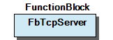
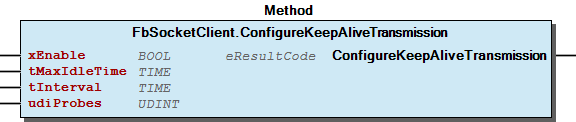
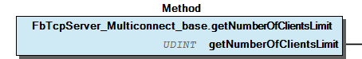

# WagoAppSocket v1.7.9.3 (WAGO) - Complete Documentation


### Documentation Index


## 10 Documentation


WagoAppSocket

WAGO LayerView|App; Application; WAGO Internal|Feature|Network|Common; WAGO FunctionalView|Connectivity|Network

WAGO / u013972

WagoAppSocket

This document is automatically generated.

Handling network communication on internet layer and on transport layer

Based on WagoAppSocket.library, last modified 22.02.2023, 09:25:22. LibDoc 4.1.1.0

© WAGO GmbH & Co. KG, Germany 2018 – All rights reserved. For the avoidance of doubt, this copyright notice does not only apply to the information above but also and primarily to the described library itself. Please note that third-party products are always mentioned without reference to intellectual property rights, including patents, utility models, designs and trademarks, accordingly the existence of such rights cannot be excluded. WAGO is a registered trademark of WAGO Verwaltungsgesellschaft mbH.

- doc10_General (FunctionBlock) - doc95_Specifications (FunctionBlock) Company WAGO Title WagoAppSocket Version 1.7.9.3 Categories WAGO LayerView|App; Application; WAGO Internal|Feature|Network|Common; WAGO FunctionalView|Connectivity|Network Author WAGO / u013972 Placeholder WagoAppSocket This document is automatically generated. Handling network communication on internet layer and on transport layer - 10 Documentation doc10_General (FunctionBlock) - doc95_Specifications (FunctionBlock) 20 Program Organization Units - 10 Compact - 30 Base 29 Types and Base Classes - doc20_ResultCodes (FunctionBlock) 30 Behaviour Models - FbBehaviourModel_Socket_ChannelledTrigger (FunctionBlock) - FbBehaviourModel_Socket_Trigger (FunctionBlock) LibraryResult (GVL) ParameterList (ParamList) ResultItems (GVL) VersionHistory (GVL) - File and Project Information - Library Reference Based on WagoAppSocket.library, last modified 22.02.2023, 09:25:22. LibDoc 4.1.1.0 © WAGO GmbH & Co. KG, Germany 2018 – All rights reserved. For the avoidance of doubt, this copyright notice does not only apply to the information above but also and primarily to the described library itself. Please note that third-party products are always mentioned without reference to intellectual property rights, including patents, utility models, designs and trademarks, accordingly the existence of such rights cannot be excluded. WAGO is a registered trademark of WAGO Verwaltungsgesellschaft mbH.

### Project Information


| Scope | Name | Type | Content |
| --- | --- | --- | --- |
| FileHeader | creationDateTime | date | 22.02.2023, 09:25:23 |
| companyName | string | WAGO |
| libraryFile | string | WagoAppSocket.library |
| productName | string | e!COCKPIT |
| contentFile | string | doc.clean.json |
| ProjectInformation | AutoResolveUnbound | bool | True |
| ProjectInformation | LastModificationDateTime | 22.02.2023, 09:25:22 |
| ProjectInformation | LibraryCategories | library-category-list | WAGO LayerView\|App; Application; WAGO Internal\|Feature\|Network\|Common; WAGO FunctionalView\|Connectivity\|Network |
| ProjectInformation | Author | string | WAGO / u013972 |
| ProjectInformation | Company | string | WAGO |
| ProjectInformation | CompiledLibraryCompatibilityVersion | string | CODESYS V3.5 SP16 Patch 3 |
| ProjectInformation | Copyright | string | © WAGO Kontakttechnik GmbH & Co. KG, Germany 2018 – All rights reserved. |
| ProjectInformation | DefaultNamespace | string |  |
| ProjectInformation | Description | string | See: Description |
| ProjectInformation | DocFormat | string | reStructuredText |
| ProjectInformation | Placeholder | string | WagoAppSocket |
| ProjectInformation | Project | string | WagoAppSocket |
| ProjectInformation | Title | string | WagoAppSocket |
| ProjectInformation | Version | version | 1.7.9.3 |

### Library Information


| LinkAllContent: False Optional: False | QualifiedOnly: False | SystemLibrary: False |

| LinkAllContent: False Optional: False | PublishSymbolsInContainer: True QualifiedOnly: False | SystemLibrary: False |

| LinkAllContent: False Optional: False | PublishSymbolsInContainer: True QualifiedOnly: False | SystemLibrary: False |

| LinkAllContent: False Optional: False | PublishSymbolsInContainer: True QualifiedOnly: False | SystemLibrary: False |

| LinkAllContent: False Optional: False | QualifiedOnly: False | SystemLibrary: False |

| LinkAllContent: False Optional: False | QualifiedOnly: False | SystemLibrary: False |

| LinkAllContent: False Optional: False | QualifiedOnly: False | SystemLibrary: False |

| LinkAllContent: False Optional: False | QualifiedOnly: False | SystemLibrary: False |

| LinkAllContent: False Optional: False | PublishSymbolsInContainer: True QualifiedOnly: False | SystemLibrary: False |

| LinkAllContent: False Optional: False | PublishSymbolsInContainer: True QualifiedOnly: False | SystemLibrary: False |

| LinkAllContent: False Optional: False | PublishSymbolsInContainer: True QualifiedOnly: False | SystemLibrary: False |

| LinkAllContent: False Optional: False | PublishSymbolsInContainer: True QualifiedOnly: False | SystemLibrary: False |

| LinkAllContent: False Optional: False | PublishSymbolsInContainer: True QualifiedOnly: False | SystemLibrary: False |

| LinkAllContent: False Optional: False | PublishSymbolsInContainer: True QualifiedOnly: False | SystemLibrary: False |

This is a dictionary of all referenced libraries and their name spaces.

This is a dictionary of all referenced libraries and their name spaces. WagoSysAsync Library Identification : Placeholder: WagoSysAsync Default Resolution: WagoSysAsync, * (WAGO) Namespace: WagoSysAsync Library Properties : WagoSysBehaviourModels Library Identification : Placeholder: WagoSysBehaviourModels Default Resolution: WagoSysBehaviourModels, * (WAGO) Namespace: WagoSysBehaviourModels Library Properties : WagoSysErrorBase Library Identification : Placeholder: WagoSysErrorBase Default Resolution: WagoSysErrorBase, * (WAGO) Namespace: WagoSysErrorBase Library Properties : Library Parameter : Parameter: RES_LOG_MAX_ENTRIES = 200 Parameter: RES_LOG_MAX_FILES = 1 Parameter: RES_LOG_MAX_FILESIZE = 2000 Parameter: RES_LOG_NAME = ‘WagoAppResultLogger’ WagoSysFifo Library Identification : Placeholder: WagoSysFifo Default Resolution: WagoSysFifo, * (WAGO) Namespace: WagoSysFifo Library Properties : WagoSysSocket_internal_PFC Library Identification : Placeholder: WagoSysSocketInternal Default Resolution: WagoSysSocket_internal_PFC, * (WAGO) Namespace: WagoSysSocket_internal Library Properties : WagoSysStandard Library Identification : Placeholder: WagoSysStandard Default Resolution: WagoSysStandard, * (WAGO) Namespace: WagoSysStandard Library Properties : WagoSysString Library Identification : Placeholder: WagoSysString Default Resolution: WagoSysString, * (WAGO) Namespace: WagoSysString Library Properties : WagoSysTypedefs_Pointer Library Identification : Placeholder: WagoSysTypedefs_Pointer Default Resolution: WagoSysTypedefs_Pointer, * (WAGO) Namespace: WAGOWagoTypesPointer Library Properties : WagoSysUtils Library Identification : Placeholder: WagoSysUtils Default Resolution: WagoSysUtils, * (WAGO) Namespace: WagoSysUtils Library Properties : WagoSysVersion Library Identification : Name: WagoSysVersion Version: 1.0.0.0 Company: WAGO Namespace: WagoSysVersion Library Properties : WagoSysVirtualBuffer Library Identification : Placeholder: WagoSysVirtualBuffer Default Resolution: WagoSysVirtualBuffer, * (WAGO) Namespace: WagoSysVirtualBuffer Library Properties : WagoTypesCommon Library Identification : Placeholder: WagoTypesCommon Default Resolution: WagoTypesCommon, * (WAGO) Namespace: WagoTypes Library Properties : Library Parameter : Parameter: MAX_STRING_LENGTH = 255 Parameter: MAX_WSTRING_LENGTH = 255 WagoTypesErrorBase Library Identification : Placeholder: WagoTypesErrorBase Default Resolution: WagoTypesErrorBase, * (WAGO) Namespace: WagoTypesErrorBase Library Properties : WagoTypesSocket Library Identification : Placeholder: WagoTypesSocket Default Resolution: WagoTypesSocket, * (WAGO) Namespace: WagoTypesSocket Library Properties :

### Function Blocks


## FbBehaviourModel_Socket_ChannelledTrigger (FB)


| Scope | Name | Type | Comment | Inherited from |
| --- | --- | --- | --- | --- |
| Output | oStatus | FbResult | Status object (see WagoSysErrorBase). | FbBehaviourModel_oStatus_Base |
| Input | xOpen | BOOL | Opening and closing of the channel. |  |
| xIsOpen | BOOL | Indicates an open channel. |  |
| xIsIdle | BOOL | Indicates that the channel can be opened. |  |
| xError | BOOL | Indicates that an error has occurred |  |
| Inout | xTxTrigger | BOOL | Triggers the action. |  |

| protOpen - result codes |
| 0 | Opening of the channel was successfully completed. |
| EAGAIN | Opening still in progress. |
| other | Opening failed. Channel returns to idle state without calling close(). |

| protClose - result codes |
| 0 | Closing of the channel was successfully completed. |
| EAGAIN | Closing still in progress. |
| other | Closing failed for some reason. |

| protRun - result codes |
| 0 | The action has successfully terminated, reset xTxTrigger again. |
| EAGAIN | The action has to be repeated. |
| other | The action has terminated with on error, reset xTxTrigger again. |

Channelled Tx Trigger with specificica for ‘Socket’

A Channelled trigger is a WagoAppCommunicator without a receiving channel.

Graphical Interface of FbBehaviourModel_Socket_ChannelledTrigger

This base model is completely identical to ‘WagoAppChannelledTrigger’ with the only difference that the trigger variable is named slightly differently here.

It is composed of two separated sub-modules:

This part controls the opening and closing of an associated communication channel. The description of WagoChannel applies to this part. Please note that any parameters for opening the channel (such as filenames, ip-addresses, COM-ports, etc) only apply to FBs which are derived from this model, and not to this base model itself.

This part controls the transmission of data. The description of WagoTxTrigger directly applies to it. The TxTrigger part is only active while the Channel -Part is open. Otherwise the main runner is not called.

Protected methods

The user of this Model has to re-implement the methods of this interface according to his needs. These methods are PUBLIC for technical reasons only, while semantically they are to be treated as PROTECTED, as is usual for the other models. Do not call them directly.

The property IsInitialCycle which is provided in other models is re-implemented twice for use in the pseudo-protected methods. One is named IsInitialChannelCycle, the other is named IsInitialTriggerCycle. They reflect the states of the corresponding parts.

Result Codes

The expected result codes for the Pseudo-PROTECTED methods are identical to those in the description of the individual components (WagoChannel and WagoTxTrigger):

Attention: The derived child FB has to call SUPER^(xTxTrigger:=xTxTrigger); in its body.

Interface variables Channelled Tx Trigger with specificica for ‘Socket’ A Channelled trigger is a WagoAppCommunicator without a receiving channel.  Graphical Interface of FbBehaviourModel_Socket_ChannelledTrigger This base model is completely identical to ‘WagoAppChannelledTrigger’ with the only difference that the trigger variable is named slightly differently here. It is composed of two separated sub-modules: Channel: This part controls the opening and closing of an associated communication channel. The description of WagoChannel applies to this part. Please note that any parameters for opening the channel (such as filenames, ip-addresses, COM-ports, etc) only apply to FBs which are derived from this model, and not to this base model itself. TxTrigger: This part controls the transmission of data. The description of WagoTxTrigger directly applies to it. The TxTrigger part is only active while the Channel -Part is open. Otherwise the main runner is not called. Protected methods The user of this Model has to re-implement the methods of this interface according to his needs. These methods are PUBLIC for technical reasons only, while semantically they are to be treated as PROTECTED, as is usual for the other models. Do not call them directly. Properties The property IsInitialCycle which is provided in other models is re-implemented twice for use in the pseudo-protected methods. One is named IsInitialChannelCycle, the other is named IsInitialTriggerCycle. They reflect the states of the corresponding parts. Result Codes The expected result codes for the Pseudo-PROTECTED methods are identical to those in the description of the individual components (WagoChannel and WagoTxTrigger): Attention: The derived child FB has to call SUPER^(xTxTrigger:=xTxTrigger); in its body.

## FbBehaviourModel_Socket_Trigger (FB)


| Scope | Name | Type | Comment | Inherited from |
| --- | --- | --- | --- | --- |
| Output | oStatus | FbResult | Status object (see WagoSysErrorBase). | FbBehaviourModel_oStatus_Base |
| Inout | xTxTrigger | BOOL | Triggers the action and signals termination. |  |
| xBusy | BOOL | True while not terminated. |  |
| xError | BOOL | Has an error occurred? |  |

| protRun - result codes |
| 0 | The action has successfully terminated, reset xTxTrigger again. |
| EAGAIN | The action has to be repeated. |
| other | The action has terminated with an error, reset xTxTrigger again. |

| Scope | Name | Type | Comment | Inherited from |
| --- | --- | --- | --- | --- |
| Output | oStatus | FbResult | Status object (see WagoSysErrorBase). | FbBehaviourModel_oStatus_Base |
| Input | xOpen | BOOL | Desired channel state (open=TRUE, closed=FALSE) | FbBehaviourModel_WagoAppChannel |
| xError | BOOL | Feedback: an Error has occurred. | FbBehaviourModel_WagoAppChannel |
| xIsOpen | BOOL | Feedback: channel is operative. | FbBehaviourModel_WagoAppChannel |
| xIsIdle | BOOL | Feedback: channel is clear for new opening. | FbBehaviourModel_WagoAppChannel |
| Input | sNetName | WagoTypesSocket.IpAddressString | Name of the Group, e.g. ‘192.168.1.255’ |  |
| Input | wPort | WORD | Port on the Server, e.g. 2323 |  |
| Input | pRxBuffer | POINTER TO BYTE | Location of receiver Buffer |  |
| Input | udiRxBufferSize | UDINT | Size of the receiver Buffer |  |
| Input | xRxEnable | BOOL | FALSE if the application cannot handle new data |  |
| xPacketReceived | BOOL | Indicator for a received packet |  |
| udiRxNBytes | UDINT | Size of the received packet |  |
| xRxOverflow | BOOL | Received packet was larger than the buffer space. |  |
| sClientIP | WagoTypesSocket.IpAddressString | IP address of the packet sender |  |
| wClientPort | WORD | Sending Port of the packet sender |  |

| Scope | Name | Type | Comment | Inherited from |
| --- | --- | --- | --- | --- |
| Output | oStatus | FbResult | Status object (see WagoSysErrorBase). | FbBehaviourModel_oStatus_Base |
| Inout | xTxTrigger | BOOL | Triggers the action and signals termination. | FbBehaviourModel_Socket_Trigger |
| xBusy | BOOL | True while not terminated. | FbBehaviourModel_Socket_Trigger |
| xError | BOOL | Has an error occurred? | FbBehaviourModel_Socket_Trigger |
| Input | sNetName | WagoTypesSocket.IpAddressString | Name of the Server, e.g. ‘192.168.2.255’ |  |
| Input | wPort | WORD | Port on the Server, e.g. 2323 |  |
| Input | pTxBuffer | POINTER TO BYTE | The data to be transmitted |  |
| Input | udiTxNBytes | UDINT | Number of bytes to be transmitted |  |
| Input | xClose | BOOL | TRUE closes the socket when idle. |  |

| eStatus |
| 0=OK | Successful transmission |
| EINVAL | Invalid address, port, or null-pointer |
| ENETUNREACH | Network unreachable |
| EACCES | Other error |
| EBADSLT | Internal error |

| Scope | Name | Type | Initial | Comment | Inherited from |
| --- | --- | --- | --- | --- | --- |
| Output | oStatus | FbResult |  | Status object (see WagoSysErrorBase). | FbBehaviourModel_oStatus_Base |
| Input | xEnable | BOOL |  | Enables the operation. | FbBehaviourModel_WagoAppEnable |
| xError | BOOL |  | Indicates that an Error has occurred. | FbBehaviourModel_WagoAppEnable |
| xValid | BOOL |  | Indicates that Data is valid. | FbBehaviourModel_WagoAppEnable |
| xBusy | BOOL |  | Indicates that the FB is working. | FbBehaviourModel_WagoAppEnable |
| Input | sAddress | STRING | ‘0.0.0.0’ | Target Address for Ping |  |
| Input | tTimeOut | TIME | TIME#5s0ms | Timeout for a single packet |  |
| Input | xResetStatus | BOOL | FALSE | True clears errors automatically. |  |
| udiSuccessfullPings | UDINT |  | Number of successful pings |  |
| udiFailedPings | UDINT |  | Number of lost pings |  |
| tResponseAverage | TIME |  | Average response time |  |
| tResponseMin | TIME |  | Minimum response time |  |
| tResponseMax | TIME |  | Maximum response time |  |

| Result codes |
| 0 | Regular response, at least one PING was successful. |
| ETIMEINFO | Recent pings timed out as regular ping result. |
| EINPROGRESS | The operation is in progress but not finished. |
| EINVAL | The address is malformed. |
| ETIMEDOUT | No response at all within the given timeout. |
| ENETUNREACH | The target net address could not be reached (active error response from networkstack). |
| ECANCELLED | The operation was cancelled cooperatively by the application. |
| ENOSUCCESS | No successful PING could be issued. |

This is the base class for behaviour model WagoAppTrigger with Specifica for ‘Socket’.

Graphical Illustration

Graphical Interface of FbBehaviourModel_Socket_Trigger

Function Description

This base model is completely identical to ‘WagoAppTrigger’ with the only difference that the trigger variable is named slightly differently here.

This model has three internal states

The very first cycle in the life of an application. As xTxTrigger cannot be reset during initialization, due to technical reasons, it is initialized in this first cycle.

This state is indicated by eStatus set to EDEFAULT . The value of xTxTrigger is not defined at this moment. The FB transits into Idle from this state within one cycle.

The FB waits for xTxTrigger to be set to TRUE by external stimulus. Then the FB transits into ‘Run’. The ‘Idle’ state is indicated by the FB having xTxTrigger reset to False and eStatus being set to anything other than EDEFAULT .

The FB calls protRun() repeatedly until the runner returns either OK or any code other than EAGAIN. Then the FB transits into ‘Idle’ and it resets xTxTrigger from within the FB framework again.

The ‘Run’ state is indicated by having eStatus set intermediately to ‘EINPROGRESS’ and xTxTrigger not yet being reset. Upon termination of the action, eStatus will be set either to OK or to the error code. which was returned from the runner.

When this model is used, it is strongly recommended that the application never reset xAction to FALSE. It should only be set to TRUE.

When the action returns either EINPROGRESS or EDEFAULT, that result code will be re-mapped to EUNSPECIFIC in order to avoid ambiguities with eStatus.

The overall behaviour is controlled by the result code of the runner:

Attention: The derived child FB has to call SUPER^.(xTxTrigger:=xTxTrigger) in its body.

This is a Broadcast and Multicast-Receiver with cpt -type interface.

Graphical Illustration

Graphical Interface of FbBroadcastReceiver

Function Description

After the input xOpen is set TRUE , this FB listens for incoming UDP packet at sNetName on the given port wPort . While xOpen stays TRUE , any changes of the NetName or the port number are ignored until xOpen returns to FALSE again.

When a packet is received, the output xPacketReceived will be set for one cycle and the contents of the packet will be transferred to the memory location which is declared by pRxBuffer and udiRxBufferSize . The output udiRxNBytes indicates the number of bytes in that packet. This number should be less than udiRxBufferSize . It could also be 0 for empty packets.

Previous data will be overwritten in the receive buffer. If overwriting is not wanted, the application could either hold xRxEnable at FALSE , which prevents the FB from fetching new data, while still keeping it listening. Alternatively, pRxBuffer could be set to a different location after the previous data were received, so the new data will be written to a different location.

If the received packet is larger than the declared buffer space, udiRxNBytes still reflects the size of the received packet, but it is ensured that no more data is written to the buffer as indicated by udiRxBufferSize . Excess data will be lost. This situation is indicated by xRxOverflow .

The outputs sClientIP and wClientPort indicate the identity of the client. These could be used as address information if answers to the received packets are to be sent.

This is a FB for broadcasting and multicast messages with cpt -type interface.

Graphical Illustration

Graphical Interface of FbBroadcaster

Function Description

This FB sends UDP packets to a broadcast address. The net address and port number of the target are given by the inputs sNetname and wPort . The location and size of the packet contents are given by udiTxNBytes and pTxData . The rising slope of xTxTrigger initiates the sending process.

The output xBusy is kept TRUE while the transmission process is still not completed (which might indicate a problem with system resources). After the sending is completed, the FB re-sets xBusy and xTxTrigger back to FALSE.

N.B.: If the parameter sNetName denotes not a broadcast address but a regular unicast address, a unicast is transmitted instead of a broadcast.

This is a client for receiving multicast and broadcast datagrams.

Graphical Illustration

Graphical Interface of FbDatagramReceiver

Function Description

The interface of FbDatagramReceiver is prepared for sending IGMP-packets for multicast. If the capability of handling multicast or broadcast is not used, this FB behaves very similar to the more simple FbDatagramServer (FB) .

This is a server FB for UDP packets (datagrams).

Graphical Illustration

Graphical Interface of FbDatagramServer

Function Description

The FbDatagramServer is quite similar to the TCP-Server. But, in contrast to the latter, this server works connection-less. As a consequence, no different instances for multiple connections are attached, but the FB itself is derived from FbSocketServer_ApplicationBase . Thus, the application has to deal with only one single server FB.

It is completely method driven.

This is a Ping FB with cpt -type interface.

Graphical Illustration

Graphical Interface of FbPing

Function Description

This FB provides the functionality of FbPing_base (FB) while implementing the behaviour model WagoAppEnable in order to form a cpt -interface. (Both of them are described below in detail.)

While xEnable is TRUE , FbPing continuously issues probe packets to the addressed target sAddress and calculates transmission statistics.

The inputs were sampled at the rising edge of xEnable . Any changes during a started ping-process will have no effect.

The outputs xValid , xBusy , xError , and oStatus signal the processing status according to the WagoAppEnable model.

The other outputs represents the response statistics for the time since xEnable was set.

For technical reasons the minimum response time is indicated as at least 1ms or larger, although the internally measured time could be in the range of microseconds.

The type of packet which is used for probing (native ICMP-echoes or ARP) depends on firmware implementations and is beyond the scope of this library. In modern systems it is more likely that ARP-packets are used. Please consult the firmware reference if this should be an issue.

Interface variables Function This is the base class for behaviour model WagoAppTrigger with Specifica for ‘Socket’. Graphical Illustration  Graphical Interface of FbBehaviourModel_Socket_Trigger Function Description This base model is completely identical to ‘WagoAppTrigger’ with the only difference that the trigger variable is named slightly differently here. States This model has three internal states NotInitialized: The very first cycle in the life of an application. As xTxTrigger cannot be reset during initialization, due to technical reasons, it is initialized in this first cycle. This state is indicated by eStatus set to EDEFAULT . The value of xTxTrigger is not defined at this moment. The FB transits into Idle from this state within one cycle. Idle: The FB waits for xTxTrigger to be set to TRUE by external stimulus. Then the FB transits into ‘Run’. The ‘Idle’ state is indicated by the FB having xTxTrigger reset to False and eStatus being set to anything other than EDEFAULT . Run: The FB calls protRun() repeatedly until the runner returns either OK or any code other than EAGAIN. Then the FB transits into ‘Idle’ and it resets xTxTrigger from within the FB framework again. The ‘Run’ state is indicated by having eStatus set intermediately to ‘EINPROGRESS’ and xTxTrigger not yet being reset. Upon termination of the action, eStatus will be set either to OK or to the error code. which was returned from the runner. Note When this model is used, it is strongly recommended that the application never reset xAction to FALSE. It should only be set to TRUE. Note When the action returns either EINPROGRESS or EDEFAULT, that result code will be re-mapped to EUNSPECIFIC in order to avoid ambiguities with eStatus. The overall behaviour is controlled by the result code of the runner: Attention: The derived child FB has to call SUPER^.(xTxTrigger:=xTxTrigger) in its body. Interface variables Function This is a Broadcast and Multicast-Receiver with cpt -type interface. Graphical Illustration  Graphical Interface of FbBroadcastReceiver Function Description After the input xOpen is set TRUE , this FB listens for incoming UDP packet at sNetName on the given port wPort . While xOpen stays TRUE , any changes of the NetName or the port number are ignored until xOpen returns to FALSE again. When a packet is received, the output xPacketReceived will be set for one cycle and the contents of the packet will be transferred to the memory location which is declared by pRxBuffer and udiRxBufferSize . The output udiRxNBytes indicates the number of bytes in that packet. This number should be less than udiRxBufferSize . It could also be 0 for empty packets. Previous data will be overwritten in the receive buffer. If overwriting is not wanted, the application could either hold xRxEnable at FALSE , which prevents the FB from fetching new data, while still keeping it listening. Alternatively, pRxBuffer could be set to a different location after the previous data were received, so the new data will be written to a different location. If the received packet is larger than the declared buffer space, udiRxNBytes still reflects the size of the received packet, but it is ensured that no more data is written to the buffer as indicated by udiRxBufferSize . Excess data will be lost. This situation is indicated by xRxOverflow . The outputs sClientIP and wClientPort indicate the identity of the client. These could be used as address information if answers to the received packets are to be sent. Interface variables Function This is a FB for broadcasting and multicast messages with cpt -type interface. Graphical Illustration  Graphical Interface of FbBroadcaster Function Description This FB sends UDP packets to a broadcast address. The net address and port number of the target are given by the inputs sNetname and wPort . The location and size of the packet contents are given by udiTxNBytes and pTxData . The rising slope of xTxTrigger initiates the sending process. The output xBusy is kept TRUE while the transmission process is still not completed (which might indicate a problem with system resources). After the sending is completed, the FB re-sets xBusy and xTxTrigger back to FALSE. N.B.: If the parameter sNetName denotes not a broadcast address but a regular unicast address, a unicast is transmitted instead of a broadcast. Function This is a client for receiving multicast and broadcast datagrams. Graphical Illustration  Graphical Interface of FbDatagramReceiver Function Description The interface of FbDatagramReceiver is prepared for sending IGMP-packets for multicast. If the capability of handling multicast or broadcast is not used, this FB behaves very similar to the more simple FbDatagramServer (FB) . - 10-Main-Interface Close (Method) - ConfigureKeepAliveTransmission (Method) - LeaveGroup (Method) - OpenAndJoin (Method) - ReJoinGroup (Method) 20-Administrative - Finish (Method) - Initialize (Method) Function This is a server FB for UDP packets (datagrams). Graphical Illustration  Graphical Interface of FbDatagramServer Function Description The FbDatagramServer is quite similar to the TCP-Server. But, in contrast to the latter, this server works connection-less. As a consequence, no different instances for multiple connections are attached, but the FB itself is derived from FbSocketServer_ApplicationBase . Thus, the application has to deal with only one single server FB. It is completely method driven. - 10-Main-Interface Close (Method) - OpenAndListen (Method) 20-Administration - Finish (Method) - Initialize (Method) Interface variables Function This is a Ping FB with cpt -type interface. Graphical Illustration  Graphical Interface of FbPing Function Description This FB provides the functionality of FbPing_base (FB) while implementing the behaviour model WagoAppEnable in order to form a cpt -interface. (Both of them are described below in detail.) While xEnable is TRUE , FbPing continuously issues probe packets to the addressed target sAddress and calculates transmission statistics. The inputs were sampled at the rising edge of xEnable . Any changes during a started ping-process will have no effect. The outputs xValid , xBusy , xError , and oStatus signal the processing status according to the WagoAppEnable model. The other outputs represents the response statistics for the time since xEnable was set. Note For technical reasons the minimum response time is indicated as at least 1ms or larger, although the internally measured time could be in the range of microseconds. Note The type of packet which is used for probing (native ICMP-echoes or ARP) depends on firmware implementations and is beyond the scope of this library. In modern systems it is more likely that ARP-packets are used. Please consult the firmware reference if this should be an issue.

## FbPing_base (FB)


| Scope | Name | Type | Comment | Inherited from |
| --- | --- | --- | --- | --- |
| Output | xTerminated | BOOL |  | Fb_Template_Async_Base_IF |
| xBusy | BOOL |  | Fb_Template_Async_Base_IF |
| xError | BOOL |  | Fb_Template_Async_Base_IF |
| eResult | eResultCode |  | Fb_Template_Async_Base_IF |
| Input | xAbort | BOOL | TRUE: stop the series prematurely. |  |
| udiSuccessfullPings | UDINT | How many responses did we get so far? |  |
| udiFailedPings | UDINT | How many failures did we get so far? |  |
| tResponseAverage | TIME | The average response time |  |
| tResponseMin | TIME | The minimum in the ensemble of response times |  |
| tResponseMax | TIME | The maximum in the ensemple of response times |  |
| oStatus | WagoSysErrorBase.FbResult |  |  |

| Result codes |
| 0 | Regular response, at least one PING was successful. |
| ETIMEINFO | Recent pings timed out as regular ping result. |
| EINPROGRESS | The operation is in progress but not finished. |
| EINVAL | The address is malformed. |
| ETIMEDOUT | No response at all within the given timeout. |
| ENETUNREACH | The target net address could not be reached (active error response from networkstack). |
| ECANCELLED | The operation was cancelled cooperatively by the application. |
| ENOSUCCESS | No successful PING could be issued. |

| Scope | Name | Type | Comment |
| --- | --- | --- | --- |
| Output | oStatus | WagoSysErrorBase.FbResult | Status object |
| xBusy | BOOL | An operation (e.g. connecting) waits for completion. |

| Scope | Name | Type | Comment | Inherited from |
| --- | --- | --- | --- | --- |
| Output | oStatus | FbResult | Status object (see WagoSysErrorBase). | FbBehaviourModel_oStatus_Base |
| Input | xOpen | BOOL | Opens and closes the channel. | FbBehaviourModel_WagoAppCommunicator |
| xIsOpen | BOOL | Indicates whether the channel is open. | FbBehaviourModel_WagoAppCommunicator |
| xIsIdle | BOOL | Feedback: channel is clear for new opening. | FbBehaviourModel_WagoAppCommunicator |
| xError | BOOL | Indicates that an error has occurred. | FbBehaviourModel_WagoAppCommunicator |
| Inout | xTxTrigger | BOOL | Starts transmission of data. | FbBehaviourModel_WagoAppCommunicator |
| Input | pTxBuffer | POINTER TO BYTE | Pointer to data for transmission | FbBehaviourModel_WagoAppCommunicator |
| Input | udiTxNBytes | UDINT | Number of bytes to transmit | FbBehaviourModel_WagoAppCommunicator |
| Input | pRxBuffer | POINTER TO BYTE | Pointer to receiver buffer | FbBehaviourModel_WagoAppCommunicator |
| Input | udiRxBufferSize | UDINT | Size of the receiver buffer | FbBehaviourModel_WagoAppCommunicator |
| Inout | udiRxIndex | UDINT | Number of bytes in the receiver buffer | FbBehaviourModel_WagoAppCommunicator |
| xRxBufferFull | BOOL | Indicates that the Receiver Buffer is full. | FbBehaviourModel_WagoAppCommunicator |
| xRxOverflow | BOOL | Indicates that data is probably lost. | FbBehaviourModel_WagoAppCommunicator |
| Input | xResetStatus | BOOL | Resets status code to ‘OK’ | FbBehaviourModel_WagoAppCommunicator |
| Input | sServerName | STRING | Name of the Server, e.g. ‘192.168.2.234’ |  |
| Input | wPort | WORD | Port on the Server, e.g. 2323 |  |
| Input | xKeepAlive_Enable | BOOL | Switches keep-alive mechanism on. |  |
| Input | tKeepAlive_MaxIdleTime | TIME | Maximum time of inactivity (min. 1s) |  |
| Input | tKeepAlive_Interval | TIME | Interval between two KA packets (min. 1s) |  |
| Input | udiKeepAlive_Probes | UDINT | Maximum number of probes without acknowledgement before the connection is considered to be broken |  |

| Result Codes |
| 0 | Success, ready for communication. |
| EACCES | Permission to create a socket of the specified type and/or protocol is denied. |
| EINVAL | Unknown protocol or malformed address |
| ENFILE | The system limit on the total number of open sockets has been reached. |
| ECONNREFUSED | No-one listening on the remote address. |
| ENETUNREACH | Network is unreachable. |
| ETIME | Timeout while attempting connection. |
| ETIMEDOUT | Connection is brocken |
| ENOPROTOOPT | Protocol option ‘sOwnInterface’ or ‘RawSocket’ not applicable |
| EAGAIN | No response from server received yet. (That may take a while.) |

| Scope | Name | Type | Comment |
| --- | --- | --- | --- |
| Input | xOpen | BOOL | Desired server state (TRUE = open) |
| wPort | WORD | Port Number of the Server |
| pRxSpace | POINTER TO BYTE | Where to write received data. |
| udiRxSpaceSize | UDINT | Space for received data. |
| pBuffer | POINTER TO BYTE | Location of protUnread()-buffer for all clients |
| udiBufferSize | UDINT | Size of buffer for protUnread() |
| udiSingleBufferSize | UDINT | Needed resources per client |
| Output | xIsOpen | BOOL | Feedback: channel is operative. |
| Output | oStatus | WagoSysErrorBase.FbResult | Result of last open / close action. |
| Output | xError | BOOL | Indicates that an error has occurred. |
| Output | udiNumberOfConnectedClients | UDINT | Number of actually connected clients. |

| Scope | Name | Type | Comment | Inherited from |
| --- | --- | --- | --- | --- |
| Output | oStatus | FbResult | Status object (see WagoSysErrorBase). | FbBehaviourModel_oStatus_Base |
| Input | xOpen | BOOL | Opening and closing of the channel. | FbBehaviourModel_Socket_ChannelledTrigger |
| xIsOpen | BOOL | Indicates an open channel. | FbBehaviourModel_Socket_ChannelledTrigger |
| xIsIdle | BOOL | Indicates that the channel can be opened. | FbBehaviourModel_Socket_ChannelledTrigger |
| xError | BOOL | Indicates that an error has occurred | FbBehaviourModel_Socket_ChannelledTrigger |
| Inout | xTxTrigger | BOOL | Triggers the action. | FbBehaviourModel_Socket_ChannelledTrigger |
| Input | wPort | WORD | Port on the Server, e.g. 2323 |  |
| xConnected | BOOL | Indicates an established connection |  |
| sClientIP | WagoTypesSocket.IpAddressString | IP address of the client |  |
| wClientPort | WORD | Sending port of the client |  |
| Input | pTxBuffer | POINTER TO BYTE | Pointer to data for transmission |  |
| Input | udiTxNBytes | UDINT | Number of bytes to transmit |  |
| Input | pRxBuffer | POINTER TO BYTE | Pointer to receiver buffer |  |
| Input | udiRxBufferSize | UDINT | Size of the receiver buffer |  |
| Inout | udiRxIndex | UDINT | Number of bytes in the receiver buffer |  |
| xRxBufferFull | BOOL | Indicates that the Receiver Buffer is full. |  |
| xRxOverflow | BOOL | Indicates that data is probably lost. |  |

| result codes |
| 0 | Success, ready for new communication. |
| EMSGSIZE | Incoming data chunk was larger than allowed. |

```
VAR
   MyClient        : FbSocketClient;           // the FB itself

   sRequest        : STRING := 'Hello World!'; // something to write
   sAnswer         : STRING;                   // the answer from the server

   aBuffer         : ARRAY[0..127] OF BYTE;    // something to read
   udiReceiveCount : UDINT := 0;               // feedback for read
   udiExpectation  : UDINT := 1;
END_VAR

MyClient();  // cyclic call of the FB-body

IF (MyClient.State = eSocketOpState.unattached) AND (NOT MyClient.xBusy) THEN
   MyClient.OpenAndConnect( '172.29.233.5', 23230, eSocketProtocol.TCP, FALSE, '', T#0S,0,0,0,0);
END_IF

If MyClient.IsReadyForWrite THEN                       // write something into the connection
   MyClient.Write(Adr(sRequest), length(sRequest));    // length() is from 'WagoAppString'
 END_IF

IF MyClient.IncomingDataSize >= udiExpectation THEN    // receive only when enough bytes are received
   MyClient.Read( Adr(aBuffer), SizeOf(aBuffer), udiRxNBytes => udiReceiveCount );
   sAnswer := Mem_to_PrintableString( Adr(aBuffer), udiReceiveCount);         // from 'WagoAppString'
END_IF

IF (MyClient.State = eSocketOpState.connected) AND (NOT MyClient.xBusy) THEN
   MyClient.Close();
END_IF
```

```
pRxBuffer:=adr(BufferArray);
udiRxBufferSize:=SizeOf(BufferArray);
```

```
////////////////////////////////////////////////////////////////////
// declare what the new server should do
////////////////////////////////////////////////////////////////////

FUNCTION_BLOCK FbMyOwnServer EXTENDS FbSocketServer_ApplicationBase

  METHOD NotifyAttachment [...]
    InitializeEverything();
    NotifyAttachment := OK;

  METHOD NotifyNewConnection [...]
    If xAnythingStrange THEN protActiveClose(); END_IF
    NotifyNewConnection := OK;

  METHOD NotifyReceivedData [...]
    DoProcessingOf(pData, uiDataSize);
    If xAppropriate THEN protWrite(pAnswer,uiSizeOfAnswer); END_IF;
    NotifyReceivedData := OK;

  METHOD NotifyClose [...]
    CleanUp();
    NotifyClose := OK;

////////////////////////////////////////////////////////////////////
// provide at least one instance of the Application Server application
// and one of the generic server
////////////////////////////////////////////////////////////////////


VAR_GLOBAL
  MyOwnServers  : ARRAY[0..4] OF FbMyOwnServer;
  MyFrameServer : FBSocketServer;
END_VAR

////////////////////////////////////////////////////////////////////
// The incorporation of the server into the application is just this:
//
// - initialize all servers
// - open the service on port 8080 (e.g.)
// - and let it run
////////////////////////////////////////////////////////////////////

PROGRAM PLC_PRG

  IF xInitializationCycle THEN

      MyFrameServer.AttachServerApplication(ADR(MyOwnServers[0]));
      MyFrameServer.AttachServerApplication(ADR(MyOwnServers[1]));
      MyFrameServer.AttachServerApplication(ADR(MyOwnServers[2]));
      MyFrameServer.AttachServerApplication(ADR(MyOwnServers[3]));
      MyFrameServer.AttachServerApplication(ADR(MyOwnServers[4]));

      MyFrameServer.OpenAndListen('Localhost', 8080, SocketProtocol_TCP);
  END_IF


  MyFrameServer();   // runs all instances of attached MyOwnServers
```

```
FUNCTION_BLOCK MyModbusServer EXTENDS FbTcpServer_Multiconnect_base

METHOD NotifyReceivedData(pData,udiDataSize,pHeader): eResultCode
//
// In thes method the child object represents most of the specific reaction to client data
//
```

```
FUNCTION_BLOCK  MyMulticonnectServer EXTENDS FbTcpServer_Multiconnect_cpt
SUPER^();
```

```
METHOD NotifyReceivedData : eResultCode

VAR_INPUT
    pData       : POINTER TO BYTE; // Points to the received data
    udiDataSize : UDINT;           // Number of data in this chunk
    pHeader     : POINTER TO BYTE; // (will be ignored)
END_VAR

sResponseString := Concat3('Received: [', Mem_to_PrintableString(pData,udiDataSize), '].$r$n');
protWrite(adr(sResponseString),length(sResponseString));
NotifyReceivedData := OK;
```

```
IF CheckIfMyPacketIsIncomplete(pData,udiDataSize) THEN
    protUnRead(pData,0);
    NotifyReceivedData := OK;
    return;
END_IF
```

This FB sends a series of pings to a destination and waits for the response.

Graphical Illustration

Graphical Interface of FbPing_base

Function Description

The Fb is started with the method Start() which is the only relevant method in this FB. The operational parameters (such as destination address, number of trials, timeout) are passed as arguments of this start()-method.

As indicated in the interface summary, there are several methods and properties inherited from the fundamental behaviour model. These have no use here and should be ignored. They should not be used in any application code.

During the main run, statistics about the ping response is gathered and provided at the output. The others were counted as ‘failed’, but do not contribute to average calculations.

The sequence of PINGs may be interrupted by setting the xAbort input to TRUE .

The type of packet which is used for probing (native ICMP-echoes or ARP) depends on firmware implementations and is beyond the scope of this library. In modern systems it is more likely that ARP-packets are used. Please consult the firmware reference if this should be an issue.

This FB implements the client role of a socket connection. It handles TCP connections as well as UDP transmissions.

Graphical Illustration

Graphical Interface of FbSocketClient

Function Description

This FB is completely method driven. The most prominent methods are OpenAndConnect() , Write() , Read() , and Close() .

Details of the functionality are provided at the place of the description of the methods and properties.

The basic usage is roughly the following:

This FB is used in a similar manner to file FBs.

The main difference in behaviour is that a considerable latency (even in terms of PLC cycles) or even complete failure is to be expected, even in regular cases, for each action, depending on the health and connection circumstances of the corresponding server. Thus, the timing of the data transport is rather unpredictable.

Unlike the socket server FB, the client role is not event driven. Instead the client is supposed to initiate the connection and the traffic itself. There is no need to handle multiple connections for one service at the client side. Thus, there is initially no need to derive other FBs from this one.

This is a TCP-client with cpt -type interface.

Graphical Illustration

Graphical Interface of FbTcpClient

Function Description

This FB acts as client for TCP/IP-connections.

It implements the behaviour model WagoAppCommunicator , based on the functionality of the FB FbSocketClient (FB) which is described below in this library.

The communication channel is opened by assigning the target address and the target port to the inputs sServerName and wPort . and then setting xOpen to TRUE .

Befor xOpen is setting to True the FB must signal with xIsIdle , that the FB is ready to open the communication channel.

At the rising edge of xOpen the keep-alive (KA) feature can turned on or off and the given parameter will be set. If the keep-alive feature is turned on with xKeepAlive_Enable , the client socket checks periodically if the server is still reachable by sending empty packets and expecting acknowledge packets.

The purpose of this is to ensure for the client that the server is still reachable.

Thus, after tKeepAlive_MaxIdleTime after complete inactivity (no transmission nor reception of any packets), a special keep-alive-packet is sent (which contains no data, but is acknowledged by TCP). Unless that KA-packet is acknowledged, it is retransmitted after tKeepAlive_Interval .

When the number of udiKeepAlive_Probes is exceeded without acknowledgement, the connection is considered to be broken and the socket status is set to ETIMEDOUT.

If tKeepAlive_MaxIdleTime is higher as tKeepAlive_Interval then tKeepAlive_MaxIdleTime is used as interval

Reading and writing to the FB follow the pattern of WagoAppCommunicator .

As described there, this FB is composed of three separated sub-modules:

This part controls the opening and closing of an associated communication channel.

On the rising edge of the input xOpen the channel is opened. Unless an error occurred, the channel stays open while xOpen is kept TRUE. This status is indicated by the output xIsOpen, which is TRUE while the channel is operative.

When xOpen returns to FALSE the channel is closed again after pending communication is finished.

This part controls the transmission of data. The Transmitter part is only active while the Channel -Part is open . Otherwise the transmitter is not called.

The transmitter section implements the behaviour WagoTransmitter . For transmitting data, the input pTxBuffer is to be set to the address of the data block and the input udiTxNBytes has to carry the size of the data block. Setting xTxTrigger to TRUE initiates the transmission of the data.

By setting xTxTrigger to FALSE again, the transmitter indicates the completion of the transmitting process.

The application MUST NOT reset xTxTrigger to FALSE , because in that case the FB has no means to signal the completion of the process.

The terminus ‘completion’ in this context does not mean that the data has actually been sent physically. Instead, it indicates that the data is delivered out of the FB and new data may now be processed.

This submodule looks for incoming data and presents it at the outputs. Like the Transmitter, it is called only as long as the Channel is open.

The inputs pRxBuffer and udiRxBufferSize have to be fed with the location and the size of raw buffer space for received data. E.g.:

The in-out udiRxIndex has initially to be set to 0.

When the FB is open , it automatically receives data. The received data is stored in the buffer space. New bytes will go to the location inside of the bufferspace which is indicated by udiRxIndex . After the reception of a byte this variable is automatically increased, so it

When the input buffer is full, xRxBufferFull will be set to TRUE . The output xRxOverflow indicates in such a situation new data arrived which could neither be postponed nor stored internally.

When the application has fetched the data from the buffer, it should reset udiRxIndex to zero again. This will reset xRxBufferFull and xRxOverflow .

Function Description

This FB provides a framework for building Server structures within the application.

Graphical Illustration

Graphical Interface of FbTcpServer

Function Description

For this purpose, the application derives its own extensions from ‘FbSocketServer_ApplicationBase’, which are able to respond appropriately to a connection start and to incoming data. We will call them ‘application FBs’ in the following.

After having derived application FBs from FbTcpServer, one or more instances of them are attached to the FbTcpServer. This FbTcpServer listens to a certain port and distributes the incoming connections to the derived application FB instances.

This technique allows for handling multiple clients simultaneously without needing true multitasking.

The application FBs are notified from the FbTcpServer about a variety of events:

They use the following services from the FbTcpServer

Typical Usage:

This is a cpt -version of a TCP-multi-connect server.

Graphical Illustration

Graphical Interface of FbTcpServerMulticonnect

Function Description

This server FB is capable of maintaining connections to multiple clients simultaneously and passing the requests to one single acceptor.

This FB inherits all functionality from FbTcpServer_Multiconnect_base (FB) and provides its complete set of functionality for handling multiple connections. Additionaly it implements a public variable interface which is similar to FbBehaviourmodel_WagoAppChannel .

Like its parent FbTcpServer_Multiconnect_base (FB) , this server FB does not represent its multiple connections by multiple instances of FbSocketServer_ApplicationBase , (as done with the FbTcpServer (FB) ), but instead just one single instance of the child object is required - which itself is an extension of FbSocketServer_ApplicationBase :

Via the overloaded method NotifyReceivedData() the child server will be notified about data beeing sent to it.

If it turns out that for a processing step more data is required which is expected to arrive in following packets, the data which is received so far can be postponed via the method protUnread` .

When the same client sends more data, the postponed data is merged with the new data and presented together as ‘new data’ in the expectation that we have now sufficient data for a processing step. If not, this merged new data can again be postponed until even more data arrives from the client.

The methods from the base FbSocketServer_ApplicationBase (e.g. protWrite() ) apply to the client which is the originator of the actual data. Thus, no handling of the identity of the client is necessary if a respone packet is to be sent from within the method NotifyReceivedData() .

If - in contrast to the beforesaid without a preceeding request - a packet is to be sent sponaneously to a specific client, the method protSelectClient() has to be called before in order to tell the FB where to send the unrequested packet.

Attention (1): the protUnread() mechanism requires a certain amount of internal buffer, which is allocated statically when the FB is opened. The total size of the buffer memory is defined via the constant udiMultiConnect_UnreadBufferSize from the ParameterList .

Attention (2): In order to avoid deadlocks, received packets are only then processed if the FB is capable to buffer one response packet. If too much internal buffer is occupied, further processing is postponed until the transmitter buffers are empty again.

For using a multiconnect server within an application, from this base class an application specific child is derived.

Attention (3): The child FB MUST call SUPER^(); in its body.

Attention (4): Unlike in non-graphical server classes, the two query methods QueryReadyForReceiveData() and QueryReceiveBufferLocation() MUST NOT be implemented by the user, because the information provided by these methods is already provided by input variables and thus the queries are decleared FINAL internally (and are hidden.)

The application specific functionality of the child FB is represented in the overloaded Notify -methods. In the simplest case, just NotifyReceivedData() is to be implemented:

The major difference between this and a general TCP-Server is, that the first one is capable to handle multiple connections simultaneously. This generally raises the requirement to postpone parts of the datastream (those which could not yet be processed) for later processing.

(The pseudo-code CheckIfMyPacketIsIncomplete() denotes a child specific method which yields TRUE if the data packet is not complete and FALSE if regular processing may take place.)

Interface Varables:

This FB implements a behaviour model which closely resembles WagoChannel/WagoAppChannel, but which does not contain the xIsIdle output.

The rising slope od xOpen opens the server. At the beginning of the opening process, the method protOnOpen() is called in order to initialize the child FB if necessary. After that is done, the server will listen to the port wPort for incoming connections. Subsequent changes of wPort after opening are ignored.

The falling slope of xOpen closes the server again.

Slopes of xOpen are ignored while the server is busy with opening or closing. While in the behaviourmodel WagoChannel this is usually handled via the acknowledging output xIsIdle , this output is ommited here for the sake of a smaller interface.

Resource Management

In order to work smoothly, this FB needs some data buffering.

Receive Buffer:

The input variables pRxSpace and udiRxSpaceSize describe the location and the size of the receiver buffer. This buffer must be large enough to contain a complete request for the server. The received data is transferred to the beginning of this buffer before the child FB is notified about the new data. After the notification call the data in this buffer is discarded - which means that it must be either processed or stored via unread().

Hint: This pointer typically points directly into a structure which can be directly processed by the child class.

Unread Buffer:

The input variables pBuffer and udiBufferSize denote the location and size of the unread buffer which is shared between all clients. The input udiSingleBufferSize denotes the resource requirements per connection, i.e. either the maximum request size, maximum tcp packet size or maximum answer size, whichever is greatest (for the sake of simplicity we do not provide finer granulatity between these three figures.).

In contrast to the receive buffer, this unread-buffer is used only internally and its distribution between the connection is not made public.

This is a TCP-server with cpt -type interface.

Graphical Illustration

Graphical Interface of FbTcpServerSingleConnect

Function Description

This server FB handles incoming connections in a sequential manner.

It listens to incoming connections after xOpen is set to TRUE . The port number wPort has to be set up before or simultaneously with opening; subsequent changes while xOpen is TRUE have no effect.

After a client has established a connection the xConnected -output of the server-FB is set to TRUE . The outputs sClient and wClientPort then represent the identity of the connected client.

The data stream from the client is passed to the application via the the receiver part of the FB ( pRxBuffer , udiBufferSize , udiRxIndex ). Via the transmitter part ( xTxTrigger , pTxBuffer , udiTxNBytes ), data is sent from the application back to the client. Both parts behave according to the specifications of the Wago-Communicator scheme.

The input xDisconnect provides a means for the application to disconnect the connection from server side. This process may be a regular part of the protocol (e.g. HTTP), but it may also be used to deny the service if the client is unwanted or behaves in a unwanted manner. A TRUE level causes the actual connection to be disconnected.

If this input is held TRUE permanently, all incoming connections were disconnected immediately.

Interface variables Function This FB sends a series of pings to a destination and waits for the response. Graphical Illustration  Graphical Interface of FbPing_base Function Description The Fb is started with the method Start() which is the only relevant method in this FB. The operational parameters (such as destination address, number of trials, timeout) are passed as arguments of this start()-method. Note As indicated in the interface summary, there are several methods and properties inherited from the fundamental behaviour model. These have no use here and should be ignored. They should not be used in any application code. During the main run, statistics about the ping response is gathered and provided at the output. The others were counted as ‘failed’, but do not contribute to average calculations. The sequence of PINGs may be interrupted by setting the xAbort input to TRUE . Note The type of packet which is used for probing (native ICMP-echoes or ARP) depends on firmware implementations and is beyond the scope of this library. In modern systems it is more likely that ARP-packets are used. Please consult the firmware reference if this should be an issue. - 01-Interface Start (Method) 90-Private-Internals - protsetupResultFactory (Method) Interface variables Function This FB implements the client role of a socket connection. It handles TCP connections as well as UDP transmissions. Graphical Illustration  Graphical Interface of FbSocketClient Function Description This FB is completely method driven. The most prominent methods are OpenAndConnect() , Write() , Read() , and Close() . Details of the functionality are provided at the place of the description of the methods and properties. Example The basic usage is roughly the following: Note This FB is used in a similar manner to file FBs. The main difference in behaviour is that a considerable latency (even in terms of PLC cycles) or even complete failure is to be expected, even in regular cases, for each action, depending on the health and connection circumstances of the corresponding server. Thus, the timing of the data transport is rather unpredictable. Note Unlike the socket server FB, the client role is not event driven. Instead the client is supposed to initiate the connection and the traffic itself. There is no need to handle multiple connections for one service at the client side. Thus, there is initially no need to derive other FBs from this one. - 10-Main-Interface Close (Method) - OpenAndConnect (Method) - Read (Method) - Write (Method) 20-Advanced-Functions - CancelWrite (Method) - CheckConnectionHealth (Method) - ClearStatusObject (Method) - ConfigureKeepAliveTransmission (Method) 30-General-Properties - IncomingDataAvailable (Property) - IncomingDataSize (Property) - IsReadyForWrite (Property) - OwnPort (Property) - PendingWriteData (Property) - State (Property) - eResultAccumulator (Property) 40-Administrative - Finish (Method) - Initialize (Method) 90-Private-Internals - protsetupResultFactory (Method) Interface variables Function This is a TCP-client with cpt -type interface. Graphical Illustration  Graphical Interface of FbTcpClient Function Description This FB acts as client for TCP/IP-connections. It implements the behaviour model WagoAppCommunicator , based on the functionality of the FB FbSocketClient (FB) which is described below in this library. The communication channel is opened by assigning the target address and the target port to the inputs sServerName and wPort . and then setting xOpen to TRUE . Note Befor xOpen is setting to True the FB must signal with xIsIdle , that the FB is ready to open the communication channel. At the rising edge of xOpen the keep-alive (KA) feature can turned on or off and the given parameter will be set. If the keep-alive feature is turned on with xKeepAlive_Enable , the client socket checks periodically if the server is still reachable by sending empty packets and expecting acknowledge packets. The purpose of this is to ensure for the client that the server is still reachable. Thus, after tKeepAlive_MaxIdleTime after complete inactivity (no transmission nor reception of any packets), a special keep-alive-packet is sent (which contains no data, but is acknowledged by TCP). Unless that KA-packet is acknowledged, it is retransmitted after tKeepAlive_Interval . When the number of udiKeepAlive_Probes is exceeded without acknowledgement, the connection is considered to be broken and the socket status is set to ETIMEDOUT. Note If tKeepAlive_MaxIdleTime is higher as tKeepAlive_Interval then tKeepAlive_MaxIdleTime is used as interval Reading and writing to the FB follow the pattern of WagoAppCommunicator . As described there, this FB is composed of three separated sub-modules: Channel: This part controls the opening and closing of an associated communication channel. On the rising edge of the input xOpen the channel is opened. Unless an error occurred, the channel stays open while xOpen is kept TRUE. This status is indicated by the output xIsOpen, which is TRUE while the channel is operative. When xOpen returns to FALSE the channel is closed again after pending communication is finished. Transmitter (indicated by ‘ Tx ’): This part controls the transmission of data. The Transmitter part is only active while the Channel -Part is open . Otherwise the transmitter is not called. The transmitter section implements the behaviour WagoTransmitter . For transmitting data, the input pTxBuffer is to be set to the address of the data block and the input udiTxNBytes has to carry the size of the data block. Setting xTxTrigger to TRUE initiates the transmission of the data. By setting xTxTrigger to FALSE again, the transmitter indicates the completion of the transmitting process. Note The application MUST NOT reset xTxTrigger to FALSE , because in that case the FB has no means to signal the completion of the process. Note The terminus ‘completion’ in this context does not mean that the data has actually been sent physically. Instead, it indicates that the data is delivered out of the FB and new data may now be processed. Receiver (indicated by ‘ Rx ’): This submodule looks for incoming data and presents it at the outputs. Like the Transmitter, it is called only as long as the Channel is open. The inputs pRxBuffer and udiRxBufferSize have to be fed with the location and the size of raw buffer space for received data. E.g.: The in-out udiRxIndex has initially to be set to 0. When the FB is open , it automatically receives data. The received data is stored in the buffer space. New bytes will go to the location inside of the bufferspace which is indicated by udiRxIndex . After the reception of a byte this variable is automatically increased, so it 1. indicates the total amount of received data in the buffer and 2. indicates the location for new data. When the input buffer is full, xRxBufferFull will be set to TRUE . The output xRxOverflow indicates in such a situation new data arrived which could neither be postponed nor stored internally. When the application has fetched the data from the buffer, it should reset udiRxIndex to zero again. This will reset xRxBufferFull and xRxOverflow . Function Description This FB provides a framework for building Server structures within the application. Graphical Illustration  Graphical Interface of FbTcpServer Function Description For this purpose, the application derives its own extensions from ‘FbSocketServer_ApplicationBase’, which are able to respond appropriately to a connection start and to incoming data. We will call them ‘application FBs’ in the following. After having derived application FBs from FbTcpServer, one or more instances of them are attached to the FbTcpServer. This FbTcpServer listens to a certain port and distributes the incoming connections to the derived application FB instances. Note This technique allows for handling multiple clients simultaneously without needing true multitasking. The application FBs are notified from the FbTcpServer about a variety of events: - new incoming connection - new incoming data - closure of the connection - cyclic call (‘service’) They use the following services from the FbTcpServer - access to the complete connection data (client identity, etc.) - write data to the peer - send keep-alive packets - poll the current status of the connection - close the connection actively Typical Usage: - 10-Main-Interface AttachServerApplication (Method) - Close (Method) - ConfigureKeepAliveTransmission (Method) - OpenAndListen (Method) 20-Administration - Finish (Method) - Initialize (Method) Interface variables Function This is a cpt -version of a TCP-multi-connect server. Graphical Illustration  Graphical Interface of FbTcpServerMulticonnect Function Description This server FB is capable of maintaining connections to multiple clients simultaneously and passing the requests to one single acceptor. Overview: This FB inherits all functionality from FbTcpServer_Multiconnect_base (FB) and provides its complete set of functionality for handling multiple connections. Additionaly it implements a public variable interface which is similar to FbBehaviourmodel_WagoAppChannel . Like its parent FbTcpServer_Multiconnect_base (FB) , this server FB does not represent its multiple connections by multiple instances of FbSocketServer_ApplicationBase , (as done with the FbTcpServer (FB) ), but instead just one single instance of the child object is required - which itself is an extension of FbSocketServer_ApplicationBase : General: Via the overloaded method NotifyReceivedData() the child server will be notified about data beeing sent to it. If it turns out that for a processing step more data is required which is expected to arrive in following packets, the data which is received so far can be postponed via the method protUnread` . When the same client sends more data, the postponed data is merged with the new data and presented together as ‘new data’ in the expectation that we have now sufficient data for a processing step. If not, this merged new data can again be postponed until even more data arrives from the client. The methods from the base FbSocketServer_ApplicationBase (e.g. protWrite() ) apply to the client which is the originator of the actual data. Thus, no handling of the identity of the client is necessary if a respone packet is to be sent from within the method NotifyReceivedData() . If - in contrast to the beforesaid without a preceeding request - a packet is to be sent sponaneously to a specific client, the method protSelectClient() has to be called before in order to tell the FB where to send the unrequested packet. Attention (1): the protUnread() mechanism requires a certain amount of internal buffer, which is allocated statically when the FB is opened. The total size of the buffer memory is defined via the constant udiMultiConnect_UnreadBufferSize from the ParameterList . Attention (2): In order to avoid deadlocks, received packets are only then processed if the FB is capable to buffer one response packet. If too much internal buffer is occupied, further processing is postponed until the transmitter buffers are empty again. Usage: For using a multiconnect server within an application, from this base class an application specific child is derived. Attention (3): The child FB MUST call SUPER^(); in its body. Attention (4): Unlike in non-graphical server classes, the two query methods QueryReadyForReceiveData() and QueryReceiveBufferLocation() MUST NOT be implemented by the user, because the information provided by these methods is already provided by input variables and thus the queries are decleared FINAL internally (and are hidden.) The application specific functionality of the child FB is represented in the overloaded Notify -methods. In the simplest case, just NotifyReceivedData() is to be implemented: The major difference between this and a general TCP-Server is, that the first one is capable to handle multiple connections simultaneously. This generally raises the requirement to postpone parts of the datastream (those which could not yet be processed) for later processing. (The pseudo-code CheckIfMyPacketIsIncomplete() denotes a child specific method which yields TRUE if the data packet is not complete and FALSE if regular processing may take place.) Interface Varables: This FB implements a behaviour model which closely resembles WagoChannel/WagoAppChannel, but which does not contain the xIsIdle output. The rising slope od xOpen opens the server. At the beginning of the opening process, the method protOnOpen() is called in order to initialize the child FB if necessary. After that is done, the server will listen to the port wPort for incoming connections. Subsequent changes of wPort after opening are ignored. The falling slope of xOpen closes the server again. Note Slopes of xOpen are ignored while the server is busy with opening or closing. While in the behaviourmodel WagoChannel this is usually handled via the acknowledging output xIsIdle , this output is ommited here for the sake of a smaller interface. Resource Management In order to work smoothly, this FB needs some data buffering. Receive Buffer: The input variables pRxSpace and udiRxSpaceSize describe the location and the size of the receiver buffer. This buffer must be large enough to contain a complete request for the server. The received data is transferred to the beginning of this buffer before the child FB is notified about the new data. After the notification call the data in this buffer is discarded - which means that it must be either processed or stored via unread(). Hint: This pointer typically points directly into a structure which can be directly processed by the child class. Unread Buffer: The input variables pBuffer and udiBufferSize denote the location and size of the unread buffer which is shared between all clients. The input udiSingleBufferSize denotes the resource requirements per connection, i.e. either the maximum request size, maximum tcp packet size or maximum answer size, whichever is greatest (for the sake of simplicity we do not provide finer granulatity between these three figures.). In contrast to the receive buffer, this unread-buffer is used only internally and its distribution between the connection is not made public. - 11-Model protOnClose (Method) - protOnOpen (Method) 20-Service - NotifyClose (Method) - NotifyNewConnection (Method) 40-Administrative - protInitializeResultFactory (Method) Interface variables Function This is a TCP-server with cpt -type interface. Graphical Illustration  Graphical Interface of FbTcpServerSingleConnect Function Description This server FB handles incoming connections in a sequential manner. It listens to incoming connections after xOpen is set to TRUE . The port number wPort has to be set up before or simultaneously with opening; subsequent changes while xOpen is TRUE have no effect. After a client has established a connection the xConnected -output of the server-FB is set to TRUE . The outputs sClient and wClientPort then represent the identity of the connected client. The data stream from the client is passed to the application via the the receiver part of the FB ( pRxBuffer , udiBufferSize , udiRxIndex ). Via the transmitter part ( xTxTrigger , pTxBuffer , udiTxNBytes ), data is sent from the application back to the client. Both parts behave according to the specifications of the Wago-Communicator scheme. The input xDisconnect provides a means for the application to disconnect the connection from server side. This process may be a regular part of the protocol (e.g. HTTP), but it may also be used to deny the service if the client is unwanted or behaves in a unwanted manner. A TRUE level causes the actual connection to be disconnected. Note If this input is held TRUE permanently, all incoming connections were disconnected immediately.

## FbTcpServer_Multiconnect_base (FB)


| Scope | Name | Type | Comment | Inherited from |
| --- | --- | --- | --- | --- |
| Output | oStatus | FbResult | Status object (see WagoSysErrorBase). | FbBehaviourModel_oStatus_Base |
| Inout | xTxTrigger | BOOL | Triggers the action and signals termination. | FbBehaviourModel_Socket_Trigger |
| xBusy | BOOL | True while not terminated. | FbBehaviourModel_Socket_Trigger |
| xError | BOOL | Has an error occurred? | FbBehaviourModel_Socket_Trigger |
| Input | sServerName | WagoTypesSocket.IpAddressString | Name of the Server, e.g. ‘192.168.2.234’ | FbUdpTransmitter |
| Input | wPort | WORD | Port on the Server, e.g. 2323 | FbUdpTransmitter |
| Input | pTxBuffer | POINTER TO BYTE | The data to be transmitted | FbUdpTransmitter |
| Input | udiTxNBytes | UDINT | Number of bytes to be transmitted | FbUdpTransmitter |
| Input | xClose | BOOL | TRUE closes the socket when idle. | FbUdpTransmitter |
| Input | pRxBuffer | POINTER TO BYTE | Location of receiver Buffer |  |
| Input | udiRxBufferSize | UDINT | Size of the receiver Buffer |  |
| Input | xRxEnable | BOOL | FALSE if the application cannot handle new data |  |
| xListeningForResponse | BOOL | Now listening for responses |  |
| xPacketReceived | BOOL | Indicator for a received packet |  |
| udiRxNBytes | UDINT | Size of the received packet |  |
| xRxOverflow | BOOL | Received packet was larger than the buffer space. |  |
| udiRxPacketCounter | UDINT | Sequential Number of actually received packet |  |

| Status Codes |
| 0=OK | Successful transmission |
| EINVAL | Invalid address, port, or null-pointer |
| ENETUNREACH | Network unreachable |
| EACCES | Other error |

| Scope | Name | Type | Comment | Inherited from |
| --- | --- | --- | --- | --- |
| Output | oStatus | FbResult | Status object (see WagoSysErrorBase). | FbBehaviourModel_oStatus_Base |
| Input | xOpen | BOOL | Opening and closing of the channel. | FbBehaviourModel_Socket_ChannelledTrigger |
| xIsOpen | BOOL | Indicates an open channel. | FbBehaviourModel_Socket_ChannelledTrigger |
| xIsIdle | BOOL | Indicates that the channel can be opened. | FbBehaviourModel_Socket_ChannelledTrigger |
| xError | BOOL | Indicates that an error has occurred | FbBehaviourModel_Socket_ChannelledTrigger |
| Inout | xTxTrigger | BOOL | Triggers the action. | FbBehaviourModel_Socket_ChannelledTrigger |
| Input | wPort | WORD | Port on the Server, e.g. 2323 |  |
| Input | pRxBuffer | POINTER TO BYTE | Location of receiver Buffer |  |
| Input | udiRxBufferSize | UDINT | Size of the receiver Buffer |  |
| Input | xRxEnable | BOOL | FALSE if the application cannot handle new data |  |
| Input | pTxBuffer | POINTER TO BYTE | The data to be transmitted |  |
| Input | udiTxNBytes | UDINT | Number of bytes to be transmitted |  |
| xPacketReceived | BOOL | Indicator for a received packet |  |
| udiRxNBytes | UDINT | Size of the received packet |  |
| xRxOverflow | BOOL | Received packet was larger than the buffer space. |  |
| sClientIP | WagoTypesSocket.IpAddressString | IP address of the packet sender |  |
| wClientPort | WORD | Sending Port of the packet sender |  |

| Result Codes |
| 0=OK | Successful transmission |
| EINVAL | No valid address for response given. |
| ENETUNREACH | Network unreachable |
| EACCES | Other error |

| Scope | Name | Type | Comment | Inherited from |
| --- | --- | --- | --- | --- |
| Output | oStatus | FbResult | Status object (see WagoSysErrorBase). | FbBehaviourModel_oStatus_Base |
| Input | xOpen | BOOL | Desired channel state (open=TRUE, closed=FALSE) | FbBehaviourModel_WagoAppChannel |
| xError | BOOL | Feedback: an Error has occurred. | FbBehaviourModel_WagoAppChannel |
| xIsOpen | BOOL | Feedback: channel is operative. | FbBehaviourModel_WagoAppChannel |
| xIsIdle | BOOL | Feedback: channel is clear for new opening. | FbBehaviourModel_WagoAppChannel |
| Input | wPort | WORD | Port on the Server, e.g. 2323 |  |
| Input | pRxBuffer | POINTER TO BYTE | Location of receiver Buffer |  |
| Input | udiRxBufferSize | UDINT | Size of the receiver Buffer |  |
| Input | xRxEnable | BOOL | FALSE if the application cannot handle new data |  |
| xPacketReceived | BOOL | Indicator for a received packet |  |
| udiRxNBytes | UDINT | Size of the received packet |  |
| xRxOverflow | BOOL | Received packet was larger than the buffer space. |  |
| sClientIP | WagoTypesSocket.IpAddressString | IP address of the packet sender |  |
| wClientPort | WORD | Sending Port of the packet sender |  |

| Scope | Name | Type | Comment | Inherited from |
| --- | --- | --- | --- | --- |
| Output | oStatus | FbResult | Status object (see WagoSysErrorBase). | FbBehaviourModel_oStatus_Base |
| Input | xOpen | BOOL | Opens and closes the channel. | FbBehaviourModel_WagoAppCommunicator |
| xIsOpen | BOOL | Indicates whether the channel is open. | FbBehaviourModel_WagoAppCommunicator |
| xIsIdle | BOOL | Feedback: channel is clear for new opening. | FbBehaviourModel_WagoAppCommunicator |
| xError | BOOL | Indicates that an error has occurred. | FbBehaviourModel_WagoAppCommunicator |
| Inout | xTxTrigger | BOOL | Starts transmission of data. | FbBehaviourModel_WagoAppCommunicator |
| Input | pTxBuffer | POINTER TO BYTE | Pointer to data for transmission | FbBehaviourModel_WagoAppCommunicator |
| Input | udiTxNBytes | UDINT | Number of bytes to transmit | FbBehaviourModel_WagoAppCommunicator |
| Input | pRxBuffer | POINTER TO BYTE | Pointer to receiver buffer | FbBehaviourModel_WagoAppCommunicator |
| Input | udiRxBufferSize | UDINT | Size of the receiver buffer | FbBehaviourModel_WagoAppCommunicator |
| Inout | udiRxIndex | UDINT | Number of bytes in the receiver buffer | FbBehaviourModel_WagoAppCommunicator |
| xRxBufferFull | BOOL | Indicates that the Receiver Buffer is full. | FbBehaviourModel_WagoAppCommunicator |
| xRxOverflow | BOOL | Indicates that data is probably lost. | FbBehaviourModel_WagoAppCommunicator |
| Input | xResetStatus | BOOL | Resets status code to ‘OK’ | FbBehaviourModel_WagoAppCommunicator |
| Input | sServerName | STRING | Name of the Server, e.g. ‘192.168.2.234’ |  |
| Input | wPort | WORD | Port on the Server, e.g. 2323 |  |

| Result Codes |
| 0 | Success, ready for communication. |
| EACCES | Permission to create a socket of the specified type and/or protocol is denied. |
| EINVAL | Unknown protocol or malformed address |
| ENFILE | The system limit on the total number of open sockets has been reached. |
| ENETUNREACH | Network is unreachable. |
| ETIME | Timeout while attempting connection. |
| ENOPROTOOPT | Protocol option ‘sOwnInterface’ or ‘RawSocket’ not applicable |
| EAGAIN | No response from server received yet. (That may take a while.) |

| Scope | Name | Type | Comment | Inherited from |
| --- | --- | --- | --- | --- |
| Output | oStatus | FbResult | Status object (see WagoSysErrorBase). | FbBehaviourModel_oStatus_Base |
| Inout | xTxTrigger | BOOL | Triggers the action and signals termination. | FbBehaviourModel_Socket_Trigger |
| xBusy | BOOL | True while not terminated. | FbBehaviourModel_Socket_Trigger |
| xError | BOOL | Has an error occurred? | FbBehaviourModel_Socket_Trigger |
| Input | sServerName | WagoTypesSocket.IpAddressString | Name of the Server, e.g. ‘192.168.2.234’ |  |
| Input | wPort | WORD | Port on the Server, e.g. 2323 |  |
| Input | pTxBuffer | POINTER TO BYTE | The data to be transmitted |  |
| Input | udiTxNBytes | UDINT | Number of bytes to be transmitted |  |
| Input | xClose | BOOL | TRUE closes the socket when idle. |  |

| eStatus |
| 0=OK | Successful transmission |
| EINVAL | Invalid address, port, or null-pointer |
| ENETUNREACH | Network unreachable |
| EACCES | Other error |
| EBADSLT | Internal error |

| Scope | Name | Type | Comment | Inherited from |
| --- | --- | --- | --- | --- |
| Output | oStatus | FbResult | Status object (see WagoSysErrorBase). | FbBehaviourModel_oStatus_Base |
| Inout | xTxTrigger | BOOL | Triggers the action and signals termination. | FbBehaviourModel_Socket_Trigger |
| xBusy | BOOL | True while not terminated. | FbBehaviourModel_Socket_Trigger |
| xError | BOOL | Has an error occurred? | FbBehaviourModel_Socket_Trigger |
| Input | sServerName | WagoTypesSocket.IpAddressString | Name of the Server, e.g. ‘192.168.2.234’ | FbUdpTransmitter |
| Input | wPort | WORD | Port on the Server, e.g. 2323 | FbUdpTransmitter |
| Input | pTxBuffer | POINTER TO BYTE | The data to be transmitted | FbUdpTransmitter |
| Input | udiTxNBytes | UDINT | Number of bytes to be transmitted | FbUdpTransmitter |
| Input | xClose | BOOL | TRUE closes the socket when idle. | FbUdpTransmitter |
| Input | wOwnPort | WORD | Source port on the local device |  |

| eStatus |
| 0=OK | Successful transmission |
| EINVAL | Invalid address, port, or null-pointer |
| ENETUNREACH | Network unreachable |
| EACCES | Other error |
| EBADSLT | Internal error |

| Scope | Name | Type | Initial | Comment |
| --- | --- | --- | --- | --- |
| Input | wPort | WORD | 9 | Port, most common are 0; 7; 9 |
| sIPaddress | STRING(16) | ‘192.168.1.255’ |  |
| sMACaddress | STRING(12) |  | MAC address |
| Inout | xTxTrigger | BOOL |  | Start transmission, will be reset by function block |
| Output | oStatus | FbResult |  | Detailed ResultItems information |
| Output | xBusy | BOOL | FALSE | Busy |
| Output | xDone | BOOL | FALSE | Done |
| Output | xError | BOOL |  | Error occured |

```
FUNCTION_BLOCK MyModbusServer EXTENDS FbTcpServer_Multiconnect_base

METHOD NotifyReceivedData(pData,udiDataSize,pHeader): eResultCode
//
// In this method the child object implements the reaction to client data.
//
```

```
FUNCTION_BLOCK  MyMulticonnectServer EXTENDS FbTcpServer_Multiconnect_base
SUPER^();
```

```
METHOD QueryReceiveBufferLocation := ADR(SpecificBufferSpace);
METHOD QueryReadyForReceiveData   := SizeOf(SpecificBufferSpace);
```

```
METHOD NotifyReceivedData : eResultCode

VAR_INPUT
    pData       : POINTER TO BYTE; // Points to the received data
    udiDataSize : UDINT;           // Number of data in this chunk
    pHeader     : POINTER TO BYTE; // (will be ignored)
END_VAR

sResponseString := Concat3('Received: [', Mem_to_PrintableString(pData,udiDataSize), '].$r$n');
protWrite(adr(sResponseString),length(sResponseString));
NotifyReceivedData := OK;
```

```
IF CheckIfMyPacketIsIncomplete(pData,udiDataSize) THEN
    protUnRead(pData,0);
    NotifyReceivedData := OK;
    return;
END_IF
```

```
pRxBuffer:=adr(BufferArray);
udiRxBufferSize:=SizeOf(BufferArray);
```

This is the base class for a TCP-Server which can handle multiple connections.

Graphical Illustration

Graphical Interface of FbTcpServer_Multiconnect_base

Function Description

This server is able to maintain connections with several clients simultaneously. In contrast to the general FbTcpServer this is not represented by several instances of FbSocketServer_ApplicationBase but the several connections are handled via a single child of this FB:

Via NotifyReceivedData() the child server is notified about received data.

If it turns out that for a processing step more data is required which is expected to come in in following packets, the data which is received so far can be postponed via the method protUnread() .

When the same client sends more data, the postponed data is merged with the new data and presented together as ‘new data’ in the expectation that we have now sufficient data for a processing step. If not, this merged new data can again be postponed until even more data arrives from the client.

The methods from the base FbSocketServer_ApplicationBase (e.g. protWrite() ) apply to that client which is the originator of the actual data. Thus, no handling of the identity of the client is necessary if a respone packet is to be sent from within the method NotifyReceivedData() .

If - in contrast to the beforesaid without a preceeding request - a packet is to be sent sponaneously to a specific client, the method protSelectClient() has to be called previously in order to tell the FB where to send the unrequested packet.

Attention (1): the protUnread() mechanism requires a certain amount of internal buffer, which is allocated statically when the FB is opened. The total size of the buffer memory is defined via the constant udiMultiConnect_UnreadBufferSize from the ParameterList .

Attention (2): In order to avoid deadlocks, received packets were only then processed if the FB is capable to buffer one response packet. If too much internal buffer is occupied, further processing is postponed until the transmitter buffers are empty again.

For using a multiconnect server within an application, from this base class an application specific child is derived.

Attention (1): The child FB must call SUPER^(); in its body.

Attention (2): In child FBs it is mandatory to implement the thwo query methods QueryReceiveBufferLocation and QueryReadyForReceiveData() (see detailed description below). These methods are used by the base class to acquire information about implemenentation details. Hint: the simplest implementation consists in returning constant values:

The application specific functionality of the child FB is represented in the overloaded Notify -methods. In the most simplest case, just NotifyReceivedData() is to be implemented:

The major difference between this and a general TCP-Server is, that the first one is capable to handle multiple connections simultaneously. This generally raises the requirement to postpone parts of the datastream (those which could not yet be processed) for later processing.

(The pseudo-code CheckIfMyPacketIsIncomplete() denotes a child specific method which yields TRUE if the data packet is not complete and FALSE if regulöar processing may take place.)

This is a UDP-client with cpt -type interface.

Graphical Illustration

Graphical Interface of FbUdpPacketClient

Function Description

This FB is used to send UDP packets to a server and pass corresponding response packets to the application. It behaves like FbUdpTransmitter (FB) , from which it is derived and extended by a receiver unit.

Transmitter:

At the rising slope if xTxTrigger the UDP packet is sent. Like in in WagoSimpleUdpTransmitter, destination address and destination port are given by sServerName and wPort , while the packet content is defined by udiTxNBytes and pTxBuffer rsp.

xBusy is kept TRUE while the transmission process is still not completed. After sending is completed, the FB re-sets xBusy and xTxTrigger back to FALSE.

After the first transmission is performed this FB listens to packets coming from the addressed server at the given port number. The output xListeningForResponse indicates the point in time when the FB starts and keeps listening to packets.

The FB is able to receive one packet per cycle. The packet contents will be transferred to the memory location which is given by pRxBuffer and udiRxBufferSize . These values may vary from cycle to cycle.

The output xPacketReceived indicates the presence of an incoming packet for the duration of one cycle. (If it is TRUE for two cycles, two packets were received.) udiRxNBytes reflects the size of the packet.

If the received packet is larger than the declared buffer space, udiRxPacketSize still reflects the size of the received packet, but it is ensured that no more data is written to the buffer as indicated by udiRxBufferSize . Excess data will be lost. This situation is indicated by xRxOverflow .

The output udiRxPacketCounter counts how many packets were received since the last transmission.

If a new packet is received, previous data will be overwritten in the receive buffer. If overwriting is not wanted, the application could either hold xRxEnable FALSE, which prevents the FB from fetching new data, while still keeping it listening. Alternatively, pRxBuffer could be set to a different location after the previous data were received, so the new data will be written to a different location.

This is a UDP-Server with cpt -type interface.

Graphical Illustration

Graphical Interface of FbUdpPacketServer

Function Description

This FB listens to incoming UDP packets at the given port wPort and provides means for sending back answers to the originator of the packet.

After the input xOpen is set TRUE , this FB listens for incoming UDP packets on the given port wPort . While xOpen stays TRUE , any changes of the port number are ignored until xOpen returns to FALSE again.

The FB is able to receive one packet per cycle. The packet contents will be transferred to the memory location which is given by pRxBuffer and udiRxBufferSize . These values may vary from cycle to cycle.

The output xPacketReceived indicates the presence of an incoming packet for the duration of one cycle. (If it is TRUE for two cycles, e.g., two packets were received.) udiRxNBytes reflects the size of the packet.

Previous data in the receive buffer will be overwritten. If overwriting is not wanted, the application could either hold xRxEnable at FALSE , which prevents the FB from fetching new data, while still keeping it listening. Alternatively, pRxBuffer could be set to a different location after the previous data were received, so the new data will be written to a different location.

If the received packet is larger than the declared buffer space, udiRxNBytes still reflects the size of the received packet, but it is ensured that no more data is written to the buffer as indicated by udiRxBufferSize . Excess data will be lost. This situation is indicated by xRxOverflow .

The outputs sClientIP and wClientPort indicate the identity of the client.

Transmitter:

As soon as a UDP packet has been recieved, it is possible to send one or more reply packets to the originator of the incoming packet. This part of the FB is according to the behaviour model WagoTrigger and behaves similar to the FbUdpTransmitter (FB) - with the difference that we need no explicite coordinates for the destination of the transmission, because this information is already provided by the incoming request packet.

pTxData and udiTxNBytes define the location and size of the packet to transmit. By applying a rising slope to xTxTrigger , the transmission is started. When the FB has finished transmitting, it indicates this by resetting xTxTrigger again.

Caveat: The response packet will be sent to the originator of the most recently received incoming packet. If another udp packet from another client has been received inbetween, both addresses are likely to be mixed up. Such situations could be sorted out by (1) disabling the receiver until all reply packets are sent, or by (2) using a separate FbUdpTransmitter (FB) , where address coordinates and reply context are matched externally.

This is a UDP-Receiver with cpt -type interface.

Graphical Illustration

Graphical Interface of FbUdpReceiver

Function Description

After the input xOpen is set TRUE , this FB listens for incoming UDP packet on the given port wPort . While xOpen stays TRUE , any changes of the port number are ignored until xOpen returns to FALSE again.

When a packet is received, the output xPacketReceived will be set for one cycle and the contents of the packet will be transferred to the memory location which is declared by pRxBuffer and udiRxBufferSize . The output udiRxNBytes indicates the number of bytes in that packet. This number should be less than udiRxBufferSize . It could also be 0 for empty packets.

Previous data will be overwritten in the receive buffer. If overwriting is not wanted, the application could either hold xRxEnable at FALSE , which prevents the FB from fetching new data, while still keeping it listening. Alternatively, pRxBuffer could be set to a different location after the previous data were received, so the new data will be written to a different location.

If the received packet is larger than the declared buffer space, udiRxNBytes still reflects the size of the received packet, but it is ensured that no more data is written to the buffer as indicated by udiRxBufferSize . Excess data will be lost. This situation is indicated by xRxOverflow .

The outputs sClientIP and wClientPort indicate the identity of the client. These could be used as address information if answers to the received packets are to be sent.

N.B.: This udp receiver has no sending functionality. It is intended to be used in combination with FbUdpTransmitter (FB) . If sending is required, both parts could be composed into higher-level blocks, as it is already done in FbUdpStreamClient (FB) , FbUdpPacketClient (FB) , or FbUdpPacketServer (FB) .

This is a UDP-client with cpt -type interface for STREAM context.

Graphical Illustration

Graphical Interface of FbUdpStreamClient

Function Description

This FB acts as stream-oriented client for UDP-connections.

Reading and writing to the FB follow the pattern of WagoAppCommunicator , while its function scope is based on the FB FbSocketClient (FB) which are both described in other places in this library.

This FB is composed of three separated sub-modules:

Controls the opening and closing of an associated communication channel.

Controls the transmission of data. The Transmitter part is only active while the Channel -Part is an open state. Otherwise the transmitter is not called.

Receives spontaneously incoming data and presents it to the application. Like the transmitter , it is called only as long as the channel is open.

The communication channel is opened by assigning the target address and the target port to the inputs sServerName and wPort . and then setting xOpen to TRUE .

On the rising edge of the input xOpen the channel is opened. Unless an error occurs, the channel stays open while xOpen is kept TRUE . This status is indicated by the output xIsOpen , which is TRUE while the channel is operative.

When xOpen returns to FALSE , the channel is closed again after pending communication is finished.

Transmitter:

For transmitting data, the input pTxBuffer is to be set to the address of the data block and the input udiTxNBytes has to carry the size of the data block. Setting xTxTrigger to TRUE initiates the transmission of the data.

By setting xTxTrigger to FALSE again the transmitter indicates the completion of the transmitting process.

The application MUST NOT reset xTxTrigger to FALSE , because in that case the FB itself has no means to signal the completion of the process.

In this context ‘completion’ does not mean that the data has actually been sent physically. Instead, it indicates that the data is delivered out of the FB and new data may now be processed.

The inputs pRxBuffer and udiRxBufferSize have to be fed with the location and the size of raw buffer space for received data. (E.g.:

The in-out udiRxIndex has initially to be set to 0.

When the FB is ‘open’, it automatically receives data. The received data is stored in the buffer space. New bytes will go to the location inside of the bufferspace which is indicated by udiRxIndex. After receipt of a byte this variable is automatically increased, so it

When the input buffer is full, xRxBufferFull will be set to TRUE . The output xRxOverflow then indicates the arrival of new data which could neither be postponed nor stored internally.

When the application has fetched the data from the buffer, it should reset udiRxIndex to zero again. This will reset xRxBufferFull and xRxOverflow.

Despite the fact that UDP is packet -oriented, this FbUdpStreamClient client operates stream -oriented, in order to be exchangeable to TCP clients. This exchangeability however leads to the consequence that there is no detection of packet boundaries, as is required for many UDP applications (which are NOT stream orented). In these cases we advise using FbUdpPacketClient` .

This is a UDP-Transmitter with cpt -type interface.

Graphical Illustration

Graphical Interface of FbUdpTransmitter

Function Description

This FB sends UDP packets to a UDP-Receiver. The address and port number of the target are given by the inputs sServername and wPort . The location and size of the packet contents are given by udiTxNBytes and pTxData . The rising slope of xTxTrigger initiates the sending process.

The output xBusy is kept TRUE while the transmission process is still not completed (which might indicate a problem with system resources). After the sending is completed, the FB re-sets xBusy and xTxTrigger back to FALSE.

If the transmission port must be defined, use the function block FbUDPTransmitterExt.

N.B.: This FB does not contain any means to receive data. Receiving data is the topic of the FbUdpReceiver (FB) . If receiving is required, both parts could be composed into higher-level blocks, as it is already done in FbUdpStream , FbUdpPacketClient (FB) , or ref: FbUdpPacketServer .

N.B.2: This FB is not intended for broadcast transmission. If broadcasting is required, please use FbBroadcaster (FB) instead, which has essentially the same interface as this FB, but which allows for broadcasting.

This is a UDP-Transmitter with cpt -type interface. In contrast to the FbUDPTransmitter, the transmission port can also be defined for this function block.

Graphical Illustration

Graphical Interface of FbUdpTransmitterExt

Function Description

This FB sends UDP packets to a UDP-Receiver. The address and port number of the target are given by the inputs sServername and wPort . The port number of the transmission port on the local device is given by the input wOwnPort . The location and size of the packet contents are given by udiTxNBytes and pTxData . The rising slope of xTxTrigger initiates the sending process.

The output xBusy is kept TRUE while the transmission process is still not completed (which might indicate a problem with system resources). After the sending is completed, the FB re-sets xBusy and xTxTrigger back to FALSE.

In contrast to the FbUDPTransmitter, the transmission port can also be defined for this function block.

N.B.: This FB does not contain any means to receive data. Receiving data is the topic of the FbUdpReceiver (FB) . If receiving is required, both parts could be composed into higher-level blocks, as it is already done in FbUdpStream , FbUdpPacketClient (FB) , or ref: FbUdpPacketServer .

N.B.2: This FB is not intended for broadcast transmission. If broadcasting is required, please use FbBroadcaster (FB) instead, which has essentially the same interface as this FB, but which allows for broadcasting.

This function block transmits a Wake On LAN command

Graphical Illustration

Graphical Interface of FbWakeOnLAN

Function This is the base class for a TCP-Server which can handle multiple connections. Graphical Illustration  Graphical Interface of FbTcpServer_Multiconnect_base Function Description This server is able to maintain connections with several clients simultaneously. In contrast to the general FbTcpServer this is not represented by several instances of FbSocketServer_ApplicationBase but the several connections are handled via a single child of this FB: Via NotifyReceivedData() the child server is notified about received data. If it turns out that for a processing step more data is required which is expected to come in in following packets, the data which is received so far can be postponed via the method protUnread() . When the same client sends more data, the postponed data is merged with the new data and presented together as ‘new data’ in the expectation that we have now sufficient data for a processing step. If not, this merged new data can again be postponed until even more data arrives from the client. The methods from the base FbSocketServer_ApplicationBase (e.g. protWrite() ) apply to that client which is the originator of the actual data. Thus, no handling of the identity of the client is necessary if a respone packet is to be sent from within the method NotifyReceivedData() . If - in contrast to the beforesaid without a preceeding request - a packet is to be sent sponaneously to a specific client, the method protSelectClient() has to be called previously in order to tell the FB where to send the unrequested packet. Attention (1): the protUnread() mechanism requires a certain amount of internal buffer, which is allocated statically when the FB is opened. The total size of the buffer memory is defined via the constant udiMultiConnect_UnreadBufferSize from the ParameterList . Attention (2): In order to avoid deadlocks, received packets were only then processed if the FB is capable to buffer one response packet. If too much internal buffer is occupied, further processing is postponed until the transmitter buffers are empty again. Usage: For using a multiconnect server within an application, from this base class an application specific child is derived. Attention (1): The child FB must call SUPER^(); in its body. Attention (2): In child FBs it is mandatory to implement the thwo query methods QueryReceiveBufferLocation and QueryReadyForReceiveData() (see detailed description below). These methods are used by the base class to acquire information about implemenentation details. Hint: the simplest implementation consists in returning constant values: The application specific functionality of the child FB is represented in the overloaded Notify -methods. In the most simplest case, just NotifyReceivedData() is to be implemented: The major difference between this and a general TCP-Server is, that the first one is capable to handle multiple connections simultaneously. This generally raises the requirement to postpone parts of the datastream (those which could not yet be processed) for later processing. (The pseudo-code CheckIfMyPacketIsIncomplete() denotes a child specific method which yields TRUE if the data packet is not complete and FALSE if regulöar processing may take place.) - 10-Main-Interface Close (Method) - OpenAndListen_base (Method) 11-Main-Auxiliaries - ConfigureKeepAliveTransmission (Method) - getNumberOfClientsLimit (Method) - getNumberOfConnectedClients (Method) - protWriteToAll (Method) 12-Notifications - NotifySelection (Method) 14-Client-Selective-Methods - ClearUnreadBuffer (Method) - SelectClient (Method) - TriggerPostponedProcessing (Method) - protUnread (Method) 20-Administration - Finish (Method) - Initialize (Method) 90-Internal - CalculateBufferDistribution (Method) - SetSlotAddress (Method) - UpdateNumberOfConnections (Method) - wrapService (Method) Interface variables Function This is a UDP-client with cpt -type interface. Graphical Illustration  Graphical Interface of FbUdpPacketClient Function Description This FB is used to send UDP packets to a server and pass corresponding response packets to the application. It behaves like FbUdpTransmitter (FB) , from which it is derived and extended by a receiver unit. Transmitter: At the rising slope if xTxTrigger the UDP packet is sent. Like in in WagoSimpleUdpTransmitter, destination address and destination port are given by sServerName and wPort , while the packet content is defined by udiTxNBytes and pTxBuffer rsp. xBusy is kept TRUE while the transmission process is still not completed. After sending is completed, the FB re-sets xBusy and xTxTrigger back to FALSE. Receiver: After the first transmission is performed this FB listens to packets coming from the addressed server at the given port number. The output xListeningForResponse indicates the point in time when the FB starts and keeps listening to packets. The FB is able to receive one packet per cycle. The packet contents will be transferred to the memory location which is given by pRxBuffer and udiRxBufferSize . These values may vary from cycle to cycle. The output xPacketReceived indicates the presence of an incoming packet for the duration of one cycle. (If it is TRUE for two cycles, two packets were received.) udiRxNBytes reflects the size of the packet. If the received packet is larger than the declared buffer space, udiRxPacketSize still reflects the size of the received packet, but it is ensured that no more data is written to the buffer as indicated by udiRxBufferSize . Excess data will be lost. This situation is indicated by xRxOverflow . The output udiRxPacketCounter counts how many packets were received since the last transmission. If a new packet is received, previous data will be overwritten in the receive buffer. If overwriting is not wanted, the application could either hold xRxEnable FALSE, which prevents the FB from fetching new data, while still keeping it listening. Alternatively, pRxBuffer could be set to a different location after the previous data were received, so the new data will be written to a different location. Interface variables Function This is a UDP-Server with cpt -type interface. Graphical Illustration  Graphical Interface of FbUdpPacketServer Function Description This FB listens to incoming UDP packets at the given port wPort and provides means for sending back answers to the originator of the packet. After the input xOpen is set TRUE , this FB listens for incoming UDP packets on the given port wPort . While xOpen stays TRUE , any changes of the port number are ignored until xOpen returns to FALSE again. Receiver: The FB is able to receive one packet per cycle. The packet contents will be transferred to the memory location which is given by pRxBuffer and udiRxBufferSize . These values may vary from cycle to cycle. The output xPacketReceived indicates the presence of an incoming packet for the duration of one cycle. (If it is TRUE for two cycles, e.g., two packets were received.) udiRxNBytes reflects the size of the packet. Previous data in the receive buffer will be overwritten. If overwriting is not wanted, the application could either hold xRxEnable at FALSE , which prevents the FB from fetching new data, while still keeping it listening. Alternatively, pRxBuffer could be set to a different location after the previous data were received, so the new data will be written to a different location. If the received packet is larger than the declared buffer space, udiRxNBytes still reflects the size of the received packet, but it is ensured that no more data is written to the buffer as indicated by udiRxBufferSize . Excess data will be lost. This situation is indicated by xRxOverflow . The outputs sClientIP and wClientPort indicate the identity of the client. Transmitter: As soon as a UDP packet has been recieved, it is possible to send one or more reply packets to the originator of the incoming packet. This part of the FB is according to the behaviour model WagoTrigger and behaves similar to the FbUdpTransmitter (FB) - with the difference that we need no explicite coordinates for the destination of the transmission, because this information is already provided by the incoming request packet. pTxData and udiTxNBytes define the location and size of the packet to transmit. By applying a rising slope to xTxTrigger , the transmission is started. When the FB has finished transmitting, it indicates this by resetting xTxTrigger again. Caveat: The response packet will be sent to the originator of the most recently received incoming packet. If another udp packet from another client has been received inbetween, both addresses are likely to be mixed up. Such situations could be sorted out by (1) disabling the receiver until all reply packets are sent, or by (2) using a separate FbUdpTransmitter (FB) , where address coordinates and reply context are matched externally. Interface variables Function This is a UDP-Receiver with cpt -type interface. Graphical Illustration  Graphical Interface of FbUdpReceiver Function Description After the input xOpen is set TRUE , this FB listens for incoming UDP packet on the given port wPort . While xOpen stays TRUE , any changes of the port number are ignored until xOpen returns to FALSE again. When a packet is received, the output xPacketReceived will be set for one cycle and the contents of the packet will be transferred to the memory location which is declared by pRxBuffer and udiRxBufferSize . The output udiRxNBytes indicates the number of bytes in that packet. This number should be less than udiRxBufferSize . It could also be 0 for empty packets. Previous data will be overwritten in the receive buffer. If overwriting is not wanted, the application could either hold xRxEnable at FALSE , which prevents the FB from fetching new data, while still keeping it listening. Alternatively, pRxBuffer could be set to a different location after the previous data were received, so the new data will be written to a different location. If the received packet is larger than the declared buffer space, udiRxNBytes still reflects the size of the received packet, but it is ensured that no more data is written to the buffer as indicated by udiRxBufferSize . Excess data will be lost. This situation is indicated by xRxOverflow . The outputs sClientIP and wClientPort indicate the identity of the client. These could be used as address information if answers to the received packets are to be sent. N.B.: This udp receiver has no sending functionality. It is intended to be used in combination with FbUdpTransmitter (FB) . If sending is required, both parts could be composed into higher-level blocks, as it is already done in FbUdpStreamClient (FB) , FbUdpPacketClient (FB) , or FbUdpPacketServer (FB) . Interface variables Function This is a UDP-client with cpt -type interface for STREAM context. Graphical Illustration  Graphical Interface of FbUdpStreamClient Function Description This FB acts as stream-oriented client for UDP-connections. Reading and writing to the FB follow the pattern of WagoAppCommunicator , while its function scope is based on the FB FbSocketClient (FB) which are both described in other places in this library. This FB is composed of three separated sub-modules: Channel: Controls the opening and closing of an associated communication channel. Transmitter ( Tx ): Controls the transmission of data. The Transmitter part is only active while the Channel -Part is an open state. Otherwise the transmitter is not called. Receiver ( Rx ): Receives spontaneously incoming data and presents it to the application. Like the transmitter , it is called only as long as the channel is open. Channel: The communication channel is opened by assigning the target address and the target port to the inputs sServerName and wPort . and then setting xOpen to TRUE . On the rising edge of the input xOpen the channel is opened. Unless an error occurs, the channel stays open while xOpen is kept TRUE . This status is indicated by the output xIsOpen , which is TRUE while the channel is operative. When xOpen returns to FALSE , the channel is closed again after pending communication is finished. Transmitter: For transmitting data, the input pTxBuffer is to be set to the address of the data block and the input udiTxNBytes has to carry the size of the data block. Setting xTxTrigger to TRUE initiates the transmission of the data. By setting xTxTrigger to FALSE again the transmitter indicates the completion of the transmitting process. Note The application MUST NOT reset xTxTrigger to FALSE , because in that case the FB itself has no means to signal the completion of the process. Note In this context ‘completion’ does not mean that the data has actually been sent physically. Instead, it indicates that the data is delivered out of the FB and new data may now be processed. Receiver: The inputs pRxBuffer and udiRxBufferSize have to be fed with the location and the size of raw buffer space for received data. (E.g.: ). The in-out udiRxIndex has initially to be set to 0. When the FB is ‘open’, it automatically receives data. The received data is stored in the buffer space. New bytes will go to the location inside of the bufferspace which is indicated by udiRxIndex. After receipt of a byte this variable is automatically increased, so it 1. indicates the total amount of received data in the buffer and 2. indicates the location for new data. When the input buffer is full, xRxBufferFull will be set to TRUE . The output xRxOverflow then indicates the arrival of new data which could neither be postponed nor stored internally. When the application has fetched the data from the buffer, it should reset udiRxIndex to zero again. This will reset xRxBufferFull and xRxOverflow. Note Despite the fact that UDP is packet -oriented, this FbUdpStreamClient client operates stream -oriented, in order to be exchangeable to TCP clients. This exchangeability however leads to the consequence that there is no detection of packet boundaries, as is required for many UDP applications (which are NOT stream orented). In these cases we advise using FbUdpPacketClient` . Interface variables Function This is a UDP-Transmitter with cpt -type interface. Graphical Illustration  Graphical Interface of FbUdpTransmitter Function Description This FB sends UDP packets to a UDP-Receiver. The address and port number of the target are given by the inputs sServername and wPort . The location and size of the packet contents are given by udiTxNBytes and pTxData . The rising slope of xTxTrigger initiates the sending process. The output xBusy is kept TRUE while the transmission process is still not completed (which might indicate a problem with system resources). After the sending is completed, the FB re-sets xBusy and xTxTrigger back to FALSE. Note If the transmission port must be defined, use the function block FbUDPTransmitterExt. N.B.: This FB does not contain any means to receive data. Receiving data is the topic of the FbUdpReceiver (FB) . If receiving is required, both parts could be composed into higher-level blocks, as it is already done in FbUdpStream , FbUdpPacketClient (FB) , or ref: FbUdpPacketServer . N.B.2: This FB is not intended for broadcast transmission. If broadcasting is required, please use FbBroadcaster (FB) instead, which has essentially the same interface as this FB, but which allows for broadcasting. Interface variables Function This is a UDP-Transmitter with cpt -type interface. In contrast to the FbUDPTransmitter, the transmission port can also be defined for this function block. Graphical Illustration  Graphical Interface of FbUdpTransmitterExt Function Description This FB sends UDP packets to a UDP-Receiver. The address and port number of the target are given by the inputs sServername and wPort . The port number of the transmission port on the local device is given by the input wOwnPort . The location and size of the packet contents are given by udiTxNBytes and pTxData . The rising slope of xTxTrigger initiates the sending process. The output xBusy is kept TRUE while the transmission process is still not completed (which might indicate a problem with system resources). After the sending is completed, the FB re-sets xBusy and xTxTrigger back to FALSE. Note In contrast to the FbUDPTransmitter, the transmission port can also be defined for this function block. N.B.: This FB does not contain any means to receive data. Receiving data is the topic of the FbUdpReceiver (FB) . If receiving is required, both parts could be composed into higher-level blocks, as it is already done in FbUdpStream , FbUdpPacketClient (FB) , or ref: FbUdpPacketServer . N.B.2: This FB is not intended for broadcast transmission. If broadcasting is required, please use FbBroadcaster (FB) instead, which has essentially the same interface as this FB, but which allows for broadcasting. Interface variables Function This function block transmits a Wake On LAN command Graphical Illustration  Graphical Interface of FbWakeOnLAN

## doc10_General (FB)


The library WagoSysSocket provides fundamental FBs for general network communications, commonly known as ‘Sockets’.

This involves various protocols and communication layers:

On the application level, the FBs from this library are intended to be used to implement higher level protocols such as ‘HTTP’. These higher level functions in OSI-application layer are not part of this library but of other more specialized libraries, which are based on this one.

In contrast to the variety of socket domains mentioned in POSIX, in this library only the address family ‘AF_INET’ (ARPA internet protocols) is supported.

In this library an abstraction is made from the raw system calls of ‘SysSocket’, in order to hide technical details from the application as much as possible. Object ortiented inheritance techniques provide for easy implementation of customized servers and clients.

Not every single detail of ‘SysSocket’ has found its way into this library, because the purpose of WagoSysSocket is not to wrap ‘SysSocket’ completely, but the aim is to provide simple and easy-to-use interfaces to the application programmer which suits as many requirements as possible.

In this library port numbers are represented as unsigned 16-Bit numbers (i.e. WORD , as no arithmetic operations are to be performed on them) and addresses are either given as ARRAY[] OF BYTE or as a a STRING representation ( '130.94.122.195' ) where the order of the components is unambiguous.

Consequently, network byte order is of course still important at lower levels, but it does not appear in the application interface.

Consequently IP addresses were never packed into 32-Bit-Integers at interface level, as this may lead to confusion, as shown by the following example:

The address '130.94.122.195' would result in a byte stream for the network of ( 0x82,0x5C,0x7A,0xC3 ). When the Address as a byte stream is directly translated into hex representation we end up with 0x825C7AC3 .

Problem: If the footprint of that byte stream in the memory would be interpreted as UDINT , the UDINT now holds 0xC37A5C82 on lots of targets (including PFC), which is byte-order-swapped compared to the first result.

Thus, since we do not interpret the footprint of the byte stream as a computable UDINT , but treat it just as what it is: a sequence of bytes ( DWORD , ARRAY[0..3] of BYTE , …) and do not try any arithmetic operations on it (including conversion into readable digits!), the above problems are avoided.

The interfaces in this library provide for uniformly handling IPv4 connections as well as IPv6 connections. This is achieved by optionally using strings for identification of the communication partner rather than traditional 32-bit v4-adresses. Nevertheless, it depends on the target hardware if IPv6 is supported or not.

General The library WagoSysSocket provides fundamental FBs for general network communications, commonly known as ‘Sockets’. This involves various protocols and communication layers: 1. On the internet layer, fundamental functions such as ‘Ping’ are provided. 2. On the transport layer, there are FBs for handling streams (‘TCP-Sockets’). 3. Also on transport layer, there are datagram communication is represented (‘UDP-Sockets’). On the application level, the FBs from this library are intended to be used to implement higher level protocols such as ‘HTTP’. These higher level functions in OSI-application layer are not part of this library but of other more specialized libraries, which are based on this one. Note In contrast to the variety of socket domains mentioned in POSIX, in this library only the address family ‘AF_INET’ (ARPA internet protocols) is supported. In this library an abstraction is made from the raw system calls of ‘SysSocket’, in order to hide technical details from the application as much as possible. Object ortiented inheritance techniques provide for easy implementation of customized servers and clients. Note Not every single detail of ‘SysSocket’ has found its way into this library, because the purpose of WagoSysSocket is not to wrap ‘SysSocket’ completely, but the aim is to provide simple and easy-to-use interfaces to the application programmer which suits as many requirements as possible. Byte Order In this library port numbers are represented as unsigned 16-Bit numbers (i.e. WORD , as no arithmetic operations are to be performed on them) and addresses are either given as ARRAY[] OF BYTE or as a a STRING representation ( '130.94.122.195' ) where the order of the components is unambiguous. Consequently, network byte order is of course still important at lower levels, but it does not appear in the application interface. Note Consequently IP addresses were never packed into 32-Bit-Integers at interface level, as this may lead to confusion, as shown by the following example: The address '130.94.122.195' would result in a byte stream for the network of ( 0x82,0x5C,0x7A,0xC3 ). When the Address as a byte stream is directly translated into hex representation we end up with 0x825C7AC3 . Problem: If the footprint of that byte stream in the memory would be interpreted as UDINT , the UDINT now holds 0xC37A5C82 on lots of targets (including PFC), which is byte-order-swapped compared to the first result. Thus, since we do not interpret the footprint of the byte stream as a computable UDINT , but treat it just as what it is: a sequence of bytes ( DWORD , ARRAY[0..3] of BYTE , …) and do not try any arithmetic operations on it (including conversion into readable digits!), the above problems are avoided. IPv6 The interfaces in this library provide for uniformly handling IPv4 connections as well as IPv6 connections. This is achieved by optionally using strings for identification of the communication partner rather than traditional 32-bit v4-adresses. Nevertheless, it depends on the target hardware if IPv6 is supported or not.

## doc20_ResultCodes (FB)


| eResultCode |
| Posix Name | No. | Semantic |
| OK | 0 | Operation successfull finished, no error (Not Posix but useful) |
| EPERM | 1 | Operation not permitted in this situation. |
| ENOENT | 2 | No such entity |
| EBADF | 9 | Bad handle number / FB not open |
| EAGAIN | 11 | Try again (A subsequent retry of the call might be successful.) |
| ENOMEM | 12 | No memory left for proper execution of the request. |
| EACCES | 13 | Permission denied for this resource. |
| EFAULT | 14 | Bad address or bad reference to parameters or values |
| EBUSY | 16 | Device or resource busy and cannot not respond to the desired function. |
| EEXIST | 17 | Resource exists but is expected to be non-existent. |
| EINVAL | 22 | Invalid argument |
| ENOSYS | 38 | Function not implemented |
| EALREADY | 114 | Operation is already in progress. |
| EINPROGRESS | 115 | Operation is now in progress. |

Result Codes

This list of codes directly reflects the result codes from linux/posix-target firmware. Since this represents a long time stable, worldwide known, well defined standard since the early 1980’s, it seems usefull to use them here instead of re-inventing another set of proprietary errors.

(operation return status, according to POSIX.1, 1996 edition, corresponding to ‘errno.h’)

These Codes cover a large variety of situations. However, only a small subset (typically lower numbers) are actually used by the functions in this library.

In each function or method it is stated in its context (and stated in the header) which subset of these codes are produced under which conditions. Even when the underlying (hidden) hardware layers change their error behaviour, it is guaranteed that the behaviour and the error codes at application level are as stated.

The codes which are likely to appear withis this library are:

Result Codes This list of codes directly reflects the result codes from linux/posix-target firmware. Since this represents a long time stable, worldwide known, well defined standard since the early 1980’s, it seems usefull to use them here instead of re-inventing another set of proprietary errors. (operation return status, according to POSIX.1, 1996 edition, corresponding to ‘errno.h’) These Codes cover a large variety of situations. However, only a small subset (typically lower numbers) are actually used by the functions in this library. In each function or method it is stated in its context (and stated in the header) which subset of these codes are produced under which conditions. Even when the underlying (hidden) hardware layers change their error behaviour, it is guaranteed that the behaviour and the error codes at application level are as stated. The codes which are likely to appear withis this library are:

## doc95_Specifications (FB)


| Specifications for network communication relevant to this library |
| RFC 768 | User Datagram Protocol |
| RFC 791 | Internet protocol |
| RFC 792 | Internet Control Message protocol (ICMP, Ping) |
| RFC 793 | Transmission Control Protocol |
| RFC 1071 | Computing the Internet Checksum for IP, UDP und TCP |
| RFC 1112 | Host Extensions for IP Multicasting |
| RFC 1122 | Requirements for Internet Hosts - Communication Layers |
| RFC 1323 | TCP Extensions for High Performance |
| RFC 2236 | Internet Group Management Protocol Version 2 |
| RFC 2460 | Internet Protocol, Version 6 |
| RFC 2581 | TCP Congestion Control |
| RFC 3168 | Explicit Congestion Notification |
| RFC 3376 | Internet Group Management Protocol Version 3 |
| RFC 3828 | The Lightweight User Datagram Protocol (UDP-Lite) |
| RFC 4291 | IP Version 6 Addressing Architecture |
| RFC 4604 | Using Internet Group Management Protocol Version 3 […] |
| RFC 5482 | TCP User Timeout Option |

```
UDP packet including Pseudo-Header
        ==================================
Byte
        +-+-+-+-+-+-+-+-+-+-+-+-+-+-+-+-+-+-+-+-+-+-+-+-+-+-+-+-+-+-+-+-+
 12     |                       Source Address                          |
        +-+-+-+-+-+-+-+-+-+-+-+-+-+-+-+-+-+-+-+-+-+-+-+-+-+-+-+-+-+-+-+-+
 16     |                    Destination Address                        |
        +-+-+-+-+-+-+-+-+-+-+-+-+-+-+-+-+-+-+-+-+-+-+-+-+-+-+-+-+-+-+-+-+
 20     |0 0 0 0 0 0 0 0| Protocol=17   |   UDP Length                  |
        +-+-+-+-+-+-+-+-+-+-+-+-+-+-+-+-+-+-+-+-+-+-+-+-+-+-+-+-+-+-+-+-+
 24     |   Source Port                 |   Destination Port            |
        +-+-+-+-+-+-+-+-+-+-+-+-+-+-+-+-+-+-+-+-+-+-+-+-+-+-+-+-+-+-+-+-+
 28     |   Length                      |   UDP Checksum                |
        +-+-+-+-+-+-+-+-+-+-+-+-+-+-+-+-+-+-+-+-+-+-+-+-+-+-+-+-+-+-+-+-+
 32     |                                                               |
        :  UDP data                                                     :
        :                                                               :
        |                                                               |
        +-+-+-+-+-+-+-+-+-+-+-+-+-+-+-+-+-+-+-+-+-+-+-+-+-+-+-+-+-+-+-+-+
```

```
TCP-Packet
       ==========

       0                   1                   2                   3
   Bit 0 1 2 3 4 5 6 7 8 9 0 1 2 3 4 5 6 7 8 9 0 1 2 3 4 5 6 7 8 9 0 1
Byte   +-+-+-+-+-+-+-+-+-+-+-+-+-+-+-+-+-+-+-+-+-+-+-+-+-+-+-+-+-+-+-+-+
 0     |Version|  IHL  |Type of Service|          Total Length         |
       +-+-+-+-+-+-+-+-+-+-+-+-+-+-+-+-+-+-+-+-+-+-+-+-+-+-+-+-+-+-+-+-+
 4     |         Identification        |Flags|      Fragment Offset    |
       +-+-+-+-+-+-+-+-+-+-+-+-+-+-+-+-+-+-+-+-+-+-+-+-+-+-+-+-+-+-+-+-+
 8     |  Time to Live |    Protocol   |         Header Checksum       |
       +-+-+-+-+-+-+-+-+-+-+-+-+-+-+-+-+-+-+-+-+-+-+-+-+-+-+-+-+-+-+-+-+
12     |                       Source Address                          |
       +-+-+-+-+-+-+-+-+-+-+-+-+-+-+-+-+-+-+-+-+-+-+-+-+-+-+-+-+-+-+-+-+
16     |                    Destination Address                        |
       +-+-+-+-+-+-+-+-+-+-+-+-+-+-+-+-+-+-+-+-+-+-+-+-+-+-+-+-+-+-+-+-+
20     |                    Options                    |    Padding    |
       +-+-+-+-+-+-+-+-+-+-+-+-+-+-+-+-+-+-+-+-+-+-+-+-+-+-+-+-+-+-+-+-+
24     |          Source Port          |       Destination Port        |
       +-+-+-+-+-+-+-+-+-+-+-+-+-+-+-+-+-+-+-+-+-+-+-+-+-+-+-+-+-+-+-+-+
28     |                        Sequence Number                        |
       +-+-+-+-+-+-+-+-+-+-+-+-+-+-+-+-+-+-+-+-+-+-+-+-+-+-+-+-+-+-+-+-+
32     |                    Acknowledgment Number                      |
       +-+-+-+-+-+-+-+-+-+-+-+-+-+-+-+-+-+-+-+-+-+-+-+-+-+-+-+-+-+-+-+-+
36     |  Data |           |U|A|P|R|S|F|                               |
       | Offset| Reserved  |R|C|S|S|Y|I|            Window             |
       |       |           |G|K|H|T|N|N|                               |
       +-+-+-+-+-+-+-+-+-+-+-+-+-+-+-+-+-+-+-+-+-+-+-+-+-+-+-+-+-+-+-+-+
40     |           Checksum            |         Urgent Pointer        |
       +-+-+-+-+-+-+-+-+-+-+-+-+-+-+-+-+-+-+-+-+-+-+-+-+-+-+-+-+-+-+-+-+
44     |                    Options                    |    Padding    |
       +-+-+-+-+-+-+-+-+-+-+-+-+-+-+-+-+-+-+-+-+-+-+-+-+-+-+-+-+-+-+-+-+
46     |                                                               |
       :  TCP data                                                     :
       :                                                               :
       |                                                               |
       +-+-+-+-+-+-+-+-+-+-+-+-+-+-+-+-+-+-+-+-+-+-+-+-+-+-+-+-+-+-+-+-+
```

```
complete ICMP v4 Packet
       =======================

Byte   +-+-+-+-+-+-+-+-+-+-+-+-+-+-+-+-+-+-+-+-+-+-+-+-+-+-+-+-+-+-+-+-+
 0     |Version|  IHL  |Type of Service|          Total Length         |
       +-+-+-+-+-+-+-+-+-+-+-+-+-+-+-+-+-+-+-+-+-+-+-+-+-+-+-+-+-+-+-+-+
 4     |         Identification        |Flags|      Fragment Offset    |
       +-+-+-+-+-+-+-+-+-+-+-+-+-+-+-+-+-+-+-+-+-+-+-+-+-+-+-+-+-+-+-+-+
 8     |  Time to Live |    Protocol   |         Header Checksum       |
       +-+-+-+-+-+-+-+-+-+-+-+-+-+-+-+-+-+-+-+-+-+-+-+-+-+-+-+-+-+-+-+-+
12     |                       Source Address                          |
       +-+-+-+-+-+-+-+-+-+-+-+-+-+-+-+-+-+-+-+-+-+-+-+-+-+-+-+-+-+-+-+-+
16     |                    Destination Address                        |
       +-+-+-+-+-+-+-+-+-+-+-+-+-+-+-+-+-+-+-+-+-+-+-+-+-+-+-+-+-+-+-+-+
20     |                    Options                    |    Padding    |
       +-+-+-+-+-+-+-+-+-+-+-+-+-+-+-+-+-+-+-+-+-+-+-+-+-+-+-+-+-+-+-+-+
24     | ICMP-Type     |     Code      |          Checksum             |
       +-+-+-+-+-+-+-+-+-+-+-+-+-+-+-+-+-+-+-+-+-+-+-+-+-+-+-+-+-+-+-+-+
28     |                                                               |
       :   ICMP-Data                                                   :
       :                                                               :
       |                                                               |
       +-+-+-+-+-+-+-+-+-+-+-+-+-+-+-+-+-+-+-+-+-+-+-+-+-+-+-+-+-+-+-+-+
```

Specifications

Internet Specifications

Protocol Header Details

This library natively supports three types of commonly used protocol bases, i.e. TCP-Connections, UDP-Datagrams, and Raw transmission.

In typical use, the user does not have to care about the packet header details here, as these topics are handled by the library. When in doubt, however, it might be useful to have some additional clarification about the complete transmitted data

UDP-Packets

UDP is a transport layer protocol. UDP packets are recognized by having the field Protocol (Byte 9) in the IP header set to 17 (=UDP). The packets contain the above IP header and add their own 8 byte UDP header to that, which contains source and destination port, the length of the UDP data and the UDP checksum.

When computing the UDP checksum, not only the UDP part of the packet is considered, but also parts of the header, namely the source address and the destination address. For this reason, a UDP pseudo header is defined, which starts at Byte 12 of the IP packet and shares Bytes 12..23 with the IP Header.

Details, see RFC 768

Bytes 20..23 have a specialized meaning for UDP, which differ from the general description of the IP header, but which are still in accordance with RFC 791.

When handling UDP with this library, the header part starts typically at byte 12 (Source Address) (including the pseudo header) while the data part starts at byte 32 .

TCP-Packets

TCP is a transport layer protocol on the same layer as UDP. It is used when a reliable connection is wanted instead of just transmitting connectionless datagrams.

TCP packets are recognized by having the field Protocol (Byte 9) in the IP header set to 6 (=TCP).

For Details, see RFC 793 .

As TCP data is handled in sockets as a STREAM of bytes rather than as individial datagrams, only the data is handed out to the application, while there are no headers available to the individual bytes of the stream.

Any pseudoheader, as introduced for UDP, is also of lesser use here, because its main purpose (improving the state of a connection) is done here by the TCP protocol itself.

ICMP-Packets

ICMP packets are recognized by having the field Protocol (Byte 9) set to 1 (=ICMP). The type of ICMP-function is selected by the field ICMP-Type . One of the most popular ICMP-packet types is certainly ‘PING’, which has the field ICMP-Type set to 0 and 8 respectively.

With the exception of the very common PING usage (which has a spcialized FB of its own) ICMP packets are treated as RAW packets.

The data, which is passed to the application in this library starts with Position 24 , i.e. the fields ICMP-Type , Code , etc. There are no Pseudo-Headers involved, as source and destination address are redundantly available in the socket FBs.

Details in RFC 792.

Specifications Internet Specifications Protocol Header Details This library natively supports three types of commonly used protocol bases, i.e. TCP-Connections, UDP-Datagrams, and Raw transmission. In typical use, the user does not have to care about the packet header details here, as these topics are handled by the library. When in doubt, however, it might be useful to have some additional clarification about the complete transmitted data UDP-Packets UDP is a transport layer protocol. UDP packets are recognized by having the field Protocol (Byte 9) in the IP header set to 17 (=UDP). The packets contain the above IP header and add their own 8 byte UDP header to that, which contains source and destination port, the length of the UDP data and the UDP checksum. When computing the UDP checksum, not only the UDP part of the packet is considered, but also parts of the header, namely the source address and the destination address. For this reason, a UDP pseudo header is defined, which starts at Byte 12 of the IP packet and shares Bytes 12..23 with the IP Header. Details, see RFC 768 Note Bytes 20..23 have a specialized meaning for UDP, which differ from the general description of the IP header, but which are still in accordance with RFC 791. When handling UDP with this library, the header part starts typically at byte 12 (Source Address) (including the pseudo header) while the data part starts at byte 32 . TCP-Packets TCP is a transport layer protocol on the same layer as UDP. It is used when a reliable connection is wanted instead of just transmitting connectionless datagrams. TCP packets are recognized by having the field Protocol (Byte 9) in the IP header set to 6 (=TCP). For Details, see RFC 793 . As TCP data is handled in sockets as a STREAM of bytes rather than as individial datagrams, only the data is handed out to the application, while there are no headers available to the individual bytes of the stream. Any pseudoheader, as introduced for UDP, is also of lesser use here, because its main purpose (improving the state of a connection) is done here by the TCP protocol itself. ICMP-Packets ICMP packets are recognized by having the field Protocol (Byte 9) set to 1 (=ICMP). The type of ICMP-function is selected by the field ICMP-Type . One of the most popular ICMP-packet types is certainly ‘PING’, which has the field ICMP-Type set to 0 and 8 respectively. With the exception of the very common PING usage (which has a spcialized FB of its own) ICMP packets are treated as RAW packets. The data, which is passed to the application in this library starts with Position 24 , i.e. the fields ICMP-Type , Code , etc. There are no Pseudo-Headers involved, as source and destination address are redundantly available in the socket FBs. Details in RFC 792.

### Methods


## FbDatagramReceiver.Close (METH)


| Scope | Name | Type |
| --- | --- | --- |
| Return | Close | WagoTypes.eResultCode |

| Result codes |
| 0 | Success |
| EBADF | The socket FB was not open. |

This method closes the Server socket.

Graphical Illustration

Graphical Interface of FbDatagramReceiver.Close

If Multicast was selected, IGMP messages for leaving the group were automatically sent before.

Interface variables Function This method closes the Server socket. Graphical Illustration  Graphical Interface of FbDatagramReceiver.Close If Multicast was selected, IGMP messages for leaving the group were automatically sent before.

## FbDatagramReceiver.ConfigureKeepAliveTransmission (METH)


| Scope | Name | Type | Comment |
| --- | --- | --- | --- |
| Return | ConfigureKeepAliveTransmission | WagoTypes.eResultCode |  |
| Input | xEnable | BOOL | Switch keep-alive mechanism on. |
| Input | tMaxIdleTime | TIME | Maximum time of inactivity without KA. |
| Input | tInterval | TIME | Interval between two successive KA-Packets. |
| Input | udiProbes | UDINT | Number of KA retries before giving up. |

| Result codes |
| 0 | Success, ready for communication. |
| EINVAL | Invalid Parameters |
| ENOSYS | This Feature is not supported by the target. |
| EWOULDBLOCK | The Connection is not yet established. Configuring is deferred. |

This method configures transmission of keep-alive packets.

Graphical Illustration

Graphical Interface of FbDatagramReceiver.ConfigureKeepAliveTransmission

When the keep-alive (‘KA’) feature is turned on, the client socket checks periodically whether the server is still reachable by sending empty packets and expecting acknowledge packets.

The purpose of this is to ensure for the client that the server is still reachable.

Thus, after a maximum idle time after complete inactivity (no transmission nor reception of any packets), a special keep-alive-packet is sent (which contains no data, but is acknowledged by TCP). If that KA-packet is not acknowledged, it is retransmitted after a given interval .

When the prefifined number of probes is exceeded without acknowledgement, the connection is considered to be broken and the socket status is set to ETIMEDOUT.

Nevertheless, more packets could be tried to be sent in spite of that situation (as the socket is still open) and with the first sign of life from the peer the connection will be considered ‘alive’ again.

The input udiProbes is interpreted as follows: 0=give up without KA-Packet, 1=give up after ‘Interval’ is elapsed after first KA-packet.

This feature is controversial (see RFC 1122) and not useful in every situation.

Interface variables Function This method configures transmission of keep-alive packets. Graphical Illustration  Graphical Interface of FbDatagramReceiver.ConfigureKeepAliveTransmission When the keep-alive (‘KA’) feature is turned on, the client socket checks periodically whether the server is still reachable by sending empty packets and expecting acknowledge packets. The purpose of this is to ensure for the client that the server is still reachable. Thus, after a maximum idle time after complete inactivity (no transmission nor reception of any packets), a special keep-alive-packet is sent (which contains no data, but is acknowledged by TCP). If that KA-packet is not acknowledged, it is retransmitted after a given interval . When the prefifined number of probes is exceeded without acknowledgement, the connection is considered to be broken and the socket status is set to ETIMEDOUT. Nevertheless, more packets could be tried to be sent in spite of that situation (as the socket is still open) and with the first sign of life from the peer the connection will be considered ‘alive’ again. The input udiProbes is interpreted as follows: 0=give up without KA-Packet, 1=give up after ‘Interval’ is elapsed after first KA-packet. Note This feature is controversial (see RFC 1122) and not useful in every situation.

## FbDatagramReceiver.Finish (METH)


This method finishes FbDatagramReceiver and release resources.

Graphical Illustration

Graphical Interface of FbDatagramReceiver.Finish

Function This method finishes FbDatagramReceiver and release resources. Graphical Illustration  Graphical Interface of FbDatagramReceiver.Finish

## FbDatagramReceiver.Initialize (METH)


This method initializes FbDatagramReceiver

Graphical Illustration

Graphical Interface of FbDatagramReceiver.Initialize

Function This method initializes FbDatagramReceiver Graphical Illustration  Graphical Interface of FbDatagramReceiver.Initialize

## FbDatagramReceiver.LeaveGroup (METH)


| Scope | Name | Type |
| --- | --- | --- |
| Return | LeaveGroup | WagoTypes.eResultCode |

| Result codes |
| 0 | Success, ready for communication. |
| ENOSYS | The function is not supported. |
| EBADF | The FB was not open |

This method leaves a multicast group without closing.

Graphical Illustration

Graphical Interface of FbDatagramReceiver.LeaveGroup

Interface variables Function This method leaves a multicast group without closing. Graphical Illustration  Graphical Interface of FbDatagramReceiver.LeaveGroup

## FbDatagramReceiver.OpenAndJoin (METH)


| Scope | Name | Type | Comment |
| --- | --- | --- | --- |
| Return | OpenAndJoin | WagoTypes.eResultCode |  |
| Input | sAddress | WagoTypesSocket.IPAddressString | Local address of the network plug |
| Input | uiPort | UINT | Port number of the service 0 = RAW |
| Input | usiVersion | USINT | 0 = broadcast, 1..3 = IGMP-V1..3 |
| Input | sGroupAddress | WagoTypesSocket.IPAddressString | The group or network, which is listened to (’’ = any). |
| Input | sSource | STRING | Designated data producer (’’ = any). |

| Result codes |
| 0 | Success, ready for communication. |
| EACCES | The socket could not be created for some other reason. |
| EINVAL | Invalid argument |
| ENFILE | The system limit on the total number of open sockets has been reached. |
| EADDRINUSE | The given address / port combination is already in use. |
| EBUSY | The socket is already bound to an address. |
| EPROTOTYPE | The given protocol type (‘eProto’) is not supported. (RAW and UDP only , not TCP) |
| EADDRNOTAVAIL | A nonexistent interface was requested or the requested address was not local. |

This method opens a socket and listens for incoming packets.

Graphical Illustration

Graphical Interface of FbDatagramReceiver.OpenAndJoin

Function description

defines the local network interface which is attached to this service. It can be identified by the IP-Address, (‘192.168.8.15’). If nothing is declared, the default interface device is taken.

identifies the port number under which this service should be advertised.

specifies the underlying protocol version. 0 means, the FB listens to a common broadcast or unicast, while the numbers 1..3 identify the different versions of IGMP.

specifies the multicast address, the FB listens to. Be aware that this is neither the clients, nor the producers IP address. It would be for example ‘192.168.0.255’ for a broadcast listener in a class C local net or for another example ‘224.1.2.3’ for a multicast listener.

When ‘’ is applied, the FB listens to the broadcast address of the specified local network interface. When the same string as ‘sAddress’ is applied, the FB listens on regular unicast datagrams. When Multicast is selected, the FB actively registers to the group address specified here.

specifies if datagrams are accepted only from one well-defined producer. (’’ = accept from any producer) If multiple producers are accepted, the addresses are separeted by ‘,’.

Although IGMP-v3 allows the specification of an unlimited list of producers, this feature is restricted here, to a short list of 80 chars size, which is sufficient to contain 5 different IPv4 addresses.

Interface variables Function This method opens a socket and listens for incoming packets. Graphical Illustration  Graphical Interface of FbDatagramReceiver.OpenAndJoin Function description sAddress : defines the local network interface which is attached to this service. It can be identified by the IP-Address, (‘192.168.8.15’). If nothing is declared, the default interface device is taken. uiPort : identifies the port number under which this service should be advertised. usiVersion : specifies the underlying protocol version. 0 means, the FB listens to a common broadcast or unicast, while the numbers 1..3 identify the different versions of IGMP. sGroupAddress : specifies the multicast address, the FB listens to. Be aware that this is neither the clients, nor the producers IP address. It would be for example ‘192.168.0.255’ for a broadcast listener in a class C local net or for another example ‘224.1.2.3’ for a multicast listener. When ‘’ is applied, the FB listens to the broadcast address of the specified local network interface. When the same string as ‘sAddress’ is applied, the FB listens on regular unicast datagrams. When Multicast is selected, the FB actively registers to the group address specified here. sSource : specifies if datagrams are accepted only from one well-defined producer. (’’ = accept from any producer) If multiple producers are accepted, the addresses are separeted by ‘,’. Note Although IGMP-v3 allows the specification of an unlimited list of producers, this feature is restricted here, to a short list of 80 chars size, which is sufficient to contain 5 different IPv4 addresses.

## FbDatagramReceiver.ReJoinGroup (METH)


| Scope | Name | Type |
| --- | --- | --- |
| Return | ReJoinGroup | WagoTypes.eResultCode |

| Result codes |
| 0 | Success, ready for communication. |
| ENOSYS | The function is not supported. |
| EBADF | The FB was not open |

This method re-joins a multicast group.

Graphical Illustration

Graphical Interface of FbDatagramReceiver.ReJoinGroup

This methods re-joins a multicast group with the parameters which are initially given from ‘open’.

This function repeats the joining process to a group, which has already done with open. This might be necessary, when the integrity of the data path is in doubt.

Interface variables Function This method re-joins a multicast group. Graphical Illustration  Graphical Interface of FbDatagramReceiver.ReJoinGroup This methods re-joins a multicast group with the parameters which are initially given from ‘open’. This function repeats the joining process to a group, which has already done with open. This might be necessary, when the integrity of the data path is in doubt.

## FbDatagramServer.Close (METH)


| Scope | Name | Type |
| --- | --- | --- |
| Return | Close | WagoTypes.eResultCode |

| Result codes |
| 0 | Success |
| EBADF | The socket FB was not open. |

This method closes the Server socket and closes all attached server FBs.

Graphical Illustration

Graphical Interface of FbDatagramServer.Close

Interface variables Function This method closes the Server socket and closes all attached server FBs. Graphical Illustration  Graphical Interface of FbDatagramServer.Close

## FbDatagramServer.Finish (METH)


Releases all resources of FbDatagramServer.

Graphical Illustration

Graphical Interface of FbDatagramServer.Finish

Called automatically with FB_Exit().

Releases all resources of FbDatagramServer. Graphical Illustration  Graphical Interface of FbDatagramServer.Finish Called automatically with FB_Exit().

## FbDatagramServer.Initialize (METH)


Initializes FbDatagramServer.

Graphical Illustration

Graphical Interface of FbDatagramServer.Initialize

Called automatically with FB_Init().

Initializes FbDatagramServer. Graphical Illustration  Graphical Interface of FbDatagramServer.Initialize Called automatically with FB_Init().

## FbDatagramServer.OpenAndListen (METH)


| Scope | Name | Type | Comment |
| --- | --- | --- | --- |
| Return | OpenAndListen | WagoTypes.eResultCode |  |
| Input | sAddress | WagoTypesSocket.IPAddressString | Local address of the network plug |
| Input | uiPort | UINT | Port number of the service |
| Input | tTimeout | TIME | After this interval of inactivity, the connection will be closed. |

| Result codes |
| 0 | Success, ready for communication. |
| EACCES | The socket could not be created for some other reason. |
| EINVAL | Invalid argument. |
| ENFILE | The system limit on the total number of open sockets has been reached. |
| EADDRINUSE | The given address / port combination is already in use. |
| EBUSY | The socket is already bound to an address. |
| EADDRNOTAVAIL | A nonexistent interface was requested or the requested address was not local. |

This method opens a Server socket and listens for incoming packets.

Graphical Illustration

Graphical Interface of FbDatagramServer.OpenAndListen

Function description

After this call is done, the FbServerSocket dispatches incoming data to the attached server application FBs.

defines the local network interface which is attached to this service. It can be identified by the IP-Address, (‘192.168.8.15’). If nothing is declared, the default interface is taken.

identifies the port number under which this service should be advertised (0=RAW Socket).

When no traffic passes the connection for a longer time, the connection will be closed automatically. A value of T#0s disables this feature.

Interface variables Function This method opens a Server socket and listens for incoming packets. Graphical Illustration  Graphical Interface of FbDatagramServer.OpenAndListen Function description After this call is done, the FbServerSocket dispatches incoming data to the attached server application FBs. sAddress : defines the local network interface which is attached to this service. It can be identified by the IP-Address, (‘192.168.8.15’). If nothing is declared, the default interface is taken. uiPort : identifies the port number under which this service should be advertised (0=RAW Socket). tTimeout : When no traffic passes the connection for a longer time, the connection will be closed automatically. A value of T#0s disables this feature.

## FbPing_base.Start (METH)


| Scope | Name | Type | Comment |
| --- | --- | --- | --- |
| Return | Start | WagoTypes.eResultCode |  |
| Input | sAddress | STRING | The destination address to ping. |
| Input | tPingTimeout | TIME | Maximum response time for a single ping before giving up. |
| Input | udiNumber | UDINT | Absolute number of consecutive pings (0=endless running). |

| Result codes |
| 0 | Success (Unlikely. Expect rather EINPROGRESS) |
| EBUSY | The FB is still busy with a previous execution. |
| EINPROGRESS | The PING was successfully started and is still running. |

This method starts the execution of FbPing (FB) . It is the only relevant method in the interface of FbPing.

Graphical Illustration

Graphical Interface of FbPing_base.Start

Function Description

The method start() carries all relevant parameters for the core process of PING and defers the core functionality of PING to an asynchronous context. It returns immediately afterwards although the ping process itself might not yet be completed.

The termination of the PING process is indicated by the standard output flags of Fb_Async_Base - i.e. xTerminated .

Timeout values below a critical value (5ms) will be silently clamped to the critical value (5ms). This is to avoid unreasonably short timout values. Under normal circumstances, this minimum limit does not affect the use of this Fb.

Interface variables Function This method starts the execution of FbPing (FB) . It is the only relevant method in the interface of FbPing. Graphical Illustration  Graphical Interface of FbPing_base.Start Function Description The method start() carries all relevant parameters for the core process of PING and defers the core functionality of PING to an asynchronous context. It returns immediately afterwards although the ping process itself might not yet be completed. The termination of the PING process is indicated by the standard output flags of Fb_Async_Base - i.e. xTerminated . Note Timeout values below a critical value (5ms) will be silently clamped to the critical value (5ms). This is to avoid unreasonably short timout values. Under normal circumstances, this minimum limit does not affect the use of this Fb.

## FbPing_base.protsetupResultFactory (METH)


| Scope | Name | Type | Initial | Comment |
| --- | --- | --- | --- | --- |
| Input | pProducerName | POINTER TO STRING | udint_to_pointer(0) | Producer of the result |
| pResultList | POINTER TO BYTE | udint_to_pointer(0) | Pointer to result list with possible results [array[0..n] of typResultItem] |
| uiSizeOfResultList | UINT | 0 | Size of result list [byte] |

```
protSetupResultFactory(ADR('Name of the FB or the Instance'),
                       ADR(ERROR_ARRAY),
                       SIZEOF(ERROR_ARRAY));
```

```
IF IsNotInitalized() THEN
  protSetupResultFactory(ADR('Name of the FB or the Instance'),
                         ADR(ERROR_ARRAY),
                         SIZEOF(ERROR_ARRAY));
END_IF
```

This Method sets upt the details of the result catory.

It is typically called in initialization code, e.g.

Caveat: This initialization cannot always be performed in FB_Init(), because the order of initialization is unclear in several situations. A most safe way would be the following snipped :

Interface variables Function This Method sets upt the details of the result catory. It is typically called in initialization code, e.g. Caveat: This initialization cannot always be performed in FB_Init(), because the order of initialization is unclear in several situations. A most safe way would be the following snipped :

## FbSocketClient.CancelWrite (METH)


Cancels pending write data.

Graphical Illustration

Graphical Interface of FbSocketClient.CancelWrite

Function Description

This method cancels pending write data which has not yet been transported.

This may be used to release data space or to free the stream or pipe for new data if it is clear that the pending data is obsolete now anyway.

This is a typically used as an emergency call, e.g. for telling the client-FB that the data space, which is passed to the write call and not processed yet, is not to be accessed any more because the memory has to be released due to FB_Exit or similar issues.

This does not necessarily stop those parts of the data, which has already been successfully passed via the OS-call send() into the system socket stack already. Nevertheless, a side effect might also be (not strictly defined) that this data would also be be stopped from transmission. What happens to this data in the intermediate state is explicitly undefined.

Function Cancels pending write data. Graphical Illustration  Graphical Interface of FbSocketClient.CancelWrite Function Description This method cancels pending write data which has not yet been transported. This may be used to release data space or to free the stream or pipe for new data if it is clear that the pending data is obsolete now anyway. This is a typically used as an emergency call, e.g. for telling the client-FB that the data space, which is passed to the write call and not processed yet, is not to be accessed any more because the memory has to be released due to FB_Exit or similar issues. Note This does not necessarily stop those parts of the data, which has already been successfully passed via the OS-call send() into the system socket stack already. Nevertheless, a side effect might also be (not strictly defined) that this data would also be be stopped from transmission. What happens to this data in the intermediate state is explicitly undefined.

## FbSocketClient.CheckConnectionHealth (METH)


| Scope | Name | Type |
| --- | --- | --- |
| Return | CheckConnectionHealth | WagoTypes.eResultCode |

Cancels pending write data.

Graphical Illustration

Graphical Interface of FbSocketClient.CheckConnectionHealth

Function Description

This method peeks if data could be accessed from the socket but does not actually fetch the data. If the connection is found to be broken EPIPE is returned and the connection is closed actively. In any other case (data present or not) OK is returned.

This method is intended for probing if the keepalive mechanism has detected a broken connection. If keepalive is configured, it will be called automatically so no extra call from teh user is necessary.

Attention: If there has been data received before the connection broke and which is not read yet by the user, the connection is considered OK until the pending data is read.

Interface variables Function Cancels pending write data. Graphical Illustration  Graphical Interface of FbSocketClient.CheckConnectionHealth Function Description This method peeks if data could be accessed from the socket but does not actually fetch the data. If the connection is found to be broken EPIPE is returned and the connection is closed actively. In any other case (data present or not) OK is returned. This method is intended for probing if the keepalive mechanism has detected a broken connection. If keepalive is configured, it will be called automatically so no extra call from teh user is necessary. Attention: If there has been data received before the connection broke and which is not read yet by the user, the connection is considered OK until the pending data is read.

## FbSocketClient.ClearStatusObject (METH)


This method erases all error- and status-information from the FB.

Graphical Illustration

Graphical Interface of FbSocketClient.ClearStatusObject

Function This method erases all error- and status-information from the FB. Graphical Illustration  Graphical Interface of FbSocketClient.ClearStatusObject

## FbSocketClient.Close (METH)


| Scope | Name | Type |
| --- | --- | --- |
| Return | Close | WagoTypes.eResultCode |

| Result codes |
| 0 | Success |
| EBADF | The socket FB was not open. |

Closes the connection from client side.

Graphical Illustration

Graphical Interface of FbSocketClient.Close

Closing a socket is a potentially blocking process. The FB will indicate this by setting the xBusy-output while the closing process is still in progress. The close()-call, however, will return immediately, even if the close process is not yet completed.

Interface variables Function Closes the connection from client side. Graphical Illustration  Graphical Interface of FbSocketClient.Close Closing a socket is a potentially blocking process. The FB will indicate this by setting the xBusy-output while the closing process is still in progress. The close()-call, however, will return immediately, even if the close process is not yet completed.

## FbSocketClient.ConfigureKeepAliveTransmission (METH)


| Scope | Name | Type | Comment |
| --- | --- | --- | --- |
| Return | ConfigureKeepAliveTransmission | WagoTypes.eResultCode |  |
| Input | xEnable | BOOL | Switches keep-alive mechanism on. |
| Input | tMaxIdleTime | TIME | Maximum time of inactivity |
| Input | tInterval | TIME | Interval between two successive KA packets |
| Input | udiProbes | UDINT | Maximum number of successive KA transmissions |

| Result codes |
| 0 | Success, ready for communication. |
| EINVAL | Invalid Parameters. |
| ENOSYS | This Feature is not supported by the target. |
| EWOULDBLOCK | The Connection is not yet established. Configuring is deferred. |

This method configures the autonomous sending of keep-alive (‘KA’) packets.

Graphical Illustration

Graphical Interface of FbSocketClient.ConfigureKeepAliveTransmission

Function Description

When the keep-alive (KA) feature is turned on, the client socket checks periodically if the server is still reachable by sending empty packets and expecting acknowledge packets.

Thus, after a maximum idle time following complete inactivity (no transmission nor reception of any packets), a special keep-alive-packet is sent which contains no data, but which is acknowledged by TCP. If that KA-packet is not acknowledged, it is retransmitted after a given tInterval .

If the predefined number of attempts is exceeded without acknowledgement, the connection is considered broken and the socket status is set to ETIMEDOUT.

Nevertheless, more packets could be tried to be sent in spite of that situation (as the socket is still open) and with the first sign of life from the peer the connection will be considered ‘alive’ again.

The input udiProbes is the number of unresponded KA packets before the KA mechanism gives up and declares the connection ‘broken’. In Detail: 0=give up without KA-Packet, 1=give up after ‘tInterval’ is elapsed after first KA-packet, etc.

Effect: When the Keep-Alive-mechanism detecs a broken connection, the socket is closed and re-set to the unconnected state. This can be detected by observing the property State , which then is not connected any more.

Configuring Keep-Alive-parameters is effective only when the connection is etstablished. If this call is issued on a not-connected socket, the parameters are stored and will be applied later when the connection has been established. If the method Close() was applied inbetween, the Keep-Alive-parameter will be discarded.

Interface variables Function This method configures the autonomous sending of keep-alive (‘KA’) packets. Graphical Illustration  Graphical Interface of FbSocketClient.ConfigureKeepAliveTransmission Function Description When the keep-alive (KA) feature is turned on, the client socket checks periodically if the server is still reachable by sending empty packets and expecting acknowledge packets. Thus, after a maximum idle time following complete inactivity (no transmission nor reception of any packets), a special keep-alive-packet is sent which contains no data, but which is acknowledged by TCP. If that KA-packet is not acknowledged, it is retransmitted after a given tInterval . If the predefined number of attempts is exceeded without acknowledgement, the connection is considered broken and the socket status is set to ETIMEDOUT. Nevertheless, more packets could be tried to be sent in spite of that situation (as the socket is still open) and with the first sign of life from the peer the connection will be considered ‘alive’ again. The input udiProbes is the number of unresponded KA packets before the KA mechanism gives up and declares the connection ‘broken’. In Detail: 0=give up without KA-Packet, 1=give up after ‘tInterval’ is elapsed after first KA-packet, etc. Effect: When the Keep-Alive-mechanism detecs a broken connection, the socket is closed and re-set to the unconnected state. This can be detected by observing the property State , which then is not connected any more. Note Configuring Keep-Alive-parameters is effective only when the connection is etstablished. If this call is issued on a not-connected socket, the parameters are stored and will be applied later when the connection has been established. If the method Close() was applied inbetween, the Keep-Alive-parameter will be discarded.

## FbSocketClient.Finish (METH)


```
METHOD FB_Exit : BOOL
  finish();

METHOD finish
  :  // own finishing code
  SUPER^.finish();
```

This finishes the operation of all internal components of FbSocketClient .

Graphical Illustration

Graphical Interface of FbSocketClient.Finish

Function Description

Use this in derived FBs for finishing the inherited structure:

Function This finishes the operation of all internal components of FbSocketClient . Graphical Illustration  Graphical Interface of FbSocketClient.Finish Function Description Use this in derived FBs for finishing the inherited structure:

## FbSocketClient.Initialize (METH)


```
METHOD FB_Init : BOOL
  initialize();

METHOD initialize
  :  // own initialization
  SUPER^.initialize();
```

This initializes all internal components of FbSocketClient .

Graphical Illustration

Graphical Interface of FbSocketClient.Initialize

Function Description

Use this in derived FBs for initializing the inherited structure:

Function This initializes all internal components of FbSocketClient . Graphical Illustration  Graphical Interface of FbSocketClient.Initialize Function Description Use this in derived FBs for initializing the inherited structure:

## FbSocketClient.IsReadyForWrite (PROP)


This property indicates if data can be written to the socket.

Function Description

This property reflects whether the client-FB is ready to accept new write data. It is FALSE, if previous write data has not yet been sent or the connection has not been established.

Note that there is no restriction on the size of new data: If the data which is passed with a write() method does not fit into any given buffer, the pointer to this data chunk will be stored internally until all data is processed or the write is cancelled.

Application Note:

Technically, the FB will periodically (i.e. cyclically) try to send() its buffer content to the socket with ‘O_NONBLOCK’ until the send() call has been successful. During that process the FB-buffer is emptied accordingly until all pending data has been transferred via the socket stack.

When enough data is sent so that the data pointer could safely be released, the FB can set ‘IsReadyForWrite’ to TRUE even if there is still more data to be transmitted in the internal buffers of the FB.

Function This property indicates if data can be written to the socket. Function Description This property reflects whether the client-FB is ready to accept new write data. It is FALSE, if previous write data has not yet been sent or the connection has not been established. Note that there is no restriction on the size of new data: If the data which is passed with a write() method does not fit into any given buffer, the pointer to this data chunk will be stored internally until all data is processed or the write is cancelled. Application Note: Technically, the FB will periodically (i.e. cyclically) try to send() its buffer content to the socket with ‘O_NONBLOCK’ until the send() call has been successful. During that process the FB-buffer is emptied accordingly until all pending data has been transferred via the socket stack. When enough data is sent so that the data pointer could safely be released, the FB can set ‘IsReadyForWrite’ to TRUE even if there is still more data to be transmitted in the internal buffers of the FB.

## FbSocketClient.OpenAndConnect (METH)


| Scope | Name | Type | Comment |
| --- | --- | --- | --- |
| Return | OpenAndConnect | WagoTypes.eResultCode |  |
| Input | sAddress | WagoTypesSocket.IPAddressString | Address of the desired endpoint |
| Input | uiPort | UINT | Server port number |
| Input | eType | WagoTypesSocket.eSocketProtocol | UDP or TCP |
| Input | xAllowBroadcast | BOOL | Allows broadcast or multicast. |
| Input | sOwnInterface | WagoTypesSocket.IPAddressString | Which logical net-device to use (normally ‘’). |
| Input | tTimeout | TIME | Timeout for connection |
| Input | pWriteBuffer | POINTER TO BYTE | Location of external write buffer (0=none) |
| Input | udiWriteBufferSize | UDINT | Size of external write buffer |
| Input | pReadBuffer | POINTER TO BYTE | Location of external read buffer (0=none) |
| Input | udiReadBufferSize | UDINT | Size of external read buffer |

| Result codes |
| 0 | Success, ready for communication. |
| EACCES | Permission to create a socket of the specified type and/or protocol is denied. |
| EINVAL | Unknown protocol or malformed address |
| ENFILE | The system limit on the total number of open sockets has been reached. |
| ECONNREFUSED | No-one listening on the remote address. |
| ENETUNREACH | Network is unreachable. |
| EHOSTUNREACH | Host is unreachable |
| ETIME | Timeout while attempting connection. |
| ENOPROTOOPT | Protocol option ‘sOwnInterface’ or ‘RawSocket’ is not applicable. |
| EAGAIN | No response from server received yet. (That may take a while.) |

This method opens a new client conection and establishes a TCP-connection to the addressed server, if TCP is selected as protocol.

Graphical Illustration

Graphical Interface of FbSocketClient.OpenAndConnect

Function Description

The OpenAndConnect() call returns direcly without necessarily waiting for the server to respond (equivalent to the option O_NONBLOCK ). In most cases, the connection has not been established yet, so the call returns with EAGAIN, which does not mean failure, but ‘Try Again’. Before sending data to the socket, the application should use IsReadyForWrite or State for determining if the server has answered in between.

The parameter tTimeout` denotes the time after which the FB stops all activities for opening the socket and transits to the ‘closed’ state if the connection is not established until then. If the firmware detects other reasons for considering the connection as ‘failed’ (including other firmware timeouts), the FB might also give up earlier. If the firmware manages to establish the connection finally after the FB has decided to time out, this connection will automatically be closed again.

In order to optimize the data flow, the client FB may be provided with externally allocated buffer space for the write queue. The inputs pWriteBuffer and udiWriteBufferSize hold the parameters of that external buffer.

Providing an external buffer space is, however, not mandatory. When a null-pointer is passed to the input, the client FB simply operates with minimal internal buffering so the application would have to wait between adjacent write operations.

Under normal circumstances, the socket client FB is operated on point-to-point connections. When broadcast transmission or mulicast transmission is required, this has to be explicitly enabled by the xAllowBroadcast -flag in the OpenAndConnect call.

For broadcasts and multicasts there are special target addresses to be used (e.g. 224.0.0.0/4 for multicast).

While for broadcast operation no special means other than the ones mentioned before are required, multicast operation requires configuration of the involved routers via IGMP. To the sender of multicasts (i.e. this FB) this process is completly hidden. It is just triggered by using a multicast address and setting xAllowBroadcast.

Apart from the special target address the sender is completely unaware about how many and which receivers are listening to the messages - it simply sends the packets to the primary router.

The potential receivers of multicast (not broadcast!) messages have to play an active role now. They have to register to the involved routers via IGMP. This is, however, beyond the scope of this client FB, as the recipients of multicast messages act formally as servers (i.e. they receive spontaneous transmissions which are not direct responses to their own transmissions).

There is as special function block FbDatagramReceiver (FB) , which has an interface especially designed for receiving packets from Unicast, Broadcast and Multicast connections.

This parameter is used for specifying which interface is to be used. The same naming conventions apply as for the host-IP of server sockets. If it is not possible to honor the specified sOwnInterface , then ENOPROTOOPT is returned.

If an empty string (‘’) is passed (the default and normal case), then the OS decides itself via the routing table which interface to use.

This option is mainly used for broadcast- or multicast transmissions, where the use of the routing table might be ambiguous.

This FB does not support hopping between different port numbers, as occasionally used by UDP connections.

We did not specify any optional flags yet. In contrast to lowlevel system calls, we would implement flags as binary inputs rather than packed 32-bits.

There are many possible causes for ETIME. One is that the server may be too busy to accept new connections. For IP sockets the timeout may be very long when SYN cookies are enabled on the server (details: RFC4987).

Interface variables Function This method opens a new client conection and establishes a TCP-connection to the addressed server, if TCP is selected as protocol. Graphical Illustration  Graphical Interface of FbSocketClient.OpenAndConnect Function Description The OpenAndConnect() call returns direcly without necessarily waiting for the server to respond (equivalent to the option O_NONBLOCK ). In most cases, the connection has not been established yet, so the call returns with EAGAIN, which does not mean failure, but ‘Try Again’. Before sending data to the socket, the application should use IsReadyForWrite or State for determining if the server has answered in between. Timeout: The parameter tTimeout` denotes the time after which the FB stops all activities for opening the socket and transits to the ‘closed’ state if the connection is not established until then. If the firmware detects other reasons for considering the connection as ‘failed’ (including other firmware timeouts), the FB might also give up earlier. If the firmware manages to establish the connection finally after the FB has decided to time out, this connection will automatically be closed again. Write Buffer: In order to optimize the data flow, the client FB may be provided with externally allocated buffer space for the write queue. The inputs pWriteBuffer and udiWriteBufferSize hold the parameters of that external buffer. Providing an external buffer space is, however, not mandatory. When a null-pointer is passed to the input, the client FB simply operates with minimal internal buffering so the application would have to wait between adjacent write operations. Broadcast and Multicast: Under normal circumstances, the socket client FB is operated on point-to-point connections. When broadcast transmission or mulicast transmission is required, this has to be explicitly enabled by the xAllowBroadcast -flag in the OpenAndConnect call. For broadcasts and multicasts there are special target addresses to be used (e.g. 224.0.0.0/4 for multicast). Note While for broadcast operation no special means other than the ones mentioned before are required, multicast operation requires configuration of the involved routers via IGMP. To the sender of multicasts (i.e. this FB) this process is completly hidden. It is just triggered by using a multicast address and setting xAllowBroadcast. Apart from the special target address the sender is completely unaware about how many and which receivers are listening to the messages - it simply sends the packets to the primary router. The potential receivers of multicast (not broadcast!) messages have to play an active role now. They have to register to the involved routers via IGMP. This is, however, beyond the scope of this client FB, as the recipients of multicast messages act formally as servers (i.e. they receive spontaneous transmissions which are not direct responses to their own transmissions). Note There is as special function block FbDatagramReceiver (FB) , which has an interface especially designed for receiving packets from Unicast, Broadcast and Multicast connections. sOwnInterface: This parameter is used for specifying which interface is to be used. The same naming conventions apply as for the host-IP of server sockets. If it is not possible to honor the specified sOwnInterface , then ENOPROTOOPT is returned. If an empty string (‘’) is passed (the default and normal case), then the OS decides itself via the routing table which interface to use. This option is mainly used for broadcast- or multicast transmissions, where the use of the routing table might be ambiguous. Note This FB does not support hopping between different port numbers, as occasionally used by UDP connections. Note We did not specify any optional flags yet. In contrast to lowlevel system calls, we would implement flags as binary inputs rather than packed 32-bits. Note There are many possible causes for ETIME. One is that the server may be too busy to accept new connections. For IP sockets the timeout may be very long when SYN cookies are enabled on the server (details: RFC4987).

## FbSocketClient.PendingWriteData (PROP)


This property returns the number of bytes which are pending for transmission.

Function Description

This reflects the filling level of internal or external buffers. It works similar to IsReadyForWrite , but the computation yields more details.

It may be used to monitor the sending progress.

This number does not indicate, whether or not the data has been physically sent and received by the recipient, because there is no support in the firmware layer for that functionality. Actually, it indicates if the data has been transferred into a state where it cannot be stopped or otherwise influenced any more - i.e. technically: passed successfully to the send() call.

Function This property returns the number of bytes which are pending for transmission. Function Description This reflects the filling level of internal or external buffers. It works similar to IsReadyForWrite , but the computation yields more details. It may be used to monitor the sending progress. Note This number does not indicate, whether or not the data has been physically sent and received by the recipient, because there is no support in the firmware layer for that functionality. Actually, it indicates if the data has been transferred into a state where it cannot be stopped or otherwise influenced any more - i.e. technically: passed successfully to the send() call.

## FbSocketClient.Read (METH)


| Scope | Name | Type | Comment |
| --- | --- | --- | --- |
| Return | Read | WagoTypes.eResultCode |  |
| Input | pRxBuffer | POINTER TO BYTE | Location of the buffer to transfer the data to |
| Input | udiRxBufferSize | UDINT | Maximum number of bytes to be read |
| Output | udiRxNBytes | UDINT | Number of bytes actually transferred. |

| Result codes |
| 0 | Success, ready for new communication. |
| EBADF | The Socket is not open. |
| ENODATA | No data is available (not an error). |
| EMSGSIZE | Requested data size is too large (esp.: size limit for UDP) |
| EACCES | Other problem while receiving data |

Reads a number of bytes.

Graphical Illustration

Graphical Interface of FbSocketClient.Read

Function Description

A number of bytes are read from the socket. The input ‘udiRxBufferSize’ denotes the maximum number of bytes which can be accepted. This is normally the buffer size.

The output ‘udiRxNBytes’ denotes, how many bytes are really read. If at least one or more bytes are successfully read, the method returns ‘OK’. If no bytes could be read, the call returns ENODATA in normal cases or an error code in case of an error.

Interface variables Function Reads a number of bytes. Graphical Illustration  Graphical Interface of FbSocketClient.Read Function Description A number of bytes are read from the socket. The input ‘udiRxBufferSize’ denotes the maximum number of bytes which can be accepted. This is normally the buffer size. The output ‘udiRxNBytes’ denotes, how many bytes are really read. If at least one or more bytes are successfully read, the method returns ‘OK’. If no bytes could be read, the call returns ENODATA in normal cases or an error code in case of an error.

## FbSocketClient.Write (METH)


| Scope | Name | Type | Comment |
| --- | --- | --- | --- |
| Return | Write | WagoTypes.eResultCode |  |
| Input | pTxBuffer | POINTER TO BYTE | Location of the data to send. |
| Input | udiTxNBytes | UDINT | Number of bytes to send. |

| Result codes |
| 0 | Success, ready for new communication. |
| EINPROGRESS | Success, data is pending. |
| EBADF | Socket is not open. datenkarte |
| EBUSY | Actual data is ignored because there is previous data to be written. |
| EMSGSIZE | Data chunk is too large (esp.: size limit for UDP). |
| EPIPE | The stream was closed on server side. |
| EACCES | Other problem while writing data |

Writes data to a client socket.

Graphical Illustration

Graphical Interface of FbSocketClient.Write

Function Description

Note(1): It is good practice to check ‘IsReadyForWrite’ before actually writing data.

Note(2): The write() call returns immediately without checking that the data has actually been written. Before new data is written, it must be ensured that the previous data has been processed completely by checking IsReadyForWrite.

Application Note on Data Buffering:

The methods of this FB provide several different means for handling data of different sizes. The optimal combination of them typically depends on the application context, as decribed below.

Buffering data adequately is a well known standard problem when large chunks of data are to be sent over a slow connection and the producer (sender) of the data must not be blocked during the transmission process. In order to cope with envisaged standard data sizes, each instance of the client FBs may be provided with appropriate buffer space on opening the connection.

When, unexpectedly, larger chunks of data are to be sent, a bunch of established techniques - e.g. providing asynchronous execution of the transmission process or dynamic increase of transmission buffers - may be helpful at the first glance, but ultimately they will not solve this problem, because it all comes down to the point that the data has to be buffered somewhere and the total buffer size on real systems has hard limits.

Considering the fact that even with infinite buffer space the client typically has to wait an undefined long time for the answer from the server anyway, it would not hurt much, if the client has to wait during the sending process between several writes. The total sum of wait time is thus not significantly increased, but just chopped into smaller portions.

Consequently, before potentially ending up with out-of-buffer conditions the client FB is temporarily prevented from producing more send data when it is clear that the produced data cannot be delivered anywhere at that time.

To save resources, the memory portion, which is passed to the write() method, is used as a write buffer itself. Thus, this memory must not be altered until the method IsReadyForWrite() returns TRUE. During that time, the production of new data should be stopped. This procedure allows for processing of virtually unlimited data sizes (as long as it can be passed through the write() interface) without any chance of encountering a buffer-full condition.

Note (3): For appropriate handling of small chunks of data, a minimum size of internal buffer space is provided inside the FB, so for small data portions the function IsReadyForWrite() returns TRUE immediately.

Note (4): In parallel, the result code of write() tells directly, whether the passed data space may be re-used again (‘OK’) or not (‘EINPROGRESS’).

Note (5): By calling CancelWrite() the use of data space by the client-FB is stopped immediately. This might be used in case of exceptional ‘emergency’, when the data space has to be released quickly, e.g. in FB_Exit.

Note (6): The implementation of IsReadyForWrite() does not depend on internals of the firmware socket-stack. It is a mere administration function for internal data handling of the client FB.

Interface variables Function Writes data to a client socket. Graphical Illustration  Graphical Interface of FbSocketClient.Write Function Description Note(1): It is good practice to check ‘IsReadyForWrite’ before actually writing data. Note(2): The write() call returns immediately without checking that the data has actually been written. Before new data is written, it must be ensured that the previous data has been processed completely by checking IsReadyForWrite. Application Note on Data Buffering: The methods of this FB provide several different means for handling data of different sizes. The optimal combination of them typically depends on the application context, as decribed below. Buffering data adequately is a well known standard problem when large chunks of data are to be sent over a slow connection and the producer (sender) of the data must not be blocked during the transmission process. In order to cope with envisaged standard data sizes, each instance of the client FBs may be provided with appropriate buffer space on opening the connection. When, unexpectedly, larger chunks of data are to be sent, a bunch of established techniques - e.g. providing asynchronous execution of the transmission process or dynamic increase of transmission buffers - may be helpful at the first glance, but ultimately they will not solve this problem, because it all comes down to the point that the data has to be buffered somewhere and the total buffer size on real systems has hard limits. Considering the fact that even with infinite buffer space the client typically has to wait an undefined long time for the answer from the server anyway, it would not hurt much, if the client has to wait during the sending process between several writes. The total sum of wait time is thus not significantly increased, but just chopped into smaller portions. Consequently, before potentially ending up with out-of-buffer conditions the client FB is temporarily prevented from producing more send data when it is clear that the produced data cannot be delivered anywhere at that time. To save resources, the memory portion, which is passed to the write() method, is used as a write buffer itself. Thus, this memory must not be altered until the method IsReadyForWrite() returns TRUE. During that time, the production of new data should be stopped. This procedure allows for processing of virtually unlimited data sizes (as long as it can be passed through the write() interface) without any chance of encountering a buffer-full condition. Note (3): For appropriate handling of small chunks of data, a minimum size of internal buffer space is provided inside the FB, so for small data portions the function IsReadyForWrite() returns TRUE immediately. Note (4): In parallel, the result code of write() tells directly, whether the passed data space may be re-used again (‘OK’) or not (‘EINPROGRESS’). Note (5): By calling CancelWrite() the use of data space by the client-FB is stopped immediately. This might be used in case of exceptional ‘emergency’, when the data space has to be released quickly, e.g. in FB_Exit. Note (6): The implementation of IsReadyForWrite() does not depend on internals of the firmware socket-stack. It is a mere administration function for internal data handling of the client FB.

## FbSocketClient.protsetupResultFactory (METH)


| Scope | Name | Type | Initial | Comment |
| --- | --- | --- | --- | --- |
| Input | pProducerName | POINTER TO STRING | udint_to_pointer(0) | Producer of the result |
| pResultList | POINTER TO BYTE | udint_to_pointer(0) | Pointer to result list with possible results [array[0..n] of typResultItem] |
| uiSizeOfResultList | UINT | 0 | Size of result list [byte] |

```
protSetupResultFactory(ADR('Name of the FB or the Instance'),
                       ADR(ERROR_ARRAY),
                       SIZEOF(ERROR_ARRAY));
```

```
IF IsNotInitalized() THEN
  protSetupResultFactory(ADR('Name of the FB or the Instance'),
                         ADR(ERROR_ARRAY),
                         SIZEOF(ERROR_ARRAY));
END_IF
```

This Method sets upt the details of the result catory.

It is typically called in initialization code, e.g.

Caveat: This initialization cannot always be performed in FB_Init(), because the order of initialization is unclear in several situations. A most safe way would be the following snipped :

Interface variables Function This Method sets upt the details of the result catory. It is typically called in initialization code, e.g. Caveat: This initialization cannot always be performed in FB_Init(), because the order of initialization is unclear in several situations. A most safe way would be the following snipped :

## FbTcpServer.AttachServerApplication (METH)


| Scope | Name | Type |
| --- | --- | --- |
| Return | AttachServerApplication | WagoTypes.eResultCode |
| Input | pInstance | POINTER TO WagoTypesSocket.FbSocketServer_ApplicationBase |

| Result codes |
| 0 | Success |
| EMFILE | The number of server application instances exceeds its limit. (with ‘M’, not ‘N’) |
| EACCES | The initalization of the server application FB responded a failure. |

This method attaches a new application FB to the server.

Graphical Illustration

Graphical Interface of FbTcpServer.AttachServerApplication

Function Description

When an instance of the server application FB ( FbSocketServer_ApplicationBase ) is attached to the FbTcpServer, this instance can be used my the FbTcpServer for a new incoming connection. All communication and method calls regarding this instance will then be handled by the FbTcpServer-instance, which may handle multiple instances of the server application FBs.

New server application FBs may be added/attached while the FbTcpServer is already open.

Interface variables Function This method attaches a new application FB to the server. Graphical Illustration  Graphical Interface of FbTcpServer.AttachServerApplication Function Description When an instance of the server application FB ( FbSocketServer_ApplicationBase ) is attached to the FbTcpServer, this instance can be used my the FbTcpServer for a new incoming connection. All communication and method calls regarding this instance will then be handled by the FbTcpServer-instance, which may handle multiple instances of the server application FBs. Note New server application FBs may be added/attached while the FbTcpServer is already open.

## FbTcpServer.Close (METH)


| Scope | Name | Type |
| --- | --- | --- |
| Return | Close | WagoTypes.eResultCode |

| Result codes |
| 0 | Success |
| EBADF | The socket FB was not open. |

This method closes the server and all attached application FBs.

Graphical Illustration

Graphical Interface of FbTcpServer.Close

Interface variables Function This method closes the server and all attached application FBs. Graphical Illustration  Graphical Interface of FbTcpServer.Close

## FbTcpServer.ConfigureKeepAliveTransmission (METH)


| Scope | Name | Type | Comment |
| --- | --- | --- | --- |
| Return | ConfigureKeepAliveTransmission | WagoTypes.eResultCode |  |
| Input | xEnable | BOOL | Switch keep-alive mechanism on. |
| Input | tMaxIdleTime | TIME | Maximum time of inactivity. |
| Input | tInterval | TIME | Interval between two successive KA-Packets. |
| Input | udiProbes | UDINT | Number of KA retry before giving up. |
| Input | xApplyToAll | BOOL | on TRUE: apply keep-alive also to existing connections. |

| Result codes |
| 0 | Success, ready for communication. |
| EINVAL | Invalid Parameters. |
| ENOSYS | This Feature is not supported by the target. |
| EWOULDBLOCK | The Connection is not yet established. Configuring is deferred. |

This method configures transmission of keep-alive (‘KA’) packets.

Graphical Illustration

Graphical Interface of FbTcpServer.ConfigureKeepAliveTransmission

Function Description

When the keep-alive (KA) feature is turned on, the client socket checks periodically if the server is still reachable by sending empty packets and expecting acknowledge packets.

The purpose of this is to enable the server to ascertain that the client is still reachable.

Thus, after a maximum idle time following complete inactivity (no transmission nor reception of any packets), a special keep-alive-packet is sent (which contains no data, but is acknowledged by TCP). If that KA-packet is not acknowledged, it is retransmitted after a given interval .

If the predefined number of attempts is exceeded without acknowledgement, the connection is considered to be broken and the socket status is set to ETIMEDOUT.

Nevertheless, more packets could be tried to be sent in spite of that situation (as the socket is still open) and with the first sign of life from the peer the connection will be considered ‘alive’ again.

The input udiProbes is interpreted as follows: 0=give up without KA-Packet, 1=give up after ‘Interval’ is elapsed after first KA-packet.

This feature is controversial (see RFC 1122) and not useful in every situation.

Interface variables Function This method configures transmission of keep-alive (‘KA’) packets. Graphical Illustration  Graphical Interface of FbTcpServer.ConfigureKeepAliveTransmission Function Description When the keep-alive (KA) feature is turned on, the client socket checks periodically if the server is still reachable by sending empty packets and expecting acknowledge packets. The purpose of this is to enable the server to ascertain that the client is still reachable. Thus, after a maximum idle time following complete inactivity (no transmission nor reception of any packets), a special keep-alive-packet is sent (which contains no data, but is acknowledged by TCP). If that KA-packet is not acknowledged, it is retransmitted after a given interval . If the predefined number of attempts is exceeded without acknowledgement, the connection is considered to be broken and the socket status is set to ETIMEDOUT. Nevertheless, more packets could be tried to be sent in spite of that situation (as the socket is still open) and with the first sign of life from the peer the connection will be considered ‘alive’ again. The input udiProbes is interpreted as follows: 0=give up without KA-Packet, 1=give up after ‘Interval’ is elapsed after first KA-packet. Note This feature is controversial (see RFC 1122) and not useful in every situation.

## FbTcpServer.Finish (METH)


This method releases all resources of FbTcpServer.

Graphical Illustration

Graphical Interface of FbTcpServer.Finish

Called automatically with FB_Exit().

Function This method releases all resources of FbTcpServer. Graphical Illustration  Graphical Interface of FbTcpServer.Finish Called automatically with FB_Exit().

## FbTcpServer.Initialize (METH)


This method initializes FbTcpServer.

Graphical Illustration

Graphical Interface of FbTcpServer.Initialize

Called automatically with FB_Init().

Function This method initializes FbTcpServer. Graphical Illustration  Graphical Interface of FbTcpServer.Initialize Called automatically with FB_Init().

## FbTcpServer.OpenAndListen (METH)


| Scope | Name | Type | Comment |
| --- | --- | --- | --- |
| Return | OpenAndListen | WagoTypes.eResultCode |  |
| Input | sAddress | WagoTypesSocket.IPAddressString | Local address of the network plug |
| Input | uiPort | UINT | Port number of the service |
| Input | tTimeout | TIME | If longer inactivity is detected, the connection will be closed. |

| Result codes |
| 0 | Success, ready for communication. |
| EACCES | The socket could not be created for some other reason. |
| EINVAL | Invalid arguments |
| ENFILE | The system limit on the total number of open sockets has been reached. |
| EADDRINUSE | The given address / port combination is already in use. |
| EBUSY | The socket is already bound to an address. |
| EADDRNOTAVAIL | A nonexistent interface was requested or the requested address was not local. |

This method opens a Server socket and listens for incoming packets.

Graphical Illustration

Graphical Interface of FbTcpServer.OpenAndListen

Function Description

After this call is done, the FbServerSocket dispatches incoming data to the attached server application FBs.

defines the local network interface which is attached to this service. It can be identified by the IP-Address, (‘192.168.8.15’). If nothing is declared, the default interface device is taken.

identifies the port number under which this service should be advertised.

When no traffic passes the connection for a longer time, the connection will be closed automatically. A value of T#0s disables this feature.

Interface variables Function This method opens a Server socket and listens for incoming packets. Graphical Illustration  Graphical Interface of FbTcpServer.OpenAndListen Function Description After this call is done, the FbServerSocket dispatches incoming data to the attached server application FBs. sAddress : defines the local network interface which is attached to this service. It can be identified by the IP-Address, (‘192.168.8.15’). If nothing is declared, the default interface device is taken. uiPort : identifies the port number under which this service should be advertised. tTimeout : When no traffic passes the connection for a longer time, the connection will be closed automatically. A value of T#0s disables this feature.

## FbTcpServerMulticonnect.NotifyClose (METH)


| Scope | Name | Type | Comment |
| --- | --- | --- | --- |
| Return | NotifyClose | WagoTypes.eResultCode |  |
| Input | eReason | WagoTypes.eResultCode | Reason for closing. |

| Reason codes |
| 0 | Regular closing |
| ECONNREFUSED | The application refused to communicate with the client. |
| ECONNABORTED | A special error condition in processing caused a termination of the connection. |
| ETIMEDOUT | Connection was idle for too long. |
| EOWNERDEAD | The socket framework has been closed. |

| Result codes |
| OK (=0) | General acknowledge |
| other | Reserved for future specifications |

```
SUPER^.NotifyClose(eReason);
```

This method notifies that a connection is closed.

Graphical Illustration

Graphical Interface of FbTcpServerMulticonnect.NotifyClose

Function Description

This method notifies the application that the client or the framework has closed the connection. It is supposed to return ‘0’. No other result codes are specified yet.

Please note: In a contextual sense this method is a PROTECTED one, because it is intended for exclusive use from the framework and it is intended to be overwritten by the child class if this functionality is needed. In contrast to the semantics, this method had to be declared PUBLIC for technical reasons, because of the calling structure of the underlying framework.

Nevertheless: it SHOULD NOT be called from outside even though formally declared PUBLIC.

This method is supposed to respond with standardized result codes.

Attention: If this method is overwritten, it is essential to call

in the child method, as this method is internally used for keeping track of the number of connected clients.

Interface variables Function This method notifies that a connection is closed. Graphical Illustration  Graphical Interface of FbTcpServerMulticonnect.NotifyClose Function Description This method notifies the application that the client or the framework has closed the connection. It is supposed to return ‘0’. No other result codes are specified yet. Please note: In a contextual sense this method is a PROTECTED one, because it is intended for exclusive use from the framework and it is intended to be overwritten by the child class if this functionality is needed. In contrast to the semantics, this method had to be declared PUBLIC for technical reasons, because of the calling structure of the underlying framework. Nevertheless: it SHOULD NOT be called from outside even though formally declared PUBLIC. This method is supposed to respond with standardized result codes. Attention: If this method is overwritten, it is essential to call in the child method, as this method is internally used for keeping track of the number of connected clients.

## FbTcpServerMulticonnect.NotifyNewConnection (METH)


| Scope | Name | Type | Comment |
| --- | --- | --- | --- |
| Return | NotifyNewConnection | WagoTypes.eResultCode |  |
| Input | sAddress | WagoTypesSocket.IPAddressString | The address of the client |
| Input | wPort | WORD | The client’s local port number |

| Result codes |
| 0 | General acknowledge, ready for communication. |
| ECONNREFUSED | The connection is to be refused for some reason. |
| other | Reserved for future specification. |

```
SUPER^.NotifyNewConnection(sAddress,wPort);
```

This method notifies that a new connection was accepted.

Graphical Illustration

Graphical Interface of FbTcpServerMulticonnect.NotifyNewConnection

Function Description

This method is called from the framework when a new connection is accepted by this host. This method is supposed to respond with standardized result codes.

Please note: In a contextual sense this method is a PROTECTED one, because it is intended for exclusive use from the framework and it is intended to be overwritten by the child class if this functionality is needed. In contrast to the semantics, this method had to be declared PUBLIC for technical reasons, because of the calling structure of the underlying framework.

Nevertheless: it SHOULD NOT be called from outside even though formally declared PUBLIC.

Attention: If this method is overwritten, it is essential to call

in the child method, as this method is internally used for keeping track of the number of connected clients.

Interface variables Function This method notifies that a new connection was accepted. Graphical Illustration  Graphical Interface of FbTcpServerMulticonnect.NotifyNewConnection Function Description This method is called from the framework when a new connection is accepted by this host. This method is supposed to respond with standardized result codes. Please note: In a contextual sense this method is a PROTECTED one, because it is intended for exclusive use from the framework and it is intended to be overwritten by the child class if this functionality is needed. In contrast to the semantics, this method had to be declared PUBLIC for technical reasons, because of the calling structure of the underlying framework. Nevertheless: it SHOULD NOT be called from outside even though formally declared PUBLIC. Attention: If this method is overwritten, it is essential to call in the child method, as this method is internally used for keeping track of the number of connected clients.

## FbTcpServerMulticonnect.protInitializeResultFactory (METH)


```
METHOD FB_Init : BOOL
  initialize();

METHOD initialize
  :  // own initialization
  SUPER^.initialize();
```

This method initializes the result factory.

Graphical Illustration

Graphical Interface of FbTcpServerMulticonnect.protInitializeResultFactory

Function Description

Use this in derived FBs for initializing the inherited structure:

Function This method initializes the result factory. Graphical Illustration  Graphical Interface of FbTcpServerMulticonnect.protInitializeResultFactory Function Description Use this in derived FBs for initializing the inherited structure:

## FbTcpServerMulticonnect.protOnClose (METH)


| Scope | Name | Type |
| --- | --- | --- |
| Return | protOnClose | WagoTypes.eResultCode |

This method performs final actions on closing.

Graphical Illustration

Graphical Interface of FbTcpServerMulticonnect.protOnClose

Function Description

This method is meant to be re-implemented by the child FB if the child requires special actions on closing the server. If such a functionality is not needed, this method may be left unimplemented.

Although this method delivers an error code for formal reasons, it is not supposed to produce anything else than OK. Currently, the error code is silently ignored.

Interface variables Function This method performs final actions on closing. Graphical Illustration  Graphical Interface of FbTcpServerMulticonnect.protOnClose Function Description This method is meant to be re-implemented by the child FB if the child requires special actions on closing the server. If such a functionality is not needed, this method may be left unimplemented. Although this method delivers an error code for formal reasons, it is not supposed to produce anything else than OK. Currently, the error code is silently ignored.

## FbTcpServerMulticonnect.protOnOpen (METH)


| Scope | Name | Type |
| --- | --- | --- |
| Return | protOnOpen | WagoTypes.eResultCode |

This method is called before opening - e.g. for fetching interface variables.

Graphical Illustration

Graphical Interface of FbTcpServerMulticonnect.protOnOpen

Function Description

This method is meant to be re-implemented by the child FB if the child requires special actions on opening the server. If such a functionality is not needed, this method may be left unimplemented.

If this method returns an error code other than OK , opening fails.

Interface variables Function This method is called before opening - e.g. for fetching interface variables. Graphical Illustration  Graphical Interface of FbTcpServerMulticonnect.protOnOpen Function Description This method is meant to be re-implemented by the child FB if the child requires special actions on opening the server. If such a functionality is not needed, this method may be left unimplemented. If this method returns an error code other than OK , opening fails.

## FbTcpServer_Multiconnect_base.CalculateBufferDistribution (METH)


| Scope | Name | Type | Comment |
| --- | --- | --- | --- |
| Return | CalculateBufferDistribution | WagoTypes.eResultCode |  |
| Input | udiTotalBufferAmount | UDINT | Grand total of available resources |
| Input | uiMinimumNumberOfClients | UINT | What we need at minimum or have already allocated before |
| Input | uiMaximumNumberOfClients | UINT | What to use at maximum; |
| Input | udiMinimumUnreadSpace | UDINT | What one client must have at mimimum |
| Input | udiMinimumWriteSpace | UDINT | What one client must have at mimimum |
| Output | uiNumberOfClients | UINT | How many clients can be served with these resources? |
| Output | udiUnreadBufferPerClient | UDINT | What is to be allocated to each client |
| Output | udiWriteBufferPerClient | UDINT | What is to be allocated to each client |
| Output | udiTotallyUsedSpace | UDINT | Total amount of used resources |

| result codes |
| 0 | Success. |
| ENOSPC | Parameters do not allow a single client |
| E2BIG | Resources do not match minimum requirements for a single client |
| ENOMEM | Resources do not fit minimum number of clients |
| EINVAL | Invalid or unplausible resource figures |
| ECHRNG | Minimum number of Clients cannot be granted. |

Calculates the optimum distribution of resources.

The Bufferspaces must be less than 65536.

If they are 0, no buffer will be provided. This is legal, but it might deteriorate performance.

Interface variables Calculates the optimum distribution of resources. The Bufferspaces must be less than 65536. If they are 0, no buffer will be provided. This is legal, but it might deteriorate performance.

## FbTcpServer_Multiconnect_base.ClearUnreadBuffer (METH)


| Scope | Name | Type |
| --- | --- | --- |
| Return | ClearUnreadBuffer | WagoTypes.eResultCode |

| result codes |
| 0 | Success |
| EBADF | No active client was selected. |

This method clears the unread-Buffer of the actual client.

Graphical Illustration

Graphical Interface of FbTcpServer_Multiconnect_base.ClearUnreadBuffer

Function Description

This might be necessary if the data could not be processed for some semantical reason.

Interface variables Function This method clears the unread-Buffer of the actual client. Graphical Illustration  Graphical Interface of FbTcpServer_Multiconnect_base.ClearUnreadBuffer Function Description This might be necessary if the data could not be processed for some semantical reason.

## FbTcpServer_Multiconnect_base.Close (METH)


| Scope | Name | Type |
| --- | --- | --- |
| Return | Close | WagoTypes.eResultCode |

| result codes |
| 0 | Success |
| EBADF | The socket FB was not open. |

Closes the server and all attached application FBs.

Graphical Illustration

Graphical Interface of FbTcpServer_Multiconnect_base.Close

Function Description

Interface variables Closes the server and all attached application FBs. Graphical Illustration  Graphical Interface of FbTcpServer_Multiconnect_base.Close Function Description

## FbTcpServer_Multiconnect_base.ConfigureKeepAliveTransmission (METH)


| Scope | Name | Type | Comment |
| --- | --- | --- | --- |
| Return | ConfigureKeepAliveTransmission | WagoTypes.eResultCode |  |
| Input | xEnable | BOOL | Switch keep-alive mechanism on. |
| Input | tMaxIdleTime | TIME | Maximum time of inactivity. |
| Input | tInterval | TIME | Interval between two successive KA-Packets. |
| Input | udiProbes | UDINT | Number of KA retry before giving up. |
| Input | xApplyToAll | BOOL | on TRUE: apply keep-alive also to existing connections. |

| result codes |
| 0 | Success, ready for communication. |
| EINVAL | Invalid Parameters. |
| ENOSYS | This Feature is not supported by the target. |

This method configures the transmission of keep-alive packets.

Graphical Illustration

Graphical Interface of FbTcpServer_Multiconnect_base.ConfigureKeepAliveTransmission

Function Description

When the keep-alive (KA) feature is turned on, the client socket checks periodically if the server is still reachable by sending empty packets and expecting acknowledge packets.

This is to enable the server to make sure that the client is still reachable.

After a maximum idle time following complete inactivity (no transmission nor reception of any packets), a special keep-alive-packet is sent (which contains no data, but is acknowledged by TCP). If that KA-packet is not acknowledged, it is retransmitted after a given interval .

If the predefined number of attempts is exceeded without acknowledgement, the connection is considered to be broken and the socket status is set to ETIMEDOUT.

Nevertheless, more packets could be tried to be sent (as the socket is still open) and with the first sign of life from the peer the connection will be considered ‘alive’ again.

The input udiProbes is interpreted as follows: 0=give up without KA-Packet, 1=give up after ‘Interval’ is elapsed after first KA-packet.

Interface variables Function This method configures the transmission of keep-alive packets. Graphical Illustration  Graphical Interface of FbTcpServer_Multiconnect_base.ConfigureKeepAliveTransmission Function Description When the keep-alive (KA) feature is turned on, the client socket checks periodically if the server is still reachable by sending empty packets and expecting acknowledge packets. This is to enable the server to make sure that the client is still reachable. After a maximum idle time following complete inactivity (no transmission nor reception of any packets), a special keep-alive-packet is sent (which contains no data, but is acknowledged by TCP). If that KA-packet is not acknowledged, it is retransmitted after a given interval . If the predefined number of attempts is exceeded without acknowledgement, the connection is considered to be broken and the socket status is set to ETIMEDOUT. Nevertheless, more packets could be tried to be sent (as the socket is still open) and with the first sign of life from the peer the connection will be considered ‘alive’ again. The input udiProbes is interpreted as follows: 0=give up without KA-Packet, 1=give up after ‘Interval’ is elapsed after first KA-packet.

## FbTcpServer_Multiconnect_base.Finish (METH)


This method releases FbTcpServer_Multiconnect_base.

Graphical Illustration

Graphical Interface of FbTcpServer_Multiconnect_base.Finish

Function Description

Called automatically with FB_Exit().

Function This method releases FbTcpServer_Multiconnect_base. Graphical Illustration  Graphical Interface of FbTcpServer_Multiconnect_base.Finish Function Description Called automatically with FB_Exit().

## FbTcpServer_Multiconnect_base.Initialize (METH)


This method initializes FbTcpServer_Multiconnect_base.

Graphical Illustration

Graphical Interface of FbTcpServer_Multiconnect_base.Initialize

Function Description

Called automatically with FB_Init().

Function This method initializes FbTcpServer_Multiconnect_base. Graphical Illustration  Graphical Interface of FbTcpServer_Multiconnect_base.Initialize Function Description Called automatically with FB_Init().

## FbTcpServer_Multiconnect_base.NotifySelection (METH)


| Scope | Name | Type |
| --- | --- | --- |
| Return | NotifySelection | WagoTypes.eResultCode |

Notifies the child that connection was selected externally.

Graphical Illustration

Graphical Interface of FbTcpServer_Multiconnect_base.NotifySelection

Function Description

This Method is called automatically, when SelectClient() has been called. As it is a memeber of the FB, all protected methods may be used within this method, while these have restrictions when called from outside.

Interface variables Function Notifies the child that connection was selected externally. Graphical Illustration  Graphical Interface of FbTcpServer_Multiconnect_base.NotifySelection Function Description This Method is called automatically, when SelectClient() has been called. As it is a memeber of the FB, all protected methods may be used within this method, while these have restrictions when called from outside.

## FbTcpServer_Multiconnect_base.OpenAndListen_base (METH)


| Scope | Name | Type | Comment |
| --- | --- | --- | --- |
| Return | OpenAndListen_base | WagoTypes.eResultCode |  |
| Input | wPort | WORD | Port number of the service. |
| Input | tTimeout | TIME | Close connection after this amount of inactivity. |
| Input | pBuffer | POINTER TO BYTE | Location of buffer for protUnread(). |
| Input | udiBufferSize | UDINT | Size of buffer for protUnread(). |
| Input | udiRequiredUnreadSize | UDINT | Needed resources per client. |
| Input | udiRequiredTxBufferSize | UDINT | Needed resources per client. |
| Input | uiMaximumNumberOfClients | UINT | (avoid to allocate more). |

| result codes |
| 0 | Success, ready for communication. |
| EACCES | The socket could not be created for some other reason. |
| EINVAL | Invalid arguments |
| ENFILE | The system limit on the total number of open sockets has been reached. |
| EADDRINUSE | The given address / port combination is already in use. |
| EBUSY | The socket is already bound to an address. |
| EADDRNOTAVAIL | A nonexistent interface was requested or the requested address was not local. |
| ENOSPC | Parameters do not allow a single client |
| E2BIG | Resources do not match minimum requirements for a single client |
| ENOMEM | Resources do not fit minimum number of clients |
| ECHRNG | Minimum number of Clients cannot be granted. |

Opens a server and listens for incoming packets.

Graphical Illustration

Graphical Interface of FbTcpServer_Multiconnect_base.OpenAndListen_base

Function Description

After this call is done, the FbServerSocket dispatches incoming data to the attached server application FBs.

sAddress defines the local network interface which is attached to this service. It can be identified by the IP-Address, (‘192.168.8.15’). If nothing is declared, the default interface device is taken.

uiPort identifies the port number under which this service should be advertised.

tTimeout: When no traffic passes the connection for a longer time, the connection will be closed automatically. A value of T#0s disables this feature.

pBuffer , udiBufferSize : For bookkeeping of actual connections, a certain amount of internal buffer space is required. The exact amount depends on the expected sizes of the requests and the expected number of simultaneous connections.

Resource Management

In order to simplify memory management, this FB should be provided with one large chunk of memory, which is divided internally between the multiple clients. To achieve a reasonable memory distribution some basic information must be given at runtime:

The location and size of the complete chunk of bufferspace.

The maximum amount of data which is expected to be kept locally. This is usually the maximum size of a tcp data packet or the maximum size of a request at application level, whichever is greatest.

The maximum size of the answer (per request) which is to be sent from the server to the data. This increases performance if the data answer cannot be sent immediatelly, because with such a buffer space a request unit can be processed even if the answer cannot be sent. Otherwise the whole request would have to be unread() in order to free the incoming data stream.

(actually ignored) Expected maximum of clients accessing the server simultaneously. The actual number of simultaneous client connections is given by the total amount of buffer space and by the individual requirements per client. If more clients are trying to connect the server simultaneously, the excess clients are queued up by the operating system and are served after the previous clients have closed their connection.

Actually, this maximum is limited by the global parameter uiMultiConnect_NInstanceListSize , but it is planned to set this number individually per server type. In that case, this number would be important and this it is provided by the interface.

Interface variables Opens a server and listens for incoming packets. Graphical Illustration  Graphical Interface of FbTcpServer_Multiconnect_base.OpenAndListen_base Function Description After this call is done, the FbServerSocket dispatches incoming data to the attached server application FBs. sAddress defines the local network interface which is attached to this service. It can be identified by the IP-Address, (‘192.168.8.15’). If nothing is declared, the default interface device is taken. uiPort identifies the port number under which this service should be advertised. tTimeout: When no traffic passes the connection for a longer time, the connection will be closed automatically. A value of T#0s disables this feature. pBuffer , udiBufferSize : For bookkeeping of actual connections, a certain amount of internal buffer space is required. The exact amount depends on the expected sizes of the requests and the expected number of simultaneous connections. Resource Management In order to simplify memory management, this FB should be provided with one large chunk of memory, which is divided internally between the multiple clients. To achieve a reasonable memory distribution some basic information must be given at runtime: pBuffer, udiBufferSize: The location and size of the complete chunk of bufferspace. udiRequiredUnreadSize: The maximum amount of data which is expected to be kept locally. This is usually the maximum size of a tcp data packet or the maximum size of a request at application level, whichever is greatest. udiRequiredTxBufferSize: The maximum size of the answer (per request) which is to be sent from the server to the data. This increases performance if the data answer cannot be sent immediatelly, because with such a buffer space a request unit can be processed even if the answer cannot be sent. Otherwise the whole request would have to be unread() in order to free the incoming data stream. uiMaximumNumberOfClients: (actually ignored) Expected maximum of clients accessing the server simultaneously. The actual number of simultaneous client connections is given by the total amount of buffer space and by the individual requirements per client. If more clients are trying to connect the server simultaneously, the excess clients are queued up by the operating system and are served after the previous clients have closed their connection. Actually, this maximum is limited by the global parameter uiMultiConnect_NInstanceListSize , but it is planned to set this number individually per server type. In that case, this number would be important and this it is provided by the interface.

## FbTcpServer_Multiconnect_base.SelectClient (METH)


| Scope | Name | Type | Comment |
| --- | --- | --- | --- |
| Return | SelectClient | WagoTypes.eResultCode |  |
| Input | sAddress | WagoTypesSocket.IPAddressString | The address of the client |
| Input | wPort | WORD | The client’s local port number |

| result codes |
| 0 | Success |
| ENOENT | The desired client is not connected. |

This method selects a client for spontaneous transmission.

Graphical Illustration

Graphical Interface of FbTcpServer_Multiconnect_base.SelectClient

Function Description

This method is used when the server has to perform operations to a client (write, close, etc) which are spontaneous, i.e. not a reaction to a previous data transmission from the client.

For this case, a successful call of SelectClient() triggers NotifySelection() , where all protected methods (e.g. protWrite()) are available.

If the input sAddress is empty, the most recently processed client is used for selection. If that client is not connected any more, ENOENT is returend.

If the input wPort is zero, the first client in the list is taken, which matches the Address, while the port identification is neglected.

Interface variables Function This method selects a client for spontaneous transmission. Graphical Illustration  Graphical Interface of FbTcpServer_Multiconnect_base.SelectClient Function Description This method is used when the server has to perform operations to a client (write, close, etc) which are spontaneous, i.e. not a reaction to a previous data transmission from the client. For this case, a successful call of SelectClient() triggers NotifySelection() , where all protected methods (e.g. protWrite()) are available. If the input sAddress is empty, the most recently processed client is used for selection. If that client is not connected any more, ENOENT is returend. If the input wPort is zero, the first client in the list is taken, which matches the Address, while the port identification is neglected.

## FbTcpServer_Multiconnect_base.SetSlotAddress (METH)


| Scope | Name | Type |
| --- | --- | --- |
| Input | p | POINTER TO WagoTypesSocket.FbSocketserver_InstanceSlotBase |

Set slot addess of connection instance.

Interface variables Set slot addess of connection instance.

## FbTcpServer_Multiconnect_base.TriggerPostponedProcessing (METH)


| Scope | Name | Type |
| --- | --- | --- |
| Return | TriggerPostponedProcessing | WagoTypes.eResultCode |

| result codes |
| 0 | Success |
| EBADF | No active client was selected. |

This method triggers processing of unread bytes.

Graphical Illustration

Graphical Interface of FbTcpServer_Multiconnect_base.TriggerPostponedProcessing

Function Description

If called, the unread data of the selected client are re-scheduled for processing.

Interface variables Function This method triggers processing of unread bytes. Graphical Illustration  Graphical Interface of FbTcpServer_Multiconnect_base.TriggerPostponedProcessing Function Description If called, the unread data of the selected client are re-scheduled for processing.

## FbTcpServer_Multiconnect_base.UpdateNumberOfConnections (METH)


## FbTcpServer_Multiconnect_base.getNumberOfClientsLimit (METH)


| Scope | Name | Type |
| --- | --- | --- |
| Return | getNumberOfClientsLimit | UDINT |

This method returns the maximum number of simultaneously connected clients.

Graphical Illustration

Graphical Interface of FbTcpServer_Multiconnect_base.getNumberOfClientsLimit

Function Description

This is the limit which is given as overall result from the parameters of all concerned libraries. It does not reflect actual settings directly.

Interface variables Function This method returns the maximum number of simultaneously connected clients. Graphical Illustration  Graphical Interface of FbTcpServer_Multiconnect_base.getNumberOfClientsLimit Function Description This is the limit which is given as overall result from the parameters of all concerned libraries. It does not reflect actual settings directly.

## FbTcpServer_Multiconnect_base.getNumberOfConnectedClients (METH)


| Scope | Name | Type |
| --- | --- | --- |
| Return | getNumberOfConnectedClients | UDINT |

This method returns the number of actually connected clients.

Graphical Illustration

Graphical Interface of FbTcpServer_Multiconnect_base.getNumberOfConnectedClients

Function Description

Interface variables Function This method returns the number of actually connected clients. Graphical Illustration  Graphical Interface of FbTcpServer_Multiconnect_base.getNumberOfConnectedClients Function Description

## FbTcpServer_Multiconnect_base.protUnread (METH)


| Scope | Name | Type | Comment |
| --- | --- | --- | --- |
| Return | protUnread | WagoTypes.eResultCode |  |
| Input | pData | POINTER TO BYTE | Location of put-back data |
| Input | udiDataSize | UDINT | Size of the put-back data (0=Automatic) |

| result codes |
| 0 | Success |
| EINVAL | Data location or size does not match with last read. |
| ENOMEM | The server has too less buffer space, data will be lost. |
| EBADF | Unread() was not associated to any connection. |

This method postpones read data for later use.

Graphical Illustration

Graphical Interface of FbTcpServer_Multiconnect_base.protUnread

Function Description

This method is used when the child object detects that the incoming data contains incomplete logical frames. In that case the application may refuse to process the incomplete data by applying this method from within NotifyReceivedData() .

The incomplete data will be stored within the server framework and when the next packet arrives a new attempt will be made to process the old data together with the new one.

When the data pointer of protUnRead() is not equal to the data pointer of NotifyReceivedData() (i.e. some of the data has been processed), then NotifyReceivedData() is called again afterwards with the reduced amount of data. This repeats until all data was either accepted or rejected.

Interface variables Function This method postpones read data for later use. Graphical Illustration  Graphical Interface of FbTcpServer_Multiconnect_base.protUnread Function Description This method is used when the child object detects that the incoming data contains incomplete logical frames. In that case the application may refuse to process the incomplete data by applying this method from within NotifyReceivedData() . The incomplete data will be stored within the server framework and when the next packet arrives a new attempt will be made to process the old data together with the new one. When the data pointer of protUnRead() is not equal to the data pointer of NotifyReceivedData() (i.e. some of the data has been processed), then NotifyReceivedData() is called again afterwards with the reduced amount of data. This repeats until all data was either accepted or rejected.

## FbTcpServer_Multiconnect_base.protWriteToAll (METH)


| Scope | Name | Type | Comment |
| --- | --- | --- | --- |
| Return | protWriteToAll | WagoTypes.eResultCode |  |
| Input | pTxBuffer | POINTER TO BYTE | The location of the data |
| Input | udiTxBufferSize | UDINT | Number of bytes to send |
| Input | xWithNotifySelection | BOOL | Call NotifySelection() for each client before writeing the data |

| result codes |
| OK | Success, ready for new communication. |
| EUNSPECIFIC | Error while writing data to the clients |

This method writes data from Server to all connected Clients.

Graphical Illustration

Graphical Interface of FbTcpServer_Multiconnect_base.protWriteToAll

Function Description

This method writes data from Server to all connected Clients. If xWithNotifySelection is true, the method NotifySelection() will be called for each client.

Attn: The selected client changes after a call of this method.

Interface variables Function This method writes data from Server to all connected Clients. Graphical Illustration  Graphical Interface of FbTcpServer_Multiconnect_base.protWriteToAll Function Description This method writes data from Server to all connected Clients. If xWithNotifySelection is true, the method NotifySelection() will be called for each client. Attn: The selected client changes after a call of this method.

## FbTcpServer_Multiconnect_base.wrapService (METH)


| Scope | Name | Type |
| --- | --- | --- |
| Return | wrapService | WagoTypes.eResultCode |

### Program Organization


## 20 Program Organization Units


- 10 Compact 11 Advanced FbBroadcastReceiver (FunctionBlock) - FbBroadcaster (FunctionBlock) - FbTcpServerMulticonnect (FunctionBlock) 11-Model protOnClose (Method) - protOnOpen (Method) 20-Service - NotifyClose (Method) - NotifyNewConnection (Method) 40-Administrative - protInitializeResultFactory (Method) FbUdpReceiver (FunctionBlock) FbUdpStreamClient (FunctionBlock) FbUdpTransmitter (FunctionBlock) FbUdpTransmitterExt (FunctionBlock) FbWakeOnLAN (FunctionBlock) FbPing (FunctionBlock) FbTcpClient (FunctionBlock) FbTcpServerSingleConnect (FunctionBlock) FbUdpPacketClient (FunctionBlock) FbUdpPacketServer (FunctionBlock) 30 Base - 01 Client-FBs FbDatagramReceiver (FunctionBlock) 10-Main-Interface Close (Method) - ConfigureKeepAliveTransmission (Method) - LeaveGroup (Method) - OpenAndJoin (Method) - ReJoinGroup (Method) 20-Administrative - Finish (Method) - Initialize (Method) FbSocketClient (FunctionBlock) - 10-Main-Interface Close (Method) - OpenAndConnect (Method) - Read (Method) - Write (Method) 20-Advanced-Functions - CancelWrite (Method) - CheckConnectionHealth (Method) - ClearStatusObject (Method) - ConfigureKeepAliveTransmission (Method) 30-General-Properties - IncomingDataAvailable (Property) - IncomingDataSize (Property) - IsReadyForWrite (Property) - OwnPort (Property) - PendingWriteData (Property) - State (Property) - eResultAccumulator (Property) 40-Administrative - Finish (Method) - Initialize (Method) 90-Private-Internals - protsetupResultFactory (Method) 02 Server-FBs - FbDatagramServer (FunctionBlock) 10-Main-Interface Close (Method) - OpenAndListen (Method) 20-Administration - Finish (Method) - Initialize (Method) FbTcpServer (FunctionBlock) - 10-Main-Interface AttachServerApplication (Method) - Close (Method) - ConfigureKeepAliveTransmission (Method) - OpenAndListen (Method) 20-Administration - Finish (Method) - Initialize (Method) FbTcpServer_Multiconnect_base (FunctionBlock) - 10-Main-Interface Close (Method) - OpenAndListen_base (Method) 11-Main-Auxiliaries - ConfigureKeepAliveTransmission (Method) - getNumberOfClientsLimit (Method) - getNumberOfConnectedClients (Method) - protWriteToAll (Method) 12-Notifications - NotifySelection (Method) 14-Client-Selective-Methods - ClearUnreadBuffer (Method) - SelectClient (Method) - TriggerPostponedProcessing (Method) - protUnread (Method) 20-Administration - Finish (Method) - Initialize (Method) 90-Internal - CalculateBufferDistribution (Method) - SetSlotAddress (Method) - UpdateNumberOfConnections (Method) - wrapService (Method) FbPing_base (FunctionBlock) - 01-Interface Start (Method) 90-Private-Internals - protsetupResultFactory (Method)

### Function Groups


## 20 Advanced Functions


- CancelWrite (Method) - CheckConnectionHealth (Method) - ClearStatusObject (Method) - ConfigureKeepAliveTransmission (Method)

### Base Components


## 29 Types and Base Classes


Most types for this library are defined in separate sub-libraries which are included automatically when ‘WagoAppSocket’ is included.

As these definitions are commonly used in this library they are repeated here for the sake of convenience.

Most types for this library are defined in separate sub-libraries which are included automatically when ‘WagoAppSocket’ is included. As these definitions are commonly used in this library they are repeated here for the sake of convenience. - doc20_ResultCodes (FunctionBlock)

## 30 Base


- 01 Client-FBs FbDatagramReceiver (FunctionBlock) 10-Main-Interface Close (Method) - ConfigureKeepAliveTransmission (Method) - LeaveGroup (Method) - OpenAndJoin (Method) - ReJoinGroup (Method) 20-Administrative - Finish (Method) - Initialize (Method) FbSocketClient (FunctionBlock) - 10-Main-Interface Close (Method) - OpenAndConnect (Method) - Read (Method) - Write (Method) 20-Advanced-Functions - CancelWrite (Method) - CheckConnectionHealth (Method) - ClearStatusObject (Method) - ConfigureKeepAliveTransmission (Method) 30-General-Properties - IncomingDataAvailable (Property) - IncomingDataSize (Property) - IsReadyForWrite (Property) - OwnPort (Property) - PendingWriteData (Property) - State (Property) - eResultAccumulator (Property) 40-Administrative - Finish (Method) - Initialize (Method) 90-Private-Internals - protsetupResultFactory (Method) 02 Server-FBs - FbDatagramServer (FunctionBlock) 10-Main-Interface Close (Method) - OpenAndListen (Method) 20-Administration - Finish (Method) - Initialize (Method) FbTcpServer (FunctionBlock) - 10-Main-Interface AttachServerApplication (Method) - Close (Method) - ConfigureKeepAliveTransmission (Method) - OpenAndListen (Method) 20-Administration - Finish (Method) - Initialize (Method) FbTcpServer_Multiconnect_base (FunctionBlock) - 10-Main-Interface Close (Method) - OpenAndListen_base (Method) 11-Main-Auxiliaries - ConfigureKeepAliveTransmission (Method) - getNumberOfClientsLimit (Method) - getNumberOfConnectedClients (Method) - protWriteToAll (Method) 12-Notifications - NotifySelection (Method) 14-Client-Selective-Methods - ClearUnreadBuffer (Method) - SelectClient (Method) - TriggerPostponedProcessing (Method) - protUnread (Method) 20-Administration - Finish (Method) - Initialize (Method) 90-Internal - CalculateBufferDistribution (Method) - SetSlotAddress (Method) - UpdateNumberOfConnections (Method) - wrapService (Method) FbPing_base (FunctionBlock) - 01-Interface Start (Method) 90-Private-Internals - protsetupResultFactory (Method)

### Main Interfaces


## 10 Main Interface


(Most frequently used or most important functionalities)

(Most frequently used or most important functionalities) - Close (Method) - OpenAndListen_base (Method)

## 10 Main Interface


- Close (Method) - OpenAndListen (Method)

## 10 Main Interface


- Close (Method) - OpenAndConnect (Method) - Read (Method) - Write (Method)

## 10 Main Interface


- Close (Method) - ConfigureKeepAliveTransmission (Method) - LeaveGroup (Method) - OpenAndJoin (Method) - ReJoinGroup (Method)

## 10 Main Interface


(Most frequently used or most important functionalities)

(Most frequently used or most important functionalities) - AttachServerApplication (Method) - Close (Method) - ConfigureKeepAliveTransmission (Method) - OpenAndListen (Method)

### Internal Components


## 90 Internal


- CalculateBufferDistribution (Method) - SetSlotAddress (Method) - UpdateNumberOfConnections (Method) - wrapService (Method)

## 90 Private Internals


- protsetupResultFactory (Method)

## 90 Private Internals


- protsetupResultFactory (Method)

### Global Variable Lists


| Name | Type | Comment |
| --- | --- | --- |
| Factory | WagoSysErrorBase.FbResultFactory | Produces FbResults from given eResultCodes. |

| Scope | Name | Type | Initial |
| --- | --- | --- | --- |
| Constant | ERROR | ARRAY [0..43] OF WagoSysErrorBase.WagoTypesErrorBase.typResultItem | [STRUCT(ID := WagoTypes.eResultCode.OK, Severity := WagoTypes.eSeverity.none, Text := ‘OK’), STRUCT(ID := WagoTypes.eResultCode.EAGAIN, Severity := WagoTypes.eSeverity.info, Text := ‘No response from server received yet. (That may take a while.).’), STRUCT(ID := WagoTypes.eResultCode.EINPROGRESS, Severity := WagoTypes.eSeverity.info, Text := ‘Success, data transfer or other activity is pending or expected soon.’), STRUCT(ID := WagoTypes.eResultCode.ENODATA, Severity := WagoTypes.eSeverity.info, Text := ‘No data is available (not an error).’), STRUCT(ID := WagoTypes.eResultCode.EWOULDBLOCK, Severity := WagoTypes.eSeverity.info, Text := ‘The Connection is not yet established. Configuring is deferred.’), STRUCT(ID := WagoTypes.eResultCode.ECANCELED, Severity := WagoTypes.eSeverity.info, Text := ‘The operation was cancelled in a cooperaive manner.’), STRUCT(ID := WagoTypes.eResultCode.ETERMINATED, Severity := WagoTypes.eSeverity.info, Text := ‘The FB has terminated its opertion.’), STRUCT(ID := WagoTypes.eResultCode.EDEFAULT, Severity := WagoTypes.eSeverity.info, Text := ‘No action has taken place so far.’), STRUCT(ID := WagoTypes.eResultCode.ETIMEINFO, Severity := WagoTypes.eSeverity.info, Text := ‘No PING reponse withing expected time.’), STRUCT(ID := WagoTypes.eResultCode.EOWNERDEAD, Severity := WagoTypes.eSeverity.info, Text := ‘The associate server has been closed own.’), STRUCT(ID := WagoTypes.eResultCode.EACCES, Severity := WagoTypes.eSeverity.error, Text := ‘General problem with processing he socket.’), STRUCT(ID := WagoTypes.eResultCode.EINVAL, Severity := WagoTypes.eSeverity.error, Text := ‘Invalid arument or unknown protocol or malformed address.’), STRUCT(ID := WagoTypes.eResultCode.EADDRINUSE, Severity := WagoTypes.eSeverity.error, Text := ‘The given address / port combination is already in use.’), STRUCT(ID := WagoTypes.eResultCode.EADDRNOTAVAIL, Severity := WagoTypes.eSeverity.error, Text := ‘A nonexistent interface or nonlocal address was requested.’), STRUCT(ID := WagoTypes.eResultCode.EHOSTUNREACH, Severity := WagoTypes.eSeverity.error, Text := ‘Host is not reachable.’), STRUCT(ID := WagoTypes.eResultCode.ENETUNREACH, Severity := WagoTypes.eSeverity.error, Text := ‘Target network or address is unreachable.’), STRUCT(ID := WagoTypes.eResultCode.ETIME, Severity := WagoTypes.eSeverity.error, Text := ‘Timeout while attempting connection.’), STRUCT(ID := WagoTypes.eResultCode.ETIMEDOUT, Severity := WagoTypes.eSeverity.error, Text := ‘Conneting required too uch time or was was idle for too long.’), STRUCT(ID := WagoTypes.eResultCode.ENFILE, Severity := WagoTypes.eSeverity.error, Text := ‘The system limit on the total number of open sockets has been reached.’), STRUCT(ID := WagoTypes.eResultCode.EMFILE, Severity := WagoTypes.eSeverity.error, Text := ‘The number of server application instances exceeds its limit.’), STRUCT(ID := WagoTypes.eResultCode.ECONNREFUSED, Severity := WagoTypes.eSeverity.error, Text := ‘On remote address the connection was refused or no-one listens.’), STRUCT(ID := WagoTypes.eResultCode.ECONNABORTED, Severity := WagoTypes.eSeverity.error, Text := ‘A special error condition causes the connection to terminate.’), STRUCT(ID := WagoTypes.eResultCode.ENOPROTOOPT, Severity := WagoTypes.eSeverity.error, Text := ‘Protocol option “sOwnInterface” or “RawSocket” not applicable.’), STRUCT(ID := WagoTypes.eResultCode.EPROTOTYPE, Severity := WagoTypes.eSeverity.error, Text := ‘The given protocol type (eProto) is not supported. (RAW and UDP only)’), STRUCT(ID := WagoTypes.eResultCode.EBADF, Severity := WagoTypes.eSeverity.error, Text := ‘Socket is not open.’), STRUCT(ID := WagoTypes.eResultCode.EBUSY, Severity := WagoTypes.eSeverity.error, Text := ‘Resource conlict, FB already bound to an address or otherwise busy.’), STRUCT(ID := WagoTypes.eResultCode.EMSGSIZE, Severity := WagoTypes.eSeverity.error, Text := ‘Data chunk is too large (esp.: size limit for UDP).’), STRUCT(ID := WagoTypes.eResultCode.EPIPE, Severity := WagoTypes.eSeverity.error, Text := ‘The stream was closed on server side.’), STRUCT(ID := WagoTypes.eResultCode.ENOSYS, Severity := WagoTypes.eSeverity.error, Text := ‘This Feature is not supported by the target.’), STRUCT(ID := WagoTypes.eResultCode.EFBIG, Severity := WagoTypes.eSeverity.error, Text := ‘The already contained data is too big for new buffer size.’), STRUCT(ID := WagoTypes.eResultCode.EPERM, Severity := WagoTypes.eSeverity.error, Text := ‘Operation not permitted in this situation.’), STRUCT(ID := WagoTypes.eResultCode.ENOENT, Severity := WagoTypes.eSeverity.error, Text := ‘No such entity.’), STRUCT(ID := WagoTypes.eResultCode.ENOMEM, Severity := WagoTypes.eSeverity.error, Text := ‘No memory left for proper execution of the request.’), STRUCT(ID := WagoTypes.eResultCode.EFAULT, Severity := WagoTypes.eSeverity.error, Text := ‘Bad address or bad reference to parameters or values.’), STRUCT(ID := WagoTypes.eResultCode.EEXIST, Severity := WagoTypes.eSeverity.error, Text := ‘Resource exists but is expected to be non-existent.’), STRUCT(ID := WagoTypes.eResultCode.EALREADY, Severity := WagoTypes.eSeverity.error, Text := ‘Operation is already in progress.’), STRUCT(ID := WagoTypes.eResultCode.ENOSUCCESS, Severity := WagoTypes.eSeverity.error, Text := ‘Operation has terminated without success.’)] |

| Name | Type |
| --- | --- |
| Info | WagoSysVersion.ProjectInfo |

| date | version | author | change |
| 26.09.2022 | 1.7.9.3 | WAGO / u010663 | Bugfix FbSocketClient |
| 11.05.2021 | 1.7.9.2 | WAGO / u010663 | Bugfix FbTcpClient |
| 05.03.2021 | 1.7.9.1 | WAGO / u013972 | Resolve typs form WagoSysErrorBase with namespace |
| 08.01.2019 | 1.7.9.0 | u015842 | Properties: free placeholder added |
| 26.06.2018 | 1.7.8.0 | WAGO / u013972 | Add FbUdpTransmitterExt() |
| 04.09.2017 | 1.7.7.0 | WAGO / u010663 | Additional funtion block FbWakeOnLAN |
| 25.04.2017 | 1.7.5.0 | WAGO / u013972 | Add FbBroadcastReceiver |
| 14.03.2017 | 1.7.4.5 | WAGO / u013972 | Fix Keep Alive Function in FbTcpClient |
| 24.01.2017 | 1.7.4.3 | WAGO / u013972 | FbUdpTransmitter - If the port changes and the IP-address is still the same, the FbUdpTransmitter connects now to the new port |
| 13.12.2016 | 1.7.4.0 | WAGO / u013972 | Add method protWriteToAll() for FB FbTcpServer_Multiconnect_base |
| 03.08.2016 | 1.7.3.0 | WAGO / u013972 | Publish WagoSysErrorBase |
| 04.03.2016 | 1.7.0.0 | WAGO / u013972 | Replace WagoAppErrorBase with WagoSysErrorBase |
| 07.01.2016 | 1.6.1.3 | WAGO / u013972 | Change ‘Pointer to Any’ to ‘Pointer to Byte’ |
| 16.11.2015 | 1.6.1.1 | WAGO / u013972 | Documentation updated due to ARP/ICMP ambiguity of PING |
| 29.09.2015 | 1.6.1.0 | WAGO / u013972 | Resolve libraries with placeholders |
| 23.09.2015 | 1.6.0.0 | WAGO / u013972 | Auto-Close on broken pipe, CPT-Broadcaster |
| 06.03.2015 | 1.0.0.36 | WAGO / u013972 | ReleaseVersion |

```
VAR
  eMyResult : eResultCode;  // result code which is to be investigated
  oError    : FbResult;     // result object for use in higher levels
END_VAR;

eMyResult := myFunction(...);
Namespace.LibraryResult.Factory.SetResult(eMyResult, oError);
```

This Factory to translates generic result codes from this library into standard result objects.

(In this example ‘ Namespace ’ denotes the namespace which is used for including this library and ‘myFunction()’ is a gereral example for a function from this library.)

Standard result items specific for this library

This is a general mapping of result codes to short standard texts which are appropriate to the usage of these codes in this library.

Typially, each unit (function, method, or function block) in this library uses only a subset of these codes. Please, refer to the documentation of the specific unit for the set of codes which is actualy used and for a detailed explanation of the meaning of a result code in the specifc context.

WagoAppSocket.library

Release Notes:

Function This Factory to translates generic result codes from this library into standard result objects. Example (In this example ‘ Namespace ’ denotes the namespace which is used for including this library and ‘myFunction()’ is a gereral example for a function from this library.) Standard result items specific for this library This is a general mapping of result codes to short standard texts which are appropriate to the usage of these codes in this library. Typially, each unit (function, method, or function block) in this library uses only a subset of these codes. Please, refer to the documentation of the specific unit for the set of codes which is actualy used and for a detailed explanation of the meaning of a result code in the specifc context. WagoAppSocket.library Release Notes: - RAW sockets are not yet supported (planned for future release).

### Other Components


## 01 Client-FBs


- FbDatagramReceiver (FunctionBlock) 10-Main-Interface Close (Method) - ConfigureKeepAliveTransmission (Method) - LeaveGroup (Method) - OpenAndJoin (Method) - ReJoinGroup (Method) 20-Administrative - Finish (Method) - Initialize (Method) FbSocketClient (FunctionBlock) - 10-Main-Interface Close (Method) - OpenAndConnect (Method) - Read (Method) - Write (Method) 20-Advanced-Functions - CancelWrite (Method) - CheckConnectionHealth (Method) - ClearStatusObject (Method) - ConfigureKeepAliveTransmission (Method) 30-General-Properties - IncomingDataAvailable (Property) - IncomingDataSize (Property) - IsReadyForWrite (Property) - OwnPort (Property) - PendingWriteData (Property) - State (Property) - eResultAccumulator (Property) 40-Administrative - Finish (Method) - Initialize (Method) 90-Private-Internals - protsetupResultFactory (Method)

## 01 Interface ¶


## 02 Server-FBs


- FbDatagramServer (FunctionBlock) 10-Main-Interface Close (Method) - OpenAndListen (Method) 20-Administration - Finish (Method) - Initialize (Method) FbTcpServer (FunctionBlock) - 10-Main-Interface AttachServerApplication (Method) - Close (Method) - ConfigureKeepAliveTransmission (Method) - OpenAndListen (Method) 20-Administration - Finish (Method) - Initialize (Method) FbTcpServer_Multiconnect_base (FunctionBlock) - 10-Main-Interface Close (Method) - OpenAndListen_base (Method) 11-Main-Auxiliaries - ConfigureKeepAliveTransmission (Method) - getNumberOfClientsLimit (Method) - getNumberOfConnectedClients (Method) - protWriteToAll (Method) 12-Notifications - NotifySelection (Method) 14-Client-Selective-Methods - ClearUnreadBuffer (Method) - SelectClient (Method) - TriggerPostponedProcessing (Method) - protUnread (Method) 20-Administration - Finish (Method) - Initialize (Method) 90-Internal - CalculateBufferDistribution (Method) - SetSlotAddress (Method) - UpdateNumberOfConnections (Method) - wrapService (Method)

## 10 Compact


- 11 Advanced FbBroadcastReceiver (FunctionBlock) - FbBroadcaster (FunctionBlock) - FbTcpServerMulticonnect (FunctionBlock) 11-Model protOnClose (Method) - protOnOpen (Method) 20-Service - NotifyClose (Method) - NotifyNewConnection (Method) 40-Administrative - protInitializeResultFactory (Method) FbUdpReceiver (FunctionBlock) FbUdpStreamClient (FunctionBlock) FbUdpTransmitter (FunctionBlock) FbUdpTransmitterExt (FunctionBlock) FbWakeOnLAN (FunctionBlock) FbPing (FunctionBlock) FbTcpClient (FunctionBlock) FbTcpServerSingleConnect (FunctionBlock) FbUdpPacketClient (FunctionBlock) FbUdpPacketServer (FunctionBlock)

## 11 Advanced


- FbBroadcastReceiver (FunctionBlock) - FbBroadcaster (FunctionBlock) - FbTcpServerMulticonnect (FunctionBlock) 11-Model protOnClose (Method) - protOnOpen (Method) 20-Service - NotifyClose (Method) - NotifyNewConnection (Method) 40-Administrative - protInitializeResultFactory (Method) FbUdpReceiver (FunctionBlock) FbUdpStreamClient (FunctionBlock) FbUdpTransmitter (FunctionBlock) FbUdpTransmitterExt (FunctionBlock) FbWakeOnLAN (FunctionBlock)

## 11 Main Auxiliaries


- ConfigureKeepAliveTransmission (Method) - getNumberOfClientsLimit (Method) - getNumberOfConnectedClients (Method) - protWriteToAll (Method)

## 11 Model


- protOnClose (Method) - protOnOpen (Method)

## 12 Notifications ¶


- NotifySelection (Method)

## 14 Client Selective Methods


- ClearUnreadBuffer (Method) - SelectClient (Method) - TriggerPostponedProcessing (Method) - protUnread (Method)

## 20 Administration


- Finish (Method) - Initialize (Method)

## 20 Administration


- Finish (Method) - Initialize (Method)

## 20 Administration


- Finish (Method) - Initialize (Method)

## 20 Administrative


- Finish (Method) - Initialize (Method)

## 20 Service


- NotifyClose (Method) - NotifyNewConnection (Method)

## 30 Behaviour Models


Appendix: Behaviour models which are used in this library

Appendix: Behaviour models which are used in this library - FbBehaviourModel_Socket_ChannelledTrigger (FunctionBlock) - FbBehaviourModel_Socket_Trigger (FunctionBlock)

## 30 General Properties


This section contains non-complex properties of the FB (in contrast to methods with more or less complex parameters).

This section contains non-complex properties of the FB (in contrast to methods with more or less complex parameters). - IncomingDataAvailable (Property) - IncomingDataSize (Property) - IsReadyForWrite (Property) - OwnPort (Property) - PendingWriteData (Property) - State (Property) - eResultAccumulator (Property)

## 40 Administrative


- protInitializeResultFactory (Method)

## 40 Administrative


- Finish (Method) - Initialize (Method)

## FbSocketClient.IncomingDataAvailable (PROP)


This property signals, if new data is ready to read.

Function Description

You may use this instead of read() in order to find out if there is any data available at all without needing to process it.

Application Notes:

Technically, the client FB periodically (i.e. cyclically) tries to receive ( recv() ) data from the open connection with the option O_NONBLCK into its own read buffer structure. If any of the recv() calls has been successful, that buffered part of data is marked ‘ available ’ and this property becomes TRUE.

Note (1): There is no point in using asynchronous select()s etc, as this FB is operated cyclically anyway, so polling is the native way of handling the data flow in this context.

Note (2): When data has been successfully received, this amount of data is simultaneously reflected by the property ‘ IncomingDataSize ’.

Note (3): For STREAM connections (i.e. TCP/IP) the client FB tries to read as much data as possible from the stream into the available buffer space. This data is accumulated with the previous data if the older data has not been fetched out of the read buffer by the application. The property ‘ IncomingDataSize ’ in that situation increases up to the internal or external buffer size. This mechanism ensures continuous physical data flow of small chunks of data.

RAW data or UDP data, in contrast to STREAM data, are handled as packets, so they would not cumulate but would require separate read() calls.

Note (4): This feature requires that a receiver buffer is attached to the FB on opening. (Without such a buffer, no data can be read in background and thus no incoming data could be signalled without actually transferring it to the application.)

Function This property signals, if new data is ready to read. Function Description You may use this instead of read() in order to find out if there is any data available at all without needing to process it. Application Notes: Technically, the client FB periodically (i.e. cyclically) tries to receive ( recv() ) data from the open connection with the option O_NONBLCK into its own read buffer structure. If any of the recv() calls has been successful, that buffered part of data is marked ‘ available ’ and this property becomes TRUE. Note (1): There is no point in using asynchronous select()s etc, as this FB is operated cyclically anyway, so polling is the native way of handling the data flow in this context. Note (2): When data has been successfully received, this amount of data is simultaneously reflected by the property ‘ IncomingDataSize ’. Note (3): For STREAM connections (i.e. TCP/IP) the client FB tries to read as much data as possible from the stream into the available buffer space. This data is accumulated with the previous data if the older data has not been fetched out of the read buffer by the application. The property ‘ IncomingDataSize ’ in that situation increases up to the internal or external buffer size. This mechanism ensures continuous physical data flow of small chunks of data. RAW data or UDP data, in contrast to STREAM data, are handled as packets, so they would not cumulate but would require separate read() calls. Note (4): This feature requires that a receiver buffer is attached to the FB on opening. (Without such a buffer, no data can be read in background and thus no incoming data could be signalled without actually transferring it to the application.)

## FbSocketClient.IncomingDataSize (PROP)


This property represents the size of received data.

Function Description

As explained in detail above, this property reflects the maximum size of the data chunk which has been received and which can actually be fetched with a read() call.

For data streams (TCP/IP) this number cumulates with incoming packets until the receive buffer is full, while for datagrams (UDP, RAW) this number is the size of the next packet, which is to be fetched (not including header data).

This feature requires that a receiver buffer is attached to the FB on opening. (Without such a buffer, no data can be read in background and thus no incoming data could be signalled without actually transferring it to the application.)

Function This property represents the size of received data. Function Description As explained in detail above, this property reflects the maximum size of the data chunk which has been received and which can actually be fetched with a read() call. For data streams (TCP/IP) this number cumulates with incoming packets until the receive buffer is full, while for datagrams (UDP, RAW) this number is the size of the next packet, which is to be fetched (not including header data). Note This feature requires that a receiver buffer is attached to the FB on opening. (Without such a buffer, no data can be read in background and thus no incoming data could be signalled without actually transferring it to the application.)

## FbSocketClient.OwnPort (PROP) ¶


## FbSocketClient.State (PROP)


```
IF MySocket.State = eSocketOpState.connected; [...] or
IF MySocket.State = WagoTypesSocket.eSocketOpState.connected; [...] or
IF MySocket.State = WagoAppSocket.eSocketOpState.connected; [...]
```

This property represents the operational state (idle, connected, unattached, …)

Function Description

Please refer to the library WagoTypesSocket.library for the definition of eSocketOpState .

When using the individual enumeration values of eSocketOpState , the user may decide for himself if he uses appropriate namespace or not, see examples below:

Function This property represents the operational state (idle, connected, unattached, …) Function Description Please refer to the library WagoTypesSocket.library for the definition of eSocketOpState . Note When using the individual enumeration values of eSocketOpState , the user may decide for himself if he uses appropriate namespace or not, see examples below:

## FbSocketClient.eResultAccumulator (PROP)


| Scope | Name | Type | Initial | Comment |
| --- | --- | --- | --- | --- |
| Constant | uiBacklogDefault | UINT | 5 | Lenth of list for pending connections for t liste() call. |
| tMultiConnect_TimeOut | TIME | TIME#0ms | Default Timeout for multiconnect CPT-blocks. |
| uiMultiConnect_NInstanceListSize | UINT | 20 | This many instances a server can serve simultaneously |
| ASYNC_MODE | WagoTypes.eSchedulingMode | WagoTypes.eSchedulingMode.Background | * syncronize this with cuiNInstanceListSize.* |

This property retrieves the most recent severe result code

Function This property retrieves the most recent severe result code InOut: