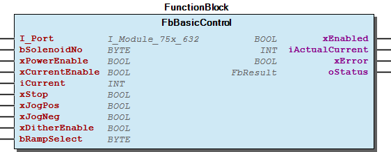
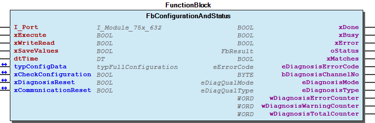

# WagoAppSolenoid v1.8.0.8 (WAGO) - Complete Documentation

### Documentation Index

WagoAppSolenoid

WAGO LayerView|App; WAGO FunctionalView|Device|IO; Application

WAGO/u010663

WagoAppSolenoid

This document is automatically generated.

Handling module 750-632 and 750-1632

Based on WagoAppSolenoid.library, last modified 15.05.2023, 18:24:17. LibDoc 4.1.1.0

© WAGO GmbH & Co. KG, Germany 2018 – All rights reserved. For the avoidance of doubt, this copyright notice does not only apply to the information above but also and primarily to the described library itself. Please note that third-party products are always mentioned without reference to intellectual property rights, including patents, utility models, designs and trademarks, accordingly the existence of such rights cannot be excluded. WAGO is a registered trademark of WAGO Verwaltungsgesellschaft mbH.

Company WAGO Title WagoAppSolenoid Version 1.8.0.8 Categories WAGO LayerView|App; WAGO FunctionalView|Device|IO; Application Author WAGO/u010663 Placeholder WagoAppSolenoid This document is automatically generated. Handling module 750-632 and 750-1632 - 20 Program Oranization Units Module 750-1632 - Module 750-632 30 Visualizations - Module 750-1632 - Module 750-632 80 Status - Status (GVL) - eStatus (Enum) 90 Internal - GlobalTextList (GlobalTextList) ParameterList (ParamList) VersionHistory (GVL) - File and Project Information - Library Reference Based on WagoAppSolenoid.library, last modified 15.05.2023, 18:24:17. LibDoc 4.1.1.0 © WAGO GmbH & Co. KG, Germany 2018 – All rights reserved. For the avoidance of doubt, this copyright notice does not only apply to the information above but also and primarily to the described library itself. Please note that third-party products are always mentioned without reference to intellectual property rights, including patents, utility models, designs and trademarks, accordingly the existence of such rights cannot be excluded. WAGO is a registered trademark of WAGO Verwaltungsgesellschaft mbH.

### Project Information

| Scope | Name | Type | Content |
| --- | --- | --- | --- |
| FileHeader | creationDateTime | date | 15.05.2023, 18:24:23 |
| companyName | string | WAGO |
| libraryFile | string | WagoAppSolenoid.library |
| productName | string | e!COCKPIT |
| contentFile | string | doc.clean.json |
| ProjectInformation | AutoResolveUnbound | bool | True |
| ProjectInformation | LastModificationDateTime | 15.05.2023, 18:24:17 |
| ProjectInformation | LibraryCategories | library-category-list | WAGO LayerView\|App; WAGO FunctionalView\|Device\|IO; Application |
| ProjectInformation | Author | string | WAGO/u010663 |
| ProjectInformation | Company | string | WAGO |
| ProjectInformation | CompiledLibraryCompatibilityVersion | string | CODESYS V3.5 SP16 Patch 3 |
| ProjectInformation | Copyright | string | © WAGO GmbH & Co. KG, Germany 2018 – All rights reserved. |
| ProjectInformation | Description | string | See: Description |
| ProjectInformation | DocFormat | string | reStructuredText |
| ProjectInformation | Placeholder | string | WagoAppSolenoid |
| ProjectInformation | Project | string | WagoAppSolenoid |
| ProjectInformation | Title | string | WagoAppSolenoid |
| ProjectInformation | Version string | string |  |
| ProjectInformation | Version | version | 1.8.0.8 |

### Library Information

| LinkAllContent: False Optional: False | PublishSymbolsInContainer: True QualifiedOnly: False | SystemLibrary: False |

| LinkAllContent: False Optional: False | QualifiedOnly: False | SystemLibrary: True |

| LinkAllContent: False Optional: False | QualifiedOnly: False | SystemLibrary: True |

| LinkAllContent: False Optional: False | QualifiedOnly: False | SystemLibrary: True |

| LinkAllContent: False Optional: False | QualifiedOnly: False | SystemLibrary: True |

| LinkAllContent: False Optional: False | QualifiedOnly: False | SystemLibrary: True |

| LinkAllContent: False Optional: False | QualifiedOnly: False | SystemLibrary: True |

| LinkAllContent: False Optional: False | QualifiedOnly: False | SystemLibrary: True |

| LinkAllContent: False Optional: False | QualifiedOnly: False | SystemLibrary: True |

| LinkAllContent: False Optional: False | QualifiedOnly: False | SystemLibrary: True |

| LinkAllContent: False Optional: False | QualifiedOnly: False | SystemLibrary: True |

| LinkAllContent: False Optional: False | QualifiedOnly: False | SystemLibrary: True |

| LinkAllContent: False Optional: False | QualifiedOnly: False | SystemLibrary: True |

| LinkAllContent: False Optional: False | QualifiedOnly: False | SystemLibrary: True |

| LinkAllContent: False Optional: False | QualifiedOnly: True | SystemLibrary: False |

| LinkAllContent: False Optional: False | QualifiedOnly: True | SystemLibrary: False |

| LinkAllContent: False Optional: False | QualifiedOnly: False | SystemLibrary: False |

| LinkAllContent: False Optional: False | QualifiedOnly: True | SystemLibrary: False |

| LinkAllContent: False Optional: False | QualifiedOnly: False | SystemLibrary: False |

| LinkAllContent: False Optional: False | QualifiedOnly: False | SystemLibrary: False |

| LinkAllContent: False Optional: False | QualifiedOnly: True | SystemLibrary: False |

This is a dictionary of all referenced libraries and their name spaces.

This is a dictionary of all referenced libraries and their name spaces. VisuDialogs Library Identification : Placeholder: VisuDialogs Default Resolution: VisuDialogs, * (System) Namespace: VisuDialogs Library Properties : VisuElem3DPath Library Identification : Placeholder: System_VisuElem3DPath Default Resolution: VisuElem3DPath, 4.1.0.0 (System) Namespace: VisuElem3DPath Library Properties : Library Parameter : Parameter: GC_POINTS_PER_POLYGON = 100 VisuElemCamDisplayer Library Identification : Placeholder: System_VisuElemCamDisplayer Default Resolution: VisuElemCamDisplayer, 4.2.0.0 (System) Namespace: VisuElemCamDisplayer Library Properties : Library Parameter : Parameter: GC_POINTS_PER_CAM = 100 VisuElemMeter Library Identification : Placeholder: System_VisuElemMeter Default Resolution: VisuElemMeter, 4.2.0.0 (System) Namespace: VisuElemMeter Library Properties : VisuElemTextEditor Library Identification : Placeholder: System_VisuElemTextEditor Default Resolution: VisuElemTextEditor, 4.2.0.0 (System) Namespace: VisuElemTextEditor Library Properties : VisuElemTrace Library Identification : Placeholder: System_VisuElemTrace Default Resolution: VisuElemTrace, 4.2.0.0 (System) Namespace: VisuElemTrace Library Properties : VisuElemXYChart Library Identification : Placeholder: System_VisuElemXYChart Default Resolution: VisuElemXYChart, 4.2.0.0 (System) Namespace: VisuElemXYChart Library Properties : VisuElems Library Identification : Placeholder: System_VisuElems Default Resolution: VisuElems, 4.2.0.0 (System) Namespace: VisuElems Library Properties : VisuElemsAlarm Library Identification : Placeholder: System_VisuElemsAlarm Default Resolution: VisuElemsAlarm, 4.2.0.0 (System) Namespace: VisuElemsAlarm Library Properties : VisuElemsDateTime Library Identification : Placeholder: System_VisuElemsDateTime Default Resolution: VisuElemsDateTime, 4.2.0.0 (System) Namespace: VisuElemsDateTime Library Properties : VisuElemsSpecialControls Library Identification : Placeholder: System_VisuElemsSpecialControls Default Resolution: VisuElemsSpecialControls, 4.2.0.0 (System) Namespace: VisuElemsSpecialControls Library Properties : VisuElemsWinControls Library Identification : Placeholder: System_VisuElemsWinControls Default Resolution: VisuElemsWinControls, 4.2.0.0 (System) Namespace: VisuElemsWinControls Library Properties : VisuInputs Library Identification : Placeholder: System_VisuInputs Default Resolution: VisuInputs, 4.2.0.0 (System) Namespace: VisuInputs Library Properties : VisuNativeControl Library Identification : Placeholder: System_VisuNativeControl Default Resolution: VisuNativeControl, 4.2.0.0 (System) Namespace: VisuNativeControl Library Properties : WagoSysErrorBase Library Identification : Placeholder: WagoSysErrorBase Default Resolution: WagoSysErrorBase, * (WAGO) Namespace: WagoSysErrorBase Library Properties : Library Parameter : Parameter: RES_LOG_MAX_ENTRIES = 200 Parameter: RES_LOG_MAX_FILES = 1 Parameter: RES_LOG_MAX_FILESIZE = 2000 Parameter: RES_LOG_NAME = ‘WagoAppResultLogger’ WagoSysPlainMem Library Identification : Placeholder: WagoSysPlainMem Default Resolution: WagoSysPlainMem, * (WAGO) Namespace: WagoSysPlainMem Library Properties : WagoSysVersion Library Identification : Name: WagoSysVersion Version: 1.0.0.0 Company: WAGO Namespace: WagoSysVersion Library Properties : WagoTypesErrorBase Library Identification : Placeholder: WagoTypesErrorBase Default Resolution: WagoTypesErrorBase, * (WAGO) Namespace: WagoTypesErrorBase Library Properties : WagoTypesModuleBase Library Identification : Placeholder: WagoTypesModuleBase Default Resolution: WagoTypesModuleBase, * (WAGO) Namespace: WagoTypesModuleBase Library Properties : Library Parameter : Parameter: MAX_MBX1_SIZE = 18 Parameter: MAX_MBX_INPUT_SIZE = 47 Parameter: MAX_MBX_OUTPUT_SIZE = 47 Parameter: MAX_MODULE_INPUT_SIZE = 48 Parameter: MAX_MODULE_OUTPUT_SIZE = 48 Parameter: MBX_PIPE_SIZE = 1024 WagoTypesModule_75x_1632 Library Identification : Placeholder: WagoTypesModule_75x_1632 Default Resolution: WagoTypesModule_75x_1632, * (WAGO) Namespace: WagoTypesModule_75x_1632 Library Properties : WagoTypesModule_75x_632 Library Identification : Placeholder: WagoTypesModule_75x_632 Default Resolution: WagoTypesModule_75x_632, * (WAGO) Namespace: WagoTypesModule_75x_632 Library Properties :

### Function Blocks

| Scope | Name | Type | Initial | Comment |
| --- | --- | --- | --- | --- |
| Input | I_Port | WagoTypesModule_75x_632.I_Module_75x_632 |  | Access to the modul |
| bSolenoidNo | BYTE | 1 | 1->solenoid one,2->solenoid two |
| xPowerEnable | BOOL |  | Enable power stage, Reset error |
| xCurrentEnable | BOOL |  | Enable current control |
| iCurrent | INT |  | Reference current in %,100%->that is 10.000 in the process image |
| xStop | BOOL |  | Stop ->timing details in manual 750-632 |
| xJogPos | BOOL |  | Jog in positive direction ->timing details in manual 750-632 |
| xJogNeg | BOOL |  | Jog in negative direction ->timing details in manual 750-632 |
| xDitherEnable | BOOL |  | Enable dither functionality, |
| bRampSelect | BYTE |  | Choose wich ramp to be used |
| Output | xEnabled | BOOL |  | Power stage enabled |
| Output | iActualCurrent | INT |  | Actual current |
| Output | xError | BOOL |  | Error occured |
| Output | oStatus | WagoSysErrorBase.FbResult |  | Status details |

Control a proportional valve

Graphical Illustration

Function Description

Each solenoid may be controlled by one function block FbBasicControl . Therefore up to two instances may be needed, if two solenoids are connected.

Interface variables Function Control a proportional valve Graphical Illustration  Function Description Each solenoid may be controlled by one function block FbBasicControl . Therefore up to two instances may be needed, if two solenoids are connected.

## FbBasicControl_1632 (FB)

| Scope | Name | Type | Initial | Comment |
| --- | --- | --- | --- | --- |
| Input | I_Port | WagoTypesModule_75x_1632.I_Module_75x_1632 |  | Access to the modul |
| bSolenoidNo | BYTE | 1 | 1->solenoid one,2->solenoid two |
| xPowerEnable | BOOL |  | Enable power stage, Reset error |
| xCurrentEnable | BOOL |  | Enable current control |
| xTeachEnable | BOOL |  | Activate teach in process |
| iCurrent | INT |  | Reference current in %,100%->that is 10.000 in the process image |
| xStop | BOOL |  | Stop ->timing details in manual 750-632 |
| xJogPos | BOOL |  | Jog in positive direction ->timing details in manual 750-632 |
| xJogNeg | BOOL |  | Jog in negative direction ->timing details in manual 750-632 |
| xDitherEnable | BOOL |  | Enable dither functionality, |
| bRampSelect | BYTE |  | Choose wich ramp to be used |
| Inout | typConfigData | typFullConfiguration_1632 |  | Configuration data ->details according to the manual 750-1632 |
| Output | xEnabled | BOOL |  | Power stage enabled |
| Output | iActualCurrent | INT |  | Actual current |
| Output | xTeachDone | BOOL |  | Teach procedure finished |
| Output | xError | BOOL |  | Error occured |
| Output | oStatus | WagoSysErrorBase.FbResult |  | Status details |

| Scope | Name | Type | Initial | Comment |
| --- | --- | --- | --- | --- |
| Input | I_Port | WagoTypesModule_75x_632.I_Module_75x_632 |  | Access to the module |
| xExecute | BOOL |  | Execute reading or writing of the configuration |
| xWriteRead | BOOL |  | 0:Read configuration, 1: Write configuration |
| xSaveValues | BOOL |  | 1:after write command values will be additional stored in EEPROM |
| dtTime | DT |  | time for timestamp in visaulisation tplDiagnosis |
| Inout | typConfigData | typFullConfiguration |  | Configuration data ->details according to the manual 750-632 |
| Inout | xCheckConfiguration | BOOL |  | the configuration data from input typConfigData will be compared with the terminals internal configuration, output xMatches shows result |
| Inout | xDiagnosisReset | BOOL |  | Reset diagnosis counter and buffer |
| Inout | xCommunicationReset | BOOL |  | Reset basic Mbx2 communication |
| Output | xDone | BOOL |  | Configuration job finished |
| Output | xBusy | BOOL |  | Configuration or check configuration active |
| Output | xError | BOOL |  | Error occured |
| Output | oStatus | WagoSysErrorBase.FbResult |  | Status information |
| Output | xMatches | BOOL |  | Result from Check configuration |
| Output | eDiagnosisErrorCode | eErrorCode |  | Details in manual 750-632 |
| Output | bDiagnosisChannelNo | BYTE |  | Diagnosis ->Channel number |
| Output | eDiagnosisMode | eDiagQualMode |  | Diagnosis ->Mode more info manual 750-632 |
| Output | eDiagnosisType | eDiagQualType |  | Diagnosis ->Type more info manual 750-632 |
| Output | wDiagnosisErrorCounter | WORD | 0 | Diagnosis ->Error counter |
| Output | wDiagnosisWarningCounter | WORD | 0 | Diagnosis ->Warning counter |
| Output | wDiagnosisTotalCounter | WORD | 0 | Diagnosis ->Total diagnosis counter |

Control a proportional valve

Graphical Illustration

Function Description

Each solenoid may be controlled by one function block FbBasicControl_1632 . Therefore up to two instances may be needed, if two solenoids are connected. A teach in procedure must be done once to adjust the internal settings according to the connected valve.

A function block reading status and diagnosis information from module 750-632. Additional functionality as reading and writing the configuration is supported.

Graphical Illustration

Function Description

This function block must be used once for each module 750-632 and it must be executed cyclic.

Only one job is supported at any time, so either read, write or check configuration.

Interface variables Function Control a proportional valve Graphical Illustration  Function Description Each solenoid may be controlled by one function block FbBasicControl_1632 . Therefore up to two instances may be needed, if two solenoids are connected. A teach in procedure must be done once to adjust the internal settings according to the connected valve. Interface variables Function A function block reading status and diagnosis information from module 750-632. Additional functionality as reading and writing the configuration is supported. Graphical Illustration  Function Description Note This function block must be used once for each module 750-632 and it must be executed cyclic. Only one job is supported at any time, so either read, write or check configuration. - FullConfig (Method)

## FbConfigurationAndStatus_1632 (FB)

| Scope | Name | Type | Initial | Comment |
| --- | --- | --- | --- | --- |
| Input | I_Port | WagoTypesModule_75x_1632.I_Module_75x_1632 |  | Access to the module |
| xExecute | BOOL |  | Execute reading or writing of the configuration |
| xWriteRead | BOOL |  | 0:Read configuration, 1: Write configuration |
| xSaveValues | BOOL |  | 1:after write command values will be additional stored in EEPROM |
| dtTime | DT |  | time for timestamp in visaulisation tplDiagnosis |
| Inout | typConfigData | typFullConfiguration_1632 |  | Configuration data ->details according to the manual 750-1632 |
| Inout | xCheckConfiguration | BOOL |  | the configuration data from input typConfigData will be compared with the terminals internal configuration, output xMatches shows result |
| Inout | xDiagnosisReset | BOOL |  | Reset diagnosis counter and buffer |
| Inout | xCommunicationReset | BOOL |  | Reset basic Mbx2 communication |
| Output | xDone | BOOL |  | Configuration job finished |
| Output | xBusy | BOOL |  | Configuration or check configuration active |
| Output | xError | BOOL |  | Error occured |
| Output | wError | WORD |  | Table number |
| Output | oStatus | WagoSysErrorBase.FbResult |  | Status information |
| Output | xMatches | BOOL |  | Result from Check configuration |
| Output | eDiagnosisErrorCode | eErrorCode_1632 |  | Details in manual 750-1632 |
| Output | bDiagnosisChannelNo | BYTE |  | Diagnosis ->Channel number |
| Output | eDiagnosisMode | eDiagQualMode |  | Diagnosis ->Mode more info manual 750-1632 |
| Output | eDiagnosisType | eDiagQualType |  | Diagnosis ->Type more info manual 750-1632 |
| Output | wDiagnosisErrorCounter | WORD | 0 | Diagnosis ->Error counter |
| Output | wDiagnosisWarningCounter | WORD | 0 | Diagnosis ->Warning counter |
| Output | wDiagnosisTotalCounter | WORD | 0 | Diagnosis ->Total diagnosis counter |

A function block reading status and diagnosis information from module 750-1632. Additional functionality as reading and writing the configuration is supported.

Graphical Illustration

Function Description

This function block must be used once for each module 750-632 and it must be executed cyclic.

Only one job is supported at any time, so either read, write or check configuration.

Interface variables Function A function block reading status and diagnosis information from module 750-1632. Additional functionality as reading and writing the configuration is supported. Graphical Illustration  Function Description Note This function block must be used once for each module 750-632 and it must be executed cyclic. Only one job is supported at any time, so either read, write or check configuration. - FullConfig (Method)

### Methods

## FbConfigurationAndStatus.FullConfig (METH)

| Scope | Name | Type | Comment |
| --- | --- | --- | --- |
| Input | xExecute | BOOL |  |
| xWriteRead | BOOL |  |
| xSaveValues | BOOL | 1:after write command values will be additional stored in EEPROM |
| Inout | typConfigData | typFullConfiguration |  |
| Output | xDone | BOOL |  |
| Output | xBusy | BOOL |  |
| Output | xError | BOOL |  |
| Output | wError | WORD | 32..69: Table no if write failed 256: Save user failed |

{attribute ‘conditionalshow’ := ‘wagoapplication’} Allows reading or writing the modules configuration

Filter setting is stored in typConfigData

Interface variables {attribute ‘conditionalshow’ := ‘wagoapplication’} Allows reading or writing the modules configuration Filter setting is stored in typConfigData

## FbConfigurationAndStatus_1632.FullConfig (METH)

| Scope | Name | Type | Comment |
| --- | --- | --- | --- |
| Input | xExecute | BOOL |  |
| xWriteRead | BOOL |  |
| xSaveValues | BOOL | 1:after write command values will be additional stored in EEPROM |
| Inout | typConfigData | typFullConfiguration_1632 |  |
| Output | xDone | BOOL |  |
| Output | xBusy | BOOL |  |
| Output | xError | BOOL |  |
| Output | wError | WORD | 132..175: Table number if write failed 256: Save user failed 257: Set Password failed 258: Prepare failed 259: Reboot necessary since module size changed 260: Reset Password failed |

{attribute ‘conditionalshow’ := ‘wagoapplication’} Allows reading or writing the modules configuration

Interface variables {attribute ‘conditionalshow’ := ‘wagoapplication’} Allows reading or writing the modules configuration

### Internal Components

## 90 Internal ¶

- GlobalTextList (GlobalTextList)

### Global Variable Lists

| Scope | Name | Type | Initial |
| --- | --- | --- | --- |
| Constant | StatusSolenoid_632 | ARRAY [0..19] OF WagoTypesErrorBase.typResultItem | [STRUCT(ID := eStatus.OK, Severity := WagoTypesErrorBase.WagoTypes.eSeverity.info, text := ‘OK’), STRUCT(ID := eStatus.FunctionBlockNotEnabled, Severity := WagoTypesErrorBase.WagoTypes.eSeverity.info, text := ‘FunctionBlockNotEnabled’), STRUCT(ID := eStatus.InProgress, Severity := WagoTypesErrorBase.WagoTypes.eSeverity.info, text := ‘InProgress’), STRUCT(ID := eStatus.Timeout, Severity := WagoTypesErrorBase.WagoTypes.eSeverity.error, text := ‘Timeout’), STRUCT(ID := eStatus.ReadingSettings, Severity := WagoTypesErrorBase.WagoTypes.eSeverity.info, text := ‘ReadingSettings’), STRUCT(ID := eStatus.WritingSettings, Severity := WagoTypesErrorBase.WagoTypes.eSeverity.info, text := ‘WritingSettings’), STRUCT(ID := eStatus.PowerMissing, Severity := WagoTypesErrorBase.WagoTypes.eSeverity.error, text := ‘PowerMissing’), STRUCT(ID := eStatus.StopActivated, Severity := WagoTypesErrorBase.WagoTypes.eSeverity.info, text := ‘StopActivated’), STRUCT(ID := eStatus.Occupied, Severity := WagoTypesErrorBase.WagoTypes.eSeverity.info, text := ‘Occupied’), STRUCT(ID := eStatus.PowerStageDisabled, Severity := WagoTypesErrorBase.WagoTypes.eSeverity.info, text := ‘PowerStageDisabled’), STRUCT(ID := eStatus.CommandAborted, Severity := WagoTypesErrorBase.WagoTypes.eSeverity.info, text := ‘CommandAborted’), STRUCT(ID := eStatus.Mbx2Initializing, Severity := WagoTypesErrorBase.WagoTypes.eSeverity.info, text := ‘Mbx2CommunicationInitializing’), STRUCT(ID := eStatus.CheckingConfiguration, Severity := WagoTypesErrorBase.WagoTypes.eSeverity.info, text := ‘CheckingConfiguration’), STRUCT(ID := eStatus.CommunicationResetNecessary, Severity := WagoTypesErrorBase.WagoTypes.eSeverity.error, text := ‘CommunicationReset necessary’), STRUCT(ID := eStatus.TurboModeStillActive, Severity := WagoTypesErrorBase.WagoTypes.eSeverity.error, text := ‘Turbo mode active, new configuration necessary’), STRUCT(ID := eStatus.CommandError, Severity := WagoTypesErrorBase.WagoTypes.eSeverity.error, text := ‘ErrorExecutingCommand’), STRUCT(ID := eStatus.InvalidParameter, Severity := WagoTypesErrorBase.WagoTypes.eSeverity.error, text := ‘InvalidParameter’), STRUCT(ID := eStatus.ModeNotDetected, Severity := WagoTypesErrorBase.WagoTypes.eSeverity.error, text := ‘ModeNotDetected’), STRUCT(ID := eStatus.UndefinedInterface, Severity := WagoTypesErrorBase.WagoTypes.eSeverity.warning, text := ‘No interface connected’), STRUCT(ID := eStatus.FaultInTable, Severity := WagoTypesErrorBase.WagoTypes.eSeverity.error, text := ‘Fault in table…details wError’)] |

| Name | Type |
| --- | --- |
| Info | ProjectInfo |

| date | version | author | change |
| 07.11.2022 | 1.8.0.8 | u010663 | Code refurbished |
| 19.08.2022 | 1.8.0.7 | u010663 | Improvement tplBasicControl_1632 |
| 18.08.2022 | 1.8.0.6 | u010663 | Bugfix typSolenoidVisuControl_1632 |
| 11.08.2022 | 1.8.0.5 | u010663 | Bugfix typSolenoidVisuControl_1632 |
| 27.07.2022 | 1.8.0.4 | u010663 | Bugfix FbBasicControl_1632 |
| 31.03.2022 | 1.8.0.2 | u010663 | Improvement FbBasicControl_1632 |
| 03.01.2022 | 1.8.0.1 | u010663 | Update diagnose codes 750-1632 |
| 02.11.2020 | 1.8.0.0 | u010663 | Support new module 750-1632 |
| 08.01.2019 | 1.7.1.0 | u015842 | Properties: free placeholder added |
| 04.04.2018 | 1.7.0.2 | u013972 | Resolve the placeholder for Collections with default |
| 23.11.2017 | 1.7.0.1 | u010663 | Improvement |
| 03.05.2017 | 1.7.0.0 | u010663 | Update to new WagoSysKBusService |
| 03.03.2016 | 1.6.0.1 | u010663 | Allow new FW 3 of module |
| 25.02.2016 | 1.6.0.0 | u010663 | Update according to WagoTypesModuleBase namespace changed |
| 19.01.2016 | 1.5.1.2 | u010663 | Update according to WagoTypesModuleBase |
| 18.12.2015 | 1.5.1.1 | u010663 | Improvement category entry |
| 02.12.2015 | 1.5.1.0 | u010663 | Improvement FBConfigurationAndStatus and tplDiagnosis |
| 17.11.2015 | 1.5.0.4 | u010663 | Improvement |
| 06.10.2015 | 1.5.0.3 | u010545 | Placeholder modyfied |
| 29.09.2015 | 1.5.0.2 | u010663 | Libraries inserted by placeholder |
| 24.08.2015 | 1.5.0.1 | u010663 | Placeholder added |
| 16.06.2015 | 1.5.0.0 | u010663 | Released |

Description: Status Information

WagoAppSolenoid.library

Release Notes:

Description: Status Information WagoAppSolenoid.library Release Notes:

### Other Components

## 20 Program Oranization Units

- Module 750-1632 Data types eErrorCode_1632 (Enum) - typBasicConfiguration_1632 (Struct) - typDither (Struct) - typFullConfiguration_1632 (Struct) - typPID (Struct) - typSolenoidVisuControl_1632 (Struct) FbBasicControl_1632 (FunctionBlock) FbConfigurationAndStatus_1632 (FunctionBlock) - FullConfig (Method) Module 750-632 - Data types eDiagQualMode (Enum) - eDiagQualType (Enum) - eErrorCode (Enum) - typBasicConfiguration (Struct) - typDiag (Struct) - typDiagQualifier (Struct) - typFullConfiguration (Struct) - typSolenoid (Struct) - typSolenoidVisuControl (Struct) FbBasicControl (FunctionBlock) FbConfigurationAndStatus (FunctionBlock) - FullConfig (Method)

## 30 Visualizations ¶

- Module 750-1632 - Module 750-632

## 80 Status ¶

| Scope | Name | Type | Initial | Comment |
| --- | --- | --- | --- | --- |
| Constant | SOLENOID_DIAG_BUFFER | BYTE | 10 | event buffer used by acyclic channel |
| SOLENOID_CONFIGURATION_TIMEOUT | TIME | TIME#5s0ms |  |

| Name | Initial | Comment |
| --- | --- | --- |
| MBX_NoDiag | 0 | no diagnosis message |
| MBX_DiagSingleShot | 1 | diagnosis message |
| MBX_DiagDisappears | 2 | diagnosis disappears |
| MBX_DiagAppears | 3 | diagnosis appears |

| Name | Initial | Comment |
| --- | --- | --- |
| MBX_DiagType_OK | 0 | OK |
| MBX_DiagNotification | 1 | Diagnosis is a notification |
| MBX_DiagWarning | 2 | Diagnosis is a warning |
| MBX_DiagError | 3 | Diagnosis is an error |

| Name | Initial |
| --- | --- |
| No_Error | 0 |
| SizeAcyclicChannelInvalid | 100 |
| SolenoidNoNotSupported | 101 |
| DriverError | 1000 |
| ModuleTemperatureWarning | 1001 |
| ModuleTemperatureError | 5 |
| OnEndSwitch_DI1 | 1002 |
| OnEndSwitch_DI2 | 1003 |
| OpenLoad | 6 |
| OverrangeError | 7 |
| UnderrangeError | 8 |
| SetPointRangeError | 141 |
| GeneralError | 9 |
| Undervoltage24V | 2 |
| ParameterChannel | 2000 |
| MBX_Rsp_Not_OK | 2003 |
| CmdInterface_Err | 2007 |
| ParaChErr | 16 |
| RegComErr | 2008 |
| ChannelError | 5000 |

- Status (GVL) - eStatus (Enum) - eDiagQualMode (Enum) - eDiagQualType (Enum) - eErrorCode (Enum) - typBasicConfiguration (Struct) - typDiag (Struct) - typDiagQualifier (Struct) - typFullConfiguration (Struct) - typSolenoid (Struct) - typSolenoidVisuControl (Struct) - eErrorCode_1632 (Enum) - typBasicConfiguration_1632 (Struct) - typDither (Struct) - typFullConfiguration_1632 (Struct) - typPID (Struct) - typSolenoidVisuControl_1632 (Struct) - Data types eErrorCode_1632 (Enum) - typBasicConfiguration_1632 (Struct) - typDither (Struct) - typFullConfiguration_1632 (Struct) - typPID (Struct) - typSolenoidVisuControl_1632 (Struct) FbBasicControl_1632 (FunctionBlock) FbConfigurationAndStatus_1632 (FunctionBlock) - FullConfig (Method) - Data types eDiagQualMode (Enum) - eDiagQualType (Enum) - eErrorCode (Enum) - typBasicConfiguration (Struct) - typDiag (Struct) - typDiagQualifier (Struct) - typFullConfiguration (Struct) - typSolenoid (Struct) - typSolenoidVisuControl (Struct) FbBasicControl (FunctionBlock) FbConfigurationAndStatus (FunctionBlock) - FullConfig (Method) InOut: InOut: InOut: InOut:

## eErrorCode_1632 (ENUM)

| Name | Initial |
| --- | --- |
| No_Error | 0 |
| ChannelError | 1 |
| SizeAcyclicChannelInvalid | 100 |
| SolenoidNoNotSupported | 101 |
| ControllercommunicationError | 4002 |
| CotrollerFWincompatible | 4003 |
| ModuleTemperatureWarning | 4004 |
| ModuleTemperatureError | 4000 |
| OnEndSwitch_DI1 | 4005 |
| OnEndSwitch_DI2 | 4006 |
| OpenLoad | 6 |
| OverrangeError | 7 |
| UnderrangeError | 8 |
| SetPointRangeError | 141 |
| GeneralError | 9 |
| Undervoltage_24V | 4001 |
| ParameterChannel | 2000 |
| MBX_Rsp_Not_OK | 2003 |
| CmdInterface_Err | 2007 |
| ParaChErr | 16 |
| RegComErr | 2008 |
| WireBreak | 5000 |
| WireBreakFeedback | 5001 |
| Overload | 5002 |
| ErrorTeachMode | 5003 |
| LimitSwitch | 5004 |
| CurrentController | 5005 |
| CurrentController1 | 5006 |
| CurrentOverlimit | 5007 |
| CurrentUnderlimit | 5008 |
| TurnOff | 5009 |
| SubstitutiionValueActive | 5010 |
| JogModeStandAlone | 5011 |
| LimitSwitch_1 | 1005 |
| LimitSwitch_2 | 1006 |
| SubstituteValueActive_1 | 1007 |
| SubstituteValueActive_2 | 1008 |

| Name | Initial | Comment |
| --- | --- | --- |
| OK | 0 | OK |
| FunctionBlockNotEnabled | 1 | Function block not enabled |
| Timeout | 2 | Timeout occured |
| InProgress | 3 | Job is active |
| ReadingSettings | 4 | Reading configuration values |
| WritingSettings | 5 | Writing configuration values |
| PowerMissing | 6 | Power missing |
| StopActivated | 7 | Stop activated |
| Occupied | 8 | Module is occupied by another function block, this function block is waiting to get access to the module |
| PowerStageDisabled | 9 | The power stage is disabled |
| CommandAborted | 10 | Command has been aborted before the job could be finished |
| Mbx2Initializing | 11 | Basic communication will be setup |
| CheckingConfiguration | 12 | Checking configuration |
| CommunicationResetNecessary | 13 | Communication reset necessary |
| TurboModeStillActive | 14 | Turbo mode still active ->new configuration necessary |
| InvalidParameter | 48 | Invalid parameter |
| CommandError | 49 | More than one command active,e.g. xStart and xJogPos |
| ModeNotDetected | 50 |  |
| UndefinedInterface | 51 | Input I_Port=0, invalid entry |
| FaultIntable | 52 | Fault in table ->details output wError |

| Name | Type | Comment |
| --- | --- | --- |
| bValveConfig | BYTE |  |
| CoilConfig | WORD | 0..3 |
| NominalCurrent | WORD |  |
| ValveAdjustment | typSolenoid |  |

Description: Status Information

InOut: InOut: Description: Status Information InOut:

## typBasicConfiguration_1632 (STRUCT)

| Name | Type | Comment |
| --- | --- | --- |
| bValveConfig | BYTE |  |
| CoilConfig | WORD | 0..3 |
| NominalCurrent | WORD |  |
| ValveAdjustment | typSolenoid |  |
| Dither | typDither |  |
| NullPointOffset | UINT |  |
| PID | typPID |  |

| Name | Type |
| --- | --- |
| Service_ID | BYTE |
| EventCode | WORD |
| ChannelNo | BYTE |
| DiagQualifier | typDiagQualifier |
| DiagCodeString | STRING |
| DiagQualModeString | STRING |
| DiagQualTypeString | STRING |
| DiagTime | DT |

| Name | Type |
| --- | --- |
| DiagMode | eDiagQualMode |
| DiagTYPE | eDiagQualType |

| Name | Type |
| --- | --- |
| Frequency | WORD |
| Amplitude | WORD |
| WaveForm | WORD |

| Name | Type | Comment |
| --- | --- | --- |
| aRegister | ARRAY [0..gcMC4_MaxBufferClassicRegister] OF WORD | module register |
| Table32 | ARRAY [1..gcMC4_Table32Max] OF WORD |  |
| Table33 | ARRAY [1..gcMC4_Table33Max] OF WORD |  |
| Table34 | ARRAY [1..gcMC4_Table34Max] OF WORD |  |
| Table35 | ARRAY [1..gcMC4_Table35Max] OF WORD |  |
| Table36 | ARRAY [1..gcMC4_Table36Max] OF WORD |  |
| Table37 | ARRAY [1..gcMC4_Table37Max] OF WORD |  |
| Table40 | ARRAY [1..gcMC4_Table40Max] OF WORD |  |
| Table50 | ARRAY [1..gcMC4_Table50Max] OF WORD |  |
| Table51 | ARRAY [1..gcMC4_Table51Max] OF WORD |  |
| Table52 | ARRAY [1..gcMC4_Table52Max] OF WORD |  |
| Table53 | ARRAY [1..gcMC4_Table53Max] OF WORD |  |
| Table56 | ARRAY [1..gcMC4_Table56Max] OF WORD |  |
| Table57 | ARRAY [1..gcMC4_Table57Max] OF WORD |  |
| Table58 | ARRAY [1..gcMC4_Table58Max] OF WORD |  |
| Table59 | ARRAY [1..gcMC4_Table59Max] OF WORD |  |
| Table60 | ARRAY [1..gcMC4_Table60Max] OF WORD |  |
| Table61 | ARRAY [1..gcMC4_Table61Max] OF WORD |  |
| Table62 | ARRAY [1..gcMC4_Table62Max] OF WORD |  |
| Table63 | ARRAY [1..gcMC4_Table63Max] OF WORD |  |
| Table68 | ARRAY [1..gcMC4_Table68Max] OF WORD |  |
| Table69 | ARRAY [1..gcMC4_Table69Max] OF WORD |  |

InOut: InOut: InOut: InOut: InOut:

## typFullConfiguration_1632 (STRUCT)

| Name | Type | Comment |
| --- | --- | --- |
| aRegister | ARRAY [0..(gcMC4_MaxBufferClassicRegister_1632 - 1)] OF WORD | module register |
| Table133 | ARRAY [1..gcMC4_Table133Max] OF WORD |  |
| Table134 | ARRAY [1..gcMC4_Table134Max] OF WORD |  |
| Table140 | ARRAY [1..gcMC4_Table140Max] OF WORD |  |
| Table150 | ARRAY [1..gcMC4_Table150Max] OF WORD |  |
| Table151 | ARRAY [1..gcMC4_Table151Max] OF WORD |  |
| Table152 | ARRAY [1..gcMC4_Table152Max] OF WORD |  |
| Table153 | ARRAY [1..gcMC4_Table153Max] OF WORD |  |
| Table156 | ARRAY [1..gcMC4_Table156Max] OF WORD |  |
| Table157 | ARRAY [1..gcMC4_Table157Max] OF WORD |  |
| Table158 | ARRAY [1..gcMC4_Table158Max] OF INT |  |
| Table159 | ARRAY [1..gcMC4_Table159Max] OF INT |  |
| Table160 | ARRAY [1..gcMC4_Table160Max] OF WORD |  |
| Table161 | ARRAY [1..gcMC4_Table161Max] OF WORD |  |
| Table162 | ARRAY [1..gcMC4_Table162Max] OF WORD |  |
| Table163 | ARRAY [1..gcMC4_Table163Max] OF WORD |  |
| Table166 | ARRAY [1..gcMC4_Table166Max] OF WORD |  |
| Table167 | ARRAY [1..gcMC4_Table167Max] OF WORD |  |
| Table168 | ARRAY [1..gcMC4_Table168Max] OF WORD |  |
| Table169 | ARRAY [1..gcMC4_Table169Max] OF WORD |  |
| Table174 | ARRAY [1..gcMC4_Table174Max] OF WORD |  |
| Table175 | ARRAY [1..gcMC4_Table175Max] OF WORD |  |

| Name | Type |
| --- | --- |
| Kp | WORD |
| Ki | WORD |
| Kd | WORD |

| Name | Type |
| --- | --- |
| Enable | WORD |
| Trigger | WORD |
| MinA | WORD |
| MaxA | WORD |
| MinB | WORD |
| MaxB | WORD |

| Name | Type | Initial | Comment |
| --- | --- | --- | --- |
| Solenoid1_FbBasicControl | FbBasicControl |  |  |
| Solenoid1_xPowerEnable | BOOL |  |  |
| Solenoid1_xCurrentEnable | BOOL |  |  |
| Solenoid1_xStop | BOOL |  |  |
| Solenoid1_xJogPos | BOOL |  |  |
| Solenoid1_xJogNeg | BOOL |  |  |
| Solenoid1_xDitherEnable | BOOL |  |  |
| Solenoid1_iCurrent | INT |  |  |
| Solenoid1_bRampSelect | BYTE |  |  |
| Solenoid1_xEnabled | BOOL |  |  |
| Solenoid1_xError | BOOL |  |  |
| Solenoid1_iActualCurrent | INT |  |  |
| Solenoid1_eErrorCode | eErrorCode |  |  |
| Solenoid2_FbBasicControl | FbBasicControl |  |  |
| Solenoid2_xPowerEnable | BOOL |  |  |
| Solenoid2_xCurrentEnable | BOOL |  |  |
| Solenoid2_xStop | BOOL |  |  |
| Solenoid2_xJogPos | BOOL |  |  |
| Solenoid2_xJogNeg | BOOL |  |  |
| Solenoid2_xDitherEnable | BOOL |  |  |
| Solenoid2_iCurrent | INT |  |  |
| Solenoid2_bRampSelect | BYTE |  |  |
| Solenoid2_xEnabled | BOOL |  |  |
| Solenoid2_xError | BOOL |  |  |
| Solenoid2_iActualCurrent | INT |  |  |
| Solenoid2_eErrorCode | eErrorCode |  |  |
| DiagnosisReset | BOOL |  | ExtendedDiagnosisEnabled:BOOL:=TRUE; |
| BasicConfig_xExecute | BOOL |  |  |
| BasicConfig_xWriteRead | BOOL |  |  |
| BasicConfig_aBaseConfig | ARRAY [0..1] OF typBasicConfiguration | [STRUCT(bValveConfig := 1, CoilConfig := 1, NominalCurrent := 1000, ValveAdjustment := STRUCT(Enable := 1, Trigger := 0, MinA := 0, MaxA := 10000, MinB := 0, MaxB := 10000)), STRUCT(bValveConfig := 1, CoilConfig := 1, NominalCurrent := 1000, ValveAdjustment := STRUCT(Enable := 1, Trigger := 0, MinA := 0, MaxA := 10000, MinB := 0, MaxB := 10000))] |  |
| BasicConfig_xDone | BOOL |  |  |
| BasicConfig_xBusy | BOOL |  |  |
| BasicConfig_xError | BOOL |  |  |
| FullConfig | FbConfigurationAndStatus |  |  |
| FullConfig_xExecute | BOOL |  |  |
| FullConfig_xWriteRead | BOOL |  |  |
| FullConfig_xSaveValues | BOOL |  |  |
| FullConfig_xCheckConfiguration | BOOL |  |  |
| FullConfig_typConfigData | typFullConfiguration | STRUCT(aRegister := [16#0, 16#50C, 16#1, 16#DEAD, 0], Table32 := [102, 97], Table33 := [10, 0, 0], Table34 := [10, 0, 0], Table35 := [8(0)], Table36 := [4(0)], Table37 := [4(0)], Table50 := [0, 0, 0, 0, 100, 100, 18], Table51 := [0, 0, 0, 0, 100, 100, 18], Table52 := [1, 2000, 97, 102, 0, 7000, 33, 0], Table53 := [1, 2000, 97, 102, 0, 7000, 33, 0], Table56 := [1, 0, 10, 10, 9(1), 10], Table57 := [1, 0, 10, 10, 9(1), 10], Table58 := [41(0)], Table59 := [41(0)], Table60 := [1, 0, 0, 10000, 0, 10000], Table61 := [1, 0, 0, 10000, 0, 10000], Table62 := [1, 10, 1000, 1, 1], Table63 := [1, 10, 1000, 1, 1], Table68 := [1, 0, 0, 3000, 1000, 1000, 2, 0, 0, 0, 1, 0], Table69 := [1, 0, 0, 3000, 1000, 1000, 2, 0, 0, 0, 1, 0]) |  |
| FullConfig_xDone | BOOL |  |  |
| FullConfig_xBusy | BOOL |  |  |
| FullConfig_xError | BOOL |  |  |
| FullConfig_wError | WORD |  |  |
| FullConfig_xMatches | BOOL |  |  |
| ConfigCheck_xExecute | BOOL |  |  |
| ConfigCheck_xBusy | BOOL |  |  |
| ConfigCheck_xError | BOOL |  |  |
| ConfigCheck_xDataMatches | BOOL |  |  |

InOut: InOut: InOut: InOut:

## typSolenoidVisuControl_1632 (STRUCT)

| Name | Type | Initial | Comment |
| --- | --- | --- | --- |
| Solenoid1_FbBasicControl | FbBasicControl_1632 |  |  |
| Solenoid1_xPowerEnable | BOOL |  |  |
| Solenoid1_xCurrentEnable | BOOL |  |  |
| Solenoid1_xTeach | BOOL |  |  |
| Solenoid1_xStop | BOOL |  |  |
| Solenoid1_xJogPos | BOOL |  |  |
| Solenoid1_xJogNeg | BOOL |  |  |
| Solenoid1_xDitherEnable | BOOL |  |  |
| Solenoid1_iCurrent | INT |  |  |
| Solenoid1_bRampSelect | BYTE |  |  |
| Solenoid1_xEnabled | BOOL |  |  |
| Solenoid1_xError | BOOL |  |  |
| Solenoid1_xTeachDone | BOOL |  |  |
| Solenoid1_xSavePid | BOOL |  |  |
| Solenoid1_xReadPid | BOOL |  |  |
| Solenoid1_iActualCurrent | INT |  |  |
| Solenoid1_eErrorCode | eErrorCode_1632 |  |  |
| Solenoid1_FbStatus_1 | WagoSysErrorBase.fbShowResult |  |  |
| Solenoid2_FbBasicControl | FbBasicControl_1632 |  |  |
| Solenoid2_xPowerEnable | BOOL |  |  |
| Solenoid2_xTeach | BOOL |  |  |
| Solenoid2_xCurrentEnable | BOOL |  |  |
| Solenoid2_xStop | BOOL |  |  |
| Solenoid2_xJogPos | BOOL |  |  |
| Solenoid2_xJogNeg | BOOL |  |  |
| Solenoid2_xDitherEnable | BOOL |  |  |
| Solenoid2_iCurrent | INT |  |  |
| Solenoid2_bRampSelect | BYTE |  |  |
| Solenoid2_xEnabled | BOOL |  |  |
| Solenoid2_xError | BOOL |  |  |
| Solenoid2_xTeachDone | BOOL |  |  |
| Solenoid2_xSavePid | BOOL |  |  |
| Solenoid2_xReadPid | BOOL |  |  |
| Solenoid2_iActualCurrent | INT |  |  |
| Solenoid2_eErrorCode | eErrorCode_1632 |  |  |
| Solenoid2_FbStatus_1 | WagoSysErrorBase.fbShowResult |  |  |
| DiagnosisReset | BOOL |  | ExtendedDiagnosisEnabled:BOOL:=TRUE; |
| BasicConfig_xExecute | BOOL |  |  |
| BasicConfig_xWriteRead | BOOL |  |  |
| BasicConfig_xSaveValues | BOOL |  |  |
| BasicConfig_aBaseConfig | ARRAY [0..1] OF typBasicConfiguration_1632 | [STRUCT(bValveConfig := 1, CoilConfig := 1, NominalCurrent := 2000, ValveAdjustment := STRUCT(Enable := 1, Trigger := 0, MinA := 0, MaxA := 10000, MinB := 0, MaxB := 10000), Dither := STRUCT(Frequency := 25, Amplitude := 1000, Waveform := 0), PID := STRUCT(Kp := 57, Ki := 70, Kd := 3)), STRUCT(bValveConfig := 1, CoilConfig := 1, NominalCurrent := 2000, ValveAdjustment := STRUCT(Enable := 1, Trigger := 0, MinA := 0, MaxA := 10000, MinB := 0, MaxB := 10000), Dither := STRUCT(Frequency := 25, Amplitude := 1000, Waveform := 0), PID := STRUCT(Kp := 57, Ki := 70, Kd := 3))] |  |
| BasicConfig_xDone | BOOL |  |  |
| BasicConfig_xBusy | BOOL |  |  |
| BasicConfig_xError | BOOL |  |  |
| FullConfig_FbConfigurationAndStatus_1632 | FbConfigurationAndStatus_1632 |  |  |
| FullConfig_xExecute | BOOL |  |  |
| FullConfig_xWriteRead | BOOL |  |  |
| FullConfig_xSaveValues | BOOL |  |  |
| FullConfig_xDiagnosisReset | BOOL |  |  |
| FullConfig_xCommunicationReset | BOOL |  |  |
| FullConfig_xCheckConfiguration | BOOL |  |  |
| FullConfig_typConfigData | typFullConfiguration_1632 | STRUCT(aRegister := [16#0, 16#50C, 16#101], Table133 := [10, 0, 0], Table134 := [10, 0, 0], Table140 := [0], Table150 := [0, 0, 0, 100, 200, 0, 0, 0], Table151 := [0, 0, 0, 100, 200, 0, 0, 0], Table152 := [1, 2000, 0], Table153 := [1, 2000, 0], Table156 := [10, 10, 7(1), 10], Table157 := [10, 10, 7(1), 10], Table158 := [0, 2(-10000), 2(-9000), 2(-8000), 2(-7000), 2(-6000), 2(-5000), 2(-4000), 2(-3000), 2(-2000), 2(-1000), 2(1000), 2(2000), 2(3000), 2(4000), 2(5000), 2(6000), 2(7000), 2(8000), 2(9000), 2(10000)], Table159 := [0, 2(-10000), 2(-9000), 2(-8000), 2(-7000), 2(-6000), 2(-5000), 2(-4000), 2(-3000), 2(-2000), 2(-1000), 2(1000), 2(2000), 2(3000), 2(4000), 2(5000), 2(6000), 2(7000), 2(8000), 2(9000), 2(10000)], Table160 := [1, 0, 10000, 0, 10000], Table161 := [1, 0, 10000, 0, 10000], Table162 := [25, 1000, 1, 1, 0, 1, 0], Table163 := [25, 1000, 1, 1, 0, 1, 0], Table166 := [0], Table167 := [0], Table168 := [57, 70, 3], Table169 := [57, 70, 3], Table174 := [0], Table175 := [0]) | Tabelle 133,134, 140, 150, 151, 152, 153, 156, 157, 158, 159, 160, 161, 162, 163, 166, 167, 168, 169, 174, 175. |
| FullConfig_xDone | BOOL |  |  |
| FullConfig_xBusy | BOOL |  |  |
| FullConfig_xError | BOOL |  |  |
| FullConfig_wError | WORD |  |  |
| FullConfig_xMatches | BOOL |  |  |
| FullConfig_FbStatus | WagoSysErrorBase.fbShowResult |  |  |
| ConfigCheck_xExecute | BOOL |  |  |
| ConfigCheck_xBusy | BOOL |  |  |
| ConfigCheck_xError | BOOL |  |  |
| ConfigCheck_xDataMatches | BOOL |  |  |