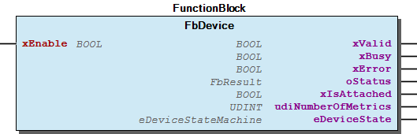
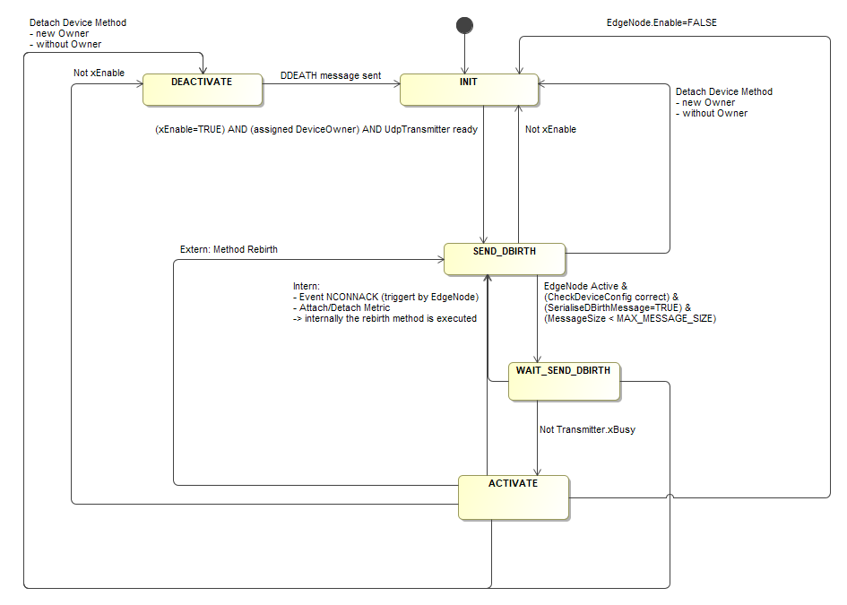
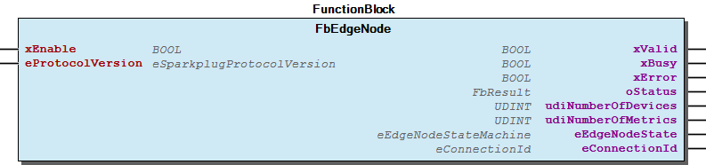

# WagoAppSparkplug v1.0.2.1 (WAGO) - Complete Documentation


## 📋 Library Information

- **Company:** WAGO
- **Title:** WagoAppSparkplug
- **Version:** 1.0.2.1
- **Categories:** Application; WAGO LayerView|App; WAGO FunctionalView|Connectivity
- **Namespace:** WagoAppSparkplug
- **Author:** WAGO / u014791
- **Placeholder:** WagoAppSparkplug

### Description ¶


This document is automatically generated.

WagoAppSparkplug: Implementation of the sparkplug specification.

The function blocks of this library are NOT thread safe and must be called from one CODESYS task only! Concurrent calls from different tasks may cause loss or corruption of data.

This document is automatically generated. WagoAppSparkplug: Implementation of the sparkplug specification. The function blocks of this library are NOT thread safe and must be called from one CODESYS task only! Concurrent calls from different tasks may cause loss or corruption of data.

### Contents: ¶


Contents: - Documentation Index 10 Documentation - WagoAppSparkplug Library Documentation Project Information Library Information Function Blocks - FbDevice (FB) - FbEdgeNode (FB) - FbMetric (FB) - FbProperty (FB) - FbStatus_Sparkplug (FB) - FbValue (FB) - doc01_Foreword (FB) - doc10_CloudConnectivity_Sparkplug (FB) Methods - FbDevice.AttachMetric (METH) - FbDevice.DetachMetric (METH) - FbDevice.Rebirth (METH) - FbEdgeNode.AttachDevice (METH) - FbEdgeNode.AttachMetric (METH) - FbEdgeNode.DetachDevice (METH) - FbEdgeNode.DetachMetric (METH) - FbEdgeNode.Rebirth (METH) - FbMetric.AttachProperty (METH) - FbMetric.DetachProperty (METH) - ... and 7 more Interfaces - I_CommandMetricCallback (ITF) - I_EdgeNode (ITF) - I_Metric (ITF) - I_Value (ITF) Program Organization Internal Components Global Variable Lists - GVL (GVL) - Status (GVL) - VersionHistory (GVL) Other Components - 80 Status - Diagnose - Enums - FbDevice.Name (PROP) - FbEdgeNode.GroupId (PROP) - FbEdgeNode.Name (PROP) - FbMetric.Alias (PROP) - FbMetric.Boolean (PROP) - FbMetric.CommandMetricCallback (PROP) - FbMetric.DataType (PROP) - ... and 84 more

### Indices and tables ¶


Based on WagoAppSparkplug.library, last modified 29.05.2024, 20:49:03. LibDoc 3.5.16.10

© WAGO GmbH & Co. KG, Germany 2018 – All rights reserved. For the avoidance of doubt, this copyright notice does not only apply to the information above but also and primarily to the described library itself. Please note that third-party products are always mentioned without reference to intellectual property rights, including patents, utility models, designs and trademarks, accordingly the existence of such rights cannot be excluded. WAGO is a registered trademark of WAGO Verwaltungsgesellschaft mbH.

- File and Project Information - Library Reference Based on WagoAppSparkplug.library, last modified 29.05.2024, 20:49:03. LibDoc 3.5.16.10 © WAGO GmbH & Co. KG, Germany 2018 – All rights reserved. For the avoidance of doubt, this copyright notice does not only apply to the information above but also and primarily to the described library itself. Please note that third-party products are always mentioned without reference to intellectual property rights, including patents, utility models, designs and trademarks, accordingly the existence of such rights cannot be excluded. WAGO is a registered trademark of WAGO Verwaltungsgesellschaft mbH.

### Documentation Index


## 10 Documentation


- doc01_Foreword (FB) - doc10_CloudConnectivity_Sparkplug (FB)

## WagoAppSparkplug Library Documentation


| Company: | WAGO |
| Title: | WagoAppSparkplug |
| Version: | 1.0.2.1 |
| Categories: | Application; WAGO LayerView\|App; WAGO FunctionalView\|Connectivity |
| Namespace: | WagoAppSparkplug |
| Author: | WAGO / u014791 |
| Placeholder: | WagoAppSparkplug |

### Description


This document is automatically generated.

WagoAppSparkplug: Implementation of the sparkplug specification.

The function blocks of this library are NOT thread safe and must be called from one CODESYS task only! Concurrent calls from different tasks may cause loss or corruption of data.

This document is automatically generated. WagoAppSparkplug: Implementation of the sparkplug specification. The function blocks of this library are NOT thread safe and must be called from one CODESYS task only! Concurrent calls from different tasks may cause loss or corruption of data.

### Contents:


- 10 Documentation doc01_Foreword (FB) - doc10_CloudConnectivity_Sparkplug (FB) 20 Program Organization Units - Enums - Function Blocks - Interfaces 80 Status - Status (GVL) - eStatus (ENUM) 90 Internal - FbValue (FB) GVL (GVL) ParameterList (PARAMS) VersionHistory (GVL)

### Indices and tables


Based on WagoAppSparkplug.library, last modified 29.05.2024, 20:49:03. LibDoc 3.5.16.10

© WAGO GmbH & Co. KG, Germany 2018 – All rights reserved. For the avoidance of doubt, this copyright notice does not only apply to the information above but also and primarily to the described library itself. Please note that third-party products are always mentioned without reference to intellectual property rights, including patents, utility models, designs and trademarks, accordingly the existence of such rights cannot be excluded. WAGO is a registered trademark of WAGO Verwaltungsgesellschaft mbH.

- File and Project Information - Library Reference Based on WagoAppSparkplug.library, last modified 29.05.2024, 20:49:03. LibDoc 3.5.16.10 © WAGO GmbH & Co. KG, Germany 2018 – All rights reserved. For the avoidance of doubt, this copyright notice does not only apply to the information above but also and primarily to the described library itself. Please note that third-party products are always mentioned without reference to intellectual property rights, including patents, utility models, designs and trademarks, accordingly the existence of such rights cannot be excluded. WAGO is a registered trademark of WAGO Verwaltungsgesellschaft mbH.

### Project Information


## File and Project Information


| Scope | Name | Type | Content |
| --- | --- | --- | --- |
| FileHeader | libraryFile | string | WagoAppSparkplug.library |
| contentFile | doc.clean.json |
| productName | e!COCKPIT |
| creationDateTime | date | 29.05.2024, 20:49:05 |
| companyName | string | WAGO |
| ProjectInformation | LastModificationDateTime | date | 29.05.2024, 20:49:03 |
| Description | string | See: Description |
| Copyright | © WAGO GmbH & Co. KG, Germany 2022 – All rights reserved. |
| Author | WAGO / u014791 |
| AutoResolveUnbound | bool | True |
| LanguageModelAttribute | string | qualified-access-only |
| Company | WAGO |
| DocFormat | reStructuredText |
| SourceLibrary | bool | False |
| Project | string | WagoAppSparkplug |
| DefaultNamespace | WagoAppSparkplug |
| Version | version | 1.0.2.1 |
| ThreadSafe | string | False |
| Title | WagoAppSparkplug |
| Released | bool | False |
| Placeholder | string | WagoAppSparkplug |
| LibraryCategories | library-category-list | Application; WAGO LayerView\|App; WAGO FunctionalView\|Connectivity |
| CompiledLibraryCompatibilityVersion | string | CODESYS V3.5 SP16 Patch 3 |
| IsEndUserLibrary | bool | False |

### Library Information


## Library Reference


| LinkAllContent: False QualifiedOnly: False | SystemLibrary: True | Optional: False |

| LinkAllContent: False QualifiedOnly: True | SystemLibrary: False | Optional: False |

| LinkAllContent: False QualifiedOnly: True | SystemLibrary: False | Optional: False |

| LinkAllContent: False QualifiedOnly: False | SystemLibrary: True | Optional: False |

| LinkAllContent: False QualifiedOnly: False | SystemLibrary: False | Optional: False |

| LinkAllContent: False QualifiedOnly: False | SystemLibrary: False | Optional: False |

| LinkAllContent: False QualifiedOnly: True | SystemLibrary: False | Optional: False |

| LinkAllContent: False QualifiedOnly: False | SystemLibrary: False PublishSymbolsInContainer: True | Optional: False |

| LinkAllContent: False QualifiedOnly: False | SystemLibrary: False | Optional: False |

| LinkAllContent: False QualifiedOnly: False | SystemLibrary: False | Optional: False |

| LinkAllContent: False Optional: False | QualifiedOnly: False SystemLibrary: False | PublishSymbolsInContainer: True |

| LinkAllContent: False QualifiedOnly: False | SystemLibrary: False | Optional: False |

| LinkAllContent: False Optional: False | QualifiedOnly: False SystemLibrary: False | PublishSymbolsInContainer: True |

This is a dictionary of all referenced libraries and their name spaces.

This is a dictionary of all referenced libraries and their name spaces. Analyzation Library Identification : Placeholder: Analyzation Default Resolution: Analyzation, 3.5.2.0 (System) Namespace: Analyzation Library Properties : Library Parameter : Parameter: TABLE_UPPER_BOUND = 15 Parameter: STRING_LENGTH_ADDRESS = 20 Parameter: STRING_LENGTH_EXP = 255 Parameter: STRING_LENGTH_COMMENT = 255 Parameter: TABLE_SHOW_VALID_ITEMS = FALSE Parameter: STRING_LENGTH_OUTSTRING = 255 CAA FB Factory Library Identification : Placeholder: CAA FB Factory Default Resolution: CAA FB Factory, * (CAA Technical Workgroup) Namespace: FBF Library Properties : CAA Types Extern Library Identification : Placeholder: CAA Types Default Resolution: CAA Types Extern, * (CAA Technical Workgroup) Namespace: CAA Library Properties : IecSfc Library Identification : Placeholder: IecSfc Default Resolution: IecSfc, 3.4.2.0 (System) Namespace: IecSfc Library Properties : WagoAppString Library Identification : Placeholder: WagoAppString Default Resolution: WagoAppString, * (WAGO) Namespace: WagoAppString Library Properties : WagoAppTime Library Identification : Placeholder: WagoAppTime Default Resolution: WagoAppTime, * (WAGO) Namespace: WagoAppTime Library Properties : WagoSysCloud Library Identification : Placeholder: WagoSysCloud Default Resolution: WagoSysCloud, * (Wago) Namespace: WagoSysCloud Library Properties : WagoSysErrorBase Library Identification : Placeholder: WagoSysErrorBase Default Resolution: WagoSysErrorBase, * (WAGO) Namespace: WagoSysErrorBase Library Properties : Library Parameter : Parameter: RES_LOG_MAX_FILESIZE = 2000 Parameter: RES_LOG_MAX_FILES = 1 Parameter: RES_LOG_MAX_ENTRIES = 200 Parameter: RES_LOG_NAME = ‘WagoAppResultLogger’ WagoSysPlainMem Library Identification : Placeholder: WagoSysPlainMem Default Resolution: WagoSysPlainMem, * (WAGO) Namespace: WagoSysPlainMem Library Properties : WagoSysSocket_Internal_PFC Library Identification : Placeholder: WagoSysSocketInternal Default Resolution: WagoSysSocket_Internal_PFC, * (WAGO) Namespace: WagoSysSocket_internal Library Properties : WagoSysString Library Identification : Placeholder: WagoSysString Default Resolution: WagoSysString, * (WAGO) Namespace: WagoSysString Library Properties : WagoSysVersion Library Identification : Name: WagoSysVersion Version: 1.0.0.0 Company: WAGO Namespace: WagoSysVersion Library Properties : WagoTypesErrorBase Library Identification : Placeholder: WagoTypesErrorBase Default Resolution: WagoTypesErrorBase, * (WAGO) Namespace: WagoTypesErrorBase Library Properties :

### Function Blocks


## FbDevice (FB)


| Scope | Name | Type | Initial | Comment |
| --- | --- | --- | --- | --- |
| Input | xEnable | BOOL |  | xEnable controls the state of the device. The state of the device is also dependent on the EdgeNode. |
| Output | xValid | BOOL |  | Indicates that the function block is active (xBusy and not xError) |
| xBusy | BOOL |  | Indicates that the process is running |
| xError | BOOL |  | Indicates that an error status exists |
| oStatus | WagoSysErrorBase.FbResult |  | Holds the last error that has occured |
| xIsAttached | BOOL |  | Information if the device is attached into the edge node |
| udiNumberOfMetrics | UDINT |  | Current number of plugged metrics |
| eDeviceState | eDeviceStateMachine | eDeviceStateMachine.INIT | State of the device state machine |

```
VAR
    oEdgeNode : WagoAppSparkplug.FbEdgeNode(eConnection := 1) := (Name := 'MyEdgeNodeName', GroupId := 'MyGroupId');
    oDevice1  : WagoAppSparkplug.FbDevice := (Name := 'MyDeviceName');
END_VAR

//Initialisation: Attach also the necessary metrics and properties to the device
oEdgeNode.AttachDevice(oDevice1);

//Running: Set the TriggerValue of the metrics to send new values of the metrics.
oEdgeNode(  xEnable := TRUE );
oDevice(    xEnable := TRUE );
```

The FbDevice function block controls the device together with the included metrics.

Graphical Illustration

Function Description

The device dependents on the EdgeNode and only becomes active when the EdgeNode is activated.

Following diagram is showing the state machine of the device:

Interface variables Function The FbDevice function block controls the device together with the included metrics. Graphical Illustration  Function Description The device dependents on the EdgeNode and only becomes active when the EdgeNode is activated. Following diagram is showing the state machine of the device:  - IDevice FbDevice.Name (PROP) - FbDevice.Rebirth (METH) IMetricOwner - FbDevice.AttachMetric (METH) - FbDevice.DetachMetric (METH)

## FbEdgeNode (FB)


| Scope | Name | Type | Initial | Comment |
| --- | --- | --- | --- | --- |
| Input | xEnable | BOOL |  | xEnable controls the state of the EdgeNode. When setting this input parameter the MQTT connection to the broker will be connected. |
| eProtocolVersion | eSparkplugProtocolVersion | eSparkplugProtocolVersion.v2_2 | Selection of the Sparkplug protocol version |
| Output | xValid | BOOL |  | Indicates that the function block is active (xBusy and not xError) |
| xBusy | BOOL |  | Indicates that the process is running |
| xError | BOOL |  | Indicates that an error status exists |
| oStatus | WagoSysErrorBase.FbResult |  | Holds the last error that has occured |
| udiNumberOfDevices | UDINT |  | Current number of plugged devices |
| udiNumberOfMetrics | UDINT |  | Current number of plugged metrics |
| eEdgeNodeState | eEdgeNodeStateMachine | eEdgeNodeStateMachine.INIT | State of the EdgeNode State Machine |
| eConnectionId | WagoSysCloud.eConnectionId |  | Connection of the cloud connection instance |

```
VAR
    oEdgeNode : WagoAppSparkplug.FbEdgeNode(eConnection := 1) := (Name := 'MyEdgeNodeName', GroupId := 'MyGroupId');
END_VAR

//Initialisation: Attach the necessary devices, metrics and properties

//Running: Set the TriggerValue of the metrics to send new values of the metrics.
oEdgeNode(  xEnable := TRUE );
```

The FbEdgeNode function block controls the Edge Node together with the included devices and metrics.

Graphical Illustration

Function Description

An EdgeNode is one of the key roles in any Sparkplug System.

The EdgeNode is responsible for managing the lifecycle and state of these connected devices and sensors as well as receiving and sending data for the devices to the broker.

Following diagram is showing the state machine of the EdgeNode:

Before starting it is necessary to set the GroupId ( FbEdgeNode.GroupId ) and the name ( FbEdgeNode.Name ) of the EdgeNode.

When declaring the function block, it is determined for which of the two cloud connections the function block is intended. For example:

This function block FbEdgeNode must be executed cyclically in the background task (set the task priority to 15).

Interface variables Function The FbEdgeNode function block controls the Edge Node together with the included devices and metrics. Graphical Illustration  Function Description An EdgeNode is one of the key roles in any Sparkplug System. The EdgeNode is responsible for managing the lifecycle and state of these connected devices and sensors as well as receiving and sending data for the devices to the broker. Following diagram is showing the state machine of the EdgeNode:  Before starting it is necessary to set the GroupId ( FbEdgeNode.GroupId ) and the name ( FbEdgeNode.Name ) of the EdgeNode. When declaring the function block, it is determined for which of the two cloud connections the function block is intended. For example: Note This function block FbEdgeNode must be executed cyclically in the background task (set the task priority to 15). - IDeviceOwner FbEdgeNode.AttachDevice (METH) - FbEdgeNode.DetachDevice (METH) IEdgeNode - FbEdgeNode.GroupId (PROP) - FbEdgeNode.Name (PROP) - FbEdgeNode.Rebirth (METH) IMetricOwner - FbEdgeNode.AttachMetric (METH) - FbEdgeNode.DetachMetric (METH)

## FbMetric (FB)


| Scope | Name | Type | Initial | Comment |
| --- | --- | --- | --- | --- |
| Output | xIsAttached | BOOL |  | Information if the metric is attached into an EdgeNode or a device |
| oStatus | WagoSysErrorBase.FbResult |  | Holds the last error that has occured |
| udiNumberOfProperties | UDINT | 0 | Current number of plugged properties |
| aProperties | ARRAY [0..(ParameterList.MAX_COUNT_PROPERTIES - 1)] OF I_Property |  | List of properties |

```
VAR
    oEdgeNode             : WagoAppSparkplug.FbEdgeNode(eConnection := 1) := (Name := 'MyEdgeNodeName', GroupId := 'MyGroupId');
    metricEdgeNodeRebirth : WagoAppSparkplug.FbMetric := (Name := 'Node Control/Rebirth', DataType := Testee.eDataType.Boolean, IsNull := FALSE, Boolean := FALSE);
END_VAR

//Initialisation
oEdgeNode.AttachMetric(metricEdgeNodeRebirth);
```

The function block FbMetric contains the actual information of the individual sensor or process values. Additional information of the metric can be set via the properties FbProperty .

Graphical Illustration

Function Description

Every metric has a:

Sending a new metric value is set via the method FbMetric.TriggerValue .

If the metric is to be used bidirectionally to receive metric values from the cloud, it must be configured accordingly. For this purpose, an assignment of FbMetric.CommandMetricCallback must be implemented. For more information see into FbMetric.CommandMetricCallback .

{attribute ‘call_after_init’}

Interface variables Function The function block FbMetric contains the actual information of the individual sensor or process values. Additional information of the metric can be set via the properties FbProperty . Graphical Illustration  Function Description Every metric has a: 1. Name ( FbMetric.Name ) 2. Alias ( FbMetric.Alias ) 3. Timestamp (will be generate automatically) 4. DataType ( FbMetric.DataType ) 5. Value (see FbMetric.IValue) 6. Optional: IsNull ( FbMetric.IsNull ) Sending a new metric value is set via the method FbMetric.TriggerValue . If the metric is to be used bidirectionally to receive metric values from the cloud, it must be configured accordingly. For this purpose, an assignment of FbMetric.CommandMetricCallback must be implemented. For more information see into FbMetric.CommandMetricCallback . {attribute ‘call_after_init’} - IMetric FbMetric.Alias (PROP) - FbMetric.AttachProperty (METH) - FbMetric.CommandMetricCallback (PROP) - FbMetric.DataType (PROP) - FbMetric.DetachProperty (METH) - FbMetric.IsNull (PROP) - FbMetric.Name (PROP) - FbMetric.Status (PROP) - FbMetric.Timestamp (PROP) - FbMetric.TriggerValue (METH) IValue - FbMetric.Boolean (PROP) - FbMetric.DateTime (PROP) - FbMetric.Double (PROP) - FbMetric.Float (PROP) - FbMetric.Int16 (PROP) - FbMetric.Int32 (PROP) - FbMetric.Int64 (PROP) - FbMetric.Int8 (PROP) - FbMetric.String80 (PROP) - FbMetric.UInt16 (PROP) - FbMetric.UInt32 (PROP) - FbMetric.UInt64 (PROP) - FbMetric.UInt8 (PROP)

## FbProperty (FB)


| Scope | Name | Type | Comment |
| --- | --- | --- | --- |
| Output | oStatus | WagoSysErrorBase.FbResult | holds the last error that has occured |

```
VAR
    metricEdgeNode_2 : WagoAppSparkplug.FbMetric := (Name := 'MyMetric2', DataType := Testee.eDataType.Boolean, IsNull := FALSE, Boolean := FALSE);

    aPropertiesEdgeNode : ARRAY[0..1] OF WagoAppSparkplug.FbProperty := [
        (Name := 'SI-Unit',     DataType := Testee.eDataType.String80,  String80 := 'V'),
        (Name := 'multiplier',  DataType := Testee.eDataType.UInt32,    UInt32  := 1)];
END_VAR

//Initialisation
metricEdgeNode_2.AttachProperty(aPropertiesEdgeNode[0]);
metricEdgeNode_2.AttachProperty(aPropertiesEdgeNode[1]);
```

The function block FbProperty can be used to assign additional information to a metric ( FbMetric ).

Graphical Illustration

Function Description

A property ( FbProperty ) can be assigned to multiple metrics ( FbMetric ). The property can be added to the metric with the FbMetric.AttachProperty .

Primitive data types are also supported for a property ( eDataType ).

The property is part of the initial BIRTH message (DATA message without properties).

Maximum number of properties can be configured here: ParameterList.MAX_COUNT_PROPERTIES

Interface variables Function The function block FbProperty can be used to assign additional information to a metric ( FbMetric ). Graphical Illustration  Function Description A property ( FbProperty ) can be assigned to multiple metrics ( FbMetric ). The property can be added to the metric with the FbMetric.AttachProperty . Primitive data types are also supported for a property ( eDataType ). The property is part of the initial BIRTH message (DATA message without properties). Maximum number of properties can be configured here: ParameterList.MAX_COUNT_PROPERTIES - FbProperty.DataType (PROP) - IValue FbProperty.Boolean (PROP) - FbProperty.DateTime (PROP) - FbProperty.Double (PROP) - FbProperty.Float (PROP) - FbProperty.Int16 (PROP) - FbProperty.Int32 (PROP) - FbProperty.Int64 (PROP) - FbProperty.Int8 (PROP) - FbProperty.String80 (PROP) - FbProperty.UInt16 (PROP) - FbProperty.UInt32 (PROP) - FbProperty.UInt64 (PROP) - FbProperty.UInt8 (PROP) FbProperty.IsNull (PROP) FbProperty.Name (PROP)

## FbStatus_Sparkplug (FB)


| Scope | Name | Type | Comment |
| --- | --- | --- | --- |
| Input | xEnabled | BOOL |  |
| Output | xIsActive | BOOL | true if connection is active |
| xError | BOOL | True if read or interpretation error of the status information (Outputs are invalid in this case and keep the last read value) |
| xCloudConnected | BOOL | True when cloud connection service is available |
| rCacheFillLevel | REAL | Height of the cache fill level (in percent) |
| uliOutgoingDataBlocks | ULINT | Number of outgoing data blocks in the cache |
| ErrorInformation | WagoSysCloud.ErrorInformationCloud | Error information about the Cloud Connectivity |
| oStatus | WagoSysErrorBase.FbResult | Status information of the function block |

```
VAR
    oFbStatus_Sparkplug : WagoAppSparkplug.FbStatus_Sparkplug(eConnection := 2);
END_VAR
```

The state will be actualised in an interval of 5s.

This function block FbStatus_Sparkplug indicates the state of the connection to the cloud.

Graphical Illustration

Function Description

If the input parameter xEnabled is set, the actual state actualised every 5s.

This function block includes special information only for the Sparkplug Specification.

When declaring the function block, it is determined for which of the two cloud connections the function block is intended. For example:

Interface variables Note The state will be actualised in an interval of 5s. Function This function block FbStatus_Sparkplug indicates the state of the connection to the cloud. Graphical Illustration  Function Description If the input parameter xEnabled is set, the actual state actualised every 5s. Note This function block includes special information only for the Sparkplug Specification. When declaring the function block, it is determined for which of the two cloud connections the function block is intended. For example:

## FbValue (FB)


- IValue FbValue.Boolean (PROP) - FbValue.DateTime (PROP) - FbValue.Double (PROP) - FbValue.Float (PROP) - FbValue.Int16 (PROP) - FbValue.Int32 (PROP) - FbValue.Int64 (PROP) - FbValue.Int8 (PROP) - FbValue.String80 (PROP) - FbValue.UInt16 (PROP) - FbValue.UInt32 (PROP) - FbValue.UInt64 (PROP) - FbValue.UInt8 (PROP)

## doc01_Foreword (FB)


This document, including all figures and illustrations contained therein, is subject to copyright. Any use of this document that infringes upon the copyright provisions stipulated herein is prohibited. Reproduction, translation, electronic and phototechnical filing/archiving (e.g., photocopying), as well as any amendments require the written consent of WAGO GmbH, Minden, Germany. Non-observance will entail the right of claims for damages.

WAGO GmbH & Co. KG reserves the right to make any alterations or modifications that serve to increase the efficiency of technical progress. WAGO GmbH & Co. KG owns all rights arising from granting patents or from the legal protection of utility patents. Third-party products are always mentioned without any reference to patent rights. Thus, the existence of such rights cannot be excluded.

Personnel Qualification

The use of the product described in this document is exclusively geared to specialists having qualifications in PLC programming, electrical specialists or persons instructed by electrical specialists who are also familiar with the appropriate current standards. WAGO GmbH assumes no liability resulting from improper action and damage to WAGO products and third-party products due to non-observance of the information contained in this document.

Intended Use

For each individual application, the components are supplied from the factory with a dedicated hardware and software configuration. Modifications are only admitted within the framework of the possibilities documented in this document. All other changes to the hardware and/or software and the non-conforming use of the components entail the exclusion of liability on part of WAGO GmbH.

Please direct any requirements pertaining to a modified and/or new hardware or software configuration directly to WAGO GmbH & Co. KG.

Copyright This document, including all figures and illustrations contained therein, is subject to copyright. Any use of this document that infringes upon the copyright provisions stipulated herein is prohibited. Reproduction, translation, electronic and phototechnical filing/archiving (e.g., photocopying), as well as any amendments require the written consent of WAGO GmbH, Minden, Germany. Non-observance will entail the right of claims for damages. WAGO GmbH & Co. KG reserves the right to make any alterations or modifications that serve to increase the efficiency of technical progress. WAGO GmbH & Co. KG owns all rights arising from granting patents or from the legal protection of utility patents. Third-party products are always mentioned without any reference to patent rights. Thus, the existence of such rights cannot be excluded. Personnel Qualification The use of the product described in this document is exclusively geared to specialists having qualifications in PLC programming, electrical specialists or persons instructed by electrical specialists who are also familiar with the appropriate current standards. WAGO GmbH assumes no liability resulting from improper action and damage to WAGO products and third-party products due to non-observance of the information contained in this document. Intended Use For each individual application, the components are supplied from the factory with a dedicated hardware and software configuration. Modifications are only admitted within the framework of the possibilities documented in this document. All other changes to the hardware and/or software and the non-conforming use of the components entail the exclusion of liability on part of WAGO GmbH. Please direct any requirements pertaining to a modified and/or new hardware or software configuration directly to WAGO GmbH & Co. KG.

## doc10_CloudConnectivity_Sparkplug (FB)


The following library WagoAppSparkplug implements the Sparkplug specification (SparkplugB Version 2.1). Sparkplug is a specification based on MQTT.

The Sparkplug specification defines the following goals:

For further information about the Sparkplug specification see: https://github.com/eclipse/tahu .

Sparkplug Infrastructure

In the WAGO controller, the elements EdgeNode and the associated devices can be implemented using this library WagoAppSparkplug. The metrics with the sensor values or other parameters are assigned to the EdgeNode or one of the devices. A metric can also contain additional information in the form of properties.

Configuration of the connection to the MQTT server (broker) must be configured via the WBM. (alternatively also Config Tool or WDx)

The following library WagoAppSparkplug implements the Sparkplug specification (SparkplugB Version 2.1). Sparkplug is a specification based on MQTT.  The Sparkplug specification defines the following goals: 1. Define an MQTT topic namespace 2. Define an MQTT state management 3. Define the MQTT payload For further information about the Sparkplug specification see: https://github.com/eclipse/tahu . Sparkplug Infrastructure The Sparkplug Infrastructure contains the following elements - Primary Application (SCADA system) - MQTT Server (MQTT Broker) - MQTT Edge Node - MQTT Device - Sensor (Metrics)  In the WAGO controller, the elements EdgeNode and the associated devices can be implemented using this library WagoAppSparkplug. The metrics with the sensor values or other parameters are assigned to the EdgeNode or one of the devices. A metric can also contain additional information in the form of properties. Configuration of the connection to the MQTT server (broker) must be configured via the WBM. (alternatively also Config Tool or WDx)

### Methods


## FbDevice.AttachMetric (METH)


| Scope | Name | Type |
| --- | --- | --- |
| Return | AttachMetric | BOOL |
| Input | inp_itfMetric | I_Metric |

This method attaches the metric to the Device. A metric can only be assigned to one device (an unique assignment).

When a new metric is added to the device, the state of the device will be reset and the new updated BIRTH message will be sent.

Returns TRUE if successful. Otherwise, check if this metric was not already registered by an other owner.

Interface variables This method attaches the metric to the Device. A metric can only be assigned to one device (an unique assignment). When a new metric is added to the device, the state of the device will be reset and the new updated BIRTH message will be sent. Returns TRUE if successful. Otherwise, check if this metric was not already registered by an other owner.

## FbDevice.DetachMetric (METH)


| Scope | Name | Type |
| --- | --- | --- |
| Return | DetachMetric | BOOL |
| Input | inp_itfMetric | I_Metric |

This method detaches the metric to the device.

When a metric is deleted from the device, the state of the device will be reset and the new updated BIRTH message will be sent.

Returns TRUE if successful. Otherwise, check if this metric exists on this device.

Interface variables This method detaches the metric to the device. When a metric is deleted from the device, the state of the device will be reset and the new updated BIRTH message will be sent. Returns TRUE if successful. Otherwise, check if this metric exists on this device.

## FbDevice.Rebirth (METH)


| Scope | Name | Type |
| --- | --- | --- |
| Return | Rebirth | BOOL |

Method to trigger a new Birth message of this device (DBIRTH message). The Rebirth method resets the state of the device in the state machine.

Return TRUE if the operation of Rebirth of the Device was successful. False if not successful (Check the device state).

Interface variables Method to trigger a new Birth message of this device (DBIRTH message). The Rebirth method resets the state of the device in the state machine. Return TRUE if the operation of Rebirth of the Device was successful. False if not successful (Check the device state).

## FbEdgeNode.AttachDevice (METH)


| Scope | Name | Type |
| --- | --- | --- |
| Return | AttachDevice | BOOL |
| Input | inp_itfDevice | I_Device |

This method attaches the Device to the EdgeNode. A device can only be assigned to one EdgeNode (an unique assignment).

Returns TRUE if successful. Otherwise, check if this device was not already registered by an other EdgeNode.

Interface variables This method attaches the Device to the EdgeNode. A device can only be assigned to one EdgeNode (an unique assignment). Returns TRUE if successful. Otherwise, check if this device was not already registered by an other EdgeNode.

## FbEdgeNode.AttachMetric (METH)


| Scope | Name | Type |
| --- | --- | --- |
| Return | AttachMetric | BOOL |
| Input | inp_itfMetric | I_Metric |

This method attaches the metric to the EdgeNode. A metric can only be assigned to one EdgeNode (an unique assignment).

When a new metric is added to the EdgeNode, the state of the EdgeNode will be reset and the new updated BIRTH message will be sent.

Returns TRUE if successful. Otherwise, check if this metric was not already registered by an other owner.

Interface variables This method attaches the metric to the EdgeNode. A metric can only be assigned to one EdgeNode (an unique assignment). When a new metric is added to the EdgeNode, the state of the EdgeNode will be reset and the new updated BIRTH message will be sent. Returns TRUE if successful. Otherwise, check if this metric was not already registered by an other owner.

## FbEdgeNode.DetachDevice (METH)


| Scope | Name | Type |
| --- | --- | --- |
| Return | DetachDevice | BOOL |
| Input | inp_itfDevice | I_Device |

This method detaches the device to the EdgeNode.

When a device is deleted from the EdgeNode, a DDEATH message of this device will be sent and the storaged messages of this device will be deleted.

Returns TRUE if successful. Otherwise, check if this device exists on this EdgeNode.

Interface variables This method detaches the device to the EdgeNode. When a device is deleted from the EdgeNode, a DDEATH message of this device will be sent and the storaged messages of this device will be deleted. Returns TRUE if successful. Otherwise, check if this device exists on this EdgeNode.

## FbEdgeNode.DetachMetric (METH)


| Scope | Name | Type |
| --- | --- | --- |
| Return | DetachMetric | BOOL |
| Input | inp_itfMetric | I_Metric |

This method detaches the metric to the EdgeNode.

When a metric is deleted from the EdgeNode, the state of the EdgeNode will be reset and the new updated BIRTH message will be sent.

Returns TRUE if successful. Otherwise, check if this metric exists on this EdgeNode.

Interface variables This method detaches the metric to the EdgeNode. When a metric is deleted from the EdgeNode, the state of the EdgeNode will be reset and the new updated BIRTH message will be sent. Returns TRUE if successful. Otherwise, check if this metric exists on this EdgeNode.

## FbEdgeNode.Rebirth (METH)


| Scope | Name | Type |
| --- | --- | --- |
| Return | Rebirth | BOOL |

Method to trigger a new Birth message of this EdgeNode (NBIRTH message). The Rebirth method resets the state of the EdgeNode and also of the associated devices in the state machine.

Return TRUE if the operation of Rebirth of the EdgeNode was successful. Intern the registered devices send also a Rebirth.

False if not successful (Check the device state).

Interface variables Method to trigger a new Birth message of this EdgeNode (NBIRTH message). The Rebirth method resets the state of the EdgeNode and also of the associated devices in the state machine. Return TRUE if the operation of Rebirth of the EdgeNode was successful. Intern the registered devices send also a Rebirth. False if not successful (Check the device state).

## FbMetric.AttachProperty (METH)


| Scope | Name | Type |
| --- | --- | --- |
| Return | AttachProperty | BOOL |
| Input | itfProperty | I_Property |

This method attaches the property to the metric. A property ( FbProperty ) can be assigned to multiple metrics.

Returns TRUE if successful. Otherwise, check the maximum number of properties ( ParameterList.MAX_COUNT_PROPERTIES ).

Interface variables This method attaches the property to the metric. A property ( FbProperty ) can be assigned to multiple metrics. Returns TRUE if successful. Otherwise, check the maximum number of properties ( ParameterList.MAX_COUNT_PROPERTIES ).

## FbMetric.DetachProperty (METH)


| Scope | Name | Type |
| --- | --- | --- |
| Return | DetachProperty | BOOL |
| Input | itfProperty | I_Property |

This method detaches the property to the metric.

Returns TRUE if successful.

Interface variables This method detaches the property to the metric. Returns TRUE if successful.

## FbMetric.TriggerValue (METH)


| Scope | Name | Type |
| --- | --- | --- |
| Return | TriggerValue | BOOL |

Trigger to send a new value.

Interface variables Trigger to send a new value.

## I_CommandMetricCallback.RecieveCommand (METH)


| Scope | Name | Type |
| --- | --- | --- |
| Return | RecieveCommand | BOOL |
| Input | ltRecievedTimestamp | LTIME |
| itfRecievedValue | I_Value |
| itfAssociatedMetric | I_Metric |

## I_EdgeNode.Rebirth (METH)


| Scope | Name | Type |
| --- | --- | --- |
| Return | Rebirth | BOOL |

## I_Metric.AttachProperty (METH)


| Scope | Name | Type |
| --- | --- | --- |
| Return | AttachProperty | BOOL |
| Input | itfProperty | I_Property |

## I_Metric.DetachProperty (METH)


| Scope | Name | Type |
| --- | --- | --- |
| Return | DetachProperty | BOOL |
| Input | itfProperty | I_Property |

## I_Metric.ReInitialisation (METH)


| Scope | Name | Type |
| --- | --- | --- |
| Return | ReInitialisation | BOOL |

## I_Metric.TriggerValue (METH)


| Scope | Name | Type |
| --- | --- | --- |
| Return | TriggerValue | BOOL |

### Interfaces


## I_CommandMetricCallback (ITF)


- I_CommandMetricCallback.RecieveCommand (METH)

## I_EdgeNode (ITF)


- I_EdgeNode.GroupId (PROP) - I_EdgeNode.Name (PROP) - I_EdgeNode.Rebirth (METH)

## I_Metric (ITF)


- I_Metric.Alias (PROP) - I_Metric.AttachProperty (METH) - I_Metric.CommandMetricCallback (PROP) - I_Metric.DataType (PROP) - I_Metric.DetachProperty (METH) - I_Metric.IsNull (PROP) - I_Metric.Name (PROP) - I_Metric.ReInitialisation (METH) - I_Metric.Status (PROP) - I_Metric.Timestamp (PROP) - I_Metric.TriggerValue (METH)

## I_Value (ITF)


- I_Value.Boolean (PROP) - I_Value.DateTime (PROP) - I_Value.Double (PROP) - I_Value.Float (PROP) - I_Value.Int16 (PROP) - I_Value.Int32 (PROP) - I_Value.Int64 (PROP) - I_Value.Int8 (PROP) - I_Value.String80 (PROP) - I_Value.UInt16 (PROP) - I_Value.UInt32 (PROP) - I_Value.UInt64 (PROP) - I_Value.UInt8 (PROP)

### Program Organization


## 20 Program Organization Units


- Enums eDataType (ENUM) - eDeviceStateMachine (ENUM) - eEdgeNodeStateMachine (ENUM) - eSparkplugProtocolVersion (ENUM) Function Blocks - Diagnose FbStatus_Sparkplug (FB) FbDevice (FB) - IDevice FbDevice.Name (PROP) - FbDevice.Rebirth (METH) IMetricOwner - FbDevice.AttachMetric (METH) - FbDevice.DetachMetric (METH) FbEdgeNode (FB) - IDeviceOwner FbEdgeNode.AttachDevice (METH) - FbEdgeNode.DetachDevice (METH) IEdgeNode - FbEdgeNode.GroupId (PROP) - FbEdgeNode.Name (PROP) - FbEdgeNode.Rebirth (METH) IMetricOwner - FbEdgeNode.AttachMetric (METH) - FbEdgeNode.DetachMetric (METH) FbMetric (FB) - IMetric FbMetric.Alias (PROP) - FbMetric.AttachProperty (METH) - FbMetric.CommandMetricCallback (PROP) - FbMetric.DataType (PROP) - FbMetric.DetachProperty (METH) - FbMetric.IsNull (PROP) - FbMetric.Name (PROP) - FbMetric.Status (PROP) - FbMetric.Timestamp (PROP) - FbMetric.TriggerValue (METH) IValue - FbMetric.Boolean (PROP) - FbMetric.DateTime (PROP) - FbMetric.Double (PROP) - FbMetric.Float (PROP) - FbMetric.Int16 (PROP) - FbMetric.Int32 (PROP) - FbMetric.Int64 (PROP) - FbMetric.Int8 (PROP) - FbMetric.String80 (PROP) - FbMetric.UInt16 (PROP) - FbMetric.UInt32 (PROP) - FbMetric.UInt64 (PROP) - FbMetric.UInt8 (PROP) FbProperty (FB) - FbProperty.DataType (PROP) - IValue FbProperty.Boolean (PROP) - FbProperty.DateTime (PROP) - FbProperty.Double (PROP) - FbProperty.Float (PROP) - FbProperty.Int16 (PROP) - FbProperty.Int32 (PROP) - FbProperty.Int64 (PROP) - FbProperty.Int8 (PROP) - FbProperty.String80 (PROP) - FbProperty.UInt16 (PROP) - FbProperty.UInt32 (PROP) - FbProperty.UInt64 (PROP) - FbProperty.UInt8 (PROP) FbProperty.IsNull (PROP) FbProperty.Name (PROP) Interfaces - I_CommandMetricCallback (ITF) I_CommandMetricCallback.RecieveCommand (METH) I_EdgeNode (ITF) - I_EdgeNode.GroupId (PROP) - I_EdgeNode.Name (PROP) - I_EdgeNode.Rebirth (METH) I_Metric (ITF) - I_Metric.Alias (PROP) - I_Metric.AttachProperty (METH) - I_Metric.CommandMetricCallback (PROP) - I_Metric.DataType (PROP) - I_Metric.DetachProperty (METH) - I_Metric.IsNull (PROP) - I_Metric.Name (PROP) - I_Metric.ReInitialisation (METH) - I_Metric.Status (PROP) - I_Metric.Timestamp (PROP) - I_Metric.TriggerValue (METH) I_Value (ITF) - I_Value.Boolean (PROP) - I_Value.DateTime (PROP) - I_Value.Double (PROP) - I_Value.Float (PROP) - I_Value.Int16 (PROP) - I_Value.Int32 (PROP) - I_Value.Int64 (PROP) - I_Value.Int8 (PROP) - I_Value.String80 (PROP) - I_Value.UInt16 (PROP) - I_Value.UInt32 (PROP) - I_Value.UInt64 (PROP) - I_Value.UInt8 (PROP)

### Internal Components


## 90 Internal


- FbValue (FB) IValue FbValue.Boolean (PROP) - FbValue.DateTime (PROP) - FbValue.Double (PROP) - FbValue.Float (PROP) - FbValue.Int16 (PROP) - FbValue.Int32 (PROP) - FbValue.Int64 (PROP) - FbValue.Int8 (PROP) - FbValue.String80 (PROP) - FbValue.UInt16 (PROP) - FbValue.UInt32 (PROP) - FbValue.UInt64 (PROP) - FbValue.UInt8 (PROP)

### Global Variable Lists


## GVL (GVL)


| Scope | Name | Type | Initial |
| --- | --- | --- | --- |
| Constant | gc_SPARKLPUG_DATAGRAM_VERSION | BYTE | 2 |

## Status (GVL)


| Scope | Name | Type | Initial |
| --- | --- | --- | --- |
| Constant | StatusSparkplug | ARRAY [0..40] OF WagoTypesErrorBase.typResultItem | [STRUCT(ID := eStatus.OK, Severity := WagoTypesErrorBase.eSeverity.info, text := ‘OK’), STRUCT(ID := eStatus.MissingOwner, Severity := WagoTypesErrorBase.eSeverity.info, text := ‘No Owner for this element implemented’), STRUCT(ID := eStatus.OwnerEdgeNodeIsNotEnabled, Severity := WagoTypesErrorBase.eSeverity.info, text := ‘EdgeNode to which the device is assigned is not enabled’), STRUCT(ID := eStatus.OwnerEdgeNodeIsNotActive, Severity := WagoTypesErrorBase.eSeverity.info, text := ‘EdgeNode to which the device is assigned is not active’), STRUCT(ID := eStatus.PayloadSizeOfBirthMessage, Severity := WagoTypesErrorBase.eSeverity.error, text := ‘Number of Metrics is too much’), STRUCT(ID := eStatus.InvalidDeviceName, Severity := WagoTypesErrorBase.eSeverity.error, text := ‘DeviceName is invalid’), STRUCT(ID := eStatus.InvalidMetricName, Severity := WagoTypesErrorBase.eSeverity.error, text := ‘MetricName is invalid’), STRUCT(ID := eStatus.InvalidMetricAlias, Severity := WagoTypesErrorBase.eSeverity.error, text := ‘MetricAlias is invalid’), STRUCT(ID := eStatus.InvalidMetricDataType, Severity := WagoTypesErrorBase.eSeverity.error, text := ‘MetricDataType is invalid’), STRUCT(ID := eStatus.InvalidPropertyName, Severity := WagoTypesErrorBase.eSeverity.error, text := ‘PropertyName is invalid’), STRUCT(ID := eStatus.InvalidPropertyDataType, Severity := WagoTypesErrorBase.eSeverity.error, text := ‘PropertyAlias is invalid’), STRUCT(ID := eStatus.RecieveCmdEmptyPackage, Severity := WagoTypesErrorBase.eSeverity.error, text := ‘Recieved Command is empty’), STRUCT(ID := eStatus.RecieveCmdInvalidMagicId, Severity := WagoTypesErrorBase.eSeverity.error, text := ‘Recieved Command with an invalid MagicId’), STRUCT(ID := eStatus.RecieveCmdInvalidDatagramVersion, Severity := WagoTypesErrorBase.eSeverity.error, text := ‘Recieved Command with an invalid DatagramVersion’), STRUCT(ID := eStatus.RecieveCmdInvalidMessagesize, Severity := WagoTypesErrorBase.eSeverity.error, text := ‘Recieved Command with an invalid MessageSize’), STRUCT(ID := eStatus.RecieveCmdInvalidName, Severity := WagoTypesErrorBase.eSeverity.error, text := ‘Recieved Command with an invalid Name’), STRUCT(ID := eStatus.RecieveCmdMetricDataTypeDoesNotMatch, Severity := WagoTypesErrorBase.eSeverity.error, text := ‘Recieved Command: Recieved Metric DataType does not match with configured Metric’), STRUCT(ID := eStatus.RecieveCmdMetricNotFoundInList, Severity := WagoTypesErrorBase.eSeverity.error, text := ‘Recieved Command: Not Found the recieved Metric in the List’), STRUCT(ID := eStatus.InternalErrorNumberOfProperties, Severity := WagoTypesErrorBase.eSeverity.error, text := ‘InternalError: NumberOfProperties’), STRUCT(ID := eStatus.InternalErrorQueryInterface, Severity := WagoTypesErrorBase.eSeverity.error, text := ‘InternalError: QueryInterface’), STRUCT(ID := eStatus.InternalErrorQueryPointer, Severity := WagoTypesErrorBase.eSeverity.error, text := ‘InternalError: QueryPointer’), STRUCT(ID := eStatus.ValueMismatchedToConfiguredDataTypeBool, Severity := WagoTypesErrorBase.eSeverity.error, text := ‘ValueMismatchedToConfiguredDataType Bool’), STRUCT(ID := eStatus.ValueMismatchedToConfiguredDataTypeDateTime, Severity := WagoTypesErrorBase.eSeverity.error, text := ‘ValueMismatchedToConfiguredDataType DateTime’), STRUCT(ID := eStatus.ValueMismatchedToConfiguredDataTypeDouble, Severity := WagoTypesErrorBase.eSeverity.error, text := ‘ValueMismatchedToConfiguredDataType Double’), STRUCT(ID := eStatus.ValueMismatchedToConfiguredDataTypeFloat, Severity := WagoTypesErrorBase.eSeverity.error, text := ‘ValueMismatchedToConfiguredDataType Float’), STRUCT(ID := eStatus.ValueMismatchedToConfiguredDataTypeInt8, Severity := WagoTypesErrorBase.eSeverity.error, text := ‘ValueMismatchedToConfiguredDataType Int8’), STRUCT(ID := eStatus.ValueMismatchedToConfiguredDataTypeInt16, Severity := WagoTypesErrorBase.eSeverity.error, text := ‘ValueMismatchedToConfiguredDataType Int16’), STRUCT(ID := eStatus.ValueMismatchedToConfiguredDataTypeInt32, Severity := WagoTypesErrorBase.eSeverity.error, text := ‘ValueMismatchedToConfiguredDataType Int32’), STRUCT(ID := eStatus.ValueMismatchedToConfiguredDataTypeInt64, Severity := WagoTypesErrorBase.eSeverity.error, text := ‘ValueMismatchedToConfiguredDataType Int64’), STRUCT(ID := eStatus.ValueMismatchedToConfiguredDataTypeUInt8, Severity := WagoTypesErrorBase.eSeverity.error, text := ‘ValueMismatchedToConfiguredDataType UInt8’), STRUCT(ID := eStatus.ValueMismatchedToConfiguredDataTypeUInt16, Severity := WagoTypesErrorBase.eSeverity.error, text := ‘ValueMismatchedToConfiguredDataType UInt16’), STRUCT(ID := eStatus.ValueMismatchedToConfiguredDataTypeUInt32, Severity := WagoTypesErrorBase.eSeverity.error, text := ‘ValueMismatchedToConfiguredDataType UInt32’), STRUCT(ID := eStatus.ValueMismatchedToConfiguredDataTypeUInt64, Severity := WagoTypesErrorBase.eSeverity.error, text := ‘ValueMismatchedToConfiguredDataType UInt64’), STRUCT(ID := eStatus.ValueMismatchedToConfiguredDataTypeString, Severity := WagoTypesErrorBase.eSeverity.error, text := ‘ValueMismatchedToConfiguredDataType String80’), STRUCT(ID := eStatus.ExceedingMaximumLimitOfPayload, Severity := WagoTypesErrorBase.eSeverity.error, text := ‘Exceeding the maximum limit of the payload’)] |

Standard result items specific for this library

This is a general mapping of result codes to short standard texts which are appropriate to the usage of these codes in this library.

Typially, each unit (function, method, or function block) in this library uses only a subset of these codes. Please, refer to the documentation of the specific unit for the set of codes which is actualy used and for a detailed explanation of the meaning of a result code in the specifc context.

Standard result items specific for this library This is a general mapping of result codes to short standard texts which are appropriate to the usage of these codes in this library. Typially, each unit (function, method, or function block) in this library uses only a subset of these codes. Please, refer to the documentation of the specific unit for the set of codes which is actualy used and for a detailed explanation of the meaning of a result code in the specifc context.

## VersionHistory (GVL)


| Name | Type |
| --- | --- |
| Info | ProjectInfo |

| Date | Version | Author | Change |
| 15.04.2024 | 1.0.2.1 | WAGO / u014791 | Stabilise sequence when starting the dataagent |
| 10.04.2024 | 1.0.2.0 | WAGO / u014791 | Add sparkplug version 3.0 |
| 28.02.2024 | 1.0.1.4 | WAGO / u010663 | Compiled SP16.3 |
| 27.03.2023 | 1.0.1.3 | WAGO / u014791 | Metric: Status |
| 13.03.2023 | 1.0.1.2 | WAGO / u014791 | Bugfix: Buffer Overflow |
| 06.12.2022 | 1.0.1.1 | WAGO / u014791 | Add status parameter IsActive |
| 26.08.2022 | 1.0.1.0 | WAGO / u014791 | Set timestamp by customer application |
| 21.07.2022 | 1.0.0.2 | WAGO / u014791 | Library documentation: FbEdgeNode |
| 25.04.2022 | 1.0.0.1 | WAGO / u014791 | Library manager: Placeholder |
| 25.04.2022 | 1.0.0.0 | WAGO / u014791 | First release version |

Version of library WagoAppSparkplug

Release Notes:

Version of library WagoAppSparkplug Release Notes:

### Other Components


## 80 Status ¶


- Status (GVL) - eStatus (ENUM)

## Diagnose ¶


- FbStatus_Sparkplug (FB)

## Enums


- eDataType (ENUM) - eDeviceStateMachine (ENUM) - eEdgeNodeStateMachine (ENUM) - eSparkplugProtocolVersion (ENUM)

## FbDevice.Name (PROP) ¶


Name of the device.

## FbEdgeNode.GroupId (PROP)


The GroupId element of the Topic Namespace provides for a logical grouping of EdgeNodes. GroupId should not be empty.

The GroupId element of the Topic Namespace provides for a logical grouping of EdgeNodes. GroupId should not be empty.

## FbEdgeNode.Name (PROP) ¶


Name of the EdgeNode.

Name of the EdgeNode.

## FbMetric.Alias (PROP)


Alias is an unique identifier of the metric within the EdgeNode and the associated devices.

Two options are available for setting the alias:

The setting is configured gloablly for all metrics ParameterList.SET_METRIC_ALIAS_AUTOMATICALLY .

Alias is an unique identifier of the metric within the EdgeNode and the associated devices. Two options are available for setting the alias: 1. automatically generated Alias 2. manuelly defined Alias The setting is configured gloablly for all metrics ParameterList.SET_METRIC_ALIAS_AUTOMATICALLY .

## FbMetric.Boolean (PROP)


| Configured DataType | Boolean Set Method |
| Bool | X |
| Int8 |  |
| Int16 |  |
| Int32 |  |
| Int64 |  |
| UInt8 |  |
| UInt16 |  |
| UInt32 |  |
| UInt64 |  |
| Float |  |
| Double |  |
| String80 |  |
| DateTime |  |

| Configured DataType | Boolean Get Method |
| Bool | X |
| Int8 |  |
| Int16 |  |
| Int32 |  |
| Int64 |  |
| UInt8 |  |
| UInt16 |  |
| UInt32 |  |
| UInt64 |  |
| Float |  |
| Double |  |
| String80 |  |
| DateTime |  |

Datatyp Boolean: Boolean value

Use the correct data type to set and get the values. It is recommended that the configured data type is also used for reading and writing the value.

Compatiblity for Set Method:

Compatiblity for Get Method:

Datatyp Boolean: Boolean value Use the correct data type to set and get the values. It is recommended that the configured data type is also used for reading and writing the value. Compatiblity for Set Method: Compatiblity for Get Method:

## FbMetric.CommandMetricCallback (PROP)


```
FUNCTION_BLOCK Callback_EdgeNode_Metric01_ReBirth IMPLEMENTS WagoAppSparkplug.I_CommandMetricCallback
```

```
metricEdgeNodeRebirth.CommandMetricCallback := oCallback_EdgeNode_Metric01_ReBirth;
```

CommandMetricCallback is used to receive the commands.

Receiving the command of a metric is optional. If the command of a metric is not configured, the message is not forwarded.

Description of the way in which the metric must be configured in order to be able to receive values from the cloud.

Creating a function block for the metric

Assign the function block to the metric

Assign the created function block to the FbMetric.CommandMetricCallback property.

When the command is received, the RecieveCommand method will be executed.

Reading the command of a metric is optional. If the input is not assigned, the command for this metric will be ignored.

Each metric has its own function block for receiving the metric.

Often the implementation of standard commands such as “Node Control/Rebirth” for the primary application (such as Ignition) is necessary and assumed.

Please have a look at the example application of the WagoAppSparkplug.

CommandMetricCallback is used to receive the commands. Receiving the command of a metric is optional. If the command of a metric is not configured, the message is not forwarded. Description of the way in which the metric must be configured in order to be able to receive values from the cloud. Creating a function block for the metric 1. Create a function block for each metric individually, which implements the interface I_CommandMetricCallback. 2. Add the method RecieveCommand 3. Add to the “RecieveCommand” method what is to be done with the received value of the metric. Assign the function block to the metric Assign the created function block to the FbMetric.CommandMetricCallback property. When the command is received, the RecieveCommand method will be executed. Reading the command of a metric is optional. If the input is not assigned, the command for this metric will be ignored. Each metric has its own function block for receiving the metric. Note Often the implementation of standard commands such as “Node Control/Rebirth” for the primary application (such as Ignition) is necessary and assumed. Please have a look at the example application of the WagoAppSparkplug.

## FbMetric.DataType (PROP)


DataType contains the used data type of the metric. All supported data types are contained in the enum eDataType.

When using the Ignition platform, be careful of the incompatibility of Ignition with unsigned data types.

DataType contains the used data type of the metric. All supported data types are contained in the enum eDataType. Note When using the Ignition platform, be careful of the incompatibility of Ignition with unsigned data types.

## FbMetric.DateTime (PROP)


| Configured DataType | DateTime Set Method |
| Bool |  |
| Int8 |  |
| Int16 |  |
| Int32 |  |
| Int64 |  |
| UInt8 |  |
| UInt16 |  |
| UInt32 |  |
| UInt64 |  |
| Float |  |
| Double |  |
| String80 |  |
| DateTime | X |

| Configured DataType | DateTime Get Method |
| Bool |  |
| Int8 |  |
| Int16 |  |
| Int32 |  |
| Int64 |  |
| UInt8 |  |
| UInt16 |  |
| UInt32 |  |
| UInt64 |  |
| Float |  |
| Double |  |
| String80 |  |
| DateTime | X |

Datatyp DateTime: Date time value as LTIME value representing milliseconds since epoch (Jan 1, 1970) The data type LTIME also supports nanoseconds, which are not supported in the Sparkplug specification.

Use the correct data type to set and get the values. It is recommended that the configured data type is also used for reading and writing the value.

Compatiblity for Set Method:

Compatiblity for Get Method:

Datatyp DateTime: Date time value as LTIME value representing milliseconds since epoch (Jan 1, 1970) The data type LTIME also supports nanoseconds, which are not supported in the Sparkplug specification. Use the correct data type to set and get the values. It is recommended that the configured data type is also used for reading and writing the value. Compatiblity for Set Method: Compatiblity for Get Method:

## FbMetric.Double (PROP)


| Configured DataType | Double Set Method |
| Bool |  |
| Int8 |  |
| Int16 |  |
| Int32 |  |
| Int64 |  |
| UInt8 |  |
| UInt16 |  |
| UInt32 |  |
| UInt64 |  |
| Float |  |
| Double | X |
| String80 |  |
| DateTime |  |

| Configured DataType | Double Get Method |
| Bool |  |
| Int8 | x |
| Int16 | x |
| Int32 | x |
| Int64 |  |
| UInt8 | x |
| UInt16 | x |
| UInt32 | x |
| UInt64 |  |
| Float | x |
| Double | X |
| String80 |  |
| DateTime |  |

Datatyp Double: 64-bit floating point number

Use the correct data type to set and get the values. It is recommended that the configured data type is also used for reading and writing the value.

Compatiblity for Set Method:

Compatiblity for Get Method:

Datatyp Double: 64-bit floating point number Use the correct data type to set and get the values. It is recommended that the configured data type is also used for reading and writing the value. Compatiblity for Set Method: Compatiblity for Get Method:

## FbMetric.Float (PROP)


| Configured DataType | Float Set Method |
| Bool |  |
| Int8 |  |
| Int16 |  |
| Int32 |  |
| Int64 |  |
| UInt8 |  |
| UInt16 |  |
| UInt32 |  |
| UInt64 |  |
| Float | X |
| Double | x |
| String80 |  |
| DateTime |  |

| Configured DataType | Float Get Method |
| Bool |  |
| Int8 | x |
| Int16 | x |
| Int32 |  |
| Int64 |  |
| UInt8 | x |
| UInt16 | x |
| UInt32 |  |
| UInt64 |  |
| Float | X |
| Double |  |
| String80 |  |
| DateTime |  |

Datatyp Float: 32-bit floating point number

Use the correct data type to set and get the values. It is recommended that the configured data type is also used for reading and writing the value.

Compatiblity for Set Method:

Compatiblity for Get Method:

Datatyp Float: 32-bit floating point number Use the correct data type to set and get the values. It is recommended that the configured data type is also used for reading and writing the value. Compatiblity for Set Method: Compatiblity for Get Method:

## FbMetric.Int16 (PROP)


| Configured DataType | Int16 Set Method |
| Bool |  |
| Int8 |  |
| Int16 | X |
| Int32 | x |
| Int64 | x |
| UInt8 |  |
| UInt16 |  |
| UInt32 |  |
| UInt64 |  |
| Float | x |
| Double | x |
| String80 |  |
| DateTime |  |

| Configured DataType | Int16 Get Method |
| Bool |  |
| Int8 | x |
| Int16 | X |
| Int32 |  |
| Int64 |  |
| UInt8 | x |
| UInt16 |  |
| UInt32 |  |
| UInt64 |  |
| Float |  |
| Double |  |
| String80 |  |
| DateTime |  |

Datatyp Int16: signed 16-bit integer

Use the correct data type to set and get the values. It is recommended that the configured data type is also used for reading and writing the value.

Compatiblity for Set Method:

Compatiblity for Get Method:

Datatyp Int16: signed 16-bit integer Use the correct data type to set and get the values. It is recommended that the configured data type is also used for reading and writing the value. Compatiblity for Set Method: Compatiblity for Get Method:

## FbMetric.Int32 (PROP)


| Configured DataType | Int32 Set Method |
| Bool |  |
| Int8 |  |
| Int16 |  |
| Int32 | X |
| Int64 | x |
| UInt8 |  |
| UInt16 |  |
| UInt32 |  |
| UInt64 |  |
| Float |  |
| Double | x |
| String80 |  |
| DateTime |  |

| Configured DataType | Int32 Get Method |
| Bool |  |
| Int8 | x |
| Int16 | x |
| Int32 | X |
| Int64 |  |
| UInt8 | x |
| UInt16 | x |
| UInt32 |  |
| UInt64 |  |
| Float |  |
| Double |  |
| String80 |  |
| DateTime |  |

Datatyp Int32: signed 32-bit integer

Use the correct data type to set and get the values. It is recommended that the configured data type is also used for reading and writing the value.

Compatiblity for Set Method:

Compatiblity for Get Method:

Datatyp Int32: signed 32-bit integer Use the correct data type to set and get the values. It is recommended that the configured data type is also used for reading and writing the value. Compatiblity for Set Method: Compatiblity for Get Method:

## FbMetric.Int64 (PROP)


| Configured DataType | Int64 Set Method |
| Bool |  |
| Int8 |  |
| Int16 |  |
| Int32 |  |
| Int64 | X |
| UInt8 |  |
| UInt16 |  |
| UInt32 |  |
| UInt64 |  |
| Float |  |
| Double |  |
| String80 |  |
| DateTime |  |

| Configured DataType | Int64 Get Method |
| Bool |  |
| Int8 | x |
| Int16 | x |
| Int32 | x |
| Int64 | X |
| UInt8 | x |
| UInt16 | x |
| UInt32 | x |
| UInt64 |  |
| Float |  |
| Double |  |
| String80 |  |
| DateTime |  |

Datatyp Int64: signed 64-bit integer

Use the correct data type to set and get the values. It is recommended that the configured data type is also used for reading and writing the value.

Compatiblity for Set Method:

Compatiblity for Get Method:

Datatyp Int64: signed 64-bit integer Use the correct data type to set and get the values. It is recommended that the configured data type is also used for reading and writing the value. Compatiblity for Set Method: Compatiblity for Get Method:

## FbMetric.Int8 (PROP)


| Configured DataType | Int8 Set Method |
| Bool |  |
| Int8 | X |
| Int16 | x |
| Int32 | x |
| Int64 | x |
| UInt8 |  |
| UInt16 |  |
| UInt32 |  |
| UInt64 |  |
| Float | x |
| Double | x |
| String80 |  |
| DateTime |  |

| Configured DataType | Int8 Get Method |
| Bool |  |
| Int8 | X |
| Int16 |  |
| Int32 |  |
| Int64 |  |
| UInt8 |  |
| UInt16 |  |
| UInt32 |  |
| UInt64 |  |
| Float |  |
| Double |  |
| String80 |  |
| DateTime |  |

Datatyp Int8: signed 8-bit integer

Use the correct data type to set and get the values. It is recommended that the configured data type is also used for reading and writing the value.

Compatiblity for Set Method:

Compatiblity for Get Method:

Datatyp Int8: signed 8-bit integer Use the correct data type to set and get the values. It is recommended that the configured data type is also used for reading and writing the value. Compatiblity for Set Method: Compatiblity for Get Method:

## FbMetric.IsNull (PROP)


A Boolean flag which denotes whether this metric has a null value. This is a Sparkplug mechanism of explicitly denoting a metric’s value is actually null.

A Boolean flag which denotes whether this metric has a null value. This is a Sparkplug mechanism of explicitly denoting a metric’s value is actually null.

## FbMetric.Name (PROP) ¶


Name of the metric.

## FbMetric.Status (PROP) ¶


## FbMetric.String80 (PROP)


| Configured DataType | String80 Set Method |
| Bool |  |
| Int8 |  |
| Int16 |  |
| Int32 |  |
| Int64 |  |
| UInt8 |  |
| UInt16 |  |
| UInt32 |  |
| UInt64 |  |
| Float |  |
| Double |  |
| String80 | X |
| DateTime |  |

| Configured DataType | String80 Get Method |
| Bool |  |
| Int8 |  |
| Int16 |  |
| Int32 |  |
| Int64 |  |
| UInt8 |  |
| UInt16 |  |
| UInt32 |  |
| UInt64 |  |
| Float |  |
| Double |  |
| String80 | X |
| DateTime |  |

Datatyp String80: string value (UTF-8)

Use the correct data type to set and get the values. It is recommended that the configured data type is also used for reading and writing the value.

Compatiblity for Set Method:

Compatiblity for Get Method:

Datatyp String80: string value (UTF-8) Use the correct data type to set and get the values. It is recommended that the configured data type is also used for reading and writing the value. Compatiblity for Set Method: Compatiblity for Get Method:

## FbMetric.Timestamp (PROP)


Timestamp of the new value of the metric. This is an optional parameter. If the timestamp was not set here, the timestamp will be set automatically.

Timestamp of the new value of the metric. This is an optional parameter. If the timestamp was not set here, the timestamp will be set automatically.

## FbMetric.UInt16 (PROP)


| Configured DataType | UInt16 Set Method |
| Bool |  |
| Int8 |  |
| Int16 |  |
| Int32 | x |
| Int64 | x |
| UInt8 |  |
| UInt16 | X |
| UInt32 | x |
| UInt64 | x |
| Float | x |
| Double | x |
| String80 |  |
| DateTime |  |

| Configured DataType | UInt16 Get Method |
| Bool |  |
| Int8 |  |
| Int16 |  |
| Int32 |  |
| Int64 |  |
| UInt8 | x |
| UInt16 | X |
| UInt32 |  |
| UInt64 |  |
| Float |  |
| Double |  |
| String80 |  |
| DateTime |  |

Datatyp UInt16: unsigned 16-bit integer

Use the correct data type to set and get the values. It is recommended that the configured data type is also used for reading and writing the value.

Compatiblity for Set Method:

Compatiblity for Get Method:

Datatyp UInt16: unsigned 16-bit integer Use the correct data type to set and get the values. It is recommended that the configured data type is also used for reading and writing the value. Compatiblity for Set Method: Compatiblity for Get Method:

## FbMetric.UInt32 (PROP)


| Configured DataType | UInt32 Set Method |
| Bool |  |
| Int8 |  |
| Int16 |  |
| Int32 |  |
| Int64 | x |
| UInt8 |  |
| UInt16 |  |
| UInt32 | X |
| UInt64 | x |
| Float |  |
| Double | x |
| String80 |  |
| DateTime |  |

| Configured DataType | UInt32 Get Method |
| Bool |  |
| Int8 |  |
| Int16 |  |
| Int32 |  |
| Int64 |  |
| UInt8 | x |
| UInt16 | x |
| UInt32 | X |
| UInt64 |  |
| Float |  |
| Double |  |
| String80 |  |
| DateTime |  |

Datatyp UInt32: unsigned 32-bit integer

Use the correct data type to set and get the values. It is recommended that the configured data type is also used for reading and writing the value.

Compatiblity for Set Method:

Compatiblity for Get Method:

Datatyp UInt32: unsigned 32-bit integer Use the correct data type to set and get the values. It is recommended that the configured data type is also used for reading and writing the value. Compatiblity for Set Method: Compatiblity for Get Method:

## FbMetric.UInt64 (PROP)


| Configured DataType | UInt64 Set Method |
| Bool |  |
| Int8 |  |
| Int16 |  |
| Int32 |  |
| Int64 |  |
| UInt8 |  |
| UInt16 |  |
| UInt32 |  |
| UInt64 | X |
| Float |  |
| Double |  |
| String80 |  |
| DateTime |  |

| Configured DataType | UInt64 Get Method |
| Bool |  |
| Int8 |  |
| Int16 |  |
| Int32 |  |
| Int64 |  |
| UInt8 | x |
| UInt16 | x |
| UInt32 | x |
| UInt64 | X |
| Float |  |
| Double |  |
| String80 |  |
| DateTime |  |

Datatyp UInt64: unsigned 64-bit integer

Use the correct data type to set and get the values. It is recommended that the configured data type is also used for reading and writing the value.

Compatiblity for Set Method:

Compatiblity for Get Method:

Datatyp UInt64: unsigned 64-bit integer Use the correct data type to set and get the values. It is recommended that the configured data type is also used for reading and writing the value. Compatiblity for Set Method: Compatiblity for Get Method:

## FbMetric.UInt8 (PROP)


| Configured DataType | UInt8 Set Method |
| Bool |  |
| Int8 |  |
| Int16 | x |
| Int32 | x |
| Int64 | x |
| UInt8 | X |
| UInt16 | x |
| UInt32 | x |
| UInt64 | x |
| Float | x |
| Double | x |
| String80 |  |
| DateTime |  |

| Configured DataType | UInt8 Get Method |
| Bool |  |
| Int8 |  |
| Int16 |  |
| Int32 |  |
| Int64 |  |
| UInt8 | X |
| UInt16 |  |
| UInt32 |  |
| UInt64 |  |
| Float |  |
| Double |  |
| String80 |  |
| DateTime |  |

Datatyp UInt8: unsigned 8-bit integer

Use the correct data type to set and get the values. It is recommended that the configured data type is also used for reading and writing the value.

Compatiblity for Set Method:

Compatiblity for Get Method:

Datatyp UInt8: unsigned 8-bit integer Use the correct data type to set and get the values. It is recommended that the configured data type is also used for reading and writing the value. Compatiblity for Set Method: Compatiblity for Get Method:

## FbProperty.Boolean (PROP)


| Configured DataType | Boolean Set Method |
| Bool | X |
| Int8 |  |
| Int16 |  |
| Int32 |  |
| Int64 |  |
| UInt8 |  |
| UInt16 |  |
| UInt32 |  |
| UInt64 |  |
| Float |  |
| Double |  |
| String80 |  |
| DateTime |  |

| Configured DataType | Boolean Get Method |
| Bool | X |
| Int8 |  |
| Int16 |  |
| Int32 |  |
| Int64 |  |
| UInt8 |  |
| UInt16 |  |
| UInt32 |  |
| UInt64 |  |
| Float |  |
| Double |  |
| String80 |  |
| DateTime |  |

Datatyp Boolean: Boolean value

Use the correct data type to set and get the values. It is recommended that the configured data type is also used for reading and writing the value.

Compatiblity for Set Method:

Compatiblity for Get Method:

Datatyp Boolean: Boolean value Use the correct data type to set and get the values. It is recommended that the configured data type is also used for reading and writing the value. Compatiblity for Set Method: Compatiblity for Get Method:

## FbProperty.DataType (PROP)


DataType contains the used data type of the Property. All supported data types are contained in the enum eDataType.

When using the Ignition platform, be careful of the incompatibility of Ignition with unsigned data types.

DataType contains the used data type of the Property. All supported data types are contained in the enum eDataType. Note When using the Ignition platform, be careful of the incompatibility of Ignition with unsigned data types.

## FbProperty.DateTime (PROP)


| Configured DataType | DateTime Set Method |
| Bool |  |
| Int8 |  |
| Int16 |  |
| Int32 |  |
| Int64 |  |
| UInt8 |  |
| UInt16 |  |
| UInt32 |  |
| UInt64 |  |
| Float |  |
| Double |  |
| String80 |  |
| DateTime | X |

| Configured DataType | DateTime Get Method |
| Bool |  |
| Int8 |  |
| Int16 |  |
| Int32 |  |
| Int64 |  |
| UInt8 |  |
| UInt16 |  |
| UInt32 |  |
| UInt64 |  |
| Float |  |
| Double |  |
| String80 |  |
| DateTime | X |

Datatyp DateTime: Date time value as LTIME value representing milliseconds since epoch (Jan 1, 1970) The data type LTIME also supports nanoseconds, which are not supported in the Sparkplug specification.

Use the correct data type to set and get the values. It is recommended that the configured data type is also used for reading and writing the value.

Compatiblity for Set Method:

Compatiblity for Get Method:

Datatyp DateTime: Date time value as LTIME value representing milliseconds since epoch (Jan 1, 1970) The data type LTIME also supports nanoseconds, which are not supported in the Sparkplug specification. Use the correct data type to set and get the values. It is recommended that the configured data type is also used for reading and writing the value. Compatiblity for Set Method: Compatiblity for Get Method:

## FbProperty.Double (PROP)


| Configured DataType | Double Set Method |
| Bool |  |
| Int8 |  |
| Int16 |  |
| Int32 |  |
| Int64 |  |
| UInt8 |  |
| UInt16 |  |
| UInt32 |  |
| UInt64 |  |
| Float |  |
| Double | X |
| String80 |  |
| DateTime |  |

| Configured DataType | Double Get Method |
| Bool |  |
| Int8 | x |
| Int16 | x |
| Int32 | x |
| Int64 |  |
| UInt8 | x |
| UInt16 | x |
| UInt32 | x |
| UInt64 |  |
| Float | x |
| Double | X |
| String80 |  |
| DateTime |  |

Datatyp Double: 64-bit floating point number

Use the correct data type to set and get the values. It is recommended that the configured data type is also used for reading and writing the value.

Compatiblity for Set Method:

Compatiblity for Get Method:

Datatyp Double: 64-bit floating point number Use the correct data type to set and get the values. It is recommended that the configured data type is also used for reading and writing the value. Compatiblity for Set Method: Compatiblity for Get Method:

## FbProperty.Float (PROP)


| Configured DataType | Float Set Method |
| Bool |  |
| Int8 |  |
| Int16 |  |
| Int32 |  |
| Int64 |  |
| UInt8 |  |
| UInt16 |  |
| UInt32 |  |
| UInt64 |  |
| Float | X |
| Double | x |
| String80 |  |
| DateTime |  |

| Configured DataType | Float Get Method |
| Bool |  |
| Int8 | x |
| Int16 | x |
| Int32 |  |
| Int64 |  |
| UInt8 | x |
| UInt16 | x |
| UInt32 |  |
| UInt64 |  |
| Float | X |
| Double |  |
| String80 |  |
| DateTime |  |

Datatyp Float: 32-bit floating point number

Use the correct data type to set and get the values. It is recommended that the configured data type is also used for reading and writing the value.

Compatiblity for Set Method:

Compatiblity for Get Method:

Datatyp Float: 32-bit floating point number Use the correct data type to set and get the values. It is recommended that the configured data type is also used for reading and writing the value. Compatiblity for Set Method: Compatiblity for Get Method:

## FbProperty.Int16 (PROP)


| Configured DataType | Int16 Set Method |
| Bool |  |
| Int8 |  |
| Int16 | X |
| Int32 | x |
| Int64 | x |
| UInt8 |  |
| UInt16 |  |
| UInt32 |  |
| UInt64 |  |
| Float | x |
| Double | x |
| String80 |  |
| DateTime |  |

| Configured DataType | Int16 Get Method |
| Bool |  |
| Int8 | x |
| Int16 | X |
| Int32 |  |
| Int64 |  |
| UInt8 | x |
| UInt16 |  |
| UInt32 |  |
| UInt64 |  |
| Float |  |
| Double |  |
| String80 |  |
| DateTime |  |

Datatyp Int16: signed 16-bit integer

Use the correct data type to set and get the values. It is recommended that the configured data type is also used for reading and writing the value.

Compatiblity for Set Method:

Compatiblity for Get Method:

Datatyp Int16: signed 16-bit integer Use the correct data type to set and get the values. It is recommended that the configured data type is also used for reading and writing the value. Compatiblity for Set Method: Compatiblity for Get Method:

## FbProperty.Int32 (PROP)


| Configured DataType | Int32 Set Method |
| Bool |  |
| Int8 |  |
| Int16 |  |
| Int32 | X |
| Int64 | x |
| UInt8 |  |
| UInt16 |  |
| UInt32 |  |
| UInt64 |  |
| Float |  |
| Double | x |
| String80 |  |
| DateTime |  |

| Configured DataType | Int32 Get Method |
| Bool |  |
| Int8 | x |
| Int16 | x |
| Int32 | X |
| Int64 |  |
| UInt8 | x |
| UInt16 | x |
| UInt32 |  |
| UInt64 |  |
| Float |  |
| Double |  |
| String80 |  |
| DateTime |  |

Datatyp Int32: signed 32-bit integer

Use the correct data type to set and get the values. It is recommended that the configured data type is also used for reading and writing the value.

Compatiblity for Set Method:

Compatiblity for Get Method:

Datatyp Int32: signed 32-bit integer Use the correct data type to set and get the values. It is recommended that the configured data type is also used for reading and writing the value. Compatiblity for Set Method: Compatiblity for Get Method:

## FbProperty.Int64 (PROP)


| Configured DataType | Int64 Set Method |
| Bool |  |
| Int8 |  |
| Int16 |  |
| Int32 |  |
| Int64 | X |
| UInt8 |  |
| UInt16 |  |
| UInt32 |  |
| UInt64 |  |
| Float |  |
| Double |  |
| String80 |  |
| DateTime |  |

| Configured DataType | Int64 Get Method |
| Bool |  |
| Int8 | x |
| Int16 | x |
| Int32 | x |
| Int64 | X |
| UInt8 | x |
| UInt16 | x |
| UInt32 | x |
| UInt64 |  |
| Float |  |
| Double |  |
| String80 |  |
| DateTime |  |

Datatyp Int64: signed 64-bit integer

Use the correct data type to set and get the values. It is recommended that the configured data type is also used for reading and writing the value.

Compatiblity for Set Method:

Compatiblity for Get Method:

Datatyp Int64: signed 64-bit integer Use the correct data type to set and get the values. It is recommended that the configured data type is also used for reading and writing the value. Compatiblity for Set Method: Compatiblity for Get Method:

## FbProperty.Int8 (PROP)


| Configured DataType | Int8 Set Method |
| Bool |  |
| Int8 | X |
| Int16 | x |
| Int32 | x |
| Int64 | x |
| UInt8 |  |
| UInt16 |  |
| UInt32 |  |
| UInt64 |  |
| Float | x |
| Double | x |
| String80 |  |
| DateTime |  |

| Configured DataType | Int8 Get Method |
| Bool |  |
| Int8 | X |
| Int16 |  |
| Int32 |  |
| Int64 |  |
| UInt8 |  |
| UInt16 |  |
| UInt32 |  |
| UInt64 |  |
| Float |  |
| Double |  |
| String80 |  |
| DateTime |  |

Datatyp Int8: signed 8-bit integer

Use the correct data type to set and get the values. It is recommended that the configured data type is also used for reading and writing the value.

Compatiblity for Set Method:

Compatiblity for Get Method:

Datatyp Int8: signed 8-bit integer Use the correct data type to set and get the values. It is recommended that the configured data type is also used for reading and writing the value. Compatiblity for Set Method: Compatiblity for Get Method:

## FbProperty.IsNull (PROP)


A Boolean flag which denotes whether this metric has a null value. This is a Sparkplug mechanism of explicitly denoting a metric’s value is actually null.

A Boolean flag which denotes whether this metric has a null value. This is a Sparkplug mechanism of explicitly denoting a metric’s value is actually null.

## FbProperty.Name (PROP) ¶


Name of the property.

Name of the property.

## FbProperty.String80 (PROP)


| Configured DataType | String80 Set Method |
| Bool |  |
| Int8 |  |
| Int16 |  |
| Int32 |  |
| Int64 |  |
| UInt8 |  |
| UInt16 |  |
| UInt32 |  |
| UInt64 |  |
| Float |  |
| Double |  |
| String80 | X |
| DateTime |  |

| Configured DataType | String80 Get Method |
| Bool |  |
| Int8 |  |
| Int16 |  |
| Int32 |  |
| Int64 |  |
| UInt8 |  |
| UInt16 |  |
| UInt32 |  |
| UInt64 |  |
| Float |  |
| Double |  |
| String80 | X |
| DateTime |  |

Datatyp String80: string value (UTF-8)

Use the correct data type to set and get the values. It is recommended that the configured data type is also used for reading and writing the value.

Compatiblity for Set Method:

Compatiblity for Get Method:

Datatyp String80: string value (UTF-8) Use the correct data type to set and get the values. It is recommended that the configured data type is also used for reading and writing the value. Compatiblity for Set Method: Compatiblity for Get Method:

## FbProperty.UInt16 (PROP)


| Configured DataType | UInt16 Set Method |
| Bool |  |
| Int8 |  |
| Int16 |  |
| Int32 | x |
| Int64 | x |
| UInt8 |  |
| UInt16 | X |
| UInt32 | x |
| UInt64 | x |
| Float | x |
| Double | x |
| String80 |  |
| DateTime |  |

| Configured DataType | UInt16 Get Method |
| Bool |  |
| Int8 |  |
| Int16 |  |
| Int32 |  |
| Int64 |  |
| UInt8 | x |
| UInt16 | X |
| UInt32 |  |
| UInt64 |  |
| Float |  |
| Double |  |
| String80 |  |
| DateTime |  |

Datatyp UInt16: unsigned 16-bit integer

Use the correct data type to set and get the values. It is recommended that the configured data type is also used for reading and writing the value.

Compatiblity for Set Method:

Compatiblity for Get Method:

Datatyp UInt16: unsigned 16-bit integer Use the correct data type to set and get the values. It is recommended that the configured data type is also used for reading and writing the value. Compatiblity for Set Method: Compatiblity for Get Method:

## FbProperty.UInt32 (PROP)


| Configured DataType | UInt32 Set Method |
| Bool |  |
| Int8 |  |
| Int16 |  |
| Int32 |  |
| Int64 | x |
| UInt8 |  |
| UInt16 |  |
| UInt32 | X |
| UInt64 | x |
| Float |  |
| Double | x |
| String80 |  |
| DateTime |  |

| Configured DataType | UInt32 Get Method |
| Bool |  |
| Int8 |  |
| Int16 |  |
| Int32 |  |
| Int64 |  |
| UInt8 | x |
| UInt16 | x |
| UInt32 | X |
| UInt64 |  |
| Float |  |
| Double |  |
| String80 |  |
| DateTime |  |

Datatyp UInt32: unsigned 32-bit integer

Use the correct data type to set and get the values. It is recommended that the configured data type is also used for reading and writing the value.

Compatiblity for Set Method:

Compatiblity for Get Method:

Datatyp UInt32: unsigned 32-bit integer Use the correct data type to set and get the values. It is recommended that the configured data type is also used for reading and writing the value. Compatiblity for Set Method: Compatiblity for Get Method:

## FbProperty.UInt64 (PROP)


| Configured DataType | UInt64 Set Method |
| Bool |  |
| Int8 |  |
| Int16 |  |
| Int32 |  |
| Int64 |  |
| UInt8 |  |
| UInt16 |  |
| UInt32 |  |
| UInt64 | X |
| Float |  |
| Double |  |
| String80 |  |
| DateTime |  |

| Configured DataType | UInt64 Get Method |
| Bool |  |
| Int8 |  |
| Int16 |  |
| Int32 |  |
| Int64 |  |
| UInt8 | x |
| UInt16 | x |
| UInt32 | x |
| UInt64 | X |
| Float |  |
| Double |  |
| String80 |  |
| DateTime |  |

Datatyp UInt64: unsigned 64-bit integer

Use the correct data type to set and get the values. It is recommended that the configured data type is also used for reading and writing the value.

Compatiblity for Set Method:

Compatiblity for Get Method:

Datatyp UInt64: unsigned 64-bit integer Use the correct data type to set and get the values. It is recommended that the configured data type is also used for reading and writing the value. Compatiblity for Set Method: Compatiblity for Get Method:

## FbProperty.UInt8 (PROP)


| Configured DataType | UInt8 Set Method |
| Bool |  |
| Int8 |  |
| Int16 | x |
| Int32 | x |
| Int64 | x |
| UInt8 | X |
| UInt16 | x |
| UInt32 | x |
| UInt64 | x |
| Float | x |
| Double | x |
| String80 |  |
| DateTime |  |

| Configured DataType | UInt8 Get Method |
| Bool |  |
| Int8 |  |
| Int16 |  |
| Int32 |  |
| Int64 |  |
| UInt8 | X |
| UInt16 |  |
| UInt32 |  |
| UInt64 |  |
| Float |  |
| Double |  |
| String80 |  |
| DateTime |  |

Datatyp UInt8: unsigned 8-bit integer

Use the correct data type to set and get the values. It is recommended that the configured data type is also used for reading and writing the value.

Compatiblity for Set Method:

Compatiblity for Get Method:

Datatyp UInt8: unsigned 8-bit integer Use the correct data type to set and get the values. It is recommended that the configured data type is also used for reading and writing the value. Compatiblity for Set Method: Compatiblity for Get Method:

## FbValue.Boolean (PROP) ¶


## FbValue.DateTime (PROP)


ms since Jan 1 1970 00:00:00.000 UTC

ms since Jan 1 1970 00:00:00.000 UTC

## FbValue.Double (PROP) ¶


## FbValue.Float (PROP) ¶


## FbValue.Int16 (PROP) ¶


## FbValue.Int32 (PROP) ¶


## FbValue.Int64 (PROP) ¶


## FbValue.Int8 (PROP) ¶


## FbValue.String80 (PROP) ¶


## FbValue.UInt16 (PROP) ¶


## FbValue.UInt32 (PROP) ¶


## FbValue.UInt64 (PROP) ¶


## FbValue.UInt8 (PROP) ¶


## Function Blocks


- Diagnose FbStatus_Sparkplug (FB) FbDevice (FB) - IDevice FbDevice.Name (PROP) - FbDevice.Rebirth (METH) IMetricOwner - FbDevice.AttachMetric (METH) - FbDevice.DetachMetric (METH) FbEdgeNode (FB) - IDeviceOwner FbEdgeNode.AttachDevice (METH) - FbEdgeNode.DetachDevice (METH) IEdgeNode - FbEdgeNode.GroupId (PROP) - FbEdgeNode.Name (PROP) - FbEdgeNode.Rebirth (METH) IMetricOwner - FbEdgeNode.AttachMetric (METH) - FbEdgeNode.DetachMetric (METH) FbMetric (FB) - IMetric FbMetric.Alias (PROP) - FbMetric.AttachProperty (METH) - FbMetric.CommandMetricCallback (PROP) - FbMetric.DataType (PROP) - FbMetric.DetachProperty (METH) - FbMetric.IsNull (PROP) - FbMetric.Name (PROP) - FbMetric.Status (PROP) - FbMetric.Timestamp (PROP) - FbMetric.TriggerValue (METH) IValue - FbMetric.Boolean (PROP) - FbMetric.DateTime (PROP) - FbMetric.Double (PROP) - FbMetric.Float (PROP) - FbMetric.Int16 (PROP) - FbMetric.Int32 (PROP) - FbMetric.Int64 (PROP) - FbMetric.Int8 (PROP) - FbMetric.String80 (PROP) - FbMetric.UInt16 (PROP) - FbMetric.UInt32 (PROP) - FbMetric.UInt64 (PROP) - FbMetric.UInt8 (PROP) FbProperty (FB) - FbProperty.DataType (PROP) - IValue FbProperty.Boolean (PROP) - FbProperty.DateTime (PROP) - FbProperty.Double (PROP) - FbProperty.Float (PROP) - FbProperty.Int16 (PROP) - FbProperty.Int32 (PROP) - FbProperty.Int64 (PROP) - FbProperty.Int8 (PROP) - FbProperty.String80 (PROP) - FbProperty.UInt16 (PROP) - FbProperty.UInt32 (PROP) - FbProperty.UInt64 (PROP) - FbProperty.UInt8 (PROP) FbProperty.IsNull (PROP) FbProperty.Name (PROP)

## IDevice


- FbDevice.Name (PROP) - FbDevice.Rebirth (METH)

## IDeviceOwner


- FbEdgeNode.AttachDevice (METH) - FbEdgeNode.DetachDevice (METH)

## IEdgeNode


- FbEdgeNode.GroupId (PROP) - FbEdgeNode.Name (PROP) - FbEdgeNode.Rebirth (METH)

## IMetric


- FbMetric.Alias (PROP) - FbMetric.AttachProperty (METH) - FbMetric.CommandMetricCallback (PROP) - FbMetric.DataType (PROP) - FbMetric.DetachProperty (METH) - FbMetric.IsNull (PROP) - FbMetric.Name (PROP) - FbMetric.Status (PROP) - FbMetric.Timestamp (PROP) - FbMetric.TriggerValue (METH)

## IMetricOwner


- FbDevice.AttachMetric (METH) - FbDevice.DetachMetric (METH)

## IMetricOwner


- FbEdgeNode.AttachMetric (METH) - FbEdgeNode.DetachMetric (METH)

## IValue


- FbValue.Boolean (PROP) - FbValue.DateTime (PROP) - FbValue.Double (PROP) - FbValue.Float (PROP) - FbValue.Int16 (PROP) - FbValue.Int32 (PROP) - FbValue.Int64 (PROP) - FbValue.Int8 (PROP) - FbValue.String80 (PROP) - FbValue.UInt16 (PROP) - FbValue.UInt32 (PROP) - FbValue.UInt64 (PROP) - FbValue.UInt8 (PROP)

## IValue


- FbProperty.Boolean (PROP) - FbProperty.DateTime (PROP) - FbProperty.Double (PROP) - FbProperty.Float (PROP) - FbProperty.Int16 (PROP) - FbProperty.Int32 (PROP) - FbProperty.Int64 (PROP) - FbProperty.Int8 (PROP) - FbProperty.String80 (PROP) - FbProperty.UInt16 (PROP) - FbProperty.UInt32 (PROP) - FbProperty.UInt64 (PROP) - FbProperty.UInt8 (PROP)

## IValue


- FbMetric.Boolean (PROP) - FbMetric.DateTime (PROP) - FbMetric.Double (PROP) - FbMetric.Float (PROP) - FbMetric.Int16 (PROP) - FbMetric.Int32 (PROP) - FbMetric.Int64 (PROP) - FbMetric.Int8 (PROP) - FbMetric.String80 (PROP) - FbMetric.UInt16 (PROP) - FbMetric.UInt32 (PROP) - FbMetric.UInt64 (PROP) - FbMetric.UInt8 (PROP)

## I_EdgeNode.GroupId (PROP) ¶


## I_EdgeNode.Name (PROP) ¶


## I_Metric.Alias (PROP) ¶


## I_Metric.CommandMetricCallback (PROP) ¶


## I_Metric.DataType (PROP) ¶


## I_Metric.IsNull (PROP) ¶


## I_Metric.Name (PROP) ¶


## I_Metric.Status (PROP) ¶


## I_Metric.Timestamp (PROP) ¶


## I_Value.Boolean (PROP) ¶


## I_Value.DateTime (PROP)


ms since Jan 1 1970 00:00:00.000 UTC

ms since Jan 1 1970 00:00:00.000 UTC

## I_Value.Double (PROP) ¶


## I_Value.Float (PROP) ¶


## I_Value.Int16 (PROP) ¶


## I_Value.Int32 (PROP) ¶


## I_Value.Int64 (PROP) ¶


## I_Value.Int8 (PROP) ¶


## I_Value.String80 (PROP) ¶


## I_Value.UInt16 (PROP) ¶


## I_Value.UInt32 (PROP) ¶


## I_Value.UInt64 (PROP) ¶


## I_Value.UInt8 (PROP) ¶


## Interfaces


- I_CommandMetricCallback (ITF) I_CommandMetricCallback.RecieveCommand (METH) I_EdgeNode (ITF) - I_EdgeNode.GroupId (PROP) - I_EdgeNode.Name (PROP) - I_EdgeNode.Rebirth (METH) I_Metric (ITF) - I_Metric.Alias (PROP) - I_Metric.AttachProperty (METH) - I_Metric.CommandMetricCallback (PROP) - I_Metric.DataType (PROP) - I_Metric.DetachProperty (METH) - I_Metric.IsNull (PROP) - I_Metric.Name (PROP) - I_Metric.ReInitialisation (METH) - I_Metric.Status (PROP) - I_Metric.Timestamp (PROP) - I_Metric.TriggerValue (METH) I_Value (ITF) - I_Value.Boolean (PROP) - I_Value.DateTime (PROP) - I_Value.Double (PROP) - I_Value.Float (PROP) - I_Value.Int16 (PROP) - I_Value.Int32 (PROP) - I_Value.Int64 (PROP) - I_Value.Int8 (PROP) - I_Value.String80 (PROP) - I_Value.UInt16 (PROP) - I_Value.UInt32 (PROP) - I_Value.UInt64 (PROP) - I_Value.UInt8 (PROP)

## ParameterList (PARAMS)


| Scope | Name | Type | Initial | Comment |
| --- | --- | --- | --- | --- |
| Constant | SET_METRIC_ALIAS_AUTOMATICALLY | BOOL | TRUE | Choose if the MatricAlias will be set automatically |
| MAX_COUNT_PROPERTIES | USINT | 5 | Max List of Properties for the Metrics |
| USE_IS_HISTORICAL | BOOL | TRUE | Configuration to use IsHistorical Flag |

## eDataType (ENUM)


| Name | Initial | Comment |
| --- | --- | --- |
| Unknown | 0 |  |
| Int8 | 1 |  |
| Int16 | 2 |  |
| Int32 | 3 |  |
| Int64 | 4 |  |
| UInt8 | 5 |  |
| UInt16 | 6 |  |
| UInt32 | 7 |  |
| UInt64 | 8 |  |
| Float | 9 |  |
| Double | 10 |  |
| Boolean | 11 |  |
| String80 | 12 |  |
| DateTime | 13 | milliseconds since epoch (Jan 1, 1970) |

The enum eDataType includes the defined primitive data types in the appendix of the Sparkplug specification. (not a direct part of the Sparkplug B specification)

Data types DataSet and Template are not included in this library.

When using the Ignition platform, be careful of the incompatibility of Ignition with unsigned data types.

Attributes: qualified_only InOut: The enum eDataType includes the defined primitive data types in the appendix of the Sparkplug specification. (not a direct part of the Sparkplug B specification) Data types DataSet and Template are not included in this library. Note When using the Ignition platform, be careful of the incompatibility of Ignition with unsigned data types.

## eDeviceStateMachine (ENUM)


| Name | Initial |
| --- | --- |
| INIT | 0 |
| SEND_DBIRTH | 1 |
| WAIT_SEND_DBIRTH | 2 |
| ACTIVATE | 3 |
| DEACTIVATE | 4 |

States of the Device.

Attributes: qualified_only InOut: States of the Device.

## eEdgeNodeStateMachine (ENUM)


| Name | Initial |
| --- | --- |
| INIT | 0 |
| SEND_NBIRTH | 1 |
| WAIT_SEND_NBIRTH | 2 |
| TRIGGER_DBIRTH | 3 |
| ACTIVATE | 4 |
| DEACTIVATE | 5 |

States of the EdgeNode.

Attributes: qualified_only InOut: States of the EdgeNode.

## eSparkplugProtocolVersion (ENUM)


| Name | Initial |
| --- | --- |
| v2_2 | 1 |
| v3_0 | 2 |

The enum eSparkplugProtocolVersion contains the possible sparkplug versions.

InOut: The enum eSparkplugProtocolVersion contains the possible sparkplug versions.

## eStatus (ENUM)


| Name | Initial | Comment |
| --- | --- | --- |
| OK | 0 | all is well |
| MissingOwner | 200 |  |
| OwnerEdgeNodeIsNotEnabled | 201 |  |
| OwnerEdgeNodeIsNotActive | 202 |  |
| PayloadSizeOfBirthMessage | 210 |  |
| InvalidEdgeNodeName | 211 |  |
| InvalidGroupId | 212 |  |
| InvalidDeviceName | 213 |  |
| InvalidMetricName | 214 |  |
| InvalidMetricAlias | 215 |  |
| InvalidMetricDataType | 216 |  |
| InvalidPropertyName | 217 |  |
| InvalidPropertyDataType | 218 |  |
| RecieveCmdEmptyPackage | 219 |  |
| RecieveCmdInvalidMagicId | 220 |  |
| RecieveCmdInvalidDatagramVersion | 221 |  |
| RecieveCmdInvalidMessageSize | 222 |  |
| RecieveCmdInvalidName | 223 |  |
| RecieveCmdMetricDataTypeDoesNotMatch | 224 |  |
| RecieveCmdMetricNotFoundInList | 225 |  |
| InternalErrorQueryInterface | 226 |  |
| InternalErrorQueryPointer | 227 |  |
| InternalErrorNumberOfProperties | 228 |  |
| ValueMismatchedToConfiguredDataTypeBool | 230 |  |
| ValueMismatchedToConfiguredDataTypeDateTime | 231 |  |
| ValueMismatchedToConfiguredDataTypeDouble | 232 |  |
| ValueMismatchedToConfiguredDataTypeFloat | 233 |  |
| ValueMismatchedToConfiguredDataTypeInt16 | 234 |  |
| ValueMismatchedToConfiguredDataTypeInt32 | 235 |  |
| ValueMismatchedToConfiguredDataTypeInt64 | 236 |  |
| ValueMismatchedToConfiguredDataTypeInt8 | 237 |  |
| ValueMismatchedToConfiguredDataTypeString | 238 |  |
| ValueMismatchedToConfiguredDataTypeUInt16 | 239 |  |
| ValueMismatchedToConfiguredDataTypeUInt32 | 240 |  |
| ValueMismatchedToConfiguredDataTypeUInt64 | 241 |  |
| ValueMismatchedToConfiguredDataTypeUInt8 | 242 |  |
| ExceedingMaximumLimitOfPayload | 243 |  |