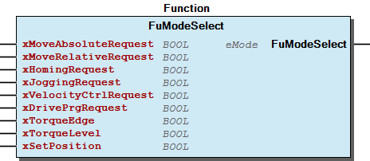

# WagoAppStepper v1.6.1.4 (WAGO) - Complete Documentation

### Documentation Index

WagoAppStepper

WAGO LayerView|App; WAGO FunctionalView|Device|IO; Application

WAGO/u010663

WagoAppStepper

This document is automatically generated.

Handling modules 750-670, 750-671, 750-672, 750-673

The function blocks of this library are NOT thread safe and must be called from one CODESYS task only! Concurrent calls from different tasks may cause loss or corruption of data.

Based on WagoAppStepper.library, last modified 22.02.2023, 10:02:45. LibDoc 4.1.1.0

© WAGO GmbH & Co. KG, Germany 2018 – All rights reserved. For the avoidance of doubt, this copyright notice does not only apply to the information above but also and primarily to the described library itself. Please note that third-party products are always mentioned without reference to intellectual property rights, including patents, utility models, designs and trademarks, accordingly the existence of such rights cannot be excluded. WAGO is a registered trademark of WAGO Verwaltungsgesellschaft mbH.

Company WAGO Title WagoAppStepper Version 1.6.1.4 Categories WAGO LayerView|App; WAGO FunctionalView|Device|IO; Application Author WAGO/u010663 Placeholder WagoAppStepper This document is automatically generated. Handling modules 750-670, 750-671, 750-672, 750-673 The function blocks of this library are NOT thread safe and must be called from one CODESYS task only! Concurrent calls from different tasks may cause loss or corruption of data. - 20 Program Organization Units Additional - Data types - FbCAM_Table (FunctionBlock) - FbConfigurationTable (FunctionBlock) - FbConfigurationValue (FunctionBlock) - FbDriveProgram (FunctionBlock) - FbDriveProgramTable (FunctionBlock) - FbGetVariable (FunctionBlock) - FbHome (FunctionBlock) - FbJog_670 (FunctionBlock) - FbJog_672 (FunctionBlock) - FbMoveAbsolute (FunctionBlock) - FbMoveRelative (FunctionBlock) - FbMoveTorque2_673 (FunctionBlock) - FbMoveTorque_673 (FunctionBlock) - FbMoveVelocity (FunctionBlock) - FbPWM_Mode_670 (FunctionBlock) - FbPositionTable (FunctionBlock) - FbPower (FunctionBlock) - FbReadActualPosition (FunctionBlock) - FbReadError (FunctionBlock) - FbReset (FunctionBlock) - FbRestoreDefault (FunctionBlock) - FbSetFilterValue (FunctionBlock) - FbSetPosition (FunctionBlock) - FbStepperControlBasic (FunctionBlock) - FbStop (FunctionBlock) - FuModeSelect (Function) 30 Visualizations 80 Status - Status (GVL) - eStatus (Enum) 90 Internal - GlobalTextList (GlobalTextList) ParameterList (ParamList) VersionHistory (GVL) - File and Project Information - Library Reference Based on WagoAppStepper.library, last modified 22.02.2023, 10:02:45. LibDoc 4.1.1.0 © WAGO GmbH & Co. KG, Germany 2018 – All rights reserved. For the avoidance of doubt, this copyright notice does not only apply to the information above but also and primarily to the described library itself. Please note that third-party products are always mentioned without reference to intellectual property rights, including patents, utility models, designs and trademarks, accordingly the existence of such rights cannot be excluded. WAGO is a registered trademark of WAGO Verwaltungsgesellschaft mbH.

### Project Information

| Scope | Name | Type | Content |
| --- | --- | --- | --- |
| FileHeader | creationDateTime | date | 22.02.2023, 10:02:50 |
| companyName | string | WAGO |
| libraryFile | string | WagoAppStepper.library |
| productName | string | e!COCKPIT |
| contentFile | string | doc.clean.json |
| ProjectInformation | AutoResolveUnbound | bool | True |
| ProjectInformation | LastModificationDateTime | 22.02.2023, 10:02:45 |
| ProjectInformation | LibraryCategories | library-category-list | WAGO LayerView\|App; WAGO FunctionalView\|Device\|IO; Application |
| ProjectInformation | Author | string | WAGO/u010663 |
| ProjectInformation | Company | string | WAGO |
| ProjectInformation | CompiledLibraryCompatibilityVersion | string | CODESYS V3.5 SP16 Patch 3 |
| ProjectInformation | Copyright | string | © WAGO Kontakttechnik GmbH & Co. KG, Germany 2018 – All rights reserved. |
| ProjectInformation | Description | string | See: Description |
| ProjectInformation | DocFormat | string | reStructuredText |
| ProjectInformation | Placeholder | string | WagoAppStepper |
| ProjectInformation | Project | string | WagoAppStepper |
| ProjectInformation | ThreadSave | string | False |
| ProjectInformation | Title | string | WagoAppStepper |
| ProjectInformation | Version string | string |  |
| ProjectInformation | Version | version | 1.6.1.4 |

### Library Information

| LinkAllContent: False Optional: False | QualifiedOnly: False | SystemLibrary: False |

| LinkAllContent: False Optional: False | PublishSymbolsInContainer: True QualifiedOnly: False | SystemLibrary: False |

| LinkAllContent: False Optional: False | QualifiedOnly: False | SystemLibrary: True |

| LinkAllContent: False Optional: False | QualifiedOnly: False | SystemLibrary: True |

| LinkAllContent: False Optional: False | QualifiedOnly: False | SystemLibrary: True |

| LinkAllContent: False Optional: False | QualifiedOnly: False | SystemLibrary: True |

| LinkAllContent: False Optional: False | QualifiedOnly: False | SystemLibrary: True |

| LinkAllContent: False Optional: False | QualifiedOnly: False | SystemLibrary: True |

| LinkAllContent: False Optional: False | QualifiedOnly: False | SystemLibrary: True |

| LinkAllContent: False Optional: False | QualifiedOnly: False | SystemLibrary: True |

| LinkAllContent: False Optional: False | QualifiedOnly: False | SystemLibrary: True |

| LinkAllContent: False Optional: False | QualifiedOnly: False | SystemLibrary: True |

| LinkAllContent: False Optional: False | QualifiedOnly: False | SystemLibrary: True |

| LinkAllContent: False Optional: False | QualifiedOnly: False | SystemLibrary: True |

| LinkAllContent: False Optional: False | QualifiedOnly: True | SystemLibrary: False |

| LinkAllContent: False Optional: False | QualifiedOnly: False | SystemLibrary: False |

| LinkAllContent: False Optional: False | QualifiedOnly: True | SystemLibrary: False |

| LinkAllContent: False Optional: False | QualifiedOnly: True | SystemLibrary: False |

| LinkAllContent: False Optional: False | QualifiedOnly: True | SystemLibrary: False |

| LinkAllContent: False Optional: False | QualifiedOnly: False | SystemLibrary: False |

| LinkAllContent: False Optional: False | QualifiedOnly: False | SystemLibrary: True |

This is a dictionary of all referenced libraries and their name spaces.

This is a dictionary of all referenced libraries and their name spaces. Standard Library Identification : Placeholder: Standard Default Resolution: Standard, * (System) Namespace: Standard Library Properties : VisuDialogs Library Identification : Placeholder: VisuDialogs Default Resolution: VisuDialogs, * (System) Namespace: VisuDialogs Library Properties : VisuElem3DPath Library Identification : Placeholder: System_VisuElem3DPath Default Resolution: VisuElem3DPath, 4.1.0.0 (System) Namespace: VisuElem3DPath Library Properties : Library Parameter : Parameter: GC_POINTS_PER_POLYGON = 100 VisuElemCamDisplayer Library Identification : Placeholder: System_VisuElemCamDisplayer Default Resolution: VisuElemCamDisplayer, 4.1.0.0 (System) Namespace: VisuElemCamDisplayer Library Properties : Library Parameter : Parameter: GC_POINTS_PER_CAM = 100 VisuElemMeter Library Identification : Placeholder: System_VisuElemMeter Default Resolution: VisuElemMeter, 4.1.0.0 (System) Namespace: VisuElemMeter Library Properties : VisuElemTextEditor Library Identification : Placeholder: System_VisuElemTextEditor Default Resolution: VisuElemTextEditor, 4.1.0.0 (System) Namespace: VisuElemTextEditor Library Properties : VisuElemTrace Library Identification : Placeholder: System_VisuElemTrace Default Resolution: VisuElemTrace, 4.1.0.0 (System) Namespace: VisuElemTrace Library Properties : VisuElemXYChart Library Identification : Placeholder: System_VisuElemXYChart Default Resolution: VisuElemXYChart, 4.1.0.0 (System) Namespace: VisuElemXYChart Library Properties : VisuElems Library Identification : Placeholder: System_VisuElems Default Resolution: VisuElems, 4.1.0.0 (System) Namespace: VisuElems Library Properties : VisuElemsAlarm Library Identification : Placeholder: System_VisuElemsAlarm Default Resolution: VisuElemsAlarm, 4.1.0.0 (System) Namespace: VisuElemsAlarm Library Properties : VisuElemsDateTime Library Identification : Placeholder: System_VisuElemsDateTime Default Resolution: VisuElemsDateTime, 4.1.0.0 (System) Namespace: VisuElemsDateTime Library Properties : VisuElemsSpecialControls Library Identification : Placeholder: System_VisuElemsSpecialControls Default Resolution: VisuElemsSpecialControls, 4.1.0.0 (System) Namespace: VisuElemsSpecialControls Library Properties : VisuElemsWinControls Library Identification : Placeholder: System_VisuElemsWinControls Default Resolution: VisuElemsWinControls, 4.1.0.0 (System) Namespace: VisuElemsWinControls Library Properties : VisuNativeControl Library Identification : Placeholder: System_VisuNativeControl Default Resolution: VisuNativeControl, 4.1.0.0 (System) Namespace: VisuNativeControl Library Properties : WagoSysErrorBase Library Identification : Placeholder: WagoSysErrorBase Default Resolution: WagoSysErrorBase, * (WAGO) Namespace: WagoSysErrorBase Library Properties : Library Parameter : Parameter: RES_LOG_MAX_ENTRIES = 200 Parameter: RES_LOG_MAX_FILES = 1 Parameter: RES_LOG_MAX_FILESIZE = 2000 Parameter: RES_LOG_NAME = ‘WagoAppResultLogger’ WagoSysVersion Library Identification : Name: WagoSysVersion Version: 1.0.0.0 Company: WAGO Namespace: WagoSysVersion Library Properties : WagoTypesErrorBase Library Identification : Placeholder: WagoTypesErrorBase Default Resolution: WagoTypesErrorBase, * (WAGO) Namespace: WagoTypesErrorBase Library Properties : WagoTypesModuleBase Library Identification : Placeholder: WagoTypesModuleBase Default Resolution: WagoTypesModuleBase, * (WAGO) Namespace: WagoTypesModuleBase Library Properties : Library Parameter : Parameter: MAX_MBX1_SIZE = 18 Parameter: MAX_MBX_INPUT_SIZE = 47 Parameter: MAX_MBX_OUTPUT_SIZE = 47 Parameter: MAX_MBX_SIZE = 18 Parameter: MAX_MODULE_INPUT_SIZE = 48 Parameter: MAX_MODULE_OUTPUT_SIZE = 48 Parameter: MBX_PIPE_SIZE = 1024 WagoTypesModule_75x_67x Library Identification : Placeholder: WagoTypesModule_75x_67x Default Resolution: WagoTypesModule_75x_67x, * (WAGO) Namespace: WagoTypesModule_75x_67x Library Properties : WagoVisuIcons Library Identification : Placeholder: WagoVisuIcons Default Resolution: WagoVisuIcons, * (WAGO) Namespace: WagoVisuIcons Library Properties : visuinputs Library Identification : Placeholder: system_visuinputs Default Resolution: visuinputs, 4.1.0.0 (system) Namespace: visuinputs Library Properties :

### Function Blocks

## FbCAM_Table (FB)

| Scope | Name | Type | Comment |
| --- | --- | --- | --- |
| Input | xExecute | BOOL | Execute drive program download or upload |
| I_Port | WagoTypesModule_75x_67x.I_Module_75x_67x | Basic stepper interface |
| xRead | BOOL | Read drive program table -> eihter xRead or xWriteRam or xWriteFlash must be set |
| xWriteRam | BOOL | Write to the RAM -> eihter xRead or xWriteRam or xWriteFlash must be set |
| bCamCount | BYTE | Number of data sets ( 1..50 )commands, each command 4 bytes,->reading requieres a valid value for wDataCount as well as writing |
| Output | xDone | BOOL | Command succesful executed |
| Output | xBusy | BOOL | Command in progress |
| Output | xError | BOOL | Command with error executed |
| Output | oStatus | WagoSysErrorBase.FbResult | Status codes: -FunctionBlockNotEnabled -WritingSettings -ReadingSettings -OK Error codes: -InvalidParameter->input wData exceeds size of data area defined in “DRIVE_PROGRAM_TABLE_SIZE” -DownloadNotPossible -Timeout, mailbox communication not finished within requested time “MBX1_TIMEOUT” |
| Inout | aCamData | ARRAY [0..CAM_TABLE_SIZE] OF BYTE |  |

| Scope | Name | Type | Comment |
| --- | --- | --- | --- |
| Input | xExecute | BOOL | Execute command |
| I_Port | WagoTypesModule_75x_67x.I_Module_75x_67x | Basic stepper interface |
| xRead | BOOL | Read configuration table |
| xWriteFlash | BOOL | Write configuration table to flash, a write command will always write to the flash |
| pData | POINTER TO ARRAY [0..511] OF BYTE | Pointer to the configuration data ->typConfiguration_67x |
| Output | xDone | BOOL | Command succesful executed |
| Output | xBusy | BOOL | Command in progress |
| Output | xError | BOOL | Command with error executed |
| Output | oStatus | WagoSysErrorBase.FbResult | Status codes: -FunctionBlockNotEnabled -WritingSettings -ReadingSettings Error codes: -CommandError->neither xRead nor xWriteFlash activated -DownloadNotPossible ->refere to manual opcode 16#41 DLD_START -Timeout -CommandAborted |
| Output | eErrorCodes | eStatus | Feedback information |

| Scope | Name | Type | Comment |
| --- | --- | --- | --- |
| Input | xExecute | BOOL | Execute command |
| I_Port | WagoTypesModule_75x_67x.I_Module_75x_67x | Basic stepper interface |
| wAddress | WORD | 0..511 ->address within the configuration table |
| bValueSize | BYTE | Size in byte of the parameter according to configuration table 1: Byte value 2: Word value 4: Dword value |
| xRead | BOOL | Read configuration value |
| xWriteRam | BOOL | Write configuration value to ram |
| xWriteFlash | BOOL | Write configuration value to flash |
| Output | xDone | BOOL | Command succesful executed |
| Output | xBusy | BOOL | Command in progress |
| Output | xError | BOOL | Command with error executed |
| Output | oStatus | WagoSysErrorBase.FbResult | Status codes: -OK -WritingSettings -ReadingSettings Error codes: -CommandError->neither xRead nor xWriteRam nor xWriteFlash activated -InvalidParameter ->input “bValueSize” or “wAddress” invalid -Timeout -CommandAborted |
| Output | eFeedback | eStatus | Feedback information |
| Inout | dwValue | DWORD | Data ->Input in case of write command, output in case of read command |

| Scope | Name | Type | Comment |
| --- | --- | --- | --- |
| Input | xEnable | BOOL | Enable drive program |
| I_Port | WagoTypesModule_75x_67x.I_Module_75x_67x | Basic stepper interface |
| wStartPositionDriveProgram | WORD | Start position within the drive program table if the block is enabled |
| Output | xValid | BOOL | Some drive commands show there execution by this bit,e.g. move absolute |
| Output | xBusy | BOOL | Drive program active |
| Output | xError | BOOL | Error occured |
| Output | oStatus | WagoSysErrorBase.FbResult | Status codes: -FunctionBlockNotEnabled -InProgress -OK Error codes: -PowerMissing -StopActivated -Timeout |
| Output | wActualDriveProgramPosition | WORD | Actual position within drive program table |

| Scope | Name | Type | Comment |
| --- | --- | --- | --- |
| Input | xExecute | BOOL | Execute drive program download or upload |
| I_Port | WagoTypesModule_75x_67x.I_Module_75x_67x | Basic stepper interface |
| xRead | BOOL | Read drive program table -> eihter xRead or xWriteRam or xWriteFlash must be set |
| xWriteRam | BOOL | Write to the RAM -> eihter xRead or xWriteRam or xWriteFlash must be set |
| xWriteFlash | BOOL | Write to the flash memory -> eihter xRead or xWriteRam or xWriteFlash must be set |
| wDataCount | WORD | Number of data sets 1..400 commands, each command 4 bytes,->reading requieres a valid value for wDataCount as well as writing |
| Output | xDone | BOOL | Command succesful executed |
| Output | xBusy | BOOL | Command in progress |
| Output | xError | BOOL | Command with error executed |
| Output | oStatus | WagoSysErrorBase.FbResult | Status codes: -FunctionBlockNotEnabled -WritingSettings -ReadingSettings -OK Error codes: -InvalidParameter->input wData exceeds size of data area defined in “DRIVE_PROGRAM_TABLE_SIZE” -DownloadNotPossible -Timeout, mailbox communication not finished within requested time “MBX1_TIMEOUT” |
| Inout | aData | ARRAY [0..Drive_Program_Table_Size] OF BYTE | Max number of data sets = 400 |

| Scope | Name | Type | Comment |
| --- | --- | --- | --- |
| Input | xExecute | BOOL | Execute set postion command |
| I_Port | WagoTypesModule_75x_67x.I_Module_75x_67x | Basic stepper interface |
| iIndex | INT | Index according to manual of the module |
| Output | xDone | BOOL | Position set |
| Output | xBusy | BOOL | Job active |
| Output | xError | BOOL | Error occured |
| Output | oStatus | WagoSysErrorBase.FbResult | Status codes: -OK Error codes: -Timeout -CommandAborted |
| Output | dwValue | DWORD | Actual value |

| Scope | Name | Type | Comment |
| --- | --- | --- | --- |
| Input | xExecute | BOOL | Execute relative homing job |
| I_Port | WagoTypesModule_75x_67x.I_Module_75x_67x | Basic stepper interface |
| xRefPositive | BOOL | Reference in positive direction |
| xRefNegative | BOOL | Reference in negative direction |
| Output | xDone | BOOL | Homing done |
| Output | xBusy | BOOL | Job active |
| Output | xError | BOOL | Error occured |
| Output | oStatus | WagoSysErrorBase.FbResult | Status codes: -OK Error codes: -Timeout -CommandAborted -CommandError ->neither xRefPositive nor xRefNegative |

Reading and writing of the terminals internal CAM table

Graphical Illustration

Function description

Reading and writing of the terminals internal cam table RAM 1

Reading and writing the terminals internal configuration

Graphical Illustration

Function description

This functionblock allows to read and write the configuration table at once. To start the process set xExecute to TRUE. If the action is finished the output xDone becomes True. The output oStatus shows any error. After writing the configuration table the modul resets itself. Therefore the actual position will be reset to Zero.

Visualization

For each module a visualisation template tplConfiguration_67x is available. The data structure typConfiguration_67x contains the default values. The visualisation template shows the most important values. This template needs the instance of the function block FbConfigurationTable as input.

Reading and writing of a single value within the configuration table

Graphical Illustration

Function description

This functionblock allows to read and write a single parameter from the configuration table. Writing differentiates between temporarily changes(write to ram) which are lost after power on of the stepper modul and permanent(write to flash) changes.

Use the drive program capability of a stepper drive

Graphical Illustration

Function description

This functionblock allows to execute a drive program. The input wStartPositionDriveProgram allows to determine the start address within the drive program. While setting up drive program mode, the output oStatus will show “InProgress”. If the initialization is finished status OK will be set. Initialization will not start, if the function block FbPower is not active or the function block FbStop is activated. The variable wActualDriveProgramPosition shows the ProgramPosition of the next Position.

Reading and writing of the terminals internal drive program table

Graphical Illustration

Function description

If the input xWriteFlash is True the drive program will be stored to the flash memory after it is downloaded to the module. After power on reset the drive program is therefore still available and can be directly executed by using the function block FbDriveProgram .

A base function block which allows to read any variable available by an index

Graphical Illustration

A base function block which allows a homing movement of a stepper drive

Graphical Illustration

Function description

This function block allows to start a homing job. Please make sure either xRefPositive or xRefNegative is choosen if the input “xExecute” becomes high. Homing mode, speed and acceleration a configured by the configuration table (Reference_Mode,SetupSpeed and SetupAcceleration).

Interface variables Function Reading and writing of the terminals internal CAM table Graphical Illustration  Function description Reading and writing of the terminals internal cam table RAM 1 Interface variables Function Reading and writing the terminals internal configuration Graphical Illustration  Function description This functionblock allows to read and write the configuration table at once. To start the process set xExecute to TRUE. If the action is finished the output xDone becomes True. The output oStatus shows any error. After writing the configuration table the modul resets itself. Therefore the actual position will be reset to Zero. Visualization  For each module a visualisation template tplConfiguration_67x is available. The data structure typConfiguration_67x contains the default values. The visualisation template shows the most important values. This template needs the instance of the function block FbConfigurationTable as input. Interface variables Function Reading and writing of a single value within the configuration table Graphical Illustration  Function description This functionblock allows to read and write a single parameter from the configuration table. Writing differentiates between temporarily changes(write to ram) which are lost after power on of the stepper modul and permanent(write to flash) changes. Interface variables Function Use the drive program capability of a stepper drive Graphical Illustration  Function description This functionblock allows to execute a drive program. The input wStartPositionDriveProgram allows to determine the start address within the drive program. While setting up drive program mode, the output oStatus will show “InProgress”. If the initialization is finished status OK will be set. Initialization will not start, if the function block FbPower is not active or the function block FbStop is activated. The variable wActualDriveProgramPosition shows the ProgramPosition of the next Position. Interface variables Function Reading and writing of the terminals internal drive program table Graphical Illustration  Function description If the input xWriteFlash is True the drive program will be stored to the flash memory after it is downloaded to the module. After power on reset the drive program is therefore still available and can be directly executed by using the function block FbDriveProgram . Interface variables Function A base function block which allows to read any variable available by an index Graphical Illustration  Interface variables Function A base function block which allows a homing movement of a stepper drive Graphical Illustration  Function description This function block allows to start a homing job. Please make sure either xRefPositive or xRefNegative is choosen if the input “xExecute” becomes high. Homing mode, speed and acceleration a configured by the configuration table (Reference_Mode,SetupSpeed and SetupAcceleration).

## FbJog_670 (FB)

| Scope | Name | Type | Comment |
| --- | --- | --- | --- |
| Input | xEnable | BOOL | Enable jog mode |
| I_Port | WagoTypesModule_75x_67x.I_Module_75x_67x | Basic stepper interface |
| xPos | BOOL | Request to jog in positive direction |
| xNeg | BOOL | Request to jog in negative direction |
| wJogTimeOut | WORD | Timeout->0 no timeout |
| Output | xValid | BOOL | Valid |
| Output | xBusy | BOOL | Job active |
| Output | xError | BOOL | Error occured |
| Output | oStatus | WagoSysErrorBase.FbResult | Status codes: -OK Error codes: -Timeout ->could not activate jog mode within STATEMACHINE_WATCHDOG time limit |
| Output | xJoggingPositive | BOOL | Stepper is jogging in positive direction |
| Output | xJoggingNegative | BOOL | Stepper is jogging in negative direction |

A base function block which allows to jog the stepper modules 750-670 and 750-671

Graphical Illustration

Interface variables Function A base function block which allows to jog the stepper modules 750-670 and 750-671 Graphical Illustration 

## FbJog_672 (FB)

| Scope | Name | Type | Comment |
| --- | --- | --- | --- |
| Input | xEnable | BOOL | Enable jog mode |
| I_Port | WagoTypesModule_75x_67x.I_Module_75x_67x | Basic stepper interface |
| wJogTimeOut | WORD | Timeout-> 0 no timeout |
| Output | xValid | BOOL | Valid |
| Output | xBusy | BOOL | Jogging mode enabled |
| Output | xError | BOOL | Error occured |
| Output | oStatus | WagoSysErrorBase.FbResult | Status codes: -OK ->Jogging may be performed by the hardware inputs -InProgress ->try to activate jog mode -Occupied ->waiting to get access to the module Error codes: -Timeout ->could not activate jog mode within STATEMACHINE_WATCHDOG time limit |
| Output | xJoggingPositive | BOOL | Stepper is jogging in positive direction |
| Output | xJoggingNegative | BOOL | Stepper is jogging in negative direction |

| Scope | Name | Type | Comment |
| --- | --- | --- | --- |
| Input | xExecute | BOOL | Execute absolute positioning command |
| I_Port | WagoTypesModule_75x_67x.I_Module_75x_67x | Basic stepper interface |
| iSpeed | INT | Reference speed 1…25000 while positioning |
| wAcceleration | WORD | Reference acceleration 1…32767 |
| diPosition | DINT | Reference position range from -8388607… +8388607 |
| Output | xDone | BOOL | Stepper on target |
| Output | xBusy | BOOL | Job active |
| Output | xError | BOOL | Error occured |
| Output | oStatus | WagoSysErrorBase.FbResult | Status codes: -OK ->Position reached -InProgress -> -O ccupied ->waiting to get access to the module Error codes: -Timeout -CommandAborted |

A base function block which allows to jog the stepper modules 750-672 and 750-673

Graphical Illustration

Function description

The jogging is performed by digital inputs direct on the module.

A base function block which allows an absolute movement of a stepper drive

Graphical Illustration

Function description

The input wAcceleration will be taken for the decelarion as well. The job will be started by the variable xExecute . Parameter changes on the fly are not supported.

Interface variables Function A base function block which allows to jog the stepper modules 750-672 and 750-673 Graphical Illustration  Function description The jogging is performed by digital inputs direct on the module. Interface variables Function A base function block which allows an absolute movement of a stepper drive Graphical Illustration  Function description The input wAcceleration will be taken for the decelarion as well. The job will be started by the variable xExecute . Parameter changes on the fly are not supported.

## FbMoveAbsolute_2 (FB)

| Scope | Name | Type | Comment |
| --- | --- | --- | --- |
| Input | xEnable | BOOL | Start drive |
| I_Port | WagoTypesModule_75x_67x.I_Module_75x_67x | Basic stepper interface |
| iSpeed | INT | Speed 1…25000 while positioning |
| wAcceleration | WORD | Acceleration and deceleration 1…32767 |
| diPosition | DINT | Position range from -8388607… +8388607 |
| Output | xDone | BOOL | Stepper on target |
| Output | xBusy | BOOL | Job active |
| Output | xError | BOOL | Error occured |
| Output | oStatus | WagoSysErrorBase.FbResult | Status codes: -OK ->Position reached -InProgress -> -Occupied ->waiting to get access to the module Error codes: -Timeout |

| Scope | Name | Type | Comment |
| --- | --- | --- | --- |
| Input | xExecute | BOOL | Execute a relative movement |
| I_Port | WagoTypesModule_75x_67x.I_Module_75x_67x | Basic stepper interface |
| iSpeed | INT | Reference speed 1…25000 while positioning |
| wAcceleration | WORD | Reference acceleration 1…32767 |
| wDeceleration | WORD | Reference deceleration 1…32767 |
| diDistance | DINT | Reference distance range from -8388607… +8388607 |
| Output | xDone | BOOL | Stepper on target |
| Output | xBusy | BOOL | Job active |
| Output | xError | BOOL | Error occured |
| Output | oStatus | WagoSysErrorBase.FbResult | Status codes: -OK Error codes: -Timeout -CommandAborted |

A base function block which allows an absolute movement of a stepper drive

Graphical Illustration

Function description

The positioning job is defined by the inputs iSpeed , wAcceleration and diPosition . The parameter iSpeed is allowed in the range of 1..25000 while wAcceleration is allowed from 0..32767. The job will be started by the variable xEnable . Parameter changes( iSpeed or diPosition ) on the fly are supported.

A base function block which allows a relative movement of a stepper drive

Graphical Illustration

Interface variables Function A base function block which allows an absolute movement of a stepper drive Graphical Illustration  Function description The positioning job is defined by the inputs iSpeed , wAcceleration and diPosition . The parameter iSpeed is allowed in the range of 1..25000 while wAcceleration is allowed from 0..32767. The job will be started by the variable xEnable . Parameter changes( iSpeed or diPosition ) on the fly are supported. Interface variables Function A base function block which allows a relative movement of a stepper drive Graphical Illustration 

## FbMoveTorque2_673 (FB)

| Scope | Name | Type | Comment |
| --- | --- | --- | --- |
| Input | xEnable | BOOL | Enable speed job with torque control |
| I_Port | WagoTypesModule_75x_67x.I_Module_75x_67x | Basic stepper interface |
| iSpeed | INT | Reference speed 1…25000 while positioning |
| wCurrent | WORD | Reference current 1…150% |
| Output | xValid | BOOL | Stepper on target |
| Output | xBusy | BOOL | Job active |
| Output | xError | BOOL | Error occured |
| Output | oStatus | WagoSysErrorBase.FbResult | Error object. (Listed in Status ) The content of the error object could be displayed via the FbShowResult from the WagoSysErrorBase library. |

A base function block which allows a torque movement of a stepper drive using module 750-673

Graphical Illustration

Interface variables Function A base function block which allows a torque movement of a stepper drive using module 750-673 Graphical Illustration 

## FbMoveTorque_673 (FB)

| Scope | Name | Type | Comment |
| --- | --- | --- | --- |
| Input | xExecute | BOOL | Start drive |
| I_Port | WagoTypesModule_75x_67x.I_Module_75x_67x | Basic stepper interface |
| iSpeed | INT | Reference speed 1…25000 while positioning |
| wCurrent | WORD | Reference current 1…150% |
| Output | xDone | BOOL | Stepper on target |
| Output | xBusy | BOOL | Job active |
| Output | xError | BOOL | Error occured |
| Output | oStatus | WagoSysErrorBase.FbResult | Status codes: -OK Error codes: -Timeout -CommandAborted |

| Scope | Name | Type | Comment |
| --- | --- | --- | --- |
| Input | xExecute | BOOL | Execute movement |
| I_Port | WagoTypesModule_75x_67x.I_Module_75x_67x | Basic stepper interface |
| iSpeed | INT | Reference speed -25000…25000 |
| wAcceleration | WORD | Acceleration and deceleration 1…32767 |
| Output | xInVelocity | BOOL | Target speed reached |
| Output | xBusy | BOOL | Job active |
| Output | xError | BOOL | Error occured |
| Output | oStatus | WagoSysErrorBase.FbResult | Status codes: -OK Error codes: -Timeout ->internal statemachine not finished in time ->STATEMACHINE_WATCHDOG -CommandAborted |

A base function block which allows a torque movement of a stepper drive using module 750-673

Graphical Illustration

A base function block which allows velocity control of a stepper drive

Graphical Illustration

Function description

Attention: If used with module 750-670 and 750-671 this block modifies the configuration value “Application_Selector”! Please make sure this value is reset by the application programm in case of e.g. absolute positioning. Please use FbConfigurationValue.

Interface variables Function A base function block which allows a torque movement of a stepper drive using module 750-673 Graphical Illustration  Interface variables Function A base function block which allows velocity control of a stepper drive Graphical Illustration  Function description Attention: If used with module 750-670 and 750-671 this block modifies the configuration value “Application_Selector”! Please make sure this value is reset by the application programm in case of e.g. absolute positioning. Please use FbConfigurationValue.

## FbMoveVelocity_2 (FB)

| Scope | Name | Type | Comment |
| --- | --- | --- | --- |
| Input | xEnable | BOOL | Enable velocity control |
| I_Port | WagoTypesModule_75x_67x.I_Module_75x_67x | Basic stepper interface |
| iSpeed | INT | Reference speed -25000…25000 |
| wAcceleration | WORD | Acceleration and deceleration 1…32767 |
| Output | xInVelocity | BOOL | Target speed reached |
| Output | xBusy | BOOL | Job active |
| Output | xError | BOOL | Error occured |
| Output | oStatus | WagoSysErrorBase.FbResult | Status codes: -OK ->speed reached -InProgress -> -Occupied ->waiting to get access to the module Error codes: -Timeout ->internal statemachine not finished in time ->STATEMACHINE_WATCHDOG |

A base function block which allows velocity control of a stepper drive

Graphical Illustration

Function description

This block allows changes of the velocity on the fly, so there is no need to disable the block if a new speed value is assigned. This behaviour is different to FbMoveVelocity.

Attention: If used with module 750-670 and 750-671 this block modifies the configuration value “Application_Selector”! Please make sure this value is reset by the application programm in case of e.g. absolute positioning.

Interface variables Function A base function block which allows velocity control of a stepper drive Graphical Illustration  Function description This block allows changes of the velocity on the fly, so there is no need to disable the block if a new speed value is assigned. This behaviour is different to FbMoveVelocity. Attention: If used with module 750-670 and 750-671 this block modifies the configuration value “Application_Selector”! Please make sure this value is reset by the application programm in case of e.g. absolute positioning.

## FbPWM_Mode_670 (FB)

| Scope | Name | Type | Comment |
| --- | --- | --- | --- |
| Input | xEnable | BOOL |  |
| I_Port | WagoTypesModule_75x_67x.I_Module_75x_67x | Basic stepper interface |
| Inout | xStart | BOOL | Start outputs |
| Inout | xStop | BOOL | Stop outputs |
| Inout | xErrorReset | BOOL | Reset errors |
| wPulsDutyFactor | WORD | Puls duty of the signal e.g. 5000 -> 50%on 50%off |
| udiPulsPeriod | UDINT | Periode in µs e.g. 10.000 -> 10ms on |
| wAcceleration | WORD | Acceleration 0..32767 |
| Output | xValid | BOOL | Operation finished |
| Output | xBusy | BOOL | Operation busy |
| Output | xError | BOOL | An error occurred while executing |
| Output | oStatus | WagoSysErrorBase.FbResult | Error object. (Listed in Status ) The content of the error object could be displayed via the FbShowResult from the WagoSysErrorBase library. |
| Output | wActualPulsDutyFactor | WORD | Actual pulse duty factor |

| Scope | Name | Type | Comment |
| --- | --- | --- | --- |
| Input | xExecute | BOOL | Execute command |
| I_Port | WagoTypesModule_75x_67x.I_Module_75x_67x | Basic stepper interface |
| xRead | BOOL | Read table -> eihter xRead or xWriteRam or xWriteFlash must be set |
| xWriteRam | BOOL | Write table to the RAM -> eihter xRead or xWriteRam or xWriteFlash must be set |
| xWriteFlash | BOOL | Write table to the flash memory -> eihter xRead or xWriteRam or xWriteFlash must be set |
| bDataCount | BYTE | 1..50 -> Number of data sets for up-/download |
| Output | xDone | BOOL | Command successful executed |
| Output | xBusy | BOOL | Command in progress |
| Output | xError | BOOL | Command with error executed |
| Output | oStatus | WagoSysErrorBase.FbResult | Status codes: -FunctionBlockNotEnabled -WritingSettings -ReadingSettings -OK Error codes: -InvalidParameter->input bData exceeds size of data area defined in``POSITION_TABLE_SIZE`` -DownloadNotPossible -Timeout, mailbox communication not finished within requested time MBX1_TIMEOUT |
| Inout | aData | ARRAY [0..POSITION_TABLE_SIZE] OF BYTE | Max number of data sets = 50 |

| Scope | Name | Type | Comment |
| --- | --- | --- | --- |
| Input | xEnable | BOOL | Enable power stage |
| I_Port | WagoTypesModule_75x_67x.I_Module_75x_67x | Basic stepper interface |
| Output | xStatus | BOOL | Power stage enabled |
| Output | xError | BOOL | True, if input I_Port=0 |

| Scope | Name | Type | Comment |
| --- | --- | --- | --- |
| Input | xEnable | BOOL | Read position and speed |
| I_Port | WagoTypesModule_75x_67x.I_Module_75x_67x | Basic stepper interface |
| Output | xValid | BOOL | Position valid |
| Output | xBusy | BOOL | Busy |
| Output | xError | BOOL | Error reading position |
| Output | oStatus | WagoSysErrorBase.FbResult | Error object. (Listed in Status ) The content of the error object could be displayed via the FbShowResult from the WagoSysErrorBase library. |
| Output | diActualPosition | DINT | Actual position |
| Output | iActualSpeed | INT | Actual speed |
| Output | eActualMode | eMode | Actual mode |
| Output | xMailboxActive | BOOL | ActualPosition and actualSpeed are latched |
| Output | xResetRequired | BOOL | Module has performed a warmstart, therefore a reset by the application is needed |

| Scope | Name | Type | Comment |
| --- | --- | --- | --- |
| Input | xEnable | BOOL | Enable reading error details |
| I_Port | WagoTypesModule_75x_67x.I_Module_75x_67x | Basic stepper interface |
| Output | xValid | BOOL | eFeedback valid |
| Output | xBusy | BOOL | Job active |
| Output | xError | BOOL | Only True if reading error information failed |
| Output | oStatus | WagoSysErrorBase.FbResult | Only data, if xError is True |
| Output | xModuleFault | BOOL | Modul error bit Status 2.7 |
| Output | eFeedback | eStatus | Error details->codes according to stepper manual |

| Scope | Name | Type | Comment |
| --- | --- | --- | --- |
| Input | xExecute | BOOL | Execute a reset command |
| I_Port | WagoTypesModule_75x_67x.I_Module_75x_67x | Basic stepper interface |
| Output | xDone | BOOL | Reset performed |
| Output | xBusy | BOOL | Busy |
| Output | xError | BOOL | Error occured |
| Output | oStatus | WagoSysErrorBase.FbResult | Status codes: -OK Error codes: -Timeout |

| Scope | Name | Type | Initial | Comment |
| --- | --- | --- | --- | --- |
| Input | xExecute | BOOL |  | Execute command |
| I_Port | WagoTypesModule_75x_67x.I_Module_75x_67x |  | Basic stepper interface |
| wFactoryDefault_No | WORD | 2 | 2: ->Default 1 ->Wago default, 3: ->Default 2 ->User default |
| Output | xDone | BOOL |  | Command succesful executed |
| Output | xBusy | BOOL |  | Command in progress |
| Output | xError | BOOL |  | Command with error executed |
| Output | oStatus | WagoSysErrorBase.FbResult |  | Status codes: -OK Error codes: -InvalidParameter->input wFactoryDefault_No invalid -Timeout |

| Scope | Name | Type | Comment |
| --- | --- | --- | --- |
| Input | xExecute | BOOL | Execute set postion command |
| I_Port | WagoTypesModule_75x_67x.I_Module_75x_67x | Basic stepper interface |
| iFilter | INT | 1..8 according to the filter number |
| wSetValue | WORD | Reference value for the filter |
| Output | xDone | BOOL | Position set |
| Output | xBusy | BOOL | Job active |
| Output | xError | BOOL | Error occured |
| Output | oStatus | WagoSysErrorBase.FbResult | Status codes: -OK Error codes: -Timeout -CommandAborted |

| Scope | Name | Type | Comment |
| --- | --- | --- | --- |
| Input | xExecute | BOOL | Execute set postion command |
| I_Port | WagoTypesModule_75x_67x.I_Module_75x_67x | Basic stepper interface |
| diPosition | DINT | Position range from -8388607… +8388607 |
| Output | xDone | BOOL | Position set |
| Output | xBusy | BOOL | Job active |
| Output | xError | BOOL | Error occured |
| Output | oStatus | WagoSysErrorBase.FbResult | Status codes: -OK Error codes: -Timeout -CommandAborted |

| Scope | Name | Type | Comment |
| --- | --- | --- | --- |
| Input | xEnable | BOOL | Enable Stepper module |
| I_Port | WagoTypesModule_75x_67x.I_Module_75x_67x | Basic stepper interface |
| eJobType | eMode | 0..9 ->e.g.MoveAbsolute, etc. |
| xDirPos | BOOL | Direction positive |
| xDirNeg | BOOL | Direction negative |
| iSpeed | INT | Speed 1…25000 while positioning,-25000…25000 while velocity control |
| wAcceleration | WORD | Acceleration 1…32767 or if torque control mode 0..150% |
| wDeceleration | WORD | Deceleration 1…32767 |
| diPosition | DINT | Position range from -8388607… +8388607 |
| Inout | xTriggerStart | BOOL | Start control action |
| Inout | xTriggerErrorReset | BOOL | Reset error |
| xStop | BOOL | Stop drive |
| Output | xJobFinished | BOOL | Stepper has finished the requested job |
| Output | xBusy | BOOL | Job active |
| Output | xError | BOOL | Error occured |
| Output | oStatus | WagoSysErrorBase.FbResult | Error object. (Listed in Status ) The content of the error object could be displayed via the FbShowResult from the WagoSysErrorBase library. |
| Output | eErrorCodes | eStatus | Error value |
| Output | diActualPosition | DINT | Actual position or in drive program mode actual table index |
| Output | iActualSpeed | INT | Actual speed |
| Output | xMailboxActive | BOOL | Actual position and actual speed are latched |
| Output | xResetWarning | BOOL | Warmstart occured |

| Scope | Name | Type | Comment |
| --- | --- | --- | --- |
| Input | xExecute | BOOL | Execute a stop command |
| I_Port | WagoTypesModule_75x_67x.I_Module_75x_67x | Basic stepper interface |
| Output | xDone | BOOL | Stepper standstill |
| Output | xBusy | BOOL | Stepper tries to reach standstill |
| Output | xError | BOOL | For future use |
| Output | oStatus | WagoSysErrorBase.FbResult | For future use |

A base function block which supports PWM mode using module 750-670

Graphical Illustration

Function description

High wAcceleration values ensure a quick increase of the pulswidth rate. Additional it may be necessary to increase the default value for ACC_Fact(see the configuration table) from 80 to 10000 to archieve an even steeper increase. Once started, changes in the input parameters will only be overtaken by a positive edge of the xEnable input.

Reading or writing of the terminals internal position table

Graphical Illustration

Function description

This function block allows to read and write the position table. Each position in the table is 4 byte long. Input bDataCount is the number of positions in the table. The size of the position table may be changed through POSITION_TABLE_SIZE in the parameter list.

Enable the power stage of a stepper drive

Graphical Illustration

Function description

This function block must be used except for running the stepper drive by the function block FbStepperControlBasic. Bit 0 in the Control Byte 1 ist directly controlled. The output xStatus displays directly Bit 0 from Status Byte 1.

A base function block which allows to read the actual position of a stepper drive

Graphical Illustration

Function description

This function block shows the actual position as well as the actual speed. The output bActualMode displays the operating modes according to the enumeration eMode :

A base function block which allows to read the error information of a stepper drive

Graphical Illustration

Function description

If the module status 2.7 (error) is TRUE, the output xMouduleFault is set. If an error occured, detailed information will be read, using the mailbox command 0x49 ERR_GET. The details will be displayed in eFeedback . Output xError will only be set, if the mailbox command 0x49 shows an error. The output xModuleFault will show directly status byte Status2.7.

A base function block which allows to reset a stepper drive

Graphical Illustration

Function description

This function block performs a reset. Bit 7 in the Control Byte 3 and Control Byte 2 ist directly controlled

Restore Default values

Graphical Illustration

A base function block which allows to set the filter value

Graphical Illustration

A base function block which allows to set the actual position

Graphical Illustration

A base function block which allows to control a stepper drive

Graphical Illustration

Function description

Visualization

For each module a visualisation template tplMoveStepper_67x is available. The input m_input_drive of the visualisation template is of type typStepperVisu_67x . According to this example the input m_input_drive must be assigned by Stepper1.

A base function block which allows to stop a stepper drive

Graphical Illustration

Function description

This function block must be used except for running the stepper drive by the function block FbStepperControlBasic. This functionblock allows to stop the stepper motor. The deceleration ramp is determined by the configuration value AccelerationStopFast .

Interface variables Function A base function block which supports PWM mode using module 750-670 Graphical Illustration  Function description High wAcceleration values ensure a quick increase of the pulswidth rate. Additional it may be necessary to increase the default value for ACC_Fact(see the configuration table) from 80 to 10000 to archieve an even steeper increase. Once started, changes in the input parameters will only be overtaken by a positive edge of the xEnable input. Interface variables Function Reading or writing of the terminals internal position table Graphical Illustration  Function description This function block allows to read and write the position table. Each position in the table is 4 byte long. Input bDataCount is the number of positions in the table. The size of the position table may be changed through POSITION_TABLE_SIZE in the parameter list. Interface variables Function Enable the power stage of a stepper drive Graphical Illustration  Function description This function block must be used except for running the stepper drive by the function block FbStepperControlBasic. Bit 0 in the Control Byte 1 ist directly controlled. The output xStatus displays directly Bit 0 from Status Byte 1. Interface variables Function A base function block which allows to read the actual position of a stepper drive Graphical Illustration  Function description This function block shows the actual position as well as the actual speed. The output bActualMode displays the operating modes according to the enumeration eMode : Interface variables Function A base function block which allows to read the error information of a stepper drive Graphical Illustration  Function description If the module status 2.7 (error) is TRUE, the output xMouduleFault is set. If an error occured, detailed information will be read, using the mailbox command 0x49 ERR_GET. The details will be displayed in eFeedback . Output xError will only be set, if the mailbox command 0x49 shows an error. The output xModuleFault will show directly status byte Status2.7. Interface variables Function A base function block which allows to reset a stepper drive Graphical Illustration  Function description This function block performs a reset. Bit 7 in the Control Byte 3 and Control Byte 2 ist directly controlled Interface variables Function Restore Default values Graphical Illustration  Interface variables Function A base function block which allows to set the filter value Graphical Illustration  Interface variables Function A base function block which allows to set the actual position Graphical Illustration  Interface variables Function A base function block which allows to control a stepper drive Graphical Illustration  Function description This function block supports different modes of the stepper module: 0: Absolute positioning 1: Relative positioning 2: Homing 3: Jogging 4: Velocity control 6: Executing a drive program 7: Torque controlled movement 8: Torque controlled movement 9: Set the actual position - Absolute positioning The positioning job is defined by the inputs iSpeed, wAcceleration, wDeceleration and diPosition. The parameter iSpeed is allowed in the range of 1..25000 while acceleration and deceleration are allowed from 0..32767. The job will be started by the variable xTriggerStart. If the job is done, the variable xTriggerStart will be reset by the functionblock. - Relative positioning The positioning job is defined by the inputs iSpeed, wAcceleration, wDeceleration and diPosition. The parameter iSpeed is allowed in the range of 1..25000 while acceleration and deceleration are allowed from 0..32767. The job will be started by the variable xTriggerStart. If the job is done, the variable xTriggerStart will be reset by the functionblock. - Homing The Homing job is defined by the inputs xDirPos or xDirNeg and xTriggerStart. The job will be started by the variable xTriggerStart. If the job is done, the variable xTriggerStart will be reset by the functionblock. Homing speed, acceleration and mode are defined through the values in the configuration table. - Jogging Depending on the module the jogging mode is started differently. 750-670,750-671: The Jogging job is defined by the inputs xDirPos or xDirNeg and xTriggerStart. The job will be started by the variable xDirPos or xDirNeg and xTriggerStart=True, and runs as long as the appropriate input xDirPos or xDirNeg is true. Jogging speed and acceleration are defined through the values in the configuration table(SetupSpeed and SetupAcceleration). 750-672,750-673: The Jogging job is defined by the input xTriggerStart. The job will be started by physical inputs of the module. Jogging speed and acceleration are defined through the values in the configuration table(SetupSpeed and SetupAcceleration). Output xBusy will be True, if the stepper is actually jogging(xJobfinished without any meaning in this operation mode). - Velocity Control The Velocity control job is defined by the inputs iSpeed, wAcceleration, wDecceleration. The parameter iSpeed is allowed in the range of -25000..25000. While running it is possible to change the speed. Therfore the input iSpeed has to be set to the new speed and the xTriggerStart variable needs to be set again. - Drive Program This mode expects a drive program table within the stepper module. This program will be started at table index diPosition when xTriggerStart becomes true. - General Inputs: The input xEnable needs to be true to run the stepper. If this variable is set to zero the module will stop immediately without any ramp. By xEnable=True the power stage of the module will be enabled. xTriggerStart needs to be set by the user to start serveral jobs. This inout variable will be reset by the function block(except for jogging mode). Once a job is started no action will be taken by the function block, if the user resets the variable (silently ignored). If a job is choosen and the input eMode is changed while the job is still active, a stop will be performed. The input xStop will stop each movement. The stop ramp is defined by the configuration parameter Acceleration_Stop_Fast (address 46). xReset allows to reset an error. - General Outputs: xJobFinished indicates that a positioning or homing job is finished. In case of the velocity control mode this output indicates that the reference speed is reached. xBusy is high while a job is running xMailBoxActive indicates, that the values for diActualPosition and diActualSpeed are latched and will no be updated any more xError indicates any error eErrorCodes shows details according to the enumeration eFeedbackStatus in verbal form oStatus shows detailed status information xResetWarning indicates a warmstart of the module. This output correspondends directly to status byte S3.7 as described in the stepper manual. - MoveAbsolute: iSpeed, wAcceleration, diPosition On the fly changes (iSpeed or wAcceleration or diPosition) are not supported - Homing: eJobType=Homing either xDirPos=TRUE or xDirNeg=TRUE ->otherwise CommandError - Velocity Control: xTriggerStart As long as xTriggerStart is TRUE, the values for iSpeed,wAcceleration and wDeceleration may be changed during an active command. To stop a velocity movement, eihter set speed to ZERO or use “xStop” input. - Jogging: xTriggerStart must be set to true to ativate jog mode. In this operation mode, the variable must be reset by the user, if the jogging mode should be finished. 670,671: Jogging will be performed if either input xDirPos or xDirNeg becomes high 672,673: Jogging will be performed if either module input DI3 or DI4 becomes high Visualization  For each module a visualisation template tplMoveStepper_67x is available. The input m_input_drive of the visualisation template is of type typStepperVisu_67x . According to this example the input m_input_drive must be assigned by Stepper1. Interface variables Function A base function block which allows to stop a stepper drive Graphical Illustration  Function description This function block must be used except for running the stepper drive by the function block FbStepperControlBasic. This functionblock allows to stop the stepper motor. The deceleration ramp is determined by the configuration value AccelerationStopFast .

### Functions

| Scope | Name | Type | Comment |
| --- | --- | --- | --- |
| Return | FuModeSelect | eMode |  |
| Input | xMoveAbsoluteRequest | BOOL | Choose absolute positioning mode |
| Input | xMoveRelativeRequest | BOOL | Choose relativee positioning mode |
| Input | xHomingRequest | BOOL | Choose homing mode |
| Input | xJoggingRequest | BOOL | Choose jogging mode |
| Input | xVelocityCtrlRequest | BOOL | Choose velocity control mode |
| Input | xDrivePrgRequest | BOOL | Choose drive program mode |
| Input | xTorqueEdge | BOOL | Choose torque edge mode |
| Input | xTorqueLevel | BOOL | Choose torque level mode |
| Input | xSetPosition | BOOL | Request ->set position |

A base function which allows to select one operating mode

Graphical Illustration

Interface variables Function A base function which allows to select one operating mode Graphical Illustration 

### Program Organization

## 20 Program Organization Units

- Additional FbMoveAbsolute_2 (FunctionBlock) - FbMoveVelocity_2 (FunctionBlock) Data types - eMode (Enum) - typConfiguration_670 (Struct) - typConfiguration_671 (Struct) - typConfiguration_672 (Struct) - typConfiguration_673 (Struct) - typStepperVisu_670 (Struct) - typStepperVisu_671 (Struct) - typStepperVisu_672 (Struct) - typStepperVisu_673 (Struct) FbCAM_Table (FunctionBlock) FbConfigurationTable (FunctionBlock) FbConfigurationValue (FunctionBlock) FbDriveProgram (FunctionBlock) FbDriveProgramTable (FunctionBlock) FbGetVariable (FunctionBlock) FbHome (FunctionBlock) FbJog_670 (FunctionBlock) FbJog_672 (FunctionBlock) FbMoveAbsolute (FunctionBlock) FbMoveRelative (FunctionBlock) FbMoveTorque2_673 (FunctionBlock) FbMoveTorque_673 (FunctionBlock) FbMoveVelocity (FunctionBlock) FbPWM_Mode_670 (FunctionBlock) FbPositionTable (FunctionBlock) FbPower (FunctionBlock) FbReadActualPosition (FunctionBlock) FbReadError (FunctionBlock) FbReset (FunctionBlock) FbRestoreDefault (FunctionBlock) FbSetFilterValue (FunctionBlock) FbSetPosition (FunctionBlock) FbStepperControlBasic (FunctionBlock) FbStop (FunctionBlock) FuModeSelect (Function)

### Internal Components

## 90 Internal ¶

- GlobalTextList (GlobalTextList)

### Global Variable Lists

| Scope | Name | Type |
| --- | --- | --- |
| Constant | StatusStepper_67x | ARRAY [0..18] OF WagoSysErrorBase.WagoTypesErrorBase.typResultItem |

| Value | Level | Description |
| --- | --- | --- |
| eStatus.OK | WagoSysErrorBase.WagoTypesErrorBase.WagoTypes.eSeverity.info | ‘OK’ |
| FunctionBlockNotEnabled | WagoSysErrorBase.WagoTypesErrorBase.WagoTypes.eSeverity.info | ‘FunctionBlockNotEnabled’ |
| InProgress | WagoSysErrorBase.WagoTypesErrorBase.WagoTypes.eSeverity.info | ‘InProgress’ |
| Timeout | WagoSysErrorBase.WagoTypesErrorBase.WagoTypes.eSeverity.error | ‘Timeout’ |
| ReadingSettings | WagoSysErrorBase.WagoTypesErrorBase.WagoTypes.eSeverity.info | ‘ReadingSettings’ |
| WritingSettings | WagoSysErrorBase.WagoTypesErrorBase.WagoTypes.eSeverity.info | ‘WritingSettings’ |
| PowerMissing | WagoSysErrorBase.WagoTypesErrorBase.WagoTypes.eSeverity.error | ‘PowerMissing’ |
| StopCommandActivated | WagoSysErrorBase.WagoTypesErrorBase.WagoTypes.eSeverity.info | ‘StopActivated’ |
| Occupied | WagoSysErrorBase.WagoTypesErrorBase.WagoTypes.eSeverity.info | ‘Occupied’ |
| PowerStageDisabled | WagoSysErrorBase.WagoTypesErrorBase.WagoTypes.eSeverity.info | ‘PowerStageDisabled’ |
| CommandAborted | WagoSysErrorBase.WagoTypesErrorBase.WagoTypes.eSeverity.info | ‘CommandAborted’ |
| CommandError | WagoSysErrorBase.WagoTypesErrorBase.WagoTypes.eSeverity.error | ‘ErrorExecutingCommand’ |
| InvalidParameter | WagoSysErrorBase.WagoTypesErrorBase.WagoTypes.eSeverity.error | ‘InvalidParameter’ |
| DownloadNotPossible | WagoSysErrorBase.WagoTypesErrorBase.WagoTypes.eSeverity.error | ‘DownloadNotPossible’ |
| ActualCommandStillActive | WagoSysErrorBase.WagoTypesErrorBase.WagoTypes.eSeverity.error | ‘ActualCommandStillActive’ |
| CommandDenied | WagoSysErrorBase.WagoTypesErrorBase.WagoTypes.eSeverity.error | ‘CommandDenied’ |
| CommandUnknown | WagoSysErrorBase.WagoTypesErrorBase.WagoTypes.eSeverity.error | ‘CommandUnknown’ |
| AccessDenied | WagoSysErrorBase.WagoTypesErrorBase.WagoTypes.eSeverity.error | ‘AccessDenied’ |
| UndefinedInterface | WagoSysErrorBase.WagoTypesErrorBase.WagoTypes.eSeverity.error | ‘No interface connected’ |

| Name | Type |
| --- | --- |
| Info | ProjectInfo |

| date | version | author | change |
| 17.10.2022 | 1.6.1.4 | u010663 | Remove VisuIcons |
| 24.05.2022 | 1.6.1.3 | u010663 | Bugfix FbJog_670, FbJog_672 |
| 26.04.2022 | 1.6.1.2 | u010663 | Bugfix FbMoveVelocity_2 |
| 12.06.2019 | 1.6.1.1 | u010663 | Library inserted by placeholder |
| 08.01.2019 | 1.6.1.0 | u015842 | Properties: free placeholder added |
| 14.09.2018 | 1.6.0.12 | u010663 | Bugfix FbPWM_Mode_670 |
| 27.11.2017 | 1.6.0.10 | u010663 | Bugfix FbMoveAbsolute_2 |
| 29.05.2017 | 1.6.0.9 | u010663 | Bugfix FbMoveRelative |
| 27.04.2017 | 1.6.0.8 | u010663 | Bugfix FbStepperControlBasic |
| 27.03.2017 | 1.6.0.7 | u010663 | Bugfix FbStepperControlBasic in jog mode |
| 19.01.2017 | 1.6.0.6 | u010663 | FbStepperControlBasis allow “Change on the Fly” for absolute positioning jobs |
| 25.11.2015 | 1.6.0.5 | u010663 | Add FbCAM_Table |
| 16.06.2015 | 1.5.0.0 | u010663 | Released |

Description: Status information

WagoAppStepper.library

Release Notes:

Description: Status information WagoAppStepper.library Release Notes:

### Other Components

## 30 Visualizations ¶

## 80 Status ¶

| Scope | Name | Type | Initial | Comment |
| --- | --- | --- | --- | --- |
| Constant | DRIVE_PROGRAM_TABLE_SIZE | WORD | 60 | 1..1599,each command takes 4 bytes ->400 commands |
| POSITION_TABLE_SIZE | WORD | 20 | 1..199,each position takes 4 bytes ->50 positions |
| STATEMACHINE_WATCHDOG | TIME | TIME#3s0ms | Watchdog for function blocks with internal statemachine |
| WATCHDOG_TIME_TABLE_READ_WRITE | TIME | TIME#1m20s0ms | Timeout according to table commands |
| MBX1_TIMEOUT | TIME | TIME#1s0ms | Timeout according to MBX1 commands |
| JOG_TIMEOUT | TIME | TIME#0ms | FbStepperControlBasic Timeout for Jog functionalty 0->no timeout |
| CAM_TABLE_SIZE | WORD | 199 | 1..199 |

| Name | Initial | Comment |
| --- | --- | --- |
| MoveAbsolute | 0 | Move to an absolute position |
| MoveRelative | 1 | Move relative to the actual position |
| Homing | 2 | Performe a homing movement |
| JogMode | 3 | Jogging of the stepper |
| VelocityControl | 4 | Velocity controlled movement |
| DriveProgramMode | 6 | Run a drive program, defined by the drive program table |
| TorqueControlEdge | 7 | Torque controlled movement |
| TorqueControlLevel | 8 | Torque controlled movement |
| SetPosition | 9 | Set the actual position |
| StopActivated | 50 | Stop requested |
| PowerDisabled | 51 | Power stage disabled |
| ReadingError | 52 | Reading error details |
| Resetting | 53 | Performs a reset command |
| NoModeIdentified | -1 | No mode detected |

| Name | Initial | Comment |
| --- | --- | --- |
| OK | 0 | OK |
| FunctionBlockNotEnabled | 1 | Function block not enabled |
| Timeout | 2 | Timeout occured |
| InProgress | 3 | Job is active |
| ReadingSettings | 4 | Reading configuration values |
| WritingSettings | 5 | Writing configuration values |
| PowerMissing | 6 | Power missing |
| StopCommandActivated | 7 | Stop activated |
| Occupied | 8 | Module is occupied by another function block, this function block is waiting to get access to the module |
| PowerStageDisabled | 9 | The power stage is disabled |
| CommandAborted | 10 | xExecute reset by user before command regular finished |
| UndefinedInterface | 11 | Input I_Port not assigned |
| InvalidParameter | 48 | Invalid parameter |
| CommandError | 49 | More than one command active,e.g. xStart and xJogPos |
| DownloadNotPossible | 64 | FbConfigurationTable |
| ActualCommandStillActive | 65 | Move Relative ->0x11 manual opcode 0x06 |
| CommandDenied | 66 | Move Relative ->0x12 manual opcode 0x06 |
| CommandUnknown | 67 | Move Relative ->0x13 manual opcode 0x06 |
| AccessDenied | 68 | Move Relative ->0x23 manual opcode 0x06 |
| CI_UNKNOWNCOMMAND | 1111 | from here module specific errors |
| CI_UNKNOWNCOMMAND2 | 1112 |  |
| CI_ERR1 | 1113 |  |
| CI_NOTIMPLEMENTED | 1114 |  |
| CI_COMMAND_DENIED | 1115 |  |
| CI_SPEED1 | 1116 |  |
| CI_SPEED2 | 1117 |  |
| CI_SPEED3 | 1118 |  |
| CI_ACC1 | 1121 |  |
| CI_ACC2 | 1122 |  |
| CI_ROUNDARYSHAFT_SETPOINT | 1123 |  |
| CI_POS_TABLE | 1124 |  |
| CI_SET_POS | 1125 |  |
| CI_ALIGN_LIMITSWITCH | 1126 |  |
| CM_UNKNOWN_CMDSOURCE | 1141 |  |
| CM_AUTOSTART_NOT_POSSIBLE | 1142 |  |
| CONFIG_WRITE_SIZE | 1161 |  |
| CONFIG_WRONGPASSWORD | 1162 |  |
| CTRLOUT_FREF | 1211 |  |
| CTRLOUT_F_FREF | 1212 |  |
| CTRLOUT_CURRENT_SCALE | 1213 |  |
| CTRLOUT_OPERATION_MODE | 1214 |  |
| CTRLOUTP_CURR_PARAM | 1215 |  |
| CTRLOUTP_F_DIV | 1216 |  |
| CTRLOUT_CURRENT_FACTOR | 1217 |  |
| CTRLOUTP_CURR_PARAM2 | 1218 |  |
| IO_BITINDEXTOLARGE | 1241 |  |
| IO_ILLEGAL_USERBITNR | 1242 |  |
| IO_USERBIT_READONLY | 1243 |  |
| IO_RECURSIVE_LINK | 1245 |  |
| IO_TIMER_1 | 1246 |  |
| IO_UNKNOWN_TIMER | 1247 |  |
| IO_TIMERMODE | 1248 |  |
| IO_BITNOTIMPLEMENTED | 1249 |  |
| IO_DIVISION_ZERO | 1251 |  |
| MEAS_SETPOSITION | 1261 |  |
| TBL_PROGRAM_STOP1 | 1311 |  |
| TBL_PROGRAM_STOP2 | 1312 |  |
| TBL_PROGRAM_STOP3 | 1313 |  |
| TBL_PROGRAM_STOP4 | 1314 |  |
| TBL_PROGRAM_STOP5 | 1315 |  |
| TBL_PROGRAM_STOP6 | 1316 |  |
| TBL_PROGRAM_STOP7 | 1317 |  |
| TBL_PROGRAM_END | 1319 |  |
| TBL_UNKNOWN_CMD | 1321 |  |
| TBL_LABELNOTFOUND | 1322 |  |
| TBL_ENDOFTABLE | 1323 |  |
| TBL_ACTIVATE | 1325 |  |
| TBL_CAM9PARMS | 1331 |  |
| TBL_INDEX_OUT_OF_RANGE | 1332 |  |
| TBL_INVALID_1333 | 1333 |  |
| TBL_COPY_FAILED | 1334 |  |
| OPC_START | 1351 |  |
| OPC_TBL_START | 1352 |  |
| INV_CONTR_IN_PULSE_MODE | 1353 |  |
| OPC_MULTIMODE_1 | 1354 |  |
| OPC_MULTIMODE_2 | 1355 |  |
| OPC_WHOOPS1 | 1356 |  |
| OPC_EXT_ERROR | 1358 |  |
| OPC_MODE | 1359 |  |
| OPC_QUIT_START | 1361 |  |
| OPC_TMS_RDY | 1362 |  |
| OPC_TMS_SPI | 1363 |  |
| PARTMODL_CURRENT | 1411 |  |
| PARTMODL_CURRENT_SET | 1412 |  |
| PARTMODL_CURRENT_TIME | 1413 |  |
| PARTMODL_FIFONOTREADY | 1414 |  |
| PARTMODL_POSITION_RANGE | 1415 |  |
| PARTMODL_SPEED_RANGE | 1416 |  |
| PARTMODL_INTERN1 | 1417 |  |
| PARTMODL_ALIGNTIMEOUT | 1418 |  |
| PROT_REF_DIR | 1431 |  |
| PULSE_TRAIN_NO_CAM_ACTIVE | 1432 |  |
| PROT_UNKNOW_MODE | 1433 |  |
| PROT_TEST_MODE | 1434 |  |
| PROT_CURR | 1435 |  |
| REF_SWITCH_NOT_FOUND | 1451 |  |
| REF_LIM_SWITCH | 1452 |  |
| REF_SPEED | 1453 |  |
| REF_START_DIR_LIMIT | 1454 |  |
| ERR_REF_LIM_SWITCH_NOT_EXPECTED | 1455 |  |
| REF_ALIGNMENT_NEEDS_ENCODER | 1456 |  |
| UNITS_POS_INT_RESULT | 1511 |  |
| UNITS_POS_USER_RESULT | 1512 |  |
| UNITS_SPEED_INT_RESULT | 1513 |  |
| UNITS_SPEED_USER_RESULT | 1514 |  |
| UNITS_ACC_INT_RESULT | 1515 |  |
| UNITS_ACC_USER_RESULT | 1516 |  |
| UNITS_PARAM_ZERO | 1517 |  |
| SYS_MODE | 1521 |  |
| MCALC_SPEED1 | 1551 |  |
| MCALC_SPEED2 | 1552 |  |
| MCALC_SPEED3 | 1553 |  |
| MCALC_ACC1 | 1554 |  |
| MCALC_ACC2 | 1555 |  |
| MCALC_ACC3 | 1556 |  |
| MCALC_PARA | 1557 |  |
| MCALC_TIME1 | 1561 |  |
| MCALC_TIME2 | 1562 |  |
| MCALC_TIME3 | 1563 |  |
| MCALC_TIME4 | 1564 |  |
| MCALC_DIST1 | 1565 |  |
| MCALC_DIST2 | 1566 |  |
| MCALC_DIST3 | 1567 |  |
| MCALC_DIST4 | 1568 |  |
| MCALC_DIST5 | 1569 |  |
| MCALC_MOVE1 | 1571 |  |
| MCALC_MOVE2 | 1572 |  |
| MCALC_MOVE3 | 1573 |  |
| MCALC_CURR | 1574 |  |
| ERR_ILLEGAL_ERRORCODE | 1611 |  |
| SPI_TELEGRAM3_FAIL | 1715 |  |
| SPI_VAR_READ_FAIL | 1716 |  |
| SPI_VAR_READ_FAIL2 | 1717 |  |
| SPI_VAR_LAST_READ | 1718 |  |
| TMS | 1811 |  |
| TMS_OVERCURRENT_HW | 1812 |  |
| TMS_OVERVOLTAGE_24V | 1813 |  |
| TMS_UNDERVOLTAGE_24V | 1814 |  |
| TMS_OVERVOLTAGE_V_DC | 1815 |  |
| TMS_UNDERVOLTAGE_V_DC | 1816 |  |
| TMS_V_DC | 1817 |  |
| TMS_ENC_RESOLUTION | 1818 |  |
| TMS_MOTOR_FULL_STEPS | 1819 |  |
| TMS_SPEEDMEASURETIMEA | 1823 |  |
| TMS_SPEEDMEASURETIMEOUTA | 1824 |  |
| TMS_SPEEDMEASURETIMEV | 1825 |  |
| TMS_SPEEDMEASURETIMEOUTV | 1826 |  |
| TMS_SENSOR_SUPPLY_SHORT | 1827 |  |
| TMS_SPEEDMEASUREDIVZERO_1 | 1831 |  |
| TMS_SPEEDMEASUREDIVZERO_2 | 1832 |  |
| TMS_ENCODER_RESOLUTION | 1833 |  |
| TMS_MODE_ERROR | 1854 |  |
| TMS_CURRENT_CONTR_TYPE | 1859 |  |
| TMS_PARAM_CHANGED | 1881 |  |
| TMS_PARAM_NOT_OK | 1882 |  |
| TMS_NOT_ALIGNED | 1884 |  |
| TMS_SWITCHING_FREQUENCY | 1886 |  |
| TMS_BRIDGE_A_LOW | 1887 |  |
| TMS_BRIDGE_B_LOW | 1889 |  |
| TMS_TRACKING_V | 1891 |  |
| TMS_TRACKING_S | 1892 |  |
| TMS_TEMP_HIGH | 1893 |  |
| TMS_TEMP_HIGH_WARN | 1894 |  |
| COMMAND_IS_RUNNING | 1911 |  |
| HIGH_PRIO_COMMAND_IS_RUNNING | 1912 |  |
| PARTMODL_LIMITSWITCH | 1931 |  |
| KBUS | 2811 |  |
| CFG_FACTORY_LOAD | 2821 |  |
| MEASURE_ERR1 | 2831 |  |
| MEASURE_ERR2 | 2832 |  |
| MCALC_INTERN1 | 2833 |  |
| MCALC_INTERN2 | 2834 |  |
| MCALC_INTERN3 | 2835 |  |
| MCALC_INTERN4 | 2836 |  |
| MCALC_INTERN5 | 2837 |  |
| MCALC_INTERN6 | 2838 |  |
| MCALC_INTERN7 | 2839 |  |
| MCALC_INTERN8 | 2841 |  |
| MCALC_INTERN9 | 2842 |  |
| MCALC_INTERN10 | 2843 |  |
| MCALC_INTERN11 | 2844 |  |
| MCALC_BUFFER_FULL | 2845 |  |
| OVECALC_ACC2 | 2846 |  |
| TEST_EEPROM_FAILURE | 2863 |  |
| TEST_CPLD_FAILURE | 2864 |  |
| TEST_INVALID_MODULE | 2865 |  |
| GENERIC_TEST | 2866 |  |
| RS232_TX_TIMEOUT | 2871 |  |
| SYS_IDLE_RECURSIVE | 2881 |  |
| SYS_SPI_TIMEOUT | 2882 |  |
| SPI_CONTACT_LOST | 2883 |  |
| VERSION_UNKNOWN_IDENT | 2891 |  |
| VERSION_NOT_COMPATIBLE_HW | 2892 |  |
| VERSION_WRONG_TMS_VERSION | 2893 |  |
| TMS_NOTSPEZIFIED | 2911 |  |
| TMS_RESET | 2912 |  |
| SPI_TMS_PARAMINDEX | 2913 |  |
| SPI_TMS_TOGGLETIMEOUT | 2914 |  |
| SPI_TMS_SENSORDIRECTION | 2915 |  |
| SPI_TMS_NO_SENSOR | 2916 |  |
| SPI_TMS_Z_JITTER | 2917 |  |
| ALIGN_WITHOUT_Z | 2918 |  |
| INT_KBUS | 3111 |  |
| INT_WATCHDOG | 3112 |  |
| INT_SPURIOUS | 3113 |  |
| INT_UNUSED | 3114 |  |
| INT_FIQ | 3115 |  |
| INT_SWI | 3116 |  |
| INT_UNDEF_INST | 3117 |  |
| INT_FETCH | 3118 |  |
| INT_DATA_ACESS | 3119 |  |
| INT_ROM_ISR | 3121 |  |
| INT_STACK_OVERFLOW | 3122 |  |
| SYS_PLL_NOT_LOCKED | 3142 |  |
| SYS_ADC_TIMEOUT | 3143 |  |
| SYSTEMEXIT | 3144 |  |
| ERR_ILLEGAL_ERRORCODE1 | 3155 |  |
| OPC_MULTIMODE_1_INTERN | 3166 |  |
| OPC_MULTIMODE_2_INTERN | 3167 |  |
| CONVERSION_OPC_WHOOPS1_INTERN | 3168 | Original enum value contained multiple underscores! |
| TBL_COPY_FAILED_INTERN | 3179 |  |
| CONVERSION_PARTMODL_FIFONOTREADY_INTERN | 3211 | Original enum value contained multiple underscores! |
| PARTMODL_POSITION_RANGE_INTERN | 3212 |  |
| PARTMODL_SPEED_RANGE_INTERN | 3213 |  |
| PARTMODL_INTERN1_INTERN | 3214 |  |
| PARTMODL_ERR4 | 3215 |  |
| PARTMODL_ERR5 | 3216 |  |
| TBL_INVALID_3231 | 3231 |  |
| TBL_CP2EEPROM_FAIL | 3232 |  |
| TBL_COPY_INVALID | 3233 |  |
| TBL_UNKNOWN_TTYPE | 3234 |  |
| TEST_FLASH | 3271 |  |
| TEST_FLASH_CRCGEN | 3272 |  |
| TEST_EERPOM_FAILURE | 3273 |  |
| TEST_CPLD_FAILURE_INTERN | 3274 |  |
| TEST_INVALID_MODULE_INTERN | 3275 |  |
| GENERIC_TEST_INTERN | 3276 |  |
| TEST_ENDOF_FUNCTION | 3277 |  |
| TMS_SWITCH_ALIGN | 3811 |  |
| ERROR_WARN_BRIDGE_A_LOW | 5887 |  |
| ERROR_WARN_BRIDGE_B_LOW | 5889 |  |
| TRACKING_ERROR_SPEED | 5891 |  |
| TRACKING_ERROR_POSITION | 5892 |  |
| TEMPERATUR_HIGH | 5893 |  |
| ERROR_JITTER_Z_IMPULS | 5917 |  |

Description: eMode

Commands defined to control the stepper as well as status information

Description: Status information

Codes from 1000 are described in detail in the appropriate stepper manual

- Status (GVL) - eStatus (Enum) - FbMoveAbsolute_2 (FunctionBlock) - FbMoveVelocity_2 (FunctionBlock) - eMode (Enum) - typConfiguration_670 (Struct) - typConfiguration_671 (Struct) - typConfiguration_672 (Struct) - typConfiguration_673 (Struct) - typStepperVisu_670 (Struct) - typStepperVisu_671 (Struct) - typStepperVisu_672 (Struct) - typStepperVisu_673 (Struct) InOut: InOut: Description: eMode Commands defined to control the stepper as well as status information InOut: Description: Status information Codes from 1000 are described in detail in the appropriate stepper manual

## typConfiguration_670 (STRUCT)

| Name | Type | Initial | Comment |
| --- | --- | --- | --- |
| User_Conf_Id | WORD | 16#0 | Extended Register 0 |
| ConfVersion | BYTE | 16#4 |  |
| Application_Selector | BYTE | 16#1 |  |
| Freq_Div | WORD | 16#C8 | Extended Register 4 |
| Acc_Fact | WORD | 16#8 |  |
| Curr_pass | WORD | 16#C58A | Extended Register 8 |
| Curr_Corr | WORD | 16#0 | do not modify |
| Curr_Ctrl | WORD | 16#554 | Extended Register 12 |
| Current | BYTE | 16#A |  |
| Current_Ratio_StandStill | BYTE | 16#21 |  |
| Current_Ratio_RampUp | BYTE | 16#64 | Extended Register 16 |
| Current_Ratio_Drive | BYTE | 16#32 |  |
| Current_Ratio_RampDown | BYTE | 16#5A |  |
| HwSwConfig | BYTE | 16#0 |  |
| Pos_Mult | WORD | 16#1 | Extended Register 20 |
| Pos_Div | WORD | 16#1 |  |
| Enc_Mult | WORD | 16#1 | Extended Register 24 |
| Enc_Div | WORD | 16#1 |  |
| Speed_Mult | WORD | 16#1 | Extended Register 28 |
| Speed_Div | WORD | 16#1 |  |
| Acc_Mult | WORD | 16#1 | Extended Register 32 |
| Acc_Div | WORD | 16#1 |  |
| Spare_36 | WORD | 16#0 | Extended Register 36 |
| Spare_38 | WORD | 16#0 |  |
| Speed | WORD | 16#A | Extended Register 40 |
| Speed_Limit | WORD | 16#61A8 |  |
| SetupSpeed | WORD | 16#64 | Extended Register 44 |
| Acceleration_Stop_Fast | WORD | 16#3E8 |  |
| Acceleration_RampUp | WORD | 16#A | Extended Register 48 |
| Acceleration_RampDown | WORD | 16#A |  |
| Acceleration_RampUp_Param | DWORD | 16#12C | Extended Register 52 |
| Acceleration_RampDown_Param | DWORD | 16#12C | Extended Register 56 |
| Acceleration_Modes | BYTE | 16#0 | Extended Register 60 |
| Current_Ratio_Stop | BYTE | 16#64 |  |
| SetupAcceleration | WORD | 16#A |  |
| Rotary_Axis_Period | DWORD | 16#0 | Extended Register 64 |
| Rotary_Axis_Range_Neg | DINT | -8388607 | Extended Register 68 |
| Rotary_Axis_Range_Pos | DINT | 16#7FFFFF | Extended Register 72 |
| Spare_76 | DINT | 16#0 | Extended Register 76 |
| Spare_80 | DINT | 16#0 | Extended Register 80 |
| PWM_Period | DWORD | 16#0 | Extended Register 84 |
| Camshaft_Ch9_Start | DINT | 16#0 | Extended Register 88 |
| Camshaft_Ch9_Period | DWORD | 16#64 | Extended Register 92 |
| Camshaft_Ch9_Pulsewidth | DWORD | 16#32 | Extended Register 96 |
| Braketime_Turn_On | DWORD | 16#0 | Extended Register 100 |
| Braketime_Turn_Off | DWORD | 16#0 | Extended Register 104 |
| Reference_Offset | DINT | 16#0 | Extended Register 108 |
| Reference_Mode | BYTE | 16#0 | Extended Register 112 |
| CFG_DiagReport | BYTE | 16#0 |  |
| Spare_114 | WORD | 16#0 |  |
| Report_Warnings | BYTE | 16#0 | Extended Register 116 |
| Spare_117 | BYTE | 16#0 |  |
| Spare_118 | BYTE | 16#0 |  |
| Spare_119 | BYTE | 16#0 |  |
| Spare_120 | DWORD | 16#0 | Extended Register 120 |
| Spare_124 | DWORD | 16#0 | Extended Register 124 |
| Ptr_KBUS_ST1_0 | BYTE | 16#10 | Extended Register 128 |
| Ptr_KBUS_ST1_1 | BYTE | 16#11 |  |
| Ptr_KBUS_ST1_2 | BYTE | 16#12 |  |
| Ptr_KBUS_ST1_3 | BYTE | 16#13 |  |
| Ptr_KBUS_ST1_4 | BYTE | 16#14 | Extended Register 132 |
| Ptr_KBUS_ST1_5 | BYTE | 16#15 |  |
| Ptr_KBUS_ST1_6 | BYTE | 16#16 |  |
| Ptr_KBUS_ST1_7 | BYTE | 16#17 |  |
| Ptr_KBUS_ST2_0 | BYTE | 16#8 | Extended Register 136 |
| Ptr_KBUS_ST2_1 | BYTE | 16#9 |  |
| Ptr_KBUS_ST2_2 | BYTE | 16#A |  |
| Ptr_KBUS_ST2_3 | BYTE | 16#B |  |
| Ptr_KBUS_ST2_4 | BYTE | 16#C | Extended Register 140 |
| Ptr_KBUS_ST2_5 | BYTE | 16#D |  |
| Ptr_KBUS_ST2_6 | BYTE | 16#E |  |
| Ptr_KBUS_ST2_7 | BYTE | 16#F |  |
| Ptr_KBUS_ST3_0 | BYTE | 16#30 | Extended Register 144 |
| Ptr_KBUS_ST3_1 | BYTE | 16#31 |  |
| Ptr_KBUS_ST3_2 | BYTE | 16#32 |  |
| Ptr_KBUS_ST3_3 | BYTE | 16#33 |  |
| Ptr_KBUS_ST3_4 | BYTE | 16#34 | Extended Register 148 |
| Ptr_KBUS_ST3_5 | BYTE | 16#35 |  |
| Ptr_KBUS_ST3_6 | BYTE | 16#1A |  |
| Ptr_KBUS_ST3_7 | BYTE | 16#4 |  |
| Spare_152 | BYTE | 16#0 | Extended Register 152 |
| Spare_153 | BYTE | 16#0 |  |
| Spare_154 | BYTE | 16#0 |  |
| Spare_155 | BYTE | 16#0 |  |
| Spare_156 | BYTE | 16#0 | Extended Register 156 |
| Spare_157 | BYTE | 16#0 |  |
| Spare_158 | BYTE | 16#0 |  |
| Spare_159 | BYTE | 16#0 |  |
| Ptr_OUT1 | BYTE | 16#8 | Extended Register 160 |
| Ptr_OUT2 | BYTE | 16#F |  |
| Spare_162 | BYTE | 16#0 |  |
| Spare_163 | BYTE | 16#0 |  |
| Spare_164 | BYTE | 16#0 | Extended Register 164 |
| Spare_165 | BYTE | 16#0 |  |
| Spare_166 | BYTE | 16#0 |  |
| Spare_167 | BYTE | 16#0 |  |
| Ptr_FILT1 | BYTE | 16#0 | Extended Register 168 |
| Ptr_FILT2 | BYTE | 16#0 |  |
| Ptr_FILT3 | BYTE | 16#0 |  |
| Ptr_FILT4 | BYTE | 16#0 |  |
| Ptr_FILT5 | BYTE | 16#0 | Extended Register 172 |
| Ptr_FILT6 | BYTE | 16#0 |  |
| Ptr_FILT7 | BYTE | 16#0 |  |
| Ptr_FILT8 | BYTE | 16#0 |  |
| Ptr_Enable | BYTE | 16#40 | Extended Register 176 |
| Ptr_Stop2_N | BYTE | 16#41 |  |
| Ptr_Start | BYTE | 16#42 |  |
| Ptr_M_Positioning | BYTE | 16#43 |  |
| Ptr_M_Program | BYTE | 16#44 | Extended Register 180 |
| Ptr_M_Reference | BYTE | 16#45 |  |
| Ptr_M_Jog | BYTE | 16#46 |  |
| Ptr_M_DriveByMbx | BYTE | 16#47 |  |
| Ptr_Enable_Drive | BYTE | 16#1 | Extended Register 184 |
| Ptr_Reset_Quit | BYTE | 16#57 |  |
| Ptr_Direction_Pos | BYTE | 16#52 |  |
| Ptr_Direction_Neg | BYTE | 16#53 |  |
| Ptr_Set_Reference | BYTE | 16#31 | Extended Register 188 |
| Ptr_PreCalc | BYTE | 16#4E |  |
| Ptr_SetupSpeed_Active | BYTE | 16#56 |  |
| Ptr_Error_Quit | BYTE | 16#4F |  |
| Ptr_LimitSwitch_Pos | BYTE | 16#54 | Extended Register 192 |
| Ptr_LimitSwitch_Neg | BYTE | 16#55 |  |
| Ptr_Stop1_N | BYTE | 16#30 |  |
| Spare_195 | BYTE | 16#0 |  |
| Ptr_Freq_Range_Sel_0 | BYTE | 16#48 | Extended Register 196 |
| Ptr_Freq_Range_Sel_1 | BYTE | 16#49 |  |
| Ptr_Acc_Range_Sel_0 | BYTE | 16#4A |  |
| Ptr_Acc_Range_Sel_1 | BYTE | 16#4B |  |
| Ptr_Set_Actual_Pos | BYTE | 16#50 | Extended Register 200 |
| Spare_201 | BYTE | 16#0 |  |
| Ptr_Jog_Pos | BYTE | 16#0 |  |
| Ptr_Jog_Neg | BYTE | 16#0 |  |
| Spare_204 | BYTE | 16#0 | Extended Register 204 |
| Spare_205 | BYTE | 16#0 |  |
| Spare_206 | BYTE | 16#0 |  |
| Spare_207 | BYTE | 16#0 |  |
| Ptr_LED_B | BYTE | 16#9 | Extended Register 208 |
| Ptr_LED_C | BYTE | 16#1B |  |
| Ptr_LED_D | BYTE | 16#11 |  |
| Ptr_LED_A | BYTE | 16#19 |  |
| Ptr_LED_E | BYTE | 16#0 | Extended Register 212 |
| Ptr_LED_F | BYTE | 16#0 |  |
| Spare_214 | BYTE | 16#0 |  |
| Spare_215 | BYTE | 16#0 |  |
| Spare_216 | BYTE | 16#0 | Extended Register 216 |
| Spare_217 | BYTE | 16#0 |  |
| Spare_218 | BYTE | 16#0 |  |
| Spare_219 | BYTE | 16#0 |  |
| Spare_220 | BYTE | 16#0 | Extended Register 220 |
| Spare_221 | BYTE | 16#0 |  |
| Ptr_Trace_Trigger | BYTE | 16#9 |  |
| Ptr_Trace_Armed | BYTE | 16#3 |  |
| Filter1_Function | BYTE | 16#0 | Extended Register 224 |
| Filter2_Function | BYTE | 16#0 |  |
| Filter3_Function | BYTE | 16#0 |  |
| Filter4_Function | BYTE | 16#0 |  |
| Filter5_Function | BYTE | 16#0 | Extended Register 228 |
| Filter6_Function | BYTE | 16#0 |  |
| Filter7_Function | BYTE | 16#0 |  |
| Filter8_Function | BYTE | 16#0 |  |
| Filter1_Time | DWORD | 16#0 | Extended Register 232 |
| Filter2_Time | DWORD | 16#0 | Extended Register 236 |
| Filter3_Time | DWORD | 16#0 | Extended Register 240 |
| Filter4_Time | DWORD | 16#0 | Extended Register 244 |
| Filter5_Time | DWORD | 16#0 | Extended Register 248 |
| Filter6_Time | DWORD | 16#0 | Extended Register 252 |
| Filter7_Time | DWORD | 16#0 | Extended Register 256 |
| Filter8_Time | DWORD | 16#0 | Extended Register 260 |
| TraceVar1 | DWORD | 16#1 | Extended Register 264 |
| TraceVar2 | DWORD | 16#2 | Extended Register 268 |
| TraceMsecCycleTime | DWORD | 16#1 | Extended Register 272 |
| IdentNumber | DWORD | 16#0 | Extended Register 276 |
| Spare_280 | DWORD | 16#0 |  |
| Spare_284 | DWORD | 16#0 |  |
| Spare_288 | DWORD | 16#0 |  |
| Spare_292 | DWORD | 16#0 |  |
| Spare_296 | DWORD | 16#0 |  |
| Spare_300 | DWORD | 16#0 |  |
| Spare_304 | DWORD | 16#0 |  |
| Spare_308 | DWORD | 16#0 |  |
| Spare_312 | DWORD | 16#0 |  |
| Spare_316 | DWORD | 16#0 |  |
| Spare_320 | DWORD | 16#0 |  |
| Spare_324 | DWORD | 16#0 |  |
| Spare_328 | DWORD | 16#0 |  |
| Spare_332 | DWORD | 16#0 |  |
| Spare_336 | DWORD | 16#0 |  |
| Spare_340 | DWORD | 16#0 |  |
| Spare_344 | DWORD | 16#0 |  |
| Spare_348 | DWORD | 16#0 |  |
| Spare_352 | DWORD | 16#0 |  |
| Spare_356 | DWORD | 16#0 |  |
| Spare_360 | DWORD | 16#0 |  |
| Spare_364 | DWORD | 16#0 |  |
| Spare_368 | DWORD | 16#0 |  |
| Spare_372 | DWORD | 16#0 |  |
| Spare_376 | DWORD | 16#0 |  |
| Spare_380 | DWORD | 16#0 | Extended Register 380 |
| Spare_384 | DWORD | 16#0 | Extended Register 384 |
| Spare_388 | DWORD | 16#0 | Extended Register 388 |
| Spare_392 | DWORD | 16#0 | Extended Register 392 |
| Spare_396 | DWORD | 16#0 | Extended Register 396 |
| Spare_400 | DWORD | 16#0 | Extended Register 400 |
| Spare_404 | DWORD | 16#0 | Extended Register 404 |
| Spare_408 | DWORD | 16#0 | Extended Register 408 |
| Spare_412 | DWORD | 16#0 | Extended Register 412 |
| Spare_416 | DWORD | 16#0 | Extended Register 416 |
| Spare_420 | DWORD | 16#0 | Extended Register 420 |
| Spare_424 | DWORD | 16#0 | Extended Register 424 |
| Spare_428 | DWORD | 16#0 | Extended Register 428 |
| Spare_432 | DWORD | 16#0 | Extended Register 432 |
| Spare_436 | DWORD | 16#0 | Extended Register 436 |
| Spare_440 | DWORD | 16#0 | Extended Register 440 |
| Spare_444 | DWORD | 16#0 | Extended Register 444 |
| Spare_448 | DWORD | 16#0 | Extended Register 448 |
| Spare_452 | DWORD | 16#0 | Extended Register 452 |
| Spare_456 | DWORD | 16#0 | Extended Register 456 |
| Spare_460 | DWORD | 16#0 | Extended Register 460 |
| Spare_464 | DWORD | 16#0 | Extended Register 464 |
| Spare_468 | DWORD | 16#0 | Extended Register 468 |
| Spare_472 | DWORD | 16#0 | Extended Register 472 |
| Spare_476 | DWORD | 16#0 | Extended Register 476 |
| Spare_480 | DWORD | 16#0 | Extended Register 480 |
| Spare_484 | DWORD | 16#0 | Extended Register 484 |
| Spare_488 | DWORD | 16#0 | Extended Register 488 |
| Spare_492 | DWORD | 16#0 | Extended Register 492 |
| Spare_496 | DWORD | 16#0 | Extended Register 496 |
| Spare_500 | DWORD | 16#0 | Extended Register 500 |
| Spare_504 | DWORD | 16#0 | Extended Register 504 |
| Spare_508 | DWORD | 16#0 | Extended Register 508 |

Description: Configuration values modul 750-670

Structure is preset with default values For more details please refere to the manual

InOut: Description: Configuration values modul 750-670 Structure is preset with default values For more details please refere to the manual

## typConfiguration_671 (STRUCT)

| Name | Type | Initial | Comment |
| --- | --- | --- | --- |
| User_Conf_Id | WORD | 16#0 | Extended Register 0 |
| ConfVersion | BYTE | 16#4 |  |
| Application_Selector | BYTE | 16#1 |  |
| Freq_Div | WORD | 16#C8 | Extended Register 4 |
| Acc_Fact | WORD | 16#8 |  |
| Curr_pass | WORD | 16#C58A | Extended Register 8 |
| Curr_Corr | WORD | 16#0 | do not modify |
| Curr_Ctrl | WORD | 16#554 | Extended Register 12 |
| Current | BYTE | 16#A |  |
| Current_Ratio_StandStill | BYTE | 16#21 |  |
| Current_Ratio_RampUp | BYTE | 16#64 | Extended Register 16 |
| Current_Ratio_Drive | BYTE | 16#32 |  |
| Current_Ratio_RampDown | BYTE | 16#5A |  |
| HwSwConfig | BYTE | 16#0 |  |
| Pos_Mult | WORD | 16#1 | Extended Register 20 |
| Pos_Div | WORD | 16#1 |  |
| Enc_Mult | WORD | 16#1 | Extended Register 24 |
| Enc_Div | WORD | 16#1 |  |
| Speed_Mult | WORD | 16#1 | Extended Register 28 |
| Speed_Div | WORD | 16#1 |  |
| Acc_Mult | WORD | 16#1 | Extended Register 32 |
| Acc_Div | WORD | 16#1 |  |
| Spare_36 | WORD | 16#0 | Extended Register 36 |
| Spare_38 | WORD | 16#0 |  |
| Speed | WORD | 16#A | Extended Register 40 |
| Speed_Limit | WORD | 16#61A8 |  |
| SetupSpeed | WORD | 16#64 | Extended Register 44 |
| Acceleration_Stop_Fast | WORD | 16#3E8 |  |
| Acceleration_RampUp | WORD | 16#A | Extended Register 48 |
| Acceleration_RampDown | WORD | 16#A |  |
| Acceleration_RampUp_Param | DWORD | 16#12C | Extended Register 52 |
| Acceleration_RampDown_Param | DWORD | 16#12C | Extended Register 56 |
| Acceleration_Modes | BYTE | 16#0 | Extended Register 60 |
| Current_Ratio_Stop | BYTE | 16#64 |  |
| SetupAcceleration | WORD | 16#A |  |
| Rotary_Axis_Period | DWORD | 16#0 | Extended Register 64 |
| Rotary_Axis_Range_Neg | DINT | -8388607 | Extended Register 68 |
| Rotary_Axis_Range_Pos | DINT | 16#7FFFFF | Extended Register 72 |
| Spare_76 | DINT | 16#0 | Extended Register 76 |
| Spare_80 | DINT | 16#0 | Extended Register 80 |
| PWM_Period | DWORD | 16#0 | Extended Register 84 |
| Camshaft_Ch9_Start | DINT | 16#0 | Extended Register 88 |
| Camshaft_Ch9_Period | DWORD | 16#64 | Extended Register 92 |
| Camshaft_Ch9_Pulsewidth | DWORD | 16#32 | Extended Register 96 |
| Braketime_Turn_On | DWORD | 16#0 | Extended Register 100 |
| Braketime_Turn_Off | DWORD | 16#0 | Extended Register 104 |
| Reference_Offset | DINT | 16#0 | Extended Register 108 |
| Reference_Mode | BYTE | 16#0 | Extended Register 112 |
| CFG_DiagReport | BYTE | 16#0 |  |
| Spare_114 | WORD | 16#0 |  |
| Report_Warnings | BYTE | 16#0 | Extended Register 116 |
| Spare_117 | BYTE | 16#0 |  |
| Spare_118 | BYTE | 16#0 |  |
| Spare_119 | BYTE | 16#0 |  |
| Spare_120 | DWORD | 16#0 | Extended Register 120 |
| Spare_124 | DWORD | 16#0 | Extended Register 124 |
| Ptr_KBUS_ST1_0 | BYTE | 16#10 | Extended Register 128 |
| Ptr_KBUS_ST1_1 | BYTE | 16#11 |  |
| Ptr_KBUS_ST1_2 | BYTE | 16#12 |  |
| Ptr_KBUS_ST1_3 | BYTE | 16#13 |  |
| Ptr_KBUS_ST1_4 | BYTE | 16#14 | Extended Register 132 |
| Ptr_KBUS_ST1_5 | BYTE | 16#15 |  |
| Ptr_KBUS_ST1_6 | BYTE | 16#16 |  |
| Ptr_KBUS_ST1_7 | BYTE | 16#17 |  |
| Ptr_KBUS_ST2_0 | BYTE | 16#8 | Extended Register 136 |
| Ptr_KBUS_ST2_1 | BYTE | 16#9 |  |
| Ptr_KBUS_ST2_2 | BYTE | 16#A |  |
| Ptr_KBUS_ST2_3 | BYTE | 16#B |  |
| Ptr_KBUS_ST2_4 | BYTE | 16#C | Extended Register 140 |
| Ptr_KBUS_ST2_5 | BYTE | 16#D |  |
| Ptr_KBUS_ST2_6 | BYTE | 16#E |  |
| Ptr_KBUS_ST2_7 | BYTE | 16#F |  |
| Ptr_KBUS_ST3_0 | BYTE | 16#30 | Extended Register 144 |
| Ptr_KBUS_ST3_1 | BYTE | 16#31 |  |
| Ptr_KBUS_ST3_2 | BYTE | 16#32 |  |
| Ptr_KBUS_ST3_3 | BYTE | 16#33 |  |
| Ptr_KBUS_ST3_4 | BYTE | 16#34 | Extended Register 148 |
| Ptr_KBUS_ST3_5 | BYTE | 16#35 |  |
| Ptr_KBUS_ST3_6 | BYTE | 16#1A |  |
| Ptr_KBUS_ST3_7 | BYTE | 16#4 |  |
| Spare_152 | BYTE | 16#0 | Extended Register 152 |
| Spare_153 | BYTE | 16#0 |  |
| Spare_154 | BYTE | 16#0 |  |
| Spare_155 | BYTE | 16#0 |  |
| Spare_156 | BYTE | 16#0 | Extended Register 156 |
| Spare_157 | BYTE | 16#0 |  |
| Spare_158 | BYTE | 16#0 |  |
| Spare_159 | BYTE | 16#0 |  |
| Ptr_OUT1 | BYTE | 16#8 | Extended Register 160 |
| Ptr_OUT2 | BYTE | 16#F |  |
| Spare_162 | BYTE | 16#0 |  |
| Spare_163 | BYTE | 16#0 |  |
| Spare_164 | BYTE | 16#0 | Extended Register 164 |
| Spare_165 | BYTE | 16#0 |  |
| Spare_166 | BYTE | 16#0 |  |
| Spare_167 | BYTE | 16#0 |  |
| Ptr_FILT1 | BYTE | 16#0 | Extended Register 168 |
| Ptr_FILT2 | BYTE | 16#0 |  |
| Ptr_FILT3 | BYTE | 16#0 |  |
| Ptr_FILT4 | BYTE | 16#0 |  |
| Ptr_FILT5 | BYTE | 16#0 | Extended Register 172 |
| Ptr_FILT6 | BYTE | 16#0 |  |
| Ptr_FILT7 | BYTE | 16#0 |  |
| Ptr_FILT8 | BYTE | 16#0 |  |
| Ptr_Enable | BYTE | 16#40 | Extended Register 176 |
| Ptr_Stop2_N | BYTE | 16#41 |  |
| Ptr_Start | BYTE | 16#42 |  |
| Ptr_M_Positioning | BYTE | 16#43 |  |
| Ptr_M_Program | BYTE | 16#44 | Extended Register 180 |
| Ptr_M_Reference | BYTE | 16#45 |  |
| Ptr_M_Jog | BYTE | 16#46 |  |
| Ptr_M_DriveByMbx | BYTE | 16#47 |  |
| Ptr_Enable_Drive | BYTE | 16#1 | Extended Register 184 |
| Ptr_Reset_Quit | BYTE | 16#57 |  |
| Ptr_Direction_Pos | BYTE | 16#52 |  |
| Ptr_Direction_Neg | BYTE | 16#53 |  |
| Ptr_Set_Reference | BYTE | 16#31 | Extended Register 188 |
| Ptr_PreCalc | BYTE | 16#4E |  |
| Ptr_SetupSpeed_Active | BYTE | 16#56 |  |
| Ptr_Error_Quit | BYTE | 16#4F |  |
| Ptr_LimitSwitch_Pos | BYTE | 16#54 | Extended Register 192 |
| Ptr_LimitSwitch_Neg | BYTE | 16#55 |  |
| Ptr_Stop1_N | BYTE | 16#30 |  |
| Spare_195 | BYTE | 16#0 |  |
| Ptr_Freq_Range_Sel_0 | BYTE | 16#48 | Extended Register 196 |
| Ptr_Freq_Range_Sel_1 | BYTE | 16#49 |  |
| Ptr_Acc_Range_Sel_0 | BYTE | 16#4A |  |
| Ptr_Acc_Range_Sel_1 | BYTE | 16#4B |  |
| Ptr_Set_Actual_Pos | BYTE | 16#50 | Extended Register 200 |
| Spare_201 | BYTE | 16#0 |  |
| Ptr_Jog_Pos | BYTE | 16#0 |  |
| Ptr_Jog_Neg | BYTE | 16#0 |  |
| Spare_204 | BYTE | 16#0 | Extended Register 204 |
| Spare_205 | BYTE | 16#0 |  |
| Spare_206 | BYTE | 16#0 |  |
| Spare_207 | BYTE | 16#0 |  |
| Ptr_LED_B | BYTE | 16#9 | Extended Register 208 |
| Ptr_LED_C | BYTE | 16#1B |  |
| Ptr_LED_D | BYTE | 16#11 |  |
| Ptr_LED_A | BYTE | 16#19 |  |
| Ptr_LED_E | BYTE | 16#0 | Extended Register 212 |
| Ptr_LED_F | BYTE | 16#0 |  |
| Spare_214 | BYTE | 16#0 |  |
| Spare_215 | BYTE | 16#0 |  |
| Spare_216 | BYTE | 16#0 | Extended Register 216 |
| Spare_217 | BYTE | 16#0 |  |
| Spare_218 | BYTE | 16#0 |  |
| Spare_219 | BYTE | 16#0 |  |
| Spare_220 | BYTE | 16#0 | Extended Register 220 |
| Spare_221 | BYTE | 16#0 |  |
| Ptr_Trace_Trigger | BYTE | 16#9 |  |
| Ptr_Trace_Armed | BYTE | 16#3 |  |
| Filter1_Function | BYTE | 16#0 | Extended Register 224 |
| Filter2_Function | BYTE | 16#0 |  |
| Filter3_Function | BYTE | 16#0 |  |
| Filter4_Function | BYTE | 16#0 |  |
| Filter5_Function | BYTE | 16#0 | Extended Register 228 |
| Filter6_Function | BYTE | 16#0 |  |
| Filter7_Function | BYTE | 16#0 |  |
| Filter8_Function | BYTE | 16#0 |  |
| Filter1_Time | DWORD | 16#0 | Extended Register 232 |
| Filter2_Time | DWORD | 16#0 | Extended Register 236 |
| Filter3_Time | DWORD | 16#0 | Extended Register 240 |
| Filter4_Time | DWORD | 16#0 | Extended Register 244 |
| Filter5_Time | DWORD | 16#0 | Extended Register 248 |
| Filter6_Time | DWORD | 16#0 | Extended Register 252 |
| Filter7_Time | DWORD | 16#0 | Extended Register 256 |
| Filter8_Time | DWORD | 16#0 | Extended Register 260 |
| TraceVar1 | DWORD | 16#1 | Extended Register 264 |
| TraceVar2 | DWORD | 16#2 | Extended Register 268 |
| TraceMsecCycleTime | DWORD | 16#1 | Extended Register 272 |
| IdentNumber | DWORD | 16#0 | Extended Register 276 |
| Spare_280 | DWORD | 16#0 |  |
| Spare_284 | DWORD | 16#0 |  |
| Spare_288 | DWORD | 16#0 |  |
| Spare_292 | DWORD | 16#0 |  |
| Spare_296 | DWORD | 16#0 |  |
| Spare_300 | DWORD | 16#0 |  |
| Spare_304 | DWORD | 16#0 |  |
| Spare_308 | DWORD | 16#0 |  |
| Spare_312 | DWORD | 16#0 |  |
| Spare_316 | DWORD | 16#0 |  |
| Spare_320 | DWORD | 16#0 |  |
| Spare_324 | DWORD | 16#0 |  |
| Spare_328 | DWORD | 16#0 |  |
| Spare_332 | DWORD | 16#0 |  |
| Spare_336 | DWORD | 16#0 |  |
| Spare_340 | DWORD | 16#0 |  |
| Spare_344 | DWORD | 16#0 |  |
| Spare_348 | DWORD | 16#0 |  |
| Spare_352 | DWORD | 16#0 |  |
| Spare_356 | DWORD | 16#0 |  |
| Spare_360 | DWORD | 16#0 |  |
| Spare_364 | DWORD | 16#0 |  |
| Spare_368 | DWORD | 16#0 |  |
| Spare_372 | DWORD | 16#0 |  |
| Spare_376 | DWORD | 16#0 |  |
| Spare_380 | DWORD | 16#0 | Extended Register 380 |
| Spare_384 | DWORD | 16#0 | Extended Register 384 |
| Spare_388 | DWORD | 16#0 | Extended Register 388 |
| Spare_392 | DWORD | 16#0 | Extended Register 392 |
| Spare_396 | DWORD | 16#0 | Extended Register 396 |
| Spare_400 | DWORD | 16#0 | Extended Register 400 |
| Spare_404 | DWORD | 16#0 | Extended Register 404 |
| Spare_408 | DWORD | 16#0 | Extended Register 408 |
| Spare_412 | DWORD | 16#0 | Extended Register 412 |
| Spare_416 | DWORD | 16#0 | Extended Register 416 |
| Spare_420 | DWORD | 16#0 | Extended Register 420 |
| Spare_424 | DWORD | 16#0 | Extended Register 424 |
| Spare_428 | DWORD | 16#0 | Extended Register 428 |
| Spare_432 | DWORD | 16#0 | Extended Register 432 |
| Spare_436 | DWORD | 16#0 | Extended Register 436 |
| Spare_440 | DWORD | 16#0 | Extended Register 440 |
| Spare_444 | DWORD | 16#0 | Extended Register 444 |
| Spare_448 | DWORD | 16#0 | Extended Register 448 |
| Spare_452 | DWORD | 16#0 | Extended Register 452 |
| Spare_456 | DWORD | 16#0 | Extended Register 456 |
| Spare_460 | DWORD | 16#0 | Extended Register 460 |
| Spare_464 | DWORD | 16#0 | Extended Register 464 |
| Spare_468 | DWORD | 16#0 | Extended Register 468 |
| Spare_472 | DWORD | 16#0 | Extended Register 472 |
| Spare_476 | DWORD | 16#0 | Extended Register 476 |
| Spare_480 | DWORD | 16#0 | Extended Register 480 |
| Spare_484 | DWORD | 16#0 | Extended Register 484 |
| Spare_488 | DWORD | 16#0 | Extended Register 488 |
| Spare_492 | DWORD | 16#0 | Extended Register 492 |
| Spare_496 | DWORD | 16#0 | Extended Register 496 |
| Spare_500 | DWORD | 16#0 | Extended Register 500 |
| Spare_504 | DWORD | 16#0 | Extended Register 504 |
| Spare_508 | DWORD | 16#0 | Extended Register 508 |

Description: Configuration modul values 750-671

Structure is preset with default values For more details please refere to the manual

InOut: Description: Configuration modul values 750-671 Structure is preset with default values For more details please refere to the manual

## typConfiguration_672 (STRUCT)

| Name | Type | Initial | Comment |
| --- | --- | --- | --- |
| User_Conf_Id | WORD | 16#0 | Extended Register 0 |
| ConfVersion | BYTE | 16#4 |  |
| Application_Selector | BYTE | 16#1 |  |
| Freq_Div | WORD | 16#C8 | Extended Register 4 |
| Acc_Fact | WORD | 16#8 |  |
| Curr_pass | WORD | 16#C58A | Extended Register 8 |
| Curr_Corr | WORD | 16#0 | do not modify |
| Curr_Ctrl | WORD | 16#554 | Extended Register 12 |
| Current | BYTE | 16#32 |  |
| Current_Ratio_StandStill | BYTE | 16#21 |  |
| Current_Ratio_RampUp | BYTE | 16#64 | Extended Register 16 |
| Current_Ratio_Drive | BYTE | 16#32 |  |
| Current_Ratio_RampDown | BYTE | 16#5A |  |
| HwSwConfig | BYTE | 16#0 |  |
| Pos_Mult | WORD | 16#1 | Extended Register 20 |
| Pos_Div | WORD | 16#1 |  |
| Enc_Mult | WORD | 16#1 | Extended Register 24 |
| Enc_Div | WORD | 16#1 |  |
| Speed_Mult | WORD | 16#1 | Extended Register 28 |
| Speed_Div | WORD | 16#1 |  |
| Acc_Mult | WORD | 16#1 | Extended Register 32 |
| Acc_Div | WORD | 16#1 |  |
| Spare_36 | WORD | 16#0 | Extended Register 36 |
| Spare_38 | WORD | 16#0 |  |
| Speed | WORD | 16#A | Extended Register 40 |
| Speed_Limit | WORD | 16#61A8 |  |
| SetupSpeed | WORD | 16#64 | Extended Register 44 |
| Acceleration_Stop_Fast | WORD | 16#3E8 |  |
| Acceleration_RampUp | WORD | 16#A | Extended Register 48 |
| Acceleration_RampDown | WORD | 16#A |  |
| Acceleration_RampUp_Param | DWORD | 16#12C | Extended Register 52 |
| Acceleration_RampDown_Param | DWORD | 16#12C | Extended Register 56 |
| Acceleration_Modes | BYTE | 16#0 | Extended Register 60 |
| Current_Ratio_Stop | BYTE | 16#64 |  |
| SetupAcceleration | WORD | 16#A |  |
| Rotary_Axis_Period | DWORD | 16#0 | Extended Register 64 |
| Rotary_Axis_Range_Neg | DINT | -8388607 | Extended Register 68 |
| Rotary_Axis_Range_Pos | DINT | 16#7FFFFF | Extended Register 72 |
| Spare_76 | DINT | 16#0 | Extended Register 76 |
| Spare_80 | DINT | 16#0 | Extended Register 80 |
| PWM_Period | DWORD | 16#0 | Extended Register 84 |
| Camshaft_Ch9_Start | DINT | 16#0 | Extended Register 88 |
| Camshaft_Ch9_Period | DWORD | 16#64 | Extended Register 92 |
| Camshaft_Ch9_Pulsewidth | DWORD | 16#32 | Extended Register 96 |
| Braketime_Turn_On | DWORD | 16#0 | Extended Register 100 |
| Braketime_Turn_Off | DWORD | 16#0 | Extended Register 104 |
| Reference_Offset | DINT | 16#0 | Extended Register 108 |
| Reference_Mode | BYTE | 16#0 | Extended Register 112 |
| CFG_DiagReport | BYTE | 16#0 |  |
| Spare_114 | WORD | 16#0 |  |
| Report_Warnings | BYTE | 16#0 | Extended Register 116 |
| Spare_117 | BYTE | 16#0 |  |
| Spare_118 | BYTE | 16#0 |  |
| Spare_119 | BYTE | 16#0 |  |
| Spare_120 | DWORD | 16#0 | Extended Register 120 |
| Spare_124 | DWORD | 16#0 | Extended Register 124 |
| Ptr_KBUS_ST1_0 | BYTE | 16#10 | Extended Register 128 |
| Ptr_KBUS_ST1_1 | BYTE | 16#11 |  |
| Ptr_KBUS_ST1_2 | BYTE | 16#12 |  |
| Ptr_KBUS_ST1_3 | BYTE | 16#13 |  |
| Ptr_KBUS_ST1_4 | BYTE | 16#14 | Extended Register 132 |
| Ptr_KBUS_ST1_5 | BYTE | 16#15 |  |
| Ptr_KBUS_ST1_6 | BYTE | 16#16 |  |
| Ptr_KBUS_ST1_7 | BYTE | 16#17 |  |
| Ptr_KBUS_ST2_0 | BYTE | 16#8 | Extended Register 136 |
| Ptr_KBUS_ST2_1 | BYTE | 16#9 |  |
| Ptr_KBUS_ST2_2 | BYTE | 16#A |  |
| Ptr_KBUS_ST2_3 | BYTE | 16#B |  |
| Ptr_KBUS_ST2_4 | BYTE | 16#C | Extended Register 140 |
| Ptr_KBUS_ST2_5 | BYTE | 16#D |  |
| Ptr_KBUS_ST2_6 | BYTE | 16#E |  |
| Ptr_KBUS_ST2_7 | BYTE | 16#F |  |
| Ptr_KBUS_ST3_0 | BYTE | 16#30 | Extended Register 144 |
| Ptr_KBUS_ST3_1 | BYTE | 16#31 |  |
| Ptr_KBUS_ST3_2 | BYTE | 16#32 |  |
| Ptr_KBUS_ST3_3 | BYTE | 16#33 |  |
| Ptr_KBUS_ST3_4 | BYTE | 16#34 | Extended Register 148 |
| Ptr_KBUS_ST3_5 | BYTE | 16#35 |  |
| Ptr_KBUS_ST3_6 | BYTE | 16#1A |  |
| Ptr_KBUS_ST3_7 | BYTE | 16#4 |  |
| Spare_152 | BYTE | 16#0 | Extended Register 152 |
| Spare_153 | BYTE | 16#0 |  |
| Spare_154 | BYTE | 16#0 |  |
| Spare_155 | BYTE | 16#0 |  |
| Spare_156 | BYTE | 16#0 | Extended Register 156 |
| Spare_157 | BYTE | 16#0 |  |
| Spare_158 | BYTE | 16#0 |  |
| Spare_159 | BYTE | 16#0 |  |
| Ptr_OUT1 | BYTE | 16#8 | Extended Register 160 |
| Ptr_OUT2 | BYTE | 16#F |  |
| Spare_162 | BYTE | 16#0 |  |
| Spare_163 | BYTE | 16#0 |  |
| Spare_164 | BYTE | 16#0 | Extended Register 164 |
| Spare_165 | BYTE | 16#0 |  |
| Spare_166 | BYTE | 16#0 |  |
| Spare_167 | BYTE | 16#0 |  |
| Ptr_FILT1 | BYTE | 16#0 | Extended Register 168 |
| Ptr_FILT2 | BYTE | 16#0 |  |
| Ptr_FILT3 | BYTE | 16#0 |  |
| Ptr_FILT4 | BYTE | 16#0 |  |
| Ptr_FILT5 | BYTE | 16#0 | Extended Register 172 |
| Ptr_FILT6 | BYTE | 16#0 |  |
| Ptr_FILT7 | BYTE | 16#0 |  |
| Ptr_FILT8 | BYTE | 16#0 |  |
| Ptr_Enable | BYTE | 16#40 | Extended Register 176 |
| Ptr_Stop2_N | BYTE | 16#41 |  |
| Ptr_Start | BYTE | 16#42 |  |
| Ptr_M_Positioning | BYTE | 16#43 |  |
| Ptr_M_Program | BYTE | 16#44 | Extended Register 180 |
| Ptr_M_Reference | BYTE | 16#45 |  |
| Ptr_M_Jog | BYTE | 16#46 |  |
| Ptr_M_DriveByMbx | BYTE | 16#47 |  |
| Ptr_Enable_Drive | BYTE | 16#1 | Extended Register 184 |
| Ptr_Reset_Quit | BYTE | 16#57 |  |
| Ptr_Direction_Pos | BYTE | 16#52 |  |
| Ptr_Direction_Neg | BYTE | 16#53 |  |
| Ptr_Set_Reference | BYTE | 16#31 | Extended Register 188 |
| Ptr_PreCalc | BYTE | 16#4E |  |
| Ptr_SetupSpeed_Active | BYTE | 16#56 |  |
| Ptr_Error_Quit | BYTE | 16#4F |  |
| Ptr_LimitSwitch_Pos | BYTE | 16#34 | Extended Register 192 |
| Ptr_LimitSwitch_Neg | BYTE | 16#35 |  |
| Ptr_Stop1_N | BYTE | 16#30 |  |
| Spare_195 | BYTE | 16#0 |  |
| Ptr_Freq_Range_Sel_0 | BYTE | 16#48 | Extended Register 196 |
| Ptr_Freq_Range_Sel_1 | BYTE | 16#49 |  |
| Ptr_Acc_Range_Sel_0 | BYTE | 16#4A |  |
| Ptr_Acc_Range_Sel_1 | BYTE | 16#4B |  |
| Ptr_Set_Actual_Pos | BYTE | 16#50 | Extended Register 200 |
| Spare_201 | BYTE | 16#0 |  |
| Ptr_Jog_Pos | BYTE | 16#32 |  |
| Ptr_Jog_Neg | BYTE | 16#33 |  |
| Spare_204 | BYTE | 16#0 | Extended Register 204 |
| Spare_205 | BYTE | 16#0 |  |
| Spare_206 | BYTE | 16#0 |  |
| Spare_207 | BYTE | 16#0 |  |
| Ptr_LED_B | BYTE | 16#9 | Extended Register 208 |
| Ptr_LED_C | BYTE | 16#1B |  |
| Ptr_LED_D | BYTE | 16#11 |  |
| Ptr_LED_A | BYTE | 16#19 |  |
| Ptr_LED_E | BYTE | 16#26 | Extended Register 212 |
| Ptr_LED_F | BYTE | 16#27 |  |
| Spare_214 | BYTE | 16#0 |  |
| Spare_215 | BYTE | 16#0 |  |
| Spare_216 | BYTE | 16#0 | Extended Register 216 |
| Spare_217 | BYTE | 16#0 |  |
| Spare_218 | BYTE | 16#0 |  |
| Spare_219 | BYTE | 16#0 |  |
| Spare_220 | BYTE | 16#0 | Extended Register 220 |
| Spare_221 | BYTE | 16#0 |  |
| Ptr_Trace_Trigger | BYTE | 16#9 |  |
| Ptr_Trace_Armed | BYTE | 16#3 |  |
| Filter1_Function | BYTE | 16#0 | Extended Register 224 |
| Filter2_Function | BYTE | 16#0 |  |
| Filter3_Function | BYTE | 16#0 |  |
| Filter4_Function | BYTE | 16#0 |  |
| Filter5_Function | BYTE | 16#0 | Extended Register 228 |
| Filter6_Function | BYTE | 16#0 |  |
| Filter7_Function | BYTE | 16#0 |  |
| Filter8_Function | BYTE | 16#0 |  |
| Filter1_Time | DWORD | 16#0 | Extended Register 232 |
| Filter2_Time | DWORD | 16#0 | Extended Register 236 |
| Filter3_Time | DWORD | 16#0 | Extended Register 240 |
| Filter4_Time | DWORD | 16#0 | Extended Register 244 |
| Filter5_Time | DWORD | 16#0 | Extended Register 248 |
| Filter6_Time | DWORD | 16#0 | Extended Register 252 |
| Filter7_Time | DWORD | 16#0 | Extended Register 256 |
| Filter8_Time | DWORD | 16#0 | Extended Register 260 |
| TraceVar1 | DWORD | 16#1 | Extended Register 264 |
| TraceVar2 | DWORD | 16#2 | Extended Register 268 |
| TraceMsecCycleTime | DWORD | 16#1 | Extended Register 272 |
| IdentNumber | DWORD | 16#B7450 | Extended Register 276 |
| Spare_280 | DWORD | 16#0 |  |
| Spare_284 | DWORD | 16#0 |  |
| Spare_288 | DWORD | 16#0 |  |
| Spare_292 | DWORD | 16#0 |  |
| Spare_296 | DWORD | 16#0 |  |
| Spare_300 | DWORD | 16#0 |  |
| Spare_304 | DWORD | 16#0 |  |
| Spare_308 | DWORD | 16#0 |  |
| Spare_312 | DWORD | 16#0 |  |
| Spare_316 | DWORD | 16#0 |  |
| Spare_320 | DWORD | 16#0 |  |
| Spare_324 | DWORD | 16#0 |  |
| Spare_328 | DWORD | 16#0 |  |
| Spare_332 | DWORD | 16#0 |  |
| Spare_336 | DWORD | 16#0 |  |
| Spare_340 | DWORD | 16#0 |  |
| Spare_344 | DWORD | 16#0 |  |
| Spare_348 | DWORD | 16#0 |  |
| Spare_352 | DWORD | 16#0 |  |
| Spare_356 | DWORD | 16#0 |  |
| Spare_360 | DWORD | 16#0 |  |
| Spare_364 | DWORD | 16#0 |  |
| Spare_368 | DWORD | 16#0 |  |
| Spare_372 | DWORD | 16#0 |  |
| Spare_376 | DWORD | 16#0 |  |
| MotorAlignment | BYTE | 16#0 | Extended Register 380 |
| Fan_Config | BYTE | 16#0 |  |
| Spare_382 | WORD | 16#0 |  |
| Current_Ctrl_Hysteresis | WORD | 16#FA | Extended Register 384 |
| Spare_386 | WORD | 16#0 |  |
| Current_Ctrl_TZMin | WORD | 16#2 | Extended Register 388 |
| Spare_390 | WORD | 16#0 |  |
| Current_Ctrl_TZMax | WORD | 16#1E | Extended Register 392 |
| Current_Pass2 | WORD | 16#C038 |  |
| Current_Ctrl_Type | WORD | 16#0 | Extended Register 396 |
| Spare_398 | WORD | 16#0 |  |
| Spare_400 | DWORD | 16#0 | Extended Register 400 |
| Spare_404 | WORD | 16#0 |  |
| Warn_Treshold_Temperatur | WORD | 16#258 | Extended Register 404 |
| DC_Link_Umin | WORD | 16#96 | Extended Register 408 |
| DC_Link_Umax | WORD | 16#320 | 800->80 Volt |
| Trace_QuickVar_Index | BYTE | 16#0 | Extended Register 412 |
| Encoder_Config | BYTE | 16#0 |  |
| Encoder_Config_QDECCTL | WORD | 16#0 |  |
| EncoderResolution | DWORD | 16#7D0 | Extended Register 416 |
| MotorFullStepsPerTurn | WORD | 16#C8 | Extended Register 420 |
| Spare_422 | WORD | 16#0 |  |
| Spare_424 | WORD | 16#0 | Extended Register 424 |
| EncoderIndexMeasureJitterRange | WORD | 16#14 | 20 |
| SpeedMeasureTimeA | DWORD | 16#64 | Extended Register 428 |
| SpeedMeasureTimeoutA | DWORD | 16#64 | Extended Register 432 |
| SpeedMeasureTimeV | DWORD | 16#3 | Extended Register 436 |
| SpeedMeasureTimeoutV | DWORD | 16#0 | Extended Register 440 |
| Controller_v_Kp | DWORD | 16#1388 | Extended Register 444 |
| Controller_v_Ti | DWORD | 16#1388 | Extended Register 448 |
| Controller_s_Kp | DWORD | 16#7D0 | Extended Register 452 |
| Controller_s_Ti | DWORD | 16#0 | Extended Register 456 |
| Controller_s_Td | DWORD | 16#0 | Extended Register 460 |
| Controller_s_Tddi | DWORD | 16#0 | Extended Register 464 |
| Spare_468 | WORD | 16#0 | Extended Register 468 |
| TargetWindowSpeed | WORD | 16#2 | 100 |
| TargetWindowPosition | DWORD | 16#0 | Extended Register 472 |
| Spare_476 | DWORD | 16#0 | Extended Register 476 |
| Speed_Filter | WORD | 16#2000 | Extended Register 480 |
| TrackingError_Range_Speed | WORD | 16#64 |  |
| TrackingError_Range_Position | DWORD | 16#64 | Extended Register 484 |
| TrackingError_Delay | DWORD | 16#64 | Extended Register 488 |
| Spare_492 | DWORD | 16#8 | Extended Register 492 |
| Spare_496 | DWORD | 16#0 | Extended Register 496 |
| Spare_500 | DWORD | 16#0 | Extended Register 500 |
| Spare_504 | DWORD | 16#0 | Extended Register 504 |
| Spare_508 | DWORD | 16#0 | Extended Register 508 |

Description: Configuration values modul 750-672

Structure is preset with default values For more details please refere to the manual

InOut: Description: Configuration values modul 750-672 Structure is preset with default values For more details please refere to the manual

## typConfiguration_673 (STRUCT)

| Name | Type | Initial | Comment |
| --- | --- | --- | --- |
| User_Conf_Id | WORD | 16#0 | Extended Register 0 |
| ConfVersion | BYTE | 16#4 |  |
| Application_Selector | BYTE | 16#1 |  |
| Freq_Div | WORD | 16#C8 | Extended Register 4 |
| Acc_Fact | WORD | 16#8 |  |
| Curr_pass | WORD | 16#C58A | Extended Register 8 |
| Curr_Corr | WORD | 16#0 | do not modify |
| Curr_Ctrl | WORD | 16#554 | Extended Register 12 |
| Current | BYTE | 16#32 |  |
| Current_Ratio_StandStill | BYTE | 16#21 |  |
| Current_Ratio_RampUp | BYTE | 16#64 | Extended Register 16 |
| Current_Ratio_Drive | BYTE | 16#32 |  |
| Current_Ratio_RampDown | BYTE | 16#5A |  |
| HwSwConfig | BYTE | 16#0 |  |
| Pos_Mult | WORD | 16#1 | Extended Register 20 |
| Pos_Div | WORD | 16#1 |  |
| Enc_Mult | WORD | 16#1 | Extended Register 24 |
| Enc_Div | WORD | 16#1 |  |
| Speed_Mult | WORD | 16#1 | Extended Register 28 |
| Speed_Div | WORD | 16#1 |  |
| Acc_Mult | WORD | 16#1 | Extended Register 32 |
| Acc_Div | WORD | 16#1 |  |
| Spare_36 | WORD | 16#0 | Extended Register 36 |
| Spare_38 | WORD | 16#0 |  |
| Speed | WORD | 16#A | Extended Register 40 |
| Speed_Limit | WORD | 16#61A8 |  |
| SetupSpeed | WORD | 16#64 | Extended Register 44 |
| Acceleration_Stop_Fast | WORD | 16#3E8 |  |
| Acceleration_RampUp | WORD | 16#A | Extended Register 48 |
| Acceleration_RampDown | WORD | 16#A |  |
| Acceleration_RampUp_Param | DWORD | 16#12C | Extended Register 52 |
| Acceleration_RampDown_Param | DWORD | 16#12C | Extended Register 56 |
| Acceleration_Modes | BYTE | 16#0 | Extended Register 60 |
| Current_Ratio_Stop | BYTE | 16#64 |  |
| SetupAcceleration | WORD | 16#A |  |
| Rotary_Axis_Period | DWORD | 16#0 | Extended Register 64 |
| Rotary_Axis_Range_Neg | DINT | -16#7FFFFF | Extended Register 68 |
| Rotary_Axis_Range_Pos | DINT | 16#7FFFFF | Extended Register 72 |
| Spare_76 | DINT | 16#0 | Extended Register 76 |
| Spare_80 | DINT | 16#0 | Extended Register 80 |
| PWM_Period | DWORD | 16#0 | Extended Register 84 |
| Camshaft_Ch9_Start | DINT | 16#0 | Extended Register 88 |
| Camshaft_Ch9_Period | DWORD | 16#64 | Extended Register 92 |
| Camshaft_Ch9_Pulsewidth | DWORD | 16#32 | Extended Register 96 |
| Braketime_Turn_On | DWORD | 16#0 | Extended Register 100 |
| Braketime_Turn_Off | DWORD | 16#0 | Extended Register 104 |
| Reference_Offset | DINT | 16#0 | Extended Register 108 |
| Reference_Mode | BYTE | 16#0 | Extended Register 112 |
| CFG_DiagReport | BYTE | 16#0 |  |
| Spare_114 | WORD | 16#0 |  |
| Report_Warnings | BYTE | 16#0 | Extended Register 116 |
| Spare_117 | BYTE | 16#0 |  |
| Spare_118 | BYTE | 16#0 |  |
| Spare_119 | BYTE | 16#0 |  |
| Spare_120 | DWORD | 16#0 | Extended Register 120 |
| Spare_124 | DWORD | 16#0 | Extended Register 124 |
| Ptr_KBUS_ST1_0 | BYTE | 16#10 | Extended Register 128 |
| Ptr_KBUS_ST1_1 | BYTE | 16#11 |  |
| Ptr_KBUS_ST1_2 | BYTE | 16#12 |  |
| Ptr_KBUS_ST1_3 | BYTE | 16#13 |  |
| Ptr_KBUS_ST1_4 | BYTE | 16#14 | Extended Register 132 |
| Ptr_KBUS_ST1_5 | BYTE | 16#15 |  |
| Ptr_KBUS_ST1_6 | BYTE | 16#16 |  |
| Ptr_KBUS_ST1_7 | BYTE | 16#17 |  |
| Ptr_KBUS_ST2_0 | BYTE | 16#8 | Extended Register 136 |
| Ptr_KBUS_ST2_1 | BYTE | 16#9 |  |
| Ptr_KBUS_ST2_2 | BYTE | 16#A |  |
| Ptr_KBUS_ST2_3 | BYTE | 16#B |  |
| Ptr_KBUS_ST2_4 | BYTE | 16#C | Extended Register 140 |
| Ptr_KBUS_ST2_5 | BYTE | 16#D |  |
| Ptr_KBUS_ST2_6 | BYTE | 16#E |  |
| Ptr_KBUS_ST2_7 | BYTE | 16#F |  |
| Ptr_KBUS_ST3_0 | BYTE | 16#30 | Extended Register 144 |
| Ptr_KBUS_ST3_1 | BYTE | 16#31 |  |
| Ptr_KBUS_ST3_2 | BYTE | 16#32 |  |
| Ptr_KBUS_ST3_3 | BYTE | 16#33 |  |
| Ptr_KBUS_ST3_4 | BYTE | 16#34 | Extended Register 148 |
| Ptr_KBUS_ST3_5 | BYTE | 16#35 |  |
| Ptr_KBUS_ST3_6 | BYTE | 16#5 |  |
| Ptr_KBUS_ST3_7 | BYTE | 16#4 |  |
| Spare_152 | BYTE | 16#0 | Extended Register 152 |
| Spare_153 | BYTE | 16#0 |  |
| Spare_154 | BYTE | 16#0 |  |
| Spare_155 | BYTE | 16#0 |  |
| Spare_156 | BYTE | 16#0 | Extended Register 156 |
| Spare_157 | BYTE | 16#0 |  |
| Spare_158 | BYTE | 16#0 |  |
| Spare_159 | BYTE | 16#0 |  |
| Ptr_OUT1 | BYTE | 16#8 | Extended Register 160 |
| Ptr_OUT2 | BYTE | 16#F |  |
| Spare_162 | BYTE | 16#0 |  |
| Spare_163 | BYTE | 16#0 |  |
| Spare_164 | BYTE | 16#0 | Extended Register 164 |
| Spare_165 | BYTE | 16#0 |  |
| Spare_166 | BYTE | 16#0 |  |
| Spare_167 | BYTE | 16#0 |  |
| Ptr_FILT1 | BYTE | 16#0 | Extended Register 168 |
| Ptr_FILT2 | BYTE | 16#0 |  |
| Ptr_FILT3 | BYTE | 16#0 |  |
| Ptr_FILT4 | BYTE | 16#0 |  |
| Ptr_FILT5 | BYTE | 16#0 | Extended Register 172 |
| Ptr_FILT6 | BYTE | 16#0 |  |
| Ptr_FILT7 | BYTE | 16#0 |  |
| Ptr_FILT8 | BYTE | 16#0 |  |
| Ptr_Enable | BYTE | 16#40 | Extended Register 176 |
| Ptr_Stop2_N | BYTE | 16#41 |  |
| Ptr_Start | BYTE | 16#42 |  |
| Ptr_M_Positioning | BYTE | 16#43 |  |
| Ptr_M_Program | BYTE | 16#44 | Extended Register 180 |
| Ptr_M_Reference | BYTE | 16#45 |  |
| Ptr_M_Jog | BYTE | 16#46 |  |
| Ptr_M_DriveByMbx | BYTE | 16#47 |  |
| Ptr_Enable_Drive | BYTE | 16#1 | Extended Register 184 |
| Ptr_Reset_Quit | BYTE | 16#57 |  |
| Ptr_Direction_Pos | BYTE | 16#52 |  |
| Ptr_Direction_Neg | BYTE | 16#53 |  |
| Ptr_Set_Reference | BYTE | 16#31 | Extended Register 188 |
| Ptr_PreCalc | BYTE | 16#4E |  |
| Ptr_SetupSpeed_Active | BYTE | 16#56 |  |
| Ptr_Error_Quit | BYTE | 16#4F |  |
| Ptr_LimitSwitch_Pos | BYTE | 16#34 | Extended Register 192 |
| Ptr_LimitSwitch_Neg | BYTE | 16#35 |  |
| Ptr_Stop1_N | BYTE | 16#30 |  |
| Spare_195 | BYTE | 16#0 |  |
| Ptr_Freq_Range_Sel_0 | BYTE | 16#48 | Extended Register 196 |
| Ptr_Freq_Range_Sel_1 | BYTE | 16#49 |  |
| Ptr_Acc_Range_Sel_0 | BYTE | 16#4A |  |
| Ptr_Acc_Range_Sel_1 | BYTE | 16#4B |  |
| Ptr_Set_Actual_Pos | BYTE | 16#50 | Extended Register 200 |
| Spare_201 | BYTE | 16#0 |  |
| Ptr_Jog_Pos | BYTE | 16#32 |  |
| Ptr_Jog_Neg | BYTE | 16#33 |  |
| Spare_204 | BYTE | 16#0 | Extended Register 204 |
| Spare_205 | BYTE | 16#0 |  |
| Spare_206 | BYTE | 16#0 |  |
| Spare_207 | BYTE | 16#0 |  |
| Ptr_LED_B | BYTE | 16#9 | Extended Register 208 |
| Ptr_LED_C | BYTE | 16#1B |  |
| Ptr_LED_D | BYTE | 16#11 |  |
| Ptr_LED_A | BYTE | 16#19 |  |
| Ptr_LED_E | BYTE | 16#26 | Extended Register 212 |
| Ptr_LED_F | BYTE | 16#27 |  |
| Spare_214 | BYTE | 16#0 |  |
| Spare_215 | BYTE | 16#0 |  |
| Spare_216 | BYTE | 16#0 | Extended Register 216 |
| Spare_217 | BYTE | 16#0 |  |
| Spare_218 | BYTE | 16#0 |  |
| Spare_219 | BYTE | 16#0 |  |
| Spare_220 | BYTE | 16#0 | Extended Register 220 |
| Spare_221 | BYTE | 16#0 |  |
| Ptr_Trace_Trigger | BYTE | 16#9 |  |
| Ptr_Trace_Armed | BYTE | 16#3 |  |
| Filter1_Function | BYTE | 16#0 | Extended Register 224 |
| Filter2_Function | BYTE | 16#0 |  |
| Filter3_Function | BYTE | 16#0 |  |
| Filter4_Function | BYTE | 16#0 |  |
| Filter5_Function | BYTE | 16#0 | Extended Register 228 |
| Filter6_Function | BYTE | 16#0 |  |
| Filter7_Function | BYTE | 16#0 |  |
| Filter8_Function | BYTE | 16#0 |  |
| Filter1_Time | DWORD | 16#0 | Extended Register 232 |
| Filter2_Time | DWORD | 16#0 | Extended Register 236 |
| Filter3_Time | DWORD | 16#0 | Extended Register 240 |
| Filter4_Time | DWORD | 16#0 | Extended Register 244 |
| Filter5_Time | DWORD | 16#0 | Extended Register 248 |
| Filter6_Time | DWORD | 16#0 | Extended Register 252 |
| Filter7_Time | DWORD | 16#0 | Extended Register 256 |
| Filter8_Time | DWORD | 16#0 | Extended Register 260 |
| TraceVar1 | DWORD | 16#1 | Extended Register 264 |
| TraceVar2 | DWORD | 16#2 | Extended Register 268 |
| TraceMsecCycleTime | DWORD | 16#1 | Extended Register 272 |
| IdentNumber | DWORD | 16#B7451 | Extended Register 276 |
| Spare_280 | DWORD | 16#0 |  |
| Spare_284 | DWORD | 16#0 |  |
| Spare_288 | DWORD | 16#0 |  |
| Spare_292 | DWORD | 16#0 |  |
| Spare_296 | DWORD | 16#0 |  |
| Spare_300 | DWORD | 16#0 |  |
| Spare_304 | DWORD | 16#0 |  |
| Spare_308 | DWORD | 16#0 |  |
| Spare_312 | DWORD | 16#0 |  |
| Spare_316 | DWORD | 16#0 |  |
| Spare_320 | DWORD | 16#0 |  |
| Spare_324 | DWORD | 16#0 |  |
| Spare_328 | DWORD | 16#0 |  |
| Spare_332 | DWORD | 16#0 |  |
| Spare_336 | DWORD | 16#0 |  |
| Spare_340 | DWORD | 16#0 |  |
| Spare_344 | DWORD | 16#0 |  |
| Spare_348 | DWORD | 16#0 |  |
| Spare_352 | DWORD | 16#0 |  |
| Spare_356 | DWORD | 16#0 |  |
| Spare_360 | DWORD | 16#0 |  |
| Spare_364 | DWORD | 16#0 |  |
| Spare_368 | DWORD | 16#0 |  |
| Spare_372 | DWORD | 16#0 |  |
| Spare_376 | DWORD | 16#0 |  |
| MotorAlignment | BYTE | 16#0 | Extended Register 380 |
| Fan_Config | BYTE | 16#0 |  |
| Spare_382 | WORD | 16#0 |  |
| Current_Ctrl_Hysteresis | WORD | 16#FA | Extended Register 384 |
| Spare_386 | WORD | 16#0 |  |
| Current_Ctrl_TZMin | WORD | 16#2 | Extended Register 388 |
| Spare_390 | WORD | 16#0 |  |
| Current_Ctrl_TZMax | WORD | 16#1E | Extended Register 392 |
| Current_Pass2 | WORD | 16#C038 |  |
| Current_Ctrl_Type | WORD | 16#0 | Extended Register 396 |
| Spare_398 | WORD | 16#0 |  |
| Spare_400 | DWORD | 16#0 | Extended Register 400 |
| Spare_404 | WORD | 16#0 |  |
| Warn_Treshold_Temperatur | WORD | 16#258 | Extended Register 404 |
| DC_Link_Umin | WORD | 16#96 | Extended Register 408 |
| DC_Link_Umax | WORD | 16#320 | 800->80 Volt |
| Trace_QuickVar_Index | BYTE | 16#0 | Extended Register 412 |
| Encoder_Config | BYTE | 16#0 |  |
| Encoder_Config_QDECCTL | WORD | 16#0 |  |
| EncoderResolution | DWORD | 16#7D0 | Extended Register 416 |
| MotorFullStepsPerTurn | WORD | 16#C8 | Extended Register 420 |
| Spare_422 | WORD | 16#0 |  |
| Spare_424 | WORD | 16#0 | Extended Register 424 |
| EncoderIndexMeasureJitterRange | WORD | 16#14 | 20 |
| SpeedMeasureTimeA | DWORD | 16#64 | Extended Register 428 |
| SpeedMeasureTimeoutA | DWORD | 16#64 | Extended Register 432 |
| SpeedMeasureTimeV | DWORD | 16#3 | Extended Register 436 |
| SpeedMeasureTimeoutV | DWORD | 16#0 | Extended Register 440 |
| Controller_v_Kp | DWORD | 16#1388 | Extended Register 444 |
| Controller_v_Ti | DWORD | 16#1388 | Extended Register 448 |
| Controller_s_Kp | DWORD | 16#7D0 | Extended Register 452 |
| Controller_s_Ti | DWORD | 16#0 | Extended Register 456 |
| Controller_s_Td | DWORD | 16#0 | Extended Register 460 |
| Controller_s_Tddi | DWORD | 16#0 | Extended Register 464 |
| Spare_468 | WORD | 16#0 | Extended Register 468 |
| TargetWindowSpeed | WORD | 16#64 | 100 |
| TargetWindowPosition | DWORD | 16#A | Extended Register 472 |
| Spare_476 | DWORD | 16#0 | Extended Register 476 |
| Speed_Filter | WORD | 16#2000 | Extended Register 480 |
| TrackingError_Range_Speed | WORD | 16#64 |  |
| TrackingError_Range_Position | DWORD | 16#64 | Extended Register 484 |
| TrackingError_Delay | DWORD | 16#64 | Extended Register 488 |
| Spare_492 | DWORD | 16#0 | Extended Register 492 |
| Spare_496 | DWORD | 16#0 | Extended Register 496 |
| Spare_500 | DWORD | 16#0 | Extended Register 500 |
| Spare_504 | DWORD | 16#0 | Extended Register 504 |
| Spare_508 | DWORD | 16#0 | Extended Register 508 |

Description: Configuration values modul 750-673

Structure is preset with default values. For more details please refere to the manual.

InOut: Description: Configuration values modul 750-673 Structure is preset with default values. For more details please refere to the manual.

## typStepperVisu_670 (STRUCT)

| Name | Type | Initial | Comment |
| --- | --- | --- | --- |
| executeCT | BOOL |  |  |
| readCT | BOOL |  |  |
| writeCT | BOOL |  |  |
| doneCT | BOOL |  |  |
| busyCT | BOOL |  |  |
| errorCT | BOOL |  |  |
| ConfigurationCT | FbConfigurationTable |  |  |
| statusCT | WagoSysErrorBase.FbResult |  |  |
| BasicStepper | FbStepperControlBasic |  |  |
| BasicEnable | BOOL |  |  |
| BasicDone | BOOL |  |  |
| BasicJobType | eMode |  |  |
| BasicModule | WORD | 670 |  |
| BasicPos | BOOL |  |  |
| BasicNeg | BOOL |  |  |
| BasicStop | BOOL |  |  |
| BasicSpeed | INT | 5000 |  |
| BasicAcceleration | WORD | 10000 |  |
| BasicDeceleration | WORD | 10000 |  |
| BasicRefPosition | DINT | 100000 |  |
| BasicStart | BOOL |  |  |
| BasicReset | BOOL |  |  |
| BasicBusy | BOOL |  |  |
| BasicActualPosition | DINT |  |  |
| BasicActualSpeed | INT |  |  |
| BasicMailboxActive | BOOL |  |  |
| BasicError | BOOL |  |  |
| BasicResetWarning | BOOL |  |  |
| BasicErrorCodes | eStatus |  |  |
| BasicStatus1 | WagoSysErrorBase.FbResult |  |  |
| ConfigurationData_670 | typConfiguration_670 |  |  |
| MoveAbs | BOOL |  | Visu |
| MoveRel | BOOL |  |  |
| Homing | BOOL |  |  |
| Jog | BOOL |  |  |
| Velocity | BOOL |  |  |
| Drive | BOOL |  |  |
| TorqueEdge | BOOL |  |  |
| TorqueLevel | BOOL |  |  |
| SetPosition | BOOL |  |  |

Description: Used with visu template for module 750-670

InOut: Description: Used with visu template for module 750-670

## typStepperVisu_671 (STRUCT)

| Name | Type | Initial | Comment |
| --- | --- | --- | --- |
| executeCT | BOOL |  |  |
| readCT | BOOL |  |  |
| writeCT | BOOL |  |  |
| doneCT | BOOL |  |  |
| busyCT | BOOL |  |  |
| errorCT | BOOL |  |  |
| ConfigurationCT | FbConfigurationTable |  |  |
| statusCT | WagoSysErrorBase.FbResult |  |  |
| BasicStepper | FbStepperControlBasic |  |  |
| BasicEnable | BOOL |  |  |
| BasicDone | BOOL |  |  |
| BasicJobType | eMode |  |  |
| BasicModule | WORD | 671 |  |
| BasicPos | BOOL |  |  |
| BasicNeg | BOOL |  |  |
| BasicStop | BOOL |  |  |
| BasicSpeed | INT | 5000 |  |
| BasicAcceleration | WORD | 10000 |  |
| BasicDeceleration | WORD | 10000 |  |
| BasicRefPosition | DINT | 100000 |  |
| BasicStart | BOOL |  |  |
| BasicReset | BOOL |  |  |
| BasicBusy | BOOL |  |  |
| BasicActualPosition | DINT |  |  |
| BasicActualSpeed | INT |  |  |
| BasicMailboxActive | BOOL |  |  |
| BasicError | BOOL |  |  |
| BasicResetWarning | BOOL |  |  |
| BasicErrorCodes | eStatus |  |  |
| BasicStatus1 | WagoSysErrorBase.FbResult |  |  |
| ConfigurationData_671 | typConfiguration_671 |  |  |
| MoveAbs | BOOL |  | Visu |
| MoveRel | BOOL |  |  |
| Homing | BOOL |  |  |
| Jog | BOOL |  |  |
| Velocity | BOOL |  |  |
| Drive | BOOL |  |  |
| TorqueEdge | BOOL |  |  |
| TorqueLevel | BOOL |  |  |
| SetPosition | BOOL |  |  |

Description: Used with visu template for module 750-671

InOut: Description: Used with visu template for module 750-671

## typStepperVisu_672 (STRUCT)

| Name | Type | Initial | Comment |
| --- | --- | --- | --- |
| executeCT | BOOL |  |  |
| readCT | BOOL |  |  |
| writeCT | BOOL |  |  |
| doneCT | BOOL |  |  |
| busyCT | BOOL |  |  |
| errorCT | BOOL |  |  |
| ConfigurationCT | FbConfigurationTable |  |  |
| statusCT | WagoSysErrorBase.FbResult |  |  |
| BasicStepper | FbStepperControlBasic |  |  |
| BasicEnable | BOOL |  |  |
| BasicDone | BOOL |  |  |
| BasicJobType | eMode |  |  |
| BasicModule | WORD | 672 |  |
| BasicPos | BOOL |  |  |
| BasicNeg | BOOL |  |  |
| BasicStop | BOOL |  |  |
| BasicSpeed | INT | 5000 |  |
| BasicAcceleration | WORD | 10000 |  |
| BasicDeceleration | WORD | 10000 |  |
| BasicRefPosition | DINT | 100000 |  |
| BasicStart | BOOL |  |  |
| BasicReset | BOOL |  |  |
| BasicBusy | BOOL |  |  |
| BasicActualPosition | DINT |  |  |
| BasicActualSpeed | INT |  |  |
| BasicMailboxActive | BOOL |  |  |
| BasicError | BOOL |  |  |
| BasicResetWarning | BOOL |  |  |
| BasicErrorCodes | eStatus |  |  |
| BasicStatus1 | WagoSysErrorBase.FbResult |  |  |
| ConfigurationData_672 | typConfiguration_672 |  |  |
| MoveAbs | BOOL |  | Visu |
| MoveRel | BOOL |  |  |
| Homing | BOOL |  |  |
| Jog | BOOL |  |  |
| Velocity | BOOL |  |  |
| Drive | BOOL |  |  |
| TorqueEdge | BOOL |  |  |
| TorqueLevel | BOOL |  |  |
| SetPosition | BOOL |  |  |

Description: Used with visu template for module 750-672

InOut: Description: Used with visu template for module 750-672

## typStepperVisu_673 (STRUCT)

| Name | Type | Initial | Comment |
| --- | --- | --- | --- |
| executeCT | BOOL |  |  |
| readCT | BOOL |  |  |
| writeCT | BOOL |  |  |
| doneCT | BOOL |  |  |
| busyCT | BOOL |  |  |
| errorCT | BOOL |  |  |
| ConfigurationCT | FbConfigurationTable |  |  |
| statusCT | WagoSysErrorBase.FbResult |  |  |
| BasicStepper | FbStepperControlBasic |  |  |
| BasicEnable | BOOL |  |  |
| BasicDone | BOOL |  |  |
| BasicJobType | eMode |  |  |
| BasicModule | WORD | 673 |  |
| BasicPos | BOOL |  |  |
| BasicNeg | BOOL |  |  |
| BasicStop | BOOL |  |  |
| BasicSpeed | INT | 5000 |  |
| BasicAcceleration | WORD | 10000 |  |
| BasicDeceleration | WORD | 10000 |  |
| BasicRefPosition | DINT | 100000 |  |
| BasicStart | BOOL |  |  |
| BasicReset | BOOL |  |  |
| BasicBusy | BOOL |  |  |
| BasicActualPosition | DINT |  |  |
| BasicActualSpeed | INT |  |  |
| BasicMailboxActive | BOOL |  |  |
| BasicError | BOOL |  |  |
| BasicResetWarning | BOOL |  |  |
| BasicErrorCodes | eStatus |  |  |
| BasicStatus1 | WagoSysErrorBase.FbResult |  |  |
| ConfigurationData_673 | typConfiguration_673 |  |  |
| MoveAbs | BOOL |  | Visu |
| MoveRel | BOOL |  |  |
| Homing | BOOL |  |  |
| Jog | BOOL |  |  |
| Velocity | BOOL |  |  |
| Drive | BOOL |  |  |
| TorqueEdge | BOOL |  |  |
| TorqueLevel | BOOL |  |  |
| SetPosition | BOOL |  |  |

Description: Used with visu template for module 750-673

InOut: Description: Used with visu template for module 750-673