# WagoAppSunspec v1.0.1.12 (WAGO) - Complete Documentation


## 📋 Library Information

- **Company:** WAGO
- **Title:** WagoAppSunspec
- **Version:** 1.0.1.12
- **Categories:** Application; WAGO LayerView|App; WAGO BusinessView|Energy Automation
- **Namespace:** WagoAppSunspec
- **Author:** WAGO / u014702 / u0126495
- **Placeholder:** WagoAppSunspec

### Description ¶


This document is automatically generated.

This library provides communication to an inverter module via the open communication standard Sunspec. The communication is able via Modbus TCP or Modbus RTU. Function blocks are offered for different PICS models.

The function blocks of this library are NOT thread safe and must be called from one CODESYS task only! Concurrent calls from different tasks may cause loss or corruption of data.

This document is automatically generated. This library provides communication to an inverter module via the open communication standard Sunspec. The communication is able via Modbus TCP or Modbus RTU. Function blocks are offered for different PICS models. The function blocks of this library are NOT thread safe and must be called from one CODESYS task only! Concurrent calls from different tasks may cause loss or corruption of data.

### Contents: ¶


Contents: - Documentation Index 10 Documentation - WagoAppSunspec Library Documentation Project Information Library Information Function Blocks - FbSunSpec_Model (FB) - FbSunspecMaster (FB) - FbSunspecPICS_DER701 (FB) - FbSunspecPICS_DER702 (FB) - FbSunspecPICS_DER703 (FB) - FbSunspecPICS_DER704 (FB) - FbSunspecPICS_DER705 (FB) - FbSunspecPICS_DER706 (FB) - FbSunspecPICS_DER707 (FB) - FbSunspecPICS_DER708 (FB) - ... and 73 more Methods - FbSunSpec_Model.M_Check_SunSpec_Model_Avail (METH) - FbSunSpec_Model.M_Close_MB_Job (METH) - FbSunSpec_Model.M_Error_State (METH) - FbSunSpec_Model.M_MB_Create_ReadJob (METH) - FbSunSpec_Model.M_MB_Create_WriteJob (METH) - FbSunspecMaster.M_Call_Modbus (METH) - FbSunspecPICS_DER701.A_ReadBlock_01_Cpy_Data (ACT) - FbSunspecPICS_DER701.A_ReadBlock_02_Cpy_Data (ACT) - FbSunspecPICS_DER702.A_ReadBlock_01_Cpy_Data (ACT) - FbSunspecPICS_DER702.A_WriteBlock_01_Cpy_Data (ACT) - ... and 97 more Program Organization Internal Components Global Variable Lists - GlobalVariables (GVL) - VersionHistory (GVL) Other Components - 01 Master - 01 Master - 02 Network Configuration Model - 02 Network Configuration Model - 03 Inverter Model - 03 Inverter Model - 04 Inverter Control Model - 04 Inverter Control Model - 05 Meter Model - 05 Meter Model - ... and 215 more

### Indices and tables ¶


Based on WagoAppSunspec.library, last modified 29.05.2024, 20:33:26. LibDoc 3.5.16.10

© WAGO GmbH & Co. KG, Germany 2018 – All rights reserved. For the avoidance of doubt, this copyright notice does not only apply to the information above but also and primarily to the described library itself. Please note that third-party products are always mentioned without reference to intellectual property rights, including patents, utility models, designs and trademarks, accordingly the existence of such rights cannot be excluded. WAGO is a registered trademark of WAGO Verwaltungsgesellschaft mbH.

- File and Project Information - Library Reference Based on WagoAppSunspec.library, last modified 29.05.2024, 20:33:26. LibDoc 3.5.16.10 © WAGO GmbH & Co. KG, Germany 2018 – All rights reserved. For the avoidance of doubt, this copyright notice does not only apply to the information above but also and primarily to the described library itself. Please note that third-party products are always mentioned without reference to intellectual property rights, including patents, utility models, designs and trademarks, accordingly the existence of such rights cannot be excluded. WAGO is a registered trademark of WAGO Verwaltungsgesellschaft mbH.

### Documentation Index


## 10 Documentation


- doc01_Foreword (FB) - doc02_HowTo (FB) - doc03_UsefulInformation (FB)

## WagoAppSunspec Library Documentation


| Company: | WAGO |
| Title: | WagoAppSunspec |
| Version: | 1.0.1.12 |
| Categories: | Application; WAGO LayerView\|App; WAGO BusinessView\|Energy Automation |
| Namespace: | WagoAppSunspec |
| Author: | WAGO / u014702 / u0126495 |
| Placeholder: | WagoAppSunspec |

### Description


This document is automatically generated.

This library provides communication to an inverter module via the open communication standard Sunspec. The communication is able via Modbus TCP or Modbus RTU. Function blocks are offered for different PICS models.

The function blocks of this library are NOT thread safe and must be called from one CODESYS task only! Concurrent calls from different tasks may cause loss or corruption of data.

This document is automatically generated. This library provides communication to an inverter module via the open communication standard Sunspec. The communication is able via Modbus TCP or Modbus RTU. Function blocks are offered for different PICS models. The function blocks of this library are NOT thread safe and must be called from one CODESYS task only! Concurrent calls from different tasks may cause loss or corruption of data.

### Contents:


- 10 Documentation doc01_Foreword (FB) - doc02_HowTo (FB) - doc03_UsefulInformation (FB) 20 Program Organization Units - 01 Master - 02 Network Configuration Model - 03 Inverter Model - 04 Inverter Control Model - 05 Meter Model - 06 Environmental Model - 07 String Combiner Model - 08 DER Information Model - 09 Storage Model - 80 Data Types 90 Internal - typPICS (STRUCT) GlobalVariables (GVL) ParameterList (PARAMS) VersionHistory (GVL)

### Indices and tables


Based on WagoAppSunspec.library, last modified 29.05.2024, 20:33:26. LibDoc 3.5.16.10

© WAGO GmbH & Co. KG, Germany 2018 – All rights reserved. For the avoidance of doubt, this copyright notice does not only apply to the information above but also and primarily to the described library itself. Please note that third-party products are always mentioned without reference to intellectual property rights, including patents, utility models, designs and trademarks, accordingly the existence of such rights cannot be excluded. WAGO is a registered trademark of WAGO Verwaltungsgesellschaft mbH.

- File and Project Information - Library Reference Based on WagoAppSunspec.library, last modified 29.05.2024, 20:33:26. LibDoc 3.5.16.10 © WAGO GmbH & Co. KG, Germany 2018 – All rights reserved. For the avoidance of doubt, this copyright notice does not only apply to the information above but also and primarily to the described library itself. Please note that third-party products are always mentioned without reference to intellectual property rights, including patents, utility models, designs and trademarks, accordingly the existence of such rights cannot be excluded. WAGO is a registered trademark of WAGO Verwaltungsgesellschaft mbH.

### Project Information


## File and Project Information


| Scope | Name | Type | Content |
| --- | --- | --- | --- |
| FileHeader | libraryFile | string | WagoAppSunspec.library |
| contentFile | doc.clean.json |
| productName | e!COCKPIT |
| creationDateTime | date | 29.05.2024, 20:33:31 |
| companyName | string | WAGO |
| ProjectInformation | LastModificationDateTime | date | 29.05.2024, 20:33:26 |
| Description | string | See: Description |
| Copyright | © WAGO Kontakttechnik GmbH & Co. KG, Germany 2021 – All rights reserved. |
| Author | WAGO / u014702 / u0126495 |
| AutoResolveUnbound | bool | True |
| Placeholder | string | WagoAppSunspec |
| Company | WAGO |
| DocFormat | reStructuredText |
| Project | WagoAppSunspec |
| DefaultNamespace | WagoAppSunspec |
| Version | version | 1.0.1.12 |
| ThreadSave | bool | False |
| Title | string | WagoAppSunspec |
| LibraryCategories | library-category-list | Application; WAGO LayerView\|App; WAGO BusinessView\|Energy Automation |
| CompiledLibraryCompatibilityVersion | string | CODESYS V3.5 SP16 Patch 3 |
| IsEndUserLibrary | bool | False |

### Library Information


## Library Reference


| LinkAllContent: False QualifiedOnly: False | SystemLibrary: False | Optional: False |

| LinkAllContent: False QualifiedOnly: False | SystemLibrary: False | Optional: False |

| LinkAllContent: False QualifiedOnly: False | SystemLibrary: False | Optional: False |

| LinkAllContent: False QualifiedOnly: False | SystemLibrary: False | Optional: False |

| LinkAllContent: False QualifiedOnly: True | SystemLibrary: False | Optional: False |

| LinkAllContent: False QualifiedOnly: False | SystemLibrary: False | Optional: False |

This is a dictionary of all referenced libraries and their name spaces.

This is a dictionary of all referenced libraries and their name spaces. Standard Library Identification : Placeholder: Standard Default Resolution: Standard, * (System) Namespace: Standard Library Properties : WagoAppPlcModbus Library Identification : Placeholder: WagoAppPlcModbus Default Resolution: WagoAppPlcModbus, * (WAGO) Namespace: WagoAppPlcModbus Library Properties : WagoSysErrorBase Library Identification : Placeholder: WagoSysErrorBase Default Resolution: WagoSysErrorBase, * (WAGO) Namespace: WagoSysErrorBase Library Properties : WagoSysString Library Identification : Placeholder: WagoSysString Default Resolution: WagoSysString, * (WAGO) Namespace: WagoSysString Library Properties : WagoSysVersion Library Identification : Name: WagoSysVersion Version: 1.0.0.0 Company: WAGO Namespace: WagoSysVersion Library Properties : WagoTypesCom Library Identification : Placeholder: WagoTypesCom Default Resolution: WagoTypesCom, * (WAGO) Namespace: WagoTypesCom Library Properties :

### Function Blocks


## FbSunSpec_Model (FB)


| Scope | Name | Type | Initial | Comment |
| --- | --- | --- | --- | --- |
| Input | xEnable | BOOL | TRUE | Enable function block |
| bPort | BYTE | 1 | Master assignment number - range 1 to ParameterList.MAX_INTERFACES |
| Output | oStatus | WagoSysErrorBase.FbResult |  | Status information object, error codes from WagoAppPlcModbus |
| sStatus | STRING |  | Status information string |
| xValid | BOOL |  | Values are valid |
| xBusy | BOOL |  | Communication activ |
| xError | BOOL |  | Error while communication |
| wPICS_StartAddress | WORD |  | Start address PICS |
| wCount_Read | WORD |  | Counts up when a package was received |
| wCount_Error | WORD |  | Counts up with every error |
| tReadCycle | TIME |  | Cylce-Time of reading data |
| iState | INT |  |  |
| xSunSpecObj_Avail | BOOL |  | TRUE: This object is available in combination with the used FBSunSpecMaster |

Interface variables - FbSunSpec_Model.M_Check_SunSpec_Model_Avail (METH) - FbSunSpec_Model.M_Close_MB_Job (METH) - FbSunSpec_Model.M_Error_State (METH) - FbSunSpec_Model.M_MB_Create_ReadJob (METH) - FbSunSpec_Model.M_MB_Create_WriteJob (METH)

## FbSunspecMaster (FB)


| Scope | Name | Type | Initial | Comment |
| --- | --- | --- | --- | --- |
| Input | xEnable | BOOL | TRUE | Enable function block |
| bPort | BYTE | 1 | Master assignment number - range 1 to ParameterList.MAX_INTERFACES |
| typConfigParameters | typModbusConfig |  | Modbus configuration |
| I_Port | WagoTypesCom.I_WagoSysComBase |  | Instance of the interface, e.g. COM1 - for Modbus RTU |
| Output | oStatus | WagoSysErrorBase.FbResult |  | Status information object, error codes from WagoAppPlcModbus |
| sStatus | STRING |  | Status information string |
| xValid | BOOL |  | Values are valid |
| xBusy | BOOL |  | Communication activ |
| xError | BOOL |  | Error while communication |
| wDeviceBaseAddress | WORD |  | Base address Sunspec device |
| aPICS | ARRAY [1..100] OF ePICS |  | Available PICS Sunspec device |
| typPICS_C001 | typPICS_C001 |  | Readable values PICS C001 |
| iState | INT |  |  |

| Device | Unit ID | Port |
| Fronius | 1 | 502 |
| Kaco | 1 | 502 |
| Kostal | 71 | 1502 |
| SMA | 126 | 502 |
| Solaredge | 1 | 502 |

The block FbSunspecMaster enables communication to a Sunspec slave via Modbus TCP/RTU.

Graphical Illustration

Graphical Interface of FbSunspecMaster

Function description

By activating the input xEnable , the block is enabled and the communication starts automatically.

The block can be used individually to identify a Sunspec device, and (in combination with one of the following PICS blocks) for reading out the PICS supported by the device. For the second case, the input bPort is used for the assignment to the PICS function blocks.

The input structure typConfigParameters defines the modbus communication type and holds the settings for Modbus TCP and Modbus RTU. Serial settings are initialized to standard parameter from Sunspec specification.

Some typical settings are:

The input I_Port holds the instance of the interface, e.g. COM1 (only for Modbus RTU).

An active communication is signaled by the output xBusy . When the communication has been successfully completed, this is indicated via the xValid output and the values read out can be used. An error that occurs during the communication is displayed via the xError output.

The wDeviceBaseAddress output indicates the base address of the Sunspec device.

The aPICS output structure displays the supported PICS of the Sunspec device. The readable values of the PICS C001 are available in the output structure typPICS_C001 .

For an example see also doc02_HowTo .

For usefull information about the readable values see also doc03_UsefulInformation .

For usefull information about the evaluation of errors see also doc03_UsefulInformation .

Interface variables Function The block FbSunspecMaster enables communication to a Sunspec slave via Modbus TCP/RTU. Graphical Illustration 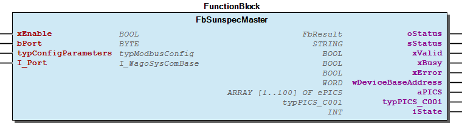 Graphical Interface of FbSunspecMaster Function description By activating the input xEnable , the block is enabled and the communication starts automatically. The block can be used individually to identify a Sunspec device, and (in combination with one of the following PICS blocks) for reading out the PICS supported by the device. For the second case, the input bPort is used for the assignment to the PICS function blocks. The input structure typConfigParameters defines the modbus communication type and holds the settings for Modbus TCP and Modbus RTU. Serial settings are initialized to standard parameter from Sunspec specification. Some typical settings are: The input I_Port holds the instance of the interface, e.g. COM1 (only for Modbus RTU). An active communication is signaled by the output xBusy . When the communication has been successfully completed, this is indicated via the xValid output and the values read out can be used. An error that occurs during the communication is displayed via the xError output. The wDeviceBaseAddress output indicates the base address of the Sunspec device. The aPICS output structure displays the supported PICS of the Sunspec device. The readable values of the PICS C001 are available in the output structure typPICS_C001 . Note For an example see also doc02_HowTo . Note For usefull information about the readable values see also doc03_UsefulInformation . Note For usefull information about the evaluation of errors see also doc03_UsefulInformation . - FbSunspecMaster.M_Call_Modbus (METH)

## FbSunspecPICS_DER701 (FB)


| Scope | Name | Type | Initial | Comment | Inherited from |
| --- | --- | --- | --- | --- | --- |
| Input | xEnable | BOOL | TRUE | Enable function block | FbSunSpec_Model |
| bPort | BYTE | 1 | Master assignment number - range 1 to ParameterList.MAX_INTERFACES | FbSunSpec_Model |
| Output | oStatus | WagoSysErrorBase.FbResult |  | Status information object, error codes from WagoAppPlcModbus | FbSunSpec_Model |
| sStatus | STRING |  | Status information string | FbSunSpec_Model |
| xValid | BOOL |  | Values are valid | FbSunSpec_Model |
| xBusy | BOOL |  | Communication activ | FbSunSpec_Model |
| xError | BOOL |  | Error while communication | FbSunSpec_Model |
| wPICS_StartAddress | WORD |  | Start address PICS | FbSunSpec_Model |
| wCount_Read | WORD |  | Counts up when a package was received | FbSunSpec_Model |
| wCount_Error | WORD |  | Counts up with every error | FbSunSpec_Model |
| tReadCycle | TIME |  | Cylce-Time of reading data | FbSunSpec_Model |
| iState | INT |  |  | FbSunSpec_Model |
| xSunSpecObj_Avail | BOOL |  | TRUE: This object is available in combination with the used FBSunSpecMaster | FbSunSpec_Model |
| Inout | typPICS_DER701 | typPICS_DER701 |  | Readable values PICS DER701 |  |

The function block FbSunspecPICS_DER701 enables evaluation of the PICS DER701 of a Sunspec slave.

Graphical Illustration

Graphical Interface of FbSunspecPICS_DER701

Function description

By activating the input xEnable , the block is enabled and the communication starts automatically.

The input bPort is used for the assignment to the master function block.

The output wPICS_StartAddress indicates the start address of the PICS DER701.

The readable values of the PICS DER701 are available in the output structure typPICS_DER701 .

For an example see also doc02_HowTo .

For usefull information about the readable values see also doc03_UsefulInformation .

For usefull information about the evaluation of errors see also doc03_UsefulInformation .

Interface variables Function The function block FbSunspecPICS_DER701 enables evaluation of the PICS DER701 of a Sunspec slave. Graphical Illustration 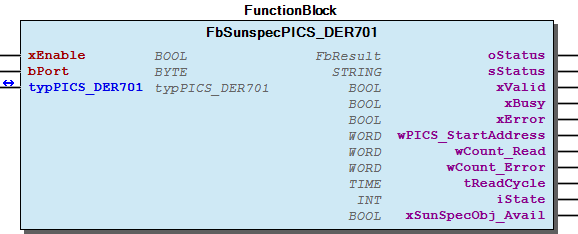 Graphical Interface of FbSunspecPICS_DER701 Function description By activating the input xEnable , the block is enabled and the communication starts automatically. The input bPort is used for the assignment to the master function block. The output wPICS_StartAddress indicates the start address of the PICS DER701. The readable values of the PICS DER701 are available in the output structure typPICS_DER701 . Note For an example see also doc02_HowTo . Note For usefull information about the readable values see also doc03_UsefulInformation . Note For usefull information about the evaluation of errors see also doc03_UsefulInformation . - FbSunspecPICS_DER701.A_ReadBlock_01_Cpy_Data (ACT) - FbSunspecPICS_DER701.A_ReadBlock_02_Cpy_Data (ACT)

## FbSunspecPICS_DER702 (FB)


| Scope | Name | Type | Initial | Comment | Inherited from |
| --- | --- | --- | --- | --- | --- |
| Input | xEnable | BOOL | TRUE | Enable function block | FbSunSpec_Model |
| bPort | BYTE | 1 | Master assignment number - range 1 to ParameterList.MAX_INTERFACES | FbSunSpec_Model |
| Output | oStatus | WagoSysErrorBase.FbResult |  | Status information object, error codes from WagoAppPlcModbus | FbSunSpec_Model |
| sStatus | STRING |  | Status information string | FbSunSpec_Model |
| xValid | BOOL |  | Values are valid | FbSunSpec_Model |
| xBusy | BOOL |  | Communication activ | FbSunSpec_Model |
| xError | BOOL |  | Error while communication | FbSunSpec_Model |
| wPICS_StartAddress | WORD |  | Start address PICS | FbSunSpec_Model |
| wCount_Read | WORD |  | Counts up when a package was received | FbSunSpec_Model |
| wCount_Error | WORD |  | Counts up with every error | FbSunSpec_Model |
| tReadCycle | TIME |  | Cylce-Time of reading data | FbSunSpec_Model |
| iState | INT |  |  | FbSunSpec_Model |
| xSunSpecObj_Avail | BOOL |  | TRUE: This object is available in combination with the used FBSunSpecMaster | FbSunSpec_Model |
| Inout | typPICS_DER702 | typPICS_DER702 |  | Readable values PICS DER702 |  |

The function block FbSunspecPICS_DER702 enables evaluation of the PICS DER702 of a Sunspec slave.

Graphical Illustration

Graphical Interface of FbSunspecPICS_DER702

Function description

By activating the input xEnable , the block is enabled and the communication starts automatically.

The input bPort is used for the assignment to the master function block.

The output wPICS_StartAddress indicates the start address of the PICS DER702.

The readable values of the PICS DER702 are available in the output structure typPICS_DER702 .

For an example see also doc02_HowTo .

For usefull information about the readable values see also doc03_UsefulInformation .

For usefull information about the evaluation of errors see also doc03_UsefulInformation .

Interface variables Function The function block FbSunspecPICS_DER702 enables evaluation of the PICS DER702 of a Sunspec slave. Graphical Illustration  Graphical Interface of FbSunspecPICS_DER702 Function description By activating the input xEnable , the block is enabled and the communication starts automatically. The input bPort is used for the assignment to the master function block. The output wPICS_StartAddress indicates the start address of the PICS DER702. The readable values of the PICS DER702 are available in the output structure typPICS_DER702 . Note For an example see also doc02_HowTo . Note For usefull information about the readable values see also doc03_UsefulInformation . Note For usefull information about the evaluation of errors see also doc03_UsefulInformation . - FbSunspecPICS_DER702.A_ReadBlock_01_Cpy_Data (ACT) - FbSunspecPICS_DER702.A_WriteBlock_01_Cpy_Data (ACT) - FbSunspecPICS_DER702.CheckWriteData (ACT)

## FbSunspecPICS_DER703 (FB)


| Scope | Name | Type | Initial | Comment | Inherited from |
| --- | --- | --- | --- | --- | --- |
| Input | xEnable | BOOL | TRUE | Enable function block | FbSunSpec_Model |
| bPort | BYTE | 1 | Master assignment number - range 1 to ParameterList.MAX_INTERFACES | FbSunSpec_Model |
| Output | oStatus | WagoSysErrorBase.FbResult |  | Status information object, error codes from WagoAppPlcModbus | FbSunSpec_Model |
| sStatus | STRING |  | Status information string | FbSunSpec_Model |
| xValid | BOOL |  | Values are valid | FbSunSpec_Model |
| xBusy | BOOL |  | Communication activ | FbSunSpec_Model |
| xError | BOOL |  | Error while communication | FbSunSpec_Model |
| wPICS_StartAddress | WORD |  | Start address PICS | FbSunSpec_Model |
| wCount_Read | WORD |  | Counts up when a package was received | FbSunSpec_Model |
| wCount_Error | WORD |  | Counts up with every error | FbSunSpec_Model |
| tReadCycle | TIME |  | Cylce-Time of reading data | FbSunSpec_Model |
| iState | INT |  |  | FbSunSpec_Model |
| xSunSpecObj_Avail | BOOL |  | TRUE: This object is available in combination with the used FBSunSpecMaster | FbSunSpec_Model |
| Inout | typPICS_DER703 | typPICS_DER703 |  | Readable values PICS DER703 |  |

The function block FbSunspecPICS_DER703 enables evaluation of the PICS DER703 of a Sunspec slave.

Graphical Illustration

Graphical Interface of FbSunspecPICS_DER703

Function description

By activating the input xEnable , the block is enabled and the communication starts automatically.

The input bPort is used for the assignment to the master function block.

The output wPICS_StartAddress indicates the start address of the PICS DER703.

The readable values of the PICS DER703 are available in the output structure typPICS_DER703 .

For an example see also doc02_HowTo .

For usefull information about the readable values see also doc03_UsefulInformation .

For usefull information about the evaluation of errors see also doc03_UsefulInformation .

Interface variables Function The function block FbSunspecPICS_DER703 enables evaluation of the PICS DER703 of a Sunspec slave. Graphical Illustration  Graphical Interface of FbSunspecPICS_DER703 Function description By activating the input xEnable , the block is enabled and the communication starts automatically. The input bPort is used for the assignment to the master function block. The output wPICS_StartAddress indicates the start address of the PICS DER703. The readable values of the PICS DER703 are available in the output structure typPICS_DER703 . Note For an example see also doc02_HowTo . Note For usefull information about the readable values see also doc03_UsefulInformation . Note For usefull information about the evaluation of errors see also doc03_UsefulInformation . - FbSunspecPICS_DER703.A_ReadBlock_01_Cpy_Data (ACT) - FbSunspecPICS_DER703.A_WriteBlock_01_Cpy_Data (ACT) - FbSunspecPICS_DER703.CheckWriteData (ACT)

## FbSunspecPICS_DER704 (FB)


| Scope | Name | Type | Initial | Comment | Inherited from |
| --- | --- | --- | --- | --- | --- |
| Input | xEnable | BOOL | TRUE | Enable function block | FbSunSpec_Model |
| bPort | BYTE | 1 | Master assignment number - range 1 to ParameterList.MAX_INTERFACES | FbSunSpec_Model |
| Output | oStatus | WagoSysErrorBase.FbResult |  | Status information object, error codes from WagoAppPlcModbus | FbSunSpec_Model |
| sStatus | STRING |  | Status information string | FbSunSpec_Model |
| xValid | BOOL |  | Values are valid | FbSunSpec_Model |
| xBusy | BOOL |  | Communication activ | FbSunSpec_Model |
| xError | BOOL |  | Error while communication | FbSunSpec_Model |
| wPICS_StartAddress | WORD |  | Start address PICS | FbSunSpec_Model |
| wCount_Read | WORD |  | Counts up when a package was received | FbSunSpec_Model |
| wCount_Error | WORD |  | Counts up with every error | FbSunSpec_Model |
| tReadCycle | TIME |  | Cylce-Time of reading data | FbSunSpec_Model |
| iState | INT |  |  | FbSunSpec_Model |
| xSunSpecObj_Avail | BOOL |  | TRUE: This object is available in combination with the used FBSunSpecMaster | FbSunSpec_Model |
| Inout | typPICS_DER704 | typPICS_DER704 |  | Readable values PICS DER704 |  |

The function block FbSunspecPICS_DER704 enables evaluation of the PICS DER704 of a Sunspec slave.

Graphical Illustration

Graphical Interface of FbSunspecPICS_DER704

Function description

By activating the input xEnable , the block is enabled and the communication starts automatically.

The input bPort is used for the assignment to the master function block.

The output wPICS_StartAddress indicates the start address of the PICS DER704.

The readable values of the PICS DER704 are available in the output structure typPICS_DER704 .

For an example see also doc02_HowTo .

For usefull information about the readable values see also doc03_UsefulInformation .

For usefull information about the evaluation of errors see also doc03_UsefulInformation .

Interface variables Function The function block FbSunspecPICS_DER704 enables evaluation of the PICS DER704 of a Sunspec slave. Graphical Illustration  Graphical Interface of FbSunspecPICS_DER704 Function description By activating the input xEnable , the block is enabled and the communication starts automatically. The input bPort is used for the assignment to the master function block. The output wPICS_StartAddress indicates the start address of the PICS DER704. The readable values of the PICS DER704 are available in the output structure typPICS_DER704 . Note For an example see also doc02_HowTo . Note For usefull information about the readable values see also doc03_UsefulInformation . Note For usefull information about the evaluation of errors see also doc03_UsefulInformation . - FbSunspecPICS_DER704.A_ReadBlock_01_Cpy_Data (ACT) - FbSunspecPICS_DER704.A_WriteBlock_01_Cpy_Data (ACT) - FbSunspecPICS_DER704.A_WriteBlock_02_Cpy_Data (ACT) - FbSunspecPICS_DER704.A_WriteBlock_03_Cpy_Data (ACT) - FbSunspecPICS_DER704.A_WriteBlock_04_Cpy_Data (ACT) - FbSunspecPICS_DER704.A_WriteBlock_05_Cpy_Data (ACT) - FbSunspecPICS_DER704.A_WriteBlock_06_Cpy_Data (ACT) - FbSunspecPICS_DER704.A_WriteBlock_07_Cpy_Data (ACT) - FbSunspecPICS_DER704.A_WriteBlock_Assign_Job (ACT) - FbSunspecPICS_DER704.CheckWriteData (ACT)

## FbSunspecPICS_DER705 (FB)


| Scope | Name | Type | Initial | Comment | Inherited from |
| --- | --- | --- | --- | --- | --- |
| Input | xEnable | BOOL | TRUE | Enable function block | FbSunSpec_Model |
| bPort | BYTE | 1 | Master assignment number - range 1 to ParameterList.MAX_INTERFACES | FbSunSpec_Model |
| Output | oStatus | WagoSysErrorBase.FbResult |  | Status information object, error codes from WagoAppPlcModbus | FbSunSpec_Model |
| sStatus | STRING |  | Status information string | FbSunSpec_Model |
| xValid | BOOL |  | Values are valid | FbSunSpec_Model |
| xBusy | BOOL |  | Communication activ | FbSunSpec_Model |
| xError | BOOL |  | Error while communication | FbSunSpec_Model |
| wPICS_StartAddress | WORD |  | Start address PICS | FbSunSpec_Model |
| wCount_Read | WORD |  | Counts up when a package was received | FbSunSpec_Model |
| wCount_Error | WORD |  | Counts up with every error | FbSunSpec_Model |
| tReadCycle | TIME |  | Cylce-Time of reading data | FbSunSpec_Model |
| iState | INT |  |  | FbSunSpec_Model |
| xSunSpecObj_Avail | BOOL |  | TRUE: This object is available in combination with the used FBSunSpecMaster | FbSunSpec_Model |
| Inout | typPICS_DER705 | typPICS_DER705 |  | Readable values PICS DER705 |  |

The function block FbSunspecPICS_DER705 enables evaluation of the PICS DER705 of a Sunspec slave.

Graphical Illustration

Graphical Interface of FbSunspecPICS_DER705

Function description

By activating the input xEnable , the block is enabled and the communication starts automatically.

The input bPort is used for the assignment to the master function block.

The output wPICS_StartAddress indicates the start address of the PICS DER705.

The readable values of the PICS DER705 are available in the output structure typPICS_DER705 .

For an example see also doc02_HowTo .

For usefull information about the readable values see also doc03_UsefulInformation .

For usefull information about the evaluation of errors see also doc03_UsefulInformation .

Interface variables Function The function block FbSunspecPICS_DER705 enables evaluation of the PICS DER705 of a Sunspec slave. Graphical Illustration  Graphical Interface of FbSunspecPICS_DER705 Function description By activating the input xEnable , the block is enabled and the communication starts automatically. The input bPort is used for the assignment to the master function block. The output wPICS_StartAddress indicates the start address of the PICS DER705. The readable values of the PICS DER705 are available in the output structure typPICS_DER705 . Note For an example see also doc02_HowTo . Note For usefull information about the readable values see also doc03_UsefulInformation . Note For usefull information about the evaluation of errors see also doc03_UsefulInformation . - FbSunspecPICS_DER705.A_ReadBlock_01_Cpy_Data (ACT) - FbSunspecPICS_DER705.A_WriteBlock_01_Cpy_Data (ACT) - FbSunspecPICS_DER705.A_WriteBlock_02_Cpy_Data (ACT) - FbSunspecPICS_DER705.A_WriteBlock_03_Cpy_Data (ACT) - FbSunspecPICS_DER705.A_WriteBlock_04_Cpy_Array_Data_1 (ACT) - FbSunspecPICS_DER705.A_WriteBlock_04_Cpy_Array_Data_2 (ACT) - FbSunspecPICS_DER705.A_WriteBlock_04_Cpy_Array_Data_3 (ACT) - FbSunspecPICS_DER705.A_WriteBlock_Assign_Job (ACT) - FbSunspecPICS_DER705.CheckWriteData (ACT)

## FbSunspecPICS_DER706 (FB)


| Scope | Name | Type | Initial | Comment | Inherited from |
| --- | --- | --- | --- | --- | --- |
| Input | xEnable | BOOL | TRUE | Enable function block | FbSunSpec_Model |
| bPort | BYTE | 1 | Master assignment number - range 1 to ParameterList.MAX_INTERFACES | FbSunSpec_Model |
| Output | oStatus | WagoSysErrorBase.FbResult |  | Status information object, error codes from WagoAppPlcModbus | FbSunSpec_Model |
| sStatus | STRING |  | Status information string | FbSunSpec_Model |
| xValid | BOOL |  | Values are valid | FbSunSpec_Model |
| xBusy | BOOL |  | Communication activ | FbSunSpec_Model |
| xError | BOOL |  | Error while communication | FbSunSpec_Model |
| wPICS_StartAddress | WORD |  | Start address PICS | FbSunSpec_Model |
| wCount_Read | WORD |  | Counts up when a package was received | FbSunSpec_Model |
| wCount_Error | WORD |  | Counts up with every error | FbSunSpec_Model |
| tReadCycle | TIME |  | Cylce-Time of reading data | FbSunSpec_Model |
| iState | INT |  |  | FbSunSpec_Model |
| xSunSpecObj_Avail | BOOL |  | TRUE: This object is available in combination with the used FBSunSpecMaster | FbSunSpec_Model |
| Inout | typPICS_DER706 | typPICS_DER706 |  | Readable values PICS DER706 |  |

The function block FbSunspecPICS_DER706 enables evaluation of the PICS DER706 of a Sunspec slave.

Graphical Illustration

Graphical Interface of FbSunspecPICS_DER706

Function description

By activating the input xEnable , the block is enabled and the communication starts automatically.

The input bPort is used for the assignment to the master function block.

The output wPICS_StartAddress indicates the start address of the PICS DER706.

The readable values of the PICS DER706 are available in the output structure typPICS_DER706 .

For an example see also doc02_HowTo .

For usefull information about the readable values see also doc03_UsefulInformation .

For usefull information about the evaluation of errors see also doc03_UsefulInformation .

Interface variables Function The function block FbSunspecPICS_DER706 enables evaluation of the PICS DER706 of a Sunspec slave. Graphical Illustration 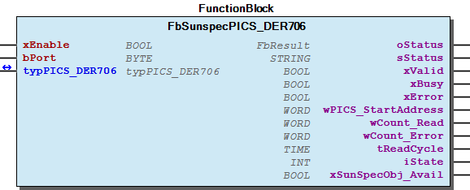 Graphical Interface of FbSunspecPICS_DER706 Function description By activating the input xEnable , the block is enabled and the communication starts automatically. The input bPort is used for the assignment to the master function block. The output wPICS_StartAddress indicates the start address of the PICS DER706. The readable values of the PICS DER706 are available in the output structure typPICS_DER706 . Note For an example see also doc02_HowTo . Note For usefull information about the readable values see also doc03_UsefulInformation . Note For usefull information about the evaluation of errors see also doc03_UsefulInformation . - FbSunspecPICS_DER706.A_ReadBlock_01_Cpy_Data (ACT) - FbSunspecPICS_DER706.A_WriteBlock_01_Cpy_Data (ACT) - FbSunspecPICS_DER706.A_WriteBlock_02_Cpy_Data (ACT) - FbSunspecPICS_DER706.A_WriteBlock_03_Cpy_Data (ACT) - FbSunspecPICS_DER706.A_WriteBlock_04_Cpy_Array_Data_1 (ACT) - FbSunspecPICS_DER706.A_WriteBlock_04_Cpy_Array_Data_2 (ACT) - FbSunspecPICS_DER706.A_WriteBlock_Assign_Job (ACT) - FbSunspecPICS_DER706.CheckWriteData (ACT)

## FbSunspecPICS_DER707 (FB)


| Scope | Name | Type | Initial | Comment | Inherited from |
| --- | --- | --- | --- | --- | --- |
| Input | xEnable | BOOL | TRUE | Enable function block | FbSunSpec_Model |
| bPort | BYTE | 1 | Master assignment number - range 1 to ParameterList.MAX_INTERFACES | FbSunSpec_Model |
| Output | oStatus | WagoSysErrorBase.FbResult |  | Status information object, error codes from WagoAppPlcModbus | FbSunSpec_Model |
| sStatus | STRING |  | Status information string | FbSunSpec_Model |
| xValid | BOOL |  | Values are valid | FbSunSpec_Model |
| xBusy | BOOL |  | Communication activ | FbSunSpec_Model |
| xError | BOOL |  | Error while communication | FbSunSpec_Model |
| wPICS_StartAddress | WORD |  | Start address PICS | FbSunSpec_Model |
| wCount_Read | WORD |  | Counts up when a package was received | FbSunSpec_Model |
| wCount_Error | WORD |  | Counts up with every error | FbSunSpec_Model |
| tReadCycle | TIME |  | Cylce-Time of reading data | FbSunSpec_Model |
| iState | INT |  |  | FbSunSpec_Model |
| xSunSpecObj_Avail | BOOL |  | TRUE: This object is available in combination with the used FBSunSpecMaster | FbSunSpec_Model |
| Inout | typPICS_DER707 | typPICS_DER707 |  | Readable values PICS DER707 |  |

The function block FbSunspecPICS_DER707 enables evaluation of the PICS DER707 of a Sunspec slave.

Graphical Illustration

Graphical Interface of FbSunspecPICS_DER707

Function description

By activating the input xEnable , the block is enabled and the communication starts automatically.

The input bPort is used for the assignment to the master function block.

The output wPICS_StartAddress indicates the start address of the PICS DER707.

The readable values of the PICS DER707 are available in the output structure typPICS_DER707 .

For an example see also doc02_HowTo .

For usefull information about the readable values see also doc03_UsefulInformation .

For usefull information about the evaluation of errors see also doc03_UsefulInformation .

Interface variables Function The function block FbSunspecPICS_DER707 enables evaluation of the PICS DER707 of a Sunspec slave. Graphical Illustration  Graphical Interface of FbSunspecPICS_DER707 Function description By activating the input xEnable , the block is enabled and the communication starts automatically. The input bPort is used for the assignment to the master function block. The output wPICS_StartAddress indicates the start address of the PICS DER707. The readable values of the PICS DER707 are available in the output structure typPICS_DER707 . Note For an example see also doc02_HowTo . Note For usefull information about the readable values see also doc03_UsefulInformation . Note For usefull information about the evaluation of errors see also doc03_UsefulInformation . - FbSunspecPICS_DER707.A_ReadBlock_01_Cpy_Data (ACT) - FbSunspecPICS_DER707.A_ReadBlock_02_Cpy_Data (ACT) - FbSunspecPICS_DER707.A_WriteBlock_01_Cpy_Data (ACT) - FbSunspecPICS_DER707.A_WriteBlock_02_Cpy_Array_Data (ACT) - FbSunspecPICS_DER707.A_WriteBlock_Assign_Job (ACT) - FbSunspecPICS_DER707.CheckWriteData (ACT)

## FbSunspecPICS_DER708 (FB)


| Scope | Name | Type | Initial | Comment | Inherited from |
| --- | --- | --- | --- | --- | --- |
| Input | xEnable | BOOL | TRUE | Enable function block | FbSunSpec_Model |
| bPort | BYTE | 1 | Master assignment number - range 1 to ParameterList.MAX_INTERFACES | FbSunSpec_Model |
| Output | oStatus | WagoSysErrorBase.FbResult |  | Status information object, error codes from WagoAppPlcModbus | FbSunSpec_Model |
| sStatus | STRING |  | Status information string | FbSunSpec_Model |
| xValid | BOOL |  | Values are valid | FbSunSpec_Model |
| xBusy | BOOL |  | Communication activ | FbSunSpec_Model |
| xError | BOOL |  | Error while communication | FbSunSpec_Model |
| wPICS_StartAddress | WORD |  | Start address PICS | FbSunSpec_Model |
| wCount_Read | WORD |  | Counts up when a package was received | FbSunSpec_Model |
| wCount_Error | WORD |  | Counts up with every error | FbSunSpec_Model |
| tReadCycle | TIME |  | Cylce-Time of reading data | FbSunSpec_Model |
| iState | INT |  |  | FbSunSpec_Model |
| xSunSpecObj_Avail | BOOL |  | TRUE: This object is available in combination with the used FBSunSpecMaster | FbSunSpec_Model |
| Inout | typPICS_DER708 | typPICS_DER708 |  | Readable values PICS DER708 |  |

The function block FbSunspecPICS_DER708 enables evaluation of the PICS DER708 of a Sunspec slave.

Graphical Illustration

Graphical Interface of FbSunspecPICS_DER708

Function description

By activating the input xEnable , the block is enabled and the communication starts automatically.

The input bPort is used for the assignment to the master function block.

The output wPICS_StartAddress indicates the start address of the PICS DER708.

The readable values of the PICS DER708 are available in the output structure typPICS_DER708 .

For an example see also doc02_HowTo .

For usefull information about the readable values see also doc03_UsefulInformation .

For usefull information about the evaluation of errors see also doc03_UsefulInformation .

Interface variables Function The function block FbSunspecPICS_DER708 enables evaluation of the PICS DER708 of a Sunspec slave. Graphical Illustration  Graphical Interface of FbSunspecPICS_DER708 Function description By activating the input xEnable , the block is enabled and the communication starts automatically. The input bPort is used for the assignment to the master function block. The output wPICS_StartAddress indicates the start address of the PICS DER708. The readable values of the PICS DER708 are available in the output structure typPICS_DER708 . Note For an example see also doc02_HowTo . Note For usefull information about the readable values see also doc03_UsefulInformation . Note For usefull information about the evaluation of errors see also doc03_UsefulInformation . - FbSunspecPICS_DER708.A_ReadBlock_01_Cpy_Data (ACT) - FbSunspecPICS_DER708.A_ReadBlock_02_Cpy_Data (ACT) - FbSunspecPICS_DER708.A_WriteBlock_01_Cpy_Data (ACT) - FbSunspecPICS_DER708.A_WriteBlock_02_Cpy_Array_Data (ACT) - FbSunspecPICS_DER708.A_WriteBlock_Assign_Job (ACT) - FbSunspecPICS_DER708.CheckWriteData (ACT)

## FbSunspecPICS_DER709 (FB)


| Scope | Name | Type | Initial | Comment | Inherited from |
| --- | --- | --- | --- | --- | --- |
| Input | xEnable | BOOL | TRUE | Enable function block | FbSunSpec_Model |
| bPort | BYTE | 1 | Master assignment number - range 1 to ParameterList.MAX_INTERFACES | FbSunSpec_Model |
| Output | oStatus | WagoSysErrorBase.FbResult |  | Status information object, error codes from WagoAppPlcModbus | FbSunSpec_Model |
| sStatus | STRING |  | Status information string | FbSunSpec_Model |
| xValid | BOOL |  | Values are valid | FbSunSpec_Model |
| xBusy | BOOL |  | Communication activ | FbSunSpec_Model |
| xError | BOOL |  | Error while communication | FbSunSpec_Model |
| wPICS_StartAddress | WORD |  | Start address PICS | FbSunSpec_Model |
| wCount_Read | WORD |  | Counts up when a package was received | FbSunSpec_Model |
| wCount_Error | WORD |  | Counts up with every error | FbSunSpec_Model |
| tReadCycle | TIME |  | Cylce-Time of reading data | FbSunSpec_Model |
| iState | INT |  |  | FbSunSpec_Model |
| xSunSpecObj_Avail | BOOL |  | TRUE: This object is available in combination with the used FBSunSpecMaster | FbSunSpec_Model |
| Inout | typPICS_DER709 | typPICS_DER709 |  | Readable values PICS DER709 |  |

The function block FbSunspecPICS_DER709 enables evaluation of the PICS DER709 of a Sunspec slave.

Graphical Illustration

Graphical Interface of FbSunspecPICS_DER709

Function description

By activating the input xEnable , the block is enabled and the communication starts automatically.

The input bPort is used for the assignment to the master function block.

The output wPICS_StartAddress indicates the start address of the PICS DER709.

The readable values of the PICS DER709 are available in the output structure typPICS_DER709 .

For an example see also doc02_HowTo .

For usefull information about the readable values see also doc03_UsefulInformation .

For usefull information about the evaluation of errors see also doc03_UsefulInformation .

Interface variables Function The function block FbSunspecPICS_DER709 enables evaluation of the PICS DER709 of a Sunspec slave. Graphical Illustration  Graphical Interface of FbSunspecPICS_DER709 Function description By activating the input xEnable , the block is enabled and the communication starts automatically. The input bPort is used for the assignment to the master function block. The output wPICS_StartAddress indicates the start address of the PICS DER709. The readable values of the PICS DER709 are available in the output structure typPICS_DER709 . Note For an example see also doc02_HowTo . Note For usefull information about the readable values see also doc03_UsefulInformation . Note For usefull information about the evaluation of errors see also doc03_UsefulInformation . - FbSunspecPICS_DER709.A_ReadBlock_01_Cpy_Data (ACT) - FbSunspecPICS_DER709.A_ReadBlock_02_Cpy_Data (ACT) - FbSunspecPICS_DER709.A_WriteBlock_01_Cpy_Data (ACT) - FbSunspecPICS_DER709.A_WriteBlock_02_Cpy_Array_Data (ACT) - FbSunspecPICS_DER709.A_WriteBlock_Assign_Job (ACT) - FbSunspecPICS_DER709.CheckWriteData (ACT)

## FbSunspecPICS_DER710 (FB)


| Scope | Name | Type | Initial | Comment | Inherited from |
| --- | --- | --- | --- | --- | --- |
| Input | xEnable | BOOL | TRUE | Enable function block | FbSunSpec_Model |
| bPort | BYTE | 1 | Master assignment number - range 1 to ParameterList.MAX_INTERFACES | FbSunSpec_Model |
| Output | oStatus | WagoSysErrorBase.FbResult |  | Status information object, error codes from WagoAppPlcModbus | FbSunSpec_Model |
| sStatus | STRING |  | Status information string | FbSunSpec_Model |
| xValid | BOOL |  | Values are valid | FbSunSpec_Model |
| xBusy | BOOL |  | Communication activ | FbSunSpec_Model |
| xError | BOOL |  | Error while communication | FbSunSpec_Model |
| wPICS_StartAddress | WORD |  | Start address PICS | FbSunSpec_Model |
| wCount_Read | WORD |  | Counts up when a package was received | FbSunSpec_Model |
| wCount_Error | WORD |  | Counts up with every error | FbSunSpec_Model |
| tReadCycle | TIME |  | Cylce-Time of reading data | FbSunSpec_Model |
| iState | INT |  |  | FbSunSpec_Model |
| xSunSpecObj_Avail | BOOL |  | TRUE: This object is available in combination with the used FBSunSpecMaster | FbSunSpec_Model |
| Inout | typPICS_DER710 | typPICS_DER710 |  | Readable values PICS DER710 |  |

The function block FbSunspecPICS_DER710 enables evaluation of the PICS DER710 of a Sunspec slave.

Graphical Illustration

Graphical Interface of FbSunspecPICS_DER710

Function description

By activating the input xEnable , the block is enabled and the communication starts automatically.

The input bPort is used for the assignment to the master function block.

The output wPICS_StartAddress indicates the start address of the PICS DER710.

The readable values of the PICS DER710 are available in the output structure typPICS_DER710 .

For an example see also doc02_HowTo .

For usefull information about the readable values see also doc03_UsefulInformation .

For usefull information about the evaluation of errors see also doc03_UsefulInformation .

Interface variables Function The function block FbSunspecPICS_DER710 enables evaluation of the PICS DER710 of a Sunspec slave. Graphical Illustration  Graphical Interface of FbSunspecPICS_DER710 Function description By activating the input xEnable , the block is enabled and the communication starts automatically. The input bPort is used for the assignment to the master function block. The output wPICS_StartAddress indicates the start address of the PICS DER710. The readable values of the PICS DER710 are available in the output structure typPICS_DER710 . Note For an example see also doc02_HowTo . Note For usefull information about the readable values see also doc03_UsefulInformation . Note For usefull information about the evaluation of errors see also doc03_UsefulInformation . - FbSunspecPICS_DER710.A_ReadBlock_01_Cpy_Data (ACT) - FbSunspecPICS_DER710.A_ReadBlock_02_Cpy_Data (ACT) - FbSunspecPICS_DER710.A_WriteBlock_01_Cpy_Data (ACT) - FbSunspecPICS_DER710.A_WriteBlock_02_Cpy_Array_Data (ACT) - FbSunspecPICS_DER710.A_WriteBlock_Assign_Job (ACT) - FbSunspecPICS_DER710.CheckWriteData (ACT)

## FbSunspecPICS_DER711 (FB)


| Scope | Name | Type | Initial | Comment | Inherited from |
| --- | --- | --- | --- | --- | --- |
| Input | xEnable | BOOL | TRUE | Enable function block | FbSunSpec_Model |
| bPort | BYTE | 1 | Master assignment number - range 1 to ParameterList.MAX_INTERFACES | FbSunSpec_Model |
| Output | oStatus | WagoSysErrorBase.FbResult |  | Status information object, error codes from WagoAppPlcModbus | FbSunSpec_Model |
| sStatus | STRING |  | Status information string | FbSunSpec_Model |
| xValid | BOOL |  | Values are valid | FbSunSpec_Model |
| xBusy | BOOL |  | Communication activ | FbSunSpec_Model |
| xError | BOOL |  | Error while communication | FbSunSpec_Model |
| wPICS_StartAddress | WORD |  | Start address PICS | FbSunSpec_Model |
| wCount_Read | WORD |  | Counts up when a package was received | FbSunSpec_Model |
| wCount_Error | WORD |  | Counts up with every error | FbSunSpec_Model |
| tReadCycle | TIME |  | Cylce-Time of reading data | FbSunSpec_Model |
| iState | INT |  |  | FbSunSpec_Model |
| xSunSpecObj_Avail | BOOL |  | TRUE: This object is available in combination with the used FBSunSpecMaster | FbSunSpec_Model |
| Inout | typPICS_DER711 | typPICS_DER711 |  | Readable values PICS DER711 |  |

The function block FbSunspecPICS_DER711 enables evaluation of the PICS DER711 of a Sunspec slave.

Graphical Illustration

Graphical Interface of FbSunspecPICS_DER711

Function description

By activating the input xEnable , the block is enabled and the communication starts automatically.

The input bPort is used for the assignment to the master function block.

The output wPICS_StartAddress indicates the start address of the PICS DER711.

The readable values of the PICS DER711 are available in the output structure typPICS_DER711 .

For an example see also doc02_HowTo .

For usefull information about the readable values see also doc03_UsefulInformation .

For usefull information about the evaluation of errors see also doc03_UsefulInformation .

Interface variables Function The function block FbSunspecPICS_DER711 enables evaluation of the PICS DER711 of a Sunspec slave. Graphical Illustration 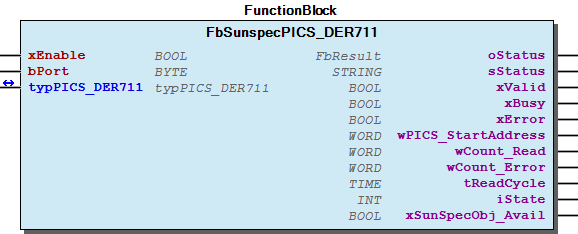 Graphical Interface of FbSunspecPICS_DER711 Function description By activating the input xEnable , the block is enabled and the communication starts automatically. The input bPort is used for the assignment to the master function block. The output wPICS_StartAddress indicates the start address of the PICS DER711. The readable values of the PICS DER711 are available in the output structure typPICS_DER711 . Note For an example see also doc02_HowTo . Note For usefull information about the readable values see also doc03_UsefulInformation . Note For usefull information about the evaluation of errors see also doc03_UsefulInformation . - FbSunspecPICS_DER711.A_ReadBlock_01_Cpy_Data (ACT) - FbSunspecPICS_DER711.A_WriteBlock_01_Cpy_Data (ACT) - FbSunspecPICS_DER711.A_WriteBlock_02_Cpy_Data (ACT) - FbSunspecPICS_DER711.A_WriteBlock_03_Cpy_Data (ACT) - FbSunspecPICS_DER711.A_WriteBlock_04_Cpy_Array_Data (ACT) - FbSunspecPICS_DER711.A_WriteBlock_Assign_Job (ACT) - FbSunspecPICS_DER711.CheckWriteData (ACT)

## FbSunspecPICS_DER712 (FB)


| Scope | Name | Type | Initial | Comment | Inherited from |
| --- | --- | --- | --- | --- | --- |
| Input | xEnable | BOOL | TRUE | Enable function block | FbSunSpec_Model |
| bPort | BYTE | 1 | Master assignment number - range 1 to ParameterList.MAX_INTERFACES | FbSunSpec_Model |
| Output | oStatus | WagoSysErrorBase.FbResult |  | Status information object, error codes from WagoAppPlcModbus | FbSunSpec_Model |
| sStatus | STRING |  | Status information string | FbSunSpec_Model |
| xValid | BOOL |  | Values are valid | FbSunSpec_Model |
| xBusy | BOOL |  | Communication activ | FbSunSpec_Model |
| xError | BOOL |  | Error while communication | FbSunSpec_Model |
| wPICS_StartAddress | WORD |  | Start address PICS | FbSunSpec_Model |
| wCount_Read | WORD |  | Counts up when a package was received | FbSunSpec_Model |
| wCount_Error | WORD |  | Counts up with every error | FbSunSpec_Model |
| tReadCycle | TIME |  | Cylce-Time of reading data | FbSunSpec_Model |
| iState | INT |  |  | FbSunSpec_Model |
| xSunSpecObj_Avail | BOOL |  | TRUE: This object is available in combination with the used FBSunSpecMaster | FbSunSpec_Model |
| Inout | typPICS_DER712 | typPICS_DER712 |  | Readable values PICS DER712 |  |

The function block FbSunspecPICS_DER712 enables evaluation of the PICS DER712 of a Sunspec slave.

Graphical Illustration

Graphical Interface of FbSunspecPICS_DER712

Function description

By activating the input xEnable , the block is enabled and the communication starts automatically.

The input bPort is used for the assignment to the master function block.

The output wPICS_StartAddress indicates the start address of the PICS DER712.

The readable values of the PICS DER712 are available in the output structure typPICS_DER712 .

For an example see also doc02_HowTo .

For usefull information about the readable values see also doc03_UsefulInformation .

For usefull information about the evaluation of errors see also doc03_UsefulInformation .

Interface variables Function The function block FbSunspecPICS_DER712 enables evaluation of the PICS DER712 of a Sunspec slave. Graphical Illustration  Graphical Interface of FbSunspecPICS_DER712 Function description By activating the input xEnable , the block is enabled and the communication starts automatically. The input bPort is used for the assignment to the master function block. The output wPICS_StartAddress indicates the start address of the PICS DER712. The readable values of the PICS DER712 are available in the output structure typPICS_DER712 . Note For an example see also doc02_HowTo . Note For usefull information about the readable values see also doc03_UsefulInformation . Note For usefull information about the evaluation of errors see also doc03_UsefulInformation . - FbSunspecPICS_DER712.A_ReadBlock_01_Cpy_Data (ACT) - FbSunspecPICS_DER712.A_WriteBlock_01_Cpy_Data (ACT) - FbSunspecPICS_DER712.A_WriteBlock_02_Cpy_Data (ACT) - FbSunspecPICS_DER712.A_WriteBlock_03_Cpy_Data (ACT) - FbSunspecPICS_DER712.A_WriteBlock_04_Cpy_Array_Data_1 (ACT) - FbSunspecPICS_DER712.A_WriteBlock_04_Cpy_Array_Data_2 (ACT) - FbSunspecPICS_DER712.A_WriteBlock_Assign_Job (ACT) - FbSunspecPICS_DER712.CheckWriteData (ACT)

## FbSunspecPICS_DER713 (FB)


| Scope | Name | Type | Initial | Comment | Inherited from |
| --- | --- | --- | --- | --- | --- |
| Input | xEnable | BOOL | TRUE | Enable function block | FbSunSpec_Model |
| bPort | BYTE | 1 | Master assignment number - range 1 to ParameterList.MAX_INTERFACES | FbSunSpec_Model |
| Output | oStatus | WagoSysErrorBase.FbResult |  | Status information object, error codes from WagoAppPlcModbus | FbSunSpec_Model |
| sStatus | STRING |  | Status information string | FbSunSpec_Model |
| xValid | BOOL |  | Values are valid | FbSunSpec_Model |
| xBusy | BOOL |  | Communication activ | FbSunSpec_Model |
| xError | BOOL |  | Error while communication | FbSunSpec_Model |
| wPICS_StartAddress | WORD |  | Start address PICS | FbSunSpec_Model |
| wCount_Read | WORD |  | Counts up when a package was received | FbSunSpec_Model |
| wCount_Error | WORD |  | Counts up with every error | FbSunSpec_Model |
| tReadCycle | TIME |  | Cylce-Time of reading data | FbSunSpec_Model |
| iState | INT |  |  | FbSunSpec_Model |
| xSunSpecObj_Avail | BOOL |  | TRUE: This object is available in combination with the used FBSunSpecMaster | FbSunSpec_Model |
| Inout | typPICS_DER713 | typPICS_DER713 |  | Readable values PICS DER713 |  |

The function block FbSunspecPICS_DER713 enables evaluation of the PICS DER713 of a Sunspec slave.

Graphical Illustration

Graphical Interface of FbSunspecPICS_DER713

Function description

By activating the input xEnable , the block is enabled and the communication starts automatically.

The input bPort is used for the assignment to the master function block.

The output wPICS_StartAddress indicates the start address of the PICS DER713.

The readable values of the PICS DER713 are available in the output structure typPICS_DER713 .

For an example see also doc02_HowTo .

For usefull information about the readable values see also doc03_UsefulInformation .

For usefull information about the evaluation of errors see also doc03_UsefulInformation .

Interface variables Function The function block FbSunspecPICS_DER713 enables evaluation of the PICS DER713 of a Sunspec slave. Graphical Illustration  Graphical Interface of FbSunspecPICS_DER713 Function description By activating the input xEnable , the block is enabled and the communication starts automatically. The input bPort is used for the assignment to the master function block. The output wPICS_StartAddress indicates the start address of the PICS DER713. The readable values of the PICS DER713 are available in the output structure typPICS_DER713 . Note For an example see also doc02_HowTo . Note For usefull information about the readable values see also doc03_UsefulInformation . Note For usefull information about the evaluation of errors see also doc03_UsefulInformation . - FbSunspecPICS_DER713.A_ReadBlock_01_Cpy_Data (ACT)

## FbSunspecPICS_DER714 (FB)


| Scope | Name | Type | Initial | Comment | Inherited from |
| --- | --- | --- | --- | --- | --- |
| Input | xEnable | BOOL | TRUE | Enable function block | FbSunSpec_Model |
| bPort | BYTE | 1 | Master assignment number - range 1 to ParameterList.MAX_INTERFACES | FbSunSpec_Model |
| Output | oStatus | WagoSysErrorBase.FbResult |  | Status information object, error codes from WagoAppPlcModbus | FbSunSpec_Model |
| sStatus | STRING |  | Status information string | FbSunSpec_Model |
| xValid | BOOL |  | Values are valid | FbSunSpec_Model |
| xBusy | BOOL |  | Communication activ | FbSunSpec_Model |
| xError | BOOL |  | Error while communication | FbSunSpec_Model |
| wPICS_StartAddress | WORD |  | Start address PICS | FbSunSpec_Model |
| wCount_Read | WORD |  | Counts up when a package was received | FbSunSpec_Model |
| wCount_Error | WORD |  | Counts up with every error | FbSunSpec_Model |
| tReadCycle | TIME |  | Cylce-Time of reading data | FbSunSpec_Model |
| iState | INT |  |  | FbSunSpec_Model |
| xSunSpecObj_Avail | BOOL |  | TRUE: This object is available in combination with the used FBSunSpecMaster | FbSunSpec_Model |
| Inout | typPICS_DER714 | typPICS_DER714 |  | Readable values PICS DER714 |  |

The function block FbSunspecPICS_DER714 enables evaluation of the PICS DER714 of a Sunspec slave.

Graphical Illustration

Graphical Interface of FbSunspecPICS_DER714

Function description

By activating the input xEnable , the block is enabled and the communication starts automatically.

The input bPort is used for the assignment to the master function block.

The output wPICS_StartAddress indicates the start address of the PICS DER714.

The readable values of the PICS DER714 are available in the output structure typPICS_DER714 .

For an example see also doc02_HowTo .

For usefull information about the readable values see also doc03_UsefulInformation .

For usefull information about the evaluation of errors see also doc03_UsefulInformation .

Interface variables Function The function block FbSunspecPICS_DER714 enables evaluation of the PICS DER714 of a Sunspec slave. Graphical Illustration  Graphical Interface of FbSunspecPICS_DER714 Function description By activating the input xEnable , the block is enabled and the communication starts automatically. The input bPort is used for the assignment to the master function block. The output wPICS_StartAddress indicates the start address of the PICS DER714. The readable values of the PICS DER714 are available in the output structure typPICS_DER714 . Note For an example see also doc02_HowTo . Note For usefull information about the readable values see also doc03_UsefulInformation . Note For usefull information about the evaluation of errors see also doc03_UsefulInformation . - FbSunspecPICS_DER714.A_ReadBlock_01_Cpy_Data (ACT)

## FbSunspecPICS_DER715 (FB)


| Scope | Name | Type | Initial | Comment | Inherited from |
| --- | --- | --- | --- | --- | --- |
| Input | xEnable | BOOL | TRUE | Enable function block | FbSunSpec_Model |
| bPort | BYTE | 1 | Master assignment number - range 1 to ParameterList.MAX_INTERFACES | FbSunSpec_Model |
| Output | oStatus | WagoSysErrorBase.FbResult |  | Status information object, error codes from WagoAppPlcModbus | FbSunSpec_Model |
| sStatus | STRING |  | Status information string | FbSunSpec_Model |
| xValid | BOOL |  | Values are valid | FbSunSpec_Model |
| xBusy | BOOL |  | Communication activ | FbSunSpec_Model |
| xError | BOOL |  | Error while communication | FbSunSpec_Model |
| wPICS_StartAddress | WORD |  | Start address PICS | FbSunSpec_Model |
| wCount_Read | WORD |  | Counts up when a package was received | FbSunSpec_Model |
| wCount_Error | WORD |  | Counts up with every error | FbSunSpec_Model |
| tReadCycle | TIME |  | Cylce-Time of reading data | FbSunSpec_Model |
| iState | INT |  |  | FbSunSpec_Model |
| xSunSpecObj_Avail | BOOL |  | TRUE: This object is available in combination with the used FBSunSpecMaster | FbSunSpec_Model |
| Inout | typPICS_DER715 | typPICS_DER715 |  | Readable values PICS DER715 |  |

The function block FbSunspecPICS_DER715 enables evaluation of the PICS DER715 of a Sunspec slave.

Graphical Illustration

Graphical Interface of FbSunspecPICS_DER715

Function description

By activating the input xEnable , the block is enabled and the communication starts automatically.

The input bPort is used for the assignment to the master function block.

The output wPICS_StartAddress indicates the start address of the PICS DER715.

The readable values of the PICS DER715 are available in the output structure typPICS_DER715 .

For an example see also doc02_HowTo .

For usefull information about the readable values see also doc03_UsefulInformation .

For usefull information about the evaluation of errors see also doc03_UsefulInformation .

Interface variables Function The function block FbSunspecPICS_DER715 enables evaluation of the PICS DER715 of a Sunspec slave. Graphical Illustration 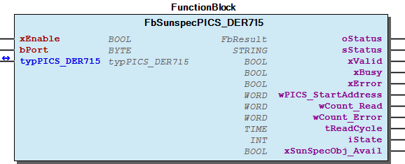 Graphical Interface of FbSunspecPICS_DER715 Function description By activating the input xEnable , the block is enabled and the communication starts automatically. The input bPort is used for the assignment to the master function block. The output wPICS_StartAddress indicates the start address of the PICS DER715. The readable values of the PICS DER715 are available in the output structure typPICS_DER715 . Note For an example see also doc02_HowTo . Note For usefull information about the readable values see also doc03_UsefulInformation . Note For usefull information about the evaluation of errors see also doc03_UsefulInformation . - FbSunspecPICS_DER715.A_ReadBlock_01_Cpy_Data (ACT) - FbSunspecPICS_DER715.A_WriteBlock_01_Cpy_Data (ACT) - FbSunspecPICS_DER715.CheckWriteData (ACT)

## FbSunspecPICS_E302 (FB)


| Scope | Name | Type | Initial | Comment |
| --- | --- | --- | --- | --- |
| Input | xEnable | BOOL | TRUE | Enable function block |
| bPort | BYTE | 1 | Master assignment number - range 1 to ParameterList.MAX_INTERFACES |
| Output | oStatus | WagoSysErrorBase.FbResult |  | Status information object, error codes from WagoAppPlcModbus |
| sStatus | STRING |  | Status information string |
| xValid | BOOL |  | Values are valid |
| xBusy | BOOL |  | Communication activ |
| xError | BOOL |  | Error while communication |
| wPICS_StartAddress | WORD |  | Start address PICS E302 |
| typPICS_E302 | typPICS_E302 |  | Readable values PICS E302 |
| xSunSpecObj_Avail | BOOL |  | TRUE: This object is available in combination with the used FBSunSpecMaster |

The function block FbSunspecPICS_E302 enables evaluation of the PICS E302 of a Sunspec slave.

Graphical Illustration

Graphical Interface of FbSunspecPICS_E302

Function description

By activating the input xEnable , the block is enabled and the communication starts automatically.

The input bPort is used for the assignment to the master function block.

The output wPICS_StartAddress indicates the start address of the PICS E302.

The readable values of the PICS E302 are available in the output structure typPICS_E302 .

For an example see also doc02_HowTo .

For usefull information about the readable values see also doc03_UsefulInformation .

For usefull information about the evaluation of errors see also doc03_UsefulInformation .

Interface variables Function The function block FbSunspecPICS_E302 enables evaluation of the PICS E302 of a Sunspec slave. Graphical Illustration 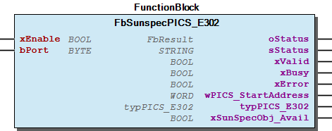 Graphical Interface of FbSunspecPICS_E302 Function description By activating the input xEnable , the block is enabled and the communication starts automatically. The input bPort is used for the assignment to the master function block. The output wPICS_StartAddress indicates the start address of the PICS E302. The readable values of the PICS E302 are available in the output structure typPICS_E302 . Note For an example see also doc02_HowTo . Note For usefull information about the readable values see also doc03_UsefulInformation . Note For usefull information about the evaluation of errors see also doc03_UsefulInformation .

## FbSunspecPICS_E303 (FB)


| Scope | Name | Type | Initial | Comment |
| --- | --- | --- | --- | --- |
| Input | xEnable | BOOL | TRUE | Enable function block |
| bPort | BYTE | 1 | Master assignment number - range 1 to ParameterList.MAX_INTERFACES |
| Output | oStatus | WagoSysErrorBase.FbResult |  | Status information object, error codes from WagoAppPlcModbus |
| sStatus | STRING |  | Status information string |
| xValid | BOOL |  | Values are valid |
| xBusy | BOOL |  | Communication activ |
| xError | BOOL |  | Error while communication |
| wPICS_StartAddress | WORD |  | Start address PICS E303 |
| wQuantityBlocks | WORD |  | Quantity of repeating blocks |
| typPICS_E303 | typPICS_E303 |  | Readable values PICS E303 |
| xSunSpecObj_Avail | BOOL |  | TRUE: This object is available in combination with the used FBSunSpecMaster |

The function block FbSunspecPICS_E303 enables evaluation of the PICS E303 of a Sunspec slave.

Graphical Illustration

Graphical Interface of FbSunspecPICS_E303

Function description

By activating the input xEnable , the block is enabled and the communication starts automatically.

The input bPort is used for the assignment to the master function block.

The output wPICS_StartAddress indicates the start address of the PICS E303.

The readable values of the PICS E303 are available in the output structure typPICS_E303 . The PICS E303 can contain several repeating data blocks, placed in the output structure typPICS_E303 . The output wQuantityBlocks indicates the quantity of repeating blocks. To get all data inside typPICS_E303 , the variable ParameterList.MAX_BLOCKS_E303 must be edited in the ParameterList , with the quantity of repeating blocks.

For an example see also doc02_HowTo .

For usefull information about the readable values see also doc03_UsefulInformation .

For usefull information about the evaluation of errors see also doc03_UsefulInformation .

Interface variables Function The function block FbSunspecPICS_E303 enables evaluation of the PICS E303 of a Sunspec slave. Graphical Illustration  Graphical Interface of FbSunspecPICS_E303 Function description By activating the input xEnable , the block is enabled and the communication starts automatically. The input bPort is used for the assignment to the master function block. The output wPICS_StartAddress indicates the start address of the PICS E303. The readable values of the PICS E303 are available in the output structure typPICS_E303 . The PICS E303 can contain several repeating data blocks, placed in the output structure typPICS_E303 . The output wQuantityBlocks indicates the quantity of repeating blocks. To get all data inside typPICS_E303 , the variable ParameterList.MAX_BLOCKS_E303 must be edited in the ParameterList , with the quantity of repeating blocks. Note For an example see also doc02_HowTo . Note For usefull information about the readable values see also doc03_UsefulInformation . Note For usefull information about the evaluation of errors see also doc03_UsefulInformation .

## FbSunspecPICS_E304 (FB)


| Scope | Name | Type | Initial | Comment |
| --- | --- | --- | --- | --- |
| Input | xEnable | BOOL | TRUE | Enable function block |
| bPort | BYTE | 1 | Master assignment number - range 1 to ParameterList.MAX_INTERFACES |
| Output | oStatus | WagoSysErrorBase.FbResult |  | Status information object, error codes from WagoAppPlcModbus |
| sStatus | STRING |  | Status information string |
| xValid | BOOL |  | Values are valid |
| xBusy | BOOL |  | Communication activ |
| xError | BOOL |  | Error while communication |
| wPICS_StartAddress | WORD |  | Start address PICS E304 |
| wQuantityBlocks | WORD |  | Quantity of repeating blocks |
| typPICS_E304 | typPICS_E304 |  | Readable values PICS E304 |
| xSunSpecObj_Avail | BOOL |  | TRUE: This object is available in combination with the used FBSunSpecMaster |

The function block FbSunspecPICS_E304 enables evaluation of the PICS E304 of a Sunspec slave.

Graphical Illustration

Graphical Interface of FbSunspecPICS_E304

Function description

By activating the input xEnable , the block is enabled and the communication starts automatically.

The input bPort is used for the assignment to the master function block.

The output wPICS_StartAddress indicates the start address of the PICS E304.

The readable values of the PICS E304 are available in the output structure typPICS_E304 . The PICS E304 can contain several repeating data blocks, placed in the output structure typPICS_E304 . The output wQuantityBlocks indicates the quantity of repeating blocks. To get all data inside typPICS_E304 , the variable ParameterList.MAX_BLOCKS_E304 must be edited in the ParameterList , with the quantity of repeating blocks.

For an example see also doc02_HowTo .

For usefull information about the readable values see also doc03_UsefulInformation .

For usefull information about the evaluation of errors see also doc03_UsefulInformation .

Interface variables Function The function block FbSunspecPICS_E304 enables evaluation of the PICS E304 of a Sunspec slave. Graphical Illustration  Graphical Interface of FbSunspecPICS_E304 Function description By activating the input xEnable , the block is enabled and the communication starts automatically. The input bPort is used for the assignment to the master function block. The output wPICS_StartAddress indicates the start address of the PICS E304. The readable values of the PICS E304 are available in the output structure typPICS_E304 . The PICS E304 can contain several repeating data blocks, placed in the output structure typPICS_E304 . The output wQuantityBlocks indicates the quantity of repeating blocks. To get all data inside typPICS_E304 , the variable ParameterList.MAX_BLOCKS_E304 must be edited in the ParameterList , with the quantity of repeating blocks. Note For an example see also doc02_HowTo . Note For usefull information about the readable values see also doc03_UsefulInformation . Note For usefull information about the evaluation of errors see also doc03_UsefulInformation .

## FbSunspecPICS_E305 (FB)


| Scope | Name | Type | Initial | Comment |
| --- | --- | --- | --- | --- |
| Input | xEnable | BOOL | TRUE | Enable function block |
| bPort | BYTE | 1 | Master assignment number - range 1 to ParameterList.MAX_INTERFACES |
| Output | oStatus | WagoSysErrorBase.FbResult |  | Status information object, error codes from WagoAppPlcModbus |
| sStatus | STRING |  | Status information string |
| xValid | BOOL |  | Values are valid |
| xBusy | BOOL |  | Communication activ |
| xError | BOOL |  | Error while communication |
| wPICS_StartAddress | WORD |  | Start address PICS E305 |
| typPICS_E305 | typPICS_E305 |  | Readable values PICS E305 |
| xSunSpecObj_Avail | BOOL |  | TRUE: This object is available in combination with the used FBSunSpecMaster |

The function block FbSunspecPICS_E305 enables evaluation of the PICS E305 of a Sunspec slave.

Graphical Illustration

Graphical Interface of FbSunspecPICS_E305

Function description

By activating the input xEnable , the block is enabled and the communication starts automatically.

The input bPort is used for the assignment to the master function block.

The output wPICS_StartAddress indicates the start address of the PICS E305.

The readable values of the PICS E305 are available in the output structure typPICS_E305 .

For an example see also doc02_HowTo .

For usefull information about the readable values see also doc03_UsefulInformation .

For usefull information about the evaluation of errors see also doc03_UsefulInformation .

Interface variables Function The function block FbSunspecPICS_E305 enables evaluation of the PICS E305 of a Sunspec slave. Graphical Illustration  Graphical Interface of FbSunspecPICS_E305 Function description By activating the input xEnable , the block is enabled and the communication starts automatically. The input bPort is used for the assignment to the master function block. The output wPICS_StartAddress indicates the start address of the PICS E305. The readable values of the PICS E305 are available in the output structure typPICS_E305 . Note For an example see also doc02_HowTo . Note For usefull information about the readable values see also doc03_UsefulInformation . Note For usefull information about the evaluation of errors see also doc03_UsefulInformation .

## FbSunspecPICS_E306 (FB)


| Scope | Name | Type | Initial | Comment |
| --- | --- | --- | --- | --- |
| Input | xEnable | BOOL | TRUE | Enable function block |
| bPort | BYTE | 1 | Master assignment number - range 1 to ParameterList.MAX_INTERFACES |
| Output | oStatus | WagoSysErrorBase.FbResult |  | Status information object, error codes from WagoAppPlcModbus |
| sStatus | STRING |  | Status information string |
| xValid | BOOL |  | Values are valid |
| xBusy | BOOL |  | Communication activ |
| xError | BOOL |  | Error while communication |
| wPICS_StartAddress | WORD |  | Start address PICS E306 |
| typPICS_E306 | typPICS_E306 |  | Readable values PICS E306 |
| xSunSpecObj_Avail | BOOL |  | TRUE: This object is available in combination with the used FBSunSpecMaster |

The function block FbSunspecPICS_E306 enables evaluation of the PICS E306 of a Sunspec slave.

Graphical Illustration

Graphical Interface of FbSunspecPICS_E306

Function description

By activating the input xEnable , the block is enabled and the communication starts automatically.

The input bPort is used for the assignment to the master function block.

The output wPICS_StartAddress indicates the start address of the PICS E306.

The readable values of the PICS E306 are available in the output structure typPICS_E306 .

For an example see also doc02_HowTo .

For usefull information about the readable values see also doc03_UsefulInformation .

For usefull information about the evaluation of errors see also doc03_UsefulInformation .

Interface variables Function The function block FbSunspecPICS_E306 enables evaluation of the PICS E306 of a Sunspec slave. Graphical Illustration  Graphical Interface of FbSunspecPICS_E306 Function description By activating the input xEnable , the block is enabled and the communication starts automatically. The input bPort is used for the assignment to the master function block. The output wPICS_StartAddress indicates the start address of the PICS E306. The readable values of the PICS E306 are available in the output structure typPICS_E306 . Note For an example see also doc02_HowTo . Note For usefull information about the readable values see also doc03_UsefulInformation . Note For usefull information about the evaluation of errors see also doc03_UsefulInformation .

## FbSunspecPICS_E307 (FB)


| Scope | Name | Type | Initial | Comment |
| --- | --- | --- | --- | --- |
| Input | xEnable | BOOL | TRUE | Enable function block |
| bPort | BYTE | 1 | Master assignment number - range 1 to ParameterList.MAX_INTERFACES |
| Output | oStatus | WagoSysErrorBase.FbResult |  | Status information object, error codes from WagoAppPlcModbus |
| sStatus | STRING |  | Status information string |
| xValid | BOOL |  | Values are valid |
| xBusy | BOOL |  | Communication activ |
| xError | BOOL |  | Error while communication |
| wPICS_StartAddress | WORD |  | Start address PICS E307 |
| typPICS_E307 | typPICS_E307 |  | Readable values PICS E307 |
| xSunSpecObj_Avail | BOOL |  | TRUE: This object is available in combination with the used FBSunSpecMaster |

The function block FbSunspecPICS_E307 enables evaluation of the PICS E307 of a Sunspec slave.

Graphical Illustration

Graphical Interface of FbSunspecPICS_E307

Function description

By activating the input xEnable , the block is enabled and the communication starts automatically.

The input bPort is used for the assignment to the master function block.

The output wPICS_StartAddress indicates the start address of the PICS E307.

The readable values of the PICS E307 are available in the output structure typPICS_E307 .

For an example see also doc02_HowTo .

For usefull information about the readable values see also doc03_UsefulInformation .

For usefull information about the evaluation of errors see also doc03_UsefulInformation .

Interface variables Function The function block FbSunspecPICS_E307 enables evaluation of the PICS E307 of a Sunspec slave. Graphical Illustration  Graphical Interface of FbSunspecPICS_E307 Function description By activating the input xEnable , the block is enabled and the communication starts automatically. The input bPort is used for the assignment to the master function block. The output wPICS_StartAddress indicates the start address of the PICS E307. The readable values of the PICS E307 are available in the output structure typPICS_E307 . Note For an example see also doc02_HowTo . Note For usefull information about the readable values see also doc03_UsefulInformation . Note For usefull information about the evaluation of errors see also doc03_UsefulInformation .

## FbSunspecPICS_E308 (FB)


| Scope | Name | Type | Initial | Comment |
| --- | --- | --- | --- | --- |
| Input | xEnable | BOOL | TRUE | Enable function block |
| bPort | BYTE | 1 | Master assignment number - range 1 to ParameterList.MAX_INTERFACES |
| Output | oStatus | WagoSysErrorBase.FbResult |  | Status information object, error codes from WagoAppPlcModbus |
| sStatus | STRING |  | Status information string |
| xValid | BOOL |  | Values are valid |
| xBusy | BOOL |  | Communication activ |
| xError | BOOL |  | Error while communication |
| wPICS_StartAddress | WORD |  | Start address PICS E308 |
| typPICS_E308 | typPICS_E308 |  | Readable values PICS E308 |
| xSunSpecObj_Avail | BOOL |  | TRUE: This object is available in combination with the used FBSunSpecMaster |

The function block FbSunspecPICS_E308 enables evaluation of the PICS E308 of a Sunspec slave.

Graphical Illustration

Graphical Interface of FbSunspecPICS_E308

Function description

By activating the input xEnable , the block is enabled and the communication starts automatically.

The input bPort is used for the assignment to the master function block.

The output wPICS_StartAddress indicates the start address of the PICS E308.

The readable values of the PICS E308 are available in the output structure typPICS_E308 .

For an example see also doc02_HowTo .

For usefull information about the readable values see also doc03_UsefulInformation .

For usefull information about the evaluation of errors see also doc03_UsefulInformation .

Interface variables Function The function block FbSunspecPICS_E308 enables evaluation of the PICS E308 of a Sunspec slave. Graphical Illustration  Graphical Interface of FbSunspecPICS_E308 Function description By activating the input xEnable , the block is enabled and the communication starts automatically. The input bPort is used for the assignment to the master function block. The output wPICS_StartAddress indicates the start address of the PICS E308. The readable values of the PICS E308 are available in the output structure typPICS_E308 . Note For an example see also doc02_HowTo . Note For usefull information about the readable values see also doc03_UsefulInformation . Note For usefull information about the evaluation of errors see also doc03_UsefulInformation .

## FbSunspecPICS_I101 (FB)


| Scope | Name | Type | Initial | Comment |
| --- | --- | --- | --- | --- |
| Input | xEnable | BOOL | TRUE | Enable function block |
| bPort | BYTE | 1 | Master assignment number - range 1 to ParameterList.MAX_INTERFACES |
| Output | oStatus | WagoSysErrorBase.FbResult |  | Status information object, error codes from WagoAppPlcModbus |
| sStatus | STRING |  | Status information string |
| xValid | BOOL |  | Values are valid |
| xBusy | BOOL |  | Communication activ |
| xError | BOOL |  | Error while communication |
| wPICS_StartAddress | WORD |  | Start address PICS I101 |
| typPICS_I101 | typPICS_I101 |  | Readable values PICS I101 |
| xSunSpecObj_Avail | BOOL |  | TRUE: This object is available in combination with the used FBSunSpecMaster |

The function block FbSunspecPICS_I101 enables evaluation of the PICS I101 of a Sunspec slave.

Graphical Illustration

Graphical Interface of FbSunspecPICS_I101

Function description

By activating the input xEnable , the block is enabled and the communication starts automatically.

The input bPort is used for the assignment to the master function block.

The output wPICS_StartAddress indicates the start address of the PICS I101.

The readable values of the PICS I101 are available in the output structure typPICS_I101 .

For an example see also doc02_HowTo .

For usefull information about the readable values see also doc03_UsefulInformation .

For usefull information about the evaluation of errors see also doc03_UsefulInformation .

Interface variables Function The function block FbSunspecPICS_I101 enables evaluation of the PICS I101 of a Sunspec slave. Graphical Illustration  Graphical Interface of FbSunspecPICS_I101 Function description By activating the input xEnable , the block is enabled and the communication starts automatically. The input bPort is used for the assignment to the master function block. The output wPICS_StartAddress indicates the start address of the PICS I101. The readable values of the PICS I101 are available in the output structure typPICS_I101 . Note For an example see also doc02_HowTo . Note For usefull information about the readable values see also doc03_UsefulInformation . Note For usefull information about the evaluation of errors see also doc03_UsefulInformation .

## FbSunspecPICS_I102 (FB)


| Scope | Name | Type | Initial | Comment |
| --- | --- | --- | --- | --- |
| Input | xEnable | BOOL | TRUE | Enable function block |
| bPort | BYTE | 1 | Master assignment number - range 1 to ParameterList.MAX_INTERFACES |
| Output | oStatus | WagoSysErrorBase.FbResult |  | Status information object, error codes from WagoAppPlcModbus |
| sStatus | STRING |  | Status information string |
| xValid | BOOL |  | Values are valid |
| xBusy | BOOL |  | Communication activ |
| xError | BOOL |  | Error while communication |
| wPICS_StartAddress | WORD |  | Start address PICS I102 |
| typPICS_I102 | typPICS_I102 |  | Readable values PICS I102 |
| xSunSpecObj_Avail | BOOL |  | TRUE: This object is available in combination with the used FBSunSpecMaster |

The function block FbSunspecPICS_I102 enables evaluation of the PICS I102 of a Sunspec slave.

Graphical Illustration

Graphical Interface of FbSunspecPICS_I102

Function description

By activating the input xEnable , the block is enabled and the communication starts automatically.

The input bPort is used for the assignment to the master function block.

The output wPICS_StartAddress indicates the start address of the PICS I102.

The readable values of the PICS I102 are available in the output structure typPICS_I102 .

For an example see also doc02_HowTo .

For usefull information about the readable values see also doc03_UsefulInformation .

For usefull information about the evaluation of errors see also doc03_UsefulInformation .

Interface variables Function The function block FbSunspecPICS_I102 enables evaluation of the PICS I102 of a Sunspec slave. Graphical Illustration  Graphical Interface of FbSunspecPICS_I102 Function description By activating the input xEnable , the block is enabled and the communication starts automatically. The input bPort is used for the assignment to the master function block. The output wPICS_StartAddress indicates the start address of the PICS I102. The readable values of the PICS I102 are available in the output structure typPICS_I102 . Note For an example see also doc02_HowTo . Note For usefull information about the readable values see also doc03_UsefulInformation . Note For usefull information about the evaluation of errors see also doc03_UsefulInformation .

## FbSunspecPICS_I103 (FB)


| Scope | Name | Type | Initial | Comment |
| --- | --- | --- | --- | --- |
| Input | xEnable | BOOL | TRUE | Enable function block |
| bPort | BYTE | 1 | Master assignment number - range 1 to ParameterList.MAX_INTERFACES |
| Output | oStatus | WagoSysErrorBase.FbResult |  | Status information object, error codes from WagoAppPlcModbus |
| sStatus | STRING |  | Status information string |
| xValid | BOOL |  | Values are valid |
| xBusy | BOOL |  | Communication activ |
| xError | BOOL |  | Error while communication |
| wPICS_StartAddress | WORD |  | Start address PICS I103 |
| typPICS_I103 | typPICS_I103 |  | Readable values PICS I103 |
| xSunSpecObj_Avail | BOOL |  | TRUE: This object is available in combination with the used FBSunSpecMaster |

The function block FbSunspecPICS_I103 enables evaluation of the PICS I103 of a Sunspec slave.

Graphical Illustration

Graphical Interface of FbSunspecPICS_I103

Function description

By activating the input xEnable , the block is enabled and the communication starts automatically.

The input bPort is used for the assignment to the master function block.

The output wPICS_StartAddress indicates the start address of the PICS I103.

The readable values of the PICS I103 are available in the output structure typPICS_I103 .

For an example see also doc02_HowTo .

For usefull information about the readable values see also doc03_UsefulInformation .

For usefull information about the evaluation of errors see also doc03_UsefulInformation .

Interface variables Function The function block FbSunspecPICS_I103 enables evaluation of the PICS I103 of a Sunspec slave. Graphical Illustration  Graphical Interface of FbSunspecPICS_I103 Function description By activating the input xEnable , the block is enabled and the communication starts automatically. The input bPort is used for the assignment to the master function block. The output wPICS_StartAddress indicates the start address of the PICS I103. The readable values of the PICS I103 are available in the output structure typPICS_I103 . Note For an example see also doc02_HowTo . Note For usefull information about the readable values see also doc03_UsefulInformation . Note For usefull information about the evaluation of errors see also doc03_UsefulInformation .

## FbSunspecPICS_I111 (FB)


| Scope | Name | Type | Initial | Comment |
| --- | --- | --- | --- | --- |
| Input | xEnable | BOOL | TRUE | Enable function block |
| bPort | BYTE | 1 | Master assignment number - range 1 to ParameterList.MAX_INTERFACES |
| Output | oStatus | WagoSysErrorBase.FbResult |  | Status information object, error codes from WagoAppPlcModbus |
| sStatus | STRING |  | Status information string |
| xValid | BOOL |  | Values are valid |
| xBusy | BOOL |  | Communication activ |
| xError | BOOL |  | Error while communication |
| wPICS_StartAddress | WORD |  | Start address PICS I111 |
| typPICS_I111 | typPICS_I111 |  | Readable values PICS I111 |
| xSunSpecObj_Avail | BOOL |  | TRUE: This object is available in combination with the used FBSunSpecMaster |

The function block FbSunspecPICS_I111 enables evaluation of the PICS I111 of a Sunspec slave.

Graphical Illustration

Graphical Interface of FbSunspecPICS_I111

Function description

By activating the input xEnable , the block is enabled and the communication starts automatically.

The input bPort is used for the assignment to the master function block.

The output wPICS_StartAddress indicates the start address of the PICS I111.

The readable values of the PICS I111 are available in the output structure typPICS_I111 .

For an example see also doc02_HowTo .

For usefull information about the readable values see also doc03_UsefulInformation .

For usefull information about the evaluation of errors see also doc03_UsefulInformation .

Interface variables Function The function block FbSunspecPICS_I111 enables evaluation of the PICS I111 of a Sunspec slave. Graphical Illustration  Graphical Interface of FbSunspecPICS_I111 Function description By activating the input xEnable , the block is enabled and the communication starts automatically. The input bPort is used for the assignment to the master function block. The output wPICS_StartAddress indicates the start address of the PICS I111. The readable values of the PICS I111 are available in the output structure typPICS_I111 . Note For an example see also doc02_HowTo . Note For usefull information about the readable values see also doc03_UsefulInformation . Note For usefull information about the evaluation of errors see also doc03_UsefulInformation .

## FbSunspecPICS_I112 (FB)


| Scope | Name | Type | Initial | Comment |
| --- | --- | --- | --- | --- |
| Input | xEnable | BOOL | TRUE | Enable function block |
| bPort | BYTE | 1 | Master assignment number - range 1 to ParameterList.MAX_INTERFACES |
| Output | oStatus | WagoSysErrorBase.FbResult |  | Status information object, error codes from WagoAppPlcModbus |
| sStatus | STRING |  | Status information string |
| xValid | BOOL |  | Values are valid |
| xBusy | BOOL |  | Communication activ |
| xError | BOOL |  | Error while communication |
| wPICS_StartAddress | WORD |  | Start address PICS I112 |
| typPICS_I112 | typPICS_I112 |  | Readable values PICS I112 |
| xSunSpecObj_Avail | BOOL |  | TRUE: This object is available in combination with the used FBSunSpecMaster |

The function block FbSunspecPICS_I112 enables evaluation of the PICS I112 of a Sunspec slave.

Graphical Illustration

Graphical Interface of FbSunspecPICS_I112

Function description

By activating the input xEnable , the block is enabled and the communication starts automatically.

The input bPort is used for the assignment to the master function block.

The output wPICS_StartAddress indicates the start address of the PICS I112.

The readable values of the PICS I112 are available in the output structure typPICS_I112 .

For an example see also doc02_HowTo .

For usefull information about the readable values see also doc03_UsefulInformation .

For usefull information about the evaluation of errors see also doc03_UsefulInformation .

Interface variables Function The function block FbSunspecPICS_I112 enables evaluation of the PICS I112 of a Sunspec slave. Graphical Illustration  Graphical Interface of FbSunspecPICS_I112 Function description By activating the input xEnable , the block is enabled and the communication starts automatically. The input bPort is used for the assignment to the master function block. The output wPICS_StartAddress indicates the start address of the PICS I112. The readable values of the PICS I112 are available in the output structure typPICS_I112 . Note For an example see also doc02_HowTo . Note For usefull information about the readable values see also doc03_UsefulInformation . Note For usefull information about the evaluation of errors see also doc03_UsefulInformation .

## FbSunspecPICS_I113 (FB)


| Scope | Name | Type | Initial | Comment |
| --- | --- | --- | --- | --- |
| Input | xEnable | BOOL | TRUE | Enable function block |
| bPort | BYTE | 1 | Master assignment number - range 1 to ParameterList.MAX_INTERFACES |
| Output | oStatus | WagoSysErrorBase.FbResult |  | Status information object, error codes from WagoAppPlcModbus |
| sStatus | STRING |  | Status information string |
| xValid | BOOL |  | Values are valid |
| xBusy | BOOL |  | Communication activ |
| xError | BOOL |  | Error while communication |
| wPICS_StartAddress | WORD |  | Start address PICS I113 |
| typPICS_I113 | typPICS_I113 |  | Readable values PICS I113 |
| xSunSpecObj_Avail | BOOL |  | TRUE: This object is available in combination with the used FBSunSpecMaster |

The function block FbSunspecPICS_I113 enables evaluation of the PICS I113 of a Sunspec slave.

Graphical Illustration

Graphical Interface of FbSunspecPICS_I113

Function description

By activating the input xEnable , the block is enabled and the communication starts automatically.

The input bPort is used for the assignment to the master function block.

The output wPICS_StartAddress indicates the start address of the PICS I113.

The readable values of the PICS I113 are available in the output structure typPICS_I113 .

For an example see also doc02_HowTo .

For usefull information about the readable values see also doc03_UsefulInformation .

For usefull information about the evaluation of errors see also doc03_UsefulInformation .

Interface variables Function The function block FbSunspecPICS_I113 enables evaluation of the PICS I113 of a Sunspec slave. Graphical Illustration 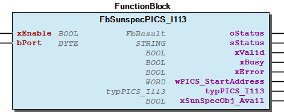 Graphical Interface of FbSunspecPICS_I113 Function description By activating the input xEnable , the block is enabled and the communication starts automatically. The input bPort is used for the assignment to the master function block. The output wPICS_StartAddress indicates the start address of the PICS I113. The readable values of the PICS I113 are available in the output structure typPICS_I113 . Note For an example see also doc02_HowTo . Note For usefull information about the readable values see also doc03_UsefulInformation . Note For usefull information about the evaluation of errors see also doc03_UsefulInformation .

## FbSunspecPICS_I160 (FB)


| Scope | Name | Type | Initial | Comment |
| --- | --- | --- | --- | --- |
| Input | xEnable | BOOL | TRUE | Enable function block |
| bPort | BYTE | 1 | Master assignment number - range 1 to ParameterList.MAX_INTERFACES |
| Output | oStatus | WagoSysErrorBase.FbResult |  | Status information object, error codes from WagoAppPlcModbus |
| sStatus | STRING |  | Status information string |
| xValid | BOOL |  | Values are valid |
| xBusy | BOOL |  | Communication activ |
| xError | BOOL |  | Error while communication |
| wPICS_StartAddress | WORD |  | Start address PICS I160 |
| wQuantityBlocks | WORD |  | Quantity of repeating blocks |
| typPICS_I160 | typPICS_I160 |  | Readable values PICS I160 |
| xSunSpecObj_Avail | BOOL |  | TRUE: This object is available in combination with the used FBSunSpecMaster |

The function block FbSunspecPICS_I160 enables evaluation of the PICS I160 of a Sunspec slave.

Graphical Illustration

Graphical Interface of FbSunspecPICS_I160

Function description

By activating the input xEnable , the block is enabled and the communication starts automatically.

The input bPort is used for the assignment to the master function block.

The output wPICS_StartAddress indicates the start address of the PICS I160.

The readable values of the PICS I160 are available in the output structure typPICS_I160 . The PICS I160 can contain several repeating data blocks, placed in the output structure typPICS_I160 . The output wQuantityBlocks indicates the quantity of repeating blocks. To get all data inside typPICS_I160 , the variable ParameterList.MAX_BLOCKS_I160 must be edited in the ParameterList , with the quantity of repeating blocks.

For an example see also doc02_HowTo .

For usefull information about the readable values see also doc03_UsefulInformation .

For usefull information about the evaluation of errors see also doc03_UsefulInformation .

Interface variables Function The function block FbSunspecPICS_I160 enables evaluation of the PICS I160 of a Sunspec slave. Graphical Illustration  Graphical Interface of FbSunspecPICS_I160 Function description By activating the input xEnable , the block is enabled and the communication starts automatically. The input bPort is used for the assignment to the master function block. The output wPICS_StartAddress indicates the start address of the PICS I160. The readable values of the PICS I160 are available in the output structure typPICS_I160 . The PICS I160 can contain several repeating data blocks, placed in the output structure typPICS_I160 . The output wQuantityBlocks indicates the quantity of repeating blocks. To get all data inside typPICS_I160 , the variable ParameterList.MAX_BLOCKS_I160 must be edited in the ParameterList , with the quantity of repeating blocks. Note For an example see also doc02_HowTo . Note For usefull information about the readable values see also doc03_UsefulInformation . Note For usefull information about the evaluation of errors see also doc03_UsefulInformation .

## FbSunspecPICS_IC120 (FB)


| Scope | Name | Type | Initial | Comment |
| --- | --- | --- | --- | --- |
| Input | xEnable | BOOL | TRUE | Enable function block |
| bPort | BYTE | 1 | Master assignment number - range 1 to ParameterList.MAX_INTERFACES |
| Output | oStatus | WagoSysErrorBase.FbResult |  | Status information object, error codes from WagoAppPlcModbus |
| sStatus | STRING |  | Status information string |
| xValid | BOOL |  | Values are valid |
| xBusy | BOOL |  | Communication activ |
| xError | BOOL |  | Error while communication |
| wPICS_StartAddress | WORD |  | Start address PICS IC120 |
| typPICS_IC120 | typPICS_IC120 |  | Readable values PICS IC120 |
| xSunSpecObj_Avail | BOOL |  | TRUE: This object is available in combination with the used FBSunSpecMaster |

The function block FbSunspecPICS_IC120 enables evaluation of the PICS IC120 of a Sunspec slave.

Graphical Illustration

Graphical Interface of FbSunspecPICS_IC120

Function description

By activating the input xEnable , the block is enabled and the communication starts automatically.

The input bPort is used for the assignment to the master function block.

The output wPICS_StartAddress indicates the start address of the PICS IC120.

The readable values of the PICS IC120 are available in the output structure typPICS_IC120 .

For an example see also doc02_HowTo .

For usefull information about the readable values see also doc03_UsefulInformation .

For usefull information about the evaluation of errors see also doc03_UsefulInformation .

Interface variables Function The function block FbSunspecPICS_IC120 enables evaluation of the PICS IC120 of a Sunspec slave. Graphical Illustration 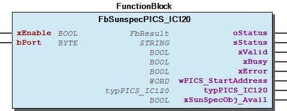 Graphical Interface of FbSunspecPICS_IC120 Function description By activating the input xEnable , the block is enabled and the communication starts automatically. The input bPort is used for the assignment to the master function block. The output wPICS_StartAddress indicates the start address of the PICS IC120. The readable values of the PICS IC120 are available in the output structure typPICS_IC120 . Note For an example see also doc02_HowTo . Note For usefull information about the readable values see also doc03_UsefulInformation . Note For usefull information about the evaluation of errors see also doc03_UsefulInformation .

## FbSunspecPICS_IC121 (FB)


| Scope | Name | Type | Initial | Comment |
| --- | --- | --- | --- | --- |
| Input | xEnable | BOOL | TRUE | Enable function block |
| bPort | BYTE | 1 | Master assignment number - range 1 to ParameterList.MAX_INTERFACES |
| Inout | typPICS_IC121 | typPICS_IC121 |  | Read-/writeable values PICS IC121 |
| Output | oStatus | WagoSysErrorBase.FbResult |  | Status information object, error codes from WagoAppPlcModbus |
| sStatus | STRING |  | Status information string |
| xValid | BOOL |  | Values are valid |
| xBusy | BOOL |  | Communication active |
| xError | BOOL |  | Error while communication |
| wPICS_StartAddress | WORD |  | Start address PICS IC121 |
| xSunSpecObj_Avail | BOOL |  | TRUE: This object is available in combination with the used FBSunSpecMaster |

The function block FbSunspecPICS_IC121 enables evaluation of the PICS IC121 of a Sunspec slave.

Graphical Illustration

Graphical Interface of FbSunspecPICS_IC121

Function description

By activating the input xEnable , the block is enabled and the communication starts automatically.

The input bPort is used for the assignment to the master function block.

The output wPICS_StartAddress indicates the start address of the PICS IC121.

The input / output data of the PICS IC121 is made available in the input / output structure typPICS_IC121 . If any of the write-privileged values are filled with new data, they are automatically detected and written to the Sunspec device the next cycle.

For an example see also doc02_HowTo .

For usefull information about the readable values see also doc03_UsefulInformation .

For usefull information about the evaluation of errors see also doc03_UsefulInformation .

Interface variables Function The function block FbSunspecPICS_IC121 enables evaluation of the PICS IC121 of a Sunspec slave. Graphical Illustration 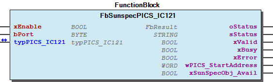 Graphical Interface of FbSunspecPICS_IC121 Function description By activating the input xEnable , the block is enabled and the communication starts automatically. The input bPort is used for the assignment to the master function block. The output wPICS_StartAddress indicates the start address of the PICS IC121. The input / output data of the PICS IC121 is made available in the input / output structure typPICS_IC121 . If any of the write-privileged values are filled with new data, they are automatically detected and written to the Sunspec device the next cycle. Note For an example see also doc02_HowTo . Note For usefull information about the readable values see also doc03_UsefulInformation . Note For usefull information about the evaluation of errors see also doc03_UsefulInformation . - FbSunspecPICS_IC121.CheckWriteData (ACT)

## FbSunspecPICS_IC122 (FB)


| Scope | Name | Type | Initial | Comment |
| --- | --- | --- | --- | --- |
| Input | xEnable | BOOL | TRUE | Enable function block |
| bPort | BYTE | 1 | Master assignment number - range 1 to ParameterList.MAX_INTERFACES |
| Output | oStatus | WagoSysErrorBase.FbResult |  | Status information object, error codes from WagoAppPlcModbus |
| sStatus | STRING |  | Status information string |
| xValid | BOOL |  | Values are valid |
| xBusy | BOOL |  | Communication activ |
| xError | BOOL |  | Error while communication |
| wPICS_StartAddress | WORD |  | Start address PICS IC122 |
| typPICS_IC122 | typPICS_IC122 |  | Readable values PICS IC122 |
| xSunSpecObj_Avail | BOOL |  | TRUE: This object is available in combination with the used FBSunSpecMaster |

The function block FbSunspecPICS_IC122 enables evaluation of the PICS IC122 of a Sunspec slave.

Graphical Illustration

Graphical Interface of FbSunspecPICS_IC122

Function description

By activating the input xEnable , the block is enabled and the communication starts automatically.

The input bPort is used for the assignment to the master function block.

The output wPICS_StartAddress indicates the start address of the PICS IC122.

The readable values of the PICS IC122 are available in the output structure typPICS_IC122 .

For an example see also doc02_HowTo .

For usefull information about the readable values see also doc03_UsefulInformation .

For usefull information about the evaluation of errors see also doc03_UsefulInformation .

Interface variables Function The function block FbSunspecPICS_IC122 enables evaluation of the PICS IC122 of a Sunspec slave. Graphical Illustration  Graphical Interface of FbSunspecPICS_IC122 Function description By activating the input xEnable , the block is enabled and the communication starts automatically. The input bPort is used for the assignment to the master function block. The output wPICS_StartAddress indicates the start address of the PICS IC122. The readable values of the PICS IC122 are available in the output structure typPICS_IC122 . Note For an example see also doc02_HowTo . Note For usefull information about the readable values see also doc03_UsefulInformation . Note For usefull information about the evaluation of errors see also doc03_UsefulInformation .

## FbSunspecPICS_IC123 (FB)


| Scope | Name | Type | Initial | Comment |
| --- | --- | --- | --- | --- |
| Input | xEnable | BOOL | TRUE | Enable function block |
| bPort | BYTE | 1 | Master assignment number - range 1 to ParameterList.MAX_INTERFACES |
| Inout | typPICS_IC123 | typPICS_IC123 |  | Read-/writeable values PICS IC123 |
| Output | oStatus | WagoSysErrorBase.FbResult |  | Status information object, error codes from WagoAppPlcModbus |
| sStatus | STRING |  | Status information string |
| xValid | BOOL |  | Values are valid |
| xBusy | BOOL |  | Communication active |
| xError | BOOL |  | Error while communication |
| wPICS_StartAddress | WORD |  | Start address PICS IC123 |
| xSunSpecObj_Avail | BOOL |  | TRUE: This object is available in combination with the used FBSunSpecMaster |

The function block FbSunspecPICS_IC123 enables evaluation of the PICS IC123 of a Sunspec slave.

Graphical Illustration

Graphical Interface of FbSunspecPICS_IC123

Function description

By activating the input xEnable , the block is enabled and the communication starts automatically.

The input bPort is used for the assignment to the master function block.

The output wPICS_StartAddress indicates the start address of the PICS IC123.

The input / output data of the PICS IC123 is made available in the input / output structure typPICS_IC123 . If any of the write-privileged values are filled with new data, they are automatically detected and written to the Sunspec device the next cycle.

For an example see also doc02_HowTo .

For usefull information about the readable values see also doc03_UsefulInformation .

For usefull information about the evaluation of errors see also doc03_UsefulInformation .

Interface variables Function The function block FbSunspecPICS_IC123 enables evaluation of the PICS IC123 of a Sunspec slave. Graphical Illustration  Graphical Interface of FbSunspecPICS_IC123 Function description By activating the input xEnable , the block is enabled and the communication starts automatically. The input bPort is used for the assignment to the master function block. The output wPICS_StartAddress indicates the start address of the PICS IC123. The input / output data of the PICS IC123 is made available in the input / output structure typPICS_IC123 . If any of the write-privileged values are filled with new data, they are automatically detected and written to the Sunspec device the next cycle. Note For an example see also doc02_HowTo . Note For usefull information about the readable values see also doc03_UsefulInformation . Note For usefull information about the evaluation of errors see also doc03_UsefulInformation . - FbSunspecPICS_IC123.CheckWriteData (ACT)

## FbSunspecPICS_IC124 (FB)


| Scope | Name | Type | Initial | Comment |
| --- | --- | --- | --- | --- |
| Input | xEnable | BOOL | TRUE | Enable function block |
| bPort | BYTE | 1 | Master assignment number - range 1 to ParameterList.MAX_INTERFACES |
| Inout | typPICS_IC124 | typPICS_IC124 |  | Read-/writeable values PICS IC124 |
| Output | oStatus | WagoSysErrorBase.FbResult |  | Status information object, error codes from WagoAppPlcModbus |
| sStatus | STRING |  | Status information string |
| xValid | BOOL |  | Values are valid |
| xBusy | BOOL |  | Communication active |
| xError | BOOL |  | Error while communication |
| wPICS_StartAddress | WORD |  | Start address PICS IC124 |
| xSunSpecObj_Avail | BOOL |  | TRUE: This object is available in combination with the used FBSunSpecMaster |

The function block FbSunspecPICS_IC124 enables evaluation of the PICS IC124 of a Sunspec slave.

Graphical Illustration

Graphical Interface of FbSunspecPICS_IC124

Function description

By activating the input xEnable , the block is enabled and the communication starts automatically.

The input bPort is used for the assignment to the master function block.

The output wPICS_StartAddress indicates the start address of the PICS IC124.

The input / output data of the PICS IC124 is made available in the input / output structure typPICS_IC124 . If any of the write-privileged values are filled with new data, they are automatically detected and written to the Sunspec device the next cycle.

For an example see also doc02_HowTo .

For usefull information about the readable values see also doc03_UsefulInformation .

For usefull information about the evaluation of errors see also doc03_UsefulInformation .

Interface variables Function The function block FbSunspecPICS_IC124 enables evaluation of the PICS IC124 of a Sunspec slave. Graphical Illustration  Graphical Interface of FbSunspecPICS_IC124 Function description By activating the input xEnable , the block is enabled and the communication starts automatically. The input bPort is used for the assignment to the master function block. The output wPICS_StartAddress indicates the start address of the PICS IC124. The input / output data of the PICS IC124 is made available in the input / output structure typPICS_IC124 . If any of the write-privileged values are filled with new data, they are automatically detected and written to the Sunspec device the next cycle. Note For an example see also doc02_HowTo . Note For usefull information about the readable values see also doc03_UsefulInformation . Note For usefull information about the evaluation of errors see also doc03_UsefulInformation . - FbSunspecPICS_IC124.CheckWriteData (ACT)

## FbSunspecPICS_IC125 (FB)


| Scope | Name | Type | Initial | Comment |
| --- | --- | --- | --- | --- |
| Input | xEnable | BOOL | TRUE | Enable function block |
| bPort | BYTE | 1 | Master assignment number - range 1 to ParameterList.MAX_INTERFACES |
| Inout | typPICS_IC125 | typPICS_IC125 |  | Read-/writeable values PICS IC125 |
| Output | oStatus | WagoSysErrorBase.FbResult |  | Status information object, error codes from WagoAppPlcModbus |
| sStatus | STRING |  | Status information string |
| xValid | BOOL |  | Values are valid |
| xBusy | BOOL |  | Communication active |
| xError | BOOL |  | Error while communication |
| wPICS_StartAddress | WORD |  | Start address PICS IC125 |
| xSunSpecObj_Avail | BOOL |  | TRUE: This object is available in combination with the used FBSunSpecMaster |

The function block FbSunspecPICS_IC125 enables evaluation of the PICS IC125 of a Sunspec slave.

Graphical Illustration

Graphical Interface of FbSunspecPICS_IC125

Function description

By activating the input xEnable , the block is enabled and the communication starts automatically.

The input bPort is used for the assignment to the master function block.

The output wPICS_StartAddress indicates the start address of the PICS IC125.

The input / output data of the PICS IC125 is made available in the input / output structure typPICS_IC125 . If any of the write-privileged values are filled with new data, they are automatically detected and written to the Sunspec device the next cycle.

For an example see also doc02_HowTo .

For usefull information about the readable values see also doc03_UsefulInformation .

For usefull information about the evaluation of errors see also doc03_UsefulInformation .

Interface variables Function The function block FbSunspecPICS_IC125 enables evaluation of the PICS IC125 of a Sunspec slave. Graphical Illustration  Graphical Interface of FbSunspecPICS_IC125 Function description By activating the input xEnable , the block is enabled and the communication starts automatically. The input bPort is used for the assignment to the master function block. The output wPICS_StartAddress indicates the start address of the PICS IC125. The input / output data of the PICS IC125 is made available in the input / output structure typPICS_IC125 . If any of the write-privileged values are filled with new data, they are automatically detected and written to the Sunspec device the next cycle. Note For an example see also doc02_HowTo . Note For usefull information about the readable values see also doc03_UsefulInformation . Note For usefull information about the evaluation of errors see also doc03_UsefulInformation . - FbSunspecPICS_IC125.CheckWriteData (ACT)

## FbSunspecPICS_IC126 (FB)


| Scope | Name | Type | Initial | Comment |
| --- | --- | --- | --- | --- |
| Input | xEnable | BOOL | TRUE | Enable function block |
| bPort | BYTE | 1 | Master assignment number - range 1 to ParameterList.MAX_INTERFACES |
| Output | oStatus | WagoSysErrorBase.FbResult |  | Status information object, error codes from WagoAppPlcModbus |
| sStatus | STRING |  | Status information string |
| xValid | BOOL |  | Values are valid |
| xBusy | BOOL |  | Communication activ |
| xError | BOOL |  | Error while communication |
| wPICS_StartAddress | WORD |  | Start address PICS IC126 |
| wQuantityBlocks | WORD |  | Quantity of repeating blocks |
| typPICS_IC126 | typPICS_IC126 |  | Readable values PICS IC126 |
| xSunSpecObj_Avail | BOOL |  | TRUE: This object is available in combination with the used FBSunSpecMaster |

The function block FbSunspecPICS_IC126 enables evaluation of the PICS IC126 of a Sunspec slave.

Graphical Illustration

Graphical Interface of FbSunspecPICS_IC126

Function description

By activating the input xEnable , the block is enabled and the communication starts automatically.

The input bPort is used for the assignment to the master function block.

The output wPICS_StartAddress indicates the start address of the PICS IC126.

The readable values of the PICS IC126 are available in the output structure typPICS_IC126 . The PICS IC126 can contain several repeating data blocks, placed in the output structure typPICS_IC126 . The output wQuantityBlocks indicates the quantity of repeating blocks. To get all data inside typPICS_IC126 , the variable ParameterList.MAX_BLOCKS_IC126 must be edited in the ParameterList , with the quantity of repeating blocks.

For an example see also doc02_HowTo .

For usefull information about the readable values see also doc03_UsefulInformation .

For usefull information about the evaluation of errors see also doc03_UsefulInformation .

Interface variables Function The function block FbSunspecPICS_IC126 enables evaluation of the PICS IC126 of a Sunspec slave. Graphical Illustration  Graphical Interface of FbSunspecPICS_IC126 Function description By activating the input xEnable , the block is enabled and the communication starts automatically. The input bPort is used for the assignment to the master function block. The output wPICS_StartAddress indicates the start address of the PICS IC126. The readable values of the PICS IC126 are available in the output structure typPICS_IC126 . The PICS IC126 can contain several repeating data blocks, placed in the output structure typPICS_IC126 . The output wQuantityBlocks indicates the quantity of repeating blocks. To get all data inside typPICS_IC126 , the variable ParameterList.MAX_BLOCKS_IC126 must be edited in the ParameterList , with the quantity of repeating blocks. Note For an example see also doc02_HowTo . Note For usefull information about the readable values see also doc03_UsefulInformation . Note For usefull information about the evaluation of errors see also doc03_UsefulInformation .

## FbSunspecPICS_IC127 (FB)


| Scope | Name | Type | Initial | Comment |
| --- | --- | --- | --- | --- |
| Input | xEnable | BOOL | TRUE | Enable function block |
| bPort | BYTE | 1 | Master assignment number - range 1 to ParameterList.MAX_INTERFACES |
| Inout | typPICS_IC127 | typPICS_IC127 |  | Read-/writeable values PICS IC127 |
| Output | oStatus | WagoSysErrorBase.FbResult |  | Status information object, error codes from WagoAppPlcModbus |
| sStatus | STRING |  | Status information string |
| xValid | BOOL |  | Values are valid |
| xBusy | BOOL |  | Communication active |
| xError | BOOL |  | Error while communication |
| wPICS_StartAddress | WORD |  | Start address PICS IC127 |
| xSunSpecObj_Avail | BOOL |  | TRUE: This object is available in combination with the used FBSunSpecMaster |

The function block FbSunspecPICS_IC127 enables evaluation of the PICS IC127 of a Sunspec slave.

Graphical Illustration

Graphical Interface of FbSunspecPICS_IC127

Function description

By activating the input xEnable , the block is enabled and the communication starts automatically.

The input bPort is used for the assignment to the master function block.

The output wPICS_StartAddress indicates the start address of the PICS IC127.

The input / output data of the PICS IC127 is made available in the input / output structure typPICS_IC127 . If any of the write-privileged values are filled with new data, they are automatically detected and written to the Sunspec device the next cycle.

For an example see also doc02_HowTo .

For usefull information about the readable values see also doc03_UsefulInformation .

For usefull information about the evaluation of errors see also doc03_UsefulInformation .

Interface variables Function The function block FbSunspecPICS_IC127 enables evaluation of the PICS IC127 of a Sunspec slave. Graphical Illustration  Graphical Interface of FbSunspecPICS_IC127 Function description By activating the input xEnable , the block is enabled and the communication starts automatically. The input bPort is used for the assignment to the master function block. The output wPICS_StartAddress indicates the start address of the PICS IC127. The input / output data of the PICS IC127 is made available in the input / output structure typPICS_IC127 . If any of the write-privileged values are filled with new data, they are automatically detected and written to the Sunspec device the next cycle. Note For an example see also doc02_HowTo . Note For usefull information about the readable values see also doc03_UsefulInformation . Note For usefull information about the evaluation of errors see also doc03_UsefulInformation . - FbSunspecPICS_IC127.CheckWriteData (ACT)

## FbSunspecPICS_IC128 (FB)


| Scope | Name | Type | Initial | Comment |
| --- | --- | --- | --- | --- |
| Input | xEnable | BOOL | TRUE | Enable function block |
| bPort | BYTE | 1 | Master assignment number - range 1 to ParameterList.MAX_INTERFACES |
| Inout | typPICS_IC128 | typPICS_IC128 |  | Read-/writeable values PICS IC128 |
| Output | oStatus | WagoSysErrorBase.FbResult |  | Status information object, error codes from WagoAppPlcModbus |
| sStatus | STRING |  | Status information string |
| xValid | BOOL |  | Values are valid |
| xBusy | BOOL |  | Communication active |
| xError | BOOL |  | Error while communication |
| wPICS_StartAddress | WORD |  | Start address PICS IC128 |
| xSunSpecObj_Avail | BOOL |  | TRUE: This object is available in combination with the used FBSunSpecMaster |

The function block FbSunspecPICS_IC128 enables evaluation of the PICS IC128 of a Sunspec slave.

Graphical Illustration

Graphical Interface of FbSunspecPICS_IC128

Function description

By activating the input xEnable , the block is enabled and the communication starts automatically.

The input bPort is used for the assignment to the master function block.

The output wPICS_StartAddress indicates the start address of the PICS IC128.

The input / output data of the PICS IC128 is made available in the input / output structure typPICS_IC128 . If any of the write-privileged values are filled with new data, they are automatically detected and written to the Sunspec device the next cycle.

For an example see also doc02_HowTo .

For usefull information about the readable values see also doc03_UsefulInformation .

For usefull information about the evaluation of errors see also doc03_UsefulInformation .

Interface variables Function The function block FbSunspecPICS_IC128 enables evaluation of the PICS IC128 of a Sunspec slave. Graphical Illustration  Graphical Interface of FbSunspecPICS_IC128 Function description By activating the input xEnable , the block is enabled and the communication starts automatically. The input bPort is used for the assignment to the master function block. The output wPICS_StartAddress indicates the start address of the PICS IC128. The input / output data of the PICS IC128 is made available in the input / output structure typPICS_IC128 . If any of the write-privileged values are filled with new data, they are automatically detected and written to the Sunspec device the next cycle. Note For an example see also doc02_HowTo . Note For usefull information about the readable values see also doc03_UsefulInformation . Note For usefull information about the evaluation of errors see also doc03_UsefulInformation . - FbSunspecPICS_IC128.CheckWriteData (ACT)

## FbSunspecPICS_IC129 (FB)


| Scope | Name | Type | Initial | Comment |
| --- | --- | --- | --- | --- |
| Input | xEnable | BOOL | TRUE | Enable function block |
| bPort | BYTE | 1 | Master assignment number - range 1 to ParameterList.MAX_INTERFACES |
| Output | oStatus | WagoSysErrorBase.FbResult |  | Status information object, error codes from WagoAppPlcModbus |
| sStatus | STRING |  | Status information string |
| xValid | BOOL |  | Values are valid |
| xBusy | BOOL |  | Communication activ |
| xError | BOOL |  | Error while communication |
| wPICS_StartAddress | WORD |  | Start address PICS IC129 |
| wQuantityBlocks | WORD |  | Quantity of repeating blocks |
| typPICS_IC129 | typPICS_IC129 |  | Readable values PICS IC129 |
| xSunSpecObj_Avail | BOOL |  | TRUE: This object is available in combination with the used FBSunSpecMaster |

The function block FbSunspecPICS_IC129 enables evaluation of the PICS IC129 of a Sunspec slave.

Graphical Illustration

Graphical Interface of FbSunspecPICS_IC129

Function description

By activating the input xEnable , the block is enabled and the communication starts automatically.

The input bPort is used for the assignment to the master function block.

The output wPICS_StartAddress indicates the start address of the PICS IC129.

The readable values of the PICS IC129 are available in the output structure typPICS_IC129 . The PICS IC129 can contain several repeating data blocks, placed in the output structure typPICS_IC129 . The output wQuantityBlocks indicates the quantity of repeating blocks. To get all data inside typPICS_IC129 , the variable ParameterList.MAX_BLOCKS_IC129 must be edited in the ParameterList , with the quantity of repeating blocks.

For an example see also doc02_HowTo .

For usefull information about the readable values see also doc03_UsefulInformation .

For usefull information about the evaluation of errors see also doc03_UsefulInformation .

Interface variables Function The function block FbSunspecPICS_IC129 enables evaluation of the PICS IC129 of a Sunspec slave. Graphical Illustration  Graphical Interface of FbSunspecPICS_IC129 Function description By activating the input xEnable , the block is enabled and the communication starts automatically. The input bPort is used for the assignment to the master function block. The output wPICS_StartAddress indicates the start address of the PICS IC129. The readable values of the PICS IC129 are available in the output structure typPICS_IC129 . The PICS IC129 can contain several repeating data blocks, placed in the output structure typPICS_IC129 . The output wQuantityBlocks indicates the quantity of repeating blocks. To get all data inside typPICS_IC129 , the variable ParameterList.MAX_BLOCKS_IC129 must be edited in the ParameterList , with the quantity of repeating blocks. Note For an example see also doc02_HowTo . Note For usefull information about the readable values see also doc03_UsefulInformation . Note For usefull information about the evaluation of errors see also doc03_UsefulInformation .

## FbSunspecPICS_IC130 (FB)


| Scope | Name | Type | Initial | Comment |
| --- | --- | --- | --- | --- |
| Input | xEnable | BOOL | TRUE | Enable function block |
| bPort | BYTE | 1 | Master assignment number - range 1 to ParameterList.MAX_INTERFACES |
| Output | oStatus | WagoSysErrorBase.FbResult |  | Status information object, error codes from WagoAppPlcModbus |
| sStatus | STRING |  | Status information string |
| xValid | BOOL |  | Values are valid |
| xBusy | BOOL |  | Communication activ |
| xError | BOOL |  | Error while communication |
| wPICS_StartAddress | WORD |  | Start address PICS IC130 |
| wQuantityBlocks | WORD |  | Quantity of repeating blocks |
| typPICS_IC130 | typPICS_IC130 |  | Readable values PICS IC130 |
| xSunSpecObj_Avail | BOOL |  | TRUE: This object is available in combination with the used FBSunSpecMaster |

The function block FbSunspecPICS_IC130 enables evaluation of the PICS IC130 of a Sunspec slave.

Graphical Illustration

Graphical Interface of FbSunspecPICS_IC130

Function description

By activating the input xEnable , the block is enabled and the communication starts automatically.

The input bPort is used for the assignment to the master function block.

The output wPICS_StartAddress indicates the start address of the PICS IC130.

The readable values of the PICS IC130 are available in the output structure typPICS_IC130 . The PICS IC130 can contain several repeating data blocks, placed in the output structure typPICS_IC130 . The output wQuantityBlocks indicates the quantity of repeating blocks. To get all data inside typPICS_IC130 , the variable ParameterList.MAX_BLOCKS_IC130 must be edited in the ParameterList , with the quantity of repeating blocks.

For an example see also doc02_HowTo .

For usefull information about the readable values see also doc03_UsefulInformation .

For usefull information about the evaluation of errors see also doc03_UsefulInformation .

Interface variables Function The function block FbSunspecPICS_IC130 enables evaluation of the PICS IC130 of a Sunspec slave. Graphical Illustration  Graphical Interface of FbSunspecPICS_IC130 Function description By activating the input xEnable , the block is enabled and the communication starts automatically. The input bPort is used for the assignment to the master function block. The output wPICS_StartAddress indicates the start address of the PICS IC130. The readable values of the PICS IC130 are available in the output structure typPICS_IC130 . The PICS IC130 can contain several repeating data blocks, placed in the output structure typPICS_IC130 . The output wQuantityBlocks indicates the quantity of repeating blocks. To get all data inside typPICS_IC130 , the variable ParameterList.MAX_BLOCKS_IC130 must be edited in the ParameterList , with the quantity of repeating blocks. Note For an example see also doc02_HowTo . Note For usefull information about the readable values see also doc03_UsefulInformation . Note For usefull information about the evaluation of errors see also doc03_UsefulInformation .

## FbSunspecPICS_IC131 (FB)


| Scope | Name | Type | Initial | Comment |
| --- | --- | --- | --- | --- |
| Input | xEnable | BOOL | TRUE | Enable function block |
| bPort | BYTE | 1 | Master assignment number - range 1 to ParameterList.MAX_INTERFACES |
| Output | oStatus | WagoSysErrorBase.FbResult |  | Status information object, error codes from WagoAppPlcModbus |
| sStatus | STRING |  | Status information string |
| xValid | BOOL |  | Values are valid |
| xBusy | BOOL |  | Communication activ |
| xError | BOOL |  | Error while communication |
| wPICS_StartAddress | WORD |  | Start address PICS IC131 |
| wQuantityBlocks | WORD |  | Quantity of repeating blocks |
| typPICS_IC131 | typPICS_IC131 |  | Readable values PICS IC131 |
| xSunSpecObj_Avail | BOOL |  | TRUE: This object is available in combination with the used FBSunSpecMaster |

The function block FbSunspecPICS_IC131 enables evaluation of the PICS IC131 of a Sunspec slave.

Graphical Illustration

Graphical Interface of FbSunspecPICS_IC131

Function description

By activating the input xEnable , the block is enabled and the communication starts automatically.

The input bPort is used for the assignment to the master function block.

The output wPICS_StartAddress indicates the start address of the PICS IC131.

The readable values of the PICS IC131 are available in the output structure typPICS_IC131 . The PICS IC131 can contain several repeating data blocks, placed in the output structure typPICS_IC131 . The output wQuantityBlocks indicates the quantity of repeating blocks. To get all data inside typPICS_IC131 , the variable ParameterList.MAX_BLOCKS_IC131 must be edited in the ParameterList , with the quantity of repeating blocks.

For an example see also doc02_HowTo .

For usefull information about the readable values see also doc03_UsefulInformation .

For usefull information about the evaluation of errors see also doc03_UsefulInformation .

Interface variables Function The function block FbSunspecPICS_IC131 enables evaluation of the PICS IC131 of a Sunspec slave. Graphical Illustration 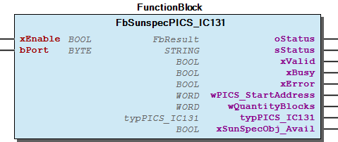 Graphical Interface of FbSunspecPICS_IC131 Function description By activating the input xEnable , the block is enabled and the communication starts automatically. The input bPort is used for the assignment to the master function block. The output wPICS_StartAddress indicates the start address of the PICS IC131. The readable values of the PICS IC131 are available in the output structure typPICS_IC131 . The PICS IC131 can contain several repeating data blocks, placed in the output structure typPICS_IC131 . The output wQuantityBlocks indicates the quantity of repeating blocks. To get all data inside typPICS_IC131 , the variable ParameterList.MAX_BLOCKS_IC131 must be edited in the ParameterList , with the quantity of repeating blocks. Note For an example see also doc02_HowTo . Note For usefull information about the readable values see also doc03_UsefulInformation . Note For usefull information about the evaluation of errors see also doc03_UsefulInformation .

## FbSunspecPICS_IC132 (FB)


| Scope | Name | Type | Initial | Comment |
| --- | --- | --- | --- | --- |
| Input | xEnable | BOOL | TRUE | Enable function block |
| bPort | BYTE | 1 | Master assignment number - range 1 to ParameterList.MAX_INTERFACES |
| Output | oStatus | WagoSysErrorBase.FbResult |  | Status information object, error codes from WagoAppPlcModbus |
| sStatus | STRING |  | Status information string |
| xValid | BOOL |  | Values are valid |
| xBusy | BOOL |  | Communication activ |
| xError | BOOL |  | Error while communication |
| wPICS_StartAddress | WORD |  | Start address PICS IC132 |
| wQuantityBlocks | WORD |  | Quantity of repeating blocks |
| typPICS_IC132 | typPICS_IC132 |  | Readable values PICS IC132 |
| xSunSpecObj_Avail | BOOL |  | TRUE: This object is available in combination with the used FBSunSpecMaster |

The function block FbSunspecPICS_IC132 enables evaluation of the PICS IC132 of a Sunspec slave.

Graphical Illustration

Graphical Interface of FbSunspecPICS_IC132

Function description

By activating the input xEnable , the block is enabled and the communication starts automatically.

The input bPort is used for the assignment to the master function block.

The output wPICS_StartAddress indicates the start address of the PICS IC132.

The readable values of the PICS IC132 are available in the output structure typPICS_IC132 . The PICS IC132 can contain several repeating data blocks, placed in the output structure typPICS_IC132 . The output wQuantityBlocks indicates the quantity of repeating blocks. To get all data inside typPICS_IC132 , the variable ParameterList.MAX_BLOCKS_IC132 must be edited in the ParameterList , with the quantity of repeating blocks.

For an example see also doc02_HowTo .

For usefull information about the readable values see also doc03_UsefulInformation .

For usefull information about the evaluation of errors see also doc03_UsefulInformation .

Interface variables Function The function block FbSunspecPICS_IC132 enables evaluation of the PICS IC132 of a Sunspec slave. Graphical Illustration  Graphical Interface of FbSunspecPICS_IC132 Function description By activating the input xEnable , the block is enabled and the communication starts automatically. The input bPort is used for the assignment to the master function block. The output wPICS_StartAddress indicates the start address of the PICS IC132. The readable values of the PICS IC132 are available in the output structure typPICS_IC132 . The PICS IC132 can contain several repeating data blocks, placed in the output structure typPICS_IC132 . The output wQuantityBlocks indicates the quantity of repeating blocks. To get all data inside typPICS_IC132 , the variable ParameterList.MAX_BLOCKS_IC132 must be edited in the ParameterList , with the quantity of repeating blocks. Note For an example see also doc02_HowTo . Note For usefull information about the readable values see also doc03_UsefulInformation . Note For usefull information about the evaluation of errors see also doc03_UsefulInformation .

## FbSunspecPICS_IC133 (FB)


| Scope | Name | Type | Initial | Comment |
| --- | --- | --- | --- | --- |
| Input | xEnable | BOOL | TRUE | Enable function block |
| bPort | BYTE | 1 | Master assignment number - range 1 to ParameterList.MAX_INTERFACES |
| Output | oStatus | WagoSysErrorBase.FbResult |  | Status information object, error codes from WagoAppPlcModbus |
| sStatus | STRING |  | Status information string |
| xValid | BOOL |  | Values are valid |
| xBusy | BOOL |  | Communication activ |
| xError | BOOL |  | Error while communication |
| wPICS_StartAddress | WORD |  | Start address PICS IC133 |
| wQuantityBlocks | WORD |  | Quantity of repeating blocks |
| typPICS_IC133 | typPICS_IC133 |  | Readable values PICS IC133 |
| xSunSpecObj_Avail | BOOL |  | TRUE: This object is available in combination with the used FBSunSpecMaster |

The function block FbSunspecPICS_IC133 enables evaluation of the PICS IC133 of a Sunspec slave.

Graphical Illustration

Graphical Interface of FbSunspecPICS_IC133

Function description

By activating the input xEnable , the block is enabled and the communication starts automatically.

The input bPort is used for the assignment to the master function block.

The output wPICS_StartAddress indicates the start address of the PICS IC133.

The readable values of the PICS IC133 are available in the output structure typPICS_IC133 . The PICS IC133 can contain several repeating data blocks, placed in the output structure typPICS_IC133 . The output wQuantityBlocks indicates the quantity of repeating blocks. To get all data inside typPICS_IC133 , the variable ParameterList.MAX_BLOCKS_IC133 must be edited in the ParameterList , with the quantity of repeating blocks.

For an example see also doc02_HowTo .

For usefull information about the readable values see also doc03_UsefulInformation .

For usefull information about the evaluation of errors see also doc03_UsefulInformation .

Interface variables Function The function block FbSunspecPICS_IC133 enables evaluation of the PICS IC133 of a Sunspec slave. Graphical Illustration  Graphical Interface of FbSunspecPICS_IC133 Function description By activating the input xEnable , the block is enabled and the communication starts automatically. The input bPort is used for the assignment to the master function block. The output wPICS_StartAddress indicates the start address of the PICS IC133. The readable values of the PICS IC133 are available in the output structure typPICS_IC133 . The PICS IC133 can contain several repeating data blocks, placed in the output structure typPICS_IC133 . The output wQuantityBlocks indicates the quantity of repeating blocks. To get all data inside typPICS_IC133 , the variable ParameterList.MAX_BLOCKS_IC133 must be edited in the ParameterList , with the quantity of repeating blocks. Note For an example see also doc02_HowTo . Note For usefull information about the readable values see also doc03_UsefulInformation . Note For usefull information about the evaluation of errors see also doc03_UsefulInformation .

## FbSunspecPICS_IC134 (FB)


| Scope | Name | Type | Initial | Comment |
| --- | --- | --- | --- | --- |
| Input | xEnable | BOOL | TRUE | Enable function block |
| bPort | BYTE | 1 | Master assignment number - range 1 to ParameterList.MAX_INTERFACES |
| Output | oStatus | WagoSysErrorBase.FbResult |  | Status information object, error codes from WagoAppPlcModbus |
| sStatus | STRING |  | Status information string |
| xValid | BOOL |  | Values are valid |
| xBusy | BOOL |  | Communication activ |
| xError | BOOL |  | Error while communication |
| wPICS_StartAddress | WORD |  | Start address PICS IC134 |
| wQuantityBlocks | WORD |  | Quantity of repeating blocks |
| typPICS_IC134 | typPICS_IC134 |  | Readable values PICS IC134 |
| xSunSpecObj_Avail | BOOL |  | TRUE: This object is available in combination with the used FBSunSpecMaster |

The function block FbSunspecPICS_IC134 enables evaluation of the PICS IC134 of a Sunspec slave.

Graphical Illustration

Graphical Interface of FbSunspecPICS_IC134

Function description

By activating the input xEnable , the block is enabled and the communication starts automatically.

The input bPort is used for the assignment to the master function block.

The output wPICS_StartAddress indicates the start address of the PICS IC134.

The readable values of the PICS IC134 are available in the output structure typPICS_IC134 . The PICS IC134 can contain several repeating data blocks, placed in the output structure typPICS_IC134 . The output wQuantityBlocks indicates the quantity of repeating blocks. To get all data inside typPICS_IC134 , the variable ParameterList.MAX_BLOCKS_IC134 must be edited in the ParameterList , with the quantity of repeating blocks.

For an example see also doc02_HowTo .

For usefull information about the readable values see also doc03_UsefulInformation .

For usefull information about the evaluation of errors see also doc03_UsefulInformation .

Interface variables Function The function block FbSunspecPICS_IC134 enables evaluation of the PICS IC134 of a Sunspec slave. Graphical Illustration  Graphical Interface of FbSunspecPICS_IC134 Function description By activating the input xEnable , the block is enabled and the communication starts automatically. The input bPort is used for the assignment to the master function block. The output wPICS_StartAddress indicates the start address of the PICS IC134. The readable values of the PICS IC134 are available in the output structure typPICS_IC134 . The PICS IC134 can contain several repeating data blocks, placed in the output structure typPICS_IC134 . The output wQuantityBlocks indicates the quantity of repeating blocks. To get all data inside typPICS_IC134 , the variable ParameterList.MAX_BLOCKS_IC134 must be edited in the ParameterList , with the quantity of repeating blocks. Note For an example see also doc02_HowTo . Note For usefull information about the readable values see also doc03_UsefulInformation . Note For usefull information about the evaluation of errors see also doc03_UsefulInformation .

## FbSunspecPICS_IC135 (FB)


| Scope | Name | Type | Initial | Comment |
| --- | --- | --- | --- | --- |
| Input | xEnable | BOOL | TRUE | Enable function block |
| bPort | BYTE | 1 | Master assignment number - range 1 to ParameterList.MAX_INTERFACES |
| Output | oStatus | WagoSysErrorBase.FbResult |  | Status information object, error codes from WagoAppPlcModbus |
| sStatus | STRING |  | Status information string |
| xValid | BOOL |  | Values are valid |
| xBusy | BOOL |  | Communication activ |
| xError | BOOL |  | Error while communication |
| wPICS_StartAddress | WORD |  | Start address PICS IC135 |
| wQuantityBlocks | WORD |  | Quantity of repeating blocks |
| typPICS_IC135 | typPICS_IC135 |  | Readable values PICS IC135 |
| xSunSpecObj_Avail | BOOL |  | TRUE: This object is available in combination with the used FBSunSpecMaster |

The function block FbSunspecPICS_IC135 enables evaluation of the PICS IC135 of a Sunspec slave.

Graphical Illustration

Graphical Interface of FbSunspecPICS_IC135

Function description

By activating the input xEnable , the block is enabled and the communication starts automatically.

The input bPort is used for the assignment to the master function block.

The output wPICS_StartAddress indicates the start address of the PICS IC135.

The readable values of the PICS IC135 are available in the output structure typPICS_IC135 . The PICS IC135 can contain several repeating data blocks, placed in the output structure typPICS_IC135 . The output wQuantityBlocks indicates the quantity of repeating blocks. To get all data inside typPICS_IC135 , the variable ParameterList.MAX_BLOCKS_IC135 must be edited in the ParameterList , with the quantity of repeating blocks.

For an example see also doc02_HowTo .

For usefull information about the readable values see also doc03_UsefulInformation .

For usefull information about the evaluation of errors see also doc03_UsefulInformation .

Interface variables Function The function block FbSunspecPICS_IC135 enables evaluation of the PICS IC135 of a Sunspec slave. Graphical Illustration  Graphical Interface of FbSunspecPICS_IC135 Function description By activating the input xEnable , the block is enabled and the communication starts automatically. The input bPort is used for the assignment to the master function block. The output wPICS_StartAddress indicates the start address of the PICS IC135. The readable values of the PICS IC135 are available in the output structure typPICS_IC135 . The PICS IC135 can contain several repeating data blocks, placed in the output structure typPICS_IC135 . The output wQuantityBlocks indicates the quantity of repeating blocks. To get all data inside typPICS_IC135 , the variable ParameterList.MAX_BLOCKS_IC135 must be edited in the ParameterList , with the quantity of repeating blocks. Note For an example see also doc02_HowTo . Note For usefull information about the readable values see also doc03_UsefulInformation . Note For usefull information about the evaluation of errors see also doc03_UsefulInformation .

## FbSunspecPICS_IC136 (FB)


| Scope | Name | Type | Initial | Comment |
| --- | --- | --- | --- | --- |
| Input | xEnable | BOOL | TRUE | Enable function block |
| bPort | BYTE | 1 | Master assignment number - range 1 to ParameterList.MAX_INTERFACES |
| Output | oStatus | WagoSysErrorBase.FbResult |  | Status information object, error codes from WagoAppPlcModbus |
| sStatus | STRING |  | Status information string |
| xValid | BOOL |  | Values are valid |
| xBusy | BOOL |  | Communication activ |
| xError | BOOL |  | Error while communication |
| wPICS_StartAddress | WORD |  | Start address PICS IC136 |
| wQuantityBlocks | WORD |  | Quantity of repeating blocks |
| typPICS_IC136 | typPICS_IC136 |  | Readable values PICS IC136 |
| xSunSpecObj_Avail | BOOL |  | TRUE: This object is available in combination with the used FBSunSpecMaster |

The function block FbSunspecPICS_IC136 enables evaluation of the PICS IC136 of a Sunspec slave.

Graphical Illustration

Graphical Interface of FbSunspecPICS_IC136

Function description

By activating the input xEnable , the block is enabled and the communication starts automatically.

The input bPort is used for the assignment to the master function block.

The output wPICS_StartAddress indicates the start address of the PICS IC136.

The readable values of the PICS IC136 are available in the output structure typPICS_IC136 . The PICS IC136 can contain several repeating data blocks, placed in the output structure typPICS_IC136 . The output wQuantityBlocks indicates the quantity of repeating blocks. To get all data inside typPICS_IC136 , the variable ParameterList.MAX_BLOCKS_IC136 must be edited in the ParameterList , with the quantity of repeating blocks.

For an example see also doc02_HowTo .

For usefull information about the readable values see also doc03_UsefulInformation .

For usefull information about the evaluation of errors see also doc03_UsefulInformation .

Interface variables Function The function block FbSunspecPICS_IC136 enables evaluation of the PICS IC136 of a Sunspec slave. Graphical Illustration  Graphical Interface of FbSunspecPICS_IC136 Function description By activating the input xEnable , the block is enabled and the communication starts automatically. The input bPort is used for the assignment to the master function block. The output wPICS_StartAddress indicates the start address of the PICS IC136. The readable values of the PICS IC136 are available in the output structure typPICS_IC136 . The PICS IC136 can contain several repeating data blocks, placed in the output structure typPICS_IC136 . The output wQuantityBlocks indicates the quantity of repeating blocks. To get all data inside typPICS_IC136 , the variable ParameterList.MAX_BLOCKS_IC136 must be edited in the ParameterList , with the quantity of repeating blocks. Note For an example see also doc02_HowTo . Note For usefull information about the readable values see also doc03_UsefulInformation . Note For usefull information about the evaluation of errors see also doc03_UsefulInformation .

## FbSunspecPICS_IC137 (FB)


| Scope | Name | Type | Initial | Comment |
| --- | --- | --- | --- | --- |
| Input | xEnable | BOOL | TRUE | Enable function block |
| bPort | BYTE | 1 | Master assignment number - range 1 to ParameterList.MAX_INTERFACES |
| Output | oStatus | WagoSysErrorBase.FbResult |  | Status information object, error codes from WagoAppPlcModbus |
| sStatus | STRING |  | Status information string |
| xValid | BOOL |  | Values are valid |
| xBusy | BOOL |  | Communication activ |
| xError | BOOL |  | Error while communication |
| wPICS_StartAddress | WORD |  | Start address PICS IC137 |
| wQuantityBlocks | WORD |  | Quantity of repeating blocks |
| typPICS_IC137 | typPICS_IC137 |  | Readable values PICS IC137 |
| xSunSpecObj_Avail | BOOL |  | TRUE: This object is available in combination with the used FBSunSpecMaster |

The function block FbSunspecPICS_IC137 enables evaluation of the PICS IC137 of a Sunspec slave.

Graphical Illustration

Graphical Interface of FbSunspecPICS_IC137

Function description

By activating the input xEnable , the block is enabled and the communication starts automatically.

The input bPort is used for the assignment to the master function block.

The output wPICS_StartAddress indicates the start address of the PICS IC137.

The readable values of the PICS IC137 are available in the output structure typPICS_IC137 . The PICS IC137 can contain several repeating data blocks, placed in the output structure typPICS_IC137 . The output wQuantityBlocks indicates the quantity of repeating blocks. To get all data inside typPICS_IC137 , the variable ParameterList.MAX_BLOCKS_IC137 must be edited in the ParameterList , with the quantity of repeating blocks.

For an example see also doc02_HowTo .

For usefull information about the readable values see also doc03_UsefulInformation .

For usefull information about the evaluation of errors see also doc03_UsefulInformation .

Interface variables Function The function block FbSunspecPICS_IC137 enables evaluation of the PICS IC137 of a Sunspec slave. Graphical Illustration  Graphical Interface of FbSunspecPICS_IC137 Function description By activating the input xEnable , the block is enabled and the communication starts automatically. The input bPort is used for the assignment to the master function block. The output wPICS_StartAddress indicates the start address of the PICS IC137. The readable values of the PICS IC137 are available in the output structure typPICS_IC137 . The PICS IC137 can contain several repeating data blocks, placed in the output structure typPICS_IC137 . The output wQuantityBlocks indicates the quantity of repeating blocks. To get all data inside typPICS_IC137 , the variable ParameterList.MAX_BLOCKS_IC137 must be edited in the ParameterList , with the quantity of repeating blocks. Note For an example see also doc02_HowTo . Note For usefull information about the readable values see also doc03_UsefulInformation . Note For usefull information about the evaluation of errors see also doc03_UsefulInformation .

## FbSunspecPICS_IC138 (FB)


| Scope | Name | Type | Initial | Comment |
| --- | --- | --- | --- | --- |
| Input | xEnable | BOOL | TRUE | Enable function block |
| bPort | BYTE | 1 | Master assignment number - range 1 to ParameterList.MAX_INTERFACES |
| Output | oStatus | WagoSysErrorBase.FbResult |  | Status information object, error codes from WagoAppPlcModbus |
| sStatus | STRING |  | Status information string |
| xValid | BOOL |  | Values are valid |
| xBusy | BOOL |  | Communication activ |
| xError | BOOL |  | Error while communication |
| wPICS_StartAddress | WORD |  | Start address PICS IC138 |
| wQuantityBlocks | WORD |  | Quantity of repeating blocks |
| typPICS_IC138 | typPICS_IC138 |  | Readable values PICS IC138 |
| xSunSpecObj_Avail | BOOL |  | TRUE: This object is available in combination with the used FBSunSpecMaster |

The function block FbSunspecPICS_IC138 enables evaluation of the PICS IC138 of a Sunspec slave.

Graphical Illustration

Graphical Interface of FbSunspecPICS_IC138

Function description

By activating the input xEnable , the block is enabled and the communication starts automatically.

The input bPort is used for the assignment to the master function block.

The output wPICS_StartAddress indicates the start address of the PICS IC138.

The readable values of the PICS IC138 are available in the output structure typPICS_IC138 . The PICS IC138 can contain several repeating data blocks, placed in the output structure typPICS_IC138 . The output wQuantityBlocks indicates the quantity of repeating blocks. To get all data inside typPICS_IC138 , the variable ParameterList.MAX_BLOCKS_IC138 must be edited in the ParameterList , with the quantity of repeating blocks.

For an example see also doc02_HowTo .

For usefull information about the readable values see also doc03_UsefulInformation .

For usefull information about the evaluation of errors see also doc03_UsefulInformation .

Interface variables Function The function block FbSunspecPICS_IC138 enables evaluation of the PICS IC138 of a Sunspec slave. Graphical Illustration  Graphical Interface of FbSunspecPICS_IC138 Function description By activating the input xEnable , the block is enabled and the communication starts automatically. The input bPort is used for the assignment to the master function block. The output wPICS_StartAddress indicates the start address of the PICS IC138. The readable values of the PICS IC138 are available in the output structure typPICS_IC138 . The PICS IC138 can contain several repeating data blocks, placed in the output structure typPICS_IC138 . The output wQuantityBlocks indicates the quantity of repeating blocks. To get all data inside typPICS_IC138 , the variable ParameterList.MAX_BLOCKS_IC138 must be edited in the ParameterList , with the quantity of repeating blocks. Note For an example see also doc02_HowTo . Note For usefull information about the readable values see also doc03_UsefulInformation . Note For usefull information about the evaluation of errors see also doc03_UsefulInformation .

## FbSunspecPICS_IC139 (FB)


| Scope | Name | Type | Initial | Comment |
| --- | --- | --- | --- | --- |
| Input | xEnable | BOOL | TRUE | Enable function block |
| bPort | BYTE | 1 | Master assignment number - range 1 to ParameterList.MAX_INTERFACES |
| Output | oStatus | WagoSysErrorBase.FbResult |  | Status information object, error codes from WagoAppPlcModbus |
| sStatus | STRING |  | Status information string |
| xValid | BOOL |  | Values are valid |
| xBusy | BOOL |  | Communication activ |
| xError | BOOL |  | Error while communication |
| wPICS_StartAddress | WORD |  | Start address PICS IC139 |
| wQuantityBlocks | WORD |  | Quantity of repeating blocks |
| typPICS_IC139 | typPICS_IC139 |  | Readable values PICS IC139 |
| xSunSpecObj_Avail | BOOL |  | TRUE: This object is available in combination with the used FBSunSpecMaster |

The function block FbSunspecPICS_IC139 enables evaluation of the PICS IC139 of a Sunspec slave.

Graphical Illustration

Graphical Interface of FbSunspecPICS_IC139

Function description

By activating the input xEnable , the block is enabled and the communication starts automatically.

The input bPort is used for the assignment to the master function block.

The output wPICS_StartAddress indicates the start address of the PICS IC139.

The readable values of the PICS IC139 are available in the output structure typPICS_IC139 . The PICS IC139 can contain several repeating data blocks, placed in the output structure typPICS_IC139 . The output wQuantityBlocks indicates the quantity of repeating blocks. To get all data inside typPICS_IC139 , the variable ParameterList.MAX_BLOCKS_IC139 must be edited in the ParameterList , with the quantity of repeating blocks.

For an example see also doc02_HowTo .

For usefull information about the readable values see also doc03_UsefulInformation .

For usefull information about the evaluation of errors see also doc03_UsefulInformation .

Interface variables Function The function block FbSunspecPICS_IC139 enables evaluation of the PICS IC139 of a Sunspec slave. Graphical Illustration  Graphical Interface of FbSunspecPICS_IC139 Function description By activating the input xEnable , the block is enabled and the communication starts automatically. The input bPort is used for the assignment to the master function block. The output wPICS_StartAddress indicates the start address of the PICS IC139. The readable values of the PICS IC139 are available in the output structure typPICS_IC139 . The PICS IC139 can contain several repeating data blocks, placed in the output structure typPICS_IC139 . The output wQuantityBlocks indicates the quantity of repeating blocks. To get all data inside typPICS_IC139 , the variable ParameterList.MAX_BLOCKS_IC139 must be edited in the ParameterList , with the quantity of repeating blocks. Note For an example see also doc02_HowTo . Note For usefull information about the readable values see also doc03_UsefulInformation . Note For usefull information about the evaluation of errors see also doc03_UsefulInformation .

## FbSunspecPICS_IC140 (FB)


| Scope | Name | Type | Initial | Comment |
| --- | --- | --- | --- | --- |
| Input | xEnable | BOOL | TRUE | Enable function block |
| bPort | BYTE | 1 | Master assignment number - range 1 to ParameterList.MAX_INTERFACES |
| Output | oStatus | WagoSysErrorBase.FbResult |  | Status information object, error codes from WagoAppPlcModbus |
| sStatus | STRING |  | Status information string |
| xValid | BOOL |  | Values are valid |
| xBusy | BOOL |  | Communication activ |
| xError | BOOL |  | Error while communication |
| wPICS_StartAddress | WORD |  | Start address PICS IC140 |
| wQuantityBlocks | WORD |  | Quantity of repeating blocks |
| typPICS_IC140 | typPICS_IC140 |  | Readable values PICS IC140 |
| xSunSpecObj_Avail | BOOL |  | TRUE: This object is available in combination with the used FBSunSpecMaster |

The function block FbSunspecPICS_IC140 enables evaluation of the PICS IC140 of a Sunspec slave.

Graphical Illustration

Graphical Interface of FbSunspecPICS_IC140

Function description

By activating the input xEnable , the block is enabled and the communication starts automatically.

The input bPort is used for the assignment to the master function block.

The output wPICS_StartAddress indicates the start address of the PICS IC140.

The readable values of the PICS IC140 are available in the output structure typPICS_IC140 . The PICS IC140 can contain several repeating data blocks, placed in the output structure typPICS_IC140 . The output wQuantityBlocks indicates the quantity of repeating blocks. To get all data inside typPICS_IC140 , the variable ParameterList.MAX_BLOCKS_IC140 must be edited in the ParameterList , with the quantity of repeating blocks.

For an example see also doc02_HowTo .

For usefull information about the readable values see also doc03_UsefulInformation .

For usefull information about the evaluation of errors see also doc03_UsefulInformation .

Interface variables Function The function block FbSunspecPICS_IC140 enables evaluation of the PICS IC140 of a Sunspec slave. Graphical Illustration  Graphical Interface of FbSunspecPICS_IC140 Function description By activating the input xEnable , the block is enabled and the communication starts automatically. The input bPort is used for the assignment to the master function block. The output wPICS_StartAddress indicates the start address of the PICS IC140. The readable values of the PICS IC140 are available in the output structure typPICS_IC140 . The PICS IC140 can contain several repeating data blocks, placed in the output structure typPICS_IC140 . The output wQuantityBlocks indicates the quantity of repeating blocks. To get all data inside typPICS_IC140 , the variable ParameterList.MAX_BLOCKS_IC140 must be edited in the ParameterList , with the quantity of repeating blocks. Note For an example see also doc02_HowTo . Note For usefull information about the readable values see also doc03_UsefulInformation . Note For usefull information about the evaluation of errors see also doc03_UsefulInformation .

## FbSunspecPICS_IC141 (FB)


| Scope | Name | Type | Initial | Comment |
| --- | --- | --- | --- | --- |
| Input | xEnable | BOOL | TRUE | Enable function block |
| bPort | BYTE | 1 | Master assignment number - range 1 to ParameterList.MAX_INTERFACES |
| Output | oStatus | WagoSysErrorBase.FbResult |  | Status information object, error codes from WagoAppPlcModbus |
| sStatus | STRING |  | Status information string |
| xValid | BOOL |  | Values are valid |
| xBusy | BOOL |  | Communication activ |
| xError | BOOL |  | Error while communication |
| wPICS_StartAddress | WORD |  | Start address PICS IC141 |
| wQuantityBlocks | WORD |  | Quantity of repeating blocks |
| typPICS_IC141 | typPICS_IC141 |  | Readable values PICS IC141 |
| xSunSpecObj_Avail | BOOL |  | TRUE: This object is available in combination with the used FBSunSpecMaster |

The function block FbSunspecPICS_IC141 enables evaluation of the PICS IC141 of a Sunspec slave.

Graphical Illustration

Graphical Interface of FbSunspecPICS_IC141

Function description

By activating the input xEnable , the block is enabled and the communication starts automatically.

The input bPort is used for the assignment to the master function block.

The output wPICS_StartAddress indicates the start address of the PICS IC141.

The readable values of the PICS IC141 are available in the output structure typPICS_IC141 . The PICS IC141 can contain several repeating data blocks, placed in the output structure typPICS_IC141 . The output wQuantityBlocks indicates the quantity of repeating blocks. To get all data inside typPICS_IC141 , the variable ParameterList.MAX_BLOCKS_IC141 must be edited in the ParameterList , with the quantity of repeating blocks.

For an example see also doc02_HowTo .

For usefull information about the readable values see also doc03_UsefulInformation .

For usefull information about the evaluation of errors see also doc03_UsefulInformation .

Interface variables Function The function block FbSunspecPICS_IC141 enables evaluation of the PICS IC141 of a Sunspec slave. Graphical Illustration  Graphical Interface of FbSunspecPICS_IC141 Function description By activating the input xEnable , the block is enabled and the communication starts automatically. The input bPort is used for the assignment to the master function block. The output wPICS_StartAddress indicates the start address of the PICS IC141. The readable values of the PICS IC141 are available in the output structure typPICS_IC141 . The PICS IC141 can contain several repeating data blocks, placed in the output structure typPICS_IC141 . The output wQuantityBlocks indicates the quantity of repeating blocks. To get all data inside typPICS_IC141 , the variable ParameterList.MAX_BLOCKS_IC141 must be edited in the ParameterList , with the quantity of repeating blocks. Note For an example see also doc02_HowTo . Note For usefull information about the readable values see also doc03_UsefulInformation . Note For usefull information about the evaluation of errors see also doc03_UsefulInformation .

## FbSunspecPICS_IC142 (FB)


| Scope | Name | Type | Initial | Comment |
| --- | --- | --- | --- | --- |
| Input | xEnable | BOOL | TRUE | Enable function block |
| bPort | BYTE | 1 | Master assignment number - range 1 to ParameterList.MAX_INTERFACES |
| Output | oStatus | WagoSysErrorBase.FbResult |  | Status information object, error codes from WagoAppPlcModbus |
| sStatus | STRING |  | Status information string |
| xValid | BOOL |  | Values are valid |
| xBusy | BOOL |  | Communication activ |
| xError | BOOL |  | Error while communication |
| wPICS_StartAddress | WORD |  | Start address PICS IC142 |
| wQuantityBlocks | WORD |  | Quantity of repeating blocks |
| typPICS_IC142 | typPICS_IC142 |  | Readable values PICS IC142 |
| xSunSpecObj_Avail | BOOL |  | TRUE: This object is available in combination with the used FBSunSpecMaster |

The function block FbSunspecPICS_IC142 enables evaluation of the PICS IC142 of a Sunspec slave.

Graphical Illustration

Graphical Interface of FbSunspecPICS_IC142

Function description

By activating the input xEnable , the block is enabled and the communication starts automatically.

The input bPort is used for the assignment to the master function block.

The output wPICS_StartAddress indicates the start address of the PICS IC142.

The readable values of the PICS IC142 are available in the output structure typPICS_IC142 . The PICS IC142 can contain several repeating data blocks, placed in the output structure typPICS_IC142 . The output wQuantityBlocks indicates the quantity of repeating blocks. To get all data inside typPICS_IC142 , the variable ParameterList.MAX_BLOCKS_IC142 must be edited in the ParameterList , with the quantity of repeating blocks.

For an example see also doc02_HowTo .

For usefull information about the readable values see also doc03_UsefulInformation .

For usefull information about the evaluation of errors see also doc03_UsefulInformation .

Interface variables Function The function block FbSunspecPICS_IC142 enables evaluation of the PICS IC142 of a Sunspec slave. Graphical Illustration  Graphical Interface of FbSunspecPICS_IC142 Function description By activating the input xEnable , the block is enabled and the communication starts automatically. The input bPort is used for the assignment to the master function block. The output wPICS_StartAddress indicates the start address of the PICS IC142. The readable values of the PICS IC142 are available in the output structure typPICS_IC142 . The PICS IC142 can contain several repeating data blocks, placed in the output structure typPICS_IC142 . The output wQuantityBlocks indicates the quantity of repeating blocks. To get all data inside typPICS_IC142 , the variable ParameterList.MAX_BLOCKS_IC142 must be edited in the ParameterList , with the quantity of repeating blocks. Note For an example see also doc02_HowTo . Note For usefull information about the readable values see also doc03_UsefulInformation . Note For usefull information about the evaluation of errors see also doc03_UsefulInformation .

## FbSunspecPICS_IC143 (FB)


| Scope | Name | Type | Initial | Comment |
| --- | --- | --- | --- | --- |
| Input | xEnable | BOOL | TRUE | Enable function block |
| bPort | BYTE | 1 | Master assignment number - range 1 to ParameterList.MAX_INTERFACES |
| Output | oStatus | WagoSysErrorBase.FbResult |  | Status information object, error codes from WagoAppPlcModbus |
| sStatus | STRING |  | Status information string |
| xValid | BOOL |  | Values are valid |
| xBusy | BOOL |  | Communication activ |
| xError | BOOL |  | Error while communication |
| wPICS_StartAddress | WORD |  | Start address PICS IC143 |
| wQuantityBlocks | WORD |  | Quantity of repeating blocks |
| typPICS_IC143 | typPICS_IC143 |  | Readable values PICS IC143 |
| xSunSpecObj_Avail | BOOL |  | TRUE: This object is available in combination with the used FBSunSpecMaster |

The function block FbSunspecPICS_IC143 enables evaluation of the PICS IC143 of a Sunspec slave.

Graphical Illustration

Graphical Interface of FbSunspecPICS_IC143

Function description

By activating the input xEnable , the block is enabled and the communication starts automatically.

The input bPort is used for the assignment to the master function block.

The output wPICS_StartAddress indicates the start address of the PICS IC143.

The readable values of the PICS IC143 are available in the output structure typPICS_IC143 . The PICS IC143 can contain several repeating data blocks, placed in the output structure typPICS_IC143 . The output wQuantityBlocks indicates the quantity of repeating blocks. To get all data inside typPICS_IC143 , the variable ParameterList.MAX_BLOCKS_IC143 must be edited in the ParameterList , with the quantity of repeating blocks.

For an example see also doc02_HowTo .

For usefull information about the readable values see also doc03_UsefulInformation .

For usefull information about the evaluation of errors see also doc03_UsefulInformation .

Interface variables Function The function block FbSunspecPICS_IC143 enables evaluation of the PICS IC143 of a Sunspec slave. Graphical Illustration  Graphical Interface of FbSunspecPICS_IC143 Function description By activating the input xEnable , the block is enabled and the communication starts automatically. The input bPort is used for the assignment to the master function block. The output wPICS_StartAddress indicates the start address of the PICS IC143. The readable values of the PICS IC143 are available in the output structure typPICS_IC143 . The PICS IC143 can contain several repeating data blocks, placed in the output structure typPICS_IC143 . The output wQuantityBlocks indicates the quantity of repeating blocks. To get all data inside typPICS_IC143 , the variable ParameterList.MAX_BLOCKS_IC143 must be edited in the ParameterList , with the quantity of repeating blocks. Note For an example see also doc02_HowTo . Note For usefull information about the readable values see also doc03_UsefulInformation . Note For usefull information about the evaluation of errors see also doc03_UsefulInformation .

## FbSunspecPICS_IC144 (FB)


| Scope | Name | Type | Initial | Comment |
| --- | --- | --- | --- | --- |
| Input | xEnable | BOOL | TRUE | Enable function block |
| bPort | BYTE | 1 | Master assignment number - range 1 to ParameterList.MAX_INTERFACES |
| Output | oStatus | WagoSysErrorBase.FbResult |  | Status information object, error codes from WagoAppPlcModbus |
| sStatus | STRING |  | Status information string |
| xValid | BOOL |  | Values are valid |
| xBusy | BOOL |  | Communication activ |
| xError | BOOL |  | Error while communication |
| wPICS_StartAddress | WORD |  | Start address PICS IC144 |
| wQuantityBlocks | WORD |  | Quantity of repeating blocks |
| typPICS_IC144 | typPICS_IC144 |  | Readable values PICS IC144 |
| xSunSpecObj_Avail | BOOL |  | TRUE: This object is available in combination with the used FBSunSpecMaster |

The function block FbSunspecPICS_IC144 enables evaluation of the PICS IC144 of a Sunspec slave.

Graphical Illustration

Graphical Interface of FbSunspecPICS_IC144

Function description

By activating the input xEnable , the block is enabled and the communication starts automatically.

The input bPort is used for the assignment to the master function block.

The output wPICS_StartAddress indicates the start address of the PICS IC144.

The readable values of the PICS IC144 are available in the output structure typPICS_IC144 . The PICS IC144 can contain several repeating data blocks, placed in the output structure typPICS_IC144 . The output wQuantityBlocks indicates the quantity of repeating blocks. To get all data inside typPICS_IC144 , the variable ParameterList.MAX_BLOCKS_IC144 must be edited in the ParameterList , with the quantity of repeating blocks.

For an example see also doc02_HowTo .

For usefull information about the readable values see also doc03_UsefulInformation .

For usefull information about the evaluation of errors see also doc03_UsefulInformation .

Interface variables Function The function block FbSunspecPICS_IC144 enables evaluation of the PICS IC144 of a Sunspec slave. Graphical Illustration 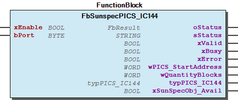 Graphical Interface of FbSunspecPICS_IC144 Function description By activating the input xEnable , the block is enabled and the communication starts automatically. The input bPort is used for the assignment to the master function block. The output wPICS_StartAddress indicates the start address of the PICS IC144. The readable values of the PICS IC144 are available in the output structure typPICS_IC144 . The PICS IC144 can contain several repeating data blocks, placed in the output structure typPICS_IC144 . The output wQuantityBlocks indicates the quantity of repeating blocks. To get all data inside typPICS_IC144 , the variable ParameterList.MAX_BLOCKS_IC144 must be edited in the ParameterList , with the quantity of repeating blocks. Note For an example see also doc02_HowTo . Note For usefull information about the readable values see also doc03_UsefulInformation . Note For usefull information about the evaluation of errors see also doc03_UsefulInformation .

## FbSunspecPICS_IC145 (FB)


| Scope | Name | Type | Initial | Comment |
| --- | --- | --- | --- | --- |
| Input | xEnable | BOOL | TRUE | Enable function block |
| bPort | BYTE | 1 | Master assignment number - range 1 to ParameterList.MAX_INTERFACES |
| Output | oStatus | WagoSysErrorBase.FbResult |  | Status information object, error codes from WagoAppPlcModbus |
| sStatus | STRING |  | Status information string |
| xValid | BOOL |  | Values are valid |
| xBusy | BOOL |  | Communication activ |
| xError | BOOL |  | Error while communication |
| wPICS_StartAddress | WORD |  | Start address PICS IC145 |
| typPICS_IC145 | typPICS_IC145 |  | Readable values PICS IC145 |
| xSunSpecObj_Avail | BOOL |  | TRUE: This object is available in combination with the used FBSunSpecMaster |

The function block FbSunspecPICS_IC145 enables evaluation of the PICS IC145 of a Sunspec slave.

Graphical Illustration

Graphical Interface of FbSunspecPICS_IC145

Function description

By activating the input xEnable , the block is enabled and the communication starts automatically.

The input bPort is used for the assignment to the master function block.

The output wPICS_StartAddress indicates the start address of the PICS IC145.

The readable values of the PICS IC145 are available in the output structure typPICS_IC145 .

For an example see also doc02_HowTo .

For usefull information about the readable values see also doc03_UsefulInformation .

For usefull information about the evaluation of errors see also doc03_UsefulInformation .

Interface variables Function The function block FbSunspecPICS_IC145 enables evaluation of the PICS IC145 of a Sunspec slave. Graphical Illustration 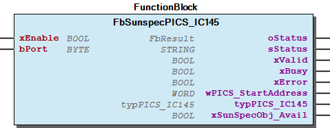 Graphical Interface of FbSunspecPICS_IC145 Function description By activating the input xEnable , the block is enabled and the communication starts automatically. The input bPort is used for the assignment to the master function block. The output wPICS_StartAddress indicates the start address of the PICS IC145. The readable values of the PICS IC145 are available in the output structure typPICS_IC145 . Note For an example see also doc02_HowTo . Note For usefull information about the readable values see also doc03_UsefulInformation . Note For usefull information about the evaluation of errors see also doc03_UsefulInformation .

## FbSunspecPICS_M201 (FB)


| Scope | Name | Type | Initial | Comment |
| --- | --- | --- | --- | --- |
| Input | xEnable | BOOL | TRUE | Enable function block |
| bPort | BYTE | 1 | Master assignment number - range 1 to ParameterList.MAX_INTERFACES |
| Output | oStatus | WagoSysErrorBase.FbResult |  | Status information object, error codes from WagoAppPlcModbus |
| sStatus | STRING |  | Status information string |
| xValid | BOOL |  | Values are valid |
| xBusy | BOOL |  | Communication activ |
| xError | BOOL |  | Error while communication |
| wPICS_StartAddress | WORD |  | Start address PICS M201 |
| typPICS_M201 | typPICS_M201 |  | Readable values PICS M201 |
| xSunSpecObj_Avail | BOOL |  | TRUE: This object is available in combination with the used FBSunSpecMaster |

The function block FbSunspecPICS_M201 enables evaluation of the PICS M201 of a Sunspec slave.

Graphical Illustration

Graphical Interface of FbSunspecPICS_M201

Function description

By activating the input xEnable , the block is enabled and the communication starts automatically.

The input bPort is used for the assignment to the master function block.

The output wPICS_StartAddress indicates the start address of the PICS M201.

The readable values of the PICS M201 are available in the output structure typPICS_M201 .

For an example see also doc02_HowTo .

For usefull information about the readable values see also doc03_UsefulInformation .

For usefull information about the evaluation of errors see also doc03_UsefulInformation .

Interface variables Function The function block FbSunspecPICS_M201 enables evaluation of the PICS M201 of a Sunspec slave. Graphical Illustration  Graphical Interface of FbSunspecPICS_M201 Function description By activating the input xEnable , the block is enabled and the communication starts automatically. The input bPort is used for the assignment to the master function block. The output wPICS_StartAddress indicates the start address of the PICS M201. The readable values of the PICS M201 are available in the output structure typPICS_M201 . Note For an example see also doc02_HowTo . Note For usefull information about the readable values see also doc03_UsefulInformation . Note For usefull information about the evaluation of errors see also doc03_UsefulInformation .

## FbSunspecPICS_M202 (FB)


| Scope | Name | Type | Initial | Comment |
| --- | --- | --- | --- | --- |
| Input | xEnable | BOOL | TRUE | Enable function block |
| bPort | BYTE | 1 | Master assignment number - range 1 to ParameterList.MAX_INTERFACES |
| Output | oStatus | WagoSysErrorBase.FbResult |  | Status information object, error codes from WagoAppPlcModbus |
| sStatus | STRING |  | Status information string |
| xValid | BOOL |  | Values are valid |
| xBusy | BOOL |  | Communication activ |
| xError | BOOL |  | Error while communication |
| wPICS_StartAddress | WORD |  | Start address PICS M202 |
| typPICS_M202 | typPICS_M202 |  | Readable values PICS M202 |
| xSunSpecObj_Avail | BOOL |  | TRUE: This object is available in combination with the used FBSunSpecMaster |

The function block FbSunspecPICS_M202 enables evaluation of the PICS M202 of a Sunspec slave.

Graphical Illustration

Graphical Interface of FbSunspecPICS_M202

Function description

By activating the input xEnable , the block is enabled and the communication starts automatically.

The input bPort is used for the assignment to the master function block.

The output wPICS_StartAddress indicates the start address of the PICS M202.

The readable values of the PICS M202 are available in the output structure typPICS_M202 .

For an example see also doc02_HowTo .

For usefull information about the readable values see also doc03_UsefulInformation .

For usefull information about the evaluation of errors see also doc03_UsefulInformation .

Interface variables Function The function block FbSunspecPICS_M202 enables evaluation of the PICS M202 of a Sunspec slave. Graphical Illustration  Graphical Interface of FbSunspecPICS_M202 Function description By activating the input xEnable , the block is enabled and the communication starts automatically. The input bPort is used for the assignment to the master function block. The output wPICS_StartAddress indicates the start address of the PICS M202. The readable values of the PICS M202 are available in the output structure typPICS_M202 . Note For an example see also doc02_HowTo . Note For usefull information about the readable values see also doc03_UsefulInformation . Note For usefull information about the evaluation of errors see also doc03_UsefulInformation .

## FbSunspecPICS_M203 (FB)


| Scope | Name | Type | Initial | Comment |
| --- | --- | --- | --- | --- |
| Input | xEnable | BOOL | TRUE | Enable function block |
| bPort | BYTE | 1 | Master assignment number - range 1 to ParameterList.MAX_INTERFACES |
| Output | oStatus | WagoSysErrorBase.FbResult |  | Status information object, error codes from WagoAppPlcModbus |
| sStatus | STRING |  | Status information string |
| xValid | BOOL |  | Values are valid |
| xBusy | BOOL |  | Communication activ |
| xError | BOOL |  | Error while communication |
| wPICS_StartAddress | WORD |  | Start address PICS M203 |
| typPICS_M203 | typPICS_M203 |  | Readable values PICS M203 |
| xSunSpecObj_Avail | BOOL |  | TRUE: This object is available in combination with the used FBSunSpecMaster |

The function block FbSunspecPICS_M203 enables evaluation of the PICS M203 of a Sunspec slave.

Graphical Illustration

Graphical Interface of FbSunspecPICS_M203

Function description

By activating the input xEnable , the block is enabled and the communication starts automatically.

The input bPort is used for the assignment to the master function block.

The output wPICS_StartAddress indicates the start address of the PICS M203.

The readable values of the PICS M203 are available in the output structure typPICS_M203 .

For an example see also doc02_HowTo .

For usefull information about the readable values see also doc03_UsefulInformation .

For usefull information about the evaluation of errors see also doc03_UsefulInformation .

Interface variables Function The function block FbSunspecPICS_M203 enables evaluation of the PICS M203 of a Sunspec slave. Graphical Illustration  Graphical Interface of FbSunspecPICS_M203 Function description By activating the input xEnable , the block is enabled and the communication starts automatically. The input bPort is used for the assignment to the master function block. The output wPICS_StartAddress indicates the start address of the PICS M203. The readable values of the PICS M203 are available in the output structure typPICS_M203 . Note For an example see also doc02_HowTo . Note For usefull information about the readable values see also doc03_UsefulInformation . Note For usefull information about the evaluation of errors see also doc03_UsefulInformation .

## FbSunspecPICS_M204 (FB)


| Scope | Name | Type | Initial | Comment |
| --- | --- | --- | --- | --- |
| Input | xEnable | BOOL | TRUE | Enable function block |
| bPort | BYTE | 1 | Master assignment number - range 1 to ParameterList.MAX_INTERFACES |
| Output | oStatus | WagoSysErrorBase.FbResult |  | Status information object, error codes from WagoAppPlcModbus |
| sStatus | STRING |  | Status information string |
| xValid | BOOL |  | Values are valid |
| xBusy | BOOL |  | Communication activ |
| xError | BOOL |  | Error while communication |
| wPICS_StartAddress | WORD |  | Start address PICS M204 |
| typPICS_M204 | typPICS_M204 |  | Readable values PICS M204 |
| xSunSpecObj_Avail | BOOL |  | TRUE: This object is available in combination with the used FBSunSpecMaster |

The function block FbSunspecPICS_M204 enables evaluation of the PICS M204 of a Sunspec slave.

Graphical Illustration

Graphical Interface of FbSunspecPICS_M204

Function description

By activating the input xEnable , the block is enabled and the communication starts automatically.

The input bPort is used for the assignment to the master function block.

The output wPICS_StartAddress indicates the start address of the PICS M204.

The readable values of the PICS M204 are available in the output structure typPICS_M204 .

For an example see also doc02_HowTo .

For usefull information about the readable values see also doc03_UsefulInformation .

For usefull information about the evaluation of errors see also doc03_UsefulInformation .

Interface variables Function The function block FbSunspecPICS_M204 enables evaluation of the PICS M204 of a Sunspec slave. Graphical Illustration  Graphical Interface of FbSunspecPICS_M204 Function description By activating the input xEnable , the block is enabled and the communication starts automatically. The input bPort is used for the assignment to the master function block. The output wPICS_StartAddress indicates the start address of the PICS M204. The readable values of the PICS M204 are available in the output structure typPICS_M204 . Note For an example see also doc02_HowTo . Note For usefull information about the readable values see also doc03_UsefulInformation . Note For usefull information about the evaluation of errors see also doc03_UsefulInformation .

## FbSunspecPICS_M211 (FB)


| Scope | Name | Type | Initial | Comment |
| --- | --- | --- | --- | --- |
| Input | xEnable | BOOL | TRUE | Enable function block |
| bPort | BYTE | 1 | Master assignment number - range 1 to ParameterList.MAX_INTERFACES |
| Output | oStatus | WagoSysErrorBase.FbResult |  | Status information object, error codes from WagoAppPlcModbus |
| sStatus | STRING |  | Status information string |
| xValid | BOOL |  | Values are valid |
| xBusy | BOOL |  | Communication activ |
| xError | BOOL |  | Error while communication |
| wPICS_StartAddress | WORD |  | Start address PICS M211 |
| typPICS_M211 | typPICS_M211 |  | Readable values PICS M211 |
| xSunSpecObj_Avail | BOOL |  | TRUE: This object is available in combination with the used FBSunSpecMaster |

The function block FbSunspecPICS_M211 enables evaluation of the PICS M211 of a Sunspec slave.

Graphical Illustration

Graphical Interface of FbSunspecPICS_M211

Function description

By activating the input xEnable , the block is enabled and the communication starts automatically.

The input bPort is used for the assignment to the master function block.

The output wPICS_StartAddress indicates the start address of the PICS M211.

The readable values of the PICS M211 are available in the output structure typPICS_M211 .

For an example see also doc02_HowTo .

For usefull information about the readable values see also doc03_UsefulInformation .

For usefull information about the evaluation of errors see also doc03_UsefulInformation .

Interface variables Function The function block FbSunspecPICS_M211 enables evaluation of the PICS M211 of a Sunspec slave. Graphical Illustration  Graphical Interface of FbSunspecPICS_M211 Function description By activating the input xEnable , the block is enabled and the communication starts automatically. The input bPort is used for the assignment to the master function block. The output wPICS_StartAddress indicates the start address of the PICS M211. The readable values of the PICS M211 are available in the output structure typPICS_M211 . Note For an example see also doc02_HowTo . Note For usefull information about the readable values see also doc03_UsefulInformation . Note For usefull information about the evaluation of errors see also doc03_UsefulInformation .

## FbSunspecPICS_M212 (FB)


| Scope | Name | Type | Initial | Comment |
| --- | --- | --- | --- | --- |
| Input | xEnable | BOOL | TRUE | Enable function block |
| bPort | BYTE | 1 | Master assignment number - range 1 to ParameterList.MAX_INTERFACES |
| Output | oStatus | WagoSysErrorBase.FbResult |  | Status information object, error codes from WagoAppPlcModbus |
| sStatus | STRING |  | Status information string |
| xValid | BOOL |  | Values are valid |
| xBusy | BOOL |  | Communication activ |
| xError | BOOL |  | Error while communication |
| wPICS_StartAddress | WORD |  | Start address PICS M212 |
| typPICS_M212 | typPICS_M212 |  | Readable values PICS M212 |
| xSunSpecObj_Avail | BOOL |  | TRUE: This object is available in combination with the used FBSunSpecMaster |

The function block FbSunspecPICS_M212 enables evaluation of the PICS M212 of a Sunspec slave.

Graphical Illustration

Graphical Interface of FbSunspecPICS_M212

Function description

By activating the input xEnable , the block is enabled and the communication starts automatically.

The input bPort is used for the assignment to the master function block.

The output wPICS_StartAddress indicates the start address of the PICS M212.

The readable values of the PICS M212 are available in the output structure typPICS_M212 .

For an example see also doc02_HowTo .

For usefull information about the readable values see also doc03_UsefulInformation .

For usefull information about the evaluation of errors see also doc03_UsefulInformation .

Interface variables Function The function block FbSunspecPICS_M212 enables evaluation of the PICS M212 of a Sunspec slave. Graphical Illustration  Graphical Interface of FbSunspecPICS_M212 Function description By activating the input xEnable , the block is enabled and the communication starts automatically. The input bPort is used for the assignment to the master function block. The output wPICS_StartAddress indicates the start address of the PICS M212. The readable values of the PICS M212 are available in the output structure typPICS_M212 . Note For an example see also doc02_HowTo . Note For usefull information about the readable values see also doc03_UsefulInformation . Note For usefull information about the evaluation of errors see also doc03_UsefulInformation .

## FbSunspecPICS_M213 (FB)


| Scope | Name | Type | Initial | Comment |
| --- | --- | --- | --- | --- |
| Input | xEnable | BOOL | TRUE | Enable function block |
| bPort | BYTE | 1 | Master assignment number - range 1 to ParameterList.MAX_INTERFACES |
| Output | oStatus | WagoSysErrorBase.FbResult |  | Status information object, error codes from WagoAppPlcModbus |
| sStatus | STRING |  | Status information string |
| xValid | BOOL |  | Values are valid |
| xBusy | BOOL |  | Communication activ |
| xError | BOOL |  | Error while communication |
| wPICS_StartAddress | WORD |  | Start address PICS M213 |
| typPICS_M213 | typPICS_M213 |  | Readable values PICS M213 |
| xSunSpecObj_Avail | BOOL |  | TRUE: This object is available in combination with the used FBSunSpecMaster |

The function block FbSunspecPICS_M213 enables evaluation of the PICS M213 of a Sunspec slave.

Graphical Illustration

Graphical Interface of FbSunspecPICS_M213

Function description

By activating the input xEnable , the block is enabled and the communication starts automatically.

The input bPort is used for the assignment to the master function block.

The output wPICS_StartAddress indicates the start address of the PICS M213.

The readable values of the PICS M213 are available in the output structure typPICS_M213 .

For an example see also doc02_HowTo .

For usefull information about the readable values see also doc03_UsefulInformation .

For usefull information about the evaluation of errors see also doc03_UsefulInformation .

Interface variables Function The function block FbSunspecPICS_M213 enables evaluation of the PICS M213 of a Sunspec slave. Graphical Illustration  Graphical Interface of FbSunspecPICS_M213 Function description By activating the input xEnable , the block is enabled and the communication starts automatically. The input bPort is used for the assignment to the master function block. The output wPICS_StartAddress indicates the start address of the PICS M213. The readable values of the PICS M213 are available in the output structure typPICS_M213 . Note For an example see also doc02_HowTo . Note For usefull information about the readable values see also doc03_UsefulInformation . Note For usefull information about the evaluation of errors see also doc03_UsefulInformation .

## FbSunspecPICS_M214 (FB)


| Scope | Name | Type | Initial | Comment |
| --- | --- | --- | --- | --- |
| Input | xEnable | BOOL | TRUE | Enable function block |
| bPort | BYTE | 1 | Master assignment number - range 1 to ParameterList.MAX_INTERFACES |
| Output | oStatus | WagoSysErrorBase.FbResult |  | Status information object, error codes from WagoAppPlcModbus |
| sStatus | STRING |  | Status information string |
| xValid | BOOL |  | Values are valid |
| xBusy | BOOL |  | Communication activ |
| xError | BOOL |  | Error while communication |
| wPICS_StartAddress | WORD |  | Start address PICS M214 |
| typPICS_M214 | typPICS_M214 |  | Readable values PICS M214 |
| xSunSpecObj_Avail | BOOL |  | TRUE: This object is available in combination with the used FBSunSpecMaster |

The function block FbSunspecPICS_M214 enables evaluation of the PICS M214 of a Sunspec slave.

Graphical Illustration

Graphical Interface of FbSunspecPICS_M214

Function description

By activating the input xEnable , the block is enabled and the communication starts automatically.

The input bPort is used for the assignment to the master function block.

The output wPICS_StartAddress indicates the start address of the PICS M214.

The readable values of the PICS M214 are available in the output structure typPICS_M214 .

For an example see also doc02_HowTo .

For usefull information about the readable values see also doc03_UsefulInformation .

For usefull information about the evaluation of errors see also doc03_UsefulInformation .

Interface variables Function The function block FbSunspecPICS_M214 enables evaluation of the PICS M214 of a Sunspec slave. Graphical Illustration  Graphical Interface of FbSunspecPICS_M214 Function description By activating the input xEnable , the block is enabled and the communication starts automatically. The input bPort is used for the assignment to the master function block. The output wPICS_StartAddress indicates the start address of the PICS M214. The readable values of the PICS M214 are available in the output structure typPICS_M214 . Note For an example see also doc02_HowTo . Note For usefull information about the readable values see also doc03_UsefulInformation . Note For usefull information about the evaluation of errors see also doc03_UsefulInformation .

## FbSunspecPICS_NC010 (FB)


| Scope | Name | Type | Initial | Comment |
| --- | --- | --- | --- | --- |
| Input | xEnable | BOOL | TRUE | Enable function block |
| bPort | BYTE | 1 | Master assignment number - range 1 to ParameterList.MAX_INTERFACES |
| Output | oStatus | WagoSysErrorBase.FbResult |  | Status information object, error codes from WagoAppPlcModbus |
| sStatus | STRING |  | Status information string |
| xValid | BOOL |  | Values are valid |
| xBusy | BOOL |  | Communication activ |
| xError | BOOL |  | Error while communication |
| wPICS_StartAddress | WORD |  | Start address PICS NC010 |
| typPICS_NC010 | typPICS_NC010 |  | Readable values PICS NC010 |
| xSunSpecObj_Avail | BOOL |  | TRUE: This object is available in combination with the used FBSunSpecMaster |

The function block FbSunspecPICS_NC010 enables evaluation of the PICS NC010 of a Sunspec slave.

Graphical Illustration

Graphical Interface of FbSunspecPICS_NC010

Function description

By activating the input xEnable , the block is enabled and the communication starts automatically.

The input bPort is used for the assignment to the master function block.

The output wPICS_StartAddress indicates the start address of the PICS NC010.

An active communication is signaled by the output xBusy . When the communication has been successfully completed, this is indicated via the xValid output and the values read out can be used. An error that occurs during the communication is displayed via the xError output.

The readable values of the PICS NC010 are available in the output structure typPICS_NC010 .

For an example see also doc02_HowTo .

For usefull information about the readable values see also doc03_UsefulInformation .

For usefull information about the evaluation of errors see also doc03_UsefulInformation .

Interface variables Function The function block FbSunspecPICS_NC010 enables evaluation of the PICS NC010 of a Sunspec slave. Graphical Illustration  Graphical Interface of FbSunspecPICS_NC010 Function description By activating the input xEnable , the block is enabled and the communication starts automatically. The input bPort is used for the assignment to the master function block. The output wPICS_StartAddress indicates the start address of the PICS NC010. An active communication is signaled by the output xBusy . When the communication has been successfully completed, this is indicated via the xValid output and the values read out can be used. An error that occurs during the communication is displayed via the xError output. The readable values of the PICS NC010 are available in the output structure typPICS_NC010 . Note For an example see also doc02_HowTo . Note For usefull information about the readable values see also doc03_UsefulInformation . Note For usefull information about the evaluation of errors see also doc03_UsefulInformation .

## FbSunspecPICS_NC011 (FB)


| Scope | Name | Type | Initial | Comment |
| --- | --- | --- | --- | --- |
| Input | xEnable | BOOL | TRUE | Enable function block |
| bPort | BYTE | 1 | Master assignment number - range 1 to ParameterList.MAX_INTERFACES |
| Output | oStatus | WagoSysErrorBase.FbResult |  | Status information object, error codes from WagoAppPlcModbus |
| sStatus | STRING |  | Status information string |
| xValid | BOOL |  | Values are valid |
| xBusy | BOOL |  | Communication activ |
| xError | BOOL |  | Error while communication |
| wPICS_StartAddress | WORD |  | Start address PICS NC011 |
| typPICS_NC011 | typPICS_NC011 |  | Readable values PICS NC011 |
| xSunSpecObj_Avail | BOOL |  | TRUE: This object is available in combination with the used FBSunSpecMaster |

The function block FbSunspecPICS_NC011 enables evaluation of the PICS NC011 of a Sunspec slave.

Graphical Illustration

Graphical Interface of FbSunspecPICS_NC011

Function description

By activating the input xEnable , the block is enabled and the communication starts automatically.

The input bPort is used for the assignment to the master function block.

The output wPICS_StartAddress indicates the start address of the PICS NC011.

The readable values of the PICS NC011 are available in the output structure typPICS_NC011 .

For an example see also doc02_HowTo .

For usefull information about the readable values see also doc03_UsefulInformation .

For usefull information about the evaluation of errors see also doc03_UsefulInformation .

Interface variables Function The function block FbSunspecPICS_NC011 enables evaluation of the PICS NC011 of a Sunspec slave. Graphical Illustration  Graphical Interface of FbSunspecPICS_NC011 Function description By activating the input xEnable , the block is enabled and the communication starts automatically. The input bPort is used for the assignment to the master function block. The output wPICS_StartAddress indicates the start address of the PICS NC011. The readable values of the PICS NC011 are available in the output structure typPICS_NC011 . Note For an example see also doc02_HowTo . Note For usefull information about the readable values see also doc03_UsefulInformation . Note For usefull information about the evaluation of errors see also doc03_UsefulInformation .

## FbSunspecPICS_NC012 (FB)


| Scope | Name | Type | Initial | Comment |
| --- | --- | --- | --- | --- |
| Input | xEnable | BOOL | TRUE | Enable function block |
| bPort | BYTE | 1 | Master assignment number - range 1 to ParameterList.MAX_INTERFACES |
| Output | oStatus | WagoSysErrorBase.FbResult |  | Status information object, error codes from WagoAppPlcModbus |
| sStatus | STRING |  | Status information string |
| xValid | BOOL |  | Values are valid |
| xBusy | BOOL |  | Communication activ |
| xError | BOOL |  | Error while communication |
| wPICS_StartAddress | WORD |  | Start address PICS NC012 |
| typPICS_NC012 | typPICS_NC012 |  | Readable values PICS NC012 |
| xSunSpecObj_Avail | BOOL |  | TRUE: This object is available in combination with the used FBSunSpecMaster |

The function block FbSunspecPICS_NC012 enables evaluation of the PICS NC012 of a Sunspec slave.

Graphical Illustration

Graphical Interface of FbSunspecPICS_NC012

Function description

By activating the input xEnable , the block is enabled and the communication starts automatically.

The input bPort is used for the assignment to the master function block.

The output wPICS_StartAddress indicates the start address of the PICS NC012.

The readable values of the PICS NC012 are available in the output structure typPICS_NC012 .

For an example see also doc02_HowTo .

For usefull information about the readable values see also doc03_UsefulInformation .

For usefull information about the evaluation of errors see also doc03_UsefulInformation .

Interface variables Function The function block FbSunspecPICS_NC012 enables evaluation of the PICS NC012 of a Sunspec slave. Graphical Illustration  Graphical Interface of FbSunspecPICS_NC012 Function description By activating the input xEnable , the block is enabled and the communication starts automatically. The input bPort is used for the assignment to the master function block. The output wPICS_StartAddress indicates the start address of the PICS NC012. The readable values of the PICS NC012 are available in the output structure typPICS_NC012 . Note For an example see also doc02_HowTo . Note For usefull information about the readable values see also doc03_UsefulInformation . Note For usefull information about the evaluation of errors see also doc03_UsefulInformation .

## FbSunspecPICS_NC013 (FB)


| Scope | Name | Type | Initial | Comment |
| --- | --- | --- | --- | --- |
| Input | xEnable | BOOL | TRUE | Enable function block |
| bPort | BYTE | 1 | Master assignment number - range 1 to ParameterList.MAX_INTERFACES |
| Output | oStatus | WagoSysErrorBase.FbResult |  | Status information object, error codes from WagoAppPlcModbus |
| sStatus | STRING |  | Status information string |
| xValid | BOOL |  | Values are valid |
| xBusy | BOOL |  | Communication activ |
| xError | BOOL |  | Error while communication |
| wPICS_StartAddress | WORD |  | Start address PICS NC013 |
| typPICS_NC013 | typPICS_NC013 |  | Readable values PICS NC013 |
| xSunSpecObj_Avail | BOOL |  | TRUE: This object is available in combination with the used FBSunSpecMaster |

The function block FbSunspecPICS_NC013 enables evaluation of the PICS NC013 of a Sunspec slave.

Graphical Illustration

Graphical Interface of FbSunspecPICS_NC013

Function description

By activating the input xEnable , the block is enabled and the communication starts automatically.

The input bPort is used for the assignment to the master function block.

The output wPICS_StartAddress indicates the start address of the PICS NC013.

The readable values of the PICS NC013 are available in the output structure typPICS_NC013 .

For an example see also doc02_HowTo .

For usefull information about the readable values see also doc03_UsefulInformation .

For usefull information about the evaluation of errors see also doc03_UsefulInformation .

Interface variables Function The function block FbSunspecPICS_NC013 enables evaluation of the PICS NC013 of a Sunspec slave. Graphical Illustration  Graphical Interface of FbSunspecPICS_NC013 Function description By activating the input xEnable , the block is enabled and the communication starts automatically. The input bPort is used for the assignment to the master function block. The output wPICS_StartAddress indicates the start address of the PICS NC013. The readable values of the PICS NC013 are available in the output structure typPICS_NC013 . Note For an example see also doc02_HowTo . Note For usefull information about the readable values see also doc03_UsefulInformation . Note For usefull information about the evaluation of errors see also doc03_UsefulInformation .

## FbSunspecPICS_NC014 (FB)


| Scope | Name | Type | Initial | Comment |
| --- | --- | --- | --- | --- |
| Input | xEnable | BOOL | TRUE | Enable function block |
| bPort | BYTE | 1 | Master assignment number - range 1 to ParameterList.MAX_INTERFACES |
| Output | oStatus | WagoSysErrorBase.FbResult |  | Status information object, error codes from WagoAppPlcModbus |
| sStatus | STRING |  | Status information string |
| xValid | BOOL |  | Values are valid |
| xBusy | BOOL |  | Communication activ |
| xError | BOOL |  | Error while communication |
| wPICS_StartAddress | WORD |  | Start address PICS NC014 |
| typPICS_NC014 | typPICS_NC014 |  | Readable values PICS NC014 |
| xSunSpecObj_Avail | BOOL |  | TRUE: This object is available in combination with the used FBSunSpecMaster |

The function block FbSunspecPICS_NC014 enables evaluation of the PICS NC014 of a Sunspec slave.

Graphical Illustration

Graphical Interface of FbSunspecPICS_NC014

Function description

By activating the input xEnable , the block is enabled and the communication starts automatically.

The input bPort is used for the assignment to the master function block.

The output wPICS_StartAddress indicates the start address of the PICS NC014.

The readable values of the PICS NC014 are available in the output structure typPICS_NC014 .

For an example see also doc02_HowTo .

For usefull information about the readable values see also doc03_UsefulInformation .

For usefull information about the evaluation of errors see also doc03_UsefulInformation .

Interface variables Function The function block FbSunspecPICS_NC014 enables evaluation of the PICS NC014 of a Sunspec slave. Graphical Illustration  Graphical Interface of FbSunspecPICS_NC014 Function description By activating the input xEnable , the block is enabled and the communication starts automatically. The input bPort is used for the assignment to the master function block. The output wPICS_StartAddress indicates the start address of the PICS NC014. The readable values of the PICS NC014 are available in the output structure typPICS_NC014 . Note For an example see also doc02_HowTo . Note For usefull information about the readable values see also doc03_UsefulInformation . Note For usefull information about the evaluation of errors see also doc03_UsefulInformation .

## FbSunspecPICS_NC015 (FB)


| Scope | Name | Type | Initial | Comment |
| --- | --- | --- | --- | --- |
| Input | xEnable | BOOL | TRUE | Enable function block |
| bPort | BYTE | 1 | Master assignment number - range 1 to ParameterList.MAX_INTERFACES |
| Output | oStatus | WagoSysErrorBase.FbResult |  | Status information object, error codes from WagoAppPlcModbus |
| sStatus | STRING |  | Status information string |
| xValid | BOOL |  | Values are valid |
| xBusy | BOOL |  | Communication activ |
| xError | BOOL |  | Error while communication |
| wPICS_StartAddress | WORD |  | Start address PICS NC015 |
| typPICS_NC015 | typPICS_NC015 |  | Readable values PICS NC015 |
| xSunSpecObj_Avail | BOOL |  | TRUE: This object is available in combination with the used FBSunSpecMaster |

The function block FbSunspecPICS_NC015 enables evaluation of the PICS NC015 of a Sunspec slave.

Graphical Illustration

Graphical Interface of FbSunspecPICS_NC015

Function description

By activating the input xEnable , the block is enabled and the communication starts automatically.

The input bPort is used for the assignment to the master function block.

The output wPICS_StartAddress indicates the start address of the PICS NC015.

The readable values of the PICS NC015 are available in the output structure typPICS_NC015 .

For an example see also doc02_HowTo .

For usefull information about the readable values see also doc03_UsefulInformation .

For usefull information about the evaluation of errors see also doc03_UsefulInformation .

Interface variables Function The function block FbSunspecPICS_NC015 enables evaluation of the PICS NC015 of a Sunspec slave. Graphical Illustration  Graphical Interface of FbSunspecPICS_NC015 Function description By activating the input xEnable , the block is enabled and the communication starts automatically. The input bPort is used for the assignment to the master function block. The output wPICS_StartAddress indicates the start address of the PICS NC015. The readable values of the PICS NC015 are available in the output structure typPICS_NC015 . Note For an example see also doc02_HowTo . Note For usefull information about the readable values see also doc03_UsefulInformation . Note For usefull information about the evaluation of errors see also doc03_UsefulInformation .

## FbSunspecPICS_NC016 (FB)


| Scope | Name | Type | Initial | Comment |
| --- | --- | --- | --- | --- |
| Input | xEnable | BOOL | TRUE | Enable function block |
| bPort | BYTE | 1 | Master assignment number - range 1 to ParameterList.MAX_INTERFACES |
| Output | oStatus | WagoSysErrorBase.FbResult |  | Status information object, error codes from WagoAppPlcModbus |
| sStatus | STRING |  | Status information string |
| xValid | BOOL |  | Values are valid |
| xBusy | BOOL |  | Communication activ |
| xError | BOOL |  | Error while communication |
| wPICS_StartAddress | WORD |  | Start address PICS NC016 |
| typPICS_NC016 | typPICS_NC016 |  | Readable values PICS NC016 |
| xSunSpecObj_Avail | BOOL |  | TRUE: This object is available in combination with the used FBSunSpecMaster |

The function block FbSunspecPICS_NC016 enables evaluation of the PICS NC016 of a Sunspec slave.

Graphical Illustration

Graphical Interface of FbSunspecPICS_NC016

Function description

By activating the input xEnable , the block is enabled and the communication starts automatically.

The input bPort is used for the assignment to the master function block.

The output wPICS_StartAddress indicates the start address of the PICS NC016.

The readable values of the PICS NC016 are available in the output structure typPICS_NC016 .

For an example see also doc02_HowTo .

For usefull information about the readable values see also doc03_UsefulInformation .

For usefull information about the evaluation of errors see also doc03_UsefulInformation .

Interface variables Function The function block FbSunspecPICS_NC016 enables evaluation of the PICS NC016 of a Sunspec slave. Graphical Illustration  Graphical Interface of FbSunspecPICS_NC016 Function description By activating the input xEnable , the block is enabled and the communication starts automatically. The input bPort is used for the assignment to the master function block. The output wPICS_StartAddress indicates the start address of the PICS NC016. The readable values of the PICS NC016 are available in the output structure typPICS_NC016 . Note For an example see also doc02_HowTo . Note For usefull information about the readable values see also doc03_UsefulInformation . Note For usefull information about the evaluation of errors see also doc03_UsefulInformation .

## FbSunspecPICS_NC017 (FB)


| Scope | Name | Type | Initial | Comment |
| --- | --- | --- | --- | --- |
| Input | xEnable | BOOL | TRUE | Enable function block |
| bPort | BYTE | 1 | Master assignment number - range 1 to ParameterList.MAX_INTERFACES |
| Output | oStatus | WagoSysErrorBase.FbResult |  | Status information object, error codes from WagoAppPlcModbus |
| sStatus | STRING |  | Status information string |
| xValid | BOOL |  | Values are valid |
| xBusy | BOOL |  | Communication activ |
| xError | BOOL |  | Error while communication |
| wPICS_StartAddress | WORD |  | Start address PICS NC017 |
| typPICS_NC017 | typPICS_NC017 |  | Readable values PICS NC017 |
| xSunSpecObj_Avail | BOOL |  | TRUE: This object is available in combination with the used FBSunSpecMaster |

The function block FbSunspecPICS_NC017 enables evaluation of the PICS NC017 of a Sunspec slave.

Graphical Illustration

Graphical Interface of FbSunspecPICS_NC017

Function description

By activating the input xEnable , the block is enabled and the communication starts automatically.

The input bPort is used for the assignment to the master function block.

The output wPICS_StartAddress indicates the start address of the PICS NC017.

The readable values of the PICS NC017 are available in the output structure typPICS_NC017 .

For an example see also doc02_HowTo .

For usefull information about the readable values see also doc03_UsefulInformation .

For usefull information about the evaluation of errors see also doc03_UsefulInformation .

Interface variables Function The function block FbSunspecPICS_NC017 enables evaluation of the PICS NC017 of a Sunspec slave. Graphical Illustration  Graphical Interface of FbSunspecPICS_NC017 Function description By activating the input xEnable , the block is enabled and the communication starts automatically. The input bPort is used for the assignment to the master function block. The output wPICS_StartAddress indicates the start address of the PICS NC017. The readable values of the PICS NC017 are available in the output structure typPICS_NC017 . Note For an example see also doc02_HowTo . Note For usefull information about the readable values see also doc03_UsefulInformation . Note For usefull information about the evaluation of errors see also doc03_UsefulInformation .

## FbSunspecPICS_NC018 (FB)


| Scope | Name | Type | Initial | Comment |
| --- | --- | --- | --- | --- |
| Input | xEnable | BOOL | TRUE | Enable function block |
| bPort | BYTE | 1 | Master assignment number - range 1 to ParameterList.MAX_INTERFACES |
| Output | oStatus | WagoSysErrorBase.FbResult |  | Status information object, error codes from WagoAppPlcModbus |
| sStatus | STRING |  | Status information string |
| xValid | BOOL |  | Values are valid |
| xBusy | BOOL |  | Communication activ |
| xError | BOOL |  | Error while communication |
| wPICS_StartAddress | WORD |  | Start address PICS NC018 |
| typPICS_NC018 | typPICS_NC018 |  | Readable values PICS NC018 |
| xSunSpecObj_Avail | BOOL |  | TRUE: This object is available in combination with the used FBSunSpecMaster |

The function block FbSunspecPICS_NC018 enables evaluation of the PICS NC018 of a Sunspec slave.

Graphical Illustration

Graphical Interface of FbSunspecPICS_NC018

Function description

By activating the input xEnable , the block is enabled and the communication starts automatically.

The input bPort is used for the assignment to the master function block.

The output wPICS_StartAddress indicates the start address of the PICS NC018.

The readable values of the PICS NC018 are available in the output structure typPICS_NC018 .

For an example see also doc02_HowTo .

For usefull information about the readable values see also doc03_UsefulInformation .

For usefull information about the evaluation of errors see also doc03_UsefulInformation .

Interface variables Function The function block FbSunspecPICS_NC018 enables evaluation of the PICS NC018 of a Sunspec slave. Graphical Illustration 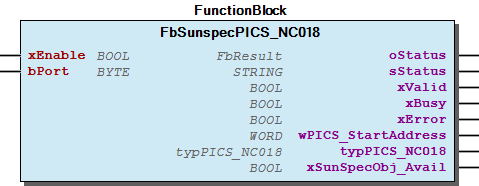 Graphical Interface of FbSunspecPICS_NC018 Function description By activating the input xEnable , the block is enabled and the communication starts automatically. The input bPort is used for the assignment to the master function block. The output wPICS_StartAddress indicates the start address of the PICS NC018. The readable values of the PICS NC018 are available in the output structure typPICS_NC018 . Note For an example see also doc02_HowTo . Note For usefull information about the readable values see also doc03_UsefulInformation . Note For usefull information about the evaluation of errors see also doc03_UsefulInformation .

## FbSunspecPICS_NC019 (FB)


| Scope | Name | Type | Initial | Comment |
| --- | --- | --- | --- | --- |
| Input | xEnable | BOOL | TRUE | Enable function block |
| bPort | BYTE | 1 | Master assignment number - range 1 to ParameterList.MAX_INTERFACES |
| Output | oStatus | WagoSysErrorBase.FbResult |  | Status information object, error codes from WagoAppPlcModbus |
| sStatus | STRING |  | Status information string |
| xValid | BOOL |  | Values are valid |
| xBusy | BOOL |  | Communication activ |
| xError | BOOL |  | Error while communication |
| wPICS_StartAddress | WORD |  | Start address PICS NC019 |
| typPICS_NC019 | typPICS_NC019 |  | Readable values PICS NC019 |
| xSunSpecObj_Avail | BOOL |  | TRUE: This object is available in combination with the used FBSunSpecMaster |

The function block FbSunspecPICS_NC019 enables evaluation of the PICS NC019 of a Sunspec slave.

Graphical Illustration

Graphical Interface of FbSunspecPICS_NC019

Function description

By activating the input xEnable , the block is enabled and the communication starts automatically.

The input bPort is used for the assignment to the master function block.

The output wPICS_StartAddress indicates the start address of the PICS NC019.

The readable values of the PICS NC019 are available in the output structure typPICS_NC019 .

For an example see also doc02_HowTo .

For usefull information about the readable values see also doc03_UsefulInformation .

For usefull information about the evaluation of errors see also doc03_UsefulInformation .

Interface variables Function The function block FbSunspecPICS_NC019 enables evaluation of the PICS NC019 of a Sunspec slave. Graphical Illustration  Graphical Interface of FbSunspecPICS_NC019 Function description By activating the input xEnable , the block is enabled and the communication starts automatically. The input bPort is used for the assignment to the master function block. The output wPICS_StartAddress indicates the start address of the PICS NC019. The readable values of the PICS NC019 are available in the output structure typPICS_NC019 . Note For an example see also doc02_HowTo . Note For usefull information about the readable values see also doc03_UsefulInformation . Note For usefull information about the evaluation of errors see also doc03_UsefulInformation .

## FbSunspecPICS_S802 (FB)


| Scope | Name | Type | Initial | Comment | Inherited from |
| --- | --- | --- | --- | --- | --- |
| Input | xEnable | BOOL | TRUE | Enable function block | FbSunSpec_Model |
| bPort | BYTE | 1 | Master assignment number - range 1 to ParameterList.MAX_INTERFACES | FbSunSpec_Model |
| Output | oStatus | WagoSysErrorBase.FbResult |  | Status information object, error codes from WagoAppPlcModbus | FbSunSpec_Model |
| sStatus | STRING |  | Status information string | FbSunSpec_Model |
| xValid | BOOL |  | Values are valid | FbSunSpec_Model |
| xBusy | BOOL |  | Communication activ | FbSunSpec_Model |
| xError | BOOL |  | Error while communication | FbSunSpec_Model |
| wPICS_StartAddress | WORD |  | Start address PICS | FbSunSpec_Model |
| wCount_Read | WORD |  | Counts up when a package was received | FbSunSpec_Model |
| wCount_Error | WORD |  | Counts up with every error | FbSunSpec_Model |
| tReadCycle | TIME |  | Cylce-Time of reading data | FbSunSpec_Model |
| iState | INT |  |  | FbSunSpec_Model |
| xSunSpecObj_Avail | BOOL |  | TRUE: This object is available in combination with the used FBSunSpecMaster | FbSunSpec_Model |
| Inout | typPICS_S802 | typPICS_S802 |  | Readable values PICS S802 |  |

The function block FbSunspecPICS_S802 enables evaluation of the PICS S802 of a Sunspec slave.

Graphical Illustration

Graphical Interface of FbSunspecPICS_S802

Function description

By activating the input xEnable , the block is enabled and the communication starts automatically.

The input bPort is used for the assignment to the master function block.

The output wPICS_StartAddress indicates the start address of the PICS S802.

The readable values of the PICS S802 are available in the output structure typPICS_S802 .

For an example see also doc02_HowTo .

For usefull information about the readable values see also doc03_UsefulInformation .

For usefull information about the evaluation of errors see also doc03_UsefulInformation .

Interface variables Function The function block FbSunspecPICS_S802 enables evaluation of the PICS S802 of a Sunspec slave. Graphical Illustration 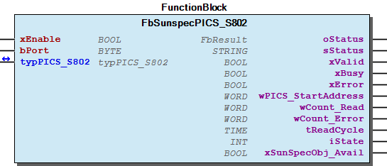 Graphical Interface of FbSunspecPICS_S802 Function description By activating the input xEnable , the block is enabled and the communication starts automatically. The input bPort is used for the assignment to the master function block. The output wPICS_StartAddress indicates the start address of the PICS S802. The readable values of the PICS S802 are available in the output structure typPICS_S802 . Note For an example see also doc02_HowTo . Note For usefull information about the readable values see also doc03_UsefulInformation . Note For usefull information about the evaluation of errors see also doc03_UsefulInformation . - FbSunspecPICS_S802.A_ReadBlock_01_Cpy_Data (ACT) - FbSunspecPICS_S802.A_WriteBlock_01_Cpy_Data (ACT) - FbSunspecPICS_S802.A_WriteBlock_02_Cpy_Data (ACT) - FbSunspecPICS_S802.A_WriteBlock_03_Cpy_Data (ACT) - FbSunspecPICS_S802.A_WriteBlock_Assign_Job (ACT) - FbSunspecPICS_S802.CheckWriteData (ACT)

## FbSunspecPICS_SC401 (FB)


| Scope | Name | Type | Initial | Comment |
| --- | --- | --- | --- | --- |
| Input | xEnable | BOOL | TRUE | Enable function block |
| bPort | BYTE | 1 | Master assignment number - range 1 to ParameterList.MAX_INTERFACES |
| Output | oStatus | WagoSysErrorBase.FbResult |  | Status information object, error codes from WagoAppPlcModbus |
| sStatus | STRING |  | Status information string |
| xValid | BOOL |  | Values are valid |
| xBusy | BOOL |  | Communication activ |
| xError | BOOL |  | Error while communication |
| wPICS_StartAddress | WORD |  | Start address PICS SC401 |
| wQuantityBlocks | WORD |  | Quantity of repeating blocks |
| typPICS_SC401 | typPICS_SC401 |  | Readable values PICS SC401 |
| xSunSpecObj_Avail | BOOL |  | TRUE: This object is available in combination with the used FBSunSpecMaster |

The function block FbSunspecPICS_SC401 enables evaluation of the PICS SC401 of a Sunspec slave.

Graphical Illustration

Graphical Interface of FbSunspecPICS_SC401

Function description

By activating the input xEnable , the block is enabled and the communication starts automatically.

The input bPort is used for the assignment to the master function block.

The output wPICS_StartAddress indicates the start address of the PICS SC401.

The readable values of the PICS SC401 are available in the output structure typPICS_SC401 . The PICS SC401 can contain several repeating data blocks, placed in the output structure typPICS_SC401 . The output wQuantityBlocks indicates the quantity of repeating blocks. To get all data inside typPICS_SC401 , the variable ParameterList.MAX_BLOCKS_SC401 must be edited in the ParameterList , with the quantity of repeating blocks.

For an example see also doc02_HowTo .

For usefull information about the readable values see also doc03_UsefulInformation .

For usefull information about the evaluation of errors see also doc03_UsefulInformation .

Interface variables Function The function block FbSunspecPICS_SC401 enables evaluation of the PICS SC401 of a Sunspec slave. Graphical Illustration  Graphical Interface of FbSunspecPICS_SC401 Function description By activating the input xEnable , the block is enabled and the communication starts automatically. The input bPort is used for the assignment to the master function block. The output wPICS_StartAddress indicates the start address of the PICS SC401. The readable values of the PICS SC401 are available in the output structure typPICS_SC401 . The PICS SC401 can contain several repeating data blocks, placed in the output structure typPICS_SC401 . The output wQuantityBlocks indicates the quantity of repeating blocks. To get all data inside typPICS_SC401 , the variable ParameterList.MAX_BLOCKS_SC401 must be edited in the ParameterList , with the quantity of repeating blocks. Note For an example see also doc02_HowTo . Note For usefull information about the readable values see also doc03_UsefulInformation . Note For usefull information about the evaluation of errors see also doc03_UsefulInformation .

## FbSunspecPICS_SC402 (FB)


| Scope | Name | Type | Initial | Comment |
| --- | --- | --- | --- | --- |
| Input | xEnable | BOOL | TRUE | Enable function block |
| bPort | BYTE | 1 | Master assignment number - range 1 to ParameterList.MAX_INTERFACES |
| Output | oStatus | WagoSysErrorBase.FbResult |  | Status information object, error codes from WagoAppPlcModbus |
| sStatus | STRING |  | Status information string |
| xValid | BOOL |  | Values are valid |
| xBusy | BOOL |  | Communication activ |
| xError | BOOL |  | Error while communication |
| wPICS_StartAddress | WORD |  | Start address PICS SC402 |
| wQuantityBlocks | WORD |  | Quantity of repeating blocks |
| typPICS_SC402 | typPICS_SC402 |  | Readable values PICS SC402 |
| xSunSpecObj_Avail | BOOL |  | TRUE: This object is available in combination with the used FBSunSpecMaster |

The function block FbSunspecPICS_SC402 enables evaluation of the PICS SC402 of a Sunspec slave.

Graphical Illustration

Graphical Interface of FbSunspecPICS_SC402

Function description

By activating the input xEnable , the block is enabled and the communication starts automatically.

The input bPort is used for the assignment to the master function block.

The output wPICS_StartAddress indicates the start address of the PICS SC402.

The readable values of the PICS SC402 are available in the output structure typPICS_SC402 . The PICS SC402 can contain several repeating data blocks, placed in the output structure typPICS_SC402 . The output wQuantityBlocks indicates the quantity of repeating blocks. To get all data inside typPICS_SC402 , the variable ParameterList.MAX_BLOCKS_SC402 must be edited in the ParameterList , with the quantity of repeating blocks.

For an example see also doc02_HowTo .

For usefull information about the readable values see also doc03_UsefulInformation .

For usefull information about the evaluation of errors see also doc03_UsefulInformation .

Interface variables Function The function block FbSunspecPICS_SC402 enables evaluation of the PICS SC402 of a Sunspec slave. Graphical Illustration  Graphical Interface of FbSunspecPICS_SC402 Function description By activating the input xEnable , the block is enabled and the communication starts automatically. The input bPort is used for the assignment to the master function block. The output wPICS_StartAddress indicates the start address of the PICS SC402. The readable values of the PICS SC402 are available in the output structure typPICS_SC402 . The PICS SC402 can contain several repeating data blocks, placed in the output structure typPICS_SC402 . The output wQuantityBlocks indicates the quantity of repeating blocks. To get all data inside typPICS_SC402 , the variable ParameterList.MAX_BLOCKS_SC402 must be edited in the ParameterList , with the quantity of repeating blocks. Note For an example see also doc02_HowTo . Note For usefull information about the readable values see also doc03_UsefulInformation . Note For usefull information about the evaluation of errors see also doc03_UsefulInformation .

## FbSunspecPICS_SC403 (FB)


| Scope | Name | Type | Initial | Comment |
| --- | --- | --- | --- | --- |
| Input | xEnable | BOOL | TRUE | Enable function block |
| bPort | BYTE | 1 | Master assignment number - range 1 to ParameterList.MAX_INTERFACES |
| Output | oStatus | WagoSysErrorBase.FbResult |  | Status information object, error codes from WagoAppPlcModbus |
| sStatus | STRING |  | Status information string |
| xValid | BOOL |  | Values are valid |
| xBusy | BOOL |  | Communication activ |
| xError | BOOL |  | Error while communication |
| wPICS_StartAddress | WORD |  | Start address PICS SC403 |
| wQuantityBlocks | WORD |  | Quantity of repeating blocks |
| typPICS_SC403 | typPICS_SC403 |  | Readable values PICS SC403 |
| xSunSpecObj_Avail | BOOL |  | TRUE: This object is available in combination with the used FBSunSpecMaster |

The function block FbSunspecPICS_SC403 enables evaluation of the PICS SC403 of a Sunspec slave.

Graphical Illustration

Graphical Interface of FbSunspecPICS_SC403

Function description

By activating the input xEnable , the block is enabled and the communication starts automatically.

The input bPort is used for the assignment to the master function block.

The output wPICS_StartAddress indicates the start address of the PICS SC403.

The readable values of the PICS SC403 are available in the output structure typPICS_SC403 . The PICS SC403 can contain several repeating data blocks, placed in the output structure typPICS_SC403 . The output wQuantityBlocks indicates the quantity of repeating blocks. To get all data inside typPICS_SC403 , the variable ParameterList.MAX_BLOCKS_SC403 must be edited in the ParameterList , with the quantity of repeating blocks.

For an example see also doc02_HowTo .

For usefull information about the readable values see also doc03_UsefulInformation .

For usefull information about the evaluation of errors see also doc03_UsefulInformation .

Interface variables Function The function block FbSunspecPICS_SC403 enables evaluation of the PICS SC403 of a Sunspec slave. Graphical Illustration  Graphical Interface of FbSunspecPICS_SC403 Function description By activating the input xEnable , the block is enabled and the communication starts automatically. The input bPort is used for the assignment to the master function block. The output wPICS_StartAddress indicates the start address of the PICS SC403. The readable values of the PICS SC403 are available in the output structure typPICS_SC403 . The PICS SC403 can contain several repeating data blocks, placed in the output structure typPICS_SC403 . The output wQuantityBlocks indicates the quantity of repeating blocks. To get all data inside typPICS_SC403 , the variable ParameterList.MAX_BLOCKS_SC403 must be edited in the ParameterList , with the quantity of repeating blocks. Note For an example see also doc02_HowTo . Note For usefull information about the readable values see also doc03_UsefulInformation . Note For usefull information about the evaluation of errors see also doc03_UsefulInformation .

## FbSunspecPICS_SC404 (FB)


| Scope | Name | Type | Initial | Comment |
| --- | --- | --- | --- | --- |
| Input | xEnable | BOOL | TRUE | Enable function block |
| bPort | BYTE | 1 | Master assignment number - range 1 to ParameterList.MAX_INTERFACES |
| Output | oStatus | WagoSysErrorBase.FbResult |  | Status information object, error codes from WagoAppPlcModbus |
| sStatus | STRING |  | Status information string |
| xValid | BOOL |  | Values are valid |
| xBusy | BOOL |  | Communication activ |
| xError | BOOL |  | Error while communication |
| wPICS_StartAddress | WORD |  | Start address PICS SC404 |
| wQuantityBlocks | WORD |  | Quantity of repeating blocks |
| typPICS_SC404 | typPICS_SC404 |  | Readable values PICS SC404 |
| xSunSpecObj_Avail | BOOL |  | TRUE: This object is available in combination with the used FBSunSpecMaster |

The function block FbSunspecPICS_SC404 enables evaluation of the PICS SC404 of a Sunspec slave.

Graphical Illustration

Graphical Interface of FbSunspecPICS_SC404

Function description

By activating the input xEnable , the block is enabled and the communication starts automatically.

The input bPort is used for the assignment to the master function block.

The output wPICS_StartAddress indicates the start address of the PICS SC404.

The readable values of the PICS SC404 are available in the output structure typPICS_SC404 . The PICS SC404 can contain several repeating data blocks, placed in the output structure typPICS_SC404 . The output wQuantityBlocks indicates the quantity of repeating blocks. To get all data inside typPICS_SC404 , the variable ParameterList.MAX_BLOCKS_SC404 must be edited in the ParameterList , with the quantity of repeating blocks.

For an example see also doc02_HowTo .

For usefull information about the readable values see also doc03_UsefulInformation .

For usefull information about the evaluation of errors see also doc03_UsefulInformation .

Interface variables Function The function block FbSunspecPICS_SC404 enables evaluation of the PICS SC404 of a Sunspec slave. Graphical Illustration  Graphical Interface of FbSunspecPICS_SC404 Function description By activating the input xEnable , the block is enabled and the communication starts automatically. The input bPort is used for the assignment to the master function block. The output wPICS_StartAddress indicates the start address of the PICS SC404. The readable values of the PICS SC404 are available in the output structure typPICS_SC404 . The PICS SC404 can contain several repeating data blocks, placed in the output structure typPICS_SC404 . The output wQuantityBlocks indicates the quantity of repeating blocks. To get all data inside typPICS_SC404 , the variable ParameterList.MAX_BLOCKS_SC404 must be edited in the ParameterList , with the quantity of repeating blocks. Note For an example see also doc02_HowTo . Note For usefull information about the readable values see also doc03_UsefulInformation . Note For usefull information about the evaluation of errors see also doc03_UsefulInformation .

## doc01_Foreword (FB)


This document, including all figures and illustrations contained therein, is subject to copyright. Any use of this document that infringes upon the copyright provisions stipulated herein is prohibited. Reproduction, translation, electronic and phototechnical filing/archiving (e.g., photocopying), as well as any amendments require the written consent of WAGO Kontakttechnik GmbH & Co. KG, Minden, Germany. Non-observance will entail the right of claims for damages.

WAGO Kontakttechnik GmbH & Co. KG reserves the right to make any alterations or modifications that serve to increase the efficiency of technical progress. WAGO Kontakttechnik GmbH & Co. KG owns all rights arising from granting patents or from the legal protection of utility patents. Third-party products are always mentioned without any reference to patent rights. Thus, the existence of such rights cannot be excluded.

Personnel Qualification

The use of the product described in this document is exclusively geared to specialists having qualifications in PLC programming, electrical specialists or persons instructed by electrical specialists who are also familiar with the appropriate current standards. WAGO Kontakttechnik GmbH & Co. KG assumes no liability resulting from improper action and damage to WAGO products and third-party products due to non-observance of the information contained in this document.

Intended Use

For each individual application, the components are supplied from the factory with a dedicated hardware and software configuration. Modifications are only admitted within the framework of the possibilities documented in this document. All other changes to the hardware and/or software and the non-conforming use of the components entail the exclusion of liability on part of WAGO Kontakttechnik GmbH & Co. KG.

Please direct any requirements pertaining to a modified and/or new hardware or software configuration directly to WAGO Kontakttechnik GmbH & Co. KG.

Scope of Applicability

This application note is based on the _stated hardware and software from the specific manufacturer, as well as the associated documentation. This application note is therefore only valid for the described installation. New hardware and software versions may need to be handled differently.

Please note the detailed description in the specific manuals.

Copyright This document, including all figures and illustrations contained therein, is subject to copyright. Any use of this document that infringes upon the copyright provisions stipulated herein is prohibited. Reproduction, translation, electronic and phototechnical filing/archiving (e.g., photocopying), as well as any amendments require the written consent of WAGO Kontakttechnik GmbH & Co. KG, Minden, Germany. Non-observance will entail the right of claims for damages. WAGO Kontakttechnik GmbH & Co. KG reserves the right to make any alterations or modifications that serve to increase the efficiency of technical progress. WAGO Kontakttechnik GmbH & Co. KG owns all rights arising from granting patents or from the legal protection of utility patents. Third-party products are always mentioned without any reference to patent rights. Thus, the existence of such rights cannot be excluded. Personnel Qualification The use of the product described in this document is exclusively geared to specialists having qualifications in PLC programming, electrical specialists or persons instructed by electrical specialists who are also familiar with the appropriate current standards. WAGO Kontakttechnik GmbH & Co. KG assumes no liability resulting from improper action and damage to WAGO products and third-party products due to non-observance of the information contained in this document. Intended Use For each individual application, the components are supplied from the factory with a dedicated hardware and software configuration. Modifications are only admitted within the framework of the possibilities documented in this document. All other changes to the hardware and/or software and the non-conforming use of the components entail the exclusion of liability on part of WAGO Kontakttechnik GmbH & Co. KG. Please direct any requirements pertaining to a modified and/or new hardware or software configuration directly to WAGO Kontakttechnik GmbH & Co. KG. Scope of Applicability This application note is based on the _stated hardware and software from the specific manufacturer, as well as the associated documentation. This application note is therefore only valid for the described installation. New hardware and software versions may need to be handled differently. Please note the detailed description in the specific manuals.

## doc02_HowTo (FB)


```
PROGRAM PLC_PRG
VAR
    oMaster         : WagoAppSunspec.FbSunspecMaster;
    oPICS_I113      : WagoAppSunspec.FbSunspecPICS_I113;
END_VAR
```

```
PROGRAM PLC_PRG
VAR
    oMaster         : WagoAppSunspec.FbSunspecMaster;
    oPICS_I113      : WagoAppSunspec.FbSunspecPICS_I113;
END_VAR
```

This library provides communication to an inverter module via the open communication standard Sunspec. The communication is able via Modbus TCP or Modbus RTU. Function blocks are offered for different PICS models.

To be able to use the different functionblocks, a basic communication module is required. The master function block is connected to the functionblocks of the PICS via the master assignment number.

Function This library provides communication to an inverter module via the open communication standard Sunspec. The communication is able via Modbus TCP or Modbus RTU. Function blocks are offered for different PICS models. Usage To be able to use the different functionblocks, a basic communication module is required. The master function block is connected to the functionblocks of the PICS via the master assignment number. Example Modbus TCP 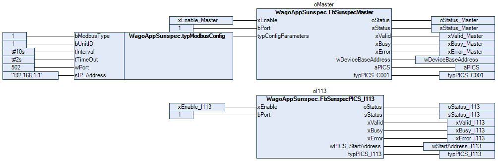 Modbus RTU 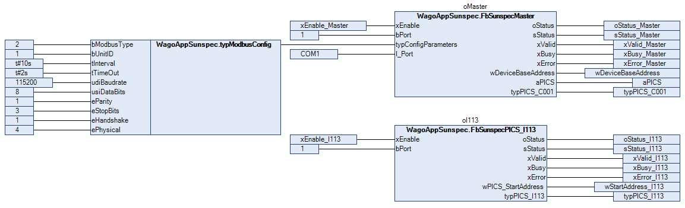

## doc03_UsefulInformation (FB)


The data points of the various PICS are sometimes not required by the Sunspec standard and are therefore not supported by every Sunspec device. This may cause some data points with the illogical values “65535” or “-32676”. This state is also to be expected for data points that are deactivated within the Sunspec device. More detailed information about the support and activation / deactivation of the individual data points must be taken from the manual of the Sunspec device. Write access can vary on Sunspec devices, causing write-access errors. Here, the configuration of the device should first be checked as to whether write accesses to the respective registers are permitted.

To analyze the error, check the output oStatus . The error codes are taken from the WagoAppPlcModbus . When evaluating the error, it should be noted that Sunspec devices are moved into a restricted mode while there is a low supply and the Modbus interface is then switched off.

The data points of the various PICS are sometimes not required by the Sunspec standard and are therefore not supported by every Sunspec device. This may cause some data points with the illogical values “65535” or “-32676”. This state is also to be expected for data points that are deactivated within the Sunspec device. More detailed information about the support and activation / deactivation of the individual data points must be taken from the manual of the Sunspec device. Write access can vary on Sunspec devices, causing write-access errors. Here, the configuration of the device should first be checked as to whether write accesses to the respective registers are permitted. To analyze the error, check the output oStatus . The error codes are taken from the WagoAppPlcModbus . When evaluating the error, it should be noted that Sunspec devices are moved into a restricted mode while there is a low supply and the Modbus interface is then switched off.

### Methods


## FbSunSpec_Model.M_Check_SunSpec_Model_Avail (METH)


| Scope | Name | Type |
| --- | --- | --- |
| Return | M_Check_SunSpec_Model_Avail | BOOL |
| Input | wModelnumber | WORD |

## FbSunSpec_Model.M_Close_MB_Job (METH)


| Scope | Name | Type |
| --- | --- | --- |
| Return | M_Close_MB_Job | BOOL |

## FbSunSpec_Model.M_Error_State (METH)


| Scope | Name | Type |
| --- | --- | --- |
| Return | M_Error_State | BOOL |

## FbSunSpec_Model.M_MB_Create_ReadJob (METH)


| Scope | Name | Type |
| --- | --- | --- |
| Return | M_MB_Create_ReadJob | BOOL |
| Input | uiReadAddress | UINT |
| uiReadQuantity | UINT |

## FbSunSpec_Model.M_MB_Create_WriteJob (METH)


| Scope | Name | Type |
| --- | --- | --- |
| Return | M_MB_Create_WriteJob | BOOL |
| Input | uiWriteAddress | UINT |
| uiWriteQuantity | UINT |

## FbSunspecMaster.M_Call_Modbus (METH)


| Scope | Name | Type |
| --- | --- | --- |
| Return | M_Call_Modbus | BOOL |

## FbSunspecPICS_DER701.A_ReadBlock_01_Cpy_Data (ACT) ¶


## FbSunspecPICS_DER701.A_ReadBlock_02_Cpy_Data (ACT) ¶


## FbSunspecPICS_DER702.A_ReadBlock_01_Cpy_Data (ACT) ¶


## FbSunspecPICS_DER702.A_WriteBlock_01_Cpy_Data (ACT)


## FbSunspecPICS_DER702.CheckWriteData (ACT)


———- Check for new write data ———-

———- Check for new write data ———-

## FbSunspecPICS_DER703.A_ReadBlock_01_Cpy_Data (ACT) ¶


## FbSunspecPICS_DER703.A_WriteBlock_01_Cpy_Data (ACT)


## FbSunspecPICS_DER703.CheckWriteData (ACT)


———- Check for new write data ———-

———- Check for new write data ———-

## FbSunspecPICS_DER704.A_ReadBlock_01_Cpy_Data (ACT) ¶


## FbSunspecPICS_DER704.A_WriteBlock_01_Cpy_Data (ACT)


## FbSunspecPICS_DER704.A_WriteBlock_02_Cpy_Data (ACT)


## FbSunspecPICS_DER704.A_WriteBlock_03_Cpy_Data (ACT)


## FbSunspecPICS_DER704.A_WriteBlock_04_Cpy_Data (ACT)


## FbSunspecPICS_DER704.A_WriteBlock_05_Cpy_Data (ACT)


## FbSunspecPICS_DER704.A_WriteBlock_06_Cpy_Data (ACT)


## FbSunspecPICS_DER704.A_WriteBlock_07_Cpy_Data (ACT)


## FbSunspecPICS_DER704.A_WriteBlock_Assign_Job (ACT) ¶


## FbSunspecPICS_DER704.CheckWriteData (ACT)


———- Check for new write data ———-

———- Check for new write data ———-

## FbSunspecPICS_DER705.A_ReadBlock_01_Cpy_Data (ACT) ¶


## FbSunspecPICS_DER705.A_WriteBlock_01_Cpy_Data (ACT)


## FbSunspecPICS_DER705.A_WriteBlock_02_Cpy_Data (ACT)


## FbSunspecPICS_DER705.A_WriteBlock_03_Cpy_Data (ACT)


## FbSunspecPICS_DER705.A_WriteBlock_04_Cpy_Array_Data_1 (ACT)


## FbSunspecPICS_DER705.A_WriteBlock_04_Cpy_Array_Data_2 (ACT)


## FbSunspecPICS_DER705.A_WriteBlock_04_Cpy_Array_Data_3 (ACT)


## FbSunspecPICS_DER705.A_WriteBlock_Assign_Job (ACT) ¶


## FbSunspecPICS_DER705.CheckWriteData (ACT)


———- Check for new write data ———-

———- Check for new write data ———-

## FbSunspecPICS_DER706.A_ReadBlock_01_Cpy_Data (ACT) ¶


## FbSunspecPICS_DER706.A_WriteBlock_01_Cpy_Data (ACT)


## FbSunspecPICS_DER706.A_WriteBlock_02_Cpy_Data (ACT)


## FbSunspecPICS_DER706.A_WriteBlock_03_Cpy_Data (ACT)


## FbSunspecPICS_DER706.A_WriteBlock_04_Cpy_Array_Data_1 (ACT)


## FbSunspecPICS_DER706.A_WriteBlock_04_Cpy_Array_Data_2 (ACT)


## FbSunspecPICS_DER706.A_WriteBlock_Assign_Job (ACT) ¶


## FbSunspecPICS_DER706.CheckWriteData (ACT)


———- Check for new write data ———-

———- Check for new write data ———-

## FbSunspecPICS_DER707.A_ReadBlock_01_Cpy_Data (ACT) ¶


## FbSunspecPICS_DER707.A_ReadBlock_02_Cpy_Data (ACT)


Copy curve_settings

## FbSunspecPICS_DER707.A_WriteBlock_01_Cpy_Data (ACT)


## FbSunspecPICS_DER707.A_WriteBlock_02_Cpy_Array_Data (ACT)


Must Trip Conditions

## FbSunspecPICS_DER707.A_WriteBlock_Assign_Job (ACT) ¶


## FbSunspecPICS_DER707.CheckWriteData (ACT)


———- Check for new write data ———-

———- Check for new write data ———-

## FbSunspecPICS_DER708.A_ReadBlock_01_Cpy_Data (ACT) ¶


## FbSunspecPICS_DER708.A_ReadBlock_02_Cpy_Data (ACT)


Copy curve_settings

## FbSunspecPICS_DER708.A_WriteBlock_01_Cpy_Data (ACT)


## FbSunspecPICS_DER708.A_WriteBlock_02_Cpy_Array_Data (ACT)


Must Trip Conditions

## FbSunspecPICS_DER708.A_WriteBlock_Assign_Job (ACT) ¶


## FbSunspecPICS_DER708.CheckWriteData (ACT)


———- Check for new write data ———-

———- Check for new write data ———-

## FbSunspecPICS_DER709.A_ReadBlock_01_Cpy_Data (ACT) ¶


## FbSunspecPICS_DER709.A_ReadBlock_02_Cpy_Data (ACT)


Copy curve_settings

## FbSunspecPICS_DER709.A_WriteBlock_01_Cpy_Data (ACT)


## FbSunspecPICS_DER709.A_WriteBlock_02_Cpy_Array_Data (ACT)


Must Trip Conditions

## FbSunspecPICS_DER709.A_WriteBlock_Assign_Job (ACT) ¶


## FbSunspecPICS_DER709.CheckWriteData (ACT)


———- Check for new write data ———-

———- Check for new write data ———-

## FbSunspecPICS_DER710.A_ReadBlock_01_Cpy_Data (ACT) ¶


## FbSunspecPICS_DER710.A_ReadBlock_02_Cpy_Data (ACT)


Copy curve_settings

## FbSunspecPICS_DER710.A_WriteBlock_01_Cpy_Data (ACT)


## FbSunspecPICS_DER710.A_WriteBlock_02_Cpy_Array_Data (ACT)


Must Trip Conditions

## FbSunspecPICS_DER710.A_WriteBlock_Assign_Job (ACT) ¶


## FbSunspecPICS_DER710.CheckWriteData (ACT)


———- Check for new write data ———-

———- Check for new write data ———-

## FbSunspecPICS_DER711.A_ReadBlock_01_Cpy_Data (ACT) ¶


## FbSunspecPICS_DER711.A_WriteBlock_01_Cpy_Data (ACT)


## FbSunspecPICS_DER711.A_WriteBlock_02_Cpy_Data (ACT)


## FbSunspecPICS_DER711.A_WriteBlock_03_Cpy_Data (ACT)


## FbSunspecPICS_DER711.A_WriteBlock_04_Cpy_Array_Data (ACT)


## FbSunspecPICS_DER711.A_WriteBlock_Assign_Job (ACT) ¶


## FbSunspecPICS_DER711.CheckWriteData (ACT)


———- Check for new write data ———-

———- Check for new write data ———-

## FbSunspecPICS_DER712.A_ReadBlock_01_Cpy_Data (ACT) ¶


## FbSunspecPICS_DER712.A_WriteBlock_01_Cpy_Data (ACT)


## FbSunspecPICS_DER712.A_WriteBlock_02_Cpy_Data (ACT)


## FbSunspecPICS_DER712.A_WriteBlock_03_Cpy_Data (ACT)


## FbSunspecPICS_DER712.A_WriteBlock_04_Cpy_Array_Data_1 (ACT)


## FbSunspecPICS_DER712.A_WriteBlock_04_Cpy_Array_Data_2 (ACT)


## FbSunspecPICS_DER712.A_WriteBlock_Assign_Job (ACT) ¶


## FbSunspecPICS_DER712.CheckWriteData (ACT)


———- Check for new write data ———-

———- Check for new write data ———-

## FbSunspecPICS_DER713.A_ReadBlock_01_Cpy_Data (ACT) ¶


## FbSunspecPICS_DER714.A_ReadBlock_01_Cpy_Data (ACT) ¶


## FbSunspecPICS_DER715.A_ReadBlock_01_Cpy_Data (ACT) ¶


## FbSunspecPICS_DER715.A_WriteBlock_01_Cpy_Data (ACT)


## FbSunspecPICS_DER715.CheckWriteData (ACT)


———- Check for new write data ———-

———- Check for new write data ———-

## FbSunspecPICS_IC121.CheckWriteData (ACT)


———- Check for new write data ———-

———- Check for new write data ———-

## FbSunspecPICS_IC123.CheckWriteData (ACT)


———- Check for new write data ———-

———- Check for new write data ———-

## FbSunspecPICS_IC124.CheckWriteData (ACT)


———- Check for new write data ———-

———- Check for new write data ———-

## FbSunspecPICS_IC125.CheckWriteData (ACT)


———- Check for new write data ———-

———- Check for new write data ———-

## FbSunspecPICS_IC127.CheckWriteData (ACT)


———- Check for new write data ———-

———- Check for new write data ———-

## FbSunspecPICS_IC128.CheckWriteData (ACT)


———- Check for new write data ———-

———- Check for new write data ———-

## FbSunspecPICS_S802.A_ReadBlock_01_Cpy_Data (ACT) ¶


## FbSunspecPICS_S802.A_WriteBlock_01_Cpy_Data (ACT) ¶


## FbSunspecPICS_S802.A_WriteBlock_02_Cpy_Data (ACT) ¶


## FbSunspecPICS_S802.A_WriteBlock_03_Cpy_Data (ACT) ¶


## FbSunspecPICS_S802.A_WriteBlock_Assign_Job (ACT) ¶


## FbSunspecPICS_S802.CheckWriteData (ACT)


———- Check for new write data ———-

———- Check for new write data ———-

## eChaGriSet (ENUM)


| Name | Initial | Comment |
| --- | --- | --- |
| NONE_eChaGriSet | -1 | None |
| PV_eChaGriSet | 0 | PV |
| GRID_eChaGriSet | 1 | Grid |

## eDERSet_Operation (ENUM)


| Name | Initial | Comment |
| --- | --- | --- |
| STOP_eDERSet_Operation | 0 | Stop the DER |
| START_eDERSet_Operation | 1 | Start the DER |
| ENTER_STANDBY_eDERSet_Operation | 2 | Enter Standby Mode |
| EXIT_STANDBY_eDERSet_Operation | 3 | Exit Standby Mode |

## eOutPFSet_Ena (ENUM)


| Name | Initial | Comment |
| --- | --- | --- |
| DISABLED_eOutPFSet_Ena | 0 | Disabled |
| ENABLED_eOutPFSet_Ena | 1 | Enabled |

## eReadOnly (ENUM)


| Name | Initial | Comment |
| --- | --- | --- |
| READWRITE_eReadOnly | 0 | ReadWrite |
| READONLY_eReadOnly | 1 | ReadOnly |

## eSetActiveCtrl_Result (ENUM)


| Name | Initial | Comment |
| --- | --- | --- |
| IN_PROGRESS_eSetActiveCtrl_Result | 0 | Control update in progress. |
| COMPLETED_eSetActiveCtrl_Result | 1 | Control update completed successfully. |
| FAILED_eSetActiveCtrl_Result | 2 | Control update failed. |

## eSetActivePower_Mode (ENUM)


| Name | Initial | Comment |
| --- | --- | --- |
| W_MAX_PCT_eSetActivePower_Mode | 0 | Active power setting is percentage of maximum active power. |
| WATTS_eSetActivePower_Mode | 1 | Active power setting is in watts. |

## eSetInvState (ENUM)


| Name | Initial | Comment |
| --- | --- | --- |
| INVERTER_STOPPED_eSetInvState | 1 | Inverter stopped |
| INVERTER_STANDBY_eSetInvState | 2 | Inverter standby |
| INVERTER_STARTED_eSetInvState | 3 | Inverter started |

## eSetOp (ENUM)


| Name | Initial | Comment |
| --- | --- | --- |
| CONNECT_eSetOp | 1 | Connect |
| DISCONNECT_eSetOp | 2 | Disconnect |

## eSetReactivePower_Mode (ENUM)


| Name | Initial | Comment |
| --- | --- | --- |
| W_MAX_PCT_eSetReactivePower_Mode | 0 | Reactive power setting is percent of maximum active power. |
| VAR_MAX_PCT_eSetReactivePower_Mode | 1 | Reactive power setting is percent of maximum reactive power. |
| VAR_AVAIL_PCT_eSetReactivePower_Mode | 2 | Reactive power setting is percent of available reactive power. |
| VARS_eSetReactivePower_Mode | 3 | Reactive power is in vars. |

## typStSetLimMsk (STRUCT)


| Name | Type | Comment |
| --- | --- | --- |
| xWMax | BOOL | W max |
| xVAMax | BOOL | VA max |
| xVArAval | BOOL | VAr aval |
| xVArMaxQ1 | BOOL | VAr max Q1 |
| xVArMaxQ2 | BOOL | VAr max Q2 |
| xVArMaxQ3 | BOOL | VAr max Q3 |
| xVArMaxQ4 | BOOL | VAr max Q4 |
| xPFMinQ1 | BOOL | PF min Q1 |
| xPFMinQ2 | BOOL | PF min Q2 |
| xPFMinQ3 | BOOL | PF min Q3 |
| xPFMinQ4 | BOOL | PF min Q4 |

### Program Organization


## 20 Program Organization Units


- 01 Master FbSunspecMaster (FB) FbSunspecMaster.M_Call_Modbus (METH) 02 Network Configuration Model - FbSunspecPICS_NC010 (FB) - FbSunspecPICS_NC011 (FB) - FbSunspecPICS_NC012 (FB) - FbSunspecPICS_NC013 (FB) - FbSunspecPICS_NC014 (FB) - FbSunspecPICS_NC015 (FB) - FbSunspecPICS_NC016 (FB) - FbSunspecPICS_NC017 (FB) - FbSunspecPICS_NC018 (FB) - FbSunspecPICS_NC019 (FB) 03 Inverter Model - FbSunspecPICS_I101 (FB) - FbSunspecPICS_I102 (FB) - FbSunspecPICS_I103 (FB) - FbSunspecPICS_I111 (FB) - FbSunspecPICS_I112 (FB) - FbSunspecPICS_I113 (FB) - FbSunspecPICS_I160 (FB) 04 Inverter Control Model - FbSunspecPICS_IC120 (FB) - FbSunspecPICS_IC121 (FB) FbSunspecPICS_IC121.CheckWriteData (ACT) FbSunspecPICS_IC122 (FB) FbSunspecPICS_IC123 (FB) - FbSunspecPICS_IC123.CheckWriteData (ACT) FbSunspecPICS_IC124 (FB) - FbSunspecPICS_IC124.CheckWriteData (ACT) FbSunspecPICS_IC125 (FB) - FbSunspecPICS_IC125.CheckWriteData (ACT) FbSunspecPICS_IC126 (FB) FbSunspecPICS_IC127 (FB) - FbSunspecPICS_IC127.CheckWriteData (ACT) FbSunspecPICS_IC128 (FB) - FbSunspecPICS_IC128.CheckWriteData (ACT) FbSunspecPICS_IC129 (FB) FbSunspecPICS_IC130 (FB) FbSunspecPICS_IC131 (FB) FbSunspecPICS_IC132 (FB) FbSunspecPICS_IC133 (FB) FbSunspecPICS_IC134 (FB) FbSunspecPICS_IC135 (FB) FbSunspecPICS_IC136 (FB) FbSunspecPICS_IC137 (FB) FbSunspecPICS_IC138 (FB) FbSunspecPICS_IC139 (FB) FbSunspecPICS_IC140 (FB) FbSunspecPICS_IC141 (FB) FbSunspecPICS_IC142 (FB) FbSunspecPICS_IC143 (FB) FbSunspecPICS_IC144 (FB) FbSunspecPICS_IC145 (FB) 05 Meter Model - FbSunspecPICS_M201 (FB) - FbSunspecPICS_M202 (FB) - FbSunspecPICS_M203 (FB) - FbSunspecPICS_M204 (FB) - FbSunspecPICS_M211 (FB) - FbSunspecPICS_M212 (FB) - FbSunspecPICS_M213 (FB) - FbSunspecPICS_M214 (FB) 06 Environmental Model - FbSunspecPICS_E302 (FB) - FbSunspecPICS_E303 (FB) - FbSunspecPICS_E304 (FB) - FbSunspecPICS_E305 (FB) - FbSunspecPICS_E306 (FB) - FbSunspecPICS_E307 (FB) - FbSunspecPICS_E308 (FB) 07 String Combiner Model - FbSunspecPICS_SC401 (FB) - FbSunspecPICS_SC402 (FB) - FbSunspecPICS_SC403 (FB) - FbSunspecPICS_SC404 (FB) 08 DER Information Model - FbSunSpec_Model (FB) FbSunSpec_Model.M_Check_SunSpec_Model_Avail (METH) - FbSunSpec_Model.M_Close_MB_Job (METH) - FbSunSpec_Model.M_Error_State (METH) - FbSunSpec_Model.M_MB_Create_ReadJob (METH) - FbSunSpec_Model.M_MB_Create_WriteJob (METH) FbSunspecPICS_DER701 (FB) - FbSunspecPICS_DER701.A_ReadBlock_01_Cpy_Data (ACT) - FbSunspecPICS_DER701.A_ReadBlock_02_Cpy_Data (ACT) FbSunspecPICS_DER702 (FB) - FbSunspecPICS_DER702.A_ReadBlock_01_Cpy_Data (ACT) - FbSunspecPICS_DER702.A_WriteBlock_01_Cpy_Data (ACT) - FbSunspecPICS_DER702.CheckWriteData (ACT) FbSunspecPICS_DER703 (FB) - FbSunspecPICS_DER703.A_ReadBlock_01_Cpy_Data (ACT) - FbSunspecPICS_DER703.A_WriteBlock_01_Cpy_Data (ACT) - FbSunspecPICS_DER703.CheckWriteData (ACT) FbSunspecPICS_DER704 (FB) - FbSunspecPICS_DER704.A_ReadBlock_01_Cpy_Data (ACT) - FbSunspecPICS_DER704.A_WriteBlock_01_Cpy_Data (ACT) - FbSunspecPICS_DER704.A_WriteBlock_02_Cpy_Data (ACT) - FbSunspecPICS_DER704.A_WriteBlock_03_Cpy_Data (ACT) - FbSunspecPICS_DER704.A_WriteBlock_04_Cpy_Data (ACT) - FbSunspecPICS_DER704.A_WriteBlock_05_Cpy_Data (ACT) - FbSunspecPICS_DER704.A_WriteBlock_06_Cpy_Data (ACT) - FbSunspecPICS_DER704.A_WriteBlock_07_Cpy_Data (ACT) - FbSunspecPICS_DER704.A_WriteBlock_Assign_Job (ACT) - FbSunspecPICS_DER704.CheckWriteData (ACT) FbSunspecPICS_DER705 (FB) - FbSunspecPICS_DER705.A_ReadBlock_01_Cpy_Data (ACT) - FbSunspecPICS_DER705.A_WriteBlock_01_Cpy_Data (ACT) - FbSunspecPICS_DER705.A_WriteBlock_02_Cpy_Data (ACT) - FbSunspecPICS_DER705.A_WriteBlock_03_Cpy_Data (ACT) - FbSunspecPICS_DER705.A_WriteBlock_04_Cpy_Array_Data_1 (ACT) - FbSunspecPICS_DER705.A_WriteBlock_04_Cpy_Array_Data_2 (ACT) - FbSunspecPICS_DER705.A_WriteBlock_04_Cpy_Array_Data_3 (ACT) - FbSunspecPICS_DER705.A_WriteBlock_Assign_Job (ACT) - FbSunspecPICS_DER705.CheckWriteData (ACT) FbSunspecPICS_DER706 (FB) - FbSunspecPICS_DER706.A_ReadBlock_01_Cpy_Data (ACT) - FbSunspecPICS_DER706.A_WriteBlock_01_Cpy_Data (ACT) - FbSunspecPICS_DER706.A_WriteBlock_02_Cpy_Data (ACT) - FbSunspecPICS_DER706.A_WriteBlock_03_Cpy_Data (ACT) - FbSunspecPICS_DER706.A_WriteBlock_04_Cpy_Array_Data_1 (ACT) - FbSunspecPICS_DER706.A_WriteBlock_04_Cpy_Array_Data_2 (ACT) - FbSunspecPICS_DER706.A_WriteBlock_Assign_Job (ACT) - FbSunspecPICS_DER706.CheckWriteData (ACT) FbSunspecPICS_DER707 (FB) - FbSunspecPICS_DER707.A_ReadBlock_01_Cpy_Data (ACT) - FbSunspecPICS_DER707.A_ReadBlock_02_Cpy_Data (ACT) - FbSunspecPICS_DER707.A_WriteBlock_01_Cpy_Data (ACT) - FbSunspecPICS_DER707.A_WriteBlock_02_Cpy_Array_Data (ACT) - FbSunspecPICS_DER707.A_WriteBlock_Assign_Job (ACT) - FbSunspecPICS_DER707.CheckWriteData (ACT) FbSunspecPICS_DER708 (FB) - FbSunspecPICS_DER708.A_ReadBlock_01_Cpy_Data (ACT) - FbSunspecPICS_DER708.A_ReadBlock_02_Cpy_Data (ACT) - FbSunspecPICS_DER708.A_WriteBlock_01_Cpy_Data (ACT) - FbSunspecPICS_DER708.A_WriteBlock_02_Cpy_Array_Data (ACT) - FbSunspecPICS_DER708.A_WriteBlock_Assign_Job (ACT) - FbSunspecPICS_DER708.CheckWriteData (ACT) FbSunspecPICS_DER709 (FB) - FbSunspecPICS_DER709.A_ReadBlock_01_Cpy_Data (ACT) - FbSunspecPICS_DER709.A_ReadBlock_02_Cpy_Data (ACT) - FbSunspecPICS_DER709.A_WriteBlock_01_Cpy_Data (ACT) - FbSunspecPICS_DER709.A_WriteBlock_02_Cpy_Array_Data (ACT) - FbSunspecPICS_DER709.A_WriteBlock_Assign_Job (ACT) - FbSunspecPICS_DER709.CheckWriteData (ACT) FbSunspecPICS_DER710 (FB) - FbSunspecPICS_DER710.A_ReadBlock_01_Cpy_Data (ACT) - FbSunspecPICS_DER710.A_ReadBlock_02_Cpy_Data (ACT) - FbSunspecPICS_DER710.A_WriteBlock_01_Cpy_Data (ACT) - FbSunspecPICS_DER710.A_WriteBlock_02_Cpy_Array_Data (ACT) - FbSunspecPICS_DER710.A_WriteBlock_Assign_Job (ACT) - FbSunspecPICS_DER710.CheckWriteData (ACT) FbSunspecPICS_DER711 (FB) - FbSunspecPICS_DER711.A_ReadBlock_01_Cpy_Data (ACT) - FbSunspecPICS_DER711.A_WriteBlock_01_Cpy_Data (ACT) - FbSunspecPICS_DER711.A_WriteBlock_02_Cpy_Data (ACT) - FbSunspecPICS_DER711.A_WriteBlock_03_Cpy_Data (ACT) - FbSunspecPICS_DER711.A_WriteBlock_04_Cpy_Array_Data (ACT) - FbSunspecPICS_DER711.A_WriteBlock_Assign_Job (ACT) - FbSunspecPICS_DER711.CheckWriteData (ACT) FbSunspecPICS_DER712 (FB) - FbSunspecPICS_DER712.A_ReadBlock_01_Cpy_Data (ACT) - FbSunspecPICS_DER712.A_WriteBlock_01_Cpy_Data (ACT) - FbSunspecPICS_DER712.A_WriteBlock_02_Cpy_Data (ACT) - FbSunspecPICS_DER712.A_WriteBlock_03_Cpy_Data (ACT) - FbSunspecPICS_DER712.A_WriteBlock_04_Cpy_Array_Data_1 (ACT) - FbSunspecPICS_DER712.A_WriteBlock_04_Cpy_Array_Data_2 (ACT) - FbSunspecPICS_DER712.A_WriteBlock_Assign_Job (ACT) - FbSunspecPICS_DER712.CheckWriteData (ACT) FbSunspecPICS_DER713 (FB) - FbSunspecPICS_DER713.A_ReadBlock_01_Cpy_Data (ACT) FbSunspecPICS_DER714 (FB) - FbSunspecPICS_DER714.A_ReadBlock_01_Cpy_Data (ACT) FbSunspecPICS_DER715 (FB) - FbSunspecPICS_DER715.A_ReadBlock_01_Cpy_Data (ACT) - FbSunspecPICS_DER715.A_WriteBlock_01_Cpy_Data (ACT) - FbSunspecPICS_DER715.CheckWriteData (ACT) 09 Storage Model - FbSunspecPICS_S802 (FB) FbSunspecPICS_S802.A_ReadBlock_01_Cpy_Data (ACT) - FbSunspecPICS_S802.A_WriteBlock_01_Cpy_Data (ACT) - FbSunspecPICS_S802.A_WriteBlock_02_Cpy_Data (ACT) - FbSunspecPICS_S802.A_WriteBlock_03_Cpy_Data (ACT) - FbSunspecPICS_S802.A_WriteBlock_Assign_Job (ACT) - FbSunspecPICS_S802.CheckWriteData (ACT) 80 Data Types - 01 Master typModbusConfig (STRUCT) - typPICS_C001 (STRUCT) 02 Network Configuration Model - typPICS_NC010 (STRUCT) - typPICS_NC011 (STRUCT) - typPICS_NC012 (STRUCT) - typPICS_NC013 (STRUCT) - typPICS_NC014 (STRUCT) - typPICS_NC015 (STRUCT) - typPICS_NC016 (STRUCT) - typPICS_NC017 (STRUCT) - typPICS_NC018 (STRUCT) - typPICS_NC019 (STRUCT) 03 Inverter Model - typPICS_I101 (STRUCT) - typPICS_I102 (STRUCT) - typPICS_I103 (STRUCT) - typPICS_I111 (STRUCT) - typPICS_I112 (STRUCT) - typPICS_I113 (STRUCT) - typPICS_I160 (STRUCT) - typPICS_I160_Block (STRUCT) 04 Inverter Control Model - typPICS_IC120 (STRUCT) - typPICS_IC121 (STRUCT) - typPICS_IC122 (STRUCT) - typPICS_IC123 (STRUCT) - typPICS_IC124 (STRUCT) - typPICS_IC125 (STRUCT) - typPICS_IC126 (STRUCT) - typPICS_IC126_Block (STRUCT) - typPICS_IC127 (STRUCT) - typPICS_IC128 (STRUCT) - typPICS_IC129 (STRUCT) - typPICS_IC129_Block (STRUCT) - typPICS_IC130 (STRUCT) - typPICS_IC130_Block (STRUCT) - typPICS_IC131 (STRUCT) - typPICS_IC131_Block (STRUCT) - typPICS_IC132 (STRUCT) - typPICS_IC132_Block (STRUCT) - typPICS_IC133 (STRUCT) - typPICS_IC133_Block (STRUCT) - typPICS_IC134 (STRUCT) - typPICS_IC134_Block (STRUCT) - typPICS_IC135 (STRUCT) - typPICS_IC135_Block (STRUCT) - typPICS_IC136 (STRUCT) - typPICS_IC136_Block (STRUCT) - typPICS_IC137 (STRUCT) - typPICS_IC137_Block (STRUCT) - typPICS_IC138 (STRUCT) - typPICS_IC138_Block (STRUCT) - typPICS_IC139 (STRUCT) - typPICS_IC139_Block (STRUCT) - typPICS_IC140 (STRUCT) - typPICS_IC140_Block (STRUCT) - typPICS_IC141 (STRUCT) - typPICS_IC141_Block (STRUCT) - typPICS_IC142 (STRUCT) - typPICS_IC142_Block (STRUCT) - typPICS_IC143 (STRUCT) - typPICS_IC143_Block (STRUCT) - typPICS_IC144 (STRUCT) - typPICS_IC144_Block (STRUCT) - typPICS_IC145 (STRUCT) 05 Meter Model - typPICS_M201 (STRUCT) - typPICS_M202 (STRUCT) - typPICS_M203 (STRUCT) - typPICS_M204 (STRUCT) - typPICS_M211 (STRUCT) - typPICS_M212 (STRUCT) - typPICS_M213 (STRUCT) - typPICS_M214 (STRUCT) 06 Environmental Model - typPICS_E302 (STRUCT) - typPICS_E303 (STRUCT) - typPICS_E303_Block (STRUCT) - typPICS_E304 (STRUCT) - typPICS_E304_Block (STRUCT) - typPICS_E305 (STRUCT) - typPICS_E306 (STRUCT) - typPICS_E307 (STRUCT) - typPICS_E308 (STRUCT) 07 String Combiner Model - typPICS_SC401 (STRUCT) - typPICS_SC401_Block (STRUCT) - typPICS_SC402 (STRUCT) - typPICS_SC402_Block (STRUCT) - typPICS_SC403 (STRUCT) - typPICS_SC403_Block (STRUCT) - typPICS_SC404 (STRUCT) - typPICS_SC404_Block (STRUCT) 08 DER Information Model - typPICS_DER701 (STRUCT) - typPICS_DER702 (STRUCT) - typPICS_DER703 (STRUCT) - typPICS_DER704 (STRUCT) - typPICS_DER705 (STRUCT) - typPICS_DER705_VoltVar_Curves (STRUCT) - typPICS_DER706 (STRUCT) - typPICS_DER706_VoltWatt_Curves (STRUCT) - typPICS_DER707 (STRUCT) - typPICS_DER707_708_Volt_TripCondition (STRUCT) - typPICS_DER708 (STRUCT) - typPICS_DER709 (STRUCT) - typPICS_DER709_710_Freq_TripCondition (STRUCT) - typPICS_DER710 (STRUCT) - typPICS_DER711 (STRUCT) - typPICS_DER711_FreqDroop_Curves (STRUCT) - typPICS_DER712 (STRUCT) - typPICS_DER712_WattVar_Curves (STRUCT) - typPICS_DER713 (STRUCT) - typPICS_DER714 (STRUCT) - typPICS_DER714_Ports (STRUCT) - typPICS_DER715 (STRUCT) - typPICS_DER7xx_FreqTime_CrvPt (STRUCT) - typPICS_DER7xx_VoltTime_CrvPt (STRUCT) - typPICS_DER7xx_VoltVar_CrvPt (STRUCT) - typPICS_DER7xx_VoltWatt_CrvPt (STRUCT) - typPICS_DER7xx_WattVar_CrvPt (STRUCT) 09 Storage Model - typPICS_S802 (STRUCT) 80 Enumerations - 08 DER Information Model eACWiringTYPE (ENUM) - eAbnormalOperatingCat (ENUM) - eDCPort_Status (ENUM) - eDER705_PowerPriority (ENUM) - eDER712_PowerPriority (ENUM) - eDER7xx_AdoptCurve_Result (ENUM) - eDER7xx_ControlAccess (ENUM) - eDER7xx_Enable (ENUM) - eDER7xx_Exitation (ENUM) - eDERControl_Mode (ENUM) - eDERSet_Operation (ENUM) - eGridConnState (ENUM) - eInvState (ENUM) - eNormalOperatingCat (ENUM) - eNormal_RampRate_Ref (ENUM) - eOpState (ENUM) - ePort_Type (ENUM) - eReactivePower_Priority (ENUM) - eSetActivePower_Mode (ENUM) - eSetReactivePower_Mode (ENUM) - eStorageStatus (ENUM) - eVoltVarDependentReference (ENUM) - eVoltWattDependentReference (ENUM) - eWattVarDependentReference (ENUM) eArGraMod (ENUM) eAuthentication (ENUM) eChaGriSet (ENUM) eChaSt (ENUM) eClcTotVA (ENUM) eConfig (ENUM) eConfigStatus (ENUM) eConn (ENUM) eConnPh (ENUM) eControl (ENUM) eCrvType (ENUM) eDERTyp (ENUM) eDeptRef (ENUM) eDuplex (ENUM) eFlowControl (ENUM) eIPv4_Config (ENUM) eIPv6_Config (ENUM) eInterfaceStatus (ENUM) eInterfaceType (ENUM) eLinkState (ENUM) eLocRemCtl (ENUM) eOutPFSet_Ena (ENUM) ePICS (ENUM) eParity (ENUM) ePhysicalAccessType (ENUM) eProtocol (ENUM) eReadOnly (ENUM) eReqInvState (ENUM) eSchdTyp (ENUM) eSetActiveCtrl_Result (ENUM) eSetInvState (ENUM) eSetOp (ENUM) eSigType (ENUM) eSt (ENUM) eState (ENUM) eTyp (ENUM) eVArAct (ENUM) eVArPct_Ena (ENUM) eVArPct_Mod (ENUM) eWMaxLim_Ena (ENUM) eXTyp (ENUM) eYTyp (ENUM) 90 Bitmasks - 08 DER Information Model typDCPort_Alarm (STRUCT) - typDERAlrm (STRUCT) - typDERMode (STRUCT) - typIntentionalIslandCat (STRUCT) - typSupportedCtrlModes (STRUCT) - typThrotSrc (STRUCT) typActSchd (STRUCT) typCap (STRUCT) typCapProxy (STRUCT) typCfgSt (STRUCT) typChgSt (STRUCT) typCtl (STRUCT) typDCEvt (STRUCT) typECPConn (STRUCT) typEvt (STRUCT) typEvt1 (STRUCT) typEvt1_1 (STRUCT) typEvtMeter (STRUCT) typEvtSC (STRUCT) typEvtVnd (STRUCT) typLnkCtl (STRUCT) typModEna (STRUCT) typPVConn (STRUCT) typRtSt (STRUCT) typStActCtl (STRUCT) typStSetLimMsk (STRUCT) typStorConn (STRUCT) typStorCtl_Mod (STRUCT)

### Internal Components


## 90 Internal ¶


### Global Variable Lists


## GlobalVariables (GVL)


| Name | Type |
| --- | --- |
| g_SUNSPEC | ARRAY [1..ParameterList.MAX_INTERFACES] OF typSunspec |
| g_xTokenModbusRTU | BOOL |

## VersionHistory (GVL)


| Name | Type |
| --- | --- |
| Info | ProjectInfo |

| date | version | author | change |
| 26.02.2024 | 1.0.1.12 | U010663 | Compiled SP16.3 |
| 11.12.2023 | 1.0.1.11 | U0126495 | Bugfix: Some values of DER701, DER704, DER706, DER712, DER714 and S802 were incorrect, if the corresponding scalingfator is ‘0’Bugfix: Some values of DER701, DER704, DER706, DER712, DER714 and S802 were incorrect, if the corresponding scalingfator is ‘0’ |
| 06.12.2023 | 1.0.1.10 | U0126495 | [WAT_36231] FbSunspecPICS_M213: Datatypes for metering adjusted (now a Real is used, prefix changed from “dw..” to “r..”) |
| 06.12.2023 |  |  | [WAT_36231] FbSunspecPICS_I160: Internal scaling for V, P and Energy-based values implemented |
| 06.10.2023 | 1.0.1.9 | U0126495 | Model S802 added |
| 05.10.2023 | 1.0.1.8 | U0126495 | DER70x-models optimized (write-speed..) |
| 04.09.2023 | 1.0.1.4 | U0126495 | DER70x-Series added |
| 14.08.2023 | 1.0.1.1 | U0126495 | Global pointer size changed from 32Bit to 32&64Bit |
| 27.07.2023 | 1.0.1.0 | U0126495 | Lib released for CDS |
| 26.11.2021 | 1.0.0.1 | U014702 | Bugfix write INT values |
| 11.05.2021 | 1.0.0.0 | U014702 | Release Version |

WagoAppSunspec.library

Description: This library provides communication to an inverter module via the open communication standard Sunspec

WagoAppSunspec.library Description: This library provides communication to an inverter module via the open communication standard Sunspec

### Other Components


## 01 Master


- typModbusConfig (STRUCT) - typPICS_C001 (STRUCT)

## 01 Master


- FbSunspecMaster (FB) FbSunspecMaster.M_Call_Modbus (METH)

## 02 Network Configuration Model


- FbSunspecPICS_NC010 (FB) - FbSunspecPICS_NC011 (FB) - FbSunspecPICS_NC012 (FB) - FbSunspecPICS_NC013 (FB) - FbSunspecPICS_NC014 (FB) - FbSunspecPICS_NC015 (FB) - FbSunspecPICS_NC016 (FB) - FbSunspecPICS_NC017 (FB) - FbSunspecPICS_NC018 (FB) - FbSunspecPICS_NC019 (FB)

## 02 Network Configuration Model


- typPICS_NC010 (STRUCT) - typPICS_NC011 (STRUCT) - typPICS_NC012 (STRUCT) - typPICS_NC013 (STRUCT) - typPICS_NC014 (STRUCT) - typPICS_NC015 (STRUCT) - typPICS_NC016 (STRUCT) - typPICS_NC017 (STRUCT) - typPICS_NC018 (STRUCT) - typPICS_NC019 (STRUCT)

## 03 Inverter Model


- typPICS_I101 (STRUCT) - typPICS_I102 (STRUCT) - typPICS_I103 (STRUCT) - typPICS_I111 (STRUCT) - typPICS_I112 (STRUCT) - typPICS_I113 (STRUCT) - typPICS_I160 (STRUCT) - typPICS_I160_Block (STRUCT)

## 03 Inverter Model


- FbSunspecPICS_I101 (FB) - FbSunspecPICS_I102 (FB) - FbSunspecPICS_I103 (FB) - FbSunspecPICS_I111 (FB) - FbSunspecPICS_I112 (FB) - FbSunspecPICS_I113 (FB) - FbSunspecPICS_I160 (FB)

## 04 Inverter Control Model


- FbSunspecPICS_IC120 (FB) - FbSunspecPICS_IC121 (FB) FbSunspecPICS_IC121.CheckWriteData (ACT) FbSunspecPICS_IC122 (FB) FbSunspecPICS_IC123 (FB) - FbSunspecPICS_IC123.CheckWriteData (ACT) FbSunspecPICS_IC124 (FB) - FbSunspecPICS_IC124.CheckWriteData (ACT) FbSunspecPICS_IC125 (FB) - FbSunspecPICS_IC125.CheckWriteData (ACT) FbSunspecPICS_IC126 (FB) FbSunspecPICS_IC127 (FB) - FbSunspecPICS_IC127.CheckWriteData (ACT) FbSunspecPICS_IC128 (FB) - FbSunspecPICS_IC128.CheckWriteData (ACT) FbSunspecPICS_IC129 (FB) FbSunspecPICS_IC130 (FB) FbSunspecPICS_IC131 (FB) FbSunspecPICS_IC132 (FB) FbSunspecPICS_IC133 (FB) FbSunspecPICS_IC134 (FB) FbSunspecPICS_IC135 (FB) FbSunspecPICS_IC136 (FB) FbSunspecPICS_IC137 (FB) FbSunspecPICS_IC138 (FB) FbSunspecPICS_IC139 (FB) FbSunspecPICS_IC140 (FB) FbSunspecPICS_IC141 (FB) FbSunspecPICS_IC142 (FB) FbSunspecPICS_IC143 (FB) FbSunspecPICS_IC144 (FB) FbSunspecPICS_IC145 (FB)

## 04 Inverter Control Model


- typPICS_IC120 (STRUCT) - typPICS_IC121 (STRUCT) - typPICS_IC122 (STRUCT) - typPICS_IC123 (STRUCT) - typPICS_IC124 (STRUCT) - typPICS_IC125 (STRUCT) - typPICS_IC126 (STRUCT) - typPICS_IC126_Block (STRUCT) - typPICS_IC127 (STRUCT) - typPICS_IC128 (STRUCT) - typPICS_IC129 (STRUCT) - typPICS_IC129_Block (STRUCT) - typPICS_IC130 (STRUCT) - typPICS_IC130_Block (STRUCT) - typPICS_IC131 (STRUCT) - typPICS_IC131_Block (STRUCT) - typPICS_IC132 (STRUCT) - typPICS_IC132_Block (STRUCT) - typPICS_IC133 (STRUCT) - typPICS_IC133_Block (STRUCT) - typPICS_IC134 (STRUCT) - typPICS_IC134_Block (STRUCT) - typPICS_IC135 (STRUCT) - typPICS_IC135_Block (STRUCT) - typPICS_IC136 (STRUCT) - typPICS_IC136_Block (STRUCT) - typPICS_IC137 (STRUCT) - typPICS_IC137_Block (STRUCT) - typPICS_IC138 (STRUCT) - typPICS_IC138_Block (STRUCT) - typPICS_IC139 (STRUCT) - typPICS_IC139_Block (STRUCT) - typPICS_IC140 (STRUCT) - typPICS_IC140_Block (STRUCT) - typPICS_IC141 (STRUCT) - typPICS_IC141_Block (STRUCT) - typPICS_IC142 (STRUCT) - typPICS_IC142_Block (STRUCT) - typPICS_IC143 (STRUCT) - typPICS_IC143_Block (STRUCT) - typPICS_IC144 (STRUCT) - typPICS_IC144_Block (STRUCT) - typPICS_IC145 (STRUCT)

## 05 Meter Model


- FbSunspecPICS_M201 (FB) - FbSunspecPICS_M202 (FB) - FbSunspecPICS_M203 (FB) - FbSunspecPICS_M204 (FB) - FbSunspecPICS_M211 (FB) - FbSunspecPICS_M212 (FB) - FbSunspecPICS_M213 (FB) - FbSunspecPICS_M214 (FB)

## 05 Meter Model


- typPICS_M201 (STRUCT) - typPICS_M202 (STRUCT) - typPICS_M203 (STRUCT) - typPICS_M204 (STRUCT) - typPICS_M211 (STRUCT) - typPICS_M212 (STRUCT) - typPICS_M213 (STRUCT) - typPICS_M214 (STRUCT)

## 06 Environmental Model


- typPICS_E302 (STRUCT) - typPICS_E303 (STRUCT) - typPICS_E303_Block (STRUCT) - typPICS_E304 (STRUCT) - typPICS_E304_Block (STRUCT) - typPICS_E305 (STRUCT) - typPICS_E306 (STRUCT) - typPICS_E307 (STRUCT) - typPICS_E308 (STRUCT)

## 06 Environmental Model


- FbSunspecPICS_E302 (FB) - FbSunspecPICS_E303 (FB) - FbSunspecPICS_E304 (FB) - FbSunspecPICS_E305 (FB) - FbSunspecPICS_E306 (FB) - FbSunspecPICS_E307 (FB) - FbSunspecPICS_E308 (FB)

## 07 String Combiner Model


- typPICS_SC401 (STRUCT) - typPICS_SC401_Block (STRUCT) - typPICS_SC402 (STRUCT) - typPICS_SC402_Block (STRUCT) - typPICS_SC403 (STRUCT) - typPICS_SC403_Block (STRUCT) - typPICS_SC404 (STRUCT) - typPICS_SC404_Block (STRUCT)

## 07 String Combiner Model


- FbSunspecPICS_SC401 (FB) - FbSunspecPICS_SC402 (FB) - FbSunspecPICS_SC403 (FB) - FbSunspecPICS_SC404 (FB)

## 08 DER Information Model


- typDCPort_Alarm (STRUCT) - typDERAlrm (STRUCT) - typDERMode (STRUCT) - typIntentionalIslandCat (STRUCT) - typSupportedCtrlModes (STRUCT) - typThrotSrc (STRUCT)

## 08 DER Information Model


- typPICS_DER701 (STRUCT) - typPICS_DER702 (STRUCT) - typPICS_DER703 (STRUCT) - typPICS_DER704 (STRUCT) - typPICS_DER705 (STRUCT) - typPICS_DER705_VoltVar_Curves (STRUCT) - typPICS_DER706 (STRUCT) - typPICS_DER706_VoltWatt_Curves (STRUCT) - typPICS_DER707 (STRUCT) - typPICS_DER707_708_Volt_TripCondition (STRUCT) - typPICS_DER708 (STRUCT) - typPICS_DER709 (STRUCT) - typPICS_DER709_710_Freq_TripCondition (STRUCT) - typPICS_DER710 (STRUCT) - typPICS_DER711 (STRUCT) - typPICS_DER711_FreqDroop_Curves (STRUCT) - typPICS_DER712 (STRUCT) - typPICS_DER712_WattVar_Curves (STRUCT) - typPICS_DER713 (STRUCT) - typPICS_DER714 (STRUCT) - typPICS_DER714_Ports (STRUCT) - typPICS_DER715 (STRUCT) - typPICS_DER7xx_FreqTime_CrvPt (STRUCT) - typPICS_DER7xx_VoltTime_CrvPt (STRUCT) - typPICS_DER7xx_VoltVar_CrvPt (STRUCT) - typPICS_DER7xx_VoltWatt_CrvPt (STRUCT) - typPICS_DER7xx_WattVar_CrvPt (STRUCT)

## 08 DER Information Model


- FbSunSpec_Model (FB) FbSunSpec_Model.M_Check_SunSpec_Model_Avail (METH) - FbSunSpec_Model.M_Close_MB_Job (METH) - FbSunSpec_Model.M_Error_State (METH) - FbSunSpec_Model.M_MB_Create_ReadJob (METH) - FbSunSpec_Model.M_MB_Create_WriteJob (METH) FbSunspecPICS_DER701 (FB) - FbSunspecPICS_DER701.A_ReadBlock_01_Cpy_Data (ACT) - FbSunspecPICS_DER701.A_ReadBlock_02_Cpy_Data (ACT) FbSunspecPICS_DER702 (FB) - FbSunspecPICS_DER702.A_ReadBlock_01_Cpy_Data (ACT) - FbSunspecPICS_DER702.A_WriteBlock_01_Cpy_Data (ACT) - FbSunspecPICS_DER702.CheckWriteData (ACT) FbSunspecPICS_DER703 (FB) - FbSunspecPICS_DER703.A_ReadBlock_01_Cpy_Data (ACT) - FbSunspecPICS_DER703.A_WriteBlock_01_Cpy_Data (ACT) - FbSunspecPICS_DER703.CheckWriteData (ACT) FbSunspecPICS_DER704 (FB) - FbSunspecPICS_DER704.A_ReadBlock_01_Cpy_Data (ACT) - FbSunspecPICS_DER704.A_WriteBlock_01_Cpy_Data (ACT) - FbSunspecPICS_DER704.A_WriteBlock_02_Cpy_Data (ACT) - FbSunspecPICS_DER704.A_WriteBlock_03_Cpy_Data (ACT) - FbSunspecPICS_DER704.A_WriteBlock_04_Cpy_Data (ACT) - FbSunspecPICS_DER704.A_WriteBlock_05_Cpy_Data (ACT) - FbSunspecPICS_DER704.A_WriteBlock_06_Cpy_Data (ACT) - FbSunspecPICS_DER704.A_WriteBlock_07_Cpy_Data (ACT) - FbSunspecPICS_DER704.A_WriteBlock_Assign_Job (ACT) - FbSunspecPICS_DER704.CheckWriteData (ACT) FbSunspecPICS_DER705 (FB) - FbSunspecPICS_DER705.A_ReadBlock_01_Cpy_Data (ACT) - FbSunspecPICS_DER705.A_WriteBlock_01_Cpy_Data (ACT) - FbSunspecPICS_DER705.A_WriteBlock_02_Cpy_Data (ACT) - FbSunspecPICS_DER705.A_WriteBlock_03_Cpy_Data (ACT) - FbSunspecPICS_DER705.A_WriteBlock_04_Cpy_Array_Data_1 (ACT) - FbSunspecPICS_DER705.A_WriteBlock_04_Cpy_Array_Data_2 (ACT) - FbSunspecPICS_DER705.A_WriteBlock_04_Cpy_Array_Data_3 (ACT) - FbSunspecPICS_DER705.A_WriteBlock_Assign_Job (ACT) - FbSunspecPICS_DER705.CheckWriteData (ACT) FbSunspecPICS_DER706 (FB) - FbSunspecPICS_DER706.A_ReadBlock_01_Cpy_Data (ACT) - FbSunspecPICS_DER706.A_WriteBlock_01_Cpy_Data (ACT) - FbSunspecPICS_DER706.A_WriteBlock_02_Cpy_Data (ACT) - FbSunspecPICS_DER706.A_WriteBlock_03_Cpy_Data (ACT) - FbSunspecPICS_DER706.A_WriteBlock_04_Cpy_Array_Data_1 (ACT) - FbSunspecPICS_DER706.A_WriteBlock_04_Cpy_Array_Data_2 (ACT) - FbSunspecPICS_DER706.A_WriteBlock_Assign_Job (ACT) - FbSunspecPICS_DER706.CheckWriteData (ACT) FbSunspecPICS_DER707 (FB) - FbSunspecPICS_DER707.A_ReadBlock_01_Cpy_Data (ACT) - FbSunspecPICS_DER707.A_ReadBlock_02_Cpy_Data (ACT) - FbSunspecPICS_DER707.A_WriteBlock_01_Cpy_Data (ACT) - FbSunspecPICS_DER707.A_WriteBlock_02_Cpy_Array_Data (ACT) - FbSunspecPICS_DER707.A_WriteBlock_Assign_Job (ACT) - FbSunspecPICS_DER707.CheckWriteData (ACT) FbSunspecPICS_DER708 (FB) - FbSunspecPICS_DER708.A_ReadBlock_01_Cpy_Data (ACT) - FbSunspecPICS_DER708.A_ReadBlock_02_Cpy_Data (ACT) - FbSunspecPICS_DER708.A_WriteBlock_01_Cpy_Data (ACT) - FbSunspecPICS_DER708.A_WriteBlock_02_Cpy_Array_Data (ACT) - FbSunspecPICS_DER708.A_WriteBlock_Assign_Job (ACT) - FbSunspecPICS_DER708.CheckWriteData (ACT) FbSunspecPICS_DER709 (FB) - FbSunspecPICS_DER709.A_ReadBlock_01_Cpy_Data (ACT) - FbSunspecPICS_DER709.A_ReadBlock_02_Cpy_Data (ACT) - FbSunspecPICS_DER709.A_WriteBlock_01_Cpy_Data (ACT) - FbSunspecPICS_DER709.A_WriteBlock_02_Cpy_Array_Data (ACT) - FbSunspecPICS_DER709.A_WriteBlock_Assign_Job (ACT) - FbSunspecPICS_DER709.CheckWriteData (ACT) FbSunspecPICS_DER710 (FB) - FbSunspecPICS_DER710.A_ReadBlock_01_Cpy_Data (ACT) - FbSunspecPICS_DER710.A_ReadBlock_02_Cpy_Data (ACT) - FbSunspecPICS_DER710.A_WriteBlock_01_Cpy_Data (ACT) - FbSunspecPICS_DER710.A_WriteBlock_02_Cpy_Array_Data (ACT) - FbSunspecPICS_DER710.A_WriteBlock_Assign_Job (ACT) - FbSunspecPICS_DER710.CheckWriteData (ACT) FbSunspecPICS_DER711 (FB) - FbSunspecPICS_DER711.A_ReadBlock_01_Cpy_Data (ACT) - FbSunspecPICS_DER711.A_WriteBlock_01_Cpy_Data (ACT) - FbSunspecPICS_DER711.A_WriteBlock_02_Cpy_Data (ACT) - FbSunspecPICS_DER711.A_WriteBlock_03_Cpy_Data (ACT) - FbSunspecPICS_DER711.A_WriteBlock_04_Cpy_Array_Data (ACT) - FbSunspecPICS_DER711.A_WriteBlock_Assign_Job (ACT) - FbSunspecPICS_DER711.CheckWriteData (ACT) FbSunspecPICS_DER712 (FB) - FbSunspecPICS_DER712.A_ReadBlock_01_Cpy_Data (ACT) - FbSunspecPICS_DER712.A_WriteBlock_01_Cpy_Data (ACT) - FbSunspecPICS_DER712.A_WriteBlock_02_Cpy_Data (ACT) - FbSunspecPICS_DER712.A_WriteBlock_03_Cpy_Data (ACT) - FbSunspecPICS_DER712.A_WriteBlock_04_Cpy_Array_Data_1 (ACT) - FbSunspecPICS_DER712.A_WriteBlock_04_Cpy_Array_Data_2 (ACT) - FbSunspecPICS_DER712.A_WriteBlock_Assign_Job (ACT) - FbSunspecPICS_DER712.CheckWriteData (ACT) FbSunspecPICS_DER713 (FB) - FbSunspecPICS_DER713.A_ReadBlock_01_Cpy_Data (ACT) FbSunspecPICS_DER714 (FB) - FbSunspecPICS_DER714.A_ReadBlock_01_Cpy_Data (ACT) FbSunspecPICS_DER715 (FB) - FbSunspecPICS_DER715.A_ReadBlock_01_Cpy_Data (ACT) - FbSunspecPICS_DER715.A_WriteBlock_01_Cpy_Data (ACT) - FbSunspecPICS_DER715.CheckWriteData (ACT)

## 08 DER Information Model


- eACWiringTYPE (ENUM) - eAbnormalOperatingCat (ENUM) - eDCPort_Status (ENUM) - eDER705_PowerPriority (ENUM) - eDER712_PowerPriority (ENUM) - eDER7xx_AdoptCurve_Result (ENUM) - eDER7xx_ControlAccess (ENUM) - eDER7xx_Enable (ENUM) - eDER7xx_Exitation (ENUM) - eDERControl_Mode (ENUM) - eDERSet_Operation (ENUM) - eGridConnState (ENUM) - eInvState (ENUM) - eNormalOperatingCat (ENUM) - eNormal_RampRate_Ref (ENUM) - eOpState (ENUM) - ePort_Type (ENUM) - eReactivePower_Priority (ENUM) - eSetActivePower_Mode (ENUM) - eSetReactivePower_Mode (ENUM) - eStorageStatus (ENUM) - eVoltVarDependentReference (ENUM) - eVoltWattDependentReference (ENUM) - eWattVarDependentReference (ENUM)

## 09 Storage Model


- FbSunspecPICS_S802 (FB) FbSunspecPICS_S802.A_ReadBlock_01_Cpy_Data (ACT) - FbSunspecPICS_S802.A_WriteBlock_01_Cpy_Data (ACT) - FbSunspecPICS_S802.A_WriteBlock_02_Cpy_Data (ACT) - FbSunspecPICS_S802.A_WriteBlock_03_Cpy_Data (ACT) - FbSunspecPICS_S802.A_WriteBlock_Assign_Job (ACT) - FbSunspecPICS_S802.CheckWriteData (ACT)

## 09 Storage Model ¶


- typPICS_S802 (STRUCT)

## 80 Data Types


- 01 Master typModbusConfig (STRUCT) - typPICS_C001 (STRUCT) 02 Network Configuration Model - typPICS_NC010 (STRUCT) - typPICS_NC011 (STRUCT) - typPICS_NC012 (STRUCT) - typPICS_NC013 (STRUCT) - typPICS_NC014 (STRUCT) - typPICS_NC015 (STRUCT) - typPICS_NC016 (STRUCT) - typPICS_NC017 (STRUCT) - typPICS_NC018 (STRUCT) - typPICS_NC019 (STRUCT) 03 Inverter Model - typPICS_I101 (STRUCT) - typPICS_I102 (STRUCT) - typPICS_I103 (STRUCT) - typPICS_I111 (STRUCT) - typPICS_I112 (STRUCT) - typPICS_I113 (STRUCT) - typPICS_I160 (STRUCT) - typPICS_I160_Block (STRUCT) 04 Inverter Control Model - typPICS_IC120 (STRUCT) - typPICS_IC121 (STRUCT) - typPICS_IC122 (STRUCT) - typPICS_IC123 (STRUCT) - typPICS_IC124 (STRUCT) - typPICS_IC125 (STRUCT) - typPICS_IC126 (STRUCT) - typPICS_IC126_Block (STRUCT) - typPICS_IC127 (STRUCT) - typPICS_IC128 (STRUCT) - typPICS_IC129 (STRUCT) - typPICS_IC129_Block (STRUCT) - typPICS_IC130 (STRUCT) - typPICS_IC130_Block (STRUCT) - typPICS_IC131 (STRUCT) - typPICS_IC131_Block (STRUCT) - typPICS_IC132 (STRUCT) - typPICS_IC132_Block (STRUCT) - typPICS_IC133 (STRUCT) - typPICS_IC133_Block (STRUCT) - typPICS_IC134 (STRUCT) - typPICS_IC134_Block (STRUCT) - typPICS_IC135 (STRUCT) - typPICS_IC135_Block (STRUCT) - typPICS_IC136 (STRUCT) - typPICS_IC136_Block (STRUCT) - typPICS_IC137 (STRUCT) - typPICS_IC137_Block (STRUCT) - typPICS_IC138 (STRUCT) - typPICS_IC138_Block (STRUCT) - typPICS_IC139 (STRUCT) - typPICS_IC139_Block (STRUCT) - typPICS_IC140 (STRUCT) - typPICS_IC140_Block (STRUCT) - typPICS_IC141 (STRUCT) - typPICS_IC141_Block (STRUCT) - typPICS_IC142 (STRUCT) - typPICS_IC142_Block (STRUCT) - typPICS_IC143 (STRUCT) - typPICS_IC143_Block (STRUCT) - typPICS_IC144 (STRUCT) - typPICS_IC144_Block (STRUCT) - typPICS_IC145 (STRUCT) 05 Meter Model - typPICS_M201 (STRUCT) - typPICS_M202 (STRUCT) - typPICS_M203 (STRUCT) - typPICS_M204 (STRUCT) - typPICS_M211 (STRUCT) - typPICS_M212 (STRUCT) - typPICS_M213 (STRUCT) - typPICS_M214 (STRUCT) 06 Environmental Model - typPICS_E302 (STRUCT) - typPICS_E303 (STRUCT) - typPICS_E303_Block (STRUCT) - typPICS_E304 (STRUCT) - typPICS_E304_Block (STRUCT) - typPICS_E305 (STRUCT) - typPICS_E306 (STRUCT) - typPICS_E307 (STRUCT) - typPICS_E308 (STRUCT) 07 String Combiner Model - typPICS_SC401 (STRUCT) - typPICS_SC401_Block (STRUCT) - typPICS_SC402 (STRUCT) - typPICS_SC402_Block (STRUCT) - typPICS_SC403 (STRUCT) - typPICS_SC403_Block (STRUCT) - typPICS_SC404 (STRUCT) - typPICS_SC404_Block (STRUCT) 08 DER Information Model - typPICS_DER701 (STRUCT) - typPICS_DER702 (STRUCT) - typPICS_DER703 (STRUCT) - typPICS_DER704 (STRUCT) - typPICS_DER705 (STRUCT) - typPICS_DER705_VoltVar_Curves (STRUCT) - typPICS_DER706 (STRUCT) - typPICS_DER706_VoltWatt_Curves (STRUCT) - typPICS_DER707 (STRUCT) - typPICS_DER707_708_Volt_TripCondition (STRUCT) - typPICS_DER708 (STRUCT) - typPICS_DER709 (STRUCT) - typPICS_DER709_710_Freq_TripCondition (STRUCT) - typPICS_DER710 (STRUCT) - typPICS_DER711 (STRUCT) - typPICS_DER711_FreqDroop_Curves (STRUCT) - typPICS_DER712 (STRUCT) - typPICS_DER712_WattVar_Curves (STRUCT) - typPICS_DER713 (STRUCT) - typPICS_DER714 (STRUCT) - typPICS_DER714_Ports (STRUCT) - typPICS_DER715 (STRUCT) - typPICS_DER7xx_FreqTime_CrvPt (STRUCT) - typPICS_DER7xx_VoltTime_CrvPt (STRUCT) - typPICS_DER7xx_VoltVar_CrvPt (STRUCT) - typPICS_DER7xx_VoltWatt_CrvPt (STRUCT) - typPICS_DER7xx_WattVar_CrvPt (STRUCT) 09 Storage Model - typPICS_S802 (STRUCT) 80 Enumerations - 08 DER Information Model eACWiringTYPE (ENUM) - eAbnormalOperatingCat (ENUM) - eDCPort_Status (ENUM) - eDER705_PowerPriority (ENUM) - eDER712_PowerPriority (ENUM) - eDER7xx_AdoptCurve_Result (ENUM) - eDER7xx_ControlAccess (ENUM) - eDER7xx_Enable (ENUM) - eDER7xx_Exitation (ENUM) - eDERControl_Mode (ENUM) - eDERSet_Operation (ENUM) - eGridConnState (ENUM) - eInvState (ENUM) - eNormalOperatingCat (ENUM) - eNormal_RampRate_Ref (ENUM) - eOpState (ENUM) - ePort_Type (ENUM) - eReactivePower_Priority (ENUM) - eSetActivePower_Mode (ENUM) - eSetReactivePower_Mode (ENUM) - eStorageStatus (ENUM) - eVoltVarDependentReference (ENUM) - eVoltWattDependentReference (ENUM) - eWattVarDependentReference (ENUM) eArGraMod (ENUM) eAuthentication (ENUM) eChaGriSet (ENUM) eChaSt (ENUM) eClcTotVA (ENUM) eConfig (ENUM) eConfigStatus (ENUM) eConn (ENUM) eConnPh (ENUM) eControl (ENUM) eCrvType (ENUM) eDERTyp (ENUM) eDeptRef (ENUM) eDuplex (ENUM) eFlowControl (ENUM) eIPv4_Config (ENUM) eIPv6_Config (ENUM) eInterfaceStatus (ENUM) eInterfaceType (ENUM) eLinkState (ENUM) eLocRemCtl (ENUM) eOutPFSet_Ena (ENUM) ePICS (ENUM) eParity (ENUM) ePhysicalAccessType (ENUM) eProtocol (ENUM) eReadOnly (ENUM) eReqInvState (ENUM) eSchdTyp (ENUM) eSetActiveCtrl_Result (ENUM) eSetInvState (ENUM) eSetOp (ENUM) eSigType (ENUM) eSt (ENUM) eState (ENUM) eTyp (ENUM) eVArAct (ENUM) eVArPct_Ena (ENUM) eVArPct_Mod (ENUM) eWMaxLim_Ena (ENUM) eXTyp (ENUM) eYTyp (ENUM) 90 Bitmasks - 08 DER Information Model typDCPort_Alarm (STRUCT) - typDERAlrm (STRUCT) - typDERMode (STRUCT) - typIntentionalIslandCat (STRUCT) - typSupportedCtrlModes (STRUCT) - typThrotSrc (STRUCT) typActSchd (STRUCT) typCap (STRUCT) typCapProxy (STRUCT) typCfgSt (STRUCT) typChgSt (STRUCT) typCtl (STRUCT) typDCEvt (STRUCT) typECPConn (STRUCT) typEvt (STRUCT) typEvt1 (STRUCT) typEvt1_1 (STRUCT) typEvtMeter (STRUCT) typEvtSC (STRUCT) typEvtVnd (STRUCT) typLnkCtl (STRUCT) typModEna (STRUCT) typPVConn (STRUCT) typRtSt (STRUCT) typStActCtl (STRUCT) typStSetLimMsk (STRUCT) typStorConn (STRUCT) typStorCtl_Mod (STRUCT)

## 80 Enumerations


- 08 DER Information Model eACWiringTYPE (ENUM) - eAbnormalOperatingCat (ENUM) - eDCPort_Status (ENUM) - eDER705_PowerPriority (ENUM) - eDER712_PowerPriority (ENUM) - eDER7xx_AdoptCurve_Result (ENUM) - eDER7xx_ControlAccess (ENUM) - eDER7xx_Enable (ENUM) - eDER7xx_Exitation (ENUM) - eDERControl_Mode (ENUM) - eDERSet_Operation (ENUM) - eGridConnState (ENUM) - eInvState (ENUM) - eNormalOperatingCat (ENUM) - eNormal_RampRate_Ref (ENUM) - eOpState (ENUM) - ePort_Type (ENUM) - eReactivePower_Priority (ENUM) - eSetActivePower_Mode (ENUM) - eSetReactivePower_Mode (ENUM) - eStorageStatus (ENUM) - eVoltVarDependentReference (ENUM) - eVoltWattDependentReference (ENUM) - eWattVarDependentReference (ENUM) eArGraMod (ENUM) eAuthentication (ENUM) eChaGriSet (ENUM) eChaSt (ENUM) eClcTotVA (ENUM) eConfig (ENUM) eConfigStatus (ENUM) eConn (ENUM) eConnPh (ENUM) eControl (ENUM) eCrvType (ENUM) eDERTyp (ENUM) eDeptRef (ENUM) eDuplex (ENUM) eFlowControl (ENUM) eIPv4_Config (ENUM) eIPv6_Config (ENUM) eInterfaceStatus (ENUM) eInterfaceType (ENUM) eLinkState (ENUM) eLocRemCtl (ENUM) eOutPFSet_Ena (ENUM) ePICS (ENUM) eParity (ENUM) ePhysicalAccessType (ENUM) eProtocol (ENUM) eReadOnly (ENUM) eReqInvState (ENUM) eSchdTyp (ENUM) eSetActiveCtrl_Result (ENUM) eSetInvState (ENUM) eSetOp (ENUM) eSigType (ENUM) eSt (ENUM) eState (ENUM) eTyp (ENUM) eVArAct (ENUM) eVArPct_Ena (ENUM) eVArPct_Mod (ENUM) eWMaxLim_Ena (ENUM) eXTyp (ENUM) eYTyp (ENUM)

## 90 Bitmasks


- 08 DER Information Model typDCPort_Alarm (STRUCT) - typDERAlrm (STRUCT) - typDERMode (STRUCT) - typIntentionalIslandCat (STRUCT) - typSupportedCtrlModes (STRUCT) - typThrotSrc (STRUCT) typActSchd (STRUCT) typCap (STRUCT) typCapProxy (STRUCT) typCfgSt (STRUCT) typChgSt (STRUCT) typCtl (STRUCT) typDCEvt (STRUCT) typECPConn (STRUCT) typEvt (STRUCT) typEvt1 (STRUCT) typEvt1_1 (STRUCT) typEvtMeter (STRUCT) typEvtSC (STRUCT) typEvtVnd (STRUCT) typLnkCtl (STRUCT) typModEna (STRUCT) typPVConn (STRUCT) typRtSt (STRUCT) typStActCtl (STRUCT) typStSetLimMsk (STRUCT) typStorConn (STRUCT) typStorCtl_Mod (STRUCT)

## ParameterList (PARAMS)


| Scope | Name | Type | Initial | Comment |
| --- | --- | --- | --- | --- |
| Constant | MAX_INTERFACES | BYTE | 5 | Maximum number of master |
| MAX_BLOCKS_I160 | BYTE | 4 | Maximum of repeating blocks in PICS I160 |
| MAX_BLOCKS_IC126 | BYTE | 4 | Maximum of repeating blocks in PICS IC126 |
| MAX_BLOCKS_IC129 | BYTE | 4 | Maximum of repeating blocks in PICS IC129 |
| MAX_BLOCKS_IC130 | BYTE | 4 | Maximum of repeating blocks in PICS IC130 |
| MAX_BLOCKS_IC131 | BYTE | 4 | Maximum of repeating blocks in PICS IC131 |
| MAX_BLOCKS_IC132 | BYTE | 4 | Maximum of repeating blocks in PICS IC132 |
| MAX_BLOCKS_IC133 | BYTE | 4 | Maximum of repeating blocks in PICS IC133 |
| MAX_BLOCKS_IC134 | BYTE | 4 | Maximum of repeating blocks in PICS IC134 |
| MAX_BLOCKS_IC135 | BYTE | 4 | Maximum of repeating blocks in PICS IC135 |
| MAX_BLOCKS_IC136 | BYTE | 4 | Maximum of repeating blocks in PICS IC136 |
| MAX_BLOCKS_IC137 | BYTE | 4 | Maximum of repeating blocks in PICS IC137 |
| MAX_BLOCKS_IC138 | BYTE | 4 | Maximum of repeating blocks in PICS IC138 |
| MAX_BLOCKS_IC139 | BYTE | 4 | Maximum of repeating blocks in PICS IC139 |
| MAX_BLOCKS_IC140 | BYTE | 4 | Maximum of repeating blocks in PICS IC140 |
| MAX_BLOCKS_IC141 | BYTE | 4 | Maximum of repeating blocks in PICS IC141 |
| MAX_BLOCKS_IC142 | BYTE | 4 | Maximum of repeating blocks in PICS IC142 |
| MAX_BLOCKS_IC143 | BYTE | 4 | Maximum of repeating blocks in PICS IC143 |
| MAX_BLOCKS_IC144 | BYTE | 4 | Maximum of repeating blocks in PICS IC144 |
| MAX_BLOCKS_E303 | BYTE | 3 | Maximum of repeating blocks in PICS E303 |
| MAX_BLOCKS_E304 | BYTE | 3 | Maximum of repeating blocks in PICS E304 |
| MAX_BLOCKS_SC401 | BYTE | 3 | Maximum of repeating blocks in PICS SC401 |
| MAX_BLOCKS_SC402 | BYTE | 3 | Maximum of repeating blocks in PICS SC402 |
| MAX_BLOCKS_SC403 | BYTE | 3 | Maximum of repeating blocks in PICS SC403 |
| MAX_BLOCKS_SC404 | BYTE | 3 | Maximum of repeating blocks in PICS SC404 |
| MAX_BLOCKS_DER705_VOLT_VAR_CURVES | BYTE | 4 | Number of Number of stored Volt-Var curve sets supported in PICS DER705 |
| MAX_BLOCKS_DER705_VOLT_VAR_CURVE_PTS | BYTE | 10 | Number of Number of stored Volt-Var curve-points supported in PICS DER705 |
| MAX_BLOCKS_DER706_VOLT_WATT_CURVES | BYTE | 5 | Number of Number of stored Volt-Watt curve sets supported in PICS DER706 |
| MAX_BLOCKS_DER706_VOLT_WATT_CURVE_PTS | BYTE | 10 | Number of Number of stored Volt-Watt curve-points supported in PICS DER706 |
| MAX_BLOCKS_DER707_708_TRIP_VOLT_CURVES | BYTE | 5 | Number of Number of stored Low- and High-Voltage Trip condition curve sets supported in PICS DER707 and DER 708 |
| MAX_BLOCKS_DER707_708_TRIP_VOLT_CURVE_PTS | BYTE | 10 | Number of Number of stored Low- and High-Voltage Trip condition curve-points supported in PICS DER707 and DER 708 |
| MAX_BLOCKS_DER709_710_TRIP_FREQ_CURVES | BYTE | 5 | Number of Number of stored Low- and High-Frequency Trip condition curve sets supported in PICS DER709 and DER710 |
| MAX_BLOCKS_DER709_710_TRIP_FREQ_CURVE_PTS | BYTE | 10 | Number of Number of stored Low- and High-Frequency Trip condition curve-points supported in PICS DER709 and DER710 |
| MAX_BLOCKS_DER711_FREQ_DROOP_CURVES | BYTE | 5 | Number of Number of stored Frequency droop curve sets supported in PICS DER711 |
| MAX_BLOCKS_DER712_WATT_VAR_CURVES | BYTE | 5 | Number of Number of stored Watt-Var curves supported in PICS DER712 |
| MAX_BLOCKS_DER712_WATT_VAR_CURVE_PTS | BYTE | 10 | Number of Number of Watt-Var curve points supported in PICS DER712 |
| MAX_BLOCKS_DER714_DCPORTS | BYTE | 5 | Number of DC-blocks in PICS DER714 |

Global variable list

Description

InOut: Global variable list This global list contains constant definitions. Description These constants can be used to set standard values or to modify functions.

## eACWiringTYPE (ENUM)


| Name | Initial | Comment |
| --- | --- | --- |
| SINGLE_PHASE_eACWiringTYPE | 0 | Single Phase |
| SPLIT_PHASE_eACWiringTYPE | 1 | Split Phase |
| THREE_PHASE_eACWiringTYPE | 2 | Three Phase |

## eAbnormalOperatingCat (ENUM)


| Name | Initial |
| --- | --- |
| CAT_1_eAbnormalOperatingCat | 0 |
| CAT_2_eAbnormalOperatingCat | 1 |
| CAT_3_eAbnormalOperatingCat | 2 |

## eArGraMod (ENUM)


| Name | Initial | Comment |
| --- | --- | --- |
| NONE_eArGraMod | -1 | None |
| EDGE_eArGraMod | 0 | Edge |
| CENTER_eArGraMod | 1 | Center |

## eAuthentication (ENUM)


| Name | Initial | Comment |
| --- | --- | --- |
| NONE_eAuthentication | 0 | No authentication |
| PAP_eAuthentication | 1 | Use PAP authentication |
| CHAP_eAuthentication | 2 | Use CHAP authentication |

## eChaSt (ENUM)


| Name | Initial | Comment |
| --- | --- | --- |
| NONE_eChaSt | -1 | None |
| OFF_eChaSt | 1 | Device is not operating |
| EMPTY_eChaSt | 2 | Device is empty |
| DISCHARGING_eChaSt | 3 | Device is discharging |
| CHARGING_eChaSt | 4 | Device is charging |
| FULL_eChaSt | 5 | Device is full |
| HOLDING_eChaSt | 6 | Device is holding |
| TESTING_eChaSt | 7 | Device is testing |

## eClcTotVA (ENUM)


| Name | Initial | Comment |
| --- | --- | --- |
| VECTOR_eClcTotVA | 1 | Vector |
| ARITHMETIC_eClcTotVA | 2 | Arithmetic |
| INVALID_eClcTotVA | 65535 | Invalid |

## eConfig (ENUM)


| Name | Initial | Comment |
| --- | --- | --- |
| STATIC_eConfig | 0 | Static |
| DHCP_eConfig | 1 | DHCP |

## eConfigStatus (ENUM)


| Name | Initial | Comment |
| --- | --- | --- |
| NOT_CONFIGURED_eConfigStatus | 0 | The stack is not configured |
| VALID_SETTING_eConfigStatus | 1 | A valid configuration from BOOTP, DHCP or NV mem |
| VALID_HW_eConfigStatus | 2 | A valid configuration from hardware settings |

## eConn (ENUM)


| Name | Initial | Comment |
| --- | --- | --- |
| NONE_eConn | -1 | None |
| DISCONNECT_eConn | 0 | Disconnect |
| CONNECT_eConn | 1 | Connect |

## eConnPh (ENUM)


| Name | Initial | Comment |
| --- | --- | --- |
| A_eConnPh | 1 | A |
| B_eConnPh | 2 | B |
| C_eConnPh | 3 | C |
| INVALID_eConnPh | 65535 | Invalid |

## eControl (ENUM)


| Name | Initial | Comment |
| --- | --- | --- |
| ENABLE_DNS_eControl | 0 | Enable DNS |
| ENABLE_NTP_eControl | 1 | Enable NTP |

## eCrvType (ENUM)


| Name | Initial | Comment |
| --- | --- | --- |
| NONE_eCrvType | 0 | None |
| CEASE_TO_ENERGIZE_eCrvType | 1 | Cease to energize |

## eDCPort_Status (ENUM)


| Name | Initial | Comment |
| --- | --- | --- |
| OFF_eDCPort_Status | 0 | Off |
| ON_eDCPort_Status | 1 | On |
| WARNIN_GeDCPort_Status | 2 | Warning |
| ERROR_eDCPort_Status | 3 | Error |

## eDER705_PowerPriority (ENUM)


| Name | Initial | Comment |
| --- | --- | --- |
| ACTIVE_ePowerPriority | 0 | Active Power Priority |
| REACTIVE_ePowerPriority | 1 | Reactive Power Priority |
| IEEE_1547_ePowerPriority | 2 | IEEE 1547-2018 power priority mode. |
| PF_ePowerPriority | 3 | PF Power Priority, Track PF setting derived from current active and reactive power settings. |
| VENDOR_ePowerPriority | 4 | Power priority is vendor specific mode. |

## eDER712_PowerPriority (ENUM)


| Name | Initial | Comment |
| --- | --- | --- |
| ACTIVE_ePowerPriority | 0 | Active Power Priority |
| REACTIVE_ePowerPriority | 1 | Reactive Power Priority |

## eDER7xx_AdoptCurve_Result (ENUM)


| Name | Initial | Comment |
| --- | --- | --- |
| IN_PROGRESS_eAdoptCurve_Result | 0 | Curve update in progress. |
| COMPLETED_eAdoptCurve_Result | 1 | Curve update completed successfully. |
| FAILED_eAdoptCurve_Result | 2 | eAdoptCurve_ResultCurve update failed. |

## eDER7xx_ControlAccess (ENUM)


| Name | Initial | Comment |
| --- | --- | --- |
| RW_eDER7xx_ControlAccess | 0 | Control has read-write access. |
| R_eDER7xx_ControlAccess | 1 | Control has read-only access. |

## eDER7xx_Enable (ENUM)


| Name | Initial |
| --- | --- |
| DISABLED_eDER7xx_Enable | 0 |
| ENABLED_eDER7xx_Enable | 1 |

## eDER7xx_Exitation (ENUM)


| Name | Initial |
| --- | --- |
| OVER_EXCITED_eDER7xx_Exitation | 0 |
| UNDER_EXCITED_eDER7xx_Exitation | 1 |

## eDERControl_Mode (ENUM)


| Name | Initial | Comment |
| --- | --- | --- |
| REMOTE_eDERControl_Mode | 0 |  |
| LOCAL_eDERControl_Mode | 1 | Local mode is required for manual/maintenance operations. Once invoked, it must be explicitly exited for the inverter to be controlled remotely. |

## eDERTyp (ENUM)


| Name | Initial | Comment |
| --- | --- | --- |
| PV_eDERTyp | 4 | PV |
| PV_STOR_eDERTyp | 82 | PV Storage |

## eDeptRef (ENUM)


| Name | Initial | Comment |
| --- | --- | --- |
| WMAX_eDeptRef | 1 | WMax |
| VARMAX_eDeptRef | 2 | VArMax |
| VARAVAL_eDeptRef | 3 | VArAval |

## eDuplex (ENUM)


| Name | Initial | Comment |
| --- | --- | --- |
| FULL_eDuplex | 0 | Full duplex |
| HALF_eDuplex | 1 | Half duplex |

## eFlowControl (ENUM)


| Name | Initial | Comment |
| --- | --- | --- |
| NONE_eFlowControl | 0 | No flow control |
| HW_eFlowControl | 1 | Hardware flow control |
| XONXOFF_eFlowControl | 2 | Soft (XON/XOFF) flow control |

## eGridConnState (ENUM)


| Name | Initial | Comment |
| --- | --- | --- |
| DISCONNECTED_eGridConnState | 0 | Disconnected Disconnected from the grid. |
| CONNECTED_eGridConnState | 1 | Connected Connected to the grid. |

## eIPv4_Config (ENUM)


| Name | Initial | Comment |
| --- | --- | --- |
| STATIC_eIPv4_Config | 0 | Use static IP |
| DHCP_eIPv4_Config | 1 | Use DHCP |
| BOOTP_eIPv4_Config | 2 | Use BOOTP |
| ZEROCONF_eIPv4_Config | 3 | Use Zeroconf |

## eIPv6_Config (ENUM)


| Name | Initial | Comment |
| --- | --- | --- |
| STATIC_eIPv6_Config | 0 | Use static IP |
| DHCP_eIPv6_Config | 1 | Use DHCP |
| BOOTP_eIPv6_Config | 2 | Use BOOTP |
| ZEROCONF_eIPv6_Config | 3 | Use Zeroconf |

## eInterfaceStatus (ENUM)


| Name | Initial | Comment |
| --- | --- | --- |
| DOWN_eInterfaceStatus | 0 | Interface is down |
| UP_eInterfaceStatus | 1 | Interface is up |
| FAULT_eInterfaceStatus | 2 | Interface is in a fault state |

## eInterfaceType (ENUM)


| Name | Initial | Comment |
| --- | --- | --- |
| UNKNOWN_eInterfaceType | 0 | Unknown interface type |
| RS232_eInterfaceType | 1 | RS232 interface type |
| RS485_eInterfaceType | 2 | RS485 interface type |

## eInvState (ENUM)


| Name | Initial |
| --- | --- |
| OFF_eInvState | 0 |
| SLEEPING_eInvState | 1 |
| STARTING_eInvState | 2 |
| MPPT_eInvState | 3 |
| THROTTLED_eInvState | 4 |
| SHUTTING_DOWN_eInvState | 5 |
| FAULT_eInvState | 6 |
| STANDBY_eInvState | 7 |

## eLinkState (ENUM)


| Name | Initial | Comment |
| --- | --- | --- |
| UNKNOWN_eLinkState | 0 | Unknown state |
| ENABLED_eLinkState | 1 | Link is enabled and read |
| DISABLED_eLinkState | 2 | Link is disabled |
| TESTING_eLinkState | 3 | Link is in test |

## eLocRemCtl (ENUM)


| Name | Initial | Comment |
| --- | --- | --- |
| REMOTE_eLocRemCtl | 0 | Remote |
| LOCAL_eLocRemCtl | 1 | Local |

## eNormalOperatingCat (ENUM)


| Name | Initial |
| --- | --- |
| CAT_A_eNormalOperatingCat | 0 |
| CAT_B_eNormalOperatingCat | 1 |

## eNormal_RampRate_Ref (ENUM)


| Name | Initial | Comment |
| --- | --- | --- |
| A_MAX_eNormal_RampRate_Ref | 0 | Ramp based on percent of max current per second. |
| W_MAX_eNormal_RampRate_Ref | 1 | Ramp based on percent of max active power per second. |

## eOpState (ENUM)


| Name | Initial | Comment |
| --- | --- | --- |
| OFF_eOpState | 0 | Off |
| ON_eOpState | 1 | On |

## ePICS (ENUM)


| Name | Initial | Comment |
| --- | --- | --- |
| NoPICS | 0 | No PICS |
| C001 | 1 | All SunSpec compliant devices must include this as the first model |
| A002 | 2 | Basic Aggregator : Aggregates a collection of models for a given model ID |
| SEC003 | 3 | Secure Dataset Read Request : Request a digial signature over a specifed set of data registers (Used in conjunction witgh Secure Dataset Read Response Model) |
| SEC004 | 4 | Secure Dataset Read Response : Compute a digial signature over a specifed set of data registers |
| SEC005 | 5 | Secure Write Request : Include a digial signature along with the control data |
| SEC006 | 6 | Secure Write Sequential Request : Include a digial signature along with the control data |
| SEC007 | 7 | Secure Write Response Model (DRAFT 1) : Include a digital signature over the response (Used in conjunction with a Secure Write Request) |
| SEC008 | 8 | Get Device Security Certificate : Security model for PKI |
| SEC009 | 9 | Set Operator Security Certificate : Security model for PKI |
| NC010 | 10 | Communication Interface Header : To be included first for a complete interface description |
| NC011 | 11 | Ethernet Link Layer : Include to support a wired ethernet port |
| NC012 | 12 | IPv4 : Include to support an IPv4 protocol stack on this interface |
| NC013 | 13 | IPv6 : Include to support an IPv6 protocol stack on this interface |
| NC014 | 14 | Proxy Server : Include this block to allow for a proxy server |
| NC015 | 15 | Interface Counters Model : Interface counters |
| NC016 | 16 | Simple IP Network : Include this model for a simple IPv4 network stack |
| NC017 | 17 | Serial Interface : Include this model for serial interface configuration support |
| NC018 | 18 | Cellular Link : Include this model to support a cellular interface link |
| NC019 | 19 | PPP Link : Include this model to configure a Point-to-Point Protocol link |
| I101 | 101 | Inverter (Single Phase) : Include this model for single phase inverter monitoring |
| I102 | 102 | Inverter (Split-Phase) : Include this model for split phase inverter monitoring |
| I103 | 103 | Inverter (Three Phase) : Include this model for three phase inverter monitoring |
| I111 | 111 | Inverter (Single Phase) FLOAT : Include this model for single phase inverter monitoring using float values |
| I112 | 112 | Inverter (Split Phase) FLOAT : Include this model for split phase inverter monitoring using float values |
| I113 | 113 | Inverter (Three Phase) FLOAT : Include this model for three phase inverter monitoring using float values |
| IC120 | 120 | Nameplate : Inverter Controls Nameplate Ratings (Ref 3: 8.14.3.2, Ref 4: 17) |
| IC121 | 121 | Basic Settings : Inverter Controls Basic Settings (Ref 3: 8.4.2.1, Ref 4: 17) |
| IC122 | 122 | Measurements Status : Inverter Controls Extended Measurements and Status (Ref 3: 8.14.3.2, Ref 4: 17) |
| IC123 | 123 | Immediate Controls : Immediate Inverter Controls (Ref 3: 8.7.1.2, 8.7.2.2, 8.7.3.2) |
| IC124 | 124 | Storage : Basic Storage Controls (Ref 3: 8.7.4.2) |
| IC125 | 125 | Pricing : Pricing Signal (Ref 3: 8.7.5.1; Ref 4: 6) |
| IC126 | 126 | Static Volt-VAR : Static Volt-VAR Arrays (Ref 3: 8.8.1.2) |
| IC127 | 127 | Freq-Watt Param : Parameterized Frequency-Watt (Ref 3: 8.9.1.2, 8.9.4.2) |
| IC128 | 128 | Dynamic Reactive Current : Dynamic Reactive Current (Ref 3: 8.10.1.2; Ref 4: 12) |
| IC129 | 129 | LVRTD : LVRT Must Disconnect (Ref 4: 11) |
| IC130 | 130 | HVRTD : HVRT Must Disconnect (Ref 4: 11) |
| IC131 | 131 | Watt-PF : Watt-Power Factor (Ref 3: 8.11.1.2) |
| IC132 | 132 | Volt-Watt : Volt-Watt (Ref 3: 8.12.1.2) |
| IC133 | 133 | Basic Scheduling : Basic Scheduling (Ref 2: 2.2.8) |
| IC134 | 134 | Freq-Watt Crv : Curve-Based Frequency-Watt (Ref 3: 8.9.1.2, 8.9.4.2) |
| IC135 | 135 | LFRT : Low Frequency Ride-through (Ref 4: 11) |
| IC136 | 136 | HFRT : High Frequency Ride-through (Ref 4: 11) |
| IC137 | 137 | LVRTC : LVRT must remain connected (Ref 4: 11) |
| IC138 | 138 | HVRTC : HVRT must remain connected (Ref 4: 11) |
| IC139 | 139 | LVRTX : LVRT extended curve (Ref 4: 11) |
| IC140 | 140 | HVRTX : HVRT extended curve (Ref 4: 11) |
| IC141 | 141 | LFRTC : LFRT must remain connected (Ref 4: 11) |
| IC142 | 142 | HFRTC : HFRT must remain connected (Ref 4: 11) |
| IC143 | 143 | LFRTX : LFRT extended curve (Ref 4: 11) |
| IC144 | 144 | HFRTX : HFRT extended curve (Ref 4: 11) |
| IC145 | 145 | Inverter controls extended settings |
| I160 | 160 | Multiple MPPT Inverter Extension Model |
| M201 | 201 | Meter (Single Phase) single phase (AN or AB) meter : Include this model for single phase (AN or AB) metering |
| M202 | 202 | Split single phase (ABN) meter |
| M203 | 203 | Wye-connect three phase (abcn) meter |
| M204 | 204 | Delta-connect three phase (abc) meter |
| M211 | 211 | Single phase (AN or AB) meter : (Float) |
| M212 | 212 | Split single phase (ABN) meter : (Float) |
| M213 | 213 | Wye-connect three phase (abcn) meter : (Float) |
| M214 | 214 | Delta-connect three phase (abc) meter : (Float) |
| M220 | 220 | Secure AC Meter Selected Readings : Include this model for secure metering |
| E302 | 302 | Irradiance Model : Include to support various irradiance measurements |
| E303 | 303 | Back of Module Temperature Model : Include to support variable number of back of module temperature measurements |
| E304 | 304 | Inclinometer Model : Include to support orienation measurements |
| E305 | 305 | GPS : Include to support location measurements |
| E306 | 306 | Reference Point Model : Include to support a standard reference point |
| E307 | 307 | Base Met : Base Meteorolgical Model (This model supersedes model 301) |
| E308 | 308 | Mini Met Model : Include to support a few basic measurements |
| SC401 | 401 | String Combiner (Current) : A basic string combiner (This model is SUPERSEDED by model 403) |
| SC402 | 402 | String Combiner (Advanced) : An advanced string combiner (This model is SUPERSEDED by model 404) |
| SC403 | 403 | String Combiner (Current) : A basic string combiner model (This model supersedes model 401) |
| SC404 | 404 | String Combiner (Advanced) : An advanced string combiner including voltage and energy measurements (This model supersedes model 402) |
| P501 | 501 | Solar Module : A solar module model supporing DC-DC converter (Float) |
| P502 | 502 | Solar Module : A solar module model supporing DC-DC converter (Integer) |
| T601 | 601 | Tracker Controller DRAFT 2 : Monitors and controls multiple trackers (Trackers may include GPS model 305 for location information) |
| DER701 | 701 | DER AC measurement model |
| DER702 | 702 | DER capacity model |
| DER703 | 703 | Enter service model |
| DER704 | 704 | DER AC controls model |
| DER705 | 705 | DER Volt-Var model |
| DER706 | 706 | DER Volt-Watt model |
| DER707 | 707 | DER low voltage trip model |
| DER708 | 708 | DER high voltage trip model |
| DER709 | 709 | DER low frequency trip model |
| DER710 | 710 | DER high frequency trip model |
| DER711 | 711 | DER Frequency Droop model |
| DER712 | 712 | DER Watt-Var model |
| DER713 | 713 | DER storage capacity |
| DER714 | 714 | DER DC measurement |
| DER715 | 715 | DER Control |
| S801 | 801 | Energy Storage Base Model (DEPRECATED) |
| S802 | 802 | Battery Base Model |
| S803 | 803 | Lithium-Ion Battery Bank Model |
| S804 | 804 | Lithium-Ion String Model |
| S805 | 805 | Lithium-Ion Module Model |
| S806 | 806 | Flow Battery Model |
| S807 | 807 | Flow Battery String Model |
| S808 | 808 | Flow Battery Module Model |
| S809 | 809 | Flow Battery Stack Model |
| V63001 | 63001 | SunSpec Test Model 1 |
| V63002 | 63002 | SunSpec Test Model 2 |
| V64001 | 64001 | Veris Status and Configuration |
| V64020 | 64020 | Mersen GreenString |
| V64101 | 64101 | Eltek Inverter Extension |
| V64110 | 64110 | OutBack AXS device |
| V64111 | 64111 | Basic Charge Controller |
| V64112 | 64112 | Basic Charge Controller |
| V64201 | 64201 | KACO specific |
| V64202 | 64202 | KACO specific |
| V64203 | 64203 | KACO specific |
| V64204 | 64204 | KACO specific |
| V64301 | 64301 | KACO specific |
| V64302 | 64302 | KACO specific |

## eParity (ENUM)


| Name | Initial | Comment |
| --- | --- | --- |
| NONE_eParity | 0 | None parity |
| ODD_eParity | 1 | Odd parity |
| EVEN_eParity | 2 | Even parity |

## ePhysicalAccessType (ENUM)


| Name | Initial | Comment |
| --- | --- | --- |
| UNKNOWN_ePhysicalAccessType | 0 | Unkown media |
| INTERNAL_ePhysicalAccessType | 1 | Internal e.g. embbedded switch |
| TWISTED_PAIR_ePhysicalAccessType | 2 | Twisted pair |
| FIBER_ePhysicalAccessType | 3 | Fiber |
| WIRELESS_ePhysicalAccessType | 4 | Wireless |

## ePort_Type (ENUM)


| Name | Initial | Comment |
| --- | --- | --- |
| PVe_StorageStatus | 0 | Photovoltaic |
| ESS_eStorageStatus | 1 | Energy Storage System |
| EV_eStorageStatus | 2 | Electric Vehicle |
| INJ_eStorageStatus | 3 | Generic Injecting |
| ABS_eStorageStatus | 4 | Generic Absorbing |
| BIDIR_eStorageStatus | 5 | Generic Bidirectional |
| DC_DC_eStorageStatus | 6 | DC to DC |

## eProtocol (ENUM)


| Name | Initial | Comment |
| --- | --- | --- |
| UNKNOWN_eProtocol | 0 | Unknown protocol |
| MODBUS_eProtocol | 1 | Modbus protocol |
| VENDOR_eProtocol | 2 | Vendor protocol |

## eReactivePower_Priority (ENUM)


| Name | Initial | Comment |
| --- | --- | --- |
| ACTIVE | 0 | Active power priority. |
| REACTIVE | 1 | Reactive power priority. |
| IEEE_1547 | 2 | IEEE 1547-2018 power priority mode. |
| PF | 3 | Track PF setting derived from current active and reactive power settings. |
| VENDOR | 4 | Power priority is vendor specific mode. |

## eReqInvState (ENUM)


| Name | Initial | Comment |
| --- | --- | --- |
| NO_REQUEST_eReqInvState | 0 | No request |
| START_eReqInvState | 1 | Start |
| STOP_eReqInvState | 2 | Stop |

## eSchdTyp (ENUM)


| Name | Initial | Comment |
| --- | --- | --- |
| ONETIME_eSchdTyp | 0 | Onetime |
| DAILY_eSchdTyp | 1 | Daily |
| WEEKLY_eSchdTyp | 2 | Weekly |
| MONTHLY_eSchdTyp | 3 | Monthly |
| WEEKDAY_eSchdTyp | 4 | Weekday |
| HOLIDAY_eSchdTyp | 5 | Holiday |
| WEEKEND_eSchdTyp | 6 | Weekend |
| YEARLY_eSchdTyp | 7 | Yearly |

## eSigType (ENUM)


| Name | Initial | Comment |
| --- | --- | --- |
| UNKNOWN_eSigType | -1 | Signal type is unknown or other type of value |
| ABSOLUTE_eSigType | 1 | Signal is an absolute price value in local rate - E.g. 23 (cents/kWh) |
| RELATIVE_eSigType | 2 | Signal is a relative price in local rate - E.g. -5 (cents/kWh) |
| MULTIPLIER_eSigType | 3 | Signal is a price multiplier - E.g. 15% uplift in the rate |
| LEVEL_eSigType | 4 | Signal is a price level - E.g. 0=lowest, 1=low, 2=normal, 3=high, 4=highest |

## eSt (ENUM)


| Name | Initial | Comment |
| --- | --- | --- |
| NONE_eSt | -1 | None |
| OFF_eSt | 1 | Device is not operating |
| SLEEPING_eSt | 2 | Device is sleeping / auto-shudown |
| STARTING_eSt | 3 | Device is starting up |
| MPPT_eSt | 4 | Device is auto tracking maximum power point |
| THROTTLED_eSt | 5 | Device is operating at reduced power output |
| SHUTTING_DOWN_eSt | 6 | Device is shutting down |
| FAULT_eSt | 7 | One or more faults exist |
| STANDBY_eSt | 8 | Device is in standby mode |
| TEST_eSt | 9 | Device is in test mode |
| RESERVED_eSt | 10 | Reserved |

## eState (ENUM)


| Name | Initial | Comment |
| --- | --- | --- |
| DISCONNECTED_eState | 1 | Disconnected |
| INITIALIZING_eState | 2 | Initializing |
| CONNECTED_eState | 3 | Connected |
| STANDBY_eState | 4 | Standby |
| SOC_PROTECTION_eState | 5 | SoC protection |
| SUSPENDING_eState | 6 | Suspending |
| FAULT_eState | 99 | One or more faults exist |

## eStorageStatus (ENUM)


| Name | Initial | Comment |
| --- | --- | --- |
| OK_eStorageStatus | 0 | No warnings or errors pending |
| WARNING_eStorageStatus | 1 | One or more warnings pending |
| ERROR_eStorageStatus | 2 | One or more errors pending |

## eTyp (ENUM)


| Name | Initial | Comment |
| --- | --- | --- |
| APPLICABLE_UNKNOWN_eTyp | 0 | Applicable unknown |
| LEAD_ACID_eTyp | 1 | Lead acid |
| NICKEL_METAL_HYDRATE_eTyp | 2 | Nickel metal hydrate |
| NICKEL_CADMIUM_eTyp | 3 | Nickel cadmium |
| LITHIUM_ION_eTyp | 4 | Lithium ion |
| CARBON_ZINC_eTyp | 5 | Carbon zinc |
| ZINC_CHLORIDE_eTyp | 6 | Zinc chloride |
| ALKALINE_eTyp | 7 | Alkaline |
| RECHARGEABLE_ALKALINE_eTyp | 8 | Rechargeable alkaline |
| SODIUM_SULFUR_eTyp | 9 | Sodium sulfur |
| FLOW_eTyp | 10 | Flow |
| OTHER_eTyp | 99 | Other |

## eVArAct (ENUM)


| Name | Initial | Comment |
| --- | --- | --- |
| SWITCH_eVArAct | 1 | Switch |
| MAINTAIN_eVArAct | 2 | Maintain |
| INVALID_eVArAct | 65535 | Invalid |

## eVArPct_Ena (ENUM)


| Name | Initial | Comment |
| --- | --- | --- |
| DISABLED_eVArPct_Ena | 0 | Disabled |
| ENABLED_eVArPct_Ena | 1 | Enabled |

## eVArPct_Mod (ENUM)


| Name | Initial | Comment |
| --- | --- | --- |
| NONE_Mod_WMax | 0 | None |
| WMAX_eVArPct_Mod | 1 | WMax |
| VARMAX_eVArPct_Mod | 2 | VArMax |
| VARAVALl_eVArPct_Mod | 3 | VArAval |

## eVoltVarDependentReference (ENUM)


| Name | Initial | Comment |
| --- | --- | --- |
| W_MAX_PCT_eVoltVarDependentReference | 0 | Percent Max Watts |
| VAR_MAX_PCT_eVoltVarDependentReference | 1 | Percent Max Vars |
| VAR_AVAL_PCT_eVoltVarDependentReference | 2 | Percent Available Vars |
| VA_MAX_PCT_eVoltVarDependentReference | 3 | Percent Max Apparent Power |

## eVoltWattDependentReference (ENUM)


| Name | Initial | Comment |
| --- | --- | --- |
| W_MAX_PCT_eVoltWattDependentReference | 0 | Percent Max Watts |
| W_AVAL_PCT_eVoltWattDependentReference | 1 | Percent Available Watts |

## eWMaxLim_Ena (ENUM)


| Name | Initial | Comment |
| --- | --- | --- |
| DISABLED_eWMaxLim_Ena | 0 | Disabled |
| ENABLED_eWMaxLim_Ena | 1 | Enabled |

## eWattVarDependentReference (ENUM)


| Name | Initial | Comment |
| --- | --- | --- |
| W_MAX_PCT_eWattVarDependentReference | 0 | Percent Max Watts |
| VAR_MAX_PCT_eWattVarDependentReference | 1 | Percent Max Vars |
| VAR_AVAL_PCT_eWattVarDependentReference | 2 | Percent Available Vars |
| VA_MAX_PCT_eWattVarDependentReference | 3 | Percent Max Apparent Power |

## eXTyp (ENUM)


| Name | Initial | Comment |
| --- | --- | --- |
| UNSET_eXTyp | 0 | Unset |
| TIME_eXTyp | 1 | Time |
| TEMP_eXTyp | 2 | Temp |
| PRICE_eXTyp | 3 | Price |
| OTHER_eXTyp | 99 | Other |

## eYTyp (ENUM)


| Name | Initial | Comment |
| --- | --- | --- |
| UNSET_eYTyp | 0 | Unset |
| WMAX_eYTyp | 1 | WMax |
| RSRVD2_eYTyp | 2 | RSRVD2 |
| PF_eYTyp | 3 | PF |
| RSRVD4_eYTyp | 4 | RSRVD4 |
| WATT_PRICE_eYTyp | 5 | Watt price |
| VAR_PRICE_eYTyp | 6 | VAr price |
| RSRVD7_eYTyp | 7 | RSRVD7 |
| VOLT_VAR_ARRAY_eYTyp | 8 | Volt VAr |
| WCHAGRA_eYTyp | 9 | WChaGra |
| WDISCHAGRA_eYTyp | 10 | WDisChaGra |
| VARAVAL_eYTyp | 11 | VArAval |
| SCHEDULE_eYTyp | 12 | Schedule |
| OTHER_eYTyp | 99 | Other |

## typActSchd (STRUCT)


| Name | Type | Comment |
| --- | --- | --- |
| xSched1 | BOOL | Schedule 1 |
| xSched2 | BOOL | Schedule 2 |
| xSched3 | BOOL | Schedule 3 |
| xSched4 | BOOL | Schedule 4 |
| xSched5 | BOOL | Schedule 5 |
| xSched6 | BOOL | Schedule 6 |
| xSched7 | BOOL | Schedule 7 |
| xSched8 | BOOL | Schedule 8 |
| xSched9 | BOOL | Schedule 9 |
| xSched10 | BOOL | Schedule 10 |
| xSched11 | BOOL | Schedule 11 |
| xSched12 | BOOL | Schedule 12 |
| xSched13 | BOOL | Schedule 13 |
| xSched14 | BOOL | Schedule 14 |
| xSched15 | BOOL | Schedule 15 |
| xSched16 | BOOL | Schedule 16 |
| xSched17 | BOOL | Schedule 17 |
| xSched18 | BOOL | Schedule 18 |
| xSched19 | BOOL | Schedule 19 |
| xSched20 | BOOL | Schedule 20 |
| xSched21 | BOOL | Schedule 21 |
| xSched22 | BOOL | Schedule 22 |
| xSched23 | BOOL | Schedule 23 |
| xSched24 | BOOL | Schedule 24 |
| xSched25 | BOOL | Schedule 25 |
| xSched26 | BOOL | Schedule 26 |
| xSched27 | BOOL | Schedule 27 |
| xSched28 | BOOL | Schedule 28 |
| xSched29 | BOOL | Schedule 29 |
| xSched30 | BOOL | Schedule 30 |
| xSched31 | BOOL | Schedule 31 |
| xSched32 | BOOL | Schedule 32 |

## typCap (STRUCT)


| Name | Type | Comment |
| --- | --- | --- |
| xDHCP | BOOL | DHCP Client capable |
| xBOOTP | BOOL | BOOTP client capable |
| xZeroconf | BOOL | Zeroconf capable |
| xDNS | BOOL | DNS Client capable |
| xConfigurable | BOOL | Settable configuration capable |
| xHW | BOOL | Hardware configuration capable |
| xNTP | BOOL | NTP Client capable |
| xResetRequired | BOOL | configuration change requires reset |

## typCapProxy (STRUCT)


| Name | Type | Comment |
| --- | --- | --- |
| xNoProxy | BOOL | Turn off the proxy |
| xIPv4Proxy | BOOL | Can proxy IPv4 |
| xIPv6Proxy | BOOL | Can proxy IPv6 |

## typCfgSt (STRUCT)


| Name | Type | Comment |
| --- | --- | --- |
| xLinkStatus | BOOL | Link is up |
| xFullDuplex | BOOL | Link is in full duplex mode |
| xAutoNegotiation1 | BOOL | Auto-negotiation |
| xAutoNegotiation2 | BOOL | See AUTO_NEG1 |
| xAutoNegotiation3 | BOOL | See AUTO_NEG1 |
| xResetRequired | BOOL | Setting requires reset |
| xHW_Fault | BOOL | Hardware fault |

## typChgSt (STRUCT)


| Name | Type | Comment |
| --- | --- | --- |
| xPending | BOOL | Configuration change is pending |

## typCtl (STRUCT)


| Name | Type | Comment |
| --- | --- | --- |
| xAuto | BOOL | Enable auto-negotiation |
| xDuplex | BOOL | Force full duplex |

## typDCEvt (STRUCT)


| Name | Type | Comment |
| --- | --- | --- |
| xGroundFault | BOOL | Ground fault |
| xInputOverVoltage | BOOL | Input over voltage |
| xReserved1 | BOOL | Reserved |
| xDC_Disconnect | BOOL | DC disconnect |
| xReserved2 | BOOL | Reserved |
| xCabinetOpen | BOOL | Cabinet open |
| xManualShutdown | BOOL | Manual shutdown |
| xOverTemperature | BOOL | Over temperature |
| xReserved3 | BOOL | Reserved |
| xReserved4 | BOOL | Reserved |
| xReserved5 | BOOL | Reserved |
| xReserved6 | BOOL | Reserved |
| xBlownFuse | BOOL | Blown fuse |
| xUnderTemperature | BOOL | Under temperature |
| xMemoryLoss | BOOL | Memory loss |
| xArcDetection | BOOL | Arc detection |
| xReserved7 | BOOL | Reserved |
| xReserved8 | BOOL | Reserved |
| xReserved9 | BOOL | Reserved |
| xReserved10 | BOOL | Reserved |
| xTestFailed | BOOL | Test failed |
| xUnderVoltage | BOOL | Under voltage |
| xOverCurrent | BOOL | Over current |

## typDCPort_Alarm (STRUCT)


| Name | Type | Comment |
| --- | --- | --- |
| xGROUND_FAULT | BOOL | Ground Fault |
| xINPUT_OVER_VOLTAGE | BOOL | Input Over Voltage |
| xDC_DISCONNECT | BOOL | DC Disconnect |
| xCABINET_OPEN | BOOL | Cabinet Open |
| xMANUAL_SHUTDOWN | BOOL | Manual Shutdown |
| xOVER_TEMP | BOOL | Over Temperature |
| xBLOWN_FUSE | BOOL | Blown Fuse |
| xUNDER_TEMP | BOOL | Under Temperature |
| xMEMORY_LOSS | BOOL | Memory Loss |
| xARC_DETECTION | BOOL | Arc Detection |
| xRESERVED | BOOL | Reserved |
| xTEST_FAILED | BOOL | Test Failed |
| xINPUT_UNDER_VOLTAGE | BOOL | Under Voltage |
| xINPUT_OVER_CURRENT | BOOL | Over Current |

## typDERAlrm (STRUCT)


| Name | Type | Comment |
| --- | --- | --- |
| xGroundFault | BOOL |  |
| xDCOverVoltage | BOOL |  |
| xACDisconnectOpen | BOOL |  |
| xDCDisconnectOpen | BOOL |  |
| xGridDisconnect | BOOL |  |
| xCabinetOpen | BOOL |  |
| xManualShutdown | BOOL |  |
| xOverTemperature | BOOL |  |
| xFrequencyAboveLimit | BOOL |  |
| xFrequencyUnderLimit | BOOL |  |
| xACVoltageAboveLimit | BOOL |  |
| xACVoltageUnderLimit | BOOL |  |
| xBlownStringFuseOnInput | BOOL |  |
| xUnderTemperature | BOOL |  |
| xGenericMemoOrCommErrorInt | BOOL |  |
| xHardwareTestFailure | BOOL |  |
| xManufacturerAlarm | BOOL | Manufacturer alarm, see ManAlrmInfo field for more information. |

## typDERMode (STRUCT)


| Name | Type | Comment |
| --- | --- | --- |
| xGridFollowing | BOOL | The DER is operating as part of a larger grid. |
| xGridForming | BOOL | The DER is providing the grid. |
| xPVOutputClipped | BOOL | The PV output is clipped. |

## typECPConn (STRUCT)


| Name | Type | Comment |
| --- | --- | --- |
| xConnected | BOOL | Connected |

## typEvt (STRUCT)


| Name | Type | Comment |
| --- | --- | --- |
| xGroundFault | BOOL | Ground fault |
| xInputOverVoltage | BOOL | Input over voltage |
| xReserved1 | BOOL | Reserved |
| xDC_Disconnect | BOOL | DC disconnect |
| xReserved2 | BOOL | Reserved |
| xCabinetOpen | BOOL | Cabinet open |
| xManualShutdown | BOOL | Manual shutdown |
| xOverTemperature | BOOL | Over temperature |
| xReserved3 | BOOL | Reserved |
| xReserved4 | BOOL | Reserved |
| xReserved5 | BOOL | Reserved |
| xReserved6 | BOOL | Reserved |
| xBlownFuse | BOOL | Blown fuse |
| xUnderTemperature | BOOL | Under temperature |
| xMemoryLoss | BOOL | Memory loss |
| xArcDetection | BOOL | Arc detection |
| xReserved7 | BOOL | Reserved |
| xReserved8 | BOOL | Reserved |
| xReserved9 | BOOL | Reserved |
| xReserved10 | BOOL | Reserved |
| xTestFailed | BOOL | Test failed |
| xUnderVoltage | BOOL | Under voltage |
| xOverCurrent | BOOL | Over current |

## typEvt1 (STRUCT)


| Name | Type | Comment |
| --- | --- | --- |
| xGroundFault | BOOL | Ground fault |
| xDC_Overvoltage | BOOL | DC over voltage |
| xAC_DisconnectOpen | BOOL | AC disconnect open |
| xDC_DisconnectOpen | BOOL | DC disconnect open |
| xGridDisconnect | BOOL | Grid disconnect |
| xCabinetOpen | BOOL | Cabinet open |
| xManualShutdown | BOOL | Manual shutdown |
| xOverTemperature | BOOL | Over temperature |
| xFrequencyAboveLimit | BOOL | Frequency above limit |
| xFrequencyUnderLimit | BOOL | Frequency under limit |
| xAC_VoltageAboveLimit | BOOL | AC voltage above limit |
| xAC_VoltageUnderLimit | BOOL | AC voltage under limit |
| xBlownStringFuseOnInput | BOOL | Blown string fuse on input |
| xUnderTemperature | BOOL | Under temperature |
| xMemoryOrCommError | BOOL | Generic memory or communication error (internal) |
| xHardwareTestFailure | BOOL | Hardware test failure |

## typEvt1_1 (STRUCT)


| Name | Type | Comment |
| --- | --- | --- |
| xCommunicationError | BOOL | Communication error |
| xOverTempAlarm | BOOL | Over temp alarm |
| xOverTempWarning | BOOL | Over temp warning |
| xUnderTempAlarm | BOOL | Under temp alarm |
| xUnderTempWarning | BOOL | Under temp warning |
| xOverChargeCurrentAlarm | BOOL | Over charge current alarm |
| xOverChargeCurrentWarning | BOOL | Over charge current warning |
| xOverDischargeCurrentAlarm | BOOL | Over discharge current alarm |
| xOverDischargeCurrentWarning | BOOL | Over discharge current warning |
| xOverVoltAlarm | BOOL | Over volt alarm |
| xOverVoltWarning | BOOL | Over volt warning |
| xUnderVoltAlarm | BOOL | Under volt alarm |
| xUnderVoltWarning | BOOL | Under volt warning |
| xUnderSOC_MinAlarm | BOOL | Under SOC min alarm |
| xUnderSOC_MinWarning | BOOL | Under SOC min warning |
| xOverSOC_MaxAlarm | BOOL | Over SOC max alarm |
| xOverSOC_MaxWarning | BOOL | Over SOC max warning |
| xVoltageImbalanceWarning | BOOL | Voltage imbalance warning |
| xTemperatureImbalanceAlarm | BOOL | Temperature imbalance alarm |
| xTemperatureImbalanceWarning | BOOL | Temperature imbalance warning |
| xContactorError | BOOL | Contactor rrror |
| xFanError | BOOL | Fan error |
| xGroundFault | BOOL | Ground fault |
| xOpenDoorError | BOOL | Open door error |
| xCurrentImbalanceWarning | BOOL | Current imbalance warning |
| xOtherAlarm | BOOL | Other alarm |
| xOtherWarning | BOOL | Other warning |
| xReserved1 | BOOL | Reserved 1 |
| xConfigurationAlarm | BOOL | Configuration alarm |
| xConfigurationWarning | BOOL | Configuration warning |

## typEvtMeter (STRUCT)


| Name | Type | Comment |
| --- | --- | --- |
| xPowerFailure | BOOL | Loss of power or phase |
| xUnderVoltage | BOOL | Voltage below threshold (Phase Loss) |
| xLowPF | BOOL | Power Factor below threshold |
| xOverCurrent | BOOL | Current Input over threshold |
| xOverVoltage | BOOL | Voltage Input over threshold |
| xMissingSensor | BOOL | Sensor not connected |
| xReserved1 | BOOL | Reserved |
| xReserved2 | BOOL | Reserved |
| xReserved3 | BOOL | Reserved |
| xReserved4 | BOOL | Reserved |
| xReserved5 | BOOL | Reserved |
| xReserved6 | BOOL | Reserved |
| xReserved7 | BOOL | Reserved |
| xReserved8 | BOOL | Reserved |
| xOEM01 | BOOL | Reserved for OEM use |
| xOEM02 | BOOL | Reserved for OEM use |
| xOEM03 | BOOL | Reserved for OEM use |
| xOEM04 | BOOL | Reserved for OEM use |
| xOEM05 | BOOL | Reserved for OEM use |
| xOEM06 | BOOL | Reserved for OEM use |
| xOEM07 | BOOL | Reserved for OEM use |
| xOEM08 | BOOL | Reserved for OEM use |
| xOEM09 | BOOL | Reserved for OEM use |
| xOEM10 | BOOL | Reserved for OEM use |
| xOEM11 | BOOL | Reserved for OEM use |
| xOEM12 | BOOL | Reserved for OEM use |
| xOEM13 | BOOL | Reserved for OEM use |
| xOEM14 | BOOL | Reserved for OEM use |
| xOEM15 | BOOL | Reserved for OEM use |

## typEvtSC (STRUCT)


| Name | Type | Comment |
| --- | --- | --- |
| xLowVoltage | BOOL | Low voltage |
| xLowPower | BOOL | Low power |
| xLowEfficiency | BOOL | Low efficiency |
| xCurrent | BOOL | Current |
| xVoltage | BOOL | Voltage |
| xPower | BOOL | Power |
| xPR | BOOL | PR |
| xDisconnected | BOOL | Disconnected |
| xFuseFault | BOOL | Fuse fault |
| xCombiFuseFault | BOOL | Combiner fusef ault |
| xCombiCabinetOpen | BOOL | Combiner cabinet open |
| xTemp | BOOL | Temp |
| xGroundFault | BOOL | Ground fault |
| xReversedPolarity | BOOL | Reversed polarity |
| xIncompatible | BOOL | Incompatible |
| xCommError | BOOL | Comm error |
| xInternalError | BOOL | Internal error |
| xTheft | BOOL | Theft |
| xArcDetected | BOOL | Arc detected |

## typEvtVnd (STRUCT)


| Name | Type | Comment |
| --- | --- | --- |
| xLowVoltage | BOOL | Low voltage |
| xLowPower | BOOL | Low power |
| xLowEfficiency | BOOL | Low efficiency |
| xCurrent | BOOL | Current |
| xVoltage | BOOL | Voltage |
| xPower | BOOL | Power |
| xPR | BOOL | PR |
| xDisconnected | BOOL | Disconnected |
| xFuseFault | BOOL | Fuse fault |
| xCombiFuseFault | BOOL | Combiner fusef ault |
| xCombiCabinetOpen | BOOL | Combiner cabinet open |
| xTemp | BOOL | Temp |
| xGroundFault | BOOL | Ground fault |
| xReversedPolarity | BOOL | Reversed polarity |
| xIncompatible | BOOL | Incompatible |
| xCommError | BOOL | Comm error |
| xInternalError | BOOL | Internal error |
| xTheft | BOOL | Theft |
| xArcDetected | BOOL | Arc detected |

## typIntentionalIslandCat (STRUCT)


| Name | Type | Comment |
| --- | --- | --- |
| xUNCATEGORIZED | BOOL | Uncategorized |
| xINT_ISL_CAPABLE | BOOL | Intentional Island-Capable |
| xBLACK_START_CAPABLE | BOOL | Black Start-Capable |
| xISOCH_CAPABLE | BOOL | Isochronous-Capable |

## typLnkCtl (STRUCT)


| Name | Type | Comment |
| --- | --- | --- |
| xAutoNegotiate | BOOL | Enable auto-negotiation |
| xFullDuplex | BOOL | Force full duplex operation |
| x10Mbs | BOOL | Force 10 Mb/s link speed |
| x1Gbs | BOOL | Force 1 Gb/s link speed |

## typModEna (STRUCT)


| Name | Type | Comment |
| --- | --- | --- |
| xEnabled | BOOL | Enabled |

## typModbusConfig (STRUCT)


| Name | Type | Initial | Comment |
| --- | --- | --- | --- |
| bModbusType | BYTE | 1 | Modbus type from Sunspec device - 1: Modbus TCP, 2: Modbus RTU |
| bUnitID | BYTE | 1 | Unit ID Sunspec device - for both Modbus TCP and Modbus RTU |
| tInterval | TIME | TIME#10s0ms | Interval time between requests - for both Modbus TCP and Modbus RTU |
| tTimeOut | TIME | TIME#2s0ms | Time out for connect and response - for both Modbus TCP and Modbus RTU |
| wPort | WORD | 502 | Port Sunspec device - for Modbus TCP |
| sIP_Address | STRING |  | IP address Sunspec device - for Modbus TCP |
| udiBaudrate | UDINT | 115200 | Baudrate - for Modbus RTU |
| usiDataBits | USINT | 8 | Data bits - for Modbus RTU |
| eParity | WagoTypesCom.eTTYParity | 1 | Parity - for Modbus RTU |
| eStopBits | WagoTypesCom.eTTYStopBits | 3 | Stop bits - for Modbus RTU |
| eHandshake | WagoTypesCom.eTTYHandshake | 1 | Handshake - for Modbus RTU |
| ePhysical | WagoTypesCom.eTTYPhysicalLayer | 4 | Physical layer - for Modbus RTU |

## typPICS (STRUCT)


| Name | Type | Comment |
| --- | --- | --- |
| ePICS | ePICS | Inverter: Number of the PIC |
| xInUse | BOOL | Wago-Application: This PIC has been implemented in program |

## typPICS_C001 (STRUCT)


| Name | Type | Comment |
| --- | --- | --- |
| sManufacturer | STRING(32) | Manufacturer |
| sModel | STRING(32) | Model |
| sOptions | STRING(16) | Options |
| sVersion | STRING(16) | Version |
| sSerialNumber | STRING(32) | Serial number |
| uiDeviceAddress | UINT | Modbus device address |

## typPICS_DER701 (STRUCT)


| Name | Type | Comment |
| --- | --- | --- |
| eACWiringTYPE | eACWiringTYPE | AC wiring type. |
| eOpState | eOpState | Operating state of the DER. |
| eInvState | eInvState | Enumerated value. Inverter state. |
| eGridConnState | eGridConnState | Grid connection state of the DER. |
| typDERAlrm | typDERAlrm | Active alarms for the DER. |
| typDERMode | typDERMode | Current operational characteristics of the DER. |
| rActivePower | REAL | Total active power. [W] |
| rApparentPower | REAL | Total apparent power. [VA] |
| rReactivePower | REAL | Total reactive power. [Var] |
| rPowerFactor | REAL | Power factor. |
| rTotalACCurrent | REAL | Total AC current. [A] |
| rVoltage_LL | REAL | Line to line AC voltage as an average of active phases. [V] |
| rVoltage_LN | REAL | Line to neutral AC voltage as an average of active phases. [V] |
| rFrequency | REAL | AC frequency. [Hz] |
| lrTotalEnergyInjected | LREAL | Total active energy injected (Quadrants 1 & 4). [Wh] |
| lrTotalEnergyAbsorbed | LREAL | Total active energy absorbed (Quadrants 2 & 3). [Wh] |
| lrTotalReactiveEnergy_Inj | LREAL | Total reactive energy injected (Quadrants 1 & 2). [Varh] |
| lrTotalReactiveEnergy_Abs | LREAL | Total reactive energy absorbed (Quadrants 3 & 4). [Varh] |
| rAmbientTemperature | REAL | Ambient temperature. [C] |
| rCabinetTemperature | REAL | Cabinet temperature. [C] |
| rHeatSinkTemperature | REAL | Heat sink temperature. [C] |
| rTransformerTemperature | REAL | Transformer temperature. [C] |
| rIGBT_MOSFETTemperature | REAL | IGBT/MOSFET temperature. [C] |
| rOtherTemperature | REAL | Other temperature. [C] |
| rWatts_L1 | REAL | Active power L1. [W] |
| rVA_L1 | REAL | Apparent power L1. [VA] |
| rVar_L1 | REAL | Reactive power L1. [Var] |
| rPF_L1 | REAL | Power factor phase L1. |
| rAmps_L1 | REAL | Current phase L1. [A] |
| rPhaseVoltage_L1L2 | REAL | Phase voltage L1L2. [V] |
| rPhaseVoltage_L1N | REAL | Phase voltage L1-N. [V] |
| lrTotalWattHoursInj_L1 | LREAL | Total active energy injected L1. [Wh] |
| lrTotalWattHoursAbs_L1 | LREAL | Total active energy absorbed L1. [Wh] |
| lrTotalVARHoursInj_L1 | LREAL | Total reactive energy injected L1. [Varh] |
| lrTotalVARHoursAbs_L1 | LREAL | Total reactive energy absorbed L1. [Varh] |
| rWatts_L2 | REAL | Active power L2. [W] |
| rVA_L2 | REAL | Apparent power L2. [VA] |
| rVar_L2 | REAL | Reactive power L2. [Var] |
| rPF_L2 | REAL | Power factor L2. |
| rAmps_L2 | REAL | Current L2. [A] |
| rPhaseVoltage_L2L3 | REAL | Phase voltage L2L3. [V] |
| rPhaseVoltage_L2N | REAL | Phase voltage L2-N. [V] |
| lrTotalWattHoursInj_L2 | LREAL | Total active energy injected L2. [Wh] |
| lrTotalWattHoursAbs_L2 | LREAL | Total active energy absorbed L2. [Wh] |
| lrTotalVARHoursInj_L2 | LREAL | Total reactive energy injected L2. [Varh] |
| lrTotalVARHoursAbs_L2 | LREAL | Total reactive energy absorbed L2. [Varh] |
| rWatts_L3 | REAL | Active power L3. [W] |
| rVA_L3 | REAL | Apparent power L3. [VA] |
| rVar_L3 | REAL | Reactive power L3. [Var] |
| rPF_L3 | REAL | Power factor L3. |
| rAmps_L3 | REAL | Current L3. [A] |
| rPhaseVoltage_L3L1 | REAL | Phase voltage L3L1. [V] |
| rPhaseVoltage_L3N | REAL | Phase voltage L3-N. [V] |
| lrTotalWattHoursInj_L3 | LREAL | Total active energy injected L3. [Wh] |
| lrTotalWattHoursAbs_L3 | LREAL | Total active energy absorbed L3. [Wh] |
| lrTotalVARHoursInj_L3 | LREAL | Total reactive energy injected L3. [Varh] |
| lrTotalVARHoursAbs_L3 | LREAL | Total reactive energy absorbed L3. [Varh] |
| rThrottlingInPct | REAL | Throttling in pct of maximum active power. [Pct] |
| typThrotSrc | typThrotSrc | Active throttling source. |
| iCurrent_SF | INT | Current scale factor. |
| iVoltage_SF | INT | Voltage scale factor. |
| iFrequency_SF | INT | Frequency scale factor. |
| iActivePower_SF | INT | Active power scale factor. |
| iPowerFactor_SF | INT | Power factor scale factor. |
| iApparentPower_SF | INT | Apparent power scale factor. |
| iReactivePower_SF | INT | Reactive power scale factor. |
| iActiveEnergy_SF | INT | Active energy scale factor. |
| iReactiveEnergy_SF | INT | Reactive energy scale factor. |
| iTemperature_SF | INT | Temperature scale factor. |
| sManufacturerAlarmInfo | STRING(32) | Manufacturer alarm information. Valid if MANUFACTURER_ALRM indication is active. |

## typPICS_DER702 (STRUCT)


| Name | Type | Comment |
| --- | --- | --- |
| rActivePower_MaxRating | REAL | Maximum active power rating at unity power factor in watts. [W] |
| rActivePower_OverExc_Rating | REAL | Active power rating at specified over-excited power factor in watts. [W] |
| rSpecified_OverExc_PF | REAL | Specified over-excited power factor. |
| rActivePower_UnderExc_Rating | REAL | Active power rating at specified under-excited power factor in watts. [W] |
| rSpecified_UnderExc_PF | REAL | Specified under-excited power factor. |
| rApparentPower_MaxRating | REAL | Maximum apparent power rating in voltamperes. [VA] |
| rReactivePowerInj_Rating | REAL | Maximum injected reactive power rating in vars. [Var] |
| rReactivePowerAbs_Rating | REAL | Maximum absorbed reactive power rating in vars. [Var] |
| rChargeRate_MaxRating | REAL | Maximum active power charge rate in watts. [W] |
| rDischargeRate_MaxRating | REAL | Maximum active power discharge rate in watts. [W] |
| rChargeRate_MaxVARating | REAL | Maximum apparent power charge rate in voltamperes. [VA] |
| rDischargeRate_MaxVARating | REAL | Maximum apparent power discharge rate in voltamperes. [VA] |
| rACVoltage_NominalRating | REAL | AC voltage nominal rating. [V] |
| rACVoltage_MaxRating | REAL | AC voltage maximum rating. [V] |
| rACVoltage_MinRating | REAL | AC voltage minimum rating. [V] |
| rACCurrent_MaxRating | REAL | AC current maximum rating in amps. [A] |
| rPF_OverExc_Rating | REAL | Power factor over-excited rating. |
| rPF_UnderExc_Rating | REAL | Power factor under-excited rating. |
| rReactiveSusceptance | REAL | Reactive susceptance that remains connected to the Area EPS in the cease to energize and trip state. [S] |
| eNormalOperatingCat | eNormalOperatingCat | Normal operating performance category as specified in IEEE 1547-2018. |
| eAbnormalOperatingCat | eAbnormalOperatingCat | Abnormal operating performance category as specified in IEEE 1547-2018. |
| typSupportedCtrlModes | typSupportedCtrlModes | Supported control mode functions. |
| typIntentionalIslandCat | typIntentionalIslandCat | Intentional island categories. |
| rActivePower_Max_Setting | REAL | SETPOINT/PARAMETER: Maximum active power setting used to adjust maximum active power setting. [W] |
| rActivePower_OverExc_Setting | REAL | SETPOINT/PARAMETER: Active power Setting at specified over- excited power factor in watts. [W] |
| rSpecified_OverExc_PF_Setting | REAL | SETPOINT/PARAMETER: Specified over-excited power factor. |
| rActivePower_UnderExc_Setting | REAL | SETPOINT/PARAMETER: Active power Setting at specified under- excited power factor in watts. [W] |
| rSpecified_UnderExc_PF_Setting | REAL | SETPOINT/PARAMETER: Specified under-excited power factor. |
| rApparentPower_Max_Setting | REAL | SETPOINT/PARAMETER: Maximum apparent power Setting used to adjust maximum apparent power rating. [VA] |
| rReactivePowerInj_Setting | REAL | SETPOINT/PARAMETER: Maximum injected reactive power Setting used to adjust maximum injected reactive power rating. [Var] |
| rReactivePowerAbs_Setting | REAL | SETPOINT/PARAMETER: Maximum absorbed reactive power Setting used to adjust maximum absorbed reactive power rating. [Var] |
| rChargeRate_Max_Setting | REAL | SETPOINT/PARAMETER: Maximum active power charge rate Setting used to adjust maximum active power charge rate rating. [W] |
| rDischargeRate_Max_Setting | REAL | SETPOINT/PARAMETER: Maximum active power discharge rate setting used to adjust maximum active power discharge rate rating. [W] |
| rChargeRate_MaxVA_Setting | REAL | SETPOINT/PARAMETER: Maximum apparent power charge rate setting used to adjust maximum apparent power charge rate rating. [VA] |
| rDischargeRate_MaxVA_Setting | REAL | SETPOINT/PARAMETER: Maximum apparent power discharge rate _Setting used to adjust maximum apparent power discharge rate rating. [VA] |
| rNominalACVoltage_Setting | REAL | SETPOINT/PARAMETER: Nominal AC voltage _Setting. [V] |
| rACVoltage_Max_Setting | REAL | SETPOINT/PARAMETER: AC voltage maximum _Setting used to adjust AC voltage maximum rating. [V] |
| rACVoltage_Min_Setting | REAL | SETPOINT/PARAMETER: AC voltage minimum _Setting used to adjust AC voltage minimum rating. [V] |
| rACCurrent_Max_Setting | REAL | SETPOINT/PARAMETER: Maximum AC current _Setting used to adjust maximum AC current rating. [A] |
| rPF_OverExc_Setting | REAL | SETPOINT/PARAMETER: Power factor over-excited _Setting. |
| rPF_UnderExc_Setting | REAL | SETPOINT/PARAMETER: Power factor under-excited _Setting. |
| typIntentionalIslandCat_Setting | typIntentionalIslandCat | SETPOINT/PARAMETER: Intentional island categories. |
| iActivePower_SF | INT | Active power scale factor. |
| iPowerFactor_SF | INT | Power factor scale factor. |
| iApparentPower_SF | INT | Apparent power scale factor. |
| iReactivePower_SF | INT | Reactive power scale factor. |
| iVoltage_SF | INT | Voltage scale factor. |
| iCurrent_SF | INT | Current scale factor. |
| iSusceptance_SF | INT | Susceptance scale factor. |

## typPICS_DER703 (STRUCT)


| Name | Type | Comment |
| --- | --- | --- |
| ePermitEnterService | eDER7xx_Enable | SETPOINT/PARAMETER: Permit enter service. |
| rEnterServiceVoltage_High | REAL | SETPOINT/PARAMETER: Enter service voltage high threshold as percent of normal voltage. [Pct] |
| rEnterServiceVoltage_Low | REAL | SETPOINT/PARAMETER: Enter service voltage low threshold as percent of normal voltage. [Pct] |
| rEnterServiceFrequency_High | REAL | SETPOINT/PARAMETER: Enter service frequency high threshold. [Hz] |
| rEnterServiceFrequency_Low | REAL | SETPOINT/PARAMETER: Enter service frequency low threshold. [Hz] |
| dwEnterServiceDelay_Time | DWORD | SETPOINT/PARAMETER: Enter service delay time in seconds. [Secs] |
| dwEnterServiceRandom_Delay | DWORD | SETPOINT/PARAMETER: Enter service random delay in seconds. [Secs] |
| dwEnterServiceRamp_Time | DWORD | SETPOINT/PARAMETER: Enter service ramp time in seconds. [Secs] |
| dwEnterServiceDelay_Remaining | DWORD | Enter service delay time remaining in seconds. [Secs] |
| iVoltage_SF | INT | Voltage percentage scale factor. |
| iFrequency_SF | INT | Frequency scale factor. |

## typPICS_DER704 (STRUCT)


| Name | Type | Comment |
| --- | --- | --- |
| ePowerFactor_WInj_Enable | eDER7xx_Enable | SETPOINT/PARAMETER: Power factor enable when injecting active power. |
| ePowerFactor_WInj_Rev_Enable | eDER7xx_Enable | SETPOINT/PARAMETER: Power factor reversion timer when injecting active power enable. |
| rPF_WInj_RevTime | REAL | SETPOINT/PARAMETER: Power factor reversion timer when injecting active power [Secs] |
| rPF_WInj_RevTimeRem | REAL | Power factor reversion time remaining when injecting active power [Secs] |
| ePowerFactor_WAbs_Enable | eDER7xx_Enable | SETPOINT/PARAMETER: Power factor enable when absorbing active power. |
| ePowerFactor_WAbs_Rev_Enable | eDER7xx_Enable | SETPOINT/PARAMETER: Power factor reversion timer when absorbing active power enable. |
| rPF_WAbs_RevTime | REAL | SETPOINT/PARAMETER: Power factor reversion timer when absorbing active power [Secs] |
| rPF_WAbs_RevTimeRem | REAL | Power factor reversion time remaining when absorbing active power [Secs] |
| eLimitMaxPower_Pct_Enable | eDER7xx_Enable | SETPOINT/PARAMETER: Limit maximum active power percent enable. |
| rLimitMaxPower_Pct_Setpoint | REAL | SETPOINT/PARAMETER: Limit maximum active power percent value [Pct] |
| rReversionLimitMaxPower_Pct | REAL | SETPOINT/PARAMETER: Reversion limit maximum active power percent value [Pct] |
| eReversionLimitMaxPower_Pct_Enable | eDER7xx_Enable | SETPOINT/PARAMETER: Reversion limit maximum active power percent value enable. |
| rLimitMaxPower_Pct_RevTime | REAL | SETPOINT/PARAMETER: Limit maximum active power percent reversion time [Secs] |
| rLimitMaxPower_Pct_RevTimeRem | REAL | Limit maximum active power percent reversion time remaining [Secs] |
| eSetActivePower_Enable | eDER7xx_Enable | SETPOINT/PARAMETER: Set active power enable. |
| eSetActivePower_Mode | eSetActivePower_Mode | SETPOINT/PARAMETER: Set active power mode. |
| rActivePower_Setpoint_Watts | REAL | SETPOINT/PARAMETER: Active power setting value in watts [W] |
| rReversion_ActivePower_Watts | REAL | SETPOINT/PARAMETER: Reversion active power setting value in watts [W] |
| rActivePower_Setpoint_Pct | REAL | SETPOINT/PARAMETER: Active power setting value as percent [Pct] |
| rReversion_ActivePower_Pct | REAL | SETPOINT/PARAMETER: Reversion active power setting value as percent [Pct] |
| eReversion_ActivePower_Enable | eDER7xx_Enable | SETPOINT/PARAMETER: Reversion active power function enable. |
| rActivePower_RevTime | REAL | SETPOINT/PARAMETER: Set active power reversion time [Secs] |
| rActivePower_RevTimeRem | REAL | Set active power reversion time remaining [Secs] |
| eSet_ReactivePower_Enable | eDER7xx_Enable | SETPOINT/PARAMETER: Set reactive power enable. |
| eSetReactivePower_Mode | eSetReactivePower_Mode | SETPOINT/PARAMETER: Set reactive power mode. |
| eReactivePower_Priority | eReactivePower_Priority | SETPOINT/PARAMETER: Reactive power priority. |
| rReactivePower_Setpoint_Var | REAL | SETPOINT/PARAMETER: Reactive power setting value in vars [Var] |
| rReversion_ReactivePower_Var | REAL | SETPOINT/PARAMETER: Reversion reactive power setting value in vars [Var] |
| rReactivePower_Setpoint_Pct | REAL | SETPOINT/PARAMETER: Reactive power setting value as percent [Pct] |
| rReversion_ReactivePower_Pct | REAL | SETPOINT/PARAMETER: Reversion reactive power setting value as percent [Pct] |
| eReversion_ReactivePower_Enable | eDER7xx_Enable | SETPOINT/PARAMETER: Reversion reactive power function enable. |
| rReactivePower_RevTime | REAL | SETPOINT/PARAMETER: Set reactive power reversion time [Secs] |
| rReactivePower_RevTimeRem | REAL | Set reactive power reversion time remaining [Secs] |
| rNormal_RampRate | REAL | SETPOINT/PARAMETER: Ramp rate for increases in active power during normal generation [%Max/Sec] |
| eNormal_RampRate_Ref | eNormal_RampRate_Ref | SETPOINT/PARAMETER: Ramp rate reference unit for increases in active power or current during normal generation. |
| rReactivePower_RampRate | REAL | SETPOINT/PARAMETER: Ramp rate based on max reactive power per second [%Max/Sec] |
| eAntiIslanding_Enable | eDER7xx_Enable | SETPOINT/PARAMETER: Anti-islanding enable |
| iPowerFactor_SF | INT | Power factor scale factor |
| iLimitMaxPower_SF | INT | Limit maximum power scale factor |
| iActivePower_SF | INT | Active power scale factor |
| iActivePower_Pct_SF | INT | Active power pct scale factor |
| iReactivePower_SF | INT | Reactive power scale factor |
| iReactivePower_Pct_SF | INT | Reactive power pct scale factor |
| rPowerFactor_WInj | REAL | SETPOINT/PARAMETER: Power factor setpoint when injecting active power |
| ePowerFactor_Excitation_WInj | eDER7xx_Exitation | SETPOINT/PARAMETER: Power factor excitation setpoint when injecting active power |
| rReversion_PowerFactor_WInj | REAL | SETPOINT/PARAMETER: Reversion power factor setpoint when injecting active power |
| eReversion_PF_Excitation_WInj | eDER7xx_Exitation | SETPOINT/PARAMETER: Reversion power factor excitation setpoint when injecting active power |
| rPowerFactor_WAbs | REAL | SETPOINT/PARAMETER: Power factor setpoint when absorbing active power |
| ePowerFactor_Excitation_WAbs | eDER7xx_Exitation | SETPOINT/PARAMETER: Power factor excitation setpoint when absorbing active power |
| rReversion_PowerFactor_WAbs | REAL | SETPOINT/PARAMETER: Reversion power factor setpoint when absorbing active power |
| eReversion_PF_Excitation_WAbs | eDER7xx_Exitation | SETPOINT/PARAMETER: Reversion power factor excitation setpoint when absorbing active power |

## typPICS_DER705 (STRUCT)


| Name | Type | Comment |
| --- | --- | --- |
| eDERVoltVarModule_Enable | eDER7xx_Enable | SETPOINT/COMMAND: Volt-Var control enable. |
| wAdoptCurve_Request | WORD | SETPOINT/COMMAND: Index of curve points to adopt. First curve index is 1. 0 = Don’t update a curve |
| eAdoptCurve_Result | eDER7xx_AdoptCurve_Result | Result of last adopt curve operation. |
| wNumberOfPoints | WORD | Number of curve points supported. |
| wStoredCurveCount | WORD | Number of stored curves supported. |
| rReversion_Timeout | REAL | SETPOINT/COMMAND: Reversion time in seconds. 0 = No reversion time. [Secs] |
| rReversion_TimeRemaining | REAL | Reversion time remaining in seconds. [Secs] |
| wReversion_Curve | WORD | SETPOINT/COMMAND: Default curve after reversion timeout. |
| iVoltage_SF | INT | Scale factor for curve voltage points. |
| iVar_SF | INT | Scale factor for curve var points. |
| iOpenLoop_SF | INT | Open loop response time scale factor. |
| atypStoredVoltVarCurves | ARRAY [1..ParameterList.MAX_BLOCKS_DER705_VOLT_VAR_CURVES] OF typPICS_DER705_VoltVar_Curves |  |

## typPICS_DER705_VoltVar_Curves (STRUCT)


| Name | Type | Comment |
| --- | --- | --- |
| wActivePoints | WORD | SETPOINT/COMMAND: Active Points |
| eDependentReference | eVoltVarDependentReference | SETPOINT/COMMAND: Dependent Reference |
| ePowerPriority | eDER705_PowerPriority | SETPOINT/COMMAND: Power Priority |
| rVrefAdjustment | REAL | SETPOINT/COMMAND: Vref Adjustment [VRefPct] |
| rCurrentAutonomousVref | REAL | Current Autonomous Vref [VRefPct] |
| eAutonomousVref_Enable | eDER7xx_Enable | SETPOINT/COMMAND: Autonomous Vref Enable |
| rAutoVrefTimeConstant | REAL | SETPOINT/COMMAND: Auto Vref Time Constant [Secs] |
| rOpenLoopRespTime | REAL | SETPOINT/COMMAND: Open Loop Response Time [Secs] |
| eCurveAccess | eDER7xx_ControlAccess | Curve Access |
| atypDERVoltVarCurve | ARRAY [1..ParameterList.MAX_BLOCKS_DER705_VOLT_VAR_CURVE_PTS] OF typPICS_DER7xx_VoltVar_CrvPt |  |

## typPICS_DER706 (STRUCT)


| Name | Type | Comment |
| --- | --- | --- |
| eDERVoltWattModule_Enable | eDER7xx_Enable | SETPOINT/COMMAND: Volt-Watt control enable. |
| wAdoptCurve_Request | WORD | SETPOINT/COMMAND: Index of curve points to adopt. First curve index is 1. 0 = Don’t update a curve |
| eAdoptCurve_Result | eDER7xx_AdoptCurve_Result | Result of last adopt curve operation. |
| wNumberOfPoints | WORD | Number of curve points supported. |
| wStoredCurveCount | WORD | Number of stored curves supported. |
| rReversion_Timeout | REAL | SETPOINT/COMMAND: Reversion time in seconds. 0 = No reversion time. [Secs] |
| rReversion_TimeRemaining | REAL | Reversion time remaining in seconds. [Secs] |
| wReversion_Curve | WORD | SETPOINT/COMMAND: Default curve after reversion timeout. |
| iVoltage_SF | INT | Scale factor for curve voltage points. |
| iWatt_SF | INT | Scale factor for curve watt points. |
| iOpenLoop_SF | INT | Open loop response time scale factor. |
| atypStoredVoltWattCurves | ARRAY [1..ParameterList.MAX_BLOCKS_DER706_VOLT_WATT_CURVES] OF typPICS_DER706_VoltWatt_Curves |  |

## typPICS_DER706_VoltWatt_Curves (STRUCT)


| Name | Type | Comment |
| --- | --- | --- |
| wActivePoints | WORD | SETPOINT/COMMAND: Active Points |
| eDependentReference | eVoltWattDependentReference | SETPOINT/COMMAND: Dependent Reference |
| rOpenLoopRespTime | REAL | SETPOINT/COMMAND: Open Loop Response Time [Secs] |
| eCurveAccess | eDER7xx_ControlAccess | Curve Access |
| atypDERVoltWattCurve | ARRAY [1..ParameterList.MAX_BLOCKS_DER706_VOLT_WATT_CURVE_PTS] OF typPICS_DER7xx_VoltWatt_CrvPt |  |

## typPICS_DER707 (STRUCT)


| Name | Type | Comment |
| --- | --- | --- |
| eDERTripVoltModule_Enable | eDER7xx_Enable | SETPOINT/COMMAND: DER low/high voltage trip control enable. |
| wAdoptCurve_Request | WORD | SETPOINT/COMMAND: Index of curve points to adopt. First curve index is 1. 0 = Don’t update a curve |
| eAdoptCurve_Result | eDER7xx_AdoptCurve_Result | Result of last adopt curve operation. |
| wNumberOfPoints | WORD | Number of curve points supported. |
| wStoredCurveCount | WORD | Number of stored curves supported. |
| iVoltage_SF | INT | Scale factor for curve voltage points. |
| iTimePoint_SF | INT | Scale factor for curve time points. |
| atypStoredTripVoltConditions | ARRAY [1..ParameterList.MAX_BLOCKS_DER707_708_TRIP_VOLT_CURVES] OF typPICS_DER707_708_Volt_TripCondition |  |

## typPICS_DER707_708_Volt_TripCondition (STRUCT)


| Name | Type | Comment |
| --- | --- | --- |
| eCurveAccess | eDER7xx_ControlAccess | Curve Access |
| wDER_MustTrip_Active_Pts | WORD | SETPOINT/COMMAND: Number of active points in must trip curve. |
| atypDER_MustTrip | ARRAY [1..ParameterList.MAX_BLOCKS_DER707_708_TRIP_VOLT_CURVE_PTS] OF typPICS_DER7xx_VoltTime_CrvPt |  |
| wDER_MayTrip_Active_Pts | WORD | SETPOINT/COMMAND: Number of active points in may trip curve. |
| atypDER_MayTrip | ARRAY [1..ParameterList.MAX_BLOCKS_DER707_708_TRIP_VOLT_CURVE_PTS] OF typPICS_DER7xx_VoltTime_CrvPt |  |
| wDER_Cessaition_Active_Pts | WORD | SETPOINT/COMMAND: Number of active points in cessaition curve. |
| atypDER_Cessaition | ARRAY [1..ParameterList.MAX_BLOCKS_DER707_708_TRIP_VOLT_CURVE_PTS] OF typPICS_DER7xx_VoltTime_CrvPt |  |

## typPICS_DER708 (STRUCT)


| Name | Type | Comment |
| --- | --- | --- |
| eDERTripVoltModule_Enable | eDER7xx_Enable | SETPOINT/COMMAND: DER low/high voltage trip control enable. |
| wAdoptCurve_Request | WORD | SETPOINT/COMMAND: Index of curve points to adopt. First curve index is 1. 0 = Don’t update a curve |
| eAdoptCurve_Result | eDER7xx_AdoptCurve_Result | Result of last adopt curve operation. |
| wNumberOfPoints | WORD | Number of curve points supported. |
| wStoredCurveCount | WORD | Number of stored curves supported. |
| iVoltage_SF | INT | Scale factor for curve voltage points. |
| iTimePoint_SF | INT | Scale factor for curve time points. |
| atypStoredTripVoltConditions | ARRAY [1..ParameterList.MAX_BLOCKS_DER707_708_TRIP_VOLT_CURVES] OF typPICS_DER707_708_Volt_TripCondition |  |

## typPICS_DER709 (STRUCT)


| Name | Type | Comment |
| --- | --- | --- |
| eDERTripFreqModule_Enable | eDER7xx_Enable | SETPOINT/COMMAND: DER low/high frequency trip control enable. |
| wAdoptCurve_Request | WORD | SETPOINT/COMMAND: Index of curve points to adopt. First curve index is 1. 0 = Don’t update a curve |
| eAdoptCurve_Result | eDER7xx_AdoptCurve_Result | Result of last adopt curve operation. |
| wNumberOfPoints | WORD | Number of curve points supported. |
| wStoredCurveCount | WORD | Number of stored curves supported. |
| iFrequency_SF | INT | Scale factor for curve frequency points. |
| iTimePoint_SF | INT | Scale factor for curve time points. |
| atypStoredTripFreqConditions | ARRAY [1..ParameterList.MAX_BLOCKS_DER709_710_TRIP_FREQ_CURVES] OF typPICS_DER709_710_Freq_TripCondition |  |

## typPICS_DER709_710_Freq_TripCondition (STRUCT)


| Name | Type | Comment |
| --- | --- | --- |
| eCurveAccess | eDER7xx_ControlAccess | Curve Access |
| wDER_MustTrip_Active_Pts | WORD | SETPOINT/COMMAND: Number of active points in must trip curve. |
| atypDER_MustTrip | ARRAY [1..ParameterList.MAX_BLOCKS_DER709_710_TRIP_FREQ_CURVE_PTS] OF typPICS_DER7xx_FreqTime_CrvPt |  |
| wDER_MayTrip_Active_Pts | WORD | SETPOINT/COMMAND: Number of active points in may trip curve. |
| atypDER_MayTrip | ARRAY [1..ParameterList.MAX_BLOCKS_DER709_710_TRIP_FREQ_CURVE_PTS] OF typPICS_DER7xx_FreqTime_CrvPt |  |
| wDER_Cessaition_Active_Pts | WORD | SETPOINT/COMMAND: Number of active points in cessaition curve. |
| atypDER_Cessaition | ARRAY [1..ParameterList.MAX_BLOCKS_DER709_710_TRIP_FREQ_CURVE_PTS] OF typPICS_DER7xx_FreqTime_CrvPt |  |

## typPICS_DER710 (STRUCT)


| Name | Type | Comment |
| --- | --- | --- |
| eDERTripFreqModule_Enable | eDER7xx_Enable | SETPOINT/COMMAND: DER low/high frequency trip control enable. |
| wAdoptCurve_Request | WORD | SETPOINT/COMMAND: Index of curve points to adopt. First curve index is 1. 0 = Don’t update a curve |
| eAdoptCurve_Result | eDER7xx_AdoptCurve_Result | Result of last adopt curve operation. |
| wNumberOfPoints | WORD | Number of curve points supported. |
| wStoredCurveCount | WORD | Number of stored curves supported. |
| iFrequency_SF | INT | Scale factor for curve frequency points. |
| iTimePoint_SF | INT | Scale factor for curve time points. |
| atypStoredTripFreqConditions | ARRAY [1..ParameterList.MAX_BLOCKS_DER709_710_TRIP_FREQ_CURVES] OF typPICS_DER709_710_Freq_TripCondition |  |

## typPICS_DER711 (STRUCT)


| Name | Type | Comment |
| --- | --- | --- |
| eDERFreqDroopModule_Enable | eDER7xx_Enable | SETPOINT/COMMAND: DER Frequency-Watt (Frequency-Droop) control enable. |
| wSetActiveCtrl_Request | WORD | SETPOINT/COMMAND: Set active control (1.. of atypStoredControls). 0 = Don’t update setting of a stored mode within atypStoredControls |
| eSetActiveCtrl_Result | eSetActiveCtrl_Result | Result of last set active control operation. |
| wStoredControlCount | WORD | Number of stored controls supported. |
| rReversion_Timeout | REAL | SETPOINT/COMMAND: Reversion time in seconds. 0 = No reversion time. [Secs] |
| rReversionTime_Left | REAL | Reversion time remaining in seconds. [Secs] |
| wReversionControl | WORD | SETPOINT/COMMAND: Default control after reversion timeout. |
| iDeadband_SF | INT | Deadband scale factor. |
| iFrequencyChange_SF | INT | Frequency change scale factor. |
| iOpenLoop_SF | INT | Open loop response time scale factor. |
| atypStoredControls | ARRAY [1..ParameterList.MAX_BLOCKS_DER711_FREQ_DROOP_CURVES] OF typPICS_DER711_FreqDroop_Curves |  |

## typPICS_DER711_FreqDroop_Curves (STRUCT)


| Name | Type | Comment |
| --- | --- | --- |
| rOverFreq_Deadband | REAL | SETPOINT/COMMAND: The deadband value for over-frequency conditions in Hz. [Hz] |
| rUnderFreq_Deadband | REAL | SETPOINT/COMMAND: The deadband value for under-frequency conditions in Hz. [Hz] |
| rOverFreq_ChangeRatio | REAL | SETPOINT/COMMAND: Frequency droop per-unit frequency change for over-frequency conditions corresponding to 1 per-unit power output change. |
| rUnderFreq_ChangeRatio | REAL | SETPOINT/COMMAND: Frequency droop per-unit frequency change for under-frequency conditions corresponding to 1 per-unit power output change. |
| rOpenLoop_RespTime | REAL | SETPOINT/COMMAND: The open-loop response time in seconds. [Secs] |
| rMinActivePower | REAL | SETPOINT/COMMAND: The minimum active power output due to DER prime mover constraints, in percent of the DER active power rating. The valid range is -100 to 100. This setting applies only to the frequency droop control. [Pct] |
| eControlAccess | eDER7xx_ControlAccess | Control read-write access. |

## typPICS_DER712 (STRUCT)


| Name | Type | Comment |
| --- | --- | --- |
| eDERWattVarModule_Enable | eDER7xx_Enable | SETPOINT/COMMAND: DER Watt-Var Module Enable |
| wSetActiveCurve_Request | WORD | SETPOINT/COMMAND: Set Active Curve Request, First curve index is 1. 0 = Don’t update a curve |
| eSetActiveCurve_Result | eSetActiveCtrl_Result | Set Active Curve Result |
| wNumberOfPoints | WORD | Number Of Points |
| wStoredCurveCount | WORD | Stored Curve Count |
| rReversion_Timeout | REAL | SETPOINT/COMMAND: Reversion Timeout [Secs] |
| rReversion_TimeLeft | REAL | Reversion Time Left [Secs] |
| wReversion_Curve | WORD | SETPOINT/COMMAND: Reversion Curve |
| iActivePower_SF | INT | Active Power Scale Factor |
| iVar_SF | INT | Var Scale Factor |
| atypStoredWattVarCurves | ARRAY [1..ParameterList.MAX_BLOCKS_DER712_WATT_VAR_CURVES] OF typPICS_DER712_WattVar_Curves |  |

## typPICS_DER712_WattVar_Curves (STRUCT)


| Name | Type | Comment |
| --- | --- | --- |
| wActivePoints | WORD | SETPOINT/COMMAND: Active Points |
| eDependentReference | eWattVarDependentReference | SETPOINT/COMMAND: Dependent Reference |
| ePowerPriority | eDER712_PowerPriority | SETPOINT/COMMAND: Power priority. |
| eCurveAccess | eDER7xx_ControlAccess | Curve Access |
| atypDERWattVarCurve | ARRAY [1..ParameterList.MAX_BLOCKS_DER712_WATT_VAR_CURVE_PTS] OF typPICS_DER7xx_WattVar_CrvPt |  |

## typPICS_DER713 (STRUCT)


| Name | Type | Comment |
| --- | --- | --- |
| rEnergy_Rating | REAL | Energy rating of the DER storage. [WH] |
| rEnergy_Available | REAL | Energy available of the DER storage (WHAvail = WHRtg * SoC * SoH) [WH] |
| rStateOfCharge | REAL | State of charge of the DER storage. [Pct] |
| rStateOfHealth | REAL | State of health of the DER storage. [Pct] |
| eStorageStatus | eStorageStatus | Storage status. |
| iEnergy_SF | INT | Scale factor for energy capacity. |
| iPercent_SF | INT | Scale factor for percentage. |

## typPICS_DER714 (STRUCT)


| Name | Type | Comment |
| --- | --- | --- |
| dwDCPort_Alarms | DWORD | Bitfield of ports with active alarms. Bit is 1 if port has an active alarm. Bit 0 is first port. More details see atypDC_Port |
| wNumberOfPorts | WORD | Number of DC ports |
| rDC_Current | REAL | Total DC current for all ports [A] |
| rDC_Power | REAL | Total DC power for all ports [W] |
| lrDC_EnergyInj | LREAL | Total cumulative DC energy injected for all ports [Wh] |
| lrDC_EnergyAbs | LREAL | Total cumulative DC energy absorbed for all ports [Wh] |
| iDC_Current_SF | INT | DC current scale factor [A] |
| iDC_Voltage_SF | INT | DC voltage scale factor [V] |
| iDC_Power_SF | INT | DC power scale factor [W] |
| iDC_Energy_SF | INT | DC energy scale factor [Wh] |
| iTemperature_SF | INT | Temperature Scale Factor [C] |
| atypDC_Port | ARRAY [1..ParameterList.MAX_BLOCKS_DER714_DCPORTS] OF typPICS_DER714_Ports | Repeating blocks - quantity is variable |

## typPICS_DER714_Ports (STRUCT)


| Name | Type | Comment |
| --- | --- | --- |
| ePort_Type | ePort_Type | Port type. |
| wPort_ID | WORD | Port ID. |
| sPort_IDString | STRING(8) | Port ID string. |
| rDCCurrent | REAL | DC current for the port [A] |
| rDCVoltage | REAL | DC voltage for the port [V] |
| rDCPower | REAL | DC power for the port [W] |
| lrDCEnergy_Injected | LREAL | Total cumulative DC energy injected for the port [Wh] |
| lrDCEnergy_Absorbed | LREAL | Total cumulative DC energy absorbed for the port [Wh] |
| rDCPort_Temperature | REAL | DC port temperature [C] |
| eDCPort_Status | eDCPort_Status | DC port status. |
| typDCPort_Alarm | typDCPort_Alarm | DC port alarm. |

## typPICS_DER715 (STRUCT)


| Name | Type | Comment |
| --- | --- | --- |
| eDERControl_Mode | eDERControl_Mode | DER control mode. Enumeration. |
| dwDER_Heartbeat | DWORD | Value is incremented every second by the DER with periodic resets to zero. |
| dwController_Heartbeat | DWORD | SETPOINT/PARAMETER: Value is incremented every second by the controller with periodic resets to zero. |
| wAlarm_Reset | WORD | SETPOINT/PARAMETER: Used to reset any latched alarms. 1 = Reset. |
| eDERSet_Operation | eDERSet_Operation | SETPOINT/PARAMETER: Commands to PCS. Enumerated value. |

## typPICS_DER7xx_FreqTime_CrvPt (STRUCT)


| Name | Type | Comment |
| --- | --- | --- |
| rFreq | REAL | Curve frequency point. [Hz] |
| rTime_sec | REAL | Curve time point in seconds. [secs] |

## typPICS_DER7xx_VoltTime_CrvPt (STRUCT)


| Name | Type | Comment |
| --- | --- | --- |
| rV | REAL | Curve voltage point as percentage. [VRefPct] |
| rTime_sec | REAL | Curve time point in seconds. [secs] |

## typPICS_DER7xx_VoltVar_CrvPt (STRUCT)


| Name | Type | Comment |
| --- | --- | --- |
| rV | REAL | Curve voltage point as percentage. |
| rVar | REAL | Curve reactive power point as set in DeptRef point. |

## typPICS_DER7xx_VoltWatt_CrvPt (STRUCT)


| Name | Type | Comment |
| --- | --- | --- |
| rV | REAL | Curve voltage point as percentage. |
| rW | REAL | Active power in percent of rated active power. |

## typPICS_DER7xx_WattVar_CrvPt (STRUCT)


| Name | Type | Comment |
| --- | --- | --- |
| rW | REAL | Active power in percent of rated active power. |
| rVar | REAL | Curve reactive power point as set in DeptRef point. |

## typPICS_E302 (STRUCT)


| Name | Type | Comment |
| --- | --- | --- |
| wGHI | WORD | Global horizontal irradiance [W/m²] |
| wPOAI | WORD | Plane-of-Array irradiance [W/m²] |
| wDFI | WORD | Diffuse irradiance [W/m²] |
| wDNI | WORD | Direct normal irradiance [W/m²] |
| wOTI | WORD | Other irradiance [W/m²] |

## typPICS_E303 (STRUCT)


| Name | Type | Comment |
| --- | --- | --- |
| atypBlocks | ARRAY [1..ParameterList.MAX_BLOCKS_E303] OF typPICS_E303_Block | Repeating blocks - quantity is variable |

## typPICS_E303_Block (STRUCT)


| Name | Type | Comment |
| --- | --- | --- |
| iTemperature | INT | Temperature [°C] |

## typPICS_E304 (STRUCT)


| Name | Type | Comment |
| --- | --- | --- |
| atypBlocks | ARRAY [1..ParameterList.MAX_BLOCKS_E304] OF typPICS_E304_Block | Repeating blocks - quantity is variable |

## typPICS_E304_Block (STRUCT)


| Name | Type | Comment |
| --- | --- | --- |
| diX | DINT | X-Axis inclination [deg] |
| diY | DINT | Y-Axis inclination [deg] |
| diZ | DINT | Z-Axis inclination [deg] |

## typPICS_E305 (STRUCT)


| Name | Type | Comment |
| --- | --- | --- |
| sTm | STRING(12) | UTC 24 hour time stamp [hhmmss.sssZ] |
| sDate | STRING(8) | UTC Date [YYYYMMDD] |
| sLocation | STRING(40) | Location |
| diLat | DINT | Latitude [deg] |
| diLong | DINT | Longitude [deg] |
| diAltitude | DINT | Altitude measurement [m] |

## typPICS_E306 (STRUCT)


| Name | Type | Comment |
| --- | --- | --- |
| wGHI | WORD | Global horizontal irradiance [W/m²] |
| wAmps | WORD | Current measurement at reference point [A] |
| wVoltage | WORD | Voltage measurement at reference point [V] |
| wTemperature | WORD | Temperature measurement at reference point [°C] |

## typPICS_E307 (STRUCT)


| Name | Type | Comment |
| --- | --- | --- |
| iAmbientTemperature | INT | Ambient temperature [°C] |
| iRelativeHumidity | INT | Relative humidity [%] |
| iBarometricPressure | INT | Barometric pressure [HPa] |
| iWindSpeed | INT | Wind speed [m/s] |
| iWindDirection | INT | Wind direction [deg] |
| iRainfall | INT | Rainfall [mm] |
| iSnowDepth | INT | Snow depth [mm] |
| iPrecipitationType | INT | Precipitation type |
| iElectricField | INT | Electric field [Vm] |
| iSurfaceWetness | INT | Surface wetness [kO] |
| iSoilWetness | INT | Soil wetness [%] |

## typPICS_E308 (STRUCT)


| Name | Type | Comment |
| --- | --- | --- |
| wGHI | WORD | Global horizontal irradiance [W/m²] |
| iTemp | INT | Back of module temperature measurement [°C] |
| iAmbientTemperature | INT | Ambient temperature [°C] |
| wWindSpeed | WORD | Wind speed [m/s] |

## typPICS_I101 (STRUCT)


| Name | Type | Comment |
| --- | --- | --- |
| rAmps | REAL | AC current [A] |
| rAmpsPhase_A | REAL | Phase A current [A] |
| rAmpsPhase_B | REAL | Phase B current [A] |
| rAmpsPhase_C | REAL | Phase C current [A] |
| iAmps_SF | INT | Amps scale factor |
| rPhaseVoltage_AB | REAL | Phase voltage AB [V] |
| rPhaseVoltage_BC | REAL | Phase voltage BC [V] |
| rPhaseVoltage_CA | REAL | Phase voltage CA [V] |
| rPhaseVoltage_AN | REAL | Phase voltage AN [V] |
| rPhaseVoltage_BN | REAL | Phase voltage BN [V] |
| rPhaseVoltage_CN | REAL | Phase voltage CN [V] |
| iVoltage_SF | INT | Phase voltage scale factor |
| rWatts | REAL | AC power [W] |
| iWatts_SF | INT | AC power scale factor |
| rHz | REAL | Line frequency [Hz] |
| iHz_SF | INT | Line frequency scale factor |
| rVA | REAL | AC apparent power [VA] |
| iVA_SF | INT | AC apparent power factor |
| rVAr | REAL | AC reactive power [VAr] |
| iVAr_SF | INT | AC reactive power scale factor |
| rPF | REAL | AC power factor [%] |
| iPF_SF | INT | AC power factor scale factor |
| rWattHours | REAL | AC energy [Wh] |
| iWattHours_SF | INT | AC energy scale factor |
| rDC_Amps | REAL | DC current [A] |
| iDC_Amps_SF | INT | DC current scale factor |
| rDC_Voltage | REAL | DC voltage [V] |
| iDC_Voltage_SF | INT | DC voltage scale factor |
| rDC_Watts | REAL | DC power [W] |
| iDC_Watts_SF | INT | DC power scale factor |
| rCabinetTemperature | REAL | Cabinet temperature [°C] |
| rHeatSinkTemperature | REAL | Heat sink temperature [°C] |
| rTransformerTemperature | REAL | Transformer temperature [°C] |
| rOtherTemperature | REAL | Other temperature [°C] |
| iTemperature_SF | INT | Temperature scale factor |
| eOperatingState | eSt | Enumerated value - operating state |
| eVendorOperatingState | eSt | Enumerated value - vendor specific operating state code |
| typEvent1 | typEvt1 | Bitmask value - event fields |
| dwEventBitfield2 | DWORD | Bitmask value - reserved for future use |
| dwVendorEventBitfield1 | DWORD | Bitmask value - manufacturer specific events 1 |
| dwVendorEventBitfield2 | DWORD | Bitmask value - manufacturer specific events 2 |
| dwVendorEventBitfield3 | DWORD | Bitmask value - manufacturer specific events 3 |
| dwVendorEventBitfield4 | DWORD | Bitmask value - manufacturer specific events 4 |

## typPICS_I102 (STRUCT)


| Name | Type | Comment |
| --- | --- | --- |
| rAmps | REAL | AC current [A] |
| rAmpsPhase_A | REAL | Phase A current [A] |
| rAmpsPhase_B | REAL | Phase B current [A] |
| rAmpsPhase_C | REAL | Phase C current [A] |
| iAmps_SF | INT | Amps scale factor |
| rPhaseVoltage_AB | REAL | Phase voltage AB [V] |
| rPhaseVoltage_BC | REAL | Phase voltage BC [V] |
| rPhaseVoltage_CA | REAL | Phase voltage CA [V] |
| rPhaseVoltage_AN | REAL | Phase voltage AN [V] |
| rPhaseVoltage_BN | REAL | Phase voltage BN [V] |
| rPhaseVoltage_CN | REAL | Phase voltage CN [V] |
| iVoltage_SF | INT | Phase voltage scale factor |
| rWatts | REAL | AC power [W] |
| iWatts_SF | INT | AC power scale factor |
| rHz | REAL | Line frequency [Hz] |
| iHz_SF | INT | Line frequency scale factor |
| rVA | REAL | AC apparent power [VA] |
| iVA_SF | INT | AC apparent power factor |
| rVAr | REAL | AC reactive power [VAr] |
| iVAr_SF | INT | AC reactive power scale factor |
| rPF | REAL | AC power factor [%] |
| iPF_SF | INT | AC power factor scale factor |
| rWattHours | REAL | AC energy [Wh] |
| iWattHours_SF | INT | AC energy scale factor |
| rDC_Amps | REAL | DC current [A] |
| iDC_Amps_SF | INT | DC current scale factor |
| rDC_Voltage | REAL | DC voltage [V] |
| iDC_Voltage_SF | INT | DC voltage scale factor |
| rDC_Watts | REAL | DC power [W] |
| iDC_Watts_SF | INT | DC power scale factor |
| rCabinetTemperature | REAL | Cabinet temperature [°C] |
| rHeatSinkTemperature | REAL | Heat sink temperature [°C] |
| rTransformerTemperature | REAL | Transformer temperature [°C] |
| rOtherTemperature | REAL | Other temperature [°C] |
| iTemperature_SF | INT | Temperature scale factor |
| eOperatingState | eSt | Enumerated value - operating state |
| eVendorOperatingState | eSt | Enumerated value - vendor specific operating state code |
| typEvent1 | typEvt1 | Bitmask value - event fields |
| dwEventBitfield2 | DWORD | Bitmask value - reserved for future use |
| dwVendorEventBitfield1 | DWORD | Bitmask value - manufacturer specific events 1 |
| dwVendorEventBitfield2 | DWORD | Bitmask value - manufacturer specific events 2 |
| dwVendorEventBitfield3 | DWORD | Bitmask value - manufacturer specific events 3 |
| dwVendorEventBitfield4 | DWORD | Bitmask value - manufacturer specific events 4 |

## typPICS_I103 (STRUCT)


| Name | Type | Comment |
| --- | --- | --- |
| rAmps | REAL | AC current [A] |
| rAmpsPhase_A | REAL | Phase A current [A] |
| rAmpsPhase_B | REAL | Phase B current [A] |
| rAmpsPhase_C | REAL | Phase C current [A] |
| iAmps_SF | INT | Amps scale factor |
| rPhaseVoltage_AB | REAL | Phase voltage AB [V] |
| rPhaseVoltage_BC | REAL | Phase voltage BC [V] |
| rPhaseVoltage_CA | REAL | Phase voltage CA [V] |
| rPhaseVoltage_AN | REAL | Phase voltage AN [V] |
| rPhaseVoltage_BN | REAL | Phase voltage BN [V] |
| rPhaseVoltage_CN | REAL | Phase voltage CN [V] |
| iVoltage_SF | INT | Phase voltage scale factor |
| rWatts | REAL | AC power [W] |
| iWatts_SF | INT | AC power scale factor |
| rHz | REAL | Line frequency [Hz] |
| iHz_SF | INT | Line frequency scale factor |
| rVA | REAL | AC apparent power [VA] |
| iVA_SF | INT | AC apparent power factor |
| rVAr | REAL | AC reactive power [VAr] |
| iVAr_SF | INT | AC reactive power scale factor |
| rPF | REAL | AC power factor [%] |
| iPF_SF | INT | AC power factor scale factor |
| rWattHours | REAL | AC energy [Wh] |
| iWattHours_SF | INT | AC energy scale factor |
| rDC_Amps | REAL | DC current [A] |
| iDC_Amps_SF | INT | DC current scale factor |
| rDC_Voltage | REAL | DC voltage [V] |
| iDC_Voltage_SF | INT | DC voltage scale factor |
| rDC_Watts | REAL | DC power [W] |
| iDC_Watts_SF | INT | DC power scale factor |
| rCabinetTemperature | REAL | Cabinet temperature [°C] |
| rHeatSinkTemperature | REAL | Heat sink temperature [°C] |
| rTransformerTemperature | REAL | Transformer temperature [°C] |
| rOtherTemperature | REAL | Other temperature [°C] |
| iTemperature_SF | INT | Temperature scale factor |
| eOperatingState | eSt | Enumerated value - operating state |
| eVendorOperatingState | eSt | Enumerated value - vendor specific operating state code |
| typEvent1 | typEvt1 | Bitmask value - event fields |
| dwEventBitfield2 | DWORD | Bitmask value - reserved for future use |
| dwVendorEventBitfield1 | DWORD | Bitmask value - manufacturer specific events 1 |
| dwVendorEventBitfield2 | DWORD | Bitmask value - manufacturer specific events 2 |
| dwVendorEventBitfield3 | DWORD | Bitmask value - manufacturer specific events 3 |
| dwVendorEventBitfield4 | DWORD | Bitmask value - manufacturer specific events 4 |

## typPICS_I111 (STRUCT)


| Name | Type | Comment |
| --- | --- | --- |
| rAmps | REAL | AC current [A] |
| rAmpsPhase_A | REAL | Phase A current [A] |
| rAmpsPhase_B | REAL | Phase B current [A] |
| rAmpsPhase_C | REAL | Phase C current [A] |
| rPhaseVoltage_AB | REAL | Phase voltage AB [V] |
| rPhaseVoltage_BC | REAL | Phase voltage BC [V] |
| rPhaseVoltage_CA | REAL | Phase voltage CA [V] |
| rPhaseVoltage_AN | REAL | Phase voltage AN [V] |
| rPhaseVoltage_BN | REAL | Phase voltage BN [V] |
| rPhaseVoltage_CN | REAL | Phase voltage CN [V] |
| rWatts | REAL | AC power [W] |
| rHz | REAL | Line frequency [Hz] |
| rVA | REAL | AC apparent power [VA] |
| rVAr | REAL | AC reactive power [VAr] |
| rPF | REAL | AC power factor [%] |
| rWattHours | REAL | AC energy [Wh] |
| rDC_Amps | REAL | DC current [A] |
| rDC_Voltage | REAL | DC voltage [V] |
| rDC_Watts | REAL | DC power [W] |
| rCabinetTemperature | REAL | Cabinet temperature [°C] |
| rHeatSinkTemperature | REAL | Heat sink temperature [°C] |
| rTransformerTemperature | REAL | Transformer temperature [°C] |
| rOtherTemperature | REAL | Other temperature [°C] |
| eOperatingState | eSt | Enumerated value - operating state |
| eVendorOperatingState | eSt | Enumerated value - vendor specific operating state code |
| typEvent1 | typEvt1 | Bitmask value - event fields |
| dwEventBitfield2 | DWORD | Bitmask value - reserved for future use |
| dwVendorEventBitfield1 | DWORD | Bitmask value - manufacturer specific events 1 |
| dwVendorEventBitfield2 | DWORD | Bitmask value - manufacturer specific events 2 |
| dwVendorEventBitfield3 | DWORD | Bitmask value - manufacturer specific events 3 |
| dwVendorEventBitfield4 | DWORD | Bitmask value - manufacturer specific events 4 |

## typPICS_I112 (STRUCT)


| Name | Type | Comment |
| --- | --- | --- |
| rAmps | REAL | AC current [A] |
| rAmpsPhase_A | REAL | Phase A current [A] |
| rAmpsPhase_B | REAL | Phase B current [A] |
| rAmpsPhase_C | REAL | Phase C current [A] |
| rPhaseVoltage_AB | REAL | Phase voltage AB [V] |
| rPhaseVoltage_BC | REAL | Phase voltage BC [V] |
| rPhaseVoltage_CA | REAL | Phase voltage CA [V] |
| rPhaseVoltage_AN | REAL | Phase voltage AN [V] |
| rPhaseVoltage_BN | REAL | Phase voltage BN [V] |
| rPhaseVoltage_CN | REAL | Phase voltage CN [V] |
| rWatts | REAL | AC power [W] |
| rHz | REAL | Line frequency [Hz] |
| rVA | REAL | AC apparent power [VA] |
| rVAr | REAL | AC reactive power [VAr] |
| rPF | REAL | AC power factor [%] |
| rWattHours | REAL | AC energy [Wh] |
| rDC_Amps | REAL | DC current [A] |
| rDC_Voltage | REAL | DC voltage [V] |
| rDC_Watts | REAL | DC power [W] |
| rCabinetTemperature | REAL | Cabinet temperature [°C] |
| rHeatSinkTemperature | REAL | Heat sink temperature [°C] |
| rTransformerTemperature | REAL | Transformer temperature [°C] |
| rOtherTemperature | REAL | Other temperature [°C] |
| eOperatingState | eSt | Enumerated value - operating state |
| eVendorOperatingState | eSt | Enumerated value - vendor specific operating state code |
| typEvent1 | typEvt1 | Bitmask value - event fields |
| dwEventBitfield2 | DWORD | Bitmask value - reserved for future use |
| dwVendorEventBitfield1 | DWORD | Bitmask value - manufacturer specific events 1 |
| dwVendorEventBitfield2 | DWORD | Bitmask value - manufacturer specific events 2 |
| dwVendorEventBitfield3 | DWORD | Bitmask value - manufacturer specific events 3 |
| dwVendorEventBitfield4 | DWORD | Bitmask value - manufacturer specific events 4 |

## typPICS_I113 (STRUCT)


| Name | Type | Comment |
| --- | --- | --- |
| rAmps | REAL | AC current [A] |
| rAmpsPhase_A | REAL | Phase A current [A] |
| rAmpsPhase_B | REAL | Phase B current [A] |
| rAmpsPhase_C | REAL | Phase C current [A] |
| rPhaseVoltage_AB | REAL | Phase voltage AB [V] |
| rPhaseVoltage_BC | REAL | Phase voltage BC [V] |
| rPhaseVoltage_CA | REAL | Phase voltage CA [V] |
| rPhaseVoltage_AN | REAL | Phase voltage AN [V] |
| rPhaseVoltage_BN | REAL | Phase voltage BN [V] |
| rPhaseVoltage_CN | REAL | Phase voltage CN [V] |
| rWatts | REAL | AC power [W] |
| rHz | REAL | Line frequency [Hz] |
| rVA | REAL | AC apparent power [VA] |
| rVAr | REAL | AC reactive power [VAr] |
| rPF | REAL | AC power factor [%] |
| rWattHours | REAL | AC energy [Wh] |
| rDC_Amps | REAL | DC current [A] |
| rDC_Voltage | REAL | DC voltage [V] |
| rDC_Watts | REAL | DC power [W] |
| rCabinetTemperature | REAL | Cabinet temperature [°C] |
| rHeatSinkTemperature | REAL | Heat sink temperature [°C] |
| rTransformerTemperature | REAL | Transformer temperature [°C] |
| rOtherTemperature | REAL | Other temperature [°C] |
| eOperatingState | eSt | Enumerated value - operating state |
| eVendorOperatingState | eSt | Enumerated value - vendor specific operating state code |
| typEvent1 | typEvt1 | Bitmask value - event fields |
| dwEventBitfield2 | DWORD | Bitmask value - reserved for future use |
| dwVendorEventBitfield1 | DWORD | Bitmask value - manufacturer specific events 1 |
| dwVendorEventBitfield2 | DWORD | Bitmask value - manufacturer specific events 2 |
| dwVendorEventBitfield3 | DWORD | Bitmask value - manufacturer specific events 3 |
| dwVendorEventBitfield4 | DWORD | Bitmask value - manufacturer specific events 4 |

## typPICS_I160 (STRUCT)


| Name | Type | Comment |
| --- | --- | --- |
| iCurrentScaleFactor | INT | Scale factor current |
| iVoltageScaleFactor | INT | Scale factor voltage |
| iPowerScaleFactor | INT | Scale factor power |
| iEnergyScaleFactor | INT | Scale factor energy |
| typGlobalEvents | typEvt | Bitmask - global events |
| wNumberOfModules | WORD | Number of modules |
| wTimestampPeriod | WORD | Timestamp period |
| atypBlocks | ARRAY [1..ParameterList.MAX_BLOCKS_I160] OF typPICS_I160_Block | Repeating blocks - quantity is variable |

## typPICS_I160_Block (STRUCT)


| Name | Type | Comment |
| --- | --- | --- |
| wInputID | WORD | Input ID |
| sInputID_String | STRING(16) | Input ID String |
| rDC_Current | REAL | DC Current [A] |
| rDC_Voltage | REAL | DC Voltage [V] |
| rDC_Power | REAL | DC Power [W] |
| rLifetimeEnergy | REAL | Lifetime energy [Wh] |
| dwTimestamp | DWORD | Timestamp [sec] |
| iTemperature | INT | Temperature [°C] |
| eOperatingState | eSt | Enumerated value - operating state |
| typModuleEvents | typDCEvt | Bitmask - module events |

## typPICS_IC120 (STRUCT)


| Name | Type | Comment |
| --- | --- | --- |
| eDERTyp | eDERTyp | Enumerated value - type of DER device - Default value is 4 to indicate PV device. |
| rWRtg | REAL | Continuous power output capability of the inverter [W] |
| iWRtg_SF | INT | Scale factor |
| rVArtg | REAL | Continuous Volt-Ampere capability of the inverter [VA] |
| iVArtg_SF | INT | Scale factor |
| rVArRtgQ1 | REAL | Continuous VAR capability of the inverter in quadrant 1 [VAr] |
| rVArRtgQ2 | REAL | Continuous VAR capability of the inverter in quadrant 2 [VAr] |
| rVArRtgQ3 | REAL | Continuous VAR capability of the inverter in quadrant 3 [VAr] |
| rVArRtgQ4 | REAL | Continuous VAR capability of the inverter in quadrant 4 [VAr] |
| iVArRtg_SF | INT | Scale factor |
| rARtg | REAL | Maximum RMS AC current level capability of the inverter [A] |
| iARtg_SF | INT | Scale factor |
| rPFRtgQ1 | REAL | Minimum power factor capability of the inverter in quadrant 1 [cos()] |
| rPFRtgQ2 | REAL | Minimum power factor capability of the inverter in quadrant 2 [cos()] |
| rPFRtgQ3 | REAL | Minimum power factor capability of the inverter in quadrant 3 [cos()] |
| rPFRtgQ4 | REAL | Minimum power factor capability of the inverter in quadrant 4 [cos()] |
| iPFRtg_SF | INT | Scale factor |
| rWHRtg | REAL | Nominal energy rating of storage device [Wh] |
| iWHRtg_SF | INT | Scale factor |
| rAhrRtg | REAL | Useable capacity of the battery [Ah] |
| iAhrRtg_SF | INT | Scale factor |
| rMaxChaRte | REAL | Maximum rate of energy transfer into the storage device [W] |
| iMaxChaRte_SF | INT | Scale factor |
| rMaxDisChaRte | REAL | Maximum rate of energy transfer out of the storage device [W] |
| iMaxDisChaRte_SF | INT | Scale factor |

## typPICS_IC121 (STRUCT)


| Name | Type | Comment |
| --- | --- | --- |
| rWMax | REAL | Setting for maximum power output. Default to WRtg [W] |
| rVRef | REAL | Voltage at the PCC [V] |
| rVRefOfs | REAL | Offset from PCC to inverter [V] |
| rVMax | REAL | Setpoint for maximum voltage [V] |
| rVMin | REAL | Setpoint for minimum voltage [V] |
| rVAMax | REAL | Setpoint for maximum apparent power - Default to VARtg [VA] |
| rVArMaxQ1 | REAL | Setting for maximum reactive power in quadrant 1 - Default to VArRtgQ1 [VAr] |
| rVArMaxQ2 | REAL | Setting for maximum reactive power in quadrant 2 - Default to VArRtgQ2 [VAr] |
| rVArMaxQ3 | REAL | Setting for maximum reactive power in quadrant 3 - Default to VArRtgQ3 [VAr] |
| rVArMaxQ4 | REAL | Setting for maximum reactive power in quadrant 4 - Default to VArRtgQ4 [VAr] |
| rWGra | REAL | Default ramp rate of change of active power due to command or internal action [% WMax/min] |
| rPFMinQ1 | REAL | Setpoint for minimum power factor value in quadrant 1 - Default to PFRtgQ1 [cos()] |
| rPFMinQ2 | REAL | Setpoint for minimum power factor value in quadrant 2 - Default to PFRtgQ2 [cos()] |
| rPFMinQ3 | REAL | Setpoint for minimum power factor value in quadrant 3 - Default to PFRtgQ3 [cos()] |
| rPFMinQ4 | REAL | Setpoint for minimum power factor value in quadrant 4 - Default to PFRtgQ4 [cos()] |
| eVArAct | eVArAct | Enumerated value - VAr action on change between charging and discharging: 1=switch 2=maintain VAR characterization |
| eClcTotVA | eClcTotVA | Enumerated value - calculation method for total apparent power: 1=vector 2=arithmetic |
| rMaxRmpRte | REAL | Setpoint for maximum ramp rate [% WGra] |
| rECPNomHz | REAL | Setpoint for nominal frequency at the ECP [Hz] |
| eConnPh | eConnPh | Enumerated value - identity of connected phase for single phase inverters. A=1 B=2 C=3 |
| iWMax_SF | INT | Scale factor for real power |
| iVRef_SF | INT | Scale factor for voltage at the PCC |
| iVRefOfs_SF | INT | Scale factor for offset voltage |
| iVMinMax_SF | INT | Scale factor for min/max voltages |
| iVAMax_SF | INT | Scale factor for apparent power |
| iVArMax_SF | INT | Scale factor for reactive power |
| iWGra_SF | INT | Scale factor for default ramp rate |
| iPFMin_SF | INT | Scale factor for minimum power factor |
| iMaxRmpRte_SF | INT | Scale factor for maximum ramp percentage |
| iECPNomHz_SF | INT | Scale factor for nominal frequency |

## typPICS_IC122 (STRUCT)


| Name | Type | Comment |
| --- | --- | --- |
| typPVConn | typPVConn | Bitmask value - PV inverter present/available status |
| typStorConn | typStorConn | Bitmask value - Storage inverter present/available status |
| typECPConn | typECPConn | Bitmask value - ECP connection status |
| awActWh | ARRAY [1..4] OF WORD | AC lifetime active energy output - four WORDS raw data, because 64bit values are not supported [Wh] |
| awActVAh | ARRAY [1..4] OF WORD | AC lifetime apparent energy output - four WORDS raw data, because 64bit values are not supported [VAh] |
| awActVArhQ1 | ARRAY [1..4] OF WORD | AC lifetime reactive energy output in quadrant 1 - four WORD raw data, because 64bit values are not supported [VArh] |
| awActVArhQ2 | ARRAY [1..4] OF WORD | AC lifetime reactive energy output in quadrant 2 - four WORD raw data, because 64bit values are not supported [VArh] |
| awActVArhQ3 | ARRAY [1..4] OF WORD | AC lifetime reactive energy output in quadrant 3 - four WORD raw data, because 64bit values are not supported [VArh] |
| awActVArhQ4 | ARRAY [1..4] OF WORD | AC lifetime reactive energy output in quadrant 4 - four WORD raw data, because 64bit values are not supported [VArh] |
| lrActWh | LREAL | AC lifetime active energy output [Wh] |
| lrActVAh | LREAL | AC lifetime apparent energy output [VAh] |
| lrActVArhQ1 | LREAL | AC lifetime reactive energy output [VArh] |
| lrActVArhQ2 | LREAL | AC lifetime reactive energy output [VArh] |
| lrActVArhQ3 | LREAL | AC lifetime reactive energy output [VArh] |
| lrActVArhQ4 | LREAL | AC lifetime reactive energy output [VArh] |
| rVArAval | REAL | Amount of VArs available without impacting watts output [VAr] |
| iVArAval_SF | INT | Scale factor for available VArs |
| rWAval | REAL | Amount of watts available [W] |
| iWAval_SF | INT | Scale factor for available watts |
| typStSetLimMsk | typStSetLimMsk | Bitmask value - indicating setpoint limit(s) reached |
| typStActCtl | typStActCtl | Bitmask value - indicating which inverter controls are currently active |
| sTmSrc | STRING(8) | Source of time synchronization |
| dwTms | DWORD | Seconds since 01-01-2000 00:00 UTC [sec] |
| typRtSt | typRtSt | Bitmask value - indicating active ride-through status |
| wRis | WORD | Isolation resistance [ohms] |
| wRis_SF | WORD | Scale factor for isolation resistance |
| lrTest | LREAL |  |

## typPICS_IC123 (STRUCT)


| Name | Type | Comment |
| --- | --- | --- |
| wConn_WinTms | WORD | Time window for connect/disconnect [sec] |
| wConn_RvrtTms | WORD | Timeout period for connect/disconnect [sec] |
| eConn | eConn | Enumerated value - connection control |
| rWMaxLimPct | REAL | Set power output to specified level [% WMax] |
| wWMaxLimPct_WinTms | WORD | Time window for power limit change [sec] |
| wWMaxLimPct_RvrtTms | WORD | Timeout period for power limit [sec] |
| wWMaxLimPct_RmpTms | WORD | Ramp time for moving from current setpoint to new setpoint [sec] |
| eWMaxLim_Ena | eWMaxLim_Ena | Enumerated valued - throttle enable/disable control |
| rOutPFSet | REAL | Set power factor to specific value - cosine of angle [cos()] |
| wOutPFSet_WinTms | WORD | Time window for power factor change [sec] |
| wOutPFSet_RvrtTms | WORD | Timeout period for power factor [sec] |
| wOutPFSet_RmpTms | WORD | Ramp time for moving from current setpoint to new setpoint [sec] |
| eOutPFSet_Ena | eOutPFSet_Ena | Enumerated valued - fixed power factor enable/disable control |
| rVArWMaxPct | REAL | Reactive power in percent of WMax [% WMax] |
| rVArMaxPct | REAL | Reactive power in percent of VArMax [% VArMax] |
| rVArAvalPct | REAL | Reactive power in percent of VArAval [% VArAval] |
| wVArPct_WinTms | WORD | Time window for VAr limit change [sec] |
| wVArPct_RvrtTms | WORD | Timeout period for VAr limit [sec] |
| wVArPct_RmpTms | WORD | Ramp time for moving from current setpoint to new setpoint [sec] |
| eVArPct_Mod | eVArPct_Mod | Enumerated value - VAr percent limit mode |
| eVArPct_Ena | eVArPct_Ena | Enumerated valued - Percent limit VAr enable/disable control |
| iWMaxLimPct_SF | INT | Scale factor for power output percent |
| iOutPFSet_SF | INT | Scale factor for power factor |
| iVArPct_SF | INT | Scale factor for reactive power percent |

## typPICS_IC124 (STRUCT)


| Name | Type | Comment |
| --- | --- | --- |
| rWChaMax | REAL | Setpoint for maximum charge [W] |
| rWChaGra | REAL | Setpoint for maximum charging rate - default is MaxChaRte [% WChaMax/sec] |
| rWDisChaGra | REAL | Setpoint for maximum discharge rate - default is MaxDisChaRte [% WChaMax/sec] |
| typStorCtl_Mod | typStorCtl_Mod | Bitmask value - activate hold/discharge/charge storage control mode |
| rVAChaMax | REAL | Setpoint for maximum charging VA [VA] |
| rMinRsvPct | REAL | Setpoint for minimum reserve for storage as a percentage of the nominal maximum storage [% WChaMax] |
| rChaState | REAL | Currently available energy as a percent of the capacity rating [% AhrRtg] |
| rStorAval | REAL | ChaState - MinRsvPct * AhrRtg [Ah] |
| rInBatV | REAL | Internal battery voltage [V] |
| eChaSt | eChaSt | Enumerated value - charge status of storage device |
| rOutWRte | REAL | Percent of max discharge rate [% WDisChaMax] |
| rInWRte | REAL | Percent of max charging rate [% WChaMax] |
| wInOutWRte_WinTms | WORD | Time window for charge/discharge rate change [sec] |
| wInOutWRte_RvrtTms | WORD | Timeout period for charge/discharge rate [sec] |
| wInOutWRte_RmpTms | WORD | Ramp time for moving from current setpoint to new setpoint [sec] |
| eChaGriSet | eChaGriSet | Enumerated value - eChaGriSet |
| iWChaMax_SF | INT | Scale factor for maximum charge |
| iWChaDisChaGra_SF | INT | Scale factor for maximum charge and discharge rate |
| iVAChaMax_SF | INT | Scale factor for maximum charging VA |
| iMinRsvPct_SF | INT | Scale factor for minimum reserve percentage |
| iChaState_SF | INT | Scale factor for available energy percent |
| iStorAval_SF | INT | Scale factor for state of charge |
| iInBatV_SF | INT | Scale factor for battery voltage |
| iInOutWRte_SF | INT | Scale factor for percent charge/discharge rate |

## typPICS_IC125 (STRUCT)


| Name | Type | Comment |
| --- | --- | --- |
| wModEna | WORD | Is price-based charge/discharge mode active? |
| eSigType | eSigType | Enumerated value - meaning of the pricing signal |
| rSig | REAL | Utility / ESP specific pricing signal |
| wWinTms | WORD | Time window for charge/discharge pricing change [sec] |
| wRvtTms | WORD | Timeout period for change/discharge pricing change [sec] |
| wRmpTms | WORD | Ramp time for moving from current charge or discharge level to new level [sec] |
| iSig_SF | INT | Pricing signal scale factor |

## typPICS_IC126 (STRUCT)


| Name | Type | Comment |
| --- | --- | --- |
| wActCrv | WORD | Index of active curve - 0=no active curve |
| typModEna | typModEna | Bitmask value - is volt-VAr control active |
| wWinTms | WORD | Time window for volt-VAr change [sec] |
| wRvrtTms | WORD | Timeout period for volt-VAr curve selection [sec] |
| wRmpTms | WORD | The time of the PT1 in seconds (time to accomplish a change of 95%) [sec] |
| wNCrv | WORD | Number of curves supported (recommend 4) |
| wNPt | WORD | Number of curve points supported (maximum of 20) |
| iV_SF | INT | Scale factor for percent VRef |
| iDeptRef_SF | INT | Scale factor for dependent variable |
| iRmpIncDec_SF | INT | Scale factor for increment and decrement ramps |
| atypBlocks | ARRAY [1..ParameterList.MAX_BLOCKS_IC126] OF typPICS_IC126_Block | Repeating blocks - quantity is variable |

## typPICS_IC126_Block (STRUCT)


| Name | Type | Comment |
| --- | --- | --- |
| wActPt | WORD | Number of active points in array |
| eDeptRef | eDeptRef | Enumerated value - meaning of dependent variable - 1=%WMax, 2=%VArMax, 3=%VArAval |
| rV1 | REAL | Point 1 volts [% VRef] |
| rVAr1 | REAL | Point 1 VArs |
| rV2 | REAL | Point 2 volts [% VRef] |
| rVAr2 | REAL | Point 2 VArs |
| rV3 | REAL | Point 3 volts [% VRef] |
| rVAr3 | REAL | Point 3 VArs |
| rV4 | REAL | Point 4 volts [% VRef] |
| rVAr4 | REAL | Point 4 VArs |
| rV5 | REAL | Point 5 volts [% VRef] |
| rVAr5 | REAL | Point 5 VArs |
| rV6 | REAL | Point 6 volts [% VRef] |
| rVAr6 | REAL | Point 6 VArs |
| rV7 | REAL | Point 7 volts [% VRef] |
| rVAr7 | REAL | Point 7 VArs |
| rV8 | REAL | Point 8 volts [% VRef] |
| rVAr8 | REAL | Point 8 VArs |
| rV9 | REAL | Point 9 volts [% VRef] |
| rVAr9 | REAL | Point 9 VArs |
| rV10 | REAL | Point 10 volts [% VRef] |
| rVAr10 | REAL | Point 10 VArs |
| rV11 | REAL | Point 11 volts [% VRef] |
| rVAr11 | REAL | Point 11 VArs |
| rV12 | REAL | Point 12 volts [% VRef] |
| rVAr12 | REAL | Point 12 VArs |
| rV13 | REAL | Point 13 volts [% VRef] |
| rVAr13 | REAL | Point 13 VArs |
| rV14 | REAL | Point 14 volts [% VRef] |
| rVAr14 | REAL | Point 14 VArs |
| rV15 | REAL | Point 15 volts [% VRef] |
| rVAr15 | REAL | Point 15 VArs |
| rV16 | REAL | Point 16 volts [% VRef] |
| rVAr16 | REAL | Point 16 VArs |
| rV17 | REAL | Point 17 volts [% VRef] |
| rVAr17 | REAL | Point 17 VArs |
| rV18 | REAL | Point 18 volts [% VRef] |
| rVAr18 | REAL | Point 18 VArs |
| rV19 | REAL | Point 19 volts [% VRef] |
| rVAr19 | REAL | Point 19 VArs |
| rV20 | REAL | Point 20 volts [% VRef] |
| rVAr20 | REAL | Point 20 VArs |
| sCrvNam | STRING(16) | Optional description for curve |
| wRmpTms | WORD | The time of the PT1 in seconds (time to accomplish a change of 95%) [sec] |
| wRmpDecTmm | WORD | The maximum rate at which the VAr value may be reduced in response to changes in the voltage value - %refVal is %WMax %VArMax or %VArAval depending on value of DeptRef [% ref_value/min] |
| wRmpIncTmm | WORD | The maximum rate at which the VAr value may be increased in response to changes in the voltage value - %refVal is %WMax %VArMax or %VArAval depending on value of DeptRef [% ref_value/min] |
| eReadOnly | eReadOnly | Enumerated value - boolean flag indicates if curve is read- only or can be modified |

## typPICS_IC127 (STRUCT)


| Name | Type | Comment |
| --- | --- | --- |
| rWGra | REAL | The slope of the reduction in the maximum allowed watts output as a function of frequency [% PM/Hz] |
| rHzStr | REAL | The frequency deviation from nominal frequency (ECPNomHz) at which a snapshot of the instantaneous power output is taken to act as the CAPPED power level (PM) and above which reduction in power output occurs [Hz] |
| rHzStop | REAL | The frequency deviation from nominal frequency (ECPNomHz) at which curtailed power output may return to normal and the cap on the power level value is removed [Hz] |
| wHysEna | WORD | Enable hysterisis |
| wModEna | WORD | Is Parameterized Frequency-Watt control active |
| rHzStopWGra | REAL | The maximum time-based rate of change at which power output returns to normal after having been capped by an over frequency event [% WMax/min] |
| iWGra_SF | INT | Scale factor for output gradient |
| iHzStrStop_SF | INT | Scale factor for frequency deviations |
| iRmpIncDec_SF | INT | Scale factor for increment and decrement ramps |

## typPICS_IC128 (STRUCT)


| Name | Type | Comment |
| --- | --- | --- |
| eArGraMod | eArGraMod | Enumerated value - indicates if gradients trend toward zero at the edges of the deadband or trend toward zero at the center of the deadband |
| rArGraSag | REAL | The gradient used to increase capacitive dynamic current. A value of 0 indicates no additional reactive current support [%ARtg/%dV] |
| rArGraSwell | REAL | The gradient used to increase inductive dynamic current. A value of 0 indicates no additional reactive current support [%ARtg/%dV] |
| wModEna | WORD | Activate dynamic reactive current model |
| wFilTms | WORD | The time window used to calculate the moving average voltage [sec] |
| rDbVMin | REAL | The lower delta voltage limit for which negative voltage deviations less than this value no dynamic vars are produced [% VRef] |
| rDbVMax | REAL | The upper delta voltage limit for which positive voltage deviations less than this value no dynamic current produced [% VRef] |
| rBlkZnV | REAL | Block zone voltage which defines a lower voltage boundary below which no dynamic current is produced [% VRef] |
| rHysBlkZnV | REAL | Hysteresis voltage used with BlkZnV [% VRef] |
| wBlkZnTmms | WORD | Block zone time is the time before which reactive current support remains active regardless of how low the voltage drops [msec] |
| wHoldTmms | WORD | Hold time during which reactive current support continues after the average voltage has entered the dead zone [msec] |
| iArGra_SF | INT | Scale factor for the gradients |
| iVRefPct_SF | INT | Scale factor for the voltage zone and limit settings |

## typPICS_IC129 (STRUCT)


| Name | Type | Comment |
| --- | --- | --- |
| wActCrv | WORD | Index of active curve - 0=no active curve |
| typModEna | typModEna | Bitmask value - LVRT control mode |
| wWinTms | WORD | Time window for LVRT change [sec] |
| wRvrtTms | WORD | Timeout period for LVRT curve selection [sec] |
| wRmpTms | WORD | Ramp time for moving from current mode to new mode [sec] |
| wNCrv | WORD | Number of curves supported (recommend 4) |
| wNPt | WORD | Number of curve points supported (maximum of 20) |
| iTms_SF | INT | Scale factor for duration |
| iV_SF | INT | Scale factor for percent VRef |
| atypBlocks | ARRAY [1..ParameterList.MAX_BLOCKS_IC129] OF typPICS_IC129_Block | Repeating blocks - quantity is variable |

## typPICS_IC129_Block (STRUCT)


| Name | Type | Comment |
| --- | --- | --- |
| wActPt | WORD | Number of active points in array |
| rTms1 | REAL | Point 1 must disconnect duration [sec] |
| rV1 | REAL | Point 1 must disconnect voltage [% VRef] |
| rTms2 | REAL | Point 2 must disconnect duration [sec] |
| rV2 | REAL | Point 2 must disconnect voltage [% VRef] |
| rTms3 | REAL | Point 3 must disconnect duration [sec] |
| rV3 | REAL | Point 3 must disconnect voltage [% VRef] |
| rTms4 | REAL | Point 4 must disconnect duration [sec] |
| rV4 | REAL | Point 4 must disconnect voltage [% VRef] |
| rTms5 | REAL | Point 5 must disconnect duration [sec] |
| rV5 | REAL | Point 5 must disconnect voltage [% VRef] |
| rTms6 | REAL | Point 6 must disconnect duration [sec] |
| rV6 | REAL | Point 6 must disconnect voltage [% VRef] |
| rTms7 | REAL | Point 7 must disconnect duration [sec] |
| rV7 | REAL | Point 7 must disconnect voltage [% VRef] |
| rTms8 | REAL | Point 8 must disconnect duration [sec] |
| rV8 | REAL | Point 8 must disconnect voltage [% VRef] |
| rTms9 | REAL | Point 9 must disconnect duration [sec] |
| rV9 | REAL | Point 9 must disconnect voltage [% VRef] |
| rTms10 | REAL | Point 10 must disconnect duration [sec] |
| rV10 | REAL | Point 10 must disconnect voltage [% VRef] |
| rTms11 | REAL | Point 11 must disconnect duration [sec] |
| rV11 | REAL | Point 11 must disconnect voltage [% VRef] |
| rTms12 | REAL | Point 12 must disconnect duration [sec] |
| rV12 | REAL | Point 12 must disconnect voltage [% VRef] |
| rTms13 | REAL | Point 13 must disconnect duration [sec] |
| rV13 | REAL | Point 13 must disconnect voltage [% VRef] |
| rTms14 | REAL | Point 14 must disconnect duration [sec] |
| rV14 | REAL | Point 14 must disconnect voltage [% VRef] |
| rTms15 | REAL | Point 15 must disconnect duration [sec] |
| rV15 | REAL | Point 15 must disconnect voltage [% VRef] |
| rTms16 | REAL | Point 16 must disconnect duration [sec] |
| rV16 | REAL | Point 16 must disconnect voltage [% VRef] |
| rTms17 | REAL | Point 17 must disconnect duration [sec] |
| rV17 | REAL | Point 17 must disconnect voltage [% VRef] |
| rTms18 | REAL | Point 18 must disconnect duration [sec] |
| rV18 | REAL | Point 18 must disconnect voltage [% VRef] |
| rTms19 | REAL | Point 19 must disconnect duration [sec] |
| rV19 | REAL | Point 19 must disconnect voltage [% VRef] |
| rTms20 | REAL | Point 20 must disconnect duration [sec] |
| rV20 | REAL | Point 20 must disconnect voltage [% VRef] |
| sCrvNam | STRING(16) | Optional description for curve |
| eReadOnly | eReadOnly | Enumerated value - boolean flag indicates if curve is read- only or can be modified |

## typPICS_IC130 (STRUCT)


| Name | Type | Comment |
| --- | --- | --- |
| wActCrv | WORD | Index of active curve - 0=no active curve |
| typModEna | typModEna | Bitmask value - HVRT control mode |
| wWinTms | WORD | Time window for HVRT change [sec] |
| wRvrtTms | WORD | Timeout period for HVRT curve selection [sec] |
| wRmpTms | WORD | Ramp time for moving from current mode to new mode [sec] |
| wNCrv | WORD | Number of curves supported (recommend 4) |
| wNPt | WORD | Number of curve points supported (maximum of 20) |
| iTms_SF | INT | Scale factor for duration |
| iV_SF | INT | Scale factor for percent VRef |
| atypBlocks | ARRAY [1..ParameterList.MAX_BLOCKS_IC130] OF typPICS_IC130_Block | Repeating blocks - quantity is variable |

## typPICS_IC130_Block (STRUCT)


| Name | Type | Comment |
| --- | --- | --- |
| wActPt | WORD | Number of active points in array |
| rTms1 | REAL | Point 1 must disconnect duration [sec] |
| rV1 | REAL | Point 1 must disconnect voltage [% VRef] |
| rTms2 | REAL | Point 2 must disconnect duration [sec] |
| rV2 | REAL | Point 2 must disconnect voltage [% VRef] |
| rTms3 | REAL | Point 3 must disconnect duration [sec] |
| rV3 | REAL | Point 3 must disconnect voltage [% VRef] |
| rTms4 | REAL | Point 4 must disconnect duration [sec] |
| rV4 | REAL | Point 4 must disconnect voltage [% VRef] |
| rTms5 | REAL | Point 5 must disconnect duration [sec] |
| rV5 | REAL | Point 5 must disconnect voltage [% VRef] |
| rTms6 | REAL | Point 6 must disconnect duration [sec] |
| rV6 | REAL | Point 6 must disconnect voltage [% VRef] |
| rTms7 | REAL | Point 7 must disconnect duration [sec] |
| rV7 | REAL | Point 7 must disconnect voltage [% VRef] |
| rTms8 | REAL | Point 8 must disconnect duration [sec] |
| rV8 | REAL | Point 8 must disconnect voltage [% VRef] |
| rTms9 | REAL | Point 9 must disconnect duration [sec] |
| rV9 | REAL | Point 9 must disconnect voltage [% VRef] |
| rTms10 | REAL | Point 10 must disconnect duration [sec] |
| rV10 | REAL | Point 10 must disconnect voltage [% VRef] |
| rTms11 | REAL | Point 11 must disconnect duration [sec] |
| rV11 | REAL | Point 11 must disconnect voltage [% VRef] |
| rTms12 | REAL | Point 12 must disconnect duration [sec] |
| rV12 | REAL | Point 12 must disconnect voltage [% VRef] |
| rTms13 | REAL | Point 13 must disconnect duration [sec] |
| rV13 | REAL | Point 13 must disconnect voltage [% VRef] |
| rTms14 | REAL | Point 14 must disconnect duration [sec] |
| rV14 | REAL | Point 14 must disconnect voltage [% VRef] |
| rTms15 | REAL | Point 15 must disconnect duration [sec] |
| rV15 | REAL | Point 15 must disconnect voltage [% VRef] |
| rTms16 | REAL | Point 16 must disconnect duration [sec] |
| rV16 | REAL | Point 16 must disconnect voltage [% VRef] |
| rTms17 | REAL | Point 17 must disconnect duration [sec] |
| rV17 | REAL | Point 17 must disconnect voltage [% VRef] |
| rTms18 | REAL | Point 18 must disconnect duration [sec] |
| rV18 | REAL | Point 18 must disconnect voltage [% VRef] |
| rTms19 | REAL | Point 19 must disconnect duration [sec] |
| rV19 | REAL | Point 19 must disconnect voltage [% VRef] |
| rTms20 | REAL | Point 20 must disconnect duration [sec] |
| rV20 | REAL | Point 20 must disconnect voltage [% VRef] |
| sCrvNam | STRING(16) | Optional description for curve |
| eReadOnly | eReadOnly | Enumerated value - boolean flag indicates if curve is read- only or can be modified |

## typPICS_IC131 (STRUCT)


| Name | Type | Comment |
| --- | --- | --- |
| wActCrv | WORD | Index of active curve - 0=no active curve |
| typModEna | typModEna | Bitmask value - is watt-PF mode active |
| wWinTms | WORD | Time window for watt-PF change [sec] |
| wRvrtTms | WORD | Timeout period for watt-PF curve selection [sec] |
| wRmpTms | WORD | Ramp time for moving from current mode to new mode [sec] |
| wNCrv | WORD | Number of curves supported (recommend 4) |
| wNPt | WORD | Max number of points in array |
| iW_SF | INT | Scale factor for percent WMax |
| iPF_SF | INT | Scale factor for Power Factor |
| iRmpIncDec_SF | INT | Scale factor for increment and decrement ramps |
| atypBlocks | ARRAY [1..ParameterList.MAX_BLOCKS_IC131] OF typPICS_IC131_Block | Repeating blocks - quantity is variable |

## typPICS_IC131_Block (STRUCT)


| Name | Type | Comment |
| --- | --- | --- |
| wActPt | WORD | Number of active points in array |
| rW1 | REAL | Point 1 watts [% WMax] |
| rPF1 | REAL | Point 1 PF in EEI notation [cos()] |
| rW2 | REAL | Point 2 watts [% WMax] |
| rPF2 | REAL | Point 2 PF in EEI notation [cos()] |
| rW3 | REAL | Point 3 watts [% WMax] |
| rPF3 | REAL | Point 3 PF in EEI notation [cos()] |
| rW4 | REAL | Point 4 watts [% WMax] |
| rPF4 | REAL | Point 4 PF in EEI notation [cos()] |
| rW5 | REAL | Point 5 watts [% WMax] |
| rPF5 | REAL | Point 5 PF in EEI notation [cos()] |
| rW6 | REAL | Point 6 watts [% WMax] |
| rPF6 | REAL | Point 6 PF in EEI notation [cos()] |
| rW7 | REAL | Point 7 watts [% WMax] |
| rPF7 | REAL | Point 7 PF in EEI notation [cos()] |
| rW8 | REAL | Point 8 watts [% WMax] |
| rPF8 | REAL | Point 8 PF in EEI notation [cos()] |
| rW9 | REAL | Point 9 watts [% WMax] |
| rPF9 | REAL | Point 9 PF in EEI notation [cos()] |
| rW10 | REAL | Point 10 watts [% WMax] |
| rPF10 | REAL | Point 10 PF in EEI notation [cos()] |
| rW11 | REAL | Point 11 watts [% WMax] |
| rPF11 | REAL | Point 11 PF in EEI notation [cos()] |
| rW12 | REAL | Point 12 watts [% WMax] |
| rPF12 | REAL | Point 12 PF in EEI notation [cos()] |
| rW13 | REAL | Point 13 watts [% WMax] |
| rPF13 | REAL | Point 13 PF in EEI notation [cos()] |
| rW14 | REAL | Point 14 watts [% WMax] |
| rPF14 | REAL | Point 14 PF in EEI notation [cos()] |
| rW15 | REAL | Point 15 watts [% WMax] |
| rPF15 | REAL | Point 15 PF in EEI notation [cos()] |
| rW16 | REAL | Point 16 watts [% WMax] |
| rPF16 | REAL | Point 16 PF in EEI notation [cos()] |
| rW17 | REAL | Point 17 watts [% WMax] |
| rPF17 | REAL | Point 17 PF in EEI notation [cos()] |
| rW18 | REAL | Point 18 watts [% WMax] |
| rPF18 | REAL | Point 18 PF in EEI notation [cos()] |
| rW19 | REAL | Point 19 watts [% WMax] |
| rPF19 | REAL | Point 19 PF in EEI notation [cos()] |
| rW20 | REAL | Point 20 watts [% WMax] |
| rPF20 | REAL | Point 20 PF in EEI notation [cos()] |
| sCrvNam | STRING(16) | Optional description for curve |
| wRmpPT1Tms | WORD | The time of the PT1 in seconds (time to accomplish a change of 95%) [sec] |
| rRmpDecTmm | REAL | The maximum rate at which the power factor may be reduced in response to changes in the power value [% PF/min] |
| rRmpIncTmm | REAL | The maximum rate at which the power factor may be increased in response to changes in the power value [% PF/min] |
| eReadOnly | eReadOnly | Enumerated value - boolean flag indicates if curve is read- only or can be modified |

## typPICS_IC132 (STRUCT)


| Name | Type | Comment |
| --- | --- | --- |
| wActCrv | WORD | Index of active curve - 0=no active curve |
| typModEna | typModEna | Bitmask value - is volt-watt control active |
| wWinTms | WORD | Time window for volt-watt change [sec] |
| wRvrtTms | WORD | Timeout period for volt-watt curve selection [sec] |
| wRmpTms | WORD | Ramp time for moving from current mode to new mode [sec] |
| wNCrv | WORD | Number of curves supported (recommend 4) |
| wNPt | WORD | Number of points in array (maximum 20) |
| iV_SF | INT | Scale factor for percent VRef |
| iDeptRef_SF | INT | Scale factor for percent DeptRef |
| iRmpIncDec_SF | INT | Scale factor for increment and decrement ramps |
| atypBlocks | ARRAY [1..ParameterList.MAX_BLOCKS_IC132] OF typPICS_IC132_Block | Repeating blocks - quantity is variable |

## typPICS_IC132_Block (STRUCT)


| Name | Type | Comment |
| --- | --- | --- |
| wActPt | WORD | Number of active points in array |
| eDeptRef | eDeptRef | Enumerated value - meaning of watts DeptRef - 1=% WMax, 2=% WAvail |
| rV1 | REAL | Point 1 volts [% VRef] |
| rW1 | REAL | Point 1 watts [% VRef] |
| rV2 | REAL | Point 2 volts [% VRef] |
| rW2 | REAL | Point 2 watts [% VRef] |
| rV3 | REAL | Point 3 volts [% VRef] |
| rW3 | REAL | Point 3 watts [% VRef] |
| rV4 | REAL | Point 4 volts [% VRef] |
| rW4 | REAL | Point 4 watts [% VRef] |
| rV5 | REAL | Point 5 volts [% VRef] |
| rW5 | REAL | Point 5 watts [% VRef] |
| rV6 | REAL | Point 6 volts [% VRef] |
| rW6 | REAL | Point 6 watts [% VRef] |
| rV7 | REAL | Point 7 volts [% VRef] |
| rW7 | REAL | Point 7 watts [% VRef] |
| rV8 | REAL | Point 8 volts [% VRef] |
| rW8 | REAL | Point 8 watts [% VRef] |
| rV9 | REAL | Point 9 volts [% VRef] |
| rW9 | REAL | Point 9 watts [% VRef] |
| rV10 | REAL | Point 10 volts [% VRef] |
| rW10 | REAL | Point 10 watts [% VRef] |
| rV11 | REAL | Point 11 volts [% VRef] |
| rW11 | REAL | Point 11 watts [% VRef] |
| rV12 | REAL | Point 12 volts [% VRef] |
| rW12 | REAL | Point 12 watts [% VRef] |
| rV13 | REAL | Point 13 volts [% VRef] |
| rW13 | REAL | Point 13 watts [% VRef] |
| rV14 | REAL | Point 14 volts [% VRef] |
| rW14 | REAL | Point 14 watts [% VRef] |
| rV15 | REAL | Point 15 volts [% VRef] |
| rW15 | REAL | Point 15 watts [% VRef] |
| rV16 | REAL | Point 16 volts [% VRef] |
| rW16 | REAL | Point 16 watts [% VRef] |
| rV17 | REAL | Point 17 volts [% VRef] |
| rW17 | REAL | Point 17 watts [% VRef] |
| rV18 | REAL | Point 18 volts [% VRef] |
| rW18 | REAL | Point 18 watts [% VRef] |
| rV19 | REAL | Point 19 volts [% VRef] |
| rW19 | REAL | Point 19 watts [% VRef] |
| rV20 | REAL | Point 20 volts [% VRef] |
| rW20 | REAL | Point 20 watts [% VRef] |
| sCrvNam | STRING(16) | Optional description for curve |
| wRmpPt1Tms | WORD | The time of the PT1 in seconds (time to accomplish a change of 95%) [sec] |
| rRmpDecTmm | REAL | The maximum rate at which the VAr value may be reduced in response to changes in the voltage value - %refVal is %WMax %VArMax or %VArAval depending on value of DeptRef [% ref_value/min] |
| rRmpIncTmm | REAL | The maximum rate at which the VAr value may be increased in response to changes in the voltage value - %refVal is %WMax %VArMax or %VArAval depending on value of DeptRef [% ref_value/min] |
| eReadOnly | eReadOnly | Enumerated value - boolean flag indicates if curve is read- only or can be modified |

## typPICS_IC133 (STRUCT)


| Name | Type | Comment |
| --- | --- | --- |
| typActSchd | typActSchd | Bitmask value - active schedules |
| typModEna | typModEna | Bitmask value - is basic scheduling active |
| wNSchd | WORD | Number of schedules supported (recommend min. 4, max. 32) |
| wNPts | WORD | Number of schedule entries supuported (maximum 10) |
| atypBlocks | ARRAY [1..ParameterList.MAX_BLOCKS_IC133] OF typPICS_IC133_Block | Repeating blocks - quantity is variable |

## typPICS_IC133_Block (STRUCT)


| Name | Type | Comment |
| --- | --- | --- |
| wActPts | WORD | Number of active entries in schedule |
| dwStrTms | DWORD | Schedule start in seconds since 2000 JAN 01 00:00:00 UTC |
| wRepPer | WORD | The repetition count for time-based schedules - 0=repeat forever |
| eSchdTyp | eSchdTyp | The repetition frequency for time-based schedules - 0=no repeat |
| eXTyp | eXTyp | The meaning of the X-values in the array |
| iX_SF | INT | Scale factor for schedule range values |
| eYTyp | eYTyp | The meaning of the Y-values in the array |
| iY_SF | INT | Scale factor for schedule target values |
| rX1 | REAL | Entry 1 range |
| rY1 | REAL | Entry 1 target |
| rX2 | REAL | Entry 2 range |
| rY2 | REAL | Entry 2 target |
| rX3 | REAL | Entry 3 range |
| rY3 | REAL | Entry 3 target |
| rX4 | REAL | Entry 4 range |
| rY4 | REAL | Entry 4 target |
| rX5 | REAL | Entry 5 range |
| rY5 | REAL | Entry 5 target |
| rX6 | REAL | Entry 6 range |
| rY6 | REAL | Entry 6 target |
| rX7 | REAL | Entry 7 range |
| rY7 | REAL | Entry 7 target |
| rX8 | REAL | Entry 8 range |
| rY8 | REAL | Entry 8 target |
| rX9 | REAL | Entry 9 range |
| rY9 | REAL | Entry 9 target |
| rX10 | REAL | Entry 10 range |
| rY10 | REAL | Entry 10 target |
| sNam | STRING(16) | Optional description for schedule |
| wWinTms | WORD | Time window for schedule entry change [sec] |
| wRmpTms | WORD | Ramp time for moving from current target to new target [sec] |
| wActIndx | WORD | Index of active entry in the active schedule |

## typPICS_IC134 (STRUCT)


| Name | Type | Comment |
| --- | --- | --- |
| wActCrv | WORD | Index of active curve - 0=no active curve |
| typModEna | typModEna | Bitmask value - curve-based frequency-watt control active |
| wWinTms | WORD | Time window for frequency-watt change [sec] |
| wRvrtTms | WORD | Timeout period for frequency-watt curve selection [sec] |
| wRmpTms | WORD | Ramp time for moving from current mode to new mode [sec] |
| wNCrv | WORD | Number of curves supported (recommend 4) |
| wNPt | WORD | Number of curve points supported (maximum 10) |
| iHz_SF | INT | Scale factor for frequency |
| iW_SF | INT | Scale factor for percent WRef |
| iRmpIncDec_SF | INT | Scale factor for increment and decrement ramps |
| atypBlocks | ARRAY [1..ParameterList.MAX_BLOCKS_IC134] OF typPICS_IC134_Block | Repeating blocks - quantity is variable |

## typPICS_IC134_Block (STRUCT)


| Name | Type | Comment |
| --- | --- | --- |
| wActPt | WORD | Number of active points in array |
| rHz1 | REAL | Point 1 hertz [Hz] |
| rW1 | REAL | Point 1 watts [% WRef] |
| rHz2 | REAL | Point 2 hertz [Hz] |
| rW2 | REAL | Point 2 watts [% WRef] |
| rHz3 | REAL | Point 3 hertz [Hz] |
| rW3 | REAL | Point 3 watts [% WRef] |
| rHz4 | REAL | Point 4 hertz [Hz] |
| rW4 | REAL | Point 4 watts [% WRef] |
| rHz5 | REAL | Point 5 hertz [Hz] |
| rW5 | REAL | Point 5 watts [% WRef] |
| rHz6 | REAL | Point 6 hertz [Hz] |
| rW6 | REAL | Point 6 watts [% WRef] |
| rHz7 | REAL | Point 7 hertz [Hz] |
| rW7 | REAL | Point 7 watts [% WRef] |
| rHz8 | REAL | Point 8 hertz [Hz] |
| rW8 | REAL | Point 8 watts [% WRef] |
| rHz9 | REAL | Point 9 hertz [Hz] |
| rW9 | REAL | Point 9 watts [% WRef] |
| rHz10 | REAL | Point 10 hertz [Hz] |
| rW10 | REAL | Point 10 watts [% WRef] |
| rHz11 | REAL | Point 11 hertz [Hz] |
| rW11 | REAL | Point 11 watts [% WRef] |
| rHz12 | REAL | Point 12 hertz [Hz] |
| rW12 | REAL | Point 12 watts [% WRef] |
| rHz13 | REAL | Point 13 hertz [Hz] |
| rW13 | REAL | Point 13 watts [% WRef] |
| rHz14 | REAL | Point 14 hertz [Hz] |
| rW14 | REAL | Point 14 watts [% WRef] |
| rHz15 | REAL | Point 15 hertz [Hz] |
| rW15 | REAL | Point 15 watts [% WRef] |
| rHz16 | REAL | Point 16 hertz [Hz] |
| rW16 | REAL | Point 16 watts [% WRef] |
| rHz17 | REAL | Point 17 hertz [Hz] |
| rW17 | REAL | Point 17 watts [% WRef] |
| rHz18 | REAL | Point 18 hertz [Hz] |
| rW18 | REAL | Point 18 watts [% WRef] |
| rHz19 | REAL | Point 19 hertz [Hz] |
| rW19 | REAL | Point 19 watts [% WRef] |
| rHz20 | REAL | Point 20 hertz [Hz] |
| rW20 | REAL | Point 20 watts [% WRef] |
| sCrvNam | STRING(16) | Optional description for curve |
| wRmpPT1Tms | WORD | The time of the PT1 in seconds (time to accomplish a change of 95%) [sec] |
| rRmpDecTmm | REAL | The maximum rate at which the power factor may be reduced in response to changes in the power value [% PF/min] |
| rRmpIncTmm | REAL | The maximum rate at which the power factor may be increased in response to changes in the power value [% PF/min] |
| rRmpRsUp | REAL | The maximum rate at which the power may be increased after releasing the frozen value of snap shot function |
| wSnptW | WORD | 1=enable snapshot/capture mode |
| rWRef | REAL | Reference active power (default = WMax) |
| rWRefStrHz | REAL | Frequency deviation from nominal frequency at the time of the snapshot to start constraining power output |
| rWRefStopHz | REAL | Frequency deviation from nominal frequency at which to release the power output |
| eReadOnly | eReadOnly | Enumerated value - boolean flag indicates if curve is read- only or can be modified |

## typPICS_IC135 (STRUCT)


| Name | Type | Comment |
| --- | --- | --- |
| wActCrv | WORD | Index of active curve - 0=no active curve |
| typModEna | typModEna | Bitmask value - LFRT control mode |
| wWinTms | WORD | Time window for LFRT change [sec] |
| wRvrtTms | WORD | Timeout period for LFRT curve selection [sec] |
| wRmpTms | WORD | Ramp time for moving from current mode to new mode [sec] |
| wNCrv | WORD | Number of curves supported (recommend 4) |
| wNPt | WORD | Number of curve points supported (maximum of 20) |
| iTms_SF | INT | Scale factor for duration |
| iHz_SF | INT | Scale factor for frequency |
| atypBlocks | ARRAY [1..ParameterList.MAX_BLOCKS_IC135] OF typPICS_IC135_Block | Repeating blocks - quantity is variable |

## typPICS_IC135_Block (STRUCT)


| Name | Type | Comment |
| --- | --- | --- |
| wActPt | WORD | Number of active points in array |
| rTms1 | REAL | Point 1 must disconnect duration [sec] |
| rHz1 | REAL | Point 1 must disconnect frequency [Hz] |
| rTms2 | REAL | Point 2 must disconnect duration [sec] |
| rHz2 | REAL | Point 2 must disconnect frequency [Hz] |
| rTms3 | REAL | Point 3 must disconnect duration [sec] |
| rHz3 | REAL | Point 3 must disconnect frequency [Hz] |
| rTms4 | REAL | Point 4 must disconnect duration [sec] |
| rHz4 | REAL | Point 4 must disconnect frequency [Hz] |
| rTms5 | REAL | Point 5 must disconnect duration [sec] |
| rHz5 | REAL | Point 5 must disconnect frequency [Hz] |
| rTms6 | REAL | Point 6 must disconnect duration [sec] |
| rHz6 | REAL | Point 6 must disconnect frequency [Hz] |
| rTms7 | REAL | Point 7 must disconnect duration [sec] |
| rHz7 | REAL | Point 7 must disconnect frequency [Hz] |
| rTms8 | REAL | Point 8 must disconnect duration [sec] |
| rHz8 | REAL | Point 8 must disconnect frequency [Hz] |
| rTms9 | REAL | Point 9 must disconnect duration [sec] |
| rHz9 | REAL | Point 9 must disconnect frequency [Hz] |
| rTms10 | REAL | Point 10 must disconnect duration [sec] |
| rHz10 | REAL | Point 10 must disconnect frequency [Hz] |
| rTms11 | REAL | Point 11 must disconnect duration [sec] |
| rHz11 | REAL | Point 11 must disconnect frequency [Hz] |
| rTms12 | REAL | Point 12 must disconnect duration [sec] |
| rHz12 | REAL | Point 12 must disconnect frequency [Hz] |
| rTms13 | REAL | Point 13 must disconnect duration [sec] |
| rHz13 | REAL | Point 13 must disconnect frequency [Hz] |
| rTms14 | REAL | Point 14 must disconnect duration [sec] |
| rHz14 | REAL | Point 14 must disconnect frequency [Hz] |
| rTms15 | REAL | Point 15 must disconnect duration [sec] |
| rHz15 | REAL | Point 15 must disconnect frequency [Hz] |
| rTms16 | REAL | Point 16 must disconnect duration [sec] |
| rHz16 | REAL | Point 16 must disconnect frequency [Hz] |
| rTms17 | REAL | Point 17 must disconnect duration [sec] |
| rHz17 | REAL | Point 17 must disconnect frequency [Hz] |
| rTms18 | REAL | Point 18 must disconnect duration [sec] |
| rHz18 | REAL | Point 18 must disconnect frequency [Hz] |
| rTms19 | REAL | Point 19 must disconnect duration [sec] |
| rHz19 | REAL | Point 19 must disconnect frequency [Hz] |
| rTms20 | REAL | Point 20 must disconnect duration [sec] |
| rHz20 | REAL | Point 20 must disconnect frequency [Hz] |
| sCrvNam | STRING(16) | Optional description for curve |
| eReadOnly | eReadOnly | Enumerated value - boolean flag indicates if curve is read- only or can be modified |

## typPICS_IC136 (STRUCT)


| Name | Type | Comment |
| --- | --- | --- |
| wActCrv | WORD | Index of active curve - 0=no active curve |
| typModEna | typModEna | Bitmask value - HFRT control mode |
| wWinTms | WORD | Time window for HFRT change [sec] |
| wRvrtTms | WORD | Timeout period for HFRT curve selection [sec] |
| wRmpTms | WORD | Ramp time for moving from current mode to new mode [sec] |
| wNCrv | WORD | Number of curves supported (recommend 4) |
| wNPt | WORD | Number of curve points supported (maximum of 20) |
| iTms_SF | INT | Scale factor for duration |
| iHz_SF | INT | Scale factor for frequency |
| atypBlocks | ARRAY [1..ParameterList.MAX_BLOCKS_IC136] OF typPICS_IC136_Block | Repeating blocks - quantity is variable |

## typPICS_IC136_Block (STRUCT)


| Name | Type | Comment |
| --- | --- | --- |
| wActPt | WORD | Number of active points in array |
| rTms1 | REAL | Point 1 must disconnect duration [sec] |
| rHz1 | REAL | Point 1 must disconnect frequency [Hz] |
| rTms2 | REAL | Point 2 must disconnect duration [sec] |
| rHz2 | REAL | Point 2 must disconnect frequency [Hz] |
| rTms3 | REAL | Point 3 must disconnect duration [sec] |
| rHz3 | REAL | Point 3 must disconnect frequency [Hz] |
| rTms4 | REAL | Point 4 must disconnect duration [sec] |
| rHz4 | REAL | Point 4 must disconnect frequency [Hz] |
| rTms5 | REAL | Point 5 must disconnect duration [sec] |
| rHz5 | REAL | Point 5 must disconnect frequency [Hz] |
| rTms6 | REAL | Point 6 must disconnect duration [sec] |
| rHz6 | REAL | Point 6 must disconnect frequency [Hz] |
| rTms7 | REAL | Point 7 must disconnect duration [sec] |
| rHz7 | REAL | Point 7 must disconnect frequency [Hz] |
| rTms8 | REAL | Point 8 must disconnect duration [sec] |
| rHz8 | REAL | Point 8 must disconnect frequency [Hz] |
| rTms9 | REAL | Point 9 must disconnect duration [sec] |
| rHz9 | REAL | Point 9 must disconnect frequency [Hz] |
| rTms10 | REAL | Point 10 must disconnect duration [sec] |
| rHz10 | REAL | Point 10 must disconnect frequency [Hz] |
| rTms11 | REAL | Point 11 must disconnect duration [sec] |
| rHz11 | REAL | Point 11 must disconnect frequency [Hz] |
| rTms12 | REAL | Point 12 must disconnect duration [sec] |
| rHz12 | REAL | Point 12 must disconnect frequency [Hz] |
| rTms13 | REAL | Point 13 must disconnect duration [sec] |
| rHz13 | REAL | Point 13 must disconnect frequency [Hz] |
| rTms14 | REAL | Point 14 must disconnect duration [sec] |
| rHz14 | REAL | Point 14 must disconnect frequency [Hz] |
| rTms15 | REAL | Point 15 must disconnect duration [sec] |
| rHz15 | REAL | Point 15 must disconnect frequency [Hz] |
| rTms16 | REAL | Point 16 must disconnect duration [sec] |
| rHz16 | REAL | Point 16 must disconnect frequency [Hz] |
| rTms17 | REAL | Point 17 must disconnect duration [sec] |
| rHz17 | REAL | Point 17 must disconnect frequency [Hz] |
| rTms18 | REAL | Point 18 must disconnect duration [sec] |
| rHz18 | REAL | Point 18 must disconnect frequency [Hz] |
| rTms19 | REAL | Point 19 must disconnect duration [sec] |
| rHz19 | REAL | Point 19 must disconnect frequency [Hz] |
| rTms20 | REAL | Point 20 must disconnect duration [sec] |
| rHz20 | REAL | Point 20 must disconnect frequency [Hz] |
| sCrvNam | STRING(16) | Optional description for curve |
| eReadOnly | eReadOnly | Enumerated value - boolean flag indicates if curve is read- only or can be modified |

## typPICS_IC137 (STRUCT)


| Name | Type | Comment |
| --- | --- | --- |
| wActCrv | WORD | Index of active curve - 0=no active curve |
| typModEna | typModEna | Bitmask value - LVRTC control mode |
| wWinTms | WORD | Time window for LVRTC change [sec] |
| wRvrtTms | WORD | Timeout period for LVRTC curve selection [sec] |
| wRmpTms | WORD | Ramp time for moving from current mode to new mode [sec] |
| wNCrv | WORD | Number of curves supported (recommend 4) |
| wNPt | WORD | Number of curve points supported (maximum of 20) |
| iTms_SF | INT | Scale factor for duration |
| iV_SF | INT | Scale factor for percent VRef |
| atypBlocks | ARRAY [1..ParameterList.MAX_BLOCKS_IC137] OF typPICS_IC137_Block | Repeating blocks - quantity is variable |

## typPICS_IC137_Block (STRUCT)


| Name | Type | Comment |
| --- | --- | --- |
| wActPt | WORD | Number of active points in array |
| rTms1 | REAL | Point 1 must remain connected duration [sec] |
| rV1 | REAL | Point 1 must remain connected voltage [% VRef] |
| rTms2 | REAL | Point 2 must remain connected duration [sec] |
| rV2 | REAL | Point 2 must remain connected voltage [% VRef] |
| rTms3 | REAL | Point 3 must remain connected duration [sec] |
| rV3 | REAL | Point 3 must remain connected voltage [% VRef] |
| rTms4 | REAL | Point 4 must remain connected duration [sec] |
| rV4 | REAL | Point 4 must remain connected voltage [% VRef] |
| rTms5 | REAL | Point 5 must remain connected duration [sec] |
| rV5 | REAL | Point 5 must remain connected voltage [% VRef] |
| rTms6 | REAL | Point 6 must remain connected duration [sec] |
| rV6 | REAL | Point 6 must remain connected voltage [% VRef] |
| rTms7 | REAL | Point 7 must remain connected duration [sec] |
| rV7 | REAL | Point 7 must remain connected voltage [% VRef] |
| rTms8 | REAL | Point 8 must remain connected duration [sec] |
| rV8 | REAL | Point 8 must remain connected voltage [% VRef] |
| rTms9 | REAL | Point 9 must remain connected duration [sec] |
| rV9 | REAL | Point 9 must remain connected voltage [% VRef] |
| rTms10 | REAL | Point 10 must remain connected duration [sec] |
| rV10 | REAL | Point 10 must remain connected voltage [% VRef] |
| rTms11 | REAL | Point 11 must remain connected duration [sec] |
| rV11 | REAL | Point 11 must remain connected voltage [% VRef] |
| rTms12 | REAL | Point 12 must remain connected duration [sec] |
| rV12 | REAL | Point 12 must remain connected voltage [% VRef] |
| rTms13 | REAL | Point 13 must remain connected duration [sec] |
| rV13 | REAL | Point 13 must remain connected voltage [% VRef] |
| rTms14 | REAL | Point 14 must remain connected duration [sec] |
| rV14 | REAL | Point 14 must remain connected voltage [% VRef] |
| rTms15 | REAL | Point 15 must remain connected duration [sec] |
| rV15 | REAL | Point 15 must remain connected voltage [% VRef] |
| rTms16 | REAL | Point 16 must remain connected duration [sec] |
| rV16 | REAL | Point 16 must remain connected voltage [% VRef] |
| rTms17 | REAL | Point 17 must remain connected duration [sec] |
| rV17 | REAL | Point 17 must remain connected voltage [% VRef] |
| rTms18 | REAL | Point 18 must remain connected duration [sec] |
| rV18 | REAL | Point 18 must remain connected voltage [% VRef] |
| rTms19 | REAL | Point 19 must remain connected duration [sec] |
| rV19 | REAL | Point 19 must remain connected voltage [% VRef] |
| rTms20 | REAL | Point 20 must remain connected duration [sec] |
| rV20 | REAL | Point 20 must remain connected voltage [% VRef] |
| sCrvNam | STRING(16) | Optional description for curve |
| eReadOnly | eReadOnly | Enumerated value - boolean flag indicates if curve is read- only or can be modified |

## typPICS_IC138 (STRUCT)


| Name | Type | Comment |
| --- | --- | --- |
| wActCrv | WORD | Index of active curve - 0=no active curve |
| typModEna | typModEna | Bitmask value - HVRTC control mode |
| wWinTms | WORD | Time window for HVRTC change [sec] |
| wRvrtTms | WORD | Timeout period for HVRTC curve selection [sec] |
| wRmpTms | WORD | Ramp time for moving from current mode to new mode [sec] |
| wNCrv | WORD | Number of curves supported (recommend 4) |
| wNPt | WORD | Number of curve points supported (maximum of 20) |
| iTms_SF | INT | Scale factor for duration |
| iV_SF | INT | Scale factor for percent VRef |
| atypBlocks | ARRAY [1..ParameterList.MAX_BLOCKS_IC138] OF typPICS_IC138_Block | Repeating blocks - quantity is variable |

## typPICS_IC138_Block (STRUCT)


| Name | Type | Comment |
| --- | --- | --- |
| wActPt | WORD | Number of active points in array |
| rTms1 | REAL | Point 1 must remain connected duration [sec] |
| rV1 | REAL | Point 1 must remain connected voltage [% VRef] |
| rTms2 | REAL | Point 2 must remain connected duration [sec] |
| rV2 | REAL | Point 2 must remain connected voltage [% VRef] |
| rTms3 | REAL | Point 3 must remain connected duration [sec] |
| rV3 | REAL | Point 3 must remain connected voltage [% VRef] |
| rTms4 | REAL | Point 4 must remain connected duration [sec] |
| rV4 | REAL | Point 4 must remain connected voltage [% VRef] |
| rTms5 | REAL | Point 5 must remain connected duration [sec] |
| rV5 | REAL | Point 5 must remain connected voltage [% VRef] |
| rTms6 | REAL | Point 6 must remain connected duration [sec] |
| rV6 | REAL | Point 6 must remain connected voltage [% VRef] |
| rTms7 | REAL | Point 7 must remain connected duration [sec] |
| rV7 | REAL | Point 7 must remain connected voltage [% VRef] |
| rTms8 | REAL | Point 8 must remain connected duration [sec] |
| rV8 | REAL | Point 8 must remain connected voltage [% VRef] |
| rTms9 | REAL | Point 9 must remain connected duration [sec] |
| rV9 | REAL | Point 9 must remain connected voltage [% VRef] |
| rTms10 | REAL | Point 10 must remain connected duration [sec] |
| rV10 | REAL | Point 10 must remain connected voltage [% VRef] |
| rTms11 | REAL | Point 11 must remain connected duration [sec] |
| rV11 | REAL | Point 11 must remain connected voltage [% VRef] |
| rTms12 | REAL | Point 12 must remain connected duration [sec] |
| rV12 | REAL | Point 12 must remain connected voltage [% VRef] |
| rTms13 | REAL | Point 13 must remain connected duration [sec] |
| rV13 | REAL | Point 13 must remain connected voltage [% VRef] |
| rTms14 | REAL | Point 14 must remain connected duration [sec] |
| rV14 | REAL | Point 14 must remain connected voltage [% VRef] |
| rTms15 | REAL | Point 15 must remain connected duration [sec] |
| rV15 | REAL | Point 15 must remain connected voltage [% VRef] |
| rTms16 | REAL | Point 16 must remain connected duration [sec] |
| rV16 | REAL | Point 16 must remain connected voltage [% VRef] |
| rTms17 | REAL | Point 17 must remain connected duration [sec] |
| rV17 | REAL | Point 17 must remain connected voltage [% VRef] |
| rTms18 | REAL | Point 18 must remain connected duration [sec] |
| rV18 | REAL | Point 18 must remain connected voltage [% VRef] |
| rTms19 | REAL | Point 19 must remain connected duration [sec] |
| rV19 | REAL | Point 19 must remain connected voltage [% VRef] |
| rTms20 | REAL | Point 20 must remain connected duration [sec] |
| rV20 | REAL | Point 20 must remain connected voltage [% VRef] |
| sCrvNam | STRING(16) | Optional description for curve |
| eReadOnly | eReadOnly | Enumerated value - boolean flag indicates if curve is read- only or can be modified |

## typPICS_IC139 (STRUCT)


| Name | Type | Comment |
| --- | --- | --- |
| wActCrv | WORD | Index of active curve - 0=no active curve |
| typModEna | typModEna | Bitmask value - LVRTX control mode |
| wWinTms | WORD | Time window for LVRTX change [sec] |
| wRvrtTms | WORD | Timeout period for LVRTX curve selection [sec] |
| wRmpTms | WORD | Ramp time for moving from current mode to new mode [sec] |
| wNCrv | WORD | Number of curves supported (recommend 4) |
| wNPt | WORD | Number of curve points supported (maximum of 20) |
| iTms_SF | INT | Scale factor for duration |
| iV_SF | INT | Scale factor for percent VRef |
| eCrvType | eCrvType | Curve type |
| atypBlocks | ARRAY [1..ParameterList.MAX_BLOCKS_IC139] OF typPICS_IC139_Block | Repeating blocks - quantity is variable |

## typPICS_IC139_Block (STRUCT)


| Name | Type | Comment |
| --- | --- | --- |
| wActPt | WORD | Number of active points in array |
| rTms1 | REAL | Point 1 duration [sec] |
| rV1 | REAL | Point 1 voltage [% VRef] |
| rTms2 | REAL | Point 2 duration [sec] |
| rV2 | REAL | Point 2 voltage [% VRef] |
| rTms3 | REAL | Point 3 duration [sec] |
| rV3 | REAL | Point 3 voltage [% VRef] |
| rTms4 | REAL | Point 4 duration [sec] |
| rV4 | REAL | Point 4 voltage [% VRef] |
| rTms5 | REAL | Point 5 duration [sec] |
| rV5 | REAL | Point 5 voltage [% VRef] |
| rTms6 | REAL | Point 6 duration [sec] |
| rV6 | REAL | Point 6 voltage [% VRef] |
| rTms7 | REAL | Point 7 duration [sec] |
| rV7 | REAL | Point 7 voltage [% VRef] |
| rTms8 | REAL | Point 8 duration [sec] |
| rV8 | REAL | Point 8 voltage [% VRef] |
| rTms9 | REAL | Point 9 duration [sec] |
| rV9 | REAL | Point 9 voltage [% VRef] |
| rTms10 | REAL | Point 10 duration [sec] |
| rV10 | REAL | Point 10 voltage [% VRef] |
| rTms11 | REAL | Point 11 duration [sec] |
| rV11 | REAL | Point 11 voltage [% VRef] |
| rTms12 | REAL | Point 12 duration [sec] |
| rV12 | REAL | Point 12 voltage [% VRef] |
| rTms13 | REAL | Point 13 duration [sec] |
| rV13 | REAL | Point 13 voltage [% VRef] |
| rTms14 | REAL | Point 14 duration [sec] |
| rV14 | REAL | Point 14 voltage [% VRef] |
| rTms15 | REAL | Point 15 duration [sec] |
| rV15 | REAL | Point 15 voltage [% VRef] |
| rTms16 | REAL | Point 16 duration [sec] |
| rV16 | REAL | Point 16 voltage [% VRef] |
| rTms17 | REAL | Point 17 duration [sec] |
| rV17 | REAL | Point 17 voltage [% VRef] |
| rTms18 | REAL | Point 18 duration [sec] |
| rV18 | REAL | Point 18 voltage [% VRef] |
| rTms19 | REAL | Point 19 duration [sec] |
| rV19 | REAL | Point 19 voltage [% VRef] |
| rTms20 | REAL | Point 20 duration [sec] |
| rV20 | REAL | Point 20 voltage [% VRef] |
| sCrvNam | STRING(16) | Optional description for curve |
| eReadOnly | eReadOnly | Enumerated value - boolean flag indicates if curve is read- only or can be modified |

## typPICS_IC140 (STRUCT)


| Name | Type | Comment |
| --- | --- | --- |
| wActCrv | WORD | Index of active curve - 0=no active curve |
| typModEna | typModEna | Bitmask value - HVRTX control mode |
| wWinTms | WORD | Time window for HVRTX change [sec] |
| wRvrtTms | WORD | Timeout period for HVRTX curve selection [sec] |
| wRmpTms | WORD | Ramp time for moving from current mode to new mode [sec] |
| wNCrv | WORD | Number of curves supported (recommend 4) |
| wNPt | WORD | Number of curve points supported (maximum of 20) |
| iTms_SF | INT | Scale factor for duration |
| iV_SF | INT | Scale factor for percent VRef |
| eCrvType | eCrvType | Curve type |
| atypBlocks | ARRAY [1..ParameterList.MAX_BLOCKS_IC140] OF typPICS_IC140_Block | Repeating blocks - quantity is variable |

## typPICS_IC140_Block (STRUCT)


| Name | Type | Comment |
| --- | --- | --- |
| wActPt | WORD | Number of active points in array |
| rTms1 | REAL | Point 1 duration [sec] |
| rV1 | REAL | Point 1 voltage [% VRef] |
| rTms2 | REAL | Point 2 duration [sec] |
| rV2 | REAL | Point 2 voltage [% VRef] |
| rTms3 | REAL | Point 3 duration [sec] |
| rV3 | REAL | Point 3 voltage [% VRef] |
| rTms4 | REAL | Point 4 duration [sec] |
| rV4 | REAL | Point 4 voltage [% VRef] |
| rTms5 | REAL | Point 5 duration [sec] |
| rV5 | REAL | Point 5 voltage [% VRef] |
| rTms6 | REAL | Point 6 duration [sec] |
| rV6 | REAL | Point 6 voltage [% VRef] |
| rTms7 | REAL | Point 7 duration [sec] |
| rV7 | REAL | Point 7 voltage [% VRef] |
| rTms8 | REAL | Point 8 duration [sec] |
| rV8 | REAL | Point 8 voltage [% VRef] |
| rTms9 | REAL | Point 9 duration [sec] |
| rV9 | REAL | Point 9 voltage [% VRef] |
| rTms10 | REAL | Point 10 duration [sec] |
| rV10 | REAL | Point 10 voltage [% VRef] |
| rTms11 | REAL | Point 11 duration [sec] |
| rV11 | REAL | Point 11 voltage [% VRef] |
| rTms12 | REAL | Point 12 duration [sec] |
| rV12 | REAL | Point 12 voltage [% VRef] |
| rTms13 | REAL | Point 13 duration [sec] |
| rV13 | REAL | Point 13 voltage [% VRef] |
| rTms14 | REAL | Point 14 duration [sec] |
| rV14 | REAL | Point 14 voltage [% VRef] |
| rTms15 | REAL | Point 15 duration [sec] |
| rV15 | REAL | Point 15 voltage [% VRef] |
| rTms16 | REAL | Point 16 duration [sec] |
| rV16 | REAL | Point 16 voltage [% VRef] |
| rTms17 | REAL | Point 17 duration [sec] |
| rV17 | REAL | Point 17 voltage [% VRef] |
| rTms18 | REAL | Point 18 duration [sec] |
| rV18 | REAL | Point 18 voltage [% VRef] |
| rTms19 | REAL | Point 19 duration [sec] |
| rV19 | REAL | Point 19 voltage [% VRef] |
| rTms20 | REAL | Point 20 duration [sec] |
| rV20 | REAL | Point 20 voltage [% VRef] |
| sCrvNam | STRING(16) | Optional description for curve |
| eReadOnly | eReadOnly | Enumerated value - boolean flag indicates if curve is read- only or can be modified |

## typPICS_IC141 (STRUCT)


| Name | Type | Comment |
| --- | --- | --- |
| wActCrv | WORD | Index of active curve - 0=no active curve |
| typModEna | typModEna | Bitmask value - LFRTC control mode |
| wWinTms | WORD | Time window for LFRTC change [sec] |
| wRvrtTms | WORD | Timeout period for LFRTC curve selection [sec] |
| wRmpTms | WORD | Ramp time for moving from current mode to new mode [sec] |
| wNCrv | WORD | Number of curves supported (recommend 4) |
| wNPt | WORD | Number of curve points supported (maximum of 20) |
| iTms_SF | INT | Scale factor for duration |
| iHz_SF | INT | Scale factor for frequency |
| atypBlocks | ARRAY [1..ParameterList.MAX_BLOCKS_IC141] OF typPICS_IC141_Block | Repeating blocks - quantity is variable |

## typPICS_IC141_Block (STRUCT)


| Name | Type | Comment |
| --- | --- | --- |
| wActPt | WORD | Number of active points in array |
| rTms1 | REAL | Point 1 must remain connected duration [sec] |
| rHz1 | REAL | Point 1 must remain connected frequency [Hz] |
| rTms2 | REAL | Point 2 must remain connected duration [sec] |
| rHz2 | REAL | Point 2 must remain connected frequency [Hz] |
| rTms3 | REAL | Point 3 must remain connected duration [sec] |
| rHz3 | REAL | Point 3 must remain connected frequency [Hz] |
| rTms4 | REAL | Point 4 must remain connected duration [sec] |
| rHz4 | REAL | Point 4 must remain connected frequency [Hz] |
| rTms5 | REAL | Point 5 must remain connected duration [sec] |
| rHz5 | REAL | Point 5 must remain connected frequency [Hz] |
| rTms6 | REAL | Point 6 must remain connected duration [sec] |
| rHz6 | REAL | Point 6 must remain connected frequency [Hz] |
| rTms7 | REAL | Point 7 must remain connected duration [sec] |
| rHz7 | REAL | Point 7 must remain connected frequency [Hz] |
| rTms8 | REAL | Point 8 must remain connected duration [sec] |
| rHz8 | REAL | Point 8 must remain connected frequency [Hz] |
| rTms9 | REAL | Point 9 must remain connected duration [sec] |
| rHz9 | REAL | Point 9 must remain connected frequency [Hz] |
| rTms10 | REAL | Point 10 must remain connected duration [sec] |
| rHz10 | REAL | Point 10 must remain connected frequency [Hz] |
| rTms11 | REAL | Point 11 must remain connected duration [sec] |
| rHz11 | REAL | Point 11 must remain connected frequency [Hz] |
| rTms12 | REAL | Point 12 must remain connected duration [sec] |
| rHz12 | REAL | Point 12 must remain connected frequency [Hz] |
| rTms13 | REAL | Point 13 must remain connected duration [sec] |
| rHz13 | REAL | Point 13 must remain connected frequency [Hz] |
| rTms14 | REAL | Point 14 must remain connected duration [sec] |
| rHz14 | REAL | Point 14 must remain connected frequency [Hz] |
| rTms15 | REAL | Point 15 must remain connected duration [sec] |
| rHz15 | REAL | Point 15 must remain connected frequency [Hz] |
| rTms16 | REAL | Point 16 must remain connected duration [sec] |
| rHz16 | REAL | Point 16 must remain connected frequency [Hz] |
| rTms17 | REAL | Point 17 must remain connected duration [sec] |
| rHz17 | REAL | Point 17 must remain connected frequency [Hz] |
| rTms18 | REAL | Point 18 must remain connected duration [sec] |
| rHz18 | REAL | Point 18 must remain connected frequency [Hz] |
| rTms19 | REAL | Point 19 must remain connected duration [sec] |
| rHz19 | REAL | Point 19 must remain connected frequency [Hz] |
| rTms20 | REAL | Point 20 must remain connected duration [sec] |
| rHz20 | REAL | Point 20 must remain connected frequency [Hz] |
| sCrvNam | STRING(16) | Optional description for curve |
| eReadOnly | eReadOnly | Enumerated value - boolean flag indicates if curve is read- only or can be modified |

## typPICS_IC142 (STRUCT)


| Name | Type | Comment |
| --- | --- | --- |
| wActCrv | WORD | Index of active curve - 0=no active curve |
| typModEna | typModEna | Bitmask value - HFRTC control mode |
| wWinTms | WORD | Time window for HFRTC change [sec] |
| wRvrtTms | WORD | Timeout period for HFRTC curve selection [sec] |
| wRmpTms | WORD | Ramp time for moving from current mode to new mode [sec] |
| wNCrv | WORD | Number of curves supported (recommend 4) |
| wNPt | WORD | Number of curve points supported (maximum of 20) |
| iTms_SF | INT | Scale factor for duration |
| iHz_SF | INT | Scale factor for frequency |
| atypBlocks | ARRAY [1..ParameterList.MAX_BLOCKS_IC142] OF typPICS_IC142_Block | Repeating blocks - quantity is variable |

## typPICS_IC142_Block (STRUCT)


| Name | Type | Comment |
| --- | --- | --- |
| wActPt | WORD | Number of active points in array |
| rTms1 | REAL | Point 1 must remain connected duration [sec] |
| rHz1 | REAL | Point 1 must remain connected frequency [Hz] |
| rTms2 | REAL | Point 2 must remain connected duration [sec] |
| rHz2 | REAL | Point 2 must remain connected frequency [Hz] |
| rTms3 | REAL | Point 3 must remain connected duration [sec] |
| rHz3 | REAL | Point 3 must remain connected frequency [Hz] |
| rTms4 | REAL | Point 4 must remain connected duration [sec] |
| rHz4 | REAL | Point 4 must remain connected frequency [Hz] |
| rTms5 | REAL | Point 5 must remain connected duration [sec] |
| rHz5 | REAL | Point 5 must remain connected frequency [Hz] |
| rTms6 | REAL | Point 6 must remain connected duration [sec] |
| rHz6 | REAL | Point 6 must remain connected frequency [Hz] |
| rTms7 | REAL | Point 7 must remain connected duration [sec] |
| rHz7 | REAL | Point 7 must remain connected frequency [Hz] |
| rTms8 | REAL | Point 8 must remain connected duration [sec] |
| rHz8 | REAL | Point 8 must remain connected frequency [Hz] |
| rTms9 | REAL | Point 9 must remain connected duration [sec] |
| rHz9 | REAL | Point 9 must remain connected frequency [Hz] |
| rTms10 | REAL | Point 10 must remain connected duration [sec] |
| rHz10 | REAL | Point 10 must remain connected frequency [Hz] |
| rTms11 | REAL | Point 11 must remain connected duration [sec] |
| rHz11 | REAL | Point 11 must remain connected frequency [Hz] |
| rTms12 | REAL | Point 12 must remain connected duration [sec] |
| rHz12 | REAL | Point 12 must remain connected frequency [Hz] |
| rTms13 | REAL | Point 13 must remain connected duration [sec] |
| rHz13 | REAL | Point 13 must remain connected frequency [Hz] |
| rTms14 | REAL | Point 14 must remain connected duration [sec] |
| rHz14 | REAL | Point 14 must remain connected frequency [Hz] |
| rTms15 | REAL | Point 15 must remain connected duration [sec] |
| rHz15 | REAL | Point 15 must remain connected frequency [Hz] |
| rTms16 | REAL | Point 16 must remain connected duration [sec] |
| rHz16 | REAL | Point 16 must remain connected frequency [Hz] |
| rTms17 | REAL | Point 17 must remain connected duration [sec] |
| rHz17 | REAL | Point 17 must remain connected frequency [Hz] |
| rTms18 | REAL | Point 18 must remain connected duration [sec] |
| rHz18 | REAL | Point 18 must remain connected frequency [Hz] |
| rTms19 | REAL | Point 19 must remain connected duration [sec] |
| rHz19 | REAL | Point 19 must remain connected frequency [Hz] |
| rTms20 | REAL | Point 20 must remain connected duration [sec] |
| rHz20 | REAL | Point 20 must remain connected frequency [Hz] |
| sCrvNam | STRING(16) | Optional description for curve |
| eReadOnly | eReadOnly | Enumerated value - boolean flag indicates if curve is read- only or can be modified |

## typPICS_IC143 (STRUCT)


| Name | Type | Comment |
| --- | --- | --- |
| wActCrv | WORD | Index of active curve - 0=no active curve |
| typModEna | typModEna | Bitmask value - LFRTX control mode |
| wWinTms | WORD | Time window for LFRTX change [sec] |
| wRvrtTms | WORD | Timeout period for LFRTX curve selection [sec] |
| wRmpTms | WORD | Ramp time for moving from current mode to new mode [sec] |
| wNCrv | WORD | Number of curves supported (recommend 4) |
| wNPt | WORD | Number of curve points supported (maximum of 20) |
| iTms_SF | INT | Scale factor for duration |
| iHz_SF | INT | Scale factor for frequency |
| eCrvType | eCrvType | Curve type |
| atypBlocks | ARRAY [1..ParameterList.MAX_BLOCKS_IC143] OF typPICS_IC143_Block | Repeating blocks - quantity is variable |

## typPICS_IC143_Block (STRUCT)


| Name | Type | Comment |
| --- | --- | --- |
| wActPt | WORD | Number of active points in array |
| rTms1 | REAL | Point 1 must duration [sec] |
| rHz1 | REAL | Point 1 must frequency [Hz] |
| rTms2 | REAL | Point 2 must duration [sec] |
| rHz2 | REAL | Point 2 must frequency [Hz] |
| rTms3 | REAL | Point 3 must duration [sec] |
| rHz3 | REAL | Point 3 must frequency [Hz] |
| rTms4 | REAL | Point 4 must duration [sec] |
| rHz4 | REAL | Point 4 must frequency [Hz] |
| rTms5 | REAL | Point 5 must duration [sec] |
| rHz5 | REAL | Point 5 must frequency [Hz] |
| rTms6 | REAL | Point 6 must duration [sec] |
| rHz6 | REAL | Point 6 must frequency [Hz] |
| rTms7 | REAL | Point 7 must duration [sec] |
| rHz7 | REAL | Point 7 must frequency [Hz] |
| rTms8 | REAL | Point 8 must duration [sec] |
| rHz8 | REAL | Point 8 must frequency [Hz] |
| rTms9 | REAL | Point 9 must duration [sec] |
| rHz9 | REAL | Point 9 must frequency [Hz] |
| rTms10 | REAL | Point 10 must duration [sec] |
| rHz10 | REAL | Point 10 must frequency [Hz] |
| rTms11 | REAL | Point 11 must duration [sec] |
| rHz11 | REAL | Point 11 must frequency [Hz] |
| rTms12 | REAL | Point 12 must duration [sec] |
| rHz12 | REAL | Point 12 must frequency [Hz] |
| rTms13 | REAL | Point 13 must duration [sec] |
| rHz13 | REAL | Point 13 must frequency [Hz] |
| rTms14 | REAL | Point 14 must duration [sec] |
| rHz14 | REAL | Point 14 must frequency [Hz] |
| rTms15 | REAL | Point 15 must duration [sec] |
| rHz15 | REAL | Point 15 must frequency [Hz] |
| rTms16 | REAL | Point 16 must duration [sec] |
| rHz16 | REAL | Point 16 must frequency [Hz] |
| rTms17 | REAL | Point 17 must duration [sec] |
| rHz17 | REAL | Point 17 must frequency [Hz] |
| rTms18 | REAL | Point 18 must duration [sec] |
| rHz18 | REAL | Point 18 must frequency [Hz] |
| rTms19 | REAL | Point 19 must duration [sec] |
| rHz19 | REAL | Point 19 must frequency [Hz] |
| rTms20 | REAL | Point 20 must duration [sec] |
| rHz20 | REAL | Point 20 must frequency [Hz] |
| sCrvNam | STRING(16) | Optional description for curve |
| eReadOnly | eReadOnly | Enumerated value - boolean flag indicates if curve is read- only or can be modified |

## typPICS_IC144 (STRUCT)


| Name | Type | Comment |
| --- | --- | --- |
| wActCrv | WORD | Index of active curve - 0=no active curve |
| typModEna | typModEna | Bitmask value - HFRTX control mode |
| wWinTms | WORD | Time window for HFRTX change [sec] |
| wRvrtTms | WORD | Timeout period for HFRTX curve selection [sec] |
| wRmpTms | WORD | Ramp time for moving from current mode to new mode [sec] |
| wNCrv | WORD | Number of curves supported (recommend 4) |
| wNPt | WORD | Number of curve points supported (maximum of 20) |
| iTms_SF | INT | Scale factor for duration |
| iHz_SF | INT | Scale factor for frequency |
| eCrvType | eCrvType | Curve type |
| atypBlocks | ARRAY [1..ParameterList.MAX_BLOCKS_IC144] OF typPICS_IC144_Block | Repeating blocks - quantity is variable |

## typPICS_IC144_Block (STRUCT)


| Name | Type | Comment |
| --- | --- | --- |
| wActPt | WORD | Number of active points in array |
| rTms1 | REAL | Point 1 must duration [sec] |
| rHz1 | REAL | Point 1 must frequency [Hz] |
| rTms2 | REAL | Point 2 must duration [sec] |
| rHz2 | REAL | Point 2 must frequency [Hz] |
| rTms3 | REAL | Point 3 must duration [sec] |
| rHz3 | REAL | Point 3 must frequency [Hz] |
| rTms4 | REAL | Point 4 must duration [sec] |
| rHz4 | REAL | Point 4 must frequency [Hz] |
| rTms5 | REAL | Point 5 must duration [sec] |
| rHz5 | REAL | Point 5 must frequency [Hz] |
| rTms6 | REAL | Point 6 must duration [sec] |
| rHz6 | REAL | Point 6 must frequency [Hz] |
| rTms7 | REAL | Point 7 must duration [sec] |
| rHz7 | REAL | Point 7 must frequency [Hz] |
| rTms8 | REAL | Point 8 must duration [sec] |
| rHz8 | REAL | Point 8 must frequency [Hz] |
| rTms9 | REAL | Point 9 must duration [sec] |
| rHz9 | REAL | Point 9 must frequency [Hz] |
| rTms10 | REAL | Point 10 must duration [sec] |
| rHz10 | REAL | Point 10 must frequency [Hz] |
| rTms11 | REAL | Point 11 must duration [sec] |
| rHz11 | REAL | Point 11 must frequency [Hz] |
| rTms12 | REAL | Point 12 must duration [sec] |
| rHz12 | REAL | Point 12 must frequency [Hz] |
| rTms13 | REAL | Point 13 must duration [sec] |
| rHz13 | REAL | Point 13 must frequency [Hz] |
| rTms14 | REAL | Point 14 must duration [sec] |
| rHz14 | REAL | Point 14 must frequency [Hz] |
| rTms15 | REAL | Point 15 must duration [sec] |
| rHz15 | REAL | Point 15 must frequency [Hz] |
| rTms16 | REAL | Point 16 must duration [sec] |
| rHz16 | REAL | Point 16 must frequency [Hz] |
| rTms17 | REAL | Point 17 must duration [sec] |
| rHz17 | REAL | Point 17 must frequency [Hz] |
| rTms18 | REAL | Point 18 must duration [sec] |
| rHz18 | REAL | Point 18 must frequency [Hz] |
| rTms19 | REAL | Point 19 must duration [sec] |
| rHz19 | REAL | Point 19 must frequency [Hz] |
| rTms20 | REAL | Point 20 must duration [sec] |
| rHz20 | REAL | Point 20 must frequency [Hz] |
| sCrvNam | STRING(16) | Optional description for curve |
| eReadOnly | eReadOnly | Enumerated value - boolean flag indicates if curve is read- only or can be modified |

## typPICS_IC145 (STRUCT)


| Name | Type | Comment |
| --- | --- | --- |
| rRampUpRate | REAL | Ramp up rate as a percentage of max current [%] |
| rNomRmpDnRte | REAL | Ramp down rate as a percentage of max current [%] |
| rEmergencyRampUpRate | REAL | Emergency ramp up rate as a percentage of max current [%] |
| rEmergencyRampDownRate | REAL | Emergency ramp down rate as a percentage of max current [%] |
| rConnectRampUpRate | REAL | Connect ramp up rate as a percentage of max current [%] |
| rConnectRampDownRate | REAL | Connect ramp down rate as a percentage of max current [%] |
| rDefaultRampRate | REAL | Ramp rate specified in percent of max current [%] |
| iRampRate_SF | INT | Ramp rate scale factor |

## typPICS_M201 (STRUCT)


| Name | Type | Comment |
| --- | --- | --- |
| rAmps | REAL | Total AC current [A] |
| rAmpsPhase_A | REAL | Phase A current [A] |
| rAmpsPhase_B | REAL | Phase B current [A] |
| rAmpsPhase_C | REAL | Phase C current [A] |
| iAmps_SF | INT | Current scale factor |
| rVoltage_LN | REAL | Line to neutral AC voltage (average of active phases) [V] |
| rPhaseVoltage_AN | REAL | Phase Voltage AN [V] |
| rPhaseVoltage_BN | REAL | Phase Voltage BN [V] |
| rPhaseVoltage_CN | REAL | Phase Voltage CN [V] |
| rVoltage_LL | REAL | Line to line AC voltage (average of active phases) [V] |
| rPhaseVoltage_AB | REAL | Phase Voltage AB [V] |
| rPhaseVoltage_BC | REAL | Phase Voltage BC [V] |
| rPhaseVoltage_CA | REAL | Phase Voltage CA [V] |
| iVoltage_SF | INT | Voltage scale factor |
| rHz | REAL | Frequency [Hz] |
| iHz_SF | INT | Frequency scale factor |
| rWatts | REAL | Total real power [W] |
| rWattsPhase_A | REAL | Total real power phase A [W] |
| rWattsPhase_B | REAL | Total real power phase B [W] |
| rWattsPhase_C | REAL | Total real power phase C [W] |
| iWatts_SF | INT | Real power scale factor |
| rVA | REAL | AC apparent power [VA] |
| rVA_Phase_A | REAL | AC apparent power phase A [VA] |
| rVA_Phase_B | REAL | AC apparent power phase B [VA] |
| rVA_Phase_C | REAL | AC apparent power phase C [VA] |
| iVA_SF | INT | Apparent power scale factor |
| rVAr | REAL | Reactive power [VAr] |
| rVArPhase_A | REAL | Reactive power phase A [VAr] |
| rVArPhase_B | REAL | Reactive power phase B [VAr] |
| rVArPhase_C | REAL | Reactive power phase C [VAr] |
| iVAr_SF | INT | Reactive power scale factor |
| rPF | REAL | Power factor [%] |
| rPF_Phase_A | REAL | Power factor phase A [%] |
| rPF_Phase_B | REAL | Power factor phase B [%] |
| rPF_Phase_C | REAL | Power factor phase C [%] |
| iPF_SF | INT | Power factor scale factor |
| rTotalWattHoursExported | REAL | Total real energy exported [Wh] |
| rTotalWattHoursExportedPhase_A | REAL | Total real energy exported phase A [Wh] |
| rTotalWattHoursExportedPhase_B | REAL | Total real energy exported phase B [Wh] |
| rTotalWattHoursExportedPhase_C | REAL | Total real energy exported phase C [Wh] |
| rTotalWattHoursImported | REAL | Total real energy imported [Wh] |
| rTotalWattHoursImportedPhase_A | REAL | Total real energy imported phase A [Wh] |
| rTotalWattHoursImportedPhase_B | REAL | Total real energy imported phase B [Wh] |
| rTotalWattHoursImportedPhase_C | REAL | Total real energy imported phase C [Wh] |
| iTotalWattHours_SF | INT | Real energy scale factor |
| rTotalVA_HoursExported | REAL | Total apparent energy exported [VAh] |
| rTotalVA_HoursExportedPhase_A | REAL | Total apparent energy exported phase A [VAh] |
| rTotalVA_HoursExportedPhase_B | REAL | Total apparent energy exported phase B [VAh] |
| rTotalVA_HoursExportedPhase_C | REAL | Total apparent energy exported phase C [VAh] |
| rTotalVA_HoursImported | REAL | Total apparent energy imported [VAh] |
| rTotalVA_HoursImportedPhase_A | REAL | Total apparent energy imported phase A [VAh] |
| rTotalVA_HoursImportedPhase_B | REAL | Total apparent energy imported phase B [VAh] |
| rTotalVA_HoursImportedPhase_C | REAL | Total apparent energy imported phase C [VAh] |
| iTotalVA_Hours_SF | INT | Apparent energy scale factor |
| rTotalVAr_HoursImportedQ1 | REAL | Total reactive energy imported quadrant 1 [VArh] |
| rTotalVAr_HoursImportedQ1Phase_A | REAL | Total reactive energy imported quadrant 1 phase A [VArh] |
| rTotalVAr_HoursImportedQ1Phase_B | REAL | Total reactive energy imported quadrant 1 phase B [VArh] |
| rTotalVAr_HoursImportedQ1Phase_C | REAL | Total reactive energy imported quadrant 1 phase C [VArh] |
| rTotalVAr_HoursImportedQ2 | REAL | Total reactive energy imported quadrant 2 [VArh] |
| rTotalVAr_HoursImportedQ2Phase_A | REAL | Total reactive energy imported quadrant 2 phase A [VArh] |
| rTotalVAr_HoursImportedQ2Phase_B | REAL | Total reactive energy imported quadrant 2 phase B [VArh] |
| rTotalVAr_HoursImportedQ2Phase_C | REAL | Total reactive energy imported quadrant 2 phase C [VArh] |
| rTotalVAr_HoursExportedQ3 | REAL | Total reactive energy exported quadrant 3 [VArh] |
| rTotalVAr_HoursExportedQ3Phase_A | REAL | Total reactive energy exported quadrant 3 phase A [VArh] |
| rTotalVAr_HoursExportedQ3Phase_B | REAL | Total reactive energy exported quadrant 3 phase B [VArh] |
| rTotalVAr_HoursExportedQ3Phase_C | REAL | Total reactive energy exported quadrant 3 phase C [VArh] |
| rTotalVAr_HoursExportedQ4 | REAL | Total reactive energy exported quadrant 4 [VArh] |
| rTotalVAr_HoursExportedQ4Phase_A | REAL | Total reactive energy exported quadrant 4 phase A [VArh] |
| rTotalVAr_HoursExportedQ4Phase_B | REAL | Total reactive energy exported quadrant 4 phase B [VArh] |
| rTotalVAr_HoursExportedQ4Phase_C | REAL | Total reactive energy exported quadrant 4 phase C [VArh] |
| iTotalVAr_Hours_SF | INT | Reactive energy scale factor |
| typEvents | typEvtMeter | Bitmask value - meter event flags |

## typPICS_M202 (STRUCT)


| Name | Type | Comment |
| --- | --- | --- |
| rAmps | REAL | Total AC current [A] |
| rAmpsPhase_A | REAL | Phase A current [A] |
| rAmpsPhase_B | REAL | Phase B current [A] |
| rAmpsPhase_C | REAL | Phase C current [A] |
| iAmps_SF | INT | Current scale factor |
| rVoltage_LN | REAL | Line to neutral AC voltage (average of active phases) [V] |
| rPhaseVoltage_AN | REAL | Phase Voltage AN [V] |
| rPhaseVoltage_BN | REAL | Phase Voltage BN [V] |
| rPhaseVoltage_CN | REAL | Phase Voltage CN [V] |
| rVoltage_LL | REAL | Line to line AC voltage (average of active phases) [V] |
| rPhaseVoltage_AB | REAL | Phase Voltage AB [V] |
| rPhaseVoltage_BC | REAL | Phase Voltage BC [V] |
| rPhaseVoltage_CA | REAL | Phase Voltage CA [V] |
| iVoltage_SF | INT | Voltage scale factor |
| rHz | REAL | Frequency [Hz] |
| iHz_SF | INT | Frequency scale factor |
| rWatts | REAL | Total real power [W] |
| rWattsPhase_A | REAL | Total real power phase A [W] |
| rWattsPhase_B | REAL | Total real power phase B [W] |
| rWattsPhase_C | REAL | Total real power phase C [W] |
| iWatts_SF | INT | Real power scale factor |
| rVA | REAL | AC apparent power [VA] |
| rVA_Phase_A | REAL | AC apparent power phase A [VA] |
| rVA_Phase_B | REAL | AC apparent power phase B [VA] |
| rVA_Phase_C | REAL | AC apparent power phase C [VA] |
| iVA_SF | INT | Apparent power scale factor |
| rVAr | REAL | Reactive power [VAr] |
| rVArPhase_A | REAL | Reactive power phase A [VAr] |
| rVArPhase_B | REAL | Reactive power phase B [VAr] |
| rVArPhase_C | REAL | Reactive power phase C [VAr] |
| iVAr_SF | INT | Reactive power scale factor |
| rPF | REAL | Power factor [%] |
| rPF_Phase_A | REAL | Power factor phase A [%] |
| rPF_Phase_B | REAL | Power factor phase B [%] |
| rPF_Phase_C | REAL | Power factor phase C [%] |
| iPF_SF | INT | Power factor scale factor |
| rTotalWattHoursExported | REAL | Total real energy exported [Wh] |
| rTotalWattHoursExportedPhase_A | REAL | Total real energy exported phase A [Wh] |
| rTotalWattHoursExportedPhase_B | REAL | Total real energy exported phase B [Wh] |
| rTotalWattHoursExportedPhase_C | REAL | Total real energy exported phase C [Wh] |
| rTotalWattHoursImported | REAL | Total real energy imported [Wh] |
| rTotalWattHoursImportedPhase_A | REAL | Total real energy imported phase A [Wh] |
| rTotalWattHoursImportedPhase_B | REAL | Total real energy imported phase B [Wh] |
| rTotalWattHoursImportedPhase_C | REAL | Total real energy imported phase C [Wh] |
| iTotalWattHours_SF | INT | Real energy scale factor |
| rTotalVA_HoursExported | REAL | Total apparent energy exported [VAh] |
| rTotalVA_HoursExportedPhase_A | REAL | Total apparent energy exported phase A [VAh] |
| rTotalVA_HoursExportedPhase_B | REAL | Total apparent energy exported phase B [VAh] |
| rTotalVA_HoursExportedPhase_C | REAL | Total apparent energy exported phase C [VAh] |
| rTotalVA_HoursImported | REAL | Total apparent energy imported [VAh] |
| rTotalVA_HoursImportedPhase_A | REAL | Total apparent energy imported phase A [VAh] |
| rTotalVA_HoursImportedPhase_B | REAL | Total apparent energy imported phase B [VAh] |
| rTotalVA_HoursImportedPhase_C | REAL | Total apparent energy imported phase C [VAh] |
| iTotalVA_Hours_SF | INT | Apparent energy scale factor |
| rTotalVAr_HoursImportedQ1 | REAL | Total reactive energy imported quadrant 1 [VArh] |
| rTotalVAr_HoursImportedQ1Phase_A | REAL | Total reactive energy imported quadrant 1 phase A [VArh] |
| rTotalVAr_HoursImportedQ1Phase_B | REAL | Total reactive energy imported quadrant 1 phase B [VArh] |
| rTotalVAr_HoursImportedQ1Phase_C | REAL | Total reactive energy imported quadrant 1 phase C [VArh] |
| rTotalVAr_HoursImportedQ2 | REAL | Total reactive energy imported quadrant 2 [VArh] |
| rTotalVAr_HoursImportedQ2Phase_A | REAL | Total reactive energy imported quadrant 2 phase A [VArh] |
| rTotalVAr_HoursImportedQ2Phase_B | REAL | Total reactive energy imported quadrant 2 phase B [VArh] |
| rTotalVAr_HoursImportedQ2Phase_C | REAL | Total reactive energy imported quadrant 2 phase C [VArh] |
| rTotalVAr_HoursExportedQ3 | REAL | Total reactive energy exported quadrant 3 [VArh] |
| rTotalVAr_HoursExportedQ3Phase_A | REAL | Total reactive energy exported quadrant 3 phase A [VArh] |
| rTotalVAr_HoursExportedQ3Phase_B | REAL | Total reactive energy exported quadrant 3 phase B [VArh] |
| rTotalVAr_HoursExportedQ3Phase_C | REAL | Total reactive energy exported quadrant 3 phase C [VArh] |
| rTotalVAr_HoursExportedQ4 | REAL | Total reactive energy exported quadrant 4 [VArh] |
| rTotalVAr_HoursExportedQ4Phase_A | REAL | Total reactive energy exported quadrant 4 phase A [VArh] |
| rTotalVAr_HoursExportedQ4Phase_B | REAL | Total reactive energy exported quadrant 4 phase B [VArh] |
| rTotalVAr_HoursExportedQ4Phase_C | REAL | Total reactive energy exported quadrant 4 phase C [VArh] |
| iTotalVAr_Hours_SF | INT | Reactive energy scale factor |
| typEvents | typEvtMeter | Bitmask value - meter event flags |

## typPICS_M203 (STRUCT)


| Name | Type | Comment |
| --- | --- | --- |
| rAmps | REAL | Total AC current [A] |
| rAmpsPhase_A | REAL | Phase A current [A] |
| rAmpsPhase_B | REAL | Phase B current [A] |
| rAmpsPhase_C | REAL | Phase C current [A] |
| iAmps_SF | INT | Current scale factor |
| rVoltage_LN | REAL | Line to neutral AC voltage (average of active phases) [V] |
| rPhaseVoltage_AN | REAL | Phase Voltage AN [V] |
| rPhaseVoltage_BN | REAL | Phase Voltage BN [V] |
| rPhaseVoltage_CN | REAL | Phase Voltage CN [V] |
| rVoltage_LL | REAL | Line to line AC voltage (average of active phases) [V] |
| rPhaseVoltage_AB | REAL | Phase Voltage AB [V] |
| rPhaseVoltage_BC | REAL | Phase Voltage BC [V] |
| rPhaseVoltage_CA | REAL | Phase Voltage CA [V] |
| iVoltage_SF | INT | Voltage scale factor |
| rHz | REAL | Frequency [Hz] |
| iHz_SF | INT | Frequency scale factor |
| rWatts | REAL | Total real power [W] |
| rWattsPhase_A | REAL | Total real power phase A [W] |
| rWattsPhase_B | REAL | Total real power phase B [W] |
| rWattsPhase_C | REAL | Total real power phase C [W] |
| iWatts_SF | INT | Real power scale factor |
| rVA | REAL | AC apparent power [VA] |
| rVA_Phase_A | REAL | AC apparent power phase A [VA] |
| rVA_Phase_B | REAL | AC apparent power phase B [VA] |
| rVA_Phase_C | REAL | AC apparent power phase C [VA] |
| iVA_SF | INT | Apparent power scale factor |
| rVAr | REAL | Reactive power [VAr] |
| rVArPhase_A | REAL | Reactive power phase A [VAr] |
| rVArPhase_B | REAL | Reactive power phase B [VAr] |
| rVArPhase_C | REAL | Reactive power phase C [VAr] |
| iVAr_SF | INT | Reactive power scale factor |
| rPF | REAL | Power factor [%] |
| rPF_Phase_A | REAL | Power factor phase A [%] |
| rPF_Phase_B | REAL | Power factor phase B [%] |
| rPF_Phase_C | REAL | Power factor phase C [%] |
| iPF_SF | INT | Power factor scale factor |
| rTotalWattHoursExported | REAL | Total real energy exported [Wh] |
| rTotalWattHoursExportedPhase_A | REAL | Total real energy exported phase A [Wh] |
| rTotalWattHoursExportedPhase_B | REAL | Total real energy exported phase B [Wh] |
| rTotalWattHoursExportedPhase_C | REAL | Total real energy exported phase C [Wh] |
| rTotalWattHoursImported | REAL | Total real energy imported [Wh] |
| rTotalWattHoursImportedPhase_A | REAL | Total real energy imported phase A [Wh] |
| rTotalWattHoursImportedPhase_B | REAL | Total real energy imported phase B [Wh] |
| rTotalWattHoursImportedPhase_C | REAL | Total real energy imported phase C [Wh] |
| iTotalWattHours_SF | INT | Real energy scale factor |
| rTotalVA_HoursExported | REAL | Total apparent energy exported [VAh] |
| rTotalVA_HoursExportedPhase_A | REAL | Total apparent energy exported phase A [VAh] |
| rTotalVA_HoursExportedPhase_B | REAL | Total apparent energy exported phase B [VAh] |
| rTotalVA_HoursExportedPhase_C | REAL | Total apparent energy exported phase C [VAh] |
| rTotalVA_HoursImported | REAL | Total apparent energy imported [VAh] |
| rTotalVA_HoursImportedPhase_A | REAL | Total apparent energy imported phase A [VAh] |
| rTotalVA_HoursImportedPhase_B | REAL | Total apparent energy imported phase B [VAh] |
| rTotalVA_HoursImportedPhase_C | REAL | Total apparent energy imported phase C [VAh] |
| iTotalVA_Hours_SF | INT | Apparent energy scale factor |
| rTotalVAr_HoursImportedQ1 | REAL | Total reactive energy imported quadrant 1 [VArh] |
| rTotalVAr_HoursImportedQ1Phase_A | REAL | Total reactive energy imported quadrant 1 phase A [VArh] |
| rTotalVAr_HoursImportedQ1Phase_B | REAL | Total reactive energy imported quadrant 1 phase B [VArh] |
| rTotalVAr_HoursImportedQ1Phase_C | REAL | Total reactive energy imported quadrant 1 phase C [VArh] |
| rTotalVAr_HoursImportedQ2 | REAL | Total reactive energy imported quadrant 2 [VArh] |
| rTotalVAr_HoursImportedQ2Phase_A | REAL | Total reactive energy imported quadrant 2 phase A [VArh] |
| rTotalVAr_HoursImportedQ2Phase_B | REAL | Total reactive energy imported quadrant 2 phase B [VArh] |
| rTotalVAr_HoursImportedQ2Phase_C | REAL | Total reactive energy imported quadrant 2 phase C [VArh] |
| rTotalVAr_HoursExportedQ3 | REAL | Total reactive energy exported quadrant 3 [VArh] |
| rTotalVAr_HoursExportedQ3Phase_A | REAL | Total reactive energy exported quadrant 3 phase A [VArh] |
| rTotalVAr_HoursExportedQ3Phase_B | REAL | Total reactive energy exported quadrant 3 phase B [VArh] |
| rTotalVAr_HoursExportedQ3Phase_C | REAL | Total reactive energy exported quadrant 3 phase C [VArh] |
| rTotalVAr_HoursExportedQ4 | REAL | Total reactive energy exported quadrant 4 [VArh] |
| rTotalVAr_HoursExportedQ4Phase_A | REAL | Total reactive energy exported quadrant 4 phase A [VArh] |
| rTotalVAr_HoursExportedQ4Phase_B | REAL | Total reactive energy exported quadrant 4 phase B [VArh] |
| rTotalVAr_HoursExportedQ4Phase_C | REAL | Total reactive energy exported quadrant 4 phase C [VArh] |
| iTotalVAr_Hours_SF | INT | Reactive energy scale factor |
| typEvents | typEvtMeter | Bitmask value - meter event flags |

## typPICS_M204 (STRUCT)


| Name | Type | Comment |
| --- | --- | --- |
| rAmps | REAL | Total AC current [A] |
| rAmpsPhase_A | REAL | Phase A current [A] |
| rAmpsPhase_B | REAL | Phase B current [A] |
| rAmpsPhase_C | REAL | Phase C current [A] |
| iAmps_SF | INT | Current scale factor |
| rVoltage_LN | REAL | Line to neutral AC voltage (average of active phases) [V] |
| rPhaseVoltage_AN | REAL | Phase Voltage AN [V] |
| rPhaseVoltage_BN | REAL | Phase Voltage BN [V] |
| rPhaseVoltage_CN | REAL | Phase Voltage CN [V] |
| rVoltage_LL | REAL | Line to line AC voltage (average of active phases) [V] |
| rPhaseVoltage_AB | REAL | Phase Voltage AB [V] |
| rPhaseVoltage_BC | REAL | Phase Voltage BC [V] |
| rPhaseVoltage_CA | REAL | Phase Voltage CA [V] |
| iVoltage_SF | INT | Voltage scale factor |
| rHz | REAL | Frequency [Hz] |
| iHz_SF | INT | Frequency scale factor |
| rWatts | REAL | Total real power [W] |
| rWattsPhase_A | REAL | Total real power phase A [W] |
| rWattsPhase_B | REAL | Total real power phase B [W] |
| rWattsPhase_C | REAL | Total real power phase C [W] |
| iWatts_SF | INT | Real power scale factor |
| rVA | REAL | AC apparent power [VA] |
| rVA_Phase_A | REAL | AC apparent power phase A [VA] |
| rVA_Phase_B | REAL | AC apparent power phase B [VA] |
| rVA_Phase_C | REAL | AC apparent power phase C [VA] |
| iVA_SF | INT | Apparent power scale factor |
| rVAr | REAL | Reactive power [VAr] |
| rVArPhase_A | REAL | Reactive power phase A [VAr] |
| rVArPhase_B | REAL | Reactive power phase B [VAr] |
| rVArPhase_C | REAL | Reactive power phase C [VAr] |
| iVAr_SF | INT | Reactive power scale factor |
| rPF | REAL | Power factor [%] |
| rPF_Phase_A | REAL | Power factor phase A [%] |
| rPF_Phase_B | REAL | Power factor phase B [%] |
| rPF_Phase_C | REAL | Power factor phase C [%] |
| iPF_SF | INT | Power factor scale factor |
| rTotalWattHoursExported | REAL | Total real energy exported [Wh] |
| rTotalWattHoursExportedPhase_A | REAL | Total real energy exported phase A [Wh] |
| rTotalWattHoursExportedPhase_B | REAL | Total real energy exported phase B [Wh] |
| rTotalWattHoursExportedPhase_C | REAL | Total real energy exported phase C [Wh] |
| rTotalWattHoursImported | REAL | Total real energy imported [Wh] |
| rTotalWattHoursImportedPhase_A | REAL | Total real energy imported phase A [Wh] |
| rTotalWattHoursImportedPhase_B | REAL | Total real energy imported phase B [Wh] |
| rTotalWattHoursImportedPhase_C | REAL | Total real energy imported phase C [Wh] |
| iTotalWattHours_SF | INT | Real energy scale factor |
| rTotalVA_HoursExported | REAL | Total apparent energy exported [VAh] |
| rTotalVA_HoursExportedPhase_A | REAL | Total apparent energy exported phase A [VAh] |
| rTotalVA_HoursExportedPhase_B | REAL | Total apparent energy exported phase B [VAh] |
| rTotalVA_HoursExportedPhase_C | REAL | Total apparent energy exported phase C [VAh] |
| rTotalVA_HoursImported | REAL | Total apparent energy imported [VAh] |
| rTotalVA_HoursImportedPhase_A | REAL | Total apparent energy imported phase A [VAh] |
| rTotalVA_HoursImportedPhase_B | REAL | Total apparent energy imported phase B [VAh] |
| rTotalVA_HoursImportedPhase_C | REAL | Total apparent energy imported phase C [VAh] |
| iTotalVA_Hours_SF | INT | Apparent energy scale factor |
| rTotalVAr_HoursImportedQ1 | REAL | Total reactive energy imported quadrant 1 [VArh] |
| rTotalVAr_HoursImportedQ1Phase_A | REAL | Total reactive energy imported quadrant 1 phase A [VArh] |
| rTotalVAr_HoursImportedQ1Phase_B | REAL | Total reactive energy imported quadrant 1 phase B [VArh] |
| rTotalVAr_HoursImportedQ1Phase_C | REAL | Total reactive energy imported quadrant 1 phase C [VArh] |
| rTotalVAr_HoursImportedQ2 | REAL | Total reactive energy imported quadrant 2 [VArh] |
| rTotalVAr_HoursImportedQ2Phase_A | REAL | Total reactive energy imported quadrant 2 phase A [VArh] |
| rTotalVAr_HoursImportedQ2Phase_B | REAL | Total reactive energy imported quadrant 2 phase B [VArh] |
| rTotalVAr_HoursImportedQ2Phase_C | REAL | Total reactive energy imported quadrant 2 phase C [VArh] |
| rTotalVAr_HoursExportedQ3 | REAL | Total reactive energy exported quadrant 3 [VArh] |
| rTotalVAr_HoursExportedQ3Phase_A | REAL | Total reactive energy exported quadrant 3 phase A [VArh] |
| rTotalVAr_HoursExportedQ3Phase_B | REAL | Total reactive energy exported quadrant 3 phase B [VArh] |
| rTotalVAr_HoursExportedQ3Phase_C | REAL | Total reactive energy exported quadrant 3 phase C [VArh] |
| rTotalVAr_HoursExportedQ4 | REAL | Total reactive energy exported quadrant 4 [VArh] |
| rTotalVAr_HoursExportedQ4Phase_A | REAL | Total reactive energy exported quadrant 4 phase A [VArh] |
| rTotalVAr_HoursExportedQ4Phase_B | REAL | Total reactive energy exported quadrant 4 phase B [VArh] |
| rTotalVAr_HoursExportedQ4Phase_C | REAL | Total reactive energy exported quadrant 4 phase C [VArh] |
| iTotalVAr_Hours_SF | INT | Reactive energy scale factor |
| typEvents | typEvtMeter | Bitmask value - meter event flags |

## typPICS_M211 (STRUCT)


| Name | Type | Comment |
| --- | --- | --- |
| rAmps | REAL | Total AC current [A] |
| rAmpsPhase_A | REAL | Phase A current [A] |
| rAmpsPhase_B | REAL | Phase B current [A] |
| rAmpsPhase_C | REAL | Phase C current [A] |
| rVoltage_LN | REAL | Line to neutral AC voltage (average of active phases) [V] |
| rPhaseVoltage_AN | REAL | Phase Voltage AN [V] |
| rPhaseVoltage_BN | REAL | Phase Voltage BN [V] |
| rPhaseVoltage_CN | REAL | Phase Voltage CN [V] |
| rVoltage_LL | REAL | Line to line AC voltage (average of active phases) [V] |
| rPhaseVoltage_AB | REAL | Phase Voltage AB [V] |
| rPhaseVoltage_BC | REAL | Phase Voltage BC [V] |
| rPhaseVoltage_CA | REAL | Phase Voltage CA [V] |
| rHz | REAL | Frequency [Hz] |
| rWatts | REAL | Total real power [W] |
| rWattsPhase_A | REAL | Total real power phase A [W] |
| rWattsPhase_B | REAL | Total real power phase B [W] |
| rWattsPhase_C | REAL | Total real power phase C [W] |
| rVA | REAL | AC apparent power [VA] |
| rVA_Phase_A | REAL | AC apparent power phase A [VA] |
| rVA_Phase_B | REAL | AC apparent power phase B [VA] |
| rVA_Phase_C | REAL | AC apparent power phase C [VA] |
| rVAr | REAL | Reactive power [VAr] |
| rVArPhase_A | REAL | Reactive power phase A [VAr] |
| rVArPhase_B | REAL | Reactive power phase B [VAr] |
| rVArPhase_C | REAL | Reactive power phase C [VAr] |
| rPF | REAL | Power factor [%] |
| rPF_Phase_A | REAL | Power factor phase A [%] |
| rPF_Phase_B | REAL | Power factor phase B [%] |
| rPF_Phase_C | REAL | Power factor phase C [%] |
| dwTotalWattHoursExported | DWORD | Total real energy exported [Wh] |
| dwTotalWattHoursExportedPhase_A | DWORD | Total real energy exported phase A [Wh] |
| dwTotalWattHoursExportedPhase_B | DWORD | Total real energy exported phase B [Wh] |
| dwTotalWattHoursExportedPhase_C | DWORD | Total real energy exported phase C [Wh] |
| dwTotalWattHoursImported | DWORD | Total real energy imported [Wh] |
| dwTotalWattHoursImportedPhase_A | DWORD | Total real energy imported phase A [Wh] |
| dwTotalWattHoursImportedPhase_B | DWORD | Total real energy imported phase B [Wh] |
| dwTotalWattHoursImportedPhase_C | DWORD | Total real energy imported phase C [Wh] |
| dwTotalVA_HoursExported | DWORD | Total apparent energy exported [VAh] |
| dwTotalVA_HoursExportedPhase_A | DWORD | Total apparent energy exported phase A [VAh] |
| dwTotalVA_HoursExportedPhase_B | DWORD | Total apparent energy exported phase B [VAh] |
| dwTotalVA_HoursExportedPhase_C | DWORD | Total apparent energy exported phase C [VAh] |
| dwTotalVA_HoursImported | DWORD | Total apparent energy imported [VAh] |
| dwTotalVA_HoursImportedPhase_A | DWORD | Total apparent energy imported phase A [VAh] |
| dwTotalVA_HoursImportedPhase_B | DWORD | Total apparent energy imported phase B [VAh] |
| dwTotalVA_HoursImportedPhase_C | DWORD | Total apparent energy imported phase C [VAh] |
| dwTotalVAr_HoursImportedQ1 | DWORD | Total reactive energy imported quadrant 1 [VArh] |
| dwTotalVAr_HoursImportedQ1Phase_A | DWORD | Total reactive energy imported quadrant 1 phase A [VArh] |
| dwTotalVAr_HoursImportedQ1Phase_B | DWORD | Total reactive energy imported quadrant 1 phase B [VArh] |
| dwTotalVAr_HoursImportedQ1Phase_C | DWORD | Total reactive energy imported quadrant 1 phase C [VArh] |
| dwTotalVAr_HoursImportedQ2 | DWORD | Total reactive energy imported quadrant 2 [VArh] |
| dwTotalVAr_HoursImportedQ2Phase_A | DWORD | Total reactive energy imported quadrant 2 phase A [VArh] |
| dwTotalVAr_HoursImportedQ2Phase_B | DWORD | Total reactive energy imported quadrant 2 phase B [VArh] |
| dwTotalVAr_HoursImportedQ2Phase_C | DWORD | Total reactive energy imported quadrant 2 phase C [VArh] |
| dwTotalVAr_HoursExportedQ3 | DWORD | Total reactive energy exported quadrant 3 [VArh] |
| dwTotalVAr_HoursExportedQ3Phase_A | DWORD | Total reactive energy exported quadrant 3 phase A [VArh] |
| dwTotalVAr_HoursExportedQ3Phase_B | DWORD | Total reactive energy exported quadrant 3 phase B [VArh] |
| dwTotalVAr_HoursExportedQ3Phase_C | DWORD | Total reactive energy exported quadrant 3 phase C [VArh] |
| dwTotalVAr_HoursExportedQ4 | DWORD | Total reactive energy exported quadrant 4 [VArh] |
| dwTotalVAr_HoursExportedQ4Phase_A | DWORD | Total reactive energy exported quadrant 4 phase A [VArh] |
| dwTotalVAr_HoursExportedQ4Phase_B | DWORD | Total reactive energy exported quadrant 4 phase B [VArh] |
| dwTotalVAr_HoursExportedQ4Phase_C | DWORD | Total reactive energy exported quadrant 4 phase C [VArh] |
| typEvents | typEvtMeter | Bitmask value - meter event flags |

## typPICS_M212 (STRUCT)


| Name | Type | Comment |
| --- | --- | --- |
| rAmps | REAL | Total AC current [A] |
| rAmpsPhase_A | REAL | Phase A current [A] |
| rAmpsPhase_B | REAL | Phase B current [A] |
| rAmpsPhase_C | REAL | Phase C current [A] |
| rVoltage_LN | REAL | Line to neutral AC voltage (average of active phases) [V] |
| rPhaseVoltage_AN | REAL | Phase Voltage AN [V] |
| rPhaseVoltage_BN | REAL | Phase Voltage BN [V] |
| rPhaseVoltage_CN | REAL | Phase Voltage CN [V] |
| rVoltage_LL | REAL | Line to line AC voltage (average of active phases) [V] |
| rPhaseVoltage_AB | REAL | Phase Voltage AB [V] |
| rPhaseVoltage_BC | REAL | Phase Voltage BC [V] |
| rPhaseVoltage_CA | REAL | Phase Voltage CA [V] |
| rHz | REAL | Frequency [Hz] |
| rWatts | REAL | Total real power [W] |
| rWattsPhase_A | REAL | Total real power phase A [W] |
| rWattsPhase_B | REAL | Total real power phase B [W] |
| rWattsPhase_C | REAL | Total real power phase C [W] |
| rVA | REAL | AC apparent power [VA] |
| rVA_Phase_A | REAL | AC apparent power phase A [VA] |
| rVA_Phase_B | REAL | AC apparent power phase B [VA] |
| rVA_Phase_C | REAL | AC apparent power phase C [VA] |
| rVAr | REAL | Reactive power [VAr] |
| rVArPhase_A | REAL | Reactive power phase A [VAr] |
| rVArPhase_B | REAL | Reactive power phase B [VAr] |
| rVArPhase_C | REAL | Reactive power phase C [VAr] |
| rPF | REAL | Power factor [%] |
| rPF_Phase_A | REAL | Power factor phase A [%] |
| rPF_Phase_B | REAL | Power factor phase B [%] |
| rPF_Phase_C | REAL | Power factor phase C [%] |
| dwTotalWattHoursExported | DWORD | Total real energy exported [Wh] |
| dwTotalWattHoursExportedPhase_A | DWORD | Total real energy exported phase A [Wh] |
| dwTotalWattHoursExportedPhase_B | DWORD | Total real energy exported phase B [Wh] |
| dwTotalWattHoursExportedPhase_C | DWORD | Total real energy exported phase C [Wh] |
| dwTotalWattHoursImported | DWORD | Total real energy imported [Wh] |
| dwTotalWattHoursImportedPhase_A | DWORD | Total real energy imported phase A [Wh] |
| dwTotalWattHoursImportedPhase_B | DWORD | Total real energy imported phase B [Wh] |
| dwTotalWattHoursImportedPhase_C | DWORD | Total real energy imported phase C [Wh] |
| dwTotalVA_HoursExported | DWORD | Total apparent energy exported [VAh] |
| dwTotalVA_HoursExportedPhase_A | DWORD | Total apparent energy exported phase A [VAh] |
| dwTotalVA_HoursExportedPhase_B | DWORD | Total apparent energy exported phase B [VAh] |
| dwTotalVA_HoursExportedPhase_C | DWORD | Total apparent energy exported phase C [VAh] |
| dwTotalVA_HoursImported | DWORD | Total apparent energy imported [VAh] |
| dwTotalVA_HoursImportedPhase_A | DWORD | Total apparent energy imported phase A [VAh] |
| dwTotalVA_HoursImportedPhase_B | DWORD | Total apparent energy imported phase B [VAh] |
| dwTotalVA_HoursImportedPhase_C | DWORD | Total apparent energy imported phase C [VAh] |
| dwTotalVAr_HoursImportedQ1 | DWORD | Total reactive energy imported quadrant 1 [VArh] |
| dwTotalVAr_HoursImportedQ1Phase_A | DWORD | Total reactive energy imported quadrant 1 phase A [VArh] |
| dwTotalVAr_HoursImportedQ1Phase_B | DWORD | Total reactive energy imported quadrant 1 phase B [VArh] |
| dwTotalVAr_HoursImportedQ1Phase_C | DWORD | Total reactive energy imported quadrant 1 phase C [VArh] |
| dwTotalVAr_HoursImportedQ2 | DWORD | Total reactive energy imported quadrant 2 [VArh] |
| dwTotalVAr_HoursImportedQ2Phase_A | DWORD | Total reactive energy imported quadrant 2 phase A [VArh] |
| dwTotalVAr_HoursImportedQ2Phase_B | DWORD | Total reactive energy imported quadrant 2 phase B [VArh] |
| dwTotalVAr_HoursImportedQ2Phase_C | DWORD | Total reactive energy imported quadrant 2 phase C [VArh] |
| dwTotalVAr_HoursExportedQ3 | DWORD | Total reactive energy exported quadrant 3 [VArh] |
| dwTotalVAr_HoursExportedQ3Phase_A | DWORD | Total reactive energy exported quadrant 3 phase A [VArh] |
| dwTotalVAr_HoursExportedQ3Phase_B | DWORD | Total reactive energy exported quadrant 3 phase B [VArh] |
| dwTotalVAr_HoursExportedQ3Phase_C | DWORD | Total reactive energy exported quadrant 3 phase C [VArh] |
| dwTotalVAr_HoursExportedQ4 | DWORD | Total reactive energy exported quadrant 4 [VArh] |
| dwTotalVAr_HoursExportedQ4Phase_A | DWORD | Total reactive energy exported quadrant 4 phase A [VArh] |
| dwTotalVAr_HoursExportedQ4Phase_B | DWORD | Total reactive energy exported quadrant 4 phase B [VArh] |
| dwTotalVAr_HoursExportedQ4Phase_C | DWORD | Total reactive energy exported quadrant 4 phase C [VArh] |
| typEvents | typEvtMeter | Bitmask value - meter event flags |

## typPICS_M213 (STRUCT)


| Name | Type | Comment |
| --- | --- | --- |
| rAmps | REAL | Total AC current [A] |
| rAmpsPhase_A | REAL | Phase A current [A] |
| rAmpsPhase_B | REAL | Phase B current [A] |
| rAmpsPhase_C | REAL | Phase C current [A] |
| rVoltage_LN | REAL | Line to neutral AC voltage (average of active phases) [V] |
| rPhaseVoltage_AN | REAL | Phase Voltage AN [V] |
| rPhaseVoltage_BN | REAL | Phase Voltage BN [V] |
| rPhaseVoltage_CN | REAL | Phase Voltage CN [V] |
| rVoltage_LL | REAL | Line to line AC voltage (average of active phases) [V] |
| rPhaseVoltage_AB | REAL | Phase Voltage AB [V] |
| rPhaseVoltage_BC | REAL | Phase Voltage BC [V] |
| rPhaseVoltage_CA | REAL | Phase Voltage CA [V] |
| rHz | REAL | Frequency [Hz] |
| rWatts | REAL | Total real power [W] |
| rWattsPhase_A | REAL | Total real power phase A [W] |
| rWattsPhase_B | REAL | Total real power phase B [W] |
| rWattsPhase_C | REAL | Total real power phase C [W] |
| rVA | REAL | AC apparent power [VA] |
| rVA_Phase_A | REAL | AC apparent power phase A [VA] |
| rVA_Phase_B | REAL | AC apparent power phase B [VA] |
| rVA_Phase_C | REAL | AC apparent power phase C [VA] |
| rVAr | REAL | Reactive power [VAr] |
| rVArPhase_A | REAL | Reactive power phase A [VAr] |
| rVArPhase_B | REAL | Reactive power phase B [VAr] |
| rVArPhase_C | REAL | Reactive power phase C [VAr] |
| rPF | REAL | Power factor [%] |
| rPF_Phase_A | REAL | Power factor phase A [%] |
| rPF_Phase_B | REAL | Power factor phase B [%] |
| rPF_Phase_C | REAL | Power factor phase C [%] |
| rTotalWattHoursExported | REAL | Total real energy exported [Wh] |
| rTotalWattHoursExportedPhase_A | REAL | Total real energy exported phase A [Wh] |
| rTotalWattHoursExportedPhase_B | REAL | Total real energy exported phase B [Wh] |
| rTotalWattHoursExportedPhase_C | REAL | Total real energy exported phase C [Wh] |
| rTotalWattHoursImported | REAL | Total real energy imported [Wh] |
| rTotalWattHoursImportedPhase_A | REAL | Total real energy imported phase A [Wh] |
| rTotalWattHoursImportedPhase_B | REAL | Total real energy imported phase B [Wh] |
| rTotalWattHoursImportedPhase_C | REAL | Total real energy imported phase C [Wh] |
| rTotalVA_HoursExported | REAL | Total apparent energy exported [VAh] |
| rTotalVA_HoursExportedPhase_A | REAL | Total apparent energy exported phase A [VAh] |
| rTotalVA_HoursExportedPhase_B | REAL | Total apparent energy exported phase B [VAh] |
| rTotalVA_HoursExportedPhase_C | REAL | Total apparent energy exported phase C [VAh] |
| rTotalVA_HoursImported | REAL | Total apparent energy imported [VAh] |
| rTotalVA_HoursImportedPhase_A | REAL | Total apparent energy imported phase A [VAh] |
| rTotalVA_HoursImportedPhase_B | REAL | Total apparent energy imported phase B [VAh] |
| rTotalVA_HoursImportedPhase_C | REAL | Total apparent energy imported phase C [VAh] |
| rTotalVAr_HoursImportedQ1 | REAL | Total reactive energy imported quadrant 1 [VArh] |
| rTotalVAr_HoursImportedQ1Phase_A | REAL | Total reactive energy imported quadrant 1 phase A [VArh] |
| rTotalVAr_HoursImportedQ1Phase_B | REAL | Total reactive energy imported quadrant 1 phase B [VArh] |
| rTotalVAr_HoursImportedQ1Phase_C | REAL | Total reactive energy imported quadrant 1 phase C [VArh] |
| rTotalVAr_HoursImportedQ2 | REAL | Total reactive energy imported quadrant 2 [VArh] |
| rTotalVAr_HoursImportedQ2Phase_A | REAL | Total reactive energy imported quadrant 2 phase A [VArh] |
| rTotalVAr_HoursImportedQ2Phase_B | REAL | Total reactive energy imported quadrant 2 phase B [VArh] |
| rTotalVAr_HoursImportedQ2Phase_C | REAL | Total reactive energy imported quadrant 2 phase C [VArh] |
| rTotalVAr_HoursExportedQ3 | REAL | Total reactive energy exported quadrant 3 [VArh] |
| rTotalVAr_HoursExportedQ3Phase_A | REAL | Total reactive energy exported quadrant 3 phase A [VArh] |
| rTotalVAr_HoursExportedQ3Phase_B | REAL | Total reactive energy exported quadrant 3 phase B [VArh] |
| rTotalVAr_HoursExportedQ3Phase_C | REAL | Total reactive energy exported quadrant 3 phase C [VArh] |
| rTotalVAr_HoursExportedQ4 | REAL | Total reactive energy exported quadrant 4 [VArh] |
| rTotalVAr_HoursExportedQ4Phase_A | REAL | Total reactive energy exported quadrant 4 phase A [VArh] |
| rTotalVAr_HoursExportedQ4Phase_B | REAL | Total reactive energy exported quadrant 4 phase B [VArh] |
| rTotalVAr_HoursExportedQ4Phase_C | REAL | Total reactive energy exported quadrant 4 phase C [VArh] |
| typEvents | typEvtMeter | Bitmask value - meter event flags |

## typPICS_M214 (STRUCT)


| Name | Type | Comment |
| --- | --- | --- |
| rAmps | REAL | Total AC current [A] |
| rAmpsPhase_A | REAL | Phase A current [A] |
| rAmpsPhase_B | REAL | Phase B current [A] |
| rAmpsPhase_C | REAL | Phase C current [A] |
| rVoltage_LN | REAL | Line to neutral AC voltage (average of active phases) [V] |
| rPhaseVoltage_AN | REAL | Phase Voltage AN [V] |
| rPhaseVoltage_BN | REAL | Phase Voltage BN [V] |
| rPhaseVoltage_CN | REAL | Phase Voltage CN [V] |
| rVoltage_LL | REAL | Line to line AC voltage (average of active phases) [V] |
| rPhaseVoltage_AB | REAL | Phase Voltage AB [V] |
| rPhaseVoltage_BC | REAL | Phase Voltage BC [V] |
| rPhaseVoltage_CA | REAL | Phase Voltage CA [V] |
| rHz | REAL | Frequency [Hz] |
| rWatts | REAL | Total real power [W] |
| rWattsPhase_A | REAL | Total real power phase A [W] |
| rWattsPhase_B | REAL | Total real power phase B [W] |
| rWattsPhase_C | REAL | Total real power phase C [W] |
| rVA | REAL | AC apparent power [VA] |
| rVA_Phase_A | REAL | AC apparent power phase A [VA] |
| rVA_Phase_B | REAL | AC apparent power phase B [VA] |
| rVA_Phase_C | REAL | AC apparent power phase C [VA] |
| rVAr | REAL | Reactive power [VAr] |
| rVArPhase_A | REAL | Reactive power phase A [VAr] |
| rVArPhase_B | REAL | Reactive power phase B [VAr] |
| rVArPhase_C | REAL | Reactive power phase C [VAr] |
| rPF | REAL | Power factor [%] |
| rPF_Phase_A | REAL | Power factor phase A [%] |
| rPF_Phase_B | REAL | Power factor phase B [%] |
| rPF_Phase_C | REAL | Power factor phase C [%] |
| dwTotalWattHoursExported | DWORD | Total real energy exported [Wh] |
| dwTotalWattHoursExportedPhase_A | DWORD | Total real energy exported phase A [Wh] |
| dwTotalWattHoursExportedPhase_B | DWORD | Total real energy exported phase B [Wh] |
| dwTotalWattHoursExportedPhase_C | DWORD | Total real energy exported phase C [Wh] |
| dwTotalWattHoursImported | DWORD | Total real energy imported [Wh] |
| dwTotalWattHoursImportedPhase_A | DWORD | Total real energy imported phase A [Wh] |
| dwTotalWattHoursImportedPhase_B | DWORD | Total real energy imported phase B [Wh] |
| dwTotalWattHoursImportedPhase_C | DWORD | Total real energy imported phase C [Wh] |
| dwTotalVA_HoursExported | DWORD | Total apparent energy exported [VAh] |
| dwTotalVA_HoursExportedPhase_A | DWORD | Total apparent energy exported phase A [VAh] |
| dwTotalVA_HoursExportedPhase_B | DWORD | Total apparent energy exported phase B [VAh] |
| dwTotalVA_HoursExportedPhase_C | DWORD | Total apparent energy exported phase C [VAh] |
| dwTotalVA_HoursImported | DWORD | Total apparent energy imported [VAh] |
| dwTotalVA_HoursImportedPhase_A | DWORD | Total apparent energy imported phase A [VAh] |
| dwTotalVA_HoursImportedPhase_B | DWORD | Total apparent energy imported phase B [VAh] |
| dwTotalVA_HoursImportedPhase_C | DWORD | Total apparent energy imported phase C [VAh] |
| dwTotalVAr_HoursImportedQ1 | DWORD | Total reactive energy imported quadrant 1 [VArh] |
| dwTotalVAr_HoursImportedQ1Phase_A | DWORD | Total reactive energy imported quadrant 1 phase A [VArh] |
| dwTotalVAr_HoursImportedQ1Phase_B | DWORD | Total reactive energy imported quadrant 1 phase B [VArh] |
| dwTotalVAr_HoursImportedQ1Phase_C | DWORD | Total reactive energy imported quadrant 1 phase C [VArh] |
| dwTotalVAr_HoursImportedQ2 | DWORD | Total reactive energy imported quadrant 2 [VArh] |
| dwTotalVAr_HoursImportedQ2Phase_A | DWORD | Total reactive energy imported quadrant 2 phase A [VArh] |
| dwTotalVAr_HoursImportedQ2Phase_B | DWORD | Total reactive energy imported quadrant 2 phase B [VArh] |
| dwTotalVAr_HoursImportedQ2Phase_C | DWORD | Total reactive energy imported quadrant 2 phase C [VArh] |
| dwTotalVAr_HoursExportedQ3 | DWORD | Total reactive energy exported quadrant 3 [VArh] |
| dwTotalVAr_HoursExportedQ3Phase_A | DWORD | Total reactive energy exported quadrant 3 phase A [VArh] |
| dwTotalVAr_HoursExportedQ3Phase_B | DWORD | Total reactive energy exported quadrant 3 phase B [VArh] |
| dwTotalVAr_HoursExportedQ3Phase_C | DWORD | Total reactive energy exported quadrant 3 phase C [VArh] |
| dwTotalVAr_HoursExportedQ4 | DWORD | Total reactive energy exported quadrant 4 [VArh] |
| dwTotalVAr_HoursExportedQ4Phase_A | DWORD | Total reactive energy exported quadrant 4 phase A [VArh] |
| dwTotalVAr_HoursExportedQ4Phase_B | DWORD | Total reactive energy exported quadrant 4 phase B [VArh] |
| dwTotalVAr_HoursExportedQ4Phase_C | DWORD | Total reactive energy exported quadrant 4 phase C [VArh] |
| typEvents | typEvtMeter | Bitmask value - meter event flags |

## typPICS_NC010 (STRUCT)


| Name | Type | Comment |
| --- | --- | --- |
| eInterfaceStatus | eInterfaceStatus | Enumerated value - overall interface status |
| wInterfaceControl | WORD | Overall interface control (TBD) |
| ePhysicalAccessType | ePhysicalAccessType | Enumerated value - type of physical media |

## typPICS_NC011 (STRUCT)


| Name | Type | Comment |
| --- | --- | --- |
| wEthernetLinkSpeed | WORD | Interface speed [Mb/s] |
| typItfStatus | typCfgSt | Bitmask value - interface flags |
| eLinkState | eLinkState | Enumerated value - state information for this interface |
| awMAC | ARRAY [1..4] OF WORD | IEEE MAC address of this interface |
| sName | STRING(8) | Interface name (8 chars) |
| typControl | typCtl | Bitmask value - control flags |
| wForcedSpeed | WORD | Forced interface speed in Mb/s when AUTO is disabled |

## typPICS_NC012 (STRUCT)


| Name | Type | Comment |
| --- | --- | --- |
| sName | STRING(8) | Interface name |
| eConfigStatus | eConfigStatus | Enumerated value - configuration status |
| typChangeStatus | typChgSt | Bitmask value - a configuration change is pending |
| typConfigCap | typCap | Bitmask value - identify capable sources of configuration |
| eIPv4_Config | eIPv4_Config | Enumerated value - configuration method used |
| eControl | eControl | Enumerated value - configure use of services |
| sIP | STRING(16) | IPv4 numeric address as a dotted string xxx.xxx.xxx.xxx |
| sNetmask | STRING(16) | IPv4 numeric netmask as a dotted string xxx.xxx.xxx.xxx |
| sGateway | STRING(16) | IPv4 numeric gateway address as a dotted string xxx.xxx.xxx.xxx |
| sDNS1 | STRING(16) | IPv4 numeric DNS address as a dotted string xxx.xxx.xxx.xxx |
| sDNS2 | STRING(16) | IPv4 numeric DNS address as a dotted string xxx.xxx.xxx.xxx |
| sNTP1 | STRING(24) | IPv4 numeric NTP address as a dotted string xxx.xxx.xxx.xxx |
| sNTP2 | STRING(24) | IPv4 numeric NTP address as a dotted string xxx.xxx.xxx.xxx |
| sDomain | STRING(24) | Domain name (24 chars max) |
| sHostName | STRING(24) | Host name (24 chars max) |

## typPICS_NC013 (STRUCT)


| Name | Type | Comment |
| --- | --- | --- |
| sName | STRING(8) | Interface name |
| eConfigStatus | eConfigStatus | Enumerated value - configuration status |
| typChangeStatus | typChgSt | Bitmask value - a configuration change is pending |
| typConfigCap | typCap | Bitmask value - identify capable sources of configuration |
| eIPv6_Config | eIPv6_Config | Enumerated value - configuration method used |
| eControl | eControl | Enumerated value - configure use of services |
| sIP | STRING(40) | IPv6 numeric address as a dotted string xxxx.xxxx.xxxx.xxxx |
| sCIDR | STRING(40) | Classless inter-domain routing number |
| sGateway | STRING(40) | IPv6 numeric gateway address as a dotted string xxxx.xxxx.xxxx.xxxx |
| sDNS1 | STRING(40) | IPv6 numeric DNS address as a dotted string xxxx.xxxx.xxxx.xxxx |
| sDNS2 | STRING(40) | IPv6 numeric DNS address as a dotted string xxxx.xxxx.xxxx.xxxx |
| sNTP1 | STRING(40) | IPv6 numeric NTP address as a name or dotted string xxxx.xxxx.xxxx.xxxx |
| sNTP2 | STRING(40) | IPv6 numeric NTP address as a name or dotted string xxxx.xxxx.xxxx.xxxx |
| sDomain | STRING(24) | Domain name (24 chars max) |
| sHostName | STRING(24) | Host name (24 chars max) |

## typPICS_NC014 (STRUCT)


| Name | Type | Comment |
| --- | --- | --- |
| sName | STRING(8) | Interface name |
| typCapabilities | typCapProxy | Bitmask value - proxy configuration capabilites |
| eConfig | eConfig | Enumerated value - set proxy address type |
| wType | WORD | Proxy server type |
| sAddress | STRING(40) | IPv4 or IPv6 proxy hostname or dotted address (40 chars) |
| wPort | WORD | Proxy port number |
| sUsername | STRING(24) | Proxy user name |
| sPassword | STRING(24) | Proxy password |

## typPICS_NC015 (STRUCT)


| Name | Type | Comment |
| --- | --- | --- |
| dwInputCount | DWORD | Number of bytes received |
| dwInputUnicastCount | DWORD | Number of unicast packets received |
| dwInputNonUnicastCount | DWORD | Number of non-unicast packets received |
| dwInputDiscardedCount | DWORD | Number of inbound packets received on the interface but discarded |
| dwInputErrorCount | DWORD | Number of inbound packets that contain errors (excluding discards) |
| dwInputUnknownCount | DWORD | Number of inbound packets with unknown protocol |
| dwOutputCount | DWORD | Total number of bytes transmitted on this interface |
| dwOutputUnicastCount | DWORD | Number of unicast packets transmitted |
| dwOutputNonUnicastCount | DWORD | Number of non-unicast packets transmitted |
| dwOutputDiscardedCount | DWORD | Number of discarded output packets |
| dwOutputErrorCount | DWORD | Number of outbound error packets |

## typPICS_NC016 (STRUCT)


| Name | Type | Comment |
| --- | --- | --- |
| sName | STRING(8) | Interface name |
| eConfig | eConfig | Enumerated value - force IPv4 configuration method |
| eControl | eControl | Enumerated value - configure use of services |
| sAddress | STRING(16) | IP address |
| sNetmask | STRING(16) | Netmask |
| sGateway | STRING(16) | Gateway IP address |
| sDNS1 | STRING(16) | 32 bit IP address of DNS server |
| sDNS2 | STRING(16) | 32 bit IP address of DNS server |
| awMAC | ARRAY [1..4] OF WORD | IEEE MAC address of this interface |
| typLinkCtl | typLnkCtl | Bitmask value - link control flags |

## typPICS_NC017 (STRUCT)


| Name | Type | Comment |
| --- | --- | --- |
| sName | STRING(8) | Interface name |
| dwRate | DWORD | Interface baud rate in bits per second [bps] |
| wBits | WORD | Number of data bits per character |
| eParity | eParity | Enumerated value - parity setting |
| eDuplex | eDuplex | Enumerated value - duplex mode |
| eFlowControl | eFlowControl | Enumerated value - flow control method |
| eInterfaceType | eInterfaceType | Enumerated value - interface type |
| eProtocol | eProtocol | Enumerated value - serial protocol selection |

## typPICS_NC018 (STRUCT)


| Name | Type | Comment |
| --- | --- | --- |
| sName | STRING(8) | Interface name |
| dwIMEI | DWORD | International Mobile Equipment Identifier for the interface |
| sAPN | STRING(8) | Access Point Name for the interface |
| sNumber | STRING(12) | Phone number for the interface |
| sPIN | STRING(12) | Personal Identification Number for the interface |

## typPICS_NC019 (STRUCT)


| Name | Type | Comment |
| --- | --- | --- |
| sName | STRING(8) | Interface name |
| dwRate | DWORD | Interface baud rate in bits per second [bps] |
| wBits | WORD | Number of data bits per character |
| eParity | eParity | Enumerated value - parity setting |
| eDuplex | eDuplex | Enumerated value - duplex mode |
| eFlowControl | eFlowControl | Enumerated value - flow control method |
| eAuthentication | eAuthentication | Enumerated value - authentication method |
| sUsername | STRING(24) | Username for authentication |
| sPassword | STRING(12) | Password for authentication |

## typPICS_S802 (STRUCT)


| Name | Type | Comment |
| --- | --- | --- |
| rAHRtg | REAL | Nameplate charge capacity [Ah] |
| rWHRtg | REAL | Nameplate energy capacity [Wh] |
| rWChaRteMax | REAL | Maximum rate of energy transfer into the storage device [W] |
| rWDisChaRteMax | REAL | Maximum rate of energy transfer out of the storage device [W] |
| rDisChaRte | REAL | Self discharge rate [%WHRtg] |
| rSoC_Max | REAL | Manufacturer maximum state of charge [%WHRtg] |
| rSoC_Min | REAL | Manufacturer minimum state of charge [%WHRtg] |
| rSoC_RsvMax | REAL | SETPOINT/PARAMETER: Setpoint for maximum reserve for storage [%WHRtg] |
| rSoC_RsvMin | REAL | SETPOINT/PARAMETER: Setpoint for minimum reserve for storage [%WHRtg] |
| rSoC | REAL | State of charge [%WHRtg] |
| rDoD | REAL | Depth of discharge [%WHRtg] |
| rSoH | REAL | Percentage of battery life remaining [%] |
| dwNCyc | DWORD | Number of cycles executed in the battery [%] |
| eChaSt | eChaSt | Enumerated value - charge status of storage device |
| eLocRemCtl | eLocRemCtl | Enumerated value - battery control mode |
| wHb | WORD | Value is incremented every second with periodic resets to zero |
| wCtrlHb | WORD | SETPOINT/PARAMETER: Value is incremented every second with periodic resets to zero |
| wAlmRst | WORD | SETPOINT/PARAMETER: Used to reset any latched alarms - 1=Reset. |
| eTyp | eTyp | Enumerated value - type of battery |
| eState | eState | Enumerated value - state of the battery bank |
| wStateVnd | WORD | Enumerated value - Vendor specific battery bank state |
| dwWarrDt | DWORD | Date the device warranty expires |
| typEvt1 | typEvt1_1 | Bitmask value - alarms and warnings |
| typEvt2 | DWORD | Bitmask value - alarms and warnings |
| typEvtVnd1 | DWORD | Bitmask value - Vendor defined events |
| typEvtVnd2 | DWORD | Bitmask value - vendor defined events |
| rV | REAL | DC bus voltage [V] |
| rVMax | REAL | Instantaneous maximum battery voltage [V] |
| rVMin | REAL | Instantaneous minimum battery voltage [V] |
| rCellVMax | REAL | Maximum voltage for all cells in the bank [V] |
| rCellVMaxStr | REAL | String containing the cell with maximum voltage |
| rCellVMaxMod | REAL | Module containing the cell with maximum voltage |
| rCellVMin | REAL | Minimum voltage for all cells in the bank [V] |
| rCellVMinStr | REAL | String containing the cell with minimum voltage |
| rCellVMinMod | REAL | Module containing the cell with minimum voltage |
| rCellVAvg | REAL | Average cell voltage for all cells in the bank [V] |
| rA | REAL | Total DC current flowing to/from the battery bank [A] |
| rAChaMax | REAL | Instantaneous maximum DC charge current [A] |
| rADisChaMax | REAL | Instantaneous maximum DC discharge current [A] |
| rW | REAL | Total power flowing to/from the battery bank [W] |
| eReqInvState | eReqInvState | Enumerated value - request from battery to start or stop the inverter |
| rReqW | REAL | AC Power requested by battery [W] |
| eSetOp | eSetOp | SETPOINT/PARAMETER: Enumerated value - instruct the battery bank to perform an operation such as connecting |
| eSetInvState | eSetInvState | SETPOINT/PARAMETER: Enumerated value - set the current state of the inverter |
| iAHRtg_SF | INT | Scale factor for charge capacity |
| iWHRtg_SF | INT | Scale factor for energy capacity |
| iWChaDisChaMax_SF | INT | Scale factor for maximum charge and discharge rate |
| iDisChaRte_SF | INT | Scale factor for self discharge rate |
| iSoC_SF | INT | Scale factor for state of charge values |
| iDoD_SF | INT | Scale factor for depth of discharge |
| iSoH_SF | INT | Scale factor for state of health |
| iV_SF | INT | Scale factor for DC bus voltage |
| iCellV_SF | INT | Scale factor for cell voltage |
| iA_SF | INT | Scale factor for DC current |
| iAMax_SF | INT | Scale factor for instantaneous DC charge/discharge current |
| iW_SF | INT | Scale factor for AC power request |

## typPICS_SC401 (STRUCT)


| Name | Type | Comment |
| --- | --- | --- |
| iCurrent_SF | INT | Current scale factor |
| iAmpHour_SF | INT | Ampere-hour scale factor |
| iVoltage_SF | INT | Voltage scale factor |
| rRating | REAL | Maximum DC current rating [A] |
| wNumberOfInputs | WORD | Number of inputs |
| typEvent | typEvtSC | Bitmask value - events |
| typVendorEvent | typEvtVnd | Bitmask value - vendor defined events |
| rAmps | REAL | Total measured current [A] |
| rAmpHours | REAL | Total metered ampere-hours [Ah] |
| rVoltage | REAL | Output voltage [V] |
| iTemp | INT | Internal operating temperature [°C] |
| atypBlocks | ARRAY [1..ParameterList.MAX_BLOCKS_SC401] OF typPICS_SC401_Block | Repeating blocks - quantity is variable |

## typPICS_SC401_Block (STRUCT)


| Name | Type | Comment |
| --- | --- | --- |
| wID | WORD | Uniquely identifies this input set |
| dwEvent | DWORD | String input event flags |
| dwVendorEvent | DWORD | String input vendor event flags |
| rAmps | REAL | String input current [A] |
| rAmpHours | REAL | String input ampere-hours [Ah] |

## typPICS_SC402 (STRUCT)


| Name | Type | Comment |
| --- | --- | --- |
| iCurrent_SF | INT | Current scale factor |
| iAmpHour_SF | INT | Ampere-hour scale factor |
| iVoltage_SF | INT | Voltage scale factor |
| iPower_SF | INT | Power scale factor |
| iEnergy_SF | INT | Energy scale factor |
| rRating | REAL | Maximum DC current rating [A] |
| wNumberOfInputs | WORD | Number of inputs |
| typEvent | typEvtSC | Bitmask value - events |
| typVendorEvent | typEvtVnd | Bitmask value - vendor defined events |
| rAmps | REAL | Total measured current [A] |
| rAmpHours | REAL | Total metered ampere-hours [Ah] |
| rVoltage | REAL | Output voltage [V] |
| iTemp | INT | Internal operating temperature [°C] |
| rWatts | REAL | Output power [W] |
| wPR | WORD | DC Performance ratio value [%] |
| rWattHours | REAL | Output energy [Wh] |
| atypBlocks | ARRAY [1..ParameterList.MAX_BLOCKS_SC402] OF typPICS_SC402_Block | Repeating blocks - quantity is variable |

## typPICS_SC402_Block (STRUCT)


| Name | Type | Comment |
| --- | --- | --- |
| wID | WORD | Uniquely identifies this input set |
| dwEvent | DWORD | String input event flags |
| dwVendorEvent | DWORD | String input vendor event flags |
| rAmps | REAL | String input current [A] |
| rAmpHours | REAL | String input ampere-hours [Ah] |
| rVoltage | REAL | String input voltage [V] |
| rWatts | REAL | String input power [W] |
| rWattHours | REAL | String input energy [Wh] |
| wPR | WORD | String performance ratio [%] |
| wNumberOfModules | WORD | Number of modules in this input string |

## typPICS_SC403 (STRUCT)


| Name | Type | Comment |
| --- | --- | --- |
| iCurrent_SF | INT | Current scale factor |
| iAmpHour_SF | INT | Ampere-hour scale factor |
| iVoltage_SF | INT | Voltage scale factor |
| rRating | REAL | Maximum DC current rating [A] |
| wNumberOfInputs | WORD | Number of Inputs |
| typEvent | typEvtSC | Bitmask value - events |
| typVendorEvent | typEvtVnd | Bitmask value - vendor defined events |
| rAmps | REAL | Total measured current [A] |
| rAmpHours | REAL | Total metered ampere-hours [Ah] |
| rVoltage | REAL | Output voltage [V] |
| iTemp | INT | Internal operating temperature [°C] |
| iInputCurrent_SF | INT | Current scale factor for inputs |
| iInputAmpHour_SF | INT | Ampere-hour scale factor for inputs |
| atypBlocks | ARRAY [1..ParameterList.MAX_BLOCKS_SC403] OF typPICS_SC403_Block | Repeating blocks - quantity is variable |

## typPICS_SC403_Block (STRUCT)


| Name | Type | Comment |
| --- | --- | --- |
| wID | WORD | Uniquely identifies this input set |
| dwEvent | DWORD | String input event flags |
| dwVendorEvent | DWORD | String input vendor event flags |
| rAmps | REAL | String input current [A] |
| rAmpHours | REAL | String input ampere-hours [Ah] |

## typPICS_SC404 (STRUCT)


| Name | Type | Comment |
| --- | --- | --- |
| iCurrent_SF | INT | Current scale factor |
| iAmpHour_SF | INT | Ampere-hour scale factor |
| iVoltage_SF | INT | Voltage scale factor |
| iPower_SF | INT | Power scale factor |
| iEnergy_SF | INT | Energy scale factor |
| rRating | REAL | Maximum DC current rating [A] |
| wNumberOfInputs | WORD | Number of Inputs |
| typEvent | typEvtSC | Bitmask value - events |
| typVendorEvent | typEvtVnd | Bitmask value - vendor defined events |
| rAmps | REAL | Total measured current [A] |
| rAmpHours | REAL | Total metered ampere-hours [Ah] |
| rVoltage | REAL | Output voltage [V] |
| iTemp | INT | Internal operating temperature [°C] |
| rWatts | REAL | Output power [W] |
| iPR | INT | DC Performance ratio value [%] |
| rWattHours | REAL | Output energy [Wh] |
| iInputCurrent_SF | INT | Current scale factor for inputs |
| iInputAmpHour_SF | INT | Ampere-hour scale factor for inputs |
| iInputVoltage_SF | INT | Voltage scale factor for inputs |
| iInputPower_SF | INT | Power scale factor for inputs |
| iInputEnergy_SF | INT | Energy scale factor for inputs |
| atypBlocks | ARRAY [1..ParameterList.MAX_BLOCKS_SC404] OF typPICS_SC404_Block | Repeating blocks - quantity is variable |

## typPICS_SC404_Block (STRUCT)


| Name | Type | Comment |
| --- | --- | --- |
| wID | WORD | Uniquely identifies this input set |
| dwEvent | DWORD | String input event flags |
| dwVendorEvent | DWORD | String input vendor event flags |
| rAmps | REAL | String input current [A] |
| rAmpHours | REAL | String input ampere-hours [Ah] |
| rVoltage | REAL | String input voltage [V] |
| rWatts | REAL | String input power [W] |
| rWattHours | REAL | String input energy [Wh] |
| wPR | WORD | String performance ratio [%] |
| wNumberOfModules | WORD | Number of modules in this input string |

## typPVConn (STRUCT)


| Name | Type | Comment |
| --- | --- | --- |
| xConnected | BOOL | Connected |
| xAvailable | BOOL | Available |
| xOperating | BOOL | Operating |
| xTest | BOOL | Test |

## typRtSt (STRUCT)


| Name | Type | Comment |
| --- | --- | --- |
| xLVRT_Active | BOOL | LVRT active |
| xHVRT_Active | BOOL | HVRT active |
| xLFRT_Active | BOOL | LFRT active |
| xHFRT_Active | BOOL | HFRT active |

## typStActCtl (STRUCT)


| Name | Type | Comment |
| --- | --- | --- |
| xFixedW | BOOL | Fixed W |
| xFixedVAR | BOOL | Fixed VAR |
| xFixedPF | BOOL | Fixed PF |
| xVoltVAr | BOOL | Volt VAr |
| xFreqWattParam | BOOL | Freq watt param |
| xFreqWattCurve | BOOL | Freq watt curve |
| xDynReactiveCurrent | BOOL | Dyn reactive current |
| xLVRT | BOOL | LVRT |
| xHVRT | BOOL | HVRT |
| xWattPF | BOOL | Watt PF |
| xVoltWatt | BOOL | Volt Watt |
| xScheduled | BOOL | Scheduled |
| xLFRT | BOOL | LFRT |
| xHFRT | BOOL | HFRT |

## typStorConn (STRUCT)


| Name | Type | Comment |
| --- | --- | --- |
| xConnected | BOOL | Connected |
| xAvailable | BOOL | Available |
| xOperating | BOOL | Operating |
| xTest | BOOL | Test |

## typStorCtl_Mod (STRUCT)


| Name | Type | Comment |
| --- | --- | --- |
| xCharge | BOOL | Charge |
| xDischarge | BOOL | Discharge |

## typSupportedCtrlModes (STRUCT)


| Name | Type | Comment |
| --- | --- | --- |
| xMAX_W | BOOL | LIMIT Maximum Active Power |
| xFIXED_W | BOOL | Fixed Active Power |
| xFIXED_VAR | BOOL | Fixed Reactive Power |
| xFIXED_PF | BOOL | Fixed Power Factor |
| xVOLT_VAR | BOOL | Volt-Var Function |
| xFREQ_WATT | BOOL | Freq-Watt Function |
| xDYN_REACT_CURR | BOOL | Dynamic Reactive Current Function |
| xLV_TRIP | BOOL | Low-Voltage Trip |
| xHV_TRIP | BOOL | High-Voltage Trip |
| xWATT_VAR | BOOL | Watt-Var Function |
| xVOLT_WATT | BOOL | Volt-Watt Function |
| xSCHEDULED | BOOL | Scheduling |
| xLF_TRIP | BOOL | Low-Frequency Trip |
| xHF_TRIP | BOOL | High-Frequency Trip |

## typThrotSrc (STRUCT)


| Name | Type |
| --- | --- |
| xMax_W | BOOL |
| xFixed_W | BOOL |
| xFixed_VAR | BOOL |
| xFixed_PF | BOOL |
| xVolt_VAR | BOOL |
| xFreq_WATT | BOOL |
| xDyn_React_CURR | BOOL |
| xLVRT | BOOL |
| xHVRT | BOOL |
| xWatt_VAR | BOOL |
| xVolt_WATT | BOOL |
| xScheduled | BOOL |
| xLFRT | BOOL |
| xHFRT | BOOL |
| xDerated | BOOL |