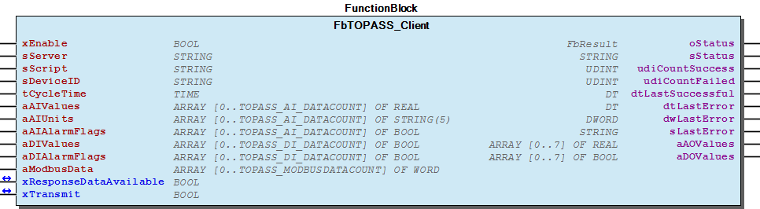
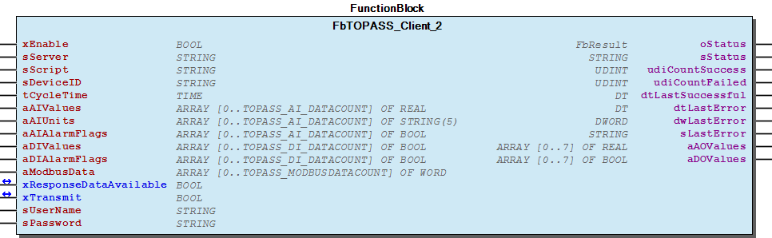
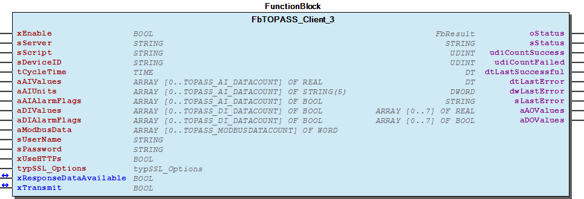

# WagoAppTOPASS v1.6.5.1 (WAGO) - Complete Documentation

## 📋 Library Information

- **Company:** WAGO
- **Title:** WagoAppTOPASS
- **Version:** 1.6.5.1
- **Categories:** WAGO FunctionalView|Connectivity; WAGO LayerView|App; Application
- **Author:** Wago/u010663
- **Placeholder:** WagoAppTOPASS

### Description ¶

This document is automatically generated. Because of this, the chapter 30 Visualization is not shown in this document. If you are interested in getting to know more about visualization, we refer to the library manager of e!Cockpit.

This library provides a simple TOPASS Client [1]

This document is automatically generated. Because of this, the chapter 30 Visualization is not shown in this document. If you are interested in getting to know more about visualization, we refer to the library manager of e!Cockpit. This library provides a simple TOPASS Client [1]

### Contents: ¶

Contents: - Documentation Index - Project Information - Library Information - Function Blocks FbTOPASS_Client (FB) - FbTOPASS_Client_2 (FB) - FbTOPASS_Client_3 (FB) Program Organization Global Variable Lists - Status (GVL) - VersionHistory (GVL) Other Components - 80 Status - FbTOPASS_Client.ALARMCOUNTER (PROP) - FbTOPASS_Client.Provider (PROP) - FbTOPASS_Client.SerialNumber (PROP) - FbTOPASS_Client.TOPASS_UPDATE_RTC (PROP) - FbTOPASS_Client_3.ALARMCOUNTER (PROP) - FbTOPASS_Client_3.Provider (PROP) - FbTOPASS_Client_3.SerialNumber (PROP) - FbTOPASS_Client_3.TOPASS_UPDATE_RTC (PROP) - ParameterList (PARAMS) - ... and 1 more

### Indices and tables ¶

| [1] | Based on WagoAppTOPASS.library, last modified 19.06.2020, 19:33:29. The content of this file was automatically generated with None on 19.06.2020, 19:33:33 |

© WAGO Kontakttechnik GmbH & Co. KG, Germany 2018 – All rights reserved. For the avoidance of doubt, this copyright notice does not only apply to the information above but also and primarily to the described library itself. Please note that third-party products are always mentioned without reference to intellectual property rights, including patents, utility models, designs and trademarks, accordingly the existence of such rights cannot be excluded. WAGO is a registered trademark of WAGO Verwaltungsgesellschaft mbH.

- File and Project Information - Library Reference © WAGO Kontakttechnik GmbH & Co. KG, Germany 2018 – All rights reserved. For the avoidance of doubt, this copyright notice does not only apply to the information above but also and primarily to the described library itself. Please note that third-party products are always mentioned without reference to intellectual property rights, including patents, utility models, designs and trademarks, accordingly the existence of such rights cannot be excluded. WAGO is a registered trademark of WAGO Verwaltungsgesellschaft mbH.

### Documentation Index

## WagoAppTOPASS Library Documentation

| Company: | WAGO |
| Title: | WagoAppTOPASS |
| Version: | 1.6.5.1 |
| Categories: | WAGO FunctionalView\|Connectivity; WAGO LayerView\|App; Application |
| Author: | Wago/u010663 |
| Placeholder: | WagoAppTOPASS |

### Description

This document is automatically generated. Because of this, the chapter 30 Visualization is not shown in this document. If you are interested in getting to know more about visualization, we refer to the library manager of e!Cockpit.

This library provides a simple TOPASS Client [1]

This document is automatically generated. Because of this, the chapter 30 Visualization is not shown in this document. If you are interested in getting to know more about visualization, we refer to the library manager of e!Cockpit. This library provides a simple TOPASS Client [1]

### Contents:

- 20 Program Organization Units FbTOPASS_Client (FB) - FbTOPASS_Client_2 (FB) - FbTOPASS_Client_3 (FB) 80 Status - Status (GVL) - eStatus (ENUM) ParameterList (PARAMS) VersionHistory (GVL)

### Indices and tables

| [1] | Based on WagoAppTOPASS.library, last modified 19.06.2020, 19:33:29. The content of this file was automatically generated with None on 19.06.2020, 19:33:33 |

© WAGO Kontakttechnik GmbH & Co. KG, Germany 2018 – All rights reserved. For the avoidance of doubt, this copyright notice does not only apply to the information above but also and primarily to the described library itself. Please note that third-party products are always mentioned without reference to intellectual property rights, including patents, utility models, designs and trademarks, accordingly the existence of such rights cannot be excluded. WAGO is a registered trademark of WAGO Verwaltungsgesellschaft mbH.

- File and Project Information - Library Reference © WAGO Kontakttechnik GmbH & Co. KG, Germany 2018 – All rights reserved. For the avoidance of doubt, this copyright notice does not only apply to the information above but also and primarily to the described library itself. Please note that third-party products are always mentioned without reference to intellectual property rights, including patents, utility models, designs and trademarks, accordingly the existence of such rights cannot be excluded. WAGO is a registered trademark of WAGO Verwaltungsgesellschaft mbH.

### Project Information

## File and Project Information

| Scope | Name | Type | Content |
| --- | --- | --- | --- |
| FileHeader | libraryFile | string | WagoAppTOPASS.library |
| contentFile | WagoAppTOPASS_clr.json |
| productName | e!COCKPIT |
| creationDateTime | date | 19.06.2020, 19:33:33 |
| companyName | string | WAGO |
| ProjectInformation | LastModificationDateTime | date | 19.06.2020, 19:33:29 |
| Description | string | See: Description |
| Copyright | © WAGO Kontakttechnik GmbH & Co. KG, Germany 2018 – All rights reserved. |
| Author | Wago/u010663 |
| AutoResolveUnbound | bool | True |
| Placeholder | string | WagoAppTOPASS |
| Company | WAGO |
| DocFormat | reStructuredText |
| Project | WagoAppTOPASS |
| DefaultNamespace |  |
| Version | version | 1.6.5.1 |
| Title | string | WagoAppTOPASS |
| LibraryCategories | library-category-list | WAGO FunctionalView\|Connectivity; WAGO LayerView\|App; Application |

### Library Information

## Library Reference

| LinkAllContent: False QualifiedOnly: False | SystemLibrary: False | Optional: False |

| LinkAllContent: False QualifiedOnly: False | SystemLibrary: False | Optional: False |

| LinkAllContent: False QualifiedOnly: True | SystemLibrary: False | Optional: False |

| LinkAllContent: False QualifiedOnly: False | SystemLibrary: False | Optional: False |

| LinkAllContent: False QualifiedOnly: True | SystemLibrary: False | Optional: False |

| LinkAllContent: False QualifiedOnly: True | SystemLibrary: False | Optional: False |

| LinkAllContent: False QualifiedOnly: False | SystemLibrary: False | Optional: False |

| LinkAllContent: False QualifiedOnly: True | SystemLibrary: False | Optional: False |

This is a dictionary of all referenced libraries and their name spaces.

This is a dictionary of all referenced libraries and their name spaces. Standard Library Identification : Placeholder: Standard Default Resolution: Standard, * (System) Namespace: Standard Library Properties : WagoAppHTTP Library Identification : Placeholder: WagoAppHTTP Default Resolution: WagoAppHTTP, * (WAGO) Namespace: WagoAppHTTP Library Properties : Library Parameter : Parameter: POSTFIELD_LENGTH = 600 WagoAppString Library Identification : Placeholder: WagoAppString Default Resolution: WagoAppString, * (WAGO) Namespace: WagoAppString Library Properties : WagoAppTime Library Identification : Placeholder: WagoAppTime Default Resolution: WagoAppTime, * (WAGO) Namespace: WagoAppTime Library Properties : WagoSysCurl Library Identification : Placeholder: WagoSysCurl Default Resolution: WagoSysCurl, * (WAGO) Namespace: WagoSysCurl Library Properties : WagoSysErrorBase Library Identification : Placeholder: WagoSysErrorBase Default Resolution: WagoSysErrorBase, * (WAGO) Namespace: WagoSysErrorBase Library Properties : Library Parameter : Parameter: RES_LOG_MAX_FILESIZE = 2000 Parameter: RES_LOG_MAX_FILES = 1 Parameter: RES_LOG_MAX_ENTRIES = 200 Parameter: RES_LOG_NAME = ‘WagoAppResultLogger’ WagoSysVersion Library Identification : Name: WagoSysVersion Version: 1.0.0.0 Company: WAGO Namespace: WagoSysVersion Library Properties : WagoTypesCommon Library Identification : Placeholder: WagoTypesCommon Default Resolution: WagoTypesCommon, * (WAGO) Namespace: WagoTypes Library Properties :

### Function Blocks

## FbTOPASS_Client (FB)

| Scope | Name | Type | Initial | Comment |
| --- | --- | --- | --- | --- |
| Input | xEnable | BOOL |  | Enable cyclic execution |
| sServer | STRING | ‘www.to-pass.com’ | IP-Address or hostname of TO-PASS server (e.g. www.to- pass.com or http://192.168.1.96:1024 ) |
| sScript | STRING |  | URL of PHP script that should be called. e.g. wago/saveTO- PASS.php |
| sDeviceID | STRING(20) |  | Topass device identifier |
| tCycleTime | TIME | TIME#60m0s0ms | Intervall to send data |
| aAIValues | ARRAY [0..TOPASS_AI_DATACOUNT] OF REAL |  | Current state of all “Analog Inputs” |
| aAIUnits | ARRAY [0..TOPASS_AI_DATACOUNT] OF STRING(5) |  | Unit code for each “Analog Inputs”, such as “Volt, mA, %,...” If no unit is give, “mA” is inserted automatically |
| aAIAlarmFlags | ARRAY [0..TOPASS_AI_DATACOUNT] OF BOOL |  | Separate alarm flag for each “Analog Input” useful for “Out of range” |
| aDIValues | ARRAY [0..TOPASS_DI_DATACOUNT] OF BOOL |  | Current state of all “Digital Inputs” |
| aDIAlarmFlags | ARRAY [0..TOPASS_DI_DATACOUNT] OF BOOL |  | Separate alarm flag for each “Digital Input” useful for “Is it an alarm” |
| aModbusData | ARRAY [0..TOPASS_MODBUSDATACOUNT] OF WORD |  | Modbus data to transmit |
| Inout | xResponseDataAvailable | BOOL |  | Server has sends response data |
| xTransmit | BOOL |  | Allow to transmit data independed from the continuosly transmission |
| Output | oStatus | WagoSysErrorBase.FbResult |  |  |
| sStatus | STRING |  | Current processed step in state machine |
| udiCountSuccess | UDINT |  | Number of successful executed transmissions |
| udiCountFailed | UDINT |  | Number of failed transmissions |
| dtLastSuccessful | DT |  | Timestamp of last succesful transmission |
| dtLastError | DT |  | Timestamp of last failed transmission |
| dwLastError | DWORD |  | Error code of last failed transmission |
| sLastError | STRING |  | Error code as textual description |
| aAOValues | ARRAY [0..7] OF REAL |  | Analog setpoint values received from server |
| aDOValues | ARRAY [0..7] OF BOOL |  | Digital setpoint values received from server |

Access to a TO-PASS web server

Graphical Illustration

Function Description

This function block may be used to exchange data with a TO-Pass web server, e.g. www.to-pass.com or a Wago TopassWebConnector running on a controller.

If a special port is required the following syntax must be used,e.g.: ‘ http://192.168.1.96:1024 ‘

Access to scripts like ‘wago/saveTO-PASS.php’ is supported. If used with the WebConnector, no script is needed.

Interface variables Function Access to a TO-PASS web server Graphical Illustration  Function Description This function block may be used to exchange data with a TO-Pass web server, e.g. www.to-pass.com or a Wago TopassWebConnector running on a controller. If a special port is required the following syntax must be used,e.g.: ‘ http://192.168.1.96:1024 ‘ Access to scripts like ‘wago/saveTO-PASS.php’ is supported. If used with the WebConnector, no script is needed. - FbTOPASS_Client.ALARMCOUNTER (PROP) - FbTOPASS_Client.Provider (PROP) - FbTOPASS_Client.SerialNumber (PROP) - FbTOPASS_Client.TOPASS_UPDATE_RTC (PROP)

## FbTOPASS_Client_2 (FB)

| Scope | Name | Type | Initial | Comment | Inherited from |
| --- | --- | --- | --- | --- | --- |
| Input | xEnable | BOOL |  | Enable cyclic execution | FbTOPASS_Client |
| sServer | STRING | ‘www.to-pass.com’ | IP-Address or hostname of TO-PASS server (e.g. www.to- pass.com or http://192.168.1.96:1024 ) | FbTOPASS_Client |
| sScript | STRING |  | URL of PHP script that should be called. e.g. wago/saveTO- PASS.php | FbTOPASS_Client |
| sDeviceID | STRING(20) |  | Topass device identifier | FbTOPASS_Client |
| tCycleTime | TIME | TIME#60m0s0ms | Intervall to send data | FbTOPASS_Client |
| aAIValues | ARRAY [0..TOPASS_AI_DATACOUNT] OF REAL |  | Current state of all “Analog Inputs” | FbTOPASS_Client |
| aAIUnits | ARRAY [0..TOPASS_AI_DATACOUNT] OF STRING(5) |  | Unit code for each “Analog Inputs”, such as “Volt, mA, %,...” If no unit is give, “mA” is inserted automatically | FbTOPASS_Client |
| aAIAlarmFlags | ARRAY [0..TOPASS_AI_DATACOUNT] OF BOOL |  | Separate alarm flag for each “Analog Input” useful for “Out of range” | FbTOPASS_Client |
| aDIValues | ARRAY [0..TOPASS_DI_DATACOUNT] OF BOOL |  | Current state of all “Digital Inputs” | FbTOPASS_Client |
| aDIAlarmFlags | ARRAY [0..TOPASS_DI_DATACOUNT] OF BOOL |  | Separate alarm flag for each “Digital Input” useful for “Is it an alarm” | FbTOPASS_Client |
| aModbusData | ARRAY [0..TOPASS_MODBUSDATACOUNT] OF WORD |  | Modbus data to transmit | FbTOPASS_Client |
| Inout | xResponseDataAvailable | BOOL |  | Server has sends response data | FbTOPASS_Client |
| xTransmit | BOOL |  | Allow to transmit data independed from the continuosly transmission | FbTOPASS_Client |
| Output | oStatus | WagoSysErrorBase.FbResult |  |  | FbTOPASS_Client |
| sStatus | STRING |  | Current processed step in state machine | FbTOPASS_Client |
| udiCountSuccess | UDINT |  | Number of successful executed transmissions | FbTOPASS_Client |
| udiCountFailed | UDINT |  | Number of failed transmissions | FbTOPASS_Client |
| dtLastSuccessful | DT |  | Timestamp of last succesful transmission | FbTOPASS_Client |
| dtLastError | DT |  | Timestamp of last failed transmission | FbTOPASS_Client |
| dwLastError | DWORD |  | Error code of last failed transmission | FbTOPASS_Client |
| sLastError | STRING |  | Error code as textual description | FbTOPASS_Client |
| aAOValues | ARRAY [0..7] OF REAL |  | Analog setpoint values received from server | FbTOPASS_Client |
| aDOValues | ARRAY [0..7] OF BOOL |  | Digital setpoint values received from server | FbTOPASS_Client |
| Input | sUserName | STRING(30) | ‘’ | User name |  |
| sPassword | STRING(30) | ‘’ | Password |  |

Access to a TO-PASS web server

Graphical Illustration

Function Description

This function block extends the functionality of the FbTOPASS_Client by two additional inputs

Interface variables Function Access to a TO-PASS web server Graphical Illustration  Function Description This function block extends the functionality of the FbTOPASS_Client by two additional inputs sUserName `` sPassword ``

## FbTOPASS_Client_3 (FB)

| Scope | Name | Type | Initial | Comment |
| --- | --- | --- | --- | --- |
| Input | xEnable | BOOL |  | Enable cyclic execution |
| sServer | STRING | ‘www.to-pass.com’ | IP-Address or hostname of TO-PASS server (e.g. www.to- pass.com or http://192.168.1.96:1024 ) |
| sScript | STRING |  | URL of PHP script that should be called. e.g. wago/saveTO- PASS.php |
| sDeviceID | STRING(20) |  | Topass device identifier |
| tCycleTime | TIME | TIME#60m0s0ms | Intervall to send data |
| aAIValues | ARRAY [0..TOPASS_AI_DATACOUNT] OF REAL |  | Current state of all “Analog Inputs” |
| aAIUnits | ARRAY [0..TOPASS_AI_DATACOUNT] OF STRING(5) |  | Unit code for each “Analog Inputs”, such as “Volt, mA, %,...” If no unit is give, “mA” is inserted automatically |
| aAIAlarmFlags | ARRAY [0..TOPASS_AI_DATACOUNT] OF BOOL |  | Separate alarm flag for each “Analog Input” useful for “Out of range” |
| aDIValues | ARRAY [0..TOPASS_DI_DATACOUNT] OF BOOL |  | Current state of all “Digital Inputs” |
| aDIAlarmFlags | ARRAY [0..TOPASS_DI_DATACOUNT] OF BOOL |  | Separate alarm flag for each “Digital Input” useful for “Is it an alarm” |
| aModbusData | ARRAY [0..TOPASS_MODBUSDATACOUNT] OF WORD |  | Modbus data to transmit |
| sUserName | STRING(30) | ‘’ | User name |
| sPassword | STRING(30) | ‘’ | Password |
| xUseHTTPs | BOOL |  |  |
| typSSL_Options | WagoTypesCurl.typSSL_Options |  | SSL options, details in library WagoTypesCurl |
| Inout | xResponseDataAvailable | BOOL |  | Server has sends response data |
| xTransmit | BOOL |  | Allow to transmit data independed from the continuosly transmission |
| Output | oStatus | WagoSysErrorBase.FbResult |  |  |
| sStatus | STRING |  | Current processed step in state machine |
| udiCountSuccess | UDINT |  | Number of successful executed transmissions |
| udiCountFailed | UDINT |  | Number of failed transmissions |
| dtLastSuccessful | DT |  | Timestamp of last succesful transmission |
| dtLastError | DT |  | Timestamp of last failed transmission |
| dwLastError | DWORD |  | Error code of last failed transmission |
| sLastError | STRING |  | Error code as textual description |
| aAOValues | ARRAY [0..7] OF REAL |  | Analog setpoint values received from server |
| aDOValues | ARRAY [0..7] OF BOOL |  | Digital setpoint values received from server |

Access to a TO-PASS web server

Graphical Illustration

Function Description

This function block may be used to exchange data with a TO-Pass web server, e.g. www.to-pass.com or a Wago TopassWebConnector running on a controller.

If a special port is required the following syntax must be used,e.g.: ‘ http://192.168.1.96:1024 ‘

Access to scripts like ‘wago/saveTO-PASS.php’ is supported. If used with the WebConnector, no script is needed.

Other than the FbTOPASS_Client the amount of data for analog and digital values (maximum 31) may be adjusted by the parameterlist:

TOPASS_AI_DATACOUNT : BYTE := 7; (* Number of AI(analog input) data to transmit, range 0..31 ) TOPASS_DI_DATACOUNT : BYTE := 7; ( Number of DI (digital input) data to transmit, range 0..31 * )

Interface variables Function Access to a TO-PASS web server Graphical Illustration  Function Description This function block may be used to exchange data with a TO-Pass web server, e.g. www.to-pass.com or a Wago TopassWebConnector running on a controller. If a special port is required the following syntax must be used,e.g.: ‘ http://192.168.1.96:1024 ‘ Access to scripts like ‘wago/saveTO-PASS.php’ is supported. If used with the WebConnector, no script is needed. Other than the FbTOPASS_Client the amount of data for analog and digital values (maximum 31) may be adjusted by the parameterlist: TOPASS_AI_DATACOUNT : BYTE := 7; (* Number of AI(analog input) data to transmit, range 0..31 ) TOPASS_DI_DATACOUNT : BYTE := 7; ( Number of DI (digital input) data to transmit, range 0..31 * ) - FbTOPASS_Client_3.ALARMCOUNTER (PROP) - FbTOPASS_Client_3.Provider (PROP) - FbTOPASS_Client_3.SerialNumber (PROP) - FbTOPASS_Client_3.TOPASS_UPDATE_RTC (PROP)

### Program Organization

## 20 Program Organization Units

- FbTOPASS_Client (FB) FbTOPASS_Client.ALARMCOUNTER (PROP) - FbTOPASS_Client.Provider (PROP) - FbTOPASS_Client.SerialNumber (PROP) - FbTOPASS_Client.TOPASS_UPDATE_RTC (PROP) FbTOPASS_Client_2 (FB) FbTOPASS_Client_3 (FB) - FbTOPASS_Client_3.ALARMCOUNTER (PROP) - FbTOPASS_Client_3.Provider (PROP) - FbTOPASS_Client_3.SerialNumber (PROP) - FbTOPASS_Client_3.TOPASS_UPDATE_RTC (PROP)

### Global Variable Lists

## Status (GVL)

| Scope | Name | Type |
| --- | --- | --- |
| Constant | StatusTopass | ARRAY [0..18] OF WagoTypesErrorBase.typResultItem |

| Value | Level | Description |
| --- | --- | --- |
| eStatus.OK | WagoTypesErrorBase.WagoTypes.eSeverity.info | ‘OK’ |
| eStatus.FunctionBlockNotEnabled | WagoTypesErrorBase.WagoTypes.eSeverity.info | ‘FunctionBlockNotEnabled’ |
| eStatus.InProgress | WagoTypesErrorBase.WagoTypes.eSeverity.info | ‘InProgress’ |
| eStatus.Timeout | WagoTypesErrorBase.WagoTypes.eSeverity.error | ‘Timeout’ |
| eStatus.StartTransmission | WagoTypesErrorBase.WagoTypes.eSeverity.info | ‘Start transmission’ |
| eStatus.RtcInvalidSetting | WagoTypesErrorBase.WagoTypes.eSeverity.error | ‘RTC invalid setting’ |
| eStatus.BadResponseData | WagoTypesErrorBase.WagoTypes.eSeverity.error | ‘Bad response data’ |
| eStatus.Warning | WagoTypesErrorBase.WagoTypes.eSeverity.warning | ‘Warning setpoints not configured’ |
| eStatus.Successful | WagoTypesErrorBase.WagoTypes.eSeverity.info | ‘Successful executed’ |

Description: Status information

Description: Status information

## VersionHistory (GVL)

| Name | Type |
| --- | --- |
| Info | ProjectInfo |

| Date | Version | Author | Change |
| 19.03.2020 | 1.6.5.1 | WAGO / u010663 | Improvement FbTOPASS_Client time stamp ->Parameterlist TOPASS_USE_LOCAL_TIME |
| 08.01.2019 | 1.6.5.0 | WAGO / u015842 | Properties: free placeholder added |
| 22.08.2018 | 1.6.4.2 | WAGO / u010663 | Bugfix FbTOPASS_Client_x property TOPASS_UPDATE_RTC local time vs. UTC |
| 15.05.2018 | 1.6.4.1 | WAGO / u010663 | Bugfix FbTOPASS_Client_3 |
| 28.03.2018 | 1.6.4.0 | WAGO / u010663 | New FbTOPASS_Client_3 allow HTTPs |
| 22.03.2018 | 1.6.3.0 | WAGO / u010663 | New FbTOPASS_Client_2 |
| 02.03.2017 | 1.6.2.0 | WAGO / u010663 | New input xTransmit, new output oStatus |
| 16.12.2016 | 1.6.1.0 | WAGO / u010663 | Released with R4 |
| 19.09.2016 | 1.6.0.0 | WAGO / u010663 | Released |

WagoAppTOPASS

### Other Components

## 80 Status ¶

- Status (GVL) - eStatus (ENUM)

## FbTOPASS_Client.ALARMCOUNTER (PROP) ¶

## FbTOPASS_Client.Provider (PROP) ¶

## FbTOPASS_Client.SerialNumber (PROP) ¶

## FbTOPASS_Client.TOPASS_UPDATE_RTC (PROP) ¶

## FbTOPASS_Client_3.ALARMCOUNTER (PROP) ¶

## FbTOPASS_Client_3.Provider (PROP) ¶

## FbTOPASS_Client_3.SerialNumber (PROP) ¶

## FbTOPASS_Client_3.TOPASS_UPDATE_RTC (PROP) ¶

## ParameterList (PARAMS)

| Scope | Name | Type | Initial | Comment |
| --- | --- | --- | --- | --- |
| Constant | TOPASS_WATCHDOGTIME | TIME | TIME#30s0ms | Maximum step time for state machine |
| TOPASS_MODBUSDATACOUNT | BYTE | 2 | Number of modbus data(register) to transmit |
| TOPASS_BUFFERSIZE | UINT | 8 | Number of datasets stored when not connected to server |
| MAX_STRING_HTTP | UINT | 600 | Length of HTTP URI |
| TOPASS_AI_DATACOUNT | BYTE | 7 | Number of AI(analog input) data to transmit |
| TOPASS_DI_DATACOUNT | BYTE | 7 | Number of DI (digital input) data to transmit |
| TOPASS_USE_LOCAL_TIME | BOOL | TRUE | Time stamp uses local time |

## eStatus (ENUM)

| Name | Initial | Comment |
| --- | --- | --- |
| OK | 0 | OK |
| FunctionBlockNotEnabled | 1 | Function block not enabled |
| Timeout | 2 | Timeout occured |
| InProgress | 3 | Job is active |
| StartTransmission | 4 | Start transmission |
| RtcInvalidSetting | 5 | RTC invalid setting |
| BadResponseData | 6 | Bad response data |
| Warning | 7 | Warning |
| Successful | 8 | Successful executed |

Description: Status information

InOut: Description: Status information