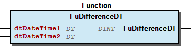
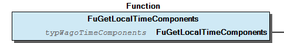
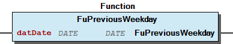
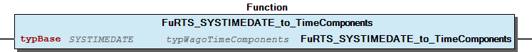
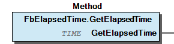

# WagoAppTime v1.7.3.5 (WAGO) - Complete Documentation


## 📋 Library Information

- **Company:** WAGO
- **Title:** WagoAppTime
- **Version:** 1.7.3.5
- **Categories:** WAGO LayerView|App; WAGO FunctionalView|Base; Application
- **Author:** WAGO / u013972
- **Placeholder:** WagoAppTime

### Description ¶


This document is automatically generated. Because of this, the chapter 30 Visualization is not shown in this document. If you are interested in getting to know more about visualization, we refer to the library manager of e!Cockpit.

Handling Time and Timezones [1]

This document is automatically generated. Because of this, the chapter 30 Visualization is not shown in this document. If you are interested in getting to know more about visualization, we refer to the library manager of e!Cockpit. Handling Time and Timezones [1]

### Contents: ¶


Contents: - Documentation Index 10 Documentation - WagoAppTime Library Documentation Project Information Library Information Function Blocks - FbElapsedTime (FB) - FbTimeZoneSetter (FB) - FbTimeZoneSetter_cpt (FB) - FbTimeoutWatcher (FB) - doc10_General (FB) - doc91_Notes (FB) - doc95_Specifications (FB) Functions - FuAnyDayOfWeek (FUN) - FuCalendarWeek_ISO8601 (FUN) - FuCheckTimeComponentPosixConformity (FUN) - FuCheckTimeComponentValidity (FUN) - FuConvertLStampToLocalTimeComponents (FUN) - FuConvertLStampToTimeComponents (FUN) - FuConvertStampToLocalTimeComponents (FUN) - FuConvertStampToTimeComponents (FUN) - FuConvertTimeComponentsToLStamp (FUN) - FuConvertTimeComponentsToStamp (FUN) - ... and 52 more Methods - 06 Setting The Clock - FbElapsedTime.GetElapsedLTime (METH) - FbElapsedTime.GetElapsedTime (METH) - FbElapsedTime.StartNow (METH) - FbElapsedTime.initialize (METH) - FbTimeZoneSetter.SetTimeZone (METH) - FbTimeoutWatcher.GetRemainingMilliseconds (METH) - FbTimeoutWatcher.GetRemainingNanoseconds (METH) - FbTimeoutWatcher.HasTimeoutOccurred (METH) - FbTimeoutWatcher.Retrigger (METH) - ... and 3 more Program Organization Base Components Main Interfaces - 01 Main Interface - 10 Main Interface Global Variable Lists - LibraryResult (GVL) - ResultItems (GVL) - VersionHistory (GVL) Other Components - 00 Calculations - 00 Formatting - 01 Date (DATE) - 01 Date (DATE) - 01 Date (DATE) - 01 Date and Time - 01 Extraction - 01 System Timestamps UTC - 02 Administrative - 02 Conversions - ... and 20 more

### Indices and tables ¶


| [1] | Based on WagoAppTime.library, last modified 30.06.2022, 15:11:55. LibDoc 3.5.15.30 |

© WAGO Kontakttechnik GmbH & Co. KG, Germany 2018 – All rights reserved. For the avoidance of doubt, this copyright notice does not only apply to the information above but also and primarily to the described library itself. Please note that third-party products are always mentioned without reference to intellectual property rights, including patents, utility models, designs and trademarks, accordingly the existence of such rights cannot be excluded. WAGO is a registered trademark of WAGO Verwaltungsgesellschaft mbH.

- File and Project Information - Library Reference © WAGO Kontakttechnik GmbH & Co. KG, Germany 2018 – All rights reserved. For the avoidance of doubt, this copyright notice does not only apply to the information above but also and primarily to the described library itself. Please note that third-party products are always mentioned without reference to intellectual property rights, including patents, utility models, designs and trademarks, accordingly the existence of such rights cannot be excluded. WAGO is a registered trademark of WAGO Verwaltungsgesellschaft mbH.

### Documentation Index


## 10 Documentation


- doc10_General (FB) - doc91_Notes (FB) Different Sources of Time - Data Types TIME - DATE_AND_TIME - LTIME - TIME_OF_DAY - DATE - SYSTIME - RTS_SYSTIMEDATE - typRTS_SYSTIMEDATE - typWagoTimeComponents doc95_Specifications (FB)

## WagoAppTime Library Documentation


| Company: | WAGO |
| Title: | WagoAppTime |
| Version: | 1.7.3.5 |
| Categories: | WAGO LayerView\|App; WAGO FunctionalView\|Base; Application |
| Author: | WAGO / u013972 |
| Placeholder: | WagoAppTime |

### Description


This document is automatically generated. Because of this, the chapter 30 Visualization is not shown in this document. If you are interested in getting to know more about visualization, we refer to the library manager of e!Cockpit.

Handling Time and Timezones [1]

This document is automatically generated. Because of this, the chapter 30 Visualization is not shown in this document. If you are interested in getting to know more about visualization, we refer to the library manager of e!Cockpit. Handling Time and Timezones [1]

### Contents:


- 10 Documentation doc10_General (FB) - doc91_Notes (FB) - doc95_Specifications (FB) 20 Program Organization Units - 00 Calculations - 01 System Timestamps UTC - 02 System Timestamps Local - 03 Timezone - 04 Calendar - 05 Intervals - 06 Setting The Clock LibraryResult (GVL) ResultItems (GVL) VersionHistory (GVL)

### Indices and tables


| [1] | Based on WagoAppTime.library, last modified 30.06.2022, 15:11:55. LibDoc 3.5.15.30 |

© WAGO Kontakttechnik GmbH & Co. KG, Germany 2018 – All rights reserved. For the avoidance of doubt, this copyright notice does not only apply to the information above but also and primarily to the described library itself. Please note that third-party products are always mentioned without reference to intellectual property rights, including patents, utility models, designs and trademarks, accordingly the existence of such rights cannot be excluded. WAGO is a registered trademark of WAGO Verwaltungsgesellschaft mbH.

- File and Project Information - Library Reference © WAGO Kontakttechnik GmbH & Co. KG, Germany 2018 – All rights reserved. For the avoidance of doubt, this copyright notice does not only apply to the information above but also and primarily to the described library itself. Please note that third-party products are always mentioned without reference to intellectual property rights, including patents, utility models, designs and trademarks, accordingly the existence of such rights cannot be excluded. WAGO is a registered trademark of WAGO Verwaltungsgesellschaft mbH.

### Project Information


## File and Project Information


| Scope | Name | Type | Content |
| --- | --- | --- | --- |
| FileHeader | libraryFile | string | WagoAppTime.library |
| contentFile | WagoAppTime_clr.json |
| productName | e!COCKPIT |
| creationDateTime | date | 30.06.2022, 15:12:08 |
| companyName | string | WAGO |
| ProjectInformation | LastModificationDateTime | date | 30.06.2022, 15:11:55 |
| Description | string | See: Description |
| Copyright | © WAGO Kontakttechnik GmbH & Co. KG, Germany 2018 – All rights reserved. |
| Author | WAGO / u013972 |
| AutoResolveUnbound | bool | True |
| Placeholder | string | WagoAppTime |
| Company | WAGO |
| DocFormat | reStructuredText |
| Project | WagoAppTime |
| DefaultNamespace |  |
| Version | version | 1.7.3.5 |
| Title | string | WagoAppTime |
| LibraryCategories | library-category-list | WAGO LayerView\|App; WAGO FunctionalView\|Base; Application |
| CompiledLibraryCompatibilityVersion | string | CODESYS V3.5 SP17 Patch 3 |

### Library Information


## Library Reference


This is a dictionary of all referenced libraries and their name spaces.

This is a dictionary of all referenced libraries and their name spaces.

### Standard


#### Library Identification


Placeholder: Standard Default Resolution: Standard, * (System) Namespace: Standard

#### Library Properties


| LinkAllContent: False Optional: False | QualifiedOnly: False Key: Standard | SystemLibrary: False PublishSymbolsInContainer: True |

### SysTime


#### Library Identification


Placeholder: SysTime Default Resolution: SysTime, * (System) Namespace: SysTime

#### Library Properties


| LinkAllContent: False QualifiedOnly: False | Key: SysTime SystemLibrary: False | Optional: False |

### WagoSysBehaviourModels


#### Library Identification


Placeholder: WagoSysBehaviourModels Default Resolution: WagoSysBehaviourModels, * (WAGO) Namespace: WagoSysBehaviourModels

#### Library Properties


| LinkAllContent: False QualifiedOnly: False | Key: WagoSysBehaviourModels SystemLibrary: False | Optional: False |

### WagoSysErrorBase


#### Library Identification


Placeholder: WagoSysErrorBase Default Resolution: WagoSysErrorBase, * (WAGO) Namespace: WagoSysErrorBase

#### Library Properties


| LinkAllContent: False QualifiedOnly: False | Key: WagoSysErrorBase SystemLibrary: False | PublishSymbolsInContainer: True Optional: False |

#### Library Parameter


Parameter: RES_LOG_MAX_FILESIZE = 2000 Parameter: RES_LOG_MAX_FILES = 1 Parameter: RES_LOG_MAX_ENTRIES = 200 Parameter: RES_LOG_NAME = ‘WagoAppResultLogger’

### WagoSysTime_Internal_PFC


#### Library Identification


Placeholder: WagoSysTimeInternal Default Resolution: WagoSysTime_Internal_PFC, * (WAGO) Namespace: WagoSysTimeInternal

#### Library Properties


| LinkAllContent: False Optional: False | QualifiedOnly: False Key: WagoSysTimeInternal | SystemLibrary: False PublishSymbolsInContainer: True |

### WagoSysTypedefs_Internal_32Bit


#### Library Identification


Placeholder: WagoSysTypedefsInternal Default Resolution: WagoSysTypedefs_Internal_32Bit, * (WAGO) Namespace: WagoTypesInternal

#### Library Properties


| LinkAllContent: False QualifiedOnly: False | Key: WagoSysTypedefsInternal SystemLibrary: False | Optional: False |

### WagoSysVersion


#### Library Identification


Name: WagoSysVersion Version: 1.0.0.0 Company: WAGO Namespace: WagoSysVersion

#### Library Properties


| LinkAllContent: False QualifiedOnly: False | Key: WagoSysVersion, 1.0.0.0 (WAGO) SystemLibrary: False | Optional: False |

### WagoTypesCommon


#### Library Identification


Placeholder: WagoTypesCommon Default Resolution: WagoTypesCommon, * (WAGO) Namespace: WagoTypes

#### Library Properties


| LinkAllContent: False Optional: False | QualifiedOnly: False Key: WagoTypesCommon | SystemLibrary: False PublishSymbolsInContainer: True |

### Function Blocks


## FbElapsedTime (FB)


```
VAR
  FbStamp : FbElapsedTime;
END_VAR

VAR CONSTANT
  tFirstStep  : TIME := T#2s;
  tSecondStep : TIME := T#10s;
END_VAR

FbStamp.StartNow();
:
:
IF (FbStamp.GetElapsedTime() < tFirstStep) THEN
    OneCertainAction();
ELSE (FbStamp.GetElapsedTime() < tSecondStep) THEN
    OtherCertainAction();
END_IF;
```

Measures the elapsed time

Graphical Illustration

Function Description

This FB measures the elapsed time from a an indicated start. The elapsed time my be read as LTIME or as TIME by getter-methods.

Typical usage

Measures the elapsed time Graphical Illustration  Function Description This FB measures the elapsed time from a an indicated start. The elapsed time my be read as LTIME or as TIME by getter-methods. Typical usage - 10 Main Interface FbElapsedTime.GetElapsedLTime (METH) - FbElapsedTime.GetElapsedTime (METH) - FbElapsedTime.StartNow (METH) 20 Administrative - FbElapsedTime.initialize (METH)

## FbTimeZoneSetter (FB)


| Scope | Name | Type | Comment | Inherited from |
| --- | --- | --- | --- | --- |
| Output | xTerminated | BOOL | Indicates completion of the action. | FbBehaviourModel_WagoMethodStart |
| xBusy | BOOL | Indicates running action. | FbBehaviourModel_WagoMethodStart |
| xError | BOOL | Indicates an error. | FbBehaviourModel_WagoMethodStart |
| eStatus | eResultCode | State of processing | FbBehaviourModel_WagoMethodStart |

| result codes |
| 0 | success |
| ENOENT | The database key is unknown to the system |
| EUNSPECFIC | Unexpected other errors from OS |

Fb for setting the time Zone.

Graphical Illustration

Functional description

Set the timezone by calling the method ‘SetTimeZone(sDataBaseKey)’ with the desired time zone key. Then wait until xBusy returns to FALSE again.

While xBusy is still TRUE, calls of SetTimeZone() will be ignored.

Interface variables Fb for setting the time Zone. Graphical Illustration  Functional description Set the timezone by calling the method ‘SetTimeZone(sDataBaseKey)’ with the desired time zone key. Then wait until xBusy returns to FALSE again. Note While xBusy is still TRUE, calls of SetTimeZone() will be ignored. - FbTimeZoneSetter.SetTimeZone (METH)

## FbTimeZoneSetter_cpt (FB)


| Scope | Name | Type | Comment | Inherited from |
| --- | --- | --- | --- | --- |
| Output | oStatus | FbResult | Status object (see WagoSysErrorBase). | FbBehaviourModel_oStatus_Base |
| Input | xExecute | BOOL | Triggers the execution of the action. | FbBehaviourModel_WagoAppExecute |
| Output | xError | BOOL | Indicates that an error has occurred. | FbBehaviourModel_WagoAppExecute |
| xDone | BOOL | Successful completion of the action. | FbBehaviourModel_WagoAppExecute |
| xBusy | BOOL | Action is still in progress. | FbBehaviourModel_WagoAppExecute |
| Input | sDataBaseKey | STRING | The applied data base key, e.g. ‘Pacific/Auckland’ |  |

This fumction block is a time zone setter for use in graphical languages.

Graphical Illustration

Functional description

The implementation is exactly identical to the method oriented FB FbTimeZoneSetter (FB) , but the behaviour model is variable oriented.

Apply the desired time zone identification to the sDatabaseKey -input and start the FB via xExecute according to the WagoExecute behaviour model.

More details about valid time zone identification strings are given in section ‘Configuration of Time and Date - TZ String’ of the PFC200 Manual .

A summary of valid time zone keys is given in https://en.wikipedia.org/wiki/List_of_tz_database_time_zones

Interface variables Function This fumction block is a time zone setter for use in graphical languages. Graphical Illustration  Functional description The implementation is exactly identical to the method oriented FB FbTimeZoneSetter (FB) , but the behaviour model is variable oriented. Apply the desired time zone identification to the sDatabaseKey -input and start the FB via xExecute according to the WagoExecute behaviour model. More details about valid time zone identification strings are given in section ‘Configuration of Time and Date - TZ String’ of the PFC200 Manual . A summary of valid time zone keys is given in https://en.wikipedia.org/wiki/List_of_tz_database_time_zones

## FbTimeoutWatcher (FB)


| Scope | Name | Type | Initial | Comment |
| --- | --- | --- | --- | --- |
| Input | pTimeoutAction | POINTER TO WagoTypes.Fb_GenericRunner | 0 | Address of a runner instance to be called at timeout. |

```
VAR
  FbWatcher : FbTimeoutWatcher;
END_VAR

FbWatcher.StartNow();
FbWatcher.SetTimeout(T#3s);
:
:
IF FbWatcher.IsTimedOut() THEN
    OneCertainTimoutAction();
END_IF;
```

Timeout detection

Graphical Illustration

Function Description

After a given amount of time this FB indicates a timeout.

A timeout condition is normally indicated by the return value of the method HasTimeoutOccurred() . Additionally, at timeout a dedicated timeout action may be invoked (see below).

The reference point in time for determining timeouts is given by the system start or by calling one of the methods StartNow() or Retrigger().

Timeout will not occur, before the time limit value is set by one of the methods SetTimeout() or SetLTimeout().

When using StartNow() for starting, it is mandatory to call Set(L)Timeout afterwards for detecting a timeout. By using Retrigger() however, the previously set timeout limit will be re-used again.

(To be clear in this point: SetTimeout() will not start the measurement of the timeout-interval. Just the notification about the expiration of the timeout requires that this timeout value has been set. This value may also be changed during the runtime without disturbing the interval measurement.)

Typical usage

Additional Feature:

An object derived from ‘WagoTypes.Fb_GenericRunner’ may be scheduled to be called when timeout has occurred. For doing so, the input variable ‘pTimeoutAction’ has to be set to the address of the instance of the runner object. In that case, the FbTimeoutWatcher must be called cyclically, while in other cases, the cyclic call may be omitted. On timeout, the method run() of that object will be called.

If that feature is not used, leave the input at its default (=0). In that case, just the HasTimeoutOccurred-Property is set and no further action is taken. Then, cyclic call of the FB may be ommitted.

Interface variables Timeout detection Graphical Illustration  Function Description After a given amount of time this FB indicates a timeout. A timeout condition is normally indicated by the return value of the method HasTimeoutOccurred() . Additionally, at timeout a dedicated timeout action may be invoked (see below). The reference point in time for determining timeouts is given by the system start or by calling one of the methods StartNow() or Retrigger(). Timeout will not occur, before the time limit value is set by one of the methods SetTimeout() or SetLTimeout(). When using StartNow() for starting, it is mandatory to call Set(L)Timeout afterwards for detecting a timeout. By using Retrigger() however, the previously set timeout limit will be re-used again. (To be clear in this point: SetTimeout() will not start the measurement of the timeout-interval. Just the notification about the expiration of the timeout requires that this timeout value has been set. This value may also be changed during the runtime without disturbing the interval measurement.) Note(1): Since we have no output variables in this FB, it is normally not necessary to call it cyclically. When a timout action is applied, however, cyclic invocation is mandatory because otherwise the timout action could not be called from within the FB. Note(2): By using getter and setter methods for timeouts and for measured times, different time formats (TIME, LTIME) may be mixed and used simultaneously. Typical usage Additional Feature: An object derived from ‘WagoTypes.Fb_GenericRunner’ may be scheduled to be called when timeout has occurred. For doing so, the input variable ‘pTimeoutAction’ has to be set to the address of the instance of the runner object. In that case, the FbTimeoutWatcher must be called cyclically, while in other cases, the cyclic call may be omitted. On timeout, the method run() of that object will be called. If that feature is not used, leave the input at its default (=0). In that case, just the HasTimeoutOccurred-Property is set and no further action is taken. Then, cyclic call of the FB may be ommitted. - 01 Main Interface FbTimeoutWatcher.GetRemainingMilliseconds (METH) - FbTimeoutWatcher.GetRemainingNanoseconds (METH) - FbTimeoutWatcher.HasTimeoutOccurred (METH) - FbTimeoutWatcher.Retrigger (METH) - FbTimeoutWatcher.SetLTimeout (METH) - FbTimeoutWatcher.SetTimeout (METH) 02 Administrative - FbTimeoutWatcher.initialize (METH)

## doc10_General (FB)


General Preface

This library contains functions, types definitions, and function blocks for handling time and timestamps of the system.

Handling of system time and RTC-time is merged to one unified absolute time here, so the user does not have to consider different time sources here.

Several general topics are covered:

Unconventionally, there are no different routines for realtime and systemtime in this library. This is because both are unified on Wago PLCs. The data type LTIME is used for both high resolution calculation and also for representing absolute time. Nevertheless, the standard types for time are of course also supported.

See below in the section ‘Supplementary Notes’ for more details.

General Preface This library contains functions, types definitions, and function blocks for handling time and timestamps of the system. Handling of system time and RTC-time is merged to one unified absolute time here, so the user does not have to consider different time sources here. Several general topics are covered: 1. Getting timestamps 2. Perform typical operations and conversions with them 3. Setting the system time (including implicitly setting the RTC). 4. Handling timezones and automatical switching of Daylight-Saving (DST) 5. Covenience routines, such as transformation of time into calender components, measuring of intervals, timeouts, etc. Unconventionally, there are no different routines for realtime and systemtime in this library. This is because both are unified on Wago PLCs. The data type LTIME is used for both high resolution calculation and also for representing absolute time. Nevertheless, the standard types for time are of course also supported. See below in the section ‘Supplementary Notes’ for more details.

## doc91_Notes (FB)


Supplementary Notes

### Different Sources of Time


In a modern processing environment, there are different internal sources for time information, namely the Real-Time-Clock (RTC), the CPU-Clock, perhaps also an external NTP connection to an atomic time standard. Each of these sources is subject to drifting apart from the readings of other sources. That situation would be a little bit difficult to handle for the final application programmer.

To overcome that problem, all time sources are combined by internal software layers to one single system time. The RTC for example serves for initial setting of the system time and for continuously adjusting the system time in order to keep it synchronized with the global world time. (Also an NTP connection might be employed for this purpose) The registers of the RTC are never read or written to directly, but only indirectly when modifying the combined system time.

The system time is guaranteed to increase monotonically and to be readjusted smoothly according to time references with high precision (such as RTC or an NTP connection).

When system time is set, the RTC is always also set immediately.

RTC and system time are allways kept internally in UT (i.e. GMT+0:00), not in local time, which makes it easy to smoothly adjust the system time. When the timezone is switched or DST is toggled, this operation operates only on a timezone offset.

In a modern processing environment, there are different internal sources for time information, namely the Real-Time-Clock (RTC), the CPU-Clock, perhaps also an external NTP connection to an atomic time standard. Each of these sources is subject to drifting apart from the readings of other sources. That situation would be a little bit difficult to handle for the final application programmer. To overcome that problem, all time sources are combined by internal software layers to one single system time. The RTC for example serves for initial setting of the system time and for continuously adjusting the system time in order to keep it synchronized with the global world time. (Also an NTP connection might be employed for this purpose) The registers of the RTC are never read or written to directly, but only indirectly when modifying the combined system time. The system time is guaranteed to increase monotonically and to be readjusted smoothly according to time references with high precision (such as RTC or an NTP connection). When system time is set, the RTC is always also set immediately. RTC and system time are allways kept internally in UT (i.e. GMT+0:00), not in local time, which makes it easy to smoothly adjust the system time. When the timezone is switched or DST is toggled, this operation operates only on a timezone offset.

### Data Types


In the context of handling time and date, a certain variety of data types has been established in the recent years, so it is worth getting a kind of overview about this issue.

We will concentrate on those data types, which give most benefit to the user.

In the context of handling time and date, a certain variety of data types has been established in the recent years, so it is worth getting a kind of overview about this issue. We will concentrate on those data types, which give most benefit to the user.

#### TIME


Implementation: 32-bit, unsigned

Range: 0 .. 49 days, relative

Resolution: 1 millisecond

General application: Fast computation of short time intervals.

Application in this library: This type is used as standard type in this library.

Implementation: 32-bit, unsigned Range: 0 .. 49 days, relative Resolution: 1 millisecond General application: Fast computation of short time intervals. Attention: Due to the lack of sign, this data type cannot handle general differences of timestamps. When this is required, the TIME value has to be converted to a signed type before further evaluation can take place. Application in this library: This type is used as standard type in this library.

#### DATE_AND_TIME


Implementation: 32-bit, unsigned

Range: year 1970..2106

Resolution: 1 second

Application: Representation of abslolute POSIX-Time

Differences of timestamps of this type are virtually useless , because Codesys compiles these differences into the type TIME, which will silently overflow at differences greater than 49 days. Due to the lack of sign, this data type cannot handle general differences of timestamps anyway.

When computing differences is required, type conversion to signed 32-bit values has to be performed before computing the difference.

Application in this library: This type is used as standard type in this library.

Implementation: 32-bit, unsigned Range: year 1970..2106 Resolution: 1 second Application: Representation of abslolute POSIX-Time Attention (1): Strict compatibility to POSIX-Time is given only up to the year 2038 (POSIX-Time is signed). Attention (2): Differences of timestamps of this type are virtually useless , because Codesys compiles these differences into the type TIME, which will silently overflow at differences greater than 49 days. Due to the lack of sign, this data type cannot handle general differences of timestamps anyway. When computing differences is required, type conversion to signed 32-bit values has to be performed before computing the difference. Application in this library: This type is used as standard type in this library.

#### LTIME


Implementation: 64-bit, unsigned

Range: 0 .. 584 years

Resolution: 1 nanosecond

Implementation: 64-bit, unsigned Range: 0 .. 584 years Resolution: 1 nanosecond Application: Handling of time intervals with high resolution. regarding the high data range, this type is also suitable to handle absolute time stamps beyond the limitations of POSIX-Time. When using this type with sign awareness, dates from year 1678 up to year 2262 can be represented. Attention: Due to the lack of sign, this data type cannot handle general differences of timestamps. When this is required, the TIME value has to be converted to a signed type before further evaluation can take place. Application in this library: This type is used as standard type in this library. Its semantic is extended, as it will also be used for absolute represetation of date and time with nanosecond resolution. When interpreted as absolute value, it will be interpreted as time interval since 1.1.1970, resembling POSIX time and the standard type DATE_AND_TIME.

#### TIME_OF_DAY


Implementation: 32-bit, unsigned

Range: 0:00:00 .. 23:59:59.999

Resolution: 1 millisecond

Implementation: 32-bit, unsigned Range: 0:00:00 .. 23:59:59.999 Resolution: 1 millisecond Application: Representing the local time, but practically redundant , because TIME covers the same range and the same resolution without the restrictions of this data type and RTS_SYSTIMEDATE ist more appropriate when separarted time components are required. Attention: Due to the lack of sign, this data type cannot handle general differences of timestamps. When this is required, the TIME value has to be converted to a signed type before further evaluation can take place. Application in this library: This type is not used in this library, because it makes sense only in calendarial contexts (where timezones are considered) and this field is covered by the structures typRTS_SYSTIMEDATE and typWagoTimeComponents.

#### DATE


Implementation: 32-bit, unsigned

Range: 1.1.1970 .. 7.2.2106

Resolution: 1 second

Attention (1): Strict compatibility to POSIX-Time is given only up to the year 2038 (POSIX-Time is signed)

Differences of timestamps if this type are virtually useless , because Codesys compiles these differences into the type TIME, which will silently overflow at differences greater than 49 days. Due to the lack of sign, this data type cannot handle general differences of timestamps anyway.

When computing differences is required, type conversion to signed 32-bit values has to be performed before computing the difference.

Implementation: 32-bit, unsigned Range: 1.1.1970 .. 7.2.2106 Resolution: 1 second Application: Representing the local date. But it is practically redundant , because DATE_AND_TIME covers the same range and the same resolution without the restrictions of this data type. RTS_SYSTIMEDATE would be more appropriate when separated time components are required. Attention (1): Strict compatibility to POSIX-Time is given only up to the year 2038 (POSIX-Time is signed) Attention (2): Differences of timestamps if this type are virtually useless , because Codesys compiles these differences into the type TIME, which will silently overflow at differences greater than 49 days. Due to the lack of sign, this data type cannot handle general differences of timestamps anyway. When computing differences is required, type conversion to signed 32-bit values has to be performed before computing the difference. Application in this library: This type is not used in this library, because it makes sense only in calendarial contexts (where timezones are considered) and this field is covered by the structures typRTS_SYSTIMEDATE and typWagoTimeComponents.

#### SYSTIME


Implementation: 64-bit, unsigned

Range: <not defined>

Resolution: 1 system clock (SysTimeCore.library)

Application: fast computing of positive time differences, absolute timestamps for internal purposes

Implementation: 64-bit, unsigned Range: <not defined> Resolution: 1 system clock (SysTimeCore.library) Application: fast computing of positive time differences, absolute timestamps for internal purposes Attention (1): The application of this type is pretty inconsistent in this library. In different places it represents either system ticks, milliseconds, microseconds, or nanoseconds. There is no uniform calculation from this data type to real dimensions e.g. ‘seconds’. Attention (2): Due to the lack of sign, this data type cannot handle general differences of timestamps. When this is required, the TIME value has to be converted to a signed type before further evaluation can take place. Application in this library: This type and its variations are ubiquitous on system level, but it is not used in this library, because it is defined too ambiguously.

#### RTS_SYSTIMEDATE


Implementation: Composed structure in SysTimeRtc.library.

Range: Year 1 .. year 65535

Resolution: 1 millisecond

When leaving UTC and going to local time, the representation of the local time becomes ambiguous: When switching from daylight-saving-time DST back to standard time, the local time happens to pass through two adjacent hours which are both called 2o’clock but which are distinguished by calling them 02a:00 (DST) followed by 02b:00 (standard time), which is finally followed by 03:00.

There is no mechanism employed to distinguish between both 2 o’clock hours, so when used for setting the local time, this type does not cover all posiibilites.

N.B.: Codesys conversions cover conversions from DATE_AND_TIME to UTC, but they regard conversions from and to local time as obsolete for this reason (but without telling any replacement).

Implementation: Composed structure in SysTimeRtc.library. Range: Year 1 .. year 65535 Resolution: 1 millisecond Application: Separation of different components of local timestamp (year, month, day, day of week) e.g. for printing purpose. This structure is not well suitable for further computing. Attention: When leaving UTC and going to local time, the representation of the local time becomes ambiguous: When switching from daylight-saving-time DST back to standard time, the local time happens to pass through two adjacent hours which are both called 2o’clock but which are distinguished by calling them 02a:00 (DST) followed by 02b:00 (standard time), which is finally followed by 03:00. There is no mechanism employed to distinguish between both 2 o’clock hours, so when used for setting the local time, this type does not cover all posiibilites. N.B.: Codesys conversions cover conversions from DATE_AND_TIME to UTC, but they regard conversions from and to local time as obsolete for this reason (but without telling any replacement). Attention (2): This type is defined in different ways in different versions of the base library, SysTimeRtc, so there is at the moment no way of portably extending this struct in child libraries. Application in this library: This type is not used directly in this library, because it is defined ambiguously within different versions of system libraries. It is used as template for a uniformly defined typRTS_SYSTIMEDATE .

#### typRTS_SYSTIMEDATE


Range: Year 1 .. year 65535

Resolution: 1 millisecond

Implementation: This is a struct where the components are defined in exactly the same way as in SysTimeRtc.RTS_SYSTIMEDATE or SysTimeRtc.SYSTIMEDATE resp. but which is declared without version ambiguities, so it is possible to portably extend this structure. For details see ‘typRTS_SYSTIMEDATE’ in the appendix ‘Types’. Range: Year 1 .. year 65535 Resolution: 1 millisecond Application: Work around for providing a structure which can be used in exactly the same manner and with the same interface as the established (RTS_)SYSTIMEDATE, but without the ambiguity of versions. Other struct are derived from this base struct.

#### typWagoTimeComponents


```
VAR
  StandardTimeDate   : typRTS_SYSTIMEDATE;     // the standard type
  ExtendedComponents : typWagoTimeComponents;  // more detailed information
END_VAR

FUNCTION GetLocalTimeComponents : typWagoTimeComponents // delivers detail information

   [...]

ExtendedComponents := GetLocalTimeComponents();  // usage as declared
StandardTimeDate   := GetLocalTimeComponents();  // old types do also work together
                                                 // with Wago-functions.
```

Range: Year 1 .. year 65535

Resolution: 1 nanosecond

By this means, compatibility to legacy code which still needs the 3S-SysTimeRtc-typedefs is ensured.

Implementation: Struct derived from typRTS_SYSTIMEDATE, extended by more information fields. For details see ‘typWagoTimeComponents’ in the appendix ‘Types’. Range: Year 1 .. year 65535 Resolution: 1 nanosecond Application: Representation of components of time, mainly for printimg purpose. As this struct is extended from typRTS_SYSTIMEDATE , the base variable type may still be used in applications, because assignment to the base variables will not require any conversion: By this means, compatibility to legacy code which still needs the 3S-SysTimeRtc-typedefs is ensured.

## doc95_Specifications (FB)


Specifications

This library refers to the following documents and specifications:

Specifications This library refers to the following documents and specifications: 1. ISO 8601 Counting of Calendar Weeks 2. Sommerzeitverordnung - SoZV : Verordnung über die Einführung der mitteleuropäischen Sommerzeit ab dem Jahr 2002 (BGBl. I S. 1185)

### Functions


## FuAnyDayOfWeek (FUN)


| Scope | Name | Type | Comment |
| --- | --- | --- | --- |
| Return | FuAnyDayOfWeek | DATE |  |
| Input | datDate | DATE | input date |
| iDayOfWeek | INT | day of week. 1:Mon, 2:Tue, 3:Wed, 4:Thu, 5:Fri, 6:Sat,7:Son |

Retrieves any weekday from input date.

Graphical Illustration

Function Description

Positive ‘iDayOfWeek’ retieves future dates including the same date, negative ‘iDayOfWeek’ retieves past dates.

datNextMonday:=FuAnyDayOfWeek(D#2015-01-08,1); // +1 retieves the next monday from the input date i.e. D#2015-01-12

datMonday:=FuAnyDayOfWeek(D#2015-01-08,-1); // -1 retieves the previous monday from the input date i.e. D#2015-01-05

datThursday:=FuAnyDayOfWeek(D#2015-01-08,5); // +5 retieves the current thursday i.e. D#2015-01-08

datPrevThursday:=FuAnyDayOfWeek(D#2015-01-08,-1); // -5 retieves the previous thursday i.e. D#2015-01-01

Interface variables Function Retrieves any weekday from input date. Graphical Illustration  Function Description Positive ‘iDayOfWeek’ retieves future dates including the same date, negative ‘iDayOfWeek’ retieves past dates. Examples: datNextMonday:=FuAnyDayOfWeek(D#2015-01-08,1); // +1 retieves the next monday from the input date i.e. D#2015-01-12 datMonday:=FuAnyDayOfWeek(D#2015-01-08,-1); // -1 retieves the previous monday from the input date i.e. D#2015-01-05 datThursday:=FuAnyDayOfWeek(D#2015-01-08,5); // +5 retieves the current thursday i.e. D#2015-01-08 datPrevThursday:=FuAnyDayOfWeek(D#2015-01-08,-1); // -5 retieves the previous thursday i.e. D#2015-01-01

## FuCalendarWeek_ISO8601 (FUN)


| Scope | Name | Type | Comment |
| --- | --- | --- | --- |
| Return | FuCalendarWeek_ISO8601 | INT |  |
| Input | datDate | DATE | date |

Calculates the calendar week of given date according to ISO 8601

Graphical Illustration

Interface variables Function Calculates the calendar week of given date according to ISO 8601 Graphical Illustration 

## FuCheckTimeComponentPosixConformity (FUN)


| Scope | Name | Type | Comment |
| --- | --- | --- | --- |
| Return | FuCheckTimeComponentPosixConformity | WagoTypes.eResultCode |  |
| Input | typComponents | WagoTypes.typWagoTimeComponents | Localized time components |

| result codes |
| 0 | success |
| EINVAL | Components denote invalid time stamps (e.g. Minute =60 or Day=0) |
| ERANGE | The components are outside the range of POSIX times. |

Checks a time component structure for POSIX conformity.

Graphical Illustration

Dates behind 2038 and before 1970 will be rejected.

A few dates near the last day of the posix range will also be rejected, although they might be valid. This is done in order to avoid problems with local timezones near the limits of the posix range.

Note: Due to problems with the system date, all dates with year 2038 and beyond are regarded as invalid. More precisely: 17.1.2038 is the last valid date (even if POSIX goes some hours further) because the POSIX range could be exceeded due to Timezone-effects.

Interface variables Checks a time component structure for POSIX conformity. Graphical Illustration  Dates behind 2038 and before 1970 will be rejected. A few dates near the last day of the posix range will also be rejected, although they might be valid. This is done in order to avoid problems with local timezones near the limits of the posix range. Note: Due to problems with the system date, all dates with year 2038 and beyond are regarded as invalid. More precisely: 17.1.2038 is the last valid date (even if POSIX goes some hours further) because the POSIX range could be exceeded due to Timezone-effects.

## FuCheckTimeComponentValidity (FUN)


| Scope | Name | Type | Comment |
| --- | --- | --- | --- |
| Return | FuCheckTimeComponentValidity | WagoTypes.eResultCode |  |
| Input | typComponents | WagoTypes.typWagoTimeComponents | Localized time components |

| result codes |
| 0 | success |
| EINVAL | Components denote invalid time stamps (e.g. Minute =60 or Day=0) |

Checks if a time component structure contains possibly invalid components.

Graphical Illustration

Note: this is not a full check, i.e. the date feb-30 will pass through as OK. But mar-32 will be rejected.

Interface variables Checks if a time component structure contains possibly invalid components. Graphical Illustration  Note: this is not a full check, i.e. the date feb-30 will pass through as OK. But mar-32 will be rejected.

## FuConvertLStampToLocalTimeComponents (FUN)


| Scope | Name | Type | Comment |
| --- | --- | --- | --- |
| Return | FuConvertLStampToLocalTimeComponents | WagoTypes.typWagoTimeComponents |  |
| Input | ltStamp | LTIME | Nanoseconds since 1.1.1970 |

Splits a timestamp into its components regarding the actually set timezone und the timezoneschedule

Graphical Illustration

Note: for timestamps in the past, only the actual timezone is considered, while for timestamps in the future all scheduled zone changes (if available) are taken into account.

Interface variables Splits a timestamp into its components regarding the actually set timezone und the timezoneschedule Graphical Illustration  Note: for timestamps in the past, only the actual timezone is considered, while for timestamps in the future all scheduled zone changes (if available) are taken into account.

## FuConvertLStampToTimeComponents (FUN)


| Scope | Name | Type | Comment |
| --- | --- | --- | --- |
| Return | FuConvertLStampToTimeComponents | WagoTypes.typWagoTimeComponents |  |
| Input | ltStamp | LTIME | Nanoseconds since 1.1.1970 |

Splits a timestamp into its components without any timezone consideration

Graphical Illustration

Function Description

Interface variables Splits a timestamp into its components without any timezone consideration Graphical Illustration  Function Description This is useful for 1. converting time intervals into nanoseconds ... hours, days. 2. auxiliary routine for other conversions

## FuConvertStampToLocalTimeComponents (FUN)


| Scope | Name | Type | Comment |
| --- | --- | --- | --- |
| Return | FuConvertStampToLocalTimeComponents | WagoTypes.typWagoTimeComponents |  |
| Input | dtStamp | DT | Seconds since 1.1.1970 |

Splits a timestamp into its components regarding a given timezone information

Graphical Illustration

Function Description

Note: for timestamps in the past, only the actual timezone is considered, while for timestamps in the future all scheduled zone changes (if available) are taken into account.

Interface variables Splits a timestamp into its components regarding a given timezone information Graphical Illustration  Function Description Note: for timestamps in the past, only the actual timezone is considered, while for timestamps in the future all scheduled zone changes (if available) are taken into account.

## FuConvertStampToTimeComponents (FUN)


| Scope | Name | Type | Comment |
| --- | --- | --- | --- |
| Return | FuConvertStampToTimeComponents | WagoTypes.typWagoTimeComponents |  |
| Input | dtStamp | DT | Seconds since 1.1.1970 |

Splits a timestamp into its components without any timezone consideration

Graphical Illustration

Function Description

Interface variables Splits a timestamp into its components without any timezone consideration Graphical Illustration  Function Description This is useful for: 1. converting time intervals into components (nanoseconds ... hours, days). 2. as auxiliary routine for other conversions

## FuConvertTimeComponentsToLStamp (FUN)


| Scope | Name | Type | Comment |
| --- | --- | --- | --- |
| Return | FuConvertTimeComponentsToLStamp | LTIME |  |
| Input | typComponents | WagoTypes.typWagoTimeComponents | Localized time components |

Converts Time Components into a long time stamp

Graphical Illustration

Function Description

From the input only the following fields are taken into account: uiYear , uiMonth , uiDay , uiHour , uiMinute , uiSecond , uiMilliseconds , TimeZone.iOffset , udiMicroseconds , and udiNanoseconds . The other fields are redundant and will be ignored.

Note: The actual timezone will not be taken into account, as the typWagoTimeComponent -Structure already contains time zone information (which will be used).

The result is a UT related absolute 64-Bit timestamp.

Interface variables Converts Time Components into a long time stamp Graphical Illustration  Function Description From the input only the following fields are taken into account: uiYear , uiMonth , uiDay , uiHour , uiMinute , uiSecond , uiMilliseconds , TimeZone.iOffset , udiMicroseconds , and udiNanoseconds . The other fields are redundant and will be ignored. Note: The actual timezone will not be taken into account, as the typWagoTimeComponent -Structure already contains time zone information (which will be used). The result is a UT related absolute 64-Bit timestamp.

## FuConvertTimeComponentsToStamp (FUN)


| Scope | Name | Type | Comment |
| --- | --- | --- | --- |
| Return | FuConvertTimeComponentsToStamp | DT |  |
| Input | typComponents | WagoTypes.typWagoTimeComponents | Localized time components |

Converts Time Components into a POSIX time Stamp

Graphical Illustration

Function Description

From the input only the following fields are taken into account: uiYear , uiMonth , uiDay , wHour , wMinute , wSecond , wMilliseconds , TimeZone.iOffset , udiMicroseconds , and udiNanoseconds . The other fields are redundant and will be ignored.

Note: The actual timezone will not be taken into account, as the typWagoTimeComponent -Structure already contains time zone information (which will be used). The resulting absolute timestamop is, however, always related to UT.

Interface variables Converts Time Components into a POSIX time Stamp Graphical Illustration  Function Description From the input only the following fields are taken into account: uiYear , uiMonth , uiDay , wHour , wMinute , wSecond , wMilliseconds , TimeZone.iOffset , udiMicroseconds , and udiNanoseconds . The other fields are redundant and will be ignored. Note: The actual timezone will not be taken into account, as the typWagoTimeComponent -Structure already contains time zone information (which will be used). The resulting absolute timestamop is, however, always related to UT.

## FuCurrMonthWeek (FUN)


| Scope | Name | Type | Comment |
| --- | --- | --- | --- |
| Return | FuCurrMonthWeek | DINT |  |
| Input | iDay | INT | day of Date |

This function returns current week of the month on input date. NOT Calendar week!

Graphical Illustration

Interface variables Function This function returns current week of the month on input date. NOT Calendar week! Graphical Illustration 

## FuDateAdjustment (FUN)


| Scope | Name | Type | Comment |
| --- | --- | --- | --- |
| Return | FuDateAdjustment | DATE |  |
| Input | datDate | DATE | date |
| iYear | INT | Year |
| iMonth | INT | Month |
| iWeek | INT | Week |
| iDay | INT | Day |

Adjust input date by year, month, week, day

Value overflow may occur if the calculated result is outside the range of a DATE value (D#1970-1-1 .... D#2100-12-31).

Graphical Illustration

Interface variables Function Adjust input date by year, month, week, day Note Value overflow may occur if the calculated result is outside the range of a DATE value (D#1970-1-1 .... D#2100-12-31). Graphical Illustration 

## FuDateTimeAdjustment (FUN)


| Scope | Name | Type | Comment |
| --- | --- | --- | --- |
| Return | FuDateTimeAdjustment | DT |  |
| Input | datDate | DATE | Date |
| iYear | INT | Year |
| iMonth | INT | Month |
| iWeek | INT | Week |
| iDay | INT | Day |
| iHour | INT | hour |
| iMinute | INT | minute |
| rSecond | REAL | seconds |

Adjust input date by year, month, week, day, hour, minute,seconds

Value overflow may occur if the calculated result is outside the range of a DT value (DT#1970-1-1-0:0:0 .... DT#2100-12-31-23:59:59).

Graphical Illustration

Interface variables Function Adjust input date by year, month, week, day, hour, minute,seconds Note Value overflow may occur if the calculated result is outside the range of a DT value (DT#1970-1-1-0:0:0 .... DT#2100-12-31-23:59:59). Graphical Illustration 

## FuDay (FUN)


| Scope | Name | Type | Comment |
| --- | --- | --- | --- |
| Return | FuDay | INT |  |
| Input | datDate | DATE | date |

Extract Day from DATE

Graphical Illustration

Interface variables Function Extract Day from DATE Graphical Illustration 

## FuDaysInMonth (FUN)


| Scope | Name | Type | Comment |
| --- | --- | --- | --- |
| Return | FuDaysInMonth | INT |  |
| Input | iMonth | INT | month value |
| iYear | INT | year value |

Calculate number of days of the input month and year

Graphical Illustration

Interface variables Function Calculate number of days of the input month and year Graphical Illustration 

## FuDaysSinceJan01 (FUN)


| Scope | Name | Type | Comment |
| --- | --- | --- | --- |
| Return | FuDaysSinceJan01 | INT |  |
| Input | datDate | DATE | date |

Calculates number of days since 1st. January till the current actual date of the same year

Graphical Illustration

Interface variables Function Calculates number of days since 1st. January till the current actual date of the same year Graphical Illustration 

## FuDifferenceDATE (FUN)


| Scope | Name | Type | Comment |
| --- | --- | --- | --- |
| Return | FuDifferenceDATE | DINT |  |
| Input | datDate1 | DATE | date 1 |
| datDate2 | DATE | date 2 |

Calculate difference between 2 dates and the result is in days. Result is always positive.

Value overflow may occur if the calculated result is outside the range of a DINT value (-2147483648 .... 2147483647).

Graphical Illustration

Interface variables Function Calculate difference between 2 dates and the result is in days. Result is always positive. Note Value overflow may occur if the calculated result is outside the range of a DINT value (-2147483648 .... 2147483647). Graphical Illustration 

## FuDifferenceDT (FUN)


| Scope | Name | Type | Comment |
| --- | --- | --- | --- |
| Return | FuDifferenceDT | DINT |  |
| Input | dtDateTime1 | DT | date time 1 |
| dtDateTime2 | DT | date time 2 |

Calculate difference between 2 DT and the result is in seconds. Result is always positive.

Value overflow may occur if the calculated result is outside the range of a DINT value (-2147483648 .... 2147483647).

Graphical Illustration

Interface variables Function Calculate difference between 2 DT and the result is in seconds. Result is always positive. Note Value overflow may occur if the calculated result is outside the range of a DINT value (-2147483648 .... 2147483647). Graphical Illustration 

## FuFormatToDATE (FUN)


| Scope | Name | Type | Comment |
| --- | --- | --- | --- |
| Return | FuFormatToDATE | DATE |  |
| Input | iYear | INT | Year range 1970 to 2100 |
| iMonth | INT | Month range 1 to 12 ( Except in 2016 the range is 1 to 2) |
| iDay | INT | Day range 1 to 28,29,30,31 depending on the month and leap year. ( Except in 2016 the range is 1 to 31 in January and 1 to 7 in February) |

Format into DATE format: D#YYYY-MM-DD

Value overflow may occur if the calculated result is outside the range of a DATE value (D#1970-1-1 .... D#2100-12-31).

Graphical Illustration

Interface variables Function Format into DATE format: D#YYYY-MM-DD Note Value overflow may occur if the calculated result is outside the range of a DATE value (D#1970-1-1 .... D#2100-12-31). Graphical Illustration 

## FuFormatToDT (FUN)


| Scope | Name | Type | Comment |
| --- | --- | --- | --- |
| Return | FuFormatToDT | DT |  |
| Input | iDay | INT | Day range 1 to 28,29,30,31 depending on the month and leap year. ( Except in 2016 the range is 1 to 31 in January and 1 to 7 in February) |
| iMonth | INT | Month range 1 to 12 ( Except in 2016 the range is 1 to 2) |
| iYear | INT | Year range 1970 to 2100 |
| iHour | INT | Hour |
| iMinute | INT | Minute |
| rSecond | REAL | Seconds |

Format into DT format: DT#YYYY-MM-DD-HH:mm:SS

Value overflow may occur if the calculated result is outside the range of a DT value (DT#1970-1-1-0:0:0 .... DT#2100-12-31-23:59:59).

Graphical Illustration

Interface variables Function Format into DT format: DT#YYYY-MM-DD-HH:mm:SS Note Value overflow may occur if the calculated result is outside the range of a DT value (DT#1970-1-1-0:0:0 .... DT#2100-12-31-23:59:59). Graphical Illustration 

## FuFormatToTOD (FUN)


| Scope | Name | Type | Comment |
| --- | --- | --- | --- |
| Return | FuFormatToTOD | TOD |  |
| Input | iHour | INT | hour |
| iMinute | INT | minute |
| rSecond | REAL | seconds |

Format into TOD format: TOD#HH:MM:SS

Value overflow may occur if the calculated result is outside the range of a TOD value (TOD#0:0:0.0 .... TOD#23:59:59.999).

Graphical Illustration

Interface variables Function Format into TOD format: TOD#HH:MM:SS Note Value overflow may occur if the calculated result is outside the range of a TOD value (TOD#0:0:0.0 .... TOD#23:59:59.999). Graphical Illustration 

## FuGetActualTimeZone (FUN)


| Scope | Name | Type |
| --- | --- | --- |
| Return | FuGetActualTimeZone | WagoTypes.typTimeZoneDescription |

Retrieves information about the currently active Timezone

Graphical Illustration

Functional description

The returned structure typTimeZoneDescription is described in detail at the beginning of this section.

The change of the timezone over the WBM take effect afer a reboot.

Interface variables Retrieves information about the currently active Timezone Graphical Illustration  Functional description The returned structure typTimeZoneDescription is described in detail at the beginning of this section. Note The change of the timezone over the WBM take effect afer a reboot.

## FuGetDateAndTime (FUN)


| Scope | Name | Type |
| --- | --- | --- |
| Return | FuGetDateAndTime | DT |

Retrieves the absolute POSIX time (in UT, i.e. GMT+0000)

Graphical Illustration

Function Description

This function yields the actual POSIX-Time. This is traditionally used for timestamps in file systems and for calendar issues.

Note: The returned value is always given in UT / GMT, never in local time. For handling local timezones, use one of the functions which are summarized in section ‘Calendar’ below and which include ‘LocalTime’ in their name.

Interface variables Retrieves the absolute POSIX time (in UT, i.e. GMT+0000) Graphical Illustration  Function Description This function yields the actual POSIX-Time. This is traditionally used for timestamps in file systems and for calendar issues. Note: The returned value is always given in UT / GMT, never in local time. For handling local timezones, use one of the functions which are summarized in section ‘Calendar’ below and which include ‘LocalTime’ in their name.

## FuGetLTimeDifferenceNanoseconds (FUN)


| Scope | Name | Type | Comment |
| --- | --- | --- | --- |
| Return | FuGetLTimeDifferenceNanoseconds | LINT |  |
| Input | ltActual | LTIME | actual timestamp |
| ltReference | LTIME | reference timestamp |

Retrieves the difference of two ‘long’ timestamps (actual - reference) in nanoseconds

Graphical Illustration

Function Description

Providing this function is necessary, because standard Codesys differences of LTIMEs would not yield negative values, i.e. no information if one stamp is ‘before’ or ‘after’ the other.

Note (1): The result of the difference may be positive or negative, depending on whether the ‘actual’ stamp is later or earlier than the ‘reference’.

Note (2): In contrast to the 32-bit TIME-stamps, LTIME-stamps are considered to be absolute, so no wrap-around of this value will be considered. When the computed difference is larger than the range of the result (i.e. larger than 292 years), the result will be clamped to +-16#7FFF.FFFF.FFFF.FFFF, (which indicates an overflow) in order to avoid undetected overflows.

Interface variables Retrieves the difference of two ‘long’ timestamps (actual - reference) in nanoseconds Graphical Illustration  Function Description Providing this function is necessary, because standard Codesys differences of LTIMEs would not yield negative values, i.e. no information if one stamp is ‘before’ or ‘after’ the other. Note (1): The result of the difference may be positive or negative, depending on whether the ‘actual’ stamp is later or earlier than the ‘reference’. Note (2): In contrast to the 32-bit TIME-stamps, LTIME-stamps are considered to be absolute, so no wrap-around of this value will be considered. When the computed difference is larger than the range of the result (i.e. larger than 292 years), the result will be clamped to +-16#7FFF.FFFF.FFFF.FFFF, (which indicates an overflow) in order to avoid undetected overflows.

## FuGetLocalDateAndTime (FUN)


| Scope | Name | Type |
| --- | --- | --- |
| Return | FuGetLocalDateAndTime | DT |

Retrieves the Local-Time (i.e. GMT + Timezone)

Graphical Illustration

Function Description

This function yields the Local-Time.

The returned value is given in local time.

The change of the timezone over the WBM take effect afer a reboot.

Interface variables Retrieves the Local-Time (i.e. GMT + Timezone) Graphical Illustration  Function Description This function yields the Local-Time. Note The returned value is given in local time. Note The change of the timezone over the WBM take effect afer a reboot.

## FuGetLocalTimeComponents (FUN)


| Scope | Name | Type |
| --- | --- | --- |
| Return | FuGetLocalTimeComponents | WagoTypes.typWagoTimeComponents |

Retrieves the actual local time and splits it into its components.

Graphical Illustration

Functional description

The returned structure contains the localized time components together with information about the actual time zone.

Note: this is a convenience function for the sequence

Interface variables Retrieves the actual local time and splits it into its components. Graphical Illustration  Functional description The returned structure contains the localized time components together with information about the actual time zone. Note: this is a convenience function for the sequence 1. retrieve actual time 2. retrieve actual timezone 3. split stamp into components 4. consider recent changes of time zone

## FuGetLongSystemTime (FUN)


| Scope | Name | Type |
| --- | --- | --- |
| Return | FuGetLongSystemTime | LTIME |

Retrieves the nanoseconds since system start

Graphical Illustration

Function Description

Use this function for calculating intervals where it is important that any setting of the clock must not have any effect on that calculation.

In contrast to ‘FuGetLongTime()’, the return value of ‘FuGetLongSystemTime()’ is not related to an absolute calendar time, but to the start of the system. Consequently, any setting of the time has no effect on ‘FuGetLongSystemTime()’ (but would have on ‘FuGetLongTime()’).

This is important for implementing strictly monotonic timecounting in device drivers and related applications.

Interface variables Retrieves the nanoseconds since system start Graphical Illustration  Function Description Use this function for calculating intervals where it is important that any setting of the clock must not have any effect on that calculation. In contrast to ‘FuGetLongTime()’, the return value of ‘FuGetLongSystemTime()’ is not related to an absolute calendar time, but to the start of the system. Consequently, any setting of the time has no effect on ‘FuGetLongSystemTime()’ (but would have on ‘FuGetLongTime()’). This is important for implementing strictly monotonic timecounting in device drivers and related applications.

## FuGetLongTime (FUN)


| Scope | Name | Type |
| --- | --- | --- |
| Return | FuGetLongTime | LTIME |

Retrieves the global time (in UT, i.e. GMT+0000) since 1.1.1970 in LTIME format

Graphical Illustration

Function Description

The time format LTIME combines the representation of absolute time (in millisecond resolution) and large value range (584 years). It is uniformly applicable without having to worry about overflow or reference points.

Note: This Funktion returns the absolute time in millisecound resolution. For a resolution in ns use ‘FuGetLongSystemTime()’

Interface variables Retrieves the global time (in UT, i.e. GMT+0000) since 1.1.1970 in LTIME format Graphical Illustration  Function Description The time format LTIME combines the representation of absolute time (in millisecond resolution) and large value range (584 years). It is uniformly applicable without having to worry about overflow or reference points. Note: This Funktion returns the absolute time in millisecound resolution. For a resolution in ns use ‘FuGetLongSystemTime()’

## FuGetSystemTime (FUN)


| Scope | Name | Type |
| --- | --- | --- |
| Return | FuGetSystemTime | TIME |

Retrieves the system time.

Graphical Illustration

Function Description

This function is useful for short term time interval with medium precision. It yields the 32-bit standard system time in milliseconds.

Note(1): This timestamp overflows after 49 days and it does not provide absolute time reference. If any of that is a problem, use FuGetLongTime (FUN) instead.

Note(2): This function is identical to TIME(). It is included here for the sake of completeness and of easier access.

Interface variables Retrieves the system time. Graphical Illustration  Function Description This function is useful for short term time interval with medium precision. It yields the 32-bit standard system time in milliseconds. Note(1): This timestamp overflows after 49 days and it does not provide absolute time reference. If any of that is a problem, use FuGetLongTime (FUN) instead. Note(2): This function is identical to TIME(). It is included here for the sake of completeness and of easier access.

## FuGetTimeDifferenceMilliseconds (FUN)


| Scope | Name | Type | Comment |
| --- | --- | --- | --- |
| Return | FuGetTimeDifferenceMilliseconds | DINT |  |
| Input | tActual | TIME | actual timestamp |
| tReference | TIME | reference timestamp |

```
VAR
  tEvent_A : TIME  := T#02H;
  tEvent_B : TIME  := T#01H;
  tDiff    : DINT;
END_VAR;

tDiff  := FuGetTimeDifferenceMilliseconds(tEvent_B,tEvent_A);
IF tDiff>0 THEN
    [...]
END_IF
```

```
::

 VAR
   tEvent_A : TIME  := T#02H;
   tEvent_B : TIME  := T#01H;
   tDiff    : TIME; // result
 END_VAR;

 IF ((tEvent_B-tEvent_A) < T#0S) THEN [...]  // wrong: never true
 tDiff := tEvent_B-tEvent_A;                 // overflow: 49d16h instead of -1h
```

Retrieves the difference of two timestamps (actual-reference) in milliseconds

Graphical Illustration

Function Description

The result of the difference may be positive or negative, depending upon if the ‘actual’ stamp is later or earlier than the ‘reference’. As it is likely to encounter wrap-arounds of the 32-Bit value throughout the runtime of a system, differences which are larger than ~24 days are regarded as negative differences (‘earlier’) while others are regarded as positive differences (‘later’).

Due to the way the 32-bit-wrap-around is handled and the sign-uncertaincy, overflow conditions are not detected in this function.

Note: This function is convenient especially in those case where it is uncertain in which order two stamped events occur, and which would require the usage of other type-casting functions anyway:

Interface variables Retrieves the difference of two timestamps (actual-reference) in milliseconds Graphical Illustration  Function Description The result of the difference may be positive or negative, depending upon if the ‘actual’ stamp is later or earlier than the ‘reference’. As it is likely to encounter wrap-arounds of the 32-Bit value throughout the runtime of a system, differences which are larger than ~24 days are regarded as negative differences (‘earlier’) while others are regarded as positive differences (‘later’). Due to the way the 32-bit-wrap-around is handled and the sign-uncertaincy, overflow conditions are not detected in this function. Usage: Note: This function is convenient especially in those case where it is uncertain in which order two stamped events occur, and which would require the usage of other type-casting functions anyway:

## FuHour (FUN)


| Scope | Name | Type | Comment |
| --- | --- | --- | --- |
| Return | FuHour | INT |  |
| Input | tdTimeOfDay | TOD | Time of day |

Extract Hour from TOD

Graphical Illustration

Interface variables Function Extract Hour from TOD Graphical Illustration 

## FuIs29Feb (FUN)


| Scope | Name | Type | Comment |
| --- | --- | --- | --- |
| Return | FuIs29Feb | BOOL |  |
| Input | datDate | DATE | date |

Check for 29th February

Graphical Illustration

Interface variables Function Check for 29th February Graphical Illustration 

## FuIsActiveDate (FUN)


| Scope | Name | Type | Comment |
| --- | --- | --- | --- |
| Return | FuIsActiveDate | BOOL |  |
| Input | datActualDate | DATE | actual date and time |
| datStartDate | DATE | Start date and time |
| datEndDate | DATE | End date and time |

Function check for active date

Graphical Illustration

Interface variables Function Function check for active date Graphical Illustration 

## FuIsActiveDateTime (FUN)


| Scope | Name | Type | Comment |
| --- | --- | --- | --- |
| Return | FuIsActiveDateTime | BOOL |  |
| Input | dtActualDateTime | DT | Date and time for start |
| dtOndateTime | DT | Date and time for start |
| dtOffdateTime | DT | Date and time for end |

The function checks active date and time.

Graphical Illustration

Interface variables Function The function checks active date and time. Graphical Illustration 

## FuIsActiveTime (FUN)


| Scope | Name | Type | Comment |
| --- | --- | --- | --- |
| Return | FuIsActiveTime | BOOL |  |
| Input | tdActualTime | TOD | date |
| tdOnTime | TOD | on time |
| tdOffTime | TOD | off time |

The function checks active duration including overnight.

Graphical Illustration

Interface variables Function The function checks active duration including overnight. Graphical Illustration 

## FuIsLeapYear (FUN)


| Scope | Name | Type | Comment |
| --- | --- | --- | --- |
| Return | FuIsLeapYear | BOOL |  |
| Input | iYear | INT | input year |

Check if any given year is in leap year

Graphical Illustration

Interface variables Function Check if any given year is in leap year Graphical Illustration 

## FuIsToday (FUN)


| Scope | Name | Type | Comment |
| --- | --- | --- | --- |
| Return | FuIsToday | BOOL |  |
| Input | datActualDate | DATE | Actual date and time |
| datDate | DATE | Date |

Function check for today

Graphical Illustration

Interface variables Function Function check for today Graphical Illustration 

## FuMinute (FUN)


| Scope | Name | Type | Comment |
| --- | --- | --- | --- |
| Return | FuMinute | INT |  |
| Input | tdTimeOfDay | TOD | Time of day |

Extract Minute from TOD

Graphical Illustration

Interface variables Function Extract Minute from TOD Graphical Illustration 

## FuMonth (FUN)


| Scope | Name | Type | Comment |
| --- | --- | --- | --- |
| Return | FuMonth | INT |  |
| Input | datDate | DATE | date |

Extract Month from DATE

Graphical Illustration

Interface variables Function Extract Month from DATE Graphical Illustration 

## FuMonthBegin (FUN)


| Scope | Name | Type | Comment |
| --- | --- | --- | --- |
| Return | FuMonthBegin | DATE |  |
| Input | datDate | DATE | date |

Calculate the date for the first day of the current month.

Value overflow may occur if the calculated result is outside the range of a DATE value (D#1970-1-1 .... D#2106-2-7).

Graphical Illustration

Interface variables Function Calculate the date for the first day of the current month. Note Value overflow may occur if the calculated result is outside the range of a DATE value (D#1970-1-1 .... D#2106-2-7). Graphical Illustration 

## FuMonthEnd (FUN)


| Scope | Name | Type | Comment |
| --- | --- | --- | --- |
| Return | FuMonthEnd | DATE |  |
| Input | datDate | DATE | date |

Calculate the date for the last day of the current month.

Value overflow may occur if the calculated result is outside the range of a DATE value (D#1970-1-1 .... D#2106-2-7).

Graphical Illustration

Interface variables Function Calculate the date for the last day of the current month. Note Value overflow may occur if the calculated result is outside the range of a DATE value (D#1970-1-1 .... D#2106-2-7). Graphical Illustration 

## FuNextWeekday (FUN)


| Scope | Name | Type | Comment |
| --- | --- | --- | --- |
| Return | FuNextWeekday | DATE |  |
| Input | datDate | DATE | input date |

Retrieves next weekday

Graphical Illustration

Interface variables Function Retrieves next weekday Graphical Illustration 

## FuNumDaysYear (FUN)


| Scope | Name | Type | Comment |
| --- | --- | --- | --- |
| Return | FuNumDaysYear | INT |  |
| Input | datDate | DATE | date |

Calculates number of days of current year [365 or 366]

Graphical Illustration

Interface variables Function Calculates number of days of current year [365 or 366] Graphical Illustration 

## FuPreviousWeekday (FUN)


| Scope | Name | Type | Comment |
| --- | --- | --- | --- |
| Return | FuPreviousWeekday | DATE |  |
| Input | datDate | DATE | input date |

Retrieves previous weekday

Graphical Illustration

Interface variables Function Retrieves previous weekday Graphical Illustration 

## FuRTS_SYSTIMEDATE_to_TimeComponents (FUN)


| Scope | Name | Type | Comment |
| --- | --- | --- | --- |
| Return | FuRTS_SYSTIMEDATE_to_TimeComponents | WagoTypes.typWagoTimeComponents |  |
| Input | typBase | SysTimeRtc.SYSTIMEDATE | base class |

Copies the structure RTS_SYSTIMEDATE into the derived typWagoTimeComponents.

Graphical Illustration

Extended components of the result (i.e. those which are not contained in RTS_SYSTIMEDATE) are left empty.

Interface variables Copies the structure RTS_SYSTIMEDATE into the derived typWagoTimeComponents. Graphical Illustration  Extended components of the result (i.e. those which are not contained in RTS_SYSTIMEDATE) are left empty.

## FuSecond (FUN)


| Scope | Name | Type | Comment |
| --- | --- | --- | --- |
| Return | FuSecond | REAL |  |
| Input | tdTimeOfDay | TOD | Time of day |

Extract Second from TOD

Graphical Illustration

Interface variables Function Extract Second from TOD Graphical Illustration 

## FuSetClockFromDateAndTime (FUN)


| Scope | Name | Type | Comment |
| --- | --- | --- | --- |
| Return | FuSetClockFromDateAndTime | WagoTypes.eResultCode |  |
| Input | dtDateTime | DT | POSIX time (seconds since 1.1.1970) |

| result codes |
| 0 | Success |
| ENOSYS | Function not implemented |
| ERANGE | Time value is beyond a reasonable range (1970 up to 2099) |
| EACCES | Time could not be set due to internal PLC problems. |

Sets the system clock from POSIX time (seconds since 1.1.1970, UT).

Graphical Illustration

Functional description

Note: Although the input variable allows for a wider range, only dates up to the year 2038 are valid for setting the clock.

Interface variables Sets the system clock from POSIX time (seconds since 1.1.1970, UT). Graphical Illustration  Functional description Note: Although the input variable allows for a wider range, only dates up to the year 2038 are valid for setting the clock.

## FuSetClockFromLTime (FUN)


| Scope | Name | Type |
| --- | --- | --- |
| Return | FuSetClockFromLTime | WagoTypes.eResultCode |
| Input | ltDateTime | LTIME |

| result codes |
| 0 | Success |
| ERANGE | Time value is beyond a reasonable range (1970 up to 2038) |
| ENOSYS | Function not implemented |
| EACCES | Time could not be set due to internal PLC problems. |

sets the system clock (Nanoseconds since 1.1.1970, UT ).

Graphical Illustration

Functional description

Note: Although the input variable allows for a wider range, only dates up to the year 2038 are valid for setting the clock.

Interface variables sets the system clock (Nanoseconds since 1.1.1970, UT ). Graphical Illustration  Functional description Note: Although the input variable allows for a wider range, only dates up to the year 2038 are valid for setting the clock.

## FuSetClockFromLocalDateAndTime (FUN)


| Scope | Name | Type | Comment |
| --- | --- | --- | --- |
| Return | FuSetClockFromLocalDateAndTime | WagoTypes.eResultCode |  |
| Input | dtDateTime | DT | Local time (seconds since 1.1.1970) |

| result codes |
| 0 | Success |
| ENOSYS | Function not implemented |
| ERANGE | Time value is beyond a reasonable range (1970 up to 2099) |
| EACCES | Time could not be set due to internal PLC problems. |

Sets the system clock from Local time (seconds since 1.1.1970, UT).

Graphical Illustration

Functional description

Note: Although the input variable allows for a wider range, only dates up to the year 2038 are valid for setting the clock.

Interface variables Sets the system clock from Local time (seconds since 1.1.1970, UT). Graphical Illustration  Functional description Note: Although the input variable allows for a wider range, only dates up to the year 2038 are valid for setting the clock.

## FuSetClockFromTimeComponents (FUN)


| Scope | Name | Type |
| --- | --- | --- |
| Return | FuSetClockFromTimeComponents | WagoTypes.eResultCode |
| Input | typComponents | WagoTypes.typWagoTimeComponents |

| result codes |
| 0 | Success |
| ERANGE | Time value is beyond a reasonable range (1970 up to 2038) |
| ENOSYS | Function not implemented |
| EACCES | Time could not be set due to internal PLC problems. |

Sets the clock according to the entered time components.

Graphical Illustration

Functional description

Note: Although the input variable allows for a wider range, only dates up to the year 2038 are valid for setting the clock.

From the input only the following fields are taken into account: uiYear , uiMonth , uiDay , wHour , wMinute , wSecond , wMilliseconds , TimeZone.iOffset , udiMicroseconds , and udiNanoseconds . The other fields are redundant and will be ignored.

Note: The actual local timezone is disregarded because the input data already contains timezone information.

Interface variables Sets the clock according to the entered time components. Graphical Illustration  Functional description Note: Although the input variable allows for a wider range, only dates up to the year 2038 are valid for setting the clock. From the input only the following fields are taken into account: uiYear , uiMonth , uiDay , wHour , wMinute , wSecond , wMilliseconds , TimeZone.iOffset , udiMicroseconds , and udiNanoseconds . The other fields are redundant and will be ignored. Note: The actual local timezone is disregarded because the input data already contains timezone information.

## FuSetDT (FUN)


| Scope | Name | Type | Comment |
| --- | --- | --- | --- |
| Return | FuSetDT | DT |  |
| Input | datDate | DATE | Date |
| tdTimeOfDay | TOD | Time of day |

Set DT by combining DATE and TOD

Value overflow may occur if the calculated result is outside the range of a DT value (DT#1970-1-1-0:0:0 .... DT#2100-12-31-23:59:59).

Graphical Illustration

Interface variables Function Set DT by combining DATE and TOD Note Value overflow may occur if the calculated result is outside the range of a DT value (DT#1970-1-1-0:0:0 .... DT#2100-12-31-23:59:59). Graphical Illustration 

## FuSubtractDATE (FUN)


| Scope | Name | Type | Comment |
| --- | --- | --- | --- |
| Return | FuSubtractDATE | DINT |  |
| Input | datDate1 | DATE | date 1 |
| datDate2 | DATE | date 2 |

Substract 2 dates and the result is in days. Negative values indicates day before.

Value overflow may occur if the calculated result is outside the range of a DINT value (-2147483648 .... 2147483647).

Graphical Illustration

Interface variables Function Substract 2 dates and the result is in days. Negative values indicates day before. Note Value overflow may occur if the calculated result is outside the range of a DINT value (-2147483648 .... 2147483647). Graphical Illustration 

## FuSubtractDT (FUN)


| Scope | Name | Type | Comment |
| --- | --- | --- | --- |
| Return | FuSubtractDT | DINT |  |
| Input | dtDateTime1 | DT | date time 1 |
| dtDateTime2 | DT | date time 2 |

Subtraction between 2 DT and the result is in seconds (DINT). Negative value indicates seconds before.

Value overflow may occur if the calculated result is outside the range of a DINT value (-2147483648 .... 2147483647).

Graphical Illustration

Interface variables Function Subtraction between 2 DT and the result is in seconds (DINT). Negative value indicates seconds before. Note Value overflow may occur if the calculated result is outside the range of a DINT value (-2147483648 .... 2147483647). Graphical Illustration 

## FuTimeAdjustment (FUN)


| Scope | Name | Type | Comment |
| --- | --- | --- | --- |
| Return | FuTimeAdjustment | TOD |  |
| Input | tdTimeOfDay | TOD | Time of day |
| iHour | INT | hour |
| iMinute | INT | minute |
| rSecond | REAL | seconds |

Adjust input time by hour, minute,seconds

Value overflow may occur if the calculated result is outside the range of a TOD value (TOD#0:0:0.0 .... TOD#23:59:59.999).

Graphical Illustration

Interface variables Function Adjust input time by hour, minute,seconds Note Value overflow may occur if the calculated result is outside the range of a TOD value (TOD#0:0:0.0 .... TOD#23:59:59.999). Graphical Illustration 

## FuTimeComponents_to_RTS_SYSTIMEDATE (FUN)


| Scope | Name | Type | Comment |
| --- | --- | --- | --- |
| Return | FuTimeComponents_to_RTS_SYSTIMEDATE | SYSTIMEDATE |  |
| Input | typBase | WagoTypes.typWagoTimeComponents | the more complete class |

Fills the components of RTS_SYSTIMEDATE with the base components of the derived typWagoTimeComponents.

Graphical Illustration

Interface variables Fills the components of RTS_SYSTIMEDATE with the base components of the derived typWagoTimeComponents. Graphical Illustration  note: Regularly you might think that this function is obsolete, because you yould simply copy the extended typWagoTimeComponents into the base class RTS_SYSTIMEDATE. But the real world is not so nice and at least for past compiler versions a dedicated conversion function is necessary.

## FuTimeDifference (FUN)


| Scope | Name | Type | Comment |
| --- | --- | --- | --- |
| Return | FuTimeDifference | REAL |  |
| Input | tdTime1 | TOD | time 1 |
| tdTime2 | TOD | time 2 |

Calculate difference between 2 dates TOD and the result is in seconds . Results is always positive.

Graphical Illustration

Interface variables Function Calculate difference between 2 dates TOD and the result is in seconds . Results is always positive. Graphical Illustration 

## FuWeekDay_ISO8601 (FUN)


| Scope | Name | Type | Comment |
| --- | --- | --- | --- |
| Return | FuWeekDay_ISO8601 | INT |  |
| Input | datDate | DATE | date |

Retrieves current weekday accroding to ISO 8601

Graphical Illustration

Function Description

Return value:

Interface variables Function Retrieves current weekday accroding to ISO 8601 Graphical Illustration  Function Description Return value: 1. Monday 2. Tuesday 3. Wednesday 4. Thursday 5. Friday 6. Saturday 7. Sunday

## FuWeekdayOfMonth (FUN)


| Scope | Name | Type | Comment |
| --- | --- | --- | --- |
| Return | FuWeekdayOfMonth | DATE |  |
| Input | datDate | DATE | input date |
| iDayOfWeek | INT | day of week. 1:Mon, 2:Tue, 3:Wed, 4:Thu, 5:Fri, 6:Sat,7:Son |
| bNumberOfWeek | BYTE | number of week in month. Range 1..4 |

Retrieves the weekday for a defined week number of month from input date.

Graphical Illustration

Function Description

The function calculates always to the future from input date. If the found date is former the ‘datDate’, the function will response the date for the next month.

datWeekdayOfMonth:=FuWeekdayOfMonth(D#2017-09-02,1,1); // retrives the D#2017-09-04

datWeekdayOfMonth:=FuWeekdayOfMonth(D#2017-09-02,1,2); // retrives the D#2017-09-11

datWeekdayOfMonth:=FuWeekdayOfMonth(D#2017-09-20,1,1); // retrives the D#2017-10-02

Interface variables Function Retrieves the weekday for a defined week number of month from input date. Graphical Illustration  Function Description The function calculates always to the future from input date. If the found date is former the ‘datDate’, the function will response the date for the next month. Examples: datWeekdayOfMonth:=FuWeekdayOfMonth(D#2017-09-02,1,1); // retrives the D#2017-09-04 datWeekdayOfMonth:=FuWeekdayOfMonth(D#2017-09-02,1,2); // retrives the D#2017-09-11 datWeekdayOfMonth:=FuWeekdayOfMonth(D#2017-09-20,1,1); // retrives the D#2017-10-02

## FuWeekdayOfYear (FUN)


| Scope | Name | Type | Comment |
| --- | --- | --- | --- |
| Return | FuWeekdayOfYear | DATE |  |
| Input | datDate | DATE | input date |
| iDayOfWeek | INT | day of week. 1:Mon, 2:Tue, 3:Wed, 4:Thu, 5:Fri, 6:Sat,7:Son |
| bNumberOfWeek | BYTE | number of week in month. Range 1..4 |
| iMonth | INT | month repeated from. |
| bMonthRepeat | BYTE | number of month to repeat. allowed values: 1(monthly), 2, 3, 4, 6, 12(yearly) |

Retrieves a date for recurring events based on weekday, month and monthly period a defined week number of month from input date.

Graphical Illustration

Function Description

The function calculates always to the future from input date.

datWeekdayOfYear:=FuWeekdayOfYear(D#2017-08-10,1,2,4,6); // retrives the second monday every half year beginning in march = D#2017-10-09

datWeekdayOfYear:=FuWeekdayOfYear(D#2017-08-10,5,2,1,3); // retrives the second friday every quarter beginning in january = D#2017-10-13

Interface variables Function Retrieves a date for recurring events based on weekday, month and monthly period a defined week number of month from input date. Graphical Illustration  Function Description The function calculates always to the future from input date. Examples: datWeekdayOfYear:=FuWeekdayOfYear(D#2017-08-10,1,2,4,6); // retrives the second monday every half year beginning in march = D#2017-10-09 datWeekdayOfYear:=FuWeekdayOfYear(D#2017-08-10,5,2,1,3); // retrives the second friday every quarter beginning in january = D#2017-10-13

## FuYear (FUN)


| Scope | Name | Type | Comment |
| --- | --- | --- | --- |
| Return | FuYear | INT |  |
| Input | datDate | DATE | date |

Extract Year from DATE

Graphical Illustration

Interface variables Function Extract Year from DATE Graphical Illustration 

## FuYearBegin (FUN)


| Scope | Name | Type | Comment |
| --- | --- | --- | --- |
| Return | FuYearBegin | DATE |  |
| Input | datDate | DATE | date |

Get the Date for 1st january of any given date.

Value overflow may occur if the calculated result is outside the range of a DATE value (D#1970-1-1 .... D#2106-2-7).

Graphical Illustration

Interface variables Function Get the Date for 1st january of any given date. Note Value overflow may occur if the calculated result is outside the range of a DATE value (D#1970-1-1 .... D#2106-2-7). Graphical Illustration 

## FuYearEnd (FUN)


| Scope | Name | Type | Comment |
| --- | --- | --- | --- |
| Return | FuYearEnd | DATE |  |
| Input | datDate | DATE | date |

Get the Date for 31st December of any given date. Range: 1970 - 2099

Value overflow may occur if the calculated result is outside the range of a DATE value (D#1970-1-1 .... D#2106-2-7).

Graphical Illustration

Interface variables Function Get the Date for 31st December of any given date. Range: 1970 - 2099 Note Value overflow may occur if the calculated result is outside the range of a DATE value (D#1970-1-1 .... D#2106-2-7). Graphical Illustration 

### Methods


## 06 Setting The Clock


- FuSetClockFromDateAndTime (FUN) - FuSetClockFromLTime (FUN) - FuSetClockFromLocalDateAndTime (FUN) - FuSetClockFromTimeComponents (FUN)

## FbElapsedTime.GetElapsedLTime (METH)


| Scope | Name | Type |
| --- | --- | --- |
| Return | GetElapsedLTime | LTIME |

Returns the nanoseconds since StartNow()

Graphical Illustration

Function Description

When more than ~292 years have elapsed, the result would overflow, thus it is clamped to 16#7FFF.FFFF.FFFF.FFFF to indicate the overflow (this is performed for formal reasons rather than for practical ones).

Interface variables Returns the nanoseconds since StartNow() Graphical Illustration  Function Description When more than ~292 years have elapsed, the result would overflow, thus it is clamped to 16#7FFF.FFFF.FFFF.FFFF to indicate the overflow (this is performed for formal reasons rather than for practical ones).

## FbElapsedTime.GetElapsedTime (METH)


| Scope | Name | Type |
| --- | --- | --- |
| Return | GetElapsedTime | TIME |

Returns the milliseconds since start of the measurement

Graphical Illustration

Function Description

When more than ~49 days have elapsed, the result would overflow, thus it is clamped to 16#FFFF.FFFF to indicate the overflow.

Interface variables Returns the milliseconds since start of the measurement Graphical Illustration  Function Description When more than ~49 days have elapsed, the result would overflow, thus it is clamped to 16#FFFF.FFFF to indicate the overflow.

## FbElapsedTime.StartNow (METH)


Sets the start time of the measurement to the actual time

Graphical Illustration

Sets the start time of the measurement to the actual time Graphical Illustration 

## FbElapsedTime.initialize (METH)


Initializes FbElapsedTime

Graphical Illustration

Function Description

This has to be called in derived function blocks, in order to initialize the parent FB properly. When FbElapsedTime is used directly, it may be ignored.

When this FB is used as parent for inheritance, the child should call SUPER^.initialize() during its own initialization.

Initializes FbElapsedTime Graphical Illustration  Function Description This has to be called in derived function blocks, in order to initialize the parent FB properly. When FbElapsedTime is used directly, it may be ignored. When this FB is used as parent for inheritance, the child should call SUPER^.initialize() during its own initialization.

## FbTimeZoneSetter.SetTimeZone (METH)


| Scope | Name | Type | Comment |
| --- | --- | --- | --- |
| Return | SetTimeZone | WagoTypes.eResultCode |  |
| Input | sDataBaseKey | STRING | The applied data base key, e.g. ‘America/Buenos_Aires’ |

| result codes |
| 0 | success |
| ENOENT | The database key is unknown to the system |
| ENOSYS | function not implemented |
| EBUSY | The Fb is busy with another request which is still in progress |
| EUNSPECFIC | Unexpected other errors from OS |

Changes the actual timezone

Graphical Illustration

Functional description

The method takes a key string for the desired time zone as argument.

In the WAGO approach, timezones are not intended to be constructed or defined at IEC level. Instead, the lower layers of the PLC hold a database which contains well-established time zone descriptions for each part of the earth. The argument ‘sDataBaseKey’ is supposed to be a key string to this database.

More details about valid values for time zone identifications are given in section ‘Configuration of Time and Date - TZ String’ of the PFC200 Manual .

A summary of valid time zone keys is given in https://en.wikipedia.org/wiki/List_of_tz_database_time_zones

Note (1): The user is not supposed to establish his own time zones from within IEC-context. He may, however, change the database manually and provide new time zones on that way.

Interface variables Changes the actual timezone Graphical Illustration  Functional description The method takes a key string for the desired time zone as argument. In the WAGO approach, timezones are not intended to be constructed or defined at IEC level. Instead, the lower layers of the PLC hold a database which contains well-established time zone descriptions for each part of the earth. The argument ‘sDataBaseKey’ is supposed to be a key string to this database. More details about valid values for time zone identifications are given in section ‘Configuration of Time and Date - TZ String’ of the PFC200 Manual . A summary of valid time zone keys is given in https://en.wikipedia.org/wiki/List_of_tz_database_time_zones Note (1): The user is not supposed to establish his own time zones from within IEC-context. He may, however, change the database manually and provide new time zones on that way.

## FbTimeoutWatcher.GetRemainingMilliseconds (METH)


| Scope | Name | Type |
| --- | --- | --- |
| Return | GetRemainingMilliseconds | DINT |

Returns the milliseconds to expected timeout

Graphical Illustration

Function Description

Note: Zero or negative return values indicate that the timout has occurred.

If the value would exceed the range of 32-Bits, the return value is clamped to +-16#7FFF.FFFF in order to avoid strange problems with wrap-arounds.

Interface variables Returns the milliseconds to expected timeout Graphical Illustration  Function Description Note: Zero or negative return values indicate that the timout has occurred. If the value would exceed the range of 32-Bits, the return value is clamped to +-16#7FFF.FFFF in order to avoid strange problems with wrap-arounds.

## FbTimeoutWatcher.GetRemainingNanoseconds (METH)


| Scope | Name | Type |
| --- | --- | --- |
| Return | GetRemainingNanoseconds | LINT |

Returns the nanoseconds remaining until timeout would occur

Graphical Illustration

Function Description

Note: Zero or negative return values indicate that the timout has occurred.

If the value would exceed the range of 64-Bits, the return value is clamped to +-16#7FFF.FFFF.FFFFF.FFFF in order to avoid strange problems with wrap-arounds (regarding the usable range of 292 years, this detail has more formal use rather than practical use)

Interface variables Returns the nanoseconds remaining until timeout would occur Graphical Illustration  Function Description Note: Zero or negative return values indicate that the timout has occurred. If the value would exceed the range of 64-Bits, the return value is clamped to +-16#7FFF.FFFF.FFFFF.FFFF in order to avoid strange problems with wrap-arounds (regarding the usable range of 292 years, this detail has more formal use rather than practical use)

## FbTimeoutWatcher.HasTimeoutOccurred (METH)


| Scope | Name | Type |
| --- | --- | --- |
| Return | HasTimeoutOccurred | BOOL |

Indicates that the timout has occurred inbetween

Graphical Illustration

Function Description

Return value: TRUE when Timeout is reached or elapsed

Interface variables Indicates that the timout has occurred inbetween Graphical Illustration  Function Description Return value: TRUE when Timeout is reached or elapsed

## FbTimeoutWatcher.Retrigger (METH)


Restarts the timeout watcher

Graphical Illustration

Function Description

When using the FB as a ‘watchdog’, this is the recommended method for ‘calming down’ the watchdog.

When retriggering, the previously set up timeout limit will be used again. No subsequent call of SetTimeout() is necessary.

Restarts the timeout watcher Graphical Illustration  Function Description When using the FB as a ‘watchdog’, this is the recommended method for ‘calming down’ the watchdog. When retriggering, the previously set up timeout limit will be used again. No subsequent call of SetTimeout() is necessary.

## FbTimeoutWatcher.SetLTimeout (METH)


| Scope | Name | Type | Comment |
| --- | --- | --- | --- |
| Input | ltTimeOut | LTIME | Nanoseconds after start of measurement |

Tells the FB when the timeout should occur (high resolution)

Graphical Illustration

Function Description

Timeout will occur after a time interval of ‘tTimeOut’ has elapsed after start of the FB or retriggering.

Note: It is possible to change the timeout limit while the FB is running.

Interface variables Tells the FB when the timeout should occur (high resolution) Graphical Illustration  Function Description Timeout will occur after a time interval of ‘tTimeOut’ has elapsed after start of the FB or retriggering. Note: It is possible to change the timeout limit while the FB is running.

## FbTimeoutWatcher.SetTimeout (METH)


| Scope | Name | Type | Comment |
| --- | --- | --- | --- |
| Input | tTimeOut | TIME | Milliseconds after start of measurement |

Tells the FB when the timeout should occur (milliseconds)

Graphical Illustration

Function Description

Timeout will occur after a time interval of ‘tTimeOut’ has elapsed after start of the FB or retriggering.

Note: It is possible to change the timeout limit while the FB is running.

Interface variables Tells the FB when the timeout should occur (milliseconds) Graphical Illustration  Function Description Timeout will occur after a time interval of ‘tTimeOut’ has elapsed after start of the FB or retriggering. Note: It is possible to change the timeout limit while the FB is running.

## FbTimeoutWatcher.initialize (METH)


Initializes the FB.

Graphical Illustration

Function Description

This has to be called in derived function blocks, in order to initialize the parent FB properly. When FbElapsedTime is used directly, it may be ignored.

When this FB is used as parent for inheritance, the child should call SUPER^.initialize() during its own initialization.

Initializes the FB. Graphical Illustration  Function Description This has to be called in derived function blocks, in order to initialize the parent FB properly. When FbElapsedTime is used directly, it may be ignored. When this FB is used as parent for inheritance, the child should call SUPER^.initialize() during its own initialization.

### Program Organization


## 20 Program Organization Units


- 00 Calculations 01 Date (DATE) FuDifferenceDATE (FUN) - FuSubtractDATE (FUN) 02 Time of day (TOD) - FuTimeDifference (FUN) 03 Date and time (DT) - FuDifferenceDT (FUN) - FuSubtractDT (FUN) 04 LTime - FuGetLTimeDifferenceNanoseconds (FUN) - FuGetTimeDifferenceMilliseconds (FUN) 01 System Timestamps UTC - FuGetDateAndTime (FUN) - FuGetLongSystemTime (FUN) - FuGetLongTime (FUN) - FuGetSystemTime (FUN) 02 System Timestamps Local - FuGetLocalDateAndTime (FUN) 03 Timezone - 10 Compact FbTimeZoneSetter_cpt (FB) 30 Base - FbTimeZoneSetter (FB) FbTimeZoneSetter.SetTimeZone (METH) FuGetActualTimeZone (FUN) 04 Calendar - 00 Formatting 01 Date (DATE) FuDateAdjustment (FUN) - FuFormatToDATE (FUN) 02 Time of day (TOD) - FuFormatToTOD (FUN) - FuTimeAdjustment (FUN) 03 Date and time (DT) - FuDateTimeAdjustment (FUN) - FuFormatToDT (FUN) - FuSetDT (FUN) 01 Extraction - 01 Date (DATE) FuDay (FUN) - FuMonth (FUN) - FuYear (FUN) 02 Time of day (TOD) - FuHour (FUN) - FuMinute (FUN) - FuSecond (FUN) 02 Conversions - 01 Date and Time FuConvertStampToLocalTimeComponents (FUN) - FuConvertStampToTimeComponents (FUN) - FuConvertTimeComponentsToStamp (FUN) 02 LTime - FuConvertLStampToLocalTimeComponents (FUN) - FuConvertLStampToTimeComponents (FUN) - FuConvertTimeComponentsToLStamp (FUN) FuCheckTimeComponentPosixConformity (FUN) FuCheckTimeComponentValidity (FUN) FuRTS_SYSTIMEDATE_to_TimeComponents (FUN) FuTimeComponents_to_RTS_SYSTIMEDATE (FUN) 03 Weekday - FuAnyDayOfWeek (FUN) - FuNextWeekday (FUN) - FuPreviousWeekday (FUN) - FuWeekDay_ISO8601 (FUN) - FuWeekdayOfMonth (FUN) - FuWeekdayOfYear (FUN) 04 Leap year - FuIs29Feb (FUN) - FuIsLeapYear (FUN) 05 Calender Week - FuCalendarWeek_ISO8601 (FUN) 06 Number of days - FuDaysSinceJan01 (FUN) - FuNumDaysYear (FUN) 07 Month - FuCurrMonthWeek (FUN) - FuDaysInMonth (FUN) - FuMonthBegin (FUN) - FuMonthEnd (FUN) 08 Year - FuYearBegin (FUN) - FuYearEnd (FUN) 09 Active duration - FuIsActiveDate (FUN) - FuIsActiveDateTime (FUN) - FuIsActiveTime (FUN) - FuIsToday (FUN) FuGetLocalTimeComponents (FUN) 05 Intervals - FbElapsedTime (FB) 10 Main Interface FbElapsedTime.GetElapsedLTime (METH) - FbElapsedTime.GetElapsedTime (METH) - FbElapsedTime.StartNow (METH) 20 Administrative - FbElapsedTime.initialize (METH) FbTimeoutWatcher (FB) - 01 Main Interface FbTimeoutWatcher.GetRemainingMilliseconds (METH) - FbTimeoutWatcher.GetRemainingNanoseconds (METH) - FbTimeoutWatcher.HasTimeoutOccurred (METH) - FbTimeoutWatcher.Retrigger (METH) - FbTimeoutWatcher.SetLTimeout (METH) - FbTimeoutWatcher.SetTimeout (METH) 02 Administrative - FbTimeoutWatcher.initialize (METH) 06 Setting The Clock - FuSetClockFromDateAndTime (FUN) - FuSetClockFromLTime (FUN) - FuSetClockFromLocalDateAndTime (FUN) - FuSetClockFromTimeComponents (FUN)

### Base Components


## 30 Base


- FbTimeZoneSetter (FB) FbTimeZoneSetter.SetTimeZone (METH)

### Main Interfaces


## 01 Main Interface


- FbTimeoutWatcher.GetRemainingMilliseconds (METH) - FbTimeoutWatcher.GetRemainingNanoseconds (METH) - FbTimeoutWatcher.HasTimeoutOccurred (METH) - FbTimeoutWatcher.Retrigger (METH) - FbTimeoutWatcher.SetLTimeout (METH) - FbTimeoutWatcher.SetTimeout (METH)

## 10 Main Interface


- FbElapsedTime.GetElapsedLTime (METH) - FbElapsedTime.GetElapsedTime (METH) - FbElapsedTime.StartNow (METH)

### Global Variable Lists


## LibraryResult (GVL)


```
VAR
  eMyResult : eResultCode;  // result code which is to be investigated
  oError    : FbResult;     // result object for use in higher levels
END_VAR;

eMyResult := myFunction(...);
Namespace.LibraryResult.Factory.SetResult(eMyResult, oError);
```

Factory for standard result objects

Use this to translate result codes from this library into standard result objects.

(In this example ‘Namespace’ denotes the namespace which is used for including the specific library and ‘myFunction()’ is an example for a general function from this library.)

Factory for standard result objects Use this to translate result codes from this library into standard result objects. Usage: (In this example ‘Namespace’ denotes the namespace which is used for including the specific library and ‘myFunction()’ is an example for a general function from this library.)

## ResultItems (GVL)


Standard result items specific for this library

Note: This is a general mapping of result codes to short standard texts which are appropriate to the usage of these codes in this library.

Typially, each unit (function, method, or function block) in this library uses only a subset of these codes. Please, refer to the documentation of the specific unit for the set of codes which is actualy used and for a detailed explanation of the meaning of a result code in the specifc context.

Standard result items specific for this library Note: This is a general mapping of result codes to short standard texts which are appropriate to the usage of these codes in this library. Typially, each unit (function, method, or function block) in this library uses only a subset of these codes. Please, refer to the documentation of the specific unit for the set of codes which is actualy used and for a detailed explanation of the meaning of a result code in the specifc context.

## VersionHistory (GVL)


| date | version | author | change |
| 05.04.2022 | 1.7.3.5 | u0103719 | namespace added (Wagosyversion.Info) |
| 14.01.2021 | 1.7.3.4 | WAGO / u015842 | FuConvertTimeComponentsToLStamp did not calculate whith overnight offset. |
| 18.06.2019 | 1.7.3.3 | WAGO / u013972 | Add a link to a list of valid time zones |
| 13.06.2019 | 1.7.3.2 | WAGO / u013972 | Bugfix in FuTimeAdjustment |
| 28.05.2019 | 1.7.3.1 | WAGO / u013972 | WAT29861 - documentation adapted |
| 08.01.2019 | 1.7.3.0 | u015842 | Properties: free placeholder added |
| 21.02.2018 | 1.7.2.5 | WAGO / u013972 | Bugfix in FuNextWeekday |
| 04.09.2017 | 1.7.2.4 | WAGO / u015842 | Redisgned algortihm of FuAnyDayOfWeek, FuWeekdayOfMonth and FuWeekdayOfYear added |
| 16.06.2016 | 1.7.2.3 | WAGO / u013972 | Change resulution and documentation of FuGetLongTime |
| 03.03.2016 | 1.7.0.0 | WAGO / u013972 | Releace WagoAppErrorBase with WagoSysErrorBase |
| 03.03.2016 | 1.6.3.1 | WAGO / u014521 | Add the general functions for time calculation, Link always activated |
| 22.01.2016 | 1.6.3.0 | WAGO / u013972 | Add the functions FuGetLocalDateAndTime() and FuSetClockFromLocalDateAndTime() |
| 29.09.2015 | 1.5.2.0 | WAGO / u013972 | Resolve libraries with placeholders |
| 23.09.2015 | 1.5.1.0 | WAGO / u013972 | Workaround for C0351-Bug |
| 23.06.2015 | 1.5.0.0 | WAGO / u013972 | Release version |

### Other Components


## 00 Calculations


- 01 Date (DATE) FuDifferenceDATE (FUN) - FuSubtractDATE (FUN) 02 Time of day (TOD) - FuTimeDifference (FUN) 03 Date and time (DT) - FuDifferenceDT (FUN) - FuSubtractDT (FUN) 04 LTime - FuGetLTimeDifferenceNanoseconds (FUN) - FuGetTimeDifferenceMilliseconds (FUN)

## 00 Formatting


- 01 Date (DATE) FuDateAdjustment (FUN) - FuFormatToDATE (FUN) 02 Time of day (TOD) - FuFormatToTOD (FUN) - FuTimeAdjustment (FUN) 03 Date and time (DT) - FuDateTimeAdjustment (FUN) - FuFormatToDT (FUN) - FuSetDT (FUN)

## 01 Date (DATE)


- FuDifferenceDATE (FUN) - FuSubtractDATE (FUN)

## 01 Date (DATE)


- FuDateAdjustment (FUN) - FuFormatToDATE (FUN)

## 01 Date (DATE)


- FuDay (FUN) - FuMonth (FUN) - FuYear (FUN)

## 01 Date and Time


- FuConvertStampToLocalTimeComponents (FUN) - FuConvertStampToTimeComponents (FUN) - FuConvertTimeComponentsToStamp (FUN)

## 01 Extraction


- 01 Date (DATE) FuDay (FUN) - FuMonth (FUN) - FuYear (FUN) 02 Time of day (TOD) - FuHour (FUN) - FuMinute (FUN) - FuSecond (FUN)

## 01 System Timestamps UTC


Operations which are related to obtaining timestamps and to performing calculations on them.

Operations which are related to obtaining timestamps and to performing calculations on them. - FuGetDateAndTime (FUN) - FuGetLongSystemTime (FUN) - FuGetLongTime (FUN) - FuGetSystemTime (FUN)

## 02 Administrative


- FbTimeoutWatcher.initialize (METH)

## 02 Conversions


- 01 Date and Time FuConvertStampToLocalTimeComponents (FUN) - FuConvertStampToTimeComponents (FUN) - FuConvertTimeComponentsToStamp (FUN) 02 LTime - FuConvertLStampToLocalTimeComponents (FUN) - FuConvertLStampToTimeComponents (FUN) - FuConvertTimeComponentsToLStamp (FUN) FuCheckTimeComponentPosixConformity (FUN) FuCheckTimeComponentValidity (FUN) FuRTS_SYSTIMEDATE_to_TimeComponents (FUN) FuTimeComponents_to_RTS_SYSTIMEDATE (FUN)

## 02 LTime


- FuConvertLStampToLocalTimeComponents (FUN) - FuConvertLStampToTimeComponents (FUN) - FuConvertTimeComponentsToLStamp (FUN)

## 02 System Timestamps Local


- FuGetLocalDateAndTime (FUN)

## 02 Time of day (TOD) ¶


- FuTimeDifference (FUN)

## 02 Time of day (TOD)


- FuFormatToTOD (FUN) - FuTimeAdjustment (FUN)

## 02 Time of day (TOD)


- FuHour (FUN) - FuMinute (FUN) - FuSecond (FUN)

## 03 Date and time (DT)


- FuDifferenceDT (FUN) - FuSubtractDT (FUN)

## 03 Date and time (DT)


- FuDateTimeAdjustment (FUN) - FuFormatToDT (FUN) - FuSetDT (FUN)

## 03 Timezone


- 10 Compact FbTimeZoneSetter_cpt (FB) 30 Base - FbTimeZoneSetter (FB) FbTimeZoneSetter.SetTimeZone (METH) FuGetActualTimeZone (FUN)

## 03 Weekday


- FuAnyDayOfWeek (FUN) - FuNextWeekday (FUN) - FuPreviousWeekday (FUN) - FuWeekDay_ISO8601 (FUN) - FuWeekdayOfMonth (FUN) - FuWeekdayOfYear (FUN)

## 04 Calendar


- 00 Formatting 01 Date (DATE) FuDateAdjustment (FUN) - FuFormatToDATE (FUN) 02 Time of day (TOD) - FuFormatToTOD (FUN) - FuTimeAdjustment (FUN) 03 Date and time (DT) - FuDateTimeAdjustment (FUN) - FuFormatToDT (FUN) - FuSetDT (FUN) 01 Extraction - 01 Date (DATE) FuDay (FUN) - FuMonth (FUN) - FuYear (FUN) 02 Time of day (TOD) - FuHour (FUN) - FuMinute (FUN) - FuSecond (FUN) 02 Conversions - 01 Date and Time FuConvertStampToLocalTimeComponents (FUN) - FuConvertStampToTimeComponents (FUN) - FuConvertTimeComponentsToStamp (FUN) 02 LTime - FuConvertLStampToLocalTimeComponents (FUN) - FuConvertLStampToTimeComponents (FUN) - FuConvertTimeComponentsToLStamp (FUN) FuCheckTimeComponentPosixConformity (FUN) FuCheckTimeComponentValidity (FUN) FuRTS_SYSTIMEDATE_to_TimeComponents (FUN) FuTimeComponents_to_RTS_SYSTIMEDATE (FUN) 03 Weekday - FuAnyDayOfWeek (FUN) - FuNextWeekday (FUN) - FuPreviousWeekday (FUN) - FuWeekDay_ISO8601 (FUN) - FuWeekdayOfMonth (FUN) - FuWeekdayOfYear (FUN) 04 Leap year - FuIs29Feb (FUN) - FuIsLeapYear (FUN) 05 Calender Week - FuCalendarWeek_ISO8601 (FUN) 06 Number of days - FuDaysSinceJan01 (FUN) - FuNumDaysYear (FUN) 07 Month - FuCurrMonthWeek (FUN) - FuDaysInMonth (FUN) - FuMonthBegin (FUN) - FuMonthEnd (FUN) 08 Year - FuYearBegin (FUN) - FuYearEnd (FUN) 09 Active duration - FuIsActiveDate (FUN) - FuIsActiveDateTime (FUN) - FuIsActiveTime (FUN) - FuIsToday (FUN) FuGetLocalTimeComponents (FUN)

## 04 LTime


- FuGetLTimeDifferenceNanoseconds (FUN) - FuGetTimeDifferenceMilliseconds (FUN)

## 04 Leap year ¶


- FuIs29Feb (FUN) - FuIsLeapYear (FUN)

## 05 Calender Week ¶


- FuCalendarWeek_ISO8601 (FUN)

## 05 Intervals


Function blocks for measuring elapsed time and detecting time-outs

Function blocks for measuring elapsed time and detecting time-outs - FbElapsedTime (FB) 10 Main Interface FbElapsedTime.GetElapsedLTime (METH) - FbElapsedTime.GetElapsedTime (METH) - FbElapsedTime.StartNow (METH) 20 Administrative - FbElapsedTime.initialize (METH) FbTimeoutWatcher (FB) - 01 Main Interface FbTimeoutWatcher.GetRemainingMilliseconds (METH) - FbTimeoutWatcher.GetRemainingNanoseconds (METH) - FbTimeoutWatcher.HasTimeoutOccurred (METH) - FbTimeoutWatcher.Retrigger (METH) - FbTimeoutWatcher.SetLTimeout (METH) - FbTimeoutWatcher.SetTimeout (METH) 02 Administrative - FbTimeoutWatcher.initialize (METH)

## 06 Number of days


- FuDaysSinceJan01 (FUN) - FuNumDaysYear (FUN)

## 07 Month


- FuCurrMonthWeek (FUN) - FuDaysInMonth (FUN) - FuMonthBegin (FUN) - FuMonthEnd (FUN)

## 08 Year ¶


- FuYearBegin (FUN) - FuYearEnd (FUN)

## 09 Active duration


- FuIsActiveDate (FUN) - FuIsActiveDateTime (FUN) - FuIsActiveTime (FUN) - FuIsToday (FUN)

## 10 Compact ¶


- FbTimeZoneSetter_cpt (FB)

## 20 Administrative


- FbElapsedTime.initialize (METH)