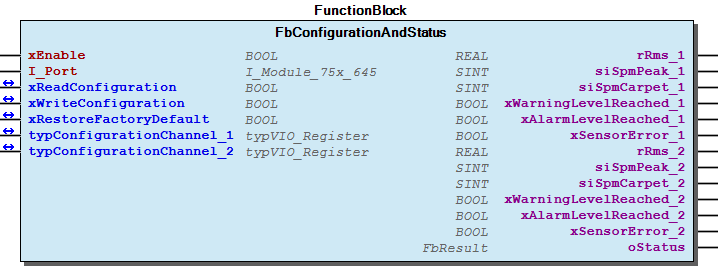

# WagoAppVibrationMonitoring v1.7.1.1 (WAGO) - Complete Documentation

## 📋 Library Information

- **Company:** WAGO
- **Title:** WagoAppVibrationMonitoring
- **Version:** 1.7.1.1
- **Categories:** WAGO LayerView|App; WAGO FunctionalView|Device|IO; Application
- **Author:** WAGO/u010663
- **Placeholder:** WagoAppVibrationMonitoring

### Description ¶

This document is automatically generated.

Handling module 750-645

This document is automatically generated. Handling module 750-645

### Contents: ¶

Contents: - Documentation Index - Project Information - Library Information - Function Blocks - Program Organization - Internal Components - Global Variable Lists Status (GVL) - VersionHistory (GVL) Other Components - 30 Visu - 30 Visualizations - 80 Status - Data types - GlobalTextList (Text List) - VIO_Visu (STRUCT) - eStatus (ENUM) - typVIO_Register (STRUCT)

### Indices and tables ¶

Based on WagoAppVibrationMonitoring.library, last modified 20.09.2024, 21:47:18. LibDoc 3.5.16.10

© WAGO GmbH & Co. KG, Germany 2018 – All rights reserved. For the avoidance of doubt, this copyright notice does not only apply to the information above but also and primarily to the described library itself. Please note that third-party products are always mentioned without reference to intellectual property rights, including patents, utility models, designs and trademarks, accordingly the existence of such rights cannot be excluded. WAGO is a registered trademark of WAGO Verwaltungsgesellschaft mbH.

- File and Project Information - Library Reference Based on WagoAppVibrationMonitoring.library, last modified 20.09.2024, 21:47:18. LibDoc 3.5.16.10 © WAGO GmbH & Co. KG, Germany 2018 – All rights reserved. For the avoidance of doubt, this copyright notice does not only apply to the information above but also and primarily to the described library itself. Please note that third-party products are always mentioned without reference to intellectual property rights, including patents, utility models, designs and trademarks, accordingly the existence of such rights cannot be excluded. WAGO is a registered trademark of WAGO Verwaltungsgesellschaft mbH.

### Documentation Index

## WagoAppVibrationMonitoring Library Documentation

| Company: | WAGO |
| Title: | WagoAppVibrationMonitoring |
| Version: | 1.7.1.1 |
| Categories: | WAGO LayerView\|App; WAGO FunctionalView\|Device\|IO; Application |
| Author: | WAGO/u010663 |
| Placeholder: | WagoAppVibrationMonitoring |

### Description

This document is automatically generated.

Handling module 750-645

This document is automatically generated. Handling module 750-645

### Contents:

- 20 Program Organization Units Data types - FbConfigurationAndStatus (FB) 30 Visualizations 80 Status - Status (GVL) - eStatus (ENUM) 90 Internal - 30 Visu VersionHistory (GVL)

### Indices and tables

Based on WagoAppVibrationMonitoring.library, last modified 20.09.2024, 21:47:18. LibDoc 3.5.16.10

© WAGO GmbH & Co. KG, Germany 2018 – All rights reserved. For the avoidance of doubt, this copyright notice does not only apply to the information above but also and primarily to the described library itself. Please note that third-party products are always mentioned without reference to intellectual property rights, including patents, utility models, designs and trademarks, accordingly the existence of such rights cannot be excluded. WAGO is a registered trademark of WAGO Verwaltungsgesellschaft mbH.

- File and Project Information - Library Reference Based on WagoAppVibrationMonitoring.library, last modified 20.09.2024, 21:47:18. LibDoc 3.5.16.10 © WAGO GmbH & Co. KG, Germany 2018 – All rights reserved. For the avoidance of doubt, this copyright notice does not only apply to the information above but also and primarily to the described library itself. Please note that third-party products are always mentioned without reference to intellectual property rights, including patents, utility models, designs and trademarks, accordingly the existence of such rights cannot be excluded. WAGO is a registered trademark of WAGO Verwaltungsgesellschaft mbH.

### Project Information

## File and Project Information

| Scope | Name | Type | Content |
| --- | --- | --- | --- |
| FileHeader | libraryFile | string | WagoAppVibrationMonitoring.library |
| contentFile | doc.clean.json |
| productName | e!COCKPIT |
| creationDateTime | date | 20.09.2024, 21:47:23 |
| companyName | string | WAGO |
| ProjectInformation | LastModificationDateTime | date | 20.09.2024, 21:47:18 |
| Description | string | See: Description |
| Copyright | © WAGO Kontakttechnik GmbH & Co. KG, Germany 2018 – All rights reserved. |
| Author | WAGO/u010663 |
| AutoResolveUnbound | bool | True |
| Placeholder | string | WagoAppVibrationMonitoring |
| Company | WAGO |
| DocFormat | reStructuredText |
| Project | WagoAppVibrationMonitoring |
| DefaultNamespace |  |
| Version | version | 1.7.1.1 |
| Version string | string |  |
| Title | WagoAppVibrationMonitoring |
| LibraryCategories | library-category-list | WAGO LayerView\|App; WAGO FunctionalView\|Device\|IO; Application |
| CompiledLibraryCompatibilityVersion | string | CODESYS V3.5 SP16 Patch 3 |

### Library Information

## Library Reference

| LinkAllContent: False QualifiedOnly: False | SystemLibrary: True | Optional: False |

| LinkAllContent: False QualifiedOnly: False | SystemLibrary: True | Optional: False |

| LinkAllContent: False QualifiedOnly: False | SystemLibrary: True | Optional: False |

| LinkAllContent: False QualifiedOnly: False | SystemLibrary: True | Optional: False |

| LinkAllContent: False QualifiedOnly: False | SystemLibrary: True | Optional: False |

| LinkAllContent: False QualifiedOnly: False | SystemLibrary: True | Optional: False |

| LinkAllContent: False QualifiedOnly: False | SystemLibrary: True | Optional: False |

| LinkAllContent: False QualifiedOnly: False | SystemLibrary: True | Optional: False |

| LinkAllContent: False QualifiedOnly: False | SystemLibrary: True | Optional: False |

| LinkAllContent: False QualifiedOnly: False | SystemLibrary: True | Optional: False |

| LinkAllContent: False QualifiedOnly: False | SystemLibrary: True | Optional: False |

| LinkAllContent: False Optional: False | QualifiedOnly: False SystemLibrary: True | PublishSymbolsInContainer: True |

| LinkAllContent: False QualifiedOnly: False | SystemLibrary: True | Optional: False |

| LinkAllContent: False QualifiedOnly: True | SystemLibrary: False | Optional: False |

| LinkAllContent: False QualifiedOnly: False | SystemLibrary: False | Optional: False |

| LinkAllContent: False QualifiedOnly: False | SystemLibrary: False | Optional: False |

| LinkAllContent: False QualifiedOnly: True | SystemLibrary: False | Optional: False |

| LinkAllContent: False QualifiedOnly: True | SystemLibrary: False | Optional: False |

| LinkAllContent: False QualifiedOnly: True | SystemLibrary: False | Optional: False |

This is a dictionary of all referenced libraries and their name spaces.

This is a dictionary of all referenced libraries and their name spaces. VisuElem3DPath Library Identification : Placeholder: System_VisuElem3DPath Default Resolution: VisuElem3DPath, 3.5.16.30 (System) Namespace: VisuElem3DPath Library Properties : Library Parameter : Parameter: GC_POINTS_PER_POLYGON = 100 VisuElemCamDisplayer Library Identification : Placeholder: System_VisuElemCamDisplayer Default Resolution: VisuElemCamDisplayer, 3.5.16.30 (System) Namespace: VisuElemCamDisplayer Library Properties : Library Parameter : Parameter: GC_POINTS_PER_CAM = 100 VisuElemMeter Library Identification : Placeholder: System_VisuElemMeter Default Resolution: VisuElemMeter, 3.5.16.30 (System) Namespace: VisuElemMeter Library Properties : VisuElemTextEditor Library Identification : Placeholder: System_VisuElemTextEditor Default Resolution: VisuElemTextEditor, 3.5.16.30 (System) Namespace: VisuElemTextEditor Library Properties : VisuElemTrace Library Identification : Placeholder: System_VisuElemTrace Default Resolution: VisuElemTrace, 3.5.16.30 (System) Namespace: VisuElemTrace Library Properties : VisuElemXYChart Library Identification : Placeholder: System_VisuElemXYChart Default Resolution: VisuElemXYChart, 3.5.16.30 (System) Namespace: VisuElemXYChart Library Properties : VisuElems Library Identification : Placeholder: System_VisuElems Default Resolution: VisuElems, 3.5.16.30 (System) Namespace: VisuElems Library Properties : VisuElemsAlarm Library Identification : Placeholder: System_VisuElemsAlarm Default Resolution: VisuElemsAlarm, 3.5.16.30 (System) Namespace: VisuElemsAlarm Library Properties : VisuElemsDateTime Library Identification : Placeholder: System_VisuElemsDateTime Default Resolution: VisuElemsDateTime, 3.5.16.30 (System) Namespace: VisuElemsDateTime Library Properties : VisuElemsSpecialControls Library Identification : Placeholder: System_VisuElemsSpecialControls Default Resolution: VisuElemsSpecialControls, 3.5.16.30 (System) Namespace: VisuElemsSpecialControls Library Properties : VisuElemsWinControls Library Identification : Placeholder: System_VisuElemsWinControls Default Resolution: VisuElemsWinControls, 3.5.16.30 (System) Namespace: VisuElemsWinControls Library Properties : VisuInputs Library Identification : Placeholder: system_visuinputs Default Resolution: VisuInputs, 3.5.16.30 (System) Namespace: visuinputs Library Properties : VisuNativeControl Library Identification : Placeholder: System_VisuNativeControl Default Resolution: VisuNativeControl, 3.5.16.0 (System) Namespace: VisuNativeControl Library Properties : VisuSymbols Library Identification : Name: VisuSymbols Version: newest Company: System Namespace: VisuSymbols Library Properties : WagoSysErrorBase Library Identification : Placeholder: WagoSysErrorBase Default Resolution: WagoSysErrorBase, * (WAGO) Namespace: WagoSysErrorBase Library Properties : WagoSysVersion Library Identification : Name: WagoSysVersion Version: 1.0.0.0 Company: WAGO Namespace: WagoSysVersion Library Properties : WagoTypesErrorBase Library Identification : Placeholder: WagoTypesErrorBase Default Resolution: WagoTypesErrorBase, * (WAGO) Namespace: WagoTypesErrorBase Library Properties : WagoTypesModuleBase Library Identification : Placeholder: WagoTypesModuleBase Default Resolution: WagoTypesModuleBase, * (WAGO) Namespace: WagoTypesModuleBase Library Properties : Library Parameter : Parameter: MAX_MBX_SIZE = 18 WagoTypesModule_75x_645 Library Identification : Placeholder: WagoTypesModule_75x_645 Default Resolution: WagoTypesModule_75x_645, * (WAGO) Namespace: WagoTypesModule_75x_645 Library Properties :

### Function Blocks

## FbConfigurationAndStatus (FB)

| Scope | Name | Type | Comment |
| --- | --- | --- | --- |
| Input | xEnable | BOOL | Enable function block |
| I_Port | WagoTypesModule_75x_645.I_Module_75x_645 | Basic interface to module 750-645 |
| Inout | xReadConfiguration | BOOL | Read configuration ->variable will be reset by function block |
| xWriteConfiguration | BOOL | Write configuration ->variable will be reset by function block |
| xRestoreFactoryDefault | BOOL | Restore default configuration ->variable will be reset by function block |
| typConfigurationChannel_1 | typVIO_Register | Configuration values channel 1 |
| typConfigurationChannel_2 | typVIO_Register | Configuration values channel 2 |
| Output | rRms_1 | REAL | RMS value vibration monitoring channel 1 |
| siSpmPeak_1 | SINT | Peak value roller bearing channel 1 |
| siSpmCarpet_1 | SINT | Carpet value roller bearing channel 1 |
| xWarningLevelReached_1 | BOOL | Warning threshold reached RMS value channel 1 |
| xAlarmLevelReached_1 | BOOL | Alarm threshold reached RMS value channel 1 |
| xSensorError_1 | BOOL | Error Channel 1 |
| rRms_2 | REAL | RMS value vibration monitoring channel 2 |
| siSpmPeak_2 | SINT | Peak value roller bearing channel 2 |
| siSpmCarpet_2 | SINT | Carpet value roller bearing channel 2 |
| xWarningLevelReached_2 | BOOL | Warning threshold reached RMS value channel 2 |
| xAlarmLevelReached_2 | BOOL | Alarm threshold reached RMS value channel 2 |
| xSensorError_2 | BOOL | Error Channel 2 |
| oStatus | WagoSysErrorBase.FbResult |  |

Reading the actual process values as well as configuring the module

Graphical Illustration

Interface variables Function Reading the actual process values as well as configuring the module Graphical Illustration 

### Program Organization

## 20 Program Organization Units

- Data types VIO_Visu (STRUCT) - typVIO_Register (STRUCT) FbConfigurationAndStatus (FB)

### Internal Components

## 90 Internal ¶

- 30 Visu GlobalTextList (Text List)

### Global Variable Lists

## Status (GVL)

| Scope | Name | Type | Initial |
| --- | --- | --- | --- |
| Constant | Status_645 | ARRAY [0..8] OF WagoTypesErrorBase.typResultItem | [STRUCT(ID := eStatus.OK, Severity := WagoTypesErrorBase.WagoTypes.eSeverity.info, text := ‘OK’), STRUCT(ID := eStatus.WritingActive, Severity := WagoTypesErrorBase.WagoTypes.eSeverity.info, text := ‘WritingActive’), STRUCT(ID := eStatus.WritingSuccesful, Severity := WagoTypesErrorBase.WagoTypes.eSeverity.info, text := ‘WritingSuccesful’), STRUCT(ID := eStatus.ReadingActive, Severity := WagoTypesErrorBase.WagoTypes.eSeverity.info, text := ‘ReadingActive’), STRUCT(ID := eStatus.ReadingSuccesful, Severity := WagoTypesErrorBase.WagoTypes.eSeverity.info, text := ‘ReadingSuccesful’), STRUCT(ID := eStatus.RestoreActive, Severity := WagoTypesErrorBase.WagoTypes.eSeverity.info, text := ‘RestoreActive’), STRUCT(ID := eStatus.RestoreSuccesful, Severity := WagoTypesErrorBase.WagoTypes.eSeverity.info, text := ‘RestoreSuccesful’)] |

Description: Status information

Description: Status information

## VersionHistory (GVL)

| Name | Type |
| --- | --- |
| Info | ProjectInfo |

| date | version | author | change |
| 19.06.2024 | 1.7.1.1 | u0103719 | add library via placeholder (context: VisuSymbols) |
| 08.01.2019 | 1.7.1.0 | u015842 | Properties: free placeholder added |
| 24.09.2018 | 1.7.0.1 | u010663 | Bugfix format visualization value SPM peak |
| 06.06.2017 | 1.7.0.0 | u010663 | Compiler Version set to V3.5.9.10 |
| 25.02.2016 | 1.6.0.0 | u010663 | Update according to WagoTypesModuleBase namespace added |
| 30.09.2015 | 1.5.0.2 | u010663 | Libraries inserted by placeholder |
| 24.08.2015 | 1.5.0.1 | u010663 | Placeholder added |
| 12.08.2015 | 1.5.0.0 | u010663 | released |

WagoAppVibrationMonitoring.library

Release Notes:

WagoAppVibrationMonitoring.library Release Notes:

### Other Components

## 30 Visu ¶

- GlobalTextList (Text List)

## 30 Visualizations ¶

## 80 Status ¶

- Status (GVL) - eStatus (ENUM)

## Data types

- VIO_Visu (STRUCT) - typVIO_Register (STRUCT)

## GlobalTextList (Text List) ¶

## VIO_Visu (STRUCT)

| Name | Type | Comment |
| --- | --- | --- |
| xReadParameter | BOOL |  |
| xWriteParameter | BOOL |  |
| xRestoreFactoryDefault | BOOL |  |
| typChannel_1 | typVIO_Register |  |
| typChannel_2 | typVIO_Register |  |
| rRms_1 | REAL | Schwingstärke (Schwingungsüberwachung) Kanal 1 |
| siSpmPeak_1 | SINT | Spitzenwert der Stoßimpulsmessung (für Wälzlagerdiagnose) Kanal 1 |
| siSpmCarpet_1 | SINT | Teppichwert der Stoßimpulsmessung (für Wälzlagediagnose) Kanal 1 |
| xWarningLevelReached_1 | BOOL |  |
| xAlarmLevelReached_1 | BOOL |  |
| xSensorError_1 | BOOL |  |
| rRms_2 | REAL | Schwingstärke (Schwingungsüberwachung) Kanal 2 |
| siSpmPeak_2 | SINT | Spitzenwert der Stoßimpulsmessung (für Wälzlagerdiagnose) Kanal 2 |
| siSpmCarpet_2 | SINT | Teppichwert der Stoßimpulsmessung (für Wälzlagediagnose) Kanal 2 |
| xWarningLevelReached_2 | BOOL |  |
| xAlarmLevelReached_2 | BOOL |  |
| xSensorError_2 | BOOL |  |
| wError | WORD |  |
| sStatus | STRING |  |
| btnSPM_Range_1 | BYTE |  |
| btnModus_1 | BYTE |  |
| btnFrequenz_1 | BYTE |  |
| btnSPM_Range_2 | BYTE |  |
| btnModus_2 | BYTE |  |
| btnFrequenz_2 | BYTE |  |

## eStatus (ENUM)

| Name | Initial |
| --- | --- |
| OK | 0 |
| WritingActive | 1 |
| WritingSuccesful | 2 |
| ReadingActive | 3 |
| ReadingSuccesful | 4 |
| RestoreActive | 5 |
| RestoreSuccesful | 6 |

Description: Status information

InOut: Description: Status information

## typVIO_Register (STRUCT)

| Name | Type | Initial | Comment |
| --- | --- | --- | --- |
| bModus | BYTE | 3 | Messmodus, Reg41- 0: keine Messung, 1: RMS, 2: SPM, 3: RMS+SPM |
| bRange_SPM | BYTE | 2 | Messbereich SPM, Reg 43 - 0: bis +80dB, 1: bis +60dB, 2: bis +40dB |
| rAlarm_rms | REAL | 15.0 | Alarmschwelle RMS [mm/s], Reg 48 |
| tDelay_alarm_rms | WORD | 10 | DelayTime Alarm RMS [s], Reg 49 |
| rWarn_rms | REAL | 10.0 | Warnschwelle RMS [mm/s], Reg 50 |
| tDelay_warn_rms | WORD | 30 | DelayTime Warn RMS [s], Reg 51 |
| wAlarm_spm | WORD | 16#41 | Alarmschwelle SPM [dBsv], Reg 52 |
| tDelay_alarm_spm | WORD | 10 | DelayTime Alarm SPM [s], Reg 53 |
| wWarn_spm | WORD | 16#37 | Warnschwelle SPM [dBsv], Reg 54 |
| tDelay_warn_spm | WORD | 30 | DelayTime Warn SPM [s], Reg 55 |
| xLowFrequenzLimit_2 | BOOL | 0 | false=10 Hz,2/10 Hz Umschaltung, Reg42 - 0: 10 - 1000 Hz, 1: 2 - 1000 Hz |
| btnFrequenz | BYTE |  |  |