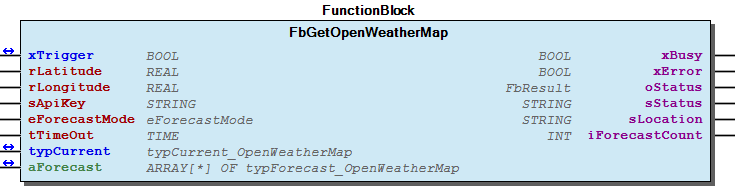
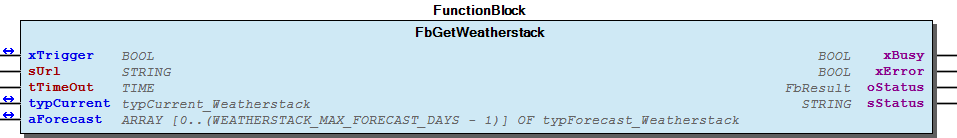

# WagoAppWeatherForecast v1.2.0.3 (WAGO) - Complete Documentation

## 📋 Library Information

- **Company:** WAGO
- **Title:** WagoAppWeatherForecast
- **Version:** 1.2.0.3
- **Categories:** WAGO FunctionalView|Connectivity; WAGO LayerView|App; Application
- **Author:** WAGO / u010663
- **Placeholder:** WagoAppWeatherForecast

### Description ¶

This document is automatically generated. Because of this, the chapter 30 Visualization is not shown in this document. If you are interested in getting to know more about visualization, we refer to the library manager of e!Cockpit.

Function block supporting access to different weather data provider [1]

This document is automatically generated. Because of this, the chapter 30 Visualization is not shown in this document. If you are interested in getting to know more about visualization, we refer to the library manager of e!Cockpit. Function block supporting access to different weather data provider [1]

### Contents: ¶

Contents: - Documentation Index 10 Documentation - WagoAppWeatherForecast Library Documentation Project Information Library Information Function Blocks - FbGetOpenWeatherMap (FB) - FbGetWeatherstack (FB) - FbGetWorldWeatherOnline (FB) - doc10_SystemProperties (FB) Methods - typCurrent_OpenWeatherMap (STRUCT) - typForecast_OpenWeatherMap (STRUCT) Program Organization Global Variable Lists - Status (GVL) - VersionHistory (GVL) Other Components - 80 Status - DataTypes - ParameterList (PARAMS) - eForecastMode (ENUM) - eStatus (ENUM) - eWeatherstackMode (ENUM) - typCurrent_Weatherstack (STRUCT) - typCurrent_WorldWeatherOnline (STRUCT) - typForecast_HourWeatherstack (STRUCT) - typForecast_Weatherstack (STRUCT) - ... and 1 more

### Indices and tables ¶

| [1] | Based on WagoAppWeatherForecast.library, last modified 10.11.2021, 15:16:37. LibDoc 3.5.15.30 |

© WAGO Kontakttechnik GmbH & Co. KG, Germany 2018 – All rights reserved. For the avoidance of doubt, this copyright notice does not only apply to the information above but also and primarily to the described library itself. Please note that third-party products are always mentioned without reference to intellectual property rights, including patents, utility models, designs and trademarks, accordingly the existence of such rights cannot be excluded. WAGO is a registered trademark of WAGO Verwaltungsgesellschaft mbH.

- File and Project Information - Library Reference © WAGO Kontakttechnik GmbH & Co. KG, Germany 2018 – All rights reserved. For the avoidance of doubt, this copyright notice does not only apply to the information above but also and primarily to the described library itself. Please note that third-party products are always mentioned without reference to intellectual property rights, including patents, utility models, designs and trademarks, accordingly the existence of such rights cannot be excluded. WAGO is a registered trademark of WAGO Verwaltungsgesellschaft mbH.

### Documentation Index

## 10 Documentation ¶

- doc10_SystemProperties (FB)

## WagoAppWeatherForecast Library Documentation

| Company: | WAGO |
| Title: | WagoAppWeatherForecast |
| Version: | 1.2.0.3 |
| Categories: | WAGO FunctionalView\|Connectivity; WAGO LayerView\|App; Application |
| Author: | WAGO / u010663 |
| Placeholder: | WagoAppWeatherForecast |

### Description

This document is automatically generated. Because of this, the chapter 30 Visualization is not shown in this document. If you are interested in getting to know more about visualization, we refer to the library manager of e!Cockpit.

Function block supporting access to different weather data provider [1]

This document is automatically generated. Because of this, the chapter 30 Visualization is not shown in this document. If you are interested in getting to know more about visualization, we refer to the library manager of e!Cockpit. Function block supporting access to different weather data provider [1]

### Contents:

- 10 Documentation doc10_SystemProperties (FB) 20 Program Organization Units - DataTypes - FbGetOpenWeatherMap (FB) - FbGetWeatherstack (FB) - FbGetWorldWeatherOnline (FB) 80 Status - Status (GVL) - eStatus (ENUM) ParameterList (PARAMS) VersionHistory (GVL)

### Indices and tables

| [1] | Based on WagoAppWeatherForecast.library, last modified 10.11.2021, 15:16:37. LibDoc 3.5.15.30 |

© WAGO Kontakttechnik GmbH & Co. KG, Germany 2018 – All rights reserved. For the avoidance of doubt, this copyright notice does not only apply to the information above but also and primarily to the described library itself. Please note that third-party products are always mentioned without reference to intellectual property rights, including patents, utility models, designs and trademarks, accordingly the existence of such rights cannot be excluded. WAGO is a registered trademark of WAGO Verwaltungsgesellschaft mbH.

- File and Project Information - Library Reference © WAGO Kontakttechnik GmbH & Co. KG, Germany 2018 – All rights reserved. For the avoidance of doubt, this copyright notice does not only apply to the information above but also and primarily to the described library itself. Please note that third-party products are always mentioned without reference to intellectual property rights, including patents, utility models, designs and trademarks, accordingly the existence of such rights cannot be excluded. WAGO is a registered trademark of WAGO Verwaltungsgesellschaft mbH.

### Project Information

## File and Project Information

| Scope | Name | Type | Content |
| --- | --- | --- | --- |
| FileHeader | libraryFile | string | WagoAppWeatherForecast.library |
| contentFile | WagoAppWeatherForecast_clr.json |
| productName | e!COCKPIT |
| creationDateTime | date | 10.11.2021, 15:16:41 |
| companyName | string | WAGO |
| ProjectInformation | LastModificationDateTime | date | 10.11.2021, 15:16:37 |
| Description | string | See: Description |
| Copyright | © WAGO Kontakttechnik GmbH & Co. KG, Germany 2018 – All rights reserved. |
| Author | WAGO / u010663 |
| AutoResolveUnbound | bool | True |
| Placeholder | string | WagoAppWeatherForecast |
| Company | WAGO |
| DocFormat | reStructuredText |
| Project | WagoAppWeatherForecast |
| Version | version | 1.2.0.3 |
| Version string | string |  |
| Title | WagoAppWeatherForecast |
| LibraryCategories | library-category-list | WAGO FunctionalView\|Connectivity; WAGO LayerView\|App; Application |
| CompiledLibraryCompatibilityVersion | string | CODESYS V3.5 SP16 Patch 3 |

### Library Information

## Library Reference

This is a dictionary of all referenced libraries and their name spaces.

This is a dictionary of all referenced libraries and their name spaces.

### 3SLicense

#### Library Identification

Placeholder: 3SLicense Default Resolution: 3SLicense, 0.0.0.0 (3S - Smart Software Solutions GmbH) Namespace: _3S_LICENSE

#### Library Properties

| LinkAllContent: False QualifiedOnly: False | Key: 3SLicense SystemLibrary: True | Optional: False |

### Breakpoint Logging Functions

#### Library Identification

Placeholder: BreakpointLogging Default Resolution: Breakpoint Logging Functions, 3.5.5.0 (3S - Smart Software Solutions GmbH) Namespace: BPLog

#### Library Properties

| LinkAllContent: False QualifiedOnly: True | Key: BreakpointLogging SystemLibrary: True | Optional: False |

### IoStandard

#### Library Identification

Placeholder: IoStandard Default Resolution: IoStandard, 3.5.9.0 (System) Namespace: IoStandard

#### Library Properties

| LinkAllContent: True QualifiedOnly: False | Key: IoStandard SystemLibrary: True | Optional: False |

### Standard

#### Library Identification

Placeholder: Standard Default Resolution: Standard, * (System) Namespace: Standard

#### Library Properties

| LinkAllContent: False QualifiedOnly: False | Key: Standard SystemLibrary: False | Optional: False |

### SysMem

#### Library Identification

Placeholder: SysMem Default Resolution: SysMem, * (System) Namespace: SysMem

#### Library Properties

| LinkAllContent: False QualifiedOnly: False | Key: SysMem SystemLibrary: False | Optional: False |

### VisuElem3DPath

#### Library Identification

Placeholder: System_VisuElem3DPath Default Resolution: VisuElem3DPath, 3.5.9.0 (System) Namespace: VisuElem3DPath

#### Library Properties

| LinkAllContent: False QualifiedOnly: False | Key: System_VisuElem3DPath SystemLibrary: True | Optional: False |

#### Library Parameter

Parameter: GC_POINTS_PER_POLYGON = 100

### VisuElemCamDisplayer

#### Library Identification

Placeholder: System_VisuElemCamDisplayer Default Resolution: VisuElemCamDisplayer, 3.5.7.0 (System) Namespace: VisuElemCamDisplayer

#### Library Properties

| LinkAllContent: False QualifiedOnly: False | Key: System_VisuElemCamDisplayer SystemLibrary: True | Optional: False |

#### Library Parameter

Parameter: GC_POINTS_PER_CAM = 100

### VisuElemMeter

#### Library Identification

Placeholder: System_VisuElemMeter Default Resolution: VisuElemMeter, 3.5.9.0 (System) Namespace: VisuElemMeter

#### Library Properties

| LinkAllContent: False QualifiedOnly: False | Key: System_VisuElemMeter SystemLibrary: True | Optional: False |

### VisuElemTextEditor

#### Library Identification

Placeholder: System_VisuElemTextEditor Default Resolution: VisuElemTextEditor, 3.5.9.0 (System) Namespace: VisuElemTextEditor

#### Library Properties

| LinkAllContent: False QualifiedOnly: False | Key: System_VisuElemTextEditor SystemLibrary: True | Optional: False |

### VisuElemTrace

#### Library Identification

Placeholder: System_VisuElemTrace Default Resolution: VisuElemTrace, 3.5.9.10 (System) Namespace: VisuElemTrace

#### Library Properties

| LinkAllContent: False QualifiedOnly: False | Key: System_VisuElemTrace SystemLibrary: True | Optional: False |

### VisuElems

#### Library Identification

Placeholder: System_VisuElems Default Resolution: VisuElems, 3.5.9.10 (System) Namespace: VisuElems

#### Library Properties

| LinkAllContent: False QualifiedOnly: False | Key: System_VisuElems SystemLibrary: True | Optional: False |

### VisuElemsAlarm

#### Library Identification

Placeholder: System_VisuElemsAlarm Default Resolution: VisuElemsAlarm, 3.5.9.0 (System) Namespace: VisuElemsAlarm

#### Library Properties

| LinkAllContent: False QualifiedOnly: False | Key: System_VisuElemsAlarm SystemLibrary: True | Optional: False |

### VisuElemsDateTime

#### Library Identification

Placeholder: System_VisuElemsDateTime Default Resolution: VisuElemsDateTime, 3.5.9.0 (System) Namespace: VisuElemsDateTime

#### Library Properties

| LinkAllContent: False QualifiedOnly: False | Key: System_VisuElemsDateTime SystemLibrary: True | Optional: False |

### VisuElemsSpecialControls

#### Library Identification

Placeholder: System_VisuElemsSpecialControls Default Resolution: VisuElemsSpecialControls, 3.5.9.0 (System) Namespace: VisuElemsSpecialControls

#### Library Properties

| LinkAllContent: False QualifiedOnly: False | Key: System_VisuElemsSpecialControls SystemLibrary: True | Optional: False |

### VisuElemsWinControls

#### Library Identification

Placeholder: System_VisuElemsWinControls Default Resolution: VisuElemsWinControls, 3.5.9.10 (System) Namespace: VisuElemsWinControls

#### Library Properties

| LinkAllContent: False QualifiedOnly: False | Key: System_VisuElemsWinControls SystemLibrary: True | Optional: False |

### VisuInputs

#### Library Identification

Placeholder: system_visuinputs Default Resolution: VisuInputs, 3.5.16.30 (System) Namespace: visuinputs

#### Library Properties

| LinkAllContent: False Optional: False | QualifiedOnly: False Key: system_visuinputs | SystemLibrary: True PublishSymbolsInContainer: True |

### VisuNativeControl

#### Library Identification

Placeholder: System_VisuNativeControl Default Resolution: VisuNativeControl, 3.5.9.0 (System) Namespace: VisuNativeControl

#### Library Properties

| LinkAllContent: False QualifiedOnly: False | Key: System_VisuNativeControl SystemLibrary: True | Optional: False |

### WagoAppHTTP

#### Library Identification

Placeholder: WagoAppHTTP Default Resolution: WagoAppHTTP, * (WAGO) Namespace: WagoAppHTTP

#### Library Properties

| LinkAllContent: False QualifiedOnly: True | Key: WagoAppHTTP SystemLibrary: False | PublishSymbolsInContainer: True Optional: False |

#### Library Parameter

Parameter: POSTFIELD_LENGTH = 600

### WagoAppJSON

#### Library Identification

Placeholder: WagoAppJSON Default Resolution: WagoAppJSON, * (WAGO) Namespace: WagoAppJSON

#### Library Properties

| LinkAllContent: False QualifiedOnly: False | Key: WagoAppJSON SystemLibrary: False | Optional: False |

#### Library Parameter

Parameter: JSON_REPLACE_STRING = ‘#Parameter’ Parameter: SIZE_JSON_POINTER = 255 Parameter: JSON_SKIP_STRING = ‘##’ Parameter: JSON_ADVANCED_CHUNK_SIZE_IMPORT = 50000 Parameter: MAX_ARRAY_ELEMENTS_CUSTOM = 7 Parameter: JSON_MAX_STRING = 2000 Parameter: JSON_ADVANCED_CHUNK_SIZE_EXPORT = 50000 Parameter: MAX_JSON_FILE_SIZE = 6000 Parameter: JSON_POINTER_RESULT = 255 Parameter: JSON_MAX_DATA_LENGTH = 65535 Parameter: JSON_NAME_ARRAY_BY_INDEX_SAX = FALSE Parameter: JSON_SAX_UTF8_ENABLED = FALSE Parameter: JSON_MAX_PARAMETER_STRING = 80 Parameter: JSON_MAX_TOKEN_COUNT = 100 Parameter: JSON_SAX_CHUNK_SIZE = 10000 Parameter: JSON_MAX_STRING_SAX = 2000 Parameter: JSON_MAX_ARRAY_SIZE = 170 Parameter: JSON_MAX_STRING_RESULT = 80

### WagoAppProcessorLoad

#### Library Identification

Placeholder: WagoAppProcessorLoad Default Resolution: WagoAppProcessorLoad, 1.0.0.2 (WAGO) Namespace: WagoAppProcessorLoad

#### Library Properties

| LinkAllContent: False QualifiedOnly: False | Key: WagoAppProcessorLoad SystemLibrary: True | Optional: False |

### WagoAppString

#### Library Identification

Placeholder: WagoAppString Default Resolution: WagoAppString, * (WAGO) Namespace: WagoAppString

#### Library Properties

| LinkAllContent: False Optional: False | QualifiedOnly: True Key: WagoAppString | SystemLibrary: False PublishSymbolsInContainer: True |

### WagoSysCom_Internal_PFC

#### Library Identification

Placeholder: WagoSysComInternal Default Resolution: WagoSysCom_Internal_PFC, 1.0.2.1 (WAGO) Namespace: WagoSysCom_Internal

#### Library Properties

| LinkAllContent: False QualifiedOnly: False | Key: WagoSysComInternal SystemLibrary: True | Optional: False |

### WagoSysErrorBase

#### Library Identification

Placeholder: WagoSysErrorBase Default Resolution: WagoSysErrorBase, * (WAGO) Namespace: WagoSysErrorBase

#### Library Properties

| LinkAllContent: False QualifiedOnly: False | Key: WagoSysErrorBase SystemLibrary: False | PublishSymbolsInContainer: True Optional: False |

#### Library Parameter

Parameter: RES_LOG_MAX_FILESIZE = 2000 Parameter: RES_LOG_MAX_FILES = 1 Parameter: RES_LOG_MAX_ENTRIES = 200 Parameter: RES_LOG_NAME = ‘WagoAppResultLogger’

### WagoSysKbusTerminalControl

#### Library Identification

Placeholder: WagoSysKbusTerminalControl Default Resolution: WagoSysKbusTerminalControl, 1.6.1.7 (WAGO) Namespace: WagoSysKbusTerminalControl

#### Library Properties

| LinkAllContent: False QualifiedOnly: False | Key: WagoSysKbusTerminalControl SystemLibrary: True | Optional: False |

### WagoSysVersion

#### Library Identification

Name: WagoSysVersion Version: 1.0.0.0 Company: WAGO Namespace: WagoSysVersion

#### Library Properties

| LinkAllContent: False QualifiedOnly: False | Key: WagoSysVersion, 1.0.0.0 (WAGO) SystemLibrary: False | Optional: False |

### Function Blocks

## FbGetOpenWeatherMap (FB)

| Scope | Name | Type | Initial | Comment |
| --- | --- | --- | --- | --- |
| Inout | xTrigger | BOOL |  | Weather data is received on a rising edge, once execution is finished the variable is set to false |
| Input | rLatitude | REAL |  | geographic coordinate that specifies the north-south position of the location |
| rLongitude | REAL |  | geographic coordinate that specifies the east-west position of the location |
| sApiKey | STRING |  | Access key for the weather API |
| eForecastMode | eForecastMode | FORECAST_DETAILED | Select forecast mode: FORECAST_DAILY or FORECAST_DETAILED. With date 01.01.2018 FORECAST_DAILY is only available with Weather API “16 days forecast”, which is not for free |
| tTimeOut | TIME | TIME#30s0ms | Timeout for HTTP request |
| Inout | typCurrent | typCurrent_OpenWeatherMap |  | Current weather condition |
| Input | aForecast | POINTER TO typForecast_OpenWeatherMap |  | Weather forecast data |
| Output | xBusy | BOOL |  | Busy |
| xError | BOOL |  | Error |
| oStatus | WagoSysErrorBase.FbResult |  | Status |
| sStatus | STRING(255) |  | Status message |
| sLocation | STRING |  | Name or coordinates of location that was queried |
| iForecastCount | INT |  | Number of valid forecast datasets in “aForecast” |

This function block obtains current weather condition and weather forecasts from openweathermap.org

Graphical Illustration

Graphical Interface of FbGetOpenWeatherMap

Function Description

Forecast mode: | 1. free API version | If a free API version (current weather data or 5 day/3 hour forecast) is used, only the method FORECAST_DETAILED is supported. | Up to forty values can be read out. | The exact number is defined via the variable in the preset input field at the input “aForecast.” | In the following example, eight values should be read out: | aForecastOWM: ARRAY [0..7] OF typForecast_OpenWeatherMap;

In order to use the function block the API key and geographical position of your location is needed:

Preconditions: | - Make sure Gateway and DNS-Server are properly set in your controller configuration (Check via Ethernet Settings or Web-Based Management) | - Setup API key and geographical position (sApiKey, rLatitude, rLongitude) | - Increase the size of receive buffer by parameter MAX_WEATHER_RESPONSE :=3500 | - Increase the size of JSON token buffer by parameter JSON_MAX_TOKEN_COUNT :=500

Interface variables Function This function block obtains current weather condition and weather forecasts from openweathermap.org Graphical Illustration  Graphical Interface of FbGetOpenWeatherMap Function Description Forecast mode: | 1. free API version | If a free API version (current weather data or 5 day/3 hour forecast) is used, only the method FORECAST_DETAILED is supported. | Up to forty values can be read out. | The exact number is defined via the variable in the preset input field at the input “aForecast.” | In the following example, eight values should be read out: | aForecastOWM: ARRAY [0..7] OF typForecast_OpenWeatherMap; 2. fee-based API version If a fee-based version is used, the variant “16 day / daily forecast” can be used in addition. To do so, use the method FORECAST_DAILY at the input “eForecastMode.” Up to sixteen days can be read out. The exact number is determined via the variable “aForecast.” In order to use the function block the API key and geographical position of your location is needed: - Register at http://openweathermap.org/appid to receive personal API key. Copy your personal API key to input parameter sApiKey - Calculate geographical position data. The website www.mygeoposition.com allows to calculate the positions easily. Copy the calculated data to input parameter rLatitude and rLongitude Preconditions: | - Make sure Gateway and DNS-Server are properly set in your controller configuration (Check via Ethernet Settings or Web-Based Management) | - Setup API key and geographical position (sApiKey, rLatitude, rLongitude) | - Increase the size of receive buffer by parameter MAX_WEATHER_RESPONSE :=3500 | - Increase the size of JSON token buffer by parameter JSON_MAX_TOKEN_COUNT :=500

## FbGetWeatherstack (FB)

| Scope | Name | Type | Initial | Comment |
| --- | --- | --- | --- | --- |
| Inout | xTrigger | BOOL |  | Weather data is received on a rising edge, once execution is finished the variable is set to false |
| Input | sUrl | STRING(1023) |  | API |
| tTimeOut | TIME | TIME#30s0ms | Timeout for HTTP request |
| Inout | typCurrent | typCurrent_Weatherstack |  | Current weather condition |
| aForecast | ARRAY [0..(WEATHERSTACK_MAX_FORECAST_DAYS - 1)] OF typForecast_Weatherstack |  | Weather forecast data |
| Output | xBusy | BOOL |  | Busy |
| xError | BOOL |  | Error |
| oStatus | WagoSysErrorBase.FbResult |  | Status |
| sStatus | STRING(255) |  | Status message |

This function block obtains current weather information from api.weatherstack.com/current

Graphical Illustration

Graphical Interface of FbGetWeatherstack

Function Description

In order to use the function block an API key is needed:

Forecast data require at least a professional plan registered by Weatherstack.com and is therefore not for free available

The forecast sUrl must contain the following part: &forecast_days=3&hourly=1&interval=12&units=m . The parameters can be adjusted. e.g. 7 days instead of 3. Option hourly must be set 1 .

Make sure WEATHERSTACK_MAX_FORECAST_DAYS in the Parameterlist is set properly to allow storing all data beeing requested.

Using FbGetWeatherstack needs at least Version 1.0.2.2 from WagoAppJSON

Interface variables Function This function block obtains current weather information from api.weatherstack.com/current Graphical Illustration  Graphical Interface of FbGetWeatherstack Function Description In order to use the function block an API key is needed: Supported API version: http://api.weatherstack.com/current and http://api.weatherstack.com/forecast?access_key=02f07b2ba18e61f0a223311bc92a4997&query=Minden&forecast_days=3&hourly=1&interval=12&units=m ‘ Forecast data require at least a professional plan registered by Weatherstack.com and is therefore not for free available The forecast sUrl must contain the following part: &forecast_days=3&hourly=1&interval=12&units=m . The parameters can be adjusted. e.g. 7 days instead of 3. Option hourly must be set 1 . Make sure WEATHERSTACK_MAX_FORECAST_DAYS in the Parameterlist is set properly to allow storing all data beeing requested. Using FbGetWeatherstack needs at least Version 1.0.2.2 from WagoAppJSON

## FbGetWorldWeatherOnline (FB)

| Scope | Name | Type | Initial | Comment |
| --- | --- | --- | --- | --- |
| Inout | xTrigger | BOOL |  | Weather data is received on a rising edge, once execution is finished the variable is set to false |
| Input | rLatitude | REAL |  | geographic coordinate that specifies the north-south position of the location |
| rLongitude | REAL |  | geographic coordinate that specifies the east-west position of the location |
| sApiKey | STRING |  | Access key for the weather API |
| eForecastMode | eForecastMode |  | Select forecast mode: FORECAST_DAILY or FORECAST_DETAILED |
| tTimeOut | TIME | TIME#30s0ms | Timeout for HTTP request |
| Inout | typCurrent | typCurrent_WorldWeatherOnline |  | Current weather condition |
| Input | aForecast | POINTER TO typForecast_WorldWeatherOnline |  | Weather forecast data |
| Output | xBusy | BOOL |  | Busy |
| xError | BOOL |  | Error |
| oStatus | WagoSysErrorBase.FbResult |  | Status |
| sStatus | STRING(255) |  | Status message |
| sLocation | STRING |  | Name or coordinates of location that was queried |
| iForecastCount | INT |  | Number of valid forecast datasets in “aForecast” |

This function block obtains current weather condition and weather forecasts (5 days or 6h interval (8 elements of 6 hours)) from worldweatheronline.com

Graphical Illustration

Graphical Interface of FbGetWorldWeatherOnline

Function Description

In order to use the function block the API key and geographical position of your location is needed:

Error codes: | ‘PARSE-ERROR: JSON_PARSE() returns <Return value>’ | ‘API-ERROR: PARAMETER-ERROR: eForecastMode = <NUMBER> not supported!’ | ‘PARAMETER-ERROR: eForecastMode = <Parameter value> not supported!’

Interface variables Function This function block obtains current weather condition and weather forecasts (5 days or 6h interval (8 elements of 6 hours)) from worldweatheronline.com Graphical Illustration  Graphical Interface of FbGetWorldWeatherOnline Function Description In order to use the function block the API key and geographical position of your location is needed: - Register at https://developer.worldweatheronline.com/auth/register to receive personal API key. Copy your personal API key to input parameter sApiKey - Calculate geographical position data. The website www.mygeoposition.com allows to calculate the positions easily. Copy the calculated data to input parameter rLatitude and rLongitude Preconditions: - Make sure Gateway and DNS-Server are properly set in your controller configuration (Check via Ethernet Settings or Web-Based Management) - Setup API key and geographical position (sApiKey, rLatitude, rLongitude) - Increase the size of receive buffer by parameter MAX_WEATHER_RESPONSE :=10000 - Increase the size of JSON token buffer by parameter JSON_MAX_TOKEN_COUNT :=1000 Forecast mode: 1. eForecastMode = FORECAST_DAILY Forecast for 5 days. The output “aForecast” contains 5 elements. Each shows the average forecast values for a single day. 2. eForecastMode = FORECAST_DETAILED 6-hourly forecast The output “aForecast” contains 8 elements. Each shows the forecast values for a 6 hours period. Error codes: | ‘PARSE-ERROR: JSON_PARSE() returns <Return value>’ | ‘API-ERROR: PARAMETER-ERROR: eForecastMode = <NUMBER> not supported!’ | ‘PARAMETER-ERROR: eForecastMode = <Parameter value> not supported!’

## doc10_SystemProperties (FB)

This library provides function blocks to obtain weather forecasts and current weather conditions from different providers.

A registration on the associated website is mandatory in order to use these services. During registration a personal API key is assigned, which is used to access the weather forecast APIs.

Parsing the data may take at least one long plc cycle, therefore the use of this library in a background task is recommended

Depending on the choosen provider, the following two parameter within the ParameterList must be adjusted: | - MAX_WEATHER_RESPONSE | - JSON_MAX_TOKEN_COUNT

WorldWeatherOnline: | MAX_WEATHER_RESPONSE:=10000 | JSON_MAX_TOKEN_COUNT:=1000

OpenWeatherMap: | MAX_WEATHER_RESPONSE:=3500 | JSON_MAX_TOKEN_COUNT:=500

Weatherstack: | MAX_WEATHER_RESPONSE:=150000 | WEATHERSTACK_MAX_FORECAST_DAYS:=7

This library provides function blocks to obtain weather forecasts and current weather conditions from different providers. Supported providers are: - OpenWeatherMap http://openweathermap.org - World Weather Online http://www.worldweatheronline.com - Weatherstack http://www.weatherstack.com A registration on the associated website is mandatory in order to use these services. During registration a personal API key is assigned, which is used to access the weather forecast APIs. Note Parsing the data may take at least one long plc cycle, therefore the use of this library in a background task is recommended Depending on the choosen provider, the following two parameter within the ParameterList must be adjusted: | - MAX_WEATHER_RESPONSE | - JSON_MAX_TOKEN_COUNT WorldWeatherOnline: | MAX_WEATHER_RESPONSE:=10000 | JSON_MAX_TOKEN_COUNT:=1000 OpenWeatherMap: | MAX_WEATHER_RESPONSE:=3500 | JSON_MAX_TOKEN_COUNT:=500 Weatherstack: | MAX_WEATHER_RESPONSE:=150000 | WEATHERSTACK_MAX_FORECAST_DAYS:=7

### Methods

## typCurrent_OpenWeatherMap (STRUCT)

| Name | Type | Comment |
| --- | --- | --- |
| dtDateTime | DT | [DT] Time of data calculation (UTC) |
| dtSunrise | DT | [DT] Time of sunrise (UTC) |
| dtSunset | DT | [DT] Time of sunset (UTC) |
| rTemp | REAL | [°C] Current temperature |
| rPressure | REAL | [hPA] Atmospheric pressure |
| rHumidity | REAL | [%] Humidity |
| rWindSpeed | REAL | [m/s] Wind speed |
| iWindDir | INT | [Degree] Wind direction |
| iCloudCover | INT | [%] Cloudiness |
| rRain | REAL | [mm] Rain volume for the last 3 hours |
| rSnow | REAL | [mm] Snow volume for the last 3 hours |
| iId | INT | Weather condition id |
| sDescription | STRING | Weather condition textual description |
| sMain | STRING | Weather condition textual description main |
| sIcon | STRING | Weather condition textual description icon |

## typForecast_OpenWeatherMap (STRUCT)

| Name | Type | Comment |
| --- | --- | --- |
| dtDate | DT | [DT] Forecast date (UTC) |
| rTempMin | REAL | [°C] Minimum temperature |
| rTempMax | REAL | [°C] Maximum temperature |
| rPressure | REAL | [hPA] Atmospheric pressure |
| rHumidity | REAL | [%] Humidity |
| rWindSpeed | REAL | [m/s] Wind speed |
| iWindDir | INT | [Degree] Wind direction |
| iCloudCover | INT | [%] Cloudiness |
| rRain | REAL | [mm] Rain volume for the last 3 hours |
| rSnow | REAL | [mm] Snow volume for the last 3 hours |
| iId | INT | number Weather condition id |
| sDescription | STRING | Text Weather condition textual description |
| rTemp | REAL | [°C] Temperature |
| rNightTemp | REAL | [°C] Night temperature |
| rEveningTemp | REAL | [°C] Evening temperature |
| rMorningTemp | REAL | [°C] Morning temperature |
| sWeatherMain | STRING | Text |
| sMain | STRING | Weather condition textual description main |
| sIcon | STRING | Weather condition textual description icon |

### Program Organization

## 20 Program Organization Units

- DataTypes eForecastMode (ENUM) - eWeatherstackMode (ENUM) - typCurrent_OpenWeatherMap (STRUCT) - typCurrent_Weatherstack (STRUCT) - typCurrent_WorldWeatherOnline (STRUCT) - typForecast_HourWeatherstack (STRUCT) - typForecast_OpenWeatherMap (STRUCT) - typForecast_Weatherstack (STRUCT) - typForecast_WorldWeatherOnline (STRUCT) FbGetOpenWeatherMap (FB) FbGetWeatherstack (FB) FbGetWorldWeatherOnline (FB)

### Global Variable Lists

## Status (GVL)

| Value | Level | Description |
| --- | --- | --- |
| eStatus.OK | WagoSysErrorBase.WagoTypes.eSeverity.info | ‘OK’ |
| eStatus.ParserError | WagoSysErrorBase.WagoTypes.eSeverity.error | ‘Parser Error’ |
| eStatus.ApiError | WagoSysErrorBase.WagoTypes.eSeverity.error | ‘API Error’ |
| eStatus.ParameterError | WagoSysErrorBase.WagoTypes.eSeverity.error | ‘Parameter Error’ |
| eStatus.ModemNoResponse | WagoSysErrorBase.WagoTypes.eSeverity.error | ‘Modem no data received’ |

Description Status information

Description Status information

## VersionHistory (GVL)

| date | version | author | change |
| 24.09.2021 | 1.2.0.3 | u010663 | Improvement FbGetOpenWeatherMap |
| 02.11.2020 | 1.2.0.2 | u010663 | Improvement FbGetOpenWeatherMap |
| 23.09.2020 | 1.2.0.1 | u010663 | New WagoAppJSON therefore internal modification in FbGetWeatherstack |
| 27.04.2020 | 1.2.0.0 | u010663 | New WagoAppJSON therefore internal modification in FbGetWeatherstack |
| 14.01.2020 | 1.1.0.0 | u010663 | New FbGetWeatherstack;Bugfix FbGetOpenWeatherMap; Delete FbGetWeatherApixu |
| 08.01.2019 | 1.0.1.0 | u015842 | Properties: free placeholder added |
| 08.03.2018 | 1.0.0.3 | u010663 | Doku improvement FbGetOpenWeatherMap |
| 06.02.2018 | 1.0.0.2 | u010663 | Bugfix FbGetOpenWeatherMap |
| 26.09.2017 | 1.0.0.1 | u010663 | Released |

WagoAppWeatherForecast.library

Release Notes:

WagoAppWeatherForecast.library Release Notes: Using FbGetWeatherstack needs at least Version 1.1.0.11 from WagoAppJSON

### Other Components

## 80 Status ¶

- Status (GVL) - eStatus (ENUM)

## DataTypes

- eForecastMode (ENUM) - eWeatherstackMode (ENUM) - typCurrent_OpenWeatherMap (STRUCT) - typCurrent_Weatherstack (STRUCT) - typCurrent_WorldWeatherOnline (STRUCT) - typForecast_HourWeatherstack (STRUCT) - typForecast_OpenWeatherMap (STRUCT) - typForecast_Weatherstack (STRUCT) - typForecast_WorldWeatherOnline (STRUCT)

## ParameterList (PARAMS)

| Scope | Name | Type | Initial | Comment |
| --- | --- | --- | --- | --- |
| Constant | MAX_WEATHER_RESPONSE | UDINT | 150000 | Defines the maximum response buffer seize |
| WEATHERSTACK_MAX_FORECAST_DAYS | INT | 7 | Used with weatherstack: Defines the maximum number of forecast days. This value must not be exceeded in the URL |
| JSON_MAX_TOKEN_COUNT | UINT | 60000 | Defines the maximum number of tokens |
| OWM_URL | STRING | ‘ http://api.openweathermap.org/data/2.5/weather ‘ | URL |
| OWM_DAILY_COUNT | STRING | ‘16’ | number of days, actual max 16 days |
| WWO_URL | STRING | ‘api.worldweatheronline.com/premium/v1/weather.ashx’ | URL |

## eForecastMode (ENUM)

| Name | Comment |
| --- | --- |
| FORECAST_DAILY | Get forecast for 5 days |
| FORECAST_DETAILED | Get detailed forecast OpenWeatherMap : 3 hours interval (8 elements of 3 hours) WorldWeatherOnline: 6 hours interval (8 elements of 6 hours) |

## eStatus (ENUM)

| Name | Initial |
| --- | --- |
| OK | 0 |
| ParserError | 1 |
| ApiError | 2 |
| ParameterError | 3 |
| ModemNoResponse | 4 |

Description Status information

InOut: Description Status information

## eWeatherstackMode (ENUM)

| Name | Comment |
| --- | --- |
| CURRENT | Get only current values |
| FORECAST | forecast data |
| UNKNOWN |  |

## typCurrent_Weatherstack (STRUCT)

| Name | Type | Comment |
| --- | --- | --- |
| sTime | STRING(30) | Time of observation UTC |
| rTemperature | REAL | [°C] Current temperature |
| wWeatherCode | WORD |  |
| rWind_speed | REAL | [mph] |
| rWind_degree | REAL | [Degree] |
| sWind_dir | STRING(3) | Description |
| rPressure | REAL | [mbar] Atmospheric pressure |
| rPrecip | REAL | [mm] Preciption |
| rHumidity | REAL | [%] Humidity |
| iCloud | INT | [%] Cloudiness |
| rFeelsLike | REAL | [°C] temperature |
| rUv_Index | REAL | UV index |
| rVisibility | REAL | [kM] |

## typCurrent_WorldWeatherOnline (STRUCT)

| Name | Type | Comment |
| --- | --- | --- |
| sTime | STRING(8) | Time of observation UTC |
| rTemp | REAL | [°C] Current temperature |
| rPressure | REAL | [hPA] Atmospheric pressure |
| rHumidity | REAL | [%] Humidity |
| rWindSpeed | REAL | [Km/h] Wind speed |
| iWindDir | INT | [Degree] Wind direction |
| iCloudCover | INT | [%] Cloudiness |
| rRain | REAL | [mm] Rain volume for the last 3 hours |
| iId | INT | Weather condition id |
| sDescription | STRING | Weather condition textual description |

## typForecast_HourWeatherstack (STRUCT)

| Name | Type | Comment |
| --- | --- | --- |
| sTime | STRING(30) | Time of observation UTC |
| rTemperature | REAL | Current temperature |
| rWind_speed | REAL |  |
| rWind_degree | REAL |  |
| sWind_dir | STRING(3) | Direction |
| wWeathercode | WORD | Weather code |
| rPrecip | REAL | Preciption |
| rHumidity | REAL | Humidity |
| rVisibility | REAL |  |
| rPressure | REAL | Atmospheric pressure |
| iCloudcover | INT | [%] Cloudiness |
| rHeatindex | REAL | Heat index |
| rDewpoint | REAL | Dewpoint |
| rWindchill | REAL | windchill temperature |
| rWindgust | REAL |  |
| rFeelsLike | REAL | temperature |
| rChanceOfRain | REAL |  |
| rChanceOfRemdry | REAL |  |
| rChanceOfWindy | REAL |  |
| rChanceOfOvercast | REAL |  |
| rChanceOfShunshine | REAL |  |
| rChanceOfFrost | REAL |  |
| rChanceOfHightemp | REAL |  |
| rChanceOfFog | REAL |  |
| rChanceOfSnow | REAL |  |
| rChanceOfThunder | REAL |  |
| rUv_Index | REAL |  |

## typForecast_Weatherstack (STRUCT)

| Name | Type | Comment |
| --- | --- | --- |
| dDate | DATE | Date |
| rMaxTemp | REAL | [°C] Current temperature |
| rMinTemp | REAL | [°C] Current temperature |
| rAvgTemp | REAL | [°C] Current temperature |
| rTotalSnow | REAL | [mm] |
| rSunHour | REAL | [h] Sun hour |
| rUvIndex | REAL | UV index |
| sunrise | STRING(10) |  |
| sunset | STRING(10) |  |
| moonrise | STRING(10) |  |
| moonset | STRING(10) |  |
| Hour | ARRAY [0..23] OF typForecast_HourWeatherstack |  |

## typForecast_WorldWeatherOnline (STRUCT)

| Name | Type | Comment |
| --- | --- | --- |
| dDate | DATE | Forecast date |
| todTime | TOD | Forecast time |
| rTempMin | REAL | [°C] Minimum temperature |
| rTempMax | REAL | [°C] Maximum temperature |
| rPressure | REAL | [hPA] Atmospheric pressure |
| rHumidity | REAL | [%] Humidity |
| rWindSpeed | REAL | [Km/h] Wind speed |
| iWindDir | INT | [Degree] Wind direction |
| iCloudCover | INT | [%] Cloudiness |
| rRain | REAL | [mm] Rain volume for the last 3 hours |
| iId | INT | Weather condition id |
| sDescription | STRING | Weather condition textual description |