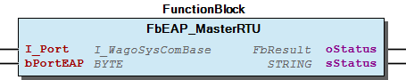
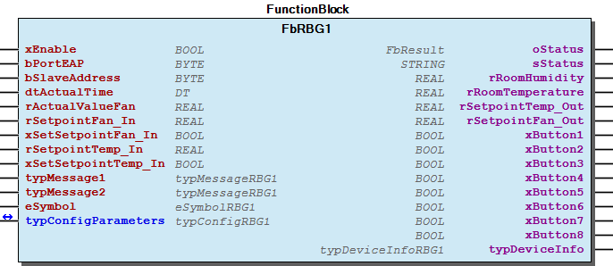

# WagoSolEAP v1.0.0.4 (WAGO) - Complete Documentation

## 📋 Library Information

- **Company:** WAGO
- **Title:** WagoSolEAP
- **Version:** 1.0.0.4
- **Categories:** WAGO BusinessView|Building Automation; Application; WAGO FunctionalView|Connectivity|Serial; WAGO LayerView|Solution
- **Namespace:** WagoSolEAP
- **Author:** WAGO / u015652
- **Placeholder:** WagoSolEAP

### Description ¶

This document is automatically generated.

This library is for EAP ROUs

The function blocks of this library are NOT thread safe and must be called from one CODESYS task only! Concurrent calls from different tasks may cause loss or corruption of data.

This document is automatically generated. This library is for EAP ROUs The function blocks of this library are NOT thread safe and must be called from one CODESYS task only! Concurrent calls from different tasks may cause loss or corruption of data.

### Contents: ¶

Contents: - Documentation Index 10 Documentation - WagoSolEAP Library Documentation Project Information Library Information Function Blocks - FbEAP_MasterRTU (FB) - FbRBG1 (FB) - doc01_Foreword (FB) Methods Program Organization Global Variable Lists - GlobalVariables (GVL) - VersionHistory (GVL) Other Components - 01 Communication - 01 Communication - 01 MODBUS RTU - 01 MODBUS RTU - 02 RBG1 - 02 RGB1 - 80 Data types - ParameterList (PARAMS) - eColorRBG1 (ENUM) - eSliderConfigRBG1 (ENUM) - ... and 7 more

### Indices and tables ¶

Based on WagoSolEAP.library, last modified 29.05.2024, 20:53:26. LibDoc 3.5.16.10

© WAGO GmbH & Co. KG, Germany 2018 – All rights reserved. For the avoidance of doubt, this copyright notice does not only apply to the information above but also and primarily to the described library itself. Please note that third-party products are always mentioned without reference to intellectual property rights, including patents, utility models, designs and trademarks, accordingly the existence of such rights cannot be excluded. WAGO is a registered trademark of WAGO Verwaltungsgesellschaft mbH.

- File and Project Information - Library Reference Based on WagoSolEAP.library, last modified 29.05.2024, 20:53:26. LibDoc 3.5.16.10 © WAGO GmbH & Co. KG, Germany 2018 – All rights reserved. For the avoidance of doubt, this copyright notice does not only apply to the information above but also and primarily to the described library itself. Please note that third-party products are always mentioned without reference to intellectual property rights, including patents, utility models, designs and trademarks, accordingly the existence of such rights cannot be excluded. WAGO is a registered trademark of WAGO Verwaltungsgesellschaft mbH.

### Documentation Index

## 10 Documentation

To ensure fast installation and start-up of the units, we strongly recommend that the following information and explanations are carefully read and adhered to.

To ensure fast installation and start-up of the units, we strongly recommend that the following information and explanations are carefully read and adhered to. - doc01_Foreword (FB)

## WagoSolEAP Library Documentation

| Company: | WAGO |
| Title: | WagoSolEAP |
| Version: | 1.0.0.4 |
| Categories: | WAGO BusinessView\|Building Automation; Application; WAGO FunctionalView\|Connectivity\|Serial; WAGO LayerView\|Solution |
| Namespace: | WagoSolEAP |
| Author: | WAGO / u015652 |
| Placeholder: | WagoSolEAP |

### Description

This document is automatically generated.

This library is for EAP ROUs

The function blocks of this library are NOT thread safe and must be called from one CODESYS task only! Concurrent calls from different tasks may cause loss or corruption of data.

This document is automatically generated. This library is for EAP ROUs The function blocks of this library are NOT thread safe and must be called from one CODESYS task only! Concurrent calls from different tasks may cause loss or corruption of data.

### Contents:

- 10 Documentation doc01_Foreword (FB) 20 Program Organization Units - 01 MODBUS RTU 80 Data types - 01 MODBUS RTU GlobalVariables (GVL) ParameterList (PARAMS) VersionHistory (GVL)

### Indices and tables

Based on WagoSolEAP.library, last modified 29.05.2024, 20:53:26. LibDoc 3.5.16.10

© WAGO GmbH & Co. KG, Germany 2018 – All rights reserved. For the avoidance of doubt, this copyright notice does not only apply to the information above but also and primarily to the described library itself. Please note that third-party products are always mentioned without reference to intellectual property rights, including patents, utility models, designs and trademarks, accordingly the existence of such rights cannot be excluded. WAGO is a registered trademark of WAGO Verwaltungsgesellschaft mbH.

- File and Project Information - Library Reference Based on WagoSolEAP.library, last modified 29.05.2024, 20:53:26. LibDoc 3.5.16.10 © WAGO GmbH & Co. KG, Germany 2018 – All rights reserved. For the avoidance of doubt, this copyright notice does not only apply to the information above but also and primarily to the described library itself. Please note that third-party products are always mentioned without reference to intellectual property rights, including patents, utility models, designs and trademarks, accordingly the existence of such rights cannot be excluded. WAGO is a registered trademark of WAGO Verwaltungsgesellschaft mbH.

### Project Information

## File and Project Information

| Scope | Name | Type | Content |
| --- | --- | --- | --- |
| FileHeader | libraryFile | string | WagoSolEAP.library |
| contentFile | doc.clean.json |
| productName | e!COCKPIT |
| creationDateTime | date | 29.05.2024, 20:53:27 |
| companyName | string | WAGO |
| ProjectInformation | LastModificationDateTime | date | 29.05.2024, 20:53:26 |
| Description | string | See: Description |
| Copyright | © WAGO Kontakttechnik GmbH & Co. KG, Germany 2018 – All rights reserved. |
| Author | WAGO / u015652 |
| AutoResolveUnbound | bool | True |
| Placeholder | string | WagoSolEAP |
| Company | WAGO |
| DocFormat | reStructuredText |
| Project | WagoSolEAP |
| DefaultNamespace | WagoSolEAP |
| Version | version | 1.0.0.4 |
| ThreadSave | bool | False |
| Title | string | WagoSolEAP |
| LibraryCategories | library-category-list | WAGO BusinessView\|Building Automation; Application; WAGO FunctionalView\|Connectivity\|Serial; WAGO LayerView\|Solution |
| CompiledLibraryCompatibilityVersion | string | CODESYS V3.5 SP16 Patch 3 |
| IsEndUserLibrary | bool | False |

### Library Information

## Library Reference

| LinkAllContent: False QualifiedOnly: True | SystemLibrary: False | Optional: False |

| LinkAllContent: False QualifiedOnly: True | SystemLibrary: False | Optional: False |

| LinkAllContent: False Optional: False | QualifiedOnly: True SystemLibrary: False | PublishSymbolsInContainer: True |

| LinkAllContent: False Optional: False | QualifiedOnly: False SystemLibrary: False | PublishSymbolsInContainer: True |

| LinkAllContent: False QualifiedOnly: False | SystemLibrary: False | Optional: False |

| LinkAllContent: False QualifiedOnly: False | SystemLibrary: False | Optional: False |

| LinkAllContent: False Optional: False | QualifiedOnly: False SystemLibrary: False | PublishSymbolsInContainer: True |

| LinkAllContent: False QualifiedOnly: False | SystemLibrary: False | Optional: False |

| LinkAllContent: False Optional: False | QualifiedOnly: False SystemLibrary: False | PublishSymbolsInContainer: True |

| LinkAllContent: False QualifiedOnly: False | SystemLibrary: False | Optional: False |

This is a dictionary of all referenced libraries and their name spaces.

This is a dictionary of all referenced libraries and their name spaces. CAA Behaviour Model Library Identification : Placeholder: CAA Behaviour Model Default Resolution: CAA Behaviour Model, * (CAA Technical Workgroup) Namespace: CBM Library Properties : CAA FB Factory Library Identification : Placeholder: CAA FB Factory Default Resolution: CAA FB Factory, * (CAA Technical Workgroup) Namespace: FBF Library Properties : CAA Types Extern Library Identification : Placeholder: CAA Types Default Resolution: CAA Types Extern, * (CAA Technical Workgroup) Namespace: CAA Library Properties : Standard Library Identification : Placeholder: Standard Default Resolution: Standard, * (System) Namespace: Standard Library Properties : WagoAppPlcModbus Library Identification : Placeholder: WagoAppPlcModbus Default Resolution: WagoAppPlcModbus, * (WAGO) Namespace: WagoAppPlcModbus Library Properties : WagoAppString Library Identification : Placeholder: WagoAppString Default Resolution: WagoAppString, * (WAGO) Namespace: WagoAppString Library Properties : Library Parameter : Parameter: MAX_STRING_LENGTH = 255 WagoSysPlainMem Library Identification : Placeholder: WagoSysPlainMem Default Resolution: WagoSysPlainMem, * (WAGO) Namespace: WagoSysPlainMem Library Properties : WagoSysVersion Library Identification : Name: WagoSysVersion Version: 1.0.0.0 Company: WAGO Namespace: WagoSysVersion Library Properties : WagoTypesCom Library Identification : Placeholder: WagoTypesCom Default Resolution: WagoTypesCom, * (WAGO) Namespace: WagoTypesCom Library Properties : WagoTypesModuleBase Library Identification : Placeholder: WagoTypesModuleBase Default Resolution: WagoTypesModuleBase, * (WAGO) Namespace: WagoTypesModuleBase Library Properties :

### Function Blocks

## FbEAP_MasterRTU (FB)

| Scope | Name | Type | Initial | Comment |
| --- | --- | --- | --- | --- |
| Input | I_Port | WagoTypesCom.I_WagoSysComBase |  | Name of the serial Interface (e.g. ‘RS232_485_Interface’, ‘COM2’, ‘SER7.2’,... ) |
| bPortEAP | BYTE | 1 | Master assignment number for other function blocks. Range 1 to MAX_MASTER (5). |
| Output | oStatus | WagoAppPlcModbus.WagoSysErrorBase.FbResult |  | Status object. The content of the error object could be displayed via the FbDisplayResult from the WagoSysErrorBase library. |
| sStatus | STRING |  | Status description as string |

It is recommended to use maximal 8 EAP units on each serial interface and Master.

You should always call this FB cyclic.

Graphical Illustration

Graphical Interface of FbEAP_MasterRTU

Function description

I_Port must be connected with the serial interface for example: IoConfig_Globals.RS232_485_Interface bPortEAP must be connect to the other function blocks.

Interface variables Function The function block is used to communicate with RBG1-ROUs via a RS-485 interface (750-652) by using MODBUS communication. Note It is recommended to use maximal 8 EAP units on each serial interface and Master. Note You should always call this FB cyclic. Graphical Illustration  Graphical Interface of FbEAP_MasterRTU Function description I_Port must be connected with the serial interface for example: IoConfig_Globals.RS232_485_Interface bPortEAP must be connect to the other function blocks.

## FbRBG1 (FB)

| Scope | Name | Type | Initial | Comment |
| --- | --- | --- | --- | --- |
| Input | xEnable | BOOL | TRUE | Set it TRUE to enable cyclic communication with the RBG1. |
| bPortEAP | BYTE | 1 | Master assignment number for other function blocks. Range 1 to MAX_MASTER. |
| bSlaveAddress | BYTE |  | Slave address (DIP switch) of the RBG1. |
| dtActualTime | DT |  | Actual time to display it on the RBG1. |
| rActualValueFan | REAL | 0 | Actual fan value to display it on the RBG1. Range= 0-100 |
| rSetpointFan_In | REAL |  | This can be used to override the fan setpoint of the user on the RBG1. |
| xSetSetpointFan_In | BOOL |  | Rising edge will override the fan setpoint on the RBG1 with the value of ‘rSetpointFan_In’. |
| rSetpointTemp_In | REAL |  | This can be used to override the temperature setpoint of the user on the RBG1. |
| xSetSetpointTemp_In | BOOL |  | Rising edge will override the temperature setpoint on the RBG1 with the value of ‘rSetpointTemp_In’. |
| typMessage1 | typMessageRBG1 |  | Message text and background color for the first text column. |
| typMessage2 | typMessageRBG1 |  | Message text and background color for the second text column. |
| eSymbol | eSymbolRBG1 | eSymbolRBG1.On | Symbol of the actual room status, for example On, Off, Heating, Cooling, etc.. |
| Inout | typConfigParameters | typConfigRBG1 |  | Configuration Parameters, Display settings etc. |
| Output | oStatus | WagoAppPlcModbus.WagoSysErrorBase.FbResult |  | Status object. The content of the error object could be displayed via the FbDisplayResult from the WagoSysErrorBase library. |
| sStatus | STRING |  | Status description as string. |
| rRoomHumidity | REAL |  | Actual room humidity, measured by the RBG1. |
| rRoomTemperature | REAL |  | Actual room temperature, measured by the RBG1. |
| rSetpointTemp_Out | REAL |  | User setpoint for the temperature, set on the RBG1. |
| rSetpointFan_Out | REAL |  | User setpoint for the fan stage, set on the RBG1. |
| xButton1 | BOOL |  | Button is pressed=> TRUE |
| xButton2 | BOOL |  | Button is pressed=> TRUE |
| xButton3 | BOOL |  | Button is pressed=> TRUE |
| xButton4 | BOOL |  | Button is pressed=> TRUE |
| xButton5 | BOOL |  | Button is pressed=> TRUE |
| xButton6 | BOOL |  | Button is pressed=> TRUE |
| xButton7 | BOOL |  | Button is pressed=> TRUE |
| xButton8 | BOOL |  | Button is pressed=> TRUE |
| typDeviceInfo | typDeviceInfoRBG1 |  | RBG1 information about the FW, HW and Flash-Version. |

Function block to communicate with a EAP-RBG1 room operating unit.

Graphical Illustration

Function description

Function block to communicate with a EAP-RBG1 slave. For each slave one of those funktion block is needed.

The FbRBG1 reads the data from the EAP room control device. A continuous TRUE signal at the xEnable input activates the readout process, and a FALSE signal deactivates it. If the input is not enabled, the output process starts automatically. The function block is synchronized with the communication module (FbEAP_MasterRTU) via the bPortEAP input. The device address is specified at the bSlaveAddress input. By assigning different addresses, you can address multiple devices via one serial I/O module. This input is assigned 1 by default. dtActualTime is used for displaying the date and time on the RBG1. Displaying the current fan stage requires writing to bActualValueFan.

If the inputs xSetSetpointFan_In and xSetSetpointTemp_In are TRUE, the setpoint values rSetpointFan_In and rSetpointTemp_In will override the setpoint values rSetpointFan_Out and rSetpointTemp_ Out on the RBG1. For example to reset the setpoint to a basic setting.

Each of the typMessage1 and typMessage2 structures can be used to display its own text (24 characters) with a freely selectable background color on the RBG1. eSymbol can be used to display specify a symbol that indicates the current room status.

The RBG1 configuration is stored in the typConfigRBG1 structure and should therefore be declared RETAIN PERSISTENT in the program. To identify an error, the current error code is displayed at the output eMB_Error . The enumMBerror enumeration is found in Modb_I05.lib. The current room temperature and humidity values are output on the rRoomTemperature and rRoomHumidity outputs. The setpoints for the target temperature and target fan stage that were set via the RBG1 are output on the rSetpointTemp_Out and rSetpointFan_Out outputs. xButton1 – xButton8 indicate whether a button is pressed on the RBG1. typDeviceInfoRBG1 outputs the current version information of the RBG1.

Interface variables Function Function block to communicate with a EAP-RBG1 room operating unit. Graphical Illustration  Function description Function block to communicate with a EAP-RBG1 slave. For each slave one of those funktion block is needed. The FbRBG1 reads the data from the EAP room control device. A continuous TRUE signal at the xEnable input activates the readout process, and a FALSE signal deactivates it. If the input is not enabled, the output process starts automatically. The function block is synchronized with the communication module (FbEAP_MasterRTU) via the bPortEAP input. The device address is specified at the bSlaveAddress input. By assigning different addresses, you can address multiple devices via one serial I/O module. This input is assigned 1 by default. dtActualTime is used for displaying the date and time on the RBG1. Displaying the current fan stage requires writing to bActualValueFan. If the inputs xSetSetpointFan_In and xSetSetpointTemp_In are TRUE, the setpoint values rSetpointFan_In and rSetpointTemp_In will override the setpoint values rSetpointFan_Out and rSetpointTemp_ Out on the RBG1. For example to reset the setpoint to a basic setting. Each of the typMessage1 and typMessage2 structures can be used to display its own text (24 characters) with a freely selectable background color on the RBG1. eSymbol can be used to display specify a symbol that indicates the current room status. The RBG1 configuration is stored in the typConfigRBG1 structure and should therefore be declared RETAIN PERSISTENT in the program. To identify an error, the current error code is displayed at the output eMB_Error . The enumMBerror enumeration is found in Modb_I05.lib. The current room temperature and humidity values are output on the rRoomTemperature and rRoomHumidity outputs. The setpoints for the target temperature and target fan stage that were set via the RBG1 are output on the rSetpointTemp_Out and rSetpointFan_Out outputs. xButton1 – xButton8 indicate whether a button is pressed on the RBG1. typDeviceInfoRBG1 outputs the current version information of the RBG1.

## doc01_Foreword (FB)

This document, including all figures and illustrations contained therein, is subject to copyright. Any use of this document that infringes upon the copyright provisions stipulated herein is prohibited. Reproduction, translation, electronic and phototechnical filing/archiving (e.g., photocopying), as well as any amendments require the written consent of WAGO Kontakttechnik GmbH & Co. KG, Minden, Germany. Non-observance will entail the right of claims for damages.

WAGO Kontakttechnik GmbH & Co. KG reserves the right to make any alterations or modifications that serve to increase the efficiency of technical progress. WAGO Kontakttechnik GmbH & Co. KG owns all rights arising from granting patents or from the legal protection of utility patents. Third-party products are always mentioned without any reference to patent rights. Thus, the existence of such rights cannot be excluded.

Personnel Qualification

The use of the product described in this document is exclusively geared to specialists having qualifications in PLC programming, electrical specialists or persons instructed by electrical specialists who are also familiar with the appropriate current standards. WAGO Kontakttechnik GmbH & Co. KG assumes no liability resulting from improper action and damage to WAGO products and third-party products due to non-observance of the information contained in this document.

Intended Use

For each individual application, the components are supplied from the factory with a dedicated hardware and software configuration. Modifications are only admitted within the framework of the possibilities documented in this document. All other changes to the hardware and/or software and the non-conforming use of the components entail the exclusion of liability on part of WAGO Kontakttechnik GmbH & Co. KG.

Please direct any requirements pertaining to a modified and/or new hardware or software configuration directly to WAGO Kontakttechnik GmbH & Co. KG.

Scope of Applicability

This application note is based on the _stated hardware and software from the specific manufacturer, as well as the associated documentation. This application note is therefore only valid for the described installation. New hardware and software versions may need to be handled differently.

Please note the detailed description in the specific manuals.

Copyright This document, including all figures and illustrations contained therein, is subject to copyright. Any use of this document that infringes upon the copyright provisions stipulated herein is prohibited. Reproduction, translation, electronic and phototechnical filing/archiving (e.g., photocopying), as well as any amendments require the written consent of WAGO Kontakttechnik GmbH & Co. KG, Minden, Germany. Non-observance will entail the right of claims for damages. WAGO Kontakttechnik GmbH & Co. KG reserves the right to make any alterations or modifications that serve to increase the efficiency of technical progress. WAGO Kontakttechnik GmbH & Co. KG owns all rights arising from granting patents or from the legal protection of utility patents. Third-party products are always mentioned without any reference to patent rights. Thus, the existence of such rights cannot be excluded. Personnel Qualification The use of the product described in this document is exclusively geared to specialists having qualifications in PLC programming, electrical specialists or persons instructed by electrical specialists who are also familiar with the appropriate current standards. WAGO Kontakttechnik GmbH & Co. KG assumes no liability resulting from improper action and damage to WAGO products and third-party products due to non-observance of the information contained in this document. Intended Use For each individual application, the components are supplied from the factory with a dedicated hardware and software configuration. Modifications are only admitted within the framework of the possibilities documented in this document. All other changes to the hardware and/or software and the non-conforming use of the components entail the exclusion of liability on part of WAGO Kontakttechnik GmbH & Co. KG. Please direct any requirements pertaining to a modified and/or new hardware or software configuration directly to WAGO Kontakttechnik GmbH & Co. KG. Scope of Applicability This application note is based on the _stated hardware and software from the specific manufacturer, as well as the associated documentation. This application note is therefore only valid for the described installation. New hardware and software versions may need to be handled differently. Please note the detailed description in the specific manuals.

### Methods

## typSetDisplayRBG1 (STRUCT)

| Name | Type | Initial | Comment |
| --- | --- | --- | --- |
| xDisplayTime | BOOL | TRUE | A TRUE will display the actual time on the RBG1. |
| xDisplayDate | BOOL | TRUE | A TRUE will display the actual date on the RBG1. |
| xDisplayTempActualValue | BOOL | TRUE | A TRUE will display the actual measured room temperature on the RBG1. |
| xDisplayHumidityActualValue | BOOL | TRUE | A TRUE will display the actual measured room humidity on the RBG1, only if ‘xDisplayFanActualValue’ is FALSE. |
| xDisplayTempSetpointValue | BOOL | TRUE | A TRUE will display the setpoint temperature on the RBG1. |
| xDisplaySymbol_E1 | BOOL | FALSE | A TRUE will display a E1 symbol. |
| xDisplaySymbol_E2 | BOOL | FALSE | A TRUE will display a E2 symbol. |
| xDisplaySymbol | BOOL | FALSE | A TRUE will display a symbol with the actual room status. |
| xDisplayText1 | BOOL | FALSE | A TRUE will display text 1 in the first column. |
| xDisplayText2 | BOOL | FALSE | A TRUE will display text 2 in the second column. |
| xDisplayStandbyImage | BOOL | FALSE | A TRUE will activate the standby image. |
| xDisplayFanActualValue | BOOL | FALSE | A TRUE will display the actual fan value on the RBG1. |
| xDisplayFanSetpointValue | BOOL | TRUE | A TRUE will display the fan setpoint |
| xDisplayFanUnit | BOOL | FALSE | Fan unit: TRUE= % / FALSE= Level |
| wTempUnit | WORD | 0 | Temp unit: 0= °C, 1= °F |
| wLanguage | WORD | 0 | Display language: 0= German, 1= English, 2= French |
| xWriteConfig | BOOL | TRUE | Set display settings |

Configuration structure to define which values has to be displayed on the RBG1.

InOut: Configuration structure to define which values has to be displayed on the RBG1.

### Program Organization

## 20 Program Organization Units

- 01 MODBUS RTU 01 Communication FbEAP_MasterRTU (FB) 02 RBG1 - FbRBG1 (FB)

### Global Variable Lists

## GlobalVariables (GVL)

| Name | Type | Initial | Comment |
| --- | --- | --- | --- |
| g_EAP_MasterRTU | ARRAY [1..MAX_EAPMASTER] OF typEAP_MasterRTU |  | Data structure of all EAP_MasterRTU function blocks |
| g_ePhysical | WagoTypesCom.eTTYPhysicalLayer | WagoTypesCom.eTTYPhysicalLayer.RS485_HalfDuplex | Modbus master configuration |
| g_eFrameType | WagoAppPLCModbus.eMbFrameType | WagoAppPLCModbus.eMbFrameType.RTU | Modbus master configuration |
| g_udiBaudrate | UDINT | 115200 | Modbus master configuration |
| g_usiDataBits | USINT | 8 | Modbus master configuration |
| g_eParity | WagoTypesCom.eTTYParity | WagoTypesCom.eTTYParity.None | Modbus master configuration |
| g_eStopBits | WagoTypesCom.eTTYStopBits | WagoTypesCom.eTTYStopBits.One | Modbus master configuration |
| g_eHandshake | WagoTypesCom.eTTYHandshake | WagoTypesCom.eTTYHandshake.None | Modbus master configuration |
| g_tTimeout | TIME | TIME#500ms | Maximum allowed modbus respond time |
| g_tWatchdogTime | TIME | TIME#5s0ms | Response timeout after reading will unlock the device again |
| g_tMonoFlop | TIME | TIME#100ms | Time a short keypress is saved at device to make sure the bus system can detect |
| g_tCycleTime | TIME | TIME#50ms | Minimal time to read or write datas between the controller and the EAP units |
| g_xConnectMasterRTU | BOOL | TRUE |  |
| g_xMasterRTU_IsConnected | BOOL |  |  |

## VersionHistory (GVL)

| Name | Type |
| --- | --- |
| Info | WagoSysVersion.ProjectInfo |

| date | version | author | change |
| 14.08.2023 | 1.0.0.4 | u0105598 | 32- & 64-Bit |
| 25.08.2021 | 1.0.0.3 | u010188 | FbRBG1: Bugfix Change over Slider menue |
| 04.02.2020 | 1.0.0.2 | u015652 | Docu update. typSliderConfigRBG1.xToggleByLongSliderPress added => possibility to change the menu with a long press on the slider. |
| 04.09.2019 | 1.0.0.1 | u015652 | FbRBG1: Bugfix in Function xSetSetpointTemp and -Fan |
| 25.04.2019 | 1.0.0.0 | u015652 | Release Version |

WagoSolEAP.library

### Other Components

## 01 Communication ¶

- FbEAP_MasterRTU (FB)

## 01 Communication ¶

- typEAP_MasterRTU (STRUCT)

## 01 MODBUS RTU

- 01 Communication FbEAP_MasterRTU (FB) 02 RBG1 - FbRBG1 (FB)

## 01 MODBUS RTU

- 01 Communication typEAP_MasterRTU (STRUCT) 02 RGB1 - eColorRBG1 (ENUM) - eSliderConfigRBG1 (ENUM) - eSymbolRBG1 (ENUM) - typConfigRBG1 (STRUCT) - typDeviceInfoRBG1 (STRUCT) - typMessageRBG1 (STRUCT) - typSetDisplayRBG1 (STRUCT) - typSliderConfigRBG1 (STRUCT) - typStandbyConfigRBG1 (STRUCT)

## 02 RBG1 ¶

## 02 RGB1

- eColorRBG1 (ENUM) - eSliderConfigRBG1 (ENUM) - eSymbolRBG1 (ENUM) - typConfigRBG1 (STRUCT) - typDeviceInfoRBG1 (STRUCT) - typMessageRBG1 (STRUCT) - typSetDisplayRBG1 (STRUCT) - typSliderConfigRBG1 (STRUCT) - typStandbyConfigRBG1 (STRUCT)

## 80 Data types

- 01 MODBUS RTU 01 Communication typEAP_MasterRTU (STRUCT) 02 RGB1 - eColorRBG1 (ENUM) - eSliderConfigRBG1 (ENUM) - eSymbolRBG1 (ENUM) - typConfigRBG1 (STRUCT) - typDeviceInfoRBG1 (STRUCT) - typMessageRBG1 (STRUCT) - typSetDisplayRBG1 (STRUCT) - typSliderConfigRBG1 (STRUCT) - typStandbyConfigRBG1 (STRUCT)

## ParameterList (PARAMS)

| Scope | Name | Type | Initial | Comment |
| --- | --- | --- | --- | --- |
| Constant | MAX_EAPMASTER | BYTE | 5 | Defines the max possible EAP master ont one controller. |
| SLIDER_MENU_TIME | TIME | TIME#4s0ms | Time, how long the slider must be pressed before the menu switches to the other setting (Temp or Fan). |

{attribute ‘qualified_only’}

InOut: {attribute ‘qualified_only’}

## eColorRBG1 (ENUM)

| Name | Initial | Comment |
| --- | --- | --- |
| Red | 16#1F | Red / Rot |
| Green | 16#7E0 | Green / Grün |
| Blue | 16#F800 | Blue / Blau |
| Black | 16#0 | Black / Schwarz |
| White | 16#FFFF | White / Weiss |
| Yellow | 16#7FF | Yellow / Gelb |
| Magenta | 16#F81F | Magenta / Magenta |
| Cyan | 16#FFE0 | Cyan / Türkis |
| Grey | 16#8410 | Grey / Grau |
| Olive | 16#410 | Olive / Oliv |
| Purple | 16#8010 | Purple / Lila |
| Maroon | 16#10 | Maroon / Braun |
| Navy | 16#8000 | Navy / Marine |
| Teal | 16#8400 | Teal / Petrol |
| Silver | 16#C618 | Silver / Silber |
| Orange | 16#41F | Orange / Orange |

Enumeration to set a background color in the text columns. Here are some defined useful colors.

Attributes: qualified_only InOut: Enumeration to set a background color in the text columns. Here are some defined useful colors.

## eSliderConfigRBG1 (ENUM)

| Name | Initial | Comment |
| --- | --- | --- |
| Temp | 0 | Slider can only change the temperature setpoint. |
| Fan | 1 | Slider can only change the fan setpoint. |
| Toggle | 2 | Slider can change the temperature and fan setpoint. Slider assignment will change between temperature and fan in the specified time ‘typConfigParameters.typSliderConfigRBG1.uiSliderToggleTime’. |

Enumeration to configure which value will be set by the slider.

Attributes: qualified_only InOut: Enumeration to configure which value will be set by the slider.

## eSymbolRBG1 (ENUM)

| Name | Initial | Comment |
| --- | --- | --- |
| Off | 0 | Off / Grey On symbol |
| On | 1 | On / Red On symbol |
| Comfort | 2 | Comfort / Black house |
| Moon | 3 | Night / Black moon |
| Manual | 4 | Manual / Black ice crystal slash black horizontal waves |
| Heating | 5 | Heating / Red vertical waves |
| Cooling | 6 | Cooling / Blue vertical waves |
| Standby | 7 | Standby / Black person stands left to a black house |
| Timer | 8 | Timer / Black clock symbol |

Enumeration to display the actual room status on the RBG1.

Attributes: qualified_only InOut: Enumeration to display the actual room status on the RBG1.

## typConfigRBG1 (STRUCT)

| Name | Type | Comment |
| --- | --- | --- |
| typSetDisplayRBG1 | typSetDisplayRBG1 | Display configuration struture. |
| typStandbyConfigRBG1 | typStandbyConfigRBG1 | Standby configuration struture. |
| typSliderConfigRBG1 | typSliderConfigRBG1 | Slider configuration struture. |

Configuration parameters

InOut: Configuration parameters

## typDeviceInfoRBG1 (STRUCT)

| Name | Type | Comment |
| --- | --- | --- |
| uiFW_Version | UINT | Device firmware version, e.g. 25. |
| uiHW_Version | UINT | Device hardware version, e.g. 2600. |
| uiFlashVersion | UINT | Flash memory version |

RBG1-Device information structure.

InOut: RBG1-Device information structure.

## typEAP_MasterRTU (STRUCT)

| Name | Type | Initial | Comment |
| --- | --- | --- | --- |
| typModbusQuery | WagoAppPlcModbus.typMbQuery |  | Modbus query datas. |
| typModbusResponse | WagoAppPlcModbus.typMbResponse |  | Modbus response datas. |
| xReadWriteData | BOOL |  | Startsignal for Read/Write Modbus data. |
| oStatus | WagoAppPlcModbus.WagoSysErrorBase.FbResult |  | Detailed status information. |
| xError | BOOL |  | Error occurred. |
| iAvailableFBs | INT | 0 | Number of instanced function blocks. |
| iActiveFB | INT | 1 | Number of the actual active function block. |

Global data handling structure

InOut: Global data handling structure

## typMessageRBG1 (STRUCT)

| Name | Type | Initial | Comment |
| --- | --- | --- | --- |
| sMsgText | STRING(24) | ‘Text’ | Message text / max. 24 characters |
| uiMsgColor | eColorRBG1 | eColorRBG1.white | Message background color (in BGR565). Range: 0-65535. |

Message structure for the RBG1.

InOut: Message structure for the RBG1.

## typSliderConfigRBG1 (STRUCT)

| Name | Type | Initial | Comment |
| --- | --- | --- | --- |
| eSliderConfigRBG1 | eSliderConfigRBG1 |  | Slider assignment (Temp, Fan, Toggle time). |
| uiSliderToggleTime | UINT | 5000 | Specified slider toggle time between temperature and fan. Range= 0-16000ms. |
| rTempSetpointMin | REAL | 18.0 | Min. temperature setpoint |
| rTempSetpointMax | REAL | 26.0 | Max. temperature setpoint |
| xWriteConfig | BOOL | TRUE | Set slider configuration |
| xToggleByLongSliderPress | BOOL | FALSE | Long button press will change between the menu Setpoint and Fan stage . Changes will take effect immediately. |

Slider configuration structure

InOut: Slider configuration structure

## typStandbyConfigRBG1 (STRUCT)

| Name | Type | Initial | Comment |
| --- | --- | --- | --- |
| tStartImageTime | TIME | TIME#5s0ms | Time of displaying the start image after power on. Setable value 0-65s (Default 5 sec). |
| tStandbyTime | TIME | TIME#25s0ms | Delay time between last contact and displaying the standby image. Setable value 3-65s (Default 25 sec). |
| bStandbyBrightness | BYTE | 20 | Brightness in dimmed state. Setable value 1-100 (Default 20%). |
| xWriteConfig | BOOL | TRUE | Set standby configuration |

Standby configuration

InOut: Standby configuration