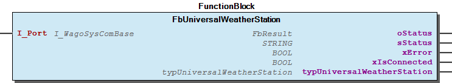

# WagoSolElsner v1.0.1.4 (WAGO) - Complete Documentation

## 📋 Library Information

- **Company:** WAGO
- **Title:** WagoSolElsner
- **Version:** 1.0.1.4
- **Categories:** Application; WAGO BusinessView|Building Automation; WAGO FunctionalView|Connectivity|Serial; WAGO LayerView|Solution
- **Namespace:** WagoSolElsner
- **Author:** WAGO / u010729
- **Placeholder:** WagoSolElsner

### Description ¶

This document is automatically generated.

This library supports all variants of the P03/3-Modbus weather stations from Elsner Elektronik GmbH

This document is automatically generated. This library supports all variants of the P03/3-Modbus weather stations from Elsner Elektronik GmbH

### Contents: ¶

Contents: - Documentation Index 10 Documentation - WagoSolElsner Library Documentation Project Information Library Information Function Blocks - FbMultipleWeatherStation (FB) - FbSingleWeatherStation (FB) - FbUniversalWeatherStation (FB) - doc01_Foreword (FB) Program Organization Global Variable Lists Other Components - 29 Types - ParameterList (PARAMS) - typUniversalWeatherStation (STRUCT) - typWeatherStation (STRUCT)

### Indices and tables ¶

Based on WagoSolElsner.library, last modified 29.05.2024, 20:47:40. LibDoc 3.5.16.10

© WAGO GmbH & Co. KG, Germany 2018 – All rights reserved. For the avoidance of doubt, this copyright notice does not only apply to the information above but also and primarily to the described library itself. Please note that third-party products are always mentioned without reference to intellectual property rights, including patents, utility models, designs and trademarks, accordingly the existence of such rights cannot be excluded. WAGO is a registered trademark of WAGO Verwaltungsgesellschaft mbH.

- File and Project Information - Library Reference Based on WagoSolElsner.library, last modified 29.05.2024, 20:47:40. LibDoc 3.5.16.10 © WAGO GmbH & Co. KG, Germany 2018 – All rights reserved. For the avoidance of doubt, this copyright notice does not only apply to the information above but also and primarily to the described library itself. Please note that third-party products are always mentioned without reference to intellectual property rights, including patents, utility models, designs and trademarks, accordingly the existence of such rights cannot be excluded. WAGO is a registered trademark of WAGO Verwaltungsgesellschaft mbH.

### Documentation Index

## 10 Documentation ¶

- doc01_Foreword (FB)

## WagoSolElsner Library Documentation

| Company: | WAGO |
| Title: | WagoSolElsner |
| Version: | 1.0.1.4 |
| Categories: | Application; WAGO BusinessView\|Building Automation; WAGO FunctionalView\|Connectivity\|Serial; WAGO LayerView\|Solution |
| Namespace: | WagoSolElsner |
| Author: | WAGO / u010729 |
| Placeholder: | WagoSolElsner |

### Description

This document is automatically generated.

This library supports all variants of the P03/3-Modbus weather stations from Elsner Elektronik GmbH

This document is automatically generated. This library supports all variants of the P03/3-Modbus weather stations from Elsner Elektronik GmbH

### Contents:

- 10 Documentation doc01_Foreword (FB) 20 Program Organization Units - FbMultipleWeatherStation (FB) - FbSingleWeatherStation (FB) - FbUniversalWeatherStation (FB) 29 Types - typUniversalWeatherStation (STRUCT) - typWeatherStation (STRUCT) ParameterList (PARAMS) VersionHistory (GVL)

### Indices and tables

Based on WagoSolElsner.library, last modified 29.05.2024, 20:47:40. LibDoc 3.5.16.10

© WAGO GmbH & Co. KG, Germany 2018 – All rights reserved. For the avoidance of doubt, this copyright notice does not only apply to the information above but also and primarily to the described library itself. Please note that third-party products are always mentioned without reference to intellectual property rights, including patents, utility models, designs and trademarks, accordingly the existence of such rights cannot be excluded. WAGO is a registered trademark of WAGO Verwaltungsgesellschaft mbH.

- File and Project Information - Library Reference Based on WagoSolElsner.library, last modified 29.05.2024, 20:47:40. LibDoc 3.5.16.10 © WAGO GmbH & Co. KG, Germany 2018 – All rights reserved. For the avoidance of doubt, this copyright notice does not only apply to the information above but also and primarily to the described library itself. Please note that third-party products are always mentioned without reference to intellectual property rights, including patents, utility models, designs and trademarks, accordingly the existence of such rights cannot be excluded. WAGO is a registered trademark of WAGO Verwaltungsgesellschaft mbH.

### Project Information

## File and Project Information

| Scope | Name | Type | Content |
| --- | --- | --- | --- |
| FileHeader | libraryFile | string | WagoSolElsner.library |
| contentFile | doc.clean.json |
| productName | e!COCKPIT |
| creationDateTime | date | 29.05.2024, 20:47:41 |
| companyName | string | WAGO |
| ProjectInformation | LastModificationDateTime | date | 29.05.2024, 20:47:40 |
| Description | string | See: Description |
| Copyright | © WAGO Kontakttechnik GmbH & Co. KG, Germany 2018 – All rights reserved. |
| Author | WAGO / u010729 |
| AutoResolveUnbound | bool | True |
| Placeholder | string | WagoSolElsner |
| Company | WAGO |
| DocFormat | reStructuredText |
| Project | WagoSolElsner |
| DefaultNamespace | WagoSolElsner |
| Version | version | 1.0.1.4 |
| Title | string | WagoSolElsner |
| LibraryCategories | library-category-list | Application; WAGO BusinessView\|Building Automation; WAGO FunctionalView\|Connectivity\|Serial; WAGO LayerView\|Solution |
| CompiledLibraryCompatibilityVersion | string | CODESYS V3.5 SP16 Patch 3 |

### Library Information

## Library Reference

| LinkAllContent: False QualifiedOnly: False | SystemLibrary: False | Optional: False |

| LinkAllContent: False QualifiedOnly: False | SystemLibrary: False | Optional: False |

| LinkAllContent: False Optional: False | QualifiedOnly: True SystemLibrary: False | PublishSymbolsInContainer: True |

| LinkAllContent: False QualifiedOnly: False | SystemLibrary: False | Optional: False |

| LinkAllContent: False QualifiedOnly: False | SystemLibrary: False | Optional: False |

| LinkAllContent: False QualifiedOnly: False | SystemLibrary: False PublishSymbolsInContainer: True | Optional: False |

| LinkAllContent: False QualifiedOnly: False | SystemLibrary: False | Optional: False |

| LinkAllContent: False Optional: False | QualifiedOnly: False SystemLibrary: False | PublishSymbolsInContainer: True |

This is a dictionary of all referenced libraries and their name spaces.

This is a dictionary of all referenced libraries and their name spaces. Standard Library Identification : Placeholder: Standard Default Resolution: Standard, * (System) Namespace: Standard Library Properties : WagoAppCom Library Identification : Placeholder: WagoAppCom Default Resolution: WagoAppCom, * (WAGO) Namespace: WagoAppCom Library Properties : Library Parameter : Parameter: CUIDEFAULTSYSTEMBUFFERSIZE = 1028 WagoAppPlcModbus Library Identification : Placeholder: WagoAppPlcModbus Default Resolution: WagoAppPlcModbus, * (WAGO) Namespace: WagoAppPlcModbus Library Properties : WagoAppTime Library Identification : Placeholder: WagoAppTime Default Resolution: WagoAppTime, * (WAGO) Namespace: WagoAppTime Library Properties : WagoSysBSDSocket Library Identification : Placeholder: WagoSysBSDSocket Default Resolution: WagoSysBSDSocket, * (WAGO) Namespace: WagoSysBSDSocket Library Properties : WagoSysErrorBase Library Identification : Placeholder: WagoSysErrorBase Default Resolution: WagoSysErrorBase, * (WAGO) Namespace: WagoSysErrorBase Library Properties : Library Parameter : Parameter: RES_LOG_MAX_FILESIZE = 2000 Parameter: RES_LOG_MAX_FILES = 1 Parameter: RES_LOG_MAX_ENTRIES = 200 Parameter: RES_LOG_NAME = ‘WagoAppResultLogger’ WagoSysVersion Library Identification : Name: WagoSysVersion Version: 1.0.0.0 Company: WAGO Namespace: WagoSysVersion Library Properties : WagoTypesCommon Library Identification : Placeholder: WagoTypesCommon Default Resolution: WagoTypesCommon, * (WAGO) Namespace: WagoTypes Library Properties :

### Function Blocks

## FbMultipleWeatherStation (FB)

| Scope | Name | Type | Comment |
| --- | --- | --- | --- |
| Input | I_Port | WagoAppPlcModbus.WagoAppCom.WagoTypesCom.I_WagoSysComBase | Name of the COM Port |
| atypWeatherStation | POINTER TO typWeatherStation | Array with measured values from the weather stations |
| Output | xError | BOOL | Collective fault of all Elsner weather stations |
| xIsConnected | BOOL | Devices are connected |

The function block is used for connecting multiple Elsner P03/3-Modbus weather stations to the WAGO I/O System.

Graphical Illustration:

Function description

I_Port must be connected with the serial interface for example: IoConfig_Globals.RS232_485_Interface The array atypWeatherStation includes all measured values from the weather stations.

Interface variables Function: The function block is used for connecting multiple Elsner P03/3-Modbus weather stations to the WAGO I/O System. Graphical Illustration:  Function description I_Port must be connected with the serial interface for example: IoConfig_Globals.RS232_485_Interface The array atypWeatherStation includes all measured values from the weather stations.

## FbSingleWeatherStation (FB)

| Scope | Name | Type | Comment |
| --- | --- | --- | --- |
| Input | I_Port | WagoAppPlcModbus.WagoAppCom.WagoTypesCom.I_WagoSysComBase | Name of the COM Port |
| bSlaveID | BYTE | Modbus Address from the Elsner weather station |
| Output | oStatus | WagoAppPlcModbus.WagoSysErrorBase.FbResult | Error object. The content of the error object could be displayed via the FbShowResult from the WagoSysErrorBase library. |
| sStatus | STRING | Status information as string |
| xError | BOOL | TRUE => Error during the request |
| xIsConnected | BOOL | Device is connected |
| typWeatherStation | typWeatherStation | Measured values from the weather station |

The function block is used for connecting one Elsner P03/3-Modbus weather station to the WAGO I/O System.

Graphical Illustration:

Function description

I_Port must be connected with the serial interface for example: IoConfig_Globals.RS232_485_Interface Add the modbus slave address of the weather station on bSlaveID . The datas of the weather station will be output on the structure typWeatherStation .

Interface variables Function: The function block is used for connecting one Elsner P03/3-Modbus weather station to the WAGO I/O System. Graphical Illustration:  Function description I_Port must be connected with the serial interface for example: IoConfig_Globals.RS232_485_Interface Add the modbus slave address of the weather station on bSlaveID . The datas of the weather station will be output on the structure typWeatherStation .

## FbUniversalWeatherStation (FB)

| Scope | Name | Type | Comment |
| --- | --- | --- | --- |
| Input | I_Port | WagoAppCom.I_WagoSysComBase | Name of the COM Port |
| Output | oStatus | WagoAppPlcModbus.WagoSysErrorBase.FbResult | Error object. The content of the error object could be displayed via the FbShowResult from the WagoSysErrorBase library. |
| sStatus | STRING | Status information as string |
| xError | BOOL | TRUE => Error during the requestv => connection error with the weather station. |
| xIsConnected | BOOL | Modbus device is connected |
| typUniversalWeatherStation | typUniversalWeatherStation | Received datas of the weather station. |

The function block is used for connecting one Elsner weather station to the WAGO I/O System.

Graphical Illustration:

Function description

I_Port must be connected with the serial interface for example: IoConfig_Globals.RS232_485_Interface

The functions block works with the following default settings of the elsner weather station:

Datas of the weather station will be output in the structure typUniversalWeatherStation .

The output values depends on the connected weather station.

It is recommended to use a 750-652 module as serial interface. If a 750-653/000-003 module will be used, it is necessary to set the program task between 10-30 ms. Otherwise the connection will be lost.

ERROR Description/ Trouble shooting:

Interface variables Function: The function block is used for connecting one Elsner weather station to the WAGO I/O System. This function block is able to read out datas of following elsner weather stations: - P03/P04 Modbus - P03/P04 modbus GPS - P03 RS485 Basic/CET/GPS - P04 Basic/CET/GPS Graphical Illustration:  Function description I_Port must be connected with the serial interface for example: IoConfig_Globals.RS232_485_Interface The functions block works with the following default settings of the elsner weather station: - Connection: RS485- Half duplex - Slave address: 1 - Baudrate: 19200 - Data bits: 8 - Parity: None - Stop bits: 1 Datas of the weather station will be output in the structure typUniversalWeatherStation . The output values depends on the connected weather station. Note It is recommended to use a 750-652 module as serial interface. If a 750-653/000-003 module will be used, it is necessary to set the program task between 10-30 ms. Otherwise the connection will be lost. ERROR Description/ Trouble shooting: - Watchdog has triggered: No FbSerialInterface to weather station. Turn A and B, set terminal resistances or install a BIASING network(Pull-Up / Pull down resistors). Check cable. - Checksum error: No valid telegram received wait a minute until a valid telegram is received.

## doc01_Foreword (FB)

This document, including all figures and illustrations contained therein, is subject to copyright. Any use of this document that infringes upon the copyright provisions stipulated herein is prohibited. Reproduction, translation, electronic and phototechnical filing/archiving (e.g., photocopying), as well as any amendments require the written consent of WAGO Kontakttechnik GmbH & Co. KG, Minden, Germany. Non-observance will entail the right of claims for damages.

WAGO Kontakttechnik GmbH & Co. KG reserves the right to make any alterations or modifications that serve to increase the efficiency of technical progress. WAGO Kontakttechnik GmbH & Co. KG owns all rights arising from granting patents or from the legal protection of utility patents. Third-party products are always mentioned without any reference to patent rights. Thus, the existence of such rights cannot be excluded.

Personnel Qualification

The use of the product described in this document is exclusively geared to specialists having qualifications in PLC programming, electrical specialists or persons instructed by electrical specialists who are also familiar with the appropriate current standards. WAGO Kontakttechnik GmbH & Co. KG assumes no liability resulting from improper action and damage to WAGO products and third-party products due to non-observance of the information contained in this document.

Intended Use

For each individual application, the components are supplied from the factory with a dedicated hardware and software configuration. Modifications are only admitted within the framework of the possibilities documented in this document. All other changes to the hardware and/or software and the non-conforming use of the components entail the exclusion of liability on part of WAGO Kontakttechnik GmbH & Co. KG.

Please direct any requirements pertaining to a modified and/or new hardware or software configuration directly to WAGO Kontakttechnik GmbH & Co. KG.

Scope of Applicability

This application note is based on the _stated hardware and software from the specific manufacturer, as well as the associated documentation. This application note is therefore only valid for the described installation. New hardware and software versions may need to be handled differently.

Please note the detailed description in the specific manuals.

Copyright This document, including all figures and illustrations contained therein, is subject to copyright. Any use of this document that infringes upon the copyright provisions stipulated herein is prohibited. Reproduction, translation, electronic and phototechnical filing/archiving (e.g., photocopying), as well as any amendments require the written consent of WAGO Kontakttechnik GmbH & Co. KG, Minden, Germany. Non-observance will entail the right of claims for damages. WAGO Kontakttechnik GmbH & Co. KG reserves the right to make any alterations or modifications that serve to increase the efficiency of technical progress. WAGO Kontakttechnik GmbH & Co. KG owns all rights arising from granting patents or from the legal protection of utility patents. Third-party products are always mentioned without any reference to patent rights. Thus, the existence of such rights cannot be excluded. Personnel Qualification The use of the product described in this document is exclusively geared to specialists having qualifications in PLC programming, electrical specialists or persons instructed by electrical specialists who are also familiar with the appropriate current standards. WAGO Kontakttechnik GmbH & Co. KG assumes no liability resulting from improper action and damage to WAGO products and third-party products due to non-observance of the information contained in this document. Intended Use For each individual application, the components are supplied from the factory with a dedicated hardware and software configuration. Modifications are only admitted within the framework of the possibilities documented in this document. All other changes to the hardware and/or software and the non-conforming use of the components entail the exclusion of liability on part of WAGO Kontakttechnik GmbH & Co. KG. Please direct any requirements pertaining to a modified and/or new hardware or software configuration directly to WAGO Kontakttechnik GmbH & Co. KG. Scope of Applicability This application note is based on the _stated hardware and software from the specific manufacturer, as well as the associated documentation. This application note is therefore only valid for the described installation. New hardware and software versions may need to be handled differently. Please note the detailed description in the specific manuals.

### Program Organization

## 20 Program Organization Units

- FbMultipleWeatherStation (FB) - FbSingleWeatherStation (FB) - FbUniversalWeatherStation (FB)

### Global Variable Lists

## VersionHistory (GVL)

| Name | Type |
| --- | --- |
| Info | WagoSysVersion.ProjectInfo |

| date | version | author | change |
| 14.08.2023 | 1.0.1.4 | u0105598 | 32- & 64-Bit |
| 14.03.2023 | 1.0.1.3 | u010188 | FbUniversalWeatherStation documentation corrected (wrong baudrate). |
| 06.03.2020 | 1.0.1.2 | u015652 | FbUniversalWeatherStation added. |
| 04.02.2020 | 1.0.1.1 | u015652 | Docu update |
| 08.01.2019 | 1.0.1.0 | u015842 | Properties: free placeholder added |
| 07.02.2018 | 1.0.0.1 | WAGO / u010188 | Category assignment “App” removed |
| 28.09.2017 | 1.0.0.0 | WAGO / u010729 | Release |

WagoAppTemplate.library

Release Notes:

WagoAppTemplate.library Release Notes:

### Other Components

## 29 Types

- typUniversalWeatherStation (STRUCT) - typWeatherStation (STRUCT)

## ParameterList (PARAMS)

| Scope | Name | Type | Initial | Comment |
| --- | --- | --- | --- | --- |
| Constant | UPDATE_INTERVAL | TIME | TIME#1s0ms | Update interval for the Elsner MODBUS weather station |

## typUniversalWeatherStation (STRUCT)

| Name | Type | Comment |
| --- | --- | --- |
| rOutsideTemperature | REAL | Current outside temperature [°C] |
| bSunSouth | BYTE | Solar radiation south 1...99[kLx] |
| bSunWest | BYTE | Solar radiation west 1...99[kLx] |
| bSunEast | BYTE | Solar radiation east 1...99[kLx] |
| xTwilight | BOOL | Twilight (TRUE) |
| wTwilight | WORD | Twilight 0...999[Lx] |
| rWind | REAL | Wind strength [m/s] |
| xRain | BOOL | Rain (TRUE) |
| rAzimuth | REAL | Solar azimuth [°] GPS version |
| rElevation | REAL | Solar elevation [°] GPS version |
| rLongitude | REAL | Longitude [°] GPS version |
| rLatitude | REAL | Latitude [°] GPS version |
| dtActualTime | DT | Actual Time UTC or CET depending an installed weather station CET and GPS version |
| bDayOfWeek | BYTE | Day of week CET and GPS version |
| xGPS_Signal | BOOL | GPS Signal received (TRUE) GPS version |
| xDST | BOOL | Daylight saving time (TRUE)= summertime CET and GPS version |

## typWeatherStation (STRUCT)

| Name | Type | Comment |
| --- | --- | --- |
| oStatus | WagoAppPlcModbus.WagoSysErrorBase.FbResult | Detailed Status information |
| sStatus | STRING | Status description as string |
| xError | BOOL | Error available |
| rOutsideTemperature | REAL | Current outside temperature [°C] |
| bSunSouth | BYTE | Solar radiation south [kLx] |
| bSunWest | BYTE | Solar radiation west [kLx] |
| bSunEast | BYTE | Solar radiation east [kLx] |
| wTwilight | WORD | Twilight [Lx] |
| rWind | REAL | Wind strength [m/s] |
| xRain | BOOL | Rain (TRUE) |
| rAzimuth | REAL | Solar azimuth [°] |
| rElevation | REAL | Solar elevation [°] |
| rLongitude | REAL | Longitude [°] |
| rLatitude | REAL | Latitude [°] |
| dtUtcTime | DT | Actual UTC-Time from GPS-receiver |
| xGPS_Signal | BOOL | GPS Signal received (TRUE) |