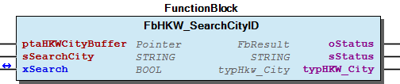
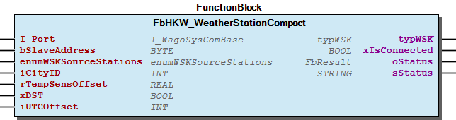

# WagoSolHKW v1.0.1.1 (WAGO) - Complete Documentation

## 📋 Library Information

- **Company:** WAGO
- **Title:** WagoSolHKW
- **Version:** 1.0.1.1
- **Categories:** Application; WAGO LayerView|App
- **Namespace:** WagoSolHKW
- **Author:** WAGO / u0100408
- **Placeholder:** WagoSolHKW

### Description ¶

This document is automatically generated.

Library for the HKW-Elektronik weather forecast station (series WS-K xx T) with MODBUS Interface.

The function blocks of this library are NOT thread safe and must be called from one CODESYS task only! Concurrent calls from different tasks may cause loss or corruption of data.

This document is automatically generated. Library for the HKW-Elektronik weather forecast station (series WS-K xx T) with MODBUS Interface. The function blocks of this library are NOT thread safe and must be called from one CODESYS task only! Concurrent calls from different tasks may cause loss or corruption of data.

### Contents: ¶

Contents: - Documentation Index FbHKW_WeatherStationCompact.indexIncr (ACT) - WagoSolHKW Library Documentation Project Information Library Information Function Blocks - FbHKW_SearchCityID (FB) - FbHKW_WeatherStationCompact (FB) Functions - FuStringToUCase (FUN) - FuUCase (FUN) Program Organization Internal Components Global Variable Lists - Globale_Variablen (GVL) - Status (GVL) - VersionHistory (GVL) Other Components - 80 Data types - 80 Status - FbHKW_SearchCityID.CityList (ACT) - FbHKW_WeatherStationCompact.clk (ACT) - FbHKW_WeatherStationCompact.fog (ACT) - FbHKW_WeatherStationCompact.freezeRain (ACT) - FbHKW_WeatherStationCompact.frost (ACT) - FbHKW_WeatherStationCompact.gusts (ACT) - FbHKW_WeatherStationCompact.heat (ACT) - FbHKW_WeatherStationCompact.heavyRain (ACT) - ... and 32 more

### Indices and tables ¶

Based on WagoSolHKW.library, last modified 29.05.2024, 20:51:34. LibDoc 3.5.16.10

© WAGO GmbH & Co. KG, Germany 2018 – All rights reserved. For the avoidance of doubt, this copyright notice does not only apply to the information above but also and primarily to the described library itself. Please note that third-party products are always mentioned without reference to intellectual property rights, including patents, utility models, designs and trademarks, accordingly the existence of such rights cannot be excluded. WAGO is a registered trademark of WAGO Verwaltungsgesellschaft mbH.

- File and Project Information - Library Reference Based on WagoSolHKW.library, last modified 29.05.2024, 20:51:34. LibDoc 3.5.16.10 © WAGO GmbH & Co. KG, Germany 2018 – All rights reserved. For the avoidance of doubt, this copyright notice does not only apply to the information above but also and primarily to the described library itself. Please note that third-party products are always mentioned without reference to intellectual property rights, including patents, utility models, designs and trademarks, accordingly the existence of such rights cannot be excluded. WAGO is a registered trademark of WAGO Verwaltungsgesellschaft mbH.

### Documentation Index

## FbHKW_WeatherStationCompact.indexIncr (ACT) ¶

## WagoSolHKW Library Documentation

| Company: | WAGO |
| Title: | WagoSolHKW |
| Version: | 1.0.1.1 |
| Categories: | Application; WAGO LayerView\|App |
| Namespace: | WagoSolHKW |
| Author: | WAGO / u0100408 |
| Placeholder: | WagoSolHKW |

### Description

This document is automatically generated.

Library for the HKW-Elektronik weather forecast station (series WS-K xx T) with MODBUS Interface.

The function blocks of this library are NOT thread safe and must be called from one CODESYS task only! Concurrent calls from different tasks may cause loss or corruption of data.

This document is automatically generated. Library for the HKW-Elektronik weather forecast station (series WS-K xx T) with MODBUS Interface. The function blocks of this library are NOT thread safe and must be called from one CODESYS task only! Concurrent calls from different tasks may cause loss or corruption of data.

### Contents:

- 20 Program Organization Units 80 Data types - FbHKW_SearchCityID (FB) - FbHKW_WeatherStationCompact (FB) 80 Status - Status (GVL) - eStatus (ENUM) 90 Internal - FuStringToUCase (FUN) - FuUCase (FUN) Globale_Variablen (GVL) VersionHistory (GVL)

### Indices and tables

Based on WagoSolHKW.library, last modified 29.05.2024, 20:51:34. LibDoc 3.5.16.10

© WAGO GmbH & Co. KG, Germany 2018 – All rights reserved. For the avoidance of doubt, this copyright notice does not only apply to the information above but also and primarily to the described library itself. Please note that third-party products are always mentioned without reference to intellectual property rights, including patents, utility models, designs and trademarks, accordingly the existence of such rights cannot be excluded. WAGO is a registered trademark of WAGO Verwaltungsgesellschaft mbH.

- File and Project Information - Library Reference Based on WagoSolHKW.library, last modified 29.05.2024, 20:51:34. LibDoc 3.5.16.10 © WAGO GmbH & Co. KG, Germany 2018 – All rights reserved. For the avoidance of doubt, this copyright notice does not only apply to the information above but also and primarily to the described library itself. Please note that third-party products are always mentioned without reference to intellectual property rights, including patents, utility models, designs and trademarks, accordingly the existence of such rights cannot be excluded. WAGO is a registered trademark of WAGO Verwaltungsgesellschaft mbH.

### Project Information

## File and Project Information

| Scope | Name | Type | Content |
| --- | --- | --- | --- |
| FileHeader | libraryFile | string | WagoSolHKW.library |
| contentFile | doc.clean.json |
| productName | e!COCKPIT |
| creationDateTime | date | 29.05.2024, 20:51:36 |
| companyName | string | WAGO |
| ProjectInformation | LastModificationDateTime | date | 29.05.2024, 20:51:34 |
| Description | string | See: Description |
| Copyright | © WAGO Kontakttechnik GmbH & Co. KG, Germany 2018 – All rights reserved. |
| Author | WAGO / u0100408 |
| AutoResolveUnbound | bool | True |
| Placeholder | string | WagoSolHKW |
| Company | WAGO |
| DocFormat | reStructuredText |
| Project | WagoSolHKW |
| DefaultNamespace | WagoSolHKW |
| Version | version | 1.0.1.1 |
| ThreadSave | bool | False |
| Title | string | WagoSolHKW |
| LibraryCategories | library-category-list | Application; WAGO LayerView\|App |
| CompiledLibraryCompatibilityVersion | string | CODESYS V3.5 SP16 Patch 3 |

### Library Information

## Library Reference

| LinkAllContent: False QualifiedOnly: False | SystemLibrary: False | Optional: False |

| LinkAllContent: False QualifiedOnly: True | SystemLibrary: False | Optional: False |

| LinkAllContent: False QualifiedOnly: False | SystemLibrary: False | Optional: False |

| LinkAllContent: False QualifiedOnly: False | SystemLibrary: False | Optional: False |

| LinkAllContent: False Optional: False | QualifiedOnly: False SystemLibrary: False | PublishSymbolsInContainer: True |

This is a dictionary of all referenced libraries and their name spaces.

This is a dictionary of all referenced libraries and their name spaces. Standard Library Identification : Placeholder: Standard Default Resolution: Standard, * (System) Namespace: Standard Library Properties : WagoAppPlcModbus Library Identification : Placeholder: WagoAppPlcModbus Default Resolution: WagoAppPlcModbus, * (WAGO) Namespace: WagoAppPlcModbus Library Properties : WagoSysErrorBase Library Identification : Placeholder: WagoSysErrorBase Default Resolution: WagoSysErrorBase, * (WAGO) Namespace: WagoSysErrorBase Library Properties : Library Parameter : Parameter: RES_LOG_MAX_FILESIZE = 2000 Parameter: RES_LOG_MAX_FILES = 1 Parameter: RES_LOG_MAX_ENTRIES = 200 Parameter: RES_LOG_NAME = ‘WagoAppResultLogger’ WagoSysVersion Library Identification : Name: WagoSysVersion Version: 1.0.0.0 Company: WAGO Namespace: WagoSysVersion Library Properties : WagoTypesCommon Library Identification : Placeholder: WagoTypesCommon Default Resolution: WagoTypesCommon, * (WAGO) Namespace: WagoTypes Library Properties :

### Function Blocks

## FbHKW_SearchCityID (FB)

| Scope | Name | Type | Comment |
| --- | --- | --- | --- |
| Input | ptaHKWCityBuffer | POINTER TO ARRAY [1..1256, 1..2] OF STRING(30) | Pointer to global city-buffer |
| sSearchCity | STRING | String with first letters of searched city |
| Inout | xSearch | BOOL | Command search city |
| Output | oStatus | WagoSysErrorBase.FbResult | Status object. (Listed in Status ) The content of the error object could be displayed via the FbShowResult from the WagoSysErrorBase library. |
| sStatus | STRING | Status description as string (Listed in Status ) |
| typHKW_City | typHkw_City | Structure with all results (limited to 10) |

Graphical Illustration

Interface variables Function This functionblock searches cities at global city buffer. Letters which are defined at input sSearchCity have to be equal to first letters of searched city. The result is copied to output structure``typHKW_City``. If there is no result, a warning occurs at the sStatus output. Graphical Illustration  - FbHKW_SearchCityID.CityList (ACT)

## FbHKW_WeatherStationCompact (FB)

| Scope | Name | Type | Initial | Comment |
| --- | --- | --- | --- | --- |
| Input | I_Port | WagoAppPlcModbus.WagoTypesCom.I_WagoSysComBase |  | Name of the serial Interface (e.g. ‘COM2’, ‘SER7.2’, ) |
| bSlaveAddress | BYTE | 3 | MODBUS slave address of the WS-K station |
| enumWSKSourceStations | enumWSKSourceStations | WSK_DCF49 | WSK source station |
| iCityID | INT | 350 | City ID - ID can be searched via via the FbHKW_SearchCityID function block |
| rTempSensOffset | REAL | 0 | Temeprature sensor offset |
| xDST | BOOL |  | Enables daytime saving |
| iUTCOffset | INT |  | Timezone offset |
| Output | typWSK | typWSK |  | Response data from HKW weather station |
| xIsConnected | BOOL |  | Shows if connection is active |
| oStatus | WagoAppPlcModbus.WagoSysErrorBase.FbResult |  | Status object. The content of the error object could be displayed via the FbShowResult from the WagoSysErrorBase library. |
| sStatus | STRING |  | Status description as string |

Graphical Illustration

Interface variables Function The function block is used for using a HKW weather forecast station WS-K xx via serial interface using MODBUS communication. Graphical Illustration  - FbHKW_WeatherStationCompact.clk (ACT) - FbHKW_WeatherStationCompact.fog (ACT) - FbHKW_WeatherStationCompact.freezeRain (ACT) - FbHKW_WeatherStationCompact.frost (ACT) - FbHKW_WeatherStationCompact.gusts (ACT) - FbHKW_WeatherStationCompact.heat (ACT) - FbHKW_WeatherStationCompact.heavyRain (ACT) - FbHKW_WeatherStationCompact.indexIncr (ACT) - FbHKW_WeatherStationCompact.pressure (ACT) - FbHKW_WeatherStationCompact.rainPB (ACT) - FbHKW_WeatherStationCompact.rainQF (ACT) - FbHKW_WeatherStationCompact.sigW (ACT) - FbHKW_WeatherStationCompact.station (ACT) - FbHKW_WeatherStationCompact.sunDur (ACT) - FbHKW_WeatherStationCompact.sunInso (ACT) - FbHKW_WeatherStationCompact.tempAdv (ACT) - FbHKW_WeatherStationCompact.tempAvg (ACT) - FbHKW_WeatherStationCompact.tempMax (ACT) - FbHKW_WeatherStationCompact.tempMin (ACT) - FbHKW_WeatherStationCompact.windD (ACT) - FbHKW_WeatherStationCompact.windF (ACT) - FbHKW_WeatherStationCompact.windchill (ACT)

### Functions

## FuStringToUCase (FUN)

| Scope | Name | Type |
| --- | --- | --- |
| Return | FuStringToUCase | STRING |
| Input | sString | STRING |

## FuUCase (FUN)

| Scope | Name | Type |
| --- | --- | --- |
| Return | FuUCase | BYTE |

### Program Organization

## 20 Program Organization Units

- 80 Data types enumWSKLicenceModel (ENUM) - enumWSKSourceStations (ENUM) - enumWSKType (ENUM) - typ2DayFc (STRUCT) - typ4DayFc (STRUCT) - typAirTempAdvFc (STRUCT) - typDayFc (STRUCT) - typDayFcAdv (STRUCT) - typDayFcBool (STRUCT) - typDayFcReal (STRUCT) - typExWeatherFc (STRUCT) - typHkw_City (STRUCT) - typRPrf (STRUCT) - typRainQuantFc (STRUCT) - typStationID (STRUCT) - typSunDur (STRUCT) - typWSK (STRUCT) FbHKW_SearchCityID (FB) - FbHKW_SearchCityID.CityList (ACT) FbHKW_WeatherStationCompact (FB) - FbHKW_WeatherStationCompact.clk (ACT) - FbHKW_WeatherStationCompact.fog (ACT) - FbHKW_WeatherStationCompact.freezeRain (ACT) - FbHKW_WeatherStationCompact.frost (ACT) - FbHKW_WeatherStationCompact.gusts (ACT) - FbHKW_WeatherStationCompact.heat (ACT) - FbHKW_WeatherStationCompact.heavyRain (ACT) - FbHKW_WeatherStationCompact.indexIncr (ACT) - FbHKW_WeatherStationCompact.pressure (ACT) - FbHKW_WeatherStationCompact.rainPB (ACT) - FbHKW_WeatherStationCompact.rainQF (ACT) - FbHKW_WeatherStationCompact.sigW (ACT) - FbHKW_WeatherStationCompact.station (ACT) - FbHKW_WeatherStationCompact.sunDur (ACT) - FbHKW_WeatherStationCompact.sunInso (ACT) - FbHKW_WeatherStationCompact.tempAdv (ACT) - FbHKW_WeatherStationCompact.tempAvg (ACT) - FbHKW_WeatherStationCompact.tempMax (ACT) - FbHKW_WeatherStationCompact.tempMin (ACT) - FbHKW_WeatherStationCompact.windD (ACT) - FbHKW_WeatherStationCompact.windF (ACT) - FbHKW_WeatherStationCompact.windchill (ACT)

### Internal Components

## 90 Internal

Dieser Teil soll nicht in der Dokumentation auftauchen

Dieser Teil soll nicht in der Dokumentation auftauchen - FuStringToUCase (FUN) - FuUCase (FUN)

### Global Variable Lists

## Globale_Variablen (GVL)

| Name | Type | Comment |
| --- | --- | --- |
| gaHkwCityBuffer | ARRAY [1..1256, 1..2] OF STRING(30) | City Names |

## Status (GVL)

| Scope | Name | Type |
| --- | --- | --- |
| Constant | gc_Status | ARRAY [0..1] OF WagoTypesErrorBase.typResultItem |

| Value | Level | Description |
| --- | --- | --- |
| eStatus.Ok | WagoTypesErrorBase.WagoTypes.eSeverity.none | ‘OK’ |
| eStatus.NothingFound | WagoTypesErrorBase.WagoTypes.eSeverity.warning | ‘Nothing found’ |

## VersionHistory (GVL)

| Name | Type |
| --- | --- |
| Info | WagoSysVersion.ProjectInfo |

| date | version | author | change |
| 14.08.2023 | 1.0.1.1 | u0105598 | 32- & 64-Bit |
| 08.01.2019 | 1.0.1.0 | u015842 | Properties: free placeholder added |
| 21.11.2017 | 1.0.0.0 | u0100408 | First released Version |

WagoSolHKW.library

### Other Components

## 80 Data types

- enumWSKLicenceModel (ENUM) - enumWSKSourceStations (ENUM) - enumWSKType (ENUM) - typ2DayFc (STRUCT) - typ4DayFc (STRUCT) - typAirTempAdvFc (STRUCT) - typDayFc (STRUCT) - typDayFcAdv (STRUCT) - typDayFcBool (STRUCT) - typDayFcReal (STRUCT) - typExWeatherFc (STRUCT) - typHkw_City (STRUCT) - typRPrf (STRUCT) - typRainQuantFc (STRUCT) - typStationID (STRUCT) - typSunDur (STRUCT) - typWSK (STRUCT)

## 80 Status ¶

- Status (GVL) - eStatus (ENUM)

## FbHKW_SearchCityID.CityList (ACT) ¶

## FbHKW_WeatherStationCompact.clk (ACT) ¶

## FbHKW_WeatherStationCompact.fog (ACT) ¶

## FbHKW_WeatherStationCompact.freezeRain (ACT) ¶

## FbHKW_WeatherStationCompact.frost (ACT) ¶

## FbHKW_WeatherStationCompact.gusts (ACT) ¶

## FbHKW_WeatherStationCompact.heat (ACT) ¶

## FbHKW_WeatherStationCompact.heavyRain (ACT) ¶

## FbHKW_WeatherStationCompact.pressure (ACT) ¶

## FbHKW_WeatherStationCompact.rainPB (ACT) ¶

## FbHKW_WeatherStationCompact.rainQF (ACT) ¶

## FbHKW_WeatherStationCompact.sigW (ACT) ¶

## FbHKW_WeatherStationCompact.station (ACT)

Profile depends on hkw licence model For examble: if you want to get data of cycleindex 12 (temperature advanced) profile 8 has to be enabled == TRUE calculate index 12 minus 4 (shift) = 8

Profile depends on hkw licence model For examble: if you want to get data of cycleindex 12 (temperature advanced) profile 8 has to be enabled == TRUE calculate index 12 minus 4 (shift) = 8

## FbHKW_WeatherStationCompact.sunDur (ACT) ¶

## FbHKW_WeatherStationCompact.sunInso (ACT) ¶

## FbHKW_WeatherStationCompact.tempAdv (ACT) ¶

## FbHKW_WeatherStationCompact.tempAvg (ACT) ¶

## FbHKW_WeatherStationCompact.tempMax (ACT) ¶

## FbHKW_WeatherStationCompact.tempMin (ACT) ¶

## FbHKW_WeatherStationCompact.windD (ACT) ¶

## FbHKW_WeatherStationCompact.windF (ACT) ¶

## FbHKW_WeatherStationCompact.windchill (ACT) ¶

## eStatus (ENUM)

| Name | Initial | Comment |
| --- | --- | --- |
| Ok | 0 | OK |
| NothingFound | 1 | No city found |

## enumWSKLicenceModel (ENUM)

| Name | Initial | Comment |
| --- | --- | --- |
| WSK_reserved | 1 | Licence reserved |
| WSK_Basic | 2 | Licence: Basic |
| WSK_All_inclusive | 3 | Licence: All inclusive |
| WSK_All_inclusive_advanced | 4 | Licence: All inclusive advanced |
| WSK_Solar | 5 | Licence: Solar |
| WSK_Solar_plus | 6 | Licence: Solar plus |
| WSK_Solar_advanced | 7 | Licence: Solar advaced |
| WSK_Wind | 8 | Licence: Wind |
| WSK_Wind_plus | 9 | Licence: Wind plus |
| WSK_Solar_and_Wind | 10 | Licence: Solar & Wind |
| WSK_Solar_and_Wind_plus | 11 | Licence: Solar & Wind plus |
| WSK_Solar_and_Wind_advanced | 12 | Licence: Solar & Wind advanced |

## enumWSKSourceStations (ENUM)

| Name | Initial | Comment |
| --- | --- | --- |
| WSK_DCF49 | 0 | Source station: Mainfingen |
| WSK_HGA22 | 1 | Source station: Lakihegy |
| WSK_DCF39 | 2 | Source station: Burg |

## enumWSKType (ENUM)

| Name | Initial | Comment |
| --- | --- | --- |
| WSK_UNKNOWN | 1 | Unknown Station Type |
| WSK_WPB_T | 2 | Staion type: WPB_T |
| WSK_WBAi_T | 3 | Staion type: WPBAi_T |
| WSK_WPAia_T | 4 | Staion type: WPBAia_T |
| WSK_WPS_T | 5 | Staion type: WPS_T |
| WSK_WPSp_T | 6 | Staion type: WPSp_T |
| WSK_WPSa_T | 7 | Staion type: WPSa_t |
| WSK_WPW_T | 8 | Staion type: WPW_T |
| WSK_WPWp_T | 9 | Staion type: WPWp_T |
| WSK_WPSW_T | 10 | Staion type: WPSW_T |
| WSK_WPSWp_T | 11 | Staion type: WPSWp_T |
| WSK_WPSWa_T | 12 | Staion type: WPSWa_T |

## typ2DayFc (STRUCT)

| Name | Type | Comment |
| --- | --- | --- |
| sUnit | STRING(4) | Unit |
| CurrentDay | typDayFc | Actual day values |
| NextDay | typDayFc | Next day values |

## typ4DayFc (STRUCT)

| Name | Type | Comment |
| --- | --- | --- |
| sUnit | STRING(23) | Unit |
| CurrentDay | typDayFc | Actual day values |
| NextDay | typDayFc | Next day values |
| In2Days | typDayFc | Forecast values two days ahead |
| In3Days | typDayFc | Forecast values three days ahead |

## typAirTempAdvFc (STRUCT)

| Name | Type | Initial | Comment |
| --- | --- | --- | --- |
| sUnit | STRING(2) | ‘°C’ | Unit temperature |
| CurrentDay | typDayFcAdv |  | Actual day values |
| NextDay | typDayFcAdv |  | Next day values |
| In2Days | typDayFcAdv |  | Forecast values two days ahead |
| In3Days | typDayFcAdv |  | Forecast values three days ahead |

## typDayFc (STRUCT)

| Name | Type | Initial | Comment |
| --- | --- | --- | --- |
| iEarlyMorning | INT | 10000 | Early morning value (0:00 - 6:00) |
| iMidMorning | INT | 10000 | Midday value (6:00 - 12:00) |
| iAfternoon | INT | 10000 | Afternoon value (12:00 - 18:00) |
| iEvening | INT | 10000 | Evening value (18:00 - 24:00) |

## typDayFcAdv (STRUCT)

| Name | Type | Initial | Comment |
| --- | --- | --- | --- |
| aiHourUTC | ARRAY [0..23] OF INT | [24(10000)] | Day profile array (0-24h) |

## typDayFcBool (STRUCT)

| Name | Type | Comment |
| --- | --- | --- |
| xEarlyMorning | BOOL | Early morning value (0:00 - 6:00) |
| xMidMorning | BOOL | Midday value (6:00 - 12:00) |
| xAfternoon | BOOL | Afternoon value (12:00 - 18:00) |
| xEvening | BOOL | Evening value (18:00 - 24:00) |

## typDayFcReal (STRUCT)

| Name | Type | Initial | Comment |
| --- | --- | --- | --- |
| rEarlyMorning | REAL | 1000 | Early morning value (0:00 - 6:00) |
| rMidMorning | REAL | 1000 | Midday value (6:00 - 12:00) |
| rAfternoon | REAL | 1000 | Afternoon value (12:00 - 18:00) |
| rEvening | REAL | 1000 | Evening value (18:00 - 24:00) |

## typExWeatherFc (STRUCT)

| Name | Type | Initial | Comment |
| --- | --- | --- | --- |
| sUnit | STRING(18) | ‘>= 50% Probability’ | Value will be TRUE when probability is greater than or equal to 50 % |
| CurrentDay | typDayFcBool |  | Actual day value |
| NextDay | typDayFcBool |  | Next day value |
| In2Days | typDayFcBool |  | Forecast value two days ahead |
| In3Days | typDayFcBool |  | Forecast value three days ahead |

## typHkw_City (STRUCT)

| Name | Type | Comment |
| --- | --- | --- |
| asHKW_City | ARRAY [0..1, 0..9] OF STRING | Array which contains the results of the function block FbHKW_SearchCityID |

## typRPrf (STRUCT)

| Name | Type | Comment |
| --- | --- | --- |
| profile | ARRAY [0..23] OF BOOL | Day profile array (0-24h) |

## typRainQuantFc (STRUCT)

| Name | Type | Initial | Comment |
| --- | --- | --- | --- |
| sUnit | STRING(4) | ‘l/m2’ | Unit rain quantity |
| CurrentDay | typDayFcReal |  | Current day values |
| NextDay | typDayFcReal |  | Next day values |
| In2Days | typDayFcReal |  | Forecast values two days ahead |
| In3Days | typDayFcReal |  | Forecast values three days ahead |

## typStationID (STRUCT)

| Name | Type | Comment |
| --- | --- | --- |
| iFirst | INT | Station ID - First digit |
| iSecond | INT | Station ID - Second digit |
| iThird | INT | Station ID - Third digit |
| iFourth | INT | Station ID - Fourth digit |

## typSunDur (STRUCT)

| Name | Type | Initial | Comment |
| --- | --- | --- | --- |
| sUnit | STRING(1) | ‘h’ | Unit sun duration |
| CurrentDay | typDayFcReal |  | Actual day values |
| NextDay | typDayFcReal |  | Next day values |

## typWSK (STRUCT)

| Name | Type | Initial | Comment |
| --- | --- | --- | --- |
| StationType | enumWSKType |  | HKW station type |
| StationID | typStationID |  | Station id |
| LicenceModel | enumWSKLicenceModel |  | Licence model |
| Revision | REAL |  | Firmware revision |
| dtUTC | DT |  | UTC time string |
| dtLocal | DT |  | Local time string |
| iCityID | INT |  | City ID - Search ID via FbHKW_SearchCityID - See manual |
| iSourceStation | enumWSKSourceStations |  | Source station |
| iSignalQuality | INT |  | Signal quality 0 - 9, 9 = highest |
| xFSKQuality | BOOL |  | TRUE when signal quality >5 |
| rTempSensData | REAL |  | Integrated temperauter sensor value [°C] |
| rTempSensOffset | REAL |  | Offset integrated temperauter sensor [°C] |
| xTempSensStatus | BOOL |  | Status integrated temperature sensor (TRUE = Active / False = Inactive) |
| AirTempMax | typ4DayFc | STRUCT(sUnit := ‘°C’) | Forecast maximun air temprature, for four days [°C] |
| AirTempMin | typ4DayFc | STRUCT(sUnit := ‘°C’) | Forecast minimum air temperature, for four days [°C] |
| AirTempAvg | typ4DayFc | STRUCT(sUnit := ‘°C’) | Forecast average air temperature, for four days [°C] |
| AirTempAdv | typAirTempAdvFc |  | Forecast average air temperature ,for four days - Higher resolution (each hour) [°C] |
| RainfallQuantity | typRainQuantFc |  | Forecast rainfall quantity, for four days [l/m²] |
| RainfallProbability | typ4DayFc | STRUCT(sUnit := ‘%’) | Forecast rainfall probability, for four days [%] |
| SunshineDuration | typSunDur |  | Forecast sunshine duration, for two days [h] |
| SolarInsolation | typ2DayFc | STRUCT(sUnit := ‘W/m2’) | Forecast solar insolation, for two days [W/m²] |
| AirPressure | typ2DayFc | STRUCT(sUnit := ‘ hPa’) | Forecast air pressure, for two days [hPa] |
| WindForce | typ4DayFc | STRUCT(sUnit := ‘Bft’) | Forecast wind force, for four days [Bft] |
| WindDirection | typ4DayFc | STRUCT(sUnit := ‘Direction (See Manual)’) | Forecast wind direction, for four days - See manual for more information |
| SignificantWeather | typ4DayFc | STRUCT(sUnit := ‘Weather (See Manual)’) | Forecast weather situation, for four days - See manual for more information |
| exGroundFog | typExWeatherFc |  | Forecast ground fog, for four days - TRUE when probability > 50 % |
| exFreezingRain | typExWeatherFc |  | Forecast freezing rain, for four days - TRUE when probability > 50 % |
| exGroundFrost | typExWeatherFc |  | Forecast ground frost, for four days - TRUE when probability > 50 % |
| exGusts | typ4DayFc | STRUCT(sUnit := ‘Alarm strong Gusts’) | Forecast strong gusts, for four days - Alarm values 0-3 when probability >50 % - See manual |
| exRainfall | typ4DayFc | STRUCT(sUnit := ‘Alarm extreme Rain’) | Forecast heavy rainfall, for four days - Alarm values 0-2 when probability >50 % - See manual |
| exHeat | typ4DayFc | STRUCT(sUnit := ‘Alarm extreme Heat’) | Forecast extreme heat, for four days - Alarm values 0-3 when probability >50 % - See manaual |
| exWindchill | typ4DayFc | STRUCT(sUnit := ‘Alarm extreme Windchill’) | Forecast extreme windchill, for four days - Alarm values 0-3 when probability >50 % - See manual |