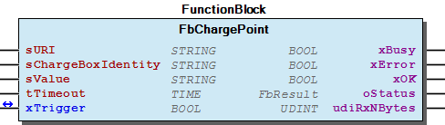

# WagoSolMennekes v1.0.1.0 (WAGO) - Complete Documentation

## 📋 Library Information

- **Company:** WAGO
- **Title:** WagoSolMennekes
- **Version:** 1.0.1.0
- **Categories:** WAGO LayerView|Solution; Application
- **Author:** Wago/u010663
- **Placeholder:** WagoSollMennekes

### Description ¶

This document is automatically generated. Because of this, the chapter 30 Visualization is not shown in this document. If you are interested in getting to know more about visualization, we refer to the library manager of e!Cockpit.

Connection with a Mennekes charge point [1]

This document is automatically generated. Because of this, the chapter 30 Visualization is not shown in this document. If you are interested in getting to know more about visualization, we refer to the library manager of e!Cockpit. Connection with a Mennekes charge point [1]

### Contents: ¶

Contents: - Documentation Index 10 Documentation - WagoSolMennekes Library Documentation Project Information Library Information Function Blocks - FbChargePoint (FB) - doc10_SystemProperties (FB) Program Organization Global Variable Lists

### Indices and tables ¶

| [1] | Based on WagoSolMennekes.library, last modified 14.01.2019, 20:01:07. The content of this file was automatically generated with None on 14.01.2019, 20:01:09 |

© WAGO Kontakttechnik GmbH & Co. KG, Germany 2018 – All rights reserved. For the avoidance of doubt, this copyright notice does not only apply to the information above but also and primarily to the described library itself. Please note that third-party products are always mentioned without reference to intellectual property rights, including patents, utility models, designs and trademarks, accordingly the existence of such rights cannot be excluded. WAGO is a registered trademark of WAGO Verwaltungsgesellschaft mbH.

- File and Project Information - Library Reference © WAGO Kontakttechnik GmbH & Co. KG, Germany 2018 – All rights reserved. For the avoidance of doubt, this copyright notice does not only apply to the information above but also and primarily to the described library itself. Please note that third-party products are always mentioned without reference to intellectual property rights, including patents, utility models, designs and trademarks, accordingly the existence of such rights cannot be excluded. WAGO is a registered trademark of WAGO Verwaltungsgesellschaft mbH.

### Documentation Index

## 10 Documentation ¶

- doc10_SystemProperties (FB)

## WagoSolMennekes Library Documentation

| Company: | WAGO |
| Title: | WagoSolMennekes |
| Version: | 1.0.1.0 |
| Categories: | WAGO LayerView\|Solution; Application |
| Author: | Wago/u010663 |
| Placeholder: | WagoSollMennekes |

### Description

This document is automatically generated. Because of this, the chapter 30 Visualization is not shown in this document. If you are interested in getting to know more about visualization, we refer to the library manager of e!Cockpit.

Connection with a Mennekes charge point [1]

This document is automatically generated. Because of this, the chapter 30 Visualization is not shown in this document. If you are interested in getting to know more about visualization, we refer to the library manager of e!Cockpit. Connection with a Mennekes charge point [1]

### Contents:

- 10 Documentation doc10_SystemProperties (FB) 20 Program Organization Units - FbChargePoint (FB) VersionHistory (GVL)

### Indices and tables

| [1] | Based on WagoSolMennekes.library, last modified 14.01.2019, 20:01:07. The content of this file was automatically generated with None on 14.01.2019, 20:01:09 |

© WAGO Kontakttechnik GmbH & Co. KG, Germany 2018 – All rights reserved. For the avoidance of doubt, this copyright notice does not only apply to the information above but also and primarily to the described library itself. Please note that third-party products are always mentioned without reference to intellectual property rights, including patents, utility models, designs and trademarks, accordingly the existence of such rights cannot be excluded. WAGO is a registered trademark of WAGO Verwaltungsgesellschaft mbH.

- File and Project Information - Library Reference © WAGO Kontakttechnik GmbH & Co. KG, Germany 2018 – All rights reserved. For the avoidance of doubt, this copyright notice does not only apply to the information above but also and primarily to the described library itself. Please note that third-party products are always mentioned without reference to intellectual property rights, including patents, utility models, designs and trademarks, accordingly the existence of such rights cannot be excluded. WAGO is a registered trademark of WAGO Verwaltungsgesellschaft mbH.

### Project Information

## File and Project Information

| Scope | Name | Type | Content |
| --- | --- | --- | --- |
| FileHeader | libraryFile | string | WagoSolMennekes.library |
| contentFile | WagoSolMennekes_clr.json |
| productName | e!COCKPIT |
| creationDateTime | date | 14.01.2019, 20:01:09 |
| companyName | string | WAGO |
| ProjectInformation | LastModificationDateTime | date | 14.01.2019, 20:01:07 |
| Description | string | See: Description |
| DocFormat | reStructuredText |
| Author | Wago/u010663 |
| AutoResolveUnbound | bool | True |
| Placeholder | string | WagoSollMennekes |
| Company | WAGO |
| Title | WagoSolMennekes |
| Project | WagoSolMennekes |
| Copyright | © WAGO Kontakttechnik GmbH & Co. KG, Germany 2018 – All rights reserved. |
| Version | version | 1.0.1.0 |
| Version string | string |  |
| LibraryCategories | library-category-list | WAGO LayerView\|Solution; Application |

### Library Information

## Library Reference

| LinkAllContent: False QualifiedOnly: True | SystemLibrary: False | Optional: False |

| LinkAllContent: False QualifiedOnly: True | SystemLibrary: False | Optional: False |

| LinkAllContent: False QualifiedOnly: True | SystemLibrary: False | Optional: False |

| LinkAllContent: False QualifiedOnly: False | SystemLibrary: False | Optional: False |

| LinkAllContent: False Optional: False | QualifiedOnly: False SystemLibrary: False | PublishSymbolsInContainer: True |

This is a dictionary of all referenced libraries and their name spaces.

This is a dictionary of all referenced libraries and their name spaces. WagoAppString Library Identification : Placeholder: WagoAppString Default Resolution: WagoAppString, * (WAGO) Namespace: WagoAppString Library Properties : Library Parameter : Parameter: MAX_STRING_LENGTH = 255 WagoSysCurl Library Identification : Placeholder: WagoSysCurl Default Resolution: WagoSysCurl, * (WAGO) Namespace: WagoSysCurl Library Properties : WagoSysErrorBase Library Identification : Placeholder: WagoSysErrorBase Default Resolution: WagoSysErrorBase, * (WAGO) Namespace: WagoSysErrorBase Library Properties : Library Parameter : Parameter: RES_LOG_MAX_FILESIZE = 2000 Parameter: RES_LOG_MAX_FILES = 1 Parameter: RES_LOG_MAX_ENTRIES = 200 Parameter: RES_LOG_NAME = ‘WagoAppResultLogger’ WagoSysVersion Library Identification : Name: WagoSysVersion Version: 1.0.0.0 Company: WAGO Namespace: WagoSysVersion Library Properties : WagoTypesCurl Library Identification : Placeholder: WagoTypesCurl Default Resolution: WagoTypesCurl, * (WAGO) Namespace: WagoTypesCurl Library Properties :

### Function Blocks

## FbChargePoint (FB)

| Scope | Name | Type | Initial | Comment |
| --- | --- | --- | --- | --- |
| Input | sURI | STRING(1023) |  | e.g.: http://192.168.1.17 |
| sChargeBoxIdentity | STRING |  | Identification of Charge Box |
| sValue | STRING | ‘5004’ | desired reference current (0..5120) |
| tTimeout | TIME |  | If tTimeout = 0, the timeout is deactivated |
| Inout | xTrigger | BOOL |  | perform a request |
| Output | xBusy | BOOL |  | job in progress |
| xError | BOOL |  | job finished with error |
| xOK | BOOL |  | 1:Value successful transmitted |
| oStatus | WagoSysErrorBase.FbResult |  | Error information general communication |
| udiRxNBytes | UDINT |  | Number of bytes, that have been received |

Compact function block performing a change configuration request

Graphical Illustration

Function description

Interface variables Function Compact function block performing a change configuration request Graphical Illustration  Function description The charge point will answer either with Accepted or Rejected

## doc10_SystemProperties (FB) ¶

### Program Organization

## 20 Program Organization Units ¶

### Global Variable Lists

## VersionHistory (GVL)

| Name | Type |
| --- | --- |
| Info | ProjectInfo |

| date | version | author | change |
| 08.01.2019 | 1.0.1.0 | u015842 | Properties: free placeholder added |
| 27.09.2018 | 1.0.0.1 | u010663 | Released |

WagoSolMennekes.library

Release notes

WagoSolMennekes.library Release notes