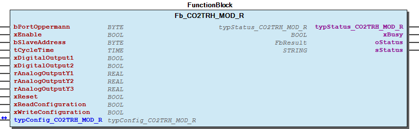

# WagoSolOppermann v1.0.2.3 (WAGO) - Complete Documentation

## 📋 Library Information

- **Company:** WAGO
- **Title:** WagoSolOppermann
- **Version:** 1.0.2.3
- **Categories:** Application; WAGO BusinessView|Building Automation; WAGO FunctionalView|Connectivity|Serial; WAGO LayerView|Solution
- **Namespace:** WagoSolOppermann
- **Author:** WAGO / u015842
- **Placeholder:** WagoSolOppermann

### Description ¶

This document is automatically generated.

This library supports Oppermann module communication with serial Modbus communication.

This document is automatically generated. This library supports Oppermann module communication with serial Modbus communication.

### Contents: ¶

Contents: - Documentation Index - Project Information - Library Information - Function Blocks FbOppermannMaster (FB) - Fb_C1_MOD_R (FB) - Fb_CO2TRH_MOD_R (FB) - Fb_CO2TRH_W (FB) - Fb_CO2_W_25_MOD (FB) - Fb_FT_MOD_I (FB) - Fb_HT_MOD_I (FB) - Fb_HT_MOD_R (FB) - Fb_HTa_MOD_I (FB) - Fb_HTx_MOD_I (FB) - ... and 13 more Program Organization Global Variable Lists - GlobalVariables (GVL) - VersionHistory (GVL) Other Components - 01 Communication - 01 Communication - 10 Fire protection - 10 Fire protection - 20 Sensors - 20 Sensors - 80 Types - C1-MOD-R - C1-MOD-R - CO2-T(RH)-MOD-R - ... and 94 more

### Indices and tables ¶

Based on WagoSolOppermann.library, last modified 29.05.2024, 20:50:58. LibDoc 3.5.16.10

© WAGO GmbH & Co. KG, Germany 2018 – All rights reserved. For the avoidance of doubt, this copyright notice does not only apply to the information above but also and primarily to the described library itself. Please note that third-party products are always mentioned without reference to intellectual property rights, including patents, utility models, designs and trademarks, accordingly the existence of such rights cannot be excluded. WAGO is a registered trademark of WAGO Verwaltungsgesellschaft mbH.

- File and Project Information - Library Reference Based on WagoSolOppermann.library, last modified 29.05.2024, 20:50:58. LibDoc 3.5.16.10 © WAGO GmbH & Co. KG, Germany 2018 – All rights reserved. For the avoidance of doubt, this copyright notice does not only apply to the information above but also and primarily to the described library itself. Please note that third-party products are always mentioned without reference to intellectual property rights, including patents, utility models, designs and trademarks, accordingly the existence of such rights cannot be excluded. WAGO is a registered trademark of WAGO Verwaltungsgesellschaft mbH.

### Documentation Index

## WagoSolOppermann Library Documentation

| Company: | WAGO |
| Title: | WagoSolOppermann |
| Version: | 1.0.2.3 |
| Categories: | Application; WAGO BusinessView\|Building Automation; WAGO FunctionalView\|Connectivity\|Serial; WAGO LayerView\|Solution |
| Namespace: | WagoSolOppermann |
| Author: | WAGO / u015842 |
| Placeholder: | WagoSolOppermann |

### Description

This document is automatically generated.

This library supports Oppermann module communication with serial Modbus communication.

This document is automatically generated. This library supports Oppermann module communication with serial Modbus communication.

### Contents:

- 20 Program Organization Units 01 Communication - 10 Fire protection - 20 Sensors - 80 Types GlobalVariables (GVL) ParameterList (PARAMS) VersionHistory (GVL)

### Indices and tables

Based on WagoSolOppermann.library, last modified 29.05.2024, 20:50:58. LibDoc 3.5.16.10

© WAGO GmbH & Co. KG, Germany 2018 – All rights reserved. For the avoidance of doubt, this copyright notice does not only apply to the information above but also and primarily to the described library itself. Please note that third-party products are always mentioned without reference to intellectual property rights, including patents, utility models, designs and trademarks, accordingly the existence of such rights cannot be excluded. WAGO is a registered trademark of WAGO Verwaltungsgesellschaft mbH.

- File and Project Information - Library Reference Based on WagoSolOppermann.library, last modified 29.05.2024, 20:50:58. LibDoc 3.5.16.10 © WAGO GmbH & Co. KG, Germany 2018 – All rights reserved. For the avoidance of doubt, this copyright notice does not only apply to the information above but also and primarily to the described library itself. Please note that third-party products are always mentioned without reference to intellectual property rights, including patents, utility models, designs and trademarks, accordingly the existence of such rights cannot be excluded. WAGO is a registered trademark of WAGO Verwaltungsgesellschaft mbH.

### Project Information

## File and Project Information

| Scope | Name | Type | Content |
| --- | --- | --- | --- |
| FileHeader | libraryFile | string | WagoSolOppermann.library |
| contentFile | doc.clean.json |
| productName | e!COCKPIT |
| creationDateTime | date | 29.05.2024, 20:51:00 |
| companyName | string | WAGO |
| ProjectInformation | LastModificationDateTime | date | 29.05.2024, 20:50:58 |
| NoPlaceholder | string |  |
| Description | See: Description |
| Copyright | © WAGO Kontakttechnik GmbH & Co. KG, Germany 2018 – All rights reserved. |
| Author | WAGO / u015842 |
| AutoResolveUnbound | bool | True |
| Placeholder | string | WagoSolOppermann |
| Company | WAGO |
| DocFormat | reStructuredText |
| Project | WagoSolOppermann |
| DefaultNamespace | WagoSolOppermann |
| Version | version | 1.0.2.3 |
| Title | string | WagoSolOppermann |
| LibraryCategories | library-category-list | Application; WAGO BusinessView\|Building Automation; WAGO FunctionalView\|Connectivity\|Serial; WAGO LayerView\|Solution |
| CompiledLibraryCompatibilityVersion | string | CODESYS V3.5 SP16 Patch 3 |
| ThreadSafe | FALSE |

### Library Information

## Library Reference

| LinkAllContent: False QualifiedOnly: False | SystemLibrary: False | Optional: False |

| LinkAllContent: False QualifiedOnly: True | SystemLibrary: False | Optional: False |

| LinkAllContent: False QualifiedOnly: False | SystemLibrary: False | Optional: False |

| LinkAllContent: False QualifiedOnly: False | SystemLibrary: False | Optional: False |

| LinkAllContent: False QualifiedOnly: False | SystemLibrary: False | Optional: False |

| LinkAllContent: False QualifiedOnly: False | SystemLibrary: False | Optional: False |

| LinkAllContent: False Optional: False | QualifiedOnly: True SystemLibrary: False | PublishSymbolsInContainer: True |

| LinkAllContent: False Optional: False | QualifiedOnly: False SystemLibrary: False | PublishSymbolsInContainer: True |

This is a dictionary of all referenced libraries and their name spaces.

This is a dictionary of all referenced libraries and their name spaces. Standard Library Identification : Placeholder: Standard Default Resolution: Standard, * (System) Namespace: Standard Library Properties : WagoAppPlcModbus Library Identification : Placeholder: WagoAppPlcModbus Default Resolution: WagoAppPlcModbus, * (WAGO) Namespace: WagoAppPlcModbus Library Properties : WagoAppTime Library Identification : Placeholder: WagoAppTime Default Resolution: WagoAppTime, * (WAGO) Namespace: WagoAppTime Library Properties : WagoSysBSDSocket Library Identification : Placeholder: WagoSysBSDSocket Default Resolution: WagoSysBSDSocket, * (WAGO) Namespace: WagoSysBSDSocket Library Properties : WagoSysErrorBase Library Identification : Placeholder: WagoSysErrorBase Default Resolution: WagoSysErrorBase, * (WAGO) Namespace: WagoSysErrorBase Library Properties : Library Parameter : Parameter: RES_LOG_MAX_FILESIZE = 2000 Parameter: RES_LOG_MAX_FILES = 1 Parameter: RES_LOG_MAX_ENTRIES = 200 Parameter: RES_LOG_NAME = ‘WagoAppResultLogger’ WagoSysVersion Library Identification : Name: WagoSysVersion Version: 1.0.0.0 Company: WAGO Namespace: WagoSysVersion Library Properties : WagoTypesCom Library Identification : Placeholder: WagoTypesCom Default Resolution: WagoTypesCom, * (WAGO) Namespace: WagoTypesCom Library Properties : WagoTypesCommon Library Identification : Placeholder: WagoTypesCommon Default Resolution: WagoTypesCommon, * (WAGO) Namespace: WagoTypes Library Properties :

### Function Blocks

## FbOppermannMaster (FB)

| Scope | Name | Type | Initial | Comment |
| --- | --- | --- | --- | --- |
| Input | I_Port | WagoTypesCom.I_WagoSysComBase |  | Name of the serial Interface (e.g. ‘COM2’, ‘SER7.2’, ) |
| bPortOppermann | BYTE | 1 | Master assignment number for other function blocks. Range 1 to MAX_MASTER. |
| udiBaudrate | UDINT | 9600 | Baud rate (9600 = 9k6) |
| eParity | WagoAppPlcModbus.WagoTypesCom.eTTYParity | WagoAppPlcModbus.WagoTypesCom.eTTYParity.Even | Parity |
| eStopBits | WagoAppPlcModbus.WagoTypesCom.eTTYStopBits | WagoAppPlcModbus.WagoTypesCom.eTTYStopBits.One | Number of stop bits, automatically choosen with Parity ODD, EVEN and NONE. |
| eHandshake | WagoAppPlcModbus.WagoTypesCom.eTTYHandshake | WagoAppPlcModbus.WagoTypesCom.eTTYHandshake.None | TYPE of handshake (XON/XOFF, etc) |
| ePhysical | WagoAppPlcModbus.WagoTypesCom.eTTYPhysicalLayer | WagoAppPlcModbus.WagoTypesCom.eTTYPhysicalLayer.RS485_HalfDuplex | RS232, RS422, RS485, etc |
| Output | oStatus | WagoAppPlcModbus.WagoSysErrorBase.FbResult |  | Status object. The content of the error object could be displayed via the FbShowResult from the WagoSysErrorBase library. |
| sStatus | STRING |  | Status description as string |
| xError | BOOL |  | TRUE => Error during the request |
| xIsConnected | BOOL |  | Device is connected |

The function block is used for Oppermann sensor module communication via the RS-485 interface (750-652) using MODBUS communication.

Graphical Illustration

Function description

I_Port must be connected with the serial interface for example: IoConfig_Globals.RS232_485_Interface . bPortOppermann must be connect to the other function blocks.

You should always call this FB cyclic.

The eParity Even and Odd will use one stop bit automatic. The eParity None will use two stop bits automatic. The input eStopBits will be ignored in that case.

Interface variables Function The function block is used for Oppermann sensor module communication via the RS-485 interface (750-652) using MODBUS communication. Graphical Illustration  Function description I_Port must be connected with the serial interface for example: IoConfig_Globals.RS232_485_Interface . bPortOppermann must be connect to the other function blocks. Note You should always call this FB cyclic. Note The eParity Even and Odd will use one stop bit automatic. The eParity None will use two stop bits automatic. The input eStopBits will be ignored in that case.

## Fb_C1_MOD_R (FB)

| Scope | Name | Type | Initial | Comment |
| --- | --- | --- | --- | --- |
| Input | bPortOppermann | BYTE | 1 | Master assignment number for other function blocks. Range 1 to MAX_MASTER. |
| xEnable | BOOL | TRUE | Enable signal to start cyclic read out sensor. |
| bSlaveAddress | BYTE | 1 | Slave address of the sensor. |
| tCycleTime | TIME | TIME#10ms | Cycle time for read out the sensor. Minimum 10ms. |
| xDigitalOutput1 | BOOL |  | Set digital output 1 manually |
| xDigitalOutput2 | BOOL |  | Set digital output 2 manually |
| rAnalogOutputY1 | REAL |  | Set analog output 1 manually |
| rAnalogOutputY2 | REAL |  | Set analog output 2 manually |
| rAnalogOutputY3 | REAL |  | Set analog output 3 manually |
| xNightMode | BOOL |  | Activate night mode |
| xReset | BOOL |  | Reset device |
| xReadConfiguration | BOOL |  | Trigger read configuration parameters from the controller |
| xWriteConfiguration | BOOL |  | Trigger write configuration parameters to the controller |
| Output | typStatus_C1_MOD_R | typStatus_C1_MOD_R |  | Sensor data. |
| xBusy | BOOL |  | Busy-signal if function block is working. |
| oStatus | WagoAppPlcModbus.WagoSysErrorBase.FbResult |  | Detailed Status information |
| sStatus | STRING |  | Status information |
| Inout | typConfig_C1_MOD_R | typConfig_C1_MOD_R |  | Configuration parameters. Actualization needs to be triggered. |

The function block reads out the data from the Oppermann Room Temperature Controller C1-MOD-R-(D)-P1(L) .

Graphical Illustration

Function description

A permanent TRUE signal at the input xEnable enables the readout process and a FALSE signal disables it. If the input is not enabled, the readout process starts automatically. The device address is specified at the input bSlaveAddress . By assigning different addresses, multiple devices can be addressed via one serial I/O module. This input is preset with 1 by default. The minimum interval time to be maintained for readouts is determined at the input tCycleTime . The actual time between the readouts can be greater depending on the number of instantiated readout modules on one MODBUS line. As default, no time is set; this ensures operation is as fast as possible.

During the next communication cycle, the digital output status is written at the inputs xDigitalOutput1 + 2 via the bus. This requires prior configuration of the correct mode for the digital outputs via parameter typConfig_C1_MOD_R.aDOMode . The parameter Data bus must be selected at this point. During the next communication cycle, the analog output status is written in % at the inputs rAnalogOutputY1 – Y3 via the bus. This requires prior configuration of the correct mode for the analog outputs via parameter typConfig_C1_MOD_R.aAnalogOutputMode . The parameter Data bus must be selected at this point. During the next communication cycle, night mode can be enabled or disabled at output xNightMode . During the next communication cycle, a device restart is initiated by a trigger signal at the input xReset . During the next communication cycle, the configuration parameter is written in the device via a trigger signal at the input xReadConfiguration . During the next communication cycle, the configuration parameter is written in the device via a trigger signal at the input xWriteConfiguration .

Whether the module is currently in a readout process is signaled at the output xBusy . If the output is TRUE , communication is in progress. If the output is FALSE , the module is idle.

Interface variables Function The function block reads out the data from the Oppermann Room Temperature Controller C1-MOD-R-(D)-P1(L) . Graphical Illustration  Function description A permanent TRUE signal at the input xEnable enables the readout process and a FALSE signal disables it. If the input is not enabled, the readout process starts automatically. The device address is specified at the input bSlaveAddress . By assigning different addresses, multiple devices can be addressed via one serial I/O module. This input is preset with 1 by default. The minimum interval time to be maintained for readouts is determined at the input tCycleTime . The actual time between the readouts can be greater depending on the number of instantiated readout modules on one MODBUS line. As default, no time is set; this ensures operation is as fast as possible. During the next communication cycle, the digital output status is written at the inputs xDigitalOutput1 + 2 via the bus. This requires prior configuration of the correct mode for the digital outputs via parameter typConfig_C1_MOD_R.aDOMode . The parameter Data bus must be selected at this point. During the next communication cycle, the analog output status is written in % at the inputs rAnalogOutputY1 – Y3 via the bus. This requires prior configuration of the correct mode for the analog outputs via parameter typConfig_C1_MOD_R.aAnalogOutputMode . The parameter Data bus must be selected at this point. During the next communication cycle, night mode can be enabled or disabled at output xNightMode . During the next communication cycle, a device restart is initiated by a trigger signal at the input xReset . During the next communication cycle, the configuration parameter is written in the device via a trigger signal at the input xReadConfiguration . During the next communication cycle, the configuration parameter is written in the device via a trigger signal at the input xWriteConfiguration . The configuration parameter that is read out is provided in a structure at the input/output parameter typConfig_C1_MOD_R . The structure contains the following parameters: - .rTempSetValue defines the temperature setpoint value in °C/°F. - .rTempControllerProp defines the proportional part for the temperature controller in °C/°F. - .wTempControllerInt defines the integral part for the temperature controller. - .rDeadZone defines the dead zone / insensitive range in °C/°F. - .bNumberOfHeatStages defines the number of heating stages. - .bNumberOfHeatStages defines the number of cooling stages. - .xEffectiveDirectionHeat defines the effective direction for heating stage 1. - .xEffectiveDirectionCool defines the effective direction for cooling stage 1. - .xFunctionDigitalInput defines the digital input function. - .xTemperatureUnit defines the temperature unit for all temperature parameters. - .aAnalogOutputValue defines the bypass value of analog outputs 1 … 3 in %. - .aAnalogOutputMode defines the mode of analog outputs 1 … 3. - .aPWMValue defines the PWM output bypass value in %. - .aPWMMode defines the PWM output mode in %. - .b3PointValue defines the 3-point controller bypass value in %. - .b3PointMode defines the 3-point controller mode. - .w3PointLiftTime defines the 3-point controller lift time in s. - .b3PointResetTime defines the 3-point controller reset time in s. - .aDOMode defines the mode of digital outputs 1 and 2. - .iInternalTempSensorCalibration defines the internal temperature sensor calibration in °C/°F. - .ExternalTempSensorCalibration defines the external temperature sensor calibration in °C/°F. - .rSetValueControllerMIN defines the setpoint controller minimum in °C/°F. - .rSetValueControllerMAX defines the setpoint controller maximum in °C/°F. - .bDisplayBrightness defines the display brightness in %. The data that is read out is provided in a structure at the output typStatus_C1_MOD_R . The structure contains the following parameters: - .xDigitalInput indicates the status of digital input 1. - .aDigitalOutput indicates the status of digital outputs 1 and 2. - .rInternalTemperature indicates the internally measured temperature in °C/°F. - .rExternalTemperature indicates the temperature measured externally at the resistor input by sensor (NTC10) in °C/°F. - .rSetValue indicates the calculated setpoint value in °C/°F. - .aAnalogOutput indicates the signal value of analog outputs 1 ... 3. - .aDOLevel indicates the status of digital outputs 1 and 2 in % (thermal drive). - .w3PointLevel indicates the 3-point level in %. Whether the module is currently in a readout process is signaled at the output xBusy . If the output is TRUE , communication is in progress. If the output is FALSE , the module is idle.

## Fb_CO2TRH_MOD_R (FB)

| Scope | Name | Type | Initial | Comment |
| --- | --- | --- | --- | --- |
| Input | bPortOppermann | BYTE | 1 | Master assignment number for other function blocks. Range 1 to MAX_MASTER. |
| xEnable | BOOL | TRUE | Enable signal to start cyclic read out sensor. |
| bSlaveAddress | BYTE | 1 | Slave address of the sensor. |
| tCycleTime | TIME | TIME#10ms | Cycle time for read out the sensor. Minimum 10ms. |
| xDigitalOutput1 | BOOL |  | Set digital output 1 manually |
| xDigitalOutput2 | BOOL |  | Set digital output 2 manually |
| rAnalogOutputY1 | REAL |  | Set analog output 1 manually |
| rAnalogOutputY2 | REAL |  | Set analog output 2 manually |
| rAnalogOutputY3 | REAL |  | Set analog output 3 manually |
| xReset | BOOL |  | Reset device |
| xReadConfiguration | BOOL |  | Trigger read configuration parameters from the sensor |
| xWriteConfiguration | BOOL |  | Trigger write configuration parameters to the sensor |
| Output | typStatus_CO2TRH_MOD_R | typStatus_CO2TRH_MOD_R |  | Sensor data. |
| xBusy | BOOL |  | Busy-signal if function block is working. |
| oStatus | WagoAppPlcModbus.WagoSysErrorBase.FbResult |  | Detailed Status information |
| sStatus | STRING |  | Status information |
| Inout | typConfig_CO2TRH_MOD_R | typConfig_CO2TRH_MOD_R |  | Configuration parameters. Actualization needs to be triggered. |

Graphical Illustration

Function description

A permanent TRUE signal at the input xEnable enables the readout process and a FALSE signal disables it. If the input is not enabled, the readout process starts automatically. The device address is specified at the input bSlaveAddress . By assigning different addresses, multiple devices can be addressed via one serial I/O module. This input is preset with 1 by default. The minimum interval time to be maintained for readouts is determined at the input tCycleTime . The actual time between the readouts can be greater depending on the number of instantiated readout modules on one MODBUS line. As default, no time is set; this ensures operation is as fast as possible. During the next communication cycle, the digital output status is written at the inputs xDigitalOutput1 + 2 via the bus. During the next communication cycle, the analog output status is written in % at the inputs rAnalogOutputY1 – Y3 via the bus. During the next communication cycle, a device restart is initiated by a trigger signal at the input xReset . During the next communication cycle, the configuration parameter is written in the device via a trigger signal at the input xReadConfiguration . During the next communication cycle, the configuration parameter is written in the device via a trigger signal at the input xWriteConfiguration .

Whether the module is currently in a readout process is signaled at the output xBusy . If the output is TRUE , communication is in progress. If the output is FALSE , the module is idle.

Interface variables Function The function block reads out the data from the Oppermann Room CO2, Temperature & Humidity Sensor CO2-T(RH)-MOD-R-(D)-(PIR-LUX) . Graphical Illustration  Function description A permanent TRUE signal at the input xEnable enables the readout process and a FALSE signal disables it. If the input is not enabled, the readout process starts automatically. The device address is specified at the input bSlaveAddress . By assigning different addresses, multiple devices can be addressed via one serial I/O module. This input is preset with 1 by default. The minimum interval time to be maintained for readouts is determined at the input tCycleTime . The actual time between the readouts can be greater depending on the number of instantiated readout modules on one MODBUS line. As default, no time is set; this ensures operation is as fast as possible. During the next communication cycle, the digital output status is written at the inputs xDigitalOutput1 + 2 via the bus. During the next communication cycle, the analog output status is written in % at the inputs rAnalogOutputY1 – Y3 via the bus. During the next communication cycle, a device restart is initiated by a trigger signal at the input xReset . During the next communication cycle, the configuration parameter is written in the device via a trigger signal at the input xReadConfiguration . During the next communication cycle, the configuration parameter is written in the device via a trigger signal at the input xWriteConfiguration . The configuration parameter that is read out is provided in a structure at the input/output parameter typConfig_CO2TRH_MOD_R . The structure contains the following parameters: - .aAnalogOutputValue defines the bypass value of analog outputs 1 … 3 in %. - .bDisplayBrightness defines the display brightness in %. The data that is read out is provided in a structure at the output typStatus_CO2TRH_MOD_R . The structure contains the following parameters: - .aDigitalInput indicates the status of digital input 1 and 2. - .aDigitalOutput indicates the status of digital outputs 1 and 2. - .xPresence indicates the presence detector status. - .wCO2Value indicates the measured CO2 value in ppm. - .rTemperature indicates the measured temperature in °C. - .rRelativeHumidity indicates the measured relative humidity in % RH. - .wBrightness indicates the measured brightness in lux. - .aResistorInput indicates the status of resistor inputs 1 and 2. - .aAnalogOutput indicates the signal value of analog outputs 1 ... 3. - .bAlarmState indicates the current alarm status. - .aNTC10Input indicates the status of NTC10 inputs 1 and 2. - .wFirmwareVersion indicates the firmware version of the device. Whether the module is currently in a readout process is signaled at the output xBusy . If the output is TRUE , communication is in progress. If the output is FALSE , the module is idle.

## Fb_CO2TRH_W (FB)

| Scope | Name | Type | Initial | Comment |
| --- | --- | --- | --- | --- |
| Input | bPortOppermann | BYTE | 1 | Master assignment number for other function blocks. Range 1 to MAX_MASTER. |
| xEnable | BOOL | TRUE | Enable signal to start cyclic read out sensor. |
| bSlaveAddress | BYTE | 1 | Slave address of the sensor. |
| tCycleTime | TIME | TIME#10ms | Cycle time for read out the sensor. Minimum 10ms. |
| xReset | BOOL |  | Reset device |
| xReadConfiguration | BOOL |  | Trigger read configuration parameters from the detector |
| Output | typStatus_CO2TRH_W | typStatus_CO2TRH_W |  | Sensor data. |
| xBusy | BOOL |  | Busy-signal if function block is working. |
| oStatus | WagoAppPlcModbus.WagoSysErrorBase.FbResult |  | Detailed Status information |
| sStatus | STRING |  | Status information |
| Inout | typConfig_CO2TRH_W | typConfig_CO2TRH_W |  | Configuration parameters. Actualization needs to be triggered. |

The function block reads out the data from the Oppermann CO2, Temperature and Humidity Detector CO2-TRH-W-(D) .

Graphical Illustration

Function description

A permanent TRUE signal at the input xEnable enables the readout process and a FALSE signal disables it. If the input is not enabled, the readout process starts automatically. The device address is specified at the input bSlaveAddress . By assigning different addresses, multiple devices can be addressed via one serial I/O module. This input is preset with 1 by default. The minimum interval time to be maintained for readouts is determined at the input tCycleTime . The actual time between the readouts can be greater depending on the number of instantiated readout modules on one MODBUS line. As default, no time is set; this ensures operation is as fast as possible. During the next communication cycle, a device restart is initiated by a trigger signal at the input xReset . During the next communication cycle, the configuration parameter is written in the device via a trigger signal at the input xReadConfiguration .

Whether the module is currently in a readout process is signaled at the output xBusy . If the output is TRUE , communication is in progress. If the output is FALSE , the module is idle.

Interface variables Function The function block reads out the data from the Oppermann CO2, Temperature and Humidity Detector CO2-TRH-W-(D) . Graphical Illustration  Function description A permanent TRUE signal at the input xEnable enables the readout process and a FALSE signal disables it. If the input is not enabled, the readout process starts automatically. The device address is specified at the input bSlaveAddress . By assigning different addresses, multiple devices can be addressed via one serial I/O module. This input is preset with 1 by default. The minimum interval time to be maintained for readouts is determined at the input tCycleTime . The actual time between the readouts can be greater depending on the number of instantiated readout modules on one MODBUS line. As default, no time is set; this ensures operation is as fast as possible. During the next communication cycle, a device restart is initiated by a trigger signal at the input xReset . During the next communication cycle, the configuration parameter is written in the device via a trigger signal at the input xReadConfiguration . The configuration parameter that is read out is provided in a structure at the input/output parameter typConfig_CO2TRH_W . The structure contains the following parameters: - .aAnalogOutputMIN defines the minimum voltage for the analog outputs. The data that is read out is provided in a structure at the output typStatus_CO2TRH_W . The structure contains the following parameters: - .bError indicates the device error status. - .wCO2Value indicates the measured CO2 value in ppm. - .rTemperature indicates the measured temperature in °C. - .rRelativeHumidity indicates the measured relative humidity in % RH. - .rNTCTemperature indicates the temperature measured by a connected NTC resistor in °C. - .aAnalogOutput indicates the signal value of analog outputs 1 ... 4. Whether the module is currently in a readout process is signaled at the output xBusy . If the output is TRUE , communication is in progress. If the output is FALSE , the module is idle.

## Fb_CO2_W_25_MOD (FB)

| Scope | Name | Type | Initial | Comment |
| --- | --- | --- | --- | --- |
| Input | bPortOppermann | BYTE | 1 | Master assignment number for other function blocks. Range 1 to MAX_MASTER. |
| xEnable | BOOL | TRUE | Enable signal to start cyclic read out sensor. |
| bSlaveAddress | BYTE | 1 | Slave address of the sensor. |
| tCycleTime | TIME | TIME#10ms | Cycle time for read out the sensor. Minimum 10ms. |
| Output | typStatus_CO2_W_25_MOD | typStatus_CO2_W_25_MOD |  | Sensor data. |
| xBusy | BOOL |  | Busy-signal if function block is working. |
| oStatus | WagoAppPlcModbus.WagoSysErrorBase.FbResult |  | Detailed Status information |
| sStatus | STRING |  | Status information |

The function block reads out the data from the Oppermann CO2 and Temperature Detector CO2-W-(D)-2.5-MOD .

Graphical Illustration

Function description

A permanent TRUE signal at the input xEnable enables the readout process and a FALSE signal disables it. If the input is not enabled, the readout process starts automatically. The device address is specified at the input bSlaveAddress . By assigning different addresses, multiple devices can be addressed via one serial I/O module. This input is preset with 1 by default. The minimum interval time to be maintained for readouts is determined at the input tCycleTime . The actual time between the readouts can be greater depending on the number of instantiated readout modules on one MODBUS line. As default, no time is set; this ensures operation is as fast as possible.

Whether the module is currently in a readout process is signaled at the output xBusy . If the output is TRUE , communication is in progress. If the output is FALSE , the module is idle.

Interface variables Function The function block reads out the data from the Oppermann CO2 and Temperature Detector CO2-W-(D)-2.5-MOD . Graphical Illustration  Function description A permanent TRUE signal at the input xEnable enables the readout process and a FALSE signal disables it. If the input is not enabled, the readout process starts automatically. The device address is specified at the input bSlaveAddress . By assigning different addresses, multiple devices can be addressed via one serial I/O module. This input is preset with 1 by default. The minimum interval time to be maintained for readouts is determined at the input tCycleTime . The actual time between the readouts can be greater depending on the number of instantiated readout modules on one MODBUS line. As default, no time is set; this ensures operation is as fast as possible. The data that is read out is provided in a structure at the output typStatus_CO2_W_25_MOD . The structure contains the following parameters: - .bError indicates the device error status. - .wCO2Value indicates the measured CO2 value in ppm. - .rTemperature indicates the measured temperature in °C. - .aAnalogOutput indicates the signal value of analog outputs 1 and 2. Whether the module is currently in a readout process is signaled at the output xBusy . If the output is TRUE , communication is in progress. If the output is FALSE , the module is idle.

## Fb_FT_MOD_I (FB)

| Scope | Name | Type | Initial | Comment |
| --- | --- | --- | --- | --- |
| Input | bPortOppermann | BYTE | 1 | Master assignment number for other function blocks. Range 1 to MAX_MASTER. |
| xEnable | BOOL | TRUE | Enable signal to start cyclic read out sensor. |
| bSlaveAddress | BYTE | 1 | Slave address of the sensor. |
| tCycleTime | TIME | TIME#10ms | Cycle time for read out the sensor. Minimum 10ms. |
| typSelect_FT_MOD_I | typSelect_FT_MOD_I | STRUCT(xFlow := TRUE, xTemperature := TRUE, xError := TRUE) | Selection of query parameters |
| Output | typStatus_FT_MOD_I | typStatus_FT_MOD_I |  | Sensor data. |
| xBusy | BOOL |  | Busy-signal if function block is working. |
| oStatus | WagoAppPlcModbus.WagoSysErrorBase.FbResult |  | Detailed Status information |
| sStatus | STRING |  | Status information |

The function block reads out the data from the Oppermann Airflow Temperature Transmitter FT-MOD-I-(D) .

Graphical Illustration

Function description

A permanent TRUE signal at the input xEnable enables the readout process and a FALSE signal disables it. If the input is not enabled, the readout process starts automatically. The device address is specified at the input bSlaveAddress . By assigning different addresses, multiple devices can be addressed via one serial I/O module. This input is preset with 1 by default. The minimum interval time to be maintained for readouts is determined at the input tCycleTime . The actual time between the readouts can be greater depending on the number of instantiated readout modules on one MODBUS line. As default, no time is set; this ensures operation is as fast as possible.

Whether the module is currently in a readout process is signaled at the output xBusy . If the output is TRUE , communication is in progress. If the output is FALSE , the module is idle.

Interface variables Function The function block reads out the data from the Oppermann Airflow Temperature Transmitter FT-MOD-I-(D) . Graphical Illustration  Function description A permanent TRUE signal at the input xEnable enables the readout process and a FALSE signal disables it. If the input is not enabled, the readout process starts automatically. The device address is specified at the input bSlaveAddress . By assigning different addresses, multiple devices can be addressed via one serial I/O module. This input is preset with 1 by default. The minimum interval time to be maintained for readouts is determined at the input tCycleTime . The actual time between the readouts can be greater depending on the number of instantiated readout modules on one MODBUS line. As default, no time is set; this ensures operation is as fast as possible. The parameters that should be cyclically queried are selected at the input typSelect_FT_MOD_I . The OPP-SENS® devices provide this option so query intervals can be reduced for time-critical applications. If the input is not connected, all parameters are cyclically queried. The structure contains the following parameters: - .xFlow enables cyclical query of the flow speed. - .xTemperature enables cyclical query of the temperature in °C and °F. - .xError enables cyclical query of the error status. The data that is read out is provided in a structure at the output typStatus_FT_MOD_I . The structure contains the following parameters: - .rFlow indicates the flow speed in m/s. - .rTemperature_C indicates the measured temperature in °C. - .rTemperature_F indicates the measured temperature in °F. - .xError indicates the error status. Whether the module is currently in a readout process is signaled at the output xBusy . If the output is TRUE , communication is in progress. If the output is FALSE , the module is idle.

## Fb_HT_MOD_I (FB)

| Scope | Name | Type | Initial | Comment |
| --- | --- | --- | --- | --- |
| Input | bPortOppermann | BYTE | 1 | Master assignment number for other function blocks. Range 1 to MAX_MASTER. |
| xEnable | BOOL | TRUE | Enable signal to start cyclic read out sensor. |
| bSlaveAddress | BYTE | 1 | Slave address of the sensor. |
| tCycleTime | TIME | TIME#10ms | Cycle time for read out the sensor. Minimum 10ms. |
| typSelect_HT_MOD_I | typSelect_HT_MOD_I | STRUCT(xTemperature := TRUE, xRelativeHumidity := TRUE, xDewpoint := TRUE, xError := TRUE) | Selection of query parameters |
| Output | typStatus_HT_MOD_I | typStatus_HT_MOD_I |  | Sensor data. |
| xBusy | BOOL |  | Busy-signal if function block is working. |
| oStatus | WagoAppPlcModbus.WagoSysErrorBase.FbResult |  | Detailed Status information |
| sStatus | STRING |  | Status information |

The function block reads out the data from the Oppermann Duct Humidity & Temperature Sensor (relative humidity) HT-MOD-I-D .

Graphical Illustration

Function description

A permanent TRUE signal at the input xEnable enables the readout process and a FALSE signal disables it. If the input is not enabled, the readout process starts automatically. The device address is specified at the input bSlaveAddress . By assigning different addresses, multiple devices can be addressed via one serial I/O module. This input is preset with 1 by default. The minimum interval time to be maintained for readouts is determined at the input tCycleTime . The actual time between the readouts can be greater depending on the number of instantiated readout modules on one MODBUS line. As default, no time is set; this ensures operation is as fast as possible.

Whether the module is currently in a readout process is signaled at the output xBusy . If the output is TRUE , communication is in progress. If the output is FALSE , the module is idle.

The parameter ‘xDewpoint’ is available from FW-version 0.29 (Datasheet No. 20909 from version 05-2016). Former versions (construction year before 2017 or FW<0.29) will response an error. In this case the inputparameter ‘xDewpoint’ must be FALSE to be deactivated. A display can view the FW-version of the OPP-SENS-Transmitter. For further requests please contact the technical office service of Oppermann Regelgeräte GmbH, phone: +49 711 727235-64

Interface variables Function The function block reads out the data from the Oppermann Duct Humidity & Temperature Sensor (relative humidity) HT-MOD-I-D . Graphical Illustration  Function description A permanent TRUE signal at the input xEnable enables the readout process and a FALSE signal disables it. If the input is not enabled, the readout process starts automatically. The device address is specified at the input bSlaveAddress . By assigning different addresses, multiple devices can be addressed via one serial I/O module. This input is preset with 1 by default. The minimum interval time to be maintained for readouts is determined at the input tCycleTime . The actual time between the readouts can be greater depending on the number of instantiated readout modules on one MODBUS line. As default, no time is set; this ensures operation is as fast as possible. The parameters that should be cyclically queried are selected at the input typSelect_HT_MOD_I . The OPP-SENS® devices provide this option so query intervals can be reduced for time-critical applications. If the input is not connected, all parameters are cyclically queried. The structure contains the following parameters: - .xTemperature enables cyclical query of the temperature in °C and °F. - .xRelativeHumidity enables cyclical query of the relative humidity in % RH. - .xDewpoint enables cyclical query of the dew point temperature in °C and °F. - .xError enables cyclical query of the error status. The data that is read out is provided in a structure at the output typStatus_HT_MOD_I . The structure contains the following parameters: - .rTemperature_C indicates the measured temperature in °C. - .rTemperature_F indicates the measured temperature in °F. - .rRelativeHumidity indicates the measured relative humidity in % RH. - .rDewpoint_C indicates the measured dew point temperature in °C. - .rDewpoint_F indicates the measured dew point temperature in °F. - .xError indicates the error status. Whether the module is currently in a readout process is signaled at the output xBusy . If the output is TRUE , communication is in progress. If the output is FALSE , the module is idle. Note The parameter ‘xDewpoint’ is available from FW-version 0.29 (Datasheet No. 20909 from version 05-2016). Former versions (construction year before 2017 or FW<0.29) will response an error. In this case the inputparameter ‘xDewpoint’ must be FALSE to be deactivated. A display can view the FW-version of the OPP-SENS-Transmitter. For further requests please contact the technical office service of Oppermann Regelgeräte GmbH, phone: +49 711 727235-64

## Fb_HT_MOD_R (FB)

| Scope | Name | Type | Initial | Comment |
| --- | --- | --- | --- | --- |
| Input | bPortOppermann | BYTE | 1 | Master assignment number for other function blocks. Range 1 to MAX_MASTER. |
| xEnable | BOOL | TRUE | Enable signal to start cyclic read out sensor. |
| bSlaveAddress | BYTE | 1 | Slave address of the sensor. |
| tCycleTime | TIME | TIME#10ms | Cycle time for read out the sensor. Minimum 10ms. |
| xDigitalOutput1 | BOOL |  | Set digital output 1 manually |
| xDigitalOutput2 | BOOL |  | Set digital output 2 manually |
| rAnalogOutputY1 | REAL |  | Set analog output 1 manually |
| rAnalogOutputY2 | REAL |  | Set analog output 2 manually |
| rAnalogOutputY3 | REAL |  | Set analog output 3 manually |
| xReset | BOOL |  | Reset device |
| xReadConfiguration | BOOL |  | Trigger read configuration parameters from the sensor |
| xWriteConfiguration | BOOL |  | Trigger write configuration parameters to the sensor |
| Output | typStatus_HT_MOD_R | typStatus_HT_MOD_R |  | Sensor data. |
| xBusy | BOOL |  | Busy-signal if function block is working. |
| oStatus | WagoAppPlcModbus.WagoSysErrorBase.FbResult |  | Detailed Status information |
| sStatus | STRING |  | Status information |
| Inout | typConfig_HT_MOD_R | typConfig_HT_MOD_R |  | Configuration parameters. Actualization needs to be triggered. |

The function block reads out the data from the Oppermann Room Humidity & Temperature Sensor HT-MOD-R-(D)-(PIR-LUX) .

Graphical Illustration

Function description

A permanent TRUE signal at the input xEnable enables the readout process and a FALSE signal disables it. If the input is not enabled, the readout process starts automatically. The device address is specified at the input bSlaveAddress . By assigning different addresses, multiple devices can be addressed via one serial I/O module. This input is preset with 1 by default. The minimum interval time to be maintained for readouts is determined at the input tCycleTime . The actual time between the readouts can be greater depending on the number of instantiated readout modules on one MODBUS line. As default, no time is set; this ensures operation is as fast as possible. During the next communication cycle, the digital output status is written at the inputs xDigitalOutput1 + 2 via the bus. This requires prior configuration of the correct mode for the digital outputs via parameter typConfig_HT_MOD_R.aDOMode . The parameter Data bus must be selected at this point. During the next communication cycle, the analog output status is written in % at the inputs rAnalogOutputY1 – Y3 via the bus. This requires prior configuration of the correct mode for the analog outputs via parameter typConfig_HT_MOD_R.aAnalogOutputMode . The parameter Data bus must be selected at this point. During the next communication cycle, a device restart is initiated by a trigger signal at the input xReset . During the next communication cycle, the configuration parameter is written in the device via a trigger signal at the input xReadConfiguration . During the next communication cycle, the configuration parameter is written in the device via a trigger signal at the input xWriteConfiguration .

Whether the module is currently in a readout process is signaled at the output xBusy . If the output is TRUE , communication is in progress. If the output is FALSE , the module is idle.

Interface variables Function The function block reads out the data from the Oppermann Room Humidity & Temperature Sensor HT-MOD-R-(D)-(PIR-LUX) . Graphical Illustration  Function description A permanent TRUE signal at the input xEnable enables the readout process and a FALSE signal disables it. If the input is not enabled, the readout process starts automatically. The device address is specified at the input bSlaveAddress . By assigning different addresses, multiple devices can be addressed via one serial I/O module. This input is preset with 1 by default. The minimum interval time to be maintained for readouts is determined at the input tCycleTime . The actual time between the readouts can be greater depending on the number of instantiated readout modules on one MODBUS line. As default, no time is set; this ensures operation is as fast as possible. During the next communication cycle, the digital output status is written at the inputs xDigitalOutput1 + 2 via the bus. This requires prior configuration of the correct mode for the digital outputs via parameter typConfig_HT_MOD_R.aDOMode . The parameter Data bus must be selected at this point. During the next communication cycle, the analog output status is written in % at the inputs rAnalogOutputY1 – Y3 via the bus. This requires prior configuration of the correct mode for the analog outputs via parameter typConfig_HT_MOD_R.aAnalogOutputMode . The parameter Data bus must be selected at this point. During the next communication cycle, a device restart is initiated by a trigger signal at the input xReset . During the next communication cycle, the configuration parameter is written in the device via a trigger signal at the input xReadConfiguration . During the next communication cycle, the configuration parameter is written in the device via a trigger signal at the input xWriteConfiguration . The configuration parameter that is read out is provided in a structure at the input/output parameter typConfig_HT_MOD_R . The structure contains the following parameters: - .aAnalogOutputValue defines the bypass value of analog outputs 1 … 3 in %. - .aDOMode defines the mode of digital outputs 1 and 2. - .bDisplayBrightness defines the display brightness in %. The data that is read out is provided in a structure at the output typStatus_HT_MOD_R . The structure contains the following parameters: - .xDigitalInput indicates the status of digital input 1. - .aDigitalOutput indicates the status of digital outputs 1 and 2. - .xPresence indicates the presence detector status. - .rTemperature indicates the measured temperature in °C/°F. - .rRelativeHumidity indicates the measured relative humidity in % RH. - .wBrightness indicates the measured brightness in lux. - .rSetValue indicates the calculated setpoint value in °C/°F. - .aAnalogOutput indicates the signal value of analog outputs 1 ... 3. - .bAlarmState indicates the current alarm status. Whether the module is currently in a readout process is signaled at the output xBusy . If the output is TRUE , communication is in progress. If the output is FALSE , the module is idle.

## Fb_HTa_MOD_I (FB)

| Scope | Name | Type | Initial | Comment |
| --- | --- | --- | --- | --- |
| Input | bPortOppermann | BYTE | 1 | Master assignment number for other function blocks. Range 1 to MAX_MASTER. |
| xEnable | BOOL | TRUE | Enable signal to start cyclic read out sensor. |
| bSlaveAddress | BYTE | 1 | Slave address of the sensor. |
| tCycleTime | TIME | TIME#10ms | Cycle time for read out the sensor. Minimum 10ms. |
| typSelect_HTa_MOD_I | typSelect_HTa_MOD_I | STRUCT(xTemperature := TRUE, xRelativeHumidity := TRUE, xDewpoint := TRUE, xAbsoluteHumidity := TRUE, xMixRatio := TRUE, xError := TRUE) | Selection of query parameters |
| Output | typStatus_HTa_MOD_I | typStatus_HTa_MOD_I |  | Sensor data. |
| xBusy | BOOL |  | Busy-signal if function block is working. |
| oStatus | WagoAppPlcModbus.WagoSysErrorBase.FbResult |  | Detailed Status information |
| sStatus | STRING |  | Status information |

The function block reads out the data from the Oppermann Duct Humidity & Temperature Sensor (absolute humidity) HTa-MOD-I-D .

Graphical Illustration

Function description

A permanent TRUE signal at the input xEnable enables the readout process and a FALSE signal disables it. If the input is not enabled, the readout process starts automatically. The device address is specified at the input bSlaveAddress . By assigning different addresses, multiple devices can be addressed via one serial I/O module. This input is preset with 1 by default. The minimum interval time to be maintained for readouts is determined at the input tCycleTime . The actual time between the readouts can be greater depending on the number of instantiated readout modules on one MODBUS line. As default, no time is set; this ensures operation is as fast as possible.

Whether the module is currently in a readout process is signaled at the output xBusy . If the output is TRUE , communication is in progress. If the output is FALSE , the module is idle.

Interface variables Function The function block reads out the data from the Oppermann Duct Humidity & Temperature Sensor (absolute humidity) HTa-MOD-I-D . Graphical Illustration  Function description A permanent TRUE signal at the input xEnable enables the readout process and a FALSE signal disables it. If the input is not enabled, the readout process starts automatically. The device address is specified at the input bSlaveAddress . By assigning different addresses, multiple devices can be addressed via one serial I/O module. This input is preset with 1 by default. The minimum interval time to be maintained for readouts is determined at the input tCycleTime . The actual time between the readouts can be greater depending on the number of instantiated readout modules on one MODBUS line. As default, no time is set; this ensures operation is as fast as possible. The parameters that should be cyclically queried are selected at the input typSelect_HTa_MOD_I . The OPP-SENS® devices provide this option so query intervals can be reduced for time-critical applications. If the input is not connected, all parameters are cyclically queried. The structure contains the following parameters: - .xTemperature enables cyclical query of the temperature in °C and °F. - .xRelativeHumidity enables cyclical query of the relative humidity in % RH. - .xDewpoint enables cyclical query of the dew point temperature in °C and °F. - .xAbsoluteHumidity enables cyclical query of the absolute humidity in g/m³. - .xMixRatio enables cyclical query of the mixing ratio in g/kg. - .xError enables cyclical query of the error status. The data that is read out is provided in a structure at the output typStatus_HTa_MOD_I . The structure contains the following parameters: - .rTemperature_C indicates the measured temperature in °C. - .rTemperature_F indicates the measured temperature in °F. - .rRelativeHumidity indicates the measured relative humidity in % RH. - .rDewpoint_C indicates the measured dew point temperature in °C. - .rDewpoint_F indicates the measured dew point temperature in °F. - .rAbsoluteHumidity indicates the measured absolute humidity in g/m³. - .xError indicates the error status. - .rMixRatio indicates the mixing ratio in g/kg. Whether the module is currently in a readout process is signaled at the output xBusy . If the output is TRUE , communication is in progress. If the output is FALSE , the module is idle.

## Fb_HTx_MOD_I (FB)

| Scope | Name | Type | Initial | Comment |
| --- | --- | --- | --- | --- |
| Input | bPortOppermann | BYTE | 1 | Master assignment number for other function blocks. Range 1 to MAX_MASTER. |
| xEnable | BOOL | TRUE | Enable signal to start cyclic read out sensor. |
| bSlaveAddress | BYTE | 1 | Slave address of the sensor. |
| tCycleTime | TIME | TIME#10ms | Cycle time for read out the sensor. Minimum 10ms. |
| typSelect_HTx_MOD_I | typSelect_HTx_MOD_I | STRUCT(xTemperature := TRUE, xRelativeHumidity := TRUE, xDewpoint := TRUE, xAbsoluteHumidity := TRUE, xEnthalpy := TRUE, xMixRatio := TRUE, xError := TRUE) | Selection of query parameters |
| Output | typStatus_HTx_MOD_I | typStatus_HTx_MOD_I |  | Sensor data. |
| xBusy | BOOL |  | Busy-signal if function block is working. |
| oStatus | WagoAppPlcModbus.WagoSysErrorBase.FbResult |  | Detailed Status information |
| sStatus | STRING |  | Status information |

The function block reads out the data from the Oppermann Duct Humidity & Temperature Sensor (enthalpy) HTx-MOD-I-D .

Graphical Illustration

Function description

A permanent TRUE signal at the input xEnable enables the readout process and a FALSE signal disables it. If the input is not enabled, the readout process starts automatically. The device address is specified at the input bSlaveAddress . By assigning different addresses, multiple devices can be addressed via one serial I/O module. This input is preset with 1 by default. The minimum interval time to be maintained for readouts is determined at the input tCycleTime . The actual time between the readouts can be greater depending on the number of instantiated readout modules on one MODBUS line. As default, no time is set; this ensures operation is as fast as possible.

Whether the module is currently in a readout process is signaled at the output xBusy . If the output is TRUE , communication is in progress. If the output is FALSE , the module is idle.

Interface variables Function The function block reads out the data from the Oppermann Duct Humidity & Temperature Sensor (enthalpy) HTx-MOD-I-D . Graphical Illustration  Function description A permanent TRUE signal at the input xEnable enables the readout process and a FALSE signal disables it. If the input is not enabled, the readout process starts automatically. The device address is specified at the input bSlaveAddress . By assigning different addresses, multiple devices can be addressed via one serial I/O module. This input is preset with 1 by default. The minimum interval time to be maintained for readouts is determined at the input tCycleTime . The actual time between the readouts can be greater depending on the number of instantiated readout modules on one MODBUS line. As default, no time is set; this ensures operation is as fast as possible. The parameters that should be cyclically queried are selected at the input typSelect_HTx_MOD_I . The OPP-SENS® devices provide this option so query intervals can be reduced for time-critical applications. If the input is not connected, all parameters are cyclically queried. The structure contains the following parameters: - .xTemperature enables cyclical query of the temperature in °C and °F. - .xRelativeHumidity enables cyclical query of the relative humidity in % RH. - .xDewpoint enables cyclical query of the dew point temperature in °C and °F. - .xAbsoluteHumidity enables cyclical query of the absolute humidity in g/m³. - .xEnthalpy enables cyclical query of the enthalpy in kJ/kg. - .xMixRatio enables cyclical query of the mixing ratio in g/kg. - .xError enables cyclical query of the error status. The data that is read out is provided in a structure at the output typStatus_HTx_MOD_I . The structure contains the following parameters: - .rTemperature_C indicates the measured temperature in °C. - .rTemperature_F indicates the measured temperature in °F. - .rRelativeHumidity indicates the measured relative humidity in % RH. - .rDewpoint_C indicates the measured dew point temperature in °C. - .rDewpoint_F indicates the measured dew point temperature in °F. - .rAbsoluteHumidity indicates the measured absolute humidity in g/m³. - .xError indicates the error status. - .rEnthalpy indicates the enthalpy in kJ/kg. - .rMixRatio indicates the mixing ratio in g/kg. Whether the module is currently in a readout process is signaled at the output xBusy . If the output is TRUE , communication is in progress. If the output is FALSE , the module is idle.

## Fb_IO_MOD_R (FB)

| Scope | Name | Type | Initial | Comment |
| --- | --- | --- | --- | --- |
| Input | bPortOppermann | BYTE | 1 | Master assignment number for other function blocks. Range 1 to MAX_MASTER. |
| xEnable | BOOL | TRUE | Enable signal to start cyclic read out sensor. |
| bSlaveAddress | BYTE | 1 | Slave address of the sensor. |
| tCycleTime | TIME | TIME#10ms | Cycle time for read out the sensor. Minimum 10ms. |
| xDigitalOutput1 | BOOL |  | Set digital output 1 manually |
| xDigitalOutput2 | BOOL |  | Set digital output 2 manually |
| rAnalogOutputY1 | REAL |  | Set analog output 1 manually |
| rAnalogOutputY2 | REAL |  | Set analog output 2 manually |
| rAnalogOutputY3 | REAL |  | Set analog output 3 manually |
| xReset | BOOL |  | Reset device |
| xReadConfiguration | BOOL |  | Trigger read configuration parameters from the module |
| Output | typStatus_IO_MOD_R | typStatus_IO_MOD_R |  | Sensor status data |
| xBusy | BOOL |  | Busy-signal if function block is working. |
| oStatus | WagoAppPlcModbus.WagoSysErrorBase.FbResult |  | Detailed Status information |
| sStatus | STRING |  | Status information |
| Inout | typConfig_IO_MOD_R | typConfig_IO_MOD_R |  | Configuration parameters. Actualization needs to be triggered. |

Graphical Illustration

Function description

A permanent TRUE signal at the input xEnable enables the readout process and a FALSE signal disables it. If the input is not enabled, the readout process starts automatically. The device address is specified at the input bSlaveAddress . By assigning different addresses, multiple devices can be addressed via one serial I/O module. This input is preset with 1 by default. The minimum interval time to be maintained for readouts is determined at the input tCycleTime . The actual time between the readouts can be greater depending on the number of instantiated readout modules on one MODBUS line. As default, no time is set; this ensures operation is as fast as possible. During the next communication cycle, the digital output status is written at the inputs xDigitalOutput1 + 2 via the bus. During the next communication cycle, the analog output status is written in % at the inputs rAnalogOutputY1 – Y3 via the bus. During the next communication cycle, a device restart is initiated by a trigger signal at the input xReset . During the next communication cycle, the configuration parameter is written in the device via a trigger signal at the input xReadConfiguration .

Whether the module is currently in a readout process is signaled at the output xBusy . If the output is TRUE , communication is in progress. If the output is FALSE , the module is idle. The current MODBUS communication status is read out at the output eMBError .

Interface variables Function The function block reads out the data from the Oppermann I/O Module IO-MOD-R-IO4/9 . Graphical Illustration  Function description A permanent TRUE signal at the input xEnable enables the readout process and a FALSE signal disables it. If the input is not enabled, the readout process starts automatically. The device address is specified at the input bSlaveAddress . By assigning different addresses, multiple devices can be addressed via one serial I/O module. This input is preset with 1 by default. The minimum interval time to be maintained for readouts is determined at the input tCycleTime . The actual time between the readouts can be greater depending on the number of instantiated readout modules on one MODBUS line. As default, no time is set; this ensures operation is as fast as possible. During the next communication cycle, the digital output status is written at the inputs xDigitalOutput1 + 2 via the bus. During the next communication cycle, the analog output status is written in % at the inputs rAnalogOutputY1 – Y3 via the bus. During the next communication cycle, a device restart is initiated by a trigger signal at the input xReset . During the next communication cycle, the configuration parameter is written in the device via a trigger signal at the input xReadConfiguration . The configuration parameter that is read out is provided in a structure at the input/output parameter typConfig_IO_MOD_R . The structure contains the following parameters: - .aAnalogOutputValue defines the bypass value of analog outputs 1 … 3 in %. The data that is read out is provided in a structure at the output typStatus_IO_MOD_R . The structure contains the following parameters: - .aDigitalInput indicates the status of digital inputs 1 and 2. - .aDigitalOutput indicates the status of digital outputs 1 and 2. - .aResistorInput indicates the status of resistor inputs 1 and 2. - .aAnalogOutput indicates the signal value of analog outputs 1 ... 3. - .aNTC10Input indicates the status of NTC10 inputs 1 and 2. Whether the module is currently in a readout process is signaled at the output xBusy . If the output is TRUE , communication is in progress. If the output is FALSE , the module is idle. The current MODBUS communication status is read out at the output eMBError .

## Fb_IO_MOD_S_AI1DI1 (FB)

| Scope | Name | Type | Initial | Comment |
| --- | --- | --- | --- | --- |
| Input | bPortOppermann | BYTE | 1 | Master assignment number for other function blocks. Range 1 to MAX_MASTER. |
| xEnable | BOOL | TRUE | Enable signal to start cyclic read out sensor. |
| bSlaveAddress | BYTE | 1 | Slave address of the sensor. |
| tCycleTime | TIME | TIME#10ms | Cycle time for read out the sensor. Minimum 10ms. |
| typSelect_IO_MOD_S_AI1DI1 | typSelect_IO_MOD_S_AI1DI1 | STRUCT(xErrorAI := TRUE, xInversionDI := TRUE, xModusAI := TRUE, xDI := TRUE, xAI := TRUE, xSupplyVoltage := TRUE) | Selection of query parameters |
| Output | typStatus_IO_MOD_S_AI1DI1 | typStatus_IO_MOD_S_AI1DI1 |  | Sensor data. |
| xBusy | BOOL |  | Busy-signal if function block is working. |
| oStatus | WagoAppPlcModbus.WagoSysErrorBase.FbResult |  | Detailed Status information |
| sStatus | STRING |  | Status information |

The function block reads out the data from the Oppermann I/O Module T-MOD-I-(D) .

Graphical Illustration

Function description

A permanent TRUE signal at the input xEnable enables the readout process and a FALSE signal disables it. If the input is not enabled, the readout process starts automatically. The device address is specified at the input bSlaveAddress . By assigning different addresses, multiple devices can be addressed via one serial I/O module. This input is preset with 1 by default. The minimum interval time to be maintained for readouts is determined at the input tCycleTime . The actual time between the readouts can be greater depending on the number of instantiated readout modules on one MODBUS line. As default, no time is set; this ensures operation is as fast as possible.

Whether the module is currently in a readout process is signaled at the output xBusy . If the output is TRUE , communication is in progress. If the output is FALSE , the module is idle.

Interface variables Function The function block reads out the data from the Oppermann I/O Module T-MOD-I-(D) . Graphical Illustration  Function description A permanent TRUE signal at the input xEnable enables the readout process and a FALSE signal disables it. If the input is not enabled, the readout process starts automatically. The device address is specified at the input bSlaveAddress . By assigning different addresses, multiple devices can be addressed via one serial I/O module. This input is preset with 1 by default. The minimum interval time to be maintained for readouts is determined at the input tCycleTime . The actual time between the readouts can be greater depending on the number of instantiated readout modules on one MODBUS line. As default, no time is set; this ensures operation is as fast as possible. The parameters that should be cyclically queried are selected at the input typSelect_IO_MOD_S_AI1DI1 . The OPP-SENS® devices provide this option so query intervals can be reduced for time-critical applications. If the input is not connected, all parameters are cyclically queried. The structure contains the following parameters: - .xErrorAI enables cyclical query of the error status for A-IN. - .xInversionDI enables cyclical query of the D-IN inversion status. - .xModusAI enables cyclical query of the mode for A-IN. - .xDI enables cyclical query of the D-IN status. - .xAI enables cyclical query of the measured analog value in mA or V. - .xSupplyVoltage enables cyclical query of the supply voltage in V. The data that is read out is provided in a structure at the output typStatus_IO_MOD_S_AI1DI1 . The structure contains the following parameters: - .xErrorAI indicates the error status for A-IN. - .xInversionDI indicates the inversion status for D-IN. - .xModusAI indicates the mode for A-IN. - .xDI indicates the D-IN input status. - .rAI indicates the measured analog value in mA or V an. - .rSupplyVoltage indicates the measured supply voltage in V. Whether the module is currently in a readout process is signaled at the output xBusy . If the output is TRUE , communication is in progress. If the output is FALSE , the module is idle.

## Fb_IO_MOD_S_DI2 (FB)

| Scope | Name | Type | Initial | Comment |
| --- | --- | --- | --- | --- |
| Input | bPortOppermann | BYTE | 1 | Master assignment number for other function blocks. Range 1 to MAX_MASTER. |
| xEnable | BOOL | TRUE | Enable signal to start cyclic read out sensor. |
| bSlaveAddress | BYTE | 1 | Slave address of the sensor. |
| tCycleTime | TIME | TIME#10ms | Cycle time for read out the sensor. Minimum 10ms. |
| typSelect_IO_MOD_S_DI2 | typSelect_IO_MOD_S_DI2 | STRUCT(xInversionDI := TRUE, xDI := TRUE, xSupplyVoltage := TRUE) | Selection of query parameters |
| Output | typStatus_IO_MOD_S_DI2 | typStatus_IO_MOD_S_DI2 |  | Sensor data. |
| xBusy | BOOL |  | Busy-signal if function block is working. |
| oStatus | WagoAppPlcModbus.WagoSysErrorBase.FbResult |  | Detailed Status information |
| sStatus | STRING |  | Status information |

The function block reads out the data from the Oppermann I/O Module IO-MOD-S-DI2-(D)-(G) .

Graphical Illustration

Function description

A permanent TRUE signal at the input xEnable enables the readout process and a FALSE signal disables it. If the input is not enabled, the readout process starts automatically. The device address is specified at the input bSlaveAddress . By assigning different addresses, multiple devices can be addressed via one serial I/O module. This input is preset with 1 by default. The minimum interval time to be maintained for readouts is determined at the input tCycleTime . The actual time between the readouts can be greater depending on the number of instantiated readout modules on one MODBUS line. As default, no time is set; this ensures operation is as fast as possible.

Whether the module is currently in a readout process is signaled at the output xBusy . If the output is TRUE , communication is in progress. If the output is FALSE , the module is idle.

Interface variables Function The function block reads out the data from the Oppermann I/O Module IO-MOD-S-DI2-(D)-(G) . Graphical Illustration  Function description A permanent TRUE signal at the input xEnable enables the readout process and a FALSE signal disables it. If the input is not enabled, the readout process starts automatically. The device address is specified at the input bSlaveAddress . By assigning different addresses, multiple devices can be addressed via one serial I/O module. This input is preset with 1 by default. The minimum interval time to be maintained for readouts is determined at the input tCycleTime . The actual time between the readouts can be greater depending on the number of instantiated readout modules on one MODBUS line. As default, no time is set; this ensures operation is as fast as possible. The parameters that should be cyclically queried are selected at the input typSelect_IO_MOD_S_DI2 . The OPP-SENS® devices provide this option so query intervals can be reduced for time-critical applications. If the input is not connected, all parameters are cyclically queried. The structure contains the following parameters: - .xInversionDI enables cyclical query of the D-IN inversion status. - .xDI enables cyclical query of the D-IN status. - .xSupplyVoltage enables cyclical query of the supply voltage in V. The data that is read out is provided in a structure at the output typStatus_IO_MOD_S_DI2 . The structure contains the following parameters: - .aInversionDI indicates the inversion status for D-IN. - .aDI indicates the D-IN input status. - .rSupplyVoltage indicates the measured supply voltage in V. Whether the module is currently in a readout process is signaled at the output xBusy . If the output is TRUE , communication is in progress. If the output is FALSE , the module is idle.

## Fb_KM_12_MOD (FB)

| Scope | Name | Type | Initial | Comment |
| --- | --- | --- | --- | --- |
| Input | bPortOppermann | BYTE | 1 | Master assignment number for other function blocks. Range 1 to MAX_MASTER. |
| xEnable | BOOL | TRUE | Enable signal to start cyclic read out sensor. |
| bSlaveAddress | BYTE | 1 | Slave address of the sensor. |
| tCycleTime | TIME | TIME#100ms | Cycle time for read out the sensor. Minimum 100ms. |
| xKRMTest | BOOL |  |  |
| Output | typStatus_KM_12_MOD | typStatus_KM_12_MOD |  | Sensor data. |
| xBusy | BOOL |  | Busy-signal if function block is working. |
| oStatus | WagoAppPlcModbus.WagoSysErrorBase.FbResult |  | Detailed Status information |
| sStatus | STRING |  | Status information |

The function block reads out the data from the Oppermann Flap Module for Duct Smoke Detectors KRM KM 1.2-ALU/PE-MOD .

Graphical Illustration

Function description

A permanent TRUE signal at the input xEnable enables the readout process and a FALSE signal disables it. If the input is not enabled, the readout process starts automatically. The device address is specified at the input bSlaveAddress . By assigning different addresses, multiple devices can be addressed via one serial I/O module. This input is preset with 1 by default. The minimum interval time to be maintained for readouts is determined at the input tCycleTime . The actual time between the readouts can be greater depending on the number of instantiated readout modules on one MODBUS line. As default, no time is set; this ensures operation is as fast as possible. During the next communication cycle, the status of relay KRM Test is specified at the input xKRMTest . This function is only available when the plug-in jumper TEST ON is plugged in. More information is available in the manufacturer’s documentation.

Whether the module is currently in a readout process is signaled at the output xBusy . If the output is TRUE , communication is in progress. If the output is FALSE , the module is idle.

Interface variables Function The function block reads out the data from the Oppermann Flap Module for Duct Smoke Detectors KRM KM 1.2-ALU/PE-MOD . Graphical Illustration  Function description A permanent TRUE signal at the input xEnable enables the readout process and a FALSE signal disables it. If the input is not enabled, the readout process starts automatically. The device address is specified at the input bSlaveAddress . By assigning different addresses, multiple devices can be addressed via one serial I/O module. This input is preset with 1 by default. The minimum interval time to be maintained for readouts is determined at the input tCycleTime . The actual time between the readouts can be greater depending on the number of instantiated readout modules on one MODBUS line. As default, no time is set; this ensures operation is as fast as possible. During the next communication cycle, the status of relay KRM Test is specified at the input xKRMTest . This function is only available when the plug-in jumper TEST ON is plugged in. More information is available in the manufacturer’s documentation. The data that is read out is provided in a structure at the output typStatus_KM_12_MOD . The structure contains the following parameters: - .aNO indicates the NO input status. - .aNC indicates the NC input status. - .xKRMTest indicates the KRM test input status. Whether the module is currently in a readout process is signaled at the output xBusy . If the output is TRUE , communication is in progress. If the output is FALSE , the module is idle.

## Fb_KRM_MOD (FB)

| Scope | Name | Type | Initial | Comment |
| --- | --- | --- | --- | --- |
| Input | bPortOppermann | BYTE | 1 | Master assignment number for other function blocks. Range 1 to MAX_MASTER. |
| xEnable | BOOL | TRUE | Enable signal to start cyclic read out sensor. |
| bSlaveAddress | BYTE | 1 | Slave address of the sensor. |
| tCycleTime | TIME | TIME#100ms | Cycle time for read out the sensor. Minimum 100ms. |
| Output | typStatus_KRM_MOD | typStatus_KRM_MOD |  | Sensor data. |
| xBusy | BOOL |  | Busy-signal if function block is working. |
| oStatus | WagoAppPlcModbus.WagoSysErrorBase.FbResult |  | Detailed Status information |
| sStatus | STRING |  | Status information |

Graphical Illustration

Function description

A permanent TRUE signal at the input xEnable enables the readout process and a FALSE signal disables it. If the input is not enabled, the readout process starts automatically. The device address is specified at the input bSlaveAddress . By assigning different addresses, multiple devices can be addressed via one serial I/O module. This input is preset with 1 by default. The minimum interval time to be maintained for readouts is determined at the input tCycleTime . The actual time between the readouts can be greater depending on the number of instantiated readout modules on one MODBUS line. As default, no time is set; this ensures operation is as fast as possible.

Whether the module is currently in a readout process is signaled at the output xBusy . If the output is TRUE , communication is in progress. If the output is FALSE , the module is idle.

Interface variables Function The function block reads out the data from the Oppermann Flap Module for Duct Smoke Detectors KRM-1/2-(DZ)-MOD or KRM-X-1/2-(DZ)-MOD . Graphical Illustration  Function description A permanent TRUE signal at the input xEnable enables the readout process and a FALSE signal disables it. If the input is not enabled, the readout process starts automatically. The device address is specified at the input bSlaveAddress . By assigning different addresses, multiple devices can be addressed via one serial I/O module. This input is preset with 1 by default. The minimum interval time to be maintained for readouts is determined at the input tCycleTime . The actual time between the readouts can be greater depending on the number of instantiated readout modules on one MODBUS line. As default, no time is set; this ensures operation is as fast as possible. The data that is read out is provided in a structure at the output typStatus_KRM_MOD . The structure contains the following parameters: - .bState indicates the smoke detector status. - .rMeasuredValue indicates the internal smoke detector measurement value. - .rPollution indicates the smoke detector contamination in % - .xAirstream indicates whether airflow is present. - .rNTCTemperature indicates the smoke detector NTC temperature. This value has already been calculated in the module based on the characteristic from the device datasheet. Whether the module is currently in a readout process is signaled at the output xBusy . If the output is TRUE , communication is in progress. If the output is FALSE , the module is idle.

## Fb_PPX (FB)

| Scope | Name | Type | Initial | Comment |
| --- | --- | --- | --- | --- |
| Input | bPortOppermann | BYTE | 1 | Master assignment number for other function blocks. Range 1 to MAX_MASTER. |
| xEnable | BOOL | TRUE | Enable signal to start cyclic read out sensor. |
| bSlaveAddress | BYTE | 1 | Slave address of the sensor. |
| tCycleTime | TIME | TIME#10ms | Cycle time for read out the sensor. Minimum 10ms. |
| Output | typStatus_PPX | typStatus_PPX |  | Sensor data. |
| xBusy | BOOL |  | Busy-signal if function block is working. |
| oStatus | WagoAppPlcModbus.WagoSysErrorBase.FbResult |  | Detailed Status information |
| sStatus | STRING |  | Status information |

The function block reads out the data from the Oppermann differential pressure monitor SENSO-X PPX .

Graphical Illustration

Function description

A permanent TRUE signal at the input xEnable enables the readout process and a FALSE signal disables it. If the input is not enabled, the readout process starts automatically. The device address is specified at the input bSlaveAddress . By assigning different addresses, multiple devices can be addressed via one serial I/O module. This input is preset with 1 by default. The minimum interval time to be maintained for readouts is determined at the input tCycleTime . The actual time between the readouts can be greater depending on the number of instantiated readout modules on one MODBUS line. As default, no time is set; this ensures operation is as fast as possible.

Whether the module is currently in a readout process is signaled at the output xBusy . If the output is TRUE , communication is in progress. If the output is FALSE , the module is idle.

Interface variables Function The function block reads out the data from the Oppermann differential pressure monitor SENSO-X PPX . Graphical Illustration  Function description A permanent TRUE signal at the input xEnable enables the readout process and a FALSE signal disables it. If the input is not enabled, the readout process starts automatically. The device address is specified at the input bSlaveAddress . By assigning different addresses, multiple devices can be addressed via one serial I/O module. This input is preset with 1 by default. The minimum interval time to be maintained for readouts is determined at the input tCycleTime . The actual time between the readouts can be greater depending on the number of instantiated readout modules on one MODBUS line. As default, no time is set; this ensures operation is as fast as possible. The data that is read out is provided in a structure at the output typStatus_PPX . The structure contains the following parameters: - .wPressure indicates measured differential pressure in Pa. - .wLimit indicates the limit value in Pa. - .xAnalogOutput indicates the status of analog output. - .wRange indicates the working range in Pa. - .bUnit indicates the configured unit. - .rTemperature indicates the temperature on circuit board in °C. - .rAirPressure indicates the absolute air pressure inside case in hPa. - .xSensorError indicates the error status of sensor. - .bMeasuredLimit indicates the measured limit in %. - .xDigitalOutput indicates the status of digital output. - .bLED indicates the status of the LED. - .wFirmwareVersion indicates the firmware version of the device. - .bType indicates the device type. Whether the module is currently in a readout process is signaled at the output xBusy . If the output is TRUE , communication is in progress. If the output is FALSE , the module is idle.

## Fb_PV_MOD_AD (FB)

| Scope | Name | Type | Initial | Comment |
| --- | --- | --- | --- | --- |
| Input | bPortOppermann | BYTE | 1 | Master assignment number for other function blocks. Range 1 to MAX_MASTER. |
| xEnable | BOOL | TRUE | Enable signal to start cyclic read out sensor. |
| bSlaveAddress | BYTE | 1 | Slave address of the sensor. |
| tCycleTime | TIME | TIME#10ms | Cycle time for read out the sensor. Minimum 10ms. |
| typSelect_PV_MOD_AD | typSelect_PV_MOD_AD | STRUCT(xDiffPressure := TRUE, xVolumeFlow := TRUE, xError := TRUE, xSupplyVoltage := TRUE) | Selection of query parameters |
| Output | typStatus_PV_MOD_AD | typStatus_PV_MOD_AD |  | Sensor data. |
| xBusy | BOOL |  | Busy-signal if function block is working. |
| oStatus | WagoAppPlcModbus.WagoSysErrorBase.FbResult |  | Detailed Status information |
| sStatus | STRING |  | Status information |

Graphical Illustration

Function description

A permanent TRUE signal at the input xEnable enables the readout process and a FALSE signal disables it. If the input is not enabled, the readout process starts automatically. The device address is specified at the input bSlaveAddress . By assigning different addresses, multiple devices can be addressed via one serial I/O module. This input is preset with 1 by default. The minimum interval time to be maintained for readouts is determined at the input tCycleTime . The actual time between the readouts can be greater depending on the number of instantiated readout modules on one MODBUS line. As default, no time is set; this ensures operation is as fast as possible.

Whether the module is currently in a readout process is signaled at the output xBusy . If the output is TRUE , communication is in progress. If the output is FALSE , the module is idle.

Interface variables Function The function block reads out the data from the Oppermann Differential Pressure & Volume Flow Transmitter PV-MOD-AD-(D) . Graphical Illustration  Function description A permanent TRUE signal at the input xEnable enables the readout process and a FALSE signal disables it. If the input is not enabled, the readout process starts automatically. The device address is specified at the input bSlaveAddress . By assigning different addresses, multiple devices can be addressed via one serial I/O module. This input is preset with 1 by default. The minimum interval time to be maintained for readouts is determined at the input tCycleTime . The actual time between the readouts can be greater depending on the number of instantiated readout modules on one MODBUS line. As default, no time is set; this ensures operation is as fast as possible. The parameters that should be cyclically queried are selected at the input typSelect_PV_MOD_AD . The OPP-SENS® devices provide this option so query intervals can be reduced for time-critical applications. If the input is not connected, all parameters are cyclically queried. The structure contains the following parameters: - .xDiffPressure enables cyclical query of the differential pressure in Pa. - .xVolumeFlow enables cyclical query of the volume flow in m³/h. - .xError enables cyclical query of the error status. - .xSupplyVoltage enables cyclical query of the supply voltage in V. The data that is read out is provided in a structure at the output typStatus_PV_MOD_AD . The structure contains the following parameters: - .rDiffPressure indicates the measured differential pressure in Pa. - .rVolumeFlowLow indicates the measured low volume flow in m³/h. - .rVolumeFlowHigh indicates the measured high volume flow in m³/h. - .xError indicates the error status. - .rSupplyVoltage indicates the measured supply voltage in V. Whether the module is currently in a readout process is signaled at the output xBusy . If the output is TRUE , communication is in progress. If the output is FALSE , the module is idle.

## Fb_P_MOD_W (FB)

| Scope | Name | Type | Initial | Comment |
| --- | --- | --- | --- | --- |
| Input | bPortOppermann | BYTE | 1 | Master assignment number for other function blocks. Range 1 to MAX_MASTER. |
| xEnable | BOOL | TRUE | Enable signal to start cyclic read out sensor. |
| bSlaveAddress | BYTE | 1 | Slave address of the sensor. |
| tCycleTime | TIME | TIME#10ms | Cycle time for read out the sensor. Minimum 10ms. |
| typSelect_P_MOD_W | typSelect_P_MOD_W | STRUCT(xPressure := TRUE, xError := TRUE) | Selection of query parameters |
| Output | typStatus_P_MOD_W | typStatus_P_MOD_W |  | Sensor data. |
| xBusy | BOOL |  | Busy-signal if function block is working. |
| oStatus | WagoAppPlcModbus.WagoSysErrorBase.FbResult |  | Detailed Status information |
| sStatus | STRING |  | Status information |

Graphical Illustration

Function description

A permanent TRUE signal at the input xEnable enables the readout process and a FALSE signal disables it. If the input is not enabled, the readout process starts automatically. The device address is specified at the input bSlaveAddress . By assigning different addresses, multiple devices can be addressed via one serial I/O module. This input is preset with 1 by default. The minimum interval time to be maintained for readouts is determined at the input tCycleTime . The actual time between the readouts can be greater depending on the number of instantiated readout modules on one MODBUS line. As default, no time is set; this ensures operation is as fast as possible.

Whether the module is currently in a readout process is signaled at the output xBusy . If the output is TRUE , communication is in progress. If the output is FALSE , the module is idle.

Interface variables Function The function block reads out the data from the Oppermann Water Pressure Sensor P-MOD-W-(D) . Graphical Illustration  Function description A permanent TRUE signal at the input xEnable enables the readout process and a FALSE signal disables it. If the input is not enabled, the readout process starts automatically. The device address is specified at the input bSlaveAddress . By assigning different addresses, multiple devices can be addressed via one serial I/O module. This input is preset with 1 by default. The minimum interval time to be maintained for readouts is determined at the input tCycleTime . The actual time between the readouts can be greater depending on the number of instantiated readout modules on one MODBUS line. As default, no time is set; this ensures operation is as fast as possible. The parameters that should be cyclically queried are selected at the input typSelect_P_MOD_W . The OPP-SENS® devices provide this option so query intervals can be reduced for time-critical applications. If the input is not connected, all parameters are cyclically queried. The structure contains the following parameters: - .xPressure enables cyclical query of the pressure in bar. - .xError enables cyclical query of the error status. The data that is read out is provided in a structure at the output typStatus_P_MOD_W . The structure contains the following parameters: - .rPressure indicates the measured pressure in bar - .xError indicates the error status. Whether the module is currently in a readout process is signaled at the output xBusy . If the output is TRUE , communication is in progress. If the output is FALSE , the module is idle.

## Fb_T_MOD_CO (FB)

| Scope | Name | Type | Initial | Comment |
| --- | --- | --- | --- | --- |
| Input | bPortOppermann | BYTE | 1 | Master assignment number for other function blocks. Range 1 to MAX_MASTER. |
| xEnable | BOOL | TRUE | Enable signal to start cyclic read out sensor. |
| bSlaveAddress | BYTE | 1 | Slave address of the sensor. |
| tCycleTime | TIME | TIME#10ms | Cycle time for read out the sensor. Minimum 10ms. |
| typSelect_T_MOD_CO | typSelect_T_MOD_CO | STRUCT(xTemperature := TRUE, xError := TRUE) | Selection of query parameters |
| Output | typStatus_T_MOD_CO | typStatus_T_MOD_CO |  | Sensor data. |
| xBusy | BOOL |  | Busy-signal if function block is working. |
| oStatus | WagoAppPlcModbus.WagoSysErrorBase.FbResult |  | Detailed Status information |
| sStatus | STRING |  | Status information |

The function block reads out the data from the Oppermann Strap-on Temperature Sensor T-MOD-CO-(D) .

Graphical Illustration

Function description

A permanent TRUE signal at the input xEnable enables the readout process and a FALSE signal disables it. If the input is not enabled, the readout process starts automatically. The device address is specified at the input bSlaveAddress . By assigning different addresses, multiple devices can be addressed via one serial I/O module. This input is preset with 1 by default. The minimum interval time to be maintained for readouts is determined at the input tCycleTime . The actual time between the readouts can be greater depending on the number of instantiated readout modules on one MODBUS line. As default, no time is set; this ensures operation is as fast as possible.

Whether the module is currently in a readout process is signaled at the output xBusy . If the output is TRUE , communication is in progress. If the output is FALSE , the module is idle.

Interface variables Function The function block reads out the data from the Oppermann Strap-on Temperature Sensor T-MOD-CO-(D) . Graphical Illustration  Function description A permanent TRUE signal at the input xEnable enables the readout process and a FALSE signal disables it. If the input is not enabled, the readout process starts automatically. The device address is specified at the input bSlaveAddress . By assigning different addresses, multiple devices can be addressed via one serial I/O module. This input is preset with 1 by default. The minimum interval time to be maintained for readouts is determined at the input tCycleTime . The actual time between the readouts can be greater depending on the number of instantiated readout modules on one MODBUS line. As default, no time is set; this ensures operation is as fast as possible. The parameters that should be cyclically queried are selected at the input typSelect_T_MOD_CO . The OPP-SENS® devices provide this option so query intervals can be reduced for time-critical applications. If the input is not connected, all parameters are cyclically queried. The structure contains the following parameters: - .xTemperature enables cyclical query of the temperature in °C and °F. - .xError enables cyclical query of the error status. The data that is read out is provided in a structure at the output typStatus_T_MOD_CO . The structure contains the following parameters: - .rTemperature_C indicates the measured temperature in °C. - .rTemperature_F indicates the measured temperature in °F. - .xError indicates the error status. Whether the module is currently in a readout process is signaled at the output xBusy . If the output is TRUE , communication is in progress. If the output is FALSE , the module is idle.

## Fb_T_MOD_I (FB)

| Scope | Name | Type | Initial | Comment |
| --- | --- | --- | --- | --- |
| Input | bPortOppermann | BYTE | 1 | Master assignment number for other function blocks. Range 1 to MAX_MASTER. |
| xEnable | BOOL | TRUE | Enable signal to start cyclic read out sensor. |
| bSlaveAddress | BYTE | 1 | Slave address of the sensor. |
| tCycleTime | TIME | TIME#10ms | Cycle time for read out the sensor. Minimum 10ms. |
| typSelect_T_MOD_I | typSelect_T_MOD_I | STRUCT(xTemperature := TRUE, xError := TRUE) | Selection of query parameters. |
| Output | typStatus_T_MOD_I | typStatus_T_MOD_I |  | Sensor data. |
| xBusy | BOOL |  | Busy-signal if function block is working. |
| oStatus | WagoAppPlcModbus.WagoSysErrorBase.FbResult |  | Detailed Status information |
| sStatus | STRING |  | Status information |

The function block reads out the data from the Oppermann Immersion Temperature Sensor T-MOD-I-(D) .

Graphical Illustration

Function description

A permanent TRUE signal at the input xEnable enables the readout process and a FALSE signal disables it. If the input is not enabled, the readout process starts automatically. The device address is specified at the input bSlaveAddress . By assigning different addresses, multiple devices can be addressed via one serial I/O module. This input is preset with 1 by default. The minimum interval time to be maintained for readouts is determined at the input tCycleTime . The actual time between the readouts can be greater depending on the number of instantiated readout modules on one MODBUS line. As default, no time is set; this ensures operation is as fast as possible.

Whether the module is currently in a readout process is signaled at the output xBusy . If the output is TRUE , communication is in progress. If the output is FALSE , the module is idle

Interface variables Function The function block reads out the data from the Oppermann Immersion Temperature Sensor T-MOD-I-(D) . Graphical Illustration  Function description A permanent TRUE signal at the input xEnable enables the readout process and a FALSE signal disables it. If the input is not enabled, the readout process starts automatically. The device address is specified at the input bSlaveAddress . By assigning different addresses, multiple devices can be addressed via one serial I/O module. This input is preset with 1 by default. The minimum interval time to be maintained for readouts is determined at the input tCycleTime . The actual time between the readouts can be greater depending on the number of instantiated readout modules on one MODBUS line. As default, no time is set; this ensures operation is as fast as possible. The parameters that should be cyclically queried are selected at the input typSelect_T_MOD_I . The OPP-SENS® devices provide this option so query intervals can be reduced for time-critical applications. If the input is not connected, all parameters are cyclically queried. The structure contains the following parameters: - .xTemperature enables cyclical query of the temperature in °C and °F. - .xError enables cyclical query of the error status. The data that are read out are provided in a structure at the output typStatus_T_MOD_I . The structure contains the following parameters: - .rTemperature_C indicates the measured temperature in °C. - .rTemperature_F indicates the measured temperature in °F. - .xError indicates the error status. Whether the module is currently in a readout process is signaled at the output xBusy . If the output is TRUE , communication is in progress. If the output is FALSE , the module is idle

## Fb_T_MOD_R (FB)

| Scope | Name | Type | Initial | Comment |
| --- | --- | --- | --- | --- |
| Input | bPortOppermann | BYTE | 1 | Master assignment number for other function blocks. Range 1 to MAX_MASTER. |
| xEnable | BOOL | TRUE | Enable signal to start cyclic read out sensor. |
| bSlaveAddress | BYTE | 1 | Slave address of the sensor. |
| tCycleTime | TIME | TIME#10ms | Cycle time for read out the sensor. Minimum 10ms. |
| xDigitalOutput1 | BOOL |  | Set digital output 1 manually |
| xDigitalOutput2 | BOOL |  | Set digital output 2 manually |
| rAnalogOutputY1 | REAL |  | Set analog output 1 manually |
| rAnalogOutputY2 | REAL |  | Set analog output 2 manually |
| rAnalogOutputY3 | REAL |  | Set analog output 3 manually |
| xReset | BOOL |  | Reset device |
| xReadConfiguration | BOOL |  | Trigger read configuration parameters |
| xWriteConfiguration | BOOL |  | Trigger write configuration parameters |
| Output | typStatus_T_MOD_R | typStatus_T_MOD_R |  | Sensor data. |
| xBusy | BOOL |  | Busy-signal if function block is working. |
| oStatus | WagoAppPlcModbus.WagoSysErrorBase.FbResult |  | Detailed Status information |
| sStatus | STRING |  | Status information |
| Inout | typConfig_T_MOD_R | typConfig_T_MOD_R |  | Configuration parameters. Actualization needs to be triggered. |

The function block reads out the data from the Oppermann Room Temperature Sensor T-MOD-R-(D) .

Graphical Illustration

Function description

A permanent TRUE signal at the input xEnable enables the readout process and a FALSE signal disables it. If the input is not enabled, the readout process starts automatically. The device address is specified at the input bSlaveAddress . By assigning different addresses, multiple devices can be addressed via one serial I/O module. This input is preset with 1 by default. The minimum interval time to be maintained for readouts is determined at the input tCycleTime . The actual time between the readouts can be greater depending on the number of instantiated readout modules on one MODBUS line. As default, no time is set; this ensures operation is as fast as possible. During the next communication cycle, the digital output status is written at the inputs xDigitalOutput1 + 2 via the bus. This requires prior configuration of the correct mode for the digital outputs via parameter typConfig_T_MOD_R.aDOMode . The parameter Data bus must be selected at this point. During the next communication cycle, the analog output status is written in % at the inputs rAnalogOutputY1 – Y3 via the bus. This requires prior configuration of the correct mode for the analog outputs. The parameter Data bus must be selected at this point. During the next communication cycle, a device restart is initiated by a trigger signal at the input xReset . During the next communication cycle, the configuration parameter is written in the device via a trigger signal at the input xReadConfiguration . During the next communication cycle, the configuration parameter is written in the device via a trigger signal at the input xWriteConfiguration .

Whether the module is currently in a readout process is signaled at the output xBusy . If the output is TRUE , communication is in progress. If the output is FALSE , the module is idle.

Interface variables Function The function block reads out the data from the Oppermann Room Temperature Sensor T-MOD-R-(D) . Graphical Illustration  Function description A permanent TRUE signal at the input xEnable enables the readout process and a FALSE signal disables it. If the input is not enabled, the readout process starts automatically. The device address is specified at the input bSlaveAddress . By assigning different addresses, multiple devices can be addressed via one serial I/O module. This input is preset with 1 by default. The minimum interval time to be maintained for readouts is determined at the input tCycleTime . The actual time between the readouts can be greater depending on the number of instantiated readout modules on one MODBUS line. As default, no time is set; this ensures operation is as fast as possible. During the next communication cycle, the digital output status is written at the inputs xDigitalOutput1 + 2 via the bus. This requires prior configuration of the correct mode for the digital outputs via parameter typConfig_T_MOD_R.aDOMode . The parameter Data bus must be selected at this point. During the next communication cycle, the analog output status is written in % at the inputs rAnalogOutputY1 – Y3 via the bus. This requires prior configuration of the correct mode for the analog outputs. The parameter Data bus must be selected at this point. During the next communication cycle, a device restart is initiated by a trigger signal at the input xReset . During the next communication cycle, the configuration parameter is written in the device via a trigger signal at the input xReadConfiguration . During the next communication cycle, the configuration parameter is written in the device via a trigger signal at the input xWriteConfiguration . The configuration parameter that is read out is provided in a structure at the input/output parameter typConfig_T_MOD_R . The structure contains the following parameters: - .aAnalogOutputValue defines the bypass value of analog outputs 1 … 3 in %. - .aDOMode defines the mode of digital outputs 1 and 2. - .bDisplayBrightness defines the display brightness in %. The data that is read out is provided in a structure at the output typStatus_T_MOD_R . The structure contains the following parameters: - .xDigitalInput indicates the status of digital input 1. - .aDigitalOutput indicates the status of digital outputs 1 and 2. - .xPresence indicates the presence detector status. - .xPushButton indicates the button status. - .rTemperature indicates the measured temperature in °C/°F. - .wBrightness indicates the measured brightness in lux. - .rSetValue indicates the calculated setpoint value in °C/°F. - .aAnalogOutput indicates the signal value of analog outputs 1 ... 3. - .bAlarmState indicates the current alarm status. Whether the module is currently in a readout process is signaled at the output xBusy . If the output is TRUE , communication is in progress. If the output is FALSE , the module is idle.

## Fb_VPX (FB)

| Scope | Name | Type | Initial | Comment |
| --- | --- | --- | --- | --- |
| Input | bPortOppermann | BYTE | 1 | Master assignment number for other function blocks. Range 1 to MAX_MASTER. |
| xEnable | BOOL | TRUE | Enable signal to start cyclic read out sensor. |
| bSlaveAddress | BYTE | 1 | Slave address of the sensor. |
| tCycleTime | TIME | TIME#10ms | Cycle time for read out the sensor. Minimum 10ms. |
| Output | typStatus_VPX | typStatus_VPX |  | Sensor data. |
| xBusy | BOOL |  | Busy-signal if function block is working. |
| oStatus | WagoAppPlcModbus.WagoSysErrorBase.FbResult |  | Detailed Status information |
| sStatus | STRING |  | Status information |

The function block reads out the data from the Oppermann volume flow monitor SENSO-X VPX .

Graphical Illustration

Function description

A permanent TRUE signal at the input xEnable enables the readout process and a FALSE signal disables it. If the input is not enabled, the readout process starts automatically. The device address is specified at the input bSlaveAddress . By assigning different addresses, multiple devices can be addressed via one serial I/O module. This input is preset with 1 by default. The minimum interval time to be maintained for readouts is determined at the input tCycleTime . The actual time between the readouts can be greater depending on the number of instantiated readout modules on one MODBUS line. As default, no time is set; this ensures operation is as fast as possible.

Whether the module is currently in a readout process is signaled at the output xBusy . If the output is TRUE , communication is in progress. If the output is FALSE , the module is idle.

Interface variables Function The function block reads out the data from the Oppermann volume flow monitor SENSO-X VPX . Graphical Illustration  Function description A permanent TRUE signal at the input xEnable enables the readout process and a FALSE signal disables it. If the input is not enabled, the readout process starts automatically. The device address is specified at the input bSlaveAddress . By assigning different addresses, multiple devices can be addressed via one serial I/O module. This input is preset with 1 by default. The minimum interval time to be maintained for readouts is determined at the input tCycleTime . The actual time between the readouts can be greater depending on the number of instantiated readout modules on one MODBUS line. As default, no time is set; this ensures operation is as fast as possible. The data that is read out is provided in a structure at the output typStatus_PPX . The structure contains the following parameters: - .wPressure indicates measured differential pressure in Pa. - .dwLimit indicates the limit value in Pa. - .xAnalogOutput indicates the status of analog output. - .dwFlow indicates the calculated volume flow in m³/h. - .bUnit indicates the configured unit. - .dwRange indicates the working range in Pa. - .rAirDensity indicates the limit value in m³/h. - .wCorrectionFactor indicates the correction factor. - .rTemperature indicates the temperature on circuit board in °C. - .rAirPressure indicates the absolute air pressure inside case in hPa. - .xSensorError indicates the error status of sensor. - .bMeasuredLimit indicates the measured limit in %. - .xDigitalOutput indicates the status of digital output. - .bLED indicates the status of the LED. - .wFirmwareVersion indicates the firmware version of the device. - .bType indicates the device type. Whether the module is currently in a readout process is signaled at the output xBusy . If the output is TRUE , communication is in progress. If the output is FALSE , the module is idle.

## Fb_VT_MOD_I (FB)

| Scope | Name | Type | Initial | Comment |
| --- | --- | --- | --- | --- |
| Input | bPortOppermann | BYTE | 1 | Master assignment number for other function blocks. Range 1 to MAX_MASTER. |
| xEnable | BOOL | TRUE | Enable signal to start cyclic read out sensor. |
| bSlaveAddress | BYTE | 1 | Slave address of the sensor. |
| tCycleTime | TIME | TIME#10ms | Cycle time for read out the sensor. Minimum 10ms. |
| typSelect_VT_MOD_I | typSelect_VT_MOD_I | STRUCT(xFlow := TRUE, xVolumeFlow := TRUE, xTemperature := TRUE, xError := TRUE) | Selection of query parameters |
| Output | typStatus_VT_MOD_I | typStatus_VT_MOD_I |  | Sensor data. |
| xBusy | BOOL |  | Busy-signal if function block is working. |
| oStatus | WagoAppPlcModbus.WagoSysErrorBase.FbResult |  | Detailed Status information |
| sStatus | STRING |  | Status information |

The function block reads out the data from the Oppermann Volume Flow & Temperature Transmitter VT-MOD-I-(D) .

Graphical Illustration

Function description

A permanent TRUE signal at the input xEnable enables the readout process and a FALSE signal disables it. If the input is not enabled, the readout process starts automatically. The device address is specified at the input bSlaveAddress . By assigning different addresses, multiple devices can be addressed via one serial I/O module. This input is preset with 1 by default. The minimum interval time to be maintained for readouts is determined at the input tCycleTime . The actual time between the readouts can be greater depending on the number of instantiated readout modules on one MODBUS line. As default, no time is set; this ensures operation is as fast as possible.

Whether the module is currently in a readout process is signaled at the output xBusy . If the output is TRUE , communication is in progress. If the output is FALSE , the module is idle.

Interface variables Function The function block reads out the data from the Oppermann Volume Flow & Temperature Transmitter VT-MOD-I-(D) . Graphical Illustration  Function description A permanent TRUE signal at the input xEnable enables the readout process and a FALSE signal disables it. If the input is not enabled, the readout process starts automatically. The device address is specified at the input bSlaveAddress . By assigning different addresses, multiple devices can be addressed via one serial I/O module. This input is preset with 1 by default. The minimum interval time to be maintained for readouts is determined at the input tCycleTime . The actual time between the readouts can be greater depending on the number of instantiated readout modules on one MODBUS line. As default, no time is set; this ensures operation is as fast as possible. The parameters that should be cyclically queried are selected at the input typSelect_VT_MOD_I . The OPP-SENS® devices provide this option so query intervals can be reduced for time-critical applications. If the input is not connected, all parameters are cyclically queried. The structure contains the following parameters: - .xFlow enables cyclical query of the flow speed in m/s. - .xVolumeFlow enables cyclical query of the volume flow in m³/h. - .xTemperature enables cyclical query of the temperature in °C and °F. - .xError enables cyclical query of the error status. The data that are read out are provided in a structure at the output typStatus_VT_MOD_I . The structure contains the following parameters: - .rFlow indicates the measured flow speed in m/s. - .rVolumeFlow indicates the measured volume flow in m³/h. - .rTemperature_C indicates the measured temperature in °C. - .rTemperature_F indicates the measured temperature in °F. - .xError indicates the error status. Whether the module is currently in a readout process is signaled at the output xBusy . If the output is TRUE , communication is in progress. If the output is FALSE , the module is idle.

### Program Organization

## 20 Program Organization Units

- 01 Communication FbOppermannMaster (FB) 10 Fire protection - Damper module KM 1.2-MOD Fb_KM_12_MOD (FB) Smoke detector - KRM-MOD Fb_KRM_MOD (FB) 20 Sensors - OPP-ROOM C1-MOD-R Fb_C1_MOD_R (FB) CO2-T(RH)-MOD-R - Fb_CO2TRH_MOD_R (FB) HT-MOD-R - Fb_HT_MOD_R (FB) IO-MOD-R - Fb_IO_MOD_R (FB) T-MOD-R - Fb_T_MOD_R (FB) OPP-SENS - FT-MOD-I Fb_FT_MOD_I (FB) HT-MOD-I - Fb_HT_MOD_I (FB) HTa-MOD-I - Fb_HTa_MOD_I (FB) HTx-MOD-I - Fb_HTx_MOD_I (FB) IO-MOD-S-AI1DI1 - Fb_IO_MOD_S_AI1DI1 (FB) IO-MOD-S-DI2 - Fb_IO_MOD_S_DI2 (FB) P-MOD-W - Fb_P_MOD_W (FB) PV-MOD-AD - Fb_PV_MOD_AD (FB) T-MOD-CO - Fb_T_MOD_CO (FB) T-MOD-I - Fb_T_MOD_I (FB) VT-MOD-I - Fb_VT_MOD_I (FB) Other CO2 - CO2-W-2.5-MOD Fb_CO2_W_25_MOD (FB) CO2TRH-W - Fb_CO2TRH_W (FB) SENSO-X - PPX Fb_PPX (FB) VPX - Fb_VPX (FB) 80 Types - 01 Communication typOppermannMaster (STRUCT) 10 Fire protection - Damper module KM 1.2-MOD typStatus_KM_12_MOD (STRUCT) Smoke detector - KRM-MOD typStatus_KRM_MOD (STRUCT) 20 Sensors - OPP-ROOM C1-MOD-R typConfig_C1_MOD_R (STRUCT) - typStatus_C1_MOD_R (STRUCT) CO2-T(RH)-MOD-R - typConfig_CO2TRH_MOD_R (STRUCT) - typStatus_CO2TRH_MOD_R (STRUCT) HT-MOD-R - typConfig_HT_MOD_R (STRUCT) - typStatus_HT_MOD_R (STRUCT) IO-MOD-R - typConfig_IO_MOD_R (STRUCT) - typStatus_IO_MOD_R (STRUCT) T-MOD-R - typConfig_T_MOD_R (STRUCT) - typStatus_T_MOD_R (STRUCT) OPP-SENS - FT-MOD-I typSelect_FT_MOD_I (STRUCT) - typStatus_FT_MOD_I (STRUCT) HT-MOD-I - typSelect_HT_MOD_I (STRUCT) - typStatus_HT_MOD_I (STRUCT) HTa-MOD-I - typSelect_HTa_MOD_I (STRUCT) - typStatus_HTa_MOD_I (STRUCT) HTx-MOD-I - typSelect_HTx_MOD_I (STRUCT) - typStatus_HTx_MOD_I (STRUCT) IO-MOD-S-AI1DI1 - typSelect_IO_MOD_S_AI1DI1 (STRUCT) - typStatus_IO_MOD_S_AI1DI1 (STRUCT) IO-MOD-S-DI2 - typSelect_IO_MOD_S_DI2 (STRUCT) - typStatus_IO_MOD_S_DI2 (STRUCT) P-MOD-W - typSelect_P_MOD_W (STRUCT) - typStatus_P_MOD_W (STRUCT) PV-MOD-AD - typSelect_PV_MOD_AD (STRUCT) - typStatus_PV_MOD_AD (STRUCT) T-MOD-CO - typSelect_T_MOD_CO (STRUCT) - typStatus_T_MOD_CO (STRUCT) T-MOD-I - typSelect_T_MOD_I (STRUCT) - typStatus_T_MOD_I (STRUCT) VT-MOD-I - typSelect_VT_MOD_I (STRUCT) - typStatus_VT_MOD_I (STRUCT) Other CO2 - CO2-W-2.5-MOD typStatus_CO2_W_25_MOD (STRUCT) CO2TRH-W-D - typConfig_CO2TRH_W (STRUCT) - typStatus_CO2TRH_W (STRUCT) SENSO-X - PPX typStatus_PPX (STRUCT) VPX - typStatus_VPX (STRUCT)

### Global Variable Lists

## GlobalVariables (GVL)

| Name | Type | Comment |
| --- | --- | --- |
| gOppermannMaster | ARRAY [1..MAX_MASTER] OF typOppermannMaster | Stucture to communicate with master function block |

## VersionHistory (GVL)

| Name | Type |
| --- | --- |
| Info | WagoSysVersion.ProjectInfo |

| date | version | author | change |
| 14.08.2023 | 1.0.2.3 | u0105598 | 32- & 64-Bit |
| 10.02.2020 | 1.0.2.2 | u015652 | Documentation update |
| 17.10.2019 | 1.0.2.1 | u015842 | Fb_KRM_MOD: Documentation extended with KRM-X-1/2-(DZ)-MOD. |
| 08.01.2019 | 1.0.2.0 | u015842 | Properties: free placeholder added |
| 26.04.2018 | 1.0.1.1 | u015842 | Update documentation |
| 20.02.2018 | 1.0.1.0 | u015842 | Fb_CO2_TRH_MOD_R, Fb_PPX, Fb_VPX added |
| 07.02.2018 | 1.0.0.6 | u010188 | Category assignment “App” removed |
| 01.12.2017 | 1.0.0.5 | u015842 | Release Version |

WagoSolOppermann_OPP_Modbus.library

WagoSolOppermann_OPP_Modbus.library

### Other Components

## 01 Communication ¶

- FbOppermannMaster (FB)

## 01 Communication ¶

- typOppermannMaster (STRUCT)

## 10 Fire protection

- Damper module KM 1.2-MOD typStatus_KM_12_MOD (STRUCT) Smoke detector - KRM-MOD typStatus_KRM_MOD (STRUCT)

## 10 Fire protection

- Damper module KM 1.2-MOD Fb_KM_12_MOD (FB) Smoke detector - KRM-MOD Fb_KRM_MOD (FB)

## 20 Sensors

- OPP-ROOM C1-MOD-R Fb_C1_MOD_R (FB) CO2-T(RH)-MOD-R - Fb_CO2TRH_MOD_R (FB) HT-MOD-R - Fb_HT_MOD_R (FB) IO-MOD-R - Fb_IO_MOD_R (FB) T-MOD-R - Fb_T_MOD_R (FB) OPP-SENS - FT-MOD-I Fb_FT_MOD_I (FB) HT-MOD-I - Fb_HT_MOD_I (FB) HTa-MOD-I - Fb_HTa_MOD_I (FB) HTx-MOD-I - Fb_HTx_MOD_I (FB) IO-MOD-S-AI1DI1 - Fb_IO_MOD_S_AI1DI1 (FB) IO-MOD-S-DI2 - Fb_IO_MOD_S_DI2 (FB) P-MOD-W - Fb_P_MOD_W (FB) PV-MOD-AD - Fb_PV_MOD_AD (FB) T-MOD-CO - Fb_T_MOD_CO (FB) T-MOD-I - Fb_T_MOD_I (FB) VT-MOD-I - Fb_VT_MOD_I (FB) Other CO2 - CO2-W-2.5-MOD Fb_CO2_W_25_MOD (FB) CO2TRH-W - Fb_CO2TRH_W (FB) SENSO-X - PPX Fb_PPX (FB) VPX - Fb_VPX (FB)

## 20 Sensors

- OPP-ROOM C1-MOD-R typConfig_C1_MOD_R (STRUCT) - typStatus_C1_MOD_R (STRUCT) CO2-T(RH)-MOD-R - typConfig_CO2TRH_MOD_R (STRUCT) - typStatus_CO2TRH_MOD_R (STRUCT) HT-MOD-R - typConfig_HT_MOD_R (STRUCT) - typStatus_HT_MOD_R (STRUCT) IO-MOD-R - typConfig_IO_MOD_R (STRUCT) - typStatus_IO_MOD_R (STRUCT) T-MOD-R - typConfig_T_MOD_R (STRUCT) - typStatus_T_MOD_R (STRUCT) OPP-SENS - FT-MOD-I typSelect_FT_MOD_I (STRUCT) - typStatus_FT_MOD_I (STRUCT) HT-MOD-I - typSelect_HT_MOD_I (STRUCT) - typStatus_HT_MOD_I (STRUCT) HTa-MOD-I - typSelect_HTa_MOD_I (STRUCT) - typStatus_HTa_MOD_I (STRUCT) HTx-MOD-I - typSelect_HTx_MOD_I (STRUCT) - typStatus_HTx_MOD_I (STRUCT) IO-MOD-S-AI1DI1 - typSelect_IO_MOD_S_AI1DI1 (STRUCT) - typStatus_IO_MOD_S_AI1DI1 (STRUCT) IO-MOD-S-DI2 - typSelect_IO_MOD_S_DI2 (STRUCT) - typStatus_IO_MOD_S_DI2 (STRUCT) P-MOD-W - typSelect_P_MOD_W (STRUCT) - typStatus_P_MOD_W (STRUCT) PV-MOD-AD - typSelect_PV_MOD_AD (STRUCT) - typStatus_PV_MOD_AD (STRUCT) T-MOD-CO - typSelect_T_MOD_CO (STRUCT) - typStatus_T_MOD_CO (STRUCT) T-MOD-I - typSelect_T_MOD_I (STRUCT) - typStatus_T_MOD_I (STRUCT) VT-MOD-I - typSelect_VT_MOD_I (STRUCT) - typStatus_VT_MOD_I (STRUCT) Other CO2 - CO2-W-2.5-MOD typStatus_CO2_W_25_MOD (STRUCT) CO2TRH-W-D - typConfig_CO2TRH_W (STRUCT) - typStatus_CO2TRH_W (STRUCT) SENSO-X - PPX typStatus_PPX (STRUCT) VPX - typStatus_VPX (STRUCT)

## 80 Types

- 01 Communication typOppermannMaster (STRUCT) 10 Fire protection - Damper module KM 1.2-MOD typStatus_KM_12_MOD (STRUCT) Smoke detector - KRM-MOD typStatus_KRM_MOD (STRUCT) 20 Sensors - OPP-ROOM C1-MOD-R typConfig_C1_MOD_R (STRUCT) - typStatus_C1_MOD_R (STRUCT) CO2-T(RH)-MOD-R - typConfig_CO2TRH_MOD_R (STRUCT) - typStatus_CO2TRH_MOD_R (STRUCT) HT-MOD-R - typConfig_HT_MOD_R (STRUCT) - typStatus_HT_MOD_R (STRUCT) IO-MOD-R - typConfig_IO_MOD_R (STRUCT) - typStatus_IO_MOD_R (STRUCT) T-MOD-R - typConfig_T_MOD_R (STRUCT) - typStatus_T_MOD_R (STRUCT) OPP-SENS - FT-MOD-I typSelect_FT_MOD_I (STRUCT) - typStatus_FT_MOD_I (STRUCT) HT-MOD-I - typSelect_HT_MOD_I (STRUCT) - typStatus_HT_MOD_I (STRUCT) HTa-MOD-I - typSelect_HTa_MOD_I (STRUCT) - typStatus_HTa_MOD_I (STRUCT) HTx-MOD-I - typSelect_HTx_MOD_I (STRUCT) - typStatus_HTx_MOD_I (STRUCT) IO-MOD-S-AI1DI1 - typSelect_IO_MOD_S_AI1DI1 (STRUCT) - typStatus_IO_MOD_S_AI1DI1 (STRUCT) IO-MOD-S-DI2 - typSelect_IO_MOD_S_DI2 (STRUCT) - typStatus_IO_MOD_S_DI2 (STRUCT) P-MOD-W - typSelect_P_MOD_W (STRUCT) - typStatus_P_MOD_W (STRUCT) PV-MOD-AD - typSelect_PV_MOD_AD (STRUCT) - typStatus_PV_MOD_AD (STRUCT) T-MOD-CO - typSelect_T_MOD_CO (STRUCT) - typStatus_T_MOD_CO (STRUCT) T-MOD-I - typSelect_T_MOD_I (STRUCT) - typStatus_T_MOD_I (STRUCT) VT-MOD-I - typSelect_VT_MOD_I (STRUCT) - typStatus_VT_MOD_I (STRUCT) Other CO2 - CO2-W-2.5-MOD typStatus_CO2_W_25_MOD (STRUCT) CO2TRH-W-D - typConfig_CO2TRH_W (STRUCT) - typStatus_CO2TRH_W (STRUCT) SENSO-X - PPX typStatus_PPX (STRUCT) VPX - typStatus_VPX (STRUCT)

## C1-MOD-R ¶

## C1-MOD-R

- typConfig_C1_MOD_R (STRUCT) - typStatus_C1_MOD_R (STRUCT)

## CO2-T(RH)-MOD-R ¶

- Fb_CO2TRH_MOD_R (FB)

## CO2-T(RH)-MOD-R

- typConfig_CO2TRH_MOD_R (STRUCT) - typStatus_CO2TRH_MOD_R (STRUCT)

## CO2-W-2.5-MOD ¶

- Fb_CO2_W_25_MOD (FB)

## CO2-W-2.5-MOD ¶

- typStatus_CO2_W_25_MOD (STRUCT)

## CO2TRH-W ¶

## CO2TRH-W-D

- typConfig_CO2TRH_W (STRUCT) - typStatus_CO2TRH_W (STRUCT)

## Damper module

- KM 1.2-MOD typStatus_KM_12_MOD (STRUCT)

## Damper module ¶

- KM 1.2-MOD Fb_KM_12_MOD (FB)

## FT-MOD-I

- typSelect_FT_MOD_I (STRUCT) - typStatus_FT_MOD_I (STRUCT)

## FT-MOD-I ¶

## HT-MOD-I

- typSelect_HT_MOD_I (STRUCT) - typStatus_HT_MOD_I (STRUCT)

## HT-MOD-I ¶

## HT-MOD-R

- typConfig_HT_MOD_R (STRUCT) - typStatus_HT_MOD_R (STRUCT)

## HT-MOD-R ¶

## HTa-MOD-I

- typSelect_HTa_MOD_I (STRUCT) - typStatus_HTa_MOD_I (STRUCT)

## HTa-MOD-I ¶

## HTx-MOD-I ¶

## HTx-MOD-I

- typSelect_HTx_MOD_I (STRUCT) - typStatus_HTx_MOD_I (STRUCT)

## IO-MOD-R

- typConfig_IO_MOD_R (STRUCT) - typStatus_IO_MOD_R (STRUCT)

## IO-MOD-R ¶

## IO-MOD-S-AI1DI1

- typSelect_IO_MOD_S_AI1DI1 (STRUCT) - typStatus_IO_MOD_S_AI1DI1 (STRUCT)

## IO-MOD-S-AI1DI1 ¶

- Fb_IO_MOD_S_AI1DI1 (FB)

## IO-MOD-S-DI2

- typSelect_IO_MOD_S_DI2 (STRUCT) - typStatus_IO_MOD_S_DI2 (STRUCT)

## IO-MOD-S-DI2 ¶

- Fb_IO_MOD_S_DI2 (FB)

## KM 1.2-MOD ¶

- typStatus_KM_12_MOD (STRUCT)

## KM 1.2-MOD ¶

## KRM-MOD ¶

- typStatus_KRM_MOD (STRUCT)

## KRM-MOD ¶

## OPP-ROOM

- C1-MOD-R typConfig_C1_MOD_R (STRUCT) - typStatus_C1_MOD_R (STRUCT) CO2-T(RH)-MOD-R - typConfig_CO2TRH_MOD_R (STRUCT) - typStatus_CO2TRH_MOD_R (STRUCT) HT-MOD-R - typConfig_HT_MOD_R (STRUCT) - typStatus_HT_MOD_R (STRUCT) IO-MOD-R - typConfig_IO_MOD_R (STRUCT) - typStatus_IO_MOD_R (STRUCT) T-MOD-R - typConfig_T_MOD_R (STRUCT) - typStatus_T_MOD_R (STRUCT)

## OPP-ROOM

- C1-MOD-R Fb_C1_MOD_R (FB) CO2-T(RH)-MOD-R - Fb_CO2TRH_MOD_R (FB) HT-MOD-R - Fb_HT_MOD_R (FB) IO-MOD-R - Fb_IO_MOD_R (FB) T-MOD-R - Fb_T_MOD_R (FB)

## OPP-SENS

- FT-MOD-I Fb_FT_MOD_I (FB) HT-MOD-I - Fb_HT_MOD_I (FB) HTa-MOD-I - Fb_HTa_MOD_I (FB) HTx-MOD-I - Fb_HTx_MOD_I (FB) IO-MOD-S-AI1DI1 - Fb_IO_MOD_S_AI1DI1 (FB) IO-MOD-S-DI2 - Fb_IO_MOD_S_DI2 (FB) P-MOD-W - Fb_P_MOD_W (FB) PV-MOD-AD - Fb_PV_MOD_AD (FB) T-MOD-CO - Fb_T_MOD_CO (FB) T-MOD-I - Fb_T_MOD_I (FB) VT-MOD-I - Fb_VT_MOD_I (FB)

## OPP-SENS

- FT-MOD-I typSelect_FT_MOD_I (STRUCT) - typStatus_FT_MOD_I (STRUCT) HT-MOD-I - typSelect_HT_MOD_I (STRUCT) - typStatus_HT_MOD_I (STRUCT) HTa-MOD-I - typSelect_HTa_MOD_I (STRUCT) - typStatus_HTa_MOD_I (STRUCT) HTx-MOD-I - typSelect_HTx_MOD_I (STRUCT) - typStatus_HTx_MOD_I (STRUCT) IO-MOD-S-AI1DI1 - typSelect_IO_MOD_S_AI1DI1 (STRUCT) - typStatus_IO_MOD_S_AI1DI1 (STRUCT) IO-MOD-S-DI2 - typSelect_IO_MOD_S_DI2 (STRUCT) - typStatus_IO_MOD_S_DI2 (STRUCT) P-MOD-W - typSelect_P_MOD_W (STRUCT) - typStatus_P_MOD_W (STRUCT) PV-MOD-AD - typSelect_PV_MOD_AD (STRUCT) - typStatus_PV_MOD_AD (STRUCT) T-MOD-CO - typSelect_T_MOD_CO (STRUCT) - typStatus_T_MOD_CO (STRUCT) T-MOD-I - typSelect_T_MOD_I (STRUCT) - typStatus_T_MOD_I (STRUCT) VT-MOD-I - typSelect_VT_MOD_I (STRUCT) - typStatus_VT_MOD_I (STRUCT)

## Other CO2

- CO2-W-2.5-MOD Fb_CO2_W_25_MOD (FB) CO2TRH-W - Fb_CO2TRH_W (FB)

## Other CO2

- CO2-W-2.5-MOD typStatus_CO2_W_25_MOD (STRUCT) CO2TRH-W-D - typConfig_CO2TRH_W (STRUCT) - typStatus_CO2TRH_W (STRUCT)

## P-MOD-W ¶

## P-MOD-W

- typSelect_P_MOD_W (STRUCT) - typStatus_P_MOD_W (STRUCT)

## PPX ¶

- typStatus_PPX (STRUCT)

## PPX ¶

## PV-MOD-AD ¶

## PV-MOD-AD

- typSelect_PV_MOD_AD (STRUCT) - typStatus_PV_MOD_AD (STRUCT)

## ParameterList (PARAMS)

| Scope | Name | Type | Initial | Comment |
| --- | --- | --- | --- | --- |
| Constant | MAX_MASTER | BYTE | 3 | Defines the max possible oppermann master. |

## SENSO-X

- PPX typStatus_PPX (STRUCT) VPX - typStatus_VPX (STRUCT)

## SENSO-X ¶

- PPX Fb_PPX (FB) VPX - Fb_VPX (FB)

## Smoke detector

- KRM-MOD typStatus_KRM_MOD (STRUCT)

## Smoke detector ¶

- KRM-MOD Fb_KRM_MOD (FB)

## T-MOD-CO

- typSelect_T_MOD_CO (STRUCT) - typStatus_T_MOD_CO (STRUCT)

## T-MOD-CO ¶

## T-MOD-I ¶

## T-MOD-I

- typSelect_T_MOD_I (STRUCT) - typStatus_T_MOD_I (STRUCT)

## T-MOD-R ¶

## T-MOD-R

- typConfig_T_MOD_R (STRUCT) - typStatus_T_MOD_R (STRUCT)

## VPX ¶

## VPX ¶

- typStatus_VPX (STRUCT)

## VT-MOD-I

- typSelect_VT_MOD_I (STRUCT) - typStatus_VT_MOD_I (STRUCT)

## VT-MOD-I ¶

## typConfig_C1_MOD_R (STRUCT)

| Name | Type | Comment |
| --- | --- | --- |
| rTempSetValue | REAL | 40000: Temperature set point; Range: 12.0..86.0 °C/°F |
| rTempControllerProp | REAL | 40001: Temperature controller proportional part; Range: 0.1..50.0 °C/°F |
| wTempControllerInt | WORD | 40002: Temperature controller integral part; Range: 0..1200s |
| rDeadZone | REAL | 40003: Dead zone; Range 0..6.0 °C/°F |
| bNumberOfHeatStages | BYTE | 40004: Number of heat stages; Range 0..2 |
| bNumberOfCoolStages | BYTE | 40005: Number of cool stages; Range 0..2 |
| xEffectiveDirectionHeat | BOOL | 40006: Effective direction of heat stage 1; FALSE=invers, TRUE=direct |
| xEffectiveDirectionCool | BOOL | 40007: Effective direction of cool stage 1; FALSE=invers, TRUE=direct |
| xFunctionDigitalInput | BOOL | 40008: Function of the digital input; FALSE=Night mode (all off), TRUE=Cooling off |
| xTemperatureUnit | BOOL | 40009: Unit of temperature; FALSE=Celsius, TRUE=Fahrenheit |
| aAnalogOutputValue | ARRAY [1..3] OF BYTE | 40010-40012: Bypass for analog output Y1-Y3; Range: 0..100% |
| aAnalogOutputMode | ARRAY [1..3] OF BYTE | 40014-40016: Mode of analog output Y1-Y3; 0: Value over data bus; 1: Off; 2: Heat stage 1; 3: Heat stage 2; 4: Cool stage 1; 5: Cool stage 2; 6: Air controlling; |
| aPWMValue | ARRAY [1..2] OF BYTE | 40018, 40020: Value for PWM 1-2; Range: 0..100% |
| aPWMMode | ARRAY [1..2] OF BYTE | 40019-40021: Mode of PWM 1-2; 0: Value over data bus; 1: Off; 2: Heat stage 1; 3: Heat stage 2; 4: Cool stage 1; 5: Cool stage 2; 6: Air controlling |
| b3PointValue | BYTE | 40022: Value for 3 point controlling; Range: 0..100% |
| b3PointMode | BYTE | 40023: Mode of 3 point controlling; 0: Value over data bus; 1: Off; 2: Heat stage 1; 3: Heat stage 2; 4: Cool stage 1; 5: Cool stage 2; 6: Air controlling |
| w3PointLiftTime | WORD | 40024: Lift time for 3 point controlling; Range: 30..600s |
| b3PointResetTime | BYTE | 40025: Reset time for 3 point controlling; Range: 0..30 |
| aDOMode | ARRAY [1..2] OF BOOL | 40026-40027: Mode of digital outputs; FALSE=Data bus, TRUE=controller |
| iInternalTempSensorCalibration | INT | 40028: Calibration of the internal temperature sensor; Range: -10..10 °C/°F |
| iExternalTempSensorCalibration | INT | 40029: Calibration of the external temperature sensor; Range: -10..10 °C/°F |
| rSetValueControllerMIN | REAL | 40030: Setpoint controller minimum in °C/°F; Range: -20.0..0.0 °C/°F |
| rSetValueControllerMAX | REAL | 40031: Setpoint controller maximum in °C/°F; Range: 0.0..20.0 °C/°F |
| bDisplayBrightness | BYTE | 40080: Brightness of the Display; Range 0..100% |

## typConfig_CO2TRH_MOD_R (STRUCT)

| Name | Type | Comment |
| --- | --- | --- |
| aAnalogOutputValue | ARRAY [1..3] OF BYTE | 40000-40002: Bypass for analog output Y1-Y3; Range: 0..100% |
| bDisplayBrightness | BYTE | 40080: Brightness of the Display; Range 0..100% |

## typConfig_CO2TRH_W (STRUCT)

| Name | Type | Comment |
| --- | --- | --- |
| aAnalogOutputMIN | ARRAY [1..4] OF REAL | HR14-HR17: Analog Output MIN voltage in V; Range: 0.0V..10.0V |
| aAnalogOutputMAX | ARRAY [1..4] OF REAL | HR18-HR21: Analog Output MAX voltage in V; Range: 0.0V..10.0V |
| aAnalogOutputRDB | ARRAY [1..4] OF REAL | HR33-HR36: Regulators dead-band in ppm |
| aAnalogOutputPRC | ARRAY [1..4] OF REAL | HR41-HR44: Proportional regulator constant in ppm |
| rRelativeHumidityOffset | REAL | HR30: Offset for relative humidity measurement in %RH; Range: 0.0..100.0%RH |
| rTemperatureOffset | REAL | HR31: Offset for temperature measurement in K |

## typConfig_HT_MOD_R (STRUCT)

| Name | Type | Comment |
| --- | --- | --- |
| aAnalogOutputValue | ARRAY [1..3] OF BYTE | 40000-40002: Bypass for analog output Y1-Y3; Range: 0..100% |
| aDOMode | ARRAY [1..2] OF BYTE | 40008-40009: Digital output mode; 0: Value over data bus; 1: -; 2: Temperature controlling; 3: Humidity controlling; 4: -; 5: Presence sensor; 6: - |
| bDisplayBrightness | BYTE | 40080: Brightness of the Display; Range 0..100% |

## typConfig_IO_MOD_R (STRUCT)

| Name | Type | Comment |
| --- | --- | --- |
| aAnalogOutputValue | ARRAY [1..3] OF BYTE | 40000-40002: Bypass for analog output Y1-Y3; Range: 0..10 V |

## typConfig_T_MOD_R (STRUCT)

| Name | Type | Comment |
| --- | --- | --- |
| aAnalogOutputValue | ARRAY [1..3] OF BYTE | 40000-40002: Bypass for analog output Y1-Y3; Range: 0..100% |
| aDOMode | ARRAY [1..2] OF BYTE | 40008-40009: Digital output mode; 0: Value over data bus; 1: -; 2: Temperature controlling; 3: -; 4: -; 5: Presence sensor; 6: Push button |
| bDisplayBrightness | BYTE | 40080: Brightness of the Display; Range 0..100% |

## typOppermannMaster (STRUCT)

| Name | Type | Initial | Comment |
| --- | --- | --- | --- |
| typModbusQuery | WagoAppPlcModbus.typMbQuery |  | Modbus Query |
| typModbusResponse | WagoAppPlcModbus.typMbResponse |  | Modbus Response |
| xReadWriteData | BOOL |  | Startsignal for Read/Write Modbus Data |
| oStatus | WagoAppPlcModbus.WagoSysErrorBase.FbResult |  | Detailed Status information |
| xError | BOOL |  | Error available |
| iAvailableFBs | INT | 0 | Number of instanced function blocks |
| iActiveFB | INT | 1 | Number of the actual active function block |

## typSelect_FT_MOD_I (STRUCT)

| Name | Type | Comment |
| --- | --- | --- |
| xFlow | BOOL | Enables query of the flow speed. |
| xTemperature | BOOL | Enables query of the temperature. |
| xError | BOOL | Enables query of the error status. |

## typSelect_HT_MOD_I (STRUCT)

| Name | Type | Comment |
| --- | --- | --- |
| xTemperature | BOOL | Enables query of the temperature. |
| xRelativeHumidity | BOOL | Enables query of the relative humidity. |
| xDewpoint | BOOL | Enables query of the dew point temperature. |
| xError | BOOL | Enables query of the error status. |

## typSelect_HTa_MOD_I (STRUCT)

| Name | Type | Comment |
| --- | --- | --- |
| xTemperature | BOOL | Enables query of the temperature. |
| xRelativeHumidity | BOOL | Enables query of the relative humidity. |
| xDewpoint | BOOL | Enables query of the dew point temperature. |
| xAbsoluteHumidity | BOOL | Enables query of the absolute humidity. |
| xMixRatio | BOOL | Enables query of the mixing ratio. |
| xError | BOOL | Enables query of the error status. |

## typSelect_HTx_MOD_I (STRUCT)

| Name | Type | Comment |
| --- | --- | --- |
| xTemperature | BOOL | Enables query of the temperature. |
| xRelativeHumidity | BOOL | Enables query of the relative humidity. |
| xDewpoint | BOOL | Enables query of the dew point temperature. |
| xAbsoluteHumidity | BOOL | Enables query of the absolute humidity. |
| xEnthalpy | BOOL | Enables query of the enthalpy. |
| xMixRatio | BOOL | Enables query of the mixing ratio. |
| xError | BOOL | Enables query of the error status. |

## typSelect_IO_MOD_S_AI1DI1 (STRUCT)

| Name | Type | Comment |
| --- | --- | --- |
| xErrorAI | BOOL | Enables query of the error status for A-IN. |
| xInversionDI | BOOL | Enables query of the inversion for D-IN. |
| xModusAI | BOOL | Enables query of the mode for A-IN. |
| xDI | BOOL | Enables query of the D-IN status. |
| xAI | BOOL | Enables query of the measured analog value. |
| xSupplyVoltage | BOOL | Enables query of the supply voltage. |

## typSelect_IO_MOD_S_DI2 (STRUCT)

| Name | Type | Comment |
| --- | --- | --- |
| xInversionDI | BOOL | Enables query of the inversion for D-IN. |
| xDI | BOOL | Enables query of the D-IN status. |
| xSupplyVoltage | BOOL | Enables query of the supply voltage. |

## typSelect_PV_MOD_AD (STRUCT)

| Name | Type | Comment |
| --- | --- | --- |
| xDiffPressure | BOOL | Enables query of the differential pressure. |
| xVolumeFlow | BOOL | Enables query of the volume flow. |
| xError | BOOL | Enables query of the error status. |
| xSupplyVoltage | BOOL | Enables query of the supply voltage. |

## typSelect_P_MOD_W (STRUCT)

| Name | Type | Comment |
| --- | --- | --- |
| xPressure | BOOL | Enables query of the pressure. |
| xError | BOOL | Enables query of the error status. |

## typSelect_T_MOD_CO (STRUCT)

| Name | Type | Comment |
| --- | --- | --- |
| xTemperature | BOOL | Enables query of the temperature. |
| xError | BOOL | Enables query of the error status. |

## typSelect_T_MOD_I (STRUCT)

| Name | Type | Comment |
| --- | --- | --- |
| xTemperature | BOOL | Enables query of the temperature. |
| xError | BOOL | Enables query of the error status. |

## typSelect_VT_MOD_I (STRUCT)

| Name | Type | Comment |
| --- | --- | --- |
| xFlow | BOOL | Enables query of the flow speed. |
| xVolumeFlow | BOOL | Enables query of the volume flow. |
| xTemperature | BOOL | Enables query of the temperature. |
| xError | BOOL | Enables query of the error status. |

## typStatus_C1_MOD_R (STRUCT)

| Name | Type | Comment |
| --- | --- | --- |
| xDigitalInput | BOOL | 10000: Status Digital input |
| aDigitalOutput | ARRAY [1..2] OF BOOL | 10002-10003: Status Digital output |
| rInternalTemperature | REAL | 30000: Temperature of internal sensor; Range -40.0..150.0°C / -40.0..302.0°F |
| rExternalTemperature | REAL | 30001: Temperature of external sensor; Range -40.0..150.0°C / -40.0..302.0°F |
| rSetValue | REAL | 30002: Calculated set value; Range -40.0..150.0°C / -40.0..302.0°F |
| aAnalogOutput | ARRAY [1..3] OF BYTE | 30003-30005: Status analog output Y1-Y3; Range 0..100% |
| aDOLevel | ARRAY [1..2] OF BYTE | 30007-30008: Level of DO1-DO2; Range 0..100% |
| w3PointLevel | BYTE | 30009: 3 point level; Range 0..100% |

## typStatus_CO2TRH_MOD_R (STRUCT)

| Name | Type | Comment |
| --- | --- | --- |
| aDigitalInput | ARRAY [1..2] OF BOOL | 10000-10001: Status Digital input |
| aDigitalOutput | ARRAY [1..2] OF BOOL | 10002-10003: Status Digital output |
| xPresence | BOOL | 10004: Status presence sensor |
| wCO2Value | WORD | 30000: CO2 value in ppm; Range 0..2000ppm |
| rTemperature | REAL | 30001: Temperature measurement; Range: 0.0..50.0 °C / 32.0..122.0 °F |
| rRelativeHumidity | REAL | 30002: Relative humidity measurement; Range: 0..100.0 % RH |
| wBrightness | WORD | 30003: Brightness measurement; Range: 0..3000 Lux |
| aResistorInput | ARRAY [1..2] OF WORD | 30004-30005: Resistor input; Range: 0..50000 |
| aAnalogOutput | ARRAY [1..3] OF BYTE | 30007-30009: Status analog output Y1-Y3; Range 0..100% |
| bAlarmState | BYTE | 30011: Alarm state; 1=Normal state; 2=Alarm yellow; 3=Alarm red |
| aNTC10Input | ARRAY [1..2] OF REAL | 30012-30013: NTC10 input; Range: -40.0..150.0°C |
| wFirmwareVersion | WORD | 30100: Firmware version; „153“ is equal to FW-Version 1.5.3 |

## typStatus_CO2TRH_W (STRUCT)

| Name | Type | Comment |
| --- | --- | --- |
| bError | BYTE | IR1: Error status; BIT 0: CO2 module communication error; Bit 1: CO2 measurement error; Bit 2: NTC measurement error; Bit 3: RH/temperature module communication error; Bit 4: RH measurement error; Bit 5: Temperature measurement error; Bit 6: Output configuration error |
| wCO2Value | WORD | IR4: CO2 value in ppm; Range 0..2000ppm |
| rTemperature | REAL | IR5: Temperature value in °C |
| rRelativeHumidity | REAL | IR6: Relative Humidity in %RH |
| rNTCTemperature | REAL | IR7: Temperature value in °C measured by NTC |
| aAnalogOutput | ARRAY [1..4] OF REAL | IR22-IR25: Analog output value in V; Range 0.0..10.0V |

## typStatus_CO2_W_25_MOD (STRUCT)

| Name | Type | Comment |
| --- | --- | --- |
| bError | BYTE | Error status; Bit 0: Fatal error; Bit 1: reserved; BIT 2: Algorithm error; BIT 3: Output error; BIT 4: Self diagnosis error; BIT 5: Out OF measuring range; BIT 6: Storage error; BIT 7: Warm up phase |
| wCO2Value | WORD | Measured CO2 value in ppm; Range: 0..3000ppm |
| rTemperature | REAL | Measured temperature value in °C; Range: -20..60°C |
| aAnalogOutput | ARRAY [1..2] OF BYTE | Status analog output OUT1-OUT2; Range 0..100% |

## typStatus_FT_MOD_I (STRUCT)

| Name | Type | Comment |
| --- | --- | --- |
| rFlow | REAL | 1: Flow in m/s |
| rTemperature_C | REAL | 10: Temperature in °C |
| rTemperature_F | REAL | 11: Temperature in °F |
| xError | BOOL | 16: Error status; FALSE=No error, TRUE=Sensor error |

## typStatus_HT_MOD_I (STRUCT)

| Name | Type | Comment |
| --- | --- | --- |
| rTemperature_C | REAL | 10: Temperature in °C |
| rTemperature_F | REAL | 11: Temperature in °F |
| rRelativeHumidity | REAL | 12: Relative humidity in % RH |
| rDewpoint_C | REAL | 13: Dewpoint temperature in °C |
| rDewpoint_F | REAL | 14: Dewpoint temperature in °F |
| xError | BOOL | 16: Error status; FALSE=No error, TRUE=Sensor error |

## typStatus_HT_MOD_R (STRUCT)

| Name | Type | Comment |
| --- | --- | --- |
| xDigitalInput | BOOL | 10000: Status Digital input |
| aDigitalOutput | ARRAY [1..2] OF BOOL | 10002-10003: Status Digital output |
| xPresence | BOOL | 10004: Status presence sensor |
| rTemperature | REAL | 30001: Temperature measurement; Range: 0.0..50.0 °C / 32.0..122.0 °F |
| rRelativeHumidity | REAL | 30002: Relative humidity measurement; Range: 0..100.0 % RH |
| wBrightness | WORD | 30003: Brightness measurement; Range: 0..3000 Lux |
| rSetValue | REAL | 30006: Calculated set value (°C/%RH/Lux); Range: -3.276..3.276 |
| aAnalogOutput | ARRAY [1..3] OF BYTE | 30007-30009: Status analog output Y1-Y3; Range 0..100% |
| bAlarmState | BYTE | 30011: Alarm state; 1=Normal state; 2=Alarm yellow; 3=Alarm red |

## typStatus_HTa_MOD_I (STRUCT)

| Name | Type | Comment |
| --- | --- | --- |
| rTemperature_C | REAL | 10: Temperature in °C |
| rTemperature_F | REAL | 11: Temperature in °F |
| rRelativeHumidity | REAL | 12: Relative humidity in % RH |
| rDewpoint_C | REAL | 13: Dewpoint temperature in °C |
| rDewpoint_F | REAL | 14: Dewpoint temperature in °F |
| rAbsoluteHumidity | REAL | 15: Absolute humidity in g/m^3 |
| xError | BOOL | 16: Error status; FALSE=No error, TRUE=Sensor error |
| rMixRatio | REAL | 18: Mixing ratio in g/kg |

## typStatus_HTx_MOD_I (STRUCT)

| Name | Type | Comment |
| --- | --- | --- |
| rTemperature_C | REAL | 10: Temperature in °C |
| rTemperature_F | REAL | 11: Temperature in °F |
| rRelativeHumidity | REAL | 12: Relative humidity in % RH |
| rDewpoint_C | REAL | 13: Dewpoint temperature in °C |
| rDewpoint_F | REAL | 14: Dewpoint temperature in °F |
| rAbsoluteHumidity | REAL | 15: Absolute humidity in g/m^3 |
| xError | BOOL | 16: Error status; FALSE=No Error, TRUE=Sensor error |
| rEnthalpy | REAL | 17: Enthalpy in kJ/kg |
| rMixRatio | REAL | 18: Mixing ratio in g/kg |

## typStatus_IO_MOD_R (STRUCT)

| Name | Type | Comment |
| --- | --- | --- |
| aDigitalInput | ARRAY [1..2] OF BOOL | 10000-10001: Status Digital input |
| aDigitalOutput | ARRAY [1..2] OF BOOL | 10002-10003: Status Digital output |
| aResistorInput | ARRAY [1..2] OF WORD | 30004-30005: Resistor input; Range: 0..50000 |
| aAnalogOutput | ARRAY [1..3] OF BYTE | 30007-30009: Status analog output Y1-Y3; Range 0..10 V |
| aNTC10Input | ARRAY [1..2] OF REAL | 30012-30013: NTC10 input; Range: -40.0..150.0°C |

## typStatus_IO_MOD_S_AI1DI1 (STRUCT)

| Name | Type | Comment |
| --- | --- | --- |
| xErrorAI | BOOL | 16 Bit 0: Error analog input out of measuring range; FALSE=no Error, TRUE=Error |
| xInversionDI | BOOL | 16 Bit 1: Inversion DI1; FALSE=inactive, TRUE=active |
| xModusAI | BOOL | 16 Bit 2: Modus of AI1; FALSE=4-20 mA, TRUE=0-10 V |
| xDI | BOOL | 16 Bit 3: Status DI1; FALSE=inactive, TRUE=active |
| rAI | REAL | 19: Measured value at AI1 in mA or V |
| rSupplyVoltage | REAL | 20: Supply voltage in V |

## typStatus_IO_MOD_S_DI2 (STRUCT)

| Name | Type | Comment |
| --- | --- | --- |
| aInversionDI | ARRAY [1..2] OF BOOL | 16 Bit 1+2: Inversion DI1/DI2; FALSE=inactive, TRUE=active |
| aDI | ARRAY [1..2] OF BOOL | 16 Bit 3+4: Status DI1/DI2; FALSE=inactive, TRUE=active |
| rSupplyVoltage | REAL | 20: Supply voltage in V |

## typStatus_KM_12_MOD (STRUCT)

| Name | Type | Comment |
| --- | --- | --- |
| aNO | ARRAY [1..2] OF BOOL | Status of NO1/NO2; FALSE= NOx is open, TRUE=NOx is closed |
| aNC | ARRAY [1..2] OF BOOL | Status of NC1/NC2; FALSE= NCx is open, TRUE=NCx is closed |
| xKRMTest | BOOL | Status of KRM Test; FALSE=KRM test recessed, TRUE=KRM test active |

## typStatus_KRM_MOD (STRUCT)

| Name | Type | Comment |
| --- | --- | --- |
| bState | BYTE | 0: Status of KRM; 1: Normal operation; 2: Start; 3: Disturbance; 4: Alarm; 5: Alarm and disturbance; 6: 99% pollution |
| rMeasuredValue | REAL | Measured value |
| rPollution | REAL | Pollution in % |
| xAirstream | BOOL | Airstream; FALSE=No airstream, TRUE=Airstream existend |
| rNTCTemperature | REAL | NTC temperature calculated with characteristic curve of Oppermann documentation |

## typStatus_PPX (STRUCT)

| Name | Type | Comment |
| --- | --- | --- |
| wPressure | WORD | 0: Measured differential pressure in Pa; Range: 0..1000Pa or 0..4000Pa |
| wLimit | WORD | 1: Limit value in Pa; Range: 0..1000Pa or 0..4000Pa |
| xAnalogOutput | BOOL | 3: Status of analog output; FALSE=0..20mA or 0..10V, TRUE=4..20mA or 2..10V |
| wRange | DWORD | 4: Working Range in Pa; Range: 0..1000Pa or 0..4000Pa |
| bUnit | BYTE | 7: Configured unit; 7=% , 8=Pa |
| rTemperature | REAL | 12: Temperature on circuit board in °C; Range: -30.0..105.0°C |
| rAirPressure | REAL | 13: Absolute air pressure inside case in hPa; Range: 260.0..1260.0hPa |
| xSensorError | BOOL | 14: Error status; FALSE=No error, TRUE=Sensor error |
| bMeasuredLimit | BYTE | 15: Measured limit in %; Range: 0..100% |
| xDigitalOutput | BOOL | 16: Status Digital output |
| bLED | BYTE | 17: Status LED; 0=Off, 1=Green, 2=Yellow, 3=Red |
| wFirmwareVersion | WORD | 18: Firmware version; e.g. „1018“ is equal to FW-Version 1.0.1.8 |
| bType | BYTE | 19: Device type; 0=PPX1000, 1=PPX4000, 2=VPX1000, 3=VPX4000 |

## typStatus_PV_MOD_AD (STRUCT)

| Name | Type | Comment |
| --- | --- | --- |
| rDiffPressure | REAL | 0: Differential pressure in Pa |
| rVolumeFlowLow | REAL | 1: Volume flow rate LOW in m^3/h |
| rVolumeFlowHigh | REAL | 2: Volume flow rate HIGH in m^3/h |
| xError | BOOL | 16: Error status; FALSE=No error, TRUE=Sensor error |
| rSupplyVoltage | REAL | 20: Supply voltage in V |

## typStatus_P_MOD_W (STRUCT)

| Name | Type | Comment |
| --- | --- | --- |
| rPressure | REAL | 0: Pressure in bar |
| xError | BOOL | 16: Error status; FALSE=No error, TRUE=Sensor error |

## typStatus_T_MOD_CO (STRUCT)

| Name | Type | Comment |
| --- | --- | --- |
| rTemperature_C | REAL | 10: Temperature in °C |
| rTemperature_F | REAL | 11: Temperature in °F |
| xError | BOOL | 16: Error status; FALSE=No error, TRUE=Sensor error |

## typStatus_T_MOD_I (STRUCT)

| Name | Type | Comment |
| --- | --- | --- |
| rTemperature_C | REAL | 10: Temperature in °C |
| rTemperature_F | REAL | 11: Temperature in °F |
| xError | BOOL | 16: Error status; FALSE=No error, TRUE=Sensor error |

## typStatus_T_MOD_R (STRUCT)

| Name | Type | Comment |
| --- | --- | --- |
| xDigitalInput | BOOL | 10000: Status Digital input |
| aDigitalOutput | ARRAY [1..2] OF BOOL | 10002-10003: Status Digital output |
| xPresence | BOOL | 10004: Status presence sensor |
| xPushButton | BOOL | 10005: Status push button |
| rTemperature | REAL | 0001: Temperature measurement; Range: 0.0..50.0 °C / 32.0..122.0 °F |
| wBrightness | WORD | 30003: Brightmess measurement; Range: 0..3000 Lux |
| rSetValue | REAL | 30006: Calculated set value (°C/%RH/Lux); Range: -3.276..3.276 |
| aAnalogOutput | ARRAY [1..3] OF BYTE | 30007-30009: Status analog output Y1-Y3; Range 0..100% |
| bAlarmState | BYTE | 30011: Alarm state; 1=Normal state; 2=Alarm yellow; 3=Alarm red |

## typStatus_VPX (STRUCT)

| Name | Type | Comment |
| --- | --- | --- |
| wPressure | WORD | 0: Measured pressure in Pa; Range: 0..1000Pa or 0..4000Pa |
| dwLimit | DWORD | 1,2: Limit value in m^3/h; Range: 0..99999 m^3/h |
| xAnalogOutput | BOOL | 3: Status of analog output; FALSE=0..20mA or 0..10V, TRUE=4..20mA or 2..10V |
| dwFlow | DWORD | 5,6: Calculated volume flow; Range: 0..99999 m^3/h |
| bUnit | BYTE | 7: Configured unit; 4=ft^3/min, 5=l/s, 6=m^3/h |
| dwRange | DWORD | 8,9: Configured working range in [bUnit]; Range: 0..99999 [bUnit] |
| rAirDensity | REAL | 10: air density (Rho) in kg/m^3; Range: 0.00..2.00 |
| wCorrectionFactor | WORD | 11: correction factor; Range: 0..5000 |
| rTemperature | REAL | 12: Temperature on circuit board in °C; Range: -30.0..105.0°C |
| rAirPressure | REAL | 13: Absolute air pressure inside case in hPa; Range: 260.0..1260.0hPa |
| xSensorError | BOOL | 14: Error status; FALSE=No error, TRUE=Sensor error |
| bMeasuredLimit | BYTE | 15: Measured limit in %; Range: 0..100% |
| xDigitalOutput | BOOL | 16: Status Digital output |
| bLED | BYTE | 17: Status LED; 0=Off, 1=Green, 2=Yellow, 3=Red |
| wFirmwareVersion | WORD | 18: Firmware version; e.g. „1018“ is equal to FW-Version 1.0.1.8 |
| bType | BYTE | 19: Device type; 0=PPX1000, 1=PPX4000, 2=VPX1000, 3=VPX4000 |

## typStatus_VT_MOD_I (STRUCT)

| Name | Type | Comment |
| --- | --- | --- |
| rFlow | REAL | 1: Flow in m/s |
| rVolumeFlow | REAL | 2: Volume flow rate in m^3/h |
| rTemperature_C | REAL | 10: Temperature in °C |
| rTemperature_F | REAL | 11: Temperature in °F |
| xError | BOOL | 16: Error status; FALSE=No error, TRUE=Sensor error |