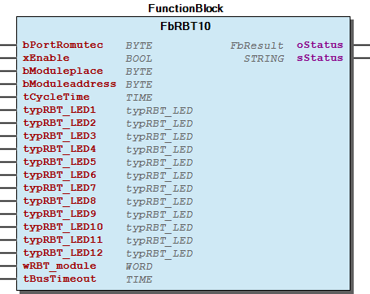

# WagoSolRomutec v1.2.0.4 (WAGO) - Complete Documentation

## 📋 Library Information

- **Company:** WAGO
- **Title:** WagoSolRomutec
- **Version:** 1.2.0.4
- **Categories:** Application; WAGO BusinessView|Building Automation; WAGO FunctionalView|Connectivity|Serial; WAGO LayerView|Solution
- **Namespace:** WagoSolRomutec
- **Author:** WAGO / u015652
- **Placeholder:** WagoSolRomutec

### Description ¶

This document is automatically generated.

This library supports Romutec devices with serial Modbus communication.

This document is automatically generated. This library supports Romutec devices with serial Modbus communication.

### Contents: ¶

Contents: - Documentation Index 10 Documentation - WagoSolRomutec Library Documentation Project Information Library Information Function Blocks - Fb2LevelSwitchConverter (FB) - FbBAH4000 (FB) - FbBAH4001 (FB) - FbBDH1400 (FB) - FbBDH1401 (FB) - FbBDH1402 (FB) - FbBDH1403 (FB) - FbBDH2200 (FB) - FbBDH2201 (FB) - FbBDH2203 (FB) - ... and 14 more Program Organization Global Variable Lists - GlobalVariables (GVL) - VersionHistory (GVL) Other Components - 01 Communication - 01 Communication - 02 Modules - 02 Modules - 70 Utilitites - 80 Types - 80 Types - BUS-tec MOD - ParameterList (PARAMS) - robutec - ... and 7 more

### Indices and tables ¶

Based on WagoSolRomutec.library, last modified 29.05.2024, 20:51:11. LibDoc 3.5.16.10

© WAGO GmbH & Co. KG, Germany 2018 – All rights reserved. For the avoidance of doubt, this copyright notice does not only apply to the information above but also and primarily to the described library itself. Please note that third-party products are always mentioned without reference to intellectual property rights, including patents, utility models, designs and trademarks, accordingly the existence of such rights cannot be excluded. WAGO is a registered trademark of WAGO Verwaltungsgesellschaft mbH.

- File and Project Information - Library Reference Based on WagoSolRomutec.library, last modified 29.05.2024, 20:51:11. LibDoc 3.5.16.10 © WAGO GmbH & Co. KG, Germany 2018 – All rights reserved. For the avoidance of doubt, this copyright notice does not only apply to the information above but also and primarily to the described library itself. Please note that third-party products are always mentioned without reference to intellectual property rights, including patents, utility models, designs and trademarks, accordingly the existence of such rights cannot be excluded. WAGO is a registered trademark of WAGO Verwaltungsgesellschaft mbH.

### Documentation Index

## 10 Documentation

To ensure fast installation and start-up of the units, we strongly recommend that the following information and explanations are carefully read and adhered to.

To ensure fast installation and start-up of the units, we strongly recommend that the following information and explanations are carefully read and adhered to. - doc01_Foreword (FB)

## WagoSolRomutec Library Documentation

| Company: | WAGO |
| Title: | WagoSolRomutec |
| Version: | 1.2.0.4 |
| Categories: | Application; WAGO BusinessView\|Building Automation; WAGO FunctionalView\|Connectivity\|Serial; WAGO LayerView\|Solution |
| Namespace: | WagoSolRomutec |
| Author: | WAGO / u015652 |
| Placeholder: | WagoSolRomutec |

### Description

This document is automatically generated.

This library supports Romutec devices with serial Modbus communication.

This document is automatically generated. This library supports Romutec devices with serial Modbus communication.

### Contents:

- 10 Documentation doc01_Foreword (FB) 20 Program Organization Units - BUS-tec MOD - robutec GlobalVariables (GVL) ParameterList (PARAMS) VersionHistory (GVL)

### Indices and tables

Based on WagoSolRomutec.library, last modified 29.05.2024, 20:51:11. LibDoc 3.5.16.10

© WAGO GmbH & Co. KG, Germany 2018 – All rights reserved. For the avoidance of doubt, this copyright notice does not only apply to the information above but also and primarily to the described library itself. Please note that third-party products are always mentioned without reference to intellectual property rights, including patents, utility models, designs and trademarks, accordingly the existence of such rights cannot be excluded. WAGO is a registered trademark of WAGO Verwaltungsgesellschaft mbH.

- File and Project Information - Library Reference Based on WagoSolRomutec.library, last modified 29.05.2024, 20:51:11. LibDoc 3.5.16.10 © WAGO GmbH & Co. KG, Germany 2018 – All rights reserved. For the avoidance of doubt, this copyright notice does not only apply to the information above but also and primarily to the described library itself. Please note that third-party products are always mentioned without reference to intellectual property rights, including patents, utility models, designs and trademarks, accordingly the existence of such rights cannot be excluded. WAGO is a registered trademark of WAGO Verwaltungsgesellschaft mbH.

### Project Information

## File and Project Information

| Scope | Name | Type | Content |
| --- | --- | --- | --- |
| FileHeader | libraryFile | string | WagoSolRomutec.library |
| contentFile | doc.clean.json |
| productName | e!COCKPIT |
| creationDateTime | date | 29.05.2024, 20:51:13 |
| companyName | string | WAGO |
| ProjectInformation | LastModificationDateTime | date | 29.05.2024, 20:51:11 |
| NoPlaceholder | string |  |
| Description | See: Description |
| Copyright | © WAGO Kontakttechnik GmbH & Co. KG, Germany 2018 – All rights reserved. |
| Author | WAGO / u015652 |
| AutoResolveUnbound | bool | True |
| Placeholder | string | WagoSolRomutec |
| Company | WAGO |
| DocFormat | reStructuredText |
| Project | WagoSolRomutec |
| DefaultNamespace | WagoSolRomutec |
| Version | version | 1.2.0.4 |
| Title | string | WagoSolRomutec |
| LibraryCategories | library-category-list | Application; WAGO BusinessView\|Building Automation; WAGO FunctionalView\|Connectivity\|Serial; WAGO LayerView\|Solution |
| CompiledLibraryCompatibilityVersion | string | CODESYS V3.5 SP16 Patch 3 |
| ThreadSafe | FALSE |

### Library Information

## Library Reference

| LinkAllContent: False QualifiedOnly: False | SystemLibrary: False | Optional: False |

| LinkAllContent: False Optional: False | QualifiedOnly: True SystemLibrary: False | PublishSymbolsInContainer: True |

| LinkAllContent: False QualifiedOnly: False | SystemLibrary: False | Optional: False |

| LinkAllContent: False QualifiedOnly: False | SystemLibrary: False PublishSymbolsInContainer: True | Optional: False |

| LinkAllContent: False QualifiedOnly: False | SystemLibrary: False | Optional: False |

| LinkAllContent: False Optional: False | QualifiedOnly: True SystemLibrary: False | PublishSymbolsInContainer: True |

| LinkAllContent: False Optional: False | QualifiedOnly: False SystemLibrary: False | PublishSymbolsInContainer: True |

This is a dictionary of all referenced libraries and their name spaces.

This is a dictionary of all referenced libraries and their name spaces. Standard Library Identification : Placeholder: Standard Default Resolution: Standard, * (System) Namespace: Standard Library Properties : WagoAppPlcModbus Library Identification : Placeholder: WagoAppPlcModbus Default Resolution: WagoAppPlcModbus, * (WAGO) Namespace: WagoAppPlcModbus Library Properties : WagoSysBSDSocket Library Identification : Placeholder: WagoSysBSDSocket Default Resolution: WagoSysBSDSocket, * (WAGO) Namespace: WagoSysBSDSocket Library Properties : WagoSysErrorBase Library Identification : Placeholder: WagoSysErrorBase Default Resolution: WagoSysErrorBase, * (WAGO) Namespace: WagoSysErrorBase Library Properties : Library Parameter : Parameter: RES_LOG_MAX_FILESIZE = 2000 Parameter: RES_LOG_MAX_FILES = 1 Parameter: RES_LOG_MAX_ENTRIES = 200 Parameter: RES_LOG_NAME = ‘WagoAppResultLogger’ WagoSysVersion Library Identification : Name: WagoSysVersion Version: 1.0.0.0 Company: WAGO Namespace: WagoSysVersion Library Properties : WagoTypesCom Library Identification : Placeholder: WagoTypesCom Default Resolution: WagoTypesCom, * (WAGO) Namespace: WagoTypesCom Library Properties : WagoTypesCommon Library Identification : Placeholder: WagoTypesCommon Default Resolution: WagoTypesCommon, * (WAGO) Namespace: WagoTypes Library Properties :

### Function Blocks

## Fb2LevelSwitchConverter (FB)

| Scope | Name | Type | Comment |
| --- | --- | --- | --- |
| Input | typRBT_2LevelSwitch | typRBT_2LevelSwitch | Switch structure |
| Output | xState1 | BOOL | Switch position 1 |
| xState2 | BOOL | Switch position 2 |
| xState3 | BOOL | Switch position 3 |
| xState4 | BOOL | Switch position 4 |

Use this function block to convert the structure ‘typRBT_2LevelSwitch’ to BOOL-Outputs.

Graphical Illustration

Interface variables Function Use this function block to convert the structure ‘typRBT_2LevelSwitch’ to BOOL-Outputs. Graphical Illustration 

## FbBAH4000 (FB)

| Scope | Name | Type | Initial | Comment |
| --- | --- | --- | --- | --- |
| Input | bPortRomutec | BYTE | 1 | Master assignment number for other function blocks. Range 1 to MAX_MASTER. |
| xEnable | BOOL | TRUE | Enable signal to start cyclic read out. |
| bModuleaddress | BYTE |  | Moduladdress of the module. Range: 0-7 |
| tCycleTime | TIME | TIME#1s0ms | Cycle time for read out. Range: 500ms - 10min |
| bSet_Output1 | BYTE |  | Set analogue output switch 1 in %. |
| bSet_Output2 | BYTE |  | Set analogue output switch 2 in %. |
| bSet_Output3 | BYTE |  | Set analogue output switch 3 in %. |
| bSet_Output4 | BYTE |  | Set analogue output switch 4 in %. |
| Output | xAutomatic_Switch1 | BOOL |  | Status automatic mode on switch 1. |
| bAnalogue_Output1 | BYTE |  | Status analogue output switch 1 in %. |
| xAutomatic_Switch2 | BOOL |  | Status automatic mode on switch 2. |
| bAnalogue_Output2 | BYTE |  | Status analogue output switch 2 in %. |
| xAutomatic_Switch3 | BOOL |  | Status automatic mode on switch 3. |
| bAnalogue_Output3 | BYTE |  | Status analogue output switch 3 in %. |
| xAutomatic_Switch4 | BOOL |  | Status automatic mode on switch 4. |
| bAnalogue_Output4 | BYTE |  | Status analogue output switch 4 in %. |
| oStatus | WagoAppPlcModbus.WagoSysErrorBase.FbResult |  | Status object. The content of the error object could be displayed via the FbShowResult from the WagoSysErrorBase library. |
| sStatus | STRING |  | Status description as string |

The function block is used for analogue output module FbBAH 4000 4xAO.

Graphical Illustration

Function description

The function block FbBAH4000 is used to actuate the analog encoder card BDH4000. The analog setpoint is converted to a voltage from 0 ... 10 V. The module addressed though bModuleaddress is cyclically polled if the input xEnable is TRUE. The tCycleTime input parameter determines the cycle time. In automatic mode, the setpoint of outputs bSet_Output1 to bSet_Output4 is converted to a voltage from 0 ... 10 V. The set voltage is optically indicated by the LED brightness. A TRUE at the outputs xAutomatic_Switch1 to xAutomatic_Switch4 signals the respective automatic mode switch position on the module. The current output voltage values are displayed at the outputs bAnalogue_Output1 to bAnalogue_Output4 in both automatic and manual modes.

Interface variables Function The function block is used for analogue output module FbBAH 4000 4xAO. Graphical Illustration  Function description The function block FbBAH4000 is used to actuate the analog encoder card BDH4000. The analog setpoint is converted to a voltage from 0 ... 10 V. The module addressed though bModuleaddress is cyclically polled if the input xEnable is TRUE. The tCycleTime input parameter determines the cycle time. In automatic mode, the setpoint of outputs bSet_Output1 to bSet_Output4 is converted to a voltage from 0 ... 10 V. The set voltage is optically indicated by the LED brightness. A TRUE at the outputs xAutomatic_Switch1 to xAutomatic_Switch4 signals the respective automatic mode switch position on the module. The current output voltage values are displayed at the outputs bAnalogue_Output1 to bAnalogue_Output4 in both automatic and manual modes.

## FbBAH4001 (FB)

| Scope | Name | Type | Initial | Comment |
| --- | --- | --- | --- | --- |
| Input | bPortRomutec | BYTE | 1 | Master assignment number for other function blocks. Range 1 to MAX_MASTER. |
| xEnable | BOOL | TRUE | Enable signal to start cyclic read out. |
| bModuleaddress | BYTE |  | Moduladdress of the module. Range: 0-7 |
| tCycleTime | TIME | TIME#1s0ms | Cycle time for read out. Range: 500ms - 10min |
| bSet_Output1 | BYTE |  | Set value analogue output 1 in %. |
| bSet_Output2 | BYTE |  | Set value analogue output 2 in %. |
| bSet_Output3 | BYTE |  | Set value analogue output 3 in %. |
| bSet_Output4 | BYTE |  | Set value analogue output 4 in %. |
| Output | xAutomatic_Switch1 | BOOL |  | Status automatic mode on switch 1. |
| bAnalogue_Output1 | BYTE |  | Status analogue output switch 1 in %. |
| xAutomatic_Switch2 | BOOL |  | Status automatic mode on switch 2. |
| bAnalogue_Output2 | BYTE |  | Status analogue output switch 2 in %. |
| xAutomatic_Switch3 | BOOL |  | Status automatic mode on switch 3. |
| bAnalogue_Output3 | BYTE |  | Status analogue output switch 3 in %. |
| xAutomatic_Switch4 | BOOL |  | Status automatic mode on switch 4. |
| bAnalogue_Output4 | BYTE |  | Status analogue output switch 4 in %. |
| oStatus | WagoAppPlcModbus.WagoSysErrorBase.FbResult |  | Status object. The content of the error object could be displayed via the FbShowResult from the WagoSysErrorBase library. |
| sStatus | STRING |  | Status description as string |

The function block is used for analogue output module FbBAH 4001 4xAO/4xAI.

Graphical Illustration

Function description

The function block FbBAH4001 is used to actuate the analog encoder card BDH4001. The analog setpoint is converted to a voltage from 0 ... 10 V. The module addressed though bModuleaddress is cyclically polled if the input xEnable is TRUE. The tCycleTime input parameter determines the cycle time. In automatic mode, the setpoint of outputs bSet_Output1 to bSet_Output4 is converted to a voltage from 0 ... 10 V. The set voltage is optically indicated by the LED brightness. A TRUE at the outputs xAutomatic_Switch1 to xAutomatic_Switch4 signals the respective automatic mode switch position on the module. The current output voltage values are displayed at the outputs bAnalogue_Output1 to bAnalogue_Output4 in both automatic and manual modes.

Interface variables Function The function block is used for analogue output module FbBAH 4001 4xAO/4xAI. Graphical Illustration  Function description The function block FbBAH4001 is used to actuate the analog encoder card BDH4001. The analog setpoint is converted to a voltage from 0 ... 10 V. The module addressed though bModuleaddress is cyclically polled if the input xEnable is TRUE. The tCycleTime input parameter determines the cycle time. In automatic mode, the setpoint of outputs bSet_Output1 to bSet_Output4 is converted to a voltage from 0 ... 10 V. The set voltage is optically indicated by the LED brightness. A TRUE at the outputs xAutomatic_Switch1 to xAutomatic_Switch4 signals the respective automatic mode switch position on the module. The current output voltage values are displayed at the outputs bAnalogue_Output1 to bAnalogue_Output4 in both automatic and manual modes.

## FbBDH1400 (FB)

| Scope | Name | Type | Initial | Comment |
| --- | --- | --- | --- | --- |
| Input | bPortRomutec | BYTE | 1 | Master assignment number for other function blocks. Range 1 to MAX_MASTER. |
| xEnable | BOOL | TRUE | Enable signal to start cyclic read out. |
| bModuleaddress | BYTE |  | Moduladdress of the module. Range: 0-7 |
| tCycleTime | TIME | TIME#1s0ms | Cycle time for read out. Range: 500ms - 10min |
| xRelay1 | BOOL |  | Set relay on switch 1. |
| xRelay2 | BOOL |  | Set relay on switch 2. |
| xRelay3 | BOOL |  | Set relay on switch 3. |
| xRelay4 | BOOL |  | Set relay on switch 4. |
| typLED_Switch1_Error | typLED |  | Set error LED on switch 1. |
| typLED_Switch2_Error | typLED |  | Set error LED on switch 2. |
| typLED_Switch3_Error | typLED |  | Set error LED on switch 3. |
| typLED_Switch4_Error | typLED |  | Set error LED on switch 4. |
| Output | xAutomatic_Switch1 | BOOL |  | Status automatic mode on switch 1. |
| xAutomatic_Switch2 | BOOL |  | Status automatic mode on switch 2. |
| xAutomatic_Switch3 | BOOL |  | Status automatic mode on switch 3. |
| xAutomatic_Switch4 | BOOL |  | Status automatic mode on switch 4. |
| oStatus | WagoAppPlcModbus.WagoSysErrorBase.FbResult |  | Status object. The content of the error object could be displayed via the FbShowResult from the WagoSysErrorBase library. |
| sStatus | STRING |  | Status description as string |

The function block is used for digital output module FbBDH 1400 4x1DO.

Graphical Illustration

Function description

The function block FbBDH1400 is used to actuate the motor control card BDH1400, whereby the LEDs are actuated by the function block. The module addressed though bModuleaddress is cyclically polled if the input xEnable is TRUE. The tCycleTime input parameter determines the cycle time. In automatic mode, the relays can be actuated via inputs xRelay1 to xRelay4 . When automatic mode is active, the LEDs for indicating operation are actuated together with the respective relays. In manual mode, the LEDs for indicating operation are switched off. The inputs typLED_Switch1_Error to typLED_Switch4_Error control the respective error messages. The LED color is specified via the structure typLED . Here, it is possible to actuate the variables LED_RedBlink and LED_Green at the same time (LED yellow/green). A TRUE at the outputs xAutomatic_Switch1 to xAutomatic_Switch4 signals the respective automatic mode switch position on the module.

Interface variables Function The function block is used for digital output module FbBDH 1400 4x1DO. Graphical Illustration  Function description The function block FbBDH1400 is used to actuate the motor control card BDH1400, whereby the LEDs are actuated by the function block. The module addressed though bModuleaddress is cyclically polled if the input xEnable is TRUE. The tCycleTime input parameter determines the cycle time. In automatic mode, the relays can be actuated via inputs xRelay1 to xRelay4 . When automatic mode is active, the LEDs for indicating operation are actuated together with the respective relays. In manual mode, the LEDs for indicating operation are switched off. The inputs typLED_Switch1_Error to typLED_Switch4_Error control the respective error messages. The LED color is specified via the structure typLED . Here, it is possible to actuate the variables LED_RedBlink and LED_Green at the same time (LED yellow/green). A TRUE at the outputs xAutomatic_Switch1 to xAutomatic_Switch4 signals the respective automatic mode switch position on the module.

## FbBDH1401 (FB)

| Scope | Name | Type | Initial | Comment |
| --- | --- | --- | --- | --- |
| Input | bPortRomutec | BYTE | 1 | Master assignment number for other function blocks. Range 1 to MAX_MASTER. |
| xEnable | BOOL | TRUE | Enable signal to start cyclic read out. |
| bModuleaddress | BYTE |  | Moduladdress of the module. Range: 0-7 |
| tCycleTime | TIME | TIME#1s0ms | Cycle time for read out. Range: 500ms - 10min |
| xRelay1 | BOOL |  | Set relay on switch 1. |
| xRelay2 | BOOL |  | Set relay on switch 2. |
| xRelay3 | BOOL |  | Set relay on switch 3. |
| xRelay4 | BOOL |  | Set relay on switch 4. |
| Output | xAutomatic_Switch1 | BOOL |  | Status automatic mode on switch 1. |
| xError_Switch1 | BOOL |  | Status error on switch 1. |
| xActivate_Switch1 | BOOL |  | Status operating on switch 1. |
| xAutomatic_Switch2 | BOOL |  | Status automatic mode on switch 2. |
| xError_Switch2 | BOOL |  | Status error on switch 2. |
| xActivate_Switch2 | BOOL |  | Status operating on switch 2. |
| xAutomatic_Switch3 | BOOL |  | Status automatic mode on switch 3. |
| xError_Switch3 | BOOL |  | Status error on switch 3. |
| xActivate_Switch3 | BOOL |  | Status operating on switch 3. |
| xAutomatic_Switch4 | BOOL |  | Status automatic mode on switch 4. |
| xError_Switch4 | BOOL |  | Status error on switch 4. |
| xActivate_Switch4 | BOOL |  | Status operating on switch 4. |
| oStatus | WagoAppPlcModbus.WagoSysErrorBase.FbResult |  | Status object. The content of the error object could be displayed via the FbShowResult from the WagoSysErrorBase library. |
| sStatus | STRING |  | Status description as string |

Graphical Illustration

Function description

The function block FbBDH1401 is used to actuate the motor control card BDH1401. The LEDs are actuated with + 24 VDC, which is switched via the I/O modules on the card. The module addressed though bModuleaddress is cyclically polled if the input xEnable is TRUE. The tCycleTime input parameter determines the cycle time. In automatic mode, the relays can be actuated via inputs xRelay1 to xRelay4 . A TRUE at the outputs xAutomatic_Switch1 to xAutomatic_Switch4 signals the automatic mode switch position. The outputs xError_Switch1 to xError_Switch4 indicate the status of the respective error message; the outputs xActivate_Switch1 to xActivate_Switch4 indicate the status of the respective operating light.

Interface variables Function The function block is used for digital input module FbBDH 1401 4x1DO/8DI. Graphical Illustration  Function description The function block FbBDH1401 is used to actuate the motor control card BDH1401. The LEDs are actuated with + 24 VDC, which is switched via the I/O modules on the card. The module addressed though bModuleaddress is cyclically polled if the input xEnable is TRUE. The tCycleTime input parameter determines the cycle time. In automatic mode, the relays can be actuated via inputs xRelay1 to xRelay4 . A TRUE at the outputs xAutomatic_Switch1 to xAutomatic_Switch4 signals the automatic mode switch position. The outputs xError_Switch1 to xError_Switch4 indicate the status of the respective error message; the outputs xActivate_Switch1 to xActivate_Switch4 indicate the status of the respective operating light.

## FbBDH1402 (FB)

| Scope | Name | Type | Initial | Comment |
| --- | --- | --- | --- | --- |
| Input | bPortRomutec | BYTE | 1 | Master assignment number for other function blocks. Range 1 to MAX_MASTER. |
| xEnable | BOOL | TRUE | Enable signal to start cyclic read out. |
| bModuleaddress | BYTE |  | Moduladdress of the module. Range: 0-7 |
| tCycleTime | TIME | TIME#1s0ms | Cycle time for read out. Range: 500ms - 10min |
| xRelay1 | BOOL |  | Set relay on switch 1. |
| xRelay2 | BOOL |  | Set relay on switch 2. |
| xRelay3 | BOOL |  | Set relay on switch 3. |
| xRelay4 | BOOL |  | Set relay on switch 4. |
| Output | xAutomatic_Switch1 | BOOL |  | Status automatic mode on switch 1. |
| xClose_Switch1 | BOOL |  | Status valve closed on switch 1. |
| xOpen_Switch1 | BOOL |  | Status valve open on switch 1. |
| xAutomatic_Switch2 | BOOL |  | Status automatic mode on switch 2. |
| xClose_Switch2 | BOOL |  | Status valve closed on switch 2. |
| xOpen_Switch2 | BOOL |  | Status valve open on switch 2. |
| xAutomatic_Switch3 | BOOL |  | Status automatic mode on switch 3. |
| xClose_Switch3 | BOOL |  | Status valve closed on switch 3. |
| xOpen_Switch3 | BOOL |  | Status valve open on switch 3. |
| xAutomatic_Switch4 | BOOL |  | Status automatic mode on switch 4. |
| xClose_Switch4 | BOOL |  | Status valve closed on switch 4. |
| xOpen_Switch4 | BOOL |  | Status valve open on switch 4. |
| oStatus | WagoAppPlcModbus.WagoSysErrorBase.FbResult |  | Status object. The content of the error object could be displayed via the FbShowResult from the WagoSysErrorBase library. |
| sStatus | STRING |  | Status description as string |

Graphical Illustration

Function description

The function block FbBDH1402 is used to actuate the valve card BDH1402. The LEDs are actuated with + 24 VDC, which is switched via the bus power supply on the card. The module addressed though bModuleaddress is cyclically polled if the input xEnable is TRUE. The tCycleTime input parameter determines the cycle time. In automatic mode, the relays can be actuated via inputs xRelay1 to xRelay4 . A TRUE at the outputs xAutomatic_Switch1 to xAutomatic_Switch4 signals the automatic mode switch position. The outputs xClose_Switch1 to xClose_Switch4 indicate the status of the respective closed valve; the outputs xOpen_Switch1 to xOpen_Switch4 indicate the status of the respective opened valve.

Interface variables Function The function block is used for digital input module FbBDH 1402 4x1DO/8DO. Graphical Illustration  Function description The function block FbBDH1402 is used to actuate the valve card BDH1402. The LEDs are actuated with + 24 VDC, which is switched via the bus power supply on the card. The module addressed though bModuleaddress is cyclically polled if the input xEnable is TRUE. The tCycleTime input parameter determines the cycle time. In automatic mode, the relays can be actuated via inputs xRelay1 to xRelay4 . A TRUE at the outputs xAutomatic_Switch1 to xAutomatic_Switch4 signals the automatic mode switch position. The outputs xClose_Switch1 to xClose_Switch4 indicate the status of the respective closed valve; the outputs xOpen_Switch1 to xOpen_Switch4 indicate the status of the respective opened valve.

## FbBDH1403 (FB)

| Scope | Name | Type | Initial | Comment |
| --- | --- | --- | --- | --- |
| Input | bPortRomutec | BYTE | 1 | Master assignment number for other function blocks. Range 1 to MAX_MASTER. |
| xEnable | BOOL | TRUE | Enable signal to start cyclic read out. |
| bModuleaddress | BYTE |  | Moduladdress of the module. Range: 0-7 |
| tCycleTime | TIME | TIME#1s0ms | Cycle time for read out. Range: 500ms - 10min |
| xRelay1 | BOOL |  | Set relay on switch 1. |
| xRelay2 | BOOL |  | Set relay on switch 2. |
| xRelay3 | BOOL |  | Set relay on switch 3. |
| xRelay4 | BOOL |  | Set relay on switch 4. |
| Output | xAutomatic_Switch1 | BOOL |  | LED AUTO - switch 1 |
| xError_Switch1 | BOOL |  | LED Fault - switch 1 |
| xActivate_Switch1 | BOOL |  | LED Operation - switch 1 |
| xAutomatic_Switch2 | BOOL |  | LED AUTO - switch 2 |
| xError_Switch2 | BOOL |  | LED Fault - switch 2 |
| xActivate_Switch2 | BOOL |  | LED Operation - switch 2 |
| xAutomatic_Switch3 | BOOL |  | LED AUTO - switch 3 |
| xError_Switch3 | BOOL |  | LED Fault - switch 3 |
| xActivate_Switch3 | BOOL |  | LED Operation - switch 3 |
| xAutomatic_Switch4 | BOOL |  | LED AUTO - switch 4 |
| xError_Switch4 | BOOL |  | LED Fault - switch 4 |
| xActivate_Switch4 | BOOL |  | LED Operation - switch 4 |
| oStatus | WagoAppPlcModbus.WagoSysErrorBase.FbResult |  | Status object. The content of the error object could be displayed via the FbShowResult from the WagoSysErrorBase library. |
| sStatus | STRING |  | Status description as string |

The function block is used for digital input module FbBDH 1403 4x1DO/4DI+4DI(invert).

Graphical Illustration

Function description

The function block FbBDH1403 is used to actuate the motor control card BDH1403. The LEDs are actuated with + 24 VDC, which is switched via the bus power supply on the card. The module addressed though bModuleaddress is cyclically polled if the input xEnable is TRUE. The tCycleTime input parameter determines the cycle time. In automatic mode, the relays can be actuated via inputs xRelay1 to xRelay4 . A TRUE at the outputs xAutomatic_Switch1 to xAutomatic_Switch4 signals the automatic mode switch position. The outputs xError_Switch1 to xError_Switch4 indicate the status of the respective error message; the outputs xActivate_Switch1 to xActivate_Switch4 indicate the status of the respective operating light.

Interface variables Function The function block is used for digital input module FbBDH 1403 4x1DO/4DI+4DI(invert). Graphical Illustration  Function description The function block FbBDH1403 is used to actuate the motor control card BDH1403. The LEDs are actuated with + 24 VDC, which is switched via the bus power supply on the card. The module addressed though bModuleaddress is cyclically polled if the input xEnable is TRUE. The tCycleTime input parameter determines the cycle time. In automatic mode, the relays can be actuated via inputs xRelay1 to xRelay4 . A TRUE at the outputs xAutomatic_Switch1 to xAutomatic_Switch4 signals the automatic mode switch position. The outputs xError_Switch1 to xError_Switch4 indicate the status of the respective error message; the outputs xActivate_Switch1 to xActivate_Switch4 indicate the status of the respective operating light.

## FbBDH2200 (FB)

| Scope | Name | Type | Initial | Comment |
| --- | --- | --- | --- | --- |
| Input | bPortRomutec | BYTE | 1 | Master assignment number for other function blocks. Range 1 to MAX_MASTER. |
| xEnable | BOOL | TRUE | Enable signal to start cyclic read out. |
| bModuleaddress | BYTE |  | Moduladdress of the module. Range: 0-7 |
| tCycleTime | TIME | TIME#1s0ms | Cycle time for read out. Range: 500ms - 10min |
| xSwitch1_Level1 | BOOL |  | Set relay on switch 1 / level 1. |
| xSwitch1_Level2 | BOOL |  | Set relay on switch 1 / level 2. |
| xSwitch2_Level1 | BOOL |  | Set relay on switch 2 / level 1. |
| xSwitch2_Level2 | BOOL |  | Set relay on switch 2 / level 2. |
| typLED_Switch1_Error | typLED |  | Set error LED on switch 1. |
| typLED_Switch2_Error | typLED |  | Set error LED on switch 2. |
| Output | xAutomatic_Switch1 | BOOL |  | Status automatic mode on switch 1. |
| xAutomatic_Switch2 | BOOL |  | Status automatic mode on switch 2. |
| oStatus | WagoAppPlcModbus.WagoSysErrorBase.FbResult |  | Status object. The content of the error object could be displayed via the FbShowResult from the WagoSysErrorBase library. |
| sStatus | STRING |  | Status description as string |

The function block is used for digital output module FbBDH 2200 2x2DO.

Graphical Illustration

Function description

The function block FbBDH2200 is used to actuate the motor control card BDH2200, whereby the LEDs are actuated by the function block. The module addressed though bModuleaddress is cyclically polled if the input xEnable is TRUE. The tCycleTime input parameter determines the cycle time. In automatic mode, the relays can be actuated for the respective switching level via inputs xSwitch1_Level1 to xSwitch2_Level2 . The inputs typLED_Switch1_Error and typLED_Switch2_Error control the respective error messages. The LED color is specified via the structure typLED . A TRUE at the outputs xAutomatic_Switch1 and xAutomatic_Switch2 signals the respective automatic modes.

Interface variables Function The function block is used for digital output module FbBDH 2200 2x2DO. Graphical Illustration  Function description The function block FbBDH2200 is used to actuate the motor control card BDH2200, whereby the LEDs are actuated by the function block. The module addressed though bModuleaddress is cyclically polled if the input xEnable is TRUE. The tCycleTime input parameter determines the cycle time. In automatic mode, the relays can be actuated for the respective switching level via inputs xSwitch1_Level1 to xSwitch2_Level2 . The inputs typLED_Switch1_Error and typLED_Switch2_Error control the respective error messages. The LED color is specified via the structure typLED . A TRUE at the outputs xAutomatic_Switch1 and xAutomatic_Switch2 signals the respective automatic modes.

## FbBDH2201 (FB)

| Scope | Name | Type | Initial | Comment |
| --- | --- | --- | --- | --- |
| Input | bPortRomutec | BYTE | 1 | Master assignment number for other function blocks. Range 1 to MAX_MASTER. |
| xEnable | BOOL | TRUE | Enable signal to start cyclic read out. |
| bModuleaddress | BYTE |  | Moduladdress of the module. Range: 0-7 |
| tCycleTime | TIME | TIME#1s0ms | Cycle time for read out. Range: 500ms - 10min |
| xSwitch1_Level1 | BOOL |  | Set relay on switch 1 / level 1. |
| xSwitch1_Level2 | BOOL |  | Set relay on switch 1 / level 2. |
| xSwitch2_Level1 | BOOL |  | Set relay on switch 2 / level 1. |
| xSwitch2_Level2 | BOOL |  | Set relay on switch 2 / level 2. |
| Output | xAutomatic_Switch1 | BOOL |  | Status automatic mode on switch 1. |
| xLED_Switch1_Error | BOOL |  | Status error on switch 1. |
| xLED_Switch1_Level1 | BOOL |  | Status relay on switch 1 / level 1. |
| xLED_Switch1_Level2 | BOOL |  | Status relay on switch 1 / level 2. |
| xAutomatic_Switch2 | BOOL |  | Status automatic mode on switch 2. |
| xLED_Switch2_Error | BOOL |  | Status error on switch 2. |
| xLED_Switch2_Level1 | BOOL |  | Status relay on switch 2 / level 1. |
| xLED_Switch2_Level2 | BOOL |  | Status relay on switch 2 / level 2. |
| oStatus | WagoAppPlcModbus.WagoSysErrorBase.FbResult |  | Status object. The content of the error object could be displayed via the FbShowResult from the WagoSysErrorBase library. |
| sStatus | STRING |  | Status description as string |

The function block is used for digital input module FbBDH 2201 2x2DO/6DI.

Graphical Illustration

Function description

The function block FbBDH2201 is used to actuate the motor control card BDH2201. The LEDs are actuated with + 24 VDC, which is switched via the bus power supply on the card. The module addressed though bModuleaddress is cyclically polled if the input xEnable is TRUE. The tCycleTime input parameter determines the cycle time. In automatic mode, the relays can be actuated for the respective switching level via inputs xSwitch1_Level1 to xSwitch2_Level2 . A TRUE at the outputs xAutomatic_Switch1 and xAutomatic_Switch2 signals the automatic mode switch position. The outputs typLED_Switch1_Error and typLED_Switch2_Error indicate the status of the respective error messages. The outputs xLED_Switch1_Level1 and xLED_Switch1_Level2 , along with xLED_Switch2_Level1 and xLED_Switch2_Level2 , indicate the status of the LEDs for the operation.

Interface variables Function The function block is used for digital input module FbBDH 2201 2x2DO/6DI. Graphical Illustration  Function description The function block FbBDH2201 is used to actuate the motor control card BDH2201. The LEDs are actuated with + 24 VDC, which is switched via the bus power supply on the card. The module addressed though bModuleaddress is cyclically polled if the input xEnable is TRUE. The tCycleTime input parameter determines the cycle time. In automatic mode, the relays can be actuated for the respective switching level via inputs xSwitch1_Level1 to xSwitch2_Level2 . A TRUE at the outputs xAutomatic_Switch1 and xAutomatic_Switch2 signals the automatic mode switch position. The outputs typLED_Switch1_Error and typLED_Switch2_Error indicate the status of the respective error messages. The outputs xLED_Switch1_Level1 and xLED_Switch1_Level2 , along with xLED_Switch2_Level1 and xLED_Switch2_Level2 , indicate the status of the LEDs for the operation.

## FbBDH2203 (FB)

| Scope | Name | Type | Initial | Comment |
| --- | --- | --- | --- | --- |
| Input | bPortRomutec | BYTE | 1 | Master assignment number for other function blocks. Range 1 to MAX_MASTER. |
| xEnable | BOOL | TRUE | Enable signal to start cyclic read out. |
| bModuleaddress | BYTE |  | Moduladdress of the module. Range: 0-7 |
| tCycleTime | TIME | TIME#1s0ms | Cycle time for read out. Range: 500ms - 10min |
| xSwitch1_Level1 | BOOL |  | Set relay on switch 1 / level 1. |
| xSwitch1_Level2 | BOOL |  | Set relay on switch 1 / level 2. |
| xSwitch2_Level1 | BOOL |  | Set relay on switch 2 / level 1. |
| xSwitch2_Level2 | BOOL |  | Set relay on switch 2 / level 2. |
| Output | xAutomatic_Switch1 | BOOL |  | Status automatic mode on switch 1. |
| xLED_Switch1_Error | BOOL |  | Status error on switch 1. |
| xLED_Switch1_Level1 | BOOL |  | Status relay on switch 1 / level 1. |
| xLED_Switch1_Level2 | BOOL |  | Status relay on switch 1 / level 2. |
| xAutomatic_Switch2 | BOOL |  | Status automatic mode on switch 2. |
| xLED_Switch2_Error | BOOL |  | Status error on switch 2. |
| xLED_Switch2_Level1 | BOOL |  | Status relay on switch 2 / level 1. |
| xLED_Switch2_Level2 | BOOL |  | Status relay on switch 2 / level 2. |
| oStatus | WagoAppPlcModbus.WagoSysErrorBase.FbResult |  | Status object. The content of the error object could be displayed via the FbShowResult from the WagoSysErrorBase library. |
| sStatus | STRING |  | Status description as string |

The function block is used for digital input module FbBDH 2203 2x2DO/4DI+2DI(invert).

Graphical Illustration

Function description

The function block FbBDH2203 is used to actuate the motor control card BDH2203. The LEDs are actuated with + 24 VDC, which is switched via the bus power supply on the card. The module addressed though bModuleaddress is cyclically polled if the input xEnable is TRUE. The tCycleTime input parameter determines the cycle time. In automatic mode, the relays can be actuated for the respective switching level via inputs xSwitch1_Level1 to xSwitch2_Level2 . A TRUE at the outputs xAutomatic_Switch1 and xAutomatic_Switch2 signals the automatic mode switch position. The outputs typLED_Switch1_Error and typLED_Switch2_Error indicate the status of the respective error messages. The outputs xLED_Switch1_Level1 and xLED_Switch1_Level2 , along with xLED_Switch2_Level1 and xLED_Switch2_Level2 , indicate the status of the LEDs for the operation.

Interface variables Function The function block is used for digital input module FbBDH 2203 2x2DO/4DI+2DI(invert). Graphical Illustration  Function description The function block FbBDH2203 is used to actuate the motor control card BDH2203. The LEDs are actuated with + 24 VDC, which is switched via the bus power supply on the card. The module addressed though bModuleaddress is cyclically polled if the input xEnable is TRUE. The tCycleTime input parameter determines the cycle time. In automatic mode, the relays can be actuated for the respective switching level via inputs xSwitch1_Level1 to xSwitch2_Level2 . A TRUE at the outputs xAutomatic_Switch1 and xAutomatic_Switch2 signals the automatic mode switch position. The outputs typLED_Switch1_Error and typLED_Switch2_Error indicate the status of the respective error messages. The outputs xLED_Switch1_Level1 and xLED_Switch1_Level2 , along with xLED_Switch2_Level1 and xLED_Switch2_Level2 , indicate the status of the LEDs for the operation.

## FbBDH4800 (FB)

| Scope | Name | Type | Initial | Comment |
| --- | --- | --- | --- | --- |
| Input | bPortRomutec | BYTE | 1 | Master assignment number for other function blocks. Range 1 to MAX_MASTER. |
| xEnable | BOOL | TRUE | Enable signal to start cyclic read out. |
| bModuleaddress | BYTE |  | Moduladdress of the module. Range: 0-7 |
| tCycleTime | TIME | TIME#1s0ms | Cycle time for read out. Range: 500ms - 10min |
| xLED1_1 | BOOL |  | Set LED1_1. |
| xLED1_2 | BOOL |  | Set LED1_2. |
| xLED1_3 | BOOL |  | Set LED1_3. |
| xLED2_1 | BOOL |  | Set LED2_1. |
| xLED2_2 | BOOL |  | Set LED2_2. |
| xLED2_3 | BOOL |  | Set LED2_3. |
| xLED3_1 | BOOL |  | Set LED3_1. |
| xLED3_2 | BOOL |  | Set LED3_2. |
| xLED3_3 | BOOL |  | Set LED3_3. |
| xLED4_1 | BOOL |  | Set LED4_1. |
| xLED4_2 | BOOL |  | Set LED4_2. |
| xLED4_3 | BOOL |  | Set LED4_3. |
| xRelay1 | BOOL |  | Set relay on switch 1. |
| xRelay2 | BOOL |  | Set relay on switch 2. |
| xRelay3 | BOOL |  | Set relay on switch 3. |
| xRelay4 | BOOL |  | Set relay on switch 4. |
| Output | xPushbutton1 | BOOL |  | Status Pushbutton 1. |
| xPushbutton2 | BOOL |  | Status Pushbutton 2. |
| xPushbutton3 | BOOL |  | Status Pushbutton 3. |
| xPushbutton4 | BOOL |  | Status Pushbutton 4. |
| oStatus | WagoAppPlcModbus.WagoSysErrorBase.FbResult |  | Status object. The content of the error object could be displayed via the FbShowResult from the WagoSysErrorBase library. |
| sStatus | STRING |  | Status description as string |

The function block is used for digital output module FbBDH 4800 16DO/4DI.

Graphical Illustration

Function description

The function block FbBDH4800 is used to actuate the illuminated push-button card BDH4800. The module addressed though bModuleaddress is cyclically polled if the input xEnable is TRUE. The tCycleTime input parameter determines the cycle time. The LEDs on the module are actuated via inputs xLED1_1 to xLED4_3 . Actuating LED1 and LED2 of a group does not cause a collective fault. However, if LED3 is actuated, there is also a collective fault on the central module. The coupling relays can be actuated via inputs xRelay1 to xRelay4 . A TRUE at the outputs xPushbutton1 to xPushbutton4 signals the actuation of the respective push-button on the module.

The push-button polling is dependent on parameter tCycleTime . Now, if the push-button is pressed only during the time between two polling processes, the push-button press might not be detected.

Interface variables Function The function block is used for digital output module FbBDH 4800 16DO/4DI. Graphical Illustration  Function description The function block FbBDH4800 is used to actuate the illuminated push-button card BDH4800. The module addressed though bModuleaddress is cyclically polled if the input xEnable is TRUE. The tCycleTime input parameter determines the cycle time. The LEDs on the module are actuated via inputs xLED1_1 to xLED4_3 . Actuating LED1 and LED2 of a group does not cause a collective fault. However, if LED3 is actuated, there is also a collective fault on the central module. The coupling relays can be actuated via inputs xRelay1 to xRelay4 . A TRUE at the outputs xPushbutton1 to xPushbutton4 signals the actuation of the respective push-button on the module. Note The push-button polling is dependent on parameter tCycleTime . Now, if the push-button is pressed only during the time between two polling processes, the push-button press might not be detected.

## FbBDH4800_100 (FB)

| Scope | Name | Type | Initial | Comment |
| --- | --- | --- | --- | --- |
| Input | bPortRomutec | BYTE | 1 | Master assignment number for other function blocks. Range 1 to MAX_MASTER. |
| xEnable | BOOL | TRUE | Enable signal to start cyclic read out. |
| bModuleaddress | BYTE |  | Moduladdress of the module. Range: 0-7 |
| tCycleTime | TIME | TIME#1s0ms | Cycle time for read out. Range: 500ms - 10min |
| xLED1_1 | BOOL |  | Set LED1_1. |
| xLED1_2 | BOOL |  | Set LED1_2. |
| xLED1_3 | BOOL |  | Set LED1_3. |
| xLED2_1 | BOOL |  | Set LED2_1. |
| xLED2_2 | BOOL |  | Set LED2_2. |
| xLED2_3 | BOOL |  | Set LED2_3. |
| xLED3_1 | BOOL |  | Set LED3_1. |
| xLED3_2 | BOOL |  | Set LED3_2. |
| xLED3_3 | BOOL |  | Set LED3_3. |
| xLED4_1 | BOOL |  | Set LED4_1. |
| xLED4_2 | BOOL |  | Set LED4_2. |
| xLED4_3 | BOOL |  | Set LED4_3. |
| Output | xPushbutton1 | BOOL |  | Status Pushbutton 1. |
| xPushbutton2 | BOOL |  | Status Pushbutton 2. |
| xPushbutton3 | BOOL |  | Status Pushbutton 3. |
| xPushbutton4 | BOOL |  | Status Pushbutton 4. |
| oStatus | WagoAppPlcModbus.WagoSysErrorBase.FbResult |  | Status object. The content of the error object could be displayed via the FbShowResult from the WagoSysErrorBase library. |
| sStatus | STRING |  | Status description as string |

The function block is used for digital output module FbBDH 4800-100 12DO/4DI.

Graphical Illustration

Function description

The function block FbBDH4800_100 is used to actuate the illuminated push-button card BDH4800_100. The module addressed though bModuleaddress is cyclically polled if the input xEnable is TRUE. The tCycleTime input parameter determines the cycle time. The LEDs on the module are actuated via inputs xLED1_1 to xLED4_3 . Actuating LED1 and LED2 of a group does not cause a collective fault. However, if LED3 is actuated, there is also a collective fault on the central module. A TRUE at the outputs xPushbutton1 to xPushbutton4 signals the actuation of the respective push-button on the module.

The push-button polling is dependent on parameter tCycleTime . Now, if the push-button is pressed only during the time between two polling processes, the push-button press might not be detected.

Interface variables Function The function block is used for digital output module FbBDH 4800-100 12DO/4DI. Graphical Illustration  Function description The function block FbBDH4800_100 is used to actuate the illuminated push-button card BDH4800_100. The module addressed though bModuleaddress is cyclically polled if the input xEnable is TRUE. The tCycleTime input parameter determines the cycle time. The LEDs on the module are actuated via inputs xLED1_1 to xLED4_3 . Actuating LED1 and LED2 of a group does not cause a collective fault. However, if LED3 is actuated, there is also a collective fault on the central module. A TRUE at the outputs xPushbutton1 to xPushbutton4 signals the actuation of the respective push-button on the module. Note The push-button polling is dependent on parameter tCycleTime . Now, if the push-button is pressed only during the time between two polling processes, the push-button press might not be detected.

## FbBLM1000 (FB)

| Scope | Name | Type | Initial | Comment |
| --- | --- | --- | --- | --- |
| Input | bPortRomutec | BYTE | 1 | Master assignment number for other function blocks. Range 1 to MAX_MASTER. |
| xEnable | BOOL | TRUE | Enable signal to start cyclic read out. |
| bModuleaddress | BYTE |  | Moduladdress of the module. Range: 0-7 |
| tCycleTime | TIME | TIME#1s0ms | Cycle time for read out. Range: 500ms - 10min |
| typMessage1 | typLED |  | Set LED message 1. |
| typMessage2 | typLED |  | Set LED message 2. |
| typMessage3 | typLED |  | Set LED message 3. |
| typMessage4 | typLED |  | Set LED message 4. |
| typMessage5 | typLED |  | Set LED message 5. |
| typMessage6 | typLED |  | Set LED message 6. |
| typMessage7 | typLED |  | Set LED message 7. |
| typMessage8 | typLED |  | Set LED message 8. |
| typMessage9 | typLED |  | Set LED message 9. |
| typMessage10 | typLED |  | Set LED message 10. |
| Output | oStatus | WagoAppPlcModbus.WagoSysErrorBase.FbResult |  | Status object. The content of the error object could be displayed via the FbShowResult from the WagoSysErrorBase library. |
| sStatus | STRING |  | Status description as string |

Graphical Illustration

Function description

Function block FbBLM1000 is used to actuate the 10 LEDs on the module BLM1000. Each LED has four different status displays (LED off, LED green, LED yellow/green, LED red). The inputs typMessage1 to typMessage10 actuate the respective LEDs. The LED color is specified via the structure typLED . Here, it is possible to actuate the variables LED_RedBlink and LED_Green at the same time (LED yellow/green).

Interface variables Function The function block is used for signaling module BLM 1000 10DO. Graphical Illustration  Function description Function block FbBLM1000 is used to actuate the 10 LEDs on the module BLM1000. Each LED has four different status displays (LED off, LED green, LED yellow/green, LED red). The inputs typMessage1 to typMessage10 actuate the respective LEDs. The LED color is specified via the structure typLED . Here, it is possible to actuate the variables LED_RedBlink and LED_Green at the same time (LED yellow/green).

## FbBLM1001 (FB)

| Scope | Name | Type | Initial | Comment |
| --- | --- | --- | --- | --- |
| Input | bPortRomutec | BYTE | 1 | Master assignment number for other function blocks. Range 1 to MAX_MASTER. |
| xEnable | BOOL | TRUE | Enable signal to start cyclic read out. |
| bModuleaddress | BYTE |  | Moduladdress of the module. Range: 0-7 |
| tCycleTime | TIME | TIME#1s0ms | Cycle time for read out. Range: 500ms - 10min |
| Output | typMessage1 | typLED |  | Status LED message 1. |
| typMessage2 | typLED |  | Status LED message 2. |
| typMessage3 | typLED |  | Status LED message 3. |
| typMessage4 | typLED |  | Status LED message 4. |
| typMessage5 | typLED |  | Status LED message 5. |
| typMessage6 | typLED |  | Status LED message 6. |
| typMessage7 | typLED |  | Status LED message 7. |
| typMessage8 | typLED |  | Status LED message 8. |
| typMessage9 | typLED |  | Status LED message 9. |
| typMessage10 | typLED |  | Status LED message 10. |
| oStatus | WagoAppPlcModbus.WagoSysErrorBase.FbResult |  | Status object. The content of the error object could be displayed via the FbShowResult from the WagoSysErrorBase library. |
| sStatus | STRING |  | Status description as string |

The function block is used for signaling module BLM 1001 10DI.

Graphical Illustration

Function description

Function block FbBLM1001 is used to evaluate the status of 10 LEDs. Each LED has three different status displays (LED off, LED green, LED red). The module addressed though bModuleaddress is cyclically polled if the input xEnable is TRUE. The tCycleTime input parameter determines the cycle time. The outputs typMessage1 to typMessage10 indicate the LED status. Depending on the message, either variable LED_RedBlink or LED_Green is set in the structure.

Interface variables Function The function block is used for signaling module BLM 1001 10DI. Graphical Illustration  Function description Function block FbBLM1001 is used to evaluate the status of 10 LEDs. Each LED has three different status displays (LED off, LED green, LED red). The module addressed though bModuleaddress is cyclically polled if the input xEnable is TRUE. The tCycleTime input parameter determines the cycle time. The outputs typMessage1 to typMessage10 indicate the LED status. Depending on the message, either variable LED_RedBlink or LED_Green is set in the structure.

## FbBZK1000 (FB)

| Scope | Name | Type | Initial | Comment |
| --- | --- | --- | --- | --- |
| Input | bPortRomutec | BYTE | 1 | Master assignment number for other function blocks. Range 1 to MAX_MASTER. |
| xEnable | BOOL | TRUE | Enable signal to start cyclic read out. |
| tCycleTime | TIME | TIME#1s0ms | Cycle time for read out. Range: 500ms - 10min |
| xReset | BOOL |  | Set quit collective error. |
| xCollective_Malfunction | BOOL |  | Set collective malfunction. |
| xResetHorn | BOOL |  | Reset external horn. |
| xTest_LED | BOOL |  | Set LED test. |
| Output | xCollective_Error | BOOL |  | Collective error happened. |
| xUnlock_Malfunction | BOOL |  | Button quit collective error is pressed. |
| xQuit_Horn | BOOL |  | Button quit external horn is pressed. |
| xLED_Test_Activate | BOOL |  | Button LED test is pressed. |
| oStatus | WagoAppPlcModbus.WagoSysErrorBase.FbResult |  | Status object. The content of the error object could be displayed via the FbShowResult from the WagoSysErrorBase library. |
| sStatus | STRING |  | Status description as string |

The function block is used for central module BZK 1000 to communicate via modbus.

Graphical Illustration

Function description

The connection between the Romutec manual mode level BZK1000 and the WAGO-I/O-SYSTEM is realized with the function block FbBZK1000 . If the input xEnable is TRUE, the module is cyclically polled. The tCycleTime input parameter determines the cycle time. The input xReset unlocks the relay for the malfunction. A collective fault is handled by a TRUE at the input xCollective_Malfunction . When a collective fault is triggered, the relays for the collective fault and the horn are activated. The relay for the horn is switched off via the input xResetHorn . The lamp test is performed via the input xTest_LED . The output xCollective_Error is activated when there is a collective fault. The outputs xUnlock_Malfunction , xQuit_Horn and xLED_Test_Activate indicate the actuation of the respective push-button on the module BZK1000.

The push-button polling is dependent on parameter tCycleTime . Now, if the push-button is pressed only during the time between two polling processes, the push-button press might not be detected.

Interface variables Function The function block is used for central module BZK 1000 to communicate via modbus. Graphical Illustration  Function description The connection between the Romutec manual mode level BZK1000 and the WAGO-I/O-SYSTEM is realized with the function block FbBZK1000 . If the input xEnable is TRUE, the module is cyclically polled. The tCycleTime input parameter determines the cycle time. The input xReset unlocks the relay for the malfunction. A collective fault is handled by a TRUE at the input xCollective_Malfunction . When a collective fault is triggered, the relays for the collective fault and the horn are activated. The relay for the horn is switched off via the input xResetHorn . The lamp test is performed via the input xTest_LED . The output xCollective_Error is activated when there is a collective fault. The outputs xUnlock_Malfunction , xQuit_Horn and xLED_Test_Activate indicate the actuation of the respective push-button on the module BZK1000. Note The push-button polling is dependent on parameter tCycleTime . Now, if the push-button is pressed only during the time between two polling processes, the push-button press might not be detected.

## FbLED_Converter (FB)

| Scope | Name | Type | Comment |
| --- | --- | --- | --- |
| Input | xLED_Red | BOOL | Set LED to Green |
| xLED_Green | BOOL | Set LED to Red |
| Output | typRBT_LED | typRBT_LED | LED structure |

Graphical Illustration

Interface variables Function Use this function block to convert Bool-Inputs to typRBT_LED. Graphical Illustration 

## FbRBT10 (FB)

| Scope | Name | Type | Initial | Comment |
| --- | --- | --- | --- | --- |
| Input | bPortRomutec | BYTE | 1 | Master assignment number for other function blocks. Range 1 to MAX_MASTER. |
| xEnable | BOOL | TRUE | Enable signal to start cyclic read out. |
| bModuleplace | BYTE | 1 | Modulposition of the module. Range: 1 - 17 |
| bModuleaddress | BYTE |  | Moduladdress of the module. Range: 0 - 254 |
| tCycleTime | TIME | TIME#100ms | Cycle time for read out. Range: 0ms - tBusTimeout |
| typRBT_LED1 | typRBT_LED |  | Set LED1 |
| typRBT_LED2 | typRBT_LED |  | Set LED2 |
| typRBT_LED3 | typRBT_LED |  | Set LED3 |
| typRBT_LED4 | typRBT_LED |  | Set LED4 |
| typRBT_LED5 | typRBT_LED |  | Set LED5 |
| typRBT_LED6 | typRBT_LED |  | Set LED6 |
| typRBT_LED7 | typRBT_LED |  | Set LED7 |
| typRBT_LED8 | typRBT_LED |  | Set LED8 |
| typRBT_LED9 | typRBT_LED |  | Set LED9 |
| typRBT_LED10 | typRBT_LED |  | Set LED10 |
| typRBT_LED11 | typRBT_LED |  | Set LED11 |
| typRBT_LED12 | typRBT_LED |  | Set LED12 |
| wRBT_module | WORD |  | Special functions of the module:= 0= nothing, 1= reset to default, 10= short lamp test, 11= long lamp test, 20= reset all masks, 255= reset all EEPROM values ​​to default, different combinations=> 275= 20+255, 306= 20+255+1 |
| tBusTimeout | TIME | TIME#1m0s0ms | Bus timeout of the RBT module, RBT status LED flashes red if no valid telegram has arrived in that time |
| Output | oStatus | WagoAppPlcModbus.WagoSysErrorBase.FbResult |  | Status object. The content of the error object could be displayed via the FbShowResult from the WagoSysErrorBase library. |
| sStatus | STRING |  | Status description as string |

Use this function block to communicate with the module RBT 10

Graphical Illustration

Function description

The connection between the Romutec manual mode level RBT10 and the WAGO-I/O-SYSTEM is realized with the function block FbRBT10 . Each LED has four different status displays (LED off, LED green, LED orange, LED red). If the input xEnable is TRUE, the module is cyclically polled. The tCycleTime input parameter determines the cycle time. The position must be entered at the input bModulplace and the address (see back of RBT module) must be entered at the input bModuladdress . The LEDs on the module are actuated via inputs typRBT_LED1 to typRBT_LED12 . The LED color is specified via the structure typRBT_LED . Here, it is possible to actuate the variables LED_Red and LED_Green at the same time (LED orange). Different commands can be sent to the RBT module via wRBT_Modul ; see input parameters. The tBusTimeout for the RBT module is set as a decimal in seconds; if no valid telegram is received from the RBT module within this time, the Status LED starts blinking red.

Interface variables Function Use this function block to communicate with the module RBT 10 Graphical Illustration  Function description The connection between the Romutec manual mode level RBT10 and the WAGO-I/O-SYSTEM is realized with the function block FbRBT10 . Each LED has four different status displays (LED off, LED green, LED orange, LED red). If the input xEnable is TRUE, the module is cyclically polled. The tCycleTime input parameter determines the cycle time. The position must be entered at the input bModulplace and the address (see back of RBT module) must be entered at the input bModuladdress . The LEDs on the module are actuated via inputs typRBT_LED1 to typRBT_LED12 . The LED color is specified via the structure typRBT_LED . Here, it is possible to actuate the variables LED_Red and LED_Green at the same time (LED orange). Different commands can be sent to the RBT module via wRBT_Modul ; see input parameters. The tBusTimeout for the RBT module is set as a decimal in seconds; if no valid telegram is received from the RBT module within this time, the Status LED starts blinking red.

## FbRBT20 (FB)

| Scope | Name | Type | Initial | Comment |
| --- | --- | --- | --- | --- |
| Input | bPortRomutec | BYTE | 1 | Master assignment number for other function blocks. Range 1 to MAX_MASTER. |
| xEnable | BOOL | TRUE | Enable signal to start cyclic read out. |
| bModuleplace | BYTE | 1 | Modulposition of the module. Range: 1 - 17 |
| bModuleaddress | BYTE |  | Moduladdress of the module. Range: 0 - 254 |
| tCycleTime | TIME | TIME#100ms | Cycle time for read out. Range: 0ms - tBusTimeout |
| typRBT_LED1 | typRBT_LED |  | Set LED1 |
| typRBT_LED2 | typRBT_LED |  | Set LED2 |
| typRBT_LED3 | typRBT_LED |  | Set LED3 |
| typRBT_LED4 | typRBT_LED |  | Set LED4 |
| typRBT_LED5 | typRBT_LED |  | Set LED5 |
| typRBT_LED6 | typRBT_LED |  | Set LED6 |
| typRBT_LED7 | typRBT_LED |  | Set LED7 |
| typRBT_LED8 | typRBT_LED |  | Set LED8 |
| wRBT_module | WORD |  | Special functions of the module:= 0= nothing, 1= reset to default, 10= short lamp test, 11= long lamp test, 20= reset all masks, 255= reset all EEPROM values ​​to default, different combinations=> 275= 20+255, 306= 20+255+1 |
| tBusTimeout | TIME | TIME#1m0s0ms | Bus timeout of the RBT module, RBT status LED flashes red if no valid telegram has arrived in that time |
| Output | oStatus | WagoAppPlcModbus.WagoSysErrorBase.FbResult |  | Status object. The content of the error object could be displayed via the FbShowResult from the WagoSysErrorBase library. |
| sStatus | STRING |  | Status description as string |
| typRBT_2LevelSwitch1 | typRBT_2LevelSwitch |  | Status automatic mode on switch 1 |
| typRBT_2LevelSwitch2 | typRBT_2LevelSwitch |  | Status automatic mode on switch 2 |
| typRBT_2LevelSwitch3 | typRBT_2LevelSwitch |  | Status automatic mode on switch 3 |
| typRBT_2LevelSwitch4 | typRBT_2LevelSwitch |  | Status automatic mode on switch 4 |

Graphical Illustration

Function description

The connection between the Romutec manual mode level RBT20 and the WAGO-I/O-SYSTEM is realized with the function block FbRBT20 . Each LED has four different status displays (LED off, LED green, LED orange, LED red). If the input xEnable is TRUE, the module is cyclically polled. The tCycleTime input parameter determines the cycle time. The position must be entered at the input bModulplace and the address (see back of RBT module) must be entered at the input bModuladdress . The LEDs on the module are actuated via inputs typRBT_LED1 to typRBT_LED8 . The LED color is specified via the structure typRBT_LED . Here, it is possible to actuate the variables LED_Red and LED_Green at the same time (LED orange). Different commands can be sent to the RBT module via wRBT_Modul ; see input parameters. The tBusTimeout for the RBT module is set as a decimal in seconds; if no valid telegram is received from the RBT module within this time, the Status LED starts blinking red. A TRUE in the output structure variables typRBT_2LevelSwitch1 to typRBT_2LevelSwitch4 signals the switch position of the respective rotary switch.

Interface variables Function Use this function block to communicate with the module RBT 20 Graphical Illustration  Function description The connection between the Romutec manual mode level RBT20 and the WAGO-I/O-SYSTEM is realized with the function block FbRBT20 . Each LED has four different status displays (LED off, LED green, LED orange, LED red). If the input xEnable is TRUE, the module is cyclically polled. The tCycleTime input parameter determines the cycle time. The position must be entered at the input bModulplace and the address (see back of RBT module) must be entered at the input bModuladdress . The LEDs on the module are actuated via inputs typRBT_LED1 to typRBT_LED8 . The LED color is specified via the structure typRBT_LED . Here, it is possible to actuate the variables LED_Red and LED_Green at the same time (LED orange). Different commands can be sent to the RBT module via wRBT_Modul ; see input parameters. The tBusTimeout for the RBT module is set as a decimal in seconds; if no valid telegram is received from the RBT module within this time, the Status LED starts blinking red. A TRUE in the output structure variables typRBT_2LevelSwitch1 to typRBT_2LevelSwitch4 signals the switch position of the respective rotary switch.

## FbRBT30 (FB)

| Scope | Name | Type | Initial | Comment |
| --- | --- | --- | --- | --- |
| Input | bPortRomutec | BYTE | 1 | Master assignment number for other function blocks. Range 1 to MAX_MASTER. |
| xEnable | BOOL | TRUE | Enable signal to start cyclic read out. |
| bModuleplace | BYTE | 1 | Modulposition of the module. Range: 1 - 17 |
| bModuleaddress | BYTE |  | Moduladdress of the module. Range: 0 - 254 |
| tCycleTime | TIME | TIME#100ms | Cycle time for read out. Range: 0ms - tBusTimeout |
| typRBT_LED1 | typRBT_LED |  | Set LED1 |
| typRBT_LED2 | typRBT_LED |  | Set LED2 |
| typRBT_LED3 | typRBT_LED |  | Set LED3 |
| typRBT_LED4 | typRBT_LED |  | Set LED4 |
| typRBT_LED5 | typRBT_LED |  | Set LED5 |
| typRBT_LED6 | typRBT_LED |  | Set LED6 |
| typRBT_LED7 | typRBT_LED |  | Set LED7 |
| typRBT_LED8 | typRBT_LED |  | Set LED8 |
| typRBT_LED9 | typRBT_LED |  | Set LED9 |
| typRBT_LED10 | typRBT_LED |  | Set LED10 |
| typRBT_LED11 | typRBT_LED |  | Set LED11 |
| typRBT_LED12 | typRBT_LED |  | Set LED12 |
| typRBT_LED_BSK1 | typRBT_LED |  | Set button LED1 |
| typRBT_LED_BSK2 | typRBT_LED |  | Set button LED2 |
| typRBT_LED_BSK3 | typRBT_LED |  | Set button LED3 |
| typRBT_LED_BSK4 | typRBT_LED |  | Set button LED4 |
| wRBT_module | WORD |  | Special functions of the module:= 0= nothing, 1= reset to default, 10= short lamp test, 11= long lamp test, 20= reset all masks, 255= reset all EEPROM values ​​to default, different combinations=> 275= 20+255, 306= 20+255+1 |
| tBusTimeout | TIME | TIME#1m0s0ms | Bus timeout of the RBT module, RBT status LED flashes red if no valid telegram has arrived in that time |
| Output | oStatus | WagoAppPlcModbus.WagoSysErrorBase.FbResult |  | Status object. The content of the error object could be displayed via the FbShowResult from the WagoSysErrorBase library. |
| sStatus | STRING |  | Status description as string |
| xButton1 | BOOL |  | Feedback Button1 |
| xButton2 | BOOL |  | Feedback Button2 |
| xButton3 | BOOL |  | Feedback Button3 |
| xButton4 | BOOL |  | Feedback Button4 |

Use this function block to communicate with the module RBT 30

Graphical Illustration

Function description

The connection between the Romutec manual mode level RBT30 and the WAGO-I/O-SYSTEM is realized with the function block FbRBT30 . Each LED has four different status displays (LED off, LED green, LED orange, LED red). If the input xEnable is TRUE, the module is cyclically polled. The tCycleTime input parameter determines the cycle time. The position must be entered at the input bModulplace and the address (see back of RBT module) must be entered at the input bModuladdress . The LEDs on the module are actuated via inputs typRBT_LED1 to typRBT_LED12 . The LED color is specified via the structure typRBT_LED . Here, it is possible to actuate the variables LED_Red and LED_Green at the same time (LED orange). Different commands can be sent to the RBT module via wRBT_Modul ; see input parameters. The tBusTimeout for the RBT module is set as a decimal in seconds; if no valid telegram is received from the RBT module within this time, the Status LED starts blinking red. A TRUE at the output variables xButton1 to xButton4 signals the actuation of the respective push-button.

Interface variables Function Use this function block to communicate with the module RBT 30 Graphical Illustration  Function description The connection between the Romutec manual mode level RBT30 and the WAGO-I/O-SYSTEM is realized with the function block FbRBT30 . Each LED has four different status displays (LED off, LED green, LED orange, LED red). If the input xEnable is TRUE, the module is cyclically polled. The tCycleTime input parameter determines the cycle time. The position must be entered at the input bModulplace and the address (see back of RBT module) must be entered at the input bModuladdress . The LEDs on the module are actuated via inputs typRBT_LED1 to typRBT_LED12 . The LED color is specified via the structure typRBT_LED . Here, it is possible to actuate the variables LED_Red and LED_Green at the same time (LED orange). Different commands can be sent to the RBT module via wRBT_Modul ; see input parameters. The tBusTimeout for the RBT module is set as a decimal in seconds; if no valid telegram is received from the RBT module within this time, the Status LED starts blinking red. A TRUE at the output variables xButton1 to xButton4 signals the actuation of the respective push-button.

## FbRBT40 (FB)

| Scope | Name | Type | Initial | Comment |
| --- | --- | --- | --- | --- |
| Input | bPortRomutec | BYTE | 1 | Master assignment number for other function blocks. Range 1 to MAX_MASTER. |
| xEnable | BOOL | TRUE | Enable signal to start cyclic read out. |
| bModuleplace | BYTE | 1 | Modulposition of the module. Range: 1 - 17 |
| bModuleaddress | BYTE |  | Moduladdress of the module. Range: 0 - 254 |
| tCycleTime | TIME | TIME#100ms | Cycle time for read out. Range: 0ms - tBusTimeout |
| rAutomaticValue1 | REAL |  | Value for automatic mode on switch 1 |
| rAutomaticValue2 | REAL |  | Value for automatic mode on switch 2 |
| rAutomaticValue3 | REAL |  | Value for automatic mode on switch 3 |
| rAutomaticValue4 | REAL |  | Value for automatic mode on switch 4 |
| typConfigParameters | typConfigRBT40 |  | Config parameters |
| wRBT_module | WORD |  | Special functions of the module:= 0= nothing, 1= reset to default, 10= short lamp test, 11= long lamp test, 20= reset all masks, 255= reset all EEPROM values ​​to default, different combinations=> 275= 20+255, 306= 20+255+1 |
| tBusTimeout | TIME | TIME#1m0s0ms | Bus timeout of the RBT module, RBT status LED flashes red if no valid telegram has arrived in that time |
| Output | oStatus | WagoAppPlcModbus.WagoSysErrorBase.FbResult |  | Status object. The content of the error object could be displayed via the FbShowResult from the WagoSysErrorBase library. |
| sStatus | STRING |  | Status description as string |
| xManualOverride1 | BOOL |  | Manual operation active on switch 1 |
| rActualValue1 | REAL |  | Actual integer value for channel 1 |
| xManualOverride2 | BOOL |  | Manual operation active on switch 2 |
| rActualValue2 | REAL |  | Actual integer value for channel 2 |
| xManualOverride3 | BOOL |  | Manual operation active on switch 3 |
| rActualValue3 | REAL |  | Actual integer value for channel 3 |
| xManualOverride4 | BOOL |  | Manual operation active on switch 4 |
| rActualValue4 | REAL |  | Actual integer value for channel 4 |

Use this function block to communicate with the module RBT 40

Graphical Illustration

Function description

The connection between the Romutec manual mode level RBT40 and the WAGO-I/O-SYSTEM is realized with the function block FbRBT40 . If the input xEnable is TRUE, the module is cyclically polled. The tCycleTime input parameter determines the cycle time. The position must be entered at the input bModulplace and the address (see back of RBT module) must be entered at the input bModuladdress . Which value the output bActualValueChannel should have when no xManualOverrideChannel manual override is active is specified via the input rAutomaticValueChannel .

During a xManualOverrideChannel manual override, the output rActualValueChannel is incrementally changed by the value at the input bIncrementalFactor .

The bar display brightness can be set between 0 and 100% with the input wBrightnessLED . Different commands can be sent to the RBT module via wRBT_Modul ; see input parameters. The tBusTimeout for the RBT module is set as a decimal in seconds; if no valid telegram is received from the RBT module within this time, the Status LED starts blinking red.

Interface variables Function Use this function block to communicate with the module RBT 40 Graphical Illustration  Function description The connection between the Romutec manual mode level RBT40 and the WAGO-I/O-SYSTEM is realized with the function block FbRBT40 . If the input xEnable is TRUE, the module is cyclically polled. The tCycleTime input parameter determines the cycle time. The position must be entered at the input bModulplace and the address (see back of RBT module) must be entered at the input bModuladdress . Which value the output bActualValueChannel should have when no xManualOverrideChannel manual override is active is specified via the input rAutomaticValueChannel . During a xManualOverrideChannel manual override, the output rActualValueChannel is incrementally changed by the value at the input bIncrementalFactor . The bar display brightness can be set between 0 and 100% with the input wBrightnessLED . Different commands can be sent to the RBT module via wRBT_Modul ; see input parameters. The tBusTimeout for the RBT module is set as a decimal in seconds; if no valid telegram is received from the RBT module within this time, the Status LED starts blinking red.

## FbRBT50 (FB)

| Scope | Name | Type | Initial | Comment |
| --- | --- | --- | --- | --- |
| Input | bPortRomutec | BYTE | 1 | Master assignment number for other function blocks. Range 1 to MAX_MASTER. |
| xEnable | BOOL | TRUE | Enable signal to start cyclic read out. |
| bModuleplace | BYTE | 1 | Modulposition of the module. Range: 1 - 17 |
| bModuleaddress | BYTE |  | Moduladdress of the module. Range: 0 - 254 |
| tCycleTime | TIME | TIME#100ms | Cycle time for read out. Range: 0ms - tBusTimeout |
| rAutomaticValueChannel1 | REAL |  | Value for automatic mode on switch 1 |
| rAutomaticValueChannel2 | REAL |  | Value for automatic mode on switch 2 |
| typRBT_LED1 | typRBT_LED |  | Set LED1 |
| typRBT_LED2 | typRBT_LED |  | Set LED2 |
| typRBT_LED3 | typRBT_LED |  | Set LED3 |
| typRBT_LED4 | typRBT_LED |  | Set LED4 |
| typRBT_LED5 | typRBT_LED |  | Set LED5 |
| typRBT_LED6 | typRBT_LED |  | Set LED6 |
| typConfigParameters | typConfigRBT50 |  | Config parameters |
| wRBT_module | WORD |  | Special functions of the module:= 0= nothing, 1= reset to default, 10= short lamp test, 11= long lamp test, 20= reset all masks, 255= reset all EEPROM values ​​to default, different combinations=> 275= 20+255, 306= 20+255+1 |
| tBusTimeout | TIME | TIME#1m0s0ms | Bus timeout of the RBT module, RBT status LED flashes red if no valid telegram has arrived in that time |
| Output | oStatus | WagoAppPlcModbus.WagoSysErrorBase.FbResult |  | Status object. The content of the error object could be displayed via the FbShowResult from the WagoSysErrorBase library. |
| sStatus | STRING |  | Status description as string |
| xManualOverrideChannel1 | BOOL |  | Manual operation active on switch 1 |
| rActualValueChannel1 | REAL |  | Actual integer value for channel 1 |
| xManualOverrideChannel2 | BOOL |  | Manual operation active on switch 2 |
| rActualValueChannel2 | REAL |  | Actual integer value for channel 2 |
| typRBT_2LevelSwitch1 | typRBT_2LevelSwitch |  | Status automatic mode on switch 1 |
| typRBT_2LevelSwitch2 | typRBT_2LevelSwitch |  | Status automatic mode on switch 2 |

Graphical Illustration

Function description

The connection between the Romutec manual mode level RBT50 and the WAGO-I/O-SYSTEM is realized with the function block FbRBT50 . Each LED has four different status displays (LED off, LED green, LED orange, LED red). If the input xEnable is TRUE, the module is cyclically polled. The tCycleTime input parameter determines the cycle time. The position must be entered at the input bModulplace and the address (see back of RBT module) must be entered at the input bModuladdress . Which value the output rActualValueChannel should have when no xManualOverrideChannel manual override is active is specified via the input rAutomaticValueChannel .

During a xManualOverrideChannel manual override, the output rActualValueChannel is incrementally changed by the value at the input bIncrementalFactor . The LEDs on the module are actuated via inputs typRBT_LED1 to typRBT_LED6 . The LED color is specified via the structure typRBT_LED . Here, it is possible to actuate the variables LED_Red and LED_Green at the same time (LED orange).

The bar display brightness can be set between 0 and 100% with the input wBrightnessLED . Different commands can be sent to the RBT module via wRBT_Modul ; see input parameters. The tBusTimeout for the RBT module is set as a decimal in seconds; if no valid telegram is received from the RBT module within this time, the Status LED starts blinking red. A TRUE in the output structure variables typRBT_2LevelSwitch1 and typRBT_2LevelSwitch2 signals the switch position of the respective rotary switch.

Interface variables Function Use this function block to communicate with the module RBT 50. Graphical Illustration  Function description The connection between the Romutec manual mode level RBT50 and the WAGO-I/O-SYSTEM is realized with the function block FbRBT50 . Each LED has four different status displays (LED off, LED green, LED orange, LED red). If the input xEnable is TRUE, the module is cyclically polled. The tCycleTime input parameter determines the cycle time. The position must be entered at the input bModulplace and the address (see back of RBT module) must be entered at the input bModuladdress . Which value the output rActualValueChannel should have when no xManualOverrideChannel manual override is active is specified via the input rAutomaticValueChannel . During a xManualOverrideChannel manual override, the output rActualValueChannel is incrementally changed by the value at the input bIncrementalFactor . The LEDs on the module are actuated via inputs typRBT_LED1 to typRBT_LED6 . The LED color is specified via the structure typRBT_LED . Here, it is possible to actuate the variables LED_Red and LED_Green at the same time (LED orange). The bar display brightness can be set between 0 and 100% with the input wBrightnessLED . Different commands can be sent to the RBT module via wRBT_Modul ; see input parameters. The tBusTimeout for the RBT module is set as a decimal in seconds; if no valid telegram is received from the RBT module within this time, the Status LED starts blinking red. A TRUE in the output structure variables typRBT_2LevelSwitch1 and typRBT_2LevelSwitch2 signals the switch position of the respective rotary switch.

## FbRomutecMaster (FB)

| Scope | Name | Type | Initial | Comment |
| --- | --- | --- | --- | --- |
| Input | I_Port | WagoTypesCom.I_WagoSysComBase |  | Name of the serial Interface (e.g. ‘COM2’, ‘SER7.2’, ) |
| bPortRomutec | BYTE | 1 | Master assignment number for other function blocks. Range 1 to MAX_MASTER. |
| udiBaudrate | UDINT | 9600 | Baud rate (9600 = 9600) |
| eParity | WagoAppPlcModbus.WagoTypesCom.eTTYParity | WagoAppPlcModbus.WagoTypesCom.eTTYParity.None | Parity |
| eStopBits | WagoAppPlcModbus.WagoTypesCom.eTTYStopBits | WagoAppPlcModbus.WagoTypesCom.eTTYStopBits.One | Number of stop bits |
| eHandshake | WagoAppPlcModbus.WagoTypesCom.eTTYHandshake | WagoAppPlcModbus.WagoTypesCom.eTTYHandshake.None | TYPE of handshake (XON/xState2, etc) |
| ePhysical | WagoAppPlcModbus.WagoTypesCom.eTTYPhysicalLayer | WagoAppPlcModbus.WagoTypesCom.eTTYPhysicalLayer.RS485_HalfDuplex | WagoAppPlcModbus.WagoTypesCom.eTTYPhysicalLayer.RS232 (.RS422, .RS485, etc.) |
| bSlaveAddress | BYTE | 160 | Slave address of the Romutec central module. |
| tTimeOut | TIME | TIME#500ms | Timeout to response the request. |
| Output | oStatus | WagoAppPlcModbus.WagoSysErrorBase.FbResult |  | Status object. The content of the error object could be displayed via the FbShowResult from the WagoSysErrorBase library. |
| sStatus | STRING |  | Status description as string |

The function block is used for Romutec BUStec module communication via the RS-485 interface (750-652) using MODBUS communication.

Graphical Illustration

Function description

I_Port must be connected with the serial interface for example: IoConfig_Globals.RS232_485_Interface . bPortRomutec must be connect to the other function blocks.

You should always call this FB cyclic.

Each central module BZK 1000 needs a seperate master function block.

Interface variables Function The function block is used for Romutec BUStec module communication via the RS-485 interface (750-652) using MODBUS communication. Graphical Illustration  Function description I_Port must be connected with the serial interface for example: IoConfig_Globals.RS232_485_Interface . bPortRomutec must be connect to the other function blocks. Default physical layer = RS485 and 9600Baud. Note You should always call this FB cyclic. Note Each central module BZK 1000 needs a seperate master function block.

## FbRomutecMaster_RBT (FB)

| Scope | Name | Type | Initial | Comment |
| --- | --- | --- | --- | --- |
| Input | I_Port | WagoTypesCom.I_WagoSysComBase |  | Name of the serial Interface (e.g. ‘COM2’, ‘SER7.2’, ) |
| bPortRomutec | BYTE | 1 | Master assignment number for other function blocks. Range 1 to MAX_MASTER. |
| udiBaudrate | UDINT | 9600 | Baud rate (9600 = 9600, etc.) |
| eParity | WagoAppPlcModbus.WagoTypesCom.eTTYParity | WagoAppPlcModbus.WagoTypesCom.eTTYParity.None | Parity => WagoAppPlcModbus.WagoTypesCom.eTTYParity.None |
| eStopBits | WagoAppPlcModbus.WagoTypesCom.eTTYStopBits | WagoAppPlcModbus.WagoTypesCom.eTTYStopBits.One | Number of stop bits => WagoAppPlcModbus.WagoTypesCom.eTTYStopBits.One |
| eHandshake | WagoAppPlcModbus.WagoTypesCom.eTTYHandshake | WagoAppPlcModbus.WagoTypesCom.eTTYHandshake.None | TYPE of handshake (XON/xState2, etc) => WagoAppPlcModbus.WagoTypesCom.eTTYHandshake.None |
| ePhysical | WagoAppPlcModbus.WagoTypesCom.eTTYPhysicalLayer | WagoAppPlcModbus.WagoTypesCom.eTTYPhysicalLayer.RS485_HalfDuplex | RS232, RS422, RS485, etc => WagoAppPlcModbus.WagoTypesCom.eTTYPhysicalLayer.RS485_HalfDuplex |
| tTimeOut | TIME | TIME#500ms | Timeout to response the request. |
| Output | oStatus | WagoAppPlcModbus.WagoSysErrorBase.FbResult |  | Status object. The content of the error object could be displayed via the FbShowResult from the WagoSysErrorBase library. |
| sStatus | STRING |  | Status description as string |

Graphical Illustration

Graphical Interface of FbRomutecMaster

Function description

The function block can be used to connect the Robutec door station to the WAGO-I/O-SYSTEM. The MODBUS RS485 RTU communication is implemented via the serial module 750-652, not via 750-650/003-000 or 750-653/003-000. Default baud rate= 9600. Physical layer= RS485_HalfDuplex

I_Port must be connected with the serial interface for example: IoConfig_Globals.RS232_485_Interface . bPortRomutec must be connect to the other function blocks.

You should always call this FB cyclic.

Interface variables Function The function block is used to communicate via Modbus_RTU with robutec modules. Graphical Illustration  Graphical Interface of FbRomutecMaster Function description The function block can be used to connect the Robutec door station to the WAGO-I/O-SYSTEM. The MODBUS RS485 RTU communication is implemented via the serial module 750-652, not via 750-650/003-000 or 750-653/003-000. Default baud rate= 9600. Physical layer= RS485_HalfDuplex I_Port must be connected with the serial interface for example: IoConfig_Globals.RS232_485_Interface . bPortRomutec must be connect to the other function blocks. Note You should always call this FB cyclic.

## doc01_Foreword (FB)

This document, including all figures and illustrations contained therein, is subject to copyright. Any use of this document that infringes upon the copyright provisions stipulated herein is prohibited. Reproduction, translation, electronic and phototechnical filing/archiving (e.g., photocopying), as well as any amendments require the written consent of WAGO Kontakttechnik GmbH & Co. KG, Minden, Germany. Non-observance will entail the right of claims for damages.

WAGO Kontakttechnik GmbH & Co. KG reserves the right to make any alterations or modifications that serve to increase the efficiency of technical progress. WAGO Kontakttechnik GmbH & Co. KG owns all rights arising from granting patents or from the legal protection of utility patents. Third-party products are always mentioned without any reference to patent rights. Thus, the existence of such rights cannot be excluded.

Personnel Qualification

The use of the product described in this document is exclusively geared to specialists having qualifications in PLC programming, electrical specialists or persons instructed by electrical specialists who are also familiar with the appropriate current standards. WAGO Kontakttechnik GmbH & Co. KG assumes no liability resulting from improper action and damage to WAGO products and third-party products due to non-observance of the information contained in this document.

Intended Use

For each individual application, the components are supplied from the factory with a dedicated hardware and software configuration. Modifications are only admitted within the framework of the possibilities documented in this document. All other changes to the hardware and/or software and the non-conforming use of the components entail the exclusion of liability on part of WAGO Kontakttechnik GmbH & Co. KG.

Please direct any requirements pertaining to a modified and/or new hardware or software configuration directly to WAGO Kontakttechnik GmbH & Co. KG.

Scope of Applicability

This application note is based on the _stated hardware and software from the specific manufacturer, as well as the associated documentation. This application note is therefore only valid for the described installation. New hardware and software versions may need to be handled differently.

Please note the detailed description in the specific manuals.

Copyright This document, including all figures and illustrations contained therein, is subject to copyright. Any use of this document that infringes upon the copyright provisions stipulated herein is prohibited. Reproduction, translation, electronic and phototechnical filing/archiving (e.g., photocopying), as well as any amendments require the written consent of WAGO Kontakttechnik GmbH & Co. KG, Minden, Germany. Non-observance will entail the right of claims for damages. WAGO Kontakttechnik GmbH & Co. KG reserves the right to make any alterations or modifications that serve to increase the efficiency of technical progress. WAGO Kontakttechnik GmbH & Co. KG owns all rights arising from granting patents or from the legal protection of utility patents. Third-party products are always mentioned without any reference to patent rights. Thus, the existence of such rights cannot be excluded. Personnel Qualification The use of the product described in this document is exclusively geared to specialists having qualifications in PLC programming, electrical specialists or persons instructed by electrical specialists who are also familiar with the appropriate current standards. WAGO Kontakttechnik GmbH & Co. KG assumes no liability resulting from improper action and damage to WAGO products and third-party products due to non-observance of the information contained in this document. Intended Use For each individual application, the components are supplied from the factory with a dedicated hardware and software configuration. Modifications are only admitted within the framework of the possibilities documented in this document. All other changes to the hardware and/or software and the non-conforming use of the components entail the exclusion of liability on part of WAGO Kontakttechnik GmbH & Co. KG. Please direct any requirements pertaining to a modified and/or new hardware or software configuration directly to WAGO Kontakttechnik GmbH & Co. KG. Scope of Applicability This application note is based on the _stated hardware and software from the specific manufacturer, as well as the associated documentation. This application note is therefore only valid for the described installation. New hardware and software versions may need to be handled differently. Please note the detailed description in the specific manuals.

### Program Organization

## 20 Program Organization Units

- BUS-tec MOD 01 Communication FbRomutecMaster (FB) 02 Modules - FbBAH4000 (FB) - FbBAH4001 (FB) - FbBDH1400 (FB) - FbBDH1401 (FB) - FbBDH1402 (FB) - FbBDH1403 (FB) - FbBDH2200 (FB) - FbBDH2201 (FB) - FbBDH2203 (FB) - FbBDH4800 (FB) - FbBDH4800_100 (FB) - FbBLM1000 (FB) - FbBLM1001 (FB) - FbBZK1000 (FB) 80 Types - typLED (STRUCT) - typRomutec (STRUCT) robutec - 01 Communication FbRomutecMaster_RBT (FB) 02 Modules - FbRBT10 (FB) - FbRBT20 (FB) - FbRBT30 (FB) - FbRBT40 (FB) - FbRBT50 (FB) 70 Utilitites - Fb2LevelSwitchConverter (FB) - FbLED_Converter (FB) 80 Types - typConfigRBT40 (STRUCT) - typConfigRBT50 (STRUCT) - typRBT_2LevelSwitch (STRUCT) - typRBT_LED (STRUCT) - typRBT_Romutec (STRUCT)

### Global Variable Lists

## GlobalVariables (GVL)

| Name | Type | Comment |
| --- | --- | --- |
| gRomutecMaster | ARRAY [1..MAX_MASTER] OF typRomutec | Stucture to communicate with master function block |
| gRomutecMasterRBT | ARRAY [1..MAX_MASTER] OF typRBT_Romutec | Stucture to communicate with master function block |

## VersionHistory (GVL)

| Name | Type |
| --- | --- |
| Info | WagoSysVersion.ProjectInfo |

| date | version | author | change |
| 15.08.2023 | 1.2.0.4 | u0105598 | 32- & 64-Bit |
| 27.01.2021 | 1.2.0.3 | u010188 | Bugfix: BUS-tec relay module control commands were sporadically not sent |
| 10.02.2020 | 1.2.0.2 | u015652 | Documentation update |
| 25.11.2019 | 1.2.0.1 | u015652 | FbBZK1000: Timeout for module communication added. |
| 12.04.2019 | 1.2.0.0 | u015652 | RBT40, RBT50: In- and Outputs renamed. |
| 23.04.2019 | 1.1.2.2 | u015652 | RBT50- Send timer handling changed |
| 21.03.2019 | 1.1.2.1 | u015652 | Send Analog values only each cycle |
| 20.02.2019 | 1.1.2.0 | u015652 | New variables for typRBT_2LevelSwitch |
| 08.01.2019 | 1.0.2.0 | u015842 | Properties: free placeholder added |
| 14.03.2018 | 1.0.1.0 | u015652 | Robutec-Fbs added, Bugfix: data transfer during errors in all BUS-tec-FBs |
| 09.03.2018 | 1.0.0.2 | u015652 | Bugfix Read-register in FbBDH1400 and FbBDH1401 |
| 07.02.2018 | 1.0.0.1 | u010188 | Category assignment “App” removed |
| 17.11.2017 | 1.0.0.0 | u015842 | Release Version |

WagoSolRomutec.library

Release Notes:

Known Bugs:

WagoSolRomutec.library Release Notes: Known Bugs:

### Other Components

## 01 Communication ¶

- FbRomutecMaster_RBT (FB)

## 01 Communication ¶

- FbRomutecMaster (FB)

## 02 Modules

- FbRBT10 (FB) - FbRBT20 (FB) - FbRBT30 (FB) - FbRBT40 (FB) - FbRBT50 (FB)

## 02 Modules

- FbBAH4000 (FB) - FbBAH4001 (FB) - FbBDH1400 (FB) - FbBDH1401 (FB) - FbBDH1402 (FB) - FbBDH1403 (FB) - FbBDH2200 (FB) - FbBDH2201 (FB) - FbBDH2203 (FB) - FbBDH4800 (FB) - FbBDH4800_100 (FB) - FbBLM1000 (FB) - FbBLM1001 (FB) - FbBZK1000 (FB)

## 70 Utilitites

- Fb2LevelSwitchConverter (FB) - FbLED_Converter (FB)

## 80 Types

- typConfigRBT40 (STRUCT) - typConfigRBT50 (STRUCT) - typRBT_2LevelSwitch (STRUCT) - typRBT_LED (STRUCT) - typRBT_Romutec (STRUCT)

## 80 Types ¶

- typLED (STRUCT) - typRomutec (STRUCT)

## BUS-tec MOD

- 01 Communication FbRomutecMaster (FB) 02 Modules - FbBAH4000 (FB) - FbBAH4001 (FB) - FbBDH1400 (FB) - FbBDH1401 (FB) - FbBDH1402 (FB) - FbBDH1403 (FB) - FbBDH2200 (FB) - FbBDH2201 (FB) - FbBDH2203 (FB) - FbBDH4800 (FB) - FbBDH4800_100 (FB) - FbBLM1000 (FB) - FbBLM1001 (FB) - FbBZK1000 (FB) 80 Types - typLED (STRUCT) - typRomutec (STRUCT)

## ParameterList (PARAMS)

| Scope | Name | Type | Initial | Comment |
| --- | --- | --- | --- | --- |
| Constant | MAX_MASTER | BYTE | 3 | Defines the max possible romutec master. |

## robutec

- 01 Communication FbRomutecMaster_RBT (FB) 02 Modules - FbRBT10 (FB) - FbRBT20 (FB) - FbRBT30 (FB) - FbRBT40 (FB) - FbRBT50 (FB) 70 Utilitites - Fb2LevelSwitchConverter (FB) - FbLED_Converter (FB) 80 Types - typConfigRBT40 (STRUCT) - typConfigRBT50 (STRUCT) - typRBT_2LevelSwitch (STRUCT) - typRBT_LED (STRUCT) - typRBT_Romutec (STRUCT)

## typConfigRBT40 (STRUCT)

| Name | Type | Initial | Comment |
| --- | --- | --- | --- |
| bIncrementalFactor1 | BYTE | 5 | Incremental value in manual operation on switch 1 |
| bIncrementalFactor2 | BYTE | 5 | Incremental value in manual operation on switch 2 |
| bIncrementalFactor3 | BYTE | 5 | Incremental value in manual operation on switch 3 |
| bIncrementalFactor4 | BYTE | 5 | Incremental value in manual operation on switch 4 |
| bBrightnessLED | BYTE | 100 | Basic brightness of the display |

## typConfigRBT50 (STRUCT)

| Name | Type | Initial | Comment |
| --- | --- | --- | --- |
| bIncrementalFactor1 | BYTE | 5 | Incremental value in manual operation on switch 1 |
| bIncrementalFactor2 | BYTE | 5 | Incremental value in manual operation on switch 2 |
| bBrightnessLED | BYTE | 100 | Basic brightness of the display |

## typLED (STRUCT)

| Name | Type | Comment |
| --- | --- | --- |
| xLED_RedBlink | BOOL | Red blinking LED. |
| xLED_Green | BOOL | Green LED. |

## typRBT_2LevelSwitch (STRUCT)

| Name | Type | Comment |
| --- | --- | --- |
| xState1 | BOOL | Switch position 1 |
| xState2 | BOOL | Switch position 2 |
| xState3 | BOOL | Switch position 3 |
| xState4 | BOOL | Switch position 4 |

## typRBT_LED (STRUCT)

| Name | Type | Comment |
| --- | --- | --- |
| LED_Red | BOOL | Set LED to Green |
| LED_Green | BOOL | Set LED to Red |

## typRBT_Romutec (STRUCT)

| Name | Type | Initial | Comment |
| --- | --- | --- | --- |
| typModbusQuery | WagoAppPlcModbus.typMbQuery |  | Modbus Query |
| typModbusResponse | WagoAppPlcModbus.typMbResponse |  | Modbus Response |
| xStartFunction | BOOL |  | Startsignal for Read/Write Modbus Data |
| oStatus | WagoAppPlcModbus.WagoSysErrorBase.FbResult |  | Detailed Status information |
| abCommand | ARRAY [1..17] OF BYTE |  | Internal handling of the communication |
| bState | BYTE | 0 | State of current modul address. |
| uiStatus | ARRAY [1..17] OF UINT |  | Status of eaech module |
| udiBaudrate | UDINT | 9600 | Baud rate (9600 = 9600) |

## typRomutec (STRUCT)

| Name | Type | Initial | Comment |
| --- | --- | --- | --- |
| typModbusQuery | WagoAppPlcModbus.typMbQuery |  | Modbus Query |
| typModbusResponse | WagoAppPlcModbus.typMbResponse |  | Modbus Response |
| xStartFunction | BOOL |  | Startsignal for Read/Write Modbus Data |
| oStatus | WagoAppPlcModbus.WagoSysErrorBase.FbResult |  | Detailed Status information |
| abCommand | ARRAY [0..17] OF BYTE |  | Commands for the moduls. |
| bState | BYTE |  | State of current modul address. |
| axCollectiveFault | ARRAY [0..8] OF BOOL |  | Displays collective fault of the moduls. |
| arErrorModule | ARRAY [0..17] OF WagoAppPlcModbus.WagoSysErrorBase.FbResult |  | Status of the different modules |
| iTimeOutModules | INT | 160 | 1...250 Sekunden, andere Werte deaktivieren die Überwachung. Nach dieser Zeit werden die Relais abgeschaltet. |