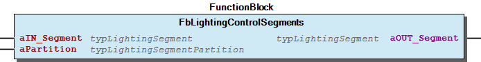
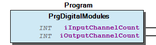

# WagoSolRoomApp v1.1.1.1 (WAGO) - Complete Documentation

### Documentation Index

## 10 Documentation

To ensure fast installation and start-up of the units, we strongly recommend that the following information and explanations are carefully read and adhered to.

WagoSolRoomApp

WAGO Licensing Support; WAGO LayerView|Solution; WAGO BusinessView|Building Automation; WAGO LayerView|App

WagoSolRoomApp

WAGO / u013964

WagoSolRoomApp

This document is automatically generated.

This library supports the WAGO Room Application Macro. The license demand is 1 license point.

Based on WagoSolRoomApp.library, last modified 22.02.2023, 11:10:33. LibDoc 4.1.1.0

© WAGO GmbH & Co. KG, Germany 2018 – All rights reserved. For the avoidance of doubt, this copyright notice does not only apply to the information above but also and primarily to the described library itself. Please note that third-party products are always mentioned without reference to intellectual property rights, including patents, utility models, designs and trademarks, accordingly the existence of such rights cannot be excluded. WAGO is a registered trademark of WAGO Verwaltungsgesellschaft mbH.

To ensure fast installation and start-up of the units, we strongly recommend that the following information and explanations are carefully read and adhered to. - doc01_Foreword (FunctionBlock) Company WAGO Title WagoSolRoomApp Version 1.1.1.1 Categories WAGO Licensing Support; WAGO LayerView|Solution; WAGO BusinessView|Building Automation; WAGO LayerView|App Namespace WagoSolRoomApp Author WAGO / u013964 Placeholder WagoSolRoomApp This document is automatically generated. This library supports the WAGO Room Application Macro. The license demand is 1 license point. - 10 Documentation doc01_Foreword (FunctionBlock) 20 Program Organization Units - 00 General - 20 Lighting - 30 HVAC 29 Types - 20 Lighting - 30 HVAC GlobalVariables (GVL) ParameterList (ParamList) VersionHistory (GVL) - File and Project Information - Library Reference Based on WagoSolRoomApp.library, last modified 22.02.2023, 11:10:33. LibDoc 4.1.1.0 © WAGO GmbH & Co. KG, Germany 2018 – All rights reserved. For the avoidance of doubt, this copyright notice does not only apply to the information above but also and primarily to the described library itself. Please note that third-party products are always mentioned without reference to intellectual property rights, including patents, utility models, designs and trademarks, accordingly the existence of such rights cannot be excluded. WAGO is a registered trademark of WAGO Verwaltungsgesellschaft mbH.

### Project Information

| Scope | Name | Type | Content |
| --- | --- | --- | --- |
| FileHeader | creationDateTime | date | 22.02.2023, 11:10:35 |
| companyName | string | WAGO |
| libraryFile | string | WagoSolRoomApp.library |
| productName | string | e!COCKPIT |
| contentFile | string | doc.clean.json |
| ProjectInformation | ActivateOEMLicensing | bool | False |
| ProjectInformation | AutoResolveUnbound | bool | True |
| ProjectInformation | LastModificationDateTime | 22.02.2023, 11:10:33 |
| ProjectInformation | LibraryCategories | library-category-list | WAGO Licensing Support; WAGO LayerView\|Solution; WAGO BusinessView\|Building Automation; WAGO LayerView\|App |
| ProjectInformation | Author | string | WAGO / u013964 |
| ProjectInformation | Company | string | WAGO |
| ProjectInformation | Copyright | string | © WAGO Kontakttechnik GmbH & Co. KG |
| ProjectInformation | DefaultNamespace | string | WagoSolRoomApp |
| ProjectInformation | Description | string | See: Description |
| ProjectInformation | DocFormat | string | reStructuredText |
| ProjectInformation | Placeholder | string | WagoSolRoomApp |
| ProjectInformation | Project | string | WagoSolRoomApp |
| ProjectInformation | Title | string | WagoSolRoomApp |
| ProjectInformation | WAGO License Article Number | string | 2759-0244/0210-1000 |
| ProjectInformation | WAGO License Scope | string | Library |
| ProjectInformation | Version | version | 1.1.1.1 |

### Library Information

| LinkAllContent: False Optional: False | QualifiedOnly: False | SystemLibrary: False |

| LinkAllContent: False Optional: False | QualifiedOnly: True | SystemLibrary: False |

| LinkAllContent: False Optional: False | QualifiedOnly: True | SystemLibrary: False |

| LinkAllContent: False Optional: False | QualifiedOnly: True | SystemLibrary: False |

| LinkAllContent: False Optional: False | QualifiedOnly: False | SystemLibrary: False |

| LinkAllContent: False Optional: False | QualifiedOnly: True | SystemLibrary: False |

| LinkAllContent: False Optional: False | QualifiedOnly: False | SystemLibrary: False |

| LinkAllContent: False Optional: False | QualifiedOnly: False | SystemLibrary: False |

| LinkAllContent: False Optional: False | QualifiedOnly: True | SystemLibrary: False |

| LinkAllContent: False Optional: False | QualifiedOnly: False | SystemLibrary: False |

This is a dictionary of all referenced libraries and their name spaces.

This is a dictionary of all referenced libraries and their name spaces. Standard Library Identification : Name: Standard Version: 3.5.18.0 Company: System Namespace: Standard Library Properties : WagoAppBuilding Library Identification : Placeholder: WagoAppBuilding Default Resolution: WagoAppBuilding, * (WAGO) Namespace: WagoAppBuilding Library Properties : Library Parameter : Parameter: CLC_KP = 0.002 Parameter: CLC_ON_DELAY_CONTROLLER = TIME#2s0ms Parameter: CLC_TN_GREATER_VARIANCE = 500 Parameter: CLC_TN_SMALLER_VARIANCE = 800 Parameter: DELAY_TIME_COOLING_SUPPORT = TIME#60m0s0ms Parameter: DELAY_TIME_HEATING_SUPPORT = TIME#60m0s0ms Parameter: MAXDIMCYCLEBUFFER = 1000 Parameter: MAXDIMUPAFTERON = 100 Parameter: MAX_LIGHT_GROUP = 5 Parameter: MAX_LIGHT_SEGMENT = 24 Parameter: MAX_SLAT_POSITION = 7 Parameter: MAX_SUNSHADE_SEGMENT = 24 Parameter: MAX_WIND_SECTOR = 11 Parameter: RWINDHYSTTIMEOUT = 0.05 Parameter: S_MIN_MOVETIME_BLIND = TIME#2s0ms Parameter: S_MIN_MOVETIME_LAMELLA = TIME#30ms Parameter: S_OFFSET_MOVETIME = TIME#5s0ms WagoAppDALI Library Identification : Placeholder: WagoAppDALI Default Resolution: WagoAppDALI, * (WAGO) Namespace: WagoAppDALI Library Properties : Library Parameter : Parameter: CHECK_MIN_MAX_VALUES = TRUE Parameter: MAX_MODULES = 25 Parameter: MAX_RX_BUFFER = 300 Parameter: SHORT_PUSHBUTTON = TIME#500ms Parameter: UPDATE_INTERVAL_ACTUAL_LEVEL = TIME#15s0ms Parameter: WATCHDOG = TIME#1s0ms WagoAppEnocean Library Identification : Placeholder: WagoAppEnocean Default Resolution: WagoAppEnocean, * (WAGO) Namespace: WagoAppEnocean Library Properties : Library Parameter : Parameter: BUADRATE_750_940 = 115200 Parameter: BUADRATE_SXC65_RS485_EVC = 9600 Parameter: ENOCEAN_DFLT_RH = 30.0 Parameter: ENOCEAN_DFLT_TEMP = 20.0 Parameter: ENOCEAN_MAX_CONFIG_TIMEOUT = TIME#1s0ms Parameter: ENOCEAN_MAX_INDEX_DB = 17 Parameter: ENOCEAN_MAX_INSTANCE = 1000 Parameter: ENOCEAN_MAX_MSC_INDEX_DB = 13 Parameter: ENOCEAN_MAX_SEND_BUFFER = 35 Parameter: ENOCEAN_MAX_SEND_TIMEOUT = TIME#1s0ms Parameter: ENOCEAN_MAX_SMARTACK_FILTER = 14 Parameter: ENOCEAN_MAX_SMARTACK_TEACH_TIME = TIME#60m0s0ms Parameter: ENOCEAN_MAX_TABLE_FILTER = 64 Parameter: ENOCEAN_MAX_VLD_INDEX_DB = 13 Parameter: ENOCEAN_RB_MAX_ITEMS = 3 Parameter: ESP3_MAX_FILTER_CHN = 29 Parameter: ESP3_MAX_NUMBER_ESP_TELEGRAMMS = 10 Parameter: ESP3_MAX_PAYLOAD = 200 Parameter: ESP3_MAX_SMACK_LEARN_CLIENTS = 15 Parameter: ESP3_PACKET_SIZE = 500 Parameter: MAX_INIT_TIMEOUT_SEARCH_GATEWAY = TIME#10s0ms Parameter: MAX_MODULE = 5 Parameter: MAX_SEND_BUFFER = 35 Parameter: MAX_SMART_ACK_INDEX = 15 Parameter: MAX_TIME_HEART_BEAT = TIME#1m0s0ms Parameter: RING_BUFFER_SIZE = 255 WagoSysErrorBase Library Identification : Placeholder: WagoSysErrorBase Default Resolution: WagoSysErrorBase, * (WAGO) Namespace: WagoSysErrorBase Library Properties : Library Parameter : Parameter: RES_LOG_MAX_ENTRIES = 200 Parameter: RES_LOG_MAX_FILES = 1 Parameter: RES_LOG_MAX_FILESIZE = 2000 Parameter: RES_LOG_NAME = ‘WagoAppResultLogger’ WagoSysKbusModule Library Identification : Placeholder: WagoSysKbusModule Default Resolution: WagoSysKbusModule, * (WAGO) Namespace: WagoSysKbusModule Library Properties : WagoSysModuleBase Library Identification : Placeholder: WagoSysModuleBase Default Resolution: WagoSysModuleBase, * (WAGO) Namespace: WagoSysModuleBase Library Properties : Library Parameter : Parameter: PARAMETER_COM_TIMEOUT = TIME#5s0ms Parameter: REGISTER_COM_TIMEOUT = TIME#5s0ms Parameter: STARTUP_MODE = eStartUpMode.NONE Parameter: SYSLOG_MBX2_LOGLEVEL = 2#10001 Parameter: SYSLOG_MBX2_MAX_STRING_LEN = 0 Parameter: SYSLOG_SERVER_IP = ‘127.0.0.1’ Parameter: SYSLOG_SERVER_PORT = 514 WagoSysVersion Library Identification : Name: WagoSysVersion Version: 1.0.0.0 Company: WAGO Namespace: WagoSysVersion Library Properties : WagoTypesCommon Library Identification : Placeholder: WagoTypesCommon Default Resolution: WagoTypesCommon, * (WAGO) Namespace: WagoTypes Library Properties : Library Parameter : Parameter: MAX_STRING_LENGTH = 255 Parameter: MAX_WSTRING_LENGTH = 255 WagoTypesModule_753_647 Library Identification : Name: WagoTypesModule_753_647 Version: newest Company: WAGO Namespace: WagoTypesModule_753_647 Library Properties : Library Parameter : Parameter: GP_MAXRESPONSEDATA = 70 Parameter: GP_MAXRESPONSES = 2

### Function Blocks

| Scope | Name | Type | Initial | Comment |
| --- | --- | --- | --- | --- |
| Input | xStartAddressing | BOOL |  | Start addressing. |
| typAddressing | WagoAppDALI.typAddressing |  | Parameter for the addressing. |
| xLocate | BOOL |  | Locate DALI multisensors. |
| xQuit | BOOL |  | Acknowledge error message. |
| xSensorMatrixActive | BOOL |  | Sensor matrix is active. |
| Inout | xDelete | BOOL |  | Delete multisensor short addresses. |
| Inout | xRead | BOOL |  | Read data from the DALI bus. |
| Inout | xRefreshTable | BOOL |  | Refresh the table of sensor addresses. |
| Inout | iSelectedSensor | INT |  | The ID of the current used sensor. |
| Inout | aMultiSensorTable | ARRAY [1..MAX_DALI_SENSORS] OF typDaliMultiSensor |  | Visualisation table |
| Inout | bSensorCount | BYTE |  | Count of DALI multisensor found at the DALI bus. |
| Output | strStatus | STRING |  | actual internal state of addressing |
| Output | oStatus | WagoSysErrorBase.FbResult |  | Status object for the alarm banner |
| Output | xReady | BOOL | FALSE | Program status (FALSE = busy) |
| Output | xRefreshVisu | BOOL |  |  |
| Output | xDisplayStatus | BOOL |  |  |

| Scope | Name | Type | Comment |
| --- | --- | --- | --- |
| Input | xMultiSensorAvailable | BOOL | Availability of a multi sensor in the segment this function block is used (if available, the FB is in CLC mode). |
| typBallast | WagoAppDALI.typBallast | Definition which control gears will be addressed. |
| xControlOff | BOOL | The control can be deactivated via this input so that, for example, when selecting a scene of the relevant address, the dimming level will not be immediately overwritten (only in CLC mode). |
| xOn | BOOL | Switch on the lighting (only in CLC mode). |
| xOff | BOOL | Switch off the lighting (only in CLC mode). |
| xToggle | BOOL | A positive edge at this input switches the lighting on or off (only in CLC mode). |
| xOnAndStepUp | BOOL | The lighting is switched on by pushing the button briefly, the lighting is dimmed brigther by pushing the button longer. |
| xOffAndStepDown | BOOL | The lighting is switched off by pushing the button briefly, the lighting is dimmed lower by pushing the button longer. |
| rMeasuredLightLevel | REAL | Input signal of the light sensor. [lx] |
| xPresenceDetector | BOOL | Switching signal of the presence detector. The lighting and controller are switched off (standby) by a falling edge. |
| typConfigParameters | WagoAppDALI.typConstantLightControl | Configuration parameters. |
| Output | oStatus | WagoSysErrorBase.FbResult | Error object. The content of the error object could be displayed via the FbShowResult from the WagoSysErrorBase library. |
| Output | sStatus | STRING | Error description as string. |
| Output | xReady | BOOL | TRUE: Module is ready for operating. FALSE: Ongoing operation or no communication. |
| Output | rActualLevel | REAL | Displays the current dimming level [%] of the selected short address or group. |
| Inout | rReferenceLightLevel | REAL | Light intensity setpoint [lx]. It can be raised or lowered by a long button press at the “xOnAndStepUp” and “xOffAndStepDown” inputs. The setpoint offset must be activated with the “typConfigParameters.xSetpValueShifting” parameter (only in CLC mode). |

This function block is used primarily for the addressing of the DALI multisensors. Additionally it has more functionalities like locating DALI multisensors.

Graphical Illustration

This function block combines the function blocks FbDaliConstantLightControl and FbDALIDimDoubleButton from WagoAppDALI.

Graphical Illustration

Function description

The function blocks either uses the FbDALIConstantLightControl or FbDALIDimDoubleButton, depending on the availability of a multisensor in the segment. If there is a TRUE signal at xMultiSensorAvailable , the function block uses the FbDALIConstantLightControl. Otherwise, it will use the FbDALIDoubleButton. That is needed, because the FbDALIConstantLightControl needs the sensor values. If there are no sensor values (because of the absence of multisensors), the function block can not work correctly in some cases. To feel no difference between the use of FbDALIConstantLightControl or FbDALIDimDoubleButton, the configuration of the FBs is synchronized. So the user just configurate both FBs with typConfigParameters .

Interface variables Function This function block is used primarily for the addressing of the DALI multisensors. Additionally it has more functionalities like locating DALI multisensors. Graphical Illustration Interface variables Function This function block combines the function blocks FbDaliConstantLightControl and FbDALIDimDoubleButton from WagoAppDALI. Graphical Illustration  Function description The function blocks either uses the FbDALIConstantLightControl or FbDALIDimDoubleButton, depending on the availability of a multisensor in the segment. If there is a TRUE signal at xMultiSensorAvailable , the function block uses the FbDALIConstantLightControl. Otherwise, it will use the FbDALIDoubleButton. That is needed, because the FbDALIConstantLightControl needs the sensor values. If there are no sensor values (because of the absence of multisensors), the function block can not work correctly in some cases. To feel no difference between the use of FbDALIConstantLightControl or FbDALIDimDoubleButton, the configuration of the FBs is synchronized. So the user just configurate both FBs with typConfigParameters . - ActAssignOutput (Action) - ActSyncConfig (Action)

## FbHVAC_ControlSegments (FB)

| Scope | Name | Type | Comment |
| --- | --- | --- | --- |
| Input | aIN_Segment | typHVAC_Segment | Input controller signals for the corresponding segment |
| aPartition | typHVAC_SegmentPartition | Indicates if there is a partition between two segments (TRUE) or not (FALSE) |
| Output | aOUT_Segment | typHVAC_Segment | Output controller signals for the corresponding HVAC drivers |

| Norm | Function |
| --- | --- |
| VDI 3813 page 2 - 6.4.6 | Partition wall control |

| Scope | Name | Type | Comment |
| --- | --- | --- | --- |
| Input | aIN_Segment | typLightingSegment | Input button signals for the corresponding segment. |
| aPartition | typLightingSegmentPartition | Detect if a partition between two segments is open (FALSE) or closed (TRUE). |
| Output | aOUT_Segment | typLightingSegment | Output signals for the corresponding lighting actuators. |

| Norm | Function |
| --- | --- |
| VDI 3813 page 2 - 6.4.6 | Partition wall control |

| Scope | Name | Type | Comment |
| --- | --- | --- | --- |
| Input | aIN_Segment | typLightingSegmentMultiSensor | Input multisensor values for the corresponding segment. |
| aPartition | typLightingSegmentPartition | Detect if a partition between two segments is open (FALSE) or closed (TRUE). |
| aMultiSensorAvailableSegment | ARRAY [1..WagoAppBuilding.MAX_LIGHT_SEGMENT] OF BOOL | Contains the information if the multisensors in the segments are available. |
| Output | aOUT_Segment | typLightingSegmentMultiSensor | Output multisensor values for the corresponding lighting actuators. |
| Output | aMultiSensorAvailableRoom | ARRAY [1..WagoAppBuilding.MAX_LIGHT_SEGMENT] OF BOOL | The information of the availability of sensors in the segments. |

| Norm | Function |
| --- | --- |
| VDI 3813 page 2 - 6.4.6 | Partition wall control |

Function block can be used for segment control or partition wall control of the HVAC for 24 segments. Segment control is used to evaluate partition wall information and to transfer set value information to the segments.

Graphical Illustration

Function description

The function block corresponds to a Room Automation macro (RA-Macro) with the following function(s) from the VDI 3813:

Function block can be used for segment control or partition wall control of the lighting button signals for 24 segments. Segment control is used to evaluate partition wall information and to transfer set value information to the segments.

Graphical Illustration

Function description

The function block corresponds to a Room Automation macro (RA-Macro) with the following function(s) from the VDI 3813:

Function block can be used for segment control or partition wall control of the lighting multisensor values for 24 segments. Segment control is used to evaluate partition wall information and to transfer set value information to the segments.

Graphical Illustration

Function description

The function block corresponds to a Room Automation macro (RA-Macro) with the following function(s) from the VDI 3813:

Interface variables Function Function block can be used for segment control or partition wall control of the HVAC for 24 segments. Segment control is used to evaluate partition wall information and to transfer set value information to the segments. Graphical Illustration  Function description The function block corresponds to a Room Automation macro (RA-Macro) with the following function(s) from the VDI 3813: Interface variables Function Function block can be used for segment control or partition wall control of the lighting button signals for 24 segments. Segment control is used to evaluate partition wall information and to transfer set value information to the segments. Graphical Illustration  Function description The function block corresponds to a Room Automation macro (RA-Macro) with the following function(s) from the VDI 3813: - ActGroupPartition (Action) - ActGroupPointer_Button (Action) Interface variables Function Function block can be used for segment control or partition wall control of the lighting multisensor values for 24 segments. Segment control is used to evaluate partition wall information and to transfer set value information to the segments. Graphical Illustration  Function description The function block corresponds to a Room Automation macro (RA-Macro) with the following function(s) from the VDI 3813:

## doc01_Foreword (FB)

This document, including all figures and illustrations contained therein, is subject to copyright. Any use of this document that infringes upon the copyright provisions stipulated herein is prohibited. Reproduction, translation, electronic and phototechnical filing/archiving (e.g., photocopying), as well as any amendments require the written consent of WAGO Kontakttechnik GmbH & Co. KG, Minden, Germany. Non-observance will entail the right of claims for damages.

WAGO Kontakttechnik GmbH & Co. KG reserves the right to make any alterations or modifications that serve to increase the efficiency of technical progress. WAGO Kontakttechnik GmbH & Co. KG owns all rights arising from granting patents or from the legal protection of utility patents. Third-party products are always mentioned without any reference to patent rights. Thus, the existence of such rights cannot be excluded.

Personnel Qualification

The use of the product described in this document is exclusively geared to specialists having qualifications in PLC programming, electrical specialists or persons instructed by electrical specialists who are also familiar with the appropriate current standards. WAGO Kontakttechnik GmbH & Co. KG assumes no liability resulting from improper action and damage to WAGO products and third-party products due to non-observance of the information contained in this document.

Intended Use

For each individual application, the components are supplied from the factory with a dedicated hardware and software configuration. Modifications are only admitted within the framework of the possibilities documented in this document. All other changes to the hardware and/or software and the non-conforming use of the components entail the exclusion of liability on part of WAGO Kontakttechnik GmbH & Co. KG.

Please direct any requirements pertaining to a modified and/or new hardware or software configuration directly to WAGO Kontakttechnik GmbH & Co. KG.

Scope of Applicability

This library supports the application flexROOM_modular. This library includes function blocks, programs and data types which are used in the application flexROOM_modular. The scope of these is mostly the sector room automation, but here in is also the functionality to read and write the digital and analog modules of the SPS, which cannot only be used in room automation applications.

Copyright This document, including all figures and illustrations contained therein, is subject to copyright. Any use of this document that infringes upon the copyright provisions stipulated herein is prohibited. Reproduction, translation, electronic and phototechnical filing/archiving (e.g., photocopying), as well as any amendments require the written consent of WAGO Kontakttechnik GmbH & Co. KG, Minden, Germany. Non-observance will entail the right of claims for damages. WAGO Kontakttechnik GmbH & Co. KG reserves the right to make any alterations or modifications that serve to increase the efficiency of technical progress. WAGO Kontakttechnik GmbH & Co. KG owns all rights arising from granting patents or from the legal protection of utility patents. Third-party products are always mentioned without any reference to patent rights. Thus, the existence of such rights cannot be excluded. Personnel Qualification The use of the product described in this document is exclusively geared to specialists having qualifications in PLC programming, electrical specialists or persons instructed by electrical specialists who are also familiar with the appropriate current standards. WAGO Kontakttechnik GmbH & Co. KG assumes no liability resulting from improper action and damage to WAGO products and third-party products due to non-observance of the information contained in this document. Intended Use For each individual application, the components are supplied from the factory with a dedicated hardware and software configuration. Modifications are only admitted within the framework of the possibilities documented in this document. All other changes to the hardware and/or software and the non-conforming use of the components entail the exclusion of liability on part of WAGO Kontakttechnik GmbH & Co. KG. Please direct any requirements pertaining to a modified and/or new hardware or software configuration directly to WAGO Kontakttechnik GmbH & Co. KG. Scope of Applicability This library supports the application flexROOM_modular. This library includes function blocks, programs and data types which are used in the application flexROOM_modular. The scope of these is mostly the sector room automation, but here in is also the functionality to read and write the digital and analog modules of the SPS, which cannot only be used in room automation applications.

### Functions

| Scope | Name | Type | Comment |
| --- | --- | --- | --- |
| Return | FuCalculateChecksum | DWORD |  |
| Input | pData | POINTER TO BYTE | The checksum of this data will be calculated |
| Input | udiSize | UDINT | The size of the data in byte |

This function calculates the checksum of the data at input pData .

Graphical Illustration

Interface variables Function This function calculates the checksum of the data at input pData . Graphical Illustration 

### Methods

## PrgAnalogModules.ActReadWriteAnalogModules (ACT)

Get the module

## PrgDigitalModules.ActReadWriteDigitalModules (ACT)

Get the module

### Program Organization

## 20 Program Organization Units

This folder contains the usable POUs. They are devided according to general and room element specific tasks.

This folder contains the usable POUs. They are devided according to general and room element specific tasks. - 00 General Checksum FuCalculateChecksum (Function) Digital and Analog Modules - PrgAnalogModules (Program) ActInitAnalogModules (Action) - ActReadWriteAnalogModules (Action) PrgDigitalModules (Program) - ActInitDigitalModules (Action) - ActReadWriteDigitalModules (Action) 20 Lighting - DALI constant light control and switch FbDaliConstantLightControlAndSwitch (FunctionBlock) ActAssignOutput (Action) - ActSyncConfig (Action) DALI multisensor addressing - FbDaliAddressingMultiSensors (FunctionBlock) Partition wall control - FbLightingControlSegments (FunctionBlock) ActGroupPartition (Action) - ActGroupPointer_Button (Action) FbLightingControlSegmentsMultiSensor (FunctionBlock) 30 HVAC - Partition wall control FbHVAC_ControlSegments (FunctionBlock)

### Global Variable Lists

| Name | Type | Comment |
| --- | --- | --- |
| g_aDigitalInputValues | ARRAY [0..MAX_DIGITAL_INPUTS] OF BOOL | Array where the digital input values will be assigned |
| g_aDigitalOutputValues | ARRAY [0..MAX_DIGITAL_OUTPUTS] OF BOOL | Array where the digital output values will be assigned |
| g_aAnalogInputValues | ARRAY [0..MAX_ANALOG_INPUTS] OF WORD | Array where the analog input values will be assigned |
| g_aAnalogOutputValues | ARRAY [0..MAX_ANALOG_OUTPUTS] OF WORD | Array where the analog output values will be assigned |

| Name | Type |
| --- | --- |
| Info | WagoSysVersion.ProjectInfo |

| date | version | author | change |
| 26.08.2022 | 1.1.1.0 | u013964 | Changed DRM Method to support CoDeSys3 |
| 28.10.2019 | 1.1.0.0 | u013964 | Changed variable names |
| 17.06.2019 | 1.0.0.3 | u013964 | Release Version |
| 26.10.2018 | 1.0.0.0 | u013964 | Internal Version |

WagoSolRoomApp.library

Release Notes:

Known Bugs:

WagoSolRoomApp.library Release Notes: Known Bugs:

### Other Components

## 00 General

This folder contains the general functions needed for all room elements.

This folder contains the general functions needed for all room elements. - Checksum FuCalculateChecksum (Function) Digital and Analog Modules - PrgAnalogModules (Program) ActInitAnalogModules (Action) - ActReadWriteAnalogModules (Action) PrgDigitalModules (Program) - ActInitDigitalModules (Action) - ActReadWriteDigitalModules (Action)

## 20 Lighting

This folder contains the lighting specific functions.

This folder contains the lighting specific functions. - DALI constant light control and switch FbDaliConstantLightControlAndSwitch (FunctionBlock) ActAssignOutput (Action) - ActSyncConfig (Action) DALI multisensor addressing - FbDaliAddressingMultiSensors (FunctionBlock) Partition wall control - FbLightingControlSegments (FunctionBlock) ActGroupPartition (Action) - ActGroupPointer_Button (Action) FbLightingControlSegmentsMultiSensor (FunctionBlock)

## 20 Lighting

- Addressing typDaliMultiSensor (Struct) Partition wall control - typLightingSegment (Struct) - typLightingSegmentControl (Struct) - typLightingSegmentControlMultiSensor (Struct) - typLightingSegmentMultiSensor (Struct) - typLightingSegmentPartition (Struct)

## 29 Types

This folder contains the used types in this library.

This folder contains the used types in this library. - 20 Lighting Addressing typDaliMultiSensor (Struct) Partition wall control - typLightingSegment (Struct) - typLightingSegmentControl (Struct) - typLightingSegmentControlMultiSensor (Struct) - typLightingSegmentMultiSensor (Struct) - typLightingSegmentPartition (Struct) 30 HVAC - Partition wall control typHVAC_Segment (Struct) - typHVAC_SegmentControl (Struct) - typHVAC_SegmentPartition (Struct)

## 30 HVAC

This folder contains the room temperature control specific functions.

This folder contains the room temperature control specific functions. - Partition wall control FbHVAC_ControlSegments (FunctionBlock)

## 30 HVAC

- Partition wall control typHVAC_Segment (Struct) - typHVAC_SegmentControl (Struct) - typHVAC_SegmentPartition (Struct) - typDaliMultiSensor (Struct) - FuCalculateChecksum (Function) - FbDaliConstantLightControlAndSwitch (FunctionBlock) ActAssignOutput (Action) - ActSyncConfig (Action) - FbDaliAddressingMultiSensors (FunctionBlock) - PrgAnalogModules (Program) ActInitAnalogModules (Action) - ActReadWriteAnalogModules (Action) PrgDigitalModules (Program) - ActInitDigitalModules (Action) - ActReadWriteDigitalModules (Action)

## FbDaliConstantLightControlAndSwitch.ActAssignOutput (ACT)

## FbDaliConstantLightControlAndSwitch.ActSyncConfig (ACT)

## FbLightingControlSegments.ActGroupPartition (ACT) ¶

## FbLightingControlSegments.ActGroupPointer_Button (ACT)

| Scope | Name | Type | Initial | Comment |
| --- | --- | --- | --- | --- |
| Constant | MAX_DIGITAL_MODULES | BYTE | 20 | The maximum count of digital modules the program can use |
| MAX_DIGITAL_INPUTS | BYTE | 80 | The maximum count of digital inputs the program can use |
| MAX_DIGITAL_OUTPUTS | BYTE | 80 | The maximum count of digital outputs the program can use |
| MAX_ANALOG_MODULES | BYTE | 20 | The maximum count of analog modules the program can use |
| MAX_ANALOG_INPUTS | BYTE | 24 | The maximum count of analog inputs [16 Bit] the program can use |
| MAX_ANALOG_OUTPUTS | BYTE | 48 | The maximum count of analog outputs [16 Bit] the program can use |
| DALI_INVALID_ADDRESS | BYTE | 254 | Invalid DALI address for the case, no multisensor/ECG shall be assinged |
| INVALID_LIGHT_LEVEL | REAL | 10000000 | Invalid light level for the start value of the determination of the light level in rooms |
| MAX_DALI_SENSORS | BYTE | 16 | The maximum count of DALI sensors connected to the DALI module |
| MAX_HVAC_SEGMENT | INT | 24 | The maximum count of segments in the HVAC application |

| Scope | Name | Type | Comment |
| --- | --- | --- | --- |
| Output | iInputChannelCount | INT | Count of analog input channels. |
| iOutputChannelCount | INT | Count of analog output channels. |
| iInputDataSize | INT | Total data size [byte] of all analog input channels. |
| iOutputDataSize | INT | Total data size [byte] of all analog output channels. |

This program registers the analog modules from the SPS. Additionally, it reads out the analog inputs and writes the values into g_aAnalogInputValues and it writes the values of g_aAnalogOutputValues into the process image of the outputs.

Graphical Illustration

Function description

The program updates the variable g_aAnalogInputValues , when the program is executed. The values in g_aAnalogOutputValues are written into the process image of the outputs, when the program is executed. That means, if the program is called at the beginning of the PLC cyclus, the analog input values in g_aAnalogInputValues are up-to-date in this PLC cyclus , but the analog outputs will not be updated with the values in g_aAnalogOutputValues until the end of the next PLC cyclus . The other way, if the program is called at the end of the PLC cyclus, the analog outputs will be updated with the values in g_aAnalogOutputValues at the end of the current PLC cyclus , but the analog input values are only usable in the next PLC cyclus .

InOut: - typHVAC_Segment (Struct) - typHVAC_SegmentControl (Struct) - typHVAC_SegmentPartition (Struct) - FbLightingControlSegments (FunctionBlock) ActGroupPartition (Action) - ActGroupPointer_Button (Action) FbLightingControlSegmentsMultiSensor (FunctionBlock) - typLightingSegment (Struct) - typLightingSegmentControl (Struct) - typLightingSegmentControlMultiSensor (Struct) - typLightingSegmentMultiSensor (Struct) - typLightingSegmentPartition (Struct) - FbHVAC_ControlSegments (FunctionBlock) Interface variables Function This program registers the analog modules from the SPS. Additionally, it reads out the analog inputs and writes the values into g_aAnalogInputValues and it writes the values of g_aAnalogOutputValues into the process image of the outputs. Graphical Illustration  Function description The program updates the variable g_aAnalogInputValues , when the program is executed. The values in g_aAnalogOutputValues are written into the process image of the outputs, when the program is executed. That means, if the program is called at the beginning of the PLC cyclus, the analog input values in g_aAnalogInputValues are up-to-date in this PLC cyclus , but the analog outputs will not be updated with the values in g_aAnalogOutputValues until the end of the next PLC cyclus . The other way, if the program is called at the end of the PLC cyclus, the analog outputs will be updated with the values in g_aAnalogOutputValues at the end of the current PLC cyclus , but the analog input values are only usable in the next PLC cyclus . - ActInitAnalogModules (Action) - ActReadWriteAnalogModules (Action)

## PrgAnalogModules.ActInitAnalogModules (ACT)

| Scope | Name | Type | Comment |
| --- | --- | --- | --- |
| Output | iInputChannelCount | INT | Count of digital input channels. |
| iOutputChannelCount | INT | Count of digital output channels. |

Wait until the terminal manager has finished the initialization

This program registers the digital modules from the SPS. Additionally, it reads out the digital inputs and writes the values into g_aDigitalInputValues and it writes the values of g_aDigitalOutputValues into the process image of the outputs.

Graphical Illustration

Function description

The program updates the variable g_aDigtialInputValues , when the program is executed. The values in g_aDigitalOutputValues are written into the process image of the outputs, when the program is executed. That means, if the program is called at the beginning of the PLC cyclus, the digital input values in g_aDigitalInputValues are up-to-date in this PLC cyclus , but the digital outputs will not be updated with the values in g_aDigitalOutputValues until the end of the next PLC cyclus . The other way, if the program is called at the end of the PLC cyclus, the digital outputs will be updated with the values in g_aDigitalOutputValues at the end of the current PLC cyclus , but the digital input values are only usable in the next PLC cyclus .

Wait until the terminal manager has finished the initialization Interface variables Function This program registers the digital modules from the SPS. Additionally, it reads out the digital inputs and writes the values into g_aDigitalInputValues and it writes the values of g_aDigitalOutputValues into the process image of the outputs. Graphical Illustration  Function description The program updates the variable g_aDigtialInputValues , when the program is executed. The values in g_aDigitalOutputValues are written into the process image of the outputs, when the program is executed. That means, if the program is called at the beginning of the PLC cyclus, the digital input values in g_aDigitalInputValues are up-to-date in this PLC cyclus , but the digital outputs will not be updated with the values in g_aDigitalOutputValues until the end of the next PLC cyclus . The other way, if the program is called at the end of the PLC cyclus, the digital outputs will be updated with the values in g_aDigitalOutputValues at the end of the current PLC cyclus , but the digital input values are only usable in the next PLC cyclus . - ActInitDigitalModules (Action) - ActReadWriteDigitalModules (Action)

## PrgDigitalModules.ActInitDigitalModules (ACT)

| Name | Type | Initial | Comment |
| --- | --- | --- | --- |
| Select | BOOL |  | Select Multi-Sensor |
| AddressPresence | BYTE | gc_DaliAddress | Short address presence sensor |
| ActivatePresence | BOOL |  | Active mode presence sensor |
| AddressLightLevel | BYTE | gc_DaliAddress | Short address light sensor |
| ActivateLightLevel | BOOL |  | Active mode light sensor |
| AddressRemoteControl | BYTE | gc_DaliAddress |  |
| GTIN | LWORD |  | Global Trade Item Number |
| ActualValue | WORD |  | Actual light level |
| ActualPresence | BYTE |  | Actual presence signal (Each event will be delayed five seconds) |
| NewAddress | BOOL |  |  |
| SerialNumber | DWORD |  | Serial Number of Sensor |
| SensorType | BYTE | 0 | Sensortype 1=WAGO/OSRAM, 2=Tridonic |
| UnAvailable | BOOL | FALSE | parameterized sensor is currently unavailable |

Wait until the terminal manager has finished the initialization

Wait until the terminal manager has finished the initialization InOut:

## typHVAC_Segment (STRUCT)

| Name | Type | Comment |
| --- | --- | --- |
| aHVACSegmentControl | ARRAY [1..MAX_HVAC_SEGMENT] OF typHVAC_SegmentControl | Segment control values for respective actuators. |

## typHVAC_SegmentControl (STRUCT)

| Name | Type | Comment |
| --- | --- | --- |
| xHeating | BOOL | The status of the heating value in the segment. |
| xCooling | BOOL | The status of the cooling value in the segment. |
| rHeating | REAL | The heating value in the segment. [%] |
| rCooling | REAL | The cooling value in the segment. [%] |

## typHVAC_SegmentPartition (STRUCT)

| Name | Type | Initial | Comment |
| --- | --- | --- | --- |
| aPartition | ARRAY [1..(MAX_HVAC_SEGMENT - 1)] OF BOOL | [(MAX_HVAC_SEGMENT - 1)(TRUE)] | The information of the set partitions, each BOOL in the array stands for a partition. |

| Name | Type | Comment |
| --- | --- | --- |
| aLightingSegmentControl | ARRAY [1..WagoAppBuilding.MAX_LIGHT_SEGMENT] OF typLightingSegmentControl | Segment control button values for respective actuators. |

| Name | Type | Comment |
| --- | --- | --- |
| xOn | BOOL | The on signal of the button in the segment. |
| xOff | BOOL | The off signal of the button in the segment. |

| Name | Type | Comment |
| --- | --- | --- |
| xPresence | BOOL | The presence value of the segment. |
| rBrightness | REAL | The brightness value of the segment. |

| Name | Type | Comment |
| --- | --- | --- |
| aLightingSegmentControlMultiSensor | ARRAY [1..WagoAppBuilding.MAX_LIGHT_SEGMENT] OF typLightingSegmentControlMultiSensor | Segment control multisensor values for respective actuators. |

| Name | Type | Initial | Comment |
| --- | --- | --- | --- |
| aPartition | ARRAY [1..(WagoAppBuilding.MAX_LIGHT_SEGMENT - 1)] OF BOOL | [(WagoAppBuilding.MAX_LIGHT_SEGMENT - 1)(TRUE)] | The information of the set partitions, each BOOL in the array stands for a partition. |

InOut: InOut: InOut: InOut: InOut: InOut: