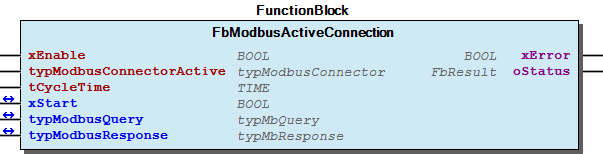
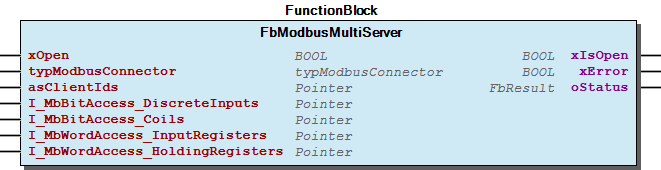
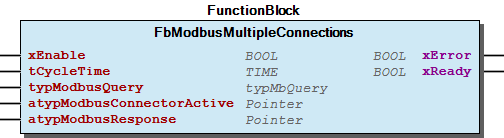
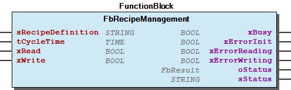
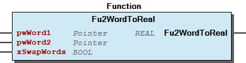
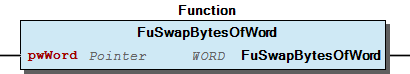

# WagoSolSolutionBuilder v1.0.0.5 (WAGO) - Complete Documentation


## 📋 Library Information

- **Company:** WAGO
- **Title:** WagoSolSolutionBuilder
- **Version:** 1.0.0.5
- **Categories:** WAGO BusinessView|Building Automation; WAGO LayerView|App; Application
- **Namespace:** WagoSolSolutionBuilder
- **Author:** WAGO / u015842
- **Placeholder:** WagoSolSolutionBuilder

### Description ¶


This document is automatically generated.

Library for using the ApplicationBuilder in building automation projects.

This document is automatically generated. Library for using the ApplicationBuilder in building automation projects.

### Contents: ¶


Contents: - Documentation Index 10 Documentation - WagoSolSolutionBuilder Library Documentation Project Information Library Information Function Blocks - FbModbusActiveConnection (FB) - FbModbusMultiServer (FB) - FbModbusMultipleConnections (FB) - FbRecipeManagement (FB) - doc01_Foreword (FB) Functions - Fu2WordToReal (FUN) - FuSwapBytesOfWord (FUN) Methods - FbModbusActiveConnection.SetResponseTimeout (PROP) - FbModbusMultiServer.xUseTCP (PROP) - FbRecipeManagement.CyclicCheck (METH) - FbRecipeManagement.MatchRecipe (METH) - FbRecipeManagement.ReadRecipe (METH) - FbRecipeManagement.WriteRecipe (METH) Program Organization Internal Components - 90 Internal - typModbusInternalReminder (STRUCT) Global Variable Lists - Status (GVL) - VersionHistory (GVL) Other Components - 01 Client - 01 Recipe Handler - 02 Modbus - 02 UDP Server - 02 UDP Server - 29 Types - 80 Data types - 80 Status - Common - DwordReal (UNION) - ... and 18 more

### Indices and tables ¶


Based on WagoSolSolutionBuilder.library, last modified 29.05.2024, 21:01:29. LibDoc 3.5.16.10

© WAGO GmbH & Co. KG, Germany 2018 – All rights reserved. For the avoidance of doubt, this copyright notice does not only apply to the information above but also and primarily to the described library itself. Please note that third-party products are always mentioned without reference to intellectual property rights, including patents, utility models, designs and trademarks, accordingly the existence of such rights cannot be excluded. WAGO is a registered trademark of WAGO Verwaltungsgesellschaft mbH.

- File and Project Information - Library Reference Based on WagoSolSolutionBuilder.library, last modified 29.05.2024, 21:01:29. LibDoc 3.5.16.10 © WAGO GmbH & Co. KG, Germany 2018 – All rights reserved. For the avoidance of doubt, this copyright notice does not only apply to the information above but also and primarily to the described library itself. Please note that third-party products are always mentioned without reference to intellectual property rights, including patents, utility models, designs and trademarks, accordingly the existence of such rights cannot be excluded. WAGO is a registered trademark of WAGO Verwaltungsgesellschaft mbH.

### Documentation Index


## 10 Documentation


To ensure fast installation and start-up of the units, we strongly recommend that the following information and explanations are carefully read and adhered to.

To ensure fast installation and start-up of the units, we strongly recommend that the following information and explanations are carefully read and adhered to. - doc01_Foreword (FB)

## WagoSolSolutionBuilder Library Documentation


| Company: | WAGO |
| Title: | WagoSolSolutionBuilder |
| Version: | 1.0.0.5 |
| Categories: | WAGO BusinessView\|Building Automation; WAGO LayerView\|App; Application |
| Namespace: | WagoSolSolutionBuilder |
| Author: | WAGO / u015842 |
| Placeholder: | WagoSolSolutionBuilder |

### Description


This document is automatically generated.

Library for using the ApplicationBuilder in building automation projects.

This document is automatically generated. Library for using the ApplicationBuilder in building automation projects.

### Contents:


- 10 Documentation doc01_Foreword (FB) 20 Program Organization Units - 01 Recipe Handler - 02 Modbus - 80 Data types 80 Status - Status (GVL) - eStatus (ENUM) 90 Internal - 02 UDP Server - 29 Types - Common ParameterListApplicationBuilder (PARAMS) VersionHistory (GVL)

### Indices and tables


Based on WagoSolSolutionBuilder.library, last modified 29.05.2024, 21:01:29. LibDoc 3.5.16.10

© WAGO GmbH & Co. KG, Germany 2018 – All rights reserved. For the avoidance of doubt, this copyright notice does not only apply to the information above but also and primarily to the described library itself. Please note that third-party products are always mentioned without reference to intellectual property rights, including patents, utility models, designs and trademarks, accordingly the existence of such rights cannot be excluded. WAGO is a registered trademark of WAGO Verwaltungsgesellschaft mbH.

- File and Project Information - Library Reference Based on WagoSolSolutionBuilder.library, last modified 29.05.2024, 21:01:29. LibDoc 3.5.16.10 © WAGO GmbH & Co. KG, Germany 2018 – All rights reserved. For the avoidance of doubt, this copyright notice does not only apply to the information above but also and primarily to the described library itself. Please note that third-party products are always mentioned without reference to intellectual property rights, including patents, utility models, designs and trademarks, accordingly the existence of such rights cannot be excluded. WAGO is a registered trademark of WAGO Verwaltungsgesellschaft mbH.

### Project Information


## File and Project Information


| Scope | Name | Type | Content |
| --- | --- | --- | --- |
| FileHeader | libraryFile | string | WagoSolSolutionBuilder.library |
| contentFile | doc.clean.json |
| productName | e!COCKPIT |
| creationDateTime | date | 29.05.2024, 21:01:30 |
| companyName | string | WAGO |
| ProjectInformation | LastModificationDateTime | date | 29.05.2024, 21:01:29 |
| NoPlaceholder | string |  |
| Description | See: Description |
| Copyright | © WAGO Kontakttechnik GmbH & Co. KG, Germany 2018 – All rights reserved. |
| Author | WAGO / u015842 |
| AutoResolveUnbound | bool | True |
| Placeholder | string | WagoSolSolutionBuilder |
| Company | WAGO |
| DocFormat | reStructuredText |
| Namespace | WagoSolSolutionBuilder |
| Project | WagoSolSolutionBuilder |
| DefaultNamespace | WagoSolSolutionBuilder |
| Version | version | 1.0.0.5 |
| Threadsave | string | False |
| Title | WagoSolSolutionBuilder |
| LibraryCategories | library-category-list | WAGO BusinessView\|Building Automation; WAGO LayerView\|App; Application |
| CompiledLibraryCompatibilityVersion | string | CODESYS V3.5 SP16 Patch 3 |

### Library Information


## Library Reference


| LinkAllContent: False QualifiedOnly: False | SystemLibrary: False | Optional: False |

| LinkAllContent: False QualifiedOnly: False | SystemLibrary: False | Optional: False |

| LinkAllContent: False QualifiedOnly: False | SystemLibrary: False | Optional: False |

| LinkAllContent: False QualifiedOnly: False | SystemLibrary: False | Optional: False |

| LinkAllContent: False QualifiedOnly: False | SystemLibrary: False | Optional: False |

| LinkAllContent: False QualifiedOnly: False | SystemLibrary: False | Optional: False |

| LinkAllContent: False QualifiedOnly: False | SystemLibrary: False | Optional: False |

| LinkAllContent: False QualifiedOnly: False | SystemLibrary: False | Optional: False |

| LinkAllContent: False Optional: False | QualifiedOnly: False SystemLibrary: False | PublishSymbolsInContainer: True |

| LinkAllContent: False QualifiedOnly: False | SystemLibrary: False | Optional: False |

| LinkAllContent: False Optional: False | QualifiedOnly: False SystemLibrary: False | PublishSymbolsInContainer: True |

| LinkAllContent: False Optional: False | QualifiedOnly: False SystemLibrary: False | PublishSymbolsInContainer: True |

| LinkAllContent: False QualifiedOnly: True | SystemLibrary: False | Optional: False |

| LinkAllContent: False QualifiedOnly: False | SystemLibrary: False | Optional: False |

| LinkAllContent: False Optional: False | QualifiedOnly: False SystemLibrary: False | PublishSymbolsInContainer: True |

| LinkAllContent: False QualifiedOnly: False | SystemLibrary: False | Optional: False |

This is a dictionary of all referenced libraries and their name spaces.

This is a dictionary of all referenced libraries and their name spaces. Recipe Management Library Identification : Placeholder: RecipeManagement Default Resolution: Recipe Management, * (System) Namespace: Recipe_Management Library Properties : Standard Library Identification : Placeholder: Standard Default Resolution: Standard, 3.5.5.0 (System) Namespace: Standard Library Properties : SysFile Library Identification : Placeholder: SysFile Default Resolution: SysFile, * (System) Namespace: SysFile Library Properties : SysProcess Library Identification : Placeholder: SysProcess Default Resolution: SysProcess, * (System) Namespace: SysProcess Library Properties : SysTypes2 Interfaces Library Identification : Name: SysTypes2 Interfaces Version: newest Company: System Namespace: SysTypes Library Properties : WagoAppFileDir Library Identification : Placeholder: WagoAppFileDir Default Resolution: WagoAppFileDir, * (WAGO) Namespace: WagoAppFileDir Library Properties : Library Parameter : Parameter: STANDARDSCHEDULINGMODE = eSchedulingMode.AsyncLow Parameter: STANDARDTIMEOUT = TIME#10s0ms WagoAppMP_Bus Library Identification : Placeholder: WagoAppMP_Bus Default Resolution: WagoAppMP_Bus, * (WAGO) Namespace: WagoAppMP_Bus Library Properties : WagoAppPlcModbus Library Identification : Placeholder: WagoAppPlcModbus Default Resolution: WagoAppPlcModbus, * (WAGO) Namespace: WagoAppPlcModbus Library Properties : WagoAppString Library Identification : Placeholder: WagoAppString Default Resolution: WagoAppString, * (WAGO) Namespace: WagoAppString Library Properties : WagoAppTime Library Identification : Placeholder: WagoAppTime Default Resolution: WagoAppTime, * (WAGO) Namespace: WagoAppTime Library Properties : WagoSysErrorBase Library Identification : Placeholder: WagoSysErrorBase Default Resolution: WagoSysErrorBase, * (WAGO) Namespace: WagoSysErrorBase Library Properties : WagoSysPlainMem Library Identification : Placeholder: WagoSysPlainMem Default Resolution: WagoSysPlainMem, * (WAGO) Namespace: WagoSysPlainMem Library Properties : WagoSysVersion Library Identification : Name: WagoSysVersion Version: 1.0.0.0 Company: WAGO Namespace: WagoSysVersion Library Properties : WagoTypesCom Library Identification : Placeholder: WagoTypesCom Default Resolution: WagoTypesCom, * (WAGO) Namespace: WagoTypesCom Library Properties : WagoTypesErrorBase Library Identification : Placeholder: WagoTypesErrorBase Default Resolution: WagoTypesErrorBase, * (WAGO) Namespace: WagoTypesErrorBase Library Properties : WagoTypesModuleBase Library Identification : Placeholder: WagoTypesModuleBase Default Resolution: WagoTypesModuleBase, * (WAGO) Namespace: WagoTypesModuleBase Library Properties : Library Parameter : Parameter: MAX_MBX_OUTPUT_SIZE = 47 Parameter: MAX_MODULE_INPUT_SIZE = 48 Parameter: MBX_PIPE_SIZE = 1024 Parameter: MAX_MBX1_SIZE = 18 Parameter: MAX_MODULE_OUTPUT_SIZE = 48 Parameter: MAX_MBX_INPUT_SIZE = 47

### Function Blocks


## FbModbusActiveConnection (FB)


| Scope | Name | Type | Initial | Comment |
| --- | --- | --- | --- | --- |
| Input | xEnable | BOOL |  | Enables function block. |
| typModbusConnectorActive | typModbusConnector |  | Modbus connector for solution builder. |
| tCycleTime | TIME | TIME#10s0ms | cycle time for update data |
| Inout | xStart | BOOL |  | starts job. |
| typModbusQuery | WagoAppPlcModbus.typMbQuery |  | modbus query |
| typModbusResponse | WagoAppPlcModbus.typMbResponse |  | modbus response |
| Output | xError | BOOL |  | Displays error in communication. |
| oStatus | WagoSysErrorBase.FbResult |  | Status of Modbus Master |

Function block for a modbus UPD client based on WagoAppPlcModbus.FbMbMasterUdp with cyclic request or started manually.

Graphical Illustration

Graphical Interface of FbModbusActiveConnection

Function description

The connection is automatically opened and closed with each request.

Interface variables Function Function block for a modbus UPD client based on WagoAppPlcModbus.FbMbMasterUdp with cyclic request or started manually. Graphical Illustration  Graphical Interface of FbModbusActiveConnection Function description The connection is automatically opened and closed with each request. - FbModbusActiveConnection.SetResponseTimeout (PROP)

## FbModbusMultiServer (FB)


| Scope | Name | Type | Initial | Comment |
| --- | --- | --- | --- | --- |
| Input | xOpen | BOOL | TRUE | Opens modbus server |
| typModbusConnector | typModbusConnector |  | Modbus connector for solution builder. |
| asClientIds | POINTER TO STRING(20) |  | ARRAY [*] List of ClientIds. Shall be saved RETAIN. |
| I_MbBitAccess_DiscreteInputs | POINTER TO BOOL |  | ARRAY[*, *] Modbus bit addresses for all clients |
| I_MbBitAccess_Coils | POINTER TO BOOL |  | ARRAY[*, *] Modbus bit addresses for all clients |
| I_MbWordAccess_InputRegisters | POINTER TO WORD |  | ARRAY[*, *] Modbus word addresses for all clients |
| I_MbWordAccess_HoldingRegisters | POINTER TO WORD |  | ARRAY[*, *] Modbus word addresses for all clients |
| Output | xIsOpen | BOOL |  | Displays that server is open |
| xError | BOOL |  | Displays error in any communication. |
| oStatus | WagoAppPlcModbus.WagoSysErrorBase.FbResult |  |  |

```
VAR
    xOpen                           : BOOL := TRUE;         //Opens server connection
    oFbModbusMultiServer            : FbModbusMultiServer;  //Instance call
    asClientIds                     : ARRAY [1..10] OF STRING(20);  //up to 10 clients can connect.
    I_MbBitAccess_DiscreteInputs    : ARRAY [1..10,4..20] OF BOOL;  //discrete inputs with addresses 4 to 20.
    I_MbBitAccess_Coils             : ARRAY [1..10,1..5] OF BOOL;   //coils with addresses 1 to 5.
    I_MbWordAccess_InputRegisters   : ARRAY [1..10,1..1] OF WORD;   //input registers with addresses 1 to 1.
    I_MbWordAccess_HoldingRegisters : ARRAY [1..10,100..120] OF WORD;   //holding registers with addresses 100 to 120.
    xIsOpen                         : BOOL;
    xError                          : BOOL;
END_VAR

code:
oFbModbusMultiServer(
    xOpen:= xOpen,
    typModbusConnector:= GVL_ApplicationParameters.typModbusConnector,
    asClientIds:= asClientIds,
    I_MbBitAccess_DiscreteInputs:= I_MbBitAccess_DiscreteInputs,
    I_MbBitAccess_Coils:= I_MbBitAccess_Coils,
    I_MbWordAccess_InputRegisters:= I_MbWordAccess_InputRegisters,
    I_MbWordAccess_HoldingRegisters:= I_MbWordAccess_HoldingRegisters,
    xIsOpen=> xIsOpen,
    xError=> xError,
    oStatus=> );
```

Function block for a modbus server where multiple clients can access and each client IP accesses to different variables.

Graphical Illustration

Graphical Interface of FbModbusMultiServer

Function description

The variables ‘I_MbBitAccess_DiscreteInputs’, ‘I_MbBitAccess_Coils’, ‘I_MbWordAccess_InputRegisters’, ‘I_MbWordAccess_HoldingRegisters’ are ARRAY [*,*] with first array index corresponds to client IP addresses ‘asClientIds’ and second array index corresponds to modbus registers.

The bounds are the addresses for modbus access with clients also.

Interface variables Function Function block for a modbus server where multiple clients can access and each client IP accesses to different variables. Graphical Illustration  Graphical Interface of FbModbusMultiServer Function description The variables ‘I_MbBitAccess_DiscreteInputs’, ‘I_MbBitAccess_Coils’, ‘I_MbWordAccess_InputRegisters’, ‘I_MbWordAccess_HoldingRegisters’ are ARRAY [*,*] with first array index corresponds to client IP addresses ‘asClientIds’ and second array index corresponds to modbus registers. Note The bounds are the addresses for modbus access with clients also. - FbModbusMultiServer.utKeepAlive (PROP) - FbModbusMultiServer.xUseTCP (PROP)

## FbModbusMultipleConnections (FB)


| Scope | Name | Type | Initial | Comment |
| --- | --- | --- | --- | --- |
| Input | xEnable | BOOL |  | Enables all connections. |
| tCycleTime | TIME | TIME#10s0ms | cycle time for update data |
| typModbusQuery | WagoAppPlcModbus.typMbQuery |  | Modbus query for all clients |
| atypModbusConnectorActive | POINTER TO typModbusConnector |  | ARRAY [*] OF modbus connector for solution builder. One array-element per connection. |
| atypModbusResponse | POINTER TO WagoAppPlcModbus.typMbResponse |  | ARRAY [*] OF modbus responses. Shell be equal to size of ‘atypModbusConnectorActive’. |
| Output | xError | BOOL |  | Displays error in any communication. |
| xReady | BOOL |  | Displays, that all actions are ready. |

Function block to handle equal modbus client requests to multiple modbus servers.

Graphical Illustration

Graphical Interface of FbModbusMultipleConnections

Function description

All servers are requested cyclic. There are ‘ParameterListApplicationBuilder.MAX_MULTIPLE_MODBUS_CONNECTIONS’ parallel connections used.

This function can be used to send or request a single query to all servers e.g. to request their temperature or to send central commands.

The connection are automatically opened and closed with each request.

Interface variables Function Function block to handle equal modbus client requests to multiple modbus servers. Graphical Illustration  Graphical Interface of FbModbusMultipleConnections Function description All servers are requested cyclic. There are ‘ParameterListApplicationBuilder.MAX_MULTIPLE_MODBUS_CONNECTIONS’ parallel connections used. This function can be used to send or request a single query to all servers e.g. to request their temperature or to send central commands. The connection are automatically opened and closed with each request.

## FbRecipeManagement (FB)


| Scope | Name | Type | Initial | Comment |
| --- | --- | --- | --- | --- |
| Input | sRecipeDefinition | STRING |  | Name of recipe definition. Must be equal. |
| tCycleTime | TIME | TIME#1m0s0ms | Cycle time for checking and automatically reading recipe by change (e.g. from the solution builder) Deactivated with t#0ms |
| xRead | BOOL |  | Triggers manually recipe reading. |
| xWrite | BOOL |  | Triggers manually recipe writing. |
| Output | xBusy | BOOL |  | output displays that function block is running with reading or writing a recipe. |
| xErrorInit | BOOL |  | Reading of recipe failed. Code below must be integrated in plc program! After reading was successful once, error resets automatically. |
| xErrorReading | BOOL |  | Reading of recipe failed. Code below must be integrated in plc program! After reading was successful once, error resets automatically. |
| xErrorWriting | BOOL |  | Writing of recipe failed. Please retry. |
| oStatus | WagoSysErrorBase.FbResult |  | Status of function block as result item. |
| sStatus | STRING |  | Status of function block as string. |

```
VAR
    MyRecipe    : WagoAppBuildingAutomation.FbRecipeManagement;
    xRead       : BOOL; //Reading Recipe
    xWrite      : BOOL; //Writing Recipe
END_VAR

code:
//call function block with RecipeDefinition 'MyFirstRecipe', created in Recipe Manager
MyRecipe(sRecipeDefinition:='MyFirstRecipe',xRead:=xRead,xWrite:=xWrite);
//handle recipe incompatibilities
IF MyRecipe.xErrorInit THEN
    {IF defined (variable: GVL_RecipeManagement.g__RecipePersistencyHelper._loadType)}
    {implicit on}
    GVL_RecipeManagement.g__RecipePersistencyHelper._loadType := PersistantLoadType.LOAD_MATCHING_VARIABLES_BY_VARIABLENAME;
    {implicit off}
    MyRecipe.MatchRecipe();
    {implicit on}
    GVL_RecipeManagement.g__RecipePersistencyHelper._loadType := PersistantLoadType.LOAD_TYPE_NONE;
    {implicit off}
    {END_IF}
END_IF
```

Function block to handle recipe data applicative. This function block is explicit nesseccary for the communication with the WAGO solution builder.

Graphical Illustration

Graphical Interface of FbRecipeManagement

Function description

The defined ‘sRecipeDefinition’ is read cyclic with ‘tCycleTime’ and read out, if it is newer than actually loaded.

Chosen actions ‘xRead’ and ‘xWrite’ are running in second program cycle after triggered, because xBusy is set and there are task blocking functions inside.

Following code must be implemented in projects plc program for preventing recipe missmatch (e.g. by extending the recipe variables)

Interface variables Function Function block to handle recipe data applicative. This function block is explicit nesseccary for the communication with the WAGO solution builder. Graphical Illustration  Graphical Interface of FbRecipeManagement Function description The defined ‘sRecipeDefinition’ is read cyclic with ‘tCycleTime’ and read out, if it is newer than actually loaded. Chosen actions ‘xRead’ and ‘xWrite’ are running in second program cycle after triggered, because xBusy is set and there are task blocking functions inside. Following code must be implemented in projects plc program for preventing recipe missmatch (e.g. by extending the recipe variables) - FbRecipeManagement.CyclicCheck (METH) - FbRecipeManagement.MatchRecipe (METH) - FbRecipeManagement.ReadRecipe (METH) - FbRecipeManagement.WriteRecipe (METH) - FbRecipeManagement.sRecipe (PROP)

## doc01_Foreword (FB)


This document, including all figures and illustrations contained therein, is subject to copyright. Any use of this document that infringes upon the copyright provisions stipulated herein is prohibited. Reproduction, translation, electronic and phototechnical filing/archiving (e.g., photocopying), as well as any amendments require the written consent of WAGO Kontakttechnik GmbH & Co. KG, Minden, Germany. Non-observance will entail the right of claims for damages.

WAGO Kontakttechnik GmbH & Co. KG reserves the right to make any alterations or modifications that serve to increase the efficiency of technical progress. WAGO Kontakttechnik GmbH & Co. KG owns all rights arising from granting patents or from the legal protection of utility patents. Third-party products are always mentioned without any reference to patent rights. Thus, the existence of such rights cannot be excluded.

Personnel Qualification

The use of the product described in this document is exclusively geared to specialists having qualifications in PLC programming, electrical specialists or persons instructed by electrical specialists who are also familiar with the appropriate current standards. WAGO Kontakttechnik GmbH & Co. KG assumes no liability resulting from improper action and damage to WAGO products and third-party products due to non-observance of the information contained in this document.

Intended Use

For each individual application, the components are supplied from the factory with a dedicated hardware and software configuration. Modifications are only admitted within the framework of the possibilities documented in this document. All other changes to the hardware and/or software and the non-conforming use of the components entail the exclusion of liability on part of WAGO Kontakttechnik GmbH & Co. KG.

Please direct any requirements pertaining to a modified and/or new hardware or software configuration directly to WAGO Kontakttechnik GmbH & Co. KG.

Scope of Applicability

This application note is based on the _stated hardware and software from the specific manufacturer, as well as the associated documentation. This application note is therefore only valid for the described installation. New hardware and software versions may need to be handled differently.

Please note the detailed description in the specific manuals.

Copyright This document, including all figures and illustrations contained therein, is subject to copyright. Any use of this document that infringes upon the copyright provisions stipulated herein is prohibited. Reproduction, translation, electronic and phototechnical filing/archiving (e.g., photocopying), as well as any amendments require the written consent of WAGO Kontakttechnik GmbH & Co. KG, Minden, Germany. Non-observance will entail the right of claims for damages. WAGO Kontakttechnik GmbH & Co. KG reserves the right to make any alterations or modifications that serve to increase the efficiency of technical progress. WAGO Kontakttechnik GmbH & Co. KG owns all rights arising from granting patents or from the legal protection of utility patents. Third-party products are always mentioned without any reference to patent rights. Thus, the existence of such rights cannot be excluded. Personnel Qualification The use of the product described in this document is exclusively geared to specialists having qualifications in PLC programming, electrical specialists or persons instructed by electrical specialists who are also familiar with the appropriate current standards. WAGO Kontakttechnik GmbH & Co. KG assumes no liability resulting from improper action and damage to WAGO products and third-party products due to non-observance of the information contained in this document. Intended Use For each individual application, the components are supplied from the factory with a dedicated hardware and software configuration. Modifications are only admitted within the framework of the possibilities documented in this document. All other changes to the hardware and/or software and the non-conforming use of the components entail the exclusion of liability on part of WAGO Kontakttechnik GmbH & Co. KG. Please direct any requirements pertaining to a modified and/or new hardware or software configuration directly to WAGO Kontakttechnik GmbH & Co. KG. Scope of Applicability This application note is based on the _stated hardware and software from the specific manufacturer, as well as the associated documentation. This application note is therefore only valid for the described installation. New hardware and software versions may need to be handled differently. Please note the detailed description in the specific manuals.

### Functions


## Fu2WordToReal (FUN)


| Scope | Name | Type |
| --- | --- | --- |
| Return | Fu2WordToReal | REAL |
| Input | pwWord1 | POINTER TO WORD |
| pwWord2 | POINTER TO WORD |
| xSwapWords | BOOL |

Function to build a REAL variable out of 2 WORD variables.

Graphical Illustration

Graphical Interface of Fu2WordToReal

Interface variables Function Function to build a REAL variable out of 2 WORD variables. Graphical Illustration  Graphical Interface of Fu2WordToReal

## FuSwapBytesOfWord (FUN)


| Scope | Name | Type |
| --- | --- | --- |
| Return | FuSwapBytesOfWord | WORD |
| Input | pwWord | POINTER TO WORD |

Function to swap byte order of a WORD.

Graphical Illustration

Graphical Interface of FuSwapBytesOfWord

Interface variables Function Function to swap byte order of a WORD. Graphical Illustration  Graphical Interface of FuSwapBytesOfWord

### Methods


## FbModbusActiveConnection.SetResponseTimeout (PROP) ¶


## FbModbusMultiServer.xUseTCP (PROP) ¶


## FbRecipeManagement.CyclicCheck (METH)


| Scope | Name | Type |
| --- | --- | --- |
| Return | CyclicCheck | BOOL |
| Input | tCycleTime | TIME |

## FbRecipeManagement.MatchRecipe (METH)


| Scope | Name | Type |
| --- | --- | --- |
| Return | MatchRecipe | BOOL |

## FbRecipeManagement.ReadRecipe (METH)


| Scope | Name | Type |
| --- | --- | --- |
| Return | ReadRecipe | BOOL |

Reading the recipe from file system. Method needs to be called until returns TRUE.

Interface variables Reading the recipe from file system. Method needs to be called until returns TRUE.

## FbRecipeManagement.WriteRecipe (METH)


| Scope | Name | Type |
| --- | --- | --- |
| Return | WriteRecipe | BOOL |

Writing the recipe to file system. Method needs to be called until returns TRUE.

Interface variables Writing the recipe to file system. Method needs to be called until returns TRUE.

### Program Organization


## 20 Program Organization Units


- 01 Recipe Handler FbRecipeManagement (FB) FbRecipeManagement.CyclicCheck (METH) - FbRecipeManagement.MatchRecipe (METH) - FbRecipeManagement.ReadRecipe (METH) - FbRecipeManagement.WriteRecipe (METH) - FbRecipeManagement.sRecipe (PROP) 02 Modbus - 01 Client FbModbusActiveConnection (FB) FbModbusActiveConnection.SetResponseTimeout (PROP) FbModbusMultipleConnections (FB) 02 UDP Server - FbModbusMultiServer (FB) FbModbusMultiServer.utKeepAlive (PROP) - FbModbusMultiServer.xUseTCP (PROP) 80 Data types - typEnOceanSubbusDevice (STRUCT) - typMBusSubbusDevice (STRUCT) - typMPBusSubbusDevice (STRUCT) - typModbusConnector (STRUCT) - typModbusRTUSubbusDevice (STRUCT)

### Internal Components


## 90 Internal


- 02 UDP Server typFieldBounds (STRUCT) 29 Types - DwordReal (UNION) - eDataformat (ENUM) - eDatatype (ENUM) - typModbusInternalReminder (STRUCT) - typModbusJob (STRUCT) - typModbusQuery (STRUCT) - typModbusResponse (STRUCT) - typModbusResponseLong (STRUCT) - unResponseValue (UNION) - unResponseValueLong (UNION) Common - Fu2WordToReal (FUN) - FuSwapBytesOfWord (FUN)

## typModbusInternalReminder (STRUCT)


| Name | Type | Comment |
| --- | --- | --- |
| oTonInterval | Standard.TON | Timer for the cyclic call |
| uiJobID | UINT | Job ID, start with 1, will be defined interanal |
| xActive | BOOL | Displays, that Job is active. |

### Global Variable Lists


## Status (GVL)


| Scope | Name | Type |
| --- | --- | --- |
| Constant | gc_Status | ARRAY [0..15] OF WagoTypesErrorBase.typResultItem |

| Value | Level | Description |
| --- | --- | --- |
| eStatus.Ok | WagoTypesErrorBase.WagoTypes.eSeverity.none | ‘OK’ |
| eStatus.Busy | WagoTypesErrorBase.WagoTypes.eSeverity.info | ‘Busy’ |
| eStatus.ErrorMissmatch | WagoTypesErrorBase.WagoTypes.eSeverity.error | ‘Variable missmatch. See documentation!’ |
| eStatus.ErrorRead | WagoTypesErrorBase.WagoTypes.eSeverity.error | ‘Reading Error. Try again.’ |
| eStatus.ErrorWrite | WagoTypesErrorBase.WagoTypes.eSeverity.error | ‘Writing Error. Try again.’ |
| eStatus.Updated | WagoTypesErrorBase.WagoTypes.eSeverity.info | ‘Recipe updated external.’ |
| eStatus.NoRecipeManager | WagoTypesErrorBase.WagoTypes.eSeverity.error | ‘No Recipe Manager found.’ |
| eStatus.NoRecipeDefinition | WagoTypesErrorBase.WagoTypes.eSeverity.error | ‘No Input at sRecipeDefinitionName’ |
| eStatus.InvalidRecipeDefinition | WagoTypesErrorBase.WagoTypes.eSeverity.error | ‘Recipe definition not found in Recipe Manager.’ |
| eStatus.InvalidRecipe | WagoTypesErrorBase.WagoTypes.eSeverity.error | ‘Recipe name not found in Recipe defeinition.’ |
| eStatus.Unknown | WagoTypesErrorBase.WagoTypes.eSeverity.error | ‘Unknown error happened.’ |

## VersionHistory (GVL)


| Name | Type |
| --- | --- |
| Info | ProjectInfo |

| date | version | author | change |
| 26.02.2024 | 1.0.0.5 | u010663 | Compiled SP16.3 |
| 24.10.2023 | 1.0.0.4 | u0103719 | replace SysTypes Interfaces via SysTypes2 Interfaces |
| 10.08.2023 | 1.0.0.3 | u015842 | 32- and 64-Bit |
| 22.11.2022 | 1.0.0.2 | u015842 | Placeholder and Namespace updated |
| 20.08.2021 | 1.0.0.0 | u015842 | version for BETA release. |
| 04.03.2021 | 0.9.0.0 | u015842 | first version for ALPHA release |

WagoSolSolutionBuilder.library

Description: Library for using the SolutionBuilder in building automation.

WagoSolSolutionBuilder.library Description: Library for using the SolutionBuilder in building automation.

### Other Components


## 01 Client


- FbModbusActiveConnection (FB) FbModbusActiveConnection.SetResponseTimeout (PROP) FbModbusMultipleConnections (FB)

## 01 Recipe Handler


- FbRecipeManagement (FB) FbRecipeManagement.CyclicCheck (METH) - FbRecipeManagement.MatchRecipe (METH) - FbRecipeManagement.ReadRecipe (METH) - FbRecipeManagement.WriteRecipe (METH) - FbRecipeManagement.sRecipe (PROP)

## 02 Modbus


- 01 Client FbModbusActiveConnection (FB) FbModbusActiveConnection.SetResponseTimeout (PROP) FbModbusMultipleConnections (FB) 02 UDP Server - FbModbusMultiServer (FB) FbModbusMultiServer.utKeepAlive (PROP) - FbModbusMultiServer.xUseTCP (PROP)

## 02 UDP Server ¶


- typFieldBounds (STRUCT)

## 02 UDP Server


- FbModbusMultiServer (FB) FbModbusMultiServer.utKeepAlive (PROP) - FbModbusMultiServer.xUseTCP (PROP)

## 29 Types


- DwordReal (UNION) - eDataformat (ENUM) - eDatatype (ENUM) - typModbusInternalReminder (STRUCT) - typModbusJob (STRUCT) - typModbusQuery (STRUCT) - typModbusResponse (STRUCT) - typModbusResponseLong (STRUCT) - unResponseValue (UNION) - unResponseValueLong (UNION)

## 80 Data types


- typEnOceanSubbusDevice (STRUCT) - typMBusSubbusDevice (STRUCT) - typMPBusSubbusDevice (STRUCT) - typModbusConnector (STRUCT) - typModbusRTUSubbusDevice (STRUCT)

## 80 Status ¶


- Status (GVL) - eStatus (ENUM)

## Common


- Fu2WordToReal (FUN) - FuSwapBytesOfWord (FUN)

## DwordReal (UNION)


| Name | Type |
| --- | --- |
| dwValue | DWORD |
| rValue | REAL |

## FbModbusMultiServer.utKeepAlive (PROP) ¶


## FbRecipeManagement.sRecipe (PROP)


Can be used, if recipe and recipe definition have different names

Can be used, if recipe and recipe definition have different names

## ParameterListApplicationBuilder (PARAMS)


| Scope | Name | Type | Initial | Comment |
| --- | --- | --- | --- | --- |
| Constant | MAX_MULTIPLE_MODBUS_CONNECTIONS | UINT | 10 | Maximum number of parallel UDP connections |
| LOWER_CYCLE_TIME_LIMIT | TIME | TIME#1s0ms | Lowest possible cycle time for multiple active connections |

## eDataformat (ENUM)


| Name | Initial |
| --- | --- |
| eDEZ | 0 |
| eHEX | 1 |
| eBCD | 2 |

Attributes: qualified_only InOut:

## eDatatype (ENUM)


| Name | Initial |
| --- | --- |
| eWord | 0 |
| eInt | 1 |
| eUInt | 2 |
| eReal | 10 |
| eDword | 11 |
| eDint | 12 |
| eUDInt | 13 |
| eTime | 14 |
| eTimeOfDay | 15 |
| eDateTime | 16 |
| eDate | 17 |
| eByteLowByte | 20 |
| eByteHighByte | 21 |
| eSIntLowByte | 22 |
| eSIntHighByte | 23 |
| eUSIntLowByte | 24 |
| eUSIntHighByte | 25 |
| eLWord | 30 |
| eLReal | 31 |
| eLInt | 32 |
| eULInt | 33 |
| eLTime | 34 |
| eString | 40 |
| eWString | 50 |
| eBoolBit0 | 100 |
| eBoolBit1 | 101 |
| eBoolBit2 | 102 |
| eBoolBit3 | 103 |
| eBoolBit4 | 104 |
| eBoolBit5 | 105 |
| eBoolBit6 | 106 |
| eBoolBit7 | 107 |
| eBoolBit8 | 108 |
| eBoolBit9 | 109 |
| eBoolBit10 | 110 |
| eBoolBit11 | 111 |
| eBoolBit12 | 112 |
| eBoolBit13 | 113 |
| eBoolBit14 | 114 |
| eBoolBit15 | 115 |

Attributes: qualified_only InOut:

## eStatus (ENUM)


| Name | Initial |
| --- | --- |
| Ok | 0 |
| Busy | 1 |
| ErrorMissmatch | 2 |
| ErrorRead | 3 |
| ErrorWrite | 4 |
| Updated | 5 |
| NoRecipeDefinition | 6 |
| InvalidRecipeDefinition | 7 |
| InvalidRecipe | 8 |
| NoRecipeManager | 9 |
| Unknown | 10 |

## typEnOceanSubbusDevice (STRUCT)


| Name | Type | Initial | Comment |
| --- | --- | --- | --- |
| bPort | BYTE | 1 | Module number of master function block. |
| dwID | DWORD |  | Enocean ID. |

Connect to devices of WagoAppEnocean

InOut: Connect to devices of WagoAppEnocean

## typFieldBounds (STRUCT)


| Name | Type |
| --- | --- |
| diLB_ClientIds | DINT |
| diUB_ClientIds | DINT |
| diLB_DiscreteInputs_1 | DINT |
| diUB_DiscreteInputs_1 | DINT |
| diLB_DiscreteInputs_2 | DINT |
| diUB_DiscreteInputs_2 | DINT |
| diLB_Coils_1 | DINT |
| diUB_Coils_1 | DINT |
| diLB_Coils_2 | DINT |
| diUB_Coils_2 | DINT |
| diLB_InputRegisters_1 | DINT |
| diUB_InputRegisters_1 | DINT |
| diLB_InputRegisters_2 | DINT |
| diUB_InputRegisters_2 | DINT |
| diLB_HoldingRegisters_1 | DINT |
| diUB_HoldingRegisters_1 | DINT |
| diLB_HoldingRegisters_2 | DINT |
| diUB_HoldingRegisters_2 | DINT |

## typMBusSubbusDevice (STRUCT)


| Name | Type | Initial | Comment |
| --- | --- | --- | --- |
| bPort | BYTE | 1 | Module number of master function block |
| dwAddress | DWORD |  | M-Bus primary address (>255=Sec.-Addr.) |

Connect to devices of WagoAppM_Bus

InOut: Connect to devices of WagoAppM_Bus

## typMPBusSubbusDevice (STRUCT)


| Name | Type | Initial | Comment |
| --- | --- | --- | --- |
| bPort | BYTE | 1 | Module number of master function block |
| bAddress | BYTE |  | MP-Bus device address |
| typSerialNo | WagoAppMP_Bus.typSerialNo |  | MP-Bus serial number |

Connect to devices of WagoAppMP_Bus

InOut: Connect to devices of WagoAppMP_Bus

## typModbusConnector (STRUCT)


| Name | Type | Initial | Comment |
| --- | --- | --- | --- |
| sConnectorName | STRING |  | Displayed name in Solution Builder. |
| sIP | STRING | ‘0.0.0.0’ | IP of connected device |
| wPort | WORD |  | optional, mostly one Port for Modbus-UDP, so not separated per connection |
| bUnitID | BYTE |  | Unit ID |

## typModbusJob (STRUCT)


| Name | Type | Initial | Comment |
| --- | --- | --- | --- |
| xEnable | BOOL |  | Enable/disable job. |
| tInterval | TIME | TIME#1m0s0ms | Interval for request cyclic; T#0ms deactivates cyclic requests |
| DataFormat | eDataformat | eDataformat.eDEZ | Data format of the response value |
| DataType | eDatatype | eDatatype.eWord |  |
| xSwapBytes | BOOL |  | swap Bytes of Response Value eg. 16#ABCD to 16#DCBA; can be combined with ‘xSwapWords’ TODO: falsch? zumindest nach Beispiel |
| xSwapWords | BOOL |  | swap Word of Response Value eg. 16#ABCD to 16#CDBA; can be combined with ‘xSwapBytes’ |
| xHoldValues | BOOL |  | keep former values when a error is returned. Otherwise the values will be set to 0. |
| uiReadAddress | UINT |  |  |
| uiWriteAddress | UINT |  | TODO: muss umgesetzt werden |
| bCustomizedFunctionCode | BYTE | 0 | 0=function code will be choosen automatically by ‘DataType’. \| Otherwise costumized function code will be used. \| See table below for supported function codes. |
| uiCustomizedQuantity | UINT |  | Only used for ‘DataType’ STRING and WSTRING or ‘bCustomizedFunctionCode’ with multiple registers. |
| Query | typModbusQuery |  | \| Quantity in per WORD or 2 BYTE. \| Other Quantities will be calculated internal. uiReadQuantity: UINT;//–raus uiWriteQuantity: UINT;//–raus xActive: BOOL; //displays job active //–raus |

| Function Code | Function |
| --- | --- |
| FC01 (0x01) | Read Coils |
| FC02 (0x02) | Read Discrete Inputs |
| FC03 (0x03) | Read Holding Registers |
| FC04 (0x04) | Read Input Registers |
| FC05 (0x05) | Write Single Coil |
| FC06 (0x06) | Write Single Register |
| FC11 (0x0B) | Get Comm Event Counter |
| FC15 (0x0F) | Write Multiple Coils |
| FC16 (0x10) | Write Multiple Registers |
| FC22 (0x16) | Mask Write Register |
| FC23 (0x17) | Read/Write Multiple Registers |
| FC43 (0x2B) | (Mei Type 14) Read Device Identification |

Follow function codes are supported

InOut: Follow function codes are supported

## typModbusQuery (STRUCT)


| Name | Type | Comment |
| --- | --- | --- |
| bUnitId | BYTE |  |
| bFunctionCode | BYTE | 0=function code will be choosen automatically by data type; \| otherwise costumized function code will be used. \| See table below for supported. |
| uiReadAddress | UINT |  |
| uiCustomizedQuantity | UINT | Only used for data types STRING and WSTRING. |
| uiWriteAddress | UINT | muss umgesetzt werden |

| Function Code | Function |
| --- | --- |
| FC01 (0x01) | Read Coils |
| FC02 (0x02) | Read Discrete Inputs |
| FC03 (0x03) | Read Holding Registers |
| FC04 (0x04) | Read Input Registers |
| FC05 (0x05) | Write Single Coil |
| FC06 (0x06) | Write Single Register |
| FC11 (0x0B) | Get Comm Event Counter |
| FC15 (0x0F) | Write Multiple Coils |
| FC16 (0x10) | Write Multiple Registers |
| FC22 (0x16) | Mask Write Register |
| FC23 (0x17) | Read/Write Multiple Registers |
| FC43 (0x2B) | (Mei Type 14) Read Device Identification |

Follow function codes are supported

InOut: Follow function codes are supported

## typModbusRTUSubbusDevice (STRUCT)


| Name | Type | Comment |
| --- | --- | --- |
| bPort | BYTE | COM-Port or serial module |
| bSlaveID | BYTE | SlaveID |

Connect to devices of WagoAppPlcModbus or other RTU-based libraries.

InOut: Connect to devices of WagoAppPlcModbus or other RTU-based libraries.

## typModbusResponse (STRUCT)


| Name | Type |
| --- | --- |
| uiID | UINT |
| wError | WORD |
| unValue | unResponseValue |

## typModbusResponseLong (STRUCT)


| Name | Type |
| --- | --- |
| uiID | UINT |
| wError | WORD |
| unValue | unResponseValueLong |

## unResponseValue (UNION)


| Name | Type | Comment |
| --- | --- | --- |
| xValue | BOOL | awValue : ARRAY [0..124] OF WORD; sValue : STRING; |
| bValue | BYTE |  |
| siValue | SINT |  |
| usiValue | USINT |  |
| wValue | WORD | Word |
| iValue | INT |  |
| uiValue | UINT |  |
| rValue | REAL | Real |
| dwValue | DWORD |  |
| diValue | DINT |  |
| udiValue | UDINT |  |
| tValue | TIME |  |
| dtValue | DT |  |
| todValue | TOD |  |
| datValue | DATE |  |

## unResponseValueLong (UNION)


| Name | Type |
| --- | --- |
| awValue | ARRAY [0..124] OF WORD |
| abValue | ARRAY [0..249] OF BYTE |
| sValue | STRING |
| sValue2 | STRING(249) |
| wsValue | WSTRING |
| wsValue2 | WSTRING(124) |
| lwValue | LWORD |
| liValue | LINT |
| lrValue | LREAL |
| ltValue | LTIME |