# WagoSolSplusS v1.0.0.7 (WAGO) - Complete Documentation

## 📋 Library Information

- **Company:** WAGO
- **Title:** WagoSolSplusS
- **Version:** 1.0.0.7
- **Categories:** Application; WAGO BusinessView|Building Automation; WAGO FunctionalView|Connectivity|Serial; WAGO LayerView|Solution
- **Namespace:** WagoSolSplusS
- **Author:** WAGO / u010640
- **Placeholder:** WagoSolSplusS

### Description ¶

This document is automatically generated. Because of this, the chapter 30 Visualization is not shown in this document. If you are interested in getting to know more about visualization, we refer to the library manager of e!Cockpit.

This library provide specialized function blocks for measurement transducers from S+S Regeltechnik GmbH with ModbusRTU interface. [1]

This document is automatically generated. Because of this, the chapter 30 Visualization is not shown in this document. If you are interested in getting to know more about visualization, we refer to the library manager of e!Cockpit. This library provide specialized function blocks for measurement transducers from S+S Regeltechnik GmbH with ModbusRTU interface. [1]

### Contents: ¶

Contents: - Documentation Index - Project Information - Library Information - Function Blocks FbAERASGARD_ACO2_Modbus (FB) - FbAERASGARD_AFTM_CO2_Modbus (FB) - FbAERASGARD_AFTM_LQ_CO2_Modbus (FB) - FbAERASGARD_ALQ_CO2_Modbus (FB) - FbAERASGARD_FSFTM_CO2_Modbus (FB) - FbAERASGARD_KCO2_Modbus (FB) - FbAERASGARD_KFTM_CO2_Modbus (FB) - FbAERASGARD_KFTM_LQ_CO2_Modbus (FB) - FbAERASGARD_KLQ_CO2_Modbus (FB) - FbAERASGARD_RCO2_Modbus (FB) - ... and 32 more Functions Methods Program Organization Global Variable Lists - GlobalVariables (GVL) - VersionHistory (GVL) Other Components - 01 Communication - 01 Communication - 10 Sensor Data - 10 THERMASGARD - 11 Sensor Config - 12 Display Config - 13 LED Config - 20 HYGRASGARD - 29 Types - 30 PREMASGARD - ... and 29 more

### Indices and tables ¶

| [1] | Based on WagoSolSplusS.library, last modified 13.08.2019, 21:38:50. The content of this file was automatically generated with None on 13.08.2019, 21:38:59 |

© WAGO Kontakttechnik GmbH & Co. KG, Germany 2018 – All rights reserved. For the avoidance of doubt, this copyright notice does not only apply to the information above but also and primarily to the described library itself. Please note that third-party products are always mentioned without reference to intellectual property rights, including patents, utility models, designs and trademarks, accordingly the existence of such rights cannot be excluded. WAGO is a registered trademark of WAGO Verwaltungsgesellschaft mbH.

- File and Project Information - Library Reference © WAGO Kontakttechnik GmbH & Co. KG, Germany 2018 – All rights reserved. For the avoidance of doubt, this copyright notice does not only apply to the information above but also and primarily to the described library itself. Please note that third-party products are always mentioned without reference to intellectual property rights, including patents, utility models, designs and trademarks, accordingly the existence of such rights cannot be excluded. WAGO is a registered trademark of WAGO Verwaltungsgesellschaft mbH.

### Documentation Index

## WagoSolSplusS Library Documentation

| Company: | WAGO |
| Title: | WagoSolSplusS |
| Version: | 1.0.0.7 |
| Categories: | Application; WAGO BusinessView\|Building Automation; WAGO FunctionalView\|Connectivity\|Serial; WAGO LayerView\|Solution |
| Namespace: | WagoSolSplusS |
| Author: | WAGO / u010640 |
| Placeholder: | WagoSolSplusS |

### Description

This document is automatically generated. Because of this, the chapter 30 Visualization is not shown in this document. If you are interested in getting to know more about visualization, we refer to the library manager of e!Cockpit.

This library provide specialized function blocks for measurement transducers from S+S Regeltechnik GmbH with ModbusRTU interface. [1]

This document is automatically generated. Because of this, the chapter 30 Visualization is not shown in this document. If you are interested in getting to know more about visualization, we refer to the library manager of e!Cockpit. This library provide specialized function blocks for measurement transducers from S+S Regeltechnik GmbH with ModbusRTU interface. [1]

### Contents:

- 20 Program Organization Units 01 Communication - 10 THERMASGARD - 20 HYGRASGARD - 30 PREMASGARD - 50 AERASGARD - 90 Utilities 29 Types - 01 Communication - 10 Sensor Data - 11 Sensor Config - 12 Display Config - 13 LED Config GlobalVariables (GVL) ParameterList (PARAMS) VersionHistory (GVL)

### Indices and tables

| [1] | Based on WagoSolSplusS.library, last modified 13.08.2019, 21:38:50. The content of this file was automatically generated with None on 13.08.2019, 21:38:59 |

© WAGO Kontakttechnik GmbH & Co. KG, Germany 2018 – All rights reserved. For the avoidance of doubt, this copyright notice does not only apply to the information above but also and primarily to the described library itself. Please note that third-party products are always mentioned without reference to intellectual property rights, including patents, utility models, designs and trademarks, accordingly the existence of such rights cannot be excluded. WAGO is a registered trademark of WAGO Verwaltungsgesellschaft mbH.

- File and Project Information - Library Reference © WAGO Kontakttechnik GmbH & Co. KG, Germany 2018 – All rights reserved. For the avoidance of doubt, this copyright notice does not only apply to the information above but also and primarily to the described library itself. Please note that third-party products are always mentioned without reference to intellectual property rights, including patents, utility models, designs and trademarks, accordingly the existence of such rights cannot be excluded. WAGO is a registered trademark of WAGO Verwaltungsgesellschaft mbH.

### Project Information

## File and Project Information

| Scope | Name | Type | Content |
| --- | --- | --- | --- |
| FileHeader | libraryFile | string | WagoSolSplusS.library |
| contentFile | WagoSolSplusS_clr.json |
| productName | e!COCKPIT |
| creationDateTime | date | 13.08.2019, 21:38:59 |
| companyName | string | WAGO |
| ProjectInformation | LastModificationDateTime | date | 13.08.2019, 21:38:50 |
| NoPlaceholder | string |  |
| Description | See: Description |
| Copyright | © WAGO Kontakttechnik GmbH & Co. KG, Germany 2018 – All rights reserved. |
| Author | WAGO / u010640 |
| AutoResolveUnbound | bool | True |
| Placeholder | string | WagoSolSplusS |
| Company | WAGO |
| DocFormat | reStructuredText |
| Project | WagoSolSplusS |
| DefaultNamespace | WagoSolSplusS |
| Version | version | 1.0.0.7 |
| Title | string | WagoSolSplusS |
| LibraryCategories | library-category-list | Application; WAGO BusinessView\|Building Automation; WAGO FunctionalView\|Connectivity\|Serial; WAGO LayerView\|Solution |
| ThreadSafe | string | FALSE |

### Library Information

## Library Reference

| LinkAllContent: False QualifiedOnly: False | SystemLibrary: False | Optional: False |

| LinkAllContent: False QualifiedOnly: True | SystemLibrary: False | Optional: False |

| LinkAllContent: False QualifiedOnly: False | SystemLibrary: False | Optional: False |

| LinkAllContent: False QualifiedOnly: False | SystemLibrary: False | Optional: False |

| LinkAllContent: False Optional: False | QualifiedOnly: True SystemLibrary: False | PublishSymbolsInContainer: True |

This is a dictionary of all referenced libraries and their name spaces.

This is a dictionary of all referenced libraries and their name spaces. Standard Library Identification : Placeholder: Standard Default Resolution: Standard, * (System) Namespace: Standard Library Properties : WagoAppPlcModbus Library Identification : Placeholder: WagoAppPlcModbus Default Resolution: WagoAppPlcModbus, * (WAGO) Namespace: WagoAppPlcModbus Library Properties : Library Parameter : Parameter: MAX_SERVER_BUFFERSIZE = 4096 WagoAppTime Library Identification : Placeholder: WagoAppTime Default Resolution: WagoAppTime, * (WAGO) Namespace: WagoAppTime Library Properties : WagoSysVersion Library Identification : Name: WagoSysVersion Version: 1.0.0.0 Company: WAGO Namespace: WagoSysVersion Library Properties : WagoTypesCom Library Identification : Placeholder: WagoTypesCom Default Resolution: WagoTypesCom, * (WAGO) Namespace: WagoTypesCom Library Properties :

### Function Blocks

## FbAERASGARD_ACO2_Modbus (FB)

| Scope | Name | Type | Initial | Comment | Inherited from |
| --- | --- | --- | --- | --- | --- |
| Input | bPortSplusS | BYTE | 1 | Master assignment number for other function blocks. Range 1 to MAX_MASTER. | Fb34800 |
| xEnable | BOOL | TRUE | Enable signal to start cyclic read out sensor. | Fb34800 |
| bSlaveAddress | BYTE | 1 | Slave address of the sensor. | Fb34800 |
| tUpdateInterval | TIME | TIME#50ms | Cycle time for read out the sensor. Minimum 10ms. | Fb34800 |
| eDisplayMode | eDisplayMode34800 |  | Check enumaration for popssible values ( Register: 4x0001; Check “eDisplayMode34800” ) | Fb34800 |
| i7SegmentValueLeft | INT |  | Value for the two left aligned 7-Segment-Displays ( Register: 4x0003; Value range [-9...99] ) | Fb34800 |
| i7SegmentValueRight | INT |  | Value for the four right aligned 7-Segment-Displays ( Register: 4x0002; Value range [-999...9999] ) | Fb34800 |
| w7SegmentDotPattern | WORD |  | Dot pattern of the 7-Segment Display A-DP2 ( Register: 4x0005; See “Binary Pattern” ) | Fb34800 |
| sDotMatrixText1 | STRING(7) | ‘ ‘ | Upper row in display - Values for the Dot Matrix A - G ( Registers: 4x0006 ... 4x0012 ) | Fb34800 |
| sDotMatrixText2 | STRING(7) | ‘ ‘ | Lower row in display - Values for the Dot Matrix H - N ( Registers: 4x0013 ... 4x0019 ) | Fb34800 |
| xResetAutoZeroCO2 | BOOL |  | A raising edge activate the “Reset-AutoZero-CO2” procedure | Fb34800 |
| xResetAutoZeroVOC | BOOL |  | A raising edge activate the “Reset-AutoZero-VOC” procedure | Fb34800 |
| xAutoZeroCO2 | BOOL |  | A raising edge activate the “AutoZero-CO2” procedure | Fb34800 |
| xAutoZeroVOC | BOOL |  | A raising edge activate the “AutoZero-VOC” procedure | Fb34800 |
| eSensibilityVOC | eSensibilityVOC34x00 |  | VOC sensibilty: LOW(default) \| MEDIUM \| HIGH | Fb34800 |
| Output | xNewDataReady | BOOL |  | New sensor data available | Fb34800 |
| xBusy | BOOL |  | Busy-signal if function block is working. | Fb34800 |
| oStatus | WagoAppPlcModbus.WagoSysErrorBase.FbResult |  | Detailed Status information | Fb34800 |
| sStatus | STRING |  | Status information | Fb34800 |
| typData | typ34800Data |  | Sensor data. | Fb34800 |

This function block periodically read out process data from S+S Regeltechnik GmbH measurement converter of type:

It also provide an interface to customize the display behaivior.

You should always call this FB cyclic.

Graphical Illustration

Graphical Interface of FbAERASGARD_ACO2_Modbus

Interface variables Function This function block periodically read out process data from S+S Regeltechnik GmbH measurement converter of type: - AERASGARD ACO2-Modbus It also provide an interface to customize the display behaivior. :ref: ` Manual < https://spluss.de/r/GXKDM.htm >` Note You should always call this FB cyclic. Graphical Illustration 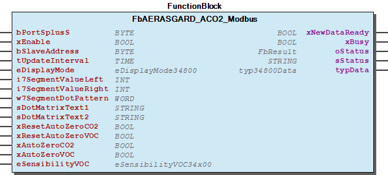 Graphical Interface of FbAERASGARD_ACO2_Modbus

## FbAERASGARD_AFTM_CO2_Modbus (FB)

| Scope | Name | Type | Initial | Comment | Inherited from |
| --- | --- | --- | --- | --- | --- |
| Input | bPortSplusS | BYTE | 1 | Master assignment number for other function blocks. Range 1 to MAX_MASTER. | Fb34800 |
| xEnable | BOOL | TRUE | Enable signal to start cyclic read out sensor. | Fb34800 |
| bSlaveAddress | BYTE | 1 | Slave address of the sensor. | Fb34800 |
| tUpdateInterval | TIME | TIME#50ms | Cycle time for read out the sensor. Minimum 10ms. | Fb34800 |
| eDisplayMode | eDisplayMode34800 |  | Check enumaration for popssible values ( Register: 4x0001; Check “eDisplayMode34800” ) | Fb34800 |
| i7SegmentValueLeft | INT |  | Value for the two left aligned 7-Segment-Displays ( Register: 4x0003; Value range [-9...99] ) | Fb34800 |
| i7SegmentValueRight | INT |  | Value for the four right aligned 7-Segment-Displays ( Register: 4x0002; Value range [-999...9999] ) | Fb34800 |
| w7SegmentDotPattern | WORD |  | Dot pattern of the 7-Segment Display A-DP2 ( Register: 4x0005; See “Binary Pattern” ) | Fb34800 |
| sDotMatrixText1 | STRING(7) | ‘ ‘ | Upper row in display - Values for the Dot Matrix A - G ( Registers: 4x0006 ... 4x0012 ) | Fb34800 |
| sDotMatrixText2 | STRING(7) | ‘ ‘ | Lower row in display - Values for the Dot Matrix H - N ( Registers: 4x0013 ... 4x0019 ) | Fb34800 |
| xResetAutoZeroCO2 | BOOL |  | A raising edge activate the “Reset-AutoZero-CO2” procedure | Fb34800 |
| xResetAutoZeroVOC | BOOL |  | A raising edge activate the “Reset-AutoZero-VOC” procedure | Fb34800 |
| xAutoZeroCO2 | BOOL |  | A raising edge activate the “AutoZero-CO2” procedure | Fb34800 |
| xAutoZeroVOC | BOOL |  | A raising edge activate the “AutoZero-VOC” procedure | Fb34800 |
| eSensibilityVOC | eSensibilityVOC34x00 |  | VOC sensibilty: LOW(default) \| MEDIUM \| HIGH | Fb34800 |
| Output | xNewDataReady | BOOL |  | New sensor data available | Fb34800 |
| xBusy | BOOL |  | Busy-signal if function block is working. | Fb34800 |
| oStatus | WagoAppPlcModbus.WagoSysErrorBase.FbResult |  | Detailed Status information | Fb34800 |
| sStatus | STRING |  | Status information | Fb34800 |
| typData | typ34800Data |  | Sensor data. | Fb34800 |

This function block periodically read out process data from S+S Regeltechnik GmbH measurement converter of type:

It also provide an interface to customize the display behaivior.

You should always call this FB cyclic.

Graphical Illustration

Graphical Interface of FbAERASGARD_AFTM_CO2_Modbus

Interface variables Function This function block periodically read out process data from S+S Regeltechnik GmbH measurement converter of type: - AERASGARD AFTM-CO2-Modbus It also provide an interface to customize the display behaivior. :ref: ` Manual < https://spluss.de/r/G36VM.htm >` Note You should always call this FB cyclic. Graphical Illustration  Graphical Interface of FbAERASGARD_AFTM_CO2_Modbus

## FbAERASGARD_AFTM_LQ_CO2_Modbus (FB)

| Scope | Name | Type | Initial | Comment | Inherited from |
| --- | --- | --- | --- | --- | --- |
| Input | bPortSplusS | BYTE | 1 | Master assignment number for other function blocks. Range 1 to MAX_MASTER. | Fb34800 |
| xEnable | BOOL | TRUE | Enable signal to start cyclic read out sensor. | Fb34800 |
| bSlaveAddress | BYTE | 1 | Slave address of the sensor. | Fb34800 |
| tUpdateInterval | TIME | TIME#50ms | Cycle time for read out the sensor. Minimum 10ms. | Fb34800 |
| eDisplayMode | eDisplayMode34800 |  | Check enumaration for popssible values ( Register: 4x0001; Check “eDisplayMode34800” ) | Fb34800 |
| i7SegmentValueLeft | INT |  | Value for the two left aligned 7-Segment-Displays ( Register: 4x0003; Value range [-9...99] ) | Fb34800 |
| i7SegmentValueRight | INT |  | Value for the four right aligned 7-Segment-Displays ( Register: 4x0002; Value range [-999...9999] ) | Fb34800 |
| w7SegmentDotPattern | WORD |  | Dot pattern of the 7-Segment Display A-DP2 ( Register: 4x0005; See “Binary Pattern” ) | Fb34800 |
| sDotMatrixText1 | STRING(7) | ‘ ‘ | Upper row in display - Values for the Dot Matrix A - G ( Registers: 4x0006 ... 4x0012 ) | Fb34800 |
| sDotMatrixText2 | STRING(7) | ‘ ‘ | Lower row in display - Values for the Dot Matrix H - N ( Registers: 4x0013 ... 4x0019 ) | Fb34800 |
| xResetAutoZeroCO2 | BOOL |  | A raising edge activate the “Reset-AutoZero-CO2” procedure | Fb34800 |
| xResetAutoZeroVOC | BOOL |  | A raising edge activate the “Reset-AutoZero-VOC” procedure | Fb34800 |
| xAutoZeroCO2 | BOOL |  | A raising edge activate the “AutoZero-CO2” procedure | Fb34800 |
| xAutoZeroVOC | BOOL |  | A raising edge activate the “AutoZero-VOC” procedure | Fb34800 |
| eSensibilityVOC | eSensibilityVOC34x00 |  | VOC sensibilty: LOW(default) \| MEDIUM \| HIGH | Fb34800 |
| Output | xNewDataReady | BOOL |  | New sensor data available | Fb34800 |
| xBusy | BOOL |  | Busy-signal if function block is working. | Fb34800 |
| oStatus | WagoAppPlcModbus.WagoSysErrorBase.FbResult |  | Detailed Status information | Fb34800 |
| sStatus | STRING |  | Status information | Fb34800 |
| typData | typ34800Data |  | Sensor data. | Fb34800 |

This function block periodically read out process data from S+S Regeltechnik GmbH measurement converter of type:

It also provide an interface to customize the display behaivior.

You should always call this FB cyclic.

Graphical Illustration

Graphical Interface of FbAERASGARD_AFTM_LQ_CO2_Modbus

Interface variables Function This function block periodically read out process data from S+S Regeltechnik GmbH measurement converter of type: - AERASGARD AFTM-LQ-CO2-Modbus It also provide an interface to customize the display behaivior. :ref: ` Manual < https://spluss.de/r/FO04M.htm >` Note You should always call this FB cyclic. Graphical Illustration  Graphical Interface of FbAERASGARD_AFTM_LQ_CO2_Modbus

## FbAERASGARD_ALQ_CO2_Modbus (FB)

| Scope | Name | Type | Initial | Comment | Inherited from |
| --- | --- | --- | --- | --- | --- |
| Input | bPortSplusS | BYTE | 1 | Master assignment number for other function blocks. Range 1 to MAX_MASTER. | Fb34800 |
| xEnable | BOOL | TRUE | Enable signal to start cyclic read out sensor. | Fb34800 |
| bSlaveAddress | BYTE | 1 | Slave address of the sensor. | Fb34800 |
| tUpdateInterval | TIME | TIME#50ms | Cycle time for read out the sensor. Minimum 10ms. | Fb34800 |
| eDisplayMode | eDisplayMode34800 |  | Check enumaration for popssible values ( Register: 4x0001; Check “eDisplayMode34800” ) | Fb34800 |
| i7SegmentValueLeft | INT |  | Value for the two left aligned 7-Segment-Displays ( Register: 4x0003; Value range [-9...99] ) | Fb34800 |
| i7SegmentValueRight | INT |  | Value for the four right aligned 7-Segment-Displays ( Register: 4x0002; Value range [-999...9999] ) | Fb34800 |
| w7SegmentDotPattern | WORD |  | Dot pattern of the 7-Segment Display A-DP2 ( Register: 4x0005; See “Binary Pattern” ) | Fb34800 |
| sDotMatrixText1 | STRING(7) | ‘ ‘ | Upper row in display - Values for the Dot Matrix A - G ( Registers: 4x0006 ... 4x0012 ) | Fb34800 |
| sDotMatrixText2 | STRING(7) | ‘ ‘ | Lower row in display - Values for the Dot Matrix H - N ( Registers: 4x0013 ... 4x0019 ) | Fb34800 |
| xResetAutoZeroCO2 | BOOL |  | A raising edge activate the “Reset-AutoZero-CO2” procedure | Fb34800 |
| xResetAutoZeroVOC | BOOL |  | A raising edge activate the “Reset-AutoZero-VOC” procedure | Fb34800 |
| xAutoZeroCO2 | BOOL |  | A raising edge activate the “AutoZero-CO2” procedure | Fb34800 |
| xAutoZeroVOC | BOOL |  | A raising edge activate the “AutoZero-VOC” procedure | Fb34800 |
| eSensibilityVOC | eSensibilityVOC34x00 |  | VOC sensibilty: LOW(default) \| MEDIUM \| HIGH | Fb34800 |
| Output | xNewDataReady | BOOL |  | New sensor data available | Fb34800 |
| xBusy | BOOL |  | Busy-signal if function block is working. | Fb34800 |
| oStatus | WagoAppPlcModbus.WagoSysErrorBase.FbResult |  | Detailed Status information | Fb34800 |
| sStatus | STRING |  | Status information | Fb34800 |
| typData | typ34800Data |  | Sensor data. | Fb34800 |

This function block periodically read out process data from S+S Regeltechnik GmbH measurement converter of type:

It also provide an interface to customize the display behaivior.

You should always call this FB cyclic.

Graphical Illustration

Graphical Interface of FbAERASGARD_ALQ_CO2_Modbus

Interface variables Function This function block periodically read out process data from S+S Regeltechnik GmbH measurement converter of type: - AERASGARD ALQ-CO2-Modbus It also provide an interface to customize the display behaivior. :ref: ` Manual < https://spluss.de/r/GIDMM.htm >` Note You should always call this FB cyclic. Graphical Illustration 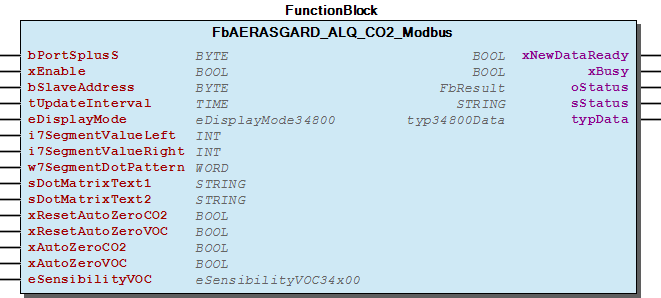 Graphical Interface of FbAERASGARD_ALQ_CO2_Modbus

## FbAERASGARD_FSFTM_CO2_Modbus (FB)

| Scope | Name | Type | Initial | Comment | Inherited from |
| --- | --- | --- | --- | --- | --- |
| Input | bPortSplusS | BYTE | 1 | Master assignment number for other function blocks. Range 1 to MAX_MASTER. | Fb35500 |
| xEnable | BOOL | TRUE | Enable signal to start cyclic read out sensor. | Fb35500 |
| bSlaveAddress | BYTE | 1 | Slave address of the sensor. | Fb35500 |
| tUpdateInterval | TIME | TIME#50ms | Cycle time for read out the sensor. Minimum 10ms. | Fb35500 |
| xResetAutoZeroCO2 | BOOL |  | Reg: 0x0001 - A raising edge activate the “Reset-AutoZero- CO2” procedure | Fb35500 |
| xAutoZeroCO2 | BOOL |  | Reg: 0x0003 - A raising edge activate the “AutoZero-CO2” procedure | Fb35500 |
| typOffsets | typOffsets |  | Reg: 4x0021..4x0024 - Offsets for CO2 concentration, Temperature and Relative humidity | Fb35500 |
| Output | xNewDataReady | BOOL |  | New sensor data available | Fb35500 |
| xBusy | BOOL |  | Busy-signal if function block is working. | Fb35500 |
| oStatus | WagoAppPlcModbus.WagoSysErrorBase.FbResult |  | Detailed Status information | Fb35500 |
| sStatus | STRING |  | Status information | Fb35500 |
| typData | typ35500Data |  | Sensor data. | Fb35500 |

This function block periodically read out process data from S+S Regeltechnik GmbH measurement converter of type:

You should always call this FB cyclic.

Graphical Illustration

Graphical Interface of FbAERASGARD_FSFTM_CO2_Modbus

Interface variables Function This function block periodically read out process data from S+S Regeltechnik GmbH measurement converter of type: - AERASGARD FSFTM-CO2-Modbus - AERASGARD FSFTM-CO2-Modbus-P :ref: ` Manual < http://spluss.de/r/PR5Q5.htm >` Note You should always call this FB cyclic. Graphical Illustration 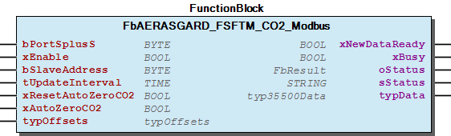 Graphical Interface of FbAERASGARD_FSFTM_CO2_Modbus

## FbAERASGARD_KCO2_Modbus (FB)

| Scope | Name | Type | Initial | Comment | Inherited from |
| --- | --- | --- | --- | --- | --- |
| Input | bPortSplusS | BYTE | 1 | Master assignment number for other function blocks. Range 1 to MAX_MASTER. | Fb34800 |
| xEnable | BOOL | TRUE | Enable signal to start cyclic read out sensor. | Fb34800 |
| bSlaveAddress | BYTE | 1 | Slave address of the sensor. | Fb34800 |
| tUpdateInterval | TIME | TIME#50ms | Cycle time for read out the sensor. Minimum 10ms. | Fb34800 |
| eDisplayMode | eDisplayMode34800 |  | Check enumaration for popssible values ( Register: 4x0001; Check “eDisplayMode34800” ) | Fb34800 |
| i7SegmentValueLeft | INT |  | Value for the two left aligned 7-Segment-Displays ( Register: 4x0003; Value range [-9...99] ) | Fb34800 |
| i7SegmentValueRight | INT |  | Value for the four right aligned 7-Segment-Displays ( Register: 4x0002; Value range [-999...9999] ) | Fb34800 |
| w7SegmentDotPattern | WORD |  | Dot pattern of the 7-Segment Display A-DP2 ( Register: 4x0005; See “Binary Pattern” ) | Fb34800 |
| sDotMatrixText1 | STRING(7) | ‘ ‘ | Upper row in display - Values for the Dot Matrix A - G ( Registers: 4x0006 ... 4x0012 ) | Fb34800 |
| sDotMatrixText2 | STRING(7) | ‘ ‘ | Lower row in display - Values for the Dot Matrix H - N ( Registers: 4x0013 ... 4x0019 ) | Fb34800 |
| xResetAutoZeroCO2 | BOOL |  | A raising edge activate the “Reset-AutoZero-CO2” procedure | Fb34800 |
| xResetAutoZeroVOC | BOOL |  | A raising edge activate the “Reset-AutoZero-VOC” procedure | Fb34800 |
| xAutoZeroCO2 | BOOL |  | A raising edge activate the “AutoZero-CO2” procedure | Fb34800 |
| xAutoZeroVOC | BOOL |  | A raising edge activate the “AutoZero-VOC” procedure | Fb34800 |
| eSensibilityVOC | eSensibilityVOC34x00 |  | VOC sensibilty: LOW(default) \| MEDIUM \| HIGH | Fb34800 |
| Output | xNewDataReady | BOOL |  | New sensor data available | Fb34800 |
| xBusy | BOOL |  | Busy-signal if function block is working. | Fb34800 |
| oStatus | WagoAppPlcModbus.WagoSysErrorBase.FbResult |  | Detailed Status information | Fb34800 |
| sStatus | STRING |  | Status information | Fb34800 |
| typData | typ34800Data |  | Sensor data. | Fb34800 |

This function block periodically read out process data from S+S Regeltechnik GmbH measurement converter of type:

It also provide an interface to customize the display behaivior.

You should always call this FB cyclic.

Graphical Illustration

Graphical Interface of FbAERASGARD_KCO2_Modbus

Interface variables Function This function block periodically read out process data from S+S Regeltechnik GmbH measurement converter of type: - AERASGARD KCO2-Modbus It also provide an interface to customize the display behaivior. :ref: ` Manual < https://spluss.de/r/F8TDM.htm >` Note You should always call this FB cyclic. Graphical Illustration  Graphical Interface of FbAERASGARD_KCO2_Modbus

## FbAERASGARD_KFTM_CO2_Modbus (FB)

| Scope | Name | Type | Initial | Comment | Inherited from |
| --- | --- | --- | --- | --- | --- |
| Input | bPortSplusS | BYTE | 1 | Master assignment number for other function blocks. Range 1 to MAX_MASTER. | Fb34800 |
| xEnable | BOOL | TRUE | Enable signal to start cyclic read out sensor. | Fb34800 |
| bSlaveAddress | BYTE | 1 | Slave address of the sensor. | Fb34800 |
| tUpdateInterval | TIME | TIME#50ms | Cycle time for read out the sensor. Minimum 10ms. | Fb34800 |
| eDisplayMode | eDisplayMode34800 |  | Check enumaration for popssible values ( Register: 4x0001; Check “eDisplayMode34800” ) | Fb34800 |
| i7SegmentValueLeft | INT |  | Value for the two left aligned 7-Segment-Displays ( Register: 4x0003; Value range [-9...99] ) | Fb34800 |
| i7SegmentValueRight | INT |  | Value for the four right aligned 7-Segment-Displays ( Register: 4x0002; Value range [-999...9999] ) | Fb34800 |
| w7SegmentDotPattern | WORD |  | Dot pattern of the 7-Segment Display A-DP2 ( Register: 4x0005; See “Binary Pattern” ) | Fb34800 |
| sDotMatrixText1 | STRING(7) | ‘ ‘ | Upper row in display - Values for the Dot Matrix A - G ( Registers: 4x0006 ... 4x0012 ) | Fb34800 |
| sDotMatrixText2 | STRING(7) | ‘ ‘ | Lower row in display - Values for the Dot Matrix H - N ( Registers: 4x0013 ... 4x0019 ) | Fb34800 |
| xResetAutoZeroCO2 | BOOL |  | A raising edge activate the “Reset-AutoZero-CO2” procedure | Fb34800 |
| xResetAutoZeroVOC | BOOL |  | A raising edge activate the “Reset-AutoZero-VOC” procedure | Fb34800 |
| xAutoZeroCO2 | BOOL |  | A raising edge activate the “AutoZero-CO2” procedure | Fb34800 |
| xAutoZeroVOC | BOOL |  | A raising edge activate the “AutoZero-VOC” procedure | Fb34800 |
| eSensibilityVOC | eSensibilityVOC34x00 |  | VOC sensibilty: LOW(default) \| MEDIUM \| HIGH | Fb34800 |
| Output | xNewDataReady | BOOL |  | New sensor data available | Fb34800 |
| xBusy | BOOL |  | Busy-signal if function block is working. | Fb34800 |
| oStatus | WagoAppPlcModbus.WagoSysErrorBase.FbResult |  | Detailed Status information | Fb34800 |
| sStatus | STRING |  | Status information | Fb34800 |
| typData | typ34800Data |  | Sensor data. | Fb34800 |

This function block periodically read out process data from S+S Regeltechnik GmbH measurement converter of type:

It also provide an interface to customize the display behaivior.

You should always call this FB cyclic.

Graphical Illustration

Graphical Interface of FbAERASGARD_KFTM_CO2_Modbus

Interface variables Function This function block periodically read out process data from S+S Regeltechnik GmbH measurement converter of type: - AERASGARD KFTM-CO2-Modbus It also provide an interface to customize the display behaivior. :ref: ` Manual < https://spluss.de/r/EEFVM.htm >` Note You should always call this FB cyclic. Graphical Illustration  Graphical Interface of FbAERASGARD_KFTM_CO2_Modbus

## FbAERASGARD_KFTM_LQ_CO2_Modbus (FB)

| Scope | Name | Type | Initial | Comment | Inherited from |
| --- | --- | --- | --- | --- | --- |
| Input | bPortSplusS | BYTE | 1 | Master assignment number for other function blocks. Range 1 to MAX_MASTER. | Fb34800 |
| xEnable | BOOL | TRUE | Enable signal to start cyclic read out sensor. | Fb34800 |
| bSlaveAddress | BYTE | 1 | Slave address of the sensor. | Fb34800 |
| tUpdateInterval | TIME | TIME#50ms | Cycle time for read out the sensor. Minimum 10ms. | Fb34800 |
| eDisplayMode | eDisplayMode34800 |  | Check enumaration for popssible values ( Register: 4x0001; Check “eDisplayMode34800” ) | Fb34800 |
| i7SegmentValueLeft | INT |  | Value for the two left aligned 7-Segment-Displays ( Register: 4x0003; Value range [-9...99] ) | Fb34800 |
| i7SegmentValueRight | INT |  | Value for the four right aligned 7-Segment-Displays ( Register: 4x0002; Value range [-999...9999] ) | Fb34800 |
| w7SegmentDotPattern | WORD |  | Dot pattern of the 7-Segment Display A-DP2 ( Register: 4x0005; See “Binary Pattern” ) | Fb34800 |
| sDotMatrixText1 | STRING(7) | ‘ ‘ | Upper row in display - Values for the Dot Matrix A - G ( Registers: 4x0006 ... 4x0012 ) | Fb34800 |
| sDotMatrixText2 | STRING(7) | ‘ ‘ | Lower row in display - Values for the Dot Matrix H - N ( Registers: 4x0013 ... 4x0019 ) | Fb34800 |
| xResetAutoZeroCO2 | BOOL |  | A raising edge activate the “Reset-AutoZero-CO2” procedure | Fb34800 |
| xResetAutoZeroVOC | BOOL |  | A raising edge activate the “Reset-AutoZero-VOC” procedure | Fb34800 |
| xAutoZeroCO2 | BOOL |  | A raising edge activate the “AutoZero-CO2” procedure | Fb34800 |
| xAutoZeroVOC | BOOL |  | A raising edge activate the “AutoZero-VOC” procedure | Fb34800 |
| eSensibilityVOC | eSensibilityVOC34x00 |  | VOC sensibilty: LOW(default) \| MEDIUM \| HIGH | Fb34800 |
| Output | xNewDataReady | BOOL |  | New sensor data available | Fb34800 |
| xBusy | BOOL |  | Busy-signal if function block is working. | Fb34800 |
| oStatus | WagoAppPlcModbus.WagoSysErrorBase.FbResult |  | Detailed Status information | Fb34800 |
| sStatus | STRING |  | Status information | Fb34800 |
| typData | typ34800Data |  | Sensor data. | Fb34800 |

This function block periodically read out process data from S+S Regeltechnik GmbH measurement converter of type:

It also provide an interface to customize the display behaivior.

You should always call this FB cyclic.

Graphical Illustration

Graphical Interface of FbAERASGARD_KFTM_LQ_CO2_Modbus

Interface variables Function This function block periodically read out process data from S+S Regeltechnik GmbH measurement converter of type: - AERASGARD KFTM-LQ-CO2-Modbus It also provide an interface to customize the display behaivior. :ref: ` Manual < https://spluss.de/r/DZ94M.htm >` Note You should always call this FB cyclic. Graphical Illustration  Graphical Interface of FbAERASGARD_KFTM_LQ_CO2_Modbus

## FbAERASGARD_KLQ_CO2_Modbus (FB)

| Scope | Name | Type | Initial | Comment | Inherited from |
| --- | --- | --- | --- | --- | --- |
| Input | bPortSplusS | BYTE | 1 | Master assignment number for other function blocks. Range 1 to MAX_MASTER. | Fb34800 |
| xEnable | BOOL | TRUE | Enable signal to start cyclic read out sensor. | Fb34800 |
| bSlaveAddress | BYTE | 1 | Slave address of the sensor. | Fb34800 |
| tUpdateInterval | TIME | TIME#50ms | Cycle time for read out the sensor. Minimum 10ms. | Fb34800 |
| eDisplayMode | eDisplayMode34800 |  | Check enumaration for popssible values ( Register: 4x0001; Check “eDisplayMode34800” ) | Fb34800 |
| i7SegmentValueLeft | INT |  | Value for the two left aligned 7-Segment-Displays ( Register: 4x0003; Value range [-9...99] ) | Fb34800 |
| i7SegmentValueRight | INT |  | Value for the four right aligned 7-Segment-Displays ( Register: 4x0002; Value range [-999...9999] ) | Fb34800 |
| w7SegmentDotPattern | WORD |  | Dot pattern of the 7-Segment Display A-DP2 ( Register: 4x0005; See “Binary Pattern” ) | Fb34800 |
| sDotMatrixText1 | STRING(7) | ‘ ‘ | Upper row in display - Values for the Dot Matrix A - G ( Registers: 4x0006 ... 4x0012 ) | Fb34800 |
| sDotMatrixText2 | STRING(7) | ‘ ‘ | Lower row in display - Values for the Dot Matrix H - N ( Registers: 4x0013 ... 4x0019 ) | Fb34800 |
| xResetAutoZeroCO2 | BOOL |  | A raising edge activate the “Reset-AutoZero-CO2” procedure | Fb34800 |
| xResetAutoZeroVOC | BOOL |  | A raising edge activate the “Reset-AutoZero-VOC” procedure | Fb34800 |
| xAutoZeroCO2 | BOOL |  | A raising edge activate the “AutoZero-CO2” procedure | Fb34800 |
| xAutoZeroVOC | BOOL |  | A raising edge activate the “AutoZero-VOC” procedure | Fb34800 |
| eSensibilityVOC | eSensibilityVOC34x00 |  | VOC sensibilty: LOW(default) \| MEDIUM \| HIGH | Fb34800 |
| Output | xNewDataReady | BOOL |  | New sensor data available | Fb34800 |
| xBusy | BOOL |  | Busy-signal if function block is working. | Fb34800 |
| oStatus | WagoAppPlcModbus.WagoSysErrorBase.FbResult |  | Detailed Status information | Fb34800 |
| sStatus | STRING |  | Status information | Fb34800 |
| typData | typ34800Data |  | Sensor data. | Fb34800 |

This function block periodically read out process data from S+S Regeltechnik GmbH measurement converter of type:

It also provide an interface to customize the display behaivior.

You should always call this FB cyclic.

Graphical Illustration

Graphical Interface of FbAERASGARD_KLQ_CO2_Modbus

Interface variables Function This function block periodically read out process data from S+S Regeltechnik GmbH measurement converter of type: - AERASGARD KLQ-CO2-Modbus It also provide an interface to customize the display behaivior. :ref: ` Manual < https://spluss.de/r/ETMMM.htm >` Note You should always call this FB cyclic. Graphical Illustration  Graphical Interface of FbAERASGARD_KLQ_CO2_Modbus

## FbAERASGARD_RCO2_Modbus (FB)

| Scope | Name | Type | Initial | Comment | Inherited from |
| --- | --- | --- | --- | --- | --- |
| Input | bPortSplusS | BYTE | 1 | Master assignment number for other function blocks. Range 1 to MAX_MASTER. | Fb34700 |
| xEnable | BOOL | TRUE | Enable signal to start cyclic read out sensor. | Fb34700 |
| bSlaveAddress | BYTE | 1 | Slave address of the sensor. | Fb34700 |
| tUpdateInterval | TIME | TIME#50ms | Cycle time for read out the sensor. Minimum 10ms. | Fb34700 |
| eDisplayMode | eDisplayMode34700 |  | Reg: 4x0001 - Check enumaration “eDisplayMode34700” for popssible values | Fb34700 |
| i7SegmentValue | INT |  | Reg: 4x0002 - 7-Segment value, Display value for the 7-Segment Display | Fb34700 |
| w7SegmentDotPattern | WORD |  | Reg: 4x0005 - 7-Segment dot pattern, Show/hide: Point_A ... Percentage | Fb34700 |
| w14SegmentPattern_1 | WORD |  | Reg: 4x0003 - First 14-Segment pattern, Segment Pattern for the first 14-Segments A-M | Fb34700 |
| w14SegmentPattern_2 | WORD |  | Reg: 4x0004 - Second 14-Segment pattern, Segment Pattern for the second 14-Segment A-M | Fb34700 |
| sDotMatrixText | STRING(7) | ‘ ‘ | Reg: 4x0006..4x0012 - ASCII-Text for the Dot Matrix A - G | Fb34700 |
| xLcdBacklight | BOOL | TRUE | Reg: 0x0008 - Switch ON/OFF LCD backlight | Fb34700 |
| usiLcdBacklightBrightness | USINT | 63 | Reg: 4x0020 - Brightness of LCD-backlight, value-range: 0..63(100%) | Fb34700 |
| xResetAutoZeroCO2 | BOOL |  | Reg: 0x0001 - A raising edge activate the “Reset-AutoZero- CO2” procedure | Fb34700 |
| xResetAutoZeroVOC | BOOL |  | Reg: 0x0002 - A raising edge activate the “Reset-AutoZero- VOC” procedure | Fb34700 |
| xAutoZeroCO2 | BOOL |  | Reg: 0x0003 - A raising edge activate the “AutoZero-CO2” procedure | Fb34700 |
| xAutoZeroVOC | BOOL |  | Reg: 0x0004 - A raising edge activate the “AutoZero-VOC” procedure | Fb34700 |
| eSensibilityVOC | eSensibilityVOC34x00 |  | Reg: 0x0005..0x0007 - VOC sensibilty: LOW(default) \| MEDIUM \| HIGH | Fb34700 |
| typOffsets | typOffsets |  | Reg: 4x0021..4x0024 - Offsets for CO2 concentration, Temperature and Relative humidity (Only AERASGARD RFTM- CO2-Modbus-P) | Fb34700 |
| Output | xNewDataReady | BOOL |  | New sensor data available | Fb34700 |
| xBusy | BOOL |  | Busy-signal if function block is working. | Fb34700 |
| oStatus | WagoAppPlcModbus.WagoSysErrorBase.FbResult |  | Detailed Status information | Fb34700 |
| sStatus | STRING |  | Status information | Fb34700 |
| typData | typ34700Data |  | Sensor data. | Fb34700 |

This function block periodically read out process data from S+S Regeltechnik GmbH measurement converter of type:

It also provide an interface to customize the display behaivior.

You should always call this FB cyclic.

Graphical Illustration

Graphical Interface of FbAERASGARD_RCO2_Modbus

Interface variables Function This function block periodically read out process data from S+S Regeltechnik GmbH measurement converter of type: - AERASGARD RCO2-Modbus It also provide an interface to customize the display behaivior. :ref: ` Manual < https://spluss.de/r/IMBDM.htm >` Note You should always call this FB cyclic. Graphical Illustration 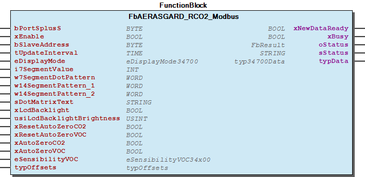 Graphical Interface of FbAERASGARD_RCO2_Modbus

## FbAERASGARD_RFTM_CO2_Modbus (FB)

| Scope | Name | Type | Initial | Comment | Inherited from |
| --- | --- | --- | --- | --- | --- |
| Input | bPortSplusS | BYTE | 1 | Master assignment number for other function blocks. Range 1 to MAX_MASTER. | Fb34700 |
| xEnable | BOOL | TRUE | Enable signal to start cyclic read out sensor. | Fb34700 |
| bSlaveAddress | BYTE | 1 | Slave address of the sensor. | Fb34700 |
| tUpdateInterval | TIME | TIME#50ms | Cycle time for read out the sensor. Minimum 10ms. | Fb34700 |
| eDisplayMode | eDisplayMode34700 |  | Reg: 4x0001 - Check enumaration “eDisplayMode34700” for popssible values | Fb34700 |
| i7SegmentValue | INT |  | Reg: 4x0002 - 7-Segment value, Display value for the 7-Segment Display | Fb34700 |
| w7SegmentDotPattern | WORD |  | Reg: 4x0005 - 7-Segment dot pattern, Show/hide: Point_A ... Percentage | Fb34700 |
| w14SegmentPattern_1 | WORD |  | Reg: 4x0003 - First 14-Segment pattern, Segment Pattern for the first 14-Segments A-M | Fb34700 |
| w14SegmentPattern_2 | WORD |  | Reg: 4x0004 - Second 14-Segment pattern, Segment Pattern for the second 14-Segment A-M | Fb34700 |
| sDotMatrixText | STRING(7) | ‘ ‘ | Reg: 4x0006..4x0012 - ASCII-Text for the Dot Matrix A - G | Fb34700 |
| xLcdBacklight | BOOL | TRUE | Reg: 0x0008 - Switch ON/OFF LCD backlight | Fb34700 |
| usiLcdBacklightBrightness | USINT | 63 | Reg: 4x0020 - Brightness of LCD-backlight, value-range: 0..63(100%) | Fb34700 |
| xResetAutoZeroCO2 | BOOL |  | Reg: 0x0001 - A raising edge activate the “Reset-AutoZero- CO2” procedure | Fb34700 |
| xResetAutoZeroVOC | BOOL |  | Reg: 0x0002 - A raising edge activate the “Reset-AutoZero- VOC” procedure | Fb34700 |
| xAutoZeroCO2 | BOOL |  | Reg: 0x0003 - A raising edge activate the “AutoZero-CO2” procedure | Fb34700 |
| xAutoZeroVOC | BOOL |  | Reg: 0x0004 - A raising edge activate the “AutoZero-VOC” procedure | Fb34700 |
| eSensibilityVOC | eSensibilityVOC34x00 |  | Reg: 0x0005..0x0007 - VOC sensibilty: LOW(default) \| MEDIUM \| HIGH | Fb34700 |
| typOffsets | typOffsets |  | Reg: 4x0021..4x0024 - Offsets for CO2 concentration, Temperature and Relative humidity (Only AERASGARD RFTM- CO2-Modbus-P) | Fb34700 |
| Output | xNewDataReady | BOOL |  | New sensor data available | Fb34700 |
| xBusy | BOOL |  | Busy-signal if function block is working. | Fb34700 |
| oStatus | WagoAppPlcModbus.WagoSysErrorBase.FbResult |  | Detailed Status information | Fb34700 |
| sStatus | STRING |  | Status information | Fb34700 |
| typData | typ34700Data |  | Sensor data. | Fb34700 |

This function block periodically read out process data from S+S Regeltechnik GmbH measurement converter of type:

It also provide an interface to customize the display behaivior.

You should always call this FB cyclic.

Graphical Illustration

Graphical Interface of FbAERASGARD_RFTM_CO2_Modbus

Interface variables Function This function block periodically read out process data from S+S Regeltechnik GmbH measurement converter of type: - AERASGARD RFTM-CO2-Modbus - AERASGARD RFTM-CO2-Modbus-P It also provide an interface to customize the display behaivior. :ref: ` Manual < https://spluss.de/r/HRXVM.htm >` Note You should always call this FB cyclic. Graphical Illustration 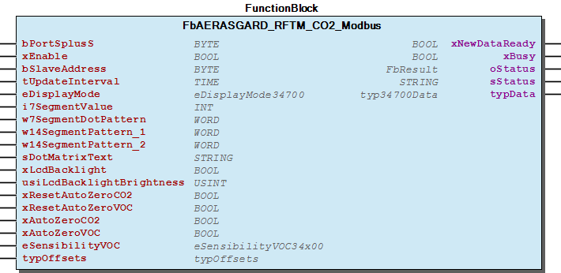 Graphical Interface of FbAERASGARD_RFTM_CO2_Modbus

## FbAERASGARD_RFTM_LQ_CO2_Modbus (FB)

| Scope | Name | Type | Initial | Comment | Inherited from |
| --- | --- | --- | --- | --- | --- |
| Input | bPortSplusS | BYTE | 1 | Master assignment number for other function blocks. Range 1 to MAX_MASTER. | Fb34700 |
| xEnable | BOOL | TRUE | Enable signal to start cyclic read out sensor. | Fb34700 |
| bSlaveAddress | BYTE | 1 | Slave address of the sensor. | Fb34700 |
| tUpdateInterval | TIME | TIME#50ms | Cycle time for read out the sensor. Minimum 10ms. | Fb34700 |
| eDisplayMode | eDisplayMode34700 |  | Reg: 4x0001 - Check enumaration “eDisplayMode34700” for popssible values | Fb34700 |
| i7SegmentValue | INT |  | Reg: 4x0002 - 7-Segment value, Display value for the 7-Segment Display | Fb34700 |
| w7SegmentDotPattern | WORD |  | Reg: 4x0005 - 7-Segment dot pattern, Show/hide: Point_A ... Percentage | Fb34700 |
| w14SegmentPattern_1 | WORD |  | Reg: 4x0003 - First 14-Segment pattern, Segment Pattern for the first 14-Segments A-M | Fb34700 |
| w14SegmentPattern_2 | WORD |  | Reg: 4x0004 - Second 14-Segment pattern, Segment Pattern for the second 14-Segment A-M | Fb34700 |
| sDotMatrixText | STRING(7) | ‘ ‘ | Reg: 4x0006..4x0012 - ASCII-Text for the Dot Matrix A - G | Fb34700 |
| xLcdBacklight | BOOL | TRUE | Reg: 0x0008 - Switch ON/OFF LCD backlight | Fb34700 |
| usiLcdBacklightBrightness | USINT | 63 | Reg: 4x0020 - Brightness of LCD-backlight, value-range: 0..63(100%) | Fb34700 |
| xResetAutoZeroCO2 | BOOL |  | Reg: 0x0001 - A raising edge activate the “Reset-AutoZero- CO2” procedure | Fb34700 |
| xResetAutoZeroVOC | BOOL |  | Reg: 0x0002 - A raising edge activate the “Reset-AutoZero- VOC” procedure | Fb34700 |
| xAutoZeroCO2 | BOOL |  | Reg: 0x0003 - A raising edge activate the “AutoZero-CO2” procedure | Fb34700 |
| xAutoZeroVOC | BOOL |  | Reg: 0x0004 - A raising edge activate the “AutoZero-VOC” procedure | Fb34700 |
| eSensibilityVOC | eSensibilityVOC34x00 |  | Reg: 0x0005..0x0007 - VOC sensibilty: LOW(default) \| MEDIUM \| HIGH | Fb34700 |
| typOffsets | typOffsets |  | Reg: 4x0021..4x0024 - Offsets for CO2 concentration, Temperature and Relative humidity (Only AERASGARD RFTM- CO2-Modbus-P) | Fb34700 |
| Output | xNewDataReady | BOOL |  | New sensor data available | Fb34700 |
| xBusy | BOOL |  | Busy-signal if function block is working. | Fb34700 |
| oStatus | WagoAppPlcModbus.WagoSysErrorBase.FbResult |  | Detailed Status information | Fb34700 |
| sStatus | STRING |  | Status information | Fb34700 |
| typData | typ34700Data |  | Sensor data. | Fb34700 |

This function block periodically read out process data from S+S Regeltechnik GmbH measurement converter of type:

It also provide an interface to customize the display behaivior.

You should always call this FB cyclic.

Graphical Illustration

Graphical Interface of FbAERASGARD_RFTM_LQ_CO2_Modbus

Interface variables Function This function block periodically read out process data from S+S Regeltechnik GmbH measurement converter of type: - AERASGARD RFTM-LQ-CO2-Modbus It also provide an interface to customize the display behaivior. :ref: ` Manual < https://spluss.de/r/HCR4M.htm >` Note You should always call this FB cyclic. Graphical Illustration  Graphical Interface of FbAERASGARD_RFTM_LQ_CO2_Modbus

## FbAERASGARD_RLQ_RCO2_Modbus (FB)

| Scope | Name | Type | Initial | Comment | Inherited from |
| --- | --- | --- | --- | --- | --- |
| Input | bPortSplusS | BYTE | 1 | Master assignment number for other function blocks. Range 1 to MAX_MASTER. | Fb34700 |
| xEnable | BOOL | TRUE | Enable signal to start cyclic read out sensor. | Fb34700 |
| bSlaveAddress | BYTE | 1 | Slave address of the sensor. | Fb34700 |
| tUpdateInterval | TIME | TIME#50ms | Cycle time for read out the sensor. Minimum 10ms. | Fb34700 |
| eDisplayMode | eDisplayMode34700 |  | Reg: 4x0001 - Check enumaration “eDisplayMode34700” for popssible values | Fb34700 |
| i7SegmentValue | INT |  | Reg: 4x0002 - 7-Segment value, Display value for the 7-Segment Display | Fb34700 |
| w7SegmentDotPattern | WORD |  | Reg: 4x0005 - 7-Segment dot pattern, Show/hide: Point_A ... Percentage | Fb34700 |
| w14SegmentPattern_1 | WORD |  | Reg: 4x0003 - First 14-Segment pattern, Segment Pattern for the first 14-Segments A-M | Fb34700 |
| w14SegmentPattern_2 | WORD |  | Reg: 4x0004 - Second 14-Segment pattern, Segment Pattern for the second 14-Segment A-M | Fb34700 |
| sDotMatrixText | STRING(7) | ‘ ‘ | Reg: 4x0006..4x0012 - ASCII-Text for the Dot Matrix A - G | Fb34700 |
| xLcdBacklight | BOOL | TRUE | Reg: 0x0008 - Switch ON/OFF LCD backlight | Fb34700 |
| usiLcdBacklightBrightness | USINT | 63 | Reg: 4x0020 - Brightness of LCD-backlight, value-range: 0..63(100%) | Fb34700 |
| xResetAutoZeroCO2 | BOOL |  | Reg: 0x0001 - A raising edge activate the “Reset-AutoZero- CO2” procedure | Fb34700 |
| xResetAutoZeroVOC | BOOL |  | Reg: 0x0002 - A raising edge activate the “Reset-AutoZero- VOC” procedure | Fb34700 |
| xAutoZeroCO2 | BOOL |  | Reg: 0x0003 - A raising edge activate the “AutoZero-CO2” procedure | Fb34700 |
| xAutoZeroVOC | BOOL |  | Reg: 0x0004 - A raising edge activate the “AutoZero-VOC” procedure | Fb34700 |
| eSensibilityVOC | eSensibilityVOC34x00 |  | Reg: 0x0005..0x0007 - VOC sensibilty: LOW(default) \| MEDIUM \| HIGH | Fb34700 |
| typOffsets | typOffsets |  | Reg: 4x0021..4x0024 - Offsets for CO2 concentration, Temperature and Relative humidity (Only AERASGARD RFTM- CO2-Modbus-P) | Fb34700 |
| Output | xNewDataReady | BOOL |  | New sensor data available | Fb34700 |
| xBusy | BOOL |  | Busy-signal if function block is working. | Fb34700 |
| oStatus | WagoAppPlcModbus.WagoSysErrorBase.FbResult |  | Detailed Status information | Fb34700 |
| sStatus | STRING |  | Status information | Fb34700 |
| typData | typ34700Data |  | Sensor data. | Fb34700 |

This function block periodically read out process data from S+S Regeltechnik GmbH measurement converter of type:

It also provide an interface to customize the display behaivior.

You should always call this FB cyclic.

Graphical Illustration

Graphical Interface of FbAERASGARD_RLQ_RCO2_Modbus

Interface variables Function This function block periodically read out process data from S+S Regeltechnik GmbH measurement converter of type: - AERASGARD RLQ-RCO2-Modbus It also provide an interface to customize the display behaivior. :ref: ` Manual < https://spluss.de/r/I74MM.htm >` Note You should always call this FB cyclic. Graphical Illustration 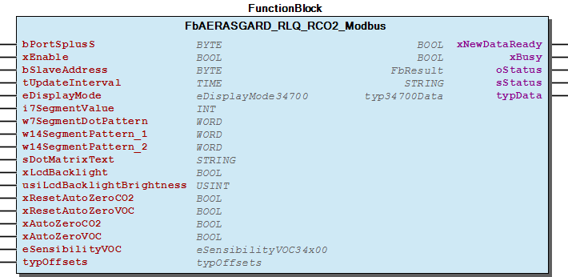 Graphical Interface of FbAERASGARD_RLQ_RCO2_Modbus

## FbHYGRASGARD_AFTF_Modbus_T3 (FB)

| Scope | Name | Type | Initial | Comment | Inherited from |
| --- | --- | --- | --- | --- | --- |
| Input | bPortSplusS | BYTE | 1 | Master assignment number for other function blocks. Range 1 to MAX_MASTER. | Fb35900 |
| xEnable | BOOL | TRUE | Enable signal to start cyclic read out sensor. | Fb35900 |
| bSlaveAddress | BYTE | 1 | Slave address of the sensor. | Fb35900 |
| tUpdateInterval | TIME | TIME#50ms | Cycle time for read out the sensor. Minimum 10ms. | Fb35900 |
| eDisplayMode | eDisplayMode31800 |  | Check enumaration for popssible values | Fb35900 |
| i7SegmentValueLeft | INT |  | Value for the two left aligned 7-Segment-Displays ( Register: 4x0003; Value range: -9...99[] ) | Fb35900 |
| i7SegmentValueRight | INT |  | Value for the four right aligned 7-Segment-Displays ( Register: 4x0002; Value range: -999...9999[] ) | Fb35900 |
| w7SegmentDotPattern | WORD |  | Dot pattern of the 7-Segment Display A-DP2 ( Register: 4x0005; See “Binary Pattern” ) | Fb35900 |
| sDotMatrixText1 | STRING(8) | ‘ ‘ | Upper row in display - Values for the Dot Matrix A - H ( Registers: 4x0006 ... 4x0013 ) | Fb35900 |
| sDotMatrixText2 | STRING(9) | ‘ ‘ | Lower row in display - Values for the Dot Matrix I - Q ( Registers: 4x0014 ... 4x0022 ) | Fb35900 |
| Output | xNewDataReady | BOOL |  | New sensor data available | Fb35900 |
| xBusy | BOOL |  | Busy-signal if function block is working. | Fb35900 |
| oStatus | WagoAppPlcModbus.WagoSysErrorBase.FbResult |  | Detailed Status information | Fb35900 |
| sStatus | STRING |  | Status information | Fb35900 |
| typData | typ31800Data |  | Sensor data. | Fb35900 |

This function block periodically read out process data from S+S Regeltechnik GmbH measurement converter of type:

It also provide an interface to customize the display behaivior.

You should always call this FB cyclic.

Graphical Illustration

Graphical Interface of FbHYGRASGARD_AFTF_Modbus_T3

Interface variables Function This function block periodically read out process data from S+S Regeltechnik GmbH measurement converter of type: - HYGRASGARD AFTF-Modbus-T3 It also provide an interface to customize the display behaivior. :ref: ` Manual < https://spluss.de/r/A6KDM.htm >` Note You should always call this FB cyclic. Graphical Illustration  Graphical Interface of FbHYGRASGARD_AFTF_Modbus_T3

## FbHYGRASGARD_AFTF_SD_Modbus (FB)

| Scope | Name | Type | Initial | Comment | Inherited from |
| --- | --- | --- | --- | --- | --- |
| Input | bPortSplusS | BYTE | 1 | Master assignment number for other function blocks. Range 1 to MAX_MASTER. | Fb31800 |
| xEnable | BOOL | TRUE | Enable signal to start cyclic read out sensor. | Fb31800 |
| bSlaveAddress | BYTE | 1 | Slave address of the sensor. | Fb31800 |
| tUpdateInterval | TIME | TIME#50ms | Cycle time for read out the sensor. Minimum 10ms. | Fb31800 |
| eDisplayMode | eDisplayMode31800 |  | Check enumaration for popssible values | Fb31800 |
| i7SegmentValue | INT |  | Display value for the 7-Segment Display | Fb31800 |
| w7SegmentDotPattern | WORD |  | Dot-Pattern of the 7-Segment Display: Point_A ... Percentage | Fb31800 |
| w14SegmentPattern_1 | WORD |  | Segment Pattern for the first 14-Segment Display A-M | Fb31800 |
| w14SegmentPattern_2 | WORD |  | Segment Pattern for the second 14-Segment Display A-M | Fb31800 |
| sDotMatrixText | STRING(7) | ‘ ‘ | String - Value for the Dot Matrix A - G | Fb31800 |
| Output | xNewDataReady | BOOL |  | New sensor data available | Fb31800 |
| xBusy | BOOL |  | Busy-signal if function block is working. | Fb31800 |
| oStatus | WagoAppPlcModbus.WagoSysErrorBase.FbResult |  | Detailed Status information | Fb31800 |
| sStatus | STRING |  | Status information | Fb31800 |
| typData | typ31800Data |  | Sensor data. | Fb31800 |

This function block periodically read out process data from S+S Regeltechnik GmbH measurement converter of type:

It also provide an interface to customize the display behaivior.

You should always call this FB cyclic.

Graphical Illustration

Graphical Interface of FbHYGRASGARD_AFTF_SD_Modbus

Interface variables Function This function block periodically read out process data from S+S Regeltechnik GmbH measurement converter of type: - HYGRASGARD AFTF-SD-Modbus It also provide an interface to customize the display behaivior. :ref: ` Manual < https://spluss.de/r/KQ94M.htm >` Note You should always call this FB cyclic. Graphical Illustration 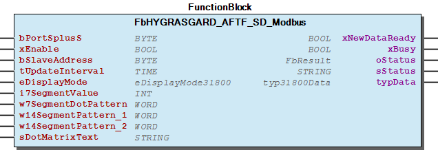 Graphical Interface of FbHYGRASGARD_AFTF_SD_Modbus

## FbHYGRASGARD_FSFTM_Modbus (FB)

| Scope | Name | Type | Initial | Comment | Inherited from |
| --- | --- | --- | --- | --- | --- |
| Input | bPortSplusS | BYTE | 1 | Master assignment number for other function blocks. Range 1 to MAX_MASTER. | Fb35400 |
| xEnable | BOOL | TRUE | Enable signal to start cyclic read out sensor. | Fb35400 |
| bSlaveAddress | BYTE | 1 | Slave address of the sensor. | Fb35400 |
| tUpdateInterval | TIME | TIME#50ms | Cycle time for read out the sensor. Minimum 10ms. | Fb35400 |
| Output | xNewDataReady | BOOL |  | New sensor data available | Fb35400 |
| xBusy | BOOL |  | Busy-signal if function block is working. | Fb35400 |
| oStatus | WagoAppPlcModbus.WagoSysErrorBase.FbResult |  | Detailed Status information | Fb35400 |
| sStatus | STRING |  | Textual status information | Fb35400 |
| typData | typ35400Data |  | Sensor data. | Fb35400 |

This function block periodically read out process data from S+S Regeltechnik GmbH measurement converter of type:

You should always call this FB cyclic.

Graphical Illustration

Graphical Interface of FbHYGRASGARD_FSFTM_Modbus

Interface variables Function This function block periodically read out process data from S+S Regeltechnik GmbH measurement converter of type: - HYGRASGARD FSFTM-Modbus - HYGRASGARD FSFTM-Modbus-P :ref: ` Manual < http://spluss.de/r/QLJ85.htm >` Note You should always call this FB cyclic. Graphical Illustration 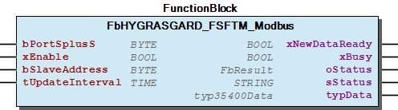 Graphical Interface of FbHYGRASGARD_FSFTM_Modbus

## FbHYGRASGARD_KFTF_Modbus (FB)

| Scope | Name | Type | Initial | Comment | Inherited from |
| --- | --- | --- | --- | --- | --- |
| Input | bPortSplusS | BYTE | 1 | Master assignment number for other function blocks. Range 1 to MAX_MASTER. | Fb31800 |
| xEnable | BOOL | TRUE | Enable signal to start cyclic read out sensor. | Fb31800 |
| bSlaveAddress | BYTE | 1 | Slave address of the sensor. | Fb31800 |
| tUpdateInterval | TIME | TIME#50ms | Cycle time for read out the sensor. Minimum 10ms. | Fb31800 |
| eDisplayMode | eDisplayMode31800 |  | Check enumaration for popssible values | Fb31800 |
| i7SegmentValue | INT |  | Display value for the 7-Segment Display | Fb31800 |
| w7SegmentDotPattern | WORD |  | Dot-Pattern of the 7-Segment Display: Point_A ... Percentage | Fb31800 |
| w14SegmentPattern_1 | WORD |  | Segment Pattern for the first 14-Segment Display A-M | Fb31800 |
| w14SegmentPattern_2 | WORD |  | Segment Pattern for the second 14-Segment Display A-M | Fb31800 |
| sDotMatrixText | STRING(7) | ‘ ‘ | String - Value for the Dot Matrix A - G | Fb31800 |
| Output | xNewDataReady | BOOL |  | New sensor data available | Fb31800 |
| xBusy | BOOL |  | Busy-signal if function block is working. | Fb31800 |
| oStatus | WagoAppPlcModbus.WagoSysErrorBase.FbResult |  | Detailed Status information | Fb31800 |
| sStatus | STRING |  | Status information | Fb31800 |
| typData | typ31800Data |  | Sensor data. | Fb31800 |

This function block periodically read out process data from S+S Regeltechnik GmbH measurement converter of type:

It also provide an interface to customize the display behaivior.

You should always call this FB cyclic.

Graphical Illustration

Graphical Interface of FbHYGRASGARD_KFTF_Modbus

Interface variables Function This function block periodically read out process data from S+S Regeltechnik GmbH measurement converter of type: - HYGRASGARD KFTF-Modbus It also provide an interface to customize the display behaivior. :ref: ` Manual < https://spluss.de/r/KB2DM.htm >` Note You should always call this FB cyclic. Graphical Illustration 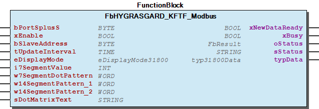 Graphical Interface of FbHYGRASGARD_KFTF_Modbus

## FbHYGRASGARD_KFTF_Modbus_T3 (FB)

| Scope | Name | Type | Initial | Comment | Inherited from |
| --- | --- | --- | --- | --- | --- |
| Input | bPortSplusS | BYTE | 1 | Master assignment number for other function blocks. Range 1 to MAX_MASTER. | Fb35900 |
| xEnable | BOOL | TRUE | Enable signal to start cyclic read out sensor. | Fb35900 |
| bSlaveAddress | BYTE | 1 | Slave address of the sensor. | Fb35900 |
| tUpdateInterval | TIME | TIME#50ms | Cycle time for read out the sensor. Minimum 10ms. | Fb35900 |
| eDisplayMode | eDisplayMode31800 |  | Check enumaration for popssible values | Fb35900 |
| i7SegmentValueLeft | INT |  | Value for the two left aligned 7-Segment-Displays ( Register: 4x0003; Value range: -9...99[] ) | Fb35900 |
| i7SegmentValueRight | INT |  | Value for the four right aligned 7-Segment-Displays ( Register: 4x0002; Value range: -999...9999[] ) | Fb35900 |
| w7SegmentDotPattern | WORD |  | Dot pattern of the 7-Segment Display A-DP2 ( Register: 4x0005; See “Binary Pattern” ) | Fb35900 |
| sDotMatrixText1 | STRING(8) | ‘ ‘ | Upper row in display - Values for the Dot Matrix A - H ( Registers: 4x0006 ... 4x0013 ) | Fb35900 |
| sDotMatrixText2 | STRING(9) | ‘ ‘ | Lower row in display - Values for the Dot Matrix I - Q ( Registers: 4x0014 ... 4x0022 ) | Fb35900 |
| Output | xNewDataReady | BOOL |  | New sensor data available | Fb35900 |
| xBusy | BOOL |  | Busy-signal if function block is working. | Fb35900 |
| oStatus | WagoAppPlcModbus.WagoSysErrorBase.FbResult |  | Detailed Status information | Fb35900 |
| sStatus | STRING |  | Status information | Fb35900 |
| typData | typ31800Data |  | Sensor data. | Fb35900 |

This function block periodically read out process data from S+S Regeltechnik GmbH measurement converter of type:

It also provide an interface to customize the display behaivior.

You should always call this FB cyclic.

Graphical Illustration

Graphical Interface of FbHYGRASGARD_KFTF_Modbus_T3

Interface variables Function This function block periodically read out process data from S+S Regeltechnik GmbH measurement converter of type: - HYGRASGARD KFTF-Modbus-T3 It also provide an interface to customize the display behaivior. :ref: ` Manual < https://spluss.de/r/9RDMM.htm >` Note You should always call this FB cyclic. Graphical Illustration 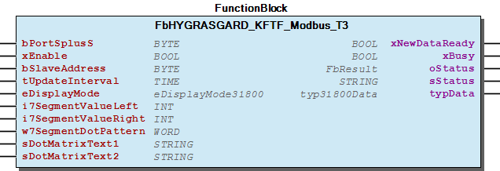 Graphical Interface of FbHYGRASGARD_KFTF_Modbus_T3

## FbHYGRASGARD_RFTF_Modbus (FB)

| Scope | Name | Type | Initial | Comment | Inherited from |
| --- | --- | --- | --- | --- | --- |
| Input | bPortSplusS | BYTE | 1 | Master assignment number for other function blocks. Range 1 to MAX_MASTER. | Fb32800 |
| xEnable | BOOL | TRUE | Enable signal to start cyclic read out sensor. | Fb32800 |
| bSlaveAddress | BYTE | 1 | Slave address of the sensor. | Fb32800 |
| tUpdateInterval | TIME | TIME#50ms | Cycle time for read out the sensor. Minimum 10ms. | Fb32800 |
| eDisplayMode | eDisplayMode32800 |  | Reg: 4x0001 - Display mode, Check enumaration for popssible values | Fb32800 |
| i7SegmentValue | INT |  | Reg: 4x0002 - 7-Segment value, Display value for the 7-Segment Display | Fb32800 |
| w7SegmentDotPattern | WORD |  | Reg: 4x0005 - 7-Segment dot pattern, Show/hide: Point_A ... Percentage | Fb32800 |
| w14SegmentPattern_1 | WORD |  | Reg: 4x0003 - First 14-Segment pattern, Segment Pattern for the first 14-Segments A-M | Fb32800 |
| w14SegmentPattern_2 | WORD |  | Reg: 4x0004 - Second 14-Segment pattern, Segment Pattern for the second 14-Segment A-M | Fb32800 |
| sDotMatrixText | STRING(7) | ‘ ‘ | Reg: 4x0006.. ASCII-Text for the Dot Matrix A - G | Fb32800 |
| xLcdBacklight | BOOL | TRUE | Reg: 0x0007 - Switch ON/OFF LCD backlight | Fb32800 |
| usiLcdBacklightBrightness | USINT | 63 | Reg: 4x0040 - Brightness of LCD-backlight, value-range: 0..63(100%) | Fb32800 |
| xPresenceButton | BOOL |  | Reg: 0x0006 - Set/Clear presence button status, LED-Status | Fb32800 |
| typLedParams | typ32800LedParams |  | Parameter set to control the five onboard LED’s | Fb32800 |
| Output | xNewDataReady | BOOL |  | New sensor data available | Fb32800 |
| xBusy | BOOL |  | Busy-signal if function block is working. | Fb32800 |
| oStatus | WagoAppPlcModbus.WagoSysErrorBase.FbResult |  | Detailed Status information | Fb32800 |
| sStatus | STRING |  | Status information | Fb32800 |
| typData | typ32800Data |  | Sensor data. | Fb32800 |

This function block periodically read out process data from S+S Regeltechnik GmbH measurement converter of type:

It also provide an interface to customize the display behaivior.

You should always call this FB cyclic.

Graphical Illustration

Graphical Interface of FbHYGRASGARD_RFTF_Modbus

Interface variables Function This function block periodically read out process data from S+S Regeltechnik GmbH measurement converter of type: - HYGRASGARD RFTF-Modbus It also provide an interface to customize the display behaivior. :ref: ` Manual < http://spluss.de/r/CJA85.htm >` Note You should always call this FB cyclic. Graphical Illustration 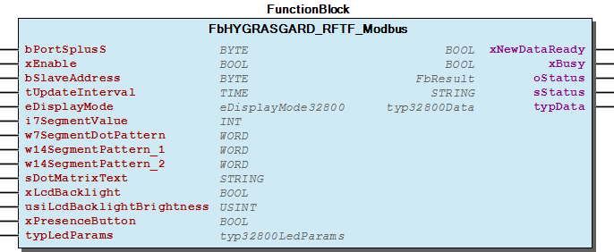 Graphical Interface of FbHYGRASGARD_RFTF_Modbus

## FbHYGRASGARD_RPFTF_Modbus (FB)

| Scope | Name | Type | Initial | Comment | Inherited from |
| --- | --- | --- | --- | --- | --- |
| Input | bPortSplusS | BYTE | 1 | Master assignment number for other function blocks. Range 1 to MAX_MASTER. | Fb31800 |
| xEnable | BOOL | TRUE | Enable signal to start cyclic read out sensor. | Fb31800 |
| bSlaveAddress | BYTE | 1 | Slave address of the sensor. | Fb31800 |
| tUpdateInterval | TIME | TIME#50ms | Cycle time for read out the sensor. Minimum 10ms. | Fb31800 |
| eDisplayMode | eDisplayMode31800 |  | Check enumaration for popssible values | Fb31800 |
| i7SegmentValue | INT |  | Display value for the 7-Segment Display | Fb31800 |
| w7SegmentDotPattern | WORD |  | Dot-Pattern of the 7-Segment Display: Point_A ... Percentage | Fb31800 |
| w14SegmentPattern_1 | WORD |  | Segment Pattern for the first 14-Segment Display A-M | Fb31800 |
| w14SegmentPattern_2 | WORD |  | Segment Pattern for the second 14-Segment Display A-M | Fb31800 |
| sDotMatrixText | STRING(7) | ‘ ‘ | String - Value for the Dot Matrix A - G | Fb31800 |
| Output | xNewDataReady | BOOL |  | New sensor data available | Fb31800 |
| xBusy | BOOL |  | Busy-signal if function block is working. | Fb31800 |
| oStatus | WagoAppPlcModbus.WagoSysErrorBase.FbResult |  | Detailed Status information | Fb31800 |
| sStatus | STRING |  | Status information | Fb31800 |
| typData | typ31800Data |  | Sensor data. | Fb31800 |

This function block periodically read out process data from S+S Regeltechnik GmbH measurement converter of type:

It also provide an interface to customize the display behaivior.

You should always call this FB cyclic.

Graphical Illustration

Graphical Interface of FbHYGRASGARD_RPFTF_Modbus

Interface variables Function This function block periodically read out process data from S+S Regeltechnik GmbH measurement converter of type: - HYGRASGARD RPFTF-Modbus It also provide an interface to customize the display behaivior. :ref: ` Manual < https://spluss.de/r/JVVMM.htm >` Note You should always call this FB cyclic. Graphical Illustration  Graphical Interface of FbHYGRASGARD_RPFTF_Modbus

## FbHYGRASGARD_RPFTF_Modbus_T3 (FB)

| Scope | Name | Type | Initial | Comment | Inherited from |
| --- | --- | --- | --- | --- | --- |
| Input | bPortSplusS | BYTE | 1 | Master assignment number for other function blocks. Range 1 to MAX_MASTER. | Fb35900 |
| xEnable | BOOL | TRUE | Enable signal to start cyclic read out sensor. | Fb35900 |
| bSlaveAddress | BYTE | 1 | Slave address of the sensor. | Fb35900 |
| tUpdateInterval | TIME | TIME#50ms | Cycle time for read out the sensor. Minimum 10ms. | Fb35900 |
| eDisplayMode | eDisplayMode31800 |  | Check enumaration for popssible values | Fb35900 |
| i7SegmentValueLeft | INT |  | Value for the two left aligned 7-Segment-Displays ( Register: 4x0003; Value range: -9...99[] ) | Fb35900 |
| i7SegmentValueRight | INT |  | Value for the four right aligned 7-Segment-Displays ( Register: 4x0002; Value range: -999...9999[] ) | Fb35900 |
| w7SegmentDotPattern | WORD |  | Dot pattern of the 7-Segment Display A-DP2 ( Register: 4x0005; See “Binary Pattern” ) | Fb35900 |
| sDotMatrixText1 | STRING(8) | ‘ ‘ | Upper row in display - Values for the Dot Matrix A - H ( Registers: 4x0006 ... 4x0013 ) | Fb35900 |
| sDotMatrixText2 | STRING(9) | ‘ ‘ | Lower row in display - Values for the Dot Matrix I - Q ( Registers: 4x0014 ... 4x0022 ) | Fb35900 |
| Output | xNewDataReady | BOOL |  | New sensor data available | Fb35900 |
| xBusy | BOOL |  | Busy-signal if function block is working. | Fb35900 |
| oStatus | WagoAppPlcModbus.WagoSysErrorBase.FbResult |  | Detailed Status information | Fb35900 |
| sStatus | STRING |  | Status information | Fb35900 |
| typData | typ31800Data |  | Sensor data. | Fb35900 |

This function block periodically read out process data from S+S Regeltechnik GmbH measurement converter of type:

It also provide an interface to customize the display behaivior.

You should always call this FB cyclic.

Graphical Illustration

Graphical Interface of FbHYGRASGARD_RPFTF_Modbus_T3

Interface variables Function This function block periodically read out process data from S+S Regeltechnik GmbH measurement converter of type: - HYGRASGARD RPFTF-Modbus-T3 It also provide an interface to customize the display behaivior. :ref: ` Manual < https://spluss.de/r/9C6VM.htm >` Note You should always call this FB cyclic. Graphical Illustration  Graphical Interface of FbHYGRASGARD_RPFTF_Modbus_T3

## FbHYGRASGARD_TW_Modbus (FB)

| Scope | Name | Type | Initial | Comment | Inherited from |
| --- | --- | --- | --- | --- | --- |
| Input | bPortSplusS | BYTE | 1 | Master assignment number for other function blocks. Range 1 to MAX_MASTER. | Fb31800 |
| xEnable | BOOL | TRUE | Enable signal to start cyclic read out sensor. | Fb31800 |
| bSlaveAddress | BYTE | 1 | Slave address of the sensor. | Fb31800 |
| tUpdateInterval | TIME | TIME#50ms | Cycle time for read out the sensor. Minimum 10ms. | Fb31800 |
| eDisplayMode | eDisplayMode31800 |  | Check enumaration for popssible values | Fb31800 |
| i7SegmentValue | INT |  | Display value for the 7-Segment Display | Fb31800 |
| w7SegmentDotPattern | WORD |  | Dot-Pattern of the 7-Segment Display: Point_A ... Percentage | Fb31800 |
| w14SegmentPattern_1 | WORD |  | Segment Pattern for the first 14-Segment Display A-M | Fb31800 |
| w14SegmentPattern_2 | WORD |  | Segment Pattern for the second 14-Segment Display A-M | Fb31800 |
| sDotMatrixText | STRING(7) | ‘ ‘ | String - Value for the Dot Matrix A - G | Fb31800 |
| Output | xNewDataReady | BOOL |  | New sensor data available | Fb31800 |
| xBusy | BOOL |  | Busy-signal if function block is working. | Fb31800 |
| oStatus | WagoAppPlcModbus.WagoSysErrorBase.FbResult |  | Detailed Status information | Fb31800 |
| sStatus | STRING |  | Status information | Fb31800 |
| typData | typ31800Data |  | Sensor data. | Fb31800 |

This function block periodically read out process data from S+S Regeltechnik GmbH measurement converter of type:

It also provide an interface to customize the display behaivior.

You should always call this FB cyclic.

Graphical Illustration

Graphical Interface of FbHYGRASGARD_TW_Modbus

Interface variables Function This function block periodically read out process data from S+S Regeltechnik GmbH measurement converter of type: - HYGRASGARD TW-Modbus It also provide an interface to customize the display behaivior. :ref: ` Manual < https://spluss.de/r/J1I4M.htm >` Note You should always call this FB cyclic. Graphical Illustration 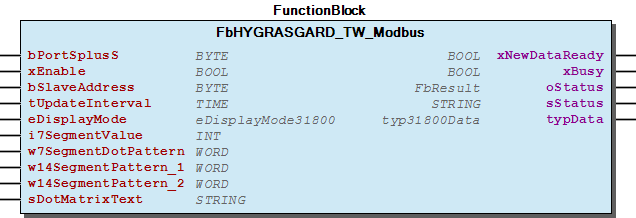 Graphical Interface of FbHYGRASGARD_TW_Modbus

## FbHYGRASGARD_TW_Modbus_T3 (FB)

| Scope | Name | Type | Initial | Comment | Inherited from |
| --- | --- | --- | --- | --- | --- |
| Input | bPortSplusS | BYTE | 1 | Master assignment number for other function blocks. Range 1 to MAX_MASTER. | Fb35900 |
| xEnable | BOOL | TRUE | Enable signal to start cyclic read out sensor. | Fb35900 |
| bSlaveAddress | BYTE | 1 | Slave address of the sensor. | Fb35900 |
| tUpdateInterval | TIME | TIME#50ms | Cycle time for read out the sensor. Minimum 10ms. | Fb35900 |
| eDisplayMode | eDisplayMode31800 |  | Check enumaration for popssible values | Fb35900 |
| i7SegmentValueLeft | INT |  | Value for the two left aligned 7-Segment-Displays ( Register: 4x0003; Value range: -9...99[] ) | Fb35900 |
| i7SegmentValueRight | INT |  | Value for the four right aligned 7-Segment-Displays ( Register: 4x0002; Value range: -999...9999[] ) | Fb35900 |
| w7SegmentDotPattern | WORD |  | Dot pattern of the 7-Segment Display A-DP2 ( Register: 4x0005; See “Binary Pattern” ) | Fb35900 |
| sDotMatrixText1 | STRING(8) | ‘ ‘ | Upper row in display - Values for the Dot Matrix A - H ( Registers: 4x0006 ... 4x0013 ) | Fb35900 |
| sDotMatrixText2 | STRING(9) | ‘ ‘ | Lower row in display - Values for the Dot Matrix I - Q ( Registers: 4x0014 ... 4x0022 ) | Fb35900 |
| Output | xNewDataReady | BOOL |  | New sensor data available | Fb35900 |
| xBusy | BOOL |  | Busy-signal if function block is working. | Fb35900 |
| oStatus | WagoAppPlcModbus.WagoSysErrorBase.FbResult |  | Detailed Status information | Fb35900 |
| sStatus | STRING |  | Status information | Fb35900 |
| typData | typ31800Data |  | Sensor data. | Fb35900 |

This function block periodically read out process data from S+S Regeltechnik GmbH measurement converter of type:

It also provide an interface to customize the display behaivior.

You should always call this FB cyclic.

Graphical Illustration

Graphical Interface of FbHYGRASGARD_TW_Modbus_T3

Interface variables Function This function block periodically read out process data from S+S Regeltechnik GmbH measurement converter of type: - HYGRASGARD TW-Modbus-T3 It also provide an interface to customize the display behaivior. :ref: ` Manual < https://spluss.de/r/8HTDM.htm >` Note You should always call this FB cyclic. Graphical Illustration 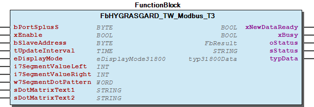 Graphical Interface of FbHYGRASGARD_TW_Modbus_T3

## FbHYGRASGARD_VFTF_Modbus (FB)

| Scope | Name | Type | Initial | Comment | Inherited from |
| --- | --- | --- | --- | --- | --- |
| Input | bPortSplusS | BYTE | 1 | Master assignment number for other function blocks. Range 1 to MAX_MASTER. | Fb31800 |
| xEnable | BOOL | TRUE | Enable signal to start cyclic read out sensor. | Fb31800 |
| bSlaveAddress | BYTE | 1 | Slave address of the sensor. | Fb31800 |
| tUpdateInterval | TIME | TIME#50ms | Cycle time for read out the sensor. Minimum 10ms. | Fb31800 |
| eDisplayMode | eDisplayMode31800 |  | Check enumaration for popssible values | Fb31800 |
| i7SegmentValue | INT |  | Display value for the 7-Segment Display | Fb31800 |
| w7SegmentDotPattern | WORD |  | Dot-Pattern of the 7-Segment Display: Point_A ... Percentage | Fb31800 |
| w14SegmentPattern_1 | WORD |  | Segment Pattern for the first 14-Segment Display A-M | Fb31800 |
| w14SegmentPattern_2 | WORD |  | Segment Pattern for the second 14-Segment Display A-M | Fb31800 |
| sDotMatrixText | STRING(7) | ‘ ‘ | String - Value for the Dot Matrix A - G | Fb31800 |
| Output | xNewDataReady | BOOL |  | New sensor data available | Fb31800 |
| xBusy | BOOL |  | Busy-signal if function block is working. | Fb31800 |
| oStatus | WagoAppPlcModbus.WagoSysErrorBase.FbResult |  | Detailed Status information | Fb31800 |
| sStatus | STRING |  | Status information | Fb31800 |
| typData | typ31800Data |  | Sensor data. | Fb31800 |

This function block periodically read out process data from S+S Regeltechnik GmbH measurement converter of type:

It also provide an interface to customize the display behaivior.

You should always call this FB cyclic.

Graphical Illustration

Graphical Interface of FbHYGRASGARD_VFTF_Modbus

Interface variables Function This function block periodically read out process data from S+S Regeltechnik GmbH measurement converter of type: - HYGRASGARD VFTF-Modbus It also provide an interface to customize the display behaivior. :ref: ` Manual < https://spluss.de/r/JGOVM.htm >` Note You should always call this FB cyclic. Graphical Illustration 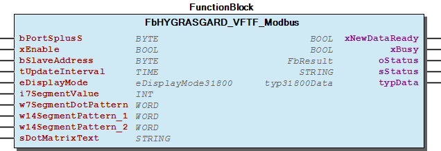 Graphical Interface of FbHYGRASGARD_VFTF_Modbus

## FbHYGRASGARD_VFTF_Modbus_T3 (FB)

| Scope | Name | Type | Initial | Comment | Inherited from |
| --- | --- | --- | --- | --- | --- |
| Input | bPortSplusS | BYTE | 1 | Master assignment number for other function blocks. Range 1 to MAX_MASTER. | Fb35900 |
| xEnable | BOOL | TRUE | Enable signal to start cyclic read out sensor. | Fb35900 |
| bSlaveAddress | BYTE | 1 | Slave address of the sensor. | Fb35900 |
| tUpdateInterval | TIME | TIME#50ms | Cycle time for read out the sensor. Minimum 10ms. | Fb35900 |
| eDisplayMode | eDisplayMode31800 |  | Check enumaration for popssible values | Fb35900 |
| i7SegmentValueLeft | INT |  | Value for the two left aligned 7-Segment-Displays ( Register: 4x0003; Value range: -9...99[] ) | Fb35900 |
| i7SegmentValueRight | INT |  | Value for the four right aligned 7-Segment-Displays ( Register: 4x0002; Value range: -999...9999[] ) | Fb35900 |
| w7SegmentDotPattern | WORD |  | Dot pattern of the 7-Segment Display A-DP2 ( Register: 4x0005; See “Binary Pattern” ) | Fb35900 |
| sDotMatrixText1 | STRING(8) | ‘ ‘ | Upper row in display - Values for the Dot Matrix A - H ( Registers: 4x0006 ... 4x0013 ) | Fb35900 |
| sDotMatrixText2 | STRING(9) | ‘ ‘ | Lower row in display - Values for the Dot Matrix I - Q ( Registers: 4x0014 ... 4x0022 ) | Fb35900 |
| Output | xNewDataReady | BOOL |  | New sensor data available | Fb35900 |
| xBusy | BOOL |  | Busy-signal if function block is working. | Fb35900 |
| oStatus | WagoAppPlcModbus.WagoSysErrorBase.FbResult |  | Detailed Status information | Fb35900 |
| sStatus | STRING |  | Status information | Fb35900 |
| typData | typ31800Data |  | Sensor data. | Fb35900 |

This function block periodically read out process data from S+S Regeltechnik GmbH measurement converter of type:

It also provide an interface to customize the display behaivior.

You should always call this FB cyclic.

Graphical Illustration

Graphical Interface of FbHYGRASGARD_VFTF_Modbus_T3

Interface variables Function This function block periodically read out process data from S+S Regeltechnik GmbH measurement converter of type: - HYGRASGARD VFTF-Modbus-T3 It also provide an interface to customize the display behaivior. :ref: ` Manual < https://spluss.de/r/8X04M.htm >` Note You should always call this FB cyclic. Graphical Illustration  Graphical Interface of FbHYGRASGARD_VFTF_Modbus_T3

## FbPREMASGARD_121x_Modbus (FB)

| Scope | Name | Type | Initial | Comment | Inherited from |
| --- | --- | --- | --- | --- | --- |
| Input | bPortSplusS | BYTE | 1 | Master assignment number for other function blocks. Range 1 to MAX_MASTER. | Fb31000 |
| xEnable | BOOL | TRUE | Enable signal to start cyclic read out sensor. | Fb31000 |
| bSlaveAddress | BYTE | 1 | Slave address of the sensor. | Fb31000 |
| tUpdateInterval | TIME | TIME#50ms | Cycle time for read out the sensor. Minimum 10ms. | Fb31000 |
| eDisplayMode | eDisplayMode |  | Check enumaration for popssible values | Fb31000 |
| i7SegmentValue | INT |  | Display value for the 7-Segment Display | Fb31000 |
| w7SegmentDotPattern | WORD |  | Dot-Pattern of the 7-Segment Display: Point_A ... Percentage | Fb31000 |
| w14SegmentPattern_1 | WORD |  | Segment Pattern for the first 14-Segment Display A-M | Fb31000 |
| w14SegmentPattern_2 | WORD |  | Segment Pattern for the second 14-Segment Display A-M | Fb31000 |
| sDotMatrixText | STRING(7) | ‘ ‘ | String - Value for the Dot Matrix A - G | Fb31000 |
| xAutoZeroStart | BOOL |  | A raising edge start the “AutoZero” adjustment feature. (aprox. 10s) | Fb31000 |
| Output | xNewDataReady | BOOL |  | New sensor data available | Fb31000 |
| xBusy | BOOL |  | Busy-signal if function block is working. | Fb31000 |
| oStatus | WagoAppPlcModbus.WagoSysErrorBase.FbResult |  | Detailed Status information | Fb31000 |
| sStatus | STRING |  | Status information | Fb31000 |
| typData | typ31000Data |  | Sensor data. | Fb31000 |

This function block periodically read out process data from S+S Regeltechnik GmbH measurement converter of type:

It also provide an interface to customize the display behaivior.

You should always call this FB cyclic.

Graphical Illustration

Graphical Interface of FbPREMASGARD_121x_Modbus

Interface variables Function This function block periodically read out process data from S+S Regeltechnik GmbH measurement converter of type: - PREMASGARD 1211-M - PREMASGARD 1215-M It also provide an interface to customize the display behaivior. :ref: ` Manual < https://spluss.de/r/6DVMM.htm >` Note You should always call this FB cyclic. Graphical Illustration 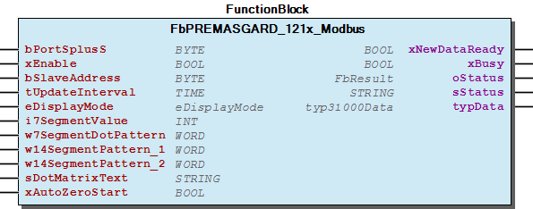 Graphical Interface of FbPREMASGARD_121x_Modbus

## FbPREMASGARD_232x_Modbus (FB)

| Scope | Name | Type | Initial | Comment | Inherited from |
| --- | --- | --- | --- | --- | --- |
| Input | bPortSplusS | BYTE | 1 | Master assignment number for other function blocks. Range 1 to MAX_MASTER. | Fb35800 |
| xEnable | BOOL | TRUE | Enable signal to start cyclic read out sensor. | Fb35800 |
| bSlaveAddress | BYTE | 1 | Slave address of the sensor. | Fb35800 |
| tUpdateInterval | TIME | TIME#50ms | Cycle time for read out the sensor. Minimum 10ms. | Fb35800 |
| eDisplayMode | eDisplayMode |  | Check enumaration for popssible values | Fb35800 |
| i7SegmentValueLeft | INT |  | Value for the two left aligned 7-Segment-Displays ( Register: 4x0003; Value range: -9...99[] ) | Fb35800 |
| i7SegmentValueRight | INT |  | Value for the four right aligned 7-Segment-Displays ( Register: 4x0002; Value range: -999...9999[] ) | Fb35800 |
| w7SegmentDotPattern | WORD |  | Dot pattern of the 7-Segment Display A-DP2 ( Register: 4x0005; See “Binary Pattern” ) | Fb35800 |
| sDotMatrixText1 | STRING(8) | ‘ ‘ | Upper row in display - Values for the Dot Matrix A - H ( Registers: 4x0006 ... 4x0013 ) | Fb35800 |
| sDotMatrixText2 | STRING(9) | ‘ ‘ | Lower row in display - Values for the Dot Matrix I - Q ( Registers: 4x0014 ... 4x0022 ) | Fb35800 |
| xAutoZeroStart | BOOL |  | A raising edge start the “AutoZero” adjustment feature. (aprox. 10s) | Fb35800 |
| Output | xNewDataReady | BOOL |  | New sensor data available | Fb35800 |
| xBusy | BOOL |  | Busy-signal if function block is working. | Fb35800 |
| oStatus | WagoAppPlcModbus.WagoSysErrorBase.FbResult |  | Detailed Status information | Fb35800 |
| sStatus | STRING |  | Status information | Fb35800 |
| typData | typ31000Data |  | Sensor data. | Fb35800 |

This function block periodically read out process data from S+S Regeltechnik GmbH measurement converter of type:

It also provide an interface to customize the display behaivior.

You should always call this FB cyclic.

Graphical Illustration

Graphical Interface of FbPREMASGARD_232x_Modbus

Interface variables Function This function block periodically read out process data from S+S Regeltechnik GmbH measurement converter of type: - PREMASGARD 2328-M - PREMASGARD 2327-M It also provide an interface to customize the display behaivior. :ref: ` Manual < https://spluss.de/r/7NFVM.htm >` Note You should always call this FB cyclic. Graphical Illustration 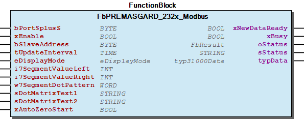 Graphical Interface of FbPREMASGARD_232x_Modbus

## FbPREMASGARD_814x_Modbus (FB)

| Scope | Name | Type | Initial | Comment | Inherited from |
| --- | --- | --- | --- | --- | --- |
| Input | bPortSplusS | BYTE | 1 | Master assignment number for other function blocks. Range 1 to MAX_MASTER. | Fb35200 |
| xEnable | BOOL | TRUE | Enable signal to start cyclic read out sensor. | Fb35200 |
| bSlaveAddress | BYTE | 1 | Slave address of the sensor. | Fb35200 |
| tUpdateInterval | TIME | TIME#50ms | Cycle time for read out the sensor. Minimum 10ms. | Fb35200 |
| eDisplayMode | eDisplayMode35200 |  | Check enumaration for popssible values ( Register: 4x0001; Check “eDisplayMode35200” ) | Fb35200 |
| i7SegmentValueLeft | INT |  | Value for the two left aligned 7-Segment-Displays ( Register: 4x0003; Value range: -9...99[] ) | Fb35200 |
| i7SegmentValueRight | INT |  | Value for the four right aligned 7-Segment-Displays ( Register: 4x0002; Value range: -999...9999[] ) | Fb35200 |
| w7SegmentDotPattern | WORD |  | Dot pattern of the 7-Segment Display A-DP2 ( Register: 4x0005; See “Binary Pattern” ) | Fb35200 |
| sDotMatrixText1 | STRING(7) | ‘ ‘ | Upper row in display - Values for the Dot Matrix A - G ( Registers: 4x0006 ... 4x0012 ) | Fb35200 |
| sDotMatrixText2 | STRING(7) | ‘ ‘ | Lower row in display - Values for the Dot Matrix H - N ( Registers: 4x0013 ... 4x0019 ) | Fb35200 |
| xAutoZeroPa | BOOL |  | A raising edge activate the “AutoZero-Pa” procedure ( Register: 0x0001; Value range: 1..2000[] | Fb35200 |
| uiKValue | UINT | 1 | Volatile Param: k-Value ( Register: 4x0023; Value range: 1..2000[] | Fb35200 |
| uiFunctionType | UINT | 1 | Volatile Param: Function type ( Register: 4x0024; Value range: 1..3[] | Fb35200 |
| uiAutozeroTime | UINT | 60 | Volatile Param: Auto zero time ( Register: 4x0025; Value range: 15..1440[min] | Fb35200 |
| uiHeightAboveSeaLevel | UINT | 0 | Volatile Param: Height above sea level ( Register: 4x0026; Value range: 0..9999[cbm/h] | Fb35200 |
| Output | xNewDataReady | BOOL |  | New sensor data available | Fb35200 |
| xBusy | BOOL |  | Busy-signal if function block is working. | Fb35200 |
| oStatus | WagoAppPlcModbus.WagoSysErrorBase.FbResult |  | Detailed Status information | Fb35200 |
| sStatus | STRING |  | Status information | Fb35200 |
| typData | typ35200Data |  | Sensor data. | Fb35200 |

This function block periodically read out process data from S+S Regeltechnik GmbH measurement converter of type:

It also provide an interface to customize the display behaivior.

You should always call this FB cyclic.

Graphical Illustration

Graphical Interface of FbPREMASGARD_814x_Modbus

Interface variables Function This function block periodically read out process data from S+S Regeltechnik GmbH measurement converter of type: - PREMASGARD 814x-M It also provide an interface to customize the display behaivior. :ref: ` Manual < http://spluss.de/r/SAA85.htm >` Note You should always call this FB cyclic. Graphical Illustration 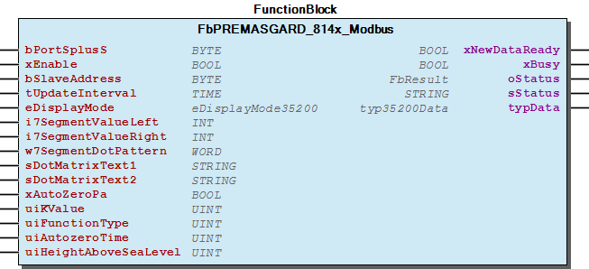 Graphical Interface of FbPREMASGARD_814x_Modbus

## FbSplusS_Master (FB)

| Scope | Name | Type | Initial | Comment |
| --- | --- | --- | --- | --- |
| Input | I_Port | WagoTypesCom.I_WagoSysComBase |  | Name of the serial Interface (e.g. ‘COM2’, ‘SER7.2’, ) |
| bPortSplusS | BYTE | 1 | Master assignment number for other function blocks. Range 1 to MAX_MASTER. |
| udiBaudrate | UDINT | 19200 | Baud rate (19200) |
| eParity | WagoAppPlcModbus.WagoTypesCom.eTTYParity | WagoAppPlcModbus.WagoTypesCom.eTTYParity.Even | Parity |
| eStopBits | WagoAppPlcModbus.WagoTypesCom.eTTYStopBits | WagoAppPlcModbus.WagoTypesCom.eTTYStopBits.One | Number |
| tTimeOut | TIME | TIME#300ms | Maximal response time |
| Output | oStatus | WagoAppPlcModbus.WagoSysErrorBase.FbResult |  | Status object. The content of the error object could be displayed via the FbShowResult from the WagoSysErrorBase library. |
| sStatus | STRING |  | Status description as string |
| xError | BOOL |  | TRUE => Error during the request |
| xIsConnected | BOOL |  | Device is connected |

You should always call this FB cyclic.

Supported interface: - PFC-Onboard-serial-interface-X3(COM1): In conjunction with 750-960 adapter - 750-652: Configurable Serial Interface Terminal RS232/RS485 - 750-653/xxx-xxx: Serial Interface Terminal RS485

Graphical Illustration

Graphical Interface of FbSplusS_Master

Interface variables Function This communication function block is used for S+S Regeltechnik GmbH measurement converter. Communication utilize RS485-half-duplex using MODBUS-RTU protocol. Without further action the S+S default settings of “19200/E/1” are used: Note You should always call this FB cyclic. Supported interface: - PFC-Onboard-serial-interface-X3(COM1): In conjunction with 750-960 adapter - 750-652: Configurable Serial Interface Terminal RS232/RS485 - 750-653/xxx-xxx: Serial Interface Terminal RS485 Graphical Illustration 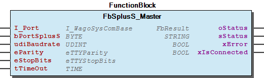 Graphical Interface of FbSplusS_Master

## FbTHERMASGARD_ALTMx_Modbus (FB)

| Scope | Name | Type | Initial | Comment | Inherited from |
| --- | --- | --- | --- | --- | --- |
| Input | bPortSplusS | BYTE | 1 | Master assignment number for other function blocks. Range 1 to MAX_MASTER. | Fb31200 |
| xEnable | BOOL | TRUE | Enable signal to start cyclic read out sensor. | Fb31200 |
| bSlaveAddress | BYTE | 1 | Slave address of the sensor. | Fb31200 |
| tUpdateInterval | TIME | TIME#50ms | Cycle time for read out the sensor. Minimum 10ms. | Fb31200 |
| eDisplayMode | eDisplayMode |  | Check enumaration for popssible values | Fb31200 |
| i7SegmentValue | INT |  | Display value for the 7-Segment Display | Fb31200 |
| w7SegmentDotPattern | WORD |  | Dot-Pattern of the 7-Segment Display: Point_A ... Percentage | Fb31200 |
| w14SegmentPattern_1 | WORD |  | Segment Pattern for the first 14-Segment Display A-M | Fb31200 |
| w14SegmentPattern_2 | WORD |  | Segment Pattern for the second 14-Segment Display A-M | Fb31200 |
| sDotMatrixText | STRING(7) | ‘ ‘ | String - Value for the Dot Matrix A - G | Fb31200 |
| Output | xNewDataReady | BOOL |  | New sensor data available | Fb31200 |
| xBusy | BOOL |  | Busy-signal if function block is working. | Fb31200 |
| oStatus | WagoAppPlcModbus.WagoSysErrorBase.FbResult |  | Detailed Status information | Fb31200 |
| sStatus | STRING |  | Status information | Fb31200 |
| typData | typ31200Data |  | Sensor data. | Fb31200 |

This function block periodically read out process data from S+S Regeltechnik GmbH measurement converter of type:

It also provide an interface to customize the display behaivior.

You should always call this FB cyclic.

Graphical Illustration

Graphical Interface of FbTHERMASGARD_ALTMx_Modbus

Interface variables Function This function block periodically read out process data from S+S Regeltechnik GmbH measurement converter of type: - THERMASGARD ALTM1-Modbus - THERMASGARD ALTM2-Modbus It also provide an interface to customize the display behaivior. :ref: ` Manual < https://spluss.de/r/MF04M.htm >` Note You should always call this FB cyclic. Graphical Illustration 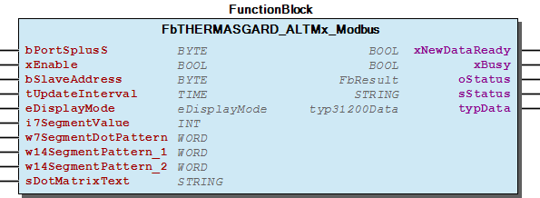 Graphical Interface of FbTHERMASGARD_ALTMx_Modbus

## FbTHERMASGARD_ALTMx_Modbus_T3 (FB)

| Scope | Name | Type | Initial | Comment | Inherited from |
| --- | --- | --- | --- | --- | --- |
| Input | bPortSplusS | BYTE | 1 | Master assignment number for other function blocks. Range 1 to MAX_MASTER. | Fb36000 |
| xEnable | BOOL | TRUE | Enable signal to start cyclic read out sensor. | Fb36000 |
| bSlaveAddress | BYTE | 1 | Slave address of the sensor. | Fb36000 |
| tUpdateInterval | TIME | TIME#50ms | Cycle time for read out the sensor. Minimum 10ms. | Fb36000 |
| eDisplayMode | eDisplayMode |  | Check enumaration for popssible values | Fb36000 |
| i7SegmentValueLeft | INT |  | Value for the two left aligned 7-Segment-Displays ( Register: 4x0003; Value range: -9...99[] ) | Fb36000 |
| i7SegmentValueRight | INT |  | Value for the four right aligned 7-Segment-Displays ( Register: 4x0002; Value range: -999...9999[] ) | Fb36000 |
| w7SegmentDotPattern | WORD |  | Dot pattern of the 7-Segment Display A-DP2 ( Register: 4x0005; See “Binary Pattern” ) | Fb36000 |
| sDotMatrixText1 | STRING(8) | ‘ ‘ | Upper row in display - Values for the Dot Matrix A - H ( Registers: 4x0006 ... 4x0013 ) | Fb36000 |
| sDotMatrixText2 | STRING(9) | ‘ ‘ | Lower row in display - Values for the Dot Matrix I - Q ( Registers: 4x0014 ... 4x0022 ) | Fb36000 |
| Output | xNewDataReady | BOOL |  | New sensor data available | Fb36000 |
| xBusy | BOOL |  | Busy-signal if function block is working. | Fb36000 |
| oStatus | WagoAppPlcModbus.WagoSysErrorBase.FbResult |  | Detailed Status information | Fb36000 |
| sStatus | STRING |  | Status information | Fb36000 |
| typData | typ31200Data |  | Sensor data. | Fb36000 |

This function block periodically read out process data from S+S Regeltechnik GmbH measurement converter of type:

It also provide an interface to customize the display behaivior.

You should always call this FB cyclic.

Graphical Illustration

Graphical Interface of FbTHERMASGARD_ALTMx_Modbus_T3

Interface variables Function This function block periodically read out process data from S+S Regeltechnik GmbH measurement converter of type: - THERMASGARD ALTM1-Modbus-T3 - THERMASGARD ALTM2-Modbus-T3 It also provide an interface to customize the display behaivior. :ref: ` Manual < https://spluss.de/r/BG4MM.htm >` Note You should always call this FB cyclic. Graphical Illustration 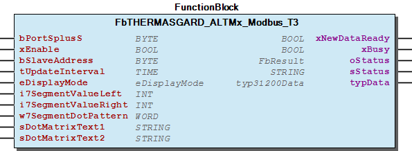 Graphical Interface of FbTHERMASGARD_ALTMx_Modbus_T3

## FbTHERMASGARD_ATM2_Modbus (FB)

| Scope | Name | Type | Initial | Comment | Inherited from |
| --- | --- | --- | --- | --- | --- |
| Input | bPortSplusS | BYTE | 1 | Master assignment number for other function blocks. Range 1 to MAX_MASTER. | Fb31200 |
| xEnable | BOOL | TRUE | Enable signal to start cyclic read out sensor. | Fb31200 |
| bSlaveAddress | BYTE | 1 | Slave address of the sensor. | Fb31200 |
| tUpdateInterval | TIME | TIME#50ms | Cycle time for read out the sensor. Minimum 10ms. | Fb31200 |
| eDisplayMode | eDisplayMode |  | Check enumaration for popssible values | Fb31200 |
| i7SegmentValue | INT |  | Display value for the 7-Segment Display | Fb31200 |
| w7SegmentDotPattern | WORD |  | Dot-Pattern of the 7-Segment Display: Point_A ... Percentage | Fb31200 |
| w14SegmentPattern_1 | WORD |  | Segment Pattern for the first 14-Segment Display A-M | Fb31200 |
| w14SegmentPattern_2 | WORD |  | Segment Pattern for the second 14-Segment Display A-M | Fb31200 |
| sDotMatrixText | STRING(7) | ‘ ‘ | String - Value for the Dot Matrix A - G | Fb31200 |
| Output | xNewDataReady | BOOL |  | New sensor data available | Fb31200 |
| xBusy | BOOL |  | Busy-signal if function block is working. | Fb31200 |
| oStatus | WagoAppPlcModbus.WagoSysErrorBase.FbResult |  | Detailed Status information | Fb31200 |
| sStatus | STRING |  | Status information | Fb31200 |
| typData | typ31200Data |  | Sensor data. | Fb31200 |

This function block periodically read out process data from S+S Regeltechnik GmbH measurement converter of type:

It also provide an interface to customize the display behaivior.

You should always call this FB cyclic.

Graphical Illustration

Graphical Interface of FbTHERMASGARD_ATM2_Modbus

Interface variables Function This function block periodically read out process data from S+S Regeltechnik GmbH measurement converter of type: - THERMASGARD ATM2-Modbus It also provide an interface to customize the display behaivior. :ref: ` Manual < https://spluss.de/r/O3R4M.htm >` Note You should always call this FB cyclic. Graphical Illustration  Graphical Interface of FbTHERMASGARD_ATM2_Modbus

## FbTHERMASGARD_ATM2_Modbus_T3 (FB)

| Scope | Name | Type | Initial | Comment | Inherited from |
| --- | --- | --- | --- | --- | --- |
| Input | bPortSplusS | BYTE | 1 | Master assignment number for other function blocks. Range 1 to MAX_MASTER. | Fb36000 |
| xEnable | BOOL | TRUE | Enable signal to start cyclic read out sensor. | Fb36000 |
| bSlaveAddress | BYTE | 1 | Slave address of the sensor. | Fb36000 |
| tUpdateInterval | TIME | TIME#50ms | Cycle time for read out the sensor. Minimum 10ms. | Fb36000 |
| eDisplayMode | eDisplayMode |  | Check enumaration for popssible values | Fb36000 |
| i7SegmentValueLeft | INT |  | Value for the two left aligned 7-Segment-Displays ( Register: 4x0003; Value range: -9...99[] ) | Fb36000 |
| i7SegmentValueRight | INT |  | Value for the four right aligned 7-Segment-Displays ( Register: 4x0002; Value range: -999...9999[] ) | Fb36000 |
| w7SegmentDotPattern | WORD |  | Dot pattern of the 7-Segment Display A-DP2 ( Register: 4x0005; See “Binary Pattern” ) | Fb36000 |
| sDotMatrixText1 | STRING(8) | ‘ ‘ | Upper row in display - Values for the Dot Matrix A - H ( Registers: 4x0006 ... 4x0013 ) | Fb36000 |
| sDotMatrixText2 | STRING(9) | ‘ ‘ | Lower row in display - Values for the Dot Matrix I - Q ( Registers: 4x0014 ... 4x0022 ) | Fb36000 |
| Output | xNewDataReady | BOOL |  | New sensor data available | Fb36000 |
| xBusy | BOOL |  | Busy-signal if function block is working. | Fb36000 |
| oStatus | WagoAppPlcModbus.WagoSysErrorBase.FbResult |  | Detailed Status information | Fb36000 |
| sStatus | STRING |  | Status information | Fb36000 |
| typData | typ31200Data |  | Sensor data. | Fb36000 |

This function block periodically read out process data from S+S Regeltechnik GmbH measurement converter of type:

It also provide an interface to customize the display behaivior.

You should always call this FB cyclic.

Graphical Illustration

Graphical Interface of FbTHERMASGARD_ATM2_Modbus_T3

Interface variables Function This function block periodically read out process data from S+S Regeltechnik GmbH measurement converter of type: - THERMASGARD ATM2-Modbus-T3 It also provide an interface to customize the display behaivior. :ref: ` Manual < https://spluss.de/r/DK2DM.htm >` Note You should always call this FB cyclic. Graphical Illustration  Graphical Interface of FbTHERMASGARD_ATM2_Modbus_T3

## FbTHERMASGARD_HFTM_Modbus (FB)

| Scope | Name | Type | Initial | Comment | Inherited from |
| --- | --- | --- | --- | --- | --- |
| Input | bPortSplusS | BYTE | 1 | Master assignment number for other function blocks. Range 1 to MAX_MASTER. | Fb31200 |
| xEnable | BOOL | TRUE | Enable signal to start cyclic read out sensor. | Fb31200 |
| bSlaveAddress | BYTE | 1 | Slave address of the sensor. | Fb31200 |
| tUpdateInterval | TIME | TIME#50ms | Cycle time for read out the sensor. Minimum 10ms. | Fb31200 |
| eDisplayMode | eDisplayMode |  | Check enumaration for popssible values | Fb31200 |
| i7SegmentValue | INT |  | Display value for the 7-Segment Display | Fb31200 |
| w7SegmentDotPattern | WORD |  | Dot-Pattern of the 7-Segment Display: Point_A ... Percentage | Fb31200 |
| w14SegmentPattern_1 | WORD |  | Segment Pattern for the first 14-Segment Display A-M | Fb31200 |
| w14SegmentPattern_2 | WORD |  | Segment Pattern for the second 14-Segment Display A-M | Fb31200 |
| sDotMatrixText | STRING(7) | ‘ ‘ | String - Value for the Dot Matrix A - G | Fb31200 |
| Output | xNewDataReady | BOOL |  | New sensor data available | Fb31200 |
| xBusy | BOOL |  | Busy-signal if function block is working. | Fb31200 |
| oStatus | WagoAppPlcModbus.WagoSysErrorBase.FbResult |  | Detailed Status information | Fb31200 |
| sStatus | STRING |  | Status information | Fb31200 |
| typData | typ31200Data |  | Sensor data. | Fb31200 |

This function block periodically read out process data from S+S Regeltechnik GmbH measurement converter of type:

It also provide an interface to customize the display behaivior.

You should always call this FB cyclic.

Graphical Illustration

Graphical Interface of FbTHERMASGARD_HFTM_Modbus

Interface variables Function This function block periodically read out process data from S+S Regeltechnik GmbH measurement converter of type: - THERMASGARD HFTM-Modbus It also provide an interface to customize the display behaivior. :ref: ` Manual < https://spluss.de/r/MU6VM.htm >` Note You should always call this FB cyclic. Graphical Illustration  Graphical Interface of FbTHERMASGARD_HFTM_Modbus

## FbTHERMASGARD_HFTM_Modbus_T3 (FB)

| Scope | Name | Type | Initial | Comment | Inherited from |
| --- | --- | --- | --- | --- | --- |
| Input | bPortSplusS | BYTE | 1 | Master assignment number for other function blocks. Range 1 to MAX_MASTER. | Fb36000 |
| xEnable | BOOL | TRUE | Enable signal to start cyclic read out sensor. | Fb36000 |
| bSlaveAddress | BYTE | 1 | Slave address of the sensor. | Fb36000 |
| tUpdateInterval | TIME | TIME#50ms | Cycle time for read out the sensor. Minimum 10ms. | Fb36000 |
| eDisplayMode | eDisplayMode |  | Check enumaration for popssible values | Fb36000 |
| i7SegmentValueLeft | INT |  | Value for the two left aligned 7-Segment-Displays ( Register: 4x0003; Value range: -9...99[] ) | Fb36000 |
| i7SegmentValueRight | INT |  | Value for the four right aligned 7-Segment-Displays ( Register: 4x0002; Value range: -999...9999[] ) | Fb36000 |
| w7SegmentDotPattern | WORD |  | Dot pattern of the 7-Segment Display A-DP2 ( Register: 4x0005; See “Binary Pattern” ) | Fb36000 |
| sDotMatrixText1 | STRING(8) | ‘ ‘ | Upper row in display - Values for the Dot Matrix A - H ( Registers: 4x0006 ... 4x0013 ) | Fb36000 |
| sDotMatrixText2 | STRING(9) | ‘ ‘ | Lower row in display - Values for the Dot Matrix I - Q ( Registers: 4x0014 ... 4x0022 ) | Fb36000 |
| Output | xNewDataReady | BOOL |  | New sensor data available | Fb36000 |
| xBusy | BOOL |  | Busy-signal if function block is working. | Fb36000 |
| oStatus | WagoAppPlcModbus.WagoSysErrorBase.FbResult |  | Detailed Status information | Fb36000 |
| sStatus | STRING |  | Status information | Fb36000 |
| typData | typ31200Data |  | Sensor data. | Fb36000 |

This function block periodically read out process data from S+S Regeltechnik GmbH measurement converter of type:

It also provide an interface to customize the display behaivior.

You should always call this FB cyclic.

Graphical Illustration

Graphical Interface of FbTHERMASGARD_HFTM_Modbus_T3

Interface variables Function This function block periodically read out process data from S+S Regeltechnik GmbH measurement converter of type: - THERMASGARD HFTM-Modbus-T3 It also provide an interface to customize the display behaivior. :ref: ` Manual < https://spluss.de/r/CAI4M.htm >` Note You should always call this FB cyclic. Graphical Illustration  Graphical Interface of FbTHERMASGARD_HFTM_Modbus_T3

## FbTHERMASGARD_MWTM_Modbus (FB)

| Scope | Name | Type | Initial | Comment | Inherited from |
| --- | --- | --- | --- | --- | --- |
| Input | bPortSplusS | BYTE | 1 | Master assignment number for other function blocks. Range 1 to MAX_MASTER. | Fb31200 |
| xEnable | BOOL | TRUE | Enable signal to start cyclic read out sensor. | Fb31200 |
| bSlaveAddress | BYTE | 1 | Slave address of the sensor. | Fb31200 |
| tUpdateInterval | TIME | TIME#50ms | Cycle time for read out the sensor. Minimum 10ms. | Fb31200 |
| eDisplayMode | eDisplayMode |  | Check enumaration for popssible values | Fb31200 |
| i7SegmentValue | INT |  | Display value for the 7-Segment Display | Fb31200 |
| w7SegmentDotPattern | WORD |  | Dot-Pattern of the 7-Segment Display: Point_A ... Percentage | Fb31200 |
| w14SegmentPattern_1 | WORD |  | Segment Pattern for the first 14-Segment Display A-M | Fb31200 |
| w14SegmentPattern_2 | WORD |  | Segment Pattern for the second 14-Segment Display A-M | Fb31200 |
| sDotMatrixText | STRING(7) | ‘ ‘ | String - Value for the Dot Matrix A - G | Fb31200 |
| Output | xNewDataReady | BOOL |  | New sensor data available | Fb31200 |
| xBusy | BOOL |  | Busy-signal if function block is working. | Fb31200 |
| oStatus | WagoAppPlcModbus.WagoSysErrorBase.FbResult |  | Detailed Status information | Fb31200 |
| sStatus | STRING |  | Status information | Fb31200 |
| typData | typ31200Data |  | Sensor data. | Fb31200 |

This function block periodically read out process data from S+S Regeltechnik GmbH measurement converter of type:

It also provide an interface to customize the display behaivior.

You should always call this FB cyclic.

Graphical Illustration

Graphical Interface of FbTHERMASGARD_MWTM_Modbus

Interface variables Function This function block periodically read out process data from S+S Regeltechnik GmbH measurement converter of type: - THERMASGARD MWTM-Modbus It also provide an interface to customize the display behaivior. :ref: ` Manual < https://spluss.de/r/N9DMM.htm >` Note You should always call this FB cyclic. Graphical Illustration  Graphical Interface of FbTHERMASGARD_MWTM_Modbus

## FbTHERMASGARD_MWTM_Modbus_T3 (FB)

| Scope | Name | Type | Initial | Comment | Inherited from |
| --- | --- | --- | --- | --- | --- |
| Input | bPortSplusS | BYTE | 1 | Master assignment number for other function blocks. Range 1 to MAX_MASTER. | Fb36000 |
| xEnable | BOOL | TRUE | Enable signal to start cyclic read out sensor. | Fb36000 |
| bSlaveAddress | BYTE | 1 | Slave address of the sensor. | Fb36000 |
| tUpdateInterval | TIME | TIME#50ms | Cycle time for read out the sensor. Minimum 10ms. | Fb36000 |
| eDisplayMode | eDisplayMode |  | Check enumaration for popssible values | Fb36000 |
| i7SegmentValueLeft | INT |  | Value for the two left aligned 7-Segment-Displays ( Register: 4x0003; Value range: -9...99[] ) | Fb36000 |
| i7SegmentValueRight | INT |  | Value for the four right aligned 7-Segment-Displays ( Register: 4x0002; Value range: -999...9999[] ) | Fb36000 |
| w7SegmentDotPattern | WORD |  | Dot pattern of the 7-Segment Display A-DP2 ( Register: 4x0005; See “Binary Pattern” ) | Fb36000 |
| sDotMatrixText1 | STRING(8) | ‘ ‘ | Upper row in display - Values for the Dot Matrix A - H ( Registers: 4x0006 ... 4x0013 ) | Fb36000 |
| sDotMatrixText2 | STRING(9) | ‘ ‘ | Lower row in display - Values for the Dot Matrix I - Q ( Registers: 4x0014 ... 4x0022 ) | Fb36000 |
| Output | xNewDataReady | BOOL |  | New sensor data available | Fb36000 |
| xBusy | BOOL |  | Busy-signal if function block is working. | Fb36000 |
| oStatus | WagoAppPlcModbus.WagoSysErrorBase.FbResult |  | Detailed Status information | Fb36000 |
| sStatus | STRING |  | Status information | Fb36000 |
| typData | typ31200Data |  | Sensor data. | Fb36000 |

This function block periodically read out process data from S+S Regeltechnik GmbH measurement converter of type:

It also provide an interface to customize the display behaivior.

You should always call this FB cyclic.

Graphical Illustration

Graphical Interface of FbTHERMASGARD_MWTM_Modbus_T3

Interface variables Function This function block periodically read out process data from S+S Regeltechnik GmbH measurement converter of type: - THERMASGARD MWTM-Modbus-T3 It also provide an interface to customize the display behaivior. :ref: ` Manual < https://spluss.de/r/CPOVM.htm >` Note You should always call this FB cyclic. Graphical Illustration  Graphical Interface of FbTHERMASGARD_MWTM_Modbus_T3

## FbTHERMASGARD_RPTMx_Modbus (FB)

| Scope | Name | Type | Initial | Comment | Inherited from |
| --- | --- | --- | --- | --- | --- |
| Input | bPortSplusS | BYTE | 1 | Master assignment number for other function blocks. Range 1 to MAX_MASTER. | Fb31200 |
| xEnable | BOOL | TRUE | Enable signal to start cyclic read out sensor. | Fb31200 |
| bSlaveAddress | BYTE | 1 | Slave address of the sensor. | Fb31200 |
| tUpdateInterval | TIME | TIME#50ms | Cycle time for read out the sensor. Minimum 10ms. | Fb31200 |
| eDisplayMode | eDisplayMode |  | Check enumaration for popssible values | Fb31200 |
| i7SegmentValue | INT |  | Display value for the 7-Segment Display | Fb31200 |
| w7SegmentDotPattern | WORD |  | Dot-Pattern of the 7-Segment Display: Point_A ... Percentage | Fb31200 |
| w14SegmentPattern_1 | WORD |  | Segment Pattern for the first 14-Segment Display A-M | Fb31200 |
| w14SegmentPattern_2 | WORD |  | Segment Pattern for the second 14-Segment Display A-M | Fb31200 |
| sDotMatrixText | STRING(7) | ‘ ‘ | String - Value for the Dot Matrix A - G | Fb31200 |
| Output | xNewDataReady | BOOL |  | New sensor data available | Fb31200 |
| xBusy | BOOL |  | Busy-signal if function block is working. | Fb31200 |
| oStatus | WagoAppPlcModbus.WagoSysErrorBase.FbResult |  | Detailed Status information | Fb31200 |
| sStatus | STRING |  | Status information | Fb31200 |
| typData | typ31200Data |  | Sensor data. | Fb31200 |

This function block periodically read out process data from S+S Regeltechnik GmbH measurement converter of type:

It also provide an interface to customize the display behaivior.

You should always call this FB cyclic.

Graphical Illustration

Graphical Interface of FbTHERMASGARD_RPTMx_Modbus

Interface variables Function This function block periodically read out process data from S+S Regeltechnik GmbH measurement converter of type: - THERMASGARD RPTM1-Modbus - THERMASGARD RPTM2-Modbus It also provide an interface to customize the display behaivior. :ref: ` Manual < https://spluss.de/r/L5FVM.htm >` Note You should always call this FB cyclic. Graphical Illustration  Graphical Interface of FbTHERMASGARD_RPTMx_Modbus

## FbTHERMASGARD_RPTMx_Modbus_T3 (FB)

| Scope | Name | Type | Initial | Comment | Inherited from |
| --- | --- | --- | --- | --- | --- |
| Input | bPortSplusS | BYTE | 1 | Master assignment number for other function blocks. Range 1 to MAX_MASTER. | Fb36000 |
| xEnable | BOOL | TRUE | Enable signal to start cyclic read out sensor. | Fb36000 |
| bSlaveAddress | BYTE | 1 | Slave address of the sensor. | Fb36000 |
| tUpdateInterval | TIME | TIME#50ms | Cycle time for read out the sensor. Minimum 10ms. | Fb36000 |
| eDisplayMode | eDisplayMode |  | Check enumaration for popssible values | Fb36000 |
| i7SegmentValueLeft | INT |  | Value for the two left aligned 7-Segment-Displays ( Register: 4x0003; Value range: -9...99[] ) | Fb36000 |
| i7SegmentValueRight | INT |  | Value for the four right aligned 7-Segment-Displays ( Register: 4x0002; Value range: -999...9999[] ) | Fb36000 |
| w7SegmentDotPattern | WORD |  | Dot pattern of the 7-Segment Display A-DP2 ( Register: 4x0005; See “Binary Pattern” ) | Fb36000 |
| sDotMatrixText1 | STRING(8) | ‘ ‘ | Upper row in display - Values for the Dot Matrix A - H ( Registers: 4x0006 ... 4x0013 ) | Fb36000 |
| sDotMatrixText2 | STRING(9) | ‘ ‘ | Lower row in display - Values for the Dot Matrix I - Q ( Registers: 4x0014 ... 4x0022 ) | Fb36000 |
| Output | xNewDataReady | BOOL |  | New sensor data available | Fb36000 |
| xBusy | BOOL |  | Busy-signal if function block is working. | Fb36000 |
| oStatus | WagoAppPlcModbus.WagoSysErrorBase.FbResult |  | Detailed Status information | Fb36000 |
| sStatus | STRING |  | Status information | Fb36000 |
| typData | typ31200Data |  | Sensor data. | Fb36000 |

This function block periodically read out process data from S+S Regeltechnik GmbH measurement converter of type:

It also provide an interface to customize the display behaivior.

You should always call this FB cyclic.

Graphical Illustration

Graphical Interface of FbTHERMASGARD_RPTMx_Modbus_T3

Interface variables Function This function block periodically read out process data from S+S Regeltechnik GmbH measurement converter of type: - THERMASGARD RPTM1-Modbus-T3 - THERMASGARD RPTM2-Modbus-T3 It also provide an interface to customize the display behaivior. :ref: ` Manual < https://spluss.de/r/ALR4M.htm >` Note You should always call this FB cyclic. Graphical Illustration  Graphical Interface of FbTHERMASGARD_RPTMx_Modbus_T3

## FbTHERMASGARD_RTM1_Modbus (FB)

| Scope | Name | Type | Initial | Comment | Inherited from |
| --- | --- | --- | --- | --- | --- |
| Input | bPortSplusS | BYTE | 1 | Master assignment number for other function blocks. Range 1 to MAX_MASTER. | Fb32400 |
| xEnable | BOOL | TRUE | Enable signal to start cyclic read out sensor. | Fb32400 |
| bSlaveAddress | BYTE | 1 | Slave address of the sensor. | Fb32400 |
| tUpdateInterval | TIME | TIME#50ms | Cycle time for read out the sensor. Minimum 10ms. | Fb32400 |
| eDisplayMode | eDisplayMode32400 |  | Check enumaration for popssible values | Fb32400 |
| i7SegmentValue | INT |  | Display value for the 7-Segment Display | Fb32400 |
| w7SegmentDotPattern | WORD |  | Dot-Pattern of the 7-Segment Display: Point_A ... Percentage | Fb32400 |
| w14SegmentPattern_1 | WORD |  | Segment Pattern for the first 14-Segment Display A-M | Fb32400 |
| w14SegmentPattern_2 | WORD |  | Segment Pattern for the second 14-Segment Display A-M | Fb32400 |
| sDotMatrixText | STRING(7) | ‘ ‘ | String - Value for the Dot Matrix A - G | Fb32400 |
| Output | xNewDataReady | BOOL |  | New sensor data available | Fb32400 |
| xBusy | BOOL |  | Busy-signal if function block is working. | Fb32400 |
| oStatus | WagoAppPlcModbus.WagoSysErrorBase.FbResult |  | Detailed Status information | Fb32400 |
| sStatus | STRING |  | Status information | Fb32400 |
| typData | typ32400Data |  | Sensor data. | Fb32400 |

This function block periodically read out process data from S+S Regeltechnik GmbH measurement converter of type:

It also provide an interface to customize the display behaivior.

You should always call this FB cyclic.

Graphical Illustration

Graphical Interface of FbTHERMASGARD_RTM1_Modbus

Interface variables Function This function block periodically read out process data from S+S Regeltechnik GmbH measurement converter of type: - THERMASGARD RTM1-Modbus - THERMASGARD RTM1-Modbus-P It also provide an interface to customize the display behaivior. :ref: ` Manual < https://spluss.de/r/FWS85.htm >` Note You should always call this FB cyclic. Graphical Illustration 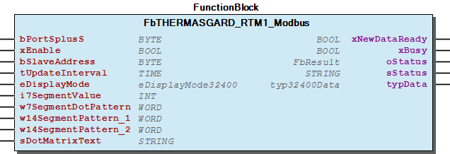 Graphical Interface of FbTHERMASGARD_RTM1_Modbus

## FbTHERMASGARD_TM65_Modbus (FB)

| Scope | Name | Type | Initial | Comment | Inherited from |
| --- | --- | --- | --- | --- | --- |
| Input | bPortSplusS | BYTE | 1 | Master assignment number for other function blocks. Range 1 to MAX_MASTER. | Fb31200 |
| xEnable | BOOL | TRUE | Enable signal to start cyclic read out sensor. | Fb31200 |
| bSlaveAddress | BYTE | 1 | Slave address of the sensor. | Fb31200 |
| tUpdateInterval | TIME | TIME#50ms | Cycle time for read out the sensor. Minimum 10ms. | Fb31200 |
| eDisplayMode | eDisplayMode |  | Check enumaration for popssible values | Fb31200 |
| i7SegmentValue | INT |  | Display value for the 7-Segment Display | Fb31200 |
| w7SegmentDotPattern | WORD |  | Dot-Pattern of the 7-Segment Display: Point_A ... Percentage | Fb31200 |
| w14SegmentPattern_1 | WORD |  | Segment Pattern for the first 14-Segment Display A-M | Fb31200 |
| w14SegmentPattern_2 | WORD |  | Segment Pattern for the second 14-Segment Display A-M | Fb31200 |
| sDotMatrixText | STRING(7) | ‘ ‘ | String - Value for the Dot Matrix A - G | Fb31200 |
| Output | xNewDataReady | BOOL |  | New sensor data available | Fb31200 |
| xBusy | BOOL |  | Busy-signal if function block is working. | Fb31200 |
| oStatus | WagoAppPlcModbus.WagoSysErrorBase.FbResult |  | Detailed Status information | Fb31200 |
| sStatus | STRING |  | Status information | Fb31200 |
| typData | typ31200Data |  | Sensor data. | Fb31200 |

This function block periodically read out process data from S+S Regeltechnik GmbH measurement converter of type:

It also provide an interface to customize the display behaivior.

You should always call this FB cyclic.

Graphical Illustration

Graphical Interface of FbTHERMASGARD_TM65_Modbus

Interface variables Function This function block periodically read out process data from S+S Regeltechnik GmbH measurement converter of type: - THERMASGARD TM65-Modbus It also provide an interface to customize the display behaivior. :ref: ` Manual < https://spluss.de/r/NOKDM.htm >` Note You should always call this FB cyclic. Graphical Illustration 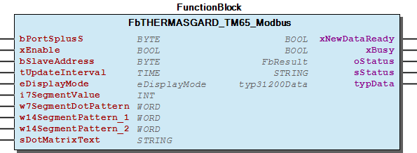 Graphical Interface of FbTHERMASGARD_TM65_Modbus

## FbTHERMASGARD_TM65_Modbus_T3 (FB)

| Scope | Name | Type | Initial | Comment | Inherited from |
| --- | --- | --- | --- | --- | --- |
| Input | bPortSplusS | BYTE | 1 | Master assignment number for other function blocks. Range 1 to MAX_MASTER. | Fb36000 |
| xEnable | BOOL | TRUE | Enable signal to start cyclic read out sensor. | Fb36000 |
| bSlaveAddress | BYTE | 1 | Slave address of the sensor. | Fb36000 |
| tUpdateInterval | TIME | TIME#50ms | Cycle time for read out the sensor. Minimum 10ms. | Fb36000 |
| eDisplayMode | eDisplayMode |  | Check enumaration for popssible values | Fb36000 |
| i7SegmentValueLeft | INT |  | Value for the two left aligned 7-Segment-Displays ( Register: 4x0003; Value range: -9...99[] ) | Fb36000 |
| i7SegmentValueRight | INT |  | Value for the four right aligned 7-Segment-Displays ( Register: 4x0002; Value range: -999...9999[] ) | Fb36000 |
| w7SegmentDotPattern | WORD |  | Dot pattern of the 7-Segment Display A-DP2 ( Register: 4x0005; See “Binary Pattern” ) | Fb36000 |
| sDotMatrixText1 | STRING(8) | ‘ ‘ | Upper row in display - Values for the Dot Matrix A - H ( Registers: 4x0006 ... 4x0013 ) | Fb36000 |
| sDotMatrixText2 | STRING(9) | ‘ ‘ | Lower row in display - Values for the Dot Matrix I - Q ( Registers: 4x0014 ... 4x0022 ) | Fb36000 |
| Output | xNewDataReady | BOOL |  | New sensor data available | Fb36000 |
| xBusy | BOOL |  | Busy-signal if function block is working. | Fb36000 |
| oStatus | WagoAppPlcModbus.WagoSysErrorBase.FbResult |  | Detailed Status information | Fb36000 |
| sStatus | STRING |  | Status information | Fb36000 |
| typData | typ31200Data |  | Sensor data. | Fb36000 |

This function block periodically read out process data from S+S Regeltechnik GmbH measurement converter of type:

It also provide an interface to customize the display behaivior.

You should always call this FB cyclic.

Graphical Illustration

Graphical Interface of FbTHERMASGARD_TM65_Modbus_T3

Interface variables Function This function block periodically read out process data from S+S Regeltechnik GmbH measurement converter of type: - THERMASGARD TM65-Modbus-T3 It also provide an interface to customize the display behaivior. :ref: ` Manual < https://spluss.de/r/D4VMM.htm >` Note You should always call this FB cyclic. Graphical Illustration  Graphical Interface of FbTHERMASGARD_TM65_Modbus_T3

### Functions

## fuAssign14SegmentPattern (FUN)

| Scope | Name | Type | Comment |
| --- | --- | --- | --- |
| Return | fuAssign14SegmentPattern | WORD |  |
| Input | xSeg_A | BOOL | Bit 0 |
| xSeg_B | BOOL | Bit 1 |
| xSeg_C | BOOL | Bit 2 |
| xSeg_D | BOOL | Bit 3 |
| xSeg_E | BOOL | Bit 4 |
| xSeg_F | BOOL | Bit 5 |
| xSeg_G1 | BOOL | Bit 6 |
| xSeg_G2 | BOOL | Bit 7 |
| xSeg_H | BOOL | Bit 8 |
| xSeg_I | BOOL | Bit 9 |
| xSeg_J | BOOL | Bit 10 |
| xSeg_K | BOOL | Bit 11 |
| xSeg_L | BOOL | Bit 12 |
| xSeg_M | BOOL | Bit 13 |

### Methods

## typOffsets (STRUCT)

| Name | Type | Comment |
| --- | --- | --- |
| iOffsetCO2 | INT | Reg: 4x0021 - Offset CO2, Value range [-512..511] |
| iOffsetTemperature | INT | Reg: 4x0023 - Offset temperature, Value range [-512..511] or [-10°C..+10°C] |
| iOffsetRelativeHumidity | INT | Reg: 4x0024 - Offset relative humidity, Value range [-512..511] |

### Program Organization

## 20 Program Organization Units

- 01 Communication FbSplusS_Master (FB) 10 THERMASGARD - FbTHERMASGARD_ALTMx_Modbus (FB) - FbTHERMASGARD_ALTMx_Modbus_T3 (FB) - FbTHERMASGARD_ATM2_Modbus (FB) - FbTHERMASGARD_ATM2_Modbus_T3 (FB) - FbTHERMASGARD_HFTM_Modbus (FB) - FbTHERMASGARD_HFTM_Modbus_T3 (FB) - FbTHERMASGARD_MWTM_Modbus (FB) - FbTHERMASGARD_MWTM_Modbus_T3 (FB) - FbTHERMASGARD_RPTMx_Modbus (FB) - FbTHERMASGARD_RPTMx_Modbus_T3 (FB) - FbTHERMASGARD_RTM1_Modbus (FB) - FbTHERMASGARD_TM65_Modbus (FB) - FbTHERMASGARD_TM65_Modbus_T3 (FB) 20 HYGRASGARD - FbHYGRASGARD_AFTF_Modbus_T3 (FB) - FbHYGRASGARD_AFTF_SD_Modbus (FB) - FbHYGRASGARD_FSFTM_Modbus (FB) - FbHYGRASGARD_KFTF_Modbus (FB) - FbHYGRASGARD_KFTF_Modbus_T3 (FB) - FbHYGRASGARD_RFTF_Modbus (FB) - FbHYGRASGARD_RPFTF_Modbus (FB) - FbHYGRASGARD_RPFTF_Modbus_T3 (FB) - FbHYGRASGARD_TW_Modbus (FB) - FbHYGRASGARD_TW_Modbus_T3 (FB) - FbHYGRASGARD_VFTF_Modbus (FB) - FbHYGRASGARD_VFTF_Modbus_T3 (FB) 30 PREMASGARD - FbPREMASGARD_121x_Modbus (FB) - FbPREMASGARD_232x_Modbus (FB) - FbPREMASGARD_814x_Modbus (FB) 50 AERASGARD - FbAERASGARD_ACO2_Modbus (FB) - FbAERASGARD_AFTM_CO2_Modbus (FB) - FbAERASGARD_AFTM_LQ_CO2_Modbus (FB) - FbAERASGARD_ALQ_CO2_Modbus (FB) - FbAERASGARD_FSFTM_CO2_Modbus (FB) - FbAERASGARD_KCO2_Modbus (FB) - FbAERASGARD_KFTM_CO2_Modbus (FB) - FbAERASGARD_KFTM_LQ_CO2_Modbus (FB) - FbAERASGARD_KLQ_CO2_Modbus (FB) - FbAERASGARD_RCO2_Modbus (FB) - FbAERASGARD_RFTM_CO2_Modbus (FB) - FbAERASGARD_RFTM_LQ_CO2_Modbus (FB) - FbAERASGARD_RLQ_RCO2_Modbus (FB) 90 Utilities - fuAssign14SegmentPattern (FUN)

### Global Variable Lists

## GlobalVariables (GVL)

| Name | Type | Comment |
| --- | --- | --- |
| gSplusSMaster | ARRAY [1..gc_iMAX_MASTER] OF typSplusS_Master | Stucture to sync concurrenzy of several function block want to communicate via the ModbusRTU-Master-FB * ) |

## VersionHistory (GVL)

| Name | Type |
| --- | --- |
| Info | WagoSysVersion.ProjectInfo |

| date | version | author | change |
| 16.07.2019 | 1.0.0.7 | u010640 | First release |
| 10.07.2019 | 1.0.0.6 | u010640 | First release candidate |

WagoSolSplusS.library

WagoSolSplusS.library

### Other Components

## 01 Communication ¶

- FbSplusS_Master (FB)

## 01 Communication ¶

- typSplusS_Master (STRUCT)

## 10 Sensor Data

- typ31000Data (STRUCT) - typ31200Data (STRUCT) - typ31800Data (STRUCT) - typ32400Data (STRUCT) - typ32800Data (STRUCT) - typ34700Data (STRUCT) - typ34800Data (STRUCT) - typ35200Data (STRUCT) - typ35400Data (STRUCT) - typ35500Data (STRUCT)

## 10 THERMASGARD

- FbTHERMASGARD_ALTMx_Modbus (FB) - FbTHERMASGARD_ALTMx_Modbus_T3 (FB) - FbTHERMASGARD_ATM2_Modbus (FB) - FbTHERMASGARD_ATM2_Modbus_T3 (FB) - FbTHERMASGARD_HFTM_Modbus (FB) - FbTHERMASGARD_HFTM_Modbus_T3 (FB) - FbTHERMASGARD_MWTM_Modbus (FB) - FbTHERMASGARD_MWTM_Modbus_T3 (FB) - FbTHERMASGARD_RPTMx_Modbus (FB) - FbTHERMASGARD_RPTMx_Modbus_T3 (FB) - FbTHERMASGARD_RTM1_Modbus (FB) - FbTHERMASGARD_TM65_Modbus (FB) - FbTHERMASGARD_TM65_Modbus_T3 (FB)

## 11 Sensor Config

- eSensibilityVOC34x00 (ENUM) - typOffsets (STRUCT)

## 12 Display Config

- eDisplayMode (ENUM) - eDisplayMode31800 (ENUM) - eDisplayMode32400 (ENUM) - eDisplayMode32800 (ENUM) - eDisplayMode34700 (ENUM) - eDisplayMode34800 (ENUM) - eDisplayMode35200 (ENUM) - typ14SegmentPattern (STRUCT) - typ7SegmentDotPattern1 (STRUCT) - typ7SegmentDotPattern2 (STRUCT)

## 13 LED Config

- eLedBarGraphMode (ENUM) - eLedFlashingMode (ENUM) - typ32800LedParams (STRUCT) - typLedColourRegister (STRUCT)

## 20 HYGRASGARD

- FbHYGRASGARD_AFTF_Modbus_T3 (FB) - FbHYGRASGARD_AFTF_SD_Modbus (FB) - FbHYGRASGARD_FSFTM_Modbus (FB) - FbHYGRASGARD_KFTF_Modbus (FB) - FbHYGRASGARD_KFTF_Modbus_T3 (FB) - FbHYGRASGARD_RFTF_Modbus (FB) - FbHYGRASGARD_RPFTF_Modbus (FB) - FbHYGRASGARD_RPFTF_Modbus_T3 (FB) - FbHYGRASGARD_TW_Modbus (FB) - FbHYGRASGARD_TW_Modbus_T3 (FB) - FbHYGRASGARD_VFTF_Modbus (FB) - FbHYGRASGARD_VFTF_Modbus_T3 (FB)

## 29 Types

- 01 Communication typSplusS_Master (STRUCT) 10 Sensor Data - typ31000Data (STRUCT) - typ31200Data (STRUCT) - typ31800Data (STRUCT) - typ32400Data (STRUCT) - typ32800Data (STRUCT) - typ34700Data (STRUCT) - typ34800Data (STRUCT) - typ35200Data (STRUCT) - typ35400Data (STRUCT) - typ35500Data (STRUCT) 11 Sensor Config - eSensibilityVOC34x00 (ENUM) - typOffsets (STRUCT) 12 Display Config - eDisplayMode (ENUM) - eDisplayMode31800 (ENUM) - eDisplayMode32400 (ENUM) - eDisplayMode32800 (ENUM) - eDisplayMode34700 (ENUM) - eDisplayMode34800 (ENUM) - eDisplayMode35200 (ENUM) - typ14SegmentPattern (STRUCT) - typ7SegmentDotPattern1 (STRUCT) - typ7SegmentDotPattern2 (STRUCT) 13 LED Config - eLedBarGraphMode (ENUM) - eLedFlashingMode (ENUM) - typ32800LedParams (STRUCT) - typLedColourRegister (STRUCT)

## 30 PREMASGARD

- FbPREMASGARD_121x_Modbus (FB) - FbPREMASGARD_232x_Modbus (FB) - FbPREMASGARD_814x_Modbus (FB)

## 50 AERASGARD

- FbAERASGARD_ACO2_Modbus (FB) - FbAERASGARD_AFTM_CO2_Modbus (FB) - FbAERASGARD_AFTM_LQ_CO2_Modbus (FB) - FbAERASGARD_ALQ_CO2_Modbus (FB) - FbAERASGARD_FSFTM_CO2_Modbus (FB) - FbAERASGARD_KCO2_Modbus (FB) - FbAERASGARD_KFTM_CO2_Modbus (FB) - FbAERASGARD_KFTM_LQ_CO2_Modbus (FB) - FbAERASGARD_KLQ_CO2_Modbus (FB) - FbAERASGARD_RCO2_Modbus (FB) - FbAERASGARD_RFTM_CO2_Modbus (FB) - FbAERASGARD_RFTM_LQ_CO2_Modbus (FB) - FbAERASGARD_RLQ_RCO2_Modbus (FB)

## 90 Utilities ¶

- fuAssign14SegmentPattern (FUN)

## ParameterList (PARAMS)

| Scope | Name | Type | Initial | Comment |
| --- | --- | --- | --- | --- |
| Constant | gc_iMAX_MASTER | BYTE | 3 | Defines the max possible s+s master. |

## eDisplayMode (ENUM)

| Name | Initial | Comment |
| --- | --- | --- |
| eDefault | 0 | Standard display behaivior |
| eUserDefined | 10 | Freely configurable display |

Register: 4x0001 - Display mode

InOut: Register: 4x0001 - Display mode

## eDisplayMode31800 (ENUM)

| Name | Initial | Comment |
| --- | --- | --- |
| eDefault | 0 | Standard display behaivior |
| eDewPoint | 1 | Show dew point[°C] |
| eAbsoluteHumidity | 2 | Show absolute humidity[g/cum] |
| eMixtureRatio | 3 | Show mixture ratio[g/kg] |
| eEnthalpi | 4 | Show enthalpy[kJ/kg] |
| eTemperatureCelsius | 5 | Show temperature[°C] |
| eRelativeHumidity | 6 | Show relative humidity[% r.H.] |
| eUserDefined | 10 | Freely configurable display |

Register: 4x0001 - Display mode

InOut: Register: 4x0001 - Display mode

## eDisplayMode32400 (ENUM)

| Name | Initial | Comment |
| --- | --- | --- |
| eDefault | 0 | Standard display behaivior |
| eTemperatureCelsius | 1 | Show temperature[°C] |
| eSetpointPotentiometer | 2 | Show setpoint potentiometer[%] |
| eDewPoint | 3 | Show dew point[°C] |
| eRelativeHumidity | 4 | Show relative humidity[% r.H.] |
| eUserDefined | 10 | Freely configurable display |

Register: 4x0001 - Display mode

InOut: Register: 4x0001 - Display mode

## eDisplayMode32800 (ENUM)

| Name | Initial | Comment |
| --- | --- | --- |
| eDefault | 0 | Standard display behaivior |
| eTemperatureCelsius | 1 | Show temperature[°C] |
| eSetpointPotentiometer | 2 | Show setpoint potentiometer[%] |
| eDewPoint | 3 | Show dew point[°C] |
| eRelativeHumidity | 4 | Show relative humidity[% r.H.] |
| eAbsoluteHumidity | 5 | Show absolute humidity[kg/cbm] |
| eMixtureRatio | 6 | Show mixture ratio[g/kg] |
| eEnthalpy | 7 | Show enthalpy[kJ/kg] |
| eUserDefined | 10 | Freely configurable display |

Register: 4x0001 - Display mode

InOut: Register: 4x0001 - Display mode

## eDisplayMode34700 (ENUM)

| Name | Initial | Comment |
| --- | --- | --- |
| eDefault | 0 | Standard display behaivior (cyclic) |
| eCO2 | 1 | Show CO2 concentration[ppm] (static) |
| eVOC | 2 | Show VOC[%] (static) |
| eTemperatureCelsius | 3 | Show temperature[°C](static) |
| eRelativeHumidity | 4 | Show relative humidity[% r.H.] (static) |
| eUserDefined | 10 | Freely configurable display |

Register: 4x0001 - Display mode

InOut: Register: 4x0001 - Display mode

## eDisplayMode34800 (ENUM)

| Name | Initial | Comment |
| --- | --- | --- |
| eDefault | 0 | Standard display behaivior(cyclic) |
| eCO2 | 1 | Show CO2 concentration[ppm] (static) |
| eVOC | 2 | Show VOC[%] (static) |
| eTemperatureCelsius | 3 | Show temperature[°C](static) |
| eRelativeHumidity | 4 | Show relative humidity[% r.H.] (static) |
| eAtmosphericPressure | 5 | Show atmospheric pressure[hPa] (static) |
| eUserDefined | 10 | Freely configurable display |

Register: 4x0001 - Display mode

InOut: Register: 4x0001 - Display mode

## eDisplayMode35200 (ENUM)

| Name | Initial | Comment |
| --- | --- | --- |
| eDefault | 0 | Standard display behaivior(cyclic) |
| eVolumeFlow | 1 | Show volume flow[cbm/h] (static) |
| eDewPoint | 2 | Show dew point[°C] (static) |
| eAbsoluteHumidity | 3 | Show absolute humidity[kg/cbm] |
| eMixtureRatio | 4 | Show mixture ratio[g/kg] |
| eEnthalpy | 5 | Show enthalpy[kJ/kg] |
| eDifferentialPressure | 6 | Show differential pressure[Pa] (static) |
| eTemperatureCelsius | 7 | Show temperature[°C](static) |
| eRelativeHumidity | 8 | Show relative humidity[% r.H.] (static) |
| eUserDefined | 10 | Freely configurable display |

Register: 4x0001 - Display mode

InOut: Register: 4x0001 - Display mode

## eLedBarGraphMode (ENUM)

| Name | Initial | Comment |
| --- | --- | --- |
| eNO_BARGRAPH | 0 | INDIVIDUAL(DEFAULT): Each single LED have to be controlled individually via Modbus. Color, flashing-mode and brightness: Register 4x0015 ... 4x0039) ON/OFF: With “FC5 - WRITE SINGLE COIL” to Register 0x0001 ... 0x0006 |
| eBARGRAPH_A | 1 | BarGraphMode_A: green-green-yellow-yellow-red (Traffic Light), depending on “iBarGraphValue” in Register 4x0015 |
| eBARGRAPH_B | 2 | BarGraphMode_B: green-yellow-red (same color for all), depending on “iBarGraphValue” in Register 4x0015 |
| eBARGRAPH_C | 3 | BarGraphMode_C: blue-red/blue-red, depending on “iBarGraphValue” in Register 4x0015 |
| eBARGRAPH_D | 4 | BarGraphMode_D: (Color from “LED_COLOR_REGISTER”), depending on “iBarGraphValue” in Register 4x0015 |

Register 4x0014 - LedBarGraphMode,

InOut: Register 4x0014 - LedBarGraphMode,

## eLedFlashingMode (ENUM)

| Name | Initial | Comment |
| --- | --- | --- |
| eCONTNUOUS | 0 | Constant(DEFAULT) |
| eBRIEF | 1 | Brief flash |
| eMEDIUM | 2 | Medium flash |
| eLONG | 3 | Long flash |
| eQUICK | 4 | Quick flash |
| eCHANGE_WITH_BUTTON | 5 | Change with button |

Register 4x0015 ... 4x0019 - LED flashing mode, Only valid if eLedBarGraphMode.NO_BARGRAPH(4x0014=0)

InOut: Register 4x0015 ... 4x0019 - LED flashing mode, Only valid if eLedBarGraphMode.NO_BARGRAPH(4x0014=0)

## eSensibilityVOC34x00 (ENUM)

| Name | Initial | Comment |
| --- | --- | --- |
| DEFAULT | 0 | Factory default |
| LOW | 1 | VOC sensibilty “low” - Register: 0x0005 |
| MEDIUM | 2 | VOC sensibilty “medium” - Register: 0x0006 |
| HIGH | 3 | VOC sensibilty “high” - Register: 0x0007 |

InOut: VOC sensibilty setting for: - HYGRASGARD RFTM/AFTM/KFTM-LQ-CO2

## typ14SegmentPattern (STRUCT)

| Name | Type | Comment |
| --- | --- | --- |
| xSeg_A | BIT | Bit 0 |
| xSeg_B | BIT | Bit 1 |
| xSeg_C | BIT | Bit 2 |
| xSeg_D | BIT | Bit 3 |
| xSeg_E | BIT | Bit 4 |
| xSeg_F | BIT | Bit 5 |
| xSeg_G1 | BIT | Bit 6 |
| xSeg_G2 | BIT | Bit 7 |
| xSeg_H | BIT | Bit 8 |
| xSeg_I | BIT | Bit 9 |
| xSeg_J | BIT | Bit 10 |
| xSeg_K | BIT | Bit 11 |
| xSeg_L | BIT | Bit 12 |
| xSeg_M | BIT | Bit 13 |

## typ31000Data (STRUCT)

| Name | Type | Comment |
| --- | --- | --- |
| iDifferentialPressure | INT | Reg: 3x0001 - DifferentialPressure[Pa] Without filtering |
| iDifferentialPressure_01 | INT | Reg: 3x0002 - DifferentialPressure[Pa] Filtering 1s |
| iDifferentialPressure_10 | INT | Reg: 3x0003 - DifferentialPressure[Pa] Filtering 10s |

The process data from S+S Regeltechnik GmbH measurement converter of type:

InOut: Function The process data from S+S Regeltechnik GmbH measurement converter of type: - PREMASGARD 1211-M - PREMASGARD 1215-M - PREMASGARD 232x-M

## typ31200Data (STRUCT)

| Name | Type | Comment |
| --- | --- | --- |
| rTemperature | REAL | Reg: 3x0001 - Temperature[°C] without filterring |
| rTemperature_01 | REAL | Reg: 3x0002 - Temperature[°C] with 1s filter |
| rTemperature_10 | REAL | Reg: 3x0003 - Temperature[°C] with 10s filter |
| xSensorErrorBreakage | BOOL | Reg: 0x0001 - Sensor error breakage |
| xSensorErrorShortCircuit | BOOL | Reg: 0x0002 - Sensor error short circuite |

The process data from S+S Regeltechnik GmbH measurement converter of type:

InOut: Function The process data from S+S Regeltechnik GmbH measurement converter of type: - THERMASGARD ALTM1-Modbus - THERMASGARD ALTM1-Modbus-T3 - THERMASGARD ALTM2-Modbus - THERMASGARD ALTM2-Modbus-T3 - THERMASGARD ATM2-Modbus - THERMASGARD ATM2-Modbus-T3 - THERMASGARD HFTM-Modbus - THERMASGARD HFTM-Modbus-T3 - THERMASGARD MWTM-Modbus - THERMASGARD MWTM-Modbus-T3 - THERMASGARD RPTM1-Modbus - THERMASGARD RPTM1-Modbus-T3 - THERMASGARD RPTM2-Modbus - THERMASGARD RPTM2-Modbus-T3 - THERMASGARD TM65-Modbus - THERMASGARD TM65-Modbus-T3

## typ31800Data (STRUCT)

| Name | Type | Comment |
| --- | --- | --- |
| rTemperature_04 | REAL | Reg: 3x0001 - Temperature[°C] Sampling 4s |
| rTemperature_32 | REAL | Reg: 3x0002 - Temperature[°C] Filtering 32s |
| rRelativeHumidity_04 | REAL | Reg: 3x0003 - Relative humidity[%] Sampling 4s |
| rRelativeHumidity_32 | REAL | Reg: 3x0004 - Relative humidity[%] Filtering 32s |
| rDewPoint | REAL | Reg: 3x0005 - Dew point[°C] - Calculated value |
| rAbsoluteHumidity | REAL | Reg: 3x0006 - Absolute humidity[g/cum] - Calculated value |
| rMixtureRatio | REAL | Reg: 3x0007 - Mixture ratio[g/kg] - Calculated value |
| rEnthalpy | REAL | Reg: 3x0008 - Enthalpy[kJ/kg] - Calculated value |

The process data from S+S Regeltechnik GmbH measurement converter of type:

InOut: Function The process data from S+S Regeltechnik GmbH measurement converter of type: - HYGRASGARD AFTF-SD-Modbus - HYGRASGARD AFTF-Modbus-T3 - HYGRASGARD KFTF-Modbus - HYGRASGARD KFTF-Modbus-T3 - HYGRASGARD RPFTF-Modbus - HYGRASGARD RPFTF-Modbus-T3 - HYGRASGARD TW-Modbus - HYGRASGARD TW-Modbus-T3 - HYGRASGARD VFTF-Modbus - HYGRASGARD VFTF-Modbus-T3

## typ32400Data (STRUCT)

| Name | Type | Comment |
| --- | --- | --- |
| rTemperature_04 | REAL | Reg: 3x0001 - Temperature[°C] Sampling 4s |
| rTemperature_32 | REAL | Reg: 3x0002 - Temperature[°C] with 32s filter |
| rSetpointPotentiometer | REAL | Reg: 3x0003 - Setpoint potentiometer[%] |
| rDewPoint | REAL | Reg: 3x0004 - Dew point[°C] - Calculated |
| rRelativeHumidity_32 | REAL | Reg: 3x0005 - Relative humidity[% r.H.] with 32s filter |

The process data from S+S Regeltechnik GmbH measurement converter of type:

InOut: Function The process data from S+S Regeltechnik GmbH measurement converter of type: - THERMASGARD RTM1-Modbus - THERMASGARD RTM1-Modbus-P

## typ32800Data (STRUCT)

| Name | Type | Comment |
| --- | --- | --- |
| rTemperature_04 | REAL | Reg: 3x0001 - Temperature [°C] 4 sec. sampling |
| rTemperature_32 | REAL | Reg: 3x0002 - Temperature [°C] 32 sec. filtration |
| rRelativeHumidity_04 | REAL | Reg: 3x0003 - Relative humidity [%r.H.] 4 sec. sampling |
| rRelativeHumidity_32 | REAL | Reg: 3x0004 - Relative humidity [%r.H.] 32 sec. filtration |
| rSetpointPotentiometer | REAL | Reg: 3x0005 - Setpoint potentiometer [%] |
| rDewPoint | REAL | Reg: 3x0006 - Dew point [°C] computed value |
| rAbsoluteHumidity | REAL | Reg: 3x0007 - Absolute humidity [g/cbm] computed value |
| rMixtureRatio | REAL | Reg: 3x0008 - Mixture ratio [g/kg] computed value |
| rEnthalpy | REAL | Reg: 3x0009 - Enthalpy [kJ/kg] computed value |
| iRotarySwitch | INT | Reg: 3x0010 - Rotary switch position, value range: 0..4 |
| xPresenceButtonStatus | BOOL | Reg: 1x0001 - Presence butten / LED status - pressed / set |
| xPresenceButtonReleased | BOOL | Reg: 1x0002 - Presence button released |
| xPresenceButtonCurrent | BOOL | Reg: 1x0003 - Presence button current |

The process data from S+S Regeltechnik GmbH measurement converter of type:

InOut: Function The process data from S+S Regeltechnik GmbH measurement converter of type: - HYGRASGARD RFTF-Modbus

## typ32800LedParams (STRUCT)

| Name | Type | Comment |
| --- | --- | --- |
| eBarGraphMode | eLedBarGraphMode | Register 4x0014 - Bar graph mode: [eNO_BARGRAPH \| eBARGRAPH_A \| eBARGRAPH_B \| eBARGRAPH_C \| eBARGRAPH_D] |
| iBarGraphValue | INT | Register 4x0013 - Bar graph value to control all five LED’s. (Only valid if Reg. 4x0014<>eNO_BARGRAPH) |
| aeFlashingMode | ARRAY [1..5] OF eLedFlashingMode | Register 4x0015 ... 4x0019 - LedFlashingMode: [eCONTNUOUS \| eBRIEF \| eMEDIUM \| eLONG \| eQUICK \| eCHANGE_WITH_BUTTON]. (Only valid if Reg. 4x0014==eNO_BARGRAPH) * ) |
| aiLedColour | ARRAY [1..5] OF INT | Register 4x0020 ... 4x0024 - LedColour: Values 0..89: A set of predifined colours(see manual for details) Value == 100: Use “LED colour register” |
| atypLedColourRegister | ARRAY [1..5] OF typLedColourRegister | Register 4x0025 ... 4x0039 - LedColourRegister: User defined RGB-values for each LED |
| axMultiColouredLED | ARRAY [1..5] OF BOOL | Register 0x0001 ... 0x0005 - Switch ON/OFF multi-coloured LED’s |

## typ34700Data (STRUCT)

| Name | Type | Comment |
| --- | --- | --- |
| iCO2_04 | INT | Reg: 3x0001 - CO2 concentration[ppm] Sampling 4s |
| iCO2_32 | INT | Reg: 3x0002 - CO2 concentration[ppm] Filtering 32 |
| rVOC_04 | REAL | Reg: 3x0003 - VOC[%] 4 sec. sampling |
| rVOC_32 | REAL | Reg: 3x0004 - VOC[%] 32 sec. filtration |
| rTemperature_04 | REAL | Reg: 3x0005 - Temperature[°C] 4 sec. sampling |
| rTemperature_32 | REAL | Reg: 3x0006 - Temperature[°C] 32 sec. filtration |
| rRelativeHumidity_04 | REAL | Reg: 3x0007 - Relative humidity[% r.H.] 4 sec. sampling |
| rRelativeHumidity_32 | REAL | Reg: 3x0008 - Relative humidity[% r.H.] 32 sec. filtration |
| rSetpointPotentiometer | REAL | Reg: 3x0011 - Setpoint potentiometer[%] (Only AERASGARD RFTM-CO2-Modbus-P) |

The process data from S+S Regeltechnik GmbH measurement converter of type:

InOut: Function The process data from S+S Regeltechnik GmbH measurement converter of type: - AERASGARD RCO2-Modbus - AERASGARD RFTM-CO2-Modbus - AERASGARD RFTM-CO2-Modbus-P - AERASGARD RFTM-LQ-CO2-Modbus - AERASGARD RLQ-RCO2-Modbus

## typ34800Data (STRUCT)

| Name | Type | Comment |
| --- | --- | --- |
| iCO2_04 | INT | Reg: 3x0001 - CO2 concentration[ppm] Sampling 4s |
| iCO2_32 | INT | Reg: 3x0002 - CO2 concentration[ppm] Filtering 32 |
| rVOC_04 | REAL | Reg: 3x0003 - VOC[%] Sampling 4s |
| rVOC_32 | REAL | Reg: 3x0004 - VOC[%] Filtering 32s |
| rTemperature_04 | REAL | Reg: 3x0005 - Temperature[°C] Sampling 4s |
| rTemperature_32 | REAL | Reg: 3x0006 - Temperature[°C] Filtering 32s |
| rRelativeHumidity_04 | REAL | Reg: 3x0007 - Relative humidity[% r.H.] Sampling 4s |
| rRelativeHumidity_32 | REAL | Reg: 3x0008 - Relative humidity[% r.H.] Filtering 32s |
| iAtmosphericPressure_04 | INT | Reg: 3x0009 - Atmospheric pressure[hPa] Sampling 4s |
| iAtmosphericPressure_32 | INT | Reg: 3x0010 - Atmospheric pressure[hPa] Filtering 32s |

The process data from S+S Regeltechnik GmbH measurement converter of type:

InOut: Function The process data from S+S Regeltechnik GmbH measurement converter of type: - AERASGARD ACO2-Modbus - AERASGARD AFTM-CO2-Modbus - AERASGARD AFTM-LQ-CO2-Modbus - AERASGARD ALQ-CO2-Modbus - AERASGARD-KCO2-Modbus - AERASGARD-KFTM-CO2-Modbus - AERASGARD-KFTM-LQ-CO2-Modbus - AERASGARD KLQ-CO2-Modbus

## typ35200Data (STRUCT)

| Name | Type | Comment |
| --- | --- | --- |
| rDifferentialPressure | REAL | Reg: 3x0001 - Differential Pressure [Pa] without filtration |
| rDifferentialPressure_01 | REAL | Reg: 3x0002 - Differential Pressure [Pa] 1 sec. filtration |
| rDifferentialPressure_10 | REAL | Reg: 3x0003 - Differential Pressure [Pa] 10 sec. filtration |
| rTemperature_04 | REAL | Reg: 3x0004 - Temperature [°C] 4 sec. sampling |
| rTemperature_32 | REAL | Reg: 3x0005 - Temperature [°C] 32 sec. filtration |
| rRelativeHumidity_04 | REAL | Reg: 3x0006 - Relative humidity [%r.H.] 4 sec. sampling |
| rRelativeHumidity_32 | REAL | Reg: 3x0007 - Relative humidity [%r.H.] 32 sec. filtration |
| udiVolumeFlow | UDINT | Reg: 3x0010/3x0011 - Volume flow [cbm/h] |
| rDewPoint | REAL | Reg: 3x0012 - Dew point [°C] computed value |
| rAbsoluteHumidity | REAL | Reg: 3x0013 - Absolute humidity [g/cbm] computed value |
| rMixtureRatio | REAL | Reg: 3x0014 - Mixture ratio [g/kg] computed value |
| rEnthalpy | REAL | Reg: 3x0015 - Enthalpy [kJ/kg] computed value |
| rAirDensity | REAL | Reg: 3x0016 - Air density [kg/cbm] computed value |

The process data from S+S Regeltechnik GmbH measurement converter of type:

InOut: Function The process data from S+S Regeltechnik GmbH measurement converter of type: - PREMASGARD 814x-M

## typ35400Data (STRUCT)

| Name | Type | Comment |
| --- | --- | --- |
| rTemperature_04 | REAL | Reg: 3x0001 - Temperature[°C] Sampling 4s |
| rTemperature_32 | REAL | Reg: 3x0002 - Temperature[°C] Filtering 32s |
| rRelativeHumidity_04 | REAL | Reg: 3x0003 - Relative humidity[%] Sampling 4s |
| rRelativeHumidity_32 | REAL | Reg: 3x0004 - Relative humidity[%] Filtering 32s |
| rSetpointPotentiometer | REAL | Reg: 3x0005 - Setpoint potenzimeter[%] |
| rDewPoint | REAL | Reg: 3x0006 - Dew point[°C] Calculated value |
| rAbsoluteHumidity | REAL | Reg: 3x0007 - Absolute humidity[g/cum] |
| rMixtureRatio | REAL | Reg: 3x0008 - Mixture ratio[g/kg] |
| rEnthalpy | REAL | Reg: 3x0009 - Enthalpy[kJ/kg] |

The process data from S+S Regeltechnik GmbH measurement converter of type:

InOut: Function The process data from S+S Regeltechnik GmbH measurement converter of type: - HYGRASGARD FSFTM-Modbus - HYGRASGARD FSFTM-Modbus-P

## typ35500Data (STRUCT)

| Name | Type | Comment |
| --- | --- | --- |
| iCO2_04 | INT | Reg: 3x0001 - CO2 concentration[ppm] Sampling 4s |
| iCO2_32 | INT | Reg: 3x0002 - CO2 concentration[ppm] Filtering 32 |
| rVOC_04 | REAL | Reg: 3x0003 - VOC[%] Sampling 4s |
| rVOC_32 | REAL | Reg: 3x0004 - VOC[%] Filtering 32s |
| rTemperature_04 | REAL | Reg: 3x0005 - Temperature[°C] Sampling 4s |
| rTemperature_32 | REAL | Reg: 3x0006 - Temperature[°C] Filtering 32s |
| rRelativeHumidity_04 | REAL | Reg: 3x0007 - Relative humidity[%] Sampling 4s |
| rRelativeHumidity_32 | REAL | Reg: 3x0008 - Relative humidity[%] Filtering 32s |
| rSetpointPotentiometer | REAL | Reg: 3x0011 - Setpoint potenzimeter[%] |

The process data from S+S Regeltechnik GmbH measurement converter of type:

InOut: Function The process data from S+S Regeltechnik GmbH measurement converter of type: - AERASGARD FSFTM-CO2-Modbus - AERASGARD FSFTM-CO2-Modbus-P

## typ7SegmentDotPattern1 (STRUCT)

| Name | Type | Comment |
| --- | --- | --- |
| xDotA | BIT | Bit 0 |
| xDotB | BIT | Bit 1 |
| xDotC | BIT | Bit 2 |
| xDotD | BIT | Bit 3 |
| xDotDP | BIT | Bit 4 |
| xPercent | BIT | Bit 5 |

## typ7SegmentDotPattern2 (STRUCT)

| Name | Type | Comment |
| --- | --- | --- |
| xDotA | BIT | Bit 0 |
| xDotB | BIT | Bit 1 |
| xDotC | BIT | Bit 2 |
| xDotD | BIT | Bit 3 |
| xDotDP1 | BIT | Bit 4 |
| UNUSED | BIT | Bit 5 |
| xDotE | BIT | Bit 6 |
| xDotDP2 | BIT | Bit 7 |

## typLedColourRegister (STRUCT)

| Name | Type | Comment |
| --- | --- | --- |
| usiRed | USINT | RED - Value-range 0..63 |
| usiGreen | USINT | GREEN - Value-range 0..63 |
| usiBlue | USINT | BLUE - Value-range 0..63 |

LedColourRegister, Register 4x0025 ... 4x0039 - Only valid if eLedBarGraphMode.NO_BARGRAPH(4x0014=0)

InOut: LedColourRegister, Register 4x0025 ... 4x0039 - Only valid if eLedBarGraphMode.NO_BARGRAPH(4x0014=0)

## typSplusS_Master (STRUCT)

| Name | Type | Initial | Comment |
| --- | --- | --- | --- |
| typModbusQuery | WagoAppPlcModbus.typMbQuery |  | Modbus Query |
| typModbusResponse | WagoAppPlcModbus.typMbResponse |  | Modbus Response |
| xTrigger | BOOL |  | Startsignal for Read/Write Modbus Data |
| oStatus | WagoAppPlcModbus.WagoSysErrorBase.FbResult |  | Detailed Status information |
| xError | BOOL |  | Error available |
| iAvailableFBs | INT | 0 | Number of instanced function blocks |
| iActiveFB | INT | 1 | Number of the actual active function block |