# WagoSolThermokon v1.2.0.3 (WAGO) - Complete Documentation

## 📋 Library Information

- **Company:** WAGO
- **Title:** WagoSolThermokon
- **Version:** 1.2.0.3
- **Categories:** WAGO BusinessView|Building Automation; WAGO LayerView|App; Application; WAGO FunctionalView|Connectivity|Serial; WAGO LayerView|Solution
- **Namespace:** WagoSolThermokon
- **Author:** WAGO / u015652
- **Placeholder:** WagoSolThermokon

### Description ¶

This document is automatically generated.

Library to connect Thermokon modules with WAGO I/O System

The function blocks of this library are thread safe and can be called simultaneously from different CODESYS tasks.

This document is automatically generated. Library to connect Thermokon modules with WAGO I/O System The function blocks of this library are thread safe and can be called simultaneously from different CODESYS tasks.

### Contents: ¶

Contents: - Documentation Index 10 Documentation - WagoSolThermokon Library Documentation Project Information Library Information Function Blocks - FbJOY (FB) - FbJOYextended (FB) - FbNovos3 (FB) - FbNovos3_5_Config (FB) - FbNovos5 (FB) - FbNovos7_TouchEVO (FB) - FbNovos7_TouchEVO_Config (FB) - FbShortLongButtonBlind (FB) - FbShortLongButtonLight (FB) - FbThanos (FB) - ... and 11 more Functions - EvaluateLongText (FUN) - EvaluateShortText (FUN) - typModbusQueryLongText (FUN) - typModbusQueryUnitText (FUN) Methods - FbThanos.ModbusCommandRead (ACT) - FbThanos.ModbusCommandWrite (ACT) - FbThanos.ReadPackage1 (ACT) - FbThanos.ReadPackage2 (ACT) - FbThanos.ReadPackage3 (ACT) - FbThermokonMaster.Open (PROP) - FbWRF06Config.GetAdress (ACT) - typInputSetPoint (STRUCT) - typMenuSettings (STRUCT) - typSetPoint (STRUCT) Program Organization - 20 Program Organization Units - 20 Program Organization Units Internal Components Global Variable Lists - Globale_Variablen (GVL) - VersionHistory (GVL) Other Components - 00 Templates - 01 Communication - 01 Communication - 01 NOVOS Touch/ NOVOS 7 / Thanos EVO - 01 Novos 3/ Novos 5 - 01 Novos 5 - 01 Novos 5 - 01 Novos 5 - 01 Novos 7/ Novos Touch/ Thanos EVO - 01 Novos 7/ Novos Touch/ Thanos EVO - ... and 150 more

### Indices and tables ¶

Based on WagoSolThermokon.library, last modified 29.05.2024, 20:52:29. LibDoc 3.5.16.10

© WAGO GmbH & Co. KG, Germany 2018 – All rights reserved. For the avoidance of doubt, this copyright notice does not only apply to the information above but also and primarily to the described library itself. Please note that third-party products are always mentioned without reference to intellectual property rights, including patents, utility models, designs and trademarks, accordingly the existence of such rights cannot be excluded. WAGO is a registered trademark of WAGO Verwaltungsgesellschaft mbH.

- File and Project Information - Library Reference Based on WagoSolThermokon.library, last modified 29.05.2024, 20:52:29. LibDoc 3.5.16.10 © WAGO GmbH & Co. KG, Germany 2018 – All rights reserved. For the avoidance of doubt, this copyright notice does not only apply to the information above but also and primarily to the described library itself. Please note that third-party products are always mentioned without reference to intellectual property rights, including patents, utility models, designs and trademarks, accordingly the existence of such rights cannot be excluded. WAGO is a registered trademark of WAGO Verwaltungsgesellschaft mbH.

### Documentation Index

## 10 Documentation

To ensure fast installation and start-up of the units, we strongly recommend that the following information and explanations are carefully read and adhered to.

To ensure fast installation and start-up of the units, we strongly recommend that the following information and explanations are carefully read and adhered to. - doc01_Foreword (FB)

## WagoSolThermokon Library Documentation

| Company: | WAGO |
| Title: | WagoSolThermokon |
| Version: | 1.2.0.3 |
| Categories: | WAGO BusinessView\|Building Automation; WAGO LayerView\|App; Application; WAGO FunctionalView\|Connectivity\|Serial; WAGO LayerView\|Solution |
| Namespace: | WagoSolThermokon |
| Author: | WAGO / u015652 |
| Placeholder: | WagoSolThermokon |

### Description

This document is automatically generated.

Library to connect Thermokon modules with WAGO I/O System

The function blocks of this library are thread safe and can be called simultaneously from different CODESYS tasks.

This document is automatically generated. Library to connect Thermokon modules with WAGO I/O System The function blocks of this library are thread safe and can be called simultaneously from different CODESYS tasks.

### Contents:

- 10 Documentation doc01_Foreword (FB) 20 Program Organization Units - 01 Communication - 02 Thermokon WRF04 - 03 Thermokon WRF06 - 04 Thermokon WRF07 - 05 Thermokon WRF08 - 06 Thermokon Thanos - 07 Thermokon JOY - 08 Thermokon Novos 30 Visualizations - 03 Thermokon WRF06 - 05 Thermokon WRF08 - 06 Thermokon Thanos - 08 Thermokon Novos 80 Data types - 01 Communication - 02 Thermokon WRF04 - 03 Thermokon WRF06 - 04 Thermokon WRF07 - 05 Thermokon WRF08 - 06 Thermokon Thanos - 07 Thermokon JOY - 08 Thermokon Novos 90 Internal - 20 Program Organization Units - 30 Visualization - 70 Tools - 80 Data types Global Variables - Globale_Variablen (GVL) GlobalTextList (Text List) ParameterList (PARAMS) VersionHistory (GVL)

### Indices and tables

Based on WagoSolThermokon.library, last modified 29.05.2024, 20:52:29. LibDoc 3.5.16.10

© WAGO GmbH & Co. KG, Germany 2018 – All rights reserved. For the avoidance of doubt, this copyright notice does not only apply to the information above but also and primarily to the described library itself. Please note that third-party products are always mentioned without reference to intellectual property rights, including patents, utility models, designs and trademarks, accordingly the existence of such rights cannot be excluded. WAGO is a registered trademark of WAGO Verwaltungsgesellschaft mbH.

- File and Project Information - Library Reference Based on WagoSolThermokon.library, last modified 29.05.2024, 20:52:29. LibDoc 3.5.16.10 © WAGO GmbH & Co. KG, Germany 2018 – All rights reserved. For the avoidance of doubt, this copyright notice does not only apply to the information above but also and primarily to the described library itself. Please note that third-party products are always mentioned without reference to intellectual property rights, including patents, utility models, designs and trademarks, accordingly the existence of such rights cannot be excluded. WAGO is a registered trademark of WAGO Verwaltungsgesellschaft mbH.

### Project Information

## File and Project Information

| Scope | Name | Type | Content |
| --- | --- | --- | --- |
| FileHeader | libraryFile | string | WagoSolThermokon.library |
| contentFile | doc.clean.json |
| productName | e!COCKPIT |
| creationDateTime | date | 29.05.2024, 20:52:49 |
| companyName | string | WAGO |
| ProjectInformation | LastModificationDateTime | date | 29.05.2024, 20:52:29 |
| NoPlaceholder | string |  |
| Description | See: Description |
| Copyright | © WAGO Kontakttechnik GmbH & Co. KG, Germany 2018 – All rights reserved. |
| Author | WAGO / u015652 |
| AutoResolveUnbound | bool | True |
| Placeholder | string | WagoSolThermokon |
| Company | WAGO |
| DocFormat | reStructuredText |
| Project | WagoSolThermokon |
| DefaultNamespace | WagoSolThermokon |
| Version | version | 1.2.0.3 |
| ThreadSave | string | True |
| Title | WagoSolThermokon |
| Released | bool | False |
| LibraryCategories | library-category-list | WAGO BusinessView\|Building Automation; WAGO LayerView\|App; Application; WAGO FunctionalView\|Connectivity\|Serial; WAGO LayerView\|Solution |
| CompiledLibraryCompatibilityVersion | string | CODESYS V3.5 SP16 Patch 3 |

### Library Information

## Library Reference

| LinkAllContent: False QualifiedOnly: False | SystemLibrary: False | Optional: False |

| LinkAllContent: False QualifiedOnly: False | SystemLibrary: False | Optional: False |

| LinkAllContent: False QualifiedOnly: False | SystemLibrary: True | Optional: False |

| LinkAllContent: False QualifiedOnly: False | SystemLibrary: True | Optional: False |

| LinkAllContent: False QualifiedOnly: False | SystemLibrary: True | Optional: False |

| LinkAllContent: False QualifiedOnly: False | SystemLibrary: True | Optional: False |

| LinkAllContent: False QualifiedOnly: False | SystemLibrary: True | Optional: False |

| LinkAllContent: False QualifiedOnly: False | SystemLibrary: True | Optional: False |

| LinkAllContent: False QualifiedOnly: False | SystemLibrary: False | Optional: False |

| LinkAllContent: False QualifiedOnly: False | SystemLibrary: True | Optional: False |

| LinkAllContent: False QualifiedOnly: False | SystemLibrary: True | Optional: False |

| LinkAllContent: False QualifiedOnly: False | SystemLibrary: True | Optional: False |

| LinkAllContent: False QualifiedOnly: False | SystemLibrary: True | Optional: False |

| LinkAllContent: False Optional: False | QualifiedOnly: False SystemLibrary: True | PublishSymbolsInContainer: True |

| LinkAllContent: False QualifiedOnly: False | SystemLibrary: True | Optional: False |

| LinkAllContent: False QualifiedOnly: True | SystemLibrary: False | Optional: False |

| LinkAllContent: False QualifiedOnly: False | SystemLibrary: False | Optional: False |

| LinkAllContent: False Optional: False | QualifiedOnly: False SystemLibrary: False | PublishSymbolsInContainer: True |

| LinkAllContent: False QualifiedOnly: False | SystemLibrary: False | Optional: False |

| LinkAllContent: False Optional: False | QualifiedOnly: False SystemLibrary: False | PublishSymbolsInContainer: True |

| LinkAllContent: False QualifiedOnly: False | SystemLibrary: False | Optional: False |

| LinkAllContent: False QualifiedOnly: True | SystemLibrary: False | Optional: False |

| LinkAllContent: False Optional: False | QualifiedOnly: True SystemLibrary: False | PublishSymbolsInContainer: True |

| LinkAllContent: False Optional: False | QualifiedOnly: False SystemLibrary: False | PublishSymbolsInContainer: True |

| LinkAllContent: False QualifiedOnly: False | SystemLibrary: False | Optional: False |

This is a dictionary of all referenced libraries and their name spaces.

This is a dictionary of all referenced libraries and their name spaces. CmpBitmapPool Library Identification : Placeholder: CmpBitmapPool Default Resolution: CmpBitmapPool, 3.5.7.0 (System) Namespace: CmpBitmapPool Library Properties : VisuDialogs Library Identification : Placeholder: VisuDialogs Default Resolution: VisuDialogs, * (System) Namespace: VisuDialogs Library Properties : VisuElem3DPath Library Identification : Placeholder: System_VisuElem3DPath Default Resolution: VisuElem3DPath, 3.5.10.0 (System) Namespace: VisuElem3DPath Library Properties : Library Parameter : Parameter: GC_POINTS_PER_POLYGON = 100 VisuElemCamDisplayer Library Identification : Placeholder: System_VisuElemCamDisplayer Default Resolution: VisuElemCamDisplayer, 3.5.10.0 (System) Namespace: VisuElemCamDisplayer Library Properties : Library Parameter : Parameter: GC_POINTS_PER_CAM = 100 VisuElemMeter Library Identification : Placeholder: System_VisuElemMeter Default Resolution: VisuElemMeter, 3.5.10.0 (System) Namespace: VisuElemMeter Library Properties : VisuElemTextEditor Library Identification : Placeholder: System_VisuElemTextEditor Default Resolution: VisuElemTextEditor, 3.5.10.0 (System) Namespace: VisuElemTextEditor Library Properties : VisuElemTrace Library Identification : Placeholder: System_VisuElemTrace Default Resolution: VisuElemTrace, 3.5.10.0 (System) Namespace: VisuElemTrace Library Properties : VisuElemXYChart Library Identification : Placeholder: System_VisuElemXYChart Default Resolution: VisuElemXYChart, 3.5.16.30 (System) Namespace: VisuElemXYChart Library Properties : VisuElems Library Identification : Placeholder: System_VisuElems Default Resolution: VisuElems, * (System) Namespace: VisuElems Library Properties : VisuElemsAlarm Library Identification : Placeholder: System_VisuElemsAlarm Default Resolution: VisuElemsAlarm, 3.5.10.0 (System) Namespace: VisuElemsAlarm Library Properties : VisuElemsDateTime Library Identification : Placeholder: System_VisuElemsDateTime Default Resolution: VisuElemsDateTime, 3.5.10.0 (System) Namespace: VisuElemsDateTime Library Properties : VisuElemsSpecialControls Library Identification : Placeholder: System_VisuElemsSpecialControls Default Resolution: VisuElemsSpecialControls, 3.5.10.0 (System) Namespace: VisuElemsSpecialControls Library Properties : VisuElemsWinControls Library Identification : Placeholder: System_VisuElemsWinControls Default Resolution: VisuElemsWinControls, 3.5.10.0 (System) Namespace: VisuElemsWinControls Library Properties : VisuInputs Library Identification : Placeholder: system_visuinputs Default Resolution: VisuInputs, 3.5.16.30 (System) Namespace: visuinputs Library Properties : VisuNativeControl Library Identification : Placeholder: System_VisuNativeControl Default Resolution: VisuNativeControl, 3.5.10.0 (System) Namespace: VisuNativeControl Library Properties : VisuSymbols Library Identification : Placeholder: VisuSymbols Default Resolution: VisuSymbols, * (System) Namespace: VisuSymbols Library Properties : WagoAppMem Library Identification : Placeholder: WagoAppMem Default Resolution: WagoAppMem, * (WAGO) Namespace: WagoAppMem Library Properties : WagoAppPlcModbus Library Identification : Placeholder: WagoAppPlcModbus Default Resolution: WagoAppPlcModbus, * (WAGO) Namespace: WagoAppPlcModbus Library Properties : WagoSysBSDSocket Library Identification : Placeholder: WagoSysBSDSocket Default Resolution: WagoSysBSDSocket, * (WAGO) Namespace: WagoSysBSDSocket Library Properties : WagoSysErrorBase Library Identification : Placeholder: WagoSysErrorBase Default Resolution: WagoSysErrorBase, * (WAGO) Namespace: WagoSysErrorBase Library Properties : WagoSysStandard Library Identification : Placeholder: WagoSysStandard Default Resolution: WagoSysStandard, * (WAGO) Namespace: WagoSysStandard Library Properties : WagoSysVersion Library Identification : Name: WagoSysVersion Version: 1.0.0.0 Company: WAGO Namespace: WagoSysVersion Library Properties : WagoTypesCom Library Identification : Placeholder: WagoTypesCom Default Resolution: WagoTypesCom, * (WAGO) Namespace: WagoTypesCom Library Properties : WagoTypesCommon Library Identification : Placeholder: WagoTypesCommon Default Resolution: WagoTypesCommon, * (WAGO) Namespace: WagoTypes Library Properties : WagoVisuIcons Library Identification : Placeholder: WagoVisuIcons Default Resolution: WagoVisuIcons, * (WAGO) Namespace: WagoVisuIcons Library Properties :

### Function Blocks

## FbJOY (FB)

| Scope | Name | Type | Initial | Comment |
| --- | --- | --- | --- | --- |
| Input | xEnable | BOOL | TRUE | Set it TRUE to enable cyclic communication with the JOY. |
| bPortThermokon | BYTE | 1 | Port number of the Master - Connection to the Master |
| bSlaveNo | BYTE | 1 | Slave address of the JOY device (see Dip switch). |
| dtActualTime | DT |  | Actual date and time to display it on JOY |
| rBasicSetpoint | REAL | 21 | Basic setpoint |
| rSetpointAdjustment_In | REAL |  | Value which will write to the actual setpoint adjustment if xSetSetpointAdjustment_In will be set |
| xSetSetpointAdjustment_In | BOOL |  | Rising edge will overwrite the local setpoint adjustment |
| xDisableLocalControl | BOOL |  | Disable local control buttons |
| Inout | typConfigJOY | typConfigJOY |  | Configuration Parameters |
| Output | oStatus | WagoAppPlcModbus.WagoSysErrorBase.FbResult |  | Status object. The content of the error object could be displayed via the FbShowResult from the WagoSysErrorBase library. |
| sStatus | STRING |  | Status description as string |
| rRoomTemperature | REAL |  | Actual room temperature |
| rSetpointTemperature | REAL |  | Actual setpoint for temperature. (rBasis setpoint + rSetpointAdjustment |
| rSetpointAdjustment_Out | REAL |  | Actual setpoint adjustment (-5 to +5, depends on typConfigJOY.rMaxSetpointAdjustment) |
| rFanStage | REAL |  | Actual fan stage, 0-100% in steps and -256 =Automatic, depends on typConfigJOY.rFanMinimum, typConfigJOY.rFanMaximum and typConfigJOY.rStepsFanControl) |
| xFanAutomatic | BOOL |  | TRUE= Fan is in Automatic mode |
| xRoomOccupied | BOOL |  | Room occupancy, TRUE= Room occupied. |

Function block to communicate with a Thermokon JOY module. Please change baudrate of the JOY device to 9600.

Graphical Illustration

Graphical Interface of FbJOY

Function description

Function Block for the communication between one JOY-Slave and the WAGO controller. For each JOY-Slave one of those Function Block is needed. Open the JOY menue by pressing the upper and lower button on the device for more than 3 seconds. Please change the baudrate of the JOY device to 9600 and wait 2 minutes, the JOY device will restart.

A continuous TRUE signal at the xEnable input activates the readout process, and a FALSE signal deactivates it. bPortThermokon must be connect to bPortThermokon of the Master function block. The device address is specified at the bSlaveNo input. By assigning different addresses, you can address multiple devices via one serial I/O module. This input is assigned 1 by default. dtActualTime is used for displaying the date and time on the JOY device. The actual time of the controller can be read out by using the library SysLibRTC. Input rBasicSetpoint forms the setpoint basis for rSetpointTemperature . If the input xSetSetpointAdjustment_In are TRUE, the setpoint value rSetpointAdjustment_In will override the setpoint values rSetpointAdjustment_Out . For example to reset the setpoint to a basic setting. The local operation can be deactivated via``xDisableLocalControl``.

To identify an error, the current error code is displayed at the output sStatus . The actual measured room temperature will be outputted on rRoomTemperature . The current setpoint temperature is output on rSetpointTemperature and the temperature adjustement on rSetpointAdjustment_Out . rFanStage outputs in steps (typJOY.rStepsFanControl ) the actual fan stage 0-100% and -256= Automatic, the values depends on the settings typJOY.rFanMinimum and typJOY.rFanMaximum. xFanAutomatic is TRUE if fan stage is in automatic mode. xRoomOccupied indicate if room is occupied by the On/Off Button.

Interface variables Function Function block to communicate with a Thermokon JOY module. Please change baudrate of the JOY device to 9600. Graphical Illustration 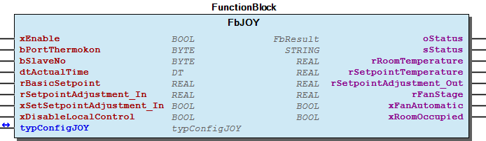 Graphical Interface of FbJOY Function description Function Block for the communication between one JOY-Slave and the WAGO controller. For each JOY-Slave one of those Function Block is needed. Open the JOY menue by pressing the upper and lower button on the device for more than 3 seconds. Please change the baudrate of the JOY device to 9600 and wait 2 minutes, the JOY device will restart. A continuous TRUE signal at the xEnable input activates the readout process, and a FALSE signal deactivates it. bPortThermokon must be connect to bPortThermokon of the Master function block. The device address is specified at the bSlaveNo input. By assigning different addresses, you can address multiple devices via one serial I/O module. This input is assigned 1 by default. dtActualTime is used for displaying the date and time on the JOY device. The actual time of the controller can be read out by using the library SysLibRTC. Input rBasicSetpoint forms the setpoint basis for rSetpointTemperature . If the input xSetSetpointAdjustment_In are TRUE, the setpoint value rSetpointAdjustment_In will override the setpoint values rSetpointAdjustment_Out . For example to reset the setpoint to a basic setting. The local operation can be deactivated via``xDisableLocalControl``. To identify an error, the current error code is displayed at the output sStatus . The actual measured room temperature will be outputted on rRoomTemperature . The current setpoint temperature is output on rSetpointTemperature and the temperature adjustement on rSetpointAdjustment_Out . rFanStage outputs in steps (typJOY.rStepsFanControl ) the actual fan stage 0-100% and -256= Automatic, the values depends on the settings typJOY.rFanMinimum and typJOY.rFanMaximum. xFanAutomatic is TRUE if fan stage is in automatic mode. xRoomOccupied indicate if room is occupied by the On/Off Button.

## FbJOYextended (FB)

| Scope | Name | Type | Initial | Comment |
| --- | --- | --- | --- | --- |
| Input | xEnable | BOOL | TRUE | Set it TRUE to enable cyclic communication with the JOY. |
| bPortThermokon | BYTE | 1 | Port number of the Master - Connection to the Master |
| bSlaveNo | BYTE |  | Slave address (see DIP switch) of the JOY device. |
| Inout | typJOY_extended | typJOYextended |  | Configuration Parameters, see JOY manual |
| Output | oStatus | WagoAppPlcModbus.WagoSysErrorBase.FbResult |  | Status object. The content of the error object could be displayed via the FbShowResult from the WagoSysErrorBase library. |
| sStatus | STRING |  | Status description as string |
| typJOY_OUT | typJOY_OUT |  | Output values of the JOY device |

Function block to communicate with a Thermokon JOY device. Please change baudrate of the JOY device to 9600.

Graphical Illustration

Graphical Interface of FbJOYextended

Function description

Function Block for the communication between one JOY-Slave and the WAGO controller. For each JOY-Slave one of those Function Block is needed. Please change baudrate of the JOY device to 9600.

Interface variables Function Function block to communicate with a Thermokon JOY device. Please change baudrate of the JOY device to 9600. Graphical Illustration 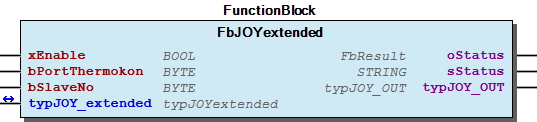 Graphical Interface of FbJOYextended Function description Function Block for the communication between one JOY-Slave and the WAGO controller. For each JOY-Slave one of those Function Block is needed. Please change baudrate of the JOY device to 9600.

## FbNovos3 (FB)

| Scope | Name | Type | Initial | Comment |
| --- | --- | --- | --- | --- |
| Input | xEnable | BOOL | TRUE | TRUE will start cyclic communication with the NOVOS. |
| bPortThermokon | BYTE | 1 | Port number of the Master - Connection to the Master. |
| bSlaveNo | BYTE | 1 | Slave address of the NOVOS device (see NOVOS settings menu). |
| xLED | BOOL |  | True will activate the LED of the slave if xUseLEDforRoomOccupancy is false. |
| eLED_Color | eLED_Color | 4 | Color of the LED, see Enumeration eLED_Color . |
| xUseLEDforRoomOccupancy | BOOL | TRUE | True will activate the LED if Room is occupied by the local Button. True will deactivate the functionality to set the LED with xLED . |
| xRoomOccupancy_In | BOOL |  | Occupancy of the room to set or overwrite it on the slave by triggering xSetRoomOccupancy_In . |
| xSetRoomOccupancy_In | BOOL |  | Positive edge will send the status of xRoomOccupancy_In to the slave. |
| Output | oStatus | WagoAppPlcModbus.WagoSysErrorBase.FbResult |  | Status object. The content of the error object could be displayed via the FbShowResult from the WagoSysErrorBase library. |
| sStatus | STRING |  | Status description as string. |
| rRoomTemperature | REAL |  | Actual room temperature. |
| rSetpointTemperature | REAL |  | Actual setpoint for temperature. |
| xRoomOccupied | BOOL |  | Room occupancy, TRUE= Room occupied. |
| rRelHumidity | REAL |  | Actual room humidity. |
| xDI | BOOL |  | Status of the digital input on the NOVOS slave. TRUE= On. |
| typSensor | typSensor |  | Sensor values of the NOVOS slave ( CO2, VOC, etc.). |
| xSensorFailure | BOOL |  | Sensor failure detected. |

Function block to communicate with a Thermokon Novos 3 slave.

Graphical Illustration

Graphical Interface of FbNovos3

Function description

Function block for the communication between one Novos 3 and the WAGO controller. For each NOVOS-Slave one of those Function block is needed.

Please change the baudrate of the slaves to 9600 baud or set the globale variable WagoSolThermokon.Globale_Variablen.udiBaudrate to the baudrate of the slave.

Baudrate can be changed with the DIP-switches 7/8 on the Novos slave.

It is recommended to set termination and bias resistors!

The function block will need 350ms to read out the slave with a baud rate of 9600 (750-652 (24 byte)).

The reading takes 275ms with a baud rate of 38400 (750-652 (24 byte)).

Interface variables Function Function block to communicate with a Thermokon Novos 3 slave. Graphical Illustration 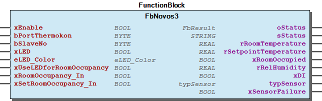 Graphical Interface of FbNovos3 Function description Function block for the communication between one Novos 3 and the WAGO controller. For each NOVOS-Slave one of those Function block is needed. Please change the baudrate of the slaves to 9600 baud or set the globale variable WagoSolThermokon.Globale_Variablen.udiBaudrate to the baudrate of the slave. Baudrate can be changed with the DIP-switches 7/8 on the Novos slave. Note It is recommended to set termination and bias resistors! The function block will need 350ms to read out the slave with a baud rate of 9600 (750-652 (24 byte)). The reading takes 275ms with a baud rate of 38400 (750-652 (24 byte)).

## FbNovos3_5_Config (FB)

| Scope | Name | Type | Initial | Comment |
| --- | --- | --- | --- | --- |
| Input | xEnable | BOOL | TRUE | Set it TRUE to enable configuration function block. |
| bPortThermokon | BYTE | 1 | Port number of the Master - Connection to the Master |
| Output | oStatus | WagoAppPlcModbus.WagoSysErrorBase.FbResult |  | Status object. The content of the error object could be displayed via the FbShowResult from the WagoSysErrorBase library. |
| sStatus | STRING |  | Status description as string |

Function block to configurate Thermokon Novos 5 and Novos 3 slaves by the Visualization “VisuNovos3_5_Config”.

Graphical Illustration

Graphical Interface of FbNovos3_5_Config

Function description

Function block to configurate Novos 5 and Novos 3 slaves. This function block only works with the “VisuNovos3_5_Config” visualization. Only one config function block is needed for all Novos 5 and Novos 3 slaves on a serial interface.

Please change the baudrate of the slaves to 9600 baud or set the globale variable WagoSolThermokon.Globale_Variablen.udiBaudrate to the baudrate of the slave.

Baudrate can be changed with the DIP-switches 7/8.

It is recommended to set termination and bias resistors!

Visualization:

Add the visualization VisuNovos3_5_Config to your project to configure all Novos 5 and Novos 3 slaves on the serial line.

Interface variables Function Function block to configurate Thermokon Novos 5 and Novos 3 slaves by the Visualization “VisuNovos3_5_Config”. Graphical Illustration 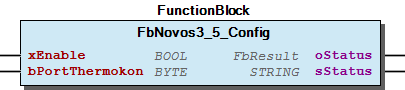 Graphical Interface of FbNovos3_5_Config Function description Function block to configurate Novos 5 and Novos 3 slaves. This function block only works with the “VisuNovos3_5_Config” visualization. Only one config function block is needed for all Novos 5 and Novos 3 slaves on a serial interface. Please change the baudrate of the slaves to 9600 baud or set the globale variable WagoSolThermokon.Globale_Variablen.udiBaudrate to the baudrate of the slave. Baudrate can be changed with the DIP-switches 7/8. Note It is recommended to set termination and bias resistors! Visualization: Add the visualization VisuNovos3_5_Config to your project to configure all Novos 5 and Novos 3 slaves on the serial line. 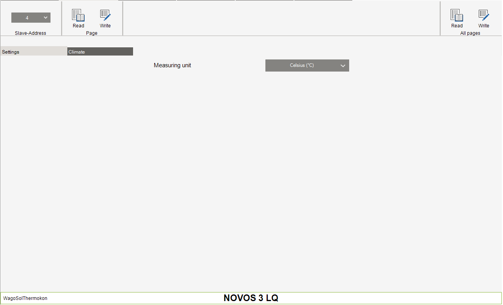

## FbNovos5 (FB)

| Scope | Name | Type | Initial | Comment | Inherited from |
| --- | --- | --- | --- | --- | --- |
| Input | xEnable | BOOL | TRUE | TRUE will start cyclic communication with the NOVOS. | FbNovos3 |
| bPortThermokon | BYTE | 1 | Port number of the Master - Connection to the Master. | FbNovos3 |
| bSlaveNo | BYTE | 1 | Slave address of the NOVOS device (see NOVOS settings menu). | FbNovos3 |
| xLED | BOOL |  | True will activate the LED of the slave if xUseLEDforRoomOccupancy is false. | FbNovos3 |
| eLED_Color | eLED_Color | 4 | Color of the LED, see Enumeration eLED_Color . | FbNovos3 |
| xUseLEDforRoomOccupancy | BOOL | TRUE | True will activate the LED if Room is occupied by the local Button. True will deactivate the functionality to set the LED with xLED . | FbNovos3 |
| xRoomOccupancy_In | BOOL |  | Occupancy of the room to set or overwrite it on the slave by triggering xSetRoomOccupancy_In . | FbNovos3 |
| xSetRoomOccupancy_In | BOOL |  | Positive edge will send the status of xRoomOccupancy_In to the slave. | FbNovos3 |
| Output | oStatus | WagoAppPlcModbus.WagoSysErrorBase.FbResult |  | Status object. The content of the error object could be displayed via the FbShowResult from the WagoSysErrorBase library. | FbNovos3 |
| sStatus | STRING |  | Status description as string. | FbNovos3 |
| rRoomTemperature | REAL |  | Actual room temperature. | FbNovos3 |
| rSetpointTemperature | REAL |  | Actual setpoint for temperature. | FbNovos3 |
| xRoomOccupied | BOOL |  | Room occupancy, TRUE= Room occupied. | FbNovos3 |
| rRelHumidity | REAL |  | Actual room humidity. | FbNovos3 |
| xDI | BOOL |  | Status of the digital input on the NOVOS slave. TRUE= On. | FbNovos3 |
| typSensor | typSensor |  | Sensor values of the NOVOS slave ( CO2, VOC, etc.). | FbNovos3 |
| xSensorFailure | BOOL |  | Sensor failure detected. | FbNovos3 |
| Input | typShowSymbols | typShowSymbolsNovos5 |  | Status system information to display on the NOVOS module. |  |
| Output | rFanStage | REAL |  | Actual fan stage. |  |
| xFanAutomatic | BOOL |  | TRUE= Fan is in Automatic mode. |  |

Function block to communicate with a Thermokon Novos 5 slave.

Graphical Illustration

Graphical Interface of FbNovos5

Function description

Function block for the communication between one Novos 5 and the WAGO controller. For each NOVOS-Slave one of those Function block is needed.

Please change the baudrate of the slaves to 9600 baud or set the globale variable WagoSolThermokon.Globale_Variablen.udiBaudrate to the baudrate of the slave.

Baudrate can be changed with the DIP-switches 7/8 on the Novos slave.

It is recommended to set termination and bias resistors!

The function block will need 350ms to read out the slave with a baud rate of 9600 (750-652 (24 byte)).

The reading takes 275ms with a baud rate of 38400 (750-652 (24 byte)).

Interface variables Function Function block to communicate with a Thermokon Novos 5 slave. Graphical Illustration 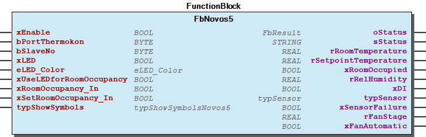 Graphical Interface of FbNovos5 Function description Function block for the communication between one Novos 5 and the WAGO controller. For each NOVOS-Slave one of those Function block is needed. Please change the baudrate of the slaves to 9600 baud or set the globale variable WagoSolThermokon.Globale_Variablen.udiBaudrate to the baudrate of the slave. Baudrate can be changed with the DIP-switches 7/8 on the Novos slave. Note It is recommended to set termination and bias resistors! The function block will need 350ms to read out the slave with a baud rate of 9600 (750-652 (24 byte)). The reading takes 275ms with a baud rate of 38400 (750-652 (24 byte)).

## FbNovos7_TouchEVO (FB)

| Scope | Name | Type | Initial | Comment |
| --- | --- | --- | --- | --- |
| Input | xEnable | BOOL | TRUE | TRUE will start cyclic communication with the NOVOS. |
| bPortThermokon | BYTE | 1 | Port number of the Master - Connection to the Master. |
| bSlaveNo | BYTE | 1 | Slave address of the NOVOS device (see NOVOS settings menu). |
| dtActualTime | DT |  | Actual date and time to display on NOVOS. |
| stHomescreenMessage | STRING(24) |  | Possibility to send a text message to the NOVOS home screen. |
| typShowSymbols | typShowSymbols |  | Status system information to display on the NOVOS module. |
| Inout | typOverride | typOverride |  | Input to overwrite the local settings of Setpoint temp, occupancy, Lights/Blinds/Scenes, ECO-function, Fan stage, etc.. |
| Output | oStatus | WagoAppPlcModbus.WagoSysErrorBase.FbResult |  | Status object. The content of the error object could be displayed via the FbShowResult from the WagoSysErrorBase library. |
| sStatus | STRING |  | Status description as string |
| typLightSlider | typLightNovos |  | Actual slider status for the lights. Slider or button control can be configured by FbNovos7_TouchEVO_Config , see Switch setting on page Lights. |
| typLightButton | typButtonNovos |  | Actual button status for the lights. Slider or button control can be configured by FbNovos7_TouchEVO_Config , see Switch setting on page Lights. |
| typBlindSlider | typBlindNovos |  | Actual slider status for the blinds. Slider or button control can be configured by FbNovos7_TouchEVO_Config , see Switch setting on page Blinds. |
| typBlindButton | typButtonNovos |  | Actual button status for the blinds. Slider or button control can be configured by FbNovos7_TouchEVO_Config , see Switch setting on page Blinds. |
| typSceneStatus | typSceneNovos |  | Actual status of the scenes on NOVOS. |
| rRoomTemperature | REAL |  | Actual room temperature. |
| rSetpointTemperature | REAL |  | Actual setpoint for temperature. |
| rFanStage | REAL |  | Actual fan stage. |
| xFanAutomatic | BOOL |  | TRUE= Fan is in Automatic mode. |
| xRoomOccupied | BOOL |  | Room occupancy, TRUE= Room occupied. |
| xECO_Mode | BOOL |  | TRUE= ECO mode is active. |
| rRelHumidity | REAL |  | Actual room humidity. |
| xDI | BOOL |  | Status of the digital input on the NOVOS slave. TRUE= On. |
| typSensor | typSensor |  | Sensor values of the NOVOS slave ( CO2, VOC, etc.). |
| xSensorFailure | BOOL |  | Sensor failure detected. |

Function block to communicate with a Thermokon Novos 7/ Novos Touch or Thanos EVO module.

Graphical Illustration

Graphical Interface of FbNovos7_TouchEVO

Function description

Function block for the communication between one NOVOS-Slave and the WAGO controller. For each NOVOS-Slave one of those Function block is needed.

Please change the baudrate of the slaves to 9600 baud or set the globale variable WagoSolThermokon.Globale_Variablen.udiBaudrate to the baudrate of the slave.

Baudrate can be changed in the settings menu of the NOVOS device, the standard-PIN is 2030 .

The Output typLightButton can be used to connect other function blocks like DALI or SMI function blocks.

It is recommended to set termination and bias resistors!

The function block will need 350ms to read out the slave with a baud rate of 9600 (750-652 (24 byte)).

The reading takes 275ms with a baud rate of 38400 (750-652 (24 byte)).

Interface variables Function Function block to communicate with a Thermokon Novos 7/ Novos Touch or Thanos EVO module. Graphical Illustration 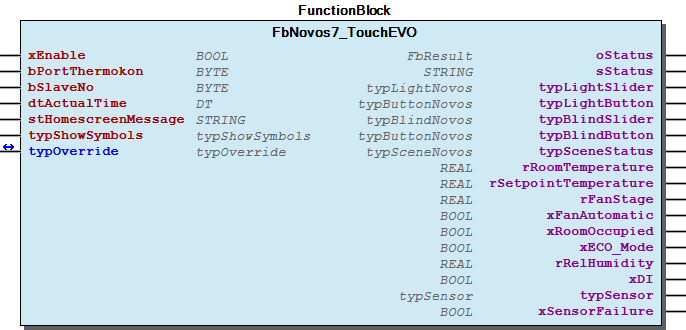 Graphical Interface of FbNovos7_TouchEVO Function description Function block for the communication between one NOVOS-Slave and the WAGO controller. For each NOVOS-Slave one of those Function block is needed. Please change the baudrate of the slaves to 9600 baud or set the globale variable WagoSolThermokon.Globale_Variablen.udiBaudrate to the baudrate of the slave. Baudrate can be changed in the settings menu of the NOVOS device, the standard-PIN is 2030 . The Output typLightButton can be used to connect other function blocks like DALI or SMI function blocks. Note It is recommended to set termination and bias resistors! The function block will need 350ms to read out the slave with a baud rate of 9600 (750-652 (24 byte)). The reading takes 275ms with a baud rate of 38400 (750-652 (24 byte)).

## FbNovos7_TouchEVO_Config (FB)

| Scope | Name | Type | Initial | Comment |
| --- | --- | --- | --- | --- |
| Input | xEnable | BOOL | TRUE | Set it TRUE to enable configuration function block. |
| bPortThermokon | BYTE | 1 | Port number of the Master - Connection to the Master. |
| Output | oStatus | WagoAppPlcModbus.WagoSysErrorBase.FbResult |  | Status object. The content of the error object could be displayed via the FbShowResult from the WagoSysErrorBase library. |
| sStatus | STRING |  | Status description as string. |

Function block to configurate Thermokon Novos 7/ Novos Touch or Thanos EVO slaves by the visualization VisuNovos7_TouchEVO_Config .

Graphical Illustration

Graphical Interface of FbNovos7_TouchEVO_Config

Function description

Function block to configurate Novos 7/ Novos Touch and Thanos EVO slaves.

This function block only works with the visualization VisuNovos7_TouchEVO_Config . Only one config function block is needed for all Novos7/ Novos Touch and Thanos EVO slaves on a serial interface.

Please change the baudrate of the slaves to 9600 baud or set the globale variable WagoSolThermokon.Globale_Variablen.udiBaudrate to the baudrate of the slave.

Baudrate can be changed in the settings menu of the NOVOS device, the standard-PIN is 2030 .

It is recommended to set termination and bias resistors!

Visualization:

Add the visualization VisuNovos7_TouchEVO_Config to your project to configure all Novos 7/ Novos Touch and Thanos EVO slaves on the serial line.

Interface variables Function Function block to configurate Thermokon Novos 7/ Novos Touch or Thanos EVO slaves by the visualization VisuNovos7_TouchEVO_Config . Graphical Illustration 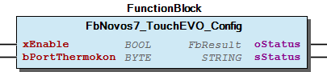 Graphical Interface of FbNovos7_TouchEVO_Config Function description Function block to configurate Novos 7/ Novos Touch and Thanos EVO slaves. This function block only works with the visualization VisuNovos7_TouchEVO_Config . Only one config function block is needed for all Novos7/ Novos Touch and Thanos EVO slaves on a serial interface. Please change the baudrate of the slaves to 9600 baud or set the globale variable WagoSolThermokon.Globale_Variablen.udiBaudrate to the baudrate of the slave. Baudrate can be changed in the settings menu of the NOVOS device, the standard-PIN is 2030 . Note It is recommended to set termination and bias resistors! Visualization: Add the visualization VisuNovos7_TouchEVO_Config to your project to configure all Novos 7/ Novos Touch and Thanos EVO slaves on the serial line. 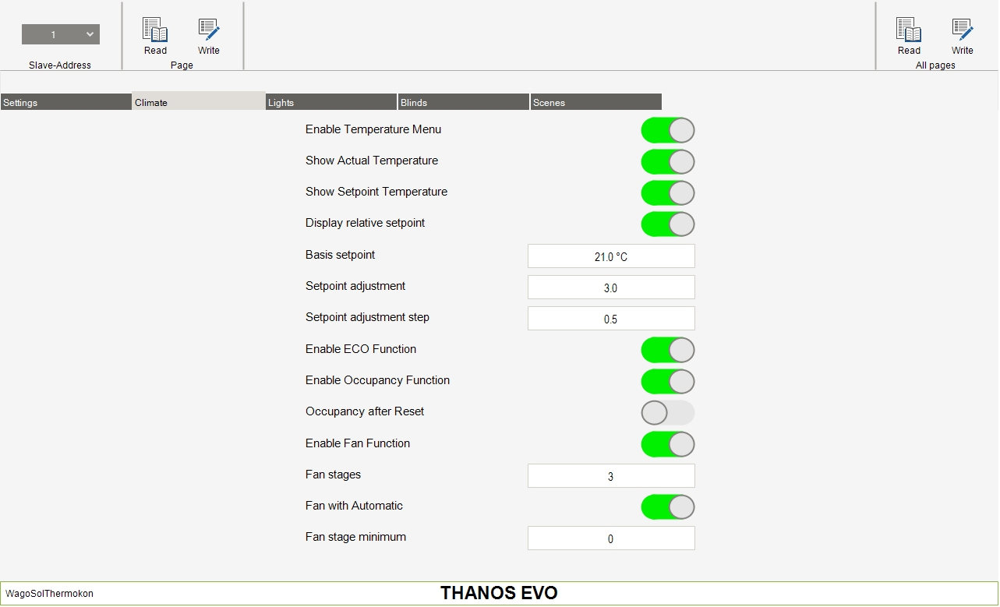

## FbShortLongButtonBlind (FB)

| Scope | Name | Type |
| --- | --- | --- |
| Input | rValueIn | REAL |
| Output | rValueOut | REAL |
| xButtonUP | BOOL |
| xButtonDOWN | BOOL |

## FbShortLongButtonLight (FB)

| Scope | Name | Type |
| --- | --- | --- |
| Input | rValueIn | REAL |
| xLightButton | BOOL |
| Output | rValueOut | REAL |
| xButtonUP | BOOL |
| xButtonDOWN | BOOL |

## FbThanos (FB)

| Scope | Name | Type | Initial | Comment |
| --- | --- | --- | --- | --- |
| Input | xEnable | BOOL | TRUE | TRUE to enable communication with the WRF06 device |
| bPortThermokon | BYTE | 1 | Number of the Master - Connection to the Master |
| bSlaveNo | BYTE | 1 | Modbus slave number |
| dtActualTime | DT |  | Actual Time for the time synchronisation |
| Output | oStatus | WagoAppPlcModbus.WagoSysErrorBase.FbResult |  | Status object. The content of the error object could be displayed via the FbShowResult from the WagoSysErrorBase library. |
| sStatus | STRING |  | Status description as string |
| typValueThanos | typValueThanos |  | Read data and values of the Thanos module |
| Inout | typConfigParameters | typConfigThanos |  | Configuration parameters |

The FbThanos function block is used to read the current values of a room operating panel. In addition, this function block can be used to change the values of the input register.

Graphical Illustration

Function description

The xEnable input enables the function block. bPortThermokon must be connect to bPortThermokon of the Master function block. The bSlaveNo input specifies the MODBUS address of the Thanos room operating panel. The typConfigParameters.wRefreshInput input can be used to write the values at the respective inputs to the input register of the room operating panel. typConfigParameters.xRefreshInputBits triggers the transfer of values at the typConfigParameters.typThanosInputBits input. After successful transfer of the input values, the respective statuses of typConfigParameters.wRefreshInput and typConfigParameters.wRefreshInput are again reset. The sStatus output displays the communication error that has occurred. The status of the room operating panel can be evaluated via the outputs available at the function block.

Interface variables Function The FbThanos function block is used to read the current values of a room operating panel. In addition, this function block can be used to change the values of the input register. Graphical Illustration 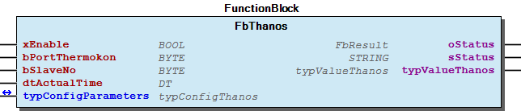 Function description The xEnable input enables the function block. bPortThermokon must be connect to bPortThermokon of the Master function block. The bSlaveNo input specifies the MODBUS address of the Thanos room operating panel. The typConfigParameters.wRefreshInput input can be used to write the values at the respective inputs to the input register of the room operating panel. typConfigParameters.xRefreshInputBits triggers the transfer of values at the typConfigParameters.typThanosInputBits input. After successful transfer of the input values, the respective statuses of typConfigParameters.wRefreshInput and typConfigParameters.wRefreshInput are again reset. The sStatus output displays the communication error that has occurred. The status of the room operating panel can be evaluated via the outputs available at the function block. - Configuration of the output values for the digital outputs is important for interpretation of the signals. - Not all outputs of the room operating panel except the buttons and digital inputs if necessary are read in each program cycle. - The input values are only transferred when requested (see typConfigParameters.wRefreshInput and typConfigParameters.xRefreshInputBits inputs). - FbThanos.EvaluateSend (ACT) - FbThanos.ModbusCommandRead (ACT) - FbThanos.ModbusCommandWrite (ACT) - FbThanos.ReadPackage1 (ACT) - FbThanos.ReadPackage2 (ACT) - FbThanos.ReadPackage3 (ACT)

## FbThanosModbusData (FB)

| Scope | Name | Type | Comment |
| --- | --- | --- | --- |
| Input | xEnable | BOOL | TRUE to enable communication with the WRF06 device |
| bPortThermokon | BYTE | Number of the Master - Connection to the Master |
| Output | oStatus | WagoAppPlcModbus.WagoSysErrorBase.FbResult | Status object. The content of the error object could be displayed via the FbShowResult from the WagoSysErrorBase library. |
| sStatus | STRING | Status description as string |

The FbThanosModbusData function block is used to send user-specific MODBUS commands to the Thanos room operating panel. It can be used to make changes in or to read the registers of the room operating panels specifically. The ModbusDataThanos visualization interface is used to control communication with the room operating panels.

Graphical Illustration

Function description

Function Block for send User Modbus data, only one of these FB is needed. The ModbusDataThanos visualization can be used to transfer MODBUS commands to the room operating panel.

Interface variables Function The FbThanosModbusData function block is used to send user-specific MODBUS commands to the Thanos room operating panel. It can be used to make changes in or to read the registers of the room operating panels specifically. The ModbusDataThanos visualization interface is used to control communication with the room operating panels. Graphical Illustration 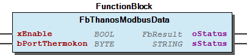 Function description Function Block for send User Modbus data, only one of these FB is needed. The ModbusDataThanos visualization can be used to transfer MODBUS commands to the room operating panel.

## FbThermokonMaster (FB)

| Scope | Name | Type | Initial | Comment |
| --- | --- | --- | --- | --- |
| Input | I_Port | WagoTypesCom.I_WagoSysComBase |  | Name of the serial Interface (e.g. ‘COM2’, ‘SER7.2’, ) |
| bPortThermokon | BYTE | 1 | Master assignment number for other function blocks. Range 1 to MAX_MASTER. |
| Output | oStatus | WagoAppPlcModbus.WagoSysErrorBase.FbResult |  | Status object. The content of the error object could be displayed via the FbShowResult from the WagoSysErrorBase library. |
| sStatus | STRING |  | Status description as string |

Master function block for all Thermokon slave function blocks and modules.

Graphical Illustration

Function description

Thermokon Modbus Master for the Modbus communication between the WAGO-Controller and the Thermokon slaves via a RS-485 serial interface module. Only one of these Function block is needed for each modbus line.

I_Port must be connected with the serial interface for example: IoConfig_Globals.RS232_485_Interface bPortThermokon must be connect to the other function blocks.

Default physical layer= RS485_HalfDuplex, Baud rate: 9600. Changeable with the globale variable “WagoSolThermokon.Globale_Variablen.udiBaudrate”.

Interface variables Function Master function block for all Thermokon slave function blocks and modules. Graphical Illustration 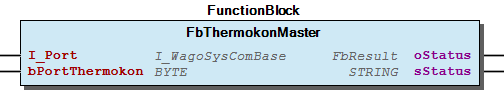 Function description Thermokon Modbus Master for the Modbus communication between the WAGO-Controller and the Thermokon slaves via a RS-485 serial interface module. Only one of these Function block is needed for each modbus line. I_Port must be connected with the serial interface for example: IoConfig_Globals.RS232_485_Interface bPortThermokon must be connect to the other function blocks. Note Default physical layer= RS485_HalfDuplex, Baud rate: 9600. Changeable with the globale variable “WagoSolThermokon.Globale_Variablen.udiBaudrate”. - FbThermokonMaster.Open (PROP)

## FbWRF04 (FB)

| Scope | Name | Type | Initial | Comment |
| --- | --- | --- | --- | --- |
| Input | xEnable | BOOL | TRUE | Enable signal to start cyclic read out sensor |
| bPortThermokon | BYTE | 1 | Port number of the Master - Connection to the Master |
| bSlaveNo | BYTE | 1 | Slave address of the sensor |
| tCycleTime | TIME |  | Cycle time for read out the sensor, use slower times if you have many ROUs/Fbs |
| xLED | BOOL |  | Set LED on the WRF-Slave |
| typConfigParameters | typConfigWRF04 |  | Configuration parameters |
| Output | oStatus | WagoAppPlcModbus.WagoSysErrorBase.FbResult |  | Status object. The content of the error object could be displayed via the FbShowResult from the WagoSysErrorBase library. |
| sStatus | STRING |  | Status description as string |
| xPresence | BOOL |  | Presence button pressed |
| rRoomTemperature | REAL |  | Actual room temperature |
| rSetpointCorrection | REAL |  | Setpoint correction of the potentiometer |
| typFanLevel | typFanLevel |  | Fan Level |

The FbWRF04 function block is used to output the current values of a room operating panel. In addition, this function block can be used to change the values of the input register.

Graphical Illustration

Function description

Function Block for the communication between one WRF04-Slave and the WAGO controller. For each WRF04-Slave one of those Function Block is needed.

A permanent TRUE signal at the input xEnable enables the output process and a FALSE signal disables it. If the input is not enabled, the output process starts automatically. bPortThermokon must be connect to bPortThermokon of the Master function block. The device address is specified at the input bSlaveNo. By assigning different addresses, multiple devices can be addressed via one serial I/O module. This input is assigned with 1 by default. The minimum interval time to be maintained for outputs is determined at the input tCycleTime. The actual time between the outputs can be greater depending on the number of instantiated output modules on one Modbus® line. As default, no time is set; this ensures operation is as fast as possible. The respective WRF04 can be individually configured with the input structure typConfigParameters. The configuration values are saved in the WRF EEPROM. Cyclic writing of these values can destroy the room operating panel.

The sStatus output displays the communication error that has occurred. As soon as the presence button on the WRF is pressed, the output xPresence is switched on for the time TRUE set in typConfigWRF04.tPresenceTime. Whether pressing the button again will restart the presence time can be selected through typConfigParameters.xRetriggerPresence.

The room temperature rRoomTemperature and the set setpoint correction rSetpointCorrection can be read out from the outputs on the module. If the WRF04 has a potentiometer for the fan stage, the currently set fan stage can be taken from the output structure typFanLevel.

Interface variables Function The FbWRF04 function block is used to output the current values of a room operating panel. In addition, this function block can be used to change the values of the input register. Graphical Illustration 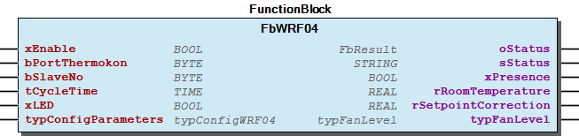 Function description Function Block for the communication between one WRF04-Slave and the WAGO controller. For each WRF04-Slave one of those Function Block is needed. A permanent TRUE signal at the input xEnable enables the output process and a FALSE signal disables it. If the input is not enabled, the output process starts automatically. bPortThermokon must be connect to bPortThermokon of the Master function block. The device address is specified at the input bSlaveNo. By assigning different addresses, multiple devices can be addressed via one serial I/O module. This input is assigned with 1 by default. The minimum interval time to be maintained for outputs is determined at the input tCycleTime. The actual time between the outputs can be greater depending on the number of instantiated output modules on one Modbus® line. As default, no time is set; this ensures operation is as fast as possible. The respective WRF04 can be individually configured with the input structure typConfigParameters. The configuration values are saved in the WRF EEPROM. Cyclic writing of these values can destroy the room operating panel. The sStatus output displays the communication error that has occurred. As soon as the presence button on the WRF is pressed, the output xPresence is switched on for the time TRUE set in typConfigWRF04.tPresenceTime. Whether pressing the button again will restart the presence time can be selected through typConfigParameters.xRetriggerPresence. The room temperature rRoomTemperature and the set setpoint correction rSetpointCorrection can be read out from the outputs on the module. If the WRF04 has a potentiometer for the fan stage, the currently set fan stage can be taken from the output structure typFanLevel.

## FbWRF04extended (FB)

| Scope | Name | Type | Initial | Comment |
| --- | --- | --- | --- | --- |
| Input | xEnable | BOOL | TRUE | Enable signal to start cyclic read out sensor |
| bPortThermokon | BYTE | 1 | Port number of the Master - Connection to the Master |
| bSlaveNo | BYTE | 1 | Slave address of the sensor |
| tCycleTime | TIME | TIME#1s0ms | Cycle time for read out the sensor |
| xLED | BOOL |  |  |
| Inout | typConfigParameters | typWRF04 |  | Configuration parameters |
| Output | oStatus | WagoAppPlcModbus.WagoSysErrorBase.FbResult |  | Status object. The content of the error object could be displayed via the FbShowResult from the WagoSysErrorBase library. |
| sStatus | STRING |  | Status description as string |
| xButton | BOOL |  | Button pressed |
| rRoomTemperature | REAL |  | rSetpointCorrection |
| rSetpointCorrection | REAL |  | Setpoint correction of the potentiometer |
| rHumidity | REAL |  | Room humidity |
| typFanLevel | typFanLevel |  | Fan Level |

Function block to communicate with a Thermokon WRF04 module.

Graphical Illustration

Function description

Function Block for the communication between one WRF04-Slave and the WAGO controller. For each WRF04-Slave one of those function block is needed.

Interface variables Function Function block to communicate with a Thermokon WRF04 module. Graphical Illustration 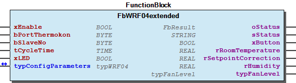 Function description Function Block for the communication between one WRF04-Slave and the WAGO controller. For each WRF04-Slave one of those function block is needed.

## FbWRF06 (FB)

| Scope | Name | Type | Initial | Comment |
| --- | --- | --- | --- | --- |
| Input | xEnable | BOOL | TRUE | TRUE to enable communication with the WRF06 device |
| bPortThermokon | BYTE | 1 | Number of the Master - Connection to the Master |
| eDeviceType | eDeviceType |  | Input for the WRF06 device type for example: eDeviceType.typ_D02R |
| bSlaveNo | BYTE | 1 | Modbus slave number |
| tCycleTime | TIME |  | Cycle time for read out the sensor, use slower times if you have many ROUs/Fbs |
| tUpdateClock | TIME | TIME#0ms | Time for the clock synchronisation |
| dtActualTime | DT |  | Time on the WAGO controller |
| typConfigParameters | typInputWRF06 |  | Input struct for the WRF06 input awWriteData |
| Output | oStatus | WagoAppPlcModbus.WagoSysErrorBase.FbResult |  | Status object. The content of the error object could be displayed via the FbShowResult from the WagoSysErrorBase library. |
| sStatus | STRING |  | Status description as string |
| typValueWRF06 | typValueWRF06 |  | Output struct with the WRF06 device awWriteData |
| Inout | bRefresh | BYTE |  | Refresh Byte to refresh the different packages of typConfigParameters . The diff. packages are discribed in ‘typInputWRF06’. For example: 2#00000001= Refresh Package 1, 2#00000010= Refresh Package 2 |

The FbWRF06 is used to read the current values of a room operating unit. In addition, this function block can be used to change the values of the input register.

Graphical Illustration

Function description

Function Block to communicate with a WRF06-Slave module. For each WRF06-Slave one of those funktion block is needed.

The xEnable input enables cyclic reading of the values and writing of the parameters. The eDeviceType input specifies the device type. The bSlaveNo input specifies the address of the WRF06 room operating unit. When a value is changed at the typConfigParameters input or if the input value of bRefresh > 2#00000000, the function block sends the values at the typConfigParameters input to the room operating unit. The tUpdateClock input specifies the interval for synchronizing the time. The time is specified at the dtActualTime input, with which the room operating unit should be synchronized. The time is not synchronized if the update time is t#0s. The sStatus output displays the communication error that has occurred. The output values of the room operating unit are displayed in the form of a data structure at the typValueWRF06 output.

Configuration of of the output values for the digital outputs is important for interpretation of the signals (see WRF06 Configuration Interface (ConfigWRF06)).

The type of room operating unit must be set at the enumDeviceType input. Otherwise, the evaluation if necessary cannot be carried out correctly. The supported device types or input assignments are: typ_2V, typ_DI4, typ_AO2V, typ_DO2R, typ_DO2T, typ_OVR, typ_OVT, typ_2VPS, typ_AOV, typ_AOFV, typ_VSS, typ_VNS, typ_AOK.

Interface variables Function The FbWRF06 is used to read the current values of a room operating unit. In addition, this function block can be used to change the values of the input register. Graphical Illustration 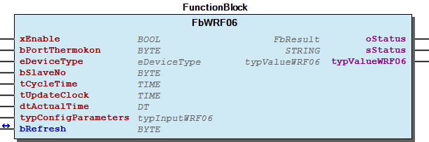 Function description Function Block to communicate with a WRF06-Slave module. For each WRF06-Slave one of those funktion block is needed. The xEnable input enables cyclic reading of the values and writing of the parameters. The eDeviceType input specifies the device type. The bSlaveNo input specifies the address of the WRF06 room operating unit. When a value is changed at the typConfigParameters input or if the input value of bRefresh > 2#00000000, the function block sends the values at the typConfigParameters input to the room operating unit. The tUpdateClock input specifies the interval for synchronizing the time. The time is specified at the dtActualTime input, with which the room operating unit should be synchronized. The time is not synchronized if the update time is t#0s. The sStatus output displays the communication error that has occurred. The output values of the room operating unit are displayed in the form of a data structure at the typValueWRF06 output. Note Configuration of of the output values for the digital outputs is important for interpretation of the signals (see WRF06 Configuration Interface (ConfigWRF06)). Note The type of room operating unit must be set at the enumDeviceType input. Otherwise, the evaluation if necessary cannot be carried out correctly. The supported device types or input assignments are: typ_2V, typ_DI4, typ_AO2V, typ_DO2R, typ_DO2T, typ_OVR, typ_OVT, typ_2VPS, typ_AOV, typ_AOFV, typ_VSS, typ_VNS, typ_AOK. - FbWRF06.CheckCOV (ACT)

## FbWRF06Config (FB)

| Scope | Name | Type | Comment |
| --- | --- | --- | --- |
| Input | xEnable | BOOL | TRUE to enable Communication with the WRF06 device |
| bPortThermokon | BYTE | Number of the Master - Connection to the Master |
| Output | oStatus | WagoAppPlcModbus.WagoSysErrorBase.FbResult | Status object. The content of the error object could be displayed via the FbShowResult from the WagoSysErrorBase library. |
| sStatus | STRING | Status description as string |

Function block to configurate the WRF06 modules by the Visualisation “ConfigWRF06”. The FbWRF06Config function block is used to configure the WRF06 multifunction room operating units (WRF06LCD RS485 Modbus). The room operating units can only be configured in conjunction with the ConfigWRF06 visualization interface contained in the library.

Graphical Illustration

Function description

Function Block for the configuration of your WRF06 slaves. This function block only works with the “ConfigWRF06”. Only one config function block is needed for all WRF06 Slaves.

Interface variables Function Function block to configurate the WRF06 modules by the Visualisation “ConfigWRF06”. The FbWRF06Config function block is used to configure the WRF06 multifunction room operating units (WRF06LCD RS485 Modbus). The room operating units can only be configured in conjunction with the ConfigWRF06 visualization interface contained in the library. Graphical Illustration 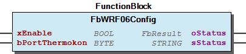 Function description Function Block for the configuration of your WRF06 slaves. This function block only works with the “ConfigWRF06”. Only one config function block is needed for all WRF06 Slaves. - FbWRF06Config.GetAdress (ACT)

## FbWRF07 (FB)

| Scope | Name | Type | Initial | Comment |
| --- | --- | --- | --- | --- |
| Input | xEnable | BOOL | TRUE | Enable signal to start cyclic read out sensor |
| bPortThermokon | BYTE | 1 | Port number of the Master - Connection to the Master |
| bSlaveNo | BYTE | 1 | Slave address of the sensor |
| tCycleTime | TIME |  | Cycle time for read out the sensor, use slower times if you have many ROUs/Fbs |
| xLED | BOOL |  | Set LED on the WRF-Slave |
| typConfigParameters | typConfigWRF07 |  | Configuration parameters |
| Output | oStatus | WagoAppPlcModbus.WagoSysErrorBase.FbResult |  | Status object. The content of the error object could be displayed via the FbShowResult from the WagoSysErrorBase library. |
| sStatus | STRING |  | Status description as string |
| xPresence | BOOL |  | Presence button pressed |
| rRoomTemperature | REAL |  | Actual room temperature |
| rSetpointCorrection | REAL |  | Setpoint correction of the potentiometer |

Function block to communicate with a Thermokon WRF07 module. The FbWRF07 function block is used to output the current values of a room operating panel. In addition, this function block can be used to change the values of the input register.

Graphical Illustration

Function description

A permanent TRUE signal at the input xEnable enables the output process and a FALSE signal disables it. If the input is not enabled, the output process starts automatically. bPortThermokon must be connect to bPortThermokon of the Master function block. The device address is specified at the input bSlaveNo. By assigning different addresses, multiple devices can be addressed via one serial I/O module. This input is assigned with 1 by default. The minimum interval time to be maintained for outputs is determined at the input tCycleTime. The actual time between the outputs can be greater depending on the number of instantiated output modules on one Modbus® line. As default, no time is set; this ensures operation is as fast as possible. The respective WRF07 can be individually configured with the input structure typConfigParameters. The configuration values are saved in the WRF EEPROM. Cyclic writing of these values can destroy the room operating panel.

The sStatus output displays the communication error that has occurred. As soon as the presence button on the WRF is pressed, the output xPresence is switched on for the time TRUE set in typConfigParameters.tPresenceTime. Whether pressing the button again will restart the presence time can be selected through typConfigParameters.xRetriggerPresence.

The room temperature rRoomTemperature and the set setpoint correction rSetpointCorrection can be read out from the outputs on the module.

Interface variables Function Function block to communicate with a Thermokon WRF07 module. The FbWRF07 function block is used to output the current values of a room operating panel. In addition, this function block can be used to change the values of the input register. Graphical Illustration 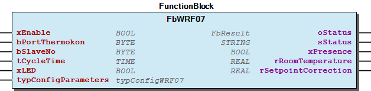 Function description A permanent TRUE signal at the input xEnable enables the output process and a FALSE signal disables it. If the input is not enabled, the output process starts automatically. bPortThermokon must be connect to bPortThermokon of the Master function block. The device address is specified at the input bSlaveNo. By assigning different addresses, multiple devices can be addressed via one serial I/O module. This input is assigned with 1 by default. The minimum interval time to be maintained for outputs is determined at the input tCycleTime. The actual time between the outputs can be greater depending on the number of instantiated output modules on one Modbus® line. As default, no time is set; this ensures operation is as fast as possible. The respective WRF07 can be individually configured with the input structure typConfigParameters. The configuration values are saved in the WRF EEPROM. Cyclic writing of these values can destroy the room operating panel. The sStatus output displays the communication error that has occurred. As soon as the presence button on the WRF is pressed, the output xPresence is switched on for the time TRUE set in typConfigParameters.tPresenceTime. Whether pressing the button again will restart the presence time can be selected through typConfigParameters.xRetriggerPresence. The room temperature rRoomTemperature and the set setpoint correction rSetpointCorrection can be read out from the outputs on the module.

## FbWRF07extended (FB)

| Scope | Name | Type | Initial | Comment |
| --- | --- | --- | --- | --- |
| Input | xEnable | BOOL | TRUE | Enable signal to start cyclic read out sensor |
| bPortThermokon | BYTE | 1 | Port number of the Master - Connection to the Master |
| bSlaveNo | BYTE | 1 | Slave address of the sensor |
| tCycleTime | TIME |  | Cycle time for read out the sensor |
| xLED | BOOL |  | Set LED on the WRF-Slave |
| Inout | typConfigParameters | typWRF07 |  | Configuration parameters |
| Output | oStatus | WagoAppPlcModbus.WagoSysErrorBase.FbResult |  | Status object. The content of the error object could be displayed via the FbShowResult from the WagoSysErrorBase library. |
| sStatus | STRING |  | Status description as string |
| xButton1 | BOOL |  | Presence button pressed |
| xButton2 | BOOL |  | Presence button pressed |
| xButton3 | BOOL |  | Presence button pressed |
| xButton4 | BOOL |  | Presence button pressed |
| xButton5 | BOOL |  | Presence button pressed |
| rRoomTemperature | REAL |  | Actual room temperature |
| rSetpointCorrection | REAL |  | Setpoint correction of the potentiometer |

Function block to communicate with a Thermokon WRF07 module.

Graphical Illustration

Function description

Function Block for the communication between one WRF07-Slave and the WAGO controller. For each WRF07-Slave one of those function block is needed.

Interface variables Function Function block to communicate with a Thermokon WRF07 module. Graphical Illustration 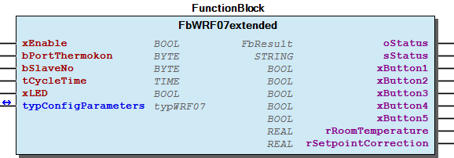 Function description Function Block for the communication between one WRF07-Slave and the WAGO controller. For each WRF07-Slave one of those function block is needed.

## FbWRF08 (FB)

| Scope | Name | Type | Initial | Comment |
| --- | --- | --- | --- | --- |
| Input | xEnable | BOOL | TRUE | Enable signal to start cyclic read out sensor |
| bPortThermokon | BYTE | 1 | Port number of the Master - Connection to the Master |
| bSlaveNo | BYTE | 1 | Slave address of the sensor |
| tCycleTime | TIME |  | Cycle time for read out the sensor, use slower times if you have many ROUs/Fbs |
| tUpdateClock | TIME | TIME#0ms | Cycle time to synchronize time on the WRF08 - t#0s = no synchronisation |
| dtActualTime | DT |  | Actual time for WRF08 |
| typConfigParameters | typConfigWRF08 |  | Configuration datas of the WRF08 |
| Output | oStatus | WagoAppPlcModbus.WagoSysErrorBase.FbResult |  | Status object. The content of the error object could be displayed via the FbShowResult from the WagoSysErrorBase library. |
| sStatus | STRING |  | Status description as string |
| xButton1 | BOOL |  | Status button 1 |
| xButton2 | BOOL |  | Status button 2 |
| xButton3 | BOOL |  | Status button 3 |
| xButton4 | BOOL |  | Status button 4 |
| xButton5 | BOOL |  | Status button 5 |
| xButton6 | BOOL |  | Status button 6 |
| xButton7 | BOOL |  | Status button 7 |
| xButton8 | BOOL |  | Status button 8 |
| xButton9 | BOOL |  | Status button 9 |
| xButton10 | BOOL |  | Status button 10 |
| xButton11 | BOOL |  | Status button 11 |
| xButton12 | BOOL |  | Status button 12 |
| rRoomTemperature | REAL |  | Actual room temperature |
| typValueWRF08 | typValueWRF08 |  | Read data and values of the WRF08 |

The FbWRF08 is used to specify the display values to be displayed on the multifunction room operating unit display. In addition, the current status of the room operating unit is read out.

Graphical Illustration

Function description

The xEnable input enables cyclic reading of the status values from the room operating unit. bPortThermokon must be connect to bPortThermokon of the Master function block. The bSlaveNo input specifies the slave address of the WRF08 room operating unit. The function block transmits the display values when there is a change in the typConfigParameters structure or when a button is pressed. The tCycleTime input specifies the minimum time interval for sending new display values. The tUpdateClock input specifies the interval for synchronizing the time. The time is specified at the dtActualTime input, with which the room operating unit should be synchronized. The time is not synchronized if the update time is t#0s. A communication error can be identified by the error code displayed at the sStatus output. The xButton1 to xButton12 outputs display the status of the buttons of the room operating unit. The rRoomTemperature output displays the room temperature measured by the WRF08 room operating unit. The current setpoints & offset from the room operating unit are displayed in the typValueWRF08 structure. In addition, the fan level and the status of the room occupancy are displayed.

Interface variables Function The FbWRF08 is used to specify the display values to be displayed on the multifunction room operating unit display. In addition, the current status of the room operating unit is read out. Graphical Illustration 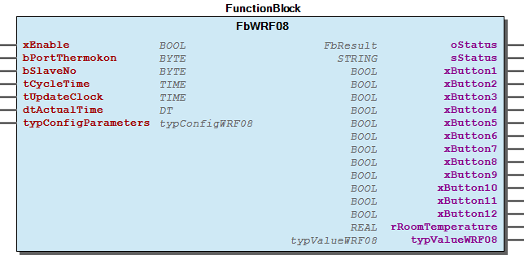 Function description The xEnable input enables cyclic reading of the status values from the room operating unit. bPortThermokon must be connect to bPortThermokon of the Master function block. The bSlaveNo input specifies the slave address of the WRF08 room operating unit. The function block transmits the display values when there is a change in the typConfigParameters structure or when a button is pressed. The tCycleTime input specifies the minimum time interval for sending new display values. The tUpdateClock input specifies the interval for synchronizing the time. The time is specified at the dtActualTime input, with which the room operating unit should be synchronized. The time is not synchronized if the update time is t#0s. A communication error can be identified by the error code displayed at the sStatus output. The xButton1 to xButton12 outputs display the status of the buttons of the room operating unit. The rRoomTemperature output displays the room temperature measured by the WRF08 room operating unit. The current setpoints & offset from the room operating unit are displayed in the typValueWRF08 structure. In addition, the fan level and the status of the room occupancy are displayed.

## FbWRF08Config (FB)

| Scope | Name | Type | Initial | Comment |
| --- | --- | --- | --- | --- |
| Input | xEnable | BOOL | TRUE | Kommunikation mit dem Multifunktions- Raumbediengeräten aktivieren |
| bPortThermokon | BYTE |  | Number of the Master - Connection to the Master |
| Output | oStatus | WagoAppPlcModbus.WagoSysErrorBase.FbResult |  | Status object. The content of the error object could be displayed via the FbShowResult from the WagoSysErrorBase library. |
| sStatus | STRING |  | Status description as string |

The FbWRF08Config function block is used to configure the WRF08 multifunction room operating units (WRF08-RS-485 Modbus®). The room operating units can only be configured in conjunction with the ConfigWRF08 visualization interface.

Graphical Illustration

Function description

Function Block for the configuration of your WRF08 slaves. This function block only works with the “ConfigWRF08 visualisation”. Only one config function block is needed for all WRF08 Slaves.

Interface variables Function The FbWRF08Config function block is used to configure the WRF08 multifunction room operating units (WRF08-RS-485 Modbus®). The room operating units can only be configured in conjunction with the ConfigWRF08 visualization interface. Graphical Illustration  Function description Function Block for the configuration of your WRF08 slaves. This function block only works with the “ConfigWRF08 visualisation”. Only one config function block is needed for all WRF08 Slaves.

## doc01_Foreword (FB)

This document, including all figures and illustrations contained therein, is subject to copyright. Any use of this document that infringes upon the copyright provisions stipulated herein is prohibited. Reproduction, translation, electronic and phototechnical filing/archiving (e.g., photocopying), as well as any amendments require the written consent of WAGO Kontakttechnik GmbH & Co. KG, Minden, Germany. Non-observance will entail the right of claims for damages.

WAGO Kontakttechnik GmbH & Co. KG reserves the right to make any alterations or modifications that serve to increase the efficiency of technical progress. WAGO Kontakttechnik GmbH & Co. KG owns all rights arising from granting patents or from the legal protection of utility patents. Third-party products are always mentioned without any reference to patent rights. Thus, the existence of such rights cannot be excluded.

Personnel Qualification

The use of the product described in this document is exclusively geared to specialists having qualifications in PLC programming, electrical specialists or persons instructed by electrical specialists who are also familiar with the appropriate current standards. WAGO Kontakttechnik GmbH & Co. KG assumes no liability resulting from improper action and damage to WAGO products and third-party products due to non-observance of the information contained in this document.

Intended Use

For each individual application, the components are supplied from the factory with a dedicated hardware and software configuration. Modifications are only admitted within the framework of the possibilities documented in this document. All other changes to the hardware and/or software and the non-conforming use of the components entail the exclusion of liability on part of WAGO Kontakttechnik GmbH & Co. KG.

Please direct any requirements pertaining to a modified and/or new hardware or software configuration directly to WAGO Kontakttechnik GmbH & Co. KG.

Scope of Applicability

This application note is based on the _stated hardware and software from the specific manufacturer, as well as the associated documentation. This application note is therefore only valid for the described installation. New hardware and software versions may need to be handled differently.

Please note the detailed description in the specific manuals.

Copyright This document, including all figures and illustrations contained therein, is subject to copyright. Any use of this document that infringes upon the copyright provisions stipulated herein is prohibited. Reproduction, translation, electronic and phototechnical filing/archiving (e.g., photocopying), as well as any amendments require the written consent of WAGO Kontakttechnik GmbH & Co. KG, Minden, Germany. Non-observance will entail the right of claims for damages. WAGO Kontakttechnik GmbH & Co. KG reserves the right to make any alterations or modifications that serve to increase the efficiency of technical progress. WAGO Kontakttechnik GmbH & Co. KG owns all rights arising from granting patents or from the legal protection of utility patents. Third-party products are always mentioned without any reference to patent rights. Thus, the existence of such rights cannot be excluded. Personnel Qualification The use of the product described in this document is exclusively geared to specialists having qualifications in PLC programming, electrical specialists or persons instructed by electrical specialists who are also familiar with the appropriate current standards. WAGO Kontakttechnik GmbH & Co. KG assumes no liability resulting from improper action and damage to WAGO products and third-party products due to non-observance of the information contained in this document. Intended Use For each individual application, the components are supplied from the factory with a dedicated hardware and software configuration. Modifications are only admitted within the framework of the possibilities documented in this document. All other changes to the hardware and/or software and the non-conforming use of the components entail the exclusion of liability on part of WAGO Kontakttechnik GmbH & Co. KG. Please direct any requirements pertaining to a modified and/or new hardware or software configuration directly to WAGO Kontakttechnik GmbH & Co. KG. Scope of Applicability This application note is based on the _stated hardware and software from the specific manufacturer, as well as the associated documentation. This application note is therefore only valid for the described installation. New hardware and software versions may need to be handled differently. Please note the detailed description in the specific manuals.

### Functions

## EvaluateLongText (FUN)

| Scope | Name | Type | Comment |
| --- | --- | --- | --- |
| Return | EvaluateLongText | BOOL |  |
| Input | inputAdress | POINTER TO WORD | Start Adress in WORD ARRAY |
| inputStringAdr | POINTER TO BYTE | Start Adress of String |

## EvaluateShortText (FUN)

| Scope | Name | Type | Comment |
| --- | --- | --- | --- |
| Return | EvaluateShortText | BOOL |  |
| Input | inputAdress | POINTER TO WORD | Start Adress in WORD ARRAY |
| inputStringAdr | POINTER TO BYTE | Start Adress of String |

## typModbusQueryLongText (FUN)

| Scope | Name | Type | Comment |
| --- | --- | --- | --- |
| Return | typModbusQueryLongText | BOOL |  |
| Input | InStringAdress | POINTER TO BYTE | Start Adress of String |
| InAdress | POINTER TO WORD | Start Adress in WORD ARRAY |

## typModbusQueryUnitText (FUN)

| Scope | Name | Type | Comment |
| --- | --- | --- | --- |
| Return | typModbusQueryUnitText | BOOL |  |
| Input | InStringAdress | POINTER TO BYTE | Start Adress of String |
| InAdress | POINTER TO WORD | Start Adress in WORD ARRAY |

### Methods

## FbThanos.ModbusCommandRead (ACT)

Abfragen des Ausgaberegisters in einzelnen Packages

Abfragen des Ausgaberegisters in einzelnen Packages

## FbThanos.ModbusCommandWrite (ACT)

Senden von Modbusdaten für die Parameter des Eingangsregisters

Senden von Modbusdaten für die Parameter des Eingangsregisters

## FbThanos.ReadPackage1 (ACT)

Auswerten der Empfangenen Modbusdaten, der Taster und Sonderfunktionen

Auswerten der Empfangenen Modbusdaten, der Taster und Sonderfunktionen

## FbThanos.ReadPackage2 (ACT)

Auswerten der Empfangenen Modbusdaten, der zusatz Taster und digitalen Eingänge

Auswerten der Empfangenen Modbusdaten, der zusatz Taster und digitalen Eingänge

## FbThanos.ReadPackage3 (ACT)

Auswerten der Empfangenen Modbusdaten

Auswerten der Empfangenen Modbusdaten

## FbThermokonMaster.Open (PROP) ¶

## FbWRF06Config.GetAdress (ACT) ¶

Read text addresses

## typInputSetPoint (STRUCT)

| Name | Type | Initial | Comment |
| --- | --- | --- | --- |
| rOffsetSetPoint1 | REAL | 0.0 | Input for the offset value of set point 1 |
| rBasicSetPoint1 | REAL | 0.0 | Input for the basic set point 1 |
| rOffsetSetPoint2 | REAL | 0.0 | Input for the offset value of set point 2 |
| rBasicSetPoint2 | REAL | 0.0 | Input for the basic set point 2 |
| rOffsetSetPoint3 | REAL | 0.0 | Input for the offset value of set point 3 |
| rBasicSetPoint3 | REAL | 0.0 | Input for the basic set point 3 |
| rOffsetSetPoint4 | REAL | 0.0 | Input for the offset value of set point 4 |
| rBasicSetPoint4 | REAL | 0.0 | Input for the basic set point 4 |
| rOffsetSetPoint5 | REAL | 0.0 | Input for the offset value of set point 5 |
| rBasicSetPoint5 | REAL | 0.0 | Input for the basic set point 5 |
| rOffsetSetPoint6 | REAL | 0.0 | Input for the offset value of set point 6 |
| rBasicSetPoint6 | REAL | 0.0 | Input for the basic set point 6 |

## typMenuSettings (STRUCT)

| Name | Type | Initial |
| --- | --- | --- |
| xEnableMonitoringMenu | BOOL | TRUE |
| xEnableTemperatureMenu | BOOL | TRUE |
| xEnableLightMenu | BOOL | TRUE |
| xEnableBlindMenu | BOOL | TRUE |
| xEnableSceneMenu | BOOL | TRUE |
| xEnableECO_Function | BOOL | TRUE |
| xEnableOccupancyFunction | BOOL | TRUE |
| xEnableFanFunction | BOOL | TRUE |
| xEnableDimFunction | ARRAY [1..8] OF BOOL | [8(TRUE)] |
| xEnableLamellaFunction | ARRAY [1..8] OF BOOL | [8(TRUE)] |
| xShowActualTemperature | BOOL | TRUE |
| xShowSetpointTemperature | BOOL | TRUE |
| wShowSettingsMenu | WORD | 60 |
| xOccupancyAfterReset | BOOL |  |
| eHomeButton | eHomeButton | 17 |
| eFavoriteButtonA | eHomeButton | 1 |
| eFavoriteButtonB | eHomeButton | 2 |
| eFavoriteButtonC | eHomeButton | 9 |
| eFavoriteButtonD | eHomeButton | 10 |

## typSetPoint (STRUCT)

| Name | Type | Comment |
| --- | --- | --- |
| rCurrentOffsetSetPoint1 | REAL | current setpoint 1 offset |
| rSetPointEffective1 | REAL | current effective value of setpoint 1 |
| rCurrentOffsetSetPoint2 | REAL | current setpoint 2 offset |
| rSetPointEffective2 | REAL | current effective value of setpoint 2 |
| rCurrentOffsetSetPoint3 | REAL | current setpoint 3 offset |
| rSetPointEffective3 | REAL | current effective value of setpoint 3 |
| rCurrentOffsetSetPoint4 | REAL | current setpoint 4 offset |
| rSetPointEffective4 | REAL | current effective value of setpoint 4 |
| rCurrentOffsetSetPoint5 | REAL | current setpoint 5 offset |
| rSetPointEffective5 | REAL | current effective value of setpoint 5 |
| rCurrentOffsetSetPoint6 | REAL | current setpoint 6 offset |
| rSetPointEffective6 | REAL | current effective value of setpoint 6 |

### Program Organization

## 20 Program Organization Units

- 02 Thermokon WRF04 FbWRF04extended (FB) 04 Thermokon WRF07 - FbWRF07extended (FB) 07 Thermokon JOY - FbJOYextended (FB) 08 Thermokon Novos - FbShortLongButtonBlind (FB) - FbShortLongButtonLight (FB)

## 20 Program Organization Units

- 01 Communication FbThermokonMaster (FB) FbThermokonMaster.Open (PROP) 02 Thermokon WRF04 - FbWRF04 (FB) 03 Thermokon WRF06 - FbWRF06 (FB) FbWRF06.CheckCOV (ACT) FbWRF06Config (FB) - FbWRF06Config.GetAdress (ACT) 04 Thermokon WRF07 - FbWRF07 (FB) 05 Thermokon WRF08 - FbWRF08 (FB) - FbWRF08Config (FB) 06 Thermokon Thanos - FbThanos (FB) FbThanos.EvaluateSend (ACT) - FbThanos.ModbusCommandRead (ACT) - FbThanos.ModbusCommandWrite (ACT) - FbThanos.ReadPackage1 (ACT) - FbThanos.ReadPackage2 (ACT) - FbThanos.ReadPackage3 (ACT) FbThanosModbusData (FB) 07 Thermokon JOY - FbJOY (FB) 08 Thermokon Novos - 01 Novos 7/ Novos Touch/ Thanos EVO 01 Novos 7/ Novos Touch/ Thanos EVO FbNovos7_TouchEVO (FB) 10 Configuration Novos 7/ Novos Touch/ Thanos EVO - FbNovos7_TouchEVO_Config (FB) 02 Novos 3/ Novos 5 - 01 Novos 5 FbNovos5 (FB) 02 Novos 3 - FbNovos3 (FB) 10 Configuration Novos 3/ Novos 5 - FbNovos3_5_Config (FB)

### Internal Components

## 90 Internal

- 20 Program Organization Units 02 Thermokon WRF04 FbWRF04extended (FB) 04 Thermokon WRF07 - FbWRF07extended (FB) 07 Thermokon JOY - FbJOYextended (FB) 08 Thermokon Novos - FbShortLongButtonBlind (FB) - FbShortLongButtonLight (FB) 30 Visualization - 08 Thermokon Novos 00 Templates 01 NOVOS Touch/ NOVOS 7 / Thanos EVO 01 Novos 7/ Novos Touch/ Thanos EVO - 10 Configuration Novos 7/ Novos Touch/ Thanos EVO 02 Novos 3/ Novos 5 - 01 Novos 3/ Novos 5 - 10 Configuration Novos 3/ Novos 5 80 TextLists - TextListAdjustment (Text List) - TextListBlinds (Text List) - TextListDate (Text List) - TextListFont (Text List) - TextListHomeButton (Text List) - TextListLED (Text List) - TextListLED_Color (Text List) - TextListLanguage (Text List) - TextListLights (Text List) - TextListMeasuringUnit (Text List) - TextListPresentation (Text List) - TextListScene (Text List) - TextListTime (Text List) 01 Novos 7/ Novos Touch/ Thanos EVO 02 Novos 3/ Novos 5 80 TextLists - TextListSlaveAddress (Text List) ImagePool (Image Pool) 70 Tools - EvaluateLongText (FUN) - EvaluateShortText (FUN) - typModbusQueryLongText (FUN) - typModbusQueryUnitText (FUN) 80 Data types - 02 Thermokon WRF04 eWRF04Device (ENUM) - typControllerWRF04 (STRUCT) - typOverrideWRF04 (STRUCT) - typWRF04 (STRUCT) 03 Thermokon WRF06 - eButton (ENUM) - eConfigState (ENUM) - eControlMode (ENUM) - eControlModeOutput (ENUM) - eFanStage (ENUM) - eInput (ENUM) - eWRF06State (ENUM) 04 Thermokon WRF07 - eWRF07Device (ENUM) - typControllerWRF07 (STRUCT) - typOverrideWRF07 (STRUCT) - typWRF07 (STRUCT) 05 Thermokon WRF08 - eTaste (ENUM) 06 Thermokon Thanos - typThanosModbusData (STRUCT) 07 Thermokon JOY - typJOY_EEPROM (STRUCT) - typJOY_OUT (STRUCT) - typJOYextended (STRUCT) 08 Thermokon Novos - 01 Novos 7/ Novos Touch/ Thanos EVO typConfigNovos (STRUCT) - typDescription (STRUCT) - typMenuSettings (STRUCT) - typNovosExtended (STRUCT) - typOverrideBlind (STRUCT) - typOverrideLight (STRUCT) - typOverrideScene (STRUCT) 02 Novos 3/ Novos 5 - typConfigNovos3_5 (STRUCT) 70 Enumeration - eAdjustment (ENUM) - eBlindIcon (ENUM) - eDateFormat (ENUM) - eFont (ENUM) - eHomeButton (ENUM) - eLanguage (ENUM) - eLightIcon (ENUM) - eMeasuringUnit (ENUM) - ePresentation (ENUM) - eSceneIcon (ENUM) - eTimeFormat (ENUM)

### Global Variable Lists

## Globale_Variablen (GVL)

| Name | Type | Initial | Comment |
| --- | --- | --- | --- |
| gWRFMaster | ARRAY [1..bMaxSlave] OF typWRF |  | structure to communicate with master function block |
| udiBaudrate | UDINT | 9600 | Baudrate 9600, 19200, 38400, 57600, 115200 |
| eParity | WagoAppPlcModbus.WagoTypesCom.eTTYParity | WagoAppPlcModbus.WagoTypesCom.eTTYParity.Even | Parity |
| eStopBits | WagoAppPlcModbus.WagoTypesCom.eTTYStopBits | WagoAppPlcModbus.WagoTypesCom.eTTYStopBits.One | Number of stop bits |
| eHandshake | WagoAppPlcModbus.WagoTypesCom.eTTYHandshake | WagoAppPlcModbus.WagoTypesCom.eTTYHandshake.None | TYPE of handshake (XON/XOFF, etc) |
| ePhysical | WagoAppPlcModbus.WagoTypesCom.eTTYPhysicalLayer | WagoAppPlcModbus.WagoTypesCom.eTTYPhysicalLayer.RS485_HalfDuplex | RS232, RS422, RS485, etc |
| tTimeOut | TIME | TIME#1s0ms | Timeout to response the request. |
| g_typConfigNovos | typConfigNovos |  | CONFIGURATION PARAMETERS, USED BY FBNOVOS7_TOUCHEVOCONFIG |
| g_typNovosExtended | typNovosExtended |  | CONFIGURATION PARAMETERS FOR EXTENDED SETTINGS, USED BY FBNOVOS7_TOUCHEVOCONFIG |
| g_typConfigNovos3_5 | typConfigNovos3_5 |  | CONFIGURATION PARAMETERS, USED BY FBNOVOS7_TOUCHEVOCONFIG |

## VersionHistory (GVL)

| Name | Type |
| --- | --- |
| Info | ProjectInfo |

| date | version | author | change |
| 11.09.2023 | 1.2.0.3 | u0105598 | WAT-36042FbJoy rSetpointAdjustment_Out always jumps to 0 when the value is negative |
| 14.08.2023 | 1.2.0.2 | u015842 | 32- and 64-Bit |
| 13.06.2022 | 1.2.0.0 | u010188 | Add output value rRelativeHumidity in FbWRF06 |
| 07.16.2021 | 1.1.3.2 | u015842 | New Property Open in FbThermokonMaster to reset serial connection. |
| 09.12.2020 | 1.1.3.1 | u015842 | Visu eliminated DropDown for SlaveAddress selection. |
| 13.01.2020 | 1.1.3.0 | u015652 | Function blocks for Novos added. |
| 21.10.2019 | 1.1.2.2 | u015652 | FbJOY added. |
| 22.08.2019 | 1.1.2.1 | u015652 | FbWRF04/07: Max. number of slaves increased. |
| 31.07.2019 | 1.1.2.0 | u015652 | FbWRF08: ‘bLevel’-Variable changed to ‘wLevel’, new value range for Fan level. |
| 06.02.2019 | 1.1.1.1 | u015652 | FbThanos, Bugfix button read out |
| 24.01.2019 | 1.1.1.0 | u015652 | In- Outputs changed on all Fbs |
| 08.01.2019 | 1.0.1.0 | u015842 | Properties: free placeholder added |
| 16.05.2018 | 1.0.0.0 | u15652 | Release Version |
| 04.12.2018 | 1.0.0.1 | u15652 | WRF04 and WRF07 added |

WagoAppThermokon.library

Description: Library to connect Thermokon modules with WAGO I/O- System

WagoAppThermokon.library Description: Library to connect Thermokon modules with WAGO I/O- System

### Other Components

## 00 Templates

- 01 NOVOS Touch/ NOVOS 7 / Thanos EVO 01 Novos 7/ Novos Touch/ Thanos EVO - 10 Configuration Novos 7/ Novos Touch/ Thanos EVO 02 Novos 3/ Novos 5 - 01 Novos 3/ Novos 5 - 10 Configuration Novos 3/ Novos 5 80 TextLists - TextListAdjustment (Text List) - TextListBlinds (Text List) - TextListDate (Text List) - TextListFont (Text List) - TextListHomeButton (Text List) - TextListLED (Text List) - TextListLED_Color (Text List) - TextListLanguage (Text List) - TextListLights (Text List) - TextListMeasuringUnit (Text List) - TextListPresentation (Text List) - TextListScene (Text List) - TextListTime (Text List)

## 01 Communication

- FbThermokonMaster (FB) FbThermokonMaster.Open (PROP)

## 01 Communication ¶

## 01 NOVOS Touch/ NOVOS 7 / Thanos EVO

- 01 Novos 7/ Novos Touch/ Thanos EVO - 10 Configuration Novos 7/ Novos Touch/ Thanos EVO

## 01 Novos 3/ Novos 5 ¶

## 01 Novos 5 ¶

## 01 Novos 5

- eLED_Color (ENUM) - typShowSymbolsNovos5 (STRUCT)

## 01 Novos 5 ¶

## 01 Novos 7/ Novos Touch/ Thanos EVO

- typBlindNovos (STRUCT) - typButtonNovos (STRUCT) - typLightNovos (STRUCT) - typOverride (STRUCT) - typSceneNovos (STRUCT) - typSensor (STRUCT) - typShowSymbols (STRUCT)

## 01 Novos 7/ Novos Touch/ Thanos EVO ¶

## 01 Novos 7/ Novos Touch/ Thanos EVO

- typConfigNovos (STRUCT) - typDescription (STRUCT) - typMenuSettings (STRUCT) - typNovosExtended (STRUCT) - typOverrideBlind (STRUCT) - typOverrideLight (STRUCT) - typOverrideScene (STRUCT)

## 01 Novos 7/ Novos Touch/ Thanos EVO

- FbNovos7_TouchEVO (FB)

## 01 Novos 7/ Novos Touch/ Thanos EVO ¶

## 01 Novos 7/ Novos Touch/ Thanos EVO

- 01 Novos 7/ Novos Touch/ Thanos EVO FbNovos7_TouchEVO (FB) 10 Configuration Novos 7/ Novos Touch/ Thanos EVO - FbNovos7_TouchEVO_Config (FB)

## 01 Novos 7/ Novos Touch/ Thanos EVO ¶

## 02 Novos 3 ¶

## 02 Novos 3 ¶

## 02 Novos 3/ Novos 5 ¶

- typConfigNovos3_5 (STRUCT)

## 02 Novos 3/ Novos 5

- 01 Novos 3/ Novos 5 - 10 Configuration Novos 3/ Novos 5

## 02 Novos 3/ Novos 5

- 01 Novos 5 FbNovos5 (FB) 02 Novos 3 - FbNovos3 (FB) 10 Configuration Novos 3/ Novos 5 - FbNovos3_5_Config (FB)

## 02 Novos 3/ Novos 5 ¶

## 02 Novos 3/ Novos 5

- 01 Novos 5 - 02 Novos 3 - 10 Configuration Novos 3/ Novos 5

## 02 Novos 3/ Novos 5

- 01 Novos 5 eLED_Color (ENUM) - typShowSymbolsNovos5 (STRUCT)

## 02 Thermokon WRF04

- eWRF04Device (ENUM) - typControllerWRF04 (STRUCT) - typOverrideWRF04 (STRUCT) - typWRF04 (STRUCT)

## 02 Thermokon WRF04 ¶

- FbWRF04extended (FB)

## 02 Thermokon WRF04

- typConfigWRF04 (STRUCT) - typFanLevel (STRUCT)

## 02 Thermokon WRF04 ¶

## 03 Thermokon WRF06

- eButton (ENUM) - eConfigState (ENUM) - eControlMode (ENUM) - eControlModeOutput (ENUM) - eFanStage (ENUM) - eInput (ENUM) - eWRF06State (ENUM)

## 03 Thermokon WRF06 ¶

## 03 Thermokon WRF06

- eDeviceType (ENUM) - typConfigWRF06 (STRUCT) - typInputWRF06 (STRUCT) - typValueWRF06 (STRUCT)

## 03 Thermokon WRF06

- FbWRF06 (FB) FbWRF06.CheckCOV (ACT) FbWRF06Config (FB) - FbWRF06Config.GetAdress (ACT)

## 04 Thermokon WRF07 ¶

- typConfigWRF07 (STRUCT)

## 04 Thermokon WRF07

- eWRF07Device (ENUM) - typControllerWRF07 (STRUCT) - typOverrideWRF07 (STRUCT) - typWRF07 (STRUCT)

## 04 Thermokon WRF07 ¶

- FbWRF07extended (FB)

## 04 Thermokon WRF07 ¶

## 05 Thermokon WRF08 ¶

## 05 Thermokon WRF08

- FbWRF08 (FB) - FbWRF08Config (FB)

## 05 Thermokon WRF08 ¶

## 05 Thermokon WRF08

- typConfigWRF08 (STRUCT) - typValueWRF08 (STRUCT)

## 06 Thermokon Thanos

- FbThanos (FB) FbThanos.EvaluateSend (ACT) - FbThanos.ModbusCommandRead (ACT) - FbThanos.ModbusCommandWrite (ACT) - FbThanos.ReadPackage1 (ACT) - FbThanos.ReadPackage2 (ACT) - FbThanos.ReadPackage3 (ACT) FbThanosModbusData (FB)

## 06 Thermokon Thanos ¶

- typThanosModbusData (STRUCT)

## 06 Thermokon Thanos ¶

## 06 Thermokon Thanos

- typBits (STRUCT) - typBlind (STRUCT) - typButton (STRUCT) - typConfigThanos (STRUCT) - typController (STRUCT) - typDigitalInput (STRUCT) - typDimmer (STRUCT) - typExternalTempHumi (STRUCT) - typExternalValues (STRUCT) - typFeedback (STRUCT) - typInputController (STRUCT) - typInputSetPoint (STRUCT) - typLight (STRUCT) - typPanel (STRUCT) - typRoom (STRUCT) - typSetPoint (STRUCT) - typUniversal (STRUCT) - typValueThanos (STRUCT)

## 07 Thermokon JOY

- typJOY_EEPROM (STRUCT) - typJOY_OUT (STRUCT) - typJOYextended (STRUCT)

## 07 Thermokon JOY ¶

- typConfigJOY (STRUCT)

## 07 Thermokon JOY ¶

## 07 Thermokon JOY ¶

## 08 Thermokon Novos

- FbShortLongButtonBlind (FB) - FbShortLongButtonLight (FB)

## 08 Thermokon Novos

- 01 Novos 7/ Novos Touch/ Thanos EVO typBlindNovos (STRUCT) - typButtonNovos (STRUCT) - typLightNovos (STRUCT) - typOverride (STRUCT) - typSceneNovos (STRUCT) - typSensor (STRUCT) - typShowSymbols (STRUCT) 02 Novos 3/ Novos 5 - 01 Novos 5 eLED_Color (ENUM) - typShowSymbolsNovos5 (STRUCT)

## 08 Thermokon Novos

- 00 Templates 01 NOVOS Touch/ NOVOS 7 / Thanos EVO 01 Novos 7/ Novos Touch/ Thanos EVO - 10 Configuration Novos 7/ Novos Touch/ Thanos EVO 02 Novos 3/ Novos 5 - 01 Novos 3/ Novos 5 - 10 Configuration Novos 3/ Novos 5 80 TextLists - TextListAdjustment (Text List) - TextListBlinds (Text List) - TextListDate (Text List) - TextListFont (Text List) - TextListHomeButton (Text List) - TextListLED (Text List) - TextListLED_Color (Text List) - TextListLanguage (Text List) - TextListLights (Text List) - TextListMeasuringUnit (Text List) - TextListPresentation (Text List) - TextListScene (Text List) - TextListTime (Text List) 01 Novos 7/ Novos Touch/ Thanos EVO 02 Novos 3/ Novos 5 80 TextLists - TextListSlaveAddress (Text List) ImagePool (Image Pool)

## 08 Thermokon Novos

- 01 Novos 7/ Novos Touch/ Thanos EVO 01 Novos 7/ Novos Touch/ Thanos EVO FbNovos7_TouchEVO (FB) 10 Configuration Novos 7/ Novos Touch/ Thanos EVO - FbNovos7_TouchEVO_Config (FB) 02 Novos 3/ Novos 5 - 01 Novos 5 FbNovos5 (FB) 02 Novos 3 - FbNovos3 (FB) 10 Configuration Novos 3/ Novos 5 - FbNovos3_5_Config (FB)

## 08 Thermokon Novos

- 01 Novos 7/ Novos Touch/ Thanos EVO typConfigNovos (STRUCT) - typDescription (STRUCT) - typMenuSettings (STRUCT) - typNovosExtended (STRUCT) - typOverrideBlind (STRUCT) - typOverrideLight (STRUCT) - typOverrideScene (STRUCT) 02 Novos 3/ Novos 5 - typConfigNovos3_5 (STRUCT) 70 Enumeration - eAdjustment (ENUM) - eBlindIcon (ENUM) - eDateFormat (ENUM) - eFont (ENUM) - eHomeButton (ENUM) - eLanguage (ENUM) - eLightIcon (ENUM) - eMeasuringUnit (ENUM) - ePresentation (ENUM) - eSceneIcon (ENUM) - eTimeFormat (ENUM)

## 08 Thermokon Novos

- 01 Novos 7/ Novos Touch/ Thanos EVO - 02 Novos 3/ Novos 5 01 Novos 5 - 02 Novos 3 - 10 Configuration Novos 3/ Novos 5

## 10 Configuration Novos 3/ Novos 5 ¶

## 10 Configuration Novos 3/ Novos 5

- FbNovos3_5_Config (FB)

## 10 Configuration Novos 3/ Novos 5 ¶

## 10 Configuration Novos 7/ Novos Touch/ Thanos EVO

- FbNovos7_TouchEVO_Config (FB)

## 10 Configuration Novos 7/ Novos Touch/ Thanos EVO ¶

## 30 Visualization

- 08 Thermokon Novos 00 Templates 01 NOVOS Touch/ NOVOS 7 / Thanos EVO 01 Novos 7/ Novos Touch/ Thanos EVO - 10 Configuration Novos 7/ Novos Touch/ Thanos EVO 02 Novos 3/ Novos 5 - 01 Novos 3/ Novos 5 - 10 Configuration Novos 3/ Novos 5 80 TextLists - TextListAdjustment (Text List) - TextListBlinds (Text List) - TextListDate (Text List) - TextListFont (Text List) - TextListHomeButton (Text List) - TextListLED (Text List) - TextListLED_Color (Text List) - TextListLanguage (Text List) - TextListLights (Text List) - TextListMeasuringUnit (Text List) - TextListPresentation (Text List) - TextListScene (Text List) - TextListTime (Text List) 01 Novos 7/ Novos Touch/ Thanos EVO 02 Novos 3/ Novos 5 80 TextLists - TextListSlaveAddress (Text List) ImagePool (Image Pool)

## 30 Visualizations

- 03 Thermokon WRF06 - 05 Thermokon WRF08 - 06 Thermokon Thanos - 08 Thermokon Novos 01 Novos 7/ Novos Touch/ Thanos EVO - 02 Novos 3/ Novos 5 01 Novos 5 - 02 Novos 3 - 10 Configuration Novos 3/ Novos 5

## 70 Enumeration

- eAdjustment (ENUM) - eBlindIcon (ENUM) - eDateFormat (ENUM) - eFont (ENUM) - eHomeButton (ENUM) - eLanguage (ENUM) - eLightIcon (ENUM) - eMeasuringUnit (ENUM) - ePresentation (ENUM) - eSceneIcon (ENUM) - eTimeFormat (ENUM)

## 70 Tools

- EvaluateLongText (FUN) - EvaluateShortText (FUN) - typModbusQueryLongText (FUN) - typModbusQueryUnitText (FUN)

## 80 Data types

- 02 Thermokon WRF04 eWRF04Device (ENUM) - typControllerWRF04 (STRUCT) - typOverrideWRF04 (STRUCT) - typWRF04 (STRUCT) 03 Thermokon WRF06 - eButton (ENUM) - eConfigState (ENUM) - eControlMode (ENUM) - eControlModeOutput (ENUM) - eFanStage (ENUM) - eInput (ENUM) - eWRF06State (ENUM) 04 Thermokon WRF07 - eWRF07Device (ENUM) - typControllerWRF07 (STRUCT) - typOverrideWRF07 (STRUCT) - typWRF07 (STRUCT) 05 Thermokon WRF08 - eTaste (ENUM) 06 Thermokon Thanos - typThanosModbusData (STRUCT) 07 Thermokon JOY - typJOY_EEPROM (STRUCT) - typJOY_OUT (STRUCT) - typJOYextended (STRUCT) 08 Thermokon Novos - 01 Novos 7/ Novos Touch/ Thanos EVO typConfigNovos (STRUCT) - typDescription (STRUCT) - typMenuSettings (STRUCT) - typNovosExtended (STRUCT) - typOverrideBlind (STRUCT) - typOverrideLight (STRUCT) - typOverrideScene (STRUCT) 02 Novos 3/ Novos 5 - typConfigNovos3_5 (STRUCT) 70 Enumeration - eAdjustment (ENUM) - eBlindIcon (ENUM) - eDateFormat (ENUM) - eFont (ENUM) - eHomeButton (ENUM) - eLanguage (ENUM) - eLightIcon (ENUM) - eMeasuringUnit (ENUM) - ePresentation (ENUM) - eSceneIcon (ENUM) - eTimeFormat (ENUM)

## 80 Data types

- 01 Communication typWRF (STRUCT) 02 Thermokon WRF04 - typConfigWRF04 (STRUCT) - typFanLevel (STRUCT) 03 Thermokon WRF06 - eDeviceType (ENUM) - typConfigWRF06 (STRUCT) - typInputWRF06 (STRUCT) - typValueWRF06 (STRUCT) 04 Thermokon WRF07 - typConfigWRF07 (STRUCT) 05 Thermokon WRF08 - typConfigWRF08 (STRUCT) - typValueWRF08 (STRUCT) 06 Thermokon Thanos - typBits (STRUCT) - typBlind (STRUCT) - typButton (STRUCT) - typConfigThanos (STRUCT) - typController (STRUCT) - typDigitalInput (STRUCT) - typDimmer (STRUCT) - typExternalTempHumi (STRUCT) - typExternalValues (STRUCT) - typFeedback (STRUCT) - typInputController (STRUCT) - typInputSetPoint (STRUCT) - typLight (STRUCT) - typPanel (STRUCT) - typRoom (STRUCT) - typSetPoint (STRUCT) - typUniversal (STRUCT) - typValueThanos (STRUCT) 07 Thermokon JOY - typConfigJOY (STRUCT) 08 Thermokon Novos - 01 Novos 7/ Novos Touch/ Thanos EVO typBlindNovos (STRUCT) - typButtonNovos (STRUCT) - typLightNovos (STRUCT) - typOverride (STRUCT) - typSceneNovos (STRUCT) - typSensor (STRUCT) - typShowSymbols (STRUCT) 02 Novos 3/ Novos 5 - 01 Novos 5 eLED_Color (ENUM) - typShowSymbolsNovos5 (STRUCT)

## 80 TextLists ¶

- TextListSlaveAddress (Text List)

## 80 TextLists

- TextListAdjustment (Text List) - TextListBlinds (Text List) - TextListDate (Text List) - TextListFont (Text List) - TextListHomeButton (Text List) - TextListLED (Text List) - TextListLED_Color (Text List) - TextListLanguage (Text List) - TextListLights (Text List) - TextListMeasuringUnit (Text List) - TextListPresentation (Text List) - TextListScene (Text List) - TextListTime (Text List)

## FbThanos.EvaluateSend (ACT)

Aktion zum überprüfen der übertragung der Eingangsparameter

Aktion zum überprüfen der übertragung der Eingangsparameter

## FbWRF06.CheckCOV (ACT)

Internal functions= Action to set the different states

Internal functions= Action to set the different states

## Global Variables ¶

- Globale_Variablen (GVL)

## GlobalTextList (Text List)

| ID | Default | de | en |
| --- | --- | --- | --- |
| 946 | %2.1f |  |  |
| 952 | %2.1f K |  |  |
| 929 | %2.1f °C |  |  |
| 2480 | %3.0f |  |  |
| 849 | %3.0f % |  |  |
| 661 | %3.1f °C |  |  |
| 932 | %4.0f ppm |  |  |
| 656 | %4.2f |  |  |
| 902 | %5.0f g/m³ |  |  |
| 195 | %5.0f kJ/kg |  |  |
| 25 | %5.1f kPa |  |  |
| 950 | %d |  |  |
| 98 | %d %% |  |  |
| 97 | %d min |  |  |
| 791 | %d ms |  |  |
| 92 | %d s |  |  |
| 432 | %i |  |  |
| 816 | %i m |  |  |
| 345 | %s |  |  |
| 1429 | (0= Always) | (0= Immer) |  |
| 1220 | 12 h mode |  |  |
| 858 | 12 T |  |  |
| 342 | 12h mode |  |  |
| 1215 | 24 h mode |  |  |
| 341 | 24h mode |  |  |
| 1933 | 2T |  |  |
| 1578 | 4T |  |  |
| 854 | 8 T |  |  |
| 3393 | Abs. humidity | Abs. Feuchtigkeit |  |
| 780 | Adjustment Set Point 1 effective or offset |  |  |
| 572 | Adjustment Set Point 2 effective or offset |  |  |
| 69 | Air pressure | Luftdruck |  |
| 449 | Alarm Message 1 |  |  |
| 94 | Alarm Message 2 |  |  |
| 93 | Alarm Message 3 |  |  |
| 91 | Alarm Message 4 |  |  |
| 731 | Alarm Messages |  |  |
| 625 | All pages | Alle Seiten |  |
| 1633 | All Parameters | Alle Parameter |  |
| 785 | Antifreeze |  |  |
| 958 | AUTO |  |  |
| 1833 | Basic setpoint after reset [%]: |  |  |
| 1066 | Basic setpoint after reset [°C]: |  |  |
| 458 | Basic setpoint after reset: |  |  |
| 496 | Basis setpoint | Basis Sollwert |  |
| 1623 | Blind step | Jalousie- schrittweite |  |
| 11 | Blind 1 | Jalousie 1 |  |
| 27 | Blind 2 | Jalousie 2 |  |
| 305 | Blind 3 | Jalousie 3 |  |
| 608 | Blind 4 | Jalousie 4 |  |
| 888 | Blind 5 | Jalousie 5 |  |
| 132 | Blind 6 | Jalousie 6 |  |
| 575 | Blind 7 | Jalousie 7 |  |
| 2097 | Blind 8 | Jalousie 8 |  |
| 2105 | Blind Pos | Jalousie Pos |  |
| 2871 | Blind presentation |  |  |
| 3215 | Blinds | Jalousien |  |
| 40 | Button 1 |  |  |
| 37 | Button 2 |  |  |
| 36 | Button 3 |  |  |
| 39 | Button 4 |  |  |
| 38 | Button Configuration |  |  |
| 700 | Button configuration |  |  |
| 3682 | Button Down | Taster runter |  |
| 149 | Button Up | Taster hoch |  |
| 980 | Buttons |  |  |
| 592 | Buttons / Inputs |  |  |
| 818 | Climate | Klima |  |
| 799 | CO2 |  |  |
| 280 | CO2-VOC Mix |  |  |
| 1026 | Configuration page for Devices with fan control |  |  |
| 531 | Control Mode |  |  |
| 596 | Controller settings |  |  |
| 988 | Date |  |  |
| 886 | Date format | Datumsformat |  |
| 1318 | Date: |  |  |
| 539 | Dead zone between heating and colling |  |  |
| 759 | Description | Beschreibung |  |
| 344 | Device Code |  |  |
| 1586 | Device coding: |  |  |
| 1600 | Device location: |  |  |
| 2083 | Dew point temp | Taupunkt-Temperatur |  |
| 3473 | Digital input | Digitaler Eingang |  |
| 35 | `` digital input 1 `` |  |  |
| 34 | digital input 2 |  |  |
| 198 | digital input 3 only device typ_DI4 |  |  |
| 783 | digital input 4 only device typ_DI4 |  |  |
| 815 | Dimmable | Dimmbar |  |
| 1466 | Dimming steps | Dimm- schrittweite |  |
| 234 | Display |  |  |
| 1384 | Display date and time |  |  |
| 840 | Display fan stage |  |  |
| 983 | Display Illumination |  |  |
| 839 | display room occupancy |  |  |
| 390 | Display Set Point 1 Basic Set Point + Offset or Control Set Point |  |  |
| 42 | Display temperature: |  |  |
| 2164 | Display time of settings menu | Anzeigezeit des Einstellmenüs |  |
| 984 | Display Time/Date |  |  |
| 45 | Display value without unit: |  |  |
| 483 | Display Values |  |  |
| 338 | display whith tenth digit |  |  |
| 919 | `` Do you want write all parameters to the slave? Configuration will be saved in the EEPROM!`` | Sollen alle Parameter geschrieben werden? Konfiguration wird im EEPROM gespeichert! |  |
| 2438 | ECO mode | ECO Modus |  |
| 1927 | Effective |  |  |
| 2417 | Enable blind menu | Jalousiefunktion aktivieren |  |
| 2530 | Enable ECO function | ECO-Funktion aktivieren |  |
| 3647 | Enable fan function | Lüftungsfunktion aktivieren |  |
| 2339 | Enable light menu | Lichtfunktion aktivieren |  |
| 3459 | Enable measurement menu | Menü Messwerte anzeigen |  |
| 3212 | Enable occupancy function | Raumbelegungsfunktion aktivieren |  |
| 3612 | Enable scene menu | Szenenfunktion aktivieren |  |
| 2153 | Enable temperature menu | Temperatureinstellung aktivieren |  |
| 986 | English |  |  |
| 863 | Enthalphy | Enthalpie |  |
| 994 | Error Message: %s |  |  |
| 2098 | Ext. sensor 1 | Ext. Sensor 1 |  |
| 162 | Ext. sensor 2 | Ext. Sensor 2 |  |
| 503 | Ext. sensor 3 | Ext. Sensor 3 |  |
| 473 | Ext. sensor 4 | Ext. Sensor 4 |  |
| 111 | `` Ext. triggering LED button `` |  |  |
| 593 | External values |  |  |
| 247 | External percent 1: |  |  |
| 248 | External percent 2: |  |  |
| 681 | External temperature 1: |  |  |
| 685 | External temperature 2: |  |  |
| 1898 | External value |  |  |
| 285 | External value 1 |  |  |
| 250 | External value 1: |  |  |
| 286 | External value 2 |  |  |
| 251 | External value 2: |  |  |
| 644 | External value 3 |  |  |
| 645 | External value 4 |  |  |
| 343 | Fade in |  |  |
| 46 | Fade in decimal point |  |  |
| 985 | Fade out |  |  |
| 47 | Fade out decimal point |  |  |
| 597 | Fan settings |  |  |
| 2421 | Fan stage | Lüfterstufe |  |
| 495 | Fan stage 1 |  |  |
| 499 | Fan stage 2 |  |  |
| 502 | Fan stage 3 |  |  |
| 327 | Fan stage minimum | Min. Lüfterstufe |  |
| 954 | Fan Stages | Lüfterstufen |  |
| 1526 | Fan stages | Lüfterstufen |  |
| 3405 | Fan with automatic | Lüfter mit Automatik |  |
| 2012 | Favorite button A | Favoritentaste A |  |
| 3546 | Favorite button B | Favoritentaste B |  |
| 1349 | Favorite button C | Favoritentaste C |  |
| 690 | Favorite button D | Favoritentaste D |  |
| 1041 | FbWRF06Config must be enabled |  |  |
| 789 | Firmware |  |  |
| 1593 | Firmware version: |  |  |
| 903 | Font | Schrift |  |
| 113 | Function button |  |  |
| 2506 | Function Code |  |  |
| 112 | Function LED |  |  |
| 233 | General |  |  |
| 790 | General Settings |  |  |
| 968 | General settings |  |  |
| 517 | General settings Setpoint 1 |  |  |
| 987 | German |  |  |
| 1403 | Home button function | Home-Tasten Funktion |  |
| 855 | Home button= Not used | Home-Taste= Nicht verwendet |  |
| 624 | Home screen text | Startbildschirm-Text |  |
| 708 | Icon | Symbol |  |
| 784 | Input Configuration |  |  |
| 1378 | Intensity background illumination |  |  |
| 226 | Jumping distance Set Point 1 |  |  |
| 144 | Jumping distance Set Point 2 |  |  |
| 895 | Labelling area: |  |  |
| 508 | Language | Sprache |  |
| 1691 | LCD: |  |  |
| 717 | Light 1 | Licht 1 |  |
| 293 | Light 2 | Licht 2 |  |
| 16 | Light 3 | Licht 3 |  |
| 1467 | Light 4 | Licht 4 |  |
| 359 | Light 5 | Licht 5 |  |
| 673 | Light 6 | Licht 6 |  |
| 238 | Light 7 | Licht 7 |  |
| 85 | Light 8 | Licht 8 |  |
| 2422 | Light presentation | Licht Darstellung |  |
| 3207 | Lights | Lampen |  |
| 788 | Location |  |  |
| 395 | Lower adjustable range Set Point 1 |  |  |
| 143 | Lower adjustable range Set Point 2 |  |  |
| 1815 | Lower adjustment range [%]: |  |  |
| 1055 | Lower adjustment range [K]: |  |  |
| 454 | Lower adjustment range: |  |  |
| 95 | max. Control variable |  |  |
| 602 | max. Control variable |  |  |
| 962 | Measuring unit | Maßeinheit |  |
| 1104 | Measuring unit: |  |  |
| 792 | Min-Respons- Delay-Time |  |  |
| 2048 | Min-Response-time [ms]: |  |  |
| 96 | min. Control variable |  |  |
| 793 | min. control variable with control variable > 0 |  |  |
| 506 | min. Fan stage |  |  |
| 862 | Modbus address: |  |  |
| 1982 | Modbus Data |  |  |
| 2486 | Modbus Error |  |  |
| 951 | Modbus Slave |  |  |
| 522 | Night-lowering |  |  |
| 526 | Night-lowering after |  |  |
| 892 | NO | NEIN |  |
| 955 | Number of blinds | Anzahl der Jalousien |  |
| 603 | Number of fan stages: |  |  |
| 242 | Number of lights | Anzahl der Lampen |  |
| 559 | Number of scenes | Anzahl der Szenen |  |
| 3127 | Occupancy after reset | Raumbelegung nach Reset |  |
| 1937 | Offset |  |  |
| 1924 | Operating buttons: |  |  |
| 674 | Outdoor temperature: |  |  |
| 171 | Page | Aktuelle Seite |  |
| 1888 | Parameter |  |  |
| 797 | Parameter cooling Setpoint 1 |  |  |
| 977 | Parameter heating Setpoint 1 |  |  |
| 2273 | Pin code | Pin-Code |  |
| 1033 | Please wait! |  |  |
| 635 | Process... | Prozess... |  |
| 991 | Proportional range XP |  |  |
| 600 | Proportional range XP |  |  |
| 535 | PWM-Cycle time |  |  |
| 2516 | Quantity |  |  |
| 598 | Read | Lesen |  |
| 1583 | Read Data |  |  |
| 992 | Readout |  |  |
| 1212 | Rel. humidity | Rel. Feuchtigkeit |  |
| 999 | Relative setpoint, not abs. setpoint | Relativer Sollwert, nicht abs. Sollwert |  |
| 995 | Reset time Tn |  |  |
| 1824 | Resolution [%]: |  |  |
| 1061 | Resolution [K]: |  |  |
| 456 | Resolution: |  |  |
| 272 | Room occupied | Raumbelegung |  |
| 489 | Room occupied after Reset |  |  |
| 484 | Room temperature | Raumtemperatur |  |
| 485 | Room Temperature in °C or °F |  |  |
| 486 | Room Temperature whith tenth digit |  |  |
| 670 | Room temperature(internal): |  |  |
| 450 | Row 1 |  |  |
| 451 | Row 2 |  |  |
| 337 | Row 3 |  |  |
| 913 | Scene 1 | Szene 1 |  |
| 920 | Scene 2 | Szene 2 |  |
| 928 | Scene 3 | Szene 3 |  |
| 937 | Scene 4 | Szene 4 |  |
| 2624 | Scene 5 | Szene 5 |  |
| 2633 | Scene 6 | Szene 6 |  |
| 963 | Scene 7 | Szene 7 |  |
| 971 | Scene 8 | Szene 8 |  |
| 3224 | Scenes | Szenen |  |
| 861 | Sensor |  |  |
| 1559 | Sensors | Sensoren |  |
| 393 | Set Point 1 |  |  |
| 585 | Set Point 1 after Reset |  |  |
| 480 | Set Point 1 effective |  |  |
| 646 | Set Point 1 offset |  |  |
| 392 | Set Point 1 with tenth digit |  |  |
| 141 | Set Point 2 |  |  |
| 1005 | Set Point 2 after Reset |  |  |
| 482 | Set Point 2 effective |  |  |
| 481 | Set Point 2 offset |  |  |
| 140 | Set Point 2 with tenth digit |  |  |
| 973 | Setpoint |  |  |
| 594 | Setpoint 1 |  |  |
| 595 | Setpoint 2 |  |  |
| 413 | Setpoint adjustment | Sollwertverschiebung |  |
| 877 | Setpoint adjustment step | Verschiebungsschritt |  |
| 406 | Setpoint percent 1 effective: |  |  |
| 403 | Setpoint percent 1 offset: |  |  |
| 701 | Setpoint percent 2 effective: |  |  |
| 408 | Setpoint percent 2 offset: |  |  |
| 997 | Setpoint percent value 1 |  |  |
| 1776 | Setpoint percent value 2 |  |  |
| 2413 | Setpoint temperature | Sollwert Temperatur |  |
| 1784 | Setpoint temperature 1 |  |  |
| 693 | Setpoint temperature 1 effective: |  |  |
| 689 | Setpoint temperature 1 offset: |  |  |
| 1793 | Setpoint temperature 2 |  |  |
| 678 | Setpoint temperature 2 effective: |  |  |
| 697 | Setpoint temperature 2 offset: |  |  |
| 255 | Setpoint value 1 effective: |  |  |
| 254 | Setpoint value 1 offset: |  |  |
| 252 | Setpoint value 2 effective: |  |  |
| 1879 | Setpoint value 2 offset: |  |  |
| 571 | Setpoint value without unit 1 |  |  |
| 993 | Setpoint value without unit 2 |  |  |
| 1908 | Setpoints |  |  |
| 817 | Settings | Einstellungen |  |
| 2271 | Show actual temperature | Aktuelle Temperatur anzeigen |  |
| 174 | Show setpoint temperature | Sollwerttemperatur anzeigen |  |
| 965 | Slat function | Lamellen- funktion |  |
| 425 | Slat range | Lamellen- bereich |  |
| 2321 | Slat step | Lamellen- schrittweite |  |
| 828 | Slat Pos | Lamellenpos. |  |
| 2496 | Slave ID |  |  |
| 360 | Slave-Address | Slave-Adresse |  |
| 2192 | Slider |  |  |
| 2526 | Start Address |  |  |
| 1495 | Status |  |  |
| 1054 | Switch | Schalter |  |
| 1078 | T 1 |  |  |
| 1064 | T 10 |  |  |
| 925 | T 10: |  |  |
| 1301 | T 11 |  |  |
| 931 | T 11: |  |  |
| 1071 | T 12 |  |  |
| 938 | T 12: |  |  |
| 705 | T 1: |  |  |
| 1084 | T 2 |  |  |
| 710 | T 2: |  |  |
| 1091 | T 3 |  |  |
| 1260 | T 3: |  |  |
| 1098 | T 4 |  |  |
| 1268 | T 4: |  |  |
| 1276 | T 5 |  |  |
| 110 | T 5: |  |  |
| 1051 | T 6 |  |  |
| 114 | T 6: |  |  |
| 1285 | T 7 |  |  |
| 1310 | T 7: |  |  |
| 1058 | T 8 |  |  |
| 1319 | T 8: |  |  |
| 1293 | T 9 |  |  |
| 398 | T 9: |  |  |
| 953 | Temp. Offset |  |  |
| 1494 | Temperature offset [K]: |  |  |
| 339 | Text External value 1 |  |  |
| 641 | Text External value 2 |  |  |
| 445 | Text External value 3 |  |  |
| 836 | Text External value 4 |  |  |
| 487 | Text Room temperature Row 1 |  |  |
| 488 | Text Room temperature Row 2 |  |  |
| 391 | Text Set Point 1 Row 1 |  |  |
| 945 | Text Set Point 1 Row 2 |  |  |
| 139 | Text Set Point 2 Row 1 |  |  |
| 566 | Text Set Point 2 Row 2 |  |  |
| 989 | Time |  |  |
| 2266 | Time format | Zeitformat |  |
| 990 | Time-mode |  |  |
| 1210 | Time-mode: |  |  |
| 287 | Time: |  |  |
| 787 | Typ |  |  |
| 340 | Unit External value 1 |  |  |
| 642 | Unit External value 2 |  |  |
| 446 | Unit External value 3 |  |  |
| 837 | Unit External value 4 |  |  |
| 586 | Unit Set Point 1 Row 1 |  |  |
| 587 | Unit Set Point 1 Row 2 |  |  |
| 944 | Unit Set Point 1 Row 3 |  |  |
| 550 | Unit Set Point 2 Row 1 |  |  |
| 556 | Unit Set Point 2 Row 2 |  |  |
| 561 | Unit Set Point 2 Row 3 |  |  |
| 90 | Updating interval |  |  |
| 1130 | Updating interval of display [s]: |  |  |
| 394 | upper adjustable range Set Point 1 |  |  |
| 142 | upper adjustable range Set Point 2 |  |  |
| 1807 | Upper adjustment range [%]: |  |  |
| 1050 | Upper adjustment range [K]: |  |  |
| 452 | Upper adjustment range: |  |  |
| 732 | Value | Wert |  |
| 1373 | Version |  |  |
| 1044 | VOC |  |  |
| 698 | WagoSolThermokon |  |  |
| 982 | Weekday: |  |  |
| 891 | With button actuation: |  |  |
| 43 | With decimal point |  |  |
| 146 | With Keystrok |  |  |
| 743 | With Seconds |  |  |
| 1917 | With setpoint adjustment: |  |  |
| 26 | Without button actuation: |  |  |
| 44 | `` Without decimal point `` |  |  |
| 145 | Without Keystrok |  |  |
| 746 | Without Seconds |  |  |
| 599 | Write | Schreiben |  |
| 1974 | Write Data |  |  |
| 1999 | X- coordinate | X- Koordinate |  |
| 462 | Y- coordinate | Y- Koordinate |  |
| 160 | YES | JA |  |
| 1111 | °C |  |  |
| 41 | °F |  |  |

## ImagePool (Image Pool)

| ID | File name | Image | Link type |
| --- | --- | --- | --- |
| WagoLogo | WagoLogo.png |  | Embedded |

## ParameterList (PARAMS)

| Scope | Name | Type | Initial | Comment |
| --- | --- | --- | --- | --- |
| Constant | bMaxSlave | BYTE | 32 | Max Thermokon modules on one serial Interface/Master |
| bMaxSlaveWRF08 | BYTE | 10 | Max Thermokon WRF08 modules on one serial Interface/Master |
| tShortButton | TIME | TIME#50ms | Short press activation time for xButton-Outputs, if short press was detected |

## TextListAdjustment (Text List)

| ID | Default | de | en |
| --- | --- | --- | --- |
| 0 | Slider | Slider |  |
| 1 | Button | Taster |  |

## TextListBlinds (Text List)

| ID | Default | de | en |
| --- | --- | --- | --- |
| 0 | Blind | Jalousie |  |
| 1 | Group of Blinds | Jalousiegruppe |  |
| 2 | Shutter | Rollade |  |
| 3 | Group of Shutter | Rolladengruppe |  |
| 101 | Individual symbol 1 | Individuell 1 |  |
| 102 | Individual symbol 2 | Individuell 2 |  |
| 103 | Individual symbol 3 | Individuell 3 |  |
| 104 | Individual symbol 4 | Individuell 4 |  |
| 105 | Individual symbol 5 | Individuell 5 |  |

## TextListDate (Text List)

| ID | Default | de | en |
| --- | --- | --- | --- |
| 0 | Off | Aus |  |
| 1 | DD.MM.YY | TT.MM.JJ |  |
| 2 | YY.MM.DD | JJ.MM.TT |  |

## TextListFont (Text List)

| ID | Default | de | en |
| --- | --- | --- | --- |
| 1 | Latin | Latein |  |
| 2 | Cyrillic | Kyrillisch |  |
| 3 | Chinese | Chinesisch |  |
| 4 | Arabic | Arabisch |  |

## TextListHomeButton (Text List)

| ID | Default | de | en |
| --- | --- | --- | --- |
| 0 | Not used | Nicht verwendet |  |
| 1 | Light 1 | Licht 1 |  |
| 2 | Light 2 | Licht 2 |  |
| 3 | Light 3 | Licht 3 |  |
| 4 | Light 4 | Licht 4 |  |
| 5 | Light 5 | Licht 5 |  |
| 6 | Light 6 | Licht 6 |  |
| 7 | Light 7 | Licht 7 |  |
| 8 | Light 8 | Licht 8 |  |
| 9 | Scene 1 | Szene 1 |  |
| 10 | Scene 2 | Szene 2 |  |
| 11 | Scene 3 | Szene 3 |  |
| 12 | Scene 4 | Szene 4 |  |
| 13 | Scene 5 | Szene 5 |  |
| 14 | Scene 6 | Szene 6 |  |
| 15 | Scene 7 | Szene 7 |  |
| 16 | Scene 8 | Szene 8 |  |
| 17 | Presence | Präsenz |  |
| 18 | ECO mode | ECO Modus |  |
| 19 | Menu Temperature | Menü Temperatur |  |
| 20 | Menu Lights | Menü Licht |  |
| 21 | Menu Blinds | Menü Jalousie |  |
| 22 | Menu Scene | Menü Szene |  |
| 23 | Menu Monitoring | Menü Monitoring |  |

## TextListLED (Text List)

| ID | Default | de | en |
| --- | --- | --- | --- |
| 0 | Off | An |  |
| 1 | On | Aus |  |
| 2 | On occupancy | Nach Belegung |  |

## TextListLED_Color (Text List)

| ID | Default | de | en |
| --- | --- | --- | --- |
| 0 | Transparent |  |  |
| 1 | White | Weiß |  |
| 2 | Black | Schwarz |  |
| 3 | Red | Rot |  |
| 4 | Green | Grün |  |
| 5 | Blue | Blau |  |
| 6 | Yellow | Gelb |  |
| 7 | Magenta |  |  |
| 8 | Turquoise | Türkis |  |

## TextListLanguage (Text List)

| ID | Default | de | en |
| --- | --- | --- | --- |
| 1 | German | Deutsch |  |
| 2 | English | Englisch |  |

## TextListLights (Text List)

| ID | Default | de | en |
| --- | --- | --- | --- |
| 0 | Bulb | Glühbirne |  |
| 1 | Spot | Spot |  |
| 2 | Casette | Rasterleuchte |  |
| 3 | Floor lamp | Stehlampe |  |
| 101 | Individual symbol 1 | Individuell 1 |  |
| 102 | Individual symbol 2 | Individuell 2 |  |
| 103 | Individual symbol 3 | Individuell 3 |  |
| 104 | Individual symbol 4 | Individuell 4 |  |
| 105 | Individual symbol 5 | Individuell 5 |  |

## TextListMeasuringUnit (Text List)

| ID | Default | de | en |
| --- | --- | --- | --- |
| 1 | Celsius (°C) |  |  |
| 2 | Fahrenheit (°F) |  |  |

## TextListPresentation (Text List)

| ID | Default | de | en |
| --- | --- | --- | --- |
| 0 | List view | Listendarstellung |  |
| 1 | 2D view | 2D-Darstellung |  |
| 2 | List and 2D view | Listen- und 2D-Darstellung |  |

## TextListScene (Text List)

| ID | Default | de | en |
| --- | --- | --- | --- |
| 0 | Work | Arbeit |  |
| 1 | Presentation | Präsentation |  |
| 2 | Cinema | Kino |  |
| 3 | Party |  |  |
| 4 | Sleeping | Schlafen |  |
| 5 | Eating | Essen |  |
| 6 | Don´t disturb | Nicht stören |  |
| 7 | Cleaning | Reinigen |  |
| 8 | Clapperboard | Filmklappe |  |
| 101 | Individual 1 | Individuell 1 |  |
| 102 | Individual 2 | Individuell 2 |  |
| 103 | Individual 3 | Individuell 3 |  |
| 104 | Individual 4 | Individuell 4 |  |
| 105 | Individual 5 | Individuell 5 |  |

## TextListSlaveAddress (Text List)

| ID | Default | de | en |
| --- | --- | --- | --- |
| 1 | 1 |  |  |
| 2 | 2 |  |  |
| 3 | 3 |  |  |
| 4 | 4 |  |  |
| 5 | 5 |  |  |
| 6 | 6 |  |  |
| 7 | 7 |  |  |
| 8 | 8 |  |  |
| 9 | 9 |  |  |
| 10 | 10 |  |  |
| 11 | 11 |  |  |
| 12 | 12 |  |  |
| 13 | 13 |  |  |
| 14 | 14 |  |  |
| 15 | 15 |  |  |
| 16 | 16 |  |  |
| 17 | 17 |  |  |
| 18 | 18 |  |  |
| 19 | 19 |  |  |
| 20 | 20 |  |  |
| 21 | 21 |  |  |
| 22 | 22 |  |  |
| 23 | 23 |  |  |
| 24 | 24 |  |  |
| 25 | 25 |  |  |
| 26 | 26 |  |  |
| 27 | 27 |  |  |
| 28 | 28 |  |  |
| 29 | 29 |  |  |
| 30 | 30 |  |  |
| 31 | 31 |  |  |
| 32 | 32 |  |  |

## TextListTime (Text List)

| ID | Default | de | en |
| --- | --- | --- | --- |
| 0 | Off | Aus |  |
| 1 | 12h format | 12h Format |  |
| 2 | 24h format | 24h Format |  |

## eAdjustment (ENUM)

| Name | Initial | Comment |
| --- | --- | --- |
| Slider | 0 |  |
| Button | 1 | ButtonRaw := 2 |

Attributes: qualified_only InOut:

## eBlindIcon (ENUM)

| Name | Initial |
| --- | --- |
| Blind | 0 |
| BlindGroup | 1 |
| Shutter | 2 |
| ShutterGroup | 3 |
| Individual_1 | 101 |
| Individual_2 | 102 |
| Individual_3 | 103 |
| Individual_4 | 104 |
| Individual_5 | 105 |

Attributes: qualified_only InOut:

## eButton (ENUM)

| Name | Initial |
| --- | --- |
| whithout_special_function | 16#0 |
| Set_point_1_Plus | 16#1 |
| Set_point_1_Minus | 16#2 |
| Set_point_2_Plus | 16#3 |
| Set_point_2_Minus | 16#4 |
| Accept_set_point_1 | 16#5 |
| Cancel_set_point_1 | 16#6 |
| Set_point_selection | 16#7 |
| Set_point_Plus | 16#8 |
| Set_point_Minus | 16#9 |
| ReservedButton0x0A | 16#A |
| ReservedButton0x0B | 16#B |
| ReservedButton0x0C | 16#C |
| ReservedButton0x0D | 16#D |
| ReservedButton0x0E | 16#E |
| ReservedButton0x0F | 16#F |
| Fan_stage_Plus_with_AUTO | 16#10 |
| Fan_stage_Minus_with_AUTO | 16#11 |
| Fan_stage_Plus_without_AUTO | 16#12 |
| Fan_stage_Minus_without_AUTO | 16#13 |
| Fan_stage_only_AUTO | 16#14 |
| ReservedButton0x15 | 16#15 |
| ReservedButton0x16 | 16#16 |
| ReservedButton0x17 | 16#17 |
| ReservedButton0x18 | 16#18 |
| ReservedButton0x19 | 16#19 |
| ReservedButton0x1A | 16#1A |
| ReservedButton0x1B | 16#1B |
| ReservedButton0x1C | 16#1C |
| ReservedButton0x1D | 16#1D |
| ReservedButton0x1E | 16#1E |
| ReservedButton0x1F | 16#1F |
| Room_unoccupied | 16#20 |
| Room_occupied | 16#21 |
| Room_occupied_unoccupied_toggle | 16#22 |
| ReservedButton0x23 | 16#23 |
| ReservedButton0x24 | 16#24 |
| ReservedButton0x25 | 16#25 |
| ReservedButton0x26 | 16#26 |
| ReservedButton0x27 | 16#27 |
| ReservedButton0x28 | 16#28 |
| ReservedButton0x29 | 16#29 |
| ReservedButton0x2A | 16#2A |
| ReservedButton0x2B | 16#2B |
| ReservedButton0x2C | 16#2C |
| ReservedButton0x2D | 16#2D |
| ReservedButton0x2E | 16#2E |
| ReservedButton0x2F | 16#2F |
| Control_Auto_Off_toggle | 16#30 |
| Control_heat_ | 16#31 |
| Control_cool_ | 16#32 |
| Control_automatic | 16#33 |
| Control_off_ | 16#34 |
| Control_toggel_Heat_Cool | 16#35 |

## eConfigState (ENUM)

| Name | Initial | Comment |
| --- | --- | --- |
| ReadConfigReg1 |  | Read awWriteData ************************* |
| EvaluateConfigReg1 |  |  |
| ReadConfigReg2 |  |  |
| EvaluateConfigReg2 |  |  |
| ReadText |  |  |
| ReadConfigBits |  |  |
| EvaluateConfigBits |  |  |
| ReadUnits |  |  |
| typModbusQueryRegisterPackage1 |  | typModbusQuery awWriteData ************************* |
| CheckTransmission_RP1 |  |  |
| typModbusQueryRegisterPackage2 |  |  |
| CheckTransmission_RP2 |  |  |
| typModbusQueryText |  |  |
| typModbusQueryConfigBits1 |  |  |
| CheckTransmission_CBIT1 |  |  |
| typModbusQueryConfigBits2 |  |  |
| CheckTransmission_CBIT2 |  |  |
| SendUnitText |  |  |
| End | 255 |  |

## eControlMode (ENUM)

| Name | Initial | Comment |
| --- | --- | --- |
| Control_off | 0 | switch the control off |
| Control_heat | 1 | switch the control on in heat mode |
| Control_cool | 2 | switch the control on in coll mode |
| Control_auto | 3 |  |

## eControlModeOutput (ENUM)

| Name | Initial | Comment |
| --- | --- | --- |
| Control_off_out | 0 | Control is off |
| Control_heat_out | 1 | Control is on (Mode heating manual) |
| Control_cool_out | 2 | Control is on (Mode cooling) |
| Control_auto_heat_out | 3 | Control is on (Mode automatic heating) |
| Control_auto_cool_out | 4 |  |

## eDateFormat (ENUM)

| Name | Initial |
| --- | --- |
| Day_Month_Year | 1 |
| Year_Month_Day | 2 |

Attributes: qualified_only InOut:

## eDeviceType (ENUM)

| Name | Initial | Comment |
| --- | --- | --- |
| typ_2V | 16#0 | supported device types |
| typ_DI4 | 16#1 |  |
| typ_AO2V | 16#2 |  |
| typ_DO2R | 16#3 |  |
| typ_DO2T | 16#4 |  |
| typ_OVR | 16#5 |  |
| typ_OVT | 16#6 |  |
| typ_2VPS | 16#7 |  |
| typ_AOV | 16#8 |  |
| typ_AOFV | 16#9 |  |
| typ_VSS | 16#A |  |
| typ_VNS | 16#B |  |
| typ_AOK | 16#C |  |

## eFanStage (ENUM)

| Name | Initial | Comment |
| --- | --- | --- |
| Fan_off | 0 | Fan off |
| Fan_stage_1 | 1 | Fan on Stage 1 |
| Fan_stage_2 | 2 | Fan on Stage 2 |
| Fan_stage_3 | 3 | Fan on Stage 3 |
| Fan_auto_off | 16#FF00 | Fan off in automatic mode |
| Fan_auto_stage_1 | 16#FF01 | Fan on Stage 1 in automatic mode |
| Fan_auto_stage_2 | 16#FF02 | Fan on Stage 2 in automatic mode |
| Fan_auto_stage_3 | 16#FF03 |  |

## eFont (ENUM)

| Name | Initial |
| --- | --- |
| Latin | 1 |
| Cyrillic | 2 |
| Chinese | 3 |
| Arabic | 4 |

Attributes: qualified_only InOut:

## eHomeButton (ENUM)

| Name | Initial |
| --- | --- |
| NotUsed | 0 |
| Light1 | 1 |
| Light2 | 2 |
| Light3 | 3 |
| Light4 | 4 |
| Light5 | 5 |
| Light6 | 6 |
| Light7 | 7 |
| Light8 | 8 |
| Scene1 | 9 |
| Scene2 | 10 |
| Scene3 | 11 |
| Scene4 | 12 |
| Scene5 | 13 |
| Scene6 | 14 |
| Scene7 | 15 |
| Scene8 | 16 |
| Presence | 17 |
| EcoMode | 18 |
| MenuTemperature | 19 |
| MenuLight | 20 |
| MenuBlinds | 21 |
| MenuScene | 22 |
| MenuMonitoring | 23 |

Attributes: qualified_only InOut:

## eInput (ENUM)

| Name | Initial |
| --- | --- |
| none_function | 16#0 |
| open_contact | 16#1 |
| open_dew_point | 16#2 |
| open_energy_hold_off | 16#3 |
| open_alarm_message | 16#4 |
| open_room_occupancy | 16#5 |
| open_message | 16#6 |
| open_controller_auto_off | 16#7 |
| open_control_heating_cooling | 16#8 |
| open_counter_rising_edge | 16#9 |
| open_counter_rising_falling_edge | 16#A |
| open_impulse_time | 16#B |
| open_reset_set_temperature_1 | 16#C |
| ReservedInput0x0D | 16#D |
| ReservedInput0x0E | 16#E |
| ReservedInput0x0F | 16#F |
| close_contact | 16#10 |
| close_dew_point | 16#11 |
| close_energy_hold_off | 16#12 |
| close_alarm_message | 16#13 |
| close_room_occupancy | 16#14 |
| close_message | 16#15 |
| close_controller_auto_off | 16#16 |
| close_control_heating_cooling | 16#17 |
| close_counter_rising_edge | 16#18 |
| close_counter_rising_falling_edge | 16#19 |
| close_impulse_time | 16#1A |
| close_Reset_set_temperature_1 | 16#1B |

## eLED_Color (ENUM)

| Name | Initial |
| --- | --- |
| Transparent | 0 |
| White | 1 |
| Black | 2 |
| Red | 3 |
| Green | 4 |
| Blue | 5 |
| Yellow | 6 |
| Magenta | 7 |
| Turquoise | 8 |

Attributes: qualified_only InOut:

## eLanguage (ENUM)

| Name | Initial |
| --- | --- |
| German | 1 |
| English | 2 |

Attributes: qualified_only InOut:

## eLightIcon (ENUM)

| Name | Initial |
| --- | --- |
| Bulb | 0 |
| Spot | 1 |
| Cassette | 2 |
| FloorLamp | 3 |
| Individual_1 | 4 |
| Individual_2 | 5 |
| Individual_3 | 6 |
| Individual_4 | 7 |
| Individual_5 | 8 |

Attributes: qualified_only InOut:

## eMeasuringUnit (ENUM)

| Name | Initial |
| --- | --- |
| Celcius | 1 |
| Fahrenheit | 2 |

Attributes: qualified_only InOut:

## ePresentation (ENUM)

| Name | Initial |
| --- | --- |
| PresentAsList | 0 |
| PresentAs2D | 1 |
| PresentAsListAnd2D | 2 |

Attributes: qualified_only InOut:

## eSceneIcon (ENUM)

| Name | Initial |
| --- | --- |
| Work | 0 |
| Presentation | 1 |
| Cinema | 2 |
| Party | 3 |
| Sleeping | 4 |
| Eating | 5 |
| DontDisturb | 6 |
| Cleaning | 7 |
| Clapperboard | 8 |
| Individual_1 | 101 |
| Individual_2 | 102 |
| Individual_3 | 103 |
| Individual_4 | 104 |
| Individual_5 | 105 |

Attributes: qualified_only InOut:

## eTaste (ENUM)

| Name | Initial |
| --- | --- |
| default_value | 16#0 |
| Set_temperature_1_Plus | 16#1 |
| Set_temperature_1_Minus | 16#2 |
| Set_temperature_2_Plus | 16#3 |
| Set_temperature_2_Minus | 16#4 |
| Percent_value_1_Plus | 16#5 |
| Percent_value_1_Minus | 16#6 |
| Percent_value_2_Plus | 16#7 |
| Percent_value_2_Minus | 16#8 |
| Value_1_Plus | 16#9 |
| Value_1_Minus | 16#A |
| Value_2_Plus | 16#B |
| Value_2_Minus | 16#C |
| Fan_stage_Plus_with_AUTO | 16#D |
| Fan_stage_Minus_with_AUTO | 16#E |
| Fan_stage_Plus_without_AUTO | 16#F |
| Fan_stage_Minus_without_AUTO | 16#10 |
| Fan_stage_only_AUTO | 16#11 |
| Room_unoccupied | 16#12 |
| Room_occupied | 16#13 |

## eTimeFormat (ENUM)

| Name | Initial |
| --- | --- |
| Off | 0 |
| Format_12h | 1 |
| Format_24h | 2 |

Attributes: qualified_only InOut:

## eWRF04Device (ENUM)

| Name | Initial | Comment |
| --- | --- | --- |
| typConfigParameters_AO2V | 16#0 | supported device types |
| typConfigParameters_DO2R | 16#1 |  |
| typConfigParameters_DO2T | 16#2 |  |
| typConfigParameters_OVR | 16#3 |  |
| typConfigParameters_OVT | 16#4 |  |
| typConfigParameters_4DI | 16#5 |  |
| typConfigParameters_6WV | 16#6 |  |
| typConfigParameters_6WV_INV | 16#7 |  |
| typConfigParameters_DN15 | 16#8 |  |
| typConfigParameters_DN20 | 16#9 |  |

## eWRF06State (ENUM)

| Name | Initial |
| --- | --- |
| ReadOutputReg |  |
| EvaluateOutputReg |  |
| SyncTime |  |
| EvaluateSyncTime |  |
| ReadInReg |  |
| EvaluateInReg |  |
| ReadInBits |  |
| EvaluateInBits |  |
| WriteInReg1 |  |
| CheckTransInReg1 |  |
| WriteInReg2 |  |
| CheckTransInReg2 |  |
| WriteInReg3 |  |
| CheckTransInReg3 |  |
| WriteInReg4 |  |
| CheckTransInReg4 |  |
| WriteInReg5 |  |
| CheckTransInReg5 |  |
| WriteInReg6 |  |
| CheckTransInReg6 |  |
| WriteInReg7 |  |
| CheckTransInReg7 |  |
| WriteInReg8 |  |
| CheckTransInReg8 |  |
| EndWRF06 | 255 |

## eWRF07Device (ENUM)

| Name | Initial | Comment |
| --- | --- | --- |
| typConfigParameters_AO2V | 16#0 | supported device types |
| typConfigParameters_DO2R | 16#1 |  |
| typConfigParameters_DO2T | 16#2 |  |
| typConfigParameters_OVR | 16#3 |  |
| typConfigParameters_OVT | 16#4 |  |
| typConfigParameters_4DI | 16#5 |  |
| typConfigParameters_6WV | 16#6 |  |
| typConfigParameters_6WV_INV | 16#7 |  |
| typConfigParameters_DN15 | 16#8 |  |
| typConfigParameters_DN20 | 16#9 |  |

## typBits (STRUCT)

| Name | Type | Initial | Comment |
| --- | --- | --- | --- |
| xSymbolFailure | BOOL | FALSE | Input for symbol failure ( TRUE = symbol on ) |
| xSymbolHeating | BOOL | FALSE | Input for symbol heating ( TRUE = symbol on ) |
| xSymbolCooling | BOOL | FALSE | Input for symbol cooling ( TRUE = symbol on ) |
| xSymbolWindow | BOOL | FALSE | Input for symbol window ( TRUE = symbol on ) |
| xSymbolDewPoint | BOOL | FALSE | Input for symbol dew point ( TRUE = symbol on ) |
| xKeyLock | BOOL | FALSE | Input to lock the keys ( TRUE = key locked ) |
| xLockRoomOccupancy | BOOL | FALSE | Input to lock room occupancy ( TRUE = room occupancy locked ) |
| xLockFanStage | BOOL | FALSE | Input to lock fan stage ( TRUE = fan stages locked ) |
| xLockSetPoint | BOOL | FALSE | Input to lock set point setting ( TRUE = set point locked ) |
| xActivateIllumination | BOOL | FALSE | Input to activate the display illumination ( TRUE = illumination on ) |

## typBlind (STRUCT)

| Name | Type | Comment |
| --- | --- | --- |
| xBlind0 | BOOL | Status Blind 0 (TRUE = down) |
| xBlindPlus0 | BOOL | Blind 0 + (TRUE = pressed) |
| xBlindMinus0 | BOOL | Blind 0 - (TRUE = pressed) |
| xBlind1 | BOOL | Status Blind 1 (TRUE = down) |
| xBlindPlus1 | BOOL | Blind 1 + (TRUE = pressed) |
| xBlindMinus1 | BOOL | Blind 1 - (TRUE = pressed) |
| xBlind2 | BOOL | Status Blind 2 (TRUE = down) |
| xBlindPlus2 | BOOL | Blind 2 + (TRUE = pressed) |
| xBlindMinus2 | BOOL | Blind 2 - (TRUE = pressed) |
| xBlind3 | BOOL | Status Blind 3 (TRUE = down) |
| xBlindPlus3 | BOOL | Blind 3 + (TRUE = pressed) |
| xBlindMinus3 | BOOL | Blind 3 - (TRUE = pressed) |
| xBlind4 | BOOL | Status Blind 4 (TRUE = down) |
| xBlindPlus4 | BOOL | Blind 4 + (TRUE = pressed) |
| xBlindMinus4 | BOOL | Blind 4 - (TRUE = pressed) |
| xBlind5 | BOOL | Status Blind 5 (TRUE = down) |
| xBlindPlus5 | BOOL | Blind 5 + (TRUE = pressed) |
| xBlindMinus5 | BOOL | Blind 5 - (TRUE = pressed) |
| xBlind6 | BOOL | Status Blind 6 (TRUE = down) |
| xBlindPlus6 | BOOL | Blind 6 + (TRUE = pressed) |
| xBlindMinus6 | BOOL | Blind 6 - (TRUE = pressed) |
| xBlind7 | BOOL | Status Blind 7 (TRUE = down) |
| xBlindPlus7 | BOOL | Blind 7 + (TRUE = pressed) |
| xBlindMinus7 | BOOL | Blind 7 - (TRUE = pressed) |
| xBlind8 | BOOL | Status Blind 8 (TRUE = down) |
| xBlindPlus8 | BOOL | Blind 8 + (TRUE = pressed) |
| xBlindMinus8 | BOOL | Blind 8 - (TRUE = pressed) |
| xBlind9 | BOOL | Status Blind 9 (TRUE = down) |
| xBlindPlus9 | BOOL | Blind 9 + (TRUE = pressed) |
| xBlindMinus9 | BOOL | Blind 9 - (TRUE = pressed) |

## typBlindNovos (STRUCT)

| Name | Type | Comment |
| --- | --- | --- |
| rBlindPos1 | REAL | Blind position 1 |
| rLamellaPos1 | REAL | Lamella position 1 |
| rBlindPos2 | REAL | Blind position 2 |
| rLamellaPos2 | REAL | Lamella position 2 |
| rBlindPos3 | REAL | Blind position 3 |
| rLamellaPos3 | REAL | Lamella position 3 |
| rBlindPos4 | REAL | Blind position 4 |
| rLamellaPos4 | REAL | Lamella position 4 |
| rBlindPos5 | REAL | Blind position 5 |
| rLamellaPos5 | REAL | Lamella position 5 |
| rBlindPos6 | REAL | Blind position 6 |
| rLamellaPos6 | REAL | Lamella position 6 |
| rBlindPos7 | REAL | Blind position 7 |
| rLamellaPos7 | REAL | Lamella position 7 |
| rBlindPos8 | REAL | Blind position 8 |
| rLamellaPos8 | REAL | Lamella position 8 |

## typButton (STRUCT)

| Name | Type | Comment |
| --- | --- | --- |
| xButton_0 | BOOL | Output for button 0 (TRUE if Button was/is pressed |
| xButton_1 | BOOL | Output for button 1 (TRUE if Button was/is pressed |
| xButton_2 | BOOL | Output for button 2 (TRUE if Button was/is pressed |
| xButton_3 | BOOL | Output for button 3 (TRUE if Button was/is pressed |
| xButton_4 | BOOL | Output for button 4 (TRUE if Button was/is pressed |
| xButton_5 | BOOL | Output for button 5 (TRUE if Button was/is pressed |
| xButton_6 | BOOL | Output for button 6 (TRUE if Button was/is pressed |
| xButton_7 | BOOL | Output for button 7 (TRUE if Button was/is pressed |
| xButton_8 | BOOL | Output for button 8 (TRUE if Button was/is pressed |
| xButton_9 | BOOL | Output for button 9 (TRUE if Button was/is pressed |
| xButton_10 | BOOL | Output for button 10 (TRUE if Button was/is pressed |
| xButton_11 | BOOL | Output for button 11 (TRUE if Button was/is pressed |
| xButton_12 | BOOL | Output for button 12 (TRUE if Button was/is pressed |
| xButton_13 | BOOL | Output for button 13 (TRUE if Button was/is pressed |
| xButton_14 | BOOL | Output for button 14 (TRUE if Button was/is pressed |
| xButton_15 | BOOL | Output for button 15 (TRUE if Button was/is pressed |
| xButton_16 | BOOL | Output for button 16 (TRUE if Button was/is pressed |
| xButton_17 | BOOL | Output for button 17 (TRUE if Button was/is pressed |
| xButton_18 | BOOL | Output for button 18 (TRUE if Button was/is pressed |
| xButton_19 | BOOL | Output for button 19 (TRUE if Button was/is pressed |
| xButton_20 | BOOL | Output for button 20 (TRUE if Button was/is pressed |
| xButton_21 | BOOL | Output for button 21 (TRUE if Button was/is pressed |
| xButton_22 | BOOL | Output for button 22 (TRUE if Button was/is pressed |
| xButton_23 | BOOL | Output for button 23 (TRUE if Button was/is pressed |
| xButton_24 | BOOL | Output for button 24 (TRUE if Button was/is pressed |
| xButton_25 | BOOL | Output for button 25 (TRUE if Button was/is pressed |
| xButton_26 | BOOL | Output for button 26 (TRUE if Button was/is pressed |
| xButton_27 | BOOL | Output for button 27 (TRUE if Button was/is pressed |
| xButton_28 | BOOL | Output for button 28 (TRUE if Button was/is pressed |
| xButton_29 | BOOL | Output for button 29 (TRUE if Button was/is pressed |
| xButton_30 | BOOL | Output for button 30 (TRUE if Button was/is pressed |
| xButton_31 | BOOL | Output for button 31 (TRUE if Button was/is pressed |

## typButtonNovos (STRUCT)

| Name | Type |
| --- | --- |
| xButtonUp1 | BOOL |
| xButtonDown1 | BOOL |
| xButtonUp2 | BOOL |
| xButtonDown2 | BOOL |
| xButtonUp3 | BOOL |
| xButtonDown3 | BOOL |
| xButtonUp4 | BOOL |
| xButtonDown4 | BOOL |
| xButtonUp5 | BOOL |
| xButtonDown5 | BOOL |
| xButtonUp6 | BOOL |
| xButtonDown6 | BOOL |
| xButtonUp7 | BOOL |
| xButtonDown7 | BOOL |
| xButtonUp8 | BOOL |
| xButtonDown8 | BOOL |

## typConfigJOY (STRUCT)

| Name | Type | Initial | Comment |
| --- | --- | --- | --- |
| bTimeFormat | BYTE | 0 | Time format on JOY: 0: 24h(pm), 64: 12h(am), 255: NOT displayed |
| bDateFormat | BYTE | 0 | Date format on JOY: 0: DD.MM.YY, 1: YY/MM/DD, 255: NOT displayed |
| bDisplayTemperature | BYTE | 0 | 0: room temperature, 1: absolute setpoint (Basis+SetpointAdjustment), 2: setpoint offset (SetpointAdjustment |
| bBrightnessLCD | BYTE | 90 | LCD brightness: 0-100% |
| bBrightnessRing | BYTE | 20 | Ring brightness: 0-100% |
| xEnglishLanguage | BOOL | FALSE | Language switch for JOY. (TRUE: English, FALSE: German |
| xDegreesFahrenheit | BOOL | FALSE | TRUE: Temperature will be displayed in °F, FALSE: °C |
| xEnableOccupancy | BOOL | TRUE | Occupancy can be activated with the ON/OFF-Button and will be displayed on JOY |
| rStepsFanControl | REAL | 3 | Amount of fan stages |
| rFanMinimum | REAL | 0 | Maximal fan value for rFanStage |
| rFanMaximum | REAL | 100 | Minimal fan value for rFanStage |
| bFanType | BYTE | 0 | 0: Fan with AUTOMATIC, 1: Fan without AUTOMATIC, 2: Fan with AUTOMATIC,without MANUAL OFF |
| rMaxSetpointAdjustment | REAL | 3 | Adjustment range of set point: 0-10. (3: -3 to +3, 4: -4 to +4, ...) |
| rStepSetpointAdjustment | REAL | 0.5 | Determines the step size of the set point: 0-10. (0.5: 0.5K 1: 1K, ...) |
| wDeviceType | WORD |  | Info: Device type in Decimal-Format |
| wFirmwareVersion | WORD |  | Info: Firmware version in Decimal-Format |
| xReadConfig | BOOL | TRUE | Read configuration of JOY. |
| xWriteConfig | BOOL |  | Write configuration on JOY. (Attention: EEPROM memory, don´t write it cyclic.) |

## typConfigNovos (STRUCT)

| Name | Type | Initial | Comment |
| --- | --- | --- | --- |
| typMenuSettings | typMenuSettings |  |  |
| typDescription | typDescription |  |  |
| rBasicSetpoint | REAL | 21 |  |
| eMeasuringUnit | eMeasuringUnit | 1 | 1=°C, 2=°F |
| eLanguage | eLanguage | 1 |  |
| eFont | eFont | 1 |  |
| wSize | WORD | 330 |  |
| eDateFormat | eDateFormat | 1 |  |
| eTimeFormat | eTimeFormat | 2 |  |
| wPinCode | WORD | 2030 |  |
| xRelSetpointTemp | BOOL | TRUE |  |
| rSetpointAdjustment | REAL | 3 |  |
| rStepSetpointAdjustment | REAL | 0.5 |  |
| wFanStages | WORD | 3 |  |
| xFanWithAutomatic | BOOL | TRUE |  |
| wFanStageMinimum | WORD | 0 |  |
| iLamellaMinPos | ARRAY [1..8] OF INT | [8(-90)] |  |
| iLamellaMaxPos | ARRAY [1..8] OF INT | [8(90)] |  |
| wNumberOfLights | WORD | 8 |  |
| wNumberOfBlinds | WORD | 8 |  |
| wNumberOfScenes | WORD | 8 |  |
| eLightIcon | ARRAY [1..8] OF eLightIcon | [8(0)] |  |
| eBlindIcon | ARRAY [1..8] OF eBlindIcon | [8(0)] |  |
| eSceneIcon | ARRAY [1..8] OF eSceneIcon | [8(8)] |  |
| wDeviceType | WORD |  |  |
| stDeviceType | STRING |  |  |
| bSlaveNo | BYTE | 1 |  |
| sError | STRING |  |  |
| xError | BOOL |  |  |
| iConfigPage | INT |  |  |
| arxReadConfig | ARRAY [0..4] OF BOOL |  |  |
| arxWriteConfig | ARRAY [0..4] OF BOOL |  |  |
| iLoadingBar | INT |  |  |
| xReadConfig | BOOL |  |  |
| xWriteConfig | BOOL |  |  |

## typConfigNovos3_5 (STRUCT)

| Name | Type | Initial | Comment |
| --- | --- | --- | --- |
| typMenuSettings | typMenuSettings |  |  |
| rBasicSetpoint | REAL | 21 |  |
| eMeasuringUnit | eMeasuringUnit | 1 | 1=°C, 2=°F |
| eLanguage | eLanguage | 1 |  |
| eFont | eFont | 1 |  |
| wSize | WORD | 330 |  |
| xRelSetpointTemp | BOOL | TRUE |  |
| rSetpointAdjustment | REAL | 3 |  |
| rStepSetpointAdjustment | REAL | 0.5 |  |
| xFanWithAutomatic | BOOL | TRUE |  |
| wFanStageMinimum | WORD | 0 |  |
| wDeviceType | WORD |  |  |
| stDeviceType | STRING |  |  |
| bSlaveNo | BYTE | 1 |  |
| sError | STRING |  |  |
| xError | BOOL |  |  |
| iConfigPage | INT |  |  |
| arxReadConfig | ARRAY [0..4] OF BOOL |  |  |
| arxWriteConfig | ARRAY [0..4] OF BOOL |  |  |
| iLoadingBar | INT |  |  |
| xReadConfig | BOOL |  |  |
| xWriteConfig | BOOL |  |  |

## typConfigThanos (STRUCT)

| Name | Type | Initial | Comment |
| --- | --- | --- | --- |
| xAdditionalInput | BOOL |  | TRUE to check the state of the DigitalInput |
| wBypassTimeReTrigger | WORD | 0 | Bypass time to set back room occupancy |
| bShowMessageNo | BYTE | 0 | Input to show messages on LCD (1 = Message 1) |
| typPanel | typPanel |  | Gerneral Input values for the room operating panel |
| typExternalTempHumi | typExternalTempHumi |  | Input for external temperature and humidity |
| typFeedback | typFeedback |  | Input for the various feedback signals |
| typExternalValues | typExternalValues |  | Input for the exteranal values |
| typInputSetPoint | typInputSetPoint |  | Input to change the effective setpoint and the offset |
| typInputController1 | typInputController |  | Input for the values of Controller 1 |
| typInputController2 | typInputController |  | Input for the values of Controller 2 |
| typInputController3 | typInputController |  | Input for the values of Controller 3 |
| typInputController4 | typInputController |  | Input for the values of Controller 4 |
| typInputController5 | typInputController |  | Input for the values of Controller 5 |
| typInputController6 | typInputController |  | Input for the values of Controller 6 |
| typBits | typBits |  | Input for the bit values, e.g. Symbols |
| wRefreshInput | WORD |  | Transfer of the input values to the input register (value is reset after transfer) ‘xxxx.xxxx.xxxx.xxx1’ = Transfer time ‘xxxx.xxxx.xxxx.xx1x’ = Fan control ‘xxxx.xxxx.xxxx.x1xx’ = Room occupancy ‘xxxx.xxxx.xxxx.1xxx’ = Lowering delay ‘xxxx.xxxx.xxx1.xxxx’ = typPanel ‘xxxx.xxxx.xx1x.xxxx’ = typExternalTempHumi ‘xxxx.xxxx.x1xx.xxxx’ = typFeedback ‘xxxx.xxxx.1xxx.xxxx’ = typExternalValues ‘xxxx.xxx1.xxxx.xxxx’ = typInputSetPoint Set point 1-3 ‘xxxx.xx1x.xxxx.xxxx’ = typInputSetPoint Set point 4-6 ‘xxxx.x1xx.xxxx.xxxx’ = typInputController 1 setting ‘xxxx.1xxx.xxxx.xxxx’ = typInputController 2 setting ‘xxx1.xxxx.xxxx.xxxx’ = typInputController 3 setting ‘xx1x.xxxx.xxxx.xxxx’ = typInputController 4 setting ‘x1xx.xxxx.xxxx.xxxx’ = typInputController 5 setting ‘1xxx.xxxx.xxxx.xxxx’ = typInputController 6 setting |
| xRefreshInputBits | BOOL |  | Signal will refresh the input bits of typConfigParameters.typBits |

## typConfigWRF04 (STRUCT)

| Name | Type | Initial | Comment |
| --- | --- | --- | --- |
| iMinSetpointCorrection | INT | -3 | Minimum adjustable setpoint value of the potentiometer |
| iMaxSetpointCorrection | INT | 3 | Maximal adjustable setpoint value of the potentiometer |
| tPresenceTime | TIME | TIME#120m0s0ms | Period of time where output “xPresence” is active if button on WRF is pressed |
| xWriteConfiguration | BOOL |  | Write configuration parameters - EEProm can be destroyed by cyclical writing! |
| xRetriggerPresence | BOOL | TRUE | Restarts presence time if WRF-button is pressed again |

## typConfigWRF06 (STRUCT)

| Name | Type | Initial | Comment |
| --- | --- | --- | --- |
| Busy | BOOL | FALSE | Read or write action in progress |
| DeviceCode | WORD |  | Device code, only readable |
| FirmwareVersion | WORD |  | Firmware version, only readable |
| DeviceTyp | eDeviceType |  | WRF06-Device Type (2V, 4DI ,AO2V ,DO2R, ...) |
| DeviceLocation | WORD |  | Location of the WRF06-module |
| Illumination_inactive | BYTE |  | Illumination in inactive mode |
| Illumination_active | BYTE |  | Illumination in active mode |
| Response_Delay | WORD |  | Minimum response delay time |
| DisplayTime | ARRAY [0..3] OF WORD |  | Date format |
| FanStage | BYTE |  | number of fan stages |
| TempOffset | REAL |  | Temperature calibration offset |
| updating_interval | WORD |  | Update interval |
| display_room_temperature | BOOL |  | True= Display value on WRF-module |
| display_temperature_with | BOOL |  | True= Display value on WRF-module |
| display_external_value_1 | BOOL |  | True= Display value on WRF-module |
| display_external_value_2 | BOOL |  | True= Display value on WRF-module |
| display_external_value_3 | BOOL |  | True= Display value on WRF-module |
| display_external_value_4 | BOOL |  | True= Display value on WRF-module |
| display_set_point1_offset | BOOL |  | True= Display value on WRF-module |
| display_set_point1_effective | BOOL |  | True= Display value on WRF-module |
| display_set_point2_offset | BOOL |  | True= Display value on WRF-module |
| display_set_point2_effective | BOOL |  | True= Display value on WRF-module |
| display_time | BOOL |  | True= Display value on WRF-module |
| display_date | BOOL |  | True= Display value on WRF-module |
| display_room_occupancy | BOOL |  | True= Display value on WRF-module |
| display_fan_stage | BOOL |  | True= Display value on WRF-module |
| room_occupancy_after | BOOL |  | Room occupancy after a reset |
| display_C_F | BOOL |  | temperature unit, TRUE= °C, FALSE= °F |
| txt_room_temperature_row_1 | STRING(14) | ‘’ | Text in ASCII-format |
| txt_room_temperature_row_2 | STRING(14) | ‘’ | Text in ASCII-format |
| txt_alarm_message_1_row_1 | STRING(14) | ‘’ | Text in ASCII-format |
| txt_alarm_message_1_row_2 | STRING(14) | ‘’ | Text in ASCII-format |
| txt_alarm_message_2_row_1 | STRING(14) | ‘’ | Text in ASCII-format |
| txt_alarm_message_2_row_2 | STRING(14) | ‘’ | Text in ASCII-format |
| txt_alarm_message_3_row_1 | STRING(14) | ‘’ | Text in ASCII-format |
| txt_alarm_message_3_row_2 | STRING(14) | ‘’ | Text in ASCII-format |
| txt_alarm_message_4_row_1 | STRING(14) | ‘’ | Text in ASCII-format |
| txt_alarm_message_4_row_2 | STRING(14) | ‘’ | Text in ASCII-format |
| FButton1 | eButton |  | visu configuration, special function |
| FButton2 | eButton |  | visu configuration, special function |
| FButton3 | eButton |  | visu configuration, special function |
| FButton4 | eButton |  | visu configuration, special function |
| digital_input_1 | eInput |  | visu configuration, special function |
| digital_input_2 | eInput |  | visu configuration, special function |
| digital_input_3 | eInput |  | visu configuration, special function |
| digital_input_4 | eInput |  | visu configuration, special function |
| display_ext_value_1_with | BOOL |  | Show value with tenths digit |
| txt_ext_value_1_row_1 | STRING(14) | ‘’ | Text in ASCII-format |
| txt_ext_value_1_row_2 | STRING(14) | ‘’ | Text in ASCII-format |
| txt_unit_ext_value_1_row_1 | STRING(3) | ‘’ | Text in ASCII-format |
| txt_unit_ext_value_1_row_2 | STRING(3) | ‘’ | Text in ASCII-format |
| txt_unit_ext_value_1_row_3 | STRING(3) | ‘’ | Text in ASCII-format |
| display_ext_value_2_with | BOOL |  |  |
| txt_ext_value_2_row_1 | STRING(14) | ‘’ | Text in ASCII-format |
| txt_ext_value_2_row_2 | STRING(14) | ‘’ | Text in ASCII-format |
| txt_unit_ext_value_2_row_1 | STRING(3) | ‘’ | Text in ASCII-format |
| txt_unit_ext_value_2_row_2 | STRING(3) | ‘’ | Text in ASCII-format |
| txt_unit_ext_value_2_row_3 | STRING(3) | ‘’ | Text in ASCII-format |
| display_ext_value_3_with | BOOL |  | Show value with tenths digit |
| txt_ext_value_3_row_1 | STRING(14) | ‘’ | Text in ASCII-format |
| txt_ext_value_3_row_2 | STRING(14) | ‘’ | Text in ASCII-format |
| txt_unit_ext_value_3_row_1 | STRING(3) | ‘’ | Text in ASCII-format |
| txt_unit_ext_value_3_row_2 | STRING(3) | ‘’ | Text in ASCII-format |
| txt_unit_ext_value_3_row_3 | STRING(3) | ‘’ | Text in ASCII-format |
| display_ext_value_4_with | BOOL |  | Show value with tenths digit |
| txt_ext_value_4_row_1 | STRING(14) | ‘’ | Text in ASCII-format |
| txt_ext_value_4_row_2 | STRING(14) | ‘’ | Text in ASCII-format |
| txt_unit_ext_value_4_row_1 | STRING(3) | ‘’ | Text in ASCII-format |
| txt_unit_ext_value_4_row_2 | STRING(3) | ‘’ | Text in ASCII-format |
| txt_unit_ext_value_4_row_3 | STRING(3) | ‘’ | Text in ASCII-format |
| upper_range_set_point_1 | REAL |  | Upper adjustment range |
| lower_range_set_point_1 | REAL |  | Lower adjustment range |
| jumping_set_point_1 | REAL |  | Jumping distance |
| base_set_point_1 | REAL |  | Basis setpoint |
| txt_set_point_1_row_1 | STRING(14) | ‘’ | Text in ASCII-format |
| txt_set_point_1_row_2 | STRING(14) | ‘’ | Text in ASCII-format |
| txt_unit_set_point_1_row_1 | STRING(3) | ‘’ | Text in ASCII-format |
| txt_unit_set_point_1_row_2 | STRING(3) | ‘’ | Text in ASCII-format |
| txt_unit_set_point_1_row_3 | STRING(3) | ‘’ | Text in ASCII-format |
| upper_range_set_point_2 | REAL |  | Upper adjustment range |
| lower_range_set_point_2 | REAL |  | Lower adjustment range |
| jumping_set_point_2 | REAL |  | Jumping distance |
| base_set_point_2 | REAL |  | Basis setpoint |
| txt_set_point_2_row_1 | STRING(14) | ‘’ | Text in ASCII-format |
| txt_set_point_2_row_2 | STRING(14) | ‘’ | Text in ASCII-format |
| txt_unit_set_point_2_row_1 | STRING(3) | ‘’ | Text in ASCII-format |
| txt_unit_set_point_2_row_2 | STRING(3) | ‘’ | Text in ASCII-format |
| txt_unit_set_point_2_row_3 | STRING(3) | ‘’ | Text in ASCII-format |
| proportional_range_xp_heating | REAL |  | Proportional range Xp heating |
| reset_time_tn_heating | BYTE |  | Reset time Tn heating |
| proportional_range_xp_cooling | REAL |  | Proportional range Xp cooling |
| reset_time_tn_cooling | BYTE |  | Reset time Tn cooling |
| night_lowering | REAL |  | night-time reduction |
| dead_zone | REAL |  | Deadzone between heating and cooling |
| antifreeze | REAL |  | Frost protection |
| max_control_heating | BYTE |  | Max. output limit in % |
| min_control_heating | BYTE |  | Min. output limit in % |
| max_control_cooling | BYTE |  | Max. output limit in % |
| min_control_cooling | BYTE |  | Min. output limit in % |
| pwm_cycle_time | BYTE |  | PWM cycle time |
| set_back_room_occupancy | BYTE |  | Reset room occupancy |
| control_mode_config | eControlMode |  | Control mode configuration |
| use_min_control_var | BOOL |  | Activate minimal control variable |
| fan_stage_1_heating | BYTE |  | Fan speed in voltage heating |
| fan_stage_2_heating | BYTE |  | Fan speed in voltage heating |
| fan_stage_3_heating | BYTE |  | Fan speed in voltage heating |
| fan_stage_1_cooling | BYTE |  | Fan speed in voltage cooling |
| fan_stage_2_cooling | BYTE |  | Fan speed in voltage cooling |
| fan_stage_3_cooling | BYTE |  | Fan speed in voltage cooling |
| min_fan_stage_heating | eFanStage |  | Activate fan stage heating |
| min_fan_stage_cooling | eFanStage |  | Activate fan stage cooling |
| display_set_point1_with | BOOL |  | True= Display value on WRF-module |
| display_set_point2_with | BOOL |  | True= Display value on WRF-module |
| display_basic_set_point1 | BOOL |  | True= Display value on WRF-module |
| display_adjustment_set_point1 | BOOL |  | True= Display value on WRF-module |
| display_adjustment_set_point2 | BOOL |  | True= Display value on WRF-module |

## typConfigWRF07 (STRUCT)

| Name | Type | Initial | Comment |
| --- | --- | --- | --- |
| bSetpointCorrection | BYTE | 3 | Adjustable setpoint value of the potentiometer |
| tPresenceTime | TIME | TIME#120m0s0ms | Period of time where output “xPresence” is active if button on WRF is pressed |
| xWriteConfiguration | BOOL |  | Write configuration parameters - EEprom can be destroyed by cyclical writing! |
| xRetriggerPresence | BOOL | TRUE | Restarts presence time if WRF-button is pressed again |

## typConfigWRF08 (STRUCT)

| Name | Type | Comment |
| --- | --- | --- |
| xSymbolFault | BOOL | Display fault symbol |
| xSymbolHeating | BOOL | Display heating symbol |
| xSymbolCooling | BOOL | Display cooling symbol |
| xSymbolWindow | BOOL | Display window open symbol |
| xSymbolRoomOccupancy | BOOL | Display room occupied symbol |
| wLevelFan | WORD | Set fan level |
| xLedButton5 | BOOL | SET LED 5 |
| xLedButton6 | BOOL | SET LED 6 |
| xLedButton7 | BOOL | SET LED 7 |
| xLedButton8 | BOOL | SET LED 8 |
| xLedButton9 | BOOL | SET LED 9 |
| xLedButton10 | BOOL | SET LED 10 |
| xLedButton11 | BOOL | SET LED 11 |
| xLedButton12 | BOOL | SET LED 12 |
| rOutdoorTemperature | REAL | Set outdoor temperature |
| rExtTemperatureDefault1 | REAL | External temperature default 1 |
| rExtTemperatureDefault2 | REAL | External temperature default 2 |
| rExtPercentDefault1 | REAL | External percent default 1 |
| rExtPercentDefault2 | REAL | External percent default 2 |
| xValueWithComma | BOOL | True= Show Value wit decimal places |
| rExtValueDefault1 | REAL | External value default 1 |
| rExtValueDefault2 | REAL | External value default 2 |
| rSetPointTemperatureOffset1 | REAL | Temperature offset 1 in K |
| rSetPointTemperatureOffset2 | REAL | Temperature offset 2 in K |
| rSetPointPercentOffset1 | REAL | Setpoint offset 1 in % |
| rSetPointPercentOffset2 | REAL | Setpoint offset 2 in % |
| rSetPointValueOffset1 | REAL | Setpoint offset 2 in °C |
| rSetPointValueOffset2 | REAL | Setpoint offset 2 in °C |
| rBasicSetPointTemperature1 | REAL | Basic Setpoint temperature 1 after Reset in °C |
| rBasicSetPointTemperature2 | REAL | Basic Setpoint temperature after Reset in °C |
| rBasicSetPointPercentValue1 | REAL | Basic Setpoint 1 after Reset in % |
| rBasicSetPointPercentValue2 | REAL | Basic Setpoint 2 after Reset in % |
| rBasicSetPointValue1 | REAL | Basic Setpoint 1 after Reset |
| rBasicSetPointValue2 | REAL | Basic Setpoint 2 after Reset |

## typController (STRUCT)

| Name | Type | Comment |
| --- | --- | --- |
| rVariableHeating | REAL | Control variable heating in % |
| rVariableCooling | REAL | Control variable cooling in % |
| xPWM_SignalHeating | BOOL | PWM-Signal heating |
| xPWM_SignalCooling | BOOL | PWM-Signal cooling |
| bControlMode | BYTE | current control mode |
| bFanStageController | BYTE | current control fan stage |
| rControllerSetPointEffective | REAL | current effective set point |

## typControllerWRF04 (STRUCT)

| Name | Type | Comment |
| --- | --- | --- |
| wrY_HeatController | WORD | Manipulated variable heating |
| wrY_CoolController | WORD | Manipulated variable cooling |
| xController_Lock | BOOL | local controller lock |
| wAODO1_Heat | WORD | Output 1: 0-10V: 0-1000(dez), DO: 0=Open 1=Close, 6WV: 0-10V: 0-1023(dez) |
| wAODO2_Cool | WORD | Output 2: 0-10V: 0-1000(dez), DO: 0=Open 1=Close, 6WV: 0-10V: 0-1023(dez) |
| xDI1 | BOOL | DI1: 0=Open 1=Close |
| xDI2 | BOOL | DI2: 0=Open 1=Close |
| wCounterDI1 | WORD | Count value DI1 |
| wCounterDI2 | WORD | Count value DI2 |
| wControllerMode | WORD | controller mode: 0= controller lock, 1= Heating, 2=Cooling, 3= Automatic regulation heating, 4= Automatic regulation cooling |

## typControllerWRF07 (STRUCT)

| Name | Type | Comment |
| --- | --- | --- |
| wrY_HeatController | WORD | Manipulated variable heating |
| wrY_CoolController | WORD | Manipulated variable cooling |
| wControllerMode | WORD | controller mode: 0= controller lock, 1= Heating, 2=Cooling, 3= Automatic regulation heating, 4= Automatic regulation cooling |
| wAODO1_Heat | WORD | Output 1: 0-10V: 0-1000(dez), DO: 0=Open 1=Close |
| wAODO2_Cool | WORD | Output 2: 0-10V: 0-1000(dez), DO: 0=Open 1=Close |
| xDI1 | BOOL | DI1: 0=Open 1=Close |
| xDI2 | BOOL | DI2: 0=Open 1=Close |
| wCounterDI1 | WORD | Count value DI1 |
| wCounterDI2 | WORD | Count value DI2 |
| xDI3 | BOOL | DI3: 0=Open 1=Close |
| xDI4 | BOOL | DI4: 0=Open 1=Close |
| wCounterDI3 | WORD | Count value DI3 |
| wCounterDI4 | WORD | Count value DI4 |

## typDescription (STRUCT)

| Name | Type | Initial |
| --- | --- | --- |
| stBlind | ARRAY [1..8] OF STRING(12) | [‘Blind 1’, ‘Blind 2’, ‘Blind 3’, ‘Blind 4’, ‘Blind 5’, ‘Blind 6’, ‘Blind 7’, ‘Blind 8’] |
| stScene | ARRAY [1..8] OF STRING(12) | [‘Scene 1’, ‘Scene 2’, ‘Scene 3’, ‘Scene 4’, ‘Scene 5’, ‘Scene 6’, ‘Scene 7’, ‘Scene 8’] |
| stLight | ARRAY [1..8] OF STRING(12) | [‘Light 1’, ‘Light 2’, ‘Light 3’, ‘Light 4’, ‘Light 5’, ‘Light 6’, ‘Light 7’, ‘Light 8’] |

## typDigitalInput (STRUCT)

| Name | Type | Comment |
| --- | --- | --- |
| wDigitalInput1 | WORD | Status of digital input 1 |
| wDigitalInput2 | WORD | Status of digital input 2 |
| wDigitalInput3 | WORD | Status of digital input 3 |
| wDigitalInput4 | WORD | Status of digital input 4 |

## typDimmer (STRUCT)

| Name | Type | Comment |
| --- | --- | --- |
| xDimmerSwitchPlus0 | BOOL | Dimmer switch 0 + (TRUE = pressed) |
| xDimmerSwitchMinus0 | BOOL | Dimmer switch 0 - (TRUE = pressed) |
| xDimmerSwitchPlus1 | BOOL | Dimmer switch 1 + (TRUE = pressed) |
| xDimmerSwitchMinus1 | BOOL | Dimmer switch 1 - (TRUE = pressed) |
| xDimmerSwitchPlus2 | BOOL | Dimmer switch 2 + (TRUE = pressed) |
| xDimmerSwitchMinus2 | BOOL | Dimmer switch 2 - (TRUE = pressed) |
| xDimmerSwitchPlus3 | BOOL | Dimmer switch 3 + (TRUE = pressed) |
| xDimmerSwitchMinus3 | BOOL | Dimmer switch 3 - (TRUE = pressed) |
| xDimmerSwitchPlus4 | BOOL | Dimmer switch 4 + (TRUE = pressed) |
| xDimmerSwitchMinus4 | BOOL | Dimmer switch 4 - (TRUE = pressed) |
| xDimmerSwitchPlus5 | BOOL | Dimmer switch 5 + (TRUE = pressed) |
| xDimmerSwitchMinus5 | BOOL | Dimmer switch 5 - (TRUE = pressed) |
| xDimmerSwitchPlus6 | BOOL | Dimmer switch 6 + (TRUE = pressed) |
| xDimmerSwitchMinus6 | BOOL | Dimmer switch 6 - (TRUE = pressed) |
| xDimmerSwitchPlus7 | BOOL | Dimmer switch 7 + (TRUE = pressed) |
| xDimmerSwitchMinus7 | BOOL | Dimmer switch 7 - (TRUE = pressed) |
| xDimmerSwitchPlus8 | BOOL | Dimmer switch 8 + (TRUE = pressed) |
| xDimmerSwitchMinus8 | BOOL | Dimmer switch 8 - (TRUE = pressed) |
| xDimmerSwitchPlus9 | BOOL | Dimmer switch 9 + (TRUE = pressed) |
| xDimmerSwitchMinus9 | BOOL | Dimmer switch 9 - (TRUE = pressed) |

## typExternalTempHumi (STRUCT)

| Name | Type | Initial | Comment |
| --- | --- | --- | --- |
| rExternalTemperature | REAL | 3276.7 | Input for the external temperature ( 3276.7 for the internal sensor ) |
| rExternalHumidity | REAL | 3276.7 | Input for the external humidity ( 3276.7 for the internal sensor ) |

## typExternalValues (STRUCT)

| Name | Type | Initial | Comment |
| --- | --- | --- | --- |
| rExternalValue1 | REAL | 0.0 | Input for the external value 1 |
| rExternalValue2 | REAL | 0.0 | Input for the external value 2 |
| rExternalValue3 | REAL | 0.0 | Input for the external value 3 |
| rExternalValue4 | REAL | 0.0 | Input for the external value 4 |
| rExternalValue5 | REAL | 0.0 | Input for the external value 5 |
| rExternalValue6 | REAL | 0.0 | Input for the external value 6 |

## typFanLevel (STRUCT)

| Name | Type | Comment |
| --- | --- | --- |
| xLevel_0 | BOOL | fan stage 0 |
| xLevel_1 | BOOL | fan stage 1 |
| xLevel_2 | BOOL | fan stage 2 |
| xLevel_3 | BOOL | fan stage 3 |
| xLevel_Auto | BOOL | fan stage automatic |

## typFeedback (STRUCT)

| Name | Type | Initial | Comment |
| --- | --- | --- | --- |
| xFeedbackLight0 | BOOL | FALSE | Feedback light 0 ( TRUE = light on ) |
| xFeedbackLight1 | BOOL | FALSE | Feedback light 1 ( TRUE = light on ) |
| xFeedbackLight2 | BOOL | FALSE | Feedback light 2 ( TRUE = light on ) |
| xFeedbackLight3 | BOOL | FALSE | Feedback light 3 ( TRUE = light on ) |
| xFeedbackLight4 | BOOL | FALSE | Feedback light 4 ( TRUE = light on ) |
| xFeedbackLight5 | BOOL | FALSE | Feedback light 5 ( TRUE = light on ) |
| xFeedbackLight6 | BOOL | FALSE | Feedback light 6 ( TRUE = light on ) |
| xFeedbackLight7 | BOOL | FALSE | Feedback light 7 ( TRUE = light on ) |
| xFeedbackLight8 | BOOL | FALSE | Feedback light 8 ( TRUE = light on ) |
| xFeedbackLight9 | BOOL | FALSE | Feedback light 9 ( TRUE = light on ) |
| xFeedbackBlind0 | BOOL | FALSE | Feedback blind 0 ( TRUE = open ) |
| xFeedbackBlind1 | BOOL | FALSE | Feedback blind 1 ( TRUE = open ) |
| xFeedbackBlind2 | BOOL | FALSE | Feedback blind 2 ( TRUE = open ) |
| xFeedbackBlind3 | BOOL | FALSE | Feedback blind 3 ( TRUE = open ) |
| xFeedbackBlind4 | BOOL | FALSE | Feedback blind 4 ( TRUE = open ) |
| xFeedbackBlind5 | BOOL | FALSE | Feedback blind 5 ( TRUE = open ) |
| xFeedbackBlind6 | BOOL | FALSE | Feedback blind 6 ( TRUE = open ) |
| xFeedbackBlind7 | BOOL | FALSE | Feedback blind 7 ( TRUE = open ) |
| xFeedbackBlind8 | BOOL | FALSE | Feedback blind 8 ( TRUE = open ) |
| xFeedbackBlind9 | BOOL | FALSE | Feedback blind 9 ( TRUE = open ) |
| xFeedbackUniversal0 | BOOL | FALSE | Feedback universal 0 ( TRUE = on) |
| xFeedbackUniversal1 | BOOL | FALSE | Feedback universal 1 ( TRUE = on) |
| xFeedbackUniversal2 | BOOL | FALSE | Feedback universal 2 ( TRUE = on) |
| xFeedbackUniversal3 | BOOL | FALSE | Feedback universal 3 ( TRUE = on) |
| xFeedbackUniversal4 | BOOL | FALSE | Feedback universal 4 ( TRUE = on) |
| xFeedbackUniversal5 | BOOL | FALSE | Feedback universal 5 ( TRUE = on) |
| xFeedbackUniversal6 | BOOL | FALSE | Feedback universal 6 ( TRUE = on) |
| xFeedbackUniversal7 | BOOL | FALSE | Feedback universal 7 ( TRUE = on) |
| xFeedbackUniversal8 | BOOL | FALSE | Feedback universal 8 ( TRUE = on) |
| xFeedbackUniversal9 | BOOL | FALSE | Feedback universal 9 ( TRUE = on) |

## typInputController (STRUCT)

| Name | Type | Initial | Comment |
| --- | --- | --- | --- |
| rActualValue | REAL | 21.0 | Input for the actual controller value |
| bOccupancy | BYTE | 0 | Input for the room occupancy |
| xEnergyHoldOff | BOOL | 0 | Input for the energy hold off |
| bControllerMode | BYTE | 3 | Input for the conrol mode |
| rBasicSetPoint | REAL | 22.0 | Input for the basic setpoint |
| xDewPoint | BOOL | FALSE | Input for the dew point ( TRUE = dew point on ) |
| wTriggerBypassTime | WORD | 0 | Input for the bypass time [s] |
| rDefaultSetPointOffset | REAL | 0.0 | Input for the basic set point |

## typInputWRF06 (STRUCT)

| Name | Type | Initial | Comment |
| --- | --- | --- | --- |
| rExternalValue1 | REAL | 0.0 | Input for the external value 1, Package 1 |
| rExternalValue2 | REAL | 0.0 | Input for the external value 2, Package 1 |
| rExternalValue3 | REAL | 0.0 | Input for the external value 3, Package 1 |
| rExternalValue4 | REAL | 0.0 | Input for the external value 4, Package 1 |
| rSetPoint1Offset | REAL | 0.0 | Input for the offset of set point 1, Package 2 |
| rSetPoint2Offset | REAL | 0.0 | Input for the offset of set point 2, Package 2 |
| rBasicSetPoint1 | REAL | 22.0 | Input for the basic set point 1, Package 2 |
| rBasicSetPoint2 | REAL | 22.0 | Input for the basic set point 2, Package 2 |
| eFanStage | eFanStage | Fan_off | Input for the fan control, Package 3 |
| xRoomOccupied | BOOL | FALSE | Input for the rom occupancy (TRUE = romm occupied), Package 4 |
| xAlarmMessage1 | BOOL | FALSE | Input to switch the alarm message 1 on/off (TRUE = on), Package 5 |
| xAlarmMessage2 | BOOL | FALSE | Input to switch the alarm message 1 on/off (TRUE = on), Package 5 |
| xAlarmMessage3 | BOOL | FALSE | Input to switch the alarm message 1 on/off (TRUE = on), Package 5 |
| xAlarmMessage4 | BOOL | FALSE | Input to switch the alarm message 1 on/off (TRUE = on), Package 5 |
| eControlMode | eControlMode | Control_off | Input to switch the control mode, Package 6 |
| iManualSetAnalogOutput2 | INT | -1 | Input for the analog output 2, Package 7 |
| iManualSetAnalogOutput1 | INT | -1 | Input for the analog output 1, Package 7 |
| rExternalTemperature | REAL | 3276.7 | Input for the external temperature (3276.7 for internal temperature), Package 7 |
| xSymbolFailure | BOOL | FALSE | Input to switch the symbol failure on/off, Package 8 |
| xSymbolHeating | BOOL | FALSE | Input to switch the symbol heating on/off, Package 8 |
| xSymbolCooling | BOOL | FALSE | Input to switch the symbol cooling on/off, Package 8 |
| xSymbolWindow | BOOL | FALSE | Input to switch the symbol window on/off, Package 8 |
| xSymbolDewPoint | BOOL | FALSE | Input to switch the symbol dew point on/off, Package 8 |
| xSymbolOff | BOOL | FALSE | Input to switch the symbol off on/off, Package 8 |

## typJOY_EEPROM (STRUCT)

| Name | Type | Initial | Comment |
| --- | --- | --- | --- |
| w6WV_Type | WORD | 0 | Start of Holding Register Package 1 - Start Address 0 Quantity 101 - EEPROM-Register |
| wLanguage | WORD | 0 |  |
| iOffsetInternalSensor | INT | 0 |  |
| iOffsetExternalSensor | INT | 0 |  |
| wTemperatureUnit | WORD | 1 |  |
| wTimeFormat | WORD | 0 |  |
| wDateFormat | WORD | 0 |  |
| wFanCoilStages | WORD | 0 |  |
| wDisplayTemperature | WORD | 0 |  |
| wDisplayFooterSymbol1 | WORD | 0 |  |
| wDisplayFooterSymbol2 | WORD | 0 |  |
| wDisplayFooterSymbol3 | WORD | 0 |  |
| wDisplayFooterSymbol4 | WORD | 0 |  |
| wDisplayFooterSymbol5 | WORD | 0 |  |
| wBrightnessLCD | WORD | 90 |  |
| wBrightnessRing | WORD | 20 |  |
| wInput1_Universal | WORD | 0 |  |
| wInput2_230V | WORD | 0 |  |
| wTempSetpointAfterReset | WORD | 210 | Temp setpoint |
| wTempRangeAfterReset | WORD | 30 | Temp range |
| wTempSetpointStepRange | WORD | 5 | Temp steps |
| wDeadzoneComfort | WORD | 20 |  |
| wDeadzoneECO_Mode | WORD | 100 |  |
| wSetpointAdjustmentOccupancy | WORD | 20 |  |
| wFrostProtection | WORD | 70 |  |
| wHeatProtection | WORD | 350 |  |
| wControllerHysteresis | WORD | 10 |  |
| wControllerModeAfterReset | WORD | 0 |  |
| wFanStage1 | WORD | 0 |  |
| wFanStage2 | WORD | 0 |  |
| wFanStage3 | WORD | 0 |  |
| wValveProtectionRelease | WORD | 1 |  |
| wTC1Weekdays | WORD |  |  |
| wTC1Period1StartHour | WORD |  |  |
| wTC1Period1StartMinute | WORD |  |  |
| wTC1Period1Setpoint | WORD | 210 |  |
| wTC1Period1FanStage | WORD |  |  |
| wTC1Period1ECO_Mode | WORD |  |  |
| wTC1Period2StartHour | WORD |  |  |
| wTC1Period2StartMinute | WORD |  |  |
| wTC1Period2Setpoint | WORD | 210 |  |
| wTC1Period2FanStage | WORD |  |  |
| wTC1Period2ECO_Mode | WORD |  |  |
| wTC1Period3StartHour | WORD |  |  |
| wTC1Period3StartMinute | WORD |  |  |
| wTC1Period3Setpoint | WORD | 210 |  |
| wTC1Period3FanStage | WORD |  |  |
| wTC1Period3ECO_Mode | WORD |  |  |
| wTC1Period4StartHour | WORD |  |  |
| wTC1Period4StartMinute | WORD |  |  |
| wTC1Period4Setpoint | WORD | 210 |  |
| wTC1Period4FanStage | WORD |  |  |
| wTC1Period4ECO_Mode | WORD |  |  |
| wTC2Weekdays | WORD |  |  |
| wTC2Period1StartHour | WORD |  |  |
| wTC2Period1StartMinute | WORD |  |  |
| wTC2Period1Setpoint | WORD | 210 |  |
| wTC2Period1FanStage | WORD |  |  |
| wTC2Period1ECO_Mode | WORD |  |  |
| wTC2Period2StartHour | WORD |  |  |
| wTC2Period2StartMinute | WORD |  |  |
| wTC2Period2Setpoint | WORD | 210 |  |
| wTC2Period2FanStage | WORD |  |  |
| wTC2Period2ECO_Mode | WORD |  |  |
| wTC2Period3StartHour | WORD |  |  |
| wTC2Period3StartMinute | WORD |  |  |
| wTC2Period3Setpoint | WORD | 210 |  |
| wTC2Period3FanStage | WORD |  |  |
| wTC2Period3ECO_Mode | WORD |  |  |
| wTC2Period4StartHour | WORD |  |  |
| wTC2Period4StartMinute | WORD |  |  |
| wTC2Period4Setpoint | WORD | 210 |  |
| wTC2Period4FanStage | WORD |  |  |
| wTC2Period4ECO_Mode | WORD |  |  |
| wTC3Weekdays | WORD |  |  |
| wTC3Period1StartHour | WORD |  |  |
| wTC3Period1StartMinute | WORD |  |  |
| wTC3Period1Setpoint | WORD | 210 |  |
| wTC3Period1FanStage | WORD |  |  |
| wTC3Period1ECO_Mode | WORD |  |  |
| wTC3Period2StartHour | WORD |  |  |
| wTC3Period2StartMinute | WORD |  |  |
| wTC3Period2Setpoint | WORD | 210 |  |
| wTC3Period2FanStage | WORD |  |  |
| wTC3Period2ECO_Mode | WORD |  |  |
| wTC3Period3StartHour | WORD |  |  |
| wTC3Period3StartMinute | WORD |  |  |
| wTC3Period3Setpoint | WORD | 210 |  |
| wTC3Period3FanStage | WORD |  |  |
| wTC3Period3ECO_Mode | WORD |  |  |
| wTC3Period4StartHour | WORD |  |  |
| wTC3Period4StartMinute | WORD |  |  |
| wTC3Period4Setpoint | WORD | 210 |  |
| wTC3Period4FanStage | WORD |  |  |
| wTC3Period4ECO_Mode | WORD |  |  |
| wDaylightSaving | WORD | 0 |  |
| wFanCoilAssignment | WORD | 0 |  |
| wMaximumLoadHeating | WORD |  |  |
| wMaximumLoadCooling | WORD |  |  |
| wXpHeating | WORD | 0 | End of Holding register Package 1 Start Holding register Package 2 - Start Address 101 Quantity 49 - EEPROM-Register |
| wTnHeating | WORD | 30 |  |
| wYminHeating | WORD | 0 |  |
| wYmaxHeating | WORD | 0 |  |
| wModeManipulatingVar | WORD | 1 |  |
| wPWM_CycleTime | WORD | 30 |  |
| wHeatingControlType | WORD | 0 |  |
| wCoolingControlType | WORD | 0 |  |
| wStepsFanControl | WORD | 3 | Amount of fan stages |
| wFanMinimum | WORD | 0 |  |
| wFanMaximum | WORD | 100 |  |
| wStartupTimeFan | WORD | 1 |  |
| wDisplaySetpointAdjustment | WORD | 0 |  |
| wSpecialFunctionOnOffButton | WORD | 0 |  |
| wLockParameterMenue | WORD | 0 |  |
| wXpCooling | WORD | 20 |  |
| wTnCooling | WORD | 70 |  |
| wYminCooling | WORD | 100 |  |
| wYmaxCooling | WORD | 0 |  |
| wFanStartAtManipulatedVar | WORD |  |  |
| wDeviceStateAfterReset | WORD | 1 |  |
| wValuesAfterReset | WORD | 0 |  |
| wDirectionHeatingRelay | WORD |  |  |
| wDirectionCoolingRelay | WORD |  |  |
| wFanButtonwithAutomatic | WORD |  |  |
| wSetpointBehaviourAfterOccChange | WORD |  |  |
| wOccupancyOverrideECO | WORD |  |  |
| iSAB_OffsetCh1 | INT |  |  |
| wEnOceanWakeUp | WORD |  |  |
| wMinRuntimeController | WORD |  |  |
| wDelayTimeControllerModeChange | WORD |  |  |
| wDirectionAO_Heating | WORD |  |  |
| wDirectionAO_Cooling | WORD |  |  |
| xReadConfig | BOOL |  | End of Holding register Package 2 |
| xWriteConfig | BOOL |  |  |

## typJOY_OUT (STRUCT)

| Name | Type | Comment |
| --- | --- | --- |
| wDeviceType | WORD | Start of Info Read only Register |
| wFirmwareVersion | WORD |  |
| wSetpointHeating | WORD | End of Info Read only Register Start of Input Register - Start Address 511 Quantity 38 |
| wSetpointCooling | WORD |  |
| iSetpointOffset | INT |  |
| wInteralTempSensor | WORD |  |
| wExternalTempSensor | WORD |  |
| wOutputHeating | WORD |  |
| wOutputCooling | WORD |  |
| iFanStage | INT |  |
| wStateInput1 | WORD |  |
| wStateInput2 | WORD |  |
| iOccupancy | INT |  |
| iDewPoint | INT |  |
| iWindowContact | INT |  |
| wManipulatedVarController | WORD |  |
| wECO_ModeController | WORD |  |
| wSAB_Ch1_Value | WORD |  |
| wSAB_Ch1_Temperature | WORD |  |
| wSAB_Ch2_Value | WORD |  |
| wSAB_Ch2_Temperature | WORD |  |
| wSAB_Ch3_Value | WORD |  |
| wSAB_Ch3_Temperature | WORD |  |
| wSAB_Ch4_Value | WORD |  |
| wSAB_Ch4_Temperature | WORD |  |
| wSAB_Ch5_Value | WORD |  |
| wSAB_Ch5_Temperature | WORD |  |
| wSAB_Ch6_Value | WORD |  |
| wSAB_Ch6_Temperature | WORD |  |
| wEnOceanError | WORD |  |
| wEnOceanErrorCounter | WORD |  |
| wSAB_Ch1_ID_HighWord | WORD |  |
| wSAB_Ch1_ID_LowWord | WORD |  |
| wSAB_Ch2_ID_HighWord | WORD |  |
| wSAB_Ch2_ID_LowWord | WORD |  |
| wSAB_Ch3_ID_HighWord | WORD |  |
| wSAB_Ch3_ID_LowWord | WORD |  |
| wSAB_Ch4_ID_HighWord | WORD |  |
| wSAB_Ch4_ID_LowWord | WORD |  |
| wSAB_Ch5_ID_HighWord | WORD |  |
| wSAB_Ch5_ID_LowWord | WORD |  |
| wSAB_Ch6_ID_HighWord | WORD |  |
| wSAB_Ch6_ID_LowWord | WORD |  |
| wECO_Mode | WORD |  |
| wBasisSetpoint | WORD |  |
| wSAB_BatteryStatus | WORD |  |
| wSAB_ValveStatus | WORD |  |

## typJOYextended (STRUCT)

| Name | Type | Initial | Comment |
| --- | --- | --- | --- |
| typJOY_EEPROM | typJOY_EEPROM |  |  |
| iBasicSetpoint | INT | -1 | Start of Holding register Package 3 - Start Address 255 Quantity 23 |
| wOffsetSetpoint | WORD | 0 |  |
| iDefaultOccupancy | INT | -1 |  |
| iDefaultDewPoint | INT | -1 |  |
| iDefaultWindowContact | INT | -1 |  |
| iDefaultChangeOver | INT | -1 |  |
| wDefaultOnStandbyOff | WORD | 0 |  |
| wKeyRelease | WORD | 0 |  |
| wDefaultAlarm | WORD | 0 |  |
| wHour | WORD | 0 |  |
| wMinute | WORD | 0 |  |
| wDay | WORD | 1 |  |
| wMonth | WORD | 1 |  |
| wYear | WORD | 1 |  |
| iDefaultController | INT | 3 |  |
| iDefaultFan | INT | 0 |  |
| iDefaultHeating | INT | 0 |  |
| iDefaultCooling | INT | 0 |  |
| iDefault6WV | INT | 0 |  |
| wDefaultECO_Mode | WORD | 0 |  |
| wEnOceanHeatingReduction | WORD | 0 |  |
| wEnOceanCoolingReduction | WORD | 0 |  |
| wEnoceanBathReduction | WORD | 0 |  |
| xReadConfig | BOOL | TRUE | End of Holding register Package 3 |
| xWriteConfig | BOOL |  |  |

## typLight (STRUCT)

| Name | Type | Comment |
| --- | --- | --- |
| xLight0 | BOOL | Status of light 0 ( TRUE = on ) |
| xLight1 | BOOL | Status of light 1 ( TRUE = on ) |
| xLight2 | BOOL | Status of light 2 ( TRUE = on ) |
| xLight3 | BOOL | Status of light 3 ( TRUE = on ) |
| xLight4 | BOOL | Status of light 4 ( TRUE = on ) |
| xLight5 | BOOL | Status of light 5 ( TRUE = on ) |
| xLight6 | BOOL | Status of light 6 ( TRUE = on ) |
| xLight7 | BOOL | Status of light 7 ( TRUE = on ) |
| xLight8 | BOOL | Status of light 8 ( TRUE = on ) |
| xLight9 | BOOL | Status of light 9 ( TRUE = on ) |

## typLightNovos (STRUCT)

| Name | Type | Comment |
| --- | --- | --- |
| xLight1 | BOOL | Light 1 |
| xLight2 | BOOL | Light 2 |
| xLight3 | BOOL | Light 3 |
| xLight4 | BOOL | Light 4 |
| xLight5 | BOOL | Light 5 |
| xLight6 | BOOL | Light 6 |
| xLight7 | BOOL | Light 7 |
| xLight8 | BOOL | Light 8 |
| rDimmingValue1 | REAL | Dimming value 1 |
| rDimmingValue2 | REAL | Dimming value 2 |
| rDimmingValue3 | REAL | Dimming value 3 |
| rDimmingValue4 | REAL | Dimming value 4 |
| rDimmingValue5 | REAL | Dimming value 5 |
| rDimmingValue6 | REAL | Dimming value 6 |
| rDimmingValue7 | REAL | Dimming value 7 |
| rDimmingValue8 | REAL | Dimming value 8 |

## typNovosExtended (STRUCT)

| Name | Type | Initial |
| --- | --- | --- |
| wLightPresentation | WORD | 0 |
| wLightAdjOption | ARRAY [1..8] OF WORD | [8(0)] |
| wLightDimInterval | ARRAY [1..8] OF WORD | [8(5)] |
| wLightCoordinateX | ARRAY [1..8] OF WORD | [0, 150, 300, 450, 0, 150, 300, 450] |
| wLightCoordinateY | ARRAY [1..8] OF WORD | [4(0), 4(150)] |
| wBlindPresentation | WORD | 0 |
| wBlindAdjOption | ARRAY [1..8] OF WORD | [8(0)] |
| wLamellaStep | ARRAY [1..8] OF WORD | [8(20)] |
| wBlindStep | ARRAY [1..8] OF WORD | [8(10)] |
| wBlindCoordinateX | ARRAY [1..8] OF WORD | [0, 150, 300, 450, 0, 150, 300, 450] |
| wBlindCoordinateY | ARRAY [1..8] OF WORD | [4(0), 4(150)] |

## typOverride (STRUCT)

| Name | Type | Comment |
| --- | --- | --- |
| rSetpointTemperature_In | REAL | Value to overwrite the local temperature setpoint. |
| xSetSetpointTemperature_In | BOOL | Positive edge will send the value of rSetpointTemperature_In to the Novos slave. |
| xRoomOccupancy_In | BOOL | Value to overwrite the local set. |
| xSetRoomOccupancy_In | BOOL | Positive edge will send the value of xRoomOccupancy_In to the Novos slave. |
| xECO_Mode_In | BOOL | Value to overwrite the local set. |
| xSetECO_Mode_In | BOOL | Positive edge will send the value of xECO_Mode_In to the Novos slave. |
| rFanStage_In | REAL | Value to overwrite the local set. |
| xSetFanStage_In | BOOL | Positive edge will send the value of rFanStage_In to the Novos slave. |
| typSetLight | typLightNovos | Input to set or overwrite the local settings. Also usable to connect a second NOVOS slave for the same lights. |
| xSetLight | BOOL | Positive edge will send the value of typSetLight to the Novos slave. |
| typSetBlind | typBlindNovos | Input to set or overwrite the local settings. Also usable to connect a second NOVOS slave for the same blinds. |
| xSetBlind | BOOL | Positive edge will send the value of typSetBlind to the Novos slave. |
| typSetScene | typSceneNovos | Input to set or overwrite the local settings. Also usable to connect a second NOVOS slave for the same scenes. |
| xSetScene | BOOL | Positive edge will send the value of typSetScene to the Novos slave. |

## typOverrideBlind (STRUCT)

| Name | Type |
| --- | --- |
| rBlindPos1 | REAL |
| rLamellaPos1 | REAL |
| rBlindPos2 | REAL |
| rLamellaPos2 | REAL |
| rBlindPos3 | REAL |
| rLamellaPos3 | REAL |
| rBlindPos4 | REAL |
| rLamellaPos4 | REAL |
| rBlindPos5 | REAL |
| rLamellaPos5 | REAL |
| rBlindPos6 | REAL |
| rLamellaPos6 | REAL |
| rBlindPos7 | REAL |
| rLamellaPos7 | REAL |
| rBlindPos8 | REAL |
| rLamellaPos8 | REAL |
| xOverride | BOOL |

## typOverrideLight (STRUCT)

| Name | Type |
| --- | --- |
| xLight1 | BOOL |
| xLight2 | BOOL |
| xLight3 | BOOL |
| xLight4 | BOOL |
| xLight5 | BOOL |
| xLight6 | BOOL |
| xLight7 | BOOL |
| xLight8 | BOOL |
| rDimmingValue1 | REAL |
| rDimmingValue2 | REAL |
| rDimmingValue3 | REAL |
| rDimmingValue4 | REAL |
| rDimmingValue5 | REAL |
| rDimmingValue6 | REAL |
| rDimmingValue7 | REAL |
| rDimmingValue8 | REAL |
| xOverride | BOOL |

## typOverrideScene (STRUCT)

| Name | Type |
| --- | --- |
| xScene1 | BOOL |
| xScene2 | BOOL |
| xScene3 | BOOL |
| xScene4 | BOOL |
| xScene5 | BOOL |
| xScene6 | BOOL |
| xScene7 | BOOL |
| xScene8 | BOOL |
| xOverride | BOOL |

## typOverrideWRF04 (STRUCT)

| Name | Type | Comment |
| --- | --- | --- |
| rExtTempValue | REAL | Manual temperature control |
| rExtHumidityValue | REAL | Manual humidity control |
| rSetpointOffset | REAL | Setpoint correction: for example: 2K |
| rBasisSetpoint | REAL | Basis Setpoint for example: 21°C |
| wRoomOccupancy | WORD | 0=Room not occupied 1=Room occupied 2=Bypass |
| wPotiMode | WORD | controller mode: 0= controller off, 1= Heating (cooling off), 2=Cooling (heating off), 3= Automatic regulation |
| wAODO1Heat_Manual | WORD | Output 1: 0-10V: 0-1000(dez), DO: 0=Open 1=Close, 6WV: 0-10V: 0-1023(dez) |
| wAODO2Cool_Manual | WORD | Output 2: 0-10V: 0-1000(dez), DO: 0=Open 1=Close, 6WV: 0-10V: 0-1023(dez) |
| xOverride | BOOL | Write configuration |

## typOverrideWRF07 (STRUCT)

| Name | Type | Comment |
| --- | --- | --- |
| rSetpointOffset | REAL | Setpoint correction: for example: 2K |
| rBasisSetpoint | REAL | Basis Setpoint for example: 21°C |
| wRoomOccupancy | WORD | 0=Room not occupied 1=Room occupied 2=Bypass |
| wPotiMode | WORD | controller mode: 0= controller off, 1= Heating (cooling off), 2=Cooling (heating off), 3= Automatic regulation |
| wAODO1Heat_Manual | WORD | Output 1: 0-10V: 0-1000(dez), DO: 0=Open 1=Close |
| wAODO2Cool_Manual | WORD | Output 2: 0-10V: 0-1000(dez), DO: 0=Open 1=Close |
| xOverride | BOOL | Write configuration |

## typPanel (STRUCT)

| Name | Type | Initial | Comment |
| --- | --- | --- | --- |
| bDefaultFanStage | BYTE | 16#0 | Input for the fan stage |
| xDefaultFanAuto | BOOL | FALSE | Input for fan auto mode ( TRUE = bDefaultFanStage Auto ) |
| bDefaultRoomOccupancy | BYTE | 0 | Input for the room occupancy |

## typRoom (STRUCT)

| Name | Type | Comment |
| --- | --- | --- |
| rTemperature | REAL | current room temperature |
| rHumidity | REAL | current room humidity |
| xFanAuto | BOOL | current fan auto mode ( TRUE = auto mode ) |
| bFanStage | BYTE | current fan stage |
| xRoomOccupancy | BOOL | current room occupancy (TRUE = room occupied ) |

## typSceneNovos (STRUCT)

| Name | Type | Comment |
| --- | --- | --- |
| xScene1 | BOOL | Scene 1 |
| xScene2 | BOOL | Scene 2 |
| xScene3 | BOOL | Scene 3 |
| xScene4 | BOOL | Scene 4 |
| xScene5 | BOOL | Scene 5 |
| xScene6 | BOOL | Scene 6 |
| xScene7 | BOOL | Scene 7 |
| xScene8 | BOOL | Scene 8 |

## typSensor (STRUCT)

| Name | Type | Comment |
| --- | --- | --- |
| rCO2 | REAL | CO2, Carbon dioxide |
| rVOC | REAL | VOC, Volatile organic compounds |
| rCO2VOC_Mix | REAL | CO2/VOC mix |
| rAtmAirPressure | REAL | Atmospheric air pressure |
| rAbsHumidity | REAL | Absolute humidity |
| rEnthalpy | REAL | Enthalpy |
| rDewPointTemp | REAL | Dew point temperature |
| rExtSensor1 | REAL | External sensor not supported by Novos 3 |
| rExtSensor2 | REAL | External sensor not supported by Novos 3 |
| rExtSensor3 | REAL | External sensor not supported by Novos 3 |
| rExtSensor4 | REAL | External sensor not supported by Novos 3 |

## typShowSymbols (STRUCT)

| Name | Type | Comment |
| --- | --- | --- |
| xCondesation | BOOL | Show condensation symbol |
| xWindowOpen | BOOL | Show window open symbol |
| xCommunicationMode | BOOL | Show communication error symbol |
| xHeatingMode | BOOL | Show heating mode |
| xCoolingMode | BOOL | Show cooling mode |
| xPIR_Active | BOOL | Show Motion detector is active. |
| xWarning | BOOL | Show warning symbol |

## typShowSymbolsNovos5 (STRUCT)

| Name | Type | Comment |
| --- | --- | --- |
| xCondesation | BOOL | Show condensation symbol |
| xWindowOpen | BOOL | Show window open symbol |
| xCalibrationNeeded | BOOL | Show calibration symbol |
| xCommunicationError | BOOL | Show communication error symbol |
| xCommunicationMode | BOOL | Show communication mode symbol |
| xECO_Mode | BOOL | Show ECO mode symbol |
| xHeatingMode | BOOL | Show heating mode |
| xCoolingMode | BOOL | Show cooling mode |
| xPIR_Active | BOOL | Show motion detector is active. |
| xPresenceActive | BOOL | Show presence detected symbol |
| xWarning | BOOL | Show warning symbol |
| xMaintenanceNeeded | BOOL | Show maintenance symbol |

## typThanosModbusData (STRUCT)

| Name | Type | Initial | Comment |
| --- | --- | --- | --- |
| bSlaveId | BYTE | 16#1 | Modbus slave id |
| bFunctionCode | BYTE | 16#3 | Modbus function code |
| bQuantity | BYTE | 1 | Modbus send quantity |
| wStartAddress | WORD | 16#0 | Modbus start address |

## typUniversal (STRUCT)

| Name | Type | Comment |
| --- | --- | --- |
| xUniversal0 | BOOL | current status of universl 0 ( TRUE = on ) |
| xUniversal1 | BOOL | current status of universl 1 ( TRUE = on ) |
| xUniversal2 | BOOL | current status of universl 2 ( TRUE = on ) |
| xUniversal3 | BOOL | current status of universl 3 ( TRUE = on ) |
| xUniversal4 | BOOL | current status of universl 4 ( TRUE = on ) |
| xUniversal5 | BOOL | current status of universl 5 ( TRUE = on ) |
| xUniversal6 | BOOL | current status of universl 6 ( TRUE = on ) |
| xUniversal7 | BOOL | current status of universl 7 ( TRUE = on ) |
| xUniversal8 | BOOL | current status of universl 8 ( TRUE = on ) |
| xUniversal9 | BOOL | current status of universl 9 ( TRUE = on ) |

## typValueThanos (STRUCT)

| Name | Type | Comment |
| --- | --- | --- |
| typButton | typButton | Output with the button states |
| typLight | typLight | Output of the light condition |
| typDimmer | typDimmer | Output of dimm signals |
| typBlind | typBlind | Output of the blind function |
| typUniversal | typUniversal | Output the data of universal function |
| typDigitalInput | typDigitalInput | Output the state of the digital inputs (typConfigParameters.xAdditionalInput must be TRUE) |
| typSetPoint | typSetPoint | Output the current setpoints |
| typRoom | typRoom | Output the current room data |
| typController1 | typController | Output the state of controller 1 |
| typController2 | typController | Output the state of controller 2 |
| typController3 | typController | Output the state of controller 3 |
| typController4 | typController | Output the state of controller 4 |
| typController5 | typController | Output the state of controller 5 |
| typController6 | typController | Output the state of controller 6 |

## typValueWRF06 (STRUCT)

| Name | Type | Comment |
| --- | --- | --- |
| xButton_1 | BOOL | Output for button 1 (TRUE if Butten was/is pressed |
| xButton_2 | BOOL | Output for button 2 (TRUE if Butten was/is pressed |
| xButton_3 | BOOL | Output for button 3 (TRUE if Butten was/is pressed |
| xButton_4 | BOOL | Output for button 4 (TRUE if Butten was/is pressed |
| rTemperature | REAL | Output for the current room temperature |
| rSetTemperature1Offset | REAL | Output for the current set temperatur offset 1 |
| rSetTemperature1Effective | REAL | Output for the current set temperature effective 1 |
| rSetTemperature2Offset | REAL | Output for the current set temperature offset 2 |
| rSetTemperature2Effective | REAL | Output for the current set temperature effective 2 |
| eFanStage | eFanStage | Output for the current fan stage |
| xRoomOccupied | BOOL | Output for the current room occupancy |
| wDigitalInput1 | WORD | Output for the current state from digital input 1 |
| wDigitalInput2 | WORD | Output for the current state form digital input 2 |
| eControlMode | eControlModeOutput | Output for the current control mode |
| rRelativeHumidity | REAL | Output for the current relative humidity [%] / -1= no sensor |
| rAnalogValueTemperature | REAL | Output for the current analog value of the room temperature |
| rAnalogSetPoint | REAL | Output for the current analog value for the set point |
| rAnalogValueRoomOccupancy | REAL | Output for the current analog value of the room occupancy |
| rAnalogSetPoint1 | REAL | Output for the current analog value of set point 1 |
| rAnalogSetPoint2 | REAL | Output for the current analog value of set point 2 |
| rAnalogSetPointNight | REAL | Output for the current analog value of the night set point |
| wDigitalInput3 | WORD | Output for the current state from digital input 3 |
| wDigitalInput4 | WORD | Output for the current state from digital input 4 |
| rControlVariableHeating | REAL | Output for the current heating control variable |
| rControlVariableCooling | REAL | Output for the current cooling control variable |
| rControlVariableHeatingCooling | REAL | Output for the current heating/cooling control variable |
| rFanSpeed | REAL | Output for the current fan speed |

## typValueWRF08 (STRUCT)

| Name | Type | Comment |
| --- | --- | --- |
| wLevelFan | WORD | Actual fan level |
| xRoomOccupancy | BOOL | Actual room occupany |
| rSetTemperature1_Offset | REAL | Actual temperature offset 1 in K |
| rSetTemperature1_Effective | REAL | Actual effective temperature 1 in °C |
| rSetTemperature2_Offset | REAL | Actual temperature offset 2 in K |
| rSetTemperature2_Effective | REAL | Actual effective temperature 2 in °C |
| rSetPercentValue1_Offset | REAL | Actual setpoint offset in % |
| rSetPercentValue1_Effective | REAL | Actual effective setpoint offset in % |
| rSetPercentValue2_Offset | REAL | Actual setpoint offset in % |
| rSetPercentValue2_Effective | REAL | Actual effective setpoint offset in % |
| rSetValue1_Offset | REAL | setpoint offset |
| rSetValue1_Effective | REAL | setpoint effective |
| rSetValue2_Offset | REAL | setpoint offset |
| rSetValue2_Effective | REAL | setpoint effective |

## typWRF (STRUCT)

| Name | Type | Initial | Comment |
| --- | --- | --- | --- |
| NumberOfSlaves | BYTE |  | number of WRF Modbus Slaves |
| bActivSlave | BYTE | 1 | index of active Slave |
| xBusyFlag | BOOL |  | TRUE = one Slave is active |
| awWriteDataReceived | BYTE |  | 0 = no awWriteData / 1 = awWriteData to typModbusQuery / 2 = awWriteData to read |
| oStatus | WagoAppPlcModbus.WagoSysErrorBase.FbResult |  | Detailed Status information |
| typModbusQuery | WagoAppPlcModbus.typMbQuery |  | Modbus Query |
| typModbusResponse | WagoAppPlcModbus.typMbResponse |  | Modbus Response |
| xStartFunction | BOOL |  | Start read and write functions |

## typWRF04 (STRUCT)

| Name | Type | Initial | Comment |
| --- | --- | --- | --- |
| typOverrideWRF04 | typOverrideWRF04 |  | Override WRF-values |
| typControllerWRF04 | typControllerWRF04 |  | Controller variables |
| wFirmwareVersion | WORD |  | Firmware version of the WRF04 module |
| xRoomOccupancy | BOOL |  | Room occupancy |
| rTemperature_Effective | REAL |  | Temperature effective: Basistemp + Setpoint Offset + Temp Night Offset |
| eWRF04Device | eWRF04Device |  | WRF04 device type |
| wDeviceLocation | WORD | 16#0 | Device location |
| wConfigButton | WORD | 0 | Button function: 0=Impulse, 32=Room not occupied, 33= Room occupied, 34= Toggel room occupancy, 35= Bypass, 48= Toggel controller Automatic/On |
| wDisplayUpdate | WORD | 10 | Display update interval in seconds |
| wMinResponseDelayTime | WORD | 10 | Response delay in milliseconds |
| rTempOffset | REAL | 0 | Temperature offset |
| rHumidityOffset | REAL | 0 | Humidity offset |
| iMinSetpointCorrection | INT | -3 | Minimum adjustable setpoint value of the potentiometer |
| iMaxSetpointCorrection | INT | 3 | Maximal adjustable setpoint value of the potentiometer |
| rSetpoint | REAL | 22 | Setpoint after reset |
| xDisplayHeatCoolSetpoint | BOOL | FALSE | Display settings: 0= show basis setpoint 1= show heatind and cooling setpoint |
| rTempNightOffset | REAL | 50 | Night offset in K, for example: 5K: Heating: Basis- NightOffset, Cooling: Basis+NightOffset, 50=Not in use |
| wDeadzoneHeatCool | WORD | 2 | Deadzone between heating and cooling |
| xFanWithAuto | BOOL | FALSE | Fan stage FALSE= with Automatic, TRUE= without Automatic |
| rXp_Heat | REAL | 2 | Propotional range, for example: 2K, Controller off= Xp=0 |
| rTn_Heat | REAL | 100 | Reset time in minutes |
| rMaxOutputLimit_Heat | REAL | 100 | Output limitation in percent (default=100%) |
| rMinOutputLimit_Heat | REAL | 0 | Output limitation in percent (default=0%) |
| rPWMcycle_Heat | REAL | 15 | PWM cycle time heating in minutes |
| rXp_Cool | REAL | 2 | Propotional range, for example: 2K, Controller off= Xp=0 |
| rTn_Cool | REAL | 100 | Reset time in minutes |
| rMaxOutputLimit_Cool | REAL | 100 | Output limitation in percent (default=100%) |
| rMinOutputLimit_Cool | REAL | 0 | Output limitation in percent (default=0%) |
| rPWMcycle_Cool | REAL | 15 | PWM cycle time heating in minutes |
| rFrostProtection | REAL | 5 | Frost protection (default=5K), 0= No Frost protection |
| wFunction_DI1 | WORD | 16 | Input function: Normally open contact (Value range= 0-5), Normally closed contact (Value range= 16-21) |
| wFunction_DI2 | WORD | 16 | Input function: Normally open contact (Value range= 0-5), Normally closed contact (Value range= 16-21) |
| wModus_DI1 | WORD | 0 | Counter mode: 0= Edge counter, 1= Impulse counter, 2= Time counter |
| wModus_DI2 | WORD | 0 | Counter mode: 0= Edge counter, 1= Impulse counter, 2= Time counter |
| wTimeBypassRoomOp | WORD | 0 | Bypass time room occupancy in minutes: 0= Off |
| wModus_LED | WORD | 1 | LED-mode: 0= external control, 1= Room occupancy, 2= Controller On/Off, 3= Controller cooling active/inactive, 3= Controller heating active/inactive |
| wModusController | WORD | 0 | Controller mode: 0= Controller off, 1= Control heating, 2= Control cooling, 3= Automatic controlling |
| wAODO1Heat_RestartModus | WORD | 16#FFFF | Output value after Reset: 0-100%, 65535= last value |
| wAODO2Cool_RestartModus | WORD | 16#FFFF | Output value after Reset: 0-100%, 65535= last value |
| xDisplay_RoomTemp | BOOL |  | Show Room temperature in display |
| xDisplay_Humidity | BOOL |  | Show Room humidity in display |
| xDisplay_SetpHumidity | BOOL |  | Show Setpoint humidity in display |
| xDisplay_SetpTemp | BOOL |  | Show Temperature setpoint in display |
| xDisplay_SetpTempAbsolut | BOOL |  | Show absolute Temperature in display |
| xDisplay_SetpChange | BOOL |  | Show Setpoint, change between absolute and offset temperature |
| xDisplay_ChangeUnit | BOOL | TRUE | Change Unit °C/F |
| xDisplay_relHumidity | BOOL |  | Show relative Humidity |
| xMinValue_rY_One | BOOL |  | Use minimal manipulated Value: True= >0:=1, =0:=0 |
| xOccupiedAfterReset | BOOL |  | Occupancy after Reset: True= occupied |
| xChangeOverMode | BOOL |  | Change over Mode: FALSE= four wire system, TRUE= Two wire system |
| xPoti_forHumidity | BOOL |  | Assigment of the Poti, FALSE= Temperature, Humidity= FALSE |
| xReport_DewPoint | BOOL |  | Dew Point active= TRUE |
| xReport_EnergyHoldoff | BOOL |  | Energy Holf off active= TRUE |
| xEnable_extOccButton | BOOL |  | Enable external Occupancy button |
| xEnable_Controller | BOOL |  | Enable controller |
| xLED | BOOL |  | LED On/Off |
| xReadConfiguration | BOOL | TRUE | Read configuration/structure |
| xWriteConfiguration | BOOL |  | Write all configuration variables. EEProm can be destroyed by cyclical writing! |

## typWRF07 (STRUCT)

| Name | Type | Initial | Comment |
| --- | --- | --- | --- |
| typOverrideWRF07 | typOverrideWRF07 |  | Override WRF-values |
| typControllerWRF07 | typControllerWRF07 |  | Controller variables |
| wFirmwareVersion | WORD |  | Firmware version of the WRF04 module |
| xRoomOccupancy | BOOL |  | Room occupancy |
| rTemperature_Effective | REAL |  | Temperature effective: Basistemp + Setpoint Offset + Temp Night Offset |
| eWRF07Device | eWRF07Device |  | WRF07 device type |
| wDeviceLocation | WORD | 16#0 | Device location |
| wMinResponseDelayTime | WORD | 10 | Response delay in milliseconds |
| wConfigButton1 | WORD | 0 | Button function: 0=Impulse, 32=Room not occupied, 33= Room occupied, 34= Toggel room occupancy, 35= Bypass, 48= Toggel controller Automatic/On |
| wConfigButton2 | WORD | 0 | Button function: 0=Impulse, 32=Room not occupied, 33= Room occupied, 34= Toggel room occupancy, 35= Bypass, 48= Toggel controller Automatic/On |
| wConfigButton3 | WORD | 0 | Button function: 0=Impulse, 32=Room not occupied, 33= Room occupied, 34= Toggel room occupancy, 35= Bypass, 48= Toggel controller Automatic/On |
| wConfigButton4 | WORD | 0 | Button function: 0=Impulse, 32=Room not occupied, 33= Room occupied, 34= Toggel room occupancy, 35= Bypass, 48= Toggel controller Automatic/On |
| wConfigButton5 | WORD | 0 | Button function: 0=Impulse, 32=Room not occupied, 33= Room occupied, 34= Toggel room occupancy, 35= Bypass, 48= Toggel controller Automatic/On |
| wFunctionLED1 | WORD | 0 | LED-mode: 0= external control, 1= Room occupancy, 2= Controller On/Off, 3= Controller cooling active/inactive, 3= Controller heating active/inactive |
| wFunctionLED2 | WORD | 0 | LED-mode: 0= external control, 1= Room occupancy, 2= Controller On/Off, 3= Controller cooling active/inactive, 3= Controller heating active/inactive |
| wFunctionLED3 | WORD | 0 | LED-mode: 0= external control, 1= Room occupancy, 2= Controller On/Off, 3= Controller cooling active/inactive, 3= Controller heating active/inactive |
| wFunctionLED4 | WORD | 0 | LED-mode: 0= external control, 1= Room occupancy, 2= Controller On/Off, 3= Controller cooling active/inactive, 3= Controller heating active/inactive |
| wFunctionLED5 | WORD | 0 | LED-mode: 0= external control, 1= Room occupancy, 2= Controller On/Off, 3= Controller cooling active/inactive, 3= Controller heating active/inactive |
| rTempOffset | REAL | 0 | Temperature offset |
| bSetpointCorrection | BYTE | 3 | Setpoint range for potentiometer (example: 3= -3/+3, 4= -4/+4) |
| rSetpoint | REAL | 22 | Setpoint after reset |
| xDisplayHeatCoolSetpoint | BOOL | FALSE | Display settings: 0= show basis setpoint 1= show heatind and cooling setpoint |
| rTempNightOffset | REAL | 5 | Night offset in K, for example: 5K: Heating: Basis- NightOffset, Cooling: Basis+NightOffset, 50=Not in use |
| wDeadzoneHeatCool | WORD | 2 | Deadzone between heating and cooling |
| rXp_Heat | REAL | 2 | Propotional range, for example: 2K, Controller off= Xp=0 |
| rTn_Heat | REAL | 100 | Reset time in minutes |
| rMaxOutputLimit_Heat | REAL | 100 | Output limitation in percent (default=100%) |
| rMinOutputLimit_Heat | REAL | 0 | Output limitation in percent (default=0%) |
| rPWMcycle_Heat | REAL | 15 | PWM cycle time heating in minutes |
| rXp_Cool | REAL | 2 | Propotional range, for example: 2K, Controller off= Xp=0 |
| rTn_Cool | REAL | 100 | Reset time in minutes |
| rMaxOutputLimit_Cool | REAL | 100 | Output limitation in percent (default=100%) |
| rMinOutputLimit_Cool | REAL | 0 | Output limitation in percent (default=0%) |
| rPWMcycle_Cool | REAL | 15 | PWM cycle time heating in minutes |
| rFrostProtection | REAL | 5 | Frost protection (default=5K), 0= No Frost protection |
| wModusController | WORD | 0 | Controller mode: 0= Controller off, 1= Control heating, 2= Control cooling, 3= Automatic controlling |
| wFunction_DI1 | WORD | 16 | Input function: Normally open contact (Value range= 0-5), Normally closed contact (Value range= 16-21) |
| wFunction_DI2 | WORD | 16 | Input function: Normally open contact (Value range= 0-5), Normally closed contact (Value range= 16-21) |
| wModus_DI1 | WORD | 0 | Counter mode: 0= Edge counter, 1= Impulse counter, 2= Time counter |
| wModus_DI2 | WORD | 0 | Counter mode: 0= Edge counter, 1= Impulse counter, 2= Time counter |
| wTimeBypassRoomOp | WORD | 0 | Bypass time room occupancy in minutes: 0= Off |
| wFunction_DI3 | WORD | 16 | Input function: Normally open contact (Value range= 0-5), Normally closed contact (Value range= 16-21) |
| wFunction_DI4 | WORD | 16 | Input function: Normally open contact (Value range= 0-5), Normally closed contact (Value range= 16-21) |
| wModus_DI3 | WORD | 0 | Counter mode: 0= Edge counter, 1= Impulse counter, 2= Time counter |
| wModus_DI4 | WORD | 0 | Counter mode: 0= Edge counter, 1= Impulse counter, 2= Time counter |
| wAODO1Heat_RestartModus | WORD | 16#FFFF | Output valuea after Reset: 0-100%, 65535= last value |
| wAODO2Cool_RestartModus | WORD | 16#FFFF | Output value after Reset: 0-100%, 65535= last value |
| wAddressRange | WORD |  | Addressrange |
| xMinValue_rY_One | BOOL |  | Use minimal manipulated Value: True= >0:=1, =0:=0 |
| xChangeOverModus | BOOL |  | Change over Mode: FALSE= four wire system, TRUE= Two wire system |
| xDisplay_ChangeUnit | BOOL |  | Change Unit °C/F |
| xOccupiedAfterReset | BOOL |  | Occupancy after Reset: True= occupied |
| xReport_DewPoint | BOOL |  | Dew Point active= TRUE |
| xReport_EnergyHoldoff | BOOL |  | Energy Holf off active= TRUE |
| xEnable_extOccButton | BOOL |  | Enable external Occupancy button |
| xEnable_Controller | BOOL |  | Enable controller |
| xLED2 | BOOL |  | LED2 On/Off |
| xLED3 | BOOL |  | LED3 On/Off |
| xLED4 | BOOL |  | LED4 On/Off |
| xLED5 | BOOL |  | LED5 On/Off |
| xReadConfiguration | BOOL | TRUE | Read configuration/structure |
| xWriteConfiguration | BOOL |  | Write all configuration variables. EEProm can be destroyed by cyclical writing! |