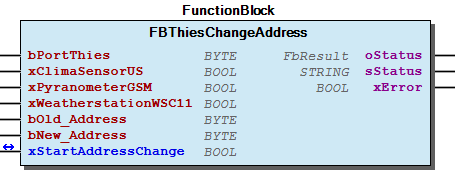
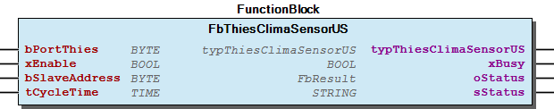
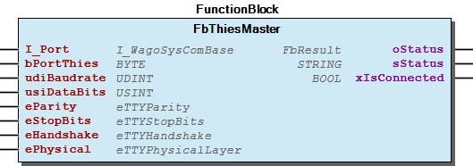
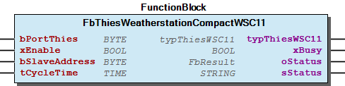

# WagoSolThies v1.0.2.4 (WAGO) - Complete Documentation

## 📋 Library Information

- **Company:** WAGO
- **Title:** WagoSolThies
- **Version:** 1.0.2.4
- **Categories:** Application; WAGO BusinessView|Building Automation; WAGO FunctionalView|Connectivity|Serial; WAGO LayerView|Solution
- **Namespace:** WagoSolThies
- **Author:** WAGO / u015842
- **Placeholder:** WagoSolThies

### Description ¶

This document is automatically generated.

This library supports Thies weather sensors communication with serial Modbus communication.

This document is automatically generated. This library supports Thies weather sensors communication with serial Modbus communication.

### Contents: ¶

Contents: - Documentation Index - Project Information - Library Information - Function Blocks FBThiesChangeAddress (FB) - FbThiesClimaSensorUS (FB) - FbThiesMaster (FB) - FbThiesPyranometerGSM (FB) - FbThiesWeatherstationCompactWSC11 (FB) Program Organization Global Variable Lists - GlobalVariables (GVL) - Status (GVL) - VersionHistory (GVL) Other Components - 00 Communication - 01 Change Address - 10 Clima Sensor US - 20 Pyranometer GSM - 30 Weatherstation Compact WSC11 - 80 Status - 80 Types - FbThiesClimaSensorUS.Convert (ACT) - FbThiesPyranometerGSM.Convert (ACT) - FbThiesWeatherstationCompactWSC11.Convert (ACT) - ... and 13 more

### Indices and tables ¶

Based on WagoSolThies.library, last modified 29.05.2024, 20:51:26. LibDoc 3.5.16.10

© WAGO GmbH & Co. KG, Germany 2018 – All rights reserved. For the avoidance of doubt, this copyright notice does not only apply to the information above but also and primarily to the described library itself. Please note that third-party products are always mentioned without reference to intellectual property rights, including patents, utility models, designs and trademarks, accordingly the existence of such rights cannot be excluded. WAGO is a registered trademark of WAGO Verwaltungsgesellschaft mbH.

- File and Project Information - Library Reference Based on WagoSolThies.library, last modified 29.05.2024, 20:51:26. LibDoc 3.5.16.10 © WAGO GmbH & Co. KG, Germany 2018 – All rights reserved. For the avoidance of doubt, this copyright notice does not only apply to the information above but also and primarily to the described library itself. Please note that third-party products are always mentioned without reference to intellectual property rights, including patents, utility models, designs and trademarks, accordingly the existence of such rights cannot be excluded. WAGO is a registered trademark of WAGO Verwaltungsgesellschaft mbH.

### Documentation Index

## WagoSolThies Library Documentation

| Company: | WAGO |
| Title: | WagoSolThies |
| Version: | 1.0.2.4 |
| Categories: | Application; WAGO BusinessView\|Building Automation; WAGO FunctionalView\|Connectivity\|Serial; WAGO LayerView\|Solution |
| Namespace: | WagoSolThies |
| Author: | WAGO / u015842 |
| Placeholder: | WagoSolThies |

### Description

This document is automatically generated.

This library supports Thies weather sensors communication with serial Modbus communication.

This document is automatically generated. This library supports Thies weather sensors communication with serial Modbus communication.

### Contents:

- 20 Program Organization Units 00 Communication - 01 Change Address - 10 Clima Sensor US - 20 Pyranometer GSM - 30 Weatherstation Compact WSC11 - 80 Types 80 Status - Status (GVL) - eStatus (ENUM) GlobalVariables (GVL) ParameterList (PARAMS) VersionHistory (GVL)

### Indices and tables

Based on WagoSolThies.library, last modified 29.05.2024, 20:51:26. LibDoc 3.5.16.10

© WAGO GmbH & Co. KG, Germany 2018 – All rights reserved. For the avoidance of doubt, this copyright notice does not only apply to the information above but also and primarily to the described library itself. Please note that third-party products are always mentioned without reference to intellectual property rights, including patents, utility models, designs and trademarks, accordingly the existence of such rights cannot be excluded. WAGO is a registered trademark of WAGO Verwaltungsgesellschaft mbH.

- File and Project Information - Library Reference Based on WagoSolThies.library, last modified 29.05.2024, 20:51:26. LibDoc 3.5.16.10 © WAGO GmbH & Co. KG, Germany 2018 – All rights reserved. For the avoidance of doubt, this copyright notice does not only apply to the information above but also and primarily to the described library itself. Please note that third-party products are always mentioned without reference to intellectual property rights, including patents, utility models, designs and trademarks, accordingly the existence of such rights cannot be excluded. WAGO is a registered trademark of WAGO Verwaltungsgesellschaft mbH.

### Project Information

## File and Project Information

| Scope | Name | Type | Content |
| --- | --- | --- | --- |
| FileHeader | libraryFile | string | WagoSolThies.library |
| contentFile | doc.clean.json |
| productName | e!COCKPIT |
| creationDateTime | date | 29.05.2024, 20:51:27 |
| companyName | string | WAGO |
| ProjectInformation | LastModificationDateTime | date | 29.05.2024, 20:51:26 |
| Description | string | See: Description |
| Copyright | © WAGO Kontakttechnik GmbH & Co. KG, Germany 2018 – All rights reserved. |
| Author | WAGO / u015842 |
| AutoResolveUnbound | bool | True |
| Placeholder | string | WagoSolThies |
| Company | WAGO |
| DocFormat | reStructuredText |
| Project | WagoSolThies |
| DefaultNamespace | WagoSolThies |
| Version | version | 1.0.2.4 |
| Title | string | WagoSolThies |
| LibraryCategories | library-category-list | Application; WAGO BusinessView\|Building Automation; WAGO FunctionalView\|Connectivity\|Serial; WAGO LayerView\|Solution |
| CompiledLibraryCompatibilityVersion | string | CODESYS V3.5 SP16 Patch 3 |
| ThreadSafe | FALSE |

### Library Information

## Library Reference

| LinkAllContent: False QualifiedOnly: False | SystemLibrary: True | Optional: False |

| LinkAllContent: False QualifiedOnly: False | SystemLibrary: True | Optional: False |

| LinkAllContent: False QualifiedOnly: False | SystemLibrary: False | Optional: False |

| LinkAllContent: False QualifiedOnly: True | SystemLibrary: False | Optional: False |

| LinkAllContent: False QualifiedOnly: False | SystemLibrary: False | Optional: False |

| LinkAllContent: False QualifiedOnly: False | SystemLibrary: False | Optional: False |

| LinkAllContent: False QualifiedOnly: False | SystemLibrary: False | Optional: False |

| LinkAllContent: False QualifiedOnly: False | SystemLibrary: False | Optional: False |

| LinkAllContent: False Optional: False | QualifiedOnly: True SystemLibrary: False | PublishSymbolsInContainer: True |

| LinkAllContent: False Optional: False | QualifiedOnly: False SystemLibrary: False | PublishSymbolsInContainer: True |

This is a dictionary of all referenced libraries and their name spaces.

This is a dictionary of all referenced libraries and their name spaces. Analyzation Library Identification : Placeholder: Analyzation Default Resolution: Analyzation, 4.1.0.0 (System) Namespace: Analyzation Library Properties : Library Parameter : Parameter: TABLE_UPPER_BOUND = 15 Parameter: STRING_LENGTH_ADDRESS = 20 Parameter: STRING_LENGTH_EXP = 255 Parameter: STRING_LENGTH_COMMENT = 255 Parameter: TABLE_SHOW_VALID_ITEMS = FALSE Parameter: STRING_LENGTH_OUTSTRING = 255 IecSfc Library Identification : Placeholder: IecSfc Default Resolution: IecSfc, 4.1.0.0 (System) Namespace: IecSfc Library Properties : Standard Library Identification : Placeholder: Standard Default Resolution: Standard, * (System) Namespace: Standard Library Properties : WagoAppPlcModbus Library Identification : Placeholder: WagoAppPlcModbus Default Resolution: WagoAppPlcModbus, * (WAGO) Namespace: WagoAppPlcModbus Library Properties : WagoAppTime Library Identification : Placeholder: WagoAppTime Default Resolution: WagoAppTime, * (WAGO) Namespace: WagoAppTime Library Properties : WagoSysBSDSocket Library Identification : Placeholder: WagoSysBSDSocket Default Resolution: WagoSysBSDSocket, * (WAGO) Namespace: WagoSysBSDSocket Library Properties : WagoSysErrorBase Library Identification : Placeholder: WagoSysErrorBase Default Resolution: WagoSysErrorBase, * (WAGO) Namespace: WagoSysErrorBase Library Properties : Library Parameter : Parameter: RES_LOG_MAX_FILESIZE = 2000 Parameter: RES_LOG_MAX_FILES = 1 Parameter: RES_LOG_MAX_ENTRIES = 200 Parameter: RES_LOG_NAME = ‘WagoAppResultLogger’ WagoSysVersion Library Identification : Name: WagoSysVersion Version: 1.0.0.0 Company: WAGO Namespace: WagoSysVersion Library Properties : WagoTypesCom Library Identification : Placeholder: WagoTypesCom Default Resolution: WagoTypesCom, * (WAGO) Namespace: WagoTypesCom Library Properties : WagoTypesCommon Library Identification : Placeholder: WagoTypesCommon Default Resolution: WagoTypesCommon, * (WAGO) Namespace: WagoTypes Library Properties :

### Function Blocks

## FBThiesChangeAddress (FB)

| Scope | Name | Type | Initial | Comment |
| --- | --- | --- | --- | --- |
| Input | bPortThies | BYTE | 1 | Master assignment number for other function blocks. Range 1 to MAX_MASTER. |
| xClimaSensorUS | BOOL |  | Set Clima Sensor US for readdressing |
| xPyranometerGSM | BOOL |  | Set Pyranometer GSM for readdressing |
| xWeatherstationWSC11 | BOOL |  | Set Weatherstation WSC11 for readdressing |
| bOld_Address | BYTE |  | Old address of the sensor. If you don’t know the old address try “0” for broadcast. |
| bNew_Address | BYTE |  | New address of the sensor if address change was completed |
| Output | oStatus | WagoAppPlcModbus.WagoSysErrorBase.FbResult |  | Status object. The content of the error object could be displayed via the FbShowResult from the WagoSysErrorBase library. |
| sStatus | STRING |  | Status description as string |
| xError | BOOL |  | Signals for 5 seconds a detected error. |
| Inout | xStartAddressChange | BOOL |  | Start addressing. It is reset after readressing is complete. |

You should always call this FB cyclic.

Only one input can be set between the ‘xClimaSensorUS’, ‘xPyranometerGSM’ and ‘xWeatherstationWSC11’ inputs. If more than one of these inputs is set, the module outputs a tip at the ‘stStatus’ output and points to an error at the ‘xError’ output.

If you want to operate a Pyranometer GSM and Compact WSC 11 weather station on a Modbus line with the same address, the sensors can only be readdressed if one of the sensors is disconnected from the bus.

Graphical Illustration

Graphical Interface of FBThiesChangeAddress

Interface variables Function The function block is used to readdress a Thies sensor. Readdressing is required when 2 or more sensors have the same address on a Modbus line. Note You should always call this FB cyclic. Note Only one input can be set between the ‘xClimaSensorUS’, ‘xPyranometerGSM’ and ‘xWeatherstationWSC11’ inputs. If more than one of these inputs is set, the module outputs a tip at the ‘stStatus’ output and points to an error at the ‘xError’ output. Note If you want to operate a Pyranometer GSM and Compact WSC 11 weather station on a Modbus line with the same address, the sensors can only be readdressed if one of the sensors is disconnected from the bus. Graphical Illustration  Graphical Interface of FBThiesChangeAddress

## FbThiesClimaSensorUS (FB)

| Scope | Name | Type | Initial | Comment |
| --- | --- | --- | --- | --- |
| Input | bPortThies | BYTE | 1 | Master assignment number for other function blocks. Range 1 to MAX_MASTER. |
| xEnable | BOOL | TRUE | Enable signal to start read out sensor. |
| bSlaveAddress | BYTE | 1 | Slave address of the sensor. |
| tCycleTime | TIME | TIME#1s0ms | Cycle time for reading the sensor. |
| Output | typThiesClimaSensorUS | typThiesClimaSensorUS |  | Sensor data |
| xBusy | BOOL |  | Busy-signal if function block is working. |
| oStatus | WagoAppPlcModbus.WagoSysErrorBase.FbResult |  | Status object. The content of the error object could be displayed via the FbShowResult from the WagoSysErrorBase library. |
| sStatus | STRING |  | Status description as string |

| Synop key | Explanation |
| 0 | No precipitation |
| 40 | Precipitation |
| 51 | Light drizzle |
| 52 | Moderate drizzle |
| 53 | Heavy drizzle |
| 61 | Light rain |
| 62 | Moderate rain |
| 63 | Heavy rain |
| 67 | Light rain and/or drizzle with snow |
| 68 | Moderate rain and/or drizzle with snow |
| 70 | Snow |
| 71 | Light snow |
| 72 | Moderate snow |
| 73 | Heavy snow |
| 74 | Ice pellets |
| 89 | Heavy hail |

| Bit No. | Function | Description |
| Bit 0 | General disturbance | Averaging time < 10 s: Error if no new measured value can be determined over a period of 10 s. Averaging time >= 10 s: Error if values are contained in the averaging buffer based on a one-second measuring rate less than 50%. |
| Bit 1..3 | Used message memory | Indicate the fill level of the averaging buffer in binary format. 0: Buffer 0 < x <= 1/8 1: Buffer 1/8 < x <= 1/4 full 2: Buffer 1/4 < x <= 3/8 full 3: Buffer 3/8 < x <= 1/2 full 4: Buffer 1/2 < x <= 5/8 full 5: Buffer 5/8 < x <= 3/4 full 6: Buffer 3/4 < x <= 7/8 full 7: Buffer 7/8 < x <= 1 full |
| Bit 4 | Plausibility ON | Set if plausibility is ON |
| Bit 5 | Static disturbance | Set if a static disturbance has occurred. e.g. persistent violation of the VT, no measured values. (>1 min.) |
| Bit 6 | Hearing release | Set if the heating system control is activated |
| Bit 7 | Heating status | Set if heating is ON |

The function block reads the measured values from the Thies Clima Sensor US weather station and presents them as a structure.

You should always call this FB cyclic.

Graphical Illustration

Graphical Interface of FbThiesClimaSensorUS

Type of Precipitation for Clima Sensor US:

Sensor Status for Clima Sensor US:

..note:: Depending on the software version, the Fb reads the Modbus registers that are possible as a result. If measured values ​​are not available in the respective software version, the measured value is set to error.

Interface variables Function The function block reads the measured values from the Thies Clima Sensor US weather station and presents them as a structure. Note You should always call this FB cyclic. Graphical Illustration  Graphical Interface of FbThiesClimaSensorUS Function description Type of Precipitation for Clima Sensor US: Sensor Status for Clima Sensor US: ..note:: Depending on the software version, the Fb reads the Modbus registers that are possible as a result. If measured values ​​are not available in the respective software version, the measured value is set to error. - FbThiesClimaSensorUS.Convert (ACT)

## FbThiesMaster (FB)

| Scope | Name | Type | Initial | Comment |
| --- | --- | --- | --- | --- |
| Input | I_Port | WagoTypesCom.I_WagoSysComBase |  | Name of the serial Interface (e.g. ‘COM2’, ‘SER7.2’, ) |
| bPortThies | BYTE | 1 | Master assignment number for other function blocks. Range 1 to MAX_MASTER. |
| udiBaudrate | UDINT | 9600 | Baud rate (9600 = 9k6) |
| usiDataBits | USINT | 8 | Number of Bits per Frame (5..8) |
| eParity | WagoAppPlcModbus.WagoTypesCom.eTTYParity | WagoAppPlcModbus.WagoTypesCom.eTTYParity.None | Parity |
| eStopBits | WagoAppPlcModbus.WagoTypesCom.eTTYStopBits | WagoAppPlcModbus.WagoTypesCom.eTTYStopBits.One | Number of stop bits |
| eHandshake | WagoAppPlcModbus.WagoTypesCom.eTTYHandshake | WagoAppPlcModbus.WagoTypesCom.eTTYHandshake.None | TYPE of handshake (XON/XOFF, etc) |
| ePhysical | WagoAppPlcModbus.WagoTypesCom.eTTYPhysicalLayer | WagoAppPlcModbus.WagoTypesCom.eTTYPhysicalLayer.RS485_HalfDuplex | RS232, RS422, RS485, etc |
| Output | oStatus | WagoAppPlcModbus.WagoSysErrorBase.FbResult |  | Status object. The content of the error object could be displayed via the FbShowResult from the WagoSysErrorBase library. |
| sStatus | STRING |  | Status description as string |
| xIsConnected | BOOL |  | Device is connected |

You should always call this FB cyclic.

Graphical Illustration

Graphical Interface of FbThiesMaster

Interface variables Function The function block is used for Thies wheather sensors communication via serial interface using MODBUS communication. Note You should always call this FB cyclic. Graphical Illustration  Graphical Interface of FbThiesMaster

## FbThiesPyranometerGSM (FB)

| Scope | Name | Type | Initial | Comment |
| --- | --- | --- | --- | --- |
| Input | bPortThies | BYTE | 1 | Master assignment number for other function blocks. Range 1 to MAX_MASTER. |
| xEnable | BOOL | TRUE | Enable signal to start read out sensor |
| bSlaveAddress | BYTE | 1 | Slave address of the sensor |
| tCycleTime | TIME | TIME#1s0ms | Cycle time for read out the sensor |
| Output | typThiesPyranometerGSM | typThiesPyranometerGSM |  | Sensor data |
| xBusy | BOOL |  | Busy-signal if function block is working |
| oStatus | WagoAppPlcModbus.WagoSysErrorBase.FbResult |  | Status object. The content of the error object could be displayed via the FbShowResult from the WagoSysErrorBase library. |
| sStatus | STRING |  | Status description as string |

You should always call this FB cyclic.

Graphical Illustration

Graphical Interface of FbThiesClimaSensorUS

Interface variables Function The function block reads the measured values from the Thies Pyranometer GSM 10.7 weather station and presents them as a structure. Note You should always call this FB cyclic. Graphical Illustration  Graphical Interface of FbThiesClimaSensorUS - FbThiesPyranometerGSM.Convert (ACT)

## FbThiesWeatherstationCompactWSC11 (FB)

| Scope | Name | Type | Initial | Comment |
| --- | --- | --- | --- | --- |
| Input | bPortThies | BYTE | 1 | Master assignment number for other function blocks. Range 1 to MAX_MASTER. |
| xEnable | BOOL | TRUE | Enable signal to start read out sensor |
| bSlaveAddress | BYTE | 1 | Slave address of the sensor |
| tCycleTime | TIME | TIME#1s0ms | Cycle time for read out the sensor |
| Output | typThiesWSC11 | typThiesWSC11 |  | Sensor data |
| xBusy | BOOL |  | Busy-signal if function block is working |
| oStatus | WagoAppPlcModbus.WagoSysErrorBase.FbResult |  | Status object. The content of the error object could be displayed via the FbShowResult from the WagoSysErrorBase library. |
| sStatus | STRING |  | Status description as string |

You should always call this FB cyclic.

Graphical Illustration

Graphical Interface of FbThiesWeatherstationCompactWSC11

Interface variables Function The function block reads the measured values from the Thies Compact WSC11 weather station and presents them as a structure. Note You should always call this FB cyclic. Graphical Illustration  Graphical Interface of FbThiesWeatherstationCompactWSC11 - FbThiesWeatherstationCompactWSC11.Convert (ACT)

### Program Organization

## 20 Program Organization Units

- 00 Communication FbThiesMaster (FB) 01 Change Address - FBThiesChangeAddress (FB) 10 Clima Sensor US - FbThiesClimaSensorUS (FB) FbThiesClimaSensorUS.Convert (ACT) 20 Pyranometer GSM - FbThiesPyranometerGSM (FB) FbThiesPyranometerGSM.Convert (ACT) 30 Weatherstation Compact WSC11 - FbThiesWeatherstationCompactWSC11 (FB) FbThiesWeatherstationCompactWSC11.Convert (ACT) 80 Types - typThiesClimaSensorUS (STRUCT) - typThiesClimaSensorUSRawData (STRUCT) - typThiesMaster (STRUCT) - typThiesPyranometerGSM (STRUCT) - typThiesPyranometerGSMRawData (STRUCT) - typThiesWSC11 (STRUCT) - typThiesWeatherstationCompactWSC11RawData (STRUCT) - typThies_bValue (STRUCT) - typThies_dtValue (STRUCT) - typThies_rValue (STRUCT) - typThies_xValue (STRUCT)

### Global Variable Lists

## GlobalVariables (GVL)

| Name | Type | Comment |
| --- | --- | --- |
| gThiesMaster | ARRAY [1..MAX_MASTER] OF typThiesMaster | Stucture to communicate with master function block. |

## Status (GVL)

| Scope | Name | Type |
| --- | --- | --- |
| Constant | gc_Status | ARRAY [0..5] OF WagoTypesErrorBase.typResultItem |

| Value | Level | Description |
| --- | --- | --- |
| eStatus.Ok | WagoTypesErrorBase.WagoTypes.eSeverity.none | ‘OK’ |
| eStatus.Busy | WagoTypesErrorBase.WagoTypes.eSeverity.info | ‘Busy’ |
| eStatus.SelectedDevice | WagoTypesErrorBase.WagoTypes.eSeverity.info | ‘Select a device’ |
| eStatus.OnlyOneDevice | WagoTypesErrorBase.WagoTypes.eSeverity.error | ‘Select only one device’ |

## VersionHistory (GVL)

| Name | Type |
| --- | --- |
| Info | WagoSysVersion.ProjectInfo |

| date | version | author | change |
| 26.02.2024 | 1.0.2.4 | u010663 | Compiled SP16.3 |
| 15.09.2023 | 1.0.2.3 | u0105598 | WAT-36060 - WagoSolThies FbThiesClimaSensorUS GlobalRadiation was not output even though the data is there xError True |
| 15.08.2023 | 1.0.2.2 | u0105598 | 32- & 64-Bit |
| 03.05.2023 | 1.0.2.1 | u0105598 | Added newest Datapoints to FbThiesClimaSensorUS and improved software version query |
| 08.11.2022 | 1.0.2.0 | u0105598 | improved: FbThiesClimaSensorUS: added a software version query. Based on this, the Modbus registers are queried according to the manual. |
| 08.01.2019 | 1.0.1.0 | u015842 | Properties: free placeholder added |
| 07.02.2018 | 1.0.0.2 | u010188 | Category assignment “App” removed |
| 16.11.2017 | 1.0.0.1 | u010545 | WagoSysCom_Internal removed / Attribut NoPlaceholder removed |
| 07.11.2017 | 1.0.0.0 | u015842 | Release Version |

WagoSolThies.library

Release Notes:

Known Bugs:

WagoSolThies.library Release Notes: Known Bugs:

### Other Components

## 00 Communication ¶

## 01 Change Address ¶

- FBThiesChangeAddress (FB)

## 10 Clima Sensor US

- FbThiesClimaSensorUS (FB) FbThiesClimaSensorUS.Convert (ACT)

## 20 Pyranometer GSM

- FbThiesPyranometerGSM (FB) FbThiesPyranometerGSM.Convert (ACT)

## 30 Weatherstation Compact WSC11

- FbThiesWeatherstationCompactWSC11 (FB) FbThiesWeatherstationCompactWSC11.Convert (ACT)

## 80 Status ¶

- Status (GVL) - eStatus (ENUM)

## 80 Types

- typThiesClimaSensorUS (STRUCT) - typThiesClimaSensorUSRawData (STRUCT) - typThiesMaster (STRUCT) - typThiesPyranometerGSM (STRUCT) - typThiesPyranometerGSMRawData (STRUCT) - typThiesWSC11 (STRUCT) - typThiesWeatherstationCompactWSC11RawData (STRUCT) - typThies_bValue (STRUCT) - typThies_dtValue (STRUCT) - typThies_rValue (STRUCT) - typThies_xValue (STRUCT)

## FbThiesClimaSensorUS.Convert (ACT)

—MedianWindSpeed / 35001 & 35000 — ab 2.0 —

—MedianWindSpeed / 35001 & 35000 — ab 2.0 —

## FbThiesPyranometerGSM.Convert (ACT)

—CaseTemperature—

## FbThiesWeatherstationCompactWSC11.Convert (ACT)

—WindSpeed—

## ParameterList (PARAMS)

| Scope | Name | Type | Initial | Comment |
| --- | --- | --- | --- | --- |
| Constant | MAX_MASTER | BYTE | 3 | Defines the max. possible Thies master. |
| CYCLES_TO_VERIFY_ERROR | BYTE | 3 | Retry cycles to identify errors to filter “one-cycle- errors”. |

## eStatus (ENUM)

| Name | Initial |
| --- | --- |
| Ok | 0 |
| Busy | 1 |
| SelectedDevice | 2 |
| OnlyOneDevice | 3 |

## typThiesClimaSensorUS (STRUCT)

| Name | Type | Initial | Comment |
| --- | --- | --- | --- |
| xGlobalError | BOOL |  | Displays if a measured value was read incorrectly or if Modbus communication is disrupted. |
| typMedianWindSpeed | typThies_rValue |  | Median wind velocity in m/s |
| typMedianWindDirection | typThies_rValue |  | Median wind direction in ° |
| typAirTemperature | typThies_rValue |  | Air temperature in °C |
| typCaseTemperature | typThies_rValue |  | Building inside temperature in °C |
| typAcusticalTemperature | typThies_rValue |  | Acoustic temperature in °C |
| typUncorrectedAirTemperature | typThies_rValue |  | Uncorrected air temperature in °C |
| typRelativeHumidity | typThies_rValue |  | Relative humidity in % r.H. |
| typDewpointTemperature | typThies_rValue |  | Dew point temperature in °C |
| typAbsoluteAirPressure | typThies_rValue |  | Absolute air pressure in hPa |
| typRelativeAirPressure | typThies_rValue |  | Relative air pressure at sea level in hPa |
| typBrightnessNorth | typThies_rValue |  | Brightness north in kLux |
| typBrightnessEast | typThies_rValue |  | Brightness east in kLux |
| typBrightnessSouth | typThies_rValue |  | Brightness south in kLux |
| typBrightnessWest | typThies_rValue |  | Brightness west in kLux |
| typDirectionOfBrightness | typThies_rValue |  | Direction of brightness in ° |
| typMaxBrightness | typThies_rValue |  | Maximum brightness value in kLux |
| typStatusOfRain | typThies_xValue |  | Precipitation status; TRUE=Precipitation |
| typRainIntens | typThies_rValue |  | Precipitation intensity (extrapolated to the last minute of the hour) in mm/h |
| typRainfall | typThies_rValue |  | Amount of precipitation (reset at 12:00 AM) in mm/d |
| typKindOfRain | typThies_rValue |  | Type of precipitation Code. For additional information see Table in FbThiesClimaSensorUS |
| typDateTime | typThies_dtValue |  | Date and time in the format DT#YYYY-MM-DD-HH:MM:SS |
| typLongitude | typThies_rValue |  | Longitude in ° |
| typLatitude | typThies_rValue |  | Latitude in ° |
| typElevation | typThies_rValue |  | Position of the sun, elevation in ° |
| typAzimut | typThies_rValue |  | Position of the sun, azimuth in °; 0°=north 180°=south |
| typHeightNZ | typThies_rValue |  | Station height above NN in m (determined by GPS signal) |
| typGeneralDisturbance | typThies_xValue |  | General disturbance. For additional information see Table in FbThiesClimaSensorUS |
| typPuffer | typThies_bValue |  | Used message memory. For additional information see Table in FbThiesClimaSensorUS |
| typPlausibility | typThies_xValue |  | Plausibility. For additional information see Table in FbThiesClimaSensorUS |
| typStaticDisturbance | typThies_xValue |  | Static disturbance. For additional information see Table in FbThiesClimaSensorUS |
| typHeatingControlActive | typThies_xValue |  | Heating System Control. For additional information see Table in FbThiesClimaSensorUS |
| typHeatingOn | typThies_xValue |  | Heating. For additional information see Table in FbThiesClimaSensorUS |
| typSensorVoltage | typThies_rValue |  | Sensor supply voltage in V |
| typLiveCounter | typThies_rValue |  | Live counter in ms |
| typErrorStatusLastMeasurement | typThies_xValue |  | Error status of the last measured value; TRUE= Measured value was faulty |
| typ2ndBrightnessNorth | typThies_rValue |  | Brightness north in Lux |
| typ2ndBrightnessEast | typThies_rValue |  | Brightness east in Lux |
| typ2ndBrightnessSouth | typThies_rValue |  | Brightness south in Lux |
| typ2ndBrightnessWest | typThies_rValue |  | Brightness west in Lux |
| typ2ndMaxBrightness | typThies_rValue |  | Maximum brightness value in Lux |
| rSoftwareVersion | REAL | 0 | Software Version of the ClimaSensorUS |
| typMaxWindSpeedGust | typThies_rValue |  | Maximum wind speed gust in m/s wind direction of the gust in m/s available when Average wind speed>=30 over 3s (parameterizable (AV:40015)) |
| typWindDirectionGust | typThies_rValue |  | Wind direction of the gust in ° available when Average wind speed>=30 over 3s (parameterizable (AV:40015)) |
| typAbsoluteHumidity | typThies_rValue |  | Absolute humidity in g/m^3 |
| typRelativeHumidityUncorrected | typThies_rValue |  | Relative humidity uncorrected in % r.h. |
| typDifAngleNorthMarkerNorthPole | typThies_rValue |  | Magnetic compass Difference angle between device north marker and magnetic north pole in ° |
| typBrightnessVectorialSum | typThies_rValue |  | Brightness Vectorial Sum in Lux |
| typWindChillTemperature | typThies_rValue |  | Wind chill temperature in °C Valid if Air temperature <10°C |
| typHeatIndexTemperature | typThies_rValue |  | Heat index temperature in °C Valid if Air temperature >26°C and relative humidity >40% |
| typRainfallAbsolutely | typThies_rValue |  | Rainfall absolutely in mm Overflow at 1000000 |
| typGlobalRadiation | typThies_rValue |  | Global radiation in W/mm^2 |
| typPitchAngleBetweenNorthSouth | typThies_rValue |  | Pitch from magnetic compass Angle between North South to the horizontal in ° |
| typRollAngleBetweenWestEast | typThies_rValue |  | Roll from magnetic compass Angle between West East to the horizontal in ° |
| typRainTemperature | typThies_rValue |  | Rain temperature Only valid for rain and air temperature >5°C in °C |
| typAverageWindSpeed | typThies_rValue |  | Average wind speed in m/s |
| typGlobalRadiation2 | typThies_rValue |  | Global radiation 2 in W/mm^2 |
| typReserved | typThies_rValue |  | Reserved by Thies |
| typTrueWind | typThies_rValue |  | Measured value with two decimal place in m/s e.g. 923=9.23m/s |
| typTrueAngle | typThies_rValue |  | Measured value with one decimal place in ° e.g. 900=90.0° |
| typSpeedOverGroundGPS | typThies_rValue |  | Measured value with two decimal place in m/s e.g. 923=9.23m/s |
| typTrackAngleGPS | typThies_rValue |  | Measured value with one decimal place in ° e.g. 900=90.0° |

## typThiesClimaSensorUSRawData (STRUCT)

| Name | Type | Comment |
| --- | --- | --- |
| udiMedianWindSpeed | UDINT | Measured value with one decimal place in m/s e.g. 101=10.1m/s |
| udiMedianWindDirection | UDINT | Measured value with one decimal place in ° e.g. 1010=101.0° |
| diAirTemperature | DINT | Measured value with one decimal place in °C e.g. 255=25.5°C |
| diCaseTemperature | DINT | Measured value with one decimal place in °C e.g. 255=25.5°C |
| diAcusticalTemperature | DINT | Measured value with one decimal place in °C e.g. 255=25.5°C |
| diUncorrectedAirTemperature | DINT | Measured value with one decimal place in °C e.g. 255=25.5°C |
| udiRelativeHumidity | UDINT | Measured value with one decimal place in % e.g. 255=25.5% |
| diDewpointTemperature | DINT | Measured value with one decimal place in °C e.g. 255=25.5°C |
| udiAbsoluteAirPressure | UDINT | Measured value with two decimal place in hPa e.g. 105000=1050.00hPa |
| udiRelativeAirPressure | UDINT | Measured value with two decimal place in hPa e.g. 105000=1050.00hPa |
| udiBrightnessNorth | UDINT | Measured value with one decimal place in kLux e.g. 1200=120.0 kLux |
| udiBrightnessEast | UDINT | Measured value with one decimal place in kLux e.g. 1200=120.0 kLux |
| udiBrightnessSouth | UDINT | Measured value with one decimal place in kLux e.g. 1200=120.0 kLux |
| udiBrightnessWest | UDINT | Measured value with one decimal place in kLux e.g. 1200=120.0 kLux |
| udiDirectionOfBrightness | UDINT | Measured value in ° e.g. 120=120° |
| udiMaxBrightness | UDINT | Measured value with one decimal place in kLux e.g. 1200=120.0 kLux |
| udiStatusOfRain | UDINT | 0=no Precipitation; 1=Precipitation |
| udiRainIntens | UDINT | Measured value with three decimal place in mm/h e.g. 12345=12.345mm/h |
| udiRainfall | UDINT | Measured value with three decimal place in mm/d e.g. 12345=12.345mm/d |
| udiKindOfRain | UDINT | Type of precipitation Code. |
| udiDate | UDINT | Measured value with one decimal place in JJJJ.MM.DD 20121210=10.12.2012 |
| udiTime | UDINT | Measured value with one decimal place in HH:MM:SS 121035=12:10:35 |
| diLongitude | DINT | Measured value with six decimal place in ° |
| diLatitude | DINT | Measured value with six decimal place in ° |
| diElevation | DINT | Measured value with one decimal place in ° e.g. 900=90.0° |
| diAzimut | DINT | Measured value with one decimal place in °, 0°=North 180°=South e.g. 1800=180.0° |
| diHeightNZ | DINT | Measured value with one decimal place in m e.g. 240=240m above sea level |
| udiSensorStatus | UDINT | Status of the sensor |
| udiSensorVoltage | UDINT | Measured value with one decimal place in V e.g. 241=24.1V |
| udiLiveCounter | UDINT | Value in ms |
| udiErrorStatusLastMeasurement | UDINT | Error status |
| udi2ndBrightnessNorth | UDINT | Measured value in Lux e.g. 1200=1200 Lux |
| udi2ndBrightnessEast | UDINT | Measured value Lux e.g. 1200=1200 Lux |
| udi2ndBrightnessSouth | UDINT | Measured value with Lux e.g. 1200=1200 Lux |
| udi2ndBrightnessWest | UDINT | Measured value with Lux e.g. 1200=1200 Lux |
| udi2ndMaxBrightness | UDINT | Measured value with Lux e.g. 1200=1200 Lux |
| udiMaxWindSpeedGust | UDINT | Measured value with one decimal place in m/s e.g. 101=10.1m/s |
| udiWindDirectionGust | UDINT | Measured value with one decimal place in ° e.g. 900=90.0° |
| udiAbsoluteHumidity | UDINT | Measured value with two decimal place in g/m^3 e.g. 923=9.23g/m^3 |
| udiRelativeHumidityUncorrected | UDINT | Measured value with one decimal place in % r.h. e.g. 255=25.5% |
| udiDifAngleNorthMarkerNorthPole | UDINT | Measured value with one decimal place in ° e.g. 900=90.0° |
| udiBrightnessVectorialSum | UDINT | Measured value in Lux e.g. 1200=1200 Lux |
| diWindChillTemperature | DINT | Measured value with one decimal place in °C e.g. 255=25.5°C |
| diHeatIndexTemperature | DINT | Measured value with one decimal place in °C e.g. 255=25.5°C |
| udiRainfallAbsolutely | UDINT | Measured value with three decimal place in mm e.g. 12345=12.345mm/d (Overflow at 1000000) |
| diGlobalRadiation | DINT | Measured value with one decimal place in W/mm^2 e.g. 10000=1000.0W/m^2 |
| diPitchAngleBetweenNorthSouth | DINT | Measured value with one decimal place in ° e.g. 900=90.0° |
| diRollAngleBetweenWestEast | DINT | Measured value with one decimal place in ° e.g. 900=90.0° |
| diRainTemperature | DINT | Measured value with one decimal place in °C e.g. 255=25.5°C |
| diGlobalRadiation2 | DINT | Measured value with one decimal place in W/mm^2 e.g. 10000=1000.0W/m^2 |
| udiAverageWindSpeed | UDINT | Measured value with two decimal place in m/s e.g. 923=9.23m/s |
| udiReserved | UDINT | Reserved by Thies |
| udiTrueWind | UDINT | Measured value with two decimal place in m/s e.g. 923=9.23m/s |
| udiTrueAngle | UDINT | Measured value with one decimal place in ° e.g. 900=90.0° |
| udiSpeedOverGroundGPS | UDINT | Measured value with two decimal place in m/s e.g. 923=9.23m/s |
| udiTrackAngleGPS | UDINT | Measured value with one decimal place in ° e.g. 900=90.0° |

## typThiesMaster (STRUCT)

| Name | Type | Initial | Comment |
| --- | --- | --- | --- |
| typModbusQuery | WagoAppPlcModbus.typMbQuery |  | Modbus Query |
| typModbusResponse | WagoAppPlcModbus.typMbResponse |  | Modbus Response |
| xReadWriteData | BOOL |  | Startsignal for Read/Write Modbus Data |
| oStatus | WagoAppPlcModbus.WagoSysErrorBase.FbResult |  | Detailed Status information |
| iAvailableFBs | INT | 0 | Number of instanced function blocks |
| iActiveFB | INT | 1 | Number of the actual active function block |

## typThiesPyranometerGSM (STRUCT)

| Name | Type | Comment |
| --- | --- | --- |
| xGlobalError | BOOL | Displays if a measured value was read incorrectly or if Modbus communication is disrupted. |
| typCaseTemperature | typThies_rValue | Case inside temperature in °C |
| typGlobalRadiation | typThies_rValue | Global radiation in W/m^2 |
| typGainX1 | typThies_xValue | 1x gain |
| typGainX2 | typThies_xValue | 2x gain |
| typGainX64 | typThies_xValue | 64x gain |
| typGainX128 | typThies_xValue | 128x gain |
| typADConversionRate10SPS | typThies_xValue | A/D conversion rate 10SPS |
| typADConversionRate80SPS | typThies_xValue | A/D conversion rate 80SPS |
| typSourceRadiationMeasurement | typThies_xValue | Source for the radiation measurement; 0=Peltier element, 1=Photodiode |
| typCyclesPerSecond | typThies_rValue | Main loop cycles in 1/s |
| typOperationTime | typThies_rValue | Operating time in s |
| typVoltagePeltierElement | typThies_rValue | Voltage of the Peltier element in mV |
| typVoltagePhotodiode | typThies_rValue | Voltage of the photodiode in mV |

## typThiesPyranometerGSMRawData (STRUCT)

| Name | Type | Comment |
| --- | --- | --- |
| diCaseTemperature | DINT | Case inside temperature with one decimal place in °C e.g. 355=35.5°C |
| diGlobalRadiation | DINT | Global radiation with one decimal place in W/m^2 e.g. 10000=1000.0 W/m^2 |
| udiSensorStatus | UDINT | Status of the sensor |
| udiCyclesPerSecond | UDINT | Main loop cycles in 1/s |
| udiOperationTime | UDINT | Operating time in s |
| diVoltagePeltierElement | DINT | Voltage of the Peltier element with one decimal place in mV e.g. 20000000=20mV |
| diVoltagePhotodiode | DINT | Voltage of the photodiode with one decimal place in mV e.g. 20000000=20mV |

## typThiesWSC11 (STRUCT)

| Name | Type | Comment |
| --- | --- | --- |
| xGlobalError | BOOL | Displays if a measured value was read incorrectly or if Modbus communication is disrupted. |
| typWindSpeed | typThies_rValue | Wind velocity in m/s |
| typMedianWindSpeed | typThies_rValue | Median wind velocity in m/s |
| typWindDirection | typThies_rValue | Wind direction in ° |
| typMedianWindDirection | typThies_rValue | Median wind direction in ° |
| typAirTemperature | typThies_rValue | Air temperature in °C |
| typCaseTemperature | typThies_rValue | Building inside temperature in °C |
| typDewPointTemperature | typThies_rValue | Dew point temperature in °C |
| typRelativeHumidity | typThies_rValue | Relative humidity in % r.H. |
| typAbsoluteHumidity | typThies_rValue | Absolute humidity in g/m^3 |
| typAbsoluteAirPressure | typThies_rValue | Absolute air pressure in hPa |
| typRelativeAirPressure | typThies_rValue | Relative air pressure at sea level in hPa |
| typGlobalRadiation | typThies_rValue | Global radiation in W/m^2 |
| typBrightnessNorth | typThies_rValue | Brightness north in kLux |
| typBrightnessEast | typThies_rValue | Brightness east in kLux |
| typBrightnessSouth | typThies_rValue | Brightness south in kLux |
| typBrightnessWest | typThies_rValue | Brightness west in kLux |
| typTwilight | typThies_rValue | Twilight in in Lux |
| typStatusOfRain | typThies_xValue | Precipitation status; TRUE=Precipitation |
| typDateTime | typThies_dtValue | Date and time in the format in YYYYMMDD 20121210=10.12.2012 |
| typTimeFormat | typThies_rValue | Offset for UTC time in h; 1=UTC+1h |
| typLongitude | typThies_rValue | Longitude in ° |
| typLatitude | typThies_rValue | Latitude in ° |
| typElevation | typThies_rValue | Position of the sun, elevation in ° |
| typAzimut | typThies_rValue | Position of the sun, azimuth in °; 0°=north 180°=south |
| typHeightNZ | typThies_rValue | Station height above NN in m (determined by GPS signal) |
| typMedianHeightNZ | typThies_rValue | Median station height above NN in m (determined by GPS signal) |
| typDewProtection | typThies_xValue | Status of dew protection |
| typDryingPhaseSensorSurface | typThies_xValue | Status of drying phase sensor surface |
| xInvalidADCData | BOOL | Status of the A/D converter values |
| xWatchdogReset | BOOL | TRUE: Last reset by watchdog reset |
| xInvalidEEPROMParameter | BOOL | Status of the internal EEPROM parameters |
| xEEPROMParameterStandardValues | BOOL | Interne EEPROM Parameter erhalten Standardwerte |
| xNewFirmware | BOOL | TRUE: Last restart with new firmware |
| rCyclesPerSecond | REAL | Main loop cycles in 1/s |
| rSHT2xTemperature | REAL | Temperature of the internal sensor in °C (can be ignored) |
| rNTCTemperature | REAL | Temperature of the internal sensor in °C (can be ignored) |
| rOperationTime | REAL | Operating time in s |

## typThiesWeatherstationCompactWSC11RawData (STRUCT)

| Name | Type | Comment |
| --- | --- | --- |
| udiWindSpeed | UDINT | Measured value with one decimal place in m/s e.g. 101=10.1 |
| udiMedianWindSpeed | UDINT | Measured value with one decimal place in m/s e.g. 101=10.1 |
| udiWindDirection | UDINT | Measured value with one decimal place in ° e.g. 1010=101.0° |
| udiMedianWindDirection | UDINT | Measured value with one decimal place in ° e.g. 1010=101.0° |
| diAirTemperature | DINT | Measured value with one decimal place in °C e.g. 255=25.5°C |
| diCaseTemperature | DINT | Measured value with one decimal place in °C e.g. 255=25.5°C |
| diDewPointTemperature | DINT | Measured value with one decimal place in °C e.g. 255=25.5°C |
| udiRelativeHumidity | UDINT | Measured value with one decimal place in % e.g. 255=25.5% |
| udiAbsoluteHumidity | UDINT | Measured value with two decimal place in g/m^3 e.g. 923=9.23g/m^3 |
| udiAbsoluteAirPressure | UDINT | Measured value with two decimal place in hPa e.g. 105000=1050.00 |
| udiRelativeAirPressure | UDINT | Measured valu with two decimal placee in hPa e.g. 105000=1050.00 |
| diGlobalRadiation | DINT | Globalstrahlung with one decimal place in W/m^2 e.g. 10000=1000.0 W/m^2 |
| udiBrightnessNorth | UDINT | Measured value with one decimal place in kLux e.g. 1200=120.0 kLux |
| udiBrightnessEast | UDINT | Measured value with one decimal place in kLux e.g. 1200=120.0 kLux |
| udiBrightnessSouth | UDINT | Measured value with one decimal place in kLux e.g. 1200=120.0 kLux |
| udiBrightnessWest | UDINT | Measured value with one decimal place in kLux e.g. 1200=120.0 kLux |
| udiTwilight | UDINT | Measured value with one decimal place in Lux e.g. 500=500 Lux |
| udiStatusOfRain | UDINT | 0=no Precipitation; 1=Precipitation |
| udiDate | UDINT | Measured value in JJJJMMDD 20121210=10.12.2012 |
| udiTime | UDINT | Measured value in HHMMSS 121035=12:10:35 |
| diTimeFormat | DINT | Measured value in h und ohne Kommastelle 1=UTC+1h |
| diLongitude | DINT | Measured value with six decimal place in ° |
| diLatitude | DINT | Measured value with six decimal place in ° |
| diElevation | DINT | Measured value with one decimal place in ° e.g. 900=90.0 |
| diAzimut | DINT | Measured value with one decimal place in ° e.g. 1800=180.0 0°=Noth 180°=South |
| udiHeightNZ | UDINT | Measured value in m e.g. 240=240m above sea level |
| udiSensorStatus | UDINT | Status of the sensor |
| udiCyclesPerSecond | UDINT | Measured value in 1/s |
| diSHT2xTemperature | DINT | Measured value with one decimal place in °C e.g. 255=25.5°C |
| diNTCTemperature | DINT | Measured value with one decimal place in °C e.g. 255=25.5°C |
| udiOperationTime | UDINT | Measured value in s |
| udiMedianHeightNZ | UDINT | Measured value with one decimal place in m e.g. 2400=240.0m above sea level |

## typThies_bValue (STRUCT)

| Name | Type | Comment |
| --- | --- | --- |
| bValue | BYTE | Measured value. |
| xError | BOOL | Error indication. |

## typThies_dtValue (STRUCT)

| Name | Type | Comment |
| --- | --- | --- |
| dtValue | DT | Measured value. |
| xError | BOOL | Error indication. |

## typThies_rValue (STRUCT)

| Name | Type | Comment |
| --- | --- | --- |
| rValue | REAL | Measured value. |
| xError | BOOL | Error indication. |

## typThies_xValue (STRUCT)

| Name | Type | Comment |
| --- | --- | --- |
| xValue | BOOL | Measured value. |
| xError | BOOL | Error indication. |