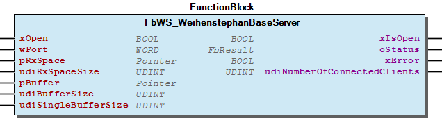

# WagoSolWeihenstephan v1.6.1.0 (WAGO) - Complete Documentation


## 📋 Library Information

- **Company:** WAGO
- **Title:** WagoSolWeihenstephan
- **Version:** 1.6.1.0
- **Categories:** WAGO LayerView|Solution; Application
- **Author:** Wago/u010663
- **Placeholder:** WagoSolWeihenstephan

### Description ¶


This document is automatically generated. Because of this, the chapter 30 Visualization is not shown in this document. If you are interested in getting to know more about visualization, we refer to the library manager of e!Cockpit.

A basic server according to WS standard. [1]

This document is automatically generated. Because of this, the chapter 30 Visualization is not shown in this document. If you are interested in getting to know more about visualization, we refer to the library manager of e!Cockpit. A basic server according to WS standard. [1]

### Contents: ¶


Contents: - Documentation Index - Project Information - Library Information - Function Blocks - Methods FbWS_WeihenstephanBaseServer.WS_Read_List_4 (METH) - FbWS_WeihenstephanBaseServer.WS_Read_SValue_2 (METH) - FbWS_WeihenstephanBaseServer.WS_Read_String_8 (METH) - FbWS_WeihenstephanBaseServer.WS_Write_SValue_3 (METH) - FbWS_WeihenstephanBaseServer.WS_Write_String_9 (METH) - typWS_Read_02 (STRUCT) - typWS_Read_04 (STRUCT) Program Organization Global Variable Lists Other Components - Data types - ParameterList (PARAMS)

### Indices and tables ¶


| [1] | Based on WagoSolWeihenstephan.library, last modified 14.01.2019, 19:11:02. The content of this file was automatically generated with None on 14.01.2019, 19:11:04 |

© WAGO Kontakttechnik GmbH & Co. KG, Germany 2018 – All rights reserved. For the avoidance of doubt, this copyright notice does not only apply to the information above but also and primarily to the described library itself. Please note that third-party products are always mentioned without reference to intellectual property rights, including patents, utility models, designs and trademarks, accordingly the existence of such rights cannot be excluded. WAGO is a registered trademark of WAGO Verwaltungsgesellschaft mbH.

- File and Project Information - Library Reference © WAGO Kontakttechnik GmbH & Co. KG, Germany 2018 – All rights reserved. For the avoidance of doubt, this copyright notice does not only apply to the information above but also and primarily to the described library itself. Please note that third-party products are always mentioned without reference to intellectual property rights, including patents, utility models, designs and trademarks, accordingly the existence of such rights cannot be excluded. WAGO is a registered trademark of WAGO Verwaltungsgesellschaft mbH.

### Documentation Index


## WagoSolWeihenstephan Library Documentation


| Company: | WAGO |
| Title: | WagoSolWeihenstephan |
| Version: | 1.6.1.0 |
| Categories: | WAGO LayerView\|Solution; Application |
| Author: | Wago/u010663 |
| Placeholder: | WagoSolWeihenstephan |

### Description


This document is automatically generated. Because of this, the chapter 30 Visualization is not shown in this document. If you are interested in getting to know more about visualization, we refer to the library manager of e!Cockpit.

A basic server according to WS standard. [1]

This document is automatically generated. Because of this, the chapter 30 Visualization is not shown in this document. If you are interested in getting to know more about visualization, we refer to the library manager of e!Cockpit. A basic server according to WS standard. [1]

### Contents:


- 20 Program Organization Units Data types - FbWS_WeihenstephanBaseServer (FB) ParameterList (PARAMS) VersionHistory (GVL)

### Indices and tables


| [1] | Based on WagoSolWeihenstephan.library, last modified 14.01.2019, 19:11:02. The content of this file was automatically generated with None on 14.01.2019, 19:11:04 |

© WAGO Kontakttechnik GmbH & Co. KG, Germany 2018 – All rights reserved. For the avoidance of doubt, this copyright notice does not only apply to the information above but also and primarily to the described library itself. Please note that third-party products are always mentioned without reference to intellectual property rights, including patents, utility models, designs and trademarks, accordingly the existence of such rights cannot be excluded. WAGO is a registered trademark of WAGO Verwaltungsgesellschaft mbH.

- File and Project Information - Library Reference © WAGO Kontakttechnik GmbH & Co. KG, Germany 2018 – All rights reserved. For the avoidance of doubt, this copyright notice does not only apply to the information above but also and primarily to the described library itself. Please note that third-party products are always mentioned without reference to intellectual property rights, including patents, utility models, designs and trademarks, accordingly the existence of such rights cannot be excluded. WAGO is a registered trademark of WAGO Verwaltungsgesellschaft mbH.

### Project Information


## File and Project Information


| Scope | Name | Type | Content |
| --- | --- | --- | --- |
| FileHeader | libraryFile | string | WagoSolWeihenstephan.library |
| contentFile | WagoSolWeihenstephan_clr.json |
| productName | e!COCKPIT |
| creationDateTime | date | 14.01.2019, 19:11:04 |
| companyName | string | WAGO |
| ProjectInformation | LastModificationDateTime | date | 14.01.2019, 19:11:02 |
| Description | string | See: Description |
| Copyright | © WAGO Kontakttechnik GmbH & Co. KG, Germany 2018 – All rights reserved. |
| Author | Wago/u010663 |
| AutoResolveUnbound | bool | True |
| Placeholder | string | WagoSolWeihenstephan |
| Company | WAGO |
| DocFormat | reStructuredText |
| Project | WagoSolWeihenstephan |
| DefaultNamespace |  |
| Version | version | 1.6.1.0 |
| Title | string | WagoSolWeihenstephan |
| LibraryCategories | library-category-list | WAGO LayerView\|Solution; Application |

### Library Information


## Library Reference


| LinkAllContent: False QualifiedOnly: False | SystemLibrary: False | Optional: False |

| LinkAllContent: False QualifiedOnly: False | SystemLibrary: False | Optional: False |

| LinkAllContent: False QualifiedOnly: False | SystemLibrary: False | Optional: False |

| LinkAllContent: False QualifiedOnly: False | SystemLibrary: False | Optional: False |

| LinkAllContent: False QualifiedOnly: False | SystemLibrary: False PublishSymbolsInContainer: True | Optional: False |

| LinkAllContent: False QualifiedOnly: False | SystemLibrary: False | Optional: False |

| LinkAllContent: False Optional: False | QualifiedOnly: True SystemLibrary: False | PublishSymbolsInContainer: True |

This is a dictionary of all referenced libraries and their name spaces.

This is a dictionary of all referenced libraries and their name spaces. Standard Library Identification : Placeholder: Standard Default Resolution: Standard, * (System) Namespace: Standard Library Properties : SysMem Library Identification : Placeholder: SysMem Default Resolution: SysMem, * (System) Namespace: SysMem Library Properties : WagoAppSocket Library Identification : Placeholder: WagoAppSocket Default Resolution: WagoAppSocket, * (WAGO) Namespace: WagoAppSocket Library Properties : Library Parameter : Parameter: UIMULTICONNECT_NINSTANCELISTSIZE = 20 Parameter: UIBACKLOGDEFAULT = 5 Parameter: TMULTICONNECT_TIMEOUT = TIME#0ms WagoAppString Library Identification : Placeholder: WagoAppString Default Resolution: WagoAppString, * (WAGO) Namespace: WagoAppString Library Properties : WagoSysErrorBase Library Identification : Placeholder: WagoSysErrorBase Default Resolution: WagoSysErrorBase, * (WAGO) Namespace: WagoSysErrorBase Library Properties : Library Parameter : Parameter: RES_LOG_MAX_FILESIZE = 2000 Parameter: RES_LOG_MAX_FILES = 1 Parameter: RES_LOG_MAX_ENTRIES = 200 Parameter: RES_LOG_NAME = ‘WagoAppResultLogger’ WagoSysVersion Library Identification : Name: WagoSysVersion Version: 1.0.0.0 Company: WAGO Namespace: WagoSysVersion Library Properties : WagoTypesErrorBase Library Identification : Placeholder: WagoTypesErrorBase Default Resolution: WagoTypesErrorBase, * (WAGO) Namespace: WagoTypesErrorBase Library Properties :

### Function Blocks


## FbWS_WeihenstephanBaseServer (FB)


| Scope | Name | Type | Comment | Inherited from |
| --- | --- | --- | --- | --- |
| Input | xOpen | BOOL | Desired server state (TRUE = open) | FbTcpServerMulticonnect |
| wPort | WORD | Port Number of the Server | FbTcpServerMulticonnect |
| pRxSpace | POINTER TO BYTE | Where to write received data. | FbTcpServerMulticonnect |
| udiRxSpaceSize | UDINT | Space for received data. | FbTcpServerMulticonnect |
| pBuffer | POINTER TO BYTE | Location of protUnread()-buffer for all clients | FbTcpServerMulticonnect |
| udiBufferSize | UDINT | Size of buffer for protUnread() | FbTcpServerMulticonnect |
| udiSingleBufferSize | UDINT | Needed resources per client | FbTcpServerMulticonnect |
| Output | xIsOpen | BOOL | Feedback: channel is operative. | FbTcpServerMulticonnect |
| oStatus | WagoSysErrorBase.FbResult | Result of last open / close action. | FbTcpServerMulticonnect |
| xError | BOOL | Indicates that an error has occurred. | FbTcpServerMulticonnect |
| udiNumberOfConnectedClients | UDINT | Number of actually connected clients. | FbTcpServerMulticonnect |

```
FUNCTION_BLOCK MyServer EXTENDS FbWS_WeihenstephanBaseServer;
VAR_INPUT
    pWS_Data:POINTER TO typWS_Data;
END_VAR
```

A server handling Weihenstephaner protocol

Graphical Illustration

Function Description

This function block allows to build an own server, that matches the tag definition in the configuration * xml-file. It is recommanded to use the example project “WagoSolutionWeihenstephan_example” for a start.

Data to be handled by this server must be organized in a variable of type typWS_Data. Since the amount of data is different from application to application, this type is not part of the library. It is available in the example project.

This function block must be extended to build an own server. In addition an input to the data must be inserted.

The coding should be:

SUPER^(); udiNoClients:= getNumberOfConnectedClients();

The following commands are supported by this server:

Read_SValue_2

Read_List_4

Read_String_8

Write_SValue_3

Write_String_9

The appropriate methods must be overwritten if a tag is defined in the * xml-file. In the example project each method is shown in detail.

As an example the method WS_Read_List_4 is shown.

WS_Read_List_4.xInvalid:=FALSE;

Interface variables Function A server handling Weihenstephaner protocol Graphical Illustration  Function Description This function block allows to build an own server, that matches the tag definition in the configuration * xml-file. It is recommanded to use the example project “WagoSolutionWeihenstephan_example” for a start. Data to be handled by this server must be organized in a variable of type typWS_Data. Since the amount of data is different from application to application, this type is not part of the library. It is available in the example project. This function block must be extended to build an own server. In addition an input to the data must be inserted. The coding should be: SUPER^(); udiNoClients:= getNumberOfConnectedClients(); The following commands are supported by this server: Read_SValue_2 Read_List_4 Read_String_8 Write_SValue_3 Write_String_9 The appropriate methods must be overwritten if a tag is defined in the * xml-file. In the example project each method is shown in detail. As an example the method WS_Read_List_4 is shown. WS_Read_List_4.xInvalid:=FALSE; CASE tag OF 60001: pWS_Data^.WS1_ExampleList_1[0]:=4;( number of elements in list ) pWS_Data^.WS1_ExampleList_1[1]:=pWS_Data^.WS1_ExampleTag_1; pWS_Data^.WS1_ExampleList_1[2]:=pWS_Data^.WS1_ExampleTag_2; pWS_Data^.WS1_ExampleList_1[3]:=pWS_Data^.WS1_ExampleTag_3; pWS_Data^.WS1_ExampleList_1[4]:=pWS_Data^.WS1_ExampleTag_4; WS_Read_List_4.adwList:=pWS_Data^.WS1_ExampleList_1; 60010: pWS_Data^.WS1_ExampleList_2[0]:=2;( number of elements in list ) pWS_Data^.WS1_ExampleList_2[1]:=pWS_Data^.WS1_ExampleTag_1; pWS_Data^.WS1_ExampleList_2[2]:=pWS_Data^.WS1_ExampleTag_2; WS_Read_List_4.adwList:=pWS_Data^.WS1_ExampleList_2; 60011: pWS_Data^.WS1_ExampleList_3[0]:=6;( number of elements in list ) pWS_Data^.WS1_ExampleList_3[1]:=pWS_Data^.WS1_ExampleTag_1; pWS_Data^.WS1_ExampleList_3[2]:=pWS_Data^.WS1_ExampleTag_2; pWS_Data^.WS1_ExampleList_3[3]:=pWS_Data^.WS1_ExampleTag_3; pWS_Data^.WS1_ExampleList_3[4]:=pWS_Data^.WS1_ExampleTag_4; pWS_Data^.WS1_ExampleList_3[5]:=pWS_Data^.WS1_ExampleTag_5; pWS_Data^.WS1_ExampleList_3[6]:=pWS_Data^.WS1_ExampleTag_6; WS_Read_List_4.adwList:=pWS_Data^.WS1_ExampleList_3; ELSE WS_Read_List_4.xInvalid:=TRUE; END_CASE - FbWS_WeihenstephanBaseServer.WS_Read_List_4 (METH) - FbWS_WeihenstephanBaseServer.WS_Read_SValue_2 (METH) - FbWS_WeihenstephanBaseServer.WS_Read_String_8 (METH) - FbWS_WeihenstephanBaseServer.WS_Write_SValue_3 (METH) - FbWS_WeihenstephanBaseServer.WS_Write_String_9 (METH)

### Methods


## FbWS_WeihenstephanBaseServer.WS_Read_List_4 (METH)


| Scope | Name | Type | Comment |
| --- | --- | --- | --- |
| Return | WS_Read_List_4 | typWS_Read_04 |  |
| Input | tag | DINT | tag |

Handle Read_List_4 tags

Interface variables Function Handle Read_List_4 tags

## FbWS_WeihenstephanBaseServer.WS_Read_SValue_2 (METH)


| Scope | Name | Type | Comment |
| --- | --- | --- | --- |
| Return | WS_Read_SValue_2 | typWS_Read_02 |  |
| Input | tag | DINT | tag |

Handle Read_SValue_2 tags

Interface variables Function Handle Read_SValue_2 tags

## FbWS_WeihenstephanBaseServer.WS_Read_String_8 (METH)


| Scope | Name | Type | Comment |
| --- | --- | --- | --- |
| Return | WS_Read_String_8 | STRING |  |
| Input | tag | DINT | tag |

Handle Read_String_8 tags

Interface variables Function Handle Read_String_8 tags

## FbWS_WeihenstephanBaseServer.WS_Write_SValue_3 (METH)


| Scope | Name | Type | Comment |
| --- | --- | --- | --- |
| Return | WS_Write_SValue_3 | BOOL |  |
| Input | tag | DINT | tag |
| dwValue | DWORD | value |

Handle Write_SValue_3 tags

Interface variables Function Handle Write_SValue_3 tags

## FbWS_WeihenstephanBaseServer.WS_Write_String_9 (METH)


| Scope | Name | Type | Comment |
| --- | --- | --- | --- |
| Return | WS_Write_String_9 | BOOL |  |
| Input | tag | DINT | tag |
| sValue | STRING |  |

Handle Write_String_9 tags

Interface variables Function Handle Write_String_9 tags

## typWS_Read_02 (STRUCT)


| Name | Type |
| --- | --- |
| dwValue | DWORD |
| xInvalid | BOOL |

## typWS_Read_04 (STRUCT)


| Name | Type |
| --- | --- |
| adwList | ARRAY [0..WS_MAX_LIST] OF DWORD |
| xInvalid | BOOL |

### Program Organization


## 20 Program Organization Units


- Data types typWS_Read_02 (STRUCT) - typWS_Read_04 (STRUCT) FbWS_WeihenstephanBaseServer (FB) - FbWS_WeihenstephanBaseServer.WS_Read_List_4 (METH) - FbWS_WeihenstephanBaseServer.WS_Read_SValue_2 (METH) - FbWS_WeihenstephanBaseServer.WS_Read_String_8 (METH) - FbWS_WeihenstephanBaseServer.WS_Write_SValue_3 (METH) - FbWS_WeihenstephanBaseServer.WS_Write_String_9 (METH)

### Global Variable Lists


## VersionHistory (GVL)


| Name | Type |
| --- | --- |
| Info | ProjectInfo |

| date | version | author | change |
| 08.01.2019 | 1.6.1.0 | u015842 | Properties: free placeholder added |
| 06.02.2018 | 1.6.0.1 | u010663 | Library category added |
| 04.03.2016 | 1.6.0.0 | u010663 | WagoSysErrorBase inserted |
| 25.06.2015 | 0.0.0.1 | u010663 | Released |

WagoSolWeihenstephan.library

Release Notes:

WagoSolWeihenstephan.library Release Notes:

### Other Components


## Data types


- typWS_Read_02 (STRUCT) - typWS_Read_04 (STRUCT)

## ParameterList (PARAMS)


| Scope | Name | Type | Initial | Comment |
| --- | --- | --- | --- | --- |
| Constant | WS_MAX_LIST | UINT | 20 | a list may contain up to 20 values |
| WS_MAX_STRING_LENGTH | UINT | 20 | length of strings |