# WagoSysAsync v1.6.2.1 (WAGO) - Complete Documentation


## 📋 Library Information

- **Company:** WAGO
- **Title:** WagoSysAsync
- **Version:** 1.6.2.1
- **Categories:** WAGO LayerView|Sys; WAGO FunctionalView|Base; Application
- **Author:** WAGO / u013972
- **Placeholder:** WagoSysAsync

### Description ¶


This document is automatically generated. Because of this, the chapter 30 Visualization is not shown in this document. If you are interested in getting to know more about visualization, we refer to the library manager of e!Cockpit.

Asynchronous execution of long-running jobs [1]

This document is automatically generated. Because of this, the chapter 30 Visualization is not shown in this document. If you are interested in getting to know more about visualization, we refer to the library manager of e!Cockpit. Asynchronous execution of long-running jobs [1]

### Contents: ¶


Contents: - Documentation Index 10 Documentation - WagoSysAsync Library Documentation Project Information Library Information Function Blocks - FbBehaviourModelWagoEnableAsync (FB) - FbBehaviourModelWagoExecuteAsync (FB) - FbBehaviourModelWagoTriggerAsync (FB) - Fb_AsyncOneShot_Base (FB) - Fb_Async_Base (FB) - Fb_Daemon_Base (FB) - Fb_Run_Generic_Async (FB) - Fb_VirtualMethodsForAsyncExecution (FB) Methods - FbBehaviourModelWagoEnableAsync.Initialize (METH) - FbBehaviourModelWagoEnableAsync.protRun (METH) - FbBehaviourModelWagoEnableAsync.protTerminate (METH) - FbBehaviourModelWagoExecuteAsync.Initialize (METH) - FbBehaviourModelWagoExecuteAsync.protClearOutputs (METH) - FbBehaviourModelWagoExecuteAsync.protRun (METH) - FbBehaviourModelWagoTriggerAsync.Initialize (METH) - FbBehaviourModelWagoTriggerAsync.protRun (METH) - Fb_Async_Base.Finish (METH) - Fb_Async_Base.Initialize (METH) - ... and 14 more Program Organization Base Components - 30 Base Classes - 89 Inherited Base FBs - Fb_Async_Base.eSchedMode (PROP) - Fb_Async_Base.tTimeout (PROP) - Fb_Daemon_Base.DaemonCycleCount (PROP) Global Variable Lists - LibraryResult (GVL) - ResultItems (GVL) - VersionHistory (GVL) Other Components - 40 Derived Behaviour Models - 41 PROTECTED Interface - 42 Administration - 50 Virtual Methods for Behaviour Model - 60 Properties for Use in Overloaded Methods - FbBehaviourModelWagoEnableAsync.eSchedMode (PROP) - FbBehaviourModelWagoEnableAsync.tTimeout (PROP) - FbBehaviourModelWagoExecuteAsync.eSchedMode (PROP) - FbBehaviourModelWagoExecuteAsync.tTimeout (PROP) - FbBehaviourModelWagoTriggerAsync.eSchedMode (PROP) - ... and 5 more

### Indices and tables ¶


| [1] | Based on WagoSysAsync.library, last modified 19.06.2020, 16:16:52. The content of this file was automatically generated with None on 19.06.2020, 16:16:58 |

© WAGO Kontakttechnik GmbH & Co. KG, Germany 2018 – All rights reserved. For the avoidance of doubt, this copyright notice does not only apply to the information above but also and primarily to the described library itself. Please note that third-party products are always mentioned without reference to intellectual property rights, including patents, utility models, designs and trademarks, accordingly the existence of such rights cannot be excluded. WAGO is a registered trademark of WAGO Verwaltungsgesellschaft mbH.

- File and Project Information - Library Reference © WAGO Kontakttechnik GmbH & Co. KG, Germany 2018 – All rights reserved. For the avoidance of doubt, this copyright notice does not only apply to the information above but also and primarily to the described library itself. Please note that third-party products are always mentioned without reference to intellectual property rights, including patents, utility models, designs and trademarks, accordingly the existence of such rights cannot be excluded. WAGO is a registered trademark of WAGO Verwaltungsgesellschaft mbH.

### Documentation Index


## 10 Documentation ¶


- doc10_General (PRG)

## WagoSysAsync Library Documentation


| Company: | WAGO |
| Title: | WagoSysAsync |
| Version: | 1.6.2.1 |
| Categories: | WAGO LayerView\|Sys; WAGO FunctionalView\|Base; Application |
| Author: | WAGO / u013972 |
| Placeholder: | WagoSysAsync |

### Description


This document is automatically generated. Because of this, the chapter 30 Visualization is not shown in this document. If you are interested in getting to know more about visualization, we refer to the library manager of e!Cockpit.

Asynchronous execution of long-running jobs [1]

This document is automatically generated. Because of this, the chapter 30 Visualization is not shown in this document. If you are interested in getting to know more about visualization, we refer to the library manager of e!Cockpit. Asynchronous execution of long-running jobs [1]

### Contents:


- 10 Documentation doc10_General (PRG) 20 Program Organization Units - 30 Base Classes - 40 Derived Behaviour Models 89 Inherited Base FBs - Fb_VirtualMethodsForAsyncExecution (FB) LibraryResult (GVL) ResultItems (GVL) VersionHistory (GVL)

### Indices and tables


| [1] | Based on WagoSysAsync.library, last modified 19.06.2020, 16:16:52. The content of this file was automatically generated with None on 19.06.2020, 16:16:58 |

© WAGO Kontakttechnik GmbH & Co. KG, Germany 2018 – All rights reserved. For the avoidance of doubt, this copyright notice does not only apply to the information above but also and primarily to the described library itself. Please note that third-party products are always mentioned without reference to intellectual property rights, including patents, utility models, designs and trademarks, accordingly the existence of such rights cannot be excluded. WAGO is a registered trademark of WAGO Verwaltungsgesellschaft mbH.

- File and Project Information - Library Reference © WAGO Kontakttechnik GmbH & Co. KG, Germany 2018 – All rights reserved. For the avoidance of doubt, this copyright notice does not only apply to the information above but also and primarily to the described library itself. Please note that third-party products are always mentioned without reference to intellectual property rights, including patents, utility models, designs and trademarks, accordingly the existence of such rights cannot be excluded. WAGO is a registered trademark of WAGO Verwaltungsgesellschaft mbH.

### Project Information


## File and Project Information


| Scope | Name | Type | Content |
| --- | --- | --- | --- |
| FileHeader | libraryFile | string | WagoSysAsync.library |
| contentFile | WagoSysAsync_clr.json |
| productName | e!COCKPIT |
| creationDateTime | date | 19.06.2020, 16:16:58 |
| companyName | string | WAGO |
| ProjectInformation | LastModificationDateTime | date | 19.06.2020, 16:16:52 |
| Description | string | See: Description |
| Copyright | © WAGO Kontakttechnik GmbH & Co. KG, Germany 2018 – All rights reserved. |
| Author | WAGO / u013972 |
| AutoResolveUnbound | bool | True |
| Placeholder | string | WagoSysAsync |
| Company | WAGO |
| DocFormat | reStructuredText |
| Project | WagoSysAsync |
| DefaultNamespace |  |
| Version | version | 1.6.2.1 |
| Title | string | WagoSysAsync |
| LibraryCategories | library-category-list | WAGO LayerView\|Sys; WAGO FunctionalView\|Base; Application |

### Library Information


## Library Reference


| LinkAllContent: False QualifiedOnly: False | SystemLibrary: False | Optional: False |

| LinkAllContent: False QualifiedOnly: False | SystemLibrary: False | Optional: False |

| LinkAllContent: False QualifiedOnly: False | SystemLibrary: False | Optional: False |

| LinkAllContent: False Optional: False | QualifiedOnly: False SystemLibrary: False | PublishSymbolsInContainer: True |

| LinkAllContent: False QualifiedOnly: False | SystemLibrary: False | Optional: False |

| LinkAllContent: False Optional: False | QualifiedOnly: False SystemLibrary: False | PublishSymbolsInContainer: True |

| LinkAllContent: False QualifiedOnly: False | SystemLibrary: False | Optional: False |

| LinkAllContent: False Optional: False | QualifiedOnly: False SystemLibrary: False | PublishSymbolsInContainer: True |

| LinkAllContent: False Optional: False | QualifiedOnly: False SystemLibrary: False | PublishSymbolsInContainer: True |

| LinkAllContent: False QualifiedOnly: False | SystemLibrary: False | Optional: False |

This is a dictionary of all referenced libraries and their name spaces.

This is a dictionary of all referenced libraries and their name spaces. SysTime Library Identification : Placeholder: SysTime Default Resolution: SysTime, * (System) Namespace: SysTime Library Properties : WagoSysAsync_Internal_PFC Library Identification : Placeholder: WagoSysAsyncInternal Default Resolution: WagoSysAsync_Internal_PFC, * (WAGO) Namespace: WagoSysAsync_Internal Library Properties : WagoSysBaseItf Library Identification : Placeholder: WagoSysBaseItf Default Resolution: WagoSysBaseItf, * (WAGO) Namespace: WagoSysBaseItf Library Properties : WagoSysBehaviourModels Library Identification : Placeholder: WagoSysBehaviourModels Default Resolution: WagoSysBehaviourModels, * (WAGO) Namespace: WagoSysBehaviourModels Library Properties : WagoSysErrorBase Library Identification : Placeholder: WagoSysErrorBase Default Resolution: WagoSysErrorBase, * (WAGO) Namespace: WagoSysErrorBase Library Properties : Library Parameter : Parameter: RES_LOG_MAX_FILESIZE = 2000 Parameter: RES_LOG_MAX_FILES = 1 Parameter: RES_LOG_MAX_ENTRIES = 200 Parameter: RES_LOG_NAME = ‘WagoAppResultLogger’ WagoSysUtils Library Identification : Placeholder: WagoSysUtils Default Resolution: WagoSysUtils, * (WAGO) Namespace: WagoSysUtils Library Properties : WagoSysVersion Library Identification : Name: WagoSysVersion Version: 1.0.0.0 Company: WAGO Namespace: WagoSysVersion Library Properties : WagoTypesAsync_Internal_PFC Library Identification : Placeholder: WagoTypesAsyncInternal Default Resolution: WagoTypesAsync_Internal_PFC, * (WAGO) Namespace: WagoTypesAsyncInternal Library Properties : WagoTypesCommon Library Identification : Placeholder: WagoTypesCommon Default Resolution: WagoTypesCommon, * (WAGO) Namespace: WagoTypes Library Properties : WagoTypesErrorBase Library Identification : Placeholder: WagoTypesErrorBase Default Resolution: WagoTypesErrorBase, * (WAGO) Namespace: WagoTypesErrorBase Library Properties :

### Function Blocks


## FbBehaviourModelWagoEnableAsync (FB)


| Scope | Name | Type | Comment |
| --- | --- | --- | --- |
| Input | xEnable | BOOL | Enables the operation |
| Output | xValid | BOOL | Indicates that data is valid |
| xBusy | BOOL | Indicates that the FB is working |
| xError | BOOL | Indicates an error condition |
| eStatus | eResultCode | Indicates temporary status or error condition |

| protRun - result codes |
| 0 | successful operation, set xValid |
| EAGAIN | output variables not yet valid, reset xValid, eStatus := EINPROGRESS, xError := FALSE |
| other | reset xValid, set eStatus to this code, set xError := TRUE |

| protTerminate - result codes |
| OK=0 | Successful termination, return to state ‘Idle’. |
| ENOSYS | Method is not implemented, return to ‘state Idle’. |
| EAGAIN | Shutdown in progress, protTerminate() will be called again. |
| EBREAKPT | Shutdown in progress. On xEnable=TRUE direct transit into state ‘run’. |
| other | Display error code |

Base class for Wago Behaviour Model WagoEnable in asynchronous mode.

Graphical Illustration

Graphical Interface of FbBehaviourModelWagoEnableAsync

Function Description

For use the user has to re-implement the PROTECTED methods protRun() and protTerminate() . The first is the main runner wich is called periodically while xEnable is TRUE. The latter is used for controlled shutdown of the FB when xEnable is turned FALSE again.

This model has three internal states:

While xEnable is TRUE , the Method protRun() is executed asynchronously and repeatedly.

As long as protRun() returns EAGAIN , the FB output xValid is kept FALSE . This output gets TRUE when protRun() returns OK. Other result codes will be interpreted as an error condition and they will be displayed accordingly at the outputs.

The method protRun() will be called regardless whether its previous call returned an error or not.

When xEnable is set FALSE again, the Method protTerminate() is called at least once. The further behaviour depends again on the eResultCode:

The method protTerminate() need not to be implemented if no functionality is connected to it. On default it returns ENOSYS which switches the FB directly from ‘Run’ to ‘idle’.

Attention: The derived child FB has to call SUPER^.() in its body.

Interface variables Function Base class for Wago Behaviour Model WagoEnable in asynchronous mode. Graphical Illustration 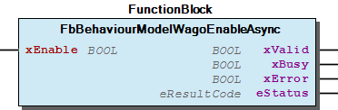 Graphical Interface of FbBehaviourModelWagoEnableAsync Function Description Overview For use the user has to re-implement the PROTECTED methods protRun() and protTerminate() . The first is the main runner wich is called periodically while xEnable is TRUE. The latter is used for controlled shutdown of the FB when xEnable is turned FALSE again. States This model has three internal states: Idle: The FB waits for xEnable to get TRUE and then transits to ‘Run’. This state is indicated to the user by having xBusy reset to FALSE . Note: xValid and xError are also reset in this state. Run: The FB calls protRun() while in this state. When xEnable gets FALSE , it transits to ‘Terminating’ This state is indicated by having xBusy set TRUE while the xEnable -Input is also set. Terminating: The FB calls protTerminate() while in this state. Depending on the result, it transits either to ‘Idle’ or to ‘Run’. This state is indicated by having xBusy set TRUE while the xEnable -Input is already reset to FALSE . Behaviour While xEnable is TRUE , the Method protRun() is executed asynchronously and repeatedly. As long as protRun() returns EAGAIN , the FB output xValid is kept FALSE . This output gets TRUE when protRun() returns OK. Other result codes will be interpreted as an error condition and they will be displayed accordingly at the outputs. The method protRun() will be called regardless whether its previous call returned an error or not. When xEnable is set FALSE again, the Method protTerminate() is called at least once. The further behaviour depends again on the eResultCode: Note The method protTerminate() need not to be implemented if no functionality is connected to it. On default it returns ENOSYS which switches the FB directly from ‘Run’ to ‘idle’. Attention: The derived child FB has to call SUPER^.() in its body. - FbBehaviourModelWagoEnableAsync.Initialize (METH) - FbBehaviourModelWagoEnableAsync.eSchedMode (PROP) - FbBehaviourModelWagoEnableAsync.protRun (METH) - FbBehaviourModelWagoEnableAsync.protTerminate (METH) - FbBehaviourModelWagoEnableAsync.tTimeout (PROP)

## FbBehaviourModelWagoExecuteAsync (FB)


| Scope | Name | Type | Comment |
| --- | --- | --- | --- |
| Input | xExecute | BOOL | Triggers the execution of the action. |
| Output | xDone | BOOL | Indicates completion of the action. |
| xBusy | BOOL | Indicates running action. |
| xError | BOOL | Indicates an error. |
| eStatus | eResultCode | State of processing. |

| protRun - result codes |
| 0 | Execution has successfully terminated, set xDone = TRUE. |
| EAGAIN | Execution is still in progress, repeat protRun() in next cycle. |
| other | Execution has terminated with an error. |

Base class for asynchronous behaviour model WagoExecute.

Graphical Illustration

Graphical Interface of FbBehaviourModelWagoExecuteAsync

Function Description

This model has three internal states:

Attention: The derived child FB has to call SUPER^.() in its body.

Interface variables Function Base class for asynchronous behaviour model WagoExecute. Graphical Illustration 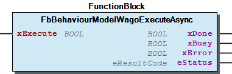 Graphical Interface of FbBehaviourModelWagoExecuteAsync Function Description States This model has three internal states: Idle: The FB waits for xExecute to transit from FALSE TO TRUE, then transits itself to ‘Run’. This state is indicated to the user by having xDone and xBusy both reset to FALSE. xError is also reset in this state. Run: The FB calls protRun() repeatedly until protRun() returns OK or any other code than EAGAIN. This state is indicated by having xBusy set to TRUE and xDone reset to FALSE. Terminated: The FB waits for xExecute to return to FALSE level for at least one cycle, then transits to ‘Idle’. This state is indicated by having xDone set to TRUE and xBusy reset to FALSE. The forth case, i.e. xDone and xBusy both set to TRUE is illegal and is prevented by the framework of this model (would be a programming error if it should occur.). Behaviour - Basic interface variables were cleared on FALSE level of xExecute. Interface Variables of derived FBs are not affected by this and stay at their values until the next Run-cycle. - While xDone or xError are not set yet, the output eStatus remains unchanged unless the derived FB overwrites it. Attention: The derived child FB has to call SUPER^.() in its body. - FbBehaviourModelWagoExecuteAsync.Initialize (METH) - FbBehaviourModelWagoExecuteAsync.eSchedMode (PROP) - FbBehaviourModelWagoExecuteAsync.protClearOutputs (METH) - FbBehaviourModelWagoExecuteAsync.protRun (METH) - FbBehaviourModelWagoExecuteAsync.tTimeout (PROP)

## FbBehaviourModelWagoTriggerAsync (FB)


| Scope | Name | Type | Comment |
| --- | --- | --- | --- |
| Inout | xTrigger | BOOL | TRUE triggers the action. |
| Output | xBusy | BOOL | indicates running action |
| xError | BOOL | indicates an error |
| eStatus | eResultCode | execution state or error code |

| protRun - result codes |
| 0 | Action has successfully terminated, reset xAction again. |
| EAGAIN | Action has to be repeated. |
| other | Action has terminated with on error, reset xAction again. |

Base class for behaviour model WagoTrigger in an asynchronous context.

Graphical Illustration

Graphical Interface of FbBehaviourModelWagoTriggerAsync

Function Description

This model has three internal states

The very first cycle in the life of an application. As xAction cannot be reset during initialization due to technical reasons, it is initialized in this first cycle.

This state is indicated by eStatus being set to EDEFAULT . The value of xTrigger is not defined at this moment. The FB transits into Idle from this state within one cycle.

The FB calls protRun() repeatedly until it returns OK or any code other than EAGAIN, then transits to Idle and resets xAction again.

This state is indicated by having eStatus set temporarily to EINPROGRESS and xTrigger not being reset. Upon termination of the action, eStatus will be set either to OK or to the returned error code.

When this model is used, the application is strongly recommended to ensure that xAction is never reset to FALSE from outside of this FB. From outside, xAction should only be set to TRUE, never to FALSE.

When the action returns either EINPROGRESS or EDEFAULT, that code will be re-mapped to EUNSPECIFIC in order to avoid ambiguities if eStatus.

Attention: The derived child FB has to call SUPER^.(xAction:=xAction) in its body.

Interface variables Function Base class for behaviour model WagoTrigger in an asynchronous context. Graphical Illustration 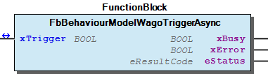 Graphical Interface of FbBehaviourModelWagoTriggerAsync Function Description States This model has three internal states NotInitialized: The very first cycle in the life of an application. As xAction cannot be reset during initialization due to technical reasons, it is initialized in this first cycle. This state is indicated by eStatus being set to EDEFAULT . The value of xTrigger is not defined at this moment. The FB transits into Idle from this state within one cycle. Idle: The FB waits for xAction to become TRUE, then transits to ‘Run’. This state is indicated by having xTrigger reset to False and eStatus having set to anything other than EDEFAULT . Run: The FB calls protRun() repeatedly until it returns OK or any code other than EAGAIN, then transits to Idle and resets xAction again. This state is indicated by having eStatus set temporarily to EINPROGRESS and xTrigger not being reset. Upon termination of the action, eStatus will be set either to OK or to the returned error code. Note When this model is used, the application is strongly recommended to ensure that xAction is never reset to FALSE from outside of this FB. From outside, xAction should only be set to TRUE, never to FALSE. Note When the action returns either EINPROGRESS or EDEFAULT, that code will be re-mapped to EUNSPECIFIC in order to avoid ambiguities if eStatus. Attention: The derived child FB has to call SUPER^.(xAction:=xAction) in its body. - FbBehaviourModelWagoTriggerAsync.Initialize (METH) - FbBehaviourModelWagoTriggerAsync.eSchedMode (PROP) - FbBehaviourModelWagoTriggerAsync.protRun (METH) - FbBehaviourModelWagoTriggerAsync.tTimeout (PROP)

## Fb_AsyncOneShot_Base (FB)


| Scope | Name | Type | Comment |
| --- | --- | --- | --- |
| Inout | xTrigger | BOOL | Triggers the action and signals termination. |
| Input | eSchedMode | eSchedulingMode | Desired scheduling mode or event |
| Output | xBusy | BOOL | True while not terminated. |
| xError | BOOL | Signals presence of an error. |
| eStatus | eResultCode | Execution state or error code. |

| Result codes |
| 0=OK | Synchronous execution of the Job has been executed. |
| EINPROGRESS | Asynchronous execution is scheduled successfully. |
| ERSCH | No such process or event specified for the target device. |
| EINVAL | Invalid scheduling mode or event name. |
| EBUSY | Another Job is currently beeing executed and is still accessing this FB. |

```
eSchedMode := eSchedulingMode.Background;                                // simple free running
eSchedMode := SchedulingMode(eSchedulingModeEvent.Local_Bus_Event_1);    // coupled to event
eSchedMode := SchedulingMode_EventPriority(eSchedulingModeEvent.Modbus_Watchdog_Running, 42));
```

```
eSchedMode := eSchedulingMode.Background;
```

```
eSchedMode := SchedulingMode(eSchedulingModeEvent.Local_Bus_Event_1);
```

```
eSchedMode := SchedulingMode_EventPriority(eSchedulingModeEvent.Modbus_Watchdog_Running, 42));
```

The Fb_AsyncOneShot_Base is a base class for a one-shot runner which is to be scheduled.

Graphical Illustration

Graphical Interface of Fb_AsyncOneShot_Base

Function Description

This function block provides for simple asynchronous deferring of a non-repetitive job. It behaves according to the WagoTrigger - behaviour model.

The additional parameter eSchedMode controls the scheduling mode and/or priority. The scheduling mode can be given in various alternative ways, e.g.:

For usage, the user is supposed to derive a child object from this base and simply implement the job functionality in the run() method (as this FB is a child of Fb_GenericRunner ). The runner will be deferred automatically according to the behaviour model WagoTrigger and the output variables will be set automatically according to the runner’s result.

In contrast to the more elaborated and more general Fb_Async_Base , this FB does not provide for automatic synchronous initialization, repetitive asynchronous execution, synchronous nor asynchronous cleanup, or cooperative collection of general results of the job.

Instead, it provided a simplified way for deferring simple jobs.

Of course, mechanisms for initialization, synchronization, etc. could be added in child FBs, but if you go this way, you would end up with Fb_Async_Base again - which already exists. This FB is used mainly for embedding deferred execution into other FBs rather than as base for enduser FBs.

How to Use:

If the runner (i.e. the method ‘run()’) returns a status code, that status code will be displayed as output variable.

The output xBusy stays TRUE until the runner is terminated.

In contrast to the more complex models ‘Fb_Async_Base’ or ‘FbBehaviourModelWagoTriggerAsync’, this base class merely lets the runner run once but it does not provede means for synchronous initialization or repeated execution. The benefit of that reduction is a very small and easy interface.

Consequence: The result code of the runner does not affect the functional behaviour of this base class.

This base class is not suitable for constructing complex asynchrounous behaviour models. Those would normally require periodical repetition of the runner - which would be a DAEMON-like behaviour and not a ONE-SHOT, as it is the topic of this base class.

No further operations are necessary for child classes. Scheduling and final removal of the terminated job are handled by this base class.

Scheduling Modes:

Like all other asynchronous FBs, this One-Shot base class may operate with all scheduling modes which are listed in eSchedulingModes :

When execution is to be coupled to external events, this is also noted via the Scheduling Mode. But as it depends on the individual target if a specific event is supported or not, a type casting wrapper SchedulingMode() has to be added in order to avouid warnings:

Some targets will now or in future allow for combining external events with addidional priority informations. Those targets provide for an addidtional mode wrapper, which allows for passing both parameters in the same call. The resulting eSchedulingMode may again be used in all asynchronous FBs.

Please note that some target firmware versions might silently ignore the additional priority number if it is not supported by the target.

Caveat: While the execution is not finished and the runner has not produced any result, the result code is not OK but it is EINPROGRESS without having xError set. This is regular behaviour and not an error condition.

Interface variables Function The Fb_AsyncOneShot_Base is a base class for a one-shot runner which is to be scheduled. Graphical Illustration 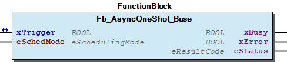 Graphical Interface of Fb_AsyncOneShot_Base Function Description This function block provides for simple asynchronous deferring of a non-repetitive job. It behaves according to the WagoTrigger - behaviour model. The additional parameter eSchedMode controls the scheduling mode and/or priority. The scheduling mode can be given in various alternative ways, e.g.: usage For usage, the user is supposed to derive a child object from this base and simply implement the job functionality in the run() method (as this FB is a child of Fb_GenericRunner ). The runner will be deferred automatically according to the behaviour model WagoTrigger and the output variables will be set automatically according to the runner’s result. Note In contrast to the more elaborated and more general Fb_Async_Base , this FB does not provide for automatic synchronous initialization, repetitive asynchronous execution, synchronous nor asynchronous cleanup, or cooperative collection of general results of the job. Instead, it provided a simplified way for deferring simple jobs. Of course, mechanisms for initialization, synchronization, etc. could be added in child FBs, but if you go this way, you would end up with Fb_Async_Base again - which already exists. This FB is used mainly for embedding deferred execution into other FBs rather than as base for enduser FBs. How to Use: 1. Derive a child class of this base and declare a public method ‘Run() : eResultCode’. This method ‘Run()’ will be executed asynchronously once for each individual request. 2. Be sure to include SUPER^(xTrigger:=xTrigger); in the body of the child in order to participate in the parent’s base framework functionality. 3. Declase one or more instances of the child class and use them according to the behaviour model ‘WagoTrigger’. Details: If the runner (i.e. the method ‘run()’) returns a status code, that status code will be displayed as output variable. The output xBusy stays TRUE until the runner is terminated. In contrast to the more complex models ‘Fb_Async_Base’ or ‘FbBehaviourModelWagoTriggerAsync’, this base class merely lets the runner run once but it does not provede means for synchronous initialization or repeated execution. The benefit of that reduction is a very small and easy interface. Consequence: The result code of the runner does not affect the functional behaviour of this base class. Note This base class is not suitable for constructing complex asynchrounous behaviour models. Those would normally require periodical repetition of the runner - which would be a DAEMON-like behaviour and not a ONE-SHOT, as it is the topic of this base class. No further operations are necessary for child classes. Scheduling and final removal of the terminated job are handled by this base class. Scheduling Modes: Like all other asynchronous FBs, this One-Shot base class may operate with all scheduling modes which are listed in eSchedulingModes : When execution is to be coupled to external events, this is also noted via the Scheduling Mode. But as it depends on the individual target if a specific event is supported or not, a type casting wrapper SchedulingMode() has to be added in order to avouid warnings: Some targets will now or in future allow for combining external events with addidional priority informations. Those targets provide for an addidtional mode wrapper, which allows for passing both parameters in the same call. The resulting eSchedulingMode may again be used in all asynchronous FBs. Please note that some target firmware versions might silently ignore the additional priority number if it is not supported by the target. Caveat: While the execution is not finished and the runner has not produced any result, the result code is not OK but it is EINPROGRESS without having xError set. This is regular behaviour and not an error condition.

## Fb_Async_Base (FB)


| Scope | Name | Type | Comment | Inherited from |
| --- | --- | --- | --- | --- |
| Output | xTerminated | BOOL | Signals finishing of execution. | Fb_Template_Async_Base_IF |
| xBusy | BOOL | Signals ongoing execution. | Fb_Template_Async_Base_IF |
| xError | BOOL | Indicates the presence of an error. | Fb_Template_Async_Base_IF |
| eResult | eResultCode | Result of execution | Fb_Template_Async_Base_IF |

| Result codes |
| 0 | Successful termination |
| EINPROGRESS | The asynchronous process has been started, but is not terminated (temporary). |
| ENOSYS | The desired function is not implemented. |
| EBADSTATE | Internal malfunction, e.g. waiting for a process which is not running (programming error). |
| ECANCELED | Execution was terminated prematurely by applying xAbort. |
| ETIMEDOUT | Execution terminated prematurely due to tTimeout. |
| (other) | Result codes from the derived implementation |

```
FUNCTION_BLOCK derivedFB EXTENDS Fb_Async_Base

///////////////////////////////////////////////////////////////////
// general handling and interfacing
///////////////////////////////////////////////////////////////////

VAR_INPUT
   myInputs : [...]
END_VAR
VAR_OUTPUT
   myOutput : [...]
END_VAR

VAR
   BufferedInputs : [...]
END_VAR

super^();

///////////////////////////////////////////////////////////////////
// synchronous initialization
///////////////////////////////////////////////////////////////////

METHOD protInitialize()
   BufferedInputs := myInputs;
   Initialize     := OK;

///////////////////////////////////////////////////////////////////
// this will be performed asynchronously
///////////////////////////////////////////////////////////////////

METHOD protMainRun()
   myOutput    := myLongRunningFunction(BufferedInputs);
   protMainRun := OK;

///////////////////////////////////////////////////////////////////
// now a means for starting the execution is added in the body:
///////////////////////////////////////////////////////////////////

IF xMyTriggerCondition THEN
   _TriggerExecute();     // protected member method
END_IF;

///////////////////////////////////////////////////////////////////
```

```
FUNCTION_BLOCK derivedFB EXTENDS Fb_Async_Base

///////////////////////////////////////////////////////////////////
// general handling and interfacing
///////////////////////////////////////////////////////////////////

VAR_OUTPUT
   myOutput : [...]
END_VAR

VAR
   embeddedFB       : originalFB ;
   eBufferedCommand : EnumerationOfAllowedCommands;
   BufferedInputs   : [...]
END_VAR

super^();       // execute the virtual methods appropriately


///////////////////////////////////////////////////////////////////
// wrapper methods
///////////////////////////////////////////////////////////////////

METHOD Open : eResultCode;         // derivedFB.Open
   VAR_INPUT
       sName : STRING;             // the filename
       eMode : eFileMode;          // the mode in which the file is opened
   END_VAR

   BufferedInputs.sName := sName;
   BufferedInputs.eMode := eMode;
   eBufferedCommand := CommandOpen;
   Open := _TriggerExecute();


METHOD Write : eResultCode;       // derivedFB.Write
   VAR_INPUT
       pData : POINTER TO BYTE;   // the data which is to be written
       nData : UDINT;             // how many data
   END_VAR

   BufferedInputs.pData := pData;
   BufferedInputs.nData := nData;
   eBufferedCommand := CommandWrite;
   Write := _TriggerExecute();

///////////////////////////////////////////////////////////////////
// this will be exectuted asynchronously
///////////////////////////////////////////////////////////////////

METHOD protMainRun()
   VAR
       myResultCode : eResultCode;
   END_VAR

   CASE eBufferedCommand of

    CommandOpen;
       myResultCode := embeddedFB.Open(BufferedInputs.sName, BufferedInputs.eMode);
       myOutput     := embeddedFB.isOpen;
       PrimaryRun   := myResultCode;

    CommandWrite:
       myResultCode := embeddedFB.Write(BufferedInputs.pData, BufferedInputs.nData);
       myOutput     := embeddedFB.isOpen;
       PrimaryRun   := myResultCode;

   [
   :
   :
   ]

   ELSE
       protMain := ENOSYS

   END_CASE

///////////////////////////////////////////////////////////////////
```

```
///////////////////////////////////////////////////////////////////
// general handling
// no IO-variables are considered in this example,
// no synchronous initialization either
///////////////////////////////////////////////////////////////////

FUNCTION_BLOCK derivedFB EXTENDS Fb_Async_Base


VAR
   embeddedFB       : originalFB ;
END_VAR

super^();       // execute the virtual methods apropriately

///////////////////////////////////////////////////////////////////
// this will be exectuted asynchronously
///////////////////////////////////////////////////////////////////

METHOD protMainRun()
   embedded();                          // the body of the embedded FB
   IF embedded.finished THEN
       CyclicRun := OK;                  // terminate
   ELSE
       CyclicRun := EAGAIN;              // repeat the execution
   END_IF;

///////////////////////////////////////////////////////////////////
```

Fb_Async_base is a base FB for asynchronous execution of jobs. It is never instatiated directly but it serves as base class for deriving own FBs.

Graphical Illustration

Graphical Interface of Fb_Async_Base

Function Description

Although this base FB has some uniform status outputs it is completely method driven.

As indicated in the section ‘General’, the user is supposed to derive his own FB from this base FB and implement his own protected methods according to his needs.

The asynchronous job is started with the PROTECTED method _TriggerExecute() of the base interface. Typically, when the user derives his own FB, he will provide his own public Trigger() method for PUBLIC use, which sets up variables and then internally calls the PROTECTED _TriggerExecute() .

General Application Rules

Base FB Outputs

The outputs are cleared with successful calls of the methods _TriggerExecute() or _AcknowledgeTermination() .

The output interface resembles the behaviour model WagoExecute but it is not the same due to the many necesseties of method driven operation.

For using the standard behaviour directly, other asynchronous FBs are derived from the base and provided by this library. Those are less flexible, but they carry the canonical interfaces of WagoEnable (async) , WagoExecute (async) , and WagoTrigger (async) .

Scheduling of protected methods

Depending on the input stimulus of the base interface, the virtual methods protInitialize() , protMainRun() , protDone() , protAbortionCleanup() , and protAsynchronousCleanup() were called from within the framework of the Fb_Async_Base. These methods (or some of them) should be re-implemented in the derived class according to following specifications given in the interface description Fb_VirtualMethodsForAsyncExecution (FB) . The outputs variables of the base FB are set according to the results of the function calls in derived FBs.

Depending on the scheduling mode, the execution of these methods may be deferred to other asynchronous tasks in order to keep the calling instance non-blocking while waiting for the result during several cycles. This process is hidden from the application by the interface. Thus, the call to the derived FB may return even before the called functionalities have terminated. By observing xTerminated the calling application is notified that the execution in the background is terminated.

The application may signal its wish for abortion of the FB’s process either explicitly by the or _Abort() -Method or implicitly by setting the property tTimeOut (0 = no timeout applies). The process then is aborted as soon as possible in cooperation with the implemented functions (the process is not ‘killed’).

Result Codes

The base result codes of the eResult output are shown below. These codes are generated by the Fb_Async_Base itself. If the child object returns with its own result codes, these will also appear at this place.

Generally the child may use any result code according to its own specification with the exception of EAGAIN which is reserved for the wish to repeat the execution.

Example 1: Long running function

A simple long-running function myLongRunningFunction() is to be executed asynchronously. For implementing this, an FB is derived from the Fb_Async_Base (which is a child of Fb_VirtualMethodsForAsyncExecution (FB) ). In this simple case, one single method protMainRun`() is re-implemented, which contains that long running function:

No other code is to be added.

(Please note that the purpose of the this code snippet is merely to illustrate the usage of certain mechanisms and thus is shortened to the essential parts for explanation. It does not compile as-is.)

Example 2: Multiple long running methods

An existing FB originalFB with a number of long-running methods is to be executed asynchronously:

For realization, again a new fb derivedFB is derived from Fb_Async_Base (FB) , in which the original FB is embedded. All long running methods of the original FB are wrapped by trigger methods. These trigger methods do also perform the task of individual initialization:

(Please note that the purpose of the this code snippet is merely to illustrate the usage of certain mechanisms and thus is shortened to the essential parts for explanation. It does not compile as-is.)

Example 3: FB with long running body

If the body of the asynchronous FB is very long-running but has certain points where processing could be interrupted, it may signal this circumstance by returning EAGAIN at such points. The FB will be re-scheduled for asynchronous operation again until it returns OK , or a result code other than EAGAIN . If a request for abortion or time-out has been issued inbetween, it will not be re-scheduled.

(Please note that the purpose of the this code snippet is merely to illustrate the usage of certain mechanisms and thus is shortened to the essential parts for explanation. It does not compile as-is.)

Interface variables Function Fb_Async_base is a base FB for asynchronous execution of jobs. It is never instatiated directly but it serves as base class for deriving own FBs. Graphical Illustration 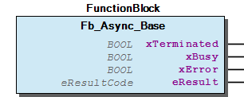 Graphical Interface of Fb_Async_Base Function Description Overview Although this base FB has some uniform status outputs it is completely method driven. As indicated in the section ‘General’, the user is supposed to derive his own FB from this base FB and implement his own protected methods according to his needs. The asynchronous job is started with the PROTECTED method _TriggerExecute() of the base interface. Typically, when the user derives his own FB, he will provide his own public Trigger() method for PUBLIC use, which sets up variables and then internally calls the PROTECTED _TriggerExecute() . General Application Rules 1. The body of the derived FB MUST contain super^(); for using the execution logic. 2. Unless especially noted, most methods of this FB are intended to be either PRIVATE or PROTECTED. I.e. they should never be called directly from outside of the class, even if not all of them are actually declared PRIVATE or PROTECTED for technical reasons. Either the child FB inherits these methods for direct protected usage or the child FB re-implements some (or all) of them. Thus, no component of the PROTECTED Interface ) appears in the public interface of the child by default. The child is supposed to use its own wrapper methods or interface variables for making the desired subset of them accessible to the application. Base FB Outputs xTerminated: This output indicates that the execution is terminated, successfully or with errors. This output is cleared with successful calls of the methods _TriggerExecute() or _AcknowledgeTermination() . xBusy: Indicates that _TriggerExecute() has been executed successfully and that the job has not yet terminated. It is cleared after termination of the job. While set to TRUE this output indicates that other output variables may vary spontaneously. While set to FALSE, outputs do not vary spontaneously. xError: Indicates the presence of an error. Attn: This output may be TRUE simultaneously with other outputs. eResult: This indicates the actual state of processing or errors. While the job is not terminated, it displays EINPROGRESS which is not an error condition but just tells that the process is still in progress. The outputs are cleared with successful calls of the methods _TriggerExecute() or _AcknowledgeTermination() . Note The output interface resembles the behaviour model WagoExecute but it is not the same due to the many necesseties of method driven operation. For using the standard behaviour directly, other asynchronous FBs are derived from the base and provided by this library. Those are less flexible, but they carry the canonical interfaces of WagoEnable (async) , WagoExecute (async) , and WagoTrigger (async) . Scheduling of protected methods Depending on the input stimulus of the base interface, the virtual methods protInitialize() , protMainRun() , protDone() , protAbortionCleanup() , and protAsynchronousCleanup() were called from within the framework of the Fb_Async_Base. These methods (or some of them) should be re-implemented in the derived class according to following specifications given in the interface description Fb_VirtualMethodsForAsyncExecution (FB) . The outputs variables of the base FB are set according to the results of the function calls in derived FBs. Depending on the scheduling mode, the execution of these methods may be deferred to other asynchronous tasks in order to keep the calling instance non-blocking while waiting for the result during several cycles. This process is hidden from the application by the interface. Thus, the call to the derived FB may return even before the called functionalities have terminated. By observing xTerminated the calling application is notified that the execution in the background is terminated. The application may signal its wish for abortion of the FB’s process either explicitly by the or _Abort() -Method or implicitly by setting the property tTimeOut (0 = no timeout applies). The process then is aborted as soon as possible in cooperation with the implemented functions (the process is not ‘killed’). Result Codes The base result codes of the eResult output are shown below. These codes are generated by the Fb_Async_Base itself. If the child object returns with its own result codes, these will also appear at this place. Note Generally the child may use any result code according to its own specification with the exception of EAGAIN which is reserved for the wish to repeat the execution. Examples Example 1: Long running function A simple long-running function myLongRunningFunction() is to be executed asynchronously. For implementing this, an FB is derived from the Fb_Async_Base (which is a child of Fb_VirtualMethodsForAsyncExecution (FB) ). In this simple case, one single method protMainRun`() is re-implemented, which contains that long running function: No other code is to be added. (Please note that the purpose of the this code snippet is merely to illustrate the usage of certain mechanisms and thus is shortened to the essential parts for explanation. It does not compile as-is.) Example 2: Multiple long running methods An existing FB originalFB with a number of long-running methods is to be executed asynchronously: For realization, again a new fb derivedFB is derived from Fb_Async_Base (FB) , in which the original FB is embedded. All long running methods of the original FB are wrapped by trigger methods. These trigger methods do also perform the task of individual initialization: (Please note that the purpose of the this code snippet is merely to illustrate the usage of certain mechanisms and thus is shortened to the essential parts for explanation. It does not compile as-is.) Example 3: FB with long running body If the body of the asynchronous FB is very long-running but has certain points where processing could be interrupted, it may signal this circumstance by returning EAGAIN at such points. The FB will be re-scheduled for asynchronous operation again until it returns OK , or a result code other than EAGAIN . If a request for abortion or time-out has been issued inbetween, it will not be re-scheduled. (Please note that the purpose of the this code snippet is merely to illustrate the usage of certain mechanisms and thus is shortened to the essential parts for explanation. It does not compile as-is.) - 41 PROTECTED Interface Fb_Async_Base._Abort (METH) - Fb_Async_Base._AcknowledgeTermination (METH) - Fb_Async_Base._IsReadyForExecution (METH) - Fb_Async_Base._IsRunning (METH) - Fb_Async_Base._SetSchedulingParameters (METH) - Fb_Async_Base._TriggerExecute (METH) - Fb_Async_Base.eSchedMode (PROP) - Fb_Async_Base.tTimeout (PROP) 42 Administration - Fb_Async_Base.Finish (METH) - Fb_Async_Base.Initialize (METH)

## Fb_Daemon_Base (FB)


| Scope | Name | Type | Comment | Inherited from |
| --- | --- | --- | --- | --- |
| Input | xOpen | BOOL | Desired state of the channel (open=TRUE, closed=FALSE) | FbBehaviourModel_WagoChannel |
| Output | xIsOpen | BOOL | Feedback: channel is operative. | FbBehaviourModel_WagoChannel |
| xIsIdle | BOOL | Feedback: channel is clear for new opening. | FbBehaviourModel_WagoChannel |
| eStatus | eResultCode | Result of last open / close action. | FbBehaviourModel_WagoChannel |
| Input | eSchedMode | eSchedulingMode | The scheduling mode and priority for scheduling. |  |

| Result codes |
| 0=OK | Successful scheduling. |
| EINVAL | Invalid scheduling mode |
| EBUSY | The FB is busy with another job which is still active. |

```
eSchedMode := eSchedulingMode.Background;                                // simple free running
eSchedMode := SchedulingMode(eSchedulingModeEvent.Local_Bus_Event_1);    // coupled to event
eSchedMode := SchedulingMode_EventPriority(eSchedulingModeEvent.Modbus_Watchdog_Running, 42));
```

Fb_Daemon_Base is a base class for asynchronous DAEMON-FBs.

Graphical Illustration

Graphical Interface of Fb_Daemon_Base

Function Description

In the context of this library a ‘daemon’ is a functionality which runs repetitively or continuously in the background and which has only loose interactions with other applications.

This FB is a base class for such a daemon according to the base model WagoChannel . Like for GenericRunner or OneShot , the functionality is provided by the method run() , while this base FB provides for the framework of starting with a certain scheduling mode or priority and of stopping the daemon again.

For usage, the user is supposed to derive a child object from this base and implement the functionality in the run() method

When the input xOpen transits from FALSE to TRUE , the daemon is scheduled according to the mode given by the input eSchedMode at that moment. E.g. as follows:

The output xIsOpen indicates successful scheduling. When the runner method terminates, it will be automatically re-scheduled internally for a new execution. By this means, a daemon provides for a non-terminating execution of the runner.

When the input xOpen transits to FALSE again, the deamon is stopped. This condition is indicated by the output xIsOpen in FALSE state. At this point in time, the asynchronously executed daemon might still be running. The daemon is not simply killed, but when it terminates, it will not be re-scheduled and the removed after this last termination. The output xIsIdle will not go TRUE before the daemon is successfully removed.

While xIsIdle is not TRUE, the daemon cannot be re-started, because the old daemon resources has to be successfully cleaned-up first.

The output eStatus refers to starting and stopping the daemon, but it does not not (as explained below) refer to any internal error conditions of the daemon.

A TRUE level at the xOpen -input causses the method run() of the daemon to be scheduled repeatedly, and a FALSE causes it to stop again.

Although the runner method has a eResultCode return value for formal reasons, this value is ignored during execution, because it is not likely to yield useful information within a daemon context. The eStatus output does only reflect the success of starting or stopping the daemon, but it does not reflect the internal status of the daemon runner itself. If the daemon has to communicate internal information to the application, it has to define its own outputs for that purpose.

The result code of the daemon runner is accessible to the FB only after the runner has terminated, so for continuously running background daemons there must be provided other ways of communicating errors.

This base class provides for a property DaemonCycleCount:UDINT which counts the number of consecutive runs of the runner, starting with ‘1’ for the first execution. This is useful for asynchronous initialization of the daeomon, which should take place only during the first run of the daemon.

There is no formal limitation for the runtime of a single run of a daemon. Nevertheless the user should be aware that excessive long running might block other daemons or other processes.

Interface variables Function Fb_Daemon_Base is a base class for asynchronous DAEMON-FBs. Graphical Illustration 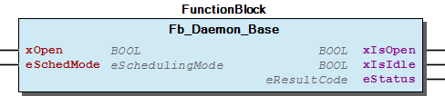 Graphical Interface of Fb_Daemon_Base Function Description Overview In the context of this library a ‘daemon’ is a functionality which runs repetitively or continuously in the background and which has only loose interactions with other applications. This FB is a base class for such a daemon according to the base model WagoChannel . Like for GenericRunner or OneShot , the functionality is provided by the method run() , while this base FB provides for the framework of starting with a certain scheduling mode or priority and of stopping the daemon again. For usage, the user is supposed to derive a child object from this base and implement the functionality in the run() method Behaviour When the input xOpen transits from FALSE to TRUE , the daemon is scheduled according to the mode given by the input eSchedMode at that moment. E.g. as follows: The output xIsOpen indicates successful scheduling. When the runner method terminates, it will be automatically re-scheduled internally for a new execution. By this means, a daemon provides for a non-terminating execution of the runner. When the input xOpen transits to FALSE again, the deamon is stopped. This condition is indicated by the output xIsOpen in FALSE state. At this point in time, the asynchronously executed daemon might still be running. The daemon is not simply killed, but when it terminates, it will not be re-scheduled and the removed after this last termination. The output xIsIdle will not go TRUE before the daemon is successfully removed. While xIsIdle is not TRUE, the daemon cannot be re-started, because the old daemon resources has to be successfully cleaned-up first. The output eStatus refers to starting and stopping the daemon, but it does not not (as explained below) refer to any internal error conditions of the daemon. How To Use 1. Derive a child class of this base and declare a public method ‘Run()’. This method ‘Run()’ will be executed repeatedly and asynchronously. 2. Be sure to include SUPER^(); in the body of the child in order to participate in the parent’s base functionality of opening and closing the activity. 3. Declase one or more instances of the child class and use them according to the behaviour model WagoChannel . Details: A TRUE level at the xOpen -input causses the method run() of the daemon to be scheduled repeatedly, and a FALSE causes it to stop again. Although the runner method has a eResultCode return value for formal reasons, this value is ignored during execution, because it is not likely to yield useful information within a daemon context. The eStatus output does only reflect the success of starting or stopping the daemon, but it does not reflect the internal status of the daemon runner itself. If the daemon has to communicate internal information to the application, it has to define its own outputs for that purpose. Note The result code of the daemon runner is accessible to the FB only after the runner has terminated, so for continuously running background daemons there must be provided other ways of communicating errors. Hints: This base class provides for a property DaemonCycleCount:UDINT which counts the number of consecutive runs of the runner, starting with ‘1’ for the first execution. This is useful for asynchronous initialization of the daeomon, which should take place only during the first run of the daemon. There is no formal limitation for the runtime of a single run of a daemon. Nevertheless the user should be aware that excessive long running might block other daemons or other processes. - Fb_Daemon_Base.DaemonCycleCount (PROP) - Fb_Daemon_Base.Run (METH)

## Fb_Run_Generic_Async (FB)


| Scope | Name | Type | Comment |
| --- | --- | --- | --- |
| Output | xBusy | BOOL | Indicates running action |
| xTerminated | BOOL | Indicates Termination |
| eResult | eResultCode | State of processing or error code |

Runs a ‘generic runner’ asynchronously.

Graphical Illustration

Graphical Interface of Fb_Run_Generic_Async

Function Description

In contrast to the behaviour model classes, this FB is not meant in the first place to serve as a base for inheritance, but this one is intended to be used directly.

Its main public method ‘TriggerExecute()’ takes a pointer to a generic runner FB as input. This runner can virtually be treated as a function pointer together with member variables. Its method ‘run()’ will be executed asynchronously.

In contrast to the behaviour models, this runner is executed only once per trigger.

Interface variables Function Runs a ‘generic runner’ asynchronously. Graphical Illustration 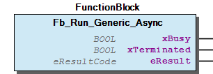 Graphical Interface of Fb_Run_Generic_Async Function Description In contrast to the behaviour model classes, this FB is not meant in the first place to serve as a base for inheritance, but this one is intended to be used directly. Its main public method ‘TriggerExecute()’ takes a pointer to a generic runner FB as input. This runner can virtually be treated as a function pointer together with member variables. Its method ‘run()’ will be executed asynchronously. In contrast to the behaviour models, this runner is executed only once per trigger. - Fb_Run_Generic_Async.Initialize (METH) - Fb_Run_Generic_Async.TriggerExecute (METH) - Fb_Run_Generic_Async.eSchedMode (PROP)

## Fb_VirtualMethodsForAsyncExecution (FB)


in combination with the FB_Async_Base framework.

When deriving working FBs from FB_Async_Base, the methods from within this interface are supposed to be overloaded by the user and these are called by the underlying framework:

(For details see below. See also examples in the general description at the top of the document.)

in combination with the FB_Async_Base framework. When deriving working FBs from FB_Async_Base, the methods from within this interface are supposed to be overloaded by the user and these are called by the underlying framework: - protInitialize() (optional) - protMainRun() (mandatory) - protAbortionCleanup() (also optional) - protAsynchronousCleanup() (also optional) - protDone() (also optional) (For details see below. See also examples in the general description at the top of the document.) - 50 Virtual Methods for Behaviour Model Fb_VirtualMethodsForAsyncExecution.protAbortionCleanup (METH) - Fb_VirtualMethodsForAsyncExecution.protAsynchronousCleanup (METH) - Fb_VirtualMethodsForAsyncExecution.protDone (METH) - Fb_VirtualMethodsForAsyncExecution.protInitialize (METH) - Fb_VirtualMethodsForAsyncExecution.protMainRun (METH) 60 Properties for Use in Overloaded Methods - Fb_VirtualMethodsForAsyncExecution.AbortRequest (PROP) - Fb_VirtualMethodsForAsyncExecution.CycleCount (PROP)

### Methods


## FbBehaviourModelWagoEnableAsync.Initialize (METH)


```
METHOD FB_Init : BOOL
  initialize();

METHOD initialize
  super^.initialize();
```

```
METHOD FB_Init : BOOL
  super^.initialize();
  :
  :   // my own initialization.
```

Initializes the FB.

Graphical Illustration

Graphical Interface of FbBehaviourModelWagoEnableAsync.Initialize

Function Description

This method sets the FB into a predefined state with appropriate variable settings. Use this in derived FBs for initialization:

or (not suitable for further inheritance but shorter in simple cases):

Function Initializes the FB. Graphical Illustration  Graphical Interface of FbBehaviourModelWagoEnableAsync.Initialize Function Description This method sets the FB into a predefined state with appropriate variable settings. Use this in derived FBs for initialization: or (not suitable for further inheritance but shorter in simple cases):

## FbBehaviourModelWagoEnableAsync.protRun (METH)


| Scope | Name | Type |
| --- | --- | --- |
| Return | protRun | eResultCode |

| Result codes |
| 0 | Successful operation, set xValid |
| EAGAIN | Output variables not yet valid, reset xValid, eStatus := EINPROGRESS, xError := FALSE |
| other | Reset xValid, set eStatus to this code, set xError := TRUE |

Code for the main functionality.

Graphical Illustration

Graphical Interface of FbBehaviourModelWagoEnableAsync.protRun

Function Description

(See FB description for details.)

Interface variables Function Code for the main functionality. Graphical Illustration 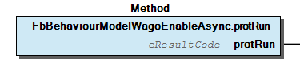 Graphical Interface of FbBehaviourModelWagoEnableAsync.protRun Function Description (See FB description for details.)

## FbBehaviourModelWagoEnableAsync.protTerminate (METH)


| Scope | Name | Type |
| --- | --- | --- |
| Return | protTerminate | eResultCode |

| Result codes |
| OK=0 | Successful termination, return to state ‘Idle’. |
| ENOSYS | Method is not implemented, return to ‘state Idle’. |
| EAGAIN | Shutdown in progress, protTerminate() will be called again. |
| EBREAKPT | Shutdown in progress. On xEnable=TRUE direct transit into state ‘run’. |
| other | Display error code |

Code for termination of activity.

Graphical Illustration

Graphical Interface of FbBehaviourModelWagoEnableAsync.protTerminate

Function Description

(See FB description for details.)

Interface variables Function Code for termination of activity. Graphical Illustration 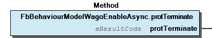 Graphical Interface of FbBehaviourModelWagoEnableAsync.protTerminate Function Description (See FB description for details.)

## FbBehaviourModelWagoExecuteAsync.Initialize (METH)


```
METHOD FB_Init : BOOL
  initialize();

METHOD initialize
  super^.initialize();
```

```
METHOD FB_Init : BOOL
  super^.initialize();
  :
  :   // my own initialization.
```

Initializes the FB.

Graphical Illustration

Graphical Interface of FbBehaviourModelWagoExecuteAsync.Initialize

Function Description

This method sets the FB into a predefined state with appropriate variable settings. Use this in derived FBs for initialization:

or (not suitable for further inheritance but shorter in simple cases):

Function Initializes the FB. Graphical Illustration  Graphical Interface of FbBehaviourModelWagoExecuteAsync.Initialize Function Description This method sets the FB into a predefined state with appropriate variable settings. Use this in derived FBs for initialization: or (not suitable for further inheritance but shorter in simple cases):

## FbBehaviourModelWagoExecuteAsync.protClearOutputs (METH)


Code for clearing user defined outputs.

Graphical Illustration

Graphical Interface of FbBehaviourModelWagoExecuteAsync.protClearOutputs

Function Description

This method is called each time when the FB transits into its idle state, i.e. when its status outputs were reset. At the time of call, the primary outputs (xDone, xError, eError) are not cleared yet, so this method has the full information about the circumstances of its call:

This method has no return value.

Function Code for clearing user defined outputs. Graphical Illustration  Graphical Interface of FbBehaviourModelWagoExecuteAsync.protClearOutputs Function Description This method is called each time when the FB transits into its idle state, i.e. when its status outputs were reset. At the time of call, the primary outputs (xDone, xError, eError) are not cleared yet, so this method has the full information about the circumstances of its call: - execution has terminated with error or not - initialization of FB (all outputs FALSE). This method has no return value.

## FbBehaviourModelWagoExecuteAsync.protRun (METH)


| Scope | Name | Type |
| --- | --- | --- |
| Return | protRun | eResultCode |

| Result codes |
| 0 | Execution has successfully terminated, set xDone = TRUE. |
| EAGAIN | Execution is still in progress, repeat protRun() in next cycle. |
| other | Execution has terminated with an error. |

Code for main functionality.

Graphical Illustration

Graphical Interface of FbBehaviourModelWagoExecuteAsync.protRun

Function Description

See FB-description for details.

Interface variables Function Code for main functionality. Graphical Illustration 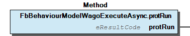 Graphical Interface of FbBehaviourModelWagoExecuteAsync.protRun Function Description See FB-description for details.

## FbBehaviourModelWagoTriggerAsync.Initialize (METH)


```
METHOD FB_Init : BOOL
  initialize();

METHOD initialize
  super^.initialize();
```

```
METHOD FB_Init : BOOL
  super^.initialize();
  :
  :   // my own initialization.
```

Initializes the FB.

Graphical Illustration

Graphical Interface of FbBehaviourModelWagoTriggerAsync.Initialize

Function Description

This method sets the FB into a predefined state with appropriate variable settings. Use this in derived FBs for initialization:

or (not suitable for further inheritance but shorter in simple cases):

Function Initializes the FB. Graphical Illustration  Graphical Interface of FbBehaviourModelWagoTriggerAsync.Initialize Function Description This method sets the FB into a predefined state with appropriate variable settings. Use this in derived FBs for initialization: or (not suitable for further inheritance but shorter in simple cases):

## FbBehaviourModelWagoTriggerAsync.protRun (METH)


| Scope | Name | Type |
| --- | --- | --- |
| Return | protRun | eResultCode |

| Result codes |
| 0 | Action has successfully terminated, reset xAction again. |
| EAGAIN | Action has to be repeated. |
| other | Action has terminated with on error, reset xAction again. |

Code for the main functionality.

Graphical Illustration

Graphical Interface of FbBehaviourModelWagoTriggerAsync.protRun

Function Description

See FB-description for details.

Interface variables Function Code for the main functionality. Graphical Illustration 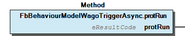 Graphical Interface of FbBehaviourModelWagoTriggerAsync.protRun Function Description See FB-description for details.

## Fb_Async_Base.Finish (METH)


```
METHOD FB_Exit : BOOL
  :
  :   // my own exit code here if necessary
  :
  SUPER^.finish();
```

Tears down FB_Async_Base.

Graphical Illustration

Graphical Interface of Fb_Async_Base.Finish

Function Description

Normally you need not call it, because it is called automatically at exit. Use this in derived FBs for tearing down the FB after use:

Function Tears down FB_Async_Base. Graphical Illustration 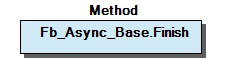 Graphical Interface of Fb_Async_Base.Finish Function Description Normally you need not call it, because it is called automatically at exit. Use this in derived FBs for tearing down the FB after use:

## Fb_Async_Base.Initialize (METH)


```
METHOD FB_Init : BOOL
  initialize();

METHOD initialize
  SUPER^.initialize();
```

```
METHOD FB_Init : BOOL
  SUPER^.initialize();
  :
  :   // my own initialization if necessary
  :
```

Initializes FB_Async_Base.

Graphical Illustration

Graphical Interface of Fb_Async_Base.Initialize

Function Description

This method sets the FB into a predefined state with appropriate variable settings. Use this in derived FBs for initialization:

or (not suitable for further inheritance but shorter in simple cases):

Function Initializes FB_Async_Base. Graphical Illustration 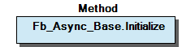 Graphical Interface of Fb_Async_Base.Initialize Function Description This method sets the FB into a predefined state with appropriate variable settings. Use this in derived FBs for initialization: or (not suitable for further inheritance but shorter in simple cases):

## Fb_Async_Base._Abort (METH)


| Scope | Name | Type |
| --- | --- | --- |
| Return | _Abort | eResultCode |

| Result codes |
| 0 | Successful delivery of abort signal |
| EINPROGRESS | Abortion is already in progress. |
| ENOSYS | Abortion of this functionality is not implemented. |

Signals the runner to abort cooperatively.

Graphical Illustration

Graphical Interface of Fb_Async_Base._Abort

Function Description

This method sets the flag for cooperative abortion, which will be evaluated by the runner process. When the runner detects this flag, it may cooperatively abort prematurely if this behaviour is implemented in the runner code.

If the runner has returned EAGAIN (and has possibly has ignored the abortion signal), it will NOT be restarted after this method is called and the framework will show the result code ECANCELED.

This method does not unconditionally abort the runner. It merely sets flags which the runner may regard or disregard.

Interface variables Function Signals the runner to abort cooperatively. Graphical Illustration 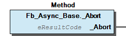 Graphical Interface of Fb_Async_Base._Abort Function Description This method sets the flag for cooperative abortion, which will be evaluated by the runner process. When the runner detects this flag, it may cooperatively abort prematurely if this behaviour is implemented in the runner code. If the runner has returned EAGAIN (and has possibly has ignored the abortion signal), it will NOT be restarted after this method is called and the framework will show the result code ECANCELED. Note This method does not unconditionally abort the runner. It merely sets flags which the runner may regard or disregard.

## Fb_Async_Base._AcknowledgeTermination (METH)


| Scope | Name | Type |
| --- | --- | --- |
| Return | _AcknowledgeTermination | eResultCode |

| Result codes |
| 0 | Successful acknowledge |
| EBADSTATE | Not in ‘Terminated’ mode. |

```
FUNCTION_BLOCK Fb_MyAsyncExecutor EXTENDS Fb_Async_Base

VAR_INPUT
    xExecute : BOOL;    // Trigger on rising edge, Clear on FALSE.
END_VAR

VAR
  EdgeDetector : R_TRIG;
END_VAR

EdgeDetector.CLK := xEcecute;

IF  (_eState = eExecutionState.idle) and (EdgeDetector.Q) THEN
    _TriggerExecute();

ELSIF (NOT xExecute) THEN   // clear status output and transit to idle when terminated and unstimulated
    _Acknowledge()          // if not 'terminated', no output change will take place.

END_IF
```

Acknowledges the termination of the runner.

Graphical Illustration

Graphical Interface of Fb_Async_Base._AcknowledgeTermination

Function Description

After termination of the main runner this method sets the basic output variables back to their idle values and then transits the FB back into the idle state.

This is convenient, when a derived FB uses a variable oriented interface:

This method mainly resets the output variables xTerminated and xError. In a purely method orientated child it is not necessary to use this function unless these variables are used elsewhere within the FB.

Interface variables Function Acknowledges the termination of the runner. Graphical Illustration 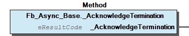 Graphical Interface of Fb_Async_Base._AcknowledgeTermination Function Description After termination of the main runner this method sets the basic output variables back to their idle values and then transits the FB back into the idle state. This is convenient, when a derived FB uses a variable oriented interface: Note This method mainly resets the output variables xTerminated and xError. In a purely method orientated child it is not necessary to use this function unless these variables are used elsewhere within the FB.

## Fb_Async_Base._IsReadyForExecution (METH)


| Scope | Name | Type |
| --- | --- | --- |
| Return | _IsReadyForExecution | BOOL |

```
FUNCTION_BLOCK Fb_MyAsyncExecutor EXTENDS Fb_Async_Base

METHOD StartIt(InputParameter [...])  // Starting the intended procedure with specific parameters

    IF not _IsReadyForExecution() THEN // Check if copying the parameters is OK
        StartIt := EINPROGRESS;        // and return with failure if not OK
        RETURN;                        // copy takes place only when ready
    END_IF

    myParameter := InputParameter;    // handle the specific parameters (if they exist)
    StartIt     := _TriggerExecute(); // call the internal trigger
```

Indicates that the FB is ready for execution.

Graphical Illustration

Graphical Interface of Fb_Async_Base._IsReadyForExecution

Function Description

This method returns TRUE if the FB is ready for scheduling the runner procedure. It returns FALSE if it is not ready, e.g. because the previous job is still running.

This is especially intended to be used when copying of input parameters is required before triggering.

It is not necessary to use this function if no parameters have to be copied, because the _TriggerExecute() itself would return with failure anyway in case of not being ready.

It is not intended for external calls (PROTECTED), because after internal processing the corresponding result is already reflected by the ‘xBusy’ output and we do not want to create unecessary redundancy.

Interface variables Function Indicates that the FB is ready for execution. Graphical Illustration 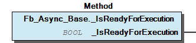 Graphical Interface of Fb_Async_Base._IsReadyForExecution Function Description This method returns TRUE if the FB is ready for scheduling the runner procedure. It returns FALSE if it is not ready, e.g. because the previous job is still running. This is especially intended to be used when copying of input parameters is required before triggering. It is not necessary to use this function if no parameters have to be copied, because the _TriggerExecute() itself would return with failure anyway in case of not being ready. It is not intended for external calls (PROTECTED), because after internal processing the corresponding result is already reflected by the ‘xBusy’ output and we do not want to create unecessary redundancy.

## Fb_Async_Base._IsRunning (METH)


| Scope | Name | Type |
| --- | --- | --- |
| Return | _IsRunning | BOOL |

Indicates that the runner method is running.

Graphical Illustration

Graphical Interface of Fb_Async_Base._IsRunning

Function Description

This method is intended to differentiate between regular run and possible cleanup in derived FBs. It is not intended for use in external calls (PROTECTED).

Interface variables Function Indicates that the runner method is running. Graphical Illustration 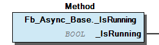 Graphical Interface of Fb_Async_Base._IsRunning Function Description This method is intended to differentiate between regular run and possible cleanup in derived FBs. It is not intended for use in external calls (PROTECTED).

## Fb_Async_Base._SetSchedulingParameters (METH)


| Scope | Name | Type | Comment |
| --- | --- | --- | --- |
| Return | _SetSchedulingParameters | eResultCode |  |
| Input | eSchedMode | eSchedulingMode | Scheduling mode (see enum definition). |
| tTimeOut | TIME | Timeout limit. T#0s = no timeout. |

| Result codes |
| 0 | Success (this method never fails) |

Sets the scheduling parameters (mode, timeout).

Graphical Illustration

Graphical Interface of Fb_Async_Base._SetSchedulingParameters

Function Description

Derived Objects must call this method at least once before letting an asynchronous job run. No check for parameter validity is done, thus this method always returns ‘OK’.

Please note that the parameter ‘tTimeOut’ does not cause a hard abortion of the runner, it rely signals a wish to the runner to terminate now cooperatively after a timeout has occurred.

For the meaning of the scheduling modes, please refer to the section ‘Common Type Definitions’ below.

Interface variables Function Sets the scheduling parameters (mode, timeout). Graphical Illustration 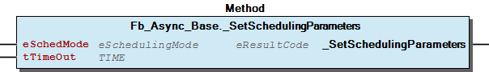 Graphical Interface of Fb_Async_Base._SetSchedulingParameters Function Description Derived Objects must call this method at least once before letting an asynchronous job run. No check for parameter validity is done, thus this method always returns ‘OK’. Please note that the parameter ‘tTimeOut’ does not cause a hard abortion of the runner, it rely signals a wish to the runner to terminate now cooperatively after a timeout has occurred. For the meaning of the scheduling modes, please refer to the section ‘Common Type Definitions’ below.

## Fb_Async_Base._TriggerExecute (METH)


| Scope | Name | Type |
| --- | --- | --- |
| Return | _TriggerExecute | eResultCode |

| Result codes |
| 0 | Successfully triggered. |
| EBUSY | The action is already in progress so the method call is rejected. |

```
FUNCTION_BLOCK Fb_MyAsyncExecutor EXTENDS Fb_Async_Base

METHOD StartIt(InputParameter [...])    // Starting the intended procedure with specific parameters

    IF not _IsReadyForExecution() THEN  // Check if copying the parameters is OK
        StartIt := EINPROGRESS;         // and return with failure if not OK
        RETURN;
    END_IF

    myParameter := InputParameter;    // handle the specific parameters (if they exist)
    StartIt     := _TriggerExecute(); // call the internal trigger
```

Triggers the execution of the process.

Graphical Illustration

Graphical Interface of Fb_Async_Base._TriggerExecute

This method is declared PROTECTED, i.e. the derived FBs have to wrap around their own triggering method, typically in a way similar to that shown below:

Interface variables Function Triggers the execution of the process. Graphical Illustration 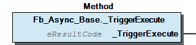 Graphical Interface of Fb_Async_Base._TriggerExecute Note This method is declared PROTECTED, i.e. the derived FBs have to wrap around their own triggering method, typically in a way similar to that shown below:

## Fb_Daemon_Base.Run (METH)


| Scope | Name | Type |
| --- | --- | --- |
| Return | Run | eResultCode |

This is the runner method of the daemon.

Graphical Illustration

Graphical Interface of Fb_Daemon_Base.Run

Function Description

This runner is executed asynchronously.

The user is supposed to implement his specific run() method according to his desired functionality.

This method is semantically a PROTECTED one, but for technical reasons it must be declared PUBLIC. Although there are no logical or technical restrictions in the base class, please, treat it as if it were PROTECTED in child classes.

Interface variables Function This is the runner method of the daemon. Graphical Illustration 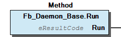 Graphical Interface of Fb_Daemon_Base.Run Function Description This runner is executed asynchronously. The user is supposed to implement his specific run() method according to his desired functionality. Note This method is semantically a PROTECTED one, but for technical reasons it must be declared PUBLIC. Although there are no logical or technical restrictions in the base class, please, treat it as if it were PROTECTED in child classes.

## Fb_Run_Generic_Async.Initialize (METH)


```
METHOD FB_Init : BOOL
  initialize();

METHOD initialize
  super^.initialize();
```

```
METHOD FB_Init : BOOL
  super^.initialize();
  :
  :   // my own initialization.
```

Initializes the FB.

Graphical Illustration

Graphical Interface of Fb_Run_Generic_Async.Initialize

Function Description

This method sets the FB into a predefined state with appropriate variable settings. Use this in derived FBs for initialization:

or (not suitable for further inheritance but shorter in simple cases):

Function Initializes the FB. Graphical Illustration 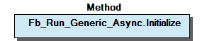 Graphical Interface of Fb_Run_Generic_Async.Initialize Function Description This method sets the FB into a predefined state with appropriate variable settings. Use this in derived FBs for initialization: or (not suitable for further inheritance but shorter in simple cases):

## Fb_Run_Generic_Async.TriggerExecute (METH)


| Scope | Name | Type |
| --- | --- | --- |
| Return | TriggerExecute | eResultCode |
| Input | pThisRunner | POINTER TO Fb_GenericRunner |

| Result codes |
| OK=0 | Runner was successfully scheduled. |
| EBUSY | The runner is already running. |
| EINVAL | Null-pointer has been passed as runner. |
| (other) | Internal problems with sheduling. |

Starts the runner.

Graphical Illustration

Graphical Interface of Fb_Run_Generic_Async.TriggerExecute

Function Description

Interface variables Function Starts the runner. Graphical Illustration 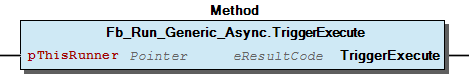 Graphical Interface of Fb_Run_Generic_Async.TriggerExecute Function Description

## Fb_VirtualMethodsForAsyncExecution.protAbortionCleanup (METH)


| Scope | Name | Type |
| --- | --- | --- |
| Return | protAbortionCleanup | eResultCode |

| Result codes |
| 0 | Successful termination or nothing to do |
| EAGAIN | Asynchronous cleanup with AsynchronousCleanup() is needed. |
| other | (Will be discarded.) |

Code for cleaning up an aborted job.

Graphical Illustration

Graphical Interface of Fb_VirtualMethodsForAsyncExecution.protAbortionCleanup

Function Description

When the processing of ths FB stops prematurely this method is called (always synchronously) to clean up the interrupted FB state. The cause of the premature stop could be:

If the cleanup could be finished normally, this method returns OK (=0). If long-running cleanup is necessary, which has to be scheduled asynchronously, this situation has to be indicated by returning EAGAIN. In that case an asynchronous cleanup process is scheduled.

If this cleanup is not needed in derived FBs, it may simply be omitted.

Interface variables Function Code for cleaning up an aborted job. Graphical Illustration 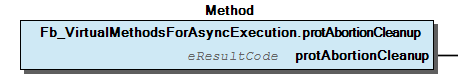 Graphical Interface of Fb_VirtualMethodsForAsyncExecution.protAbortionCleanup Function Description When the processing of ths FB stops prematurely this method is called (always synchronously) to clean up the interrupted FB state. The cause of the premature stop could be: - TimeOut from the framework; - external AbortRequest signal; or - MainRun() returned with ECANCELED. If the cleanup could be finished normally, this method returns OK (=0). If long-running cleanup is necessary, which has to be scheduled asynchronously, this situation has to be indicated by returning EAGAIN. In that case an asynchronous cleanup process is scheduled. If this cleanup is not needed in derived FBs, it may simply be omitted.

## Fb_VirtualMethodsForAsyncExecution.protAsynchronousCleanup (METH)


| Scope | Name | Type |
| --- | --- | --- |
| Return | protAsynchronousCleanup | eResultCode |

| Result codes |
| all | Will be ignored. |
| EAGAIN | DO NOT USE. |

Code for asynchronous cleanup.

Graphical Illustration

Graphical Interface of Fb_VirtualMethodsForAsyncExecution.protAsynchronousCleanup

Function Description

When, in a derived FB, code for cleaning up is needed, which may run so long that it also has to be deferred to an asynchronous task, this code is to be placed in this method.

Although it allows the return of a result code for uniformity reasons, the result will be discarded. Explanation: The eResult of the derived FB reflects the status of the main functionality, which is represented by protMainRun() rather than by protAsynchronousCleanup(). This method is not expected to run repeatedly but only once per trigger. The method should return OK. It should not return other codes, especially not EAGAIN.

Interface variables Function Code for asynchronous cleanup. Graphical Illustration 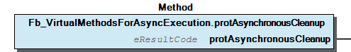 Graphical Interface of Fb_VirtualMethodsForAsyncExecution.protAsynchronousCleanup Function Description When, in a derived FB, code for cleaning up is needed, which may run so long that it also has to be deferred to an asynchronous task, this code is to be placed in this method. Although it allows the return of a result code for uniformity reasons, the result will be discarded. Explanation: The eResult of the derived FB reflects the status of the main functionality, which is represented by protMainRun() rather than by protAsynchronousCleanup(). This method is not expected to run repeatedly but only once per trigger. The method should return OK. It should not return other codes, especially not EAGAIN.

## Fb_VirtualMethodsForAsyncExecution.protDone (METH)


| Scope | Name | Type | Comment |
| --- | --- | --- | --- |
| Input | Result | eResultCode | When done, what errors do we have to consider? |

Code for postprocessing.

Graphical Illustration

Graphical Interface of Fb_VirtualMethodsForAsyncExecution.protDone

Function Description

This method provides synchronous post-processing after termination of the main task.

This method allows for easy passing of output results from inner FB layers (e.g. the FILE object in an asynchronous File-FB or other local variables) to the output variables of the specialized FB. When using this, protMainRun() has to deal only with internal variables and is completely decoupled from the public interface.

This method accepts as input the result code of the terminated process in order to allow for appropriate reactions to error conditions, if needed.

It does not provide a result code itself, because it is not supposed to contain failable code.

Interface variables Function Code for postprocessing. Graphical Illustration 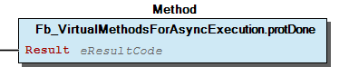 Graphical Interface of Fb_VirtualMethodsForAsyncExecution.protDone Function Description This method provides synchronous post-processing after termination of the main task. This method allows for easy passing of output results from inner FB layers (e.g. the FILE object in an asynchronous File-FB or other local variables) to the output variables of the specialized FB. When using this, protMainRun() has to deal only with internal variables and is completely decoupled from the public interface. This method accepts as input the result code of the terminated process in order to allow for appropriate reactions to error conditions, if needed. It does not provide a result code itself, because it is not supposed to contain failable code.

## Fb_VirtualMethodsForAsyncExecution.protInitialize (METH)


| Scope | Name | Type |
| --- | --- | --- |
| Return | protInitialize | eResultCode |

| Result codes |
| 0 | Successful termination, continue with PrimaryRun(). |
| EALREADY | Operation already successfully terminated: No PrimaryRun() necessary. |
| EAGAIN | Should not be used, reserved for future use. |
| other | Terminate and display result code as error code. |

Code for initialization in derived FBs.

Graphical Illustration

Graphical Interface of Fb_VirtualMethodsForAsyncExecution.protInitialize

Function Description

This method will be called synchronously, i.e. directly after triggering the derived FB.

This method is called from the base FB immediately (always synchronously) with the call of _TriggerExecute(), before the main run starts. It is intended to provide the initialization of the variables (esp. buffering of input variables) of the derived FB immediately after starting, while the (probably long-running) main process might be postponed asynchronously.

When protInitialize() returns a result code other than OK (=0), further asynchronous processing does not take place und the result code is displayed at the eResult output with xError being set. A typical error code would be EINVAL (‘Invalid argument’) - although the user is free to use his own error code. Pleae note that code EAGAIN is also valid in principle, but should be avoided so as not to cause confusion: Other methods use EAGAIN for indicating the necessity of further processing.

When protInitialize() finds that all necessary actions of the whole functionality can take place synchronously within the protInitialize()-method and no asynchronous running is necessary, it may return the code EALREADY. This will cause the base FB to directly terminate successfully and to omit protPrimaryRun().

Interface variables Function Code for initialization in derived FBs. Graphical Illustration 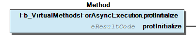 Graphical Interface of Fb_VirtualMethodsForAsyncExecution.protInitialize Function Description This method will be called synchronously, i.e. directly after triggering the derived FB. This method is called from the base FB immediately (always synchronously) with the call of _TriggerExecute(), before the main run starts. It is intended to provide the initialization of the variables (esp. buffering of input variables) of the derived FB immediately after starting, while the (probably long-running) main process might be postponed asynchronously. When protInitialize() returns a result code other than OK (=0), further asynchronous processing does not take place und the result code is displayed at the eResult output with xError being set. A typical error code would be EINVAL (‘Invalid argument’) - although the user is free to use his own error code. Pleae note that code EAGAIN is also valid in principle, but should be avoided so as not to cause confusion: Other methods use EAGAIN for indicating the necessity of further processing. When protInitialize() finds that all necessary actions of the whole functionality can take place synchronously within the protInitialize()-method and no asynchronous running is necessary, it may return the code EALREADY. This will cause the base FB to directly terminate successfully and to omit protPrimaryRun().

## Fb_VirtualMethodsForAsyncExecution.protMainRun (METH)


| Scope | Name | Type |
| --- | --- | --- |
| Return | protMainRun | eResultCode |

| Result codes |
| 0 | Successful termination. |
| EAGAIN | Additional runs are necessary. |
| ENOSYS | The functionality is not implemented. |
| ECANCELED | The operation was aborted prematurely and cleanup is necessary. |
| other | Terminate and display the result code as error code. |

Code for repeated asynchronous execution.

Graphical Illustration

Graphical Interface of Fb_VirtualMethodsForAsyncExecution.protMainRun

Function Description

This method is executed asynchronously with native breakpoints at the end of each cycle.

This method is called asynchronously following the synchronous call of protInitialize(). In contrast to the latter, ProtMainRun() is not guaranteed to start immediately, but in might be scheduled for future execution, depending on the scheduling mode. Typically, this method carries out the main (long-running) functionality of the derived FB.

Via the property ‘CycleCount’, protMainRun() is able to detect whether it is called initially or subsequently.

Due to the potentially deferred execution, the input variables of the derived FB should not be processed directly within this method, because of the rather poorly defined timing. Instead they should be buffered from protInitialize() or from the derived trigger call.

The output ‘xBusy’ will be set synchronously with the _TriggerExecute() but this does not indicate that protMainRun() has yet started.

The protMainRun() is supposed to return OK (=0) on successful termination. Upon detecting this, the framework will set xTerminated accordingly. When further processing is necessary after the initial run, this is signalled by the result code EAGAIN. Other non-zero result code will also terminate the execution and set the eResult output to the returned result code.

When very simple functionalities are implemented by the child FB, this method might be the only one to be invoked.

Interface variables Function Code for repeated asynchronous execution. Graphical Illustration  Graphical Interface of Fb_VirtualMethodsForAsyncExecution.protMainRun Function Description This method is executed asynchronously with native breakpoints at the end of each cycle. This method is called asynchronously following the synchronous call of protInitialize(). In contrast to the latter, ProtMainRun() is not guaranteed to start immediately, but in might be scheduled for future execution, depending on the scheduling mode. Typically, this method carries out the main (long-running) functionality of the derived FB. Note Via the property ‘CycleCount’, protMainRun() is able to detect whether it is called initially or subsequently. Due to the potentially deferred execution, the input variables of the derived FB should not be processed directly within this method, because of the rather poorly defined timing. Instead they should be buffered from protInitialize() or from the derived trigger call. Note The output ‘xBusy’ will be set synchronously with the _TriggerExecute() but this does not indicate that protMainRun() has yet started. The protMainRun() is supposed to return OK (=0) on successful termination. Upon detecting this, the framework will set xTerminated accordingly. When further processing is necessary after the initial run, this is signalled by the result code EAGAIN. Other non-zero result code will also terminate the execution and set the eResult output to the returned result code. When very simple functionalities are implemented by the child FB, this method might be the only one to be invoked.

### Program Organization


## 20 Program Organization Units


- 30 Base Classes Fb_AsyncOneShot_Base (FB) - Fb_Async_Base (FB) 41 PROTECTED Interface Fb_Async_Base._Abort (METH) - Fb_Async_Base._AcknowledgeTermination (METH) - Fb_Async_Base._IsReadyForExecution (METH) - Fb_Async_Base._IsRunning (METH) - Fb_Async_Base._SetSchedulingParameters (METH) - Fb_Async_Base._TriggerExecute (METH) - Fb_Async_Base.eSchedMode (PROP) - Fb_Async_Base.tTimeout (PROP) 42 Administration - Fb_Async_Base.Finish (METH) - Fb_Async_Base.Initialize (METH) Fb_Daemon_Base (FB) - Fb_Daemon_Base.DaemonCycleCount (PROP) - Fb_Daemon_Base.Run (METH) 40 Derived Behaviour Models - FbBehaviourModelWagoEnableAsync (FB) FbBehaviourModelWagoEnableAsync.Initialize (METH) - FbBehaviourModelWagoEnableAsync.eSchedMode (PROP) - FbBehaviourModelWagoEnableAsync.protRun (METH) - FbBehaviourModelWagoEnableAsync.protTerminate (METH) - FbBehaviourModelWagoEnableAsync.tTimeout (PROP) FbBehaviourModelWagoExecuteAsync (FB) - FbBehaviourModelWagoExecuteAsync.Initialize (METH) - FbBehaviourModelWagoExecuteAsync.eSchedMode (PROP) - FbBehaviourModelWagoExecuteAsync.protClearOutputs (METH) - FbBehaviourModelWagoExecuteAsync.protRun (METH) - FbBehaviourModelWagoExecuteAsync.tTimeout (PROP) FbBehaviourModelWagoTriggerAsync (FB) - FbBehaviourModelWagoTriggerAsync.Initialize (METH) - FbBehaviourModelWagoTriggerAsync.eSchedMode (PROP) - FbBehaviourModelWagoTriggerAsync.protRun (METH) - FbBehaviourModelWagoTriggerAsync.tTimeout (PROP) Fb_Run_Generic_Async (FB) - Fb_Run_Generic_Async.Initialize (METH) - Fb_Run_Generic_Async.TriggerExecute (METH) - Fb_Run_Generic_Async.eSchedMode (PROP)

### Base Components


## 30 Base Classes


- Fb_AsyncOneShot_Base (FB) - Fb_Async_Base (FB) 41 PROTECTED Interface Fb_Async_Base._Abort (METH) - Fb_Async_Base._AcknowledgeTermination (METH) - Fb_Async_Base._IsReadyForExecution (METH) - Fb_Async_Base._IsRunning (METH) - Fb_Async_Base._SetSchedulingParameters (METH) - Fb_Async_Base._TriggerExecute (METH) - Fb_Async_Base.eSchedMode (PROP) - Fb_Async_Base.tTimeout (PROP) 42 Administration - Fb_Async_Base.Finish (METH) - Fb_Async_Base.Initialize (METH) Fb_Daemon_Base (FB) - Fb_Daemon_Base.DaemonCycleCount (PROP) - Fb_Daemon_Base.Run (METH)

## 89 Inherited Base FBs


Here you find FBs which are inherited by other FBs in this library and which SHOULD NOT be used as derivation base by the user, but which are essential to be included in the documentation.

Explanation: The user of the library is supposed to overload methods which are inherited from here and which are do not appear in the documentation of the concerned library FBs which inherit these methods.

Here you find FBs which are inherited by other FBs in this library and which SHOULD NOT be used as derivation base by the user, but which are essential to be included in the documentation. Explanation: The user of the library is supposed to overload methods which are inherited from here and which are do not appear in the documentation of the concerned library FBs which inherit these methods. - Fb_VirtualMethodsForAsyncExecution (FB) 50 Virtual Methods for Behaviour Model Fb_VirtualMethodsForAsyncExecution.protAbortionCleanup (METH) - Fb_VirtualMethodsForAsyncExecution.protAsynchronousCleanup (METH) - Fb_VirtualMethodsForAsyncExecution.protDone (METH) - Fb_VirtualMethodsForAsyncExecution.protInitialize (METH) - Fb_VirtualMethodsForAsyncExecution.protMainRun (METH) 60 Properties for Use in Overloaded Methods - Fb_VirtualMethodsForAsyncExecution.AbortRequest (PROP) - Fb_VirtualMethodsForAsyncExecution.CycleCount (PROP)

## Fb_Async_Base.eSchedMode (PROP)


Sets and gets the scheduling mode.

Graphical Illustration

Graphical Interface of Fb_Async_Base.eSchedMode

Function Description

For a detailed description of the scheduling modes, please refer to the section ‘Common Type Definitions’ below.

Function* Sets and gets the scheduling mode. Graphical Illustration 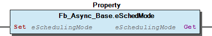 Graphical Interface of Fb_Async_Base.eSchedMode Function Description For a detailed description of the scheduling modes, please refer to the section ‘Common Type Definitions’ below.

## Fb_Async_Base.tTimeout (PROP)


Sets and gets the timeout limit.

Graphical Illustration

Graphical Interface of Fb_Async_Base.tTimeout

Function Description

After timeout, the runner is not aborted unconditionally. It is merely signalled that it has been running for a too long time and it will not be restarted automatically.

(T#0s = no timeout.)

Function Sets and gets the timeout limit. Graphical Illustration 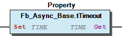 Graphical Interface of Fb_Async_Base.tTimeout Function Description After timeout, the runner is not aborted unconditionally. It is merely signalled that it has been running for a too long time and it will not be restarted automatically. (T#0s = no timeout.)

## Fb_Daemon_Base.DaemonCycleCount (PROP)


```
METHOD protMainRun

IF CycleCount=1 THEN
   do_some_initialization_in_asynchronous_domain();
ELSE
   ; // everything is initialized already.
END_IF
[...]
```

Counts internal repetitions of daemon runner.

Graphical Illustration

Graphical Interface of Fb_Daemon_Base.DaemonCycleCount

Function Description

During initialization this property would yield ‘0’. During the first call of Run() this property is ‘1’ and it counts up for subsequent calls.

This is useful for Run() to determine, if it has been called initially or subsequently:

Function Counts internal repetitions of daemon runner. Graphical Illustration 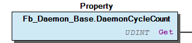 Graphical Interface of Fb_Daemon_Base.DaemonCycleCount Function Description During initialization this property would yield ‘0’. During the first call of Run() this property is ‘1’ and it counts up for subsequent calls. This is useful for Run() to determine, if it has been called initially or subsequently:

### Global Variable Lists


## LibraryResult (GVL)


| Name | Type | Comment |
| --- | --- | --- |
| Factory | FbResultFactory | Produces FbResults from given eResultCodes. |

```
VAR
  eMyResult : eResultCode;  // result code which is to be investigated
  oError    : FbResult;     // result object for use in higher levels
END_VAR;

eMyResult := myFunction(...);
Namespace.LibraryResult.Factory.SetResult(eMyResult, oError);
```

Factory for standard result objects

Use this to translate result codes from this library into standard result objects.

(In this example ‘Namespace’ denotes the namespace which is used for including the specific library and ‘myFunction()’ is an example for a general function from this library.)

Factory for standard result objects Use this to translate result codes from this library into standard result objects. Usage: (In this example ‘Namespace’ denotes the namespace which is used for including the specific library and ‘myFunction()’ is an example for a general function from this library.)

## ResultItems (GVL)


| Scope | Name | Type | Initial |
| --- | --- | --- | --- |
| Constant | ERROR | ARRAY [0..11] OF typResultItem | [STRUCT(ID := OK, Severity := eSeverity.none, Text := ‘OK.’), STRUCT(ID := EINPROGRESS, Severity := eSeverity.info, Text := ‘The job or functinality has been started, but not yet terminated.’), STRUCT(ID := EAGAIN, Severity := eSeverity.info, Text := ‘The job is not finished and needs to be executed again.’), STRUCT(ID := EALREADY, Severity := eSeverity.info, Text := ‘The job is already teminated. No further action necessary’), STRUCT(ID := EBREAKPT, Severity := eSeverity.info, Text := ‘Shutdow is in progess but can be safely interrupted at this point.’), STRUCT(ID := ENOSYS, Severity := eSeverity.error, Text := ‘The desired function is not implemented.’), STRUCT(ID := ECANCELED, Severity := eSeverity.error, Text := ‘Execution was terminated prematurely.’), STRUCT(ID := ETIMEDOUT, Severity := eSeverity.error, Text := ‘Execution terminated prematurely due to tTimeout.’), STRUCT(ID := EBUSY, Severity := eSeverity.error, Text := ‘The action is already in progress or the FB is executing another job.’), STRUCT(ID := EINVAL, Severity := eSeverity.error, Text := ‘Invalid parameter.’), STRUCT(ID := ESRCH, Severity := eSeverity.error, Text := ‘No such process or event supported by the target device.’), STRUCT(ID := EBADSTATE, Severity := eSeverity.error, Text := ‘Internal malfunction, e.g. waiting for a process which is not running.’)] |

Standard result items specific for this library

Function Description

This is a general mapping of result codes to short standard texts which are appropriate to the usage of these codes in this library.

Typially, each unit (function, method, or function block) in this library uses only a subset of these codes. Please, refer to the documentation of the specific unit for the set of codes which is actualy used and for a detailed explanation of the meaning of a result code in the specifc context.

Standard result items specific for this library Function Description This is a general mapping of result codes to short standard texts which are appropriate to the usage of these codes in this library. Typially, each unit (function, method, or function block) in this library uses only a subset of these codes. Please, refer to the documentation of the specific unit for the set of codes which is actualy used and for a detailed explanation of the meaning of a result code in the specifc context.

## VersionHistory (GVL)


| Name | Type |
| --- | --- |
| Info | ProjectInfo |

| date | version | author | change |
| 11.05.2020 | 1.6.2.1 | WAGO / u013972 | Remove the license form project info |
| 08.01.2019 | 1.6.2.0 | u015842 | Properties: free placeholder added |
| 22.06.2018 | 1.6.1.2 | WAGO / u013972 | Change images in the documentation |
| 10.03.2016 | 1.6.1.0 | WAGO / u013972 | Publish WagoSysErrorBase |
| 02.03.2016 | 1.6.0.0 | u010545 | WagoAppErrorBase changed to WagoSysErrorBase / WagoTypesErrorBase |
| 29.09.2015 | 1.5.2.0 | WAGO / u013972 | Resolve libraries with placeholders |
| 23.09.2015 | 1.5.1.0 | WAGO / u013972 | Workaround CD-39555-Bug |
| 23.06.2015 | 1.5.0.0 | WAGO / u013972 | Release version |

WagoSysAsync

### Other Components


## 40 Derived Behaviour Models


- FbBehaviourModelWagoEnableAsync (FB) FbBehaviourModelWagoEnableAsync.Initialize (METH) - FbBehaviourModelWagoEnableAsync.eSchedMode (PROP) - FbBehaviourModelWagoEnableAsync.protRun (METH) - FbBehaviourModelWagoEnableAsync.protTerminate (METH) - FbBehaviourModelWagoEnableAsync.tTimeout (PROP) FbBehaviourModelWagoExecuteAsync (FB) - FbBehaviourModelWagoExecuteAsync.Initialize (METH) - FbBehaviourModelWagoExecuteAsync.eSchedMode (PROP) - FbBehaviourModelWagoExecuteAsync.protClearOutputs (METH) - FbBehaviourModelWagoExecuteAsync.protRun (METH) - FbBehaviourModelWagoExecuteAsync.tTimeout (PROP) FbBehaviourModelWagoTriggerAsync (FB) - FbBehaviourModelWagoTriggerAsync.Initialize (METH) - FbBehaviourModelWagoTriggerAsync.eSchedMode (PROP) - FbBehaviourModelWagoTriggerAsync.protRun (METH) - FbBehaviourModelWagoTriggerAsync.tTimeout (PROP) Fb_Run_Generic_Async (FB) - Fb_Run_Generic_Async.Initialize (METH) - Fb_Run_Generic_Async.TriggerExecute (METH) - Fb_Run_Generic_Async.eSchedMode (PROP)

## 41 PROTECTED Interface


In this section, those PROTECTED methods are summarized, which are intended for interaction with the IEC-Task-Context. These are mainly triggering, aborting, getter methods for internal states, as well as setter methods for scheduling parameters.

In this section, those PROTECTED methods are summarized, which are intended for interaction with the IEC-Task-Context. These are mainly triggering, aborting, getter methods for internal states, as well as setter methods for scheduling parameters. - Fb_Async_Base._Abort (METH) - Fb_Async_Base._AcknowledgeTermination (METH) - Fb_Async_Base._IsReadyForExecution (METH) - Fb_Async_Base._IsRunning (METH) - Fb_Async_Base._SetSchedulingParameters (METH) - Fb_Async_Base._TriggerExecute (METH) - Fb_Async_Base.eSchedMode (PROP) - Fb_Async_Base.tTimeout (PROP)

## 42 Administration


- Fb_Async_Base.Finish (METH) - Fb_Async_Base.Initialize (METH)

## 50 Virtual Methods for Behaviour Model


A set of PROTECTED template methods for using the asynchronous FB ‘Fb_Async_Base’.

When deriving working FBs from FB_Async_Base, the methods from within this interface are intended to be overloaded by the user.

(For details see below. See also examples in the general description at the top of the WagoSysAsync.library.)

A set of PROTECTED template methods for using the asynchronous FB ‘Fb_Async_Base’. When deriving working FBs from FB_Async_Base, the methods from within this interface are intended to be overloaded by the user. (For details see below. See also examples in the general description at the top of the WagoSysAsync.library.) - Fb_VirtualMethodsForAsyncExecution.protAbortionCleanup (METH) - Fb_VirtualMethodsForAsyncExecution.protAsynchronousCleanup (METH) - Fb_VirtualMethodsForAsyncExecution.protDone (METH) - Fb_VirtualMethodsForAsyncExecution.protInitialize (METH) - Fb_VirtualMethodsForAsyncExecution.protMainRun (METH)

## 60 Properties for Use in Overloaded Methods


The Properties in this section are intended for use in overloaded virtual methods when child FBs are derived from the base FB.

The Properties in this section are intended for use in overloaded virtual methods when child FBs are derived from the base FB. - Fb_VirtualMethodsForAsyncExecution.AbortRequest (PROP) - Fb_VirtualMethodsForAsyncExecution.CycleCount (PROP)

## FbBehaviourModelWagoEnableAsync.eSchedMode (PROP)


Sets and gets the scheduling mode.

Graphical Illustration

Graphical Interface of FbBehaviourModelWagoEnableAsync.eSchedMode

Function Description

For a detailed description of the scheduling modes, please refer to the section ‘Common Type Definitions’ below.

Function Sets and gets the scheduling mode. Graphical Illustration 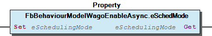 Graphical Interface of FbBehaviourModelWagoEnableAsync.eSchedMode Function Description For a detailed description of the scheduling modes, please refer to the section ‘Common Type Definitions’ below.

## FbBehaviourModelWagoEnableAsync.tTimeout (PROP)


Sets and gets the timeout limit.

Graphical Illustration

Graphical Interface of FbBehaviourModelWagoEnableAsync.tTimeout

Function Description

T#0s = no timeout.

Please note: After timeout, the runner is not aborted unconditionally. The runner is merely signalled that it has been running too long and it will not be restarted.

Function Sets and gets the timeout limit. Graphical Illustration 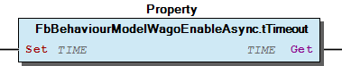 Graphical Interface of FbBehaviourModelWagoEnableAsync.tTimeout Function Description T#0s = no timeout. Please note: After timeout, the runner is not aborted unconditionally. The runner is merely signalled that it has been running too long and it will not be restarted.

## FbBehaviourModelWagoExecuteAsync.eSchedMode (PROP)


Sets and gets the scheduling mode.

Graphical Illustration

Graphical Interface of FbBehaviourModelWagoExecuteAsync.eSchedMode

Function Description

For a detailed description of the scheduling modes, please refer to the section ‘Common Type Definitions’ below.

Function Sets and gets the scheduling mode. Graphical Illustration 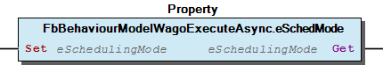 Graphical Interface of FbBehaviourModelWagoExecuteAsync.eSchedMode Function Description For a detailed description of the scheduling modes, please refer to the section ‘Common Type Definitions’ below.

## FbBehaviourModelWagoExecuteAsync.tTimeout (PROP)


Sets and gets the timeout limit.

Graphical Illustration

Graphical Interface of FbBehaviourModelWagoExecuteAsync.tTimeout

Function Description

T#0s = no timeout.

Please note: After timeout, the runner is not aborted unconditionally. It is merely signalled that it has been running too long and it will not be restarted.

Function Sets and gets the timeout limit. Graphical Illustration 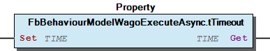 Graphical Interface of FbBehaviourModelWagoExecuteAsync.tTimeout Function Description T#0s = no timeout. Please note: After timeout, the runner is not aborted unconditionally. It is merely signalled that it has been running too long and it will not be restarted.

## FbBehaviourModelWagoTriggerAsync.eSchedMode (PROP)


Sets and gets the scheduling mode.

Graphical Illustration

Graphical Interface of FbBehaviourModelWagoTriggerAsync.eSchedMode

Function Description

For a detailed description of the scheduling modes, please refer to the section ‘Common Type Definitions’ below.

Function Sets and gets the scheduling mode. Graphical Illustration 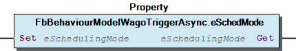 Graphical Interface of FbBehaviourModelWagoTriggerAsync.eSchedMode Function Description For a detailed description of the scheduling modes, please refer to the section ‘Common Type Definitions’ below.

## FbBehaviourModelWagoTriggerAsync.tTimeout (PROP)


Sets and gets the timeout limit.

Graphical Illustration

Graphical Interface of FbBehaviourModelWagoTriggerAsync.tTimeout

Function Description

T#0s = no timeout.

Please note: After timeout, the runner is not aborted unconditionally. It is merely signalled that it has been running too long and it will not be restarted.

Function Sets and gets the timeout limit. Graphical Illustration 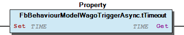 Graphical Interface of FbBehaviourModelWagoTriggerAsync.tTimeout Function Description T#0s = no timeout. Please note: After timeout, the runner is not aborted unconditionally. It is merely signalled that it has been running too long and it will not be restarted.

## Fb_Run_Generic_Async.eSchedMode (PROP)


Sets and gets the scheduling mode.

Graphical Illustration

Graphical Interface of Fb_Run_Generic_Async.eSchedMode

Function Description

For a detailed description of the scheduling modes, please refer to the section ‘Common Type Definitions’ below.

Function Sets and gets the scheduling mode. Graphical Illustration 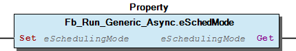 Graphical Interface of Fb_Run_Generic_Async.eSchedMode Function Description For a detailed description of the scheduling modes, please refer to the section ‘Common Type Definitions’ below.

## Fb_VirtualMethodsForAsyncExecution.AbortRequest (PROP)


```
METHOD protMainRun()
:
:
IF AbortRequest THEN
    doSomeInternalCleanup();
    protMainRun:=ECANCELLED;
    RETURN
 END_IF;
```

The runner has been requested to abort.

Graphical Illustration

Graphical Interface of Fb_VirtualMethodsForAsyncExecution.AbortRequest

Function Description

This property signals to the derived methods that the IEC has task requested the abortion of the asynchronous execution.

In the derived FB, this property may be read in order to perform a cooperative premature termination of the job:

This abort request may be caused either by a timeout, by an external abort signal or for some other reason. The derived protMainRun() may or may not honor this flag, depending on what the user has implemented.

When this flag is not honored by protMainRun() but protManRun() returns EAGAIN, this flag causes the framework of Fb_Async_Base to not continue with further execution but to proceed with cleanup instead.

Function The runner has been requested to abort. Graphical Illustration 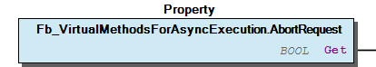 Graphical Interface of Fb_VirtualMethodsForAsyncExecution.AbortRequest Function Description This property signals to the derived methods that the IEC has task requested the abortion of the asynchronous execution. In the derived FB, this property may be read in order to perform a cooperative premature termination of the job: This abort request may be caused either by a timeout, by an external abort signal or for some other reason. The derived protMainRun() may or may not honor this flag, depending on what the user has implemented. When this flag is not honored by protMainRun() but protManRun() returns EAGAIN, this flag causes the framework of Fb_Async_Base to not continue with further execution but to proceed with cleanup instead.

## Fb_VirtualMethodsForAsyncExecution.CycleCount (PROP)


```
METHOD protMainRun

IF CycleCount=1 THEN
   do_some_initialization_in_asynchronous_domain();
ELSE
   ; // everything is initialized already.
END_IF
[...]
```

Counts repetitions of protMainRun().

Graphical Illustration

Graphical Interface of Fb_VirtualMethodsForAsyncExecution.CycleCount

Function Description

During initialization this property would yield ‘0’. During the first call of protMainRun() this property is ‘1’ and it counts up for subsequent calls.

This is useful for protMainRun() to determine, if it has been called initially or subsequently:

Function Counts repetitions of protMainRun(). Graphical Illustration 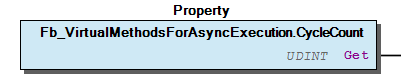 Graphical Interface of Fb_VirtualMethodsForAsyncExecution.CycleCount Function Description During initialization this property would yield ‘0’. During the first call of protMainRun() this property is ‘1’ and it counts up for subsequent calls. This is useful for protMainRun() to determine, if it has been called initially or subsequently:

## doc10_General (PRG)


```
eSchedMode := eSchedulingMode.Background;                                  // regular assignment
```

```
eSchedMode := SchedulingMode(eSchedulingModeEvent.Modbus_Watchdog_Expired); // device specific assignment
```

```
eSchedMode := SchedulingMode_EventPriority(eSchedulingModeEvent.Modbus_Watchdog_Running,
                                           eSchedulingMode.AsyncLow);
```

This library WagoSysAsync provides the possibility to transfer long running functions or FBs into a separate context and let them execute asynchronously while the calling application task is still responsive during the execution.

The fundamental usage of this mechanism consists in wrapping the desired functionality into standardized base FBs, which resemble very closely the regular behaviour models . In the application, new FBs were derived from that base FB and the required interface functions were overloaded.

Usage of this library

The intended usage of this library is to derive own FBs from the base FBs which are provided here. For simple cases the user finds specialized base FBs, such as Fb_Daemon_Base (FB) or Fb_AsyncOneShot_Base (FB) as well as base FBs for behaviour models, such as (e.g.) FbBehaviourModelWagoExecuteAsync (FB) as asynchronous model for WagoExecute .

For more complex cases, Fb_Async_Base (FB) provides for more complexity. If in this case, the user derives his FB from Fb_Async_Base , he derives indirectly from the protected interface Fb_VirtualMethodsForAsyncExecution (FB) (which is declared as FB instead of as Itf for technical reasons). This interface contains all protected methods, which may be overloaded by the user if they ware used.

Only those methods which contain real functionality need to be implemented by the child object. Unlike in ‘technical’ interfaces, methods which are not needed may simply be omitted.

Please note further, that you do not derive from Fb_VirtualMethodsForAsyncExecution (FB) directly, but from Fb_Async_Base (FB) , which is a grandchild of the latter. The role of Fb_Async_Base consists only in providing the framework for synchromnous and asynchronous scheduling - which is completely separated from the user code.

When own FBs are derived from Fb_Async_Base it is typically necessary to add own interface variables and to implement own functionality. The first should be done in the interface blcok of the derived FB itself, while the latter should be done by overloading the Fb_VirtualMethodsForAsyncExecution (FB) -methods and introducing own PRIVATE methods if necessary. In no case, the user is supposed to touch anything else from Fb_Async_Base and for this reason anything else in Fb_Async_Base is declared private or final.

The fb_VirtualMethodsForAsyncExecution -methods are declared PROTECTED, i.e. they are supposed to be eventually overloaded by child FBs, but they must not be called directly from the application or anything else outside the FB-declaration.

Standard Behaviour Models

For the sake of convenience other FBs beyond the fundamental ‘Fb_Async_Base’ are provided, which resemble the standard behaviour models from ‘WagoSysBehaviourmodels.library’. Like their sysnchronous brothers, the asynchronous models have a variable-oriented interface and a set of protected methods which represent the functionality. Additionally they have properties like scheduling mode and timeout , which do not apply for their synchronous counterparts.

Scheduling Modes and Priorities

The library WagoTypesCommon defines a set of priorities and scheduling modes which are represented by the enumeration type eSchedulingMode , e.g. :

Additionally, the scheduling may be connected to some specific external events by using a wrapping function :

Some target hardware allows for combining external events with additional scheduling priority. In this case, the wrapping function SchedulingMode_EventPriority() is to be used for combining both to a single scheduling mode value:

General This library WagoSysAsync provides the possibility to transfer long running functions or FBs into a separate context and let them execute asynchronously while the calling application task is still responsive during the execution. The fundamental usage of this mechanism consists in wrapping the desired functionality into standardized base FBs, which resemble very closely the regular behaviour models . In the application, new FBs were derived from that base FB and the required interface functions were overloaded. Usage of this library The intended usage of this library is to derive own FBs from the base FBs which are provided here. For simple cases the user finds specialized base FBs, such as Fb_Daemon_Base (FB) or Fb_AsyncOneShot_Base (FB) as well as base FBs for behaviour models, such as (e.g.) FbBehaviourModelWagoExecuteAsync (FB) as asynchronous model for WagoExecute . For more complex cases, Fb_Async_Base (FB) provides for more complexity. If in this case, the user derives his FB from Fb_Async_Base , he derives indirectly from the protected interface Fb_VirtualMethodsForAsyncExecution (FB) (which is declared as FB instead of as Itf for technical reasons). This interface contains all protected methods, which may be overloaded by the user if they ware used. Note Only those methods which contain real functionality need to be implemented by the child object. Unlike in ‘technical’ interfaces, methods which are not needed may simply be omitted. Please note further, that you do not derive from Fb_VirtualMethodsForAsyncExecution (FB) directly, but from Fb_Async_Base (FB) , which is a grandchild of the latter. The role of Fb_Async_Base consists only in providing the framework for synchromnous and asynchronous scheduling - which is completely separated from the user code. When own FBs are derived from Fb_Async_Base it is typically necessary to add own interface variables and to implement own functionality. The first should be done in the interface blcok of the derived FB itself, while the latter should be done by overloading the Fb_VirtualMethodsForAsyncExecution (FB) -methods and introducing own PRIVATE methods if necessary. In no case, the user is supposed to touch anything else from Fb_Async_Base and for this reason anything else in Fb_Async_Base is declared private or final. The fb_VirtualMethodsForAsyncExecution -methods are declared PROTECTED, i.e. they are supposed to be eventually overloaded by child FBs, but they must not be called directly from the application or anything else outside the FB-declaration. Standard Behaviour Models For the sake of convenience other FBs beyond the fundamental ‘Fb_Async_Base’ are provided, which resemble the standard behaviour models from ‘WagoSysBehaviourmodels.library’. Like their sysnchronous brothers, the asynchronous models have a variable-oriented interface and a set of protected methods which represent the functionality. Additionally they have properties like scheduling mode and timeout , which do not apply for their synchronous counterparts. Scheduling Modes and Priorities The library WagoTypesCommon defines a set of priorities and scheduling modes which are represented by the enumeration type eSchedulingMode , e.g. : Additionally, the scheduling may be connected to some specific external events by using a wrapping function : Some target hardware allows for combining external events with additional scheduling priority. In this case, the wrapping function SchedulingMode_EventPriority() is to be used for combining both to a single scheduling mode value: