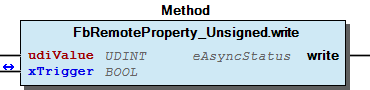

# WagoSysBACnet v2.0.1.12 (WAGO) - Complete Documentation


## 📋 Library Information

- **Company:** WAGO
- **Title:** WagoSysBACnet
- **Version:** 2.0.1.12
- **Categories:** WAGO FunctionalView|Connectivity|FieldBus; WAGO LayerView|Sys; Application
- **Namespace:** WagoSysBACnet
- **Author:** WAGO / u01045
- **Placeholder:** WagoSysBACnet

### Description ¶


This document is automatically generated.

This library provides access to bacnet objects on iec level.

This document is automatically generated. This library provides access to bacnet objects on iec level.

### Contents: ¶


Contents: - Documentation Index 10 Documentation - WagoSysBACnet Library Documentation Project Information Library Information Function Blocks - FbAnalogInput_large (FB) - FbAnalogInput_medium (FB) - FbAnalogInput_small (FB) - FbAnalogOutput_large (FB) - FbAnalogOutput_medium (FB) - FbAnalogOutput_small (FB) - FbAnalogValue_large (FB) - FbAnalogValue_medium (FB) - FbAnalogValue_small (FB) - FbBinaryInput_large (FB) - ... and 70 more Methods - FbAnalogInput_large.IEventMessageTexts (PROP) - FbAnalogInput_large.IEventMessageTextsConfig (PROP) - FbAnalogOutput_large.IEventMessageTexts (PROP) - FbAnalogOutput_large.IEventMessageTextsConfig (PROP) - FbAnalogValue_large.IEventMessageTexts (PROP) - FbAnalogValue_large.IEventMessageTextsConfig (PROP) - FbBinaryInput_large.IEventMessageTexts (PROP) - FbBinaryInput_large.IEventMessageTextsConfig (PROP) - FbBinaryInput_medium.dtTimeOfActiveTimeReset (PROP) - FbBinaryInput_medium.dtTimeOfStateCountReset (PROP) - ... and 106 more Program Organization Base Components Internal Components Global Variable Lists - BACnet (GVL) - Common (GVL) - ErrorBACnet (GVL) - VersionHistory (GVL) Other Components - (00) Input - (01) Output - (02) Value - (03) Input - (04) Output - (05) Value - (13) Input - (14) Output - (19) Value - 01 (00/01/02) Analog Objects * - ... and 595 more

### Indices and tables ¶


Based on WagoSysBACnet.library, last modified 20.09.2024, 21:15:48. LibDoc 3.5.16.10

© WAGO GmbH & Co. KG, Germany 2018 – All rights reserved. For the avoidance of doubt, this copyright notice does not only apply to the information above but also and primarily to the described library itself. Please note that third-party products are always mentioned without reference to intellectual property rights, including patents, utility models, designs and trademarks, accordingly the existence of such rights cannot be excluded. WAGO is a registered trademark of WAGO Verwaltungsgesellschaft mbH.

- File and Project Information - Library Reference Based on WagoSysBACnet.library, last modified 20.09.2024, 21:15:48. LibDoc 3.5.16.10 © WAGO GmbH & Co. KG, Germany 2018 – All rights reserved. For the avoidance of doubt, this copyright notice does not only apply to the information above but also and primarily to the described library itself. Please note that third-party products are always mentioned without reference to intellectual property rights, including patents, utility models, designs and trademarks, accordingly the existence of such rights cannot be excluded. WAGO is a registered trademark of WAGO Verwaltungsgesellschaft mbH.

### Documentation Index


## 10 Documentation


Warning Requirement for the correct work of this library - BACnet Stack Rev. >= 22 -> FW(21) - doc01_Foreword (FB) - doc02_BACnet_Firmware_Versions (FB) - doc99_Attachment (FB)

## WagoSysBACnet Library Documentation


| Company: | WAGO |
| Title: | WagoSysBACnet |
| Version: | 2.0.1.12 |
| Categories: | WAGO FunctionalView\|Connectivity\|FieldBus; WAGO LayerView\|Sys; Application |
| Namespace: | WagoSysBACnet |
| Author: | WAGO / u01045 |
| Placeholder: | WagoSysBACnet |

### Description


This document is automatically generated.

This library provides access to bacnet objects on iec level.

This document is automatically generated. This library provides access to bacnet objects on iec level.

### Contents:


- 10 Documentation doc01_Foreword (FB) - doc02_BACnet_Firmware_Versions (FB) - doc99_Attachment (FB) 20 Program Organization Units - Event / Alarm List - Last Error - Local Objects - Remote Objects 80 Status - ErrorBACnet (GVL) - eErrorBACnet (ENUM) BACnet (GVL) Common (GVL) GlobalTextList (Text List) ParameterSysBACnet (PARAMS) VersionHistory (GVL)

### Indices and tables


Based on WagoSysBACnet.library, last modified 20.09.2024, 21:15:48. LibDoc 3.5.16.10

© WAGO GmbH & Co. KG, Germany 2018 – All rights reserved. For the avoidance of doubt, this copyright notice does not only apply to the information above but also and primarily to the described library itself. Please note that third-party products are always mentioned without reference to intellectual property rights, including patents, utility models, designs and trademarks, accordingly the existence of such rights cannot be excluded. WAGO is a registered trademark of WAGO Verwaltungsgesellschaft mbH.

- File and Project Information - Library Reference Based on WagoSysBACnet.library, last modified 20.09.2024, 21:15:48. LibDoc 3.5.16.10 © WAGO GmbH & Co. KG, Germany 2018 – All rights reserved. For the avoidance of doubt, this copyright notice does not only apply to the information above but also and primarily to the described library itself. Please note that third-party products are always mentioned without reference to intellectual property rights, including patents, utility models, designs and trademarks, accordingly the existence of such rights cannot be excluded. WAGO is a registered trademark of WAGO Verwaltungsgesellschaft mbH.

### Project Information


## File and Project Information


| Scope | Name | Type | Content |
| --- | --- | --- | --- |
| FileHeader | libraryFile | string | WagoSysBACnet.library |
| contentFile | doc.clean.json |
| productName | e!COCKPIT |
| creationDateTime | date | 20.09.2024, 21:15:56 |
| companyName | string | WAGO |
| ProjectInformation | LastModificationDateTime | date | 20.09.2024, 21:15:48 |
| Description | string | See: Description |
| Copyright | © WAGO Kontakttechnik GmbH & Co. KG, Germany 2018 – All rights reserved |
| Author | WAGO / u01045 |
| AutoResolveUnbound | bool | False |
| Placeholder | string | WagoSysBACnet |
| Company | WAGO |
| DocFormat | reStructuredText |
| Project | WagoSysBACnet |
| DefaultNamespace | WagoSysBACnet |
| Version | version | 2.0.1.12 |
| Title | string | WagoSysBACnet |
| LibraryCategories | library-category-list | WAGO FunctionalView\|Connectivity\|FieldBus; WAGO LayerView\|Sys; Application |
| CompiledLibraryCompatibilityVersion | string | CODESYS V3.5 SP16 Patch 3 |

### Library Information


## Library Reference


| LinkAllContent: False QualifiedOnly: True | SystemLibrary: False | Optional: False |

| LinkAllContent: False QualifiedOnly: False | SystemLibrary: False | Optional: False |

| LinkAllContent: False QualifiedOnly: False | SystemLibrary: False | Optional: False |

| LinkAllContent: False QualifiedOnly: False | SystemLibrary: False | Optional: False |

| LinkAllContent: False QualifiedOnly: False | SystemLibrary: False | Optional: False |

| LinkAllContent: False QualifiedOnly: False | SystemLibrary: False | Optional: False |

| LinkAllContent: False QualifiedOnly: False | SystemLibrary: False | Optional: False |

| LinkAllContent: False QualifiedOnly: False | SystemLibrary: False | Optional: False |

| LinkAllContent: False QualifiedOnly: False | SystemLibrary: False | Optional: False |

| LinkAllContent: False QualifiedOnly: False | SystemLibrary: False | Optional: False |

| LinkAllContent: False QualifiedOnly: True | SystemLibrary: False | Optional: False |

| LinkAllContent: False QualifiedOnly: False | SystemLibrary: False | Optional: False |

| LinkAllContent: False QualifiedOnly: True | SystemLibrary: False | Optional: False |

| LinkAllContent: False QualifiedOnly: False | SystemLibrary: False | Optional: False |

| LinkAllContent: False QualifiedOnly: False | SystemLibrary: False | Optional: False |

| LinkAllContent: False QualifiedOnly: True | SystemLibrary: False | Optional: False |

| LinkAllContent: False QualifiedOnly: True | SystemLibrary: False PublishSymbolsInContainer: True | Optional: False |

| LinkAllContent: False Optional: False | QualifiedOnly: False SystemLibrary: False | PublishSymbolsInContainer: True |

This is a dictionary of all referenced libraries and their name spaces.

This is a dictionary of all referenced libraries and their name spaces. CAA Types Extern Library Identification : Placeholder: CAA Types Default Resolution: CAA Types Extern, * (CAA Technical Workgroup) Namespace: CAA Library Properties : CmpApp Library Identification : Placeholder: CmpApp Default Resolution: CmpApp, * (System) Namespace: CmpApp Library Properties : CmpErrors2 Interfaces Library Identification : Name: CmpErrors2 Interfaces Version: newest Company: System Namespace: CmpErrors Library Properties : CmpEventMgr Library Identification : Placeholder: CmpEventMgr Default Resolution: CmpEventMgr, * (System) Namespace: CmpEventMgr Library Properties : CmpIecTask Library Identification : Placeholder: CmpIecTask Default Resolution: CmpIecTask, * (System) Namespace: CmpIecTask Library Properties : CmpLog Library Identification : Placeholder: CmpLog Default Resolution: CmpLog, * (System) Namespace: CmpLog Library Properties : Standard Library Identification : Placeholder: Standard Default Resolution: Standard, * (System) Namespace: Standard Library Properties : StringUtils Library Identification : Placeholder: StringUtils Default Resolution: StringUtils, 3.5.15.0 (System) Namespace: Stu Library Properties : SysCpuHandling Library Identification : Placeholder: SysCpuHandling Default Resolution: SysCpuHandling, 3.5.13.0 (System) Namespace: SysCpuHandling Library Properties : SysMem Library Identification : Placeholder: SysMem Default Resolution: SysMem, * (System) Namespace: SysMem Library Properties : SysSocket Library Identification : Placeholder: SysSocket Default Resolution: SysSocket, * (System) Namespace: SysSocket Library Properties : SysTypes2 Interfaces Library Identification : Name: SysTypes2 Interfaces Version: newest Company: System Namespace: SysTypes Library Properties : Unit Conversion Interfaces Library Identification : Name: Unit Conversion Interfaces Version: newest Company: Intern Namespace: UC Library Properties : WagoSysBACnet_Internal_PFC Library Identification : Placeholder: WagoSysBACnet_Internal Default Resolution: WagoSysBACnet_Internal_PFC, * (WAGO) Namespace: WagoSysBACnet_Internal Library Properties : WagoSysErrorBase Library Identification : Placeholder: WagoSysErrorBase Default Resolution: WagoSysErrorBase, * (WAGO) Namespace: WagoSysErrorBase Library Properties : WagoSysVersion Library Identification : Name: WagoSysVersion Version: 1.0.0.0 Company: WAGO Namespace: WagoSysVersion Library Properties : WagoTypesBACnet Library Identification : Placeholder: WagoTypesBACnet Default Resolution: WagoTypesBACnet, * (WAGO) Namespace: WagoTypesBACnet Library Properties : Library Parameter : Parameter: MAX_BACNETACTIONS = 5 Parameter: DEFAULT_ACKEVENTSOURCE = ‘e!Runtime Application’ Parameter: MAX_BACNETEVENTENTRIES = 50 Parameter: LEN_BACNETOBJECTNAME = 50 Parameter: BACNET_MAX_RUNNABLES = 128 Parameter: MAX_BACNETBITTEXTITEMS = 64 Parameter: LEN_BACNETACTIVETEXT = 50 Parameter: LEN_BACNETDEVICETYPE = 50 Parameter: MAX_BACNETOBJECTQUANTITY = 6000 Parameter: MAX_BACNETACTIONCOMMANDS = 10 Parameter: MAX_BACNETALARMVALUES = 5 Parameter: LEN_BACNETVALUECHARSTRING = 80 Parameter: LEN_BACNETBITTEXT = 50 Parameter: MAX_BACNETDATELISTITEMS = 25 Parameter: MAX_BACNETFAULTVALUES = 5 Parameter: MAX_BACNETDAILYSCHEDULEITEMS = 10 Parameter: BACNET_MAX_TASKS = 50 Parameter: MAX_BACNETSUBORDINATELISTITEMS = 25 Parameter: MAX_BACNETTIMEVALUES = 10 Parameter: LEN_BACNETACTIONTEXT = 50 Parameter: LEN_BACNETSTATETEXT = 50 Parameter: LEN_BACNETEVENTMESSAGETEXTS = 50 Parameter: LEN_BACNETDESCRIPTION = 50 Parameter: MAX_BACNETSPECIALEVENTS = 10 Parameter: MAX_BACNETPROPERTYREFERENCES = 10 Parameter: LEN_BACNETINCTIVETEXT = 50 WagoTypesCommon Library Identification : Placeholder: WagoTypesCommon Default Resolution: WagoTypesCommon, * (WAGO) Namespace: WagoTypes Library Properties :

### Function Blocks


## FbAnalogInput_large (FB)


- FbAnalogInput_large.IAckedTransition (PROP) - FbAnalogInput_large.IEventEnable (PROP) - FbAnalogInput_large.IEventMessageTexts (PROP) - FbAnalogInput_large.IEventMessageTextsConfig (PROP) - FbAnalogInput_large.IEventTimeStamp (PROP) - FbAnalogInput_large.ILimitEnable (PROP) - FbAnalogInput_large.eNotifyType (PROP) - FbAnalogInput_large.rDeadBand (PROP) - FbAnalogInput_large.rHighLimit (PROP) - FbAnalogInput_large.rLowLimit (PROP) - FbAnalogInput_large.rMaxPresValue (PROP) - FbAnalogInput_large.rMinPresValue (PROP) - FbAnalogInput_large.udiNotificationClass (PROP) - FbAnalogInput_large.udiTimeDelay (PROP) - FbAnalogInput_large.udiTimeDelayNormal (PROP) - FbAnalogInput_large.udiUpdateInterval (PROP) - FbAnalogInput_large.xEventAlgorithmInhibit (PROP) - FbAnalogInput_large.xEventDetectionEnable (PROP)

## FbAnalogInput_medium (FB)


- FbAnalogInput_medium.rFaultHighLimit (PROP) - FbAnalogInput_medium.rFaultLowLimit (PROP) - FbAnalogInput_medium.IUnitConversion (PROP) - FbAnalogInput_medium.eEventState (PROP) - FbAnalogInput_medium.eReliability (PROP) - FbAnalogInput_medium.eUnits (PROP) - FbAnalogInput_medium.rCoV_Increment (PROP) - FbAnalogInput_medium.rIN (PROP) - FbAnalogInput_medium.rResolution (PROP) - FbAnalogInput_medium.sDescription (PROP) - FbAnalogInput_medium.sDeviceType (PROP) - FbAnalogInput_medium.xReliabilityEvaluationInhibit (PROP)

## FbAnalogInput_small (FB)


Get an Value from an local analog terminal or a plc variable and send it to the BACnet network.

This object is an output from plc view and an input from BACnet view

Function Get an Value from an local analog terminal or a plc variable and send it to the BACnet network. Type WagoTypesBACnet.eBACnetObjectType.BACnet_analog_input This object is an output from plc view and an input from BACnet view - FbAnalogInput_small.IUnitConversion (PROP) - FbAnalogInput_small.rIN (PROP) - FbAnalogInput_small.rPresentValue (PROP) - FbAnalogInput_small.xOutOfService (PROP)

## FbAnalogOutput_large (FB)


- FbAnalogOutput_large.aCommandTime (PROP) - FbAnalogOutput_large.dtLastCommandTime (PROP) - FbAnalogOutput_large.IAckedTransition (PROP) - FbAnalogOutput_large.IEventEnable (PROP) - FbAnalogOutput_large.IEventMessageTexts (PROP) - FbAnalogOutput_large.IEventMessageTextsConfig (PROP) - FbAnalogOutput_large.IEventTimeStamp (PROP) - FbAnalogOutput_large.ILimitEnable (PROP) - FbAnalogOutput_large.eNotifyType (PROP) - FbAnalogOutput_large.rDeadBand (PROP) - FbAnalogOutput_large.rHighLimit (PROP) - FbAnalogOutput_large.rLowLimit (PROP) - FbAnalogOutput_large.rMaxPresValue (PROP) - FbAnalogOutput_large.rMinPresValue (PROP) - FbAnalogOutput_large.udiNotificationClass (PROP) - FbAnalogOutput_large.udiTimeDelay (PROP) - FbAnalogOutput_large.udiTimeDelayNormal (PROP) - FbAnalogOutput_large.xEventAlgorithmInhibit (PROP) - FbAnalogOutput_large.xEventDetectionEnable (PROP)

## FbAnalogOutput_medium (FB)


- FbAnalogOutput_medium.ICurrentCommandPriority (PROP) - FbAnalogOutput_medium.IPriorityArray (PROP) - FbAnalogOutput_medium.eEventState (PROP) - FbAnalogOutput_medium.eReliability (PROP) - FbAnalogOutput_medium.eUnits (PROP) - FbAnalogOutput_medium.rCoV_Increment (PROP) - FbAnalogOutput_medium.rRelinquishDefault (PROP) - FbAnalogOutput_medium.rResolution (PROP) - FbAnalogOutput_medium.sDescription (PROP) - FbAnalogOutput_medium.sDeviceType (PROP) - FbAnalogOutput_medium.xReliabilityEvaluationInhibit (PROP)

## FbAnalogOutput_small (FB)


- FbAnalogOutput_small.IOUT (PROP) - FbAnalogOutput_small.IOutOfServiceValue (PROP) - FbAnalogOutput_small.IUnitConversion (PROP) - FbAnalogOutput_small.rPresentValue (PROP) - FbAnalogOutput_small.xOverridden (PROP)

## FbAnalogValue_large (FB)


- FbAnalogValue_large.aCommandTime (PROP) - FbAnalogValue_large.dtLastCommandTime (PROP) - FbAnalogValue_large.IAckedTransition (PROP) - FbAnalogValue_large.IEventEnable (PROP) - FbAnalogValue_large.IEventMessageTexts (PROP) - FbAnalogValue_large.IEventMessageTextsConfig (PROP) - FbAnalogValue_large.IEventTimeStamp (PROP) - FbAnalogValue_large.ILimitEnable (PROP) - FbAnalogValue_large.eNotifyType (PROP) - FbAnalogValue_large.rDeadBand (PROP) - FbAnalogValue_large.rHighLimit (PROP) - FbAnalogValue_large.rLowLimit (PROP) - FbAnalogValue_large.rMaxPresValue (PROP) - FbAnalogValue_large.rMinPresValue (PROP) - FbAnalogValue_large.udiNotificationClass (PROP) - FbAnalogValue_large.udiTimeDelay (PROP) - FbAnalogValue_large.udiTimeDelayNormal (PROP) - FbAnalogValue_large.xEventAlgorithmInhibit (PROP) - FbAnalogValue_large.xEventDetectionEnable (PROP)

## FbAnalogValue_medium (FB)


- FbAnalogValue_medium.ICurrentCommandPriority (PROP) - FbAnalogValue_medium.rFaultHighLimit (PROP) - FbAnalogValue_medium.rFaultLowLimit (PROP) - FbAnalogValue_medium.IPriorityArray (PROP) - FbAnalogValue_medium.eEventState (PROP) - FbAnalogValue_medium.eReliability (PROP) - FbAnalogValue_medium.eUnits (PROP) - FbAnalogValue_medium.rCoV_Increment (PROP) - FbAnalogValue_medium.rRelinquishDefault (PROP) - FbAnalogValue_medium.rResolution (PROP) - FbAnalogValue_medium.sDescription (PROP) - FbAnalogValue_medium.xReliabilityEvaluationInhibit (PROP)

## FbAnalogValue_small (FB)


- FbAnalogValue_small.rPresentValue (PROP)

## FbBinaryInput_large (FB)


- FbBinaryInput_large.IAckedTransition (PROP) - FbBinaryInput_large.IEventEnable (PROP) - FbBinaryInput_large.IEventMessageTexts (PROP) - FbBinaryInput_large.IEventMessageTextsConfig (PROP) - FbBinaryInput_large.IEventTimeStamp (PROP) - FbBinaryInput_large.eNotifyType (PROP) - FbBinaryInput_large.udiNotificationClass (PROP) - FbBinaryInput_large.udiTimeDelay (PROP) - FbBinaryInput_large.udiTimeDelayNormal (PROP) - FbBinaryInput_large.xAlarmValue (PROP) - FbBinaryInput_large.xEventAlgorithmInhibit (PROP) - FbBinaryInput_large.xEventDetectionEnable (PROP)

## FbBinaryInput_medium (FB)


- FbBinaryInput_medium.xReliabilityEvaluationInhibit (PROP) - FbBinaryInput_medium.dtChangeOfState_Time (PROP) - FbBinaryInput_medium.dtTimeOfActiveTimeReset (PROP) - FbBinaryInput_medium.dtTimeOfStateCountReset (PROP) - FbBinaryInput_medium.eEventState (PROP) - FbBinaryInput_medium.eReliability (PROP) - FbBinaryInput_medium.sActiveText (PROP) - FbBinaryInput_medium.sDescription (PROP) - FbBinaryInput_medium.sDeviceType (PROP) - FbBinaryInput_medium.sInactiveText (PROP) - FbBinaryInput_medium.udiChangeOfState_Count (PROP) - FbBinaryInput_medium.udiElapsedActiveTime (PROP)

## FbBinaryInput_small (FB)


Get an Value from an local binary terminal or a plc variable and send it to the BACnet network.

This object is an output from plc view and an input from BACnet view

Function Get an Value from an local binary terminal or a plc variable and send it to the BACnet network. Type WagoTypesBACnet.eBACnetObjectType.BACnet_binary_input This object is an output from plc view and an input from BACnet view - FbBinaryInput_small.xIN (PROP) - FbBinaryInput_small.xOutOfService (PROP) - FbBinaryInput_small.xPolarity (PROP) - FbBinaryInput_small.xPresentValue (PROP)

## FbBinaryOutput_large (FB)


- FbBinaryOutput_large.aCommandTime (PROP) - FbBinaryOutput_large.dtLastCommandTime (PROP) - FbBinaryOutput_large.IAckedTransition (PROP) - FbBinaryOutput_large.IEventEnable (PROP) - FbBinaryOutput_large.IEventMessageTexts (PROP) - FbBinaryOutput_large.IEventMessageTextsConfig (PROP) - FbBinaryOutput_large.IEventTimeStamp (PROP) - FbBinaryOutput_large.eNotifyType (PROP) - FbBinaryOutput_large.udiNotificationClass (PROP) - FbBinaryOutput_large.udiTimeDelay (PROP) - FbBinaryOutput_large.udiTimeDelayNormal (PROP) - FbBinaryOutput_large.xEventAlgorithmInhibit (PROP) - FbBinaryOutput_large.xEventDetectionEnable (PROP)

## FbBinaryOutput_medium (FB)


- FbBinaryOutput_medium.ICurrentCommandPriority (PROP) - FbBinaryOutput_medium.xReliabilityEvaluationInhibit (PROP) - FbBinaryOutput_medium.IPriorityArray (PROP) - FbBinaryOutput_medium.dtChangeOfState_Time (PROP) - FbBinaryOutput_medium.dtTimeOfActiveTimeReset (PROP) - FbBinaryOutput_medium.dtTimeOfStateCountReset (PROP) - FbBinaryOutput_medium.eEventState (PROP) - FbBinaryOutput_medium.eReliability (PROP) - FbBinaryOutput_medium.sActiveText (PROP) - FbBinaryOutput_medium.sDescription (PROP) - FbBinaryOutput_medium.sDeviceType (PROP) - FbBinaryOutput_medium.sInactiveText (PROP) - FbBinaryOutput_medium.udiChangeOfState_Count (PROP) - FbBinaryOutput_medium.udiElapsedActiveTime (PROP) - FbBinaryOutput_medium.udiMinimumOffTime (PROP) - FbBinaryOutput_medium.udiMinimumOnTime (PROP) - FbBinaryOutput_medium.xFeedbackValue (PROP) - FbBinaryOutput_medium.xRelinquishDefault (PROP)

## FbBinaryOutput_small (FB)


Put an Value to an local binary terminal or a plc variable.

This object is an input from plc view and an output from BACnet view

Function Put an Value to an local binary terminal or a plc variable. Type WagoTypesBACnet.eBACnetObjectType.BACnet_binary_output This object is an input from plc view and an output from BACnet view - FbBinaryOutput_small.IOutOfServiceValue (PROP) - FbBinaryOutput_small.xOUT (PROP) - FbBinaryOutput_small.xOverridden (PROP) - FbBinaryOutput_small.xPolarity (PROP) - FbBinaryOutput_small.xPresentValue (PROP)

## FbBinaryValue_large (FB)


- FbBinaryValue_large.aCommandTime (PROP) - FbBinaryValue_large.dtLastCommandTime (PROP) - FbBinaryValue_large.IAckedTransition (PROP) - FbBinaryValue_large.IEventEnable (PROP) - FbBinaryValue_large.IEventMessageTexts (PROP) - FbBinaryValue_large.IEventMessageTextsConfig (PROP) - FbBinaryValue_large.IEventTimeStamp (PROP) - FbBinaryValue_large.dtTimeOfActiveTimeReset (PROP) - FbBinaryValue_large.eNotifyType (PROP) - FbBinaryValue_large.udiNotificationClass (PROP) - FbBinaryValue_large.udiTimeDelay (PROP) - FbBinaryValue_large.udiTimeDelayNormal (PROP) - FbBinaryValue_large.xAlarmValue (PROP) - FbBinaryValue_large.xEventAlgorithmInhibit (PROP) - FbBinaryValue_large.xEventDetectionEnable (PROP)

## FbBinaryValue_medium (FB)


- FbBinaryValue_medium.ICurrentCommandPriority (PROP) - FbBinaryValue_medium.xReliabilityEvaluationInhibit (PROP) - FbBinaryValue_medium.IPriorityArray (PROP) - FbBinaryValue_medium.dtChangeOfState_Time (PROP) - FbBinaryValue_medium.dtTimeOfStateCountReset (PROP) - FbBinaryValue_medium.eEventState (PROP) - FbBinaryValue_medium.eReliability (PROP) - FbBinaryValue_medium.sActiveText (PROP) - FbBinaryValue_medium.sDescription (PROP) - FbBinaryValue_medium.sInactiveText (PROP) - FbBinaryValue_medium.udiChangeOfState_Count (PROP) - FbBinaryValue_medium.udiElapsedActiveTime (PROP) - FbBinaryValue_medium.udiMinimumOffTime (PROP) - FbBinaryValue_medium.udiMinimumOnTime (PROP) - FbBinaryValue_medium.xRelinquishDefault (PROP)

## FbBinaryValue_small (FB)


Put an Value to an local binary terminal or a plc variable.

This object is an input from plc view and an output from BACnet view

Function Put an Value to an local binary terminal or a plc variable. Type WagoTypesBACnet.eBACnetObjectType.BACnet_binary_output This object is an input from plc view and an output from BACnet view - FbBinaryValue_small.xPresentValue (PROP)

## FbBitStringValue_large (FB)


- FbBitStringValue_large.aCommandTime (PROP) - FbBitStringValue_large.dtLastCommandTime (PROP) - FbBitStringValue_large.IAckedTransition (PROP) - FbBitStringValue_large.IAlarmValues (PROP) - FbBitStringValue_large.IBitMask (PROP) - FbBitStringValue_large.IBitText (PROP) - FbBitStringValue_large.IEventEnable (PROP) - FbBitStringValue_large.IEventMessageTexts (PROP) - FbBitStringValue_large.IEventMessageTextsConfig (PROP) - FbBitStringValue_large.IEventTimeStamp (PROP) - FbBitStringValue_large.eNotifyType (PROP) - FbBitStringValue_large.udiNotificationClass (PROP) - FbBitStringValue_large.udiTimeDelay (PROP) - FbBitStringValue_large.udiTimeDelayNormal (PROP) - FbBitStringValue_large.xEventAlgorithmInhibit (PROP) - FbBitStringValue_large.xEventDetectionEnable (PROP)

## FbBitStringValue_medium (FB)


- FbBitStringValue_medium.ICurrentCommandPriority (PROP) - FbBitStringValue_medium.IPriorityArray (PROP) - FbBitStringValue_medium.IRelinquishDefault (PROP) - FbBitStringValue_medium.eEventState (PROP) - FbBitStringValue_medium.eReliability (PROP) - FbBitStringValue_medium.sDescription (PROP) - FbBitStringValue_medium.xReliabilityEvaluationInhibit (PROP)

## FbBitStringValue_small (FB)


- FbBitStringValue_small.IPresentValue (PROP)

## FbCalendar_large (FB)


- FbCalendar_large.IDateList (PROP) - protected FbCalendar_large.Create (METH) FbCalendar_large.sDescription (PROP) FbCalendar_large.udiTimeBeforeOperation (PROP)

## FbCalendar_small (FB)


- FbCalendar_small.xPresentValue (PROP)

## FbCommand_large (FB)


- FbCommand_large.IAckedTransition (PROP) - FbCommand_large.IEventEnable (PROP) - FbCommand_large.IEventMessageTexts (PROP) - FbCommand_large.IEventMessageTextsConfig (PROP) - FbCommand_large.IEventTimeStamp (PROP) - FbCommand_large.IStatusFlags (PROP) - FbCommand_large.eEventState (PROP) - FbCommand_large.eNotifyType (PROP) - FbCommand_large.eReliability (PROP) - FbCommand_large.udiNotificationClass (PROP) - FbCommand_large.xEventDetectionEnable (PROP) - FbCommand_large.xReliabilityEvaluationInhibit (PROP) - FbCommand_large.IAction (PROP) - FbCommand_large.IActionText (PROP)

## FbCommand_medium (FB)


- FbCommand_medium.sDescription (PROP) - FbCommand_medium.xAllWritesSuccessful (PROP) - FbCommand_medium.xInProcess (PROP)

## FbCommand_small (FB)


- FbCommand_small.udiPresentValue (PROP)

## FbDevice_small (FB)


- FbDevice_small.ILocalDate (PROP) - Workaround FbDevice_small.Create (METH) FbDevice_small.dtTimeOfDeviceRestart (PROP) FbDevice_small.eSystemStatus (PROP) FbDevice_small.sDescription (PROP) FbDevice_small.sFirmwareRevision (PROP) FbDevice_small.sLocation (PROP) FbDevice_small.sModelName (PROP) FbDevice_small.todLocalTime (PROP)

## FbEventEnrollment_large (FB)


- FbEventEnrollment_large.IAckedTransition (PROP) - FbEventEnrollment_large.IEventMessageTexts (PROP) - FbEventEnrollment_large.IEventMessageTextsConfig (PROP) - FbEventEnrollment_large.IEventTimeStamp (PROP) - FbEventEnrollment_large.eNotifyType (PROP) - FbEventEnrollment_large.eReliability (PROP) - FbEventEnrollment_large.sDescription (PROP) - FbEventEnrollment_large.udiNotificationClass (PROP) - FbEventEnrollment_large.udiTimeDelayNormal (PROP) - FbEventEnrollment_large.xEventAlgorithmInhibit (PROP) - FbEventEnrollment_large.xEventDetectionEnable (PROP) - FbEventEnrollment_large.xReliabilityEvaluationInhibit (PROP)

## FbEventEnrollment_small (FB)


- FbEventEnrollment_small.IEventEnable (PROP) - FbEventEnrollment_small.eEventState (PROP)

## FbEventList (FB)


| Scope | Name | Type |
| --- | --- | --- |
| Output | oStatus | WagoSysErrorBase.FbResult |

Interface variables - I_BACnetEventList FbEventList.AcknowledgeAll (METH) - FbEventList.AcknowledgeAllByFilter (METH) - FbEventList.Read (METH) - FbEventList.aEvents (PROP) - FbEventList.udiAcknowledged (PROP) - FbEventList.udiEventCount (PROP) - FbEventList.udiTotalCount (PROP)

## FbEventLog_large (FB)


- FbEventLog_large.IAckedTransition (PROP) - FbEventLog_large.IEventEnable (PROP) - FbEventLog_large.IEventMessageTexts (PROP) - FbEventLog_large.IEventMessageTextsConfig (PROP) - FbEventLog_large.IEventTimeStamp (PROP) - FbEventLog_large.eNotifyType (PROP) - FbEventLog_large.udiBufferSize (PROP) - FbEventLog_large.udiLastNotifyRecord (PROP) - FbEventLog_large.udiNotificationClass (PROP) - FbEventLog_large.udiNotificationThreshold (PROP) - FbEventLog_large.udiRecordsSinceNotification (PROP) - FbEventLog_large.xEventAlgorithmInhibit (PROP) - FbEventLog_large.xEventDetectionEnable (PROP) - FbEventLog_large.xStopWhenFull (PROP)

## FbEventLog_medium (FB)


- FbEventLog_medium.IStartTime (PROP) - FbEventLog_medium.IStopTime (PROP) - FbEventLog_medium.eEventState (PROP) - FbEventLog_medium.eReliability (PROP) - FbEventLog_medium.sDescription (PROP) - FbEventLog_medium.xReliabilityEvaluationInhibit (PROP)

## FbEventLog_small (FB)


- FbEventLog_small.udiRecordCount (PROP) - FbEventLog_small.udiTotalRecordCount (PROP) - FbEventLog_small.xEnable (PROP)

## FbIntegerValue_large (FB)


- FbIntegerValue_large.aCommandTime (PROP) - FbIntegerValue_large.dtLastCommandTime (PROP) - FbIntegerValue_large.IAckedTransition (PROP) - FbIntegerValue_large.IEventEnable (PROP) - FbIntegerValue_large.IEventMessageTexts (PROP) - FbIntegerValue_large.IEventMessageTextsConfig (PROP) - FbIntegerValue_large.IEventTimeStamp (PROP) - FbIntegerValue_large.ILimitEnable (PROP) - FbIntegerValue_large.diHighLimit (PROP) - FbIntegerValue_large.diLowLimit (PROP) - FbIntegerValue_large.diMaxPresValue (PROP) - FbIntegerValue_large.diMinPresValue (PROP) - FbIntegerValue_large.eNotifyType (PROP) - FbIntegerValue_large.udiDeadBand (PROP) - FbIntegerValue_large.udiNotificationClass (PROP) - FbIntegerValue_large.udiTimeDelay (PROP) - FbIntegerValue_large.udiTimeDelayNormal (PROP) - FbIntegerValue_large.xEventAlgorithmInhibit (PROP) - FbIntegerValue_large.xEventDetectionEnable (PROP)

## FbIntegerValue_medium (FB)


- FbIntegerValue_medium.ICurrentCommandPriority (PROP) - FbIntegerValue_medium.diFaultHighLimit (PROP) - FbIntegerValue_medium.diFaultLowLimit (PROP) - FbIntegerValue_medium.IPriorityArray (PROP) - FbIntegerValue_medium.diRelinquishDefault (PROP) - FbIntegerValue_medium.diResolution (PROP) - FbIntegerValue_medium.eEventState (PROP) - FbIntegerValue_medium.eReliability (PROP) - FbIntegerValue_medium.eUnits (PROP) - FbIntegerValue_medium.sDescription (PROP) - FbIntegerValue_medium.udiCoV_Increment (PROP) - FbIntegerValue_medium.xReliabilityEvaluationInhibit (PROP)

## FbIntegerValue_small (FB)


- FbIntegerValue_small.diPresentValue (PROP)

## FbLargeAnalogValue_large (FB)


- FbLargeAnalogValue_large.aCommandTime (PROP) - FbLargeAnalogValue_large.dtLastCommandTime (PROP) - FbLargeAnalogValue_large.IAckedTransition (PROP) - FbLargeAnalogValue_large.IEventEnable (PROP) - FbLargeAnalogValue_large.IEventMessageTexts (PROP) - FbLargeAnalogValue_large.IEventMessageTextsConfig (PROP) - FbLargeAnalogValue_large.IEventTimeStamp (PROP) - FbLargeAnalogValue_large.ILimitEnable (PROP) - FbLargeAnalogValue_large.eNotifyType (PROP) - FbLargeAnalogValue_large.lrDeadBand (PROP) - FbLargeAnalogValue_large.lrHighLimit (PROP) - FbLargeAnalogValue_large.lrLowLimit (PROP) - FbLargeAnalogValue_large.lrMaxPresValue (PROP) - FbLargeAnalogValue_large.lrMinPresValue (PROP) - FbLargeAnalogValue_large.udiNotificationClass (PROP) - FbLargeAnalogValue_large.udiTimeDelay (PROP) - FbLargeAnalogValue_large.udiTimeDelayNormal (PROP) - FbLargeAnalogValue_large.xEventAlgorithmInhibit (PROP) - FbLargeAnalogValue_large.xEventDetectionEnable (PROP)

## FbLargeAnalogValue_medium (FB)


- FbLargeAnalogValue_medium.ICurrentCommandPriority (PROP) - FbLargeAnalogValue_medium.lrFaultHighLimit (PROP) - FbLargeAnalogValue_medium.lrFaultLowLimit (PROP) - FbLargeAnalogValue_medium.IPriorityArray (PROP) - FbLargeAnalogValue_medium.eEventState (PROP) - FbLargeAnalogValue_medium.eReliability (PROP) - FbLargeAnalogValue_medium.eUnits (PROP) - FbLargeAnalogValue_medium.lrCoV_Increment (PROP) - FbLargeAnalogValue_medium.lrRelinquishDefault (PROP) - FbLargeAnalogValue_medium.lrResolution (PROP) - FbLargeAnalogValue_medium.sDescription (PROP) - FbLargeAnalogValue_medium.xReliabilityEvaluationInhibit (PROP)

## FbLargeAnalogValue_small (FB)


- FbLargeAnalogValue_small.lrPresentValue (PROP)

## FbLastError (FB)


- FbLastError.IError (PROP) - FbLastError.IObjectIdentifier (PROP) - FbLastError._Monitoring (PROP) - FbLastError.ePropertyIdentifier (PROP) - FbLastError.read (METH) - FbLastError.uiError (PROP)

## FbLoop_large (FB)


- FbLoop_large.IAckedTransition (PROP) - FbLoop_large.IEventEnable (PROP) - FbLoop_large.IEventMessageTexts (PROP) - FbLoop_large.IEventMessageTextsConfig (PROP) - FbLoop_large.eNotifyType (PROP) - FbLoop_large.udiNotificationClass (PROP) - FbLoop_large.udiTimeDelay (PROP) - FbLoop_large.udiTimeDelayNormal (PROP) - FbLoop_large.xEventAlgorithmInhibit (PROP) - FbLoop_large.xEventDetectionEnable (PROP)

## FbLoop_medium (FB)


- FbLoop_medium.ILowDiffLimit (PROP) - FbLoop_medium.IEventTimeStamp (PROP) - FbLoop_medium.eAction (PROP) - FbLoop_medium.eControlledVariableUnits (PROP) - FbLoop_medium.eDerivativeConstantUnits (PROP) - FbLoop_medium.eEventState (PROP) - FbLoop_medium.eIntegralConstantUnits (PROP) - FbLoop_medium.eLoopMode (PROP) - FbLoop_medium.eOutputUnits (PROP) - FbLoop_medium.eProportionalConstantUnits (PROP) - FbLoop_medium.eReliability (PROP) - FbLoop_medium.rBias (PROP) - FbLoop_medium.rCoV_Increment (PROP) - FbLoop_medium.rControlledVariableValue (PROP) - FbLoop_medium.rDeadBand (PROP) - FbLoop_medium.rDerivativeConstant (PROP) - FbLoop_medium.rErrorLimit (PROP) - FbLoop_medium.rIntegralConstant (PROP) - FbLoop_medium.rMaxOutput (PROP) - FbLoop_medium.rMinOutput (PROP) - FbLoop_medium.rProportionalConstant (PROP) - FbLoop_medium.sDescription (PROP) - FbLoop_medium.udiUpdateInterval (PROP) Rev. 22 FbLoop_medium.xReliabilityEvaluationInhibit (PROP)

## FbLoop_small (FB)


- FbLoop_small.rPresentValue (PROP) - FbLoop_small.rSetPoint (PROP) - FbLoop_small.uiPriorityForWriting (PROP)

## FbMultistateInput_large (FB)


- FbMultistateInput_large.IAckedTransition (PROP) - FbMultistateInput_large.IEventEnable (PROP) - FbMultistateInput_large.IEventMessageTexts (PROP) - FbMultistateInput_large.IEventMessageTextsConfig (PROP) - FbMultistateInput_large.IEventTimeStamp (PROP) - FbMultistateInput_large.aAlarmValues (PROP) - FbMultistateInput_large.aFaultValues (PROP) - FbMultistateInput_large.eEventState (PROP) - FbMultistateInput_large.eNotifyType (PROP) - FbMultistateInput_large.getStateText (METH) - FbMultistateInput_large.sActualStateText (PROP) - FbMultistateInput_large.setStateText (METH) - FbMultistateInput_large.udiNotificationClass (PROP) - FbMultistateInput_large.udiTimeDelay (PROP) - FbMultistateInput_large.udiTimeDelayNormal (PROP) - FbMultistateInput_large.xEventAlgorithmInhibit (PROP) - FbMultistateInput_large.xEventDetectionEnable (PROP)

## FbMultistateInput_medium (FB)


- FbMultistateInput_medium.eReliability (PROP) - FbMultistateInput_medium.sDescription (PROP) - FbMultistateInput_medium.sDeviceType (PROP) - FbMultistateInput_medium.xReliabilityEvaluationInhibit (PROP)

## FbMultistateInput_small (FB)


- FbMultistateInput_small.udiIN (PROP) - FbMultistateInput_small.udiNumberOfStates (PROP) - FbMultistateInput_small.udiPresentValue (PROP) - FbMultistateInput_small.xOutOfService (PROP)

## FbMultistateOutput_large (FB)


- FbMultistateOutput_large.aCommandTime (PROP) - FbMultistateOutput_large.dtLastCommandTime (PROP) - FbMultistateOutput_large.IAckedTransition (PROP) - FbMultistateOutput_large.IEventEnable (PROP) - FbMultistateOutput_large.IEventMessageTexts (PROP) - FbMultistateOutput_large.IEventMessageTextsConfig (PROP) - FbMultistateOutput_large.IEventTimeStamp (PROP) - FbMultistateOutput_large.eEventState (PROP) - FbMultistateOutput_large.eNotifyType (PROP) - FbMultistateOutput_large.getStateText (METH) - FbMultistateOutput_large.sActualStateText (PROP) - FbMultistateOutput_large.setStateText (METH) - FbMultistateOutput_large.udiNotificationClass (PROP) - FbMultistateOutput_large.udiTimeDelay (PROP) - FbMultistateOutput_large.udiTimeDelayNormal (PROP) - FbMultistateOutput_large.xEventAlgorithmInhibit (PROP) - FbMultistateOutput_large.xEventDetectionEnable (PROP)

## FbMultistateOutput_medium (FB)


- FbMultistateOutput_medium.ICurrentCommandPriority (PROP) - FbMultistateOutput_medium.IPriorityArray (PROP) - FbMultistateOutput_medium.eReliability (PROP) - FbMultistateOutput_medium.sDescription (PROP) - FbMultistateOutput_medium.sDeviceType (PROP) - FbMultistateOutput_medium.udiFeedbackValue (PROP) - FbMultistateOutput_medium.udiRelinquishDefault (PROP) - FbMultistateOutput_medium.xReliabilityEvaluationInhibit (PROP)

## FbMultistateOutput_small (FB)


- FbMultistateOutput_small.IOUT (PROP) - FbMultistateOutput_small.IOutOfServiceValue (PROP) - FbMultistateOutput_small.udiNumberOfStates (PROP) - FbMultistateOutput_small.udiPresentValue (PROP) - FbMultistateOutput_small.xOverridden (PROP)

## FbMultistateValue_large (FB)


- FbMultistateValue_large.aCommandTime (PROP) - FbMultistateValue_large.dtLastCommandTime (PROP) - FbMultistateValue_large.IAckedTransition (PROP) - FbMultistateValue_large.IEventEnable (PROP) - FbMultistateValue_large.IEventMessageTexts (PROP) - FbMultistateValue_large.IEventMessageTextsConfig (PROP) - FbMultistateValue_large.IEventTimeStamp (PROP) - FbMultistateValue_large.aAlarmValues (PROP) - FbMultistateValue_large.aFaultValues (PROP) - FbMultistateValue_large.eEventState (PROP) - FbMultistateValue_large.eNotifyType (PROP) - FbMultistateValue_large.getStateText (METH) - FbMultistateValue_large.sActualStateText (PROP) - FbMultistateValue_large.setStateText (METH) - FbMultistateValue_large.udiNotificationClass (PROP) - FbMultistateValue_large.udiTimeDelay (PROP) - FbMultistateValue_large.udiTimeDelayNormal (PROP) - FbMultistateValue_large.xEventAlgorithmInhibit (PROP) - FbMultistateValue_large.xEventDetectionEnable (PROP)

## FbMultistateValue_medium (FB)


- FbMultistateValue_medium.ICurrentCommandPriority (PROP) - FbMultistateValue_medium.IPriorityArray (PROP) - FbMultistateValue_medium.eReliability (PROP) - FbMultistateValue_medium.sDescription (PROP) - FbMultistateValue_medium.udiRelinquishDefault (PROP) - FbMultistateValue_medium.xReliabilityEvaluationInhibit (PROP)

## FbMultistateValue_small (FB)


- FbMultistateValue_small.udiNumberOfStates (PROP) - FbMultistateValue_small.udiPresentValue (PROP)

## FbNotificationClass_large (FB)


- FbNotificationClass_large.IAckedTransition (PROP) - FbNotificationClass_large.IEventEnable (PROP) - FbNotificationClass_large.IEventMessageTexts (PROP) - FbNotificationClass_large.IEventMessageTextsConfig (PROP) - FbNotificationClass_large.IEventTimeStamp (PROP) - FbNotificationClass_large.IStatusFlags (PROP) - FbNotificationClass_large.eEventState (PROP) - FbNotificationClass_large.eNotifyType (PROP) - FbNotificationClass_large.eReliability (PROP) - FbNotificationClass_large.xEventDetectionEnable (PROP) - FbNotificationClass_large.xReliabilityEvaluationInhibit (PROP) - FbNotificationClass_large.udiNotificationClass (PROP)

## FbNotificationClass_medium (FB)


- FbNotificationClass_medium.sDescription (PROP)

## FbNotificationClass_small (FB)


- FbNotificationClass_small.IAckRequired (PROP) - FbNotificationClass_small.IPriority (PROP)

## FbRemoteObject (FB)


| Scope | Name | Type |
| --- | --- | --- |
| Output | oStatus | WagoSysErrorBase.FbResult |

```
VAR
    myRemoteObject : FbRemoteObject(22201, WagoTypesBACnet.eBACnetObjectType.BACnet_analog_input, 0);
END_VAR
```

This functionblock represents a remote object on a remote device.

The remote object is specified by the device instance of the remote device, the object type and instancenumber of the remote object. This parameters are set by the constructor.

myRemoteObject : FbRemoteObject(Device Instance, Object Type, Object Instance);

Allowed Object Types

Interface variables Function This functionblock represents a remote object on a remote device. The remote object is specified by the device instance of the remote device, the object type and instancenumber of the remote object. This parameters are set by the constructor. Example myRemoteObject : FbRemoteObject(Device Instance, Object Type, Object Instance); Allowed Object Types - WagoTypesBACnet.eBACnetObjectType.BACnet_analog_input - WagoTypesBACnet.eBACnetObjectType.BACnet_analog_output - WagoTypesBACnet.eBACnetObjectType.BACnet_analog_value - WagoTypesBACnet.eBACnetObjectType.BACnet_binary_input - WagoTypesBACnet.eBACnetObjectType.BACnet_binary_output - WagoTypesBACnet.eBACnetObjectType.BACnet_binary_value - WagoTypesBACnet.eBACnetObjectType.BACnet_multi_state_input - WagoTypesBACnet.eBACnetObjectType.BACnet_multi_state_output - WagoTypesBACnet.eBACnetObjectType.BACnet_multi_state_value - WagoTypesBACnet.eBACnetObjectType.BACnet_schedule - I_RemoteObject FbRemoteObject.IDeviceIdentifier (PROP) - FbRemoteObject.IObjectIdentifier (PROP) Internal - FbRemoteObject._Monitoring (PROP)

## FbRemoteProperty_AlarmValues (FB)


```
VAR
    myRemoteObject      : FbRemoteObject(22201, WagoTypesBACnet.eBACnetObjectType.BACnet_multi_state_input, 0);
    myRemoteAlarmValues : FbRemoteProperty_AlarmValues(myRemoteObject);
END_VAR
```

Property ID (7)

Allowed Object Types of the remote object

Property ID (7) Function This functionblock represents the alarm values of a remote multistate object. The remote object is specified by the constructor. Before you declare a property instance you have to declare a remote object (see FbRemoteObject ). Example Declare a remote object myRemoteObject : FbRemoteObject(Device Instance, Object Type, Object Instance); Declare a remote property myRemoteAlarmValues : FbRemoteProperty_AlarmValues(Remote Object); Allowed Object Types of the remote object - WagoTypesBACnet.eBACnetObjectType.BACnet_multi_state_input - WagoTypesBACnet.eBACnetObjectType.BACnet_multi_state_output - WagoTypesBACnet.eBACnetObjectType.BACnet_multi_state_value - Protected FbRemoteProperty_AlarmValues.getPointerToReadValue (METH) - FbRemoteProperty_AlarmValues.getPointerToWriteValue (METH) - FbRemoteProperty_AlarmValues.getSizeOfReadValue (METH) FbRemoteProperty_AlarmValues.aAlarmValues (PROP) FbRemoteProperty_AlarmValues.write (METH)

## FbRemoteProperty_AnalogPrioArray (FB)


```
VAR
    myRemoteObject          : FbRemoteObject(22201, WagoTypesBACnet.eBACnetObjectType.BACnet_analog_output, 0);
    myRemoteAnalogPrioArray : FbRemoteProperty_AnalogPrioArray(myRemoteObject);
END_VAR
```

Property ID (87)

Allowed Object Types of the remote object

Property ID (87) Function This functionblock represents the priority array of a remote analog object. The remote object is specified by the constructor. Before you declare a property instance you have to declare a remote object (see FbRemoteObject ). Example Declare a remote object myRemoteObject : FbRemoteObject(Device Instance, Object Type, Object Instance); Declare a remote property myRemoteAnalogPrioArray : FbRemoteProperty_AnalogPrioArray(Remote Object); Allowed Object Types of the remote object - WagoTypesBACnet.eBACnetObjectType.BACnet_analog_output - WagoTypesBACnet.eBACnetObjectType.BACnet_analog_value - Protected FbRemoteProperty_AnalogPrioArray.getPointerToReadValue (METH) - FbRemoteProperty_AnalogPrioArray.getPointerToWriteValue (METH) - FbRemoteProperty_AnalogPrioArray.getSizeOfReadValue (METH) - FbRemoteProperty_AnalogPrioArray.getSizeOfWriteValue (METH) FbRemoteProperty_AnalogPrioArray.aLevel (PROP) FbRemoteProperty_AnalogPrioArray.write (METH)

## FbRemoteProperty_Any (FB)


```
VAR
    myRemoteObject : FbRemoteObject(22201, WagoTypesBACnet.eBACnetObjectType.BACnet_schedule, 0);
    myPresentValue : FbRemoteProperty_Any(myRemoteObject, WagoTypesBACnet.eBACnetPropertyIdentifier.PROP_PRESENT_VALUE);
END_VAR
```

Allowed Object Types of the remote object

Allowed Property IDs

Not each object type of remote object has each property. Please pay attention for the datatype of the combination of object type and property.

Function This functionblock represents an ANY remote property from a remote object. The remote property is specified by the constructor with the remote object and the property identifier. Before you declare a property instance you have to declare a remote object (see FbRemoteObject ). Example Declare a remote object myRemoteObject : FbRemoteObject(Device Instance, Object Type, Object Instance); Declare a remote property myRemoteProperty : FbRemoteProperty_Any(Remote Object, Property Identifier); Allowed Object Types of the remote object - WagoTypesBACnet.eBACnetObjectType.BACnet_schedule Allowed Property IDs - WagoTypesBACnet.eBACnetPropertyIdentifier.PROP_PRESENT_VALUE - WagoTypesBACnet.eBACnetPropertyIdentifier.PROP_SCHEDULE_DEFAULT Note Not each object type of remote object has each property. Please pay attention for the datatype of the combination of object type and property. - FbRemoteProperty_Any.IValue (PROP) - Protected FbRemoteProperty_Any.getPointerToReadValue (METH) - FbRemoteProperty_Any.getPointerToWriteValue (METH) - FbRemoteProperty_Any.getSizeOfReadValue (METH) - FbRemoteProperty_Any.getSizeOfWriteValue (METH)

## FbRemoteProperty_BinaryPrioArray (FB)


```
VAR
    myRemoteObject          : FbRemoteObject(22201, WagoTypesBACnet.eBACnetObjectType.BACnet_binary_output, 0);
    myRemoteBinaryPrioArray : FbRemoteProperty_BinaryPrioArray(myRemoteObject);
END_VAR
```

Property ID (87)

Allowed Object Types of the remote object

Property ID (87) Function This functionblock represents the priority array of a remote binary object. The remote object is specified by the constructor. Before you declare a property instance you have to declare a remote object (see FbRemoteObject ). Example Declare a remote object myRemoteObject : FbRemoteObject(Device Instance, Object Type, Object Instance); Declare a remote property myRemoteBinaryPrioArray : FbRemoteProperty_BinaryPrioArray(Remote Object); Allowed Object Types of the remote object - WagoTypesBACnet.eBACnetObjectType.BACnet_binary_output - WagoTypesBACnet.eBACnetObjectType.BACnet_binary_value - Protected FbRemoteProperty_BinaryPrioArray.getPointerToReadValue (METH) - FbRemoteProperty_BinaryPrioArray.getPointerToWriteValue (METH) - FbRemoteProperty_BinaryPrioArray.getSizeOfReadValue (METH) - FbRemoteProperty_BinaryPrioArray.getSizeOfWriteValue (METH) FbRemoteProperty_BinaryPrioArray.aLevel (PROP) FbRemoteProperty_BinaryPrioArray.write (METH)

## FbRemoteProperty_Bool (FB)


```
VAR
    myRemoteObject : FbRemoteObject(22201, WagoTypesBACnet.eBACnetObjectType.BACnet_binary_input, 0);
    myPresentValue : FbRemoteProperty_Bool(myRemoteObject, WagoTypesBACnet.eBACnetPropertyIdentifier.PROP_PRESENT_VALUE);
END_VAR
```

Allowed Object Types of the remote object

Allowed Property IDs

Not each object type of remote object has each property. Please pay attention for the datatype of the combination of object type and property.

Function This functionblock represents a BOOL remote property from a remote object. The remote property is specified by the constructor with the remote object and the property identifier. Before you declare a property instance you have to declare a remote object (see FbRemoteObject ). Example Declare a remote object myRemoteObject : FbRemoteObject(Device Instance, Object Type, Object Instance); Declare a remote property myRemoteProperty : FbRemoteProperty_Bool(Remote Object, Property Identifier); Allowed Object Types of the remote object - WagoTypesBACnet.eBACnetObjectType.BACnet_analog_input - WagoTypesBACnet.eBACnetObjectType.BACnet_analog_output - WagoTypesBACnet.eBACnetObjectType.BACnet_analog_value - WagoTypesBACnet.eBACnetObjectType.BACnet_binary_input - WagoTypesBACnet.eBACnetObjectType.BACnet_binary_output - WagoTypesBACnet.eBACnetObjectType.BACnet_binary_value - WagoTypesBACnet.eBACnetObjectType.BACnet_multi_state_input - WagoTypesBACnet.eBACnetObjectType.BACnet_multi_state_output - WagoTypesBACnet.eBACnetObjectType.BACnet_multi_state_value - WagoTypesBACnet.eBACnetObjectType.BACnet_schedule Allowed Property IDs - WagoTypesBACnet.eBACnetPropertyIdentifier.PROP_PRESENT_VALUE - WagoTypesBACnet.eBACnetPropertyIdentifier.PROP_OUT_OF_SERVICE - WagoTypesBACnet.eBACnetPropertyIdentifier.PROP_ALARM_VALUE - WagoTypesBACnet.eBACnetPropertyIdentifier.PROP_RELINQUISH_DEFAULT Note Not each object type of remote object has each property. Please pay attention for the datatype of the combination of object type and property. - Protected FbRemoteProperty_Bool.getPointerToReadValue (METH) - FbRemoteProperty_Bool.getPointerToWriteValue (METH) - FbRemoteProperty_Bool.getSizeOfReadValue (METH) FbRemoteProperty_Bool.write (METH) FbRemoteProperty_Bool.xValue (PROP)

## FbRemoteProperty_LimitEnable (FB)


```
VAR
    myRemoteObject      : FbRemoteObject(22201, WagoTypesBACnet.eBACnetObjectType.BACnet_analog_output, 0);
    myRemoteLimitEnable : FbRemoteProperty_LimitEnable(myRemoteObject);
END_VAR
```

Property ID (52)

Allowed Object Types of the remote object

Property ID (52) Function This functionblock represents the limit enable of a remote object. The remote object is specified by the constructor. Before you declare a property instance you have to declare a remote object (see FbRemoteObject ). Example Declare a remote object myRemoteObject : FbRemoteObject(Device Instance, Object Type, Object Instance); Declare a remote property myRemoteLimitEnable : FbRemoteProperty_LimitEnable(Remote Object); Allowed Object Types of the remote object - WagoTypesBACnet.eBACnetObjectType.BACnet_analog_input - WagoTypesBACnet.eBACnetObjectType.BACnet_analog_output - WagoTypesBACnet.eBACnetObjectType.BACnet_analog_value - Protected FbRemoteProperty_LimitEnable.getPointerToReadValue (METH) - FbRemoteProperty_LimitEnable.getPointerToWriteValue (METH) - FbRemoteProperty_LimitEnable.getSizeOfReadValue (METH) FbRemoteProperty_LimitEnable.write (METH) FbRemoteProperty_LimitEnable.xHighLimitReporting (PROP) FbRemoteProperty_LimitEnable.xLowLimitReporting (PROP)

## FbRemoteProperty_MultiStatePrioArray (FB)


```
VAR
    myRemoteObject              : FbRemoteObject(22201, WagoTypesBACnet.eBACnetObjectType.BACnet_multi_state_output, 0);
    myRemoteMultiStatePrioArray : FbRemoteProperty_AnalogPrioArray(myRemoteObject);
END_VAR
```

Property ID (87)

Allowed Object Types of the remote object

Property ID (87) Function This functionblock represents the priority array of a remote multistate object. The remote object is specified by the constructor. Before you declare a property instance you have to declare a remote object (see FbRemoteObject ). Example Declare a remote object myRemoteObject : FbRemoteObject(Device Instance, Object Type, Object Instance); Declare a remote property myRemoteMultiStatePrioArray : FbRemoteProperty_AnalogPrioArray(Remote Object); Allowed Object Types of the remote object - WagoTypesBACnet.eBACnetObjectType.BACnet_multi_state_output - WagoTypesBACnet.eBACnetObjectType.BACnet_multi_state_value - Protected FbRemoteProperty_MultiStatePrioArray.getPointerToReadValue (METH) - FbRemoteProperty_MultiStatePrioArray.getPointerToWriteValue (METH) - FbRemoteProperty_MultiStatePrioArray.getSizeOfReadValue (METH) - FbRemoteProperty_MultiStatePrioArray.getSizeOfWriteValue (METH) FbRemoteProperty_MultiStatePrioArray.aLevel (PROP) FbRemoteProperty_MultiStatePrioArray.write (METH)

## FbRemoteProperty_Real (FB)


```
VAR
    myRemoteObject : FbRemoteObject(22201, WagoTypesBACnet.eBACnetObjectType.BACnet_analog_input, 0);
    myPresentValue : FbRemoteProperty_Real(myRemoteObject, WagoTypesBACnet.eBACnetPropertyIdentifier.PROP_PRESENT_VALUE);
END_VAR
```

Allowed Object Types of the remote object

Allowed Property IDs

Not each object type of remote object has each property. Please pay attention for the datatype of the combination of object type and property.

Function This functionblock represents a REAL remote property from a remote object. The remote property is specified by the constructor with the remote object and the property identifier. Before you declare a property instance you have to declare a remote object (see FbRemoteObject ). Example Declare a remote object myRemoteObject : FbRemoteObject(Device Instance, Object Type, Object Instance); Declare a remote property myRemoteProperty : FbRemoteProperty_Bool(Remote Object, Property Identifier); Allowed Object Types of the remote object - WagoTypesBACnet.eBACnetObjectType.BACnet_analog_input - WagoTypesBACnet.eBACnetObjectType.BACnet_analog_output - WagoTypesBACnet.eBACnetObjectType.BACnet_analog_value Allowed Property IDs - WagoTypesBACnet.eBACnetPropertyIdentifier.PROP_PRESENT_VALUE - WagoTypesBACnet.eBACnetPropertyIdentifier.PROP_HIGH_LIMIT - WagoTypesBACnet.eBACnetPropertyIdentifier.PROP_LOW_LIMIT - WagoTypesBACnet.eBACnetPropertyIdentifier.PROP_MAX_PRES_VALUE - WagoTypesBACnet.eBACnetPropertyIdentifier.PROP_Min_PRES_VALUE - WagoTypesBACnet.eBACnetPropertyIdentifier.PROP_RELINQUISH_DEFAULT ..note:: WagoTypesBACnet.eBACnetPropertyIdentifier.PROP_RELINQUISH_DEFAULT is not allowed in combination with WagoTypesBACnet.eBACnetObjectType.BACnet_analog_input Note Not each object type of remote object has each property. Please pay attention for the datatype of the combination of object type and property. - Protected FbRemoteProperty_Real.getPointerToReadValue (METH) - FbRemoteProperty_Real.getPointerToWriteValue (METH) - FbRemoteProperty_Real.getSizeOfReadValue (METH) FbRemoteProperty_Real.rValue (PROP) FbRemoteProperty_Real.write (METH)

## FbRemoteProperty_Reliability (FB)


```
VAR
    myRemoteObject      : FbRemoteObject(22201, WagoTypesBACnet.eBACnetObjectType.BACnet_analog_output, 0);
    myRemoteReliability : FbRemoteProperty_Reliability(myRemoteObject);
END_VAR
```

Property ID (103)

Allowed Object Types of the remote object

Property ID (103) Function This functionblock represents the reliability property of a remote object. The remote object is specified by the constructor. Before you declare a property instance you have to declare a remote object (see FbRemoteObject ). Example Declare a remote object myRemoteObject : FbRemoteObject(Device Instance, Object Type, Object Instance); Declare a remote property myRemoteReliability : FbRemoteProperty_Reliability(Remote Object); Allowed Object Types of the remote object - WagoTypesBACnet.eBACnetObjectType.BACnet_analog_input - WagoTypesBACnet.eBACnetObjectType.BACnet_analog_output - WagoTypesBACnet.eBACnetObjectType.BACnet_analog_value - WagoTypesBACnet.eBACnetObjectType.BACnet_binary_input - WagoTypesBACnet.eBACnetObjectType.BACnet_binary_output - WagoTypesBACnet.eBACnetObjectType.BACnet_binary_value - WagoTypesBACnet.eBACnetObjectType.BACnet_multi_state_input - WagoTypesBACnet.eBACnetObjectType.BACnet_multi_state_output - WagoTypesBACnet.eBACnetObjectType.BACnet_multi_state_value - WagoTypesBACnet.eBACnetObjectType.BACnet_schedule - Protected FbRemoteProperty_Reliability.getPointerToReadValue (METH) - FbRemoteProperty_Reliability.getPointerToWriteValue (METH) - FbRemoteProperty_Reliability.getSizeOfReadValue (METH) FbRemoteProperty_Reliability.eReliability (PROP) FbRemoteProperty_Reliability.write (METH)

## FbRemoteProperty_StatusFlags (FB)


```
VAR
    myRemoteObject      : FbRemoteObject(22201, WagoTypesBACnet.eBACnetObjectType.BACnet_analog_output, 0);
    myRemoteStatusFlags : FbRemoteProperty_StatusFlags(myRemoteObject);
END_VAR
```

Property ID (111)

Allowed Object Types of the remote object

Property ID (111) Function This functionblock represents the status flags of a remote object. The remote object is specified by the constructor. Before you declare a property instance you have to declare a remote object (see FbRemoteObject ). Example Declare a remote object myRemoteObject : FbRemoteObject(Device Instance, Object Type, Object Instance); Declare a remote property myRemoteStatusFlags : FbRemoteProperty_StatusFlags(Remote Object); Allowed Object Types of the remote object - WagoTypesBACnet.eBACnetObjectType.BACnet_analog_input - WagoTypesBACnet.eBACnetObjectType.BACnet_analog_output - WagoTypesBACnet.eBACnetObjectType.BACnet_analog_value - WagoTypesBACnet.eBACnetObjectType.BACnet_binary_input - WagoTypesBACnet.eBACnetObjectType.BACnet_binary_output - WagoTypesBACnet.eBACnetObjectType.BACnet_binary_value - WagoTypesBACnet.eBACnetObjectType.BACnet_multi_state_input - WagoTypesBACnet.eBACnetObjectType.BACnet_multi_state_output - WagoTypesBACnet.eBACnetObjectType.BACnet_multi_state_value - WagoTypesBACnet.eBACnetObjectType.BACnet_schedule - Protected FbRemoteProperty_StatusFlags.getPointerToReadValue (METH) - FbRemoteProperty_StatusFlags.getPointerToWriteValue (METH) - FbRemoteProperty_StatusFlags.getSizeOfReadValue (METH) FbRemoteProperty_StatusFlags.xAlarm (PROP) FbRemoteProperty_StatusFlags.xFault (PROP) FbRemoteProperty_StatusFlags.xOutOfService (PROP) FbRemoteProperty_StatusFlags.xOverriden (PROP)

## FbRemoteProperty_Units (FB)


```
VAR
    myRemoteObject  : FbRemoteObject(22201, WagoTypesBACnet.eBACnetObjectType.BACnet_analog_output, 0);
    myRemoteUnits   : FbRemoteProperty_Units(myRemoteObject);
END_VAR
```

Property ID (117)

Allowed Object Types of the remote object

Property ID (117) Function This functionblock represents the units of a remote object. The remote object is specified by the constructor. Before you declare a property instance you have to declare a remote object (see FbRemoteObject ). Example Declare a remote object myRemoteObject : FbRemoteObject(Device Instance, Object Type, Object Instance); Declare a remote property myRemoteUnits : FbRemoteProperty_Units(Remote Object); Allowed Object Types of the remote object - WagoTypesBACnet.eBACnetObjectType.BACnet_analog_input - WagoTypesBACnet.eBACnetObjectType.BACnet_analog_output - WagoTypesBACnet.eBACnetObjectType.BACnet_analog_value - Protected FbRemoteProperty_Units.getPointerToReadValue (METH) - FbRemoteProperty_Units.getPointerToWriteValue (METH) - FbRemoteProperty_Units.getSizeOfReadValue (METH) FbRemoteProperty_Units.eUnits (PROP) FbRemoteProperty_Units.write (METH)

## FbRemoteProperty_Unsigned (FB)


```
VAR
    myRemoteObject : FbRemoteObject(22201, WagoTypesBACnet.eBACnetObjectType.BACnet_multi_state_input, 0);
    myPresentValue : FbRemoteProperty_Unsigned(myRemoteObject, WagoTypesBACnet.eBACnetPropertyIdentifier.PROP_PRESENT_VALUE);
END_VAR
```

Allowed Object Types of the remote object

Allowed Property IDs

Not each object type of remote object has each property. Please pay attention for the datatype of the combination of object type and property.

Function This functionblock represents an UNSIGNED (UDINT) remote property from a remote object. The remote property is specified by the constructor with the remote object and the property identifier. Before you declare a property instance you have to declare a remote object (see FbRemoteObject ). Example Declare a remote object myRemoteObject : FbRemoteObject(Device Instance, Object Type, Object Instance); Declare a remote property myRemoteProperty : FbRemoteProperty_Bool(Remote Object, Property Identifier); Allowed Object Types of the remote object - WagoTypesBACnet.eBACnetObjectType.BACnet_multi_state_input - WagoTypesBACnet.eBACnetObjectType.BACnet_multi_state_output - WagoTypesBACnet.eBACnetObjectType.BACnet_multi_state_value Allowed Property IDs - WagoTypesBACnet.eBACnetPropertyIdentifier.PROP_PRESENT_VALUE - WagoTypesBACnet.eBACnetPropertyIdentifier.PROP_NUMBER_OF_STATES - WagoTypesBACnet.eBACnetPropertyIdentifier.PROP_RELINQUISH_DEFAULT Note Not each object type of remote object has each property. Please pay attention for the datatype of the combination of object type and property. - Protected FbRemoteProperty_Unsigned.getPointerToReadValue (METH) - FbRemoteProperty_Unsigned.getPointerToWriteValue (METH) - FbRemoteProperty_Unsigned.getSizeOfReadValue (METH) FbRemoteProperty_Unsigned.udiValue (PROP) FbRemoteProperty_Unsigned.write (METH)

## FbSchedule_large (FB)


- FbSchedule_large.IAckedTransition (PROP) - FbSchedule_large.IEffectivePeriod (PROP) - FbSchedule_large.IEventEnable (PROP) - FbSchedule_large.IEventMessageTexts (PROP) - FbSchedule_large.IEventMessageTextsConfig (PROP) - FbSchedule_large.IEventTimeStamp (PROP) - FbSchedule_large.IExceptionSchedule (PROP) - FbSchedule_large.IListOfObjectPropertyReferences (PROP) - FbSchedule_large.IWeeklySchedule (PROP) - FbSchedule_large.eNotifyType (PROP) - FbSchedule_large.udiNotificationClass (PROP) - FbSchedule_large.udiTimeBeforeOperation (PROP) - FbSchedule_large.uiPriorityForWriting (PROP) - FbSchedule_large.xEventDetectionEnable (PROP)

## FbSchedule_medium (FB)


- FbSchedule_medium.IScheduleDefault (PROP) - FbSchedule_medium.eEventState (PROP) - FbSchedule_medium.eReliability (PROP) - FbSchedule_medium.sDescription (PROP) - FbSchedule_medium.xReliabilityEvaluationInhibit (PROP)

## FbSchedule_small (FB)


- FbSchedule_small.IPresentValue (PROP)

## FbTrendLogMultiple_large (FB)


- FbTrendLogMultiple_large.IAckedTransition (PROP) - FbTrendLogMultiple_large.IEventEnable (PROP) - FbTrendLogMultiple_large.IEventMessageTexts (PROP) - FbTrendLogMultiple_large.IEventMessageTextsConfig (PROP) - FbTrendLogMultiple_large.IEventTimeStamp (PROP) - FbTrendLogMultiple_large.eLoggingType (PROP) - FbTrendLogMultiple_large.eNotifyType (PROP) - FbTrendLogMultiple_large.udiBufferSize (PROP) - FbTrendLogMultiple_large.udiIntervalOffset (PROP) - FbTrendLogMultiple_large.udiLastNotifyRecord (PROP) - FbTrendLogMultiple_large.udiLogInterval (PROP) - FbTrendLogMultiple_large.udiNotificationClass (PROP) - FbTrendLogMultiple_large.udiNotificationThreshold (PROP) - FbTrendLogMultiple_large.udiRecordsSinceNotification (PROP) - FbTrendLogMultiple_large.xAlignIntervals (PROP) - FbTrendLogMultiple_large.xEventAlgorithmInhibit (PROP) - FbTrendLogMultiple_large.xEventDetectionEnable (PROP) - FbTrendLogMultiple_large.xStopWhenFull (PROP) - FbTrendLogMultiple_large.xTrigger (PROP)

## FbTrendLogMultiple_medium (FB)


- FbTrendLogMultiple_medium.IStartTime (PROP) - FbTrendLogMultiple_medium.IStopTime (PROP) - FbTrendLogMultiple_medium.eEventState (PROP) - FbTrendLogMultiple_medium.eReliability (PROP) - FbTrendLogMultiple_medium.sDescription (PROP) - FbTrendLogMultiple_medium.xReliabilityEvaluationInhibit (PROP)

## FbTrendLogMultiple_small (FB)


- FbTrendLogMultiple_small.udiRecordCount (PROP) - FbTrendLogMultiple_small.udiTotalRecordCount (PROP) - FbTrendLogMultiple_small.xEnable (PROP)

## FbTrendLog_large (FB)


- FbTrendLog_large.IAckedTransition (PROP) - FbTrendLog_large.IClientCovIncrement (PROP) - FbTrendLog_large.IEventEnable (PROP) - FbTrendLog_large.IEventMessageTexts (PROP) - FbTrendLog_large.IEventMessageTextsConfig (PROP) - FbTrendLog_large.IEventTimeStamp (PROP) - FbTrendLog_large.eLoggingType (PROP) - FbTrendLog_large.eNotifyType (PROP) - FbTrendLog_large.udiBufferSize (PROP) - FbTrendLog_large.udiCovResubscriptionInterval (PROP) - FbTrendLog_large.udiIntervalOffset (PROP) - FbTrendLog_large.udiLastNotifyRecord (PROP) - FbTrendLog_large.udiLogInterval (PROP) - FbTrendLog_large.udiNotificationClass (PROP) - FbTrendLog_large.udiNotificationThreshold (PROP) - FbTrendLog_large.udiRecordsSinceNotification (PROP) - FbTrendLog_large.xAlignIntervals (PROP) - FbTrendLog_large.xEventAlgorithmInhibit (PROP) - FbTrendLog_large.xEventDetectionEnable (PROP) - FbTrendLog_large.xStopWhenFull (PROP) - FbTrendLog_large.xTrigger (PROP)

## FbTrendLog_medium (FB)


- FbTrendLog_medium.IStartTime (PROP) - FbTrendLog_medium.IStopTime (PROP) - FbTrendLog_medium.eEventState (PROP) - FbTrendLog_medium.eReliability (PROP) - FbTrendLog_medium.sDescription (PROP) - FbTrendLog_medium.xReliabilityEvaluationInhibit (PROP)

## FbTrendLog_small (FB)


- FbTrendLog_small.udiRecordCount (PROP) - FbTrendLog_small.udiTotalRecordCount (PROP) - FbTrendLog_small.xEnable (PROP)

## doc01_Foreword (FB)


This document, including all figures and illustrations contained therein, is subject to copyright. Any use of this document that infringes upon the copyright provisions stipulated herein is prohibited. Reproduction, translation, electronic and phototechnical filing/archiving (e.g., photocopying), as well as any amendments require the written consent of WAGO Kontakttechnik GmbH & Co. KG, Minden, Germany. Non-observance will entail the right of claims for damages.

WAGO GmbH & Co. KG reserves the right to make any alterations or modifications that serve to increase the efficiency of technical progress. WAGO Kontakttechnik GmbH & Co. KG owns all rights arising from granting patents or from the legal protection of utility patents. Third-party products are always mentioned without any reference to patent rights. Thus, the existence of such rights cannot be excluded.

Personnel Qualification

The use of the product described in this document is exclusively geared to specialists having qualifications in PLC programming, electrical specialists or persons instructed by electrical specialists who are also familiar with the appropriate current standards. WAGO Kontakttechnik GmbH & Co. KG assumes no liability resulting from improper action and damage to WAGO products and third-party products due to non-observance of the information contained in this document.

Intended Use

For each individual application, the components are supplied from the factory with a dedicated hardware and software configuration. Modifications are only admitted within the framework of the possibilities documented in this document. All other changes to the hardware and/or software and the non-conforming use of the components entail the exclusion of liability on part of WAGO Kontakttechnik GmbH & Co. KG.

Please direct any requirements pertaining to a modified and/or new hardware or software configuration directly to WAGO Kontakttechnik GmbH & Co. KG.

Scope of Applicability

This application note is based on the _stated hardware and software from the specific manufacturer, as well as the associated documentation. This application note is therefore only valid for the described installation. New hardware and software versions may need to be handled differently.

Please note the detailed description in the specific manuals.

Copyright This document, including all figures and illustrations contained therein, is subject to copyright. Any use of this document that infringes upon the copyright provisions stipulated herein is prohibited. Reproduction, translation, electronic and phototechnical filing/archiving (e.g., photocopying), as well as any amendments require the written consent of WAGO Kontakttechnik GmbH & Co. KG, Minden, Germany. Non-observance will entail the right of claims for damages. WAGO GmbH & Co. KG reserves the right to make any alterations or modifications that serve to increase the efficiency of technical progress. WAGO Kontakttechnik GmbH & Co. KG owns all rights arising from granting patents or from the legal protection of utility patents. Third-party products are always mentioned without any reference to patent rights. Thus, the existence of such rights cannot be excluded. Personnel Qualification The use of the product described in this document is exclusively geared to specialists having qualifications in PLC programming, electrical specialists or persons instructed by electrical specialists who are also familiar with the appropriate current standards. WAGO Kontakttechnik GmbH & Co. KG assumes no liability resulting from improper action and damage to WAGO products and third-party products due to non-observance of the information contained in this document. Intended Use For each individual application, the components are supplied from the factory with a dedicated hardware and software configuration. Modifications are only admitted within the framework of the possibilities documented in this document. All other changes to the hardware and/or software and the non-conforming use of the components entail the exclusion of liability on part of WAGO Kontakttechnik GmbH & Co. KG. Please direct any requirements pertaining to a modified and/or new hardware or software configuration directly to WAGO Kontakttechnik GmbH & Co. KG. Scope of Applicability This application note is based on the _stated hardware and software from the specific manufacturer, as well as the associated documentation. This application note is therefore only valid for the described installation. New hardware and software versions may need to be handled differently. Please note the detailed description in the specific manuals.

## doc02_BACnet_Firmware_Versions (FB)


| Firmware | IPK | BACnet-Vers. | BACnet-Rev. | WagoTypesBACnet | WagoSysBACnet | WagoSysBACnet_Internal | Int. Info |
| --- | --- | --- | --- | --- | --- | --- | --- |
| 03.07.14(19) |  | 1.5.1 | [14] | 1.0.7.5 | 1.0.5.17 | 1.0.4.1 | poll |
| 03.07.20(19) |  | 1.5.1 | [14] | 1.0.7.5 | 1.0.5.17 | 1.0.4.1 | poll |
| 03.08.07(20) |  | 1.5.1 | [14] | 1.0.7.9 | 1.0.5.19 | 1.0.4.1 | poll |
| . |  |  |  |  |  |  |  |
| 03.09.04(21) |  | 1.6.2 | [22] | 1.0.8.0 | 1.0.8.0 | 1.0.4.1 | poll |
| 03.10.08(22) |  | 1.6.2 | [22] | 1.0.8.3 | 1.0.8.4 | 1.0.4.1 | poll |
| . |  |  |  |  |  |  |  |
| 04.01.10(23) |  | 1.6.2 | [22] | 1.0.8.3 | 1.0.8.4 | 1.0.4.2 | poll |
| 04.01.10(23) | IPK | 1.7.0 | [24] | 1.0.9.5 | 1.0.9.5 | 1.0.4.2 | Cov |
| 04.02.xx(24) |  | 1.7.0 | [24] | 1.0.9.5 | 1.0.9.5 | 1.0.4.2 | Cov |

## doc99_Attachment (FB)


If you do not want to register the objects automatically at cycle control point you may set the compiler define

In this case you have to call the methods read(...) and write() of each object by yourself.

Compiler switches for logging

BACnetLOG_RUNTIME_INIT -> log init messages

BACnetLOG_STACK_CALLBACK -> log object call back from BACnet stack by value changed

BACnetLOG_LINKLIST_BEFORE_READ -> log link list before read

BACnetLOG_LINKLIST_BEHIND_READ -> log link list after read

BACnetLOG_LINKLIST_BEFORE_WRITE -> log link list before write

BACnetLOG_LINKLIST_DETAILS -> log link list with details (additional switch only)

BACnet_USE_POLLING -> Internal use only -> switch back to polling mode

BACnetLOG_TIME_BEFORE_READ -> log timestamp before api call read

BACnetLOG_TIME_BEFORE_WRITE -> log timestamp before api call write

BACnetLOG_REGISTER_FOR_TASK -> log register object / eventlist for task at FbEventManager

BACnetLOG_FW_INFO -> log fw information at FbBACnetObjectAgent.Fb_int

BACnetLOG_STACK_CALLBACK_LIST -> log CoV wait list

BACnetLOG_CREATE -> log create

If you do not want to register the objects automatically at cycle control point you may set the compiler define BACnetNOEXCHANGE In this case you have to call the methods read(...) and write() of each object by yourself. Compiler switches for logging BACnetLOG_RUNTIME_INIT -> log init messages BACnetLOG_STACK_CALLBACK -> log object call back from BACnet stack by value changed BACnetLOG_LINKLIST_BEFORE_READ -> log link list before read BACnetLOG_LINKLIST_BEHIND_READ -> log link list after read BACnetLOG_LINKLIST_BEFORE_WRITE -> log link list before write BACnetLOG_LINKLIST_DETAILS -> log link list with details (additional switch only) BACnet_USE_POLLING -> Internal use only -> switch back to polling mode BACnetLOG_TIME_BEFORE_READ -> log timestamp before api call read BACnetLOG_TIME_BEFORE_WRITE -> log timestamp before api call write BACnetLOG_REGISTER_FOR_TASK -> log register object / eventlist for task at FbEventManager BACnetLOG_FW_INFO -> log fw information at FbBACnetObjectAgent.Fb_int BACnetLOG_STACK_CALLBACK_LIST -> log CoV wait list BACnetLOG_CREATE -> log create

### Methods


## FbAnalogInput_large.IEventMessageTexts (PROP)


BACnet-ID 351 → WagoTypesBACnet.I_BACnetEventMessageTexts → (read only)

BACnet-ID 351 → WagoTypesBACnet.I_BACnetEventMessageTexts → (read only) - ToFault WagoTypesBACnet.typEventMessageTextsItem → (read only) - ToNormal WagoTypesBACnet.typEventMessageTextsItem → (read only) - ToOffNormal WagoTypesBACnet.typEventMessageTextsItem → (read only)

## FbAnalogInput_large.IEventMessageTextsConfig (PROP)


BACnet-ID 352 → WagoTypesBACnet.I_BACnetEventMessageTextsConfig → (read only)

BACnet-ID 352 → WagoTypesBACnet.I_BACnetEventMessageTextsConfig → (read only) - ToFault WagoTypesBACnet.typEventMessageTextsConfigItem ↔ (read / write) - ToNormal WagoTypesBACnet.typEventMessageTextsConfigItem ↔ (read / write) - ToOffNormal WagoTypesBACnet.typEventMessageTextsConfigItem ↔ (read / write)

## FbAnalogOutput_large.IEventMessageTexts (PROP)


BACnet-ID 351 → WagoTypesBACnet.I_BACnetEventMessageTexts → (read only)

BACnet-ID 351 → WagoTypesBACnet.I_BACnetEventMessageTexts → (read only) - ToFault WagoTypesBACnet.typEventMessageTextsItem → (read only) - ToNormal WagoTypesBACnet.typEventMessageTextsItem → (read only) - ToOffNormal WagoTypesBACnet.typEventMessageTextsItem → (read only)

## FbAnalogOutput_large.IEventMessageTextsConfig (PROP)


BACnet-ID 352 → WagoTypesBACnet.I_BACnetEventMessageTextsConfig → (read only)

BACnet-ID 352 → WagoTypesBACnet.I_BACnetEventMessageTextsConfig → (read only) - ToFault WagoTypesBACnet.typEventMessageTextsConfigItem ↔ (read / write) - ToNormal WagoTypesBACnet.typEventMessageTextsConfigItem ↔ (read / write) - ToOffNormal WagoTypesBACnet.typEventMessageTextsConfigItem ↔ (read / write)

## FbAnalogValue_large.IEventMessageTexts (PROP)


BACnet-ID 351 → WagoTypesBACnet.I_BACnetEventMessageTexts → (read only)

BACnet-ID 351 → WagoTypesBACnet.I_BACnetEventMessageTexts → (read only) - ToFault WagoTypesBACnet.typEventMessageTextsItem → (read only) - ToNormal WagoTypesBACnet.typEventMessageTextsItem → (read only) - ToOffNormal WagoTypesBACnet.typEventMessageTextsItem → (read only)

## FbAnalogValue_large.IEventMessageTextsConfig (PROP)


BACnet-ID 352 → WagoTypesBACnet.I_BACnetEventMessageTextsConfig → (read only)

BACnet-ID 352 → WagoTypesBACnet.I_BACnetEventMessageTextsConfig → (read only) - ToFault WagoTypesBACnet.typEventMessageTextsConfigItem ↔ (read / write) - ToNormal WagoTypesBACnet.typEventMessageTextsConfigItem ↔ (read / write) - ToOffNormal WagoTypesBACnet.typEventMessageTextsConfigItem ↔ (read / write)

## FbBinaryInput_large.IEventMessageTexts (PROP)


BACnet-ID 351 → WagoTypesBACnet.I_BACnetEventMessageTexts → (read only)

BACnet-ID 351 → WagoTypesBACnet.I_BACnetEventMessageTexts → (read only) - ToFault WagoTypesBACnet.typEventMessageTextsItem → (read only) - ToNormal WagoTypesBACnet.typEventMessageTextsItem → (read only) - ToOffNormal WagoTypesBACnet.typEventMessageTextsItem → (read only)

## FbBinaryInput_large.IEventMessageTextsConfig (PROP)


BACnet-ID 352 → WagoTypesBACnet.I_BACnetEventMessageTextsConfig → (read only)

BACnet-ID 352 → WagoTypesBACnet.I_BACnetEventMessageTextsConfig → (read only) - ToFault WagoTypesBACnet.typEventMessageTextsConfigItem ↔ (read / write) - ToNormal WagoTypesBACnet.typEventMessageTextsConfigItem ↔ (read / write) - ToOffNormal WagoTypesBACnet.typEventMessageTextsConfigItem ↔ (read / write)

## FbBinaryInput_medium.dtTimeOfActiveTimeReset (PROP)


BACnet-ID 114 → DATE_AND_TIME ↔ (read only)

This property represents the date and time at which the Elapsed_Active_Time property was most recently set to a zero value.

BACnet-ID 114 → DATE_AND_TIME ↔ (read only) This property represents the date and time at which the Elapsed_Active_Time property was most recently set to a zero value.

## FbBinaryInput_medium.dtTimeOfStateCountReset (PROP)


BACnet-ID 115 → DATE_AND_TIME ↔ (read only)

This property represents the date and time at which the Change_Of_State_Count property was most recently set to a zero value.

BACnet-ID 115 → DATE_AND_TIME ↔ (read only) This property represents the date and time at which the Change_Of_State_Count property was most recently set to a zero value.

## FbBinaryOutput_large.IEventMessageTexts (PROP)


BACnet-ID 351 → WagoTypesBACnet.I_BACnetEventMessageTexts → (read only)

BACnet-ID 351 → WagoTypesBACnet.I_BACnetEventMessageTexts → (read only) - ToFault WagoTypesBACnet.typEventMessageTextsItem → (read only) - ToNormal WagoTypesBACnet.typEventMessageTextsItem → (read only) - ToOffNormal WagoTypesBACnet.typEventMessageTextsItem → (read only)

## FbBinaryOutput_large.IEventMessageTextsConfig (PROP)


BACnet-ID 352 → WagoTypesBACnet.I_BACnetEventMessageTextsConfig → (read only)

BACnet-ID 352 → WagoTypesBACnet.I_BACnetEventMessageTextsConfig → (read only) - ToFault WagoTypesBACnet.typEventMessageTextsConfigItem ↔ (read / write) - ToNormal WagoTypesBACnet.typEventMessageTextsConfigItem ↔ (read / write) - ToOffNormal WagoTypesBACnet.typEventMessageTextsConfigItem ↔ (read / write)

## FbBinaryOutput_medium.dtTimeOfActiveTimeReset (PROP)


BACnet-ID 114 → DATE_AND_TIME ↔ (read only)

This property represents the date and time at which the Elapsed_Active_Time property was most recently set to a zero value.

BACnet-ID 114 → DATE_AND_TIME ↔ (read only) This property represents the date and time at which the Elapsed_Active_Time property was most recently set to a zero value.

## FbBinaryOutput_medium.dtTimeOfStateCountReset (PROP)


BACnet-ID 115 → DATE_AND_TIME ↔ (read only)

This property represents the date and time at which the Change_Of_State_Count property was most recently set to a zero value.

BACnet-ID 115 → DATE_AND_TIME ↔ (read only) This property represents the date and time at which the Change_Of_State_Count property was most recently set to a zero value.

## FbBinaryValue_large.IEventMessageTexts (PROP)


BACnet-ID 351 → WagoTypesBACnet.I_BACnetEventMessageTexts → (read only)

BACnet-ID 351 → WagoTypesBACnet.I_BACnetEventMessageTexts → (read only) - ToFault WagoTypesBACnet.typEventMessageTextsItem → (read only) - ToNormal WagoTypesBACnet.typEventMessageTextsItem → (read only) - ToOffNormal WagoTypesBACnet.typEventMessageTextsItem → (read only)

## FbBinaryValue_large.IEventMessageTextsConfig (PROP)


BACnet-ID 352 → WagoTypesBACnet.I_BACnetEventMessageTextsConfig → (read only)

BACnet-ID 352 → WagoTypesBACnet.I_BACnetEventMessageTextsConfig → (read only) - ToFault WagoTypesBACnet.typEventMessageTextsConfigItem ↔ (read / write) - ToNormal WagoTypesBACnet.typEventMessageTextsConfigItem ↔ (read / write) - ToOffNormal WagoTypesBACnet.typEventMessageTextsConfigItem ↔ (read / write)

## FbBinaryValue_large.dtTimeOfActiveTimeReset (PROP)


BACnet-ID 114 → DATE_AND_TIME ↔ (read only)

This property represents the date and time at which the Elapsed_Active_Time property was most recently set to a zero value.

BACnet-ID 114 → DATE_AND_TIME ↔ (read only) This property represents the date and time at which the Elapsed_Active_Time property was most recently set to a zero value.

## FbBinaryValue_medium.dtTimeOfStateCountReset (PROP)


BACnet-ID 115 → DATE_AND_TIME ↔ (read only)

This property represents the date and time at which the Change_Of_State_Count property was most recently set to a zero value.

BACnet-ID 115 → DATE_AND_TIME ↔ (read only) This property represents the date and time at which the Change_Of_State_Count property was most recently set to a zero value.

## FbBitStringValue_large.IEventMessageTexts (PROP)


BACnet-ID 351 → WagoTypesBACnet.I_BACnetEventMessageTexts → (read only)

BACnet-ID 351 → WagoTypesBACnet.I_BACnetEventMessageTexts → (read only) - ToFault WagoTypesBACnet.typEventMessageTextsItem → (read only) - ToNormal WagoTypesBACnet.typEventMessageTextsItem → (read only) - ToOffNormal WagoTypesBACnet.typEventMessageTextsItem → (read only)

## FbBitStringValue_large.IEventMessageTextsConfig (PROP)


BACnet-ID 352 → WagoTypesBACnet.I_BACnetEventMessageTextsConfig → (read only)

BACnet-ID 352 → WagoTypesBACnet.I_BACnetEventMessageTextsConfig → (read only) - ToFault WagoTypesBACnet.typEventMessageTextsConfigItem ↔ (read / write) - ToNormal WagoTypesBACnet.typEventMessageTextsConfigItem ↔ (read / write) - ToOffNormal WagoTypesBACnet.typEventMessageTextsConfigItem ↔ (read / write)

## FbCalendar_large.Create (METH)


| Scope | Name | Type | Comment |
| --- | --- | --- | --- |
| Return | Create | DWORD |  |
| Input | diInstance | DINT | 0..4194302 -> 0x00000000 .. 0x003FFFFE |
| Output | oStatus | WagoSysErrorBase.FbResult |  |

Creates an BACnet object.

In case of successful creation it returns 0. Otherwise an error id <> 0 is returned.

Graphical Illustration

Graphical Interface of FbCalendar_large.Create

Interface variables Function Creates an BACnet object. In case of successful creation it returns 0. Otherwise an error id <> 0 is returned. Graphical Illustration  Graphical Interface of FbCalendar_large.Create

## FbCommand_large.IEventMessageTexts (PROP)


BACnet-ID 351 → WagoTypesBACnet.I_BACnetEventMessageTexts → (read only)

BACnet-ID 351 → WagoTypesBACnet.I_BACnetEventMessageTexts → (read only) - ToFault WagoTypesBACnet.typEventMessageTextsItem → (read only) - ToNormal WagoTypesBACnet.typEventMessageTextsItem → (read only) - ToOffNormal WagoTypesBACnet.typEventMessageTextsItem → (read only)

## FbCommand_large.IEventMessageTextsConfig (PROP)


BACnet-ID 352 → WagoTypesBACnet.I_BACnetEventMessageTextsConfig → (read only)

BACnet-ID 352 → WagoTypesBACnet.I_BACnetEventMessageTextsConfig → (read only) - ToFault WagoTypesBACnet.typEventMessageTextsConfigItem ↔ (read / write) - ToNormal WagoTypesBACnet.typEventMessageTextsConfigItem ↔ (read / write) - ToOffNormal WagoTypesBACnet.typEventMessageTextsConfigItem ↔ (read / write)

## FbCommand_medium.xAllWritesSuccessful (PROP)


BACnet-ID 9 → WagoTypesBACnet.I_BitString → (read only)

BACnet-ID 9 → WagoTypesBACnet.I_BitString → (read only)

## FbDevice_small.Create (METH)


| Scope | Name | Type | Comment |
| --- | --- | --- | --- |
| Return | Create | DWORD |  |
| Input | diInstance | DINT | 0..4194302 -> 0x00000000 .. 0x003FFFFE |
| Output | oStatus | WagoSysErrorBase.FbResult |  |

Creates an BACnet object.

In case of successful creation it returns 0. Otherwise an error id <> 0 is returned.

Graphical Illustration

Graphical Interface of FbDevice_small.Create

Interface variables Function Creates an BACnet object. In case of successful creation it returns 0. Otherwise an error id <> 0 is returned. Graphical Illustration  Graphical Interface of FbDevice_small.Create

## FbDevice_small.dtTimeOfDeviceRestart (PROP)


BACnet-ID 203 → DATE_AND_TIME → (read only)

BACnet-ID 203 → DATE_AND_TIME → (read only)

## FbEventEnrollment_large.IEventMessageTexts (PROP)


BACnet-ID 351 → WagoTypesBACnet.I_BACnetEventMessageTexts → (read only)

BACnet-ID 351 → WagoTypesBACnet.I_BACnetEventMessageTexts → (read only) - ToFault WagoTypesBACnet.typEventMessageTextsItem → (read only) - ToNormal WagoTypesBACnet.typEventMessageTextsItem → (read only) - ToOffNormal WagoTypesBACnet.typEventMessageTextsItem → (read only)

## FbEventEnrollment_large.IEventMessageTextsConfig (PROP)


BACnet-ID 352 → WagoTypesBACnet.I_BACnetEventMessageTextsConfig → (read only)

BACnet-ID 352 → WagoTypesBACnet.I_BACnetEventMessageTextsConfig → (read only) - ToFault WagoTypesBACnet.typEventMessageTextsConfigItem ↔ (read / write) - ToNormal WagoTypesBACnet.typEventMessageTextsConfigItem ↔ (read / write) - ToOffNormal WagoTypesBACnet.typEventMessageTextsConfigItem ↔ (read / write)

## FbEventList.AcknowledgeAll (METH)


| Scope | Name | Type | Comment |
| --- | --- | --- | --- |
| Return | AcknowledgeAll | UINT |  |
| Input | sAckSource | STRING | name of the actuator |
| Output | oStatus | WagoSysErrorBase.FbResult |  |

Interface variables Acknowledge all alarms / events spezified by input Parameter.

## FbEventList.AcknowledgeAllByFilter (METH)


| Scope | Name | Type | Comment |
| --- | --- | --- | --- |
| Return | AcknowledgeAllByFilter | UINT |  |
| Input | xAlarm | BOOL | acknowledge alarms |
| xEvent | BOOL | acknowledge events |
| xToOffNormal | BOOL | acknowledge all OffNormal events / alarms |
| xToFault | BOOL | acknowledge all Fault events / alarms |
| xToNormal | BOOL | acknowledge all Normal events / alarms |
| sAckSource | STRING | name of the actuator |
| Output | oStatus | WagoSysErrorBase.FbResult |  |

Interface variables Acknowledge all alarms / events spezified by input parameters.

## FbEventList.Read (METH)


| Scope | Name | Type |
| --- | --- | --- |
| Return | Read | UINT |
| Output | oStatus | WagoSysErrorBase.FbResult |

Read the actual event list from BACnet stack.

Interface variables Read the actual event list from BACnet stack.

## FbEventLog_large.IEventMessageTexts (PROP)


BACnet-ID 351 → WagoTypesBACnet.I_BACnetEventMessageTexts → (read only)

BACnet-ID 351 → WagoTypesBACnet.I_BACnetEventMessageTexts → (read only) - ToFault WagoTypesBACnet.typEventMessageTextsItem → (read only) - ToNormal WagoTypesBACnet.typEventMessageTextsItem → (read only) - ToOffNormal WagoTypesBACnet.typEventMessageTextsItem → (read only)

## FbEventLog_large.IEventMessageTextsConfig (PROP)


BACnet-ID 352 → WagoTypesBACnet.I_BACnetEventMessageTextsConfig → (read only)

BACnet-ID 352 → WagoTypesBACnet.I_BACnetEventMessageTextsConfig → (read only) - ToFault WagoTypesBACnet.typEventMessageTextsConfigItem ↔ (read / write) - ToNormal WagoTypesBACnet.typEventMessageTextsConfigItem ↔ (read / write) - ToOffNormal WagoTypesBACnet.typEventMessageTextsConfigItem ↔ (read / write)

## FbEventLog_medium.IStartTime (PROP)


BACnet-ID 142 → WagoTypesBACnet.I_BACnetDateAndTime → (read only)

BACnet-ID 142 → WagoTypesBACnet.I_BACnetDateAndTime → (read only)

## FbIntegerValue_large.IEventMessageTexts (PROP)


BACnet-ID 351 → WagoTypesBACnet.I_BACnetEventMessageTexts → (read only)

BACnet-ID 351 → WagoTypesBACnet.I_BACnetEventMessageTexts → (read only) - ToFault WagoTypesBACnet.typEventMessageTextsItem → (read only) - ToNormal WagoTypesBACnet.typEventMessageTextsItem → (read only) - ToOffNormal WagoTypesBACnet.typEventMessageTextsItem → (read only)

## FbIntegerValue_large.IEventMessageTextsConfig (PROP)


BACnet-ID 352 → WagoTypesBACnet.I_BACnetEventMessageTextsConfig → (read only)

BACnet-ID 352 → WagoTypesBACnet.I_BACnetEventMessageTextsConfig → (read only) - ToFault WagoTypesBACnet.typEventMessageTextsConfigItem ↔ (read / write) - ToNormal WagoTypesBACnet.typEventMessageTextsConfigItem ↔ (read / write) - ToOffNormal WagoTypesBACnet.typEventMessageTextsConfigItem ↔ (read / write)

## FbLargeAnalogValue_large.IEventMessageTexts (PROP)


BACnet-ID 351 → WagoTypesBACnet.I_BACnetEventMessageTexts → (read only)

BACnet-ID 351 → WagoTypesBACnet.I_BACnetEventMessageTexts → (read only) - ToFault WagoTypesBACnet.typEventMessageTextsItem → (read only) - ToNormal WagoTypesBACnet.typEventMessageTextsItem → (read only) - ToOffNormal WagoTypesBACnet.typEventMessageTextsItem → (read only)

## FbLargeAnalogValue_large.IEventMessageTextsConfig (PROP)


BACnet-ID 352 → WagoTypesBACnet.I_BACnetEventMessageTextsConfig → (read only)

BACnet-ID 352 → WagoTypesBACnet.I_BACnetEventMessageTextsConfig → (read only) - ToFault WagoTypesBACnet.typEventMessageTextsConfigItem ↔ (read / write) - ToNormal WagoTypesBACnet.typEventMessageTextsConfigItem ↔ (read / write) - ToOffNormal WagoTypesBACnet.typEventMessageTextsConfigItem ↔ (read / write)

## FbLastError.read (METH)


| Scope | Name | Type |
| --- | --- | --- |
| Return | read | DWORD |

Read the last by the firmware happened error.

Interface variables Read the last by the firmware happened error. @return the firmware return code from FuBACnetObjectRead() (API-Call) see Enum eErrorBACnet

## FbLoop_large.IEventMessageTexts (PROP)


BACnet-ID 351 → WagoTypesBACnet.I_BACnetEventMessageTexts → (read only)

BACnet-ID 351 → WagoTypesBACnet.I_BACnetEventMessageTexts → (read only) - ToFault WagoTypesBACnet.typEventMessageTextsItem → (read only) - ToNormal WagoTypesBACnet.typEventMessageTextsItem → (read only) - ToOffNormal WagoTypesBACnet.typEventMessageTextsItem → (read only)

## FbLoop_large.IEventMessageTextsConfig (PROP)


BACnet-ID 352 → WagoTypesBACnet.I_BACnetEventMessageTextsConfig → (read only)

BACnet-ID 352 → WagoTypesBACnet.I_BACnetEventMessageTextsConfig → (read only) - ToFault WagoTypesBACnet.typEventMessageTextsConfigItem ↔ (read / write) - ToNormal WagoTypesBACnet.typEventMessageTextsConfigItem ↔ (read / write) - ToOffNormal WagoTypesBACnet.typEventMessageTextsConfigItem ↔ (read / write)

## FbLoop_small.rSetPoint (PROP)


BACnet-ID 108 → REAL ↔ (read / write)

BACnet-ID 108 → REAL ↔ (read / write)

## FbMultistateInput_large.IEventMessageTexts (PROP)


BACnet-ID 351 → WagoTypesBACnet.I_BACnetEventMessageTexts → (read only)

BACnet-ID 351 → WagoTypesBACnet.I_BACnetEventMessageTexts → (read only) - ToFault WagoTypesBACnet.typEventMessageTextsItem → (read only) - ToNormal WagoTypesBACnet.typEventMessageTextsItem → (read only) - ToOffNormal WagoTypesBACnet.typEventMessageTextsItem → (read only)

## FbMultistateInput_large.IEventMessageTextsConfig (PROP)


BACnet-ID 352 → WagoTypesBACnet.I_BACnetEventMessageTextsConfig → (read only)

BACnet-ID 352 → WagoTypesBACnet.I_BACnetEventMessageTextsConfig → (read only) - ToFault WagoTypesBACnet.typEventMessageTextsConfigItem ↔ (read / write) - ToNormal WagoTypesBACnet.typEventMessageTextsConfigItem ↔ (read / write) - ToOffNormal WagoTypesBACnet.typEventMessageTextsConfigItem ↔ (read / write)

## FbMultistateInput_large.getStateText (METH)


| Scope | Name | Type | Comment |
| --- | --- | --- | --- |
| Return | getStateText | STRING(WagoTypesBACnet.Parameter.LEN_BACnetStateText) |  |
| Input | uiIndex | UINT | Index of the specified state text |
| Output | oStatus | WagoSysErrorBase.FbResult |  |

## FbMultistateInput_large.setStateText (METH)


| Scope | Name | Type | Comment |
| --- | --- | --- | --- |
| Return | setStateText | BOOL |  |
| Input | uiIndex | UINT | 1..n -> Index of the specified state text |
| sStateText | STRING(WagoTypesBACnet.Parameter.LEN_BACnetStateText) |  |
| Output | oStatus | WagoSysErrorBase.FbResult |  |

Set the state text at uiIndex. uiIndex -> 1..n

Return TRUE -> successful

Interface variables Set the state text at uiIndex. uiIndex -> 1..n Return TRUE -> successful

## FbMultistateOutput_large.IEventMessageTexts (PROP)


BACnet-ID 351 → WagoTypesBACnet.I_BACnetEventMessageTexts → (read only)

BACnet-ID 351 → WagoTypesBACnet.I_BACnetEventMessageTexts → (read only) - ToFault WagoTypesBACnet.typEventMessageTextsItem → (read only) - ToNormal WagoTypesBACnet.typEventMessageTextsItem → (read only) - ToOffNormal WagoTypesBACnet.typEventMessageTextsItem → (read only)

## FbMultistateOutput_large.IEventMessageTextsConfig (PROP)


BACnet-ID 352 → WagoTypesBACnet.I_BACnetEventMessageTextsConfig → (read only)

BACnet-ID 352 → WagoTypesBACnet.I_BACnetEventMessageTextsConfig → (read only) - ToFault WagoTypesBACnet.typEventMessageTextsConfigItem ↔ (read / write) - ToNormal WagoTypesBACnet.typEventMessageTextsConfigItem ↔ (read / write) - ToOffNormal WagoTypesBACnet.typEventMessageTextsConfigItem ↔ (read / write)

## FbMultistateOutput_large.getStateText (METH)


| Scope | Name | Type | Comment |
| --- | --- | --- | --- |
| Return | getStateText | STRING(WagoTypesBACnet.Parameter.LEN_BACnetStateText) |  |
| Input | uiIndex | UINT | Index of the specified state text |
| Output | oStatus | WagoSysErrorBase.FbResult |  |

## FbMultistateOutput_large.setStateText (METH)


| Scope | Name | Type | Comment |
| --- | --- | --- | --- |
| Return | setStateText | BOOL |  |
| Input | uiIndex | UINT | 1..n -> Index of the specified state text |
| sStateText | STRING(WagoTypesBACnet.Parameter.LEN_BACnetStateText) |  |
| Output | oStatus | WagoSysErrorBase.FbResult |  |

Set the state text at uiIndex. uiIndex -> 1..n

Return TRUE -> successful

Interface variables Set the state text at uiIndex. uiIndex -> 1..n Return TRUE -> successful

## FbMultistateValue_large.IEventMessageTexts (PROP)


BACnet-ID 351 → WagoTypesBACnet.I_BACnetEventMessageTexts → (read only)

BACnet-ID 351 → WagoTypesBACnet.I_BACnetEventMessageTexts → (read only) - ToFault WagoTypesBACnet.typEventMessageTextsItem → (read only) - ToNormal WagoTypesBACnet.typEventMessageTextsItem → (read only) - ToOffNormal WagoTypesBACnet.typEventMessageTextsItem → (read only)

## FbMultistateValue_large.IEventMessageTextsConfig (PROP)


BACnet-ID 352 → WagoTypesBACnet.I_BACnetEventMessageTextsConfig → (read only)

BACnet-ID 352 → WagoTypesBACnet.I_BACnetEventMessageTextsConfig → (read only) - ToFault WagoTypesBACnet.typEventMessageTextsConfigItem ↔ (read / write) - ToNormal WagoTypesBACnet.typEventMessageTextsConfigItem ↔ (read / write) - ToOffNormal WagoTypesBACnet.typEventMessageTextsConfigItem ↔ (read / write)

## FbMultistateValue_large.getStateText (METH)


| Scope | Name | Type | Comment |
| --- | --- | --- | --- |
| Return | getStateText | STRING(WagoTypesBACnet.Parameter.LEN_BACnetStateText) |  |
| Input | uiIndex | UINT | Index of the specified state text |
| Output | oStatus | WagoSysErrorBase.FbResult |  |

## FbMultistateValue_large.setStateText (METH)


| Scope | Name | Type | Comment |
| --- | --- | --- | --- |
| Return | setStateText | BOOL |  |
| Input | uiIndex | UINT | 1..n -> Index of the specified state text |
| sStateText | STRING(WagoTypesBACnet.Parameter.LEN_BACnetStateText) |  |
| Output | oStatus | WagoSysErrorBase.FbResult |  |

Set the state text at uiIndex. uiIndex -> 1..n

Return TRUE -> successful

Interface variables Set the state text at uiIndex. uiIndex -> 1..n Return TRUE -> successful

## FbNotificationClass_large.IEventMessageTexts (PROP)


BACnet-ID 351 → WagoTypesBACnet.I_BACnetEventMessageTexts → (read only)

BACnet-ID 351 → WagoTypesBACnet.I_BACnetEventMessageTexts → (read only) - ToFault WagoTypesBACnet.typEventMessageTextsItem → (read only) - ToNormal WagoTypesBACnet.typEventMessageTextsItem → (read only) - ToOffNormal WagoTypesBACnet.typEventMessageTextsItem → (read only)

## FbNotificationClass_large.IEventMessageTextsConfig (PROP)


BACnet-ID 352 → WagoTypesBACnet.I_BACnetEventMessageTextsConfig → (read only)

BACnet-ID 352 → WagoTypesBACnet.I_BACnetEventMessageTextsConfig → (read only) - ToFault WagoTypesBACnet.typEventMessageTextsConfigItem ↔ (read / write) - ToNormal WagoTypesBACnet.typEventMessageTextsConfigItem ↔ (read / write) - ToOffNormal WagoTypesBACnet.typEventMessageTextsConfigItem ↔ (read / write)

## FbRemoteProperty_AlarmValues.getPointerToReadValue (METH)


| Scope | Name | Type |
| --- | --- | --- |
| Return | getPointerToReadValue | POINTER TO BYTE |

## FbRemoteProperty_AlarmValues.getPointerToWriteValue (METH)


| Scope | Name | Type |
| --- | --- | --- |
| Return | getPointerToWriteValue | POINTER TO BYTE |

## FbRemoteProperty_AlarmValues.getSizeOfReadValue (METH)


| Scope | Name | Type |
| --- | --- | --- |
| Return | getSizeOfReadValue | UINT |

## FbRemoteProperty_AlarmValues.write (METH)


| Scope | Name | Type | Comment |
| --- | --- | --- | --- |
| Return | write | WagoTypesBACnet.eAsyncStatus |  |
| Input | usiIndex | USINT | Index of the alarm |
| udiValue | UDINT | Input value |
| Inout | xTrigger | BOOL |  |

```
VAR
    xTrigger    :   BOOL;
    usiIndex    :   USINT;  // Index of the alarm
    udiValue    :   UDINT;  // Input value
END_VAR

// set xTrigger once to start write property
// xTrigger will be reset by the method if the job is finished
// with or without errors

CASE myProperty.write( usiIndex, udiValue, xTrigger ) OF
    eServiceState.DONE : // OK
            ;// process here your value

    eServiceState.ERROR : // Error
            ;// process here your error handling

END_CASE
```

Write this remote property.

The possible return values are

The application have to call this method cyclic and set the inout parameter xTrigger once to start the job. If the job is done (with or without errors) xTrigger will be reset by the method.

Graphical Illustration

Graphical Interface of FbRemoteProperty_AlarmValues.write

This example demonstrates the use of write(...).

This method can take a some plc cycles. So you have to call this method cyclic until it returns with DONE or ERROR

Interface variables Function Write this remote property. The possible return values are * WagoTypesBACnet.eAsyncStatus.BUSY * WagoTypesBACnet.eAsyncStatus.DONE * WagoTypesBACnet.eAsyncStatus.ERROR Note The application have to call this method cyclic and set the inout parameter xTrigger once to start the job. If the job is done (with or without errors) xTrigger will be reset by the method. Graphical Illustration  Graphical Interface of FbRemoteProperty_AlarmValues.write Example This example demonstrates the use of write(...). Note This method can take a some plc cycles. So you have to call this method cyclic until it returns with DONE or ERROR

## FbRemoteProperty_AnalogPrioArray.getPointerToReadValue (METH)


| Scope | Name | Type |
| --- | --- | --- |
| Return | getPointerToReadValue | POINTER TO BYTE |

## FbRemoteProperty_AnalogPrioArray.getPointerToWriteValue (METH)


| Scope | Name | Type |
| --- | --- | --- |
| Return | getPointerToWriteValue | POINTER TO BYTE |

## FbRemoteProperty_AnalogPrioArray.getSizeOfReadValue (METH)


| Scope | Name | Type |
| --- | --- | --- |
| Return | getSizeOfReadValue | UINT |

## FbRemoteProperty_AnalogPrioArray.getSizeOfWriteValue (METH)


| Scope | Name | Type |
| --- | --- | --- |
| Return | getSizeOfWriteValue | UINT |

## FbRemoteProperty_AnalogPrioArray.write (METH)


| Scope | Name | Type | Initial | Comment |
| --- | --- | --- | --- | --- |
| Return | write | WagoTypesBACnet.eAsyncStatus |  |  |
| Input | ePriority | WagoTypesBACnet.eBACnetPriorityLevel | WagoTypesBACnet.eBACnetPriorityLevel.PRIO_16 | Priority [1..16] |
| rValue | REAL |  | Input value |
| xNULL | BOOL |  | TRUE-> Set to NULL |
| Inout | xTrigger | BOOL |  |  |

```
VAR
    xTrigger    :   BOOL;
    ePriority   :   WagoTypesBACnet.eBACnetPriorityLevel := WagoTypesBACnet.eBACnetPriorityLevel.PRIO_16;   // Priority [1..16]
    rValue      :   REAL := 0.0;    // Input value
    xNULL       :   BOOL := TRUE;   // TRUE-> Set to NULL

END_VAR

// set xTrigger once to start write property
// xTrigger will be reset by the method if the job is finished
// with or without errors

CASE myProperty.write( ePriority, rValue, xNULL, xTrigger ) OF
    eServiceState.DONE : // OK
            ;// process here your value

    eServiceState.ERROR : // Error
            ;// process here your error handling

END_CASE
```

Write this remote property.

The possible return values are

The application have to call this method cyclic and set the inout parameter xTrigger once to start the job. If the job is done (with or without errors) xTrigger will be reset by the method.

Graphical Illustration

Graphical Interface of FbRemoteProperty_AnalogPrioArray.write

This example demonstrates the use of write(...).

This method can take a some plc cycles. So you have to call this method cyclic until it returns with DONE or ERROR

Interface variables Function Write this remote property. The possible return values are * WagoTypesBACnet.eAsyncStatus.BUSY * WagoTypesBACnet.eAsyncStatus.DONE * WagoTypesBACnet.eAsyncStatus.ERROR Note The application have to call this method cyclic and set the inout parameter xTrigger once to start the job. If the job is done (with or without errors) xTrigger will be reset by the method. Graphical Illustration  Graphical Interface of FbRemoteProperty_AnalogPrioArray.write Example This example demonstrates the use of write(...). Note This method can take a some plc cycles. So you have to call this method cyclic until it returns with DONE or ERROR

## FbRemoteProperty_Any.getPointerToReadValue (METH)


| Scope | Name | Type |
| --- | --- | --- |
| Return | getPointerToReadValue | POINTER TO BYTE |

## FbRemoteProperty_Any.getPointerToWriteValue (METH)


| Scope | Name | Type |
| --- | --- | --- |
| Return | getPointerToWriteValue | POINTER TO BYTE |

## FbRemoteProperty_Any.getSizeOfReadValue (METH)


| Scope | Name | Type |
| --- | --- | --- |
| Return | getSizeOfReadValue | UINT |

## FbRemoteProperty_Any.getSizeOfWriteValue (METH)


| Scope | Name | Type |
| --- | --- | --- |
| Return | getSizeOfWriteValue | UINT |

## FbRemoteProperty_BinaryPrioArray.getPointerToReadValue (METH)


| Scope | Name | Type |
| --- | --- | --- |
| Return | getPointerToReadValue | POINTER TO BYTE |

## FbRemoteProperty_BinaryPrioArray.getPointerToWriteValue (METH)


| Scope | Name | Type |
| --- | --- | --- |
| Return | getPointerToWriteValue | POINTER TO BYTE |

## FbRemoteProperty_BinaryPrioArray.getSizeOfReadValue (METH)


| Scope | Name | Type |
| --- | --- | --- |
| Return | getSizeOfReadValue | UINT |

## FbRemoteProperty_BinaryPrioArray.getSizeOfWriteValue (METH)


| Scope | Name | Type |
| --- | --- | --- |
| Return | getSizeOfWriteValue | UINT |

## FbRemoteProperty_BinaryPrioArray.write (METH)


| Scope | Name | Type | Initial | Comment |
| --- | --- | --- | --- | --- |
| Return | write | WagoTypesBACnet.eAsyncStatus |  |  |
| Input | ePriority | WagoTypesBACnet.eBACnetPriorityLevel | WagoTypesBACnet.eBACnetPriorityLevel.PRIO_16 | Priority [1..16] |
| xValue | BOOL |  | Input value |
| xNULL | BOOL |  | TRUE-> Set to NULL |
| Inout | xTrigger | BOOL |  |  |

```
VAR
    xTrigger    :   BOOL;
    ePriority   :   WagoTypesBACnet.eBACnetPriorityLevel := WagoTypesBACnet.eBACnetPriorityLevel.PRIO_16;   // Priority [1..16]
    xValue      :   BOOL;           // Input value
    xNULL       :   BOOL := TRUE;   // TRUE-> Set to NULL

END_VAR

// set xTrigger once to start write property
// xTrigger will be reset by the method if the job is finished
// with or without errors

CASE myProperty.write( ePriority, xValue, xNULL, xTrigger ) OF
    eServiceState.DONE : // OK
            ;// process here your value

    eServiceState.ERROR : // Error
            ;// process here your error handling

END_CASE
```

Write this remote property.

The possible return values are

The application have to call this method cyclic and set the inout parameter xTrigger once to start the job. If the job is done (with or without errors) xTrigger will be reset by the method.

Graphical Illustration

Graphical Interface of FbRemoteProperty_BinaryPrioArray.write

This example demonstrates the use of write(...).

This method can take a some plc cycles. So you have to call this method cyclic until it returns with DONE or ERROR

Interface variables Function Write this remote property. The possible return values are * WagoTypesBACnet.eAsyncStatus.BUSY * WagoTypesBACnet.eAsyncStatus.DONE * WagoTypesBACnet.eAsyncStatus.ERROR Note The application have to call this method cyclic and set the inout parameter xTrigger once to start the job. If the job is done (with or without errors) xTrigger will be reset by the method. Graphical Illustration  Graphical Interface of FbRemoteProperty_BinaryPrioArray.write Example This example demonstrates the use of write(...). Note This method can take a some plc cycles. So you have to call this method cyclic until it returns with DONE or ERROR

## FbRemoteProperty_Bool.getPointerToReadValue (METH)


| Scope | Name | Type |
| --- | --- | --- |
| Return | getPointerToReadValue | POINTER TO BYTE |

## FbRemoteProperty_Bool.getPointerToWriteValue (METH)


| Scope | Name | Type |
| --- | --- | --- |
| Return | getPointerToWriteValue | POINTER TO BYTE |

## FbRemoteProperty_Bool.getSizeOfReadValue (METH)


| Scope | Name | Type |
| --- | --- | --- |
| Return | getSizeOfReadValue | UINT |

## FbRemoteProperty_Bool.write (METH)


| Scope | Name | Type |
| --- | --- | --- |
| Return | write | WagoTypesBACnet.eAsyncStatus |
| Input | xValue | BOOL |
| Inout | xTrigger | BOOL |

```
VAR
    xTrigger    :   BOOL;
    xValue      :   BOOL;

END_VAR

// set xTrigger once to start write property
// xTrigger will be reset by the method if the job is finished
// with or without errors

CASE myProperty.write( xValue, xTrigger ) OF
    eServiceState.DONE : // OK
            ;// process here your value

    eServiceState.ERROR : // Error
            ;// process here your error handling

END_CASE
```

Write this remote property.

The possible return values are

The application have to call this method cyclic and set the inout parameter xTrigger once to start the job. If the job is done (with or without errors) xTrigger will be reset by the method.

Graphical Illustration

Graphical Interface of FbRemoteProperty_Bool.write

This example demonstrates the use of write(...).

This method can take a some plc cycles. So you have to call this method cyclic until it returns with DONE or ERROR

Interface variables Function Write this remote property. The possible return values are * WagoTypesBACnet.eAsyncStatus.BUSY * WagoTypesBACnet.eAsyncStatus.DONE * WagoTypesBACnet.eAsyncStatus.ERROR Note The application have to call this method cyclic and set the inout parameter xTrigger once to start the job. If the job is done (with or without errors) xTrigger will be reset by the method. Graphical Illustration  Graphical Interface of FbRemoteProperty_Bool.write Example This example demonstrates the use of write(...). Note This method can take a some plc cycles. So you have to call this method cyclic until it returns with DONE or ERROR

## FbRemoteProperty_LimitEnable.getPointerToReadValue (METH)


| Scope | Name | Type |
| --- | --- | --- |
| Return | getPointerToReadValue | POINTER TO BYTE |

## FbRemoteProperty_LimitEnable.getPointerToWriteValue (METH)


| Scope | Name | Type |
| --- | --- | --- |
| Return | getPointerToWriteValue | POINTER TO BYTE |

## FbRemoteProperty_LimitEnable.getSizeOfReadValue (METH)


| Scope | Name | Type |
| --- | --- | --- |
| Return | getSizeOfReadValue | UINT |

## FbRemoteProperty_LimitEnable.write (METH)


| Scope | Name | Type |
| --- | --- | --- |
| Return | write | WagoTypesBACnet.eAsyncStatus |
| Input | xHighLimitReporting | BOOL |
| xLowLimitReporting | BOOL |
| Inout | xTrigger | BOOL |

```
VAR
    xTrigger            :   BOOL;
    xHighLimitReporting :   BOOL;
    xLowLimitReporting  :   BOOL;

END_VAR

// set xTrigger once to start write property
// xTrigger will be reset by the method if the job is finished
// with or without errors

CASE myProperty.write( xHighLimitReporting, xLowLimitReporting, xTrigger ) OF
    eServiceState.DONE : // OK
            ;// process here your value

    eServiceState.ERROR : // Error
            ;// process here your error handling

END_CASE
```

Write this remote property.

The possible return values are

The application have to call this method cyclic and set the inout parameter xTrigger once to start the job. If the job is done (with or without errors) xTrigger will be reset by the method.

Graphical Illustration

Graphical Interface of FbRemoteProperty_LimitEnable.write

This example demonstrates the use of write(...).

This method can take a some plc cycles. So you have to call this method cyclic until it returns with DONE or ERROR

Interface variables Function Write this remote property. The possible return values are * WagoTypesBACnet.eAsyncStatus.BUSY * WagoTypesBACnet.eAsyncStatus.DONE * WagoTypesBACnet.eAsyncStatus.ERROR Note The application have to call this method cyclic and set the inout parameter xTrigger once to start the job. If the job is done (with or without errors) xTrigger will be reset by the method. Graphical Illustration  Graphical Interface of FbRemoteProperty_LimitEnable.write Example This example demonstrates the use of write(...). Note This method can take a some plc cycles. So you have to call this method cyclic until it returns with DONE or ERROR

## FbRemoteProperty_MultiStatePrioArray.getPointerToReadValue (METH)


| Scope | Name | Type |
| --- | --- | --- |
| Return | getPointerToReadValue | POINTER TO BYTE |

## FbRemoteProperty_MultiStatePrioArray.getPointerToWriteValue (METH)


| Scope | Name | Type |
| --- | --- | --- |
| Return | getPointerToWriteValue | POINTER TO BYTE |

## FbRemoteProperty_MultiStatePrioArray.getSizeOfReadValue (METH)


| Scope | Name | Type |
| --- | --- | --- |
| Return | getSizeOfReadValue | UINT |

## FbRemoteProperty_MultiStatePrioArray.getSizeOfWriteValue (METH)


| Scope | Name | Type |
| --- | --- | --- |
| Return | getSizeOfWriteValue | UINT |

## FbRemoteProperty_MultiStatePrioArray.write (METH)


| Scope | Name | Type | Initial | Comment |
| --- | --- | --- | --- | --- |
| Return | write | WagoTypesBACnet.eAsyncStatus |  |  |
| Input | ePriority | WagoTypesBACnet.eBACnetPriorityLevel | WagoTypesBACnet.eBACnetPriorityLevel.PRIO_16 | Priority [1..16] |
| udiValue | UDINT |  | Input value |
| xNULL | BOOL |  | TRUE-> Set to NULL |
| Inout | xTrigger | BOOL |  |  |

```
VAR
    xTrigger    :   BOOL;
    ePriority   :   WagoTypesBACnet.eBACnetPriorityLevel := WagoTypesBACnet.eBACnetPriorityLevel.PRIO_16;   // Priority [1..16]
    udiValue    :   UDINT;          // Input value
    xNULL       :   BOOL := TRUE;   // TRUE-> Set to NULL

END_VAR

// set xTrigger once to start write property
// xTrigger will be reset by the method if the job is finished
// with or without errors

CASE myProperty.write( ePriority, udiValue, xNULL, xTrigger ) OF
    eServiceState.DONE : // OK
            ;// process here your value

    eServiceState.ERROR : // Error
            ;// process here your error handling

END_CASE
```

Write this remote property.

The possible return values are

The application have to call this method cyclic and set the inout parameter xTrigger once to start the job. If the job is done (with or without errors) xTrigger will be reset by the method.

Graphical Illustration

Graphical Interface of FbRemoteProperty_MultiStatePrioArray.write

This example demonstrates the use of write(...).

This method can take a some plc cycles. So you have to call this method cyclic until it returns with DONE or ERROR

Interface variables Function Write this remote property. The possible return values are * WagoTypesBACnet.eAsyncStatus.BUSY * WagoTypesBACnet.eAsyncStatus.DONE * WagoTypesBACnet.eAsyncStatus.ERROR Note The application have to call this method cyclic and set the inout parameter xTrigger once to start the job. If the job is done (with or without errors) xTrigger will be reset by the method. Graphical Illustration  Graphical Interface of FbRemoteProperty_MultiStatePrioArray.write Example This example demonstrates the use of write(...). Note This method can take a some plc cycles. So you have to call this method cyclic until it returns with DONE or ERROR

## FbRemoteProperty_Real.getPointerToReadValue (METH)


| Scope | Name | Type |
| --- | --- | --- |
| Return | getPointerToReadValue | POINTER TO BYTE |

## FbRemoteProperty_Real.getPointerToWriteValue (METH)


| Scope | Name | Type |
| --- | --- | --- |
| Return | getPointerToWriteValue | POINTER TO BYTE |

## FbRemoteProperty_Real.getSizeOfReadValue (METH)


| Scope | Name | Type |
| --- | --- | --- |
| Return | getSizeOfReadValue | UINT |

## FbRemoteProperty_Real.write (METH)


| Scope | Name | Type |
| --- | --- | --- |
| Return | write | WagoTypesBACnet.eAsyncStatus |
| Input | rValue | REAL |
| Inout | xTrigger | BOOL |

```
VAR
    xTrigger    :   BOOL;
    rValue      :   REAL;

END_VAR

// set xTrigger once to start write property
// xTrigger will be reset by the method if the job is finished
// with or without errors

CASE myProperty.write( rValue, xTrigger ) OF
    eServiceState.DONE : // OK
            ;// process here your value

    eServiceState.ERROR : // Error
            ;// process here your error handling

END_CASE
```

Write this remote property.

The possible return values are

The application have to call this method cyclic and set the inout parameter xTrigger once to start the job. If the job is done (with or without errors) xTrigger will be reset by the method.

Graphical Illustration

Graphical Interface of FbRemoteProperty_Real.write

This example demonstrates the use of write(...).

This method can take a some plc cycles. So you have to call this method cyclic until it returns with DONE or ERROR

Interface variables Function Write this remote property. The possible return values are * WagoTypesBACnet.eAsyncStatus.BUSY * WagoTypesBACnet.eAsyncStatus.DONE * WagoTypesBACnet.eAsyncStatus.ERROR Note The application have to call this method cyclic and set the inout parameter xTrigger once to start the job. If the job is done (with or without errors) xTrigger will be reset by the method. Graphical Illustration  Graphical Interface of FbRemoteProperty_Real.write Example This example demonstrates the use of write(...). Note This method can take a some plc cycles. So you have to call this method cyclic until it returns with DONE or ERROR

## FbRemoteProperty_Reliability.getPointerToReadValue (METH)


| Scope | Name | Type |
| --- | --- | --- |
| Return | getPointerToReadValue | POINTER TO BYTE |

## FbRemoteProperty_Reliability.getPointerToWriteValue (METH)


| Scope | Name | Type |
| --- | --- | --- |
| Return | getPointerToWriteValue | POINTER TO BYTE |

## FbRemoteProperty_Reliability.getSizeOfReadValue (METH)


| Scope | Name | Type |
| --- | --- | --- |
| Return | getSizeOfReadValue | UINT |

## FbRemoteProperty_Reliability.write (METH)


| Scope | Name | Type |
| --- | --- | --- |
| Return | write | WagoTypesBACnet.eAsyncStatus |
| Input | eReliability | WagoTypesBACnet.eBACnetReliabilityType |
| Inout | xTrigger | BOOL |

```
VAR
    xTrigger     :  BOOL;
    eReliability : WagoTypesBACnet.eBACnetReliabilityType;

END_VAR

// set xTrigger once to start write property
// xTrigger will be reset by the method if the job is finished
// with or without errors

CASE myProperty.write( eReliability, xTrigger ) OF
    eServiceState.DONE : // OK
            ;// process here your value

    eServiceState.ERROR : // Error
            ;// process here your error handling

END_CASE
```

Write this remote property.

The possible return values are

The application have to call this method cyclic and set the inout parameter xTrigger once to start the job. If the job is done (with or without errors) xTrigger will be reset by the method.

Graphical Illustration

Graphical Interface of FbRemoteProperty_Reliability.write

This example demonstrates the use of write(...).

This method can take a some plc cycles. So you have to call this method cyclic until it returns with DONE or ERROR

Interface variables Function Write this remote property. The possible return values are * WagoTypesBACnet.eAsyncStatus.BUSY * WagoTypesBACnet.eAsyncStatus.DONE * WagoTypesBACnet.eAsyncStatus.ERROR Note The application have to call this method cyclic and set the inout parameter xTrigger once to start the job. If the job is done (with or without errors) xTrigger will be reset by the method. Graphical Illustration  Graphical Interface of FbRemoteProperty_Reliability.write Example This example demonstrates the use of write(...). Note This method can take a some plc cycles. So you have to call this method cyclic until it returns with DONE or ERROR

## FbRemoteProperty_StatusFlags.getPointerToReadValue (METH)


| Scope | Name | Type |
| --- | --- | --- |
| Return | getPointerToReadValue | POINTER TO BYTE |

## FbRemoteProperty_StatusFlags.getPointerToWriteValue (METH)


| Scope | Name | Type |
| --- | --- | --- |
| Return | getPointerToWriteValue | POINTER TO BYTE |

## FbRemoteProperty_StatusFlags.getSizeOfReadValue (METH)


| Scope | Name | Type |
| --- | --- | --- |
| Return | getSizeOfReadValue | UINT |

## FbRemoteProperty_Units.getPointerToReadValue (METH)


| Scope | Name | Type |
| --- | --- | --- |
| Return | getPointerToReadValue | POINTER TO BYTE |

## FbRemoteProperty_Units.getPointerToWriteValue (METH)


| Scope | Name | Type |
| --- | --- | --- |
| Return | getPointerToWriteValue | POINTER TO BYTE |

## FbRemoteProperty_Units.getSizeOfReadValue (METH)


| Scope | Name | Type |
| --- | --- | --- |
| Return | getSizeOfReadValue | UINT |

## FbRemoteProperty_Units.write (METH)


| Scope | Name | Type |
| --- | --- | --- |
| Return | write | WagoTypesBACnet.eAsyncStatus |
| Input | eUnits | WagoTypesBACnet.eBACnetUnits |
| Inout | xTrigger | BOOL |

```
VAR
    xTrigger    :   BOOL;
    eUnits      :   WagoTypesBACnet.eBACnetUnits;

END_VAR

// set xTrigger once to start write property
// xTrigger will be reset by the method if the job is finished
// with or without errors

CASE myProperty.write( eUnits, xTrigger ) OF
    eServiceState.DONE : // OK
            ;// process here your value

    eServiceState.ERROR : // Error
            ;// process here your error handling

END_CASE
```

Write this remote property.

The possible return values are

The application have to call this method cyclic and set the inout parameter xTrigger once to start the job. If the job is done (with or without errors) xTrigger will be reset by the method.

Graphical Illustration

Graphical Interface of FbRemoteProperty_Units.write

This example demonstrates the use of write(...).

This method can take a some plc cycles. So you have to call this method cyclic until it returns with DONE or ERROR

Interface variables Function Write this remote property. The possible return values are * WagoTypesBACnet.eAsyncStatus.BUSY * WagoTypesBACnet.eAsyncStatus.DONE * WagoTypesBACnet.eAsyncStatus.ERROR Note The application have to call this method cyclic and set the inout parameter xTrigger once to start the job. If the job is done (with or without errors) xTrigger will be reset by the method. Graphical Illustration  Graphical Interface of FbRemoteProperty_Units.write Example This example demonstrates the use of write(...). Note This method can take a some plc cycles. So you have to call this method cyclic until it returns with DONE or ERROR

## FbRemoteProperty_Unsigned.getPointerToReadValue (METH)


| Scope | Name | Type |
| --- | --- | --- |
| Return | getPointerToReadValue | POINTER TO BYTE |

## FbRemoteProperty_Unsigned.getPointerToWriteValue (METH)


| Scope | Name | Type |
| --- | --- | --- |
| Return | getPointerToWriteValue | POINTER TO BYTE |

## FbRemoteProperty_Unsigned.getSizeOfReadValue (METH)


| Scope | Name | Type |
| --- | --- | --- |
| Return | getSizeOfReadValue | UINT |

## FbRemoteProperty_Unsigned.write (METH)


| Scope | Name | Type |
| --- | --- | --- |
| Return | write | WagoTypesBACnet.eAsyncStatus |
| Input | udiValue | UDINT |
| Inout | xTrigger | BOOL |

```
VAR
    xTrigger    :   BOOL;
    udiValue    :   UDINT;

END_VAR

// set xTrigger once to start write property
// xTrigger will be reset by the method if the job is finished
// with or without errors

CASE myProperty.write( udiValue, xTrigger ) OF
    eServiceState.DONE : // OK
            ;// process here your value

    eServiceState.ERROR : // Error
            ;// process here your error handling

END_CASE
```

Write this remote property.

The possible return values are

The application have to call this method cyclic and set the inout parameter xTrigger once to start the job. If the job is done (with or without errors) xTrigger will be reset by the method.

Graphical Illustration

Graphical Interface of FbRemoteProperty_Unsigned.write

This example demonstrates the use of write(...).

This method can take a some plc cycles. So you have to call this method cyclic until it returns with DONE or ERROR

Interface variables Function Write this remote property. The possible return values are * WagoTypesBACnet.eAsyncStatus.BUSY * WagoTypesBACnet.eAsyncStatus.DONE * WagoTypesBACnet.eAsyncStatus.ERROR Note The application have to call this method cyclic and set the inout parameter xTrigger once to start the job. If the job is done (with or without errors) xTrigger will be reset by the method. Graphical Illustration  Graphical Interface of FbRemoteProperty_Unsigned.write Example This example demonstrates the use of write(...). Note This method can take a some plc cycles. So you have to call this method cyclic until it returns with DONE or ERROR

## FbSchedule_large.IEventMessageTexts (PROP)


BACnet-ID 351 → WagoTypesBACnet.I_BACnetEventMessageTexts → (read only)

BACnet-ID 351 → WagoTypesBACnet.I_BACnetEventMessageTexts → (read only) - ToFault WagoTypesBACnet.typEventMessageTextsItem → (read only) - ToNormal WagoTypesBACnet.typEventMessageTextsItem → (read only) - ToOffNormal WagoTypesBACnet.typEventMessageTextsItem → (read only)

## FbSchedule_large.IEventMessageTextsConfig (PROP)


BACnet-ID 352 → WagoTypesBACnet.I_BACnetEventMessageTextsConfig → (read only)

BACnet-ID 352 → WagoTypesBACnet.I_BACnetEventMessageTextsConfig → (read only) - ToFault WagoTypesBACnet.typEventMessageTextsConfigItem ↔ (read / write) - ToNormal WagoTypesBACnet.typEventMessageTextsConfigItem ↔ (read / write) - ToOffNormal WagoTypesBACnet.typEventMessageTextsConfigItem ↔ (read / write)

## FbTrendLogMultiple_large.IEventMessageTexts (PROP)


BACnet-ID 351 → WagoTypesBACnet.I_BACnetEventMessageTexts → (read only)

BACnet-ID 351 → WagoTypesBACnet.I_BACnetEventMessageTexts → (read only) - ToFault WagoTypesBACnet.typEventMessageTextsItem → (read only) - ToNormal WagoTypesBACnet.typEventMessageTextsItem → (read only) - ToOffNormal WagoTypesBACnet.typEventMessageTextsItem → (read only)

## FbTrendLogMultiple_large.IEventMessageTextsConfig (PROP)


BACnet-ID 352 → WagoTypesBACnet.I_BACnetEventMessageTextsConfig → (read only)

BACnet-ID 352 → WagoTypesBACnet.I_BACnetEventMessageTextsConfig → (read only) - ToFault WagoTypesBACnet.typEventMessageTextsConfigItem ↔ (read / write) - ToNormal WagoTypesBACnet.typEventMessageTextsConfigItem ↔ (read / write) - ToOffNormal WagoTypesBACnet.typEventMessageTextsConfigItem ↔ (read / write)

## FbTrendLogMultiple_large.udiIntervalOffset (PROP)


BACnet-ID 195 → UDINT → (read only)

BACnet-ID 195 → UDINT → (read only)

## FbTrendLogMultiple_medium.IStartTime (PROP)


BACnet-ID 142 → WagoTypesBACnet.I_BACnetDateAndTime → (read only)

BACnet-ID 142 → WagoTypesBACnet.I_BACnetDateAndTime → (read only)

## FbTrendLog_large.IEventMessageTexts (PROP)


BACnet-ID 351 → WagoTypesBACnet.I_BACnetEventMessageTexts → (read only)

BACnet-ID 351 → WagoTypesBACnet.I_BACnetEventMessageTexts → (read only) - ToFault WagoTypesBACnet.typEventMessageTextsItem → (read only) - ToNormal WagoTypesBACnet.typEventMessageTextsItem → (read only) - ToOffNormal WagoTypesBACnet.typEventMessageTextsItem → (read only)

## FbTrendLog_large.IEventMessageTextsConfig (PROP)


BACnet-ID 352 → WagoTypesBACnet.I_BACnetEventMessageTextsConfig → (read only)

BACnet-ID 352 → WagoTypesBACnet.I_BACnetEventMessageTextsConfig → (read only) - ToFault WagoTypesBACnet.typEventMessageTextsConfigItem ↔ (read / write) - ToNormal WagoTypesBACnet.typEventMessageTextsConfigItem ↔ (read / write) - ToOffNormal WagoTypesBACnet.typEventMessageTextsConfigItem ↔ (read / write)

## FbTrendLog_large.udiIntervalOffset (PROP)


BACnet-ID 195 → UDINT → (read only)

BACnet-ID 195 → UDINT → (read only)

## FbTrendLog_medium.IStartTime (PROP)


BACnet-ID 142 → WagoTypesBACnet.I_BACnetDateAndTime → (read only)

BACnet-ID 142 → WagoTypesBACnet.I_BACnetDateAndTime → (read only)

### Program Organization


## 20 Program Organization Units


- Event / Alarm List FbEventList (FB) I_BACnetEventList FbEventList.AcknowledgeAll (METH) - FbEventList.AcknowledgeAllByFilter (METH) - FbEventList.Read (METH) - FbEventList.aEvents (PROP) - FbEventList.udiAcknowledged (PROP) - FbEventList.udiEventCount (PROP) - FbEventList.udiTotalCount (PROP) Last Error - FbLastError (FB) FbLastError.IError (PROP) - FbLastError.IObjectIdentifier (PROP) - FbLastError._Monitoring (PROP) - FbLastError.ePropertyIdentifier (PROP) - FbLastError.read (METH) - FbLastError.uiError (PROP) Local Objects - 01 (00/01/02) Analog Objects * (00) Input FbAnalogInput_large (FB) FbAnalogInput_large.IAckedTransition (PROP) - FbAnalogInput_large.IEventEnable (PROP) - FbAnalogInput_large.IEventMessageTexts (PROP) - FbAnalogInput_large.IEventMessageTextsConfig (PROP) - FbAnalogInput_large.IEventTimeStamp (PROP) - FbAnalogInput_large.ILimitEnable (PROP) - FbAnalogInput_large.eNotifyType (PROP) - FbAnalogInput_large.rDeadBand (PROP) - FbAnalogInput_large.rHighLimit (PROP) - FbAnalogInput_large.rLowLimit (PROP) - FbAnalogInput_large.rMaxPresValue (PROP) - FbAnalogInput_large.rMinPresValue (PROP) - FbAnalogInput_large.udiNotificationClass (PROP) - FbAnalogInput_large.udiTimeDelay (PROP) - FbAnalogInput_large.udiTimeDelayNormal (PROP) - FbAnalogInput_large.udiUpdateInterval (PROP) - FbAnalogInput_large.xEventAlgorithmInhibit (PROP) - FbAnalogInput_large.xEventDetectionEnable (PROP) FbAnalogInput_medium (FB) - FbAnalogInput_medium.rFaultHighLimit (PROP) - FbAnalogInput_medium.rFaultLowLimit (PROP) - FbAnalogInput_medium.IUnitConversion (PROP) - FbAnalogInput_medium.eEventState (PROP) - FbAnalogInput_medium.eReliability (PROP) - FbAnalogInput_medium.eUnits (PROP) - FbAnalogInput_medium.rCoV_Increment (PROP) - FbAnalogInput_medium.rIN (PROP) - FbAnalogInput_medium.rResolution (PROP) - FbAnalogInput_medium.sDescription (PROP) - FbAnalogInput_medium.sDeviceType (PROP) - FbAnalogInput_medium.xReliabilityEvaluationInhibit (PROP) FbAnalogInput_small (FB) - FbAnalogInput_small.IUnitConversion (PROP) - FbAnalogInput_small.rIN (PROP) - FbAnalogInput_small.rPresentValue (PROP) - FbAnalogInput_small.xOutOfService (PROP) (01) Output - FbAnalogOutput_large (FB) FbAnalogOutput_large.aCommandTime (PROP) - FbAnalogOutput_large.dtLastCommandTime (PROP) - FbAnalogOutput_large.IAckedTransition (PROP) - FbAnalogOutput_large.IEventEnable (PROP) - FbAnalogOutput_large.IEventMessageTexts (PROP) - FbAnalogOutput_large.IEventMessageTextsConfig (PROP) - FbAnalogOutput_large.IEventTimeStamp (PROP) - FbAnalogOutput_large.ILimitEnable (PROP) - FbAnalogOutput_large.eNotifyType (PROP) - FbAnalogOutput_large.rDeadBand (PROP) - FbAnalogOutput_large.rHighLimit (PROP) - FbAnalogOutput_large.rLowLimit (PROP) - FbAnalogOutput_large.rMaxPresValue (PROP) - FbAnalogOutput_large.rMinPresValue (PROP) - FbAnalogOutput_large.udiNotificationClass (PROP) - FbAnalogOutput_large.udiTimeDelay (PROP) - FbAnalogOutput_large.udiTimeDelayNormal (PROP) - FbAnalogOutput_large.xEventAlgorithmInhibit (PROP) - FbAnalogOutput_large.xEventDetectionEnable (PROP) FbAnalogOutput_medium (FB) - FbAnalogOutput_medium.ICurrentCommandPriority (PROP) - FbAnalogOutput_medium.IPriorityArray (PROP) - FbAnalogOutput_medium.eEventState (PROP) - FbAnalogOutput_medium.eReliability (PROP) - FbAnalogOutput_medium.eUnits (PROP) - FbAnalogOutput_medium.rCoV_Increment (PROP) - FbAnalogOutput_medium.rRelinquishDefault (PROP) - FbAnalogOutput_medium.rResolution (PROP) - FbAnalogOutput_medium.sDescription (PROP) - FbAnalogOutput_medium.sDeviceType (PROP) - FbAnalogOutput_medium.xReliabilityEvaluationInhibit (PROP) FbAnalogOutput_small (FB) - FbAnalogOutput_small.IOUT (PROP) - FbAnalogOutput_small.IOutOfServiceValue (PROP) - FbAnalogOutput_small.IUnitConversion (PROP) - FbAnalogOutput_small.rPresentValue (PROP) - FbAnalogOutput_small.xOverridden (PROP) (02) Value - FbAnalogValue_large (FB) FbAnalogValue_large.aCommandTime (PROP) - FbAnalogValue_large.dtLastCommandTime (PROP) - FbAnalogValue_large.IAckedTransition (PROP) - FbAnalogValue_large.IEventEnable (PROP) - FbAnalogValue_large.IEventMessageTexts (PROP) - FbAnalogValue_large.IEventMessageTextsConfig (PROP) - FbAnalogValue_large.IEventTimeStamp (PROP) - FbAnalogValue_large.ILimitEnable (PROP) - FbAnalogValue_large.eNotifyType (PROP) - FbAnalogValue_large.rDeadBand (PROP) - FbAnalogValue_large.rHighLimit (PROP) - FbAnalogValue_large.rLowLimit (PROP) - FbAnalogValue_large.rMaxPresValue (PROP) - FbAnalogValue_large.rMinPresValue (PROP) - FbAnalogValue_large.udiNotificationClass (PROP) - FbAnalogValue_large.udiTimeDelay (PROP) - FbAnalogValue_large.udiTimeDelayNormal (PROP) - FbAnalogValue_large.xEventAlgorithmInhibit (PROP) - FbAnalogValue_large.xEventDetectionEnable (PROP) FbAnalogValue_medium (FB) - FbAnalogValue_medium.ICurrentCommandPriority (PROP) - FbAnalogValue_medium.rFaultHighLimit (PROP) - FbAnalogValue_medium.rFaultLowLimit (PROP) - FbAnalogValue_medium.IPriorityArray (PROP) - FbAnalogValue_medium.eEventState (PROP) - FbAnalogValue_medium.eReliability (PROP) - FbAnalogValue_medium.eUnits (PROP) - FbAnalogValue_medium.rCoV_Increment (PROP) - FbAnalogValue_medium.rRelinquishDefault (PROP) - FbAnalogValue_medium.rResolution (PROP) - FbAnalogValue_medium.sDescription (PROP) - FbAnalogValue_medium.xReliabilityEvaluationInhibit (PROP) FbAnalogValue_small (FB) - FbAnalogValue_small.rPresentValue (PROP) 02 (03/04/05) Binary Objects * - (03) Input FbBinaryInput_large (FB) FbBinaryInput_large.IAckedTransition (PROP) - FbBinaryInput_large.IEventEnable (PROP) - FbBinaryInput_large.IEventMessageTexts (PROP) - FbBinaryInput_large.IEventMessageTextsConfig (PROP) - FbBinaryInput_large.IEventTimeStamp (PROP) - FbBinaryInput_large.eNotifyType (PROP) - FbBinaryInput_large.udiNotificationClass (PROP) - FbBinaryInput_large.udiTimeDelay (PROP) - FbBinaryInput_large.udiTimeDelayNormal (PROP) - FbBinaryInput_large.xAlarmValue (PROP) - FbBinaryInput_large.xEventAlgorithmInhibit (PROP) - FbBinaryInput_large.xEventDetectionEnable (PROP) FbBinaryInput_medium (FB) - FbBinaryInput_medium.xReliabilityEvaluationInhibit (PROP) - FbBinaryInput_medium.dtChangeOfState_Time (PROP) - FbBinaryInput_medium.dtTimeOfActiveTimeReset (PROP) - FbBinaryInput_medium.dtTimeOfStateCountReset (PROP) - FbBinaryInput_medium.eEventState (PROP) - FbBinaryInput_medium.eReliability (PROP) - FbBinaryInput_medium.sActiveText (PROP) - FbBinaryInput_medium.sDescription (PROP) - FbBinaryInput_medium.sDeviceType (PROP) - FbBinaryInput_medium.sInactiveText (PROP) - FbBinaryInput_medium.udiChangeOfState_Count (PROP) - FbBinaryInput_medium.udiElapsedActiveTime (PROP) FbBinaryInput_small (FB) - FbBinaryInput_small.xIN (PROP) - FbBinaryInput_small.xOutOfService (PROP) - FbBinaryInput_small.xPolarity (PROP) - FbBinaryInput_small.xPresentValue (PROP) (04) Output - FbBinaryOutput_large (FB) FbBinaryOutput_large.aCommandTime (PROP) - FbBinaryOutput_large.dtLastCommandTime (PROP) - FbBinaryOutput_large.IAckedTransition (PROP) - FbBinaryOutput_large.IEventEnable (PROP) - FbBinaryOutput_large.IEventMessageTexts (PROP) - FbBinaryOutput_large.IEventMessageTextsConfig (PROP) - FbBinaryOutput_large.IEventTimeStamp (PROP) - FbBinaryOutput_large.eNotifyType (PROP) - FbBinaryOutput_large.udiNotificationClass (PROP) - FbBinaryOutput_large.udiTimeDelay (PROP) - FbBinaryOutput_large.udiTimeDelayNormal (PROP) - FbBinaryOutput_large.xEventAlgorithmInhibit (PROP) - FbBinaryOutput_large.xEventDetectionEnable (PROP) FbBinaryOutput_medium (FB) - FbBinaryOutput_medium.ICurrentCommandPriority (PROP) - FbBinaryOutput_medium.xReliabilityEvaluationInhibit (PROP) - FbBinaryOutput_medium.IPriorityArray (PROP) - FbBinaryOutput_medium.dtChangeOfState_Time (PROP) - FbBinaryOutput_medium.dtTimeOfActiveTimeReset (PROP) - FbBinaryOutput_medium.dtTimeOfStateCountReset (PROP) - FbBinaryOutput_medium.eEventState (PROP) - FbBinaryOutput_medium.eReliability (PROP) - FbBinaryOutput_medium.sActiveText (PROP) - FbBinaryOutput_medium.sDescription (PROP) - FbBinaryOutput_medium.sDeviceType (PROP) - FbBinaryOutput_medium.sInactiveText (PROP) - FbBinaryOutput_medium.udiChangeOfState_Count (PROP) - FbBinaryOutput_medium.udiElapsedActiveTime (PROP) - FbBinaryOutput_medium.udiMinimumOffTime (PROP) - FbBinaryOutput_medium.udiMinimumOnTime (PROP) - FbBinaryOutput_medium.xFeedbackValue (PROP) - FbBinaryOutput_medium.xRelinquishDefault (PROP) FbBinaryOutput_small (FB) - FbBinaryOutput_small.IOutOfServiceValue (PROP) - FbBinaryOutput_small.xOUT (PROP) - FbBinaryOutput_small.xOverridden (PROP) - FbBinaryOutput_small.xPolarity (PROP) - FbBinaryOutput_small.xPresentValue (PROP) (05) Value - FbBinaryValue_large (FB) FbBinaryValue_large.aCommandTime (PROP) - FbBinaryValue_large.dtLastCommandTime (PROP) - FbBinaryValue_large.IAckedTransition (PROP) - FbBinaryValue_large.IEventEnable (PROP) - FbBinaryValue_large.IEventMessageTexts (PROP) - FbBinaryValue_large.IEventMessageTextsConfig (PROP) - FbBinaryValue_large.IEventTimeStamp (PROP) - FbBinaryValue_large.dtTimeOfActiveTimeReset (PROP) - FbBinaryValue_large.eNotifyType (PROP) - FbBinaryValue_large.udiNotificationClass (PROP) - FbBinaryValue_large.udiTimeDelay (PROP) - FbBinaryValue_large.udiTimeDelayNormal (PROP) - FbBinaryValue_large.xAlarmValue (PROP) - FbBinaryValue_large.xEventAlgorithmInhibit (PROP) - FbBinaryValue_large.xEventDetectionEnable (PROP) FbBinaryValue_medium (FB) - FbBinaryValue_medium.ICurrentCommandPriority (PROP) - FbBinaryValue_medium.xReliabilityEvaluationInhibit (PROP) - FbBinaryValue_medium.IPriorityArray (PROP) - FbBinaryValue_medium.dtChangeOfState_Time (PROP) - FbBinaryValue_medium.dtTimeOfStateCountReset (PROP) - FbBinaryValue_medium.eEventState (PROP) - FbBinaryValue_medium.eReliability (PROP) - FbBinaryValue_medium.sActiveText (PROP) - FbBinaryValue_medium.sDescription (PROP) - FbBinaryValue_medium.sInactiveText (PROP) - FbBinaryValue_medium.udiChangeOfState_Count (PROP) - FbBinaryValue_medium.udiElapsedActiveTime (PROP) - FbBinaryValue_medium.udiMinimumOffTime (PROP) - FbBinaryValue_medium.udiMinimumOnTime (PROP) - FbBinaryValue_medium.xRelinquishDefault (PROP) FbBinaryValue_small (FB) - FbBinaryValue_small.xPresentValue (PROP) 03 (13/14/19) Multistate Objects * - (13) Input FbMultistateInput_large (FB) FbMultistateInput_large.IAckedTransition (PROP) - FbMultistateInput_large.IEventEnable (PROP) - FbMultistateInput_large.IEventMessageTexts (PROP) - FbMultistateInput_large.IEventMessageTextsConfig (PROP) - FbMultistateInput_large.IEventTimeStamp (PROP) - FbMultistateInput_large.aAlarmValues (PROP) - FbMultistateInput_large.aFaultValues (PROP) - FbMultistateInput_large.eEventState (PROP) - FbMultistateInput_large.eNotifyType (PROP) - FbMultistateInput_large.getStateText (METH) - FbMultistateInput_large.sActualStateText (PROP) - FbMultistateInput_large.setStateText (METH) - FbMultistateInput_large.udiNotificationClass (PROP) - FbMultistateInput_large.udiTimeDelay (PROP) - FbMultistateInput_large.udiTimeDelayNormal (PROP) - FbMultistateInput_large.xEventAlgorithmInhibit (PROP) - FbMultistateInput_large.xEventDetectionEnable (PROP) FbMultistateInput_medium (FB) - FbMultistateInput_medium.eReliability (PROP) - FbMultistateInput_medium.sDescription (PROP) - FbMultistateInput_medium.sDeviceType (PROP) - FbMultistateInput_medium.xReliabilityEvaluationInhibit (PROP) FbMultistateInput_small (FB) - FbMultistateInput_small.udiIN (PROP) - FbMultistateInput_small.udiNumberOfStates (PROP) - FbMultistateInput_small.udiPresentValue (PROP) - FbMultistateInput_small.xOutOfService (PROP) (14) Output - FbMultistateOutput_large (FB) FbMultistateOutput_large.aCommandTime (PROP) - FbMultistateOutput_large.dtLastCommandTime (PROP) - FbMultistateOutput_large.IAckedTransition (PROP) - FbMultistateOutput_large.IEventEnable (PROP) - FbMultistateOutput_large.IEventMessageTexts (PROP) - FbMultistateOutput_large.IEventMessageTextsConfig (PROP) - FbMultistateOutput_large.IEventTimeStamp (PROP) - FbMultistateOutput_large.eEventState (PROP) - FbMultistateOutput_large.eNotifyType (PROP) - FbMultistateOutput_large.getStateText (METH) - FbMultistateOutput_large.sActualStateText (PROP) - FbMultistateOutput_large.setStateText (METH) - FbMultistateOutput_large.udiNotificationClass (PROP) - FbMultistateOutput_large.udiTimeDelay (PROP) - FbMultistateOutput_large.udiTimeDelayNormal (PROP) - FbMultistateOutput_large.xEventAlgorithmInhibit (PROP) - FbMultistateOutput_large.xEventDetectionEnable (PROP) FbMultistateOutput_medium (FB) - FbMultistateOutput_medium.ICurrentCommandPriority (PROP) - FbMultistateOutput_medium.IPriorityArray (PROP) - FbMultistateOutput_medium.eReliability (PROP) - FbMultistateOutput_medium.sDescription (PROP) - FbMultistateOutput_medium.sDeviceType (PROP) - FbMultistateOutput_medium.udiFeedbackValue (PROP) - FbMultistateOutput_medium.udiRelinquishDefault (PROP) - FbMultistateOutput_medium.xReliabilityEvaluationInhibit (PROP) FbMultistateOutput_small (FB) - FbMultistateOutput_small.IOUT (PROP) - FbMultistateOutput_small.IOutOfServiceValue (PROP) - FbMultistateOutput_small.udiNumberOfStates (PROP) - FbMultistateOutput_small.udiPresentValue (PROP) - FbMultistateOutput_small.xOverridden (PROP) (19) Value - FbMultistateValue_large (FB) FbMultistateValue_large.aCommandTime (PROP) - FbMultistateValue_large.dtLastCommandTime (PROP) - FbMultistateValue_large.IAckedTransition (PROP) - FbMultistateValue_large.IEventEnable (PROP) - FbMultistateValue_large.IEventMessageTexts (PROP) - FbMultistateValue_large.IEventMessageTextsConfig (PROP) - FbMultistateValue_large.IEventTimeStamp (PROP) - FbMultistateValue_large.aAlarmValues (PROP) - FbMultistateValue_large.aFaultValues (PROP) - FbMultistateValue_large.eEventState (PROP) - FbMultistateValue_large.eNotifyType (PROP) - FbMultistateValue_large.getStateText (METH) - FbMultistateValue_large.sActualStateText (PROP) - FbMultistateValue_large.setStateText (METH) - FbMultistateValue_large.udiNotificationClass (PROP) - FbMultistateValue_large.udiTimeDelay (PROP) - FbMultistateValue_large.udiTimeDelayNormal (PROP) - FbMultistateValue_large.xEventAlgorithmInhibit (PROP) - FbMultistateValue_large.xEventDetectionEnable (PROP) FbMultistateValue_medium (FB) - FbMultistateValue_medium.ICurrentCommandPriority (PROP) - FbMultistateValue_medium.IPriorityArray (PROP) - FbMultistateValue_medium.eReliability (PROP) - FbMultistateValue_medium.sDescription (PROP) - FbMultistateValue_medium.udiRelinquishDefault (PROP) - FbMultistateValue_medium.xReliabilityEvaluationInhibit (PROP) FbMultistateValue_small (FB) - FbMultistateValue_small.udiNumberOfStates (PROP) - FbMultistateValue_small.udiPresentValue (PROP) 04 (06) Calendar Objects * - FbCalendar_large (FB) FbCalendar_large.IDateList (PROP) - protected FbCalendar_large.Create (METH) FbCalendar_large.sDescription (PROP) FbCalendar_large.udiTimeBeforeOperation (PROP) FbCalendar_small (FB) - FbCalendar_small.xPresentValue (PROP) 05 (17) Schedule Objects - FbSchedule_large (FB) FbSchedule_large.IAckedTransition (PROP) - FbSchedule_large.IEffectivePeriod (PROP) - FbSchedule_large.IEventEnable (PROP) - FbSchedule_large.IEventMessageTexts (PROP) - FbSchedule_large.IEventMessageTextsConfig (PROP) - FbSchedule_large.IEventTimeStamp (PROP) - FbSchedule_large.IExceptionSchedule (PROP) - FbSchedule_large.IListOfObjectPropertyReferences (PROP) - FbSchedule_large.IWeeklySchedule (PROP) - FbSchedule_large.eNotifyType (PROP) - FbSchedule_large.udiNotificationClass (PROP) - FbSchedule_large.udiTimeBeforeOperation (PROP) - FbSchedule_large.uiPriorityForWriting (PROP) - FbSchedule_large.xEventDetectionEnable (PROP) FbSchedule_medium (FB) - FbSchedule_medium.IScheduleDefault (PROP) - FbSchedule_medium.eEventState (PROP) - FbSchedule_medium.eReliability (PROP) - FbSchedule_medium.sDescription (PROP) - FbSchedule_medium.xReliabilityEvaluationInhibit (PROP) FbSchedule_small (FB) - FbSchedule_small.IPresentValue (PROP) 30 (12) Loop * - FbLoop_large (FB) FbLoop_large.IAckedTransition (PROP) - FbLoop_large.IEventEnable (PROP) - FbLoop_large.IEventMessageTexts (PROP) - FbLoop_large.IEventMessageTextsConfig (PROP) - FbLoop_large.eNotifyType (PROP) - FbLoop_large.udiNotificationClass (PROP) - FbLoop_large.udiTimeDelay (PROP) - FbLoop_large.udiTimeDelayNormal (PROP) - FbLoop_large.xEventAlgorithmInhibit (PROP) - FbLoop_large.xEventDetectionEnable (PROP) FbLoop_medium (FB) - FbLoop_medium.ILowDiffLimit (PROP) - FbLoop_medium.IEventTimeStamp (PROP) - FbLoop_medium.eAction (PROP) - FbLoop_medium.eControlledVariableUnits (PROP) - FbLoop_medium.eDerivativeConstantUnits (PROP) - FbLoop_medium.eEventState (PROP) - FbLoop_medium.eIntegralConstantUnits (PROP) - FbLoop_medium.eLoopMode (PROP) - FbLoop_medium.eOutputUnits (PROP) - FbLoop_medium.eProportionalConstantUnits (PROP) - FbLoop_medium.eReliability (PROP) - FbLoop_medium.rBias (PROP) - FbLoop_medium.rCoV_Increment (PROP) - FbLoop_medium.rControlledVariableValue (PROP) - FbLoop_medium.rDeadBand (PROP) - FbLoop_medium.rDerivativeConstant (PROP) - FbLoop_medium.rErrorLimit (PROP) - FbLoop_medium.rIntegralConstant (PROP) - FbLoop_medium.rMaxOutput (PROP) - FbLoop_medium.rMinOutput (PROP) - FbLoop_medium.rProportionalConstant (PROP) - FbLoop_medium.sDescription (PROP) - FbLoop_medium.udiUpdateInterval (PROP) Rev. 22 FbLoop_medium.xReliabilityEvaluationInhibit (PROP) FbLoop_small (FB) - FbLoop_small.rPresentValue (PROP) - FbLoop_small.rSetPoint (PROP) - FbLoop_small.uiPriorityForWriting (PROP) 32 (45) Integer Value * - FbIntegerValue_large (FB) FbIntegerValue_large.aCommandTime (PROP) - FbIntegerValue_large.dtLastCommandTime (PROP) - FbIntegerValue_large.IAckedTransition (PROP) - FbIntegerValue_large.IEventEnable (PROP) - FbIntegerValue_large.IEventMessageTexts (PROP) - FbIntegerValue_large.IEventMessageTextsConfig (PROP) - FbIntegerValue_large.IEventTimeStamp (PROP) - FbIntegerValue_large.ILimitEnable (PROP) - FbIntegerValue_large.diHighLimit (PROP) - FbIntegerValue_large.diLowLimit (PROP) - FbIntegerValue_large.diMaxPresValue (PROP) - FbIntegerValue_large.diMinPresValue (PROP) - FbIntegerValue_large.eNotifyType (PROP) - FbIntegerValue_large.udiDeadBand (PROP) - FbIntegerValue_large.udiNotificationClass (PROP) - FbIntegerValue_large.udiTimeDelay (PROP) - FbIntegerValue_large.udiTimeDelayNormal (PROP) - FbIntegerValue_large.xEventAlgorithmInhibit (PROP) - FbIntegerValue_large.xEventDetectionEnable (PROP) FbIntegerValue_medium (FB) - FbIntegerValue_medium.ICurrentCommandPriority (PROP) - FbIntegerValue_medium.diFaultHighLimit (PROP) - FbIntegerValue_medium.diFaultLowLimit (PROP) - FbIntegerValue_medium.IPriorityArray (PROP) - FbIntegerValue_medium.diRelinquishDefault (PROP) - FbIntegerValue_medium.diResolution (PROP) - FbIntegerValue_medium.eEventState (PROP) - FbIntegerValue_medium.eReliability (PROP) - FbIntegerValue_medium.eUnits (PROP) - FbIntegerValue_medium.sDescription (PROP) - FbIntegerValue_medium.udiCoV_Increment (PROP) - FbIntegerValue_medium.xReliabilityEvaluationInhibit (PROP) FbIntegerValue_small (FB) - FbIntegerValue_small.diPresentValue (PROP) 34 (46) Large Analog Value * - FbLargeAnalogValue_large (FB) FbLargeAnalogValue_large.aCommandTime (PROP) - FbLargeAnalogValue_large.dtLastCommandTime (PROP) - FbLargeAnalogValue_large.IAckedTransition (PROP) - FbLargeAnalogValue_large.IEventEnable (PROP) - FbLargeAnalogValue_large.IEventMessageTexts (PROP) - FbLargeAnalogValue_large.IEventMessageTextsConfig (PROP) - FbLargeAnalogValue_large.IEventTimeStamp (PROP) - FbLargeAnalogValue_large.ILimitEnable (PROP) - FbLargeAnalogValue_large.eNotifyType (PROP) - FbLargeAnalogValue_large.lrDeadBand (PROP) - FbLargeAnalogValue_large.lrHighLimit (PROP) - FbLargeAnalogValue_large.lrLowLimit (PROP) - FbLargeAnalogValue_large.lrMaxPresValue (PROP) - FbLargeAnalogValue_large.lrMinPresValue (PROP) - FbLargeAnalogValue_large.udiNotificationClass (PROP) - FbLargeAnalogValue_large.udiTimeDelay (PROP) - FbLargeAnalogValue_large.udiTimeDelayNormal (PROP) - FbLargeAnalogValue_large.xEventAlgorithmInhibit (PROP) - FbLargeAnalogValue_large.xEventDetectionEnable (PROP) FbLargeAnalogValue_medium (FB) - FbLargeAnalogValue_medium.ICurrentCommandPriority (PROP) - FbLargeAnalogValue_medium.lrFaultHighLimit (PROP) - FbLargeAnalogValue_medium.lrFaultLowLimit (PROP) - FbLargeAnalogValue_medium.IPriorityArray (PROP) - FbLargeAnalogValue_medium.eEventState (PROP) - FbLargeAnalogValue_medium.eReliability (PROP) - FbLargeAnalogValue_medium.eUnits (PROP) - FbLargeAnalogValue_medium.lrCoV_Increment (PROP) - FbLargeAnalogValue_medium.lrRelinquishDefault (PROP) - FbLargeAnalogValue_medium.lrResolution (PROP) - FbLargeAnalogValue_medium.sDescription (PROP) - FbLargeAnalogValue_medium.xReliabilityEvaluationInhibit (PROP) FbLargeAnalogValue_small (FB) - FbLargeAnalogValue_small.lrPresentValue (PROP) 36 (39) Bitstring Value * - FbBitStringValue_large (FB) FbBitStringValue_large.aCommandTime (PROP) - FbBitStringValue_large.dtLastCommandTime (PROP) - FbBitStringValue_large.IAckedTransition (PROP) - FbBitStringValue_large.IAlarmValues (PROP) - FbBitStringValue_large.IBitMask (PROP) - FbBitStringValue_large.IBitText (PROP) - FbBitStringValue_large.IEventEnable (PROP) - FbBitStringValue_large.IEventMessageTexts (PROP) - FbBitStringValue_large.IEventMessageTextsConfig (PROP) - FbBitStringValue_large.IEventTimeStamp (PROP) - FbBitStringValue_large.eNotifyType (PROP) - FbBitStringValue_large.udiNotificationClass (PROP) - FbBitStringValue_large.udiTimeDelay (PROP) - FbBitStringValue_large.udiTimeDelayNormal (PROP) - FbBitStringValue_large.xEventAlgorithmInhibit (PROP) - FbBitStringValue_large.xEventDetectionEnable (PROP) FbBitStringValue_medium (FB) - FbBitStringValue_medium.ICurrentCommandPriority (PROP) - FbBitStringValue_medium.IPriorityArray (PROP) - FbBitStringValue_medium.IRelinquishDefault (PROP) - FbBitStringValue_medium.eEventState (PROP) - FbBitStringValue_medium.eReliability (PROP) - FbBitStringValue_medium.sDescription (PROP) - FbBitStringValue_medium.xReliabilityEvaluationInhibit (PROP) FbBitStringValue_small (FB) - FbBitStringValue_small.IPresentValue (PROP) 40 (07) Command x - FbCommand_large (FB) FbCommand_large.IAckedTransition (PROP) - FbCommand_large.IEventEnable (PROP) - FbCommand_large.IEventMessageTexts (PROP) - FbCommand_large.IEventMessageTextsConfig (PROP) - FbCommand_large.IEventTimeStamp (PROP) - FbCommand_large.IStatusFlags (PROP) - FbCommand_large.eEventState (PROP) - FbCommand_large.eNotifyType (PROP) - FbCommand_large.eReliability (PROP) - FbCommand_large.udiNotificationClass (PROP) - FbCommand_large.xEventDetectionEnable (PROP) - FbCommand_large.xReliabilityEvaluationInhibit (PROP) - FbCommand_large.IAction (PROP) - FbCommand_large.IActionText (PROP) FbCommand_medium (FB) - FbCommand_medium.sDescription (PROP) - FbCommand_medium.xAllWritesSuccessful (PROP) - FbCommand_medium.xInProcess (PROP) FbCommand_small (FB) - FbCommand_small.udiPresentValue (PROP) 42 (08) Device * - FbDevice_small (FB) FbDevice_small.ILocalDate (PROP) - Workaround FbDevice_small.Create (METH) FbDevice_small.dtTimeOfDeviceRestart (PROP) FbDevice_small.eSystemStatus (PROP) FbDevice_small.sDescription (PROP) FbDevice_small.sFirmwareRevision (PROP) FbDevice_small.sLocation (PROP) FbDevice_small.sModelName (PROP) FbDevice_small.todLocalTime (PROP) 44 (20) Trend Log * - FbTrendLog_large (FB) FbTrendLog_large.IAckedTransition (PROP) - FbTrendLog_large.IClientCovIncrement (PROP) - FbTrendLog_large.IEventEnable (PROP) - FbTrendLog_large.IEventMessageTexts (PROP) - FbTrendLog_large.IEventMessageTextsConfig (PROP) - FbTrendLog_large.IEventTimeStamp (PROP) - FbTrendLog_large.eLoggingType (PROP) - FbTrendLog_large.eNotifyType (PROP) - FbTrendLog_large.udiBufferSize (PROP) - FbTrendLog_large.udiCovResubscriptionInterval (PROP) - FbTrendLog_large.udiIntervalOffset (PROP) - FbTrendLog_large.udiLastNotifyRecord (PROP) - FbTrendLog_large.udiLogInterval (PROP) - FbTrendLog_large.udiNotificationClass (PROP) - FbTrendLog_large.udiNotificationThreshold (PROP) - FbTrendLog_large.udiRecordsSinceNotification (PROP) - FbTrendLog_large.xAlignIntervals (PROP) - FbTrendLog_large.xEventAlgorithmInhibit (PROP) - FbTrendLog_large.xEventDetectionEnable (PROP) - FbTrendLog_large.xStopWhenFull (PROP) - FbTrendLog_large.xTrigger (PROP) FbTrendLog_medium (FB) - FbTrendLog_medium.IStartTime (PROP) - FbTrendLog_medium.IStopTime (PROP) - FbTrendLog_medium.eEventState (PROP) - FbTrendLog_medium.eReliability (PROP) - FbTrendLog_medium.sDescription (PROP) - FbTrendLog_medium.xReliabilityEvaluationInhibit (PROP) FbTrendLog_small (FB) - FbTrendLog_small.udiRecordCount (PROP) - FbTrendLog_small.udiTotalRecordCount (PROP) - FbTrendLog_small.xEnable (PROP) 45 (27) Trend Log Multiple * - FbTrendLogMultiple_large (FB) FbTrendLogMultiple_large.IAckedTransition (PROP) - FbTrendLogMultiple_large.IEventEnable (PROP) - FbTrendLogMultiple_large.IEventMessageTexts (PROP) - FbTrendLogMultiple_large.IEventMessageTextsConfig (PROP) - FbTrendLogMultiple_large.IEventTimeStamp (PROP) - FbTrendLogMultiple_large.eLoggingType (PROP) - FbTrendLogMultiple_large.eNotifyType (PROP) - FbTrendLogMultiple_large.udiBufferSize (PROP) - FbTrendLogMultiple_large.udiIntervalOffset (PROP) - FbTrendLogMultiple_large.udiLastNotifyRecord (PROP) - FbTrendLogMultiple_large.udiLogInterval (PROP) - FbTrendLogMultiple_large.udiNotificationClass (PROP) - FbTrendLogMultiple_large.udiNotificationThreshold (PROP) - FbTrendLogMultiple_large.udiRecordsSinceNotification (PROP) - FbTrendLogMultiple_large.xAlignIntervals (PROP) - FbTrendLogMultiple_large.xEventAlgorithmInhibit (PROP) - FbTrendLogMultiple_large.xEventDetectionEnable (PROP) - FbTrendLogMultiple_large.xStopWhenFull (PROP) - FbTrendLogMultiple_large.xTrigger (PROP) FbTrendLogMultiple_medium (FB) - FbTrendLogMultiple_medium.IStartTime (PROP) - FbTrendLogMultiple_medium.IStopTime (PROP) - FbTrendLogMultiple_medium.eEventState (PROP) - FbTrendLogMultiple_medium.eReliability (PROP) - FbTrendLogMultiple_medium.sDescription (PROP) - FbTrendLogMultiple_medium.xReliabilityEvaluationInhibit (PROP) FbTrendLogMultiple_small (FB) - FbTrendLogMultiple_small.udiRecordCount (PROP) - FbTrendLogMultiple_small.udiTotalRecordCount (PROP) - FbTrendLogMultiple_small.xEnable (PROP) 46 (09) Event Enrollment * - FbEventEnrollment_large (FB) FbEventEnrollment_large.IAckedTransition (PROP) - FbEventEnrollment_large.IEventMessageTexts (PROP) - FbEventEnrollment_large.IEventMessageTextsConfig (PROP) - FbEventEnrollment_large.IEventTimeStamp (PROP) - FbEventEnrollment_large.eNotifyType (PROP) - FbEventEnrollment_large.eReliability (PROP) - FbEventEnrollment_large.sDescription (PROP) - FbEventEnrollment_large.udiNotificationClass (PROP) - FbEventEnrollment_large.udiTimeDelayNormal (PROP) - FbEventEnrollment_large.xEventAlgorithmInhibit (PROP) - FbEventEnrollment_large.xEventDetectionEnable (PROP) - FbEventEnrollment_large.xReliabilityEvaluationInhibit (PROP) FbEventEnrollment_small (FB) - FbEventEnrollment_small.IEventEnable (PROP) - FbEventEnrollment_small.eEventState (PROP) 48 (25) Event Log * - FbEventLog_large (FB) FbEventLog_large.IAckedTransition (PROP) - FbEventLog_large.IEventEnable (PROP) - FbEventLog_large.IEventMessageTexts (PROP) - FbEventLog_large.IEventMessageTextsConfig (PROP) - FbEventLog_large.IEventTimeStamp (PROP) - FbEventLog_large.eNotifyType (PROP) - FbEventLog_large.udiBufferSize (PROP) - FbEventLog_large.udiLastNotifyRecord (PROP) - FbEventLog_large.udiNotificationClass (PROP) - FbEventLog_large.udiNotificationThreshold (PROP) - FbEventLog_large.udiRecordsSinceNotification (PROP) - FbEventLog_large.xEventAlgorithmInhibit (PROP) - FbEventLog_large.xEventDetectionEnable (PROP) - FbEventLog_large.xStopWhenFull (PROP) FbEventLog_medium (FB) - FbEventLog_medium.IStartTime (PROP) - FbEventLog_medium.IStopTime (PROP) - FbEventLog_medium.eEventState (PROP) - FbEventLog_medium.eReliability (PROP) - FbEventLog_medium.sDescription (PROP) - FbEventLog_medium.xReliabilityEvaluationInhibit (PROP) FbEventLog_small (FB) - FbEventLog_small.udiRecordCount (PROP) - FbEventLog_small.udiTotalRecordCount (PROP) - FbEventLog_small.xEnable (PROP) 50 (15) Notification Class * - FbNotificationClass_large (FB) FbNotificationClass_large.IAckedTransition (PROP) - FbNotificationClass_large.IEventEnable (PROP) - FbNotificationClass_large.IEventMessageTexts (PROP) - FbNotificationClass_large.IEventMessageTextsConfig (PROP) - FbNotificationClass_large.IEventTimeStamp (PROP) - FbNotificationClass_large.IStatusFlags (PROP) - FbNotificationClass_large.eEventState (PROP) - FbNotificationClass_large.eNotifyType (PROP) - FbNotificationClass_large.eReliability (PROP) - FbNotificationClass_large.xEventDetectionEnable (PROP) - FbNotificationClass_large.xReliabilityEvaluationInhibit (PROP) - FbNotificationClass_large.udiNotificationClass (PROP) FbNotificationClass_medium (FB) - FbNotificationClass_medium.sDescription (PROP) FbNotificationClass_small (FB) - FbNotificationClass_small.IAckRequired (PROP) - FbNotificationClass_small.IPriority (PROP) Remote Objects - FbRemoteObject (FB) I_RemoteObject FbRemoteObject.IDeviceIdentifier (PROP) - FbRemoteObject.IObjectIdentifier (PROP) Internal - FbRemoteObject._Monitoring (PROP) Remote Properties - Base Properties FbRemoteProperty_Any (FB) FbRemoteProperty_Any.IValue (PROP) - Protected FbRemoteProperty_Any.getPointerToReadValue (METH) - FbRemoteProperty_Any.getPointerToWriteValue (METH) - FbRemoteProperty_Any.getSizeOfReadValue (METH) - FbRemoteProperty_Any.getSizeOfWriteValue (METH) FbRemoteProperty_Bool (FB) - Protected FbRemoteProperty_Bool.getPointerToReadValue (METH) - FbRemoteProperty_Bool.getPointerToWriteValue (METH) - FbRemoteProperty_Bool.getSizeOfReadValue (METH) FbRemoteProperty_Bool.write (METH) FbRemoteProperty_Bool.xValue (PROP) FbRemoteProperty_Real (FB) - Protected FbRemoteProperty_Real.getPointerToReadValue (METH) - FbRemoteProperty_Real.getPointerToWriteValue (METH) - FbRemoteProperty_Real.getSizeOfReadValue (METH) FbRemoteProperty_Real.rValue (PROP) FbRemoteProperty_Real.write (METH) FbRemoteProperty_Unsigned (FB) - Protected FbRemoteProperty_Unsigned.getPointerToReadValue (METH) - FbRemoteProperty_Unsigned.getPointerToWriteValue (METH) - FbRemoteProperty_Unsigned.getSizeOfReadValue (METH) FbRemoteProperty_Unsigned.udiValue (PROP) FbRemoteProperty_Unsigned.write (METH) FbRemoteProperty_AlarmValues (FB) - Protected FbRemoteProperty_AlarmValues.getPointerToReadValue (METH) - FbRemoteProperty_AlarmValues.getPointerToWriteValue (METH) - FbRemoteProperty_AlarmValues.getSizeOfReadValue (METH) FbRemoteProperty_AlarmValues.aAlarmValues (PROP) FbRemoteProperty_AlarmValues.write (METH) FbRemoteProperty_AnalogPrioArray (FB) - Protected FbRemoteProperty_AnalogPrioArray.getPointerToReadValue (METH) - FbRemoteProperty_AnalogPrioArray.getPointerToWriteValue (METH) - FbRemoteProperty_AnalogPrioArray.getSizeOfReadValue (METH) - FbRemoteProperty_AnalogPrioArray.getSizeOfWriteValue (METH) FbRemoteProperty_AnalogPrioArray.aLevel (PROP) FbRemoteProperty_AnalogPrioArray.write (METH) FbRemoteProperty_BinaryPrioArray (FB) - Protected FbRemoteProperty_BinaryPrioArray.getPointerToReadValue (METH) - FbRemoteProperty_BinaryPrioArray.getPointerToWriteValue (METH) - FbRemoteProperty_BinaryPrioArray.getSizeOfReadValue (METH) - FbRemoteProperty_BinaryPrioArray.getSizeOfWriteValue (METH) FbRemoteProperty_BinaryPrioArray.aLevel (PROP) FbRemoteProperty_BinaryPrioArray.write (METH) FbRemoteProperty_LimitEnable (FB) - Protected FbRemoteProperty_LimitEnable.getPointerToReadValue (METH) - FbRemoteProperty_LimitEnable.getPointerToWriteValue (METH) - FbRemoteProperty_LimitEnable.getSizeOfReadValue (METH) FbRemoteProperty_LimitEnable.write (METH) FbRemoteProperty_LimitEnable.xHighLimitReporting (PROP) FbRemoteProperty_LimitEnable.xLowLimitReporting (PROP) FbRemoteProperty_MultiStatePrioArray (FB) - Protected FbRemoteProperty_MultiStatePrioArray.getPointerToReadValue (METH) - FbRemoteProperty_MultiStatePrioArray.getPointerToWriteValue (METH) - FbRemoteProperty_MultiStatePrioArray.getSizeOfReadValue (METH) - FbRemoteProperty_MultiStatePrioArray.getSizeOfWriteValue (METH) FbRemoteProperty_MultiStatePrioArray.aLevel (PROP) FbRemoteProperty_MultiStatePrioArray.write (METH) FbRemoteProperty_Reliability (FB) - Protected FbRemoteProperty_Reliability.getPointerToReadValue (METH) - FbRemoteProperty_Reliability.getPointerToWriteValue (METH) - FbRemoteProperty_Reliability.getSizeOfReadValue (METH) FbRemoteProperty_Reliability.eReliability (PROP) FbRemoteProperty_Reliability.write (METH) FbRemoteProperty_StatusFlags (FB) - Protected FbRemoteProperty_StatusFlags.getPointerToReadValue (METH) - FbRemoteProperty_StatusFlags.getPointerToWriteValue (METH) - FbRemoteProperty_StatusFlags.getSizeOfReadValue (METH) FbRemoteProperty_StatusFlags.xAlarm (PROP) FbRemoteProperty_StatusFlags.xFault (PROP) FbRemoteProperty_StatusFlags.xOutOfService (PROP) FbRemoteProperty_StatusFlags.xOverriden (PROP) FbRemoteProperty_Units (FB) - Protected FbRemoteProperty_Units.getPointerToReadValue (METH) - FbRemoteProperty_Units.getPointerToWriteValue (METH) - FbRemoteProperty_Units.getSizeOfReadValue (METH) FbRemoteProperty_Units.eUnits (PROP) FbRemoteProperty_Units.write (METH)

### Base Components


## Base Properties


- FbRemoteProperty_Any (FB) FbRemoteProperty_Any.IValue (PROP) - Protected FbRemoteProperty_Any.getPointerToReadValue (METH) - FbRemoteProperty_Any.getPointerToWriteValue (METH) - FbRemoteProperty_Any.getSizeOfReadValue (METH) - FbRemoteProperty_Any.getSizeOfWriteValue (METH) FbRemoteProperty_Bool (FB) - Protected FbRemoteProperty_Bool.getPointerToReadValue (METH) - FbRemoteProperty_Bool.getPointerToWriteValue (METH) - FbRemoteProperty_Bool.getSizeOfReadValue (METH) FbRemoteProperty_Bool.write (METH) FbRemoteProperty_Bool.xValue (PROP) FbRemoteProperty_Real (FB) - Protected FbRemoteProperty_Real.getPointerToReadValue (METH) - FbRemoteProperty_Real.getPointerToWriteValue (METH) - FbRemoteProperty_Real.getSizeOfReadValue (METH) FbRemoteProperty_Real.rValue (PROP) FbRemoteProperty_Real.write (METH) FbRemoteProperty_Unsigned (FB) - Protected FbRemoteProperty_Unsigned.getPointerToReadValue (METH) - FbRemoteProperty_Unsigned.getPointerToWriteValue (METH) - FbRemoteProperty_Unsigned.getSizeOfReadValue (METH) FbRemoteProperty_Unsigned.udiValue (PROP) FbRemoteProperty_Unsigned.write (METH)

### Internal Components


## Internal ¶


- FbRemoteObject._Monitoring (PROP)

### Global Variable Lists


## BACnet (GVL)


| Scope | Name | Type | Initial |
| --- | --- | --- | --- |
| Constant | AUTO_NAME | WagoTypesBACnet.typBACnetObjectName | ‘’ |
| DYNCREATE | DINT | -1 |

## Common (GVL)


| Name | Type |
| --- | --- |
| ControllerInfo | FbStationInfo |

| Propery | Description |
| --- | --- |
| IFwInformation | Information about the firmware |
| Member | Datatype | Description |
| dwStackRevision | DWORD | Revision of the BACnet stack |
|  |  |
| IVersion | Information about the firmware version |
| Member | Datatype | Description |
| uiMajor | UINT | Major version of the firmware |
| uiMinor | UINT | Minor version of the firmware |
| uiBugfix | UINT | Bugfix version of the firmware |
| uiRelease | UINT | Release version of the firmware |
|  |  |
| ILedStatus | Information about the BACnet LED |
| Member | Identifier | Description |
| eLedStatus | LED_BT_OFF | stopped | Not active. |
| LED_BT_OK | running | Is operating. |
| LED_BT_INIT | starting | Is starting. |
| LED_BT_WARNING_STORAGE_CHANGE_PERS | storage changing | Storage access. Do not turn off Device to prevent data loss! |
| LED_BT_WARNING_STORAGE_CHANGE_LOG | storage changing | Storage access. Do not turn off Device to prevent data loss! |
| LED_BT_WARNING_PLC_OBJECT | inconsistent objects | Difference between Runtime and BACnet object. |
| LED_BT_WARNING_OVERLOAD | overload | Overload. Packet loss is possible. |
| LED_BT_WARNING_BACKUP_RESTORE | backup and restore | Backup and Restore is running. |
| LED_BT_ERROR_CONFIG | invalid configuration | Invalid configuration |
| LED_BT_ERROR_INTERNAL | internal error | Internal error. |
| LED_BT_ERROR_LICENSE_EXPIRED | license expired | License is Expired. |

This object provides informations about the firmware version, the stack revision and the LED state of the controller.

ControllerInfo

Function This object provides informations about the firmware version, the stack revision and the LED state of the controller. ControllerInfo

## ErrorBACnet (GVL)


| Scope | Name | Type |
| --- | --- | --- |
| Constant | ERROR_BACnet | ARRAY [0..80] OF WagoTypesErrorBase.typResultItem |

| Value | Level | Description |
| --- | --- | --- |
| eErrorBACnet.OK | eSeverity.none | ‘OK’ |
| eErrorBACnet.BACNET_STATUS_UNKNOWN_ERROR | eSeverity.error | ‘Some undefined error has been detected.’ |
| eErrorBACnet.BACNET_STATUS_SERVICE_NOT_FOUND | eSeverity.error | ‘Application could not connect to the datalink layer.’ |
| eErrorBACnet.BACNET_STATUS_NOT_INITIALIZED | eSeverity.error | ‘Some request should be sent but the API is not initialized correctly.’ |
| eErrorBACnet.BACNET_STATUS_NOT_SUPPORTED | eSeverity.error | ‘Some request should be executed which is not supported.’ |
| eErrorBACnet.BACNET_STATUS_REJECT | eSeverity.error | ‘Some request was make which was rejected.’ |
| eErrorBACnet.BACNET_STATUS_DCC_DISABLED | eSeverity.error | ‘Some request should be sent but the device communication control is disabled.’ |
| eErrorBACnet.BACNET_STATUS_CHARSET_NOT_SUPPORTED | eSeverity.error | ‘Some character set given which is not supported.’ |
| eErrorBACnet.BACNET_STATUS_FUNCTION_NOT_SUPPORTED | eSeverity.error | ‘Some optional object or property function is not supported.’ |
| eErrorBACnet.BACNET_STATUS_INVALID_PARAM | eSeverity.error | ‘Some request should be sent but some parameters had invalid values.’ |
| eErrorBACnet.BACNET_STATUS_BUSY | eSeverity.error | ‘Some request should be sent but datalink or device is busy with other tasks.’ |
| eErrorBACnet.BACNET_STATUS_ALREADY_EXISTS | eSeverity.info | ‘Object already created by overwrite file.’ |
| eErrorBACnet.BACNET_STATUS_BAD_CONFIG | eSeverity.error | ‘BACnet stack datalink layer has some bad configuration detected.’ |
| eErrorBACnet.BACNET_STATUS_OBJECT_NOT_FOUND | eSeverity.error | ‘The requested object was not found.’ |
| eErrorBACnet.BACNET_STATUS_PROPERTY_NOT_FOUND | eSeverity.error | ‘The requested object property was not found.’ |
| eErrorBACnet.BACNET_STATUS_MISSING_REQUIRED_PARAM | eSeverity.error | ‘Some parameter was not found.’ |
| eErrorBACnet.BACNET_STATUS_SECURITY_ENTRY_NOT_FOUND | eSeverity.error | ‘The requested security entry was not found.’ |
| eErrorBACnet.BACNET_STATUS_OUT_OF_MEMORY | eSeverity.error | ‘Application has run out of memory.’ |
| eErrorBACnet.BACNET_STATUS_OUT_OF_RESOURCES | eSeverity.error | ‘Application has run out of system resources (sockets/timers...).’ |
| eErrorBACnet.BACNET_STATUS_XMT_OVERFLOW | eSeverity.error | ‘Application transmitter queue is missing data.’ |
| eErrorBACnet.BACNET_STATUS_RCV_OVERFLOW | eSeverity.error | ‘Application receiver queue is missing data.’ |
| eErrorBACnet.BACNET_STATUS_TIMEOUT | eSeverity.error | ‘Request sent had no response received.’ |
| eErrorBACnet.BACNET_STATUS_REQUEST_TOO_LONG | eSeverity.error | ‘Request is too long to be sent to datalink.’ |
| eErrorBACnet.BACNET_STATUS_ILLEGAL_RESPONSE | eSeverity.error | ‘Application tried to send an invalid response for some received request.’ |
| eErrorBACnet.BACNET_STATUS_RESPONSE_TOO_LONG | eSeverity.error | ‘Response is too long to be sent to datalink.’ |
| eErrorBACnet.BACNET_STATUS_INVALID_DATA_TYPE | eSeverity.error | ‘Application specified an invalid datatype.’ |
| eErrorBACnet.BACNET_STATUS_VAL_OUT_OF_RANGE | eSeverity.error | ‘Application specified an value which is out of range.’ |
| eErrorBACnet.BACNET_STATUS_VAL_OUT_OF_SPACE | eSeverity.error | ‘Application specified an value which is too long.’ |
| eErrorBACnet.BACNET_STATUS_SEG_NOT_SUPPORTED | eSeverity.error | ‘Segmentation is not supported or disabled.’ |
| eErrorBACnet.BACNET_STATUS_TRANSACTION_ABORTED | eSeverity.error | ‘An BACnet transaction has been cancelled.’ |
| eErrorBACnet.BACNET_STATUS_BACNET_ERROR | eSeverity.error | ‘An sent request has been answered with an BACnetError response.’ |
| eErrorBACnet.BACNET_STATUS_BACNET_REJECT | eSeverity.error | ‘An sent request has been answered with an BACnetReject response.’ |
| eErrorBACnet.BACNET_STATUS_BACNET_ABORT | eSeverity.error | ‘An sent request has been answered with an BACnetAbort response.’ |
| eErrorBACnet.BACNET_STATUS_INVALID_PACKET | eSeverity.error | ‘Application received some invalid packet (obsolete code).’ |
| eErrorBACnet.BACNET_STATUS_SEG_ERROR | eSeverity.error | ‘Application received some invalid segmented packet (obsolete code).’ |
| eErrorBACnet.BACNET_STATUS_INCONSISTENT_TAGS | eSeverity.error | ‘Application received some packet with inconsistent tags (obsolete code).’ |
| eErrorBACnet.BACNET_STATUS_CANNOT_BIND_TO_PORT | eSeverity.error | ‘Application tried to bind to an datalink port which does not exist.’ |
| eErrorBACnet.BACNET_STATUS_DRV_NOT_FOUND | eSeverity.error | ‘Application tried to bind to an datalink (obsolete code).’ |
| eErrorBACnet.BACNET_STATUS_DRV_NOT_SUPPORTED | eSeverity.error | ‘Configuration has an unknown or unsupported datlink configured (obsolete code).’ |
| eErrorBACnet.BACNET_STATUS_DRV_CANT_INIT | eSeverity.error | ‘Some datalink could not be initialized correctly (obsolete code).’ |
| eErrorBACnet.BACNET_STATUS_DRV_CANT_SEND | eSeverity.error | ‘Appl. tried to send some request but corresponding datalink queues are full.’ |
| eErrorBACnet.BACNET_STATUS_WRITEACCESS_DENIED | eSeverity.error | ‘PROPERTY which is not writeable has been accessed (obsolete code).’ |
| eErrorBACnet.BACNET_STATUS_NO_ROUTE_FOUND | eSeverity.error | ‘Frame could NOT be sent over router (obsolete code).’ |
| eErrorBACnet.BACNET_STATUS_SEC_DIS_NON_TRUST | eSeverity.error | ‘Security disabled non trusted routing.’ |
| eErrorBACnet.BACNET_STATUS_SEC_INVAL_KEY_DATA | eSeverity.error | ‘Invalid key data specified.’ |
| eErrorBACnet.BACNET_STATUS_SEC_INVAL_DEST_ID | eSeverity.error | ‘Invalid destination device id specified.’ |
| eErrorBACnet.BACNET_STATUS_SEC_INVAL_SRC_ID | eSeverity.error | ‘Invalid source device id specified.’ |
| eErrorBACnet.BACNET_STATUS_SEC_BAD_VALIDATION | eSeverity.error | ‘Unable to validate message.’ |
| eErrorBACnet.BACNET_STATUS_SEC_DEC_NO_DECRYPT | eSeverity.error | ‘Unable to decrypt AND verify the message (possible wrong key).’ |
| eErrorBACnet.BACNET_STATUS_RAW_VALUE | eSeverity.error | ‘Some proprietary value has been decoded (only FOR INTERNAL use).’ |
| eErrorBACnet.BACNET_STATUS_PRIMITIVE_VALUE | eSeverity.error | ‘Some proprietary primitive value has been decoded (only FOR INTERNAL use).’ |
| eErrorBACnet.BACNET_STATUS_STANDARD_VALUE | eSeverity.error | ‘Some standard value has been decoded (only FOR INTERNAL use).’ |
| eErrorBACnet.BACNET_STATUS_INVALID_VALUE | eSeverity.error | ‘Some invalid value has been decoded (only FOR INTERNAL use).’ |
| eErrorBACnet.UNKNOWN_OBJECTTYPE | eSeverity.error | ‘Unknown object type’ |
| eErrorBACnet.OBJECT_ALREADY_CREATED | eSeverity.error | ‘Object is already created’ |
| eErrorBACnet.OBJECT_CREATE_FAILED | eSeverity.error | ‘Object create failed’ |
| eErrorBACnet.OBJECT_DELETE_FAILED | eSeverity.error | ‘Object delete failed’ |
| eErrorBACnet.OBJECT_READ_FAILED | eSeverity.error | ‘Object read failed’ |
| eErrorBACnet.OBJECT_WRITE_FAILED | eSeverity.error | ‘Object write failed’ |
| eErrorBACnet.OBJECT_IS_NOT_CREATED | eSeverity.error | ‘Object is not created’ |
| eErrorBACnet.OBJECT_INVALID_INSTANCENUMBER | eSeverity.error | ‘Invalid instance number’ |
| eErrorBACnet.OBJECT_LIST_OUT_OF_SPACE | eSeverity.error | ‘No free entry in list’ |
| eErrorBACnet.OBJECT_INVALID_PARENT | eSeverity.error | ‘The object has no valid parent’ |
| eErrorBACnet.OBJECT_INVALID_PPROPERTY | eSeverity.error | ‘The property is not valid’ |
| eErrorBACnet.REMOTE_OBJECT_UNSUPPORTED_OBJECTTYPE | eSeverity.error | ‘Remote object type not supprted’ |
| eErrorBACnet.REMOTE_OBJECT_INVALID_OBJECT_PROPTYPE | eSeverity.error | ‘This data type is not allowed for this object type by this property’ |
| eErrorBACnet.REMOTE_OBJECT_INVALID_WRITE_PARAMETER | eSeverity.error | ‘Invalid parameter for write remote object’ |
| eErrorBACnet.REMOTE_OBJECT_READ_ABORT | eSeverity.error | ‘Read remote property aborted’ |
| eErrorBACnet.OBJECT_NOT_UPDATED | eSeverity.warning | ‘Properties not updateted because the object is registered for a task’ |
| eErrorBACnet.MAX_NUMBER_OF_ITEMS_REACHED | eSeverity.error | ‘Max. quantity of items reached -> see WagoTypesBACnet->Parameter’ |
| eErrorBACnet.OBJECT_INVALID_WRITE_PARAMETER | eSeverity.error | ‘Invalid parameter for write’ |
| eErrorBACnet.OBJECT_OUT_OF_SERVICE | eSeverity.warning | ‘Object out of service’ |
| eErrorBACnet.BACNET_STATUS_DENY_PLC_CONNECTION | eSeverity.error | ‘BACnet object already connected to an other plc-object’ |
| eErrorBACnet.BACNET_STATUS_PROPERTY_MISMATCH | eSeverity.error | ‘Properties of plc-object do not match a valid BACnet-object’ |
| eErrorBACnet.BACNET_STATUS_INVALID_CALENDAR_ENTRY | eSeverity.error | ‘Invalid Calendar Entry’ |
| eErrorBACnet.BACNET_STATUS_PERSISTENT | eSeverity.info | ‘Object is persistent’ |
| eErrorBACnet.BACNET_STATUS_OBJECT_NAME_EXISTS | eSeverity.warning | ‘An object with this object name already exist -> change the name’ |
| eErrorBACnet.WAGO_BACNET_STATUS_DRM_EXPIRED | eSeverity.error | ‘BACnet License expired -> update license’ |
| eErrorBACnet.WAGO_BACNET_STATUS_HIDE_PROPERTY | eSeverity.warning | ‘Hidden Property’ |
| eErrorBACnet.WAGO_BACNET_STATUS_OBJECT_NOT_ALLOWED | eSeverity.warning | ‘An object of this type already exist -> Only one instance of this type allowed’ |
| eErrorBACnet.WAGO_BACNET_STATUS_SKIP_PROPERTY_STORE | eSeverity.warning | ‘Internal state’ |

## VersionHistory (GVL)


| Name | Type |
| --- | --- |
| Info | ProjectInfo |

| date | version | author | change |
| 22.08.2024 | 2.0.1.12 | u0103719 | WAT-36852: modified register sequence (context: EventList) |
| 12.08.2024 | 2.0.1.11 | u0103719 | WAT-36852: modified linked list for root object (context: EventList) |
| 18.06.2024 | 2.0.1.10 | u0103719 | WAT-36196: task creation causes warning messages (context: deleteTask(), SysTaskJoin(), RTS_TIMEOUT_DEFAULT) |
| 24.05.2024 | 2.0.1.9 | u0103719 | BT-1660: add stop handling (context: programmobject “stop action” /EventCallback(FbEventManager)) |
| 16.05.2024 | 2.0.1.8 | u0103719 | WAT-36571: update implizit feedback value (context: BinaryOutput) |
| 08.05.2024 | 2.0.1.7 | u0103719 | WAT-36565: modified onSetProperty (context: I_ChangeValueListener “onValueChanged”) |
| 02.04.2024 | 2.0.1.6 | u0103719 | WAT-36481: exchange mode (context: EffectivePeriod) |
| 25.03.2024 | 2.0.1.5 | u0103719 | WAT-36438: reactivate exchange mode |
| 20.02.2024 | 2.0.1.4 | u0103719 | modified environment (context: SP16 Patch 3) |
| 11.01.2024 | 2.0.1.3 | u0103719 | add new parameter TASK_PRIO_BACNET_DAEMON_CYCLE ->Ctrlx need adjustment |
| 10.01.2024 | 2.0.1.2 | u0103719 | WAT36093: add I_Prop_117_eUnit |
| 05.12.2023 | 2.0.1.1 | u0103719 | modified SysCreateTask for new devices |
| 30.11.2023 | 2.0.1.0 | u010716 | set polling mode + WAT36177 add TaskLock (context: FW BACnet API) |
| 20.06.2023 | 2.0.0.6 | u010545 | WAT-35687 -> do not create a task at simulation mode |
| 14.06.2023 | 2.0.0.5 | u010545 | VV-5702 -> bugfix getIndexByIdentifier(...) |
| 13.06.2023 | 2.0.0.4 | u010545 | VV-5702 -> bugfix getIndexByIdentifier(...) |
| 09.05.2023 | 2.0.0.3 | u010545 | VV-5046 -> bugfix getIndexByIdentifier(...) |
| 28.03.2023 | 2.0.0.2 | u010545 | development |
| 16.02.2023 | 2.0.0.1 | u0103719 | WAT35466 |
| 16.02.2023 | 2.0.0.0 | u010545 | Extension FW24 -> CDS3.5.18.x / VV-4692 |
| 01.02.2023 | 1.0.9.7 | u010545 | VV-4152 / VV-3423 delete task |
| 18.01.2023 | 1.0.9.6 | u0103719 | WAT34389: replace CDS3 Library |
| 16.11.2022 | 1.0.9.5 | u010545 | internal objects added |
| 18.10.2022 | 1.0.9.4 | u010545 | bugfix VV-4278 |
| 28.09.2022 | 1.0.9.3 | u010545 | new compiler switch to change to polling mode |
| 21.09.2022 | 1.0.9.2 | u010545 | special internals for solutions |
| 20.09.2022 | 1.0.9.1 | u010545 | bugfix for update last object at limit |
| 17.08.2022 | 1.0.9.0 | u010545 | extensions for FW23 |
| 05.07.2022 | 1.0.8.6 | u010545 | clean up placeholder |
| 29.06.2022 | 1.0.8.5 | u010545 | update |
| 18.05.2022 | 1.0.8.4 | u010545 | update logger for SP17 |
| 27.04.2022 | 1.0.8.3 | u010545 | udiUpdateInterval -> setter added |
| 13.04.2022 | 1.0.8.2 | u010545 | Rev.22 bugfixes -> workaround init calendar datelist |
| 25.01.2022 | 1.0.8.1 | u010545 | log information extended -> Dimitri |
| 19.01.2022 | 1.0.8.0 | u010545 | First release Rev.22 |
| 04.01.2022 | 1.0.6.10 | u010545 | Event-List -> Object Description added |
| 10.11.2021 | 1.0.6.9 | u010545 | TOPC-1383 Init _ILowDiffLimit / xLoopEnable moved to medium / TOPC-1438 -> exception |
| 11.10.2021 | 1.0.6.8 | u010545 | development |
| 03.10.2021 | 1.0.6.7 | u010545 | development -> Fabian 03.10.2021 |
| 23.08.2021 | 1.0.6.6 | u010545 | development -> Nico 23.08.2021 |
| 22.06.2021 | 1.0.6.5 | u010545 | development |
| 16.06.2021 | 1.0.6.4 | u010545 | development |
| 20.05.2021 | 1.0.6.3 | u010545 | updates for BML V5.1 |
| 04.05.2021 | 1.0.6.2 | u010545 | development Rev. 22 |
| 17.03.2021 | 1.0.6.1 | u010545 | development application state |
| 09.01.2021 | 1.0.6.0 | u010545 | development / extended interfaces -> Rev. 22 -> callback |
| 09.10.2020 | 1.0.5.9 | u010545 | Bugfix FbRemoteProperty_BinaryPrioArray –> WAT32529 |
| 07.10.2020 | 1.0.5.8 | u010545 | Bugfix CycleBACnetDaemon |
| 02.10.2020 | 1.0.5.7 | u010545 | Bugfix Multistate init value |
| 30.09.2020 | 1.0.5.6 | u010545 | Bugfix Multistate -> PresentValue write |
| 27.07.2020 | 1.0.5.4 | u010545 | WAT32047 update attribute in case of change group |
| 17.06.2020 | 1.0.5.3 | u010545 | update documentation |
| 27.05.2020 | 1.0.5.2 | u010545 | first version FbLastError |
| 25.05.2020 | 1.0.5.1 | u010545 | Sema for remote properties |
| 13.05.2020 | 1.0.5.0 | u010545 | Struct typBACnetListOfAction modified |
| 08.04.2020 | 1.0.4.11 | u010545 | WAT31266 / WAT31530 / WAT31320 |
| 07.04.2020 | 1.0.4.10 | u010545 | WAT31384 typBACnetAckedTransitions modified |
| 11.03.2020 | 1.0.4.9 | u010545 | WAT31294 |
| 27.02.2020 | 1.0.4.8 | u010545 | WAT31320 |
| 17.02.2020 | 1.0.4.7 | u010545 | common interface I_BACnetEventList added |
| 31.01.2020 | 1.0.4.6 | u010545 | I_BACnetEventList -> udiAcknowledged |
| 28.01.2020 | 1.0.4.5 | u010545 | Notification Class -> small / medium |
| 16.01.2020 | 1.0.4.4 | u010545 | quit all alarms / events |
| 15.01.2020 | 1.0.4.3 | u010545 | alarm / event list |
| 04.12.2019 | 1.0.4.2 | u010545 | development |
| 29.11.2019 | 1.0.4.1 | u010545 | development -> SVN trunk |
| 26.11.2019 | 1.0.4.0 | u010545 | new FW-API -> struct type -> SVN45078 |
| 12.11.2019 | 1.0.3.1 | u010545 | development |
| 08.10.2019 | 1.0.3.0 | u010545 | linked object list |
| 15.10.2019 | 1.0.2.1 | u010545 | WAT30605 |
| 01.10.2019 | 1.0.2.0 | u010545 | New api interface for priority arrays / WAT30631 -> Bugfix LinkList |
| 04.09.2019 | 1.0.1.2 | u010545 | Bugfixes AnalogOutput conversion |
| 09.07.2019 | 1.0.1.1 | u010545 | Bugfixes |
| 03.07.2019 | 1.0.1.0 | u010545 | first version R2 |
|  |  |  |  |
| 01.07.2019 | 1.0.0.3 | u010545 | WAT 29560 / 29562 / 27760 / |
| 17.06.2019 | 1.0.0.2 | u010545 | BSV static array of AlarmValues / Version of first deliver |
| 12.06.2019 | 1.0.0.1 | u010545 | Bugfix |
| 06.06.2019 | 1.0.0.0 | u010545 | Release |

WagoSysBACnet

Release Note

This library provides bacnet base object types

WagoSysBACnet Release Note This library provides bacnet base object types

### Other Components


## (00) Input


- FbAnalogInput_large (FB) FbAnalogInput_large.IAckedTransition (PROP) - FbAnalogInput_large.IEventEnable (PROP) - FbAnalogInput_large.IEventMessageTexts (PROP) - FbAnalogInput_large.IEventMessageTextsConfig (PROP) - FbAnalogInput_large.IEventTimeStamp (PROP) - FbAnalogInput_large.ILimitEnable (PROP) - FbAnalogInput_large.eNotifyType (PROP) - FbAnalogInput_large.rDeadBand (PROP) - FbAnalogInput_large.rHighLimit (PROP) - FbAnalogInput_large.rLowLimit (PROP) - FbAnalogInput_large.rMaxPresValue (PROP) - FbAnalogInput_large.rMinPresValue (PROP) - FbAnalogInput_large.udiNotificationClass (PROP) - FbAnalogInput_large.udiTimeDelay (PROP) - FbAnalogInput_large.udiTimeDelayNormal (PROP) - FbAnalogInput_large.udiUpdateInterval (PROP) - FbAnalogInput_large.xEventAlgorithmInhibit (PROP) - FbAnalogInput_large.xEventDetectionEnable (PROP) FbAnalogInput_medium (FB) - FbAnalogInput_medium.rFaultHighLimit (PROP) - FbAnalogInput_medium.rFaultLowLimit (PROP) - FbAnalogInput_medium.IUnitConversion (PROP) - FbAnalogInput_medium.eEventState (PROP) - FbAnalogInput_medium.eReliability (PROP) - FbAnalogInput_medium.eUnits (PROP) - FbAnalogInput_medium.rCoV_Increment (PROP) - FbAnalogInput_medium.rIN (PROP) - FbAnalogInput_medium.rResolution (PROP) - FbAnalogInput_medium.sDescription (PROP) - FbAnalogInput_medium.sDeviceType (PROP) - FbAnalogInput_medium.xReliabilityEvaluationInhibit (PROP) FbAnalogInput_small (FB) - FbAnalogInput_small.IUnitConversion (PROP) - FbAnalogInput_small.rIN (PROP) - FbAnalogInput_small.rPresentValue (PROP) - FbAnalogInput_small.xOutOfService (PROP)

## (01) Output


- FbAnalogOutput_large (FB) FbAnalogOutput_large.aCommandTime (PROP) - FbAnalogOutput_large.dtLastCommandTime (PROP) - FbAnalogOutput_large.IAckedTransition (PROP) - FbAnalogOutput_large.IEventEnable (PROP) - FbAnalogOutput_large.IEventMessageTexts (PROP) - FbAnalogOutput_large.IEventMessageTextsConfig (PROP) - FbAnalogOutput_large.IEventTimeStamp (PROP) - FbAnalogOutput_large.ILimitEnable (PROP) - FbAnalogOutput_large.eNotifyType (PROP) - FbAnalogOutput_large.rDeadBand (PROP) - FbAnalogOutput_large.rHighLimit (PROP) - FbAnalogOutput_large.rLowLimit (PROP) - FbAnalogOutput_large.rMaxPresValue (PROP) - FbAnalogOutput_large.rMinPresValue (PROP) - FbAnalogOutput_large.udiNotificationClass (PROP) - FbAnalogOutput_large.udiTimeDelay (PROP) - FbAnalogOutput_large.udiTimeDelayNormal (PROP) - FbAnalogOutput_large.xEventAlgorithmInhibit (PROP) - FbAnalogOutput_large.xEventDetectionEnable (PROP) FbAnalogOutput_medium (FB) - FbAnalogOutput_medium.ICurrentCommandPriority (PROP) - FbAnalogOutput_medium.IPriorityArray (PROP) - FbAnalogOutput_medium.eEventState (PROP) - FbAnalogOutput_medium.eReliability (PROP) - FbAnalogOutput_medium.eUnits (PROP) - FbAnalogOutput_medium.rCoV_Increment (PROP) - FbAnalogOutput_medium.rRelinquishDefault (PROP) - FbAnalogOutput_medium.rResolution (PROP) - FbAnalogOutput_medium.sDescription (PROP) - FbAnalogOutput_medium.sDeviceType (PROP) - FbAnalogOutput_medium.xReliabilityEvaluationInhibit (PROP) FbAnalogOutput_small (FB) - FbAnalogOutput_small.IOUT (PROP) - FbAnalogOutput_small.IOutOfServiceValue (PROP) - FbAnalogOutput_small.IUnitConversion (PROP) - FbAnalogOutput_small.rPresentValue (PROP) - FbAnalogOutput_small.xOverridden (PROP)

## (02) Value


- FbAnalogValue_large (FB) FbAnalogValue_large.aCommandTime (PROP) - FbAnalogValue_large.dtLastCommandTime (PROP) - FbAnalogValue_large.IAckedTransition (PROP) - FbAnalogValue_large.IEventEnable (PROP) - FbAnalogValue_large.IEventMessageTexts (PROP) - FbAnalogValue_large.IEventMessageTextsConfig (PROP) - FbAnalogValue_large.IEventTimeStamp (PROP) - FbAnalogValue_large.ILimitEnable (PROP) - FbAnalogValue_large.eNotifyType (PROP) - FbAnalogValue_large.rDeadBand (PROP) - FbAnalogValue_large.rHighLimit (PROP) - FbAnalogValue_large.rLowLimit (PROP) - FbAnalogValue_large.rMaxPresValue (PROP) - FbAnalogValue_large.rMinPresValue (PROP) - FbAnalogValue_large.udiNotificationClass (PROP) - FbAnalogValue_large.udiTimeDelay (PROP) - FbAnalogValue_large.udiTimeDelayNormal (PROP) - FbAnalogValue_large.xEventAlgorithmInhibit (PROP) - FbAnalogValue_large.xEventDetectionEnable (PROP) FbAnalogValue_medium (FB) - FbAnalogValue_medium.ICurrentCommandPriority (PROP) - FbAnalogValue_medium.rFaultHighLimit (PROP) - FbAnalogValue_medium.rFaultLowLimit (PROP) - FbAnalogValue_medium.IPriorityArray (PROP) - FbAnalogValue_medium.eEventState (PROP) - FbAnalogValue_medium.eReliability (PROP) - FbAnalogValue_medium.eUnits (PROP) - FbAnalogValue_medium.rCoV_Increment (PROP) - FbAnalogValue_medium.rRelinquishDefault (PROP) - FbAnalogValue_medium.rResolution (PROP) - FbAnalogValue_medium.sDescription (PROP) - FbAnalogValue_medium.xReliabilityEvaluationInhibit (PROP) FbAnalogValue_small (FB) - FbAnalogValue_small.rPresentValue (PROP)

## (03) Input


- FbBinaryInput_large (FB) FbBinaryInput_large.IAckedTransition (PROP) - FbBinaryInput_large.IEventEnable (PROP) - FbBinaryInput_large.IEventMessageTexts (PROP) - FbBinaryInput_large.IEventMessageTextsConfig (PROP) - FbBinaryInput_large.IEventTimeStamp (PROP) - FbBinaryInput_large.eNotifyType (PROP) - FbBinaryInput_large.udiNotificationClass (PROP) - FbBinaryInput_large.udiTimeDelay (PROP) - FbBinaryInput_large.udiTimeDelayNormal (PROP) - FbBinaryInput_large.xAlarmValue (PROP) - FbBinaryInput_large.xEventAlgorithmInhibit (PROP) - FbBinaryInput_large.xEventDetectionEnable (PROP) FbBinaryInput_medium (FB) - FbBinaryInput_medium.xReliabilityEvaluationInhibit (PROP) - FbBinaryInput_medium.dtChangeOfState_Time (PROP) - FbBinaryInput_medium.dtTimeOfActiveTimeReset (PROP) - FbBinaryInput_medium.dtTimeOfStateCountReset (PROP) - FbBinaryInput_medium.eEventState (PROP) - FbBinaryInput_medium.eReliability (PROP) - FbBinaryInput_medium.sActiveText (PROP) - FbBinaryInput_medium.sDescription (PROP) - FbBinaryInput_medium.sDeviceType (PROP) - FbBinaryInput_medium.sInactiveText (PROP) - FbBinaryInput_medium.udiChangeOfState_Count (PROP) - FbBinaryInput_medium.udiElapsedActiveTime (PROP) FbBinaryInput_small (FB) - FbBinaryInput_small.xIN (PROP) - FbBinaryInput_small.xOutOfService (PROP) - FbBinaryInput_small.xPolarity (PROP) - FbBinaryInput_small.xPresentValue (PROP)

## (04) Output


- FbBinaryOutput_large (FB) FbBinaryOutput_large.aCommandTime (PROP) - FbBinaryOutput_large.dtLastCommandTime (PROP) - FbBinaryOutput_large.IAckedTransition (PROP) - FbBinaryOutput_large.IEventEnable (PROP) - FbBinaryOutput_large.IEventMessageTexts (PROP) - FbBinaryOutput_large.IEventMessageTextsConfig (PROP) - FbBinaryOutput_large.IEventTimeStamp (PROP) - FbBinaryOutput_large.eNotifyType (PROP) - FbBinaryOutput_large.udiNotificationClass (PROP) - FbBinaryOutput_large.udiTimeDelay (PROP) - FbBinaryOutput_large.udiTimeDelayNormal (PROP) - FbBinaryOutput_large.xEventAlgorithmInhibit (PROP) - FbBinaryOutput_large.xEventDetectionEnable (PROP) FbBinaryOutput_medium (FB) - FbBinaryOutput_medium.ICurrentCommandPriority (PROP) - FbBinaryOutput_medium.xReliabilityEvaluationInhibit (PROP) - FbBinaryOutput_medium.IPriorityArray (PROP) - FbBinaryOutput_medium.dtChangeOfState_Time (PROP) - FbBinaryOutput_medium.dtTimeOfActiveTimeReset (PROP) - FbBinaryOutput_medium.dtTimeOfStateCountReset (PROP) - FbBinaryOutput_medium.eEventState (PROP) - FbBinaryOutput_medium.eReliability (PROP) - FbBinaryOutput_medium.sActiveText (PROP) - FbBinaryOutput_medium.sDescription (PROP) - FbBinaryOutput_medium.sDeviceType (PROP) - FbBinaryOutput_medium.sInactiveText (PROP) - FbBinaryOutput_medium.udiChangeOfState_Count (PROP) - FbBinaryOutput_medium.udiElapsedActiveTime (PROP) - FbBinaryOutput_medium.udiMinimumOffTime (PROP) - FbBinaryOutput_medium.udiMinimumOnTime (PROP) - FbBinaryOutput_medium.xFeedbackValue (PROP) - FbBinaryOutput_medium.xRelinquishDefault (PROP) FbBinaryOutput_small (FB) - FbBinaryOutput_small.IOutOfServiceValue (PROP) - FbBinaryOutput_small.xOUT (PROP) - FbBinaryOutput_small.xOverridden (PROP) - FbBinaryOutput_small.xPolarity (PROP) - FbBinaryOutput_small.xPresentValue (PROP)

## (05) Value


- FbBinaryValue_large (FB) FbBinaryValue_large.aCommandTime (PROP) - FbBinaryValue_large.dtLastCommandTime (PROP) - FbBinaryValue_large.IAckedTransition (PROP) - FbBinaryValue_large.IEventEnable (PROP) - FbBinaryValue_large.IEventMessageTexts (PROP) - FbBinaryValue_large.IEventMessageTextsConfig (PROP) - FbBinaryValue_large.IEventTimeStamp (PROP) - FbBinaryValue_large.dtTimeOfActiveTimeReset (PROP) - FbBinaryValue_large.eNotifyType (PROP) - FbBinaryValue_large.udiNotificationClass (PROP) - FbBinaryValue_large.udiTimeDelay (PROP) - FbBinaryValue_large.udiTimeDelayNormal (PROP) - FbBinaryValue_large.xAlarmValue (PROP) - FbBinaryValue_large.xEventAlgorithmInhibit (PROP) - FbBinaryValue_large.xEventDetectionEnable (PROP) FbBinaryValue_medium (FB) - FbBinaryValue_medium.ICurrentCommandPriority (PROP) - FbBinaryValue_medium.xReliabilityEvaluationInhibit (PROP) - FbBinaryValue_medium.IPriorityArray (PROP) - FbBinaryValue_medium.dtChangeOfState_Time (PROP) - FbBinaryValue_medium.dtTimeOfStateCountReset (PROP) - FbBinaryValue_medium.eEventState (PROP) - FbBinaryValue_medium.eReliability (PROP) - FbBinaryValue_medium.sActiveText (PROP) - FbBinaryValue_medium.sDescription (PROP) - FbBinaryValue_medium.sInactiveText (PROP) - FbBinaryValue_medium.udiChangeOfState_Count (PROP) - FbBinaryValue_medium.udiElapsedActiveTime (PROP) - FbBinaryValue_medium.udiMinimumOffTime (PROP) - FbBinaryValue_medium.udiMinimumOnTime (PROP) - FbBinaryValue_medium.xRelinquishDefault (PROP) FbBinaryValue_small (FB) - FbBinaryValue_small.xPresentValue (PROP)

## (13) Input


- FbMultistateInput_large (FB) FbMultistateInput_large.IAckedTransition (PROP) - FbMultistateInput_large.IEventEnable (PROP) - FbMultistateInput_large.IEventMessageTexts (PROP) - FbMultistateInput_large.IEventMessageTextsConfig (PROP) - FbMultistateInput_large.IEventTimeStamp (PROP) - FbMultistateInput_large.aAlarmValues (PROP) - FbMultistateInput_large.aFaultValues (PROP) - FbMultistateInput_large.eEventState (PROP) - FbMultistateInput_large.eNotifyType (PROP) - FbMultistateInput_large.getStateText (METH) - FbMultistateInput_large.sActualStateText (PROP) - FbMultistateInput_large.setStateText (METH) - FbMultistateInput_large.udiNotificationClass (PROP) - FbMultistateInput_large.udiTimeDelay (PROP) - FbMultistateInput_large.udiTimeDelayNormal (PROP) - FbMultistateInput_large.xEventAlgorithmInhibit (PROP) - FbMultistateInput_large.xEventDetectionEnable (PROP) FbMultistateInput_medium (FB) - FbMultistateInput_medium.eReliability (PROP) - FbMultistateInput_medium.sDescription (PROP) - FbMultistateInput_medium.sDeviceType (PROP) - FbMultistateInput_medium.xReliabilityEvaluationInhibit (PROP) FbMultistateInput_small (FB) - FbMultistateInput_small.udiIN (PROP) - FbMultistateInput_small.udiNumberOfStates (PROP) - FbMultistateInput_small.udiPresentValue (PROP) - FbMultistateInput_small.xOutOfService (PROP)

## (14) Output


- FbMultistateOutput_large (FB) FbMultistateOutput_large.aCommandTime (PROP) - FbMultistateOutput_large.dtLastCommandTime (PROP) - FbMultistateOutput_large.IAckedTransition (PROP) - FbMultistateOutput_large.IEventEnable (PROP) - FbMultistateOutput_large.IEventMessageTexts (PROP) - FbMultistateOutput_large.IEventMessageTextsConfig (PROP) - FbMultistateOutput_large.IEventTimeStamp (PROP) - FbMultistateOutput_large.eEventState (PROP) - FbMultistateOutput_large.eNotifyType (PROP) - FbMultistateOutput_large.getStateText (METH) - FbMultistateOutput_large.sActualStateText (PROP) - FbMultistateOutput_large.setStateText (METH) - FbMultistateOutput_large.udiNotificationClass (PROP) - FbMultistateOutput_large.udiTimeDelay (PROP) - FbMultistateOutput_large.udiTimeDelayNormal (PROP) - FbMultistateOutput_large.xEventAlgorithmInhibit (PROP) - FbMultistateOutput_large.xEventDetectionEnable (PROP) FbMultistateOutput_medium (FB) - FbMultistateOutput_medium.ICurrentCommandPriority (PROP) - FbMultistateOutput_medium.IPriorityArray (PROP) - FbMultistateOutput_medium.eReliability (PROP) - FbMultistateOutput_medium.sDescription (PROP) - FbMultistateOutput_medium.sDeviceType (PROP) - FbMultistateOutput_medium.udiFeedbackValue (PROP) - FbMultistateOutput_medium.udiRelinquishDefault (PROP) - FbMultistateOutput_medium.xReliabilityEvaluationInhibit (PROP) FbMultistateOutput_small (FB) - FbMultistateOutput_small.IOUT (PROP) - FbMultistateOutput_small.IOutOfServiceValue (PROP) - FbMultistateOutput_small.udiNumberOfStates (PROP) - FbMultistateOutput_small.udiPresentValue (PROP) - FbMultistateOutput_small.xOverridden (PROP)

## (19) Value


- FbMultistateValue_large (FB) FbMultistateValue_large.aCommandTime (PROP) - FbMultistateValue_large.dtLastCommandTime (PROP) - FbMultistateValue_large.IAckedTransition (PROP) - FbMultistateValue_large.IEventEnable (PROP) - FbMultistateValue_large.IEventMessageTexts (PROP) - FbMultistateValue_large.IEventMessageTextsConfig (PROP) - FbMultistateValue_large.IEventTimeStamp (PROP) - FbMultistateValue_large.aAlarmValues (PROP) - FbMultistateValue_large.aFaultValues (PROP) - FbMultistateValue_large.eEventState (PROP) - FbMultistateValue_large.eNotifyType (PROP) - FbMultistateValue_large.getStateText (METH) - FbMultistateValue_large.sActualStateText (PROP) - FbMultistateValue_large.setStateText (METH) - FbMultistateValue_large.udiNotificationClass (PROP) - FbMultistateValue_large.udiTimeDelay (PROP) - FbMultistateValue_large.udiTimeDelayNormal (PROP) - FbMultistateValue_large.xEventAlgorithmInhibit (PROP) - FbMultistateValue_large.xEventDetectionEnable (PROP) FbMultistateValue_medium (FB) - FbMultistateValue_medium.ICurrentCommandPriority (PROP) - FbMultistateValue_medium.IPriorityArray (PROP) - FbMultistateValue_medium.eReliability (PROP) - FbMultistateValue_medium.sDescription (PROP) - FbMultistateValue_medium.udiRelinquishDefault (PROP) - FbMultistateValue_medium.xReliabilityEvaluationInhibit (PROP) FbMultistateValue_small (FB) - FbMultistateValue_small.udiNumberOfStates (PROP) - FbMultistateValue_small.udiPresentValue (PROP)

## 01 (00/01/02) Analog Objects *


- (00) Input FbAnalogInput_large (FB) FbAnalogInput_large.IAckedTransition (PROP) - FbAnalogInput_large.IEventEnable (PROP) - FbAnalogInput_large.IEventMessageTexts (PROP) - FbAnalogInput_large.IEventMessageTextsConfig (PROP) - FbAnalogInput_large.IEventTimeStamp (PROP) - FbAnalogInput_large.ILimitEnable (PROP) - FbAnalogInput_large.eNotifyType (PROP) - FbAnalogInput_large.rDeadBand (PROP) - FbAnalogInput_large.rHighLimit (PROP) - FbAnalogInput_large.rLowLimit (PROP) - FbAnalogInput_large.rMaxPresValue (PROP) - FbAnalogInput_large.rMinPresValue (PROP) - FbAnalogInput_large.udiNotificationClass (PROP) - FbAnalogInput_large.udiTimeDelay (PROP) - FbAnalogInput_large.udiTimeDelayNormal (PROP) - FbAnalogInput_large.udiUpdateInterval (PROP) - FbAnalogInput_large.xEventAlgorithmInhibit (PROP) - FbAnalogInput_large.xEventDetectionEnable (PROP) FbAnalogInput_medium (FB) - FbAnalogInput_medium.rFaultHighLimit (PROP) - FbAnalogInput_medium.rFaultLowLimit (PROP) - FbAnalogInput_medium.IUnitConversion (PROP) - FbAnalogInput_medium.eEventState (PROP) - FbAnalogInput_medium.eReliability (PROP) - FbAnalogInput_medium.eUnits (PROP) - FbAnalogInput_medium.rCoV_Increment (PROP) - FbAnalogInput_medium.rIN (PROP) - FbAnalogInput_medium.rResolution (PROP) - FbAnalogInput_medium.sDescription (PROP) - FbAnalogInput_medium.sDeviceType (PROP) - FbAnalogInput_medium.xReliabilityEvaluationInhibit (PROP) FbAnalogInput_small (FB) - FbAnalogInput_small.IUnitConversion (PROP) - FbAnalogInput_small.rIN (PROP) - FbAnalogInput_small.rPresentValue (PROP) - FbAnalogInput_small.xOutOfService (PROP) (01) Output - FbAnalogOutput_large (FB) FbAnalogOutput_large.aCommandTime (PROP) - FbAnalogOutput_large.dtLastCommandTime (PROP) - FbAnalogOutput_large.IAckedTransition (PROP) - FbAnalogOutput_large.IEventEnable (PROP) - FbAnalogOutput_large.IEventMessageTexts (PROP) - FbAnalogOutput_large.IEventMessageTextsConfig (PROP) - FbAnalogOutput_large.IEventTimeStamp (PROP) - FbAnalogOutput_large.ILimitEnable (PROP) - FbAnalogOutput_large.eNotifyType (PROP) - FbAnalogOutput_large.rDeadBand (PROP) - FbAnalogOutput_large.rHighLimit (PROP) - FbAnalogOutput_large.rLowLimit (PROP) - FbAnalogOutput_large.rMaxPresValue (PROP) - FbAnalogOutput_large.rMinPresValue (PROP) - FbAnalogOutput_large.udiNotificationClass (PROP) - FbAnalogOutput_large.udiTimeDelay (PROP) - FbAnalogOutput_large.udiTimeDelayNormal (PROP) - FbAnalogOutput_large.xEventAlgorithmInhibit (PROP) - FbAnalogOutput_large.xEventDetectionEnable (PROP) FbAnalogOutput_medium (FB) - FbAnalogOutput_medium.ICurrentCommandPriority (PROP) - FbAnalogOutput_medium.IPriorityArray (PROP) - FbAnalogOutput_medium.eEventState (PROP) - FbAnalogOutput_medium.eReliability (PROP) - FbAnalogOutput_medium.eUnits (PROP) - FbAnalogOutput_medium.rCoV_Increment (PROP) - FbAnalogOutput_medium.rRelinquishDefault (PROP) - FbAnalogOutput_medium.rResolution (PROP) - FbAnalogOutput_medium.sDescription (PROP) - FbAnalogOutput_medium.sDeviceType (PROP) - FbAnalogOutput_medium.xReliabilityEvaluationInhibit (PROP) FbAnalogOutput_small (FB) - FbAnalogOutput_small.IOUT (PROP) - FbAnalogOutput_small.IOutOfServiceValue (PROP) - FbAnalogOutput_small.IUnitConversion (PROP) - FbAnalogOutput_small.rPresentValue (PROP) - FbAnalogOutput_small.xOverridden (PROP) (02) Value - FbAnalogValue_large (FB) FbAnalogValue_large.aCommandTime (PROP) - FbAnalogValue_large.dtLastCommandTime (PROP) - FbAnalogValue_large.IAckedTransition (PROP) - FbAnalogValue_large.IEventEnable (PROP) - FbAnalogValue_large.IEventMessageTexts (PROP) - FbAnalogValue_large.IEventMessageTextsConfig (PROP) - FbAnalogValue_large.IEventTimeStamp (PROP) - FbAnalogValue_large.ILimitEnable (PROP) - FbAnalogValue_large.eNotifyType (PROP) - FbAnalogValue_large.rDeadBand (PROP) - FbAnalogValue_large.rHighLimit (PROP) - FbAnalogValue_large.rLowLimit (PROP) - FbAnalogValue_large.rMaxPresValue (PROP) - FbAnalogValue_large.rMinPresValue (PROP) - FbAnalogValue_large.udiNotificationClass (PROP) - FbAnalogValue_large.udiTimeDelay (PROP) - FbAnalogValue_large.udiTimeDelayNormal (PROP) - FbAnalogValue_large.xEventAlgorithmInhibit (PROP) - FbAnalogValue_large.xEventDetectionEnable (PROP) FbAnalogValue_medium (FB) - FbAnalogValue_medium.ICurrentCommandPriority (PROP) - FbAnalogValue_medium.rFaultHighLimit (PROP) - FbAnalogValue_medium.rFaultLowLimit (PROP) - FbAnalogValue_medium.IPriorityArray (PROP) - FbAnalogValue_medium.eEventState (PROP) - FbAnalogValue_medium.eReliability (PROP) - FbAnalogValue_medium.eUnits (PROP) - FbAnalogValue_medium.rCoV_Increment (PROP) - FbAnalogValue_medium.rRelinquishDefault (PROP) - FbAnalogValue_medium.rResolution (PROP) - FbAnalogValue_medium.sDescription (PROP) - FbAnalogValue_medium.xReliabilityEvaluationInhibit (PROP) FbAnalogValue_small (FB) - FbAnalogValue_small.rPresentValue (PROP)

## 02 (03/04/05) Binary Objects *


- (03) Input FbBinaryInput_large (FB) FbBinaryInput_large.IAckedTransition (PROP) - FbBinaryInput_large.IEventEnable (PROP) - FbBinaryInput_large.IEventMessageTexts (PROP) - FbBinaryInput_large.IEventMessageTextsConfig (PROP) - FbBinaryInput_large.IEventTimeStamp (PROP) - FbBinaryInput_large.eNotifyType (PROP) - FbBinaryInput_large.udiNotificationClass (PROP) - FbBinaryInput_large.udiTimeDelay (PROP) - FbBinaryInput_large.udiTimeDelayNormal (PROP) - FbBinaryInput_large.xAlarmValue (PROP) - FbBinaryInput_large.xEventAlgorithmInhibit (PROP) - FbBinaryInput_large.xEventDetectionEnable (PROP) FbBinaryInput_medium (FB) - FbBinaryInput_medium.xReliabilityEvaluationInhibit (PROP) - FbBinaryInput_medium.dtChangeOfState_Time (PROP) - FbBinaryInput_medium.dtTimeOfActiveTimeReset (PROP) - FbBinaryInput_medium.dtTimeOfStateCountReset (PROP) - FbBinaryInput_medium.eEventState (PROP) - FbBinaryInput_medium.eReliability (PROP) - FbBinaryInput_medium.sActiveText (PROP) - FbBinaryInput_medium.sDescription (PROP) - FbBinaryInput_medium.sDeviceType (PROP) - FbBinaryInput_medium.sInactiveText (PROP) - FbBinaryInput_medium.udiChangeOfState_Count (PROP) - FbBinaryInput_medium.udiElapsedActiveTime (PROP) FbBinaryInput_small (FB) - FbBinaryInput_small.xIN (PROP) - FbBinaryInput_small.xOutOfService (PROP) - FbBinaryInput_small.xPolarity (PROP) - FbBinaryInput_small.xPresentValue (PROP) (04) Output - FbBinaryOutput_large (FB) FbBinaryOutput_large.aCommandTime (PROP) - FbBinaryOutput_large.dtLastCommandTime (PROP) - FbBinaryOutput_large.IAckedTransition (PROP) - FbBinaryOutput_large.IEventEnable (PROP) - FbBinaryOutput_large.IEventMessageTexts (PROP) - FbBinaryOutput_large.IEventMessageTextsConfig (PROP) - FbBinaryOutput_large.IEventTimeStamp (PROP) - FbBinaryOutput_large.eNotifyType (PROP) - FbBinaryOutput_large.udiNotificationClass (PROP) - FbBinaryOutput_large.udiTimeDelay (PROP) - FbBinaryOutput_large.udiTimeDelayNormal (PROP) - FbBinaryOutput_large.xEventAlgorithmInhibit (PROP) - FbBinaryOutput_large.xEventDetectionEnable (PROP) FbBinaryOutput_medium (FB) - FbBinaryOutput_medium.ICurrentCommandPriority (PROP) - FbBinaryOutput_medium.xReliabilityEvaluationInhibit (PROP) - FbBinaryOutput_medium.IPriorityArray (PROP) - FbBinaryOutput_medium.dtChangeOfState_Time (PROP) - FbBinaryOutput_medium.dtTimeOfActiveTimeReset (PROP) - FbBinaryOutput_medium.dtTimeOfStateCountReset (PROP) - FbBinaryOutput_medium.eEventState (PROP) - FbBinaryOutput_medium.eReliability (PROP) - FbBinaryOutput_medium.sActiveText (PROP) - FbBinaryOutput_medium.sDescription (PROP) - FbBinaryOutput_medium.sDeviceType (PROP) - FbBinaryOutput_medium.sInactiveText (PROP) - FbBinaryOutput_medium.udiChangeOfState_Count (PROP) - FbBinaryOutput_medium.udiElapsedActiveTime (PROP) - FbBinaryOutput_medium.udiMinimumOffTime (PROP) - FbBinaryOutput_medium.udiMinimumOnTime (PROP) - FbBinaryOutput_medium.xFeedbackValue (PROP) - FbBinaryOutput_medium.xRelinquishDefault (PROP) FbBinaryOutput_small (FB) - FbBinaryOutput_small.IOutOfServiceValue (PROP) - FbBinaryOutput_small.xOUT (PROP) - FbBinaryOutput_small.xOverridden (PROP) - FbBinaryOutput_small.xPolarity (PROP) - FbBinaryOutput_small.xPresentValue (PROP) (05) Value - FbBinaryValue_large (FB) FbBinaryValue_large.aCommandTime (PROP) - FbBinaryValue_large.dtLastCommandTime (PROP) - FbBinaryValue_large.IAckedTransition (PROP) - FbBinaryValue_large.IEventEnable (PROP) - FbBinaryValue_large.IEventMessageTexts (PROP) - FbBinaryValue_large.IEventMessageTextsConfig (PROP) - FbBinaryValue_large.IEventTimeStamp (PROP) - FbBinaryValue_large.dtTimeOfActiveTimeReset (PROP) - FbBinaryValue_large.eNotifyType (PROP) - FbBinaryValue_large.udiNotificationClass (PROP) - FbBinaryValue_large.udiTimeDelay (PROP) - FbBinaryValue_large.udiTimeDelayNormal (PROP) - FbBinaryValue_large.xAlarmValue (PROP) - FbBinaryValue_large.xEventAlgorithmInhibit (PROP) - FbBinaryValue_large.xEventDetectionEnable (PROP) FbBinaryValue_medium (FB) - FbBinaryValue_medium.ICurrentCommandPriority (PROP) - FbBinaryValue_medium.xReliabilityEvaluationInhibit (PROP) - FbBinaryValue_medium.IPriorityArray (PROP) - FbBinaryValue_medium.dtChangeOfState_Time (PROP) - FbBinaryValue_medium.dtTimeOfStateCountReset (PROP) - FbBinaryValue_medium.eEventState (PROP) - FbBinaryValue_medium.eReliability (PROP) - FbBinaryValue_medium.sActiveText (PROP) - FbBinaryValue_medium.sDescription (PROP) - FbBinaryValue_medium.sInactiveText (PROP) - FbBinaryValue_medium.udiChangeOfState_Count (PROP) - FbBinaryValue_medium.udiElapsedActiveTime (PROP) - FbBinaryValue_medium.udiMinimumOffTime (PROP) - FbBinaryValue_medium.udiMinimumOnTime (PROP) - FbBinaryValue_medium.xRelinquishDefault (PROP) FbBinaryValue_small (FB) - FbBinaryValue_small.xPresentValue (PROP)

## 03 (13/14/19) Multistate Objects *


- (13) Input FbMultistateInput_large (FB) FbMultistateInput_large.IAckedTransition (PROP) - FbMultistateInput_large.IEventEnable (PROP) - FbMultistateInput_large.IEventMessageTexts (PROP) - FbMultistateInput_large.IEventMessageTextsConfig (PROP) - FbMultistateInput_large.IEventTimeStamp (PROP) - FbMultistateInput_large.aAlarmValues (PROP) - FbMultistateInput_large.aFaultValues (PROP) - FbMultistateInput_large.eEventState (PROP) - FbMultistateInput_large.eNotifyType (PROP) - FbMultistateInput_large.getStateText (METH) - FbMultistateInput_large.sActualStateText (PROP) - FbMultistateInput_large.setStateText (METH) - FbMultistateInput_large.udiNotificationClass (PROP) - FbMultistateInput_large.udiTimeDelay (PROP) - FbMultistateInput_large.udiTimeDelayNormal (PROP) - FbMultistateInput_large.xEventAlgorithmInhibit (PROP) - FbMultistateInput_large.xEventDetectionEnable (PROP) FbMultistateInput_medium (FB) - FbMultistateInput_medium.eReliability (PROP) - FbMultistateInput_medium.sDescription (PROP) - FbMultistateInput_medium.sDeviceType (PROP) - FbMultistateInput_medium.xReliabilityEvaluationInhibit (PROP) FbMultistateInput_small (FB) - FbMultistateInput_small.udiIN (PROP) - FbMultistateInput_small.udiNumberOfStates (PROP) - FbMultistateInput_small.udiPresentValue (PROP) - FbMultistateInput_small.xOutOfService (PROP) (14) Output - FbMultistateOutput_large (FB) FbMultistateOutput_large.aCommandTime (PROP) - FbMultistateOutput_large.dtLastCommandTime (PROP) - FbMultistateOutput_large.IAckedTransition (PROP) - FbMultistateOutput_large.IEventEnable (PROP) - FbMultistateOutput_large.IEventMessageTexts (PROP) - FbMultistateOutput_large.IEventMessageTextsConfig (PROP) - FbMultistateOutput_large.IEventTimeStamp (PROP) - FbMultistateOutput_large.eEventState (PROP) - FbMultistateOutput_large.eNotifyType (PROP) - FbMultistateOutput_large.getStateText (METH) - FbMultistateOutput_large.sActualStateText (PROP) - FbMultistateOutput_large.setStateText (METH) - FbMultistateOutput_large.udiNotificationClass (PROP) - FbMultistateOutput_large.udiTimeDelay (PROP) - FbMultistateOutput_large.udiTimeDelayNormal (PROP) - FbMultistateOutput_large.xEventAlgorithmInhibit (PROP) - FbMultistateOutput_large.xEventDetectionEnable (PROP) FbMultistateOutput_medium (FB) - FbMultistateOutput_medium.ICurrentCommandPriority (PROP) - FbMultistateOutput_medium.IPriorityArray (PROP) - FbMultistateOutput_medium.eReliability (PROP) - FbMultistateOutput_medium.sDescription (PROP) - FbMultistateOutput_medium.sDeviceType (PROP) - FbMultistateOutput_medium.udiFeedbackValue (PROP) - FbMultistateOutput_medium.udiRelinquishDefault (PROP) - FbMultistateOutput_medium.xReliabilityEvaluationInhibit (PROP) FbMultistateOutput_small (FB) - FbMultistateOutput_small.IOUT (PROP) - FbMultistateOutput_small.IOutOfServiceValue (PROP) - FbMultistateOutput_small.udiNumberOfStates (PROP) - FbMultistateOutput_small.udiPresentValue (PROP) - FbMultistateOutput_small.xOverridden (PROP) (19) Value - FbMultistateValue_large (FB) FbMultistateValue_large.aCommandTime (PROP) - FbMultistateValue_large.dtLastCommandTime (PROP) - FbMultistateValue_large.IAckedTransition (PROP) - FbMultistateValue_large.IEventEnable (PROP) - FbMultistateValue_large.IEventMessageTexts (PROP) - FbMultistateValue_large.IEventMessageTextsConfig (PROP) - FbMultistateValue_large.IEventTimeStamp (PROP) - FbMultistateValue_large.aAlarmValues (PROP) - FbMultistateValue_large.aFaultValues (PROP) - FbMultistateValue_large.eEventState (PROP) - FbMultistateValue_large.eNotifyType (PROP) - FbMultistateValue_large.getStateText (METH) - FbMultistateValue_large.sActualStateText (PROP) - FbMultistateValue_large.setStateText (METH) - FbMultistateValue_large.udiNotificationClass (PROP) - FbMultistateValue_large.udiTimeDelay (PROP) - FbMultistateValue_large.udiTimeDelayNormal (PROP) - FbMultistateValue_large.xEventAlgorithmInhibit (PROP) - FbMultistateValue_large.xEventDetectionEnable (PROP) FbMultistateValue_medium (FB) - FbMultistateValue_medium.ICurrentCommandPriority (PROP) - FbMultistateValue_medium.IPriorityArray (PROP) - FbMultistateValue_medium.eReliability (PROP) - FbMultistateValue_medium.sDescription (PROP) - FbMultistateValue_medium.udiRelinquishDefault (PROP) - FbMultistateValue_medium.xReliabilityEvaluationInhibit (PROP) FbMultistateValue_small (FB) - FbMultistateValue_small.udiNumberOfStates (PROP) - FbMultistateValue_small.udiPresentValue (PROP)

## 04 (06) Calendar Objects *


- FbCalendar_large (FB) FbCalendar_large.IDateList (PROP) - protected FbCalendar_large.Create (METH) FbCalendar_large.sDescription (PROP) FbCalendar_large.udiTimeBeforeOperation (PROP) FbCalendar_small (FB) - FbCalendar_small.xPresentValue (PROP)

## 05 (17) Schedule Objects


- FbSchedule_large (FB) FbSchedule_large.IAckedTransition (PROP) - FbSchedule_large.IEffectivePeriod (PROP) - FbSchedule_large.IEventEnable (PROP) - FbSchedule_large.IEventMessageTexts (PROP) - FbSchedule_large.IEventMessageTextsConfig (PROP) - FbSchedule_large.IEventTimeStamp (PROP) - FbSchedule_large.IExceptionSchedule (PROP) - FbSchedule_large.IListOfObjectPropertyReferences (PROP) - FbSchedule_large.IWeeklySchedule (PROP) - FbSchedule_large.eNotifyType (PROP) - FbSchedule_large.udiNotificationClass (PROP) - FbSchedule_large.udiTimeBeforeOperation (PROP) - FbSchedule_large.uiPriorityForWriting (PROP) - FbSchedule_large.xEventDetectionEnable (PROP) FbSchedule_medium (FB) - FbSchedule_medium.IScheduleDefault (PROP) - FbSchedule_medium.eEventState (PROP) - FbSchedule_medium.eReliability (PROP) - FbSchedule_medium.sDescription (PROP) - FbSchedule_medium.xReliabilityEvaluationInhibit (PROP) FbSchedule_small (FB) - FbSchedule_small.IPresentValue (PROP)

## 30 (12) Loop *


- FbLoop_large (FB) FbLoop_large.IAckedTransition (PROP) - FbLoop_large.IEventEnable (PROP) - FbLoop_large.IEventMessageTexts (PROP) - FbLoop_large.IEventMessageTextsConfig (PROP) - FbLoop_large.eNotifyType (PROP) - FbLoop_large.udiNotificationClass (PROP) - FbLoop_large.udiTimeDelay (PROP) - FbLoop_large.udiTimeDelayNormal (PROP) - FbLoop_large.xEventAlgorithmInhibit (PROP) - FbLoop_large.xEventDetectionEnable (PROP) FbLoop_medium (FB) - FbLoop_medium.ILowDiffLimit (PROP) - FbLoop_medium.IEventTimeStamp (PROP) - FbLoop_medium.eAction (PROP) - FbLoop_medium.eControlledVariableUnits (PROP) - FbLoop_medium.eDerivativeConstantUnits (PROP) - FbLoop_medium.eEventState (PROP) - FbLoop_medium.eIntegralConstantUnits (PROP) - FbLoop_medium.eLoopMode (PROP) - FbLoop_medium.eOutputUnits (PROP) - FbLoop_medium.eProportionalConstantUnits (PROP) - FbLoop_medium.eReliability (PROP) - FbLoop_medium.rBias (PROP) - FbLoop_medium.rCoV_Increment (PROP) - FbLoop_medium.rControlledVariableValue (PROP) - FbLoop_medium.rDeadBand (PROP) - FbLoop_medium.rDerivativeConstant (PROP) - FbLoop_medium.rErrorLimit (PROP) - FbLoop_medium.rIntegralConstant (PROP) - FbLoop_medium.rMaxOutput (PROP) - FbLoop_medium.rMinOutput (PROP) - FbLoop_medium.rProportionalConstant (PROP) - FbLoop_medium.sDescription (PROP) - FbLoop_medium.udiUpdateInterval (PROP) Rev. 22 FbLoop_medium.xReliabilityEvaluationInhibit (PROP) FbLoop_small (FB) - FbLoop_small.rPresentValue (PROP) - FbLoop_small.rSetPoint (PROP) - FbLoop_small.uiPriorityForWriting (PROP)

## 32 (45) Integer Value *


- FbIntegerValue_large (FB) FbIntegerValue_large.aCommandTime (PROP) - FbIntegerValue_large.dtLastCommandTime (PROP) - FbIntegerValue_large.IAckedTransition (PROP) - FbIntegerValue_large.IEventEnable (PROP) - FbIntegerValue_large.IEventMessageTexts (PROP) - FbIntegerValue_large.IEventMessageTextsConfig (PROP) - FbIntegerValue_large.IEventTimeStamp (PROP) - FbIntegerValue_large.ILimitEnable (PROP) - FbIntegerValue_large.diHighLimit (PROP) - FbIntegerValue_large.diLowLimit (PROP) - FbIntegerValue_large.diMaxPresValue (PROP) - FbIntegerValue_large.diMinPresValue (PROP) - FbIntegerValue_large.eNotifyType (PROP) - FbIntegerValue_large.udiDeadBand (PROP) - FbIntegerValue_large.udiNotificationClass (PROP) - FbIntegerValue_large.udiTimeDelay (PROP) - FbIntegerValue_large.udiTimeDelayNormal (PROP) - FbIntegerValue_large.xEventAlgorithmInhibit (PROP) - FbIntegerValue_large.xEventDetectionEnable (PROP) FbIntegerValue_medium (FB) - FbIntegerValue_medium.ICurrentCommandPriority (PROP) - FbIntegerValue_medium.diFaultHighLimit (PROP) - FbIntegerValue_medium.diFaultLowLimit (PROP) - FbIntegerValue_medium.IPriorityArray (PROP) - FbIntegerValue_medium.diRelinquishDefault (PROP) - FbIntegerValue_medium.diResolution (PROP) - FbIntegerValue_medium.eEventState (PROP) - FbIntegerValue_medium.eReliability (PROP) - FbIntegerValue_medium.eUnits (PROP) - FbIntegerValue_medium.sDescription (PROP) - FbIntegerValue_medium.udiCoV_Increment (PROP) - FbIntegerValue_medium.xReliabilityEvaluationInhibit (PROP) FbIntegerValue_small (FB) - FbIntegerValue_small.diPresentValue (PROP)

## 34 (46) Large Analog Value *


- FbLargeAnalogValue_large (FB) FbLargeAnalogValue_large.aCommandTime (PROP) - FbLargeAnalogValue_large.dtLastCommandTime (PROP) - FbLargeAnalogValue_large.IAckedTransition (PROP) - FbLargeAnalogValue_large.IEventEnable (PROP) - FbLargeAnalogValue_large.IEventMessageTexts (PROP) - FbLargeAnalogValue_large.IEventMessageTextsConfig (PROP) - FbLargeAnalogValue_large.IEventTimeStamp (PROP) - FbLargeAnalogValue_large.ILimitEnable (PROP) - FbLargeAnalogValue_large.eNotifyType (PROP) - FbLargeAnalogValue_large.lrDeadBand (PROP) - FbLargeAnalogValue_large.lrHighLimit (PROP) - FbLargeAnalogValue_large.lrLowLimit (PROP) - FbLargeAnalogValue_large.lrMaxPresValue (PROP) - FbLargeAnalogValue_large.lrMinPresValue (PROP) - FbLargeAnalogValue_large.udiNotificationClass (PROP) - FbLargeAnalogValue_large.udiTimeDelay (PROP) - FbLargeAnalogValue_large.udiTimeDelayNormal (PROP) - FbLargeAnalogValue_large.xEventAlgorithmInhibit (PROP) - FbLargeAnalogValue_large.xEventDetectionEnable (PROP) FbLargeAnalogValue_medium (FB) - FbLargeAnalogValue_medium.ICurrentCommandPriority (PROP) - FbLargeAnalogValue_medium.lrFaultHighLimit (PROP) - FbLargeAnalogValue_medium.lrFaultLowLimit (PROP) - FbLargeAnalogValue_medium.IPriorityArray (PROP) - FbLargeAnalogValue_medium.eEventState (PROP) - FbLargeAnalogValue_medium.eReliability (PROP) - FbLargeAnalogValue_medium.eUnits (PROP) - FbLargeAnalogValue_medium.lrCoV_Increment (PROP) - FbLargeAnalogValue_medium.lrRelinquishDefault (PROP) - FbLargeAnalogValue_medium.lrResolution (PROP) - FbLargeAnalogValue_medium.sDescription (PROP) - FbLargeAnalogValue_medium.xReliabilityEvaluationInhibit (PROP) FbLargeAnalogValue_small (FB) - FbLargeAnalogValue_small.lrPresentValue (PROP)

## 36 (39) Bitstring Value *


- FbBitStringValue_large (FB) FbBitStringValue_large.aCommandTime (PROP) - FbBitStringValue_large.dtLastCommandTime (PROP) - FbBitStringValue_large.IAckedTransition (PROP) - FbBitStringValue_large.IAlarmValues (PROP) - FbBitStringValue_large.IBitMask (PROP) - FbBitStringValue_large.IBitText (PROP) - FbBitStringValue_large.IEventEnable (PROP) - FbBitStringValue_large.IEventMessageTexts (PROP) - FbBitStringValue_large.IEventMessageTextsConfig (PROP) - FbBitStringValue_large.IEventTimeStamp (PROP) - FbBitStringValue_large.eNotifyType (PROP) - FbBitStringValue_large.udiNotificationClass (PROP) - FbBitStringValue_large.udiTimeDelay (PROP) - FbBitStringValue_large.udiTimeDelayNormal (PROP) - FbBitStringValue_large.xEventAlgorithmInhibit (PROP) - FbBitStringValue_large.xEventDetectionEnable (PROP) FbBitStringValue_medium (FB) - FbBitStringValue_medium.ICurrentCommandPriority (PROP) - FbBitStringValue_medium.IPriorityArray (PROP) - FbBitStringValue_medium.IRelinquishDefault (PROP) - FbBitStringValue_medium.eEventState (PROP) - FbBitStringValue_medium.eReliability (PROP) - FbBitStringValue_medium.sDescription (PROP) - FbBitStringValue_medium.xReliabilityEvaluationInhibit (PROP) FbBitStringValue_small (FB) - FbBitStringValue_small.IPresentValue (PROP)

## 40 (07) Command x


- FbCommand_large (FB) FbCommand_large.IAckedTransition (PROP) - FbCommand_large.IEventEnable (PROP) - FbCommand_large.IEventMessageTexts (PROP) - FbCommand_large.IEventMessageTextsConfig (PROP) - FbCommand_large.IEventTimeStamp (PROP) - FbCommand_large.IStatusFlags (PROP) - FbCommand_large.eEventState (PROP) - FbCommand_large.eNotifyType (PROP) - FbCommand_large.eReliability (PROP) - FbCommand_large.udiNotificationClass (PROP) - FbCommand_large.xEventDetectionEnable (PROP) - FbCommand_large.xReliabilityEvaluationInhibit (PROP) - FbCommand_large.IAction (PROP) - FbCommand_large.IActionText (PROP) FbCommand_medium (FB) - FbCommand_medium.sDescription (PROP) - FbCommand_medium.xAllWritesSuccessful (PROP) - FbCommand_medium.xInProcess (PROP) FbCommand_small (FB) - FbCommand_small.udiPresentValue (PROP)

## 42 (08) Device *


- FbDevice_small (FB) FbDevice_small.ILocalDate (PROP) - Workaround FbDevice_small.Create (METH) FbDevice_small.dtTimeOfDeviceRestart (PROP) FbDevice_small.eSystemStatus (PROP) FbDevice_small.sDescription (PROP) FbDevice_small.sFirmwareRevision (PROP) FbDevice_small.sLocation (PROP) FbDevice_small.sModelName (PROP) FbDevice_small.todLocalTime (PROP)

## 44 (20) Trend Log *


- FbTrendLog_large (FB) FbTrendLog_large.IAckedTransition (PROP) - FbTrendLog_large.IClientCovIncrement (PROP) - FbTrendLog_large.IEventEnable (PROP) - FbTrendLog_large.IEventMessageTexts (PROP) - FbTrendLog_large.IEventMessageTextsConfig (PROP) - FbTrendLog_large.IEventTimeStamp (PROP) - FbTrendLog_large.eLoggingType (PROP) - FbTrendLog_large.eNotifyType (PROP) - FbTrendLog_large.udiBufferSize (PROP) - FbTrendLog_large.udiCovResubscriptionInterval (PROP) - FbTrendLog_large.udiIntervalOffset (PROP) - FbTrendLog_large.udiLastNotifyRecord (PROP) - FbTrendLog_large.udiLogInterval (PROP) - FbTrendLog_large.udiNotificationClass (PROP) - FbTrendLog_large.udiNotificationThreshold (PROP) - FbTrendLog_large.udiRecordsSinceNotification (PROP) - FbTrendLog_large.xAlignIntervals (PROP) - FbTrendLog_large.xEventAlgorithmInhibit (PROP) - FbTrendLog_large.xEventDetectionEnable (PROP) - FbTrendLog_large.xStopWhenFull (PROP) - FbTrendLog_large.xTrigger (PROP) FbTrendLog_medium (FB) - FbTrendLog_medium.IStartTime (PROP) - FbTrendLog_medium.IStopTime (PROP) - FbTrendLog_medium.eEventState (PROP) - FbTrendLog_medium.eReliability (PROP) - FbTrendLog_medium.sDescription (PROP) - FbTrendLog_medium.xReliabilityEvaluationInhibit (PROP) FbTrendLog_small (FB) - FbTrendLog_small.udiRecordCount (PROP) - FbTrendLog_small.udiTotalRecordCount (PROP) - FbTrendLog_small.xEnable (PROP)

## 45 (27) Trend Log Multiple *


- FbTrendLogMultiple_large (FB) FbTrendLogMultiple_large.IAckedTransition (PROP) - FbTrendLogMultiple_large.IEventEnable (PROP) - FbTrendLogMultiple_large.IEventMessageTexts (PROP) - FbTrendLogMultiple_large.IEventMessageTextsConfig (PROP) - FbTrendLogMultiple_large.IEventTimeStamp (PROP) - FbTrendLogMultiple_large.eLoggingType (PROP) - FbTrendLogMultiple_large.eNotifyType (PROP) - FbTrendLogMultiple_large.udiBufferSize (PROP) - FbTrendLogMultiple_large.udiIntervalOffset (PROP) - FbTrendLogMultiple_large.udiLastNotifyRecord (PROP) - FbTrendLogMultiple_large.udiLogInterval (PROP) - FbTrendLogMultiple_large.udiNotificationClass (PROP) - FbTrendLogMultiple_large.udiNotificationThreshold (PROP) - FbTrendLogMultiple_large.udiRecordsSinceNotification (PROP) - FbTrendLogMultiple_large.xAlignIntervals (PROP) - FbTrendLogMultiple_large.xEventAlgorithmInhibit (PROP) - FbTrendLogMultiple_large.xEventDetectionEnable (PROP) - FbTrendLogMultiple_large.xStopWhenFull (PROP) - FbTrendLogMultiple_large.xTrigger (PROP) FbTrendLogMultiple_medium (FB) - FbTrendLogMultiple_medium.IStartTime (PROP) - FbTrendLogMultiple_medium.IStopTime (PROP) - FbTrendLogMultiple_medium.eEventState (PROP) - FbTrendLogMultiple_medium.eReliability (PROP) - FbTrendLogMultiple_medium.sDescription (PROP) - FbTrendLogMultiple_medium.xReliabilityEvaluationInhibit (PROP) FbTrendLogMultiple_small (FB) - FbTrendLogMultiple_small.udiRecordCount (PROP) - FbTrendLogMultiple_small.udiTotalRecordCount (PROP) - FbTrendLogMultiple_small.xEnable (PROP)

## 46 (09) Event Enrollment *


- FbEventEnrollment_large (FB) FbEventEnrollment_large.IAckedTransition (PROP) - FbEventEnrollment_large.IEventMessageTexts (PROP) - FbEventEnrollment_large.IEventMessageTextsConfig (PROP) - FbEventEnrollment_large.IEventTimeStamp (PROP) - FbEventEnrollment_large.eNotifyType (PROP) - FbEventEnrollment_large.eReliability (PROP) - FbEventEnrollment_large.sDescription (PROP) - FbEventEnrollment_large.udiNotificationClass (PROP) - FbEventEnrollment_large.udiTimeDelayNormal (PROP) - FbEventEnrollment_large.xEventAlgorithmInhibit (PROP) - FbEventEnrollment_large.xEventDetectionEnable (PROP) - FbEventEnrollment_large.xReliabilityEvaluationInhibit (PROP) FbEventEnrollment_small (FB) - FbEventEnrollment_small.IEventEnable (PROP) - FbEventEnrollment_small.eEventState (PROP)

## 48 (25) Event Log *


- FbEventLog_large (FB) FbEventLog_large.IAckedTransition (PROP) - FbEventLog_large.IEventEnable (PROP) - FbEventLog_large.IEventMessageTexts (PROP) - FbEventLog_large.IEventMessageTextsConfig (PROP) - FbEventLog_large.IEventTimeStamp (PROP) - FbEventLog_large.eNotifyType (PROP) - FbEventLog_large.udiBufferSize (PROP) - FbEventLog_large.udiLastNotifyRecord (PROP) - FbEventLog_large.udiNotificationClass (PROP) - FbEventLog_large.udiNotificationThreshold (PROP) - FbEventLog_large.udiRecordsSinceNotification (PROP) - FbEventLog_large.xEventAlgorithmInhibit (PROP) - FbEventLog_large.xEventDetectionEnable (PROP) - FbEventLog_large.xStopWhenFull (PROP) FbEventLog_medium (FB) - FbEventLog_medium.IStartTime (PROP) - FbEventLog_medium.IStopTime (PROP) - FbEventLog_medium.eEventState (PROP) - FbEventLog_medium.eReliability (PROP) - FbEventLog_medium.sDescription (PROP) - FbEventLog_medium.xReliabilityEvaluationInhibit (PROP) FbEventLog_small (FB) - FbEventLog_small.udiRecordCount (PROP) - FbEventLog_small.udiTotalRecordCount (PROP) - FbEventLog_small.xEnable (PROP)

## 50 (15) Notification Class *


- FbNotificationClass_large (FB) FbNotificationClass_large.IAckedTransition (PROP) - FbNotificationClass_large.IEventEnable (PROP) - FbNotificationClass_large.IEventMessageTexts (PROP) - FbNotificationClass_large.IEventMessageTextsConfig (PROP) - FbNotificationClass_large.IEventTimeStamp (PROP) - FbNotificationClass_large.IStatusFlags (PROP) - FbNotificationClass_large.eEventState (PROP) - FbNotificationClass_large.eNotifyType (PROP) - FbNotificationClass_large.eReliability (PROP) - FbNotificationClass_large.xEventDetectionEnable (PROP) - FbNotificationClass_large.xReliabilityEvaluationInhibit (PROP) - FbNotificationClass_large.udiNotificationClass (PROP) FbNotificationClass_medium (FB) - FbNotificationClass_medium.sDescription (PROP) FbNotificationClass_small (FB) - FbNotificationClass_small.IAckRequired (PROP) - FbNotificationClass_small.IPriority (PROP)

## 80 Status ¶


- ErrorBACnet (GVL) - eErrorBACnet (ENUM)

- Rev22 - FbLargeAnalogValue_medium.ICurrentCommandPriority (PROP) - FbLargeAnalogValue_medium.lrFaultHighLimit (PROP) - FbLargeAnalogValue_medium.lrFaultLowLimit (PROP)

- Rev22 - FbMultistateOutput_medium.ICurrentCommandPriority (PROP)

- Rev22 - FbMultistateValue_medium.ICurrentCommandPriority (PROP)

- Rev22 - FbLargeAnalogValue_large.aCommandTime (PROP) - FbLargeAnalogValue_large.dtLastCommandTime (PROP)

- Rev22 - FbAnalogOutput_medium.ICurrentCommandPriority (PROP)

- Rev22 - FbAnalogValue_large.aCommandTime (PROP) - FbAnalogValue_large.dtLastCommandTime (PROP)

- Rev22 - FbBitStringValue_medium.ICurrentCommandPriority (PROP)

- Rev22 - FbBinaryValue_large.aCommandTime (PROP) - FbBinaryValue_large.dtLastCommandTime (PROP)

- Rev22 - FbNotificationClass_large.IAckedTransition (PROP) - FbNotificationClass_large.IEventEnable (PROP) - FbNotificationClass_large.IEventMessageTexts (PROP) - FbNotificationClass_large.IEventMessageTextsConfig (PROP) - FbNotificationClass_large.IEventTimeStamp (PROP) - FbNotificationClass_large.IStatusFlags (PROP) - FbNotificationClass_large.eEventState (PROP) - FbNotificationClass_large.eNotifyType (PROP) - FbNotificationClass_large.eReliability (PROP) - FbNotificationClass_large.xEventDetectionEnable (PROP) - FbNotificationClass_large.xReliabilityEvaluationInhibit (PROP)

- Rev22 - FbAnalogOutput_large.aCommandTime (PROP) - FbAnalogOutput_large.dtLastCommandTime (PROP)

- Rev22 - FbBinaryInput_medium.xReliabilityEvaluationInhibit (PROP)

- Rev22 - FbIntegerValue_large.aCommandTime (PROP) - FbIntegerValue_large.dtLastCommandTime (PROP)

- Rev22 - FbLoop_medium.ILowDiffLimit (PROP)

- Rev22 - FbBitStringValue_large.aCommandTime (PROP) - FbBitStringValue_large.dtLastCommandTime (PROP)

- Rev22 - FbAnalogValue_medium.ICurrentCommandPriority (PROP) - FbAnalogValue_medium.rFaultHighLimit (PROP) - FbAnalogValue_medium.rFaultLowLimit (PROP)

- Rev22 - FbBinaryOutput_medium.ICurrentCommandPriority (PROP) - FbBinaryOutput_medium.xReliabilityEvaluationInhibit (PROP)

- Rev22 - FbMultistateValue_large.aCommandTime (PROP) - FbMultistateValue_large.dtLastCommandTime (PROP)

- Rev22 - FbMultistateOutput_large.aCommandTime (PROP) - FbMultistateOutput_large.dtLastCommandTime (PROP)

- Rev22 - FbCommand_large.IAckedTransition (PROP) - FbCommand_large.IEventEnable (PROP) - FbCommand_large.IEventMessageTexts (PROP) - FbCommand_large.IEventMessageTextsConfig (PROP) - FbCommand_large.IEventTimeStamp (PROP) - FbCommand_large.IStatusFlags (PROP) - FbCommand_large.eEventState (PROP) - FbCommand_large.eNotifyType (PROP) - FbCommand_large.eReliability (PROP) - FbCommand_large.udiNotificationClass (PROP) - FbCommand_large.xEventDetectionEnable (PROP) - FbCommand_large.xReliabilityEvaluationInhibit (PROP)

- Rev22 - FbAnalogInput_medium.rFaultHighLimit (PROP) - FbAnalogInput_medium.rFaultLowLimit (PROP)

- Rev22 - FbBinaryOutput_large.aCommandTime (PROP) - FbBinaryOutput_large.dtLastCommandTime (PROP)

- Rev22 - FbBinaryValue_medium.ICurrentCommandPriority (PROP) - FbBinaryValue_medium.xReliabilityEvaluationInhibit (PROP)

- Rev22 - FbIntegerValue_medium.ICurrentCommandPriority (PROP) - FbIntegerValue_medium.diFaultHighLimit (PROP) - FbIntegerValue_medium.diFaultLowLimit (PROP)

## Event / Alarm List


- FbEventList (FB) I_BACnetEventList FbEventList.AcknowledgeAll (METH) - FbEventList.AcknowledgeAllByFilter (METH) - FbEventList.Read (METH) - FbEventList.aEvents (PROP) - FbEventList.udiAcknowledged (PROP) - FbEventList.udiEventCount (PROP) - FbEventList.udiTotalCount (PROP)

## FbAnalogInput_large.IAckedTransition (PROP)


BACnet-ID 0 → WagoTypesBACnet.I_BACnetAckedTransition → (read only)

This property transmits three flags that indicate the receipt of the confirmation for TO-OFFNORMAL, TO-FAULT and TO-NORMAL events.

BACnet-ID 0 → WagoTypesBACnet.I_BACnetAckedTransition → (read only) - xToFault BOOL → (read only) - xToNormal BOOL → (read only) - xToOffNormal BOOL → (read only) This property transmits three flags that indicate the receipt of the confirmation for TO-OFFNORMAL, TO-FAULT and TO-NORMAL events.

## FbAnalogInput_large.IEventEnable (PROP)


BACnet-ID 35 → WagoTypesBACnet.I_BACnetEventEnable → (read only)

This property transmits three flags that indicate the receipt of the confirmation for TO-OFFNORMAL, TO-FAULT and TO-NORMAL events.

BACnet-ID 35 → WagoTypesBACnet.I_BACnetEventEnable → (read only) - xToFault BOOL ↔ (read / write) - xToNormal BOOL ↔ (read / write) - xToOffNormal BOOL ↔ (read / write) This property transmits three flags that indicate the receipt of the confirmation for TO-OFFNORMAL, TO-FAULT and TO-NORMAL events.

## FbAnalogInput_large.IEventTimeStamp (PROP)


BACnet-ID 130 → WagoTypesBACnet.I_BACnetTimeStamp → (read only)

BACnet-ID 130 → WagoTypesBACnet.I_BACnetTimeStamp → (read only) - dtToFault DATE_AND_TIME → (read only) - dtToNormal DATE_AND_TIME → (read only) - dtToOffNormal DATE_AND_TIME → (read only)

## FbAnalogInput_large.ILimitEnable (PROP)


BACnet-ID 52 → WagoTypesBACnet.I_BACnetLimitEnable → (read only)

This property contains two flags that enable and disable reporting of High_Limit and Low_Limit OFFNORMAL events and their return to normal.

BACnet-ID 52 → WagoTypesBACnet.I_BACnetLimitEnable → (read only) - xHighLimitReporting BOOL ↔ (read / write) - xLowLimitReporting BOOL ↔ (read / write) This property contains two flags that enable and disable reporting of High_Limit and Low_Limit OFFNORMAL events and their return to normal.

## FbAnalogInput_large.eNotifyType (PROP)


BACnet-ID 72 → WagoTypesBACnet.eBACnetNotifyType ↔ (read / write)

This property indicates whether the notifications generated by this object are events or alarms.

BACnet-ID 72 → WagoTypesBACnet.eBACnetNotifyType ↔ (read / write) This property indicates whether the notifications generated by this object are events or alarms.

## FbAnalogInput_large.rDeadBand (PROP)


BACnet-ID 25 → REAL ↔ (read / write)

This property of the type REAL specifies a range between the High_Limit and Low_Limit properties, which the Present_Value must remain within for a TO-NORMAL event to be generated.

BACnet-ID 25 → REAL ↔ (read / write) This property of the type REAL specifies a range between the High_Limit and Low_Limit properties, which the Present_Value must remain within for a TO-NORMAL event to be generated.

## FbAnalogInput_large.rHighLimit (PROP)


BACnet-ID 45 → REAL ↔ (read / write)

This property, of the type REAL, specifies a limit that the Present_Value must exceed before an event is generated.

BACnet-ID 45 → REAL ↔ (read / write) This property, of the type REAL, specifies a limit that the Present_Value must exceed before an event is generated.

## FbAnalogInput_large.rLowLimit (PROP)


BACnet-ID 59 → REAL ↔ (read / write)

This property, of the type REAL, specifies a limit that the Present_Value must exceed before an event is generated.

BACnet-ID 59 → REAL ↔ (read / write) This property, of the type REAL, specifies a limit that the Present_Value must exceed before an event is generated.

## FbAnalogInput_large.rMaxPresValue (PROP)


BACnet-ID 65 → REAL → (read only)

This property specifies the highest value for the property Present_Value.

BACnet-ID 65 → REAL → (read only) This property specifies the highest value for the property Present_Value.

## FbAnalogInput_large.rMinPresValue (PROP)


BACnet-ID 69 → REAL → (read only)

This property specifies the lowest value for the property Present_Value.

BACnet-ID 69 → REAL → (read only) This property specifies the lowest value for the property Present_Value.

## FbAnalogInput_large.udiNotificationClass (PROP)


BACnet-ID 17 → UDINT ↔ (read / write)

This property specifies the Notification Class to be used in the handling and generation of event notifications for this object.

The Notification_Class property refers explicitly to a Notification Class object that has a Notification_Class property with the same value.

BACnet-ID 17 → UDINT ↔ (read / write) This property specifies the Notification Class to be used in the handling and generation of event notifications for this object. The Notification_Class property refers explicitly to a Notification Class object that has a Notification_Class property with the same value.

## FbAnalogInput_large.udiTimeDelay (PROP)


BACnet-ID 113 → UDINT ↔ (read / write)

This property specifies the minimum period of time in seconds that Present_Value must be outside of the range defined by the properties High_Limit and Low_Limit before a TO-OFFNORMAL event is generated, or within the range, including the property deadband, before a TO-NORMAL event is generated.

BACnet-ID 113 → UDINT ↔ (read / write) This property specifies the minimum period of time in seconds that Present_Value must be outside of the range defined by the properties High_Limit and Low_Limit before a TO-OFFNORMAL event is generated, or within the range, including the property deadband, before a TO-NORMAL event is generated.

## FbAnalogInput_large.udiTimeDelayNormal (PROP)


BACnet-ID 356 → UDINT ↔ (read / write)

BACnet-ID 356 → UDINT ↔ (read / write) [sec]

## FbAnalogInput_large.udiUpdateInterval (PROP)


BACnet-ID 118 → UDINT → (read only)

BACnet-ID 118 → UDINT → (read only)

## FbAnalogInput_large.xEventAlgorithmInhibit (PROP)


BACnet-ID 354 → BOOL ↔ (read / write)

BACnet-ID 354 → BOOL ↔ (read / write)

## FbAnalogInput_large.xEventDetectionEnable (PROP)


BACnet-ID 353 → BOOL ↔ (read / write)

BACnet-ID 353 → BOOL ↔ (read / write)

## FbAnalogInput_medium.IUnitConversion (PROP)


PLC-PROPERTY → UC.IUnitConversion ↔ (read / write)

This property can hold a unit conversion between rIN and rPresentValue.

rPresentValue := f(rIN);

PLC-PROPERTY → UC.IUnitConversion ↔ (read / write) This property can hold a unit conversion between rIN and rPresentValue. rPresentValue := f(rIN);

## FbAnalogInput_medium.eEventState (PROP)


BACnet-ID 36 → WagoTypesBACnet.eBACnetEventState → (read only)

The Event_State property of the type eBACnetEventState provides a way to determine if this object has an active event state assigned to it.

If the object supports intrinsic reporting, then the Event_State property must indicate the event state of the object.

BACnet-ID 36 → WagoTypesBACnet.eBACnetEventState → (read only) The Event_State property of the type eBACnetEventState provides a way to determine if this object has an active event state assigned to it. If the object supports intrinsic reporting, then the Event_State property must indicate the event state of the object.

## FbAnalogInput_medium.eReliability (PROP)


BACnet-ID 103 → WagoTypesBACnet.eBACnetReliabilityType ↔ (read / write)

The property Reliability of the type eBACnetReliabilityType indicates whether the value for Present_Value is “reliable” insofar as the BACnet device can determine this or why this is not the case.

BACnet-ID 103 → WagoTypesBACnet.eBACnetReliabilityType ↔ (read / write) The property Reliability of the type eBACnetReliabilityType indicates whether the value for Present_Value is “reliable” insofar as the BACnet device can determine this or why this is not the case.

## FbAnalogInput_medium.eUnits (PROP)


BACnet-ID 117 → WagoTypesBACnet.eBACnetUnits ↔ (read / write)

This property, of the type BACnetEngineeringUnits, indicates the measurement units for this object.

BACnet-ID 117 → WagoTypesBACnet.eBACnetUnits ↔ (read / write) This property, of the type BACnetEngineeringUnits, indicates the measurement units for this object.

## FbAnalogInput_medium.rCoV_Increment (PROP)


BACnet-ID 22 → REAL ↔ (read / write)

This property of the type REAL specifies the minimum change in Present_Value that will cause a COVNotification to be issued to subscriber COV-clients.

This property is required if the COV reporting is supported by this object.

BACnet-ID 22 → REAL ↔ (read / write) This property of the type REAL specifies the minimum change in Present_Value that will cause a COVNotification to be issued to subscriber COV-clients. This property is required if the COV reporting is supported by this object.

## FbAnalogInput_medium.rFaultHighLimit (PROP)


BACnet-ID 388 → REAL ↔ (read / write) R22

BACnet-ID 388 → REAL ↔ (read / write) R22

## FbAnalogInput_medium.rFaultLowLimit (PROP)


BACnet-ID 389 → REAL ↔ (read / write) R22

BACnet-ID 389 → REAL ↔ (read / write) R22

## FbAnalogInput_medium.rIN (PROP)


PLC-PROPERTY → REAL ↔ (read / write)

This property is for mapping a physical terminal to a BACnet object in case that OutOfService = FALSE.

PLC-PROPERTY → REAL ↔ (read / write) This property is for mapping a physical terminal to a BACnet object in case that OutOfService = FALSE.

## FbAnalogInput_medium.rResolution (PROP)


BACnet-ID 106 → REAL → (read only)

BACnet-ID 106 → REAL → (read only)

## FbAnalogInput_medium.sDescription (PROP)


BACnet-ID 28 → WagoTypesBACnet.typBACnetDescription ↔ (read / write)

BACnet-ID 28 → WagoTypesBACnet.typBACnetDescription ↔ (read / write) This property of the type CharacterString is a character string of printable characters with no content restrictions

## FbAnalogInput_medium.sDeviceType (PROP)


BACnet-ID 31 → WagoTypesBACnet.typBACnetDeviceType ↔ (read / write)

BACnet-ID 31 → WagoTypesBACnet.typBACnetDeviceType ↔ (read / write)

## FbAnalogInput_medium.xReliabilityEvaluationInhibit (PROP)


BACnet-ID 357 → BOOL ↔ (read / write)

BACnet-ID 357 → BOOL ↔ (read / write)

## FbAnalogInput_small.IUnitConversion (PROP)


PLC-PROPERTY → UC.IUnitConversion ↔ (read / write)

This property can hold a unit conversion between rIN and rPresentValue.

rPresentValue := f(rIN);

PLC-PROPERTY → UC.IUnitConversion ↔ (read / write) This property can hold a unit conversion between rIN and rPresentValue. rPresentValue := f(rIN);

## FbAnalogInput_small.rIN (PROP)


PLC-PROPERTY → REAL ↔ (read / write)

This property is for mapping a physical terminal to a BACnet object in case that OutOfService = FALSE.

PLC-PROPERTY → REAL ↔ (read / write) This property is for mapping a physical terminal to a BACnet object in case that OutOfService = FALSE.

## FbAnalogInput_small.rPresentValue (PROP)


BACnet-ID 85 → REAL ↔ (read / write)

This property of the type REAL indicates the value of the analog BACnet object.

BACnet-ID 85 → REAL ↔ (read / write) This property of the type REAL indicates the value of the analog BACnet object.

## FbAnalogInput_small.xOutOfService (PROP)


BACnet-ID 81 → BOOL ↔ (read / write)

The property Out-Of-Service, of the type BOOL, indicates whether the Present_Value of this object can be changed.

BACnet-ID 81 → BOOL ↔ (read / write) The property Out-Of-Service, of the type BOOL, indicates whether the Present_Value of this object can be changed.

## FbAnalogOutput_large.IAckedTransition (PROP)


BACnet-ID 0 → WagoTypesBACnet.I_BACnetAckedTransition → (read only)

This property transmits three flags that indicate the receipt of the confirmation for TO-OFFNORMAL, TO-FAULT and TO-NORMAL events.

BACnet-ID 0 → WagoTypesBACnet.I_BACnetAckedTransition → (read only) - xToFault BOOL → (read only) - xToNormal BOOL → (read only) - xToOffNormal BOOL → (read only) This property transmits three flags that indicate the receipt of the confirmation for TO-OFFNORMAL, TO-FAULT and TO-NORMAL events.

## FbAnalogOutput_large.IEventEnable (PROP)


BACnet-ID 35 → WagoTypesBACnet.I_BACnetEventEnable → (read only)

This property transmits three flags that indicate the receipt of the confirmation for TO-OFFNORMAL, TO-FAULT and TO-NORMAL events.

BACnet-ID 35 → WagoTypesBACnet.I_BACnetEventEnable → (read only) - xToFault BOOL ↔ (read / write) - xToNormal BOOL ↔ (read / write) - xToOffNormal BOOL ↔ (read / write) This property transmits three flags that indicate the receipt of the confirmation for TO-OFFNORMAL, TO-FAULT and TO-NORMAL events.

## FbAnalogOutput_large.IEventTimeStamp (PROP)


BACnet-ID 130 → WagoTypesBACnet.I_BACnetTimeStamp → (read only)

BACnet-ID 130 → WagoTypesBACnet.I_BACnetTimeStamp → (read only) - dtToFault DATE_AND_TIME → (read only) - dtToNormal DATE_AND_TIME → (read only) - dtToOffNormal DATE_AND_TIME → (read only)

## FbAnalogOutput_large.ILimitEnable (PROP)


BACnet-ID 52 → WagoTypesBACnet.I_BACnetLimitEnable → (read only)

This property contains two flags that enable and disable reporting of High_Limit and Low_Limit OFFNORMAL events and their return to normal.

BACnet-ID 52 → WagoTypesBACnet.I_BACnetLimitEnable → (read only) - xHighLimitReporting BOOL ↔ (read / write) - xLowLimitReporting BOOL ↔ (read / write) This property contains two flags that enable and disable reporting of High_Limit and Low_Limit OFFNORMAL events and their return to normal.

## FbAnalogOutput_large.aCommandTime (PROP)


BACnet-ID 430 → aCommandTime[1..16] → (read only) R22

BACnet-ID 430 → aCommandTime[1..16] → (read only) R22 - dtTimeStamp → DATE_AND_TIME → (read only)

## FbAnalogOutput_large.dtLastCommandTime (PROP)


BACnet-ID 432 → BACnetTimeStamp → DATE_AND_TIME ↔ (read only) R22

BACnet-ID 432 → BACnetTimeStamp → DATE_AND_TIME ↔ (read only) R22

## FbAnalogOutput_large.eNotifyType (PROP)


BACnet-ID 72 → WagoTypesBACnet.eBACnetNotifyType ↔ (read / write)

This property indicates whether the notifications generated by this object are events or alarms.

BACnet-ID 72 → WagoTypesBACnet.eBACnetNotifyType ↔ (read / write) This property indicates whether the notifications generated by this object are events or alarms.

## FbAnalogOutput_large.rDeadBand (PROP)


BACnet-ID 25 → REAL ↔ (read / write)

This property of the type REAL specifies a range between the High_Limit and Low_Limit properties, which the Present_Value must remain within for a TO-NORMAL event to be generated.

BACnet-ID 25 → REAL ↔ (read / write) This property of the type REAL specifies a range between the High_Limit and Low_Limit properties, which the Present_Value must remain within for a TO-NORMAL event to be generated.

## FbAnalogOutput_large.rHighLimit (PROP)


BACnet-ID 45 → REAL ↔ (read / write)

This property, of the type REAL, specifies a limit that the Present_Value must exceed before an event is generated.

BACnet-ID 45 → REAL ↔ (read / write) This property, of the type REAL, specifies a limit that the Present_Value must exceed before an event is generated.

## FbAnalogOutput_large.rLowLimit (PROP)


BACnet-ID 59 → REAL ↔ (read / write)

This property, of the type REAL, specifies a limit that the Present_Value must exceed before an event is generated.

BACnet-ID 59 → REAL ↔ (read / write) This property, of the type REAL, specifies a limit that the Present_Value must exceed before an event is generated.

## FbAnalogOutput_large.rMaxPresValue (PROP)


BACnet-ID 65 → REAL → (read only)

This property specifies the highest value for the property Present_Value.

BACnet-ID 65 → REAL → (read only) This property specifies the highest value for the property Present_Value.

## FbAnalogOutput_large.rMinPresValue (PROP)


BACnet-ID 69 → REAL → (read only)

This property specifies the lowest value for the property Present_Value.

BACnet-ID 69 → REAL → (read only) This property specifies the lowest value for the property Present_Value.

## FbAnalogOutput_large.udiNotificationClass (PROP)


BACnet-ID 17 → UDINT ↔ (read / write)

This property specifies the Notification Class to be used in the handling and generation of event notifications for this object.

The Notification_Class property refers explicitly to a Notification Class object that has a Notification_Class property with the same value.

BACnet-ID 17 → UDINT ↔ (read / write) This property specifies the Notification Class to be used in the handling and generation of event notifications for this object. The Notification_Class property refers explicitly to a Notification Class object that has a Notification_Class property with the same value.

## FbAnalogOutput_large.udiTimeDelay (PROP)


BACnet-ID 113 → UDINT ↔ (read / write)

This property specifies the minimum period of time in seconds that Present_Value must be outside of the range defined by the properties High_Limit and Low_Limit before a TO-OFFNORMAL event is generated, or within the range, including the property deadband, before a TO-NORMAL event is generated.

BACnet-ID 113 → UDINT ↔ (read / write) This property specifies the minimum period of time in seconds that Present_Value must be outside of the range defined by the properties High_Limit and Low_Limit before a TO-OFFNORMAL event is generated, or within the range, including the property deadband, before a TO-NORMAL event is generated.

## FbAnalogOutput_large.udiTimeDelayNormal (PROP)


BACnet-ID 356 → UDINT ↔ (read / write)

BACnet-ID 356 → UDINT ↔ (read / write) [sec]

## FbAnalogOutput_large.xEventAlgorithmInhibit (PROP)


BACnet-ID 354 → BOOL ↔ (read / write)

BACnet-ID 354 → BOOL ↔ (read / write)

## FbAnalogOutput_large.xEventDetectionEnable (PROP)


BACnet-ID 353 → BOOL ↔ (read / write)

BACnet-ID 353 → BOOL ↔ (read / write)

## FbAnalogOutput_medium.ICurrentCommandPriority (PROP)


BACnet-ID 431 → BACnetOptional_UNSIGNED → (read only) R22

BACnet-ID 431 → BACnetOptional_UNSIGNED → (read only) R22

## FbAnalogOutput_medium.IPriorityArray (PROP)


BACnet-ID 87 → I_BACnetAnalogPriorityArray → (read only)

This property contains prioritized commands for this object. See the BACnet/IP Controller Manual for a description of the prioritization mechanism.

BACnet-ID 87 → I_BACnetAnalogPriorityArray → (read only) This property contains prioritized commands for this object. See the BACnet/IP Controller Manual for a description of the prioritization mechanism.

## FbAnalogOutput_medium.eEventState (PROP)


BACnet-ID 36 → WagoTypesBACnet.eBACnetEventState → (read only)

The Event_State property of the type eBACnetEventState provides a way to determine if this object has an active event state assigned to it.

If the object supports intrinsic reporting, then the Event_State property must indicate the event state of the object.

BACnet-ID 36 → WagoTypesBACnet.eBACnetEventState → (read only) The Event_State property of the type eBACnetEventState provides a way to determine if this object has an active event state assigned to it. If the object supports intrinsic reporting, then the Event_State property must indicate the event state of the object.

## FbAnalogOutput_medium.eReliability (PROP)


BACnet-ID 103 → WagoTypesBACnet.eBACnetReliabilityType ↔ (read / write)

The property Reliability of the type eBACnetReliabilityType indicates whether the value for Present_Value is “reliable” insofar as the BACnet device can determine this or why this is not the case.

BACnet-ID 103 → WagoTypesBACnet.eBACnetReliabilityType ↔ (read / write) The property Reliability of the type eBACnetReliabilityType indicates whether the value for Present_Value is “reliable” insofar as the BACnet device can determine this or why this is not the case.

## FbAnalogOutput_medium.eUnits (PROP)


BACnet-ID 117 → WagoTypesBACnet.eBACnetUnits ↔ (read / write)

This property, of the type BACnetEngineeringUnits, indicates the measurement units for this object.

BACnet-ID 117 → WagoTypesBACnet.eBACnetUnits ↔ (read / write) This property, of the type BACnetEngineeringUnits, indicates the measurement units for this object.

## FbAnalogOutput_medium.rCoV_Increment (PROP)


BACnet-ID 22 → REAL ↔ (read / write)

This property of the type REAL specifies the minimum change in Present_Value that will cause a COVNotification to be issued to subscriber COV-clients.

This property is required if the COV reporting is supported by this object.

BACnet-ID 22 → REAL ↔ (read / write) This property of the type REAL specifies the minimum change in Present_Value that will cause a COVNotification to be issued to subscriber COV-clients. This property is required if the COV reporting is supported by this object.

## FbAnalogOutput_medium.rRelinquishDefault (PROP)


BACnet-ID 104 → REAL ↔ (read / write)

This property is the default value to be used for the Present_Value property when all command priority values in the Priority_Array property have a value of ZERO.

BACnet-ID 104 → REAL ↔ (read / write) This property is the default value to be used for the Present_Value property when all command priority values in the Priority_Array property have a value of ZERO.

## FbAnalogOutput_medium.rResolution (PROP)


BACnet-ID 106 → REAL → (read only)

BACnet-ID 106 → REAL → (read only)

## FbAnalogOutput_medium.sDescription (PROP)


BACnet-ID 28 → WagoTypesBACnet.typBACnetDescription ↔ (read / write)

BACnet-ID 28 → WagoTypesBACnet.typBACnetDescription ↔ (read / write) This property of the type CharacterString is a character string of printable characters with no content restrictions

## FbAnalogOutput_medium.sDeviceType (PROP)


BACnet-ID 31 → WagoTypesBACnet.typBACnetDeviceType ↔ (read / write)

BACnet-ID 31 → WagoTypesBACnet.typBACnetDeviceType ↔ (read / write)

## FbAnalogOutput_medium.xReliabilityEvaluationInhibit (PROP)


BACnet-ID 357 → BOOL ↔ (read / write)

BACnet-ID 357 → BOOL ↔ (read / write)

## FbAnalogOutput_small.IOUT (PROP)


Out-Variables for mapping to physical output

Out-Variables for mapping to physical output

## FbAnalogOutput_small.IOutOfServiceValue (PROP)


PLC-PROPERTY → WagoTypesBACnet.I_BACnetOutOfServiceValue → (read only)

Replacement value for Out-Variable in case of XOutOfService is set.

PLC-PROPERTY → WagoTypesBACnet.I_BACnetOutOfServiceValue → (read only) Replacement value for Out-Variable in case of XOutOfService is set.

## FbAnalogOutput_small.IUnitConversion (PROP)


PLC-PROPERTY → UC.IUnitConversion ↔ (read / write)

This property can hold a unit conversion between rIN and rPresentValue.

rPresentValue := f(rIN);

PLC-PROPERTY → UC.IUnitConversion ↔ (read / write) This property can hold a unit conversion between rIN and rPresentValue. rPresentValue := f(rIN);

## FbAnalogOutput_small.rPresentValue (PROP)


BACnet-ID 85 → REAL ↔ (read / write)

This property of the type REAL indicates the value of the analog BACnet object.

BACnet-ID 85 → REAL ↔ (read / write) This property of the type REAL indicates the value of the analog BACnet object.

## FbAnalogOutput_small.xOverridden (PROP) ¶


## FbAnalogValue_large.IAckedTransition (PROP)


BACnet-ID 0 → WagoTypesBACnet.I_BACnetAckedTransition → (read only)

This property transmits three flags that indicate the receipt of the confirmation for TO-OFFNORMAL, TO-FAULT and TO-NORMAL events.

BACnet-ID 0 → WagoTypesBACnet.I_BACnetAckedTransition → (read only) - xToFault BOOL → (read only) - xToNormal BOOL → (read only) - xToOffNormal BOOL → (read only) This property transmits three flags that indicate the receipt of the confirmation for TO-OFFNORMAL, TO-FAULT and TO-NORMAL events.

## FbAnalogValue_large.IEventEnable (PROP)


BACnet-ID 35 → WagoTypesBACnet.I_BACnetEventEnable → (read only)

This property transmits three flags that indicate the receipt of the confirmation for TO-OFFNORMAL, TO-FAULT and TO-NORMAL events.

BACnet-ID 35 → WagoTypesBACnet.I_BACnetEventEnable → (read only) - xToFault BOOL ↔ (read / write) - xToNormal BOOL ↔ (read / write) - xToOffNormal BOOL ↔ (read / write) This property transmits three flags that indicate the receipt of the confirmation for TO-OFFNORMAL, TO-FAULT and TO-NORMAL events.

## FbAnalogValue_large.IEventTimeStamp (PROP)


BACnet-ID 130 → WagoTypesBACnet.I_BACnetTimeStamp → (read only)

BACnet-ID 130 → WagoTypesBACnet.I_BACnetTimeStamp → (read only) - dtToFault DATE_AND_TIME → (read only) - dtToNormal DATE_AND_TIME → (read only) - dtToOffNormal DATE_AND_TIME → (read only)

## FbAnalogValue_large.ILimitEnable (PROP)


BACnet-ID 52 → WagoTypesBACnet.I_BACnetLimitEnable → (read only)

This property contains two flags that enable and disable reporting of High_Limit and Low_Limit OFFNORMAL events and their return to normal.

BACnet-ID 52 → WagoTypesBACnet.I_BACnetLimitEnable → (read only) - xHighLimitReporting BOOL ↔ (read / write) - xLowLimitReporting BOOL ↔ (read / write) This property contains two flags that enable and disable reporting of High_Limit and Low_Limit OFFNORMAL events and their return to normal.

## FbAnalogValue_large.aCommandTime (PROP)


BACnet-ID 430 → aCommandTime[1..16] → (read only) R22

BACnet-ID 430 → aCommandTime[1..16] → (read only) R22 - dtTimeStamp → DATE_AND_TIME → (read only)

## FbAnalogValue_large.dtLastCommandTime (PROP)


BACnet-ID 432 → BACnetTimeStamp → DATE_AND_TIME ↔ (read only) R22

BACnet-ID 432 → BACnetTimeStamp → DATE_AND_TIME ↔ (read only) R22

## FbAnalogValue_large.eNotifyType (PROP)


BACnet-ID 72 → WagoTypesBACnet.eBACnetNotifyType ↔ (read / write)

This property indicates whether the notifications generated by this object are events or alarms.

BACnet-ID 72 → WagoTypesBACnet.eBACnetNotifyType ↔ (read / write) This property indicates whether the notifications generated by this object are events or alarms.

## FbAnalogValue_large.rDeadBand (PROP)


BACnet-ID 25 → REAL ↔ (read / write)

This property of the type REAL specifies a range between the High_Limit and Low_Limit properties, which the Present_Value must remain within for a TO-NORMAL event to be generated.

BACnet-ID 25 → REAL ↔ (read / write) This property of the type REAL specifies a range between the High_Limit and Low_Limit properties, which the Present_Value must remain within for a TO-NORMAL event to be generated.

## FbAnalogValue_large.rHighLimit (PROP)


BACnet-ID 45 → REAL ↔ (read / write)

This property, of the type REAL, specifies a limit that the Present_Value must exceed before an event is generated.

BACnet-ID 45 → REAL ↔ (read / write) This property, of the type REAL, specifies a limit that the Present_Value must exceed before an event is generated.

## FbAnalogValue_large.rLowLimit (PROP)


BACnet-ID 59 → REAL ↔ (read / write)

This property, of the type REAL, specifies a limit that the Present_Value must exceed before an event is generated.

BACnet-ID 59 → REAL ↔ (read / write) This property, of the type REAL, specifies a limit that the Present_Value must exceed before an event is generated.

## FbAnalogValue_large.rMaxPresValue (PROP)


BACnet-ID 65 → REAL → (read only)

This property specifies the highest value for the property Present_Value.

BACnet-ID 65 → REAL → (read only) This property specifies the highest value for the property Present_Value.

## FbAnalogValue_large.rMinPresValue (PROP)


BACnet-ID 69 → REAL → (read only)

This property specifies the lowest value for the property Present_Value.

BACnet-ID 69 → REAL → (read only) This property specifies the lowest value for the property Present_Value.

## FbAnalogValue_large.udiNotificationClass (PROP)


BACnet-ID 17 → UDINT ↔ (read / write)

This property specifies the Notification Class to be used in the handling and generation of event notifications for this object.

The Notification_Class property refers explicitly to a Notification Class object that has a Notification_Class property with the same value.

BACnet-ID 17 → UDINT ↔ (read / write) This property specifies the Notification Class to be used in the handling and generation of event notifications for this object. The Notification_Class property refers explicitly to a Notification Class object that has a Notification_Class property with the same value.

## FbAnalogValue_large.udiTimeDelay (PROP)


BACnet-ID 113 → UDINT ↔ (read / write)

This property specifies the minimum period of time in seconds that Present_Value must be outside of the range defined by the properties High_Limit and Low_Limit before a TO-OFFNORMAL event is generated, or within the range, including the property deadband, before a TO-NORMAL event is generated.

BACnet-ID 113 → UDINT ↔ (read / write) This property specifies the minimum period of time in seconds that Present_Value must be outside of the range defined by the properties High_Limit and Low_Limit before a TO-OFFNORMAL event is generated, or within the range, including the property deadband, before a TO-NORMAL event is generated.

## FbAnalogValue_large.udiTimeDelayNormal (PROP)


BACnet-ID 356 → UDINT ↔ (read / write)

BACnet-ID 356 → UDINT ↔ (read / write) [sec]

## FbAnalogValue_large.xEventAlgorithmInhibit (PROP)


BACnet-ID 354 → BOOL ↔ (read / write)

BACnet-ID 354 → BOOL ↔ (read / write)

## FbAnalogValue_large.xEventDetectionEnable (PROP)


BACnet-ID 353 → BOOL ↔ (read / write)

BACnet-ID 353 → BOOL ↔ (read / write)

## FbAnalogValue_medium.ICurrentCommandPriority (PROP)


BACnet-ID 431 → BACnetOptional_UNSIGNED → (read only) R22

BACnet-ID 431 → BACnetOptional_UNSIGNED → (read only) R22

## FbAnalogValue_medium.IPriorityArray (PROP)


BACnet-ID 87 → I_BACnetAnalogPriorityArray → (read only)

This property contains prioritized commands for this object. See the BACnet/IP Controller Manual for a description of the prioritization mechanism.

BACnet-ID 87 → I_BACnetAnalogPriorityArray → (read only) This property contains prioritized commands for this object. See the BACnet/IP Controller Manual for a description of the prioritization mechanism.

## FbAnalogValue_medium.eEventState (PROP)


BACnet-ID 36 → WagoTypesBACnet.eBACnetEventState → (read only)

The Event_State property of the type eBACnetEventState provides a way to determine if this object has an active event state assigned to it.

If the object supports intrinsic reporting, then the Event_State property must indicate the event state of the object.

BACnet-ID 36 → WagoTypesBACnet.eBACnetEventState → (read only) The Event_State property of the type eBACnetEventState provides a way to determine if this object has an active event state assigned to it. If the object supports intrinsic reporting, then the Event_State property must indicate the event state of the object.

## FbAnalogValue_medium.eReliability (PROP)


BACnet-ID 103 → WagoTypesBACnet.eBACnetReliabilityType ↔ (read / write)

The property Reliability of the type eBACnetReliabilityType indicates whether the value for Present_Value is “reliable” insofar as the BACnet device can determine this or why this is not the case.

BACnet-ID 103 → WagoTypesBACnet.eBACnetReliabilityType ↔ (read / write) The property Reliability of the type eBACnetReliabilityType indicates whether the value for Present_Value is “reliable” insofar as the BACnet device can determine this or why this is not the case.

## FbAnalogValue_medium.eUnits (PROP)


BACnet-ID 117 → WagoTypesBACnet.eBACnetUnits ↔ (read / write)

This property, of the type BACnetEngineeringUnits, indicates the measurement units for this object.

BACnet-ID 117 → WagoTypesBACnet.eBACnetUnits ↔ (read / write) This property, of the type BACnetEngineeringUnits, indicates the measurement units for this object.

## FbAnalogValue_medium.rCoV_Increment (PROP)


BACnet-ID 22 → REAL ↔ (read / write)

This property of the type REAL specifies the minimum change in Present_Value that will cause a COVNotification to be issued to subscriber COV-clients.

This property is required if the COV reporting is supported by this object.

BACnet-ID 22 → REAL ↔ (read / write) This property of the type REAL specifies the minimum change in Present_Value that will cause a COVNotification to be issued to subscriber COV-clients. This property is required if the COV reporting is supported by this object.

## FbAnalogValue_medium.rFaultHighLimit (PROP)


BACnet-ID 388 → REAL ↔ (read / write) R22

BACnet-ID 388 → REAL ↔ (read / write) R22

## FbAnalogValue_medium.rFaultLowLimit (PROP)


BACnet-ID 389 → REAL ↔ (read / write) R22

BACnet-ID 389 → REAL ↔ (read / write) R22

## FbAnalogValue_medium.rRelinquishDefault (PROP)


BACnet-ID 104 → REAL ↔ (read / write)

This property is the default value to be used for the Present_Value property when all command priority values in the Priority_Array property have a value of ZERO.

BACnet-ID 104 → REAL ↔ (read / write) This property is the default value to be used for the Present_Value property when all command priority values in the Priority_Array property have a value of ZERO.

## FbAnalogValue_medium.rResolution (PROP)


BACnet-ID 106 → REAL → (read only)

BACnet-ID 106 → REAL → (read only)

## FbAnalogValue_medium.sDescription (PROP)


BACnet-ID 28 → WagoTypesBACnet.typBACnetDescription ↔ (read / write)

BACnet-ID 28 → WagoTypesBACnet.typBACnetDescription ↔ (read / write) This property of the type CharacterString is a character string of printable characters with no content restrictions

## FbAnalogValue_medium.xReliabilityEvaluationInhibit (PROP)


BACnet-ID 357 → BOOL ↔ (read / write)

BACnet-ID 357 → BOOL ↔ (read / write)

## FbAnalogValue_small.rPresentValue (PROP)


BACnet-ID 85 → REAL ↔ (read / write)

This property of the type REAL indicates the value of the analog BACnet object.

BACnet-ID 85 → REAL ↔ (read / write) This property of the type REAL indicates the value of the analog BACnet object.

## FbBinaryInput_large.IAckedTransition (PROP)


BACnet-ID 0 → WagoTypesBACnet.I_BACnetAckedTransition → (read only)

This property transmits three flags that indicate the receipt of the confirmation for TO-OFFNORMAL, TO-FAULT and TO-NORMAL events.

BACnet-ID 0 → WagoTypesBACnet.I_BACnetAckedTransition → (read only) - xToFault BOOL → (read only) - xToNormal BOOL → (read only) - xToOffNormal BOOL → (read only) This property transmits three flags that indicate the receipt of the confirmation for TO-OFFNORMAL, TO-FAULT and TO-NORMAL events.

## FbBinaryInput_large.IEventEnable (PROP)


BACnet-ID 35 → WagoTypesBACnet.I_BACnetEventEnable → (read only)

This property transmits three flags that indicate the receipt of the confirmation for TO-OFFNORMAL, TO-FAULT and TO-NORMAL events.

BACnet-ID 35 → WagoTypesBACnet.I_BACnetEventEnable → (read only) - xToFault BOOL ↔ (read / write) - xToNormal BOOL ↔ (read / write) - xToOffNormal BOOL ↔ (read / write) This property transmits three flags that indicate the receipt of the confirmation for TO-OFFNORMAL, TO-FAULT and TO-NORMAL events.

## FbBinaryInput_large.IEventTimeStamp (PROP)


BACnet-ID 130 → WagoTypesBACnet.I_BACnetTimeStamp → (read only)

BACnet-ID 130 → WagoTypesBACnet.I_BACnetTimeStamp → (read only) - dtToFault DATE_AND_TIME → (read only) - dtToNormal DATE_AND_TIME → (read only) - dtToOffNormal DATE_AND_TIME → (read only)

## FbBinaryInput_large.eNotifyType (PROP)


BACnet-ID 72 → WagoTypesBACnet.eBACnetNotifyType ↔ (read / write)

This property indicates whether the notifications generated by this object are events or alarms.

BACnet-ID 72 → WagoTypesBACnet.eBACnetNotifyType ↔ (read / write) This property indicates whether the notifications generated by this object are events or alarms.

## FbBinaryInput_large.udiNotificationClass (PROP)


BACnet-ID 17 → UDINT ↔ (read / write)

This property specifies the Notification Class to be used in the handling and generation of event notifications for this object.

The Notification_Class property refers explicitly to a Notification Class object that has a Notification_Class property with the same value.

BACnet-ID 17 → UDINT ↔ (read / write) This property specifies the Notification Class to be used in the handling and generation of event notifications for this object. The Notification_Class property refers explicitly to a Notification Class object that has a Notification_Class property with the same value.

## FbBinaryInput_large.udiTimeDelay (PROP)


BACnet-ID 113 → UDINT ↔ (read / write)

This property specifies the minimum period of time in seconds that Present_Value must be outside of the range defined by the properties High_Limit and Low_Limit before a TO-OFFNORMAL event is generated, or within the range, including the property deadband, before a TO-NORMAL event is generated.

BACnet-ID 113 → UDINT ↔ (read / write) This property specifies the minimum period of time in seconds that Present_Value must be outside of the range defined by the properties High_Limit and Low_Limit before a TO-OFFNORMAL event is generated, or within the range, including the property deadband, before a TO-NORMAL event is generated.

## FbBinaryInput_large.udiTimeDelayNormal (PROP)


BACnet-ID 356 → UDINT ↔ (read / write)

BACnet-ID 356 → UDINT ↔ (read / write) [sec]

## FbBinaryInput_large.xAlarmValue (PROP)


BACnet-ID 6 → BOOL ↔ (read / write)

This property specifies the value required for Present_Value before generating an OFFNORMAL event.

BACnet-ID 6 → BOOL ↔ (read / write) This property specifies the value required for Present_Value before generating an OFFNORMAL event.

## FbBinaryInput_large.xEventAlgorithmInhibit (PROP)


BACnet-ID 354 → BOOL ↔ (read / write)

BACnet-ID 354 → BOOL ↔ (read / write)

## FbBinaryInput_large.xEventDetectionEnable (PROP)


BACnet-ID 353 → BOOL ↔ (read / write)

BACnet-ID 353 → BOOL ↔ (read / write)

## FbBinaryInput_medium.dtChangeOfState_Time (PROP)


BACnet-ID 16 → DATE_AND_TIME ↔ (read only)

This property represents the date and time at which the most recent change of state occurred. A change of state is defined as any event that alters the logical state of Binary Value.

BACnet-ID 16 → DATE_AND_TIME ↔ (read only) This property represents the date and time at which the most recent change of state occurred. A change of state is defined as any event that alters the logical state of Binary Value.

## FbBinaryInput_medium.eEventState (PROP)


BACnet-ID 36 → WagoTypesBACnet.eBACnetEventState → (read only)

The Event_State property of the type eBACnetEventState provides a way to determine if this object has an active event state assigned to it.

If the object supports intrinsic reporting, then the Event_State property must indicate the event state of the object.

BACnet-ID 36 → WagoTypesBACnet.eBACnetEventState → (read only) The Event_State property of the type eBACnetEventState provides a way to determine if this object has an active event state assigned to it. If the object supports intrinsic reporting, then the Event_State property must indicate the event state of the object.

## FbBinaryInput_medium.eReliability (PROP)


BACnet-ID 103 → WagoTypesBACnet.eBACnetReliabilityType ↔ (read / write)

The property Reliability of the type eBACnetReliabilityType indicates whether the value for Present_Value is “reliable” insofar as the BACnet device can determine this or why this is not the case.

BACnet-ID 103 → WagoTypesBACnet.eBACnetReliabilityType ↔ (read / write) The property Reliability of the type eBACnetReliabilityType indicates whether the value for Present_Value is “reliable” insofar as the BACnet device can determine this or why this is not the case.

## FbBinaryInput_medium.sActiveText (PROP)


BACnet-ID 4 → typBACnetActiveText ↔ (read / write)

This property of the CharacterString type characterizes the intended effect of the ACTIVE state of the Binary Value. The content of this string is determined locally, but it is intended to contain a description of the ACTIVE state that can be read by the user.

BACnet-ID 4 → typBACnetActiveText ↔ (read / write) This property of the CharacterString type characterizes the intended effect of the ACTIVE state of the Binary Value. The content of this string is determined locally, but it is intended to contain a description of the ACTIVE state that can be read by the user.

## FbBinaryInput_medium.sDescription (PROP)


BACnet-ID 28 → WagoTypesBACnet.typBACnetDescription ↔ (read / write)

BACnet-ID 28 → WagoTypesBACnet.typBACnetDescription ↔ (read / write) This property of the type CharacterString is a character string of printable characters with no content restrictions

## FbBinaryInput_medium.sDeviceType (PROP)


BACnet-ID 31 → WagoTypesBACnet.typBACnetDeviceType ↔ (read / write)

BACnet-ID 31 → WagoTypesBACnet.typBACnetDeviceType ↔ (read / write)

## FbBinaryInput_medium.sInactiveText (PROP)


BACnet-ID 46 → typBACnetInactiveText ↔ (read / write)

This property of the CharacterString type characterizes the intended effect of the INACTIVE state of the Binary Value. The content of this character string is locally determined, but it is intended to contain description of the INACTIVE state that can be read by the user.

BACnet-ID 46 → typBACnetInactiveText ↔ (read / write) This property of the CharacterString type characterizes the intended effect of the INACTIVE state of the Binary Value. The content of this character string is locally determined, but it is intended to contain description of the INACTIVE state that can be read by the user.

## FbBinaryInput_medium.udiChangeOfState_Count (PROP)


BACnet-ID 15 → UDINT ↔ (read only)

This property specifies how often the state of Binary Value has changed since the last reset of this property.

BACnet-ID 15 → UDINT ↔ (read only) This property specifies how often the state of Binary Value has changed since the last reset of this property.

## FbBinaryInput_medium.udiElapsedActiveTime (PROP)


BACnet-ID 33 → UDINT ↔ (read / write)

This property represents the accumulated number of seconds that the Present_Value property has had the value ACTIVE since the Elapsed_Active_Time property was most recently set to a zero value.

BACnet-ID 33 → UDINT ↔ (read / write) This property represents the accumulated number of seconds that the Present_Value property has had the value ACTIVE since the Elapsed_Active_Time property was most recently set to a zero value.

## FbBinaryInput_medium.xReliabilityEvaluationInhibit (PROP)


BACnet-ID 357 → BOOL ↔ (read / write)

BACnet-ID 357 → BOOL ↔ (read / write)

## FbBinaryInput_small.xIN (PROP)


PLC-PROPERTY → BOOL ↔ (read / write)

This property is for mapping a physical terminal to a BACnet object in case that OutOfService = FALSE.

PLC-PROPERTY → BOOL ↔ (read / write) This property is for mapping a physical terminal to a BACnet object in case that OutOfService = FALSE.

## FbBinaryInput_small.xOutOfService (PROP)


BACnet-ID 81 → BOOL ↔ (read / write)

The property Out-Of-Service, of the type BOOL, indicates whether the Present_Value of this object can be changed.

BACnet-ID 81 → BOOL ↔ (read / write) The property Out-Of-Service, of the type BOOL, indicates whether the Present_Value of this object can be changed.

## FbBinaryInput_small.xPolarity (PROP)


BACnet-ID 84 → BOOL ↔ (read / write)

BACnet-ID 84 → BOOL ↔ (read / write)

## FbBinaryInput_small.xPresentValue (PROP)


BACnet-ID 85 → BOOL ↔ (read / write)

This property of the type BOOL indicates the value of the Binary BACnet Object.

BACnet-ID 85 → BOOL ↔ (read / write) This property of the type BOOL indicates the value of the Binary BACnet Object.

## FbBinaryOutput_large.IAckedTransition (PROP)


BACnet-ID 0 → WagoTypesBACnet.I_BACnetAckedTransition → (read only)

This property transmits three flags that indicate the receipt of the confirmation for TO-OFFNORMAL, TO-FAULT and TO-NORMAL events.

BACnet-ID 0 → WagoTypesBACnet.I_BACnetAckedTransition → (read only) - xToFault BOOL → (read only) - xToNormal BOOL → (read only) - xToOffNormal BOOL → (read only) This property transmits three flags that indicate the receipt of the confirmation for TO-OFFNORMAL, TO-FAULT and TO-NORMAL events.

## FbBinaryOutput_large.IEventEnable (PROP)


BACnet-ID 35 → WagoTypesBACnet.I_BACnetEventEnable → (read only)

This property transmits three flags that indicate the receipt of the confirmation for TO-OFFNORMAL, TO-FAULT and TO-NORMAL events.

BACnet-ID 35 → WagoTypesBACnet.I_BACnetEventEnable → (read only) - xToFault BOOL ↔ (read / write) - xToNormal BOOL ↔ (read / write) - xToOffNormal BOOL ↔ (read / write) This property transmits three flags that indicate the receipt of the confirmation for TO-OFFNORMAL, TO-FAULT and TO-NORMAL events.

## FbBinaryOutput_large.IEventTimeStamp (PROP)


BACnet-ID 130 → WagoTypesBACnet.I_BACnetTimeStamp → (read only)

BACnet-ID 130 → WagoTypesBACnet.I_BACnetTimeStamp → (read only) - dtToFault DATE_AND_TIME → (read only) - dtToNormal DATE_AND_TIME → (read only) - dtToOffNormal DATE_AND_TIME → (read only)

## FbBinaryOutput_large.aCommandTime (PROP)


BACnet-ID 430 → aCommandTime[1..16] → (read only) R22

BACnet-ID 430 → aCommandTime[1..16] → (read only) R22 - dtTimeStamp → DATE_AND_TIME → (read only)

## FbBinaryOutput_large.dtLastCommandTime (PROP)


BACnet-ID 432 → BACnetTimeStamp → DATE_AND_TIME ↔ (read only) R22

BACnet-ID 432 → BACnetTimeStamp → DATE_AND_TIME ↔ (read only) R22

## FbBinaryOutput_large.eNotifyType (PROP)


BACnet-ID 72 → WagoTypesBACnet.eBACnetNotifyType ↔ (read / write)

This property indicates whether the notifications generated by this object are events or alarms.

BACnet-ID 72 → WagoTypesBACnet.eBACnetNotifyType ↔ (read / write) This property indicates whether the notifications generated by this object are events or alarms.

## FbBinaryOutput_large.udiNotificationClass (PROP)


BACnet-ID 17 → UDINT ↔ (read / write)

This property specifies the Notification Class to be used in the handling and generation of event notifications for this object.

The Notification_Class property refers explicitly to a Notification Class object that has a Notification_Class property with the same value.

BACnet-ID 17 → UDINT ↔ (read / write) This property specifies the Notification Class to be used in the handling and generation of event notifications for this object. The Notification_Class property refers explicitly to a Notification Class object that has a Notification_Class property with the same value.

## FbBinaryOutput_large.udiTimeDelay (PROP)


BACnet-ID 113 → UDINT ↔ (read / write)

This property specifies the minimum period of time in seconds that Present_Value must be outside of the range defined by the properties High_Limit and Low_Limit before a TO-OFFNORMAL event is generated, or within the range, including the property deadband, before a TO-NORMAL event is generated.

BACnet-ID 113 → UDINT ↔ (read / write) This property specifies the minimum period of time in seconds that Present_Value must be outside of the range defined by the properties High_Limit and Low_Limit before a TO-OFFNORMAL event is generated, or within the range, including the property deadband, before a TO-NORMAL event is generated.

## FbBinaryOutput_large.udiTimeDelayNormal (PROP)


BACnet-ID 356 → UDINT ↔ (read / write)

BACnet-ID 356 → UDINT ↔ (read / write) [sec]

## FbBinaryOutput_large.xEventAlgorithmInhibit (PROP)


BACnet-ID 354 → BOOL ↔ (read / write)

BACnet-ID 354 → BOOL ↔ (read / write)

## FbBinaryOutput_large.xEventDetectionEnable (PROP)


BACnet-ID 353 → BOOL ↔ (read / write)

BACnet-ID 353 → BOOL ↔ (read / write)

## FbBinaryOutput_medium.ICurrentCommandPriority (PROP)


BACnet-ID 431 → BACnetOptional_UNSIGNED → (read only) R22

BACnet-ID 431 → BACnetOptional_UNSIGNED → (read only) R22

## FbBinaryOutput_medium.IPriorityArray (PROP)


BACnet-ID 87 → I_BACnetBinaryPriorityArray → (read only)

This property contains prioritized commands for this object. See the BACnet/IP Controller Manual for a description of the prioritization mechanism.

BACnet-ID 87 → I_BACnetBinaryPriorityArray → (read only) This property contains prioritized commands for this object. See the BACnet/IP Controller Manual for a description of the prioritization mechanism.

## FbBinaryOutput_medium.dtChangeOfState_Time (PROP)


BACnet-ID 16 → DATE_AND_TIME ↔ (read only)

This property represents the date and time at which the most recent change of state occurred. A change of state is defined as any event that alters the logical state of Binary Value.

BACnet-ID 16 → DATE_AND_TIME ↔ (read only) This property represents the date and time at which the most recent change of state occurred. A change of state is defined as any event that alters the logical state of Binary Value.

## FbBinaryOutput_medium.eEventState (PROP)


BACnet-ID 36 → WagoTypesBACnet.eBACnetEventState → (read only)

The Event_State property of the type eBACnetEventState provides a way to determine if this object has an active event state assigned to it.

If the object supports intrinsic reporting, then the Event_State property must indicate the event state of the object.

BACnet-ID 36 → WagoTypesBACnet.eBACnetEventState → (read only) The Event_State property of the type eBACnetEventState provides a way to determine if this object has an active event state assigned to it. If the object supports intrinsic reporting, then the Event_State property must indicate the event state of the object.

## FbBinaryOutput_medium.eReliability (PROP)


BACnet-ID 103 → WagoTypesBACnet.eBACnetReliabilityType ↔ (read / write)

The property Reliability of the type eBACnetReliabilityType indicates whether the value for Present_Value is “reliable” insofar as the BACnet device can determine this or why this is not the case.

BACnet-ID 103 → WagoTypesBACnet.eBACnetReliabilityType ↔ (read / write) The property Reliability of the type eBACnetReliabilityType indicates whether the value for Present_Value is “reliable” insofar as the BACnet device can determine this or why this is not the case.

## FbBinaryOutput_medium.sActiveText (PROP)


BACnet-ID 4 → typBACnetActiveText ↔ (read / write)

This property of the CharacterString type characterizes the intended effect of the ACTIVE state of the Binary Value. The content of this string is determined locally, but it is intended to contain a description of the ACTIVE state that can be read by the user.

BACnet-ID 4 → typBACnetActiveText ↔ (read / write) This property of the CharacterString type characterizes the intended effect of the ACTIVE state of the Binary Value. The content of this string is determined locally, but it is intended to contain a description of the ACTIVE state that can be read by the user.

## FbBinaryOutput_medium.sDescription (PROP)


BACnet-ID 28 → WagoTypesBACnet.typBACnetDescription ↔ (read / write)

BACnet-ID 28 → WagoTypesBACnet.typBACnetDescription ↔ (read / write) This property of the type CharacterString is a character string of printable characters with no content restrictions

## FbBinaryOutput_medium.sDeviceType (PROP)


BACnet-ID 31 → WagoTypesBACnet.typBACnetDeviceType ↔ (read / write)

BACnet-ID 31 → WagoTypesBACnet.typBACnetDeviceType ↔ (read / write)

## FbBinaryOutput_medium.sInactiveText (PROP)


BACnet-ID 46 → typBACnetInactiveText ↔ (read / write)

This property of the CharacterString type characterizes the intended effect of the INACTIVE state of the Binary Value. The content of this character string is locally determined, but it is intended to contain description of the INACTIVE state that can be read by the user.

BACnet-ID 46 → typBACnetInactiveText ↔ (read / write) This property of the CharacterString type characterizes the intended effect of the INACTIVE state of the Binary Value. The content of this character string is locally determined, but it is intended to contain description of the INACTIVE state that can be read by the user.

## FbBinaryOutput_medium.udiChangeOfState_Count (PROP)


BACnet-ID 15 → UDINT ↔ (read only)

This property specifies how often the state of Binary Value has changed since the last reset of this property.

BACnet-ID 15 → UDINT ↔ (read only) This property specifies how often the state of Binary Value has changed since the last reset of this property.

## FbBinaryOutput_medium.udiElapsedActiveTime (PROP)


BACnet-ID 33 → UDINT ↔ (read / write)

This property represents the accumulated number of seconds that the Present_Value property has had the value ACTIVE since the Elapsed_Active_Time property was most recently set to a zero value.

BACnet-ID 33 → UDINT ↔ (read / write) This property represents the accumulated number of seconds that the Present_Value property has had the value ACTIVE since the Elapsed_Active_Time property was most recently set to a zero value.

## FbBinaryOutput_medium.udiMinimumOffTime (PROP)


BACnet-ID 66 → UDINT ↔ (read / write)

This property represents the minimum number of seconds that the Present_Value remains in the INACTIVE state after a write to the Present_Value property causes that property to assume the INACTIVE state.

BACnet-ID 66 → UDINT ↔ (read / write) This property represents the minimum number of seconds that the Present_Value remains in the INACTIVE state after a write to the Present_Value property causes that property to assume the INACTIVE state.

## FbBinaryOutput_medium.udiMinimumOnTime (PROP)


BACnet-ID 67 → UDINT ↔ (read / write)

This property specifies the minimum number of seconds that the Present_Value remains in the ACTIVE state after a write to the Present_Value property causes that property to assume the ACTIVE state

BACnet-ID 67 → UDINT ↔ (read / write) This property specifies the minimum number of seconds that the Present_Value remains in the ACTIVE state after a write to the Present_Value property causes that property to assume the ACTIVE state

## FbBinaryOutput_medium.xFeedbackValue (PROP)


BACnet-ID 40 → BOOL ↔ (read / write)

BACnet-ID 40 → BOOL ↔ (read / write)

## FbBinaryOutput_medium.xReliabilityEvaluationInhibit (PROP)


BACnet-ID 357 → BOOL ↔ (read / write)

BACnet-ID 357 → BOOL ↔ (read / write)

## FbBinaryOutput_medium.xRelinquishDefault (PROP)


BACnet-ID 104 → BOOL ↔ (read / write)

This property is the default value to be used for the Present_Value property when all command priority values in the Priority_Array property have a value of ZERO.

BACnet-ID 104 → BOOL ↔ (read / write) This property is the default value to be used for the Present_Value property when all command priority values in the Priority_Array property have a value of ZERO.

## FbBinaryOutput_small.IOutOfServiceValue (PROP)


PLC-PROPERTY → WagoTypesBACnet.I_BACnetOutOfServiceValue → (read only)

Replacement value for Out-Variable in case of XOutOfService is set.

PLC-PROPERTY → WagoTypesBACnet.I_BACnetOutOfServiceValue → (read only) Replacement value for Out-Variable in case of XOutOfService is set.

## FbBinaryOutput_small.xOUT (PROP)


PLC-PROPERTY → BOOL → (read only)

This property is for mapping a BACnet object to a physical terminal.

PLC-PROPERTY → BOOL → (read only) This property is for mapping a BACnet object to a physical terminal.

## FbBinaryOutput_small.xOverridden (PROP) ¶


## FbBinaryOutput_small.xPolarity (PROP)


BACnet-ID 84 → BOOL ↔ (read / write)

BACnet-ID 84 → BOOL ↔ (read / write)

## FbBinaryOutput_small.xPresentValue (PROP)


BACnet-ID 85 → BOOL ↔ (read / write)

This property of the type BOOL indicates the value of the Binary BACnet Object.

BACnet-ID 85 → BOOL ↔ (read / write) This property of the type BOOL indicates the value of the Binary BACnet Object.

## FbBinaryValue_large.IAckedTransition (PROP)


BACnet-ID 0 → WagoTypesBACnet.I_BACnetAckedTransition → (read only)

This property transmits three flags that indicate the receipt of the confirmation for TO-OFFNORMAL, TO-FAULT and TO-NORMAL events.

BACnet-ID 0 → WagoTypesBACnet.I_BACnetAckedTransition → (read only) - xToFault BOOL → (read only) - xToNormal BOOL → (read only) - xToOffNormal BOOL → (read only) This property transmits three flags that indicate the receipt of the confirmation for TO-OFFNORMAL, TO-FAULT and TO-NORMAL events.

## FbBinaryValue_large.IEventEnable (PROP)


BACnet-ID 35 → WagoTypesBACnet.I_BACnetEventEnable → (read only)

This property transmits three flags that indicate the receipt of the confirmation for TO-OFFNORMAL, TO-FAULT and TO-NORMAL events.

BACnet-ID 35 → WagoTypesBACnet.I_BACnetEventEnable → (read only) - xToFault BOOL ↔ (read / write) - xToNormal BOOL ↔ (read / write) - xToOffNormal BOOL ↔ (read / write) This property transmits three flags that indicate the receipt of the confirmation for TO-OFFNORMAL, TO-FAULT and TO-NORMAL events.

## FbBinaryValue_large.IEventTimeStamp (PROP)


BACnet-ID 130 → WagoTypesBACnet.I_BACnetTimeStamp → (read only)

BACnet-ID 130 → WagoTypesBACnet.I_BACnetTimeStamp → (read only) - dtToFault DATE_AND_TIME → (read only) - dtToNormal DATE_AND_TIME → (read only) - dtToOffNormal DATE_AND_TIME → (read only)

## FbBinaryValue_large.aCommandTime (PROP)


BACnet-ID 430 → aCommandTime[1..16] → (read only) R22

BACnet-ID 430 → aCommandTime[1..16] → (read only) R22 - dtTimeStamp → DATE_AND_TIME → (read only)

## FbBinaryValue_large.dtLastCommandTime (PROP)


BACnet-ID 432 → BACnetTimeStamp → DATE_AND_TIME ↔ (read only) R22

BACnet-ID 432 → BACnetTimeStamp → DATE_AND_TIME ↔ (read only) R22

## FbBinaryValue_large.eNotifyType (PROP)


BACnet-ID 72 → WagoTypesBACnet.eBACnetNotifyType ↔ (read / write)

This property indicates whether the notifications generated by this object are events or alarms.

BACnet-ID 72 → WagoTypesBACnet.eBACnetNotifyType ↔ (read / write) This property indicates whether the notifications generated by this object are events or alarms.

## FbBinaryValue_large.udiNotificationClass (PROP)


BACnet-ID 17 → UDINT ↔ (read / write)

This property specifies the Notification Class to be used in the handling and generation of event notifications for this object.

The Notification_Class property refers explicitly to a Notification Class object that has a Notification_Class property with the same value.

BACnet-ID 17 → UDINT ↔ (read / write) This property specifies the Notification Class to be used in the handling and generation of event notifications for this object. The Notification_Class property refers explicitly to a Notification Class object that has a Notification_Class property with the same value.

## FbBinaryValue_large.udiTimeDelay (PROP)


BACnet-ID 113 → UDINT ↔ (read / write)

This property specifies the minimum period of time in seconds that Present_Value must be outside of the range defined by the properties High_Limit and Low_Limit before a TO-OFFNORMAL event is generated, or within the range, including the property deadband, before a TO-NORMAL event is generated.

BACnet-ID 113 → UDINT ↔ (read / write) This property specifies the minimum period of time in seconds that Present_Value must be outside of the range defined by the properties High_Limit and Low_Limit before a TO-OFFNORMAL event is generated, or within the range, including the property deadband, before a TO-NORMAL event is generated.

## FbBinaryValue_large.udiTimeDelayNormal (PROP)


BACnet-ID 356 → UDINT ↔ (read / write)

BACnet-ID 356 → UDINT ↔ (read / write) [sec]

## FbBinaryValue_large.xAlarmValue (PROP)


BACnet-ID 6 → BOOL ↔ (read / write)

This property specifies the value required for Present_Value before generating an OFFNORMAL event.

BACnet-ID 6 → BOOL ↔ (read / write) This property specifies the value required for Present_Value before generating an OFFNORMAL event.

## FbBinaryValue_large.xEventAlgorithmInhibit (PROP)


BACnet-ID 354 → BOOL ↔ (read / write)

BACnet-ID 354 → BOOL ↔ (read / write)

## FbBinaryValue_large.xEventDetectionEnable (PROP)


BACnet-ID 353 → BOOL ↔ (read / write)

BACnet-ID 353 → BOOL ↔ (read / write)

## FbBinaryValue_medium.ICurrentCommandPriority (PROP)


BACnet-ID 431 → BACnetOptional_UNSIGNED → (read only) R22

BACnet-ID 431 → BACnetOptional_UNSIGNED → (read only) R22

## FbBinaryValue_medium.IPriorityArray (PROP)


BACnet-ID 87 → I_BACnetBinaryPriorityArray → (read only)

This property contains prioritized commands for this object. See the BACnet/IP Controller Manual for a description of the prioritization mechanism.

BACnet-ID 87 → I_BACnetBinaryPriorityArray → (read only) This property contains prioritized commands for this object. See the BACnet/IP Controller Manual for a description of the prioritization mechanism.

## FbBinaryValue_medium.dtChangeOfState_Time (PROP)


BACnet-ID 16 → DATE_AND_TIME ↔ (read only)

This property represents the date and time at which the most recent change of state occurred. A change of state is defined as any event that alters the logical state of Binary Value.

BACnet-ID 16 → DATE_AND_TIME ↔ (read only) This property represents the date and time at which the most recent change of state occurred. A change of state is defined as any event that alters the logical state of Binary Value.

## FbBinaryValue_medium.eEventState (PROP)


BACnet-ID 36 → WagoTypesBACnet.eBACnetEventState → (read only)

The Event_State property of the type eBACnetEventState provides a way to determine if this object has an active event state assigned to it.

If the object supports intrinsic reporting, then the Event_State property must indicate the event state of the object.

BACnet-ID 36 → WagoTypesBACnet.eBACnetEventState → (read only) The Event_State property of the type eBACnetEventState provides a way to determine if this object has an active event state assigned to it. If the object supports intrinsic reporting, then the Event_State property must indicate the event state of the object.

## FbBinaryValue_medium.eReliability (PROP)


BACnet-ID 103 → WagoTypesBACnet.eBACnetReliabilityType ↔ (read / write)

The property Reliability of the type eBACnetReliabilityType indicates whether the value for Present_Value is “reliable” insofar as the BACnet device can determine this or why this is not the case.

BACnet-ID 103 → WagoTypesBACnet.eBACnetReliabilityType ↔ (read / write) The property Reliability of the type eBACnetReliabilityType indicates whether the value for Present_Value is “reliable” insofar as the BACnet device can determine this or why this is not the case.

## FbBinaryValue_medium.sActiveText (PROP)


BACnet-ID 4 → typBACnetActiveText ↔ (read / write)

This property of the CharacterString type characterizes the intended effect of the ACTIVE state of the Binary Value. The content of this string is determined locally, but it is intended to contain a description of the ACTIVE state that can be read by the user.

BACnet-ID 4 → typBACnetActiveText ↔ (read / write) This property of the CharacterString type characterizes the intended effect of the ACTIVE state of the Binary Value. The content of this string is determined locally, but it is intended to contain a description of the ACTIVE state that can be read by the user.

## FbBinaryValue_medium.sDescription (PROP)


BACnet-ID 28 → WagoTypesBACnet.typBACnetDescription ↔ (read / write)

BACnet-ID 28 → WagoTypesBACnet.typBACnetDescription ↔ (read / write) This property of the type CharacterString is a character string of printable characters with no content restrictions

## FbBinaryValue_medium.sInactiveText (PROP)


BACnet-ID 46 → typBACnetInactiveText ↔ (read / write)

This property of the CharacterString type characterizes the intended effect of the INACTIVE state of the Binary Value. The content of this character string is locally determined, but it is intended to contain description of the INACTIVE state that can be read by the user.

BACnet-ID 46 → typBACnetInactiveText ↔ (read / write) This property of the CharacterString type characterizes the intended effect of the INACTIVE state of the Binary Value. The content of this character string is locally determined, but it is intended to contain description of the INACTIVE state that can be read by the user.

## FbBinaryValue_medium.udiChangeOfState_Count (PROP)


BACnet-ID 15 → UDINT ↔ (read only)

This property specifies how often the state of Binary Value has changed since the last reset of this property.

BACnet-ID 15 → UDINT ↔ (read only) This property specifies how often the state of Binary Value has changed since the last reset of this property.

## FbBinaryValue_medium.udiElapsedActiveTime (PROP)


BACnet-ID 33 → UDINT ↔ (read / write)

This property represents the accumulated number of seconds that the Present_Value property has had the value ACTIVE since the Elapsed_Active_Time property was most recently set to a zero value.

BACnet-ID 33 → UDINT ↔ (read / write) This property represents the accumulated number of seconds that the Present_Value property has had the value ACTIVE since the Elapsed_Active_Time property was most recently set to a zero value.

## FbBinaryValue_medium.udiMinimumOffTime (PROP)


BACnet-ID 66 → UDINT ↔ (read / write)

This property represents the minimum number of seconds that the Present_Value remains in the INACTIVE state after a write to the Present_Value property causes that property to assume the INACTIVE state.

BACnet-ID 66 → UDINT ↔ (read / write) This property represents the minimum number of seconds that the Present_Value remains in the INACTIVE state after a write to the Present_Value property causes that property to assume the INACTIVE state.

## FbBinaryValue_medium.udiMinimumOnTime (PROP)


BACnet-ID 67 → UDINT ↔ (read / write)

This property specifies the minimum number of seconds that the Present_Value remains in the ACTIVE state after a write to the Present_Value property causes that property to assume the ACTIVE state

BACnet-ID 67 → UDINT ↔ (read / write) This property specifies the minimum number of seconds that the Present_Value remains in the ACTIVE state after a write to the Present_Value property causes that property to assume the ACTIVE state

## FbBinaryValue_medium.xReliabilityEvaluationInhibit (PROP)


BACnet-ID 357 → BOOL ↔ (read / write)

BACnet-ID 357 → BOOL ↔ (read / write)

## FbBinaryValue_medium.xRelinquishDefault (PROP)


BACnet-ID 104 → BOOL ↔ (read / write)

This property is the default value to be used for the Present_Value property when all command priority values in the Priority_Array property have a value of ZERO.

BACnet-ID 104 → BOOL ↔ (read / write) This property is the default value to be used for the Present_Value property when all command priority values in the Priority_Array property have a value of ZERO.

## FbBinaryValue_small.xPresentValue (PROP)


BACnet-ID 85 → BOOL ↔ (read / write)

This property of the type BOOL indicates the value of the Binary BACnet Object.

BACnet-ID 85 → BOOL ↔ (read / write) This property of the type BOOL indicates the value of the Binary BACnet Object.

## FbBitStringValue_large.IAckedTransition (PROP)


BACnet-ID 0 → WagoTypesBACnet.I_BACnetAckedTransition → (read only)

This property transmits three flags that indicate the receipt of the confirmation for TO-OFFNORMAL, TO-FAULT and TO-NORMAL events.

BACnet-ID 0 → WagoTypesBACnet.I_BACnetAckedTransition → (read only) - xToFault BOOL → (read only) - xToNormal BOOL → (read only) - xToOffNormal BOOL → (read only) This property transmits three flags that indicate the receipt of the confirmation for TO-OFFNORMAL, TO-FAULT and TO-NORMAL events.

## FbBitStringValue_large.IAlarmValues (PROP)


BACnet-ID 0 → WagoTypesBACnet.I_BACnetAckedTransition → (read only)

This property transmits three flags that indicate the receipt of the confirmation for TO-OFFNORMAL, TO-FAULT and TO-NORMAL events.

BACnet-ID 0 → WagoTypesBACnet.I_BACnetAckedTransition → (read only) - xToFault BOOL → (read only) - xToNormal BOOL → (read only) - xToOffNormal BOOL → (read only) This property transmits three flags that indicate the receipt of the confirmation for TO-OFFNORMAL, TO-FAULT and TO-NORMAL events.

## FbBitStringValue_large.IBitMask (PROP)


BACnet-ID 342 → WagoTypesBACnet.I_BitString_rw → (read only)

BACnet-ID 342 → WagoTypesBACnet.I_BitString_rw → (read only)

## FbBitStringValue_large.IBitText (PROP)


BACnet-ID 343 → WagoTypesBACnet.I_BACnetBitText → (read only)

BACnet-ID 343 → WagoTypesBACnet.I_BACnetBitText → (read only) - uiBitTextCount UINT → (read only) - aBitText[] ARRAY → (read only)

## FbBitStringValue_large.IEventEnable (PROP)


BACnet-ID 35 → WagoTypesBACnet.I_BACnetEventEnable → (read only)

This property transmits three flags that indicate the receipt of the confirmation for TO-OFFNORMAL, TO-FAULT and TO-NORMAL events.

BACnet-ID 35 → WagoTypesBACnet.I_BACnetEventEnable → (read only) - xToFault BOOL ↔ (read / write) - xToNormal BOOL ↔ (read / write) - xToOffNormal BOOL ↔ (read / write) This property transmits three flags that indicate the receipt of the confirmation for TO-OFFNORMAL, TO-FAULT and TO-NORMAL events.

## FbBitStringValue_large.IEventTimeStamp (PROP)


BACnet-ID 130 → WagoTypesBACnet.I_BACnetTimeStamp → (read only)

BACnet-ID 130 → WagoTypesBACnet.I_BACnetTimeStamp → (read only) - dtToFault DATE_AND_TIME → (read only) - dtToNormal DATE_AND_TIME → (read only) - dtToOffNormal DATE_AND_TIME → (read only)

## FbBitStringValue_large.aCommandTime (PROP)


BACnet-ID 430 → aCommandTime[1..16] → (read only) R22

BACnet-ID 430 → aCommandTime[1..16] → (read only) R22 - dtTimeStamp → DATE_AND_TIME → (read only)

## FbBitStringValue_large.dtLastCommandTime (PROP)


BACnet-ID 432 → BACnetTimeStamp → DATE_AND_TIME ↔ (read only) R22

BACnet-ID 432 → BACnetTimeStamp → DATE_AND_TIME ↔ (read only) R22

## FbBitStringValue_large.eNotifyType (PROP)


BACnet-ID 72 → WagoTypesBACnet.eBACnetNotifyType ↔ (read / write)

This property indicates whether the notifications generated by this object are events or alarms.

BACnet-ID 72 → WagoTypesBACnet.eBACnetNotifyType ↔ (read / write) This property indicates whether the notifications generated by this object are events or alarms.

## FbBitStringValue_large.udiNotificationClass (PROP)


BACnet-ID 17 → UDINT ↔ (read / write)

This property specifies the Notification Class to be used in the handling and generation of event notifications for this object.

The Notification_Class property refers explicitly to a Notification Class object that has a Notification_Class property with the same value.

BACnet-ID 17 → UDINT ↔ (read / write) This property specifies the Notification Class to be used in the handling and generation of event notifications for this object. The Notification_Class property refers explicitly to a Notification Class object that has a Notification_Class property with the same value.

## FbBitStringValue_large.udiTimeDelay (PROP)


BACnet-ID 113 → UDINT ↔ (read / write)

This property specifies the minimum period of time in seconds that Present_Value must be outside of the range defined by the properties High_Limit and Low_Limit before a TO-OFFNORMAL event is generated, or within the range, including the property deadband, before a TO-NORMAL event is generated.

BACnet-ID 113 → UDINT ↔ (read / write) This property specifies the minimum period of time in seconds that Present_Value must be outside of the range defined by the properties High_Limit and Low_Limit before a TO-OFFNORMAL event is generated, or within the range, including the property deadband, before a TO-NORMAL event is generated.

## FbBitStringValue_large.udiTimeDelayNormal (PROP)


BACnet-ID 356 → UDINT ↔ (read / write)

BACnet-ID 356 → UDINT ↔ (read / write) [sec]

## FbBitStringValue_large.xEventAlgorithmInhibit (PROP)


BACnet-ID 354 → BOOL ↔ (read / write)

BACnet-ID 354 → BOOL ↔ (read / write)

## FbBitStringValue_large.xEventDetectionEnable (PROP)


BACnet-ID 353 → BOOL ↔ (read / write)

BACnet-ID 353 → BOOL ↔ (read / write)

## FbBitStringValue_medium.ICurrentCommandPriority (PROP)


BACnet-ID 431 → BACnetOptional_UNSIGNED → (read only) R22

BACnet-ID 431 → BACnetOptional_UNSIGNED → (read only) R22

## FbBitStringValue_medium.IPriorityArray (PROP)


BACnet-ID 87 → WagoTypesBACnet.I_BACnetLargeAnalogValuePriorityArray → (read only)

This property contains prioritized commands for this object. See the BACnet/IP Controller Manual for a description of the prioritization mechanism.

BACnet-ID 87 → WagoTypesBACnet.I_BACnetLargeAnalogValuePriorityArray → (read only) This property contains prioritized commands for this object. See the BACnet/IP Controller Manual for a description of the prioritization mechanism.

## FbBitStringValue_medium.IRelinquishDefault (PROP)


BACnet-ID 104 → WagoTypesBACnet.I_BitString → (read only)

This property is the default value to be used for the Present_Value property when all command priority values in the Priority_Array property have a value of ZERO.

BACnet-ID 104 → WagoTypesBACnet.I_BitString → (read only) This property is the default value to be used for the Present_Value property when all command priority values in the Priority_Array property have a value of ZERO.

## FbBitStringValue_medium.eEventState (PROP)


BACnet-ID 36 → WagoTypesBACnet.eBACnetEventState → (read only)

The Event_State property of the type eBACnetEventState provides a way to determine if this object has an active event state assigned to it.

If the object supports intrinsic reporting, then the Event_State property must indicate the event state of the object.

BACnet-ID 36 → WagoTypesBACnet.eBACnetEventState → (read only) The Event_State property of the type eBACnetEventState provides a way to determine if this object has an active event state assigned to it. If the object supports intrinsic reporting, then the Event_State property must indicate the event state of the object.

## FbBitStringValue_medium.eReliability (PROP)


BACnet-ID 103 → WagoTypesBACnet.eBACnetReliabilityType ↔ (read / write)

The property Reliability of the type eBACnetReliabilityType indicates whether the value for Present_Value is “reliable” insofar as the BACnet device can determine this or why this is not the case.

BACnet-ID 103 → WagoTypesBACnet.eBACnetReliabilityType ↔ (read / write) The property Reliability of the type eBACnetReliabilityType indicates whether the value for Present_Value is “reliable” insofar as the BACnet device can determine this or why this is not the case.

## FbBitStringValue_medium.sDescription (PROP)


BACnet-ID 28 → WagoTypesBACnet.typBACnetDescription ↔ (read / write)

BACnet-ID 28 → WagoTypesBACnet.typBACnetDescription ↔ (read / write) This property of the type CharacterString is a character string of printable characters with no content restrictions

## FbBitStringValue_medium.xReliabilityEvaluationInhibit (PROP)


BACnet-ID 357 → BOOL ↔ (read / write)

BACnet-ID 357 → BOOL ↔ (read / write)

## FbBitStringValue_small.IPresentValue (PROP)


BACnet-ID 85 → WagoTypesBACnet.I_BitString_rw → (read only)

This property indicates the value of the BACnet Bit String Value object.

BACnet-ID 85 → WagoTypesBACnet.I_BitString_rw → (read only) This property indicates the value of the BACnet Bit String Value object.

## FbCalendar_large.IDateList (PROP)


BACnet-ID 23 → WagoTypesBACnet.I_BACnetDateList → (read only)

BACnet-ID 23 → WagoTypesBACnet.I_BACnetDateList → (read only)

## FbCalendar_large.sDescription (PROP)


BACnet-ID 28 → WagoTypesBACnet.typBACnetDescription ↔ (read / write)

BACnet-ID 28 → WagoTypesBACnet.typBACnetDescription ↔ (read / write) This property of the type CharacterString is a character string of printable characters with no content restrictions

## FbCalendar_large.udiTimeBeforeOperation (PROP)


Proprietary → Property-ID 518 → UDINT → (read only)

Proprietary → Property-ID 518 → UDINT → (read only)

## FbCalendar_small.xPresentValue (PROP)


BACnet-ID 85 → BOOL → (read only)

This property of the type BOOL indicates the value of the BACnet calendar object.

BACnet-ID 85 → BOOL → (read only) This property of the type BOOL indicates the value of the BACnet calendar object.

## FbCommand_large.IAckedTransition (PROP)


BACnet-ID 0 → WagoTypesBACnet.I_BACnetAckedTransition → (read only)

This property transmits three flags that indicate the receipt of the confirmation for TO-OFFNORMAL, TO-FAULT and TO-NORMAL events.

BACnet-ID 0 → WagoTypesBACnet.I_BACnetAckedTransition → (read only) - xToFault BOOL → (read only) - xToNormal BOOL → (read only) - xToOffNormal BOOL → (read only) This property transmits three flags that indicate the receipt of the confirmation for TO-OFFNORMAL, TO-FAULT and TO-NORMAL events.

## FbCommand_large.IAction (PROP)


BACnet-ID 2 → WagoTypesBACnet.I_BACnetListOfActions → (read only)

BACnet-ID 2 → WagoTypesBACnet.I_BACnetListOfActions → (read only)

## FbCommand_large.IActionText (PROP)


BACnet-ID 3 → WagoTypesBACnet.I_BACnetActionText → (read only)

BACnet-ID 3 → WagoTypesBACnet.I_BACnetActionText → (read only)

## FbCommand_large.IEventEnable (PROP)


BACnet-ID 35 → WagoTypesBACnet.I_BACnetEventEnable → (read only)

This property transmits three flags that indicate the receipt of the confirmation for TO-OFFNORMAL, TO-FAULT and TO-NORMAL events.

BACnet-ID 35 → WagoTypesBACnet.I_BACnetEventEnable → (read only) - xToFault BOOL ↔ (read / write) - xToNormal BOOL ↔ (read / write) - xToOffNormal BOOL ↔ (read / write) This property transmits three flags that indicate the receipt of the confirmation for TO-OFFNORMAL, TO-FAULT and TO-NORMAL events.

## FbCommand_large.IEventTimeStamp (PROP)


BACnet-ID 130 → WagoTypesBACnet.I_BACnetTimeStamp → (read only)

BACnet-ID 130 → WagoTypesBACnet.I_BACnetTimeStamp → (read only) - dtToFault DATE_AND_TIME → (read only) - dtToNormal DATE_AND_TIME → (read only) - dtToOffNormal DATE_AND_TIME → (read only)

## FbCommand_large.IStatusFlags (PROP)


BACnet-ID 111 → WagoTypesBACnet.I_BACnetStatusFlags → (read only)

This property of the type typBACnetStatusFlags represents four Boolean flags that represent the general “health” of the objects listed above. Three of the flags are linked with the values of other properties of this object. A state with additional details can be determined by reading the properties linked with these flags. The relationship between individual flags is not defined by the protocol.

BACnet-ID 111 → WagoTypesBACnet.I_BACnetStatusFlags → (read only) - alarm BOOL → (read only) - fault BOOL → (read only) - overridden BOOL → (read only) - out_of_service BOOL → (read only) This property of the type typBACnetStatusFlags represents four Boolean flags that represent the general “health” of the objects listed above. Three of the flags are linked with the values of other properties of this object. A state with additional details can be determined by reading the properties linked with these flags. The relationship between individual flags is not defined by the protocol.

## FbCommand_large.eEventState (PROP)


BACnet-ID 36 → WagoTypesBACnet.eBACnetEventState → (read only)

The Event_State property of the type eBACnetEventState provides a way to determine if this object has an active event state assigned to it.

If the object supports intrinsic reporting, then the Event_State property must indicate the event state of the object.

BACnet-ID 36 → WagoTypesBACnet.eBACnetEventState → (read only) The Event_State property of the type eBACnetEventState provides a way to determine if this object has an active event state assigned to it. If the object supports intrinsic reporting, then the Event_State property must indicate the event state of the object.

## FbCommand_large.eNotifyType (PROP)


BACnet-ID 72 → WagoTypesBACnet.eBACnetNotifyType ↔ (read / write)

This property indicates whether the notifications generated by this object are events or alarms.

BACnet-ID 72 → WagoTypesBACnet.eBACnetNotifyType ↔ (read / write) This property indicates whether the notifications generated by this object are events or alarms.

## FbCommand_large.eReliability (PROP)


BACnet-ID 103 → WagoTypesBACnet.eBACnetReliabilityType ↔ (read / write)

The property Reliability of the type eBACnetReliabilityType indicates whether the value for Present_Value is “reliable” insofar as the BACnet device can determine this or why this is not the case.

BACnet-ID 103 → WagoTypesBACnet.eBACnetReliabilityType ↔ (read / write) The property Reliability of the type eBACnetReliabilityType indicates whether the value for Present_Value is “reliable” insofar as the BACnet device can determine this or why this is not the case.

## FbCommand_large.udiNotificationClass (PROP)


BACnet-ID 17 → UDINT ↔ (read / write)

This property specifies the Notification Class to be used in the handling and generation of event notifications for this object.

The Notification_Class property refers explicitly to a Notification Class object that has a Notification_Class property with the same value.

BACnet-ID 17 → UDINT ↔ (read / write) This property specifies the Notification Class to be used in the handling and generation of event notifications for this object. The Notification_Class property refers explicitly to a Notification Class object that has a Notification_Class property with the same value.

## FbCommand_large.xEventDetectionEnable (PROP)


BACnet-ID 353 → BOOL ↔ (read / write)

BACnet-ID 353 → BOOL ↔ (read / write)

## FbCommand_large.xReliabilityEvaluationInhibit (PROP)


BACnet-ID 357 → BOOL ↔ (read / write)

BACnet-ID 357 → BOOL ↔ (read / write)

## FbCommand_medium.sDescription (PROP)


BACnet-ID 28 → WagoTypesBACnet.typBACnetDescription ↔ (read / write)

BACnet-ID 28 → WagoTypesBACnet.typBACnetDescription ↔ (read / write) This property of the type CharacterString is a character string of printable characters with no content restrictions

## FbCommand_medium.xInProcess (PROP)


BACnet-ID 47 → WagoTypesBACnet.I_BitString → (read only)

BACnet-ID 47 → WagoTypesBACnet.I_BitString → (read only)

## FbCommand_small.udiPresentValue (PROP)


BACnet-ID 85 → UDINT ↔ (read / write)

This property indicates the value of the BACnet command object.

BACnet-ID 85 → UDINT ↔ (read / write) This property indicates the value of the BACnet command object.

## FbDevice_small.ILocalDate (PROP)


BACnet-ID 56 → WagoTypesBACnet.I_BACnetDate → (read only)

BACnet-ID 56 → WagoTypesBACnet.I_BACnetDate → (read only)

## FbDevice_small.eSystemStatus (PROP)


BACnet-ID 112 → WagoTypesBACnet.eBACnetSystemStatus → (read only)

BACnet-ID 112 → WagoTypesBACnet.eBACnetSystemStatus → (read only)

## FbDevice_small.sDescription (PROP)


BACnet-ID 28 → WagoTypesBACnet.typBACnetDescription ↔ (read / write)

BACnet-ID 28 → WagoTypesBACnet.typBACnetDescription ↔ (read / write) This property of the type CharacterString is a character string of printable characters with no content restrictions

## FbDevice_small.sFirmwareRevision (PROP)


BACnet-ID 44 → WagoTypesBACnet.typBACnetCharString → (read only)

BACnet-ID 44 → WagoTypesBACnet.typBACnetCharString → (read only)

## FbDevice_small.sLocation (PROP)


BACnet-ID 58 → WagoTypesBACnet.typBACnetCharString → (read only)

BACnet-ID 58 → WagoTypesBACnet.typBACnetCharString → (read only)

## FbDevice_small.sModelName (PROP)


BACnet-ID 70 → WagoTypesBACnet.typBACnetCharString → (read only)

BACnet-ID 70 → WagoTypesBACnet.typBACnetCharString → (read only)

## FbDevice_small.todLocalTime (PROP)


BACnet-ID 57 → TIME_OF_DAY → (read only)

BACnet-ID 57 → TIME_OF_DAY → (read only)

## FbEventEnrollment_large.IAckedTransition (PROP)


BACnet-ID 0 → WagoTypesBACnet.I_BACnetAckedTransition → (read only)

This property transmits three flags that indicate the receipt of the confirmation for TO-OFFNORMAL, TO-FAULT and TO-NORMAL events.

BACnet-ID 0 → WagoTypesBACnet.I_BACnetAckedTransition → (read only) - xToFault BOOL → (read only) - xToNormal BOOL → (read only) - xToOffNormal BOOL → (read only) This property transmits three flags that indicate the receipt of the confirmation for TO-OFFNORMAL, TO-FAULT and TO-NORMAL events.

## FbEventEnrollment_large.IEventTimeStamp (PROP)


BACnet-ID 130 → WagoTypesBACnet.I_BACnetTimeStamp → (read only)

BACnet-ID 130 → WagoTypesBACnet.I_BACnetTimeStamp → (read only) - dtToFault DATE_AND_TIME → (read only) - dtToNormal DATE_AND_TIME → (read only) - dtToOffNormal DATE_AND_TIME → (read only)

## FbEventEnrollment_large.eNotifyType (PROP)


BACnet-ID 72 → WagoTypesBACnet.eBACnetNotifyType ↔ (read / write)

This property indicates whether the notifications generated by this object are events or alarms.

BACnet-ID 72 → WagoTypesBACnet.eBACnetNotifyType ↔ (read / write) This property indicates whether the notifications generated by this object are events or alarms.

## FbEventEnrollment_large.eReliability (PROP)


BACnet-ID 103 → WagoTypesBACnet.eBACnetReliabilityType ↔ (read / write)

The property Reliability of the type eBACnetReliabilityType indicates whether the value for Present_Value is “reliable” insofar as the BACnet device can determine this or why this is not the case.

BACnet-ID 103 → WagoTypesBACnet.eBACnetReliabilityType ↔ (read / write) The property Reliability of the type eBACnetReliabilityType indicates whether the value for Present_Value is “reliable” insofar as the BACnet device can determine this or why this is not the case.

## FbEventEnrollment_large.sDescription (PROP)


BACnet-ID 28 → WagoTypesBACnet.typBACnetDescription ↔ (read / write)

BACnet-ID 28 → WagoTypesBACnet.typBACnetDescription ↔ (read / write) This property of the type CharacterString is a character string of printable characters with no content restrictions

## FbEventEnrollment_large.udiNotificationClass (PROP)


BACnet-ID 17 → UDINT ↔ (read / write)

This property specifies the Notification Class to be used in the handling and generation of event notifications for this object.

The Notification_Class property refers explicitly to a Notification Class object that has a Notification_Class property with the same value.

BACnet-ID 17 → UDINT ↔ (read / write) This property specifies the Notification Class to be used in the handling and generation of event notifications for this object. The Notification_Class property refers explicitly to a Notification Class object that has a Notification_Class property with the same value.

## FbEventEnrollment_large.udiTimeDelayNormal (PROP)


BACnet-ID 356 → UDINT ↔ (read / write)

BACnet-ID 356 → UDINT ↔ (read / write) [sec]

## FbEventEnrollment_large.xEventAlgorithmInhibit (PROP)


BACnet-ID 354 → BOOL ↔ (read / write)

BACnet-ID 354 → BOOL ↔ (read / write)

## FbEventEnrollment_large.xEventDetectionEnable (PROP)


BACnet-ID 353 → BOOL ↔ (read / write)

BACnet-ID 353 → BOOL ↔ (read / write)

## FbEventEnrollment_large.xReliabilityEvaluationInhibit (PROP)


BACnet-ID 357 → BOOL ↔ (read / write)

BACnet-ID 357 → BOOL ↔ (read / write)

## FbEventEnrollment_small.IEventEnable (PROP)


BACnet-ID 35 → WagoTypesBACnet.I_BACnetEventEnable → (read only)

This property transmits three flags that indicate the receipt of the confirmation for TO-OFFNORMAL, TO-FAULT and TO-NORMAL events.

BACnet-ID 35 → WagoTypesBACnet.I_BACnetEventEnable → (read only) - xToFault BOOL ↔ (read / write) - xToNormal BOOL ↔ (read / write) - xToOffNormal BOOL ↔ (read / write) This property transmits three flags that indicate the receipt of the confirmation for TO-OFFNORMAL, TO-FAULT and TO-NORMAL events.

## FbEventEnrollment_small.eEventState (PROP)


BACnet-ID 36 → WagoTypesBACnet.eBACnetEventState → (read only)

The Event_State property of the type eBACnetEventState provides a way to determine if this object has an active event state assigned to it.

If the object supports intrinsic reporting, then the Event_State property must indicate the event state of the object.

BACnet-ID 36 → WagoTypesBACnet.eBACnetEventState → (read only) The Event_State property of the type eBACnetEventState provides a way to determine if this object has an active event state assigned to it. If the object supports intrinsic reporting, then the Event_State property must indicate the event state of the object.

## FbEventList.aEvents (PROP)


Array [1..WagoTypesBACnet.Parameter.MAX_BACnetEventEntries] Each array element represents one event or alarm.

## FbEventList.udiAcknowledged (PROP)


Number of active acknowledged events and alarms.

Number of active acknowledged events and alarms.

## FbEventList.udiEventCount (PROP)


Number of valid entries in aEvents[].

Number of valid entries in aEvents[].

## FbEventList.udiTotalCount (PROP)


Total number of active events and alarms at BACnet stack.

## FbEventLog_large.IAckedTransition (PROP)


BACnet-ID 0 → WagoTypesBACnet.I_BACnetAckedTransition → (read only)

This property transmits three flags that indicate the receipt of the confirmation for TO-OFFNORMAL, TO-FAULT and TO-NORMAL events.

BACnet-ID 0 → WagoTypesBACnet.I_BACnetAckedTransition → (read only) - xToFault BOOL → (read only) - xToNormal BOOL → (read only) - xToOffNormal BOOL → (read only) This property transmits three flags that indicate the receipt of the confirmation for TO-OFFNORMAL, TO-FAULT and TO-NORMAL events.

## FbEventLog_large.IEventEnable (PROP)


BACnet-ID 35 → WagoTypesBACnet.I_BACnetEventEnable → (read only)

This property transmits three flags that indicate the receipt of the confirmation for TO-OFFNORMAL, TO-FAULT and TO-NORMAL events.

BACnet-ID 35 → WagoTypesBACnet.I_BACnetEventEnable → (read only) - xToFault BOOL ↔ (read / write) - xToNormal BOOL ↔ (read / write) - xToOffNormal BOOL ↔ (read / write) This property transmits three flags that indicate the receipt of the confirmation for TO-OFFNORMAL, TO-FAULT and TO-NORMAL events.

## FbEventLog_large.IEventTimeStamp (PROP)


BACnet-ID 130 → WagoTypesBACnet.I_BACnetTimeStamp → (read only)

BACnet-ID 130 → WagoTypesBACnet.I_BACnetTimeStamp → (read only) - dtToFault DATE_AND_TIME → (read only) - dtToNormal DATE_AND_TIME → (read only) - dtToOffNormal DATE_AND_TIME → (read only)

## FbEventLog_large.eNotifyType (PROP)


BACnet-ID 72 → WagoTypesBACnet.eBACnetNotifyType ↔ (read / write)

This property indicates whether the notifications generated by this object are events or alarms.

BACnet-ID 72 → WagoTypesBACnet.eBACnetNotifyType ↔ (read / write) This property indicates whether the notifications generated by this object are events or alarms.

## FbEventLog_large.udiBufferSize (PROP)


BACnet-ID 126 → UDINT → (read only)

BACnet-ID 126 → UDINT → (read only)

## FbEventLog_large.udiLastNotifyRecord (PROP)


BACnet-ID 173 → UDINT → (read only)

BACnet-ID 173 → UDINT → (read only)

## FbEventLog_large.udiNotificationClass (PROP)


BACnet-ID 17 → UDINT ↔ (read / write)

This property specifies the Notification Class to be used in the handling and generation of event notifications for this object.

The Notification_Class property refers explicitly to a Notification Class object that has a Notification_Class property with the same value.

BACnet-ID 17 → UDINT ↔ (read / write) This property specifies the Notification Class to be used in the handling and generation of event notifications for this object. The Notification_Class property refers explicitly to a Notification Class object that has a Notification_Class property with the same value.

## FbEventLog_large.udiNotificationThreshold (PROP)


BACnet-ID 137 → UDINT → (read only)

BACnet-ID 137 → UDINT → (read only)

## FbEventLog_large.udiRecordsSinceNotification (PROP)


BACnet-ID 140 → UDINT → (read only)

BACnet-ID 140 → UDINT → (read only)

## FbEventLog_large.xEventAlgorithmInhibit (PROP)


BACnet-ID 354 → BOOL ↔ (read / write)

BACnet-ID 354 → BOOL ↔ (read / write)

## FbEventLog_large.xEventDetectionEnable (PROP)


BACnet-ID 353 → BOOL ↔ (read / write)

BACnet-ID 353 → BOOL ↔ (read / write)

## FbEventLog_large.xStopWhenFull (PROP)


BACnet-ID 144 → BOOL → (read only)

BACnet-ID 144 → BOOL → (read only)

## FbEventLog_medium.IStopTime (PROP)


BACnet-ID 143 → WagoTypesBACnet.I_BACnetDateAndTime → (read only)

BACnet-ID 143 → WagoTypesBACnet.I_BACnetDateAndTime → (read only)

## FbEventLog_medium.eEventState (PROP)


BACnet-ID 36 → WagoTypesBACnet.eBACnetEventState → (read only)

The Event_State property of the type eBACnetEventState provides a way to determine if this object has an active event state assigned to it.

If the object supports intrinsic reporting, then the Event_State property must indicate the event state of the object.

BACnet-ID 36 → WagoTypesBACnet.eBACnetEventState → (read only) The Event_State property of the type eBACnetEventState provides a way to determine if this object has an active event state assigned to it. If the object supports intrinsic reporting, then the Event_State property must indicate the event state of the object.

## FbEventLog_medium.eReliability (PROP)


BACnet-ID 103 → WagoTypesBACnet.eBACnetReliabilityType ↔ (read / write)

The property Reliability of the type eBACnetReliabilityType indicates whether the value for Present_Value is “reliable” insofar as the BACnet device can determine this or why this is not the case.

BACnet-ID 103 → WagoTypesBACnet.eBACnetReliabilityType ↔ (read / write) The property Reliability of the type eBACnetReliabilityType indicates whether the value for Present_Value is “reliable” insofar as the BACnet device can determine this or why this is not the case.

## FbEventLog_medium.sDescription (PROP)


BACnet-ID 28 → WagoTypesBACnet.typBACnetDescription ↔ (read / write)

BACnet-ID 28 → WagoTypesBACnet.typBACnetDescription ↔ (read / write) This property of the type CharacterString is a character string of printable characters with no content restrictions

## FbEventLog_medium.xReliabilityEvaluationInhibit (PROP)


BACnet-ID 357 → BOOL ↔ (read / write)

BACnet-ID 357 → BOOL ↔ (read / write)

## FbEventLog_small.udiRecordCount (PROP)


BACnet-ID 141 → UDINT → (read only)

BACnet-ID 141 → UDINT → (read only)

## FbEventLog_small.udiTotalRecordCount (PROP)


BACnet-ID 145 → UDINT → (read only)

BACnet-ID 145 → UDINT → (read only)

## FbEventLog_small.xEnable (PROP)


BACnet-ID 133 → BOOL → (read only ?)

BACnet-ID 133 → BOOL → (read only ?)

## FbIntegerValue_large.IAckedTransition (PROP)


BACnet-ID 0 → WagoTypesBACnet.I_BACnetAckedTransition → (read only)

This property transmits three flags that indicate the receipt of the confirmation for TO-OFFNORMAL, TO-FAULT and TO-NORMAL events.

BACnet-ID 0 → WagoTypesBACnet.I_BACnetAckedTransition → (read only) - xToFault BOOL → (read only) - xToNormal BOOL → (read only) - xToOffNormal BOOL → (read only) This property transmits three flags that indicate the receipt of the confirmation for TO-OFFNORMAL, TO-FAULT and TO-NORMAL events.

## FbIntegerValue_large.IEventEnable (PROP)


BACnet-ID 35 → WagoTypesBACnet.I_BACnetEventEnable → (read only)

This property transmits three flags that indicate the receipt of the confirmation for TO-OFFNORMAL, TO-FAULT and TO-NORMAL events.

BACnet-ID 35 → WagoTypesBACnet.I_BACnetEventEnable → (read only) - xToFault BOOL ↔ (read / write) - xToNormal BOOL ↔ (read / write) - xToOffNormal BOOL ↔ (read / write) This property transmits three flags that indicate the receipt of the confirmation for TO-OFFNORMAL, TO-FAULT and TO-NORMAL events.

## FbIntegerValue_large.IEventTimeStamp (PROP)


BACnet-ID 130 → WagoTypesBACnet.I_BACnetTimeStamp → (read only)

BACnet-ID 130 → WagoTypesBACnet.I_BACnetTimeStamp → (read only) - dtToFault DATE_AND_TIME → (read only) - dtToNormal DATE_AND_TIME → (read only) - dtToOffNormal DATE_AND_TIME → (read only)

## FbIntegerValue_large.ILimitEnable (PROP)


BACnet-ID 52 → WagoTypesBACnet.I_BACnetLimitEnable → (read only)

This property contains two flags that enable and disable reporting of High_Limit and Low_Limit OFFNORMAL events and their return to normal.

BACnet-ID 52 → WagoTypesBACnet.I_BACnetLimitEnable → (read only) - xHighLimitReporting BOOL ↔ (read / write) - xLowLimitReporting BOOL ↔ (read / write) This property contains two flags that enable and disable reporting of High_Limit and Low_Limit OFFNORMAL events and their return to normal.

## FbIntegerValue_large.aCommandTime (PROP)


BACnet-ID 430 → aCommandTime[1..16] → (read only) R22

BACnet-ID 430 → aCommandTime[1..16] → (read only) R22 - dtTimeStamp → DATE_AND_TIME → (read only)

## FbIntegerValue_large.diHighLimit (PROP)


BACnet-ID 45 → DINT ↔ (read / write)

This property, of the type DINT, specifies a limit that the Present_Value must exceed before an event is generated.

BACnet-ID 45 → DINT ↔ (read / write) This property, of the type DINT, specifies a limit that the Present_Value must exceed before an event is generated.

## FbIntegerValue_large.diLowLimit (PROP)


BACnet-ID 59 → DINT ↔ (read / write)

This property, of the type DINT, specifies a limit that the Present_Value must exceed before an event is generated.

BACnet-ID 59 → DINT ↔ (read / write) This property, of the type DINT, specifies a limit that the Present_Value must exceed before an event is generated.

## FbIntegerValue_large.diMaxPresValue (PROP)


BACnet-ID 65 → DINT → (read only)

This property specifies the highest value for the property Present_Value.

BACnet-ID 65 → DINT → (read only) This property specifies the highest value for the property Present_Value.

## FbIntegerValue_large.diMinPresValue (PROP)


BACnet-ID 69 → DINT → (read only)

This property specifies the lowest value for the property Present_Value.

BACnet-ID 69 → DINT → (read only) This property specifies the lowest value for the property Present_Value.

## FbIntegerValue_large.dtLastCommandTime (PROP)


BACnet-ID 432 → BACnetTimeStamp → DATE_AND_TIME ↔ (read only) R22

BACnet-ID 432 → BACnetTimeStamp → DATE_AND_TIME ↔ (read only) R22

## FbIntegerValue_large.eNotifyType (PROP)


BACnet-ID 72 → WagoTypesBACnet.eBACnetNotifyType ↔ (read / write)

This property indicates whether the notifications generated by this object are events or alarms.

BACnet-ID 72 → WagoTypesBACnet.eBACnetNotifyType ↔ (read / write) This property indicates whether the notifications generated by this object are events or alarms.

## FbIntegerValue_large.udiDeadBand (PROP)


BACnet-ID 25 → UDINT ↔ (read / write)

This property of the type UDINT specifies a range between the High_Limit and Low_Limit properties, which the Present_Value must remain within for a TO-NORMAL event to be generated.

BACnet-ID 25 → UDINT ↔ (read / write) This property of the type UDINT specifies a range between the High_Limit and Low_Limit properties, which the Present_Value must remain within for a TO-NORMAL event to be generated.

## FbIntegerValue_large.udiNotificationClass (PROP)


BACnet-ID 17 → UDINT ↔ (read / write)

This property specifies the Notification Class to be used in the handling and generation of event notifications for this object.

The Notification_Class property refers explicitly to a Notification Class object that has a Notification_Class property with the same value.

BACnet-ID 17 → UDINT ↔ (read / write) This property specifies the Notification Class to be used in the handling and generation of event notifications for this object. The Notification_Class property refers explicitly to a Notification Class object that has a Notification_Class property with the same value.

## FbIntegerValue_large.udiTimeDelay (PROP)


BACnet-ID 113 → UDINT ↔ (read / write)

This property specifies the minimum period of time in seconds that Present_Value must be outside of the range defined by the properties High_Limit and Low_Limit before a TO-OFFNORMAL event is generated, or within the range, including the property deadband, before a TO-NORMAL event is generated.

BACnet-ID 113 → UDINT ↔ (read / write) This property specifies the minimum period of time in seconds that Present_Value must be outside of the range defined by the properties High_Limit and Low_Limit before a TO-OFFNORMAL event is generated, or within the range, including the property deadband, before a TO-NORMAL event is generated.

## FbIntegerValue_large.udiTimeDelayNormal (PROP)


BACnet-ID 356 → UDINT ↔ (read / write)

BACnet-ID 356 → UDINT ↔ (read / write) [sec]

## FbIntegerValue_large.xEventAlgorithmInhibit (PROP)


BACnet-ID 354 → BOOL ↔ (read / write)

BACnet-ID 354 → BOOL ↔ (read / write)

## FbIntegerValue_large.xEventDetectionEnable (PROP)


BACnet-ID 353 → BOOL ↔ (read / write)

BACnet-ID 353 → BOOL ↔ (read / write)

## FbIntegerValue_medium.ICurrentCommandPriority (PROP)


BACnet-ID 431 → BACnetOptional_UNSIGNED → (read only) R22

BACnet-ID 431 → BACnetOptional_UNSIGNED → (read only) R22

## FbIntegerValue_medium.IPriorityArray (PROP)


BACnet-ID 87 → WagoTypesBACnet.I_BACnetIntegerPriorityArray → (read only)

This property contains prioritized commands for this object. See the BACnet/IP Controller Manual for a description of the prioritization mechanism.

BACnet-ID 87 → WagoTypesBACnet.I_BACnetIntegerPriorityArray → (read only) This property contains prioritized commands for this object. See the BACnet/IP Controller Manual for a description of the prioritization mechanism.

## FbIntegerValue_medium.diFaultHighLimit (PROP)


BACnet-ID 388 → DINT ↔ (read / write) R22

BACnet-ID 388 → DINT ↔ (read / write) R22

## FbIntegerValue_medium.diFaultLowLimit (PROP)


BACnet-ID 389 → DINT ↔ (read / write) R22

BACnet-ID 389 → DINT ↔ (read / write) R22

## FbIntegerValue_medium.diRelinquishDefault (PROP)


BACnet-ID 104 → DINT ↔ (read / write)

This property is the default value to be used for the Present_Value property when all command priority values in the Priority_Array property have a value of ZERO.

BACnet-ID 104 → DINT ↔ (read / write) This property is the default value to be used for the Present_Value property when all command priority values in the Priority_Array property have a value of ZERO.

## FbIntegerValue_medium.diResolution (PROP)


BACnet-ID 106 → DINT → (read only)

BACnet-ID 106 → DINT → (read only)

## FbIntegerValue_medium.eEventState (PROP)


BACnet-ID 36 → WagoTypesBACnet.eBACnetEventState → (read only)

The Event_State property of the type eBACnetEventState provides a way to determine if this object has an active event state assigned to it.

If the object supports intrinsic reporting, then the Event_State property must indicate the event state of the object.

BACnet-ID 36 → WagoTypesBACnet.eBACnetEventState → (read only) The Event_State property of the type eBACnetEventState provides a way to determine if this object has an active event state assigned to it. If the object supports intrinsic reporting, then the Event_State property must indicate the event state of the object.

## FbIntegerValue_medium.eReliability (PROP)


BACnet-ID 103 → WagoTypesBACnet.eBACnetReliabilityType ↔ (read / write)

The property Reliability of the type eBACnetReliabilityType indicates whether the value for Present_Value is “reliable” insofar as the BACnet device can determine this or why this is not the case.

BACnet-ID 103 → WagoTypesBACnet.eBACnetReliabilityType ↔ (read / write) The property Reliability of the type eBACnetReliabilityType indicates whether the value for Present_Value is “reliable” insofar as the BACnet device can determine this or why this is not the case.

## FbIntegerValue_medium.eUnits (PROP)


BACnet-ID 117 → WagoTypesBACnet.eBACnetUnits ↔ (read / write)

This property, of the type BACnetEngineeringUnits, indicates the measurement units for this object.

BACnet-ID 117 → WagoTypesBACnet.eBACnetUnits ↔ (read / write) This property, of the type BACnetEngineeringUnits, indicates the measurement units for this object.

## FbIntegerValue_medium.sDescription (PROP)


BACnet-ID 28 → WagoTypesBACnet.typBACnetDescription ↔ (read / write)

BACnet-ID 28 → WagoTypesBACnet.typBACnetDescription ↔ (read / write) This property of the type CharacterString is a character string of printable characters with no content restrictions

## FbIntegerValue_medium.udiCoV_Increment (PROP)


BACnet-ID 22 → UDINT ↔ (read / write)

This property of the type UDINT specifies the minimum change in Present_Value that will cause a COVNotification to be issued to subscriber COV-clients.

This property is required if the COV reporting is supported by this object.

BACnet-ID 22 → UDINT ↔ (read / write) This property of the type UDINT specifies the minimum change in Present_Value that will cause a COVNotification to be issued to subscriber COV-clients. This property is required if the COV reporting is supported by this object.

## FbIntegerValue_medium.xReliabilityEvaluationInhibit (PROP)


BACnet-ID 357 → BOOL ↔ (read / write)

BACnet-ID 357 → BOOL ↔ (read / write)

## FbIntegerValue_small.diPresentValue (PROP)


BACnet-ID 85 → DINT ↔ (read / write)

This property of the type DINT indicates the value of the INTEGER BACnet object.

BACnet-ID 85 → DINT ↔ (read / write) This property of the type DINT indicates the value of the INTEGER BACnet object.

## FbLargeAnalogValue_large.IAckedTransition (PROP)


BACnet-ID 0 → WagoTypesBACnet.I_BACnetAckedTransition → (read only)

This property transmits three flags that indicate the receipt of the confirmation for TO-OFFNORMAL, TO-FAULT and TO-NORMAL events.

BACnet-ID 0 → WagoTypesBACnet.I_BACnetAckedTransition → (read only) - xToFault BOOL → (read only) - xToNormal BOOL → (read only) - xToOffNormal BOOL → (read only) This property transmits three flags that indicate the receipt of the confirmation for TO-OFFNORMAL, TO-FAULT and TO-NORMAL events.

## FbLargeAnalogValue_large.IEventEnable (PROP)


BACnet-ID 35 → WagoTypesBACnet.I_BACnetEventEnable → (read only)

This property transmits three flags that indicate the receipt of the confirmation for TO-OFFNORMAL, TO-FAULT and TO-NORMAL events.

BACnet-ID 35 → WagoTypesBACnet.I_BACnetEventEnable → (read only) - xToFault BOOL ↔ (read / write) - xToNormal BOOL ↔ (read / write) - xToOffNormal BOOL ↔ (read / write) This property transmits three flags that indicate the receipt of the confirmation for TO-OFFNORMAL, TO-FAULT and TO-NORMAL events.

## FbLargeAnalogValue_large.IEventTimeStamp (PROP)


BACnet-ID 130 → WagoTypesBACnet.I_BACnetTimeStamp → (read only)

BACnet-ID 130 → WagoTypesBACnet.I_BACnetTimeStamp → (read only) - dtToFault DATE_AND_TIME → (read only) - dtToNormal DATE_AND_TIME → (read only) - dtToOffNormal DATE_AND_TIME → (read only)

## FbLargeAnalogValue_large.ILimitEnable (PROP)


BACnet-ID 52 → WagoTypesBACnet.I_BACnetLimitEnable → (read only)

This property contains two flags that enable and disable reporting of High_Limit and Low_Limit OFFNORMAL events and their return to normal.

BACnet-ID 52 → WagoTypesBACnet.I_BACnetLimitEnable → (read only) - xHighLimitReporting BOOL ↔ (read / write) - xLowLimitReporting BOOL ↔ (read / write) This property contains two flags that enable and disable reporting of High_Limit and Low_Limit OFFNORMAL events and their return to normal.

## FbLargeAnalogValue_large.aCommandTime (PROP)


BACnet-ID 430 → aCommandTime[1..16] → (read only) R22

BACnet-ID 430 → aCommandTime[1..16] → (read only) R22 - dtTimeStamp → DATE_AND_TIME → (read only)

## FbLargeAnalogValue_large.dtLastCommandTime (PROP)


BACnet-ID 432 → BACnetTimeStamp → DATE_AND_TIME ↔ (read only) R22

BACnet-ID 432 → BACnetTimeStamp → DATE_AND_TIME ↔ (read only) R22

## FbLargeAnalogValue_large.eNotifyType (PROP)


BACnet-ID 72 → WagoTypesBACnet.eBACnetNotifyType ↔ (read / write)

This property indicates whether the notifications generated by this object are events or alarms.

BACnet-ID 72 → WagoTypesBACnet.eBACnetNotifyType ↔ (read / write) This property indicates whether the notifications generated by this object are events or alarms.

## FbLargeAnalogValue_large.lrDeadBand (PROP)


BACnet-ID 25 → LREAL ↔ (read / write)

This property of the type LREAL specifies a range between the High_Limit and Low_Limit properties, which the Present_Value must remain within for a TO-NORMAL event to be generated.

BACnet-ID 25 → LREAL ↔ (read / write) This property of the type LREAL specifies a range between the High_Limit and Low_Limit properties, which the Present_Value must remain within for a TO-NORMAL event to be generated.

## FbLargeAnalogValue_large.lrHighLimit (PROP)


BACnet-ID 45 → LREAL ↔ (read / write)

This property, of the type LREAL, specifies a limit that the Present_Value must exceed before an event is generated.

BACnet-ID 45 → LREAL ↔ (read / write) This property, of the type LREAL, specifies a limit that the Present_Value must exceed before an event is generated.

## FbLargeAnalogValue_large.lrLowLimit (PROP)


BACnet-ID 59 → LREAL ↔ (read / write)

This property, of the type LREAL, specifies a limit that the Present_Value must exceed before an event is generated.

BACnet-ID 59 → LREAL ↔ (read / write) This property, of the type LREAL, specifies a limit that the Present_Value must exceed before an event is generated.

## FbLargeAnalogValue_large.lrMaxPresValue (PROP)


BACnet-ID 65 → LREAL → (read only)

This property specifies the highest value for the property Present_Value.

BACnet-ID 65 → LREAL → (read only) This property specifies the highest value for the property Present_Value.

## FbLargeAnalogValue_large.lrMinPresValue (PROP)


BACnet-ID 69 → LREAL → (read only)

This property specifies the lowest value for the property Present_Value.

BACnet-ID 69 → LREAL → (read only) This property specifies the lowest value for the property Present_Value.

## FbLargeAnalogValue_large.udiNotificationClass (PROP)


BACnet-ID 17 → UDINT ↔ (read / write)

This property specifies the Notification Class to be used in the handling and generation of event notifications for this object.

The Notification_Class property refers explicitly to a Notification Class object that has a Notification_Class property with the same value.

BACnet-ID 17 → UDINT ↔ (read / write) This property specifies the Notification Class to be used in the handling and generation of event notifications for this object. The Notification_Class property refers explicitly to a Notification Class object that has a Notification_Class property with the same value.

## FbLargeAnalogValue_large.udiTimeDelay (PROP)


BACnet-ID 113 → UDINT ↔ (read / write)

This property specifies the minimum period of time in seconds that Present_Value must be outside of the range defined by the properties High_Limit and Low_Limit before a TO-OFFNORMAL event is generated, or within the range, including the property deadband, before a TO-NORMAL event is generated.

BACnet-ID 113 → UDINT ↔ (read / write) This property specifies the minimum period of time in seconds that Present_Value must be outside of the range defined by the properties High_Limit and Low_Limit before a TO-OFFNORMAL event is generated, or within the range, including the property deadband, before a TO-NORMAL event is generated.

## FbLargeAnalogValue_large.udiTimeDelayNormal (PROP)


BACnet-ID 356 → UDINT ↔ (read / write)

BACnet-ID 356 → UDINT ↔ (read / write) [sec]

## FbLargeAnalogValue_large.xEventAlgorithmInhibit (PROP)


BACnet-ID 354 → BOOL ↔ (read / write)

BACnet-ID 354 → BOOL ↔ (read / write)

## FbLargeAnalogValue_large.xEventDetectionEnable (PROP)


BACnet-ID 353 → BOOL ↔ (read / write)

BACnet-ID 353 → BOOL ↔ (read / write)

## FbLargeAnalogValue_medium.ICurrentCommandPriority (PROP)


BACnet-ID 431 → BACnetOptional_UNSIGNED → (read only) R22

BACnet-ID 431 → BACnetOptional_UNSIGNED → (read only) R22

## FbLargeAnalogValue_medium.IPriorityArray (PROP)


BACnet-ID 87 → I_BACnetLargeAnalogValuePriorityArray → (read only)

This property contains prioritized commands for this object. See the BACnet/IP Controller Manual for a description of the prioritization mechanism.

BACnet-ID 87 → I_BACnetLargeAnalogValuePriorityArray → (read only) This property contains prioritized commands for this object. See the BACnet/IP Controller Manual for a description of the prioritization mechanism.

## FbLargeAnalogValue_medium.eEventState (PROP)


BACnet-ID 36 → WagoTypesBACnet.eBACnetEventState → (read only)

The Event_State property of the type eBACnetEventState provides a way to determine if this object has an active event state assigned to it.

If the object supports intrinsic reporting, then the Event_State property must indicate the event state of the object.

BACnet-ID 36 → WagoTypesBACnet.eBACnetEventState → (read only) The Event_State property of the type eBACnetEventState provides a way to determine if this object has an active event state assigned to it. If the object supports intrinsic reporting, then the Event_State property must indicate the event state of the object.

## FbLargeAnalogValue_medium.eReliability (PROP)


BACnet-ID 103 → WagoTypesBACnet.eBACnetReliabilityType ↔ (read / write)

The property Reliability of the type eBACnetReliabilityType indicates whether the value for Present_Value is “reliable” insofar as the BACnet device can determine this or why this is not the case.

BACnet-ID 103 → WagoTypesBACnet.eBACnetReliabilityType ↔ (read / write) The property Reliability of the type eBACnetReliabilityType indicates whether the value for Present_Value is “reliable” insofar as the BACnet device can determine this or why this is not the case.

## FbLargeAnalogValue_medium.eUnits (PROP)


BACnet-ID 117 → WagoTypesBACnet.eBACnetUnits ↔ (read / write)

This property, of the type BACnetEngineeringUnits, indicates the measurement units for this object.

BACnet-ID 117 → WagoTypesBACnet.eBACnetUnits ↔ (read / write) This property, of the type BACnetEngineeringUnits, indicates the measurement units for this object.

## FbLargeAnalogValue_medium.lrCoV_Increment (PROP)


BACnet-ID 22 → LREAL ↔ (read / write)

This property of the type LREAL specifies the minimum change in Present_Value that will cause a COVNotification to be issued to subscriber COV-clients.

This property is required if the COV reporting is supported by this object.

BACnet-ID 22 → LREAL ↔ (read / write) This property of the type LREAL specifies the minimum change in Present_Value that will cause a COVNotification to be issued to subscriber COV-clients. This property is required if the COV reporting is supported by this object.

## FbLargeAnalogValue_medium.lrFaultHighLimit (PROP)


BACnet-ID 388 → LREAL ↔ (read / write) R22

BACnet-ID 388 → LREAL ↔ (read / write) R22

## FbLargeAnalogValue_medium.lrFaultLowLimit (PROP)


BACnet-ID 389 → LREAL ↔ (read / write) R22

BACnet-ID 389 → LREAL ↔ (read / write) R22

## FbLargeAnalogValue_medium.lrRelinquishDefault (PROP)


BACnet-ID 104 → LREAL ↔ (read / write)

This property is the default value to be used for the Present_Value property when all command priority values in the Priority_Array property have a value of ZERO.

BACnet-ID 104 → LREAL ↔ (read / write) This property is the default value to be used for the Present_Value property when all command priority values in the Priority_Array property have a value of ZERO.

## FbLargeAnalogValue_medium.lrResolution (PROP)


BACnet-ID 106 → LREAL → (read only)

BACnet-ID 106 → LREAL → (read only)

## FbLargeAnalogValue_medium.sDescription (PROP)


BACnet-ID 28 → WagoTypesBACnet.typBACnetDescription ↔ (read / write)

BACnet-ID 28 → WagoTypesBACnet.typBACnetDescription ↔ (read / write) This property of the type CharacterString is a character string of printable characters with no content restrictions

## FbLargeAnalogValue_medium.xReliabilityEvaluationInhibit (PROP)


BACnet-ID 357 → BOOL ↔ (read / write)

BACnet-ID 357 → BOOL ↔ (read / write)

## FbLargeAnalogValue_small.lrPresentValue (PROP)


BACnet-ID 85 → LREAL ↔ (read / write)

This property of the type LREAL indicates the value of the Large Analod Value BACnet object.

BACnet-ID 85 → LREAL ↔ (read / write) This property of the type LREAL indicates the value of the Large Analod Value BACnet object.

## FbLastError.IError (PROP) ¶


## FbLastError.IObjectIdentifier (PROP)


BACnet-ID 75 → WagoTypesBACnet.I_BACnetObjectIdentifier → (read only)

This property of the type BACnetObjectIdentifier is a numeric code for identifying the object. It must be unique within the BACnet device containing it.

BACnet-ID 75 → WagoTypesBACnet.I_BACnetObjectIdentifier → (read only) - Instance DINT → (read only) - ObjectType ENUM → (read only) This property of the type BACnetObjectIdentifier is a numeric code for identifying the object. It must be unique within the BACnet device containing it.

## FbLastError._Monitoring (PROP) ¶


## FbLastError.ePropertyIdentifier (PROP) ¶


## FbLastError.uiError (PROP) ¶


Last Error Code from FW

Last Error Code from FW

## FbLoop_large.IAckedTransition (PROP)


BACnet-ID 0 → WagoTypesBACnet.I_BACnetAckedTransition → (read only)

This property transmits three flags that indicate the receipt of the confirmation for TO-OFFNORMAL, TO-FAULT and TO-NORMAL events.

BACnet-ID 0 → WagoTypesBACnet.I_BACnetAckedTransition → (read only) - xToFault BOOL → (read only) - xToNormal BOOL → (read only) - xToOffNormal BOOL → (read only) This property transmits three flags that indicate the receipt of the confirmation for TO-OFFNORMAL, TO-FAULT and TO-NORMAL events.

## FbLoop_large.IEventEnable (PROP)


BACnet-ID 35 → WagoTypesBACnet.I_BACnetEventEnable → (read only)

This property transmits three flags that indicate the receipt of the confirmation for TO-OFFNORMAL, TO-FAULT and TO-NORMAL events.

BACnet-ID 35 → WagoTypesBACnet.I_BACnetEventEnable → (read only) - xToFault BOOL ↔ (read / write) - xToNormal BOOL ↔ (read / write) - xToOffNormal BOOL ↔ (read / write) This property transmits three flags that indicate the receipt of the confirmation for TO-OFFNORMAL, TO-FAULT and TO-NORMAL events.

## FbLoop_large.eNotifyType (PROP)


BACnet-ID 72 → WagoTypesBACnet.eBACnetNotifyType ↔ (read / write)

This property indicates whether the notifications generated by this object are events or alarms.

BACnet-ID 72 → WagoTypesBACnet.eBACnetNotifyType ↔ (read / write) This property indicates whether the notifications generated by this object are events or alarms.

## FbLoop_large.udiNotificationClass (PROP)


BACnet-ID 17 → UDINT ↔ (read / write)

This property specifies the Notification Class to be used in the handling and generation of event notifications for this object.

The Notification_Class property refers explicitly to a Notification Class object that has a Notification_Class property with the same value.

BACnet-ID 17 → UDINT ↔ (read / write) This property specifies the Notification Class to be used in the handling and generation of event notifications for this object. The Notification_Class property refers explicitly to a Notification Class object that has a Notification_Class property with the same value.

## FbLoop_large.udiTimeDelay (PROP)


BACnet-ID 113 → UDINT ↔ (read / write)

This property specifies the minimum period of time in seconds that Present_Value must be outside of the range defined by the properties High_Limit and Low_Limit before a TO-OFFNORMAL event is generated, or within the range, including the property deadband, before a TO-NORMAL event is generated.

BACnet-ID 113 → UDINT ↔ (read / write) This property specifies the minimum period of time in seconds that Present_Value must be outside of the range defined by the properties High_Limit and Low_Limit before a TO-OFFNORMAL event is generated, or within the range, including the property deadband, before a TO-NORMAL event is generated.

## FbLoop_large.udiTimeDelayNormal (PROP)


BACnet-ID 356 → UDINT ↔ (read / write)

BACnet-ID 356 → UDINT ↔ (read / write) [sec]

## FbLoop_large.xEventAlgorithmInhibit (PROP)


BACnet-ID 354 → BOOL ↔ (read / write)

BACnet-ID 354 → BOOL ↔ (read / write)

## FbLoop_large.xEventDetectionEnable (PROP)


BACnet-ID 353 → BOOL ↔ (read / write)

BACnet-ID 353 → BOOL ↔ (read / write)

## FbLoop_medium.IEventTimeStamp (PROP)


BACnet-ID 130 → WagoTypesBACnet.I_BACnetTimeStamp → (read only)

BACnet-ID 130 → WagoTypesBACnet.I_BACnetTimeStamp → (read only) - dtToFault DATE_AND_TIME → (read only) - dtToNormal DATE_AND_TIME → (read only) - dtToOffNormal DATE_AND_TIME → (read only)

## FbLoop_medium.ILowDiffLimit (PROP)


BACnet-ID 390 → BACnetOptional_REAL → (read only) R22

BACnet-ID 390 → BACnetOptional_REAL → (read only) R22

## FbLoop_medium.eAction (PROP)


BACnet-ID 2 → WagoTypesBACnet.eBACnetAction ↔ (read / write)

BACnet-ID 2 → WagoTypesBACnet.eBACnetAction ↔ (read / write) - ACTION_DIRECT - ACTION_REVERSE

## FbLoop_medium.eControlledVariableUnits (PROP)


BACnet-ID 20 → WagoTypesBACnet.eBACnetUnits ↔ (read / write)

This property, of the type BACnetEngineeringUnits, indicates the controlled variable units for this object.

BACnet-ID 20 → WagoTypesBACnet.eBACnetUnits ↔ (read / write) This property, of the type BACnetEngineeringUnits, indicates the controlled variable units for this object.

## FbLoop_medium.eDerivativeConstantUnits (PROP)


BACnet-ID 27 → WagoTypesBACnet.eBACnetUnits ↔ (read / write)

This property, of the type BACnetEngineeringUnits, indicates the derivative constant units for this object.

BACnet-ID 27 → WagoTypesBACnet.eBACnetUnits ↔ (read / write) This property, of the type BACnetEngineeringUnits, indicates the derivative constant units for this object.

## FbLoop_medium.eEventState (PROP)


BACnet-ID 36 → WagoTypesBACnet.eBACnetEventState → (read only)

The Event_State property of the type eBACnetEventState provides a way to determine if this object has an active event state assigned to it.

If the object supports intrinsic reporting, then the Event_State property must indicate the event state of the object.

BACnet-ID 36 → WagoTypesBACnet.eBACnetEventState → (read only) The Event_State property of the type eBACnetEventState provides a way to determine if this object has an active event state assigned to it. If the object supports intrinsic reporting, then the Event_State property must indicate the event state of the object.

## FbLoop_medium.eIntegralConstantUnits (PROP)


BACnet-ID 50 → WagoTypesBACnet.eBACnetUnits ↔ (read / write)

BACnet-ID 50 → WagoTypesBACnet.eBACnetUnits ↔ (read / write)

## FbLoop_medium.eLoopMode (PROP)


BACnet-ID 524 → WagoTypesBACnet.eBACnetLoopMode → (read only)

Defines where the loop is running

BACnet-ID 524 → WagoTypesBACnet.eBACnetLoopMode → (read only) Defines where the loop is running - BACnet_LOOP - PLC_LOOP

## FbLoop_medium.eOutputUnits (PROP)


BACnet-ID 82 → WagoTypesBACnet.eBACnetUnits ↔ (read / write)

This property, of the type BACnetEngineeringUnits, indicates the output units for this object.

BACnet-ID 82 → WagoTypesBACnet.eBACnetUnits ↔ (read / write) This property, of the type BACnetEngineeringUnits, indicates the output units for this object.

## FbLoop_medium.eProportionalConstantUnits (PROP)


BACnet-ID 94 → WagoTypesBACnet.eBACnetUnits ↔ (read / write)

BACnet-ID 94 → WagoTypesBACnet.eBACnetUnits ↔ (read / write)

## FbLoop_medium.eReliability (PROP)


BACnet-ID 103 → WagoTypesBACnet.eBACnetReliabilityType ↔ (read / write)

The property Reliability of the type eBACnetReliabilityType indicates whether the value for Present_Value is “reliable” insofar as the BACnet device can determine this or why this is not the case.

BACnet-ID 103 → WagoTypesBACnet.eBACnetReliabilityType ↔ (read / write) The property Reliability of the type eBACnetReliabilityType indicates whether the value for Present_Value is “reliable” insofar as the BACnet device can determine this or why this is not the case.

## FbLoop_medium.rBias (PROP)


BACnet-ID 14 → REAL → (read only)

BACnet-ID 14 → REAL → (read only)

## FbLoop_medium.rCoV_Increment (PROP)


BACnet-ID 22 → REAL ↔ (read / write)

This property of the type REAL specifies the minimum change in Present_Value that will cause a COVNotification to be issued to subscriber COV-clients.

This property is required if the COV reporting is supported by this object.

BACnet-ID 22 → REAL ↔ (read / write) This property of the type REAL specifies the minimum change in Present_Value that will cause a COVNotification to be issued to subscriber COV-clients. This property is required if the COV reporting is supported by this object.

## FbLoop_medium.rControlledVariableValue (PROP)


BACnet-ID 21 → REAL ↔ (read / write)

This property of the type REAL indicates the value of the controlled variable.

BACnet-ID 21 → REAL ↔ (read / write) This property of the type REAL indicates the value of the controlled variable.

## FbLoop_medium.rDeadBand (PROP)


BACnet-ID 25 → REAL ↔ (read / write)

This property of the type REAL specifies a range between the High_Limit and Low_Limit properties, which the Present_Value must remain within for a TO-NORMAL event to be generated.

BACnet-ID 25 → REAL ↔ (read / write) This property of the type REAL specifies a range between the High_Limit and Low_Limit properties, which the Present_Value must remain within for a TO-NORMAL event to be generated.

## FbLoop_medium.rDerivativeConstant (PROP)


BACnet-ID 26 → REAL ↔ (read / write)

BACnet-ID 26 → REAL ↔ (read / write)

## FbLoop_medium.rErrorLimit (PROP)


BACnet-ID 34 → REAL ↔ (read / write)

BACnet-ID 34 → REAL ↔ (read / write)

## FbLoop_medium.rIntegralConstant (PROP)


BACnet-ID 49 → REAL ↔ (read / write)

BACnet-ID 49 → REAL ↔ (read / write)

## FbLoop_medium.rMaxOutput (PROP)


BACnet-ID 61 → REAL ↔ (read / write)

BACnet-ID 61 → REAL ↔ (read / write)

## FbLoop_medium.rMinOutput (PROP)


BACnet-ID 68 → REAL ↔ (read / write)

BACnet-ID 68 → REAL ↔ (read / write)

## FbLoop_medium.rProportionalConstant (PROP)


BACnet-ID 93 → REAL ↔ (read / write)

BACnet-ID 93 → REAL ↔ (read / write)

## FbLoop_medium.sDescription (PROP)


BACnet-ID 28 → WagoTypesBACnet.typBACnetDescription ↔ (read / write)

BACnet-ID 28 → WagoTypesBACnet.typBACnetDescription ↔ (read / write) This property of the type CharacterString is a character string of printable characters with no content restrictions

## FbLoop_medium.udiUpdateInterval (PROP)


BACnet-ID 118 → UDINT → (read only)

BACnet-ID 118 → UDINT → (read only) - Rev. 22

## FbLoop_medium.xReliabilityEvaluationInhibit (PROP)


BACnet-ID 357 → BOOL ↔ (read / write)

BACnet-ID 357 → BOOL ↔ (read / write)

## FbLoop_small.rPresentValue (PROP)


BACnet-ID 85 → REAL ↔ (read / write)

This property of the type REAL indicates the value of the analog BACnet object.

BACnet-ID 85 → REAL ↔ (read / write) This property of the type REAL indicates the value of the analog BACnet object.

## FbLoop_small.uiPriorityForWriting (PROP)


BACnet-ID 88 → UINT(1..16) ↔ (read / write)

This property defines the priority at which the referenced properties are commanded. It corresponds to the Priority parameter of the WriteProperty service. The value is an unsigned integer in the range 1-16, with 1 being considered the highest priority and 16 the lowest

BACnet-ID 88 → UINT(1..16) ↔ (read / write) This property defines the priority at which the referenced properties are commanded. It corresponds to the Priority parameter of the WriteProperty service. The value is an unsigned integer in the range 1-16, with 1 being considered the highest priority and 16 the lowest

## FbMultistateInput_large.IAckedTransition (PROP)


BACnet-ID 0 → WagoTypesBACnet.I_BACnetAckedTransition → (read only)

This property transmits three flags that indicate the receipt of the confirmation for TO-OFFNORMAL, TO-FAULT and TO-NORMAL events.

BACnet-ID 0 → WagoTypesBACnet.I_BACnetAckedTransition → (read only) - xToFault BOOL → (read only) - xToNormal BOOL → (read only) - xToOffNormal BOOL → (read only) This property transmits three flags that indicate the receipt of the confirmation for TO-OFFNORMAL, TO-FAULT and TO-NORMAL events.

## FbMultistateInput_large.IEventEnable (PROP)


BACnet-ID 35 → WagoTypesBACnet.I_BACnetEventEnable → (read only)

This property transmits three flags that indicate the receipt of the confirmation for TO-OFFNORMAL, TO-FAULT and TO-NORMAL events.

BACnet-ID 35 → WagoTypesBACnet.I_BACnetEventEnable → (read only) - xToFault BOOL ↔ (read / write) - xToNormal BOOL ↔ (read / write) - xToOffNormal BOOL ↔ (read / write) This property transmits three flags that indicate the receipt of the confirmation for TO-OFFNORMAL, TO-FAULT and TO-NORMAL events.

## FbMultistateInput_large.IEventTimeStamp (PROP)


BACnet-ID 130 → WagoTypesBACnet.I_BACnetTimeStamp → (read only)

BACnet-ID 130 → WagoTypesBACnet.I_BACnetTimeStamp → (read only) - dtToFault DATE_AND_TIME → (read only) - dtToNormal DATE_AND_TIME → (read only) - dtToOffNormal DATE_AND_TIME → (read only)

## FbMultistateInput_large.aAlarmValues (PROP)


BACnet-ID 7 → ARRAY[1..n] → (read only)

This property specifies states whose Present_Value must comply before a TO-OFFNORMAL event is generated.

BACnet-ID 7 → ARRAY[1..n] → (read only) - uiValue → UINT ↔ (read / write) This property specifies states whose Present_Value must comply before a TO-OFFNORMAL event is generated.

## FbMultistateInput_large.aFaultValues (PROP)


BACnet-ID 39 → ARRAY[1..n] ↔ (read / write)

This property specifies states whose Present_Value must comply before a TO-FAULT event is generated.

If Present_Value is equal to the states in the list Fault_Values and no physical errors were detected in inputs or outputs that represent Present_Value, the Reliability property takes on the value MULTI_STATE_FAULT.

BACnet-ID 39 → ARRAY[1..n] ↔ (read / write) This property specifies states whose Present_Value must comply before a TO-FAULT event is generated. If Present_Value is equal to the states in the list Fault_Values and no physical errors were detected in inputs or outputs that represent Present_Value, the Reliability property takes on the value MULTI_STATE_FAULT.

## FbMultistateInput_large.eEventState (PROP)


BACnet-ID 36 → WagoTypesBACnet.eBACnetEventState → (read only)

The Event_State property of the type eBACnetEventState provides a way to determine if this object has an active event state assigned to it.

If the object supports intrinsic reporting, then the Event_State property must indicate the event state of the object.

BACnet-ID 36 → WagoTypesBACnet.eBACnetEventState → (read only) The Event_State property of the type eBACnetEventState provides a way to determine if this object has an active event state assigned to it. If the object supports intrinsic reporting, then the Event_State property must indicate the event state of the object.

## FbMultistateInput_large.eNotifyType (PROP)


BACnet-ID 72 → WagoTypesBACnet.eBACnetNotifyType ↔ (read / write)

This property indicates whether the notifications generated by this object are events or alarms.

BACnet-ID 72 → WagoTypesBACnet.eBACnetNotifyType ↔ (read / write) This property indicates whether the notifications generated by this object are events or alarms.

## FbMultistateInput_large.sActualStateText (PROP)


BACnet-ID 110 → STRING(WagoTypesBACnet.Parameter.LEN_BACnetStateText) → (read only)

BACnet-ID 110 → STRING(WagoTypesBACnet.Parameter.LEN_BACnetStateText) → (read only)

## FbMultistateInput_large.udiNotificationClass (PROP)


BACnet-ID 17 → UDINT ↔ (read / write)

This property specifies the Notification Class to be used in the handling and generation of event notifications for this object.

The Notification_Class property refers explicitly to a Notification Class object that has a Notification_Class property with the same value.

BACnet-ID 17 → UDINT ↔ (read / write) This property specifies the Notification Class to be used in the handling and generation of event notifications for this object. The Notification_Class property refers explicitly to a Notification Class object that has a Notification_Class property with the same value.

## FbMultistateInput_large.udiTimeDelay (PROP)


BACnet-ID 113 → UDINT ↔ (read / write)

This property specifies the minimum period of time in seconds that Present_Value must be outside of the range defined by the properties High_Limit and Low_Limit before a TO-OFFNORMAL event is generated, or within the range, including the property deadband, before a TO-NORMAL event is generated.

BACnet-ID 113 → UDINT ↔ (read / write) This property specifies the minimum period of time in seconds that Present_Value must be outside of the range defined by the properties High_Limit and Low_Limit before a TO-OFFNORMAL event is generated, or within the range, including the property deadband, before a TO-NORMAL event is generated.

## FbMultistateInput_large.udiTimeDelayNormal (PROP)


BACnet-ID 356 → UDINT ↔ (read / write)

BACnet-ID 356 → UDINT ↔ (read / write) [sec]

## FbMultistateInput_large.xEventAlgorithmInhibit (PROP)


BACnet-ID 354 → BOOL ↔ (read / write)

BACnet-ID 354 → BOOL ↔ (read / write)

## FbMultistateInput_large.xEventDetectionEnable (PROP)


BACnet-ID 353 → BOOL ↔ (read / write)

BACnet-ID 353 → BOOL ↔ (read / write)

## FbMultistateInput_medium.eReliability (PROP)


BACnet-ID 103 → WagoTypesBACnet.eBACnetReliabilityType ↔ (read / write)

The property Reliability of the type eBACnetReliabilityType indicates whether the value for Present_Value is “reliable” insofar as the BACnet device can determine this or why this is not the case.

BACnet-ID 103 → WagoTypesBACnet.eBACnetReliabilityType ↔ (read / write) The property Reliability of the type eBACnetReliabilityType indicates whether the value for Present_Value is “reliable” insofar as the BACnet device can determine this or why this is not the case.

## FbMultistateInput_medium.sDescription (PROP)


BACnet-ID 28 → WagoTypesBACnet.typBACnetDescription ↔ (read / write)

BACnet-ID 28 → WagoTypesBACnet.typBACnetDescription ↔ (read / write) This property of the type CharacterString is a character string of printable characters with no content restrictions

## FbMultistateInput_medium.sDeviceType (PROP)


BACnet-ID 31 → WagoTypesBACnet.typBACnetDeviceType ↔ (read / write)

BACnet-ID 31 → WagoTypesBACnet.typBACnetDeviceType ↔ (read / write)

## FbMultistateInput_medium.xReliabilityEvaluationInhibit (PROP)


BACnet-ID 357 → BOOL ↔ (read / write)

BACnet-ID 357 → BOOL ↔ (read / write)

## FbMultistateInput_small.udiIN (PROP)


PLC-PROPERTY → UDINT ↔ (read / write)

This property is for mapping a physical terminal to a BACnet object in case that OutOfService = FALSE.

PLC-PROPERTY → UDINT ↔ (read / write) This property is for mapping a physical terminal to a BACnet object in case that OutOfService = FALSE.

## FbMultistateInput_small.udiNumberOfStates (PROP)


BACnet-ID 74 → UDINT ↔ (read / write)

This property of the type Unsigned indicates the number of states for the property Present_Value. The property Number_Of_States must always have a value greater than zero.

BACnet-ID 74 → UDINT ↔ (read / write) This property of the type Unsigned indicates the number of states for the property Present_Value. The property Number_Of_States must always have a value greater than zero.

## FbMultistateInput_small.udiPresentValue (PROP)


BACnet-ID 85 → UDINT ↔ (read / write)

This property of the type UINT indicates the value of the Multistate BACnet object.

BACnet-ID 85 → UDINT ↔ (read / write) This property of the type UINT indicates the value of the Multistate BACnet object.

## FbMultistateInput_small.xOutOfService (PROP)


BACnet-ID 81 → BOOL ↔ (read / write)

The property Out-Of-Service, of the type BOOL, indicates whether the Present_Value of this object can be changed.

BACnet-ID 81 → BOOL ↔ (read / write) The property Out-Of-Service, of the type BOOL, indicates whether the Present_Value of this object can be changed.

## FbMultistateOutput_large.IAckedTransition (PROP)


BACnet-ID 0 → WagoTypesBACnet.I_BACnetAckedTransition → (read only)

This property transmits three flags that indicate the receipt of the confirmation for TO-OFFNORMAL, TO-FAULT and TO-NORMAL events.

BACnet-ID 0 → WagoTypesBACnet.I_BACnetAckedTransition → (read only) - xToFault BOOL → (read only) - xToNormal BOOL → (read only) - xToOffNormal BOOL → (read only) This property transmits three flags that indicate the receipt of the confirmation for TO-OFFNORMAL, TO-FAULT and TO-NORMAL events.

## FbMultistateOutput_large.IEventEnable (PROP)


BACnet-ID 35 → WagoTypesBACnet.I_BACnetEventEnable → (read only)

This property transmits three flags that indicate the receipt of the confirmation for TO-OFFNORMAL, TO-FAULT and TO-NORMAL events.

BACnet-ID 35 → WagoTypesBACnet.I_BACnetEventEnable → (read only) - xToFault BOOL ↔ (read / write) - xToNormal BOOL ↔ (read / write) - xToOffNormal BOOL ↔ (read / write) This property transmits three flags that indicate the receipt of the confirmation for TO-OFFNORMAL, TO-FAULT and TO-NORMAL events.

## FbMultistateOutput_large.IEventTimeStamp (PROP)


BACnet-ID 130 → WagoTypesBACnet.I_BACnetTimeStamp → (read only)

BACnet-ID 130 → WagoTypesBACnet.I_BACnetTimeStamp → (read only) - dtToFault DATE_AND_TIME → (read only) - dtToNormal DATE_AND_TIME → (read only) - dtToOffNormal DATE_AND_TIME → (read only)

## FbMultistateOutput_large.aCommandTime (PROP)


BACnet-ID 430 → aCommandTime[1..16] → (read only) R22

BACnet-ID 430 → aCommandTime[1..16] → (read only) R22 - dtTimeStamp → DATE_AND_TIME → (read only)

## FbMultistateOutput_large.dtLastCommandTime (PROP)


BACnet-ID 432 → BACnetTimeStamp → DATE_AND_TIME ↔ (read only) R22

BACnet-ID 432 → BACnetTimeStamp → DATE_AND_TIME ↔ (read only) R22

## FbMultistateOutput_large.eEventState (PROP)


BACnet-ID 36 → WagoTypesBACnet.eBACnetEventState → (read only)

The Event_State property of the type eBACnetEventState provides a way to determine if this object has an active event state assigned to it.

If the object supports intrinsic reporting, then the Event_State property must indicate the event state of the object.

BACnet-ID 36 → WagoTypesBACnet.eBACnetEventState → (read only) The Event_State property of the type eBACnetEventState provides a way to determine if this object has an active event state assigned to it. If the object supports intrinsic reporting, then the Event_State property must indicate the event state of the object.

## FbMultistateOutput_large.eNotifyType (PROP)


BACnet-ID 72 → WagoTypesBACnet.eBACnetNotifyType ↔ (read / write)

This property indicates whether the notifications generated by this object are events or alarms.

BACnet-ID 72 → WagoTypesBACnet.eBACnetNotifyType ↔ (read / write) This property indicates whether the notifications generated by this object are events or alarms.

## FbMultistateOutput_large.sActualStateText (PROP)


BACnet-ID 110 → STRING(WagoTypesBACnet.Parameter.LEN_BACnetStateText) → (read only)

BACnet-ID 110 → STRING(WagoTypesBACnet.Parameter.LEN_BACnetStateText) → (read only)

## FbMultistateOutput_large.udiNotificationClass (PROP)


BACnet-ID 17 → UDINT ↔ (read / write)

This property specifies the Notification Class to be used in the handling and generation of event notifications for this object.

The Notification_Class property refers explicitly to a Notification Class object that has a Notification_Class property with the same value.

BACnet-ID 17 → UDINT ↔ (read / write) This property specifies the Notification Class to be used in the handling and generation of event notifications for this object. The Notification_Class property refers explicitly to a Notification Class object that has a Notification_Class property with the same value.

## FbMultistateOutput_large.udiTimeDelay (PROP)


BACnet-ID 113 → UDINT ↔ (read / write)

This property specifies the minimum period of time in seconds that Present_Value must be outside of the range defined by the properties High_Limit and Low_Limit before a TO-OFFNORMAL event is generated, or within the range, including the property deadband, before a TO-NORMAL event is generated.

BACnet-ID 113 → UDINT ↔ (read / write) This property specifies the minimum period of time in seconds that Present_Value must be outside of the range defined by the properties High_Limit and Low_Limit before a TO-OFFNORMAL event is generated, or within the range, including the property deadband, before a TO-NORMAL event is generated.

## FbMultistateOutput_large.udiTimeDelayNormal (PROP)


BACnet-ID 356 → UDINT ↔ (read / write)

BACnet-ID 356 → UDINT ↔ (read / write) [sec]

## FbMultistateOutput_large.xEventAlgorithmInhibit (PROP)


BACnet-ID 354 → BOOL ↔ (read / write)

BACnet-ID 354 → BOOL ↔ (read / write)

## FbMultistateOutput_large.xEventDetectionEnable (PROP)


BACnet-ID 353 → BOOL ↔ (read / write)

BACnet-ID 353 → BOOL ↔ (read / write)

## FbMultistateOutput_medium.ICurrentCommandPriority (PROP)


BACnet-ID 431 → BACnetOptional_UNSIGNED → (read only) R22

BACnet-ID 431 → BACnetOptional_UNSIGNED → (read only) R22

## FbMultistateOutput_medium.IPriorityArray (PROP)


BACnet-ID 87 → I_BACnetMultistatePriorityArray → (read only)

This property contains prioritized commands for this object. See the BACnet/IP Controller Manual for a description of the prioritization mechanism.

BACnet-ID 87 → I_BACnetMultistatePriorityArray → (read only) This property contains prioritized commands for this object. See the BACnet/IP Controller Manual for a description of the prioritization mechanism.

## FbMultistateOutput_medium.eReliability (PROP)


BACnet-ID 103 → WagoTypesBACnet.eBACnetReliabilityType ↔ (read / write)

The property Reliability of the type eBACnetReliabilityType indicates whether the value for Present_Value is “reliable” insofar as the BACnet device can determine this or why this is not the case.

BACnet-ID 103 → WagoTypesBACnet.eBACnetReliabilityType ↔ (read / write) The property Reliability of the type eBACnetReliabilityType indicates whether the value for Present_Value is “reliable” insofar as the BACnet device can determine this or why this is not the case.

## FbMultistateOutput_medium.sDescription (PROP)


BACnet-ID 28 → WagoTypesBACnet.typBACnetDescription ↔ (read / write)

BACnet-ID 28 → WagoTypesBACnet.typBACnetDescription ↔ (read / write) This property of the type CharacterString is a character string of printable characters with no content restrictions

## FbMultistateOutput_medium.sDeviceType (PROP)


BACnet-ID 31 → WagoTypesBACnet.typBACnetDeviceType ↔ (read / write)

BACnet-ID 31 → WagoTypesBACnet.typBACnetDeviceType ↔ (read / write)

## FbMultistateOutput_medium.udiFeedbackValue (PROP)


BACnet-ID 40 → UDINT ↔ (read / write)

BACnet-ID 40 → UDINT ↔ (read / write)

## FbMultistateOutput_medium.udiRelinquishDefault (PROP)


BACnet-ID 104 → UDINT ↔ (read / write)

This property is the default value to be used for the Present_Value property when all command priority values in the Priority_Array property have a value of ZERO.

BACnet-ID 104 → UDINT ↔ (read / write) This property is the default value to be used for the Present_Value property when all command priority values in the Priority_Array property have a value of ZERO.

## FbMultistateOutput_medium.xReliabilityEvaluationInhibit (PROP)


BACnet-ID 357 → BOOL ↔ (read / write)

BACnet-ID 357 → BOOL ↔ (read / write)

## FbMultistateOutput_small.IOUT (PROP)


Out-Variables for mapping to physical output

Out-Variables for mapping to physical output

## FbMultistateOutput_small.IOutOfServiceValue (PROP)


PLC-PROPERTY → WagoTypesBACnet.I_BACnetOutOfServiceValue → (read only)

Replacement value for Out-Variable in case of XOutOfService is set.

PLC-PROPERTY → WagoTypesBACnet.I_BACnetOutOfServiceValue → (read only) Replacement value for Out-Variable in case of XOutOfService is set.

## FbMultistateOutput_small.udiNumberOfStates (PROP)


BACnet-ID 74 → UDINT ↔ (read / write)

This property of the type Unsigned indicates the number of states for the property Present_Value. The property Number_Of_States must always have a value greater than zero.

BACnet-ID 74 → UDINT ↔ (read / write) This property of the type Unsigned indicates the number of states for the property Present_Value. The property Number_Of_States must always have a value greater than zero.

## FbMultistateOutput_small.udiPresentValue (PROP)


BACnet-ID 85 → UDINT ↔ (read / write)

This property of the type UDINT indicates the value of the Multistate BACnet object.

BACnet-ID 85 → UDINT ↔ (read / write) This property of the type UDINT indicates the value of the Multistate BACnet object.

## FbMultistateOutput_small.xOverridden (PROP) ¶


## FbMultistateValue_large.IAckedTransition (PROP)


BACnet-ID 0 → WagoTypesBACnet.I_BACnetAckedTransition → (read only)

This property transmits three flags that indicate the receipt of the confirmation for TO-OFFNORMAL, TO-FAULT and TO-NORMAL events.

BACnet-ID 0 → WagoTypesBACnet.I_BACnetAckedTransition → (read only) - xToFault BOOL → (read only) - xToNormal BOOL → (read only) - xToOffNormal BOOL → (read only) This property transmits three flags that indicate the receipt of the confirmation for TO-OFFNORMAL, TO-FAULT and TO-NORMAL events.

## FbMultistateValue_large.IEventEnable (PROP)


BACnet-ID 35 → WagoTypesBACnet.I_BACnetEventEnable → (read only)

This property transmits three flags that indicate the receipt of the confirmation for TO-OFFNORMAL, TO-FAULT and TO-NORMAL events.

BACnet-ID 35 → WagoTypesBACnet.I_BACnetEventEnable → (read only) - xToFault BOOL ↔ (read / write) - xToNormal BOOL ↔ (read / write) - xToOffNormal BOOL ↔ (read / write) This property transmits three flags that indicate the receipt of the confirmation for TO-OFFNORMAL, TO-FAULT and TO-NORMAL events.

## FbMultistateValue_large.IEventTimeStamp (PROP)


BACnet-ID 130 → WagoTypesBACnet.I_BACnetTimeStamp → (read only)

BACnet-ID 130 → WagoTypesBACnet.I_BACnetTimeStamp → (read only) - dtToFault DATE_AND_TIME → (read only) - dtToNormal DATE_AND_TIME → (read only) - dtToOffNormal DATE_AND_TIME → (read only)

## FbMultistateValue_large.aAlarmValues (PROP)


BACnet-ID 7 → ARRAY[1..n] → (read only)

This property specifies states whose Present_Value must comply before a TO-OFFNORMAL event is generated.

BACnet-ID 7 → ARRAY[1..n] → (read only) - uiValue → UINT ↔ (read / write) This property specifies states whose Present_Value must comply before a TO-OFFNORMAL event is generated.

## FbMultistateValue_large.aCommandTime (PROP)


BACnet-ID 430 → aCommandTime[1..16] → (read only) R22

BACnet-ID 430 → aCommandTime[1..16] → (read only) R22 - dtTimeStamp → DATE_AND_TIME → (read only)

## FbMultistateValue_large.aFaultValues (PROP)


BACnet-ID 39 → ARRAY[1..n] ↔ (read / write)

This property specifies states whose Present_Value must comply before a TO-FAULT event is generated.

If Present_Value is equal to the states in the list Fault_Values and no physical errors were detected in inputs or outputs that represent Present_Value, the Reliability property takes on the value MULTI_STATE_FAULT.

BACnet-ID 39 → ARRAY[1..n] ↔ (read / write) This property specifies states whose Present_Value must comply before a TO-FAULT event is generated. If Present_Value is equal to the states in the list Fault_Values and no physical errors were detected in inputs or outputs that represent Present_Value, the Reliability property takes on the value MULTI_STATE_FAULT.

## FbMultistateValue_large.dtLastCommandTime (PROP)


BACnet-ID 432 → BACnetTimeStamp → DATE_AND_TIME ↔ (read only) R22

BACnet-ID 432 → BACnetTimeStamp → DATE_AND_TIME ↔ (read only) R22

## FbMultistateValue_large.eEventState (PROP)


BACnet-ID 36 → WagoTypesBACnet.eBACnetEventState → (read only)

The Event_State property of the type eBACnetEventState provides a way to determine if this object has an active event state assigned to it.

If the object supports intrinsic reporting, then the Event_State property must indicate the event state of the object.

BACnet-ID 36 → WagoTypesBACnet.eBACnetEventState → (read only) The Event_State property of the type eBACnetEventState provides a way to determine if this object has an active event state assigned to it. If the object supports intrinsic reporting, then the Event_State property must indicate the event state of the object.

## FbMultistateValue_large.eNotifyType (PROP)


BACnet-ID 72 → WagoTypesBACnet.eBACnetNotifyType ↔ (read / write)

This property indicates whether the notifications generated by this object are events or alarms.

BACnet-ID 72 → WagoTypesBACnet.eBACnetNotifyType ↔ (read / write) This property indicates whether the notifications generated by this object are events or alarms.

## FbMultistateValue_large.sActualStateText (PROP)


BACnet-ID 110 → STRING(WagoTypesBACnet.Parameter.LEN_BACnetStateText) → (read only)

BACnet-ID 110 → STRING(WagoTypesBACnet.Parameter.LEN_BACnetStateText) → (read only)

## FbMultistateValue_large.udiNotificationClass (PROP)


BACnet-ID 17 → UDINT ↔ (read / write)

This property specifies the Notification Class to be used in the handling and generation of event notifications for this object.

The Notification_Class property refers explicitly to a Notification Class object that has a Notification_Class property with the same value.

BACnet-ID 17 → UDINT ↔ (read / write) This property specifies the Notification Class to be used in the handling and generation of event notifications for this object. The Notification_Class property refers explicitly to a Notification Class object that has a Notification_Class property with the same value.

## FbMultistateValue_large.udiTimeDelay (PROP)


BACnet-ID 113 → UDINT ↔ (read / write)

This property specifies the minimum period of time in seconds that Present_Value must be outside of the range defined by the properties High_Limit and Low_Limit before a TO-OFFNORMAL event is generated, or within the range, including the property deadband, before a TO-NORMAL event is generated.

BACnet-ID 113 → UDINT ↔ (read / write) This property specifies the minimum period of time in seconds that Present_Value must be outside of the range defined by the properties High_Limit and Low_Limit before a TO-OFFNORMAL event is generated, or within the range, including the property deadband, before a TO-NORMAL event is generated.

## FbMultistateValue_large.udiTimeDelayNormal (PROP)


BACnet-ID 356 → UDINT ↔ (read / write)

BACnet-ID 356 → UDINT ↔ (read / write) [sec]

## FbMultistateValue_large.xEventAlgorithmInhibit (PROP)


BACnet-ID 354 → BOOL ↔ (read / write)

BACnet-ID 354 → BOOL ↔ (read / write)

## FbMultistateValue_large.xEventDetectionEnable (PROP)


BACnet-ID 353 → BOOL ↔ (read / write)

BACnet-ID 353 → BOOL ↔ (read / write)

## FbMultistateValue_medium.ICurrentCommandPriority (PROP)


BACnet-ID 431 → BACnetOptional_UNSIGNED → (read only) R22

BACnet-ID 431 → BACnetOptional_UNSIGNED → (read only) R22

## FbMultistateValue_medium.IPriorityArray (PROP)


BACnet-ID 87 → I_BACnetMultistatePriorityArray → (read only)

This property contains prioritized commands for this object. See the BACnet/IP Controller Manual for a description of the prioritization mechanism.

BACnet-ID 87 → I_BACnetMultistatePriorityArray → (read only) This property contains prioritized commands for this object. See the BACnet/IP Controller Manual for a description of the prioritization mechanism.

## FbMultistateValue_medium.eReliability (PROP)


BACnet-ID 103 → WagoTypesBACnet.eBACnetReliabilityType ↔ (read / write)

The property Reliability of the type eBACnetReliabilityType indicates whether the value for Present_Value is “reliable” insofar as the BACnet device can determine this or why this is not the case.

BACnet-ID 103 → WagoTypesBACnet.eBACnetReliabilityType ↔ (read / write) The property Reliability of the type eBACnetReliabilityType indicates whether the value for Present_Value is “reliable” insofar as the BACnet device can determine this or why this is not the case.

## FbMultistateValue_medium.sDescription (PROP)


BACnet-ID 28 → WagoTypesBACnet.typBACnetDescription ↔ (read / write)

BACnet-ID 28 → WagoTypesBACnet.typBACnetDescription ↔ (read / write) This property of the type CharacterString is a character string of printable characters with no content restrictions

## FbMultistateValue_medium.udiRelinquishDefault (PROP)


BACnet-ID 104 → UDINT ↔ (read / write)

This property is the default value to be used for the Present_Value property when all command priority values in the Priority_Array property have a value of ZERO.

BACnet-ID 104 → UDINT ↔ (read / write) This property is the default value to be used for the Present_Value property when all command priority values in the Priority_Array property have a value of ZERO.

## FbMultistateValue_medium.xReliabilityEvaluationInhibit (PROP)


BACnet-ID 357 → BOOL ↔ (read / write)

BACnet-ID 357 → BOOL ↔ (read / write)

## FbMultistateValue_small.udiNumberOfStates (PROP)


BACnet-ID 74 → UDINT ↔ (read / write)

This property of the type Unsigned indicates the number of states for the property Present_Value. The property Number_Of_States must always have a value greater than zero.

BACnet-ID 74 → UDINT ↔ (read / write) This property of the type Unsigned indicates the number of states for the property Present_Value. The property Number_Of_States must always have a value greater than zero.

## FbMultistateValue_small.udiPresentValue (PROP)


BACnet-ID 85 → UDINT ↔ (read / write)

This property of the type UDINT indicates the value of the Multistate BACnet object.

BACnet-ID 85 → UDINT ↔ (read / write) This property of the type UDINT indicates the value of the Multistate BACnet object.

## FbNotificationClass_large.IAckedTransition (PROP)


BACnet-ID 0 → WagoTypesBACnet.I_BACnetAckedTransition → (read only)

This property transmits three flags that indicate the receipt of the confirmation for TO-OFFNORMAL, TO-FAULT and TO-NORMAL events.

BACnet-ID 0 → WagoTypesBACnet.I_BACnetAckedTransition → (read only) - xToFault BOOL → (read only) - xToNormal BOOL → (read only) - xToOffNormal BOOL → (read only) This property transmits three flags that indicate the receipt of the confirmation for TO-OFFNORMAL, TO-FAULT and TO-NORMAL events.

## FbNotificationClass_large.IEventEnable (PROP)


BACnet-ID 35 → WagoTypesBACnet.I_BACnetEventEnable → (read only)

This property transmits three flags that indicate the receipt of the confirmation for TO-OFFNORMAL, TO-FAULT and TO-NORMAL events.

BACnet-ID 35 → WagoTypesBACnet.I_BACnetEventEnable → (read only) - xToFault BOOL ↔ (read / write) - xToNormal BOOL ↔ (read / write) - xToOffNormal BOOL ↔ (read / write) This property transmits three flags that indicate the receipt of the confirmation for TO-OFFNORMAL, TO-FAULT and TO-NORMAL events.

## FbNotificationClass_large.IEventTimeStamp (PROP)


BACnet-ID 130 → WagoTypesBACnet.I_BACnetTimeStamp → (read only)

BACnet-ID 130 → WagoTypesBACnet.I_BACnetTimeStamp → (read only) - dtToFault DATE_AND_TIME → (read only) - dtToNormal DATE_AND_TIME → (read only) - dtToOffNormal DATE_AND_TIME → (read only)

## FbNotificationClass_large.IStatusFlags (PROP)


BACnet-ID 111 → WagoTypesBACnet.I_BACnetStatusFlags → (read only)

This property of the type typBACnetStatusFlags represents four Boolean flags that represent the general “health” of the objects listed above. Three of the flags are linked with the values of other properties of this object. A state with additional details can be determined by reading the properties linked with these flags. The relationship between individual flags is not defined by the protocol.

BACnet-ID 111 → WagoTypesBACnet.I_BACnetStatusFlags → (read only) - alarm BOOL → (read only) - fault BOOL → (read only) - overridden BOOL → (read only) - out_of_service BOOL → (read only) This property of the type typBACnetStatusFlags represents four Boolean flags that represent the general “health” of the objects listed above. Three of the flags are linked with the values of other properties of this object. A state with additional details can be determined by reading the properties linked with these flags. The relationship between individual flags is not defined by the protocol.

## FbNotificationClass_large.eEventState (PROP)


BACnet-ID 36 → WagoTypesBACnet.eBACnetEventState → (read only)

The Event_State property of the type eBACnetEventState provides a way to determine if this object has an active event state assigned to it.

If the object supports intrinsic reporting, then the Event_State property must indicate the event state of the object.

BACnet-ID 36 → WagoTypesBACnet.eBACnetEventState → (read only) The Event_State property of the type eBACnetEventState provides a way to determine if this object has an active event state assigned to it. If the object supports intrinsic reporting, then the Event_State property must indicate the event state of the object.

## FbNotificationClass_large.eNotifyType (PROP)


BACnet-ID 72 → WagoTypesBACnet.eBACnetNotifyType ↔ (read / write)

This property indicates whether the notifications generated by this object are events or alarms.

BACnet-ID 72 → WagoTypesBACnet.eBACnetNotifyType ↔ (read / write) This property indicates whether the notifications generated by this object are events or alarms.

## FbNotificationClass_large.eReliability (PROP)


BACnet-ID 103 → WagoTypesBACnet.eBACnetReliabilityType ↔ (read / write)

The property Reliability of the type eBACnetReliabilityType indicates whether the value for Present_Value is “reliable” insofar as the BACnet device can determine this or why this is not the case.

BACnet-ID 103 → WagoTypesBACnet.eBACnetReliabilityType ↔ (read / write) The property Reliability of the type eBACnetReliabilityType indicates whether the value for Present_Value is “reliable” insofar as the BACnet device can determine this or why this is not the case.

## FbNotificationClass_large.udiNotificationClass (PROP)


BACnet-ID 17 → UDINT ↔ (read / write)

This property specifies the Notification Class to be used in the handling and generation of event notifications for this object.

The Notification_Class property refers explicitly to a Notification Class object that has a Notification_Class property with the same value.

BACnet-ID 17 → UDINT ↔ (read / write) This property specifies the Notification Class to be used in the handling and generation of event notifications for this object. The Notification_Class property refers explicitly to a Notification Class object that has a Notification_Class property with the same value.

## FbNotificationClass_large.xEventDetectionEnable (PROP)


BACnet-ID 353 → BOOL ↔ (read / write)

BACnet-ID 353 → BOOL ↔ (read / write)

## FbNotificationClass_large.xReliabilityEvaluationInhibit (PROP)


BACnet-ID 357 → BOOL ↔ (read / write)

BACnet-ID 357 → BOOL ↔ (read / write)

## FbNotificationClass_medium.sDescription (PROP)


BACnet-ID 28 → WagoTypesBACnet.typBACnetDescription ↔ (read / write)

BACnet-ID 28 → WagoTypesBACnet.typBACnetDescription ↔ (read / write) This property of the type CharacterString is a character string of printable characters with no content restrictions

## FbNotificationClass_small.IAckRequired (PROP)


BACnet-ID 1 → WagoTypesBACnet.I_BACnetAckRequired → (read only)

This property transmits three flags that indicate the require of the confirmation for TO-OFFNORMAL, TO-FAULT and TO-NORMAL events.

BACnet-ID 1 → WagoTypesBACnet.I_BACnetAckRequired → (read only) - xToFault BOOL → (read only) - xToNormal BOOL → (read only) - xToOffNormal BOOL → (read only) This property transmits three flags that indicate the require of the confirmation for TO-OFFNORMAL, TO-FAULT and TO-NORMAL events.

## FbNotificationClass_small.IPriority (PROP)


BACnet-ID 86 → WagoTypesBACnet.I_BACnetEventPriority → (read only)

BACnet-ID 86 → WagoTypesBACnet.I_BACnetEventPriority → (read only) - usiToNormal USINT ↔ (read / write) - usiToFault USINT ↔ (read / write) - usiToOffNormal USINT ↔ (read / write)

## FbRemoteObject.IDeviceIdentifier (PROP)


BACnet-ID 75 → WagoTypesBACnet.I_BACnetObjectIdentifier → (read only)

This property of the type BACnetObjectIdentifier is a numeric code for identifying the object. It must be unique within the BACnet device containing it.

BACnet-ID 75 → WagoTypesBACnet.I_BACnetObjectIdentifier → (read only) - Instance DINT → (read only) - ObjectType ENUM → (read only) This property of the type BACnetObjectIdentifier is a numeric code for identifying the object. It must be unique within the BACnet device containing it.

## FbRemoteObject.IObjectIdentifier (PROP)


BACnet-ID 75 → WagoTypesBACnet.I_BACnetObjectIdentifier → (read only)

This property of the type BACnetObjectIdentifier is a numeric code for identifying the object. It must be unique within the BACnet device containing it.

BACnet-ID 75 → WagoTypesBACnet.I_BACnetObjectIdentifier → (read only) - Instance DINT → (read only) - ObjectType ENUM → (read only) This property of the type BACnetObjectIdentifier is a numeric code for identifying the object. It must be unique within the BACnet device containing it.

## FbRemoteObject._Monitoring (PROP) ¶


## FbRemoteProperty_AlarmValues.aAlarmValues (PROP)


BACnet-ID 7 → ARRAY[1..n] → (read only)

This property specifies states whose Present_Value must comply before a TO-OFFNORMAL event is generated.

BACnet-ID 7 → ARRAY[1..n] → (read only) - uiValue → UINT ↔ (read / write) This property specifies states whose Present_Value must comply before a TO-OFFNORMAL event is generated.

## FbRemoteProperty_AnalogPrioArray.aLevel (PROP)


Level[1..16] → (read only)

Level[1..16] → (read only) - rValue → REAL → (read only) - xNull → BOOL → (read only)

## FbRemoteProperty_Any.IValue (PROP)


WagoTypesBACnet.I_BACnetDataTypeAny → (read only)

This property indicates the value struct of the BACnet schedule object.

WagoTypesBACnet.I_BACnetDataTypeAny → (read only) This property indicates the value struct of the BACnet schedule object.

## FbRemoteProperty_BinaryPrioArray.aLevel (PROP)


Level[1..16] → (read only)

Level[1..16] → (read only) - xValue → BOOL → (read only) - xNull → BOOL → (read only)

## FbRemoteProperty_Bool.xValue (PROP) ¶


## FbRemoteProperty_LimitEnable.xHighLimitReporting (PROP)


## FbRemoteProperty_LimitEnable.xLowLimitReporting (PROP)


## FbRemoteProperty_MultiStatePrioArray.aLevel (PROP)


Level[1..16] → (read only)

Level[1..16] → (read only) - udiValue → UDINT → (read only) - xNull → BOOL → (read only)

## FbRemoteProperty_Real.rValue (PROP) ¶


## FbRemoteProperty_Reliability.eReliability (PROP) ¶


## FbRemoteProperty_StatusFlags.xAlarm (PROP) ¶


## FbRemoteProperty_StatusFlags.xFault (PROP) ¶


## FbRemoteProperty_StatusFlags.xOutOfService (PROP) ¶


## FbRemoteProperty_StatusFlags.xOverriden (PROP) ¶


## FbRemoteProperty_Units.eUnits (PROP) ¶


## FbRemoteProperty_Unsigned.udiValue (PROP) ¶


## FbSchedule_large.IAckedTransition (PROP)


BACnet-ID 0 → WagoTypesBACnet.I_BACnetAckedTransition → (read only)

This property transmits three flags that indicate the receipt of the confirmation for TO-OFFNORMAL, TO-FAULT and TO-NORMAL events.

BACnet-ID 0 → WagoTypesBACnet.I_BACnetAckedTransition → (read only) - xToFault BOOL → (read only) - xToNormal BOOL → (read only) - xToOffNormal BOOL → (read only) This property transmits three flags that indicate the receipt of the confirmation for TO-OFFNORMAL, TO-FAULT and TO-NORMAL events.

## FbSchedule_large.IEffectivePeriod (PROP)


BACnet-ID 32 → WagoTypesBACnet.I_BACnetDateRange_rw → (read only)

This property specifies the range of dates within which the Schedule object is active. Seasonal scheduling may be achieved by defining several Schedule Objects with non-overlapping Effective_Periods to control the same property references.

BACnet-ID 32 → WagoTypesBACnet.I_BACnetDateRange_rw → (read only) This property specifies the range of dates within which the Schedule object is active. Seasonal scheduling may be achieved by defining several Schedule Objects with non-overlapping Effective_Periods to control the same property references.

## FbSchedule_large.IEventEnable (PROP)


BACnet-ID 35 → WagoTypesBACnet.I_BACnetEventEnable → (read only)

This property transmits three flags that indicate the receipt of the confirmation for TO-OFFNORMAL, TO-FAULT and TO-NORMAL events.

BACnet-ID 35 → WagoTypesBACnet.I_BACnetEventEnable → (read only) - xToFault BOOL ↔ (read / write) - xToNormal BOOL ↔ (read / write) - xToOffNormal BOOL ↔ (read / write) This property transmits three flags that indicate the receipt of the confirmation for TO-OFFNORMAL, TO-FAULT and TO-NORMAL events.

## FbSchedule_large.IEventTimeStamp (PROP)


BACnet-ID 130 → WagoTypesBACnet.I_BACnetTimeStamp → (read only)

BACnet-ID 130 → WagoTypesBACnet.I_BACnetTimeStamp → (read only) - dtToFault DATE_AND_TIME → (read only) - dtToNormal DATE_AND_TIME → (read only) - dtToOffNormal DATE_AND_TIME → (read only)

## FbSchedule_large.IExceptionSchedule (PROP)


BACnet-ID 38 → WagoTypesBACnet.I_BACnetListOfSpecialEvents → (read only)

BACnet-ID 38 → WagoTypesBACnet.I_BACnetListOfSpecialEvents → (read only)

## FbSchedule_large.IListOfObjectPropertyReferences (PROP)


BACnet-ID 54 → WagoTypesBACnet.I_BACnetListOfPropertyReferences → (read only)

BACnet-ID 54 → WagoTypesBACnet.I_BACnetListOfPropertyReferences → (read only)

## FbSchedule_large.IWeeklySchedule (PROP)


BACnet-ID 123 → WagoTypesBACnet.I_BACnetWeeklySchedule → (read only)

BACnet-ID 123 → WagoTypesBACnet.I_BACnetWeeklySchedule → (read only)

## FbSchedule_large.eNotifyType (PROP)


BACnet-ID 72 → WagoTypesBACnet.eBACnetNotifyType ↔ (read / write)

This property indicates whether the notifications generated by this object are events or alarms.

BACnet-ID 72 → WagoTypesBACnet.eBACnetNotifyType ↔ (read / write) This property indicates whether the notifications generated by this object are events or alarms.

## FbSchedule_large.udiNotificationClass (PROP)


BACnet-ID 17 → UDINT ↔ (read / write)

This property specifies the Notification Class to be used in the handling and generation of event notifications for this object.

The Notification_Class property refers explicitly to a Notification Class object that has a Notification_Class property with the same value.

BACnet-ID 17 → UDINT ↔ (read / write) This property specifies the Notification Class to be used in the handling and generation of event notifications for this object. The Notification_Class property refers explicitly to a Notification Class object that has a Notification_Class property with the same value.

## FbSchedule_large.udiTimeBeforeOperation (PROP)


Proprietary → Property-ID 518 → UDINT → (read only)

Proprietary → Property-ID 518 → UDINT → (read only)

## FbSchedule_large.uiPriorityForWriting (PROP)


BACnet-ID 88 → UINT(1..16) ↔ (read / write)

This property defines the priority at which the referenced properties are commanded. It corresponds to the Priority parameter of the WriteProperty service. The value is an unsigned integer in the range 1-16, with 1 being considered the highest priority and 16 the lowest

BACnet-ID 88 → UINT(1..16) ↔ (read / write) This property defines the priority at which the referenced properties are commanded. It corresponds to the Priority parameter of the WriteProperty service. The value is an unsigned integer in the range 1-16, with 1 being considered the highest priority and 16 the lowest

## FbSchedule_large.xEventDetectionEnable (PROP)


BACnet-ID 353 → BOOL ↔ (read / write)

BACnet-ID 353 → BOOL ↔ (read / write)

## FbSchedule_medium.IScheduleDefault (PROP)


BACnet-ID 174 → WagoTypesBACnet.I_BACnetDataTypeAny → (read only)

This property indicates the default value struct of the BACnet schedule object.

BACnet-ID 174 → WagoTypesBACnet.I_BACnetDataTypeAny → (read only) This property indicates the default value struct of the BACnet schedule object.

## FbSchedule_medium.eEventState (PROP)


BACnet-ID 36 → WagoTypesBACnet.eBACnetEventState → (read only)

The Event_State property of the type eBACnetEventState provides a way to determine if this object has an active event state assigned to it.

If the object supports intrinsic reporting, then the Event_State property must indicate the event state of the object.

BACnet-ID 36 → WagoTypesBACnet.eBACnetEventState → (read only) The Event_State property of the type eBACnetEventState provides a way to determine if this object has an active event state assigned to it. If the object supports intrinsic reporting, then the Event_State property must indicate the event state of the object.

## FbSchedule_medium.eReliability (PROP)


BACnet-ID 103 → WagoTypesBACnet.eBACnetReliabilityType ↔ (read / write)

The property Reliability of the type eBACnetReliabilityType indicates whether the value for Present_Value is “reliable” insofar as the BACnet device can determine this or why this is not the case.

BACnet-ID 103 → WagoTypesBACnet.eBACnetReliabilityType ↔ (read / write) The property Reliability of the type eBACnetReliabilityType indicates whether the value for Present_Value is “reliable” insofar as the BACnet device can determine this or why this is not the case.

## FbSchedule_medium.sDescription (PROP)


BACnet-ID 28 → WagoTypesBACnet.typBACnetDescription ↔ (read / write)

BACnet-ID 28 → WagoTypesBACnet.typBACnetDescription ↔ (read / write) This property of the type CharacterString is a character string of printable characters with no content restrictions

## FbSchedule_medium.xReliabilityEvaluationInhibit (PROP)


BACnet-ID 357 → BOOL ↔ (read / write)

BACnet-ID 357 → BOOL ↔ (read / write)

## FbSchedule_small.IPresentValue (PROP)


BACnet-ID 85 → WagoTypesBACnet.I_BACnetDataTypeAny → (read only)

This property indicates the value struct of the BACnet schedule object.

BACnet-ID 85 → WagoTypesBACnet.I_BACnetDataTypeAny → (read only) This property indicates the value struct of the BACnet schedule object.

## FbTrendLogMultiple_large.IAckedTransition (PROP)


BACnet-ID 0 → WagoTypesBACnet.I_BACnetAckedTransition → (read only)

This property transmits three flags that indicate the receipt of the confirmation for TO-OFFNORMAL, TO-FAULT and TO-NORMAL events.

BACnet-ID 0 → WagoTypesBACnet.I_BACnetAckedTransition → (read only) - xToFault BOOL → (read only) - xToNormal BOOL → (read only) - xToOffNormal BOOL → (read only) This property transmits three flags that indicate the receipt of the confirmation for TO-OFFNORMAL, TO-FAULT and TO-NORMAL events.

## FbTrendLogMultiple_large.IEventEnable (PROP)


BACnet-ID 35 → WagoTypesBACnet.I_BACnetEventEnable → (read only)

This property transmits three flags that indicate the receipt of the confirmation for TO-OFFNORMAL, TO-FAULT and TO-NORMAL events.

BACnet-ID 35 → WagoTypesBACnet.I_BACnetEventEnable → (read only) - xToFault BOOL ↔ (read / write) - xToNormal BOOL ↔ (read / write) - xToOffNormal BOOL ↔ (read / write) This property transmits three flags that indicate the receipt of the confirmation for TO-OFFNORMAL, TO-FAULT and TO-NORMAL events.

## FbTrendLogMultiple_large.IEventTimeStamp (PROP)


BACnet-ID 130 → WagoTypesBACnet.I_BACnetTimeStamp → (read only)

BACnet-ID 130 → WagoTypesBACnet.I_BACnetTimeStamp → (read only) - dtToFault DATE_AND_TIME → (read only) - dtToNormal DATE_AND_TIME → (read only) - dtToOffNormal DATE_AND_TIME → (read only)

## FbTrendLogMultiple_large.eLoggingType (PROP)


BACnet-ID 197 → WagoTypesBACnet.eBACnetLoggingType ↔ (read / write)

BACnet-ID 197 → WagoTypesBACnet.eBACnetLoggingType ↔ (read / write)

## FbTrendLogMultiple_large.eNotifyType (PROP)


BACnet-ID 72 → WagoTypesBACnet.eBACnetNotifyType ↔ (read / write)

This property indicates whether the notifications generated by this object are events or alarms.

BACnet-ID 72 → WagoTypesBACnet.eBACnetNotifyType ↔ (read / write) This property indicates whether the notifications generated by this object are events or alarms.

## FbTrendLogMultiple_large.udiBufferSize (PROP)


BACnet-ID 126 → UDINT → (read only)

BACnet-ID 126 → UDINT → (read only)

## FbTrendLogMultiple_large.udiLastNotifyRecord (PROP)


BACnet-ID 173 → UDINT → (read only)

BACnet-ID 173 → UDINT → (read only)

## FbTrendLogMultiple_large.udiLogInterval (PROP)


BACnet-ID 134 → UDINT → (read only)

BACnet-ID 134 → UDINT → (read only)

## FbTrendLogMultiple_large.udiNotificationClass (PROP)


BACnet-ID 17 → UDINT ↔ (read / write)

This property specifies the Notification Class to be used in the handling and generation of event notifications for this object.

The Notification_Class property refers explicitly to a Notification Class object that has a Notification_Class property with the same value.

BACnet-ID 17 → UDINT ↔ (read / write) This property specifies the Notification Class to be used in the handling and generation of event notifications for this object. The Notification_Class property refers explicitly to a Notification Class object that has a Notification_Class property with the same value.

## FbTrendLogMultiple_large.udiNotificationThreshold (PROP)


BACnet-ID 137 → UDINT → (read only)

BACnet-ID 137 → UDINT → (read only)

## FbTrendLogMultiple_large.udiRecordsSinceNotification (PROP)


BACnet-ID 140 → UDINT → (read only)

BACnet-ID 140 → UDINT → (read only)

## FbTrendLogMultiple_large.xAlignIntervals (PROP)


BACnet-ID 193 → BOOL → (read only)

BACnet-ID 193 → BOOL → (read only)

## FbTrendLogMultiple_large.xEventAlgorithmInhibit (PROP)


BACnet-ID 354 → BOOL ↔ (read / write)

BACnet-ID 354 → BOOL ↔ (read / write)

## FbTrendLogMultiple_large.xEventDetectionEnable (PROP)


BACnet-ID 353 → BOOL ↔ (read / write)

BACnet-ID 353 → BOOL ↔ (read / write)

## FbTrendLogMultiple_large.xStopWhenFull (PROP)


BACnet-ID 144 → BOOL → (read only)

BACnet-ID 144 → BOOL → (read only)

## FbTrendLogMultiple_large.xTrigger (PROP)


BACnet-ID 205 → BOOL → (read only)

BACnet-ID 205 → BOOL → (read only)

## FbTrendLogMultiple_medium.IStopTime (PROP)


BACnet-ID 143 → WagoTypesBACnet.I_BACnetDateAndTime → (read only)

BACnet-ID 143 → WagoTypesBACnet.I_BACnetDateAndTime → (read only)

## FbTrendLogMultiple_medium.eEventState (PROP)


BACnet-ID 36 → WagoTypesBACnet.eBACnetEventState → (read only)

The Event_State property of the type eBACnetEventState provides a way to determine if this object has an active event state assigned to it.

If the object supports intrinsic reporting, then the Event_State property must indicate the event state of the object.

BACnet-ID 36 → WagoTypesBACnet.eBACnetEventState → (read only) The Event_State property of the type eBACnetEventState provides a way to determine if this object has an active event state assigned to it. If the object supports intrinsic reporting, then the Event_State property must indicate the event state of the object.

## FbTrendLogMultiple_medium.eReliability (PROP)


BACnet-ID 103 → WagoTypesBACnet.eBACnetReliabilityType ↔ (read / write)

The property Reliability of the type eBACnetReliabilityType indicates whether the value for Present_Value is “reliable” insofar as the BACnet device can determine this or why this is not the case.

BACnet-ID 103 → WagoTypesBACnet.eBACnetReliabilityType ↔ (read / write) The property Reliability of the type eBACnetReliabilityType indicates whether the value for Present_Value is “reliable” insofar as the BACnet device can determine this or why this is not the case.

## FbTrendLogMultiple_medium.sDescription (PROP)


BACnet-ID 28 → WagoTypesBACnet.typBACnetDescription ↔ (read / write)

BACnet-ID 28 → WagoTypesBACnet.typBACnetDescription ↔ (read / write) This property of the type CharacterString is a character string of printable characters with no content restrictions

## FbTrendLogMultiple_medium.xReliabilityEvaluationInhibit (PROP)


BACnet-ID 357 → BOOL ↔ (read / write)

BACnet-ID 357 → BOOL ↔ (read / write)

## FbTrendLogMultiple_small.udiRecordCount (PROP)


BACnet-ID 141 → UDINT → (read only)

BACnet-ID 141 → UDINT → (read only)

## FbTrendLogMultiple_small.udiTotalRecordCount (PROP)


BACnet-ID 145 → UDINT → (read only)

BACnet-ID 145 → UDINT → (read only)

## FbTrendLogMultiple_small.xEnable (PROP)


BACnet-ID 133 → BOOL → (read only ?)

BACnet-ID 133 → BOOL → (read only ?)

## FbTrendLog_large.IAckedTransition (PROP)


BACnet-ID 0 → WagoTypesBACnet.I_BACnetAckedTransition → (read only)

This property transmits three flags that indicate the receipt of the confirmation for TO-OFFNORMAL, TO-FAULT and TO-NORMAL events.

BACnet-ID 0 → WagoTypesBACnet.I_BACnetAckedTransition → (read only) - xToFault BOOL → (read only) - xToNormal BOOL → (read only) - xToOffNormal BOOL → (read only) This property transmits three flags that indicate the receipt of the confirmation for TO-OFFNORMAL, TO-FAULT and TO-NORMAL events.

## FbTrendLog_large.IClientCovIncrement (PROP)


BACnet-ID 127 → WagoTypesBACnet.I_BACnetClientCovIncrement → (read only)

BACnet-ID 127 → WagoTypesBACnet.I_BACnetClientCovIncrement → (read only) - eDataType eBACnetDataType ↔ (read / write) - rValue REAL ↔ (read / write)

## FbTrendLog_large.IEventEnable (PROP)


BACnet-ID 35 → WagoTypesBACnet.I_BACnetEventEnable → (read only)

This property transmits three flags that indicate the receipt of the confirmation for TO-OFFNORMAL, TO-FAULT and TO-NORMAL events.

BACnet-ID 35 → WagoTypesBACnet.I_BACnetEventEnable → (read only) - xToFault BOOL ↔ (read / write) - xToNormal BOOL ↔ (read / write) - xToOffNormal BOOL ↔ (read / write) This property transmits three flags that indicate the receipt of the confirmation for TO-OFFNORMAL, TO-FAULT and TO-NORMAL events.

## FbTrendLog_large.IEventTimeStamp (PROP)


BACnet-ID 130 → WagoTypesBACnet.I_BACnetTimeStamp → (read only)

BACnet-ID 130 → WagoTypesBACnet.I_BACnetTimeStamp → (read only) - dtToFault DATE_AND_TIME → (read only) - dtToNormal DATE_AND_TIME → (read only) - dtToOffNormal DATE_AND_TIME → (read only)

## FbTrendLog_large.eLoggingType (PROP)


BACnet-ID 197 → WagoTypesBACnet.eBACnetLoggingType → (read only)

BACnet-ID 197 → WagoTypesBACnet.eBACnetLoggingType → (read only)

## FbTrendLog_large.eNotifyType (PROP)


BACnet-ID 72 → WagoTypesBACnet.eBACnetNotifyType ↔ (read / write)

This property indicates whether the notifications generated by this object are events or alarms.

BACnet-ID 72 → WagoTypesBACnet.eBACnetNotifyType ↔ (read / write) This property indicates whether the notifications generated by this object are events or alarms.

## FbTrendLog_large.udiBufferSize (PROP)


BACnet-ID 126 → UDINT → (read only)

BACnet-ID 126 → UDINT → (read only)

## FbTrendLog_large.udiCovResubscriptionInterval (PROP)


BACnet-ID 128 → UDINT → (read only)

BACnet-ID 128 → UDINT → (read only)

## FbTrendLog_large.udiLastNotifyRecord (PROP)


BACnet-ID 173 → UDINT → (read only)

BACnet-ID 173 → UDINT → (read only)

## FbTrendLog_large.udiLogInterval (PROP)


BACnet-ID 134 → UDINT → (read only)

BACnet-ID 134 → UDINT → (read only)

## FbTrendLog_large.udiNotificationClass (PROP)


BACnet-ID 17 → UDINT ↔ (read / write)

This property specifies the Notification Class to be used in the handling and generation of event notifications for this object.

The Notification_Class property refers explicitly to a Notification Class object that has a Notification_Class property with the same value.

BACnet-ID 17 → UDINT ↔ (read / write) This property specifies the Notification Class to be used in the handling and generation of event notifications for this object. The Notification_Class property refers explicitly to a Notification Class object that has a Notification_Class property with the same value.

## FbTrendLog_large.udiNotificationThreshold (PROP)


BACnet-ID 137 → UDINT → (read only)

BACnet-ID 137 → UDINT → (read only)

## FbTrendLog_large.udiRecordsSinceNotification (PROP)


BACnet-ID 140 → UDINT → (read only)

BACnet-ID 140 → UDINT → (read only)

## FbTrendLog_large.xAlignIntervals (PROP)


BACnet-ID 193 → BOOL → (read only)

BACnet-ID 193 → BOOL → (read only)

## FbTrendLog_large.xEventAlgorithmInhibit (PROP)


BACnet-ID 354 → BOOL ↔ (read / write)

BACnet-ID 354 → BOOL ↔ (read / write)

## FbTrendLog_large.xEventDetectionEnable (PROP)


BACnet-ID 353 → BOOL ↔ (read / write)

BACnet-ID 353 → BOOL ↔ (read / write)

## FbTrendLog_large.xStopWhenFull (PROP)


BACnet-ID 144 → BOOL → (read only)

BACnet-ID 144 → BOOL → (read only)

## FbTrendLog_large.xTrigger (PROP)


BACnet-ID 205 → BOOL → (read only)

BACnet-ID 205 → BOOL → (read only)

## FbTrendLog_medium.IStopTime (PROP)


BACnet-ID 143 → WagoTypesBACnet.I_BACnetDateAndTime → (read only)

BACnet-ID 143 → WagoTypesBACnet.I_BACnetDateAndTime → (read only)

## FbTrendLog_medium.eEventState (PROP)


BACnet-ID 36 → WagoTypesBACnet.eBACnetEventState → (read only)

The Event_State property of the type eBACnetEventState provides a way to determine if this object has an active event state assigned to it.

If the object supports intrinsic reporting, then the Event_State property must indicate the event state of the object.

BACnet-ID 36 → WagoTypesBACnet.eBACnetEventState → (read only) The Event_State property of the type eBACnetEventState provides a way to determine if this object has an active event state assigned to it. If the object supports intrinsic reporting, then the Event_State property must indicate the event state of the object.

## FbTrendLog_medium.eReliability (PROP)


BACnet-ID 103 → WagoTypesBACnet.eBACnetReliabilityType ↔ (read / write)

The property Reliability of the type eBACnetReliabilityType indicates whether the value for Present_Value is “reliable” insofar as the BACnet device can determine this or why this is not the case.

BACnet-ID 103 → WagoTypesBACnet.eBACnetReliabilityType ↔ (read / write) The property Reliability of the type eBACnetReliabilityType indicates whether the value for Present_Value is “reliable” insofar as the BACnet device can determine this or why this is not the case.

## FbTrendLog_medium.sDescription (PROP)


BACnet-ID 28 → WagoTypesBACnet.typBACnetDescription ↔ (read / write)

BACnet-ID 28 → WagoTypesBACnet.typBACnetDescription ↔ (read / write) This property of the type CharacterString is a character string of printable characters with no content restrictions

## FbTrendLog_medium.xReliabilityEvaluationInhibit (PROP)


BACnet-ID 357 → BOOL ↔ (read / write)

BACnet-ID 357 → BOOL ↔ (read / write)

## FbTrendLog_small.udiRecordCount (PROP)


BACnet-ID 141 → UDINT → (read only)

BACnet-ID 141 → UDINT → (read only)

## FbTrendLog_small.udiTotalRecordCount (PROP)


BACnet-ID 145 → UDINT → (read only)

BACnet-ID 145 → UDINT → (read only)

## FbTrendLog_small.xEnable (PROP)


BACnet-ID 133 → BOOL → (read only ?)

BACnet-ID 133 → BOOL → (read only ?)

## GlobalTextList (Text List) ¶


## I_BACnetEventList


- FbEventList.AcknowledgeAll (METH) - FbEventList.AcknowledgeAllByFilter (METH) - FbEventList.Read (METH) - FbEventList.aEvents (PROP) - FbEventList.udiAcknowledged (PROP) - FbEventList.udiEventCount (PROP) - FbEventList.udiTotalCount (PROP)

## I_RemoteObject


- FbRemoteObject.IDeviceIdentifier (PROP) - FbRemoteObject.IObjectIdentifier (PROP)

## Last Error


- FbLastError (FB) FbLastError.IError (PROP) - FbLastError.IObjectIdentifier (PROP) - FbLastError._Monitoring (PROP) - FbLastError.ePropertyIdentifier (PROP) - FbLastError.read (METH) - FbLastError.uiError (PROP)

## Local Objects


- 01 (00/01/02) Analog Objects * (00) Input FbAnalogInput_large (FB) FbAnalogInput_large.IAckedTransition (PROP) - FbAnalogInput_large.IEventEnable (PROP) - FbAnalogInput_large.IEventMessageTexts (PROP) - FbAnalogInput_large.IEventMessageTextsConfig (PROP) - FbAnalogInput_large.IEventTimeStamp (PROP) - FbAnalogInput_large.ILimitEnable (PROP) - FbAnalogInput_large.eNotifyType (PROP) - FbAnalogInput_large.rDeadBand (PROP) - FbAnalogInput_large.rHighLimit (PROP) - FbAnalogInput_large.rLowLimit (PROP) - FbAnalogInput_large.rMaxPresValue (PROP) - FbAnalogInput_large.rMinPresValue (PROP) - FbAnalogInput_large.udiNotificationClass (PROP) - FbAnalogInput_large.udiTimeDelay (PROP) - FbAnalogInput_large.udiTimeDelayNormal (PROP) - FbAnalogInput_large.udiUpdateInterval (PROP) - FbAnalogInput_large.xEventAlgorithmInhibit (PROP) - FbAnalogInput_large.xEventDetectionEnable (PROP) FbAnalogInput_medium (FB) - FbAnalogInput_medium.rFaultHighLimit (PROP) - FbAnalogInput_medium.rFaultLowLimit (PROP) - FbAnalogInput_medium.IUnitConversion (PROP) - FbAnalogInput_medium.eEventState (PROP) - FbAnalogInput_medium.eReliability (PROP) - FbAnalogInput_medium.eUnits (PROP) - FbAnalogInput_medium.rCoV_Increment (PROP) - FbAnalogInput_medium.rIN (PROP) - FbAnalogInput_medium.rResolution (PROP) - FbAnalogInput_medium.sDescription (PROP) - FbAnalogInput_medium.sDeviceType (PROP) - FbAnalogInput_medium.xReliabilityEvaluationInhibit (PROP) FbAnalogInput_small (FB) - FbAnalogInput_small.IUnitConversion (PROP) - FbAnalogInput_small.rIN (PROP) - FbAnalogInput_small.rPresentValue (PROP) - FbAnalogInput_small.xOutOfService (PROP) (01) Output - FbAnalogOutput_large (FB) FbAnalogOutput_large.aCommandTime (PROP) - FbAnalogOutput_large.dtLastCommandTime (PROP) - FbAnalogOutput_large.IAckedTransition (PROP) - FbAnalogOutput_large.IEventEnable (PROP) - FbAnalogOutput_large.IEventMessageTexts (PROP) - FbAnalogOutput_large.IEventMessageTextsConfig (PROP) - FbAnalogOutput_large.IEventTimeStamp (PROP) - FbAnalogOutput_large.ILimitEnable (PROP) - FbAnalogOutput_large.eNotifyType (PROP) - FbAnalogOutput_large.rDeadBand (PROP) - FbAnalogOutput_large.rHighLimit (PROP) - FbAnalogOutput_large.rLowLimit (PROP) - FbAnalogOutput_large.rMaxPresValue (PROP) - FbAnalogOutput_large.rMinPresValue (PROP) - FbAnalogOutput_large.udiNotificationClass (PROP) - FbAnalogOutput_large.udiTimeDelay (PROP) - FbAnalogOutput_large.udiTimeDelayNormal (PROP) - FbAnalogOutput_large.xEventAlgorithmInhibit (PROP) - FbAnalogOutput_large.xEventDetectionEnable (PROP) FbAnalogOutput_medium (FB) - FbAnalogOutput_medium.ICurrentCommandPriority (PROP) - FbAnalogOutput_medium.IPriorityArray (PROP) - FbAnalogOutput_medium.eEventState (PROP) - FbAnalogOutput_medium.eReliability (PROP) - FbAnalogOutput_medium.eUnits (PROP) - FbAnalogOutput_medium.rCoV_Increment (PROP) - FbAnalogOutput_medium.rRelinquishDefault (PROP) - FbAnalogOutput_medium.rResolution (PROP) - FbAnalogOutput_medium.sDescription (PROP) - FbAnalogOutput_medium.sDeviceType (PROP) - FbAnalogOutput_medium.xReliabilityEvaluationInhibit (PROP) FbAnalogOutput_small (FB) - FbAnalogOutput_small.IOUT (PROP) - FbAnalogOutput_small.IOutOfServiceValue (PROP) - FbAnalogOutput_small.IUnitConversion (PROP) - FbAnalogOutput_small.rPresentValue (PROP) - FbAnalogOutput_small.xOverridden (PROP) (02) Value - FbAnalogValue_large (FB) FbAnalogValue_large.aCommandTime (PROP) - FbAnalogValue_large.dtLastCommandTime (PROP) - FbAnalogValue_large.IAckedTransition (PROP) - FbAnalogValue_large.IEventEnable (PROP) - FbAnalogValue_large.IEventMessageTexts (PROP) - FbAnalogValue_large.IEventMessageTextsConfig (PROP) - FbAnalogValue_large.IEventTimeStamp (PROP) - FbAnalogValue_large.ILimitEnable (PROP) - FbAnalogValue_large.eNotifyType (PROP) - FbAnalogValue_large.rDeadBand (PROP) - FbAnalogValue_large.rHighLimit (PROP) - FbAnalogValue_large.rLowLimit (PROP) - FbAnalogValue_large.rMaxPresValue (PROP) - FbAnalogValue_large.rMinPresValue (PROP) - FbAnalogValue_large.udiNotificationClass (PROP) - FbAnalogValue_large.udiTimeDelay (PROP) - FbAnalogValue_large.udiTimeDelayNormal (PROP) - FbAnalogValue_large.xEventAlgorithmInhibit (PROP) - FbAnalogValue_large.xEventDetectionEnable (PROP) FbAnalogValue_medium (FB) - FbAnalogValue_medium.ICurrentCommandPriority (PROP) - FbAnalogValue_medium.rFaultHighLimit (PROP) - FbAnalogValue_medium.rFaultLowLimit (PROP) - FbAnalogValue_medium.IPriorityArray (PROP) - FbAnalogValue_medium.eEventState (PROP) - FbAnalogValue_medium.eReliability (PROP) - FbAnalogValue_medium.eUnits (PROP) - FbAnalogValue_medium.rCoV_Increment (PROP) - FbAnalogValue_medium.rRelinquishDefault (PROP) - FbAnalogValue_medium.rResolution (PROP) - FbAnalogValue_medium.sDescription (PROP) - FbAnalogValue_medium.xReliabilityEvaluationInhibit (PROP) FbAnalogValue_small (FB) - FbAnalogValue_small.rPresentValue (PROP) 02 (03/04/05) Binary Objects * - (03) Input FbBinaryInput_large (FB) FbBinaryInput_large.IAckedTransition (PROP) - FbBinaryInput_large.IEventEnable (PROP) - FbBinaryInput_large.IEventMessageTexts (PROP) - FbBinaryInput_large.IEventMessageTextsConfig (PROP) - FbBinaryInput_large.IEventTimeStamp (PROP) - FbBinaryInput_large.eNotifyType (PROP) - FbBinaryInput_large.udiNotificationClass (PROP) - FbBinaryInput_large.udiTimeDelay (PROP) - FbBinaryInput_large.udiTimeDelayNormal (PROP) - FbBinaryInput_large.xAlarmValue (PROP) - FbBinaryInput_large.xEventAlgorithmInhibit (PROP) - FbBinaryInput_large.xEventDetectionEnable (PROP) FbBinaryInput_medium (FB) - FbBinaryInput_medium.xReliabilityEvaluationInhibit (PROP) - FbBinaryInput_medium.dtChangeOfState_Time (PROP) - FbBinaryInput_medium.dtTimeOfActiveTimeReset (PROP) - FbBinaryInput_medium.dtTimeOfStateCountReset (PROP) - FbBinaryInput_medium.eEventState (PROP) - FbBinaryInput_medium.eReliability (PROP) - FbBinaryInput_medium.sActiveText (PROP) - FbBinaryInput_medium.sDescription (PROP) - FbBinaryInput_medium.sDeviceType (PROP) - FbBinaryInput_medium.sInactiveText (PROP) - FbBinaryInput_medium.udiChangeOfState_Count (PROP) - FbBinaryInput_medium.udiElapsedActiveTime (PROP) FbBinaryInput_small (FB) - FbBinaryInput_small.xIN (PROP) - FbBinaryInput_small.xOutOfService (PROP) - FbBinaryInput_small.xPolarity (PROP) - FbBinaryInput_small.xPresentValue (PROP) (04) Output - FbBinaryOutput_large (FB) FbBinaryOutput_large.aCommandTime (PROP) - FbBinaryOutput_large.dtLastCommandTime (PROP) - FbBinaryOutput_large.IAckedTransition (PROP) - FbBinaryOutput_large.IEventEnable (PROP) - FbBinaryOutput_large.IEventMessageTexts (PROP) - FbBinaryOutput_large.IEventMessageTextsConfig (PROP) - FbBinaryOutput_large.IEventTimeStamp (PROP) - FbBinaryOutput_large.eNotifyType (PROP) - FbBinaryOutput_large.udiNotificationClass (PROP) - FbBinaryOutput_large.udiTimeDelay (PROP) - FbBinaryOutput_large.udiTimeDelayNormal (PROP) - FbBinaryOutput_large.xEventAlgorithmInhibit (PROP) - FbBinaryOutput_large.xEventDetectionEnable (PROP) FbBinaryOutput_medium (FB) - FbBinaryOutput_medium.ICurrentCommandPriority (PROP) - FbBinaryOutput_medium.xReliabilityEvaluationInhibit (PROP) - FbBinaryOutput_medium.IPriorityArray (PROP) - FbBinaryOutput_medium.dtChangeOfState_Time (PROP) - FbBinaryOutput_medium.dtTimeOfActiveTimeReset (PROP) - FbBinaryOutput_medium.dtTimeOfStateCountReset (PROP) - FbBinaryOutput_medium.eEventState (PROP) - FbBinaryOutput_medium.eReliability (PROP) - FbBinaryOutput_medium.sActiveText (PROP) - FbBinaryOutput_medium.sDescription (PROP) - FbBinaryOutput_medium.sDeviceType (PROP) - FbBinaryOutput_medium.sInactiveText (PROP) - FbBinaryOutput_medium.udiChangeOfState_Count (PROP) - FbBinaryOutput_medium.udiElapsedActiveTime (PROP) - FbBinaryOutput_medium.udiMinimumOffTime (PROP) - FbBinaryOutput_medium.udiMinimumOnTime (PROP) - FbBinaryOutput_medium.xFeedbackValue (PROP) - FbBinaryOutput_medium.xRelinquishDefault (PROP) FbBinaryOutput_small (FB) - FbBinaryOutput_small.IOutOfServiceValue (PROP) - FbBinaryOutput_small.xOUT (PROP) - FbBinaryOutput_small.xOverridden (PROP) - FbBinaryOutput_small.xPolarity (PROP) - FbBinaryOutput_small.xPresentValue (PROP) (05) Value - FbBinaryValue_large (FB) FbBinaryValue_large.aCommandTime (PROP) - FbBinaryValue_large.dtLastCommandTime (PROP) - FbBinaryValue_large.IAckedTransition (PROP) - FbBinaryValue_large.IEventEnable (PROP) - FbBinaryValue_large.IEventMessageTexts (PROP) - FbBinaryValue_large.IEventMessageTextsConfig (PROP) - FbBinaryValue_large.IEventTimeStamp (PROP) - FbBinaryValue_large.dtTimeOfActiveTimeReset (PROP) - FbBinaryValue_large.eNotifyType (PROP) - FbBinaryValue_large.udiNotificationClass (PROP) - FbBinaryValue_large.udiTimeDelay (PROP) - FbBinaryValue_large.udiTimeDelayNormal (PROP) - FbBinaryValue_large.xAlarmValue (PROP) - FbBinaryValue_large.xEventAlgorithmInhibit (PROP) - FbBinaryValue_large.xEventDetectionEnable (PROP) FbBinaryValue_medium (FB) - FbBinaryValue_medium.ICurrentCommandPriority (PROP) - FbBinaryValue_medium.xReliabilityEvaluationInhibit (PROP) - FbBinaryValue_medium.IPriorityArray (PROP) - FbBinaryValue_medium.dtChangeOfState_Time (PROP) - FbBinaryValue_medium.dtTimeOfStateCountReset (PROP) - FbBinaryValue_medium.eEventState (PROP) - FbBinaryValue_medium.eReliability (PROP) - FbBinaryValue_medium.sActiveText (PROP) - FbBinaryValue_medium.sDescription (PROP) - FbBinaryValue_medium.sInactiveText (PROP) - FbBinaryValue_medium.udiChangeOfState_Count (PROP) - FbBinaryValue_medium.udiElapsedActiveTime (PROP) - FbBinaryValue_medium.udiMinimumOffTime (PROP) - FbBinaryValue_medium.udiMinimumOnTime (PROP) - FbBinaryValue_medium.xRelinquishDefault (PROP) FbBinaryValue_small (FB) - FbBinaryValue_small.xPresentValue (PROP) 03 (13/14/19) Multistate Objects * - (13) Input FbMultistateInput_large (FB) FbMultistateInput_large.IAckedTransition (PROP) - FbMultistateInput_large.IEventEnable (PROP) - FbMultistateInput_large.IEventMessageTexts (PROP) - FbMultistateInput_large.IEventMessageTextsConfig (PROP) - FbMultistateInput_large.IEventTimeStamp (PROP) - FbMultistateInput_large.aAlarmValues (PROP) - FbMultistateInput_large.aFaultValues (PROP) - FbMultistateInput_large.eEventState (PROP) - FbMultistateInput_large.eNotifyType (PROP) - FbMultistateInput_large.getStateText (METH) - FbMultistateInput_large.sActualStateText (PROP) - FbMultistateInput_large.setStateText (METH) - FbMultistateInput_large.udiNotificationClass (PROP) - FbMultistateInput_large.udiTimeDelay (PROP) - FbMultistateInput_large.udiTimeDelayNormal (PROP) - FbMultistateInput_large.xEventAlgorithmInhibit (PROP) - FbMultistateInput_large.xEventDetectionEnable (PROP) FbMultistateInput_medium (FB) - FbMultistateInput_medium.eReliability (PROP) - FbMultistateInput_medium.sDescription (PROP) - FbMultistateInput_medium.sDeviceType (PROP) - FbMultistateInput_medium.xReliabilityEvaluationInhibit (PROP) FbMultistateInput_small (FB) - FbMultistateInput_small.udiIN (PROP) - FbMultistateInput_small.udiNumberOfStates (PROP) - FbMultistateInput_small.udiPresentValue (PROP) - FbMultistateInput_small.xOutOfService (PROP) (14) Output - FbMultistateOutput_large (FB) FbMultistateOutput_large.aCommandTime (PROP) - FbMultistateOutput_large.dtLastCommandTime (PROP) - FbMultistateOutput_large.IAckedTransition (PROP) - FbMultistateOutput_large.IEventEnable (PROP) - FbMultistateOutput_large.IEventMessageTexts (PROP) - FbMultistateOutput_large.IEventMessageTextsConfig (PROP) - FbMultistateOutput_large.IEventTimeStamp (PROP) - FbMultistateOutput_large.eEventState (PROP) - FbMultistateOutput_large.eNotifyType (PROP) - FbMultistateOutput_large.getStateText (METH) - FbMultistateOutput_large.sActualStateText (PROP) - FbMultistateOutput_large.setStateText (METH) - FbMultistateOutput_large.udiNotificationClass (PROP) - FbMultistateOutput_large.udiTimeDelay (PROP) - FbMultistateOutput_large.udiTimeDelayNormal (PROP) - FbMultistateOutput_large.xEventAlgorithmInhibit (PROP) - FbMultistateOutput_large.xEventDetectionEnable (PROP) FbMultistateOutput_medium (FB) - FbMultistateOutput_medium.ICurrentCommandPriority (PROP) - FbMultistateOutput_medium.IPriorityArray (PROP) - FbMultistateOutput_medium.eReliability (PROP) - FbMultistateOutput_medium.sDescription (PROP) - FbMultistateOutput_medium.sDeviceType (PROP) - FbMultistateOutput_medium.udiFeedbackValue (PROP) - FbMultistateOutput_medium.udiRelinquishDefault (PROP) - FbMultistateOutput_medium.xReliabilityEvaluationInhibit (PROP) FbMultistateOutput_small (FB) - FbMultistateOutput_small.IOUT (PROP) - FbMultistateOutput_small.IOutOfServiceValue (PROP) - FbMultistateOutput_small.udiNumberOfStates (PROP) - FbMultistateOutput_small.udiPresentValue (PROP) - FbMultistateOutput_small.xOverridden (PROP) (19) Value - FbMultistateValue_large (FB) FbMultistateValue_large.aCommandTime (PROP) - FbMultistateValue_large.dtLastCommandTime (PROP) - FbMultistateValue_large.IAckedTransition (PROP) - FbMultistateValue_large.IEventEnable (PROP) - FbMultistateValue_large.IEventMessageTexts (PROP) - FbMultistateValue_large.IEventMessageTextsConfig (PROP) - FbMultistateValue_large.IEventTimeStamp (PROP) - FbMultistateValue_large.aAlarmValues (PROP) - FbMultistateValue_large.aFaultValues (PROP) - FbMultistateValue_large.eEventState (PROP) - FbMultistateValue_large.eNotifyType (PROP) - FbMultistateValue_large.getStateText (METH) - FbMultistateValue_large.sActualStateText (PROP) - FbMultistateValue_large.setStateText (METH) - FbMultistateValue_large.udiNotificationClass (PROP) - FbMultistateValue_large.udiTimeDelay (PROP) - FbMultistateValue_large.udiTimeDelayNormal (PROP) - FbMultistateValue_large.xEventAlgorithmInhibit (PROP) - FbMultistateValue_large.xEventDetectionEnable (PROP) FbMultistateValue_medium (FB) - FbMultistateValue_medium.ICurrentCommandPriority (PROP) - FbMultistateValue_medium.IPriorityArray (PROP) - FbMultistateValue_medium.eReliability (PROP) - FbMultistateValue_medium.sDescription (PROP) - FbMultistateValue_medium.udiRelinquishDefault (PROP) - FbMultistateValue_medium.xReliabilityEvaluationInhibit (PROP) FbMultistateValue_small (FB) - FbMultistateValue_small.udiNumberOfStates (PROP) - FbMultistateValue_small.udiPresentValue (PROP) 04 (06) Calendar Objects * - FbCalendar_large (FB) FbCalendar_large.IDateList (PROP) - protected FbCalendar_large.Create (METH) FbCalendar_large.sDescription (PROP) FbCalendar_large.udiTimeBeforeOperation (PROP) FbCalendar_small (FB) - FbCalendar_small.xPresentValue (PROP) 05 (17) Schedule Objects - FbSchedule_large (FB) FbSchedule_large.IAckedTransition (PROP) - FbSchedule_large.IEffectivePeriod (PROP) - FbSchedule_large.IEventEnable (PROP) - FbSchedule_large.IEventMessageTexts (PROP) - FbSchedule_large.IEventMessageTextsConfig (PROP) - FbSchedule_large.IEventTimeStamp (PROP) - FbSchedule_large.IExceptionSchedule (PROP) - FbSchedule_large.IListOfObjectPropertyReferences (PROP) - FbSchedule_large.IWeeklySchedule (PROP) - FbSchedule_large.eNotifyType (PROP) - FbSchedule_large.udiNotificationClass (PROP) - FbSchedule_large.udiTimeBeforeOperation (PROP) - FbSchedule_large.uiPriorityForWriting (PROP) - FbSchedule_large.xEventDetectionEnable (PROP) FbSchedule_medium (FB) - FbSchedule_medium.IScheduleDefault (PROP) - FbSchedule_medium.eEventState (PROP) - FbSchedule_medium.eReliability (PROP) - FbSchedule_medium.sDescription (PROP) - FbSchedule_medium.xReliabilityEvaluationInhibit (PROP) FbSchedule_small (FB) - FbSchedule_small.IPresentValue (PROP) 30 (12) Loop * - FbLoop_large (FB) FbLoop_large.IAckedTransition (PROP) - FbLoop_large.IEventEnable (PROP) - FbLoop_large.IEventMessageTexts (PROP) - FbLoop_large.IEventMessageTextsConfig (PROP) - FbLoop_large.eNotifyType (PROP) - FbLoop_large.udiNotificationClass (PROP) - FbLoop_large.udiTimeDelay (PROP) - FbLoop_large.udiTimeDelayNormal (PROP) - FbLoop_large.xEventAlgorithmInhibit (PROP) - FbLoop_large.xEventDetectionEnable (PROP) FbLoop_medium (FB) - FbLoop_medium.ILowDiffLimit (PROP) - FbLoop_medium.IEventTimeStamp (PROP) - FbLoop_medium.eAction (PROP) - FbLoop_medium.eControlledVariableUnits (PROP) - FbLoop_medium.eDerivativeConstantUnits (PROP) - FbLoop_medium.eEventState (PROP) - FbLoop_medium.eIntegralConstantUnits (PROP) - FbLoop_medium.eLoopMode (PROP) - FbLoop_medium.eOutputUnits (PROP) - FbLoop_medium.eProportionalConstantUnits (PROP) - FbLoop_medium.eReliability (PROP) - FbLoop_medium.rBias (PROP) - FbLoop_medium.rCoV_Increment (PROP) - FbLoop_medium.rControlledVariableValue (PROP) - FbLoop_medium.rDeadBand (PROP) - FbLoop_medium.rDerivativeConstant (PROP) - FbLoop_medium.rErrorLimit (PROP) - FbLoop_medium.rIntegralConstant (PROP) - FbLoop_medium.rMaxOutput (PROP) - FbLoop_medium.rMinOutput (PROP) - FbLoop_medium.rProportionalConstant (PROP) - FbLoop_medium.sDescription (PROP) - FbLoop_medium.udiUpdateInterval (PROP) Rev. 22 FbLoop_medium.xReliabilityEvaluationInhibit (PROP) FbLoop_small (FB) - FbLoop_small.rPresentValue (PROP) - FbLoop_small.rSetPoint (PROP) - FbLoop_small.uiPriorityForWriting (PROP) 32 (45) Integer Value * - FbIntegerValue_large (FB) FbIntegerValue_large.aCommandTime (PROP) - FbIntegerValue_large.dtLastCommandTime (PROP) - FbIntegerValue_large.IAckedTransition (PROP) - FbIntegerValue_large.IEventEnable (PROP) - FbIntegerValue_large.IEventMessageTexts (PROP) - FbIntegerValue_large.IEventMessageTextsConfig (PROP) - FbIntegerValue_large.IEventTimeStamp (PROP) - FbIntegerValue_large.ILimitEnable (PROP) - FbIntegerValue_large.diHighLimit (PROP) - FbIntegerValue_large.diLowLimit (PROP) - FbIntegerValue_large.diMaxPresValue (PROP) - FbIntegerValue_large.diMinPresValue (PROP) - FbIntegerValue_large.eNotifyType (PROP) - FbIntegerValue_large.udiDeadBand (PROP) - FbIntegerValue_large.udiNotificationClass (PROP) - FbIntegerValue_large.udiTimeDelay (PROP) - FbIntegerValue_large.udiTimeDelayNormal (PROP) - FbIntegerValue_large.xEventAlgorithmInhibit (PROP) - FbIntegerValue_large.xEventDetectionEnable (PROP) FbIntegerValue_medium (FB) - FbIntegerValue_medium.ICurrentCommandPriority (PROP) - FbIntegerValue_medium.diFaultHighLimit (PROP) - FbIntegerValue_medium.diFaultLowLimit (PROP) - FbIntegerValue_medium.IPriorityArray (PROP) - FbIntegerValue_medium.diRelinquishDefault (PROP) - FbIntegerValue_medium.diResolution (PROP) - FbIntegerValue_medium.eEventState (PROP) - FbIntegerValue_medium.eReliability (PROP) - FbIntegerValue_medium.eUnits (PROP) - FbIntegerValue_medium.sDescription (PROP) - FbIntegerValue_medium.udiCoV_Increment (PROP) - FbIntegerValue_medium.xReliabilityEvaluationInhibit (PROP) FbIntegerValue_small (FB) - FbIntegerValue_small.diPresentValue (PROP) 34 (46) Large Analog Value * - FbLargeAnalogValue_large (FB) FbLargeAnalogValue_large.aCommandTime (PROP) - FbLargeAnalogValue_large.dtLastCommandTime (PROP) - FbLargeAnalogValue_large.IAckedTransition (PROP) - FbLargeAnalogValue_large.IEventEnable (PROP) - FbLargeAnalogValue_large.IEventMessageTexts (PROP) - FbLargeAnalogValue_large.IEventMessageTextsConfig (PROP) - FbLargeAnalogValue_large.IEventTimeStamp (PROP) - FbLargeAnalogValue_large.ILimitEnable (PROP) - FbLargeAnalogValue_large.eNotifyType (PROP) - FbLargeAnalogValue_large.lrDeadBand (PROP) - FbLargeAnalogValue_large.lrHighLimit (PROP) - FbLargeAnalogValue_large.lrLowLimit (PROP) - FbLargeAnalogValue_large.lrMaxPresValue (PROP) - FbLargeAnalogValue_large.lrMinPresValue (PROP) - FbLargeAnalogValue_large.udiNotificationClass (PROP) - FbLargeAnalogValue_large.udiTimeDelay (PROP) - FbLargeAnalogValue_large.udiTimeDelayNormal (PROP) - FbLargeAnalogValue_large.xEventAlgorithmInhibit (PROP) - FbLargeAnalogValue_large.xEventDetectionEnable (PROP) FbLargeAnalogValue_medium (FB) - FbLargeAnalogValue_medium.ICurrentCommandPriority (PROP) - FbLargeAnalogValue_medium.lrFaultHighLimit (PROP) - FbLargeAnalogValue_medium.lrFaultLowLimit (PROP) - FbLargeAnalogValue_medium.IPriorityArray (PROP) - FbLargeAnalogValue_medium.eEventState (PROP) - FbLargeAnalogValue_medium.eReliability (PROP) - FbLargeAnalogValue_medium.eUnits (PROP) - FbLargeAnalogValue_medium.lrCoV_Increment (PROP) - FbLargeAnalogValue_medium.lrRelinquishDefault (PROP) - FbLargeAnalogValue_medium.lrResolution (PROP) - FbLargeAnalogValue_medium.sDescription (PROP) - FbLargeAnalogValue_medium.xReliabilityEvaluationInhibit (PROP) FbLargeAnalogValue_small (FB) - FbLargeAnalogValue_small.lrPresentValue (PROP) 36 (39) Bitstring Value * - FbBitStringValue_large (FB) FbBitStringValue_large.aCommandTime (PROP) - FbBitStringValue_large.dtLastCommandTime (PROP) - FbBitStringValue_large.IAckedTransition (PROP) - FbBitStringValue_large.IAlarmValues (PROP) - FbBitStringValue_large.IBitMask (PROP) - FbBitStringValue_large.IBitText (PROP) - FbBitStringValue_large.IEventEnable (PROP) - FbBitStringValue_large.IEventMessageTexts (PROP) - FbBitStringValue_large.IEventMessageTextsConfig (PROP) - FbBitStringValue_large.IEventTimeStamp (PROP) - FbBitStringValue_large.eNotifyType (PROP) - FbBitStringValue_large.udiNotificationClass (PROP) - FbBitStringValue_large.udiTimeDelay (PROP) - FbBitStringValue_large.udiTimeDelayNormal (PROP) - FbBitStringValue_large.xEventAlgorithmInhibit (PROP) - FbBitStringValue_large.xEventDetectionEnable (PROP) FbBitStringValue_medium (FB) - FbBitStringValue_medium.ICurrentCommandPriority (PROP) - FbBitStringValue_medium.IPriorityArray (PROP) - FbBitStringValue_medium.IRelinquishDefault (PROP) - FbBitStringValue_medium.eEventState (PROP) - FbBitStringValue_medium.eReliability (PROP) - FbBitStringValue_medium.sDescription (PROP) - FbBitStringValue_medium.xReliabilityEvaluationInhibit (PROP) FbBitStringValue_small (FB) - FbBitStringValue_small.IPresentValue (PROP) 40 (07) Command x - FbCommand_large (FB) FbCommand_large.IAckedTransition (PROP) - FbCommand_large.IEventEnable (PROP) - FbCommand_large.IEventMessageTexts (PROP) - FbCommand_large.IEventMessageTextsConfig (PROP) - FbCommand_large.IEventTimeStamp (PROP) - FbCommand_large.IStatusFlags (PROP) - FbCommand_large.eEventState (PROP) - FbCommand_large.eNotifyType (PROP) - FbCommand_large.eReliability (PROP) - FbCommand_large.udiNotificationClass (PROP) - FbCommand_large.xEventDetectionEnable (PROP) - FbCommand_large.xReliabilityEvaluationInhibit (PROP) - FbCommand_large.IAction (PROP) - FbCommand_large.IActionText (PROP) FbCommand_medium (FB) - FbCommand_medium.sDescription (PROP) - FbCommand_medium.xAllWritesSuccessful (PROP) - FbCommand_medium.xInProcess (PROP) FbCommand_small (FB) - FbCommand_small.udiPresentValue (PROP) 42 (08) Device * - FbDevice_small (FB) FbDevice_small.ILocalDate (PROP) - Workaround FbDevice_small.Create (METH) FbDevice_small.dtTimeOfDeviceRestart (PROP) FbDevice_small.eSystemStatus (PROP) FbDevice_small.sDescription (PROP) FbDevice_small.sFirmwareRevision (PROP) FbDevice_small.sLocation (PROP) FbDevice_small.sModelName (PROP) FbDevice_small.todLocalTime (PROP) 44 (20) Trend Log * - FbTrendLog_large (FB) FbTrendLog_large.IAckedTransition (PROP) - FbTrendLog_large.IClientCovIncrement (PROP) - FbTrendLog_large.IEventEnable (PROP) - FbTrendLog_large.IEventMessageTexts (PROP) - FbTrendLog_large.IEventMessageTextsConfig (PROP) - FbTrendLog_large.IEventTimeStamp (PROP) - FbTrendLog_large.eLoggingType (PROP) - FbTrendLog_large.eNotifyType (PROP) - FbTrendLog_large.udiBufferSize (PROP) - FbTrendLog_large.udiCovResubscriptionInterval (PROP) - FbTrendLog_large.udiIntervalOffset (PROP) - FbTrendLog_large.udiLastNotifyRecord (PROP) - FbTrendLog_large.udiLogInterval (PROP) - FbTrendLog_large.udiNotificationClass (PROP) - FbTrendLog_large.udiNotificationThreshold (PROP) - FbTrendLog_large.udiRecordsSinceNotification (PROP) - FbTrendLog_large.xAlignIntervals (PROP) - FbTrendLog_large.xEventAlgorithmInhibit (PROP) - FbTrendLog_large.xEventDetectionEnable (PROP) - FbTrendLog_large.xStopWhenFull (PROP) - FbTrendLog_large.xTrigger (PROP) FbTrendLog_medium (FB) - FbTrendLog_medium.IStartTime (PROP) - FbTrendLog_medium.IStopTime (PROP) - FbTrendLog_medium.eEventState (PROP) - FbTrendLog_medium.eReliability (PROP) - FbTrendLog_medium.sDescription (PROP) - FbTrendLog_medium.xReliabilityEvaluationInhibit (PROP) FbTrendLog_small (FB) - FbTrendLog_small.udiRecordCount (PROP) - FbTrendLog_small.udiTotalRecordCount (PROP) - FbTrendLog_small.xEnable (PROP) 45 (27) Trend Log Multiple * - FbTrendLogMultiple_large (FB) FbTrendLogMultiple_large.IAckedTransition (PROP) - FbTrendLogMultiple_large.IEventEnable (PROP) - FbTrendLogMultiple_large.IEventMessageTexts (PROP) - FbTrendLogMultiple_large.IEventMessageTextsConfig (PROP) - FbTrendLogMultiple_large.IEventTimeStamp (PROP) - FbTrendLogMultiple_large.eLoggingType (PROP) - FbTrendLogMultiple_large.eNotifyType (PROP) - FbTrendLogMultiple_large.udiBufferSize (PROP) - FbTrendLogMultiple_large.udiIntervalOffset (PROP) - FbTrendLogMultiple_large.udiLastNotifyRecord (PROP) - FbTrendLogMultiple_large.udiLogInterval (PROP) - FbTrendLogMultiple_large.udiNotificationClass (PROP) - FbTrendLogMultiple_large.udiNotificationThreshold (PROP) - FbTrendLogMultiple_large.udiRecordsSinceNotification (PROP) - FbTrendLogMultiple_large.xAlignIntervals (PROP) - FbTrendLogMultiple_large.xEventAlgorithmInhibit (PROP) - FbTrendLogMultiple_large.xEventDetectionEnable (PROP) - FbTrendLogMultiple_large.xStopWhenFull (PROP) - FbTrendLogMultiple_large.xTrigger (PROP) FbTrendLogMultiple_medium (FB) - FbTrendLogMultiple_medium.IStartTime (PROP) - FbTrendLogMultiple_medium.IStopTime (PROP) - FbTrendLogMultiple_medium.eEventState (PROP) - FbTrendLogMultiple_medium.eReliability (PROP) - FbTrendLogMultiple_medium.sDescription (PROP) - FbTrendLogMultiple_medium.xReliabilityEvaluationInhibit (PROP) FbTrendLogMultiple_small (FB) - FbTrendLogMultiple_small.udiRecordCount (PROP) - FbTrendLogMultiple_small.udiTotalRecordCount (PROP) - FbTrendLogMultiple_small.xEnable (PROP) 46 (09) Event Enrollment * - FbEventEnrollment_large (FB) FbEventEnrollment_large.IAckedTransition (PROP) - FbEventEnrollment_large.IEventMessageTexts (PROP) - FbEventEnrollment_large.IEventMessageTextsConfig (PROP) - FbEventEnrollment_large.IEventTimeStamp (PROP) - FbEventEnrollment_large.eNotifyType (PROP) - FbEventEnrollment_large.eReliability (PROP) - FbEventEnrollment_large.sDescription (PROP) - FbEventEnrollment_large.udiNotificationClass (PROP) - FbEventEnrollment_large.udiTimeDelayNormal (PROP) - FbEventEnrollment_large.xEventAlgorithmInhibit (PROP) - FbEventEnrollment_large.xEventDetectionEnable (PROP) - FbEventEnrollment_large.xReliabilityEvaluationInhibit (PROP) FbEventEnrollment_small (FB) - FbEventEnrollment_small.IEventEnable (PROP) - FbEventEnrollment_small.eEventState (PROP) 48 (25) Event Log * - FbEventLog_large (FB) FbEventLog_large.IAckedTransition (PROP) - FbEventLog_large.IEventEnable (PROP) - FbEventLog_large.IEventMessageTexts (PROP) - FbEventLog_large.IEventMessageTextsConfig (PROP) - FbEventLog_large.IEventTimeStamp (PROP) - FbEventLog_large.eNotifyType (PROP) - FbEventLog_large.udiBufferSize (PROP) - FbEventLog_large.udiLastNotifyRecord (PROP) - FbEventLog_large.udiNotificationClass (PROP) - FbEventLog_large.udiNotificationThreshold (PROP) - FbEventLog_large.udiRecordsSinceNotification (PROP) - FbEventLog_large.xEventAlgorithmInhibit (PROP) - FbEventLog_large.xEventDetectionEnable (PROP) - FbEventLog_large.xStopWhenFull (PROP) FbEventLog_medium (FB) - FbEventLog_medium.IStartTime (PROP) - FbEventLog_medium.IStopTime (PROP) - FbEventLog_medium.eEventState (PROP) - FbEventLog_medium.eReliability (PROP) - FbEventLog_medium.sDescription (PROP) - FbEventLog_medium.xReliabilityEvaluationInhibit (PROP) FbEventLog_small (FB) - FbEventLog_small.udiRecordCount (PROP) - FbEventLog_small.udiTotalRecordCount (PROP) - FbEventLog_small.xEnable (PROP) 50 (15) Notification Class * - FbNotificationClass_large (FB) FbNotificationClass_large.IAckedTransition (PROP) - FbNotificationClass_large.IEventEnable (PROP) - FbNotificationClass_large.IEventMessageTexts (PROP) - FbNotificationClass_large.IEventMessageTextsConfig (PROP) - FbNotificationClass_large.IEventTimeStamp (PROP) - FbNotificationClass_large.IStatusFlags (PROP) - FbNotificationClass_large.eEventState (PROP) - FbNotificationClass_large.eNotifyType (PROP) - FbNotificationClass_large.eReliability (PROP) - FbNotificationClass_large.xEventDetectionEnable (PROP) - FbNotificationClass_large.xReliabilityEvaluationInhibit (PROP) - FbNotificationClass_large.udiNotificationClass (PROP) FbNotificationClass_medium (FB) - FbNotificationClass_medium.sDescription (PROP) FbNotificationClass_small (FB) - FbNotificationClass_small.IAckRequired (PROP) - FbNotificationClass_small.IPriority (PROP)

## ParameterSysBACnet (PARAMS)


| Scope | Name | Type | Initial | Comment |
| --- | --- | --- | --- | --- |
| Constant | LEN_BACnetFullInstancePath | UINT | 255 | Max. String length for full instance-path |
| BACnetCoVRingBufferSize | UINT | 500 | Size of the sync. buffer -> FW call back -> cycle control point |
| BACnetSysLogServer | STRING(20) | ‘127.0.0.1’ | for local server use loppback address 127.0.0.1 |
| BACnetSysLogPort | UINT | 514 | default 514 |
| TASK_PRIO_BACNET_DAEMON_CYCLE | USINT | 15 | Ctrlx ->39 ; PFC->0..15, Ctrlx->20..39 |

Attributes: qualified_only InOut:

## Protected


- FbRemoteProperty_MultiStatePrioArray.getPointerToReadValue (METH) - FbRemoteProperty_MultiStatePrioArray.getPointerToWriteValue (METH) - FbRemoteProperty_MultiStatePrioArray.getSizeOfReadValue (METH) - FbRemoteProperty_MultiStatePrioArray.getSizeOfWriteValue (METH)

## Protected


- FbRemoteProperty_Units.getPointerToReadValue (METH) - FbRemoteProperty_Units.getPointerToWriteValue (METH) - FbRemoteProperty_Units.getSizeOfReadValue (METH)

## Protected


- FbRemoteProperty_Any.getPointerToReadValue (METH) - FbRemoteProperty_Any.getPointerToWriteValue (METH) - FbRemoteProperty_Any.getSizeOfReadValue (METH) - FbRemoteProperty_Any.getSizeOfWriteValue (METH)

## Protected


- FbRemoteProperty_StatusFlags.getPointerToReadValue (METH) - FbRemoteProperty_StatusFlags.getPointerToWriteValue (METH) - FbRemoteProperty_StatusFlags.getSizeOfReadValue (METH)

## Protected


- FbRemoteProperty_AnalogPrioArray.getPointerToReadValue (METH) - FbRemoteProperty_AnalogPrioArray.getPointerToWriteValue (METH) - FbRemoteProperty_AnalogPrioArray.getSizeOfReadValue (METH) - FbRemoteProperty_AnalogPrioArray.getSizeOfWriteValue (METH)

## Protected


- FbRemoteProperty_AlarmValues.getPointerToReadValue (METH) - FbRemoteProperty_AlarmValues.getPointerToWriteValue (METH) - FbRemoteProperty_AlarmValues.getSizeOfReadValue (METH)

## Protected


- FbRemoteProperty_Unsigned.getPointerToReadValue (METH) - FbRemoteProperty_Unsigned.getPointerToWriteValue (METH) - FbRemoteProperty_Unsigned.getSizeOfReadValue (METH)

## Protected


- FbRemoteProperty_Reliability.getPointerToReadValue (METH) - FbRemoteProperty_Reliability.getPointerToWriteValue (METH) - FbRemoteProperty_Reliability.getSizeOfReadValue (METH)

## Protected


- FbRemoteProperty_LimitEnable.getPointerToReadValue (METH) - FbRemoteProperty_LimitEnable.getPointerToWriteValue (METH) - FbRemoteProperty_LimitEnable.getSizeOfReadValue (METH)

## Protected


- FbRemoteProperty_Real.getPointerToReadValue (METH) - FbRemoteProperty_Real.getPointerToWriteValue (METH) - FbRemoteProperty_Real.getSizeOfReadValue (METH)

## Protected


- FbRemoteProperty_Bool.getPointerToReadValue (METH) - FbRemoteProperty_Bool.getPointerToWriteValue (METH) - FbRemoteProperty_Bool.getSizeOfReadValue (METH)

## Protected


- FbRemoteProperty_BinaryPrioArray.getPointerToReadValue (METH) - FbRemoteProperty_BinaryPrioArray.getPointerToWriteValue (METH) - FbRemoteProperty_BinaryPrioArray.getSizeOfReadValue (METH) - FbRemoteProperty_BinaryPrioArray.getSizeOfWriteValue (METH)

## Remote Objects


- FbRemoteObject (FB) I_RemoteObject FbRemoteObject.IDeviceIdentifier (PROP) - FbRemoteObject.IObjectIdentifier (PROP) Internal - FbRemoteObject._Monitoring (PROP) Remote Properties - Base Properties FbRemoteProperty_Any (FB) FbRemoteProperty_Any.IValue (PROP) - Protected FbRemoteProperty_Any.getPointerToReadValue (METH) - FbRemoteProperty_Any.getPointerToWriteValue (METH) - FbRemoteProperty_Any.getSizeOfReadValue (METH) - FbRemoteProperty_Any.getSizeOfWriteValue (METH) FbRemoteProperty_Bool (FB) - Protected FbRemoteProperty_Bool.getPointerToReadValue (METH) - FbRemoteProperty_Bool.getPointerToWriteValue (METH) - FbRemoteProperty_Bool.getSizeOfReadValue (METH) FbRemoteProperty_Bool.write (METH) FbRemoteProperty_Bool.xValue (PROP) FbRemoteProperty_Real (FB) - Protected FbRemoteProperty_Real.getPointerToReadValue (METH) - FbRemoteProperty_Real.getPointerToWriteValue (METH) - FbRemoteProperty_Real.getSizeOfReadValue (METH) FbRemoteProperty_Real.rValue (PROP) FbRemoteProperty_Real.write (METH) FbRemoteProperty_Unsigned (FB) - Protected FbRemoteProperty_Unsigned.getPointerToReadValue (METH) - FbRemoteProperty_Unsigned.getPointerToWriteValue (METH) - FbRemoteProperty_Unsigned.getSizeOfReadValue (METH) FbRemoteProperty_Unsigned.udiValue (PROP) FbRemoteProperty_Unsigned.write (METH) FbRemoteProperty_AlarmValues (FB) - Protected FbRemoteProperty_AlarmValues.getPointerToReadValue (METH) - FbRemoteProperty_AlarmValues.getPointerToWriteValue (METH) - FbRemoteProperty_AlarmValues.getSizeOfReadValue (METH) FbRemoteProperty_AlarmValues.aAlarmValues (PROP) FbRemoteProperty_AlarmValues.write (METH) FbRemoteProperty_AnalogPrioArray (FB) - Protected FbRemoteProperty_AnalogPrioArray.getPointerToReadValue (METH) - FbRemoteProperty_AnalogPrioArray.getPointerToWriteValue (METH) - FbRemoteProperty_AnalogPrioArray.getSizeOfReadValue (METH) - FbRemoteProperty_AnalogPrioArray.getSizeOfWriteValue (METH) FbRemoteProperty_AnalogPrioArray.aLevel (PROP) FbRemoteProperty_AnalogPrioArray.write (METH) FbRemoteProperty_BinaryPrioArray (FB) - Protected FbRemoteProperty_BinaryPrioArray.getPointerToReadValue (METH) - FbRemoteProperty_BinaryPrioArray.getPointerToWriteValue (METH) - FbRemoteProperty_BinaryPrioArray.getSizeOfReadValue (METH) - FbRemoteProperty_BinaryPrioArray.getSizeOfWriteValue (METH) FbRemoteProperty_BinaryPrioArray.aLevel (PROP) FbRemoteProperty_BinaryPrioArray.write (METH) FbRemoteProperty_LimitEnable (FB) - Protected FbRemoteProperty_LimitEnable.getPointerToReadValue (METH) - FbRemoteProperty_LimitEnable.getPointerToWriteValue (METH) - FbRemoteProperty_LimitEnable.getSizeOfReadValue (METH) FbRemoteProperty_LimitEnable.write (METH) FbRemoteProperty_LimitEnable.xHighLimitReporting (PROP) FbRemoteProperty_LimitEnable.xLowLimitReporting (PROP) FbRemoteProperty_MultiStatePrioArray (FB) - Protected FbRemoteProperty_MultiStatePrioArray.getPointerToReadValue (METH) - FbRemoteProperty_MultiStatePrioArray.getPointerToWriteValue (METH) - FbRemoteProperty_MultiStatePrioArray.getSizeOfReadValue (METH) - FbRemoteProperty_MultiStatePrioArray.getSizeOfWriteValue (METH) FbRemoteProperty_MultiStatePrioArray.aLevel (PROP) FbRemoteProperty_MultiStatePrioArray.write (METH) FbRemoteProperty_Reliability (FB) - Protected FbRemoteProperty_Reliability.getPointerToReadValue (METH) - FbRemoteProperty_Reliability.getPointerToWriteValue (METH) - FbRemoteProperty_Reliability.getSizeOfReadValue (METH) FbRemoteProperty_Reliability.eReliability (PROP) FbRemoteProperty_Reliability.write (METH) FbRemoteProperty_StatusFlags (FB) - Protected FbRemoteProperty_StatusFlags.getPointerToReadValue (METH) - FbRemoteProperty_StatusFlags.getPointerToWriteValue (METH) - FbRemoteProperty_StatusFlags.getSizeOfReadValue (METH) FbRemoteProperty_StatusFlags.xAlarm (PROP) FbRemoteProperty_StatusFlags.xFault (PROP) FbRemoteProperty_StatusFlags.xOutOfService (PROP) FbRemoteProperty_StatusFlags.xOverriden (PROP) FbRemoteProperty_Units (FB) - Protected FbRemoteProperty_Units.getPointerToReadValue (METH) - FbRemoteProperty_Units.getPointerToWriteValue (METH) - FbRemoteProperty_Units.getSizeOfReadValue (METH) FbRemoteProperty_Units.eUnits (PROP) FbRemoteProperty_Units.write (METH)

## Remote Properties


- Base Properties FbRemoteProperty_Any (FB) FbRemoteProperty_Any.IValue (PROP) - Protected FbRemoteProperty_Any.getPointerToReadValue (METH) - FbRemoteProperty_Any.getPointerToWriteValue (METH) - FbRemoteProperty_Any.getSizeOfReadValue (METH) - FbRemoteProperty_Any.getSizeOfWriteValue (METH) FbRemoteProperty_Bool (FB) - Protected FbRemoteProperty_Bool.getPointerToReadValue (METH) - FbRemoteProperty_Bool.getPointerToWriteValue (METH) - FbRemoteProperty_Bool.getSizeOfReadValue (METH) FbRemoteProperty_Bool.write (METH) FbRemoteProperty_Bool.xValue (PROP) FbRemoteProperty_Real (FB) - Protected FbRemoteProperty_Real.getPointerToReadValue (METH) - FbRemoteProperty_Real.getPointerToWriteValue (METH) - FbRemoteProperty_Real.getSizeOfReadValue (METH) FbRemoteProperty_Real.rValue (PROP) FbRemoteProperty_Real.write (METH) FbRemoteProperty_Unsigned (FB) - Protected FbRemoteProperty_Unsigned.getPointerToReadValue (METH) - FbRemoteProperty_Unsigned.getPointerToWriteValue (METH) - FbRemoteProperty_Unsigned.getSizeOfReadValue (METH) FbRemoteProperty_Unsigned.udiValue (PROP) FbRemoteProperty_Unsigned.write (METH) FbRemoteProperty_AlarmValues (FB) - Protected FbRemoteProperty_AlarmValues.getPointerToReadValue (METH) - FbRemoteProperty_AlarmValues.getPointerToWriteValue (METH) - FbRemoteProperty_AlarmValues.getSizeOfReadValue (METH) FbRemoteProperty_AlarmValues.aAlarmValues (PROP) FbRemoteProperty_AlarmValues.write (METH) FbRemoteProperty_AnalogPrioArray (FB) - Protected FbRemoteProperty_AnalogPrioArray.getPointerToReadValue (METH) - FbRemoteProperty_AnalogPrioArray.getPointerToWriteValue (METH) - FbRemoteProperty_AnalogPrioArray.getSizeOfReadValue (METH) - FbRemoteProperty_AnalogPrioArray.getSizeOfWriteValue (METH) FbRemoteProperty_AnalogPrioArray.aLevel (PROP) FbRemoteProperty_AnalogPrioArray.write (METH) FbRemoteProperty_BinaryPrioArray (FB) - Protected FbRemoteProperty_BinaryPrioArray.getPointerToReadValue (METH) - FbRemoteProperty_BinaryPrioArray.getPointerToWriteValue (METH) - FbRemoteProperty_BinaryPrioArray.getSizeOfReadValue (METH) - FbRemoteProperty_BinaryPrioArray.getSizeOfWriteValue (METH) FbRemoteProperty_BinaryPrioArray.aLevel (PROP) FbRemoteProperty_BinaryPrioArray.write (METH) FbRemoteProperty_LimitEnable (FB) - Protected FbRemoteProperty_LimitEnable.getPointerToReadValue (METH) - FbRemoteProperty_LimitEnable.getPointerToWriteValue (METH) - FbRemoteProperty_LimitEnable.getSizeOfReadValue (METH) FbRemoteProperty_LimitEnable.write (METH) FbRemoteProperty_LimitEnable.xHighLimitReporting (PROP) FbRemoteProperty_LimitEnable.xLowLimitReporting (PROP) FbRemoteProperty_MultiStatePrioArray (FB) - Protected FbRemoteProperty_MultiStatePrioArray.getPointerToReadValue (METH) - FbRemoteProperty_MultiStatePrioArray.getPointerToWriteValue (METH) - FbRemoteProperty_MultiStatePrioArray.getSizeOfReadValue (METH) - FbRemoteProperty_MultiStatePrioArray.getSizeOfWriteValue (METH) FbRemoteProperty_MultiStatePrioArray.aLevel (PROP) FbRemoteProperty_MultiStatePrioArray.write (METH) FbRemoteProperty_Reliability (FB) - Protected FbRemoteProperty_Reliability.getPointerToReadValue (METH) - FbRemoteProperty_Reliability.getPointerToWriteValue (METH) - FbRemoteProperty_Reliability.getSizeOfReadValue (METH) FbRemoteProperty_Reliability.eReliability (PROP) FbRemoteProperty_Reliability.write (METH) FbRemoteProperty_StatusFlags (FB) - Protected FbRemoteProperty_StatusFlags.getPointerToReadValue (METH) - FbRemoteProperty_StatusFlags.getPointerToWriteValue (METH) - FbRemoteProperty_StatusFlags.getSizeOfReadValue (METH) FbRemoteProperty_StatusFlags.xAlarm (PROP) FbRemoteProperty_StatusFlags.xFault (PROP) FbRemoteProperty_StatusFlags.xOutOfService (PROP) FbRemoteProperty_StatusFlags.xOverriden (PROP) FbRemoteProperty_Units (FB) - Protected FbRemoteProperty_Units.getPointerToReadValue (METH) - FbRemoteProperty_Units.getPointerToWriteValue (METH) - FbRemoteProperty_Units.getSizeOfReadValue (METH) FbRemoteProperty_Units.eUnits (PROP) FbRemoteProperty_Units.write (METH)

## Rev. 22 ¶


## Workaround ¶


- FbDevice_small.Create (METH)

## eErrorBACnet (ENUM)


| Name | Initial | Comment |
| --- | --- | --- |
| OK | 0 |  |
| BACNET_STATUS_UNKNOWN_ERROR | 16#1 | Some undefined error has been detected. |
| BACNET_STATUS_SERVICE_NOT_FOUND | 16#2 | Application could not connect to the datalink layer. |
| BACNET_STATUS_NOT_INITIALIZED | 16#3 | Some request should be sent but the API is not initialized correctly. |
| BACNET_STATUS_NOT_SUPPORTED | 16#4 | Some request should be executed which is not supported. |
| BACNET_STATUS_REJECT | 16#5 | Some request was make which was rejected. |
| BACNET_STATUS_DCC_DISABLED | 16#6 | Some request should be sent but the device communication control is disabled. |
| BACNET_STATUS_CHARSET_NOT_SUPPORTED | 16#7 | Some character set given which is not supported. |
| BACNET_STATUS_FUNCTION_NOT_SUPPORTED | 16#8 | Some optional object or property function is not supported. |
| BACNET_STATUS_INVALID_PARAM | 16#10 | Some request should be sent but some parameters had invalid values. |
| BACNET_STATUS_BUSY | 16#11 | Some request should be sent but datalink or device is busy with other tasks. |
| BACNET_STATUS_ALREADY_EXISTS | 16#12 | Construction of object failed because of duplicate name or instance. |
| BACNET_STATUS_BAD_CONFIG | 16#13 | BACnet stack datalink layer has some bad configuration detected. |
| BACNET_STATUS_OBJECT_NOT_FOUND | 16#14 | The requested object was not found. |
| BACNET_STATUS_PROPERTY_NOT_FOUND | 16#15 | The requested object property was not found. |
| BACNET_STATUS_MISSING_REQUIRED_PARAM | 16#16 | Some parameter was not found. |
| BACNET_STATUS_SECURITY_ENTRY_NOT_FOUND | 16#17 | The requested security entry was not found. |
| BACNET_STATUS_OUT_OF_MEMORY | 16#20 | Application has run out of memory. |
| BACNET_STATUS_OUT_OF_RESOURCES | 16#21 | Application has run out of system resources (sockets/timers...). |
| BACNET_STATUS_XMT_OVERFLOW | 16#22 | Application transmitter queue is missing data. |
| BACNET_STATUS_RCV_OVERFLOW | 16#23 | Application receiver queue is missing data. |
| BACNET_STATUS_TIMEOUT | 16#30 | Request sent had no response received. |
| BACNET_STATUS_REQUEST_TOO_LONG | 16#31 | Request is too long to be sent to datalink. |
| BACNET_STATUS_ILLEGAL_RESPONSE | 16#32 | Application tried to send an invalid response for some received request. |
| BACNET_STATUS_RESPONSE_TOO_LONG | 16#33 | Response is too long to be sent to datalink. |
| BACNET_STATUS_INVALID_DATA_TYPE | 16#34 | Application specified an invalid datatype. |
| BACNET_STATUS_VAL_OUT_OF_RANGE | 16#35 | Application specified an value which is out of range. |
| BACNET_STATUS_VAL_OUT_OF_SPACE | 16#36 | Application specified an value which is too long. |
| BACNET_STATUS_SEG_NOT_SUPPORTED | 16#37 | Application tried to send an segmented request but segmentation is not supported or disabled. |
| BACNET_STATUS_TRANSACTION_ABORTED | 16#38 | An BACnet transaction has been cancelled. |
| BACNET_STATUS_BACNET_ERROR | 16#40 | An sent request has been answered with an BACnetError response. |
| BACNET_STATUS_BACNET_REJECT | 16#41 | An sent request has been answered with an BACnetReject response. |
| BACNET_STATUS_BACNET_ABORT | 16#42 | An sent request has been answered with an BACnetAbort response. |
| BACNET_STATUS_INVALID_PACKET | 16#43 | Application received some invalid packet (obsolete code). |
| BACNET_STATUS_SEG_ERROR | 16#44 | Application received some invalid segmented packet (obsolete code). |
| BACNET_STATUS_INCONSISTENT_TAGS | 16#45 | Application received some packet with inconsistent tags (obsolete code). |
| BACNET_STATUS_CANNOT_BIND_TO_PORT | 16#49 | Application tried to bind to an datalink port which doesn’t exist. |
| BACNET_STATUS_DRV_NOT_FOUND | 16#50 | Application tried to bind to an datalink (obsolete code). |
| BACNET_STATUS_DRV_NOT_SUPPORTED | 16#51 | Configuration has an unknown or unsupported datlink configured (obsolete code). |
| BACNET_STATUS_DRV_CANT_INIT | 16#52 | Some datalink could not be initialized correctly (obsolete code). |
| BACNET_STATUS_DRV_CANT_SEND | 16#53 | Application tried to send some request but corresponding datalink queues are full. |
| BACNET_STATUS_WRITEACCESS_DENIED | 16#60 | Property which is not writeable has been accessed (obsolete code). |
| BACNET_STATUS_NO_ROUTE_FOUND | 16#61 | Frame could not be sent over router (obsolete code). |
| BACNET_STATUS_SEC_DIS_NON_TRUST | 16#70 | Security disabled non trusted routing. |
| BACNET_STATUS_SEC_INVAL_KEY_DATA | 16#71 | Invalid key data specified. |
| BACNET_STATUS_SEC_INVAL_DEST_ID | 16#72 | Invalid destination device id specified. |
| BACNET_STATUS_SEC_INVAL_SRC_ID | 16#73 | Invalid source device id specified. |
| BACNET_STATUS_SEC_BAD_VALIDATION | 16#74 | Unable to validate message. |
| BACNET_STATUS_SEC_DEC_NO_DECRYPT | 16#75 | Unable to decrypt and verify the message (possible wrong key). |
| BACNET_STATUS_RAW_VALUE | 16#F0 | Some proprietary value has been decoded (only for internal use). |
| BACNET_STATUS_PRIMITIVE_VALUE | 16#F1 | Some proprietary primitive value has been decoded (only for internal use). |
| BACNET_STATUS_STANDARD_VALUE | 16#F2 | Some standard value has been decoded (only for internal use). |
| BACNET_STATUS_INVALID_VALUE | 16#F3 | Some invalid value has been decoded (only for internal use). |
| UNKNOWN_OBJECTTYPE | 16#100 |  |
| OBJECT_ALREADY_CREATED | 16#200 |  |
| OBJECT_CREATE_FAILED | 16#300 |  |
| OBJECT_DELETE_FAILED | 16#400 |  |
| OBJECT_READ_FAILED | 16#500 |  |
| OBJECT_WRITE_FAILED | 16#600 |  |
| OBJECT_IS_NOT_CREATED | 16#700 |  |
| OBJECT_INVALID_INSTANCENUMBER | 16#800 |  |
| OBJECT_LIST_OUT_OF_SPACE | 16#900 |  |
| OBJECT_INVALID_PARENT | 16#A00 |  |
| OBJECT_INVALID_PPROPERTY | 16#B00 |  |
| REMOTE_OBJECT_UNSUPPORTED_OBJECTTYPE | 16#C00 |  |
| REMOTE_OBJECT_INVALID_OBJECT_PROPTYPE | 16#D00 |  |
| REMOTE_OBJECT_INVALID_WRITE_PARAMETER | 16#E00 |  |
| REMOTE_OBJECT_READ_ABORT | 16#F00 |  |
| OBJECT_NOT_UPDATED | 16#2000 |  |
| MAX_NUMBER_OF_ITEMS_REACHED | 16#1000 |  |
| OBJECT_INVALID_WRITE_PARAMETER | 16#1100 |  |
| OBJECT_OUT_OF_SERVICE | 16#1200 |  |
| BACNET_STATUS_DENY_PLC_CONNECTION | 16#FF01 | PLC connection already exist -> can not connect the object |
| BACNET_STATUS_PROPERTY_MISMATCH | 16#FF02 | Property mismatch |
| BACNET_STATUS_INVALID_CALENDAR_ENTRY | 16#FF03 | Invalid Calendar Entry |
| BACNET_STATUS_PERSISTENT | 16#FF04 | INFO -> Object is persistent |
| BACNET_STATUS_OBJECT_NAME_EXISTS | 16#FF05 | Object name already exits |
| WAGO_BACNET_STATUS_DRM_EXPIRED | 16#FF06 |  |
| WAGO_BACNET_STATUS_HIDE_PROPERTY | 16#FF07 |  |
| WAGO_BACNET_STATUS_OBJECT_NOT_ALLOWED | 16#FF08 | second instance of this type not allowed |
| WAGO_BACNET_STATUS_SKIP_PROPERTY_STORE | 16#FF09 |  |

## protected ¶


- FbCalendar_large.Create (METH)