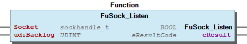

# WagoSysBSDSocket v1.1.2.3 (WAGO) - Complete Documentation


## 📋 Library Information

- **Company:** WAGO
- **Title:** WagoSysBSDSocket
- **Version:** 1.1.2.3
- **Categories:** Application; WAGO Internal|Feature|Network|Common; WAGO FunctionalView|Connectivity|Network; WAGO LayerView|Sys
- **Author:** WAGO / u013972
- **Placeholder:** WagoSysBSDSocket

### Description ¶


This document is automatically generated.

Equivalent to BSD/POSIX-Sockets, with adequate adaptions to WAGO-CI and CODESYS’ technical restrictions.

This document is automatically generated. Equivalent to BSD/POSIX-Sockets, with adequate adaptions to WAGO-CI and CODESYS’ technical restrictions.

### Contents: ¶


Contents: - Documentation Index - Project Information - Library Information - Functions FuSock_Accept (FUN) - FuSock_Bind (FUN) - FuSock_Close (FUN) - FuSock_Connect (FUN) - FuSock_FD_CLR (FUN) - FuSock_FD_ISSET (FUN) - FuSock_FD_SET (FUN) - FuSock_FD_ZERO (FUN) - FuSock_Fcntl (FUN) - FuSock_Gethostbyname (FUN) - ... and 24 more Methods Program Organization Internal Components Global Variable Lists - GVL (GVL) - VersionHistory (GVL) Other Components - 30 General Types - 31 Plain POSIX Types - 32 Enumerated Constants - conversions - eSock_FcntlArg (ENUM) - eSock_FcntlCmd (ENUM) - eSock_FlagsRx (ENUM) - eSock_FlagsTx (ENUM) - eSock_Level (ENUM) - eSock_OptionName (ENUM) - ... and 16 more

### Indices and tables ¶


Based on WagoSysBsdSocket.library, last modified 29.05.2024, 19:52:12. LibDoc 3.5.16.10

© WAGO GmbH & Co. KG, Germany 2018 – All rights reserved. For the avoidance of doubt, this copyright notice does not only apply to the information above but also and primarily to the described library itself. Please note that third-party products are always mentioned without reference to intellectual property rights, including patents, utility models, designs and trademarks, accordingly the existence of such rights cannot be excluded. WAGO is a registered trademark of WAGO Verwaltungsgesellschaft mbH.

- File and Project Information - Library Reference Based on WagoSysBsdSocket.library, last modified 29.05.2024, 19:52:12. LibDoc 3.5.16.10 © WAGO GmbH & Co. KG, Germany 2018 – All rights reserved. For the avoidance of doubt, this copyright notice does not only apply to the information above but also and primarily to the described library itself. Please note that third-party products are always mentioned without reference to intellectual property rights, including patents, utility models, designs and trademarks, accordingly the existence of such rights cannot be excluded. WAGO is a registered trademark of WAGO Verwaltungsgesellschaft mbH.

### Documentation Index


## WagoSysBSDSocket Library Documentation


| Company: | WAGO |
| Title: | WagoSysBSDSocket |
| Version: | 1.1.2.3 |
| Categories: | Application; WAGO Internal\|Feature\|Network\|Common; WAGO FunctionalView\|Connectivity\|Network; WAGO LayerView\|Sys |
| Author: | WAGO / u013972 |
| Placeholder: | WagoSysBSDSocket |

### Description


This document is automatically generated.

Equivalent to BSD/POSIX-Sockets, with adequate adaptions to WAGO-CI and CODESYS’ technical restrictions.

This document is automatically generated. Equivalent to BSD/POSIX-Sockets, with adequate adaptions to WAGO-CI and CODESYS’ technical restrictions.

### Contents:


- 20 Program Organization Units FuSock_Accept (FUN) - FuSock_Bind (FUN) - FuSock_Close (FUN) - FuSock_Connect (FUN) - FuSock_FD_CLR (FUN) - FuSock_FD_ISSET (FUN) - FuSock_FD_SET (FUN) - FuSock_FD_ZERO (FUN) - FuSock_Fcntl (FUN) - FuSock_Gethostbyname (FUN) - FuSock_Getsockopt (FUN) - FuSock_Htonl (FUN) - FuSock_Htons (FUN) - FuSock_Inet_Addr (FUN) - FuSock_Inet_Ntoa (FUN) - FuSock_Listen (FUN) - FuSock_Ntohl (FUN) - FuSock_Ntohs (FUN) - FuSock_Recv (FUN) - FuSock_Recvfrom (FUN) - FuSock_Select (FUN) - FuSock_Send (FUN) - FuSock_Sendto (FUN) - FuSock_SetKeepAliveParameter (FUN) - FuSock_Setsockopt (FUN) - FuSock_Shutdown (FUN) - FuSock_Socket (FUN) - FuStripZeroFromIPString (FUN) 30 General Types - unSockaddr (UNION) 31 Plain POSIX Types - IN6ADDR_ANY_INIT (FUN) - IN6ADDR_LOOPBACK_INIT (FUN) - INADDR_ANY_INIT (FUN) - INADDR_LOOPBACK_INIT (FUN) - fd_set (ALIAS) - hostent (STRUCT) - in6_addr (STRUCT) - in_addr (STRUCT) - in_addr_t (ALIAS) - in_port_t (ALIAS) - ip_mreq (STRUCT) - linger (STRUCT) - sa_family_t (ENUM) - sockaddr_in (STRUCT) - sockaddr_in6 (STRUCT) - sockhandle_t (ALIAS) 32 Enumerated Constants - eSock_FcntlArg (ENUM) - eSock_FcntlCmd (ENUM) - eSock_FlagsRx (ENUM) - eSock_FlagsTx (ENUM) - eSock_Level (ENUM) - eSock_OptionName (ENUM) - eSock_Protocol (ENUM) - eSock_ShutdownType (ENUM) - eSock_TcpOptionName (ENUM) - eSock_Type (ENUM) 90 Internal - conversions GVL (GVL) VersionHistory (GVL)

### Indices and tables


Based on WagoSysBsdSocket.library, last modified 29.05.2024, 19:52:12. LibDoc 3.5.16.10

© WAGO GmbH & Co. KG, Germany 2018 – All rights reserved. For the avoidance of doubt, this copyright notice does not only apply to the information above but also and primarily to the described library itself. Please note that third-party products are always mentioned without reference to intellectual property rights, including patents, utility models, designs and trademarks, accordingly the existence of such rights cannot be excluded. WAGO is a registered trademark of WAGO Verwaltungsgesellschaft mbH.

- File and Project Information - Library Reference Based on WagoSysBsdSocket.library, last modified 29.05.2024, 19:52:12. LibDoc 3.5.16.10 © WAGO GmbH & Co. KG, Germany 2018 – All rights reserved. For the avoidance of doubt, this copyright notice does not only apply to the information above but also and primarily to the described library itself. Please note that third-party products are always mentioned without reference to intellectual property rights, including patents, utility models, designs and trademarks, accordingly the existence of such rights cannot be excluded. WAGO is a registered trademark of WAGO Verwaltungsgesellschaft mbH.

### Project Information


## File and Project Information


| Scope | Name | Type | Content |
| --- | --- | --- | --- |
| FileHeader | libraryFile | string | WagoSysBsdSocket.library |
| contentFile | doc.clean.json |
| productName | e!COCKPIT |
| creationDateTime | date | 29.05.2024, 19:52:12 |
| companyName | string | WAGO |
| ProjectInformation | LastModificationDateTime | date | 29.05.2024, 19:52:12 |
| Description | string | See: Description |
| Copyright | © WAGO GmbH & Co. KG, Germany 2018 – All rights reserved. |
| Author | WAGO / u013972 |
| AutoResolveUnbound | bool | True |
| Placeholder | string | WagoSysBSDSocket |
| Company | WAGO |
| DocFormat | reStructuredText |
| Project | WagoSysBsdSocket |
| DefaultNamespace |  |
| Version | version | 1.1.2.3 |
| Title | string | WagoSysBSDSocket |
| LibraryCategories | library-category-list | Application; WAGO Internal\|Feature\|Network\|Common; WAGO FunctionalView\|Connectivity\|Network; WAGO LayerView\|Sys |
| CompiledLibraryCompatibilityVersion | string | CODESYS V3.5 SP16 Patch 3 |

### Library Information


## Library Reference


| LinkAllContent: False QualifiedOnly: False | SystemLibrary: False | Optional: False |

| LinkAllContent: False Optional: False | QualifiedOnly: False SystemLibrary: False | PublishSymbolsInContainer: True |

| LinkAllContent: False QualifiedOnly: False | SystemLibrary: False | Optional: False |

| LinkAllContent: False Optional: False | QualifiedOnly: False SystemLibrary: False | PublishSymbolsInContainer: True |

| LinkAllContent: False QualifiedOnly: False | SystemLibrary: False | Optional: False |

| LinkAllContent: False QualifiedOnly: False | SystemLibrary: False | Optional: False |

| LinkAllContent: False QualifiedOnly: False | SystemLibrary: False | Optional: False |

| LinkAllContent: False Optional: False | QualifiedOnly: False SystemLibrary: False | PublishSymbolsInContainer: True |

| LinkAllContent: False Optional: False | QualifiedOnly: False SystemLibrary: False | PublishSymbolsInContainer: True |

This is a dictionary of all referenced libraries and their name spaces.

This is a dictionary of all referenced libraries and their name spaces. CmpErrors2 Interfaces Library Identification : Name: CmpErrors2 Interfaces Version: newest Company: System Namespace: CmpErrors Library Properties : SysSocket Library Identification : Placeholder: SysSocket Default Resolution: SysSocket, * (System) Namespace: SysSocket Library Properties : SysTypes2 Interfaces Library Identification : Name: SysTypes2 Interfaces Version: newest Company: System Namespace: SysTypes Library Properties : WagoSysPlainMem Library Identification : Placeholder: WagoSysPlainMem Default Resolution: WagoSysPlainMem, * (WAGO) Namespace: WagoSysPlainMem Library Properties : WagoSysString Library Identification : Placeholder: WagoSysString Default Resolution: WagoSysString, * (WAGO) Namespace: WagoSysString Library Properties : WagoSysTypedefs_Pointer Library Identification : Placeholder: WagoSysTypedefs_Pointer Default Resolution: WagoSysTypedefs_Pointer, * (WAGO) Namespace: WAGOWagoTypesPointer Library Properties : WagoSysVersion Library Identification : Name: WagoSysVersion Version: 1.0.0.0 Company: WAGO Namespace: WagoSysVersion Library Properties : WagoTypesCommon Library Identification : Placeholder: WagoTypesCommon Default Resolution: WagoTypesCommon, * (WAGO) Namespace: WagoTypes Library Properties : WagoTypesSocket Library Identification : Placeholder: WagoTypesSocket Default Resolution: WagoTypesSocket, * (WAGO) Namespace: WagoTypesSocket Library Properties :

### Functions


## FuSock_Accept (FUN)


| Scope | Name | Type | Comment |
| --- | --- | --- | --- |
| Return | FuSock_Accept | sockhandle_t |  |
| Input | Socket | sockhandle_t | A socket that was created with socket() |
| pAddress | POINTER TO unSockaddr | Buffer for the the address of the connecting socket |
| pAddress_len | POINTER TO UDINT | In : size of buffer, Out: length of the stored address |
| Output | eResult | eResultCode | Error code in case of failure, 0 in case of success |

FuSock_Accept() accepts a new connection on a socket.

Graphical Illustration

Function Description

The FuSock_Accept() function will extract the first connection on the queue of pending connections, create a new socket with the same socket type protocol and address family as the specified socket, return the new socket handle for that socket.

The FuSock_Accept() function takes the following arguments:

If pAddress is not a null pointer, the address of the peer for the accepted connection is stored in the sockaddr structure pointed to by address, and the length of this address is stored in the object pointed to by pAddress_len .

If the actual length of the address is greater than the length of the supplied sockaddr structure, the stored address is truncated.

If the protocol permits connections by unbound clients, and the peer is not bound, then the value stored in the object pointed to by address is unspecified.

If the listen queue is empty of connection requests and O_NONBLOCK is not set on the file descriptor for the socket, FuSock_Accept() will block until a connection is present. If the FuSock_Listen() queue is empty of connection requests and O_NONBLOCK is set on the socket handle for the socket, FuSock_Accept() will fail and return EWOULDBLOCK .

The accepted socket cannot itself accept more connections. The original socket remains open and can accept more connections.

If this function fails, it will return an invalid handle where all bits are set to 1 and indicate the error cause via the output eResult . In case of success this output shows 0=OK

The FuSock_Accept() function will fail if:

The FuSock_Accept() function may fail if:

The FuSock_Accept() function may also fail in future releases if:

Deviation from POSIX.1-2008:

Interface variables Function FuSock_Accept() accepts a new connection on a socket. Graphical Illustration  Function Description The FuSock_Accept() function will extract the first connection on the queue of pending connections, create a new socket with the same socket type protocol and address family as the specified socket, return the new socket handle for that socket. The FuSock_Accept() function takes the following arguments: - Socket : Specifies a socket that was created with FuSock_Socket (FUN) , has been bound to an address with FuSock_Bind (FUN) , and has issued a successful call to FuSock_Listen (FUN) . - pAddress : Either a null pointer, or a pointer to a sockaddr structure where the address of the connecting socket will be returned. - pAddress_len : Either a null pointer, if address is a null pointer, or a pointer to a UDINT object which on input specifies the length of the supplied sockaddr structure, and on output specifies the length of the stored address. If pAddress is not a null pointer, the address of the peer for the accepted connection is stored in the sockaddr structure pointed to by address, and the length of this address is stored in the object pointed to by pAddress_len . If the actual length of the address is greater than the length of the supplied sockaddr structure, the stored address is truncated. If the protocol permits connections by unbound clients, and the peer is not bound, then the value stored in the object pointed to by address is unspecified. If the listen queue is empty of connection requests and O_NONBLOCK is not set on the file descriptor for the socket, FuSock_Accept() will block until a connection is present. If the FuSock_Listen() queue is empty of connection requests and O_NONBLOCK is set on the socket handle for the socket, FuSock_Accept() will fail and return EWOULDBLOCK . The accepted socket cannot itself accept more connections. The original socket remains open and can accept more connections. ERRORS: If this function fails, it will return an invalid handle where all bits are set to 1 and indicate the error cause via the output eResult . In case of success this output shows 0=OK The FuSock_Accept() function will fail if: - ENOTSOCK (mandatory for POSIX compliance): The Socket argument is was either not generated by this library, or was deallocated already or does not qualify to be a socket by other reasons. - EWOULDBLOCK (mandatory for POSIX compliance): O_NONBLOCK is set for the socket socket handle and no connections are present to be accepted. - EINVAL (mandatory for POSIX compliance): The socket is not accepting connections. - EUNSPECIFIC: A general problem with this function is encountered and no further details about the reason are available. (none known so far) - ENOSUCCESS: An unexpected problem with this function is encountered with a differenciated reason that does not does not fit into the POSIX scheme. The FuSock_Accept() function may fail if: - ENOMEM (mandatory for POSIX compliance): There was insufficient memory available to complete the operation. - ENOBUFS (mandatory for POSIX compliance): No buffer space is available. The FuSock_Accept() function may also fail in future releases if: - EBADF (mandatory for POSIX compliance): The socket argument is not a valid socket handle. - ECONNABORTED (mandatory for POSIX compliance): A connection has been aborted. - EMFILE (mandatory for POSIX compliance): All socket handles available to the process are currently open. - ENFILE (mandatory for POSIX compliance): The maximum number of socket handles in the system are already open. - EOPNOTSUPP (mandatory for POSIX compliance): The socket type of the specified socket does not support accepting connections. - EPROTO (optional): A protocol error has occurred; for example, the STREAMS protocol stack has not been initialized. Deviation from POSIX.1-2008: - The error code is uniformly provided via the additional output variable eResult:eResultCode , which contains the values specified by POSIX. The POSIX constructs errno or getlasterror() are not supported. - ECONNABORTED is not supported by Codesys. - In certain conditions the system might not be able to deliver differentiated result codes as requested by the POSIX standard. In those cases, where the exact cause cannot be differentiated from other causes, the result codes EUNSPECIFIC and ENOSUCCESS are is returned instead. These codes are not contained in the original POSIX specification. EUNSPECIFIC is used in cases where the system notifies that it cannot differentiate the cause at all ( ERR_FAILED ), while ENOSUCCESS is used when the result code from the system is somewhat differentiated, but cannot be mapped unambiguously to the POSIX requirements.

## FuSock_Bind (FUN)


| Scope | Name | Type | Comment |
| --- | --- | --- | --- |
| Return | FuSock_Bind | BOOL |  |
| Input | Socket | sockhandle_t | A socket that was created with socket() |
| pAddress | POINTER TO unSockaddr | Address to be bound to the socket |
| udiAddress_len | UDINT | Length of the sockaddr structure |
| Output | eResult | eResultCode | Error code in case of failure, 0 in case of success |

FuSock_Bind() binds a name to a socket.

Graphical Illustration

Function Description

The FuSock_Bind() function will assign a local socket address to a socket identified by descriptor socket that has no local socket address assigned. Sockets created with the FuSock_Socket() function are initially unnamed; they are identified only by their address family.

The FuSock_Bind() function takes the following arguments:

If the socket address cannot be assigned immediately and O_NONBLOCK is set for the socket handle for the socket, FuSock_Bind() will fail and return EINPROGRESS , but the assignment request will not be aborted, and the assignment will be completed asynchronously. Subsequent calls to FuSock_Bind() for the same socket, before the assignment is completed, will fail and return EALREADY .

When the assignment has been performed asynchronously, FuSock_Select() will indicate that the socket handle for the socket is ready for reading and writing.

In case of success this function returns 0 (FALSE) and the output eResult shows 0=OK . In case of failure, the return value is TRUE and the output eResult indicates the error cause as described below.

The FuSock_Bind() function fails if:

The following error causes are known to be represented as EUNSPECIFIC due to system firmware:

The FuSock_Bind() function may fail if:

The FuSock_Bind() function may also fail in future releases if:

Deviation from POSIX.1-2008:

Interface variables Function FuSock_Bind() binds a name to a socket. Graphical Illustration  Function Description The FuSock_Bind() function will assign a local socket address to a socket identified by descriptor socket that has no local socket address assigned. Sockets created with the FuSock_Socket() function are initially unnamed; they are identified only by their address family. The FuSock_Bind() function takes the following arguments: - Socket : Specifies the socket handle of the socket to be bound. - pAddress : Points to a sockaddr structure containing the address to be bound to the socket. The length and format of the address depend on the address family of the socket. - udiAddress_len : Specifies the length of the sockaddr structure pointed to by the address argument. If the socket address cannot be assigned immediately and O_NONBLOCK is set for the socket handle for the socket, FuSock_Bind() will fail and return EINPROGRESS , but the assignment request will not be aborted, and the assignment will be completed asynchronously. Subsequent calls to FuSock_Bind() for the same socket, before the assignment is completed, will fail and return EALREADY . When the assignment has been performed asynchronously, FuSock_Select() will indicate that the socket handle for the socket is ready for reading and writing. ERRORS: In case of success this function returns 0 (FALSE) and the output eResult shows 0=OK . In case of failure, the return value is TRUE and the output eResult indicates the error cause as described below. The FuSock_Bind() function fails if: - ENOTSOCK (mandatory for POSIX compliance): The Socket argument is was either not generated by this library, or was deallocated already or does not qualify to be a proper socket by other reasons. - EUNSPECIFIC: A general problem with this function is encountered and no further details about the reason are available. - ENOSUCCESS: An unexpected problem with this function is encountered with a differenciated reason that does not does not fit into the POSIX scheme. The following error causes are known to be represented as EUNSPECIFIC due to system firmware: - EAFNOSUPPORT (mandatory for POSIX compliance): The specified address is not a valid address for the address family of the specified socket. - EADDRNOTAVAIL (mandatory for POSIX compliance): The specified address is not available from the local machine. - EADDRINUSE (mandatory for POSIX compliance): The specified address is already in use. The FuSock_Bind() function may fail if: - EINVAL (mandatory for POSIX compliance): The socket is already bound to an address, and the protocol does not support binding to a new address; or the socket has been shut down. - EBADF (mandatory for POSIX compliance): The socket argument is not a valid socket handle. - EALREADY (mandatory for POSIX compliance): An assignment request is already in progress for the specified socket. - ENOBUFS (mandatory for POSIX compliance): Insufficient resources were available to complete the call. The FuSock_Bind() function may also fail in future releases if: - EINPROGRESS (mandatory for POSIX compliance): O_NONBLOCK is set for the socket handle for the socket and the assignment cannot be immediately performed; the assignment will be performed asynchronously. (actual firmware cannot differentiate between EALREADY and EINPROGRESS.) - EOPNOTSUPP (mandatory for POSIX compliance): The socket type of the specified socket does not support binding to an address. (Does not apply yet, because only ipv4 is supported, which does support binding.) - EACCES (optional): The specified address is protected and the current user does not have permission to bind to it. - EINVAL (optional): The address_len argument is not a valid length for the address family. - EISCONN (optional): The socket is already connected. - ELOOP (optional): Too much symbolic links were encountered during resolution of the pathname in address. - ENAMETOOLONG (optional): The length of a pathname or an intermediate result of the resolution of a symbolic link is too long. Deviation from POSIX.1-2008: - The error code is uniformly provided via the additional output variable eResult:eResultCode , which contains the values specified by POSIX. The POSIX constructs errno or getlasterror() are not supported. - The output is typed as BOOL (not as int ), in order to provide the same functionality for Codesys as intended by POSIX for C. - Errors EALREADY , EINVAL is not supported by codesys - Error EINVAL if pAddress is a null-pointer - ERROR EUNSPECIFIC for unknown address family - In certain conditions the system might not be able to deliver differentiated result codes as requested by the POSIX standard. In those cases, where the exact cause cannot be differentiated from other causes, the result codes EUNSPECIFIC and ENOSUCCESS are is returned instead. These codes are not contained in the original POSIX specification. EUNSPECIFIC is used in cases where the system notifies that it cannot differentiate the cause at all ( ERR_FAILED ), while ENOSUCCESS is used when the result code from the system is somewhat differentiated, but cannot be mapped unambiguously to the POSIX requirements.

## FuSock_Close (FUN)


| Scope | Name | Type | Comment |
| --- | --- | --- | --- |
| Return | FuSock_Close | BOOL |  |
| Input | Socket | sockhandle_t | Specifies the file descriptor of the socket. |
| Output | eResult | eResultCode | Error code in case of failure, 0 in case of success |

FuSock_Close() closes a socket.

Graphical IllSocket

Function Description

The FuSock_Close() function will deallocate the handle indicated by Socket . To deallocate means to make the handle available for return by subsequent calls to open() or other functions that allocate file descriptors.

In case of success this function returns 0 (FALSE) and the output eResult shows 0=OK . In case of failure, the return value is TRUE and the output eResult indicates the error cause as described below.

The FuSock_Close() function fails if:

While most of the functions of this library return ENOTSOCK if the Socket argument turns out not to be associated to a properly qualified socket, the functions FuSock_Close() and FuSock_Fcntl() return EBADF in that case in order to be compliant to POSIX.1-2008.

Deviation from POSIX.1-2008:

Interface variables Function FuSock_Close() closes a socket. Graphical IllSocket  Function Description The FuSock_Close() function will deallocate the handle indicated by Socket . To deallocate means to make the handle available for return by subsequent calls to open() or other functions that allocate file descriptors. ERRORS: In case of success this function returns 0 (FALSE) and the output eResult shows 0=OK . In case of failure, the return value is TRUE and the output eResult indicates the error cause as described below. The FuSock_Close() function fails if: - EBADF: The Socket argument is was either not generated by this library, or was deallocated already or does not qualify to be an open handle by other reasons. Note While most of the functions of this library return ENOTSOCK if the Socket argument turns out not to be associated to a properly qualified socket, the functions FuSock_Close() and FuSock_Fcntl() return EBADF in that case in order to be compliant to POSIX.1-2008. - ENOSUCCESS: An unexpected problem with this function is encountered with a differenciated reason that does not does not fit into the POSIX scheme. Deviation from POSIX.1-2008: - The error code is uniformly provided via the additional output variable eResult:eResultCode , which contains the values specified by POSIX. The POSIX constructs errno or getlasterror() are not supported. - The output is typed as BOOL (not as int ), in order to provide the same functionality for Codesys as intended by POSIX for C. - Codesys-Implementation: If handles are passed which are not created properly with Socket() or Accept(), the PLC may crash.

## FuSock_Connect (FUN)


| Scope | Name | Type | Comment |
| --- | --- | --- | --- |
| Return | FuSock_Connect | BOOL |  |
| Input | Socket | sockhandle_t | Handle associated with the socket |
| pAddress | POINTER TO unSockaddr | The Address to cpnnect to |
| udiAddress_len | UDINT | Length of the sockaddr structure |
| Output | eResult | eResultCode | Error code in case of failure, 0 in case of success |

FuSock_Connect() connects a socket.

Graphical Illustration

Function Description

The FuSock_Connect() function will attempt to make a connection on a connection-mode socket or to set or reset the peer address of a connectionless-mode socket. The function takes the following arguments:

If the socket has not already been bound to a local address, FuSock_Connect() will bind it to an address which is an unused local address.

If the initiating socket is not connection-mode, then FuSock_Connect() will set the socket’s peer address, and no connection is made. For SOCK_DGRAM sockets, the peer address identifies where all datagrams are sent on subsequent FuSock_Send() functions, and limits the remote sender for subsequent FuSock_Recv() functions. If the sa_family member of address is AF_UNSPEC , the socket’s peer address will be reset. Note that despite no connection being made, the term ‘connected’ is used to describe a connectionless-mode socket for which a peer address has been set.

If the initiating socket is connection-mode, then FuSock_Connect() will attempt to establish a connection to the address specified by the address argument. If the connection cannot be established immediately and O_NONBLOCK is not set for the socket handle for the socket, FuSock_Connect() will block for up to an unspecified timeout interval until the connection is established.

If the timeout interval expires before the connection is established, FuSock_Connect() will fail and the connection attempt will be aborted.

If the connection cannot be established immediately and O_NONBLOCK is set for the socket handle for the socket, FuSock_Connect() will fail and return EINPROGRESS , but the connection request will not be aborted, and the connection will be established asynchronously. Subsequent calls to FuSock_Connect() for the same socket, before the connection is established, will fail and return EALREADY .

When the connection has been established asynchronously, FuSock_Select() will indicate that the socket is ready for writing.

In case of success this function returns 0 (FALSE) and the output eResult shows 0=OK . In case of failure, the return value is TRUE and the output eResult indicates the error cause as described below.

The FuSock_Connect() function will fail if:

The FuSock_Connect() function may fail if:

The FuSock_Connect() function may also fail in future releases if:

Deviation from POSIX.1-2008:

Interface variables Function FuSock_Connect() connects a socket. Graphical Illustration  Function Description The FuSock_Connect() function will attempt to make a connection on a connection-mode socket or to set or reset the peer address of a connectionless-mode socket. The function takes the following arguments: - Socket : Specifies the socket handle associated with the socket. - pAddress : Points to a sockaddr structure containing the peer address. The length and format of the address depend on the address family of the socket. - address_len : Specifies the length of the sockaddr structure pointed to by the address argument. If the socket has not already been bound to a local address, FuSock_Connect() will bind it to an address which is an unused local address. If the initiating socket is not connection-mode, then FuSock_Connect() will set the socket’s peer address, and no connection is made. For SOCK_DGRAM sockets, the peer address identifies where all datagrams are sent on subsequent FuSock_Send() functions, and limits the remote sender for subsequent FuSock_Recv() functions. If the sa_family member of address is AF_UNSPEC , the socket’s peer address will be reset. Note that despite no connection being made, the term ‘connected’ is used to describe a connectionless-mode socket for which a peer address has been set. If the initiating socket is connection-mode, then FuSock_Connect() will attempt to establish a connection to the address specified by the address argument. If the connection cannot be established immediately and O_NONBLOCK is not set for the socket handle for the socket, FuSock_Connect() will block for up to an unspecified timeout interval until the connection is established. If the timeout interval expires before the connection is established, FuSock_Connect() will fail and the connection attempt will be aborted. If the connection cannot be established immediately and O_NONBLOCK is set for the socket handle for the socket, FuSock_Connect() will fail and return EINPROGRESS , but the connection request will not be aborted, and the connection will be established asynchronously. Subsequent calls to FuSock_Connect() for the same socket, before the connection is established, will fail and return EALREADY . When the connection has been established asynchronously, FuSock_Select() will indicate that the socket is ready for writing. ERRORS: In case of success this function returns 0 (FALSE) and the output eResult shows 0=OK . In case of failure, the return value is TRUE and the output eResult indicates the error cause as described below. The FuSock_Connect() function will fail if: - ENOTSOCK (mandatory for POSIX compliance): The Socket argument is was either not generated by this library, or was deallocated already or does not qualify to be a proper socket by other reasons. - ECONNREFUSED (mandatory for POSIX compliance): The target address was not listening for connections or refused the connection request. - EINPROGRESS (mandatory for POSIX compliance): O_NONBLOCK is set for the socket handle for the socket and the connection cannot be immediately established; the connection will be established asynchronously. - EUNSPECIFIC: A general problem with this function is encountered and no further details about the reason are available. (none known so far) - ENOSUCCESS: An unexpected problem with this function is encountered with a differenciated reason that does not does not fit into the POSIX scheme. The FuSock_Connect() function may fail if: - EADDRNOTAVAIL (mandatory for POSIX compliance): The specified address is not available from the local machine. - EAFNOSUPPORT (mandatory for POSIX compliance): The specified address is not a valid address for the address family of the specified socket. - EISCONN (mandatory for POSIX compliance): The specified socket is connection-mode and is already connected. - EBADF (mandatory for POSIX compliance): The socket argument is not a valid socket handle. - ETIMEDOUT (mandatory for POSIX compliance): The attempt to connect timed out before a connection was made. - EALREADY (mandatory for POSIX compliance): A connection request is already in progress for the specified socket. - EPROTOTYPE (mandatory for POSIX compliance): The specified address has a different type than the socket bound to the specified peer address. - EHOSTUNREACH (optional): The destination host cannot be reached (probably because the host is down or a remote router cannot reach it). - EINVAL (optional): The address_len argument is not a valid length for the address family; or invalid address family in the sockaddr structure. - EADDRINUSE (optional): Attempt to establish a connection that uses addresses that are already in use. - ENOBUFS (optional): No buffer space is available. The FuSock_Connect() function may also fail in future releases if: - ENETUNREACH (mandatory for POSIX compliance): No route to the network is present. (actual firmware does not differentiate between ENETUNREACH and EHOSTUNREACH.) - EACCES (optional): Search permission is denied for a component of the path prefix; or write access to the named socket is denied. - ECONNRESET (optional): Remote host reset the connection request. - ELOOP (optional): Too many symbolic links were encountered during resolution of the pathname in address. - ENAMETOOLONG (optional): The length of a pathname is too long. - ENETDOWN (optional): The local network interface used to reach the destination is down. - EOPNOTSUPP (optional): The socket is listening and cannot be connected. Deviation from POSIX.1-2008: - The error code is uniformly provided via the additional output variable eResult:eResultCode , which contains the values specified by POSIX. The POSIX constructs errno or getlasterror() are not supported. - The output is typed as BOOL (not as int ), in order to provide the same functionality for Codesys as intended by POSIX for C. - In certain conditions the system might not be able to deliver differentiated result codes as requested by the POSIX standard. In those cases, where the exact cause cannot be differentiated from other causes, the result codes EUNSPECIFIC and ENOSUCCESS are is returned instead. These codes are not contained in the original POSIX specification. EUNSPECIFIC is used in cases where the system notifies that it cannot differentiate the cause at all ( ERR_FAILED ), while ENOSUCCESS is used when the result code from the system is somewhat differentiated, but cannot be mapped unambiguously to the POSIX requirements. - Error EINVAL if pAddress is a null-pointer

## FuSock_FD_CLR (FUN)


| Scope | Name | Type | Comment |
| --- | --- | --- | --- |
| Input | fd | sockhandle_t | Socket which is to be removed |
| pFdset | POINTER TO fd_set | The file descriptor set |

FuSock_FD_CLR() removes a file descriptor from a set.

Graphical Illustration

Function Description

FuSock_FD_CLR(fd, pFdset) removes the file descriptor fd from the set pointed to by fdsetp . If fd is not a member of this set, there is no effect on the set, nor will an error be returned.

FuSock_FD_CLR() does not return a value.

Interface variables Function FuSock_FD_CLR() removes a file descriptor from a set. Graphical Illustration  Function Description FuSock_FD_CLR(fd, pFdset) removes the file descriptor fd from the set pointed to by fdsetp . If fd is not a member of this set, there is no effect on the set, nor will an error be returned. FuSock_FD_CLR() does not return a value.

## FuSock_FD_ISSET (FUN)


| Scope | Name | Type | Comment |
| --- | --- | --- | --- |
| Return | FuSock_FD_ISSET | BOOL |  |
| Input | fd | sockhandle_t | Socket which is to be queried. |
| pFdset | POINTER TO fd_set | The file descriptor set |

FuSock_FD_ISSET() tests if a filedescriptor is in a set.

Graphical Illustration

Function Description

File descriptor masks of type fd_set are tested with FuSock_FD_ISSET() . FuSock_FD_ISSET(fd, pFdset) evaluates to non-zero if the socket handle fd is a member of the set pointed to by pFdset , and will evaluate to zero otherwise.

FuSock_FD_ISSET() will return TRUE if the bit for the socket handle fd is set in the file descriptor set pointed to by fdset, and FALSE otherwise.

Deviation from POSIX.1-2008:

Interface variables Function FuSock_FD_ISSET() tests if a filedescriptor is in a set. Graphical Illustration  Function Description File descriptor masks of type fd_set are tested with FuSock_FD_ISSET() . FuSock_FD_ISSET(fd, pFdset) evaluates to non-zero if the socket handle fd is a member of the set pointed to by pFdset , and will evaluate to zero otherwise. FuSock_FD_ISSET() will return TRUE if the bit for the socket handle fd is set in the file descriptor set pointed to by fdset, and FALSE otherwise. Deviation from POSIX.1-2008: - The return value is typed as BOOL here instead of the original INT .

## FuSock_FD_SET (FUN)


| Scope | Name | Type | Comment |
| --- | --- | --- | --- |
| Input | fd | sockhandle_t | Socket which is to be added to the set. |
| pFdset | POINTER TO fd_set | The file descriptor set |
| Output | eResult | eResultCode | Error code in case of failure, 0 in case of success |

FuSock_FD_SET() adds a socket handle to a set.

Graphical Illustration

Function Description

FuSock_FD_SET(fd, pFdsetp) adds the handle fd to the set pointed to by pFdsetp . If the file descriptor fd is already in this set, there is no effect on the set.

FuSock_FD_SET() does not return a value, but it gives an indication about problems at the ourtput eResult (N.B. this detail is not conforming to POSIX) .

Interface variables Function FuSock_FD_SET() adds a socket handle to a set. Graphical Illustration  Function Description FuSock_FD_SET(fd, pFdsetp) adds the handle fd to the set pointed to by pFdsetp . If the file descriptor fd is already in this set, there is no effect on the set. FuSock_FD_SET() does not return a value, but it gives an indication about problems at the ourtput eResult (N.B. this detail is not conforming to POSIX) .

## FuSock_FD_ZERO (FUN)


| Scope | Name | Type | Comment |
| --- | --- | --- | --- |
| Input | pFdset | POINTER TO fd_set | The file descriptor set |

FD_ZERO() clears a file descriptor set.

Graphical Illustration

Function Description

FuSock_FD_ZERO(pFdset) will initialize the descriptor set pointed to by fdsetp to the null set. No error is returned if the set is not empty at the time FuSock_FD_ZERO() is invoked.

FuSock_FD_ZERO() does not return a value.

Interface variables Function FD_ZERO() clears a file descriptor set. Graphical Illustration  Function Description FuSock_FD_ZERO(pFdset) will initialize the descriptor set pointed to by fdsetp to the null set. No error is returned if the set is not empty at the time FuSock_FD_ZERO() is invoked. FuSock_FD_ZERO() does not return a value.

## FuSock_Fcntl (FUN)


| Scope | Name | Type | Comment |
| --- | --- | --- | --- |
| Return | FuSock_Fcntl | __UXINT |  |
| Input | Socket | sockhandle_t | Socket to be manipulated |
| eCmd | eSock_FcntlCmd | Specific command |
| eArg | eSock_FcntlArg | Command specific parameters) |
| Output | eResult | eResultCode | Error code in case of failure, 0 in case of success |

```
VAR
  handle      : sockhandle_t;
  resultopen  : eResultCode;
  resultfcntl : eResultCode;
  returnfcntl : __UXINT;
END_VAR

handle :=FuSock_Socket(sa_family_t.AF_INET,
                     eSock_Type.SOCK_STREAM,
                     eSock_Protocol.default,
                     eResult => resultopen);

FuSock_Fcntl(handle,
             eSock_FcntlCmd.F_SETFL,
             eArg.O_NONBLOCK);
```

FuSock_Fcntl() performs file control.

Graphical Illustration

Function Description

The FuSock_Fcntl() function performs the operations described below on open handles.

Its sole purpose in this context is to set the option O_NONBLOCK of a socket.

Upon failure the output eResult indicates the error cause as described below and the returned value has set all bits to 1 . Upon successful completition the returned value has not all bits set to 1 and eResult shows 0=OK .

The FuSock_Fcntl() function fails if:

While most of the functions of this library return ENOTSOCK if the Socket argument turns out not to be associated to a properly qualified socket, the functions FuSock_Close() and FuSock_Fcntl() return EBADF in that case in order to be compliant to POSIX.1-2008.

Deviation from POSIX.1-2008:

Interface variables Function FuSock_Fcntl() performs file control. Graphical Illustration  Function Description The FuSock_Fcntl() function performs the operations described below on open handles. Its sole purpose in this context is to set the option O_NONBLOCK of a socket. ERRORS: Upon failure the output eResult indicates the error cause as described below and the returned value has set all bits to 1 . Upon successful completition the returned value has not all bits set to 1 and eResult shows 0=OK . The FuSock_Fcntl() function fails if: - EBADF: The Socket argument is was either not generated by this library, or was deallocated already or does not qualify to be a valid open handle by other reasons. - EINVAL: The cmd argument is invalid. - EUNSPECIFIC: A general problem with this function is encountered and no further details about the reason are available. - ENOSUCCESS: An unexpected problem with this function is encountered with a differenciated reason that does not does not fit into the POSIX scheme. Note While most of the functions of this library return ENOTSOCK if the Socket argument turns out not to be associated to a properly qualified socket, the functions FuSock_Close() and FuSock_Fcntl() return EBADF in that case in order to be compliant to POSIX.1-2008. Deviation from POSIX.1-2008: - The error code is uniformly provided via the additional output variable eResult:eResultCode , which contains the values specified by POSIX. The POSIX constructs errno or getlasterror() are not supported. - The set of supported commands is very limited and restricted to the Codesys posibilities. The only supported command is F_SETFL and the only supported optioon is O_NONBLOCK. (FIONREAD is actually not supported and would be located in ioctl().) - For the sake of simple application code the argument structure does not reflect the variable argument list as required by POSIX. Other options than O_NONBLOCK are not envisaged for this implementation.

## FuSock_Gethostbyname (FUN)


| Scope | Name | Type | Comment |
| --- | --- | --- | --- |
| Return | FuSock_Gethostbyname | POINTER TO hostent |  |
| Input | sName | STRING(255) |  |
| Output | eResult | eResultCode | Error code in case of failure, 0 in case of success |

FuSock_Gethostbyname () gets host information from a name.

Graphical Illustration

Function Description

The FuSock_Gethostbyname() function returns a pointer to an object with the structure hostent describing an internet host referenced by name.

When using the nameserver, FuSock_Gethostbyname() will search for the named host in the current domain and its parents unless the name ends in a dot. If the name contains no dot, and if the environment variable HOSTALIASES contains the name of an alias file, the alias file will first be searched for an alias matching the input name.

On Error, this function returns a NULL-Pointer (conforming to POSIX.1-2001 / 4.3BSD) and sets the output eResult as described below:

The following error conditions may occur:

The following error causes are known to be represented as EUNSPECIFIC due to system firmware:

The function FuSock_Gethostbyname() may fail if:

The function FuSock_Gethostbyname() may fail in future releases if:

Deviation from POSIX.1-2008:

Interface variables Function FuSock_Gethostbyname () gets host information from a name. Graphical Illustration  Function Description The FuSock_Gethostbyname() function returns a pointer to an object with the structure hostent describing an internet host referenced by name. When using the nameserver, FuSock_Gethostbyname() will search for the named host in the current domain and its parents unless the name ends in a dot. If the name contains no dot, and if the environment variable HOSTALIASES contains the name of an alias file, the alias file will first be searched for an alias matching the input name. Errors: On Error, this function returns a NULL-Pointer (conforming to POSIX.1-2001 / 4.3BSD) and sets the output eResult as described below: The following error conditions may occur: - EUNSPECIFIC: A general problem with this function is encountered and no further details about the reason are available. - ENOSUCCESS: An unexpected problem with this function is encountered with a differenciated reason that does not does not fit into the POSIX scheme. The following error causes are known to be represented as EUNSPECIFIC due to system firmware: - ENOENT The specified host is unknown. The function FuSock_Gethostbyname() may fail if: - EINVAL (not spacified in POSIX): Invalid parameters. The function FuSock_Gethostbyname() may fail in future releases if: - ENODATA The requested name is valid but does not have an IP address. - ENOTRECOVERABLE A non-recoverable name server error occurred. - EAGAIN A temporary error occurred on an authoritative name server. Try again later. Deviation from POSIX.1-2008: - The error code is uniformly provided via the additional output variable eResult:eResultCode , which contains the values specified by POSIX. The POSIX constructs errno or getlasterror() are not supported. - The entity sName input was specified as char-pointer in POSIX, but is specified here as Codesys-String; - This function is not contained anymore in POSIX, but it is still listed here because of the temporary lack of alternatives. - The error results are defined differently in POSIX.1-2001 and are transposed from the h_error list in order to fit into the actual error concept. - In certain conditions the system might not be able to deliver differentiated result codes as requested by the POSIX standard. In those cases, where the exact cause cannot be differentiated from other causes, the result codes EUNSPECIFIC and ENOSUCCESS are is returned instead. These codes are not contained in the original POSIX specification. EUNSPECIFIC is used in cases where the system notifies that it cannot differentiate the cause at all ( ERR_FAILED ), while ENOSUCCESS is used when the result code from the system is somewhat differentiated, but cannot be mapped unambiguously to the POSIX requirements.

## FuSock_Getsockopt (FUN)


| Scope | Name | Type | Comment |
| --- | --- | --- | --- |
| Return | FuSock_Getsockopt | BOOL |  |
| Input | Socket | sockhandle_t | Specifies the file descriptor of the socket. |
| eLevel | eSock_Level | the protocol level at which the option resides |
| eOption_name | eSock_OptionName | a single option to be retrieved |
| pOption_value | POINTER TO BYTE | where to place the answer |
| pOption_len | POINTER TO UDINT | in: size of the answer buffer, out: size of the answer |
| Output | eResult | eResultCode | Error code in case of failure, 0 in case of success |

FuSock_Getsockopt() gets get the socket options.

Graphical Illustration

Function Description

The FuSock_Getsockopt() function retrieves the value for the option specified by the eOption_name argument for the socket specified by the socket argument. If the size of the option value is greater than option_len , the value stored in the object pointed to by the option_value argument is silently truncated. Otherwise, the object pointed to by the pOption_len argument is modified to indicate the actual length of the value.

The level argument specifies the protocol level at which the option resides. To retrieve options at the socket level, specify the level argument as SOL_SOCKET. To retrieve options at other levels, supply the appropriate level identifier for the protocol controlling the option. For example, to indicate that an option is interpreted by the TCP (Transmission Control Protocol), set level to IPPROTO_TCP.

The socket in use may require the process to have appropriate privileges to use the getsockopt() function.

The option_name argument specifies a single option to be retrieved. It can be one of the socket-level options defined in <sys/socket.h> and described in Use of Options.

In case of success this function returns 0 (FALSE) and the output eResult shows 0=OK . In case of failure, the return value is TRUE and the output eResult indicates the error cause as described below.

The FuSock_Getsockopt() function fails if:

The FuSock_Getsockopt() function may fail if:

The FuSock_Getsockopt() function may also fail in future releases if:

Deviation from POSIX.1-2008:

Interface variables Function FuSock_Getsockopt() gets get the socket options. Graphical Illustration  Function Description The FuSock_Getsockopt() function retrieves the value for the option specified by the eOption_name argument for the socket specified by the socket argument. If the size of the option value is greater than option_len , the value stored in the object pointed to by the option_value argument is silently truncated. Otherwise, the object pointed to by the pOption_len argument is modified to indicate the actual length of the value. The level argument specifies the protocol level at which the option resides. To retrieve options at the socket level, specify the level argument as SOL_SOCKET. To retrieve options at other levels, supply the appropriate level identifier for the protocol controlling the option. For example, to indicate that an option is interpreted by the TCP (Transmission Control Protocol), set level to IPPROTO_TCP. The socket in use may require the process to have appropriate privileges to use the getsockopt() function. The option_name argument specifies a single option to be retrieved. It can be one of the socket-level options defined in <sys/socket.h> and described in Use of Options. ERRORS: In case of success this function returns 0 (FALSE) and the output eResult shows 0=OK . In case of failure, the return value is TRUE and the output eResult indicates the error cause as described below. The FuSock_Getsockopt() function fails if: - ENOTSOCK (mandatory for POSIX compliance): The Socket argument is was either not generated by this library, or was deallocated already or does not qualify to be a proper socket by other reasons. - ENOPROTOOPT (mandatory for POSIX compliance): The option is not supported by the protocol. - EUNSPECIFIC: A general problem with this function is encountered and no further details about the reason are available. (none known so far) - ENOSUCCESS: An unexpected problem with this function is encountered with a differenciated reason that does not does not fit into the POSIX scheme. - EINVAL: No valid target addres given for the returned values. The FuSock_Getsockopt() function may fail if: - EINVAL (mandatory for POSIX compliance): The specified option is invalid at the specified socket level. - ENOBUFS (optional): Insufficient resources are available in the system to complete the function. - EBADF (mandatory for POSIX compliance): The socket argument is not a valid file descriptor. The FuSock_Getsockopt() function may also fail in future releases if: - EACCES (optional): The calling process does not have appropriate privileges. - EINVAL (optional): The socket has been shut down. Deviation from POSIX.1-2008: - The error code is uniformly provided via the additional output variable eResult:eResultCode , which contains the values specified by POSIX. The POSIX constructs errno or getlasterror() are not supported. - In certain conditions the system might not be able to deliver differentiated result codes as requested by the POSIX standard. In those cases, where the exact cause cannot be differentiated from other causes, the result codes EUNSPECIFIC and ENOSUCCESS are is returned instead. These codes are not contained in the original POSIX specification. EUNSPECIFIC is used in cases where the system notifies that it cannot differentiate the cause at all ( ERR_FAILED ), while ENOSUCCESS is used when the result code from the system is somewhat differentiated, but cannot be mapped unambiguously to the POSIX requirements. - The output is typed as BOOL (not as int ), in order to provide the same functionality for Codesys as intended by POSIX for C. - EINVAL for Null-Pointers is not specified in POSIX.

## FuSock_Htonl (FUN)


| Scope | Name | Type | Comment |
| --- | --- | --- | --- |
| Return | FuSock_Htonl | DWORD |  |
| Input | dwHostlong | DWORD | the value to be converted |

The FuSock_Htonl() function returns the argument value converted from host to network byte order.

Graphical Illustration

Interface variables Function The FuSock_Htonl() function returns the argument value converted from host to network byte order. Graphical Illustration 

## FuSock_Htons (FUN)


| Scope | Name | Type | Comment |
| --- | --- | --- | --- |
| Return | FuSock_Htons | WORD |  |
| Input | wHostshort | WORD | the value to be converted |

The FuSock_Htons() function returns the argument value converted from host to network byte order.

Graphical Illustration

Interface variables Function The FuSock_Htons() function returns the argument value converted from host to network byte order. Graphical Illustration 

## FuSock_Inet_Addr (FUN)


| Scope | Name | Type | Comment |
| --- | --- | --- | --- |
| Return | FuSock_Inet_Addr | in_addr_t |  |
| Input | cp | STRING(255) | String representation to be converted |
| Output | eResult | eResultCode | Error code in case of failure, 0 in case of success |

FuSock_Inet_Addr() converts a string to an IPv4 address.

Graphical Illustration

Function Description

The FuSock_Inet_Addr() function converts the input string, in the standard IPv4 dotted decimal notation, to an integer value of type in_addr_t suitable for use as an Internet address.

All Internet addresses will be returned in network order (bytes ordered from left to right).

Values specified using IPv4 dotted decimal notation take one of the following forms:

All numbers supplied as parts in IPv4 dotted decimal notation may be decimal, octal, or hexadecimal, as specified in the ISO C standard (that is, a leading 0x or 0X implies hexadecimal; otherwise, a leading ‘0’ implies octal; otherwise, the number is interpreted as decimal).

Upon successful completion, FuSock_Inet_Addr() returns the Internet address and the output eResult will be set to 0=OK . Otherwise, it returns an in_addr_t with all bits set to ‘1’ and eResult will be set to a value other than 0=OK .

Upon failure, the error code EINVAL Invalid Argument will be presented.

Deviation from POSIX.1-2008:

Interface variables Function FuSock_Inet_Addr() converts a string to an IPv4 address. Graphical Illustration  Function Description The FuSock_Inet_Addr() function converts the input string, in the standard IPv4 dotted decimal notation, to an integer value of type in_addr_t suitable for use as an Internet address. All Internet addresses will be returned in network order (bytes ordered from left to right). Values specified using IPv4 dotted decimal notation take one of the following forms: a.b.c.d When four parts are specified, each will be interpreted as a byte of data and assigned, from left to right, to the four bytes of an Internet address. a.b.c When a three-part address is specified, the last part will be interpreted as a 16-bit quantity and placed in the rightmost two bytes of the network address. This makes the three-part address format convenient for specifying Class B network addresses as ‘128.net.host’. a.b When a two-part address is supplied, the last part will be interpreted as a 24-bit quantity and placed in the rightmost three bytes of the network address. This makes the two-part address format convenient for specifying Class A network addresses as ‘net.host’. a When only one part is given, the value will be stored directly in the network address without any byte rearrangement. All numbers supplied as parts in IPv4 dotted decimal notation may be decimal, octal, or hexadecimal, as specified in the ISO C standard (that is, a leading 0x or 0X implies hexadecimal; otherwise, a leading ‘0’ implies octal; otherwise, the number is interpreted as decimal). Upon successful completion, FuSock_Inet_Addr() returns the Internet address and the output eResult will be set to 0=OK . Otherwise, it returns an in_addr_t with all bits set to ‘1’ and eResult will be set to a value other than 0=OK . Errors: Upon failure, the error code EINVAL Invalid Argument will be presented. Deviation from POSIX.1-2008: - This function provides for an additional eResult output which determines unambiguously if an error has occurred or not. The results are not specified in POSIX.

## FuSock_Inet_Ntoa (FUN)


| Scope | Name | Type | Comment |
| --- | --- | --- | --- |
| Return | FuSock_Inet_Ntoa | STRING(255) |  |
| Input | in | in_addr_t | the numeric representation to be converted into a string; |

FuSock_Inet_Ntoa() converts an IPv4 address into a string.

Graphical Illustration

Function Description

The FuSock_Inet_Ntoa() function converts the Internet host address specified by in to a string in the Internet standard dot notation.

All Internet addresses will be returned in network order (bytes ordered from left to right). The FuSock_Inet_Ntoa() function will return a string containing the network address in Internet standard dot notation.

Deviation from POSIX.1-2008:

Interface variables Function FuSock_Inet_Ntoa() converts an IPv4 address into a string. Graphical Illustration  Function Description The FuSock_Inet_Ntoa() function converts the Internet host address specified by in to a string in the Internet standard dot notation. All Internet addresses will be returned in network order (bytes ordered from left to right). The FuSock_Inet_Ntoa() function will return a string containing the network address in Internet standard dot notation. Deviation from POSIX.1-2008: - This function returns a Codesys-String as return value and not the char-pointer which was specified in POSIX.

## FuSock_Listen (FUN)


| Scope | Name | Type | Comment |
| --- | --- | --- | --- |
| Return | FuSock_Listen | BOOL |  |
| Input | Socket | sockhandle_t | Specifies the handle of the socket. |
| udiBacklog | UDINT | Maxiumum number of outstanding connections. |
| Output | eResult | eResultCode | Error code in case of failure, 0 in case of success |

FuSock_Listen() listens for socket connections and limit the queue of incoming connections.

Graphical Illustration

Function Description

The FuSock_Listen() function marks a connection-mode socket, specified by the Socket argument, as accepting connections.

The udiBacklog argument provides a hint to the implementation which the implementation uses to limit the number of outstanding connections in the socket’s listen queue. Implementations may impose a limit on backlog and silently reduce the specified value. Normally, a larger backlog argument value should result in a larger or equal length of the listen queue.

The implementation may include incomplete connections in its listen queue. The limits on the number of incomplete connections and completed connections queued may be different.

The implementation may have an upper limit on the length of the listen queue-either global or per accepting socket. If backlog exceeds this limit, the length of the listen queue is set to the limit.

If FuSock_Listen() is called with a backlog argument value that is less than 0, the function behaves as if it had been called with a backlog argument value of 0.

A backlog argument of 0 may allow the socket to accept connections, in which case the length of the listen queue may be set to an implementation-defined minimum value.

In case of success this function returns 0 (FALSE) and the output eResult shows 0=OK . In case of failure, the return value is TRUE and the output eResult indicates the error cause as described below.

The FuSock_Listen() function fails if:

The following error causes are known to be represented as EUNSPECIFIC due to system firmware:

The FuSock_Listen() function may fail if:

Deviation from POSIX.1-2008:

Interface variables Function FuSock_Listen() listens for socket connections and limit the queue of incoming connections. Graphical Illustration  Function Description The FuSock_Listen() function marks a connection-mode socket, specified by the Socket argument, as accepting connections. The udiBacklog argument provides a hint to the implementation which the implementation uses to limit the number of outstanding connections in the socket’s listen queue. Implementations may impose a limit on backlog and silently reduce the specified value. Normally, a larger backlog argument value should result in a larger or equal length of the listen queue. The implementation may include incomplete connections in its listen queue. The limits on the number of incomplete connections and completed connections queued may be different. The implementation may have an upper limit on the length of the listen queue-either global or per accepting socket. If backlog exceeds this limit, the length of the listen queue is set to the limit. If FuSock_Listen() is called with a backlog argument value that is less than 0, the function behaves as if it had been called with a backlog argument value of 0. A backlog argument of 0 may allow the socket to accept connections, in which case the length of the listen queue may be set to an implementation-defined minimum value. ERRORS: In case of success this function returns 0 (FALSE) and the output eResult shows 0=OK . In case of failure, the return value is TRUE and the output eResult indicates the error cause as described below. The FuSock_Listen() function fails if: - ENOTSOCK (mandatory for POSIX compliance): The Socket argument is was either not generated by this library, or was deallocated already or does not qualify to be a proper socket by other reasons. - EUNSPECIFIC: A general problem with this function is encountered and no further details about the reason are available. - ENOSUCCESS: An unexpected problem with this function is encountered with a differenciated reason that does not does not fit into the POSIX scheme. The following error causes are known to be represented as EUNSPECIFIC due to system firmware: - EOPNOTSUPP (mandatory for POSIX compliance): The socket protocol does not support listen(). - EBADF (mandatory for POSIX compliance): The socket argument is not a valid socket handle. - EDESTADDRREQ (mandatory for POSIX compliance): The socket is not bound to a local address, and the protocol does not support listening on an unbound socket. - EINVAL (mandatory for POSIX compliance): The socket is already connected. The FuSock_Listen() function may fail if: - EACCES (optional): The calling process does not have appropriate privileges. - EINVAL (optional): The socket has been shut down. - ENOBUFS (optional): Insufficient resources are available in the system to complete the call. Deviation from POSIX.1-2008: - The error code is uniformly provided via the additional output variable eResult:eResultCode , which contains the values specified by POSIX. The POSIX constructs errno or getlasterror() are not supported. - The output is typed as BOOL (not as int ), in order to provide the same functionality for Codesys as intended by POSIX for C. - In certain conditions the system might not be able to deliver differentiated result codes as requested by the POSIX standard. In those cases, where the exact cause cannot be differentiated from other causes, the result codes EUNSPECIFIC and ENOSUCCESS are is returned instead. These codes are not contained in the original POSIX specification. EUNSPECIFIC is used in cases where the system notifies that it cannot differentiate the cause at all ( ERR_FAILED ), while ENOSUCCESS is used when the result code from the system is somewhat differentiated, but cannot be mapped unambiguously to the POSIX requirements. - If listen() is applied to an unbound socket, this does NOT result to an error in Codesys.

## FuSock_Ntohl (FUN)


| Scope | Name | Type | Comment |
| --- | --- | --- | --- |
| Return | FuSock_Ntohl | DWORD |  |
| Input | dwNetlong | DWORD | the value to be converted |

The FuSock_Ntohl() function will return the argument value converted from network to host byte order.

Graphical Illustration

Interface variables Function The FuSock_Ntohl() function will return the argument value converted from network to host byte order. Graphical Illustration 

## FuSock_Ntohs (FUN)


| Scope | Name | Type | Comment |
| --- | --- | --- | --- |
| Return | FuSock_Ntohs | WORD |  |
| Input | wNetshort | WORD | the value to be converted |

The FuSock_Ntohs() function will return the argument value converted from network to host byte order.

Graphical Illustration

Interface variables Function The FuSock_Ntohs() function will return the argument value converted from network to host byte order. Graphical Illustration 

## FuSock_Recv (FUN)


| Scope | Name | Type | Comment |
| --- | --- | --- | --- |
| Return | FuSock_Recv | DINT |  |
| Input | Socket | sockhandle_t | Specifies the file descriptor of the socket. |
| pBuffer | POINTER TO BYTE | Where to write the received data |
| udiLength | UDINT | Size of the buffer for received data |
| eflags | eSock_FlagsRx | Specifies the type of message reception. |
| Output | eResult | eResultCode | Error code in case of failure, 0 in case of success |

FuSock_Recv() receives a message from a connected socket.

Graphical Illustration

Function Description

The FuSock_Recv() function will receive a message from a connection-mode or connectionless-mode socket. It is normally used with connected sockets because it does not permit the application to retrieve the source address of received data.

The FuSock_Recv() function takes the following arguments:

Valid flags:

The recv() function will return the length of the message written to the buffer pointed to by the buffer argument. For message-based sockets, such as SOCK_DGRAM and SOCK_SEQPACKET, the entire message will be read in a single operation. If a message is too long to fit in the supplied buffer, and MSG_PEEK is not set in the flags argument, the excess bytes will be discarded. For stream-based sockets, such as SOCK_STREAM, message boundaries will be ignored. In this case, data will be returned to the user as soon as it becomes available, and no data will be discarded.

If the MSG_WAITALL flag is not set, data will be returned only up to the end of the first message.

If no messages are available at the socket and O_NONBLOCK is not set on the socket’s socket handle, recv() will block until a message arrives. If no messages are available at the socket and O_NONBLOCK is set on the socket’s file descriptor, FuSock_Recv() will fail with EWOULDBLOCK.

Upon successful completion, FuSock_Recv() returns the length of the message in bytes. If no messages are available to be received and the peer has performed an orderly shutdown, FuSock_Recv() will return 0.

In case of success the output eResult shows 0=OK . In case of failure, the output eResult indicates the error cause as described below and the returned value has set all bits to 1 .

The FuSock_Recv() function will fail if:

The FuSock_Recv() function may fail if:

The FuSock_Recv() function may fail in future releases if:

Deviation from POSIX.1-2008:

Interface variables Function FuSock_Recv() receives a message from a connected socket. Graphical Illustration  Function Description The FuSock_Recv() function will receive a message from a connection-mode or connectionless-mode socket. It is normally used with connected sockets because it does not permit the application to retrieve the source address of received data. The FuSock_Recv() function takes the following arguments: - Socket : Specifies the socket handle . - pBuffer : Points to a buffer where the message should be stored. - udiLength : Specifies the length in bytes of the buffer pointed to by the buffer argument. - eFlags : Specifies the type of message reception. (see: eSock_FlagsRx (ENUM) ) Values of this argument are formed by logically OR’ing zero or more of the following values: Valid flags: - MSG_PEEK: Peeks at an incoming message. The data is treated as unread and the next recv() or similar function will still return this data. - MSG_OOB: Requests out-of-band data. The significance and semantics of out-of-band data are protocol-specific. - MSG_WAITALL: On SOCK_STREAM sockets this requests that the function block until the full amount of data can be returned. The function may return the smaller amount of data if the socket is a message-based socket, if a signal is caught, if the connection is terminated, if MSG_PEEK was specified, or if an error is pending for the socket. The recv() function will return the length of the message written to the buffer pointed to by the buffer argument. For message-based sockets, such as SOCK_DGRAM and SOCK_SEQPACKET, the entire message will be read in a single operation. If a message is too long to fit in the supplied buffer, and MSG_PEEK is not set in the flags argument, the excess bytes will be discarded. For stream-based sockets, such as SOCK_STREAM, message boundaries will be ignored. In this case, data will be returned to the user as soon as it becomes available, and no data will be discarded. If the MSG_WAITALL flag is not set, data will be returned only up to the end of the first message. If no messages are available at the socket and O_NONBLOCK is not set on the socket’s socket handle, recv() will block until a message arrives. If no messages are available at the socket and O_NONBLOCK is set on the socket’s file descriptor, FuSock_Recv() will fail with EWOULDBLOCK. Upon successful completion, FuSock_Recv() returns the length of the message in bytes. If no messages are available to be received and the peer has performed an orderly shutdown, FuSock_Recv() will return 0. ERRORS: In case of success the output eResult shows 0=OK . In case of failure, the output eResult indicates the error cause as described below and the returned value has set all bits to 1 . The FuSock_Recv() function will fail if: - ENOTSOCK (mandatory for POSIX compliance): The Socket argument is was either not generated by this library, or was deallocated already or does not qualify to be a proper socket by other reasons. - EWOULDBLOCK (mandatory for POSIX compliance): The socket’s file descriptor is marked O_NONBLOCK and no data is waiting to be received; or MSG_OOB is set and no out-of-band data is available and either the socket’s handle is marked O_NONBLOCK or the socket does not support blocking to await out-of-band data. - ECONNRESET (mandatory for POSIX compliance): A connection was forcibly closed by a peer. - EUNSPECIFIC: A general problem with this function is encountered and no further details about the reason are available. (none known so far) - ENOSUCCESS: An unexpected problem with this function is encountered with a differenciated reason that does not does not fit into the POSIX scheme. The FuSock_Recv() function may fail if: - EBADF (mandatory for POSIX compliance): The socket argument is not a valid file descriptor. - EINVAL (mandatory for POSIX compliance): The MSG_OOB flag is set and no out-of-band data is available. - ENOTCONN (mandatory for POSIX compliance): A receive is attempted on a connection-mode socket that is not connected. - ETIMEDOUT (mandatory for POSIX compliance): The connection timed out during connection establishment, or due to a transmission timeout on active connection. - EOPNOTSUPP (mandatory for POSIX compliance): The specified flags are not supported for this socket type or protocol. The FuSock_Recv() function may fail in future releases if: - EIO (optional): An I/O error occurred while reading from or writing to the file system. - ENOBUFS (optional): Insufficient resources were available in the system to perform the operation. (Especially if size values beyond 2GByte appear.) - ENOMEM (optional): Insufficient memory was available to fulfill the request. Deviation from POSIX.1-2008: - The error code is uniformly provided via the additional output variable eResult:eResultCode , which contains the values specified by POSIX. The POSIX constructs errno or getlasterror() are not supported. - In certain conditions the system might not be able to deliver differentiated result codes as requested by the POSIX standard. In those cases, where the exact cause cannot be differentiated from other causes, the result codes EUNSPECIFIC and ENOSUCCESS are is returned instead. These codes are not contained in the original POSIX specification. EUNSPECIFIC is used in cases where the system notifies that it cannot differentiate the cause at all ( ERR_FAILED ), while ENOSUCCESS is used when the result code from the system is somewhat differentiated, but cannot be mapped unambiguously to the POSIX requirements. - The system is not able to distinguish between forced close and gracefully shutdown. In both cases ECONNRESET is returned and the return value is -1 (other than suggested for gracefully shutdown by POSIX).

## FuSock_Recvfrom (FUN)


| Scope | Name | Type | Comment |
| --- | --- | --- | --- |
| Return | FuSock_Recvfrom | DINT |  |
| Input | Socket | sockhandle_t | A socket that was created with socket() |
| pBuffer | POINTER TO BYTE | The buffer where the message should be stored. |
| udiLength | UDINT | The length of the buffer in bytes |
| eflags | eSock_FlagsRx | Specifies the type of message reception. |
| pAddress | POINTER TO unSockaddr | where the address of the connecting socket is returned |
| pAddress_len | POINTER TO UDINT | in : pointer to length, out: length of the stored address |
| Output | eResult | eResultCode | Error code in case of failure, 0 in case of success |

FuSock_Recvfrom() receives a message from a socket.

Graphical Illustration

Function Description

The FuSock_Recvfrom() function receives a message from a connection-mode or connectionless-mode socket. It is normally used with connectionless-mode sockets because it permits the application to retrieve the source address of received data.

The FuSock_Recvfrom() function takes the following arguments:

The FuSock_Recvfrom() function returns the length of the message written to the buffer pointed to by the buffer argument. For message-based sockets, such as SOCK_RAW, SOCK_DGRAM, and SOCK_SEQPACKET, the entire message will be read in a single operation. If a message is too long to fit in the supplied buffer, and MSG_PEEK is not set in the flags argument, the excess bytes are be discarded. For stream-based sockets, such as SOCK_STREAM, message boundaries are ignored. In this case, data is returned to the user as soon as it becomes available, and no data is discarded.

Not all protocols provide the source address for messages. If the address argument is not a null pointer and the protocol provides the source address of messages, the source address of the received message is stored in the sockaddr structure pointed to by the address argument, and the length of this address is stored in the object pointed to by the address_len argument.

If the actual length of the address is greater than the length of the supplied sockaddr structure, the stored address is truncated.

If the address argument is not a null pointer and the protocol does not provide the source address of messages, the value stored in the object pointed to by address is unspecified.

If no messages are available at the socket and O_NONBLOCK is not set on the socket’s file descriptor, FuSock_Recvfrom() will block until a message arrives. If no messages are available at the socket and O_NONBLOCK is set on the socket’s file descriptor, FuSock_Recvfrom() will fail and return EWOULDBLOCK.

Upon successful completion, FuSock_Recvfrom() returns the length of the message in bytes. If no messages are available to be received and the peer has performed an orderly shutdown, FuSock_Recvfrom() returns 0. Otherwise, the function returns an eResult other than ‘0=OK’ and sets all bits in the return value to ‘1’.

In case of success the output eResult shows 0=OK . In case of failure the output eResult indicates the error cause as described below and the returned value has set all bits to 1 .

The FuSock_Recvfrom() function fails if:

The FuSock_Recv() function may fail if:

The FuSock_Recv() function may fail in future releases if:

Deviation from POSIX.1-2008:

Interface variables Function FuSock_Recvfrom() receives a message from a socket. Graphical Illustration  Function Description The FuSock_Recvfrom() function receives a message from a connection-mode or connectionless-mode socket. It is normally used with connectionless-mode sockets because it permits the application to retrieve the source address of received data. The FuSock_Recvfrom() function takes the following arguments: - Socket : Specifies the socket file descriptor. - pBuffer : Points to the buffer where the message should be stored. - udiLength : Specifies the length in bytes of the buffer pointed to by the buffer argument. - eFlags : Specifies the type of message reception. Values of this argument are formed by logically OR’ing zero or more of the values described below. - pAddress : A null pointer, or points to a sockaddr structure in which the sending address is to be stored. The length and format of the address depend on the address family of the socket. - pAddress_len : Either a null pointer, if address is a null pointer, or a pointer to a socklen_t object which on input specifies the length of the supplied sockaddr structure, and on output specifies the length of the stored address. Flags: - MSG_PEEK: Peeks at an incoming message. The data is treated as unread and the next recvfrom() or similar function still returns this data. - MSG_OOB: Requests out-of-band data. The significance and semantics of out-of-band data are protocol-specific. - MSG_WAITALL: (not implemented in actual firmware) On SOCK_STREAM sockets this requests that the function block until the full amount of data can be returned. The function may return the smaller amount of data if the socket is a message-based socket, if a signal is caught, if the connection is terminated, if MSG_PEEK was specified, or if an error is pending for the socket. The FuSock_Recvfrom() function returns the length of the message written to the buffer pointed to by the buffer argument. For message-based sockets, such as SOCK_RAW, SOCK_DGRAM, and SOCK_SEQPACKET, the entire message will be read in a single operation. If a message is too long to fit in the supplied buffer, and MSG_PEEK is not set in the flags argument, the excess bytes are be discarded. For stream-based sockets, such as SOCK_STREAM, message boundaries are ignored. In this case, data is returned to the user as soon as it becomes available, and no data is discarded. Not all protocols provide the source address for messages. If the address argument is not a null pointer and the protocol provides the source address of messages, the source address of the received message is stored in the sockaddr structure pointed to by the address argument, and the length of this address is stored in the object pointed to by the address_len argument. If the actual length of the address is greater than the length of the supplied sockaddr structure, the stored address is truncated. If the address argument is not a null pointer and the protocol does not provide the source address of messages, the value stored in the object pointed to by address is unspecified. If no messages are available at the socket and O_NONBLOCK is not set on the socket’s file descriptor, FuSock_Recvfrom() will block until a message arrives. If no messages are available at the socket and O_NONBLOCK is set on the socket’s file descriptor, FuSock_Recvfrom() will fail and return EWOULDBLOCK. Upon successful completion, FuSock_Recvfrom() returns the length of the message in bytes. If no messages are available to be received and the peer has performed an orderly shutdown, FuSock_Recvfrom() returns 0. Otherwise, the function returns an eResult other than ‘0=OK’ and sets all bits in the return value to ‘1’. ERRORS: In case of success the output eResult shows 0=OK . In case of failure the output eResult indicates the error cause as described below and the returned value has set all bits to 1 . The FuSock_Recvfrom() function fails if: - ENOTSOCK (mandatory for POSIX compliance): The Socket argument is was either not generated by this library, or was deallocated already or does not qualify to be a proper socket by other reasons. - EWOULDBLOCK (mandatory for POSIX compliance): The socket’s file descriptor is marked O_NONBLOCK and no data is waiting to be received; or MSG_OOB is set and no out-of-band data is available and either the socket’s file descriptor is marked O_NONBLOCK or the socket does not support blocking to await out-of-band data. - ECONNRESET (mandatory for POSIX compliance): A connection was forcibly closed by a peer. - EUNSPECIFIC: A general problem with this function is encountered and no further details about the reason are available. (none known so far) - ENOSUCCESS: An unexpected problem with this function is encountered with a differenciated reason that does not does not fit into the POSIX scheme. The FuSock_Recv() function may fail if: - EINVAL (mandatory for POSIX compliance): The MSG_OOB flag is set and no out-of-band data is available. Or null-pointers are given as arguments. - ENOTCONN (mandatory for POSIX compliance): A receive is attempted on a connection-mode socket that is not connected. - ETIMEDOUT (mandatory for POSIX compliance): The connection timed out during connection establishment, or due to a transmission timeout on active connection. - EBADF (mandatory for POSIX compliance): The socket argument is not a valid file descriptor. - EOPNOTSUPP (mandatory for POSIX compliance): The specified flags are not supported for this socket type. The FuSock_Recv() function may fail in future releases if: - EIO (optional): An I/O error occurred while reading from or writing to the file system. - ENOBUFS (optional): Insufficient resources were available in the system to perform the operation. (Especially if size values beyond 2GByte appear.) - ENOMEM (optional): Insufficient memory was available to fulfill the request. Deviation from POSIX.1-2008: - The error code is uniformly provided via the additional output variable eResult:eResultCode , which contains the values specified by POSIX. The POSIX constructs errno or getlasterror() are not supported. - Codesys does not support to return the source address as requested by POSIX. - In certain conditions the system might not be able to deliver differentiated result codes as requested by the POSIX standard. In those cases, where the exact cause cannot be differentiated from other causes, the result codes EUNSPECIFIC and ENOSUCCESS are is returned instead. These codes are not contained in the original POSIX specification. EUNSPECIFIC is used in cases where the system notifies that it cannot differentiate the cause at all ( ERR_FAILED ), while ENOSUCCESS is used when the result code from the system is somewhat differentiated, but cannot be mapped unambiguously to the POSIX requirements.

## FuSock_Select (FUN)


| Scope | Name | Type | Comment |
| --- | --- | --- | --- |
| Return | FuSock_Select | DINT |  |
| Input | udiNfds | UDINT | specifies the range of descriptors to be tested |
| pReadfds | POINTER TO fd_set | Check this set for readiness to read |
| pWritefds | POINTER TO fd_set | Check this set for readiness to write |
| pErrorfds | POINTER TO fd_set | check this set for pending error conditions |
| pTimeout | POINTER TO LTIME | specifies a timeout; |
| Output | eResult | eResultCode | Error code in case of failure, 0 in case of success |

FuSock_Select() performs synchronous I/O multiplexing.

Graphical Illustration

Function Description

The FuSock_Select() function examines the file descriptor sets whose addresses are passed in the readfds , writefds , and errorfds parameters to see whether some of their descriptors are ready for reading, are ready for writing, or have an exceptional condition pending, respectively.

The udiNfds argument specifies the range of descriptors to be tested. As its behaviour in connection with actual firmware is not well-defined, this argument is silently ignored. Always all mempers of the fs-sets are tested.

If the readfds argument is not a null pointer, it points to an object of type fd_set that on input specifies the file descriptors to be checked for being ready to read, and on output indicates which file descriptors are ready to read.

If the writefds argument is not a null pointer, it points to an object of type fd_set that on input specifies the file descriptors to be checked for being ready to write, and on output indicates which file descriptors are ready to write.

If the errorfds argument is not a null pointer, it points to an object of type fd_set that on input specifies the file descriptors to be checked for error conditions pending, and on output indicates which file descriptors have error conditions pending.

File descriptor sets of type fd_set can be initialized and tested with FuSock_FD_CLR() , FuSock_FD_ISSET() , FuSock_FD_SET() , and FuSock_FD_ZERO() .

Upon successful completion, the select() function modifies the objects pointed to by the readfds, writefds, and errorfds arguments to indicate which file descriptors are ready for reading, ready for writing, or have an error condition pending, respectively, and returns the total number of ready descriptors in all the output sets. For each file descriptor, the corresponding bit is set upon successful completion if it was set on input and the associated condition is true for that file descriptor.

If none of the selected descriptors are ready for the requested operation, the select() function blocks until at least one of the requested operations becomes ready, until the timeout occurs, or until interrupted by a signal. The timeout parameter controls how long the select() function takes before timing out.

On failure, the objects pointed to by the readfds, writefds, and errorfds arguments will not be modified. Then the output eResultCode is set to a value other than ‘0=OK’ and all bits in the return value are set to 1 .

If the timeout interval expires without the specified condition being true for any of the specified file descriptors, the objects pointed to by the readfds, writefds, and errorfds arguments have all bits set to 0.

If the timeout parameter is not a null pointer, it specifies a maximum interval to wait for the selection to complete. If the specified time interval expires without any requested operation becoming ready, the function will return.

If the timeout parameter is a null pointer, then the call to select() blocks indefinitely until at least one descriptor meets the specified criteria.

To effect a poll, the timeout parameter should not be a null pointer, and should point to a zero-valued timespec structure.

The use of a timeout does not affect any pending timers set up by alarm() or setitimer().

If the timeout argument specifies a timeout interval greater than the implementation-defined maximum value, the maximum value is used as the actual timeout value. Implementations may also place limitations on the granularity of timeout intervals. If the requested timeout interval requires a finer granularity than the implementation supports, the actual timeout interval will is rounded up to the next supported value.

Exceptional conditions:

If a socket has a pending error, it will be considered to have an exceptional condition pending. Otherwise, what constitutes an exceptional condition is file type-specific. For a file descriptor for use with a socket, it is protocol-specific except as noted below. For other file types it is implementation-defined. If the operation is meaningless for a particular file type, select() indicates that the descriptor is ready for read or write operations, and will indicate that the descriptor has no exceptional condition pending.

If a descriptor refers to a socket, the implied input function is the recvmsg() function with parameters requesting normal and ancillary data, such that the presence of either type causes the socket to be marked as readable. The presence of out-of-band data is checked if the socket option SO_OOBINLINE has been enabled, as out-of-band data is enqueued with normal data. If the socket is currently listening, then it is marked as readable if an incoming connection request has been received, and a call to the accept() function completes without blocking.

If a descriptor refers to a socket, the implied output function is the sendmsg() function supplying an amount of normal data equal to the current value of the SO_SNDLOWAT option for the socket. If a non-blocking call to the connect() function has been made for a socket, and the connection attempt has either succeeded or failed leaving a pending error, the socket is marked as writable.

A socket is considered to have an exceptional condition pending if a receive operation with O_NONBLOCK clear for the open file description and with the MSG_OOB flag set would return out-of-band data without blocking. (It is protocol-specific whether the MSG_OOB flag would be used to read out-of-band data.) A socket will also be considered to have an exceptional condition pending if an out-of-band data mark is present in the receive queue. Other circumstances under which a socket may be considered to have an exceptional condition pending are protocol-specific and implementation-defined.

Miscellaneous:

If the readfds, writefds, and errorfds arguments are all null pointers and the timeout argument is not a null pointer, the select() function blocks for the time specified, or until interrupted by a signal. If the readfds, writefds, and errorfds arguments are all null pointers and the timeout argument is a null pointer, the select() function blocks until interrupted by a signal.

In case of success the output eResult shows 0=OK . In case of failure the output eResult indicates the error cause as described below and the returned value has set all bits to 1 .

Under the following conditions, FuSock_Select() fails:

Deviation from POSIX.1-2008:

Interface variables Function FuSock_Select() performs synchronous I/O multiplexing. Graphical Illustration  Function Description The FuSock_Select() function examines the file descriptor sets whose addresses are passed in the readfds , writefds , and errorfds parameters to see whether some of their descriptors are ready for reading, are ready for writing, or have an exceptional condition pending, respectively. General: The udiNfds argument specifies the range of descriptors to be tested. As its behaviour in connection with actual firmware is not well-defined, this argument is silently ignored. Always all mempers of the fs-sets are tested. If the readfds argument is not a null pointer, it points to an object of type fd_set that on input specifies the file descriptors to be checked for being ready to read, and on output indicates which file descriptors are ready to read. If the writefds argument is not a null pointer, it points to an object of type fd_set that on input specifies the file descriptors to be checked for being ready to write, and on output indicates which file descriptors are ready to write. If the errorfds argument is not a null pointer, it points to an object of type fd_set that on input specifies the file descriptors to be checked for error conditions pending, and on output indicates which file descriptors have error conditions pending. File descriptor sets of type fd_set can be initialized and tested with FuSock_FD_CLR() , FuSock_FD_ISSET() , FuSock_FD_SET() , and FuSock_FD_ZERO() . Upon successful completion, the select() function modifies the objects pointed to by the readfds, writefds, and errorfds arguments to indicate which file descriptors are ready for reading, ready for writing, or have an error condition pending, respectively, and returns the total number of ready descriptors in all the output sets. For each file descriptor, the corresponding bit is set upon successful completion if it was set on input and the associated condition is true for that file descriptor. If none of the selected descriptors are ready for the requested operation, the select() function blocks until at least one of the requested operations becomes ready, until the timeout occurs, or until interrupted by a signal. The timeout parameter controls how long the select() function takes before timing out. On failure, the objects pointed to by the readfds, writefds, and errorfds arguments will not be modified. Then the output eResultCode is set to a value other than ‘0=OK’ and all bits in the return value are set to 1 . Timeout: If the timeout interval expires without the specified condition being true for any of the specified file descriptors, the objects pointed to by the readfds, writefds, and errorfds arguments have all bits set to 0. If the timeout parameter is not a null pointer, it specifies a maximum interval to wait for the selection to complete. If the specified time interval expires without any requested operation becoming ready, the function will return. If the timeout parameter is a null pointer, then the call to select() blocks indefinitely until at least one descriptor meets the specified criteria. To effect a poll, the timeout parameter should not be a null pointer, and should point to a zero-valued timespec structure. The use of a timeout does not affect any pending timers set up by alarm() or setitimer(). If the timeout argument specifies a timeout interval greater than the implementation-defined maximum value, the maximum value is used as the actual timeout value. Implementations may also place limitations on the granularity of timeout intervals. If the requested timeout interval requires a finer granularity than the implementation supports, the actual timeout interval will is rounded up to the next supported value. Exceptional conditions: If a socket has a pending error, it will be considered to have an exceptional condition pending. Otherwise, what constitutes an exceptional condition is file type-specific. For a file descriptor for use with a socket, it is protocol-specific except as noted below. For other file types it is implementation-defined. If the operation is meaningless for a particular file type, select() indicates that the descriptor is ready for read or write operations, and will indicate that the descriptor has no exceptional condition pending. If a descriptor refers to a socket, the implied input function is the recvmsg() function with parameters requesting normal and ancillary data, such that the presence of either type causes the socket to be marked as readable. The presence of out-of-band data is checked if the socket option SO_OOBINLINE has been enabled, as out-of-band data is enqueued with normal data. If the socket is currently listening, then it is marked as readable if an incoming connection request has been received, and a call to the accept() function completes without blocking. If a descriptor refers to a socket, the implied output function is the sendmsg() function supplying an amount of normal data equal to the current value of the SO_SNDLOWAT option for the socket. If a non-blocking call to the connect() function has been made for a socket, and the connection attempt has either succeeded or failed leaving a pending error, the socket is marked as writable. A socket is considered to have an exceptional condition pending if a receive operation with O_NONBLOCK clear for the open file description and with the MSG_OOB flag set would return out-of-band data without blocking. (It is protocol-specific whether the MSG_OOB flag would be used to read out-of-band data.) A socket will also be considered to have an exceptional condition pending if an out-of-band data mark is present in the receive queue. Other circumstances under which a socket may be considered to have an exceptional condition pending are protocol-specific and implementation-defined. Miscellaneous: If the readfds, writefds, and errorfds arguments are all null pointers and the timeout argument is not a null pointer, the select() function blocks for the time specified, or until interrupted by a signal. If the readfds, writefds, and errorfds arguments are all null pointers and the timeout argument is a null pointer, the select() function blocks until interrupted by a signal. ERRORS: In case of success the output eResult shows 0=OK . In case of failure the output eResult indicates the error cause as described below and the returned value has set all bits to 1 . Under the following conditions, FuSock_Select() fails: - EBADF: One or more of the file descriptor sets specified a file descriptor that is not a valid open file descriptor. - EINVAL: An invalid timeout interval was specified. - EUNSPECIFIC: A general problem with this function is encountered and no further details about the reason are available. (none known so far) - ENOSUCCESS: An unexpected problem with this function is encountered with a differenciated reason that does not does not fit into the POSIX scheme. Deviation from POSIX.1-2008: - The error code is uniformly provided via the additional output variable eResult:eResultCode , which contains the values specified by POSIX. The POSIX constructs errno or getlasterror() are not supported. - The original struct timeval from POSIX was replaced by the Codesys native type TIME . - Input udiNfds is not honored in actual implementations. - In certain conditions the system might not be able to deliver differentiated result codes as requested by the POSIX standard. In those cases, where the exact cause cannot be differentiated from other causes, the result codes EUNSPECIFIC and ENOSUCCESS are is returned instead. These codes are not contained in the original POSIX specification. EUNSPECIFIC is used in cases where the system notifies that it cannot differentiate the cause at all ( ERR_FAILED ), while ENOSUCCESS is used when the result code from the system is somewhat differentiated, but cannot be mapped unambiguously to the POSIX requirements. - The following passage from the POSIX.1-2008 specification is not honored in the actual implementation: ‘A descriptor is considered ready for reading when a call to an input function with ``O_NONBLOCK`` clearly would not block, whether or not the function would transfer data successfully.’ Instead, when no read data is available, FuSock_Select() considers the handle in the read-set always as blocking (even of O_NONBLOCK is set), although a read() call will provenly not block.

## FuSock_Send (FUN)


| Scope | Name | Type | Comment |
| --- | --- | --- | --- |
| Return | FuSock_Send | DINT |  |
| Input | Socket | sockhandle_t | Specifies the socket handle of the socket. |
| pBuffer | POINTER TO BYTE | Location of the data to be sent |
| udiLength | UDINT | Size of the data to be sent in bytes. |
| eFlags | eSock_FlagsTx | Specifies the type of message transmission |
| Output | eResult | eResultCode | Error code in case of failure, 0 in case of success |

FuSock_Send() sends a message on a socket.

Graphical Illustration

Function Description

The FuSock_Send() function initiates the transmission of a message from the specified socket to its peer. The FuSock_Send() function will send a message only when the socket is connected. If the socket is a connectionless-mode socket, the message will be sent to the pre-specified peer address.

The FuSock_Send() function takes the following arguments:

The length of the message to be sent is specified by the length argument. If the message is too long to pass through the underlying protocol, send() will fail and no data will be transmitted.

Successful completion of a call to send() does not guarantee delivery of the message. A return value other than 0=OK indicates only locally-detected errors.

If space is not available at the sending socket to hold the message to be transmitted, and the socket socket handle does not have O_NONBLOCK set, FuSock_Send() will block until space is available.

If space is not available at the sending socket to hold the message to be transmitted, and the socket socket handle does have O_NONBLOCK set, send() will fail. The FuSock_Select() functions can be used to determine when it is possible to send more data.

Upon successful completion, FuSock_Send() returns the number of bytes sent. Otherwise it sets all bits in the return value to 1 and sets the output eResult accordingly.

In case of success the output eResult shows 0=OK . In case of failure the output eResult indicates the error cause as described below and the returned value has set all bits to 1 .

The FuSock_Send() function will fail if:

The FuSock_Send() function may fail if:

The FuSock_Send() function may fail in future releases if:

Deviation from POSIX.1-2008:

Interface variables Function FuSock_Send() sends a message on a socket. Graphical Illustration  Function Description The FuSock_Send() function initiates the transmission of a message from the specified socket to its peer. The FuSock_Send() function will send a message only when the socket is connected. If the socket is a connectionless-mode socket, the message will be sent to the pre-specified peer address. The FuSock_Send() function takes the following arguments: - Socket : Specifies the socket handle . - pBuffer Points to the buffer containing the message to send. - udiLength Specifies the length of the message in bytes. - eFlags Specifies the type of message transmission. Values of this argument are formed by logically OR’ing zero or more of the flags specified below: Flags: - MSG_EOR: Terminates a record (if supported by the protocol). - MSG_OOB: Sends out-of-band data on sockets that support out-of-band communications. The significance and semantics of out-of-band data are protocol-specific. The length of the message to be sent is specified by the length argument. If the message is too long to pass through the underlying protocol, send() will fail and no data will be transmitted. Successful completion of a call to send() does not guarantee delivery of the message. A return value other than 0=OK indicates only locally-detected errors. If space is not available at the sending socket to hold the message to be transmitted, and the socket socket handle does not have O_NONBLOCK set, FuSock_Send() will block until space is available. If space is not available at the sending socket to hold the message to be transmitted, and the socket socket handle does have O_NONBLOCK set, send() will fail. The FuSock_Select() functions can be used to determine when it is possible to send more data. Upon successful completion, FuSock_Send() returns the number of bytes sent. Otherwise it sets all bits in the return value to 1 and sets the output eResult accordingly. ERRORS: In case of success the output eResult shows 0=OK . In case of failure the output eResult indicates the error cause as described below and the returned value has set all bits to 1 . The FuSock_Send() function will fail if: - ENOTSOCK (mandatory for POSIX compliance): The Socket argument is was either not generated by this library, or was deallocated already or does not qualify to be a proper socket by other reasons. - EWOULDBLOCK (mandatory for POSIX compliance): The socket’s socket handle is marked O_NONBLOCK and the requested operation would block. - EUNSPECIFIC: A general problem with this function is encountered and no further details about the reason are available. - ENOSUCCESS: An unexpected problem with this function is encountered with a differenciated reason that does not does not fit into the POSIX scheme. The FuSock_Send() function may fail if: EBADF (mandatory for POSIX compliance): The socket argument is not a valid socket handle. - ENOTCONN (mandatory for POSIX compliance): The socket is not connected. - EOPNOTSUPP (mandatory for POSIX compliance): The socket argument is associated with a socket that does not support one or more of the values set in flags. - EMSGSIZE (mandatory for POSIX compliance): The message is too large to be sent all at once, as the socket requires. The FuSock_Send() function may fail in future releases if: - ECONNRESET (mandatory for POSIX compliance): A connection was forcibly closed by a peer. (Firmware does not support this code yet) - EDESTADDRREQ (mandatory for POSIX compliance): The socket is not connection-mode and no peer address is set. (Firmware does not support this code yet) - EPIPE (mandatory for POSIX compliance): The socket is shut down for writing, or the socket is connection-mode and is no longer connected. In the latter case, and if the socket is of type SOCK_STREAM or SOCK_SEQPACKET and the MSG_NOSIGNAL flag is not set, the SIGPIPE signal is generated to the calling thread. (Firmware does not support this code yet) - EIO (optional): An I/O error occurred while reading from or writing to the file system. - ENETDOWN (optional): The local network interface used to reach the destination is down. - ENETUNREACH (optional): No route to the network is present. - ENOBUFS (optional): Insufficient resources were available in the system to perform the operation. (Especially if size values beyond 2GByte appear.) Deviation from POSIX.1-2008: - The error code is uniformly provided via the additional output variable eResult:eResultCode , which contains the values specified by POSIX. The POSIX constructs errno or getlasterror() are not supported. - In certain conditions the system might not be able to deliver differentiated result codes as requested by the POSIX standard. In those cases, where the exact cause cannot be differentiated from other causes, the result codes EUNSPECIFIC and ENOSUCCESS are is returned instead. These codes are not contained in the original POSIX specification. EUNSPECIFIC is used in cases where the system notifies that it cannot differentiate the cause at all ( ERR_FAILED ), while ENOSUCCESS is used when the result code from the system is somewhat differentiated, but cannot be mapped unambiguously to the POSIX requirements.

## FuSock_Sendto (FUN)


| Scope | Name | Type | Comment |
| --- | --- | --- | --- |
| Return | FuSock_Sendto | DINT |  |
| Input | Socket | sockhandle_t | Specifies the file descriptor of the socket. |
| pMessage | POINTER TO BYTE | location of the data to be sent |
| udiLength | UDINT | length of the data to be sent |
| eFlags | eSock_FlagsTx | type of message transmission |
| pDest_addr | POINTER TO unSockaddr | sockaddr structure containing the destination address |
| udiDest_len | UDINT | length of the sockaddr structure |
| Output | udiNBytesSent | DINT |  |
| eResult | eResultCode | Error code in case of failure, 0 in case of success |

FuSock_Sendto() sends a message on a socket.

Graphical Illustration

Function Description

The FuSock_Sendto() function will send a message through a connection-mode or connectionless-mode socket.

If the socket is a connectionless-mode socket, the message will be sent to the address specified by pDest_addr if no pre-specified peer address has been set. If a peer address has been pre-specified, either the message will be sent to the address specified by pDest_addr (overriding the pre-specified peer address), or the function returns EISCONN.

If the socket is connection-mode, dest_addr will be ignored.

The FuSock_Sendto() function takes the following arguments:

If the socket protocol supports broadcast and the specified address is a broadcast address for the socket protocol, FuSock_Sendto() will fail if the SO_BROADCAST option is not set for the socket.

The pDest_addr argument specifies the address of the target. The length argument specifies the length of the message.

Successful completion of a call to FuSock_Sendto() does not guarantee delivery of the message. A return value other than 0=OK indicates only locally-detected errors.

If space is not available at the sending socket to hold the message to be transmitted and the socket file descriptor does not have O_NONBLOCK set, sendto() will block until space is available. If space is not available at the sending socket to hold the message to be transmitted and the socket file descriptor does have O_NONBLOCK set, sendto() will fail.

Upon successful completion, FuSock_Sendto() returns the number of bytes sent via the output udiNBytesSent . Otherwise, a result code other than ‘0=OK’ is returned and all bits in udiNBytesSent are set to ‘1’.

In case of success the output eResult shows 0=OK . In case of failure the output eResult indicates the error cause as described below and the returned value has set all bits to 1 .

The FuSock_Sendto() function will fail if:

The FuSock_Sendto() function may fail if:

The FuSock_Sendto() function may fail in future releases if:

Deviation from POSIX.1-2008:

Interface variables Function FuSock_Sendto() sends a message on a socket. Graphical Illustration  Function Description The FuSock_Sendto() function will send a message through a connection-mode or connectionless-mode socket. If the socket is a connectionless-mode socket, the message will be sent to the address specified by pDest_addr if no pre-specified peer address has been set. If a peer address has been pre-specified, either the message will be sent to the address specified by pDest_addr (overriding the pre-specified peer address), or the function returns EISCONN. If the socket is connection-mode, dest_addr will be ignored. The FuSock_Sendto() function takes the following arguments: - Socket : Specifies the socket handle . - pMessage : Points to a buffer containing the message to be sent. - udiLength : Specifies the size of the message in bytes. - eFlags : Specifies the type of message transmission. Values of this argument are formed by logically OR’ing zero or more of the flags defined below: - pDest_addr : Points to a sockaddr structure containing the destination address. The length and format of the address depend on the address family of the socket. - dest_len : Specifies the length of the sockaddr structure pointed to by the dest_addr argument. Flags: - MSG_EOR: Terminates a record (if supported by the protocol). - MSG_OOB: Sends out-of-band data on sockets that support out-of-band data. The significance and semantics of out-of-band data are protocol-specific. If the socket protocol supports broadcast and the specified address is a broadcast address for the socket protocol, FuSock_Sendto() will fail if the SO_BROADCAST option is not set for the socket. The pDest_addr argument specifies the address of the target. The length argument specifies the length of the message. Successful completion of a call to FuSock_Sendto() does not guarantee delivery of the message. A return value other than 0=OK indicates only locally-detected errors. If space is not available at the sending socket to hold the message to be transmitted and the socket file descriptor does not have O_NONBLOCK set, sendto() will block until space is available. If space is not available at the sending socket to hold the message to be transmitted and the socket file descriptor does have O_NONBLOCK set, sendto() will fail. Upon successful completion, FuSock_Sendto() returns the number of bytes sent via the output udiNBytesSent . Otherwise, a result code other than ‘0=OK’ is returned and all bits in udiNBytesSent are set to ‘1’. ERRORS: In case of success the output eResult shows 0=OK . In case of failure the output eResult indicates the error cause as described below and the returned value has set all bits to 1 . The FuSock_Sendto() function will fail if: - ENOTSOCK (mandatory for POSIX compliance): The Socket argument is was either not generated by this library, or was deallocated already or does not qualify to be a proper socket by other reasons. - EWOULDBLOCK (mandatory for POSIX compliance): The socket’s file descriptor is marked O_NONBLOCK and the requested operation would block. - EINVAL (optional): Invalid arguments. - EUNSPECIFIC: A general problem with this function is encountered and no further details about the reason are available. - ENOSUCCESS: An unexpected problem with this function is encountered with a differenciated reason that does not does not fit into the POSIX scheme. The FuSock_Sendto() function may fail if: - EBADF (mandatory for POSIX compliance): The socket argument is not a valid file descriptor. - ENOTCONN (mandatory for POSIX compliance): The socket is connection-mode but is not connected. - EMSGSIZE (mandatory for POSIX compliance): The message is too large to be sent all at once, as the socket requires. - EOPNOTSUPP (mandatory for POSIX compliance): The socket argument is associated with a socket that does not support one or more of the values set in flags. - EAFNOSUPPORT (mandatory for POSIX compliance): Addresses in the specified address family cannot be used with this socket. The FuSock_Sendto() function may fail in future releases if: - ECONNRESET (mandatory for POSIX compliance): A connection was forcibly closed by a peer. (Firmware does not support this code yet) - EPIPE (mandatory for POSIX compliance): The socket is shut down for writing, or the socket is connection-mode and is no longer connected. In the latter case, and if the socket is of type SOCK_STREAM or SOCK_SEQPACKET and the MSG_NOSIGNAL flag is not set, the SIGPIPE signal is generated to the calling thread. (Firmware does not support this code yet) - EACCES (optional): Search permission is denied for a component of the path prefix; or write access to the named socket is denied. - EDESTADDRREQ (optional): The socket is not connection-mode and does not have its peer address set, and no destination address was specified. - EHOSTUNREACH (optional): The destination host cannot be reached (probably because the host is down or a remote router cannot reach it). - EIO (optional): An I/O error occurred while reading from or writing to the file system. - EISCONN (optional): A destination address was specified and the socket is already connected. - ENETDOWN (optional): The local network interface used to reach the destination is down. - ENETUNREACH (optional): No route to the network is present. - ENOBUFS (optional): Insufficient resources were available in the system to perform the operation. (Especially if size values beyond 2GByte appear.) - ENOMEM (optional): Insufficient memory was available to fulfill the request. Deviation from POSIX.1-2008: - The error code is uniformly provided via the additional output variable eResult:eResultCode , which contains the values specified by POSIX. The POSIX constructs errno or getlasterror() are not supported. - In certain conditions the system might not be able to deliver differentiated result codes as requested by the POSIX standard. In those cases, where the exact cause cannot be differentiated from other causes, the result codes EUNSPECIFIC and ENOSUCCESS are is returned instead. These codes are not contained in the original POSIX specification. EUNSPECIFIC is used in cases where the system notifies that it cannot differentiate the cause at all ( ERR_FAILED ), while ENOSUCCESS is used when the result code from the system is somewhat differentiated, but cannot be mapped unambiguously to the POSIX requirements.

## FuSock_SetKeepAliveParameter (FUN)


| Scope | Name | Type | Comment |
| --- | --- | --- | --- |
| Return | FuSock_SetKeepAliveParameter | BOOL |  |
| Input | Socket | sockhandle_t | A socket that was created with socket() |
| xEnable | BOOL | If Keepalive is enabled; |
| udiKeepCnt | UDINT | Maximum number of keepalive probes TCP should send before dropping the connection. |
| tKeepIdle | TIME | The time the connection needs to remain idle before TCP starts sending keepalive probes (ms). |
| tKeepIntvl | TIME | The time between individual keepalive probes (ms). |
| Output | eResult | eResultCode | Error code in case of failure, 0 in case of success |

## FuSock_Setsockopt (FUN)


| Scope | Name | Type | Comment |
| --- | --- | --- | --- |
| Return | FuSock_Setsockopt | BOOL |  |
| Input | Socket | sockhandle_t | Specifies the socket handle of the socket. |
| eLevel | eSock_Level | specifies the protocol level at which the option resides |
| eOption_name | eSock_OptionName | a single option to set |
| pOption_value | POINTER TO BYTE | location of the value to be set |
| udiOption_len | UDINT | size of the value to be set |
| Output | eResult | eResultCode | Error code in case of failure, 0 in case of success |

FuSock_Setsockopt() set the socket options.

Graphical Illustration

Function Description

The FuSock_Setsockopt() function will set the option specified by the option_name argument, at the protocol level specified by the level argument, to the value pointed to by the option_value argument for the socket associated with the socket handle specified by the Socket argument.

The level argument specifies the protocol level at which the option resides. To set options at the socket level, specify the level argument as SOL_SOCKET . To set options at other levels, supply the appropriate level identifier for the protocol controlling the option. For example, to indicate that an option is interpreted by the TCP (Transport Control Protocol), set level to IPPROTO_TCP .

The eOption_name argument specifies a single option to set. It can be one of the socket-level options and described in Use of Options. If option_name is equal to SO_RCVTIMEO or SO_SNDTIMEO and the implementation supports setting the option, it is unspecified whether the struct timeval pointed to by option_value is stored as provided by this function or is rounded up to align with the resolution of the clock being used.

If FuSock_Setsockopt() is called with option_name equal to SO_ACCEPTCONN , SO_ERROR , or SO_TYPE , the behavior is unspecified.

In case of success this function returns 0 (FALSE) and the output eResult shows 0=OK . In case of failure, the return value is TRUE and the output eResult indicates the error cause as described below.

The FuSock_Setsockopt() function will fail if:

The FuSock_Setsockopt() function may fail if:

The FuSock_Setsockopt() function may fail in future releases if:

Deviation from POSIX.1-2008:

Interface variables Function FuSock_Setsockopt() set the socket options. Graphical Illustration  Function Description The FuSock_Setsockopt() function will set the option specified by the option_name argument, at the protocol level specified by the level argument, to the value pointed to by the option_value argument for the socket associated with the socket handle specified by the Socket argument. The level argument specifies the protocol level at which the option resides. To set options at the socket level, specify the level argument as SOL_SOCKET . To set options at other levels, supply the appropriate level identifier for the protocol controlling the option. For example, to indicate that an option is interpreted by the TCP (Transport Control Protocol), set level to IPPROTO_TCP . The eOption_name argument specifies a single option to set. It can be one of the socket-level options and described in Use of Options. If option_name is equal to SO_RCVTIMEO or SO_SNDTIMEO and the implementation supports setting the option, it is unspecified whether the struct timeval pointed to by option_value is stored as provided by this function or is rounded up to align with the resolution of the clock being used. If FuSock_Setsockopt() is called with option_name equal to SO_ACCEPTCONN , SO_ERROR , or SO_TYPE , the behavior is unspecified. ERRORS: In case of success this function returns 0 (FALSE) and the output eResult shows 0=OK . In case of failure, the return value is TRUE and the output eResult indicates the error cause as described below. The FuSock_Setsockopt() function will fail if: - ENOTSOCK (mandatory for POSIX compliance): The Socket argument is was either not generated by this library, or was deallocated already or does not qualify to be a proper socket by other reasons. - ERANGE (not POSIX compliant): The length of the argument is less than a minimum required size. - EINVAL (mandatory for POSIX compliance): The specified option is invalid at the specified socket level or the socket has been shut down. - ENOPROTOOPT (mandatory for POSIX compliance): The option is not supported by the protocol. - EUNSPECIFIC: A general problem with this function is encountered and no further details about the reason are available. - ENOSUCCESS: An unexpected problem with this function is encountered with a differenciated reason that does not does not fit into the POSIX scheme. The FuSock_Setsockopt() function may fail if: - ENOBUFS (optional): Insufficient resources are available in the system to complete the call. - EBADF (mandatory for POSIX compliance): The socket argument is not a valid handle. - EISCONN (mandatory for POSIX compliance): The socket is already connected, and a specified option cannot be set while the socket is connected. The FuSock_Setsockopt() function may fail in future releases if: - EDOM (mandatory for POSIX compliance): The send and receive timeout values are too big to fit into the timeout fields in the socket structure. (This code is not supported by firmware) - ENOMEM (optional): There was insufficient memory available for the operation to complete. Deviation from POSIX.1-2008: - The error code is uniformly provided via the additional output variable eResult:eResultCode , which contains the values specified by POSIX. The POSIX constructs errno or getlasterror() are not supported. - The output is typed as BOOL (not as int ), in order to provide the same functionality for Codesys as intended by POSIX for C. - In certain conditions the system might not be able to deliver differentiated result codes as requested by the POSIX standard. In those cases, where the exact cause cannot be differentiated from other causes, the result codes EUNSPECIFIC and ENOSUCCESS are is returned instead. These codes are not contained in the original POSIX specification. EUNSPECIFIC is used in cases where the system notifies that it cannot differentiate the cause at all ( ERR_FAILED ), while ENOSUCCESS is used when the result code from the system is somewhat differentiated, but cannot be mapped unambiguously to the POSIX requirements. - Ad additional error code ERANGE is thrown if the size of the argument is known to be too small.

## FuSock_Shutdown (FUN)


| Scope | Name | Type | Comment |
| --- | --- | --- | --- |
| Return | FuSock_Shutdown | BOOL |  |
| Input | Socket | sockhandle_t | The socket to be shut down. |
| eHow | eSock_ShutdownType | The type of shutdown. |
| Output | eResult | eResultCode | Error code in case of failure, 0 in case of success |

FuSock_Shutdown() shuts down socket send and receive operations.

Graphical Illustration

Function Description

The FuSock_Shutdown() function causes all or part of a full-duplex connection on the socket associated with the file descriptor socket to be shut down. It disables subsequent send and/or receive operations on a socket, depending on the value of the eHow argument:

In case of success this function returns 0 (FALSE) and the output eResult shows 0=OK . In case of failure, the return value is TRUE and the output eResult indicates the error cause as described below.

The FuSock_Shutdown() function fails if:

The following error causes are known to be represented as EUNSPECIFIC due to system firmware:

The FuSock_Shutdown() function may fail if:

The FuSock_Shutdown() function may fail in future releases if:

Deviation from POSIX.1-2008:

Interface variables Function FuSock_Shutdown() shuts down socket send and receive operations. Graphical Illustration  Function Description The FuSock_Shutdown() function causes all or part of a full-duplex connection on the socket associated with the file descriptor socket to be shut down. It disables subsequent send and/or receive operations on a socket, depending on the value of the eHow argument: - SHUT_RD: Disables further receive operations. - SHUT_WR: Disables further send operations. - SHUT_RDWR: Disables further send and receive operations. ERRORS: In case of success this function returns 0 (FALSE) and the output eResult shows 0=OK . In case of failure, the return value is TRUE and the output eResult indicates the error cause as described below. The FuSock_Shutdown() function fails if: - ENOTSOCK (mandatory for POSIX compliance): The Socket argument is was either not generated by this library, or was deallocated already or does not qualify to be a proper socket by other reasons. - EINVAL (mandatory for POSIX compliance): The how argument is invalid. - EUNSPECIFIC: A general problem with this function is encountered and no further details about the reason are available. - ENOSUCCESS: An unexpected problem with this function is encountered with a differenciated reason that does not does not fit into the POSIX scheme. The following error causes are known to be represented as EUNSPECIFIC due to system firmware: - ENOTCONN (mandatory for POSIX compliance): The socket is not connected. The FuSock_Shutdown() function may fail if: - EBADF (mandatory for POSIX compliance): The socket argument is not a valid file descriptor. The FuSock_Shutdown() function may fail in future releases if: - ENOBUFS (optional): Insufficient resources were available in the system to perform the operation. Deviation from POSIX.1-2008: - The error code is uniformly provided via the additional output variable eResult:eResultCode , which contains the values specified by POSIX. The POSIX constructs errno or getlasterror() are not supported. - The output is typed as BOOL (not as int ), in order to provide the same functionality for Codesys as intended by POSIX for C. - In certain conditions the system might not be able to deliver differentiated result codes as requested by the POSIX standard. In those cases, where the exact cause cannot be differentiated from other causes, the result codes EUNSPECIFIC and ENOSUCCESS are is returned instead. These codes are not contained in the original POSIX specification. EUNSPECIFIC is used in cases where the system notifies that it cannot differentiate the cause at all ( ERR_FAILED ), while ENOSUCCESS is used when the result code from the system is somewhat differentiated, but cannot be mapped unambiguously to the POSIX requirements.

## FuSock_Socket (FUN)


| Scope | Name | Type | Comment |
| --- | --- | --- | --- |
| Return | FuSock_Socket | sockhandle_t |  |
| Input | eDomain | sa_family_t | Communications domain in which a socket is to be created. |
| eType | eSock_Type | Type of socket to be created. |
| eProtocol | eSock_Protocol | Specifies a particular protocol to be used with the socket |
| Output | eResult | eResultCode | Error code in case of failure, 0 in case of success |

FuSock_Socket() creates an endpoint for communication.

Graphical Illustration

Function Description

The FuSock_Socket() function will create an unbound socket in a communications domain, and return a handle that can be used in later function calls that operate on sockets.

When FB_Exit()ing an FB which uses FuSock_Socket(), the FB must call FuSock_Close (FUN) on FB_Exit in order to de-allocate the system resources.

It takes the following arguments:

The following socket types are defined; implementations may specify additional socket types:

If this function fails, it will return an invalid handle where all bits are set to 1 and indicate the error cause via the output eResult . In case of success this output shows 0=OK

The FuSock_Socket() function will fail if:

The following error causes are known to be represented as EUNSPECIFIC due to system firmware:

The FuSock_Socket() function may fail if:

The FuSock_Socket() function may also fail in future releases if:

Deviation from POSIX.1-2008:

Interface variables Function FuSock_Socket() creates an endpoint for communication. Graphical Illustration  Function Description The FuSock_Socket() function will create an unbound socket in a communications domain, and return a handle that can be used in later function calls that operate on sockets. Note When FB_Exit()ing an FB which uses FuSock_Socket(), the FB must call FuSock_Close (FUN) on FB_Exit in order to de-allocate the system resources. It takes the following arguments: - eDomain : The domain argument specifies the address family used in the communications domain. The address families supported by the system are implementation-defined. - eTtype : The type argument specifies the socket type , which determines the semantics of communication over the socket. - eProtocol : Specifies a particular protocol to be used with the socket. Specifying a protocol of 0 causes FuSock_Socket() to use an unspecified default protocol appropriate for the requested socket type. If the protocol argument is non-zero, it will specify a protocol that is supported by the address family. If the protocol argument is zero, the default protocol for this address family and type will be used. The protocols supported by the system are implementation-defined. Types: The following socket types are defined; implementations may specify additional socket types: - SOCK_STREAM : Provides sequenced, reliable, bidirectional, connection-mode byte streams, and may provide a transmission mechanism for out-of-band data. - SOCK_DGRAM : Provides datagrams, which are connectionless-mode, unreliable messages of fixed maximum length. - SOCK_SEQPACKET : Provides sequenced, reliable, bidirectional, connection-mode transmission paths for records. A record can be sent using one or more output operations and received using one or more input operations, but a single operation never transfers part of more than one record. ERRORS: If this function fails, it will return an invalid handle where all bits are set to 1 and indicate the error cause via the output eResult . In case of success this output shows 0=OK The FuSock_Socket() function will fail if: - EUNSPECIFIC: A general problem with this function is encountered and no further details about the reason are available. - ENOSUCCESS: An unexpected problem with this function is encountered with a differenciated reason that does not does not fit into the POSIX scheme. The following error causes are known to be represented as EUNSPECIFIC due to system firmware: - EAFNOSUPPORT (mandatory for POSIX compliance): The implementation does not support the specified address family. - EPROTONOSUPPORT (mandatory for POSIX compliance): The protocol is not supported by the address family, or the protocol is not supported by the implementation. - EPROTOTYPE (mandatory for POSIX compliance): The socket type is not supported by the protocol. - EMFILE (mandatory for POSIX compliance): All socket handles available to the process are currently open. - ENFILE (mandatory for POSIX compliance): No more socket handles are available for the system. The FuSock_Socket() function may fail if: - ENOBUFS (optional): Insufficient resources were available in the system to perform the operation. The FuSock_Socket() function may also fail in future releases if: - EACCES (optional): The process does not have appropriate privileges. - ENOMEM (optional): Insufficient memory was available to fulfill the request. Deviation from POSIX.1-2008: - The error code is uniformly provided via the additional output variable eResult:eResultCode , which contains the values specified by POSIX. The POSIX constructs errno or getlasterror() are not supported. - In certain conditions the system might not be able to deliver differentiated result codes as requested by the POSIX standard. In those cases, where the exact cause cannot be differentiated from other causes, the result codes EUNSPECIFIC and ENOSUCCESS are is returned instead. These codes are not contained in the original POSIX specification. EUNSPECIFIC is used in cases where the system notifies that it cannot differentiate the cause at all ( ERR_FAILED ), while ENOSUCCESS is used when the result code from the system is somewhat differentiated, but cannot be mapped unambiguously to the POSIX requirements. - Actual firmware leaves no way for differenciating between EPROTOTYPE and EPROTONOSUPPORT . Potential mapping would be ambiguous.

## FuStripZeroFromIPString (FUN)


| Scope | Name | Type | Comment |
| --- | --- | --- | --- |
| Return | FuStripZeroFromIPString | STRING(255) |  |
| Input | cp | STRING(255) | String representation of a ip address with leading zeros |

FuStripZeroFromIPString() strips leading zeros in a ip-string.

Graphical Illustration

Function Description

The function FuStripZeroFromIPString() strips the leading zeros form a ip-string.

For example the function converts the string ‘192.168.001.017’ to ‘198.168.1.17’.

Interface variables Function FuStripZeroFromIPString() strips leading zeros in a ip-string. Graphical Illustration  Function Description The function FuStripZeroFromIPString() strips the leading zeros form a ip-string. For example the function converts the string ‘192.168.001.017’ to ‘198.168.1.17’.

## IN6ADDR_ANY_INIT (FUN)


| Scope | Name | Type | Comment |
| --- | --- | --- | --- |
| Inout | addr | in6_addr | Initializes this location to ANY |

This initializes a variable of type struct in6_addr to the IPv6 ANY address, as required by POSIX.

Interface variables Function This initializes a variable of type struct in6_addr to the IPv6 ANY address, as required by POSIX.

## IN6ADDR_LOOPBACK_INIT (FUN)


| Scope | Name | Type | Comment |
| --- | --- | --- | --- |
| Inout | addr | in6_addr | Initializes this location to LOOPBACK |

This initializes a variable of type struct in6_addr to the IPv6 loopback address as required by POSIX.

Interface variables Function This initializes a variable of type struct in6_addr to the IPv6 loopback address as required by POSIX.

## INADDR_ANY_INIT (FUN)


| Scope | Name | Type | Comment |
| --- | --- | --- | --- |
| Inout | addr | in_addr | Initializes this location to ANY |

This initializes a variable of type struct in_addr to the IPv4 ANY address.

Interface variables Function This initializes a variable of type struct in_addr to the IPv4 ANY address.

## INADDR_LOOPBACK_INIT (FUN)


| Scope | Name | Type | Comment |
| --- | --- | --- | --- |
| Inout | addr | in_addr | Initializes this location to LOOPBACK |

This initializes a variable of type struct in_addr to the IPv6 loopback address.

Interface variables Function This initializes a variable of type struct in_addr to the IPv6 loopback address.

## LTIME_to_Timeval (FUN)


| Scope | Name | Type |
| --- | --- | --- |
| Return | LTIME_to_Timeval | eResultCode |
| Input | L | LTIME |
| Inout | tv | SOCKET_TIMEVAL |

Converts a LTIME value into a Linux timeval structure. If the LTIME value is too large, all bits of the timeval stzructure are set to 1 and ERANGE is returned to indicate the error.

Interface variables Function Converts a LTIME value into a Linux timeval structure. If the LTIME value is too large, all bits of the timeval stzructure are set to 1 and ERANGE is returned to indicate the error.

## Timeval_to_LTIME (FUN)


| Scope | Name | Type |
| --- | --- | --- |
| Return | Timeval_to_LTIME | LTIME |
| Inout | tv | SysSocket.SOCKET_TIMEVAL |

### Methods


## fd_set (ALIAS)


The type fd_set is used by the functions FuSock_Select (FUN) , FuSock_FD_CLR (FUN) , FuSock_FD_ZERO (FUN) , FuSock_FD_SET (FUN) , and :ref`FuSock_FD_ISSET`.

The internal representation is intentionally obscured to the application. The applications must only access to this structure via the above mentioned function set.

Deviation from POSIX.1-2008:

Conforming to Posix.1-2008:

The header shall define the fd_set type as a structure. [no more details given]

(As POSIX does not stipulates any details about the internals of this structure, those internals are obscured and any usage of the internal structure is strongly depricated.)

Function The type fd_set is used by the functions FuSock_Select (FUN) , FuSock_FD_CLR (FUN) , FuSock_FD_ZERO (FUN) , FuSock_FD_SET (FUN) , and :ref`FuSock_FD_ISSET`. The internal representation is intentionally obscured to the application. The applications must only access to this structure via the above mentioned function set. Deviation from POSIX.1-2008: - This type is not a literal structure , as requested by POSIX , but instead it is defined her as ALIAS to a structure. This detail, however, does not affect the usage of this type. Rationale Conforming to Posix.1-2008: The header shall define the fd_set type as a structure. [no more details given] (As POSIX does not stipulates any details about the internals of this structure, those internals are obscured and any usage of the internal structure is strongly depricated.)

### Program Organization


## 20 Program Organization Units


- FuSock_Accept (FUN) - FuSock_Bind (FUN) - FuSock_Close (FUN) - FuSock_Connect (FUN) - FuSock_FD_CLR (FUN) - FuSock_FD_ISSET (FUN) - FuSock_FD_SET (FUN) - FuSock_FD_ZERO (FUN) - FuSock_Fcntl (FUN) - FuSock_Gethostbyname (FUN) - FuSock_Getsockopt (FUN) - FuSock_Htonl (FUN) - FuSock_Htons (FUN) - FuSock_Inet_Addr (FUN) - FuSock_Inet_Ntoa (FUN) - FuSock_Listen (FUN) - FuSock_Ntohl (FUN) - FuSock_Ntohs (FUN) - FuSock_Recv (FUN) - FuSock_Recvfrom (FUN) - FuSock_Select (FUN) - FuSock_Send (FUN) - FuSock_Sendto (FUN) - FuSock_SetKeepAliveParameter (FUN) - FuSock_Setsockopt (FUN) - FuSock_Shutdown (FUN) - FuSock_Socket (FUN) - FuStripZeroFromIPString (FUN)

### Internal Components


## 90 Internal


- conversions LTIME_to_Timeval (FUN) - Timeval_to_LTIME (FUN)

### Global Variable Lists


## GVL (GVL)


| Scope | Name | Type | Initial | Comment |
| --- | --- | --- | --- | --- |
| Constant | FD_SETSIZE | UDINT | ANY_TO_UDINT(SysSocket.SOCKET_FD_SETSIZE) | Maximum number of file descriptors in an fd_set structure. |
| INADDR_ANY | in_addr_t | 16#0 | IPv4 any address |
| INADDR_BROADCAST | in_addr_t | 16#FFFFFFFF | IPv4 broadcast address |
| in6addr_any | in6_addr | STRUCT(s6_addr := [0, 0, 0, 0, 0, 0, 0, 0, 0, 0, 0, 0, 0, 0, 0, 0]) | IPv6 any address |
| in6addr_lopback | in6_addr | STRUCT(s6_addr := [0, 0, 0, 0, 0, 0, 0, 0, 0, 0, 0, 0, 0, 0, 0, 1]) | IPv6 lopback address |

## VersionHistory (GVL)


| Name | Type |
| --- | --- |
| Info | ProjectInfo |

| date | version | author | change |
| 24.10.2023 | 1.1.2.3 | WAGO / u010663 | SysTypes2Interfaces |
| 01.08.2023 | 1.1.2.2 | WAGO / u013972 | WAT-35751: Fix problem with pseudo data types |
| 22.02.2023 | 1.1.2.1 | u0103719 | Mark as deprecated |
| 05.08.2022 | 1.1.2.0 | WAGO / u010663 | Internal: replace cmpError by cmpErrors2Interface |
| 08.01.2019 | 1.1.1.0 | WAGO / u015842 | Properties: free placeholder added |
| 13.04.2018 | 1.1.0.2 | WAGO / u013972 | Resolve documentation errors |
| 25.09.2017 | 1.1.0.1 | WAGO / u013972 | Bugfix in FuSock_Accept() and FuSock_Sendto() |
| 10.03.2016 | 1.1.0.0 | WAGO / u013972 | Add function FuStripZeroFromIPString() |
| 29.09.2015 | 1.0.1.0 | WAGO / u013972 | Release Version |

WagoSysBSDSocket.library

WagoSysBSDSocket.library

### Other Components


## 30 General Types ¶


## 31 Plain POSIX Types


This is an ensemble of structures and type definitions which are literally defined by POSIX. Type naming and naming of components is part of the POSIX definition and is thus not adapted to WAGO-CI.

This is an ensemble of structures and type definitions which are literally defined by POSIX. Type naming and naming of components is part of the POSIX definition and is thus not adapted to WAGO-CI. - IN6ADDR_ANY_INIT (FUN) - IN6ADDR_LOOPBACK_INIT (FUN) - INADDR_ANY_INIT (FUN) - INADDR_LOOPBACK_INIT (FUN) - fd_set (ALIAS) - hostent (STRUCT) - in6_addr (STRUCT) - in_addr (STRUCT) - in_addr_t (ALIAS) - in_port_t (ALIAS) - ip_mreq (STRUCT) - linger (STRUCT) - sa_family_t (ENUM) - sockaddr_in (STRUCT) - sockaddr_in6 (STRUCT) - sockhandle_t (ALIAS)

## 32 Enumerated Constants


The enumerations in this folder are a replacement for preprocessor definitions from POSIX. In POSIX, these would be plain integer values. In Codesys, only symbolic names are to be used for using the associated functionalities.

The enumerations in this folder are a replacement for preprocessor definitions from POSIX. In POSIX, these would be plain integer values. In Codesys, only symbolic names are to be used for using the associated functionalities. - eSock_FcntlArg (ENUM) - eSock_FcntlCmd (ENUM) - eSock_FlagsRx (ENUM) - eSock_FlagsTx (ENUM) - eSock_Level (ENUM) - eSock_OptionName (ENUM) - eSock_Protocol (ENUM) - eSock_ShutdownType (ENUM) - eSock_TcpOptionName (ENUM) - eSock_Type (ENUM)

## conversions


- LTIME_to_Timeval (FUN) - Timeval_to_LTIME (FUN)

## eSock_FcntlArg (ENUM)


| Name | Initial |
| --- | --- |
| O_NONBLOCK | 1 |

Argument of FuSock_Fcntl (FUN)

Deviation from POSIX.1-2008:

InOut: Function Argument of FuSock_Fcntl (FUN) Deviation from POSIX.1-2008: - For the sake of simple application code this argument structure does not reflect the variable argument list as required by POSIX. Other options than O_NONBLOCK are not envisaged for this implementation.

## eSock_FcntlCmd (ENUM)


| Name | Comment |
| --- | --- |
| F_SETFL | Set flag |

This enumeration summarizes the available commands for FuSock_Fcntl (FUN) . (Only F_SETFL available)

InOut: Function This enumeration summarizes the available commands for FuSock_Fcntl (FUN) . (Only F_SETFL available)

## eSock_FlagsRx (ENUM)


| Name | Initial | Comment |
| --- | --- | --- |
| MSG_OOB | SysSocket.SOCKET_MSG_OOB | 16#1 out-of-band data |
| MSG_PEEK | SysSocket.SOCKET_MSG_PEEK | 16#2 peek at incoming message |

Flags for receiving data for use in FuSock_Recv (FUN) and FuSock_Recvfrom (FUN) .

Deviation from POSIX:

InOut: Function Flags for receiving data for use in FuSock_Recv (FUN) and FuSock_Recvfrom (FUN) . Deviation from POSIX: - MSG_WAITALL is not supported by codesys

## eSock_FlagsTx (ENUM)


| Name | Initial | Comment |
| --- | --- | --- |
| MSG_OOB | SysSocket.SOCKET_MSG_OOB | 16#1 process out-OF-band data |

Flags for data transmission for use in FuSock_Send (FUN) and FuSock_Sendto (FUN) .

Deviation from POSIX.1-2008:

( MSG_NOSIGNAL : Requests not to send the SIGPIPE signal if an attempt to send is made on a stream-oriented socket that is no longer connected. The EPIPE error is still be returned.)

InOut: Function Flags for data transmission for use in FuSock_Send (FUN) and FuSock_Sendto (FUN) . Deviation from POSIX.1-2008: - MSG_NOSIGNAL is neglected, because no signal handling takes place in codesys. ( MSG_NOSIGNAL : Requests not to send the SIGPIPE signal if an attempt to send is made on a stream-oriented socket that is no longer connected. The EPIPE error is still be returned.) - MSG_EOR is not supported by codesys;

## eSock_Level (ENUM)


| Name | Initial | Comment |
| --- | --- | --- |
| IPPROTO_IP | SysSocket.SOCKET_IPPROTO_IP | IP level |
| IPPROTO_ICMP | SysSocket.SOCKET_IPPROTO_ICMP | control message protocol |
| IPPROTO_IGMP | SysSocket.SOCKET_IPPROTO_IGMP | group management protocol |
| IPPROTO_GGP | SysSocket.SOCKET_IPPROTO_GGP | gateway (deprecated) |
| IPPROTO_TCP | SysSocket.SOCKET_IPPROTO_TCP | tcp |
| IPPROTO_PUP | SysSocket.SOCKET_IPPROTO_PUP | pup |
| IPPROTO_UDP | SysSocket.SOCKET_IPPROTO_UDP | user datagram protocol |
| IPPROTO_IDP | SysSocket.SOCKET_IPPROTO_IDP | xns idp |
| IPPROTO_ND | SysSocket.SOCKET_IPPROTO_ND | UNOFFICIAL net disk proto |
| IPPROTO_RAW | SysSocket.SOCKET_IPPROTO_RAW | raw IP packet |
| SOL_SOCKET | SysSocket.SOCKET_SOL | Level number for SysSockGetOption/SysSockSetOption |

Level definitions for use in FuSock_Setsockopt (FUN) and FuSock_Getsockopt (FUN)

IPPROTO_IPV6 is not supported in some versions of Codesys.

InOut: Function Level definitions for use in FuSock_Setsockopt (FUN) and FuSock_Getsockopt (FUN) Note IPPROTO_IPV6 is not supported in some versions of Codesys.

## eSock_OptionName (ENUM)


| Name | Initial | Comment |
| --- | --- | --- |
| SO_DEBUG | SysSocket.SOCKET_SO_DEBUG | turn on debugging info recording |
| SO_ACCEPTCONN | SysSocket.SOCKET_SO_ACCEPTCONN | Socket has had listen() |
| SO_REUSEADDR | SysSocket.SOCKET_SO_REUSEADDR | Allow local address reuse |
| SO_KEEPALIVE | SysSocket.SOCKET_SO_KEEPALIVE | Keep connections alive. |
| SO_DONTROUTE | SysSocket.SOCKET_SO_DONTROUTE | Just use interface addresses |
| SO_BROADCAST | SysSocket.SOCKET_SO_BROADCAST | Permit sending of broadcast msgs |
| SO_LINGER | SysSocket.SOCKET_SO_LINGER | Linger on close if data present. |
| SO_OOBINLINE | SysSocket.SOCKET_SO_OOBINLINE | Leave received OOB data in line |
| SO_SNDBUF | SysSocket.SOCKET_SO_SNDBUF | Send buffer size |
| SO_RCVBUF | SysSocket.SOCKET_SO_RCVBUF | Receive buffer size |
| SO_SNDLOWAT | SysSocket.SOCKET_SO_SNDLOWAT | Send low-water mark |
| SO_RCVLOWAT | SysSocket.SOCKET_SO_RCVLOWAT | Receive low-water mark |
| SO_SNDTIMEO | SysSocket.SOCKET_SO_SNDTIMEO | Send timeout |
| SO_RCVTIMEO | SysSocket.SOCKET_SO_RCVTIMEO | Receive timeout |
| SO_ERROR | SysSocket.SOCKET_SO_ERROR | Get error status and clear |
| SO_TYPE | SysSocket.SOCKET_SO_TYPE | Get socket type |
| IP_ADD_MEMBERSHIP | SysSocket.SOCKET_IP_ADD_MEMBERSHIP | Subscribes to a multicast group |
| IP_DROP_MEMBERSHIP | SysSocket.SOCKET_IP_DROP_MEMBERSHIP | Leaves a multicast group |
| IP_MULTICAST_IF | SysSocket.SOCKET_IP_MULTICAST_IF | Set the local device for a multicast socket |
| IP_MULTICAST_LOOP | SysSocket.SOCKET_IP_MULTICAST_LOOP | determines whether sent multicast packets should be looped back to the local sockets |
| IP_MULTICAST_TTL | SysSocket.SOCKET_IP_MULTICAST_TTL | time-to-live value of outgoing multicast packets |
| TCP_KEEPCNT | 16#4001 | The maximum number of keepalive probes TCP should send before dropping the connection |
| TCP_KEEPIDLE | 16#4002 | The time the connection needs to remain idle before TCP starts sending keepalive probes |
| TCP_KEEPINTVL | 16#4003 | The time between individual keepalive probes. |
| TCP_NODELAY | 16#4004 | Don’t delay send to coalesce packets - only to be used for SOCKET_IPPROTO_TCP. |
| TCP_MAXSEG | 16#4005 | TCPIP option: set maximum segment size |

Option definitions for use in FuSock_Setsockopt (FUN) and FuSock_Getsockopt (FUN) .

Function Description

Sizes and semantics of the values which are corresponding to the options are quite different for each option and may even vary between implementations:

SO_ACCEPTCONN:

Non-zero indicates that socket listening is enabled (FuSock_Getsockopt() only, length = 4).

The SO_ACCEPTCONN option is used only on getsockopt(). When this option is specified, getsockopt() shall report whether socket listening is enabled for the socket. A value of zero shall indicate that socket listening is disabled; non-zero that it is enabled. SO_ACCEPTCONN has no default value.

SO_BROADCAST:

Non-zero requests permission to transmit broadcast datagrams (SOCK_DGRAM sockets only, length = 4).

The SO_BROADCAST option requests permission to send broadcast datagrams on the socket. Support for SO_BROADCAST is protocol-specific. The default for SO_BROADCAST is that the ability to send broadcast datagrams on a socket is disabled.

Non-zero requests debugging in underlying protocol modules (length = 4).

The SO_DEBUG option enables debugging in the underlying protocol modules. This can be useful for tracing the behavior of the underlying protocol modules during normal system operation. The semantics of the debug reports are implementation-defined. The default value for SO_DEBUG is for debugging to be turned off.

SO_DONTROUTE:

Non-zero requests bypass of normal routing; route based on destination address only (length = 4).

The SO_DONTROUTE option requests that outgoing messages bypass the standard routing facilities. The destination must be on a directly-connected network, and messages are directed to the appropriate network interface according to the destination address. It is protocol-specific whether this option has any effect and how the outgoing network interface is chosen. Support for this option with each protocol is implementation-defined.

Requests and clears pending error information on the socket (FuSock_getsockopt() only, length = 4).

The SO_ERROR option is used only on getsockopt(). When this option is specified, getsockopt() shall return any pending error on the socket and clear the error status. It shall return a value of 0 if there is no pending error. SO_ERROR may be used to check for asynchronous errors on connected connectionless-mode sockets or for other types of asynchronous errors. SO_ERROR has no default value.

SO_KEEPALIVE:

Non-zero requests periodic transmission of keepalive messages (protocol-specific, length = 4).

The SO_KEEPALIVE option enables the periodic transmission of messages on a connected socket. The behavior of this option is protocol-specific. On a connection-mode socket for which a connection has been established, if SO_KEEPALIVE is enabled and the connected socket fails to respond to the keep-alive messages, the connection shall be broken. The default value for SO_KEEPALIVE is zero, specifying that this capability is turned off.

The following three options (TCP_KEEPCNT, TCP_KEEPIDLE, TCP_KEEPINTVL) contain parameters for the keep-alive mechanisms and are typically set up together.

TCP_KEEPCNT:

TCP_KEEPIDLE:

TCP_KEEPINTVL:

Specify actions to be taken for queued, unsent data on FuSock_Close() . Parameter: struct linger .

The SO_LINGER option controls the action of the interface when unsent messages are queued on a socket and a close() is performed. The details of this option are protocol-specific. If SO_LINGER is enabled, the system shall block the calling thread during close() until it can transmit the data or until the end of the interval indicated by the l_linger member, whichever comes first.

If SO_LINGER is not specified, and close() is issued, the system handles the call in a way that allows the calling thread to continue as quickly as possible. The default value for SO_LINGER is zero, or off, for the l_onoff element of the option value and zero seconds for the linger time specified by the l_linger element.

SO_OOBINLINE:

Non-zero requests that out-of-band data be placed into normal data input queue as received. (length = 4)

The SO_OOBINLINE option is valid only on protocols that support out-of-band data. The SO_OOBINLINE option requests that out-of-band data be placed in the normal data input queue as received; it is then accessible using the read() or recv() functions without the MSG_OOB flag set. The default for SO_OOBINLINE is off; that is, for out-of-band data not to be placed in the normal data input queue.

Size of receive buffer in bytes (length = 4).

The SO_RCVBUF option requests that the buffer space allocated for receive operations on this socket be set to the value, in bytes, of the option value. Applications may wish to increase buffer size for high volume connections, or may decrease buffer size to limit the possible backlog of incoming data. The default value for the SO_RCVBUF option value is implementation-defined, and may vary by protocol.

SO_RCVLOWAT:

Minimum amount of data to return to application for input operations in bytes. (length = 4, read-only)

The SO_RCVLOWAT option sets the minimum number of bytes to process for socket input operations. In general, receive calls block until any (non-zero) amount of data is received, then return the smaller of the amount available or the amount requested. The default value for SO_RCVLOWAT is 1, and does not affect the general case. If SO_RCVLOWAT is set to a larger value, blocking receive calls normally wait until they have received the smaller of the low water mark value or the requested amount. Receive calls may still return less than the low water mark if an error occurs, a signal is caught, or the type of data next in the receive queue is different from that returned (for example, out-of-band data). As mentioned previously, the default value for SO_RCVLOWAT is 1 byte.

It is implementation-defined whether the SO_RCVLOWAT option can be set. In actual firmware, this seems not to be the case.

SO_RCVTIMEO:

Timeout value for a socket receive operation.

The SO_RCVTIMEO option is an option to set a timeout value for input operations. It accepts native Codesys LTIME variable specifying the limit on how long to wait for an input operation to complete. If a receive operation has blocked for this much time without receiving additional data, it shall return with a partial count or EWOULDBLOCK if no data were received. The default for this option is the value zero, which indicates that a receive operation will not time out. It is implementation-defined whether the SO_RCVTIMEO option can be set.

Please note that the timeout which actually comes into effect may be up to 10ms longer than the value given by this option due to target specific firmware implementation.

SO_REUSEADDR:

Non-zero requests reuse of local addresses in bind() (protocol-specific, length = 4)

The SO_REUSEADDR option indicates that the rules used in validating addresses supplied in a bind() should allow reuse of local addresses. Operation of this option is protocol-specific. The default value for SO_REUSEADDR is off; that is, reuse of local addresses is not permitted.

Size of send buffer in bytes. (length = 4)

The SO_SNDBUF option requests that the buffer space allocated for send operations on this socket be set to the value, in bytes, of the option value. The default value for the SO_SNDBUF option value is implementation-defined, and may vary by protocol.

SO_SNDLOWAT:

Minimum amount of data to send for output operations in bytes. (length = 4, readonly)

The SO_SNDLOWAT option sets the minimum number of bytes to process for socket output operations. Most output operations process all of the data supplied by the call, delivering data to the protocol for transmission and blocking as necessary for flow control. Non-blocking output operations process as much data as permitted subject to flow control without blocking, but process no data if flow control does not allow the smaller of the send low water mark value or the entire request to be processed. A select() operation testing the ability to write to a socket shall return true only if the send low water mark could be processed. The default value for SO_SNDLOWAT is implementation-defined and protocol-specific.

It is implementation-defined whether the SO_SNDLOWAT option can be set. In actual firmware, this seems not to be the case.

SO_SNDTIMEO:

Timeout value for a socket send operation.

The SO_SNDTIMEO option is an option to set a timeout value for the amount of time that an output function shall block because flow control prevents data from being sent. The value is an 8-byte native Codesys LTIME variable. specifying the limit on how long to wait for an output operation to complete. If a send operation has blocked for this much time, it shall return with a partial count or errno set to EWOULDBLOCK if no data were sent. The default for this option is the value zero, which indicates that a send operation will not time out. It is implementation-defined whether the SO_SNDTIMEO option can be set.

Please note that the timeout which actually comes into effect may be up to 10ms longer than the value given by this option due to target specific firmware implementation.

Identify socket type (length = 4, FuSock_getsockopt() only).

The SO_TYPE option is used only on getsockopt(). When this option is specified, getsockopt() shall return the type of the socket (for example, SOCK_STREAM ). This option is useful to servers that inherit sockets on start-up. SO_TYPE has no default value.

IP_ADD_MEMBERSHIP:

Subscribes to (‘joins’) a multicast group (write only, Parameter: ip_mreq (STRUCT) )

The element imr_multiaddr contains the address of the multicast group the application wants to join. It must be a valid multicast address (or setsockopt(2) fails with the error EINVAL). imr_address is the address of the local interface with which the system should join the multicast group; if it is equal to INADDR_ANY an appropriate interface is chosen by the system.

IP_DROP_MEMBERSHIP:

Unsubscribes from (‘leaves’) a multicast group (write only, Parameter: ip_mreq (STRUCT) )

The element imr_multiaddr contains the address of the multicast group the application wants to leave. It must be a valid multicast address (or setsockopt(2) fails with the error EINVAL). imr_address is the address of the local interface with which the system has joined the multicast group; if it is equal to INADDR_ANY an appropriate interface is chosen by the system.

IP_MULTICAST_IF:

IP_MULTICAST_LOOP:

IP_MULTICAST_TTL:

Set or read the time-to-live value of outgoing multicast packets for this socket. (length=4)

It is very important for multicast packets to set the smallest TTL possible. The default is 1 which means that multicast packets don’t leave the local network unless the user program explicitly requests it. Argument is an integer.

TCP_MAXSEG:

TCP_NODELAY:

Deviation from POSIX.1-2008:

InOut: Function Option definitions for use in FuSock_Setsockopt (FUN) and FuSock_Getsockopt (FUN) . Function Description Sizes and semantics of the values which are corresponding to the options are quite different for each option and may even vary between implementations: SO_ACCEPTCONN: Non-zero indicates that socket listening is enabled (FuSock_Getsockopt() only, length = 4). The SO_ACCEPTCONN option is used only on getsockopt(). When this option is specified, getsockopt() shall report whether socket listening is enabled for the socket. A value of zero shall indicate that socket listening is disabled; non-zero that it is enabled. SO_ACCEPTCONN has no default value. SO_BROADCAST: Non-zero requests permission to transmit broadcast datagrams (SOCK_DGRAM sockets only, length = 4). The SO_BROADCAST option requests permission to send broadcast datagrams on the socket. Support for SO_BROADCAST is protocol-specific. The default for SO_BROADCAST is that the ability to send broadcast datagrams on a socket is disabled. SO_DEBUG: Non-zero requests debugging in underlying protocol modules (length = 4). The SO_DEBUG option enables debugging in the underlying protocol modules. This can be useful for tracing the behavior of the underlying protocol modules during normal system operation. The semantics of the debug reports are implementation-defined. The default value for SO_DEBUG is for debugging to be turned off. SO_DONTROUTE: Non-zero requests bypass of normal routing; route based on destination address only (length = 4). The SO_DONTROUTE option requests that outgoing messages bypass the standard routing facilities. The destination must be on a directly-connected network, and messages are directed to the appropriate network interface according to the destination address. It is protocol-specific whether this option has any effect and how the outgoing network interface is chosen. Support for this option with each protocol is implementation-defined. SO_ERROR: Requests and clears pending error information on the socket (FuSock_getsockopt() only, length = 4). The SO_ERROR option is used only on getsockopt(). When this option is specified, getsockopt() shall return any pending error on the socket and clear the error status. It shall return a value of 0 if there is no pending error. SO_ERROR may be used to check for asynchronous errors on connected connectionless-mode sockets or for other types of asynchronous errors. SO_ERROR has no default value. SO_KEEPALIVE: Non-zero requests periodic transmission of keepalive messages (protocol-specific, length = 4). The SO_KEEPALIVE option enables the periodic transmission of messages on a connected socket. The behavior of this option is protocol-specific. On a connection-mode socket for which a connection has been established, if SO_KEEPALIVE is enabled and the connected socket fails to respond to the keep-alive messages, the connection shall be broken. The default value for SO_KEEPALIVE is zero, specifying that this capability is turned off. The following three options (TCP_KEEPCNT, TCP_KEEPIDLE, TCP_KEEPINTVL) contain parameters for the keep-alive mechanisms and are typically set up together. TCP_KEEPCNT: The maximum number of keepalive probes TCP should send before dropping the connection. (length=4) TCP_KEEPIDLE: The time in milliseconds(!) the connection needs to remain idle before TCP starts sending keepalive probes, if the socket option SO_KEEPALIVE has been set on this socket. (Type = TIME, length=4) TCP_KEEPINTVL: The time in milliseconds(!) between individual keepalive probes. (Type = TIME, length=4) SO_LINGER: Specify actions to be taken for queued, unsent data on FuSock_Close() . Parameter: struct linger . The SO_LINGER option controls the action of the interface when unsent messages are queued on a socket and a close() is performed. The details of this option are protocol-specific. If SO_LINGER is enabled, the system shall block the calling thread during close() until it can transmit the data or until the end of the interval indicated by the l_linger member, whichever comes first. If SO_LINGER is not specified, and close() is issued, the system handles the call in a way that allows the calling thread to continue as quickly as possible. The default value for SO_LINGER is zero, or off, for the l_onoff element of the option value and zero seconds for the linger time specified by the l_linger element. SO_OOBINLINE: Non-zero requests that out-of-band data be placed into normal data input queue as received. (length = 4) The SO_OOBINLINE option is valid only on protocols that support out-of-band data. The SO_OOBINLINE option requests that out-of-band data be placed in the normal data input queue as received; it is then accessible using the read() or recv() functions without the MSG_OOB flag set. The default for SO_OOBINLINE is off; that is, for out-of-band data not to be placed in the normal data input queue. SO_RCVBUF: Size of receive buffer in bytes (length = 4). The SO_RCVBUF option requests that the buffer space allocated for receive operations on this socket be set to the value, in bytes, of the option value. Applications may wish to increase buffer size for high volume connections, or may decrease buffer size to limit the possible backlog of incoming data. The default value for the SO_RCVBUF option value is implementation-defined, and may vary by protocol. SO_RCVLOWAT: Minimum amount of data to return to application for input operations in bytes. (length = 4, read-only) The SO_RCVLOWAT option sets the minimum number of bytes to process for socket input operations. In general, receive calls block until any (non-zero) amount of data is received, then return the smaller of the amount available or the amount requested. The default value for SO_RCVLOWAT is 1, and does not affect the general case. If SO_RCVLOWAT is set to a larger value, blocking receive calls normally wait until they have received the smaller of the low water mark value or the requested amount. Receive calls may still return less than the low water mark if an error occurs, a signal is caught, or the type of data next in the receive queue is different from that returned (for example, out-of-band data). As mentioned previously, the default value for SO_RCVLOWAT is 1 byte. It is implementation-defined whether the SO_RCVLOWAT option can be set. In actual firmware, this seems not to be the case. SO_RCVTIMEO: Timeout value for a socket receive operation. The SO_RCVTIMEO option is an option to set a timeout value for input operations. It accepts native Codesys LTIME variable specifying the limit on how long to wait for an input operation to complete. If a receive operation has blocked for this much time without receiving additional data, it shall return with a partial count or EWOULDBLOCK if no data were received. The default for this option is the value zero, which indicates that a receive operation will not time out. It is implementation-defined whether the SO_RCVTIMEO option can be set. Please note that the timeout which actually comes into effect may be up to 10ms longer than the value given by this option due to target specific firmware implementation. SO_REUSEADDR: Non-zero requests reuse of local addresses in bind() (protocol-specific, length = 4) The SO_REUSEADDR option indicates that the rules used in validating addresses supplied in a bind() should allow reuse of local addresses. Operation of this option is protocol-specific. The default value for SO_REUSEADDR is off; that is, reuse of local addresses is not permitted. SO_SNDBUF: Size of send buffer in bytes. (length = 4) The SO_SNDBUF option requests that the buffer space allocated for send operations on this socket be set to the value, in bytes, of the option value. The default value for the SO_SNDBUF option value is implementation-defined, and may vary by protocol. SO_SNDLOWAT: Minimum amount of data to send for output operations in bytes. (length = 4, readonly) The SO_SNDLOWAT option sets the minimum number of bytes to process for socket output operations. Most output operations process all of the data supplied by the call, delivering data to the protocol for transmission and blocking as necessary for flow control. Non-blocking output operations process as much data as permitted subject to flow control without blocking, but process no data if flow control does not allow the smaller of the send low water mark value or the entire request to be processed. A select() operation testing the ability to write to a socket shall return true only if the send low water mark could be processed. The default value for SO_SNDLOWAT is implementation-defined and protocol-specific. It is implementation-defined whether the SO_SNDLOWAT option can be set. In actual firmware, this seems not to be the case. SO_SNDTIMEO: Timeout value for a socket send operation. The SO_SNDTIMEO option is an option to set a timeout value for the amount of time that an output function shall block because flow control prevents data from being sent. The value is an 8-byte native Codesys LTIME variable. specifying the limit on how long to wait for an output operation to complete. If a send operation has blocked for this much time, it shall return with a partial count or errno set to EWOULDBLOCK if no data were sent. The default for this option is the value zero, which indicates that a send operation will not time out. It is implementation-defined whether the SO_SNDTIMEO option can be set. Please note that the timeout which actually comes into effect may be up to 10ms longer than the value given by this option due to target specific firmware implementation. SO_TYPE: Identify socket type (length = 4, FuSock_getsockopt() only). The SO_TYPE option is used only on getsockopt(). When this option is specified, getsockopt() shall return the type of the socket (for example, SOCK_STREAM ). This option is useful to servers that inherit sockets on start-up. SO_TYPE has no default value. IP_ADD_MEMBERSHIP: Subscribes to (‘joins’) a multicast group (write only, Parameter: ip_mreq (STRUCT) ) The element imr_multiaddr contains the address of the multicast group the application wants to join. It must be a valid multicast address (or setsockopt(2) fails with the error EINVAL). imr_address is the address of the local interface with which the system should join the multicast group; if it is equal to INADDR_ANY an appropriate interface is chosen by the system. IP_DROP_MEMBERSHIP: Unsubscribes from (‘leaves’) a multicast group (write only, Parameter: ip_mreq (STRUCT) ) The element imr_multiaddr contains the address of the multicast group the application wants to leave. It must be a valid multicast address (or setsockopt(2) fails with the error EINVAL). imr_address is the address of the local interface with which the system has joined the multicast group; if it is equal to INADDR_ANY an appropriate interface is chosen by the system. IP_MULTICAST_IF: Set the local device for a multicast socket. Argument is an in_addr (STRUCT) structure. When an invalid socket option is passed, ENOPROTOOPT is returned. IP_MULTICAST_LOOP: Set or read a boolean integer argument (length=4) that determines whether sent multicast packets should be looped back to the local sockets. IP_MULTICAST_TTL: Set or read the time-to-live value of outgoing multicast packets for this socket. (length=4) It is very important for multicast packets to set the smallest TTL possible. The default is 1 which means that multicast packets don’t leave the local network unless the user program explicitly requests it. Argument is an integer. TCP_MAXSEG: The maximum segment size for outgoing TCP packets. If this option is set before connection establishment, it also changes the MSS value announced to the other end in the initial packet. Values greater than the (eventual) interface MTU have no effect. TCP will also impose its minimum and maximum bounds over the value provided. TCP_NODELAY: If set, disable the Nagle algorithm. This means that segments are always sent as soon as possible, even if there is only a small amount of data. When not set, data is buffered until there is a sufficient amount to send out, thereby avoiding the frequent sending of small packets, which results in poor utilization of the network. Deviation from POSIX.1-2008: - Options SO_RCVDTIMEO and SO_SNDTIMEO use an native Codesys``LTIME`` argument rather than the composed timeval structure, which is compicated to handle in Codesys (and has smaller range) - Options TCP_KEEPIDLE and TCP_KEEPINTVL takes native Codesys``TIME`` arguments rather than the second counting integers specified in other documents. (Which is common use but not specified in POSIX.) Note that the timout value in FuSock_Select (FUN) is consistently also given as LTIME. Caveats: - Options Despite the fact that SO_PROTOTYPE , SO_REUSEPORT , SO_USELOOPBACK are mentioned in the Codesys specification, they are not supported in this library, because they are not supported by actual hardware.

## eSock_Protocol (ENUM)


| Name | Initial | Comment |
| --- | --- | --- |
| default | 0 |  |
| ICMP | ANY_TO_INT(SOCKET_IPPROTO_ICMP) | control message protocol |
| IGMP | ANY_TO_INT(SOCKET_IPPROTO_IGMP) | group management protocol |
| GGP | ANY_TO_INT(SOCKET_IPPROTO_GGP) | gateway^2 (deprecated) |
| TCP | ANY_TO_INT(SOCKET_IPPROTO_TCP) | tcp |
| PUP | ANY_TO_INT(SOCKET_IPPROTO_PUP) | pup |
| UDP | ANY_TO_INT(SOCKET_IPPROTO_UDP) | user datagram protocol |
| IDP | ANY_TO_INT(SOCKET_IPPROTO_IDP) | xns idp |
| ND | ANY_TO_INT(SOCKET_IPPROTO_ND) | UNOFFICIAL net disk proto |
| RAW | ANY_TO_INT(SOCKET_IPPROTO_RAW) | raw |

This enumeration holds the valid values for the third argument of FuSock_Socket (FUN) .

InOut: Function This enumeration holds the valid values for the third argument of FuSock_Socket (FUN) .

## eSock_ShutdownType (ENUM)


| Name | Initial | Comment |
| --- | --- | --- |
| SHUT_RD | ANY_TO_INT(SysSocket.SOCKET_SD_RECEIVE) | Disables further receive operations. |
| SHUT_WR | ANY_TO_INT(SysSocket.SOCKET_SD_SEND) | Disables further send operations. |
| SHUT_RDWR | ANY_TO_INT(SysSocket.SOCKET_SD_BOTH) | Disables all further operations. |

eSockShutdownType specifies how the shutdown of a socket is performed. It serves as input type of FuSock_Shutdown (FUN) .

InOut: Function eSockShutdownType specifies how the shutdown of a socket is performed. It serves as input type of FuSock_Shutdown (FUN) .

## eSock_TcpOptionName (ENUM)


| Name | Initial | Comment |
| --- | --- | --- |
| TCP_NODELAY | SysSocket.SOCKET_TCP_NODELAY | Socket TCP options for SysSockGetOption()/SysSockSetOption() Only to be used for SOCKET_IPPROTO_TCP. TCPIP option: don’t delay send to coalesce packets |
| TCP_MAXSEG | SysSocket.SOCKET_TCP_MAXSEG | TCPIP option: set maximum segment size |

TCP-Option definitions for TCP-Level in FuSock_Setsockopt (FUN) and FuSock_Getsockopt (FUN) .

InOut: FUNCTION TCP-Option definitions for TCP-Level in FuSock_Setsockopt (FUN) and FuSock_Getsockopt (FUN) .

## eSock_Type (ENUM)


| Name | Initial | Comment |
| --- | --- | --- |
| SOCK_STREAM | ANY_TO_INT(SysSocket.SOCKET_STREAM) | TCP |
| SOCK_DGRAM | ANY_TO_INT(SysSocket.SOCKET_DGRAM) | UDP |
| SOCK_SEQPACKET | ANY_TO_INT(SysSocket.SOCKET_SEQPACKET) | see text |
| SOCK_RAW | ANY_TO_INT(SysSocket.SOCKET_RAW) | see text |
| SOCK_RDM | ANY_TO_INT(SysSocket.SOCKET_RDM) | see text |

eSock_Type specifies if a socket is UDP, TCP, RAW, for use in FuSock_Socket() .

Function description

SOCK_RAW and SOCK_RDM are not mentioned in POSIX but obviously needed.

InOut: Function eSock_Type specifies if a socket is UDP, TCP, RAW, for use in FuSock_Socket() . Function description - SOCK_STREAM: Provides sequenced, reliable, two-way, connection- based byte streams. An out-of-band data transmission mechanism may be supported. - SOCK_DGRAM: Supports datagrams (connectionless, unreliable messages of a fixed maximum length). - SOCK_SEQPACKET: Provides a sequenced, reliable, two-way connection- based data transmission path for datagrams of fixed maximum length; a consumer is required to read an entire packet with each input system call. - SOCK_RAW: Provides raw network protocol access. (Extension to POSIX) - SOCK_RDM: Provides a reliable datagram layer that does not guarantee ordering. (Extension to POSIX) Note SOCK_RAW and SOCK_RDM are not mentioned in POSIX but obviously needed.

## hostent (STRUCT)


| Name | Type | Comment |
| --- | --- | --- |
| h_name | STRING(255) | Official name of the host. |
| h_aliases | POINTER TO ARRAY [0..0] OF POINTER TO BYTE | Array of pointers to alternative host names. |
| h_addrType | INT | Address type |
| h_length | INT | The length of the address, in bytes |
| h_addr_list | POINTER TO ARRAY [0..0] OF POINTER TO in_addr_t | Array of pointers to network addresses for the host |

This is the result structure for gethostbyname() , conforming to POSIX.1 except for the deviations described below..

The members of this structure are:

Deviation from POSIX.1-2008:

InOut: Function This is the result structure for gethostbyname() , conforming to POSIX.1 except for the deviations described below.. The members of this structure are: - h_name : Official name of the host. - h_aliases : Points to a NULL-terminated array of alternate names for the host. - h_addrtype : The type of address being returned; usually AF_INET. - h_length : The length, in bytes, of the address. - h_addr_list : Points to a NULL-terminated array of network addresses for the host. Host addresses are returned in network byte order. Deviation from POSIX.1-2008: - h_name is given as Codesys-String, not as char* as defined in POSIX.

## in6_addr (STRUCT)


| Name | Type |
| --- | --- |
| s6_addr | ARRAY [0..15] OF BYTE |

```
uint8_t s6_addr[16]
```

This array is used to contain a 128-bit IPv6 address, stored in network byte order.

Conforming to Posix.1-2008:

The header shall define the in6_addr structure, which shall include at least the following member:

InOut: Function This array is used to contain a 128-bit IPv6 address, stored in network byte order. Rationale Conforming to Posix.1-2008: The header shall define the in6_addr structure, which shall include at least the following member:

## in_addr (STRUCT)


| Name | Type |
| --- | --- |
| s_addr | in_addr_t |

This structure holds the address information for IPv4 conforming to POSIX.1-2008 as structure.

InOut: Function This structure holds the address information for IPv4 conforming to POSIX.1-2008 as structure.

## in_addr_t (ALIAS)


This type holds an IPv4 address in network byte order as an unsigned 32-bit value.

Conforming to Posix.1-2008:

The header shall define the following types: [...]

Function This type holds an IPv4 address in network byte order as an unsigned 32-bit value. Rationale Conforming to Posix.1-2008: The header shall define the following types: [...] in_addr_t Equivalent to the type uint32_t

## in_port_t (ALIAS)


This type holds a port number in network byte order as an unsigned 16-bit value.

Conforming to Posix.1-2008:

The header shall define the following types: [...]

Function This type holds a port number in network byte order as an unsigned 16-bit value. Rationale Conforming to Posix.1-2008: The header shall define the following types: [...] in_port_t Equivalent to the type uint16_t

## ip_mreq (STRUCT)


| Name | Type | Comment |
| --- | --- | --- |
| imr_multiaddr | in_addr_t | IP address of group |
| imr_interface | in_addr_t | IP address of interface |

Input structure for options IP_ADD_MEMBERSHIP and IP_DROP_MEMBERSHIP in FuSock_Setsockopt() as defined in RFC3678.

InOut: Function Input structure for options IP_ADD_MEMBERSHIP and IP_DROP_MEMBERSHIP in FuSock_Setsockopt() as defined in RFC3678.

## linger (STRUCT)


| Name | Type | Comment |
| --- | --- | --- |
| l_onoff | INT | option on/off |
| l_linger | INT | linger time in seconds |

Input structure for options SO_LINGER in FuSock_Setsockopt() as defined in RFC6458.

InOut: Function Input structure for options SO_LINGER in FuSock_Setsockopt() as defined in RFC6458.

## sa_family_t (ENUM)


| Name | Initial | Comment |
| --- | --- | --- |
| AF_UNSPEC | SysSocket.SOCKET_AF_UNSPEC | unspecified |
| AF_LOCAL | SysSocket.SOCKET_AF_LOCAL | local to host (pipes, portals) |
| AF_INET | SysSocket.SOCKET_AF_INET | Internetwork: UDP, TCP, etc. |
| AF_IMPLINK | SysSocket.SOCKET_AF_IMPLINK | rpanet imp addresses |
| AF_PUP | SysSocket.SOCKET_AF_PUP | pup protocols: e.g. BSP |
| AF_CHAOS | SysSocket.SOCKET_AF_CHAOS | MIT CHAOS protocols |
| AF_NS | SysSocket.SOCKET_AF_NS | XEROX NS protocols |
| AF_ISO | SysSocket.SOCKET_AF_ISO | ISO protocols |
| AF_ECMA | SysSocket.SOCKET_AF_ECMA | european computer manufacturers |
| AF_DATAKIT | SysSocket.SOCKET_AF_DATAKIT | datakit protocols |
| AF_CCITT | SysSocket.SOCKET_AF_CCITT | CCITT protocols, X.25 etc |
| AF_SNA | SysSocket.SOCKET_AF_SNA | IBM SNA |
| AF_DECnet | SysSocket.SOCKET_AF_DECnet | DECnet |
| AF_DLI | SysSocket.SOCKET_AF_DLI | DEC Direct data link DINTerface |
| AF_LAT | SysSocket.SOCKET_AF_LAT | LAT |
| AF_HYLINK | SysSocket.SOCKET_AF_HYLINK | NSC Hyperchannel |
| AF_APPLETALK | SysSocket.SOCKET_AF_APPLETALK | Apple Talk |
| AF_ROUTE | SysSocket.SOCKET_AF_ROUTE | DINTernal Routing Protocol |
| AF_LINK | SysSocket.SOCKET_AF_LINK | Link layer DINTerface |
| AF_XTP | SysSocket.SOCKET_pseudo_AF_XTP | eXpress Transfer Protocol (no AF) |
| AF_COIP | SysSocket.SOCKET_AF_COIP | connection-oriented IP, aka ST II |
| AF_CNT | SysSocket.SOCKET_AF_CNT | Computer Network Technology |
| AF_RTIP | SysSocket.SOCKET_pseudo_AF_RTIP | Help Identify RTIP packets |
| AF_IPX | SysSocket.SOCKET_AF_IPX | Novell DINTernet Protocol |
| AF_SIP | SysSocket.SOCKET_AF_SIP | Simple DINTernet Protocol |
| AF_PIP | SysSocket.SOCKET_pseudo_AF_PIP | Help Identify PIP packets |
| AF_MAX | SysSocket.SOCKET_AF_MAX | Max definition |
| AF_INET_BSD | SysSocket.SOCKET_AF_INET_BSD | BSD-specific INET af |
| AF_INET_STREAMS | SysSocket.SOCKET_AF_INET_STREAMS | STREAMS-specific INET af |

This type holds the address family.

Deviation from POSIX.1-2008:

InOut: Function This type holds the address family. Deviation from POSIX.1-2008: - Values are specific to Codesys. - AF_UNIX does not exist as a name. It is identical to AF_LOCAL .

## sockaddr_in (STRUCT)


| Name | Type | Comment |
| --- | --- | --- |
| sin_family | sa_family_t | Address family |
| sin_port | in_port_t | Port Number (in network byte order) |
| sin_addr | in_addr | IP address. (in network byte order) |

The sockaddr_in structure is used to store addresses for the Internet address family

InOut: Function The sockaddr_in structure is used to store addresses for the Internet address family

## sockaddr_in6 (STRUCT)


| Name | Type | Comment |
| --- | --- | --- |
| sin6_family | sa_family_t | Address family |
| sin6_port | in_port_t | Port Number in network byte order (!) |
| sin6_flowinfo | DWORD | IPv6 traffic class and flow information. |
| sin6_addr | in6_addr | IPv6 address in network byte order |
| sin6_scope_id | DWORD | Set of interfaces for a scope. |

The sockaddr_in6 structure is used to store addresses for the Internet IPv6 address family

Function Description

The sockaddr_in6 structure should be set to zero by an application prior to using it, since implementations are free to have additional, implementation-defined fields in sockaddr_in6.

The sin6_scope_id field is a 32-bit integer that identifies a set of interfaces as appropriate for the scope of the address carried in the sin6_addr field. For a link scope sin6_addr, the application ensures that sin6_scope_id is a link index. For a site scope sin6_addr, the application ensures that sin6_scope_id is a site index. The mapping of sin6_scope_id to an interface or set of interfaces is implementation-defined.

For initialization, the following helper functions are defined:

Deviation from POSIX.1-2008:

InOut: Function The sockaddr_in6 structure is used to store addresses for the Internet IPv6 address family Function Description The sockaddr_in6 structure should be set to zero by an application prior to using it, since implementations are free to have additional, implementation-defined fields in sockaddr_in6. The sin6_scope_id field is a 32-bit integer that identifies a set of interfaces as appropriate for the scope of the address carried in the sin6_addr field. For a link scope sin6_addr, the application ensures that sin6_scope_id is a link index. For a site scope sin6_addr, the application ensures that sin6_scope_id is a site index. The mapping of sin6_scope_id to an interface or set of interfaces is implementation-defined. For initialization, the following helper functions are defined: - IN6ADDR_ANY_INIT() - IN6ADDR_LOOPBACK_INIT() Deviation from POSIX.1-2008: - The global variables in6addr_any and in6addr_loopback are not defined. Their functionality is covered by the functions IN6ADDR_ANY_INIT() and IN6ADDR_LOOPBACK_INIT() .

## sockhandle_t (ALIAS)


This ALIAS provides for a uniform type definition for socket handles.

Socket handles as used in this library, SHOULD always be created by the functions FuSock_Socket() or FuSock_Accept() and released by FuSock_Close() in order to provide proper tracking of system resources.

This is necessary, because the exact native type of socket handles may vary between different platforms ( INT , UDINT , POINTER TO BYTE , RTS_IEC_HANDLE , __UXINT , ...). For writing portable code, always use the ALIAS, never use any internal type.

Function This ALIAS provides for a uniform type definition for socket handles. Note Socket handles as used in this library, SHOULD always be created by the functions FuSock_Socket() or FuSock_Accept() and released by FuSock_Close() in order to provide proper tracking of system resources. Rationale This is necessary, because the exact native type of socket handles may vary between different platforms ( INT , UDINT , POINTER TO BYTE , RTS_IEC_HANDLE , __UXINT , ...). For writing portable code, always use the ALIAS, never use any internal type.

## unSockaddr (UNION)


| Name | Type | Comment |
| --- | --- | --- |
| sa_family | sa_family_t | generic type: holds only address family |
| in | sockaddr_in | specific type for IPv4 |
| in6 | sockaddr_in6 | specific type for IPv6 |

```
TYPE IEC61850_sockaddr_ll_IPC :
STRUCT
    sll_family   : sa_family_t;
    sll_protocol : WORD;
    sll_ifindex  : INT;
    sll_hatype   : WORD;
    sll_pkttype  : WORD;
    sll_halen    : WORD;
    sll_addr     : ARRAY [0..7] OF BYTE;
END_STRUCT
END_TYPE

PROGRAM CompilationTest_GOOSE
VAR
    tyRec_addr_IPC   : IEC61850_sockaddr_ll_IPC;
    Handle           : sockhandle_t
END_VAR

VAR CONSTANT
    SOCKET_AF_TARGET      : sa_family_t         := ...;
    C_PROTOCOL_TYPE_GOOSE : WORD                := ...;
END_VAR

tyRec_addr_IPC.sll_family    := SOCKET_AF_TARGET;
tyRec_addr_IPC.sll_protocol  := SysSockHtons(C_PROTOCOL_TYPE_GOOSE);
tyRec_addr_IPC.sll_hatype    := 0;
tyRec_addr_IPC.sll_halen     := 6;
tyRec_addr_IPC.sll_pkttype   := 0;
tyRec_addr_IPC.sll_ifindex   := 5;

uSock_Bind(Handle, ADR(tyRec_addr_IPC), SIZEOF(tyRec_addr_IPC));
```

unSockaddr is an ubiquituous address container which corresponds to BSD sockaddr .

Function Description

The sockaddr structure is used to define a socket address which is used in the FuSock_Bind (FUN) , FuSock_Connect (FUN) , FuSock_Recvfrom (FUN) , and FuSock_Sendto (FUN) functions.

Deviation from POSIX.1-2008:

Extensiability:

This definition also allows for later extensions for other address families, as illustrated by the following example:

Here, the user-defined type IEC61850_sockaddr_ll_IPC is passed as input argument to FuSock_Bind() instead of the generic unSockaddr. Attention: The first member of the structure MUST be of type sa_family_t .

InOut: Function unSockaddr is an ubiquituous address container which corresponds to BSD sockaddr . Function Description The sockaddr structure is used to define a socket address which is used in the FuSock_Bind (FUN) , FuSock_Connect (FUN) , FuSock_Recvfrom (FUN) , and FuSock_Sendto (FUN) functions. Deviation from POSIX.1-2008: - POSIX defines for sa_data a field of variable length, which is technically not possible in Codesys. Thus, this is realized as UNION of this base structure, sockaddr_in (STRUCT) , and sockaddr_in6 (STRUCT) . Extensiability: This definition also allows for later extensions for other address families, as illustrated by the following example: Here, the user-defined type IEC61850_sockaddr_ll_IPC is passed as input argument to FuSock_Bind() instead of the generic unSockaddr. Attention: The first member of the structure MUST be of type sa_family_t .