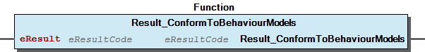
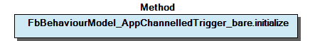
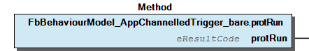
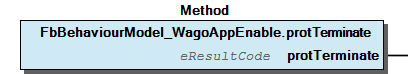
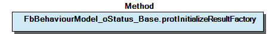
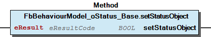
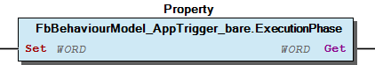
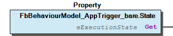
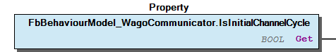

# WagoSysBehaviourModels v1.6.3.1 (WAGO) - Complete Documentation


## 📋 Library Information

- **Company:** WAGO
- **Title:** WagoSysBehaviourModels
- **Version:** 1.6.3.1
- **Categories:** WAGO LayerView|Sys; WAGO Internal|Common
- **Author:** WAGO / u013972
- **Placeholder:** WagoSysBehaviourModels

### Description ¶


This document is automatically generated.

Wago-Specific Behaviour Models

This document is automatically generated. Wago-Specific Behaviour Models

### Contents: ¶


Contents: - Documentation Index 10 Documentation - WagoSysBehaviourModels Library Documentation Project Information Library Information Function Blocks - FbBehaviourModelWagoEnable (FB) - FbBehaviourModelWagoExecute (FB) - FbBehaviourModelWagoTrigger (FB) - FbBehaviourModel_AppChannelledTrigger_bare (FB) - FbBehaviourModel_AppTrigger_bare (FB) - FbBehaviourModel_WagoAppChannel (FB) - FbBehaviourModel_WagoAppCommunicator (FB) - FbBehaviourModel_WagoAppEnable (FB) - FbBehaviourModel_WagoAppExecute (FB) - FbBehaviourModel_WagoAppTrigger (FB) - ... and 8 more Functions Methods - FbBehaviourModelWagoEnable.Initialize (METH) - FbBehaviourModelWagoEnable.protRun (METH) - FbBehaviourModelWagoEnable.protTerminate (METH) - FbBehaviourModelWagoExecute.Initialize (METH) - FbBehaviourModelWagoExecute.protClearOutputs (METH) - FbBehaviourModelWagoExecute.protRun (METH) - FbBehaviourModelWagoTrigger.Initialize (METH) - FbBehaviourModelWagoTrigger.ResetStatus (METH) - FbBehaviourModelWagoTrigger.protRun (METH) - FbBehaviourModel_AppChannelledTrigger_bare.initialize (METH) - ... and 51 more Base Components - 20 Base Models - FbBehaviourModel_oStatus_Base.xErrorOccurred (PROP) Internal Components Global Variable Lists - LibraryResult (GVL) - ResultItems (GVL) - VersionHistory (GVL) Other Components - 09 Interface - 10 Methods - 10 Methods - 10 Methods - 10 Methods - 10 Methods - 10 Methods - 10 Methods - 10 Methods - 10 Methods - ... and 56 more

### Indices and tables ¶


Based on WagoSysBehaviourModels.library, last modified 29.05.2024, 19:50:29. LibDoc 3.5.16.10

© WAGO GmbH & Co. KG, Germany 2018 – All rights reserved. For the avoidance of doubt, this copyright notice does not only apply to the information above but also and primarily to the described library itself. Please note that third-party products are always mentioned without reference to intellectual property rights, including patents, utility models, designs and trademarks, accordingly the existence of such rights cannot be excluded. WAGO is a registered trademark of WAGO Verwaltungsgesellschaft mbH.

- File and Project Information - Library Reference Based on WagoSysBehaviourModels.library, last modified 29.05.2024, 19:50:29. LibDoc 3.5.16.10 © WAGO GmbH & Co. KG, Germany 2018 – All rights reserved. For the avoidance of doubt, this copyright notice does not only apply to the information above but also and primarily to the described library itself. Please note that third-party products are always mentioned without reference to intellectual property rights, including patents, utility models, designs and trademarks, accordingly the existence of such rights cannot be excluded. WAGO is a registered trademark of WAGO Verwaltungsgesellschaft mbH.

### Documentation Index


## 10 Documentation


- doc10_General (FB) Protected Methods - Auxiliary Properties doc11_How_To_Use_Behaviour_Models (FB) - Inheritance from existing models - Direct usage of embedded models - How To Create Own Behaviour Models - Using bare models

## WagoSysBehaviourModels Library Documentation


| Company: | WAGO |
| Title: | WagoSysBehaviourModels |
| Version: | 1.6.3.1 |
| Categories: | WAGO LayerView\|Sys; WAGO Internal\|Common |
| Author: | WAGO / u013972 |
| Placeholder: | WagoSysBehaviourModels |

### Description


This document is automatically generated.

Wago-Specific Behaviour Models

This document is automatically generated. Wago-Specific Behaviour Models

### Contents:


- 10 Documentation doc10_General (FB) - doc11_How_To_Use_Behaviour_Models (FB) 20 Base Models - FbBehaviourModelWagoEnable (FB) - FbBehaviourModelWagoExecute (FB) - FbBehaviourModelWagoTrigger (FB) 22 Other Primary Models - FbBehaviourModel_WagoChannel (FB) - FbBehaviourModel_WagoMethodStart (FB) 23 Composed or Derived Models - FbBehaviourModel_WagoCommunicator (FB) 24 Application Models - FbBehaviourModel_WagoAppChannel (FB) - FbBehaviourModel_WagoAppCommunicator (FB) - FbBehaviourModel_WagoAppEnable (FB) - FbBehaviourModel_WagoAppExecute (FB) - FbBehaviourModel_WagoAppTrigger (FB) - FbBehaviourModel_oStatus_Base (FB) 25 Bare Models - FbBehaviourModel_AppChannelledTrigger_bare (FB) - FbBehaviourModel_AppTrigger_bare (FB) 29 General Helper and Type Definitions - FbEmbeddedStatusHandler (FB) - Result_ConformToBehaviourModels (FUN) - eExecutionState (ENUM) 90 Internal - Fb_CycleCountingState (FB) LibraryResult (GVL) ResultItems (GVL) VersionHistory (GVL)

### Indices and tables


Based on WagoSysBehaviourModels.library, last modified 29.05.2024, 19:50:29. LibDoc 3.5.16.10

© WAGO GmbH & Co. KG, Germany 2018 – All rights reserved. For the avoidance of doubt, this copyright notice does not only apply to the information above but also and primarily to the described library itself. Please note that third-party products are always mentioned without reference to intellectual property rights, including patents, utility models, designs and trademarks, accordingly the existence of such rights cannot be excluded. WAGO is a registered trademark of WAGO Verwaltungsgesellschaft mbH.

- File and Project Information - Library Reference Based on WagoSysBehaviourModels.library, last modified 29.05.2024, 19:50:29. LibDoc 3.5.16.10 © WAGO GmbH & Co. KG, Germany 2018 – All rights reserved. For the avoidance of doubt, this copyright notice does not only apply to the information above but also and primarily to the described library itself. Please note that third-party products are always mentioned without reference to intellectual property rights, including patents, utility models, designs and trademarks, accordingly the existence of such rights cannot be excluded. WAGO is a registered trademark of WAGO Verwaltungsgesellschaft mbH.

### Project Information


## File and Project Information


| Scope | Name | Type | Content |
| --- | --- | --- | --- |
| FileHeader | libraryFile | string | WagoSysBehaviourModels.library |
| contentFile | doc.clean.json |
| productName | e!COCKPIT |
| creationDateTime | date | 29.05.2024, 19:50:30 |
| companyName | string | WAGO |
| ProjectInformation | LastModificationDateTime | date | 29.05.2024, 19:50:29 |
| Description | string | See: Description |
| Copyright | © WAGO Kontakttechnik GmbH & Co. KG, Germany 2018 – All rights reserved. |
| Author | WAGO / u013972 |
| AutoResolveUnbound | bool | True |
| Placeholder | string | WagoSysBehaviourModels |
| Company | WAGO |
| DocFormat | reStructuredText |
| Project | WagoSysBehaviourModels |
| DefaultNamespace |  |
| Version | version | 1.6.3.1 |
| Title | string | WagoSysBehaviourModels |
| LibraryCategories | library-category-list | WAGO LayerView\|Sys; WAGO Internal\|Common |
| CompiledLibraryCompatibilityVersion | string | CODESYS V3.5 SP16 Patch 3 |

### Library Information


## Library Reference


| LinkAllContent: False QualifiedOnly: False | SystemLibrary: False | Optional: False |

| LinkAllContent: False Optional: False | QualifiedOnly: False SystemLibrary: False | PublishSymbolsInContainer: True |

| LinkAllContent: False QualifiedOnly: False | SystemLibrary: False | Optional: False |

| LinkAllContent: False QualifiedOnly: False | SystemLibrary: False | Optional: False |

| LinkAllContent: False Optional: False | QualifiedOnly: False SystemLibrary: False | PublishSymbolsInContainer: True |

| LinkAllContent: False QualifiedOnly: False | SystemLibrary: False | Optional: False |

This is a dictionary of all referenced libraries and their name spaces.

This is a dictionary of all referenced libraries and their name spaces. WagoSysErrorBase Library Identification : Placeholder: WagoSysErrorBase Default Resolution: WagoSysErrorBase, * (WAGO) Namespace: WagoSysErrorBase Library Properties : Library Parameter : Parameter: RES_LOG_MAX_FILESIZE = 2000 Parameter: RES_LOG_MAX_FILES = 1 Parameter: RES_LOG_MAX_ENTRIES = 200 Parameter: RES_LOG_NAME = ‘WagoAppResultLogger’ WagoSysTypedefs_Pointer Library Identification : Placeholder: WagoSysTypedefs_Pointer Default Resolution: WagoSysTypedefs_Pointer, * (WAGO) Namespace: WAGOWagoTypesPointer Library Properties : WagoSysUtils Library Identification : Placeholder: WagoSysUtils Default Resolution: WagoSysUtils, * (WAGO) Namespace: WagoSysUtils Library Properties : WagoSysVersion Library Identification : Name: WagoSysVersion Version: 1.0.0.0 Company: WAGO Namespace: WagoSysVersion Library Properties : WagoTypesCommon Library Identification : Placeholder: WagoTypesCommon Default Resolution: WagoTypesCommon, * (WAGO) Namespace: WagoTypes Library Properties : WagoTypesErrorBase Library Identification : Placeholder: WagoTypesErrorBase Default Resolution: WagoTypesErrorBase, * (WAGO) Namespace: WagoTypesErrorBase Library Properties :

### Function Blocks


## FbBehaviourModelWagoEnable (FB)


| Scope | Name | Type | Comment |
| --- | --- | --- | --- |
| Input | xEnable | BOOL | Enables the operation. |
| Output | xValid | BOOL | Indicates that Data is valid. |
| xBusy | BOOL | Indicates that the FB is working. |
| xError | BOOL | Indicates an error condition. |
| eStatus | eResultCode | Indicates temporary status or error condition. |

| protRun - result codes |
| 0 | Successful operation, set xValid |
| EAGAIN | Output variables not yet valid, reset xValid, eStatus := EINPROGRESS, xError := FALSE |
| other | Reset xValid, set eStatus to this code, set xError := TRUE |

| protTerminate - result codes |
| OK=0 | Successful termination, return to state ‘Idle’. |
| ENOSYS | Method is not implemented, return to ‘state Idle’. |
| EAGAIN | Shutdown is in progress and must be resumed. |
| EBREAKPT | Shutdown in progress, but direct transit to ‘Run’ if xEnable=TRUE is enabled |
| other | Display error code. |

Base class for behaviour model WagoEnable.

Graphical Illustration

For using this base model, the user has to re-implement the PROTECTED methods protRun() and protTerminate(). The first is the main runner which is called periodically while xEnable is TRUE. The latter is used for controlled shutdown of the FB when xEnable is turned FALSE again.

This model has three internal states:

While xEnable is TRUE, the Method protRun() is called once per cycle. Depending on its result, the outputs are set:

The method protRun() will be called regardless of whether or not a previous call returned an Error.

When xEnable is set FALSE again, the method protTerminate() is called at least once. The further behaviour depends again on the eResultCode:

Note: This method need not be implemented if no functionality is connected to it. By default it returns ENOSYS which switches the FB directly from ‘Run’ to ‘idle’.

Attention: The derived child FB has to call SUPER^.() in its body.

Interface variables Base class for behaviour model WagoEnable. Graphical Illustration  Usage For using this base model, the user has to re-implement the PROTECTED methods protRun() and protTerminate(). The first is the main runner which is called periodically while xEnable is TRUE. The latter is used for controlled shutdown of the FB when xEnable is turned FALSE again. States This model has three internal states: Idle: The FB waits for xEnable to go TRUE and then transits to ‘Run’. This state is indicated to the user by having xBusy reset to FALSE. Note: xValid and xError are also reset. Run: The FB calls protRun() once per cycle while in this state. When xEnable goes FALSE, it transits to ‘Terminating’. This State is indicated by having xBusy set TRUE while the xEnable -Input is also set. Terminating: The FB calls protTerminate() once per cycle while in this state. Depending on the result, it transits either to ‘Idle’ or to ‘Run’. This State is indicated by having xBusy set TRUE while the xEnable -Input is already reset to FALSE. Behaviour While xEnable is TRUE, the Method protRun() is called once per cycle. Depending on its result, the outputs are set: The method protRun() will be called regardless of whether or not a previous call returned an Error. When xEnable is set FALSE again, the method protTerminate() is called at least once. The further behaviour depends again on the eResultCode: Note: This method need not be implemented if no functionality is connected to it. By default it returns ENOSYS which switches the FB directly from ‘Run’ to ‘idle’. Attention: The derived child FB has to call SUPER^.() in its body. - 10 Methods FbBehaviourModelWagoEnable.protRun (METH) - FbBehaviourModelWagoEnable.protTerminate (METH) 20 Administration - FbBehaviourModelWagoEnable.Initialize (METH)

## FbBehaviourModelWagoExecute (FB)


| Scope | Name | Type | Comment |
| --- | --- | --- | --- |
| Input | xExecute | BOOL | Triggers the execution of the action. |
| Output | xDone | BOOL | Successful completion of the action. |
| xBusy | BOOL | Action is still in progress. |
| xError | BOOL | Indicates an error. |
| eStatus | eResultCode | Result code status |

| protRun - result codes |
| 0 | Execution has successfully terminated, set xDone = TRUE. |
| EAGAIN | Execution is still in progress, repeat protRun() in next cycle. |
| other | Execution has terminated with an error. set xError and eStatus. |

Base class for behaviour model WagoExecute

Graphical Illustration

This model has three internal states:

The FB waits for xExecute to return to FALSE for at least one cycle, then transits to ‘Idle’. This state is indicated by having xDone set to TRUE and xBusy reset to FALSE.

The forth case, i.e. xDone and xBusy both set to TRUE is illegal and is prevented by the framework of this model (would be a programming error if it did occur).

The behaviour of the child FB is mainly controlled by the result code of the runner method:

When ‘xExecute’ returns to FALSE again after the main runner is finished, the protected method ‘protClearOutputs()’ is called. General code may be placed here to clear the outputs of child FBs.

It is ensured that the outputs remain uncleared for at least one cycle after termination of the main runner, even if ‘xExecute’ was reset to FALSE before the termination of the runner.

Attention: The derived child FB has to call SUPER^.() in its body.

Interface variables Base class for behaviour model WagoExecute Graphical Illustration  States This model has three internal states: Idle: The FB waits for xExecute to transit from FALSE TO TRUE, then transits to ‘Run’. This state is indicated to the user by having xDone and xBusy both reset to FALSE. Note: xError is also reset in this state. Run: The FB calls protRun() repeatedly until protRun() returns OK or any code other than EAGAIN. This state is indicated by having``xBusy`` set to TRUE and``xDone`` reset to FALSE. Terminated: The FB waits for xExecute to return to FALSE for at least one cycle, then transits to ‘Idle’. This state is indicated by having xDone set to TRUE and xBusy reset to FALSE. Note The forth case, i.e. xDone and xBusy both set to TRUE is illegal and is prevented by the framework of this model (would be a programming error if it did occur). Behaviour - Base class interface variables are cleared when xExecute goes to FALSE. Interface Variables of derived FBs are not affected by this and retain their values until the next Run-cycle. - The output eStatus remain unchanged as long as xDone or xError are not set yet, unless the derived FB overwrites them. The behaviour of the child FB is mainly controlled by the result code of the runner method: When ‘xExecute’ returns to FALSE again after the main runner is finished, the protected method ‘protClearOutputs()’ is called. General code may be placed here to clear the outputs of child FBs. It is ensured that the outputs remain uncleared for at least one cycle after termination of the main runner, even if ‘xExecute’ was reset to FALSE before the termination of the runner. Attention: The derived child FB has to call SUPER^.() in its body. - 10 Methods FbBehaviourModelWagoExecute.protClearOutputs (METH) - FbBehaviourModelWagoExecute.protRun (METH) 20 Administration - FbBehaviourModelWagoExecute.Initialize (METH)

## FbBehaviourModelWagoTrigger (FB)


| Scope | Name | Type | Comment |
| --- | --- | --- | --- |
| Inout | xTrigger | BOOL | Triggers the action and signals termination. |
| Output | xBusy | BOOL | True while not terminated. |
| xError | BOOL | Signals presence of an error. |
| eStatus | eResultCode | Execution state or error code |

| protRun - result codes |
| 0 | The action has successfully terminated, reset xTrigger again. |
| EAGAIN | The action has to be repeated. |
| other | The action has terminated with an error, reset xTrigger again. |

Base class for behaviour model WagoTrigger

Graphical Illustration

This model has two internal states

The FB calls protRun() repeatedly until the runner returns either OK or any code other than EAGAIN. Then the FB transits into ‘Idle’ and it resets xTrigger from within the FB framework again.

The ‘Run’ state is indicated by having eStatus set intermediately to EINPROGRESS and xTrigger not yet being reset. Upon termination of the action, eStatus will be set either to OK or to the error code. which was returned from the runner.

Note (1): When this model is used, it is strongly recommended that the application never resets xTrigger to FALSE. It should only be set to TRUE.

Note (2): When the action returns either EINPROGRESS or EDEFAULT, that result code will be re-mapped to EUNSPECIFIC in order to avoid ambiguities with eStatus.

The overall behaviour is controlled by the result code of the runner:

Attention: The derived child FB has to call SUPER^.(xTrigger:=xTrigger) in its body.

Interface variables Base class for behaviour model WagoTrigger Graphical Illustration  States This model has two internal states Idle: The FB waits for xTrigger to be set to TRUE by external stimulus. Then the FB transits into ‘Run’. The ‘Idle’ state is indicated by the FB having xTrigger reset to FALSE and eStatus being set to anything other than EDEFAULT. Run: The FB calls protRun() repeatedly until the runner returns either OK or any code other than EAGAIN. Then the FB transits into ‘Idle’ and it resets xTrigger from within the FB framework again. The ‘Run’ state is indicated by having eStatus set intermediately to EINPROGRESS and xTrigger not yet being reset. Upon termination of the action, eStatus will be set either to OK or to the error code. which was returned from the runner. Note (1): When this model is used, it is strongly recommended that the application never resets xTrigger to FALSE. It should only be set to TRUE. Note (2): When the action returns either EINPROGRESS or EDEFAULT, that result code will be re-mapped to EUNSPECIFIC in order to avoid ambiguities with eStatus. The overall behaviour is controlled by the result code of the runner: Attention: The derived child FB has to call SUPER^.(xTrigger:=xTrigger) in its body. - 10 Methods FbBehaviourModelWagoTrigger.protRun (METH) 20 Administration - FbBehaviourModelWagoTrigger.Initialize (METH) - FbBehaviourModelWagoTrigger.ResetStatus (METH)

## FbBehaviourModel_AppChannelledTrigger_bare (FB)


| Scope | Name | Type | Comment | Inherited from |
| --- | --- | --- | --- | --- |
| Output | oStatus | FbResult | Status object (see WagoSysErrorBase). | FbBehaviourModel_oStatus_Base |

| Internal Variable Interface |
| --- |
| Access | Name | Type | Description |
| --- | --- | --- | --- |
| INPUT | in_xOpen | BOOL | Opening and closing of the channel. |
| INPUT | in_xResetStatus | BOOL | Reset the status output |
| OUTPUT | out_xIsOpen | BOOL | Indicates an open channel. |
| OUTPUT | out_xIsIdle | BOOL | Indicates that the channel can be opened. |
| OUTPUT | out_xError | BOOL | Indicates that an error has occurred |
| IN-OUT | inout_xTrigger | BOOL | Triggers the action. |

| protOpen - result codes |
| 0 | Opening of the channel was successfully completed. |
| EAGAIN | Opening still in progress. |
| other | Opening failed. Channel returns to idle state without calling close(). |

| protClose - result codes |
| 0 | Closing of the channel was successfully completed. |
| EAGAIN | Closing still in progress. |
| other | Closing failed for some reason. |

| protRun - result codes |
| 0 | The action has successfully terminated, reset xTxTrigger again. |
| EAGAIN | The action has to be repeated. |
| other | The action has terminated with on error, reset xTxTrigger again. |

Channelled Trigger with oStatus.

Graphical Illustration

Function Description

A Channelled trigger is a WagoCommunicator without a receiving channel.

As this is a bare model, it has no graphical inputs nor outputs. The follwing variables are used for communication:

This base model is completely identical to ‘WagoChanneledTrigger’ with the only difference that the trigger variable and the status output are named slightly differently here.

It is composed of two separated sub-modules:

The property IsInitialCycle which is provided in other models is re-implemented twice for use in the pseudo-protected methods. One is named IsInitialChannelCycle , the other is named IsInitialTriggerCycle . They reflect the states of the corresponding parts.

Result Codes

The expected result codes for the PROTECTED methods are identical to those in the description of the individual components (WagoChannel and WagoTrigger):

Attention: The derived child FB has to call SUPER^(xTxTrigger:=xTxTrigger); in its body.

Interface variables Function Channelled Trigger with oStatus. Graphical Illustration  Function Description A Channelled trigger is a WagoCommunicator without a receiving channel. As this is a bare model, it has no graphical inputs nor outputs. The follwing variables are used for communication: This base model is completely identical to ‘WagoChanneledTrigger’ with the only difference that the trigger variable and the status output are named slightly differently here. It is composed of two separated sub-modules: Channel: This part controls the opening and closing of an associated communication channel. The description of WagoChannel applies to this part. Please note that any parameters for opening the channel (such as filenames, ip-addresses, COM-ports, etc) only apply to FBs which are derived from this model, and not to this base model itself. TxTrigger: This part controls the transmission of data. The TxTrigger part is only active while the Channel -Part is open. Otherwise the main runner is not called. Properties The property IsInitialCycle which is provided in other models is re-implemented twice for use in the pseudo-protected methods. One is named IsInitialChannelCycle , the other is named IsInitialTriggerCycle . They reflect the states of the corresponding parts. Result Codes The expected result codes for the PROTECTED methods are identical to those in the description of the individual components (WagoChannel and WagoTrigger): Attention: The derived child FB has to call SUPER^(xTxTrigger:=xTxTrigger); in its body. - 10 Methods FbBehaviourModel_AppChannelledTrigger_bare.protClose (METH) - FbBehaviourModel_AppChannelledTrigger_bare.protOpen (METH) - FbBehaviourModel_AppChannelledTrigger_bare.protRun (METH) 40 For Use in Protected Methods - FbBehaviourModel_AppChannelledTrigger_bare.IsInitialChannelCycle (PROP) - FbBehaviourModel_AppChannelledTrigger_bare.IsInitialTriggerCycle (PROP) 50 Administration - FbBehaviourModel_AppChannelledTrigger_bare.initialize (METH)

## FbBehaviourModel_AppTrigger_bare (FB)


| Scope | Name | Type | Comment | Inherited from |
| --- | --- | --- | --- | --- |
| Output | oStatus | FbResult | Status object (see WagoSysErrorBase). | FbBehaviourModel_oStatus_Base |

| Internal Variable Interface |
| --- |
| Access | Name | Type | Description |
| --- | --- | --- | --- |
| IN-OUT | inout_xTrigger | BOOL | Triggers the action and signals termination. |
| OUTPUT | out_xBusy | BOOL | True while not terminated. |
| OUTPUT | out_xError | BOOL | Has an error occurred? |

| protRun - result codes |
| 0 | The action has successfully terminated, reset xTxTrigger again. |
| EAGAIN | The action has to be repeated. |
| other | The action has terminated with an error, reset xTxTrigger again. |

This is a bare model for Wago Trigger with oStatus.

Graphical Illustration

Fundamental bse models like this one are in normal cases intended to be identified by the names of their interface variables. This association should be kept stable, so you should not change the names and consequently this bare model should not be used unless you have a good point to do so.

There are some few situations, however, where it is intended to have the plain ‘WagoTrigger’ model with different variable names. This model is intended for these few cases.

Function Description

As this is a bare model, it has no graphical inputs nor outputs. The follwing variables are used for communication:

Base class for behaviour model WagoTxTrigger.

This base model is completely identical to ‘WagoTrigger’ with the only difference that the trigger variable and the status output are named slightly differently here.

This model has three internal states

The very first cycle in the life of an application. As xTrigger cannot be reset during initialization, due to technical reasons, it is initialized in this first cycle.

This state is indicated by eStatus set to EDEFAULT . The value of xTrigger is not defined at this moment. The FB transits into Idle from this state within one cycle.

The FB calls protRun() repeatedly until the runner returns either OK or any code other than EAGAIN . Then the FB transits into ‘Idle’ and it resets xTrigger from within the FB framework again.

The ‘Run’ state is indicated by having eStatus set intermediately to ‘EINPROGRESS’ and xTrigger not yet being reset. Upon termination of the action, eStatus will be set either to OK or to the error code. which was returned from the runner.

When this model is used, it is strongly recommended that the application never reset xTrigger to FALSE. It should only be set to TRUE.

When the action returns either EINPROGRESS or EDEFAULT, that result code will be re-mapped to EUNSPECIFIC in order to avoid ambiguities with eStatus.

The overall behaviour is controlled by the result code of the runner:

Attention: The derived child FB has to call SUPER^.(xTxTrigger:=xTxTrigger) in its body.

Interface variables Function This is a bare model for Wago Trigger with oStatus. Graphical Illustration  Note Fundamental bse models like this one are in normal cases intended to be identified by the names of their interface variables. This association should be kept stable, so you should not change the names and consequently this bare model should not be used unless you have a good point to do so. There are some few situations, however, where it is intended to have the plain ‘WagoTrigger’ model with different variable names. This model is intended for these few cases. Function Description As this is a bare model, it has no graphical inputs nor outputs. The follwing variables are used for communication: Base class for behaviour model WagoTxTrigger. This base model is completely identical to ‘WagoTrigger’ with the only difference that the trigger variable and the status output are named slightly differently here. States This model has three internal states NotInitialized: The very first cycle in the life of an application. As xTrigger cannot be reset during initialization, due to technical reasons, it is initialized in this first cycle. This state is indicated by eStatus set to EDEFAULT . The value of xTrigger is not defined at this moment. The FB transits into Idle from this state within one cycle. Idle: The FB waits for xTrigger to be set to TRUE by external stimulus. Then the FB transits into ‘Run’. The ‘Idle’ state is indicated by the FB having xTrigger reset to False and eStatus being set to anything other than EDEFAULT . Run: The FB calls protRun() repeatedly until the runner returns either OK or any code other than EAGAIN . Then the FB transits into ‘Idle’ and it resets xTrigger from within the FB framework again. The ‘Run’ state is indicated by having eStatus set intermediately to ‘EINPROGRESS’ and xTrigger not yet being reset. Upon termination of the action, eStatus will be set either to OK or to the error code. which was returned from the runner. Note When this model is used, it is strongly recommended that the application never reset xTrigger to FALSE. It should only be set to TRUE. Note When the action returns either EINPROGRESS or EDEFAULT, that result code will be re-mapped to EUNSPECIFIC in order to avoid ambiguities with eStatus. The overall behaviour is controlled by the result code of the runner: Attention: The derived child FB has to call SUPER^.(xTxTrigger:=xTxTrigger) in its body. - 10 Methods FbBehaviourModel_AppTrigger_bare.protRun (METH) 20 Administration - FbBehaviourModel_AppTrigger_bare.initialize (METH) 40 For Derived Classes - FbBehaviourModel_AppTrigger_bare.CycleCount (PROP) - FbBehaviourModel_AppTrigger_bare.ExecutionPhase (PROP) - FbBehaviourModel_AppTrigger_bare.IsInitialCycle (PROP) - FbBehaviourModel_AppTrigger_bare.State (PROP) - FbBehaviourModel_AppTrigger_bare.protSetErrorFromMemberMethod (METH)

## FbBehaviourModel_WagoAppChannel (FB)


| Scope | Name | Type | Comment | Inherited from |
| --- | --- | --- | --- | --- |
| Output | oStatus | FbResult | Status object (see WagoSysErrorBase). | FbBehaviourModel_oStatus_Base |
| Input | xOpen | BOOL | Desired channel state (open=TRUE, closed=FALSE) |  |
| Output | xError | BOOL | Feedback: an Error has occurred. |  |
| xIsOpen | BOOL | Feedback: channel is operative. |  |
| xIsIdle | BOOL | Feedback: channel is clear for new opening. |  |

| protOpen - result codes |
| 0 | Opening of the channel was successfully completed. |
| EAGAIN | Opening still in progress. |
| other | Opening failed. Channel returns to idle state without calling close(). |

| protClose - result codes |
| 0 | Closing of the channel was successfully completed. |
| EAGAIN | Closing still in progress. |
| other | Closing failed for some reason. |

This is a base class for behaviour model WagoChannel with oStatus.

Graphical Illustration

Function Description

This base model is completely identical to FbBehaviourModel_WagoChannel (FB) with the only difference that the status output is named slightly differently here.

This model is suitable for situations where an action has to be performed for allocating a resource (‘opening’) and another action for releasing the resource again (‘closing’).

Successful termination of these actions denotes this resource as ‘now usable’ or ‘not usable’. Prominent examples for such resources are files and sockets as well as general communication channels.

Beside actions for opening and closing, there is no ‘main runner’ included, as this base class represents just the state of the resource. Nevertheless, there are other classes derived from this base class, which combine this channel behaviour with an action, e.g. ChannelledTrigger .

Waiting for the protOpen() to return either OK or any code other than EAGAIN . On OK, transit to ‘Run’ and set xIsOpen to TRUE ; On Error, xIsOpen is left FALSE and the FB transits to ‘Recovery’.

This state is indicated by having both xIsIdle and xIsOpen reset to FALSE and eStatus set to EINPROGRESS .

Repeatedly call protClose() until it returns OK or any code other than EAGAIN . In that case the FB transits to Idle .

This state is indicated by having both xIsIdle and xIsOpen reset to FALSE and eStatus set to ETERMINATED .

This state is used when protOpen() failed with an error. In this state, the FB waits for xOpen to return to FALSE and transits then directly to Idle without calling protClose() .

This state is indicated by having both xIsIdle and xIsOpen reset to FALSE and eStatus set to an error code other than OK , EINPROGRESS or ETERMINATED .

The state xIsIdle and xIsOpen both set to TRUE is illegal and will be prevented by this base class.

As usual, the detailed behaviour of this model is controlled by the result codes of the virtual methods, i.e. protOpen() and protClose() :

Unlike the corresponding protTerminate() method in WagoEnable, the method protClose() does not provide abortion of the closing process.

Attention: The derived child FB has to call SUPER^() in its body.

Interface variables Function This is a base class for behaviour model WagoChannel with oStatus. Graphical Illustration  Function Description This base model is completely identical to FbBehaviourModel_WagoChannel (FB) with the only difference that the status output is named slightly differently here. This model is suitable for situations where an action has to be performed for allocating a resource (‘opening’) and another action for releasing the resource again (‘closing’). Successful termination of these actions denotes this resource as ‘now usable’ or ‘not usable’. Prominent examples for such resources are files and sockets as well as general communication channels. Beside actions for opening and closing, there is no ‘main runner’ included, as this base class represents just the state of the resource. Nevertheless, there are other classes derived from this base class, which combine this channel behaviour with an action, e.g. ChannelledTrigger . States Idle: Waiting for xOpen to go TRUE, then call protOpen() and transit into ‘Opening’. This state is indicated by having xIsIdle set to TRUE . Opening: Waiting for the protOpen() to return either OK or any code other than EAGAIN . On OK, transit to ‘Run’ and set xIsOpen to TRUE ; On Error, xIsOpen is left FALSE and the FB transits to ‘Recovery’. This state is indicated by having both xIsIdle and xIsOpen reset to FALSE and eStatus set to EINPROGRESS . Run: Waiting for xOpen to return to FALSE , then call protClose() and transit into Closing . This state is indicated by having xIsOpen set to TRUE . Closing: Repeatedly call protClose() until it returns OK or any code other than EAGAIN . In that case the FB transits to Idle . This state is indicated by having both xIsIdle and xIsOpen reset to FALSE and eStatus set to ETERMINATED . Recovery: This state is used when protOpen() failed with an error. In this state, the FB waits for xOpen to return to FALSE and transits then directly to Idle without calling protClose() . This state is indicated by having both xIsIdle and xIsOpen reset to FALSE and eStatus set to an error code other than OK , EINPROGRESS or ETERMINATED . Note The state xIsIdle and xIsOpen both set to TRUE is illegal and will be prevented by this base class. As usual, the detailed behaviour of this model is controlled by the result codes of the virtual methods, i.e. protOpen() and protClose() : Note Unlike the corresponding protTerminate() method in WagoEnable, the method protClose() does not provide abortion of the closing process. Attention: The derived child FB has to call SUPER^() in its body. - 10 Methods FbBehaviourModel_WagoAppChannel.protClose (METH) - FbBehaviourModel_WagoAppChannel.protOpen (METH) 20 Administration - FbBehaviourModel_WagoAppChannel.Initialize (METH) 40 For Derived Classes - FbBehaviourModel_WagoAppChannel.CycleCount (PROP) - FbBehaviourModel_WagoAppChannel.ExecutionPhase (PROP) - FbBehaviourModel_WagoAppChannel.IsInitialCycle (PROP) - FbBehaviourModel_WagoAppChannel.State (PROP) - FbBehaviourModel_WagoAppChannel.protSetErrorFromMemberMethod (METH)

## FbBehaviourModel_WagoAppCommunicator (FB)


| Scope | Name | Type | Comment | Inherited from |
| --- | --- | --- | --- | --- |
| Output | oStatus | FbResult | Status object (see WagoSysErrorBase). | FbBehaviourModel_oStatus_Base |
| Input | xOpen | BOOL | Opens and closes the channel. |  |
| Output | xIsOpen | BOOL | Indicates whether the channel is open. |  |
| xIsIdle | BOOL | Feedback: channel is clear for new opening. |  |
| xError | BOOL | Indicates that an error has occurred. |  |
| Inout | xTxTrigger | BOOL | Starts transmission of data. |  |
| Input | pTxBuffer | POINTER TO BYTE | Pointer to data for transmission |  |
| udiTxNBytes | UDINT | Number of bytes to transmit |  |
| pRxBuffer | POINTER TO BYTE | Pointer to receiver buffer |  |
| udiRxBufferSize | UDINT | Size of the receiver buffer |  |
| Inout | udiRxIndex | UDINT | Number of bytes in the receiver buffer |  |
| Output | xRxBufferFull | BOOL | Indicates that the Receiver Buffer is full. |  |
| xRxOverflow | BOOL | Indicates that data is probably lost. |  |
| Input | xResetStatus | BOOL | Resets status code to ‘OK’ |  |

```
pRxBuffer := adr(BufferArray);
udiRxBufferSize := SizeOf(BufferArray);
```

```
SUPER^(xTxAction:=xTxAction, udiRxNBytes:=udiRxNBytes);
```

This is a base class for behaviour model WagoAppCommunicator with oStatus outputs.

Graphical Illustration

Function Description

This base class is used for general communication needs.

This FB is composed of three separated sub-modules:

This part controls the transmission of data. The description of WagoTransmitter directly applies to it. The Transmitter part is only active while the Channel -Part is open. Otherwise the transmitter is not called.

If there is a transmission request while the channel is not open, the FB responds with the error code EBADF (‘Bad File num,ber / File not open’);

On the rising edge of the input xOpen the channel is opened. Unless an error occurrs, the channel stays open while xOpen is kept TRUE . This status is indicated by the output xIsOpen , which is TRUE while the channel is operative. Any errors concerning the channel status are signalled via the output oStatus .

When xOpen returns to FALSE the channel is closed again after pending communication is finished.

Transmitter:

The transmitt er section implements the behaviour ‘WagoTransmitter’. For transmitting data, the input ‘pTxBuffer’ is to be set to the address of the data block and the input udiTxNBytes has to hold the size of the data block. Setting xTxTrigger to TRUE initiates the transmission of the data.

The transmitter indicates the completion of the transmitting process by setting xTxTrigger to FALSE again.

The application MUST NOT reset xTxTrigger to FALSE , because in that case the FB has no means to signal to itself the completion of the process.

The term ‘completion’ in this context does not mean that the data has actually been sent physically. Rater it indicates that the data is delivered out of the FB und new data may be processed now.

Any errors while transmitting data are displayed on the output eTxStatus.

The inputs pRxBuffer and udiRxBufferSize have to be fed with the location and the size of the raw buffer space for received data. (E.g.:

The in-out udiRxNBytes has initially to be set to 0.

When the FB is ‘open’, it automatically receives data. The received data is stored into the buffer space. New bytes will go to the location inside the buffer space which is indicated by udiRxIndex . After receipt of a byte this variable is automatically incremented, so it

When the input buffer is full, xRxBufferFull will be set to TRUE . The output xRxOverflow indicates in such a situation new data arrived which could neither be postponed nor stored internally.

When the application has fetched the data from the buffer, it is must reset udiRxNBytes again to zero. This will reset xRxBufferFull and xRxOverflow .

Deriving from this model:

Properties:

The properties of the embedded models are not all published to the epublic interface. Only IsInitialCycle is re-implemented for use in the protected methods. It reflects the corresponding state of the channel part.

Attention: The derived child FB has to call

in its body.

Interface variables Function This is a base class for behaviour model WagoAppCommunicator with oStatus outputs. Graphical Illustration  Function Description This base class is used for general communication needs. Usage This FB is composed of three separated sub-modules: Channel: This part controls the opening and closing of an associated communication channel. The description of WagoChannel applies to this part. Please note that any parameters for opening the channel (such as filenames, ip-addresses, COM-ports, etc) only apply to FBs which are derived from this model, and not to this base model itself. Transmitter: This part controls the transmission of data. The description of WagoTransmitter directly applies to it. The Transmitter part is only active while the Channel -Part is open. Otherwise the transmitter is not called. If there is a transmission request while the channel is not open, the FB responds with the error code EBADF (‘Bad File num,ber / File not open’); Receiver: The third part is a straightforward embedding of the WagoReceiver -Model. Like the transmitter, it is called only as long as the Channel is open. Channel: On the rising edge of the input xOpen the channel is opened. Unless an error occurrs, the channel stays open while xOpen is kept TRUE . This status is indicated by the output xIsOpen , which is TRUE while the channel is operative. Any errors concerning the channel status are signalled via the output oStatus . When xOpen returns to FALSE the channel is closed again after pending communication is finished. Transmitter: The transmitt er section implements the behaviour ‘WagoTransmitter’. For transmitting data, the input ‘pTxBuffer’ is to be set to the address of the data block and the input udiTxNBytes has to hold the size of the data block. Setting xTxTrigger to TRUE initiates the transmission of the data. The transmitter indicates the completion of the transmitting process by setting xTxTrigger to FALSE again. Note The application MUST NOT reset xTxTrigger to FALSE , because in that case the FB has no means to signal to itself the completion of the process. Note The term ‘completion’ in this context does not mean that the data has actually been sent physically. Rater it indicates that the data is delivered out of the FB und new data may be processed now. Any errors while transmitting data are displayed on the output eTxStatus. Receiver: The inputs pRxBuffer and udiRxBufferSize have to be fed with the location and the size of the raw buffer space for received data. (E.g.: ). The in-out udiRxNBytes has initially to be set to 0. When the FB is ‘open’, it automatically receives data. The received data is stored into the buffer space. New bytes will go to the location inside the buffer space which is indicated by udiRxIndex . After receipt of a byte this variable is automatically incremented, so it 1. indicates the total amount of received data in the buffer and 2. indicates the location for new data. When the input buffer is full, xRxBufferFull will be set to TRUE . The output xRxOverflow indicates in such a situation new data arrived which could neither be postponed nor stored internally. When the application has fetched the data from the buffer, it is must reset udiRxNBytes again to zero. This will reset xRxBufferFull and xRxOverflow . Deriving from this model: Properties: The properties of the embedded models are not all published to the epublic interface. Only IsInitialCycle is re-implemented for use in the protected methods. It reflects the corresponding state of the channel part. Attention: The derived child FB has to call in its body. Caveats 1. The input xResetStatus affects the errors which has accumulated in previous cycles. When it is set and an error occurs in the currect cycle, the error will be displayed. This input can be used as a means for Auto-Recovery . 2. When a receive error occurs, the status output shows this error and the indicator xRxOverflow shows TRUE for that cycle. In contrast too the status output oStatus , the indicator xRxOverflow does not accumulate but it reflects the actual situation - so in the next cycle that indicator might be disappeared again. - 10 Methods FbBehaviourModel_WagoAppCommunicator.protAcquire (METH) - FbBehaviourModel_WagoAppCommunicator.protClose (METH) - FbBehaviourModel_WagoAppCommunicator.protOpen (METH) - FbBehaviourModel_WagoAppCommunicator.protWriteOut (METH) 40 For Use in Protected Methods - FbBehaviourModel_WagoAppCommunicator.IsInitialChannelCycle (PROP) - FbBehaviourModel_WagoAppCommunicator.protSetErrorFromMemberMethod (METH) 50 Administration - FbBehaviourModel_WagoAppCommunicator.initialize (METH)

## FbBehaviourModel_WagoAppEnable (FB)


| Scope | Name | Type | Comment | Inherited from |
| --- | --- | --- | --- | --- |
| Output | oStatus | FbResult | Status object (see WagoSysErrorBase). | FbBehaviourModel_oStatus_Base |
| Input | xEnable | BOOL | Enables the operation. |  |
| Output | xError | BOOL | Indicates that an Error has occurred. |  |
| xValid | BOOL | Indicates that Data is valid. |  |
| xBusy | BOOL | Indicates that the FB is working. |  |

| protRun - result codes |
| 0 | Successful operation, set xValid |
| EAGAIN | Output variables not yet valid, reset xValid, eStatus := EINPROGRESS, xError := FALSE |
| other | Reset xValid, set eStatus to this code, set xError := TRUE |

| protTerminate - result codes |
| OK=0 | Successful termination, return to state ‘Idle’. |
| ENOSYS | Method is not implemented, return to ‘state Idle’. |
| EAGAIN | Shutdown is in progress and must be resumed. |
| EBREAKPT | Shutdown in progress, but direct transit to ‘Run’ if xEnable=TRUE is enabled |
| other | Display error code. |

Base class for behaviour model PLCopenEnable with oStatus.

Graphical Illustration

For use the user must re-implement the PROTECTED methods protRun() and protTerminate(). The first is the main runner which is called periodically while xEnable is TRUE. The latter is used for controlled shutdown of the FB when xEnable is turned FALSE again.

This model has three internal states:

While xEnable is TRUE, the Method protRun() is called once per cycle. Depending on its result, the outputs are set:

The method protRun() will be called regardless of whether or not a previous call returned an Error.

When xEnable is set FALSE again, the Method protTerminate() is called at least once. The further behaviour depends again on the eResultCode:

Note: This method need not be implemented if no functionality is connected to it. By default it returns ENOSYS which switches the FB directly from ‘Run’ to ‘idle’.

Attention: The derived child FB has to call SUPER^() in its body.

Interface variables Function Base class for behaviour model PLCopenEnable with oStatus. Graphical Illustration  For use the user must re-implement the PROTECTED methods protRun() and protTerminate(). The first is the main runner which is called periodically while xEnable is TRUE. The latter is used for controlled shutdown of the FB when xEnable is turned FALSE again. States This model has three internal states: Idle: The FB waits for xEnable to go TRUE and then transits to ‘Run’. This state is indicated to the user by having xBusy reset to FALSE. Note: xValid and xError are also reset. Run: The FB calls protRun() once per cycle while in this state. When xEnable goes FALSE, it transits to ‘Terminating’. This State is indicated by having xBusy set TRUE while the xEnable -Input is also set. Terminating: The FB calls protTerminate() once per cycle while in this state. Depending on the result, it transits either to ‘Idle’ or to ‘Run’. This State is indicated by having xBusy set TRUE while the xEnable -Input is already reset to FALSE. Behaviour While xEnable is TRUE, the Method protRun() is called once per cycle. Depending on its result, the outputs are set: The method protRun() will be called regardless of whether or not a previous call returned an Error. When xEnable is set FALSE again, the Method protTerminate() is called at least once. The further behaviour depends again on the eResultCode: Note: This method need not be implemented if no functionality is connected to it. By default it returns ENOSYS which switches the FB directly from ‘Run’ to ‘idle’. Attention: The derived child FB has to call SUPER^() in its body. - 10 Methods FbBehaviourModel_WagoAppEnable.protRun (METH) - FbBehaviourModel_WagoAppEnable.protTerminate (METH) 20 Administration - FbBehaviourModel_WagoAppEnable.initialize (METH) 40 For Derived Classes - FbBehaviourModel_WagoAppEnable.CycleCount (PROP) - FbBehaviourModel_WagoAppEnable.ExecutionPhase (PROP) - FbBehaviourModel_WagoAppEnable.IsInitialCycle (PROP) - FbBehaviourModel_WagoAppEnable.State (PROP) - FbBehaviourModel_WagoAppEnable.protSetErrorFromMemberMethod (METH)

## FbBehaviourModel_WagoAppExecute (FB)


| Scope | Name | Type | Comment | Inherited from |
| --- | --- | --- | --- | --- |
| Output | oStatus | FbResult | Status object (see WagoSysErrorBase). | FbBehaviourModel_oStatus_Base |
| Input | xExecute | BOOL | Triggers the execution of the action. |  |
| Output | xError | BOOL | Indicates that an error has occurred. |  |
| xDone | BOOL | Successful completion of the action. |  |
| xBusy | BOOL | Action is still in progress. |  |

| protRun - result codes |
| 0 | Execution has successfully terminated, set xDone = TRUE. |
| EAGAIN | Execution is still in progress, repeat protRun() in next cycle. |
| other | Execution has terminated with an error, set xError and oStatus . |

```
{attribute 'inheritanceonly'}
{attribute 'hide'}

METHOD PROTECTED protInitializeResultFactory

  protSetupResultFactory(ADR('NameOfTheFB'),ADR(ERROR_LIST),SIZEOF(ERROR_LIST));

// NameOfTheFB is the name of tche child FB as to be displayed as 'Producer'
// ERROR_LIST is the list of error objects which applies for this FB.
```

This model is a base class for behaviour model WagoExecute with oStatus output.

Graphical Illustration

Function Description

This model has three internal states:

The forth case, i.e. xDone and xBusy both set to TRUE is illegal and is prevented by the framework of this model (would be a programming error if it did occur).

The behaviour of the child FB is mainly controlled by the result code of the runner method:

When xExecute returns to FALSE again after the main runner is finished, the protected method protClearOutputs() is called. General code may be placed here to clear the outputs of child FBs.

It is ensured that the outputs remain uncleared for at least one cycle after termination of the main runner, even if xExecute was reset to FALSE before the termination of the runner.

Attention: The derived child FB has to call SUPER^() in its body.

Attention (2): For proper usage of the status object a protected initializazion method has to be provided by the child FB:

Interface variables Function This model is a base class for behaviour model WagoExecute with oStatus output. Graphical Illustration  Function Description States This model has three internal states: Idle: The FB waits for xExecute to transit from FALSE TO TRUE , then transits to ‘Run’. This state is indicated to the user by having xDone and xBusy both reset to FALSE . Please note that xError is also reset in this state. Run: The FB calls protRun() repeatedly until protRun() returns OK or any code other than EAGAIN . This state is indicated by having xBusy set to TRUE and xDone reset to FALSE . Terminated: The FB waits for xExecute to return to FALSE for at least one cycle, then transits to ‘Idle’. This state is indicated by having xDone set to TRUE and xBusy reset to FALSE . Note The forth case, i.e. xDone and xBusy both set to TRUE is illegal and is prevented by the framework of this model (would be a programming error if it did occur). Behaviour: - Base class interface variables are cleared when xExecute transits to FALSE . Interface Variables of derived FBs are not affected by this and retain their values until the next Run-cycle. - The output oStatus remain unchanged as long as xDone or xError are not set yet, unless the derived FB overwrites them. The behaviour of the child FB is mainly controlled by the result code of the runner method: When xExecute returns to FALSE again after the main runner is finished, the protected method protClearOutputs() is called. General code may be placed here to clear the outputs of child FBs. It is ensured that the outputs remain uncleared for at least one cycle after termination of the main runner, even if xExecute was reset to FALSE before the termination of the runner. Attention: The derived child FB has to call SUPER^() in its body. Attention (2): For proper usage of the status object a protected initializazion method has to be provided by the child FB: - 10 Methods FbBehaviourModel_WagoAppExecute.protClearOutputs (METH) - FbBehaviourModel_WagoAppExecute.protRun (METH) 20 Administration - FbBehaviourModel_WagoAppExecute.initialize (METH) 40 For Derived Classes - FbBehaviourModel_WagoAppExecute.CycleCount (PROP) - FbBehaviourModel_WagoAppExecute.ExecutionPhase (PROP) - FbBehaviourModel_WagoAppExecute.IsInitialCycle (PROP) - FbBehaviourModel_WagoAppExecute.State (PROP) - FbBehaviourModel_WagoAppExecute.protSetErrorFromMemberMethod (METH)

## FbBehaviourModel_WagoAppTrigger (FB)


| Scope | Name | Type | Comment | Inherited from |
| --- | --- | --- | --- | --- |
| Output | oStatus | FbResult | Status object (see WagoSysErrorBase). | FbBehaviourModel_oStatus_Base |
| Inout | xTrigger | BOOL | Triggers the action and signals termination. |  |
| Output | xError | BOOL | Indicates that an error has occurred. |  |
| xBusy | BOOL | True while not terminated. |  |

| protRun - result codes |
| 0 | The action has successfully terminated, reset xTxTrigger again. |
| EAGAIN | The action has to be repeated. |
| other | The action has terminated with an error, reset xTxTrigger again. |

This is a base class for behaviour model WagoTxTrigger with oStatus.

Graphical Illustration

Function Description

This base model is completely identical to WagoTrigger with the only difference that the trigger variable and the status output are named slightly differently here.

This model has three internal states:

The very first cycle in the life of an application. As xTrigger cannot be reset during initialization, due to technical reasons, it is initialized in this first cycle.

This state is indicated by eStatus set to EDEFAULT . The value of xTxTrigger is not defined at this moment. The FB transits into ‘Idle’ from this state within one cycle.

The FB calls protRun() repeatedly until the runner returns either OK or any code other than EAGAIN . Then the FB transits into ‘Idle’ and it resets xTxTrigger from within the FB framework again.

The ‘Run’ state is indicated by having eStatus set intermediately to ‘EINPROGRESS’ and xTxTrigger not yet being reset. Upon termination of the action, eStatus will be set either to OK or to the error code. which was returned from the runner.

When this model is used, it is strongly recommended that the application never reset xAction to FALSE . It should only be set to TRUE .

When the action returns either EINPROGRESS or EDEFAULT , that result code will be re-mapped to EUNSPECIFIC in order to avoid ambiguities with eStatus .

The overall behaviour is controlled by the result code of the runner:

Attention: The derived child FB has to call SUPER^(xTrigger:=xTrigger) in its body.

Interface variables Function This is a base class for behaviour model WagoTxTrigger with oStatus. Graphical Illustration  Function Description This base model is completely identical to WagoTrigger with the only difference that the trigger variable and the status output are named slightly differently here. States This model has three internal states: NotInitialized: The very first cycle in the life of an application. As xTrigger cannot be reset during initialization, due to technical reasons, it is initialized in this first cycle. This state is indicated by eStatus set to EDEFAULT . The value of xTxTrigger is not defined at this moment. The FB transits into ‘Idle’ from this state within one cycle. Idle: The FB waits for xTxTrigger to be set to TRUE by external stimulus. Then the FB transits into ‘Run’. The ‘Idle’ state is indicated by the FB having xTxTrigger reset to False and eStatus being set to anything other than EDEFAULT . Run: The FB calls protRun() repeatedly until the runner returns either OK or any code other than EAGAIN . Then the FB transits into ‘Idle’ and it resets xTxTrigger from within the FB framework again. The ‘Run’ state is indicated by having eStatus set intermediately to ‘EINPROGRESS’ and xTxTrigger not yet being reset. Upon termination of the action, eStatus will be set either to OK or to the error code. which was returned from the runner. Note When this model is used, it is strongly recommended that the application never reset xAction to FALSE . It should only be set to TRUE . Note When the action returns either EINPROGRESS or EDEFAULT , that result code will be re-mapped to EUNSPECIFIC in order to avoid ambiguities with eStatus . The overall behaviour is controlled by the result code of the runner: Attention: The derived child FB has to call SUPER^(xTrigger:=xTrigger) in its body.

## FbBehaviourModel_WagoChannel (FB)


| Scope | Name | Type | Comment |
| --- | --- | --- | --- |
| Input | xOpen | BOOL | Desired state of the channel (open=TRUE, closed=FALSE) |
| Output | xIsOpen | BOOL | Feedback: channel is operative. |
| xIsIdle | BOOL | Feedback: channel is clear for new opening. |
| eStatus | eResultCode | Result of last open / close action. |

| protOpen - result codes |
| 0 | Opening of the channel was successfully completed. |
| EAGAIN | Opening still in progress. |
| other | Opening failed. Channel returns to idle state without calling close(). |

| protClose - result codes |
| 0 | Closing of the channel was successfully completed. |
| EAGAIN | Closing still in progress. |
| other | Closing failed for some reason. |

```
SUPER^.();
```

This FB provides a fundamental interface for the behaviour model WagoChannel. This model is suitable for situations where an action has to be performed for allocating a resource (‘opening’) and another action for releasing the resource again (‘closing’).

Graphical Illustration

Function Description

For using this base model, the user is supposed to derive a child FB and re-implement some of the protected methods according to his needs. Normally these methods are associated ith the allocation and the release of a resource.

Successful termination of the opening- and closing- actions denotes the associated resource as ‘now usable’ or ‘not usable’. Prominent examples for such resources are files and sockets as well as general communication channels.

Beside actions for opening and closing, there is no ‘main runner’ included, as this base class represents just the state of the resource. Nevertheless, there are other classes derived from this base class, which combine this channel behaviour with an action, which is again represented by a runner (e.g. WagoChannelledTrigger ).

States of Operation

This base FB differentiates between the following internal states:

Waiting for the protOpen() to return either OK or any code other than EAGAIN . On OK , transit to Run and set xIsOpen to TRUE ; On Error, xIsOpen is left FALSE and the FB transits to Recovery .

This state is indicated by having both xIsIdle and xIsOpen reset to FALSE and eStatus set to EINPROGRESS .

Repeatedly call protClose() until it returns OK or any code other than EAGAIN . In that case the FB transits to Idle .

This state is indicated by having both xIsIdle and xIsOpen reset to FALSE and eStatus set to ETERMINATED .

This state is used when protOpen() failed with an error. In this state, the FB waits for xOpen to return to FALSE and transits then directly to Idle without calling protClose() .

This state is indicated by having both xIsIdle and xIsOpen reset to FALSE and eStatus set to an error code other than OK , EINPROGRESS or ETERMINATED .

The state of xIsIdle and xIsOpen both set to TRUE is illegal and will be prevented by this base class.

As usual, the detailed behaviour of this model is controlled by the result codes of the virtual methods, i.e. protOpen() and protClose() :

Unlike the corresponding protTerminate() method in WagoEnable , the method protClose() does not provide abortion of the closing process.

Attention: The derived child FB has to call

in its body for proper function.

Interface variables Function This FB provides a fundamental interface for the behaviour model WagoChannel. This model is suitable for situations where an action has to be performed for allocating a resource (‘opening’) and another action for releasing the resource again (‘closing’). Graphical Illustration  Function Description Overview For using this base model, the user is supposed to derive a child FB and re-implement some of the protected methods according to his needs. Normally these methods are associated ith the allocation and the release of a resource. Successful termination of the opening- and closing- actions denotes the associated resource as ‘now usable’ or ‘not usable’. Prominent examples for such resources are files and sockets as well as general communication channels. Note Beside actions for opening and closing, there is no ‘main runner’ included, as this base class represents just the state of the resource. Nevertheless, there are other classes derived from this base class, which combine this channel behaviour with an action, which is again represented by a runner (e.g. WagoChannelledTrigger ). States of Operation This base FB differentiates between the following internal states: Idle: Waiting for xOpen to go TRUE, then call protOpen() and transit into ‘Opening’. This state is indicated by having xIsIdle set to TRUE . Opening: Waiting for the protOpen() to return either OK or any code other than EAGAIN . On OK , transit to Run and set xIsOpen to TRUE ; On Error, xIsOpen is left FALSE and the FB transits to Recovery . This state is indicated by having both xIsIdle and xIsOpen reset to FALSE and eStatus set to EINPROGRESS . Run: Waiting for xOpen to return to FALSE , then call protClose() and transit into Closing . This state is indicated by having xIsOpen set to TRUE . Closing: Repeatedly call protClose() until it returns OK or any code other than EAGAIN . In that case the FB transits to Idle . This state is indicated by having both xIsIdle and xIsOpen reset to FALSE and eStatus set to ETERMINATED . Recovery: This state is used when protOpen() failed with an error. In this state, the FB waits for xOpen to return to FALSE and transits then directly to Idle without calling protClose() . This state is indicated by having both xIsIdle and xIsOpen reset to FALSE and eStatus set to an error code other than OK , EINPROGRESS or ETERMINATED . Note The state of xIsIdle and xIsOpen both set to TRUE is illegal and will be prevented by this base class. As usual, the detailed behaviour of this model is controlled by the result codes of the virtual methods, i.e. protOpen() and protClose() : Note Unlike the corresponding protTerminate() method in WagoEnable , the method protClose() does not provide abortion of the closing process. Attention: The derived child FB has to call in its body for proper function. - 10 Methods FbBehaviourModel_WagoChannel.protClose (METH) - FbBehaviourModel_WagoChannel.protOpen (METH) 20 Administration - FbBehaviourModel_WagoChannel.Initialize (METH)

## FbBehaviourModel_WagoCommunicator (FB)


| Scope | Name | Type | Comment |
| --- | --- | --- | --- |
| Input | xOpen | BOOL | Opens and closes the channel. |
| Output | xIsOpen | BOOL | Indicates whether the channel is open. |
| eChanStatus | eResultCode | Status of the channel |
| Inout | xTxTrigger | BOOL | Starts transmission of data. |
| Input | pTxBuffer | POINTER TO BYTE | Pointer to data for transmission |
| udiTxNBytes | UDINT | Number of bytes to transmit |
| Output | eTxStatus | eResultCode | Status of the transmitter |
| Input | pRxBuffer | POINTER TO BYTE | Pointer to receiver buffer |
| udiRxBufferSize | UDINT | Size of the receiver buffer |
| Inout | udiRxIndex | UDINT | Number of bytes in the receiver buffer |
| Output | xRxBufferFull | BOOL | Indicates that the Receiver Buffer is full. |
| xRxOverflow | BOOL | Indicates that data is probably lost. |

```
SUPER^(xTxAction:=xTxAction, udiRxIndex:=udiRxIndex);
```

Ths is a base class for behaviour model WagoCommunicator which is used for general communication needs.

Graphical Illustration

Function Description

This FB is composed of three separated sub-modules:

On the rising edge of the input xOpen the channel is opened. Unless an error occurrs, the channel stays open while xOpen is kept TRUE . This status is indicated by the output xIsOpen , which is TRUE while the channel is operative. Any errors concerning the channel status are signalled via the output eChanStatus .

When xOpen returns to FALSE the channel is closed again after pending communication is finished.

Transmitter Interface

The transmitter section is an indirect derivative from the WagoTrigger -Model.

For transmitting data, the input pTxBuffer is to be set to the address of the data block and the input udiTxNBytes has to hold the size of the data block. Setting xTxTrigger to TRUE initiates the transmission of the data.

The transmitter indicates the completion of the transmitting process by setting xTxTrigger to FALSE again.

The application MUST NOT reset xTxTrigger to FALSE , because in that case the FB has no means to signal to itself the completion of the process.

The term ‘completion’ in this context does not mean that the data has actually been sent physically. Rather it indicates that the data is delivered out of the FB und new data may be processed now.

Any errors while transmitting data are displayed on the output eTxStatus .

Transmitter Processing

Processing of the data takes place via the method protWriteOut() , which gets a pointer to the data. This method has to be re-implemented by the user according to his specific functionality.

protWriteOut() is allowed to process the data as whole, partially, or even nothing at all. It must return the number of bytes, which it a successfully processed. On the next cycle it will be called with a pointer to the remaining portion of the data and the number of bytes remaining, until all data is processed or an error occurrs.

When an error occurrs or no more data is to be processed, the action is terminated and protWriteOut() is not called any further until the next xTxTrigger is applied.

The original protRun() from WagoTrigger is hidden here, because it contains final code now and is NOT to be overloaded by child classes from this FB.

Receiver Interface

The inputs pRxBuffer and udiRxBufferSize have to be fed with the location and the size of the raw buffer space for received data. (E.g.: pRxBuffer := adr(BufferArray); udiRxBufferSize := SizeOf(BufferArray); ). The in-out udiRxIndex has initially to be set to 0.

When the FB is ‘open’, it automatically receives data. The received data is stored into the buffer space. New bytes will go to the location inside the buffer space which is indicated by udiRxIndex . After receipt of a byte this variable is automatically incremented, so it indicates the total amount of received data in the buffer and it also indicates the location for new data.

When the input buffer is full, xRxBufferFull will be set to TRUE . The output xRxOverflow indicates in such a situation new data arrived which could neither be postponed nor stored internally.

When the application has fetched the data from the buffer, it is must reset udiRxIndex again to zero. This will reset xRxBufferFull and xRxOverflow .

Receiver Processing

As long as the variable udiRxIndex indicates that there is space left in the Buffer, it calls protAcquire() and indicates, how much space is left and where to write possible data. protAcquire() has the responsibility to store the acquired data and it must return, how much data has been written. The method protAcquire() has to be re-implemented by the user according to his specific functionality.

When no more data can be acquired because udiRxIndex has become too large, xRxBufferFull is set.

If protAcquire() indicates that more data has been written than allowed, xRxOverflow is set.

xRxOverflow and xRxBufferfull are actualized in every cycle according to the actual value of udiRxIndex .

The properties of the embedded models are not all published to the epublic interface. Only IsInitialCycle is re-implemented for use in the protected methods. It reflects the corresponding state of the channel part.

Attention: The derived child FB has to call

in its body.

Interface variables Function Ths is a base class for behaviour model WagoCommunicator which is used for general communication needs. Graphical Illustration  Function Description Submodules This FB is composed of three separated sub-modules: Channel: This part controls the opening and closing of an associated communication channel. The description of WagoChannel applies to this part. Please note that any parameters for opening the channel (such as filenames, ip-addresses, COM-ports, etc) only apply to FBs which are derived from this model, and not to this base model itself. Transmitter: This part controls the transmission of data. The Transmitter part is only active while the Channel-Part is open. Otherwise the transmitter is not called. Receiver: While the channel is open, the FB tries to acquire data from the channel and to provide it to the application. Channel On the rising edge of the input xOpen the channel is opened. Unless an error occurrs, the channel stays open while xOpen is kept TRUE . This status is indicated by the output xIsOpen , which is TRUE while the channel is operative. Any errors concerning the channel status are signalled via the output eChanStatus . When xOpen returns to FALSE the channel is closed again after pending communication is finished. Transmitter Interface The transmitter section is an indirect derivative from the WagoTrigger -Model. For transmitting data, the input pTxBuffer is to be set to the address of the data block and the input udiTxNBytes has to hold the size of the data block. Setting xTxTrigger to TRUE initiates the transmission of the data. The transmitter indicates the completion of the transmitting process by setting xTxTrigger to FALSE again. Note The application MUST NOT reset xTxTrigger to FALSE , because in that case the FB has no means to signal to itself the completion of the process. Note The term ‘completion’ in this context does not mean that the data has actually been sent physically. Rather it indicates that the data is delivered out of the FB und new data may be processed now. Any errors while transmitting data are displayed on the output eTxStatus . Transmitter Processing Processing of the data takes place via the method protWriteOut() , which gets a pointer to the data. This method has to be re-implemented by the user according to his specific functionality. protWriteOut() is allowed to process the data as whole, partially, or even nothing at all. It must return the number of bytes, which it a successfully processed. On the next cycle it will be called with a pointer to the remaining portion of the data and the number of bytes remaining, until all data is processed or an error occurrs. When an error occurrs or no more data is to be processed, the action is terminated and protWriteOut() is not called any further until the next xTxTrigger is applied. Note The original protRun() from WagoTrigger is hidden here, because it contains final code now and is NOT to be overloaded by child classes from this FB. Receiver Interface The inputs pRxBuffer and udiRxBufferSize have to be fed with the location and the size of the raw buffer space for received data. (E.g.: pRxBuffer := adr(BufferArray); udiRxBufferSize := SizeOf(BufferArray); ). The in-out udiRxIndex has initially to be set to 0. When the FB is ‘open’, it automatically receives data. The received data is stored into the buffer space. New bytes will go to the location inside the buffer space which is indicated by udiRxIndex . After receipt of a byte this variable is automatically incremented, so it indicates the total amount of received data in the buffer and it also indicates the location for new data. When the input buffer is full, xRxBufferFull will be set to TRUE . The output xRxOverflow indicates in such a situation new data arrived which could neither be postponed nor stored internally. When the application has fetched the data from the buffer, it is must reset udiRxIndex again to zero. This will reset xRxBufferFull and xRxOverflow . Receiver Processing As long as the variable udiRxIndex indicates that there is space left in the Buffer, it calls protAcquire() and indicates, how much space is left and where to write possible data. protAcquire() has the responsibility to store the acquired data and it must return, how much data has been written. The method protAcquire() has to be re-implemented by the user according to his specific functionality. When no more data can be acquired because udiRxIndex has become too large, xRxBufferFull is set. If protAcquire() indicates that more data has been written than allowed, xRxOverflow is set. xRxOverflow and xRxBufferfull are actualized in every cycle according to the actual value of udiRxIndex . Properties The properties of the embedded models are not all published to the epublic interface. Only IsInitialCycle is re-implemented for use in the protected methods. It reflects the corresponding state of the channel part. Attention: The derived child FB has to call in its body. - 10 Methods FbBehaviourModel_WagoCommunicator.protAcquire (METH) - FbBehaviourModel_WagoCommunicator.protClose (METH) - FbBehaviourModel_WagoCommunicator.protOpen (METH) - FbBehaviourModel_WagoCommunicator.protWriteOut (METH) 40 For Use in Protected Methods - FbBehaviourModel_WagoCommunicator.IsInitialChannelCycle (PROP) 50 Administration - FbBehaviourModel_WagoCommunicator.Initialize (METH)

## FbBehaviourModel_WagoMethodStart (FB)


| Scope | Name | Type | Comment |
| --- | --- | --- | --- |
| Output | xTerminated | BOOL | Indicates completion of the action. |
| xBusy | BOOL | Indicates running action. |
| xError | BOOL | Indicates an error. |
| eStatus | eResultCode | State of processing |

| protRun - result codes |
| 0 | Execution has successfully terminated, set xDone = TRUE. |
| EAGAIN | Execution is still in progress, repeat protRun() in next cycle. |
| other | Execution has terminated with an error. |

This is a base class for method driven FBs with status output.

Graphical Illustration

Function Description

This is a base class for a method oriented execution model, similar to WagoExecute, but triggered by methods instead of by variables and with xTerminated instead of xDone . It has no stimulus by variables but only stimuli by methods. (Please note that xTerminate indicates the termination of the implemented process, including the error case.

Intended usage

When only one functionality is implemented, the execution is, by convention, initiated by a single PUBLIC method called Start() , which owns an interface with inputs which depend on the desired functionality. Because of that variablility, no prototype for Start() could be given here. Instead, we have a PROTECTED _TriggerExecute() , which is called by the PUBLIC Start(...) of the child.

The name Start() is, however, just a non-obligatory convention. If more than one functionality is included in a single FB (e.g. in file FBs or Socket FBs), each functionality will have its own starter method with more expessive names.

The most important usage is to implement sevaeral Start(...) methods in parallel, sich as: - StartOneAction(sResourcename); - StartOtherAction(xImportantFlag); - StartThirdAction(sName, xImportantFlag);

Fundamental interface of behaviour model WagoMethodStart

This model has three internal states:

Again, the detailed behaviour is controlled by the return codes of the runner:

Attention: The derived child FB has to call SUPER^.() in its body.

Interface variables Function This is a base class for method driven FBs with status output. Graphical Illustration  Function Description Overview This is a base class for a method oriented execution model, similar to WagoExecute, but triggered by methods instead of by variables and with xTerminated instead of xDone . It has no stimulus by variables but only stimuli by methods. (Please note that xTerminate indicates the termination of the implemented process, including the error case. Intended usage When only one functionality is implemented, the execution is, by convention, initiated by a single PUBLIC method called Start() , which owns an interface with inputs which depend on the desired functionality. Because of that variablility, no prototype for Start() could be given here. Instead, we have a PROTECTED _TriggerExecute() , which is called by the PUBLIC Start(...) of the child. The name Start() is, however, just a non-obligatory convention. If more than one functionality is included in a single FB (e.g. in file FBs or Socket FBs), each functionality will have its own starter method with more expessive names. The most important usage is to implement sevaeral Start(...) methods in parallel, sich as: - StartOneAction(sResourcename); - StartOtherAction(xImportantFlag); - StartThirdAction(sName, xImportantFlag); Fundamental interface of behaviour model WagoMethodStart This model has three internal states: Idle: The FB waits for _TriggerExecute() to be called, then transits to ‘Run’. This state is indicated to the user by having xTerminated and xBusy both reset to FALSE. Note: xError is also reset in this state. Run: The FB calls protRun() repeatedly until protRun() returns OK or any code other than EAGAIN. This state is indicated by having xBusy set to TRUE and xTerminated reset to FALSE . Terminated: The FB waits for a new _TriggerExecute() or _AcknowledgeTermination() to be called. In the latter case, the outputs are turned to a passive state and protClearOutputs() is called. In the first case, the same is done, but additionally a new run() is issued, as if the FB were in the idle state. Again, the detailed behaviour is controlled by the return codes of the runner: Attention: The derived child FB has to call SUPER^.() in its body. - 09 Interface FbBehaviourModel_WagoMethodStart._AcknowledgeTermination (METH) - FbBehaviourModel_WagoMethodStart._IsReadyForExecution (METH) - FbBehaviourModel_WagoMethodStart._TriggerExecute (METH) 10 Methods - FbBehaviourModel_WagoMethodStart.protClearOutputs (METH) - FbBehaviourModel_WagoMethodStart.protRun (METH) 20 Administration - FbBehaviourModel_WagoMethodStart.Initialize (METH)

## FbBehaviourModel_oStatus_Base (FB)


| Scope | Name | Type | Comment |
| --- | --- | --- | --- |
| Output | oStatus | FbResult | Status object (see WagoSysErrorBase). |

```
FUNCTION_BLOCK FbBehaviourModel_NewEnable EXTENDS FbBehaviourModel_oStatus_Base;

VAR_INPUT
  xEnable : BOOL;             // Enables the operation.
END_VAR

VAR_OUTPUT
    xError  : BOOL;
    xValid  : BOOL;               // Indicates that Data is valid.
    xBusy   : BOOL;               // Indicates that the FB is working.
END_VAR

VAR
  _model       : _FbAppEnable_Model; // a child of FbBeghaviorModelWagoEnable
END_VAR                              // (see tutorial documentation of this lib)

//////////////////////////////////
// body code
//////////////////////////////////

SUPER^();
_model(pBody:=THIS, xEnable:=xEnable, xBusy => xBusy, xValid => xValid);
protSetErrorFromMemberMethod(_model.eStatus );

/////////////////////////////////////////////////////////////////////////
// member function for handling status outputs
/////////////////////////////////////////////////////////////////////////

METHOD PROTECTED protSetErrorFromMemberMethod

VAR_INPUT
  eResult : eResultCode;   // Status code to be processed
END_VAR

setStatusObject(eResult);  // construict the error object if necessary
xError := xErrorOccurred;  // set the error output flag accordingly
IF xError THEN
  xValid:=FALSE;           // modify other status output if necessary
END_IF
```

This is a base object for all models which use a result factory. It embeds a result factory and handles the production of status objects. It provides for individual and automatic naming of status producers. All behaviour models whioch use status objects are supposed to be derived from this base.

Graphical Illustration

This model has just an oStatus output but no xError output, because not all standard models provide such an output. Instead it has a protected property xErrorOccurred from which derived models could obtain the information whether to indicate an error condition or not.

Function Description

A typical usage is the following

The top part is a general pattern for constructing behaviour models by using an embedded model ( _model ). The new member method ( protSetErrorFromMemberMethod ) serves for two different purposes:

Interface variables Function This is a base object for all models which use a result factory. It embeds a result factory and handles the production of status objects. It provides for individual and automatic naming of status producers. All behaviour models whioch use status objects are supposed to be derived from this base. Graphical Illustration  Note This model has just an oStatus output but no xError output, because not all standard models provide such an output. Instead it has a protected property xErrorOccurred from which derived models could obtain the information whether to indicate an error condition or not. Function Description A typical usage is the following The top part is a general pattern for constructing behaviour models by using an embedded model ( _model ). The new member method ( protSetErrorFromMemberMethod ) serves for two different purposes: - Firstly, it handles specific rules for exclusivity of status outputs (namely that the xError is present and is set according to the status object (and is not set, if the status indiocates only an information rather thamn an error. - Secondly, this method allows for the child object to safely set error objects from within the individual code without the necessity to individually care for interface outputs. - 40 For Derived Classes FbBehaviourModel_oStatus_Base.clearStatusCode (METH) - FbBehaviourModel_oStatus_Base.getFactoryName (METH) - FbBehaviourModel_oStatus_Base.protInitializeResultFactory (METH) - FbBehaviourModel_oStatus_Base.protSetErrorFromMemberMethod (METH) - FbBehaviourModel_oStatus_Base.protSetupResultFactory (METH) - FbBehaviourModel_oStatus_Base.setStatusObject (METH) - FbBehaviourModel_oStatus_Base.xErrorOccurred (PROP)

## FbEmbeddedStatusHandler (FB)


Base object for all models wch use a result factory.

Graphical Illustration

This object is intended for use in those cases, where an FB should behave according to a certain behaviour description, but where that FB cannot be inherited from FbBehaviourModel_oStatus_Base .

For those cases this object embeds a result factory and handles the generation of status objects.

Function Base object for all models wch use a result factory. Graphical Illustration  This object is intended for use in those cases, where an FB should behave according to a certain behaviour description, but where that FB cannot be inherited from FbBehaviourModel_oStatus_Base . For those cases this object embeds a result factory and handles the generation of status objects. - FbEmbeddedStatusHandler.IsNotInitialized (METH) - FbEmbeddedStatusHandler.clearStatusObject (METH) - FbEmbeddedStatusHandler.setStatusObject (METH) - FbEmbeddedStatusHandler.setupResultFactory (METH) - FbEmbeddedStatusHandler.xErrorOccurred (PROP)

## Fb_CycleCountingState (FB)


Graphical Illustration

Graphical Illustration  - 40 For Use In Derived Application Classes Fb_CycleCountingState.CycleCount (PROP) - Fb_CycleCountingState.ExecutionPhase (PROP) - Fb_CycleCountingState.IsInitialCycle (PROP) - Fb_CycleCountingState.State (PROP) 41 For Use In The Framework - Fb_CycleCountingState.protAdvanceCycleCounter (METH) - Fb_CycleCountingState.protResetCycleCounter (METH) - Fb_CycleCountingState.protSetState (METH)

## doc10_General (FB)


This library provides base classes for implementing FBs according to the fundamental behaviour models. These models are used in Wago libraries on the one hand. On the other hand these base FBs serve for the implementation of own FB helping to minimize development time and test effort.

The general approach in all base classes is that a number of protected methods are called from the base class. These can be found in the section Methods of each model. As a rule, you do not need to care about the other sections unless you have very specific needs.

Using this library means, in general, to EXTEND the base classes, to inherit the behaviour and the interface from them, and finally to put all the FB-specific code into these protected methods. The base classes take care of calling these methods and setting fundamental interface variables, so that the child FBs do not have to care about interfacing.

Occasionally, the protected methods are technically not protected due to technical reasons resulting from limitations in the design of the programming language. In those cases the user is kindly asked to treat them as if they were protected, i.e. mainly not to call them directly.

General This library provides base classes for implementing FBs according to the fundamental behaviour models. These models are used in Wago libraries on the one hand. On the other hand these base FBs serve for the implementation of own FB helping to minimize development time and test effort. The general approach in all base classes is that a number of protected methods are called from the base class. These can be found in the section Methods of each model. As a rule, you do not need to care about the other sections unless you have very specific needs. Using this library means, in general, to EXTEND the base classes, to inherit the behaviour and the interface from them, and finally to put all the FB-specific code into these protected methods. The base classes take care of calling these methods and setting fundamental interface variables, so that the child FBs do not have to care about interfacing. Occasionally, the protected methods are technically not protected due to technical reasons resulting from limitations in the design of the programming language. In those cases the user is kindly asked to treat them as if they were protected, i.e. mainly not to call them directly.

### Protected Methods


| Interface of protXyz |
| Name | Access | Type | Semantics |
| (none) | Return | eResultCode | success (=0) or error cause |

| protXyz - general result codes |
| OK=0 | Successful operation. |
| ENOSYS | Method is not implemented, default behaviour. |
| EAGAIN | Repeat this method next cycle in any case. |
| EBREAKPT | Repeat this method next cycle unless other actions have priority. |
| other | Display as error code on eStatus output. |

Unless otherwise noted, all protected method do not take any parameters and return only a result code:

The expected result codes are, in general, the following:

Unless otherwise noted, all protected method do not take any parameters and return only a result code: The expected result codes are, in general, the following:

### Auxiliary Properties


Unless otherwise stated in the protected methods, the following properties may be used within all behaviour models:

Unless otherwise stated in the protected methods, the following properties may be used within all behaviour models: IsInitialCycle: On TRUE, this is the first call within a new state. Otherwiserwise the calls are consecutive ones. This is typically used for initializing derived FBs upon state changes. CycleCount: Counts how often a protected method is called consecutively, starting with 1. Note: This is rarely needed, because most cases are covered by IsInitalCycle . State: Internal state of the FB as described for each model individually. Attention: Normally you should not need this property for anything other than development.

## doc11_How_To_Use_Behaviour_Models (FB)


How To Use Behaviour Models

Behaviour models establish an association between a set of interface variables of an FB (e.g. eXexecute , xDone , xBusy ) and a well known standardized behaviour (i.e. ‘The work starts with rising edge of ‘’xExecute`` and is not finished while xBusy is set’). A set of standardized behaviour models is predefined, so the user does not have to care about interface variables and behaviour but he only has to implement the mere core functionality.

Using behaviour models is easy. However there is more than one way to do so which are explaied in detail below:

Bare models are functional behaviour models for cases where the naming of the interface variables is unclear in advance. Bare models have (aside from he ubiquitous `oStatus` ) no input- nor output-variables. Instead they watch for modifications of local member variables named like input_xTrigger . For usage, in the child FB the set of desired interface variables must be declared freshly and these must be connected to the local interface.

Bare models are intended for use in standardized complex behaviour models where the naming of the interface variables depends on the actual context. They are rather not intended for simple or base models, because a) they cannot be embedded and b) because fundamental models should have a unique interface nameing rather than a flexible one.

Here is a short overview about these ways and when to use which way.

How To Use Behaviour Models Behaviour models establish an association between a set of interface variables of an FB (e.g. eXexecute , xDone , xBusy ) and a well known standardized behaviour (i.e. ‘The work starts with rising edge of ‘’xExecute`` and is not finished while xBusy is set’). A set of standardized behaviour models is predefined, so the user does not have to care about interface variables and behaviour but he only has to implement the mere core functionality. Using behaviour models is easy. However there is more than one way to do so which are explaied in detail below: Direct inheritance: A new FB is created by directly extending an existing behaviour model. This is the easiest way - just a simple runner method has to be written. Embedding existing models: In cases where the behaviour of standard models is to be used but the controlling interface has to carry alternative variable names, a new FB may be created which provides the new variable interface and the behaviour is incorporated by embedding the models als member variables. Creation of own models from existing ones: If a new complex behaviour is needed in many places, it should be considered to create a new model from existing models and write the implementation FBs (which - again - concentrate on the mere functionality and not on the interfaceing) in a second step. Bare models: Bare models are functional behaviour models for cases where the naming of the interface variables is unclear in advance. Bare models have (aside from he ubiquitous `oStatus` ) no input- nor output-variables. Instead they watch for modifications of local member variables named like input_xTrigger . For usage, in the child FB the set of desired interface variables must be declared freshly and these must be connected to the local interface. Bare models are intended for use in standardized complex behaviour models where the naming of the interface variables depends on the actual context. They are rather not intended for simple or base models, because a) they cannot be embedded and b) because fundamental models should have a unique interface nameing rather than a flexible one. Here is a short overview about these ways and when to use which way.

### Inheritance from existing models


The most direct way to use behaviour models is to inherit from a standard model.

In the following example an FB for setting the time zone is creatued using the behaviour model WagoExecute . Beside the standard variables the new FB needs an additional input sDataBaseKey which is the only interface variable to be declared:

Step 1: Declaring the interface

The resulting FB carries all interface variables from the model ‘WagoExecute’ plus its own specific interface variable sDataBaseKey :

The whole functionality is incorporated in the overloaded runner method protRun() . In principle, at no other place functional code has to be placed.

Step 2: Implementing the working code

Step 3: Initialization code

If necessary, the user might add initialization code in the method protInitializeResultFactory() .

Which protected methods are called in which manner has to be looked up in the description of the used behaviour model.

The most direct way to use behaviour models is to inherit from a standard model. In the following example an FB for setting the time zone is creatued using the behaviour model WagoExecute . Beside the standard variables the new FB needs an additional input sDataBaseKey which is the only interface variable to be declared: Step 1: Declaring the interface  The resulting FB carries all interface variables from the model ‘WagoExecute’ plus its own specific interface variable sDataBaseKey :  The whole functionality is incorporated in the overloaded runner method protRun() . In principle, at no other place functional code has to be placed. Step 2: Implementing the working code  Step 3: Initialization code If necessary, the user might add initialization code in the method protInitializeResultFactory() .  Which protected methods are called in which manner has to be looked up in the description of the used behaviour model.

### Direct usage of embedded models


```
SUPER^();
```

```
_core(xExecute:=xDoItNow, xBusy => xBusy, xDone=>xFinished);
```

```
setStatusObject(_core.eStatus);
```

```
xError := xErrorOccurred;
```

If established models are to be used with an alternative set of interface variables, it might be the easiest way to embed the desired behaviour model.

Step 1: Setup

Define an interface FB for the interface variables and a core-FB which does all the work and which provides handling of the flow.

In this example we want to provide status objects, so we inherit our FB from the corresponding base class FbBehaviourModel_oStatus_Base . This class just handles status objects but does not yet handle execution flow. In the first line the body functionality of the status handler is called:

The second line

invokes the desired behaviour model. The outer interface variables were fed to the inputs of the core model and the output of the core model is faed back to the outer interface variables. (Note that xError is not handled yet!)

The third line is for handling status objects. The status code from the core model is translated into a status object of this FB.

Finally the output xError of our new FB is handled according to the results of the status handler:

Note that the last two lines use members of thebase class FbBehaviourModel_oStatus_Base , namely setStatusObject() and xErrorOccurred . If you do not inherit from this base class, code must look different here.

Step 2: Derive the runner from a base model

The core FB is derived from the desired base model. It is responsible for coordinate different actions and setting of states. As we inherit all from the base model, the core fb is almost empty and the body contains only SUPER^() .

Step 3: Implement the worker

The only place where code is to be put is the runner protRun() . Here and onl here the specific functionality is to be coded:

Now the new FB incorporates the behaviour of the embedded model but has an aleternative skin of interface variabeles. While this technique might be contraproductive for simple models, it is very advantageous for combining multiple simple models to a bigger combined FB.

If established models are to be used with an alternative set of interface variables, it might be the easiest way to embed the desired behaviour model. Step 1: Setup Define an interface FB for the interface variables and a core-FB which does all the work and which provides handling of the flow.  In this example we want to provide status objects, so we inherit our FB from the corresponding base class FbBehaviourModel_oStatus_Base . This class just handles status objects but does not yet handle execution flow. In the first line the body functionality of the status handler is called: The second line invokes the desired behaviour model. The outer interface variables were fed to the inputs of the core model and the output of the core model is faed back to the outer interface variables. (Note that xError is not handled yet!) The third line is for handling status objects. The status code from the core model is translated into a status object of this FB. Finally the output xError of our new FB is handled according to the results of the status handler: Note that the last two lines use members of thebase class FbBehaviourModel_oStatus_Base , namely setStatusObject() and xErrorOccurred . If you do not inherit from this base class, code must look different here. Step 2: Derive the runner from a base model The core FB is derived from the desired base model. It is responsible for coordinate different actions and setting of states. As we inherit all from the base model, the core fb is almost empty and the body contains only SUPER^() .  Step 3: Implement the worker The only place where code is to be put is the runner protRun() . Here and onl here the specific functionality is to be coded:  Now the new FB incorporates the behaviour of the embedded model but has an aleternative skin of interface variabeles. While this technique might be contraproductive for simple models, it is very advantageous for combining multiple simple models to a bigger combined FB.

### How To Create Own Behaviour Models


If in a library a certain non-standard behaviour pattern or wioth alternative interface naming (caveat!) is likely to be implemented multiply, it is advisable to create a new behaviour model for this case. The procedure is like described above:

Step 1: Create the Interface

Inheritance from FbBehaviourModel_oStatus_Base ensures that a status object will be created. (The local variable _model and the body content will be discussed below.)

The functionality of the model will be contained in the runner method.

The user of the model will only have to overload this single method according to this special requirements.

Step 2 : Embedding of a core model

In this example, the new model should behave roughly like WagoExecute . This behaviour is represented in an auxiliary embedded model, which is derived from the desired behaviour. This embedded model does all the work and drives the protected methods of our new model.

The embedded model does not contain any specific functionality. Specific functionality is contained only in the interfacing model.

Important: Note that the reference pBody must exactly match the type of the embedding FB as highlighted. In this auxiliary embedded model we provide wrapper in order to call the protected methods of our real model.

Step 3 : Provide friend functions in the outer FB for embedded methods

This step is necessary because otherwise the core model would not be able to access the protected runner. The _friend_Run() method should be hidden in order to be visible unly locally. The real runner protRun() should be declared PROTECTED because it is called only from the core model and is never part of the public interface of the new model.

Step 4 : Optionally provide more interface components as needed

Optionally, the derived FB might also pass some status signals from the core model(s) to its own interface:

If in a library a certain non-standard behaviour pattern or wioth alternative interface naming (caveat!) is likely to be implemented multiply, it is advisable to create a new behaviour model for this case. The procedure is like described above: Step 1: Create the Interface  Inheritance from FbBehaviourModel_oStatus_Base ensures that a status object will be created. (The local variable _model and the body content will be discussed below.) The functionality of the model will be contained in the runner method.  The user of the model will only have to overload this single method according to this special requirements. Step 2 : Embedding of a core model In this example, the new model should behave roughly like WagoExecute . This behaviour is represented in an auxiliary embedded model, which is derived from the desired behaviour. This embedded model does all the work and drives the protected methods of our new model. The embedded model does not contain any specific functionality. Specific functionality is contained only in the interfacing model.  Important: Note that the reference pBody must exactly match the type of the embedding FB as highlighted. In this auxiliary embedded model we provide wrapper in order to call the protected methods of our real model.  Step 3 : Provide friend functions in the outer FB for embedded methods  This step is necessary because otherwise the core model would not be able to access the protected runner. The _friend_Run() method should be hidden in order to be visible unly locally. The real runner protRun() should be declared PROTECTED because it is called only from the core model and is never part of the public interface of the new model. Step 4 : Optionally provide more interface components as needed Optionally, the derived FB might also pass some status signals from the core model(s) to its own interface: 

### Using bare models


Bare models are useful if you need a new behaviour model which behaves exactly like an existing one, but which has an alternative naming of the interface variables.

Bare models have no (or only very few) direct interface variables. To use them, you inherit from a bare model and define your own set of interface variables. These interface variables are copied to and from the variable interface of the bare model. The advantage of this technique is that you do not need to embed any auxiliary model.

Please note that bare models cannot be combined to more complex models, because they cannot be embedded in the envelope model - if they would be embedded, their interface variables would not be accessible because these are technically local variables. (Declaring as properties would not help, because this would not work for IN_OUT -variables, as needed e.g. in the model ‘WagoTrigger’)

Bare models are useful if you need a new behaviour model which behaves exactly like an existing one, but which has an alternative naming of the interface variables. Bare models have no (or only very few) direct interface variables. To use them, you inherit from a bare model and define your own set of interface variables. These interface variables are copied to and from the variable interface of the bare model. The advantage of this technique is that you do not need to embed any auxiliary model.  Please note that bare models cannot be combined to more complex models, because they cannot be embedded in the envelope model - if they would be embedded, their interface variables would not be accessible because these are technically local variables. (Declaring as properties would not help, because this would not work for IN_OUT -variables, as needed e.g. in the model ‘WagoTrigger’)

### Functions


## Result_ConformToBehaviourModels (FUN)


| Scope | Name | Type | Comment |
| --- | --- | --- | --- |
| Return | Result_ConformToBehaviourModels | eResultCode |  |
| Input | eResult | eResultCode | The code which is to be re-mapped. |

Re-Maps special results, which could be confused with special status.

Graphical Illustration

Some Behaviour Models will interpret some responses as a signal for repetive calls, such as EAGAIN and EBREAKPT. Some other display status codes like EBUSY, EBREAKPT, EINPROGRESS or ETERMINATED are used to indicate regular behaviour within repeated calls.

When the main running function is non-repetive, it will not take advantage of these mechanisms but instead, these result codes may be confused with those from the BM framework.

To avoid that, this helper function converts those codes into EUNSPECIFIC.

Note: This is meant for single-run-functions only. When the runner function is repetive, results like EAGAIN, etc. are essential information for that function and must not be remapped.

The result code is the re-mapped code from the input.

Interface variables Re-Maps special results, which could be confused with special status. Graphical Illustration  Some Behaviour Models will interpret some responses as a signal for repetive calls, such as EAGAIN and EBREAKPT. Some other display status codes like EBUSY, EBREAKPT, EINPROGRESS or ETERMINATED are used to indicate regular behaviour within repeated calls. When the main running function is non-repetive, it will not take advantage of these mechanisms but instead, these result codes may be confused with those from the BM framework. To avoid that, this helper function converts those codes into EUNSPECIFIC. Note: This is meant for single-run-functions only. When the runner function is repetive, results like EAGAIN, etc. are essential information for that function and must not be remapped. The result code is the re-mapped code from the input.

### Methods


## FbBehaviourModelWagoEnable.Initialize (METH)


```
SUPER^.Initialize();
```

Initializes FB at FB_Init().

Graphical Illustration

Use this for inherited objects:

Initializes FB at FB_Init(). Graphical Illustration  Use this for inherited objects:

## FbBehaviourModelWagoEnable.protRun (METH)


| Scope | Name | Type |
| --- | --- | --- |
| Return | protRun | eResultCode |

| result codes |
| 0 | Successful operation, set xValid |
| EAGAIN | Output variables not yet valid, reset xValid, eStatus := EINPROGRESS, xError := FALSE |
| other | Reset xValid, set eStatus to this code, set xError := TRUE |

As described in the general FB description.

Graphical Illustration

Interface variables As described in the general FB description. Graphical Illustration 

## FbBehaviourModelWagoEnable.protTerminate (METH)


| Scope | Name | Type |
| --- | --- | --- |
| Return | protTerminate | eResultCode |

| result codes |
| OK=0 | Successful termination, return to state ‘Idle’. |
| ENOSYS | Method is not implemented, return to ‘state Idle’. |
| EAGAIN | Shutdown is in progress and must be resumed. |
| EBREAKPT | Shutdown in progress, but direct transit to ‘Run’ if xEnable=TRUE is enabled |
| other | Display error code. |

As described in the general FB description.

Graphical Illustration

Interface variables As described in the general FB description. Graphical Illustration 

## FbBehaviourModelWagoExecute.Initialize (METH)


```
SUPER^.Initialize();
```

Initializes FB at FB_Init().

Graphical Illustration

Use this for inherited objects:

Initializes FB at FB_Init(). Graphical Illustration  Use this for inherited objects:

## FbBehaviourModelWagoExecute.protClearOutputs (METH)


Helper to clear outputs.

Graphical Illustration

This method is called each time the FB transits to its idle state, i.e. when its status outputs were reset. At the time of the call, the primary outputs (xDone, xError, eError) have not yet been cleared, so this method has the full information about the circumstances of its call:

This method does not return anything.

Helper to clear outputs. Graphical Illustration  This method is called each time the FB transits to its idle state, i.e. when its status outputs were reset. At the time of the call, the primary outputs (xDone, xError, eError) have not yet been cleared, so this method has the full information about the circumstances of its call: - execution has terminated with or without an error; - initialization of FB (all outputs FALSE). This method does not return anything.

## FbBehaviourModelWagoExecute.protRun (METH)


| Scope | Name | Type |
| --- | --- | --- |
| Return | protRun | eResultCode |

| result codes |
| 0 | Execution has successfully terminated, set xDone = TRUE. |
| EAGAIN | Execution is still in progress, repeat protRun() in next cycle. |
| other | Execution has terminated with an error. Display that code and set xError. |

Main Runner.

Graphical Illustration

The protected method protRun() is called after the rising edge of xExecute. With its result code this method indicates, if repetition is necessary.

Interface variables Main Runner. Graphical Illustration  The protected method protRun() is called after the rising edge of xExecute. With its result code this method indicates, if repetition is necessary.

## FbBehaviourModelWagoTrigger.Initialize (METH)


```
SUPER^.Initialize();
```

Initializes FB at FB_Init().

Graphical Illustration

Use this for inherited objects:

Initializes FB at FB_Init(). Graphical Illustration  Use this for inherited objects:

## FbBehaviourModelWagoTrigger.ResetStatus (METH)


This method resets the xError and eStatus to OK (independently of the processing state).

Graphical Illustration

This functionality is most likely to be used when using this model as submodule in other models. When applying it to an instance directly, make sure to have considered all implications.

Function This method resets the xError and eStatus to OK (independently of the processing state). Graphical Illustration  Note This functionality is most likely to be used when using this model as submodule in other models. When applying it to an instance directly, make sure to have considered all implications.

## FbBehaviourModelWagoTrigger.protRun (METH)


| Scope | Name | Type |
| --- | --- | --- |
| Return | protRun | eResultCode |

| result codes |
| 0 | The action has successfully terminated, reset xTrigger again. |
| EAGAIN | The action has to be repeated. |
| other | The action has terminated with an error, reset xTrigger again. |

Runner, as described in the general FB description.

Graphical Illustration

Interface variables Runner, as described in the general FB description. Graphical Illustration 

## FbBehaviourModel_AppChannelledTrigger_bare.initialize (METH)


Initializes FB at FB_Init().

Graphical Illustration

Initializes FB at FB_Init(). Graphical Illustration 

## FbBehaviourModel_AppChannelledTrigger_bare.protClose (METH)


| Scope | Name | Type |
| --- | --- | --- |
| Return | protClose | eResultCode |

| result codes |
| 0 | Closing of the channel was successfully completed. |
| EAGAIN | Closing still in progress. |
| other | Closing failed for some reason. |

Closing the channel.

(For details see general description of the model )

Graphical Illustration

Interface variables Function Closing the channel. (For details see general description of the model ) Graphical Illustration 

## FbBehaviourModel_AppChannelledTrigger_bare.protOpen (METH)


| Scope | Name | Type |
| --- | --- | --- |
| Return | protOpen | eResultCode |

| result codes |
| 0 | Opening of the channel was successfully completed. |
| EAGAIN | Opening still in progress. |
| other | Opening failed. Channel returns to idle state without calling close(). |

Opening the channel. (For details see general description of the model )

Graphical Illustration

Interface variables Function Opening the channel. (For details see general description of the model ) Graphical Illustration 

## FbBehaviourModel_AppChannelledTrigger_bare.protRun (METH)


| Scope | Name | Type |
| --- | --- | --- |
| Return | protRun | eResultCode |

| result codes |
| 0 | The action has successfully terminated, reset xTxTrigger again. |
| EAGAIN | The action has to be repeated. |
| other | The action has terminated with on error, reset xTxTrigger again. |

Main runner. (For details see general description of the model )

Graphical Illustration

Interface variables Function Main runner. (For details see general description of the model ) Graphical Illustration 

## FbBehaviourModel_AppTrigger_bare.initialize (METH)


```
SUPER^.Initialize();
```

Initializes FB at FB_Init().

Graphical Illustration

Use this for inherited objects:

Initializes FB at FB_Init(). Graphical Illustration  Use this for inherited objects:

## FbBehaviourModel_AppTrigger_bare.protRun (METH)


| Scope | Name | Type |
| --- | --- | --- |
| Return | protRun | eResultCode |

| result codes |
| 0 | The action has successfully terminated, reset xTxTrigger again. |
| EAGAIN | The action has to be repeated. |
| other | The action has terminated with an error, reset xTxTrigger again. |

Runner, as described in the general FB description.

Graphical Illustration

Interface variables Runner, as described in the general FB description. Graphical Illustration 

## FbBehaviourModel_AppTrigger_bare.protSetErrorFromMemberMethod (METH)


| Scope | Name | Type | Comment |
| --- | --- | --- | --- |
| Input | eResult | eResultCode | Status code to be processed |

This method sets the general status outputs of the model according to the given status object.

Graphical Illustration

Function Description

If an error has occurred, xError will be set and xBusy and xDone will be reset.

Interface variables Function This method sets the general status outputs of the model according to the given status object. Graphical Illustration  Function Description If an error has occurred, xError will be set and xBusy and xDone will be reset.

## FbBehaviourModel_WagoAppChannel.Initialize (METH)


Initializes the framework of the FB at FB_init().

Graphical Illustration

Function Initializes the framework of the FB at FB_init(). Graphical Illustration 

## FbBehaviourModel_WagoAppChannel.protClose (METH)


| Scope | Name | Type |
| --- | --- | --- |
| Return | protClose | eResultCode |

| result codes |
| 0 | Closing of the channel was successfully completed. |
| EAGAIN | Closing still in progress. |
| other | Closing failed for some reason. |

This method is called when the FB is closed. (details: see general model description )

Graphical Illustration

Interface variables Function This method is called when the FB is closed. (details: see general model description ) Graphical Illustration 

## FbBehaviourModel_WagoAppChannel.protOpen (METH)


| Scope | Name | Type |
| --- | --- | --- |
| Return | protOpen | eResultCode |

| result codes |
| 0 | Opening of the channel was successfully completed. |
| EAGAIN | Opening still in progress. |
| other | Opening failed. Channel returns to idle state without calling close(). |

Function This method is called when the FB is opened. (details: see general model description )

Graphical Illustration

Interface variables Function This method is called when the FB is opened. (details: see general model description ) Graphical Illustration 

## FbBehaviourModel_WagoAppChannel.protSetErrorFromMemberMethod (METH)


| Scope | Name | Type | Comment |
| --- | --- | --- | --- |
| Input | eResult | eResultCode | Status code to be processed |

This method sets the general status outputs of the model according to the given status object.

Graphical Illustration

Function Description

If an error has occurred, xError will be set.

Interface variables Function This method sets the general status outputs of the model according to the given status object. Graphical Illustration  Function Description If an error has occurred, xError will be set.

## FbBehaviourModel_WagoAppCommunicator.initialize (METH)


Initializes FbBehaviourModel_WagoCommunicator at FB_Init().

Graphical Illustration

Function Initializes FbBehaviourModel_WagoCommunicator at FB_Init(). Graphical Illustration 

## FbBehaviourModel_WagoAppCommunicator.protAcquire (METH)


| Scope | Name | Type | Comment |
| --- | --- | --- | --- |
| Return | protAcquire | eResultCode |  |
| Input | pRxBuffer | POINTER TO BYTE | Where to write the data. |
| udiRxBufferSize | UDINT | How many bytes to read. |
| Output | udiRxNBytes | UDINT | Number of bytes successfully aquired. |

| result codes |
| OK | Data acquisition without any error (but may contain no data). |
| other | Data acquisition failed with error. |

This is called from the model for receiving incoming data. (For details see general description of this model .)

Graphical Illustration

Interface variables Function This is called from the model for receiving incoming data. (For details see general description of this model .) Graphical Illustration 

## FbBehaviourModel_WagoAppCommunicator.protClose (METH)


| Scope | Name | Type |
| --- | --- | --- |
| Return | protClose | eResultCode |

| result codes |
| 0 | Closing of the channel was successfully completed. |
| EAGAIN | Closing still in progress. |
| other | Closing failed for some reason. |

This is called from the model when closing the channel. (For details see general description of this model .)

Graphical Illustration

Interface variables Function This is called from the model when closing the channel. (For details see general description of this model .) Graphical Illustration 

## FbBehaviourModel_WagoAppCommunicator.protOpen (METH)


| Scope | Name | Type |
| --- | --- | --- |
| Return | protOpen | eResultCode |

| result codes |
| 0 | Opening of the channel was successfully completed. |
| EAGAIN | Opening still in progress. |
| other | Opening failed. Channel returns to idle state without calling close() |

This is called from the model when opening the channel. (For details see general description of this model .)

Graphical Illustration

Interface variables Function This is called from the model when opening the channel. (For details see general description of this model .) Graphical Illustration 

## FbBehaviourModel_WagoAppCommunicator.protSetErrorFromMemberMethod (METH)


| Scope | Name | Type | Comment |
| --- | --- | --- | --- |
| Input | eResult | eResultCode | Status code to be processed |

This method sets the general status outputs of the model according to the given status object.

Graphical Illustration

Function Description

If an error has occurred, xError will be set and xBusy and xDone will be reset.

Interface variables Function This method sets the general status outputs of the model according to the given status object. Graphical Illustration  Function Description If an error has occurred, xError will be set and xBusy and xDone will be reset.

## FbBehaviourModel_WagoAppCommunicator.protWriteOut (METH)


| Scope | Name | Type | Comment |
| --- | --- | --- | --- |
| Return | protWriteOut | eResultCode |  |
| Input | pTxBuffer | POINTER TO BYTE | Where to write the data. |
| udiTxNBytes | UDINT | How much data to read. |
| Output | udiTxNBytesTransferred | UDINT | Number of bytes successfully transferred. |

| result codes |
| OK | Data transfer without any error (but may contain no data). |
| other | Data transfer failed with error. |

This is called from the model fro transmitting data out of the communicator. (For details see general description of this model .)

Graphical Illustration

Interface variables Function This is called from the model fro transmitting data out of the communicator. (For details see general description of this model .) Graphical Illustration 

## FbBehaviourModel_WagoAppEnable.initialize (METH)


```
SUPER^.Initialize();
```

Initializes FB at FB_Init().

Graphical Illustration

Function Description

Use this for inherited objects:

Function Initializes FB at FB_Init(). Graphical Illustration  Function Description Use this for inherited objects:

## FbBehaviourModel_WagoAppEnable.protRun (METH)


| Scope | Name | Type |
| --- | --- | --- |
| Return | protRun | eResultCode |

| result codes |
| 0 | Successful operation, set xValid |
| EAGAIN | Output variables not yet valid, reset xValid, eStatus := EINPROGRESS, xError := FALSE |
| other | Reset xValid, set eStatus to this code, set xError := TRUE |

As described in the general FB description.

Graphical Illustration

Interface variables Function As described in the general FB description. Graphical Illustration 

## FbBehaviourModel_WagoAppEnable.protSetErrorFromMemberMethod (METH)


| Scope | Name | Type | Comment |
| --- | --- | --- | --- |
| Input | eResult | eResultCode | Status code to be processed |

This method sets the general status outputs of the model according to the given status object.

Graphical Illustration

Function Description

If an error has occurred, xError will be set and xBusy and xDone will be reset.

Interface variables Function This method sets the general status outputs of the model according to the given status object. Graphical Illustration  Function Description If an error has occurred, xError will be set and xBusy and xDone will be reset.

## FbBehaviourModel_WagoAppEnable.protTerminate (METH)


| Scope | Name | Type |
| --- | --- | --- |
| Return | protTerminate | eResultCode |

| result codes |
| OK=0 | Successful termination, return to state ‘Idle’. |
| ENOSYS | Method is not implemented, return to ‘state Idle’. |
| EAGAIN | Shutdown is in progress and must be resumed. |
| EBREAKPT | Shutdown in progress, but direct transit to ‘Run’ if xEnable=TRUE is enabled |
| other | Display error code. |

As described in the general FB description.

Graphical Illustration

Interface variables Function As described in the general FB description. Graphical Illustration 

## FbBehaviourModel_WagoAppExecute.initialize (METH)


```
SUPER^.Initialize();
```

Initializes the FB WagoAppExecute at FB_Init().

Graphical Illustration

Function Description

Use this for inherited objects:

Function Initializes the FB WagoAppExecute at FB_Init(). Graphical Illustration  Function Description Use this for inherited objects:

## FbBehaviourModel_WagoAppExecute.protClearOutputs (METH)


This method is called each time the FB transits to its idle state, i.e. when its status outputs were reset.

Graphical Illustration

Function Description

Application hints

At the time of the call, the primary outputs (xDone, xError, eError) have not yet been cleared, so this method has the full information about the circumstances of its call:

This method does not return anything.

Function This method is called each time the FB transits to its idle state, i.e. when its status outputs were reset. Graphical Illustration  Function Description Application hints At the time of the call, the primary outputs (xDone, xError, eError) have not yet been cleared, so this method has the full information about the circumstances of its call: - execution has terminated with or without an error; - initialization of FB (all outputs FALSE). This method does not return anything.

## FbBehaviourModel_WagoAppExecute.protRun (METH)


| Scope | Name | Type |
| --- | --- | --- |
| Return | protRun | eResultCode |

| result codes |
| 0 | Execution has successfully terminated, set xDone = TRUE. |
| EAGAIN | Execution is still in progress, repeat protRun() in next cycle. |
| other | Execution has terminated with an error. Display that code and set xError. |

The protected method protRun() is called after the rising edge of xExecute .

Graphical Illustration

Function Description

With its result code this method indicates, if repetition is necessary.

Interface variables Function The protected method protRun() is called after the rising edge of xExecute . Graphical Illustration  Function Description With its result code this method indicates, if repetition is necessary.

## FbBehaviourModel_WagoAppExecute.protSetErrorFromMemberMethod (METH)


| Scope | Name | Type | Comment |
| --- | --- | --- | --- |
| Input | eResult | eResultCode | Status code to be processed |

This method sets the general status outputs of the model according to the given status object.

Graphical Illustration

Function Description

If an error has occurred, xError will be set and xBusy and xDone will be reset.

Interface variables Function This method sets the general status outputs of the model according to the given status object. Graphical Illustration  Function Description If an error has occurred, xError will be set and xBusy and xDone will be reset.

## FbBehaviourModel_WagoChannel.Initialize (METH)


```
FUNCTION_BLOCK MyDerived EXTENDS FbBehaviourModel_WagoChannel

METHOD Initialize

[...own preparatory initialization...]
Super^.Initialize();                  // initialize the model.
[...own initialization after setup...]
```

If a derivied FB requires individial initialization code, this code is supposed to be placed in a re-implementation of this method. This method is called by FB_Init().

Graphical Illustration

(Attention: This pseudo-code does not compile. It merely gives hints on how to use the method initialite() .)

Function If a derivied FB requires individial initialization code, this code is supposed to be placed in a re-implementation of this method. This method is called by FB_Init(). Graphical Illustration  Example (Attention: This pseudo-code does not compile. It merely gives hints on how to use the method initialite() .)

## FbBehaviourModel_WagoChannel.protClose (METH)


| Scope | Name | Type |
| --- | --- | --- |
| Return | protClose | eResultCode |

| result codes |
| 0 | Closing of the channel was successfully completed. |
| EAGAIN | Closing still in progress. |
| other | Closing failed for some reason. |

```
FUNCTION_BLOCK MyDerived EXTENDS FbBehaviourModel_WagoChannel

METHOD PROTECTED protClose : eResultCode
VAR
  myResult eResultCode;
END_VAR

[
own code for closing the FB,
myResult := myProcessingResults; // whatever the specific results may be.
]

protClose := myResult;
```

```
FUNCTION_BLOCK MyGrandChild EXTENDS MyDerived // See example above

METHOD PROTECTED protClose : eResultCode
VAR
  myResult eResultCode;
END_VAR

////////////////////////////////////////////////
// Own preparatory code (optional)
////////////////////////////////////////////////
[
(own preparatory code)
myResult := myProcessingResults; // whatever the specific results may be.
]

IF (myResult <> OK) THEN
  protClose := myResult;
  RETURN;
END_IF;

////////////////////////////////////////////////
// Parent Framework
////////////////////////////////////////////////

myResult := SUPER^.protClose();

////////////////////////////////////////////////
// Own specialized code (optional)
////////////////////////////////////////////////

[
IF myResult<>OK THEN MyErrorhandling(); END_IF
(own code for further show down)
myResult := myOtherProcessingResults; // whatever the spüecific results may be.
]

protClose := myResult;
```

This code is called when the FB is closed. The user may place own closing code into a re-implementation of this method.

Graphical Illustration

Function Description

When this function is re-implemented, it is supposed to return the below shown result codes to the WagoChannel behaviour model .

Direct Overloading: Be sure to return the correct result code.

(Attention: This pseudo-code does not compile. It merely gives hints on how to use the method protClose() .)

Indirect Overloading: Be sure to handle parents correctly:

(Attention: This pseudo-code does not compile. It merely gives hints on how to use the method protClose() .)

Interface variables Function This code is called when the FB is closed. The user may place own closing code into a re-implementation of this method. Graphical Illustration  Function Description When this function is re-implemented, it is supposed to return the below shown result codes to the WagoChannel behaviour model . Example Direct Overloading: Be sure to return the correct result code. (Attention: This pseudo-code does not compile. It merely gives hints on how to use the method protClose() .) Example Indirect Overloading: Be sure to handle parents correctly: (Attention: This pseudo-code does not compile. It merely gives hints on how to use the method protClose() .)

## FbBehaviourModel_WagoChannel.protOpen (METH)


| Scope | Name | Type |
| --- | --- | --- |
| Return | protOpen | eResultCode |

| result codes |
| 0 | Opening of the channel was successfully completed. |
| EAGAIN | Opening still in progress. |
| other | Opening failed. Channel returns to idle state without calling close(). |

```
FUNCTION_BLOCK MyDerived EXTENDS FbBehaviourModel_WagoChannel

METHOD PROTECTED protOpen : eResultCode
VAR
  myResult eResultCode;
END_VAR

[
own code for opening the FB,
myResult := myProcessingResults; // whatever the specific results may be.
]

protOpen := myResult;
```

```
FUNCTION_BLOCK MyGrandChild EXTENDS MyDerived  // see first example

METHOD PROTECTED protOpen : eResultCode
VAR
  myResult eResultCode;
END_VAR

////////////////////////////////////////////////
// Own preparatory code (optional)
////////////////////////////////////////////////
[
(own preparatory code)
myResult := myProcessingResults; // whatever the specific results may be.
]

IF (myResult <> OK) THEN
  protOpen := myResult;
  RETURN;
END_IF;

////////////////////////////////////////////////
// Parent Framework
////////////////////////////////////////////////

myResult := SUPER^.protOpen();

////////////////////////////////////////////////
// Own specialized code (optional)
////////////////////////////////////////////////

[
IF myResult<>OK THEN MyErrorhandling(); END_IF
(own code for further opening initialization)
myResult := myOtherProcessingResults; // whatever the spüecific results may be.
]

protOpen := myResult;
```

This code is called when the FB is opened. The user may place own opening code into a re-implementation of this method.

Graphical Illustration

Function Description

When this function is re-implemented, it is supposed to return one of the below listed result codes to the behaviour model WagoChannel .

Direct Overloading: Be sure to return the correct result code.

(Attention: This pseudo-code does not compile. It merely gives hints on how to use the method protOpen() .)

Indirect Overloading: Be sure to handle parents correctly:

(Attention: This pseudo-code does not compile. It merely gives hints on how to use the method protOpen() .)

Interface variables Function This code is called when the FB is opened. The user may place own opening code into a re-implementation of this method. Graphical Illustration  Function Description When this function is re-implemented, it is supposed to return one of the below listed result codes to the behaviour model WagoChannel . Example Direct Overloading: Be sure to return the correct result code. (Attention: This pseudo-code does not compile. It merely gives hints on how to use the method protOpen() .) Example Indirect Overloading: Be sure to handle parents correctly: (Attention: This pseudo-code does not compile. It merely gives hints on how to use the method protOpen() .)

## FbBehaviourModel_WagoCommunicator.Initialize (METH)


Initializes FbBehaviourModel_WagoCommunicator at FB_Init().

Graphical Illustration

Initializes FbBehaviourModel_WagoCommunicator at FB_Init(). Graphical Illustration 

## FbBehaviourModel_WagoCommunicator.protAcquire (METH)


| Scope | Name | Type | Comment |
| --- | --- | --- | --- |
| Return | protAcquire | eResultCode |  |
| Input | pRxBuffer | POINTER TO BYTE | Where to write the data. |
| udiRxBufferSize | UDINT | How many bytes to read. |
| Output | udiRxNBytes | UDINT | Number of bytes successfully aquired. |

| result codes |
| OK | Data acquisition without any error (but may contain no data). |
| other | Data acquisition failed with error. |

This PROTECTED method is called from the FB when data is to be acquired.

Graphical Illustration

Function Description

(As described in the general FB description FbBehaviourModel_WagoCommunicator (FB) .)

Interface variables Function This PROTECTED method is called from the FB when data is to be acquired. Graphical Illustration  Function Description (As described in the general FB description FbBehaviourModel_WagoCommunicator (FB) .)

## FbBehaviourModel_WagoCommunicator.protClose (METH)


| Scope | Name | Type |
| --- | --- | --- |
| Return | protClose | eResultCode |

| result codes |
| 0 | Closing of the channel was successfully completed. |
| EAGAIN | Closing still in progress. |
| other | Closing failed for some reason. |

This PROTECTED method is called from the FB when the channel is to be closed.

Graphical Illustration

Function Description

(As described in the general FB description FbBehaviourModel_WagoCommunicator (FB) .)

Interface variables Function This PROTECTED method is called from the FB when the channel is to be closed. Graphical Illustration  Function Description (As described in the general FB description FbBehaviourModel_WagoCommunicator (FB) .)

## FbBehaviourModel_WagoCommunicator.protOpen (METH)


| Scope | Name | Type |
| --- | --- | --- |
| Return | protOpen | eResultCode |

| result codes |
| 0 | Opening of the channel was successfully completed. |
| EAGAIN | Opening still in progress. |
| other | Opening failed. Channel returns to idle state without calling close() |

This PROTECTED method is called from the FB when the channel is to be opened.

Graphical Illustration

Function Description

(As described in the general FB description FbBehaviourModel_WagoCommunicator (FB) .)

Interface variables Function This PROTECTED method is called from the FB when the channel is to be opened. Graphical Illustration  Function Description (As described in the general FB description FbBehaviourModel_WagoCommunicator (FB) .)

## FbBehaviourModel_WagoCommunicator.protWriteOut (METH)


| Scope | Name | Type | Comment |
| --- | --- | --- | --- |
| Return | protWriteOut | eResultCode |  |
| Input | pTxBuffer | POINTER TO BYTE | Where to write the data. |
| udiTxNBytes | UDINT | How much data to read. |
| Output | udiTxNBytesTransferred | UDINT | Number of bytes successfully transferred. |

| result codes |
| OK | Data transfer without any error (but may contain no data). |
| other | Data transfer failed with error. |

This PROTECTED method is called when data is to be sent out.

Graphical Illustration

Function Description

(As described in the general FB description FbBehaviourModel_WagoCommunicator (FB) .)

Interface variables Function This PROTECTED method is called when data is to be sent out. Graphical Illustration  Function Description (As described in the general FB description FbBehaviourModel_WagoCommunicator (FB) .)

## FbBehaviourModel_WagoMethodStart.Initialize (METH)


```
SUPER^.Initialize();
```

Initializes FB at FB_Init().

Graphical Illustration

Use this for inherited objects:

Initializes FB at FB_Init(). Graphical Illustration  Use this for inherited objects:

## FbBehaviourModel_WagoMethodStart._AcknowledgeTermination (METH)


| Scope | Name | Type |
| --- | --- | --- |
| Return | _AcknowledgeTermination | eResultCode |

| result codes |
| 0 | Successful acknowledge |
| EBADSTATE | Not in state ‘Terminated’ |

Acknowledges the termination.

Graphical Illustration

Calling the method leads the FB from the state ‘Terminated’ to ‘Idle’ and clears the outputs. Before doing so, the PROTECTED method ‘protClearOutput()’ is called in order to let the child part of the derived FB also clear all outputs.

If this method is called when the FB is not in the terminated state, it returns EBADSTATE, otherwise it returns OK.

Note: This method is typically used for clearing the outputs after termination. Unless these variables are used elsewhere, it is not necessary to use this function, because you could directly call _TriggerExecute from “terminated” state.

Interface variables Acknowledges the termination. Graphical Illustration  Calling the method leads the FB from the state ‘Terminated’ to ‘Idle’ and clears the outputs. Before doing so, the PROTECTED method ‘protClearOutput()’ is called in order to let the child part of the derived FB also clear all outputs. If this method is called when the FB is not in the terminated state, it returns EBADSTATE, otherwise it returns OK. Note: This method is typically used for clearing the outputs after termination. Unless these variables are used elsewhere, it is not necessary to use this function, because you could directly call _TriggerExecute from “terminated†state.

## FbBehaviourModel_WagoMethodStart._IsReadyForExecution (METH)


| Scope | Name | Type |
| --- | --- | --- |
| Return | _IsReadyForExecution | BOOL |

```
IF _IsReadyForExecution() THEN
   copyParameters();
   _TriggerExecute
ELSE
   ... let the busy FB continue its operation ...
ENDIF
```

Tells if ‘_TriggerExecute’ can be accepted now.

Graphical Illustration

This is used in derived FBs for copying the parameters:

Interface variables Tells if ‘_TriggerExecute’ can be accepted now. Graphical Illustration  This is used in derived FBs for copying the parameters:

## FbBehaviourModel_WagoMethodStart._TriggerExecute (METH)


| Scope | Name | Type |
| --- | --- | --- |
| Return | _TriggerExecute | eResultCode |

| result codes |
| OK | OK or runer |
| EINPROGRESS | Runner requires more subsequent calls. |
| EBUSY | FB was not ready. |
| EUNSPECIFIC | Runner delivered EBUSY. |
| other | Specific codes of the runner |

Starts the execution of the runner.

Graphical Illustration

Interface variables Starts the execution of the runner. Graphical Illustration 

## FbBehaviourModel_WagoMethodStart.protClearOutputs (METH)


Clears outputs of the derived part.

Graphical Illustration

This method is called each time when the FB transits to its idle state, i.e. when its status outputs were reset. At the time of the call, the primary outputs (xDone, xError, eError) have not yet been cleared, so this method has the full information about the circumstances of its call:

This method does not return a value.

Clears outputs of the derived part. Graphical Illustration  This method is called each time when the FB transits to its idle state, i.e. when its status outputs were reset. At the time of the call, the primary outputs (xDone, xError, eError) have not yet been cleared, so this method has the full information about the circumstances of its call: - execution has terminated with or without an error; - initialization of FB (all outputs FALSE). This method does not return a value.

## FbBehaviourModel_WagoMethodStart.protRun (METH)


| Scope | Name | Type |
| --- | --- | --- |
| Return | protRun | eResultCode |

| result codes |
| 0 | Execution has successfully terminated, set xDone = TRUE. |
| EAGAIN | Execution is still in progress, repeat protRun() in next cycle. |
| other | Execution has terminated with an error. |

Main runner.

Graphical Illustration

The protected method protRun() is called after the rising edge of xExecute. With its result code this method indicates, if repetition is necessary.

Interface variables Main runner. Graphical Illustration  The protected method protRun() is called after the rising edge of xExecute. With its result code this method indicates, if repetition is necessary.

## FbBehaviourModel_oStatus_Base.clearStatusCode (METH)


This method sets the result object to OK and erases all traces from previous errors.

Graphical Illustration

Function Description

This method is neither PROTECTED nor FINAL, because it my be overloaded in child classes for filtering results or it may be used to inject result codes.

Caveat: This method does not reset any extra status variables in child objects.

Function This method sets the result object to OK and erases all traces from previous errors. Graphical Illustration  Function Description This method is neither PROTECTED nor FINAL, because it my be overloaded in child classes for filtering results or it may be used to inject result codes. Caveat: This method does not reset any extra status variables in child objects.

## FbBehaviourModel_oStatus_Base.getFactoryName (METH)


| Scope | Name | Type |
| --- | --- | --- |
| Return | getFactoryName | STRING |

This method retrieves the name of the result factory (‘Producer’).

Graphical Illustration

Interface variables Function This method retrieves the name of the result factory (‘Producer’). Graphical Illustration 

## FbBehaviourModel_oStatus_Base.protInitializeResultFactory (METH)


```
{attribute 'inheritanceonly'}
{attribute 'hide'}
METHOD PROTECTED protInitializeResultFactory

protSetupResultFactory(ADR('Name of the FB or the Instance'),
                       ADR(ERROR_ARRAY),
                       SIZEOF(ERROR_ARRAY));

/////////////////////////////////////////////
// place individual initialization code here
/////////////////////////////////////////////
```

This protected method will be called automatically for initializazion of the result factory.

Graphical Illustration

Function Description

In derived FBs this method should contain code for individual settings of the status codes of the derived FB, e.g. like the following:

In this example protSetupResultFactory() is a member function for initialization of the error factory and ERROR_ARRAY is am individual or global array of predefined FbStatus -objects.

Function This protected method will be called automatically for initializazion of the result factory. Graphical Illustration  Function Description In derived FBs this method should contain code for individual settings of the status codes of the derived FB, e.g. like the following: In this example protSetupResultFactory() is a member function for initialization of the error factory and ERROR_ARRAY is am individual or global array of predefined FbStatus -objects.

## FbBehaviourModel_oStatus_Base.protSetErrorFromMemberMethod (METH)


| Scope | Name | Type | Comment |
| --- | --- | --- | --- |
| Input | eResult | eResultCode | Status code to be processed |

```
METHOD PROTECTED protSetErrorFromMemberMethod

VAR_INPUT
  eResult : eResultCode; // Status code to be processed
END_VAR

setStatusObject(eResult);
xError := xErrorOccurred;
```

```
setStatusObject(eResult);
xError := xErrorOccurred;
IF xError THEN
  xBusy := FALSE;
  xDone := FALSE;
END_IF
```

This method sets the general status outputs of the model according to the given status object.

Graphical Illustration

Function Description

This method should be re-implemented according to the specific needs of the child FB. A minimalistic re-implementation would be:

(This is needed only if a xError output is to be provided.)

In more complex child FBs other code may be added like:

The major points in re-implementing this method are

Interface variables Function This method sets the general status outputs of the model according to the given status object. Graphical Illustration  Function Description This method should be re-implemented according to the specific needs of the child FB. A minimalistic re-implementation would be: (This is needed only if a xError output is to be provided.) In more complex child FBs other code may be added like: The major points in re-implementing this method are - to have only one central point where the behaviour of status outputs is handled - to provide a safe method for setting status objects from within customer code.

## FbBehaviourModel_oStatus_Base.protSetupResultFactory (METH)


| Scope | Name | Type | Initial | Comment |
| --- | --- | --- | --- | --- |
| Input | pProducerName | POINTER TO STRING | udint_to_pointer(0) | producer of the result |
| pResultList | POINTER TO BYTE | udint_to_pointer(0) | pointer to result list with possible results [array[0..n] of typResultItem] |
| uiSizeOfResultList | UINT | 0 | size of result list [byte] |

```
METHOD PROTECTED protInitializeResultFactory

  protSetupResultFactory(ADR('Name of the FB or the Instance'),
                         ADR(ERROR_ARRAY),
                         SIZEOF(ERROR_ARRAY));

  /////////////////////////////////////////////
  // place individual initialization code here
  /////////////////////////////////////////////
```

This method initializes the embedded result factory acording to the individial settings. Normally, it is called automatically from within the protInitializeResultFactory() method.

Graphical Illustration

Function Description

A typical usage would be the following:

Interface variables Function This method initializes the embedded result factory acording to the individial settings. Normally, it is called automatically from within the protInitializeResultFactory() method. Graphical Illustration  Function Description A typical usage would be the following:

## FbBehaviourModel_oStatus_Base.setStatusObject (METH)


| Scope | Name | Type | Comment |
| --- | --- | --- | --- |
| Return | setStatusObject | BOOL |  |
| Input | eResult | eResultCode | new result code |

This method reflects a result code to the output.

Graphical Illustration

Function Description

A new object is created if

A result code OK will supersede only previous information objects but nothing else.

This method is neither FINAL nor PROTECTED, because it my be overloaded in child classes for filtering results or it may be used to inject result codes.

Result Code

True if status is updated due to this call, FALSE if old information remained valid.

Interface variables Function This method reflects a result code to the output. Graphical Illustration  Function Description A new object is created if - the severity of the new result is higher than the severity of any previous results or if - the previous result was in information - informations will be superseded by more actual informations and also by ‘OK’. A result code OK will supersede only previous information objects but nothing else. This method is neither FINAL nor PROTECTED, because it my be overloaded in child classes for filtering results or it may be used to inject result codes. Result Code True if status is updated due to this call, FALSE if old information remained valid.

## FbEmbeddedStatusHandler.IsNotInitialized (METH)


| Scope | Name | Type |
| --- | --- | --- |
| Return | IsNotInitialized | BOOL |

This method returns TRUE if the result factory is not properly initialized.

Graphical Illustration

Interface variables Function This method returns TRUE if the result factory is not properly initialized. Graphical Illustration 

## FbEmbeddedStatusHandler.clearStatusObject (METH)


| Scope | Name | Type |
| --- | --- | --- |
| Inout | oStatus | WagoSysErrorBase.FbResult |

This method sets the result object to OK and erases all traces from previous errors.

Graphical Illustration

This method is neither PROTECTED nor FINAL, because it my be overloaded in child classes for filtering results or it may be used to inject result codes.

Interface variables Function This method sets the result object to OK and erases all traces from previous errors. Graphical Illustration  This method is neither PROTECTED nor FINAL, because it my be overloaded in child classes for filtering results or it may be used to inject result codes.

## FbEmbeddedStatusHandler.setStatusObject (METH)


| Scope | Name | Type | Comment |
| --- | --- | --- | --- |
| Return | setStatusObject | BOOL |  |
| Input | eResult | eResultCode | new result code code |
| Inout | oStatus | WagoSysErrorBase.FbResult | newly generated result object |
| Output | xError | BOOL | TRUE if an error has occurred until now |

Reflects a result code to the output.

Graphical Illustration

Function Description

With this method a new result code is fed into the status handler.

Depending on the constellation of the new result code and previous result codes a result object is generated or not. The return value TRUE undicates that a new object has been created, while the value FALSE indicates that the result object is left untouched.

The output xError indicates, if an error (not in info nor a warning ) has occurred so far.

A new object is created if

A result code OK will supersede only previous information objects but nothing else.

This method is neither PROTECTED nor FINAL, because it my be overloaded in child classes for filtering results or it may be used to inject result codes.

Result Code

True if status is updated due to this call, FALSE if old information remained valid.

Interface variables Function Reflects a result code to the output. Graphical Illustration  Function Description With this method a new result code is fed into the status handler. Depending on the constellation of the new result code and previous result codes a result object is generated or not. The return value TRUE undicates that a new object has been created, while the value FALSE indicates that the result object is left untouched. The output xError indicates, if an error (not in info nor a warning ) has occurred so far. A new object is created if - the severity of the new result is higher than the severity of any previous results or if - the previous result was in information - informations will be superseded by more actual informations and also by ‘OK’. A result code OK will supersede only previous information objects but nothing else. This method is neither PROTECTED nor FINAL, because it my be overloaded in child classes for filtering results or it may be used to inject result codes. Result Code True if status is updated due to this call, FALSE if old information remained valid.

## FbEmbeddedStatusHandler.setupResultFactory (METH)


| Scope | Name | Type | Initial | Comment |
| --- | --- | --- | --- | --- |
| Input | pProducerName | POINTER TO STRING | udint_to_pointer(0) | Producer of the result |
| pResultList | POINTER TO BYTE | udint_to_pointer(0) | Pointer to result list with possible results [array[0..n] of typResultItem] |
| uiSizeOfResultList | UINT | 0 | Size of result list [byte] |

```
protSetupResultFactory(ADR('Name of the FB or the Instance'),
                       ADR(ERROR_ARRAY),
                       SIZEOF(ERROR_ARRAY));
```

```
IF IsNotInitalized() THEN
  protSetupResultFactory(ADR('Name of the FB or the Instance'),
                         ADR(ERROR_ARRAY),
                         SIZEOF(ERROR_ARRAY));
END_IF
```

This Method sets upt the details of the result catory.

Graphical Illustration

It is typically called in initialization code, e.g.

Caveat: This initialization cannot always be performed in FB_Init(), because the order of initialization is unclear in several situations. A most safe way would be the following snipped :

Interface variables Function This Method sets upt the details of the result catory. Graphical Illustration  It is typically called in initialization code, e.g. Caveat: This initialization cannot always be performed in FB_Init(), because the order of initialization is unclear in several situations. A most safe way would be the following snipped :

## Fb_CycleCountingState.protAdvanceCycleCounter (METH)


Increments the internal cycle count.

Graphical Illustration

Increments the internal cycle count. Graphical Illustration 

## Fb_CycleCountingState.protResetCycleCounter (METH)


Resets the internal cycle counter.

Graphical Illustration

Resets the internal cycle counter. Graphical Illustration 

## Fb_CycleCountingState.protSetState (METH)


| Scope | Name | Type | Comment |
| --- | --- | --- | --- |
| Return | protSetState | BOOL |  |
| Input | eNewState | eExecutionState | The desired state |

Transits the model into a new state.

Graphical Illustration

The input holds the state which is desired when issuing this call. This may be a new state or the previous state again.

Return value: TRUE if the state setting results in a new state which is not the idle state and FALSE if the new state is the same as the previous state or the idle state.

This method resets the cycle counter when the state changes.

Interface variables Transits the model into a new state. Graphical Illustration  The input holds the state which is desired when issuing this call. This may be a new state or the previous state again. Return value: TRUE if the state setting results in a new state which is not the idle state and FALSE if the new state is the same as the previous state or the idle state. This method resets the cycle counter when the state changes.

### Base Components


## 20 Base Models


- FbBehaviourModelWagoEnable (FB) 10 Methods FbBehaviourModelWagoEnable.protRun (METH) - FbBehaviourModelWagoEnable.protTerminate (METH) 20 Administration - FbBehaviourModelWagoEnable.Initialize (METH) FbBehaviourModelWagoExecute (FB) - 10 Methods FbBehaviourModelWagoExecute.protClearOutputs (METH) - FbBehaviourModelWagoExecute.protRun (METH) 20 Administration - FbBehaviourModelWagoExecute.Initialize (METH) FbBehaviourModelWagoTrigger (FB) - 10 Methods FbBehaviourModelWagoTrigger.protRun (METH) 20 Administration - FbBehaviourModelWagoTrigger.Initialize (METH) - FbBehaviourModelWagoTrigger.ResetStatus (METH)

## FbBehaviourModel_oStatus_Base.xErrorOccurred (PROP)


This property indicates if an error has occurred and not yet been cleared.

Graphical Illustration

Function Description

The property delivers TRUE if any errors have been notified since the last clearStatusCode(). If the status just shows warnings or informations , this property remains FALSE.

Function This property indicates if an error has occurred and not yet been cleared. Graphical Illustration  Function Description The property delivers TRUE if any errors have been notified since the last clearStatusCode(). If the status just shows warnings or informations , this property remains FALSE.

### Internal Components


## 90 Internal


- Fb_CycleCountingState (FB) 40 For Use In Derived Application Classes Fb_CycleCountingState.CycleCount (PROP) - Fb_CycleCountingState.ExecutionPhase (PROP) - Fb_CycleCountingState.IsInitialCycle (PROP) - Fb_CycleCountingState.State (PROP) 41 For Use In The Framework - Fb_CycleCountingState.protAdvanceCycleCounter (METH) - Fb_CycleCountingState.protResetCycleCounter (METH) - Fb_CycleCountingState.protSetState (METH)

### Global Variable Lists


## LibraryResult (GVL)


| Name | Type | Comment |
| --- | --- | --- |
| Factory | WagoSysErrorBase.FbResultFactory | Produces FbResults from given eResultCodes. |

```
VAR
  eMyResult : eResultCode;  // result code which is to be investigated
  oError    : FbResult;     // result object for use in higher levels
END_VAR;

eMyResult := myFunction(...);
Namespace.LibraryResult.Factory.SetResult(eMyResult, oError);
```

Factory for standard result objects

Use this to translate result codes from this library into standard result objects.

(In this example ‘Namespace’ denotes the namespace which is used for including the specific library and ‘myFunction()’ is an example for a general function from this library.)

Factory for standard result objects Use this to translate result codes from this library into standard result objects. Usage: (In this example ‘Namespace’ denotes the namespace which is used for including the specific library and ‘myFunction()’ is an example for a general function from this library.)

## ResultItems (GVL)


| Scope | Name | Type | Initial |
| --- | --- | --- | --- |
| Constant | ERROR | ARRAY [0..9] OF typResultItem | [STRUCT(ID := OK, Severity := eSeverity.none, Text := ‘OK’), STRUCT(ID := ENOSYS, Severity := eSeverity.info, Text := ‘Method is not implemented, fall back to default behaviour.’), STRUCT(ID := EAGAIN, Severity := eSeverity.info, Text := ‘Repeat the preceding action at least once again.’), STRUCT(ID := EBREAKPT, Severity := eSeverity.info, Text := ‘Repeat the preceding action unless other actions hae priority.’), STRUCT(ID := EINPROGRESS, Severity := eSeverity.info, Text := ‘The requested action is in progress but not yet completed.’), STRUCT(ID := EDEFAULT, Severity := eSeverity.info, Text := ‘No action has been started s far.’), STRUCT(ID := ETERMINATED, Severity := eSeverity.info, Text := ‘The activity of the FB has terminated.’), STRUCT(ID := EBADSTATE, Severity := eSeverity.error, Text := ‘FB is in the wrong processing state for this action.’), STRUCT(ID := EBUSY, Severity := eSeverity.error, Text := ‘FB was not ready.’), STRUCT(ID := EUNSPECIFIC, Severity := eSeverity.error, Text := ‘Unspecific error fedback from the runner object.’)] |
| RESULTS_FbBehaviorModel_oStatus_Base_Default | ARRAY [0..0] OF typResultItem | [STRUCT(ID := OK, Severity := eSeverity.none, Text := ‘OK’)] |

Standard result items specific for this library

Note: This is a general mapping of result codes to short standard texts which are appropriate to the usage of these codes in this library.

Typially, each unit (function, method, or function block) in this library uses only a subset of these codes. Please, refer to the documentation of the specific unit for the set of codes which is actualy used and for a detailed explanation of the meaning of a result code in the specifc context.

Standard result items specific for this library Note: This is a general mapping of result codes to short standard texts which are appropriate to the usage of these codes in this library. Typially, each unit (function, method, or function block) in this library uses only a subset of these codes. Please, refer to the documentation of the specific unit for the set of codes which is actualy used and for a detailed explanation of the meaning of a result code in the specifc context.

## VersionHistory (GVL)


| Name | Type |
| --- | --- |
| Info | WagoSysVersion.ProjectInfo |

| date | version | author | change |
| 22.02.2024 | 1.6.3.1 | u010663 | Compiled SP16.3 |
| 08.01.2019 | 1.6.3.0 | u015842 | Properties: free placeholder added |
| 09.03.2018 | 1.6.2.2 | WAGO / u013972 | WAT25738: FbBehaviourModel_WagoAppCommunicator |
| 08.12.2016 | 1.6.2.0 | WAGO / u013972 | Change state machine of FbBehaviourModelWagoTrigger |
| 10.03.2016 | 1.6.0.0 | WAGO / u013972 | Publish WagoSysErrroBase |
| 26.02.2016 | 1.5.3.2 | WAGO / u010545 | Change WagoAppErrorBase to WagoSysErrorBase / WagoTypesErrorBase |
| 07.01.2016 | 1.5.3.1 | WAGO / u013972 | Change ‘Pointer to Any’ to ‘Pointer to Byte’ |
| 29.09.2015 | 1.5.2.0 | WAGO / u013972 | Resolve libraries with placeholder |
| 23.09.2015 | 1.5.1.0 | WAGO / u013972 | Workaround CD-39555-Bug, Early Trigger tolerated, Trigger when not xOpen not tolerated. |
| 02.07.2015 | 1.5.0.0 | WAGO / u013972 | Release Version |

WagoSysBehaviourModels

WagoSysBehaviourModels

### Other Components


## 09 Interface


- FbBehaviourModel_WagoMethodStart._AcknowledgeTermination (METH) - FbBehaviourModel_WagoMethodStart._IsReadyForExecution (METH) - FbBehaviourModel_WagoMethodStart._TriggerExecute (METH)

## 10 Methods


- FbBehaviourModel_WagoAppChannel.protClose (METH) - FbBehaviourModel_WagoAppChannel.protOpen (METH)

## 10 Methods


- FbBehaviourModel_AppChannelledTrigger_bare.protClose (METH) - FbBehaviourModel_AppChannelledTrigger_bare.protOpen (METH) - FbBehaviourModel_AppChannelledTrigger_bare.protRun (METH)

## 10 Methods


- FbBehaviourModel_WagoAppExecute.protClearOutputs (METH) - FbBehaviourModel_WagoAppExecute.protRun (METH)

## 10 Methods


- FbBehaviourModel_WagoMethodStart.protClearOutputs (METH) - FbBehaviourModel_WagoMethodStart.protRun (METH)

## 10 Methods


- FbBehaviourModel_WagoChannel.protClose (METH) - FbBehaviourModel_WagoChannel.protOpen (METH)

## 10 Methods


- FbBehaviourModel_WagoAppCommunicator.protAcquire (METH) - FbBehaviourModel_WagoAppCommunicator.protClose (METH) - FbBehaviourModel_WagoAppCommunicator.protOpen (METH) - FbBehaviourModel_WagoAppCommunicator.protWriteOut (METH)

## 10 Methods


- FbBehaviourModelWagoExecute.protClearOutputs (METH) - FbBehaviourModelWagoExecute.protRun (METH)

## 10 Methods


- FbBehaviourModel_WagoAppEnable.protRun (METH) - FbBehaviourModel_WagoAppEnable.protTerminate (METH)

## 10 Methods


- FbBehaviourModelWagoEnable.protRun (METH) - FbBehaviourModelWagoEnable.protTerminate (METH)

## 10 Methods


- FbBehaviourModel_AppTrigger_bare.protRun (METH)

## 10 Methods


- FbBehaviourModel_WagoCommunicator.protAcquire (METH) - FbBehaviourModel_WagoCommunicator.protClose (METH) - FbBehaviourModel_WagoCommunicator.protOpen (METH) - FbBehaviourModel_WagoCommunicator.protWriteOut (METH)

## 10 Methods


- FbBehaviourModelWagoTrigger.protRun (METH)

## 20 Administration


- FbBehaviourModelWagoEnable.Initialize (METH)

## 20 Administration


The methods in this section are inherited from the fundamental behaviour model. They are to be used in further derived FBs for initialization and/or finishing FBs. They are needed only for further inheritance. They should not be used in regular application code.

The methods in this section are inherited from the fundamental behaviour model. They are to be used in further derived FBs for initialization and/or finishing FBs. They are needed only for further inheritance. They should not be used in regular application code. - FbBehaviourModelWagoTrigger.Initialize (METH) - FbBehaviourModelWagoTrigger.ResetStatus (METH)

## 20 Administration


- FbBehaviourModel_WagoAppChannel.Initialize (METH)

## 20 Administration


- FbBehaviourModel_WagoChannel.Initialize (METH)

## 20 Administration


- FbBehaviourModel_WagoMethodStart.Initialize (METH)

## 20 Administration


The methods in this section are inherited from the fundamental behaviour model. They are to be used in further derived FBs for initialization and/or finishing FBs. They are needed only for further inheritance. They should not be used in regular application code.

The methods in this section are inherited from the fundamental behaviour model. They are to be used in further derived FBs for initialization and/or finishing FBs. They are needed only for further inheritance. They should not be used in regular application code. - FbBehaviourModel_WagoAppExecute.initialize (METH)

## 20 Administration


The methods in this section are inherited from the fundamental behaviour model. They are to be used in further derived FBs for initialization and/or finishing FBs. They are needed only for further inheritance. They should not be used in regular application code.

The methods in this section are inherited from the fundamental behaviour model. They are to be used in further derived FBs for initialization and/or finishing FBs. They are needed only for further inheritance. They should not be used in regular application code. - FbBehaviourModel_AppTrigger_bare.initialize (METH)

## 20 Administration


- FbBehaviourModelWagoExecute.Initialize (METH)

## 20 Administration


The methods in this section are inherited from the fundamental behaviour model. They are to be used in further derived FBs for initialization and/or finishing FBs. They are needed only for further inheritance. They should not be used in regular application code.

The methods in this section are inherited from the fundamental behaviour model. They are to be used in further derived FBs for initialization and/or finishing FBs. They are needed only for further inheritance. They should not be used in regular application code. - FbBehaviourModel_WagoAppEnable.initialize (METH)

## 22 Other Primary Models


This section comprises other fundamental models which are not contained in the primary canon of Wago models, but which are either used as parts of composed models or are otherwise frequently used.

This section comprises other fundamental models which are not contained in the primary canon of Wago models, but which are either used as parts of composed models or are otherwise frequently used. - FbBehaviourModel_WagoChannel (FB) 10 Methods FbBehaviourModel_WagoChannel.protClose (METH) - FbBehaviourModel_WagoChannel.protOpen (METH) 20 Administration - FbBehaviourModel_WagoChannel.Initialize (METH) FbBehaviourModel_WagoMethodStart (FB) - 09 Interface FbBehaviourModel_WagoMethodStart._AcknowledgeTermination (METH) - FbBehaviourModel_WagoMethodStart._IsReadyForExecution (METH) - FbBehaviourModel_WagoMethodStart._TriggerExecute (METH) 10 Methods - FbBehaviourModel_WagoMethodStart.protClearOutputs (METH) - FbBehaviourModel_WagoMethodStart.protRun (METH) 20 Administration - FbBehaviourModel_WagoMethodStart.Initialize (METH)

## 23 Composed or Derived Models


This section contains more complex behaviour models which are either derived from simpler models or which are composed of multiple other models.

This section contains more complex behaviour models which are either derived from simpler models or which are composed of multiple other models. - FbBehaviourModel_WagoCommunicator (FB) 10 Methods FbBehaviourModel_WagoCommunicator.protAcquire (METH) - FbBehaviourModel_WagoCommunicator.protClose (METH) - FbBehaviourModel_WagoCommunicator.protOpen (METH) - FbBehaviourModel_WagoCommunicator.protWriteOut (METH) 40 For Use in Protected Methods - FbBehaviourModel_WagoCommunicator.IsInitialChannelCycle (PROP) 50 Administration - FbBehaviourModel_WagoCommunicator.Initialize (METH)

## 24 Application Models


Models which return oStatus instead of eStatus. Attn: these models are in development and are not tested.

Models which return oStatus instead of eStatus. Attn: these models are in development and are not tested. - FbBehaviourModel_WagoAppChannel (FB) 10 Methods FbBehaviourModel_WagoAppChannel.protClose (METH) - FbBehaviourModel_WagoAppChannel.protOpen (METH) 20 Administration - FbBehaviourModel_WagoAppChannel.Initialize (METH) 40 For Derived Classes - FbBehaviourModel_WagoAppChannel.CycleCount (PROP) - FbBehaviourModel_WagoAppChannel.ExecutionPhase (PROP) - FbBehaviourModel_WagoAppChannel.IsInitialCycle (PROP) - FbBehaviourModel_WagoAppChannel.State (PROP) - FbBehaviourModel_WagoAppChannel.protSetErrorFromMemberMethod (METH) FbBehaviourModel_WagoAppCommunicator (FB) - 10 Methods FbBehaviourModel_WagoAppCommunicator.protAcquire (METH) - FbBehaviourModel_WagoAppCommunicator.protClose (METH) - FbBehaviourModel_WagoAppCommunicator.protOpen (METH) - FbBehaviourModel_WagoAppCommunicator.protWriteOut (METH) 40 For Use in Protected Methods - FbBehaviourModel_WagoAppCommunicator.IsInitialChannelCycle (PROP) - FbBehaviourModel_WagoAppCommunicator.protSetErrorFromMemberMethod (METH) 50 Administration - FbBehaviourModel_WagoAppCommunicator.initialize (METH) FbBehaviourModel_WagoAppEnable (FB) - 10 Methods FbBehaviourModel_WagoAppEnable.protRun (METH) - FbBehaviourModel_WagoAppEnable.protTerminate (METH) 20 Administration - FbBehaviourModel_WagoAppEnable.initialize (METH) 40 For Derived Classes - FbBehaviourModel_WagoAppEnable.CycleCount (PROP) - FbBehaviourModel_WagoAppEnable.ExecutionPhase (PROP) - FbBehaviourModel_WagoAppEnable.IsInitialCycle (PROP) - FbBehaviourModel_WagoAppEnable.State (PROP) - FbBehaviourModel_WagoAppEnable.protSetErrorFromMemberMethod (METH) FbBehaviourModel_WagoAppExecute (FB) - 10 Methods FbBehaviourModel_WagoAppExecute.protClearOutputs (METH) - FbBehaviourModel_WagoAppExecute.protRun (METH) 20 Administration - FbBehaviourModel_WagoAppExecute.initialize (METH) 40 For Derived Classes - FbBehaviourModel_WagoAppExecute.CycleCount (PROP) - FbBehaviourModel_WagoAppExecute.ExecutionPhase (PROP) - FbBehaviourModel_WagoAppExecute.IsInitialCycle (PROP) - FbBehaviourModel_WagoAppExecute.State (PROP) - FbBehaviourModel_WagoAppExecute.protSetErrorFromMemberMethod (METH) FbBehaviourModel_WagoAppTrigger (FB) FbBehaviourModel_oStatus_Base (FB) - 40 For Derived Classes FbBehaviourModel_oStatus_Base.clearStatusCode (METH) - FbBehaviourModel_oStatus_Base.getFactoryName (METH) - FbBehaviourModel_oStatus_Base.protInitializeResultFactory (METH) - FbBehaviourModel_oStatus_Base.protSetErrorFromMemberMethod (METH) - FbBehaviourModel_oStatus_Base.protSetupResultFactory (METH) - FbBehaviourModel_oStatus_Base.setStatusObject (METH) - FbBehaviourModel_oStatus_Base.xErrorOccurred (PROP)

## 25 Bare Models


Bare Models are functional cores for models where the interface variables are missing. Instead we have local variables and no external interface at all - perhaps with the exception of an ubiquitous oStatus output.

The FB which inherits from a bare model has to provide all interface variables on its own and to provide the connection between the his interface and the internal internal interface.

Bare Models are functional cores for models where the interface variables are missing. Instead we have local variables and no external interface at all - perhaps with the exception of an ubiquitous oStatus output. The FB which inherits from a bare model has to provide all interface variables on its own and to provide the connection between the his interface and the internal internal interface. - FbBehaviourModel_AppChannelledTrigger_bare (FB) 10 Methods FbBehaviourModel_AppChannelledTrigger_bare.protClose (METH) - FbBehaviourModel_AppChannelledTrigger_bare.protOpen (METH) - FbBehaviourModel_AppChannelledTrigger_bare.protRun (METH) 40 For Use in Protected Methods - FbBehaviourModel_AppChannelledTrigger_bare.IsInitialChannelCycle (PROP) - FbBehaviourModel_AppChannelledTrigger_bare.IsInitialTriggerCycle (PROP) 50 Administration - FbBehaviourModel_AppChannelledTrigger_bare.initialize (METH) FbBehaviourModel_AppTrigger_bare (FB) - 10 Methods FbBehaviourModel_AppTrigger_bare.protRun (METH) 20 Administration - FbBehaviourModel_AppTrigger_bare.initialize (METH) 40 For Derived Classes - FbBehaviourModel_AppTrigger_bare.CycleCount (PROP) - FbBehaviourModel_AppTrigger_bare.ExecutionPhase (PROP) - FbBehaviourModel_AppTrigger_bare.IsInitialCycle (PROP) - FbBehaviourModel_AppTrigger_bare.State (PROP) - FbBehaviourModel_AppTrigger_bare.protSetErrorFromMemberMethod (METH)

## 29 General Helper and Type Definitions


- FbEmbeddedStatusHandler (FB) FbEmbeddedStatusHandler.IsNotInitialized (METH) - FbEmbeddedStatusHandler.clearStatusObject (METH) - FbEmbeddedStatusHandler.setStatusObject (METH) - FbEmbeddedStatusHandler.setupResultFactory (METH) - FbEmbeddedStatusHandler.xErrorOccurred (PROP) Result_ConformToBehaviourModels (FUN) eExecutionState (ENUM)

## 40 For Derived Classes


- FbBehaviourModel_WagoAppExecute.CycleCount (PROP) - FbBehaviourModel_WagoAppExecute.ExecutionPhase (PROP) - FbBehaviourModel_WagoAppExecute.IsInitialCycle (PROP) - FbBehaviourModel_WagoAppExecute.State (PROP) - FbBehaviourModel_WagoAppExecute.protSetErrorFromMemberMethod (METH)

## 40 For Derived Classes


- FbBehaviourModel_WagoAppChannel.CycleCount (PROP) - FbBehaviourModel_WagoAppChannel.ExecutionPhase (PROP) - FbBehaviourModel_WagoAppChannel.IsInitialCycle (PROP) - FbBehaviourModel_WagoAppChannel.State (PROP) - FbBehaviourModel_WagoAppChannel.protSetErrorFromMemberMethod (METH)

## 40 For Derived Classes


- FbBehaviourModel_AppTrigger_bare.CycleCount (PROP) - FbBehaviourModel_AppTrigger_bare.ExecutionPhase (PROP) - FbBehaviourModel_AppTrigger_bare.IsInitialCycle (PROP) - FbBehaviourModel_AppTrigger_bare.State (PROP) - FbBehaviourModel_AppTrigger_bare.protSetErrorFromMemberMethod (METH)

## 40 For Derived Classes


- FbBehaviourModel_oStatus_Base.clearStatusCode (METH) - FbBehaviourModel_oStatus_Base.getFactoryName (METH) - FbBehaviourModel_oStatus_Base.protInitializeResultFactory (METH) - FbBehaviourModel_oStatus_Base.protSetErrorFromMemberMethod (METH) - FbBehaviourModel_oStatus_Base.protSetupResultFactory (METH) - FbBehaviourModel_oStatus_Base.setStatusObject (METH) - FbBehaviourModel_oStatus_Base.xErrorOccurred (PROP)

## 40 For Derived Classes


- FbBehaviourModel_WagoAppEnable.CycleCount (PROP) - FbBehaviourModel_WagoAppEnable.ExecutionPhase (PROP) - FbBehaviourModel_WagoAppEnable.IsInitialCycle (PROP) - FbBehaviourModel_WagoAppEnable.State (PROP) - FbBehaviourModel_WagoAppEnable.protSetErrorFromMemberMethod (METH)

## 40 For Use In Derived Application Classes


These properties are inherited from the low-level basis of the behaviour models. They are used internally in child FBs when the behaviour is to be newly set up or extended. In regular application code these properties should simply be ignored in most cases.

These properties are inherited from the low-level basis of the behaviour models. They are used internally in child FBs when the behaviour is to be newly set up or extended. In regular application code these properties should simply be ignored in most cases. - Fb_CycleCountingState.CycleCount (PROP) - Fb_CycleCountingState.ExecutionPhase (PROP) - Fb_CycleCountingState.IsInitialCycle (PROP) - Fb_CycleCountingState.State (PROP)

## 40 For Use in Protected Methods


The methods in this section are inherited from the fundamental behaviour model. They are to be used in further derived FBs for initialization and/or finishing FBs. They are needed only for further inheritance. They should not be used in regular application code.

The methods in this section are inherited from the fundamental behaviour model. They are to be used in further derived FBs for initialization and/or finishing FBs. They are needed only for further inheritance. They should not be used in regular application code. - FbBehaviourModel_WagoCommunicator.IsInitialChannelCycle (PROP)

## 40 For Use in Protected Methods


The methods in this section are inherited from the fundamental behaviour model. They are to be used in further derived FBs for initialization and/or finishing FBs. They are needed only for further inheritance. They should not be used in regular application code.

The methods in this section are inherited from the fundamental behaviour model. They are to be used in further derived FBs for initialization and/or finishing FBs. They are needed only for further inheritance. They should not be used in regular application code. - FbBehaviourModel_WagoAppCommunicator.IsInitialChannelCycle (PROP) - FbBehaviourModel_WagoAppCommunicator.protSetErrorFromMemberMethod (METH)

## 40 For Use in Protected Methods


The methods in this section are inherited from the fundamental behaviour model. They are to be used in further derived FBs for initialization and/or finishing FBs. They are needed only for further inheritance. They should not be used in regular application code.

The methods in this section are inherited from the fundamental behaviour model. They are to be used in further derived FBs for initialization and/or finishing FBs. They are needed only for further inheritance. They should not be used in regular application code. - FbBehaviourModel_AppChannelledTrigger_bare.IsInitialChannelCycle (PROP) - FbBehaviourModel_AppChannelledTrigger_bare.IsInitialTriggerCycle (PROP)

## 41 For Use In The Framework


These methods are very low level methods which are inherited from the fundamental behaviour models. They are used when the behaviour of the child FB has to be newly set up or changed. They should be ignored in most regular application code.

These methods are very low level methods which are inherited from the fundamental behaviour models. They are used when the behaviour of the child FB has to be newly set up or changed. They should be ignored in most regular application code. - Fb_CycleCountingState.protAdvanceCycleCounter (METH) - Fb_CycleCountingState.protResetCycleCounter (METH) - Fb_CycleCountingState.protSetState (METH)

## 50 Administration


The methods in this section are inherited from the fundamental behaviour model. They are to be used in further derived FBs for initialization and/or finishing FBs. They are needed only for further inheritance. They should not be used in regular application code.

The methods in this section are inherited from the fundamental behaviour model. They are to be used in further derived FBs for initialization and/or finishing FBs. They are needed only for further inheritance. They should not be used in regular application code. - FbBehaviourModel_AppChannelledTrigger_bare.initialize (METH)

## 50 Administration


The methods in this section are inherited from the fundamental behaviour model. They are to be used in further derived FBs for initialization and/or finishing FBs. They are needed only for further inheritance. They should not be used in regular application code.

The methods in this section are inherited from the fundamental behaviour model. They are to be used in further derived FBs for initialization and/or finishing FBs. They are needed only for further inheritance. They should not be used in regular application code. - FbBehaviourModel_WagoAppCommunicator.initialize (METH)

## 50 Administration


The methods in this section are inherited from the fundamental behaviour model. They are to be used in further derived FBs for initialization and/or finishing FBs. They are needed only for further inheritance. They should not be used in regular application code.

The methods in this section are inherited from the fundamental behaviour model. They are to be used in further derived FBs for initialization and/or finishing FBs. They are needed only for further inheritance. They should not be used in regular application code. - FbBehaviourModel_WagoCommunicator.Initialize (METH)

## FbBehaviourModel_AppChannelledTrigger_bare.IsInitialChannelCycle (PROP)


Initial cycle for protOpen()

Graphical Illustration

Indicates the initial cycle after a rising edge of xOpen for the channel section.

Initial cycle for protOpen() Graphical Illustration  Indicates the initial cycle after a rising edge of xOpen for the channel section.

## FbBehaviourModel_AppChannelledTrigger_bare.IsInitialTriggerCycle (PROP)


Initial cycle for protRun()

Graphical Illustration

This Indicates the initial cycle after a rising edge of xTxTrigger for the TxTrigger section.

Initial cycle for protRun() Graphical Illustration  This Indicates the initial cycle after a rising edge of xTxTrigger for the TxTrigger section.

## FbBehaviourModel_AppTrigger_bare.CycleCount (PROP)


Cycles since start of activity

Graphical Illustration

The initial cycle carries number 1.

Cycles since start of activity Graphical Illustration  The initial cycle carries number 1.

## FbBehaviourModel_AppTrigger_bare.ExecutionPhase (PROP)


Frequently used marker for internal states

Graphical Illustration

The exact meaning of the ‘ExecutionPhase’ depends entirely on the implementation of the child FB. (In very simple cases it is not used at all.)

Frequently used marker for internal states Graphical Illustration  The exact meaning of the ‘ExecutionPhase’ depends entirely on the implementation of the child FB. (In very simple cases it is not used at all.)

## FbBehaviourModel_AppTrigger_bare.IsInitialCycle (PROP)


Denotes the first cycle since start of activity.

Graphical Illustration

Denotes the first cycle since start of activity. Graphical Illustration 

## FbBehaviourModel_AppTrigger_bare.State (PROP)


Internal state of execution

Graphical Illustration

Idle, Initialization, Run, ... - depending on the individual behaviour model which is derived from this.

Internal state of execution Graphical Illustration  Idle, Initialization, Run, ... - depending on the individual behaviour model which is derived from this.

## FbBehaviourModel_WagoAppChannel.CycleCount (PROP)


Returns the number of cycles since start of activity. The initial cycle carries number 1.

Graphical Illustration

Function Returns the number of cycles since start of activity. The initial cycle carries number 1. Graphical Illustration 

## FbBehaviourModel_WagoAppChannel.ExecutionPhase (PROP)


Frequently used marker for internal states

Graphical Illustration

Function Description

The exact meaning of the ‘ExecutionPhase’ depends entirely on the implementation of the child FB. (In very simple cases it is not used at all.)

Function Frequently used marker for internal states Graphical Illustration  Function Description The exact meaning of the ‘ExecutionPhase’ depends entirely on the implementation of the child FB. (In very simple cases it is not used at all.)

## FbBehaviourModel_WagoAppChannel.IsInitialCycle (PROP)


Denotes the first cycle since start of activity.

Graphical Illustration

Function Denotes the first cycle since start of activity. Graphical Illustration 

## FbBehaviourModel_WagoAppChannel.State (PROP)


Internal state of execution

Graphical Illustration

Function Description

Returns Idle, Initialization, Run, ... - depending on the individual behaviour model which is derived from this.

Function Internal state of execution Graphical Illustration  Function Description Returns Idle, Initialization, Run, ... - depending on the individual behaviour model which is derived from this.

## FbBehaviourModel_WagoAppCommunicator.IsInitialChannelCycle (PROP)


This returns if we are in the initial cycle for protOpen() (FALSE for following cycyles).

Graphical Illustration

Function Description

Indicates the initial cycle after a rising edge of xOpen for the channel section.

Function This returns if we are in the initial cycle for protOpen() (FALSE for following cycyles). Graphical Illustration  Function Description Indicates the initial cycle after a rising edge of xOpen for the channel section.

## FbBehaviourModel_WagoAppEnable.CycleCount (PROP)


Cycles since start of activity The initial cycle carries number 1.

Graphical Illustration

Function Cycles since start of activity The initial cycle carries number 1. Graphical Illustration 

## FbBehaviourModel_WagoAppEnable.ExecutionPhase (PROP)


Frequently used marker for internal states

Graphical Illustration

Function Description

The exact meaning of the ‘ExecutionPhase’ depends entirely on the implementation of the child FB. (In very simple cases it is not used at all.)

Function Frequently used marker for internal states Graphical Illustration  Function Description The exact meaning of the ‘ExecutionPhase’ depends entirely on the implementation of the child FB. (In very simple cases it is not used at all.)

## FbBehaviourModel_WagoAppEnable.IsInitialCycle (PROP)


Denotes the first cycle since start of activity.

Graphical Illustration

Function Denotes the first cycle since start of activity. Graphical Illustration 

## FbBehaviourModel_WagoAppEnable.State (PROP)


Internal state of execution

Graphical Illustration

Function Description

Delivers Idle, Initialization, Run, ... - depending on the individual behaviour model which is derived from this.

Function Internal state of execution Graphical Illustration  Function Description Delivers Idle, Initialization, Run, ... - depending on the individual behaviour model which is derived from this.

## FbBehaviourModel_WagoAppExecute.CycleCount (PROP)


This returns the number of cycles since start of activity. The initial cycle carries number 1.

Graphical Illustration

Function This returns the number of cycles since start of activity. The initial cycle carries number 1. Graphical Illustration 

## FbBehaviourModel_WagoAppExecute.ExecutionPhase (PROP)


This implements a frequently used marker for internal states.

Graphical Illustration

The exact meaning of the ‘ExecutionPhase’ depends entirely on the implementation of the child FB. (In very simple cases it is not used at all.)

Function This implements a frequently used marker for internal states. Graphical Illustration  The exact meaning of the ‘ExecutionPhase’ depends entirely on the implementation of the child FB. (In very simple cases it is not used at all.)

## FbBehaviourModel_WagoAppExecute.IsInitialCycle (PROP)


This denotes the first cycle since start of activity.

Graphical Illustration

Function This denotes the first cycle since start of activity. Graphical Illustration 

## FbBehaviourModel_WagoAppExecute.State (PROP)


This returns the internal state of execution.

Graphical Illustration

Function Description

Delivers Idle, Initialization, Run, ... - depending on the individual behaviour model which is derived from this.

Function This returns the internal state of execution. Graphical Illustration  Function Description Delivers Idle, Initialization, Run, ... - depending on the individual behaviour model which is derived from this.

## FbBehaviourModel_WagoCommunicator.IsInitialChannelCycle (PROP)


Initial cycle for protOpen()

Graphical Illustration

Indicates the initial cycle after a rising edge of xOpen for the channel section.

Initial cycle for protOpen() Graphical Illustration  Indicates the initial cycle after a rising edge of xOpen for the channel section.

## FbEmbeddedStatusHandler.xErrorOccurred (PROP)


This property indicates if an error has occurred and not yet been cleared.

Graphical Illustration

If the status just shows warnings or informations , this property remains FALSE.

Function This property indicates if an error has occurred and not yet been cleared. Graphical Illustration  If the status just shows warnings or informations , this property remains FALSE.

## Fb_CycleCountingState.CycleCount (PROP)


Cycles since start of activity

Graphical Illustration

The initial cycle carries number 1.

Cycles since start of activity Graphical Illustration  The initial cycle carries number 1.

## Fb_CycleCountingState.ExecutionPhase (PROP)


Frequently used marker for internal states

Graphical Illustration

The exact meaning of the ‘ExecutionPhase’ depends entirely on the implementation of the child FB. (In very simple cases it is not used at all.)

Frequently used marker for internal states Graphical Illustration The exact meaning of the ‘ExecutionPhase’ depends entirely on the implementation of the child FB. (In very simple cases it is not used at all.)

## Fb_CycleCountingState.IsInitialCycle (PROP)


Denotes the first cycle since start of activity.

Graphical Illustration

Denotes the first cycle since start of activity. Graphical Illustration

## Fb_CycleCountingState.State (PROP)


Internal state of execution

Graphical Illustration

Idle, Initialization, Run, ... - depending on the individual behaviour model which is derived from this.

Internal state of execution Graphical Illustration  Idle, Initialization, Run, ... - depending on the individual behaviour model which is derived from this.

## eExecutionState (ENUM)


| Name | Initial | Comment |
| --- | --- | --- |
| NotInitialized | 0 | The state machine is not yet initialized. |
| Idle |  | Ready for executing commands. |
| Initialization |  | During synchronous initialization. |
| Run |  | While running the regular run. |
| Opening |  | Opening a communication channel. |
| Closing |  | Closing a communication channel. |
| Terminating |  | Not running anymore but still waiting to be not busy. |
| Recovery |  | Has recovered from error and is waiting for interface to switch to the idle state. |
| Aborting |  | Waiting for asynchronous abort. |
| Terminated |  | Waiting for acknowledge() or for xExecute to return to false again. |
| OtherState |  |  |

eExecutionState is used for the internal state machines of various behaviour models.

This enumeration is intended for internal use within protected methods and not for export to the interface variables. These enum-values are just a useful convention for implementing ones own state machines, but they have no globally mandatory meaning.

InOut: eExecutionState is used for the internal state machines of various behaviour models. This enumeration is intended for internal use within protected methods and not for export to the interface variables. These enum-values are just a useful convention for implementing ones own state machines, but they have no globally mandatory meaning.