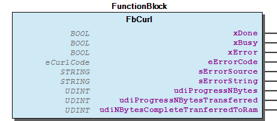

# WagoSysCurl v1.1.5.0 (WAGO) - Complete Documentation

## 📋 Library Information

- **Company:** WAGO
- **Title:** WagoSysCurl
- **Version:** 1.1.5.0
- **Categories:** WAGO Internal|Feature|Common; WAGO Internal|Feature|Network; WAGO Internal|Common; Application; WAGO LayerView|Sys
- **Author:** WAGO / u013972
- **Placeholder:** WagoSysCurl

### Description ¶

This document is automatically generated. Because of this, the chapter 30 Visualization is not shown in this document. If you are interested in getting to know more about visualization, we refer to the library manager of e!Cockpit.

This library provieds LibCurl-Functions [1]

This document is automatically generated. Because of this, the chapter 30 Visualization is not shown in this document. If you are interested in getting to know more about visualization, we refer to the library manager of e!Cockpit. This library provieds LibCurl-Functions [1]

### Contents: ¶

Contents: - Documentation Index - Project Information - Library Information - Function Blocks - Methods FbCurl.curl_easy_abort (METH) - FbCurl.curl_easy_cleanup (METH) - FbCurl.curl_easy_getResponseCode (METH) - FbCurl.curl_easy_init (METH) - FbCurl.curl_easy_perform (METH) - FbCurl.curl_easy_reset (METH) - FbCurl.curl_easy_setopt_BOOL (METH) - FbCurl.curl_easy_setopt_DINT (METH) - FbCurl.curl_easy_setopt_STRING (METH) - FbCurl.curl_easy_setopt_STRING2 (METH) - ... and 7 more Program Organization Global Variable Lists

### Indices and tables ¶

| [1] | Based on WagoSysCurl.library, last modified 14.01.2019, 19:14:39. The content of this file was automatically generated with None on 14.01.2019, 19:14:42 |

© WAGO Kontakttechnik GmbH & Co. KG, Germany 2018 – All rights reserved. For the avoidance of doubt, this copyright notice does not only apply to the information above but also and primarily to the described library itself. Please note that third-party products are always mentioned without reference to intellectual property rights, including patents, utility models, designs and trademarks, accordingly the existence of such rights cannot be excluded. WAGO is a registered trademark of WAGO Verwaltungsgesellschaft mbH.

- File and Project Information - Library Reference © WAGO Kontakttechnik GmbH & Co. KG, Germany 2018 – All rights reserved. For the avoidance of doubt, this copyright notice does not only apply to the information above but also and primarily to the described library itself. Please note that third-party products are always mentioned without reference to intellectual property rights, including patents, utility models, designs and trademarks, accordingly the existence of such rights cannot be excluded. WAGO is a registered trademark of WAGO Verwaltungsgesellschaft mbH.

### Documentation Index

## WagoSysCurl Library Documentation

| Company: | WAGO |
| Title: | WagoSysCurl |
| Version: | 1.1.5.0 |
| Categories: | WAGO Internal\|Feature\|Common; WAGO Internal\|Feature\|Network; WAGO Internal\|Common; Application; WAGO LayerView\|Sys |
| Author: | WAGO / u013972 |
| Placeholder: | WagoSysCurl |

### Description

This document is automatically generated. Because of this, the chapter 30 Visualization is not shown in this document. If you are interested in getting to know more about visualization, we refer to the library manager of e!Cockpit.

This library provieds LibCurl-Functions [1]

This document is automatically generated. Because of this, the chapter 30 Visualization is not shown in this document. If you are interested in getting to know more about visualization, we refer to the library manager of e!Cockpit. This library provieds LibCurl-Functions [1]

### Contents:

- 20 Program Organization Units FbCurl (FB) VersionHistory (GVL)

### Indices and tables

| [1] | Based on WagoSysCurl.library, last modified 14.01.2019, 19:14:39. The content of this file was automatically generated with None on 14.01.2019, 19:14:42 |

© WAGO Kontakttechnik GmbH & Co. KG, Germany 2018 – All rights reserved. For the avoidance of doubt, this copyright notice does not only apply to the information above but also and primarily to the described library itself. Please note that third-party products are always mentioned without reference to intellectual property rights, including patents, utility models, designs and trademarks, accordingly the existence of such rights cannot be excluded. WAGO is a registered trademark of WAGO Verwaltungsgesellschaft mbH.

- File and Project Information - Library Reference © WAGO Kontakttechnik GmbH & Co. KG, Germany 2018 – All rights reserved. For the avoidance of doubt, this copyright notice does not only apply to the information above but also and primarily to the described library itself. Please note that third-party products are always mentioned without reference to intellectual property rights, including patents, utility models, designs and trademarks, accordingly the existence of such rights cannot be excluded. WAGO is a registered trademark of WAGO Verwaltungsgesellschaft mbH.

### Project Information

## File and Project Information

| Scope | Name | Type | Content |
| --- | --- | --- | --- |
| FileHeader | libraryFile | string | WagoSysCurl.library |
| contentFile | WagoSysCurl_clr.json |
| productName | e!COCKPIT |
| creationDateTime | date | 14.01.2019, 19:14:42 |
| companyName | string | WAGO |
| ProjectInformation | LastModificationDateTime | date | 14.01.2019, 19:14:39 |
| Description | string | See: Description |
| Copyright | © WAGO Kontakttechnik GmbH & Co. KG, Germany 2018 – All rights reserved. |
| Author | WAGO / u013972 |
| AutoResolveUnbound | bool | True |
| Placeholder | string | WagoSysCurl |
| Company | WAGO |
| DocFormat | reStructuredText |
| Project | WagoSysCurl |
| DefaultNamespace |  |
| Version | version | 1.1.5.0 |
| Title | string | WagoSysCurl |
| Released | bool | False |
| LibraryCategories | library-category-list | WAGO Internal\|Feature\|Common; WAGO Internal\|Feature\|Network; WAGO Internal\|Common; Application; WAGO LayerView\|Sys |

### Library Information

## Library Reference

| LinkAllContent: False QualifiedOnly: False | SystemLibrary: False | Optional: False |

| LinkAllContent: False QualifiedOnly: False | SystemLibrary: False | Optional: False |

| LinkAllContent: False QualifiedOnly: False | SystemLibrary: False | Optional: False |

| LinkAllContent: False Optional: False | QualifiedOnly: False SystemLibrary: False | PublishSymbolsInContainer: True |

| LinkAllContent: False Optional: False | QualifiedOnly: False SystemLibrary: False | PublishSymbolsInContainer: True |

This is a dictionary of all referenced libraries and their name spaces.

This is a dictionary of all referenced libraries and their name spaces. WagoSysCurl_Internal_PFC Library Identification : Placeholder: WagoSysCurlInternal Default Resolution: WagoSysCurl_Internal_PFC, * (WAGO) Namespace: WagoSysCurlInternal Library Properties : WagoSysString Library Identification : Placeholder: WagoSysString Default Resolution: WagoSysString, * (WAGO) Namespace: WagoSysString Library Properties : WagoSysVersion Library Identification : Name: WagoSysVersion Version: 1.0.0.0 Company: WAGO Namespace: WagoSysVersion Library Properties : WagoTypesCommon Library Identification : Placeholder: WagoTypesCommon Default Resolution: WagoTypesCommon, * (WAGO) Namespace: WagoTypes Library Properties : WagoTypesCurl Library Identification : Placeholder: WagoTypesCurl Default Resolution: WagoTypesCurl, * (WAGO) Namespace: WagoTypesCurl Library Properties :

### Function Blocks

## FbCurl (FB)

| Scope | Name | Type | Comment |
| --- | --- | --- | --- |
| Output | xDone | BOOL | Successful completion of the action. |
| xBusy | BOOL | Action is still in progress. |
| xError | BOOL | Indicates an error. |
| eErrorCode | WagoTypesCurl.eCurlCode | Curl specific error code. |
| sErrorSource | STRING(255) | Source of an error. |
| sErrorString | STRING(255) | Error string that describes the error |
| udiProgressNBytes | UDINT | Number of Bytes to transfer |
| udiProgressNBytesTransferred | UDINT | Number of Bytes, that are currently transferred |
| udiNBytesCompleteTranferredToRam | UDINT | Number of Bytes, that are transferred to RAM in the execution. This output is set if the execution is finished. |

Provides libCurl functions

Graphical Illustration

Function description

This Fb provides libCurl functions of the easy interface. The Fb holdes a curl easy handle internal

Interface variables Function Provides libCurl functions Graphical Illustration  Function description This Fb provides libCurl functions of the easy interface. The Fb holdes a curl easy handle internal - FbCurl.curl_easy_abort (METH) - FbCurl.curl_easy_cleanup (METH) - FbCurl.curl_easy_getResponseCode (METH) - FbCurl.curl_easy_init (METH) - FbCurl.curl_easy_perform (METH) - FbCurl.curl_easy_reset (METH) - FbCurl.curl_easy_setopt_BOOL (METH) - FbCurl.curl_easy_setopt_DINT (METH) - FbCurl.curl_easy_setopt_STRING (METH) - FbCurl.curl_easy_setopt_STRING2 (METH) - FbCurl.curl_easy_setopt_slist (METH) - FbCurl.curl_set_FilePath (METH) - FbCurl.curl_set_LogFile (METH) - FbCurl.curl_set_RAM (METH) - FbCurl.curl_slist_append (METH) - FbCurl.curl_slist_append2 (METH) - FbCurl.curl_slist_free_all (METH)

### Methods

## FbCurl.curl_easy_abort (METH)

Abort the current operation

Function description

This method aborts the current operation.

Function Abort the current operation Function description This method aborts the current operation.

## FbCurl.curl_easy_cleanup (METH)

End a libcurl easy handle

Function description

This method must be the last function to call for an easy session.

For more information see: http://curl.haxx.se/libcurl/c/curl_easy_cleanup.html

Function End a libcurl easy handle Function description This method must be the last function to call for an easy session. For more information see: http://curl.haxx.se/libcurl/c/curl_easy_cleanup.html

## FbCurl.curl_easy_getResponseCode (METH)

| Scope | Name | Type |
| --- | --- | --- |
| Return | curl_easy_getResponseCode | LINT |

Return the response code of the protocol

Function description

Return the response code of the protocol.

https://curl.haxx.se/libcurl/c/CURLINFO_RESPONSE_CODE.html

Interface variables Function* Return the response code of the protocol Function description Return the response code of the protocol. https://curl.haxx.se/libcurl/c/CURLINFO_RESPONSE_CODE.html

## FbCurl.curl_easy_init (METH)

Start a libcurl easy session

Function description

This method must be the first function to call, and it initialize the CURL easy handle.

For more information see: http://curl.haxx.se/libcurl/c/curl_easy_init.html

Function Start a libcurl easy session Function description This method must be the first function to call, and it initialize the CURL easy handle. For more information see: http://curl.haxx.se/libcurl/c/curl_easy_init.html

## FbCurl.curl_easy_perform (METH)

Perform the configurated operation

Function description

Invoke this method after curl_easy_init and all the curl_easy_setopt calls are made, and will perform the transfer as described in the options.

For more information see: http://curl.haxx.se/libcurl/c/curl_easy_perform.html

Function Perform the configurated operation Function description Invoke this method after curl_easy_init and all the curl_easy_setopt calls are made, and will perform the transfer as described in the options. For more information see: http://curl.haxx.se/libcurl/c/curl_easy_perform.html

## FbCurl.curl_easy_reset (METH)

Resets all configurated options to their default settings

Function description

This method resets all configurated options of the easy handle to their default settings.

Function Resets all configurated options to their default settings Function description This method resets all configurated options of the easy handle to their default settings.

## FbCurl.curl_easy_setopt_BOOL (METH)

| Scope | Name | Type |
| --- | --- | --- |
| Input | eCurlOption | WagoTypesCurl.eCurlOptions_BOOL |
| xParameter | BOOL |

Sets options for a curl easy handle

Function description

This method sets the options for a curl easy handle.

For more information see: http://curl.haxx.se/libcurl/c/curl_easy_setopt.html

Interface variables Function Sets options for a curl easy handle Function description This method sets the options for a curl easy handle. For more information see: http://curl.haxx.se/libcurl/c/curl_easy_setopt.html

## FbCurl.curl_easy_setopt_DINT (METH)

| Scope | Name | Type |
| --- | --- | --- |
| Input | eCurlOption | WagoTypesCurl.eCurlOptions_DINT |
| diParameter | DINT |

Sets options for a curl easy handle

Function description

This method sets the options for a curl easy handle.

For more information see: http://curl.haxx.se/libcurl/c/curl_easy_setopt.html

Interface variables Function Sets options for a curl easy handle Function description This method sets the options for a curl easy handle. For more information see: http://curl.haxx.se/libcurl/c/curl_easy_setopt.html

## FbCurl.curl_easy_setopt_STRING (METH)

| Scope | Name | Type |
| --- | --- | --- |
| Input | eCurlOption | WagoTypesCurl.eCurlOptions_STRING |
| sParameter | STRING(1023) |

Sets options for a curl easy handle

Function description

This method sets the options for a curl easy handle.

For the option CURLOPT_URL the parameter ‘sParameter’ must be encoded as described in RFC 3986. Amongst other things special characters must be written in the percent-encoding, e.g. for a space as %20.

For more information see: http://curl.haxx.se/libcurl/c/curl_easy_setopt.html

Interface variables Function Sets options for a curl easy handle Function description This method sets the options for a curl easy handle. Note For the option CURLOPT_URL the parameter ‘sParameter’ must be encoded as described in RFC 3986. Amongst other things special characters must be written in the percent-encoding, e.g. for a space as %20. For more information see: http://curl.haxx.se/libcurl/c/curl_easy_setopt.html

## FbCurl.curl_easy_setopt_STRING2 (METH)

| Scope | Name | Type | Comment |
| --- | --- | --- | --- |
| Input | eCurlOption | WagoTypesCurl.eCurlOptions_STRING |  |
| pString | POINTER TO STRING | Pointer to the STRING |
| udiStringLength | UDINT | Length of the STRING |

Sets options for a curl easy handle

Function description

This method sets the options for a curl easy handle.

For the option CURLOPT_URL the STRING must be encoded as described in RFC 3986. Amongst other things special characters must be written in the percent-encoding, e.g. for a space as %20.

For more information see: http://curl.haxx.se/libcurl/c/curl_easy_setopt.html

Interface variables Function Sets options for a curl easy handle Function description This method sets the options for a curl easy handle. Note For the option CURLOPT_URL the STRING must be encoded as described in RFC 3986. Amongst other things special characters must be written in the percent-encoding, e.g. for a space as %20. For more information see: http://curl.haxx.se/libcurl/c/curl_easy_setopt.html

## FbCurl.curl_easy_setopt_slist (METH)

| Scope | Name | Type |
| --- | --- | --- |
| Input | eCurlOption | WagoTypesCurl.eCurlOptions_slist |
| uiSlistIndex | UINT |

Sets options for a curl easy handle

Function description

This method sets the options for a curl easy handle. slists with a index form 0..9 are available, the slist with the index 0 is empty.

For more information see: http://curl.haxx.se/libcurl/c/curl_easy_setopt.html

Interface variables Function Sets options for a curl easy handle Function description This method sets the options for a curl easy handle. slists with a index form 0..9 are available, the slist with the index 0 is empty. For more information see: http://curl.haxx.se/libcurl/c/curl_easy_setopt.html

## FbCurl.curl_set_FilePath (METH)

| Scope | Name | Type |
| --- | --- | --- |
| Input | sFilePath | STRING(255) |

Sets the local file path

Function description

This method sets the local file path for a file transfer.

Interface variables Function Sets the local file path Function description This method sets the local file path for a file transfer.

## FbCurl.curl_set_LogFile (METH)

| Scope | Name | Type |
| --- | --- | --- |
| Input | sFilePath | STRING(255) |

Sets the local file path for the log file

Function description

This method sets the local file path for the log file.

Interface variables Function Sets the local file path for the log file Function description This method sets the local file path for the log file.

## FbCurl.curl_set_RAM (METH)

| Scope | Name | Type |
| --- | --- | --- |
| Input | pAddress | POINTER TO BYTE |
| udiSize | UDINT |

Sets the buffer

Function description

This method sets the buffer for a file transfer.

Interface variables Function Sets the buffer Function description This method sets the buffer for a file transfer.

## FbCurl.curl_slist_append (METH)

| Scope | Name | Type | Comment |
| --- | --- | --- | --- |
| Input | uiSlistIndex | UINT | uiSlistIndex = 0, is an empty slist for reset quote-commands and should not be overwritten |
| sString | STRING(255) |  |

Appends a STRING to a slist

Function description

This method appends a STRING to a slist. slists with a index form 1..9 are available for this method.

Interface variables Function Appends a STRING to a slist Function description This method appends a STRING to a slist. slists with a index form 1..9 are available for this method.

## FbCurl.curl_slist_append2 (METH)

| Scope | Name | Type | Comment |
| --- | --- | --- | --- |
| Input | uiSlistIndex | UINT | uiSlistIndex = 0, is an empty slist for reset quote-commands and should not be overwritten |
| pString | POINTER TO STRING | Pointer to the STRING |
| udiStringLength | UDINT | Length of the STRING |

Appends a STRING to a slist

Function description

This method appends a STRING to a slist. slists with a index form 1..9 are available for this method.

Interface variables Function Appends a STRING to a slist Function description This method appends a STRING to a slist. slists with a index form 1..9 are available for this method.

## FbCurl.curl_slist_free_all (METH)

| Scope | Name | Type |
| --- | --- | --- |
| Input | uiSlistIndex | UINT |

Free a slist

Function description

This method free all entrys in the slist, the slist is empty after this method.

Interface variables Function Free a slist Function description This method free all entrys in the slist, the slist is empty after this method.

### Program Organization

## 20 Program Organization Units

- FbCurl (FB) FbCurl.curl_easy_abort (METH) - FbCurl.curl_easy_cleanup (METH) - FbCurl.curl_easy_getResponseCode (METH) - FbCurl.curl_easy_init (METH) - FbCurl.curl_easy_perform (METH) - FbCurl.curl_easy_reset (METH) - FbCurl.curl_easy_setopt_BOOL (METH) - FbCurl.curl_easy_setopt_DINT (METH) - FbCurl.curl_easy_setopt_STRING (METH) - FbCurl.curl_easy_setopt_STRING2 (METH) - FbCurl.curl_easy_setopt_slist (METH) - FbCurl.curl_set_FilePath (METH) - FbCurl.curl_set_LogFile (METH) - FbCurl.curl_set_RAM (METH) - FbCurl.curl_slist_append (METH) - FbCurl.curl_slist_append2 (METH) - FbCurl.curl_slist_free_all (METH)

### Global Variable Lists

## VersionHistory (GVL)

| Name | Type |
| --- | --- |
| Info | ProjectInfo |

WagoSysCurl