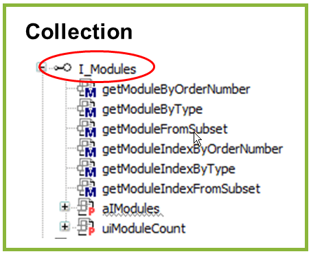

# WagoSysDynamicIoMapping v1.0.4.4 (WAGO) - Complete Documentation


## 📋 Library Information

- **Company:** WAGO
- **Title:** WagoSysDynamicIoMapping
- **Version:** 1.0.4.4
- **Categories:** WAGO Internal|Feature|LocalBus|K-Bus; WAGO LayerView|Sys; Application
- **Namespace:** WagoSysDynamicIoMapping
- **Author:** WAGO / u010545
- **Placeholder:** WagoSysDynamicIoMapping

### Description ¶


This document is automatically generated.

Library for dynamic IO mapping

This document is automatically generated. Library for dynamic IO mapping

### Contents: ¶


Contents: - Documentation Index 10 Documentation - WagoSysDynamicIoMapping Library Documentation Project Information Library Information Function Blocks - FbInputChannelSubsetByFilter (FB) - FbInputChannelSubsetByType (FB) - FbModuleSubsetByFilter (FB) - FbModuleSubsetByType (FB) - FbOutputChannelSubsetByFilter (FB) - FbOutputChannelSubsetByType (FB) - doc01_Foreword (FB) - doc10_SystemProperties (FB) Methods - I_Module.GetModuleInputSize (METH) - I_Module.GetModuleOutputSize (METH) - I_Module.GetProcessInBit (METH) - I_Module.GetProcessInByte (METH) - I_Module.GetProcessInData (METH) - I_Module.GetProcessInDword (METH) - I_Module.GetProcessInWord (METH) - I_Module.GetProcessOutBit (METH) - I_Module.GetProcessOutByte (METH) - I_Module.GetProcessOutData (METH) - ... and 13 more Interfaces - I_InputChannel (ITF) - I_Module (ITF) - I_ModuleInterfaces (ITF) - I_Modules (ITF) - I_OutputChannel (ITF) Program Organization Base Components - I_ModuleInterfaces.I_ModuleBase (PROP) - I_ModuleInterfaces.I_WagoSysComBase (PROP) Global Variable Lists - DynIoManager (GVL) - ErrorDynMapping (GVL) - VersionHistory (GVL) Other Components - 00 Status - 01 Typ 1 (complex) - 02 Typ 2 (analog) - 03 Common Input / Output - 10 Common - 750 - 750 - 753 - 75x - 75x - ... and 96 more

### Indices and tables ¶


Based on WagoSysDynamicIoMapping.library, last modified 29.05.2024, 20:29:47. LibDoc 3.5.16.10

© WAGO GmbH & Co. KG, Germany 2018 – All rights reserved. For the avoidance of doubt, this copyright notice does not only apply to the information above but also and primarily to the described library itself. Please note that third-party products are always mentioned without reference to intellectual property rights, including patents, utility models, designs and trademarks, accordingly the existence of such rights cannot be excluded. WAGO is a registered trademark of WAGO Verwaltungsgesellschaft mbH.

- File and Project Information - Library Reference Based on WagoSysDynamicIoMapping.library, last modified 29.05.2024, 20:29:47. LibDoc 3.5.16.10 © WAGO GmbH & Co. KG, Germany 2018 – All rights reserved. For the avoidance of doubt, this copyright notice does not only apply to the information above but also and primarily to the described library itself. Please note that third-party products are always mentioned without reference to intellectual property rights, including patents, utility models, designs and trademarks, accordingly the existence of such rights cannot be excluded. WAGO is a registered trademark of WAGO Verwaltungsgesellschaft mbH.

### Documentation Index


## 10 Documentation


To ensure fast installation and start-up of the units, we strongly recommend that the following information and explanations are carefully read and adhered to.

To ensure fast installation and start-up of the units, we strongly recommend that the following information and explanations are carefully read and adhered to. - doc01_Foreword (FB) - doc10_SystemProperties (FB)

## WagoSysDynamicIoMapping Library Documentation


| Company: | WAGO |
| Title: | WagoSysDynamicIoMapping |
| Version: | 1.0.4.4 |
| Categories: | WAGO Internal\|Feature\|LocalBus\|K-Bus; WAGO LayerView\|Sys; Application |
| Namespace: | WagoSysDynamicIoMapping |
| Author: | WAGO / u010545 |
| Placeholder: | WagoSysDynamicIoMapping |

### Description


This document is automatically generated.

Library for dynamic IO mapping

This document is automatically generated. Library for dynamic IO mapping

### Contents:


- 10 Documentation doc01_Foreword (FB) - doc10_SystemProperties (FB) 20 Program Organization Units - Collection Channels - Collection Modules 80 Status - ErrorDynMapping (GVL) - eErrorDynMapping (ENUM) DynIoManager (GVL) Parameter (PARAMS) VersionHistory (GVL)

### Indices and tables


Based on WagoSysDynamicIoMapping.library, last modified 29.05.2024, 20:29:47. LibDoc 3.5.16.10

© WAGO GmbH & Co. KG, Germany 2018 – All rights reserved. For the avoidance of doubt, this copyright notice does not only apply to the information above but also and primarily to the described library itself. Please note that third-party products are always mentioned without reference to intellectual property rights, including patents, utility models, designs and trademarks, accordingly the existence of such rights cannot be excluded. WAGO is a registered trademark of WAGO Verwaltungsgesellschaft mbH.

- File and Project Information - Library Reference Based on WagoSysDynamicIoMapping.library, last modified 29.05.2024, 20:29:47. LibDoc 3.5.16.10 © WAGO GmbH & Co. KG, Germany 2018 – All rights reserved. For the avoidance of doubt, this copyright notice does not only apply to the information above but also and primarily to the described library itself. Please note that third-party products are always mentioned without reference to intellectual property rights, including patents, utility models, designs and trademarks, accordingly the existence of such rights cannot be excluded. WAGO is a registered trademark of WAGO Verwaltungsgesellschaft mbH.

### Project Information


## File and Project Information


| Scope | Name | Type | Content |
| --- | --- | --- | --- |
| FileHeader | libraryFile | string | WagoSysDynamicIoMapping.library |
| contentFile | doc.clean.json |
| productName | e!COCKPIT |
| creationDateTime | date | 29.05.2024, 20:29:50 |
| companyName | string | WAGO |
| ProjectInformation | LastModificationDateTime | date | 29.05.2024, 20:29:47 |
| Description | string | See: Description |
| Copyright | © WAGO Kontakttechnik GmbH & Co. KG, Germany 2018 – All rights reserved. |
| Author | WAGO / u010545 |
| AutoResolveUnbound | bool | True |
| Placeholder | string | WagoSysDynamicIoMapping |
| Company | WAGO |
| DocFormat | reStructuredText |
| Project | WagoSysDynamicIoMapping |
| DefaultNamespace | WagoSysDynamicIoMapping |
| Version | version | 1.0.4.4 |
| Title | string | WagoSysDynamicIoMapping |
| LibraryCategories | library-category-list | WAGO Internal\|Feature\|LocalBus\|K-Bus; WAGO LayerView\|Sys; Application |
| CompiledLibraryCompatibilityVersion | string | CODESYS V3.5 SP16 Patch 3 |

### Library Information


## Library Reference


| LinkAllContent: False QualifiedOnly: False | SystemLibrary: False | Optional: False |

| LinkAllContent: False QualifiedOnly: True | SystemLibrary: False | Optional: False |

| LinkAllContent: False QualifiedOnly: False | SystemLibrary: False | Optional: False |

| LinkAllContent: False QualifiedOnly: True | SystemLibrary: False | Optional: False |

| LinkAllContent: False QualifiedOnly: False | SystemLibrary: False | Optional: False |

| LinkAllContent: False QualifiedOnly: False | SystemLibrary: False | Optional: False |

| LinkAllContent: False QualifiedOnly: False | SystemLibrary: True | Optional: False |

| LinkAllContent: False QualifiedOnly: False | SystemLibrary: True | Optional: False |

| LinkAllContent: False QualifiedOnly: False | SystemLibrary: True | Optional: False |

| LinkAllContent: False QualifiedOnly: False | SystemLibrary: True | Optional: False |

| LinkAllContent: False QualifiedOnly: False | SystemLibrary: True | Optional: False |

| LinkAllContent: False QualifiedOnly: False | SystemLibrary: True | Optional: False |

| LinkAllContent: False QualifiedOnly: False | SystemLibrary: True | Optional: False |

| LinkAllContent: False QualifiedOnly: False | SystemLibrary: True | Optional: False |

| LinkAllContent: False QualifiedOnly: False | SystemLibrary: True | Optional: False |

| LinkAllContent: False QualifiedOnly: False | SystemLibrary: True | Optional: False |

| LinkAllContent: False QualifiedOnly: False | SystemLibrary: True | Optional: False |

| LinkAllContent: False Optional: False | QualifiedOnly: False SystemLibrary: True | PublishSymbolsInContainer: True |

| LinkAllContent: False QualifiedOnly: False | SystemLibrary: True | Optional: False |

| LinkAllContent: False Optional: False | QualifiedOnly: True SystemLibrary: False | PublishSymbolsInContainer: True |

| LinkAllContent: False QualifiedOnly: True | SystemLibrary: False | Optional: False |

| LinkAllContent: False QualifiedOnly: False | SystemLibrary: False | Optional: False |

| LinkAllContent: False QualifiedOnly: True | SystemLibrary: False | Optional: False |

| LinkAllContent: False QualifiedOnly: True | SystemLibrary: False | Optional: False |

| LinkAllContent: False QualifiedOnly: True | SystemLibrary: False | Optional: False |

| LinkAllContent: False QualifiedOnly: True | SystemLibrary: False | Optional: False |

| LinkAllContent: False QualifiedOnly: True | SystemLibrary: False | Optional: False |

| LinkAllContent: False QualifiedOnly: True | SystemLibrary: False | Optional: False |

| LinkAllContent: False QualifiedOnly: True | SystemLibrary: False | Optional: False |

| LinkAllContent: False QualifiedOnly: True | SystemLibrary: False | Optional: False |

| LinkAllContent: False QualifiedOnly: True | SystemLibrary: False | Optional: False |

| LinkAllContent: False QualifiedOnly: True | SystemLibrary: False | Optional: False |

| LinkAllContent: False QualifiedOnly: True | SystemLibrary: False | Optional: False |

| LinkAllContent: False QualifiedOnly: True | SystemLibrary: False | Optional: False |

| LinkAllContent: False QualifiedOnly: True | SystemLibrary: False | Optional: False |

| LinkAllContent: False QualifiedOnly: True | SystemLibrary: False | Optional: False |

| LinkAllContent: False QualifiedOnly: True | SystemLibrary: False | Optional: False |

| LinkAllContent: False QualifiedOnly: True | SystemLibrary: False | Optional: False |

| LinkAllContent: False QualifiedOnly: True | SystemLibrary: False | Optional: False |

| LinkAllContent: False QualifiedOnly: True | SystemLibrary: False | Optional: False |

| LinkAllContent: False QualifiedOnly: True | SystemLibrary: False | Optional: False |

| LinkAllContent: False QualifiedOnly: True | SystemLibrary: False | Optional: False |

| LinkAllContent: False QualifiedOnly: True | SystemLibrary: False | Optional: False |

| LinkAllContent: False QualifiedOnly: True | SystemLibrary: False | Optional: False |

| LinkAllContent: False QualifiedOnly: True | SystemLibrary: False | Optional: False |

| LinkAllContent: False QualifiedOnly: True | SystemLibrary: False | Optional: False |

| LinkAllContent: False QualifiedOnly: True | SystemLibrary: False | Optional: False |

| LinkAllContent: False QualifiedOnly: True | SystemLibrary: False | Optional: False |

| LinkAllContent: False QualifiedOnly: True | SystemLibrary: False | Optional: False |

| LinkAllContent: False QualifiedOnly: True | SystemLibrary: False | Optional: False |

| LinkAllContent: False QualifiedOnly: True | SystemLibrary: False | Optional: False |

| LinkAllContent: False QualifiedOnly: True | SystemLibrary: False | Optional: False |

| LinkAllContent: False QualifiedOnly: True | SystemLibrary: False | Optional: False |

| LinkAllContent: False QualifiedOnly: True | SystemLibrary: False | Optional: False |

| LinkAllContent: False QualifiedOnly: True | SystemLibrary: False | Optional: False |

| LinkAllContent: False QualifiedOnly: True | SystemLibrary: False | Optional: False |

| LinkAllContent: False QualifiedOnly: True | SystemLibrary: False | Optional: False |

| LinkAllContent: False QualifiedOnly: True | SystemLibrary: False | Optional: False |

| LinkAllContent: False QualifiedOnly: True | SystemLibrary: False | Optional: False |

| LinkAllContent: False QualifiedOnly: True | SystemLibrary: False | Optional: False |

| LinkAllContent: False QualifiedOnly: True | SystemLibrary: False | Optional: False |

| LinkAllContent: False QualifiedOnly: True | SystemLibrary: False | Optional: False |

| LinkAllContent: False QualifiedOnly: True | SystemLibrary: False | Optional: False |

| LinkAllContent: False QualifiedOnly: True | SystemLibrary: False | Optional: False |

| LinkAllContent: False QualifiedOnly: True | SystemLibrary: False | Optional: False |

| LinkAllContent: False QualifiedOnly: True | SystemLibrary: False | Optional: False |

| LinkAllContent: False QualifiedOnly: True | SystemLibrary: False | Optional: False |

| LinkAllContent: False QualifiedOnly: True | SystemLibrary: False | Optional: False |

| LinkAllContent: False QualifiedOnly: True | SystemLibrary: False | Optional: False |

| LinkAllContent: False QualifiedOnly: True | SystemLibrary: False | Optional: False |

| LinkAllContent: False Optional: False | QualifiedOnly: True SystemLibrary: False | PublishSymbolsInContainer: True |

| LinkAllContent: False QualifiedOnly: False | SystemLibrary: False | Optional: False |

| LinkAllContent: False Optional: False | QualifiedOnly: False SystemLibrary: False | PublishSymbolsInContainer: True |

| LinkAllContent: False Optional: False | QualifiedOnly: False SystemLibrary: False | PublishSymbolsInContainer: True |

| LinkAllContent: False Optional: False | QualifiedOnly: True SystemLibrary: False | PublishSymbolsInContainer: True |

| LinkAllContent: False Optional: False | QualifiedOnly: False SystemLibrary: False | PublishSymbolsInContainer: True |

| LinkAllContent: False Optional: False | QualifiedOnly: False SystemLibrary: False | PublishSymbolsInContainer: True |

| LinkAllContent: False Optional: False | QualifiedOnly: False SystemLibrary: False | PublishSymbolsInContainer: True |

| LinkAllContent: False Optional: False | QualifiedOnly: False SystemLibrary: False | PublishSymbolsInContainer: True |

| LinkAllContent: False Optional: False | QualifiedOnly: False SystemLibrary: False | PublishSymbolsInContainer: True |

| LinkAllContent: False Optional: False | QualifiedOnly: False SystemLibrary: False | PublishSymbolsInContainer: True |

| LinkAllContent: False Optional: False | QualifiedOnly: False SystemLibrary: False | PublishSymbolsInContainer: True |

| LinkAllContent: False Optional: False | QualifiedOnly: False SystemLibrary: False | PublishSymbolsInContainer: True |

| LinkAllContent: False Optional: False | QualifiedOnly: False SystemLibrary: False | PublishSymbolsInContainer: True |

| LinkAllContent: False Optional: False | QualifiedOnly: False SystemLibrary: False | PublishSymbolsInContainer: True |

| LinkAllContent: False Optional: False | QualifiedOnly: False SystemLibrary: False | PublishSymbolsInContainer: True |

| LinkAllContent: False Optional: False | QualifiedOnly: False SystemLibrary: False | PublishSymbolsInContainer: True |

| LinkAllContent: False Optional: False | QualifiedOnly: False SystemLibrary: False | PublishSymbolsInContainer: True |

| LinkAllContent: False QualifiedOnly: False | SystemLibrary: False | Optional: False |

| LinkAllContent: False Optional: False | QualifiedOnly: False SystemLibrary: False | PublishSymbolsInContainer: True |

| LinkAllContent: False Optional: False | QualifiedOnly: False SystemLibrary: False | PublishSymbolsInContainer: True |

| LinkAllContent: False Optional: False | QualifiedOnly: False SystemLibrary: False | PublishSymbolsInContainer: True |

| LinkAllContent: False Optional: False | QualifiedOnly: False SystemLibrary: False | PublishSymbolsInContainer: True |

| LinkAllContent: False Optional: False | QualifiedOnly: False SystemLibrary: False | PublishSymbolsInContainer: True |

| LinkAllContent: False Optional: False | QualifiedOnly: False SystemLibrary: False | PublishSymbolsInContainer: True |

| LinkAllContent: False Optional: False | QualifiedOnly: False SystemLibrary: False | PublishSymbolsInContainer: True |

| LinkAllContent: False Optional: False | QualifiedOnly: False SystemLibrary: False | PublishSymbolsInContainer: True |

| LinkAllContent: False Optional: False | QualifiedOnly: True SystemLibrary: False | PublishSymbolsInContainer: True |

| LinkAllContent: False Optional: False | QualifiedOnly: False SystemLibrary: False | PublishSymbolsInContainer: True |

| LinkAllContent: False Optional: False | QualifiedOnly: False SystemLibrary: False | PublishSymbolsInContainer: True |

| LinkAllContent: False Optional: False | QualifiedOnly: False SystemLibrary: False | PublishSymbolsInContainer: True |

| LinkAllContent: False Optional: False | QualifiedOnly: False SystemLibrary: False | PublishSymbolsInContainer: True |

| LinkAllContent: False Optional: False | QualifiedOnly: False SystemLibrary: False | PublishSymbolsInContainer: True |

| LinkAllContent: False Optional: False | QualifiedOnly: False SystemLibrary: False | PublishSymbolsInContainer: True |

| LinkAllContent: False Optional: False | QualifiedOnly: False SystemLibrary: False | PublishSymbolsInContainer: True |

| LinkAllContent: False Optional: False | QualifiedOnly: False SystemLibrary: False | PublishSymbolsInContainer: True |

| LinkAllContent: False Optional: False | QualifiedOnly: False SystemLibrary: False | PublishSymbolsInContainer: True |

| LinkAllContent: False Optional: False | QualifiedOnly: False SystemLibrary: False | PublishSymbolsInContainer: True |

| LinkAllContent: False Optional: False | QualifiedOnly: False SystemLibrary: False | PublishSymbolsInContainer: True |

| LinkAllContent: False Optional: False | QualifiedOnly: False SystemLibrary: False | PublishSymbolsInContainer: True |

| LinkAllContent: False Optional: False | QualifiedOnly: False SystemLibrary: False | PublishSymbolsInContainer: True |

| LinkAllContent: False Optional: False | QualifiedOnly: False SystemLibrary: False | PublishSymbolsInContainer: True |

| LinkAllContent: False Optional: False | QualifiedOnly: False SystemLibrary: False | PublishSymbolsInContainer: True |

| LinkAllContent: False Optional: False | QualifiedOnly: False SystemLibrary: False | PublishSymbolsInContainer: True |

| LinkAllContent: False Optional: False | QualifiedOnly: False SystemLibrary: False | PublishSymbolsInContainer: True |

| LinkAllContent: False Optional: False | QualifiedOnly: False SystemLibrary: False | PublishSymbolsInContainer: True |

| LinkAllContent: False QualifiedOnly: False | SystemLibrary: False PublishSymbolsInContainer: True | Optional: False |

| LinkAllContent: False QualifiedOnly: True | SystemLibrary: False | Optional: False |

| LinkAllContent: False QualifiedOnly: False | SystemLibrary: False | Optional: False |

| LinkAllContent: False Optional: False | QualifiedOnly: False SystemLibrary: False | PublishSymbolsInContainer: True |

| LinkAllContent: False Optional: False | QualifiedOnly: False SystemLibrary: False | PublishSymbolsInContainer: True |

This is a dictionary of all referenced libraries and their name spaces.

This is a dictionary of all referenced libraries and their name spaces. CmpApp Library Identification : Placeholder: CmpApp Default Resolution: CmpApp, * (System) Namespace: CmpApp Library Properties : CmpIecTask Library Identification : Placeholder: CmpIecTask Default Resolution: CmpIecTask, * (System) Namespace: CmpIecTask Library Properties : CmpLog Library Identification : Placeholder: CmpLog Default Resolution: CmpLog, * (System) Namespace: CmpLog Library Properties : Standard Library Identification : Placeholder: Standard Default Resolution: Standard, * (System) Namespace: Standard Library Properties : SysCpuHandling Library Identification : Placeholder: SysCpuHandling Default Resolution: SysCpuHandling, * (System) Namespace: SysCpuHandling Library Properties : SysSocket Library Identification : Placeholder: SysSocket Default Resolution: SysSocket, * (System) Namespace: SysSocket Library Properties : VisuElem3DPath Library Identification : Placeholder: System_VisuElem3DPath Default Resolution: VisuElem3DPath, 3.5.7.0 (System) Namespace: VisuElem3DPath Library Properties : Library Parameter : Parameter: GC_POINTS_PER_POLYGON = 100 VisuElemCamDisplayer Library Identification : Placeholder: System_VisuElemCamDisplayer Default Resolution: VisuElemCamDisplayer, 3.5.7.0 (System) Namespace: VisuElemCamDisplayer Library Properties : Library Parameter : Parameter: GC_POINTS_PER_CAM = 100 VisuElemMeter Library Identification : Placeholder: System_VisuElemMeter Default Resolution: VisuElemMeter, 3.5.7.0 (System) Namespace: VisuElemMeter Library Properties : VisuElemTextEditor Library Identification : Placeholder: System_VisuElemTextEditor Default Resolution: VisuElemTextEditor, 3.5.7.0 (System) Namespace: VisuElemTextEditor Library Properties : VisuElemTrace Library Identification : Placeholder: System_VisuElemTrace Default Resolution: VisuElemTrace, 3.5.7.0 (System) Namespace: VisuElemTrace Library Properties : VisuElemXYChart Library Identification : Placeholder: System_VisuElemXYChart Default Resolution: VisuElemXYChart, 3.5.14.0 (System) Namespace: VisuElemXYChart Library Properties : VisuElems Library Identification : Placeholder: System_VisuElems Default Resolution: VisuElems, 3.5.7.0 (System) Namespace: VisuElems Library Properties : VisuElemsAlarm Library Identification : Placeholder: System_VisuElemsAlarm Default Resolution: VisuElemsAlarm, 3.5.7.0 (System) Namespace: VisuElemsAlarm Library Properties : VisuElemsDateTime Library Identification : Placeholder: System_VisuElemsDateTime Default Resolution: VisuElemsDateTime, 3.5.7.0 (System) Namespace: VisuElemsDateTime Library Properties : VisuElemsSpecialControls Library Identification : Placeholder: System_VisuElemsSpecialControls Default Resolution: VisuElemsSpecialControls, 3.5.7.0 (System) Namespace: VisuElemsSpecialControls Library Properties : VisuElemsWinControls Library Identification : Placeholder: System_VisuElemsWinControls Default Resolution: VisuElemsWinControls, 3.5.7.0 (System) Namespace: VisuElemsWinControls Library Properties : VisuInputs Library Identification : Placeholder: system_visuinputs Default Resolution: VisuInputs, 3.5.16.30 (System) Namespace: visuinputs Library Properties : VisuNativeControl Library Identification : Placeholder: System_VisuNativeControl Default Resolution: VisuNativeControl, 3.5.7.0 (System) Namespace: VisuNativeControl Library Properties : WagoSysErrorBase Library Identification : Placeholder: WagoSysErrorBase Default Resolution: WagoSysErrorBase, * (WAGO) Namespace: WagoSysErrorBase Library Properties : WagoSysKbusServices Library Identification : Placeholder: WagoSysKbusServices Default Resolution: WagoSysKbusServices, * (WAGO) Namespace: WagoSysKbusServices Library Properties : WagoSysKbusTerminalControl Library Identification : Placeholder: WagoSysKbusTerminalControl Default Resolution: WagoSysKbusTerminalControl, * (WAGO) Namespace: WagoSysKbusTerminalControl Library Properties : WagoSysModuleBase Library Identification : Placeholder: WagoSysModuleBase Default Resolution: WagoSysModuleBase, * (WAGO) Namespace: WagoSysModuleBase Library Properties : WagoSysModule_750_450 Library Identification : Placeholder: WagoSysModule_750_450 Default Resolution: WagoSysModule_750_450, * (WAGO) Namespace: WagoSysModule_750_450 Library Properties : WagoSysModule_750_451 Library Identification : Placeholder: WagoSysModule_750_451 Default Resolution: WagoSysModule_750_451, * (WAGO) Namespace: WagoSysModule_750_451 Library Properties : WagoSysModule_750_463 Library Identification : Placeholder: WagoSysModule_750_463 Default Resolution: WagoSysModule_750_463, * (WAGO) Namespace: WagoSysModule_750_463 Library Properties : WagoSysModule_750_464 Library Identification : Placeholder: WagoSysModule_750_464 Default Resolution: WagoSysModule_750_464, * (WAGO) Namespace: WagoSysModule_750_464 Library Properties : WagoSysModule_750_630 Library Identification : Placeholder: WagoSysModule_750_630 Default Resolution: WagoSysModule_750_630, * (WAGO) Namespace: WagoSysModule_750_630 Library Properties : WagoSysModule_750_636 Library Identification : Placeholder: WagoSysModule_750_636 Default Resolution: WagoSysModule_750_636, * (WAGO) Namespace: WagoSysModule_750_636 Library Properties : WagoSysModule_750_642 Library Identification : Placeholder: WagoSysModule_750_642 Default Resolution: WagoSysModule_750_642, * (WAGO) Namespace: WagoSysModule_750_642 Library Properties : WagoSysModule_750_643 Library Identification : Placeholder: WagoSysModule_750_643 Default Resolution: WagoSysModule_750_643, * (WAGO) Namespace: WagoSysModule_750_643 Library Properties : WagoSysModule_753_163x Library Identification : Placeholder: WagoSysModule_753_163x Default Resolution: WagoSysModule_753_163x, * (WAGO) Namespace: WagoSysModule_753_163x Library Properties : WagoSysModule_753_646 Library Identification : Placeholder: WagoSysModule_753_646 Default Resolution: WagoSysModule_753_646, * (WAGO) Namespace: WagoSysModule_753_646 Library Properties : WagoSysModule_753_647 Library Identification : Placeholder: WagoSysModule_753_647 Default Resolution: WagoSysModule_753_647, * (WAGO) Namespace: WagoSysModule_753_647 Library Properties : WagoSysModule_753_649 Library Identification : Placeholder: WagoSysModule_753_649 Default Resolution: WagoSysModule_753_649, * (WAGO) Namespace: WagoSysModule_753_649 Library Properties : WagoSysModule_75x_1491 Library Identification : Placeholder: WagoSysModule_75x_1491 Default Resolution: WagoSysModule_75x_1491, * (WAGO) Namespace: WagoSysModule_75x_1491 Library Properties : WagoSysModule_75x_1632 Library Identification : Placeholder: WagoSysModule_75x_1632 Default Resolution: WagoSysModule_75x_1632, * (WAGO) Namespace: WagoSysModule_75x_1632 Library Properties : WagoSysModule_75x_1657 Library Identification : Placeholder: WagoSysModule_75x_1657 Default Resolution: WagoSysModule_75x_1657, * (WAGO) Namespace: WagoSysModule_75x_1657 Library Properties : Library Parameter : Parameter: MAX_MBX2 = 4 WagoSysModule_75x_458 Library Identification : Placeholder: WagoSysModule_75x_458 Default Resolution: WagoSysModule_75x_458, * (WAGO) Namespace: WagoSysModule_75x_458 Library Properties : WagoSysModule_75x_461 Library Identification : Placeholder: WagoSysModule_75x_461 Default Resolution: WagoSysModule_75x_461, * (WAGO) Namespace: WagoSysModule_75x_461 Library Properties : WagoSysModule_75x_469 Library Identification : Placeholder: WagoSysModule_75x_469 Default Resolution: WagoSysModule_75x_469, * (WAGO) Namespace: WagoSysModule_75x_469 Library Properties : WagoSysModule_75x_471 Library Identification : Placeholder: WagoSysModule_75x_471 Default Resolution: WagoSysModule_75x_471, * (WAGO) Namespace: WagoSysModule_75x_471 Library Properties : WagoSysModule_75x_481 Library Identification : Placeholder: WagoSysModule_75x_481 Default Resolution: WagoSysModule_75x_481, * (WAGO) Namespace: WagoSysModule_75x_481 Library Properties : WagoSysModule_75x_486 Library Identification : Placeholder: WagoSysModule_75x_486 Default Resolution: WagoSysModule_75x_486, * (WAGO) Namespace: WagoSysModule_75x_486 Library Properties : WagoSysModule_75x_487 Library Identification : Placeholder: WagoSysModule_75x_487 Default Resolution: WagoSysModule_75x_487, * (WAGO) Namespace: WagoSysModule_75x_487 Library Properties : WagoSysModule_75x_489 Library Identification : Placeholder: WagoSysModule_75x_489 Default Resolution: WagoSysModule_75x_489, * (WAGO) Namespace: WagoSysModule_75x_489 Library Properties : WagoSysModule_75x_48x Library Identification : Placeholder: WagoSysModule_75x_48x Default Resolution: WagoSysModule_75x_48x, * (WAGO) Namespace: WagoSysModule_75x_48x Library Properties : WagoSysModule_75x_496 Library Identification : Placeholder: WagoSysModule_75x_496 Default Resolution: WagoSysModule_75x_496, * (WAGO) Namespace: WagoSysModule_75x_496 Library Properties : WagoSysModule_75x_497 Library Identification : Placeholder: WagoSysModule_75x_497 Default Resolution: WagoSysModule_75x_497, * (WAGO) Namespace: WagoSysModule_75x_497 Library Properties : WagoSysModule_75x_498 Library Identification : Placeholder: WagoSysModule_75x_498 Default Resolution: WagoSysModule_75x_498, * (WAGO) Namespace: WagoSysModule_75x_498 Library Properties : WagoSysModule_75x_49x Library Identification : Placeholder: WagoSysModule_75x_49x Default Resolution: WagoSysModule_75x_49x, * (WAGO) Namespace: WagoSysModule_75x_49x Library Properties : WagoSysModule_75x_511 Library Identification : Placeholder: WagoSysModule_75x_511 Default Resolution: WagoSysModule_75x_511, * (WAGO) Namespace: WagoSysModule_75x_511 Library Properties : WagoSysModule_75x_562 Library Identification : Placeholder: WagoSysModule_75x_562 Default Resolution: WagoSysModule_75x_562, * (WAGO) Namespace: WagoSysModule_75x_562 Library Properties : WagoSysModule_75x_563 Library Identification : Placeholder: WagoSysModule_75x_563 Default Resolution: WagoSysModule_75x_563, * (WAGO) Namespace: WagoSysModule_75x_563 Library Properties : WagoSysModule_75x_564 Library Identification : Placeholder: WagoSysModule_75x_564 Default Resolution: WagoSysModule_75x_564, * (WAGO) Namespace: WagoSysModule_75x_564 Library Properties : WagoSysModule_75x_597 Library Identification : Placeholder: WagoSysModule_75x_597 Default Resolution: WagoSysModule_75x_597, * (WAGO) Namespace: WagoSysModule_75x_597 Library Properties : WagoSysModule_75x_632 Library Identification : Placeholder: WagoSysModule_75x_632 Default Resolution: WagoSysModule_75x_632, * (WAGO) Namespace: WagoSysModule_75x_632 Library Properties : WagoSysModule_75x_633 Library Identification : Placeholder: WagoSysModule_75x_633 Default Resolution: WagoSysModule_75x_633, * (WAGO) Namespace: WagoSysModule_75x_633 Library Properties : WagoSysModule_75x_635 Library Identification : Placeholder: WagoSysModule_75x_635 Default Resolution: WagoSysModule_75x_635, * (WAGO) Namespace: WagoSysModule_75x_635 Library Properties : WagoSysModule_75x_640 Library Identification : Placeholder: WagoSysModule_75x_640 Default Resolution: WagoSysModule_75x_640, * (WAGO) Namespace: WagoSysModule_75x_640 Library Properties : WagoSysModule_75x_644 Library Identification : Placeholder: WagoSysModule_75x_644 Default Resolution: WagoSysModule_75x_644, * (WAGO) Namespace: WagoSysModule_75x_644 Library Properties : WagoSysModule_75x_645 Library Identification : Placeholder: WagoSysModule_75x_645 Default Resolution: WagoSysModule_75x_645, * (WAGO) Namespace: WagoSysModule_75x_645 Library Properties : WagoSysModule_75x_655 Library Identification : Placeholder: WagoSysModule_75x_655 Default Resolution: WagoSysModule_75x_655, * (WAGO) Namespace: WagoSysModule_75x_655 Library Properties : WagoSysModule_75x_657 Library Identification : Placeholder: WagoSysModule_75x_657 Default Resolution: WagoSysModule_75x_657, * (WAGO) Namespace: WagoSysModule_75x_657 Library Properties : WagoSysModule_75x_658 Library Identification : Placeholder: WagoSysModule_75x_658 Default Resolution: WagoSysModule_75x_658, * (WAGO) Namespace: WagoSysModule_75x_658 Library Properties : WagoSysModule_75x_65x Library Identification : Placeholder: WagoSysModule_75x_65x Default Resolution: WagoSysModule_75x_65x, * (WAGO) Namespace: WagoSysModule_75x_65x Library Properties : Library Parameter : Parameter: MAX_PIPE_SIZE = 1024 WagoSysModule_75x_66x Library Identification : Placeholder: WagoSysModule_75x_66x Default Resolution: WagoSysModule_75x_66x, * (WAGO) Namespace: WagoSysModule_75x_66x Library Properties : WagoSysModule_75x_677 Library Identification : Placeholder: WagoSysModule_75x_677 Default Resolution: WagoSysModule_75x_677, * (WAGO) Namespace: WagoSysModule_75x_677 Library Properties : WagoSysModule_75x_67x Library Identification : Placeholder: WagoSysModule_75x_67x Default Resolution: WagoSysModule_75x_67x, * (WAGO) Namespace: WagoSysModule_75x_67x Library Properties : WagoSysVersion Library Identification : Name: WagoSysVersion Version: 1.0.0.0 Company: WAGO Namespace: WagoSysVersion Library Properties : WagoTypesBusServices Library Identification : Placeholder: WagoTypesBusServices Default Resolution: WagoTypesBusServices, * (WAGO) Namespace: WagoTypesBusServices Library Properties : WagoTypesCom Library Identification : Placeholder: WagoTypesCom Default Resolution: WagoTypesCom, * (WAGO) Namespace: WagoTypesCom Library Properties : WagoTypesErrorBase Library Identification : Placeholder: WagoTypesErrorBase Default Resolution: WagoTypesErrorBase, * (WAGO) Namespace: WagoTypesErrorBase Library Properties : WagoTypesKbusTerminalControl Library Identification : Placeholder: WagoTypesKbusTerminalControl Default Resolution: WagoTypesKbusTerminalControl, * (WAGO) Namespace: WagoTypesKbusTerminalControl Library Properties : WagoTypesModuleBase Library Identification : Placeholder: WagoTypesModuleBase Default Resolution: WagoTypesModuleBase, * (WAGO) Namespace: WagoTypesModuleBase Library Properties : WagoTypesModule_750_450 Library Identification : Placeholder: WagoTypesModule_750_450 Default Resolution: WagoTypesModule_750_450, * (WAGO) Namespace: WagoTypesModule_750_450 Library Properties : WagoTypesModule_750_451 Library Identification : Placeholder: WagoTypesModule_750_451 Default Resolution: WagoTypesModule_750_451, * (WAGO) Namespace: WagoTypesModule_750_451 Library Properties : WagoTypesModule_750_463 Library Identification : Placeholder: WagoTypesModule_750_463 Default Resolution: WagoTypesModule_750_463, * (WAGO) Namespace: WagoTypesModule_750_463 Library Properties : WagoTypesModule_750_464 Library Identification : Placeholder: WagoTypesModule_750_464 Default Resolution: WagoTypesModule_750_464, * (WAGO) Namespace: WagoTypesModule_750_464 Library Properties : WagoTypesModule_750_630 Library Identification : Placeholder: WagoTypesModule_750_630 Default Resolution: WagoTypesModule_750_630, * (WAGO) Namespace: WagoTypesModule_750_630 Library Properties : WagoTypesModule_750_636 Library Identification : Placeholder: WagoTypesModule_750_636 Default Resolution: WagoTypesModule_750_636, * (WAGO) Namespace: WagoTypesModule_750_636 Library Properties : WagoTypesModule_750_642 Library Identification : Placeholder: WagoTypesModule_750_642 Default Resolution: WagoTypesModule_750_642, * (WAGO) Namespace: WagoTypesModule_750_642 Library Properties : WagoTypesModule_750_643 Library Identification : Placeholder: WagoTypesModule_750_643 Default Resolution: WagoTypesModule_750_643, * (WAGO) Namespace: WagoTypesModule_750_643 Library Properties : WagoTypesModule_753_163x Library Identification : Placeholder: WagoTypesModule_753_163x Default Resolution: WagoTypesModule_753_163x, * (WAGO) Namespace: WagoTypesModule_753_163x Library Properties : WagoTypesModule_753_646 Library Identification : Placeholder: WagoTypesModule_753_646 Default Resolution: WagoTypesModule_753_646, * (WAGO) Namespace: WagoTypesModule_753_646 Library Properties : WagoTypesModule_753_647 Library Identification : Placeholder: WagoTypesModule_753_647 Default Resolution: WagoTypesModule_753_647, * (WAGO) Namespace: WagoTypesModule_753_647 Library Properties : WagoTypesModule_753_649 Library Identification : Placeholder: WagoTypesModule_753_649 Default Resolution: WagoTypesModule_753_649, * (WAGO) Namespace: WagoTypesModule_753_649 Library Properties : WagoTypesModule_75x_1491 Library Identification : Placeholder: WagoTypesModule_75x_1491 Default Resolution: WagoTypesModule_75x_1491, * (WAGO) Namespace: WagoTypesModule_75x_1491 Library Properties : WagoTypesModule_75x_1632 Library Identification : Placeholder: WagoTypesModule_75x_1632 Default Resolution: WagoTypesModule_75x_1632, * (WAGO) Namespace: WagoTypesModule_75x_1632 Library Properties : WagoTypesModule_75x_1657 Library Identification : Placeholder: WagoTypesModule_75x_1657 Default Resolution: WagoTypesModule_75x_1657, * (WAGO) Namespace: WagoTypesModule_75x_1657 Library Properties : WagoTypesModule_75x_458 Library Identification : Placeholder: WagoTypesModule_75x_458 Default Resolution: WagoTypesModule_75x_458, * (WAGO) Namespace: WagoTypesModule_75x_458 Library Properties : WagoTypesModule_75x_461 Library Identification : Placeholder: WagoTypesModule_75x_461 Default Resolution: WagoTypesModule_75x_461, * (WAGO) Namespace: WagoTypesModule_75x_461 Library Properties : WagoTypesModule_75x_469 Library Identification : Placeholder: WagoTypesModule_75x_469 Default Resolution: WagoTypesModule_75x_469, * (WAGO) Namespace: WagoTypesModule_75x_469 Library Properties : WagoTypesModule_75x_471 Library Identification : Placeholder: WagoTypesModule_75x_471 Default Resolution: WagoTypesModule_75x_471, * (WAGO) Namespace: WagoTypesModule_75x_471 Library Properties : WagoTypesModule_75x_481 Library Identification : Placeholder: WagoTypesModule_75x_481 Default Resolution: WagoTypesModule_75x_481, * (WAGO) Namespace: WagoTypesModule_75x_481 Library Properties : WagoTypesModule_75x_486 Library Identification : Placeholder: WagoTypesModule_75x_486 Default Resolution: WagoTypesModule_75x_486, * (WAGO) Namespace: WagoTypesModule_75x_486 Library Properties : WagoTypesModule_75x_487 Library Identification : Placeholder: WagoTypesModule_75x_487 Default Resolution: WagoTypesModule_75x_487, * (WAGO) Namespace: WagoTypesModule_75x_487 Library Properties : WagoTypesModule_75x_489 Library Identification : Placeholder: WagoTypesModule_75x_489 Default Resolution: WagoTypesModule_75x_489, * (WAGO) Namespace: WagoTypesModule_75x_489 Library Properties : WagoTypesModule_75x_48x Library Identification : Placeholder: WagoTypesModule_75x_48x Default Resolution: WagoTypesModule_75x_48x, * (WAGO) Namespace: WagoTypesModule_75x_48x Library Properties : WagoTypesModule_75x_496 Library Identification : Placeholder: WagoTypesModule_75x_496 Default Resolution: WagoTypesModule_75x_496, * (WAGO) Namespace: WagoTypesModule_75x_496 Library Properties : WagoTypesModule_75x_497 Library Identification : Placeholder: WagoTypesModule_75x_497 Default Resolution: WagoTypesModule_75x_497, * (WAGO) Namespace: WagoTypesModule_75x_497 Library Properties : WagoTypesModule_75x_498 Library Identification : Placeholder: WagoTypesModule_75x_498 Default Resolution: WagoTypesModule_75x_498, * (WAGO) Namespace: WagoTypesModule_75x_498 Library Properties : WagoTypesModule_75x_49x Library Identification : Placeholder: WagoTypesModule_75x_49x Default Resolution: WagoTypesModule_75x_49x, * (WAGO) Namespace: WagoTypesModule_75x_49x Library Properties : WagoTypesModule_75x_511 Library Identification : Placeholder: WagoTypesModule_75x_511 Default Resolution: WagoTypesModule_75x_511, * (WAGO) Namespace: WagoTypesModule_75x_511 Library Properties : WagoTypesModule_75x_562 Library Identification : Placeholder: WagoTypesModule_75x_562 Default Resolution: WagoTypesModule_75x_562, * (WAGO) Namespace: WagoTypesModule_75x_562 Library Properties : WagoTypesModule_75x_563 Library Identification : Placeholder: WagoTypesModule_75x_563 Default Resolution: WagoTypesModule_75x_563, * (WAGO) Namespace: WagoTypesModule_75x_563 Library Properties : WagoTypesModule_75x_564 Library Identification : Placeholder: WagoTypesModule_75x_564 Default Resolution: WagoTypesModule_75x_564, * (WAGO) Namespace: WagoTypesModule_75x_564 Library Properties : WagoTypesModule_75x_597 Library Identification : Placeholder: WagoTypesModule_75x_597 Default Resolution: WagoTypesModule_75x_597, * (WAGO) Namespace: WagoTypesModule_75x_597 Library Properties : WagoTypesModule_75x_632 Library Identification : Placeholder: WagoTypesModule_75x_632 Default Resolution: WagoTypesModule_75x_632, * (WAGO) Namespace: WagoTypesModule_75x_632 Library Properties : WagoTypesModule_75x_633 Library Identification : Placeholder: WagoTypesModule_75x_633 Default Resolution: WagoTypesModule_75x_633, * (WAGO) Namespace: WagoTypesModule_75x_633 Library Properties : WagoTypesModule_75x_635 Library Identification : Placeholder: WagoTypesModule_75x_635 Default Resolution: WagoTypesModule_75x_635, * (WAGO) Namespace: WagoTypesModule_75x_635 Library Properties : WagoTypesModule_75x_640 Library Identification : Placeholder: WagoTypesModule_75x_640 Default Resolution: WagoTypesModule_75x_640, * (WAGO) Namespace: WagoTypesModule_75x_640 Library Properties : WagoTypesModule_75x_644 Library Identification : Placeholder: WagoTypesModule_75x_644 Default Resolution: WagoTypesModule_75x_644, * (WAGO) Namespace: WagoTypesModule_75x_644 Library Properties : WagoTypesModule_75x_645 Library Identification : Placeholder: WagoTypesModule_75x_645 Default Resolution: WagoTypesModule_75x_645, * (WAGO) Namespace: WagoTypesModule_75x_645 Library Properties : WagoTypesModule_75x_655 Library Identification : Placeholder: WagoTypesModule_75x_655 Default Resolution: WagoTypesModule_75x_655, * (WAGO) Namespace: WagoTypesModule_75x_655 Library Properties : WagoTypesModule_75x_657 Library Identification : Placeholder: WagoTypesModule_75x_657 Default Resolution: WagoTypesModule_75x_657, * (WAGO) Namespace: WagoTypesModule_75x_657 Library Properties : WagoTypesModule_75x_658 Library Identification : Placeholder: WagoTypesModule_75x_658 Default Resolution: WagoTypesModule_75x_658, * (WAGO) Namespace: WagoTypesModule_75x_658 Library Properties : Library Parameter : Parameter: CAN_RX_MAX_MESSAGES = 100 Parameter: CAN_TX_MAX_MESSAGES = 100 WagoTypesModule_75x_65x Library Identification : Placeholder: WagoTypesModule_75x_65x Default Resolution: WagoTypesModule_75x_65x, * (WAGO) Namespace: WagoTypesModule_75x_65x Library Properties : WagoTypesModule_75x_66x Library Identification : Placeholder: WagoTypesModule_75x_66x Default Resolution: WagoTypesModule_75x_66x, * (WAGO) Namespace: WagoTypesModule_75x_66x Library Properties : WagoTypesModule_75x_677 Library Identification : Placeholder: WagoTypesModule_75x_677 Default Resolution: WagoTypesModule_75x_677, * (WAGO) Namespace: WagoTypesModule_75x_677 Library Properties : WagoTypesModule_75x_67x Library Identification : Placeholder: WagoTypesModule_75x_67x Default Resolution: WagoTypesModule_75x_67x, * (WAGO) Namespace: WagoTypesModule_75x_67x Library Properties :

### Function Blocks


## FbInputChannelSubsetByFilter (FB)


| Pattern 1 | 2 | 3 | 4 |
| --- | --- | --- | --- |
| '0750-0650/0003-0000, | *-0650*, | *647*, | 075?-0658*' |

| Example | Description |
| --- | --- |
| '0750-0650/0003-0000' | Exact this terminal |
| '075?-0650/0003-0000' | Ignore the 4. char |
| '*-0650*' | The wanted terminal have to contain '-0650' anywhere |
| '0750-0650/*' | The wanted terminal have to start with '0750-0650/' and the rest will be ignored |

```
VAR
    //... my special channel subset ..................................................................
    mySubset    :   FbInputChannelSubsetByFilter( '*461*, 075?-0471*' ); // 2 pattern separated by ','

END_VAR
```

Build a subset (collection) of input channels from all actual placed modules specified by the constructor with a filter.

Filter is a list of pattern seperated by ‘,’ or ‘;’

Example for sFilter

‘?’ and ‘*’ are allowed as wildcards

For build a subset from all input channels of all placed 750-461 and 750-471.

Function Build a subset (collection) of input channels from all actual placed modules specified by the constructor with a filter. Filter is a list of pattern seperated by ‘,’ or ‘;’ Example for sFilter Some examples for pattern ‘?’ and ‘*’ are allowed as wildcards Example For build a subset from all input channels of all placed 750-461 and 750-471.

## FbInputChannelSubsetByType (FB)


```
VAR
    //... my special subset ......................................................................
    mySubset    :   FbInputChannelSubsetByType(     WagoTypesBusServices.eTerminalType.DIGITAL_INPUT
                                                    OR
                                                    WagoTypesBusServices.eTerminalType.DIGITAL_INPUT_DIAG
                                                    OR
                                                    WagoTypesBusServices.eTerminalType.DIGITAL_DIAG
                                              );

END_VAR
```

Build a subset of input channels from all actual placed modules specified by the constructor with a type.

Different terminal types may combined with ‘OR’

For build a subset with all digital input and diagnostic channels

Function Build a subset of input channels from all actual placed modules specified by the constructor with a type. Different terminal types may combined with ‘OR’ Example For build a subset with all digital input and diagnostic channels

## FbModuleSubsetByFilter (FB)


| Pattern 1 | 2 | 3 | 4 |
| --- | --- | --- | --- |
| '0750-0650/0003-0000, | *-0650*, | *647*, | 075?-0658*' |

| Example | Description |
| --- | --- |
| '0750-0650/0003-0000' | Exact this terminal |
| '075?-0650/0003-0000' | Ignore the 4. char |
| '*-0650*' | The wanted terminal have to contain '-0650' anywhere |
| '0750-0650/*' | The wanted terminal have to start with '0750-0650/' and the rest will be ignored |

```
VAR
    //... my special subset ....................................................................
    mySubset    :   FbModuleSubsetByFilter( '*461*, 075?-0471*' ); // 2 pattern separated by ','

END_VAR
```

Build a subset (collection) of modules from all actual placed modules specified by the constructor with a filter.

Filter is a list of pattern seperated by ‘,’ or ‘;’

Example for sFilter

‘?’ and ‘*’ are allowed as wildcards

For build a subset with the modules 750-461 and 750-471.

Collection –> I_Modules

Function Build a subset (collection) of modules from all actual placed modules specified by the constructor with a filter. Filter is a list of pattern seperated by ‘,’ or ‘;’ Example for sFilter Some examples for pattern ‘?’ and ‘*’ are allowed as wildcards Example For build a subset with the modules 750-461 and 750-471. Collection –> I_Modules 

## FbModuleSubsetByType (FB)


```
VAR
    //... my special subset ......................................................................
    mySubset    :   FbModuleSubsetByType(   WagoTypesBusServices.eTerminalType.DIGITAL_INPUT
                                            OR
                                            WagoTypesBusServices.eTerminalType.DIGITAL_INPUT_DIAG
                                            OR
                                            WagoTypesBusServices.eTerminalType.DIGITAL_DIAG
                                        );

END_VAR
```

Build a subset of modules from all actual placed modules specified by the constructor with a type.

Different terminal types may combined with ‘OR’

For build a subset with all digital input and diagnostic modules

Collection –> I_Modules

Function Build a subset of modules from all actual placed modules specified by the constructor with a type. Different terminal types may combined with ‘OR’ Example For build a subset with all digital input and diagnostic modules Collection –> I_Modules 

## FbOutputChannelSubsetByFilter (FB)


| Pattern 1 | 2 | 3 | 4 |
| --- | --- | --- | --- |
| '0750-0650/0003-0000, | *-0650*, | *647*, | 075?-0658*' |

| Example | Description |
| --- | --- |
| '0750-0650/0003-0000' | Exact this terminal |
| '075?-0650/0003-0000' | Ignore the 4. char |
| '*-0650*' | The wanted terminal have to contain '-0650' anywhere |
| '0750-0650/*' | The wanted terminal have to start with '0750-0650/' and the rest will be ignored |

```
VAR
    //... my special channel subset ..................................................................
    mySubset    :   FbOutputChannelSubsetByFilter( '*550*, 075?-0563*' ); // 2 pattern separated by ','

END_VAR
```

Build a subset (collection) of output channels from all actual placed modules specified by the constructor with a filter.

Filter is a list of pattern seperated by ‘,’ or ‘;’

Example for sFilter

‘?’ and ‘*’ are allowed as wildcards

For build a subset from all output channels of all placed 750-550 and 750-563.

Function Build a subset (collection) of output channels from all actual placed modules specified by the constructor with a filter. Filter is a list of pattern seperated by ‘,’ or ‘;’ Example for sFilter Some examples for pattern ‘?’ and ‘*’ are allowed as wildcards Example For build a subset from all output channels of all placed 750-550 and 750-563.

## FbOutputChannelSubsetByType (FB)


```
VAR
    //... my special subset ......................................................................
    mySubset    :   FbOutputChannelSubsetByType(    WagoTypesBusServices.eTerminalType.DIGITAL_OUTPUT
                                                    OR
                                                    WagoTypesBusServices.eTerminalType.DIGITAL_INOUT
                                                    OR
                                                    WagoTypesBusServices.eTerminalType.DIGITAL_OUTPUT_DIAG
                                                    OR
                                                    WagoTypesBusServices.eTerminalType.DIGITAL_INOUT_DIAG
                                              );

END_VAR
```

Build a subset of output channels from all actual placed modules specified by the constructor with a type.

Different terminal types may combined with ‘OR’

For build a subset with all digital output channels

Function Build a subset of output channels from all actual placed modules specified by the constructor with a type. Different terminal types may combined with ‘OR’ Example For build a subset with all digital output channels

## doc01_Foreword (FB)


This document, including all figures and illustrations contained therein, is subject to copyright. Any use of this document that infringes upon the copyright provisions stipulated herein is prohibited. Reproduction, translation, electronic and phototechnical filing/archiving (e.g., photocopying), as well as any amendments require the written consent of WAGO Kontakttechnik GmbH & Co. KG, Minden, Germany. Non-observance will entail the right of claims for damages.

WAGO Kontakttechnik GmbH & Co. KG reserves the right to make any alterations or modifications that serve to increase the efficiency of technical progress. WAGO Kontakttechnik GmbH & Co. KG owns all rights arising from granting patents or from the legal protection of utility patents. Third-party products are always mentioned without any reference to patent rights. Thus, the existence of such rights cannot be excluded.

Personnel Qualification

The use of the product described in this document is exclusively geared to specialists having qualifications in PLC programming, electrical specialists or persons instructed by electrical specialists who are also familiar with the appropriate current standards. WAGO Kontakttechnik GmbH & Co. KG assumes no liability resulting from improper action and damage to WAGO products and third-party products due to non-observance of the information contained in this document.

Intended Use

For each individual application, the components are supplied from the factory with a dedicated hardware and software configuration. Modifications are only admitted within the framework of the possibilities documented in this document. All other changes to the hardware and/or software and the non-conforming use of the components entail the exclusion of liability on part of WAGO Kontakttechnik GmbH & Co. KG.

Please direct any requirements pertaining to a modified and/or new hardware or software configuration directly to WAGO Kontakttechnik GmbH & Co. KG.

Scope of Applicability

This application note is based on the _stated hardware and software from the specific manufacturer, as well as the associated documentation. This application note is therefore only valid for the described installation. New hardware and software versions may need to be handled differently.

Please note the detailed description in the specific manuals.

Copyright This document, including all figures and illustrations contained therein, is subject to copyright. Any use of this document that infringes upon the copyright provisions stipulated herein is prohibited. Reproduction, translation, electronic and phototechnical filing/archiving (e.g., photocopying), as well as any amendments require the written consent of WAGO Kontakttechnik GmbH & Co. KG, Minden, Germany. Non-observance will entail the right of claims for damages. WAGO Kontakttechnik GmbH & Co. KG reserves the right to make any alterations or modifications that serve to increase the efficiency of technical progress. WAGO Kontakttechnik GmbH & Co. KG owns all rights arising from granting patents or from the legal protection of utility patents. Third-party products are always mentioned without any reference to patent rights. Thus, the existence of such rights cannot be excluded. Personnel Qualification The use of the product described in this document is exclusively geared to specialists having qualifications in PLC programming, electrical specialists or persons instructed by electrical specialists who are also familiar with the appropriate current standards. WAGO Kontakttechnik GmbH & Co. KG assumes no liability resulting from improper action and damage to WAGO products and third-party products due to non-observance of the information contained in this document. Intended Use For each individual application, the components are supplied from the factory with a dedicated hardware and software configuration. Modifications are only admitted within the framework of the possibilities documented in this document. All other changes to the hardware and/or software and the non-conforming use of the components entail the exclusion of liability on part of WAGO Kontakttechnik GmbH & Co. KG. Please direct any requirements pertaining to a modified and/or new hardware or software configuration directly to WAGO Kontakttechnik GmbH & Co. KG. Scope of Applicability This application note is based on the _stated hardware and software from the specific manufacturer, as well as the associated documentation. This application note is therefore only valid for the described installation. New hardware and software versions may need to be handled differently. Please note the detailed description in the specific manuals.

## doc10_SystemProperties (FB)


Dynamic configuration

Dynamic configuration In the case that you can not use the static configuration by e!Cockpit. there is a second way to have access to the physical terminals.

### Methods


## I_Module.GetModuleInputSize (METH)


| Scope | Name | Type |
| --- | --- | --- |
| Return | GetModuleInputSize | UINT |
| Output | oStatus | WagoSysErrorBase.FbResult |

Graphical Illustration

Graphical Interface of FbModuleProcessInputs.GetModuleInputSize

Interface variables Function Get the process input size [byte] of this module. Graphical Illustration Graphical Interface of FbModuleProcessInputs.GetModuleInputSize

## I_Module.GetModuleOutputSize (METH)


| Scope | Name | Type |
| --- | --- | --- |
| Return | GetModuleOutputSize | UINT |
| Output | oStatus | WagoSysErrorBase.FbResult |

Graphical Illustration

Graphical Interface of FbModuleProcessOutputs.GetModuleOutputSize

Interface variables Function Get the process output size [byte] of this module. Graphical Illustration Graphical Interface of FbModuleProcessOutputs.GetModuleOutputSize

## I_Module.GetProcessInBit (METH)


| Scope | Name | Type | Comment |
| --- | --- | --- | --- |
| Return | GetProcessInBit | BOOL |  |
| Input | ByteNo | UINT | range 0..(_uiInputSize - 1) |
| BitNo | USINT | range 0..7 |
| Output | oStatus | WagoSysErrorBase.FbResult |  |

Graphical Illustration

Graphical Interface of FbModuleProcessInputs.GetProcessInBit

Interface variables Function Get the process input bit specified by ByteNo and BitNo of this module. Graphical Illustration Graphical Interface of FbModuleProcessInputs.GetProcessInBit

## I_Module.GetProcessInByte (METH)


| Scope | Name | Type | Comment |
| --- | --- | --- | --- |
| Return | GetProcessInByte | BYTE |  |
| Input | ByteNo | UINT | range 0..(_uiInputSize - 1) |
| Output | oStatus | WagoSysErrorBase.FbResult |  |

Graphical Illustration

Graphical Interface of FbModuleProcessInputs.GetProcessInByte

Interface variables Function Get the process input byte specified by ByteNo of this module. Graphical Illustration Graphical Interface of FbModuleProcessInputs.GetProcessInByte

## I_Module.GetProcessInData (METH)


| Scope | Name | Type | Comment |
| --- | --- | --- | --- |
| Return | GetProcessInData | UINT |  |
| Input | pInData | POINTER TO BYTE | pointer to the area where the process data should store |
| uiNInData | UINT | SIZEOF(Buffer) |
| Output | oStatus | WagoSysErrorBase.FbResult |  |

Graphical Illustration

Graphical Interface of FbModuleProcessInputs.GetProcessInData

Interface variables Function Get the process input bytes from byte 0 up to ( uiNInData - 1) and place it at pInData : Graphical Illustration Graphical Interface of FbModuleProcessInputs.GetProcessInData

## I_Module.GetProcessInDword (METH)


| Scope | Name | Type | Comment |
| --- | --- | --- | --- |
| Return | GetProcessInDword | DWORD |  |
| Input | ByteNo | UINT | range 0..(_uiInputSize - 4) |
| Output | oStatus | WagoSysErrorBase.FbResult |  |

Graphical Illustration

Graphical Interface of I_Module.GetProcessInDword

Interface variables Function Get the process input dword specified by ByteNo of this module. Graphical Illustration  Graphical Interface of I_Module.GetProcessInDword

## I_Module.GetProcessInWord (METH)


| Scope | Name | Type | Comment |
| --- | --- | --- | --- |
| Return | GetProcessInWord | WORD |  |
| Input | ByteNo | UINT | range 0..(_uiInputSize - 2) |
| Output | oStatus | WagoSysErrorBase.FbResult |  |

Graphical Illustration

Graphical Interface of I_Module.GetProcessInWord

Interface variables Function Get the process input word specified by ByteNo of this module. Graphical Illustration  Graphical Interface of I_Module.GetProcessInWord

## I_Module.GetProcessOutBit (METH)


| Scope | Name | Type | Comment |
| --- | --- | --- | --- |
| Return | GetProcessOutBit | BOOL |  |
| Input | ByteNo | UINT | range 0..(_uiOutputSize - 1) |
| BitNo | USINT | range 0..7 |
| Output | oStatus | WagoSysErrorBase.FbResult |  |

Graphical Illustration

Graphical Interface of FbModuleProcessOutputs.GetProcessOutBit

Interface variables Function Get the process output bit specified by ByteNo and BitNo of this module. Graphical Illustration Graphical Interface of FbModuleProcessOutputs.GetProcessOutBit

## I_Module.GetProcessOutByte (METH)


| Scope | Name | Type | Comment |
| --- | --- | --- | --- |
| Return | GetProcessOutByte | BYTE |  |
| Input | ByteNo | UINT | range 0..(_uiOutputSize - 1) |
| Output | oStatus | WagoSysErrorBase.FbResult |  |

Graphical Illustration

Graphical Interface of FbModuleProcessOutputs.GetProcessOutByte

Interface variables Function Get the process output byte specified by ByteNo of this module. Graphical Illustration Graphical Interface of FbModuleProcessOutputs.GetProcessOutByte

## I_Module.GetProcessOutData (METH)


| Scope | Name | Type | Comment |
| --- | --- | --- | --- |
| Return | GetProcessOutData | UINT |  |
| Input | pOutData | POINTER TO BYTE | pointer to the area where the process data should store |
| uiNOutData | UINT | SIZEOF(Buffer) |
| Output | oStatus | WagoSysErrorBase.FbResult |  |

Graphical Illustration

Graphical Interface of FbModuleProcessOutputs.GetProcessOutData

Interface variables Function Get the process output bytes from byte 0 up to ( uiNOutData - 1) and place it at pOutData : Graphical Illustration Graphical Interface of FbModuleProcessOutputs.GetProcessOutData

## I_Module.GetProcessOutDword (METH)


| Scope | Name | Type | Comment |
| --- | --- | --- | --- |
| Return | GetProcessOutDword | DWORD |  |
| Input | ByteNo | UINT | range 0..(_uiOutputSize - 4) |
| Output | oStatus | WagoSysErrorBase.FbResult |  |

Graphical Illustration

Graphical Interface of I_Module.GetProcessOutDword

Interface variables Function Get the process output dword specified by ByteNo of this module. Graphical Illustration  Graphical Interface of I_Module.GetProcessOutDword

## I_Module.GetProcessOutWord (METH)


| Scope | Name | Type | Comment |
| --- | --- | --- | --- |
| Return | GetProcessOutWord | WORD |  |
| Input | ByteNo | UINT | range 0..(_uiOutputSize - 2) |
| Output | oStatus | WagoSysErrorBase.FbResult |  |

Graphical Illustration

Graphical Interface of I_Module.GetProcessOutWord

Interface variables Function Get the process output word specified by ByteNo of this module. Graphical Illustration  Graphical Interface of I_Module.GetProcessOutWord

## I_Module.SetProcessOutBit (METH)


| Scope | Name | Type | Comment |
| --- | --- | --- | --- |
| Input | ByteNo | UINT | range 0..(_uiOutputSize - 1) |
| BitNo | USINT | range 0..7 |
| OutData | BOOL |  |
| Output | oStatus | WagoSysErrorBase.FbResult |  |

Graphical Illustration

Graphical Interface of FbModuleProcessOutputs.SetProcessOutBit

Interface variables Function Set the process output bit specified by ByteNo and BitNo to the value OutData . Graphical Illustration Graphical Interface of FbModuleProcessOutputs.SetProcessOutBit

## I_Module.SetProcessOutByte (METH)


| Scope | Name | Type | Comment |
| --- | --- | --- | --- |
| Input | ByteNo | UINT | range 0..(_uiOutputSize - 1) |
| OutData | BYTE |  |
| Output | oStatus | WagoSysErrorBase.FbResult |  |

Graphical Illustration

Graphical Interface of FbModuleProcessOutputs.SetProcessOutByte

Interface variables Function Set the process output byte specified by ByteNo to the value OutData . Graphical Illustration Graphical Interface of FbModuleProcessOutputs.SetProcessOutByte

## I_Module.SetProcessOutData (METH)


| Scope | Name | Type | Comment |
| --- | --- | --- | --- |
| Return | SetProcessOutData | UINT |  |
| Input | pOutData | POINTER TO BYTE | pointer to the area with the data to write |
| uiNOutData | UINT | SIZEOF(Buffer) |
| Output | oStatus | WagoSysErrorBase.FbResult |  |

Graphical Illustration

Graphical Interface of FbModuleProcessOutputs.SetProcessOutData

Interface variables Function Copy the process output data from the area specified by pOutData and uiNOutData to the output process image. Graphical Illustration Graphical Interface of FbModuleProcessOutputs.SetProcessOutData

## I_Module.SetProcessOutDword (METH)


| Scope | Name | Type | Comment |
| --- | --- | --- | --- |
| Input | ByteNo | UINT | range 0..(_uiOutputSize - 4) |
| OutData | DWORD |  |
| Output | oStatus | WagoSysErrorBase.FbResult |  |

Graphical Illustration

Graphical Interface of I_Module.SetProcessOutDword

Interface variables Function Set the process output dword specified by ByteNo to the value OutData . Graphical Illustration  Graphical Interface of I_Module.SetProcessOutDword

## I_Module.SetProcessOutWord (METH)


| Scope | Name | Type | Comment |
| --- | --- | --- | --- |
| Input | ByteNo | UINT | range 0..(_uiOutputSize - 2) |
| OutData | WORD |  |
| Output | oStatus | WagoSysErrorBase.FbResult |  |

Graphical Illustration

Graphical Interface of I_Module.SetProcessOutWord

Interface variables Function Set the process output word specified by ByteNo to the value OutData . Graphical Illustration  Graphical Interface of I_Module.SetProcessOutWord

## I_Modules.getModuleByOrderNumber (METH)


| Scope | Name | Type | Comment |
| --- | --- | --- | --- |
| Return | getModuleByOrderNumber | I_Module |  |
| Input | usiNumber | USINT | number of the terminal that match the pattern |
| sPattern | STRING(20) | Pattern like ‘ * -065?/0000-0000’ |

| Example | Description |
| --- | --- |
| '0750-0650/0003-0000' | Exact this terminal |
| '075?-0650/0003-0000' | Ignore the 4. char |
| '*-0650*' | The wanted terminal have to contain '-0650' anywhere |
| '0750-0650/*' | The wanted terminal have to start with '0750-0650/' and the rest will be ignored |

This method returns an Interface of an object from aIModules[] specified by usiNumber and sPattern . The usiNumber indicates the number of module in the amount of modules that match the given pattern.

If no specified module exist it returns 0.

‘?’ and ‘*’ are allowed as wildcards

Graphical Illustration

Graphical Interface of I_Modules.getModuleByOrderNumber

Interface variables Function This method returns an Interface of an object from aIModules[] specified by usiNumber and sPattern . The usiNumber indicates the number of module in the amount of modules that match the given pattern. If no specified module exist it returns 0. Some examples for pattern ‘?’ and ‘*’ are allowed as wildcards Graphical Illustration  Graphical Interface of I_Modules.getModuleByOrderNumber

## I_Modules.getModuleByType (METH)


| Scope | Name | Type | Comment |
| --- | --- | --- | --- |
| Return | getModuleByType | I_Module |  |
| Input | usiNumber | USINT | number of the terminal that match the pattern |
| eType | WagoTypesBusServices.eTerminalType | Type of the wanted terminal type -> different types may combined by or |

This method returns an Interface of an object from aIModules[] specified by usiNumber and eType . The usiNumber indicates the number of module in the amount of modules that match the given type.

Different terminal types may combined with or

If no specified module exist it returns 0.

Graphical Illustration

Graphical Interface of I_Modules.getModuleByType

Interface variables Function This method returns an Interface of an object from aIModules[] specified by usiNumber and eType . The usiNumber indicates the number of module in the amount of modules that match the given type. Different terminal types may combined with or Example WagoTypesBusServices.eTerminalType.DIGITAL_INPUT_DIAG OR WagoTypesBusServices.eTerminalType.DIGITAL_INPUT OR DIGITAL_DIAG If no specified module exist it returns 0. Graphical Illustration  Graphical Interface of I_Modules.getModuleByType

## I_Modules.getModuleFromSubset (METH)


| Scope | Name | Type | Comment |
| --- | --- | --- | --- |
| Return | getModuleFromSubset | I_Module |  |
| Input | usiNumber | USINT | number of the terminal that match one of the pattern |
| sFilter | STRING |  |

| Pattern 1 | 2 | 3 | 4 |
| --- | --- | --- | --- |
| ‘0750-0650/0003-0000, | -0650 , | 647 , | 075?-0658*’ |

| Example | Description |
| --- | --- |
| '0750-0650/0003-0000' | Exact this terminal |
| '075?-0650/0003-0000' | Ignore the 4. char |
| '*-0650*' | The wanted terminal have to contain '-0650' anywhere |
| '0750-0650/*' | The wanted terminal have to start with '0750-0650/' and the rest will be ignored |

This method returns an Interface of an object from aIModules[] specified by usiNumber and sFilter . The usiNumber indicates the number of module in the amount of modules that match the given filter.

If no specified module exist it returns 0.

sFilter is a list of pattern seperated by ‘,’ or ‘;’

Example for sFilter

‘?’ and ‘*’ are allowed as wildcards

Graphical Illustration

Graphical Interface of I_Modules.getModuleFromSubset

Interface variables Function This method returns an Interface of an object from aIModules[] specified by usiNumber and sFilter . The usiNumber indicates the number of module in the amount of modules that match the given filter. If no specified module exist it returns 0. sFilter is a list of pattern seperated by ‘,’ or ‘;’ Example for sFilter Some examples for pattern ‘?’ and ‘*’ are allowed as wildcards Graphical Illustration  Graphical Interface of I_Modules.getModuleFromSubset

## I_Modules.getModuleIndexByOrderNumber (METH)


| Scope | Name | Type | Comment |
| --- | --- | --- | --- |
| Return | getModuleIndexByOrderNumber | UINT |  |
| Input | usiNumber | USINT | number of the terminal that match the pattern |
| sPattern | STRING(20) | Pattern like ‘ * -065?/0000-0000’ |

| Example | Description |
| --- | --- |
| '0750-0650/0003-0000' | Exact this terminal |
| '075?-0650/0003-0000' | Ignore the 4. char |
| '*-0650*' | The wanted terminal have to contain '-0650' anywhere |
| '0750-0650/*' | The wanted terminal have to start with '0750-0650/' and the rest will be ignored |

This method returns the index at aIModules[] from the module specified by usiNumber and sPattern . The usiNumber indicates the number of module in the amount of modules that match the given pattern.

If no specified module exist it returns 0.

‘?’ and ‘*’ are allowed as wildcards

Graphical Illustration

Graphical Interface of I_Modules.getModuleIndexByOrderNumber

Interface variables Function This method returns the index at aIModules[] from the module specified by usiNumber and sPattern . The usiNumber indicates the number of module in the amount of modules that match the given pattern. If no specified module exist it returns 0. Some examples for pattern ‘?’ and ‘*’ are allowed as wildcards Graphical Illustration  Graphical Interface of I_Modules.getModuleIndexByOrderNumber

## I_Modules.getModuleIndexByType (METH)


| Scope | Name | Type | Comment |
| --- | --- | --- | --- |
| Return | getModuleIndexByType | UINT |  |
| Input | usiNumber | USINT | number of the terminal that match the pattern |
| eType | WagoTypesBusServices.eTerminalType | Type of the wanted terminal type -> different types may combined by or |

This method returns the index at aIModules[] from the module specified by usiNumber and eType . The usiNumber indicates the number of module in the amount of modules that match the given type.

Different terminal types may combined with or

If no specified module exist it returns 0.

Graphical Illustration

Graphical Interface of I_Modules.getModuleIndexByType

Interface variables Function This method returns the index at aIModules[] from the module specified by usiNumber and eType . The usiNumber indicates the number of module in the amount of modules that match the given type. Different terminal types may combined with or Example WagoTypesBusServices.eTerminalType.DIGITAL_INPUT_DIAG OR WagoTypesBusServices.eTerminalType.DIGITAL_INPUT OR DIGITAL_DIAG If no specified module exist it returns 0. Graphical Illustration  Graphical Interface of I_Modules.getModuleIndexByType

## I_Modules.getModuleIndexFromSubset (METH)


| Scope | Name | Type | Comment |
| --- | --- | --- | --- |
| Return | getModuleIndexFromSubset | UINT |  |
| Input | usiNumber | USINT | number of the terminal that match one of the pattern |
| sFilter | STRING |  |

| Pattern 1 | 2 | 3 | 4 |
| --- | --- | --- | --- |
| ‘0750-0650/0003-0000, | -0650 , | 647 , | 075?-0658*’ |

| Example | Description |
| --- | --- |
| '0750-0650/0003-0000' | Exact this terminal |
| '075?-0650/0003-0000' | Ignore the 4. char |
| '*-0650*' | The wanted terminal have to contain '-0650' anywhere |
| '0750-0650/*' | The wanted terminal have to start with '0750-0650/' and the rest will be ignored |

This method returns the index at aIModules[] from the module specified by usiNumber and sFilter . The usiNumber indicates the number of module in the amount of modules that match the given filter.

If no specified module exist it returns 0.

sFilter is a list of pattern seperated by ‘,’ or ‘;’

Example for sFilter

‘?’ and ‘*’ are allowed as wildcards

Graphical Illustration

Graphical Interface of I_Modules.getModuleIndexFromSubset

Interface variables Function This method returns the index at aIModules[] from the module specified by usiNumber and sFilter . The usiNumber indicates the number of module in the amount of modules that match the given filter. If no specified module exist it returns 0. sFilter is a list of pattern seperated by ‘,’ or ‘;’ Example for sFilter Some examples for pattern ‘?’ and ‘*’ are allowed as wildcards Graphical Illustration  Graphical Interface of I_Modules.getModuleIndexFromSubset

### Interfaces


## I_InputChannel (ITF)


- I_InputChannel.IModule (PROP) - I_InputChannel.dwIN (PROP) - I_InputChannel.usiChannel (PROP) - I_InputChannel.xIN (PROP)

## I_Module (ITF)


Interface for a single module / terminal

Interface for a single module / terminal  - I_Module.IPorts (PROP) - I_Module.IStatus (PROP) - ProcessInputs I_Module.GetModuleInputSize (METH) - I_Module.GetProcessInBit (METH) - I_Module.GetProcessInByte (METH) - I_Module.GetProcessInData (METH) - I_Module.GetProcessInDword (METH) - I_Module.GetProcessInWord (METH) ProcessOutputs - I_Module.GetModuleOutputSize (METH) - I_Module.GetProcessOutBit (METH) - I_Module.GetProcessOutByte (METH) - I_Module.GetProcessOutData (METH) - I_Module.GetProcessOutDword (METH) - I_Module.GetProcessOutWord (METH) - I_Module.SetProcessOutBit (METH) - I_Module.SetProcessOutByte (METH) - I_Module.SetProcessOutData (METH) - I_Module.SetProcessOutDword (METH) - I_Module.SetProcessOutWord (METH) I_Module.aOrderNumber (PROP) I_Module.eType (PROP) I_Module.sOrderNumber (PROP) I_Module.udiModuleId (PROP) I_Module.uiChannels (PROP) I_Module.uiMemSize (PROP) I_Module.usiSlotNumber (PROP)

## I_ModuleInterfaces (ITF)


- 00 Status I_ModuleInterfaces.oStatus (PROP) 01 Typ 1 (complex) - 750 I_ModuleInterfaces.I_Module_636 (PROP) - I_ModuleInterfaces.I_Module_642 (PROP) - I_ModuleInterfaces.I_Module_643 (PROP) 753 - I_ModuleInterfaces.I_Module_646 (PROP) - I_ModuleInterfaces.I_Module_647 (PROP) - I_ModuleInterfaces.I_Module_649 (PROP) - Module_753_163x I_ModuleInterfaces.I_Module_163x (PROP) 75x - I_ModuleInterfaces.I_Module_1632 (PROP) - I_ModuleInterfaces.I_Module_1657 (PROP) - I_ModuleInterfaces.I_Module_632 (PROP) - I_ModuleInterfaces.I_Module_635 (PROP) - I_ModuleInterfaces.I_Module_640 (PROP) - I_ModuleInterfaces.I_Module_644 (PROP) - I_ModuleInterfaces.I_Module_645 (PROP) - I_ModuleInterfaces.I_Module_655 (PROP) - I_ModuleInterfaces.I_Module_657 (PROP) - I_ModuleInterfaces.I_Module_658 (PROP) - I_ModuleInterfaces.I_Module_666 (PROP) - I_ModuleInterfaces.I_Module_667 (PROP) - Module_75x_48x I_ModuleInterfaces.I_Module_482 (PROP) - I_ModuleInterfaces.I_Module_484 (PROP) Module_75x_49x - I_ModuleInterfaces.I_Module_493 (PROP) - I_ModuleInterfaces.I_Module_494 (PROP) - I_ModuleInterfaces.I_Module_495 (PROP) Module_75x_65x - I_ModuleInterfaces.I_Module_1652 (PROP) - I_ModuleInterfaces.I_Module_650 (PROP) - I_ModuleInterfaces.I_Module_651 (PROP) - I_ModuleInterfaces.I_Module_652 (PROP) - I_ModuleInterfaces.I_Module_653 (PROP) - I_ModuleInterfaces.I_Module_65x (PROP) Module_75x_67x - I_ModuleInterfaces.I_Module_670 (PROP) - I_ModuleInterfaces.I_Module_671 (PROP) - I_ModuleInterfaces.I_Module_672 (PROP) - I_ModuleInterfaces.I_Module_673 (PROP) - I_ModuleInterfaces.I_Module_67x (PROP) 02 Typ 2 (analog) - 750 I_ModuleInterfaces.I_Module_450 (PROP) - I_ModuleInterfaces.I_Module_451 (PROP) - I_ModuleInterfaces.I_Module_463 (PROP) - I_ModuleInterfaces.I_Module_464 (PROP) - I_ModuleInterfaces.I_Module_511 (PROP) - I_ModuleInterfaces.I_Module_630 (PROP) 75x - I_ModuleInterfaces.I_Module_1491 (PROP) - I_ModuleInterfaces.I_Module_458 (PROP) - I_ModuleInterfaces.I_Module_461 (PROP) - I_ModuleInterfaces.I_Module_469 (PROP) - I_ModuleInterfaces.I_Module_471 (PROP) - I_ModuleInterfaces.I_Module_481 (PROP) - I_ModuleInterfaces.I_Module_486 (PROP) - I_ModuleInterfaces.I_Module_487 (PROP) - I_ModuleInterfaces.I_Module_489 (PROP) - I_ModuleInterfaces.I_Module_496 (PROP) - I_ModuleInterfaces.I_Module_497 (PROP) - I_ModuleInterfaces.I_Module_498 (PROP) - I_ModuleInterfaces.I_Module_562 (PROP) - I_ModuleInterfaces.I_Module_563 (PROP) - I_ModuleInterfaces.I_Module_564 (PROP) - I_ModuleInterfaces.I_Module_597 (PROP) - I_ModuleInterfaces.I_Module_633 (PROP) - I_ModuleInterfaces.I_Module_677 (PROP) 03 Common Input / Output - I_ModuleInterfaces.I_ModuleProcessInputs (PROP) - I_ModuleInterfaces.I_ModuleProcessInputsOutputs (PROP) - I_ModuleInterfaces.I_ModuleProcessOutputs (PROP) 10 Common - I_ModuleInterfaces.I_ModuleBase (PROP) 90 Special - I_ModuleInterfaces.I_WagoSysComBase (PROP) - I_ModuleInterfaces.I_WagoSysDmx (PROP)

## I_Modules (ITF)


Collection -> this interface represents an amount of modules / terminals.

Collection -> this interface represents an amount of modules / terminals.  - I_Modules.aIModules (PROP) - I_Modules.getModuleByOrderNumber (METH) - I_Modules.getModuleByType (METH) - I_Modules.getModuleFromSubset (METH) - I_Modules.getModuleIndexByOrderNumber (METH) - I_Modules.getModuleIndexByType (METH) - I_Modules.getModuleIndexFromSubset (METH) - I_Modules.uiModuleCount (PROP)

## I_OutputChannel (ITF)


- I_OutputChannel.IModule (PROP) - I_OutputChannel.dwOUT (PROP) - I_OutputChannel.usiChannel (PROP) - I_OutputChannel.xOUT (PROP)

### Program Organization


## 20 Program Organization Units


- Collection Channels FbInputChannelSubsetByFilter (FB) - FbInputChannelSubsetByType (FB) - FbOutputChannelSubsetByFilter (FB) - FbOutputChannelSubsetByType (FB) - I_InputChannel (ITF) I_InputChannel.IModule (PROP) - I_InputChannel.dwIN (PROP) - I_InputChannel.usiChannel (PROP) - I_InputChannel.xIN (PROP) I_OutputChannel (ITF) - I_OutputChannel.IModule (PROP) - I_OutputChannel.dwOUT (PROP) - I_OutputChannel.usiChannel (PROP) - I_OutputChannel.xOUT (PROP) Collection Modules - FbModuleSubsetByFilter (FB) - FbModuleSubsetByType (FB) - I_Module (ITF) I_Module.IPorts (PROP) - I_Module.IStatus (PROP) - ProcessInputs I_Module.GetModuleInputSize (METH) - I_Module.GetProcessInBit (METH) - I_Module.GetProcessInByte (METH) - I_Module.GetProcessInData (METH) - I_Module.GetProcessInDword (METH) - I_Module.GetProcessInWord (METH) ProcessOutputs - I_Module.GetModuleOutputSize (METH) - I_Module.GetProcessOutBit (METH) - I_Module.GetProcessOutByte (METH) - I_Module.GetProcessOutData (METH) - I_Module.GetProcessOutDword (METH) - I_Module.GetProcessOutWord (METH) - I_Module.SetProcessOutBit (METH) - I_Module.SetProcessOutByte (METH) - I_Module.SetProcessOutData (METH) - I_Module.SetProcessOutDword (METH) - I_Module.SetProcessOutWord (METH) I_Module.aOrderNumber (PROP) I_Module.eType (PROP) I_Module.sOrderNumber (PROP) I_Module.udiModuleId (PROP) I_Module.uiChannels (PROP) I_Module.uiMemSize (PROP) I_Module.usiSlotNumber (PROP) I_ModuleInterfaces (ITF) - 00 Status I_ModuleInterfaces.oStatus (PROP) 01 Typ 1 (complex) - 750 I_ModuleInterfaces.I_Module_636 (PROP) - I_ModuleInterfaces.I_Module_642 (PROP) - I_ModuleInterfaces.I_Module_643 (PROP) 753 - I_ModuleInterfaces.I_Module_646 (PROP) - I_ModuleInterfaces.I_Module_647 (PROP) - I_ModuleInterfaces.I_Module_649 (PROP) - Module_753_163x I_ModuleInterfaces.I_Module_163x (PROP) 75x - I_ModuleInterfaces.I_Module_1632 (PROP) - I_ModuleInterfaces.I_Module_1657 (PROP) - I_ModuleInterfaces.I_Module_632 (PROP) - I_ModuleInterfaces.I_Module_635 (PROP) - I_ModuleInterfaces.I_Module_640 (PROP) - I_ModuleInterfaces.I_Module_644 (PROP) - I_ModuleInterfaces.I_Module_645 (PROP) - I_ModuleInterfaces.I_Module_655 (PROP) - I_ModuleInterfaces.I_Module_657 (PROP) - I_ModuleInterfaces.I_Module_658 (PROP) - I_ModuleInterfaces.I_Module_666 (PROP) - I_ModuleInterfaces.I_Module_667 (PROP) - Module_75x_48x I_ModuleInterfaces.I_Module_482 (PROP) - I_ModuleInterfaces.I_Module_484 (PROP) Module_75x_49x - I_ModuleInterfaces.I_Module_493 (PROP) - I_ModuleInterfaces.I_Module_494 (PROP) - I_ModuleInterfaces.I_Module_495 (PROP) Module_75x_65x - I_ModuleInterfaces.I_Module_1652 (PROP) - I_ModuleInterfaces.I_Module_650 (PROP) - I_ModuleInterfaces.I_Module_651 (PROP) - I_ModuleInterfaces.I_Module_652 (PROP) - I_ModuleInterfaces.I_Module_653 (PROP) - I_ModuleInterfaces.I_Module_65x (PROP) Module_75x_67x - I_ModuleInterfaces.I_Module_670 (PROP) - I_ModuleInterfaces.I_Module_671 (PROP) - I_ModuleInterfaces.I_Module_672 (PROP) - I_ModuleInterfaces.I_Module_673 (PROP) - I_ModuleInterfaces.I_Module_67x (PROP) 02 Typ 2 (analog) - 750 I_ModuleInterfaces.I_Module_450 (PROP) - I_ModuleInterfaces.I_Module_451 (PROP) - I_ModuleInterfaces.I_Module_463 (PROP) - I_ModuleInterfaces.I_Module_464 (PROP) - I_ModuleInterfaces.I_Module_511 (PROP) - I_ModuleInterfaces.I_Module_630 (PROP) 75x - I_ModuleInterfaces.I_Module_1491 (PROP) - I_ModuleInterfaces.I_Module_458 (PROP) - I_ModuleInterfaces.I_Module_461 (PROP) - I_ModuleInterfaces.I_Module_469 (PROP) - I_ModuleInterfaces.I_Module_471 (PROP) - I_ModuleInterfaces.I_Module_481 (PROP) - I_ModuleInterfaces.I_Module_486 (PROP) - I_ModuleInterfaces.I_Module_487 (PROP) - I_ModuleInterfaces.I_Module_489 (PROP) - I_ModuleInterfaces.I_Module_496 (PROP) - I_ModuleInterfaces.I_Module_497 (PROP) - I_ModuleInterfaces.I_Module_498 (PROP) - I_ModuleInterfaces.I_Module_562 (PROP) - I_ModuleInterfaces.I_Module_563 (PROP) - I_ModuleInterfaces.I_Module_564 (PROP) - I_ModuleInterfaces.I_Module_597 (PROP) - I_ModuleInterfaces.I_Module_633 (PROP) - I_ModuleInterfaces.I_Module_677 (PROP) 03 Common Input / Output - I_ModuleInterfaces.I_ModuleProcessInputs (PROP) - I_ModuleInterfaces.I_ModuleProcessInputsOutputs (PROP) - I_ModuleInterfaces.I_ModuleProcessOutputs (PROP) 10 Common - I_ModuleInterfaces.I_ModuleBase (PROP) 90 Special - I_ModuleInterfaces.I_WagoSysComBase (PROP) - I_ModuleInterfaces.I_WagoSysDmx (PROP) I_Modules (ITF) - I_Modules.aIModules (PROP) - I_Modules.getModuleByOrderNumber (METH) - I_Modules.getModuleByType (METH) - I_Modules.getModuleFromSubset (METH) - I_Modules.getModuleIndexByOrderNumber (METH) - I_Modules.getModuleIndexByType (METH) - I_Modules.getModuleIndexFromSubset (METH) - I_Modules.uiModuleCount (PROP)

### Base Components


## I_ModuleInterfaces.I_ModuleBase (PROP)


Common Interface for all modules.

Common Interface for all modules. Each module offers this interface.

## I_ModuleInterfaces.I_WagoSysComBase (PROP)


Common Interface for serial modules

Common Interface for serial modules

### Global Variable Lists


## DynIoManager (GVL)


| Name | Type |
| --- | --- |
| DynKbusIoManager | FbDynKbusIoManager |

The DynKbusIoManager is designed for dynamic configuration. It looks at startup for the placed terminals at the node and generates the needed objects to have access to data of the terminals. It offers informations about the placed modules an it’s interfaces.

Never use this library in combination with static configuration or other ways of dynamic configuration.

Mainpart of the DynKbusIoManager is the collection coModules .

It holds all actual placed kbus-modules.

uiModuleCount signals the quantity of actual placed terminals.

Each valid element ( uiModuleCount ) of this collection represents one actual placed terminal and it’s objects / interfaces to have access to this terminal.

coDigitalInputChannels and coDigitalOutputChannels are subsets of coModules . They offers an other view to actual placed digital input / output terminals. The collection coDigitalInputChannels hold digital inputs only. The collection coDigitalOutputChannels hold digital outputs only.

Before use the collections at application the application have to check the properties xIsInit and xIsError .

Function The DynKbusIoManager is designed for dynamic configuration. It looks at startup for the placed terminals at the node and generates the needed objects to have access to data of the terminals. It offers informations about the placed modules an it’s interfaces. Note Never use this library in combination with static configuration or other ways of dynamic configuration. Mainpart of the DynKbusIoManager is the collection coModules . It holds all actual placed kbus-modules. uiModuleCount signals the quantity of actual placed terminals. Each valid element ( uiModuleCount ) of this collection represents one actual placed terminal and it’s objects / interfaces to have access to this terminal. coDigitalInputChannels and coDigitalOutputChannels are subsets of coModules . They offers an other view to actual placed digital input / output terminals. The collection coDigitalInputChannels hold digital inputs only. The collection coDigitalOutputChannels hold digital outputs only. Warning Before use the collections at application the application have to check the properties xIsInit and xIsError . 

## ErrorDynMapping (GVL)


| Scope | Name | Type |
| --- | --- | --- |
| Constant | DYN_MAPPING_ERRORS | ARRAY [0..7] OF WagoTypesErrorBase.typResultItem |

| Value | Level | Description |
| --- | --- | --- |
| eErrorDynMapping.OK | WagoTypesErrorBase.WagoTypes.eSeverity.none | ‘OK’ |
| eErrorDynMapping.TO_MANY_TERMINALS | WagoTypesErrorBase.WagoTypes.eSeverity.error | ‘To many terminals found -> see parameter MAX_TERMINALS’ |
| eErrorDynMapping.INVALID_TERMINAL | WagoTypesErrorBase.WagoTypes.eSeverity.error | ‘Invalid terminal’ |
| eErrorDynMapping.MEMORY_ALLOCATION | WagoTypesErrorBase.WagoTypes.eSeverity.error | ‘Can not allocate memory -> see size of dynamic allocation memory’ |
| eErrorDynMapping.NOT_SUPPORTED_ORDER_NO | WagoTypesErrorBase.WagoTypes.eSeverity.error | ‘Terminal -> Not supported order number’ |
| eErrorDynMapping.NOT_SUPPORTED_ORDER_NO | WagoTypesErrorBase.WagoTypes.eSeverity.error | ‘Terminal -> Not supported type’ |
| eErrorDynMapping.NOT_ALLOWED_CREATE | WagoTypesErrorBase.WagoTypes.eSeverity.error | ‘Not allowed create -> object already used’ |
| eErrorDynMapping.NOT_SUPPORTED_METHOD | WagoTypesErrorBase.WagoTypes.eSeverity.error | ‘Not supported method by this terminal type’ |

## VersionHistory (GVL)


| Name | Type |
| --- | --- |
| Info | WagoSysVersion.ProjectInfo |

| date | version | author | change |
| 28.02.2024 | 1.0.4.4 | u0103719 | add 75x_677 |
| 05.02.2024 | 1.0.4.3 | u010663 | Bugfix read register 750-652,750-1652 |
| 05.02.2024 | 1.0.4.2 | u010663 | compiled as SP16.3 |
| 31.07.2023 | 1.0.4.1 | u0103719 | add 75x-66x (75x-666,75x-667) |
| 31.07.2023 | 1.0.4.0 | u0103719 | add 75x-666 |
| 29.06.2023 | 1.0.3.1 | u010545 | bugfix new PA-Struct for FW23 for some modules |
| 10.05.2023 | 1.0.3.0 | u0103719 | add 75x-667 |
| 29.06.2022 | 1.0.2.0 | u0103719 | add 1632,1657 |
| 14.12.2021 | 1.0.1.9 | u010545 | Update 1652 |
| 06.12.2021 | 1.0.1.8 | u010545 | WAT 33993 |
| 19.08.2021 | 1.0.1.7 | u010545 | bugfix for compiler 3.5.16.x |
| 08.07.2021 | 1.0.1.6 | u010545 | Marker at library manager set |
| 20.04.2021 | 1.0.1.5 | u010545 | 75x-1652 added |
| 16.06.2020 | 1.0.1.4 | u010545 | bugfix hide internal member |
| 19.05.2020 | 1.0.1.3 | u010545 | 75x-1491 added |
| 06.02.2020 | 1.0.1.2 | u010545 | 75x-498 added |
| 30.09.2019 | 1.0.1.1 | u010545 | bugfix digital outputs |
| 23.09.2019 | 1.0.1.0 | u010545 | special structs for some modules handle |
| 02.09.2019 | 1.0.0.3 | u010545 | channel collections added |
| 27.08.2019 | 1.0.0.2 | u010545 | 75x-489 added |
| 26.08.2019 | 1.0.0.1 | u010545 | Update documentation |
| 22.08.2019 | 1.0.0.0 | u010545 | First release |

WagoSysDynamicIoMapping

WagoSysDynamicIoMapping

### Other Components


## 00 Status ¶


- I_ModuleInterfaces.oStatus (PROP)

## 01 Typ 1 (complex)


- 750 I_ModuleInterfaces.I_Module_636 (PROP) - I_ModuleInterfaces.I_Module_642 (PROP) - I_ModuleInterfaces.I_Module_643 (PROP) 753 - I_ModuleInterfaces.I_Module_646 (PROP) - I_ModuleInterfaces.I_Module_647 (PROP) - I_ModuleInterfaces.I_Module_649 (PROP) - Module_753_163x I_ModuleInterfaces.I_Module_163x (PROP) 75x - I_ModuleInterfaces.I_Module_1632 (PROP) - I_ModuleInterfaces.I_Module_1657 (PROP) - I_ModuleInterfaces.I_Module_632 (PROP) - I_ModuleInterfaces.I_Module_635 (PROP) - I_ModuleInterfaces.I_Module_640 (PROP) - I_ModuleInterfaces.I_Module_644 (PROP) - I_ModuleInterfaces.I_Module_645 (PROP) - I_ModuleInterfaces.I_Module_655 (PROP) - I_ModuleInterfaces.I_Module_657 (PROP) - I_ModuleInterfaces.I_Module_658 (PROP) - I_ModuleInterfaces.I_Module_666 (PROP) - I_ModuleInterfaces.I_Module_667 (PROP) - Module_75x_48x I_ModuleInterfaces.I_Module_482 (PROP) - I_ModuleInterfaces.I_Module_484 (PROP) Module_75x_49x - I_ModuleInterfaces.I_Module_493 (PROP) - I_ModuleInterfaces.I_Module_494 (PROP) - I_ModuleInterfaces.I_Module_495 (PROP) Module_75x_65x - I_ModuleInterfaces.I_Module_1652 (PROP) - I_ModuleInterfaces.I_Module_650 (PROP) - I_ModuleInterfaces.I_Module_651 (PROP) - I_ModuleInterfaces.I_Module_652 (PROP) - I_ModuleInterfaces.I_Module_653 (PROP) - I_ModuleInterfaces.I_Module_65x (PROP) Module_75x_67x - I_ModuleInterfaces.I_Module_670 (PROP) - I_ModuleInterfaces.I_Module_671 (PROP) - I_ModuleInterfaces.I_Module_672 (PROP) - I_ModuleInterfaces.I_Module_673 (PROP) - I_ModuleInterfaces.I_Module_67x (PROP)

## 02 Typ 2 (analog)


- 750 I_ModuleInterfaces.I_Module_450 (PROP) - I_ModuleInterfaces.I_Module_451 (PROP) - I_ModuleInterfaces.I_Module_463 (PROP) - I_ModuleInterfaces.I_Module_464 (PROP) - I_ModuleInterfaces.I_Module_511 (PROP) - I_ModuleInterfaces.I_Module_630 (PROP) 75x - I_ModuleInterfaces.I_Module_1491 (PROP) - I_ModuleInterfaces.I_Module_458 (PROP) - I_ModuleInterfaces.I_Module_461 (PROP) - I_ModuleInterfaces.I_Module_469 (PROP) - I_ModuleInterfaces.I_Module_471 (PROP) - I_ModuleInterfaces.I_Module_481 (PROP) - I_ModuleInterfaces.I_Module_486 (PROP) - I_ModuleInterfaces.I_Module_487 (PROP) - I_ModuleInterfaces.I_Module_489 (PROP) - I_ModuleInterfaces.I_Module_496 (PROP) - I_ModuleInterfaces.I_Module_497 (PROP) - I_ModuleInterfaces.I_Module_498 (PROP) - I_ModuleInterfaces.I_Module_562 (PROP) - I_ModuleInterfaces.I_Module_563 (PROP) - I_ModuleInterfaces.I_Module_564 (PROP) - I_ModuleInterfaces.I_Module_597 (PROP) - I_ModuleInterfaces.I_Module_633 (PROP) - I_ModuleInterfaces.I_Module_677 (PROP)

## 03 Common Input / Output


- I_ModuleInterfaces.I_ModuleProcessInputs (PROP) - I_ModuleInterfaces.I_ModuleProcessInputsOutputs (PROP) - I_ModuleInterfaces.I_ModuleProcessOutputs (PROP)

## 10 Common ¶


- I_ModuleInterfaces.I_ModuleBase (PROP)

## 750


- I_ModuleInterfaces.I_Module_450 (PROP) - I_ModuleInterfaces.I_Module_451 (PROP) - I_ModuleInterfaces.I_Module_463 (PROP) - I_ModuleInterfaces.I_Module_464 (PROP) - I_ModuleInterfaces.I_Module_511 (PROP) - I_ModuleInterfaces.I_Module_630 (PROP)

## 750


- I_ModuleInterfaces.I_Module_636 (PROP) - I_ModuleInterfaces.I_Module_642 (PROP) - I_ModuleInterfaces.I_Module_643 (PROP)

## 753


- I_ModuleInterfaces.I_Module_646 (PROP) - I_ModuleInterfaces.I_Module_647 (PROP) - I_ModuleInterfaces.I_Module_649 (PROP) - Module_753_163x I_ModuleInterfaces.I_Module_163x (PROP)

## 75x


- I_ModuleInterfaces.I_Module_1491 (PROP) - I_ModuleInterfaces.I_Module_458 (PROP) - I_ModuleInterfaces.I_Module_461 (PROP) - I_ModuleInterfaces.I_Module_469 (PROP) - I_ModuleInterfaces.I_Module_471 (PROP) - I_ModuleInterfaces.I_Module_481 (PROP) - I_ModuleInterfaces.I_Module_486 (PROP) - I_ModuleInterfaces.I_Module_487 (PROP) - I_ModuleInterfaces.I_Module_489 (PROP) - I_ModuleInterfaces.I_Module_496 (PROP) - I_ModuleInterfaces.I_Module_497 (PROP) - I_ModuleInterfaces.I_Module_498 (PROP) - I_ModuleInterfaces.I_Module_562 (PROP) - I_ModuleInterfaces.I_Module_563 (PROP) - I_ModuleInterfaces.I_Module_564 (PROP) - I_ModuleInterfaces.I_Module_597 (PROP) - I_ModuleInterfaces.I_Module_633 (PROP) - I_ModuleInterfaces.I_Module_677 (PROP)

## 75x


- I_ModuleInterfaces.I_Module_1632 (PROP) - I_ModuleInterfaces.I_Module_1657 (PROP) - I_ModuleInterfaces.I_Module_632 (PROP) - I_ModuleInterfaces.I_Module_635 (PROP) - I_ModuleInterfaces.I_Module_640 (PROP) - I_ModuleInterfaces.I_Module_644 (PROP) - I_ModuleInterfaces.I_Module_645 (PROP) - I_ModuleInterfaces.I_Module_655 (PROP) - I_ModuleInterfaces.I_Module_657 (PROP) - I_ModuleInterfaces.I_Module_658 (PROP) - I_ModuleInterfaces.I_Module_666 (PROP) - I_ModuleInterfaces.I_Module_667 (PROP) - Module_75x_48x I_ModuleInterfaces.I_Module_482 (PROP) - I_ModuleInterfaces.I_Module_484 (PROP) Module_75x_49x - I_ModuleInterfaces.I_Module_493 (PROP) - I_ModuleInterfaces.I_Module_494 (PROP) - I_ModuleInterfaces.I_Module_495 (PROP) Module_75x_65x - I_ModuleInterfaces.I_Module_1652 (PROP) - I_ModuleInterfaces.I_Module_650 (PROP) - I_ModuleInterfaces.I_Module_651 (PROP) - I_ModuleInterfaces.I_Module_652 (PROP) - I_ModuleInterfaces.I_Module_653 (PROP) - I_ModuleInterfaces.I_Module_65x (PROP) Module_75x_67x - I_ModuleInterfaces.I_Module_670 (PROP) - I_ModuleInterfaces.I_Module_671 (PROP) - I_ModuleInterfaces.I_Module_672 (PROP) - I_ModuleInterfaces.I_Module_673 (PROP) - I_ModuleInterfaces.I_Module_67x (PROP)

## 80 Status


- ErrorDynMapping (GVL) - eErrorDynMapping (ENUM)

## 90 Special


- I_ModuleInterfaces.I_WagoSysComBase (PROP) - I_ModuleInterfaces.I_WagoSysDmx (PROP)

## Collection Channels


- FbInputChannelSubsetByFilter (FB) - FbInputChannelSubsetByType (FB) - FbOutputChannelSubsetByFilter (FB) - FbOutputChannelSubsetByType (FB) - I_InputChannel (ITF) I_InputChannel.IModule (PROP) - I_InputChannel.dwIN (PROP) - I_InputChannel.usiChannel (PROP) - I_InputChannel.xIN (PROP) I_OutputChannel (ITF) - I_OutputChannel.IModule (PROP) - I_OutputChannel.dwOUT (PROP) - I_OutputChannel.usiChannel (PROP) - I_OutputChannel.xOUT (PROP)

## Collection Modules


- FbModuleSubsetByFilter (FB) - FbModuleSubsetByType (FB) - I_Module (ITF) I_Module.IPorts (PROP) - I_Module.IStatus (PROP) - ProcessInputs I_Module.GetModuleInputSize (METH) - I_Module.GetProcessInBit (METH) - I_Module.GetProcessInByte (METH) - I_Module.GetProcessInData (METH) - I_Module.GetProcessInDword (METH) - I_Module.GetProcessInWord (METH) ProcessOutputs - I_Module.GetModuleOutputSize (METH) - I_Module.GetProcessOutBit (METH) - I_Module.GetProcessOutByte (METH) - I_Module.GetProcessOutData (METH) - I_Module.GetProcessOutDword (METH) - I_Module.GetProcessOutWord (METH) - I_Module.SetProcessOutBit (METH) - I_Module.SetProcessOutByte (METH) - I_Module.SetProcessOutData (METH) - I_Module.SetProcessOutDword (METH) - I_Module.SetProcessOutWord (METH) I_Module.aOrderNumber (PROP) I_Module.eType (PROP) I_Module.sOrderNumber (PROP) I_Module.udiModuleId (PROP) I_Module.uiChannels (PROP) I_Module.uiMemSize (PROP) I_Module.usiSlotNumber (PROP) I_ModuleInterfaces (ITF) - 00 Status I_ModuleInterfaces.oStatus (PROP) 01 Typ 1 (complex) - 750 I_ModuleInterfaces.I_Module_636 (PROP) - I_ModuleInterfaces.I_Module_642 (PROP) - I_ModuleInterfaces.I_Module_643 (PROP) 753 - I_ModuleInterfaces.I_Module_646 (PROP) - I_ModuleInterfaces.I_Module_647 (PROP) - I_ModuleInterfaces.I_Module_649 (PROP) - Module_753_163x I_ModuleInterfaces.I_Module_163x (PROP) 75x - I_ModuleInterfaces.I_Module_1632 (PROP) - I_ModuleInterfaces.I_Module_1657 (PROP) - I_ModuleInterfaces.I_Module_632 (PROP) - I_ModuleInterfaces.I_Module_635 (PROP) - I_ModuleInterfaces.I_Module_640 (PROP) - I_ModuleInterfaces.I_Module_644 (PROP) - I_ModuleInterfaces.I_Module_645 (PROP) - I_ModuleInterfaces.I_Module_655 (PROP) - I_ModuleInterfaces.I_Module_657 (PROP) - I_ModuleInterfaces.I_Module_658 (PROP) - I_ModuleInterfaces.I_Module_666 (PROP) - I_ModuleInterfaces.I_Module_667 (PROP) - Module_75x_48x I_ModuleInterfaces.I_Module_482 (PROP) - I_ModuleInterfaces.I_Module_484 (PROP) Module_75x_49x - I_ModuleInterfaces.I_Module_493 (PROP) - I_ModuleInterfaces.I_Module_494 (PROP) - I_ModuleInterfaces.I_Module_495 (PROP) Module_75x_65x - I_ModuleInterfaces.I_Module_1652 (PROP) - I_ModuleInterfaces.I_Module_650 (PROP) - I_ModuleInterfaces.I_Module_651 (PROP) - I_ModuleInterfaces.I_Module_652 (PROP) - I_ModuleInterfaces.I_Module_653 (PROP) - I_ModuleInterfaces.I_Module_65x (PROP) Module_75x_67x - I_ModuleInterfaces.I_Module_670 (PROP) - I_ModuleInterfaces.I_Module_671 (PROP) - I_ModuleInterfaces.I_Module_672 (PROP) - I_ModuleInterfaces.I_Module_673 (PROP) - I_ModuleInterfaces.I_Module_67x (PROP) 02 Typ 2 (analog) - 750 I_ModuleInterfaces.I_Module_450 (PROP) - I_ModuleInterfaces.I_Module_451 (PROP) - I_ModuleInterfaces.I_Module_463 (PROP) - I_ModuleInterfaces.I_Module_464 (PROP) - I_ModuleInterfaces.I_Module_511 (PROP) - I_ModuleInterfaces.I_Module_630 (PROP) 75x - I_ModuleInterfaces.I_Module_1491 (PROP) - I_ModuleInterfaces.I_Module_458 (PROP) - I_ModuleInterfaces.I_Module_461 (PROP) - I_ModuleInterfaces.I_Module_469 (PROP) - I_ModuleInterfaces.I_Module_471 (PROP) - I_ModuleInterfaces.I_Module_481 (PROP) - I_ModuleInterfaces.I_Module_486 (PROP) - I_ModuleInterfaces.I_Module_487 (PROP) - I_ModuleInterfaces.I_Module_489 (PROP) - I_ModuleInterfaces.I_Module_496 (PROP) - I_ModuleInterfaces.I_Module_497 (PROP) - I_ModuleInterfaces.I_Module_498 (PROP) - I_ModuleInterfaces.I_Module_562 (PROP) - I_ModuleInterfaces.I_Module_563 (PROP) - I_ModuleInterfaces.I_Module_564 (PROP) - I_ModuleInterfaces.I_Module_597 (PROP) - I_ModuleInterfaces.I_Module_633 (PROP) - I_ModuleInterfaces.I_Module_677 (PROP) 03 Common Input / Output - I_ModuleInterfaces.I_ModuleProcessInputs (PROP) - I_ModuleInterfaces.I_ModuleProcessInputsOutputs (PROP) - I_ModuleInterfaces.I_ModuleProcessOutputs (PROP) 10 Common - I_ModuleInterfaces.I_ModuleBase (PROP) 90 Special - I_ModuleInterfaces.I_WagoSysComBase (PROP) - I_ModuleInterfaces.I_WagoSysDmx (PROP) I_Modules (ITF) - I_Modules.aIModules (PROP) - I_Modules.getModuleByOrderNumber (METH) - I_Modules.getModuleByType (METH) - I_Modules.getModuleFromSubset (METH) - I_Modules.getModuleIndexByOrderNumber (METH) - I_Modules.getModuleIndexByType (METH) - I_Modules.getModuleIndexFromSubset (METH) - I_Modules.uiModuleCount (PROP)

## I_InputChannel.IModule (PROP) ¶


## I_InputChannel.dwIN (PROP)


Input value dependently channel size

Input value dependently channel size

## I_InputChannel.usiChannel (PROP)


channel number at the module range 1..n

channel number at the module range 1..n

## I_InputChannel.xIN (PROP)


state of bit 0 of the input channel

state of bit 0 of the input channel

## I_Module.IPorts (PROP)


Interface selection dependent on eType and OrderNumber

## I_Module.IStatus (PROP) ¶


## I_Module.aOrderNumber (PROP)


In the case that the module is a simple digital type all items are 0.

Note In the case that the module is a simple digital type all items are 0.

## I_Module.eType (PROP)


Represents the type of this module

Represents the type of this module INVALID COMPLEX_INPUT COMPLEX_OUTPUT COMPLEX_INOUT DIGITAL_DIAG DIGITAL_INPUT DIGITAL_OUTPUT DIGITAL_OUTPUT_DIAG DIGITAL_PLACEHOLDER DIGITAL_INPUT_DIAG DIGITAL_INOUT_DIAG DIGITAL_INOUT

## I_Module.sOrderNumber (PROP)


Ordernumber as string like 0750-0650/0003-0000 For digital modules it is not available.

Ordernumber as string like 0750-0650/0003-0000 For digital modules it is not available.

## I_Module.udiModuleId (PROP)


Module ID Note: This ID is not unique

## I_Module.uiChannels (PROP) ¶


Quantity of channels

## I_Module.uiMemSize (PROP)


dynamic allocated memory -> [byte]

dynamic allocated memory -> [byte]

## I_Module.usiSlotNumber (PROP)


Slot Number (1..n) dependent of the Terminalslot.

## I_ModuleInterfaces.I_ModuleProcessInputs (PROP)


Modules with process inputs

Modules with process inputs

## I_ModuleInterfaces.I_ModuleProcessInputsOutputs (PROP)


Modules with process inputs / outputs

Modules with process inputs / outputs

## I_ModuleInterfaces.I_ModuleProcessOutputs (PROP)


Modules with process outputs

Modules with process outputs

## I_ModuleInterfaces.I_Module_1491 (PROP)


DMS Measure

## I_ModuleInterfaces.I_Module_1632 (PROP)


Proportional Valve Module

Proportional Valve Module

## I_ModuleInterfaces.I_Module_163x (PROP) ¶


## I_ModuleInterfaces.I_Module_1652 (PROP)


RS-232/485 Serial Interface

RS-232/485 Serial Interface

## I_ModuleInterfaces.I_Module_1657 (PROP)


IO-Link Master

## I_ModuleInterfaces.I_Module_450 (PROP)


4-channel analog input Resistance measurement Adjustable

4-channel analog input Resistance measurement Adjustable

## I_ModuleInterfaces.I_Module_451 (PROP)


8-channel analog input Resistance measurement Adjustable

## I_ModuleInterfaces.I_Module_458 (PROP)


8-channel analog input Thermocouple Adjustable

## I_ModuleInterfaces.I_Module_461 (PROP)


2-channel analog input For Pt100/RTD resistance sensors

## I_ModuleInterfaces.I_Module_463 (PROP)


4-channel analog input Resistance measurement Measurement range: -30 °C … +150 °C

## I_ModuleInterfaces.I_Module_464 (PROP)


2/4-channel analog input Resistance measurement Adjustable

## I_ModuleInterfaces.I_Module_469 (PROP)


2-channel analog input Thermocouple K Diagnostics

## I_ModuleInterfaces.I_Module_471 (PROP)


4-channel analog input Voltage/Current Differential input 16 bits Diagnostics

## I_ModuleInterfaces.I_Module_481 (PROP)


2-channel analog input Resistance measurement Intrinsically safe

## I_ModuleInterfaces.I_Module_482 (PROP)


2 Channel Analog Input Module 4..20 mA HART

## I_ModuleInterfaces.I_Module_484 (PROP)


2 Channel Ananlog Input Module 4..20 mA HART Ex i

## I_ModuleInterfaces.I_Module_486 (PROP)


4-channel analog input 0/4 … 20 mA Single-ended 12 bits Diagnostics Intrinsically safe

## I_ModuleInterfaces.I_Module_487 (PROP)


2-channel analog input Thermocouple Intrinsically safe

## I_ModuleInterfaces.I_Module_489 (PROP)


4 Channel Analog Input Module adjustable

4 Channel Analog Input Module adjustable

## I_ModuleInterfaces.I_Module_493 (PROP)


3-Phase Power Measurement; 480 VAC, 1 A

3-Phase Power Measurement; 480 VAC, 1 A The 750-493 3-Phase Power Measurement Module measures the electrical data in a three-phase supply network.

## I_ModuleInterfaces.I_Module_494 (PROP)


3-Phase Power Measurement; 480 VAC, 1 A

3-Phase Power Measurement; 480 VAC, 1 A

## I_ModuleInterfaces.I_Module_495 (PROP)


3-Phase Power Measurement; 690 VAC, 1 A

3-Phase Power Measurement; 690 VAC, 1 A

## I_ModuleInterfaces.I_Module_496 (PROP)


8-channel analog input 0/4 … 20 mA Single-ended

## I_ModuleInterfaces.I_Module_497 (PROP)


8-channel analog input 0 … 10 V/±10 VDC Single-ended

## I_ModuleInterfaces.I_Module_498 (PROP)


8-channel thermo elements J, K, B, E, N, R, S, T,C

## I_ModuleInterfaces.I_Module_511 (PROP)


2 pulse width outputs 24 VDC; 0.1 A; 250 Hz

## I_ModuleInterfaces.I_Module_562 (PROP)


2-channel analog output 0 … 10 V/±10 VDC; 16 bits

## I_ModuleInterfaces.I_Module_563 (PROP)


2-channel analog output 0/4 … 20 mA; 16 bits; 6 ... 18 VDC

## I_ModuleInterfaces.I_Module_564 (PROP)


4-Channel Analog Output Adjustable

## I_ModuleInterfaces.I_Module_597 (PROP)


8-channel analog output 0 … 10 V/±10 VDC

## I_ModuleInterfaces.I_Module_630 (PROP)


SSI transmitter interface Adjustable

## I_ModuleInterfaces.I_Module_632 (PROP)


Proportional Valve Module

Proportional Valve Module

## I_ModuleInterfaces.I_Module_633 (PROP)


Up/Down Counter Intrinsically safe

## I_ModuleInterfaces.I_Module_635 (PROP)


Digital impulse interface

Digital impulse interface

## I_ModuleInterfaces.I_Module_636 (PROP)


DC-Drive-Controller

## I_ModuleInterfaces.I_Module_640 (PROP)


Real-time clock Module

Real-time clock Module

## I_ModuleInterfaces.I_Module_642 (PROP)


EnOcean Receiver

## I_ModuleInterfaces.I_Module_643 (PROP)


MP-Bus-Msster

## I_ModuleInterfaces.I_Module_644 (PROP)


Bluetooth® RF Transceiver

Bluetooth® RF Transceiver

## I_ModuleInterfaces.I_Module_645 (PROP)


2-channel vibration velocity/bearing condition monitoring VIB I/O

2-channel vibration velocity/bearing condition monitoring VIB I/O

## I_ModuleInterfaces.I_Module_646 (PROP)


KNX/EIB/TP1 Interface

KNX/EIB/TP1 Interface

## I_ModuleInterfaces.I_Module_647 (PROP)


DALI-Multi-Master

## I_ModuleInterfaces.I_Module_649 (PROP)


M-Bus-Master

## I_ModuleInterfaces.I_Module_650 (PROP)


RS-232/485 Serial Interface

RS-232/485 Serial Interface

## I_ModuleInterfaces.I_Module_651 (PROP)


RS-232/485 Serial Interface

RS-232/485 Serial Interface

## I_ModuleInterfaces.I_Module_652 (PROP)


RS-232/485 Serial Interface

RS-232/485 Serial Interface

## I_ModuleInterfaces.I_Module_653 (PROP)


RS-232/485 Serial Interface

RS-232/485 Serial Interface

## I_ModuleInterfaces.I_Module_655 (PROP)


AS Interface Master

## I_ModuleInterfaces.I_Module_657 (PROP)


IO-Link Master

## I_ModuleInterfaces.I_Module_658 (PROP) ¶


CAN Gateway

## I_ModuleInterfaces.I_Module_65x (PROP)


RS-232/485 Serial Interface

RS-232/485 Serial Interface

## I_ModuleInterfaces.I_Module_666 (PROP)


Saftey Digital IO

## I_ModuleInterfaces.I_Module_667 (PROP)


Saftey Digital IO

## I_ModuleInterfaces.I_Module_670 (PROP)


Servo Stepper Controller; 70 VDC; 7.5 A

Servo Stepper Controller; 70 VDC; 7.5 A

## I_ModuleInterfaces.I_Module_671 (PROP)


Servo Stepper Controller; 70 VDC; 7.5 A

Servo Stepper Controller; 70 VDC; 7.5 A

## I_ModuleInterfaces.I_Module_672 (PROP)


Servo Stepper Controller; 70 VDC; 7.5 A

Servo Stepper Controller; 70 VDC; 7.5 A

## I_ModuleInterfaces.I_Module_673 (PROP)


Servo Stepper Controller; 70 VDC; 7.5 A

Servo Stepper Controller; 70 VDC; 7.5 A

## I_ModuleInterfaces.I_Module_677 (PROP)


Up/Down Counter Intrinsically safe

## I_ModuleInterfaces.I_Module_67x (PROP)


Servo Stepper Controller; 70 VDC; 7.5 A

Servo Stepper Controller; 70 VDC; 7.5 A

## I_ModuleInterfaces.I_WagoSysDmx (PROP)


Common Interface for DMX Modules

Common Interface for DMX Modules

## I_ModuleInterfaces.oStatus (PROP) ¶


## I_Modules.aIModules (PROP)


Array [1..Parameter.MAX_TERMINALS] of I_Module Each valid module (see uiModuleCount) represents a physical terminal at kbus and it’s access interface.

## I_Modules.uiModuleCount (PROP)


Quantity of valid Modules

Quantity of valid Modules

## I_OutputChannel.IModule (PROP) ¶


## I_OutputChannel.dwOUT (PROP)


Output value dependently channel size

Output value dependently channel size

## I_OutputChannel.usiChannel (PROP)


channel number at the module range 1..n

channel number at the module range 1..n

## I_OutputChannel.xOUT (PROP)


state of bit 0 of the output channel

state of bit 0 of the output channel

## Module_753_163x


- I_ModuleInterfaces.I_Module_163x (PROP)

## Module_75x_48x


- I_ModuleInterfaces.I_Module_482 (PROP) - I_ModuleInterfaces.I_Module_484 (PROP)

## Module_75x_49x


- I_ModuleInterfaces.I_Module_493 (PROP) - I_ModuleInterfaces.I_Module_494 (PROP) - I_ModuleInterfaces.I_Module_495 (PROP)

## Module_75x_65x


- I_ModuleInterfaces.I_Module_1652 (PROP) - I_ModuleInterfaces.I_Module_650 (PROP) - I_ModuleInterfaces.I_Module_651 (PROP) - I_ModuleInterfaces.I_Module_652 (PROP) - I_ModuleInterfaces.I_Module_653 (PROP) - I_ModuleInterfaces.I_Module_65x (PROP)

## Module_75x_67x


- I_ModuleInterfaces.I_Module_670 (PROP) - I_ModuleInterfaces.I_Module_671 (PROP) - I_ModuleInterfaces.I_Module_672 (PROP) - I_ModuleInterfaces.I_Module_673 (PROP) - I_ModuleInterfaces.I_Module_67x (PROP)

## Parameter (PARAMS)


| Scope | Name | Type | Initial | Comment |
| --- | --- | --- | --- | --- |
| Constant | MAX_TERMINALS | UINT | 64 | max. possible quantity of terminals |
| MAX_TOTAL_INPUT_CHANNELS | UINT | 100 | max. possible input channels over all modules |
| MAX_TOTAL_OUTPUT_CHANNELS | UINT | 100 | max. possible output channels over all modules |
| DIGITAL_INPUTS_MASK | UINT | WagoTypesBusServices.eTerminalType.GROUP_DIGITAL_INPUT | MAX_DIGITAL_INPUTS : UINT := 100; // max. possible digital inputs for aDigitalInputs MAX_DIGITAL_OUTPUTS : UINT := 100; // max. possible digital outputs for aDigitalOutputs |
| DIGITAL_OUTPUTS_MASK | UINT | WagoTypesBusServices.eTerminalType.GROUP_DIGITAL_OUTPUT |  |
| MAX_SUBSETS | USINT | 16 | max. quantity of subsets -> three are internal used |

## ProcessInputs


- I_Module.GetModuleInputSize (METH) - I_Module.GetProcessInBit (METH) - I_Module.GetProcessInByte (METH) - I_Module.GetProcessInData (METH) - I_Module.GetProcessInDword (METH) - I_Module.GetProcessInWord (METH)

## ProcessOutputs


- I_Module.GetModuleOutputSize (METH) - I_Module.GetProcessOutBit (METH) - I_Module.GetProcessOutByte (METH) - I_Module.GetProcessOutData (METH) - I_Module.GetProcessOutDword (METH) - I_Module.GetProcessOutWord (METH) - I_Module.SetProcessOutBit (METH) - I_Module.SetProcessOutByte (METH) - I_Module.SetProcessOutData (METH) - I_Module.SetProcessOutDword (METH) - I_Module.SetProcessOutWord (METH)

## eErrorDynMapping (ENUM)


| Name | Initial | Comment |
| --- | --- | --- |
| OK | 16#0 |  |
| TO_MANY_TERMINALS | 16#1 |  |
| INVALID_TERMINAL | 16#2 |  |
| MEMORY_ALLOCATION | 16#3 | not enougth memory |
| NOT_SUPPORTED_ORDER_NO | 16#4 |  |
| NOT_SUPPORTED_TERMINAL_TYPE | 16#5 |  |
| NOT_ALLOWED_CREATE | 16#6 |  |
| NOT_SUPPORTED_METHOD | 16#10 | not supported method by this terminal type |