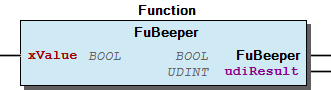
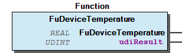

# WagoSysEdgeController v1.0.0.0 (WAGO) - Complete Documentation

### Documentation Index

WagoSysEdgeController

Application; System

WagoSysEdgeController

WAGO / u097111

WagoSysEdgeController

This document is automatically generated.

WagoSys library for EdgeController

Based on WagoSysEdgeController.library, last modified 29.09.2023, 06:04:26. LibDoc 4.1.1.0

© WAGO GmbH & Co. KG, Germany 2018 – All rights reserved. For the avoidance of doubt, this copyright notice does not only apply to the information above but also and primarily to the described library itself. Please note that third-party products are always mentioned without reference to intellectual property rights, including patents, utility models, designs and trademarks, accordingly the existence of such rights cannot be excluded. WAGO is a registered trademark of WAGO Verwaltungsgesellschaft mbH.

Company WAGO Title WagoSysEdgeController Version 1.0.0.0 Categories Application; System Namespace WagoSysEdgeController Author WAGO / u097111 Placeholder WagoSysEdgeController This document is automatically generated. WagoSys library for EdgeController - 20 Program Organization Units FuBeeper (Function) - FuDeviceTemperature (Function) - File and Project Information - Library Reference Based on WagoSysEdgeController.library, last modified 29.09.2023, 06:04:26. LibDoc 4.1.1.0 © WAGO GmbH & Co. KG, Germany 2018 – All rights reserved. For the avoidance of doubt, this copyright notice does not only apply to the information above but also and primarily to the described library itself. Please note that third-party products are always mentioned without reference to intellectual property rights, including patents, utility models, designs and trademarks, accordingly the existence of such rights cannot be excluded. WAGO is a registered trademark of WAGO Verwaltungsgesellschaft mbH.

### Project Information

| Scope | Name | Type | Content |
| --- | --- | --- | --- |
| FileHeader | creationDateTime | date | 29.09.2023, 06:04:26 |
| companyName | string | WAGO |
| libraryFile | string | WagoSysEdgeController.library |
| productName | string | e!COCKPIT |
| contentFile | string | doc.clean.json |
| ProjectInformation | LastModificationDateTime | 29.09.2023, 06:04:26 |
| ProjectInformation | LibraryCategories | library-category-list | Application; System |
| ProjectInformation | Author | string | WAGO / u097111 |
| ProjectInformation | Company | string | WAGO |
| ProjectInformation | DefaultNamespace | string | WagoSysEdgeController |
| ProjectInformation | Description | string | See: Description |
| ProjectInformation | DocFormat | string | reStructuredText |
| ProjectInformation | Placeholder | string | WagoSysEdgeController |
| ProjectInformation | Project | string | WagoSysEdgeController |
| ProjectInformation | Title | string | WagoSysEdgeController |
| ProjectInformation | Version | version | 1.0.0.0 |

### Library Information

This is a dictionary of all referenced libraries and their name spaces.

This is a dictionary of all referenced libraries and their name spaces.

### Functions

| Scope | Name | Type | Comment |
| --- | --- | --- | --- |
| Return | FuBeeper | BOOL |  |
| Input | xValue | BOOL | TRUE = On; FALSE = Off |
| Output | udiResult | UDINT | Result Codes |

| FuBeeper |
| --- |
| TRUE | Success |
| FALSE | An error has occurred, see the value of uiResult |

| xValue |
| --- |
| TRUE | Beeper on |
| FALSE | Beeper off |

| udiResult |
| --- |
| 0 | Success |
| 5 | Device not available |

| Scope | Name | Type | Comment |
| --- | --- | --- | --- |
| Return | FuDeviceTemperature | REAL |  |
| Output | udiResult | UDINT | Result Codes |

| udiResult |
| --- |
| 0 | Success |
| 5 | Device not available |

This function switches the device beeper on and off.

Graphical Illustration

Function description

Returnvalue

Outputvalue

This function reads the internal temperature of the device.

Graphical Illustration

Function description

Returnvalue

The value for the device temperature is in the range from -55.0°C to 100.0°C with a resolution of 1.0°C.

Outputvalue

Interface variables Function* This function switches the device beeper on and off. Graphical Illustration  Function description Returnvalue Inputvalue Outputvalue Interface variables Function* This function reads the internal temperature of the device. Graphical Illustration  Function description Returnvalue The value for the device temperature is in the range from -55.0°C to 100.0°C with a resolution of 1.0°C. Outputvalue

### Program Organization

## 20 Program Organization Units

- FuBeeper (Function) - FuDeviceTemperature (Function)