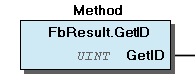
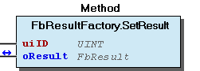

# WagoSysErrorBase v1.6.2.6 (WAGO) - Complete Documentation

## 📋 Library Information

- **Company:** WAGO
- **Title:** WagoSysErrorBase
- **Version:** 1.6.2.6
- **Categories:** WAGO LayerView|Sys; Application
- **Namespace:** WagoSysErrorBase
- **Author:** WAGO / u010545
- **Placeholder:** WagoSysErrorBase

### Description ¶

This document is automatically generated. Because of this, the chapter 30 Visualization is not shown in this document. If you are interested in getting to know more about visualization, we refer to the library manager of e!Cockpit.

function blocks for error handling [1]

This document is automatically generated. Because of this, the chapter 30 Visualization is not shown in this document. If you are interested in getting to know more about visualization, we refer to the library manager of e!Cockpit. function blocks for error handling [1]

### Contents: ¶

Contents: - Documentation Index - Project Information - Library Information - Function Blocks FbResult (FB) - FbResultFactory (FB) - FbShowResult (FB) - doc_01_Overview (FB) Methods - FbResult.GetAuxInfo (METH) - FbResult.GetDescription (METH) - FbResult.GetID (METH) - FbResult.GetInstancePath (METH) - FbResult.GetLogLevel (METH) - FbResult.GetProducerName (METH) - FbResult.GetResultObject (METH) - FbResult.GetSeverity (METH) - FbResult.GetSeverityAsString (METH) - FbResult.IsError (METH) - ... and 8 more Program Organization Base Components Global Variable Lists - ResultText (GVL) - VersionHistory (GVL) Other Components - 80 Status - FbResult.eSeverity (PROP) - FbResult.sDescription (PROP) - FbResult.sProducerName (PROP) - FbResult.sSeverity (PROP) - FbResult.uiID (PROP) - FbResult.xError (PROP) - Property

### Indices and tables ¶

| [1] | Based on WagoSysErrorBase.library, last modified 06.08.2021, 09:23:52. LibDoc 3.5.15.30 |

© WAGO Kontakttechnik GmbH & Co. KG, Germany 2018 – All rights reserved. For the avoidance of doubt, this copyright notice does not only apply to the information above but also and primarily to the described library itself. Please note that third-party products are always mentioned without reference to intellectual property rights, including patents, utility models, designs and trademarks, accordingly the existence of such rights cannot be excluded. WAGO is a registered trademark of WAGO Verwaltungsgesellschaft mbH.

- File and Project Information - Library Reference © WAGO Kontakttechnik GmbH & Co. KG, Germany 2018 – All rights reserved. For the avoidance of doubt, this copyright notice does not only apply to the information above but also and primarily to the described library itself. Please note that third-party products are always mentioned without reference to intellectual property rights, including patents, utility models, designs and trademarks, accordingly the existence of such rights cannot be excluded. WAGO is a registered trademark of WAGO Verwaltungsgesellschaft mbH.

### Documentation Index

## 10 Documentation

- doc_01_Overview (FB) Overview typResultItem FbResult FbResultFactory FbPosixFactory I_Result

### Project Information

## File and Project Information

| Scope | Name | Type | Content |
| --- | --- | --- | --- |
| FileHeader | libraryFile | string | WagoSysErrorBase.library |
| contentFile | WagoSysErrorBase_clr.json |
| productName | e!COCKPIT |
| creationDateTime | date | 06.08.2021, 09:23:56 |
| companyName | string | WAGO |
| ProjectInformation | LastModificationDateTime | date | 06.08.2021, 09:23:52 |
| Description | string | See: Description |
| Copyright | © WAGO Kontakttechnik GmbH & Co. KG, Germany 2018 – All rights reserved. |
| Author | WAGO / u010545 |
| AutoResolveUnbound | bool | True |
| Placeholder | string | WagoSysErrorBase |
| Company | WAGO |
| DocFormat | reStructuredText |
| Project | WagoSysErrorBase |
| DefaultNamespace | WagoSysErrorBase |
| Version | version | 1.6.2.6 |
| Title | string | WagoSysErrorBase |
| LibraryCategories | library-category-list | WAGO LayerView\|Sys; Application |
| CompiledLibraryCompatibilityVersion | string | CODESYS V3.5 SP16 Patch 3 |

### Library Information

## Library Reference

This is a dictionary of all referenced libraries and their name spaces.

This is a dictionary of all referenced libraries and their name spaces.

### CmpLog

#### Library Identification

Placeholder: CmpLog Default Resolution: CmpLog, * (System) Namespace: CmpLog

#### Library Properties

| LinkAllContent: False QualifiedOnly: False | Key: CmpLog SystemLibrary: False | Optional: False |

### Standard

#### Library Identification

Placeholder: Standard Default Resolution: Standard, * (System) Namespace: Standard

#### Library Properties

| LinkAllContent: False QualifiedOnly: False | Key: Standard SystemLibrary: False | Optional: False |

### WagoSysVersion

#### Library Identification

Name: WagoSysVersion Version: 1.0.0.0 Company: WAGO Namespace: WagoSysVersion

#### Library Properties

| LinkAllContent: False QualifiedOnly: True | Key: WagoSysVersion, 1.0.0.0 (WAGO) SystemLibrary: False | Optional: False |

### WagoTypesCommon

#### Library Identification

Placeholder: WagoTypesCommon Default Resolution: WagoTypesCommon, * (WAGO) Namespace: WagoTypes

#### Library Properties

| LinkAllContent: False Optional: False | QualifiedOnly: False Key: WagoTypesCommon | SystemLibrary: False PublishSymbolsInContainer: True |

### WagoTypesErrorBase

#### Library Identification

Placeholder: WagoTypesErrorBase Default Resolution: WagoTypesErrorBase, * (WAGO) Namespace: WagoTypesErrorBase

#### Library Properties

| LinkAllContent: False Optional: False | QualifiedOnly: False Key: WagoTypesErrorBase | SystemLibrary: False PublishSymbolsInContainer: True |

### Function Blocks

## FbResult (FB)

The fundamental object which represents an result.

A result may be an error or a status.

It contains a reference to an ResultItem object, which represents the result itself, and a reference to the producing object, which gives more details about the circumstances of the erroneous behaviour.

Its construction method SetUp() is not too comfortable, but it is intended to use a Factory object (FbResultProducer) for this task anyway.

There are two cases to set this result object.

In case that you declare an instance of this function block it may be that this object holds invalid informations. So declare and use never retain instances.

Graphical Illustration:

Function The fundamental object which represents an result. A result may be an error or a status. It contains a reference to an ResultItem object, which represents the result itself, and a reference to the producing object, which gives more details about the circumstances of the erroneous behaviour. Its construction method SetUp() is not too comfortable, but it is intended to use a Factory object (FbResultProducer) for this task anyway. There are two cases to set this result object. case 1 : There is an error or an status occured in your FB In this case you have to use your result factory (FbResultFactory) to set this result object. Example myResultFactory.SetResult(3, oError); // set resultcode 3 at error object case 2 : Your Fb call an other FB and this other FB generates an result object In this case you can route this sub result through your own result object by a simple assignment. Example my_oResult := SubFb.oResult; Warning In case that you declare an instance of this function block it may be that this object holds invalid informations. So declare and use never retain instances. Graphical Illustration:  - FbResult.GetAuxInfo (METH) - FbResult.GetDescription (METH) - FbResult.GetID (METH) - FbResult.GetInstancePath (METH) - FbResult.GetLogLevel (METH) - FbResult.GetProducerName (METH) - FbResult.GetResultObject (METH) - FbResult.GetSeverity (METH) - FbResult.GetSeverityAsString (METH) - FbResult.IsError (METH) - Property FbResult.eSeverity (PROP) - FbResult.sDescription (PROP) - FbResult.sProducerName (PROP) - FbResult.sSeverity (PROP) - FbResult.uiID (PROP) - FbResult.xError (PROP) FbResult.SetUp (METH) FbResult.ShowResult (METH)

## FbResultFactory (FB)

| Scope | Name | Type | Initial | Comment |
| --- | --- | --- | --- | --- |
| Input | pProducerName | POINTER TO STRING | ADR(INITNAME) | producer of the result |
| pResultList | POINTER TO BYTE | ADR(ResultText.RESULTS) | pointer to result list with possible results [array[0..n] of typResultItem] |
| uiSizeOfResultList | UINT | INT_TO_UINT(SIZEOF(ResultText.RESULTS)) | size of result list [byte] |

This factory is to modify a result object.

This factory holds 1. a reference of the place where it was instantiated 2. a reference of a table (array of typResultItem) with possible results for this library 3. the size of this table

Normaly this parameters are fix and can set by declaration.

Example myResultFactory : FbResultFactory (ADR(‘MyClassName’), ADR(ERRORS), SIZEOF(ERRORS));

To set an resultid at a result object you have to use the method SetResult(...)

Example myResultFactory.SetResult(3, oResult); // set resultid 3 at result object

Interface variables This factory is to modify a result object. This factory holds 1. a reference of the place where it was instantiated 2. a reference of a table (array of typResultItem) with possible results for this library 3. the size of this table Normaly this parameters are fix and can set by declaration. Example myResultFactory : FbResultFactory (ADR(‘MyClassName’), ADR(ERRORS), SIZEOF(ERRORS)); To set an resultid at a result object you have to use the method SetResult(...) Example myResultFactory.SetResult(3, oResult); // set resultid 3 at result object - FbResultFactory.GetInstancePath (METH) - FbResultFactory.GetProducerName (METH) - FbResultFactory.SetProducerName (METH) - FbResultFactory.SetResult (METH) - FbResultFactory.SetResultList (METH) - FbResultFactory.SetResultWithAuxInfo (METH)

## FbShowResult (FB)

| Scope | Name | Type |
| --- | --- | --- |
| Input | IResult | WagoTypesErrorBase.I_Result |
| Output | xIsError | BOOL |
| uiID | UINT |
| sDescription | STRING |
| sProducer | STRING |
| sInstance | STRING(255) |
| eSeverity | eSeverity |

Show comfortable the content of a result object

This function block is to split a result object to output variables for comfortable showing the content inside the IDE.

The output xError is TRUE while severity equal error or equal exception.

Graphical Illustration

Graphical Interface of FbShowResult

Interface variables Function Show comfortable the content of a result object This function block is to split a result object to output variables for comfortable showing the content inside the IDE. The output xError is TRUE while severity equal error or equal exception. Graphical Illustration  Graphical Interface of FbShowResult

## doc_01_Overview (FB)

### Overview

The contents of this library is split in three parts:

The contents of this library is split in three parts:

## typResultItem

Result means an error or a status

This is a static structure which contains

To each result, such a static structure is assigned.

Result means an error or a status This is a static structure which contains - a freely chosen numerical ID of a result (which may be ambiguous between different libraries) - a textual description of the nature of that result - a hint about the severity of the result (INFO, WARNING, ERROR, etc) To each result, such a static structure is assigned.

## FbResult

This is the “ResultObject” which is passed from the producer of the result up to the consument which might e.g. display that result in plain text or perform other appropriate reaction.

The FbResult is small: it contains a reference to an ResultItem and a reference to the producer of the result.

It also contains 32 bits of unspecified auxiliary information which may be used or may be ignored.

Caveat: The FbResult Object has a set of access methods ( get() /set() ) for accessing details of the result. Never use member variables directly. Treat them as PRIVATE .

This is the “ResultObject” which is passed from the producer of the result up to the consument which might e.g. display that result in plain text or perform other appropriate reaction. The FbResult is small: it contains a reference to an ResultItem and a reference to the producer of the result. It also contains 32 bits of unspecified auxiliary information which may be used or may be ignored. Caveat: The FbResult Object has a set of access methods ( get() /set() ) for accessing details of the result. Never use member variables directly. Treat them as PRIVATE .

## FbResultFactory

This is an auxiliary object for producing FbResult -objects.

The Factory is provided with specific information about the producing FB and the consumer gets thus more information about the circumstances of the result.

For throwing a result object, just feed the appropriate ID to the factory, which then constructs the FbResult object.

Caveats: Factories which have once produced a result must not be deleted in any way until no instance of that result is used in the system any more. Factories must not be used as temporary variables in functions or methods.

This is an auxiliary object for producing FbResult -objects. The Factory is provided with specific information about the producing FB and the consumer gets thus more information about the circumstances of the result. For throwing a result object, just feed the appropriate ID to the factory, which then constructs the FbResult object. Caveats: Factories which have once produced a result must not be deleted in any way until no instance of that result is used in the system any more. Factories must not be used as temporary variables in functions or methods.

## FbPosixFactory

This is a special derivate of FbResultFactory to map the enumeration WagoTypes.eResultCode (Posix codes) to a result object. This factory work default with the text table “PosixText.RESULTCODERERRORS”.

This is a special derivate of FbResultFactory to map the enumeration WagoTypes.eResultCode (Posix codes) to a result object. This factory work default with the text table “PosixText.RESULTCODERERRORS”.

## I_Result

This interface is implemeted by the FbResult and may (not must) implement by an user fb too. Fbs with this interface can connect to the input of the FbShowResult.

This interface is implemeted by the FbResult and may (not must) implement by an user fb too. Fbs with this interface can connect to the input of the FbShowResult.

### Methods

## FbResult.GetAuxInfo (METH)

| Scope | Name | Type |
| --- | --- | --- |
| Return | GetAuxInfo | DWORD |

Graphical Illustration:

Interface variables Function Gets auxiliary information which is stored together with the result object Graphical Illustration: 

## FbResult.GetDescription (METH)

| Scope | Name | Type |
| --- | --- | --- |
| Return | GetDescription | STRING |

Graphical Illustration:

Interface variables Function Gets the description string of the result Graphical Illustration: 

## FbResult.GetID (METH)

| Scope | Name | Type |
| --- | --- | --- |
| Return | GetID | UINT |

Graphical Illustration:

Interface variables Function Gets the numerical ID of the result Graphical Illustration: 

## FbResult.GetInstancePath (METH)

| Scope | Name | Type |
| --- | --- | --- |
| Return | GetInstancePath | STRING(255) |

Graphical Illustration:

Interface variables Function Gets the tree representation (path) of the instance which has thrown the result. For performance this is the factory path that set last modification at this result. Graphical Illustration: 

## FbResult.GetLogLevel (METH)

| Scope | Name | Type |
| --- | --- | --- |
| Return | GetLogLevel | WORD |

Graphical Illustration:

Interface variables Function Gets the log level of the represented result Graphical Illustration: 

## FbResult.GetProducerName (METH)

| Scope | Name | Type |
| --- | --- | --- |
| Return | GetProducerName | STRING |

Graphical Illustration:

Interface variables Function Gets the class name of the function block which has thrown the result Graphical Illustration: 

## FbResult.GetResultObject (METH)

| Scope | Name | Type |
| --- | --- | --- |
| Return | GetResultObject | WagoTypesErrorBase.I_Result |

Graphical Illustration:

Interface variables Function Gets an interface of this object Graphical Illustration: 

## FbResult.GetSeverity (METH)

| Scope | Name | Type |
| --- | --- | --- |
| Return | GetSeverity | eSeverity |

Graphical Illustration:

Interface variables Function Gets the enumeration value severity of the represented result Graphical Illustration: 

## FbResult.GetSeverityAsString (METH)

| Scope | Name | Type |
| --- | --- | --- |
| Return | GetSeverityAsString | STRING |

Graphical Illustration:

Interface variables Function Gets the severity as string of the represented result Graphical Illustration: 

## FbResult.IsError (METH)

| Scope | Name | Type |
| --- | --- | --- |
| Return | IsError | BOOL |

Graphical Illustration:

Interface variables Function Returns TRUE if the represented result is an error or an exception. Graphical Illustration: 

## FbResult.SetUp (METH)

| Scope | Name | Type | Initial | Comment |
| --- | --- | --- | --- | --- |
| Return | SetUp | BOOL |  |  |
| Input | IFactory | WagoTypesErrorBase.I_ResultFactory | 0 | reference to the factory that generates this result |
| pResultItem | POINTER TO WagoTypesErrorBase.typResultItem |  | pointer to result list with possible results [array[0..n] of typResultItem] |
| dwAdditionalInformation | DWORD |  | additional information; |

Graphical Illustration:

Interface variables Function Construct a Result Object from the ResultItem and the Producer information Graphical Illustration: 

## FbResult.ShowResult (METH)

| Scope | Name | Type |
| --- | --- | --- |
| Output | xIsError | BOOL |
| uiId | UINT |
| sDescription | STRING |
| sProducer | STRING |
| sInstance | STRING(255) |
| eSeverity | eSeverity |

This method provide to show the result content directly in CFC with one call

This function block is to split a result object to output variables for comfortable showing the content inside the IDE in CFC.

The output xError is TRUE by severity equal error or exception.

Graphical Illustration:

Interface variables Function This method provide to show the result content directly in CFC with one call This function block is to split a result object to output variables for comfortable showing the content inside the IDE in CFC. The output xError is TRUE by severity equal error or exception. Graphical Illustration: 

## FbResultFactory.GetInstancePath (METH)

| Scope | Name | Type |
| --- | --- | --- |
| Return | GetInstancePath | STRING(255) |

Graphical Illustration:

Interface variables Function Gets the tree representation (path) of this instance. Graphical Illustration: 

## FbResultFactory.GetProducerName (METH)

| Scope | Name | Type |
| --- | --- | --- |
| Return | GetProducerName | STRING |

Graphical Illustration:

Interface variables Function Retrieves the class name of the producing FB Graphical Illustration: 

## FbResultFactory.SetProducerName (METH)

| Scope | Name | Type | Comment |
| --- | --- | --- | --- |
| Input | pName | POINTER TO STRING | producer of the result |

Graphical Illustration:

Interface variables Function Assign a name to this factory. This name will be connected to the produced FbResult objects. Graphical Illustration: 

## FbResultFactory.SetResult (METH)

| Scope | Name | Type | Comment |
| --- | --- | --- | --- |
| Input | uiID | UINT | the result number to be set |
| Inout | oResult | FbResult | The production Result, for direct linkage to the output of the throwing FB. |

Graphical Illustration:

Interface variables Function Produces a result-object from the given ID and from the list which is attached to the factory Graphical Illustration: 

## FbResultFactory.SetResultList (METH)

| Scope | Name | Type | Comment |
| --- | --- | --- | --- |
| Input | pResultList | POINTER TO BYTE | pointer to result list [array[0..n] of typResultItem] |
| uiSizeOfResultList | UINT | size of result list [byte] |

Graphical Illustration:

Interface variables Function Attaches a list of results to the factory (only one list can be attached simultaneously) Graphical Illustration: 

## FbResultFactory.SetResultWithAuxInfo (METH)

| Scope | Name | Type | Initial | Comment |
| --- | --- | --- | --- | --- |
| Return | SetResultWithAuxInfo | BOOL |  |  |
| Input | uiID | UINT |  | the result number to be set |
| dwAuxInfo | DWORD | 0 | some additional intormation if necessary |
| Inout | oResult | FbResult |  | The production Result, for direct linkage to the output of the throwing FB. |

Graphical Illustration:

Interface variables Function Produces an FbResult-Object from a given ID and adds auxiliary information Graphical Illustration: 

### Program Organization

## 20 Program Organization Units

- FbResult (FB) FbResult.GetAuxInfo (METH) - FbResult.GetDescription (METH) - FbResult.GetID (METH) - FbResult.GetInstancePath (METH) - FbResult.GetLogLevel (METH) - FbResult.GetProducerName (METH) - FbResult.GetResultObject (METH) - FbResult.GetSeverity (METH) - FbResult.GetSeverityAsString (METH) - FbResult.IsError (METH) - Property FbResult.eSeverity (PROP) - FbResult.sDescription (PROP) - FbResult.sProducerName (PROP) - FbResult.sSeverity (PROP) - FbResult.uiID (PROP) - FbResult.xError (PROP) FbResult.SetUp (METH) FbResult.ShowResult (METH) FbResultFactory (FB) - FbResultFactory.GetInstancePath (METH) - FbResultFactory.GetProducerName (METH) - FbResultFactory.SetProducerName (METH) - FbResultFactory.SetResult (METH) - FbResultFactory.SetResultList (METH) - FbResultFactory.SetResultWithAuxInfo (METH) FbShowResult (FB)

### Base Components

## WagoSysErrorBase Library Documentation

| Company: | WAGO |
| Title: | WagoSysErrorBase |
| Version: | 1.6.2.6 |
| Categories: | WAGO LayerView\|Sys; Application |
| Namespace: | WagoSysErrorBase |
| Author: | WAGO / u010545 |
| Placeholder: | WagoSysErrorBase |

### Description

This document is automatically generated. Because of this, the chapter 30 Visualization is not shown in this document. If you are interested in getting to know more about visualization, we refer to the library manager of e!Cockpit.

function blocks for error handling [1]

This document is automatically generated. Because of this, the chapter 30 Visualization is not shown in this document. If you are interested in getting to know more about visualization, we refer to the library manager of e!Cockpit. function blocks for error handling [1]

### Contents:

- 10 Documentation doc_01_Overview (FB) - typResultItem - FbResult - FbResultFactory - FbPosixFactory - I_Result 20 Program Organization Units - FbResult (FB) - FbResultFactory (FB) - FbShowResult (FB) 80 Status - ResultText (GVL) VersionHistory (GVL)

### Indices and tables

| [1] | Based on WagoSysErrorBase.library, last modified 06.08.2021, 09:23:52. LibDoc 3.5.15.30 |

© WAGO Kontakttechnik GmbH & Co. KG, Germany 2018 – All rights reserved. For the avoidance of doubt, this copyright notice does not only apply to the information above but also and primarily to the described library itself. Please note that third-party products are always mentioned without reference to intellectual property rights, including patents, utility models, designs and trademarks, accordingly the existence of such rights cannot be excluded. WAGO is a registered trademark of WAGO Verwaltungsgesellschaft mbH.

- File and Project Information - Library Reference © WAGO Kontakttechnik GmbH & Co. KG, Germany 2018 – All rights reserved. For the avoidance of doubt, this copyright notice does not only apply to the information above but also and primarily to the described library itself. Please note that third-party products are always mentioned without reference to intellectual property rights, including patents, utility models, designs and trademarks, accordingly the existence of such rights cannot be excluded. WAGO is a registered trademark of WAGO Verwaltungsgesellschaft mbH.

### Global Variable Lists

## ResultText (GVL)

| Value | Level | Description |
| --- | --- | --- |
| 0 | WagoTypes.eSeverity.None | TXT_OK |
| 1 | WagoTypes.eSeverity.Warning | TXT_INVALID_OBJECT |
| 16#FFFF | WagoTypes.eSeverity.error | TXT_UNKNOWN |

## VersionHistory (GVL)

| date | version | author | change |
| 17.06.2021 | 1.6.2.6 | u010545 | Mark qualified only at WagoTypesErrorBase removed –> need for WagoAppPowerPlant |
| 28.04.2021 | 1.6.2.5 | u010545 | bugfix for unknown producer |
| 27.04.2021 | 1.6.2.4 | u010545 | bugfix for unknown ID |
| 19.03.2021 | 1.6.2.3 | u010545 | bugfix for init |
| 18.03.2021 | 1.6.2.2 | u010545 | bugfix for init |
| 01.03.2021 | 1.6.2.1 | u010545 | bugfix for retain |
| 15.02.2021 | 1.6.2.0 | u010545 | I_ResultProperties added |
| 25.08.2020 | 1.6.1.1 | u010545 | Properties for FbResult added |
| 08.01.2019 | 1.6.1.0 | u015842 | Properties: free placeholder added |
| 15.12.2016 | 1.6.0.0 | u010545 | Default ResultLogger removed. |
| 04.07.2016 | 1.5.0.3 | u010545 | Documentation expanded |
| 29.03.2016 | 1.5.0.2 | u010545 | String ‘WagoApp...’ changed to ‘WagoSys...’ |
| 29.02.2016 | 1.5.0.1 | u010545 | Categories modified |
| 24.02.2016 | 1.5.0.0 | UU | First version |

WagoSysErrorBase

Release Notes:

WagoSysErrorBase Release Notes:

### Other Components

## 80 Status ¶

## FbResult.eSeverity (PROP) ¶

## FbResult.sDescription (PROP) ¶

## FbResult.sProducerName (PROP) ¶

## FbResult.sSeverity (PROP) ¶

## FbResult.uiID (PROP) ¶

## FbResult.xError (PROP) ¶

## Property

- FbResult.eSeverity (PROP) - FbResult.sDescription (PROP) - FbResult.sProducerName (PROP) - FbResult.sSeverity (PROP) - FbResult.uiID (PROP) - FbResult.xError (PROP)