# WagoSysFieldbusModule v1.9.4.5 (WAGO) - Complete Documentation


## 📋 Library Information

- **Company:** WAGO
- **Title:** WagoSysFieldbusModule
- **Version:** 1.9.4.5
- **Categories:** WAGO LayerView|Sys; Application
- **Namespace:** WagoSysFieldbusModule
- **Author:** WAGO / u010545
- **Placeholder:** WagoSysFieldbusModule

### Description ¶


This document is automatically generated.

Base Functionblocks for Module Access via Fieldbus

This document is automatically generated. Base Functionblocks for Module Access via Fieldbus

### Contents: ¶


Contents: - Documentation Index - Project Information - Library Information - Function Blocks FbModule_750_450 (FB) - FbModule_750_451 (FB) - FbModule_750_463 (FB) - FbModule_750_464 (FB) - FbModule_750_630 (FB) - FbModule_750_636 (FB) - FbModule_750_642 (FB) - FbModule_750_643 (FB) - FbModule_753_1630 (FB) - FbModule_753_1631 (FB) - ... and 48 more Methods - FbModule_750_450.GetNewPaOutputs (METH) - FbModule_750_450.SetNewPaInputs (METH) - FbModule_750_451.GetNewPaOutputs (METH) - FbModule_750_451.SetNewPaInputs (METH) - FbModule_750_463.GetNewPaOutputs (METH) - FbModule_750_463.SetNewPaInputs (METH) - FbModule_750_464.GetNewPaOutputs (METH) - FbModule_750_464.SetNewPaInputs (METH) - FbModule_750_630.GetNewPaOutputs (METH) - FbModule_750_630.SetNewPaInputs (METH) - ... and 110 more Global Variable Lists Other Components - 20 FieldBus_Module (TYP 1 symetrisch) - 21 FieldBus_Module (TYP 2) - 750 - 750 - 753 - 75x - 75x - Module_753_163x - Module_75x_48x - Module_75x_49x - ... and 60 more

### Indices and tables ¶


Based on WagoSysFieldbusModule.library, last modified 29.05.2024, 20:29:06. LibDoc 3.5.16.10

© WAGO GmbH & Co. KG, Germany 2018 – All rights reserved. For the avoidance of doubt, this copyright notice does not only apply to the information above but also and primarily to the described library itself. Please note that third-party products are always mentioned without reference to intellectual property rights, including patents, utility models, designs and trademarks, accordingly the existence of such rights cannot be excluded. WAGO is a registered trademark of WAGO Verwaltungsgesellschaft mbH.

- File and Project Information - Library Reference Based on WagoSysFieldbusModule.library, last modified 29.05.2024, 20:29:06. LibDoc 3.5.16.10 © WAGO GmbH & Co. KG, Germany 2018 – All rights reserved. For the avoidance of doubt, this copyright notice does not only apply to the information above but also and primarily to the described library itself. Please note that third-party products are always mentioned without reference to intellectual property rights, including patents, utility models, designs and trademarks, accordingly the existence of such rights cannot be excluded. WAGO is a registered trademark of WAGO Verwaltungsgesellschaft mbH.

### Documentation Index


## WagoSysFieldbusModule Library Documentation


| Company: | WAGO |
| Title: | WagoSysFieldbusModule |
| Version: | 1.9.4.5 |
| Categories: | WAGO LayerView\|Sys; Application |
| Namespace: | WagoSysFieldbusModule |
| Author: | WAGO / u010545 |
| Placeholder: | WagoSysFieldbusModule |

### Description


This document is automatically generated.

Base Functionblocks for Module Access via Fieldbus

This document is automatically generated. Base Functionblocks for Module Access via Fieldbus

### Contents:


- 20 FieldBus_Module (TYP 1 symetrisch) 750 - 753 - 75x 21 FieldBus_Module (TYP 2) - 750 - 75x VersionHistory (GVL)

### Indices and tables


Based on WagoSysFieldbusModule.library, last modified 29.05.2024, 20:29:06. LibDoc 3.5.16.10

© WAGO GmbH & Co. KG, Germany 2018 – All rights reserved. For the avoidance of doubt, this copyright notice does not only apply to the information above but also and primarily to the described library itself. Please note that third-party products are always mentioned without reference to intellectual property rights, including patents, utility models, designs and trademarks, accordingly the existence of such rights cannot be excluded. WAGO is a registered trademark of WAGO Verwaltungsgesellschaft mbH.

- File and Project Information - Library Reference Based on WagoSysFieldbusModule.library, last modified 29.05.2024, 20:29:06. LibDoc 3.5.16.10 © WAGO GmbH & Co. KG, Germany 2018 – All rights reserved. For the avoidance of doubt, this copyright notice does not only apply to the information above but also and primarily to the described library itself. Please note that third-party products are always mentioned without reference to intellectual property rights, including patents, utility models, designs and trademarks, accordingly the existence of such rights cannot be excluded. WAGO is a registered trademark of WAGO Verwaltungsgesellschaft mbH.

### Project Information


## File and Project Information


| Scope | Name | Type | Content |
| --- | --- | --- | --- |
| FileHeader | libraryFile | string | WagoSysFieldbusModule.library |
| contentFile | doc.clean.json |
| productName | e!COCKPIT |
| creationDateTime | date | 29.05.2024, 20:29:09 |
| companyName | string | WAGO |
| ProjectInformation | LastModificationDateTime | date | 29.05.2024, 20:29:06 |
| Description | string | See: Description |
| Copyright | © WAGO Kontakttechnik GmbH & Co. KG, Germany 2018 – All rights reserved. |
| Author | WAGO / u010545 |
| AutoResolveUnbound | bool | True |
| Placeholder | string | WagoSysFieldbusModule |
| Company | WAGO |
| DocFormat | reStructuredText |
| Project | WagoSysFieldbusModule |
| DefaultNamespace | WagoSysFieldbusModule |
| Version | version | 1.9.4.5 |
| Title | string | WagoSysFieldbusModule |
| LibraryCategories | library-category-list | WAGO LayerView\|Sys; Application |
| CompiledLibraryCompatibilityVersion | string | CODESYS V3.5 SP16 Patch 3 |

### Library Information


## Library Reference


| LinkAllContent: False QualifiedOnly: True | SystemLibrary: False | Optional: False |

| LinkAllContent: False QualifiedOnly: True | SystemLibrary: False | Optional: False |

| LinkAllContent: False QualifiedOnly: True | SystemLibrary: False | Optional: False |

| LinkAllContent: False QualifiedOnly: False | SystemLibrary: False | Optional: False |

| LinkAllContent: False QualifiedOnly: False | SystemLibrary: False | Optional: False |

| LinkAllContent: False QualifiedOnly: True | SystemLibrary: False PublishSymbolsInContainer: True | Optional: False |

| LinkAllContent: False QualifiedOnly: True | SystemLibrary: False | Optional: False |

| LinkAllContent: False QualifiedOnly: True | SystemLibrary: False | Optional: False |

| LinkAllContent: False QualifiedOnly: True | SystemLibrary: False | Optional: False |

| LinkAllContent: False QualifiedOnly: True | SystemLibrary: False | Optional: False |

| LinkAllContent: False QualifiedOnly: True | SystemLibrary: False | Optional: False |

| LinkAllContent: False QualifiedOnly: True | SystemLibrary: False | Optional: False |

| LinkAllContent: False QualifiedOnly: True | SystemLibrary: False | Optional: False |

| LinkAllContent: False QualifiedOnly: True | SystemLibrary: False | Optional: False |

| LinkAllContent: False QualifiedOnly: True | SystemLibrary: False | Optional: False |

| LinkAllContent: False QualifiedOnly: True | SystemLibrary: False | Optional: False |

| LinkAllContent: False QualifiedOnly: True | SystemLibrary: False | Optional: False |

| LinkAllContent: False QualifiedOnly: True | SystemLibrary: False | Optional: False |

| LinkAllContent: False QualifiedOnly: True | SystemLibrary: False | Optional: False |

| LinkAllContent: False QualifiedOnly: True | SystemLibrary: False | Optional: False |

| LinkAllContent: False QualifiedOnly: True | SystemLibrary: False | Optional: False |

| LinkAllContent: False QualifiedOnly: True | SystemLibrary: False | Optional: False |

| LinkAllContent: False QualifiedOnly: True | SystemLibrary: False | Optional: False |

| LinkAllContent: False QualifiedOnly: True | SystemLibrary: False | Optional: False |

| LinkAllContent: False QualifiedOnly: True | SystemLibrary: False | Optional: False |

| LinkAllContent: False QualifiedOnly: True | SystemLibrary: False | Optional: False |

| LinkAllContent: False QualifiedOnly: True | SystemLibrary: False | Optional: False |

| LinkAllContent: False QualifiedOnly: True | SystemLibrary: False | Optional: False |

| LinkAllContent: False QualifiedOnly: True | SystemLibrary: False | Optional: False |

| LinkAllContent: False QualifiedOnly: True | SystemLibrary: False | Optional: False |

| LinkAllContent: False QualifiedOnly: True | SystemLibrary: False | Optional: False |

| LinkAllContent: False QualifiedOnly: True | SystemLibrary: False | Optional: False |

| LinkAllContent: False QualifiedOnly: True | SystemLibrary: False | Optional: False |

| LinkAllContent: False QualifiedOnly: True | SystemLibrary: False | Optional: False |

| LinkAllContent: False QualifiedOnly: True | SystemLibrary: False | Optional: False |

| LinkAllContent: False QualifiedOnly: True | SystemLibrary: False | Optional: False |

| LinkAllContent: False QualifiedOnly: True | SystemLibrary: False | Optional: False |

| LinkAllContent: False QualifiedOnly: True | SystemLibrary: False | Optional: False |

| LinkAllContent: False QualifiedOnly: True | SystemLibrary: False | Optional: False |

| LinkAllContent: False QualifiedOnly: True | SystemLibrary: False | Optional: False |

| LinkAllContent: False QualifiedOnly: True | SystemLibrary: False | Optional: False |

| LinkAllContent: False QualifiedOnly: True | SystemLibrary: False | Optional: False |

| LinkAllContent: False QualifiedOnly: True | SystemLibrary: False | Optional: False |

| LinkAllContent: False QualifiedOnly: True | SystemLibrary: False | Optional: False |

| LinkAllContent: False QualifiedOnly: True | SystemLibrary: False | Optional: False |

| LinkAllContent: False QualifiedOnly: True | SystemLibrary: False | Optional: False |

| LinkAllContent: False QualifiedOnly: True | SystemLibrary: False | Optional: False |

| LinkAllContent: False QualifiedOnly: True | SystemLibrary: False | Optional: False |

| LinkAllContent: False QualifiedOnly: False | SystemLibrary: False | Optional: False |

| LinkAllContent: False QualifiedOnly: True | SystemLibrary: False | Optional: False |

| LinkAllContent: False QualifiedOnly: True | SystemLibrary: False | Optional: False |

| LinkAllContent: False QualifiedOnly: True | SystemLibrary: False | Optional: False |

| LinkAllContent: False Optional: False | QualifiedOnly: True SystemLibrary: False | PublishSymbolsInContainer: True |

| LinkAllContent: False Optional: False | QualifiedOnly: False SystemLibrary: False | PublishSymbolsInContainer: True |

| LinkAllContent: False Optional: False | QualifiedOnly: True SystemLibrary: False | PublishSymbolsInContainer: True |

| LinkAllContent: False Optional: False | QualifiedOnly: True SystemLibrary: False | PublishSymbolsInContainer: True |

| LinkAllContent: False Optional: False | QualifiedOnly: True SystemLibrary: False | PublishSymbolsInContainer: True |

| LinkAllContent: False Optional: False | QualifiedOnly: True SystemLibrary: False | PublishSymbolsInContainer: True |

| LinkAllContent: False Optional: False | QualifiedOnly: True SystemLibrary: False | PublishSymbolsInContainer: True |

| LinkAllContent: False Optional: False | QualifiedOnly: True SystemLibrary: False | PublishSymbolsInContainer: True |

| LinkAllContent: False QualifiedOnly: True | SystemLibrary: False | Optional: False |

| LinkAllContent: False QualifiedOnly: False | SystemLibrary: False | Optional: False |

| LinkAllContent: False QualifiedOnly: False | SystemLibrary: False | Optional: False |

| LinkAllContent: False QualifiedOnly: False | SystemLibrary: False | Optional: False |

| LinkAllContent: False QualifiedOnly: False | SystemLibrary: False | Optional: False |

| LinkAllContent: False QualifiedOnly: False | SystemLibrary: False | Optional: False |

| LinkAllContent: False Optional: False | QualifiedOnly: True SystemLibrary: False | PublishSymbolsInContainer: True |

| LinkAllContent: False Optional: False | QualifiedOnly: True SystemLibrary: False | PublishSymbolsInContainer: True |

| LinkAllContent: False QualifiedOnly: False | SystemLibrary: False | Optional: False |

| LinkAllContent: False Optional: False | QualifiedOnly: True SystemLibrary: False | PublishSymbolsInContainer: True |

| LinkAllContent: False Optional: False | QualifiedOnly: True SystemLibrary: False | PublishSymbolsInContainer: True |

| LinkAllContent: False Optional: False | QualifiedOnly: True SystemLibrary: False | PublishSymbolsInContainer: True |

| LinkAllContent: False Optional: False | QualifiedOnly: True SystemLibrary: False | PublishSymbolsInContainer: True |

| LinkAllContent: False Optional: False | QualifiedOnly: True SystemLibrary: False | PublishSymbolsInContainer: True |

| LinkAllContent: False Optional: False | QualifiedOnly: True SystemLibrary: False | PublishSymbolsInContainer: True |

| LinkAllContent: False Optional: False | QualifiedOnly: True SystemLibrary: False | PublishSymbolsInContainer: True |

| LinkAllContent: False Optional: False | QualifiedOnly: True SystemLibrary: False | PublishSymbolsInContainer: True |

| LinkAllContent: False Optional: False | QualifiedOnly: True SystemLibrary: False | PublishSymbolsInContainer: True |

| LinkAllContent: False QualifiedOnly: True | SystemLibrary: False | Optional: False |

| LinkAllContent: False Optional: False | QualifiedOnly: True SystemLibrary: False | PublishSymbolsInContainer: True |

| LinkAllContent: False Optional: False | QualifiedOnly: True SystemLibrary: False | PublishSymbolsInContainer: True |

| LinkAllContent: False Optional: False | QualifiedOnly: True SystemLibrary: False | PublishSymbolsInContainer: True |

| LinkAllContent: False QualifiedOnly: True | SystemLibrary: False | Optional: False |

| LinkAllContent: False Optional: False | QualifiedOnly: True SystemLibrary: False | PublishSymbolsInContainer: True |

| LinkAllContent: False Optional: False | QualifiedOnly: True SystemLibrary: False | PublishSymbolsInContainer: True |

| LinkAllContent: False Optional: False | QualifiedOnly: True SystemLibrary: False | PublishSymbolsInContainer: True |

| LinkAllContent: False Optional: False | QualifiedOnly: True SystemLibrary: False | PublishSymbolsInContainer: True |

| LinkAllContent: False Optional: False | QualifiedOnly: True SystemLibrary: False | PublishSymbolsInContainer: True |

| LinkAllContent: False QualifiedOnly: True | SystemLibrary: False | Optional: False |

| LinkAllContent: False Optional: False | QualifiedOnly: True SystemLibrary: False | PublishSymbolsInContainer: True |

| LinkAllContent: False QualifiedOnly: True | SystemLibrary: False | Optional: False |

| LinkAllContent: False QualifiedOnly: False | SystemLibrary: False | Optional: False |

| LinkAllContent: False QualifiedOnly: True | SystemLibrary: False | Optional: False |

| LinkAllContent: False QualifiedOnly: True | SystemLibrary: False | Optional: False |

| LinkAllContent: False Optional: False | QualifiedOnly: True SystemLibrary: False | PublishSymbolsInContainer: True |

| LinkAllContent: False QualifiedOnly: True | SystemLibrary: False | Optional: False |

| LinkAllContent: False QualifiedOnly: False | SystemLibrary: False | Optional: False |

| LinkAllContent: False QualifiedOnly: True | SystemLibrary: False | Optional: False |

| LinkAllContent: False QualifiedOnly: False | SystemLibrary: False | Optional: False |

| LinkAllContent: False Optional: False | QualifiedOnly: True SystemLibrary: False | PublishSymbolsInContainer: True |

| LinkAllContent: False QualifiedOnly: True | SystemLibrary: False | Optional: False |

This is a dictionary of all referenced libraries and their name spaces.

This is a dictionary of all referenced libraries and their name spaces. IoStandard Library Identification : Placeholder: IoStandard Default Resolution: IoStandard, * (System) Namespace: IoStandard Library Properties : Standard Library Identification : Placeholder: Standard Default Resolution: Standard, * (System) Namespace: Standard Library Properties : SysMem Library Identification : Placeholder: SysMem Default Resolution: SysMem, * (System) Namespace: SysMem Library Properties : WagoSysErrorBase Library Identification : Placeholder: WagoSysErrorBase Default Resolution: WagoSysErrorBase, * (WAGO) Namespace: WagoSysErrorBase Library Properties : Library Parameter : Parameter: RES_LOG_MAX_FILESIZE = 2000 Parameter: RES_LOG_MAX_FILES = 1 Parameter: RES_LOG_MAX_ENTRIES = 200 Parameter: RES_LOG_NAME = ‘WagoAppResultLogger’ WagoSysFieldbusServices Library Identification : Placeholder: WagoSysFieldbusServices Default Resolution: WagoSysFieldbusServices, * (WAGO) Namespace: WagoSysFieldbusServices Library Properties : WagoSysModuleBase Library Identification : Placeholder: WagoSysModuleBase Default Resolution: WagoSysModuleBase, * (WAGO) Namespace: WagoSysModuleBase Library Properties : Library Parameter : Parameter: MAX_MBX_OUTPUT_SIZE = 47 Parameter: MAX_MODULE_QUANTITY = 250 Parameter: MAX_MODULE_INPUT_SIZE = 48 Parameter: MAX_RUNNABLES = MAX_MODULE_QUANTITY Parameter: PARAMETER_COM_TIMEOUT = TIME#5s0ms Parameter: MBX_PIPE_SIZE = 1024 Parameter: REGISTER_COM_TIMEOUT = TIME#5s0ms Parameter: MAX_MODULE_OUTPUT_SIZE = 48 Parameter: MAX_MBX_INPUT_SIZE = 47 WagoSysModule_750_450 Library Identification : Placeholder: WagoSysModule_750_450 Default Resolution: WagoSysModule_750_450, * (WAGO) Namespace: WagoSysModule_750_450 Library Properties : WagoSysModule_750_451 Library Identification : Placeholder: WagoSysModule_750_451 Default Resolution: WagoSysModule_750_451, * (WAGO) Namespace: WagoSysModule_750_451 Library Properties : WagoSysModule_750_463 Library Identification : Placeholder: WagoSysModule_750_463 Default Resolution: WagoSysModule_750_463, * (WAGO) Namespace: WagoSysModule_750_463 Library Properties : WagoSysModule_750_464 Library Identification : Placeholder: WagoSysModule_750_464 Default Resolution: WagoSysModule_750_464, * (WAGO) Namespace: WagoSysModule_750_464 Library Properties : WagoSysModule_750_630 Library Identification : Placeholder: WagoSysModule_750_630 Default Resolution: WagoSysModule_750_630, * (WAGO) Namespace: WagoSysModule_750_630 Library Properties : WagoSysModule_750_636 Library Identification : Placeholder: WagoSysModule_750_636 Default Resolution: WagoSysModule_750_636, * (WAGO) Namespace: WagoSysModule_750_636 Library Properties : WagoSysModule_750_642 Library Identification : Placeholder: WagoSysModule_750_642 Default Resolution: WagoSysModule_750_642, * (WAGO) Namespace: WagoSysModule_750_642 Library Properties : WagoSysModule_750_643 Library Identification : Placeholder: WagoSysModule_750_643 Default Resolution: WagoSysModule_750_643, * (WAGO) Namespace: WagoSysModule_750_643 Library Properties : WagoSysModule_753_163x Library Identification : Placeholder: WagoSysModule_753_163x Default Resolution: WagoSysModule_753_163x, * (WAGO) Namespace: WagoSysModule_753_163x Library Properties : WagoSysModule_753_646 Library Identification : Placeholder: WagoSysModule_753_646 Default Resolution: WagoSysModule_753_646, * (WAGO) Namespace: WagoSysModule_753_646 Library Properties : WagoSysModule_753_647 Library Identification : Placeholder: WagoSysModule_753_647 Default Resolution: WagoSysModule_753_647, * (WAGO) Namespace: WagoSysModule_753_647 Library Properties : Library Parameter : Parameter: DEBUG_MODE = FALSE WagoSysModule_753_649 Library Identification : Placeholder: WagoSysModule_753_649 Default Resolution: WagoSysModule_753_649, * (WAGO) Namespace: WagoSysModule_753_649 Library Properties : WagoSysModule_75x_1491 Library Identification : Placeholder: WagoSysModule_75x_1491 Default Resolution: WagoSysModule_75x_1491, * (WAGO) Namespace: WagoSysModule_75x_1491 Library Properties : WagoSysModule_75x_1632 Library Identification : Placeholder: WagoSysModule_75x_1632 Default Resolution: WagoSysModule_75x_1632, * (WAGO) Namespace: WagoSysModule_75x_1632 Library Properties : WagoSysModule_75x_1657 Library Identification : Placeholder: WagoSysModule_75x_1657 Default Resolution: WagoSysModule_75x_1657, * (WAGO) Namespace: WagoSysModule_75x_1657 Library Properties : Library Parameter : Parameter: MAX_MBX2 = 4 WagoSysModule_75x_458 Library Identification : Placeholder: WagoSysModule_75x_458 Default Resolution: WagoSysModule_75x_458, * (WAGO) Namespace: WagoSysModule_75x_458 Library Properties : WagoSysModule_75x_461 Library Identification : Placeholder: WagoSysModule_75x_461 Default Resolution: WagoSysModule_75x_461, * (WAGO) Namespace: WagoSysModule_75x_461 Library Properties : WagoSysModule_75x_469 Library Identification : Placeholder: WagoSysModule_75x_469 Default Resolution: WagoSysModule_75x_469, * (WAGO) Namespace: WagoSysModule_75x_469 Library Properties : WagoSysModule_75x_471 Library Identification : Placeholder: WagoSysModule_75x_471 Default Resolution: WagoSysModule_75x_471, * (WAGO) Namespace: WagoSysModule_75x_471 Library Properties : WagoSysModule_75x_481 Library Identification : Placeholder: WagoSysModule_75x_481 Default Resolution: WagoSysModule_75x_481, * (WAGO) Namespace: WagoSysModule_75x_481 Library Properties : WagoSysModule_75x_486 Library Identification : Placeholder: WagoSysModule_75x_486 Default Resolution: WagoSysModule_75x_486, * (WAGO) Namespace: WagoSysModule_75x_486 Library Properties : WagoSysModule_75x_487 Library Identification : Placeholder: WagoSysModule_75x_487 Default Resolution: WagoSysModule_75x_487, * (WAGO) Namespace: WagoSysModule_75x_487 Library Properties : WagoSysModule_75x_489 Library Identification : Placeholder: WagoSysModule_75x_489 Default Resolution: WagoSysModule_75x_489, * (WAGO) Namespace: WagoSysModule_75x_489 Library Properties : WagoSysModule_75x_48x Library Identification : Placeholder: WagoSysModule_75x_48x Default Resolution: WagoSysModule_75x_48x, * (WAGO) Namespace: WagoSysModule_75x_48x Library Properties : WagoSysModule_75x_496 Library Identification : Placeholder: WagoSysModule_75x_496 Default Resolution: WagoSysModule_75x_496, * (WAGO) Namespace: WagoSysModule_75x_496 Library Properties : WagoSysModule_75x_497 Library Identification : Placeholder: WagoSysModule_75x_497 Default Resolution: WagoSysModule_75x_497, * (WAGO) Namespace: WagoSysModule_75x_497 Library Properties : WagoSysModule_75x_498 Library Identification : Placeholder: WagoSysModule_75x_498 Default Resolution: WagoSysModule_75x_498, * (WAGO) Namespace: WagoSysModule_75x_498 Library Properties : WagoSysModule_75x_49x Library Identification : Placeholder: WagoSysModule_75x_49x Default Resolution: WagoSysModule_75x_49x, * (WAGO) Namespace: WagoSysModule_75x_49x Library Properties : WagoSysModule_75x_511 Library Identification : Placeholder: WagoSysModule_75x_511 Default Resolution: WagoSysModule_75x_511, * (WAGO) Namespace: WagoSysModule_75x_511 Library Properties : WagoSysModule_75x_562 Library Identification : Placeholder: WagoSysModule_75x_562 Default Resolution: WagoSysModule_75x_562, * (WAGO) Namespace: WagoSysModule_75x_562 Library Properties : WagoSysModule_75x_563 Library Identification : Placeholder: WagoSysModule_75x_563 Default Resolution: WagoSysModule_75x_563, * (WAGO) Namespace: WagoSysModule_75x_563 Library Properties : WagoSysModule_75x_564 Library Identification : Placeholder: WagoSysModule_75x_564 Default Resolution: WagoSysModule_75x_564, * (WAGO) Namespace: WagoSysModule_75x_564 Library Properties : WagoSysModule_75x_597 Library Identification : Placeholder: WagoSysModule_75x_597 Default Resolution: WagoSysModule_75x_597, * (WAGO) Namespace: WagoSysModule_75x_597 Library Properties : WagoSysModule_75x_632 Library Identification : Placeholder: WagoSysModule_75x_632 Default Resolution: WagoSysModule_75x_632, * (WAGO) Namespace: WagoSysModule_75x_632 Library Properties : WagoSysModule_75x_633 Library Identification : Placeholder: WagoSysModule_75x_633 Default Resolution: WagoSysModule_75x_633, * (WAGO) Namespace: WagoSysModule_75x_633 Library Properties : WagoSysModule_75x_635 Library Identification : Placeholder: WagoSysModule_75x_635 Default Resolution: WagoSysModule_75x_635, * (WAGO) Namespace: WagoSysModule_75x_635 Library Properties : WagoSysModule_75x_640 Library Identification : Placeholder: WagoSysModule_75x_640 Default Resolution: WagoSysModule_75x_640, * (WAGO) Namespace: WagoSysModule_75x_640 Library Properties : WagoSysModule_75x_644 Library Identification : Placeholder: WagoSysModule_75x_644 Default Resolution: WagoSysModule_75x_644, * (WAGO) Namespace: WagoSysModule_75x_644 Library Properties : WagoSysModule_75x_645 Library Identification : Placeholder: WagoSysModule_75x_645 Default Resolution: WagoSysModule_75x_645, * (WAGO) Namespace: WagoSysModule_75x_645 Library Properties : WagoSysModule_75x_655 Library Identification : Placeholder: WagoSysModule_75x_655 Default Resolution: WagoSysModule_75x_655, * (WAGO) Namespace: WagoSysModule_75x_655 Library Properties : WagoSysModule_75x_657 Library Identification : Placeholder: WagoSysModule_75x_657 Default Resolution: WagoSysModule_75x_657, * (WAGO) Namespace: WagoSysModule_75x_657 Library Properties : Library Parameter : Parameter: MAX_MBX2 = 4 WagoSysModule_75x_658 Library Identification : Placeholder: WagoSysModule_75x_658 Default Resolution: WagoSysModule_75x_658, * (WAGO) Namespace: WagoSysModule_75x_658 Library Properties : Library Parameter : Parameter: CAN_CONFIG_TIMEOUT = TIME#8s0ms Parameter: CAN_DIAG_BUFFER = 10 Parameter: SDO_WATCHDOG_DEFAULT = TIME#500ms WagoSysModule_75x_65x Library Identification : Placeholder: WagoSysModule_75x_65x Default Resolution: WagoSysModule_75x_65x, * (WAGO) Namespace: WagoSysModule_75x_65x Library Properties : Library Parameter : Parameter: MAX_PIPE_SIZE = 1024 WagoSysModule_75x_66x Library Identification : Placeholder: WagoSysModule_75x_66x Default Resolution: WagoSysModule_75x_66x, * (WAGO) Namespace: WagoSysModule_75x_66x Library Properties : WagoSysModule_75x_677 Library Identification : Placeholder: WagoSysModule_75x_677 Default Resolution: WagoSysModule_75x_677, * (WAGO) Namespace: WagoSysModule_75x_677 Library Properties : WagoSysModule_75x_67x Library Identification : Placeholder: WagoSysModule_75x_67x Default Resolution: WagoSysModule_75x_67x, * (WAGO) Namespace: WagoSysModule_75x_67x Library Properties : WagoTypesBusServices Library Identification : Placeholder: WagoTypesBusServices Default Resolution: WagoTypesBusServices, * (WAGO) Namespace: WagoTypesBusServices Library Properties : WagoTypesErrorBase Library Identification : Placeholder: WagoTypesErrorBase Default Resolution: WagoTypesErrorBase, * (WAGO) Namespace: WagoTypesErrorBase Library Properties : WagoTypesModuleBase Library Identification : Placeholder: WagoTypesModuleBase Default Resolution: WagoTypesModuleBase, * (WAGO) Namespace: WagoTypesModuleBase Library Properties : WagoTypesModule_750_450 Library Identification : Placeholder: WagoTypesModule_750_450 Default Resolution: WagoTypesModule_750_450, * (WAGO) Namespace: WagoTypesModule_750_450 Library Properties : WagoTypesModule_750_451 Library Identification : Placeholder: WagoTypesModule_750_451 Default Resolution: WagoTypesModule_750_451, * (WAGO) Namespace: WagoTypesModule_750_451 Library Properties : WagoTypesModule_750_463 Library Identification : Placeholder: WagoTypesModule_750_463 Default Resolution: WagoTypesModule_750_463, * (WAGO) Namespace: WagoTypesModule_750_463 Library Properties : WagoTypesModule_750_464 Library Identification : Placeholder: WagoTypesModule_750_464 Default Resolution: WagoTypesModule_750_464, * (WAGO) Namespace: WagoTypesModule_750_464 Library Properties : WagoTypesModule_750_630 Library Identification : Placeholder: WagoTypesModule_750_630 Default Resolution: WagoTypesModule_750_630, * (WAGO) Namespace: WagoTypesModule_750_630 Library Properties : WagoTypesModule_750_636 Library Identification : Placeholder: WagoTypesModule_750_636 Default Resolution: WagoTypesModule_750_636, * (WAGO) Namespace: WagoTypesModule_750_636 Library Properties : WagoTypesModule_750_642 Library Identification : Placeholder: WagoTypesModule_750_642 Default Resolution: WagoTypesModule_750_642, * (WAGO) Namespace: WagoTypesModule_750_642 Library Properties : WagoTypesModule_750_643 Library Identification : Placeholder: WagoTypesModule_750_643 Default Resolution: WagoTypesModule_750_643, * (WAGO) Namespace: WagoTypesModule_750_643 Library Properties : WagoTypesModule_753_163x Library Identification : Placeholder: WagoTypesModule_753_163x Default Resolution: WagoTypesModule_753_163x, * (WAGO) Namespace: WagoTypesModule_753_163x Library Properties : WagoTypesModule_753_646 Library Identification : Placeholder: WagoTypesModule_753_646 Default Resolution: WagoTypesModule_753_646, * (WAGO) Namespace: WagoTypesModule_753_646 Library Properties : WagoTypesModule_753_647 Library Identification : Placeholder: WagoTypesModule_753_647 Default Resolution: WagoTypesModule_753_647, * (WAGO) Namespace: WagoTypesModule_753_647 Library Properties : Library Parameter : Parameter: GP_MAXRESPONSEDATA = 70 Parameter: GP_MAXRESPONSES = 2 WagoTypesModule_753_649 Library Identification : Placeholder: WagoTypesModule_753_649 Default Resolution: WagoTypesModule_753_649, * (WAGO) Namespace: WagoTypesModule_753_649 Library Properties : WagoTypesModule_75x_1491 Library Identification : Placeholder: WagoTypesModule_75x_1491 Default Resolution: WagoTypesModule_75x_1491, * (WAGO) Namespace: WagoTypesModule_75x_1491 Library Properties : WagoTypesModule_75x_1632 Library Identification : Placeholder: WagoTypesModule_75x_1632 Default Resolution: WagoTypesModule_75x_1632, * (WAGO) Namespace: WagoTypesModule_75x_1632 Library Properties : WagoTypesModule_75x_1657 Library Identification : Placeholder: WagoTypesModule_75x_1657 Default Resolution: WagoTypesModule_75x_1657, * (WAGO) Namespace: WagoTypesModule_75x_1657 Library Properties : WagoTypesModule_75x_458 Library Identification : Placeholder: WagoTypesModule_75x_458 Default Resolution: WagoTypesModule_75x_458, * (WAGO) Namespace: WagoTypesModule_75x_458 Library Properties : WagoTypesModule_75x_461 Library Identification : Placeholder: WagoTypesModule_75x_461 Default Resolution: WagoTypesModule_75x_461, * (WAGO) Namespace: WagoTypesModule_75x_461 Library Properties : WagoTypesModule_75x_469 Library Identification : Placeholder: WagoTypesModule_75x_469 Default Resolution: WagoTypesModule_75x_469, * (WAGO) Namespace: WagoTypesModule_75x_469 Library Properties : WagoTypesModule_75x_471 Library Identification : Placeholder: WagoTypesModule_75x_471 Default Resolution: WagoTypesModule_75x_471, * (WAGO) Namespace: WagoTypesModule_75x_471 Library Properties : WagoTypesModule_75x_481 Library Identification : Placeholder: WagoTypesModule_75x_481 Default Resolution: WagoTypesModule_75x_481, * (WAGO) Namespace: WagoTypesModule_75x_481 Library Properties : WagoTypesModule_75x_486 Library Identification : Placeholder: WagoTypesModule_75x_486 Default Resolution: WagoTypesModule_75x_486, * (WAGO) Namespace: WagoTypesModule_75x_486 Library Properties : WagoTypesModule_75x_487 Library Identification : Placeholder: WagoTypesModule_75x_487 Default Resolution: WagoTypesModule_75x_487, * (WAGO) Namespace: WagoTypesModule_75x_487 Library Properties : WagoTypesModule_75x_489 Library Identification : Placeholder: WagoTypesModule_75x_489 Default Resolution: WagoTypesModule_75x_489, * (WAGO) Namespace: WagoTypesModule_75x_489 Library Properties : WagoTypesModule_75x_48x Library Identification : Placeholder: WagoTypesModule_75x_48x Default Resolution: WagoTypesModule_75x_48x, * (WAGO) Namespace: WagoTypesModule_75x_48x Library Properties : WagoTypesModule_75x_496 Library Identification : Placeholder: WagoTypesModule_75x_496 Default Resolution: WagoTypesModule_75x_496, * (WAGO) Namespace: WagoTypesModule_75x_496 Library Properties : WagoTypesModule_75x_497 Library Identification : Placeholder: WagoTypesModule_75x_497 Default Resolution: WagoTypesModule_75x_497, * (WAGO) Namespace: WagoTypesModule_75x_497 Library Properties : WagoTypesModule_75x_498 Library Identification : Placeholder: WagoTypesModule_75x_498 Default Resolution: WagoTypesModule_75x_498, * (WAGO) Namespace: WagoTypesModule_75x_498 Library Properties : WagoTypesModule_75x_49x Library Identification : Placeholder: WagoTypesModule_75x_49x Default Resolution: WagoTypesModule_75x_49x, * (WAGO) Namespace: WagoTypesModule_75x_49x Library Properties : WagoTypesModule_75x_511 Library Identification : Placeholder: WagoTypesModule_75x_511 Default Resolution: WagoTypesModule_75x_511, * (WAGO) Namespace: WagoTypesModule_75x_511 Library Properties : WagoTypesModule_75x_562 Library Identification : Placeholder: WagoTypesModule_75x_562 Default Resolution: WagoTypesModule_75x_562, * (WAGO) Namespace: WagoTypesModule_75x_562 Library Properties : WagoTypesModule_75x_563 Library Identification : Placeholder: WagoTypesModule_75x_563 Default Resolution: WagoTypesModule_75x_563, * (WAGO) Namespace: WagoTypesModule_75x_563 Library Properties : WagoTypesModule_75x_564 Library Identification : Placeholder: WagoTypesModule_75x_564 Default Resolution: WagoTypesModule_75x_564, * (WAGO) Namespace: WagoTypesModule_75x_564 Library Properties : WagoTypesModule_75x_597 Library Identification : Placeholder: WagoTypesModule_75x_597 Default Resolution: WagoTypesModule_75x_597, * (WAGO) Namespace: WagoTypesModule_75x_597 Library Properties : WagoTypesModule_75x_632 Library Identification : Placeholder: WagoTypesModule_75x_632 Default Resolution: WagoTypesModule_75x_632, * (WAGO) Namespace: WagoTypesModule_75x_632 Library Properties : WagoTypesModule_75x_633 Library Identification : Placeholder: WagoTypesModule_75x_633 Default Resolution: WagoTypesModule_75x_633, * (WAGO) Namespace: WagoTypesModule_75x_633 Library Properties : WagoTypesModule_75x_635 Library Identification : Placeholder: WagoTypesModule_75x_635 Default Resolution: WagoTypesModule_75x_635, * (WAGO) Namespace: WagoTypesModule_75x_635 Library Properties : WagoTypesModule_75x_640 Library Identification : Placeholder: WagoTypesModule_75x_640 Default Resolution: WagoTypesModule_75x_640, * (WAGO) Namespace: WagoTypesModule_75x_640 Library Properties : WagoTypesModule_75x_644 Library Identification : Placeholder: WagoTypesModule_75x_644 Default Resolution: WagoTypesModule_75x_644, * (WAGO) Namespace: WagoTypesModule_75x_644 Library Properties : WagoTypesModule_75x_645 Library Identification : Placeholder: WagoTypesModule_75x_645 Default Resolution: WagoTypesModule_75x_645, * (WAGO) Namespace: WagoTypesModule_75x_645 Library Properties : WagoTypesModule_75x_655 Library Identification : Placeholder: WagoTypesModule_75x_655 Default Resolution: WagoTypesModule_75x_655, * (WAGO) Namespace: WagoTypesModule_75x_655 Library Properties : WagoTypesModule_75x_657 Library Identification : Placeholder: WagoTypesModule_75x_657 Default Resolution: WagoTypesModule_75x_657, * (WAGO) Namespace: WagoTypesModule_75x_657 Library Properties : WagoTypesModule_75x_658 Library Identification : Placeholder: WagoTypesModule_75x_658 Default Resolution: WagoTypesModule_75x_658, * (WAGO) Namespace: WagoTypesModule_75x_658 Library Properties : Library Parameter : Parameter: CAN_RX_MAX_MESSAGES = 100 Parameter: CAN_TX_MAX_MESSAGES = 100 WagoTypesModule_75x_65x Library Identification : Placeholder: WagoTypesModule_75x_65x Default Resolution: WagoTypesModule_75x_65x, * (WAGO) Namespace: WagoTypesModule_75x_65x Library Properties : WagoTypesModule_75x_66x Library Identification : Placeholder: WagoTypesModule_75x_66x Default Resolution: WagoTypesModule_75x_66x, * (WAGO) Namespace: WagoTypesModule_75x_66x Library Properties : WagoTypesModule_75x_677 Library Identification : Placeholder: WagoTypesModule_75x_677 Default Resolution: WagoTypesModule_75x_677, * (WAGO) Namespace: WagoTypesModule_75x_677 Library Properties : WagoTypesModule_75x_67x Library Identification : Placeholder: WagoTypesModule_75x_67x Default Resolution: WagoTypesModule_75x_67x, * (WAGO) Namespace: WagoTypesModule_75x_67x Library Properties :

### Function Blocks


## FbModule_750_450 (FB)


| Scope | Name | Type | Initial | Comment | Inherited from |
| --- | --- | --- | --- | --- | --- |
| Output | oError | WagoSysErrorBase.FbResult |  |  | FbModuleBase |
| ORDERNUMBER | WagoTypesBusServices.typOrderNumber | [750, 450, 0, 0] |  |  |
| TERMINALTYPE | WagoTypesBusServices.eTerminalType | eTerminalType.COMPLEX_INPUT |  |  |
| CHANNELS | WagoTypesBusServices.eTerminalChannels | eTerminalChannels.CHANNELS_4 |  |  |
| PA_SIZE_INPUT | USINT | 8 |  |  |
| PA_SIZE_OUTPUT | USINT | 0 |  |  |
| FILL_BYTES | USINT (0..3) | 0 | Fillbytes behind C/S |  |

Interface variables - Update Process Data FbModule_750_450.GetNewPaOutputs (METH) - FbModule_750_450.SetNewPaInputs (METH)

## FbModule_750_451 (FB)


| Scope | Name | Type | Initial | Comment | Inherited from |
| --- | --- | --- | --- | --- | --- |
| Output | oError | WagoSysErrorBase.FbResult |  |  | FbModuleBase |
| ORDERNUMBER | WagoTypesBusServices.typOrderNumber | [750, 451, 0, 0] |  |  |
| TERMINALTYPE | WagoTypesBusServices.eTerminalType | eTerminalType.COMPLEX_INPUT |  |  |
| CHANNELS | WagoTypesBusServices.eTerminalChannels | eTerminalChannels.CHANNELS_8 |  |  |
| PA_SIZE_INPUT | USINT | 16 |  |  |
| PA_SIZE_OUTPUT | USINT | 0 |  |  |
| FILL_BYTES | USINT (0..3) | 0 | Fillbytes behind C/S |  |

Interface variables - Update Process Data FbModule_750_451.GetNewPaOutputs (METH) - FbModule_750_451.SetNewPaInputs (METH)

## FbModule_750_463 (FB)


| Scope | Name | Type | Initial | Comment | Inherited from |
| --- | --- | --- | --- | --- | --- |
| Output | oError | WagoSysErrorBase.FbResult |  |  | FbModuleBase |
| ORDERNUMBER | WagoTypesBusServices.typOrderNumber | [750, 463, 0, 0] |  |  |
| TERMINALTYPE | WagoTypesBusServices.eTerminalType | eTerminalType.COMPLEX_INPUT |  |  |
| CHANNELS | WagoTypesBusServices.eTerminalChannels | eTerminalChannels.CHANNELS_4 |  |  |
| PA_SIZE_INPUT | USINT | 8 |  |  |
| PA_SIZE_OUTPUT | USINT | 0 |  |  |
| FILL_BYTES | USINT (0..3) | 0 | Fillbytes behind C/S |  |

Interface variables - Update Process Data FbModule_750_463.GetNewPaOutputs (METH) - FbModule_750_463.SetNewPaInputs (METH)

## FbModule_750_464 (FB)


| Scope | Name | Type | Initial | Comment | Inherited from |
| --- | --- | --- | --- | --- | --- |
| Output | oError | WagoSysErrorBase.FbResult |  |  | FbModuleBase |
| ORDERNUMBER | WagoTypesBusServices.typOrderNumber | [750, 464, 0, 0] |  |  |
| TERMINALTYPE | WagoTypesBusServices.eTerminalType | eTerminalType.COMPLEX_INPUT |  |  |
| CHANNELS | WagoTypesBusServices.eTerminalChannels | eTerminalChannels.CHANNELS_4 |  |  |
| PA_SIZE_INPUT | USINT | 8 |  |  |
| PA_SIZE_OUTPUT | USINT | 0 |  |  |
| FILL_BYTES | USINT (0..3) | 0 | Fillbytes behind C/S |  |

Interface variables - Update Process Data FbModule_750_464.GetNewPaOutputs (METH) - FbModule_750_464.SetNewPaInputs (METH)

## FbModule_750_630 (FB)


| Scope | Name | Type | Initial | Comment | Inherited from |
| --- | --- | --- | --- | --- | --- |
| Output | oError | WagoSysErrorBase.FbResult |  |  | FbModuleBase |
| ORDERNUMBER | WagoTypesBusServices.typOrderNumber | [750, 630, 0, 0] |  |  |
| TERMINALTYPE | WagoTypesBusServices.eTerminalType | eTerminalType.COMPLEX_INPUT |  |  |
| CHANNELS | WagoTypesBusServices.eTerminalChannels | eTerminalChannels.CHANNELS_4 |  |  |
| PA_SIZE_INPUT | USINT | 4 |  |  |
| PA_SIZE_OUTPUT | USINT | 0 |  |  |
| FILL_BYTES | USINT (0..3) | 0 | Fillbytes behind C/S |  |

Interface variables - Update Process Data FbModule_750_630.GetNewPaOutputs (METH) - FbModule_750_630.SetNewPaInputs (METH)

## FbModule_750_636 (FB)


| Scope | Name | Type | Initial | Comment | Inherited from |
| --- | --- | --- | --- | --- | --- |
| Output | oError | WagoSysErrorBase.FbResult |  |  | FbModuleBase |
| ORDERNUMBER | WagoTypesBusServices.typOrderNumber | [750, 636, 0, 0] |  |  |
| TERMINALTYPE | WagoTypesBusServices.eTerminalType | eTerminalType.COMPLEX_INOUT |  |  |
| CHANNELS | WagoTypesBusServices.eTerminalChannels | eTerminalChannels.CHANNELS_1 |  |  |
| PA_SIZE_INPUT | USINT | 6 |  |  |
| PA_SIZE_OUTPUT | USINT | 6 |  |  |
| FILL_BYTES | USINT (0..3) | 0 | Fillbytes behind C/S |  |

```
VAR_GLOBAL
    myModule636 :   WagoSysFieldbusModule.FbModule_750_636;  // declare an instance of the module
END_VAR
```

```
VAR_GLOBAL
    abReadData  :   ARRAY[0..126] OF BYTE;
    abWriteData :   ARRAY[0..126] OF BYTE;
END_VAR

IF xUpdatFieldbusData THEN (*   set the new inputs for our module
                                and get the new outputs from our module
                                to write to the fieldbus synchronized to the fieldbus cycle
                            *)
    myModule636.SetNewPaInputs (ADR(abReadData[0]) , myModule636.PA_SIZE_INPUT);
    myModule636.GetNewPaOutputs(ADR(abWriteData[0]), myModule636.PA_SIZE_OUTPUT);

END_IF
```

Graphical Illustration

Graphical Interface of FbModule_750_636

This example demonstrates the use of a module placed remote behind a fieldbus.

Declare an instance of the module

Bind the module to an Fieldbus Process Image and update the Process Image consistent.

Interface variables Function This function blocks provides the access to modules connected over a fieldbus. Graphical Illustration  Graphical Interface of FbModule_750_636 Example This example demonstrates the use of a module placed remote behind a fieldbus. Step 1 Declare an instance of the module Step 2 Bind the module to an Fieldbus Process Image and update the Process Image consistent. Step 3 Use this module instance for I_Port with the normal WagoApp-Libraries like a lokal module at Kbus. - Update Process Data FbModule_750_636.GetNewPaOutputs (METH) - FbModule_750_636.SetNewPaInputs (METH)

## FbModule_750_642 (FB)


| Scope | Name | Type | Initial | Comment | Inherited from |
| --- | --- | --- | --- | --- | --- |
| Output | oError | WagoSysErrorBase.FbResult |  |  | FbModuleBase |
| ORDERNUMBER | WagoTypesBusServices.typOrderNumber | [750, 642, 0, 0] |  |  |
| TERMINALTYPE | WagoTypesBusServices.eTerminalType | eTerminalType.COMPLEX_INOUT |  |  |
| CHANNELS | WagoTypesBusServices.eTerminalChannels | eTerminalChannels.CHANNELS_1 |  |  |
| PA_SIZE_INPUT | USINT | 4 |  |  |
| PA_SIZE_OUTPUT | USINT | 4 |  |  |
| FILL_BYTES | USINT (0..3) | 0 | Fillbytes behind C/S |  |

```
VAR_GLOBAL
    myModule642 :   WagoSysFieldbusModule.FbModule_750_642;  // declare an instance of the module
END_VAR
```

```
VAR_GLOBAL
    myModule642 :   WagoSysFieldbusModule.FbModule_750_642 := ( PaSizeInput := 4, PaSizeOutput := 4, FillBytes := 0);
END_VAR
```

```
VAR_GLOBAL
    abReadData  :   ARRAY[0..126] OF BYTE;
    abWriteData :   ARRAY[0..126] OF BYTE;
END_VAR

IF xUpdatFieldbusData THEN (*   set the new inputs for our module
                                and get the new outputs from our module
                                to write to the fieldbus synchronized to the fieldbus cycle
                            *)
    myModule642.SetNewPaInputs (ADR(abReadData[0]) , myModule642.PA_SIZE_INPUT);
    myModule642.GetNewPaOutputs(ADR(abWriteData[0]), myModule642.PA_SIZE_OUTPUT);

END_IF
```

Graphical Illustration

Graphical Interface of FbModule_750_642

This example demonstrates the use of a module placed remote behind a fieldbus.

Declare an instance of the module

In the case that your process image has an other size you may optional extend the deklaration.

Bind the module to an Fieldbus Process Image and update the Process Image consistent.

Interface variables Function This function blocks provides the access to modules connected over a fieldbus. Graphical Illustration 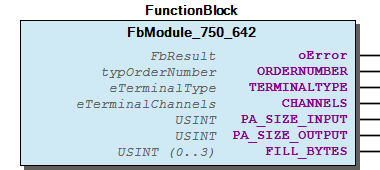 Graphical Interface of FbModule_750_642 Example This example demonstrates the use of a module placed remote behind a fieldbus. Step 1 Declare an instance of the module Note In the case that your process image has an other size you may optional extend the deklaration. Step 2 Bind the module to an Fieldbus Process Image and update the Process Image consistent. Step 3 Use this module instance for I_Port with the normal WagoApp-Libraries like a lokal module at Kbus. - Update Process Data FbModule_750_642.GetNewPaOutputs (METH) - FbModule_750_642.SetNewPaInputs (METH)

## FbModule_750_643 (FB)


| Scope | Name | Type | Initial | Comment | Inherited from |
| --- | --- | --- | --- | --- | --- |
| Output | oError | WagoSysErrorBase.FbResult |  |  | FbModuleBase |
| ORDERNUMBER | WagoTypesBusServices.typOrderNumber | [750, 643, 0, 0] |  |  |
| TERMINALTYPE | WagoTypesBusServices.eTerminalType | eTerminalType.COMPLEX_INOUT |  |  |
| CHANNELS | WagoTypesBusServices.eTerminalChannels | eTerminalChannels.CHANNELS_1 |  |  |
| PA_SIZE_INPUT | USINT | 8 |  |  |
| PA_SIZE_OUTPUT | USINT | 8 |  |  |
| FILL_BYTES | USINT (0..3) | 0 | Fillbytes behind C/S |  |

```
VAR_GLOBAL
    myModule643 :   WagoSysFieldbusModule.FbModule_750_643;  // declare an instance of the module
END_VAR
```

```
VAR_GLOBAL
    myModule643 :   WagoSysFieldbusModule.FbModule_750_643 := ( PaSizeInput := 8, PaSizeOutput := 8, FillBytes := 0);
END_VAR
```

```
VAR_GLOBAL
    abReadData  :   ARRAY[0..126] OF BYTE;
    abWriteData :   ARRAY[0..126] OF BYTE;
END_VAR

IF xUpdatFieldbusData THEN (*   set the new inputs for our module
                                and get the new outputs from our module
                                to write to the fieldbus synchronized to the fieldbus cycle
                            *)
    myModule643.SetNewPaInputs (ADR(abReadData[0]) , myModule643.PA_SIZE_INPUT);
    myModule643.GetNewPaOutputs(ADR(abWriteData[0]), myModule643.PA_SIZE_OUTPUT);

END_IF
```

Graphical Illustration

Graphical Interface of FbModule_750_643

This example demonstrates the use of a module placed remote behind a fieldbus.

Declare an instance of the module

In the case that your process image has an other size you may optional extend the deklaration.

Bind the module to an Fieldbus Process Image and update the Process Image consistent.

Interface variables Function This function blocks provides the access to modules connected over a fieldbus. Graphical Illustration  Graphical Interface of FbModule_750_643 Example This example demonstrates the use of a module placed remote behind a fieldbus. Step 1 Declare an instance of the module Note In the case that your process image has an other size you may optional extend the deklaration. Step 2 Bind the module to an Fieldbus Process Image and update the Process Image consistent. Step 3 Use this module instance for I_Port with the normal WagoApp-Libraries like a lokal module at Kbus. - Update Process Data FbModule_750_643.GetNewPaOutputs (METH) - FbModule_750_643.SetNewPaInputs (METH)

## FbModule_753_1630 (FB)


| Scope | Name | Type | Initial | Comment | Inherited from |
| --- | --- | --- | --- | --- | --- |
| Output | oError | WagoSysErrorBase.FbResult |  |  | FbModuleBase |
| CallBackCounter | UINT |  | callbacks from cycle control point | FbModuleMbx2 |
| ORDERNUMBER | WagoTypesBusServices.typOrderNumber | [753, 1630, 0, 0] |  |  |
| TERMINALTYPE | WagoTypesBusServices.eTerminalType | eTerminalType.COMPLEX_INOUT |  |  |
| CHANNELS | WagoTypesBusServices.eTerminalChannels | eTerminalChannels.CHANNELS_1 |  |  |
| PA_SIZE_INPUT | USINT | 24 |  |  |
| PA_SIZE_OUTPUT | USINT | 24 |  |  |
| FILL_BYTES | USINT (0..3) | 0 | Fillbytes behind C/S |  |

```
VAR_GLOBAL
    myModule1630    :   WagoSysFieldbusModule.FbModule_753_1630;  // declare an instance of the module
END_VAR
```

```
VAR_GLOBAL
    myModule1630    :   WagoSysFieldbusModule.FbModule_753_1630 := ( PaSizeInput := 24, PaSizeOutput := 24, FillBytes := 0);
END_VAR
```

```
VAR_GLOBAL
    abReadData  :   ARRAY[0..126] OF BYTE;
    abWriteData :   ARRAY[0..126] OF BYTE;
END_VAR

IF xUpdatFieldbusData THEN (*   set the new inputs for our module
                                and get the new outputs from our module
                                to write to the fieldbus synchronized to the fieldbus cycle
                            *)
    myModule1630.SetNewPaInputs (ADR(abReadData[0]) , myModule1630.PA_SIZE_INPUT);
    myModule1630.GetNewPaOutputs(ADR(abWriteData[0]), myModule1630.PA_SIZE_OUTPUT);

END_IF
```

Graphical Illustration

Graphical Interface of FbModule_753_1630

This example demonstrates the use of a module placed remote behind a fieldbus.

Declare an instance of the module

In the case that your process image has an other size you may optional extend the deklaration.

Bind the module to an Fieldbus Process Image and update the Process Image consistent.

Interface variables Function This function blocks provides the access to modules connected over a fieldbus. Graphical Illustration  Graphical Interface of FbModule_753_1630 Example This example demonstrates the use of a module placed remote behind a fieldbus. Step 1 Declare an instance of the module Note In the case that your process image has an other size you may optional extend the deklaration. Step 2 Bind the module to an Fieldbus Process Image and update the Process Image consistent. Step 3 Use this module instance for I_Port with the normal WagoApp-Libraries like a lokal module at Kbus. - Update Process Data FbModule_753_1630.GetNewPaOutputs (METH) - FbModule_753_1630.SetNewPaInputs (METH)

## FbModule_753_1631 (FB)


| Scope | Name | Type | Initial | Comment | Inherited from |
| --- | --- | --- | --- | --- | --- |
| Output | oError | WagoSysErrorBase.FbResult |  |  | FbModuleBase |
| CallBackCounter | UINT |  | callbacks from cycle control point | FbModuleMbx2 |
| ORDERNUMBER | WagoTypesBusServices.typOrderNumber | [753, 1631, 0, 0] |  |  |
| TERMINALTYPE | WagoTypesBusServices.eTerminalType | eTerminalType.COMPLEX_INOUT |  |  |
| CHANNELS | WagoTypesBusServices.eTerminalChannels | eTerminalChannels.CHANNELS_1 |  |  |
| PA_SIZE_INPUT | USINT | 24 |  |  |
| PA_SIZE_OUTPUT | USINT | 24 |  |  |
| FILL_BYTES | USINT (0..3) | 0 | Fillbytes behind C/S |  |

```
VAR_GLOBAL
    myModule1631    :   WagoSysFieldbusModule.FbModule_753_1631;  // declare an instance of the module
END_VAR
```

```
VAR_GLOBAL
    myModule1631    :   WagoSysFieldbusModule.FbModule_753_1631 := ( PaSizeInput := 24, PaSizeOutput := 24, FillBytes := 0);
END_VAR
```

```
VAR_GLOBAL
    abReadData  :   ARRAY[0..126] OF BYTE;
    abWriteData :   ARRAY[0..126] OF BYTE;
END_VAR

IF xUpdatFieldbusData THEN (*   set the new inputs for our module
                                and get the new outputs from our module
                                to write to the fieldbus synchronized to the fieldbus cycle
                            *)
    myModule1631.SetNewPaInputs (ADR(abReadData[0]) , myModule1631.PA_SIZE_INPUT);
    myModule1631.GetNewPaOutputs(ADR(abWriteData[0]), myModule1631.PA_SIZE_OUTPUT);

END_IF
```

Graphical Illustration

Graphical Interface of FbModule_753_1631

This example demonstrates the use of a module placed remote behind a fieldbus.

Declare an instance of the module

In the case that your process image has an other size you may optional extend the deklaration.

Bind the module to an Fieldbus Process Image and update the Process Image consistent.

Interface variables Function This function blocks provides the access to modules connected over a fieldbus. Graphical Illustration 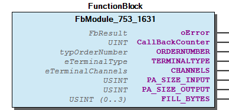 Graphical Interface of FbModule_753_1631 Example This example demonstrates the use of a module placed remote behind a fieldbus. Step 1 Declare an instance of the module Note In the case that your process image has an other size you may optional extend the deklaration. Step 2 Bind the module to an Fieldbus Process Image and update the Process Image consistent. Step 3 Use this module instance for I_Port with the normal WagoApp-Libraries like a lokal module at Kbus. - Update Process Data FbModule_753_1631.GetNewPaOutputs (METH) - FbModule_753_1631.SetNewPaInputs (METH)

## FbModule_753_646 (FB)


| Scope | Name | Type | Initial | Comment | Inherited from |
| --- | --- | --- | --- | --- | --- |
| Output | oError | WagoSysErrorBase.FbResult |  |  | FbModuleBase |
| ORDERNUMBER | WagoTypesBusServices.typOrderNumber | [753, 646, 0, 0] |  |  |
| TERMINALTYPE | WagoTypesBusServices.eTerminalType | eTerminalType.COMPLEX_INOUT |  |  |
| CHANNELS | WagoTypesBusServices.eTerminalChannels | eTerminalChannels.CHANNELS_1 |  |  |
| PA_SIZE_INPUT | USINT | 24 |  |  |
| PA_SIZE_OUTPUT | USINT | 24 |  |  |
| FILL_BYTES | USINT (0..3) | 0 | Fillbytes behind C/S |  |

```
VAR_GLOBAL
    myModule646 :   WagoSysFieldbusModule.FbModule_753_646;  // declare an instance of the module
END_VAR
```

```
VAR_GLOBAL
    myModule646 :   WagoSysFieldbusModule.FbModule_753_646 := ( PaSizeInput := 24, PaSizeOutput := 24, FillBytes := 0);
END_VAR
```

```
VAR_GLOBAL
    abReadData  :   ARRAY[0..126] OF BYTE;
    abWriteData :   ARRAY[0..126] OF BYTE;
END_VAR

IF xUpdatFieldbusData THEN (*   set the new inputs for our module
                                and get the new outputs from our module
                                to write to the fieldbus synchronized to the fieldbus cycle
                            *)
    myModule646.SetNewPaInputs (ADR(abReadData[0]) , myModule646.PA_SIZE_INPUT);
    myModule646.GetNewPaOutputs(ADR(abWriteData[0]), myModule646.PA_SIZE_OUTPUT);

END_IF
```

Graphical Illustration

Graphical Interface of FbModule_753_646

This example demonstrates the use of a module placed remote behind a fieldbus.

Declare an instance of the module

In the case that your process image has an other size you may optional extend the deklaration.

Bind the module to an Fieldbus Process Image and update the Process Image consistent.

Interface variables Function This function blocks provides the access to modules connected over a fieldbus. Graphical Illustration  Graphical Interface of FbModule_753_646 Example This example demonstrates the use of a module placed remote behind a fieldbus. Step 1 Declare an instance of the module Note In the case that your process image has an other size you may optional extend the deklaration. Step 2 Bind the module to an Fieldbus Process Image and update the Process Image consistent. Step 3 Use this module instance for I_Port with the normal WagoApp-Libraries like a lokal module at Kbus. - Update Process Data FbModule_753_646.GetNewPaOutputs (METH) - FbModule_753_646.SetNewPaInputs (METH)

## FbModule_753_647 (FB)


| Scope | Name | Type | Initial | Comment | Inherited from |
| --- | --- | --- | --- | --- | --- |
| Output | oError | WagoSysErrorBase.FbResult |  |  | FbModuleBase |
| CallBackCounter | UINT |  | callbacks from cycle control point | FbModuleMbx2 |
| ORDERNUMBER | WagoTypesBusServices.typOrderNumber | [753, 647, 0, 0] |  |  |
| TERMINALTYPE | WagoTypesBusServices.eTerminalType | eTerminalType.COMPLEX_INOUT |  |  |
| CHANNELS | WagoTypesBusServices.eTerminalChannels | eTerminalChannels.CHANNELS_1 |  |  |
| PA_SIZE_INPUT | USINT | 24 |  |  |
| PA_SIZE_OUTPUT | USINT | 24 |  |  |
| FILL_BYTES | USINT (0..3) | 0 | Fillbytes behind C/S |  |

```
VAR_GLOBAL
    myModule647 :   WagoSysFieldbusModule.FbModule_753_647;  // declare an instance of the module
END_VAR
```

```
VAR_GLOBAL
    myModule647 :   WagoSysFieldbusModule.FbModule_753_647 := ( PaSizeInput := 24, PaSizeOutput := 24, FillBytes := 0);
END_VAR
```

```
VAR_GLOBAL
    abReadData  :   ARRAY[0..126] OF BYTE;
    abWriteData :   ARRAY[0..126] OF BYTE;
END_VAR

IF xUpdatFieldbusData THEN (*   set the new inputs for our module
                                and get the new outputs from our module
                                to write to the fieldbus synchronized to the fieldbus cycle
                            *)
    myModule647.SetNewPaInputs (ADR(abReadData[0]) , myModule647.PA_SIZE_INPUT);
    myModule647.GetNewPaOutputs(ADR(abWriteData[0]), myModule647.PA_SIZE_OUTPUT);

END_IF
```

Graphical Illustration

Graphical Interface of FbModule_753_647

This example demonstrates the use of a module placed remote behind a fieldbus.

Declare an instance of the module

In the case that your process image has an other size you may optional extend the deklaration.

Bind the module to an Fieldbus Process Image and update the Process Image consistent.

Interface variables Function This function blocks provides the access to modules connected over a fieldbus. Graphical Illustration 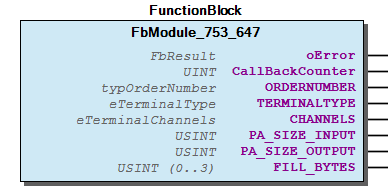 Graphical Interface of FbModule_753_647 Example This example demonstrates the use of a module placed remote behind a fieldbus. Step 1 Declare an instance of the module Note In the case that your process image has an other size you may optional extend the deklaration. Step 2 Bind the module to an Fieldbus Process Image and update the Process Image consistent. Step 3 Use this module instance for I_Port with the normal WagoApp-Libraries like a lokal module at Kbus. - Update Process Data FbModule_753_647.GetNewPaOutputs (METH) - FbModule_753_647.SetNewPaInputs (METH)

## FbModule_753_649 (FB)


| Scope | Name | Type | Initial | Comment | Inherited from |
| --- | --- | --- | --- | --- | --- |
| Output | oError | WagoSysErrorBase.FbResult |  |  | FbModuleBase |
| CallBackCounter | UINT |  | callbacks from cycle control point | FbModuleMbx2 |
| ORDERNUMBER | WagoTypesBusServices.typOrderNumber | [753, 649, 0, 0] |  |  |
| TERMINALTYPE | WagoTypesBusServices.eTerminalType | eTerminalType.COMPLEX_INOUT |  |  |
| CHANNELS | WagoTypesBusServices.eTerminalChannels | eTerminalChannels.CHANNELS_1 |  |  |
| PA_SIZE_INPUT | USINT | 24 |  |  |
| PA_SIZE_OUTPUT | USINT | 24 |  |  |
| FILL_BYTES | USINT (0..3) | 0 | Fillbytes behind C/S |  |

```
VAR_GLOBAL
    myModule649 :   WagoSysFieldbusModule.FbModule_753_649;  // declare an instance of the module
END_VAR
```

```
VAR_GLOBAL
    myModule649 :   WagoSysFieldbusModule.FbModule_753_649 := ( PaSizeInput := 24, PaSizeOutput := 24, FillBytes := 0);
END_VAR
```

```
VAR_GLOBAL
    abReadData  :   ARRAY[0..126] OF BYTE;
    abWriteData :   ARRAY[0..126] OF BYTE;
END_VAR

IF xUpdatFieldbusData THEN (*   set the new inputs for our module
                                and get the new outputs from our module
                                to write to the fieldbus synchronized to the fieldbus cycle
                            *)
    myModule649.SetNewPaInputs (ADR(abReadData[0]) , myModule649.PA_SIZE_INPUT);
    myModule649.GetNewPaOutputs(ADR(abWriteData[0]), myModule649.PA_SIZE_OUTPUT);

END_IF
```

Graphical Illustration

Graphical Interface of FbModule_753_649

This example demonstrates the use of a module placed remote behind a fieldbus.

Declare an instance of the module

In the case that your process image has an other size you may optional extend the deklaration.

Bind the module to an Fieldbus Process Image and update the Process Image consistent.

Interface variables Function This function blocks provides the access to modules connected over a fieldbus. Graphical Illustration  Graphical Interface of FbModule_753_649 Example This example demonstrates the use of a module placed remote behind a fieldbus. Step 1 Declare an instance of the module Note In the case that your process image has an other size you may optional extend the deklaration. Step 2 Bind the module to an Fieldbus Process Image and update the Process Image consistent. Step 3 Use this module instance for I_Port with the normal WagoApp-Libraries like a lokal module at Kbus. - Update Process Data FbModule_753_649.GetNewPaOutputs (METH) - FbModule_753_649.SetNewPaInputs (METH)

## FbModule_75x_1491 (FB)


| Scope | Name | Type | Initial | Comment | Inherited from |
| --- | --- | --- | --- | --- | --- |
| Output | oError | WagoSysErrorBase.FbResult |  |  | FbModuleBase |
| ORDERNUMBER | WagoTypesBusServices.typOrderNumber | [750, 1491, 0, 0] |  |  |
| TERMINALTYPE | WagoTypesBusServices.eTerminalType | eTerminalType.COMPLEX_INPUT |  |  |
| CHANNELS | WagoTypesBusServices.eTerminalChannels | eTerminalChannels.CHANNELS_4 |  |  |
| PA_SIZE_INPUT | USINT | 16 |  |  |
| PA_SIZE_OUTPUT | USINT | 16 |  |  |
| FILL_BYTES | USINT (0..3) | 1 | Fillbytes behind C/S |  |

```
VAR_GLOBAL
    myModule1491    :   WagoSysFieldbusModule.FbModule_75x_1491;  // declare an instance of the module
END_VAR
```

```
VAR_GLOBAL
    myModule1491    :   WagoSysFieldbusModule.FbModule_75x_1491 := ( PaSizeInput := 16, PaSizeOutput := 0, FillBytes := 0);
END_VAR
```

```
VAR_GLOBAL
    abReadData  :   ARRAY[0..126] OF BYTE;
    abWriteData :   ARRAY[0..126] OF BYTE;
END_VAR

IF xUpdatFieldbusData THEN (*   set the new inputs for our module
                                and get the new outputs from our module
                                to write to the fieldbus synchronized to the fieldbus cycle
                            *)
    myModule1491.SetNewPaInputs (ADR(abReadData[0]) , myModule1491.PA_SIZE_INPUT);
    myModule1491.GetNewPaOutputs(ADR(abWriteData[0]), myModule1491.PA_SIZE_OUTPUT);

END_IF
```

Graphical Illustration

Graphical Interface of FbModule_75x_1491

This example demonstrates the use of a module placed remote behind a fieldbus.

Declare an instance of the module

In the case that your process image has an other size you may optional extend the deklaration.

Bind the module to an Fieldbus Process Image and update the Process Image consistent.

Interface variables Function This function blocks provides the access to modules connected over a fieldbus. Graphical Illustration  Graphical Interface of FbModule_75x_1491 Example This example demonstrates the use of a module placed remote behind a fieldbus. Step 1 Declare an instance of the module Note In the case that your process image has an other size you may optional extend the deklaration. Step 2 Bind the module to an Fieldbus Process Image and update the Process Image consistent. Step 3 Use this module instance for I_Port with the normal WagoApp-Libraries like a lokal module at Kbus. - Update Process Data FbModule_75x_1491.GetNewPaOutputs (METH) - FbModule_75x_1491.SetNewPaInputs (METH)

## FbModule_75x_1632 (FB)


| Scope | Name | Type | Initial | Comment | Inherited from |
| --- | --- | --- | --- | --- | --- |
| Output | oError | WagoSysErrorBase.FbResult |  |  | FbModuleBase |
| CallBackCounter | UINT |  | callbacks from cycle control point | FbModuleMbx2 |
| ORDERNUMBER | WagoTypesBusServices.typOrderNumber | [750, 1632, 0, 0] |  |  |
| TERMINALTYPE | WagoTypesBusServices.eTerminalType | eTerminalType.COMPLEX_INOUT |  |  |
| CHANNELS | WagoTypesBusServices.eTerminalChannels | eTerminalChannels.CHANNELS_2 |  |  |
| PA_SIZE_INPUT | USINT | 12 |  |  |
| PA_SIZE_OUTPUT | USINT | 12 |  |  |
| FILL_BYTES | USINT (0..3) | 0 | Fillbytes behind C/S |  |

```
VAR_GLOBAL
    myModule1632    :   WagoSysFieldbusModule.FbModule_75x_1632;  // declare an instance of the module
END_VAR
```

```
VAR_GLOBAL
    myModule1632    :   WagoSysFieldbusModule.FbModule_75x_1632 := ( PaSizeInput := 12, PaSizeOutput := 12, FillBytes := 0);
END_VAR
```

```
VAR_GLOBAL
    abReadData  :   ARRAY[0..126] OF BYTE;
    abWriteData :   ARRAY[0..126] OF BYTE;
END_VAR

IF xUpdatFieldbusData THEN (*   set the new inputs for our module
                                and get the new outputs from our module
                                to write to the fieldbus synchronized to the fieldbus cycle
                            *)
    myModule1632.SetNewPaInputs (ADR(abReadData[0]) , myModule1632.PA_SIZE_INPUT);
    myModule1632.GetNewPaOutputs(ADR(abWriteData[0]), myModule1632.PA_SIZE_OUTPUT);

END_IF
```

Graphical Illustration

Graphical Interface of FbModule_75x_1632

This example demonstrates the use of a module placed remote behind a fieldbus.

Declare an instance of the module. If you have changed the PA-Size of the Terminal 75x-1632 with a WAGO-Configuration-Tool like IO-CHECK then you can advise this to the module instance at declaration by setting the parameter PaSizeInput and PaSizeOutput . Default size is 12 byte.

In the case that your process image has an other size you may optional extend the deklaration.

Bind the module to an Fieldbus Process Image and update the Process Image consistent.

Interface variables Function This function blocks provides the access to modules connected over a fieldbus. Graphical Illustration 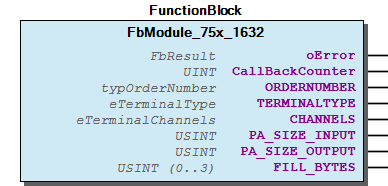 Graphical Interface of FbModule_75x_1632 Example This example demonstrates the use of a module placed remote behind a fieldbus. Step 1 Declare an instance of the module. If you have changed the PA-Size of the Terminal 75x-1632 with a WAGO-Configuration-Tool like IO-CHECK then you can advise this to the module instance at declaration by setting the parameter PaSizeInput and PaSizeOutput . Default size is 12 byte. myModule1632 : WagoSysFieldbusModule.FbModule_75x_1632 := (PaSizeInput := 6, PaSizeOutput := 6 ) Note In the case that your process image has an other size you may optional extend the deklaration. Step 2 Bind the module to an Fieldbus Process Image and update the Process Image consistent. Step 3 Use this module instance for I_Port with the normal WagoApp-Libraries like a lokal module at Kbus. - Update Process Data FbModule_75x_1632.GetNewPaOutputs (METH) - FbModule_75x_1632.SetNewPaInputs (METH)

## FbModule_75x_1652 (FB)


| Scope | Name | Type | Initial | Comment | Inherited from |
| --- | --- | --- | --- | --- | --- |
| Output | oError | WagoSysErrorBase.FbResult |  |  | FbModuleBase |
| ORDERNUMBER | WagoTypesBusServices.typOrderNumber | [750, 1652, 0, 0] |  |  |
| TERMINALTYPE | WagoTypesBusServices.eTerminalType | eTerminalType.COMPLEX_INOUT |  |  |
| CHANNELS | WagoTypesBusServices.eTerminalChannels | eTerminalChannels.CHANNELS_1 |  |  |
| PA_SIZE_INPUT | USINT | 24 |  |  |
| PA_SIZE_OUTPUT | USINT | 24 |  |  |
| FILL_BYTES | USINT (0..3) | 0 | Fillbytes behind C/S |  |

```
VAR_GLOBAL
    myModule1652    :   WagoSysFieldbusModule.FbModule_75x_1652:  // declare an instance of the module
END_VAR
```

```
VAR_GLOBAL
    myModule1652    :   WagoSysFieldbusModule.FbModule_75x_1652 := ( PaSizeInput := 24, PaSizeOutput := 24, FillBytes := 0);
END_VAR
```

```
VAR_GLOBAL
    abReadData  :   ARRAY[0..126] OF BYTE;
    abWriteData :   ARRAY[0..126] OF BYTE;
END_VAR

IF xUpdatFieldbusData THEN (*   set the new inputs for our module
                                and get the new outputs from our module
                                to write to the fieldbus synchronized to the fieldbus cycle
                            *)
    myModule1652.SetNewPaInputs (ADR(abReadData[0]) , myModule652.PA_SIZE_INPUT);
    myModule1652.GetNewPaOutputs(ADR(abWriteData[0]), myModule652.PA_SIZE_OUTPUT);

END_IF
```

Graphical Illustration

Graphical Interface of FbModule_75x_1652

This example demonstrates the use of a module 1652 placed remote behind a fieldbus.

Declare an instance of the module. If you have changed the PA-Size of the Terminal 750-652 with a WAGO-Configuration-Tool like IO-CHECK then you can advise this to the module instance at declaration by setting the parameter PaSizeInput and PaSizeOutput . Default size is 24 byte.

In the case that your process image has an other size you may optional extend the deklaration.

Bind the module to an Fieldbus Process Image.

Interface variables Function This function block provides the access to a serial modules 1652 connected over a fieldbus. Graphical Illustration  Graphical Interface of FbModule_75x_1652 Example This example demonstrates the use of a module 1652 placed remote behind a fieldbus. Step 1 Declare an instance of the module. If you have changed the PA-Size of the Terminal 750-652 with a WAGO-Configuration-Tool like IO-CHECK then you can advise this to the module instance at declaration by setting the parameter PaSizeInput and PaSizeOutput . Default size is 24 byte. myModule1652 : WagoSysFieldbusModule.FbModule_75x_1652 := (PaSizeInput := 24, PaSizeOutput := 24 ) Note In the case that your process image has an other size you may optional extend the deklaration. Step 2 Bind the module to an Fieldbus Process Image. Step 3 Use the module for I_Port with the normal WagoApp-Libraries like a lokal module at Kbus. - Update Process Data FbModule_75x_1652.GetNewPaOutputs (METH) - FbModule_75x_1652.SetNewPaInputs (METH)

## FbModule_75x_1657 (FB)


| Scope | Name | Type | Initial | Comment | Inherited from |
| --- | --- | --- | --- | --- | --- |
| Output | oError | WagoSysErrorBase.FbResult |  |  | FbModuleBase |
| CallBackCounter | UINT |  | callbacks from cycle control point | FbModuleMbx2 |
| ORDERNUMBER | WagoTypesBusServices.typOrderNumber | [750, 1657, 0, 0] |  |  |
| TERMINALTYPE | WagoTypesBusServices.eTerminalType | eTerminalType.COMPLEX_INOUT |  |  |
| CHANNELS | WagoTypesBusServices.eTerminalChannels | eTerminalChannels.CHANNELS_1 |  |  |
| PA_SIZE_INPUT | USINT | 24 |  |  |
| PA_SIZE_OUTPUT | USINT | 24 |  |  |
| FILL_BYTES | USINT (0..3) | 0 | Fillbytes behind C/S |  |

```
VAR_GLOBAL
    myModule1657    :   WagoSysFieldbusModule.FbModule_75x_1657;  // declare an instance of the module
END_VAR
```

```
VAR_GLOBAL
    myModule1657    :   WagoSysFieldbusModule.FbModule_75x_1657 := ( PaSizeInput := 24, PaSizeOutput := 24, FillBytes := 0);
END_VAR
```

```
VAR_GLOBAL
    abReadData  :   ARRAY[0..126] OF BYTE;
    abWriteData :   ARRAY[0..126] OF BYTE;
END_VAR

IF xUpdatFieldbusData THEN (*   set the new inputs for our module
                                and get the new outputs from our module
                                to write to the fieldbus synchronized to the fieldbus cycle
                            *)
    myModule1657.SetNewPaInputs (ADR(abReadData[0]) , myModule1657.PA_SIZE_INPUT);
    myModule1657.GetNewPaOutputs(ADR(abWriteData[0]), myModule1657.PA_SIZE_OUTPUT);

END_IF
```

Graphical Illustration

Graphical Interface of FbModule_75x_1657

This example demonstrates the use of a module 1657 placed remote behind a fieldbus.

Declare an instance of the module. If you have changed the PA-Size of the Terminal 75x-655 with a WAGO-Configuration-Tool like IO-CHECK then you can advise this to the module instance at declaration by setting the parameter PaSizeInput and PaSizeOutput . Default size is 24 byte.

In the case that your process image has an other size you may optional extend the deklaration.

Bind the module to an Fieldbus Process Image and update the Process Image consistent.

Interface variables Function This function block provides the access to a module 1657 connected over a fieldbus. Graphical Illustration 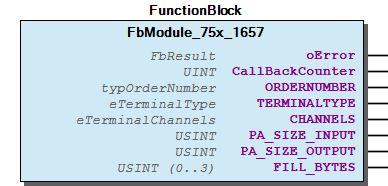 Graphical Interface of FbModule_75x_1657 Example This example demonstrates the use of a module 1657 placed remote behind a fieldbus. Step 1 Declare an instance of the module. If you have changed the PA-Size of the Terminal 75x-655 with a WAGO-Configuration-Tool like IO-CHECK then you can advise this to the module instance at declaration by setting the parameter PaSizeInput and PaSizeOutput . Default size is 24 byte. myModule1657 : WagoSysFieldbusModule.FbModule_75x_1657 := (PaSizeInput := 24, PaSizeOutput := 24 ) Note In the case that your process image has an other size you may optional extend the deklaration. Step 2 Bind the module to an Fieldbus Process Image and update the Process Image consistent. Step 3 Use this module instance for I_Port with the normal WagoApp-Libraries like a lokal module at Kbus. - Update Process Data FbModule_75x_1657.GetNewPaOutputs (METH) - FbModule_75x_1657.SetNewPaInputs (METH)

## FbModule_75x_458 (FB)


| Scope | Name | Type | Initial | Comment | Inherited from |
| --- | --- | --- | --- | --- | --- |
| Output | oError | WagoSysErrorBase.FbResult |  |  | FbModuleBase |
| ORDERNUMBER | WagoTypesBusServices.typOrderNumber | [750, 458, 0, 0] |  |  |
| TERMINALTYPE | WagoTypesBusServices.eTerminalType | eTerminalType.COMPLEX_INPUT |  |  |
| CHANNELS | WagoTypesBusServices.eTerminalChannels | eTerminalChannels.CHANNELS_8 |  |  |
| PA_SIZE_INPUT | USINT | 16 |  |  |
| PA_SIZE_OUTPUT | USINT | 0 |  |  |
| FILL_BYTES | USINT (0..3) | 0 | Fillbytes behind C/S |  |

Interface variables - Update Process Data FbModule_75x_458.GetNewPaOutputs (METH) - FbModule_75x_458.SetNewPaInputs (METH)

## FbModule_75x_461 (FB)


| Scope | Name | Type | Initial | Comment | Inherited from |
| --- | --- | --- | --- | --- | --- |
| Output | oError | WagoSysErrorBase.FbResult |  |  | FbModuleBase |
| ORDERNUMBER | WagoTypesBusServices.typOrderNumber | [750, 461, 0, 0] |  |  |
| TERMINALTYPE | WagoTypesBusServices.eTerminalType | eTerminalType.COMPLEX_INPUT |  |  |
| CHANNELS | WagoTypesBusServices.eTerminalChannels | eTerminalChannels.CHANNELS_2 |  |  |
| PA_SIZE_INPUT | USINT | 16 |  |  |
| PA_SIZE_OUTPUT | USINT | 0 |  |  |
| FILL_BYTES | USINT (0..3) | 0 | Fillbytes behind C/S |  |

Interface variables - Update Process Data FbModule_75x_461.GetNewPaOutputs (METH) - FbModule_75x_461.SetNewPaInputs (METH)

## FbModule_75x_469 (FB)


| Scope | Name | Type | Initial | Comment | Inherited from |
| --- | --- | --- | --- | --- | --- |
| Output | oError | WagoSysErrorBase.FbResult |  |  | FbModuleBase |
| ORDERNUMBER | WagoTypesBusServices.typOrderNumber | [750, 469, 0, 0] |  |  |
| TERMINALTYPE | WagoTypesBusServices.eTerminalType | eTerminalType.COMPLEX_INPUT |  |  |
| CHANNELS | WagoTypesBusServices.eTerminalChannels | eTerminalChannels.CHANNELS_2 |  |  |
| PA_SIZE_INPUT | USINT | 4 |  |  |
| PA_SIZE_OUTPUT | USINT | 0 |  |  |
| FILL_BYTES | USINT (0..3) | 0 | Fillbytes behind C/S |  |

Interface variables - Update Process Data FbModule_75x_469.GetNewPaOutputs (METH) - FbModule_75x_469.SetNewPaInputs (METH)

## FbModule_75x_471 (FB)


| Scope | Name | Type | Initial | Comment | Inherited from |
| --- | --- | --- | --- | --- | --- |
| Output | oError | WagoSysErrorBase.FbResult |  |  | FbModuleBase |
| ORDERNUMBER | WagoTypesBusServices.typOrderNumber | [750, 471, 0, 0] |  |  |
| TERMINALTYPE | WagoTypesBusServices.eTerminalType | eTerminalType.COMPLEX_INPUT |  |  |
| CHANNELS | WagoTypesBusServices.eTerminalChannels | eTerminalChannels.CHANNELS_4 |  |  |
| PA_SIZE_INPUT | USINT | 8 |  |  |
| PA_SIZE_OUTPUT | USINT | 0 |  |  |
| FILL_BYTES | USINT (0..3) | 0 | Fillbytes behind C/S |  |

Interface variables - Update Process Data FbModule_75x_471.GetNewPaOutputs (METH) - FbModule_75x_471.SetNewPaInputs (METH)

## FbModule_75x_481 (FB)


| Scope | Name | Type | Initial | Comment | Inherited from |
| --- | --- | --- | --- | --- | --- |
| Output | oError | WagoSysErrorBase.FbResult |  |  | FbModuleBase |
| ORDERNUMBER | WagoTypesBusServices.typOrderNumber | [750, 481, 0, 0] |  |  |
| TERMINALTYPE | WagoTypesBusServices.eTerminalType | eTerminalType.COMPLEX_INPUT |  |  |
| CHANNELS | WagoTypesBusServices.eTerminalChannels | eTerminalChannels.CHANNELS_2 |  |  |
| PA_SIZE_INPUT | USINT | 4 |  |  |
| PA_SIZE_OUTPUT | USINT | 0 |  |  |
| FILL_BYTES | USINT (0..3) | 0 | Fillbytes behind C/S |  |

Interface variables - Update Process Data FbModule_75x_481.GetNewPaOutputs (METH) - FbModule_75x_481.SetNewPaInputs (METH)

## FbModule_75x_482 (FB)


| Scope | Name | Type | Initial | Comment | Inherited from |
| --- | --- | --- | --- | --- | --- |
| Output | oError | WagoSysErrorBase.FbResult |  |  | FbModuleBase |
| ORDERNUMBER | WagoTypesBusServices.typOrderNumber | [750, 482, 0, 0] |  |  |
| TERMINALTYPE | WagoTypesBusServices.eTerminalType | eTerminalType.COMPLEX_INOUT |  |  |
| CHANNELS | WagoTypesBusServices.eTerminalChannels | eTerminalChannels.CHANNELS_2 |  |  |
| PA_SIZE_INPUT | USINT | 12 |  |  |
| PA_SIZE_OUTPUT | USINT | 12 |  |  |
| FILL_BYTES | USINT (0..3) | 1 | Fillbytes behind C/S –> 27.10.2020 UU |  |

```
VAR_GLOBAL
    myModule482 :   WagoSysFieldbusModule.FbModule_75x_482;  // declare an instance of the module
END_VAR
```

```
VAR_GLOBAL
    myModule482 :   WagoSysFieldbusModule.FbModule_75x_482 := ( PaSizeInput := 12, PaSizeOutput := 12, FillBytes := 1);
END_VAR
```

```
VAR_GLOBAL
    abReadData  :   ARRAY[0..126] OF BYTE;
    abWriteData :   ARRAY[0..126] OF BYTE;
END_VAR

IF xUpdatFieldbusData THEN (*   set the new inputs for our module
                                and get the new outputs from our module
                                to write to the fieldbus synchronized to the fieldbus cycle
                            *)
    myModule482.SetNewPaInputs (ADR(abReadData[0]) , myModule482.PA_SIZE_INPUT);
    myModule482.GetNewPaOutputs(ADR(abWriteData[0]), myModule482.PA_SIZE_OUTPUT);

END_IF
```

Graphical Illustration

Graphical Interface of FbModule_75x_482

This example demonstrates the use of a module placed remote behind a fieldbus.

Declare an instance of the module

In the case that your process image has an other size you may optional extend the deklaration.

Bind the module to an Fieldbus Process Image and update the Process Image consistent.

Interface variables Function This function blocks provides the access to modules connected over a fieldbus. Graphical Illustration  Graphical Interface of FbModule_75x_482 Example This example demonstrates the use of a module placed remote behind a fieldbus. Step 1 Declare an instance of the module Note In the case that your process image has an other size you may optional extend the deklaration. Step 2 Bind the module to an Fieldbus Process Image and update the Process Image consistent. Step 3 Use this module instance for I_Port with the normal WagoApp-Libraries like a lokal module at Kbus. - Update Process Data FbModule_75x_482.GetNewPaOutputs (METH) - FbModule_75x_482.GetProcessInByte (METH) - FbModule_75x_482.GetProcessOutByte (METH) - FbModule_75x_482.SetNewPaInputs (METH)

## FbModule_75x_484 (FB)


| Scope | Name | Type | Initial | Comment | Inherited from |
| --- | --- | --- | --- | --- | --- |
| Output | oError | WagoSysErrorBase.FbResult |  |  | FbModuleBase |
| ORDERNUMBER | WagoTypesBusServices.typOrderNumber | [750, 484, 0, 0] |  |  |
| TERMINALTYPE | WagoTypesBusServices.eTerminalType | eTerminalType.COMPLEX_INOUT |  |  |
| CHANNELS | WagoTypesBusServices.eTerminalChannels | eTerminalChannels.CHANNELS_2 |  |  |
| PA_SIZE_INPUT | USINT | 12 |  |  |
| PA_SIZE_OUTPUT | USINT | 12 |  |  |
| FILL_BYTES | USINT (0..3) | 1 | Fillbytes behind C/S –> 27.10.2020 UU |  |

```
VAR_GLOBAL
    myModule484 :   WagoSysFieldbusModule.FbModule_75x_484;  // declare an instance of the module
END_VAR
```

```
VAR_GLOBAL
    myModule484 :   WagoSysFieldbusModule.FbModule_75x_484 := ( PaSizeInput := 12, PaSizeOutput := 12, FillBytes := 1);
END_VAR
```

```
VAR_GLOBAL
    abReadData  :   ARRAY[0..126] OF BYTE;
    abWriteData :   ARRAY[0..126] OF BYTE;
END_VAR

IF xUpdatFieldbusData THEN (*   set the new inputs for our module
                                and get the new outputs from our module
                                to write to the fieldbus synchronized to the fieldbus cycle
                            *)
    myModule484.SetNewPaInputs (ADR(abReadData[0]) , myModule484.PA_SIZE_INPUT);
    myModule484.GetNewPaOutputs(ADR(abWriteData[0]), myModule484.PA_SIZE_OUTPUT);

END_IF
```

Graphical Illustration

Graphical Interface of FbModule_75x_484

This example demonstrates the use of a module placed remote behind a fieldbus.

Declare an instance of the module

In the case that your process image has an other size you may optional extend the deklaration.

Bind the module to an Fieldbus Process Image and update the Process Image consistent.

Interface variables Function This function blocks provides the access to modules connected over a fieldbus. Graphical Illustration  Graphical Interface of FbModule_75x_484 Example This example demonstrates the use of a module placed remote behind a fieldbus. Step 1 Declare an instance of the module Note In the case that your process image has an other size you may optional extend the deklaration. Step 2 Bind the module to an Fieldbus Process Image and update the Process Image consistent. Step 3 Use this module instance for I_Port with the normal WagoApp-Libraries like a lokal module at Kbus. - Update Process Data FbModule_75x_484.GetNewPaOutputs (METH) - FbModule_75x_484.GetProcessInByte (METH) - FbModule_75x_484.GetProcessOutByte (METH) - FbModule_75x_484.SetNewPaInputs (METH)

## FbModule_75x_486 (FB)


| Scope | Name | Type | Initial | Comment | Inherited from |
| --- | --- | --- | --- | --- | --- |
| Output | oError | WagoSysErrorBase.FbResult |  |  | FbModuleBase |
| ORDERNUMBER | WagoTypesBusServices.typOrderNumber | [750, 486, 0, 0] |  |  |
| TERMINALTYPE | WagoTypesBusServices.eTerminalType | eTerminalType.COMPLEX_INPUT |  |  |
| CHANNELS | WagoTypesBusServices.eTerminalChannels | eTerminalChannels.CHANNELS_4 |  |  |
| PA_SIZE_INPUT | USINT | 8 |  |  |
| PA_SIZE_OUTPUT | USINT | 0 |  |  |
| FILL_BYTES | USINT (0..3) | 0 | Fillbytes behind C/S |  |

Interface variables - Update Process Data FbModule_75x_486.GetNewPaOutputs (METH) - FbModule_75x_486.SetNewPaInputs (METH)

## FbModule_75x_487 (FB)


| Scope | Name | Type | Initial | Comment | Inherited from |
| --- | --- | --- | --- | --- | --- |
| Output | oError | WagoSysErrorBase.FbResult |  |  | FbModuleBase |
| ORDERNUMBER | WagoTypesBusServices.typOrderNumber | [750, 487, 0, 0] |  |  |
| TERMINALTYPE | WagoTypesBusServices.eTerminalType | eTerminalType.COMPLEX_INPUT |  |  |
| CHANNELS | WagoTypesBusServices.eTerminalChannels | eTerminalChannels.CHANNELS_2 |  |  |
| PA_SIZE_INPUT | USINT | 4 |  |  |
| PA_SIZE_OUTPUT | USINT | 0 |  |  |
| FILL_BYTES | USINT (0..3) | 0 | Fillbytes behind C/S |  |

Interface variables - Update Process Data FbModule_75x_487.GetNewPaOutputs (METH) - FbModule_75x_487.SetNewPaInputs (METH)

## FbModule_75x_489 (FB)


| Scope | Name | Type | Initial | Comment | Inherited from |
| --- | --- | --- | --- | --- | --- |
| Output | oError | WagoSysErrorBase.FbResult |  |  | FbModuleBase |
| ORDERNUMBER | WagoTypesBusServices.typOrderNumber | [750, 489, 0, 0] |  |  |
| TERMINALTYPE | WagoTypesBusServices.eTerminalType | eTerminalType.COMPLEX_INPUT |  |  |
| CHANNELS | WagoTypesBusServices.eTerminalChannels | eTerminalChannels.CHANNELS_4 |  |  |
| PA_SIZE_INPUT | USINT | 8 |  |  |
| PA_SIZE_OUTPUT | USINT | 0 |  |  |
| FILL_BYTES | USINT (0..3) | 0 | Fillbytes behind C/S |  |

Interface variables - Update Process Data FbModule_75x_489.GetNewPaOutputs (METH) - FbModule_75x_489.SetNewPaInputs (METH)

## FbModule_75x_493 (FB)


| Scope | Name | Type | Initial | Comment | Inherited from |
| --- | --- | --- | --- | --- | --- |
| Output | oError | WagoSysErrorBase.FbResult |  |  | FbModuleBase |
| ORDERNUMBER | WagoTypesBusServices.typOrderNumber | [750, 493, 0, 0] |  |  |
| TERMINALTYPE | WagoTypesBusServices.eTerminalType | eTerminalType.COMPLEX_INOUT |  |  |
| CHANNELS | WagoTypesBusServices.eTerminalChannels | eTerminalChannels.CHANNELS_1 |  |  |
| PA_SIZE_INPUT | USINT | 12 |  |  |
| PA_SIZE_OUTPUT | USINT | 12 |  |  |
| FILL_BYTES | USINT (0..3) | 1 | Fillbytes behind C/S |  |

```
VAR_GLOBAL
    myModule493 :   WagoSysFieldbusModule.FbModule_75x_493;  // declare an instance of the module
END_VAR
```

```
VAR_GLOBAL
    myModule493 :   WagoSysFieldbusModule.FbModule_75x_493 := ( PaSizeInput := 12, PaSizeOutput := 12, FillBytes := 1);
END_VAR
```

```
VAR_GLOBAL
    abReadData  :   ARRAY[0..126] OF BYTE;
    abWriteData :   ARRAY[0..126] OF BYTE;
END_VAR

IF xUpdatFieldbusData THEN (*   set the new inputs for our module
                                and get the new outputs from our module
                                to write to the fieldbus synchronized to the fieldbus cycle
                            *)
    myModule493.SetNewPaInputs (ADR(abReadData[0]) , myModule493.PA_SIZE_INPUT);
    myModule493.GetNewPaOutputs(ADR(abWriteData[0]), myModule493.PA_SIZE_OUTPUT);

END_IF
```

Graphical Illustration

Graphical Interface of FbModule_75x_493

This example demonstrates the use of a module placed remote behind a fieldbus.

Declare an instance of the module

In the case that your process image has an other size you may optional extend the deklaration.

Bind the module to an Fieldbus Process Image and update the Process Image consistent.

Interface variables Function This function blocks provides the access to modules connected over a fieldbus. Graphical Illustration  Graphical Interface of FbModule_75x_493 Example This example demonstrates the use of a module placed remote behind a fieldbus. Step 1 Declare an instance of the module Note In the case that your process image has an other size you may optional extend the deklaration. Step 2 Bind the module to an Fieldbus Process Image and update the Process Image consistent. Step 3 Use this module instance for I_Port with the normal WagoApp-Libraries like a lokal module at Kbus. - Update Process Data FbModule_75x_493.GetNewPaOutputs (METH) - FbModule_75x_493.SetNewPaInputs (METH)

## FbModule_75x_494 (FB)


| Scope | Name | Type | Initial | Comment | Inherited from |
| --- | --- | --- | --- | --- | --- |
| Output | oError | WagoSysErrorBase.FbResult |  |  | FbModuleBase |
| ORDERNUMBER | WagoTypesBusServices.typOrderNumber | [750, 494, 0, 0] |  |  |
| TERMINALTYPE | WagoTypesBusServices.eTerminalType | eTerminalType.COMPLEX_INOUT |  |  |
| CHANNELS | WagoTypesBusServices.eTerminalChannels | eTerminalChannels.CHANNELS_3 |  |  |
| PA_SIZE_INPUT | USINT | 24 |  |  |
| PA_SIZE_OUTPUT | USINT | 24 |  |  |
| FILL_BYTES | USINT (0..3) | 0 | Fillbytes behind C/S |  |

```
VAR_GLOBAL
    myModule494 :   WagoSysFieldbusModule.FbModule_75x_494;  // declare an instance of the module
END_VAR
```

```
VAR_GLOBAL
    myModule494 :   WagoSysFieldbusModule.FbModule_75x_494 := ( PaSizeInput := 24, PaSizeOutput := 24, FillBytes := 0);
END_VAR
```

```
VAR_GLOBAL
    abReadData  :   ARRAY[0..126] OF BYTE;
    abWriteData :   ARRAY[0..126] OF BYTE;
END_VAR

IF xUpdatFieldbusData THEN (*   set the new inputs for our module
                                and get the new outputs from our module
                                to write to the fieldbus synchronized to the fieldbus cycle
                            *)
    myModule494.SetNewPaInputs (ADR(abReadData[0]) , myModule494.PA_SIZE_INPUT);
    myModule494.GetNewPaOutputs(ADR(abWriteData[0]), myModule494.PA_SIZE_OUTPUT);

END_IF
```

Graphical Illustration

Graphical Interface of FbModule_75x_494

This example demonstrates the use of a module placed remote behind a fieldbus.

Declare an instance of the module

In the case that your process image has an other size you may optional extend the deklaration.

Bind the module to an Fieldbus Process Image and update the Process Image consistent.

Interface variables Function This function blocks provides the access to modules connected over a fieldbus. Graphical Illustration  Graphical Interface of FbModule_75x_494 Example This example demonstrates the use of a module placed remote behind a fieldbus. Step 1 Declare an instance of the module Note In the case that your process image has an other size you may optional extend the deklaration. Step 2 Bind the module to an Fieldbus Process Image and update the Process Image consistent. Step 3 Use this module instance for I_Port with the normal WagoApp-Libraries like a lokal module at Kbus. - Update Process Data FbModule_75x_494.GetNewPaOutputs (METH) - FbModule_75x_494.SetNewPaInputs (METH)

## FbModule_75x_495 (FB)


| Scope | Name | Type | Initial | Comment | Inherited from |
| --- | --- | --- | --- | --- | --- |
| Output | oError | WagoSysErrorBase.FbResult |  |  | FbModuleBase |
| ORDERNUMBER | WagoTypesBusServices.typOrderNumber | [750, 495, 0, 0] |  |  |
| TERMINALTYPE | WagoTypesBusServices.eTerminalType | eTerminalType.COMPLEX_INOUT |  |  |
| CHANNELS | WagoTypesBusServices.eTerminalChannels | eTerminalChannels.CHANNELS_3 |  |  |
| PA_SIZE_INPUT | USINT | 24 |  |  |
| PA_SIZE_OUTPUT | USINT | 24 |  |  |
| FILL_BYTES | USINT (0..3) | 0 | Fillbytes behind C/S |  |

```
VAR_GLOBAL
    myModule495 :   WagoSysFieldbusModule.FbModule_75x_495;  // declare an instance of the module
END_VAR
```

```
VAR_GLOBAL
    myModule495 :   WagoSysFieldbusModule.FbModule_75x_495 := ( PaSizeInput := 24, PaSizeOutput := 24, FillBytes := 0);
END_VAR
```

```
VAR_GLOBAL
    abReadData  :   ARRAY[0..126] OF BYTE;
    abWriteData :   ARRAY[0..126] OF BYTE;
END_VAR

IF xUpdatFieldbusData THEN (*   set the new inputs for our module
                                and get the new outputs from our module
                                to write to the fieldbus synchronized to the fieldbus cycle
                            *)
    myModule495.SetNewPaInputs (ADR(abReadData[0]) , myModule495.PA_SIZE_INPUT);
    myModule495.GetNewPaOutputs(ADR(abWriteData[0]), myModule495.PA_SIZE_OUTPUT);

END_IF
```

Graphical Illustration

Graphical Interface of FbModule_75x_495

This example demonstrates the use of a module placed remote behind a fieldbus.

Declare an instance of the module

In the case that your process image has an other size you may optional extend the deklaration.

Bind the module to an Fieldbus Process Image and update the Process Image consistent.

Interface variables Function This function blocks provides the access to modules connected over a fieldbus. Graphical Illustration  Graphical Interface of FbModule_75x_495 Example This example demonstrates the use of a module placed remote behind a fieldbus. Step 1 Declare an instance of the module Note In the case that your process image has an other size you may optional extend the deklaration. Step 2 Bind the module to an Fieldbus Process Image and update the Process Image consistent. Step 3 Use this module instance for I_Port with the normal WagoApp-Libraries like a lokal module at Kbus. - Updtae Process Data FbModule_75x_495.GetNewPaOutputs (METH) - FbModule_75x_495.SetNewPaInputs (METH)

## FbModule_75x_496 (FB)


| Scope | Name | Type | Initial | Comment | Inherited from |
| --- | --- | --- | --- | --- | --- |
| Output | oError | WagoSysErrorBase.FbResult |  |  | FbModuleBase |
| ORDERNUMBER | WagoTypesBusServices.typOrderNumber | [750, 496, 0, 0] |  |  |
| TERMINALTYPE | WagoTypesBusServices.eTerminalType | eTerminalType.COMPLEX_INPUT |  |  |
| CHANNELS | WagoTypesBusServices.eTerminalChannels | eTerminalChannels.CHANNELS_8 |  |  |
| PA_SIZE_INPUT | USINT | 16 |  |  |
| PA_SIZE_OUTPUT | USINT | 0 |  |  |
| FILL_BYTES | USINT (0..3) | 0 | Fillbytes behind C/S |  |

Interface variables - Update Process Data FbModule_75x_496.GetNewPaOutputs (METH) - FbModule_75x_496.SetNewPaInputs (METH)

## FbModule_75x_497 (FB)


| Scope | Name | Type | Initial | Comment | Inherited from |
| --- | --- | --- | --- | --- | --- |
| Output | oError | WagoSysErrorBase.FbResult |  |  | FbModuleBase |
| ORDERNUMBER | WagoTypesBusServices.typOrderNumber | [750, 497, 0, 0] |  |  |
| TERMINALTYPE | WagoTypesBusServices.eTerminalType | eTerminalType.COMPLEX_INPUT |  |  |
| CHANNELS | WagoTypesBusServices.eTerminalChannels | eTerminalChannels.CHANNELS_8 |  |  |
| PA_SIZE_INPUT | USINT | 16 |  |  |
| PA_SIZE_OUTPUT | USINT | 0 |  |  |
| FILL_BYTES | USINT (0..3) | 0 | Fillbytes behind C/S |  |

Interface variables - Update Process Data FbModule_75x_497.GetNewPaOutputs (METH) - FbModule_75x_497.SetNewPaInputs (METH)

## FbModule_75x_498 (FB)


| Scope | Name | Type | Initial | Comment | Inherited from |
| --- | --- | --- | --- | --- | --- |
| Output | oError | WagoSysErrorBase.FbResult |  |  | FbModuleBase |
| ORDERNUMBER | WagoTypesBusServices.typOrderNumber | [750, 498, 0, 0] |  |  |
| TERMINALTYPE | WagoTypesBusServices.eTerminalType | eTerminalType.COMPLEX_INPUT |  |  |
| CHANNELS | WagoTypesBusServices.eTerminalChannels | eTerminalChannels.CHANNELS_8 |  |  |
| PA_SIZE_INPUT | USINT | 16 |  |  |
| PA_SIZE_OUTPUT | USINT | 0 |  |  |
| FILL_BYTES | USINT (0..3) | 0 | Fillbytes behind C/S |  |

Interface variables - Update Process Data FbModule_75x_498.GetNewPaOutputs (METH) - FbModule_75x_498.SetNewPaInputs (METH)

## FbModule_75x_511 (FB)


| Scope | Name | Type | Initial | Comment | Inherited from |
| --- | --- | --- | --- | --- | --- |
| Output | oError | WagoSysErrorBase.FbResult |  |  | FbModuleBase |
| ORDERNUMBER | WagoTypesBusServices.typOrderNumber | [750, 511, 0, 0] |  |  |
| TERMINALTYPE | WagoTypesBusServices.eTerminalType | eTerminalType.COMPLEX_INOUT |  |  |
| CHANNELS | WagoTypesBusServices.eTerminalChannels | eTerminalChannels.CHANNELS_2 |  |  |
| PA_SIZE_INPUT | USINT | 8 |  |  |
| PA_SIZE_OUTPUT | USINT | 8 |  |  |
| FILL_BYTES | USINT (0..3) | 1 | Fillbytes behind C/S |  |

```
VAR_GLOBAL
    myModule511 :   WagoSysFieldbusModule.FbModule_75x_511;  // declare an instance of the module
END_VAR
```

```
VAR_GLOBAL
    abReadData  :   ARRAY[0..126] OF BYTE;
    abWriteData :   ARRAY[0..126] OF BYTE;
END_VAR

IF xUpdatFieldbusData THEN (*   set the new inputs for our module
                                and get the new outputs from our module
                                to write to the fieldbus synchronized to the fieldbus cycle
                            *)
    myModule511.SetNewPaInputs (ADR(abReadData[0]) , myModule511.PA_SIZE_INPUT);
    myModule511.GetNewPaOutputs(ADR(abWriteData[0]), myModule511.PA_SIZE_OUTPUT);

END_IF
```

Graphical Illustration

Graphical Interface of FbModule_75x_511

This example demonstrates the use of a module placed remote behind a fieldbus.

Declare an instance of the module

Bind the module to an Fieldbus Process Image and update the Process Image consistent.

Interface variables Function This function blocks provides the access to modules connected over a fieldbus. Graphical Illustration  Graphical Interface of FbModule_75x_511 Example This example demonstrates the use of a module placed remote behind a fieldbus. Step 1 Declare an instance of the module Step 2 Bind the module to an Fieldbus Process Image and update the Process Image consistent. Step 3 Use this module instance for I_Port with the normal WagoApp-Libraries like a lokal module at Kbus. - Update Process Data FbModule_75x_511.GetNewPaOutputs (METH) - FbModule_75x_511.SetNewPaInputs (METH)

## FbModule_75x_562 (FB)


| Scope | Name | Type | Initial | Comment | Inherited from |
| --- | --- | --- | --- | --- | --- |
| Output | oError | WagoSysErrorBase.FbResult |  |  | FbModuleBase |
| ORDERNUMBER | WagoTypesBusServices.typOrderNumber | [750, 562, 0, 0] |  |  |
| TERMINALTYPE | WagoTypesBusServices.eTerminalType | eTerminalType.COMPLEX_OUTPUT |  |  |
| CHANNELS | WagoTypesBusServices.eTerminalChannels | eTerminalChannels.CHANNELS_2 |  |  |
| PA_SIZE_INPUT | USINT | 0 |  |  |
| PA_SIZE_OUTPUT | USINT | 4 |  |  |
| FILL_BYTES | USINT (0..3) | 0 | Fillbytes behind C/S |  |

Interface variables - Update Process Data FbModule_75x_562.GetNewPaOutputs (METH) - FbModule_75x_562.SetNewPaInputs (METH)

## FbModule_75x_563 (FB)


| Scope | Name | Type | Initial | Comment | Inherited from |
| --- | --- | --- | --- | --- | --- |
| Output | oError | WagoSysErrorBase.FbResult |  |  | FbModuleBase |
| ORDERNUMBER | WagoTypesBusServices.typOrderNumber | [750, 563, 0, 0] |  |  |
| TERMINALTYPE | WagoTypesBusServices.eTerminalType | eTerminalType.COMPLEX_OUTPUT |  |  |
| CHANNELS | WagoTypesBusServices.eTerminalChannels | eTerminalChannels.CHANNELS_2 |  |  |
| PA_SIZE_INPUT | USINT | 0 |  |  |
| PA_SIZE_OUTPUT | USINT | 4 |  |  |
| FILL_BYTES | USINT (0..3) | 0 | Fillbytes behind C/S |  |

Interface variables - Update Process Data FbModule_75x_563.GetNewPaOutputs (METH) - FbModule_75x_563.SetNewPaInputs (METH)

## FbModule_75x_564 (FB)


| Scope | Name | Type | Initial | Comment | Inherited from |
| --- | --- | --- | --- | --- | --- |
| Output | oError | WagoSysErrorBase.FbResult |  |  | FbModuleBase |
| ORDERNUMBER | WagoTypesBusServices.typOrderNumber | [750, 564, 0, 0] |  |  |
| TERMINALTYPE | WagoTypesBusServices.eTerminalType | eTerminalType.COMPLEX_OUTPUT |  |  |
| CHANNELS | WagoTypesBusServices.eTerminalChannels | eTerminalChannels.CHANNELS_4 |  |  |
| PA_SIZE_INPUT | USINT | 16 |  |  |
| PA_SIZE_OUTPUT | USINT | 16 |  |  |
| FILL_BYTES | USINT (0..3) | 1 | Fillbytes behind C/S |  |

Interface variables - Update Process Data FbModule_75x_564.GetNewPaOutputs (METH) - FbModule_75x_564.SetNewPaInputs (METH)

## FbModule_75x_597 (FB)


| Scope | Name | Type | Initial | Comment | Inherited from |
| --- | --- | --- | --- | --- | --- |
| Output | oError | WagoSysErrorBase.FbResult |  |  | FbModuleBase |
| ORDERNUMBER | WagoTypesBusServices.typOrderNumber | [750, 597, 0, 0] |  |  |
| TERMINALTYPE | WagoTypesBusServices.eTerminalType | eTerminalType.COMPLEX_OUTPUT |  |  |
| CHANNELS | WagoTypesBusServices.eTerminalChannels | eTerminalChannels.CHANNELS_8 |  |  |
| PA_SIZE_INPUT | USINT | 16 |  |  |
| PA_SIZE_OUTPUT | USINT | 0 |  |  |
| FILL_BYTES | USINT (0..3) | 0 | Fillbytes behind C/S |  |

Interface variables - Update Process Data FbModule_75x_597.GetNewPaOutputs (METH) - FbModule_75x_597.SetNewPaInputs (METH)

## FbModule_75x_632 (FB)


| Scope | Name | Type | Initial | Comment | Inherited from |
| --- | --- | --- | --- | --- | --- |
| Output | oError | WagoSysErrorBase.FbResult |  |  | FbModuleBase |
| CallBackCounter | UINT |  | callbacks from cycle control point | FbModuleMbx2 |
| ORDERNUMBER | WagoTypesBusServices.typOrderNumber | [750, 632, 0, 0] |  |  |
| TERMINALTYPE | WagoTypesBusServices.eTerminalType | eTerminalType.COMPLEX_INOUT |  |  |
| CHANNELS | WagoTypesBusServices.eTerminalChannels | eTerminalChannels.CHANNELS_2 |  |  |
| PA_SIZE_INPUT | USINT | 12 |  |  |
| PA_SIZE_OUTPUT | USINT | 12 |  |  |
| FILL_BYTES | USINT (0..3) | 0 | Fillbytes behind C/S |  |

```
VAR_GLOBAL
    myModule632 :   WagoSysFieldbusModule.FbModule_75x_632;  // declare an instance of the module
END_VAR
```

```
VAR_GLOBAL
    myModule632 :   WagoSysFieldbusModule.FbModule_75x_632 := ( PaSizeInput := 12, PaSizeOutput := 12, FillBytes := 0);
END_VAR
```

```
VAR_GLOBAL
    abReadData  :   ARRAY[0..126] OF BYTE;
    abWriteData :   ARRAY[0..126] OF BYTE;
END_VAR

IF xUpdatFieldbusData THEN (*   set the new inputs for our module
                                and get the new outputs from our module
                                to write to the fieldbus synchronized to the fieldbus cycle
                            *)
    myModule632.SetNewPaInputs (ADR(abReadData[0]) , myModule632.PA_SIZE_INPUT);
    myModule632.GetNewPaOutputs(ADR(abWriteData[0]), myModule632.PA_SIZE_OUTPUT);

END_IF
```

Graphical Illustration

Graphical Interface of FbModule_75x_632

This example demonstrates the use of a module placed remote behind a fieldbus.

Declare an instance of the module. If you have changed the PA-Size of the Terminal 75x-632 with a WAGO-Configuration-Tool like IO-CHECK then you can advise this to the module instance at declaration by setting the parameter PaSizeInput and PaSizeOutput . Default size is 12 byte.

In the case that your process image has an other size you may optional extend the deklaration.

Bind the module to an Fieldbus Process Image and update the Process Image consistent.

Interface variables Function This function blocks provides the access to modules connected over a fieldbus. Graphical Illustration  Graphical Interface of FbModule_75x_632 Example This example demonstrates the use of a module placed remote behind a fieldbus. Step 1 Declare an instance of the module. If you have changed the PA-Size of the Terminal 75x-632 with a WAGO-Configuration-Tool like IO-CHECK then you can advise this to the module instance at declaration by setting the parameter PaSizeInput and PaSizeOutput . Default size is 12 byte. myModule632 : WagoSysFieldbusModule.FbModule_75x_632 := (PaSizeInput := 6, PaSizeOutput := 6 ) Note In the case that your process image has an other size you may optional extend the deklaration. Step 2 Bind the module to an Fieldbus Process Image and update the Process Image consistent. Step 3 Use this module instance for I_Port with the normal WagoApp-Libraries like a lokal module at Kbus. - Update Process Data FbModule_75x_632.GetNewPaOutputs (METH) - FbModule_75x_632.SetNewPaInputs (METH)

## FbModule_75x_633 (FB)


| Scope | Name | Type | Initial | Comment | Inherited from |
| --- | --- | --- | --- | --- | --- |
| Output | oError | WagoSysErrorBase.FbResult |  |  | FbModuleBase |
| ORDERNUMBER | WagoTypesBusServices.typOrderNumber | [750, 633, 0, 0] |  |  |
| TERMINALTYPE | WagoTypesBusServices.eTerminalType | eTerminalType.COMPLEX_INOUT |  |  |
| CHANNELS | WagoTypesBusServices.eTerminalChannels | eTerminalChannels.CHANNELS_1 |  |  |
| PA_SIZE_INPUT | USINT | 8 |  |  |
| PA_SIZE_OUTPUT | USINT | 8 |  |  |
| FILL_BYTES | USINT (0..3) | 3 | Fillbytes behind C/S |  |

```
VAR_GLOBAL
    myModule633 :   WagoSysFieldbusModule.FbModule_75x_633;  // declare an instance of the module
END_VAR
```

```
VAR_GLOBAL
    myModule633 :   WagoSysFieldbusModule.FbModule_75x_633 := ( PaSizeInput := 8, PaSizeOutput := 8, FillBytes := 3);
END_VAR
```

```
VAR_GLOBAL
    abReadData  :   ARRAY[0..126] OF BYTE;
    abWriteData :   ARRAY[0..126] OF BYTE;
END_VAR

IF xUpdatFieldbusData THEN (*   set the new inputs for our module
                                and get the new outputs from our module
                                to write to the fieldbus synchronized to the fieldbus cycle
                            *)

    myModule633.SetNewPaInputs (ADR(abReadData[0]) , myModule633.PA_SIZE_INPUT);
    myModule633.GetNewPaOutputs(ADR(abWriteData[0]), myModule633.PA_SIZE_OUTPUT);

END_IF
```

Graphical Illustration

Graphical Interface of FbModule_75x_633

This example demonstrates the use of a module placed remote behind a fieldbus.

Declare an instance of the module

In the case that your process image has an other size you may optional extend the deklaration.

Bind the module to an Fieldbus Process Image and update the Process Image consistent.

Interface variables Function This function blocks provides the access to modules connected over a fieldbus. Graphical Illustration  Graphical Interface of FbModule_75x_633 Example This example demonstrates the use of a module placed remote behind a fieldbus. Step 1 Declare an instance of the module Note In the case that your process image has an other size you may optional extend the deklaration. Step 2 Bind the module to an Fieldbus Process Image and update the Process Image consistent. Step 3 Use this module instance for I_Port with the normal WagoApp-Libraries like a lokal module at Kbus. - Update Process Data FbModule_75x_633.GetNewPaOutputs (METH) - FbModule_75x_633.SetNewPaInputs (METH)

## FbModule_75x_635 (FB)


| Scope | Name | Type | Initial | Comment | Inherited from |
| --- | --- | --- | --- | --- | --- |
| Output | oError | WagoSysErrorBase.FbResult |  |  | FbModuleBase |
| ORDERNUMBER | WagoTypesBusServices.typOrderNumber | [750, 635, 0, 0] | — Module Parameter —> dig. Impuls-Schnittstelle —> 750-635 ——————— |  |
| TERMINALTYPE | WagoTypesBusServices.eTerminalType | eTerminalType.COMPLEX_INOUT |  |  |
| CHANNELS | WagoTypesBusServices.eTerminalChannels | eTerminalChannels.CHANNELS_1 |  |  |
| PA_SIZE_INPUT | USINT | 4 |  |  |
| PA_SIZE_OUTPUT | USINT | 4 |  |  |
| FILL_BYTES | USINT (0..3) | 0 | Fillbytes behind C/S |  |

```
VAR_GLOBAL
    myModule635 :   WagoSysFieldbusModule.FbModule_75x_635;  // declare an instance of the module
END_VAR
```

```
VAR_GLOBAL
    myModule635 :   WagoSysFieldbusModule.FbModule_75x_635 := ( PaSizeInput := 4, PaSizeOutput := 4, FillBytes := 0);
END_VAR
```

```
VAR_GLOBAL
    abReadData  :   ARRAY[0..126] OF BYTE;
    abWriteData :   ARRAY[0..126] OF BYTE;
END_VAR

IF xUpdatFieldbusData THEN (*   set the new inputs for our module
                                and get the new outputs from our module
                                to write to the fieldbus synchronized to the fieldbus cycle
                            *)
    myModule635.SetNewPaInputs (ADR(abReadData[0]) , myModule635.PA_SIZE_INPUT);
    myModule635.GetNewPaOutputs(ADR(abWriteData[0]), myModule635.PA_SIZE_OUTPUT);

END_IF
```

Graphical Illustration

Graphical Interface of FbModule_75x_635

This example demonstrates the use of a module placed remote behind a fieldbus.

Declare an instance of the module

In the case that your process image has an other size you may optional extend the deklaration.

Bind the module to an Fieldbus Process Image and update the Process Image consistent.

Interface variables Function This function blocks provides the access to modules connected over a fieldbus. Graphical Illustration  Graphical Interface of FbModule_75x_635 Example This example demonstrates the use of a module placed remote behind a fieldbus. Step 1 Declare an instance of the module Note In the case that your process image has an other size you may optional extend the deklaration. Step 2 Bind the module to an Fieldbus Process Image and update the Process Image consistent. Step 3 Use this module instance for I_Port with the normal WagoApp-Libraries like a lokal module at Kbus. - Update Process Data FbModule_75x_635.GetNewPaOutputs (METH) - FbModule_75x_635.SetNewPaInputs (METH)

## FbModule_75x_640 (FB)


| Scope | Name | Type | Initial | Comment | Inherited from |
| --- | --- | --- | --- | --- | --- |
| Output | oError | WagoSysErrorBase.FbResult |  |  | FbModuleBase |
| todLocalTime | TOD |  |  | FbModule_75x_640 |
| dLocalDate | DATE |  |  | FbModule_75x_640 |
| dtUTC_Time | DT |  |  | FbModule_75x_640 |
| bWeekday | BYTE |  |  | FbModule_75x_640 |
| dwChannelFlags | DWORD |  |  | FbModule_75x_640 |
| dwServiceFlags | DWORD |  |  | FbModule_75x_640 |
| dwDiagnostic | DWORD |  |  | FbModule_75x_640 |
| dwAuto | DWORD |  | — configuration ————————– | FbModule_75x_640 |
| diTimeZone | DINT |  | +/- [sec] | FbModule_75x_640 |
| diDstBias | DINT |  | +/- [sec] | FbModule_75x_640 |
| dwAntenna | DWORD |  |  | FbModule_75x_640 |
| aTimer | ARRAY [0..RTC_QUANTITY_TIMER] OF typRtcConfigTimer |  |  | FbModule_75x_640 |
| aOperating_Hours | ARRAY [0..RTC_QUANTITY_OPERATING_HOURS_COUNTER] OF typRtcOperatingHours |  |  | FbModule_75x_640 |
| ORDERNUMBER | WagoTypesBusServices.typOrderNumber | [750, 640, 0, 0] |  |  |
| TERMINALTYPE | WagoTypesBusServices.eTerminalType | eTerminalType.COMPLEX_INOUT |  |  |
| CHANNELS | WagoTypesBusServices.eTerminalChannels | eTerminalChannels.CHANNELS_1 |  |  |
| PA_SIZE_INPUT | USINT | 6 |  |  |
| PA_SIZE_OUTPUT | USINT | 6 |  |  |
| FILL_BYTES | USINT (0..3) | 0 | Fillbytes behind C/S |  |

```
VAR_GLOBAL
    myModule640 :   WagoSysFieldbusModule.FbModule_75x_640;  // declare an instance of the module
END_VAR
```

```
VAR_GLOBAL
    abReadData  :   ARRAY[0..126] OF BYTE;
    abWriteData :   ARRAY[0..126] OF BYTE;
END_VAR

IF xUpdatFieldbusData THEN (*   set the new inputs for our module
                                and get the new outputs from our module
                                to write to the fieldbus synchronized to the fieldbus cycle
                            *)
    myModule640.SetNewPaInputs (ADR(abReadData[0]) , myModule640.PA_SIZE_INPUT);
    myModule640.GetNewPaOutputs(ADR(abWriteData[0]), myModule640.PA_SIZE_OUTPUT);

END_IF
```

Graphical Illustration

Graphical Interface of FbModule_75x_640

This example demonstrates the use of a module placed remote behind a fieldbus.

Declare an instance of the module

Bind the module to an Fieldbus Process Image and update the Process Image consistent.

Interface variables Function This function blocks provides the access to modules connected over a fieldbus. Graphical Illustration 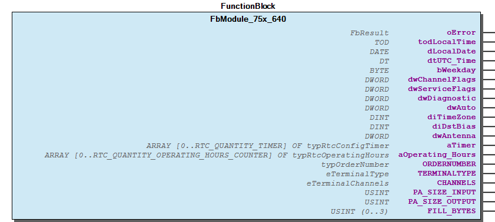 Graphical Interface of FbModule_75x_640 Example This example demonstrates the use of a module placed remote behind a fieldbus. Step 1 Declare an instance of the module Step 2 Bind the module to an Fieldbus Process Image and update the Process Image consistent. Step 3 Use this module instance for I_Port with the normal WagoApp-Libraries like a lokal module at Kbus. - Update Process Data FbModule_75x_640.GetNewPaOutputs (METH) - FbModule_75x_640.SetNewPaInputs (METH)

## FbModule_75x_644 (FB)


| Scope | Name | Type | Initial | Comment | Inherited from |
| --- | --- | --- | --- | --- | --- |
| Output | oError | WagoSysErrorBase.FbResult |  |  | FbModuleBase |
| ORDERNUMBER | WagoTypesBusServices.typOrderNumber | [750, 644, 0, 0] |  |  |
| TERMINALTYPE | WagoTypesBusServices.eTerminalType | eTerminalType.COMPLEX_INOUT |  |  |
| CHANNELS | WagoTypesBusServices.eTerminalChannels | eTerminalChannels.CHANNELS_1 |  |  |
| PA_SIZE_INPUT | USINT | 24 |  |  |
| PA_SIZE_OUTPUT | USINT | 24 |  |  |
| FILL_BYTES | USINT (0..3) | 0 | Fillbytes behind C/S |  |

```
VAR_GLOBAL
    myModule644 :   WagoSysFieldbusModule.FbModule_75x_644;  // declare an instance of the module
END_VAR
```

```
VAR_GLOBAL
    myModule644 :   WagoSysFieldbusModule.FbModule_75x_644 := ( PaSizeInput := 24, PaSizeOutput := 24, FillBytes := 0);
END_VAR
```

```
VAR_GLOBAL
    abReadData  :   ARRAY[0..126] OF BYTE;
    abWriteData :   ARRAY[0..126] OF BYTE;
END_VAR

IF xUpdatFieldbusData THEN (*   set the new inputs for our module
                                and get the new outputs from our module
                                to write to the fieldbus synchronized to the fieldbus cycle
                            *)
    myModule644.SetNewPaInputs (ADR(abReadData[0]) , myModule644.PA_SIZE_INPUT);
    myModule644.GetNewPaOutputs(ADR(abWriteData[0]), myModule644.PA_SIZE_OUTPUT);

END_IF
```

Graphical Illustration

Graphical Interface of FbModule_75x_644

This example demonstrates the use of a module 644 placed remote behind a fieldbus.

Declare an instance of the module. If you have changed the PA-Size of the Terminal 75x-644 with a WAGO-Configuration-Tool like IO-CHECK then you can advise this to the module instance at declaration by setting the parameter PaSizeInput and PaSizeOutput . Default size is 24 byte.

In the case that your process image has an other size you may optional extend the deklaration.

Bind the module to an Fieldbus Process Image and update the Process Image consistent.

Interface variables Function This function block provides the access to a module 644 connected over a fieldbus. Graphical Illustration  Graphical Interface of FbModule_75x_644 Example This example demonstrates the use of a module 644 placed remote behind a fieldbus. Step 1 Declare an instance of the module. If you have changed the PA-Size of the Terminal 75x-644 with a WAGO-Configuration-Tool like IO-CHECK then you can advise this to the module instance at declaration by setting the parameter PaSizeInput and PaSizeOutput . Default size is 24 byte. myModule644 : WagoSysFieldbusModule.FbModule_75x_644 := (PaSizeInput := 48, PaSizeOutput := 48 ) Note In the case that your process image has an other size you may optional extend the deklaration. Step 2 Bind the module to an Fieldbus Process Image and update the Process Image consistent. Step 3 Use this module instance for I_Port with the normal WagoApp-Libraries like a lokal module at Kbus. - Update Process Data FbModule_75x_644.GetNewPaOutputs (METH) - FbModule_75x_644.SetNewPaInputs (METH)

## FbModule_75x_645 (FB)


| Scope | Name | Type | Initial | Comment | Inherited from |
| --- | --- | --- | --- | --- | --- |
| Output | oError | WagoSysErrorBase.FbResult |  |  | FbModuleBase |
| ORDERNUMBER | WagoTypesBusServices.typOrderNumber | [750, 645, 0, 0] |  |  |
| TERMINALTYPE | WagoTypesBusServices.eTerminalType | eTerminalType.COMPLEX_INOUT |  |  |
| CHANNELS | WagoTypesBusServices.eTerminalChannels | eTerminalChannels.CHANNELS_1 |  |  |
| PA_SIZE_INPUT | USINT | 16 |  |  |
| PA_SIZE_OUTPUT | USINT | 16 |  |  |
| FILL_BYTES | USINT (0..3) | 1 | Fillbytes behind C/S |  |

```
VAR_GLOBAL
    myModule645 :   WagoSysFieldbusModule.FbModule_75x_645;  // declare an instance of the module
END_VAR
```

```
VAR_GLOBAL
    myModule645 :   WagoSysFieldbusModule.FbModule_75x_645 := ( PaSizeInput := 16, PaSizeOutput := 16, FillBytes := 1);
END_VAR
```

```
VAR_GLOBAL
    abReadData  :   ARRAY[0..126] OF BYTE;
    abWriteData :   ARRAY[0..126] OF BYTE;
END_VAR

IF xUpdatFieldbusData THEN (*   set the new inputs for our module
                                and get the new outputs from our module
                                to write to the fieldbus synchronized to the fieldbus cycle
                            *)
    myModule645.SetNewPaInputs (ADR(abReadData[0]) , myModule645.PA_SIZE_INPUT);
    myModule645.GetNewPaOutputs(ADR(abWriteData[0]), myModule645.PA_SIZE_OUTPUT);

END_IF
```

Graphical Illustration

Graphical Interface of FbModule_75x_645

This example demonstrates the use of a module placed remote behind a fieldbus.

Declare an instance of the module

In the case that your process image has an other size you may optional extend the deklaration.

Bind the module to an Fieldbus Process Image and update the Process Image consistent.

Interface variables Function This function blocks provides the access to modules connected over a fieldbus. Graphical Illustration  Graphical Interface of FbModule_75x_645 Example This example demonstrates the use of a module placed remote behind a fieldbus. Step 1 Declare an instance of the module Note In the case that your process image has an other size you may optional extend the deklaration. Step 2 Bind the module to an Fieldbus Process Image and update the Process Image consistent. Step 3 Use this module instance for I_Port with the normal WagoApp-Libraries like a lokal module at Kbus. - Update Process Data FbModule_75x_645.GetNewPaOutputs (METH) - FbModule_75x_645.SetNewPaInputs (METH)

## FbModule_75x_650 (FB)


| Scope | Name | Type | Initial | Comment | Inherited from |
| --- | --- | --- | --- | --- | --- |
| Output | oError | WagoSysErrorBase.FbResult |  |  | FbModuleBase |
| ORDERNUMBER | WagoTypesBusServices.typOrderNumber | [750, 650, 0, 0] |  |  |
| TERMINALTYPE | WagoTypesBusServices.eTerminalType | eTerminalType.COMPLEX_INOUT |  |  |
| CHANNELS | WagoTypesBusServices.eTerminalChannels | eTerminalChannels.CHANNELS_1 |  |  |
| PA_SIZE_INPUT | USINT | 4 |  |  |
| PA_SIZE_OUTPUT | USINT | 4 |  |  |
| FILL_BYTES | USINT (0..3) | 0 | Fillbytes behind C/S |  |

```
VAR_GLOBAL
    myModule650 :   WagoSysFieldbusModule.FbModule_75x_650;  // declare an instance of the module
END_VAR
```

```
VAR_GLOBAL
    myModule650 :   WagoSysFieldbusModule.FbModule_75x_650 := ( PaSizeInput := 4, PaSizeOutput := 4, FillBytes := 0);
END_VAR
```

```
VAR_GLOBAL
    abReadData  :   ARRAY[0..126] OF BYTE;
    abWriteData :   ARRAY[0..126] OF BYTE;
END_VAR

IF xUpdatFieldbusData THEN (*   set the new inputs for our module
                                and get the new outputs from our module
                                to write to the fieldbus synchronized to the fieldbus cycle
                            *)
    myModule650.SetNewPaInputs (ADR(abReadData[0]) , myModule650.PA_SIZE_INPUT);
    myModule650.GetNewPaOutputs(ADR(abWriteData[0]), myModule650.PA_SIZE_OUTPUT);

END_IF
```

Graphical Illustration

Graphical Interface of FbModule_75x_650

This example demonstrates the use of a module 650 placed remote behind a fieldbus.

Declare an instance of the module. If you have changed the PA-Size of the Terminal 750-650 with a WAGO-Configuration-Tool like IO-CHECK then you can advise this to the module instance at declaration by setting the parameter PaSizeInput and PaSizeOutput . Default size is 4 byte.

For some modules at fieldbus it is not possible to set the parameters like baudrate, parity ... In this case you have to use the default parameters.

In the case that your process image has an other size you may optional extend the deklaration.

Bind the module to an Fieldbus Process Image.

Interface variables Function This function block provides the access to a serial modules 650 connected over a fieldbus. Graphical Illustration 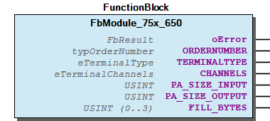 Graphical Interface of FbModule_75x_650 Example This example demonstrates the use of a module 650 placed remote behind a fieldbus. Step 1 Declare an instance of the module. If you have changed the PA-Size of the Terminal 750-650 with a WAGO-Configuration-Tool like IO-CHECK then you can advise this to the module instance at declaration by setting the parameter PaSizeInput and PaSizeOutput . Default size is 4 byte. myModule650 : WagoSysFieldbusModule.FbModule_75x_650 := (PaSizeInput := 6, PaSizeOutput := 6 ) Note For some modules at fieldbus it is not possible to set the parameters like baudrate, parity ... In this case you have to use the default parameters. Note In the case that your process image has an other size you may optional extend the deklaration. Step 2 Bind the module to an Fieldbus Process Image. Step 3 Use the module for I_Port with the normal WagoApp-Libraries like a lokal module at Kbus. - Update Process Data FbModule_75x_650.GetNewPaOutputs (METH) - FbModule_75x_650.SetNewPaInputs (METH)

## FbModule_75x_651 (FB)


| Scope | Name | Type | Initial | Comment | Inherited from |
| --- | --- | --- | --- | --- | --- |
| Output | oError | WagoSysErrorBase.FbResult |  |  | FbModuleBase |
| ORDERNUMBER | WagoTypesBusServices.typOrderNumber | [750, 651, 0, 0] |  |  |
| TERMINALTYPE | WagoTypesBusServices.eTerminalType | eTerminalType.COMPLEX_INOUT |  |  |
| CHANNELS | WagoTypesBusServices.eTerminalChannels | eTerminalChannels.CHANNELS_1 |  |  |
| PA_SIZE_INPUT | USINT | 4 |  |  |
| PA_SIZE_OUTPUT | USINT | 4 |  |  |
| FILL_BYTES | USINT (0..3) | 0 | Fillbytes behind C/S |  |

```
VAR_GLOBAL
    myModule651 :   WagoSysFieldbusModule.FbModule_75x_651;  // declare an instance of the module
END_VAR
```

```
VAR_GLOBAL
    myModule651 :   WagoSysFieldbusModule.FbModule_75x_651 := ( PaSizeInput := 4, PaSizeOutput := 4, FillBytes := 0);
END_VAR
```

```
VAR_GLOBAL
    abReadData  :   ARRAY[0..126] OF BYTE;
    abWriteData :   ARRAY[0..126] OF BYTE;
END_VAR

IF xUpdatFieldbusData THEN (*   set the new inputs for our module
                                and get the new outputs from our module
                                to write to the fieldbus synchronized to the fieldbus cycle
                            *)
    myModule651.SetNewPaInputs (ADR(abReadData[0]) , myModule651.PA_SIZE_INPUT);
    myModule651.GetNewPaOutputs(ADR(abWriteData[0]), myModule651.PA_SIZE_OUTPUT);

END_IF
```

Graphical Illustration

Graphical Interface of FbModule_75x_651

This example demonstrates the use of a module 651 placed remote behind a fieldbus.

Declare an instance of the module. If you have changed the PA-Size of the Terminal 750-651 with a WAGO-Configuration-Tool like IO-CHECK then you can advise this to the module instance at declaration by setting the parameter PaSizeInput and PaSizeOutput . Default size is 4 byte.

For some modules at fieldbus it is not possible to set the parameters like baudrate, parity ... In this case you have to use the default parameters.

In the case that your process image has an other size you may optional extend the deklaration.

Bind the module to an Fieldbus Process Image.

Interface variables Function This function block provides the access to a serial modules 651 connected over a fieldbus. Graphical Illustration  Graphical Interface of FbModule_75x_651 Example This example demonstrates the use of a module 651 placed remote behind a fieldbus. Step 1 Declare an instance of the module. If you have changed the PA-Size of the Terminal 750-651 with a WAGO-Configuration-Tool like IO-CHECK then you can advise this to the module instance at declaration by setting the parameter PaSizeInput and PaSizeOutput . Default size is 4 byte. myModule651 : WagoSysFieldbusModule.FbModule_75x_651 := (PaSizeInput := 6, PaSizeOutput := 6 ) Note For some modules at fieldbus it is not possible to set the parameters like baudrate, parity ... In this case you have to use the default parameters. Note In the case that your process image has an other size you may optional extend the deklaration. Step 2 Bind the module to an Fieldbus Process Image. Step 3 Use the module for I_Port with the normal WagoApp-Libraries like a lokal module at Kbus. - Update Process Data FbModule_75x_651.GetNewPaOutputs (METH) - FbModule_75x_651.SetNewPaInputs (METH)

## FbModule_75x_652 (FB)


| Scope | Name | Type | Initial | Comment | Inherited from |
| --- | --- | --- | --- | --- | --- |
| Output | oError | WagoSysErrorBase.FbResult |  |  | FbModuleBase |
| ORDERNUMBER | WagoTypesBusServices.typOrderNumber | [750, 652, 0, 0] |  |  |
| TERMINALTYPE | WagoTypesBusServices.eTerminalType | eTerminalType.COMPLEX_INOUT |  |  |
| CHANNELS | WagoTypesBusServices.eTerminalChannels | eTerminalChannels.CHANNELS_1 |  |  |
| PA_SIZE_INPUT | USINT | 24 |  |  |
| PA_SIZE_OUTPUT | USINT | 24 |  |  |
| FILL_BYTES | USINT (0..3) | 0 | Fillbytes behind C/S |  |

```
VAR_GLOBAL
    myModule652 :   WagoSysFieldbusModule.FbModule_75x_652:  // declare an instance of the module
END_VAR
```

```
VAR_GLOBAL
    myModule652 :   WagoSysFieldbusModule.FbModule_75x_652 := ( PaSizeInput := 24, PaSizeOutput := 24, FillBytes := 0);
END_VAR
```

```
VAR_GLOBAL
    abReadData  :   ARRAY[0..126] OF BYTE;
    abWriteData :   ARRAY[0..126] OF BYTE;
END_VAR

IF xUpdatFieldbusData THEN (*   set the new inputs for our module
                                and get the new outputs from our module
                                to write to the fieldbus synchronized to the fieldbus cycle
                            *)
    myModule652.SetNewPaInputs (ADR(abReadData[0]) , myModule652.PA_SIZE_INPUT);
    myModule652.GetNewPaOutputs(ADR(abWriteData[0]), myModule652.PA_SIZE_OUTPUT);

END_IF
```

Graphical Illustration

Graphical Interface of FbModule_75x_652

This example demonstrates the use of a module 652 placed remote behind a fieldbus.

Declare an instance of the module. If you have changed the PA-Size of the Terminal 750-652 with a WAGO-Configuration-Tool like IO-CHECK then you can advise this to the module instance at declaration by setting the parameter PaSizeInput and PaSizeOutput . Default size is 24 byte.

In the case that your process image has an other size you may optional extend the deklaration.

Bind the module to an Fieldbus Process Image.

Interface variables Function This function block provides the access to a serial modules 652 connected over a fieldbus. Graphical Illustration  Graphical Interface of FbModule_75x_652 Example This example demonstrates the use of a module 652 placed remote behind a fieldbus. Step 1 Declare an instance of the module. If you have changed the PA-Size of the Terminal 750-652 with a WAGO-Configuration-Tool like IO-CHECK then you can advise this to the module instance at declaration by setting the parameter PaSizeInput and PaSizeOutput . Default size is 24 byte. myModule652 : WagoSysFieldbusModule.FbModule_75x_652 := (PaSizeInput := 24, PaSizeOutput := 24 ) Note In the case that your process image has an other size you may optional extend the deklaration. Step 2 Bind the module to an Fieldbus Process Image. Step 3 Use the module for I_Port with the normal WagoApp-Libraries like a lokal module at Kbus. - Update Process Data FbModule_75x_652.GetNewPaOutputs (METH) - FbModule_75x_652.SetNewPaInputs (METH)

## FbModule_75x_653 (FB)


| Scope | Name | Type | Initial | Comment | Inherited from |
| --- | --- | --- | --- | --- | --- |
| Output | oError | WagoSysErrorBase.FbResult |  |  | FbModuleBase |
| ORDERNUMBER | WagoTypesBusServices.typOrderNumber | [750, 653, 0, 0] |  |  |
| TERMINALTYPE | WagoTypesBusServices.eTerminalType | eTerminalType.COMPLEX_INOUT |  |  |
| CHANNELS | WagoTypesBusServices.eTerminalChannels | eTerminalChannels.CHANNELS_1 |  |  |
| PA_SIZE_INPUT | USINT | 4 |  |  |
| PA_SIZE_OUTPUT | USINT | 4 |  |  |
| FILL_BYTES | USINT (0..3) | 0 | Fillbytes behind C/S |  |

```
VAR_GLOBAL
    myModule653 :   WagoSysFieldbusModule.FbModule_75x_653;  // declare an instance of the module
END_VAR
```

```
VAR_GLOBAL
    myModule653 :   WagoSysFieldbusModule.FbModule_75x_653 := ( PaSizeInput := 4, PaSizeOutput := 4, FillBytes := 0);
END_VAR
```

```
VAR_GLOBAL
    abReadData  :   ARRAY[0..126] OF BYTE;
    abWriteData :   ARRAY[0..126] OF BYTE;
END_VAR

IF xUpdatFieldbusData THEN (*   set the new inputs for our module
                                and get the new outputs from our module
                                to write to the fieldbus synchronized to the fieldbus cycle
                            *)
    myModule653.SetNewPaInputs (ADR(abReadData[0]) , myModule653.PA_SIZE_INPUT);
    myModule653.GetNewPaOutputs(ADR(abWriteData[0]), myModule653.PA_SIZE_OUTPUT);

END_IF
```

Graphical Illustration

Graphical Interface of FbModule_75x_653

This example demonstrates the use of a module 653 placed remote behind a fieldbus.

Declare an instance of the module. If you have changed the PA-Size of the Terminal 750-653 with a WAGO-Configuration-Tool like IO-CHECK then you can advise this to the module instance at declaration by setting the parameter PaSizeInput and PaSizeOutput . Default size is 4 byte.

For some modules at fieldbus it is not possible to set the parameters like baudrate, parity ... In this case you have to use the default parameters.

In the case that your process image has an other size you may optional extend the deklaration.

Bind the module to an Fieldbus Process Image.

Interface variables Function This function block provides the access to a serial modules 653 connected over a fieldbus. Graphical Illustration  Graphical Interface of FbModule_75x_653 Example This example demonstrates the use of a module 653 placed remote behind a fieldbus. Step 1 Declare an instance of the module. If you have changed the PA-Size of the Terminal 750-653 with a WAGO-Configuration-Tool like IO-CHECK then you can advise this to the module instance at declaration by setting the parameter PaSizeInput and PaSizeOutput . Default size is 4 byte. myModule653 : WagoSysFieldbusModule.FbModule_75x_653 := (PaSizeInput := 6, PaSizeOutput := 6 ) Note For some modules at fieldbus it is not possible to set the parameters like baudrate, parity ... In this case you have to use the default parameters. Note In the case that your process image has an other size you may optional extend the deklaration. Step 2 Bind the module to an Fieldbus Process Image. Step 3 Use the module for I_Port with the normal WagoApp-Libraries like a lokal module at Kbus. - Update Process Data FbModule_75x_653.GetNewPaOutputs (METH) - FbModule_75x_653.SetNewPaInputs (METH)

## FbModule_75x_655 (FB)


| Scope | Name | Type | Initial | Comment | Inherited from |
| --- | --- | --- | --- | --- | --- |
| Output | oError | WagoSysErrorBase.FbResult |  |  | FbModuleBase |
| ORDERNUMBER | WagoTypesBusServices.typOrderNumber | [750, 655, 0, 0] |  |  |
| TERMINALTYPE | WagoTypesBusServices.eTerminalType | eTerminalType.COMPLEX_INOUT |  |  |
| CHANNELS | WagoTypesBusServices.eTerminalChannels | eTerminalChannels.CHANNELS_1 |  |  |
| PA_SIZE_INPUT | USINT | 24 |  |  |
| PA_SIZE_OUTPUT | USINT | 24 |  |  |
| FILL_BYTES | USINT (0..3) | 1 | Fillbytes behind C/S |  |

```
VAR_GLOBAL
    myModule655 :   WagoSysFieldbusModule.FbModule_75x_655; // declare an instance of the module
END_VAR
```

```
VAR_GLOBAL
    myModule655 :   WagoSysFieldbusModule.FbModule_75x_655 := ( PaSizeInput := 24, PaSizeOutput := 24, FillBytes := 1);
END_VAR
```

```
VAR_GLOBAL
    abReadData  :   ARRAY[0..126] OF BYTE;
    abWriteData :   ARRAY[0..126] OF BYTE;
END_VAR

IF xUpdatFieldbusData THEN (*   set the new inputs for our module
                                and get the new outputs from our module
                                to write to the fieldbus synchronized to the fieldbus cycle
                            *)
    myModule655.SetNewPaInputs (ADR(abReadData[0]) , myModule655.PA_SIZE_INPUT);
    myModule655.GetNewPaOutputs(ADR(abWriteData[0]), myModule655.PA_SIZE_OUTPUT);

END_IF
```

Graphical Illustration

Graphical Interface of FbModule_75x_655

This example demonstrates the use of a module 655 placed remote behind a fieldbus.

Declare an instance of the module. If you have changed the PA-Size of the Terminal 75x-655 with a WAGO-Configuration-Tool like IO-CHECK then you can advise this to the module instance at declaration by setting the parameter PaSizeInput and PaSizeOutput . Default size is 24 byte.

In the case that your process image has an other size you may optional extend the deklaration.

Bind the module to an Fieldbus Process Image and update the Process Image consistent.

Interface variables Function This function block provides the access to a module 655 connected over a fieldbus. Graphical Illustration 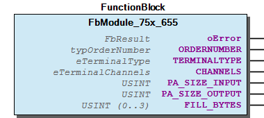 Graphical Interface of FbModule_75x_655 Example This example demonstrates the use of a module 655 placed remote behind a fieldbus. Step 1 Declare an instance of the module. If you have changed the PA-Size of the Terminal 75x-655 with a WAGO-Configuration-Tool like IO-CHECK then you can advise this to the module instance at declaration by setting the parameter PaSizeInput and PaSizeOutput . Default size is 24 byte. myModule655 : WagoSysFieldbusModule.FbModule_75x_655 := (PaSizeInput := 48, PaSizeOutput := 48 ) Note In the case that your process image has an other size you may optional extend the deklaration. Step 2 Bind the module to an Fieldbus Process Image and update the Process Image consistent. Step 3 Use this module instance for I_Port with the normal WagoApp-Libraries like a lokal module at Kbus. - Update Process Data FbModule_75x_655.GetNewPaOutputs (METH) - FbModule_75x_655.SetNewPaInputs (METH)

## FbModule_75x_657 (FB)


| Scope | Name | Type | Initial | Comment | Inherited from |
| --- | --- | --- | --- | --- | --- |
| Output | oError | WagoSysErrorBase.FbResult |  |  | FbModuleBase |
| CallBackCounter | UINT |  | callbacks from cycle control point | FbModuleMbx2 |
| ORDERNUMBER | WagoTypesBusServices.typOrderNumber | [750, 657, 0, 0] |  |  |
| TERMINALTYPE | WagoTypesBusServices.eTerminalType | eTerminalType.COMPLEX_INOUT |  |  |
| CHANNELS | WagoTypesBusServices.eTerminalChannels | eTerminalChannels.CHANNELS_1 |  |  |
| PA_SIZE_INPUT | USINT | 24 |  |  |
| PA_SIZE_OUTPUT | USINT | 24 |  |  |
| FILL_BYTES | USINT (0..3) | 0 | Fillbytes behind C/S |  |

```
VAR_GLOBAL
    myModule657 :   WagoSysFieldbusModule.FbModule_75x_657;  // declare an instance of the module
END_VAR
```

```
VAR_GLOBAL
    myModule657 :   WagoSysFieldbusModule.FbModule_75x_657 := ( PaSizeInput := 24, PaSizeOutput := 24, FillBytes := 0);
END_VAR
```

```
VAR_GLOBAL
    abReadData  :   ARRAY[0..126] OF BYTE;
    abWriteData :   ARRAY[0..126] OF BYTE;
END_VAR

IF xUpdatFieldbusData THEN (*   set the new inputs for our module
                                and get the new outputs from our module
                                to write to the fieldbus synchronized to the fieldbus cycle
                            *)
    myModule657.SetNewPaInputs (ADR(abReadData[0]) , myModule657.PA_SIZE_INPUT);
    myModule657.GetNewPaOutputs(ADR(abWriteData[0]), myModule657.PA_SIZE_OUTPUT);

END_IF
```

Graphical Illustration

Graphical Interface of FbModule_75x_657

This example demonstrates the use of a module 657 placed remote behind a fieldbus.

Declare an instance of the module. If you have changed the PA-Size of the Terminal 75x-655 with a WAGO-Configuration-Tool like IO-CHECK then you can advise this to the module instance at declaration by setting the parameter PaSizeInput and PaSizeOutput . Default size is 24 byte.

In the case that your process image has an other size you may optional extend the deklaration.

Bind the module to an Fieldbus Process Image and update the Process Image consistent.

Interface variables Function This function block provides the access to a module 657 connected over a fieldbus. Graphical Illustration 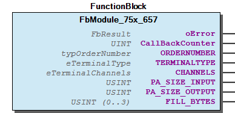 Graphical Interface of FbModule_75x_657 Example This example demonstrates the use of a module 657 placed remote behind a fieldbus. Step 1 Declare an instance of the module. If you have changed the PA-Size of the Terminal 75x-655 with a WAGO-Configuration-Tool like IO-CHECK then you can advise this to the module instance at declaration by setting the parameter PaSizeInput and PaSizeOutput . Default size is 24 byte. myModule657 : WagoSysFieldbusModule.FbModule_75x_657 := (PaSizeInput := 24, PaSizeOutput := 24 ) Note In the case that your process image has an other size you may optional extend the deklaration. Step 2 Bind the module to an Fieldbus Process Image and update the Process Image consistent. Step 3 Use this module instance for I_Port with the normal WagoApp-Libraries like a lokal module at Kbus. - Update Process Data FbModule_75x_657.GetNewPaOutputs (METH) - FbModule_75x_657.SetNewPaInputs (METH)

## FbModule_75x_658 (FB)


| Scope | Name | Type | Initial | Comment | Inherited from |
| --- | --- | --- | --- | --- | --- |
| Output | oError | WagoSysErrorBase.FbResult |  |  | FbModuleBase |
| CallBackCounter | UINT |  | callbacks from cycle control point | FbModuleMbx2 |
| ORDERNUMBER | WagoTypesBusServices.typOrderNumber | [750, 658, 0, 0] |  |  |
| TERMINALTYPE | WagoTypesBusServices.eTerminalType | eTerminalType.COMPLEX_INOUT |  |  |
| CHANNELS | WagoTypesBusServices.eTerminalChannels | eTerminalChannels.CHANNELS_1 |  |  |
| PA_SIZE_INPUT | USINT | 24 |  |  |
| PA_SIZE_OUTPUT | USINT | 24 |  |  |
| FILL_BYTES | USINT (0..3) | 0 | Fillbytes behind C/S |  |

```
VAR_GLOBAL
    myModule658 :   WagoSysFieldbusModule.FbModule_75x_658;  // declare an instance of the module
END_VAR
```

```
VAR_GLOBAL
    myModule658 :   WagoSysFieldbusModule.FbModule_75x_658 := ( PaSizeInput := 24, PaSizeOutput := 24, FillBytes := 0);
END_VAR
```

```
VAR_GLOBAL
    abReadData  :   ARRAY[0..126] OF BYTE;
    abWriteData :   ARRAY[0..126] OF BYTE;
END_VAR

IF xUpdatFieldbusData THEN (*   set the new inputs for our module
                                and get the new outputs from our module
                                to write to the fieldbus synchronized to the fieldbus cycle
                            *)
    myModule658.SetNewPaInputs (ADR(abReadData[0]) , myModule658.PA_SIZE_INPUT);
    myModule658.GetNewPaOutputs(ADR(abWriteData[0]), myModule658.PA_SIZE_OUTPUT);

END_IF
```

Graphical Illustration

Graphical Interface of FbModule_75x_658

This example demonstrates the use of a module 658 placed remote behind a fieldbus.

Declare an instance of the module. If you have changed the PA-Size of the Terminal 75x-658 with a WAGO-Configuration-Tool like IO-CHECK then you can advise this to the module instance at declaration by setting the parameter PaSizeInput and PaSizeOutput . Default size is 24 byte.

In the case that your process image has an other size you may optional extend the deklaration.

Bind the module to an Fieldbus Process Image and update the Process Image consistent.

Interface variables Function This function block provides the access to a module 658 connected over a fieldbus. Graphical Illustration  Graphical Interface of FbModule_75x_658 Example This example demonstrates the use of a module 658 placed remote behind a fieldbus. Step 1 Declare an instance of the module. If you have changed the PA-Size of the Terminal 75x-658 with a WAGO-Configuration-Tool like IO-CHECK then you can advise this to the module instance at declaration by setting the parameter PaSizeInput and PaSizeOutput . Default size is 24 byte. myModule658 : WagoSysFieldbusModule.FbModule_75x_658 := (PaSizeInput := 24, PaSizeOutput := 24 ) Note In the case that your process image has an other size you may optional extend the deklaration. Step 2 Bind the module to an Fieldbus Process Image and update the Process Image consistent. Step 3 Use this module instance for I_Port with the normal WagoApp-Libraries like a lokal module at Kbus. - Update Process Data FbModule_75x_658.GetNewPaOutputs (METH) - FbModule_75x_658.SetNewPaInputs (METH)

## FbModule_75x_666 (FB)


| Scope | Name | Type | Initial | Comment | Inherited from |
| --- | --- | --- | --- | --- | --- |
| Output | oError | WagoSysErrorBase.FbResult |  |  | FbModuleBase |
| ORDERNUMBER | WagoTypesBusServices.typOrderNumber | [750, 666, 0, 0] |  |  |
| TERMINALTYPE | WagoTypesBusServices.eTerminalType | eTerminalType.COMPLEX_INOUT |  |  |
| CHANNELS | WagoTypesBusServices.eTerminalChannels | eTerminalChannels.CHANNELS_2 |  |  |
| PA_SIZE_INPUT | USINT | 24 |  |  |
| PA_SIZE_OUTPUT | USINT | 24 |  |  |
| FILL_BYTES | USINT (0..3) | 0 | Fillbytes behind C/S |  |

```
VAR_GLOBAL
    myModule666 :   WagoSysFieldbusModule.FbModule_75x_666;  // declare an instance of the module
END_VAR
```

```
VAR_GLOBAL
    myModule666 :   WagoSysFieldbusModule.FbModule_75x_666 := ( PaSizeInput := 24, PaSizeOutput := 24, FillBytes := 0);
END_VAR
```

```
VAR_GLOBAL
    abReadData  :   ARRAY[0..126] OF BYTE;
    abWriteData :   ARRAY[0..126] OF BYTE;
END_VAR

IF xUpdatFieldbusData THEN (*   set the new inputs for our module
                                and get the new outputs from our module
                                to write to the fieldbus synchronized to the fieldbus cycle
                            *)
    myModule666.SetNewPaInputs (ADR(abReadData[0]) , myModule666.PA_SIZE_INPUT);
    myModule666.GetNewPaOutputs(ADR(abWriteData[0]), myModule666.PA_SIZE_OUTPUT);

END_IF
```

Graphical Illustration

Graphical Interface of FbModule_75x_666

This example demonstrates the use of a module 666 placed remote behind a fieldbus.

Declare an instance of the module. If you have changed the PA-Size of the Terminal 75x-666 with a WAGO-Configuration-Tool like IO-CHECK then you can advise this to the module instance at declaration by setting the parameter PaSizeInput and PaSizeOutput . Default size is 24 byte.

In the case that your process image has an other size you may optional extend the deklaration.

Bind the module to an Fieldbus Process Image and update the Process Image consistent.

Interface variables Function This function block provides the access to a module 666 connected over a fieldbus. Graphical Illustration  Graphical Interface of FbModule_75x_666 Example This example demonstrates the use of a module 666 placed remote behind a fieldbus. Step 1 Declare an instance of the module. If you have changed the PA-Size of the Terminal 75x-666 with a WAGO-Configuration-Tool like IO-CHECK then you can advise this to the module instance at declaration by setting the parameter PaSizeInput and PaSizeOutput . Default size is 24 byte. myModule666 : WagoSysFieldbusModule.FbModule_75x_666 := (PaSizeInput := 24, PaSizeOutput := 24 ) Note In the case that your process image has an other size you may optional extend the deklaration. Step 2 Bind the module to an Fieldbus Process Image and update the Process Image consistent. Step 3 Use this module instance for I_Port with the normal WagoApp-Libraries like a lokal module at Kbus. - Update Process Data FbModule_75x_666.GetNewPaOutputs (METH) - FbModule_75x_666.SetNewPaInputs (METH)

## FbModule_75x_667 (FB)


| Scope | Name | Type | Initial | Comment | Inherited from |
| --- | --- | --- | --- | --- | --- |
| Output | oError | WagoSysErrorBase.FbResult |  |  | FbModuleBase |
| ORDERNUMBER | WagoTypesBusServices.typOrderNumber | [750, 667, 0, 0] |  |  |
| TERMINALTYPE | WagoTypesBusServices.eTerminalType | eTerminalType.COMPLEX_INOUT |  |  |
| CHANNELS | WagoTypesBusServices.eTerminalChannels | eTerminalChannels.CHANNELS_4 |  |  |
| PA_SIZE_INPUT | USINT | 24 |  |  |
| PA_SIZE_OUTPUT | USINT | 24 |  |  |
| FILL_BYTES | USINT (0..3) | 0 | Fillbytes behind C/S |  |

```
VAR_GLOBAL
    myModule667 :   WagoSysFieldbusModule.FbModule_75x_667;  // declare an instance of the module
END_VAR
```

```
VAR_GLOBAL
    myModule667 :   WagoSysFieldbusModule.FbModule_75x_667 := ( PaSizeInput := 24, PaSizeOutput := 24, FillBytes := 0);
END_VAR
```

```
VAR_GLOBAL
    abReadData  :   ARRAY[0..126] OF BYTE;
    abWriteData :   ARRAY[0..126] OF BYTE;
END_VAR

IF xUpdatFieldbusData THEN (*   set the new inputs for our module
                                and get the new outputs from our module
                                to write to the fieldbus synchronized to the fieldbus cycle
                            *)
    myModule667.SetNewPaInputs (ADR(abReadData[0]) , myModule667.PA_SIZE_INPUT);
    myModule667.GetNewPaOutputs(ADR(abWriteData[0]), myModule667.PA_SIZE_OUTPUT);

END_IF
```

Graphical Illustration

Graphical Interface of FbModule_75x_667

This example demonstrates the use of a module 667 placed remote behind a fieldbus.

Declare an instance of the module. If you have changed the PA-Size of the Terminal 75x-667 with a WAGO-Configuration-Tool like IO-CHECK then you can advise this to the module instance at declaration by setting the parameter PaSizeInput and PaSizeOutput . Default size is 24 byte.

In the case that your process image has an other size you may optional extend the deklaration.

Bind the module to an Fieldbus Process Image and update the Process Image consistent.

Interface variables Function This function block provides the access to a module 666 connected over a fieldbus. Graphical Illustration  Graphical Interface of FbModule_75x_667 Example This example demonstrates the use of a module 667 placed remote behind a fieldbus. Step 1 Declare an instance of the module. If you have changed the PA-Size of the Terminal 75x-667 with a WAGO-Configuration-Tool like IO-CHECK then you can advise this to the module instance at declaration by setting the parameter PaSizeInput and PaSizeOutput . Default size is 24 byte. myModule667 : WagoSysFieldbusModule.FbModule_75x_667 := (PaSizeInput := 24, PaSizeOutput := 24 ) Note In the case that your process image has an other size you may optional extend the deklaration. Step 2 Bind the module to an Fieldbus Process Image and update the Process Image consistent. Step 3 Use this module instance for I_Port with the normal WagoApp-Libraries like a lokal module at Kbus. - Update Process Data FbModule_75x_667.GetNewPaOutputs (METH) - FbModule_75x_667.SetNewPaInputs (METH)

## FbModule_75x_670 (FB)


| Scope | Name | Type | Initial | Comment | Inherited from |
| --- | --- | --- | --- | --- | --- |
| Output | oError | WagoSysErrorBase.FbResult |  |  | FbModuleBase |
| ORDERNUMBER | WagoTypesBusServices.typOrderNumber | [750, 670, 0, 0] | 670 -> 1 Fillbyte at Fieldbus — Module Parameter —> Stepper —> 750-670 ———————————- |  |
| TERMINALTYPE | WagoTypesBusServices.eTerminalType | eTerminalType.COMPLEX_INOUT |  |  |
| CHANNELS | WagoTypesBusServices.eTerminalChannels | eTerminalChannels.CHANNELS_1 |  |  |
| PA_SIZE_INPUT | USINT | 12 |  |  |
| PA_SIZE_OUTPUT | USINT | 12 |  |  |
| FILL_BYTES | USINT (0..3) | 1 | Fillbytes behind C/S |  |

```
VAR_GLOBAL
    myModule670 :   WagoSysFieldbusModule.FbModule_75x_670;  // declare an instance of the module
END_VAR
```

```
VAR_GLOBAL
    myModule670 :   WagoSysFieldbusModule.FbModule_75x_670 := ( PaSizeInput := 12, PaSizeOutput := 12, FillBytes := 1);
END_VAR
```

```
VAR_GLOBAL
    abReadData  :   ARRAY[0..126] OF BYTE;
    abWriteData :   ARRAY[0..126] OF BYTE;
END_VAR

IF xUpdatFieldbusData THEN (*   set the new inputs for our module
                                and get the new outputs from our module
                                to write to the fieldbus synchronized to the fieldbus cycle
                            *)
    myModule670.SetNewPaInputs (ADR(abReadData[0]) , myModule670.PA_SIZE_INPUT);
    myModule670.GetNewPaOutputs(ADR(abWriteData[0]), myModule670.PA_SIZE_OUTPUT);

END_IF
```

Graphical Illustration

Graphical Interface of FbModule_75x_670

This example demonstrates the use of a module placed remote behind a fieldbus.

Declare an instance of the module

In the case that your process image has an other size you may optional extend the deklaration.

Bind the module to an Fieldbus Process Image and update the Process Image consistent.

Interface variables Function This function blocks provides the access to modules connected over a fieldbus. Graphical Illustration  Graphical Interface of FbModule_75x_670 Example This example demonstrates the use of a module placed remote behind a fieldbus. Step 1 Declare an instance of the module Note In the case that your process image has an other size you may optional extend the deklaration. Step 2 Bind the module to an Fieldbus Process Image and update the Process Image consistent. Step 3 Use this module instance for I_Port with the normal WagoApp-Libraries like a lokal module at Kbus. - Update Process Data FbModule_75x_670.GetNewPaOutputs (METH) - FbModule_75x_670.SetNewPaInputs (METH)

## FbModule_75x_671 (FB)


| Scope | Name | Type | Initial | Comment | Inherited from |
| --- | --- | --- | --- | --- | --- |
| Output | oError | WagoSysErrorBase.FbResult |  |  | FbModuleBase |
| ORDERNUMBER | WagoTypesBusServices.typOrderNumber | [750, 671, 0, 0] | 671 -> 1 Fillbyte at Fieldbus — Module Parameter —> Stepper —> 750-671 ———————————- |  |
| TERMINALTYPE | WagoTypesBusServices.eTerminalType | eTerminalType.COMPLEX_INOUT |  |  |
| CHANNELS | WagoTypesBusServices.eTerminalChannels | eTerminalChannels.CHANNELS_1 |  |  |
| PA_SIZE_INPUT | USINT | 12 |  |  |
| PA_SIZE_OUTPUT | USINT | 12 |  |  |
| FILL_BYTES | USINT (0..3) | 1 | Fillbytes behind C/S |  |

```
VAR_GLOBAL
    myModule671 :   WagoSysFieldbusModule.FbModule_75x_671;  // declare an instance of the module
END_VAR
```

```
VAR_GLOBAL
    myModule671 :   WagoSysFieldbusModule.FbModule_75x_671 := ( PaSizeInput := 12, PaSizeOutput := 12, FillBytes := 1);
END_VAR
```

```
VAR_GLOBAL
    abReadData  :   ARRAY[0..126] OF BYTE;
    abWriteData :   ARRAY[0..126] OF BYTE;
END_VAR

IF xUpdatFieldbusData THEN (*   set the new inputs for our module
                                and get the new outputs from our module
                                to write to the fieldbus synchronized to the fieldbus cycle
                            *)
    myModule671.SetNewPaInputs (ADR(abReadData[0]) , myModule671.PA_SIZE_INPUT);
    myModule671.GetNewPaOutputs(ADR(abWriteData[0]), myModule671.PA_SIZE_OUTPUT);

END_IF
```

Graphical Illustration

Graphical Interface of FbModule_75x_671

This example demonstrates the use of a module placed remote behind a fieldbus.

Declare an instance of the module

In the case that your process image has an other size you may optional extend the deklaration.

Bind the module to an Fieldbus Process Image and update the Process Image consistent.

Interface variables Function This function blocks provides the access to modules connected over a fieldbus. Graphical Illustration 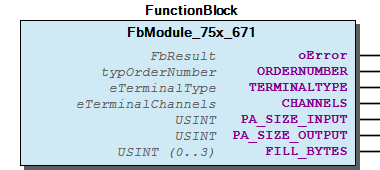 Graphical Interface of FbModule_75x_671 Example This example demonstrates the use of a module placed remote behind a fieldbus. Step 1 Declare an instance of the module Note In the case that your process image has an other size you may optional extend the deklaration. Step 2 Bind the module to an Fieldbus Process Image and update the Process Image consistent. Step 3 Use this module instance for I_Port with the normal WagoApp-Libraries like a lokal module at Kbus. - Update Process Data FbModule_75x_671.GetNewPaOutputs (METH) - FbModule_75x_671.SetNewPaInputs (METH)

## FbModule_75x_672 (FB)


| Scope | Name | Type | Initial | Comment | Inherited from |
| --- | --- | --- | --- | --- | --- |
| Output | oError | WagoSysErrorBase.FbResult |  |  | FbModuleBase |
| ORDERNUMBER | WagoTypesBusServices.typOrderNumber | [750, 672, 0, 0] | 672 -> 1 Fillbyte at Fieldbus — Module Parameter —> Stepper —> 750-672 ———————————- |  |
| TERMINALTYPE | WagoTypesBusServices.eTerminalType | eTerminalType.COMPLEX_INOUT |  |  |
| CHANNELS | WagoTypesBusServices.eTerminalChannels | eTerminalChannels.CHANNELS_1 |  |  |
| PA_SIZE_INPUT | USINT | 12 |  |  |
| PA_SIZE_OUTPUT | USINT | 12 |  |  |
| FILL_BYTES | USINT (0..3) | 1 | Actually Fillbytes behind C/S |  |

```
VAR_GLOBAL
    myModule672 :   WagoSysFieldbusModule.FbModule_75x_672;  // declare an instance of the module
END_VAR
```

```
VAR_GLOBAL
    myModule672 :   WagoSysFieldbusModule.FbModule_75x_672 := ( PaSizeInput := 12, PaSizeOutput := 12, FillBytes := 1);
END_VAR
```

```
VAR_GLOBAL
    abReadData  :   ARRAY[0..126] OF BYTE;
    abWriteData :   ARRAY[0..126] OF BYTE;
END_VAR

IF xUpdatFieldbusData THEN (*   set the new inputs for our module
                                and get the new outputs from our module
                                to write to the fieldbus synchronized to the fieldbus cycle
                            *)
    myModule672.SetNewPaInputs (ADR(abReadData[0]) , myModule672.PA_SIZE_INPUT);
    myModule672.GetNewPaOutputs(ADR(abWriteData[0]), myModule672.PA_SIZE_OUTPUT);

END_IF
```

Graphical Illustration

Graphical Interface of FbModule_75x_672

This example demonstrates the use of a module placed remote behind a fieldbus.

Declare an instance of the module

In the case that your process image has an other size you may optional extend the deklaration.

Bind the module to an Fieldbus Process Image and update the Process Image consistent.

Interface variables Function This function blocks provides the access to modules connected over a fieldbus. Graphical Illustration  Graphical Interface of FbModule_75x_672 Example This example demonstrates the use of a module placed remote behind a fieldbus. Step 1 Declare an instance of the module Note In the case that your process image has an other size you may optional extend the deklaration. Step 2 Bind the module to an Fieldbus Process Image and update the Process Image consistent. Step 3 Use this module instance for I_Port with the normal WagoApp-Libraries like a lokal module at Kbus. - Update Process Data FbModule_75x_672.GetNewPaOutputs (METH) - FbModule_75x_672.SetNewPaInputs (METH)

## FbModule_75x_673 (FB)


| Scope | Name | Type | Initial | Comment | Inherited from |
| --- | --- | --- | --- | --- | --- |
| Output | oError | WagoSysErrorBase.FbResult |  |  | FbModuleBase |
| ORDERNUMBER | WagoTypesBusServices.typOrderNumber | [750, 673, 0, 0] | 673 -> 1 Fillbyte at Fieldbus — Module Parameter —> Stepper —> 750-673 ———————————- |  |
| TERMINALTYPE | WagoTypesBusServices.eTerminalType | eTerminalType.COMPLEX_INOUT |  |  |
| CHANNELS | WagoTypesBusServices.eTerminalChannels | eTerminalChannels.CHANNELS_1 |  |  |
| PA_SIZE_INPUT | USINT | 12 |  |  |
| PA_SIZE_OUTPUT | USINT | 12 |  |  |
| FILL_BYTES | USINT (0..3) | 1 | Fillbytes behind C/S |  |

```
VAR_GLOBAL
    myModule673 :   WagoSysFieldbusModule.FbModule_75x_673;  // declare an instance of the module
END_VAR
```

```
VAR_GLOBAL
    myModule673 :   WagoSysFieldbusModule.FbModule_75x_673 := ( PaSizeInput := 12, PaSizeOutput := 12, FillBytes := 1);
END_VAR
```

```
VAR_GLOBAL
    abReadData  :   ARRAY[0..126] OF BYTE;
    abWriteData :   ARRAY[0..126] OF BYTE;
END_VAR

IF xUpdatFieldbusData THEN (*   set the new inputs for our module
                                and get the new outputs from our module
                                to write to the fieldbus synchronized to the fieldbus cycle
                            *)
    myModule673.SetNewPaInputs (ADR(abReadData[0]) , myModule673.PA_SIZE_INPUT);
    myModule673.GetNewPaOutputs(ADR(abWriteData[0]), myModule673.PA_SIZE_OUTPUT);

END_IF
```

Graphical Illustration

Graphical Interface of FbModule_75x_673

This example demonstrates the use of a module placed remote behind a fieldbus.

Declare an instance of the module

In the case that your process image has an other size you may optional extend the deklaration.

Bind the module to an Fieldbus Process Image and update the Process Image consistent.

Interface variables Function This function blocks provides the access to modules connected over a fieldbus. Graphical Illustration  Graphical Interface of FbModule_75x_673 Example This example demonstrates the use of a module placed remote behind a fieldbus. Step 1 Declare an instance of the module Note In the case that your process image has an other size you may optional extend the deklaration. Step 2 Bind the module to an Fieldbus Process Image and update the Process Image consistent. Step 3 Use this module instance for I_Port with the normal WagoApp-Libraries like a lokal module at Kbus. - Update Process Data FbModule_75x_673.GetNewPaOutputs (METH) - FbModule_75x_673.SetNewPaInputs (METH)

## FbModule_75x_677 (FB)


| Scope | Name | Type | Initial | Comment | Inherited from |
| --- | --- | --- | --- | --- | --- |
| Output | oError | WagoSysErrorBase.FbResult |  |  | FbModuleBase |
| ORDERNUMBER | WagoTypesBusServices.typOrderNumber | [750, 677, 0, 0] |  |  |
| TERMINALTYPE | WagoTypesBusServices.eTerminalType | eTerminalType.COMPLEX_INOUT |  |  |
| CHANNELS | WagoTypesBusServices.eTerminalChannels | eTerminalChannels.CHANNELS_4 |  |  |
| PA_SIZE_INPUT | USINT | 16 |  |  |
| PA_SIZE_OUTPUT | USINT | 16 |  |  |
| FILL_BYTES | USINT (0..3) | 1 | Fillbytes behind C/S |  |

Interface variables - Update Process Data FbModule_75x_677.GetNewPaOutputs (METH) - FbModule_75x_677.SetNewPaInputs (METH)

### Methods


## FbModule_750_450.GetNewPaOutputs (METH)


| Scope | Name | Type | Comment |
| --- | --- | --- | --- |
| Input | pOutputData | POINTER TO BYTE | pointer to output data structure |
| usiOutputSize | USINT (0..WagoTypesModuleBase.MAX_MODULE_OUTPUT_SIZE) | number of output bytes |

```
VAR_GLOBAL
    abWriteData :   ARRAY[0..126] OF BYTE;
END_VAR

// Call this code at the context of the fieldbus
IF xUpdatFieldbusOutputData THEN (* Get the new outputs from the plc
                                    to write it synchronized to the fieldbus
                                 *)

    myModule493.GetNewPaOutputs(ADR(abWriteData[0]), myModule493.PA_SIZE_OUTPUT);

END_IF
```

Graphical Illustration

Graphical Interface of FbModule_750_450.GetNewPaOutputs

Interface variables FUNCTION This method provides the new outputs from the FB for the fieldbus. The fieldbus have to give this data fieldbus specific to the physical terminal Call this method at the context of the fieldbus to get new outputs from the plc and take it over to the fieldbus. Graphical Illustration  Graphical Interface of FbModule_750_450.GetNewPaOutputs Example

## FbModule_750_450.SetNewPaInputs (METH)


| Scope | Name | Type | Comment |
| --- | --- | --- | --- |
| Input | pInputData | POINTER TO BYTE | pointer to input data structure |
| usiInputSize | USINT (0..WagoTypesModuleBase.MAX_MODULE_INPUT_SIZE) | number of input bytes |

```
VAR_GLOBAL
    abReadData  :   ARRAY[0..126] OF BYTE;
END_VAR

// Call this code at the context of the fieldbus
IF xUpdatFieldbusInputData THEN (*  set the new inputs for our module
                                and get the new outputs from our module
                                to write to the fieldbus synchronized to the fieldbus cycle

                            *)
    myModule493.SetNewPaInputs (ADR(abReadData[0]) , myModule493.PA_SIZE_INPUT);

END_IF
```

Graphical Illustration

Graphical Interface of FbModule_750_450.SetNewPaInputs

Interface variables FUNCTION This method gives the new inputs from the fieldbus to the plc module. The fieldbus have to get this data fieldbus specific from the physical terminal and after this to call this method for take over the data to the module. Graphical Illustration  Graphical Interface of FbModule_750_450.SetNewPaInputs Example

## FbModule_750_451.GetNewPaOutputs (METH)


| Scope | Name | Type | Comment |
| --- | --- | --- | --- |
| Input | pOutputData | POINTER TO BYTE | pointer to output data structure |
| usiOutputSize | USINT (0..WagoTypesModuleBase.MAX_MODULE_OUTPUT_SIZE) | number of output bytes |

```
VAR_GLOBAL
    abWriteData :   ARRAY[0..126] OF BYTE;
END_VAR

// Call this code at the context of the fieldbus
IF xUpdatFieldbusOutputData THEN (* Get the new outputs from the plc
                                    to write it synchronized to the fieldbus
                                 *)

    myModule493.GetNewPaOutputs(ADR(abWriteData[0]), myModule493.PA_SIZE_OUTPUT);

END_IF
```

Graphical Illustration

Graphical Interface of FbModule_750_451.GetNewPaOutputs

Interface variables FUNCTION This method provides the new outputs from the FB for the fieldbus. The fieldbus have to give this data fieldbus specific to the physical terminal Call this method at the context of the fieldbus to get new outputs from the plc and take it over to the fieldbus. Graphical Illustration  Graphical Interface of FbModule_750_451.GetNewPaOutputs Example

## FbModule_750_451.SetNewPaInputs (METH)


| Scope | Name | Type | Comment |
| --- | --- | --- | --- |
| Input | pInputData | POINTER TO BYTE | pointer to input data structure |
| usiInputSize | USINT (0..WagoTypesModuleBase.MAX_MODULE_INPUT_SIZE) | number of input bytes |

```
VAR_GLOBAL
    abReadData  :   ARRAY[0..126] OF BYTE;
END_VAR

// Call this code at the context of the fieldbus
IF xUpdatFieldbusInputData THEN (*  set the new inputs for our module
                                and get the new outputs from our module
                                to write to the fieldbus synchronized to the fieldbus cycle

                            *)
    myModule493.SetNewPaInputs (ADR(abReadData[0]) , myModule493.PA_SIZE_INPUT);

END_IF
```

Graphical Illustration

Graphical Interface of FbModule_750_451.SetNewPaInputs

Interface variables FUNCTION This method gives the new inputs from the fieldbus to the plc module. The fieldbus have to get this data fieldbus specific from the physical terminal and after this to call this method for take over the data to the module. Graphical Illustration  Graphical Interface of FbModule_750_451.SetNewPaInputs Example

## FbModule_750_463.GetNewPaOutputs (METH)


| Scope | Name | Type | Comment |
| --- | --- | --- | --- |
| Input | pOutputData | POINTER TO BYTE | pointer to output data structure |
| usiOutputSize | USINT (0..WagoTypesModuleBase.MAX_MODULE_OUTPUT_SIZE) | number of output bytes |

```
VAR_GLOBAL
    abWriteData :   ARRAY[0..126] OF BYTE;
END_VAR

// Call this code at the context of the fieldbus
IF xUpdatFieldbusOutputData THEN (* Get the new outputs from the plc
                                    to write it synchronized to the fieldbus
                                 *)

    myModule493.GetNewPaOutputs(ADR(abWriteData[0]), myModule493.PA_SIZE_OUTPUT);

END_IF
```

Graphical Illustration

Graphical Interface of FbModule_750_463.GetNewPaOutputs

Interface variables FUNCTION This method provides the new outputs from the FB for the fieldbus. The fieldbus have to give this data fieldbus specific to the physical terminal Call this method at the context of the fieldbus to get new outputs from the plc and take it over to the fieldbus. Graphical Illustration  Graphical Interface of FbModule_750_463.GetNewPaOutputs Example

## FbModule_750_463.SetNewPaInputs (METH)


| Scope | Name | Type | Comment |
| --- | --- | --- | --- |
| Input | pInputData | POINTER TO BYTE | pointer to input data structure |
| usiInputSize | USINT (0..WagoTypesModuleBase.MAX_MODULE_INPUT_SIZE) | number of input bytes |

```
VAR_GLOBAL
    abReadData  :   ARRAY[0..126] OF BYTE;
END_VAR

// Call this code at the context of the fieldbus
IF xUpdatFieldbusInputData THEN (*  set the new inputs for our module
                                and get the new outputs from our module
                                to write to the fieldbus synchronized to the fieldbus cycle

                            *)
    myModule493.SetNewPaInputs (ADR(abReadData[0]) , myModule493.PA_SIZE_INPUT);

END_IF
```

Graphical Illustration

Graphical Interface of FbModule_750_463.SetNewPaInputs

Interface variables FUNCTION This method gives the new inputs from the fieldbus to the plc module. The fieldbus have to get this data fieldbus specific from the physical terminal and after this to call this method for take over the data to the module. Graphical Illustration  Graphical Interface of FbModule_750_463.SetNewPaInputs Example

## FbModule_750_464.GetNewPaOutputs (METH)


| Scope | Name | Type | Comment |
| --- | --- | --- | --- |
| Input | pOutputData | POINTER TO BYTE | pointer to output data structure |
| usiOutputSize | USINT (0..WagoTypesModuleBase.MAX_MODULE_OUTPUT_SIZE) | number of output bytes |

```
VAR_GLOBAL
    abWriteData :   ARRAY[0..126] OF BYTE;
END_VAR

// Call this code at the context of the fieldbus
IF xUpdatFieldbusOutputData THEN (* Get the new outputs from the plc
                                    to write it synchronized to the fieldbus
                                 *)

    myModule493.GetNewPaOutputs(ADR(abWriteData[0]), myModule493.PA_SIZE_OUTPUT);

END_IF
```

Graphical Illustration

Graphical Interface of FbModule_750_464.GetNewPaOutputs

Interface variables FUNCTION This method provides the new outputs from the FB for the fieldbus. The fieldbus have to give this data fieldbus specific to the physical terminal Call this method at the context of the fieldbus to get new outputs from the plc and take it over to the fieldbus. Graphical Illustration 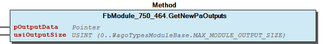 Graphical Interface of FbModule_750_464.GetNewPaOutputs Example

## FbModule_750_464.SetNewPaInputs (METH)


| Scope | Name | Type | Comment |
| --- | --- | --- | --- |
| Input | pInputData | POINTER TO BYTE | pointer to input data structure |
| usiInputSize | USINT (0..WagoTypesModuleBase.MAX_MODULE_INPUT_SIZE) | number of input bytes |

```
VAR_GLOBAL
    abReadData  :   ARRAY[0..126] OF BYTE;
END_VAR

// Call this code at the context of the fieldbus
IF xUpdatFieldbusInputData THEN (*  set the new inputs for our module
                                and get the new outputs from our module
                                to write to the fieldbus synchronized to the fieldbus cycle

                            *)
    myModule493.SetNewPaInputs (ADR(abReadData[0]) , myModule493.PA_SIZE_INPUT);

END_IF
```

Graphical Illustration

Graphical Interface of FbModule_750_464.SetNewPaInputs

Interface variables FUNCTION This method gives the new inputs from the fieldbus to the plc module. The fieldbus have to get this data fieldbus specific from the physical terminal and after this to call this method for take over the data to the module. Graphical Illustration  Graphical Interface of FbModule_750_464.SetNewPaInputs Example

## FbModule_750_630.GetNewPaOutputs (METH)


| Scope | Name | Type | Comment |
| --- | --- | --- | --- |
| Input | pOutputData | POINTER TO BYTE | pointer to output data structure |
| usiOutputSize | USINT (0..WagoTypesModuleBase.MAX_MODULE_OUTPUT_SIZE) | number of output bytes |

```
VAR_GLOBAL
    abWriteData :   ARRAY[0..126] OF BYTE;
END_VAR

// Call this code at the context of the fieldbus
IF xUpdatFieldbusOutputData THEN (* Get the new outputs from the plc
                                    to write it synchronized to the fieldbus
                                 *)

    myModule493.GetNewPaOutputs(ADR(abWriteData[0]), myModule493.PA_SIZE_OUTPUT);

END_IF
```

Graphical Illustration

Graphical Interface of FbModule_750_630.GetNewPaOutputs

Interface variables FUNCTION This method provides the new outputs from the FB for the fieldbus. The fieldbus have to give this data fieldbus specific to the physical terminal Call this method at the context of the fieldbus to get new outputs from the plc and take it over to the fieldbus. Graphical Illustration  Graphical Interface of FbModule_750_630.GetNewPaOutputs Example

## FbModule_750_630.SetNewPaInputs (METH)


| Scope | Name | Type | Comment |
| --- | --- | --- | --- |
| Input | pInputData | POINTER TO BYTE | pointer to input data structure |
| usiInputSize | USINT (0..WagoTypesModuleBase.MAX_MODULE_INPUT_SIZE) | number of input bytes |

```
VAR_GLOBAL
    abReadData  :   ARRAY[0..126] OF BYTE;
END_VAR

// Call this code at the context of the fieldbus
IF xUpdatFieldbusInputData THEN (*  set the new inputs for our module
                                and get the new outputs from our module
                                to write to the fieldbus synchronized to the fieldbus cycle

                            *)
    myModule493.SetNewPaInputs (ADR(abReadData[0]) , myModule493.PA_SIZE_INPUT);

END_IF
```

Graphical Illustration

Graphical Interface of FbModule_750_630.SetNewPaInputs

Interface variables FUNCTION This method gives the new inputs from the fieldbus to the plc module. The fieldbus have to get this data fieldbus specific from the physical terminal and after this to call this method for take over the data to the module. Graphical Illustration  Graphical Interface of FbModule_750_630.SetNewPaInputs Example

## FbModule_750_636.GetNewPaOutputs (METH)


| Scope | Name | Type | Comment |
| --- | --- | --- | --- |
| Input | pOutputData | POINTER TO BYTE | pointer to output data structure |
| usiOutputSize | USINT (0..WagoTypesModuleBase.MAX_MODULE_OUTPUT_SIZE) | number of output bytes |

```
VAR_GLOBAL
    abWriteData :   ARRAY[0..126] OF BYTE;
END_VAR

// Call this code at the context of the fieldbus
IF xUpdatFieldbusOutputData THEN (* Get the new outputs from the plc
                                    to write it synchronized to the fieldbus
                                 *)

    myModule636.GetNewPaOutputs(ADR(abWriteData[0]), myModule636.PA_SIZE_OUTPUT);

END_IF
```

Graphical Illustration

Graphical Interface of FbModule_750_636.GetNewPaOutputs

Interface variables FUNCTION This method provides the new outputs from the FB for the fieldbus. The fieldbus have to give this data fieldbus specific to the physical terminal Call this method at the context of the fieldbus to get new outputs from the plc and take it over to the fieldbus. Graphical Illustration  Graphical Interface of FbModule_750_636.GetNewPaOutputs Example

## FbModule_750_636.SetNewPaInputs (METH)


| Scope | Name | Type | Comment |
| --- | --- | --- | --- |
| Input | pInputData | POINTER TO BYTE | pointer to input data structure |
| usiInputSize | USINT (0..WagoTypesModuleBase.MAX_MODULE_INPUT_SIZE) | number of input bytes |

```
VAR_GLOBAL
    abReadData  :   ARRAY[0..126] OF BYTE;
END_VAR

// Call this code at the context of the fieldbus
IF xUpdatFieldbusInputData THEN (*  set the new inputs for our module
                                and get the new outputs from our module
                                to write to the fieldbus synchronized to the fieldbus cycle

                            *)
    myModule636.SetNewPaInputs (ADR(abReadData[0]) , myModule636.PA_SIZE_INPUT);

END_IF
```

Graphical Illustration

Graphical Interface of FbModule_750_636.SetNewPaInputs

Interface variables FUNCTION This method gives the new inputs from the fieldbus to the plc module. The fieldbus have to get this data fieldbus specific from the physical terminal and after this to call this method for take over the data to the module. Graphical Illustration  Graphical Interface of FbModule_750_636.SetNewPaInputs Example

## FbModule_750_642.GetNewPaOutputs (METH)


| Scope | Name | Type | Comment |
| --- | --- | --- | --- |
| Input | pOutputData | POINTER TO BYTE | pointer to output data structure |
| usiOutputSize | USINT (0..WagoTypesModuleBase.MAX_MODULE_OUTPUT_SIZE) | number of output bytes |

```
VAR_GLOBAL
    abWriteData :   ARRAY[0..126] OF BYTE;
END_VAR

// Call this code at the context of the fieldbus
IF xUpdatFieldbusOutputData THEN (* Get the new outputs from the plc
                                    to write it synchronized to the fieldbus
                                 *)

    myModule642.GetNewPaOutputs(ADR(abWriteData[0]), myModule642.PA_SIZE_OUTPUT);

END_IF
```

Graphical Illustration

Graphical Interface of FbModule_750_642.GetNewPaOutputs

Interface variables FUNCTION This method provides the new outputs from the FB for the fieldbus. The fieldbus have to give this data fieldbus specific to the physical terminal Call this method at the context of the fieldbus to get new outputs from the plc and take it over to the fieldbus. Graphical Illustration  Graphical Interface of FbModule_750_642.GetNewPaOutputs Example

## FbModule_750_642.SetNewPaInputs (METH)


| Scope | Name | Type | Comment |
| --- | --- | --- | --- |
| Input | pInputData | POINTER TO BYTE | pointer to input data structure |
| usiInputSize | USINT (0..WagoTypesModuleBase.MAX_MODULE_INPUT_SIZE) | number of input bytes |

```
VAR_GLOBAL
    abReadData  :   ARRAY[0..126] OF BYTE;
END_VAR

// Call this code at the context of the fieldbus
IF xUpdatFieldbusInputData THEN (*  set the new inputs for our module
                                and get the new outputs from our module
                                to write to the fieldbus synchronized to the fieldbus cycle

                            *)
    myModule642.SetNewPaInputs (ADR(abReadData[0]) , myModule642.PA_SIZE_INPUT);

END_IF
```

Graphical Illustration

Graphical Interface of FbModule_750_642.SetNewPaInputs

Interface variables FUNCTION This method gives the new inputs from the fieldbus to the plc module. The fieldbus have to get this data fieldbus specific from the physical terminal and after this to call this method for take over the data to the module. Graphical Illustration  Graphical Interface of FbModule_750_642.SetNewPaInputs Example

## FbModule_750_643.GetNewPaOutputs (METH)


| Scope | Name | Type | Comment |
| --- | --- | --- | --- |
| Input | pOutputData | POINTER TO BYTE | pointer to output data structure |
| usiOutputSize | USINT (0..WagoTypesModuleBase.MAX_MODULE_OUTPUT_SIZE) | number of output bytes |

```
VAR_GLOBAL
    abWriteData :   ARRAY[0..126] OF BYTE;
END_VAR

// Call this code at the context of the fieldbus
IF xUpdatFieldbusOutputData THEN (* Get the new outputs from the plc
                                    to write it synchronized to the fieldbus
                                 *)

    myModule643.GetNewPaOutputs(ADR(abWriteData[0]), myModule643.PA_SIZE_OUTPUT);

END_IF
```

Graphical Illustration

Graphical Interface of FbModule_750_643.GetNewPaOutputs

Interface variables FUNCTION This method provides the new outputs from the FB for the fieldbus. The fieldbus have to give this data fieldbus specific to the physical terminal Call this method at the context of the fieldbus to get new outputs from the plc and take it over to the fieldbus. Graphical Illustration  Graphical Interface of FbModule_750_643.GetNewPaOutputs Example

## FbModule_750_643.SetNewPaInputs (METH)


| Scope | Name | Type | Comment |
| --- | --- | --- | --- |
| Input | pInputData | POINTER TO BYTE | pointer to input data structure |
| usiInputSize | USINT (0..WagoTypesModuleBase.MAX_MODULE_INPUT_SIZE) | number of input bytes |

```
VAR_GLOBAL
    abReadData  :   ARRAY[0..126] OF BYTE;
END_VAR

// Call this code at the context of the fieldbus
IF xUpdatFieldbusInputData THEN (*  set the new inputs for our module
                                and get the new outputs from our module
                                to write to the fieldbus synchronized to the fieldbus cycle

                            *)
    myModule643.SetNewPaInputs (ADR(abReadData[0]) , myModule643.PA_SIZE_INPUT);

END_IF
```

Graphical Illustration

Graphical Interface of FbModule_750_643.SetNewPaInputs

Interface variables FUNCTION This method gives the new inputs from the fieldbus to the plc module. The fieldbus have to get this data fieldbus specific from the physical terminal and after this to call this method for take over the data to the module. Graphical Illustration  Graphical Interface of FbModule_750_643.SetNewPaInputs Example

## FbModule_753_1630.GetNewPaOutputs (METH)


| Scope | Name | Type | Comment |
| --- | --- | --- | --- |
| Input | pOutputData | POINTER TO BYTE | pointer to output data structure |
| usiOutputSize | USINT (0..WagoTypesModuleBase.MAX_MODULE_OUTPUT_SIZE) | number of output bytes |

```
VAR_GLOBAL
    abWriteData :   ARRAY[0..126] OF BYTE;
END_VAR

// Call this code at the context of the fieldbus
IF xUpdatFieldbusOutputData THEN (* Get the new outputs from the plc
                                    to write it synchronized to the fieldbus
                                 *)

    myModule1630.GetNewPaOutputs(ADR(abWriteData[0]), myModule1630.PA_SIZE_OUTPUT);

END_IF
```

Graphical Illustration

Graphical Interface of FbModule_753_1630.GetNewPaOutputs

Interface variables FUNCTION This method provides the new outputs from the FB for the fieldbus. The fieldbus have to give this data fieldbus specific to the physical terminal Call this method at the context of the fieldbus to get new outputs from the plc and take it over to the fieldbus. Graphical Illustration  Graphical Interface of FbModule_753_1630.GetNewPaOutputs Example

## FbModule_753_1630.SetNewPaInputs (METH)


| Scope | Name | Type | Comment |
| --- | --- | --- | --- |
| Input | pInputData | POINTER TO BYTE | pointer to input data structure |
| usiInputSize | USINT (0..WagoTypesModuleBase.MAX_MODULE_INPUT_SIZE) | number of input bytes |

```
VAR_GLOBAL
    abReadData  :   ARRAY[0..126] OF BYTE;
END_VAR

// Call this code at the context of the fieldbus
IF xUpdatFieldbusInputData THEN (*  set the new inputs for our module
                                and get the new outputs from our module
                                to write to the fieldbus synchronized to the fieldbus cycle

                            *)
    myModule1630.SetNewPaInputs (ADR(abReadData[0]) , myModule1630.PA_SIZE_INPUT);

END_IF
```

Graphical Illustration

Graphical Interface of FbModule_753_1630.SetNewPaInputs

Interface variables FUNCTION This method gives the new inputs from the fieldbus to the plc module. The fieldbus have to get this data fieldbus specific from the physical terminal and after this to call this method for take over the data to the module. Graphical Illustration  Graphical Interface of FbModule_753_1630.SetNewPaInputs Example

## FbModule_753_1631.GetNewPaOutputs (METH)


| Scope | Name | Type | Comment |
| --- | --- | --- | --- |
| Input | pOutputData | POINTER TO BYTE | pointer to output data structure |
| usiOutputSize | USINT (0..WagoTypesModuleBase.MAX_MODULE_OUTPUT_SIZE) | number of output bytes |

```
VAR_GLOBAL
    abWriteData :   ARRAY[0..126] OF BYTE;
END_VAR

// Call this code at the context of the fieldbus
IF xUpdatFieldbusOutputData THEN (* Get the new outputs from the plc
                                    to write it synchronized to the fieldbus
                                 *)

    myModule1631.GetNewPaOutputs(ADR(abWriteData[0]), myModule1631.PA_SIZE_OUTPUT);

END_IF
```

Graphical Illustration

Graphical Interface of FbModule_753_1631.GetNewPaOutputs

Interface variables FUNCTION This method provides the new outputs from the FB for the fieldbus. The fieldbus have to give this data fieldbus specific to the physical terminal Call this method at the context of the fieldbus to get new outputs from the plc and take it over to the fieldbus. Graphical Illustration  Graphical Interface of FbModule_753_1631.GetNewPaOutputs Example

## FbModule_753_1631.SetNewPaInputs (METH)


| Scope | Name | Type | Comment |
| --- | --- | --- | --- |
| Input | pInputData | POINTER TO BYTE | pointer to input data structure |
| usiInputSize | USINT (0..WagoTypesModuleBase.MAX_MODULE_INPUT_SIZE) | number of input bytes |

```
VAR_GLOBAL
    abReadData  :   ARRAY[0..126] OF BYTE;
END_VAR

// Call this code at the context of the fieldbus
IF xUpdatFieldbusInputData THEN (*  set the new inputs for our module
                                and get the new outputs from our module
                                to write to the fieldbus synchronized to the fieldbus cycle

                            *)
    myModule1631.SetNewPaInputs (ADR(abReadData[0]) , myModule1631.PA_SIZE_INPUT);

END_IF
```

Graphical Illustration

Graphical Interface of FbModule_753_1631.SetNewPaInputs

Interface variables FUNCTION This method gives the new inputs from the fieldbus to the plc module. The fieldbus have to get this data fieldbus specific from the physical terminal and after this to call this method for take over the data to the module. Graphical Illustration  Graphical Interface of FbModule_753_1631.SetNewPaInputs Example

## FbModule_753_646.GetNewPaOutputs (METH)


| Scope | Name | Type | Comment |
| --- | --- | --- | --- |
| Input | pOutputData | POINTER TO BYTE | pointer to output data structure |
| usiOutputSize | USINT (0..WagoTypesModuleBase.MAX_MODULE_OUTPUT_SIZE) | number of output bytes |

```
VAR_GLOBAL
    abWriteData :   ARRAY[0..126] OF BYTE;
END_VAR

// Call this code at the context of the fieldbus
IF xUpdatFieldbusOutputData THEN (* Get the new outputs from the plc
                                    to write it synchronized to the fieldbus
                                 *)

    myModule646.GetNewPaOutputs(ADR(abWriteData[0]), myModule646.PA_SIZE_OUTPUT);

END_IF
```

Graphical Illustration

Graphical Interface of FbModule_753_646.GetNewPaOutputs

Interface variables FUNCTION This method provides the new outputs from the FB for the fieldbus. The fieldbus have to give this data fieldbus specific to the physical terminal Call this method at the context of the fieldbus to get new outputs from the plc and take it over to the fieldbus. Graphical Illustration  Graphical Interface of FbModule_753_646.GetNewPaOutputs Example

## FbModule_753_646.SetNewPaInputs (METH)


| Scope | Name | Type | Comment |
| --- | --- | --- | --- |
| Input | pInputData | POINTER TO BYTE | pointer to input data structure |
| usiInputSize | USINT (0..WagoTypesModuleBase.MAX_MODULE_INPUT_SIZE) | number of input bytes |

```
VAR_GLOBAL
    abReadData  :   ARRAY[0..126] OF BYTE;
END_VAR

// Call this code at the context of the fieldbus
IF xUpdatFieldbusInputData THEN (*  set the new inputs for our module
                                and get the new outputs from our module
                                to write to the fieldbus synchronized to the fieldbus cycle

                            *)
    myModule646.SetNewPaInputs (ADR(abReadData[0]) , myModule646.PA_SIZE_INPUT);

END_IF
```

Graphical Illustration

Graphical Interface of FbModule_753_646.SetNewPaInputs

Interface variables FUNCTION This method gives the new inputs from the fieldbus to the plc module. The fieldbus have to get this data fieldbus specific from the physical terminal and after this to call this method for take over the data to the module. Graphical Illustration  Graphical Interface of FbModule_753_646.SetNewPaInputs Example

## FbModule_753_647.GetNewPaOutputs (METH)


| Scope | Name | Type | Comment |
| --- | --- | --- | --- |
| Input | pOutputData | POINTER TO BYTE | pointer to output data structure |
| usiOutputSize | USINT (0..WagoTypesModuleBase.MAX_MODULE_OUTPUT_SIZE) | number of output bytes |

```
VAR_GLOBAL
    abWriteData :   ARRAY[0..126] OF BYTE;
END_VAR

// Call this code at the context of the fieldbus
IF xUpdatFieldbusOutputData THEN (* Get the new outputs from the plc
                                    to write it synchronized to the fieldbus
                                 *)

    myModule647.GetNewPaOutputs(ADR(abWriteData[0]), myModule647.PA_SIZE_OUTPUT);

END_IF
```

Graphical Illustration

Graphical Interface of FbModule_753_647.GetNewPaOutputs

Interface variables FUNCTION This method provides the new outputs from the FB for the fieldbus. The fieldbus have to give this data fieldbus specific to the physical terminal Call this method at the context of the fieldbus to get new outputs from the plc and take it over to the fieldbus. Graphical Illustration  Graphical Interface of FbModule_753_647.GetNewPaOutputs Example

## FbModule_753_647.SetNewPaInputs (METH)


| Scope | Name | Type | Comment |
| --- | --- | --- | --- |
| Input | pInputData | POINTER TO BYTE | pointer to input data structure |
| usiInputSize | USINT (0..WagoTypesModuleBase.MAX_MODULE_INPUT_SIZE) | number of input bytes |

```
VAR_GLOBAL
    abReadData  :   ARRAY[0..126] OF BYTE;
END_VAR

// Call this code at the context of the fieldbus
IF xUpdatFieldbusInputData THEN (*  set the new inputs for our module
                                and get the new outputs from our module
                                to write to the fieldbus synchronized to the fieldbus cycle

                            *)
    myModule647.SetNewPaInputs (ADR(abReadData[0]) , myModule647.PA_SIZE_INPUT);

END_IF
```

Graphical Illustration

Graphical Interface of FbModule_753_647.SetNewPaInputs

Interface variables FUNCTION This method gives the new inputs from the fieldbus to the plc module. The fieldbus have to get this data fieldbus specific from the physical terminal and after this to call this method for take over the data to the module. Graphical Illustration  Graphical Interface of FbModule_753_647.SetNewPaInputs Example

## FbModule_753_649.GetNewPaOutputs (METH)


| Scope | Name | Type | Comment |
| --- | --- | --- | --- |
| Input | pOutputData | POINTER TO BYTE | pointer to output data structure |
| usiOutputSize | USINT (0..WagoTypesModuleBase.MAX_MODULE_OUTPUT_SIZE) | number of output bytes |

```
VAR_GLOBAL
    abWriteData :   ARRAY[0..126] OF BYTE;
END_VAR

// Call this code at the context of the fieldbus
IF xUpdatFieldbusOutputData THEN (* Get the new outputs from the plc
                                    to write it synchronized to the fieldbus
                                 *)

    myModule649.GetNewPaOutputs(ADR(abWriteData[0]), myModule649.PA_SIZE_OUTPUT);

END_IF
```

Graphical Illustration

Graphical Interface of FbModule_753_649.GetNewPaOutputs

Interface variables FUNCTION This method provides the new outputs from the FB for the fieldbus. The fieldbus have to give this data fieldbus specific to the physical terminal Call this method at the context of the fieldbus to get new outputs from the plc and take it over to the fieldbus. Graphical Illustration  Graphical Interface of FbModule_753_649.GetNewPaOutputs Example

## FbModule_753_649.SetNewPaInputs (METH)


| Scope | Name | Type | Comment |
| --- | --- | --- | --- |
| Input | pInputData | POINTER TO BYTE | pointer to input data structure |
| usiInputSize | USINT (0..WagoTypesModuleBase.MAX_MODULE_INPUT_SIZE) | number of input bytes |

```
VAR_GLOBAL
    abReadData  :   ARRAY[0..126] OF BYTE;
END_VAR

// Call this code at the context of the fieldbus
IF xUpdatFieldbusInputData THEN (*  set the new inputs for our module
                                and get the new outputs from our module
                                to write to the fieldbus synchronized to the fieldbus cycle

                            *)
    myModule649.SetNewPaInputs (ADR(abReadData[0]) , myModule649.PA_SIZE_INPUT);

END_IF
```

Graphical Illustration

Graphical Interface of FbModule_753_649.SetNewPaInputs

Interface variables FUNCTION This method gives the new inputs from the fieldbus to the plc module. The fieldbus have to get this data fieldbus specific from the physical terminal and after this to call this method for take over the data to the module. Graphical Illustration  Graphical Interface of FbModule_753_649.SetNewPaInputs Example

## FbModule_75x_1491.GetNewPaOutputs (METH)


| Scope | Name | Type | Comment |
| --- | --- | --- | --- |
| Input | pOutputData | POINTER TO BYTE | pointer to output data structure |
| usiOutputSize | USINT (0..WagoTypesModuleBase.MAX_MODULE_OUTPUT_SIZE) | number of output bytes |

```
VAR_GLOBAL
    abWriteData :   ARRAY[0..126] OF BYTE;
END_VAR

// Call this code at the context of the fieldbus
IF xUpdatFieldbusOutputData THEN (* Get the new outputs from the plc
                                    to write it synchronized to the fieldbus
                                 *)

    myModule493.GetNewPaOutputs(ADR(abWriteData[0]), myModule493.PA_SIZE_OUTPUT);

END_IF
```

Graphical Illustration

Graphical Interface of FbModule_75x_1491.GetNewPaOutputs

Interface variables FUNCTION This method provides the new outputs from the FB for the fieldbus. The fieldbus have to give this data fieldbus specific to the physical terminal Call this method at the context of the fieldbus to get new outputs from the plc and take it over to the fieldbus. Graphical Illustration  Graphical Interface of FbModule_75x_1491.GetNewPaOutputs Example

## FbModule_75x_1491.SetNewPaInputs (METH)


| Scope | Name | Type | Comment |
| --- | --- | --- | --- |
| Input | pInputData | POINTER TO BYTE | pointer to input data structure |
| usiInputSize | USINT (0..WagoTypesModuleBase.MAX_MODULE_INPUT_SIZE) | number of input bytes |

```
VAR_GLOBAL
    abReadData  :   ARRAY[0..126] OF BYTE;
END_VAR

// Call this code at the context of the fieldbus
IF xUpdatFieldbusInputData THEN (*  set the new inputs for our module
                                and get the new outputs from our module
                                to write to the fieldbus synchronized to the fieldbus cycle

                            *)
    myModule493.SetNewPaInputs (ADR(abReadData[0]) , myModule493.PA_SIZE_INPUT);

END_IF
```

Graphical Illustration

Graphical Interface of FbModule_75x_1491.SetNewPaInputs

Interface variables FUNCTION This method gives the new inputs from the fieldbus to the plc module. The fieldbus have to get this data fieldbus specific from the physical terminal and after this to call this method for take over the data to the module. Graphical Illustration  Graphical Interface of FbModule_75x_1491.SetNewPaInputs Example

## FbModule_75x_1632.GetNewPaOutputs (METH)


| Scope | Name | Type | Comment |
| --- | --- | --- | --- |
| Input | pOutputData | POINTER TO BYTE | pointer to output data structure |
| usiOutputSize | USINT (0..WagoTypesModuleBase.MAX_MODULE_OUTPUT_SIZE) | number of output bytes |

```
VAR_GLOBAL
    abWriteData :   ARRAY[0..126] OF BYTE;
END_VAR

// Call this code at the context of the fieldbus
IF xUpdatFieldbusOutputData THEN (* Get the new outputs from the plc
                                    to write it synchronized to the fieldbus
                                 *)

    myModule632.GetNewPaOutputs(ADR(abWriteData[0]), myModule632.PA_SIZE_OUTPUT);

END_IF
```

Graphical Illustration

Graphical Interface of FbModule_75x_1632.GetNewPaOutputs

Interface variables FUNCTION This method provides the new outputs from the FB for the fieldbus. The fieldbus have to give this data fieldbus specific to the physical terminal Call this method at the context of the fieldbus to get new outputs from the plc and take it over to the fieldbus. Graphical Illustration  Graphical Interface of FbModule_75x_1632.GetNewPaOutputs Example

## FbModule_75x_1632.SetNewPaInputs (METH)


| Scope | Name | Type | Comment |
| --- | --- | --- | --- |
| Input | pInputData | POINTER TO BYTE | pointer to input data structure |
| usiInputSize | USINT (0..WagoTypesModuleBase.MAX_MODULE_INPUT_SIZE) | number of input bytes |

```
VAR_GLOBAL
    abReadData  :   ARRAY[0..126] OF BYTE;
END_VAR

// Call this code at the context of the fieldbus
IF xUpdatFieldbusInputData THEN (*  set the new inputs for our module
                                and get the new outputs from our module
                                to write to the fieldbus synchronized to the fieldbus cycle

                            *)
    myModule632.SetNewPaInputs (ADR(abReadData[0]) , myModule632.PA_SIZE_INPUT);

END_IF
```

Graphical Illustration

Graphical Interface of FbModule_75x_1632.SetNewPaInputs

Interface variables FUNCTION This method gives the new inputs from the fieldbus to the plc module. The fieldbus have to get this data fieldbus specific from the physical terminal and after this to call this method for take over the data to the module. Graphical Illustration  Graphical Interface of FbModule_75x_1632.SetNewPaInputs Example

## FbModule_75x_1652.GetNewPaOutputs (METH)


| Scope | Name | Type | Comment |
| --- | --- | --- | --- |
| Input | pOutputData | POINTER TO BYTE | pointer to output data structure |
| usiOutputSize | USINT (0..WagoTypesModuleBase.MAX_MODULE_OUTPUT_SIZE) | number of output bytes |

```
VAR_GLOBAL
    abWriteData :   ARRAY[0..126] OF BYTE;
END_VAR

// Call this code at the context of the fieldbus
IF xUpdatFieldbusOutputData THEN (* Get the new outputs from the plc
                                    to write it synchronized to the fieldbus
                                 *)

    myModule652.GetNewPaOutputs(ADR(abWriteData[0]), myModule652.PA_SIZE_OUTPUT);

END_IF
```

Graphical Illustration

Graphical Interface of FbModule_75x_1652.GetNewPaOutputs

Interface variables FUNCTION This method provides the new outputs from the FB for the fieldbus. The fieldbus have to give this data fieldbus specific to the physical terminal Call this method at the context of the fieldbus to get new outputs from the plc and take it over to the fieldbus. Graphical Illustration  Graphical Interface of FbModule_75x_1652.GetNewPaOutputs Example

## FbModule_75x_1652.SetNewPaInputs (METH)


| Scope | Name | Type | Comment |
| --- | --- | --- | --- |
| Input | pInputData | POINTER TO BYTE | pointer to input data structure |
| usiInputSize | USINT (0..WagoTypesModuleBase.MAX_MODULE_INPUT_SIZE) | number of input bytes |

```
VAR_GLOBAL
    abReadData  :   ARRAY[0..126] OF BYTE;
END_VAR

// Call this code at the context of the fieldbus
IF xUpdatFieldbusInputData THEN (*  set the new inputs for our module
                                and get the new outputs from our module
                                to write to the fieldbus synchronized to the fieldbus cycle

                            *)
    myModule652.SetNewPaInputs (ADR(abReadData[0]) , myModule652.PA_SIZE_INPUT);

END_IF
```

Graphical Illustration

Graphical Interface of FbModule_75x_1652.SetNewPaInputs

Interface variables FUNCTION This method gives the new inputs from the fieldbus to the plc module. The fieldbus have to get this data fieldbus specific from the physical terminal and after this to call this method for take over the data to the module. Graphical Illustration  Graphical Interface of FbModule_75x_1652.SetNewPaInputs Example

## FbModule_75x_1657.GetNewPaOutputs (METH)


| Scope | Name | Type | Comment |
| --- | --- | --- | --- |
| Input | pOutputData | POINTER TO BYTE | pointer to output data structure |
| usiOutputSize | USINT (0..WagoTypesModuleBase.MAX_MODULE_OUTPUT_SIZE) | number of output bytes |

```
VAR_GLOBAL
    abWriteData :   ARRAY[0..126] OF BYTE;
END_VAR

// Call this code at the context of the fieldbus
IF xUpdatFieldbusOutputData THEN (* Get the new outputs from the plc
                                    to write it synchronized to the fieldbus
                                 *)

    myModule657.GetNewPaOutputs(ADR(abWriteData[0]), myModule657.PA_SIZE_OUTPUT);

END_IF
```

Graphical Illustration

Graphical Interface of FbModule_75x_1657.GetNewPaOutputs

Interface variables FUNCTION This method provides the new outputs from the FB for the fieldbus. The fieldbus have to give this data fieldbus specific to the physical terminal Call this method at the context of the fieldbus to get new outputs from the plc and take it over to the fieldbus. Graphical Illustration  Graphical Interface of FbModule_75x_1657.GetNewPaOutputs Example

## FbModule_75x_1657.SetNewPaInputs (METH)


| Scope | Name | Type | Comment |
| --- | --- | --- | --- |
| Input | pInputData | POINTER TO BYTE | pointer to input data structure |
| usiInputSize | USINT (0..WagoTypesModuleBase.MAX_MODULE_INPUT_SIZE) | number of input bytes |

```
VAR_GLOBAL
    abReadData  :   ARRAY[0..126] OF BYTE;
END_VAR

// Call this code at the context of the fieldbus
IF xUpdatFieldbusInputData THEN (*  set the new inputs for our module
                                and get the new outputs from our module
                                to write to the fieldbus synchronized to the fieldbus cycle

                            *)
    myModule657.SetNewPaInputs (ADR(abReadData[0]) , myModule657.PA_SIZE_INPUT);

END_IF
```

Graphical Illustration

Graphical Interface of FbModule_75x_1657.SetNewPaInputs

Interface variables FUNCTION This method gives the new inputs from the fieldbus to the plc module. The fieldbus have to get this data fieldbus specific from the physical terminal and after this to call this method for take over the data to the module. Graphical Illustration  Graphical Interface of FbModule_75x_1657.SetNewPaInputs Example

## FbModule_75x_458.GetNewPaOutputs (METH)


| Scope | Name | Type | Comment |
| --- | --- | --- | --- |
| Input | pOutputData | POINTER TO BYTE | pointer to output data structure |
| usiOutputSize | USINT (0..WagoTypesModuleBase.MAX_MODULE_OUTPUT_SIZE) | number of output bytes |

```
VAR_GLOBAL
    abWriteData :   ARRAY[0..126] OF BYTE;
END_VAR

// Call this code at the context of the fieldbus
IF xUpdatFieldbusOutputData THEN (* Get the new outputs from the plc
                                    to write it synchronized to the fieldbus
                                 *)

    myModule493.GetNewPaOutputs(ADR(abWriteData[0]), myModule493.PA_SIZE_OUTPUT);

END_IF
```

Graphical Illustration

Graphical Interface of FbModule_75x_458.GetNewPaOutputs

Interface variables FUNCTION This method provides the new outputs from the FB for the fieldbus. The fieldbus have to give this data fieldbus specific to the physical terminal Call this method at the context of the fieldbus to get new outputs from the plc and take it over to the fieldbus. Graphical Illustration 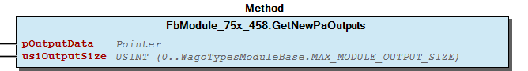 Graphical Interface of FbModule_75x_458.GetNewPaOutputs Example

## FbModule_75x_458.SetNewPaInputs (METH)


| Scope | Name | Type | Comment |
| --- | --- | --- | --- |
| Input | pInputData | POINTER TO BYTE | pointer to input data structure |
| usiInputSize | USINT (0..WagoTypesModuleBase.MAX_MODULE_INPUT_SIZE) | number of input bytes |

```
VAR_GLOBAL
    abReadData  :   ARRAY[0..126] OF BYTE;
END_VAR

// Call this code at the context of the fieldbus
IF xUpdatFieldbusInputData THEN (*  set the new inputs for our module
                                and get the new outputs from our module
                                to write to the fieldbus synchronized to the fieldbus cycle

                            *)
    myModule493.SetNewPaInputs (ADR(abReadData[0]) , myModule493.PA_SIZE_INPUT);

END_IF
```

Graphical Illustration

Graphical Interface of FbModule_75x_458.SetNewPaInputs

Interface variables FUNCTION This method gives the new inputs from the fieldbus to the plc module. The fieldbus have to get this data fieldbus specific from the physical terminal and after this to call this method for take over the data to the module. Graphical Illustration  Graphical Interface of FbModule_75x_458.SetNewPaInputs Example

## FbModule_75x_461.GetNewPaOutputs (METH)


| Scope | Name | Type | Comment |
| --- | --- | --- | --- |
| Input | pOutputData | POINTER TO BYTE | pointer to output data structure |
| usiOutputSize | USINT (0..WagoTypesModuleBase.MAX_MODULE_OUTPUT_SIZE) | number of output bytes |

```
VAR_GLOBAL
    abWriteData :   ARRAY[0..126] OF BYTE;
END_VAR

// Call this code at the context of the fieldbus
IF xUpdatFieldbusOutputData THEN (* Get the new outputs from the plc
                                    to write it synchronized to the fieldbus
                                 *)

    myModule493.GetNewPaOutputs(ADR(abWriteData[0]), myModule493.PA_SIZE_OUTPUT);

END_IF
```

Graphical Illustration

Graphical Interface of FbModule_75x_461.GetNewPaOutputs

Interface variables FUNCTION This method provides the new outputs from the FB for the fieldbus. The fieldbus have to give this data fieldbus specific to the physical terminal Call this method at the context of the fieldbus to get new outputs from the plc and take it over to the fieldbus. Graphical Illustration  Graphical Interface of FbModule_75x_461.GetNewPaOutputs Example

## FbModule_75x_461.SetNewPaInputs (METH)


| Scope | Name | Type | Comment |
| --- | --- | --- | --- |
| Input | pInputData | POINTER TO BYTE | pointer to input data structure |
| usiInputSize | USINT (0..WagoTypesModuleBase.MAX_MODULE_INPUT_SIZE) | number of input bytes |

```
VAR_GLOBAL
    abReadData  :   ARRAY[0..126] OF BYTE;
END_VAR

// Call this code at the context of the fieldbus
IF xUpdatFieldbusInputData THEN (*  set the new inputs for our module
                                and get the new outputs from our module
                                to write to the fieldbus synchronized to the fieldbus cycle

                            *)
    myModule493.SetNewPaInputs (ADR(abReadData[0]) , myModule493.PA_SIZE_INPUT);

END_IF
```

Graphical Illustration

Graphical Interface of FbModule_75x_461.SetNewPaInputs

Interface variables FUNCTION This method gives the new inputs from the fieldbus to the plc module. The fieldbus have to get this data fieldbus specific from the physical terminal and after this to call this method for take over the data to the module. Graphical Illustration  Graphical Interface of FbModule_75x_461.SetNewPaInputs Example

## FbModule_75x_469.GetNewPaOutputs (METH)


| Scope | Name | Type | Comment |
| --- | --- | --- | --- |
| Input | pOutputData | POINTER TO BYTE | pointer to output data structure |
| usiOutputSize | USINT (0..WagoTypesModuleBase.MAX_MODULE_OUTPUT_SIZE) | number of output bytes |

```
VAR_GLOBAL
    abWriteData :   ARRAY[0..126] OF BYTE;
END_VAR

// Call this code at the context of the fieldbus
IF xUpdatFieldbusOutputData THEN (* Get the new outputs from the plc
                                    to write it synchronized to the fieldbus
                                 *)

    myModule493.GetNewPaOutputs(ADR(abWriteData[0]), myModule493.PA_SIZE_OUTPUT);

END_IF
```

Graphical Illustration

Graphical Interface of FbModule_75x_469.GetNewPaOutputs

Interface variables FUNCTION This method provides the new outputs from the FB for the fieldbus. The fieldbus have to give this data fieldbus specific to the physical terminal Call this method at the context of the fieldbus to get new outputs from the plc and take it over to the fieldbus. Graphical Illustration  Graphical Interface of FbModule_75x_469.GetNewPaOutputs Example

## FbModule_75x_469.SetNewPaInputs (METH)


| Scope | Name | Type | Comment |
| --- | --- | --- | --- |
| Input | pInputData | POINTER TO BYTE | pointer to input data structure |
| usiInputSize | USINT (0..WagoTypesModuleBase.MAX_MODULE_INPUT_SIZE) | number of input bytes |

```
VAR_GLOBAL
    abReadData  :   ARRAY[0..126] OF BYTE;
END_VAR

// Call this code at the context of the fieldbus
IF xUpdatFieldbusInputData THEN (*  set the new inputs for our module
                                and get the new outputs from our module
                                to write to the fieldbus synchronized to the fieldbus cycle

                            *)
    myModule493.SetNewPaInputs (ADR(abReadData[0]) , myModule493.PA_SIZE_INPUT);

END_IF
```

Graphical Illustration

Graphical Interface of FbModule_75x_469.SetNewPaInputs

Interface variables FUNCTION This method gives the new inputs from the fieldbus to the plc module. The fieldbus have to get this data fieldbus specific from the physical terminal and after this to call this method for take over the data to the module. Graphical Illustration  Graphical Interface of FbModule_75x_469.SetNewPaInputs Example

## FbModule_75x_471.GetNewPaOutputs (METH)


| Scope | Name | Type | Comment |
| --- | --- | --- | --- |
| Input | pOutputData | POINTER TO BYTE | pointer to output data structure |
| usiOutputSize | USINT (0..WagoTypesModuleBase.MAX_MODULE_OUTPUT_SIZE) | number of output bytes |

```
VAR_GLOBAL
    abWriteData :   ARRAY[0..126] OF BYTE;
END_VAR

// Call this code at the context of the fieldbus
IF xUpdatFieldbusOutputData THEN (* Get the new outputs from the plc
                                    to write it synchronized to the fieldbus
                                 *)

    myModule493.GetNewPaOutputs(ADR(abWriteData[0]), myModule493.PA_SIZE_OUTPUT);

END_IF
```

Graphical Illustration

Graphical Interface of FbModule_75x_471.GetNewPaOutputs

Interface variables FUNCTION This method provides the new outputs from the FB for the fieldbus. The fieldbus have to give this data fieldbus specific to the physical terminal Call this method at the context of the fieldbus to get new outputs from the plc and take it over to the fieldbus. Graphical Illustration  Graphical Interface of FbModule_75x_471.GetNewPaOutputs Example

## FbModule_75x_471.SetNewPaInputs (METH)


| Scope | Name | Type | Comment |
| --- | --- | --- | --- |
| Input | pInputData | POINTER TO BYTE | pointer to input data structure |
| usiInputSize | USINT (0..WagoTypesModuleBase.MAX_MODULE_INPUT_SIZE) | number of input bytes |

```
VAR_GLOBAL
    abReadData  :   ARRAY[0..126] OF BYTE;
END_VAR

// Call this code at the context of the fieldbus
IF xUpdatFieldbusInputData THEN (*  set the new inputs for our module
                                and get the new outputs from our module
                                to write to the fieldbus synchronized to the fieldbus cycle

                            *)
    myModule493.SetNewPaInputs (ADR(abReadData[0]) , myModule493.PA_SIZE_INPUT);

END_IF
```

Graphical Illustration

Graphical Interface of FbModule_75x_471.SetNewPaInputs

Interface variables FUNCTION This method gives the new inputs from the fieldbus to the plc module. The fieldbus have to get this data fieldbus specific from the physical terminal and after this to call this method for take over the data to the module. Graphical Illustration  Graphical Interface of FbModule_75x_471.SetNewPaInputs Example

## FbModule_75x_481.GetNewPaOutputs (METH)


| Scope | Name | Type | Comment |
| --- | --- | --- | --- |
| Input | pOutputData | POINTER TO BYTE | pointer to output data structure |
| usiOutputSize | USINT (0..WagoTypesModuleBase.MAX_MODULE_OUTPUT_SIZE) | number of output bytes |

```
VAR_GLOBAL
    abWriteData :   ARRAY[0..126] OF BYTE;
END_VAR

// Call this code at the context of the fieldbus
IF xUpdatFieldbusOutputData THEN (* Get the new outputs from the plc
                                    to write it synchronized to the fieldbus
                                 *)

    myModule493.GetNewPaOutputs(ADR(abWriteData[0]), myModule493.PA_SIZE_OUTPUT);

END_IF
```

Graphical Illustration

Graphical Interface of FbModule_75x_481.GetNewPaOutputs

Interface variables FUNCTION This method provides the new outputs from the FB for the fieldbus. The fieldbus have to give this data fieldbus specific to the physical terminal Call this method at the context of the fieldbus to get new outputs from the plc and take it over to the fieldbus. Graphical Illustration  Graphical Interface of FbModule_75x_481.GetNewPaOutputs Example

## FbModule_75x_481.SetNewPaInputs (METH)


| Scope | Name | Type | Comment |
| --- | --- | --- | --- |
| Input | pInputData | POINTER TO BYTE | pointer to input data structure |
| usiInputSize | USINT (0..WagoTypesModuleBase.MAX_MODULE_INPUT_SIZE) | number of input bytes |

```
VAR_GLOBAL
    abReadData  :   ARRAY[0..126] OF BYTE;
END_VAR

// Call this code at the context of the fieldbus
IF xUpdatFieldbusInputData THEN (*  set the new inputs for our module
                                and get the new outputs from our module
                                to write to the fieldbus synchronized to the fieldbus cycle

                            *)
    myModule493.SetNewPaInputs (ADR(abReadData[0]) , myModule493.PA_SIZE_INPUT);

END_IF
```

Graphical Illustration

Graphical Interface of FbModule_75x_481.SetNewPaInputs

Interface variables FUNCTION This method gives the new inputs from the fieldbus to the plc module. The fieldbus have to get this data fieldbus specific from the physical terminal and after this to call this method for take over the data to the module. Graphical Illustration  Graphical Interface of FbModule_75x_481.SetNewPaInputs Example

## FbModule_75x_482.GetNewPaOutputs (METH)


| Scope | Name | Type | Comment |
| --- | --- | --- | --- |
| Input | pOutputData | POINTER TO BYTE | pointer to output data structure |
| usiOutputSize | USINT (0..WagoTypesModuleBase.MAX_MODULE_OUTPUT_SIZE) | number of output bytes |

```
VAR_GLOBAL
    abWriteData :   ARRAY[0..126] OF BYTE;
END_VAR

// Call this code at the context of the fieldbus
IF xUpdatFieldbusOutputData THEN (* Get the new outputs from the plc
                                    to write it synchronized to the fieldbus
                                 *)

    myModule482.GetNewPaOutputs(ADR(abWriteData[0]), myModule482.PA_SIZE_OUTPUT);

END_IF
```

Graphical Illustration

Graphical Interface of FbModule_75x_482.GetNewPaOutputs

Interface variables FUNCTION This method provides the new outputs from the FB for the fieldbus. The fieldbus have to give this data fieldbus specific to the physical terminal Call this method at the context of the fieldbus to get new outputs from the plc and take it over to the fieldbus. Graphical Illustration  Graphical Interface of FbModule_75x_482.GetNewPaOutputs Example

## FbModule_75x_482.GetProcessInByte (METH)


| Scope | Name | Type | Comment |
| --- | --- | --- | --- |
| Return | GetProcessInByte | BYTE |  |
| Input | ByteNo | UINT | range 0..(_uiInputSize - 1) |

Anpassung notwendig, weil das Prozessabbild am Feldbus ein anderes ist, als das am Controller Beim Controller gibt es kein Füllbyte nach dem Control/Status Byte. Dafür gibt es ein Füllbyte nach der MBX, d.h. an Position 7

Interface variables Anpassung notwendig, weil das Prozessabbild am Feldbus ein anderes ist, als das am Controller Beim Controller gibt es kein Füllbyte nach dem Control/Status Byte. Dafür gibt es ein Füllbyte nach der MBX, d.h. an Position 7

## FbModule_75x_482.GetProcessOutByte (METH)


| Scope | Name | Type | Comment |
| --- | --- | --- | --- |
| Return | GetProcessOutByte | BYTE |  |
| Input | ByteNo | UINT | range 0..(_uiInputSize - 1) |

Anpassung notwendig, weil das Prozessabbild am Feldbus ein anderes ist, als das am Controller Beim Controller gibt es kein Füllbyte nach dem Control/Status Byte. Dafür gibt es ein Füllbyte nach der MBX, d.h. an Position 7

Interface variables Anpassung notwendig, weil das Prozessabbild am Feldbus ein anderes ist, als das am Controller Beim Controller gibt es kein Füllbyte nach dem Control/Status Byte. Dafür gibt es ein Füllbyte nach der MBX, d.h. an Position 7

## FbModule_75x_482.SetNewPaInputs (METH)


| Scope | Name | Type | Comment |
| --- | --- | --- | --- |
| Input | pInputData | POINTER TO BYTE | pointer to input data structure |
| usiInputSize | USINT (0..WagoTypesModuleBase.MAX_MODULE_INPUT_SIZE) | number of input bytes |

```
VAR_GLOBAL
    abReadData  :   ARRAY[0..126] OF BYTE;
END_VAR

// Call this code at the context of the fieldbus
IF xUpdatFieldbusInputData THEN (*  set the new inputs for our module
                                and get the new outputs from our module
                                to write to the fieldbus synchronized to the fieldbus cycle

                            *)
    myModule482.SetNewPaInputs (ADR(abReadData[0]) , myModule482.PA_SIZE_INPUT);

END_IF
```

Graphical Illustration

Graphical Interface of FbModule_75x_482.SetNewPaInputs

Interface variables FUNCTION This method gives the new inputs from the fieldbus to the plc module. The fieldbus have to get this data fieldbus specific from the physical terminal and after this to call this method for take over the data to the module. Graphical Illustration  Graphical Interface of FbModule_75x_482.SetNewPaInputs Example

## FbModule_75x_484.GetNewPaOutputs (METH)


| Scope | Name | Type | Comment |
| --- | --- | --- | --- |
| Input | pOutputData | POINTER TO BYTE | pointer to output data structure |
| usiOutputSize | USINT (0..WagoTypesModuleBase.MAX_MODULE_OUTPUT_SIZE) | number of output bytes |

```
VAR_GLOBAL
    abWriteData :   ARRAY[0..126] OF BYTE;
END_VAR

// Call this code at the context of the fieldbus
IF xUpdatFieldbusOutputData THEN (* Get the new outputs from the plc
                                    to write it synchronized to the fieldbus
                                 *)

    myModule484.GetNewPaOutputs(ADR(abWriteData[0]), myModule484.PA_SIZE_OUTPUT);

END_IF
```

Graphical Illustration

Graphical Interface of FbModule_75x_484.GetNewPaOutputs

Interface variables FUNCTION This method provides the new outputs from the FB for the fieldbus. The fieldbus have to give this data fieldbus specific to the physical terminal Call this method at the context of the fieldbus to get new outputs from the plc and take it over to the fieldbus. Graphical Illustration  Graphical Interface of FbModule_75x_484.GetNewPaOutputs Example

## FbModule_75x_484.GetProcessInByte (METH)


| Scope | Name | Type | Comment |
| --- | --- | --- | --- |
| Return | GetProcessInByte | BYTE |  |
| Input | ByteNo | UINT | range 0..(_uiInputSize - 1) |

Anpassung notwendig, weil das Prozessabbild am Feldbus ein anderes ist, als das am Controller Beim Controller gibt es kein Füllbyte nach dem Control/Status Byte. Dafür gibt es ein Füllbyte nach der MBX, d.h. an Position 7

Interface variables Anpassung notwendig, weil das Prozessabbild am Feldbus ein anderes ist, als das am Controller Beim Controller gibt es kein Füllbyte nach dem Control/Status Byte. Dafür gibt es ein Füllbyte nach der MBX, d.h. an Position 7

## FbModule_75x_484.GetProcessOutByte (METH)


| Scope | Name | Type | Comment |
| --- | --- | --- | --- |
| Return | GetProcessOutByte | BYTE |  |
| Input | ByteNo | UINT | range 0..(_uiInputSize - 1) |

Anpassung notwendig, weil das Prozessabbild am Feldbus ein anderes ist, als das am Controller Beim Controller gibt es kein Füllbyte nach dem Control/Status Byte. Dafür gibt es ein Füllbyte nach der MBX, d.h. an Position 7

Interface variables Anpassung notwendig, weil das Prozessabbild am Feldbus ein anderes ist, als das am Controller Beim Controller gibt es kein Füllbyte nach dem Control/Status Byte. Dafür gibt es ein Füllbyte nach der MBX, d.h. an Position 7

## FbModule_75x_484.SetNewPaInputs (METH)


| Scope | Name | Type | Comment |
| --- | --- | --- | --- |
| Input | pInputData | POINTER TO BYTE | pointer to input data structure |
| usiInputSize | USINT (0..WagoTypesModuleBase.MAX_MODULE_INPUT_SIZE) | number of input bytes |

```
VAR_GLOBAL
    abReadData  :   ARRAY[0..126] OF BYTE;
END_VAR

// Call this code at the context of the fieldbus
IF xUpdatFieldbusInputData THEN (*  set the new inputs for our module
                                and get the new outputs from our module
                                to write to the fieldbus synchronized to the fieldbus cycle

                            *)
    myModule484.SetNewPaInputs (ADR(abReadData[0]) , myModule484.PA_SIZE_INPUT);

END_IF
```

Graphical Illustration

Graphical Interface of FbModule_75x_484.SetNewPaInputs

Interface variables FUNCTION This method gives the new inputs from the fieldbus to the plc module. The fieldbus have to get this data fieldbus specific from the physical terminal and after this to call this method for take over the data to the module. Graphical Illustration  Graphical Interface of FbModule_75x_484.SetNewPaInputs Example

## FbModule_75x_486.GetNewPaOutputs (METH)


| Scope | Name | Type | Comment |
| --- | --- | --- | --- |
| Input | pOutputData | POINTER TO BYTE | pointer to output data structure |
| usiOutputSize | USINT (0..WagoTypesModuleBase.MAX_MODULE_OUTPUT_SIZE) | number of output bytes |

```
VAR_GLOBAL
    abWriteData :   ARRAY[0..126] OF BYTE;
END_VAR

// Call this code at the context of the fieldbus
IF xUpdatFieldbusOutputData THEN (* Get the new outputs from the plc
                                    to write it synchronized to the fieldbus
                                 *)

    myModule493.GetNewPaOutputs(ADR(abWriteData[0]), myModule493.PA_SIZE_OUTPUT);

END_IF
```

Graphical Illustration

Graphical Interface of FbModule_75x_486.GetNewPaOutputs

Interface variables FUNCTION This method provides the new outputs from the FB for the fieldbus. The fieldbus have to give this data fieldbus specific to the physical terminal Call this method at the context of the fieldbus to get new outputs from the plc and take it over to the fieldbus. Graphical Illustration  Graphical Interface of FbModule_75x_486.GetNewPaOutputs Example

## FbModule_75x_486.SetNewPaInputs (METH)


| Scope | Name | Type | Comment |
| --- | --- | --- | --- |
| Input | pInputData | POINTER TO BYTE | pointer to input data structure |
| usiInputSize | USINT (0..WagoTypesModuleBase.MAX_MODULE_INPUT_SIZE) | number of input bytes |

```
VAR_GLOBAL
    abReadData  :   ARRAY[0..126] OF BYTE;
END_VAR

// Call this code at the context of the fieldbus
IF xUpdatFieldbusInputData THEN (*  set the new inputs for our module
                                and get the new outputs from our module
                                to write to the fieldbus synchronized to the fieldbus cycle

                            *)
    myModule493.SetNewPaInputs (ADR(abReadData[0]) , myModule493.PA_SIZE_INPUT);

END_IF
```

Graphical Illustration

Graphical Interface of FbModule_75x_486.SetNewPaInputs

Interface variables FUNCTION This method gives the new inputs from the fieldbus to the plc module. The fieldbus have to get this data fieldbus specific from the physical terminal and after this to call this method for take over the data to the module. Graphical Illustration  Graphical Interface of FbModule_75x_486.SetNewPaInputs Example

## FbModule_75x_487.GetNewPaOutputs (METH)


| Scope | Name | Type | Comment |
| --- | --- | --- | --- |
| Input | pOutputData | POINTER TO BYTE | pointer to output data structure |
| usiOutputSize | USINT (0..WagoTypesModuleBase.MAX_MODULE_OUTPUT_SIZE) | number of output bytes |

```
VAR_GLOBAL
    abWriteData :   ARRAY[0..126] OF BYTE;
END_VAR

// Call this code at the context of the fieldbus
IF xUpdatFieldbusOutputData THEN (* Get the new outputs from the plc
                                    to write it synchronized to the fieldbus
                                 *)

    myModule493.GetNewPaOutputs(ADR(abWriteData[0]), myModule493.PA_SIZE_OUTPUT);

END_IF
```

Graphical Illustration

Graphical Interface of FbModule_75x_487.GetNewPaOutputs

Interface variables FUNCTION This method provides the new outputs from the FB for the fieldbus. The fieldbus have to give this data fieldbus specific to the physical terminal Call this method at the context of the fieldbus to get new outputs from the plc and take it over to the fieldbus. Graphical Illustration  Graphical Interface of FbModule_75x_487.GetNewPaOutputs Example

## FbModule_75x_487.SetNewPaInputs (METH)


| Scope | Name | Type | Comment |
| --- | --- | --- | --- |
| Input | pInputData | POINTER TO BYTE | pointer to input data structure |
| usiInputSize | USINT (0..WagoTypesModuleBase.MAX_MODULE_INPUT_SIZE) | number of input bytes |

```
VAR_GLOBAL
    abReadData  :   ARRAY[0..126] OF BYTE;
END_VAR

// Call this code at the context of the fieldbus
IF xUpdatFieldbusInputData THEN (*  set the new inputs for our module
                                and get the new outputs from our module
                                to write to the fieldbus synchronized to the fieldbus cycle

                            *)
    myModule493.SetNewPaInputs (ADR(abReadData[0]) , myModule493.PA_SIZE_INPUT);

END_IF
```

Graphical Illustration

Graphical Interface of FbModule_75x_487.SetNewPaInputs

Interface variables FUNCTION This method gives the new inputs from the fieldbus to the plc module. The fieldbus have to get this data fieldbus specific from the physical terminal and after this to call this method for take over the data to the module. Graphical Illustration  Graphical Interface of FbModule_75x_487.SetNewPaInputs Example

## FbModule_75x_489.GetNewPaOutputs (METH)


| Scope | Name | Type | Comment |
| --- | --- | --- | --- |
| Input | pOutputData | POINTER TO BYTE | pointer to output data structure |
| usiOutputSize | USINT (0..WagoTypesModuleBase.MAX_MODULE_OUTPUT_SIZE) | number of output bytes |

```
VAR_GLOBAL
    abWriteData :   ARRAY[0..126] OF BYTE;
END_VAR

// Call this code at the context of the fieldbus
IF xUpdatFieldbusOutputData THEN (* Get the new outputs from the plc
                                    to write it synchronized to the fieldbus
                                 *)

    myModule493.GetNewPaOutputs(ADR(abWriteData[0]), myModule493.PA_SIZE_OUTPUT);

END_IF
```

Graphical Illustration

Graphical Interface of FbModule_75x_489.GetNewPaOutputs

Interface variables FUNCTION This method provides the new outputs from the FB for the fieldbus. The fieldbus have to give this data fieldbus specific to the physical terminal Call this method at the context of the fieldbus to get new outputs from the plc and take it over to the fieldbus. Graphical Illustration  Graphical Interface of FbModule_75x_489.GetNewPaOutputs Example

## FbModule_75x_489.SetNewPaInputs (METH)


| Scope | Name | Type | Comment |
| --- | --- | --- | --- |
| Input | pInputData | POINTER TO BYTE | pointer to input data structure |
| usiInputSize | USINT (0..WagoTypesModuleBase.MAX_MODULE_INPUT_SIZE) | number of input bytes |

```
VAR_GLOBAL
    abReadData  :   ARRAY[0..126] OF BYTE;
END_VAR

// Call this code at the context of the fieldbus
IF xUpdatFieldbusInputData THEN (*  set the new inputs for our module
                                and get the new outputs from our module
                                to write to the fieldbus synchronized to the fieldbus cycle

                            *)
    myModule493.SetNewPaInputs (ADR(abReadData[0]) , myModule493.PA_SIZE_INPUT);

END_IF
```

Graphical Illustration

Graphical Interface of FbModule_75x_489.SetNewPaInputs

Interface variables FUNCTION This method gives the new inputs from the fieldbus to the plc module. The fieldbus have to get this data fieldbus specific from the physical terminal and after this to call this method for take over the data to the module. Graphical Illustration  Graphical Interface of FbModule_75x_489.SetNewPaInputs Example

## FbModule_75x_493.GetNewPaOutputs (METH)


| Scope | Name | Type | Comment |
| --- | --- | --- | --- |
| Input | pOutputData | POINTER TO BYTE | pointer to output data structure |
| usiOutputSize | USINT (0..WagoTypesModuleBase.MAX_MODULE_OUTPUT_SIZE) | number of output bytes |

```
VAR_GLOBAL
    abWriteData :   ARRAY[0..126] OF BYTE;
END_VAR

// Call this code at the context of the fieldbus
IF xUpdatFieldbusOutputData THEN (* Get the new outputs from the plc
                                    to write it synchronized to the fieldbus
                                 *)

    myModule493.GetNewPaOutputs(ADR(abWriteData[0]), myModule493.PA_SIZE_OUTPUT);

END_IF
```

Graphical Illustration

Graphical Interface of FbModule_75x_493.GetNewPaOutputs

Interface variables FUNCTION This method provides the new outputs from the FB for the fieldbus. The fieldbus have to give this data fieldbus specific to the physical terminal Call this method at the context of the fieldbus to get new outputs from the plc and take it over to the fieldbus. Graphical Illustration  Graphical Interface of FbModule_75x_493.GetNewPaOutputs Example

## FbModule_75x_493.SetNewPaInputs (METH)


| Scope | Name | Type | Comment |
| --- | --- | --- | --- |
| Input | pInputData | POINTER TO BYTE | pointer to input data structure |
| usiInputSize | USINT (0..WagoTypesModuleBase.MAX_MODULE_INPUT_SIZE) | number of input bytes |

```
VAR_GLOBAL
    abReadData  :   ARRAY[0..126] OF BYTE;
END_VAR

// Call this code at the context of the fieldbus
IF xUpdatFieldbusInputData THEN (*  set the new inputs for our module
                                and get the new outputs from our module
                                to write to the fieldbus synchronized to the fieldbus cycle

                            *)
    myModule493.SetNewPaInputs (ADR(abReadData[0]) , myModule493.PA_SIZE_INPUT);

END_IF
```

Graphical Illustration

Graphical Interface of FbModule_75x_493.SetNewPaInputs

Interface variables FUNCTION This method gives the new inputs from the fieldbus to the plc module. The fieldbus have to get this data fieldbus specific from the physical terminal and after this to call this method for take over the data to the module. Graphical Illustration  Graphical Interface of FbModule_75x_493.SetNewPaInputs Example

## FbModule_75x_494.GetNewPaOutputs (METH)


| Scope | Name | Type | Comment |
| --- | --- | --- | --- |
| Input | pOutputData | POINTER TO BYTE | pointer to output data structure |
| usiOutputSize | USINT (0..WagoTypesModuleBase.MAX_MODULE_OUTPUT_SIZE) | number of output bytes |

```
VAR_GLOBAL
    abWriteData :   ARRAY[0..126] OF BYTE;
END_VAR

// Call this code at the context of the fieldbus
IF xUpdatFieldbusOutputData THEN (* Get the new outputs from the plc
                                    to write it synchronized to the fieldbus
                                 *)

    myModule494.GetNewPaOutputs(ADR(abWriteData[0]), myModule494.PA_SIZE_OUTPUT);

END_IF
```

Graphical Illustration

Graphical Interface of FbModule_75x_494.GetNewPaOutputs

Interface variables FUNCTION This method provides the new outputs from the FB for the fieldbus. The fieldbus have to give this data fieldbus specific to the physical terminal Call this method at the context of the fieldbus to get new outputs from the plc and take it over to the fieldbus. Graphical Illustration  Graphical Interface of FbModule_75x_494.GetNewPaOutputs Example

## FbModule_75x_494.SetNewPaInputs (METH)


| Scope | Name | Type | Comment |
| --- | --- | --- | --- |
| Input | pInputData | POINTER TO BYTE | pointer to input data structure |
| usiInputSize | USINT (0..WagoTypesModuleBase.MAX_MODULE_INPUT_SIZE) | number of input bytes |

```
VAR_GLOBAL
    abReadData  :   ARRAY[0..126] OF BYTE;
END_VAR

// Call this code at the context of the fieldbus
IF xUpdatFieldbusInputData THEN (*  set the new inputs for our module
                                and get the new outputs from our module
                                to write to the fieldbus synchronized to the fieldbus cycle

                            *)
    myModule494.SetNewPaInputs (ADR(abReadData[0]) , myModule494.PA_SIZE_INPUT);

END_IF
```

Graphical Illustration

Graphical Interface of FbModule_75x_494.SetNewPaInputs

Interface variables FUNCTION This method gives the new inputs from the fieldbus to the plc module. The fieldbus have to get this data fieldbus specific from the physical terminal and after this to call this method for take over the data to the module. Graphical Illustration 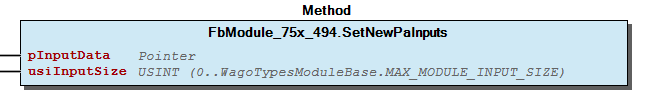 Graphical Interface of FbModule_75x_494.SetNewPaInputs Example

## FbModule_75x_495.GetNewPaOutputs (METH)


| Scope | Name | Type | Comment |
| --- | --- | --- | --- |
| Input | pOutputData | POINTER TO BYTE | pointer to output data structure |
| usiOutputSize | USINT (0..WagoTypesModuleBase.MAX_MODULE_OUTPUT_SIZE) | number of output bytes |

```
VAR_GLOBAL
    abWriteData :   ARRAY[0..126] OF BYTE;
END_VAR

// Call this code at the context of the fieldbus
IF xUpdatFieldbusOutputData THEN (* Get the new outputs from the plc
                                    to write it synchronized to the fieldbus
                                 *)

    myModule495.GetNewPaOutputs(ADR(abWriteData[0]), myModule495.PA_SIZE_OUTPUT);

END_IF
```

Graphical Illustration

Graphical Interface of FbModule_75x_495.GetNewPaOutputs

Interface variables FUNCTION This method provides the new outputs from the FB for the fieldbus. The fieldbus have to give this data fieldbus specific to the physical terminal Call this method at the context of the fieldbus to get new outputs from the plc and take it over to the fieldbus. Graphical Illustration  Graphical Interface of FbModule_75x_495.GetNewPaOutputs Example

## FbModule_75x_495.SetNewPaInputs (METH)


| Scope | Name | Type | Comment |
| --- | --- | --- | --- |
| Input | pInputData | POINTER TO BYTE | pointer to input data structure |
| usiInputSize | USINT (0..WagoTypesModuleBase.MAX_MODULE_INPUT_SIZE) | number of input bytes |

```
VAR_GLOBAL
    abReadData  :   ARRAY[0..126] OF BYTE;
END_VAR

// Call this code at the context of the fieldbus
IF xUpdatFieldbusInputData THEN (*  set the new inputs for our module
                                and get the new outputs from our module
                                to write to the fieldbus synchronized to the fieldbus cycle

                            *)
    myModule495.SetNewPaInputs (ADR(abReadData[0]) , myModule495.PA_SIZE_INPUT);

END_IF
```

Graphical Illustration

Graphical Interface of FbModule_75x_495.SetNewPaInputs

Interface variables FUNCTION This method gives the new inputs from the fieldbus to the plc module. The fieldbus have to get this data fieldbus specific from the physical terminal and after this to call this method for take over the data to the module. Graphical Illustration  Graphical Interface of FbModule_75x_495.SetNewPaInputs Example

## FbModule_75x_496.GetNewPaOutputs (METH)


| Scope | Name | Type | Comment |
| --- | --- | --- | --- |
| Input | pOutputData | POINTER TO BYTE | pointer to output data structure |
| usiOutputSize | USINT (0..WagoTypesModuleBase.MAX_MODULE_OUTPUT_SIZE) | number of output bytes |

```
VAR_GLOBAL
    abWriteData :   ARRAY[0..126] OF BYTE;
END_VAR

// Call this code at the context of the fieldbus
IF xUpdatFieldbusOutputData THEN (* Get the new outputs from the plc
                                    to write it synchronized to the fieldbus
                                 *)

    myModule493.GetNewPaOutputs(ADR(abWriteData[0]), myModule493.PA_SIZE_OUTPUT);

END_IF
```

Graphical Illustration

Graphical Interface of FbModule_75x_496.GetNewPaOutputs

Interface variables FUNCTION This method provides the new outputs from the FB for the fieldbus. The fieldbus have to give this data fieldbus specific to the physical terminal Call this method at the context of the fieldbus to get new outputs from the plc and take it over to the fieldbus. Graphical Illustration  Graphical Interface of FbModule_75x_496.GetNewPaOutputs Example

## FbModule_75x_496.SetNewPaInputs (METH)


| Scope | Name | Type | Comment |
| --- | --- | --- | --- |
| Input | pInputData | POINTER TO BYTE | pointer to input data structure |
| usiInputSize | USINT (0..WagoTypesModuleBase.MAX_MODULE_INPUT_SIZE) | number of input bytes |

```
VAR_GLOBAL
    abReadData  :   ARRAY[0..126] OF BYTE;
END_VAR

// Call this code at the context of the fieldbus
IF xUpdatFieldbusInputData THEN (*  set the new inputs for our module
                                and get the new outputs from our module
                                to write to the fieldbus synchronized to the fieldbus cycle

                            *)
    myModule493.SetNewPaInputs (ADR(abReadData[0]) , myModule493.PA_SIZE_INPUT);

END_IF
```

Graphical Illustration

Graphical Interface of FbModule_75x_496.SetNewPaInputs

Interface variables FUNCTION This method gives the new inputs from the fieldbus to the plc module. The fieldbus have to get this data fieldbus specific from the physical terminal and after this to call this method for take over the data to the module. Graphical Illustration  Graphical Interface of FbModule_75x_496.SetNewPaInputs Example

## FbModule_75x_497.GetNewPaOutputs (METH)


| Scope | Name | Type | Comment |
| --- | --- | --- | --- |
| Input | pOutputData | POINTER TO BYTE | pointer to output data structure |
| usiOutputSize | USINT (0..WagoTypesModuleBase.MAX_MODULE_OUTPUT_SIZE) | number of output bytes |

```
VAR_GLOBAL
    abWriteData :   ARRAY[0..126] OF BYTE;
END_VAR

// Call this code at the context of the fieldbus
IF xUpdatFieldbusOutputData THEN (* Get the new outputs from the plc
                                    to write it synchronized to the fieldbus
                                 *)

    myModule493.GetNewPaOutputs(ADR(abWriteData[0]), myModule493.PA_SIZE_OUTPUT);

END_IF
```

Graphical Illustration

Graphical Interface of FbModule_75x_497.GetNewPaOutputs

Interface variables FUNCTION This method provides the new outputs from the FB for the fieldbus. The fieldbus have to give this data fieldbus specific to the physical terminal Call this method at the context of the fieldbus to get new outputs from the plc and take it over to the fieldbus. Graphical Illustration  Graphical Interface of FbModule_75x_497.GetNewPaOutputs Example

## FbModule_75x_497.SetNewPaInputs (METH)


| Scope | Name | Type | Comment |
| --- | --- | --- | --- |
| Input | pInputData | POINTER TO BYTE | pointer to input data structure |
| usiInputSize | USINT (0..WagoTypesModuleBase.MAX_MODULE_INPUT_SIZE) | number of input bytes |

```
VAR_GLOBAL
    abReadData  :   ARRAY[0..126] OF BYTE;
END_VAR

// Call this code at the context of the fieldbus
IF xUpdatFieldbusInputData THEN (*  set the new inputs for our module
                                and get the new outputs from our module
                                to write to the fieldbus synchronized to the fieldbus cycle

                            *)
    myModule493.SetNewPaInputs (ADR(abReadData[0]) , myModule493.PA_SIZE_INPUT);

END_IF
```

Graphical Illustration

Graphical Interface of FbModule_75x_497.SetNewPaInputs

Interface variables FUNCTION This method gives the new inputs from the fieldbus to the plc module. The fieldbus have to get this data fieldbus specific from the physical terminal and after this to call this method for take over the data to the module. Graphical Illustration  Graphical Interface of FbModule_75x_497.SetNewPaInputs Example

## FbModule_75x_498.GetNewPaOutputs (METH)


| Scope | Name | Type | Comment |
| --- | --- | --- | --- |
| Input | pOutputData | POINTER TO BYTE | pointer to output data structure |
| usiOutputSize | USINT (0..WagoTypesModuleBase.MAX_MODULE_OUTPUT_SIZE) | number of output bytes |

```
VAR_GLOBAL
    abWriteData :   ARRAY[0..126] OF BYTE;
END_VAR

// Call this code at the context of the fieldbus
IF xUpdatFieldbusOutputData THEN (* Get the new outputs from the plc
                                    to write it synchronized to the fieldbus
                                 *)

    myModule494.GetNewPaOutputs(ADR(abWriteData[0]), myModule494.PA_SIZE_OUTPUT);

END_IF
```

Graphical Illustration

Graphical Interface of FbModule_75x_498.GetNewPaOutputs

Interface variables FUNCTION This method provides the new outputs from the FB for the fieldbus. The fieldbus have to give this data fieldbus specific to the physical terminal Call this method at the context of the fieldbus to get new outputs from the plc and take it over to the fieldbus. Graphical Illustration  Graphical Interface of FbModule_75x_498.GetNewPaOutputs Example

## FbModule_75x_498.SetNewPaInputs (METH)


| Scope | Name | Type | Comment |
| --- | --- | --- | --- |
| Input | pInputData | POINTER TO BYTE | pointer to input data structure |
| usiInputSize | USINT (0..WagoTypesModuleBase.MAX_MODULE_INPUT_SIZE) | number of input bytes |

```
VAR_GLOBAL
    abReadData  :   ARRAY[0..126] OF BYTE;
END_VAR

// Call this code at the context of the fieldbus
IF xUpdatFieldbusInputData THEN (*  set the new inputs for our module
                                and get the new outputs from our module
                                to write to the fieldbus synchronized to the fieldbus cycle

                            *)
    myModule494.SetNewPaInputs (ADR(abReadData[0]) , myModule494.PA_SIZE_INPUT);

END_IF
```

Graphical Illustration

Graphical Interface of FbModule_75x_498.SetNewPaInputs

Interface variables FUNCTION This method gives the new inputs from the fieldbus to the plc module. The fieldbus have to get this data fieldbus specific from the physical terminal and after this to call this method for take over the data to the module. Graphical Illustration  Graphical Interface of FbModule_75x_498.SetNewPaInputs Example

## FbModule_75x_511.GetNewPaOutputs (METH)


| Scope | Name | Type | Comment |
| --- | --- | --- | --- |
| Input | pOutputData | POINTER TO BYTE | pointer to output data structure |
| usiOutputSize | USINT (0..WagoTypesModuleBase.MAX_MODULE_OUTPUT_SIZE) | number of output bytes |

```
VAR_GLOBAL
    abWriteData :   ARRAY[0..126] OF BYTE;
END_VAR

// Call this code at the context of the fieldbus
IF xUpdatFieldbusOutputData THEN (* Get the new outputs from the plc
                                    to write it synchronized to the fieldbus
                                 *)

    myModule511.GetNewPaOutputs(ADR(abWriteData[0]), myModule511.PA_SIZE_OUTPUT);

END_IF
```

Graphical Illustration

Graphical Interface of FbModule_75x_511.GetNewPaOutputs

Interface variables FUNCTION This method provides the new outputs from the FB for the fieldbus. The fieldbus have to give this data fieldbus specific to the physical terminal Call this method at the context of the fieldbus to get new outputs from the plc and take it over to the fieldbus. Graphical Illustration  Graphical Interface of FbModule_75x_511.GetNewPaOutputs Example

## FbModule_75x_511.SetNewPaInputs (METH)


| Scope | Name | Type | Comment |
| --- | --- | --- | --- |
| Input | pInputData | POINTER TO BYTE | pointer to input data structure |
| usiInputSize | USINT (0..WagoTypesModuleBase.MAX_MODULE_INPUT_SIZE) | number of input bytes |

```
VAR_GLOBAL
    abReadData  :   ARRAY[0..126] OF BYTE;
END_VAR

// Call this code at the context of the fieldbus
IF xUpdatFieldbusInputData THEN (*  set the new inputs for our module
                                and get the new outputs from our module
                                to write to the fieldbus synchronized to the fieldbus cycle

                            *)

    myModule511.SetNewPaInputs (ADR(abReadData[0]) , myModule511.PA_SIZE_INPUT);

END_IF
```

Graphical Illustration

Graphical Interface of FbModule_75x_511.SetNewPaInputs

Interface variables FUNCTION This method gives the new inputs from the fieldbus to the plc module. The fieldbus have to get this data fieldbus specific from the physical terminal and after this to call this method for take over the data to the module. Graphical Illustration  Graphical Interface of FbModule_75x_511.SetNewPaInputs Example

## FbModule_75x_562.GetNewPaOutputs (METH)


| Scope | Name | Type | Comment |
| --- | --- | --- | --- |
| Input | pOutputData | POINTER TO BYTE | pointer to output data structure |
| usiOutputSize | USINT (0..WagoTypesModuleBase.MAX_MODULE_OUTPUT_SIZE) | number of output bytes |

```
VAR_GLOBAL
    abWriteData :   ARRAY[0..126] OF BYTE;
END_VAR

// Call this code at the context of the fieldbus
IF xUpdatFieldbusOutputData THEN (* Get the new outputs from the plc
                                    to write it synchronized to the fieldbus
                                 *)

    myModule493.GetNewPaOutputs(ADR(abWriteData[0]), myModule493.PA_SIZE_OUTPUT);

END_IF
```

Graphical Illustration

Graphical Interface of FbModule_75x_562.GetNewPaOutputs

Interface variables FUNCTION This method provides the new outputs from the FB for the fieldbus. The fieldbus have to give this data fieldbus specific to the physical terminal Call this method at the context of the fieldbus to get new outputs from the plc and take it over to the fieldbus. Graphical Illustration  Graphical Interface of FbModule_75x_562.GetNewPaOutputs Example

## FbModule_75x_562.SetNewPaInputs (METH)


| Scope | Name | Type | Comment |
| --- | --- | --- | --- |
| Input | pInputData | POINTER TO BYTE | pointer to input data structure |
| usiInputSize | USINT (0..WagoTypesModuleBase.MAX_MODULE_INPUT_SIZE) | number of input bytes |

```
VAR_GLOBAL
    abReadData  :   ARRAY[0..126] OF BYTE;
END_VAR

// Call this code at the context of the fieldbus
IF xUpdatFieldbusInputData THEN (*  set the new inputs for our module
                                and get the new outputs from our module
                                to write to the fieldbus synchronized to the fieldbus cycle

                            *)
    myModule493.SetNewPaInputs (ADR(abReadData[0]) , myModule493.PA_SIZE_INPUT);

END_IF
```

Graphical Illustration

Graphical Interface of FbModule_75x_562.SetNewPaInputs

Interface variables FUNCTION This method gives the new inputs from the fieldbus to the plc module. The fieldbus have to get this data fieldbus specific from the physical terminal and after this to call this method for take over the data to the module. Graphical Illustration  Graphical Interface of FbModule_75x_562.SetNewPaInputs Example

## FbModule_75x_563.GetNewPaOutputs (METH)


| Scope | Name | Type | Comment |
| --- | --- | --- | --- |
| Input | pOutputData | POINTER TO BYTE | pointer to output data structure |
| usiOutputSize | USINT (0..WagoTypesModuleBase.MAX_MODULE_OUTPUT_SIZE) | number of output bytes |

```
VAR_GLOBAL
    abWriteData :   ARRAY[0..126] OF BYTE;
END_VAR

// Call this code at the context of the fieldbus
IF xUpdatFieldbusOutputData THEN (* Get the new outputs from the plc
                                    to write it synchronized to the fieldbus
                                 *)

    myModule493.GetNewPaOutputs(ADR(abWriteData[0]), myModule493.PA_SIZE_OUTPUT);

END_IF
```

Graphical Illustration

Graphical Interface of FbModule_75x_563.GetNewPaOutputs

Interface variables FUNCTION This method provides the new outputs from the FB for the fieldbus. The fieldbus have to give this data fieldbus specific to the physical terminal Call this method at the context of the fieldbus to get new outputs from the plc and take it over to the fieldbus. Graphical Illustration  Graphical Interface of FbModule_75x_563.GetNewPaOutputs Example

## FbModule_75x_563.SetNewPaInputs (METH)


| Scope | Name | Type | Comment |
| --- | --- | --- | --- |
| Input | pInputData | POINTER TO BYTE | pointer to input data structure |
| usiInputSize | USINT (0..WagoTypesModuleBase.MAX_MODULE_INPUT_SIZE) | number of input bytes |

```
VAR_GLOBAL
    abReadData  :   ARRAY[0..126] OF BYTE;
END_VAR

// Call this code at the context of the fieldbus
IF xUpdatFieldbusInputData THEN (*  set the new inputs for our module
                                and get the new outputs from our module
                                to write to the fieldbus synchronized to the fieldbus cycle

                            *)
    myModule493.SetNewPaInputs (ADR(abReadData[0]) , myModule493.PA_SIZE_INPUT);

END_IF
```

Graphical Illustration

Graphical Interface of FbModule_75x_563.SetNewPaInputs

Interface variables FUNCTION This method gives the new inputs from the fieldbus to the plc module. The fieldbus have to get this data fieldbus specific from the physical terminal and after this to call this method for take over the data to the module. Graphical Illustration  Graphical Interface of FbModule_75x_563.SetNewPaInputs Example

## FbModule_75x_564.GetNewPaOutputs (METH)


| Scope | Name | Type | Comment |
| --- | --- | --- | --- |
| Input | pOutputData | POINTER TO BYTE | pointer to output data structure |
| usiOutputSize | USINT (0..WagoTypesModuleBase.MAX_MODULE_OUTPUT_SIZE) | number of output bytes |

```
VAR_GLOBAL
    abWriteData :   ARRAY[0..126] OF BYTE;
END_VAR

// Call this code at the context of the fieldbus
IF xUpdatFieldbusOutputData THEN (* Get the new outputs from the plc
                                    to write it synchronized to the fieldbus
                                 *)

    myModule493.GetNewPaOutputs(ADR(abWriteData[0]), myModule493.PA_SIZE_OUTPUT);

END_IF
```

Graphical Illustration

Graphical Interface of FbModule_75x_564.GetNewPaOutputs

Interface variables FUNCTION This method provides the new outputs from the FB for the fieldbus. The fieldbus have to give this data fieldbus specific to the physical terminal Call this method at the context of the fieldbus to get new outputs from the plc and take it over to the fieldbus. Graphical Illustration  Graphical Interface of FbModule_75x_564.GetNewPaOutputs Example

## FbModule_75x_564.SetNewPaInputs (METH)


| Scope | Name | Type | Comment |
| --- | --- | --- | --- |
| Input | pInputData | POINTER TO BYTE | pointer to input data structure |
| usiInputSize | USINT (0..WagoTypesModuleBase.MAX_MODULE_INPUT_SIZE) | number of input bytes |

```
VAR_GLOBAL
    abReadData  :   ARRAY[0..126] OF BYTE;
END_VAR

// Call this code at the context of the fieldbus
IF xUpdatFieldbusInputData THEN (*  set the new inputs for our module
                                and get the new outputs from our module
                                to write to the fieldbus synchronized to the fieldbus cycle

                            *)
    myModule493.SetNewPaInputs (ADR(abReadData[0]) , myModule493.PA_SIZE_INPUT);

END_IF
```

Graphical Illustration

Graphical Interface of FbModule_75x_564.SetNewPaInputs

Interface variables FUNCTION This method gives the new inputs from the fieldbus to the plc module. The fieldbus have to get this data fieldbus specific from the physical terminal and after this to call this method for take over the data to the module. Graphical Illustration  Graphical Interface of FbModule_75x_564.SetNewPaInputs Example

## FbModule_75x_597.GetNewPaOutputs (METH)


| Scope | Name | Type | Comment |
| --- | --- | --- | --- |
| Input | pOutputData | POINTER TO BYTE | pointer to output data structure |
| usiOutputSize | USINT (0..WagoTypesModuleBase.MAX_MODULE_OUTPUT_SIZE) | number of output bytes |

```
VAR_GLOBAL
    abWriteData :   ARRAY[0..126] OF BYTE;
END_VAR

// Call this code at the context of the fieldbus
IF xUpdatFieldbusOutputData THEN (* Get the new outputs from the plc
                                    to write it synchronized to the fieldbus
                                 *)

    myModule493.GetNewPaOutputs(ADR(abWriteData[0]), myModule493.PA_SIZE_OUTPUT);

END_IF
```

Graphical Illustration

Graphical Interface of FbModule_75x_597.GetNewPaOutputs

Interface variables FUNCTION This method provides the new outputs from the FB for the fieldbus. The fieldbus have to give this data fieldbus specific to the physical terminal Call this method at the context of the fieldbus to get new outputs from the plc and take it over to the fieldbus. Graphical Illustration  Graphical Interface of FbModule_75x_597.GetNewPaOutputs Example

## FbModule_75x_597.SetNewPaInputs (METH)


| Scope | Name | Type | Comment |
| --- | --- | --- | --- |
| Input | pInputData | POINTER TO BYTE | pointer to input data structure |
| usiInputSize | USINT (0..WagoTypesModuleBase.MAX_MODULE_INPUT_SIZE) | number of input bytes |

```
VAR_GLOBAL
    abReadData  :   ARRAY[0..126] OF BYTE;
END_VAR

// Call this code at the context of the fieldbus
IF xUpdatFieldbusInputData THEN (*  set the new inputs for our module
                                and get the new outputs from our module
                                to write to the fieldbus synchronized to the fieldbus cycle

                            *)
    myModule493.SetNewPaInputs (ADR(abReadData[0]) , myModule493.PA_SIZE_INPUT);

END_IF
```

Graphical Illustration

Graphical Interface of FbModule_75x_597.SetNewPaInputs

Interface variables FUNCTION This method gives the new inputs from the fieldbus to the plc module. The fieldbus have to get this data fieldbus specific from the physical terminal and after this to call this method for take over the data to the module. Graphical Illustration  Graphical Interface of FbModule_75x_597.SetNewPaInputs Example

## FbModule_75x_632.GetNewPaOutputs (METH)


| Scope | Name | Type | Comment |
| --- | --- | --- | --- |
| Input | pOutputData | POINTER TO BYTE | pointer to output data structure |
| usiOutputSize | USINT (0..WagoTypesModuleBase.MAX_MODULE_OUTPUT_SIZE) | number of output bytes |

```
VAR_GLOBAL
    abWriteData :   ARRAY[0..126] OF BYTE;
END_VAR

// Call this code at the context of the fieldbus
IF xUpdatFieldbusOutputData THEN (* Get the new outputs from the plc
                                    to write it synchronized to the fieldbus
                                 *)

    myModule632.GetNewPaOutputs(ADR(abWriteData[0]), myModule632.PA_SIZE_OUTPUT);

END_IF
```

Graphical Illustration

Graphical Interface of FbModule_75x_632.GetNewPaOutputs

Interface variables FUNCTION This method provides the new outputs from the FB for the fieldbus. The fieldbus have to give this data fieldbus specific to the physical terminal Call this method at the context of the fieldbus to get new outputs from the plc and take it over to the fieldbus. Graphical Illustration  Graphical Interface of FbModule_75x_632.GetNewPaOutputs Example

## FbModule_75x_632.SetNewPaInputs (METH)


| Scope | Name | Type | Comment |
| --- | --- | --- | --- |
| Input | pInputData | POINTER TO BYTE | pointer to input data structure |
| usiInputSize | USINT (0..WagoTypesModuleBase.MAX_MODULE_INPUT_SIZE) | number of input bytes |

```
VAR_GLOBAL
    abReadData  :   ARRAY[0..126] OF BYTE;
END_VAR

// Call this code at the context of the fieldbus
IF xUpdatFieldbusInputData THEN (*  set the new inputs for our module
                                and get the new outputs from our module
                                to write to the fieldbus synchronized to the fieldbus cycle

                            *)
    myModule632.SetNewPaInputs (ADR(abReadData[0]) , myModule632.PA_SIZE_INPUT);

END_IF
```

Graphical Illustration

Graphical Interface of FbModule_75x_632.SetNewPaInputs

Interface variables FUNCTION This method gives the new inputs from the fieldbus to the plc module. The fieldbus have to get this data fieldbus specific from the physical terminal and after this to call this method for take over the data to the module. Graphical Illustration  Graphical Interface of FbModule_75x_632.SetNewPaInputs Example

## FbModule_75x_633.GetNewPaOutputs (METH)


| Scope | Name | Type | Comment |
| --- | --- | --- | --- |
| Input | pOutputData | POINTER TO BYTE | pointer to output data structure |
| usiOutputSize | USINT (0..WagoTypesModuleBase.MAX_MODULE_OUTPUT_SIZE) | number of output bytes |

```
VAR_GLOBAL
    abWriteData :   ARRAY[0..126] OF BYTE;
END_VAR

// Call this code at the context of the fieldbus
IF xUpdatFieldbusOutputData THEN (* Get the new outputs from the plc
                                    to write it synchronized to the fieldbus
                                 *)

    myModule633.GetNewPaOutputs(ADR(abWriteData[0]), myModule633.PA_SIZE_OUTPUT);

END_IF
```

Graphical Illustration

Graphical Interface of FbModule_75x_633.GetNewPaOutputs

Interface variables FUNCTION This method provides the new outputs from the FB for the fieldbus. The fieldbus have to give this data fieldbus specific to the physical terminal Call this method at the context of the fieldbus to get new outputs from the plc and take it over to the fieldbus. Graphical Illustration  Graphical Interface of FbModule_75x_633.GetNewPaOutputs Example

## FbModule_75x_633.SetNewPaInputs (METH)


| Scope | Name | Type | Comment |
| --- | --- | --- | --- |
| Input | pInputData | POINTER TO BYTE | pointer to input data structure |
| usiInputSize | USINT (0..WagoTypesModuleBase.MAX_MODULE_INPUT_SIZE) | number of input bytes |

```
VAR_GLOBAL
    abReadData  :   ARRAY[0..126] OF BYTE;
END_VAR

// Call this code at the context of the fieldbus
IF xUpdatFieldbusInputData THEN (*  set the new inputs for our module
                                and get the new outputs from our module
                                to write to the fieldbus synchronized to the fieldbus cycle

                            *)

    myModule633.SetNewPaInputs (ADR(abReadData[0]) , myModule633.PA_SIZE_INPUT);

END_IF
```

Graphical Illustration

Graphical Interface of FbModule_75x_633.SetNewPaInputs

Interface variables FUNCTION This method gives the new inputs from the fieldbus to the plc module. The fieldbus have to get this data fieldbus specific from the physical terminal and after this to call this method for take over the data to the module. Graphical Illustration  Graphical Interface of FbModule_75x_633.SetNewPaInputs Example

## FbModule_75x_635.GetNewPaOutputs (METH)


| Scope | Name | Type | Comment |
| --- | --- | --- | --- |
| Input | pOutputData | POINTER TO BYTE | pointer to output data structure |
| usiOutputSize | USINT (0..WagoTypesModuleBase.MAX_MODULE_OUTPUT_SIZE) | number of output bytes |

```
VAR_GLOBAL
    abWriteData :   ARRAY[0..126] OF BYTE;
END_VAR

// Call this code at the context of the fieldbus
IF xUpdatFieldbusOutputData THEN (* Get the new outputs from the plc
                                    to write it synchronized to the fieldbus
                                 *)

    myModule635.GetNewPaOutputs(ADR(abWriteData[0]), myModule635.PA_SIZE_OUTPUT);

END_IF
```

Graphical Illustration

Graphical Interface of FbModule_75x_635.GetNewPaOutputs

Interface variables FUNCTION This method provides the new outputs from the FB for the fieldbus. The fieldbus have to give this data fieldbus specific to the physical terminal Call this method at the context of the fieldbus to get new outputs from the plc and take it over to the fieldbus. Graphical Illustration  Graphical Interface of FbModule_75x_635.GetNewPaOutputs Example

## FbModule_75x_635.SetNewPaInputs (METH)


| Scope | Name | Type | Comment |
| --- | --- | --- | --- |
| Input | pInputData | POINTER TO BYTE | pointer to input data structure |
| usiInputSize | USINT (0..WagoTypesModuleBase.MAX_MODULE_INPUT_SIZE) | number of input bytes |

```
VAR_GLOBAL
    abReadData  :   ARRAY[0..126] OF BYTE;
END_VAR

// Call this code at the context of the fieldbus
IF xUpdatFieldbusInputData THEN (*  set the new inputs for our module
                                and get the new outputs from our module
                                to write to the fieldbus synchronized to the fieldbus cycle

                            *)
    myModule635.SetNewPaInputs (ADR(abReadData[0]) , myModule635.PA_SIZE_INPUT);

END_IF
```

Graphical Illustration

Graphical Interface of FbModule_75x_635.SetNewPaInputs

Interface variables FUNCTION This method gives the new inputs from the fieldbus to the plc module. The fieldbus have to get this data fieldbus specific from the physical terminal and after this to call this method for take over the data to the module. Graphical Illustration  Graphical Interface of FbModule_75x_635.SetNewPaInputs Example

## FbModule_75x_640.GetNewPaOutputs (METH)


| Scope | Name | Type | Comment |
| --- | --- | --- | --- |
| Input | pOutputData | POINTER TO BYTE | pointer to output data structure |
| usiOutputSize | USINT (0..WagoTypesModuleBase.MAX_MODULE_OUTPUT_SIZE) | number of output bytes |

```
VAR_GLOBAL
    abWriteData :   ARRAY[0..126] OF BYTE;
END_VAR

// Call this code at the context of the fieldbus
IF xUpdatFieldbusOutputData THEN (* Get the new outputs from the plc
                                    to write it synchronized to the fieldbus
                                 *)

    myModule640.GetNewPaOutputs(ADR(abWriteData[0]), myModule640.PA_SIZE_OUTPUT);

END_IF
```

Graphical Illustration

Graphical Interface of FbModule_75x_640.GetNewPaOutputs

Interface variables FUNCTION This method provides the new outputs from the FB for the fieldbus. The fieldbus have to give this data fieldbus specific to the physical terminal Call this method at the context of the fieldbus to get new outputs from the plc and take it over to the fieldbus. Graphical Illustration  Graphical Interface of FbModule_75x_640.GetNewPaOutputs Example

## FbModule_75x_640.SetNewPaInputs (METH)


| Scope | Name | Type | Comment |
| --- | --- | --- | --- |
| Input | pInputData | POINTER TO BYTE | pointer to input data structure |
| usiInputSize | USINT (0..WagoTypesModuleBase.MAX_MODULE_INPUT_SIZE) | number of input bytes |

```
VAR_GLOBAL
    abReadData  :   ARRAY[0..126] OF BYTE;
END_VAR

// Call this code at the context of the fieldbus
IF xUpdatFieldbusInputData THEN (*  set the new inputs for our module
                                and get the new outputs from our module
                                to write to the fieldbus synchronized to the fieldbus cycle

                            *)
    myModule640.SetNewPaInputs (ADR(abReadData[0]) , myModule640.PA_SIZE_INPUT);

END_IF
```

Graphical Illustration

Graphical Interface of FbModule_75x_640.SetNewPaInputs

Interface variables FUNCTION This method gives the new inputs from the fieldbus to the plc module. The fieldbus have to get this data fieldbus specific from the physical terminal and after this to call this method for take over the data to the module. Graphical Illustration  Graphical Interface of FbModule_75x_640.SetNewPaInputs Example

## FbModule_75x_644.GetNewPaOutputs (METH)


| Scope | Name | Type | Comment |
| --- | --- | --- | --- |
| Input | pOutputData | POINTER TO BYTE | pointer to output data structure |
| usiOutputSize | USINT (0..WagoTypesModuleBase.MAX_MODULE_OUTPUT_SIZE) | number of output bytes |

```
VAR_GLOBAL
    abWriteData :   ARRAY[0..126] OF BYTE;
END_VAR

// Call this code at the context of the fieldbus
IF xUpdatFieldbusOutputData THEN (* Get the new outputs from the plc
                                    to write it synchronized to the fieldbus
                                 *)

    myModule644.GetNewPaOutputs(ADR(abWriteData[0]), myModule644.PA_SIZE_OUTPUT);

END_IF
```

Graphical Illustration

Graphical Interface of FbModule_75x_644.GetNewPaOutputs

Interface variables FUNCTION This method provides the new outputs from the FB for the fieldbus. The fieldbus have to give this data fieldbus specific to the physical terminal Call this method at the context of the fieldbus to get new outputs from the plc and take it over to the fieldbus. Graphical Illustration  Graphical Interface of FbModule_75x_644.GetNewPaOutputs Example

## FbModule_75x_644.SetNewPaInputs (METH)


| Scope | Name | Type | Comment |
| --- | --- | --- | --- |
| Input | pInputData | POINTER TO BYTE | pointer to input data structure |
| usiInputSize | USINT (0..WagoTypesModuleBase.MAX_MODULE_INPUT_SIZE) | number of input bytes |

```
VAR_GLOBAL
    abReadData  :   ARRAY[0..126] OF BYTE;
END_VAR

// Call this code at the context of the fieldbus
IF xUpdatFieldbusInputData THEN (*  set the new inputs for our module
                                and get the new outputs from our module
                                to write to the fieldbus synchronized to the fieldbus cycle

                            *)
    myModule644.SetNewPaInputs (ADR(abReadData[0]) , myModule644.PA_SIZE_INPUT);

END_IF
```

Graphical Illustration

Graphical Interface of FbModule_75x_644.SetNewPaInputs

Interface variables FUNCTION This method gives the new inputs from the fieldbus to the plc module. The fieldbus have to get this data fieldbus specific from the physical terminal and after this to call this method for take over the data to the module. Graphical Illustration  Graphical Interface of FbModule_75x_644.SetNewPaInputs Example

## FbModule_75x_645.GetNewPaOutputs (METH)


| Scope | Name | Type | Comment |
| --- | --- | --- | --- |
| Input | pOutputData | POINTER TO BYTE | pointer to output data structure |
| usiOutputSize | USINT (0..WagoTypesModuleBase.MAX_MODULE_OUTPUT_SIZE) | number of output bytes |

```
VAR_GLOBAL
    abWriteData :   ARRAY[0..126] OF BYTE;
END_VAR

// Call this code at the context of the fieldbus
IF xUpdatFieldbusOutputData THEN (* Get the new outputs from the plc
                                    to write it synchronized to the fieldbus
                                 *)

    myModule645.GetNewPaOutputs(ADR(abWriteData[0]), myModule645.PA_SIZE_OUTPUT);

END_IF
```

Graphical Illustration

Graphical Interface of FbModule_75x_645.GetNewPaOutputs

Interface variables FUNCTION This method provides the new outputs from the FB for the fieldbus. The fieldbus have to give this data fieldbus specific to the physical terminal Call this method at the context of the fieldbus to get new outputs from the plc and take it over to the fieldbus. Graphical Illustration  Graphical Interface of FbModule_75x_645.GetNewPaOutputs Example

## FbModule_75x_645.SetNewPaInputs (METH)


| Scope | Name | Type | Comment |
| --- | --- | --- | --- |
| Input | pInputData | POINTER TO BYTE | pointer to input data structure |
| usiInputSize | USINT (0..WagoTypesModuleBase.MAX_MODULE_INPUT_SIZE) | number of input bytes |

```
VAR_GLOBAL
    abReadData  :   ARRAY[0..126] OF BYTE;
END_VAR

// Call this code at the context of the fieldbus
IF xUpdatFieldbusInputData THEN (*  set the new inputs for our module
                                and get the new outputs from our module
                                to write to the fieldbus synchronized to the fieldbus cycle

                            *)
    myModule645.SetNewPaInputs (ADR(abReadData[0]) , myModule645.PA_SIZE_INPUT);

END_IF
```

Graphical Illustration

Graphical Interface of FbModule_75x_645.SetNewPaInputs

Interface variables FUNCTION This method gives the new inputs from the fieldbus to the plc module. The fieldbus have to get this data fieldbus specific from the physical terminal and after this to call this method for take over the data to the module. Graphical Illustration  Graphical Interface of FbModule_75x_645.SetNewPaInputs Example

## FbModule_75x_650.GetNewPaOutputs (METH)


| Scope | Name | Type | Comment |
| --- | --- | --- | --- |
| Input | pOutputData | POINTER TO BYTE | pointer to output data structure |
| usiOutputSize | USINT (0..WagoTypesModuleBase.MAX_MODULE_OUTPUT_SIZE) | number of output bytes |

```
VAR_GLOBAL
    abWriteData :   ARRAY[0..126] OF BYTE;
END_VAR

// Call this code at the context of the fieldbus
IF xUpdatFieldbusOutputData THEN (* Get the new outputs from the plc
                                    to write it synchronized to the fieldbus
                                 *)

    myModule650.GetNewPaOutputs(ADR(abWriteData[0]), myModule650.PA_SIZE_OUTPUT);

END_IF
```

Graphical Illustration

Graphical Interface of FbModule_75x_650.GetNewPaOutputs

Interface variables FUNCTION This method provides the new outputs from the FB for the fieldbus. The fieldbus have to give this data fieldbus specific to the physical terminal Call this method at the context of the fieldbus to get new outputs from the plc and take it over to the fieldbus. Graphical Illustration  Graphical Interface of FbModule_75x_650.GetNewPaOutputs Example

## FbModule_75x_650.SetNewPaInputs (METH)


| Scope | Name | Type | Comment |
| --- | --- | --- | --- |
| Input | pInputData | POINTER TO BYTE | pointer to input data structure |
| usiInputSize | USINT (0..WagoTypesModuleBase.MAX_MODULE_INPUT_SIZE) | number of input bytes |

```
VAR_GLOBAL
    abReadData  :   ARRAY[0..126] OF BYTE;
END_VAR

// Call this code at the context of the fieldbus
IF xUpdatFieldbusInputData THEN (*  set the new inputs for our module
                                and get the new outputs from our module
                                to write to the fieldbus synchronized to the fieldbus cycle

                            *)
    myModule650.SetNewPaInputs (ADR(abReadData[0]) , myModule650.PA_SIZE_INPUT);

END_IF
```

Graphical Illustration

Graphical Interface of FbModule_75x_650.SetNewPaInputs

Interface variables FUNCTION This method gives the new inputs from the fieldbus to the plc module. The fieldbus have to get this data fieldbus specific from the physical terminal and after this to call this method for take over the data to the module. Graphical Illustration  Graphical Interface of FbModule_75x_650.SetNewPaInputs Example

## FbModule_75x_651.GetNewPaOutputs (METH)


| Scope | Name | Type | Comment |
| --- | --- | --- | --- |
| Input | pOutputData | POINTER TO BYTE | pointer to output data structure |
| usiOutputSize | USINT (0..WagoTypesModuleBase.MAX_MODULE_OUTPUT_SIZE) | number of output bytes |

```
VAR_GLOBAL
    abWriteData :   ARRAY[0..126] OF BYTE;
END_VAR

// Call this code at the context of the fieldbus
IF xUpdatFieldbusOutputData THEN (* Get the new outputs from the plc
                                    to write it synchronized to the fieldbus
                                 *)

    myModule651.GetNewPaOutputs(ADR(abWriteData[0]), myModule651.PA_SIZE_OUTPUT);

END_IF
```

Graphical Illustration

Graphical Interface of FbModule_75x_651.GetNewPaOutputs

Interface variables FUNCTION This method provides the new outputs from the FB for the fieldbus. The fieldbus have to give this data fieldbus specific to the physical terminal Call this method at the context of the fieldbus to get new outputs from the plc and take it over to the fieldbus. Graphical Illustration  Graphical Interface of FbModule_75x_651.GetNewPaOutputs Example

## FbModule_75x_651.SetNewPaInputs (METH)


| Scope | Name | Type | Comment |
| --- | --- | --- | --- |
| Input | pInputData | POINTER TO BYTE | pointer to input data structure |
| usiInputSize | USINT (0..WagoTypesModuleBase.MAX_MODULE_INPUT_SIZE) | number of input bytes |

```
VAR_GLOBAL
    abReadData  :   ARRAY[0..126] OF BYTE;
END_VAR

// Call this code at the context of the fieldbus
IF xUpdatFieldbusInputData THEN (*  set the new inputs for our module
                                and get the new outputs from our module
                                to write to the fieldbus synchronized to the fieldbus cycle

                            *)
    myModule651.SetNewPaInputs (ADR(abReadData[0]) , myModule651.PA_SIZE_INPUT);

END_IF
```

Graphical Illustration

Graphical Interface of FbModule_75x_651.SetNewPaInputs

Interface variables FUNCTION This method gives the new inputs from the fieldbus to the plc module. The fieldbus have to get this data fieldbus specific from the physical terminal and after this to call this method for take over the data to the module. Graphical Illustration  Graphical Interface of FbModule_75x_651.SetNewPaInputs Example

## FbModule_75x_652.GetNewPaOutputs (METH)


| Scope | Name | Type | Comment |
| --- | --- | --- | --- |
| Input | pOutputData | POINTER TO BYTE | pointer to output data structure |
| usiOutputSize | USINT (0..WagoTypesModuleBase.MAX_MODULE_OUTPUT_SIZE) | number of output bytes |

```
VAR_GLOBAL
    abWriteData :   ARRAY[0..126] OF BYTE;
END_VAR

// Call this code at the context of the fieldbus
IF xUpdatFieldbusOutputData THEN (* Get the new outputs from the plc
                                    to write it synchronized to the fieldbus
                                 *)

    myModule652.GetNewPaOutputs(ADR(abWriteData[0]), myModule652.PA_SIZE_OUTPUT);

END_IF
```

Graphical Illustration

Graphical Interface of FbModule_75x_652.GetNewPaOutputs

Interface variables FUNCTION This method provides the new outputs from the FB for the fieldbus. The fieldbus have to give this data fieldbus specific to the physical terminal Call this method at the context of the fieldbus to get new outputs from the plc and take it over to the fieldbus. Graphical Illustration  Graphical Interface of FbModule_75x_652.GetNewPaOutputs Example

## FbModule_75x_652.SetNewPaInputs (METH)


| Scope | Name | Type | Comment |
| --- | --- | --- | --- |
| Input | pInputData | POINTER TO BYTE | pointer to input data structure |
| usiInputSize | USINT (0..WagoTypesModuleBase.MAX_MODULE_INPUT_SIZE) | number of input bytes |

```
VAR_GLOBAL
    abReadData  :   ARRAY[0..126] OF BYTE;
END_VAR

// Call this code at the context of the fieldbus
IF xUpdatFieldbusInputData THEN (*  set the new inputs for our module
                                and get the new outputs from our module
                                to write to the fieldbus synchronized to the fieldbus cycle

                            *)
    myModule652.SetNewPaInputs (ADR(abReadData[0]) , myModule652.PA_SIZE_INPUT);

END_IF
```

Graphical Illustration

Graphical Interface of FbModule_75x_652.SetNewPaInputs

Interface variables FUNCTION This method gives the new inputs from the fieldbus to the plc module. The fieldbus have to get this data fieldbus specific from the physical terminal and after this to call this method for take over the data to the module. Graphical Illustration  Graphical Interface of FbModule_75x_652.SetNewPaInputs Example

## FbModule_75x_653.GetNewPaOutputs (METH)


| Scope | Name | Type | Comment |
| --- | --- | --- | --- |
| Input | pOutputData | POINTER TO BYTE | pointer to output data structure |
| usiOutputSize | USINT (0..WagoTypesModuleBase.MAX_MODULE_OUTPUT_SIZE) | number of output bytes |

```
VAR_GLOBAL
    abWriteData :   ARRAY[0..126] OF BYTE;
END_VAR

// Call this code at the context of the fieldbus
IF xUpdatFieldbusOutputData THEN (* Get the new outputs from the plc
                                    to write it synchronized to the fieldbus
                                 *)

    myModule653.GetNewPaOutputs(ADR(abWriteData[0]), myModule653.PA_SIZE_OUTPUT);

END_IF
```

Graphical Illustration

Graphical Interface of FbModule_75x_653.GetNewPaOutputs

Interface variables FUNCTION This method provides the new outputs from the FB for the fieldbus. The fieldbus have to give this data fieldbus specific to the physical terminal Call this method at the context of the fieldbus to get new outputs from the plc and take it over to the fieldbus. Graphical Illustration  Graphical Interface of FbModule_75x_653.GetNewPaOutputs Example

## FbModule_75x_653.SetNewPaInputs (METH)


| Scope | Name | Type | Comment |
| --- | --- | --- | --- |
| Input | pInputData | POINTER TO BYTE | pointer to input data structure |
| usiInputSize | USINT (0..WagoTypesModuleBase.MAX_MODULE_INPUT_SIZE) | number of input bytes |

```
VAR_GLOBAL
    abReadData  :   ARRAY[0..126] OF BYTE;
END_VAR

// Call this code at the context of the fieldbus
IF xUpdatFieldbusInputData THEN (*  set the new inputs for our module
                                and get the new outputs from our module
                                to write to the fieldbus synchronized to the fieldbus cycle

                            *)
    myModule653.SetNewPaInputs (ADR(abReadData[0]) , myModule653.PA_SIZE_INPUT);

END_IF
```

Graphical Illustration

Graphical Interface of FbModule_75x_653.SetNewPaInputs

Interface variables FUNCTION This method gives the new inputs from the fieldbus to the plc module. The fieldbus have to get this data fieldbus specific from the physical terminal and after this to call this method for take over the data to the module. Graphical Illustration  Graphical Interface of FbModule_75x_653.SetNewPaInputs Example

## FbModule_75x_655.GetNewPaOutputs (METH)


| Scope | Name | Type | Comment |
| --- | --- | --- | --- |
| Input | pOutputData | POINTER TO BYTE | pointer to output data structure |
| usiOutputSize | USINT (0..WagoTypesModuleBase.MAX_MODULE_OUTPUT_SIZE) | number of output bytes |

```
VAR_GLOBAL
    abWriteData :   ARRAY[0..126] OF BYTE;
END_VAR

// Call this code at the context of the fieldbus
IF xUpdatFieldbusOutputData THEN (* Get the new outputs from the plc
                                    to write it synchronized to the fieldbus
                                 *)

    myModule655.GetNewPaOutputs(ADR(abWriteData[0]), myModule655.PA_SIZE_OUTPUT);

END_IF
```

Graphical Illustration

Graphical Interface of FbModule_75x_655.GetNewPaOutputs

Interface variables FUNCTION This method provides the new outputs from the FB for the fieldbus. The fieldbus have to give this data fieldbus specific to the physical terminal Call this method at the context of the fieldbus to get new outputs from the plc and take it over to the fieldbus. Graphical Illustration  Graphical Interface of FbModule_75x_655.GetNewPaOutputs Example

## FbModule_75x_655.SetNewPaInputs (METH)


| Scope | Name | Type | Comment |
| --- | --- | --- | --- |
| Input | pInputData | POINTER TO BYTE | pointer to input data structure |
| usiInputSize | USINT (0..WagoTypesModuleBase.MAX_MODULE_INPUT_SIZE) | number of input bytes |

```
VAR_GLOBAL
    abReadData  :   ARRAY[0..126] OF BYTE;
END_VAR

// Call this code at the context of the fieldbus
IF xUpdatFieldbusInputData THEN (*  set the new inputs for our module
                                and get the new outputs from our module
                                to write to the fieldbus synchronized to the fieldbus cycle

                            *)
    myModule655.SetNewPaInputs (ADR(abReadData[0]) , myModule655.PA_SIZE_INPUT);

END_IF
```

Graphical Illustration

Graphical Interface of FbModule_75x_655.SetNewPaInputs

Interface variables FUNCTION This method gives the new inputs from the fieldbus to the plc module. The fieldbus have to get this data fieldbus specific from the physical terminal and after this to call this method for take over the data to the module. Graphical Illustration  Graphical Interface of FbModule_75x_655.SetNewPaInputs Example

## FbModule_75x_657.GetNewPaOutputs (METH)


| Scope | Name | Type | Comment |
| --- | --- | --- | --- |
| Input | pOutputData | POINTER TO BYTE | pointer to output data structure |
| usiOutputSize | USINT (0..WagoTypesModuleBase.MAX_MODULE_OUTPUT_SIZE) | number of output bytes |

```
VAR_GLOBAL
    abWriteData :   ARRAY[0..126] OF BYTE;
END_VAR

// Call this code at the context of the fieldbus
IF xUpdatFieldbusOutputData THEN (* Get the new outputs from the plc
                                    to write it synchronized to the fieldbus
                                 *)

    myModule657.GetNewPaOutputs(ADR(abWriteData[0]), myModule657.PA_SIZE_OUTPUT);

END_IF
```

Graphical Illustration

Graphical Interface of FbModule_75x_657.GetNewPaOutputs

Interface variables FUNCTION This method provides the new outputs from the FB for the fieldbus. The fieldbus have to give this data fieldbus specific to the physical terminal Call this method at the context of the fieldbus to get new outputs from the plc and take it over to the fieldbus. Graphical Illustration  Graphical Interface of FbModule_75x_657.GetNewPaOutputs Example

## FbModule_75x_657.SetNewPaInputs (METH)


| Scope | Name | Type | Comment |
| --- | --- | --- | --- |
| Input | pInputData | POINTER TO BYTE | pointer to input data structure |
| usiInputSize | USINT (0..WagoTypesModuleBase.MAX_MODULE_INPUT_SIZE) | number of input bytes |

```
VAR_GLOBAL
    abReadData  :   ARRAY[0..126] OF BYTE;
END_VAR

// Call this code at the context of the fieldbus
IF xUpdatFieldbusInputData THEN (*  set the new inputs for our module
                                and get the new outputs from our module
                                to write to the fieldbus synchronized to the fieldbus cycle

                            *)
    myModule657.SetNewPaInputs (ADR(abReadData[0]) , myModule657.PA_SIZE_INPUT);

END_IF
```

Graphical Illustration

Graphical Interface of FbModule_75x_657.SetNewPaInputs

Interface variables FUNCTION This method gives the new inputs from the fieldbus to the plc module. The fieldbus have to get this data fieldbus specific from the physical terminal and after this to call this method for take over the data to the module. Graphical Illustration  Graphical Interface of FbModule_75x_657.SetNewPaInputs Example

## FbModule_75x_658.GetNewPaOutputs (METH)


| Scope | Name | Type | Comment |
| --- | --- | --- | --- |
| Input | pOutputData | POINTER TO BYTE | pointer to output data structure |
| usiOutputSize | USINT (0..WagoTypesModuleBase.MAX_MODULE_OUTPUT_SIZE) | number of output bytes |

```
VAR_GLOBAL
    abWriteData :   ARRAY[0..126] OF BYTE;
END_VAR

// Call this code at the context of the fieldbus
IF xUpdatFieldbusOutputData THEN (* Get the new outputs from the plc
                                    to write it synchronized to the fieldbus
                                 *)

    myModule658.GetNewPaOutputs(ADR(abWriteData[0]), myModule658.PA_SIZE_OUTPUT);

END_IF
```

Graphical Illustration

Graphical Interface of FbModule_75x_658.GetNewPaOutputs

Interface variables FUNCTION This method provides the new outputs from the FB for the fieldbus. The fieldbus have to give this data fieldbus specific to the physical terminal Call this method at the context of the fieldbus to get new outputs from the plc and take it over to the fieldbus. Graphical Illustration  Graphical Interface of FbModule_75x_658.GetNewPaOutputs Example

## FbModule_75x_658.SetNewPaInputs (METH)


| Scope | Name | Type | Comment |
| --- | --- | --- | --- |
| Input | pInputData | POINTER TO BYTE | pointer to input data structure |
| usiInputSize | USINT (0..WagoTypesModuleBase.MAX_MODULE_INPUT_SIZE) | number of input bytes |

```
VAR_GLOBAL
    abReadData  :   ARRAY[0..126] OF BYTE;
END_VAR

// Call this code at the context of the fieldbus
IF xUpdatFieldbusInputData THEN (*  set the new inputs for our module
                                and get the new outputs from our module
                                to write to the fieldbus synchronized to the fieldbus cycle

                            *)
    myModule658.SetNewPaInputs (ADR(abReadData[0]) , myModule658.PA_SIZE_INPUT);

END_IF
```

Graphical Illustration

Graphical Interface of FbModule_75x_658.SetNewPaInputs

Interface variables FUNCTION This method gives the new inputs from the fieldbus to the plc module. The fieldbus have to get this data fieldbus specific from the physical terminal and after this to call this method for take over the data to the module. Graphical Illustration  Graphical Interface of FbModule_75x_658.SetNewPaInputs Example

## FbModule_75x_666.GetNewPaOutputs (METH)


| Scope | Name | Type | Comment |
| --- | --- | --- | --- |
| Input | pOutputData | POINTER TO BYTE | pointer to output data structure |
| usiOutputSize | USINT (0..WagoTypesModuleBase.MAX_MODULE_OUTPUT_SIZE) | number of output bytes |

```
VAR_GLOBAL
    abWriteData :   ARRAY[0..126] OF BYTE;
END_VAR

// Call this code at the context of the fieldbus
IF xUpdatFieldbusOutputData THEN (* Get the new outputs from the plc
                                    to write it synchronized to the fieldbus
                                 *)

    myModule658.GetNewPaOutputs(ADR(abWriteData[0]), myModule658.PA_SIZE_OUTPUT);

END_IF
```

Graphical Illustration

Graphical Interface of FbModule_75x_666.GetNewPaOutputs

Interface variables FUNCTION This method provides the new outputs from the FB for the fieldbus. The fieldbus have to give this data fieldbus specific to the physical terminal Call this method at the context of the fieldbus to get new outputs from the plc and take it over to the fieldbus. Graphical Illustration  Graphical Interface of FbModule_75x_666.GetNewPaOutputs Example

## FbModule_75x_666.SetNewPaInputs (METH)


| Scope | Name | Type | Comment |
| --- | --- | --- | --- |
| Input | pInputData | POINTER TO BYTE | pointer to input data structure |
| usiInputSize | USINT (0..WagoTypesModuleBase.MAX_MODULE_INPUT_SIZE) | number of input bytes |

```
VAR_GLOBAL
    abReadData  :   ARRAY[0..126] OF BYTE;
END_VAR

// Call this code at the context of the fieldbus
IF xUpdatFieldbusInputData THEN (*  set the new inputs for our module
                                and get the new outputs from our module
                                to write to the fieldbus synchronized to the fieldbus cycle

                            *)
    myModule658.SetNewPaInputs (ADR(abReadData[0]) , myModule658.PA_SIZE_INPUT);

END_IF
```

Graphical Illustration

Graphical Interface of FbModule_75x_666.SetNewPaInputs

Interface variables FUNCTION This method gives the new inputs from the fieldbus to the plc module. The fieldbus have to get this data fieldbus specific from the physical terminal and after this to call this method for take over the data to the module. Graphical Illustration  Graphical Interface of FbModule_75x_666.SetNewPaInputs Example

## FbModule_75x_667.GetNewPaOutputs (METH)


| Scope | Name | Type | Comment |
| --- | --- | --- | --- |
| Input | pOutputData | POINTER TO BYTE | pointer to output data structure |
| usiOutputSize | USINT (0..WagoTypesModuleBase.MAX_MODULE_OUTPUT_SIZE) | number of output bytes |

```
VAR_GLOBAL
    abWriteData :   ARRAY[0..126] OF BYTE;
END_VAR

// Call this code at the context of the fieldbus
IF xUpdatFieldbusOutputData THEN (* Get the new outputs from the plc
                                    to write it synchronized to the fieldbus
                                 *)

    myModule658.GetNewPaOutputs(ADR(abWriteData[0]), myModule658.PA_SIZE_OUTPUT);

END_IF
```

Graphical Illustration

Graphical Interface of FbModule_75x_667.GetNewPaOutputs

Interface variables FUNCTION This method provides the new outputs from the FB for the fieldbus. The fieldbus have to give this data fieldbus specific to the physical terminal Call this method at the context of the fieldbus to get new outputs from the plc and take it over to the fieldbus. Graphical Illustration  Graphical Interface of FbModule_75x_667.GetNewPaOutputs Example

## FbModule_75x_667.SetNewPaInputs (METH)


| Scope | Name | Type | Comment |
| --- | --- | --- | --- |
| Input | pInputData | POINTER TO BYTE | pointer to input data structure |
| usiInputSize | USINT (0..WagoTypesModuleBase.MAX_MODULE_INPUT_SIZE) | number of input bytes |

```
VAR_GLOBAL
    abReadData  :   ARRAY[0..126] OF BYTE;
END_VAR

// Call this code at the context of the fieldbus
IF xUpdatFieldbusInputData THEN (*  set the new inputs for our module
                                and get the new outputs from our module
                                to write to the fieldbus synchronized to the fieldbus cycle

                            *)
    myModule658.SetNewPaInputs (ADR(abReadData[0]) , myModule658.PA_SIZE_INPUT);

END_IF
```

Graphical Illustration

Graphical Interface of FbModule_75x_667.SetNewPaInputs

Interface variables FUNCTION This method gives the new inputs from the fieldbus to the plc module. The fieldbus have to get this data fieldbus specific from the physical terminal and after this to call this method for take over the data to the module. Graphical Illustration  Graphical Interface of FbModule_75x_667.SetNewPaInputs Example

## FbModule_75x_670.GetNewPaOutputs (METH)


| Scope | Name | Type | Comment |
| --- | --- | --- | --- |
| Input | pOutputData | POINTER TO BYTE | pointer to output data structure |
| usiOutputSize | USINT (0..WagoTypesModuleBase.MAX_MODULE_OUTPUT_SIZE) | number of output bytes |

```
VAR_GLOBAL
    abWriteData :   ARRAY[0..126] OF BYTE;
END_VAR

// Call this code at the context of the fieldbus
IF xUpdatFieldbusOutputData THEN (* Get the new outputs from the plc
                                    to write it synchronized to the fieldbus
                                 *)

    myModule670.GetNewPaOutputs(ADR(abWriteData[0]), myModule670.PA_SIZE_OUTPUT);

END_IF
```

Graphical Illustration

Graphical Interface of FbModule_75x_670.GetNewPaOutputs

Interface variables FUNCTION This method provides the new outputs from the FB for the fieldbus. The fieldbus have to give this data fieldbus specific to the physical terminal Call this method at the context of the fieldbus to get new outputs from the plc and take it over to the fieldbus. Graphical Illustration  Graphical Interface of FbModule_75x_670.GetNewPaOutputs Example

## FbModule_75x_670.SetNewPaInputs (METH)


| Scope | Name | Type | Comment |
| --- | --- | --- | --- |
| Input | pInputData | POINTER TO BYTE | pointer to input data structure |
| usiInputSize | USINT (0..WagoTypesModuleBase.MAX_MODULE_INPUT_SIZE) | number of input bytes |

```
VAR_GLOBAL
    abReadData  :   ARRAY[0..126] OF BYTE;
END_VAR

// Call this code at the context of the fieldbus
IF xUpdatFieldbusInputData THEN (*  set the new inputs for our module
                                and get the new outputs from our module
                                to write to the fieldbus synchronized to the fieldbus cycle

                            *)
    myModule670.SetNewPaInputs (ADR(abReadData[0]) , myModule670.PA_SIZE_INPUT);

END_IF
```

Graphical Illustration

Graphical Interface of FbModule_75x_670.SetNewPaInputs

Interface variables FUNCTION This method gives the new inputs from the fieldbus to the plc module. The fieldbus have to get this data fieldbus specific from the physical terminal and after this to call this method for take over the data to the module. Graphical Illustration  Graphical Interface of FbModule_75x_670.SetNewPaInputs Example

## FbModule_75x_671.GetNewPaOutputs (METH)


| Scope | Name | Type | Comment |
| --- | --- | --- | --- |
| Input | pOutputData | POINTER TO BYTE | pointer to output data structure |
| usiOutputSize | USINT (0..WagoTypesModuleBase.MAX_MODULE_OUTPUT_SIZE) | number of output bytes |

```
VAR_GLOBAL
    abWriteData :   ARRAY[0..126] OF BYTE;
END_VAR

// Call this code at the context of the fieldbus
IF xUpdatFieldbusOutputData THEN (* Get the new outputs from the plc
                                    to write it synchronized to the fieldbus
                                 *)

    myModule671.GetNewPaOutputs(ADR(abWriteData[0]), myModule671.PA_SIZE_OUTPUT);

END_IF
```

Graphical Illustration

Graphical Interface of FbModule_75x_671.GetNewPaOutputs

Interface variables FUNCTION This method provides the new outputs from the FB for the fieldbus. The fieldbus have to give this data fieldbus specific to the physical terminal Call this method at the context of the fieldbus to get new outputs from the plc and take it over to the fieldbus. Graphical Illustration  Graphical Interface of FbModule_75x_671.GetNewPaOutputs Example

## FbModule_75x_671.SetNewPaInputs (METH)


| Scope | Name | Type | Comment |
| --- | --- | --- | --- |
| Input | pInputData | POINTER TO BYTE | pointer to input data structure |
| usiInputSize | USINT (0..WagoTypesModuleBase.MAX_MODULE_INPUT_SIZE) | number of input bytes |

```
VAR_GLOBAL
    abReadData  :   ARRAY[0..126] OF BYTE;
END_VAR

// Call this code at the context of the fieldbus
IF xUpdatFieldbusInputData THEN (*  set the new inputs for our module
                                and get the new outputs from our module
                                to write to the fieldbus synchronized to the fieldbus cycle

                            *)

    myModule671.SetNewPaInputs (ADR(abReadData[0]) , myModule671.PA_SIZE_INPUT);

END_IF
```

Graphical Illustration

Graphical Interface of FbModule_75x_671.SetNewPaInputs

Interface variables FUNCTION This method gives the new inputs from the fieldbus to the plc module. The fieldbus have to get this data fieldbus specific from the physical terminal and after this to call this method for take over the data to the module. Graphical Illustration  Graphical Interface of FbModule_75x_671.SetNewPaInputs Example

## FbModule_75x_672.GetNewPaOutputs (METH)


| Scope | Name | Type | Comment |
| --- | --- | --- | --- |
| Input | pOutputData | POINTER TO BYTE | pointer to output data structure |
| usiOutputSize | USINT (0..WagoTypesModuleBase.MAX_MODULE_OUTPUT_SIZE) | number of output bytes |

```
VAR_GLOBAL
    abWriteData :   ARRAY[0..126] OF BYTE;
END_VAR

// Call this code at the context of the fieldbus
IF xUpdatFieldbusOutputData THEN (* Get the new outputs from the plc
                                    to write it synchronized to the fieldbus
                                 *)

    myModule672.GetNewPaOutputs(ADR(abWriteData[0]), myModule672.PA_SIZE_OUTPUT);

END_IF
```

Graphical Illustration

Graphical Interface of FbModule_75x_672.GetNewPaOutputs

Interface variables FUNCTION This method provides the new outputs from the FB for the fieldbus. The fieldbus have to give this data fieldbus specific to the physical terminal Call this method at the context of the fieldbus to get new outputs from the plc and take it over to the fieldbus. Graphical Illustration  Graphical Interface of FbModule_75x_672.GetNewPaOutputs Example

## FbModule_75x_672.SetNewPaInputs (METH)


| Scope | Name | Type | Comment |
| --- | --- | --- | --- |
| Input | pInputData | POINTER TO BYTE | pointer to input data structure |
| usiInputSize | USINT (0..WagoTypesModuleBase.MAX_MODULE_INPUT_SIZE) | number of input bytes |

```
VAR_GLOBAL
    abReadData  :   ARRAY[0..126] OF BYTE;
END_VAR

// Call this code at the context of the fieldbus
IF xUpdatFieldbusInputData THEN (*  set the new inputs for our module
                                and get the new outputs from our module
                                to write to the fieldbus synchronized to the fieldbus cycle

                            *)

    myModule672.SetNewPaInputs (ADR(abReadData[0]) , myModule672.PA_SIZE_INPUT);

END_IF
```

Graphical Illustration

Graphical Interface of FbModule_75x_672.SetNewPaInputs

Interface variables FUNCTION This method gives the new inputs from the fieldbus to the plc module. The fieldbus have to get this data fieldbus specific from the physical terminal and after this to call this method for take over the data to the module. Graphical Illustration  Graphical Interface of FbModule_75x_672.SetNewPaInputs Example

## FbModule_75x_673.GetNewPaOutputs (METH)


| Scope | Name | Type | Comment |
| --- | --- | --- | --- |
| Input | pOutputData | POINTER TO BYTE | pointer to output data structure |
| usiOutputSize | USINT (0..WagoTypesModuleBase.MAX_MODULE_OUTPUT_SIZE) | number of output bytes |

```
VAR_GLOBAL
    abWriteData :   ARRAY[0..126] OF BYTE;
END_VAR

// Call this code at the context of the fieldbus
IF xUpdatFieldbusOutputData THEN (* Get the new outputs from the plc
                                    to write it synchronized to the fieldbus
                                 *)

    myModule673.GetNewPaOutputs(ADR(abWriteData[0]), myModule673.PA_SIZE_OUTPUT);

END_IF
```

Graphical Illustration

Graphical Interface of FbModule_75x_673.GetNewPaOutputs

Interface variables FUNCTION This method provides the new outputs from the FB for the fieldbus. The fieldbus have to give this data fieldbus specific to the physical terminal Call this method at the context of the fieldbus to get new outputs from the plc and take it over to the fieldbus. Graphical Illustration  Graphical Interface of FbModule_75x_673.GetNewPaOutputs Example

## FbModule_75x_673.SetNewPaInputs (METH)


| Scope | Name | Type | Comment |
| --- | --- | --- | --- |
| Input | pInputData | POINTER TO BYTE | pointer to input data structure |
| usiInputSize | USINT (0..WagoTypesModuleBase.MAX_MODULE_INPUT_SIZE) | number of input bytes |

```
VAR_GLOBAL
    abReadData  :   ARRAY[0..126] OF BYTE;
END_VAR

// Call this code at the context of the fieldbus
IF xUpdatFieldbusInputData THEN (*  set the new inputs for our module
                                and get the new outputs from our module
                                to write to the fieldbus synchronized to the fieldbus cycle

                            *)

    myModule673.SetNewPaInputs (ADR(abReadData[0]) , myModule673.PA_SIZE_INPUT);

END_IF
```

Graphical Illustration

Graphical Interface of FbModule_75x_673.SetNewPaInputs

Interface variables FUNCTION This method gives the new inputs from the fieldbus to the plc module. The fieldbus have to get this data fieldbus specific from the physical terminal and after this to call this method for take over the data to the module. Graphical Illustration  Graphical Interface of FbModule_75x_673.SetNewPaInputs Example

## FbModule_75x_677.GetNewPaOutputs (METH)


| Scope | Name | Type | Comment |
| --- | --- | --- | --- |
| Input | pOutputData | POINTER TO BYTE | pointer to output data structure |
| usiOutputSize | USINT (0..WagoTypesModuleBase.MAX_MODULE_OUTPUT_SIZE) | number of output bytes |

```
VAR_GLOBAL
    abWriteData :   ARRAY[0..126] OF BYTE;
END_VAR

// Call this code at the context of the fieldbus
IF xUpdatFieldbusOutputData THEN (* Get the new outputs from the plc
                                    to write it synchronized to the fieldbus
                                 *)

    myModule633.GetNewPaOutputs(ADR(abWriteData[0]), myModule633.PA_SIZE_OUTPUT);

END_IF
```

Graphical Illustration

Graphical Interface of FbModule_75x_677.GetNewPaOutputs

Interface variables FUNCTION This method provides the new outputs from the FB for the fieldbus. The fieldbus have to give this data fieldbus specific to the physical terminal Call this method at the context of the fieldbus to get new outputs from the plc and take it over to the fieldbus. Graphical Illustration  Graphical Interface of FbModule_75x_677.GetNewPaOutputs Example

## FbModule_75x_677.SetNewPaInputs (METH)


| Scope | Name | Type | Comment |
| --- | --- | --- | --- |
| Input | pInputData | POINTER TO BYTE | pointer to input data structure |
| usiInputSize | USINT (0..WagoTypesModuleBase.MAX_MODULE_INPUT_SIZE) | number of input bytes |

```
VAR_GLOBAL
    abReadData  :   ARRAY[0..126] OF BYTE;
END_VAR

// Call this code at the context of the fieldbus
IF xUpdatFieldbusInputData THEN (*  set the new inputs for our module
                                and get the new outputs from our module
                                to write to the fieldbus synchronized to the fieldbus cycle

                            *)

    myModule633.SetNewPaInputs (ADR(abReadData[0]) , myModule633.PA_SIZE_INPUT);

END_IF
```

Graphical Illustration

Graphical Interface of FbModule_75x_677.SetNewPaInputs

Interface variables FUNCTION This method gives the new inputs from the fieldbus to the plc module. The fieldbus have to get this data fieldbus specific from the physical terminal and after this to call this method for take over the data to the module. Graphical Illustration  Graphical Interface of FbModule_75x_677.SetNewPaInputs Example

### Global Variable Lists


## VersionHistory (GVL)


| Name | Type |
| --- | --- |
| Info | WagoSysVersion.ProjectInfo |

| date | version | author | change |
| 13.05.2024 | 1.9.4.5 | u0103719 | set only allow qualified access to all identifiers (75x_1491,75x_677) |
| 12.04.2024 | 1.9.4.4 | u0103719 | add missing modules (context: WagoSysKbusModule) |
| 11.04.2024 | 1.9.4.3 | u0103719 | WAT-36490: update fillbyte for CDS3 (75x_1491) |
| 31.01.2024 | 1.9.4.2 | u010663 | SP16.3 compiled version |
| 27.11.2023 | 1.9.4.1 | u0103719 | add 75x_66x (75x_666,75x_667) |
| 31.07.2023 | 1.9.4.0 | u0103719 | add 75x_666,75x_667 |
| 27.06.2022 | 1.9.3.0 | u0103719 | add 75x_1632,75x_1657 |
| 11.01.2022 | 1.9.2.2 | u010545 | 1652 added |
| 24.06.2021 | 1.9.2.1 | u010545 | Bugfix for ADV-GW –> Fillbyte |
| 07.01.2021 | 1.9.2.0 | u010545 | Update for ADV-GW –> PA-Size / Fillbyte |
| 19.11.2020 | 1.9.1.7 | u010663 | Bugfix Process value 75x_482 / 75x_484 |
| 27.10.2020 | 1.9.1.6 | u010545 | Bugfix Fillbyte 75x_482 / 75x_484 |
| 15.07.2020 | 1.9.1.5 | u010545 | Bugfix 75x_1491 -> Inputsize 16Byte |
| 04.06.2020 | 1.9.1.4 | u010545 | Bugfix 75x_1491 |
| 19.05.2020 | 1.9.1.3 | u010545 | 75x_1491 implemented |
| 14.03.2019 | 1.9.1.2 | u010663 | Folder obsolete integrated |
| 25.02.2019 | 1.9.1.1 | u010545 | Adjustment of ordernumber 750-650 |
| 08.01.2019 | 1.9.1.0 | u015842 | Properties: free placeholder added |
| 08.05.2018 | 1.9.0.1 | u010545 | handling of variable PA Image Size |
| 09.04.2018 | 1.9.0.0 | u010663 | New Modules added |
| 10.11.2017 | 1.8.0.3 | u010663 | Bugfix 750-645 |
| 06.10.2017 | 1.8.0.2 | u010663 | Bugfix 750-493 |
| 20.07.2017 | 1.8.0.1 | u010545 | refactoring |
| 29.06.2017 | 1.8.0.0 | u010545 | splitt WagoSysModuleBase |
| 10.05.2017 | 1.7.0.1 | u010545 | Bitmaps included |
| 24.04.2017 | 1.7.0.0 | u010545 | first release |
| 20.02.2017 | 0.0.0.1 | u010545 | created |

WagoSysFieldbusModule

WagoSysFieldbusModule

### Other Components


## 20 FieldBus_Module (TYP 1 symetrisch)


```
VAR_GLOBAL
    myModule636 :   WagoSysFieldbusModule.FbModule_750_636;  // declare an instance of the module
END_VAR
```

```
VAR_GLOBAL
    abReadData  :   ARRAY[0..126] OF BYTE;
    abWriteData :   ARRAY[0..126] OF BYTE;
END_VAR

IF xUpdatFieldbusData THEN (*   set the new inputs for our module
                                and get the new outputs from our module
                                to write to the fieldbus synchronized to the fieldbus cycle
                            *)
    myModule636.SetNewPaInputs (ADR(abReadData[0]) , myModule636.PA_SIZE_INPUT);
    myModule636.GetNewPaOutputs(ADR(abWriteData[0]), myModule636.PA_SIZE_OUTPUT);

END_IF
```

This example demonstrates the use of a module placed remote behind a fieldbus.

Declare an instance of the module

Bind the module to an Fieldbus Process Image and update the Process Image consistent.

Function This function blocks provides the access to modules connected over a fieldbus. Example This example demonstrates the use of a module placed remote behind a fieldbus. Step 1 Declare an instance of the module Step 2 Bind the module to an Fieldbus Process Image and update the Process Image consistent. Step 3 Use this module instance for I_Port with the normal WagoApp-Libraries like a lokal module at Kbus. - 750 FbModule_750_636 (FB) Update Process Data FbModule_750_636.GetNewPaOutputs (METH) - FbModule_750_636.SetNewPaInputs (METH) FbModule_750_642 (FB) - Update Process Data FbModule_750_642.GetNewPaOutputs (METH) - FbModule_750_642.SetNewPaInputs (METH) FbModule_750_643 (FB) - Update Process Data FbModule_750_643.GetNewPaOutputs (METH) - FbModule_750_643.SetNewPaInputs (METH) 753 - FbModule_753_646 (FB) Update Process Data FbModule_753_646.GetNewPaOutputs (METH) - FbModule_753_646.SetNewPaInputs (METH) FbModule_753_647 (FB) - Update Process Data FbModule_753_647.GetNewPaOutputs (METH) - FbModule_753_647.SetNewPaInputs (METH) FbModule_753_649 (FB) - Update Process Data FbModule_753_649.GetNewPaOutputs (METH) - FbModule_753_649.SetNewPaInputs (METH) Module_753_163x - FbModule_753_1630 (FB) Update Process Data FbModule_753_1630.GetNewPaOutputs (METH) - FbModule_753_1630.SetNewPaInputs (METH) FbModule_753_1631 (FB) - Update Process Data FbModule_753_1631.GetNewPaOutputs (METH) - FbModule_753_1631.SetNewPaInputs (METH) 75x - FbModule_75x_1632 (FB) Update Process Data FbModule_75x_1632.GetNewPaOutputs (METH) - FbModule_75x_1632.SetNewPaInputs (METH) FbModule_75x_1657 (FB) - Update Process Data FbModule_75x_1657.GetNewPaOutputs (METH) - FbModule_75x_1657.SetNewPaInputs (METH) FbModule_75x_632 (FB) - Update Process Data FbModule_75x_632.GetNewPaOutputs (METH) - FbModule_75x_632.SetNewPaInputs (METH) FbModule_75x_635 (FB) - Update Process Data FbModule_75x_635.GetNewPaOutputs (METH) - FbModule_75x_635.SetNewPaInputs (METH) FbModule_75x_640 (FB) - Update Process Data FbModule_75x_640.GetNewPaOutputs (METH) - FbModule_75x_640.SetNewPaInputs (METH) FbModule_75x_644 (FB) - Update Process Data FbModule_75x_644.GetNewPaOutputs (METH) - FbModule_75x_644.SetNewPaInputs (METH) FbModule_75x_645 (FB) - Update Process Data FbModule_75x_645.GetNewPaOutputs (METH) - FbModule_75x_645.SetNewPaInputs (METH) FbModule_75x_655 (FB) - Update Process Data FbModule_75x_655.GetNewPaOutputs (METH) - FbModule_75x_655.SetNewPaInputs (METH) FbModule_75x_657 (FB) - Update Process Data FbModule_75x_657.GetNewPaOutputs (METH) - FbModule_75x_657.SetNewPaInputs (METH) FbModule_75x_658 (FB) - Update Process Data FbModule_75x_658.GetNewPaOutputs (METH) - FbModule_75x_658.SetNewPaInputs (METH) FbModule_75x_666 (FB) - Update Process Data FbModule_75x_666.GetNewPaOutputs (METH) - FbModule_75x_666.SetNewPaInputs (METH) FbModule_75x_667 (FB) - Update Process Data FbModule_75x_667.GetNewPaOutputs (METH) - FbModule_75x_667.SetNewPaInputs (METH) Module_75x_48x - FbModule_75x_482 (FB) Update Process Data FbModule_75x_482.GetNewPaOutputs (METH) - FbModule_75x_482.GetProcessInByte (METH) - FbModule_75x_482.GetProcessOutByte (METH) - FbModule_75x_482.SetNewPaInputs (METH) FbModule_75x_484 (FB) - Update Process Data FbModule_75x_484.GetNewPaOutputs (METH) - FbModule_75x_484.GetProcessInByte (METH) - FbModule_75x_484.GetProcessOutByte (METH) - FbModule_75x_484.SetNewPaInputs (METH) Module_75x_49x - FbModule_75x_493 (FB) Update Process Data FbModule_75x_493.GetNewPaOutputs (METH) - FbModule_75x_493.SetNewPaInputs (METH) FbModule_75x_494 (FB) - Update Process Data FbModule_75x_494.GetNewPaOutputs (METH) - FbModule_75x_494.SetNewPaInputs (METH) FbModule_75x_495 (FB) - Updtae Process Data FbModule_75x_495.GetNewPaOutputs (METH) - FbModule_75x_495.SetNewPaInputs (METH) Module_75x_65x - FbModule_75x_1652 (FB) Update Process Data FbModule_75x_1652.GetNewPaOutputs (METH) - FbModule_75x_1652.SetNewPaInputs (METH) FbModule_75x_650 (FB) - Update Process Data FbModule_75x_650.GetNewPaOutputs (METH) - FbModule_75x_650.SetNewPaInputs (METH) FbModule_75x_651 (FB) - Update Process Data FbModule_75x_651.GetNewPaOutputs (METH) - FbModule_75x_651.SetNewPaInputs (METH) FbModule_75x_652 (FB) - Update Process Data FbModule_75x_652.GetNewPaOutputs (METH) - FbModule_75x_652.SetNewPaInputs (METH) FbModule_75x_653 (FB) - Update Process Data FbModule_75x_653.GetNewPaOutputs (METH) - FbModule_75x_653.SetNewPaInputs (METH) Module_75x_67x - FbModule_75x_670 (FB) Update Process Data FbModule_75x_670.GetNewPaOutputs (METH) - FbModule_75x_670.SetNewPaInputs (METH) FbModule_75x_671 (FB) - Update Process Data FbModule_75x_671.GetNewPaOutputs (METH) - FbModule_75x_671.SetNewPaInputs (METH) FbModule_75x_672 (FB) - Update Process Data FbModule_75x_672.GetNewPaOutputs (METH) - FbModule_75x_672.SetNewPaInputs (METH) FbModule_75x_673 (FB) - Update Process Data FbModule_75x_673.GetNewPaOutputs (METH) - FbModule_75x_673.SetNewPaInputs (METH)

## 21 FieldBus_Module (TYP 2)


```
VAR_GLOBAL
    myModule511 :   WagoSysFieldbusModule.FbModule_75x_511;  // declare an instance of the module
END_VAR
```

```
VAR_GLOBAL
    abReadData  :   ARRAY[0..126] OF BYTE;
    abWriteData :   ARRAY[0..126] OF BYTE;
END_VAR

IF xUpdatFieldbusData THEN (*   set the new inputs for our module
                                and get the new outputs from our module
                                to write to the fieldbus synchronized to the fieldbus cycle
                            *)
    myModule511.SetNewPaInputs (ADR(abReadData[0]) , myModule511.PA_SIZE_INPUT);
    myModule511.GetNewPaOutputs(ADR(abWriteData[0]), myModule511.PA_SIZE_OUTPUT);

END_IF
```

This example demonstrates the use of a module placed remote behind a fieldbus.

Declare an instance of the module

Bind the module to an Fieldbus Process Image and update the Process Image consistent.

Function This function blocks provides the access to modules connected over a fieldbus. Example This example demonstrates the use of a module placed remote behind a fieldbus. Step 1 Declare an instance of the module Step 2 Bind the module to an Fieldbus Process Image and update the Process Image consistent. Step 3 Use this module instance for I_Port with the normal WagoApp-Libraries like a lokal module at Kbus. - 750 FbModule_750_450 (FB) Update Process Data FbModule_750_450.GetNewPaOutputs (METH) - FbModule_750_450.SetNewPaInputs (METH) FbModule_750_451 (FB) - Update Process Data FbModule_750_451.GetNewPaOutputs (METH) - FbModule_750_451.SetNewPaInputs (METH) FbModule_750_463 (FB) - Update Process Data FbModule_750_463.GetNewPaOutputs (METH) - FbModule_750_463.SetNewPaInputs (METH) FbModule_750_464 (FB) - Update Process Data FbModule_750_464.GetNewPaOutputs (METH) - FbModule_750_464.SetNewPaInputs (METH) FbModule_750_630 (FB) - Update Process Data FbModule_750_630.GetNewPaOutputs (METH) - FbModule_750_630.SetNewPaInputs (METH) 75x - FbModule_75x_1491 (FB) Update Process Data FbModule_75x_1491.GetNewPaOutputs (METH) - FbModule_75x_1491.SetNewPaInputs (METH) FbModule_75x_458 (FB) - Update Process Data FbModule_75x_458.GetNewPaOutputs (METH) - FbModule_75x_458.SetNewPaInputs (METH) FbModule_75x_461 (FB) - Update Process Data FbModule_75x_461.GetNewPaOutputs (METH) - FbModule_75x_461.SetNewPaInputs (METH) FbModule_75x_469 (FB) - Update Process Data FbModule_75x_469.GetNewPaOutputs (METH) - FbModule_75x_469.SetNewPaInputs (METH) FbModule_75x_471 (FB) - Update Process Data FbModule_75x_471.GetNewPaOutputs (METH) - FbModule_75x_471.SetNewPaInputs (METH) FbModule_75x_481 (FB) - Update Process Data FbModule_75x_481.GetNewPaOutputs (METH) - FbModule_75x_481.SetNewPaInputs (METH) FbModule_75x_486 (FB) - Update Process Data FbModule_75x_486.GetNewPaOutputs (METH) - FbModule_75x_486.SetNewPaInputs (METH) FbModule_75x_487 (FB) - Update Process Data FbModule_75x_487.GetNewPaOutputs (METH) - FbModule_75x_487.SetNewPaInputs (METH) FbModule_75x_489 (FB) - Update Process Data FbModule_75x_489.GetNewPaOutputs (METH) - FbModule_75x_489.SetNewPaInputs (METH) FbModule_75x_496 (FB) - Update Process Data FbModule_75x_496.GetNewPaOutputs (METH) - FbModule_75x_496.SetNewPaInputs (METH) FbModule_75x_497 (FB) - Update Process Data FbModule_75x_497.GetNewPaOutputs (METH) - FbModule_75x_497.SetNewPaInputs (METH) FbModule_75x_498 (FB) - Update Process Data FbModule_75x_498.GetNewPaOutputs (METH) - FbModule_75x_498.SetNewPaInputs (METH) FbModule_75x_511 (FB) - Update Process Data FbModule_75x_511.GetNewPaOutputs (METH) - FbModule_75x_511.SetNewPaInputs (METH) FbModule_75x_562 (FB) - Update Process Data FbModule_75x_562.GetNewPaOutputs (METH) - FbModule_75x_562.SetNewPaInputs (METH) FbModule_75x_563 (FB) - Update Process Data FbModule_75x_563.GetNewPaOutputs (METH) - FbModule_75x_563.SetNewPaInputs (METH) FbModule_75x_564 (FB) - Update Process Data FbModule_75x_564.GetNewPaOutputs (METH) - FbModule_75x_564.SetNewPaInputs (METH) FbModule_75x_597 (FB) - Update Process Data FbModule_75x_597.GetNewPaOutputs (METH) - FbModule_75x_597.SetNewPaInputs (METH) FbModule_75x_633 (FB) - Update Process Data FbModule_75x_633.GetNewPaOutputs (METH) - FbModule_75x_633.SetNewPaInputs (METH) FbModule_75x_677 (FB) - Update Process Data FbModule_75x_677.GetNewPaOutputs (METH) - FbModule_75x_677.SetNewPaInputs (METH)

## 750


- FbModule_750_450 (FB) Update Process Data FbModule_750_450.GetNewPaOutputs (METH) - FbModule_750_450.SetNewPaInputs (METH) FbModule_750_451 (FB) - Update Process Data FbModule_750_451.GetNewPaOutputs (METH) - FbModule_750_451.SetNewPaInputs (METH) FbModule_750_463 (FB) - Update Process Data FbModule_750_463.GetNewPaOutputs (METH) - FbModule_750_463.SetNewPaInputs (METH) FbModule_750_464 (FB) - Update Process Data FbModule_750_464.GetNewPaOutputs (METH) - FbModule_750_464.SetNewPaInputs (METH) FbModule_750_630 (FB) - Update Process Data FbModule_750_630.GetNewPaOutputs (METH) - FbModule_750_630.SetNewPaInputs (METH)

## 750


- FbModule_750_636 (FB) Update Process Data FbModule_750_636.GetNewPaOutputs (METH) - FbModule_750_636.SetNewPaInputs (METH) FbModule_750_642 (FB) - Update Process Data FbModule_750_642.GetNewPaOutputs (METH) - FbModule_750_642.SetNewPaInputs (METH) FbModule_750_643 (FB) - Update Process Data FbModule_750_643.GetNewPaOutputs (METH) - FbModule_750_643.SetNewPaInputs (METH)

## 753


- FbModule_753_646 (FB) Update Process Data FbModule_753_646.GetNewPaOutputs (METH) - FbModule_753_646.SetNewPaInputs (METH) FbModule_753_647 (FB) - Update Process Data FbModule_753_647.GetNewPaOutputs (METH) - FbModule_753_647.SetNewPaInputs (METH) FbModule_753_649 (FB) - Update Process Data FbModule_753_649.GetNewPaOutputs (METH) - FbModule_753_649.SetNewPaInputs (METH) Module_753_163x - FbModule_753_1630 (FB) Update Process Data FbModule_753_1630.GetNewPaOutputs (METH) - FbModule_753_1630.SetNewPaInputs (METH) FbModule_753_1631 (FB) - Update Process Data FbModule_753_1631.GetNewPaOutputs (METH) - FbModule_753_1631.SetNewPaInputs (METH)

## 75x


- FbModule_75x_1491 (FB) Update Process Data FbModule_75x_1491.GetNewPaOutputs (METH) - FbModule_75x_1491.SetNewPaInputs (METH) FbModule_75x_458 (FB) - Update Process Data FbModule_75x_458.GetNewPaOutputs (METH) - FbModule_75x_458.SetNewPaInputs (METH) FbModule_75x_461 (FB) - Update Process Data FbModule_75x_461.GetNewPaOutputs (METH) - FbModule_75x_461.SetNewPaInputs (METH) FbModule_75x_469 (FB) - Update Process Data FbModule_75x_469.GetNewPaOutputs (METH) - FbModule_75x_469.SetNewPaInputs (METH) FbModule_75x_471 (FB) - Update Process Data FbModule_75x_471.GetNewPaOutputs (METH) - FbModule_75x_471.SetNewPaInputs (METH) FbModule_75x_481 (FB) - Update Process Data FbModule_75x_481.GetNewPaOutputs (METH) - FbModule_75x_481.SetNewPaInputs (METH) FbModule_75x_486 (FB) - Update Process Data FbModule_75x_486.GetNewPaOutputs (METH) - FbModule_75x_486.SetNewPaInputs (METH) FbModule_75x_487 (FB) - Update Process Data FbModule_75x_487.GetNewPaOutputs (METH) - FbModule_75x_487.SetNewPaInputs (METH) FbModule_75x_489 (FB) - Update Process Data FbModule_75x_489.GetNewPaOutputs (METH) - FbModule_75x_489.SetNewPaInputs (METH) FbModule_75x_496 (FB) - Update Process Data FbModule_75x_496.GetNewPaOutputs (METH) - FbModule_75x_496.SetNewPaInputs (METH) FbModule_75x_497 (FB) - Update Process Data FbModule_75x_497.GetNewPaOutputs (METH) - FbModule_75x_497.SetNewPaInputs (METH) FbModule_75x_498 (FB) - Update Process Data FbModule_75x_498.GetNewPaOutputs (METH) - FbModule_75x_498.SetNewPaInputs (METH) FbModule_75x_511 (FB) - Update Process Data FbModule_75x_511.GetNewPaOutputs (METH) - FbModule_75x_511.SetNewPaInputs (METH) FbModule_75x_562 (FB) - Update Process Data FbModule_75x_562.GetNewPaOutputs (METH) - FbModule_75x_562.SetNewPaInputs (METH) FbModule_75x_563 (FB) - Update Process Data FbModule_75x_563.GetNewPaOutputs (METH) - FbModule_75x_563.SetNewPaInputs (METH) FbModule_75x_564 (FB) - Update Process Data FbModule_75x_564.GetNewPaOutputs (METH) - FbModule_75x_564.SetNewPaInputs (METH) FbModule_75x_597 (FB) - Update Process Data FbModule_75x_597.GetNewPaOutputs (METH) - FbModule_75x_597.SetNewPaInputs (METH) FbModule_75x_633 (FB) - Update Process Data FbModule_75x_633.GetNewPaOutputs (METH) - FbModule_75x_633.SetNewPaInputs (METH) FbModule_75x_677 (FB) - Update Process Data FbModule_75x_677.GetNewPaOutputs (METH) - FbModule_75x_677.SetNewPaInputs (METH)

## 75x


- FbModule_75x_1632 (FB) Update Process Data FbModule_75x_1632.GetNewPaOutputs (METH) - FbModule_75x_1632.SetNewPaInputs (METH) FbModule_75x_1657 (FB) - Update Process Data FbModule_75x_1657.GetNewPaOutputs (METH) - FbModule_75x_1657.SetNewPaInputs (METH) FbModule_75x_632 (FB) - Update Process Data FbModule_75x_632.GetNewPaOutputs (METH) - FbModule_75x_632.SetNewPaInputs (METH) FbModule_75x_635 (FB) - Update Process Data FbModule_75x_635.GetNewPaOutputs (METH) - FbModule_75x_635.SetNewPaInputs (METH) FbModule_75x_640 (FB) - Update Process Data FbModule_75x_640.GetNewPaOutputs (METH) - FbModule_75x_640.SetNewPaInputs (METH) FbModule_75x_644 (FB) - Update Process Data FbModule_75x_644.GetNewPaOutputs (METH) - FbModule_75x_644.SetNewPaInputs (METH) FbModule_75x_645 (FB) - Update Process Data FbModule_75x_645.GetNewPaOutputs (METH) - FbModule_75x_645.SetNewPaInputs (METH) FbModule_75x_655 (FB) - Update Process Data FbModule_75x_655.GetNewPaOutputs (METH) - FbModule_75x_655.SetNewPaInputs (METH) FbModule_75x_657 (FB) - Update Process Data FbModule_75x_657.GetNewPaOutputs (METH) - FbModule_75x_657.SetNewPaInputs (METH) FbModule_75x_658 (FB) - Update Process Data FbModule_75x_658.GetNewPaOutputs (METH) - FbModule_75x_658.SetNewPaInputs (METH) FbModule_75x_666 (FB) - Update Process Data FbModule_75x_666.GetNewPaOutputs (METH) - FbModule_75x_666.SetNewPaInputs (METH) FbModule_75x_667 (FB) - Update Process Data FbModule_75x_667.GetNewPaOutputs (METH) - FbModule_75x_667.SetNewPaInputs (METH) Module_75x_48x - FbModule_75x_482 (FB) Update Process Data FbModule_75x_482.GetNewPaOutputs (METH) - FbModule_75x_482.GetProcessInByte (METH) - FbModule_75x_482.GetProcessOutByte (METH) - FbModule_75x_482.SetNewPaInputs (METH) FbModule_75x_484 (FB) - Update Process Data FbModule_75x_484.GetNewPaOutputs (METH) - FbModule_75x_484.GetProcessInByte (METH) - FbModule_75x_484.GetProcessOutByte (METH) - FbModule_75x_484.SetNewPaInputs (METH) Module_75x_49x - FbModule_75x_493 (FB) Update Process Data FbModule_75x_493.GetNewPaOutputs (METH) - FbModule_75x_493.SetNewPaInputs (METH) FbModule_75x_494 (FB) - Update Process Data FbModule_75x_494.GetNewPaOutputs (METH) - FbModule_75x_494.SetNewPaInputs (METH) FbModule_75x_495 (FB) - Updtae Process Data FbModule_75x_495.GetNewPaOutputs (METH) - FbModule_75x_495.SetNewPaInputs (METH) Module_75x_65x - FbModule_75x_1652 (FB) Update Process Data FbModule_75x_1652.GetNewPaOutputs (METH) - FbModule_75x_1652.SetNewPaInputs (METH) FbModule_75x_650 (FB) - Update Process Data FbModule_75x_650.GetNewPaOutputs (METH) - FbModule_75x_650.SetNewPaInputs (METH) FbModule_75x_651 (FB) - Update Process Data FbModule_75x_651.GetNewPaOutputs (METH) - FbModule_75x_651.SetNewPaInputs (METH) FbModule_75x_652 (FB) - Update Process Data FbModule_75x_652.GetNewPaOutputs (METH) - FbModule_75x_652.SetNewPaInputs (METH) FbModule_75x_653 (FB) - Update Process Data FbModule_75x_653.GetNewPaOutputs (METH) - FbModule_75x_653.SetNewPaInputs (METH) Module_75x_67x - FbModule_75x_670 (FB) Update Process Data FbModule_75x_670.GetNewPaOutputs (METH) - FbModule_75x_670.SetNewPaInputs (METH) FbModule_75x_671 (FB) - Update Process Data FbModule_75x_671.GetNewPaOutputs (METH) - FbModule_75x_671.SetNewPaInputs (METH) FbModule_75x_672 (FB) - Update Process Data FbModule_75x_672.GetNewPaOutputs (METH) - FbModule_75x_672.SetNewPaInputs (METH) FbModule_75x_673 (FB) - Update Process Data FbModule_75x_673.GetNewPaOutputs (METH) - FbModule_75x_673.SetNewPaInputs (METH)

## Module_753_163x


- FbModule_753_1630 (FB) Update Process Data FbModule_753_1630.GetNewPaOutputs (METH) - FbModule_753_1630.SetNewPaInputs (METH) FbModule_753_1631 (FB) - Update Process Data FbModule_753_1631.GetNewPaOutputs (METH) - FbModule_753_1631.SetNewPaInputs (METH)

## Module_75x_48x


- FbModule_75x_482 (FB) Update Process Data FbModule_75x_482.GetNewPaOutputs (METH) - FbModule_75x_482.GetProcessInByte (METH) - FbModule_75x_482.GetProcessOutByte (METH) - FbModule_75x_482.SetNewPaInputs (METH) FbModule_75x_484 (FB) - Update Process Data FbModule_75x_484.GetNewPaOutputs (METH) - FbModule_75x_484.GetProcessInByte (METH) - FbModule_75x_484.GetProcessOutByte (METH) - FbModule_75x_484.SetNewPaInputs (METH)

## Module_75x_49x


- FbModule_75x_493 (FB) Update Process Data FbModule_75x_493.GetNewPaOutputs (METH) - FbModule_75x_493.SetNewPaInputs (METH) FbModule_75x_494 (FB) - Update Process Data FbModule_75x_494.GetNewPaOutputs (METH) - FbModule_75x_494.SetNewPaInputs (METH) FbModule_75x_495 (FB) - Updtae Process Data FbModule_75x_495.GetNewPaOutputs (METH) - FbModule_75x_495.SetNewPaInputs (METH)

## Module_75x_65x


- FbModule_75x_1652 (FB) Update Process Data FbModule_75x_1652.GetNewPaOutputs (METH) - FbModule_75x_1652.SetNewPaInputs (METH) FbModule_75x_650 (FB) - Update Process Data FbModule_75x_650.GetNewPaOutputs (METH) - FbModule_75x_650.SetNewPaInputs (METH) FbModule_75x_651 (FB) - Update Process Data FbModule_75x_651.GetNewPaOutputs (METH) - FbModule_75x_651.SetNewPaInputs (METH) FbModule_75x_652 (FB) - Update Process Data FbModule_75x_652.GetNewPaOutputs (METH) - FbModule_75x_652.SetNewPaInputs (METH) FbModule_75x_653 (FB) - Update Process Data FbModule_75x_653.GetNewPaOutputs (METH) - FbModule_75x_653.SetNewPaInputs (METH)

## Module_75x_67x


- FbModule_75x_670 (FB) Update Process Data FbModule_75x_670.GetNewPaOutputs (METH) - FbModule_75x_670.SetNewPaInputs (METH) FbModule_75x_671 (FB) - Update Process Data FbModule_75x_671.GetNewPaOutputs (METH) - FbModule_75x_671.SetNewPaInputs (METH) FbModule_75x_672 (FB) - Update Process Data FbModule_75x_672.GetNewPaOutputs (METH) - FbModule_75x_672.SetNewPaInputs (METH) FbModule_75x_673 (FB) - Update Process Data FbModule_75x_673.GetNewPaOutputs (METH) - FbModule_75x_673.SetNewPaInputs (METH)

## Update Process Data


FUNCTION This methods are needed for exchange the processimage between the fieldbus and the module. This methods should be called behind a complete fieldbus cycle when a valid processimage from the fieldbus is available anf before a new fieldbus cycle will be start to give the fieldbus the actual output values. - FbModule_75x_498.GetNewPaOutputs (METH) - FbModule_75x_498.SetNewPaInputs (METH)

## Update Process Data


FUNCTION This methods are needed for exchange the processimage between the fieldbus and the module. This methods should be called behind a complete fieldbus cycle when a valid processimage from the fieldbus is available anf before a new fieldbus cycle will be start to give the fieldbus the actual output values. - FbModule_75x_671.GetNewPaOutputs (METH) - FbModule_75x_671.SetNewPaInputs (METH)

## Update Process Data


FUNCTION This methods are needed for exchange the processimage between the fieldbus and the module. This methods should be called behind a complete fieldbus cycle when a valid processimage from the fieldbus is available anf before a new fieldbus cycle will be start to give the fieldbus the actual output values. - FbModule_750_642.GetNewPaOutputs (METH) - FbModule_750_642.SetNewPaInputs (METH)

## Update Process Data


FUNCTION This methods are needed for exchange the processimage between the fieldbus and the module. This methods should be called behind a complete fieldbus cycle when a valid processimage from the fieldbus is available anf before a new fieldbus cycle will be start to give the fieldbus the actual output values. - FbModule_75x_597.GetNewPaOutputs (METH) - FbModule_75x_597.SetNewPaInputs (METH)

## Update Process Data


FUNCTION This methods are needed for exchange the processimage between the fieldbus and the module. This methods should be called behind a complete fieldbus cycle when a valid processimage from the fieldbus is available anf before a new fieldbus cycle will be start to give the fieldbus the actual output values. - FbModule_75x_670.GetNewPaOutputs (METH) - FbModule_75x_670.SetNewPaInputs (METH)

## Update Process Data


FUNCTION This methods are needed for exchange the processimage between the fieldbus and the module. This methods should be called behind a complete fieldbus cycle when a valid processimage from the fieldbus is available anf before a new fieldbus cycle will be start to give the fieldbus the actual output values. - FbModule_75x_1632.GetNewPaOutputs (METH) - FbModule_75x_1632.SetNewPaInputs (METH)

## Update Process Data


FUNCTION This methods are needed for exchange the processimage between the fieldbus and the module. This methods should be called behind a complete fieldbus cycle when a valid processimage from the fieldbus is available anf before a new fieldbus cycle will be start to give the fieldbus the actual output values. - FbModule_75x_487.GetNewPaOutputs (METH) - FbModule_75x_487.SetNewPaInputs (METH)

## Update Process Data


FUNCTION This methods are needed for exchange the processimage between the fieldbus and the module. This methods should be called behind a complete fieldbus cycle when a valid processimage from the fieldbus is available anf before a new fieldbus cycle will be start to give the fieldbus the actual output values. - FbModule_75x_511.GetNewPaOutputs (METH) - FbModule_75x_511.SetNewPaInputs (METH)

## Update Process Data


FUNCTION This methods are needed for exchange the processimage between the fieldbus and the module. This methods should be called behind a complete fieldbus cycle when a valid processimage from the fieldbus is available anf before a new fieldbus cycle will be start to give the fieldbus the actual output values. - FbModule_75x_494.GetNewPaOutputs (METH) - FbModule_75x_494.SetNewPaInputs (METH)

## Update Process Data


FUNCTION This methods are needed for exchange the processimage between the fieldbus and the module. This methods should be called behind a complete fieldbus cycle when a valid processimage from the fieldbus is available anf before a new fieldbus cycle will be start to give the fieldbus the actual output values. - FbModule_75x_657.GetNewPaOutputs (METH) - FbModule_75x_657.SetNewPaInputs (METH)

## Update Process Data


FUNCTION This methods are needed for exchange the processimage between the fieldbus and the module. This methods should be called behind a complete fieldbus cycle when a valid processimage from the fieldbus is available anf before a new fieldbus cycle will be start to give the fieldbus the actual output values. - FbModule_753_647.GetNewPaOutputs (METH) - FbModule_753_647.SetNewPaInputs (METH)

## Update Process Data


FUNCTION This methods are needed for exchange the processimage between the fieldbus and the module. This methods should be called behind a complete fieldbus cycle when a valid processimage from the fieldbus is available anf before a new fieldbus cycle will be start to give the fieldbus the actual output values. - FbModule_75x_653.GetNewPaOutputs (METH) - FbModule_75x_653.SetNewPaInputs (METH)

## Update Process Data


FUNCTION This methods are needed for exchange the processimage between the fieldbus and the module. This methods should be called behind a complete fieldbus cycle when a valid processimage from the fieldbus is available anf before a new fieldbus cycle will be start to give the fieldbus the actual output values. - FbModule_75x_644.GetNewPaOutputs (METH) - FbModule_75x_644.SetNewPaInputs (METH)

## Update Process Data


FUNCTION This methods are needed for exchange the processimage between the fieldbus and the module. This methods should be called behind a complete fieldbus cycle when a valid processimage from the fieldbus is available anf before a new fieldbus cycle will be start to give the fieldbus the actual output values. - FbModule_75x_635.GetNewPaOutputs (METH) - FbModule_75x_635.SetNewPaInputs (METH)

## Update Process Data


FUNCTION This methods are needed for exchange the processimage between the fieldbus and the module. This methods should be called behind a complete fieldbus cycle when a valid processimage from the fieldbus is available anf before a new fieldbus cycle will be start to give the fieldbus the actual output values. - FbModule_753_646.GetNewPaOutputs (METH) - FbModule_753_646.SetNewPaInputs (METH)

## Update Process Data


FUNCTION This methods are needed for exchange the processimage between the fieldbus and the module. This methods should be called behind a complete fieldbus cycle when a valid processimage from the fieldbus is available anf before a new fieldbus cycle will be start to give the fieldbus the actual output values. - FbModule_75x_482.GetNewPaOutputs (METH) - FbModule_75x_482.GetProcessInByte (METH) - FbModule_75x_482.GetProcessOutByte (METH) - FbModule_75x_482.SetNewPaInputs (METH)

## Update Process Data


FUNCTION This methods are needed for exchange the processimage between the fieldbus and the module. This methods should be called behind a complete fieldbus cycle when a valid processimage from the fieldbus is available anf before a new fieldbus cycle will be start to give the fieldbus the actual output values. - FbModule_750_636.GetNewPaOutputs (METH) - FbModule_750_636.SetNewPaInputs (METH)

## Update Process Data


FUNCTION This methods are needed for exchange the processimage between the fieldbus and the module. This methods should be called behind a complete fieldbus cycle when a valid processimage from the fieldbus is available anf before a new fieldbus cycle will be start to give the fieldbus the actual output values. - FbModule_75x_655.GetNewPaOutputs (METH) - FbModule_75x_655.SetNewPaInputs (METH)

## Update Process Data


FUNCTION This methods are needed for exchange the processimage between the fieldbus and the module. This methods should be called behind a complete fieldbus cycle when a valid processimage from the fieldbus is available anf before a new fieldbus cycle will be start to give the fieldbus the actual output values. - FbModule_753_1630.GetNewPaOutputs (METH) - FbModule_753_1630.SetNewPaInputs (METH)

## Update Process Data


FUNCTION This methods are needed for exchange the processimage between the fieldbus and the module. This methods should be called behind a complete fieldbus cycle when a valid processimage from the fieldbus is available anf before a new fieldbus cycle will be start to give the fieldbus the actual output values. - FbModule_75x_645.GetNewPaOutputs (METH) - FbModule_75x_645.SetNewPaInputs (METH)

## Update Process Data


FUNCTION This methods are needed for exchange the processimage between the fieldbus and the module. This methods should be called behind a complete fieldbus cycle when a valid processimage from the fieldbus is available anf before a new fieldbus cycle will be start to give the fieldbus the actual output values. - FbModule_75x_461.GetNewPaOutputs (METH) - FbModule_75x_461.SetNewPaInputs (METH)

## Update Process Data


FUNCTION This methods are needed for exchange the processimage between the fieldbus and the module. This methods should be called behind a complete fieldbus cycle when a valid processimage from the fieldbus is available anf before a new fieldbus cycle will be start to give the fieldbus the actual output values. - FbModule_75x_564.GetNewPaOutputs (METH) - FbModule_75x_564.SetNewPaInputs (METH)

## Update Process Data


FUNCTION This methods are needed for exchange the processimage between the fieldbus and the module. This methods should be called behind a complete fieldbus cycle when a valid processimage from the fieldbus is available anf before a new fieldbus cycle will be start to give the fieldbus the actual output values. - FbModule_750_450.GetNewPaOutputs (METH) - FbModule_750_450.SetNewPaInputs (METH)

## Update Process Data


FUNCTION This methods are needed for exchange the processimage between the fieldbus and the module. This methods should be called behind a complete fieldbus cycle when a valid processimage from the fieldbus is available anf before a new fieldbus cycle will be start to give the fieldbus the actual output values. - FbModule_75x_562.GetNewPaOutputs (METH) - FbModule_75x_562.SetNewPaInputs (METH)

## Update Process Data


FUNCTION This methods are needed for exchange the processimage between the fieldbus and the module. This methods should be called behind a complete fieldbus cycle when a valid processimage from the fieldbus is available anf before a new fieldbus cycle will be start to give the fieldbus the actual output values. - FbModule_75x_496.GetNewPaOutputs (METH) - FbModule_75x_496.SetNewPaInputs (METH)

## Update Process Data


FUNCTION This methods are needed for exchange the processimage between the fieldbus and the module. This methods should be called behind a complete fieldbus cycle when a valid processimage from the fieldbus is available anf before a new fieldbus cycle will be start to give the fieldbus the actual output values. - FbModule_75x_458.GetNewPaOutputs (METH) - FbModule_75x_458.SetNewPaInputs (METH)

## Update Process Data


FUNCTION This methods are needed for exchange the processimage between the fieldbus and the module. This methods should be called behind a complete fieldbus cycle when a valid processimage from the fieldbus is available anf before a new fieldbus cycle will be start to give the fieldbus the actual output values. - FbModule_75x_493.GetNewPaOutputs (METH) - FbModule_75x_493.SetNewPaInputs (METH)

## Update Process Data


FUNCTION This methods are needed for exchange the processimage between the fieldbus and the module. This methods should be called behind a complete fieldbus cycle when a valid processimage from the fieldbus is available anf before a new fieldbus cycle will be start to give the fieldbus the actual output values. - FbModule_75x_486.GetNewPaOutputs (METH) - FbModule_75x_486.SetNewPaInputs (METH)

## Update Process Data


FUNCTION This methods are needed for exchange the processimage between the fieldbus and the module. This methods should be called behind a complete fieldbus cycle when a valid processimage from the fieldbus is available anf before a new fieldbus cycle will be start to give the fieldbus the actual output values. - FbModule_75x_633.GetNewPaOutputs (METH) - FbModule_75x_633.SetNewPaInputs (METH)

## Update Process Data


FUNCTION This methods are needed for exchange the processimage between the fieldbus and the module. This methods should be called behind a complete fieldbus cycle when a valid processimage from the fieldbus is available anf before a new fieldbus cycle will be start to give the fieldbus the actual output values. - FbModule_75x_652.GetNewPaOutputs (METH) - FbModule_75x_652.SetNewPaInputs (METH)

## Update Process Data


FUNCTION This methods are needed for exchange the processimage between the fieldbus and the module. This methods should be called behind a complete fieldbus cycle when a valid processimage from the fieldbus is available anf before a new fieldbus cycle will be start to give the fieldbus the actual output values. - FbModule_750_464.GetNewPaOutputs (METH) - FbModule_750_464.SetNewPaInputs (METH)

## Update Process Data


FUNCTION This methods are needed for exchange the processimage between the fieldbus and the module. This methods should be called behind a complete fieldbus cycle when a valid processimage from the fieldbus is available anf before a new fieldbus cycle will be start to give the fieldbus the actual output values. - FbModule_75x_673.GetNewPaOutputs (METH) - FbModule_75x_673.SetNewPaInputs (METH)

## Update Process Data


FUNCTION This methods are needed for exchange the processimage between the fieldbus and the module. This methods should be called behind a complete fieldbus cycle when a valid processimage from the fieldbus is available anf before a new fieldbus cycle will be start to give the fieldbus the actual output values. - FbModule_75x_1657.GetNewPaOutputs (METH) - FbModule_75x_1657.SetNewPaInputs (METH)

## Update Process Data


FUNCTION This methods are needed for exchange the processimage between the fieldbus and the module. This methods should be called behind a complete fieldbus cycle when a valid processimage from the fieldbus is available anf before a new fieldbus cycle will be start to give the fieldbus the actual output values. - FbModule_750_451.GetNewPaOutputs (METH) - FbModule_750_451.SetNewPaInputs (METH)

## Update Process Data


FUNCTION This methods are needed for exchange the processimage between the fieldbus and the module. This methods should be called behind a complete fieldbus cycle when a valid processimage from the fieldbus is available anf before a new fieldbus cycle will be start to give the fieldbus the actual output values. - FbModule_75x_1491.GetNewPaOutputs (METH) - FbModule_75x_1491.SetNewPaInputs (METH)

## Update Process Data


FUNCTION This methods are needed for exchange the processimage between the fieldbus and the module. This methods should be called behind a complete fieldbus cycle when a valid processimage from the fieldbus is available anf before a new fieldbus cycle will be start to give the fieldbus the actual output values. - FbModule_75x_677.GetNewPaOutputs (METH) - FbModule_75x_677.SetNewPaInputs (METH)

## Update Process Data


FUNCTION This methods are needed for exchange the processimage between the fieldbus and the module. This methods should be called behind a complete fieldbus cycle when a valid processimage from the fieldbus is available anf before a new fieldbus cycle will be start to give the fieldbus the actual output values. - FbModule_75x_650.GetNewPaOutputs (METH) - FbModule_75x_650.SetNewPaInputs (METH)

## Update Process Data


FUNCTION This methods are needed for exchange the processimage between the fieldbus and the module. This methods should be called behind a complete fieldbus cycle when a valid processimage from the fieldbus is available anf before a new fieldbus cycle will be start to give the fieldbus the actual output values. - FbModule_75x_469.GetNewPaOutputs (METH) - FbModule_75x_469.SetNewPaInputs (METH)

## Update Process Data


FUNCTION This methods are needed for exchange the processimage between the fieldbus and the module. This methods should be called behind a complete fieldbus cycle when a valid processimage from the fieldbus is available anf before a new fieldbus cycle will be start to give the fieldbus the actual output values. - FbModule_75x_651.GetNewPaOutputs (METH) - FbModule_75x_651.SetNewPaInputs (METH)

## Update Process Data


FUNCTION This methods are needed for exchange the processimage between the fieldbus and the module. This methods should be called behind a complete fieldbus cycle when a valid processimage from the fieldbus is available anf before a new fieldbus cycle will be start to give the fieldbus the actual output values. - FbModule_750_630.GetNewPaOutputs (METH) - FbModule_750_630.SetNewPaInputs (METH)

## Update Process Data


FUNCTION This methods are needed for exchange the processimage between the fieldbus and the module. This methods should be called behind a complete fieldbus cycle when a valid processimage from the fieldbus is available anf before a new fieldbus cycle will be start to give the fieldbus the actual output values. - FbModule_75x_471.GetNewPaOutputs (METH) - FbModule_75x_471.SetNewPaInputs (METH)

## Update Process Data


FUNCTION This methods are needed for exchange the processimage between the fieldbus and the module. This methods should be called behind a complete fieldbus cycle when a valid processimage from the fieldbus is available anf before a new fieldbus cycle will be start to give the fieldbus the actual output values. - FbModule_75x_484.GetNewPaOutputs (METH) - FbModule_75x_484.GetProcessInByte (METH) - FbModule_75x_484.GetProcessOutByte (METH) - FbModule_75x_484.SetNewPaInputs (METH)

## Update Process Data


FUNCTION This methods are needed for exchange the processimage between the fieldbus and the module. This methods should be called behind a complete fieldbus cycle when a valid processimage from the fieldbus is available anf before a new fieldbus cycle will be start to give the fieldbus the actual output values. - FbModule_75x_666.GetNewPaOutputs (METH) - FbModule_75x_666.SetNewPaInputs (METH)

## Update Process Data


FUNCTION This methods are needed for exchange the processimage between the fieldbus and the module. This methods should be called behind a complete fieldbus cycle when a valid processimage from the fieldbus is available anf before a new fieldbus cycle will be start to give the fieldbus the actual output values. - FbModule_75x_667.GetNewPaOutputs (METH) - FbModule_75x_667.SetNewPaInputs (METH)

## Update Process Data


FUNCTION This methods are needed for exchange the processimage between the fieldbus and the module. This methods should be called behind a complete fieldbus cycle when a valid processimage from the fieldbus is available anf before a new fieldbus cycle will be start to give the fieldbus the actual output values. - FbModule_75x_563.GetNewPaOutputs (METH) - FbModule_75x_563.SetNewPaInputs (METH)

## Update Process Data


FUNCTION This methods are needed for exchange the processimage between the fieldbus and the module. This methods should be called behind a complete fieldbus cycle when a valid processimage from the fieldbus is available anf before a new fieldbus cycle will be start to give the fieldbus the actual output values. - FbModule_75x_1652.GetNewPaOutputs (METH) - FbModule_75x_1652.SetNewPaInputs (METH)

## Update Process Data


FUNCTION This methods are needed for exchange the processimage between the fieldbus and the module. This methods should be called behind a complete fieldbus cycle when a valid processimage from the fieldbus is available anf before a new fieldbus cycle will be start to give the fieldbus the actual output values. - FbModule_75x_632.GetNewPaOutputs (METH) - FbModule_75x_632.SetNewPaInputs (METH)

## Update Process Data


FUNCTION This methods are needed for exchange the processimage between the fieldbus and the module. This methods should be called behind a complete fieldbus cycle when a valid processimage from the fieldbus is available anf before a new fieldbus cycle will be start to give the fieldbus the actual output values. - FbModule_750_643.GetNewPaOutputs (METH) - FbModule_750_643.SetNewPaInputs (METH)

## Update Process Data


FUNCTION This methods are needed for exchange the processimage between the fieldbus and the module. This methods should be called behind a complete fieldbus cycle when a valid processimage from the fieldbus is available anf before a new fieldbus cycle will be start to give the fieldbus the actual output values. - FbModule_753_1631.GetNewPaOutputs (METH) - FbModule_753_1631.SetNewPaInputs (METH)

## Update Process Data


FUNCTION This methods are needed for exchange the processimage between the fieldbus and the module. This methods should be called behind a complete fieldbus cycle when a valid processimage from the fieldbus is available anf before a new fieldbus cycle will be start to give the fieldbus the actual output values. - FbModule_75x_640.GetNewPaOutputs (METH) - FbModule_75x_640.SetNewPaInputs (METH)

## Update Process Data


FUNCTION This methods are needed for exchange the processimage between the fieldbus and the module. This methods should be called behind a complete fieldbus cycle when a valid processimage from the fieldbus is available anf before a new fieldbus cycle will be start to give the fieldbus the actual output values. - FbModule_75x_672.GetNewPaOutputs (METH) - FbModule_75x_672.SetNewPaInputs (METH)

## Update Process Data


FUNCTION This methods are needed for exchange the processimage between the fieldbus and the module. This methods should be called behind a complete fieldbus cycle when a valid processimage from the fieldbus is available anf before a new fieldbus cycle will be start to give the fieldbus the actual output values. - FbModule_753_649.GetNewPaOutputs (METH) - FbModule_753_649.SetNewPaInputs (METH)

## Update Process Data


FUNCTION This methods are needed for exchange the processimage between the fieldbus and the module. This methods should be called behind a complete fieldbus cycle when a valid processimage from the fieldbus is available anf before a new fieldbus cycle will be start to give the fieldbus the actual output values. - FbModule_75x_497.GetNewPaOutputs (METH) - FbModule_75x_497.SetNewPaInputs (METH)

## Update Process Data


FUNCTION This methods are needed for exchange the processimage between the fieldbus and the module. This methods should be called behind a complete fieldbus cycle when a valid processimage from the fieldbus is available anf before a new fieldbus cycle will be start to give the fieldbus the actual output values. - FbModule_75x_481.GetNewPaOutputs (METH) - FbModule_75x_481.SetNewPaInputs (METH)

## Update Process Data


FUNCTION This methods are needed for exchange the processimage between the fieldbus and the module. This methods should be called behind a complete fieldbus cycle when a valid processimage from the fieldbus is available anf before a new fieldbus cycle will be start to give the fieldbus the actual output values. - FbModule_75x_489.GetNewPaOutputs (METH) - FbModule_75x_489.SetNewPaInputs (METH)

## Update Process Data


FUNCTION This methods are needed for exchange the processimage between the fieldbus and the module. This methods should be called behind a complete fieldbus cycle when a valid processimage from the fieldbus is available anf before a new fieldbus cycle will be start to give the fieldbus the actual output values. - FbModule_75x_658.GetNewPaOutputs (METH) - FbModule_75x_658.SetNewPaInputs (METH)

## Update Process Data


FUNCTION This methods are needed for exchange the processimage between the fieldbus and the module. This methods should be called behind a complete fieldbus cycle when a valid processimage from the fieldbus is available anf before a new fieldbus cycle will be start to give the fieldbus the actual output values. - FbModule_750_463.GetNewPaOutputs (METH) - FbModule_750_463.SetNewPaInputs (METH)

## Updtae Process Data


FUNCTION This methods are needed for exchange the processimage between the fieldbus and the module. This methods should be called behind a complete fieldbus cycle when a valid processimage from the fieldbus is available anf before a new fieldbus cycle will be start to give the fieldbus the actual output values. - FbModule_75x_495.GetNewPaOutputs (METH) - FbModule_75x_495.SetNewPaInputs (METH)