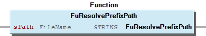

# WagoSysFileDir v1.6.2.0 (WAGO) - Complete Documentation


## 📋 Library Information

- **Company:** WAGO
- **Title:** WagoSysFileDir
- **Version:** 1.6.2.0
- **Categories:** WAGO LayerView|Sys; Application
- **Author:** WAGO / u013972
- **Placeholder:** WagoSysFileDir

### Description ¶


This document is automatically generated. Because of this, the chapter 30 Visualization is not shown in this document. If you are interested in getting to know more about visualization, we refer to the library manager of e!Cockpit.

This library provides functions and function blocks for accessing files, directories, and filesystem properties on the file system of the central controller. [1]

This document is automatically generated. Because of this, the chapter 30 Visualization is not shown in this document. If you are interested in getting to know more about visualization, we refer to the library manager of e!Cockpit. This library provides functions and function blocks for accessing files, directories, and filesystem properties on the file system of the central controller. [1]

### Contents: ¶


Contents: - Documentation Index 10 Documentation - WagoSysFileDir Library Documentation Project Information Library Information Function Blocks - FbSysDir (FB) - FbSysFile (FB) - doc10_General (FB) Functions - ChangeWorkingDirectory (FUN) - CheckDirectoryExists (FUN) - CheckFileExists (FUN) - CopyFile (FUN) - FuResolvePrefixPath (FUN) - GetFileProperties (FUN) - GetFreeSpaceInDirectory (FUN) - GetWorkingDirectory (FUN) - MakeDirectory (FUN) - MoveDirectory (FUN) - ... and 5 more Methods - FbSysDir.Close (METH) - FbSysDir.IsOpen (PROP) - FbSysDir.Open (METH) - FbSysDir.Read (METH) - FbSysFile.Close (METH) - FbSysFile.IsOpen (PROP) - FbSysFile.IsReadable (PROP) - FbSysFile.Open (METH) - FbSysFile.Read (METH) - FbSysFile.ReadByte (METH) - ... and 5 more Program Organization Global Variable Lists - LibraryResult (GVL) - ResultItems (GVL) - VersionHistory (GVL) Other Components - 01 File System Organization - 02 Ressource Information - 03 Working Directory - 04 Common - FbSysDir.EofReached (PROP) - FbSysDir.LastResult (PROP) - FbSysFile.EofReached (PROP) - FbSysFile.IsWritable (PROP) - FbSysFile.LastResult (PROP) - FbSysFile.Pos (PROP)

### Indices and tables ¶


| [1] | Based on WagoSysFileDir.library, last modified 14.01.2019, 16:47:15. The content of this file was automatically generated with None on 14.01.2019, 16:47:19 |

© WAGO Kontakttechnik GmbH & Co. KG, Germany 2018 – All rights reserved. For the avoidance of doubt, this copyright notice does not only apply to the information above but also and primarily to the described library itself. Please note that third-party products are always mentioned without reference to intellectual property rights, including patents, utility models, designs and trademarks, accordingly the existence of such rights cannot be excluded. WAGO is a registered trademark of WAGO Verwaltungsgesellschaft mbH.

- File and Project Information - Library Reference © WAGO Kontakttechnik GmbH & Co. KG, Germany 2018 – All rights reserved. For the avoidance of doubt, this copyright notice does not only apply to the information above but also and primarily to the described library itself. Please note that third-party products are always mentioned without reference to intellectual property rights, including patents, utility models, designs and trademarks, accordingly the existence of such rights cannot be excluded. WAGO is a registered trademark of WAGO Verwaltungsgesellschaft mbH.

### Documentation Index


## 10 Documentation


- doc10_General (FB) - Application Programming Interface - Result Codes - Not implemented functions - Path and file notations Canonical Filenames and Pathnames Prefix - Path - Filename and path components - Character Set - Portability Other Forms of pathes and filenames

## WagoSysFileDir Library Documentation


| Company: | WAGO |
| Title: | WagoSysFileDir |
| Version: | 1.6.2.0 |
| Categories: | WAGO LayerView\|Sys; Application |
| Author: | WAGO / u013972 |
| Placeholder: | WagoSysFileDir |

### Description


This document is automatically generated. Because of this, the chapter 30 Visualization is not shown in this document. If you are interested in getting to know more about visualization, we refer to the library manager of e!Cockpit.

This library provides functions and function blocks for accessing files, directories, and filesystem properties on the file system of the central controller. [1]

This document is automatically generated. Because of this, the chapter 30 Visualization is not shown in this document. If you are interested in getting to know more about visualization, we refer to the library manager of e!Cockpit. This library provides functions and function blocks for accessing files, directories, and filesystem properties on the file system of the central controller. [1]

### Contents:


- 10 Documentation doc10_General (FB) - Application Programming Interface - Result Codes - Not implemented functions - Path and file notations 20 Program Organization Units - 01 File System Organization - 02 Ressource Information - 03 Working Directory - 04 Common - FbSysDir (FB) - FbSysFile (FB) LibraryResult (GVL) ResultItems (GVL) VersionHistory (GVL)

### Indices and tables


| [1] | Based on WagoSysFileDir.library, last modified 14.01.2019, 16:47:15. The content of this file was automatically generated with None on 14.01.2019, 16:47:19 |

© WAGO Kontakttechnik GmbH & Co. KG, Germany 2018 – All rights reserved. For the avoidance of doubt, this copyright notice does not only apply to the information above but also and primarily to the described library itself. Please note that third-party products are always mentioned without reference to intellectual property rights, including patents, utility models, designs and trademarks, accordingly the existence of such rights cannot be excluded. WAGO is a registered trademark of WAGO Verwaltungsgesellschaft mbH.

- File and Project Information - Library Reference © WAGO Kontakttechnik GmbH & Co. KG, Germany 2018 – All rights reserved. For the avoidance of doubt, this copyright notice does not only apply to the information above but also and primarily to the described library itself. Please note that third-party products are always mentioned without reference to intellectual property rights, including patents, utility models, designs and trademarks, accordingly the existence of such rights cannot be excluded. WAGO is a registered trademark of WAGO Verwaltungsgesellschaft mbH.

### Project Information


## File and Project Information


| Scope | Name | Type | Content |
| --- | --- | --- | --- |
| FileHeader | libraryFile | string | WagoSysFileDir.library |
| contentFile | WagoSysFileDir_clr.json |
| productName | e!COCKPIT |
| creationDateTime | date | 14.01.2019, 16:47:19 |
| companyName | string | WAGO |
| ProjectInformation | LastModificationDateTime | date | 14.01.2019, 16:47:15 |
| Description | string | See: Description |
| DocFormat | reStructuredText |
| Author | WAGO / u013972 |
| AutoResolveUnbound | bool | True |
| Placeholder | string | WagoSysFileDir |
| Company | WAGO |
| Title | WagoSysFileDir |
| Project | WagoSysFileDir |
| Copyright | © WAGO Kontakttechnik GmbH & Co. KG, Germany 2018 – All rights reserved. |
| Version | version | 1.6.2.0 |
| LibraryCategories | library-category-list | WAGO LayerView\|Sys; Application |

### Library Information


## Library Reference


| LinkAllContent: False QualifiedOnly: False | SystemLibrary: False | Optional: False |

| LinkAllContent: False QualifiedOnly: False | SystemLibrary: False | Optional: False |

| LinkAllContent: False QualifiedOnly: False | SystemLibrary: False | Optional: False |

| LinkAllContent: False QualifiedOnly: False | SystemLibrary: False | Optional: False |

| LinkAllContent: False QualifiedOnly: False | SystemLibrary: False | Optional: False |

| LinkAllContent: False QualifiedOnly: False | SystemLibrary: False | Optional: False |

| LinkAllContent: False QualifiedOnly: False | SystemLibrary: False | Optional: False |

This is a dictionary of all referenced libraries and their name spaces.

This is a dictionary of all referenced libraries and their name spaces. WagoSysBaseItf Library Identification : Placeholder: WagoSysBaseItf Default Resolution: WagoSysBaseItf, * (WAGO) Namespace: WagoSysBaseItf Library Properties : WagoSysErrorBase Library Identification : Placeholder: WagoSysErrorBase Default Resolution: WagoSysErrorBase, * (WAGO) Namespace: WagoSysErrorBase Library Properties : Library Parameter : Parameter: RES_LOG_MAX_FILESIZE = 2000 Parameter: RES_LOG_MAX_FILES = 1 Parameter: RES_LOG_MAX_ENTRIES = 200 Parameter: RES_LOG_NAME = ‘WagoAppResultLogger’ WagoSysFileDir_Internal_PFC Library Identification : Placeholder: WagoSysFileDirInternal Default Resolution: WagoSysFileDir_Internal_PFC, * (WAGO) Namespace: WagoSysFileDirInternal Library Properties : WagoSysStandard Library Identification : Placeholder: WagoSysStandard Default Resolution: WagoSysStandard, * (WAGO) Namespace: WagoSysStandard Library Properties : WagoSysVersion Library Identification : Name: WagoSysVersion Version: 1.0.0.0 Company: WAGO Namespace: WagoSysVersion Library Properties : WagoTypesCommon Library Identification : Placeholder: WagoTypesCommon Default Resolution: WagoTypesCommon, * (WAGO) Namespace: WagoTypes Library Properties : WagoTypesErrorBase Library Identification : Placeholder: WagoTypesErrorBase Default Resolution: WagoTypesErrorBase, * (WAGO) Namespace: WagoTypesErrorBase Library Properties :

### Function Blocks


## FbSysDir (FB)


```
VAR
   Dir               : FbSysDir;
   Entry             : typFileProperties;
END_VAR

IF Dir.Open("TEMP://DirectoryName/Subfolder") = OK THEN

  WHILE Dir.Read(Entry) = OK DO
    something_useful_with(Entry);
  END_WHILE

  Dir.close()
END_IF
```

This functional block is used for scanning the contents of a directory.

Directory FBs (FbSysDir) are used to scan directories for their included files and subdirectories. They behave formally as Read-Only File-Systems.

Note: This FB scans only one hierarchical level of the directory, i.e. the contents of subdirectories are not scanned.

typical usage:

When elements of the scanned directory are deleted or inserted during the scan, other elements (which were not deleted) may be ommitted in the scan erroneously. This occurs typically when using a directory scan for moving some contents without buffering the complete directory before. Proper behaviour would be either: (a) ensuring that all entries which are valid during the scan are listed by the scan or (b) prohibiting the compromising deletions within a directory while the directory is open for reading.

Workaround: avoid this situation by program logic.

This functional block is used for scanning the contents of a directory. Directory FBs (FbSysDir) are used to scan directories for their included files and subdirectories. They behave formally as Read-Only File-Systems. - For accessing file entries, the Dir-FB must be opened first. - In further steps information about each item in the directory (file or subdirectory) is provided by the Read() method. - Finally, the directory has to be closed again, in order to free the resources for other usage, e.g. for RemoveFile(), etc, which would be blocked if the directory, in which that file resides, is still held open by a directory-FB. Note: This FB scans only one hierarchical level of the directory, i.e. the contents of subdirectories are not scanned. typical usage: Caveat: When elements of the scanned directory are deleted or inserted during the scan, other elements (which were not deleted) may be ommitted in the scan erroneously. This occurs typically when using a directory scan for moving some contents without buffering the complete directory before. Proper behaviour would be either: (a) ensuring that all entries which are valid during the scan are listed by the scan or (b) prohibiting the compromising deletions within a directory while the directory is open for reading. Workaround: avoid this situation by program logic. - FbSysDir.Close (METH) - FbSysDir.EofReached (PROP) - FbSysDir.IsOpen (PROP) - FbSysDir.LastResult (PROP) - FbSysDir.Open (METH) - FbSysDir.Read (METH)

## FbSysFile (FB)


This Function Block provides access to a generic file object.

For reading or manipulating a file, the method Open() of this FB has to be called first in order to specify (a) which file to access and (b) details of the access mode.

After having done so, a couple of methods are provided for reading data from the “open” file or manipulating the contents of the file.

After using the file, the method Close() has to be applied for technical reasons, i.e. in order to release the system resources, which were blocked by “open()”ing the FB and in order to finally exectute write accesses to the physical media, which are regularly postponed up to this moment.

This Function Block provides access to a generic file object. For reading or manipulating a file, the method Open() of this FB has to be called first in order to specify (a) which file to access and (b) details of the access mode. After having done so, a couple of methods are provided for reading data from the “open” file or manipulating the contents of the file. After using the file, the method Close() has to be applied for technical reasons, i.e. in order to release the system resources, which were blocked by “open()”ing the FB and in order to finally exectute write accesses to the physical media, which are regularly postponed up to this moment. - FbSysFile.Close (METH) - FbSysFile.EofReached (PROP) - FbSysFile.IsOpen (PROP) - FbSysFile.IsReadable (PROP) - FbSysFile.IsWritable (PROP) - FbSysFile.LastResult (PROP) - FbSysFile.Open (METH) - FbSysFile.Pos (PROP) - FbSysFile.Read (METH) - FbSysFile.ReadByte (METH) - FbSysFile.ReadString (METH) - FbSysFile.Seek (METH) - FbSysFile.Write (METH) - FbSysFile.WriteByte (METH) - FbSysFile.WriteString (METH)

## doc10_General (FB)


## Application Programming Interface


This library WagoSysFileDir.library provides general support for handling file related operations. It provides

This library WagoSysFileDir.library provides general support for handling file related operations. It provides - some fundamental function blocks (FB) for handling file related standard situations - functions for manipulating the file system (e.g. for copying or deleting files) - some generic data types.

## Result Codes


| eResultCode |
| Posix Name | No. | Semantic |
| OK | 0 | Operation successfully completed, no error (Not Posix but useful). |
| EPERM | 1 | Operation not permitted in this situation. |
| ENOENT | 2 | No such file or directory |
| EBADF | 9 | Bad file number / File not open |
| EAGAIN | 11 | Try again (a subsequent retry of the call might be successful) |
| EACCES | 13 | Permission denied for this resource. |
| EFAULT | 14 | Bad address or bad reference to parameters or values |
| EBUSY | 16 | Device or resource busy and cannot not respond to the desired function. |
| EEXIST | 17 | File or directory exists but is expected to be non-existent. |
| EXDEV | 18 | Cross-device link - an invalid combination of resources |
| ENOTDIR | 20 | Not a directory - the referenced resource should be a proper directory name. |
| EISDIR | 21 | Is a directory - but a regular file was expected. |
| EINVAL | 22 | Invalid argument |
| EFBIG | 27 | File too large - the file size would exceed certain logical limits. |
| ENOSPC | 28 | No space left on device - we are running out of resources. |
| EROFS | 30 | Read-only file system - attempt to modify a RO-file system. |
| ENAMETOOLONG | 36 | File name too long. |
| ENOSYS | 38 | Function not implemented. |
| ENOTEMPTY | 39 | Directory not empty - we assume it should be empty. |
| ENODATA | 61 | No data available - attempt to read beyond end of file or directory. |
| EBADSTATE | 77 | Internal malfunction. |
| ETIMEDOUT | 110 | Execution terminated prematurely due to tTimeout . |
| EINPROGRESS | 115 | The asynchronous process has been started, but has not yet terminated. |
| ECANCELED | 125 | Execution was terminated prematurely by applying xAbort . |

Nearly every method returns a status code eResultCode . On success it is always a ‘0’.

Other functionalities, which 1.) return a single value and 2.) could not potentially fail are coincidentally quite simple and thus are designed as property-getters whenever possible.

There are also a methods which meet both of the above conditions but need additional input parameters (e.g. getProperty(propNumber), or are not assigned to any instance of a function block (e.g. getWorkingDirectory()). These deliver their function result directly.

The list below directly reflects the result codes from POSIX. (operation return status, according to POSIX.1, 1996 edition, corresponding to ‘errno.h’).

Only a small subset (typically lower numbers) is actually used by the functions in this library.

Which subset of these codes is produced, and under which conditions, is defined in the context of each function or method (and stated in the header). Even when the underlying (hidden) hardware layers change their error behaviour, it is guaranteed that the published behaviour and the error codes at application level remain as stated.

The codes which are likely to appear within this library are:

The documentation of each function contains detailed informations about which codes appear under which circumstances.

Nearly every method returns a status code eResultCode . On success it is always a ‘0’. Other functionalities, which 1.) return a single value and 2.) could not potentially fail are coincidentally quite simple and thus are designed as property-getters whenever possible. There are also a methods which meet both of the above conditions but need additional input parameters (e.g. getProperty(propNumber), or are not assigned to any instance of a function block (e.g. getWorkingDirectory()). These deliver their function result directly. The list below directly reflects the result codes from POSIX. (operation return status, according to POSIX.1, 1996 edition, corresponding to ‘errno.h’). Only a small subset (typically lower numbers) is actually used by the functions in this library. Which subset of these codes is produced, and under which conditions, is defined in the context of each function or method (and stated in the header). Even when the underlying (hidden) hardware layers change their error behaviour, it is guaranteed that the published behaviour and the error codes at application level remain as stated. The codes which are likely to appear within this library are: The documentation of each function contains detailed informations about which codes appear under which circumstances.

## Not implemented functions


If the deployed hardware does not support certain functions, the errorcode ENOSYS (38, ‘Function not implemented’) is returned, so applications can retrieve knowledge about whether a function is implemented.

If the deployed hardware does not support certain functions, the errorcode ENOSYS (38, ‘Function not implemented’) is returned, so applications can retrieve knowledge about whether a function is implemented.

## Path and file notations


### Canonical Filenames and Pathnames


The canonical form of a filename is:

prefix could be e.g: - TEMP : A temporary file system which does not survive powercycles - HOME : Data which will survive power cycles - CARD : Files on removable media, such as sd-cards

The canonical form of a filename is: prefix://path/name prefix could be e.g: - TEMP : A temporary file system which does not survive powercycles - HOME : Data which will survive power cycles - CARD : Files on removable media, such as sd-cards

#### Prefix


The prefix will be translated internally into the appropriate hardware specific mount point, e.g. ‘/media/card/’ or ‘F:’ or other names. However, these interal names are hidden from the user in order to help implementing portable applications.

The prefix can be entered in lower case letters as well as in upper case letters (but not mixed). When the system returns a prefix (e.g. as a result of GetWorkingDirectory()), it will always return the nominal form, which is upper case for local media in order to resemble windows ‘drive letters’, while it is lower case for remote drives in order to meet worldwide conventions.

The prefix will be translated internally into the appropriate hardware specific mount point, e.g. ‘/media/card/’ or ‘F:’ or other names. However, these interal names are hidden from the user in order to help implementing portable applications. The prefix can be entered in lower case letters as well as in upper case letters (but not mixed). When the system returns a prefix (e.g. as a result of GetWorkingDirectory()), it will always return the nominal form, which is upper case for local media in order to resemble windows ‘drive letters’, while it is lower case for remote drives in order to meet worldwide conventions.

#### Path


The ‘//path/’ denotes the access path to the desired resource. Canonically it starts with a double slash ‘//’ and ends with the last slash ‘/’. If a path is expected and the last character is not a slash, then that last slash will be appended. If the entered path contains backslashes (‘\’), these will be translated into canonical slashes (‘/’). When the system returns paths, the path components are always separated by slashes (‘/’).

The ‘//path/’ denotes the access path to the desired resource. Canonically it starts with a double slash ‘//’ and ends with the last slash ‘/’. If a path is expected and the last character is not a slash, then that last slash will be appended. If the entered path contains backslashes (‘\’), these will be translated into canonical slashes (‘/’). When the system returns paths, the path components are always separated by slashes (‘/’).

#### Filename and path components


The filenames and pathes may or may not include dots (‘.’) for indicating intended file usage (e.g. ‘report.csv’). Components of filenames may contain zero, one, or more dots. For file usage indication (‘extension’) the substring behind the last dot (if any) is relevant. (‘logfile_1.3.4.43.txt’)

Path components and filenames may not contain slashes or backslashes as part of their names, as these characters are reserved for separation of path components. Filenames or path components must not be empty. This ensures that the combination of two consecutive slashes (‘//’) will never appear at places other then between prefix and path.

The filenames and pathes may or may not include dots (‘.’) for indicating intended file usage (e.g. ‘report.csv’). Components of filenames may contain zero, one, or more dots. For file usage indication (‘extension’) the substring behind the last dot (if any) is relevant. (‘logfile_1.3.4.43.txt’) Path components and filenames may not contain slashes or backslashes as part of their names, as these characters are reserved for separation of path components. Filenames or path components must not be empty. This ensures that the combination of two consecutive slashes (‘//’) will never appear at places other then between prefix and path.

#### Character Set


The usable character set for filename and path components is limited only by the target hardware, which means these components may contain every character except for slashes (‘/’), backslashes (‘\’) and reserved characters 0x00..0x1f.

The library will not check or modify other characters, but these characters might be rejected by the firmware, e.g. when a new file is to be created with characters in the name, which are not supported by the firmware.

This implicit dependency upon the target hardware is known and wanted, because we envisage special situations where filenames with strange characters are required by external IT-components.

The usable character set for filename and path components is limited only by the target hardware, which means these components may contain every character except for slashes (‘/’), backslashes (‘\’) and reserved characters 0x00..0x1f. The library will not check or modify other characters, but these characters might be rejected by the firmware, e.g. when a new file is to be created with characters in the name, which are not supported by the firmware. This implicit dependency upon the target hardware is known and wanted, because we envisage special situations where filenames with strange characters are required by external IT-components.

#### Portability


In order to keep programs portable, however, we strongly recommend restricting the used character set for filenames to the following characters:

When codes in the range [0xa0..0xff] are needed, we highly recommend the use of UTF8-codes, because the use of 8-Bit character planes is a prominent point for portability issues. Codes in the range [0x80..0xbf] may lead to undefined results in other systems if used outside the context of UTF8 codes.

In order to enhance portability, target firmware (or corresponding target specific layers) may convert those characters which would otherwise not be supported into replacement characters (e.g. ‘%20%’ instead of <space>), but this behaviour is not yet specified nor is it guaranteed, so the user cannot rely on it.

In order to keep programs portable, however, we strongly recommend restricting the used character set for filenames to the following characters: [A-Z][a-z][0-9]{‘_’, ‘-‘, ‘.’, ‘+’, ‘~’, ‘=’, ‘(‘, ‘)’ } When codes in the range [0xa0..0xff] are needed, we highly recommend the use of UTF8-codes, because the use of 8-Bit character planes is a prominent point for portability issues. Codes in the range [0x80..0xbf] may lead to undefined results in other systems if used outside the context of UTF8 codes. In order to enhance portability, target firmware (or corresponding target specific layers) may convert those characters which would otherwise not be supported into replacement characters (e.g. ‘%20%’ instead of <space>), but this behaviour is not yet specified nor is it guaranteed, so the user cannot rely on it.

### Other Forms of pathes and filenames


If a filename does not start with a prefix (e.g. ‘CARD:’), then it is assumed that the name denotes either

Please note that the use of system dependant absolute paths leads to portability problems. Thus we strongly recommend using standard prefixes.

If a filename does not start with a prefix (e.g. ‘CARD:’), then it is assumed that the name denotes either - a system dependant absolute path (starting with a slash, e.g. ‘/media/card/log/actual.txt’) which will be passed unconverted to the system or - a relative path (starting with no slash ‘log/actual.txt’) where the working directory will be added for translation. Please note that the use of system dependant absolute paths leads to portability problems. Thus we strongly recommend using standard prefixes.

### Functions


## ChangeWorkingDirectory (FUN)


| Scope | Name | Type | Comment |
| --- | --- | --- | --- |
| Return | ChangeWorkingDirectory | eResultCode |  |
| Input | sName | Filename | New Path of the working directory |
| xForce | BOOL | Creates a path if directory does not exist. |

| Result Codes |
| 0 | Success |
| ENOENT | The desired directory does not exist and xForce is not set. |
| ENOSYS | This functionality is not supported by the target hardware. |
| EINVAL | Bad Name or Prefix |
| EACCES | A Component of the path could not be created. |
| ENOTDIR | A component used as a directory in the name is not, in fact, a directory. |
| ENAMETOOLONG | The pathname was too long. (if targets have limitations) |

This function changes the current working directory to a given path.

The “sName” argument may denote an absolute path, including a device prefix, or a relative path, which is added to the current working directory.

Note: by applying the relative path ”..” you may move upward in the path hierarchy.

When the resulting relative or absolute path does not exist, the Resultcode ENOENT will be returned unless the argument “xForce” is set. When that flag is set, this function tries to create the desired directory hierarchy. If forced creation of directories fails you will encounter the same error codes as are given by MakeDirectory.

Interface variables This function changes the current working directory to a given path. The “sName” argument may denote an absolute path, including a device prefix, or a relative path, which is added to the current working directory. Note: by applying the relative path ”..” you may move upward in the path hierarchy. When the resulting relative or absolute path does not exist, the Resultcode ENOENT will be returned unless the argument “xForce” is set. When that flag is set, this function tries to create the desired directory hierarchy. If forced creation of directories fails you will encounter the same error codes as are given by MakeDirectory.

## CheckDirectoryExists (FUN)


| Scope | Name | Type | Comment |
| --- | --- | --- | --- |
| Return | CheckDirectoryExists | eResultCode |  |
| Input | sName | FileName | Name of the requested directory |

| Result Codes |
| 0 | The named resource does exist. |
| ENOENT | The named resource does positively not exist. |
| ENOTDIR | The named resource exists but is a regular file instead of a directory. |
| ENOSYS | This functionality is not supported by the target hardware. |
| EINVAL | Invalid Name or bad prefix |
| EACCESS | Other problems: resource could not be investigated. (e.g. access rights etc) |

Checks if a named directory exists or not.

This function returns OK if the requested directory exists, ENOENT if no resource with the given name exists and ENOTDIR if the resource exists, but is a not directory (i.e. a regualar file).

If the status of the resource could not be determined other results are returned, according to the table below.

See also: GetFileProperties()

Interface variables Checks if a named directory exists or not. This function returns OK if the requested directory exists, ENOENT if no resource with the given name exists and ENOTDIR if the resource exists, but is a not directory (i.e. a regualar file). If the status of the resource could not be determined other results are returned, according to the table below. See also: GetFileProperties()

## CheckFileExists (FUN)


| Scope | Name | Type | Comment |
| --- | --- | --- | --- |
| Return | CheckFileExists | eResultCode |  |
| Input | sName | FileName | Name of the requested file |

| Result Codes |
| 0 | The named resource does exist. |
| ENOENT | The named resource does positively not exist. |
| EISDIR | The named resource exists but is a directory instead of a file. |
| ENOSYS | This functionality is not supported by the target hardware. |
| EINVAL | Invalid name or bad prefix |
| EACCESS | Other problems: resource could not be investigated. (e.g. access rights etc) |

The function “CheckFileExists” checks if a named regular file exists or not.

This function returns OK if the requested file exists, ENOENT if no resource with the given name exists and EISDIR if the resource exists, but is a directory instead of a regular file.

If the status of the resource could not be determined other results are returned, according to the table below.

See also: GetFileProperties(), eResultCode

Interface variables The function “CheckFileExists” checks if a named regular file exists or not. This function returns OK if the requested file exists, ENOENT if no resource with the given name exists and EISDIR if the resource exists, but is a directory instead of a regular file. If the status of the resource could not be determined other results are returned, according to the table below. See also: GetFileProperties(), eResultCode

## CopyFile (FUN)


| Scope | Name | Type | Comment |
| --- | --- | --- | --- |
| Return | CopyFile | eResultCode |  |
| Input | sSourceName | FileName | The name of the source file |
| sDestinationName | FileName | The name of the destination or file |
| xOverwrite | BOOL | TRUE = overwrite of existing file is ok. |

| Result Codes |
| 0 | Success |
| ENOSYS | This functionality is not supported by the target hardware. |
| EINVAL | Bad Prefix or otherwiseinvald filename or pathname |
| ENOENT | The source file does not exist. |
| EISDIR | The source file names a directory, not a file. |
| ENOTDIR | A component of the destination path is, in fact, not a directory. |
| EEXIST | The destination file exists and cannot be overwritten. |
| EACCES | Destination Path cannot be created some reason. |
| EBUSY | The Destination file already exists and its removal failed unexpectedly. |
| ENOSPC | No space for the new directory entry or are other problems with system resources |

Copies a file to a second location.

The destination file may denote a Filename or, alternatively, a directory name, in which case the name of the file remains the same and only the path changes.

If the new file name requires the creation of parent directories, these will be created.

If the destination file already exists, this function fails with EEXIST unless the xOverwrite flag is set. In that case, this function tries to delete the existing file. If deletion fails, the function will again fail with EEXIST.

Interface variables Copies a file to a second location. The destination file may denote a Filename or, alternatively, a directory name, in which case the name of the file remains the same and only the path changes. If the new file name requires the creation of parent directories, these will be created. If the destination file already exists, this function fails with EEXIST unless the xOverwrite flag is set. In that case, this function tries to delete the existing file. If deletion fails, the function will again fail with EEXIST.

## FuResolvePrefixPath (FUN)


| Scope | Name | Type |
| --- | --- | --- |
| Return | FuResolvePrefixPath | STRING(255) |
| Input | sPath | WagoTypes.FileName |

This function resolve a path, that begin with a prefix in an absolute path.

Graphical Illustration

Function description

This function resolve a path, that begin with a prefix in an absolute path.

Interface variables Function This function resolve a path, that begin with a prefix in an absolute path. Graphical Illustration  Function description This function resolve a path, that begin with a prefix in an absolute path. For example: sPath := ‘CARD://Test.txt’; sAbsolutePath := FuResolvePrefixPath(sPath); //sAbsolutePath := /media/sd/Test.txt

## GetFileProperties (FUN)


| Scope | Name | Type | Comment |
| --- | --- | --- | --- |
| Return | GetFileProperties | eResultCode |  |
| Input | sName | FileName | name of the file or directory which is to be investigated |
| Inout | FileStatus | typFileProperties | Output Buffer for file Properties. |

| Result Codes |
| 0 | Success |
| ENOSYS | This functionality is not supported by the target hardware. |
| ENOENT | The requested file or directory does not exist. |
| EACCES | Other Problems while determining the file properties. |

This function retrieves the status of the named file or directory.

This function accepts the name of a file or a directory and returns detailed information about that item using typFileProperties .

Interface variables This function retrieves the status of the named file or directory. This function accepts the name of a file or a directory and returns detailed information about that item using typFileProperties .

## GetFreeSpaceInDirectory (FUN)


| Scope | Name | Type | Comment |
| --- | --- | --- | --- |
| Return | GetFreeSpaceInDirectory | LINT |  |
| Input | sDirectoryName | FileName | The name of the investigated directory |

```
VAR
  li : LINT;
END_VAR

li := getFreeSpaceInDirectory('temp://');
li := getFreeSpaceInDirectory('temp://subdirectory/');
li := getFreeSpaceInDirectory('');
```

The function “getFreeSpaceInDirectory” returns the number of free usable bytes in the given directory.

If sDirectoryName is empty, the current working directory will be used instead.

If the given directory does not exist or is read-only, 0 will be returned (no free bytes).

If the system is not cabable of determining this number, -1 will be returned.

Typical usage:

Note: although most PLCs are restricted to below 4GB file size, a 64-Bit return value is appropriate, because today’s storage media may very well have more space than 4GB.

Interface variables The function “getFreeSpaceInDirectory” returns the number of free usable bytes in the given directory. If sDirectoryName is empty, the current working directory will be used instead. If the given directory does not exist or is read-only, 0 will be returned (no free bytes). If the system is not cabable of determining this number, -1 will be returned. Typical usage: Note: although most PLCs are restricted to below 4GB file size, a 64-Bit return value is appropriate, because today’s storage media may very well have more space than 4GB.

## GetWorkingDirectory (FUN)


| Scope | Name | Type |
| --- | --- | --- |
| Return | GetWorkingDirectory | FileName |

This function retrieves the name of the current working directory.

This function will always return a valid working path. If none is set, it will return ‘home://’.

This function will never fail and thus it provides no result code.

Interface variables This function retrieves the name of the current working directory. This function will always return a valid working path. If none is set, it will return ‘home://’. This function will never fail and thus it provides no result code.

## MakeDirectory (FUN)


| Scope | Name | Type | Comment |
| --- | --- | --- | --- |
| Return | MakeDirectory | eResultCode |  |
| Input | sDirname | FileName | The Name of the new directory |

| Result Codes |
| 0 | Success |
| ENOSYS | This functionality is not supported by the target hardware. |
| EINVAL | Bad name or prefix |
| EEXIST | The directory already exists. |
| EACCES | A component of the path could not be created. |
| ENOTDIR | A component used as a directory in the name is not, in fact, a directory. |
| ENAMETOOLONG | The name was too long. |
| ENOSPC | The device containing the directory has no space for the new directory. |

This function creates a new directory.

If the creation of the new directory requires the creation of new parent directories, these will also be created.

Interface variables This function creates a new directory. If the creation of the new directory requires the creation of new parent directories, these will also be created.

## MoveDirectory (FUN)


| Scope | Name | Type | Comment |
| --- | --- | --- | --- |
| Return | MoveDirectory | eResultCode |  |
| Input | sOldName | FileName | The name of the directory which is to be moved |
| sNewPath | FileName | The new location for moving directory |

| Result Codes |
| 0 | Success |
| EINVAL | Bad prefix or otherwise invalid name |
| ENOTDIR | The resource name or destination name denotes a regular file and not a directory. |
| ENOENT | The directory to be moved does not exist. |
| EACCES | Problems occured while creating the destination directory. |
| EBUSY | The movement fails because a file in the current or an file in the target location is in use. |
| ENAMETOOLONG | Oldname or newPath were too long. |
| ENOSPC | The operation failed due to internal resource problems of the file system. |
| ENOSYS | This functionality is not supported by the target hardware. |

This function moves a complete directory structure from one location to another.

If the new path does not exist, it will be created.

If a directory already exists with the same name, that old structure will be overwritten.

Interface variables This function moves a complete directory structure from one location to another. If the new path does not exist, it will be created. If a directory already exists with the same name, that old structure will be overwritten.

## MoveFile (FUN)


| Scope | Name | Type | Comment |
| --- | --- | --- | --- |
| Return | MoveFile | eResultCode |  |
| Input | sOldName | FileName | The File which is to be moved. |
| sNewPath | FileName | The new location for the file which is to be moved |

| Result Codes |
| 0 | Success |
| EINVAL | Bad prefix or otherwise invalid filename |
| EISDIR | The named resource denotes a directory, not a file. |
| ENOTDIR | The target location names an existing regular file. |
| ENOENT | The file to be moved does not exist. |
| EACCES | Other problems while creating the target directory or target file. |
| ENAMETOOLONG | Oldname or newPath were too long. |
| ENOSPC | The operation failed due to internal resource problems of the file system. |
| ENOSYS | This functionality is not supported by the target hardware. |

This function moves a file from one location to another and keeps the name.

If the new path does not exist, it will be created.

In addition to regular Linux-Behaviour, this function can move also files between different media if the system supports this.

Note: This functionality is separated from MoveDirectory(), because the latter implies much more complicated handling for cross-device movements.

See also: Rename(), MoveDirectory()

Interface variables This function moves a file from one location to another and keeps the name. If the new path does not exist, it will be created. In addition to regular Linux-Behaviour, this function can move also files between different media if the system supports this. Note: This functionality is separated from MoveDirectory(), because the latter implies much more complicated handling for cross-device movements. See also: Rename(), MoveDirectory()

## RemoveDirectory (FUN)


| Scope | Name | Type | Comment |
| --- | --- | --- | --- |
| Return | RemoveDirectory | eResultCode |  |
| Input | sDirName | FileName | The name of the Directory to be deleted |

| Result Codes |
| 0 | Success |
| EINVAL | Bad prefix or otherwise invalid filename |
| ENAMETOOLONG | The length of the path argument or one of its components exceeds the size limit. |
| ENOSYS | This functionality is not supported by the target hardware. |
| EBUSY | The directory to be removed is currently in use by the system. |
| ENOTDIR | A component of path is not a directory. |
| EACCES | Other Problems while deleting components of the directory |

Removes a directory with all its contents.

The directory which is to be removed need not be empty. All its contents will also be removed.

Interface variables Removes a directory with all its contents. The directory which is to be removed need not be empty. All its contents will also be removed.

## RemoveFile (FUN)


| Scope | Name | Type | Comment |
| --- | --- | --- | --- |
| Return | RemoveFile | eResultCode |  |
| Input | sName | FileName | The name of the file to be removed |

| Result Codes |
| 0 | Success |
| ENOSYS | This functionality is not supported by the target hardware. |
| EINVAL | Bad prefix or otherwise invalid filename |
| ENOENT | The requested file does not exist. |
| EBUSY | The file cannot be removed because it is being used by the system or another process. |
| EISDIR | The name refers to a directory. |
| ENAMETOOLONG | The name was too long. |
| EPERM | The file cannot be removed due to wrong attributes. |
| EACCES | Other errors |

This function removes a file.

Interface variables This function removes a file.

## Rename (FUN)


| Scope | Name | Type | Comment |
| --- | --- | --- | --- |
| Return | Rename | eResultCode |  |
| Input | sOldPath | FileName | The Directory which is to be renamed |
| sNewName | FileName | The new name of that directory |
| xOverwriteEnable | BOOL | Enables overwriting of existing resources |

| Result Codes |
| 0 | Success |
| EINVAL | Bad prefix or otherwise invalid filename |
| ENOENT | Oldpath does not exist. |
| EBUSY | The rename failed because part of the oldpath or newname is in use by some process. |
| ENAMETOOLONG | Oldpath or newName were too long. |
| ENOSPC | The renaming failed due to internal resource problems of the file system. |
| EEXIST | The new name already exists and cannot be overwritten. |
| EISDIR | Attempt to overwrite an existing directory with a file. |
| ENOTDIR | Attempt to overwrite an existing file with a directory. |
| ENOSYS | This functionality is not supported by the target hardware. |

This function renames a file or directory within a given directory structure.

The addressed resource (file or directory) is renamed (but not moved within the directory structure).

The addressed directory may contain content, but the directory or file must not be in use by another FB or process if the underlying file system has limitations regarding this issue. (–> getDeviceCapabilities())

If a file with the new name already exists that old file will be deleted (overwritten) if the xOverwriteEnable-Flag is set. Otherwise this function will fail. Non-empty directories will not be overwritten, because it is very likely that the existing content in the directory may need special treatment anyway. An existing directory will not be overwritten by a regular file and vice versa.

See also: MoveDirectory(), MoveFile()

Interface variables This function renames a file or directory within a given directory structure. The addressed resource (file or directory) is renamed (but not moved within the directory structure). The addressed directory may contain content, but the directory or file must not be in use by another FB or process if the underlying file system has limitations regarding this issue. (–> getDeviceCapabilities()) If a file with the new name already exists that old file will be deleted (overwritten) if the xOverwriteEnable-Flag is set. Otherwise this function will fail. Non-empty directories will not be overwritten, because it is very likely that the existing content in the directory may need special treatment anyway. An existing directory will not be overwritten by a regular file and vice versa. See also: MoveDirectory(), MoveFile()

## SetFileProperties (FUN)


| Scope | Name | Type | Comment |
| --- | --- | --- | --- |
| Return | SetFileProperties | eResultCode |  |
| Input | sName | FileName | Name of the file or directory |
| Inout | eNewProperties | typFileProperties | Buffer to set file properties |

| Result Codes |
| 0 | Success |
| ENOSYS | This Functionality is not supported by the target hardware. |
| ENOENT | File does not exist. |
| EPERM | Attributes cannot be manipulated. |
| EACCES | Attributes should be manipulated but, in fact, problems occurred. |

```
VAR
  sFilename      : Filename;
  PropertyBuffer : typFileProperties;
END_VAR

getFileProperty(sFilename, PropertyBuffer)  // retrieve properties of a file
PropertyBuffer.xReadOnly := TRUE;          // manipulate one or more of the properties
PropertyBuffer.xArchive  := FALSE;         // manipulate one or more of the properties
setFileProperties(sFilename,PropertyBuffer) // now try to write back the changes
```

This function sets or clears the properties or attributes of a file.

The properties are encapsuled in a typFileProperties structure.

Typical usage:

This function is fed with the results of getFileProperty(). It may be used in the following way:

Note: NOT all attribute can be changed. e.g.: xDirectory may NOT be changed.

Changeable items are typically:

Not Changeable are:

Interface variables This function sets or clears the properties or attributes of a file. The properties are encapsuled in a typFileProperties structure. Typical usage: This function is fed with the results of getFileProperty(). It may be used in the following way: Note: NOT all attribute can be changed. e.g.: xDirectory may NOT be changed. Changeable items are typically: - dtLastModification - xArchive - xHidden - xReadonly - xExclusive Not Changeable are: - sFileName - uliSize - xDirectory

### Methods


## FbSysDir.Close (METH)


| Scope | Name | Type |
| --- | --- | --- |
| Return | Close | eResultCode |

| return codes |
| 0 | Success |
| EBADF | Directory-FB was not open. |

Closes the Directory scan.

When this FB has been opened, it should be closed again in order to release the allocated resources.

If a directory-FB is not open, an additional close() does no harm, but it ensures that the FB is closed in every case.

Interface variables Closes the Directory scan. When this FB has been opened, it should be closed again in order to release the allocated resources. If a directory-FB is not open, an additional close() does no harm, but it ensures that the FB is closed in every case.

## FbSysDir.IsOpen (PROP)


This property indicates, if a directory-FB is open for reading or not.

This property indicates, if a directory-FB is open for reading or not.

## FbSysDir.Open (METH)


| Scope | Name | Type | Comment |
| --- | --- | --- | --- |
| Return | Open | eResultCode |  |
| Input | sDirName | FileName | Name of the Directory to be scanned |

| Result Codes |
| 0 | Success |
| EINVAL | Name is invalid. (e.g. wrong prefix) |
| ENOTDIR | Name is not a directory. |

Starts the scanning of a directory.

The name of the directory may be either relative to the working directory or absolute with device prefix. After having finished the scanning, the directory should be close()d again.

Interface variables Starts the scanning of a directory. The name of the directory may be either relative to the working directory or absolute with device prefix. After having finished the scanning, the directory should be close()d again.

## FbSysDir.Read (METH)


| Scope | Name | Type | Comment |
| --- | --- | --- | --- |
| Return | Read | eResultCode |  |
| Inout | FileProperty | typFileProperties | Output Buffer for file Status. |

| Result Codes |
| 0 | Success |
| EBADF | Directory not Open |
| ENODATA | No data available (end of directory reached) |

Reads the next entry of a directory.

The user must provide a data structure typFileProperties which is filled on success. On failure or no more data, the structure is cleared, especially the Name holds an empty string.

Special system entries, such as ‘.’ and ‘..’ are generally skipped.

On success, the method returns 0, on failure an appropriate error code is returned. When the last entry has been read or the directory is empty, the following read() returns ENODATA := 61 : No data available.

Interface variables Reads the next entry of a directory. The user must provide a data structure typFileProperties which is filled on success. On failure or no more data, the structure is cleared, especially the Name holds an empty string. Special system entries, such as ‘.’ and ‘..’ are generally skipped. On success, the method returns 0, on failure an appropriate error code is returned. When the last entry has been read or the directory is empty, the following read() returns ENODATA := 61 : No data available.

## FbSysFile.Close (METH)


| Scope | Name | Type |
| --- | --- | --- |
| Return | Close | eResultCode |

| Result Codes |
| 0 | Success |
| EBADF | File-FB was not open |

This method closes a File.

When data is written to a file, the actual transfer of the data to the real media may be postponed until the FB received this close() call.

If a FbSysFile is not open, an additional close() does no harm, but it ensures that the FB is closed in every case.

If a file is opened, it should be closed again.

See also: Open()

Interface variables This method closes a File. When data is written to a file, the actual transfer of the data to the real media may be postponed until the FB received this close() call. If a FbSysFile is not open, an additional close() does no harm, but it ensures that the FB is closed in every case. If a file is opened, it should be closed again. See also: Open()

## FbSysFile.IsOpen (PROP)


This property indicates, if a FbSysFile is open or not.

(True = file is open, False = file is not open)

This property indicates, if a FbSysFile is open or not. (True = file is open, False = file is not open)

## FbSysFile.IsReadable (PROP)


This property specifies, if the FB allows read-access or not.

(True = read access is granted, False = no sensible read access)

This property specifies, if the FB allows read-access or not. (True = read access is granted, False = no sensible read access)

## FbSysFile.Open (METH)


| Scope | Name | Type | Comment |
| --- | --- | --- | --- |
| Return | Open | eResultCode |  |
| Input | sName | FileName | The name of the file to be opened |
| eAccMode | eFileAccessMode | Access-Mode for the file |
| eSyncMode | eFileSyncMode | Controls the synchronization between FS and physical media |
| xExclusive | BOOL | TRUE = Exclusive access, FALSE = multiple access |

| eAccMode (eFileAccessMode) |
| Symbol | No. | Meaning |
| FAM_Write | 1 | Open write-only. The file will be truncated to zero or newly created. |
| FAM_Read | 2 | Open read-only. File must exist. |
| FAM_ReadWrite | 3 | Open for random access. File will be overwritten and fp is set to start. |
| FAM_Append | 4 | Open write-only. Fp will be set to End-Of-File if the file exists. |

| eSyncMode (eFileSyncMode) |
| Symbol | No. | Meaning |
| FSM_Regular | 0 | no explicit synchronization |
| FSM_SafeClose | 1 | close() waits for final writing of Data |
| FSM_SyncedWrite | 2 | each write() leaves the media in a consistent state after each write |

| Result Codes |
| 0 | Success |
| EINVAL | Invalid Argument (Bad prefix, empty filename or illegal access modes) |
| ENAMETOOLONG | The length of the filename including exceeds the limits of the target hardware. |
| ENOENT | The File to be opened for reading does not exist. |
| ENOTDIR | A component of the path is not a directory. |
| EBUSY | The exclusivity-restrictions would be violated. |
| EPERM | The File could not be opened in desired access-mode, or exclusivity mode could not be set. |
| EACCES | Other problems while opening the file. |

```
VAR
    File    : FbSysFile;
    sBuffer : STRING;
END_VAR

IF File.Open("FileName.txt", FAM_READ, FSM_REGULAR, FALSE) = OK THEN
    File.ReadString(sBuffer,SizeOf(sBuffer));
    File.Close();
END_IF
```

Opens a file for reading and / or writing.

The method Open() specifies which file is to be accessed and the modalities of the access.

It must be executed first before any other method of this FB can be successfully executed. If attempt is made to access a file which has not been successfully opened, that method will reply with EBADFD(‘Bad file number or file not open’). After the file access has been finished, a corresponding Close() method should be invoked in order to terminate the access in a regular manner.

When Open() is applied to an already open FbSysFile, the previously opened file will be closed by internal mechanisms and a regular Open() is performed in the now unassigned FB. (nota bene: That latter Open() call may fail, so the application might end up with a closed FB after trying to open an already open file FB.)

The file can be opened in different access modes:

Notes: - ‘fp’ is a short abbreviation of a filepointer - If a file does NOT exist, a new file will be created.

The third parameter controls the timing of write process to the physical media.

On success, the FbSysFile transits to the state ‘Open’ and further operations (such as write, read, close) may be performed opon this instance.

Opening for exclusive usage:

Besides the Filename and the access mode the user has to specify the exclusivity mode: If the xExclusive-Flag is set, the file is granted following attributes:

If that attribute cannot be granted on opening, then open() fails with EBUSY. When a file is opened exclusively , subsequent opens() from other instances would fail, if that would collide with the previous restrictions, i,e.:

Typical usage

Interface variables Opens a file for reading and / or writing. The method Open() specifies which file is to be accessed and the modalities of the access. It must be executed first before any other method of this FB can be successfully executed. If attempt is made to access a file which has not been successfully opened, that method will reply with EBADFD(‘Bad file number or file not open’). After the file access has been finished, a corresponding Close() method should be invoked in order to terminate the access in a regular manner. When Open() is applied to an already open FbSysFile, the previously opened file will be closed by internal mechanisms and a regular Open() is performed in the now unassigned FB. (nota bene: That latter Open() call may fail, so the application might end up with a closed FB after trying to open an already open file FB.) The file can be opened in different access modes: Notes: - ‘fp’ is a short abbreviation of a filepointer - If a file does NOT exist, a new file will be created. The third parameter controls the timing of write process to the physical media. On success, the FbSysFile transits to the state ‘Open’ and further operations (such as write, read, close) may be performed opon this instance. Opening for exclusive usage: Besides the Filename and the access mode the user has to specify the exclusivity mode: If the xExclusive-Flag is set, the file is granted following attributes: - no other concurrent process having write-access if opened for reading and - no other concurrent process can access it at all if opened for writing. If that attribute cannot be granted on opening, then open() fails with EBUSY. When a file is opened exclusively , subsequent opens() from other instances would fail, if that would collide with the previous restrictions, i,e.: - any subsequent opening for (non-exclusive) write access will fail, if the file was opened for exclusive reading - any subsequent opening for read access will fail, if the file was opened for exclusive write access. Typical usage

## FbSysFile.Read (METH)


| Scope | Name | Type | Comment |
| --- | --- | --- | --- |
| Return | Read | eResultCode |  |
| Input | pRxBuffer | POINTER TO BYTE | Pointer to a buffer for read data |
| udiRxBufferSize | UDINT | Size of the buffer |
| Inout | udiRxNBytes | UDINT | returns number of actually read bytes. |

| Result Codes |
| 0 | Success |
| EBADF | The file is not open for read access. |
| EINVAL | Null-Pointer applied for buffer or zero buffer size was applied. |
| ENODATA | No further data available. |
| EACCES | Other unexpected problems while reading data |

This method reads data from an open file.

This method reads data from an open file and delivers it to the buffer which is addressed by pRxBuffer .

The value udiRxBufferSize denotes the desired amount of data. Under normal circumstances, this amount will be returned, but when the end of the file is reached, less data will be returned (which is not an erroneous state). The value udiRxNBytes returns the amount of data actually read. (It is not used as input)

If no data bytes could be read, i.e the end of the file is reached, read() will return ENODATA.

Note: the position within the file where the data is taken from can be arbitrarily set with the Seek() method.

See also: open(), seek()

Interface variables This method reads data from an open file. This method reads data from an open file and delivers it to the buffer which is addressed by pRxBuffer . The value udiRxBufferSize denotes the desired amount of data. Under normal circumstances, this amount will be returned, but when the end of the file is reached, less data will be returned (which is not an erroneous state). The value udiRxNBytes returns the amount of data actually read. (It is not used as input) If no data bytes could be read, i.e the end of the file is reached, read() will return ENODATA. Note: the position within the file where the data is taken from can be arbitrarily set with the Seek() method. See also: open(), seek()

## FbSysFile.ReadByte (METH)


| Scope | Name | Type |
| --- | --- | --- |
| Return | ReadByte | BYTE |

Reads a single byte from an open file.

If the file is not open or EOF is reached, 0 is returned.

Possible errrcodes are the same as for read() and are accessible by means of the LastResult property.

Note: ReadByte() has a very simplified interface which is designed for parsing text files. When a direct result code is needed, use Read() instead.

See also: read()

Interface variables Reads a single byte from an open file. If the file is not open or EOF is reached, 0 is returned. Possible errrcodes are the same as for read() and are accessible by means of the LastResult property. Note: ReadByte() has a very simplified interface which is designed for parsing text files. When a direct result code is needed, use Read() instead. See also: read()

## FbSysFile.ReadString (METH)


| Scope | Name | Type | Comment |
| --- | --- | --- | --- |
| Return | ReadString | eResultCode |  |
| Inout | sLine | STRING(255) | The Line of text to be read |
| Input | uiSize | UINT | Size of the result string |

| Result Codes |
| 0 | Success |
| EINVAL | No buffer space given (uiSize=0). |
| ENOSPC | The size of the logical line exceeds the space of the string buffer. |
| EBADF | The file is not open for read access. |
| ENODATA | No further data available. |

This method reads a line of text from a textfile.

Reads characters from a file until an EndOfLine symbol is encountered.

EOL could be <LF>, <CR> or a combination of both - that will be detected automatically. The EOL-character(s) will not be contained in the result string.

The Parameter uiSize denotes the size of the string buffer. When the size of the logical line exceeds the size of the string buffer, ReadString returns with ENOSPC.

Valid values for uiSize are 1..255. Others will produce EINVAL.

This method is similar to Read(), but the size of the actually read data is represented as the length of the output string and it depends on the actual file contents.

Interface variables This method reads a line of text from a textfile. Reads characters from a file until an EndOfLine symbol is encountered. EOL could be <LF>, <CR> or a combination of both - that will be detected automatically. The EOL-character(s) will not be contained in the result string. The Parameter uiSize denotes the size of the string buffer. When the size of the logical line exceeds the size of the string buffer, ReadString returns with ENOSPC. Valid values for uiSize are 1..255. Others will produce EINVAL. This method is similar to Read(), but the size of the actually read data is represented as the length of the output string and it depends on the actual file contents.

## FbSysFile.Seek (METH)


| Scope | Name | Type | Comment |
| --- | --- | --- | --- |
| Return | Seek | eResultCode |  |
| Input | liPos | LINT | Desired relative position |
| whence | eSeekMode | Seek mode (from start, end or current position) |

| whence (eSeekMode) |
| Symbol | No. | Semantic |
| fromStart | 0 | (SEEK_SET) positiopn the file pointer relative to start of file |
| fromEnd | 1 | (SEEK_END) position the file ponter relative to file end (negative values!) |
| fromActualPosition | 2 | (SEEK_CUR) positioning relative to actual position |

| Result Codes |
| 0 | Success |
| EBADF | The file is not open or not seekable. |
| EINVAL | Invalid argument for new position or seek mode “whence”. |
| EPERM | The Operation could not be performed as intended becauss of target limitations. |
| EACCES | The desired file position is out of the valid range for larger hardware. |
| ENOSYS | The Function is not implemented. |

This method sets the filepointer to the desired position.

The position of the next read- or write-access to the file will be set to a new value. The desired position is given relative to either the beginning of the file (absolute positioning), the end of the file (for writing data at the end of the file) or relative to the actual read/write position. That behaviour is controlled by the parameter ‘whence’:

If the file pointer is set beyond the end of the file, the file will be filled up with zeroes accordingly, at the next write() access. Read() accesses will not cause any padding.

If the desired file position is negative, EACCES is returned and the file pointer remains unchanged.

This method returns one of the following codes:

known problems

The interface of this method allows for seamless usage on files without any limitations of 2GB or 4GB borders. The implementation of the filesystems in the firmware, however, may be limited to file sizes below 4GB (which is still quite suitable for the majority of applications). In these cases, a seek to an effective position beyond the 4GB-Limit will also return EACCES.

Interface variables This method sets the filepointer to the desired position. The position of the next read- or write-access to the file will be set to a new value. The desired position is given relative to either the beginning of the file (absolute positioning), the end of the file (for writing data at the end of the file) or relative to the actual read/write position. That behaviour is controlled by the parameter ‘whence’: If the file pointer is set beyond the end of the file, the file will be filled up with zeroes accordingly, at the next write() access. Read() accesses will not cause any padding. If the desired file position is negative, EACCES is returned and the file pointer remains unchanged. This method returns one of the following codes: known problems The interface of this method allows for seamless usage on files without any limitations of 2GB or 4GB borders. The implementation of the filesystems in the firmware, however, may be limited to file sizes below 4GB (which is still quite suitable for the majority of applications). In these cases, a seek to an effective position beyond the 4GB-Limit will also return EACCES.

## FbSysFile.Write (METH)


| Scope | Name | Type | Comment |
| --- | --- | --- | --- |
| Return | Write | eResultCode |  |
| Input | pTxBuffer | POINTER TO BYTE | points to the write data |
| udiTxNBytes | UDINT | Size of the write data |

| Result Codes |
| 0 | Success |
| EBADF | The file is not open for write access. |
| EINVAL | Null-pointer applied for pTxBuffer. |
| ENOSPC | There was no free space remaining on the device containing the file. |
| EINTR | Not all data could be written. (e.g. due to internal interruption) |
| EACCES | Write operation failed for other reasons. |

This method writes to an open file.

Corresponds to “write(2)”.

This method writes a number of bytes to a file, which is represented by this FB and which was previously opened by the Open()-method. The data is determined by a pointer to the location of the data and the size of the data (in bytes).

Upon success 0 is returnd, otherwise a result code representing the cause of the error (see table below).

Note: in contrast to the low-level write() function the number of written bytes is not returned here. Either the data is written successfully, or an error code is returned.

See also: open(), close(), read()

Interface variables This method writes to an open file. Corresponds to “write(2)”. This method writes a number of bytes to a file, which is represented by this FB and which was previously opened by the Open()-method. The data is determined by a pointer to the location of the data and the size of the data (in bytes). Upon success 0 is returnd, otherwise a result code representing the cause of the error (see table below). Note: in contrast to the low-level write() function the number of written bytes is not returned here. Either the data is written successfully, or an error code is returned. See also: open(), close(), read()

## FbSysFile.WriteByte (METH)


| Scope | Name | Type | Comment |
| --- | --- | --- | --- |
| Return | WriteByte | eResultCode |  |
| Input | bData | BYTE | byte to write |

| return codes |
| 0 | Success |
| EBADF | The file is not open for write access. |
| ENOSPC | There was no free space remaining on the device containing the file. |
| EACCES | Write operation failed for other reasons. |
| EINTR | Not all data could be written. (e.g. due to internal interruption) |

This method writes a single byte to an open file.

This method is equivalent to a regular Write() call with a fixed amount of one byte of Data.

Interface variables This method writes a single byte to an open file. This method is equivalent to a regular Write() call with a fixed amount of one byte of Data.

## FbSysFile.WriteString (METH)


| Scope | Name | Type | Comment |
| --- | --- | --- | --- |
| Return | WriteString | eResultCode |  |
| Input | sData | STRING(255) | the data to be written |

| return codes |
| 0 | Success |
| EBADF | The file is not open for write access |
| ENOSPC | There was no free space remaining on the device containing the file. |
| EINVAL | Null-Pointer applied for data. |
| EACCES | Write operation failed for other reasons. |
| EINTR | Not all data could be written. (e.g. due to internal interruption) |

This method writes a string to an open file.

Convenience function for “write”, accepts data as String.

This method is equivalent to Write() but the size of the data is given by the string length.

Interface variables This method writes a string to an open file. Convenience function for “write”, accepts data as String. This method is equivalent to Write() but the size of the data is given by the string length.

### Program Organization


## 20 Program Organization Units


This library provides two major function blocks (FbSysFile and FbSysDir) for file acces and for directory access and a group of independent service functions which are summarized in the section ‘Filesystem Manipulation’.

This library provides two major function blocks (FbSysFile and FbSysDir) for file acces and for directory access and a group of independent service functions which are summarized in the section ‘Filesystem Manipulation’. - 01 File System Organization CopyFile (FUN) - MakeDirectory (FUN) - MoveDirectory (FUN) - MoveFile (FUN) - RemoveDirectory (FUN) - RemoveFile (FUN) - Rename (FUN) 02 Ressource Information - CheckDirectoryExists (FUN) - CheckFileExists (FUN) - GetFileProperties (FUN) - GetFreeSpaceInDirectory (FUN) - SetFileProperties (FUN) 03 Working Directory - ChangeWorkingDirectory (FUN) - GetWorkingDirectory (FUN) 04 Common - FuResolvePrefixPath (FUN) FbSysDir (FB) - FbSysDir.Close (METH) - FbSysDir.EofReached (PROP) - FbSysDir.IsOpen (PROP) - FbSysDir.LastResult (PROP) - FbSysDir.Open (METH) - FbSysDir.Read (METH) FbSysFile (FB) - FbSysFile.Close (METH) - FbSysFile.EofReached (PROP) - FbSysFile.IsOpen (PROP) - FbSysFile.IsReadable (PROP) - FbSysFile.IsWritable (PROP) - FbSysFile.LastResult (PROP) - FbSysFile.Open (METH) - FbSysFile.Pos (PROP) - FbSysFile.Read (METH) - FbSysFile.ReadByte (METH) - FbSysFile.ReadString (METH) - FbSysFile.Seek (METH) - FbSysFile.Write (METH) - FbSysFile.WriteByte (METH) - FbSysFile.WriteString (METH)

### Global Variable Lists


## LibraryResult (GVL)


| Name | Type | Comment |
| --- | --- | --- |
| Factory | FbResultFactory | Produces FbResults from given eResultCodes. |

```
VAR
  eMyResult : eResultCode;  // result code which is to be investigated
  oError    : FbResult;     // result object for use in higher levels
END_VAR;

eMyResult := myFunction(...);
Namespace.LibraryResult.Factory.SetResult(eMyResult, oError);
```

Factory for standard result objects

Use this to translate result codes from this library into standard result objects.

(In this example ‘Namespace’ denotes the namespace which is used for including the specific library and ‘myFunction()’ is an example for a general function from this library.)

Factory for standard result objects Use this to translate result codes from this library into standard result objects. Usage: (In this example ‘Namespace’ denotes the namespace which is used for including the specific library and ‘myFunction()’ is an example for a general function from this library.)

## ResultItems (GVL)


| Scope | Name | Type | Initial |
| --- | --- | --- | --- |
| Constant | ERROR | ARRAY [0..22] OF typResultItem | [STRUCT(ID := OK, Severity := eSeverity.none, Text := ‘OK’), STRUCT(ID := ENODATA, Severity := eSeverity.info, Text := ‘No (more) data to transfer.’), STRUCT(ID := EAGAIN, Severity := eSeverity.info, Text := ‘Try again: re-execution of this functionality is necessary.’), STRUCT(ID := EPERM, Severity := eSeverity.error, Text := ‘Operation not permitted in this situation.’), STRUCT(ID := ENOENT, Severity := eSeverity.error, Text := ‘No such file or directory.’), STRUCT(ID := EBADF, Severity := eSeverity.error, Text := ‘File not open for the desired mode.’), STRUCT(ID := EACCES, Severity := eSeverity.error, Text := ‘Other problems while executing this function.’), STRUCT(ID := EFAULT, Severity := eSeverity.error, Text := ‘Bad address or bad reference to parameters or values.’), STRUCT(ID := EBUSY, Severity := eSeverity.error, Text := ‘Device or resource is busy or exclusivity restricions apply.’), STRUCT(ID := EEXIST, Severity := eSeverity.error, Text := ‘File or directory exists but is expected to be non-existent.’), STRUCT(ID := EXDEV, Severity := eSeverity.error, Text := ‘Cross-device link - an invalid combination of resources.’), STRUCT(ID := ENOTDIR, Severity := eSeverity.error, Text := ‘The referenced resource should be a proper directory name but is not.’), STRUCT(ID := EISDIR, Severity := eSeverity.error, Text := ‘Is a directory - a regular file was expected instead of a directory.’), STRUCT(ID := EINVAL, Severity := eSeverity.error, Text := ‘Invalid argument.’), STRUCT(ID := EFBIG, Severity := eSeverity.error, Text := ‘File too large - the file size would exceed certain logical limits.’), STRUCT(ID := ENOSPC, Severity := eSeverity.error, Text := ‘No space left on device - we are running out of resources.’), STRUCT(ID := EROFS, Severity := eSeverity.error, Text := ‘Read-only file system - attempt to modify a RO-file system.’), STRUCT(ID := ENAMETOOLONG, Severity := eSeverity.error, Text := ‘File name too long.’), STRUCT(ID := ENOSYS, Severity := eSeverity.error, Text := ‘Function not implemented.’), STRUCT(ID := ENOTEMPTY, Severity := eSeverity.error, Text := ‘Directory not empty - we assume it should be empty.’), STRUCT(ID := EBADSTATE, Severity := eSeverity.error, Text := ‘The Fb is not in the proper state for this operation.’), STRUCT(ID := EINTR, Severity := eSeverity.error, Text := ‘Interrupted - not all data cold be processed.’), STRUCT(ID := OK, Severity := eSeverity.none, Text := ‘OK’)] |

Standard result items specific for this library

Note: This is a general mapping of result codes to short standard texts which are appropriate to the usage of these codes in this library.

Typially, each unit (function, method, or function block) in this library uses only a subset of these codes. Please, refer to the documentation of the specific unit for the set of codes which is actualy used and for a detailed explanation of the meaning of a result code in the specifc context.

Standard result items specific for this library Note: This is a general mapping of result codes to short standard texts which are appropriate to the usage of these codes in this library. Typially, each unit (function, method, or function block) in this library uses only a subset of these codes. Please, refer to the documentation of the specific unit for the set of codes which is actualy used and for a detailed explanation of the meaning of a result code in the specifc context.

## VersionHistory (GVL)


| Name | Type |
| --- | --- |
| Info | WagoSysVersion.ProjectInfo |

WagoSysFileDir

### Other Components


## 01 File System Organization


- CopyFile (FUN) - MakeDirectory (FUN) - MoveDirectory (FUN) - MoveFile (FUN) - RemoveDirectory (FUN) - RemoveFile (FUN) - Rename (FUN)

## 02 Ressource Information


- CheckDirectoryExists (FUN) - CheckFileExists (FUN) - GetFileProperties (FUN) - GetFreeSpaceInDirectory (FUN) - SetFileProperties (FUN)

## 03 Working Directory


- ChangeWorkingDirectory (FUN) - GetWorkingDirectory (FUN)

## 04 Common ¶


- FuResolvePrefixPath (FUN)

## FbSysDir.EofReached (PROP)


This property indicates the end of the directory.

If the FB is closed after encountering EOF, EofReached still returns TRUE. If the FB was never open, hovewer, this property is FALSE.

This property indicates the end of the directory. If the FB is closed after encountering EOF, EofReached still returns TRUE. If the FB was never open, hovewer, this property is FALSE.

## FbSysDir.LastResult (PROP)


This property represents the result code of the last method call.

Corresponds to “errno”.

This property represents the result code of the last method call. Corresponds to “errno”.

## FbSysFile.EofReached (PROP)


This property indicates the end of the file for read access.

If the FB is not open, this property is TRUE.

Note: The set function

This property indicates the end of the file for read access. If the FB is not open, this property is TRUE. Note: The set function

## FbSysFile.IsWritable (PROP)


This property specifies, if write-access is permitted to the File-FB.

(True = write access granted, False = no write acces)

This property specifies, if write-access is permitted to the File-FB. (True = write access granted, False = no write acces)

## FbSysFile.LastResult (PROP)


This property represents the result code of the last method call.

For read access, this property returns the result code of the last method call. It may be overwritten by the setter for the purpose clearing it, e.g. when multiple calls are made and a non-zero result of one call is regarded as quite successful behaviour in the total context.

This property represents the result code of the last method call. For read access, this property returns the result code of the last method call. It may be overwritten by the setter for the purpose clearing it, e.g. when multiple calls are made and a non-zero result of one call is regarded as quite successful behaviour in the total context.

## FbSysFile.Pos (PROP)


Returns the current position of the filepointer.

This property returns the actual position of the file pointer, relative to the beginning of the file.

Corresponds to “fgetpos(3)”.

If the file is not open or does not allow for positioning, the returned position is -1.

Note: The file pointer is not set by a property, but instead by the seek() method, because we need 2 parameters and a result code for setting the file pointer properly.

known problems: This property is designed to work well even with large files. The firmware of the actual target, however, a limit the file size to values below 4GB.

See also: Seek()

Returns the current position of the filepointer. This property returns the actual position of the file pointer, relative to the beginning of the file. Corresponds to “fgetpos(3)”. If the file is not open or does not allow for positioning, the returned position is -1. Note: The file pointer is not set by a property, but instead by the seek() method, because we need 2 parameters and a result code for setting the file pointer properly. known problems: This property is designed to work well even with large files. The firmware of the actual target, however, a limit the file size to values below 4GB. See also: Seek()