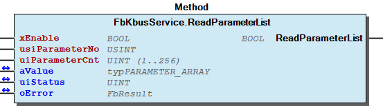

# WagoSysKbusServices v2.0.2.3 (WAGO) - Complete Documentation

## 📋 Library Information

- **Company:** WAGO
- **Title:** WagoSysKbusServices
- **Version:** 2.0.2.3
- **Categories:** WAGO Internal|Feature|LocalBus|K-Bus; WAGO LayerView|Sys; Application
- **Author:** WAGO / u010545
- **Placeholder:** WagoSysKbusServices

### Description ¶

This document is automatically generated.

Base Services for Module Access via Kbus

This document is automatically generated. Base Services for Module Access via Kbus

### Contents: ¶

Contents: - Documentation Index - Project Information - Library Information - Function Blocks FbKbusParameterService (FB) - FbKbusService (FB) - FbKbusTerminalData (FB) Methods - FbKbusParameterService.GetBusType (METH) - FbKbusParameterService.GetRegisterFillBytes (METH) - FbKbusParameterService.GetSlotNumber (METH) - FbKbusParameterService.LED_Set_Blink (METH) - FbKbusParameterService.LED_Set_Static (METH) - FbKbusParameterService.ReadParameter (METH) - FbKbusParameterService.ReadParameterList (METH) - FbKbusParameterService.ReadRegister (METH) - FbKbusParameterService.Reboot (METH) - FbKbusParameterService.SetRegisterFillBytes (METH) - ... and 28 more Base Components - 00 Error Kbus Base - I_ModuleBaseAccessService - eErroKbusBase (ENUM) Internal Components Global Variable Lists - ErrorKbusBase (GVL) - KbusScanner (GVL) - VersionHistory (GVL) Other Components - 15 KBus Services - 80 Status - Control - Dynamic Configuration - Helper - I_LedServerService - I_LedServerService - I_ModuleAccess - I_ParameterService - I_ParameterService - ... and 9 more

### Indices and tables ¶

Based on WagoSysKbusServices.library, last modified 29.05.2024, 19:58:00. LibDoc 3.5.16.10

© WAGO GmbH & Co. KG, Germany 2018 – All rights reserved. For the avoidance of doubt, this copyright notice does not only apply to the information above but also and primarily to the described library itself. Please note that third-party products are always mentioned without reference to intellectual property rights, including patents, utility models, designs and trademarks, accordingly the existence of such rights cannot be excluded. WAGO is a registered trademark of WAGO Verwaltungsgesellschaft mbH.

- File and Project Information - Library Reference Based on WagoSysKbusServices.library, last modified 29.05.2024, 19:58:00. LibDoc 3.5.16.10 © WAGO GmbH & Co. KG, Germany 2018 – All rights reserved. For the avoidance of doubt, this copyright notice does not only apply to the information above but also and primarily to the described library itself. Please note that third-party products are always mentioned without reference to intellectual property rights, including patents, utility models, designs and trademarks, accordingly the existence of such rights cannot be excluded. WAGO is a registered trademark of WAGO Verwaltungsgesellschaft mbH.

### Documentation Index

## WagoSysKbusServices Library Documentation

| Company: | WAGO |
| Title: | WagoSysKbusServices |
| Version: | 2.0.2.3 |
| Categories: | WAGO Internal\|Feature\|LocalBus\|K-Bus; WAGO LayerView\|Sys; Application |
| Author: | WAGO / u010545 |
| Placeholder: | WagoSysKbusServices |

### Description

This document is automatically generated.

Base Services for Module Access via Kbus

This document is automatically generated. Base Services for Module Access via Kbus

### Contents:

- 15 KBus Services FbKbusParameterService (FB) - FbKbusService (FB) 80 Status - 00 Error Kbus Base 90 Internal - Dynamic Configuration VersionHistory (GVL)

### Indices and tables

Based on WagoSysKbusServices.library, last modified 29.05.2024, 19:58:00. LibDoc 3.5.16.10

© WAGO GmbH & Co. KG, Germany 2018 – All rights reserved. For the avoidance of doubt, this copyright notice does not only apply to the information above but also and primarily to the described library itself. Please note that third-party products are always mentioned without reference to intellectual property rights, including patents, utility models, designs and trademarks, accordingly the existence of such rights cannot be excluded. WAGO is a registered trademark of WAGO Verwaltungsgesellschaft mbH.

- File and Project Information - Library Reference Based on WagoSysKbusServices.library, last modified 29.05.2024, 19:58:00. LibDoc 3.5.16.10 © WAGO GmbH & Co. KG, Germany 2018 – All rights reserved. For the avoidance of doubt, this copyright notice does not only apply to the information above but also and primarily to the described library itself. Please note that third-party products are always mentioned without reference to intellectual property rights, including patents, utility models, designs and trademarks, accordingly the existence of such rights cannot be excluded. WAGO is a registered trademark of WAGO Verwaltungsgesellschaft mbH.

### Project Information

## File and Project Information

| Scope | Name | Type | Content |
| --- | --- | --- | --- |
| FileHeader | libraryFile | string | WagoSysKbusServices.library |
| contentFile | doc.clean.json |
| productName | e!COCKPIT |
| creationDateTime | date | 29.05.2024, 19:58:01 |
| companyName | string | WAGO |
| ProjectInformation | LastModificationDateTime | date | 29.05.2024, 19:58:00 |
| Description | string | See: Description |
| Copyright | © WAGO Kontakttechnik GmbH & Co. KG, Germany 2018 – All rights reserved. |
| Author | WAGO / u010545 |
| AutoResolveUnbound | bool | True |
| Placeholder | string | WagoSysKbusServices |
| Company | WAGO |
| DocFormat | reStructuredText |
| Project | WagoSysKbusServices |
| Version | version | 2.0.2.3 |
| Title | string | WagoSysKbusServices |
| LibraryCategories | library-category-list | WAGO Internal\|Feature\|LocalBus\|K-Bus; WAGO LayerView\|Sys; Application |
| CompiledLibraryCompatibilityVersion | string | CODESYS V3.5 SP16 Patch 3 |

### Library Information

## Library Reference

| LinkAllContent: False QualifiedOnly: False | SystemLibrary: False | Optional: False |

| LinkAllContent: False QualifiedOnly: False | SystemLibrary: False | Optional: False |

| LinkAllContent: False QualifiedOnly: False | SystemLibrary: False | Optional: False |

| LinkAllContent: False QualifiedOnly: False | SystemLibrary: False | Optional: False |

| LinkAllContent: False QualifiedOnly: True | SystemLibrary: False | Optional: False |

| LinkAllContent: False QualifiedOnly: True | SystemLibrary: False | Optional: False |

| LinkAllContent: False QualifiedOnly: False | SystemLibrary: False | Optional: False |

| LinkAllContent: False QualifiedOnly: False | SystemLibrary: False | Optional: False |

| LinkAllContent: False QualifiedOnly: False | SystemLibrary: False | Optional: False |

| LinkAllContent: False QualifiedOnly: False | SystemLibrary: False | Optional: False |

| LinkAllContent: False QualifiedOnly: False | SystemLibrary: False | Optional: False |

| LinkAllContent: False QualifiedOnly: False | SystemLibrary: False | Optional: False |

| LinkAllContent: False QualifiedOnly: False | SystemLibrary: False | Optional: False |

| LinkAllContent: False QualifiedOnly: False | SystemLibrary: False | Optional: False |

| LinkAllContent: False QualifiedOnly: True | SystemLibrary: False | Optional: False |

| LinkAllContent: False Optional: False | QualifiedOnly: True SystemLibrary: False | PublishSymbolsInContainer: True |

| LinkAllContent: False QualifiedOnly: True | SystemLibrary: False | Optional: False |

| LinkAllContent: False Optional: False | QualifiedOnly: False SystemLibrary: False | PublishSymbolsInContainer: True |

| LinkAllContent: False Optional: False | QualifiedOnly: False SystemLibrary: False | PublishSymbolsInContainer: True |

| LinkAllContent: False QualifiedOnly: True | SystemLibrary: False | Optional: False |

This is a dictionary of all referenced libraries and their name spaces.

This is a dictionary of all referenced libraries and their name spaces. CmpErrors2 Interfaces Library Identification : Name: CmpErrors2 Interfaces Version: newest Company: System Namespace: CmpErrors Library Properties : CmpEventMgr Library Identification : Placeholder: CmpEventMgr Default Resolution: CmpEventMgr, * (System) Namespace: CmpEventMgr Library Properties : CmpIecTask Library Identification : Placeholder: CmpIecTask Default Resolution: CmpIecTask, * (System) Namespace: CmpIecTask Library Properties : CmpIoMgr Library Identification : Name: CmpIoMgr Version: newest Company: System Namespace: CmpIoMgr Library Properties : IoStandard Library Identification : Placeholder: IoStandard Default Resolution: IoStandard, * (System) Namespace: IoStandard Library Properties : Standard Library Identification : Placeholder: Standard Default Resolution: Standard, * (System) Namespace: Standard Library Properties : SysProcess Library Identification : Placeholder: SysProcess Default Resolution: SysProcess, * (System) Namespace: SysProcess Library Properties : SysTypes2 Interfaces Library Identification : Name: SysTypes2 Interfaces Version: newest Company: System Namespace: SysTypes Library Properties : WagoSysAppLED_Internal_PFC Library Identification : Placeholder: WagoSysAppLedInternal Default Resolution: WagoSysAppLED_Internal_PFC, * (WAGO) Namespace: WagoSysAppLedInternal Library Properties : WagoSysDevice_Internal_PFC Library Identification : Placeholder: WagoSysDevice_Internal Default Resolution: WagoSysDevice_Internal_PFC, * (WAGO) Namespace: WagoSysDevice_Internal Library Properties : WagoSysErrorBase Library Identification : Placeholder: WagoSysErrorBase Default Resolution: WagoSysErrorBase, * (WAGO) Namespace: WagoSysErrorBase Library Properties : Library Parameter : Parameter: RES_LOG_MAX_FILESIZE = 2000 Parameter: RES_LOG_MAX_FILES = 1 Parameter: RES_LOG_MAX_ENTRIES = 200 Parameter: RES_LOG_NAME = ‘WagoAppResultLogger’ WagoSysKbusAsyncCom Library Identification : Placeholder: WagoSysKbusAsyncCom Default Resolution: WagoSysKbusAsyncCom, * (WAGO) Namespace: WagoSysKbusAsyncCom Library Properties : WagoSysKbusTerminalControl Library Identification : Placeholder: WagoSysKbusTerminalControl Default Resolution: WagoSysKbusTerminalControl, * (WAGO) Namespace: WagoSysKbusTerminalControl Library Properties : WagoSysModuleBase Library Identification : Placeholder: WagoSysModuleBase Default Resolution: WagoSysModuleBase, * (WAGO) Namespace: WagoSysModuleBase Library Properties : Library Parameter : Parameter: SYSLOG_MBX2_LOGLEVEL = 2#10001 Parameter: SYSLOG_MBX2_MAX_STRING_LEN = 0 Parameter: SYSLOG_SERVER_PORT = 514 Parameter: SYSLOG_SERVER_IP = ‘127.0.0.1’ Parameter: STARTUP_MODE = eStartUpMode.NONE WagoSysVersion Library Identification : Name: WagoSysVersion Version: 1.0.0.0 Company: WAGO Namespace: WagoSysVersion Library Properties : WagoTypesAppLED Library Identification : Placeholder: WagoTypesAppLED Default Resolution: WagoTypesAppLED, * (WAGO) Namespace: WagoTypesAppLED Library Properties : WagoTypesBusServices Library Identification : Placeholder: WagoTypesBusServices Default Resolution: WagoTypesBusServices, * (WAGO) Namespace: WagoTypesBusServices Library Properties : WagoTypesErrorBase Library Identification : Placeholder: WagoTypesErrorBase Default Resolution: WagoTypesErrorBase, * (WAGO) Namespace: WagoTypesErrorBase Library Properties : WagoTypesKbusTerminalControl Library Identification : Placeholder: WagoTypesKbusTerminalControl Default Resolution: WagoTypesKbusTerminalControl, * (WAGO) Namespace: WagoTypesKbusTerminalControl Library Properties : WagoTypesModuleBase Library Identification : Placeholder: WagoTypesModuleBase Default Resolution: WagoTypesModuleBase, * (WAGO) Namespace: WagoTypesModuleBase Library Properties : Library Parameter : Parameter: MAX_MODULE_OUTPUT_SIZE = 48 Parameter: MAX_MODULE_QUANTITY = 250 Parameter: MAX_MODULE_INPUT_SIZE = 48 Parameter: MAX_RUNNABLES = MAX_MODULE_QUANTITY Parameter: MBX_PIPE_SIZE = 1024 Parameter: MAX_MBX_SIZE = 18 Parameter: MAX_MBX1_SIZE = 18 Parameter: MAX_MBX_OUTPUT_SIZE = 47 Parameter: MAX_MBX_INPUT_SIZE = 47

### Function Blocks

## FbKbusParameterService (FB)

| Scope | Name | Type |
| --- | --- | --- |
| Output | oError | WagoSysErrorBase.FbResult |

Interface variables - I_LedServerService FbKbusParameterService.LED_Set_Blink (METH) - FbKbusParameterService.LED_Set_Static (METH) I_ModuleBaseAccessService - FbKbusParameterService.GetBusType (METH) - FbKbusParameterService.GetSlotNumber (METH) - FbKbusParameterService.isReadyForUse (METH) I_ParameterService - FbKbusParameterService.ReadParameter (METH) - FbKbusParameterService.WriteParameter (METH) I_ParameterServiceList - FbKbusParameterService.ReadParameterList (METH) - FbKbusParameterService.WriteParameterList (METH) I_RebootService - FbKbusParameterService.Reboot (METH) I_RegisterService - FbKbusParameterService.GetRegisterFillBytes (METH) - FbKbusParameterService.ReadRegister (METH) - FbKbusParameterService.SetRegisterFillBytes (METH) - FbKbusParameterService.WriteRegister (METH) I_ServiceConfig - FbKbusParameterService.setSlotNo (METH)

## FbKbusService (FB)

| Scope | Name | Type |
| --- | --- | --- |
| Output | oError | WagoSysErrorBase.FbResult |

Interface variables - I_LedServerService FbKbusService.LED_Set_Blink (METH) - FbKbusService.LED_Set_Static (METH) I_ModuleAccess - Control FbKbusService.UpdatePAInputs (METH) - FbKbusService.UpdatePAOutputs (METH) Info - FbKbusService.GetBusType (METH) - FbKbusService.GetSlotNumber (METH) - FbKbusService.isReadyForUse (METH) ProcessImageAccess - FbKbusService.GetInputPaSize (METH) - FbKbusService.GetInputPointer (METH) - FbKbusService.GetOutputPaSize (METH) - FbKbusService.GetOutputPointer (METH) Register - FbKbusService.GetRegisterFillBytes (METH) - FbKbusService.ReadRegister (METH) - FbKbusService.SetRegisterFillBytes (METH) - FbKbusService.WriteRegister (METH) I_ParameterService - FbKbusService.ReadParameter (METH) - FbKbusService.WriteParameter (METH) I_ParameterServiceList - FbKbusService.ReadParameterList (METH) - FbKbusService.WriteParameterList (METH) I_RebootService - FbKbusService.Reboot (METH) I_SetDataStructDesc - FbKbusService.SetDataStructDesc (METH)

## FbKbusTerminalData (FB)

- FbKbusTerminalData.getBusType (METH)

### Methods

## FbKbusParameterService.GetBusType (METH)

| Scope | Name | Type |
| --- | --- | --- |
| Return | GetBusType | WagoTypesBusServices.eBusType |

Graphical Illustration

Graphical Interface of FbKbusParameterService.GetBusType

Interface variables Function returns always WagoTypesBusServices.eBusType.KBUS Graphical Illustration  Graphical Interface of FbKbusParameterService.GetBusType

## FbKbusParameterService.GetRegisterFillBytes (METH)

| Scope | Name | Type |
| --- | --- | --- |
| Return | GetRegisterFillBytes | USINT (0..1) |

Graphical Illustration

Graphical Interface of FbKbusParameterService.GetRegisterFillBytes

Interface variables Function Get Quantity of used fillbytes betwen C/S and VALUE for register communication Graphical Illustration  Graphical Interface of FbKbusParameterService.GetRegisterFillBytes

## FbKbusParameterService.GetSlotNumber (METH)

| Scope | Name | Type |
| --- | --- | --- |
| Return | GetSlotNumber | USINT |

Graphical Illustration

Graphical Interface of FbKbusParameterService.GetSlotNumber

Interface variables Function returns the slot number for this service Graphical Illustration  Graphical Interface of FbKbusParameterService.GetSlotNumber

## FbKbusParameterService.LED_Set_Blink (METH)

| Scope | Name | Type |
| --- | --- | --- |
| Return | LED_Set_Blink | BOOL |
| Input | eLedId | WagoTypesAppLED.eLedId |
| eLedColor_1 | WagoTypesAppLED.eLedColor |
| eLedColor_2 | WagoTypesAppLED.eLedColor |
| tTime_1 | TIME |
| tTime_2 | TIME |

## FbKbusParameterService.LED_Set_Static (METH)

| Scope | Name | Type |
| --- | --- | --- |
| Return | LED_Set_Static | BOOL |
| Input | eLedId | WagoTypesAppLED.eLedId |
| eLedColor | WagoTypesAppLED.eLedColor |

## FbKbusParameterService.ReadParameter (METH)

| Scope | Name | Type | Comment |
| --- | --- | --- | --- |
| Return | ReadParameter | BOOL |  |
| Input | xEnable | BOOL |  |
| usiParameterNo | USINT |  |
| Inout | uiValue | UINT | value of the parameter |
| uiStatus | UINT | status word (register 57) of parameter communication |
| oError | WagoSysErrorBase.FbResult |  |

Graphical Illustration

Graphical Interface of FbKbusParameterService.ReadParameter

Interface variables Function Read a terminal parameter specified by usiParameterNo . Graphical Illustration  Graphical Interface of FbKbusParameterService.ReadParameter

## FbKbusParameterService.ReadParameterList (METH)

| Scope | Name | Type | Comment |
| --- | --- | --- | --- |
| Return | ReadParameterList | BOOL |  |
| Input | xEnable | BOOL |  |
| usiParameterNo | USINT |  |
| uiParameterCnt | UINT (1..256) | number of parameters |
| Inout | aValue | WagoTypesBusServices.typPARAMETER_ARRAY | content of addressed parameters |
| uiStatus | UINT | status word (register 57) of parameter communication |
| oError | WagoSysErrorBase.FbResult |  |

Graphical Illustration

Graphical Interface of FbKbusParameterService.ReadParameterList

Interface variables Function Read a terminal parameter specified by usiParameterNo . Graphical Illustration  Graphical Interface of FbKbusParameterService.ReadParameterList

## FbKbusParameterService.ReadRegister (METH)

| Scope | Name | Type |
| --- | --- | --- |
| Return | ReadRegister | BOOL |
| Input | xEnable | BOOL |
| usiChannel | USINT (0..7) |
| usiRegisterNo | USINT (0..63) |
| Inout | uiValue | UINT |
| oError | WagoSysErrorBase.FbResult |

Graphical Illustration

Graphical Interface of FbKbusParameterService.ReadRegister

Interface variables Function Read a terminal register specified by usiChannel and usiRegisterNo . Graphical Illustration  Graphical Interface of FbKbusParameterService.ReadRegister

## FbKbusParameterService.Reboot (METH)

| Scope | Name | Type |
| --- | --- | --- |
| Return | Reboot | BOOL |

## FbKbusParameterService.SetRegisterFillBytes (METH)

| Scope | Name | Type |
| --- | --- | --- |
| Input | usiFillBytes | USINT (0..1) |

Set Quantity of used fillbytes betwen C/S and VALUE for register communication

Interface variables Set Quantity of used fillbytes betwen C/S and VALUE for register communication

## FbKbusParameterService.WriteParameter (METH)

| Scope | Name | Type | Comment |
| --- | --- | --- | --- |
| Return | WriteParameter | BOOL |  |
| Input | xEnable | BOOL |  |
| usiParameterNo | USINT |  |
| uiValue | UINT | value of the parameter |
| Inout | uiStatus | UINT | status word (register 57) of parameter communication |
| oError | WagoSysErrorBase.FbResult | error object |

Graphical Illustration

Graphical Interface of FbKbusParameterService.WriteParameter

Interface variables Function Write the value``uiValue`` at terminal parameter specified by usiParameterNo . Graphical Illustration  Graphical Interface of FbKbusParameterService.WriteParameter

## FbKbusParameterService.WriteParameterList (METH)

| Scope | Name | Type | Comment |
| --- | --- | --- | --- |
| Return | WriteParameterList | BOOL |  |
| Input | xEnable | BOOL |  |
| usiParameterNo | USINT |  |
| uiParameterCnt | UINT (1..256) | number of parameters |
| aValue | WagoTypesBusServices.typPARAMETER_ARRAY | content of addressed parameters |
| Inout | uiStatus | UINT | status word (register 57) of parameter communication |
| oError | WagoSysErrorBase.FbResult | error object |

Graphical Illustration

Graphical Interface of FbKbusParameterService.WriteParameterList

Interface variables Function Write the value``uiValue`` at terminal parameter specified by usiParameterNo . Graphical Illustration  Graphical Interface of FbKbusParameterService.WriteParameterList

## FbKbusParameterService.WriteRegister (METH)

| Scope | Name | Type |
| --- | --- | --- |
| Return | WriteRegister | BOOL |
| Input | xEnable | BOOL |
| usiChannel | USINT (0..7) |
| usiRegisterNo | USINT (0..63) |
| uiValue | UINT |
| Inout | oError | WagoSysErrorBase.FbResult |

Graphical Illustration

Graphical Interface of FbKbusParameterService.WriteRegister

Interface variables Function Write the value``uiValue`` at terminal register specified by usiChannel and usiRegisterNo . Graphical Illustration  Graphical Interface of FbKbusParameterService.WriteRegister

## FbKbusParameterService.isReadyForUse (METH)

| Scope | Name | Type |
| --- | --- | --- |
| Return | isReadyForUse | BOOL |

++Function**

Graphical Illustration

Graphical Interface of FbKbusParameterService.isReadyForUse

Interface variables ++Function** Returns TRUE if the module is ready for use. This means it is a slot number > 0. Graphical Illustration  Graphical Interface of FbKbusParameterService.isReadyForUse

## FbKbusParameterService.setSlotNo (METH)

| Scope | Name | Type |
| --- | --- | --- |
| Return | setSlotNo | BOOL |
| Input | usiSlotNo | USINT (1..250) |

## FbKbusService.GetBusType (METH)

| Scope | Name | Type |
| --- | --- | --- |
| Return | GetBusType | WagoTypesBusServices.eBusType |

Graphical Illustration

Graphical Interface of FbKbusService.GetBusType

Interface variables Function returns always WagoTypesBusServices.eBusType.KBUS Graphical Illustration  Graphical Interface of FbKbusService.GetBusType

## FbKbusService.GetInputPaSize (METH)

| Scope | Name | Type |
| --- | --- | --- |
| Return | GetInputPaSize | UINT |

## FbKbusService.GetInputPointer (METH)

| Scope | Name | Type |
| --- | --- | --- |
| Return | GetInputPointer | POINTER TO BYTE |

## FbKbusService.GetOutputPaSize (METH)

| Scope | Name | Type |
| --- | --- | --- |
| Return | GetOutputPaSize | UINT |

## FbKbusService.GetOutputPointer (METH)

| Scope | Name | Type |
| --- | --- | --- |
| Return | GetOutputPointer | POINTER TO BYTE |

## FbKbusService.GetRegisterFillBytes (METH)

| Scope | Name | Type |
| --- | --- | --- |
| Return | GetRegisterFillBytes | USINT (0..1) |

Graphical Illustration

Graphical Interface of FbKbusService.GetRegisterFillBytes

Interface variables Function Get Quantity of used fillbytes betwen C/S and VALUE for register communication Graphical Illustration  Graphical Interface of FbKbusService.GetRegisterFillBytes

## FbKbusService.GetSlotNumber (METH)

| Scope | Name | Type |
| --- | --- | --- |
| Return | GetSlotNumber | USINT |

Graphical Illustration

Graphical Interface of FbKbusService.GetSlotNumber

Interface variables Function returns the slot number for this service Graphical Illustration  Graphical Interface of FbKbusService.GetSlotNumber

## FbKbusService.LED_Set_Blink (METH)

| Scope | Name | Type |
| --- | --- | --- |
| Return | LED_Set_Blink | BOOL |
| Input | eLedId | WagoTypesAppLED.eLedId |
| eLedColor_1 | WagoTypesAppLED.eLedColor |
| eLedColor_2 | WagoTypesAppLED.eLedColor |
| tTime_1 | TIME |
| tTime_2 | TIME |

## FbKbusService.LED_Set_Static (METH)

| Scope | Name | Type |
| --- | --- | --- |
| Return | LED_Set_Static | BOOL |
| Input | eLedId | WagoTypesAppLED.eLedId |
| eLedColor | WagoTypesAppLED.eLedColor |

## FbKbusService.ReadParameter (METH)

| Scope | Name | Type | Comment |
| --- | --- | --- | --- |
| Return | ReadParameter | BOOL |  |
| Input | xEnable | BOOL |  |
| usiParameterNo | USINT |  |
| Inout | uiValue | UINT | value of the parameter |
| uiStatus | UINT | status word (register 57) of parameter communication |
| oError | WagoSysErrorBase.FbResult |  |

Graphical Illustration

Graphical Interface of FbKbusService.ReadParameter

Interface variables Function Read a terminal parameter specified by usiParameterNo . Graphical Illustration  Graphical Interface of FbKbusService.ReadParameter

## FbKbusService.ReadParameterList (METH)

| Scope | Name | Type | Comment |
| --- | --- | --- | --- |
| Return | ReadParameterList | BOOL |  |
| Input | xEnable | BOOL |  |
| usiParameterNo | USINT |  |
| uiParameterCnt | UINT (1..256) | number of parameters |
| Inout | aValue | WagoTypesBusServices.typPARAMETER_ARRAY | content of addressed parameters |
| uiStatus | UINT | status word (register 57) of parameter communication |
| oError | WagoTypesBusServices.WagoSysErrorBase.FbResult |  |

Graphical Illustration

Graphical Interface of FbKbusService.ReadParameterList

Interface variables Function Read a terminal parameter specified by usiParameterNo . Graphical Illustration  Graphical Interface of FbKbusService.ReadParameterList

## FbKbusService.ReadRegister (METH)

| Scope | Name | Type |
| --- | --- | --- |
| Return | ReadRegister | BOOL |
| Input | xEnable | BOOL |
| usiChannel | USINT (0..7) |
| usiRegisterNo | USINT (0..63) |
| Inout | uiValue | UINT |
| oError | WagoSysErrorBase.FbResult |

Graphical Illustration

Graphical Interface of FbKbusService.ReadRegister

Interface variables Function Read a terminal register specified by usiChannel and usiRegisterNo . Graphical Illustration  Graphical Interface of FbKbusService.ReadRegister

## FbKbusService.Reboot (METH)

| Scope | Name | Type |
| --- | --- | --- |
| Return | Reboot | BOOL |

## FbKbusService.SetDataStructDesc (METH)

| Scope | Name | Type | Comment |
| --- | --- | --- | --- |
| Input | pInDesc | POINTER TO typeDataDesc | pointer to array of input data descriptions |
| uiNoInDesc | UINT | number of elements input data descriptions |
| pOutDesc | POINTER TO typeDataDesc | pointer to array of output data descriptions |
| uiNoOutDesc | UINT | number of elements output data descriptions |
| usiFillBytes | USINT (0..1) | number of fillbytes behind C/S |

## FbKbusService.SetRegisterFillBytes (METH)

| Scope | Name | Type |
| --- | --- | --- |
| Input | usiFillBytes | USINT (0..1) |

Set Quantity of used fillbytes betwen C/S and VALUE for register communication

Interface variables Set Quantity of used fillbytes betwen C/S and VALUE for register communication

## FbKbusService.UpdatePAInputs (METH)

| Name | Type |
| --- | --- |
| inst_xPDE_Enabled | BOOL |

## FbKbusService.UpdatePAOutputs (METH) ¶

## FbKbusService.WriteParameter (METH)

| Scope | Name | Type | Comment |
| --- | --- | --- | --- |
| Return | WriteParameter | BOOL |  |
| Input | xEnable | BOOL |  |
| usiParameterNo | USINT |  |
| uiValue | UINT | value of the parameter |
| Inout | uiStatus | UINT | status word (register 57) of parameter communication |
| oError | WagoSysErrorBase.FbResult | error object |

Graphical Illustration

Graphical Interface of FbKbusService.WriteParameter

Interface variables Function Write the value``uiValue`` at terminal parameter specified by usiParameterNo . Graphical Illustration  Graphical Interface of FbKbusService.WriteParameter

## FbKbusService.WriteParameterList (METH)

| Scope | Name | Type | Comment |
| --- | --- | --- | --- |
| Return | WriteParameterList | BOOL |  |
| Input | xEnable | BOOL |  |
| usiParameterNo | USINT |  |
| uiParameterCnt | UINT (1..256) | number of parameters |
| aValue | WagoTypesBusServices.typPARAMETER_ARRAY | content of addressed parameters |
| Inout | uiStatus | UINT | status word (register 57) of parameter communication |
| oError | WagoTypesBusServices.WagoSysErrorBase.FbResult | error object |

Graphical Illustration

Graphical Interface of FbKbusService.WriteParameterList

Interface variables Function Write the value``uiValue`` at terminal parameter specified by usiParameterNo . Graphical Illustration  Graphical Interface of FbKbusService.WriteParameterList

## FbKbusService.WriteRegister (METH)

| Scope | Name | Type |
| --- | --- | --- |
| Return | WriteRegister | BOOL |
| Input | xEnable | BOOL |
| usiChannel | USINT (0..7) |
| usiRegisterNo | USINT (0..63) |
| uiValue | UINT |
| Inout | oError | WagoSysErrorBase.FbResult |

Graphical Illustration

Graphical Interface of FbKbusService.WriteRegister

Interface variables Function Write the value``uiValue`` at terminal register specified by usiChannel and usiRegisterNo . Graphical Illustration  Graphical Interface of FbKbusService.WriteRegister

## FbKbusService.isReadyForUse (METH)

| Scope | Name | Type |
| --- | --- | --- |
| Return | isReadyForUse | BOOL |

++Function**

Graphical Illustration

Graphical Interface of FbKbusService.isReadyForUse

Interface variables ++Function** Returns TRUE if the module is ready for use. This means it is mem for the PA allocated and the data exchange runs. Graphical Illustration  Graphical Interface of FbKbusService.isReadyForUse

## FbKbusTerminalData.getBusType (METH)

| Scope | Name | Type |
| --- | --- | --- |
| Return | getBusType | WagoTypesBusServices.eBusType |

## I_SetDataStructDesc

- FbKbusService.SetDataStructDesc (METH)

### Base Components

## 00 Error Kbus Base

- ErrorKbusBase (GVL) - eErroKbusBase (ENUM)

## I_ModuleBaseAccessService

- FbKbusParameterService.GetBusType (METH) - FbKbusParameterService.GetSlotNumber (METH) - FbKbusParameterService.isReadyForUse (METH)

## eErroKbusBase (ENUM)

| Name | Initial | Comment |
| --- | --- | --- |
| OK | 0 | all is well |
| LIST_TO_SHORT | 1 | TerminalList to short -> see parameter WagoTypesModuleBase.MAX_MODULE_QUANTITY |

### Internal Components

## 90 Internal

- Dynamic Configuration Helper FbKbusTerminalData (FB) FbKbusTerminalData.getBusType (METH) KbusScanner (GVL)

### Global Variable Lists

## ErrorKbusBase (GVL)

| Scope | Name | Type |
| --- | --- | --- |
| Constant | ERROR_KBUS_BASE | ARRAY [0..1] OF WagoTypesErrorBase.typResultItem |

| Value | Level | Description |
| --- | --- | --- |
| eErroKbusBase.OK | WagoTypesErrorBase.eSeverity.none | ‘OK’ |
| eErroKbusBase.LIST_TO_SHORT | WagoTypesErrorBase.eSeverity.error | ‘TerminalList to short -> see parameter WagoTypesModuleBase.MAX_MODULE_QUANTITY’ |

## KbusScanner (GVL)

| Name | Type |
| --- | --- |
| KbusTerminalScanner | FbTerminalScanner |

Initialize before module instances and after TerminalManager

Initialize before module instances and after TerminalManager

## VersionHistory (GVL)

| Name | Type |
| --- | --- |
| Info | WagoSysVersion.ProjectInfo |

| date | version | author | change |
| 06.03.2024 | 2.0.2.3 | u010663 | compiled SP16.3 |
| 29.06.2023 | 2.0.2.2 | u010545 | bugfix FW23 -> FW24 -> FuReboot |
| 29.03.2023 | 2.0.2.1 | u010545 | bugfix init slotno -> event |
| 22.03.2023 | 2.0.2.0 | u010545 | WAT35540: reboot service device dependent |
| 18.01.2023 | 2.0.1.1 | u0103719 | WAT34389: replace CDS3 Library |
| 19.09.2022 | 2.0.1.0 | u0103719 | Add I_ParameterServiceList |
| 30.08.2022 | 2.0.0.4 | u010545 | bugfix for dyn. config. and FW23 |
| 05.07.2022 | 2.0.0.3 | u010545 | call of EnableManual_PDE() modified |
| 28.06.2022 | 2.0.0.2 | u010545 | bugfix slotno for dyn. conf. |
| 22.06.2022 | 2.0.0.1 | u010545 | bugfix slotno |
| 07.06.2022 | 2.0.0.0 | u010545 | first version for CDS3 runtime -> new device descriptions |
| 27.01.2021 | 1.8.7.4 | u010545 | WAT32857 |
| 28.04.2020 | 1.8.7.3 | u010545 | WagoSysModuleBase removed |
| 23.09.2019 | 1.8.7.2 | u010545 | I_SetDataStructDesc implemented |
| 21.05.2019 | 1.8.7.1 | u010545 | FbKbusParameterService -> I_ServiceConfig implemented |
| 08.01.2019 | 1.8.7.0 | u015842 | Properties: free placeholder added |
| 09.07.2018 | 1.8.6.1 | u010545 | I_ModuleBase and I_TermManagerModuleListener deactivated -> WAT26752 |
| 07.05.2018 | 1.8.6.0 | u010545 | Additonal I_ModuleBase implemented |
| 23.04.2018 | 1.8.5.1 | u010545 | Update documentation |
| 04.12.2017 | 1.8.5.0 | u010545 | TscFuse complete removed |
| 15.11.2017 | 1.8.4.1 | u010545 | Folder I_FuseService deactivated |
| 13.11.2017 | 1.8.4.0 | u010545 | I_RebootService, I_LedServerService implemented |
| 08.11.2017 | 1.8.3.0 | u010545 | I_FuseService deactivated for WAT24564 |
| 18.09.2017 | 1.8.2.2 | u010545 | bugfix for compability of old projects before R5 |
| 28.08.2017 | 1.8.2.1 | u010545 | Handling of fillbytes modified |
| 22.08.2017 | 1.8.2.0 | u010545 | Scanner switched to EVT_PrepareStart |
| 14.08.2017 | 1.8.1.1 | u010545 | Bugfix Daemon for reset |
| 03.08.2017 | 1.8.1.0 | u010545 | I_FuseService implemented for FbKbusService |
| 20.07.2017 | 1.8.0.2 | u010545 | FbKbusParameterService implemented (without PA access) |
| 14.07.2017 | 1.8.0.1 | u010545 | namespaces for parameter included |
| 23.06.2017 | 1.8.0.0 | u010545 | update |
| 16.05.2017 | 1.7.0.2 | u010545 | update |
| 10.05.2017 | 1.7.0.1 | u010545 | I_ParameterService implemented |
| 06.04.2017 | 1.7.0.0 | u010545 | first version |

WagoSysKbusServices

### Other Components

## 15 KBus Services

- FbKbusParameterService (FB) I_LedServerService FbKbusParameterService.LED_Set_Blink (METH) - FbKbusParameterService.LED_Set_Static (METH) I_ModuleBaseAccessService - FbKbusParameterService.GetBusType (METH) - FbKbusParameterService.GetSlotNumber (METH) - FbKbusParameterService.isReadyForUse (METH) I_ParameterService - FbKbusParameterService.ReadParameter (METH) - FbKbusParameterService.WriteParameter (METH) I_ParameterServiceList - FbKbusParameterService.ReadParameterList (METH) - FbKbusParameterService.WriteParameterList (METH) I_RebootService - FbKbusParameterService.Reboot (METH) I_RegisterService - FbKbusParameterService.GetRegisterFillBytes (METH) - FbKbusParameterService.ReadRegister (METH) - FbKbusParameterService.SetRegisterFillBytes (METH) - FbKbusParameterService.WriteRegister (METH) I_ServiceConfig - FbKbusParameterService.setSlotNo (METH) FbKbusService (FB) - I_LedServerService FbKbusService.LED_Set_Blink (METH) - FbKbusService.LED_Set_Static (METH) I_ModuleAccess - Control FbKbusService.UpdatePAInputs (METH) - FbKbusService.UpdatePAOutputs (METH) Info - FbKbusService.GetBusType (METH) - FbKbusService.GetSlotNumber (METH) - FbKbusService.isReadyForUse (METH) ProcessImageAccess - FbKbusService.GetInputPaSize (METH) - FbKbusService.GetInputPointer (METH) - FbKbusService.GetOutputPaSize (METH) - FbKbusService.GetOutputPointer (METH) Register - FbKbusService.GetRegisterFillBytes (METH) - FbKbusService.ReadRegister (METH) - FbKbusService.SetRegisterFillBytes (METH) - FbKbusService.WriteRegister (METH) I_ParameterService - FbKbusService.ReadParameter (METH) - FbKbusService.WriteParameter (METH) I_ParameterServiceList - FbKbusService.ReadParameterList (METH) - FbKbusService.WriteParameterList (METH) I_RebootService - FbKbusService.Reboot (METH) I_SetDataStructDesc - FbKbusService.SetDataStructDesc (METH)

## 80 Status

- 00 Error Kbus Base ErrorKbusBase (GVL) - eErroKbusBase (ENUM)

## Control

- FbKbusService.UpdatePAInputs (METH) - FbKbusService.UpdatePAOutputs (METH)

## Dynamic Configuration

- Helper FbKbusTerminalData (FB) FbKbusTerminalData.getBusType (METH) KbusScanner (GVL)

## Helper

- FbKbusTerminalData (FB) FbKbusTerminalData.getBusType (METH) KbusScanner (GVL)

## I_LedServerService

- FbKbusService.LED_Set_Blink (METH) - FbKbusService.LED_Set_Static (METH)

## I_LedServerService

- FbKbusParameterService.LED_Set_Blink (METH) - FbKbusParameterService.LED_Set_Static (METH)

## I_ModuleAccess

- Control FbKbusService.UpdatePAInputs (METH) - FbKbusService.UpdatePAOutputs (METH) Info - FbKbusService.GetBusType (METH) - FbKbusService.GetSlotNumber (METH) - FbKbusService.isReadyForUse (METH) ProcessImageAccess - FbKbusService.GetInputPaSize (METH) - FbKbusService.GetInputPointer (METH) - FbKbusService.GetOutputPaSize (METH) - FbKbusService.GetOutputPointer (METH) Register - FbKbusService.GetRegisterFillBytes (METH) - FbKbusService.ReadRegister (METH) - FbKbusService.SetRegisterFillBytes (METH) - FbKbusService.WriteRegister (METH)

## I_ParameterService

- FbKbusService.ReadParameter (METH) - FbKbusService.WriteParameter (METH)

## I_ParameterService

- FbKbusParameterService.ReadParameter (METH) - FbKbusParameterService.WriteParameter (METH)

## I_ParameterServiceList

- FbKbusParameterService.ReadParameterList (METH) - FbKbusParameterService.WriteParameterList (METH)

## I_ParameterServiceList

- FbKbusService.ReadParameterList (METH) - FbKbusService.WriteParameterList (METH)

## I_RebootService

- FbKbusParameterService.Reboot (METH)

## I_RebootService ¶

- FbKbusService.Reboot (METH)

## I_RegisterService

- FbKbusParameterService.GetRegisterFillBytes (METH) - FbKbusParameterService.ReadRegister (METH) - FbKbusParameterService.SetRegisterFillBytes (METH) - FbKbusParameterService.WriteRegister (METH)

## I_ServiceConfig

- FbKbusParameterService.setSlotNo (METH)

## Info

- FbKbusService.GetBusType (METH) - FbKbusService.GetSlotNumber (METH) - FbKbusService.isReadyForUse (METH)

## ProcessImageAccess

- FbKbusService.GetInputPaSize (METH) - FbKbusService.GetInputPointer (METH) - FbKbusService.GetOutputPaSize (METH) - FbKbusService.GetOutputPointer (METH)

## Register

- FbKbusService.GetRegisterFillBytes (METH) - FbKbusService.ReadRegister (METH) - FbKbusService.SetRegisterFillBytes (METH) - FbKbusService.WriteRegister (METH)