# WagoSysLog v1.0.2.5 (WAGO) - Complete Documentation


## 📋 Library Information

- **Company:** WAGO
- **Title:** WagoSysLog
- **Version:** 1.0.2.5
- **Categories:** WAGO LayerView|Sys; Application
- **Namespace:** WagoSysLog
- **Author:** WAGO / u010545
- **Placeholder:** WagoSysLog

### Description ¶


This document is automatically generated.

Handling of central logger

This document is automatically generated. Handling of central logger

### Contents: ¶


Contents: - Documentation Index - Project Information - Library Information - Function Blocks FbComportLogger (FB) - FbLogChIde (FB) - FbLogChSysUdp (FB) - FbLogChSysUdpPid (FB) - FbLogger (FB) Methods - FbComportLogger.setClassName (METH) - FbComportLogger.setLoggerName (METH) - FbLogChSysUdp.protBuildFrame (METH) - FbLogChSysUdpPid.protBuildFrame (METH) - FbLogger.RegisterLogChannel (METH) - FbLogger.UnRegisterLogChannel (METH) - FbLogger.checkFilter (METH) - FbLogger.writeHexDump (METH) - FbLogger.writeMsg (METH) - FbLogger.writeStatusObject (METH) - ... and 4 more Program Organization Internal Components - Internal - Internal Global Variable Lists - ErrorLog (GVL) - VersionHistory (GVL) Other Components - 80 Status - LogChannels - LoggerManager (PRG) - Parameter (PARAMS) - Private - eLogChannel (ENUM) - eLogError (ENUM)

### Indices and tables ¶


Based on WagoSysLog.library, last modified 20.09.2024, 21:05:59. LibDoc 3.5.16.10

© WAGO GmbH & Co. KG, Germany 2018 – All rights reserved. For the avoidance of doubt, this copyright notice does not only apply to the information above but also and primarily to the described library itself. Please note that third-party products are always mentioned without reference to intellectual property rights, including patents, utility models, designs and trademarks, accordingly the existence of such rights cannot be excluded. WAGO is a registered trademark of WAGO Verwaltungsgesellschaft mbH.

- File and Project Information - Library Reference Based on WagoSysLog.library, last modified 20.09.2024, 21:05:59. LibDoc 3.5.16.10 © WAGO GmbH & Co. KG, Germany 2018 – All rights reserved. For the avoidance of doubt, this copyright notice does not only apply to the information above but also and primarily to the described library itself. Please note that third-party products are always mentioned without reference to intellectual property rights, including patents, utility models, designs and trademarks, accordingly the existence of such rights cannot be excluded. WAGO is a registered trademark of WAGO Verwaltungsgesellschaft mbH.

### Documentation Index


## WagoSysLog Library Documentation


| Company: | WAGO |
| Title: | WagoSysLog |
| Version: | 1.0.2.5 |
| Categories: | WAGO LayerView\|Sys; Application |
| Namespace: | WagoSysLog |
| Author: | WAGO / u010545 |
| Placeholder: | WagoSysLog |

### Description


This document is automatically generated.

Handling of central logger

This document is automatically generated. Handling of central logger

### Contents:


- 20 Program Organization Units FbComportLogger (FB) - FbLogger (FB) - LogChannels - LoggerManager (PRG) 80 Status - ErrorLog (GVL) - eLogError (ENUM) Parameter (PARAMS) VersionHistory (GVL)

### Indices and tables


Based on WagoSysLog.library, last modified 20.09.2024, 21:05:59. LibDoc 3.5.16.10

© WAGO GmbH & Co. KG, Germany 2018 – All rights reserved. For the avoidance of doubt, this copyright notice does not only apply to the information above but also and primarily to the described library itself. Please note that third-party products are always mentioned without reference to intellectual property rights, including patents, utility models, designs and trademarks, accordingly the existence of such rights cannot be excluded. WAGO is a registered trademark of WAGO Verwaltungsgesellschaft mbH.

- File and Project Information - Library Reference Based on WagoSysLog.library, last modified 20.09.2024, 21:05:59. LibDoc 3.5.16.10 © WAGO GmbH & Co. KG, Germany 2018 – All rights reserved. For the avoidance of doubt, this copyright notice does not only apply to the information above but also and primarily to the described library itself. Please note that third-party products are always mentioned without reference to intellectual property rights, including patents, utility models, designs and trademarks, accordingly the existence of such rights cannot be excluded. WAGO is a registered trademark of WAGO Verwaltungsgesellschaft mbH.

### Project Information


## File and Project Information


| Scope | Name | Type | Content |
| --- | --- | --- | --- |
| FileHeader | libraryFile | string | WagoSysLog.library |
| contentFile | doc.clean.json |
| productName | e!COCKPIT |
| creationDateTime | date | 20.09.2024, 21:06:00 |
| companyName | string | WAGO |
| ProjectInformation | LastModificationDateTime | date | 20.09.2024, 21:05:59 |
| Description | string | See: Description |
| Copyright | © WAGO Kontakttechnik GmbH & Co. KG, Germany 2018 – All rights reserved. |
| Author | WAGO / u010545 |
| AutoResolveUnbound | bool | True |
| Placeholder | string | WagoSysLog |
| Company | WAGO |
| DocFormat | reStructuredText |
| Project | WagoSysLog |
| DefaultNamespace | WagoSysLog |
| Version | version | 1.0.2.5 |
| Title | string | WagoSysLog |
| LibraryCategories | library-category-list | WAGO LayerView\|Sys; Application |
| CompiledLibraryCompatibilityVersion | string | CODESYS V3.5 SP16 Patch 3 |

### Library Information


## Library Reference


| LinkAllContent: False QualifiedOnly: False | SystemLibrary: False | Optional: False |

| LinkAllContent: False QualifiedOnly: False | SystemLibrary: False | Optional: False |

| LinkAllContent: False QualifiedOnly: False | SystemLibrary: False | Optional: False |

| LinkAllContent: False QualifiedOnly: False | SystemLibrary: False | Optional: False |

| LinkAllContent: False QualifiedOnly: False | SystemLibrary: False | Optional: False |

| LinkAllContent: False QualifiedOnly: False | SystemLibrary: False | Optional: False |

| LinkAllContent: False QualifiedOnly: False | SystemLibrary: False | Optional: False |

| LinkAllContent: False Optional: False | QualifiedOnly: False SystemLibrary: False | PublishSymbolsInContainer: True |

| LinkAllContent: False Optional: False | QualifiedOnly: False SystemLibrary: False | PublishSymbolsInContainer: True |

| LinkAllContent: False QualifiedOnly: False | SystemLibrary: False PublishSymbolsInContainer: True | Optional: False |

This is a dictionary of all referenced libraries and their name spaces.

This is a dictionary of all referenced libraries and their name spaces. CmpLog Library Identification : Placeholder: CmpLog Default Resolution: CmpLog, * (System) Namespace: CmpLog Library Properties : Standard Library Identification : Placeholder: Standard Default Resolution: Standard, * (System) Namespace: Standard Library Properties : SysSem Library Identification : Placeholder: SysSem Default Resolution: SysSem, * (System) Namespace: SysSem Library Properties : SysSocket Library Identification : Placeholder: SysSocket Default Resolution: SysSocket, * (System) Namespace: SysSocket Library Properties : SysTypes2 Interfaces Library Identification : Name: SysTypes2 Interfaces Version: newest Company: System Namespace: SysTypes Library Properties : WagoSysErrorBase Library Identification : Placeholder: WagoSysErrorBase Default Resolution: WagoSysErrorBase, * (WAGO) Namespace: WagoSysErrorBase Library Properties : WagoSysVersion Library Identification : Name: WagoSysVersion Version: 1.0.0.0 Company: WAGO Namespace: WagoSysVersion Library Properties : WagoTypesCom Library Identification : Placeholder: WagoTypesCom Default Resolution: WagoTypesCom, * (WAGO) Namespace: WagoTypesCom Library Properties : WagoTypesErrorBase Library Identification : Placeholder: WagoTypesErrorBase Default Resolution: WagoTypesErrorBase, * (WAGO) Namespace: WagoTypesErrorBase Library Properties : WagoTypesLog Library Identification : Placeholder: WagoTypesLog Default Resolution: WagoTypesLog, * (WAGO) Namespace: WagoTypesLog Library Properties : Library Parameter : Parameter: MAX_LOG_MSG_LEN = 128 Parameter: MAX_PREFIX_DUMP_MSG_LEN = 40 Parameter: MAX_CMP_NAME_LEN = 20

### Function Blocks


## FbComportLogger (FB)


| Scope | Name | Type | Initial | Comment | Inherited from |
| --- | --- | --- | --- | --- | --- |
| Output | oStatus | WagoSysErrorBase.FbResult |  |  | FbLogger |
| Input | I_Port | WagoTypesCom.I_WagoSysComBase |  | port to log |  |
| Output | I_IdeLogChannel | I_LogChannel | m_IdeLogChannel |  |  |
| I_SysLogChannel | I_LogChannel | m_SysLogChannel |  |  |

```
VAR_GLOBAL
    myComportLogger     :   FbComportLogger('ComLogger', eLogChannel.IDE OR eLogChannel.SYSLOG);
END_VAR

myComportLogger( I_Port := my652 ); // register the logger for the given com port
```

The main task of the logger is to log the communication on a communication port.

Each logger should have a unique name.

Simple declaration of myComportLogger with the name ComLogger .

Graphical Illustration

Graphical Interface of FbComportLogger

Interface variables Function The main task of the logger is to log the communication on a communication port. Note Each logger should have a unique name. Example Simple declaration of myComportLogger with the name ComLogger . Graphical Illustration 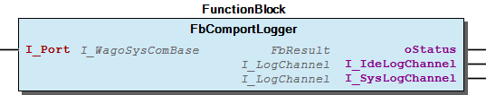 Graphical Interface of FbComportLogger - FbComportLogger.setClassName (METH) - FbComportLogger.setLoggerName (METH)

## FbLogChIde (FB)


| Scope | Name | Type | Initial | Comment |
| --- | --- | --- | --- | --- |
| Input | iLogMaxEntries | INT | 200 | max. entries for each log file |
| iLogMaxFileSize | INT | 2000 | max. size [byte] for each log file |
| iLogMaxFiles | INT | 1 | max. quantity of log files |

```
VAR
    myIdeLogChannel     :   FbLogChIde('e!Cockpit'); // Logger name at IDE
END_VAR
```

```
VAR
    myIdeLogChannel     :   FbLogChIde('e!Cockpit') := (    iLogMaxEntries  := 200,     // max. entries for each log file
                                                            iLogMaxFileSize := 2000,    // max. size [byte] for each log file
                                                            iLogMaxFiles    := 1        // max. quantity of log files
                                                        );
END_VAR
```

This log-channel is for put Log-Messages to the IDE-Logger.

At declaration you have to assign a channel name at the constructor. This name will be the Logger-Name at the IDE.

Simple Example

Simple declaration of myIdeLogChannel with the name e!Cockpit .

Advanced Example

Advanced declaration of myIdeLogChannel with the name e!Cockpit and some parameters.

Graphical Illustration

Graphical Interface of FbLogChIde

Interface variables Function This log-channel is for put Log-Messages to the IDE-Logger. At declaration you have to assign a channel name at the constructor. This name will be the Logger-Name at the IDE. Hint For use this channel you have to register it at one or more logger(s). For more information see FbLogger.RegisterLogChannel or read the documentation of the LoggerManager Simple Example Simple declaration of myIdeLogChannel with the name e!Cockpit . Advanced Example Advanced declaration of myIdeLogChannel with the name e!Cockpit and some parameters. Graphical Illustration 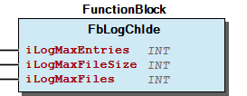 Graphical Interface of FbLogChIde

## FbLogChSysUdp (FB)


| Scope | Name | Type | Initial | Comment |
| --- | --- | --- | --- | --- |
| Input | sServerIp | STRING(20) | ‘127.0.0.1’ | for local server use loppback address 127.0.0.1 |
| uiSeverPort | UINT | 514 |  |
| eFacility | eSysLogFacility | eSysLogFacility.LOG_LOCAL0 |  |

```
VAR
    mySysLogChannel     :   FbLogChSysUdp('WAGO'); // This means the local syslog server
END_VAR
```

```
VAR
    mySysLogChannel     :   FbLogChSysUdp('WAGO') := (  sServerIp   := '192.168.1.1',   // remote host with the syslog server
                                                        uiSeverPort := 514,             // remote port withe the udp server
                                                        eFacility   := eSysLogFacility.LOG_LOCAL0
                                                    );

END_VAR
```

```
VAR
    myExampleLogger     :   FbLogger('WagoExample'); // Logger with the name 'WagoExample' -> this name we will find in the Log-File
    mySysLogChannel     :   FbLogChSysUdp('WAGO');   // Declare the SysLog-Channel with name 'WAGO' -> this is the component name
    xIsInit             :   BOOL;
    xLogMessage         :   BOOL;
END_VAR

//--- Register the Log-Channel once ---------------------------------
IF NOT xIsInit THEN // register the Log-Channel at Logger once
    myExampleLogger.RegisterLogChannel( mySysLogChannel );
    xIsInit := TRUE;
END_IF
//-------------------------------------------------------------------

//--- Example for generate a Log-Message --------------------------------------------------------------
IF xLogMessage THEN // Log a Message -> you have to set this variable TRUE for generate a Log-Message

    myExampleLogger.writeMsg( 'ExampleClass', eSysLogPriority.LOG_ERR, 'This is my error message'); // generate a Log-Message

    xLogMessage := FALSE;
END_IF
//------------------------------------------------------------------------------------------------------
```

```
#--- filter -------------------
filter f_wago_plc {
    program("WAGO");
};
#------------------------------

#--- template -----------------
template t_wago_plc_sys_log {
        template("${DATE}	${LEVEL}	[${PROGRAM}]${MSGONLY}
");
};
#------------------------------

#--- destination --------------
destination d_wago_plc { file("/var/log/wago_plc_log.log" template(t_wago_plc_sys_log)); };
#------------------------------

#--- log ----------------------
log {
  source(s_udp);
  filter(f_wago_plc);
  destination(d_wago_plc);
};
#------------------------------
```

```
@version: 3.3
@include "/etc/syslog_wago_plc.conf"
```

This function block is for compatibility with old projects. It is recommended to use for new projects the more powerfully FbLogChSysUdpPid

This log-channel is for put Log-Messages to the linux syslog-ng server. The server have to support the udp protocol. The syslog server may be a accessible remote server at the network.

At declaration you have to assign a channel name at the constructor. This name will be the Program-Name at syslog.

Simple Example

Simple declaration of mySysLogChannel with the name WAGO .

Advanced Example

Advanced declaration of mySysLogChannel with the name WAGO and some parameters for a remote syslog server.

If you want to use the default syslog configuration (available since FW 02.06.15) you should use the name WAGO for the channel. In this case you can find your log-file at /home/log/wago_plc_log.log

Graphical Illustration

Graphical Interface of FbLogChSysUdp

Complete Example for a SysLog

This example descripes the declaration of a Logger, a Log-Channel for SysLog and how to handle this components. Also a simple example for configuration of the local syslog server is shown.

At first we have a look at the PLC-Code.

Config syslog

The content of this file should be

You see at destination block is the file ‘ /var/log/wago_plc_log.log ‘ defined as destination for our Log.

The name at the filter block for programm have to be the same than the channel name in IEC-Code.

Now we have to place this file on the controller at folder ‘ /etc/ ‘ with an external ftp-client or we create this file direct at the controller. At last we have to modify the existing file ‘ /etc/syslog-ng.conf ‘ at the controller. We have to insert at the top of the file

for reference our additional configuration file. (Since FW 02.06.15 this include already exits) After this we have to restart the controller for activate the additional configuration.

Interface variables Function Note This function block is for compatibility with old projects. It is recommended to use for new projects the more powerfully FbLogChSysUdpPid This log-channel is for put Log-Messages to the linux syslog-ng server. The server have to support the udp protocol. The syslog server may be a accessible remote server at the network. At declaration you have to assign a channel name at the constructor. This name will be the Program-Name at syslog. Important For this name are only alphanumeric characters allowed. No additional characters are allowed. This is a restriction of syslog. Since FW 02.06.15 exits a syslog default configuration for a channel with the name WAGO Hint For use this channel you have to register it at one or more logger(s). For more information see FbLogger.RegisterLogChannel or read the documentation of the LoggerManager Simple Example Simple declaration of mySysLogChannel with the name WAGO . Advanced Example Advanced declaration of mySysLogChannel with the name WAGO and some parameters for a remote syslog server. Tip If you want to use the default syslog configuration (available since FW 02.06.15) you should use the name WAGO for the channel. In this case you can find your log-file at /home/log/wago_plc_log.log Graphical Illustration 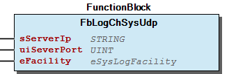 Graphical Interface of FbLogChSysUdp Complete Example for a SysLog This example descripes the declaration of a Logger, a Log-Channel for SysLog and how to handle this components. Also a simple example for configuration of the local syslog server is shown. Hint Since FW 02.06.15 this example configuration exits as default configuration. So there is no need to create or modify any config file at the controller. Since FW 02.08.xx the default log file has moved from /home/log/wago_plc_log.log to /var/log/wago_plc_log.log At first we have a look at the PLC-Code. Config syslog Now we have to create an ASCII-File with the extension ‘ .conf ‘. In this example we prefer the filename ‘ syslog_wago_plc.conf ‘. Since FW 02.06.15 this file already exits at the controller. Since FW 02.08.xx the default log file has moved from /home/log/wago_plc_log.log to /var/log/wago_plc_log.log The content of this file should be You see at destination block is the file ‘ /var/log/wago_plc_log.log ‘ defined as destination for our Log. Important The name at the filter block for programm have to be the same than the channel name in IEC-Code. Now we have to place this file on the controller at folder ‘ /etc/ ‘ with an external ftp-client or we create this file direct at the controller. At last we have to modify the existing file ‘ /etc/syslog-ng.conf ‘ at the controller. We have to insert at the top of the file for reference our additional configuration file. (Since FW 02.06.15 this include already exits) After this we have to restart the controller for activate the additional configuration. - Internal FbLogChSysUdp.protBuildFrame (METH)

## FbLogChSysUdpPid (FB)


| Scope | Name | Type | Initial | Comment | Inherited from |
| --- | --- | --- | --- | --- | --- |
| Input | sServerIp | STRING(20) | ‘127.0.0.1’ | for local server use loppback address 127.0.0.1 | FbLogChSysUdp |
| uiSeverPort | UINT | 514 |  | FbLogChSysUdp |
| eFacility | eSysLogFacility | eSysLogFacility.LOG_LOCAL0 |  | FbLogChSysUdp |

```
VAR
    mySysLogChannel     :   FbLogChSysUdpPid('WAGO'); // This means the local syslog server
END_VAR
```

```
VAR
    mySysLogChannel     :   FbLogChSysUdpPid('WAGO') := (   sServerIp   := '192.168.1.1',   // remote host with the syslog server
                                                            uiSeverPort := 514,             // remote port withe the udp server
                                                            eFacility   := eSysLogFacility.LOG_LOCAL0
                                                        );

END_VAR
```

```
myExampleLogger.writeMsg( 'ExampleClass', eSysLogPriority.LOG_ERR, 'This is my error message');
```

```
VAR
    myExampleLogger     :   FbLogger('WagoExample');    // Logger with the name 'WagoExample' -> this is part of the process name  -> ${PID}
    mySysLogChannel     :   FbLogChSysUdpPid('WAGO');   // Declare the SysLog-Channel with name 'WAGO' -> this is the program name -> ${PROGRAM}
    xIsInit             :   BOOL;
    xLogMessage         :   BOOL;
END_VAR

//--- Register the Log-Channel once ---------------------------------
IF NOT xIsInit THEN // register the Log-Channel at Logger once
    myExampleLogger.RegisterLogChannel( mySysLogChannel );
    xIsInit := TRUE;
END_IF
//-------------------------------------------------------------------

//--- Example for generate a Log-Message --------------------------------------------------------------
IF xLogMessage THEN // Log a Message -> you have to set this variable TRUE for generate a Log-Message

    myExampleLogger.writeMsg( 'ExampleClass', eSysLogPriority.LOG_ERR, 'This is my error message'); // generate a Log-Message

    xLogMessage := FALSE;
END_IF
//------------------------------------------------------------------------------------------------------
```

```
#=== F I L T E R ============================

#--- filter program -------------------------
filter f_program_wago {
    program("WAGO")
};
#--------------------------------------------

#--- filter pid present ---------------------
filter f_pid {"${HOST}${PID}" ne "${HOST}"};
#--------------------------------------------

#--- filter program without pid -------------
filter f_wago_plc {
    filter(f_program_wago) and not filter(f_pid)
};
#--------------------------------------------

#--- filter program with pid ----------------
filter f_wago_plc_pid {
    filter(f_program_wago) and filter(f_pid)
};
#--------------------------------------------
#============================================

#=== T E M P L A T E S =====================================================

#--- without pid -----------------------------------------------------------
template t_wago_plc_sys_log {
    template("${DATE}	${LEVEL}	[${PROGRAM}]${MSGONLY}
");
};
#---------------------------------------------------------------------------

#--- new template for messages with pid ------------------------------------
template t_wago_plc_sys_log_pid {
    template("${YEAR}/${MONTH}/${DAY} ${HOUR}:${MIN}:${SEC}	${LEVEL}	${PROGRAM}	${PID}	${MSGONLY}
");
};
#---------------------------------------------------------------------------
#===========================================================================

#=== D E S T I N A T I O N S ===============================================

#--- destination without pid -----------------------------------------------
destination d_wago_plc {
    file( "/var/log/wago_plc_log.log"
          owner(www)
          group(www)
          perm(0644)
          dir_perm(0711)
          create_dirs(yes)
          template(t_wago_plc_sys_log)
        );
};
#---------------------------------------------------------------------------

#--- destination with pid --------------------------------------------------
destination d_wago_plc_pid {
    file( "/var/log/wago_plc_log_pid.log"
          owner(www)
          group(www)
          perm(0644)
          dir_perm(0711)
          create_dirs(yes)
          template(t_wago_plc_sys_log_pid)
        );
};
#---------------------------------------------------------------------------
#===========================================================================

#=== L O G S =============================
#--- log without pid ----------
log {
    source(s_udp);
    filter(f_wago_plc);
    destination(d_wago_plc);
};
#------------------------------

#--- log with pid --------------
log {
    source(s_udp);
    filter(f_wago_plc_pid);
    destination(d_wago_plc_pid);
};
#------------------------------
#=========================================
```

```
@version: 3.3
@include "/etc/syslog_wago_plc.conf"
```

This log-channel is for put Log-Messages to the linux syslog-ng server. The server have to support the udp protocol. The syslog server may be a accessible remote server at the network.

At declaration you have to assign a channel name at the constructor. This name will be the Program-Name ( ${PROGRAM} ) at syslog configuration.

No additional characters are allowed. This is a restriction of syslog.

This channel logs the loggername and the given class name as pid ( ${PID} ) so you can separate this informations at the logfile.

The default logfile defined at the example configuration is /var/log/wago_plc_log_pid.log

Simple Example

Simple declaration of mySysLogChannel with the name WAGO .

Advanced Example

Advanced declaration of mySysLogChannel with the name WAGO and some parameters for a remote syslog server.

If you want to use the example syslog configuration you should use the name WAGO for the channel. In this case you can find your log-file at /home/log/wago_plc_log_pid.log

Graphical Illustration

Graphical Interface of FbLogChSysUdpPid

Complete Example for a SysLog

This example descripes the declaration of a Logger, a Log-Channel for SysLog and how to handle this components. Also a simple example for configuration of the local syslog server is shown. In this example the logger becomes the logger name WagoExample by the constructor. The name of this channel is defined as WAGO by the constructor. The example iec code for write a log entry is

The Log-Output for this example should be

For this result you have to modify the default syslog configuration like the example below.

At first we have a look at the PLC-Code.

Config syslog

The content of this file should be

You see at destination block is the file ‘ /var/log/wago_plc_log_pid.log ‘ defined as destination for our Log.

The name at the filter block for programm have to be the same than the channel name in IEC-Code.

Now we have to place this file on the controller at folder ‘ /etc/ ‘ with an external ftp-client or we create this file direct at the controller. At last we have to modify the existing file ‘ /etc/syslog-ng.conf ‘ at the controller. We have to insert at the top of the file

for reference our additional configuration file. After this we have to restart the controller for activate the additional configuration.

Interface variables Function This log-channel is for put Log-Messages to the linux syslog-ng server. The server have to support the udp protocol. The syslog server may be a accessible remote server at the network. At declaration you have to assign a channel name at the constructor. This name will be the Program-Name ( ${PROGRAM} ) at syslog configuration. Important For this name are only alphanumeric characters allowed. No additional characters are allowed. This is a restriction of syslog. This channel logs the loggername and the given class name as pid ( ${PID} ) so you can separate this informations at the logfile. Hint The default logfile defined at the example configuration is /var/log/wago_plc_log_pid.log Hint For use this channel you have to register it at one or more logger(s). For more information see FbLogger.RegisterLogChannel or read the documentation of the LoggerManager Simple Example Simple declaration of mySysLogChannel with the name WAGO . Advanced Example Advanced declaration of mySysLogChannel with the name WAGO and some parameters for a remote syslog server. Tip If you want to use the example syslog configuration you should use the name WAGO for the channel. In this case you can find your log-file at /home/log/wago_plc_log_pid.log Graphical Illustration 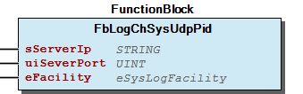 Graphical Interface of FbLogChSysUdpPid Complete Example for a SysLog This example descripes the declaration of a Logger, a Log-Channel for SysLog and how to handle this components. Also a simple example for configuration of the local syslog server is shown. In this example the logger becomes the logger name WagoExample by the constructor. The name of this channel is defined as WAGO by the constructor. The example iec code for write a log entry is The Log-Output for this example should be ‘2021/10/14 07:03:51 err WAGO WagoExample.ExampleClass This is my error message’ Note For this result you have to modify the default syslog configuration like the example below. At first we have a look at the PLC-Code. Config syslog Now we have to create an ASCII-File with the extension ‘ .conf ‘. In this example we prefer the filename ‘ syslog_wago_plc.conf ‘. The content of this file should be You see at destination block is the file ‘ /var/log/wago_plc_log_pid.log ‘ defined as destination for our Log. Important The name at the filter block for programm have to be the same than the channel name in IEC-Code. Now we have to place this file on the controller at folder ‘ /etc/ ‘ with an external ftp-client or we create this file direct at the controller. At last we have to modify the existing file ‘ /etc/syslog-ng.conf ‘ at the controller. We have to insert at the top of the file for reference our additional configuration file. After this we have to restart the controller for activate the additional configuration. - Internal FbLogChSysUdpPid.protBuildFrame (METH)

## FbLogger (FB)


| Scope | Name | Type |
| --- | --- | --- |
| Output | oStatus | WagoSysErrorBase.FbResult |

```
VAR_GLOBAL
    myStepperLogger     :   FbLogger('WagoAppStepper'); // My logger with the name 'WagoAppStepper'
END_VAR
```

The main task of the logger is to offer some methods for generate Log-Messages. So the logger offers a method to generate Log-Messages from a simple Text-Message and also the logger provide a method for logging status objects derivated from FbResult. All these methods starts with the item write...() . The logger accept all these messages and in case that one or more Log-Channel(s) are registered at the logger it generates a well formed log message and redirect this message to all registered Log-Channels. If there is no channel registered all messages are ignored.

You may have many loggers in a project. At declaration you have to assign a logger name at the constructor.

Each logger should have a unique name.

Simple declaration of myStepperLogger with the name WagoAppStepper .

Graphical Illustration

Graphical Interface of FbLogger

Interface variables Function The main task of the logger is to offer some methods for generate Log-Messages. So the logger offers a method to generate Log-Messages from a simple Text-Message and also the logger provide a method for logging status objects derivated from FbResult. All these methods starts with the item write...() . The logger accept all these messages and in case that one or more Log-Channel(s) are registered at the logger it generates a well formed log message and redirect this message to all registered Log-Channels. If there is no channel registered all messages are ignored. You may have many loggers in a project. At declaration you have to assign a logger name at the constructor. Note Each logger should have a unique name. Example Simple declaration of myStepperLogger with the name WagoAppStepper . Graphical Illustration 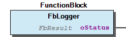 Graphical Interface of FbLogger - Private FbLogger.checkFilter (METH) FbLogger.RegisterLogChannel (METH) FbLogger.UnRegisterLogChannel (METH) FbLogger.writeHexDump (METH) FbLogger.writeMsg (METH) FbLogger.writeStatusObject (METH)

### Methods


## FbComportLogger.setClassName (METH)


| Scope | Name | Type |
| --- | --- | --- |
| Return | setClassName | STRING(LogParameter.MAX_CMP_NAME_LEN) |
| Input | sClassName | STRING(LogParameter.MAX_CMP_NAME_LEN) |

Graphical Illustration

Graphical Interface of FbComportLogger.setClassName

Interface variables Function Set the name of the class. Graphical Illustration 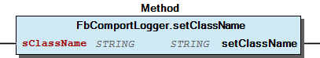 Graphical Interface of FbComportLogger.setClassName

## FbComportLogger.setLoggerName (METH)


| Scope | Name | Type |
| --- | --- | --- |
| Return | setLoggerName | STRING(LogParameter.MAX_CMP_NAME_LEN) |
| Input | sLoggerName | STRING(LogParameter.MAX_CMP_NAME_LEN) |

Graphical Illustration

Graphical Interface of FbComportLogger.setLoggerName

Interface variables Function Set the name of the logger. Graphical Illustration 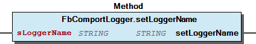 Graphical Interface of FbComportLogger.setLoggerName

## FbLogChSysUdp.protBuildFrame (METH)


| Scope | Name | Type | Comment |
| --- | --- | --- | --- |
| Return | protBuildFrame | BOOL |  |
| Inout Const | sLoggerName | STRING(LogParameter.MAX_CMP_NAME_LEN) | Ident -> logger name |
| sClassName | STRING(LogParameter.MAX_CMP_NAME_LEN) |  |
| Input | ePriority | eSysLogPriority |  |
| Inout Const | sMessage | STRING(LogParameter.MAX_LOG_MSG_LEN) |  |
| Inout | sFrame | STRING(255) |  |

## FbLogChSysUdpPid.protBuildFrame (METH)


| Scope | Name | Type | Comment |
| --- | --- | --- | --- |
| Return | protBuildFrame | BOOL |  |
| Inout Const | sLoggerName | STRING(LogParameter.MAX_CMP_NAME_LEN) | Ident -> logger name |
| sClassName | STRING(LogParameter.MAX_CMP_NAME_LEN) |  |
| Input | ePriority | eSysLogPriority |  |
| Inout Const | sMessage | STRING(LogParameter.MAX_LOG_MSG_LEN) |  |
| Inout | sFrame | STRING(255) |  |

## FbLogger.RegisterLogChannel (METH)


| Scope | Name | Type |
| --- | --- | --- |
| Return | RegisterLogChannel | BOOL |
| Input | I_Log | I_LogChannel |

| Value | Description |
| --- | --- |
| TRUE | successful registration |
| FALSE | registration failed |

```
VAR
    myStepperLogger     :   FbLogger('WagoAppStepper'); // My logger with the name 'WagoAppStepper'
    mySysLogChannel     :   FbLogChSysUdp('WAGO'); // This means the local syslog server
    xIsInit             :   BOOL;
END_VAR

IF NOT xIsInit THEN
    myStepperLogger.RegisterLogChannel(mySysLogChannel); // register the channel once
    xIsInit := TRUE;
END_IF
```

This method register the given Log-Channel at this logger. It is possible to register max. 5 Log-Channels at each logger. If you need more you have to modify the Parameter MAX_LOG_CHANNELS.

After successful registration all Log-Messages are given to the Log-Channel.

Graphical Illustration

Graphical Interface of FbLogger.RegisterLogChannel

Simple declaration of myStepperLogger with the name WagoAppStepper and a Log-Channel myLogChannel with the name WAGO .

Interface variables Function This method register the given Log-Channel at this logger. It is possible to register max. 5 Log-Channels at each logger. If you need more you have to modify the Parameter MAX_LOG_CHANNELS. After successful registration all Log-Messages are given to the Log-Channel. Return Value Graphical Illustration 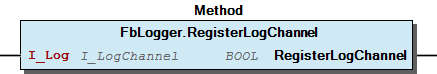 Graphical Interface of FbLogger.RegisterLogChannel Example Simple declaration of myStepperLogger with the name WagoAppStepper and a Log-Channel myLogChannel with the name WAGO .

## FbLogger.UnRegisterLogChannel (METH)


| Scope | Name | Type |
| --- | --- | --- |
| Return | UnRegisterLogChannel | BOOL |
| Input | I_Log | I_LogChannel |

Graphical Illustration

Graphical Interface of FbLogger.UnRegisterLogChannel

Interface variables Function This method unregister the given Log-Channel from this logger. Graphical Illustration 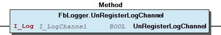 Graphical Interface of FbLogger.UnRegisterLogChannel

## FbLogger.checkFilter (METH)


| Scope | Name | Type | Comment |
| --- | --- | --- | --- |
| Return | checkFilter | BOOL |  |
| Inout Const | sClassName | STRING(LogParameter.MAX_CMP_NAME_LEN) | The name of your class that generates this log message |
| Input | ePriority | eSysLogPriority | The priority of this message |

## FbLogger.writeHexDump (METH)


| Scope | Name | Type | Comment |
| --- | --- | --- | --- |
| Return | writeHexDump | BOOL |  |
| Inout Const | sClassName | STRING(LogParameter.MAX_CMP_NAME_LEN) | The name of your class that generates this log message |
| Input | ePriority | eSysLogPriority | The priority of this message |
| Inout Const | sMessage | STRING(LogParameter.MAX_PREFIX_DUMP_MSG_LEN) | Prefix message before each line of the dump |
| Input | pData | POINTER TO BYTE | Address of the data for the dump |
| usiNBytes | USINT | Quantity of bytes for the dump |

| Value | Description |
| --- | --- |
| TRUE | successful written to one or more channel(s) |
| FALSE | the message is rejected -> may be there is no registered channel |

```
VAR
    myStepperLogger :   FbLogger('WagoAppStepper'); // My logger with the name 'WagoAppStepper'
    myData          :   ARRAY[0..255] OF BYTE;
    usiNBytes       :   USINT := 32;            // Quantity of bytes for the hex dump
END_VAR

myStepperLogger.writeHexDump(   'FbStepper',                // Class Name
                                eSysLogPriority.LOG_DEBUG,  // Priority
                                'myHexdump ->',             // Prefix message before each line of the dump
                                ADR(myData),
                                usiNBytes                   // Quantity of bytes for the hex dump
                            );
```

Generates a well formed log message from the given message and a hex dump from the given data. This message is send to all registered Log-Channels

Return Value

Graphical Illustration

Graphical Interface of FbLogger.writeHexDump

This Example declares the logger myStepperLogger and generates a Log-Message with a hexdump

Interface variables Function Generates a well formed log message from the given message and a hex dump from the given data. This message is send to all registered Log-Channels Return Value Graphical Illustration 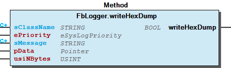 Graphical Interface of FbLogger.writeHexDump Example This Example declares the logger myStepperLogger and generates a Log-Message with a hexdump

## FbLogger.writeMsg (METH)


| Scope | Name | Type | Comment |
| --- | --- | --- | --- |
| Return | writeMsg | BOOL |  |
| Inout Const | sClassName | STRING(LogParameter.MAX_CMP_NAME_LEN) | The name of your class that generates this log message |
| Input | ePriority | eSysLogPriority | The priority of this message |
| Inout Const | sMessage | STRING(LogParameter.MAX_LOG_MSG_LEN) | Message as string |

| Value | Description |
| --- | --- |
| TRUE | successful written to one or more channel(s) |
| FALSE | the message is rejected -> may be there is no registered channel |

```
VAR
    myStepperLogger     :   FbLogger('WagoAppStepper'); // My logger with the name 'WagoAppStepper'
END_VAR

myStepperLogger.writeMsg(   'FbStepper',                // Class Name
                            eSysLogPriority.LOG_INFO,   // Priority
                            'Drive is in position'      // Message
                        );
```

Generates a well formed log message from the given message and redirect this message to all registered Log-Channels

Return Value

Graphical Illustration

Graphical Interface of FbLogger.writeMsg

This Example declares the logger myStepperLogger and generates a Log-Message.

Interface variables Function Generates a well formed log message from the given message and redirect this message to all registered Log-Channels Return Value Graphical Illustration 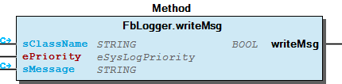 Graphical Interface of FbLogger.writeMsg Example This Example declares the logger myStepperLogger and generates a Log-Message.

## FbLogger.writeStatusObject (METH)


| Scope | Name | Type | Comment |
| --- | --- | --- | --- |
| Return | writeStatusObject | BOOL |  |
| Inout Const | sClassName | STRING(LogParameter.MAX_CMP_NAME_LEN) |  |
| Input | IResult | WagoTypesErrorBase.I_Result | interface of status object |

| Value | Description |
| --- | --- |
| TRUE | successful written to one or more channel(s) |
| FALSE | the message is rejected -> may be there is no registered channel |

```
VAR
    myStepperLogger     :   FbLogger('WagoAppStepper'); // My logger with the name 'WagoAppStepper'
END_VAR

myStepperLogger.writeStatusObject(  'FbStepper', // Class Name
                                    oStatus      // Status object
                                 );
```

Generates a well formed log message from the given status object and redirect this message to all registered Log-Channels

Return Value

Graphical Illustration

Graphical Interface of FbLogger.writeStatusObject

This Example declares the logger myStepperLogger and generates a Log-Message.

Interface variables Function Generates a well formed log message from the given status object and redirect this message to all registered Log-Channels Return Value Graphical Illustration 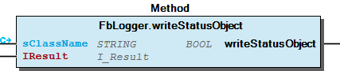 Graphical Interface of FbLogger.writeStatusObject Example This Example declares the logger myStepperLogger and generates a Log-Message.

## LoggerManager.RegisterLogChannelByLoggerName (METH)


| Scope | Name | Type |
| --- | --- | --- |
| Return | RegisterLogChannelByLoggerName | BOOL |
| Input | ILogChannel | I_LogChannel |
| sPattern | STRING |

| Example | Description |
| --- | --- |
| 'WagoSysDali' | Exact this logger |
| 'WagoApp*' | All loggers that names starts with ‘WagoApp’. The rest of the name is ignored. |
| '*' | Register at all Loggers in the project |

Register a Log-Channel at all loggers in the project where the component name (logger name) match the given pattern.

The pattern will NOT case sensitive interpreted

Some examples for pattern

‘?’ and ‘*’ are allowed as wildcards

Graphical Illustration

Graphical Interface of LoggerManager.RegisterLogChannelByLoggerName

Interface variables Function Register a Log-Channel at all loggers in the project where the component name (logger name) match the given pattern. Hint The pattern will NOT case sensitive interpreted Some examples for pattern ‘?’ and ‘*’ are allowed as wildcards Graphical Illustration 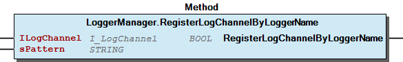 Graphical Interface of LoggerManager.RegisterLogChannelByLoggerName

## LoggerManager.UnRegisterLogChannelByLoggerName (METH)


| Scope | Name | Type |
| --- | --- | --- |
| Return | UnRegisterLogChannelByLoggerName | BOOL |
| Input | ILogChannel | I_LogChannel |
| sPattern | STRING |

| Example | Description |
| --- | --- |
| 'WagoSysDali' | Exact this logger |
| 'WagoApp*' | All loggers that names starts with ‘WagoApp’. The rest of the name is ignored. |
| '*' | Register at all Loggers in the project |

Unregister the given logger from all other logger in the project where the component name (logger name) match the given pattern. If you want do unregister from all loggers use ‘*’ as pattern.

The pattern will NOT case sensitive interpreted

Some examples for pattern

‘?’ and ‘*’ are allowed as wildcards

Graphical Illustration

Graphical Interface of LoggerManager.UnRegisterLogChannelByLoggerName

Interface variables Function Unregister the given logger from all other logger in the project where the component name (logger name) match the given pattern. If you want do unregister from all loggers use ‘*’ as pattern. Hint The pattern will NOT case sensitive interpreted Some examples for pattern ‘?’ and ‘*’ are allowed as wildcards Graphical Illustration 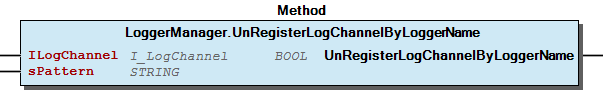 Graphical Interface of LoggerManager.UnRegisterLogChannelByLoggerName

## LoggerManager.setClassFilterPatternByLoggerName (METH)


| Scope | Name | Type | Comment |
| --- | --- | --- | --- |
| Return | setClassFilterPatternByLoggerName | BOOL |  |
| Input | sClassFilterPattern | STRING(LogParameter.MAX_CMP_NAME_LEN) | pattern like ‘Fb???XY*’ |
| sLoggerNamePattern | STRING |  |

| Example | Description |
| --- | --- |
| 'FbStepper' | Log exact this class only |
| 'FbDali*' | Log all classes where the name starts with ‘FbDali’. The rest of the name is ignored. |
| '*' or '' | No class filter is set -> each class allowed |

| Example | Description |
| --- | --- |
| 'WagoSysDali' | Exact this logger |
| 'WagoApp*' | All loggers that names starts with ‘WagoApp’. The rest of the name is ignored. |
| '*' | Register at all Loggers in the project |

Set a filter pattern sClassFilterPattern at all loggers in the project where the component name (logger name) match the given name pattern sLoggerNamePattern .

The pattern will NOT case sensitive interpreted

Some examples for filter pattern

‘?’ and ‘*’ are allowed as wildcards

Some examples for name pattern

‘?’ and ‘*’ are allowed as wildcards

Graphical Illustration

Graphical Interface of LoggerManager.setClassFilterPatternByLoggerName

Interface variables Function Set a filter pattern sClassFilterPattern at all loggers in the project where the component name (logger name) match the given name pattern sLoggerNamePattern . Hint The pattern will NOT case sensitive interpreted Some examples for filter pattern ‘?’ and ‘*’ are allowed as wildcards Some examples for name pattern ‘?’ and ‘*’ are allowed as wildcards Graphical Illustration 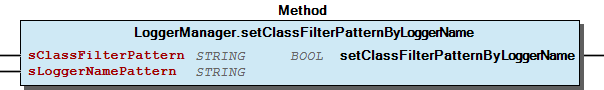 Graphical Interface of LoggerManager.setClassFilterPatternByLoggerName

## LoggerManager.setPriorityFilterMaskByLoggerName (METH)


| Scope | Name | Type |
| --- | --- | --- |
| Return | setPriorityFilterMaskByLoggerName | BOOL |
| Input | bFilterMask | BYTE |
| sLoggerNamePattern | STRING |

| Example | Description |
| --- | --- |
| 'WagoSysDali' | Exact this logger |
| 'WagoApp*' | All loggers that names starts with ‘WagoApp’. The rest of the name is ignored. |
| '*' | Register at all Loggers in the project |

```
LoggerManager.setPriorityFilterMaskByLoggerName(LOGGER_MASK.LOG_ALERT OR LOGGER_MASK.LOG_DEBUG, '*');
```

Set a priority filter mask bFilterMask at all loggers in the project where the component name (logger name) match the given name pattern sLoggerNamePattern .

The filter mask is bit coded. This means each bit represents one level. It is allowed to set more than one bit. You may use the constant values that are defined at WagoTypesLog.LOGGER_MASK . It is possible to combine different values with the OR operator.

The logger name pattern will NOT case sensitive interpreted

Some examples for name pattern

‘?’ and ‘*’ are allowed as wildcards

Graphical Illustration

Graphical Interface of LoggerManager.setPriorityFilterMaskByLoggerName

Set for all loggers at the project the priority filter to LOG_ALERT OR LOG_DEBUG. So only alert and debug messages are logged.

Interface variables Function Set a priority filter mask bFilterMask at all loggers in the project where the component name (logger name) match the given name pattern sLoggerNamePattern . The filter mask is bit coded. This means each bit represents one level. It is allowed to set more than one bit. You may use the constant values that are defined at WagoTypesLog.LOGGER_MASK . It is possible to combine different values with the OR operator. Hint The logger name pattern will NOT case sensitive interpreted Some examples for name pattern ‘?’ and ‘*’ are allowed as wildcards Graphical Illustration 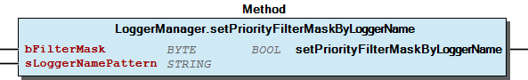 Graphical Interface of LoggerManager.setPriorityFilterMaskByLoggerName Example Set for all loggers at the project the priority filter to LOG_ALERT OR LOG_DEBUG. So only alert and debug messages are logged.

### Program Organization


## 20 Program Organization Units


| FbLogChIde | Put the messages to the IDE-Logger |
| FbLogChSysUdp | Put the messages to a syslog udp server |

```
VAR_GLOBAL
    myUserLogger    :   FbLogger('UserLogger'); // My logger with the name 'UserLogger'
END_VAR
```

```
myUserLogger.writeMsg(  'FbUser',                   // Class Name
                        eSysLogPriority.LOG_ERR,    // Priority
                        'An user error is occured'  // Message
                    );
```

```
VAR_GLOBAL
    myIdeChannel    :   FbLogChIde('UserChannel'); // My IDE-Channel with the name 'UserChannel'
END_VAR

myUserLogger.RegisterLogChannel( myIdeChannel );
```

System description

This Libray offers function blocks for logging error and status messages. It is no goal to log process values. The destinataion of these log messages may be the linux syslog-ng on the local system or remote at another computer / controller at the network. Also the IDE-Logger is a possible destination. Other destinations are thinkable and can be implemented by the user. Up to 5 destinations at the same time are possible. If you need more you have to modify the Parameter MAX_LOG_CHANNELS.

Base of this logsystem is the FbLogger . If you want to use this logsystem you have to declare one instance of FbLogger like

inside your project or your library.

The name ‘UserLogger’ should be unique for all loggers in your project and the used libraries.

After this you can generate a log message inside your program code with a write...() method of this logger instance.

This message is given to the logger and the logger reject this message because there is no listener (Log-Channel) registered at this logger. Nobody is interesting for it.

To put this message to a destination we need an instance of a Log-Channel and we must register this instance as listener to the logger.

Declare a Log-Channel

Inside this libray you can find two kinds of Log-Channel.

At first we create an instance of a Log-Channel and register it at myUserLogger

From now all log messages from myUserLogger are directed to the IDE-Logger.

You will find another Logger-Entry with the name ‘UserChannel’ inside the drop-down-box of the IDE-Logger.

System description This Libray offers function blocks for logging error and status messages. It is no goal to log process values. The destinataion of these log messages may be the linux syslog-ng on the local system or remote at another computer / controller at the network. Also the IDE-Logger is a possible destination. Other destinations are thinkable and can be implemented by the user. Up to 5 destinations at the same time are possible. If you need more you have to modify the Parameter MAX_LOG_CHANNELS. Base of this logsystem is the FbLogger . If you want to use this logsystem you have to declare one instance of FbLogger like inside your project or your library. Note The name ‘UserLogger’ should be unique for all loggers in your project and the used libraries. After this you can generate a log message inside your program code with a write...() method of this logger instance. This message is given to the logger and the logger reject this message because there is no listener (Log-Channel) registered at this logger. Nobody is interesting for it. To put this message to a destination we need an instance of a Log-Channel and we must register this instance as listener to the logger. Declare a Log-Channel Inside this libray you can find two kinds of Log-Channel. At first we create an instance of a Log-Channel and register it at myUserLogger From now all log messages from myUserLogger are directed to the IDE-Logger. Note You will find another Logger-Entry with the name ‘UserChannel’ inside the drop-down-box of the IDE-Logger. - FbComportLogger (FB) FbComportLogger.setClassName (METH) - FbComportLogger.setLoggerName (METH) FbLogger (FB) - Private FbLogger.checkFilter (METH) FbLogger.RegisterLogChannel (METH) FbLogger.UnRegisterLogChannel (METH) FbLogger.writeHexDump (METH) FbLogger.writeMsg (METH) FbLogger.writeStatusObject (METH) LogChannels - FbLogChIde (FB) - FbLogChSysUdp (FB) Internal FbLogChSysUdp.protBuildFrame (METH) FbLogChSysUdpPid (FB) - Internal FbLogChSysUdpPid.protBuildFrame (METH) eLogChannel (ENUM) LoggerManager (PRG) - LoggerManager.RegisterLogChannelByLoggerName (METH) - LoggerManager.UnRegisterLogChannelByLoggerName (METH) - LoggerManager.setClassFilterPatternByLoggerName (METH) - LoggerManager.setPriorityFilterMaskByLoggerName (METH)

### Internal Components


## Internal ¶


- FbLogChSysUdp.protBuildFrame (METH)

## Internal ¶


- FbLogChSysUdpPid.protBuildFrame (METH)

### Global Variable Lists


## ErrorLog (GVL)


| Scope | Name | Type |
| --- | --- | --- |
| Constant | ERROR | ARRAY [0..5] OF WagoTypesErrorBase.typResultItem |

| Value | Level | Description |
| --- | --- | --- |
| eLogError.OK | WagoSysErrorBase.eSeverity.none | ‘OK’ |
| eLogError.NO_CHANNEL | WagoSysErrorBase.eSeverity.info | ‘No Log-Channel registered’ |
| eLogError.CHANNEL_ERROR | WagoSysErrorBase.eSeverity.warning | ‘One or more Log-Channels have a problem’ |
| eLogError.CH_PRM_INVALID | WagoSysErrorBase.eSeverity.error | ‘Invalid input parameter’ |
| eLogError.CH_FIFO_FULL | WagoSysErrorBase.eSeverity.error | ‘File fifo buffer full’ |
| eLogError.CH_FIFO_NO_DATA | WagoSysErrorBase.eSeverity.info | ‘No data available’ |

## VersionHistory (GVL)


| Name | Type |
| --- | --- |
| Info | ProjectInfo |

| date | version | author | change |
| 02.09.2024 | 1.0.2.5 | u0125824 | WagoTypes Libraries “Make All IEC Symbols Visible in the Project” |
| 07.02.2024 | 1.0.2.4 | u010663 | compiled SP16.3 |
| 06.09.2023 | 1.0.2.3 | u0103719 | update library property in WagoTypesLog “only allow qualified access to all identifiers” |
| 26.01.2022 | 1.0.2.2 | u010545 | update FbComportLogger -> Hexdump > 255 Byte |
| 26.01.2022 | 1.0.2.1 | u010545 | update doku |
| 12.03.2021 | 1.0.2.0 | u010545 | additional channel (FbLogChSysUdpPid) for syslog created |
| 12.03.2021 | 1.0.2.0 | u010545 | additional channel (FbLogChSysUdpPid) for syslog created |
| 11.02.2021 | 1.0.1.6 | u010545 | Comport Logger -> setLoggerName(), setClassName() added |
| 07.12.2020 | 1.0.1.4 | u010545 | Bugfix IDE Channel / Comport Logger added |
| 24.11.2020 | 1.0.1.3 | u010545 | Bugfix writeHexDump |
| 03.09.2020 | 1.0.1.2 | u013972 | Change source of RTS_INVALID_HANDLE |
| 14.06.2018 | 1.0.0.4 | u010545 | bugfix LogMsg() |
| 08.08.2017 | 1.0.0.3 | u010545 | documentation update |
| 02.02.2017 | 1.0.0.2 | u010545 | documentation update |
| 14.12.2016 | 1.0.0.1 | u010545 | writeHexDump() implemented, Filter implemented |
| 13.12.2016 | 1.0.0.0 | u010545 | first release |

### Other Components


## 80 Status ¶


- ErrorLog (GVL) - eLogError (ENUM)

## LogChannels


Function A Log-Channel gets Log-Messages from one or more logger(s) and puts it to his destination. Normaly you need for each destination a Log-Channel. A desination may be the IDE-Logger or a syslog-server. Other destinations are thinkable and can be implemented by the user. For this the user have to create his own Channel-FB and to implement the interface WagoTypesLog.I_LogChannel . - FbLogChIde (FB) - FbLogChSysUdp (FB) Internal FbLogChSysUdp.protBuildFrame (METH) FbLogChSysUdpPid (FB) - Internal FbLogChSysUdpPid.protBuildFrame (METH) eLogChannel (ENUM)

## LoggerManager (PRG)


Each instance of a logger register itself while the init process at the Logger-Manager. The Logger-Manager holds internal a list with the references and the names of each logger. The Logger-Manager is able to handle up to 100 logger instances. In case of more instances you have to modify the Parameter MAX_LOGGER.

On the other side the Logger-Manager provides the method RegisterLogChannelByLoggerName(..). This method allow you to register a Log-Channel for a set of loggers.

Also the Logger-Manager provides nethodes to set filter for a set of loggers. Each logger use its own filters.

It is possible to set class filter defined by a pattern and it is possible to set priority filter to log messages at defined priority only.

Function Each instance of a logger register itself while the init process at the Logger-Manager. The Logger-Manager holds internal a list with the references and the names of each logger. The Logger-Manager is able to handle up to 100 logger instances. In case of more instances you have to modify the Parameter MAX_LOGGER. On the other side the Logger-Manager provides the method RegisterLogChannelByLoggerName(..). This method allow you to register a Log-Channel for a set of loggers. Also the Logger-Manager provides nethodes to set filter for a set of loggers. Each logger use its own filters. It is possible to set class filter defined by a pattern and it is possible to set priority filter to log messages at defined priority only. - LoggerManager.RegisterLogChannelByLoggerName (METH) - LoggerManager.UnRegisterLogChannelByLoggerName (METH) - LoggerManager.setClassFilterPatternByLoggerName (METH) - LoggerManager.setPriorityFilterMaskByLoggerName (METH)

## Parameter (PARAMS)


| Scope | Name | Type | Initial | Comment |
| --- | --- | --- | --- | --- |
| Constant | MAX_LOGGER | UINT | 100 | max. quantity for Instances of FbLogger |
| MAX_LOG_CHANNELS | USINT | 5 | max. quantity of Log-Channels that can be registered at each logger instance |

## Private ¶


- FbLogger.checkFilter (METH)

## eLogChannel (ENUM)


| Name | Initial |
| --- | --- |
| IDE | 16#1 |
| SYSLOG | 16#2 |

Attributes: qualified_only InOut:

## eLogError (ENUM)


| Name | Initial | Comment |
| --- | --- | --- |
| OK | 0 | all ok |
| NO_CHANNEL | 1 | no channel registered |
| CHANNEL_ERROR | 2 | one or more channels have a problem |
| CH_PRM_INVALID | 10 | invalid input parameter(s) |
| CH_FIFO_FULL | 11 | fifo buffer full |
| CH_FIFO_NO_DATA | 12 | fifo no data available |