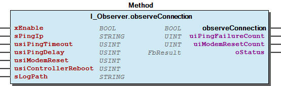

# WagoSysModem v2.0.1.4 (WAGO) - Complete Documentation


## 📋 Library Information

- **Company:** WAGO
- **Title:** WagoSysModem
- **Version:** 2.0.1.4
- **Categories:** WAGO FunctionalView|Connectivity|FieldBus; WAGO LayerView|Sys; Application
- **Namespace:** WagoSysModem
- **Author:** WAGO / u01045
- **Placeholder:** WagoSysModem

### Description ¶


This document is automatically generated.

If you include this library to your project it exists automatically an object named Modem .

This object offers all possible access to the integrated 4G modem of the 8217.

This document is automatically generated. If you include this library to your project it exists automatically an object named Modem . This object offers all possible access to the integrated 4G modem of the 8217.

### Contents: ¶


Contents: - Documentation Index 10 Documentation - WagoSysModem Library Documentation Project Information Library Information Function Blocks - doc01_Foreword (FB) - doc10_Use_of_the_Library (FB) - doc99_Attachment (FB) Functions Methods - I_Modem.IWdsSettings (PROP) - I_Modem.SmsReceive (METH) - I_Modem.SmsSend (METH) - I_Modem.reset (METH) - I_NetworkRegistration.setNetworkRegistration (METH) - I_Observer.observeConnection (METH) - I_Sim.setSimPin (METH) - I_Sim.setSimPuk (METH) - I_WdsSettings.eAuthType (PROP) - I_WdsSettings.sApn (PROP) - ... and 6 more Interfaces - I_Modem (ITF) - I_ModemBase (ITF) - I_ModemDeviceInfo (ITF) - I_Network (ITF) - I_NetworkAccessInfo (ITF) - I_NetworkRegistration (ITF) - I_Observer (ITF) - I_Sim (ITF) - I_WdsInfo (ITF) - I_WdsSettings (ITF) Program Organization Base Components - I_ModemBase.eResult (PROP) - I_ModemBase.sResultText (PROP) - I_ModemBase.xUpdateInfo (PROP) Internal Components Global Variable Lists - ErrorModem (GVL) - Modem (GVL) - SMS_CONSTANT (GVL) - VersionHistory (GVL) Other Components - 10 ModemDaemon - 80 Status - Data Types (GSM) - Enum - GlobalTextList (Text List) - I_Modem.IModem (PROP) - I_Modem.INetwork (PROP) - I_Modem.IObserver (PROP) - I_Modem.ISim (PROP) - I_Modem.IWdsInfo (PROP) - ... and 40 more

### Indices and tables ¶


Based on WagoSysModem.library, last modified 20.09.2024, 22:13:03. LibDoc 3.5.16.10

© WAGO GmbH & Co. KG, Germany 2018 – All rights reserved. For the avoidance of doubt, this copyright notice does not only apply to the information above but also and primarily to the described library itself. Please note that third-party products are always mentioned without reference to intellectual property rights, including patents, utility models, designs and trademarks, accordingly the existence of such rights cannot be excluded. WAGO is a registered trademark of WAGO Verwaltungsgesellschaft mbH.

- File and Project Information - Library Reference Based on WagoSysModem.library, last modified 20.09.2024, 22:13:03. LibDoc 3.5.16.10 © WAGO GmbH & Co. KG, Germany 2018 – All rights reserved. For the avoidance of doubt, this copyright notice does not only apply to the information above but also and primarily to the described library itself. Please note that third-party products are always mentioned without reference to intellectual property rights, including patents, utility models, designs and trademarks, accordingly the existence of such rights cannot be excluded. WAGO is a registered trademark of WAGO Verwaltungsgesellschaft mbH.

### Documentation Index


## 10 Documentation


- doc01_Foreword (FB) - doc10_Use_of_the_Library (FB) - doc99_Attachment (FB)

## WagoSysModem Library Documentation


| Company: | WAGO |
| Title: | WagoSysModem |
| Version: | 2.0.1.4 |
| Categories: | WAGO FunctionalView\|Connectivity\|FieldBus; WAGO LayerView\|Sys; Application |
| Namespace: | WagoSysModem |
| Author: | WAGO / u01045 |
| Placeholder: | WagoSysModem |

### Description


This document is automatically generated.

If you include this library to your project it exists automatically an object named Modem .

This object offers all possible access to the integrated 4G modem of the 8217.

This document is automatically generated. If you include this library to your project it exists automatically an object named Modem . This object offers all possible access to the integrated 4G modem of the 8217.

### Contents:


- 10 Documentation doc01_Foreword (FB) - doc10_Use_of_the_Library (FB) - doc99_Attachment (FB) 20 Program Organization Units - Data Types (GSM) - Enum - Interfaces 80 Status - ErrorModem (GVL) - eErrorModem (ENUM) 90 Internal - 10 ModemDaemon GlobalTextList (Text List) Modem (GVL) ParameterSysModem (PARAMS) VersionHistory (GVL)

### Indices and tables


Based on WagoSysModem.library, last modified 20.09.2024, 22:13:03. LibDoc 3.5.16.10

© WAGO GmbH & Co. KG, Germany 2018 – All rights reserved. For the avoidance of doubt, this copyright notice does not only apply to the information above but also and primarily to the described library itself. Please note that third-party products are always mentioned without reference to intellectual property rights, including patents, utility models, designs and trademarks, accordingly the existence of such rights cannot be excluded. WAGO is a registered trademark of WAGO Verwaltungsgesellschaft mbH.

- File and Project Information - Library Reference Based on WagoSysModem.library, last modified 20.09.2024, 22:13:03. LibDoc 3.5.16.10 © WAGO GmbH & Co. KG, Germany 2018 – All rights reserved. For the avoidance of doubt, this copyright notice does not only apply to the information above but also and primarily to the described library itself. Please note that third-party products are always mentioned without reference to intellectual property rights, including patents, utility models, designs and trademarks, accordingly the existence of such rights cannot be excluded. WAGO is a registered trademark of WAGO Verwaltungsgesellschaft mbH.

### Project Information


## File and Project Information


| Scope | Name | Type | Content |
| --- | --- | --- | --- |
| FileHeader | libraryFile | string | WagoSysModem.library |
| contentFile | doc.clean.json |
| productName | e!COCKPIT |
| creationDateTime | date | 20.09.2024, 22:13:05 |
| companyName | string | WAGO |
| ProjectInformation | LastModificationDateTime | date | 20.09.2024, 22:13:03 |
| Description | string | See: Description |
| Copyright | © WAGO GmbH & Co. KG, Germany 2018 – All rights reserved |
| Author | WAGO / u01045 |
| AutoResolveUnbound | bool | True |
| Placeholder | string | WagoSysModem |
| Company | WAGO |
| DocFormat | reStructuredText |
| Project | WagoSysModem |
| DefaultNamespace | WagoSysModem |
| Version | version | 2.0.1.4 |
| Title | string | WagoSysModem |
| LibraryCategories | library-category-list | WAGO FunctionalView\|Connectivity\|FieldBus; WAGO LayerView\|Sys; Application |
| CompiledLibraryCompatibilityVersion | string | CODESYS V3.5 SP16 Patch 3 |

### Library Information


## Library Reference


| LinkAllContent: False QualifiedOnly: False | SystemLibrary: False | Optional: False |

| LinkAllContent: False QualifiedOnly: False | SystemLibrary: False | Optional: False |

| LinkAllContent: False QualifiedOnly: False | SystemLibrary: False | Optional: False |

| LinkAllContent: False QualifiedOnly: False | SystemLibrary: False | Optional: False |

| LinkAllContent: False QualifiedOnly: False | SystemLibrary: False | Optional: False |

| LinkAllContent: False QualifiedOnly: False | SystemLibrary: False | Optional: False |

| LinkAllContent: False QualifiedOnly: False | SystemLibrary: False | Optional: False |

| LinkAllContent: False QualifiedOnly: False | SystemLibrary: False | Optional: False |

| LinkAllContent: False QualifiedOnly: False | SystemLibrary: True | Optional: False |

| LinkAllContent: False QualifiedOnly: False | SystemLibrary: True | Optional: False |

| LinkAllContent: False QualifiedOnly: False | SystemLibrary: True | Optional: False |

| LinkAllContent: False QualifiedOnly: False | SystemLibrary: True | Optional: False |

| LinkAllContent: False QualifiedOnly: False | SystemLibrary: True | Optional: False |

| LinkAllContent: False QualifiedOnly: False | SystemLibrary: True | Optional: False |

| LinkAllContent: False QualifiedOnly: False | SystemLibrary: False | Optional: False |

| LinkAllContent: False QualifiedOnly: False | SystemLibrary: True | Optional: False |

| LinkAllContent: False QualifiedOnly: False | SystemLibrary: True | Optional: False |

| LinkAllContent: False QualifiedOnly: False | SystemLibrary: True | Optional: False |

| LinkAllContent: False QualifiedOnly: False | SystemLibrary: True | Optional: False |

| LinkAllContent: False Optional: False | QualifiedOnly: False SystemLibrary: True | PublishSymbolsInContainer: True |

| LinkAllContent: False QualifiedOnly: False | SystemLibrary: True | Optional: False |

| LinkAllContent: False QualifiedOnly: False | SystemLibrary: False | Optional: False |

| LinkAllContent: False QualifiedOnly: True | SystemLibrary: False | Optional: False |

| LinkAllContent: False QualifiedOnly: False | SystemLibrary: False | Optional: False |

| LinkAllContent: False QualifiedOnly: True | SystemLibrary: False | Optional: False |

| LinkAllContent: False Optional: False | QualifiedOnly: False SystemLibrary: False | PublishSymbolsInContainer: True |

| LinkAllContent: False QualifiedOnly: False | SystemLibrary: False | Optional: False |

| LinkAllContent: False QualifiedOnly: False | SystemLibrary: False | Optional: False |

This is a dictionary of all referenced libraries and their name spaces.

This is a dictionary of all referenced libraries and their name spaces. CmpApp Library Identification : Placeholder: CmpApp Default Resolution: CmpApp, * (System) Namespace: CmpApp Library Properties : CmpErrors2 Interfaces Library Identification : Name: CmpErrors2 Interfaces Version: newest Company: System Namespace: CmpErrors Library Properties : CmpEventMgr Library Identification : Placeholder: CmpEventMgr Default Resolution: CmpEventMgr, * (System) Namespace: CmpEventMgr Library Properties : CmpIecTask Library Identification : Placeholder: CmpIecTask Default Resolution: CmpIecTask, * (System) Namespace: CmpIecTask Library Properties : Standard Library Identification : Placeholder: Standard Default Resolution: Standard, * (System) Namespace: Standard Library Properties : SysCpuHandling Library Identification : Placeholder: SysCpuHandling Default Resolution: SysCpuHandling, * (System) Namespace: SysCpuHandling Library Properties : SysSocket Library Identification : Placeholder: SysSocket Default Resolution: SysSocket, * (System) Namespace: SysSocket Library Properties : SysTypes2 Interfaces Library Identification : Name: SysTypes2 Interfaces Version: newest Company: System Namespace: SysTypes_Interfaces Library Properties : VisuElem3DPath Library Identification : Placeholder: System_VisuElem3DPath Default Resolution: VisuElem3DPath, 3.5.16.30 (System) Namespace: VisuElem3DPath Library Properties : Library Parameter : Parameter: GC_POINTS_PER_POLYGON = 100 VisuElemCamDisplayer Library Identification : Placeholder: System_VisuElemCamDisplayer Default Resolution: VisuElemCamDisplayer, 3.5.16.30 (System) Namespace: VisuElemCamDisplayer Library Properties : Library Parameter : Parameter: GC_POINTS_PER_CAM = 100 VisuElemMeter Library Identification : Placeholder: System_VisuElemMeter Default Resolution: VisuElemMeter, 3.5.16.30 (System) Namespace: VisuElemMeter Library Properties : VisuElemTextEditor Library Identification : Placeholder: System_VisuElemTextEditor Default Resolution: VisuElemTextEditor, 3.5.16.30 (System) Namespace: VisuElemTextEditor Library Properties : VisuElemTrace Library Identification : Placeholder: System_VisuElemTrace Default Resolution: VisuElemTrace, 3.5.16.30 (System) Namespace: VisuElemTrace Library Properties : VisuElemXYChart Library Identification : Placeholder: System_VisuElemXYChart Default Resolution: VisuElemXYChart, 3.5.16.30 (System) Namespace: VisuElemXYChart Library Properties : VisuElems Library Identification : Placeholder: System_VisuElems Default Resolution: VisuElems, * (System) Namespace: VisuElems Library Properties : VisuElemsAlarm Library Identification : Placeholder: System_VisuElemsAlarm Default Resolution: VisuElemsAlarm, 3.5.16.30 (System) Namespace: VisuElemsAlarm Library Properties : VisuElemsDateTime Library Identification : Placeholder: System_VisuElemsDateTime Default Resolution: VisuElemsDateTime, 3.5.16.30 (System) Namespace: VisuElemsDateTime Library Properties : VisuElemsSpecialControls Library Identification : Placeholder: System_VisuElemsSpecialControls Default Resolution: VisuElemsSpecialControls, 3.5.16.30 (System) Namespace: VisuElemsSpecialControls Library Properties : VisuElemsWinControls Library Identification : Placeholder: System_VisuElemsWinControls Default Resolution: VisuElemsWinControls, 3.5.16.30 (System) Namespace: VisuElemsWinControls Library Properties : VisuInputs Library Identification : Placeholder: system_visuinputs Default Resolution: VisuInputs, 3.5.16.30 (System) Namespace: visuinputs Library Properties : VisuNativeControl Library Identification : Placeholder: System_VisuNativeControl Default Resolution: VisuNativeControl, 3.5.16.0 (System) Namespace: VisuNativeControl Library Properties : WagoSysErrorBase Library Identification : Placeholder: WagoSysErrorBase Default Resolution: WagoSysErrorBase, * (WAGO) Namespace: WagoSysErrorBase Library Properties : WagoSysModem_Internal_PFC Library Identification : Placeholder: WagoSysModemInternal Default Resolution: WagoSysModem_Internal_PFC, * (WAGO) Namespace: WagoSysModemInternal Library Properties : WagoSysProcess Library Identification : Placeholder: WagoSysProcess Default Resolution: WagoSysProcess, * (WAGO) Namespace: WagoSysProcess Library Properties : WagoSysVersion Library Identification : Name: WagoSysVersion Version: 1.0.0.0 Company: WAGO Namespace: WagoSysVersion Library Properties : WagoTypesErrorBase Library Identification : Placeholder: WagoTypesErrorBase Default Resolution: WagoTypesErrorBase, * (WAGO) Namespace: WagoTypesErrorBase Library Properties : WagoTypesModem Library Identification : Placeholder: WagoTypesModem Default Resolution: WagoTypesModem, * (WAGO) Namespace: WagoTypesModem Library Properties : WagoVisuIcons Library Identification : Placeholder: WagoVisuIcons Default Resolution: WagoVisuIcons, * (WAGO) Namespace: WagoVisuIcons Library Properties :

### Function Blocks


## doc01_Foreword (FB)


This document, including all figures and illustrations contained therein, is subject to copyright. Any use of this document that infringes upon the copyright provisions stipulated herein is prohibited. Reproduction, translation, electronic and phototechnical filing/archiving (e.g., photocopying), as well as any amendments require the written consent of WAGO Kontakttechnik GmbH & Co. KG, Minden, Germany. Non-observance will entail the right of claims for damages.

WAGO Kontakttechnik GmbH & Co. KG reserves the right to make any alterations or modifications that serve to increase the efficiency of technical progress. WAGO Kontakttechnik GmbH & Co. KG owns all rights arising from granting patents or from the legal protection of utility patents. Third-party products are always mentioned without any reference to patent rights. Thus, the existence of such rights cannot be excluded.

Personnel Qualification

The use of the product described in this document is exclusively geared to specialists having qualifications in PLC programming, electrical specialists or persons instructed by electrical specialists who are also familiar with the appropriate current standards. WAGO Kontakttechnik GmbH & Co. KG assumes no liability resulting from improper action and damage to WAGO products and third-party products due to non-observance of the information contained in this document.

Intended Use

For each individual application, the components are supplied from the factory with a dedicated hardware and software configuration. Modifications are only admitted within the framework of the possibilities documented in this document. All other changes to the hardware and/or software and the non-conforming use of the components entail the exclusion of liability on part of WAGO Kontakttechnik GmbH & Co. KG.

Please direct any requirements pertaining to a modified and/or new hardware or software configuration directly to WAGO Kontakttechnik GmbH & Co. KG.

Scope of Applicability

This application note is based on the _stated hardware and software from the specific manufacturer, as well as the associated documentation. This application note is therefore only valid for the described installation. New hardware and software versions may need to be handled differently.

Please note the detailed description in the specific manuals.

Copyright This document, including all figures and illustrations contained therein, is subject to copyright. Any use of this document that infringes upon the copyright provisions stipulated herein is prohibited. Reproduction, translation, electronic and phototechnical filing/archiving (e.g., photocopying), as well as any amendments require the written consent of WAGO Kontakttechnik GmbH & Co. KG, Minden, Germany. Non-observance will entail the right of claims for damages. WAGO Kontakttechnik GmbH & Co. KG reserves the right to make any alterations or modifications that serve to increase the efficiency of technical progress. WAGO Kontakttechnik GmbH & Co. KG owns all rights arising from granting patents or from the legal protection of utility patents. Third-party products are always mentioned without any reference to patent rights. Thus, the existence of such rights cannot be excluded. Personnel Qualification The use of the product described in this document is exclusively geared to specialists having qualifications in PLC programming, electrical specialists or persons instructed by electrical specialists who are also familiar with the appropriate current standards. WAGO Kontakttechnik GmbH & Co. KG assumes no liability resulting from improper action and damage to WAGO products and third-party products due to non-observance of the information contained in this document. Intended Use For each individual application, the components are supplied from the factory with a dedicated hardware and software configuration. Modifications are only admitted within the framework of the possibilities documented in this document. All other changes to the hardware and/or software and the non-conforming use of the components entail the exclusion of liability on part of WAGO Kontakttechnik GmbH & Co. KG. Please direct any requirements pertaining to a modified and/or new hardware or software configuration directly to WAGO Kontakttechnik GmbH & Co. KG. Scope of Applicability This application note is based on the _stated hardware and software from the specific manufacturer, as well as the associated documentation. This application note is therefore only valid for the described installation. New hardware and software versions may need to be handled differently. Please note the detailed description in the specific manuals.

## doc10_Use_of_the_Library (FB)


Use of the library

If you include this library to your project you will have automatically an object named Modem .

This object offers all possible access to the integrated 4G modem of the 8217.

If you type in the object name Modem followed by a dot in any editor then intellisense offers you all available properties, methods and interfaces for have access to the integrated modem.

An interfaces starts with “I”. After an interface you should type in a dot to open the intellisense window for further properties, methods and interfaces.

Use of the library If you include this library to your project you will have automatically an object named Modem . This object offers all possible access to the integrated 4G modem of the 8217. If you type in the object name Modem followed by a dot in any editor then intellisense offers you all available properties, methods and interfaces for have access to the integrated modem. Hint An interfaces starts with “I”. After an interface you should type in a dot to open the intellisense window for further properties, methods and interfaces. (see I_Modem )

## doc99_Attachment (FB)


Compiler switches for logging -> internal use only

MODEMLOG_PING -> log ping commands and response

MODEMLOG_RESET -> log modem reset [*]

MODEMLOG_DEVICEINFO -> log modem device info [*]

MODEMLOG_SIMINFO -> log modem sim info [*]

MODEMLOG_OBSERVERSTATUS -> log modem observer status

MODEMLOG_RECEIVE -> log status messages for receive sms

Compiler switches for logging -> internal use only MODEMLOG_PING -> log ping commands and response MODEMLOG_RESET -> log modem reset [*] MODEMLOG_DEVICEINFO -> log modem device info [*] MODEMLOG_SIMINFO -> log modem sim info [*] MODEMLOG_OBSERVERSTATUS -> log modem observer status MODEMLOG_RECEIVE -> log status messages for receive sms

### Functions


## FuModemDaemonRun (FUN)


| Scope | Name | Type |
| --- | --- | --- |
| Return | FuModemDaemonRun | BOOL |
| Input | parameter | CmpIecTask.IEC_CYCLE_STRUCT |

### Methods


## I_Modem.IWdsSettings (PROP)


| Member | Description |  | Link |
| xUpdateInfo | This property may be set by the application to trigger an update of the modem info. This property will be reset automatical after read is done. Please pay attention for eResult. | P | I_ModemBase.xUpdateInfo |
| eResult | OK EINVAL EUNSPECIFIC EDEVICE ESTATE EPINPUK | P | I_ModemBase.eResult |
| sResultText |  | P | I_ModemBase.sResultText |
| setEnable() | Set the enable of the wireless data service | M | I_WdsSettings.setEnable |
| setWds() | Set the parameter of the wireless data service | M | I_WdsSettings.setWds |
| xEnable |  | P | I_WdsSettings.xEnable |
| eAuthType | NONE PAP CHAP PAP_OR_CHAP UNKNOWN | P | I_WdsSettings.eAuthType |
| sApn | Access Point Name | P | I_WdsSettings.sApn |
| sPassword |  | P | I_WdsSettings.sPassword |
| sUser |  | P | I_WdsSettings.sUser |

Offers access to the settings of wireless data service

Function Offers access to the settings of wireless data service

## I_Modem.SmsReceive (METH)


| Scope | Name | Type |
| --- | --- | --- |
| Return | SmsReceive | BOOL |
| Inout | utSms | typRxSms |

|  | 0x00 | 0x01 | 0x02 | 0x03 | 0x04 | 0x05 | 0x06 | 0x07 | 0x08 | 0x09 | 0x0A | 0x0B | 0x0C | 0x0D | 0x0E | 0x0F |
| 0x00 |  |  |  |  |  |  |  |  |  |  | LF |  |  | CR |  |  |
| 0x10 |  |  |  |  |  |  |  |  |  |  |  |  |  |  |  |  |
| 0x20 | SP | ! | “ | # | $ | % | & | ‘ | ( | ) | * | + | , | - | . | / |
| 0x30 | 0 | 1 | 2 | 3 | 4 | 5 | 6 | 7 | 8 | 9 | : | ; | < | = | > | ? |
| 0x40 | @ | A | B | C | D | E | F | G | H | I | J | K | L | M | N | O |
| 0x50 | P | Q | R | S | T | U | V | W | X | Y | Z | [ |  | ] | ^ | _ |
| 0x60 |  | a | b | c | d | e | f | g | h | i | j | k | l | m | n | o |
| 0x70 | p | q | r | s | t | u | v | w | x | y | z | { | \| | } | ~ |  |
| 0x80 | € |  |  |  |  |  |  |  |  |  |  |  |  |  |  |  |
| 0x90 |  |  |  |  |  |  |  |  |  |  |  |  |  |  |  |  |
| 0xA0 |  | ¡ |  | £ | ¤ | ¥ |  | § |  |  |  |  |  |  |  |  |
| 0xB0 |  |  |  |  |  |  |  |  |  |  |  |  |  |  |  | ¿ |
| 0xC0 |  |  |  |  | Ä | Å | Æ | Ç |  | É |  |  |  |  |  |  |
| 0xD0 |  | Ñ |  |  |  |  | Ö |  | Ø |  |  |  | Ü |  |  | ß |
| 0xE0 | à |  |  |  | ä | å | æ |  | è | é |  |  | ì |  |  |  |
| 0xF0 |  | ñ | ò |  |  |  | ö |  | ø | ù |  |  | ü |  |  |  |

```
VAR
    my_utSms    :   WagoSysModem.typRxSms;
END_VAR

IF Modem.SmsReceive(my_utSms) THEN // a new message was received
    // process here the new message
END_IF
```

Look for received messages. Returns TRUE in case of a new message is received

Supported IEC character set

Graphical Illustration

Graphical Interface of I_Modem.SmsReceive

Look for received messages.

Interface variables Function Look for received messages. Returns TRUE in case of a new message is received Supported IEC character set Graphical Illustration  Graphical Interface of I_Modem.SmsReceive Example Look for received messages.

## I_Modem.SmsSend (METH)


| Scope | Name | Type | Comment |
| --- | --- | --- | --- |
| Return | SmsSend | eErrorModem |  |
| Input | sSMSC_No | STRING(SMS_CONSTANT.PHONE_NO_MAX_LENGTH) | Example ‘+49123456’ |
| sDest_No | STRING(SMS_CONSTANT.PHONE_NO_MAX_LENGTH) | Example ‘+49123456’ |
| sMessage | STRING((SMS_CONSTANT.SMS_MSG_MAX_LENGTH + 1)) | -> max. 160 characters |
| Inout | xTxTrigger | BOOL |  |
| Output | oStatus | WagoSysErrorBase.FbResult |  |

|  | 0x00 | 0x01 | 0x02 | 0x03 | 0x04 | 0x05 | 0x06 | 0x07 | 0x08 | 0x09 | 0x0A | 0x0B | 0x0C | 0x0D | 0x0E | 0x0F |
| 0x00 |  |  |  |  |  |  |  |  |  |  | LF |  |  | CR |  |  |
| 0x10 |  |  |  |  |  |  |  |  |  |  |  |  |  |  |  |  |
| 0x20 | SP | ! | “ | # | $ | % | & | ‘ | ( | ) | * | + | , | - | . | / |
| 0x30 | 0 | 1 | 2 | 3 | 4 | 5 | 6 | 7 | 8 | 9 | : | ; | < | = | > | ? |
| 0x40 | @ | A | B | C | D | E | F | G | H | I | J | K | L | M | N | O |
| 0x50 | P | Q | R | S | T | U | V | W | X | Y | Z | [ |  | ] | ^ | _ |
| 0x60 |  | a | b | c | d | e | f | g | h | i | j | k | l | m | n | o |
| 0x70 | p | q | r | s | t | u | v | w | x | y | z | { | \| | } | ~ |  |
| 0x80 | € |  |  |  |  |  |  |  |  |  |  |  |  |  |  |  |
| 0x90 |  |  |  |  |  |  |  |  |  |  |  |  |  |  |  |  |
| 0xA0 |  | ¡ |  | £ | ¤ | ¥ |  | § |  |  |  |  |  |  |  |  |
| 0xB0 |  |  |  |  |  |  |  |  |  |  |  |  |  |  |  | ¿ |
| 0xC0 |  |  |  |  | Ä | Å | Æ | Ç |  | É |  |  |  |  |  |  |
| 0xD0 |  | Ñ |  |  |  |  | Ö |  | Ø |  |  |  | Ü |  |  | ß |
| 0xE0 | à |  |  |  | ä | å | æ |  | è | é |  |  | ì |  |  |  |
| 0xF0 |  | ñ | ò |  |  |  | ö |  | ø | ù |  |  | ü |  |  |  |

```
VAR
    my_xTxTrigger   :   BOOL;
    my_sMessage     :   STRING(160) := 'Hello World';
    my_oStatus      :   WagoSysErrorBase.FbResult;
END_VAR

//--- SEND SMS -------------------------------------------------------------------
CASE Modem.SmsSend( sSMSC_No    := '+491760000470', // SMSC [optional] -> maybe = ''
                    sDest_No    := '+49176123456',  // Destination No.
                    sMessage    := my_sMessage,     // Message -> max. 160 characters
                    xTxTrigger  := my_xTxTrigger,   // set this trigger once to start the transmission
                                                    // this variable is reset automaticly after start the job
                    oStatus     => my_oStatus
                 ) OF

    //--- succesful finish -----------------------------
    eErrorModem.OK : // successful finish
        ; // place here your ok code

    //--- finish with error ----------------------------
    eErrorModem.SEND_SMS_ABORT,     // error by IEC
    eErrorModem.SEND_SMS_FW_ERROR : // error by fw call
        ; // place here your errorcode -> for more error info see my_oStatus

END_CASE
//--------------------------------------------------------------------------------
```

Send a sms.

@Return codes

Supported IEC character set

Graphical Illustration

Graphical Interface of I_Modem.SmsSend

Send a short message.

Interface variables Function Send a sms. @Return codes - OK - SEND_SMS_NOT_ACTIVE - SEND_SMS_BUSY - SEND_SMS_ABORT - SEND_SMS_FW_ERROR Supported IEC character set Graphical Illustration  Graphical Interface of I_Modem.SmsSend Example Send a short message.

## I_Modem.reset (METH)


Graphical Illustration

Graphical Interface of I_Modem.reset

Function Reset the modem. Graphical Illustration  Graphical Interface of I_Modem.reset

## I_NetworkRegistration.setNetworkRegistration (METH)


| Scope | Name | Type |
| --- | --- | --- |
| Return | setNetworkRegistration | eJobState |
| Input | eMode | WagoTypesModem.eNetworkRegistrationMode |
| eTechnology | WagoTypesModem.eNetworkTechnology |
| sOperator | STRING |
| xFallbackToAuto | BOOL |
| Inout | xTrigger | BOOL |
| Output | eResult | WagoTypesModem.eResult |
| sResultText | STRING |

```
VAR
    my_xTrigger     :   BOOL;
    my_eResult      :   WagoTypesModem.eResult;
    my_sResultText  :   STRING;
END_VAR

//--- Example set network registration ------------------------------------------
//
// to start the job set "my_xTrigger" once
// After the job is done "my_xTrigger" is reset automaticly
// and the return value is WagoSysModem.eJobState.DONE.
//
// In this case you have to check the result "my_eResult"
// for error or OK.
//--------------------------------------------------------------------------------
CASE Modem.INetworkRegistration.setNetworkRegistration
                            (   eMode           := WagoTypesModem.eNetworkRegistrationMode.Auto,
                                eTechnology     := WagoTypesModem.eNetworkTechnology.LTE,
                                sOperator       := 'telekom.de',
                                xFallbackToAuto := TRUE,
                                xTrigger        := my_xTrigger,
                                eResult         => my_eResult,
                                sResultText     => my_sResultText
                              ) OF

    WagoSysModem.eJobState.DONE : // Job is done --> check eResult

END_CASE
```

Graphical Illustration

Graphical Interface of I_NetworkRegistration.setNetworkRegistration

Setting the parameter as example for a t-mobile access point.

Interface variables Function Set the network registration parameter Graphical Illustration  Graphical Interface of I_NetworkRegistration.setNetworkRegistration Example Setting the parameter as example for a t-mobile access point.

## I_Observer.observeConnection (METH)


| Scope | Name | Type | Comment |
| --- | --- | --- | --- |
| Return | observeConnection | BOOL |  |
| Input | xEnable | BOOL | enable observe |
| sPingIp | STRING | example -> ‘web.de’ \| ‘100.200.10.10’ |
| usiPingTimeout | USINT | [sec] max. time for waiting of ping response -> lower limit 1 sec |
| usiPingDelay | USINT | [sec] delay between pings -> lower limit 1 sec |
| usiModemReset | USINT | quantity of failed ping before modem reset -> 0 means no reset |
| usiControllerReboot | USINT | IF usiModemReset > 0 -> quantity of modem reset before reboot -> 0 means no reboot ELSE -> quantity of ping failed before reboot -> 0 means no reboot |
| sLogPath | STRING | In case of reboot -> path for the logfiles -> example: ‘/home/codesys/log_backup’ |
| Output | uiPingFailureCount | UINT | quantity of failed ping since last successful ping or modem reset |
| uiModemResetCount | UINT | quantity of modem reset |
| oStatus | WagoSysErrorBase.FbResult |  |

```
VAR
    xEnableObserve  :   BOOL;
    sObserveIp      :   STRING := 'wago.com'; // also possible '192.168.1.10'
    Ok_counter      :   UDINT;
END_VAR

//--- Observe the modem connection -------------------------------------
// to start the observation set "xEnableObserve"
//----------------------------------------------------------------------
IF Modem.IObserver.observeConnection(
        xEnable             := xEnableObserve,
        sPingIp             := sObserveIp, //'web.de',//'192.168.178.25',
        usiPingTimeout      := 4,   // [sec] max. time for waiting of ping response -> lower limit 1 sec
        usiPingDelay        := 3,   // [sec] delay between pings -> lower limit 1 sec
        usiModemReset       := 4,   (* quantity of failed ping before modem reset -> 0 means no reset
                                       In case that usiModemReset <> 0 it should be greater than 1.
                                       The value 1 is internal changed to 2.
                                    *)
        usiControllerReboot := 0,   (*  IF usiModemReset > 0 -> quantity of modem reset before reboot -> 0 means no reboot
                                        ELSE -> quantity of ping failed before reboot -> 0 means no reboot
                                    *)
        sLogPath            := '/home/codesys/log_backup', // In case of reboot -> path for the logfiles
        uiPingFailureCount  => ,    // quantity of failed ping since last successful ping or modem reset
        uiModemResetCount   => ,    // quantity of modem reset
        oStatus             =>
    ) THEN

    Ok_counter := Ok_counter + 1;

END_IF
```

Set the observation of the modem connection.

If you use this functionality you have to call this method cyclic. The parameters will be take over by a rising edge of xEnable and no observe job is running.

uiPingFailureCount

uiModemResetCount

Graphical Illustration

Graphical Interface of I_Observer.observeConnection

Setting activate the connection observation.

Interface variables Function Set the observation of the modem connection. Note If you use this functionality you have to call this method cyclic. The parameters will be take over by a rising edge of xEnable and no observe job is running. uiPingFailureCount Counter for failed pings. The counter is reset after a modem reset or a successful ping. Condition for ping is that the wireless data service (WDS) is connected. uiModemResetCount Counter for modem resets without successful IP-connection afterwards. This counter is reset after a successful ping. Condition for a modem reset is uiPingFailureCount >= usiModemReset > 0 Flowchart  Graphical Illustration  Graphical Interface of I_Observer.observeConnection Example Setting activate the connection observation.

## I_Sim.setSimPin (METH)


| Scope | Name | Type |
| --- | --- | --- |
| Return | setSimPin | eJobState |
| Input | sPin | STRING(8) |
| Inout | xTrigger | BOOL |
| Output | eResult | WagoTypesModem.eResult |
| sResultText | STRING |

```
VAR
    my_xTrigger :   BOOL;
    my_eResult      :   WagoTypesModem.eResult;
    my_sResultText  :   STRING;
END_VAR

//--- Example set the sim pin ---------------------------------------------------
//
// to start the job set "my_xTrigger" once
// After the job is done "my_xTrigger" is reset automaticly
// and the return value is WagoSysModem.eJobState.DONE.
//
// In this case you have to check the result "my_eResult"
// for error or OK.
//--------------------------------------------------------------------------------
CASE Modem.ISimInfo.setSimPin(  sPin        := '1234', // Place here your sim pin
                                xTrigger    := my_xTrigger,
                                eResult     => my_eResult,
                                sResultText => my_sResultText
                              ) OF

    WagoSysModem.eJobState.DONE : // Job is done --> check eResult

END_CASE
```

Graphical Illustration

Graphical Interface of I_Sim.setSimPin

Setting the sim pin.

Interface variables Function Set the sim pin. Graphical Illustration  Graphical Interface of I_Sim.setSimPin Example Setting the sim pin.

## I_Sim.setSimPuk (METH)


| Scope | Name | Type |
| --- | --- | --- |
| Return | setSimPuk | eJobState |
| Input | sPuk | STRING(8) |
| sNewPin | STRING(8) |
| Inout | xTrigger | BOOL |
| Output | eResult | WagoTypesModem.eResult |
| sResultText | STRING |

```
VAR
    my_xTrigger :   BOOL;
    my_eResult      :   WagoTypesModem.eResult;
    my_sResultText  :   STRING;
END_VAR

//--- Example set the puk --------------------------------------------------------
//
// to start the job set "my_xTrigger" once
// After the job is done "my_xTrigger" is reset automaticly
// and the return value is WagoSysModem.eJobState.DONE.
//
// In this case you have to check the result "my_eResult"
// for error or OK.
//--------------------------------------------------------------------------------
CASE Modem.ISimInfo.setSimPuk(  sPuk        := '9999', // Place here your puk
                                sNewPin     := '1234', // Place here your new sim pin
                                xTrigger    := my_xTrigger,
                                eResult     => my_eResult,
                                sResultText => my_sResultText
                              ) OF

    WagoSysModem.eJobState.DONE : // Job is done --> check eResult

END_CASE
```

Graphical Illustration

Graphical Interface of I_Sim.setSimPuk

Setting a new sim pin with a puk.

Interface variables Function Set the sim puk. Graphical Illustration  Graphical Interface of I_Sim.setSimPuk Example Setting a new sim pin with a puk.

## I_WdsSettings.eAuthType (PROP)


## eAuthType –>


- NONE - PAP - CHAP - PAP_OR_CHAP - UNKNOWN

## I_WdsSettings.sApn (PROP) ¶


Access Point Name

## I_WdsSettings.sPassword (PROP)


Password for the access point

Password for the access point

## I_WdsSettings.sUser (PROP)


Username for the access point

Username for the access point

## I_WdsSettings.setEnable (METH)


| Scope | Name | Type |
| --- | --- | --- |
| Return | setEnable | eJobState |
| Input | xEnable | BOOL |
| Inout | xTrigger | BOOL |
| Output | eResult | WagoTypesModem.eResult |
| sResultText | STRING |

```
VAR
    my_xEnable      :   BOOL;
    my_xTrigger     :   BOOL;
    my_eResult      :   WagoTypesModem.eResult;
    my_sResultText  :   STRING;
END_VAR

//--- Example set enable wds ----------------------------------------------------
//
// to start the job set "my_xTrigger" once
// After the job is done "my_xTrigger" is reset automaticly
// and the return value is WagoSysModem.eJobState.DONE.
//
// In this case you have to check the result "my_eResult"
// for error or OK.
//--------------------------------------------------------------------------------
CASE Modem.IWdsSettings.setEnable(  xEnable     := my_xEnable,
                                    xTrigger    := my_xTrigger,
                                    eResult     => my_eResult,
                                    sResultText => my_sResultText
                                  ) OF

    WagoSysModem.eJobState.DONE : // Job is done --> check eResult

END_CASE
```

Graphical Illustration

Graphical Interface of I_WdsSettings.setEnable

Enable the wireless data service.

Interface variables Function Enable / Disable the wireless data service. Graphical Illustration  Graphical Interface of I_WdsSettings.setEnable Example Enable the wireless data service.

## I_WdsSettings.setWds (METH)


| Scope | Name | Type |
| --- | --- | --- |
| Return | setWds | eJobState |
| Input | sApn | STRING(30) |
| sUser | STRING(30) |
| sPassword | STRING(30) |
| eAuthType | WagoTypesModem.eWdsAuthType |
| Inout | xTrigger | BOOL |
| Output | eResult | WagoTypesModem.eResult |
| sResultText | STRING |

```
VAR
    my_xTrigger :   BOOL;
    my_eResult      :   WagoTypesModem.eResult;
    my_sResultText  :   STRING;
END_VAR

//--- Example set wds settings --------------------------------------------------
//
// to start the job set "my_xTrigger" once
// After the job is done "my_xTrigger" is reset automaticly
// and the return value is WagoSysModem.eJobState.DONE.
//
// In this case you have to check the result "my_eResult"
// for error or OK.
//--------------------------------------------------------------------------------
CASE Modem.IWdsSettings.setWds( sApn        := 'internet.t-mobile', // Example for t-mobile
                                sUser       := 't-mobile',
                                sPassword   := 'tm',
                                eAuthType   := WagoTypesModem.eWdsAuthType.NONE,
                                xTrigger    := my_xTrigger,
                                eResult     => my_eResult,
                                sResultText => my_sResultText
                              ) OF

    WagoSysModem.eJobState.DONE : // Job is done --> check eResult

END_CASE
```

Graphical Illustration

Graphical Interface of I_WdsSettings.setWds

Setting the parameter as example for a t-mobile access point.

Interface variables Function Set the access parameter for the accesspoint to use the wireless data service. Graphical Illustration  Graphical Interface of I_WdsSettings.setWds Example Setting the parameter as example for a t-mobile access point.

## I_WdsSettings.xEnable (PROP)


State of the wireless data service * TRUE –> enabled * FALSE –> disabled

State of the wireless data service * TRUE –> enabled * FALSE –> disabled

## WdsSettings


- I_WdsSettings.eAuthType (PROP) - eAuthType –> - I_WdsSettings.sApn (PROP) - I_WdsSettings.sPassword (PROP) - I_WdsSettings.sUser (PROP) - I_WdsSettings.setWds (METH)

### Interfaces


## I_Modem (ITF)


| Member | Description |  | Link |
| SmsReceive() | Receive incoming SMS | M | SmsReceive |
| SmsSend() | Send SMS | M | SmsSend |
| IObserver | Observe the connection. Offers methods, interfaces and Properties for observation and dignostic of the connection. | I | IObserver |
|  |  |  |  |
| Member | Description |  | Link |
| observeConnection() | Observe the connection | M | I_Observer.observeConnection |
| oStatus |  | I | I_Observer.oStatus |
| sStdError | System standard error channel | P | \| I_Observer.sStdError |
|  |  |  |  |  |
| IModem | Offers informations about the modem | I | I_ModemDeviceInfo |
|  |  |  |  |
| Member | Description |  | Link |
| xUpdateInfo | This property may be set by the application to trigger an update of the modem info. This property will be reset automatical after read is done. Please pay attention for eResult. | P | I_ModemBase.xUpdateInfo |
| eResult | OK EINVAL EUNSPECIFIC EDEVICE ESTATE EPINPUK | P | I_ModemBase.eResult |
| sResultText |  | P | I_ModemBase.sResultText |
| eState | READY UNKNOWN NOT_READY DETECTION_FAILED | P | I_ModemDeviceInfo.eState |
| sImei | International Mobile Equipment Identity | P | I_ModemDeviceInfo.sImei |
| sManufacturer | Manufacturer of the modem | P | I_ModemDeviceInfo.sManufacturer |
| sModel | Model of the modem | P | I_ModemDeviceInfo.sModel |
| sVersion | Version of the modem | P | I_ModemDeviceInfo.sVersion |
|  |  |  |  |  |
| INetwork | Offers informations about the network | I | I_Network |
|  |  |  |  |
| Member | Description |  | Link |
| IAccessInfo |  | I | I_Network.IAccessInfo |
|  |  |  |  |
| Member | Description |  | Link |
| xUpdateInfo | This property may be set by the application to trigger an update of the modem info. This property will be reset automatical after read is done. Please pay attention for eResult. | P | I_ModemBase.xUpdateInfo |
| eResult | OK EINVAL EUNSPECIFIC EDEVICE ESTATE EPINPUK | P | I_ModemBase.eResult |
| sResultText |  | P | I_ModemBase.sResultText |
| eState | NOT_REGISTERED REGISTERED_HOME SEARCHING REGISTRATION_DENIED UNKNOWN REGISTERED_ROAMING REGISTERED_SMS_ONLY_HOME REGISTERED_SMS_ONLY_ROAMING EMERGENCY_SERVICE | P | I_NetworkAccessInfo.eState |
| eTechnology | GSM GSM_Compact UMTS GSM_EGPRS HSDPA HSUPA HSDPA_HSUPA LTE LTE_ADVANCED UNKNOWN AUTO | P | I_NetworkAccessInfo.eTechnology |
| iSignalRssi |  | P | I_NetworkAccessInfo.iSignalRssi |
| sOperator |  | P | I_NetworkAccessInfo.sOperator |
| usiSignalStrength |  | P | I_NetworkAccessInfo.usiSignalStrength |
|  |  |  |  |  |
| IRegistration |  |  | I_Network.IRegistration |
|  |  |  |  |
| Member | Description |  | Link |
| xUpdateInfo | This property may be set by the application to trigger an update of the modem info. This property will be reset automatical after read is done. Please pay attention for eResult. | P | I_ModemBase.xUpdateInfo |
| eResult | OK EINVAL EUNSPECIFIC EDEVICE ESTATE EPINPUK | P | I_ModemBase.eResult |
| sResultText |  | P | I_ModemBase.sResultText |
| setNetworkRegistration() |  | M | I_NetworkRegistration.setNetworkRegistration |
| eMode | Auto Manual | P | I_NetworkRegistration.eMode |
| eTechnology | GSM GSM_Compact UMTS GSM_EGPRS HSDPA HSUPA HSDPA_HSUPA LTE LTE_ADVANCED UNKNOWN AUTO | P | I_NetworkRegistration.eTechnology |
| sOperatorIdentifier |  | P | I_NetworkRegistration.sOperatorIdentifier |
| xFallbackToAuto |  | P | I_NetworkRegistration.xFallbackToAuto |
|  |  |  |  |  |  |
| ISim | Offers informations about the SIM card | I | I_Sim |
|  |  |  |  |
| Member | Description |  | Link |
| xUpdateInfo | This property may be set by the application to trigger an update of the modem info. This property will be reset automatical after read is done. Please pay attention for eResult. | P | I_ModemBase.xUpdateInfo |
| eResult | OK EINVAL EUNSPECIFIC EDEVICE ESTATE EPINPUK | P | I_ModemBase.eResult |
| sResultText |  | P | I_ModemBase.sResultText |
| setSimPin() | Set the PIN of the SIM card | M | I_Sim.setSimPin |
| setSimPuk() | Set the PUK of the SIM card | M | I_Sim.setSimPuk |
| eLockType | UNKNOWN UNLOCKED PIN PIN2 PUK PUK2 | P | I_Sim.eLockType |
| eState | NOT_INITIALIZED PIN_READY SMS_READY PB_READY READY NOT_PRESENT LOCKED ERROR UNKNOWN | P | I_Sim.eState |
| iRemainingAttempts |  | P | I_Sim.iRemainingAttempts |
| sICCID | Integrated Circuit Card Identifier | P | I_Sim.sICCID |
|  |  |  |  |  |
| IWdsInfo | Offers informations about the wireless data service | I | I_WdsInfo |
|  |  |  |  |
| Member | Description |  | Link |
| xUpdateInfo | This property may be set by the application to trigger an update of the modem info. This property will be reset automatical after read is done. Please pay attention for eResult. | P | I_ModemBase.xUpdateInfo |
| eResult | OK EINVAL EUNSPECIFIC EDEVICE ESTATE EPINPUK | P | I_ModemBase.eResult |
| sResultText |  | P | I_ModemBase.sResultText |
| eState | CONNECTING CONNECTED DISCONNECTING DISCONNECTED ERROR UNKNOWN | P | I_WdsInfo.eState |
| sIp |  | M | I_WdsInfo.sIp |
|  |  |  |  |  |
| IWdsSettings | Offers access to the settings of wireless data service | I | I_WdsSettings |
|  |  |  |  |
| Member | Description |  | Link |
| xUpdateInfo | This property may be set by the application to trigger an update of the modem info. This property will be reset automatical after read is done. Please pay attention for eResult. | P | I_ModemBase.xUpdateInfo |
| eResult | OK EINVAL EUNSPECIFIC EDEVICE ESTATE EPINPUK | P | I_ModemBase.eResult |
| sResultText |  | P | I_ModemBase.sResultText |
| setEnable() | Set the enable of the wireless data service | M | I_WdsSettings.setEnable |
| setWds() | Set the parameter of the wireless data service | M | I_WdsSettings.setWds |
| xEnable |  | P | I_WdsSettings.xEnable |
| eAuthType | NONE PAP CHAP PAP_OR_CHAP UNKNOWN | P | I_WdsSettings.eAuthType |
| sApn | Access Point Name | P | I_WdsSettings.sApn |
| sPassword |  | P | I_WdsSettings.sPassword |
| sUser |  | P | I_WdsSettings.sUser |

This are methods and interfaces offered by the modem object.

Function This are methods and interfaces offered by the modem object. - Observe I_Modem.IObserver (PROP) Parameter - I_Modem.IModem (PROP) - I_Modem.INetwork (PROP) - I_Modem.ISim (PROP) - I_Modem.IWdsInfo (PROP) - I_Modem.IWdsSettings (PROP) Sms - I_Modem.SmsReceive (METH) - I_Modem.SmsSend (METH) I_Modem.reset (METH)

## I_ModemBase (ITF)


- I_ModemBase.eResult (PROP) - eResult –> - I_ModemBase.sResultText (PROP) - I_ModemBase.xUpdateInfo (PROP)

## I_ModemDeviceInfo (ITF)


| Member | Description |  | Link |
| xUpdateInfo | This property may be set by the application to trigger an update of the modem info. This property will be reset automatical after read is done. Please pay attention for eResult. | P | I_ModemBase.xUpdateInfo |
| eResult | OK EINVAL EUNSPECIFIC EDEVICE ESTATE EPINPUK | P | I_ModemBase.eResult |
| sResultText |  | P | I_ModemBase.sResultText |
| eState | READY UNKNOWN NOT_READY DETECTION_FAILED | P | I_ModemDeviceInfo.eState |
| sImei | International Mobile Equipment Identity | P | I_ModemDeviceInfo.sImei |
| sManufacturer | Manufacturer of the modem | P | I_ModemDeviceInfo.sManufacturer |
| sModel | Model of the modem | P | I_ModemDeviceInfo.sModel |
| sVersion | Version of the modem | P | I_ModemDeviceInfo.sVersion |

Offers informations about the modem

Function Offers informations about the modem - I_ModemDeviceInfo.eState (PROP) - I_ModemDeviceInfo.sImei (PROP) - I_ModemDeviceInfo.sManufacturer (PROP) - I_ModemDeviceInfo.sModel (PROP) - I_ModemDeviceInfo.sVersion (PROP)

## I_Network (ITF)


| Member | Description |  | Link |
| IAccessInfo |  | I | I_Network.IAccessInfo |
|  |  |  |  |
| Member | Description |  | Link |
| xUpdateInfo | This property may be set by the application to trigger an update of the modem info. This property will be reset automatical after read is done. Please pay attention for eResult. | P | I_ModemBase.xUpdateInfo |
| eResult | OK EINVAL EUNSPECIFIC EDEVICE ESTATE EPINPUK | P | I_ModemBase.eResult |
| sResultText |  | P | I_ModemBase.sResultText |
| eState | NOT_REGISTERED REGISTERED_HOME SEARCHING REGISTRATION_DENIED UNKNOWN REGISTERED_ROAMING REGISTERED_SMS_ONLY_HOME REGISTERED_SMS_ONLY_ROAMING EMERGENCY_SERVICE | P | I_NetworkAccessInfo.eState |
| eTechnology | GSM GSM_Compact UMTS GSM_EGPRS HSDPA HSUPA HSDPA_HSUPA LTE LTE_ADVANCED UNKNOWN AUTO | P | I_NetworkAccessInfo.eTechnology |
| iSignalRssi |  | P | I_NetworkAccessInfo.iSignalRssi |
| sOperator |  | P | I_NetworkAccessInfo.sOperator |
| usiSignalStrength |  | P | I_NetworkAccessInfo.usiSignalStrength |
|  |  |  |  |  |
| IRegistration |  |  | I_Network.IRegistration |
|  |  |  |  |
| Member | Description |  | Link |
| xUpdateInfo | This property may be set by the application to trigger an update of the modem info. This property will be reset automatical after read is done. Please pay attention for eResult. | P | I_ModemBase.xUpdateInfo |
| eResult | OK EINVAL EUNSPECIFIC EDEVICE ESTATE EPINPUK | P | I_ModemBase.eResult |
| sResultText |  | P | I_ModemBase.sResultText |
| setNetworkRegistration() |  | M | I_NetworkRegistration.setNetworkRegistration |
| eMode | Auto Manual | P | I_NetworkRegistration.eMode |
| eTechnology | GSM GSM_Compact UMTS GSM_EGPRS HSDPA HSUPA HSDPA_HSUPA LTE LTE_ADVANCED UNKNOWN AUTO | P | I_NetworkRegistration.eTechnology |
| sOperatorIdentifier |  | P | I_NetworkRegistration.sOperatorIdentifier |
| xFallbackToAuto |  | P | I_NetworkRegistration.xFallbackToAuto |

Offers informations about the network

Function Offers informations about the network - I_Network.IAccessInfo (PROP) - I_Network.IRegistration (PROP)

## I_NetworkAccessInfo (ITF)


| Member | Description |  | Link |
| eState | NOT_REGISTERED REGISTERED_HOME SEARCHING REGISTRATION_DENIED UNKNOWN REGISTERED_ROAMING REGISTERED_SMS_ONLY_HOME REGISTERED_SMS_ONLY_ROAMING EMERGENCY_SERVICE | P | I_NetworkAccessInfo.eState |
| eTechnology | GSM GSM_Compact UMTS GSM_EGPRS HSDPA HSUPA HSDPA_HSUPA LTE LTE_ADVANCED UNKNOWN AUTO | P | I_NetworkAccessInfo.eTechnology |
| iSignalRssi |  | P | I_NetworkAccessInfo.iSignalRssi |
| sOperator |  | P | I_NetworkAccessInfo.sOperator |
| usiSignalStrength |  | P | I_NetworkAccessInfo.usiSignalStrength |

- I_NetworkAccessInfo.eState (PROP) - eState –> - I_NetworkAccessInfo.eTechnology (PROP) - eTechnology –> - I_NetworkAccessInfo.iSignalRssi (PROP) - I_NetworkAccessInfo.sOperator (PROP) - I_NetworkAccessInfo.usiSignalStrength (PROP)

## I_NetworkRegistration (ITF)


| Member setNetworkRegistration() | Description |  | Link |
|  | M | I_NetworkRegistration.setNetworkRegistration |
| eMode | Auto Manual | P | I_NetworkRegistration.eMode |
| eTechnology | GSM GSM_Compact UMTS GSM_EGPRS HSDPA HSUPA HSDPA_HSUPA LTE LTE_ADVANCED UNKNOWN AUTO | P | I_NetworkRegistration.eTechnology |
| sOperatorIdentifier |  | P | I_NetworkRegistration.sOperatorIdentifier |
| xFallbackToAuto |  | P | I_NetworkRegistration.xFallbackToAuto |

- I_NetworkRegistration.eMode (PROP) - eMode –> - I_NetworkRegistration.eTechnology (PROP) - eTechnology –> - I_NetworkRegistration.sOperatorIdentifier (PROP) - sOperatorIdentifier –> CONCAT( MCC, MNC) - I_NetworkRegistration.setNetworkRegistration (METH) - I_NetworkRegistration.xFallbackToAuto (PROP)

## I_Observer (ITF)


| Member | Description |  | Link |
| observeConnection() | Observe the connection | M | I_Observer.observeConnection |
| oStatus |  | I | I_Observer.oStatus |
| sStdError | System standard error channel | P | \| I_Observer.sStdError |

Observe the connection. Offers methods, interfaces and Properties for observation and dignostic of the connection.

Function Observe the connection. Offers methods, interfaces and Properties for observation and dignostic of the connection. - I_Observer.oStatus (PROP) - I_Observer.observeConnection (METH) - I_Observer.sStdError (PROP)

## I_Sim (ITF)


| Member | Description |  | Link |
| xUpdateInfo | This property may be set by the application to trigger an update of the modem info. This property will be reset automatical after read is done. Please pay attention for eResult. | P | I_ModemBase.xUpdateInfo |
| eResult | OK EINVAL EUNSPECIFIC EDEVICE ESTATE EPINPUK | P | I_ModemBase.eResult |
| sResultText |  | P | I_ModemBase.sResultText |
| setSimPin() | Set the PIN of the SIM card | M | I_Sim.setSimPin |
| setSimPuk() | Set the PUK of the SIM card | M | I_Sim.setSimPuk |
| eLockType | UNKNOWN UNLOCKED PIN PIN2 PUK PUK2 | P | I_Sim.eLockType |
| eState | NOT_INITIALIZED PIN_READY SMS_READY PB_READY READY NOT_PRESENT LOCKED ERROR UNKNOWN | P | I_Sim.eState |
| iRemainingAttempts |  | P | I_Sim.iRemainingAttempts |
| sICCID | Integrated Circuit Card Identifier | P | I_Sim.sICCID |

Offers informations about the SIM card

Function Offers informations about the SIM card - I_Sim.eLockType (PROP) - eLockType –> - I_Sim.eState (PROP) - eState –> - I_Sim.iRemainingAttempts (PROP) - I_Sim.sICCID (PROP) - I_Sim.setSimPin (METH) - I_Sim.setSimPuk (METH)

## I_WdsInfo (ITF)


| Member | Description |  | Link |
| xUpdateInfo | This property may be set by the application to trigger an update of the modem info. This property will be reset automatical after read is done. Please pay attention for eResult. | P | I_ModemBase.xUpdateInfo |
| eResult | OK EINVAL EUNSPECIFIC EDEVICE ESTATE EPINPUK | P | I_ModemBase.eResult |
| sResultText |  | P | I_ModemBase.sResultText |
| eState | CONNECTING CONNECTED DISCONNECTING DISCONNECTED ERROR UNKNOWN | P | I_WdsInfo.eState |
| sIp |  | M | I_WdsInfo.sIp |

Offers informations about the wireless data service

Function Offers informations about the wireless data service - WdsInfo I_WdsInfo.eState (PROP) - eState –> - I_WdsInfo.sIp (PROP)

## I_WdsSettings (ITF)


| Member | Description |  | Link |
| xUpdateInfo | This property may be set by the application to trigger an update of the modem info. This property will be reset automatical after read is done. Please pay attention for eResult. | P | I_ModemBase.xUpdateInfo |
| eResult | OK EINVAL EUNSPECIFIC EDEVICE ESTATE EPINPUK | P | I_ModemBase.eResult |
| sResultText |  | P | I_ModemBase.sResultText |
| setEnable() | Set the enable of the wireless data service | M | I_WdsSettings.setEnable |
| setWds() | Set the parameter of the wireless data service | M | I_WdsSettings.setWds |
| xEnable |  | P | I_WdsSettings.xEnable |
| eAuthType | NONE PAP CHAP PAP_OR_CHAP UNKNOWN | P | I_WdsSettings.eAuthType |
| sApn | Access Point Name | P | I_WdsSettings.sApn |
| sPassword |  | P | I_WdsSettings.sPassword |
| sUser |  | P | I_WdsSettings.sUser |

Offers access to the settings of wireless data service

Function Offers access to the settings of wireless data service - WdsSettings I_WdsSettings.eAuthType (PROP) - eAuthType –> - I_WdsSettings.sApn (PROP) - I_WdsSettings.sPassword (PROP) - I_WdsSettings.sUser (PROP) - I_WdsSettings.setWds (METH) I_WdsSettings.setEnable (METH) I_WdsSettings.xEnable (PROP)

### Program Organization


## 20 Program Organization Units


- Data Types (GSM) SMS_CONSTANT (GVL) - typDeliverSms (STRUCT) - typGsmMessage (STRUCT) - typRxSms (STRUCT) - typStatusSms (STRUCT) - typTimeStamp (STRUCT) - typUserDataHeader (STRUCT) Enum - eJobState (ENUM) Interfaces - I_Modem (ITF) Observe I_Modem.IObserver (PROP) Parameter - I_Modem.IModem (PROP) - I_Modem.INetwork (PROP) - I_Modem.ISim (PROP) - I_Modem.IWdsInfo (PROP) - I_Modem.IWdsSettings (PROP) Sms - I_Modem.SmsReceive (METH) - I_Modem.SmsSend (METH) I_Modem.reset (METH) Sub - I_ModemDeviceInfo (ITF) I_ModemDeviceInfo.eState (PROP) - I_ModemDeviceInfo.sImei (PROP) - I_ModemDeviceInfo.sManufacturer (PROP) - I_ModemDeviceInfo.sModel (PROP) - I_ModemDeviceInfo.sVersion (PROP) I_Network (ITF) - I_Network.IAccessInfo (PROP) - I_Network.IRegistration (PROP) I_Observer (ITF) - I_Observer.oStatus (PROP) - I_Observer.observeConnection (METH) - I_Observer.sStdError (PROP) I_Sim (ITF) - I_Sim.eLockType (PROP) - eLockType –> - I_Sim.eState (PROP) - eState –> - I_Sim.iRemainingAttempts (PROP) - I_Sim.sICCID (PROP) - I_Sim.setSimPin (METH) - I_Sim.setSimPuk (METH) I_WdsInfo (ITF) - WdsInfo I_WdsInfo.eState (PROP) - eState –> - I_WdsInfo.sIp (PROP) I_WdsSettings (ITF) - WdsSettings I_WdsSettings.eAuthType (PROP) - eAuthType –> - I_WdsSettings.sApn (PROP) - I_WdsSettings.sPassword (PROP) - I_WdsSettings.sUser (PROP) - I_WdsSettings.setWds (METH) I_WdsSettings.setEnable (METH) I_WdsSettings.xEnable (PROP) Sub - I_ModemBase (ITF) I_ModemBase.eResult (PROP) - eResult –> - I_ModemBase.sResultText (PROP) - I_ModemBase.xUpdateInfo (PROP) I_NetworkAccessInfo (ITF) - I_NetworkAccessInfo.eState (PROP) - eState –> - I_NetworkAccessInfo.eTechnology (PROP) - eTechnology –> - I_NetworkAccessInfo.iSignalRssi (PROP) - I_NetworkAccessInfo.sOperator (PROP) - I_NetworkAccessInfo.usiSignalStrength (PROP) I_NetworkRegistration (ITF) - I_NetworkRegistration.eMode (PROP) - eMode –> - I_NetworkRegistration.eTechnology (PROP) - eTechnology –> - I_NetworkRegistration.sOperatorIdentifier (PROP) - sOperatorIdentifier –> CONCAT( MCC, MNC) - I_NetworkRegistration.setNetworkRegistration (METH) - I_NetworkRegistration.xFallbackToAuto (PROP)

### Base Components


## I_ModemBase.eResult (PROP)


## eResult –>


- OK - EINVAL - EUNSPECIFIC - EDEVICE - ESTATE - EPINPUK

## I_ModemBase.sResultText (PROP) ¶


## I_ModemBase.xUpdateInfo (PROP)


This property may be set by the application to trigger an update of the modem informations. This property will be reset automatical after read is done. Please pay attention for eResult.

This property may be set by the application to trigger an update of the modem informations. This property will be reset automatical after read is done. Please pay attention for eResult.

### Internal Components


## 90 Internal


- 10 ModemDaemon FuModemDaemonRun (FUN)

### Global Variable Lists


## ErrorModem (GVL)


| Scope | Name | Type |
| --- | --- | --- |
| Constant | MODEMERROR | ARRAY [0..12] OF WagoTypesErrorBase.typResultItem |

| Value | Level | Description |
| --- | --- | --- |
| eErrorModem.OK | WagoTypes.eSeverity.none | ‘OK’ |
| eErrorModem.INVALID_CHAR_ERROR | WagoTypes.eSeverity.error | ‘Not supported character in message’ |
| eErrorModem.MESSAGE_GT_160_CHAR | WagoTypes.eSeverity.error | ‘Message greater than 160 characters’ |
| eErrorModem.SEND_SMS_NOT_ACTIVE | WagoTypes.eSeverity.info | ‘Function deactivated’ |
| eErrorModem.SEND_SMS_BUSY | WagoTypes.eSeverity.info | ‘Function busy’ |
| eErrorModem.SEND_SMS_ABORT | WagoTypes.eSeverity.info | ‘Function aborted’ |
| eErrorModem.SEND_SMS_FW_ERROR | WagoTypes.eSeverity.error | ‘Error reported by firmware call -> FuSms_send_pdu(...)’ |
| eErrorModem.OBSERVER_NOT_ACTIVE | WagoTypes.eSeverity.info | ‘Observer not activated’ |
| eErrorModem.OBSERVER_BUSY | WagoTypes.eSeverity.info | ‘Please wait -> Observer busy’ |
| eErrorModem.OBSERVER_PING_FAILED | WagoTypes.eSeverity.error | ‘Ping failed’ |
| eErrorModem.MODEM_RESET | WagoTypes.eSeverity.error | ‘Modem reset -> reason count of ping failed >= usiModemReset’ |
| eErrorModem.SIM_NOT_READY | WagoTypes.eSeverity.error | ‘Simcard not ready -> see ISim.eState’ |
| eErrorModem.WDS_NOT_CONNECTED | WagoTypes.eSeverity.error | ‘Wireless data service not connected -> see IWdsInfo.eState’ |

## Modem (GVL)


| Name | Type | Initial |
| --- | --- | --- |
| Modem | I_Modem | InternalModules.InternalModem |

| Member | Description |  | Link |
| SmsReceive() | Receive incoming SMS | M | SmsReceive |
| SmsSend() | Send SMS | M | SmsSend |
| IObserver | Observe the connection. Offers methods, interfaces and Properties for observation and dignostic of the connection. | I | IObserver |
|  |  |  |  |
| Member | Description |  | Link |
| observeConnection() | Observe the connection | M | I_Observer.observeConnection |
| oStatus |  | I | I_Observer.oStatus |
| sStdError | System standard error channel | P | \| I_Observer.sStdError |
|  |  |  |  |  |
| IModem | Offers informations about the modem | I | I_ModemDeviceInfo |
|  |  |  |  |
| Member | Description |  | Link |
| xUpdateInfo | This property may be set by the application to trigger an update of the modem info. This property will be reset automatical after read is done. Please pay attention for eResult. | P | I_ModemBase.xUpdateInfo |
| eResult | OK EINVAL EUNSPECIFIC EDEVICE ESTATE EPINPUK | P | I_ModemBase.eResult |
| sResultText |  | P | I_ModemBase.sResultText |
| eState | READY UNKNOWN NOT_READY DETECTION_FAILED | P | I_ModemDeviceInfo.eState |
| sImei | International Mobile Equipment Identity | P | I_ModemDeviceInfo.sImei |
| sManufacturer | Manufacturer of the modem | P | I_ModemDeviceInfo.sManufacturer |
| sModel | Model of the modem | P | I_ModemDeviceInfo.sModel |
| sVersion | Version of the modem | P | I_ModemDeviceInfo.sVersion |
|  |  |  |  |  |
| INetwork | Offers informations about the network | I | I_Network |
|  |  |  |  |
| Member | Description |  | Link |
| IAccessInfo |  | I | I_Network.IAccessInfo |
|  |  |  |  |
| Member | Description |  | Link |
| xUpdateInfo | This property may be set by the application to trigger an update of the modem info. This property will be reset automatical after read is done. Please pay attention for eResult. | P | I_ModemBase.xUpdateInfo |
| eResult | OK EINVAL EUNSPECIFIC EDEVICE ESTATE EPINPUK | P | I_ModemBase.eResult |
| sResultText |  | P | I_ModemBase.sResultText |
| eState | NOT_REGISTERED REGISTERED_HOME SEARCHING REGISTRATION_DENIED UNKNOWN REGISTERED_ROAMING REGISTERED_SMS_ONLY_HOME REGISTERED_SMS_ONLY_ROAMING EMERGENCY_SERVICE | P | I_NetworkAccessInfo.eState |
| eTechnology | GSM GSM_Compact UMTS GSM_EGPRS HSDPA HSUPA HSDPA_HSUPA LTE LTE_ADVANCED UNKNOWN AUTO | P | I_NetworkAccessInfo.eTechnology |
| iSignalRssi |  | P | I_NetworkAccessInfo.iSignalRssi |
| sOperator |  | P | I_NetworkAccessInfo.sOperator |
| usiSignalStrength |  | P | I_NetworkAccessInfo.usiSignalStrength |
|  |  |  |  |  |
| IRegistration |  |  | I_Network.IRegistration |
|  |  |  |  |
| Member | Description |  | Link |
| xUpdateInfo | This property may be set by the application to trigger an update of the modem info. This property will be reset automatical after read is done. Please pay attention for eResult. | P | I_ModemBase.xUpdateInfo |
| eResult | OK EINVAL EUNSPECIFIC EDEVICE ESTATE EPINPUK | P | I_ModemBase.eResult |
| sResultText |  | P | I_ModemBase.sResultText |
| setNetworkRegistration() |  | M | I_NetworkRegistration.setNetworkRegistration |
| eMode | Auto Manual | P | I_NetworkRegistration.eMode |
| eTechnology | GSM GSM_Compact UMTS GSM_EGPRS HSDPA HSUPA HSDPA_HSUPA LTE LTE_ADVANCED UNKNOWN AUTO | P | I_NetworkRegistration.eTechnology |
| sOperatorIdentifier |  | P | I_NetworkRegistration.sOperatorIdentifier |
| xFallbackToAuto |  | P | I_NetworkRegistration.xFallbackToAuto |
|  |  |  |  |  |  |
| ISim | Offers informations about the SIM card | I | I_Sim |
|  |  |  |  |
| Member | Description |  | Link |
| xUpdateInfo | This property may be set by the application to trigger an update of the modem info. This property will be reset automatical after read is done. Please pay attention for eResult. | P | I_ModemBase.xUpdateInfo |
| eResult | OK EINVAL EUNSPECIFIC EDEVICE ESTATE EPINPUK | P | I_ModemBase.eResult |
| sResultText |  | P | I_ModemBase.sResultText |
| setSimPin() | Set the PIN of the SIM card | M | I_Sim.setSimPin |
| setSimPuk() | Set the PUK of the SIM card | M | I_Sim.setSimPuk |
| eLockType | UNKNOWN UNLOCKED PIN PIN2 PUK PUK2 | P | I_Sim.eLockType |
| eState | NOT_INITIALIZED PIN_READY SMS_READY PB_READY READY NOT_PRESENT LOCKED ERROR UNKNOWN | P | I_Sim.eState |
| iRemainingAttempts |  | P | I_Sim.iRemainingAttempts |
| sICCID | Integrated Circuit Card Identifier | P | I_Sim.sICCID |
|  |  |  |  |  |
| IWdsInfo | Offers informations about the wireless data service | I | I_WdsInfo |
|  |  |  |  |
| Member | Description |  | Link |
| xUpdateInfo | This property may be set by the application to trigger an update of the modem info. This property will be reset automatical after read is done. Please pay attention for eResult. | P | I_ModemBase.xUpdateInfo |
| eResult | OK EINVAL EUNSPECIFIC EDEVICE ESTATE EPINPUK | P | I_ModemBase.eResult |
| sResultText |  | P | I_ModemBase.sResultText |
| eState | CONNECTING CONNECTED DISCONNECTING DISCONNECTED ERROR UNKNOWN | P | I_WdsInfo.eState |
| sIp |  | M | I_WdsInfo.sIp |
|  |  |  |  |  |
| IWdsSettings | Offers access to the settings of wireless data service | I | I_WdsSettings |
|  |  |  |  |
| Member | Description |  | Link |
| xUpdateInfo | This property may be set by the application to trigger an update of the modem info. This property will be reset automatical after read is done. Please pay attention for eResult. | P | I_ModemBase.xUpdateInfo |
| eResult | OK EINVAL EUNSPECIFIC EDEVICE ESTATE EPINPUK | P | I_ModemBase.eResult |
| sResultText |  | P | I_ModemBase.sResultText |
| setEnable() | Set the enable of the wireless data service | M | I_WdsSettings.setEnable |
| setWds() | Set the parameter of the wireless data service | M | I_WdsSettings.setWds |
| xEnable |  | P | I_WdsSettings.xEnable |
| eAuthType | NONE PAP CHAP PAP_OR_CHAP UNKNOWN | P | I_WdsSettings.eAuthType |
| sApn | Access Point Name | P | I_WdsSettings.sApn |
| sPassword |  | P | I_WdsSettings.sPassword |
| sUser |  | P | I_WdsSettings.sUser |

If you include this library to your project you will have automatically an object named Modem .

This object offers all possible access to the integrated 4G modem of the 8217.

If you type in the object name Modem followed by a dot in any editor then intellisense offers you all available properties, methods and interfaces for have access to the integrated modem.

An interfaces starts with “I”. After an interface you should type in a dot to open the intellisense window for further properties, methods and interfaces.

Overview of a Modem Object

Function If you include this library to your project you will have automatically an object named Modem . This object offers all possible access to the integrated 4G modem of the 8217. If you type in the object name Modem followed by a dot in any editor then intellisense offers you all available properties, methods and interfaces for have access to the integrated modem. Hint An interfaces starts with “I”. After an interface you should type in a dot to open the intellisense window for further properties, methods and interfaces. (see I_Modem ) Overview of a Modem Object

## SMS_CONSTANT (GVL)


| Scope | Name | Type | Initial |
| --- | --- | --- | --- |
| Constant | PHONE_NO_MAX_LENGTH | INT | 24 |
| SMS_MSG_MAX_LENGTH | INT | 160 |

## VersionHistory (GVL)


| Name | Type |
| --- | --- |
| Info | WagoSysVersion.ProjectInfo |

| date | version | author | change |
| 18.06.2024 | 2.0.1.4 | u0103719 | WAT-36196: task creation causes warning messages (context: deleteTask(), SysTaskJoin(), RTS_TIMEOUT_DEFAULT) |
| 18.04.2024 | 2.0.1.3 | u0103719 | WAT-34511: add level support (context: modem reset) |
| 07.02.2024 | 2.0.1.2 | u0103719 | replace CmpErrors Interfaces via CmpErrors2 Interfaces |
| 24.10.2023 | 2.0.1.1 | u0103719 | replace SysTypes Interfaces via SysTypes2 Interfaces |
| 19.05.2023 | 2.0.1.0 | u0103719 | WAT35633: add SMS Text Mode (mode change via ParameterSysModem) |
| 01.02.2023 | 2.0.0.0 | u010545 | VV-4152 / VV-3423 delete task |
| 29.11.2022 | 1.0.0.0 | u010545 | Time out for reset / log messages expanded |
| 12.04.2022 | 0.1.0.0 | u010545 | Workaround for Jira 77334 -> Systemcalls allowed |
| 07.04.2022 | 0.0.3.1 | u0103719 | hotfix access to internal object denied |
| 22.02.2022 | 0.0.3.0 | u010545 | Handling of background task modified |
| 29.11.2021 | 0.0.2.2 | u010545 | Log for sms receive added |
| 18.11.2021 | 0.0.2.1 | u010545 | Bugfix task handling |
| 20.10.2021 | 0.0.2.0 | u010545 | task handling modified |
| 14.06.2021 | 0.0.1.14 | u010545 | bugfix documentation character set |
| 28.05.2021 | 0.0.1.13 | u010545 | bugfix character set |
| 28.04.2021 | 0.0.1.12 | u010545 | delay modem reset modified |
| 21.04.2021 | 0.0.1.11 | u010545 | bugfix sender number |
| 15.04.2021 | 0.0.1.10 | u010545 | bugfix sms |
| 24.03.2021 | 0.0.1.9 | u010545 | bugfix reboot |
| 19.03.2021 | 0.0.1.8 | u010545 | bugfix observer task |
| 17.03.2021 | 0.0.1.7 | u010545 | bugfix application state |
| 11.03.2021 | 0.0.1.6 | u010545 | P8XXX-6937 / bugfixes |
| 05.03.2021 | 0.0.1.5 | u010545 | Observer -> Counter implemented |
| 01.03.2021 | 0.0.1.4 | u010545 | Bugfix |
| 26.02.2021 | 0.0.1.3 | u010545 | I_Observer modified |
| 18.02.2021 | 0.0.1.2 | u010545 | Bugfix |
| 09.02.2021 | 0.0.1.1 | u010545 | Development |
| 16.12.2020 | 0.0.1.0 | u010545 | Simple SMS added |
| 23.11.2020 | 0.0.0.4 | u010545 | Bugfix ModemDaemon |
| 07.09.2020 | 0.0.0.3 | u010545 | Bugfix ModemDaemon |
| 23.09.2020 | 0.0.0.2 | u010545 | Bugfix ModemDaemon |
| 05.08.2020 | 0.0.0.1 | u010545 | created |

WagoSysModem

### Other Components


## 10 ModemDaemon ¶


- FuModemDaemonRun (FUN)

## 80 Status ¶


- ErrorModem (GVL) - eErrorModem (ENUM)

## Data Types (GSM)


- SMS_CONSTANT (GVL) - typDeliverSms (STRUCT) - typGsmMessage (STRUCT) - typRxSms (STRUCT) - typStatusSms (STRUCT) - typTimeStamp (STRUCT) - typUserDataHeader (STRUCT)

## Enum ¶


## GlobalTextList (Text List) ¶


## I_Modem.IModem (PROP)


| Member | Description |  | Link |
| xUpdateInfo | This property may be set by the application to trigger an update of the modem info. This property will be reset automatical after read is done. Please pay attention for eResult. | P | I_ModemBase.xUpdateInfo |
| eResult | OK EINVAL EUNSPECIFIC EDEVICE ESTATE EPINPUK | P | I_ModemBase.eResult |
| sResultText |  | P | I_ModemBase.sResultText |
| eState | READY UNKNOWN NOT_READY DETECTION_FAILED | P | I_ModemDeviceInfo.eState |
| sImei | International Mobile Equipment Identity | P | I_ModemDeviceInfo.sImei |
| sManufacturer | Manufacturer of the modem | P | I_ModemDeviceInfo.sManufacturer |
| sModel | Model of the modem | P | I_ModemDeviceInfo.sModel |
| sVersion | Version of the modem | P | I_ModemDeviceInfo.sVersion |

Offers informations about the modem

Function Offers informations about the modem

## I_Modem.INetwork (PROP)


| Member | Description |  | Link |
| IAccessInfo |  | I | I_Network.IAccessInfo |
|  |  |  |  |
| Member | Description |  | Link |
| xUpdateInfo | This property may be set by the application to trigger an update of the modem info. This property will be reset automatical after read is done. Please pay attention for eResult. | P | I_ModemBase.xUpdateInfo |
| eResult | OK EINVAL EUNSPECIFIC EDEVICE ESTATE EPINPUK | P | I_ModemBase.eResult |
| sResultText |  | P | I_ModemBase.sResultText |
| eState | NOT_REGISTERED REGISTERED_HOME SEARCHING REGISTRATION_DENIED UNKNOWN REGISTERED_ROAMING REGISTERED_SMS_ONLY_HOME REGISTERED_SMS_ONLY_ROAMING EMERGENCY_SERVICE | P | I_NetworkAccessInfo.eState |
| eTechnology | GSM GSM_Compact UMTS GSM_EGPRS HSDPA HSUPA HSDPA_HSUPA LTE LTE_ADVANCED UNKNOWN AUTO | P | I_NetworkAccessInfo.eTechnology |
| iSignalRssi |  | P | I_NetworkAccessInfo.iSignalRssi |
| sOperator |  | P | I_NetworkAccessInfo.sOperator |
| usiSignalStrength |  | P | I_NetworkAccessInfo.usiSignalStrength |
|  |  |  |  |  |
| IRegistration |  |  | I_Network.IRegistration |
|  |  |  |  |
| Member | Description |  | Link |
| xUpdateInfo | This property may be set by the application to trigger an update of the modem info. This property will be reset automatical after read is done. Please pay attention for eResult. | P | I_ModemBase.xUpdateInfo |
| eResult | OK EINVAL EUNSPECIFIC EDEVICE ESTATE EPINPUK | P | I_ModemBase.eResult |
| sResultText |  | P | I_ModemBase.sResultText |
| setNetworkRegistration() |  | M | I_NetworkRegistration.setNetworkRegistration |
| eMode | Auto Manual | P | I_NetworkRegistration.eMode |
| eTechnology | GSM GSM_Compact UMTS GSM_EGPRS HSDPA HSUPA HSDPA_HSUPA LTE LTE_ADVANCED UNKNOWN AUTO | P | I_NetworkRegistration.eTechnology |
| sOperatorIdentifier |  | P | I_NetworkRegistration.sOperatorIdentifier |
| xFallbackToAuto |  | P | I_NetworkRegistration.xFallbackToAuto |

Offers informations about the network

Function Offers informations about the network

## I_Modem.IObserver (PROP)


| Member | Description |  | Link |
| observeConnection() | Observe the connection | M | I_Observer.observeConnection |
| oStatus |  | I | I_Observer.oStatus |
| sStdError | System standard error channel | P | \| I_Observer.sStdError |

Observe the connection. Offers methods, interfaces and Properties for observation and dignostic of the connection.

Function Observe the connection. Offers methods, interfaces and Properties for observation and dignostic of the connection.

## I_Modem.ISim (PROP)


| Member | Description |  | Link |
| xUpdateInfo | This property may be set by the application to trigger an update of the modem info. This property will be reset automatical after read is done. Please pay attention for eResult. | P | I_ModemBase.xUpdateInfo |
| eResult | OK EINVAL EUNSPECIFIC EDEVICE ESTATE EPINPUK | P | I_ModemBase.eResult |
| sResultText |  | P | I_ModemBase.sResultText |
| setSimPin() | Set the PIN of the SIM card | M | I_Sim.setSimPin |
| setSimPuk() | Set the PUK of the SIM card | M | I_Sim.setSimPuk |
| eLockType | UNKNOWN UNLOCKED PIN PIN2 PUK PUK2 | P | I_Sim.eLockType |
| eState | NOT_INITIALIZED PIN_READY SMS_READY PB_READY READY NOT_PRESENT LOCKED ERROR UNKNOWN | P | I_Sim.eState |
| iRemainingAttempts |  | P | I_Sim.iRemainingAttempts |
| sICCID | Integrated Circuit Card Identifier | P | I_Sim.sICCID |

Offers informations about the SIM card

Function Offers informations about the SIM card

## I_Modem.IWdsInfo (PROP)


| Member | Description |  | Link |
| xUpdateInfo | This property may be set by the application to trigger an update of the modem info. This property will be reset automatical after read is done. Please pay attention for eResult. | P | I_ModemBase.xUpdateInfo |
| eResult | OK EINVAL EUNSPECIFIC EDEVICE ESTATE EPINPUK | P | I_ModemBase.eResult |
| sResultText |  | P | I_ModemBase.sResultText |
| eState | CONNECTING CONNECTED DISCONNECTING DISCONNECTED ERROR UNKNOWN | P | I_WdsInfo.eState |
| sIp |  | M | I_WdsInfo.sIp |

Offers informations about the wireless data service

Function Offers informations about the wireless data service

## I_ModemDeviceInfo.eState (PROP)


State of the modem

State of the modem - READY - UNKNOWN - NOT_READY - DETECTION_FAILED

## I_ModemDeviceInfo.sImei (PROP)


International Mobile Equipment Identity

International Mobile Equipment Identity

## I_ModemDeviceInfo.sManufacturer (PROP) ¶


## I_ModemDeviceInfo.sModel (PROP) ¶


## I_ModemDeviceInfo.sVersion (PROP) ¶


## I_Network.IAccessInfo (PROP)


| Member | Description |  | Link |
| eState | NOT_REGISTERED REGISTERED_HOME SEARCHING REGISTRATION_DENIED UNKNOWN REGISTERED_ROAMING REGISTERED_SMS_ONLY_HOME REGISTERED_SMS_ONLY_ROAMING EMERGENCY_SERVICE | P | I_NetworkAccessInfo.eState |
| eTechnology | GSM GSM_Compact UMTS GSM_EGPRS HSDPA HSUPA HSDPA_HSUPA LTE LTE_ADVANCED UNKNOWN AUTO | P | I_NetworkAccessInfo.eTechnology |
| iSignalRssi |  | P | I_NetworkAccessInfo.iSignalRssi |
| sOperator |  | P | I_NetworkAccessInfo.sOperator |
| usiSignalStrength |  | P | I_NetworkAccessInfo.usiSignalStrength |

## I_Network.IRegistration (PROP)


| Member setNetworkRegistration() | Description |  | Link |
|  | M | I_NetworkRegistration.setNetworkRegistration |
| eMode | Auto Manual | P | I_NetworkRegistration.eMode |
| eTechnology | GSM GSM_Compact UMTS GSM_EGPRS HSDPA HSUPA HSDPA_HSUPA LTE LTE_ADVANCED UNKNOWN AUTO | P | I_NetworkRegistration.eTechnology |
| sOperatorIdentifier |  | P | I_NetworkRegistration.sOperatorIdentifier |
| xFallbackToAuto |  | P | I_NetworkRegistration.xFallbackToAuto |

## I_NetworkAccessInfo.eState (PROP)


## eState –>


- NOT_REGISTERED - REGISTERED_HOME - SEARCHING - REGISTRATION_DENIED - UNKNOWN - REGISTERED_ROAMING - REGISTERED_SMS_ONLY_HOME - REGISTERED_SMS_ONLY_ROAMING - EMERGENCY_SERVICE

## I_NetworkAccessInfo.eTechnology (PROP)


## eTechnology –>


- GSM - GSM_Compact - UMTS - GSM_EGPRS - HSDPA - HSUPA - HSDPA_HSUPA - LTE - LTE_ADVANCED - UNKNOWN - AUTO

## I_NetworkAccessInfo.iSignalRssi (PROP)


Received Signal Strength Indication

Received Signal Strength Indication

## I_NetworkAccessInfo.sOperator (PROP) ¶


## I_NetworkAccessInfo.usiSignalStrength (PROP)


Signal strength [%]

## I_NetworkRegistration.eMode (PROP)


## eMode –>


## I_NetworkRegistration.eTechnology (PROP)


## eTechnology –>


- GSM - GSM_Compact - UMTS - GSM_EGPRS - HSDPA - HSUPA - HSDPA_HSUPA - LTE - LTE_ADVANCED - UNKNOWN - AUTO

## I_NetworkRegistration.sOperatorIdentifier (PROP)


## sOperatorIdentifier –> CONCAT( MCC, MNC)


MCC –> mobile country code MNC –> mobile network code

MCC –> mobile country code MNC –> mobile network code

## I_NetworkRegistration.xFallbackToAuto (PROP)


TRUE -> Fall back to auto

TRUE -> Fall back to auto

## I_Observer.oStatus (PROP)


eErrorModem

ErrorModem.MODEMERROR

eErrorModem ErrorModem.MODEMERROR

## I_Observer.sStdError (PROP) ¶


## I_Sim.eLockType (PROP)


## eLockType –>


- UNKNOWN - UNLOCKED - PIN - PIN2 - PUK - PUK2

## I_Sim.eState (PROP)


## eState –>


- NOT_INITIALIZED - PIN_READY - SMS_READY - PB_READY - READY - NOT_PRESENT - LOCKED - ERROR - UNKNOWN

## I_Sim.iRemainingAttempts (PROP) ¶


## I_Sim.sICCID (PROP)


Integrated Circuit Card Identifier

Integrated Circuit Card Identifier

## I_WdsInfo.eState (PROP)


## eState –>


- CONNECTING - CONNECTED - DISCONNECTING - DISCONNECTED - ERROR - UNKNOWN

## I_WdsInfo.sIp (PROP)


Ip address of the wireless data service

Ip address of the wireless data service

## Interfaces


- I_Modem (ITF) Observe I_Modem.IObserver (PROP) Parameter - I_Modem.IModem (PROP) - I_Modem.INetwork (PROP) - I_Modem.ISim (PROP) - I_Modem.IWdsInfo (PROP) - I_Modem.IWdsSettings (PROP) Sms - I_Modem.SmsReceive (METH) - I_Modem.SmsSend (METH) I_Modem.reset (METH) Sub - I_ModemDeviceInfo (ITF) I_ModemDeviceInfo.eState (PROP) - I_ModemDeviceInfo.sImei (PROP) - I_ModemDeviceInfo.sManufacturer (PROP) - I_ModemDeviceInfo.sModel (PROP) - I_ModemDeviceInfo.sVersion (PROP) I_Network (ITF) - I_Network.IAccessInfo (PROP) - I_Network.IRegistration (PROP) I_Observer (ITF) - I_Observer.oStatus (PROP) - I_Observer.observeConnection (METH) - I_Observer.sStdError (PROP) I_Sim (ITF) - I_Sim.eLockType (PROP) - eLockType –> - I_Sim.eState (PROP) - eState –> - I_Sim.iRemainingAttempts (PROP) - I_Sim.sICCID (PROP) - I_Sim.setSimPin (METH) - I_Sim.setSimPuk (METH) I_WdsInfo (ITF) - WdsInfo I_WdsInfo.eState (PROP) - eState –> - I_WdsInfo.sIp (PROP) I_WdsSettings (ITF) - WdsSettings I_WdsSettings.eAuthType (PROP) - eAuthType –> - I_WdsSettings.sApn (PROP) - I_WdsSettings.sPassword (PROP) - I_WdsSettings.sUser (PROP) - I_WdsSettings.setWds (METH) I_WdsSettings.setEnable (METH) I_WdsSettings.xEnable (PROP) Sub - I_ModemBase (ITF) I_ModemBase.eResult (PROP) - eResult –> - I_ModemBase.sResultText (PROP) - I_ModemBase.xUpdateInfo (PROP) I_NetworkAccessInfo (ITF) - I_NetworkAccessInfo.eState (PROP) - eState –> - I_NetworkAccessInfo.eTechnology (PROP) - eTechnology –> - I_NetworkAccessInfo.iSignalRssi (PROP) - I_NetworkAccessInfo.sOperator (PROP) - I_NetworkAccessInfo.usiSignalStrength (PROP) I_NetworkRegistration (ITF) - I_NetworkRegistration.eMode (PROP) - eMode –> - I_NetworkRegistration.eTechnology (PROP) - eTechnology –> - I_NetworkRegistration.sOperatorIdentifier (PROP) - sOperatorIdentifier –> CONCAT( MCC, MNC) - I_NetworkRegistration.setNetworkRegistration (METH) - I_NetworkRegistration.xFallbackToAuto (PROP)

## Observe ¶


- I_Modem.IObserver (PROP)

## Parameter


- I_Modem.IModem (PROP) - I_Modem.INetwork (PROP) - I_Modem.ISim (PROP) - I_Modem.IWdsInfo (PROP) - I_Modem.IWdsSettings (PROP)

## ParameterSysModem (PARAMS)


| Scope | Name | Type | Initial | Comment |
| --- | --- | --- | --- | --- |
| Constant | SMS_MODE | UINT | 1 | 1:SMS PDU Mode, 2:SMS Text Mode |
| TASK_PRIO_DAEMON_MODEM | USINT | 15 |  |

Attributes: qualified_only InOut:

## Sms


- I_Modem.SmsReceive (METH) - I_Modem.SmsSend (METH)

## Sub


- I_ModemBase (ITF) I_ModemBase.eResult (PROP) - eResult –> - I_ModemBase.sResultText (PROP) - I_ModemBase.xUpdateInfo (PROP) I_NetworkAccessInfo (ITF) - I_NetworkAccessInfo.eState (PROP) - eState –> - I_NetworkAccessInfo.eTechnology (PROP) - eTechnology –> - I_NetworkAccessInfo.iSignalRssi (PROP) - I_NetworkAccessInfo.sOperator (PROP) - I_NetworkAccessInfo.usiSignalStrength (PROP) I_NetworkRegistration (ITF) - I_NetworkRegistration.eMode (PROP) - eMode –> - I_NetworkRegistration.eTechnology (PROP) - eTechnology –> - I_NetworkRegistration.sOperatorIdentifier (PROP) - sOperatorIdentifier –> CONCAT( MCC, MNC) - I_NetworkRegistration.setNetworkRegistration (METH) - I_NetworkRegistration.xFallbackToAuto (PROP)

## Sub


- I_ModemDeviceInfo (ITF) I_ModemDeviceInfo.eState (PROP) - I_ModemDeviceInfo.sImei (PROP) - I_ModemDeviceInfo.sManufacturer (PROP) - I_ModemDeviceInfo.sModel (PROP) - I_ModemDeviceInfo.sVersion (PROP) I_Network (ITF) - I_Network.IAccessInfo (PROP) - I_Network.IRegistration (PROP) I_Observer (ITF) - I_Observer.oStatus (PROP) - I_Observer.observeConnection (METH) - I_Observer.sStdError (PROP) I_Sim (ITF) - I_Sim.eLockType (PROP) - eLockType –> - I_Sim.eState (PROP) - eState –> - I_Sim.iRemainingAttempts (PROP) - I_Sim.sICCID (PROP) - I_Sim.setSimPin (METH) - I_Sim.setSimPuk (METH) I_WdsInfo (ITF) - WdsInfo I_WdsInfo.eState (PROP) - eState –> - I_WdsInfo.sIp (PROP) I_WdsSettings (ITF) - WdsSettings I_WdsSettings.eAuthType (PROP) - eAuthType –> - I_WdsSettings.sApn (PROP) - I_WdsSettings.sPassword (PROP) - I_WdsSettings.sUser (PROP) - I_WdsSettings.setWds (METH) I_WdsSettings.setEnable (METH) I_WdsSettings.xEnable (PROP) Sub - I_ModemBase (ITF) I_ModemBase.eResult (PROP) - eResult –> - I_ModemBase.sResultText (PROP) - I_ModemBase.xUpdateInfo (PROP) I_NetworkAccessInfo (ITF) - I_NetworkAccessInfo.eState (PROP) - eState –> - I_NetworkAccessInfo.eTechnology (PROP) - eTechnology –> - I_NetworkAccessInfo.iSignalRssi (PROP) - I_NetworkAccessInfo.sOperator (PROP) - I_NetworkAccessInfo.usiSignalStrength (PROP) I_NetworkRegistration (ITF) - I_NetworkRegistration.eMode (PROP) - eMode –> - I_NetworkRegistration.eTechnology (PROP) - eTechnology –> - I_NetworkRegistration.sOperatorIdentifier (PROP) - sOperatorIdentifier –> CONCAT( MCC, MNC) - I_NetworkRegistration.setNetworkRegistration (METH) - I_NetworkRegistration.xFallbackToAuto (PROP)

## WdsInfo


- I_WdsInfo.eState (PROP) - eState –> - I_WdsInfo.sIp (PROP)

## eErrorModem (ENUM)


| Name | Initial | Comment |
| --- | --- | --- |
| OK | 0 |  |
| INVALID_CHAR_ERROR | 16#1 | not supported character in message |
| MESSAGE_GT_160_CHAR | 16#2 | message greater than 160 characters |
| SEND_SMS_NOT_ACTIVE | 16#A | function not active |
| SEND_SMS_BUSY | 16#B | function busy |
| SEND_SMS_ABORT | 16#C | function aborted |
| SEND_SMS_FW_ERROR | 16#D | error reported by firmware call |
| OBSERVER_NOT_ACTIVE | 16#10 | Observer not active |
| OBSERVER_BUSY | 16#20 | Observer busy |
| OBSERVER_PING_FAILED | 16#30 | Ping failed |
| MODEM_RESET | 16#40 | Modem reset |
| SIM_NOT_READY | 16#100 | SIM-Card not ready |
| WDS_NOT_CONNECTED | 16#200 | Wireless data service not connected |

ErrorModem.MODEMERROR

InOut: ErrorModem.MODEMERROR

## eJobState (ENUM)


| Name | Initial |
| --- | --- |
| DONE | 0 |
| BUSY | 1 |

Attributes: qualified_only InOut:

## typDeliverSms (STRUCT)


| Name | Type |
| --- | --- |
| sSMSC_No | STRING(SMS_CONSTANT.PHONE_NO_MAX_LENGTH) |
| sOriginator_No | STRING(SMS_CONSTANT.PHONE_NO_MAX_LENGTH) |
| Time_Stamp | typTimeStamp |
| UserDataHeader | typUserDataHeader |
| Msg | STRING(SMS_CONSTANT.SMS_PDU_MSG_MAX_LENGTH) |

## typGsmMessage (STRUCT)


| Name | Type |
| --- | --- |
| uiLen | UINT |
| abGsmMessage | ARRAY [0..SMS_CONSTANT.SMS_PDU_MSG_MAX_LENGTH] OF BYTE |

## typRxSms (STRUCT)


| Name | Type | Comment |
| --- | --- | --- |
| Valid | BOOL | TRUE means this sms is valid |
| xIsDeliverSms | BOOL | TRUE means this is a deliver sms otherwise status sms |
| DeliverSms | typDeliverSms |  |
| StatusSms | typStatusSms |  |

## typStatusSms (STRUCT)


| Name | Type | Comment |
| --- | --- | --- |
| sSMSC_No | STRING(SMS_CONSTANT.PHONE_NO_MAX_LENGTH) | Phone number of the service center |
| MsgRefNo | BYTE | Message Reference Number |
| sRecipient_No | STRING(SMS_CONSTANT.PHONE_NO_MAX_LENGTH) | Phone number of the recipient |
| SmscTimeStamp | typTimeStamp |  |
| DischargeTimeStamp | typTimeStamp |  |
| Status | BYTE | Status of the message |

| Status | Description |
| --- | --- |
| 16#00 | Short message received successfully |
| 16#01 | Short message forwarded to the mobile phone |
| 16#02 | Short message replaced by the service center |
| 16#03..16#0F | Reserved |
| 16#10..16#1F | Values specific to each service center |

| Status | Description |
| --- | --- |
| 16#20 | Congestion |
| 16#21 | Short Message Entity (SME) busy |
| 16#22 | No response from SME |
| 16#23 | Service rejected |
| 16#24 | Quality of service not available |
| 16#25 | Error in SME |
| 16#26..16#2F | Reserved |
| 16#30..16#3F | Values specific to each service center |

| Status | Description |
| --- | --- |
| 16#40 | Remote procedure error |
| 16#41 | Incompatible destination |
| 16#42 | Connection rejected by SME |
| 16#43 | Not obtainable |
| 16#44 | Quality of service not available |
| 16#45 | No interworking available |
| 16#46 | SM validity period expired |
| 16#47 | SM deleted by originating SME |
| 16#48 | SM deleted by service center administration |
| 16#49 | SM does not exist |
| 16#4A..16#4F | Reserved |
| 16#50..16#5F | Values specific to each service center |

| Status | Description |
| --- | --- |
| 16#60 | Congestion |
| 16#61 | SME busy |
| 16#62 | No response from SME |
| 16#63 | Service rejected |
| 16#64 | Quality of service not available |
| 16#65 | Error in SME |
| 16#66..16#6F | Reserved |
| 16#70..16#7F | Values specific to each service center |

Status Codes

Short messge transaction completed

Temporary error, Service center still trying to transfer SMS

Permanent error, Service center is not making any more transfer attempts

Temporary error, Service center is not making any more transfer attempts

InOut: Status Codes Short messge transaction completed Temporary error, Service center still trying to transfer SMS Permanent error, Service center is not making any more transfer attempts Temporary error, Service center is not making any more transfer attempts

## typTimeStamp (STRUCT)


| Name | Type |
| --- | --- |
| Year | USINT |
| Month | USINT |
| Day | USINT |
| Hour | USINT |
| Minute | USINT |
| Second | USINT |
| Timezone | USINT |

## typUserDataHeader (STRUCT)


| Name | Type |
| --- | --- |
| usiLength | USINT |
| bIEI | BYTE |
| usiIEILen | USINT |
| abData | ARRAY [0..252] OF BYTE |