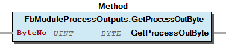

# WagoSysModuleBase v2.0.2.10 (WAGO) - Complete Documentation


## 📋 Library Information

- **Company:** WAGO
- **Title:** WagoSysModuleBase
- **Version:** 2.0.2.10
- **Categories:** WAGO Internal|Feature|LocalBus|K-Bus; WAGO LayerView|Sys; Application
- **Author:** WAGO / u010545
- **Placeholder:** WagoSysModuleBase

### Description ¶


This document is automatically generated.

Base Functionblocks for Module Access

This document is automatically generated. Base Functionblocks for Module Access

### Contents: ¶


Contents: - Documentation Index - Project Information - Library Information - Function Blocks FbModuleMbx1 (FB) - FbModuleMbx2 (FB) - FbModuleMbx2Ext (FB) - FbModuleParameter (FB) - FbModuleParameterMbx1 (FB) - FbModuleParameterMbx2 (FB) - FbModuleParameterMbx2Ext (FB) - FbModuleProcessInputs (FB) - FbModuleProcessInputsOutputs (FB) - FbModuleProcessOutputs (FB) - ... and 4 more Functions - FuCycleDaemonRun (FUN) - FuKbusDaemonRun (FUN) Methods - FbModuleMbx1.GetMbxOverlapped (METH) - FbModuleMbx1.GetMbxSize (METH) - FbModuleMbx1.GetMbxSizeRegisterNo (METH) - FbModuleMbx1.GetProcessInBit (METH) - FbModuleMbx1.GetProcessInByte (METH) - FbModuleMbx1.GetProcessInData (METH) - FbModuleMbx1.GetProcessOutBit (METH) - FbModuleMbx1.GetProcessOutByte (METH) - FbModuleMbx1.GetProcessOutData (METH) - FbModuleMbx1.MbxService (METH) - ... and 77 more Program Organization Base Components Internal Components - 90 Internal - Internal Global Variable Lists - TerminalManager (GVL) - VersionHistory (GVL) Other Components - 10 I_ModuleParameter - 10 I_ModuleParameter - 10 I_ModuleParameter - 10 I_ModuleParameter - 10 I_ModuleParameterList - 10 I_ModuleParameterList - 10 I_ModuleParameterList - 10 I_ModuleProcessInputs - 10 I_ModuleProcessInputs - 10 I_ModuleProcessOutputs - ... and 16 more

### Indices and tables ¶


Based on WagoSysModuleBase.library, last modified 20.09.2024, 21:11:40. LibDoc 3.5.16.10

© WAGO GmbH & Co. KG, Germany 2018 – All rights reserved. For the avoidance of doubt, this copyright notice does not only apply to the information above but also and primarily to the described library itself. Please note that third-party products are always mentioned without reference to intellectual property rights, including patents, utility models, designs and trademarks, accordingly the existence of such rights cannot be excluded. WAGO is a registered trademark of WAGO Verwaltungsgesellschaft mbH.

- File and Project Information - Library Reference Based on WagoSysModuleBase.library, last modified 20.09.2024, 21:11:40. LibDoc 3.5.16.10 © WAGO GmbH & Co. KG, Germany 2018 – All rights reserved. For the avoidance of doubt, this copyright notice does not only apply to the information above but also and primarily to the described library itself. Please note that third-party products are always mentioned without reference to intellectual property rights, including patents, utility models, designs and trademarks, accordingly the existence of such rights cannot be excluded. WAGO is a registered trademark of WAGO Verwaltungsgesellschaft mbH.

### Documentation Index


## 10 Documentation


To ensure fast installation and start-up of the units, we strongly recommend that the following information and explanations are carefully read and adhered to.

To ensure fast installation and start-up of the units, we strongly recommend that the following information and explanations are carefully read and adhered to. - doc01_Foreword (FB) - doc10_SystemProperties (FB) - doc99_Attachment (FB)

### Project Information


## File and Project Information


| Scope | Name | Type | Content |
| --- | --- | --- | --- |
| FileHeader | libraryFile | string | WagoSysModuleBase.library |
| contentFile | doc.clean.json |
| productName | e!COCKPIT |
| creationDateTime | date | 20.09.2024, 21:11:43 |
| companyName | string | WAGO |
| ProjectInformation | LastModificationDateTime | date | 20.09.2024, 21:11:40 |
| Description | string | See: Description |
| Copyright | © WAGO Kontakttechnik GmbH & Co. KG, Germany 2018 – All rights reserved. |
| Author | WAGO / u010545 |
| AutoResolveUnbound | bool | True |
| Placeholder | string | WagoSysModuleBase |
| Company | WAGO |
| DocFormat | reStructuredText |
| Project | WagoSysModuleBase |
| DefaultNamespace |  |
| Version | version | 2.0.2.10 |
| Title | string | WagoSysModuleBase |
| LibraryCategories | library-category-list | WAGO Internal\|Feature\|LocalBus\|K-Bus; WAGO LayerView\|Sys; Application |
| CompiledLibraryCompatibilityVersion | string | CODESYS V3.5 SP16 Patch 3 |

### Library Information


## Library Reference


| LinkAllContent: False QualifiedOnly: False | SystemLibrary: False | Optional: False |

| LinkAllContent: False QualifiedOnly: False | SystemLibrary: False | Optional: False |

| LinkAllContent: False QualifiedOnly: True | SystemLibrary: False | Optional: False |

| LinkAllContent: False QualifiedOnly: True | SystemLibrary: False | Optional: False |

| LinkAllContent: False QualifiedOnly: False | SystemLibrary: False | Optional: False |

| LinkAllContent: False QualifiedOnly: True | SystemLibrary: False | Optional: False |

| LinkAllContent: False QualifiedOnly: True | SystemLibrary: False | Optional: False |

| LinkAllContent: False QualifiedOnly: False | SystemLibrary: False | Optional: False |

| LinkAllContent: False QualifiedOnly: True | SystemLibrary: False | Optional: False |

| LinkAllContent: False QualifiedOnly: False | SystemLibrary: False | Optional: False |

| LinkAllContent: False QualifiedOnly: False | SystemLibrary: False | Optional: False |

| LinkAllContent: False Optional: False | QualifiedOnly: True SystemLibrary: False | PublishSymbolsInContainer: True |

| LinkAllContent: False QualifiedOnly: False | SystemLibrary: False | Optional: False |

| LinkAllContent: False QualifiedOnly: True | SystemLibrary: False | Optional: False |

| LinkAllContent: False Optional: False | QualifiedOnly: True SystemLibrary: False | PublishSymbolsInContainer: True |

| LinkAllContent: False Optional: False | QualifiedOnly: False SystemLibrary: False | PublishSymbolsInContainer: True |

| LinkAllContent: False Optional: False | QualifiedOnly: False SystemLibrary: False | PublishSymbolsInContainer: True |

| LinkAllContent: False Optional: False | QualifiedOnly: True SystemLibrary: False | PublishSymbolsInContainer: True |

This is a dictionary of all referenced libraries and their name spaces.

This is a dictionary of all referenced libraries and their name spaces. CmpApp Library Identification : Placeholder: CmpApp Default Resolution: CmpApp, * (System) Namespace: CmpApp Library Properties : CmpErrors2 Interfaces Library Identification : Name: CmpErrors2 Interfaces Version: newest Company: System Namespace: CmpErrors Library Properties : CmpEventMgr Library Identification : Placeholder: CmpEventMgr Default Resolution: CmpEventMgr, * (System) Namespace: CmpEventMgr Library Properties : CmpIecTask Library Identification : Placeholder: CmpIecTask Default Resolution: CmpIecTask, * (System) Namespace: CmpIecTask Library Properties : CmpIoMgr Library Identification : Name: CmpIoMgr Version: newest Company: System Namespace: CmpIoMgr Library Properties : IoStandard Library Identification : Placeholder: IoStandard Default Resolution: IoStandard, * (System) Namespace: IoStandard Library Properties : Standard Library Identification : Placeholder: Standard Default Resolution: Standard, * (System) Namespace: Standard Library Properties : SysCpuHandling Library Identification : Placeholder: SysCpuHandling Default Resolution: SysCpuHandling, * (System) Namespace: SysCpuHandling Library Properties : SysMem Library Identification : Placeholder: SysMem Default Resolution: SysMem, * (System) Namespace: SysMem Library Properties : SysSocket Library Identification : Placeholder: SysSocket Default Resolution: SysSocket, * (System) Namespace: SysSocket Library Properties : SysTypes2 Interfaces Library Identification : Name: SysTypes2 Interfaces Version: newest Company: System Namespace: SysTypes Library Properties : WagoSysErrorBase Library Identification : Placeholder: WagoSysErrorBase Default Resolution: WagoSysErrorBase, * (WAGO) Namespace: WagoSysErrorBase Library Properties : WagoSysKbusTerminalControl_Internal_PFC Library Identification : Placeholder: WagoSysKbusTerminalControlInternal Default Resolution: WagoSysKbusTerminalControl_Internal_PFC, * (WAGO) Namespace: WagoSysKbusTerminalControlInternal Library Properties : WagoSysVersion Library Identification : Name: WagoSysVersion Version: 1.0.0.0 Company: WAGO Namespace: WagoSysVersion Library Properties : WagoTypesBusServices Library Identification : Placeholder: WagoTypesBusServices Default Resolution: WagoTypesBusServices, * (WAGO) Namespace: WagoTypesBusServices Library Properties : WagoTypesCommon Library Identification : Placeholder: WagoTypesCommon Default Resolution: WagoTypesCommon, * (WAGO) Namespace: WagoTypes Library Properties : WagoTypesErrorBase Library Identification : Placeholder: WagoTypesErrorBase Default Resolution: WagoTypesErrorBase, * (WAGO) Namespace: WagoTypesErrorBase Library Properties : WagoTypesModuleBase Library Identification : Placeholder: WagoTypesModuleBase Default Resolution: WagoTypesModuleBase, * (WAGO) Namespace: WagoTypesModuleBase Library Properties :

### Function Blocks


## FbModuleMbx1 (FB)


| Scope | Name | Type | Inherited from |
| --- | --- | --- | --- |
| Output | oError | WagoSysErrorBase.FbResult | FbModuleBase |

Interface variables - 10 ProcessInputs FbModuleMbx1.GetProcessInBit (METH) - FbModuleMbx1.GetProcessInByte (METH) - FbModuleMbx1.GetProcessInData (METH) 10 ProcessOutputs - FbModuleMbx1.GetProcessOutBit (METH) - FbModuleMbx1.GetProcessOutByte (METH) - FbModuleMbx1.GetProcessOutData (METH) - FbModuleMbx1.SetProcessOutBit (METH) - FbModuleMbx1.SetProcessOutByte (METH) - FbModuleMbx1.SetProcessOutData (METH) 20 I_ModuleMbx1 - FbModuleMbx1.GetMbxOverlapped (METH) - FbModuleMbx1.GetMbxSize (METH) - FbModuleMbx1.MbxService (METH) 30 Protected - FbModuleMbx1.GetMbxSizeRegisterNo (METH) - FbModuleMbx1.SwitchMbxOnOff (METH)

## FbModuleMbx2 (FB)


| Scope | Name | Type | Comment | Inherited from |
| --- | --- | --- | --- | --- |
| Output | oError | WagoSysErrorBase.FbResult |  | FbModuleBase |
| CallBackCounter | UINT | callbacks from cycle control point |  |

Interface variables - 10 ProcessInputs FbModuleMbx2.GetProcessInBit (METH) - FbModuleMbx2.GetProcessInByte (METH) - FbModuleMbx2.GetProcessInData (METH) 10 ProcessOutputs - FbModuleMbx2.GetProcessOutBit (METH) - FbModuleMbx2.GetProcessOutByte (METH) - FbModuleMbx2.GetProcessOutData (METH) - FbModuleMbx2.SetProcessOutBit (METH) - FbModuleMbx2.SetProcessOutByte (METH) - FbModuleMbx2.SetProcessOutData (METH) I_ModuleMbx2 - FbModuleMbx2.IsMessageAvailable (METH) - FbModuleMbx2.MbxGetNexSequencelID (METH) - FbModuleMbx2.MbxGetNextMessage (METH) - FbModuleMbx2.MbxGetNextProtocolID (METH) - FbModuleMbx2.MbxIsReady (METH) - FbModuleMbx2.MbxRemoveNextMessage (METH) - FbModuleMbx2.MbxReset (METH) - FbModuleMbx2.MbxWrite (METH) - FbModuleMbx2.isTcmMode (METH) Internal - I_MbxToModuleAccess FbModuleMbx2.OnMbxIsReset (METH) - FbModuleMbx2.RegAddMbx (METH) - FbModuleMbx2.RegRemoveMbx (METH) I_TermManagerAccessServiceListener - FbModuleMbx2.onAccessServiceRegistered (METH)

## FbModuleMbx2Ext (FB)


| Scope | Name | Type | Comment | Inherited from |
| --- | --- | --- | --- | --- |
| Output | oError | WagoSysErrorBase.FbResult |  | FbModuleBase |
| CallBackCounter | UINT | callbacks from cycle control point | FbModuleMbx2 |

Interface variables - FbModuleMbx2Ext.MbxCommit (METH) - FbModuleMbx2Ext.MbxPrepare (METH) - FbModuleMbx2Ext.MbxReadDiagnosis (METH) - FbModuleMbx2Ext.MbxReadMultipleRegister (METH) - FbModuleMbx2Ext.MbxReadRegister (METH) - FbModuleMbx2Ext.MbxReadTable (METH) - FbModuleMbx2Ext.MbxSaveUser (METH) - FbModuleMbx2Ext.MbxSetPassword (METH) - FbModuleMbx2Ext.MbxWriteMultipleRegister (METH) - FbModuleMbx2Ext.MbxWriteRegister (METH) - FbModuleMbx2Ext.MbxWriteTable (METH)

## FbModuleParameter (FB)


| Scope | Name | Type | Inherited from |
| --- | --- | --- | --- |
| Output | oError | WagoSysErrorBase.FbResult | FbModuleBase |

Interface variables - 10 I_ModuleParameter FbModuleParameter.ReadParameter (METH) - FbModuleParameter.WriteParameter (METH) 10 I_ModuleParameterList - FbModuleParameter.ReadParameterList (METH) - FbModuleParameter.WriteParameterList (METH)

## FbModuleParameterMbx1 (FB)


| Scope | Name | Type | Inherited from |
| --- | --- | --- | --- |
| Output | oError | WagoSysErrorBase.FbResult | FbModuleBase |

Interface variables - 10 I_ModuleParameter FbModuleParameterMbx1.ReadParameter (METH) - FbModuleParameterMbx1.WriteParameter (METH)

## FbModuleParameterMbx2 (FB)


| Scope | Name | Type | Comment | Inherited from |
| --- | --- | --- | --- | --- |
| Output | oError | WagoSysErrorBase.FbResult |  | FbModuleBase |
| CallBackCounter | UINT | callbacks from cycle control point | FbModuleMbx2 |

Interface variables - 10 I_ModuleParameter FbModuleParameterMbx2.ReadParameter (METH) - FbModuleParameterMbx2.WriteParameter (METH) 10 I_ModuleParameterList - FbModuleParameterMbx2.ReadParameterList (METH) - FbModuleParameterMbx2.WriteParameterList (METH)

## FbModuleParameterMbx2Ext (FB)


| Scope | Name | Type | Comment | Inherited from |
| --- | --- | --- | --- | --- |
| Output | oError | WagoSysErrorBase.FbResult |  | FbModuleBase |
| CallBackCounter | UINT | callbacks from cycle control point | FbModuleMbx2 |

Interface variables - 10 I_ModuleParameter FbModuleParameterMbx2Ext.ReadParameter (METH) - FbModuleParameterMbx2Ext.WriteParameter (METH) 10 I_ModuleParameterList - FbModuleParameterMbx2Ext.ReadParameterList (METH) - FbModuleParameterMbx2Ext.WriteParameterList (METH)

## FbModuleProcessInputs (FB)


| Scope | Name | Type | Inherited from |
| --- | --- | --- | --- |
| Output | oError | WagoSysErrorBase.FbResult | FbModuleBase |

Base module This Fb support PA access for read.

Interface variables Base module This Fb support PA access for read. - 10 I_ModuleProcessInputs FbModuleProcessInputs.GetModuleInputSize (METH) - FbModuleProcessInputs.GetProcessInBit (METH) - FbModuleProcessInputs.GetProcessInByte (METH) - FbModuleProcessInputs.GetProcessInData (METH) I_ModuleProcessInputsExtended - FbModuleProcessInputs.GetProcessInDword (METH) - FbModuleProcessInputs.GetProcessInWord (METH)

## FbModuleProcessInputsOutputs (FB)


| Scope | Name | Type | Inherited from |
| --- | --- | --- | --- |
| Output | oError | WagoSysErrorBase.FbResult | FbModuleBase |

Base input output module This Fb support PA access (R/W)

Interface variables Base input output module This Fb support PA access (R/W) - 10 I_ModuleProcessInputs FbModuleProcessInputsOutputs.GetModuleInputSize (METH) - FbModuleProcessInputsOutputs.GetProcessInBit (METH) - FbModuleProcessInputsOutputs.GetProcessInByte (METH) - FbModuleProcessInputsOutputs.GetProcessInData (METH) I_ModuleProcessInputsExtended - FbModuleProcessInputsOutputs.GetProcessInDword (METH) - FbModuleProcessInputsOutputs.GetProcessInWord (METH)

## FbModuleProcessOutputs (FB)


| Scope | Name | Type | Inherited from |
| --- | --- | --- | --- |
| Output | oError | WagoSysErrorBase.FbResult | FbModuleBase |

Base module This Fb support PA access (R/W) and debug methods only.

Interface variables Base module This Fb support PA access (R/W) and debug methods only. - 10 I_ModuleProcessOutputs FbModuleProcessOutputs.GetModuleOutputSize (METH) - FbModuleProcessOutputs.GetProcessOutBit (METH) - FbModuleProcessOutputs.GetProcessOutByte (METH) - FbModuleProcessOutputs.GetProcessOutData (METH) - FbModuleProcessOutputs.SetProcessOutBit (METH) - FbModuleProcessOutputs.SetProcessOutByte (METH) - FbModuleProcessOutputs.SetProcessOutData (METH) I_ModuleProcessOutputsExtended - FbModuleProcessOutputs.GetProcessOutDword (METH) - FbModuleProcessOutputs.GetProcessOutWord (METH) - FbModuleProcessOutputs.SetProcessOutDword (METH) - FbModuleProcessOutputs.SetProcessOutWord (METH)

## FbModuleRegister (FB)


| Scope | Name | Type | Inherited from |
| --- | --- | --- | --- |
| Output | oError | WagoSysErrorBase.FbResult | FbModuleBase |

Supports base functions for PA access (R/W) and methods for register communication

Interface variables Supports base functions for PA access (R/W) and methods for register communication - 10 I_ModuleRegister FbModuleRegister.ReadRegister (METH) - FbModuleRegister.WriteRegister (METH) 11 I_ModuleRegisterExt - FbModuleRegister.GetSoftwareVersion (METH)

## doc01_Foreword (FB)


This document, including all figures and illustrations contained therein, is subject to copyright. Any use of this document that infringes upon the copyright provisions stipulated herein is prohibited. Reproduction, translation, electronic and phototechnical filing/archiving (e.g., photocopying), as well as any amendments require the written consent of WAGO Kontakttechnik GmbH & Co. KG, Minden, Germany. Non-observance will entail the right of claims for damages.

WAGO Kontakttechnik GmbH & Co. KG reserves the right to make any alterations or modifications that serve to increase the efficiency of technical progress. WAGO Kontakttechnik GmbH & Co. KG owns all rights arising from granting patents or from the legal protection of utility patents. Third-party products are always mentioned without any reference to patent rights. Thus, the existence of such rights cannot be excluded.

Personnel Qualification

The use of the product described in this document is exclusively geared to specialists having qualifications in PLC programming, electrical specialists or persons instructed by electrical specialists who are also familiar with the appropriate current standards. WAGO Kontakttechnik GmbH & Co. KG assumes no liability resulting from improper action and damage to WAGO products and third-party products due to non-observance of the information contained in this document.

Intended Use

For each individual application, the components are supplied from the factory with a dedicated hardware and software configuration. Modifications are only admitted within the framework of the possibilities documented in this document. All other changes to the hardware and/or software and the non-conforming use of the components entail the exclusion of liability on part of WAGO Kontakttechnik GmbH & Co. KG.

Please direct any requirements pertaining to a modified and/or new hardware or software configuration directly to WAGO Kontakttechnik GmbH & Co. KG.

Scope of Applicability

This application note is based on the _stated hardware and software from the specific manufacturer, as well as the associated documentation. This application note is therefore only valid for the described installation. New hardware and software versions may need to be handled differently.

Please note the detailed description in the specific manuals.

Copyright This document, including all figures and illustrations contained therein, is subject to copyright. Any use of this document that infringes upon the copyright provisions stipulated herein is prohibited. Reproduction, translation, electronic and phototechnical filing/archiving (e.g., photocopying), as well as any amendments require the written consent of WAGO Kontakttechnik GmbH & Co. KG, Minden, Germany. Non-observance will entail the right of claims for damages. WAGO Kontakttechnik GmbH & Co. KG reserves the right to make any alterations or modifications that serve to increase the efficiency of technical progress. WAGO Kontakttechnik GmbH & Co. KG owns all rights arising from granting patents or from the legal protection of utility patents. Third-party products are always mentioned without any reference to patent rights. Thus, the existence of such rights cannot be excluded. Personnel Qualification The use of the product described in this document is exclusively geared to specialists having qualifications in PLC programming, electrical specialists or persons instructed by electrical specialists who are also familiar with the appropriate current standards. WAGO Kontakttechnik GmbH & Co. KG assumes no liability resulting from improper action and damage to WAGO products and third-party products due to non-observance of the information contained in this document. Intended Use For each individual application, the components are supplied from the factory with a dedicated hardware and software configuration. Modifications are only admitted within the framework of the possibilities documented in this document. All other changes to the hardware and/or software and the non-conforming use of the components entail the exclusion of liability on part of WAGO Kontakttechnik GmbH & Co. KG. Please direct any requirements pertaining to a modified and/or new hardware or software configuration directly to WAGO Kontakttechnik GmbH & Co. KG. Scope of Applicability This application note is based on the _stated hardware and software from the specific manufacturer, as well as the associated documentation. This application note is therefore only valid for the described installation. New hardware and software versions may need to be handled differently. Please note the detailed description in the specific manuals.

## doc10_SystemProperties (FB)


Configuration by e!Cockpit

This library holds some basic functionality for data access of physical modules from the WAGO portfolio. Each module in a WAGO Node may have a module instance of a function block that have inherit from FbModuleBase.

For some complex modules this instance is automaticly generated by e!Cockpit while you place a terminal from the toolbox to a node or while you take over a terminal from a by e!Cockpit scanned list.

You are free to change the name of the terminal inside your project. The instance name correspond to this terminal name.

This modul instance provides some methods for the different communication channels from the module like MBX2 / MBX1 / Registercommunication / Parametercommunication and of course PA-Access.

For simple modules like digital Input / Output this module instance is not automaticly generated. Normaly there is no need for this simple modules to use a special module instance.

Dynamic configuration

Configuration by e!Cockpit This library holds some basic functionality for data access of physical modules from the WAGO portfolio. Each module in a WAGO Node may have a module instance of a function block that have inherit from FbModuleBase. For some complex modules this instance is automaticly generated by e!Cockpit while you place a terminal from the toolbox to a node or while you take over a terminal from a by e!Cockpit scanned list. You are free to change the name of the terminal inside your project. The instance name correspond to this terminal name. This modul instance provides some methods for the different communication channels from the module like MBX2 / MBX1 / Registercommunication / Parametercommunication and of course PA-Access. Note For simple modules like digital Input / Output this module instance is not automaticly generated. Normaly there is no need for this simple modules to use a special module instance. Dynamic configuration In the case that you can not use the static configuration by e!Cockpit there is a second way to have access to the physical terminals. See more information about this usecase at TerminalManager .

## doc99_Attachment (FB)


Compiler switches for logging

Compiler switches for logging MODULE_BASE_LOG_TASK -> log create / delete task messages

### Functions


## FuCycleDaemonRun (FUN)


| Scope | Name | Type |
| --- | --- | --- |
| Return | FuCycleDaemonRun | BOOL |
| Input | parameter | CmpIecTask.IEC_CYCLE_STRUCT |

## FuKbusDaemonRun (FUN)


| Scope | Name | Type |
| --- | --- | --- |
| Return | FuKbusDaemonRun | BOOL |
| Input | parameter | CmpIecTask.IEC_CYCLE_STRUCT |

### Methods


## FbModuleMbx1.GetMbxOverlapped (METH)


| Scope | Name | Type | Comment |
| --- | --- | --- | --- |
| Return | GetMbxOverlapped | WagoTypesModuleBase.eServiceState |  |
| Input | cliCallerID | WagoTypes.WagoClientIdentification | Unique identifier of the caller |
| Inout | iOverlapped | INT (-1..1) | -1 -> invalid / 0-> not overlapped / 1-> overlapped |
| oError | WagoSysErrorBase.FbResult | Register Error Object |

| Mailboxstate | Description |
| --- | --- |
| eServiceState.OCCUPIED | occupied by an other caller |
| eServiceState.START | activate the MBX and start a job |
| eServiceState.BUSY | job is in process -> call it again until the return value = eServiceState.DONE |
| eServiceState.ABORT | job is aborted |
| eServiceState.DONE | job is done |

Get information about the mailbox mode.

Graphical Illustration

Graphical Interface of FbModuleMbx1.GetMbxOverlapped

This method can take a some plc cycles. So you have to call this method cyclic until it returns with DONE or ABORT.

Interface variables Function Get information about the mailbox mode. RETURN State of the mailbox -> (defined at WagoAppModuleInterface.library) Graphical Illustration  Graphical Interface of FbModuleMbx1.GetMbxOverlapped Note This method can take a some plc cycles. So you have to call this method cyclic until it returns with DONE or ABORT.

## FbModuleMbx1.GetMbxSize (METH)


| Scope | Name | Type | Comment |
| --- | --- | --- | --- |
| Return | GetMbxSize | WagoTypesModuleBase.eServiceState |  |
| Input | cliCallerID | WagoTypes.WagoClientIdentification | Unique identifier of the caller |
| Inout | iSize | INT | -1 -> invalid else MBX-Size |
| oError | WagoSysErrorBase.FbResult | Register Error Object |

| Mailboxstate | Description |
| --- | --- |
| eServiceState.OCCUPIED | occupied by an other caller |
| eServiceState.START | activate the MBX and start a job |
| eServiceState.BUSY | job is in process -> call it again until the return value = eServiceState.DONE |
| eServiceState.ABORT | job is aborted |
| eServiceState.DONE | job is done |

Call a MBX service If the mailbox is free then the wanted service will be triggered and the mailbox is occupied for other callers.

When the method returns with eServiceState.DONE then the wanted job is done. The user MUST handle the return values DONE and ABORT.

Graphical Illustration

Graphical Interface of FbModuleMbx1.GetMbxSize

This method can take a some plc cycles. So you have to call this method cyclic until it returns with DONE or ABORT.

Interface variables Function Call a MBX service If the mailbox is free then the wanted service will be triggered and the mailbox is occupied for other callers. When the method returns with eServiceState.DONE then the wanted job is done. The user MUST handle the return values DONE and ABORT. RETURN State of the mailbox -> (defined at WagoAppModuleInterface.library) Graphical Illustration  Graphical Interface of FbModuleMbx1.GetMbxSize Note This method can take a some plc cycles. So you have to call this method cyclic until it returns with DONE or ABORT.

## FbModuleMbx1.GetMbxSizeRegisterNo (METH)


| Scope | Name | Type |
| --- | --- | --- |
| Return | GetMbxSizeRegisterNo | USINT |

{attribute ‘conditionalshow’ := ‘wagoapplication’}

Interface variables {attribute ‘conditionalshow’ := ‘wagoapplication’}

## FbModuleMbx1.GetProcessInBit (METH)


| Scope | Name | Type | Comment |
| --- | --- | --- | --- |
| Return | GetProcessInBit | BOOL |  |
| Input | ByteNo | UINT | range 0..(_uiInputSize - 1) |
| BitNo | USINT | range 0..7 |

Graphical Illustration

Graphical Interface of FbModuleMbx1.GetProcessInBit

Interface variables Function Get the process input bit specified by ByteNo and BitNo of this module. Graphical Illustration  Graphical Interface of FbModuleMbx1.GetProcessInBit

## FbModuleMbx1.GetProcessInByte (METH)


| Scope | Name | Type | Comment |
| --- | --- | --- | --- |
| Return | GetProcessInByte | BYTE |  |
| Input | ByteNo | UINT | range 0..(_uiInputSize - 1) |

Graphical Illustration

Graphical Interface of FbModuleMbx1.GetProcessInByte

Interface variables Function Get the process input byte specified by ByteNo of this module. Graphical Illustration  Graphical Interface of FbModuleMbx1.GetProcessInByte

## FbModuleMbx1.GetProcessInData (METH)


| Scope | Name | Type | Comment |
| --- | --- | --- | --- |
| Return | GetProcessInData | UINT |  |
| Input | pInData | POINTER TO BYTE | pointer to the area where the process data should store |
| uiNInData | UINT | SIZEOF(Buffer) |

Graphical Illustration

Graphical Interface of FbModuleMbx1.GetProcessInData

Interface variables Function Get the process input bytes from byte 0 up to ( uiNInData - 1) and place it at pInData : Graphical Illustration  Graphical Interface of FbModuleMbx1.GetProcessInData

## FbModuleMbx1.GetProcessOutBit (METH)


| Scope | Name | Type | Comment |
| --- | --- | --- | --- |
| Return | GetProcessOutBit | BOOL |  |
| Input | ByteNo | UINT | range 0..(_uiOutputSize - 1) |
| BitNo | USINT | range 0..7 |

Graphical Illustration

Graphical Interface of FbModuleMbx1.GetProcessOutBit

Interface variables Function Get the process output bit specified by ByteNo and BitNo of this module. Graphical Illustration  Graphical Interface of FbModuleMbx1.GetProcessOutBit

## FbModuleMbx1.GetProcessOutByte (METH)


| Scope | Name | Type | Comment |
| --- | --- | --- | --- |
| Return | GetProcessOutByte | BYTE |  |
| Input | ByteNo | UINT | range 0..(_uiOutputSize - 1) |

Graphical Illustration

Graphical Interface of FbModuleMbx1.GetProcessOutByte

Interface variables Function Get the process output byte specified by ByteNo of this module. Graphical Illustration  Graphical Interface of FbModuleMbx1.GetProcessOutByte

## FbModuleMbx1.GetProcessOutData (METH)


| Scope | Name | Type | Comment |
| --- | --- | --- | --- |
| Return | GetProcessOutData | UINT |  |
| Input | pOutData | POINTER TO BYTE | pointer to the area where the process data should store |
| uiNOutData | UINT | SIZEOF(Buffer) |

Graphical Illustration

Graphical Interface of FbModuleMbx1.GetProcessOutData

Interface variables Function Get the process output bytes from byte 0 up to ( uiNOutData - 1) and place it at pOutData : Graphical Illustration  Graphical Interface of FbModuleMbx1.GetProcessOutData

## FbModuleMbx1.MbxService (METH)


| Scope | Name | Type | Comment |
| --- | --- | --- | --- |
| Return | MbxService | WagoTypesModuleBase.eServiceState |  |
| Input | cliCallerID | WagoTypes.WagoClientIdentification | Unique identifier of the caller |
| utRequest | WagoTypesModuleBase.typMbxRequest | service request |
| Inout | utResponse | WagoTypesModuleBase.typMbxResponse | service response |
| oError | WagoSysErrorBase.FbResult | Error Object -> OK or TIME OUT after the spezified time at request t#0ms means no time out |

| Mailboxstate | Description |
| --- | --- |
| eServiceState.OCCUPIED | occupied by an other caller |
| eServiceState.START | activate the MBX and start a job |
| eServiceState.BUSY | job is in process -> call it again until the return value = eServiceState.DONE |
| eServiceState.ABORT | job is aborted |
| eServiceState.DONE | job is done |

```
VAR
    ID          : WagoTypes.WagoClientIdentification := ADR(ID);  // generate an unique ID
    oError      : WagoSysErrorBase.FbResult;
    xExecute    : BOOL;
    Request     : typMbxRequest := ( bOpCode  := 16#43,
                                     tTimeOut := T#1S  // Timeout for this service
                                   );
    Response    : typMbxResponse;
END_VAR

IF xExecute THEN
    CASE myModul.MbxService(    cliCallerID     := ID,          // unique ID to indentify the caller
                                utRequest       := Request,
                                utResponse      := Response,
                                oError          := oError
                           ) OF

        eServiceState.DONE :
            xExecute := FALSE;
            IF oError.GetID() = 0 THEN  // no error occured

                (* place here your code *)

            ELSE // an error occurs
                (* place your error code *)
            END_IF

        eServiceState.ABORT :
            xExecute := FALSE;
            (* place here your error code for abort *)

    END_CASE
END_IF
```

Call a MBX service If the mailbox is free then the wanted service will be triggered and the mailbox is occupied for other callers.

When the method returns with eServiceState.DONE then the wanted job is done. The user MUST handle the return values DONE and ABORT.

Graphical Illustration

Graphical Interface of FbModuleMbx1.MbxService

This method can take a some plc cycles. So you have to call this method cyclic until it returns with DONE or ABORT.

Interface variables Function Call a MBX service If the mailbox is free then the wanted service will be triggered and the mailbox is occupied for other callers. When the method returns with eServiceState.DONE then the wanted job is done. The user MUST handle the return values DONE and ABORT. RETURN State of the mailbox -> (defined at WagoAppModuleInterface.library) Graphical Illustration  Graphical Interface of FbModuleMbx1.MbxService Note This method can take a some plc cycles. So you have to call this method cyclic until it returns with DONE or ABORT.

## FbModuleMbx1.SetProcessOutBit (METH)


| Scope | Name | Type | Comment |
| --- | --- | --- | --- |
| Input | ByteNo | UINT | range 0..(_uiOutputSize - 1) |
| BitNo | USINT | range 0..7 |
| OutData | BOOL |  |

Graphical Illustration

Graphical Interface of FbModuleMbx1.SetProcessOutBit

Interface variables Function Set the process output bit specified by ByteNo and BitNo to the value OutData . Graphical Illustration  Graphical Interface of FbModuleMbx1.SetProcessOutBit

## FbModuleMbx1.SetProcessOutByte (METH)


| Scope | Name | Type | Comment |
| --- | --- | --- | --- |
| Input | ByteNo | UINT | range 0..(_uiOutputSize - 1) |
| OutData | BYTE |  |

Graphical Illustration

Graphical Interface of FbModuleMbx1.SetProcessOutByte

Interface variables Function Set the process output byte specified by ByteNo to the value OutData . Graphical Illustration  Graphical Interface of FbModuleMbx1.SetProcessOutByte

## FbModuleMbx1.SetProcessOutData (METH)


| Scope | Name | Type | Comment |
| --- | --- | --- | --- |
| Return | SetProcessOutData | UINT |  |
| Input | pOutData | POINTER TO BYTE | pointer to the area with the data to write |
| uiNOutData | UINT | SIZEOF(Buffer) |

Graphical Illustration

Graphical Interface of FbModuleMbx1.SetProcessOutData

Interface variables Function Copy the process output data from the area specified by pOutData and uiNOutData to the output process image. Graphical Illustration  Graphical Interface of FbModuleMbx1.SetProcessOutData

## FbModuleMbx1.SwitchMbxOnOff (METH)


| Scope | Name | Type | Comment |
| --- | --- | --- | --- |
| Return | SwitchMbxOnOff | BOOL |  |
| Input | xEnable | BOOL | TRUE -> switch MBX ON |

{attribute ‘conditionalshow’ := ‘wagoapplication’}

Interface variables {attribute ‘conditionalshow’ := ‘wagoapplication’}

## FbModuleMbx2.GetProcessInBit (METH)


| Scope | Name | Type | Comment |
| --- | --- | --- | --- |
| Return | GetProcessInBit | BOOL |  |
| Input | ByteNo | UINT | range 0..(_uiInputSize - 1) |
| BitNo | USINT | range 0..7 |

## FbModuleMbx2.GetProcessInByte (METH)


| Scope | Name | Type | Comment |
| --- | --- | --- | --- |
| Return | GetProcessInByte | BYTE |  |
| Input | ByteNo | UINT | range 0..(_uiInputSize - 1) |

## FbModuleMbx2.GetProcessInData (METH)


| Scope | Name | Type | Comment |
| --- | --- | --- | --- |
| Return | GetProcessInData | UINT |  |
| Input | pInData | POINTER TO BYTE | pointer to the area where the process data should store |
| uiNInData | UINT | SIZEOF(Buffer) |

## FbModuleMbx2.GetProcessOutBit (METH)


| Scope | Name | Type | Comment |
| --- | --- | --- | --- |
| Return | GetProcessOutBit | BOOL |  |
| Input | ByteNo | UINT | range 0..(_uiOutputSize - 1) |
| BitNo | USINT | range 0..7 |

Graphical Illustration

Graphical Interface of FbModuleMbx2.GetProcessOutBit

Interface variables Function Get the process output bit specified by ByteNo and BitNo of this module. Graphical Illustration  Graphical Interface of FbModuleMbx2.GetProcessOutBit

## FbModuleMbx2.GetProcessOutByte (METH)


| Scope | Name | Type | Comment |
| --- | --- | --- | --- |
| Return | GetProcessOutByte | BYTE |  |
| Input | ByteNo | UINT | range 0..(_uiOutputSize - 1) |

Graphical Illustration

Graphical Interface of FbModuleMbx2.GetProcessOutByte

Interface variables Function Get the process output byte specified by ByteNo of this module. Graphical Illustration  Graphical Interface of FbModuleMbx2.GetProcessOutByte

## FbModuleMbx2.GetProcessOutData (METH)


| Scope | Name | Type | Comment |
| --- | --- | --- | --- |
| Return | GetProcessOutData | UINT |  |
| Input | pOutData | POINTER TO BYTE | pointer to the area where the process data should store |
| uiNOutData | UINT | SIZEOF(Buffer) |

Graphical Illustration

Graphical Interface of FbModuleMbx2.GetProcessOutData

Interface variables Function Get the process output bytes from byte 0 up to ( uiNOutData - 1) and place it at pOutData : Graphical Illustration  Graphical Interface of FbModuleMbx2.GetProcessOutData

## FbModuleMbx2.IsMessageAvailable (METH)


| Scope | Name | Type |
| --- | --- | --- |
| Return | IsMessageAvailable | BOOL |

Check for message available at pipe.

Returns TRUE if another message is available

Graphical Illustration

Interface variables Function Check for message available at pipe. Returns TRUE if another message is available Graphical Illustration 

## FbModuleMbx2.MbxGetNexSequencelID (METH)


| Scope | Name | Type |
| --- | --- | --- |
| Return | MbxGetNexSequencelID | INT |

| Return code | Description |
| --- | --- |
| 0..255 | sequence-ID |
| -1 | no message available |

Get the sequence-ID of the next message without remove from pipe

Graphical Illustration

Interface variables Function Get the sequence-ID of the next message without remove from pipe Graphical Illustration 

## FbModuleMbx2.MbxGetNextMessage (METH)


| Scope | Name | Type | Comment |
| --- | --- | --- | --- |
| Return | MbxGetNextMessage | WagoTypesModuleBase.eErrorMbx2 |  |
| Input | pMsgBuffer | POINTER TO BYTE | pointer to buffer where the wanted message is to place |
| udiMsgBufferSize | UDINT | size of the message buffer |
| Output | udiMsgLen | UDINT | len of the message incl. header. |
| oError | WagoSysErrorBase.FbResult |  |

| Return code | Description |
| --- | --- |
| OK | successful |
| NO_DATA | no message available |
| BUFFER_TO_SMALL | buffer not big enought for the next message |
| PRM_INVALID | paramter invalid -> null-pointer |

| Function | Datatype | Description |
| --- | --- | --- |
| bHeader | BYTE:=16#80; | Identifier Ext. Header |
| bPayload | BYTE; | Lenght of abPayloadData [byte] |
| bProtocol_ID | BYTE; | Protocol ID |
| bSequence_ID | BYTE; | Sequence number 0 - 127 |
| abPayloadData | ARRAY[0..] OF BYTE; | Payload data |

Get the next message and remove it from pipe.

Graphical Illustration

Interface variables Function Get the next message and remove it from pipe. Typical mbx message Graphical Illustration 

## FbModuleMbx2.MbxGetNextProtocolID (METH)


| Scope | Name | Type |
| --- | --- | --- |
| Return | MbxGetNextProtocolID | INT |

| Return code | Description |
| --- | --- |
| -1 | no message available |
| 0 | no protocol-ID (may be simple header but not must) |
| 1..255 | protocol-ID (it must be an extended header) |

Get the protocol-ID of the next message without remove from pipe

Graphical Illustration

Interface variables Function Get the protocol-ID of the next message without remove from pipe Graphical Illustration 

## FbModuleMbx2.MbxIsReady (METH)


| Scope | Name | Type |
| --- | --- | --- |
| Return | MbxIsReady | BOOL |

Check for MBX is ready for data exchange.

Returns TRUE if the MBX is synchronized.

Graphical Illustration

Interface variables Function Check for MBX is ready for data exchange. Returns TRUE if the MBX is synchronized. Graphical Illustration 

## FbModuleMbx2.MbxRemoveNextMessage (METH)


| Scope | Name | Type |
| --- | --- | --- |
| Return | MbxRemoveNextMessage | WagoTypesModuleBase.eErrorMbx2 |
| Output | oError | WagoSysErrorBase.FbResult |

| Return code | Description |
| --- | --- |
| OK | message successful removed |
| NO_DATA | no message available |

Removes a complete message with header from pipe in case there is a complete message available. Otherwise this method do nothing.

Graphical Illustration

Interface variables Function Removes a complete message with header from pipe in case there is a complete message available. Otherwise this method do nothing. Graphical Illustration 

## FbModuleMbx2.MbxReset (METH) ¶


## FbModuleMbx2.MbxWrite (METH)


| Scope | Name | Type | Comment |
| --- | --- | --- | --- |
| Return | MbxWrite | WagoTypesModuleBase.eErrorMbx2 |  |
| Input | pData | POINTER TO BYTE | source of the data |
| udiNdata | UDINT | how many bytes to write |
| Output | oError | WagoSysErrorBase.FbResult |  |

| Return code | Description |
| --- | --- |
| OK (0) | success |
| FULL | not enough buffer space available for new message |
| PRM_INVALID | null-pointer or size <2 or size >2G |
| NOT_READY | MBX is not ready for communication |
| INVALID_MSG | Incosistent message -> invalid length (header) udiNdata |
| NO_WRITE_WHILE_TCM_MODE | Write not possible while TCM-Mode is active |

| Function | Datatype | Description |
| --- | --- | --- |
| bHeader | BYTE:=16#80; | Identifier Ext. Header |
| bPayload | BYTE; | Lenght of abPayloadData [byte] |
| bProtocol_ID | BYTE; | Protocol ID |
| bSequence_ID | BYTE; | Sequence number 0 - 127 |
| abPayloadData | ARRAY[0..] OF BYTE; | Payload data |

Write a message into the FIFO to MBX. If there is not enougth space inside the FIFO the message will be rejected with the result code FULL . The given message is checked for valid length in the header before writing.

Graphical Illustration

Interface variables Function Write a message into the FIFO to MBX. If there is not enougth space inside the FIFO the message will be rejected with the result code FULL . The given message is checked for valid length in the header before writing. Typical mbx message Graphical Illustration 

## FbModuleMbx2.OnMbxIsReset (METH)


| Scope | Name | Type |
| --- | --- | --- |
| Input | I_Mbx | I_ModuleToMbxAccess |

## FbModuleMbx2.RegAddMbx (METH)


| Scope | Name | Type |
| --- | --- | --- |
| Return | RegAddMbx | BOOL |
| Input | I_Mbx | I_ModuleToMbxAccess |

returns TRUE in case of successful add

Interface variables returns TRUE in case of successful add

## FbModuleMbx2.RegRemoveMbx (METH)


| Scope | Name | Type |
| --- | --- | --- |
| Return | RegRemoveMbx | BOOL |
| Input | I_Mbx | I_ModuleToMbxAccess |

returns TRUE in case of successful remove

Interface variables returns TRUE in case of successful remove

## FbModuleMbx2.SetProcessOutBit (METH)


| Scope | Name | Type | Comment |
| --- | --- | --- | --- |
| Input | ByteNo | UINT | range 0..(_uiOutputSize - 1) |
| BitNo | USINT | range 0..7 |
| OutData | BOOL |  |

Graphical Illustration

Graphical Interface of FbModuleMbx2.SetProcessOutBit

Interface variables Function Set the process output bit specified by ByteNo and BitNo to the value OutData . Graphical Illustration  Graphical Interface of FbModuleMbx2.SetProcessOutBit

## FbModuleMbx2.SetProcessOutByte (METH)


| Scope | Name | Type | Comment |
| --- | --- | --- | --- |
| Input | ByteNo | UINT | range 0..(_uiOutputSize - 1) |
| OutData | BYTE |  |

Graphical Illustration

Graphical Interface of FbModuleMbx2.SetProcessOutByte

Interface variables Function Set the process output byte specified by ByteNo to the value OutData . Graphical Illustration  Graphical Interface of FbModuleMbx2.SetProcessOutByte

## FbModuleMbx2.SetProcessOutData (METH)


| Scope | Name | Type | Comment |
| --- | --- | --- | --- |
| Return | SetProcessOutData | UINT |  |
| Input | pOutData | POINTER TO BYTE | pointer to the area with the data to write |
| uiNOutData | UINT | SIZEOF(Buffer) |

Graphical Illustration

Graphical Interface of FbModuleMbx2.SetProcessOutData

Interface variables Function Copy the process output data from the area specified by pOutData and uiNOutData to the output process image. Graphical Illustration  Graphical Interface of FbModuleMbx2.SetProcessOutData

## FbModuleMbx2.isTcmMode (METH)


| Scope | Name | Type |
| --- | --- | --- |
| Return | isTcmMode | BOOL |

## FbModuleMbx2.onAccessServiceRegistered (METH)


| Scope | Name | Type |
| --- | --- | --- |
| Input | I_BaseAccessService | WagoTypesBusServices.I_ModuleBaseAccessService |
| e_BusType | WagoTypesBusServices.eBusType |
| usiSlotNo | USINT |

This method is called by the TerminalManager for each unregistered service

Interface variables This method is called by the TerminalManager for each unregistered service

## FbModuleMbx2Ext.MbxCommit (METH)


| Scope | Name | Type | Initial | Comment |
| --- | --- | --- | --- | --- |
| Return | MbxCommit | WagoTypesModuleBase.eServiceState |  |  |
| Input | cliCallerID | WagoTypes.WagoClientIdentification |  | Unique identifier of the caller |
| tTimeout | TIME | TIME#500ms |  |
| Inout | oError | WagoSysErrorBase.FbResult |  | Error Object |

```
VAR
    ID              : WagoTypes.WagoClientIdentification := ADR(ID);  // generate an unique ID
    oError          : WagoSysErrorBase.FbResult;
    myRegisterCount : UINT;
    awTableBuffer   : ARRAY[0..255] OF WORD;
    xExecute        : BOOL;
END_VAR

IF xExecute THEN
    CASE myModul.MbxCommit( cliCallerID := ID,      // unique ID to indentify the caller
                                 tTimeout       := t#500ms,
                                 oError         := oError
                               ) OF

        eServiceState.DONE :
            xExecute := FALSE;  // reset execute
            IF oError.GetID() = 0 THEN  // no error occured

                (* place here your code for a successful read *)

            ELSE    // an error occurs
                (* place here your error code *)
            END_IF

        eServiceState.ABORT :
            xExecute := FALSE;
            (* place here your error code for abort *)

    END_CASE
END_IF
```

Call a MBX service If the service channel is free then the wanted service will be triggered and the service channel is occupied for other callers.

When the method returns with eServiceState.DONE then the wanted job is done. The user MUST handle the return values DONE and ABORT.

Interface variables Note Call a MBX service If the service channel is free then the wanted service will be triggered and the service channel is occupied for other callers. When the method returns with eServiceState.DONE then the wanted job is done. The user MUST handle the return values DONE and ABORT. Return value : State of the mailbox -> (defined at WagoTypesModuleBase.library) - eServiceState.OCCUPIED // occupied by an other caller - eServiceState.BUSY // job is in process -> call it again until the return value = eServiceState.DONE - eServiceState.ABORT // job is aborted - eServiceState.DONE // job is done

## FbModuleMbx2Ext.MbxPrepare (METH)


| Scope | Name | Type | Initial | Comment |
| --- | --- | --- | --- | --- |
| Return | MbxPrepare | WagoTypesModuleBase.eServiceState |  |  |
| Input | cliCallerID | WagoTypes.WagoClientIdentification |  | Unique identifier of the caller |
| tTimeout | TIME | TIME#500ms |  |
| Inout | oError | WagoSysErrorBase.FbResult |  | Error Object |

```
VAR
    ID              : WagoTypes.WagoClientIdentification := ADR(ID);  // generate an unique ID
    oError          : WagoSysErrorBase.FbResult;
    myRegisterCount : UINT;
    awTableBuffer   : ARRAY[0..255] OF WORD;
    xExecute        : BOOL;
END_VAR

IF xExecute THEN
    CASE myModul.MbxPrepare( cliCallerID    := ID,      // unique ID to indentify the caller
                                 tTimeout       := t#500ms,
                                 oError         := oError
                               ) OF

        eServiceState.DONE :
            xExecute := FALSE;  // reset execute
            IF oError.GetID() = 0 THEN  // no error occured

                (* place here your code for a successful read *)

            ELSE    // an error occurs
                (* place here your error code *)
            END_IF

        eServiceState.ABORT :
            xExecute := FALSE;
            (* place here your error code for abort *)

    END_CASE
END_IF
```

Call a MBX service If the service channel is free then the wanted service will be triggered and the service channel is occupied for other callers.

When the method returns with eServiceState.DONE then the wanted job is done. The user MUST handle the return values DONE and ABORT.

Interface variables Note Call a MBX service If the service channel is free then the wanted service will be triggered and the service channel is occupied for other callers. When the method returns with eServiceState.DONE then the wanted job is done. The user MUST handle the return values DONE and ABORT. Return value : State of the mailbox -> (defined at WagoTypesModuleBase.library) - eServiceState.OCCUPIED // occupied by an other caller - eServiceState.BUSY // job is in process -> call it again until the return value = eServiceState.DONE - eServiceState.ABORT // job is aborted - eServiceState.DONE // job is done

## FbModuleMbx2Ext.MbxReadDiagnosis (METH)


| Scope | Name | Type |
| --- | --- | --- |
| Return | MbxReadDiagnosis | WagoTypesModuleBase.eServiceState |
| Inout | Diagnosis | WagoTypesModuleBase.typMbx2Diagnosis |
| Output | oError | WagoSysErrorBase.FbResult |

## FbModuleMbx2Ext.MbxReadMultipleRegister (METH)


| Scope | Name | Type | Comment |
| --- | --- | --- | --- |
| Return | MbxReadMultipleRegister | WagoTypesModuleBase.eServiceState |  |
| Input | cliCallerID | WagoTypes.WagoClientIdentification | Unique identifier of the caller |
| usiTableID | USINT | ID of the requested table |
| usiRegisterNo | USINT | register number of the requested register |
| usiRegisterCount | USINT | quantity of register to request |
| tTimeout | TIME | timeout for this job |
| pRxBuffer | POINTER TO BYTE | Address of the RxBuffer |
| uiRxBufferSize | UINT | size of RxBuffer [byte], please use sizeof operator |
| Inout | oError | WagoSysErrorBase.FbResult | Error Object |

```
VAR
    ID          : WagoTypes.WagoClientIdentification := ADR(ID);   // generate an unique ID
    oError      : WagoSysErrorBase.FbResult;
    RxBuffer    : ARRAY[0..9] OF WORD;  // space enough for 10 register values
    xExecute    : BOOL;
END_VAR

IF xExecute THEN
    CASE myModul.MbxReadMultipleRegister(   cliCallerID      := ID,               // unique ID to indentify the caller
                                            usiTableID       := 31,               // example table 31
                                            usiRegisterNo    := 1,                // example start at register 1
                                            usiRegisterCount := 10,               // example get 10 registers
                                            tTimeout         := t#500ms,
                                            pRxBuffer        := ADR(RxBuffer),    // Address of the RxBuffer
                                            uiRxBufferSize   := SIZEOF(RxBuffer), // size of RxBuffer [byte], please use sizeof operator
                                            oError           := oError
                                          ) OF

        eServiceState.DONE :
            xExecute := FALSE;  // reset execute
            IF oError.GetID() = 0 THEN  // no error occured

                (* place here your code for a successful read *)

            ELSE    // an error occurs
                (* place here your error code *)
            END_IF

        eServiceState.ABORT :
            xExecute := FALSE;
            (* place here your error code for abort *)

    END_CASE
END_IF
```

Call a MBX service If the service channel is free then the wanted service will be triggered and the service channel is occupied for other callers.

When the method returns with eServiceState.DONE then the wanted job is done. The user MUST handle the return values DONE and ABORT.

Interface variables Note Call a MBX service If the service channel is free then the wanted service will be triggered and the service channel is occupied for other callers. When the method returns with eServiceState.DONE then the wanted job is done. The user MUST handle the return values DONE and ABORT. Return value : State of the mailbox -> (defined at WagoTypesModuleBase.library) - eServiceState.OCCUPIED // occupied by an other caller - eServiceState.BUSY // job is in process -> call it again until the return value = eServiceState.DONE - eServiceState.ABORT // job is aborted - eServiceState.DONE // job is done

## FbModuleMbx2Ext.MbxReadRegister (METH)


| Scope | Name | Type | Initial | Comment |
| --- | --- | --- | --- | --- |
| Return | MbxReadRegister | WagoTypesModuleBase.eServiceState |  |  |
| Input | cliCallerID | WagoTypes.WagoClientIdentification |  | Unique identifier of the caller |
| usiTableID | USINT |  | ID of the requested table |
| usiRegisterNo | USINT |  | register number of the requested register |
| tTimeout | TIME | TIME#500ms | max. time to wait for a response -> 0ms means no time out |
| Inout | oError | WagoSysErrorBase.FbResult |  | Error Object |
| Output | wValue | WORD |  | register value after a succesfull access |

```
VAR
    ID          : WagoTypes.WagoClientIdentification := ADR(ID);  // generate an unique ID
    oError      : WagoSysErrorBase.FbResult;
    myValue     : WORD;
    xExecute    : BOOL;
END_VAR

IF xExecute THEN
    CASE myModul.MbxReadRegister(   cliCallerID     := ID,      // unique ID to indentify the caller
                                    usiTableID      := 31,      // example table 31
                                    usiRegisterNo   := 1,       // example register 1
                                    tTimeout        := t#500ms,
                                    oError          := oError,
                                    wValue          => myValue  // my register value after a successful call
                               ) OF

        eServiceState.DONE :
            xExecute := FALSE;  // reset execute
            IF oError.GetID() = 0 THEN  // no error occured

                (* place here your code for a successful read *)

            ELSE    // an error occurs
                (* place here your error code *)
            END_IF

        eServiceState.ABORT :
            xExecute := FALSE;
            (* place here your error code for abort *)

    END_CASE
END_IF
```

Call a MBX service If the service channel is free then the wanted service will be triggered and the service channel is occupied for other callers.

When the method returns with eServiceState.DONE then the wanted job is done. The user MUST handle the return values DONE and ABORT.

Interface variables Note Call a MBX service If the service channel is free then the wanted service will be triggered and the service channel is occupied for other callers. When the method returns with eServiceState.DONE then the wanted job is done. The user MUST handle the return values DONE and ABORT. Return value : State of the mailbox -> (defined at WagoTypesModuleBase.library) - eServiceState.OCCUPIED // occupied by an other caller - eServiceState.BUSY // job is in process -> call it again until the return value = eServiceState.DONE - eServiceState.ABORT // job is aborted - eServiceState.DONE // job is done

## FbModuleMbx2Ext.MbxReadTable (METH)


| Scope | Name | Type | Comment |
| --- | --- | --- | --- |
| Return | MbxReadTable | WagoTypesModuleBase.eServiceState |  |
| Input | cliCallerID | WagoTypes.WagoClientIdentification | Unique identifier of the caller |
| usiTableID | USINT | ID of the requested table |
| tTimeout | TIME | timeout for this job |
| pRxBuffer | POINTER TO BYTE |  |
| uiRxBufferSize | UINT | sizeof(RxBuffer) [byte] |
| Inout | oError | WagoSysErrorBase.FbResult | Error Object |
| Output | uiRegisterCount | UINT | quantity of registers read |

```
VAR
    ID              : WagoTypes.WagoClientIdentification := ADR(ID);  // generate an unique ID
    oError          : WagoSysErrorBase.FbResult;
    myRegisterCount : UINT;
    awTableBuffer   : ARRAY[0..255] OF WORD;
    xExecute        : BOOL;
END_VAR

IF xExecute THEN
    CASE myModul.MbxReadTable(  cliCallerID     := ID,              // unique ID to indentify the caller
                                usiTableID      := 31,              // example table 31
                                tTimeout        := t#500ms,
                                pRxBuffer       := ADR(awTableBuffer),
                                uiRxBufferSize  := SIZEOF(awTableBuffer),
                                oError          := oError,
                                uiRegisterCount => myRegisterCount  // quantity of registers after a successful read
                               ) OF

        eServiceState.DONE :
            xExecute := FALSE;  // reset execute
            IF oError.GetID() = 0 THEN  // no error occured

                (* place here your code for a successful read *)

            ELSE    // an error occurs
                (* place here your error code *)
            END_IF

        eServiceState.ABORT :
            xExecute := FALSE;
            (* place here your error code for abort *)

    END_CASE
END_IF
```

Call a MBX service If the service channel is free then the wanted service will be triggered and the service channel is occupied for other callers.

When the method returns with eServiceState.DONE then the wanted job is done. The user MUST handle the return values DONE and ABORT.

Interface variables Note Call a MBX service If the service channel is free then the wanted service will be triggered and the service channel is occupied for other callers. When the method returns with eServiceState.DONE then the wanted job is done. The user MUST handle the return values DONE and ABORT. Return value : State of the mailbox -> (defined at WagoTypesModuleBase.library) - eServiceState.OCCUPIED // occupied by an other caller - eServiceState.BUSY // job is in process -> call it again until the return value = eServiceState.DONE - eServiceState.ABORT // job is aborted - eServiceState.DONE // job is done

## FbModuleMbx2Ext.MbxSaveUser (METH)


| Scope | Name | Type | Initial | Comment |
| --- | --- | --- | --- | --- |
| Return | MbxSaveUser | WagoTypesModuleBase.eServiceState |  |  |
| Input | cliCallerID | WagoTypes.WagoClientIdentification |  | Unique identifier of the caller |
| tTimeout | TIME | TIME#500ms |  |
| Inout | oError | WagoSysErrorBase.FbResult |  | Error Object |

```
VAR
    ID              : WagoTypes.WagoClientIdentification := ADR(ID);  // generate an unique ID
    oError          : WagoSysErrorBase.FbResult;
    myRegisterCount : UINT;
    awTableBuffer   : ARRAY[0..255] OF WORD;
    xExecute        : BOOL;
END_VAR

IF xExecute THEN
    CASE myModul.MbxSaveUser(   cliCallerID     := ID,      // unique ID to indentify the caller
                                tTimeout        := t#500ms,
                                oError          := oError
                               ) OF

        eServiceState.DONE :
            xExecute := FALSE;  // reset execute
            IF oError.GetID() = 0 THEN  // no error occured

                (* place here your code for a successful read *)

            ELSE    // an error occurs
                (* place here your error code *)
            END_IF

        eServiceState.ABORT :
            xExecute := FALSE;
            (* place here your error code for abort *)

    END_CASE
END_IF
```

Call a MBX service If the service channel is free then the wanted service will be triggered and the service channel is occupied for other callers.

When the method returns with eServiceState.DONE then the wanted job is done. The user MUST handle the return values DONE and ABORT.

Interface variables Note Call a MBX service If the service channel is free then the wanted service will be triggered and the service channel is occupied for other callers. When the method returns with eServiceState.DONE then the wanted job is done. The user MUST handle the return values DONE and ABORT. Return value : State of the mailbox -> (defined at WagoTypesModuleBase.library) - eServiceState.OCCUPIED // occupied by an other caller - eServiceState.BUSY // job is in process -> call it again until the return value = eServiceState.DONE - eServiceState.ABORT // job is aborted - eServiceState.DONE // job is done

## FbModuleMbx2Ext.MbxSetPassword (METH)


| Scope | Name | Type | Initial | Comment |
| --- | --- | --- | --- | --- |
| Return | MbxSetPassword | WagoTypesModuleBase.eServiceState |  |  |
| Input | cliCallerID | WagoTypes.WagoClientIdentification |  | Unique identifier of the caller |
| wPassword | WORD |  |  |
| tTimeout | TIME | TIME#500ms |  |
| Inout | oError | WagoSysErrorBase.FbResult |  | Error Object |

```
VAR
    ID              : WagoTypes.WagoClientIdentification := ADR(ID);  // generate an unique ID
    oError          : WagoSysErrorBase.FbResult;
    myRegisterCount : UINT;
    awTableBuffer   : ARRAY[0..255] OF WORD;
    xExecute        : BOOL;
END_VAR

IF xExecute THEN
    CASE myModul.MbxSetPassword( cliCallerID    := ID,      // unique ID to indentify the caller
                                 wPassword      := 16#0000, // password
                                 tTimeout       := t#500ms,
                                 oError         := oError
                               ) OF

        eServiceState.DONE :
            xExecute := FALSE;  // reset execute
            IF oError.GetID() = 0 THEN  // no error occured

                (* place here your code for a successful read *)

            ELSE    // an error occurs
                (* place here your error code *)
            END_IF

        eServiceState.ABORT :
            xExecute := FALSE;
            (* place here your error code for abort *)

    END_CASE
END_IF
```

Call a MBX service If the service channel is free then the wanted service will be triggered and the service channel is occupied for other callers.

When the method returns with eServiceState.DONE then the wanted job is done. The user MUST handle the return values DONE and ABORT.

Interface variables Note Call a MBX service If the service channel is free then the wanted service will be triggered and the service channel is occupied for other callers. When the method returns with eServiceState.DONE then the wanted job is done. The user MUST handle the return values DONE and ABORT. Return value : State of the mailbox -> (defined at WagoTypesModuleBase.library) - eServiceState.OCCUPIED // occupied by an other caller - eServiceState.BUSY // job is in process -> call it again until the return value = eServiceState.DONE - eServiceState.ABORT // job is aborted - eServiceState.DONE // job is done

## FbModuleMbx2Ext.MbxWriteMultipleRegister (METH)


| Scope | Name | Type | Initial | Comment |
| --- | --- | --- | --- | --- |
| Return | MbxWriteMultipleRegister | WagoTypesModuleBase.eServiceState |  |  |
| Input | cliCallerID | WagoTypes.WagoClientIdentification |  | Unique identifier of the caller |
| usiTableID | USINT |  | Table ID to write |
| usiRegisterNo | USINT |  | register number of the first register to write |
| usiRegisterCount | USINT |  | quantity of register to write |
| pRegisterData | POINTER TO BYTE |  |  |
| tTimeout | TIME | TIME#500ms |  |
| Inout | oError | WagoSysErrorBase.FbResult |  | Error Object |

```
VAR
    ID              : WagoTypes.WagoClientIdentification := ADR(ID);   // generate an unique ID
    oError          : WagoSysErrorBase.FbResult;
    RegisterData    : ARRAY[0..9] OF WORD;  // my registers to write
    xExecute        : BOOL;
END_VAR

IF xExecute THEN
    CASE myModul.MbxWriteMultipleRegister(  cliCallerID     := ID,                // unique ID to indentify the caller
                                            usiTableID       := 31,               // example write table 31
                                            usiRegisterNo    := 1,                // example start with register 1
                                            usiRegisterCount := 7,                // example write 7 registers
                                            pRegisterData    := ADR(RegisterData),// Address of the RxBuffer
                                            tTimeout         := t#500ms,
                                            oError           := oError
                                           ) OF

        eServiceState.DONE :
            xExecute := FALSE;  // reset execute
            IF oError.GetID() = 0 THEN  // no error occured

                (* place here your code for a successful read *)

            ELSE    // an error occurs
                (* place here your error code *)
            END_IF

        eServiceState.ABORT :
            xExecute := FALSE;
            (* place here your error code for abort *)

    END_CASE
END_IF
```

Call a MBX service If the service channel is free then the wanted service will be triggered and the service channel is occupied for other callers.

When the method returns with eServiceState.DONE then the wanted job is done. The user MUST handle the return values DONE and ABORT.

Interface variables Note Call a MBX service If the service channel is free then the wanted service will be triggered and the service channel is occupied for other callers. When the method returns with eServiceState.DONE then the wanted job is done. The user MUST handle the return values DONE and ABORT. Return value : State of the mailbox -> (defined at WagoTypesModuleBase.library) - eServiceState.OCCUPIED // occupied by an other caller - eServiceState.BUSY // job is in process -> call it again until the return value = eServiceState.DONE - eServiceState.ABORT // job is aborted - eServiceState.DONE // job is done

## FbModuleMbx2Ext.MbxWriteRegister (METH)


| Scope | Name | Type | Initial | Comment |
| --- | --- | --- | --- | --- |
| Return | MbxWriteRegister | WagoTypesModuleBase.eServiceState |  |  |
| Input | cliCallerID | WagoTypes.WagoClientIdentification |  | Unique identifier of the caller |
| usiTableID | USINT |  | Table ID to write |
| usiRegisterNo | USINT |  | register number of the first register to write |
| wValue | WORD |  | register value to write |
| tTimeout | TIME | TIME#500ms |  |
| Inout | oError | WagoSysErrorBase.FbResult |  | Error Object |

```
VAR
    ID              : WagoTypes.WagoClientIdentification := ADR(ID);   // generate an unique ID
    oError          : WagoSysErrorBase.FbResult;
    myValue         : WORD; // value to write
    xExecute        : BOOL;
END_VAR

IF xExecute THEN
    CASE myModul.MbxWriteRegister(  cliCallerID     := ID,      // unique ID to indentify the caller
                                    usiTableID      := 31,      // example write table 31
                                    usiRegisterNo   := 1,       // example start with register 1
                                    wValue          := myValue, // value to write
                                    tTimeout        := t#500ms,
                                    oError          := oError
                                  ) OF

        eServiceState.DONE :
            xExecute := FALSE;  // reset execute
            IF oError.GetID() = 0 THEN  // no error occured

                (* place here your code for a successful read *)

            ELSE    // an error occurs
                (* place here your error code *)
            END_IF

        eServiceState.ABORT :
            xExecute := FALSE;
            (* place here your error code for abort *)

    END_CASE
END_IF
```

Call a MBX service If the service channel is free then the wanted service will be triggered and the service channel is occupied for other callers.

When the method returns with eServiceState.DONE then the wanted job is done. The user MUST handle the return values DONE and ABORT.

Interface variables Note Call a MBX service If the service channel is free then the wanted service will be triggered and the service channel is occupied for other callers. When the method returns with eServiceState.DONE then the wanted job is done. The user MUST handle the return values DONE and ABORT. Return value : State of the mailbox -> (defined at WagoTypesModuleBase.library) - eServiceState.OCCUPIED // occupied by an other caller - eServiceState.BUSY // job is in process -> call it again until the return value = eServiceState.DONE - eServiceState.ABORT // job is aborted - eServiceState.DONE // job is done

## FbModuleMbx2Ext.MbxWriteTable (METH)


| Scope | Name | Type | Initial | Comment |
| --- | --- | --- | --- | --- |
| Return | MbxWriteTable | WagoTypesModuleBase.eServiceState |  |  |
| Input | cliCallerID | WagoTypes.WagoClientIdentification |  | Unique identifier of the caller |
| usiTableID | USINT |  | ID of the requested table |
| usiRegisterCount | USINT |  | quantity of register entry in table |
| pRegisterData | POINTER TO BYTE |  | pointer to all table entrys |
| tTimeout | TIME | TIME#500ms |  |
| Inout | oError | WagoSysErrorBase.FbResult |  | Error Object |

```
VAR
    ID              : WagoTypes.WagoClientIdentification := ADR(ID);   // generate an unique ID
    oError          : WagoSysErrorBase.FbResult;
    RegisterData    : ARRAY[0..9] OF WORD;  // registers of the table to write
    xExecute        : BOOL;
END_VAR

IF xExecute THEN
    CASE myModul.MbxWriteTable( cliCallerID      := ID,               // unique ID to indentify the caller
                                usiTableID       := 31,               // example write table 31
                                usiRegisterCount := 7,                // example write 7 registers
                                pRegisterData    := ADR(RegisterData),// Address of the RxBuffer
                                tTimeout         := t#500ms,
                                oError           := oError
                              ) OF

        eServiceState.DONE :
            xExecute := FALSE;  // reset execute
            IF oError.GetID() = 0 THEN  // no error occured

                (* place here your code for a successful read *)

            ELSE    // an error occurs
                (* place here your error code *)
            END_IF

        eServiceState.ABORT :
            xExecute := FALSE;
            (* place here your error code for abort *)

    END_CASE
END_IF
```

Call a MBX service If the service channel is free then the wanted service will be triggered and the service channel is occupied for other callers.

When the method returns with eServiceState.DONE then the wanted job is done. The user MUST handle the return values DONE and ABORT.

Interface variables Note Call a MBX service If the service channel is free then the wanted service will be triggered and the service channel is occupied for other callers. When the method returns with eServiceState.DONE then the wanted job is done. The user MUST handle the return values DONE and ABORT. Return value : State of the mailbox -> (defined at WagoTypesModuleBase.library) - eServiceState.OCCUPIED // occupied by an other caller - eServiceState.BUSY // job is in process -> call it again until the return value = eServiceState.DONE - eServiceState.ABORT // job is aborted - eServiceState.DONE // job is done

## FbModuleParameter.ReadParameter (METH)


| Scope | Name | Type | Comment |
| --- | --- | --- | --- |
| Return | ReadParameter | WagoTypesModuleBase.eServiceState |  |
| Input | cliCallerID | WagoTypes.WagoClientIdentification | Unique identifier of the caller |
| usiParameterNo | USINT |  |
| Inout | uiValue | UINT | value of the parameter |
| uiStatus | UINT | status word (register 57) of parameter communication |
| oError | WagoSysErrorBase.FbResult | error object |

| Mailboxstate | Description |
| --- | --- |
| eServiceState.OCCUPIED | occupied by an other caller |
| eServiceState.START | activate the MBX and start a job |
| eServiceState.BUSY | job is in process -> call it again until the return value = eServiceState.DONE |
| eServiceState.ABORT | job is aborted |
| eServiceState.DONE | job is done |

```
VAR
    ID          : WagoTypes.WagoClientIdentification := ADR(ID);  // generate an unique ID
    oError      : WagoSysErrorBase.FbResult;
    uiValue     : UINT; // after successful access value of the parameter
    uiStatus    : UINT; // after successful access status word
                        // (register 57) of parameter communication
END_VAR

CASE myModul.ReadParameter( cliCallerID     := ID,
                            usiParameterNo  := usiParameter,
                            uiValue         := uiValue,
                            uiStatus        := uiStatus,
                            oError          := oError
                        ) OF

    eServiceState.DONE :
        IF oError.GetID() = 0 THEN // OK

            (* place here your code *)

        ELSE
            (* place your error code *)
        END_IF

    eServiceState.ABORT :
        (* place your error code *)

END_CASE
```

Call a Parameter If the parameter channel is free then the wanted service will be triggered and the channel is occupied for other callers.

When the method returns with eServiceState.DONE then the wanted job is done. The user MUST handle the return values DONE and ABORT.

Graphical Illustration

Graphical Interface of FbModuleParameter.ReadParameter

This method can take a some plc cycles. So you have to call this method cyclic until it returns with DONE or ABORT.

Interface variables Function Call a Parameter If the parameter channel is free then the wanted service will be triggered and the channel is occupied for other callers. When the method returns with eServiceState.DONE then the wanted job is done. The user MUST handle the return values DONE and ABORT. RETURN State of the mailbox -> (defined at WagoAppModuleInterface.library) Graphical Illustration  Graphical Interface of FbModuleParameter.ReadParameter Example Note This method can take a some plc cycles. So you have to call this method cyclic until it returns with DONE or ABORT.

## FbModuleParameter.ReadParameterList (METH)


| Scope | Name | Type | Comment |
| --- | --- | --- | --- |
| Return | ReadParameterList | WagoTypesModuleBase.eServiceState |  |
| Input | cliCallerID | WagoTypes.WagoClientIdentification | Unique identifier of the caller |
| usiParameterNo | USINT |  |
| uiParameterCnt | UINT (1..256) | number of parameters |
| Inout | aValue | WagoTypesBusServices.typPARAMETER_ARRAY | values of the parameter |
| uiStatus | UINT | status word (register 57) of parameter communication |
| oError | WagoSysErrorBase.FbResult | error object |

## FbModuleParameter.WriteParameter (METH)


| Scope | Name | Type | Comment |
| --- | --- | --- | --- |
| Return | WriteParameter | WagoTypesModuleBase.eServiceState |  |
| Input | cliCallerID | WagoTypes.WagoClientIdentification | Unique identifier of the caller |
| usiParameterNo | USINT |  |
| uiValue | UINT | value of the parameter |
| Inout | uiStatus | UINT | status word (register 57) of parameter communication |
| oError | WagoSysErrorBase.FbResult | error object |

| Mailboxstate | Description |
| --- | --- |
| eServiceState.OCCUPIED | occupied by an other caller |
| eServiceState.START | activate the MBX and start a job |
| eServiceState.BUSY | job is in process -> call it again until the return value = eServiceState.DONE |
| eServiceState.ABORT | job is aborted |
| eServiceState.DONE | job is done |

```
VAR
    _ID         :   WagoTypes.WagoClientIdentification := ADR(_ID);

    uiValue     :   UINT;
    uiStatus    :   UINT;
    oError      :   WagoSysErrorBase.FbResult;
END_VAR

CASE myFbModuleParameter.WriteParameter( cliCallerID    := _ID,
                                         usiParameterNo := 1,
                                         uiValue        := uiValue,
                                         uiStatus       := uiStatus,
                                         oError         := oError
                                    ) OF
    eServiceState.DONE : // OK -> uiValue was written
            IF oError.GetID() = 0 THEN

                (* OK *)

            ELSE
                (* place your error code *)
            END_IF

    eServiceState.ABORT : // Error
            (* place your error code *)

END_CASE
```

Graphical Illustration

Graphical Interface of FbModuleParameter.WriteParameter

This method can take a some plc cycles. So you have to call this method cyclic until it returns with DONE or ABORT.

Interface variables Function Write the value``uiValue`` at terminals parameter list specified by usiParameterNo . cliCallerID have o be an unique WagoClientIdentification. RETURN State of the mailbox -> (defined at WagoAppModuleInterface.library) Graphical Illustration  Graphical Interface of FbModuleParameter.WriteParameter Example Note This method can take a some plc cycles. So you have to call this method cyclic until it returns with DONE or ABORT.

## FbModuleParameter.WriteParameterList (METH)


| Scope | Name | Type | Comment |
| --- | --- | --- | --- |
| Return | WriteParameterList | WagoTypesModuleBase.eServiceState |  |
| Input | cliCallerID | WagoTypes.WagoClientIdentification | Unique identifier of the caller |
| usiParameterNo | USINT |  |
| uiParameterCnt | UINT (1..256) | number of parameters |
| aValue | WagoTypesBusServices.typPARAMETER_ARRAY | values of the parameter |
| Inout | uiStatus | UINT | status word (register 57) of parameter communication |
| oError | WagoSysErrorBase.FbResult | error object |

## FbModuleParameterMbx1.ReadParameter (METH)


| Scope | Name | Type | Comment |
| --- | --- | --- | --- |
| Return | ReadParameter | WagoTypesModuleBase.eServiceState |  |
| Input | cliCallerID | WagoTypes.WagoClientIdentification | Unique identifier of the caller |
| usiParameterNo | USINT |  |
| Inout | uiValue | UINT | value of the parameter |
| uiStatus | UINT | status word (register 57) of parameter communication |
| oError | WagoSysErrorBase.FbResult | error object |

| Mailboxstate | Description |
| --- | --- |
| eServiceState.OCCUPIED | occupied by an other caller |
| eServiceState.START | activate the MBX and start a job |
| eServiceState.BUSY | job is in process -> call it again until the return value = eServiceState.DONE |
| eServiceState.ABORT | job is aborted |
| eServiceState.DONE | job is done |

```
VAR
    ID          : WagoTypes.WagoClientIdentification := ADR(ID);  // generate an unique ID
    oError      : WagoSysErrorBase.FbResult;
    uiValue     : UINT; // after successful access value of the parameter
    uiStatus    : UINT; // after successful access status word
                        // (register 57) of parameter communication
END_VAR

CASE myModul.ReadParameter( cliCallerID     := ID,
                            usiParameterNo  := usiParameter,
                            uiValue         := uiValue,
                            uiStatus        := uiStatus,
                            oError          := oError
                        ) OF

    eServiceState.DONE :
        IF oError.GetID() = 0 THEN // OK

            (* place here your code *)

        ELSE
            (* place your error code *)
        END_IF

    eServiceState.ABORT :
        (* place your error code *)

END_CASE
```

Call a Parameter If the parameter channel is free then the wanted service will be triggered and the channel is occupied for other callers.

When the method returns with eServiceState.DONE then the wanted job is done. The user MUST handle the return values DONE and ABORT.

Graphical Illustration

Graphical Interface of FbModuleParameter.ReadParameter

This method can take a some plc cycles. So you have to call this method cyclic until it returns with DONE or ABORT.

Interface variables Function Call a Parameter If the parameter channel is free then the wanted service will be triggered and the channel is occupied for other callers. When the method returns with eServiceState.DONE then the wanted job is done. The user MUST handle the return values DONE and ABORT. RETURN State of the mailbox -> (defined at WagoAppModuleInterface.library) Graphical Illustration  Graphical Interface of FbModuleParameter.ReadParameter Example Note This method can take a some plc cycles. So you have to call this method cyclic until it returns with DONE or ABORT.

## FbModuleParameterMbx1.WriteParameter (METH)


| Scope | Name | Type | Comment |
| --- | --- | --- | --- |
| Return | WriteParameter | WagoTypesModuleBase.eServiceState |  |
| Input | cliCallerID | WagoTypes.WagoClientIdentification | Unique identifier of the caller |
| usiParameterNo | USINT |  |
| uiValue | UINT | value of the parameter |
| Inout | uiStatus | UINT | status word (register 57) of parameter communication |
| oError | WagoSysErrorBase.FbResult | error object |

| Mailboxstate | Description |
| --- | --- |
| eServiceState.OCCUPIED | occupied by an other caller |
| eServiceState.START | activate the MBX and start a job |
| eServiceState.BUSY | job is in process -> call it again until the return value = eServiceState.DONE |
| eServiceState.ABORT | job is aborted |
| eServiceState.DONE | job is done |

```
VAR
    _ID         :   WagoTypes.WagoClientIdentification := ADR(_ID);

    uiValue     :   UINT;
    uiStatus    :   UINT;
    oError      :   WagoSysErrorBase.FbResult;
END_VAR

CASE myFbModuleParameter.WriteParameter( cliCallerID    := _ID,
                                         usiParameterNo := 1,
                                         uiValue        := uiValue,
                                         uiStatus       := uiStatus,
                                         oError         := oError
                                    ) OF
    eServiceState.DONE : // OK -> uiValue was written
            IF oError.GetID() = 0 THEN

                (* OK *)

            ELSE
                (* place your error code *)
            END_IF

    eServiceState.ABORT : // Error
            (* place your error code *)

END_CASE
```

Graphical Illustration

Graphical Interface of FbModuleParameter.WriteParameter

This method can take a some plc cycles. So you have to call this method cyclic until it returns with DONE or ABORT.

Interface variables Function Write the value``uiValue`` at terminals parameter list specified by usiParameterNo . cliCallerID have o be an unique WagoClientIdentification. RETURN State of the mailbox -> (defined at WagoAppModuleInterface.library) Graphical Illustration  Graphical Interface of FbModuleParameter.WriteParameter Example Note This method can take a some plc cycles. So you have to call this method cyclic until it returns with DONE or ABORT.

## FbModuleParameterMbx2.ReadParameter (METH)


| Scope | Name | Type | Comment |
| --- | --- | --- | --- |
| Return | ReadParameter | WagoTypesModuleBase.eServiceState |  |
| Input | cliCallerID | WagoTypes.WagoClientIdentification | Unique identifier of the caller |
| usiParameterNo | USINT |  |
| Inout | uiValue | UINT | value of the parameter |
| uiStatus | UINT | status word (register 57) of parameter communication |
| oError | WagoSysErrorBase.FbResult | error object |

| Mailboxstate | Description |
| --- | --- |
| eServiceState.OCCUPIED | occupied by an other caller |
| eServiceState.START | activate the MBX and start a job |
| eServiceState.BUSY | job is in process -> call it again until the return value = eServiceState.DONE |
| eServiceState.ABORT | job is aborted |
| eServiceState.DONE | job is done |

```
VAR
    ID          : WagoTypes.WagoClientIdentification := ADR(ID);  // generate an unique ID
    oError      : WagoSysErrorBase.FbResult;
    uiValue     : UINT; // after successful access value of the parameter
    uiStatus    : UINT; // after successful access status word
                        // (register 57) of parameter communication
END_VAR

CASE myModul.ReadParameter( cliCallerID     := ID,
                            usiParameterNo  := usiParameter,
                            uiValue         := uiValue,
                            uiStatus        := uiStatus,
                            oError          := oError
                        ) OF

    eServiceState.DONE :
        IF oError.GetID() = 0 THEN // OK

            (* place here your code *)

        ELSE
            (* place your error code *)
        END_IF

    eServiceState.ABORT :
        (* place your error code *)

END_CASE
```

Call a Parameter If the parameter channel is free then the wanted service will be triggered and the channel is occupied for other callers.

When the method returns with eServiceState.DONE then the wanted job is done. The user MUST handle the return values DONE and ABORT.

Graphical Illustration

Graphical Interface of FbModuleParameter.ReadParameter

This method can take a some plc cycles. So you have to call this method cyclic until it returns with DONE or ABORT.

Interface variables Function Call a Parameter If the parameter channel is free then the wanted service will be triggered and the channel is occupied for other callers. When the method returns with eServiceState.DONE then the wanted job is done. The user MUST handle the return values DONE and ABORT. RETURN State of the mailbox -> (defined at WagoAppModuleInterface.library) Graphical Illustration  Graphical Interface of FbModuleParameter.ReadParameter Example Note This method can take a some plc cycles. So you have to call this method cyclic until it returns with DONE or ABORT.

## FbModuleParameterMbx2.ReadParameterList (METH)


| Scope | Name | Type | Comment |
| --- | --- | --- | --- |
| Return | ReadParameterList | WagoTypesModuleBase.eServiceState |  |
| Input | cliCallerID | WagoTypes.WagoClientIdentification | Unique identifier of the caller |
| usiParameterNo | USINT |  |
| uiParameterCnt | UINT (1..256) | number of parameters |
| Inout | aValue | WagoTypesBusServices.typPARAMETER_ARRAY | values of the parameter |
| uiStatus | UINT | status word (register 57) of parameter communication |
| oError | WagoSysErrorBase.FbResult | error object |

## FbModuleParameterMbx2.WriteParameter (METH)


| Scope | Name | Type | Comment |
| --- | --- | --- | --- |
| Return | WriteParameter | WagoTypesModuleBase.eServiceState |  |
| Input | cliCallerID | WagoTypes.WagoClientIdentification | Unique identifier of the caller |
| usiParameterNo | USINT |  |
| uiValue | UINT | value of the parameter |
| Inout | uiStatus | UINT | status word (register 57) of parameter communication |
| oError | WagoSysErrorBase.FbResult | error object |

| Mailboxstate | Description |
| --- | --- |
| eServiceState.OCCUPIED | occupied by an other caller |
| eServiceState.START | activate the MBX and start a job |
| eServiceState.BUSY | job is in process -> call it again until the return value = eServiceState.DONE |
| eServiceState.ABORT | job is aborted |
| eServiceState.DONE | job is done |

```
VAR
    _ID         :   WagoTypes.WagoClientIdentification := ADR(_ID);

    uiValue     :   UINT;
    uiStatus    :   UINT;
    oError      :   WagoSysErrorBase.FbResult;
END_VAR

CASE myFbModuleParameter.WriteParameter( cliCallerID    := _ID,
                                         usiParameterNo := 1,
                                         uiValue        := uiValue,
                                         uiStatus       := uiStatus,
                                         oError         := oError
                                    ) OF
    eServiceState.DONE : // OK -> uiValue was written
            IF oError.GetID() = 0 THEN

                (* OK *)

            ELSE
                (* place your error code *)
            END_IF

    eServiceState.ABORT : // Error
            (* place your error code *)

END_CASE
```

Graphical Illustration

Graphical Interface of FbModuleParameter.WriteParameter

This method can take a some plc cycles. So you have to call this method cyclic until it returns with DONE or ABORT.

Interface variables Function Write the value``uiValue`` at terminals parameter list specified by usiParameterNo . cliCallerID have o be an unique WagoClientIdentification. RETURN State of the mailbox -> (defined at WagoAppModuleInterface.library) Graphical Illustration  Graphical Interface of FbModuleParameter.WriteParameter Example Note This method can take a some plc cycles. So you have to call this method cyclic until it returns with DONE or ABORT.

## FbModuleParameterMbx2.WriteParameterList (METH)


| Scope | Name | Type | Comment |
| --- | --- | --- | --- |
| Return | WriteParameterList | WagoTypesModuleBase.eServiceState |  |
| Input | cliCallerID | WagoTypes.WagoClientIdentification | Unique identifier of the caller |
| usiParameterNo | USINT |  |
| uiParameterCnt | UINT (1..256) | number of parameters |
| aValue | WagoTypesBusServices.typPARAMETER_ARRAY | values of the parameter |
| Inout | uiStatus | UINT | status word (register 57) of parameter communication |
| oError | WagoSysErrorBase.FbResult | error object |

## FbModuleParameterMbx2Ext.ReadParameter (METH)


| Scope | Name | Type | Comment |
| --- | --- | --- | --- |
| Return | ReadParameter | WagoTypesModuleBase.eServiceState |  |
| Input | cliCallerID | WagoTypes.WagoClientIdentification | Unique identifier of the caller |
| usiParameterNo | USINT |  |
| Inout | uiValue | UINT | value of the parameter |
| uiStatus | UINT | status word (register 57) of parameter communication |
| oError | WagoSysErrorBase.FbResult | error object |

| Mailboxstate | Description |
| --- | --- |
| eServiceState.OCCUPIED | occupied by an other caller |
| eServiceState.START | activate the MBX and start a job |
| eServiceState.BUSY | job is in process -> call it again until the return value = eServiceState.DONE |
| eServiceState.ABORT | job is aborted |
| eServiceState.DONE | job is done |

```
VAR
    ID          : WagoTypes.WagoClientIdentification := ADR(ID);  // generate an unique ID
    oError      : WagoSysErrorBase.FbResult;
    uiValue     : UINT; // after successful access value of the parameter
    uiStatus    : UINT; // after successful access status word
                        // (register 57) of parameter communication
END_VAR

CASE myModul.ReadParameter( cliCallerID     := ID,
                            usiParameterNo  := usiParameter,
                            uiValue         := uiValue,
                            uiStatus        := uiStatus,
                            oError          := oError
                        ) OF

    eServiceState.DONE :
        IF oError.GetID() = 0 THEN // OK

            (* place here your code *)

        ELSE
            (* place your error code *)
        END_IF

    eServiceState.ABORT :
        (* place your error code *)

END_CASE
```

Call a Parameter If the parameter channel is free then the wanted service will be triggered and the channel is occupied for other callers.

When the method returns with eServiceState.DONE then the wanted job is done. The user MUST handle the return values DONE and ABORT.

Graphical Illustration

Graphical Interface of FbModuleParameter.ReadParameter

This method can take a some plc cycles. So you have to call this method cyclic until it returns with DONE or ABORT.

Interface variables Function Call a Parameter If the parameter channel is free then the wanted service will be triggered and the channel is occupied for other callers. When the method returns with eServiceState.DONE then the wanted job is done. The user MUST handle the return values DONE and ABORT. RETURN State of the mailbox -> (defined at WagoAppModuleInterface.library) Graphical Illustration  Graphical Interface of FbModuleParameter.ReadParameter Example Note This method can take a some plc cycles. So you have to call this method cyclic until it returns with DONE or ABORT.

## FbModuleParameterMbx2Ext.ReadParameterList (METH)


| Scope | Name | Type | Comment |
| --- | --- | --- | --- |
| Return | ReadParameterList | WagoTypesModuleBase.eServiceState |  |
| Input | cliCallerID | WagoTypes.WagoClientIdentification | Unique identifier of the caller |
| usiParameterNo | USINT |  |
| uiParameterCnt | UINT (1..256) | number of parameters |
| Inout | aValue | WagoTypesBusServices.typPARAMETER_ARRAY | values of the parameter |
| uiStatus | UINT | status word (register 57) of parameter communication |
| oError | WagoSysErrorBase.FbResult | error object |

## FbModuleParameterMbx2Ext.WriteParameter (METH)


| Scope | Name | Type | Comment |
| --- | --- | --- | --- |
| Return | WriteParameter | WagoTypesModuleBase.eServiceState |  |
| Input | cliCallerID | WagoTypes.WagoClientIdentification | Unique identifier of the caller |
| usiParameterNo | USINT |  |
| uiValue | UINT | value of the parameter |
| Inout | uiStatus | UINT | status word (register 57) of parameter communication |
| oError | WagoSysErrorBase.FbResult | error object |

| Mailboxstate | Description |
| --- | --- |
| eServiceState.OCCUPIED | occupied by an other caller |
| eServiceState.START | activate the MBX and start a job |
| eServiceState.BUSY | job is in process -> call it again until the return value = eServiceState.DONE |
| eServiceState.ABORT | job is aborted |
| eServiceState.DONE | job is done |

```
VAR
    _ID         :   WagoTypes.WagoClientIdentification := ADR(_ID);

    uiValue     :   UINT;
    uiStatus    :   UINT;
    oError      :   WagoSysErrorBase.FbResult;
END_VAR

CASE myFbModuleParameter.WriteParameter( cliCallerID    := _ID,
                                         usiParameterNo := 1,
                                         uiValue        := uiValue,
                                         uiStatus       := uiStatus,
                                         oError         := oError
                                    ) OF
    eServiceState.DONE : // OK -> uiValue was written
            IF oError.GetID() = 0 THEN

                (* OK *)

            ELSE
                (* place your error code *)
            END_IF

    eServiceState.ABORT : // Error
            (* place your error code *)

END_CASE
```

Graphical Illustration

Graphical Interface of FbModuleParameter.WriteParameter

This method can take a some plc cycles. So you have to call this method cyclic until it returns with DONE or ABORT.

Interface variables Function Write the value``uiValue`` at terminals parameter list specified by usiParameterNo . cliCallerID have o be an unique WagoClientIdentification. RETURN State of the mailbox -> (defined at WagoAppModuleInterface.library) Graphical Illustration  Graphical Interface of FbModuleParameter.WriteParameter Example Note This method can take a some plc cycles. So you have to call this method cyclic until it returns with DONE or ABORT.

## FbModuleParameterMbx2Ext.WriteParameterList (METH)


| Scope | Name | Type | Comment |
| --- | --- | --- | --- |
| Return | WriteParameterList | WagoTypesModuleBase.eServiceState |  |
| Input | cliCallerID | WagoTypes.WagoClientIdentification | Unique identifier of the caller |
| usiParameterNo | USINT |  |
| uiParameterCnt | UINT (1..256) | number of parameters |
| aValue | WagoTypesBusServices.typPARAMETER_ARRAY | values of the parameter |
| Inout | uiStatus | UINT | status word (register 57) of parameter communication |
| oError | WagoSysErrorBase.FbResult | error object |

## FbModuleProcessInputs.GetModuleInputSize (METH)


| Scope | Name | Type |
| --- | --- | --- |
| Return | GetModuleInputSize | UINT |

Graphical Illustration

Graphical Interface of FbModuleProcessInputs.GetModuleInputSize

Interface variables Function Get the process input size [byte] of this module. Graphical Illustration  Graphical Interface of FbModuleProcessInputs.GetModuleInputSize

## FbModuleProcessInputs.GetProcessInBit (METH)


| Scope | Name | Type | Comment |
| --- | --- | --- | --- |
| Return | GetProcessInBit | BOOL |  |
| Input | ByteNo | UINT | range 0..(_uiInputSize - 1) |
| BitNo | USINT | range 0..7 |

Graphical Illustration

Graphical Interface of FbModuleProcessInputs.GetProcessInBit

Interface variables Function Get the process input bit specified by ByteNo and BitNo of this module. Graphical Illustration  Graphical Interface of FbModuleProcessInputs.GetProcessInBit

## FbModuleProcessInputs.GetProcessInByte (METH)


| Scope | Name | Type | Comment |
| --- | --- | --- | --- |
| Return | GetProcessInByte | BYTE |  |
| Input | ByteNo | UINT | range 0..(_uiInputSize - 1) |

Graphical Illustration

Graphical Interface of FbModuleProcessInputs.GetProcessInByte

Interface variables Function Get the process input byte specified by ByteNo of this module. Graphical Illustration  Graphical Interface of FbModuleProcessInputs.GetProcessInByte

## FbModuleProcessInputs.GetProcessInData (METH)


| Scope | Name | Type | Comment |
| --- | --- | --- | --- |
| Return | GetProcessInData | UINT |  |
| Input | pInData | POINTER TO BYTE | pointer to the area where the process data should store |
| uiNInData | UINT | SIZEOF(Buffer) |

Graphical Illustration

Graphical Interface of FbModuleProcessInputs.GetProcessInData

Interface variables Function Get the process input bytes from byte 0 up to ( uiNInData - 1) and place it at pInData : Graphical Illustration  Graphical Interface of FbModuleProcessInputs.GetProcessInData

## FbModuleProcessInputs.GetProcessInDword (METH)


| Scope | Name | Type | Comment |
| --- | --- | --- | --- |
| Return | GetProcessInDword | DWORD |  |
| Input | ByteNo | UINT | range 0..(_uiInputSize - 4) |

Graphical Illustration

Graphical Interface of FbModuleProcessInputs.GetProcessInDword

Interface variables Function Get the process input dword specified by ByteNo of this module. Graphical Illustration  Graphical Interface of FbModuleProcessInputs.GetProcessInDword

## FbModuleProcessInputs.GetProcessInWord (METH)


| Scope | Name | Type | Comment |
| --- | --- | --- | --- |
| Return | GetProcessInWord | WORD |  |
| Input | ByteNo | UINT | range 0..(_uiInputSize - 2) |

Graphical Illustration

Graphical Interface of FbModuleProcessInputs.GetProcessInWord

Interface variables Function Get the process input word specified by ByteNo of this module. Graphical Illustration  Graphical Interface of FbModuleProcessInputs.GetProcessInWord

## FbModuleProcessInputsOutputs.GetModuleInputSize (METH)


| Scope | Name | Type |
| --- | --- | --- |
| Return | GetModuleInputSize | UINT |

Graphical Illustration

Graphical Interface of FbModuleProcessInputs.GetModuleInputSize

Interface variables Function Get the process input size [byte] of this module. Graphical Illustration  Graphical Interface of FbModuleProcessInputs.GetModuleInputSize

## FbModuleProcessInputsOutputs.GetProcessInBit (METH)


| Scope | Name | Type | Comment |
| --- | --- | --- | --- |
| Return | GetProcessInBit | BOOL |  |
| Input | ByteNo | UINT | range 0..(_uiInputSize - 1) |
| BitNo | USINT | range 0..7 |

Graphical Illustration

Graphical Interface of FbModuleProcessInputs.GetProcessInBit

Interface variables Function Get the process input bit specified by ByteNo and BitNo of this module. Graphical Illustration  Graphical Interface of FbModuleProcessInputs.GetProcessInBit

## FbModuleProcessInputsOutputs.GetProcessInByte (METH)


| Scope | Name | Type | Comment |
| --- | --- | --- | --- |
| Return | GetProcessInByte | BYTE |  |
| Input | ByteNo | UINT | range 0..(_uiInputSize - 1) |

Graphical Illustration

Graphical Interface of FbModuleProcessInputs.GetProcessInByte

Interface variables Function Get the process input byte specified by ByteNo of this module. Graphical Illustration  Graphical Interface of FbModuleProcessInputs.GetProcessInByte

## FbModuleProcessInputsOutputs.GetProcessInData (METH)


| Scope | Name | Type | Comment |
| --- | --- | --- | --- |
| Return | GetProcessInData | UINT |  |
| Input | pInData | POINTER TO BYTE | pointer to the area where the process data should store |
| uiNInData | UINT | SIZEOF(Buffer) |

Graphical Illustration

Graphical Interface of FbModuleProcessInputs.GetProcessInData

Interface variables Function Get the process input bytes from byte 0 up to ( uiNInData - 1) and place it at pInData : Graphical Illustration  Graphical Interface of FbModuleProcessInputs.GetProcessInData

## FbModuleProcessInputsOutputs.GetProcessInDword (METH)


| Scope | Name | Type | Comment |
| --- | --- | --- | --- |
| Return | GetProcessInDword | DWORD |  |
| Input | ByteNo | UINT | range 0..(_uiInputSize - 4) |

Graphical Illustration

Graphical Interface of FbModuleProcessInputsOutputs.GetProcessInDword

Interface variables Function Get the process input dword specified by ByteNo of this module. Graphical Illustration  Graphical Interface of FbModuleProcessInputsOutputs.GetProcessInDword

## FbModuleProcessInputsOutputs.GetProcessInWord (METH)


| Scope | Name | Type | Comment |
| --- | --- | --- | --- |
| Return | GetProcessInWord | WORD |  |
| Input | ByteNo | UINT | range 0..(_uiInputSize - 2) |

Graphical Illustration

Graphical Interface of FbModuleProcessInputsOutputs.GetProcessInWord

Interface variables Function Get the process input word specified by ByteNo of this module. Graphical Illustration  Graphical Interface of FbModuleProcessInputsOutputs.GetProcessInWord

## FbModuleProcessOutputs.GetModuleOutputSize (METH)


| Scope | Name | Type |
| --- | --- | --- |
| Return | GetModuleOutputSize | UINT |

Graphical Illustration

Graphical Interface of FbModuleProcessOutputs.GetModuleOutputSize

Interface variables Function Get the process output size [byte] of this module. Graphical Illustration  Graphical Interface of FbModuleProcessOutputs.GetModuleOutputSize

## FbModuleProcessOutputs.GetProcessOutBit (METH)


| Scope | Name | Type | Comment |
| --- | --- | --- | --- |
| Return | GetProcessOutBit | BOOL |  |
| Input | ByteNo | UINT | range 0..(_uiOutputSize - 1) |
| BitNo | USINT | range 0..7 |

Graphical Illustration

Graphical Interface of FbModuleProcessOutputs.GetProcessOutBit

Interface variables Function Get the process output bit specified by ByteNo and BitNo of this module. Graphical Illustration  Graphical Interface of FbModuleProcessOutputs.GetProcessOutBit

## FbModuleProcessOutputs.GetProcessOutByte (METH)


| Scope | Name | Type | Comment |
| --- | --- | --- | --- |
| Return | GetProcessOutByte | BYTE |  |
| Input | ByteNo | UINT | range 0..(_uiOutputSize - 1) |

Graphical Illustration

Graphical Interface of FbModuleProcessOutputs.GetProcessOutByte

Interface variables Function Get the process output byte specified by ByteNo of this module. Graphical Illustration  Graphical Interface of FbModuleProcessOutputs.GetProcessOutByte

## FbModuleProcessOutputs.GetProcessOutData (METH)


| Scope | Name | Type | Comment |
| --- | --- | --- | --- |
| Return | GetProcessOutData | UINT |  |
| Input | pOutData | POINTER TO BYTE | pointer to the area where the process data should store |
| uiNOutData | UINT | SIZEOF(Buffer) |

Graphical Illustration

Graphical Interface of FbModuleProcessOutputs.GetProcessOutData

Interface variables Function Get the process output bytes from byte 0 up to ( uiNOutData - 1) and place it at pOutData : Graphical Illustration  Graphical Interface of FbModuleProcessOutputs.GetProcessOutData

## FbModuleProcessOutputs.GetProcessOutDword (METH)


| Scope | Name | Type | Comment |
| --- | --- | --- | --- |
| Return | GetProcessOutDword | DWORD |  |
| Input | ByteNo | UINT | range 0..(_uiOutputSize - 4) |

Graphical Illustration

Graphical Interface of FbModuleProcessOutputs.GetProcessOutDword

Interface variables Function Get the process output dword specified by ByteNo of this module. Graphical Illustration  Graphical Interface of FbModuleProcessOutputs.GetProcessOutDword

## FbModuleProcessOutputs.GetProcessOutWord (METH)


| Scope | Name | Type | Comment |
| --- | --- | --- | --- |
| Return | GetProcessOutWord | WORD |  |
| Input | ByteNo | UINT | range 0..(_uiOutputSize - 2) |

Graphical Illustration

Graphical Interface of FbModuleProcessOutputs.GetProcessOutWord

Interface variables Function Get the process output word specified by ByteNo of this module. Graphical Illustration  Graphical Interface of FbModuleProcessOutputs.GetProcessOutWord

## FbModuleProcessOutputs.SetProcessOutBit (METH)


| Scope | Name | Type | Comment |
| --- | --- | --- | --- |
| Input | ByteNo | UINT | range 0..(_uiOutputSize - 1) |
| BitNo | USINT | range 0..7 |
| OutData | BOOL |  |

Graphical Illustration

Graphical Interface of FbModuleProcessOutputs.SetProcessOutBit

Interface variables Function Set the process output bit specified by ByteNo and BitNo to the value OutData . Graphical Illustration  Graphical Interface of FbModuleProcessOutputs.SetProcessOutBit

## FbModuleProcessOutputs.SetProcessOutByte (METH)


| Scope | Name | Type | Comment |
| --- | --- | --- | --- |
| Input | ByteNo | UINT | range 0..(_uiOutputSize - 1) |
| OutData | BYTE |  |

Graphical Illustration

Graphical Interface of FbModuleProcessOutputs.SetProcessOutByte

Interface variables Function Set the process output byte specified by ByteNo to the value OutData . Graphical Illustration  Graphical Interface of FbModuleProcessOutputs.SetProcessOutByte

## FbModuleProcessOutputs.SetProcessOutData (METH)


| Scope | Name | Type | Comment |
| --- | --- | --- | --- |
| Return | SetProcessOutData | UINT |  |
| Input | pOutData | POINTER TO BYTE | pointer to the area with the data to write |
| uiNOutData | UINT | SIZEOF(Buffer) |

Graphical Illustration

Graphical Interface of FbModuleProcessOutputs.SetProcessOutData

Interface variables Function Copy the process output data from the area specified by pOutData and uiNOutData to the output process image. Graphical Illustration  Graphical Interface of FbModuleProcessOutputs.SetProcessOutData

## FbModuleProcessOutputs.SetProcessOutDword (METH)


| Scope | Name | Type | Comment |
| --- | --- | --- | --- |
| Input | ByteNo | UINT | range 0..(_uiOutputSize - 4) |
| OutData | DWORD |  |

Graphical Illustration

Graphical Interface of FbModuleProcessOutputs.SetProcessOutDword

Interface variables Function Set the process output dword specified by ByteNo to the value OutData . Graphical Illustration  Graphical Interface of FbModuleProcessOutputs.SetProcessOutDword

## FbModuleProcessOutputs.SetProcessOutWord (METH)


| Scope | Name | Type | Comment |
| --- | --- | --- | --- |
| Input | ByteNo | UINT | range 0..(_uiOutputSize - 2) |
| OutData | WORD |  |

Graphical Illustration

Graphical Interface of FbModuleProcessOutputs.SetProcessOutWord

Interface variables Function Set the process output word specified by ByteNo to the value OutData . Graphical Illustration  Graphical Interface of FbModuleProcessOutputs.SetProcessOutWord

## FbModuleRegister.GetSoftwareVersion (METH)


| Scope | Name | Type | Comment |
| --- | --- | --- | --- |
| Return | GetSoftwareVersion | WagoTypesModuleBase.eServiceState |  |
| Input | cliCallerID | WagoTypes.WagoClientIdentification | Unique identifier of the caller |
| Inout | iVersion | INT | -1 -> invalid otherwise the sofware version as integer 0..n |
| oError | WagoSysErrorBase.FbResult | Register Error Object |

| Mailboxstate | Description |
| --- | --- |
| eServiceState.OCCUPIED | occupied by an other caller |
| eServiceState.START | activate the service and start to read the register from the terminal |
| eServiceState.BUSY | job is in process -> call it again until the return value = eServiceState.DONE |
| eServiceState.ABORT | job is aborted |
| eServiceState.DONE | job is done |

```
VAR
    ID          : WagoTypes.WagoClientIdentification := ADR(ID);  // generate an unique ID
    oError      : WagoSysErrorBase.FbResult;
    xExecute    : BOOL;
    iVersion    : INT;
END_VAR

IF xExecute THEN
    CASE myModul.GetSoftwareVersion(    cliCallerID     := ID,          // unique ID to indentify the caller
                                        iVersion        := iVersion,
                                        oError          := oError
                                    ) OF

        eServiceState.DONE :
            xExecute := FALSE;
            IF oError.GetID() = 0 THEN  // no error occured

                (* place here your code *)

            ELSE // an error occurs
                (* place your error code *)
            END_IF

        eServiceState.ABORT :
            xExecute := FALSE;
            (* place here your error code for abort *)

    END_CASE
END_IF
```

Call a service to get the software version of this module.

When the method returns with eServiceState.DONE then the wanted job is done. The user MUST handle the return values DONE and ABORT.

Graphical Illustration

Graphical Interface of FbModuleRegister.GetSoftwareVersion

This method can take a some plc cycles. So you have to call this method cyclic until it returns with DONE or ABORT.

Interface variables Function Call a service to get the software version of this module. When the method returns with eServiceState.DONE then the wanted job is done. The user MUST handle the return values DONE and ABORT. RETURN State of the service -> (defined at WagoAppModuleInterface.library) Graphical Illustration  Graphical Interface of FbModuleRegister.GetSoftwareVersion Note This method can take a some plc cycles. So you have to call this method cyclic until it returns with DONE or ABORT.

## FbModuleRegister.ReadRegister (METH)


| Scope | Name | Type | Comment |
| --- | --- | --- | --- |
| Return | ReadRegister | WagoTypesModuleBase.eServiceState |  |
| Input | cliCallerID | WagoTypes.WagoClientIdentification | Unique identifier of the caller <> 0 |
| usiChannel | USINT (0..7) |  |
| usiRegisterNo | USINT (0..63) |  |
| Inout | uiValue | UINT |  |
| oError | WagoSysErrorBase.FbResult |  |

| Mailboxstate | Description |
| --- | --- |
| eServiceState.OCCUPIED | occupied by an other caller |
| eServiceState.START | activate the MBX and start a job |
| eServiceState.BUSY | job is in process -> call it again until the return value = eServiceState.DONE |
| eServiceState.ABORT | job is aborted |
| eServiceState.DONE | job is done |

```
VAR
    _ID     :   WagoTypes.WagoClientIdentification := ADR(_ID);

    uiValue :   UINT;
    oError  :   WagoSysErrorBase.FbResult;
END_VAR

CASE myFbModuleRegister.ReadRegister(   cliCallerID     := _ID,
                                        usiChannel      := 0,
                                        usiRegisterNo   := 32,
                                        uiValue         := uiValue,
                                        oError          := oError
                                    ) OF
    eServiceState.DONE : // OK
            ;// process here your uiValue

    eServiceState.ABORT : // Error
            ;// process here your error handling

END_CASE
```

Graphical Illustration

Graphical Interface of FbModuleRegister.ReadRegister

This method can take a some plc cycles. So you have to call this method cyclic until it returns with DONE or ABORT.

Interface variables Function Read a terminal register specified by usiChannel and usiRegisterNo . cliCallerID have to be an unique WagoClientIdentification. RETURN State of the mailbox -> (defined at WagoAppModuleInterface.library) Graphical Illustration  Graphical Interface of FbModuleRegister.ReadRegister Example Note This method can take a some plc cycles. So you have to call this method cyclic until it returns with DONE or ABORT.

## FbModuleRegister.WriteRegister (METH)


| Scope | Name | Type | Comment |
| --- | --- | --- | --- |
| Return | WriteRegister | WagoTypesModuleBase.eServiceState |  |
| Input | cliCallerID | WagoTypes.WagoClientIdentification | Unique identifier of the caller |
| usiChannel | USINT (0..7) |  |
| usiRegisterNo | USINT (0..63) |  |
| uiValue | UINT |  |
| Inout | oError | WagoSysErrorBase.FbResult |  |

| Mailboxstate | Description |
| --- | --- |
| eServiceState.OCCUPIED | occupied by an other caller |
| eServiceState.START | activate the MBX and start a job |
| eServiceState.BUSY | job is in process -> call it again until the return value = eServiceState.DONE |
| eServiceState.ABORT | job is aborted |
| eServiceState.DONE | job is done |

```
VAR
    _ID     :   WagoTypes.WagoClientIdentification := ADR(_ID);

    uiValue :   UINT;
    oError  :   WagoSysErrorBase.FbResult;
END_VAR

CASE myFbModuleRegister.WriteRegister(  cliCallerID     := _ID,
                                        usiChannel      := 0,
                                        usiRegisterNo   := 32,
                                        uiValue         := uiValue,
                                        oError          := oError
                                    ) OF
    eServiceState.DONE : // OK -> uiValue was written
            ;

    eServiceState.ABORT : // Error
            ;// process here your error handling

END_CASE
```

Graphical Illustration

Graphical Interface of FbModuleRegister.WriteRegister

This method can take a some plc cycles. So you have to call this method cyclic until it returns with DONE or ABORT.

Interface variables Function Write the value``uiValue`` at terminal register specified by usiChannel and usiRegisterNo . cliCallerID have o be an unique WagoClientIdentification. RETURN State of the mailbox -> (defined at WagoAppModuleInterface.library) Graphical Illustration  Graphical Interface of FbModuleRegister.WriteRegister Example Note This method can take a some plc cycles. So you have to call this method cyclic until it returns with DONE or ABORT.

### Program Organization


## 20 Program Organization Units


- 20 Modules FbModuleMbx1 (FB) 10 ProcessInputs FbModuleMbx1.GetProcessInBit (METH) - FbModuleMbx1.GetProcessInByte (METH) - FbModuleMbx1.GetProcessInData (METH) 10 ProcessOutputs - FbModuleMbx1.GetProcessOutBit (METH) - FbModuleMbx1.GetProcessOutByte (METH) - FbModuleMbx1.GetProcessOutData (METH) - FbModuleMbx1.SetProcessOutBit (METH) - FbModuleMbx1.SetProcessOutByte (METH) - FbModuleMbx1.SetProcessOutData (METH) 20 I_ModuleMbx1 - FbModuleMbx1.GetMbxOverlapped (METH) - FbModuleMbx1.GetMbxSize (METH) - FbModuleMbx1.MbxService (METH) 30 Protected - FbModuleMbx1.GetMbxSizeRegisterNo (METH) - FbModuleMbx1.SwitchMbxOnOff (METH) FbModuleMbx2 (FB) - 10 ProcessInputs FbModuleMbx2.GetProcessInBit (METH) - FbModuleMbx2.GetProcessInByte (METH) - FbModuleMbx2.GetProcessInData (METH) 10 ProcessOutputs - FbModuleMbx2.GetProcessOutBit (METH) - FbModuleMbx2.GetProcessOutByte (METH) - FbModuleMbx2.GetProcessOutData (METH) - FbModuleMbx2.SetProcessOutBit (METH) - FbModuleMbx2.SetProcessOutByte (METH) - FbModuleMbx2.SetProcessOutData (METH) I_ModuleMbx2 - FbModuleMbx2.IsMessageAvailable (METH) - FbModuleMbx2.MbxGetNexSequencelID (METH) - FbModuleMbx2.MbxGetNextMessage (METH) - FbModuleMbx2.MbxGetNextProtocolID (METH) - FbModuleMbx2.MbxIsReady (METH) - FbModuleMbx2.MbxRemoveNextMessage (METH) - FbModuleMbx2.MbxReset (METH) - FbModuleMbx2.MbxWrite (METH) - FbModuleMbx2.isTcmMode (METH) Internal - I_MbxToModuleAccess FbModuleMbx2.OnMbxIsReset (METH) - FbModuleMbx2.RegAddMbx (METH) - FbModuleMbx2.RegRemoveMbx (METH) I_TermManagerAccessServiceListener - FbModuleMbx2.onAccessServiceRegistered (METH) FbModuleMbx2Ext (FB) - FbModuleMbx2Ext.MbxCommit (METH) - FbModuleMbx2Ext.MbxPrepare (METH) - FbModuleMbx2Ext.MbxReadDiagnosis (METH) - FbModuleMbx2Ext.MbxReadMultipleRegister (METH) - FbModuleMbx2Ext.MbxReadRegister (METH) - FbModuleMbx2Ext.MbxReadTable (METH) - FbModuleMbx2Ext.MbxSaveUser (METH) - FbModuleMbx2Ext.MbxSetPassword (METH) - FbModuleMbx2Ext.MbxWriteMultipleRegister (METH) - FbModuleMbx2Ext.MbxWriteRegister (METH) - FbModuleMbx2Ext.MbxWriteTable (METH) FbModuleParameter (FB) - 10 I_ModuleParameter FbModuleParameter.ReadParameter (METH) - FbModuleParameter.WriteParameter (METH) 10 I_ModuleParameterList - FbModuleParameter.ReadParameterList (METH) - FbModuleParameter.WriteParameterList (METH) FbModuleParameterMbx1 (FB) - 10 I_ModuleParameter FbModuleParameterMbx1.ReadParameter (METH) - FbModuleParameterMbx1.WriteParameter (METH) FbModuleParameterMbx2 (FB) - 10 I_ModuleParameter FbModuleParameterMbx2.ReadParameter (METH) - FbModuleParameterMbx2.WriteParameter (METH) 10 I_ModuleParameterList - FbModuleParameterMbx2.ReadParameterList (METH) - FbModuleParameterMbx2.WriteParameterList (METH) FbModuleParameterMbx2Ext (FB) - 10 I_ModuleParameter FbModuleParameterMbx2Ext.ReadParameter (METH) - FbModuleParameterMbx2Ext.WriteParameter (METH) 10 I_ModuleParameterList - FbModuleParameterMbx2Ext.ReadParameterList (METH) - FbModuleParameterMbx2Ext.WriteParameterList (METH) FbModuleProcessInputs (FB) - 10 I_ModuleProcessInputs FbModuleProcessInputs.GetModuleInputSize (METH) - FbModuleProcessInputs.GetProcessInBit (METH) - FbModuleProcessInputs.GetProcessInByte (METH) - FbModuleProcessInputs.GetProcessInData (METH) I_ModuleProcessInputsExtended - FbModuleProcessInputs.GetProcessInDword (METH) - FbModuleProcessInputs.GetProcessInWord (METH) FbModuleProcessInputsOutputs (FB) - 10 I_ModuleProcessInputs FbModuleProcessInputsOutputs.GetModuleInputSize (METH) - FbModuleProcessInputsOutputs.GetProcessInBit (METH) - FbModuleProcessInputsOutputs.GetProcessInByte (METH) - FbModuleProcessInputsOutputs.GetProcessInData (METH) I_ModuleProcessInputsExtended - FbModuleProcessInputsOutputs.GetProcessInDword (METH) - FbModuleProcessInputsOutputs.GetProcessInWord (METH) FbModuleProcessOutputs (FB) - 10 I_ModuleProcessOutputs FbModuleProcessOutputs.GetModuleOutputSize (METH) - FbModuleProcessOutputs.GetProcessOutBit (METH) - FbModuleProcessOutputs.GetProcessOutByte (METH) - FbModuleProcessOutputs.GetProcessOutData (METH) - FbModuleProcessOutputs.SetProcessOutBit (METH) - FbModuleProcessOutputs.SetProcessOutByte (METH) - FbModuleProcessOutputs.SetProcessOutData (METH) I_ModuleProcessOutputsExtended - FbModuleProcessOutputs.GetProcessOutDword (METH) - FbModuleProcessOutputs.GetProcessOutWord (METH) - FbModuleProcessOutputs.SetProcessOutDword (METH) - FbModuleProcessOutputs.SetProcessOutWord (METH) FbModuleRegister (FB) - 10 I_ModuleRegister FbModuleRegister.ReadRegister (METH) - FbModuleRegister.WriteRegister (METH) 11 I_ModuleRegisterExt - FbModuleRegister.GetSoftwareVersion (METH)

### Base Components


## WagoSysModuleBase Library Documentation


| Company: | WAGO |
| Title: | WagoSysModuleBase |
| Version: | 2.0.2.10 |
| Categories: | WAGO Internal\|Feature\|LocalBus\|K-Bus; WAGO LayerView\|Sys; Application |
| Author: | WAGO / u010545 |
| Placeholder: | WagoSysModuleBase |

### Description


This document is automatically generated.

Base Functionblocks for Module Access

This document is automatically generated. Base Functionblocks for Module Access

### Contents:


- 10 Documentation doc01_Foreword (FB) - doc10_SystemProperties (FB) - doc99_Attachment (FB) 20 Program Organization Units - 20 Modules 90 Internal - FuCycleDaemonRun (FUN) - FuKbusDaemonRun (FUN) Parameter (PARAMS) TerminalManager (GVL) VersionHistory (GVL)

### Indices and tables


Based on WagoSysModuleBase.library, last modified 20.09.2024, 21:11:40. LibDoc 3.5.16.10

© WAGO GmbH & Co. KG, Germany 2018 – All rights reserved. For the avoidance of doubt, this copyright notice does not only apply to the information above but also and primarily to the described library itself. Please note that third-party products are always mentioned without reference to intellectual property rights, including patents, utility models, designs and trademarks, accordingly the existence of such rights cannot be excluded. WAGO is a registered trademark of WAGO Verwaltungsgesellschaft mbH.

- File and Project Information - Library Reference Based on WagoSysModuleBase.library, last modified 20.09.2024, 21:11:40. LibDoc 3.5.16.10 © WAGO GmbH & Co. KG, Germany 2018 – All rights reserved. For the avoidance of doubt, this copyright notice does not only apply to the information above but also and primarily to the described library itself. Please note that third-party products are always mentioned without reference to intellectual property rights, including patents, utility models, designs and trademarks, accordingly the existence of such rights cannot be excluded. WAGO is a registered trademark of WAGO Verwaltungsgesellschaft mbH.

### Internal Components


## 90 Internal


- FuCycleDaemonRun (FUN) - FuKbusDaemonRun (FUN)

## Internal


- I_MbxToModuleAccess FbModuleMbx2.OnMbxIsReset (METH) - FbModuleMbx2.RegAddMbx (METH) - FbModuleMbx2.RegRemoveMbx (METH) I_TermManagerAccessServiceListener - FbModuleMbx2.onAccessServiceRegistered (METH)

### Global Variable Lists


## TerminalManager (GVL)


| Name | Type | Initial | Comment |
| --- | --- | --- | --- |
| USE_BUS_SERVICES | BOOL | TRUE | is used for compability with old version -> see define pragma at WagoSysKbusService.library |
| USE_PARAMETER_SERVICES | BOOL | TRUE | is used for compability with old version -> see define pragma at WagoSysKbusService.library |
| TerminalManager | FbTerminalManager |  |  |

```
VAR
    xInit           :   BOOL;
END_VAR

IF NOT xInit THEN
    xInit := WagoSysModuleBase.TerminalManager.isBusInit(eBusType.KBUS);
    RETURN; // End here while not Init
END_IF
```

```
VAR CONSTANT
    MAX_DIG_INPUT_MODULES   :   INT := 20; // worst case -> 20 digital Inputmodules
END_VAR
VAR
    xInit               :   BOOL;
    oStatus             :   FbResult;   // Error Object

    //--- Digital Input-Module -------------------------------------------------------
    iDigInputCount      :   INT;        // Quantity of simple digital input terminals
    myDigInputModules   :   ARRAY[1..MAX_DIG_INPUT_MODULES] OF WagoSysKbusModule.FbModuleProcessInputs;
    //--------------------------------------------------------------------------------

    i                   :   INT;
    bFirstInputs        :   BYTE;
    bSecondInputs       :   BYTE;

END_VAR

IF NOT xInit THEN
    xInit := WagoSysModuleBase.TerminalManager.isBusInit(eBusType.KBUS);

    IF xInit THEN

        //--- Register digital input modules ------------------------------------------------------------------------------------
        iDigInputCount := TerminalManager.getTerminalQuantityByType(eBusType.KBUS, DIGITAL_INPUT); // Quantity of simple digital input terminal at kbus
        FOR i := 1 TO MIN(iDigInputCount, MAX_DIG_INPUT_MODULES) DO // For each simple digital input terminal
            TerminalManager.RegisterModuleByType(myDigInputModules[i], TO_USINT(i), DIGITAL_INPUT);
        END_FOR
        //-----------------------------------------------------------------------------------------------------------------------

    END_IF
    RETURN; // End here while not Init
END_IF
//================================================================================================================================

// Access to first digital input terminal
bFirstInputs := myDigInputModules[1].GetProcessInByte(0);

// Access to second digital input terminal
bSecondInputs := myDigInputModules[2].GetProcessInByte(0);
```

The Terminal Manager ( WagoSysModuleBase.TerminalManager ) manages the physical Terminals and the corresponding from FbModuleBase derivated Modul Instances. On one side the Terminal Manager can hold internal a List with all available terminals (physical terminals) and on the other side it is able to connect a module instance to one of this known terminals.

To fill this terminal list you need a terminal scanner that is able to scan your bus.

At this time it is only a scanner for the kbus available.

To use this scanner you have only to include the library WagoSysKbusServices to your project. In this case a kbus scanner scanns automaticly in the background the available kbus terminals and reports it to the TerminalManager for filling the internal terminal list.

Before you can use the Terminal Manager you have to wait for the end of this scan process. For this you have to observe the method WagoSysModuleBase.TerminalManager.isBusInit(eBusType.KBUS) .

After this procedure the Terminal Manager knows all physical terminals:

It provides some methods to get informations about the available terminals and the registered module instances. Also it provides methods to register modul instances to a physical terminal.

The Terminal Manager also provides some methods to get information about registered modules.

Simple example for scan a node and have access to the processimage of the first digital inputs.

For this example you have to include the library WagoSysKbusModule to your project.

Function The Terminal Manager ( WagoSysModuleBase.TerminalManager ) manages the physical Terminals and the corresponding from FbModuleBase derivated Modul Instances. On one side the Terminal Manager can hold internal a List with all available terminals (physical terminals) and on the other side it is able to connect a module instance to one of this known terminals. To fill this terminal list you need a terminal scanner that is able to scan your bus. Note At this time it is only a scanner for the kbus available. To use this scanner you have only to include the library WagoSysKbusServices to your project. In this case a kbus scanner scanns automaticly in the background the available kbus terminals and reports it to the TerminalManager for filling the internal terminal list. Before you can use the Terminal Manager you have to wait for the end of this scan process. For this you have to observe the method WagoSysModuleBase.TerminalManager.isBusInit(eBusType.KBUS) . Note If you do not include the library WagoSysKbusServices the call WagoSysModuleBase.TerminalManager.isBusInit(eBusType.KBUS) never returns TRUE Note The Terminal Manager differentiate for terminals and modules. Terminal means a physical terminal. Module means a modul instance derivated by FbModuleBase. Example After this procedure the Terminal Manager knows all physical terminals: It provides some methods to get informations about the available terminals and the registered module instances. Also it provides methods to register modul instances to a physical terminal. |FbTerminalManager.getTerminalQuantity| |FbTerminalManager.getChannelQuantityByType| |FbTerminalManager.getTerminalQuantityById| |FbTerminalManager.getTerminalQuantityByOrderNumber| |FbTerminalManager.getTerminalQuantityByType| |FbTerminalManager.getTerminalById| |FbTerminalManager.getTerminalByOrderNumber| |FbTerminalManager.getTerminalBySlotNo| |FbTerminalManager.getTerminalByType| |FbTerminalManager.RegisterModuleAtTerminal| |FbTerminalManager.RegisterModuleByOrderNumber| |FbTerminalManager.RegisterModuleByType| The Terminal Manager also provides some methods to get information about registered modules. |FbTerminalManager.getModuleByOrderNumber| |FbTerminalManager.getModuleBySlotNo|  Example Simple example for scan a node and have access to the processimage of the first digital inputs. Note For this example you have to include the library WagoSysKbusModule to your project.

## VersionHistory (GVL)


| Name | Type |
| --- | --- |
| Info | WagoSysVersion.ProjectInfo |

| date | version | author | change |
| 18.06.2024 | 2.0.2.10 | u0103719 | WAT-36196: task creation causes warning messages (context: deleteTask(), SysTaskJoin(), RTS_TIMEOUT_DEFAULT) |
| 07.02.2024 | 2.0.2.9 | u010663 | replace CmpErrors by CmpErrors2 |
| 07.02.2024 | 2.0.2.8 | u0103719 | modified enviroment(context: SP16 Patch 3) |
| 06.02.2024 | 2.0.2.7 | u0103719 | add new Parameter DYNAMIC_REGISTER_MODE (context: Register Module to TerminalManager via WagoSysFieldbusModule) |
| 17.01.2024 | 2.0.2.6 | u0103719 | resolved incompatibility (context: x > V3.5 SP17 Patch 3) |
| 08.01.2024 | 2.0.2.5 | u010663 | new parameter TASK_PRIO_DAEMON_CYCLE and TASK_PRIO_DAEMON_KBUS ->Ctrlx need adjustment |
| 05.12.2023 | 2.0.2.4 | u010663 | modified SysCreateTask for external devices |
| 04.07.2023 | 2.0.2.3 | u010545 | modifications for dyn. Config since FW23 -> WAT35852 |
| 03.07.2023 | 2.0.2.2 | u0103719 | WAT35778: stop-run delay |
| 28.04.2023 | 2.0.2.1 | u0103719 | remove sLicense info |
| 29.03.2023 | 2.0.2.0 | u010545 | bugfix init slotno -> event |
| 01.02.2023 | 2.0.1.2 | u010545 | VV-4152 / VV-3423 delete task |
| 06.12.2022 | 2.0.1.1 | u010545 | bugfix autoreboot |
| 25.10.2022 | 2.0.1.0 | u0103719 | Add WriteParameterList,ReadParameterList (FbModuleParameter, FbModuleParameterMbx2, FbModuleParameterMbx2Ext) |
| 28.06.2022 | 2.0.0.1 | u010545 | modified for CDS3 runtime dyn. conf. |
| 07.06.2022 | 2.0.0.0 | u010545 | modified for CDS3 runtime |
| 13.04.2022 | 1.9.13.1 | u010545 | Systemcalls allowed |
| 04.03.2022 | 1.9.13.0 | u010545 | Task handling modified |
| 18.12.2022 | 1.9.12.4 | u010545 | additional log informations MBX2 –> buffer to small |
| 25.11.2021 | 1.9.12.3 | u010545 | Bugfix ignore leading and ending 0-bytes |
| 23.11.2021 | 1.9.12.2 | u010545 | MBX2 sema for access from different application task |
| 18.11.2021 | 1.9.12.1 | u010545 | Bugfix Task handling |
| 20.10.2021 | 1.9.12.0 | u010545 | Task handling modified |
| 25.03.2021 | 1.9.11.3 | u010545 | Warnings fixed |
| 17.03.2021 | 1.9.11.2 | u010545 | Bugfix Application Status |
| 29.01.2021 | 1.9.11.1 | u010545 | Bugfix WAT32857 -> Kbus Watchdog |
| 12.01.2021 | 1.9.11.0 | u010545 | FbModuleParameterMbx2Ext implemented |
| 26.11.2020 | 1.9.10.4 | u010663 | Bugfix MBX2Ext method prepare |
| 23.11.2020 | 1.9.10.3 | u010545 | bugfix CycleDaemon / KbusDaemon |
| 09.11.2020 | 1.9.10.2 | u010663 | MBX2Ext add method commit and prepare |
| 06.10.2020 | 1.9.10.1 | u010545 | Bugfix for runtime 3.5 SP15 start iec task |
| 22.09.2020 | 1.9.10.0 | u010545 | Bugfix for runtime 3.5 SP15 since FW18 task blocking |
| 31.08.2020 | 1.9.9.2 | u013972 | Change source of RTS_INVALID_HANDLE |
| 05.06.2020 | 1.9.9.0 | u010545 | new struct for error factories |
| 28.04.2020 | 1.9.8.8 | u010545 | TimeOut register communication modified |
| 16.12.2019 | 1.9.8.7 | u010545 | additional log informations MBX2 (fragment no) |
| 07.11.2019 | 1.9.8.6 | u010545 | additional log informations MBX2 |
| 31.10.2019 | 1.9.8.5 | u010545 | redesign MBX2 receive |
| 14.10.2019 | 1.9.8.1 | u010545 | Bugfix MBX2 last fragment number / syslog added GetMessageWithProtocolId() |
| 26.09.2019 | 1.9.8.0 | u010545 | Bugfix MBX2 quit rx fragments |
| 25.09.2019 | 1.9.7.5 | u010545 | Bugfix MBX2 -> MBus |
| 30.08.2019 | 1.9.7.4 | u010545 | Bugfix Byteorder WORD / DWORD |
| 28.08.2019 | 1.9.7.3 | u010545 | Additional Mbx2 Log Informations added |
| 08.08.2019 | 1.9.7.2* | u010545 | Interface for dyn config extended pa access |
| 06.08.2019 | 1.9.7.2 | u010545 | Bugfix MBX2 -> syslog |
| 05.08.2019 | 1.9.7.1 | u010545 | MBX2 -> syslog added |
| 26.07.2019 | 1.9.7.0 | u010545 | Update for MBX2 at fieldbus -> mux channels = 1 |
| 24.07.2019 | 1.9.6.2 | u010545 | Update for dyn. configuration |
| 19.07.2019 | 1.9.6.1 | u010545 | Warnings fixed |
| 12.06.2019 | 1.9.6.0 | u010545 | Bugfix WAT29864 |
| 03.06.2019 | 1.9.5.3 | u010545 | Bugfix protSetPDE() |
| 21.05.2019 | 1.9.5.2 | u015842 | Bugfix for dyn. use of FbParameterService |
| 12.02.2019 | 1.9.5.1 | u015842 | Bugfix Mbx2 -> hang up in case of Rx-Pipe full |
| 08.01.2019 | 1.9.5.0 | u015842 | Properties: free placeholder added |
| 13.11.2018 | 1.9.4.2 | u010545 | Bugfix for MBX2 Modules register customer task for pa exchange at read pa methods |
| 18.04.2018 | 1.9.4.1 | u010545 | Update documentation |
| 15.02.2018 | 1.9.4.0 | u010545 | Namespaces for some libraries included |
| 12.02.2018 | 1.9.3.1 | u010545 | Bugfix Terminalmanager getTerminalQuantityByType(...) / getChannelQuantityByType(...) |
| 24.01.2018 | 1.9.3.0 | u010545 | modified daemon handling |
| 23.11.2017 | 1.9.2.0 | u010545 | parameter for resize of modules |
| 14.11.2017 | 1.9.1.1 | u010545 | update resize module PA switched to AppLED_1 |
| 13.11.2017 | 1.9.1.0 | u010545 | update resize module PA |
| 29.09.2017 | 1.9.0.0 | u010545 | remove FbModuleBaseExtended for compability to old versions |
| 21.09.2017 | 1.8.2.1 | u010545 | Sync. MBX2 modified |
| 22.08.2017 | 1.8.2.0 | u010545 | Change PA-Size and reboot supported |
| 14.08.2017 | 1.8.1.1 | u010545 | Bugfix Daemon for reset |
| 03.08.2017 | 1.8.1.0 | u010545 | Register access service modified |
| 26.07.2017 | 1.8.0.3 | u010545 | Method Get / Set PW included |
| 19.07.2017 | 1.8.0.2 | u010545 | Variable USE_PARAMETER_SERVICES defined for pragma use |
| 14.07.2017 | 1.8.0.1 | u010545 | Variable USE_BUS_SERVICES defined for pragma use |
| 29.06.2017 | 1.8.0.0 | u010545 | remove the variable m_KbusService |
| 26.06.2017 | 1.7.2.99 | u010545 | split of module services and bus services beta version -> must remove from FbModuleBase the variable m_KbusService for final version -> 1.8.0.0 |
| 24.05.2017 | 1.7.2.0 | u010545 | protected function blocks implemented |
| 16.05.2017 | 1.7.1.1 | u010545 | update |
| 12.05.2017 | 1.7.1.0 | u010545 | special version (Bühler R5ß) |
| 10.05.2017 | 1.7.0.2 | u010545 | I_ParameterService implemented |
| 08.05.2017 | 1.7.0.1 | u010545 | Bugfix parameter read |
| 05.04.2017 | 1.7.0.0 | u010545 | New konzept for kbus / fieldbus of module access |

WagoSysModuleBase

### Other Components


## 10 I_ModuleParameter


- FbModuleParameterMbx2.ReadParameter (METH) - FbModuleParameterMbx2.WriteParameter (METH)

## 10 I_ModuleParameter


- FbModuleParameterMbx2Ext.ReadParameter (METH) - FbModuleParameterMbx2Ext.WriteParameter (METH)

## 10 I_ModuleParameter


- FbModuleParameter.ReadParameter (METH) - FbModuleParameter.WriteParameter (METH)

## 10 I_ModuleParameter


- FbModuleParameterMbx1.ReadParameter (METH) - FbModuleParameterMbx1.WriteParameter (METH)

## 10 I_ModuleParameterList


- FbModuleParameterMbx2Ext.ReadParameterList (METH) - FbModuleParameterMbx2Ext.WriteParameterList (METH)

## 10 I_ModuleParameterList


- FbModuleParameterMbx2.ReadParameterList (METH) - FbModuleParameterMbx2.WriteParameterList (METH)

## 10 I_ModuleParameterList


- FbModuleParameter.ReadParameterList (METH) - FbModuleParameter.WriteParameterList (METH)

## 10 I_ModuleProcessInputs


- FbModuleProcessInputs.GetModuleInputSize (METH) - FbModuleProcessInputs.GetProcessInBit (METH) - FbModuleProcessInputs.GetProcessInByte (METH) - FbModuleProcessInputs.GetProcessInData (METH)

## 10 I_ModuleProcessInputs


- FbModuleProcessInputsOutputs.GetModuleInputSize (METH) - FbModuleProcessInputsOutputs.GetProcessInBit (METH) - FbModuleProcessInputsOutputs.GetProcessInByte (METH) - FbModuleProcessInputsOutputs.GetProcessInData (METH)

## 10 I_ModuleProcessOutputs


- FbModuleProcessOutputs.GetModuleOutputSize (METH) - FbModuleProcessOutputs.GetProcessOutBit (METH) - FbModuleProcessOutputs.GetProcessOutByte (METH) - FbModuleProcessOutputs.GetProcessOutData (METH) - FbModuleProcessOutputs.SetProcessOutBit (METH) - FbModuleProcessOutputs.SetProcessOutByte (METH) - FbModuleProcessOutputs.SetProcessOutData (METH)

## 10 I_ModuleRegister


- FbModuleRegister.ReadRegister (METH) - FbModuleRegister.WriteRegister (METH)

## 10 ProcessInputs


- FbModuleMbx1.GetProcessInBit (METH) - FbModuleMbx1.GetProcessInByte (METH) - FbModuleMbx1.GetProcessInData (METH)

## 10 ProcessInputs


- FbModuleMbx2.GetProcessInBit (METH) - FbModuleMbx2.GetProcessInByte (METH) - FbModuleMbx2.GetProcessInData (METH)

## 10 ProcessOutputs


- FbModuleMbx2.GetProcessOutBit (METH) - FbModuleMbx2.GetProcessOutByte (METH) - FbModuleMbx2.GetProcessOutData (METH) - FbModuleMbx2.SetProcessOutBit (METH) - FbModuleMbx2.SetProcessOutByte (METH) - FbModuleMbx2.SetProcessOutData (METH)

## 10 ProcessOutputs


- FbModuleMbx1.GetProcessOutBit (METH) - FbModuleMbx1.GetProcessOutByte (METH) - FbModuleMbx1.GetProcessOutData (METH) - FbModuleMbx1.SetProcessOutBit (METH) - FbModuleMbx1.SetProcessOutByte (METH) - FbModuleMbx1.SetProcessOutData (METH)

## 11 I_ModuleRegisterExt


- FbModuleRegister.GetSoftwareVersion (METH)

## 20 I_ModuleMbx1


- FbModuleMbx1.GetMbxOverlapped (METH) - FbModuleMbx1.GetMbxSize (METH) - FbModuleMbx1.MbxService (METH)

## 20 Modules


- FbModuleMbx1 (FB) 10 ProcessInputs FbModuleMbx1.GetProcessInBit (METH) - FbModuleMbx1.GetProcessInByte (METH) - FbModuleMbx1.GetProcessInData (METH) 10 ProcessOutputs - FbModuleMbx1.GetProcessOutBit (METH) - FbModuleMbx1.GetProcessOutByte (METH) - FbModuleMbx1.GetProcessOutData (METH) - FbModuleMbx1.SetProcessOutBit (METH) - FbModuleMbx1.SetProcessOutByte (METH) - FbModuleMbx1.SetProcessOutData (METH) 20 I_ModuleMbx1 - FbModuleMbx1.GetMbxOverlapped (METH) - FbModuleMbx1.GetMbxSize (METH) - FbModuleMbx1.MbxService (METH) 30 Protected - FbModuleMbx1.GetMbxSizeRegisterNo (METH) - FbModuleMbx1.SwitchMbxOnOff (METH) FbModuleMbx2 (FB) - 10 ProcessInputs FbModuleMbx2.GetProcessInBit (METH) - FbModuleMbx2.GetProcessInByte (METH) - FbModuleMbx2.GetProcessInData (METH) 10 ProcessOutputs - FbModuleMbx2.GetProcessOutBit (METH) - FbModuleMbx2.GetProcessOutByte (METH) - FbModuleMbx2.GetProcessOutData (METH) - FbModuleMbx2.SetProcessOutBit (METH) - FbModuleMbx2.SetProcessOutByte (METH) - FbModuleMbx2.SetProcessOutData (METH) I_ModuleMbx2 - FbModuleMbx2.IsMessageAvailable (METH) - FbModuleMbx2.MbxGetNexSequencelID (METH) - FbModuleMbx2.MbxGetNextMessage (METH) - FbModuleMbx2.MbxGetNextProtocolID (METH) - FbModuleMbx2.MbxIsReady (METH) - FbModuleMbx2.MbxRemoveNextMessage (METH) - FbModuleMbx2.MbxReset (METH) - FbModuleMbx2.MbxWrite (METH) - FbModuleMbx2.isTcmMode (METH) Internal - I_MbxToModuleAccess FbModuleMbx2.OnMbxIsReset (METH) - FbModuleMbx2.RegAddMbx (METH) - FbModuleMbx2.RegRemoveMbx (METH) I_TermManagerAccessServiceListener - FbModuleMbx2.onAccessServiceRegistered (METH) FbModuleMbx2Ext (FB) - FbModuleMbx2Ext.MbxCommit (METH) - FbModuleMbx2Ext.MbxPrepare (METH) - FbModuleMbx2Ext.MbxReadDiagnosis (METH) - FbModuleMbx2Ext.MbxReadMultipleRegister (METH) - FbModuleMbx2Ext.MbxReadRegister (METH) - FbModuleMbx2Ext.MbxReadTable (METH) - FbModuleMbx2Ext.MbxSaveUser (METH) - FbModuleMbx2Ext.MbxSetPassword (METH) - FbModuleMbx2Ext.MbxWriteMultipleRegister (METH) - FbModuleMbx2Ext.MbxWriteRegister (METH) - FbModuleMbx2Ext.MbxWriteTable (METH) FbModuleParameter (FB) - 10 I_ModuleParameter FbModuleParameter.ReadParameter (METH) - FbModuleParameter.WriteParameter (METH) 10 I_ModuleParameterList - FbModuleParameter.ReadParameterList (METH) - FbModuleParameter.WriteParameterList (METH) FbModuleParameterMbx1 (FB) - 10 I_ModuleParameter FbModuleParameterMbx1.ReadParameter (METH) - FbModuleParameterMbx1.WriteParameter (METH) FbModuleParameterMbx2 (FB) - 10 I_ModuleParameter FbModuleParameterMbx2.ReadParameter (METH) - FbModuleParameterMbx2.WriteParameter (METH) 10 I_ModuleParameterList - FbModuleParameterMbx2.ReadParameterList (METH) - FbModuleParameterMbx2.WriteParameterList (METH) FbModuleParameterMbx2Ext (FB) - 10 I_ModuleParameter FbModuleParameterMbx2Ext.ReadParameter (METH) - FbModuleParameterMbx2Ext.WriteParameter (METH) 10 I_ModuleParameterList - FbModuleParameterMbx2Ext.ReadParameterList (METH) - FbModuleParameterMbx2Ext.WriteParameterList (METH) FbModuleProcessInputs (FB) - 10 I_ModuleProcessInputs FbModuleProcessInputs.GetModuleInputSize (METH) - FbModuleProcessInputs.GetProcessInBit (METH) - FbModuleProcessInputs.GetProcessInByte (METH) - FbModuleProcessInputs.GetProcessInData (METH) I_ModuleProcessInputsExtended - FbModuleProcessInputs.GetProcessInDword (METH) - FbModuleProcessInputs.GetProcessInWord (METH) FbModuleProcessInputsOutputs (FB) - 10 I_ModuleProcessInputs FbModuleProcessInputsOutputs.GetModuleInputSize (METH) - FbModuleProcessInputsOutputs.GetProcessInBit (METH) - FbModuleProcessInputsOutputs.GetProcessInByte (METH) - FbModuleProcessInputsOutputs.GetProcessInData (METH) I_ModuleProcessInputsExtended - FbModuleProcessInputsOutputs.GetProcessInDword (METH) - FbModuleProcessInputsOutputs.GetProcessInWord (METH) FbModuleProcessOutputs (FB) - 10 I_ModuleProcessOutputs FbModuleProcessOutputs.GetModuleOutputSize (METH) - FbModuleProcessOutputs.GetProcessOutBit (METH) - FbModuleProcessOutputs.GetProcessOutByte (METH) - FbModuleProcessOutputs.GetProcessOutData (METH) - FbModuleProcessOutputs.SetProcessOutBit (METH) - FbModuleProcessOutputs.SetProcessOutByte (METH) - FbModuleProcessOutputs.SetProcessOutData (METH) I_ModuleProcessOutputsExtended - FbModuleProcessOutputs.GetProcessOutDword (METH) - FbModuleProcessOutputs.GetProcessOutWord (METH) - FbModuleProcessOutputs.SetProcessOutDword (METH) - FbModuleProcessOutputs.SetProcessOutWord (METH) FbModuleRegister (FB) - 10 I_ModuleRegister FbModuleRegister.ReadRegister (METH) - FbModuleRegister.WriteRegister (METH) 11 I_ModuleRegisterExt - FbModuleRegister.GetSoftwareVersion (METH)

## 30 Protected


- FbModuleMbx1.GetMbxSizeRegisterNo (METH) - FbModuleMbx1.SwitchMbxOnOff (METH)

## I_MbxToModuleAccess


- FbModuleMbx2.OnMbxIsReset (METH) - FbModuleMbx2.RegAddMbx (METH) - FbModuleMbx2.RegRemoveMbx (METH)

## I_ModuleMbx2


- FbModuleMbx2.IsMessageAvailable (METH) - FbModuleMbx2.MbxGetNexSequencelID (METH) - FbModuleMbx2.MbxGetNextMessage (METH) - FbModuleMbx2.MbxGetNextProtocolID (METH) - FbModuleMbx2.MbxIsReady (METH) - FbModuleMbx2.MbxRemoveNextMessage (METH) - FbModuleMbx2.MbxReset (METH) - FbModuleMbx2.MbxWrite (METH) - FbModuleMbx2.isTcmMode (METH)

## I_ModuleProcessInputsExtended


- FbModuleProcessInputs.GetProcessInDword (METH) - FbModuleProcessInputs.GetProcessInWord (METH)

## I_ModuleProcessInputsExtended


- FbModuleProcessInputsOutputs.GetProcessInDword (METH) - FbModuleProcessInputsOutputs.GetProcessInWord (METH)

## I_ModuleProcessOutputsExtended


- FbModuleProcessOutputs.GetProcessOutDword (METH) - FbModuleProcessOutputs.GetProcessOutWord (METH) - FbModuleProcessOutputs.SetProcessOutDword (METH) - FbModuleProcessOutputs.SetProcessOutWord (METH)

## I_TermManagerAccessServiceListener


- FbModuleMbx2.onAccessServiceRegistered (METH)

## Parameter (PARAMS)


| Scope | Name | Type | Initial | Comment |
| --- | --- | --- | --- | --- |
| Constant | STARTUP_MODE | eStartUpMode | eStartUpMode.NONE | NONE / RESIZE_MODULES / RESIZE_MODULES_AUTOREBOOT |
| SYSLOG_MBX2_MAX_STRING_LEN | UINT | 0 | recommended for logging >= 255 –> values < 40 logging = off |
| SYSLOG_SERVER_IP | STRING | ‘127.0.0.1’ | IP of the syslog server -> 127.0.0.1 -> localhost |
| SYSLOG_SERVER_PORT | DINT | 514 | Port of the syslog server -> default -> 514 |
| SYSLOG_MBX2_LOGLEVEL | WORD | 2#10001 | internal use |
| TASK_PRIO_DAEMON_KBUS | USINT | 13 |  |
| TASK_PRIO_DAEMON_CYCLIC | USINT | 14 |  |
| DYNAMIC_REGISTER_MODE | eDynamicRegisterMode | eDynamicRegisterMode.AUTO | NONE / AUTO |

| Bit | Logmessage |
| --- | --- |
| 0 * | Log all rx bytes that are put to the pipe for the application |
| 1 | Log all rx bytes that are received from kbus |
| 2 |  |
| 3 |  |
| 4 * | Log all tx fragments that are read from the pipe before put to the process image |
| 5 | Log all quit by the terminal fragments |
| 6 | Log cyclic each tx fragment at the process image |
| 7 |  |

SYSLOG_MBX2_LOGLEVEL

For internal use only

SYSLOG_SERVER_IP

For remote logging place here the IP of the remote logging device.

Remote Logging on a PFC

For remote logging on a PFC you have to modify the config file /etc/syslog-ng.conf on the remote PFC for make the syslog server accessible from the network.

This can be a leak for security of your controller

#read local udp port for codesys3 log messages source s_udp {

Modified -> delete the entry -> ip(127.0.0.1)

#read local udp port for codesys3 log messages source s_udp {

InOut: SYSLOG_MBX2_LOGLEVEL For internal use only SYSLOG_SERVER_IP For remote logging place here the IP of the remote logging device. Remote Logging on a PFC For remote logging on a PFC you have to modify the config file /etc/syslog-ng.conf on the remote PFC for make the syslog server accessible from the network. Note This can be a leak for security of your controller Original #read local udp port for codesys3 log messages source s_udp { udp(ip(127.0.0.1) port(514)); }; Modified -> delete the entry -> ip(127.0.0.1) #read local udp port for codesys3 log messages source s_udp { udp(port(514)); };