# WagoSysModule_750_450 v1.9.4.3 (WAGO) - Complete Documentation


## 📋 Library Information

- **Company:** WAGO
- **Title:** WagoSysModule_750_450
- **Version:** 1.9.4.3
- **Categories:** WAGO LayerView|Sys; Application
- **Author:** WAGO
- **Placeholder:** WagoSysModule_750_450

### Description ¶


This document is automatically generated.

Handling modules 750-450

This document is automatically generated. Handling modules 750-450

### Contents: ¶


Contents: - Documentation Index - Project Information - Library Information - Function Blocks FbModule_750_450 (FB) - FbModule_750_450_dynConfig (FB) Methods - FbModule_750_450.GetModuleSettings (METH) - FbModule_750_450.GetRawChannelCalibration (METH) - FbModule_750_450.GetRawChannelConfiguration (METH) - FbModule_750_450.GetRawChannelScaling (METH) - FbModule_750_450.GetRawChannelSettings (METH) - FbModule_750_450.GetScaledChannelConfiguration (METH) - FbModule_750_450.GetSettingsChannel (METH) - FbModule_750_450.SetModuleSettings (METH) - FbModule_750_450.SetRawChannelCalibration (METH) - FbModule_750_450.SetRawChannelConfiguration (METH) - ... and 13 more Program Organization Global Variable Lists - Error_450 (GVL) - VersionHistory (GVL) Other Components - 80 Status - Channel - Configuration - I_ModuleProcessInputsExtended - I_Module_750_450 - Module - ProcessValues - eError_450 (ENUM) - private - raw

### Indices and tables ¶


Based on WagoSysModule_750_450.library, last modified 20.09.2024, 21:22:57. LibDoc 3.5.16.10

© WAGO GmbH & Co. KG, Germany 2018 – All rights reserved. For the avoidance of doubt, this copyright notice does not only apply to the information above but also and primarily to the described library itself. Please note that third-party products are always mentioned without reference to intellectual property rights, including patents, utility models, designs and trademarks, accordingly the existence of such rights cannot be excluded. WAGO is a registered trademark of WAGO Verwaltungsgesellschaft mbH.

- File and Project Information - Library Reference Based on WagoSysModule_750_450.library, last modified 20.09.2024, 21:22:57. LibDoc 3.5.16.10 © WAGO GmbH & Co. KG, Germany 2018 – All rights reserved. For the avoidance of doubt, this copyright notice does not only apply to the information above but also and primarily to the described library itself. Please note that third-party products are always mentioned without reference to intellectual property rights, including patents, utility models, designs and trademarks, accordingly the existence of such rights cannot be excluded. WAGO is a registered trademark of WAGO Verwaltungsgesellschaft mbH.

### Documentation Index


## WagoSysModule_750_450 Library Documentation


| Company: | WAGO |
| Title: | WagoSysModule_750_450 |
| Version: | 1.9.4.3 |
| Categories: | WAGO LayerView\|Sys; Application |
| Author: | WAGO |
| Placeholder: | WagoSysModule_750_450 |

### Description


This document is automatically generated.

Handling modules 750-450

This document is automatically generated. Handling modules 750-450

### Contents:


- 20 Program Organization Units FbModule_750_450 (FB) - FbModule_750_450_dynConfig (FB) 80 Status - Error_450 (GVL) - eError_450 (ENUM) VersionHistory (GVL)

### Indices and tables


Based on WagoSysModule_750_450.library, last modified 20.09.2024, 21:22:57. LibDoc 3.5.16.10

© WAGO GmbH & Co. KG, Germany 2018 – All rights reserved. For the avoidance of doubt, this copyright notice does not only apply to the information above but also and primarily to the described library itself. Please note that third-party products are always mentioned without reference to intellectual property rights, including patents, utility models, designs and trademarks, accordingly the existence of such rights cannot be excluded. WAGO is a registered trademark of WAGO Verwaltungsgesellschaft mbH.

- File and Project Information - Library Reference Based on WagoSysModule_750_450.library, last modified 20.09.2024, 21:22:57. LibDoc 3.5.16.10 © WAGO GmbH & Co. KG, Germany 2018 – All rights reserved. For the avoidance of doubt, this copyright notice does not only apply to the information above but also and primarily to the described library itself. Please note that third-party products are always mentioned without reference to intellectual property rights, including patents, utility models, designs and trademarks, accordingly the existence of such rights cannot be excluded. WAGO is a registered trademark of WAGO Verwaltungsgesellschaft mbH.

### Project Information


## File and Project Information


| Scope | Name | Type | Content |
| --- | --- | --- | --- |
| FileHeader | libraryFile | string | WagoSysModule_750_450.library |
| contentFile | doc.clean.json |
| productName | e!COCKPIT |
| creationDateTime | date | 20.09.2024, 21:22:58 |
| companyName | string | WAGO |
| ProjectInformation | LastModificationDateTime | date | 20.09.2024, 21:22:57 |
| Description | string | See: Description |
| Copyright | © WAGO Kontakttechnik GmbH & Co. KG, Germany 2018 – All rights reserved. |
| Author | WAGO |
| AutoResolveUnbound | bool | True |
| Placeholder | string | WagoSysModule_750_450 |
| Company | WAGO |
| DocFormat | reStructuredText |
| Project | WagoSysModule_750_450 |
| Version string |  |
| Version | version | 1.9.4.3 |
| ActivateSigning | bool | False |
| Title | string | WagoSysModule_750_450 |
| LibraryCategories | library-category-list | WAGO LayerView\|Sys; Application |
| CompiledLibraryCompatibilityVersion | string | CODESYS V3.5 SP16 Patch 3 |

### Library Information


## Library Reference


| LinkAllContent: False QualifiedOnly: False | SystemLibrary: False | Optional: False |

| LinkAllContent: False QualifiedOnly: False | SystemLibrary: False | Optional: False |

| LinkAllContent: False QualifiedOnly: False | SystemLibrary: False | Optional: False |

| LinkAllContent: False Optional: False | QualifiedOnly: True SystemLibrary: False | PublishSymbolsInContainer: True |

| LinkAllContent: False QualifiedOnly: True | SystemLibrary: False PublishSymbolsInContainer: True | Optional: False |

| LinkAllContent: False Optional: False | QualifiedOnly: True SystemLibrary: False | PublishSymbolsInContainer: True |

This is a dictionary of all referenced libraries and their name spaces.

This is a dictionary of all referenced libraries and their name spaces. WagoSysErrorBase Library Identification : Placeholder: WagoSysErrorBase Default Resolution: WagoSysErrorBase, * (WAGO) Namespace: WagoSysErrorBase Library Properties : WagoSysModuleBaseProtected Library Identification : Placeholder: WagoSysModuleBaseProtected Default Resolution: WagoSysModuleBaseProtected, * (WAGO) Namespace: WagoSysModuleBaseProtected Library Properties : Library Parameter : Parameter: REGISTER_COM_TIMEOUT = TIME#5s0ms Parameter: PARAMETER_COM_TIMEOUT = TIME#5s0ms WagoSysVersion Library Identification : Name: WagoSysVersion Version: 1.0.0.0 Company: WAGO Namespace: WagoSysVersion Library Properties : WagoTypesCommon Library Identification : Placeholder: WagoTypesCommon Default Resolution: WagoTypesCommon, * (WAGO) Namespace: WagoTypes Library Properties : WagoTypesModuleBase Library Identification : Placeholder: WagoTypesModuleBase Default Resolution: WagoTypesModuleBase, * (WAGO) Namespace: WagoTypesModuleBase Library Properties : Library Parameter : Parameter: MAX_MBX_SIZE = 18 WagoTypesModule_750_450 Library Identification : Placeholder: WagoTypesModule_750_450 Default Resolution: WagoTypesModule_750_450, * (WAGO) Namespace: WagoTypesModule_750_450 Library Properties :

### Function Blocks


## FbModule_750_450 (FB)


| Scope | Name | Type | Inherited from |
| --- | --- | --- | --- |
| Output | oError | WagoSysErrorBase.FbResult | FbModuleBase |

Function description

Interface variables Function Access to the module 750-450 without PA-Access. For the PA-Acces you have to make the mapping. Function description This block is needed for each module. The instance of this function block is either automatically generated by the K-Bus configuration. - I_Module_750_450 Channel FbModule_750_450.GetRawChannelCalibration (METH) - FbModule_750_450.GetRawChannelScaling (METH) - FbModule_750_450.GetRawChannelSettings (METH) - FbModule_750_450.SetRawChannelCalibration (METH) - FbModule_750_450.SetRawChannelScaling (METH) - FbModule_750_450.SetRawChannelSettings (METH) FbModule_750_450.GetRawChannelConfiguration (METH) FbModule_750_450.GetScaledChannelConfiguration (METH) Module - FbModule_750_450.GetModuleSettings (METH) - FbModule_750_450.SetModuleSettings (METH) FbModule_750_450.SetRawChannelConfiguration (METH) FbModule_750_450.SetScaledChannelConfiguration (METH) private - Configuration raw Settings FbModule_750_450.GetSettingsChannel (METH)

## FbModule_750_450_dynConfig (FB)


| Scope | Name | Type | Inherited from |
| --- | --- | --- | --- |
| Output | oError | WagoSysErrorBase.FbResult | FbModuleBase |

Function description

Interface variables Function Access to the module 750-451 with PA-Access. In case of dynamic configuration the FB provides additional the PA-Access. Function description This block is needed for each module. The instance of this function block has to be manually added in case of the dynamic configuration. - I_ModuleProcessInputsExtended FbModule_750_450_dynConfig.GetModuleInputSize (METH) - FbModule_750_450_dynConfig.GetProcessInBit (METH) - FbModule_750_450_dynConfig.GetProcessInByte (METH) - FbModule_750_450_dynConfig.GetProcessInData (METH) - FbModule_750_450_dynConfig.GetProcessInDword (METH) - FbModule_750_450_dynConfig.GetProcessInWord (METH) ProcessValues - FbModule_750_450_dynConfig.GetDiagnosis (METH) - FbModule_750_450_dynConfig.GetRawProcessValue (METH) - FbModule_750_450_dynConfig.GetScaledProcessValue (METH)

### Methods


## FbModule_750_450.GetModuleSettings (METH)


| Scope | Name | Type |
| --- | --- | --- |
| Return | GetModuleSettings | WagoTypesModuleBase.eServiceState |
| Inout | xTrigger | BOOL |
| utModuleSettings | WagoTypesModule_750_450.typModuleSettings |
| Output | xError | BOOL |
| oError | WagoSysErrorBase.FbResult |

| Struct member | Value | Description |
| --- | --- | --- |
| xAmountSignFormat | FALSE | Numeric values appear in two’s complement |
| TRUE | Numeric values appear in amount / sign format |
| xS5FB250Format | FALSE | Numeric values appear in standard format |
| TRUE | Numeric values appear in S5-FB250 format |
| xDisableWatchdog | FALSE | The Watchdog timer is enabled |
| TRUE | The Watchdog timer is not enabled. The Satus LEDs light up continuously |
| eNotchFilter | DISABLED_100HZ | The Notch filter is not enabled (100 Hz) |
| ENABLED_50HZ | Notch filter ( 50 Hz ) |
| ENABLED_60HZ | Notch filter ( 60 Hz ) |
| ENABLED_50_60HZ | Notch filter ( 50/60 Hz ) |

```
VAR
    //--- Module Mode Settings ------------------------------
    utModuleSettings    :   WagoTypesModule_750_450.typModuleSettings;
    xGetModuleSettings  :   BOOL; // set this variable once to start the process. It will be reset by the Method automatic.
    oError              :   WagoSysErrorBase.FbResult;
END_VAR

//--- M O D U L E    S E T T I N G S -----------------------
CASE my450.GetModuleSettings(xGetModuleSettings, utModuleSettings, oError => oError) OF

    eServiceState.DONE : // OK
            ;// process here your utModuleSettings

    eServiceState.ABORT : // Error
            ;// process here your error handling -> see oError for more information

END_CASE
```

Get the common settings of the module at a struct.

WagoTypesModule_750_450.typModuleSettings

Graphical Illustration

Graphical Interface of FbModule_750_450.GetModuleSettings

For get the settings from the module.

You have to call the method cyclic until the method returns with DONE or ABORT.

Interface variables Function Get the common settings of the module at a struct. WagoTypesModule_750_450.typModuleSettings Graphical Illustration 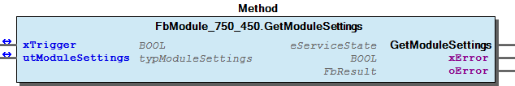 Graphical Interface of FbModule_750_450.GetModuleSettings Example For get the settings from the module. Note You have to call the method cyclic until the method returns with DONE or ABORT.

## FbModule_750_450.GetRawChannelCalibration (METH)


| Scope | Name | Type |
| --- | --- | --- |
| Return | GetRawChannelCalibration | WagoTypesModuleBase.eServiceState |
| Input | usiChannel | USINT (1..WagoTypesModule_750_450.MAX_CHANNEL_450) |
| Inout | xTrigger | BOOL |
| utRawChannelCalibration | WagoTypesModule_750_450.typRawChannelCalibration |
| Output | xError | BOOL |
| oError | WagoSysErrorBase.FbResult |

| Struct member | Value | Description |
| --- | --- | --- |
| xUserCalibration | FALSE | User calibration disabled |
| TRUE | User calibration enabled |
| iUserCalibrationOffset | -32768 ... 32767 | User calibration Offset |
| uiUserCalibrationGain | 0 ... 65535 | User calibration Gain |

```
VAR
    //--- Channel Calibration ---------------------------------
    utChannelCalibration    :   WagoTypesModule_750_450.typRawChannelCalibration;;
    xGetChannelCalibration  :   BOOL;
    oError                  :   WagoSysErrorBase.FbResult;
END_VAR

//--- C H A N N E L    C A L I B R A T I O N -----------------------
CASE my450.GetRawChannelCalibration(    usiChannel              := 1,
                                        xTrigger                := xGetChannelCalibration,
                                        utRawChannelCalibration := utChannelCalibration,
                                        oError                  => oError
                                    ) OF

    eServiceState.DONE : // OK
            ;// process here your utModuleSettings

    eServiceState.ABORT : // Error
            ;// process here your error handling -> see oError for more information

END_CASE
```

Get the complete raw channel calibration of one channel, specified by usiChannel in a struct.

WagoTypesModule_750_450.typRawChannelCalibration

Graphical Illustration

Graphical Interface of FbModule_750_450.GetRawChannelCalibration

For get the raw calibration from first channel of the module.

You have to call the method cyclic until the method returns with DONE or ABORT.

Interface variables Function Get the complete raw channel calibration of one channel, specified by usiChannel in a struct. WagoTypesModule_750_450.typRawChannelCalibration Graphical Illustration  Graphical Interface of FbModule_750_450.GetRawChannelCalibration Example For get the raw calibration from first channel of the module. Note You have to call the method cyclic until the method returns with DONE or ABORT.

## FbModule_750_450.GetRawChannelConfiguration (METH)


| Scope | Name | Type |
| --- | --- | --- |
| Return | GetRawChannelConfiguration | WagoTypesModuleBase.eServiceState |
| Input | usiChannel | USINT (1..WagoTypesModule_750_450.MAX_CHANNEL_450) |
| Inout | xTrigger | BOOL |
| utRawChannelConfiguration | WagoTypesModule_750_450.typRawChannelConfiguration |
| Output | xError | BOOL |
| oError | WagoSysErrorBase.FbResult |

| Struct member | Value | Description |
| --- | --- | --- |
| Settings | eSensorType |  | Standard | Range | Resolution |
| Pt100_EN60751 | IEC 751 | -200 °C...850 °C | 0.1 K |
| Ni100_DIN43760 | DIN 43760 | -60 °C...250 °C | 0.1 K |
| Pt1000_EN60751 | IEC 751 | -200 °C...850 °C | 0.1 K |
| Pt500_EN60751 | IEC 751 | -200 °C...850 °C | 0.1 K |
| Pt200_EN60751 | IEC 751 | -200 °C...850 °C | 0.1 K |
| Ni1000_TK6180 | DIN 43760 | -60 °C...250 °C | 0.1 K |
| Ni120_MINCO | Minco | -80 °C...260 °C | 0.1 K |
| Ni1000_TK5000 | TK 5000 | -60 °C...250 °C | 0.1 K |
| Ni1000_TK6180_01 | DIN 43760 | -50 °C...150 °C | 0.01 K |
| Ni1000_TK5000_01 | TK 5000 | -50 °C...150 °C | 0.01 K |
| Pt1000_EN60751_01 | IEC 751 | -50 °C...150 °C | 0.01 K |
| Pt100_EN60751_01 | IEC 751 | -50 °C...150 °C | 0.01 K |
| Potentiometer |  | 0 % ... 100 % | 0.005 % |
| Resistor_1 |  | 0 Ω...5 kΩ | 0.2 Ω |
| Resistor_2 |  | 0 Ω...1.2 kΩ | 0.02 Ω |
| eWireMode | DISABLED | Channel deactivated |
| TWO_WIRE | 2-Wire Connection |
| THREE_WIRE | 3-Wire Connection |
| FOUR_WIRE | 4-Wire Connection |
| xEnableDiagGlobal | FALSE | Diagnostis global functions disabled |
| TRUE | Diagnostis global functions enabled |
| xEnableDiagWireBreak | FALSE | Diagnostis wire break disabled |
| TRUE | Diagnostis wire break enabled |
| xEnableDiagShortCircuit | FALSE | Diagnostis short circuit disabled |
| TRUE | Diagnostis short circuit enabled |
| xEnableDiagCommonError | FALSE | Diagnostis Group error disabled |
| TRUE | Diagnostis Group error enabled |
| xEnableDiagOverflow | FALSE | Diagnostis overrange disabled |
| TRUE | Diagnostis overrange enabled |
| xEnableDiagUnderflow | FALSE | Diagnostis underrange disabled |
| TRUE | Diagnostis underrange enabled |
| iUpperUserLimitValue | -32768 ... 32767 | Upper user limit value |
| xEnableDiagLimitOverflow | FALSE | Diagnostis user limiting value overrange disabled |
| TRUE | Diagnostis user limiting value overrange enabled |
| iLowerUserLimitValue | -32768 ... 32767 | Lower user limit value |
| xEnableDiagLimitUnderflow | FALSE | Diagnostis user limiting value underrange disabled |
| TRUE | Diagnostis user limiting value underrange enabled |
| Scaling | xUserScaling | FALSE | User scaling disabled -> use manufacturer scaling |
| TRUE | User scaling enabled |
| iUserScalingOffset | -32768 ... 32767 | User scaling Offset |
| uiUserScalingGain | 0 ... 65535 | User scaling Gain |
| uiUserScalingDivisor | 0 ... 65535 | User scaling Divisor default = 256 -> (read only) |
| uiLineResistance | 0 ... 65535 | Line resistor [mΩ] |
| Calibration | xUserCalibration | FALSE | User calibration disabled |
| TRUE | User calibration enabled |
| iUserCalibrationOffset | -32768 ... 32767 | User calibration Offset |
| uiUserCalibrationGain | 0 ... 65535 | User calibration Gain |

```
VAR
    //--- Channel Configuration ---------------------------------
    utRawChannelConfiguration   :   WagoTypesModule_750_450.typRawChannelConfiguration;
    xGetRawChannelConfiguration :   BOOL;
    oError                      :   WagoSysErrorBase.FbResult;
END_VAR

//--- R A W   C H A N N E L    C O N F I G U R A T I O N -----------------------
CASE my450.GetRawChannelConfiguration(  usiChannel                := 1,
                                        xTrigger                  := xGetRawChannelConfiguration,
                                        utRawChannelConfiguration := utRawChannelConfiguration,
                                        oError                    => oError
                                        ) OF

    eServiceState.DONE : // OK
            ;// process here your utRawChannelConfiguration

    eServiceState.ABORT : // Error
            ;// process here your error handling -> see oError for more information

END_CASE
```

Get the complete configuration of a channel.

WagoTypesModule_750_450.typRawChannelConfiguration

Graphical Illustration

Graphical Interface of FbModule_750_450.GetRawChannelConfiguration

For get the scaled configuration from channel one

You have to call the method cyclic until the method returns with DONE or ABORT.

Interface variables Function Get the complete configuration of a channel. WagoTypesModule_750_450.typRawChannelConfiguration Graphical Illustration 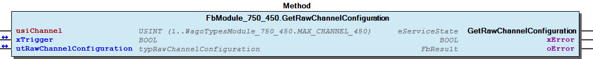 Graphical Interface of FbModule_750_450.GetRawChannelConfiguration Example For get the scaled configuration from channel one Note You have to call the method cyclic until the method returns with DONE or ABORT.

## FbModule_750_450.GetRawChannelScaling (METH)


| Scope | Name | Type |
| --- | --- | --- |
| Return | GetRawChannelScaling | WagoTypesModuleBase.eServiceState |
| Input | usiChannel | USINT (1..WagoTypesModule_750_450.MAX_CHANNEL_450) |
| Inout | xTrigger | BOOL |
| utRawChannelScaling | WagoTypesModule_750_450.typRawChannelScaling |
| Output | xError | BOOL |
| oError | WagoSysErrorBase.FbResult |

| Struct member | Value | Description |
| --- | --- | --- |
| xUserScaling | FALSE | User scaling disabled -> use manufacturer scaling |
| TRUE | User scaling enabled |
| iUserScalingOffset | -32768 ... 32767 | User scaling Offset |
| uiUserScalingGain | 0 ... 65535 | User scaling Gain |
| uiUserScalingDivisor | 0 ... 65535 | User scaling Divisor default = 256 -> (read only) |
| uiLineResistance | 0 ... 65535 | Line resistance [Ohm] |

```
VAR
    //--- Raw Channel Scaling -------------------------------------------
    utRawChannelScaling     :   WagoTypesModule_750_450.typRawChannelScaling;
    xGetRawChannelScaling   :   BOOL;
    oError                  :   WagoSysErrorBase.FbResult;
END_VAR

//--- R A W   C H A N N E L   S C A L I N G -------------------------------------
CASE my450.GetRawChannelScaling( 1, xGetRawChannelScaling, utRawChannelScaling, oError => oError) OF

    eServiceState.DONE : // OK
            ;// process here your utRawChannelScaling

    eServiceState.ABORT : // Error
            ;// process here your error handling -> for more information about the error see oError

END_CASE
```

Get the complete raw channel scaling of one channel, specified by usiChannel in a struct.

WagoTypesModule_750_450.typRawChannelScaling

Graphical Illustration

Graphical Interface of FbModule_750_450.GetRawChannelScaling

For get the raw scaling from first channel of the module.

You have to call the method cyclic until the method returns with DONE or ABORT.

Interface variables Function Get the complete raw channel scaling of one channel, specified by usiChannel in a struct. WagoTypesModule_750_450.typRawChannelScaling Graphical Illustration  Graphical Interface of FbModule_750_450.GetRawChannelScaling Example For get the raw scaling from first channel of the module. Note You have to call the method cyclic until the method returns with DONE or ABORT.

## FbModule_750_450.GetRawChannelSettings (METH)


| Scope | Name | Type |
| --- | --- | --- |
| Return | GetRawChannelSettings | WagoTypesModuleBase.eServiceState |
| Input | usiChannel | USINT (1..WagoTypesModule_750_450.MAX_CHANNEL_450) |
| Inout | xTrigger | BOOL |
| utRawChannelSettings | WagoTypesModule_750_450.typRawChannelSettings |
| Output | xError | BOOL |
| oError | WagoSysErrorBase.FbResult |

| Struct member | Value | Description |
| --- | --- | --- |
| eSensorType | Pt100_EN60751 | IEC 751 | -200 °C...850 °C | Resolution 0.1 °C |
| Ni100_DIN43760 | DIN 43760 | -60 °C...250 °C | Resolution 0.1 °C |
| Pt1000_EN60751 | IEC 751 | -200 °C...850 °C | Resolution 0.1 °C |
| Pt500_EN60751 | IEC 751 | -200 °C...850 °C | Resolution 0.1 °C |
| Pt200_EN60751 | IEC 751 | -200 °C...850 °C | Resolution 0.1 °C |
| Ni1000_TK6180 | DIN 43760 | -60 °C...250 °C | Resolution 0.1 °C |
| Ni120_MINCO | Minco | -80 °C...260 °C | Resolution 0.1 °C |
| Ni1000_TK5000 | TK 5000 | -60 °C...250 °C | Resolution 0.1 °C |
| Ni1000_TK6180_01 | DIN 43760 | -50 °C...150 °C | Resolution 0.01 °C |
| Ni1000_TK5000_01 | TK 5000 | -50 °C...150 °C | Resolution 0.01 °C |
| Pt1000_EN60751_01 | IEC 751 | -50 °C...150 °C | Resolution 0.01 °C |
| Pt100_EN60751_01 | IEC 751 | -50 °C...150 °C | Resolution 0.01 °C |
| Resistor_1 |  | 0 Ohm...5 kOhm | Resolution 0.2 Ohm |
| Resistor_2 | \| 0 Ohm...1.2 kOhm \| Resolution 0.02 Ohm |
| eWireMode | DISABLED | Channel deactiveted |
| TWO_WIRE | 2-Wire Connection |
| THREE_WIRE | 3-Wire Connection |
| FOUR_WIRE | 4-Wire Connection |
| xEnableDiagGlobal | FALSE | Diagnostis global functions disabled |
| TRUE | Diagnostis global functions enabled |
| xEnableDiagWireBreak | FALSE | Diagnostis wire break disabled |
| TRUE | Diagnostis wire break enabled |
| xEnableDiagShortCircuit | FALSE | Diagnostis short circuit disabled |
| TRUE | Diagnostis short circuit enabled |
| xEnableDiagCommonError | FALSE | Diagnostis Group error disabled |
| TRUE | Diagnostis Group error enabled |
| xEnableDiagOverflow | FALSE | Diagnostis overrange disabled |
| TRUE | Diagnostis overrange enabled |
| xEnableDiagUnderflow | FALSE | Diagnostis underrange disabled |
| TRUE | Diagnostis underrange enabled |
| iUpperUserLimitValue | -32768 ... 32767 | Upper user limit value |
| xEnableDiagLimitOverflow | FALSE | Diagnostis user limiting value overrange disabled |
| TRUE | Diagnostis user limiting value overrange enabled |
| iLowerUserLimitValue | -32768 ... 32767 | Lower user limit value |
| xEnableDiagLimitUnderflow | FALSE | Diagnostis user limiting value underrange disabled |
| TRUE | Diagnostis user limiting value underrange enabled |

```
VAR
    //--- Raw Channel Settings -----------------------------------------------
    utRawChannelSettings    :   WagoTypesModule_750_450.typRawChannelSettings;
    xGetRawChannelSettings  :   BOOL;
    oError                  :   WagoSysErrorBase.FbResult;
END_VAR

//--- R A W   C H A N N E L   S E T T I N G S -----------------------------------
CASE my450.GetRawChannelSettings( 1, xGetRawChannelSettings, utRawChannelSettings, oError => oError) OF

    eServiceState.DONE : // OK
            ;// process here your utRawChannelScaling

    eServiceState.ABORT : // Error
            ;// process here your error handling -> for more information about the error see oError

END_CASE
```

Get the complete raw channel settings of one channel, specified by usiChannel in a struct.

WagoTypesModule_750_450.typRawChannelSettings

Graphical Illustration

Graphical Interface of FbModule_750_450.GetRawChannelSettings

For get the raw settings from first channel of the module.

You have to call the method cyclic until the method returns with DONE or ABORT.

Interface variables Function Get the complete raw channel settings of one channel, specified by usiChannel in a struct. WagoTypesModule_750_450.typRawChannelSettings Graphical Illustration  Graphical Interface of FbModule_750_450.GetRawChannelSettings Example For get the raw settings from first channel of the module. Note You have to call the method cyclic until the method returns with DONE or ABORT.

## FbModule_750_450.GetScaledChannelConfiguration (METH)


| Scope | Name | Type |
| --- | --- | --- |
| Return | GetScaledChannelConfiguration | WagoTypesModuleBase.eServiceState |
| Input | usiChannel | USINT (1..WagoTypesModule_750_450.MAX_CHANNEL_450) |
| Inout | xTrigger | BOOL |
| utScaledChannelConfiguration | WagoTypesModule_750_450.typScaledChannelConfiguration |
| Output | xError | BOOL |
| oError | WagoSysErrorBase.FbResult |

| Struct member | Value | Description |
| --- | --- | --- |
| Settings | eSensorType | Pt100_EN60751 | IEC 751 | -200 °C...850 °C | Resolution 0.1 °C |
| Ni100_DIN43760 | DIN 43760 | -60 °C...250 °C | Resolution 0.1 °C |
| Pt1000_EN60751 | IEC 751 | -200 °C...850 °C | Resolution 0.1 °C |
| Pt500_EN60751 | IEC 751 | -200 °C...850 °C | Resolution 0.1 °C |
| Pt200_EN60751 | IEC 751 | -200 °C...850 °C | Resolution 0.1 °C |
| Ni1000_TK6180 | DIN 43760 | -60 °C...250 °C | Resolution 0.1 °C |
| Ni120_MINCO | Minco | -80 °C...260 °C | Resolution 0.1 °C |
| Ni1000_TK5000 | TK 5000 | -60 °C...250 °C | Resolution 0.1 °C |
| Ni1000_TK6180_01 | DIN 43760 | -50 °C...150 °C | Resolution 0.01 °C |
| Ni1000_TK5000_01 | TK 5000 | -50 °C...150 °C | Resolution 0.01 °C |
| Pt1000_EN60751_01 | IEC 751 | -50 °C...150 °C | Resolution 0.01 °C |
| Pt100_EN60751_01 | IEC 751 | -50 °C...150 °C | Resolution 0.01 °C |
| Potentiometer |  | 0 %...100 % | Resolution 0.005 % |
| Resistor_1 |  | 0 Ω...5 kΩ | Resolution 0.2 Ω |
| Resistor_2 |  | 0 Ω...1.2 kΩ | Resolution 0.02 Ω |
| eWireMode | DISABLED | Channel deactiveted |
| TWO_WIRE | 2-Wire Connection |
| THREE_WIRE | 3-Wire Connection |
| FOUR_WIRE | 4-Wire Connection |
| xEnableDiagGlobal | FALSE | Diagnostis global functions disabled |
| TRUE | Diagnostis global functions enabled |
| xEnableDiagWireBreak | FALSE | Diagnostis wire break disabled |
| TRUE | Diagnostis wire break enabled |
| xEnableDiagShortCircuit | FALSE | Diagnostis short circuit disabled |
| TRUE | Diagnostis short circuit enabled |
| xEnableDiagCommonError | FALSE | Diagnostis Group error disabled |
| TRUE | Diagnostis Group error enabled |
| xEnableDiagOverflow | FALSE | Diagnostis overrange disabled |
| TRUE | Diagnostis overrange enabled |
| xEnableDiagUnderflow | FALSE | Diagnostis underrange disabled |
| TRUE | Diagnostis underrange enabled |
| rUpperUserLimitValue |  | Upper user limit value range depends on sensortype |
| xEnableDiagLimitOverflow | FALSE | Diagnostis user limiting value overrange disabled |
| TRUE | Diagnostis user limiting value overrange enabled |
| rLowerUserLimitValue |  | Lower user limit value range depends on sensortype |
| xEnableDiagLimitUnderflow | FALSE | Diagnostis user limiting value underrange disabled |
| TRUE | Diagnostis user limiting value underrange enabled |
| Scaling | xUserScaling | FALSE | User scaling disabled -> use manufacturer scaling |
| TRUE | User scaling enabled |
| rUserScalingOffset |  | User scaling Offset range depends on sensortype |
| uiUserScalingGain | 0 ... 65535 | User scaling Gain |
| uiUserScalingDivisor | 0 ... 65535 | User scaling Divisor default = 256 -> (read only) |
| rLineResistance | 0 ... 65.535 | Line resistance [Ω] |
| Calibration | xUserCalibration | FALSE | User calibration disabled |
| TRUE | User calibration enabled |
| diUserCalibrationOffset | -262144 .. 261236 | User calibration Offset |
| rUserCalibrationGain | 0 ... 1.9999 | User calibration Gain |

| Return Value | Description |
| --- | --- |
| WagoTypesModuleBase.eServiceState.DONE | successful |
| WagoTypesModuleBase.eServiceState.ABORT | error -> see oError |
| WagoTypesModuleBase.eServiceState.NO_DATA | call while xTrigger is reset |

```
VAR
    //--- Channel Configuration -------------------------------------------------------
    utScaledChannelConfiguration    :   WagoTypesModule_750_450.typRawChannelConfiguration;
    oError                          :   WagoSysErrorBase.FbResult;
    xGetScaledChannelConfiguration  :   BOOL;
END_VAR

//--- C H A N N E L   C O N F I G U R A T I O N ----------------------
CASE my450.GetScaledChannelConfiguration( 1, xGetScaledChannelConfiguration, utScaledChannelConfiguration, oError => oError) OF

    eServiceState.DONE : // OK
            ;// process here your utScaledChannelConfiguration

    eServiceState.ABORT : // Error
            ;// process here your error handling -> see oError for more information

END_CASE
```

Get the complete scaled configuration of one channel, specified by usiChannel in a struct. This struct contains the three components Settings , Scaling and Calibration for holding the scaled values.

WagoTypesModule_750_451.typScaledChannelConfiguration

Return Values

It is not allowed to reset the xTrigger by the application. This must done by the method.

Graphical Illustration

Graphical Interface of FbModule_750_450.GetScaledChannelConfiguration

Example for ST

For get the scaled configuration of the first channel

You have to call the method cyclic until the method returns with DONE or ABORT.

Interface variables Function Get the complete scaled configuration of one channel, specified by usiChannel in a struct. This struct contains the three components Settings , Scaling and Calibration for holding the scaled values. WagoTypesModule_750_451.typScaledChannelConfiguration Return Values Warning It is not allowed to reset the xTrigger by the application. This must done by the method. Graphical Illustration 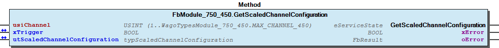 Graphical Interface of FbModule_750_450.GetScaledChannelConfiguration Example for ST For get the scaled configuration of the first channel Note You have to call the method cyclic until the method returns with DONE or ABORT.

## FbModule_750_450.GetSettingsChannel (METH)


| Scope | Name | Type |
| --- | --- | --- |
| Return | GetSettingsChannel | WagoTypesModuleBase.eServiceState |
| Input | usiChannel | USINT (1..WagoTypesModule_750_450.MAX_CHANNEL_450) |
| Inout | utSettingsChannel | WagoTypesModule_750_450.typReg35Settings |
| Output | oError | WagoSysErrorBase.FbResult |

| Struct member | Value | Description |
| --- | --- | --- |
| eSensorType | Pt100_EN60751 | IEC 751 | -200 °C...850 °C | Resolution 0.1 °C |
| Ni100_DIN43760 | DIN 43760 | -60 °C...250 °C | Resolution 0.1 °C |
| Pt1000_EN60751 | IEC 751 | -200 °C...850 °C | Resolution 0.1 °C |
| Pt500_EN60751 | IEC 751 | -200 °C...850 °C | Resolution 0.1 °C |
| Pt200_EN60751 | IEC 751 | -200 °C...850 °C | Resolution 0.1 °C |
| Ni1000_TK6180 | DIN 43760 | -60 °C...250 °C | Resolution 0.1 °C |
| Ni120_MINCO | Minco | -80 °C...260 °C | Resolution 0.1 °C |
| Ni1000_TK5000 | TK 5000 | -60 °C...250 °C | Resolution 0.1 °C |
| Ni1000_TK6180_01 | DIN 43760 | -50 °C...150 °C | Resolution 0.01 °C |
| Ni1000_TK5000_01 | TK 5000 | -50 °C...150 °C | Resolution 0.01 °C |
| Pt1000_EN60751_01 | IEC 751 | -50 °C...150 °C | Resolution 0.01 °C |
| Pt100_EN60751_01 | IEC 751 | -50 °C...150 °C | Resolution 0.01 °C |
| Resistor_1 |  | 0 Ohm...5 kOhm | Resolution 0.2 Ohm |
| Resistor_2 |  | 0 Ohm...1.2 kOhm | Resolution 0.02 Ohm |
| eWireMode | DISABLED | Channel deactiveted |
| TWO_WIRE | 2-Wire Connection |
| THREE_WIRE | 3-Wire Connection |
| FOUR_WIRE | 4-Wire Connection |
| xUserCalibration | FALSE | Manufacturer calibration |
| TRUE | User calibration |
| xUserScaling | FALSE | User scaling disabled |
| TRUE | User scaling enabled |
| xEnableDiagUnderflow | FALSE | Diagnostis underrange disabled |
| TRUE | Diagnostis underrange enabled |
| xEnableDiagOverflow | FALSE | Diagnostis overrange disabled |
| TRUE | Diagnostis overrange enabled |
| xEnableDiagLimitUnderflow | FALSE | Diagnostis user limiting value underrange disabled |
| TRUE | Diagnostis user limiting value underrange enabled |
| xEnableDiagLimitOverflow | FALSE | Diagnostis user limiting value overrange disabled |
| TRUE | Diagnostis user limiting value overrange enabled |
| xEnableDiagShortCircuit | FALSE | Diagnostis short circuit disabled |
| TRUE | Diagnostis short circuit enabled |
| xEnableDiagWireBreak | FALSE | Diagnostis wire break disabled |
| TRUE | Diagnostis wire break enabled |
| xEnableDiagCommonError | FALSE | Diagnostis Group error disabled |
| TRUE | Diagnostis Group error enabled |
| xEnableDiagGlobal | FALSE | Diagnostis global functions disabled |
| TRUE | Diagnostis global functions enabled |

```
VAR
    //--- Channel Settings ---------------------------------
    utSettingsChannel   :   typReg35Settings;
    xGetSettingsChannel :   BOOL;
END_VAR

//--- C H A N N E L   S E T T I N G S ----------------------
IF xGetSettingsChannel THEN
    CASE my451.GetSettingsChannel( 1, utSettingsChannel) OF

        eServiceState.DONE : // OK
                xGetSettingsChannel := FALSE;
                ;// process here your utSettingsChannel

        eServiceState.ABORT : // Error
                xGetSettingsChannel := FALSE;
                ;// process here your error handling

    END_CASE
END_IF
```

Get the esttings of a channel at a struct.

Graphical Illustration

Graphical Interface of FbModule_750_450.GetSettingsChannel

For get the settings from channel

You have to call the method cyclic until the method returns with DONE or ABORT.

Interface variables Function Get the esttings of a channel at a struct. Graphical Illustration 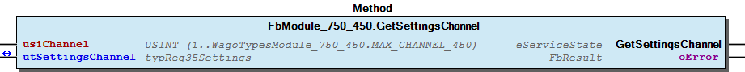 Graphical Interface of FbModule_750_450.GetSettingsChannel Example For get the settings from channel Note You have to call the method cyclic until the method returns with DONE or ABORT.

## FbModule_750_450.SetModuleSettings (METH)


| Scope | Name | Type |
| --- | --- | --- |
| Return | SetModuleSettings | WagoTypesModuleBase.eServiceState |
| Inout | xTrigger | BOOL |
| utModuleSettings | WagoTypesModule_750_450.typModuleSettings |
| Output | xError | BOOL |
| oError | WagoSysErrorBase.FbResult |

| Struct member | Value | Description |
| --- | --- | --- |
| xAmountSignFormat | FALSE | Numeric values appear in two’s complement |
| TRUE | Numeric values appear in amount / sign format |
| xS5FB250Format | FALSE | Numeric values appear in standard format |
| TRUE | Numeric values appear in S5-FB250 format |
| xDisableWatchdog | FALSE | The Watchdog timer is enabled |
| TRUE | The Watchdog timer is not enabled. The Satus LEDs light up continuously |
| eNotchFilter | DISABLED_100HZ | The Notch filter is not enabled (100 Hz) |
| ENABLED_50HZ | Notch filter ( 50 Hz ) |
| ENABLED_60HZ | Notch filter ( 60 Hz ) |
| ENABLED_50_60HZ | Notch filter ( 50/60 Hz ) |

```
VAR
    //--- Module Mode Settings ------------------------------
    utModuleSettings    :   WagoTypesModule_750_450.typModuleSettings;
    xSetModuleSettings  :   BOOL; // set this variable once to start the process. It will be reset by the Method automatic.
    oError              :   WagoSysErrorBase.FbResult;
END_VAR

//--- S E T   M O D U L E    S E T T I N G S ---------------
CASE my450.SetModuleSettings(xSetModuleSettings, utModuleSettings, oError => oError) OF

    eServiceState.DONE : // OK

    eServiceState.ABORT : // Error
            ;// process here your error handling -> see oError for more information

END_CASE
```

Set the common settings of the module from a struct.

WagoTypesModule_750_450.typModuleSettings

Graphical Illustration

Graphical Interface of FbModule_750_450.SetModuleSettings

For set the settings from the module.

You have to call the method cyclic until the method returns with DONE or ABORT.

Interface variables Function Set the common settings of the module from a struct. WagoTypesModule_750_450.typModuleSettings Graphical Illustration  Graphical Interface of FbModule_750_450.SetModuleSettings Example For set the settings from the module. Note You have to call the method cyclic until the method returns with DONE or ABORT.

## FbModule_750_450.SetRawChannelCalibration (METH)


| Scope | Name | Type |
| --- | --- | --- |
| Return | SetRawChannelCalibration | WagoTypesModuleBase.eServiceState |
| Input | usiChannel | USINT (1..WagoTypesModule_750_450.MAX_CHANNEL_450) |
| Inout | xTrigger | BOOL |
| utRawChannelCalibration | WagoTypesModule_750_450.typRawChannelCalibration |
| Output | xError | BOOL |
| oError | WagoSysErrorBase.FbResult |

| Struct member | Value | Description |
| --- | --- | --- |
| xUserCalibration | FALSE | User calibration disabled |
| TRUE | User calibration enabled |
| iUserCalibrationOffset | -32768 ... 32767 | User calibration Offset |
| uiUserCalibrationGain | 0 ... 65535 | User calibration Gain |

```
VAR
    //--- Channel Calibration ---------------------------------
    utChannelCalibration    :   WagoTypesModule_750_450.typRawChannelCalibration;
    xSetChannelCalibration  :   BOOL;
    oError                  :   WagoSysErrorBase.FbResult;
END_VAR

//--- C H A N N E L    C A L I B R A T I O N -----------------------
CASE my450.SetRawChannelCalibration(    usiChannel              := 1,
                                        xTrigger                := xSetChannelCalibration,
                                        utRawChannelCalibration := utChannelCalibration,
                                        oError                  => oError
                                   ) OF

    eServiceState.DONE : // OK
            ;// process here your utModuleSettings

    eServiceState.ABORT : // Error
            ;// process here your error handling -> see oError for more information

END_CASE
```

Set the calibration of a channel by a struct.

WagoTypesModule_750_450.typRawChannelCalibration

Graphical Illustration

Graphical Interface of FbModule_750_450.SetRawChannelCalibration

For set the calibration of channel one

You have to call the method cyclic until the method returns with DONE or ABORT.

Interface variables Function Set the calibration of a channel by a struct. WagoTypesModule_750_450.typRawChannelCalibration Graphical Illustration 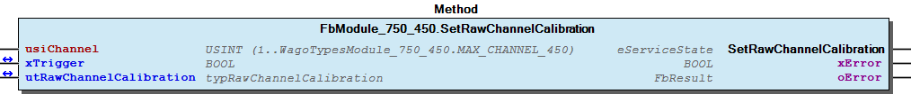 Graphical Interface of FbModule_750_450.SetRawChannelCalibration Example For set the calibration of channel one Note You have to call the method cyclic until the method returns with DONE or ABORT.

## FbModule_750_450.SetRawChannelConfiguration (METH)


| Scope | Name | Type |
| --- | --- | --- |
| Return | SetRawChannelConfiguration | WagoTypesModuleBase.eServiceState |
| Input | usiChannel | USINT (1..WagoTypesModule_750_450.MAX_CHANNEL_450) |
| Inout | xTrigger | BOOL |
| utRawChannelConfiguration | WagoTypesModule_750_450.typRawChannelConfiguration |
| Output | xError | BOOL |
| oError | WagoSysErrorBase.FbResult |

| Struct member | Value | Description |
| --- | --- | --- |
| Settings | eSensorType |  | Standard | Range | Resolution |
| Pt100_EN60751 | IEC 751 | -200 °C...850 °C | 0.1 K |
| Ni100_DIN43760 | DIN 43760 | -60 °C...250 °C | 0.1 K |
| Pt1000_EN60751 | IEC 751 | -200 °C...850 °C | 0.1 K |
| Pt500_EN60751 | IEC 751 | -200 °C...850 °C | 0.1 K |
| Pt200_EN60751 | IEC 751 | -200 °C...850 °C | 0.1 K |
| Ni1000_TK6180 | DIN 43760 | -60 °C...250 °C | 0.1 K |
| Ni120_MINCO | Minco | -80 °C...260 °C | 0.1 K |
| Ni1000_TK5000 | TK 5000 | -60 °C...250 °C | 0.1 K |
| Ni1000_TK6180_01 | DIN 43760 | -50 °C...150 °C | 0.01 K |
| Ni1000_TK5000_01 | TK 5000 | -50 °C...150 °C | 0.01 K |
| Pt1000_EN60751_01 | IEC 751 | -50 °C...150 °C | 0.01 K |
| Pt100_EN60751_01 | IEC 751 | -50 °C...150 °C | 0.01 K |
| Potentiometer |  | 0 % ... 100 % | 0.005 % |
| Resistor_1 |  | 0 Ω...5 kΩ | 0.2 Ω |
| Resistor_2 |  | 0 Ω...1.2 kΩ | 0.02 Ω |
| eWireMode | DISABLED | Channel deactivated |
| TWO_WIRE | 2-Wire Connection |
| THREE_WIRE | 3-Wire Connection |
| FOUR_WIRE | 4-Wire Connection |
| xEnableDiagGlobal | FALSE | Diagnostis global functions disabled |
| TRUE | Diagnostis global functions enabled |
| xEnableDiagWireBreak | FALSE | Diagnostis wire break disabled |
| TRUE | Diagnostis wire break enabled |
| xEnableDiagShortCircuit | FALSE | Diagnostis short circuit disabled |
| TRUE | Diagnostis short circuit enabled |
| xEnableDiagCommonError | FALSE | Diagnostis Group error disabled |
| TRUE | Diagnostis Group error enabled |
| xEnableDiagOverflow | FALSE | Diagnostis overrange disabled |
| TRUE | Diagnostis overrange enabled |
| xEnableDiagUnderflow | FALSE | Diagnostis underrange disabled |
| TRUE | Diagnostis underrange enabled |
| iUpperUserLimitValue | -32768 ... 32767 | Upper user limit value |
| xEnableDiagLimitOverflow | FALSE | Diagnostis user limiting value overrange disabled |
| TRUE | Diagnostis user limiting value overrange enabled |
| iLowerUserLimitValue | -32768 ... 32767 | Lower user limit value |
| xEnableDiagLimitUnderflow | FALSE | Diagnostis user limiting value underrange disabled |
| TRUE | Diagnostis user limiting value underrange enabled |
| Scaling | xUserScaling | FALSE | User scaling disabled -> use manufacturer scaling |
| TRUE | User scaling enabled |
| iUserScalingOffset | -32768 ... 32767 | User scaling Offset |
| uiUserScalingGain | 0 ... 65535 | User scaling Gain |
| uiUserScalingDivisor | 0 ... 65535 | User scaling Divisor default = 256 -> (read only) |
| uiLineResistance | 0 ... 65535 | Line resistor [mΩ] |
| Calibration | xUserCalibration | FALSE | User calibration disabled |
| TRUE | User calibration enabled |
| iUserCalibrationOffset | -32768 ... 32767 | User calibration Offset |
| uiUserCalibrationGain | 0 ... 65535 | User calibration Gain |

```
VAR
    //--- Channel Configuration -------------------------------------------------------
    xStartProcess               :   BOOL; // set this variable once to start the process -> this varibale will be automatic reset
    utRawChannelConfiguration   :   WagoTypesModule_750_450.typRawChannelConfiguration;
    oError                      :   WagoSysErrorBase.FbResult;
    xSetRawChannelConfiguration :   BOOL;
END_VAR

//--- C H A N N E L    C O N F I G U R A T I O N -----------------------
//--- READ BEFORE WRITE --------------------------------------------------------------
CASE my450.GetRawChannelConfiguration( 1, xStartProcess, utRawChannelConfiguration, oError => oError) OF

    eServiceState.DONE : // OK -> actual configuration is successful read
        // change here your configuration
        // utRawChannelConfiguration... :=
        xSetRawChannelConfiguration := TRUE; // trigger write

    eServiceState.ABORT : // Error -> not able to read -> see oError
            ;// process here your error handling for read -> see oError for more information

END_CASE

//--- WRITE MODYFIED CONFIGURATION ---------------------------------------------------
CASE my450.SetRawChannelConfiguration( 1, xSetRawChannelConfiguration, utRawChannelConfiguration, oError => oError) OF

    eServiceState.DONE : // OK -> new configuration is written

    eServiceState.ABORT : // Error -> not able to write -> see oError
            ;// process here your error handling for write -> see oError for more information

END_CASE
```

Set the complete raw configuration of a channel.

WagoTypesModule_750_450.typRawChannelConfiguration

Graphical Illustration

Graphical Interface of FbModule_750_450.SetRawChannelConfiguration

For get the configuration from channel one and after read, write the configuration

You have to call the method cyclic until the method returns with DONE or ABORT.

Interface variables Function Set the complete raw configuration of a channel. WagoTypesModule_750_450.typRawChannelConfiguration Graphical Illustration  Graphical Interface of FbModule_750_450.SetRawChannelConfiguration Example For get the configuration from channel one and after read, write the configuration Note You have to call the method cyclic until the method returns with DONE or ABORT.

## FbModule_750_450.SetRawChannelScaling (METH)


| Scope | Name | Type |
| --- | --- | --- |
| Return | SetRawChannelScaling | WagoTypesModuleBase.eServiceState |
| Input | usiChannel | USINT (1..WagoTypesModule_750_450.MAX_CHANNEL_450) |
| Inout | xTrigger | BOOL |
| utRawChannelScaling | WagoTypesModule_750_450.typRawChannelScaling |
| Output | xError | BOOL |
| oError | WagoSysErrorBase.FbResult |

| Struct member | Value | Description |
| --- | --- | --- |
| xUserScaling | FALSE | User scaling disabled -> use manufacturer scaling |
| TRUE | User scaling enabled |
| iUserScalingOffset | -32768 ... 32767 | User scaling Offset |
| uiUserScalingGain | 0 ... 65535 | User scaling Gain |
| uiUserScalingDivisor | 0 ... 65535 | User scaling Divisor default = 256 -> (read only) |
| uiLineResistance | 0 ... 65535 | Line resistor [mOhm] |

```
VAR
    //--- Channel Settings ---------------------------------
    utChannelScaling    :   WagoTypesModule_750_450.typRawChannelScaling;
    xSetChannelScaling  :   BOOL;
    oError              :   WagoSysErrorBase.FbResult;
END_VAR

//--- C H A N N E L   S C A L I N G ------------------------
CASE my450.SetRawChannelScaling(    usiChannel          := 1,
                                    xTrigger            := xSetChannelScaling,
                                    utRawChannelScaling := utChannelScaling,
                                    oError              => oError
                                ) OF

    eServiceState.DONE : // OK
            ;// process here your utModuleSettings

    eServiceState.ABORT : // Error
            ;// process here your error handling -> see oError for more information

END_CASE
```

Set the scaling of a channel by a struct.

WagoTypesModule_750_450.typRawChannelScaling

Graphical Illustration

Graphical Interface of FbModule_750_450.SetRawChannelScaling

For set the scaling of channel one

You have to call the method cyclic until the method returns with DONE or ABORT.

Interface variables Function Set the scaling of a channel by a struct. WagoTypesModule_750_450.typRawChannelScaling Graphical Illustration 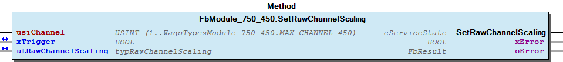 Graphical Interface of FbModule_750_450.SetRawChannelScaling Example For set the scaling of channel one Note You have to call the method cyclic until the method returns with DONE or ABORT.

## FbModule_750_450.SetRawChannelSettings (METH)


| Scope | Name | Type |
| --- | --- | --- |
| Return | SetRawChannelSettings | WagoTypesModuleBase.eServiceState |
| Input | usiChannel | USINT (1..WagoTypesModule_750_450.MAX_CHANNEL_450) |
| Inout | xTrigger | BOOL |
| utRawChannelSettings | WagoTypesModule_750_450.typRawChannelSettings |
| Output | xError | BOOL |
| oError | WagoSysErrorBase.FbResult |

| Struct member | Value | Description |
| --- | --- | --- |
| eSensorType |  | Standard | Range | Resolution |
| Pt100_EN60751 | IEC 751 | -200 °C...850 °C | 0.1 K |
| Ni100_DIN43760 | DIN 43760 | -60 °C...250 °C | 0.1 K |
| Pt1000_EN60751 | IEC 751 | -200 °C...850 °C | 0.1 K |
| Pt500_EN60751 | IEC 751 | -200 °C...850 °C | 0.1 K |
| Pt200_EN60751 | IEC 751 | -200 °C...850 °C | 0.1 K |
| Ni1000_TK6180 | DIN 43760 | -60 °C...250 °C | 0.1 K |
| Ni120_MINCO | Minco | -80 °C...260 °C | 0.1 K |
| Ni1000_TK5000 | TK 5000 | -60 °C...250 °C | 0.1 K |
| Ni1000_TK6180_01 | DIN 43760 | -50 °C...150 °C | 0.01 K |
| Ni1000_TK5000_01 | TK 5000 | -50 °C...150 °C | 0.01 K |
| Pt1000_EN60751_01 | IEC 751 | -50 °C...150 °C | 0.01 K |
| Pt100_EN60751_01 | IEC 751 | -50 °C...150 °C | 0.01 K |
| Potentiometer |  | 0 % ... 100 % | 0.005 % |
| Resistor_1 |  | 0 Ω...5 kΩ | 0.2 Ω |
| Resistor_2 |  | 0 Ω...1.2 kΩ | 0.02 Ω |
| eWireMode | DISABLED | Channel deactivated |
| TWO_WIRE | 2-Wire Connection |
| THREE_WIRE | 3-Wire Connection |
| FOUR_WIRE | 4-Wire Connection |
| xEnableDiagGlobal | FALSE | Diagnostis global functions disabled |
| TRUE | Diagnostis global functions enabled |
| xEnableDiagWireBreak | FALSE | Diagnostis wire break disabled |
| TRUE | Diagnostis wire break enabled |
| xEnableDiagShortCircuit | FALSE | Diagnostis short circuit disabled |
| TRUE | Diagnostis short circuit enabled |
| xEnableDiagCommonError | FALSE | Diagnostis Group error disabled |
| TRUE | Diagnostis Group error enabled |
| xEnableDiagOverflow | FALSE | Diagnostis overrange disabled |
| TRUE | Diagnostis overrange enabled |
| xEnableDiagUnderflow | FALSE | Diagnostis underrange disabled |
| TRUE | Diagnostis underrange enabled |
| iUpperUserLimitValue | -32768 ... 32767 | Upper user limit value |
| xEnableDiagLimitOverflow | FALSE | Diagnostis user limiting value overrange disabled |
| TRUE | Diagnostis user limiting value overrange enabled |
| iLowerUserLimitValue | -32768 ... 32767 | Lower user limit value |
| xEnableDiagLimitUnderflow | FALSE | Diagnostis user limiting value underrange disabled |
| TRUE | Diagnostis user limiting value underrange enabled |

```
VAR
    //--- Channel Settings ---------------------------------
    utChannelSettings   :   WagoTypesModule_750_450.typRawChannelSettings;
    xSetChannelSettings :   BOOL;
    oError              :   WagoSysErrorBase.FbResult;
END_VAR

//--- C H A N N E L   S E T T I N G S ----------------------
CASE my450.SetRawChannelSettings(   usiChannel           := 1,
                                    xTrigger             := xSetChannelSettings,
                                    utRawChannelSettings := utChannelSettings,
                                    oError               => oError
                                ) OF

    eServiceState.DONE : // OK
        ;// process here your utModuleSettings

    eServiceState.ABORT : // Error
        ;// process here your error handling -> see oError for more information

END_CASE
```

Set the settings for a channel by a struct.

WagoTypesModule_750_450.typRawChannelSettings

Graphical Illustration

Graphical Interface of FbModule_750_450.SetRawChannelSettings

For set the settings of channel one

You have to call the method cyclic until the method returns with DONE or ABORT.

Interface variables Function Set the settings for a channel by a struct. WagoTypesModule_750_450.typRawChannelSettings Graphical Illustration  Graphical Interface of FbModule_750_450.SetRawChannelSettings Example For set the settings of channel one Note You have to call the method cyclic until the method returns with DONE or ABORT.

## FbModule_750_450.SetScaledChannelConfiguration (METH)


| Scope | Name | Type |
| --- | --- | --- |
| Return | SetScaledChannelConfiguration | WagoTypesModuleBase.eServiceState |
| Input | usiChannel | USINT (1..WagoTypesModule_750_450.MAX_CHANNEL_450) |
| Inout | xTrigger | BOOL |
| utScaledChannelConfiguration | WagoTypesModule_750_450.typScaledChannelConfiguration |
| Output | xError | BOOL |
| oError | WagoSysErrorBase.FbResult |

| Struct member | Value | Description |
| --- | --- | --- |
| Settings | eSensorType |  | Standard | Range | Resolution |
| Pt100_EN60751 | IEC 751 | -200 °C...850 °C | 0.1 K |
| Ni100_DIN43760 | DIN 43760 | -60 °C...250 °C | 0.1 K |
| Pt1000_EN60751 | IEC 751 | -200 °C...850 °C | 0.1 K |
| Pt500_EN60751 | IEC 751 | -200 °C...850 °C | 0.1 K |
| Pt200_EN60751 | IEC 751 | -200 °C...850 °C | 0.1 K |
| Ni1000_TK6180 | DIN 43760 | -60 °C...250 °C | 0.1 K |
| Ni120_MINCO | Minco | -80 °C...260 °C | 0.1 K |
| Ni1000_TK5000 | TK 5000 | -60 °C...250 °C | 0.1 K |
| Ni1000_TK6180_01 | DIN 43760 | -50 °C...150 °C | 0.01 K |
| Ni1000_TK5000_01 | TK 5000 | -50 °C...150 °C | 0.01 K |
| Pt1000_EN60751_01 | IEC 751 | -50 °C...150 °C | 0.01 K |
| Pt100_EN60751_01 | IEC 751 | -50 °C...150 °C | 0.01 K |
| Potentiometer |  | 0 % ... 100 % | 0.005 % |
| Resistor_1 |  | 0 Ω...5 kΩ | 0.2 Ω |
| Resistor_2 |  | 0 Ω...1.2 kΩ | 0.02 Ω |
| eWireMode | DISABLED | Channel deactiveted |
| TWO_WIRE | 2-Wire Connection |
| THREE_WIRE | 3-Wire Connection |
| FOUR_WIRE | 4-Wire Connection |
| xEnableDiagGlobal | FALSE | Diagnostis global functions disabled |
| TRUE | Diagnostis global functions enabled |
| xEnableDiagWireBreak | FALSE | Diagnostis wire break disabled |
| TRUE | Diagnostis wire break enabled |
| xEnableDiagShortCircuit | FALSE | Diagnostis short circuit disabled |
| TRUE | Diagnostis short circuit enabled |
| xEnableDiagCommonError | FALSE | Diagnostis Group error disabled |
| TRUE | Diagnostis Group error enabled |
| xEnableDiagOverflow | FALSE | Diagnostis overrange disabled |
| TRUE | Diagnostis overrange enabled |
| xEnableDiagUnderflow | FALSE | Diagnostis underrange disabled |
| TRUE | Diagnostis underrange enabled |
| rUpperUserLimitValue |  | Upper user limit value range depends on sensortype |
| xEnableDiagLimitOverflow | FALSE | Diagnostis user limiting value overrange disabled |
| TRUE | Diagnostis user limiting value overrange enabled |
| rLowerUserLimitValue |  | Lower user limit value range depends on sensortype |
| xEnableDiagLimitUnderflow | FALSE | Diagnostis user limiting value underrange disabled |
| TRUE | Diagnostis user limiting value underrange enabled |
| Scaling | xUserScaling | FALSE | User scaling disabled -> use manufacturer scaling |
| TRUE | User scaling enabled |
| rUserScalingOffset |  | User scaling Offset range depends on sensortype |
| uiUserScalingGain | 0 ... 65535 | User scaling Gain |
| uiUserScalingDivisor | 0 ... 65535 | User scaling Divisor default = 256 -> (read only) |
| rLineResistance | 0 ... 65.535 | Line resistance [Ω] |
| Calibration | xUserCalibration | FALSE | User calibration disabled |
| TRUE | User calibration enabled |
| diUserCalibrationOffset | -262144 .. 261236 | User calibration Offset |
| rUserCalibrationGain | 0 ... 1.9999 | User calibration Gain |

```
VAR
    //--- Channel Configuration -------------------------------------------------------
    xStartProcess                   :   BOOL; // set this variable once to start the process -> this varibale will be automatic reset
    utScaledChannelConfiguration    :   WagoTypesModule_750_450.typScaledChannelConfiguration;
    oError                          :   WagoSysErrorBase.FbResult;
    xSetScaledChannelConfiguration  :   BOOL;
END_VAR

//--- C H A N N E L    C O N F I G U R A T I O N -----------------------
//--- READ BEFORE WRITE --------------------------------------------------------------
CASE my450.GetScaledChannelConfiguration( 1, xStartProcess, utScaledChannelConfiguration, oError => oError) OF

    eServiceState.DONE : // OK -> actual configuration is successful read
        // change here your configuration
        // utScaledChannelConfiguration... :=
        xSetScaledChannelConfiguration := TRUE; // trigger write

    eServiceState.ABORT : // Error -> not able to read -> see oError
            ;// process here your error handling for read -> see oError for more information

END_CASE

//--- WRITE MODYFIED CONFIGURATION ---------------------------------------------------
CASE my450.SetScaledChannelConfiguration( 1, xSetScaledChannelConfiguration, utScaledChannelConfiguration, oError => oError) OF

    eServiceState.DONE : // OK -> new configuration is written

    eServiceState.ABORT : // Error -> not able to write -> see oError
            ;// process here your error handling for write -> see oError for more information

END_CASE
```

Set the complete configuration of a channel.

WagoTypesModule_750_450.typScaledChannelConfiguration

Graphical Illustration

Graphical Interface of FbModule_750_450.SetScaledChannelConfiguration

For get the scaled configuration from channel one and after read, write the configuration

You have to call the method cyclic until the method returns with DONE or ABORT.

Interface variables Function Set the complete configuration of a channel. WagoTypesModule_750_450.typScaledChannelConfiguration Graphical Illustration 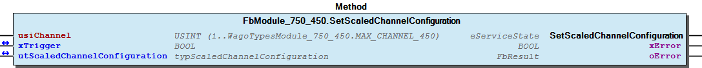 Graphical Interface of FbModule_750_450.SetScaledChannelConfiguration Example For get the scaled configuration from channel one and after read, write the configuration Note You have to call the method cyclic until the method returns with DONE or ABORT.

## FbModule_750_450_dynConfig.GetDiagnosis (METH)


| Scope | Name | Type |
| --- | --- | --- |
| Return | GetDiagnosis | BYTE |
| Input | usiChannel | USINT (1..WagoTypesModule_750_450.MAX_CHANNEL_450) |

| Bit | Value | Description |
| --- | --- | --- |
| 0 | TRUE | short circuit or broken wire |
| 1 | TRUE | overflow or underflow |
| 2 |  | not used |
| 3 |  | not used |
| 4 |  | not used |
| 5 |  | not used |
| 6 | TRUE | diagnostic not available -> xS5FB250Format not set |
| 7 | TRUE | invalid channel |

```
VAR
    bDiagnostic :   BYTE;
END_VAR

bDiagnostic := my450.GetDiagnosis(1); // here is the diagnostic byte
```

To work with this method the module mode setting xS5FB250Format must be set to TRUE. In other cases there is no access to module diagnosis at this time.

xS5FB250Format must be set ...

Graphical Illustration

Graphical Interface of FbModule_750_450_dynConfig.GetDiagnosis

Interface variables Function To work with this method the module mode setting xS5FB250Format must be set to TRUE. In other cases there is no access to module diagnosis at this time. Note xS5FB250Format must be set ... Graphical Illustration 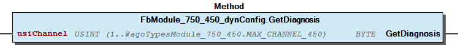 Graphical Interface of FbModule_750_450_dynConfig.GetDiagnosis Example For get the diagnostic byte from first channel of the module.

## FbModule_750_450_dynConfig.GetModuleInputSize (METH)


| Scope | Name | Type |
| --- | --- | --- |
| Return | GetModuleInputSize | UINT |

Returns the byte size of input data

Interface variables Returns the byte size of input data

## FbModule_750_450_dynConfig.GetProcessInBit (METH)


| Scope | Name | Type | Comment |
| --- | --- | --- | --- |
| Return | GetProcessInBit | BOOL |  |
| Input | ByteNo | UINT | range 0..(_uiInputSize - 1) |
| BitNo | USINT | range 0..7 |

## FbModule_750_450_dynConfig.GetProcessInByte (METH)


| Scope | Name | Type | Comment |
| --- | --- | --- | --- |
| Return | GetProcessInByte | BYTE |  |
| Input | ByteNo | UINT | range 0..(_uiInputSize - 1) |

## FbModule_750_450_dynConfig.GetProcessInData (METH)


| Scope | Name | Type | Comment |
| --- | --- | --- | --- |
| Return | GetProcessInData | UINT |  |
| Input | pInData | POINTER TO BYTE | pointer to the area where the process data should store |
| uiNInData | UINT | SIZEOF(Buffer) |

## FbModule_750_450_dynConfig.GetProcessInDword (METH)


| Scope | Name | Type | Comment |
| --- | --- | --- | --- |
| Return | GetProcessInDword | DWORD |  |
| Input | ByteNo | UINT | range 0..(_uiInputSize - 4) |

Graphical Illustration

Graphical Interface of FbModule_750_450_dynConfig.GetProcessInDword

Interface variables Function Get the process input dword specified by ByteNo of this module. Graphical Illustration 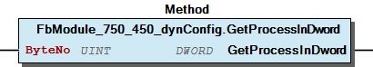 Graphical Interface of FbModule_750_450_dynConfig.GetProcessInDword

## FbModule_750_450_dynConfig.GetProcessInWord (METH)


| Scope | Name | Type | Comment |
| --- | --- | --- | --- |
| Return | GetProcessInWord | WORD |  |
| Input | ByteNo | UINT | range 0..(_uiInputSize - 2) |

Graphical Illustration

Graphical Interface of FbModule_750_450_dynConfig.GetProcessInWord

Interface variables Function Get the process input word specified by ByteNo of this module. Graphical Illustration 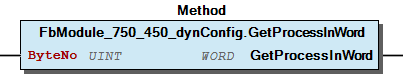 Graphical Interface of FbModule_750_450_dynConfig.GetProcessInWord

## FbModule_750_450_dynConfig.GetRawProcessValue (METH)


| Scope | Name | Type |
| --- | --- | --- |
| Return | GetRawProcessValue | INT |
| Input | usiChannel | USINT (1..WagoTypesModule_750_450.MAX_CHANNEL_450) |

```
VAR
    myiProcessRawValue  :   INT;
END_VAR

myiProcessRawValue := my450.GetRawProcessValue(1); // here is the process raw value as INT
```

Get the raw process value of the wanted channel. The return value is unscaled in the range -32768 .. 37767.

In case of error (e.g. an invalid channel number is given) it returns 0.

Graphical Illustration

Graphical Interface of FbModule_750_450_dynConfig.GetRawProcessValue

Interface variables Function Get the raw process value of the wanted channel. The return value is unscaled in the range -32768 .. 37767. In case of error (e.g. an invalid channel number is given) it returns 0. Graphical Illustration 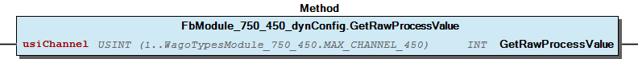 Graphical Interface of FbModule_750_450_dynConfig.GetRawProcessValue Example For get the process raw value from first channel of the module.

## FbModule_750_450_dynConfig.GetScaledProcessValue (METH)


| Scope | Name | Type |
| --- | --- | --- |
| Return | GetScaledProcessValue | REAL |
| Input | usiChannel | USINT (1..WagoTypesModule_750_450.MAX_CHANNEL_450) |

```
VAR
    myrScaledProcessValue   :   REAL;
END_VAR

myrScaledProcessValue := my450.GetScaledProcessValue(1); // here is the process value
```

Graphical Illustration

Graphical Interface of FbModule_750_450_dynConfig.GetScaledProcessValue

Interface variables Function Get the scaled process value of the wanted channel. The range of the value depends on the configured sensortype. Graphical Illustration 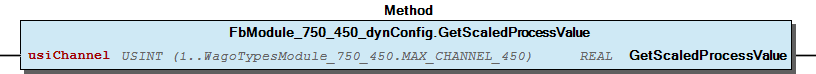 Graphical Interface of FbModule_750_450_dynConfig.GetScaledProcessValue Example For get the process scaled value from first channel of the module.

## Settings


- FbModule_750_450.GetSettingsChannel (METH)

### Program Organization


## 20 Program Organization Units


- FbModule_750_450 (FB) I_Module_750_450 Channel FbModule_750_450.GetRawChannelCalibration (METH) - FbModule_750_450.GetRawChannelScaling (METH) - FbModule_750_450.GetRawChannelSettings (METH) - FbModule_750_450.SetRawChannelCalibration (METH) - FbModule_750_450.SetRawChannelScaling (METH) - FbModule_750_450.SetRawChannelSettings (METH) FbModule_750_450.GetRawChannelConfiguration (METH) FbModule_750_450.GetScaledChannelConfiguration (METH) Module - FbModule_750_450.GetModuleSettings (METH) - FbModule_750_450.SetModuleSettings (METH) FbModule_750_450.SetRawChannelConfiguration (METH) FbModule_750_450.SetScaledChannelConfiguration (METH) private - Configuration raw Settings FbModule_750_450.GetSettingsChannel (METH) FbModule_750_450_dynConfig (FB) - I_ModuleProcessInputsExtended FbModule_750_450_dynConfig.GetModuleInputSize (METH) - FbModule_750_450_dynConfig.GetProcessInBit (METH) - FbModule_750_450_dynConfig.GetProcessInByte (METH) - FbModule_750_450_dynConfig.GetProcessInData (METH) - FbModule_750_450_dynConfig.GetProcessInDword (METH) - FbModule_750_450_dynConfig.GetProcessInWord (METH) ProcessValues - FbModule_750_450_dynConfig.GetDiagnosis (METH) - FbModule_750_450_dynConfig.GetRawProcessValue (METH) - FbModule_750_450_dynConfig.GetScaledProcessValue (METH)

### Global Variable Lists


## Error_450 (GVL)


| Scope | Name | Type |
| --- | --- | --- |
| Constant | ERROR_450 | ARRAY [0..15] OF WagoTypesErrorBase.typResultItem |

| Value | Level | Description |
| --- | --- | --- |
| eError_450.OK | WagoTypesErrorBase.eSeverity.none | ‘OK’ |
| eError_450.INVALID_CHANNEL | WagoTypesErrorBase.eSeverity.error | ‘The wanted channel number is not allowed’ |
| eError_450.LINE_RESISTANCE_TO_SMALL | WagoTypesErrorBase.eSeverity.error | ‘The line resistance is to small (Range 0 .. 65.535’ |
| eError_450.LINE_RESISTANCE_TO_BIG | WagoTypesErrorBase.eSeverity.error | ‘The line resistance is to big (Range 0 .. 65.535’ |
| eError_450.LOWER_USER_LIMIT_TO_SMALL | WagoTypesErrorBase.eSeverity.error | ‘The lower user limit value is to small (Range depends on sensor type’ |
| eError_450.LOWER_USER_LIMIT_TO_BIG | WagoTypesErrorBase.eSeverity.error | ‘The lower user limit value is to big (Range depends on sensor type’ |
| eError_450.UPPER_USER_LIMIT_TO_SMALL | WagoTypesErrorBase.eSeverity.error | ‘The upper user limit value is to small (Range depends on sensor type’ |
| eError_450.UPPER_USER_LIMIT_TO_BIG | WagoTypesErrorBase.eSeverity.error | ‘The upper user limit value is to big (Range depends on sensor type’ |
| eError_450.LOWER_LIMIT_BIGGER_THAN_UPPER | WagoTypesErrorBase.eSeverity.error | ‘The lower user limit value s bigger than the upper user limit value’ |
| eError_450.UNKNOWN_SENSOR_TYPE | WagoTypesErrorBase.eSeverity.error | ‘Not supported sensor type’ |
| eError_450.USER_SCALING_OFFSET_TO_SMALL | WagoTypesErrorBase.eSeverity.error | ‘The user scaling offset is to small (Range depends on sensor type’ |
| eError_450.USER_SCALING_OFFSET_TO_BIG | WagoTypesErrorBase.eSeverity.error | ‘The user scaling offset is to big (Range depends on sensor type’ |
| eError_450.USER_CALIBRATION_GAIN_TO_SMALL | WagoTypesErrorBase.eSeverity.error | ‘The user calibration gain is to small (Range 0 .. 1.9999)’ |
| eError_450.USER_CALIBRATION_GAIN_TO_BIG | WagoTypesErrorBase.eSeverity.error | ‘The user calibration gain is to big (Range 0 .. 1.9999)’ |
| eError_450.USER_CALIBRATION_OFFSET_TO_SMALL | WagoTypesErrorBase.eSeverity.error | ‘The user calibration offset is to small (Range -262144 .. 262136)’ |
| eError_450.USER_CALIBRATION_OFFSET_TO_BIG | WagoTypesErrorBase.eSeverity.error | ‘The user calibration offset is to big (Range -262144 .. 262136)’ |

## VersionHistory (GVL)


| Name | Type |
| --- | --- |
| Info | ProjectInfo |

| date | version | author | change |
| 28.08.2024 | 1.9.4.3 | u0103719 | WAT36092: add missing sensor PT100_EN60751 (context: sensor type) |
| 17.08.2020 | 1.9.4.2 | u010545 | Bugfix documentation |
| 30.08.2019 | 1.9.4.1 | u010545 | Bugfix Byteorder I_ModuleProcessInputsExtended |
| 06.08.2019 | 1.9.4.0 | u010545 | Interface for dyn config pa access added |
| 16.07.2019 | 1.9.3.0 | u010545 | Interface for dyn config added |
| 08.01.2019 | 1.9.2.0 | u015842 | Properties: free placeholder added |
| 23.04.2018 | 1.9.1.1 | u010545 | update documentation |
| 06.02.2018 | 1.9.1.0 | u010545 | bugfix limit write order |
| 11.10.2017 | 1.9.0.2 | u010545 | unifications |
| 09.10.2017 | 1.9.0.1 | u010545 | channel quantity modified |
| 29.07.2017 | 1.9.0.0 | u010545 | changed for compability with old WagoSysModuleBase |
| 26.09.2017 | 1.0.0.0 | u010545 | first release |
| 29.08.2017 | 0.0.0.1 | u010545 | Init |

WagoSysModule_750_450.library

Release Notes:

WagoSysModule_750_450.library Release Notes:

### Other Components


## 80 Status ¶


- Error_450 (GVL) - eError_450 (ENUM)

## Channel


- FbModule_750_450.GetRawChannelCalibration (METH) - FbModule_750_450.GetRawChannelScaling (METH) - FbModule_750_450.GetRawChannelSettings (METH) - FbModule_750_450.SetRawChannelCalibration (METH) - FbModule_750_450.SetRawChannelScaling (METH) - FbModule_750_450.SetRawChannelSettings (METH)

## Configuration


- raw Settings FbModule_750_450.GetSettingsChannel (METH)

## I_ModuleProcessInputsExtended


- FbModule_750_450_dynConfig.GetModuleInputSize (METH) - FbModule_750_450_dynConfig.GetProcessInBit (METH) - FbModule_750_450_dynConfig.GetProcessInByte (METH) - FbModule_750_450_dynConfig.GetProcessInData (METH) - FbModule_750_450_dynConfig.GetProcessInDword (METH) - FbModule_750_450_dynConfig.GetProcessInWord (METH)

## I_Module_750_450


- Channel FbModule_750_450.GetRawChannelCalibration (METH) - FbModule_750_450.GetRawChannelScaling (METH) - FbModule_750_450.GetRawChannelSettings (METH) - FbModule_750_450.SetRawChannelCalibration (METH) - FbModule_750_450.SetRawChannelScaling (METH) - FbModule_750_450.SetRawChannelSettings (METH) FbModule_750_450.GetRawChannelConfiguration (METH) FbModule_750_450.GetScaledChannelConfiguration (METH) Module - FbModule_750_450.GetModuleSettings (METH) - FbModule_750_450.SetModuleSettings (METH) FbModule_750_450.SetRawChannelConfiguration (METH) FbModule_750_450.SetScaledChannelConfiguration (METH)

## Module


- FbModule_750_450.GetModuleSettings (METH) - FbModule_750_450.SetModuleSettings (METH)

## ProcessValues


- FbModule_750_450_dynConfig.GetDiagnosis (METH) - FbModule_750_450_dynConfig.GetRawProcessValue (METH) - FbModule_750_450_dynConfig.GetScaledProcessValue (METH)

## eError_450 (ENUM)


| Name | Initial | Comment |
| --- | --- | --- |
| OK | 0 | all is well |
| INVALID_CHANNEL | 1 | invalid channel number |
| LINE_RESISTANCE_TO_SMALL | 2 |  |
| LINE_RESISTANCE_TO_BIG | 3 |  |
| LOWER_USER_LIMIT_TO_SMALL | 4 |  |
| LOWER_USER_LIMIT_TO_BIG | 5 |  |
| UPPER_USER_LIMIT_TO_SMALL | 6 |  |
| UPPER_USER_LIMIT_TO_BIG | 7 |  |
| LOWER_LIMIT_BIGGER_THAN_UPPER | 8 |  |
| UNKNOWN_SENSOR_TYPE | 9 |  |
| USER_SCALING_OFFSET_TO_SMALL | 10 |  |
| USER_SCALING_OFFSET_TO_BIG | 11 |  |
| USER_CALIBRATION_GAIN_TO_SMALL | 12 |  |
| USER_CALIBRATION_GAIN_TO_BIG | 13 |  |
| USER_CALIBRATION_OFFSET_TO_SMALL | 14 |  |
| USER_CALIBRATION_OFFSET_TO_BIG | 15 |  |

## private


- Configuration raw Settings FbModule_750_450.GetSettingsChannel (METH)

## raw


- Settings FbModule_750_450.GetSettingsChannel (METH)