# WagoSysModule_750_451 v1.9.4.3 (WAGO) - Complete Documentation


## 📋 Library Information

- **Company:** WAGO
- **Title:** WagoSysModule_750_451
- **Version:** 1.9.4.3
- **Categories:** WAGO LayerView|Sys; Application
- **Author:** WAGO
- **Placeholder:** WagoSysModule_750_451

### Description ¶


This document is automatically generated.

Handling modules 750-451

This document is automatically generated. Handling modules 750-451

### Contents: ¶


Contents: - Documentation Index - Project Information - Library Information - Function Blocks FbModule_750_451 (FB) - FbModule_750_451_dynConfig (FB) Methods - FbModule_750_451.GetModuleSettings (METH) - FbModule_750_451.GetRawChannelCalibration (METH) - FbModule_750_451.GetRawChannelConfiguration (METH) - FbModule_750_451.GetRawChannelScaling (METH) - FbModule_750_451.GetRawChannelSettings (METH) - FbModule_750_451.GetScaledChannelConfiguration (METH) - FbModule_750_451.GetSettingsChannel (METH) - FbModule_750_451.SetModuleSettings (METH) - FbModule_750_451.SetRawChannelCalibration (METH) - FbModule_750_451.SetRawChannelConfiguration (METH) - ... and 13 more Program Organization Global Variable Lists - Error_451 (GVL) - VersionHistory (GVL) Other Components - 80 Status - Channel - Configuration - I_ModuleProcessInputsExtended - I_Module_750_451 - Module - ProcessValues - eError_451 (ENUM) - private - raw

### Indices and tables ¶


Based on WagoSysModule_750_451.library, last modified 20.09.2024, 21:23:08. LibDoc 3.5.16.10

© WAGO GmbH & Co. KG, Germany 2018 – All rights reserved. For the avoidance of doubt, this copyright notice does not only apply to the information above but also and primarily to the described library itself. Please note that third-party products are always mentioned without reference to intellectual property rights, including patents, utility models, designs and trademarks, accordingly the existence of such rights cannot be excluded. WAGO is a registered trademark of WAGO Verwaltungsgesellschaft mbH.

- File and Project Information - Library Reference Based on WagoSysModule_750_451.library, last modified 20.09.2024, 21:23:08. LibDoc 3.5.16.10 © WAGO GmbH & Co. KG, Germany 2018 – All rights reserved. For the avoidance of doubt, this copyright notice does not only apply to the information above but also and primarily to the described library itself. Please note that third-party products are always mentioned without reference to intellectual property rights, including patents, utility models, designs and trademarks, accordingly the existence of such rights cannot be excluded. WAGO is a registered trademark of WAGO Verwaltungsgesellschaft mbH.

### Documentation Index


## WagoSysModule_750_451 Library Documentation


| Company: | WAGO |
| Title: | WagoSysModule_750_451 |
| Version: | 1.9.4.3 |
| Categories: | WAGO LayerView\|Sys; Application |
| Author: | WAGO |
| Placeholder: | WagoSysModule_750_451 |

### Description


This document is automatically generated.

Handling modules 750-451

This document is automatically generated. Handling modules 750-451

### Contents:


- 20 Program Organization Units FbModule_750_451 (FB) - FbModule_750_451_dynConfig (FB) 80 Status - Error_451 (GVL) - eError_451 (ENUM) VersionHistory (GVL)

### Indices and tables


Based on WagoSysModule_750_451.library, last modified 20.09.2024, 21:23:08. LibDoc 3.5.16.10

© WAGO GmbH & Co. KG, Germany 2018 – All rights reserved. For the avoidance of doubt, this copyright notice does not only apply to the information above but also and primarily to the described library itself. Please note that third-party products are always mentioned without reference to intellectual property rights, including patents, utility models, designs and trademarks, accordingly the existence of such rights cannot be excluded. WAGO is a registered trademark of WAGO Verwaltungsgesellschaft mbH.

- File and Project Information - Library Reference Based on WagoSysModule_750_451.library, last modified 20.09.2024, 21:23:08. LibDoc 3.5.16.10 © WAGO GmbH & Co. KG, Germany 2018 – All rights reserved. For the avoidance of doubt, this copyright notice does not only apply to the information above but also and primarily to the described library itself. Please note that third-party products are always mentioned without reference to intellectual property rights, including patents, utility models, designs and trademarks, accordingly the existence of such rights cannot be excluded. WAGO is a registered trademark of WAGO Verwaltungsgesellschaft mbH.

### Project Information


## File and Project Information


| Scope | Name | Type | Content |
| --- | --- | --- | --- |
| FileHeader | libraryFile | string | WagoSysModule_750_451.library |
| contentFile | doc.clean.json |
| productName | e!COCKPIT |
| creationDateTime | date | 20.09.2024, 21:23:08 |
| companyName | string | WAGO |
| ProjectInformation | LastModificationDateTime | date | 20.09.2024, 21:23:08 |
| Description | string | See: Description |
| Copyright | © WAGO Kontakttechnik GmbH & Co. KG, Germany 2018 – All rights reserved. |
| Author | WAGO |
| AutoResolveUnbound | bool | True |
| Placeholder | string | WagoSysModule_750_451 |
| Company | WAGO |
| DocFormat | reStructuredText |
| Project | WagoSysModule_750_451 |
| Version string |  |
| Version | version | 1.9.4.3 |
| ActivateSigning | bool | False |
| Title | string | WagoSysModule_750_451 |
| LibraryCategories | library-category-list | WAGO LayerView\|Sys; Application |
| CompiledLibraryCompatibilityVersion | string | CODESYS V3.5 SP16 Patch 3 |

### Library Information


## Library Reference


| LinkAllContent: False QualifiedOnly: False | SystemLibrary: False | Optional: False |

| LinkAllContent: False QualifiedOnly: False | SystemLibrary: False | Optional: False |

| LinkAllContent: False QualifiedOnly: False | SystemLibrary: False | Optional: False |

| LinkAllContent: False Optional: False | QualifiedOnly: True SystemLibrary: False | PublishSymbolsInContainer: True |

| LinkAllContent: False QualifiedOnly: True | SystemLibrary: False PublishSymbolsInContainer: True | Optional: False |

| LinkAllContent: False Optional: False | QualifiedOnly: True SystemLibrary: False | PublishSymbolsInContainer: True |

This is a dictionary of all referenced libraries and their name spaces.

This is a dictionary of all referenced libraries and their name spaces. WagoSysErrorBase Library Identification : Placeholder: WagoSysErrorBase Default Resolution: WagoSysErrorBase, * (WAGO) Namespace: WagoSysErrorBase Library Properties : WagoSysModuleBaseProtected Library Identification : Placeholder: WagoSysModuleBaseProtected Default Resolution: WagoSysModuleBaseProtected, * (WAGO) Namespace: WagoSysModuleBaseProtected Library Properties : Library Parameter : Parameter: REGISTER_COM_TIMEOUT = TIME#5s0ms Parameter: PARAMETER_COM_TIMEOUT = TIME#5s0ms WagoSysVersion Library Identification : Name: WagoSysVersion Version: 1.0.0.0 Company: WAGO Namespace: WagoSysVersion Library Properties : WagoTypesCommon Library Identification : Placeholder: WagoTypesCommon Default Resolution: WagoTypesCommon, * (WAGO) Namespace: WagoTypes Library Properties : WagoTypesModuleBase Library Identification : Placeholder: WagoTypesModuleBase Default Resolution: WagoTypesModuleBase, * (WAGO) Namespace: WagoTypesModuleBase Library Properties : Library Parameter : Parameter: MAX_MBX_SIZE = 18 WagoTypesModule_750_451 Library Identification : Placeholder: WagoTypesModule_750_451 Default Resolution: WagoTypesModule_750_451, * (WAGO) Namespace: WagoTypesModule_750_451 Library Properties :

### Function Blocks


## FbModule_750_451 (FB)


| Scope | Name | Type | Inherited from |
| --- | --- | --- | --- |
| Output | oError | WagoSysErrorBase.FbResult | FbModuleBase |

Function description

Interface variables Function Access to the module 750-451 without PA-Access. For the PA-Acces you have to made the mapping. Function description This block is needed for each module. The instance of this function block is either automatically generated by the K-Bus configuration. - I_Module_750_451 Channel FbModule_750_451.GetRawChannelCalibration (METH) - FbModule_750_451.GetRawChannelScaling (METH) - FbModule_750_451.GetRawChannelSettings (METH) - FbModule_750_451.SetRawChannelCalibration (METH) - FbModule_750_451.SetRawChannelScaling (METH) - FbModule_750_451.SetRawChannelSettings (METH) FbModule_750_451.GetRawChannelConfiguration (METH) FbModule_750_451.GetScaledChannelConfiguration (METH) Module - FbModule_750_451.GetModuleSettings (METH) - FbModule_750_451.SetModuleSettings (METH) FbModule_750_451.SetRawChannelConfiguration (METH) FbModule_750_451.SetScaledChannelConfiguration (METH) private - Configuration raw Settings FbModule_750_451.GetSettingsChannel (METH)

## FbModule_750_451_dynConfig (FB)


| Scope | Name | Type | Inherited from |
| --- | --- | --- | --- |
| Output | oError | WagoSysErrorBase.FbResult | FbModuleBase |

Function description

Interface variables Function Access to the module 750-451 with PA-Access. In case of dynamic configuration the FB provides additional the PA-Access. Function description This block is needed for each module. The instance of this function block has to be manually added in case of the dynamic configuration. - I_ModuleProcessInputsExtended FbModule_750_451_dynConfig.GetModuleInputSize (METH) - FbModule_750_451_dynConfig.GetProcessInBit (METH) - FbModule_750_451_dynConfig.GetProcessInByte (METH) - FbModule_750_451_dynConfig.GetProcessInData (METH) - FbModule_750_451_dynConfig.GetProcessInDword (METH) - FbModule_750_451_dynConfig.GetProcessInWord (METH) ProcessValues - FbModule_750_451_dynConfig.GetDiagnosis (METH) - FbModule_750_451_dynConfig.GetRawProcessValue (METH) - FbModule_750_451_dynConfig.GetScaledProcessValue (METH)

### Methods


## FbModule_750_451.GetModuleSettings (METH)


| Scope | Name | Type |
| --- | --- | --- |
| Return | GetModuleSettings | WagoTypesModuleBase.eServiceState |
| Inout | xTrigger | BOOL |
| utModuleSettings | WagoTypesModule_750_451.typModuleSettings |
| Output | xError | BOOL |
| oError | WagoSysErrorBase.FbResult |

| Struct member | Value | Description |
| --- | --- | --- |
| xAmountSignFormat | FALSE | Numeric values appear in two’s complement |
| TRUE | Numeric values appear in amount / sign format |
| xS5FB250Format | FALSE | Numeric values appear in standard format |
| TRUE | Numeric values appear in S5-FB250 format |
| xDisableWatchdog | FALSE | The Watchdog timer is enabled |
| TRUE | The Watchdog timer is not enabled. The Satus LEDs light up continuously |
| eNotchFilter | DISABLED_100HZ | The Notch filter is not enabled (100 Hz) |
| ENABLED_50HZ | Notch filter ( 50 Hz ) |
| ENABLED_60HZ | Notch filter ( 60 Hz ) |
| ENABLED_50_60HZ | Notch filter ( 50/60 Hz ) |

| Return Value | Description |
| --- | --- |
| WagoTypesModuleBase.eServiceState.DONE | successful |
| WagoTypesModuleBase.eServiceState.ABORT | error -> see oError |
| WagoTypesModuleBase.eServiceState.NO_DATA | call while xTrigger is reset |

```
VAR
    //--- Module Mode Settings ------------------------------
    utModuleSettings    :   WagoTypesModule_750_451.typModuleSettings;
    xGetModuleSettings  :   BOOL;
    oError              :   WagoSysErrorBase.FbResult;
END_VAR

//--- M O D U L E    S E T T I N G S -----------------------
CASE my451.GetModuleSettings(xGetModuleSettings, utModuleSettings, oError => oError) OF

    eServiceState.DONE : // OK
            ;// process here your utModuleSettings

    eServiceState.ABORT : // Error
            ;// process here your error handling -> see oError for more information

END_CASE
```

Get the common settings of the module at a struct.

Return Values

It is not allowed to reset the xTrigger by the application. This must done by the method.

Graphical Illustration

Graphical Interface of FbModule_750_451.GetModuleSettings

For get the settings from the module.

You have to call the method cyclic until the method returns with DONE or ABORT.

Interface variables Function Get the common settings of the module at a struct. Return Values Warning It is not allowed to reset the xTrigger by the application. This must done by the method. Graphical Illustration  Graphical Interface of FbModule_750_451.GetModuleSettings Example For get the settings from the module. Note You have to call the method cyclic until the method returns with DONE or ABORT.

## FbModule_750_451.GetRawChannelCalibration (METH)


| Scope | Name | Type |
| --- | --- | --- |
| Return | GetRawChannelCalibration | WagoTypesModuleBase.eServiceState |
| Input | usiChannel | USINT (1..WagoTypesModule_750_451.MAX_CHANNEL_451) |
| Inout | xTrigger | BOOL |
| utRawChannelCalibration | WagoTypesModule_750_451.typRawChannelCalibration |
| Output | xError | BOOL |
| oError | WagoSysErrorBase.FbResult |

| Struct member | Value | Description |
| --- | --- | --- |
| xUserCalibration | FALSE | The user scaling is switched off |
| TRUE | The user scaling is switched on |
| iUserCalibrationOffset |  |
| uiUserCalibrationGain |  |

```
VAR
    //--- Channel Calibration ---------------------------------
    utChannelCalibration    :   WagoTypesModule_750_451.typRawChannelCalibration;;
    xGetChannelCalibration  :   BOOL;
    oError                  :   WagoSysErrorBase.FbResult;
END_VAR

//--- C H A N N E L    C A L I B R A T I O N -----------------------
CASE my451.GetRawChannelCalibration(    usiChannel              := 1,
                                        xTrigger                := xGetChannelCalibration,
                                        utRawChannelCalibration := utChannelCalibration,
                                        oError                  => oError
                                    ) OF

    eServiceState.DONE : // OK
            ;// process here your utModuleSettings

    eServiceState.ABORT : // Error
            ;// process here your error handling -> see oError for more information

END_CASE
```

typRawChannelCalibration

Graphical Illustration

Graphical Interface of FbModule_750_451.GetRawChannelCalibration

For get the calibration from channel one

You have to call the method cyclic until the method returns with DONE or ABORT.

Interface variables Function Get the calibration of a channel at a struct. typRawChannelCalibration Graphical Illustration 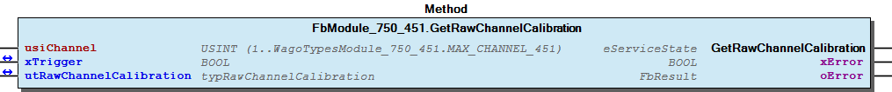 Graphical Interface of FbModule_750_451.GetRawChannelCalibration Example For get the calibration from channel one Note You have to call the method cyclic until the method returns with DONE or ABORT.

## FbModule_750_451.GetRawChannelConfiguration (METH)


| Scope | Name | Type |
| --- | --- | --- |
| Return | GetRawChannelConfiguration | WagoTypesModuleBase.eServiceState |
| Input | usiChannel | USINT (1..WagoTypesModule_750_451.MAX_CHANNEL_451) |
| Inout | xTrigger | BOOL |
| utRawChannelConfiguration | WagoTypesModule_750_451.typRawChannelConfiguration |
| Output | xError | BOOL |
| oError | WagoSysErrorBase.FbResult |

| Struct member | Value | Description |
| --- | --- | --- |
| Settings | eSensorType | Pt100_EN60751 | IEC 751 | -200 °C...850 °C | Resolution 0.1 °C |
| Ni100_DIN43760 | DIN 43760 | -60 °C...250 °C | Resolution 0.1 °C |
| Pt1000_EN60751 | IEC 751 | -200 °C...850 °C | Resolution 0.1 °C |
| Pt500_EN60751 | IEC 751 | -200 °C...850 °C | Resolution 0.1 °C |
| Pt200_EN60751 | IEC 751 | -200 °C...850 °C | Resolution 0.1 °C |
| Ni1000_TK6180 | DIN 43760 | -60 °C...250 °C | Resolution 0.1 °C |
| Ni120_MINCO | Minco | -80 °C...260 °C | Resolution 0.1 °C |
| Ni1000_TK5000 | TK 5000 | -60 °C...250 °C | Resolution 0.1 °C |
| Ni1000_TK6180_01 | DIN 43760 | -50 °C...150 °C | Resolution 0.01 °C |
| Ni1000_TK5000_01 | TK 5000 | -50 °C...150 °C | Resolution 0.01 °C |
| Pt1000_EN60751_01 | IEC 751 | -50 °C...150 °C | Resolution 0.01 °C |
| Pt100_EN60751_01 | IEC 751 | -50 °C...150 °C | Resolution 0.01 °C |
| Resistor_1 |  | 0 Ohm...5 kOhm | Resolution 0.2 Ohm |
| Resistor_2 | \| 0 Ohm...1.2 kOhm \| Resolution 0.02 Ohm |
| xEnableDiagGlobal | FALSE | Diagnostis global functions disabled |
| TRUE | Diagnostis global functions enabled |
| xEnableDiagWireBreak | FALSE | Diagnostis wire break disabled |
| TRUE | Diagnostis wire break enabled |
| xEnableDiagShortCircuit | FALSE | Diagnostis short circuit disabled |
| TRUE | Diagnostis short circuit enabled |
| xEnableDiagCommonError | FALSE | Diagnostis Group error disabled |
| TRUE | Diagnostis Group error enabled |
| xEnableDiagOverflow | FALSE | Diagnostis overrange disabled |
| TRUE | Diagnostis overrange enabled |
| xEnableDiagUnderflow | FALSE | Diagnostis underrange disabled |
| TRUE | Diagnostis underrange enabled |
| xEnable2Wire | FALSE | Channel disabled |
| TRUE | 2-wire |
| uiLineResistance | 0 ... 65535 | Line resistance [Ohm] |
| iUpperUserLimitValue | -32768 ... 32767 | Upper user limit value |
| xEnableDiagLimitOverflow | FALSE | Diagnostis user limiting value overrange disabled |
| TRUE | Diagnostis user limiting value overrange enabled |
| iLowerUserLimitValue | -32768 ... 32767 | Lower user limit value |
| xEnableDiagLimitUnderflow | FALSE | Diagnostis user limiting value underrange disabled |
| TRUE | Diagnostis user limiting value underrange enabled |
| Scaling | xUserScaling | FALSE | User scaling disabled -> use manufacturer scaling |
| TRUE | User scaling enabled |
| iUserScalingOffset | -32768 ... 32767 | User scaling Offset |
| uiUserScalingGain | 0 ... 65535 | User scaling Gain |
| uiUserScalingDivisor | 0 ... 65535 | User scaling Divisor default = 256 -> (read only) |
| Calibration | xUserCalibration | FALSE | User calibration disabled |
| TRUE | User calibration enabled |
| iUserCalibrationOffset | -32768 ... 32767 | User calibration Offset |
| uiUserCalibrationGain | 0 ... 65535 | User calibration Gain |

| Return Value | Description |
| --- | --- |
| WagoTypesModuleBase.eServiceState.DONE | successful |
| WagoTypesModuleBase.eServiceState.ABORT | error -> see oError |
| WagoTypesModuleBase.eServiceState.NO_DATA | call while xTrigger is reset |

```
VAR
    //--- Channel Configuration -------------------------------------------------------
    utRawChannelConfiguration   :   WagoTypesModule_750_451.typRawChannelConfiguration;
    oError                      :   WagoSysErrorBase.FbResult;
    xGetRawChannelConfiguration :   BOOL;
END_VAR

//--- R A W   C H A N N E L   C O N F I G U R A T I O N ----------------------
CASE my451.GetRawChannelConfiguration(1, xGetRawChannelConfiguration, utRawChannelConfiguration, oError => oError) OF

    eServiceState.DONE : // OK
            ;// process here your utRawChannelConfiguration

    eServiceState.ABORT : // Error
            ;// process here your error handling -> see oError for more information

END_CASE
```

Get the complete raw configuration of one channel, specified by usiChannel in a struct. This struct contains the three components settings , scaling and calibration for holding the raw values.

WagoTypesModule_750_451.typRawChannelConfiguration

Return Values

It is not allowed to reset the xTrigger by the application. This must done by the method.

Graphical Illustration

Graphical Interface of FbModule_750_451.GetRawChannelConfiguration

Example for CFC

For get the raw configuration of the first channel in CFC

Example for ST

For get the raw configuration of the first channel

You have to call the method cyclic until the method returns with DONE or ABORT.

Interface variables Function Get the complete raw configuration of one channel, specified by usiChannel in a struct. This struct contains the three components settings , scaling and calibration for holding the raw values. WagoTypesModule_750_451.typRawChannelConfiguration Return Values Warning It is not allowed to reset the xTrigger by the application. This must done by the method. Graphical Illustration  Graphical Interface of FbModule_750_451.GetRawChannelConfiguration Example for CFC For get the raw configuration of the first channel in CFC 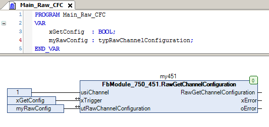 Example for ST For get the raw configuration of the first channel Note You have to call the method cyclic until the method returns with DONE or ABORT.

## FbModule_750_451.GetRawChannelScaling (METH)


| Scope | Name | Type |
| --- | --- | --- |
| Return | GetRawChannelScaling | WagoTypesModuleBase.eServiceState |
| Input | usiChannel | USINT (1..WagoTypesModule_750_451.MAX_CHANNEL_451) |
| Inout | xTrigger | BOOL |
| utRawChannelScaling | WagoTypesModule_750_451.typRawChannelScaling |
| Output | xError | BOOL |
| oError | WagoSysErrorBase.FbResult |

| Struct member | Value | Description |
| --- | --- | --- |
| xUserScaling | FALSE | User scaling disabled -> use manufacturer scaling |
| TRUE | User scaling enabled |
| iUserScalingOffset | -32768 ... 32767 | User scaling Offset |
| uiUserScalingGain | 0 ... 65535 | User scaling Gain |
| uiUserScalingDivisor | 0 ... 65535 | User scaling Divisor default = 256 -> (read only) |

```
VAR
    //--- Channel Settings ---------------------------------
    utChannelScaling    :   WagoTypesModule_750_451.typRawChannelScaling;;
    xGetChannelScaling  :   BOOL;
    oError              :   WagoSysErrorBase.FbResult;
END_VAR

//--- C H A N N E L   S C A L I N G ------------------------
CASE my451.GetRawChannelScaling(    usiChannel           := 1,
                                    xTrigger             := xGetChannelScaling,
                                    utRawChannelScaling  := utChannelScaling,
                                    oError               => oError
                                ) OF

    eServiceState.DONE : // OK
            ;// process here your utModuleSettings

    eServiceState.ABORT : // Error
            ;// process here your error handling -> see oError for more information

END_CASE
```

typRawChannelScaling

Graphical Illustration

Graphical Interface of FbModule_750_451.GetRawChannelScaling

For get the scaling from channel one

You have to call the method cyclic until the method returns with DONE or ABORT.

Interface variables Function Get the scaling of a channel at a struct. typRawChannelScaling Graphical Illustration 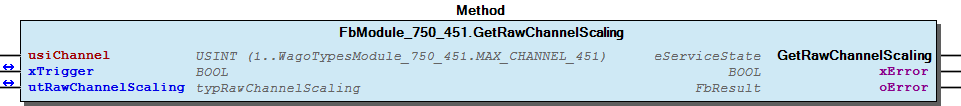 Graphical Interface of FbModule_750_451.GetRawChannelScaling Example For get the scaling from channel one Note You have to call the method cyclic until the method returns with DONE or ABORT.

## FbModule_750_451.GetRawChannelSettings (METH)


| Scope | Name | Type |
| --- | --- | --- |
| Return | GetRawChannelSettings | WagoTypesModuleBase.eServiceState |
| Input | usiChannel | USINT (1..WagoTypesModule_750_451.MAX_CHANNEL_451) |
| Inout | xTrigger | BOOL |
| utRawChannelSettings | WagoTypesModule_750_451.typRawChannelSettings |
| Output | xError | BOOL |
| oError | WagoSysErrorBase.FbResult |

| Struct member | Value | Description |
| --- | --- | --- |
| eSensorType | Pt100_EN60751 | IEC 751 | -200 °C...850 °C | Resolution 0.1 °C |
| Ni100_DIN43760 | DIN 43760 | -60 °C...250 °C | Resolution 0.1 °C |
| Pt1000_EN60751 | IEC 751 | -200 °C...850 °C | Resolution 0.1 °C |
| Pt500_EN60751 | IEC 751 | -200 °C...850 °C | Resolution 0.1 °C |
| Pt200_EN60751 | IEC 751 | -200 °C...850 °C | Resolution 0.1 °C |
| Ni1000_TK6180 | DIN 43760 | -60 °C...250 °C | Resolution 0.1 °C |
| Ni120_MINCO | Minco | -80 °C...260 °C | Resolution 0.1 °C |
| Ni1000_TK5000 | TK 5000 | -60 °C...250 °C | Resolution 0.1 °C |
| Ni1000_TK6180_01 | DIN 43760 | -50 °C...150 °C | Resolution 0.01 °C |
| Ni1000_TK5000_01 | TK 5000 | -50 °C...150 °C | Resolution 0.01 °C |
| Pt1000_EN60751_01 | IEC 751 | -50 °C...150 °C | Resolution 0.01 °C |
| Pt100_EN60751_01 | IEC 751 | -50 °C...150 °C | Resolution 0.01 °C |
| Resistor_1 |  | 0 Ω...5 kΩ | Resolution 0.2 Ω |
| Resistor_2 |  | 0 Ω...1.2 kΩ | Resolution 0.02 Ω |
| xEnableDiagGlobal | FALSE | Diagnostis global functions disabled |
| TRUE | Diagnostis global functions enabled |
| xEnableDiagWireBreak | FALSE | Diagnostis wire break disabled |
| TRUE | Diagnostis wire break enabled |
| xEnableDiagShortCircuit | FALSE | Diagnostis short circuit disabled |
| TRUE | Diagnostis short circuit enabled |
| xEnableDiagCommonError | FALSE | Diagnostis Group error disabled |
| TRUE | Diagnostis Group error enabled |
| xEnableDiagOverflow | FALSE | Diagnostis overrange disabled |
| TRUE | Diagnostis overrange enabled |
| xEnableDiagUnderflow | FALSE | Diagnostis underrange disabled |
| TRUE | Diagnostis underrange enabled |
| xEnable2Wire | FALSE | Channel disabled |
| TRUE | 2-wire |
| uiLineResistance | 0 ... 65535 | Line resistance [Ohm] |
| iUpperUserLimitValue | -32768 ... 32767 | Upper user limit value |
| xEnableDiagLimitOverflow | FALSE | Diagnostis user limiting value overrange disabled |
| TRUE | Diagnostis user limiting value overrange enabled |
| iLowerUserLimitValue | -32768 ... 32767 | Lower user limit value |
| xEnableDiagLimitUnderflow | FALSE | Diagnostis user limiting value underrange disabled |
| TRUE | Diagnostis user limiting value underrange enabled |

```
VAR
    //--- Channel Settings ---------------------------------
    utChannelSettings   :   WagoTypesModule_750_451.typRawChannelSettings;;
    xGetChannelSettings :   BOOL;
    oError              :   WagoSysErrorBase.FbResult;
END_VAR

//--- C H A N N E L   S E T T I N G S ----------------------
CASE my451.GetRawChannelSettings(   usiChannel           := 1,
                                    xTrigger             := xGetChannelSettings,
                                    utRawChannelSettings := utChannelSettings,
                                    oError               => oError
                                ) OF

    eServiceState.DONE : // OK
        ;// process here your utModuleSettings

    eServiceState.ABORT : // Error
        ;// process here your error handling -> see oError for more information

END_CASE
```

typRawChannelSettings

Graphical Illustration

Graphical Interface of FbModule_750_451.GetRawChannelSettings

For get the settings from channel one

You have to call the method cyclic until the method returns with DONE or ABORT.

Interface variables Function Get the settings of a channel at a struct. typRawChannelSettings Graphical Illustration  Graphical Interface of FbModule_750_451.GetRawChannelSettings Example For get the settings from channel one Note You have to call the method cyclic until the method returns with DONE or ABORT.

## FbModule_750_451.GetScaledChannelConfiguration (METH)


| Scope | Name | Type |
| --- | --- | --- |
| Return | GetScaledChannelConfiguration | WagoTypesModuleBase.eServiceState |
| Input | usiChannel | USINT (1..WagoTypesModule_750_451.MAX_CHANNEL_451) |
| Inout | xTrigger | BOOL |
| utScaledChannelConfiguration | WagoTypesModule_750_451.typScaledChannelConfiguration |
| Output | xError | BOOL |
| oError | WagoSysErrorBase.FbResult |

| Struct member | Value | Description |
| --- | --- | --- |
| Settings | eSensorType | Pt100_EN60751 | IEC 751 | -200 °C...850 °C | Resolution 0.1 °C |
| Ni100_DIN43760 | DIN 43760 | -60 °C...250 °C | Resolution 0.1 °C |
| Pt1000_EN60751 | IEC 751 | -200 °C...850 °C | Resolution 0.1 °C |
| Pt500_EN60751 | IEC 751 | -200 °C...850 °C | Resolution 0.1 °C |
| Pt200_EN60751 | IEC 751 | -200 °C...850 °C | Resolution 0.1 °C |
| Ni1000_TK6180 | DIN 43760 | -60 °C...250 °C | Resolution 0.1 °C |
| Ni120_MINCO | Minco | -80 °C...260 °C | Resolution 0.1 °C |
| Ni1000_TK5000 | TK 5000 | -60 °C...250 °C | Resolution 0.1 °C |
| Ni1000_TK6180_01 | DIN 43760 | -50 °C...150 °C | Resolution 0.01 °C |
| Ni1000_TK5000_01 | TK 5000 | -50 °C...150 °C | Resolution 0.01 °C |
| Pt1000_EN60751_01 | IEC 751 | -50 °C...150 °C | Resolution 0.01 °C |
| Pt100_EN60751_01 | IEC 751 | -50 °C...150 °C | Resolution 0.01 °C |
| Resistor_1 |  | 0 Ohm...5 kOhm | Resolution 0.2 Ohm |
| Resistor_2 |  | 0 Ohm...1.2 kOhm | Resolution 0.02 Ohm |
| xEnableDiagGlobal | FALSE | Diagnostis global functions disabled |
| TRUE | Diagnostis global functions enabled |
| xEnableDiagWireBreak | FALSE | Diagnostis wire break disabled |
| TRUE | Diagnostis wire break enabled |
| xEnableDiagShortCircuit | FALSE | Diagnostis short circuit disabled |
| TRUE | Diagnostis short circuit enabled |
| xEnableDiagCommonError | FALSE | Diagnostis Group error disabled |
| TRUE | Diagnostis Group error enabled |
| xEnableDiagOverflow | FALSE | Diagnostis overrange disabled |
| TRUE | Diagnostis overrange enabled |
| xEnableDiagUnderflow | FALSE | Diagnostis underrange disabled |
| TRUE | Diagnostis underrange enabled |
| xEnable2Wire | FALSE | Channel disabled |
| TRUE | 2-wire |
| rLineResistance | 0 ... 65.535 | Line resistance [Ohm] |
| rUpperUserLimitValue |  | Upper user limit value range depends on sensortype |
| xEnableDiagLimitOverflow | FALSE | Diagnostis user limiting value overrange disabled |
| TRUE | Diagnostis user limiting value overrange enabled |
| rLowerUserLimitValue |  | Lower user limit value range depends on sensortype |
| xEnableDiagLimitUnderflow | FALSE | Diagnostis user limiting value underrange disabled |
| TRUE | Diagnostis user limiting value underrange enabled |
| Scaling | xUserScaling | FALSE | User scaling disabled -> use manufacturer scaling |
| TRUE | User scaling enabled |
| rUserScalingOffset |  | User scaling Offset range depends on sensortype |
| uiUserScalingGain | 0 ... 65535 | User scaling Gain |
| uiUserScalingDivisor | 0 ... 65535 | User scaling Divisor default = 256 -> (read only) |
| Calibration | xUserCalibration | FALSE | User calibration disabled |
| TRUE | User calibration enabled |
| diUserCalibrationOffset | -262144 .. 261236 | User calibration Offset |
| rUserCalibrationGain | 0 ... 1.9999 | User calibration Gain |

| Return Value | Description |
| --- | --- |
| WagoTypesModuleBase.eServiceState.DONE | successful |
| WagoTypesModuleBase.eServiceState.ABORT | error -> see oError |
| WagoTypesModuleBase.eServiceState.NO_DATA | call while xTrigger is reset |

```
VAR
    //--- Channel Configuration -------------------------------------------------------
    utScaledChannelConfiguration    :   WagoTypesModule_750_451.typRawChannelConfiguration;
    oError                          :   WagoSysErrorBase.FbResult;
    xGetScaledChannelConfiguration  :   BOOL;
END_VAR

//--- C H A N N E L   C O N F I G U R A T I O N ----------------------
CASE my451.GetScaledChannelConfiguration( 1, xGetScaledChannelConfiguration, utScaledChannelConfiguration, oError => oError) OF

    eServiceState.DONE : // OK
            ;// process here your utScaledChannelConfiguration

    eServiceState.ABORT : // Error
            ;// process here your error handling -> see oError for more information

END_CASE
```

Get the complete scaled configuration of one channel, specified by usiChannel in a struct. This struct contains the three components settings , scaling and calibration for holding the scaled values.

WagoTypesModule_750_451.typScaledChannelConfiguration

Return Values

It is not allowed to reset the xTrigger by the application. This must done by the method.

Graphical Illustration

Graphical Interface of FbModule_750_451.GetScaledChannelConfiguration

Example for CFC

For get the scaled configuration of the first channel in CFC

Example for ST

For get the scaled configuration of the first channel

You have to call the method cyclic until the method returns with DONE or ABORT.

Interface variables Function Get the complete scaled configuration of one channel, specified by usiChannel in a struct. This struct contains the three components settings , scaling and calibration for holding the scaled values. WagoTypesModule_750_451.typScaledChannelConfiguration Return Values Warning It is not allowed to reset the xTrigger by the application. This must done by the method. Graphical Illustration  Graphical Interface of FbModule_750_451.GetScaledChannelConfiguration Example for CFC For get the scaled configuration of the first channel in CFC 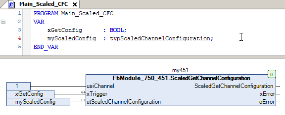 Example for ST For get the scaled configuration of the first channel Note You have to call the method cyclic until the method returns with DONE or ABORT.

## FbModule_750_451.GetSettingsChannel (METH)


| Scope | Name | Type |
| --- | --- | --- |
| Return | GetSettingsChannel | WagoTypesModuleBase.eServiceState |
| Input | usiChannel | USINT (1..WagoTypesModule_750_451.MAX_CHANNEL_451) |
| Inout | utSettingsChannel | WagoTypesModule_750_451.typReg35Settings |
| Output | oError | WagoSysErrorBase.FbResult |

| Struct member | Value | Description |
| --- | --- | --- |
| eSensorType | Pt100_EN60751 | IEC 751 | -200 °C...850 °C | Resolution 0.1 °C |
| Ni100_DIN43760 | DIN 43760 | -60 °C...250 °C | Resolution 0.1 °C |
| Pt1000_EN60751 | IEC 751 | -200 °C...850 °C | Resolution 0.1 °C |
| Pt500_EN60751 | IEC 751 | -200 °C...850 °C | Resolution 0.1 °C |
| Pt200_EN60751 | IEC 751 | -200 °C...850 °C | Resolution 0.1 °C |
| Ni1000_TK6180 | DIN 43760 | -60 °C...250 °C | Resolution 0.1 °C |
| Ni120_MINCO | Minco | -80 °C...260 °C | Resolution 0.1 °C |
| Ni1000_TK5000 | TK 5000 | -60 °C...250 °C | Resolution 0.1 °C |
| Ni1000_TK6180_01 | DIN 43760 | -50 °C...150 °C | Resolution 0.01 °C |
| Ni1000_TK5000_01 | TK 5000 | -50 °C...150 °C | Resolution 0.01 °C |
| Pt1000_EN60751_01 | IEC 751 | -50 °C...150 °C | Resolution 0.01 °C |
| Pt100_EN60751_01 | IEC 751 | -50 °C...150 °C | Resolution 0.01 °C |
| Resistor_1 |  | 0 Ohm...5 kOhm | Resolution 0.2 Ohm |
| Resistor_2 |  | 0 Ohm...1.2 kOhm | Resolution 0.02 Ohm |
| xEnable2Wire | FALSE | Channel disabled |
| TRUE | 2-wire |
| xUserCalibration | FALSE | Manufacturer calibration |
| TRUE | User calibration |
| xUserScaling | FALSE | User scaling disabled |
| TRUE | User scaling enabled |
| xEnableDiagUnderflow | FALSE | Diagnostis underrange disabled |
| TRUE | Diagnostis underrange enabled |
| xEnableDiagOverflow | FALSE | Diagnostis overrange disabled |
| TRUE | Diagnostis overrange enabled |
| xEnableDiagLimitUnderflow | FALSE | Diagnostis user limiting value underrange disabled |
| TRUE | Diagnostis user limiting value underrange enabled |
| xEnableDiagLimitOverflow | FALSE | Diagnostis user limiting value overrange disabled |
| TRUE | Diagnostis user limiting value overrange enabled |
| xEnableDiagShortCircuit | FALSE | Diagnostis short circuit disabled |
| TRUE | Diagnostis short circuit enabled |
| xEnableDiagWireBreak | FALSE | Diagnostis wire break disabled |
| TRUE | Diagnostis wire break enabled |
| xEnableDiagCommonError | FALSE | Diagnostis Group error disabled |
| TRUE | Diagnostis Group error enabled |
| xEnableDiagGlobal | FALSE | Diagnostis global functions disabled |
| TRUE | Diagnostis global functions enabled |

```
VAR
    //--- Channel Settings ---------------------------------
    utSettingsChannel   :   typReg35Settings;
    xGetSettingsChannel :   BOOL;
END_VAR

//--- C H A N N E L   S E T T I N G S ----------------------
IF xGetSettingsChannel THEN
    CASE my451.GetSettingsChannel( 1, utSettingsChannel) OF

        eServiceState.DONE : // OK
                xGetSettingsChannel := FALSE;
                ;// process here your utSettingsChannel

        eServiceState.ABORT : // Error
                xGetSettingsChannel := FALSE;
                ;// process here your error handling

    END_CASE
END_IF
```

Get the esttings of a channel at a struct.

Graphical Illustration

Graphical Interface of FbModule_750_451.GetSettingsChannel

For get the settings from channel

You have to call the method cyclic until the method returns with DONE or ABORT.

Interface variables Function Get the esttings of a channel at a struct. Graphical Illustration 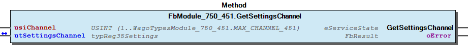 Graphical Interface of FbModule_750_451.GetSettingsChannel Example For get the settings from channel Note You have to call the method cyclic until the method returns with DONE or ABORT.

## FbModule_750_451.SetModuleSettings (METH)


| Scope | Name | Type |
| --- | --- | --- |
| Return | SetModuleSettings | WagoTypesModuleBase.eServiceState |
| Inout | xTrigger | BOOL |
| utModuleSettings | WagoTypesModule_750_451.typModuleSettings |
| Output | xError | BOOL |
| oError | WagoSysErrorBase.FbResult |

| Struct member | Value | Description |
| --- | --- | --- |
| xAmountSignFormat | FALSE | Numeric values appear in two’s complement |
| TRUE | Numeric values appear in amount / sign format |
| xS5FB250Format | FALSE | Numeric values appear in standard format |
| TRUE | Numeric values appear in S5-FB250 format |
| xDisableWatchdog | FALSE | The Watchdog timer is enabled |
| TRUE | The Watchdog timer is not enabled. The Satus LEDs light up continuously |
| eNotchFilter | DISABLED_100HZ | The Notch filter is not enabled (100 Hz) |
| ENABLED_50HZ | Notch filter ( 50 Hz ) |
| ENABLED_60HZ | Notch filter ( 60 Hz ) |
| ENABLED_50_60HZ | Notch filter ( 50/60 Hz ) |

| Return Value | Description |
| --- | --- |
| WagoTypesModuleBase.eServiceState.DONE | successful |
| WagoTypesModuleBase.eServiceState.ABORT | error -> see oError |
| WagoTypesModuleBase.eServiceState.NO_DATA | call while xTrigger is reset |

```
VAR
    //--- Module Mode Settings ------------------------------
    utModuleSettings    :   WagoTypesModule_750_451.typModuleSettings;;
    xSetModuleSettings  :   BOOL;
    oError              :   WagoSysErrorBase.FbResult;
END_VAR

//--- S E T   M O D U L E    S E T T I N G S ---------------
CASE my451.SetModuleSettings(xSetModuleSettings, utModuleSettings, oError => oError) OF

    eServiceState.DONE : // OK

    eServiceState.ABORT : // Error
            ;// process here your error handling -> see oError for more information

END_CASE
```

Set the common settings of the module from a struct.

Return Values

It is not allowed to reset the xTrigger by the application. This must done by the method.

Graphical Illustration

Graphical Interface of FbModule_750_451.SetModuleSettings

For set the settings from the module.

You have to call the method cyclic until the method returns with DONE or ABORT.

Interface variables Function Set the common settings of the module from a struct. Return Values Warning It is not allowed to reset the xTrigger by the application. This must done by the method. Graphical Illustration 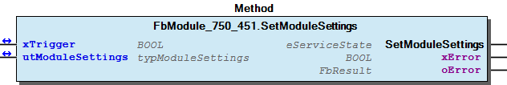 Graphical Interface of FbModule_750_451.SetModuleSettings Example For set the settings from the module. Note You have to call the method cyclic until the method returns with DONE or ABORT.

## FbModule_750_451.SetRawChannelCalibration (METH)


| Scope | Name | Type |
| --- | --- | --- |
| Return | SetRawChannelCalibration | WagoTypesModuleBase.eServiceState |
| Input | usiChannel | USINT (1..WagoTypesModule_750_451.MAX_CHANNEL_451) |
| Inout | xTrigger | BOOL |
| utRawChannelCalibration | WagoTypesModule_750_451.typRawChannelCalibration |
| Output | xError | BOOL |
| oError | WagoSysErrorBase.FbResult |

| Struct member | Value | Description |
| --- | --- | --- |
| xUserCalibration | FALSE | The user scaling is switched off |
| TRUE | The user scaling is switched on |
| iUserCalibrationOffset |  |
| uiUserCalibrationGain |  |

```
VAR
    //--- Channel Calibration ---------------------------------
    utChannelCalibration    :   WagoTypesModule_750_451.typRawChannelCalibration;;
    xSetChannelCalibration  :   BOOL;
    oError                  :   WagoSysErrorBase.FbResult;
END_VAR

//--- C H A N N E L    C A L I B R A T I O N -----------------------
CASE my451.SetRawChannelCalibration(    usiChannel              := 1,
                                        xTrigger                := xSetChannelCalibration,
                                        utRawChannelCalibration := utChannelCalibration,
                                        oError                  => oError
                                   ) OF

    eServiceState.DONE : // OK
            ;// process here your utModuleSettings

    eServiceState.ABORT : // Error
            ;// process here your error handling -> see oError for more information

END_CASE
```

Set the calibration of a channel by a struct.

Graphical Illustration

Graphical Interface of FbModule_750_451.SetRawChannelCalibration

For set the calibration of channel one

You have to call the method cyclic until the method returns with DONE or ABORT.

Interface variables Function Set the calibration of a channel by a struct. Graphical Illustration  Graphical Interface of FbModule_750_451.SetRawChannelCalibration Example For set the calibration of channel one Note You have to call the method cyclic until the method returns with DONE or ABORT.

## FbModule_750_451.SetRawChannelConfiguration (METH)


| Scope | Name | Type |
| --- | --- | --- |
| Return | SetRawChannelConfiguration | WagoTypesModuleBase.eServiceState |
| Input | usiChannel | USINT (1..WagoTypesModule_750_451.MAX_CHANNEL_451) |
| Inout | xTrigger | BOOL |
| utRawChannelConfiguration | WagoTypesModule_750_451.typRawChannelConfiguration |
| Output | xError | BOOL |
| oError | WagoSysErrorBase.FbResult |

| Struct member | Value | Description |
| --- | --- | --- |
| Settings | eSensorType | Pt100_EN60751 | IEC 751 | -200 °C...850 °C | Resolution 0.1 °C |
| Ni100_DIN43760 | DIN 43760 | -60 °C...250 °C | Resolution 0.1 °C |
| Pt1000_EN60751 | IEC 751 | -200 °C...850 °C | Resolution 0.1 °C |
| Pt500_EN60751 | IEC 751 | -200 °C...850 °C | Resolution 0.1 °C |
| Pt200_EN60751 | IEC 751 | -200 °C...850 °C | Resolution 0.1 °C |
| Ni1000_TK6180 | DIN 43760 | -60 °C...250 °C | Resolution 0.1 °C |
| Ni120_MINCO | Minco | -80 °C...260 °C | Resolution 0.1 °C |
| Ni1000_TK5000 | TK 5000 | -60 °C...250 °C | Resolution 0.1 °C |
| Ni1000_TK6180_01 | DIN 43760 | -50 °C...150 °C | Resolution 0.01 °C |
| Ni1000_TK5000_01 | TK 5000 | -50 °C...150 °C | Resolution 0.01 °C |
| Pt1000_EN60751_01 | IEC 751 | -50 °C...150 °C | Resolution 0.01 °C |
| Pt100_EN60751_01 | IEC 751 | -50 °C...150 °C | Resolution 0.01 °C |
| Resistor_1 |  | 0 Ohm...5 kOhm | Resolution 0.2 Ohm |
| Resistor_2 | \| 0 Ohm...1.2 kOhm \| Resolution 0.02 Ohm |
| xEnableDiagGlobal | FALSE | Diagnostis global functions disabled |
| TRUE | Diagnostis global functions enabled |
| xEnableDiagWireBreak | FALSE | Diagnostis wire break disabled |
| TRUE | Diagnostis wire break enabled |
| xEnableDiagShortCircuit | FALSE | Diagnostis short circuit disabled |
| TRUE | Diagnostis short circuit enabled |
| xEnableDiagCommonError | FALSE | Diagnostis Group error disabled |
| TRUE | Diagnostis Group error enabled |
| xEnableDiagOverflow | FALSE | Diagnostis overrange disabled |
| TRUE | Diagnostis overrange enabled |
| xEnableDiagUnderflow | FALSE | Diagnostis underrange disabled |
| TRUE | Diagnostis underrange enabled |
| xEnable2Wire | FALSE | Channel disabled |
| TRUE | 2-wire |
| uiLineResistance | 0 ... 65535 | Line resistance [Ohm] |
| iUpperUserLimitValue | -32768 ... 32767 | Upper user limit value |
| xEnableDiagLimitOverflow | FALSE | Diagnostis user limiting value overrange disabled |
| TRUE | Diagnostis user limiting value overrange enabled |
| iLowerUserLimitValue | -32768 ... 32767 | Lower user limit value |
| xEnableDiagLimitUnderflow | FALSE | Diagnostis user limiting value underrange disabled |
| TRUE | Diagnostis user limiting value underrange enabled |
| Scaling | xUserScaling | FALSE | User scaling disabled -> use manufacturer scaling |
| TRUE | User scaling enabled |
| iUserScalingOffset | -32768 ... 32767 | User scaling Offset |
| uiUserScalingGain | 0 ... 65535 | User scaling Gain |
| uiUserScalingDivisor | 0 ... 65535 | User scaling Divisor default = 256 -> (read only) |
| Calibration | xUserCalibration | FALSE | User calibration disabled |
| TRUE | User calibration enabled |
| iUserCalibrationOffset | -32768 ... 32767 | User calibration Offset |
| uiUserCalibrationGain | 0 ... 65535 | User calibration Gain |

| Return Value | Description |
| --- | --- |
| WagoTypesModuleBase.eServiceState.DONE | successful |
| WagoTypesModuleBase.eServiceState.ABORT | error -> see oError |
| WagoTypesModuleBase.eServiceState.NO_DATA | call while xTrigger is reset |

```
VAR
    //--- Channel Configuration -------------------------------------------------------
    xStartProcess               :   BOOL; // set this variable once to start the process -> this varibale will be automatic reset
    utRawChannelConfiguration   :   WagoTypesModule_750_451.typRawChannelConfiguration;
    oError                      :   WagoSysErrorBase.FbResult;
    xSetRawChannelConfiguration :   BOOL;
END_VAR

//--- R A W   C H A N N E L   C O N F I G U R A T I O N ----------------------

//--- READ BEFORE WRITE --------------------------------------------------------------
CASE my451.GetRawChannelConfiguration( 1, xStartProcess, utRawChannelConfiguration, oError => oError) OF

    eServiceState.DONE : // OK -> actual configuration is successful read
        // change here your configuration
        // utRawChannelConfiguration... :=
        xSetRawChannelConfiguration := TRUE; // trigger write

    eServiceState.ABORT : // Error -> not able to read -> see oError
            ;// process here your error handling for read -> see oError for more information

END_CASE

//--- WRITE MODYFIED CONFIGURATION ---------------------------------------------------
CASE my451.SetRawChannelConfiguration( 1, xSetRawChannelConfiguration, utRawChannelConfiguration, oError => oError) OF

    eServiceState.DONE : // OK -> new configuration is written

    eServiceState.ABORT : // Error -> not able to write -> see oError
            ;// process here your error handling for write -> see oError for more information

END_CASE
```

Set the complete raw configuration of one channel, specified by usiChannel and the struct utRawChannelConfiguration . This struct have to contain all configuration parameters.

Recommendation : You should read out all raw configuration in this struct before you write the raw configuration. So you have to change only the needed paramneters between read and write.

WagoTypesModule_750_451.typRawChannelConfiguration

Return Values

It is not allowed to reset the xTrigger by the application. This must done by the method.

Graphical Illustration

Graphical Interface of FbModule_750_451.SetRawChannelConfiguration

Example for ST

For get the raw configuration of the first channel and after this change some parameters before it write back to the module.

You have to call the method cyclic until the method returns with DONE or ABORT.

Interface variables Function Set the complete raw configuration of one channel, specified by usiChannel and the struct utRawChannelConfiguration . This struct have to contain all configuration parameters. Note Recommendation : You should read out all raw configuration in this struct before you write the raw configuration. So you have to change only the needed paramneters between read and write. WagoTypesModule_750_451.typRawChannelConfiguration Return Values Warning It is not allowed to reset the xTrigger by the application. This must done by the method. Graphical Illustration 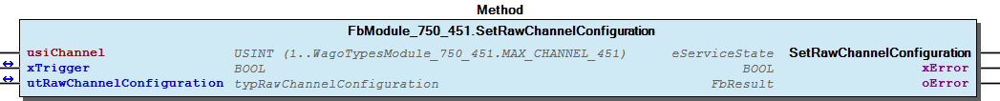 Graphical Interface of FbModule_750_451.SetRawChannelConfiguration Example for ST For get the raw configuration of the first channel and after this change some parameters before it write back to the module. Note You have to call the method cyclic until the method returns with DONE or ABORT.

## FbModule_750_451.SetRawChannelScaling (METH)


| Scope | Name | Type |
| --- | --- | --- |
| Return | SetRawChannelScaling | WagoTypesModuleBase.eServiceState |
| Input | usiChannel | USINT (1..WagoTypesModule_750_451.MAX_CHANNEL_451) |
| Inout | xTrigger | BOOL |
| utRawChannelScaling | WagoTypesModule_750_451.typRawChannelScaling |
| Output | xError | BOOL |
| oError | WagoSysErrorBase.FbResult |

| Struct member | Value | Description |
| --- | --- | --- |
| xUserScaling | FALSE | User scaling disabled -> use manufacturer scaling |
| TRUE | User scaling enabled |
| iUserScalingOffset | -32768 ... 32767 | User scaling Offset |
| uiUserScalingGain | 0 ... 65535 | User scaling Gain |
| uiUserScalingDivisor | 0 ... 65535 | User scaling Divisor default = 256 -> (read only) |

```
VAR
    //--- Channel Settings ---------------------------------
    utChannelScaling    :   WagoTypesModule_750_451.typRawChannelScaling;;
    xSetChannelScaling  :   BOOL;
    oError              :   WagoSysErrorBase.FbResult;
END_VAR

//--- C H A N N E L   S C A L I N G ------------------------
CASE my451.SetRawChannelScaling(    usiChannel          := 1,
                                    xTrigger            := xSetChannelScaling,
                                    utRawChannelScaling := utChannelScaling,
                                    oError              => oError
                                ) OF

    eServiceState.DONE : // OK
            ;// process here your utModuleSettings

    eServiceState.ABORT : // Error
            ;// process here your error handling -> see oError for more information

END_CASE
```

typRawChannelScaling

Graphical Illustration

Graphical Interface of FbModule_750_451.SetRawChannelScaling

For set the scaling of channel one

You have to call the method cyclic until the method returns with DONE or ABORT.

Interface variables Function Set the scaling of a channel by a struct. typRawChannelScaling Graphical Illustration  Graphical Interface of FbModule_750_451.SetRawChannelScaling Example For set the scaling of channel one Note You have to call the method cyclic until the method returns with DONE or ABORT.

## FbModule_750_451.SetRawChannelSettings (METH)


| Scope | Name | Type |
| --- | --- | --- |
| Return | SetRawChannelSettings | WagoTypesModuleBase.eServiceState |
| Input | usiChannel | USINT (1..WagoTypesModule_750_451.MAX_CHANNEL_451) |
| Inout | xTrigger | BOOL |
| utRawChannelSettings | WagoTypesModule_750_451.typRawChannelSettings |
| Output | xError | BOOL |
| oError | WagoSysErrorBase.FbResult |

| Struct member | Value | Description |
| --- | --- | --- |
| eSensorType | Pt100_EN60751 | IEC 751 | -200 °C...850 °C | Resolution 0.1 °C |
| Ni100_DIN43760 | DIN 43760 | -60 °C...250 °C | Resolution 0.1 °C |
| Pt1000_EN60751 | IEC 751 | -200 °C...850 °C | Resolution 0.1 °C |
| Pt500_EN60751 | IEC 751 | -200 °C...850 °C | Resolution 0.1 °C |
| Pt200_EN60751 | IEC 751 | -200 °C...850 °C | Resolution 0.1 °C |
| Ni1000_TK6180 | DIN 43760 | -60 °C...250 °C | Resolution 0.1 °C |
| Ni120_MINCO | Minco | -80 °C...260 °C | Resolution 0.1 °C |
| Ni1000_TK5000 | TK 5000 | -60 °C...250 °C | Resolution 0.1 °C |
| Ni1000_TK6180_01 | DIN 43760 | -50 °C...150 °C | Resolution 0.01 °C |
| Ni1000_TK5000_01 | TK 5000 | -50 °C...150 °C | Resolution 0.01 °C |
| Pt1000_EN60751_01 | IEC 751 | -50 °C...150 °C | Resolution 0.01 °C |
| Pt100_EN60751_01 | IEC 751 | -50 °C...150 °C | Resolution 0.01 °C |
| Resistor_1 |  | 0 Ω...5 kΩ | Resolution 0.2 Ω |
| Resistor_2 |  | 0 Ω...1.2 kΩ | Resolution 0.02 Ω |
| xEnableDiagGlobal | FALSE | Diagnostis global functions disabled |
| TRUE | Diagnostis global functions enabled |
| xEnableDiagWireBreak | FALSE | Diagnostis wire break disabled |
| TRUE | Diagnostis wire break enabled |
| xEnableDiagShortCircuit | FALSE | Diagnostis short circuit disabled |
| TRUE | Diagnostis short circuit enabled |
| xEnableDiagCommonError | FALSE | Diagnostis Group error disabled |
| TRUE | Diagnostis Group error enabled |
| xEnableDiagOverflow | FALSE | Diagnostis overrange disabled |
| TRUE | Diagnostis overrange enabled |
| xEnableDiagUnderflow | FALSE | Diagnostis underrange disabled |
| TRUE | Diagnostis underrange enabled |
| xEnable2Wire | FALSE | Channel disabled |
| TRUE | 2-wire |
| uiLineResistance | 0 ... 65535 | Line resistance [Ohm] |
| iUpperUserLimitValue | -32768 ... 32767 | Upper user limit value |
| xEnableDiagLimitOverflow | FALSE | Diagnostis user limiting value overrange disabled |
| TRUE | Diagnostis user limiting value overrange enabled |
| iLowerUserLimitValue | -32768 ... 32767 | Lower user limit value |
| xEnableDiagLimitUnderflow | FALSE | Diagnostis user limiting value underrange disabled |
| TRUE | Diagnostis user limiting value underrange enabled |

```
VAR
    //--- Channel Settings ---------------------------------
    utChannelSettings   :   WagoTypesModule_750_451.typRawChannelSettings;;
    xSetChannelSettings :   BOOL;
    oError              :   WagoSysErrorBase.FbResult;
END_VAR

//--- C H A N N E L   S E T T I N G S ----------------------
CASE my451.SetRawChannelSettings(   usiChannel           := 1,
                                    xTrigger             := xSetChannelSettings,
                                    utRawChannelSettings := utChannelSettings,
                                    oError               => oError
                                ) OF

    eServiceState.DONE : // OK
        ;// process here your utModuleSettings

    eServiceState.ABORT : // Error
        ;// process here your error handling -> see oError for more information

END_CASE
```

typRawChannelSettings

Graphical Illustration

Graphical Interface of FbModule_750_451.SetRawChannelSettings

For set the settings of channel one

You have to call the method cyclic until the method returns with DONE or ABORT.

Interface variables Function Set the settings for a channel by a struct. typRawChannelSettings Graphical Illustration  Graphical Interface of FbModule_750_451.SetRawChannelSettings Example For set the settings of channel one Note You have to call the method cyclic until the method returns with DONE or ABORT.

## FbModule_750_451.SetScaledChannelConfiguration (METH)


| Scope | Name | Type |
| --- | --- | --- |
| Return | SetScaledChannelConfiguration | WagoTypesModuleBase.eServiceState |
| Input | usiChannel | USINT (1..WagoTypesModule_750_451.MAX_CHANNEL_451) |
| Inout | xTrigger | BOOL |
| utScaledChannelConfiguration | WagoTypesModule_750_451.typScaledChannelConfiguration |
| Output | xError | BOOL |
| oError | WagoSysErrorBase.FbResult |

| Struct member | Value | Description |
| --- | --- | --- |
| Settings | eSensorType | Pt100_EN60751 | IEC 751 | -200 °C...850 °C | Resolution 0.1 °C |
| Ni100_DIN43760 | DIN 43760 | -60 °C...250 °C | Resolution 0.1 °C |
| Pt1000_EN60751 | IEC 751 | -200 °C...850 °C | Resolution 0.1 °C |
| Pt500_EN60751 | IEC 751 | -200 °C...850 °C | Resolution 0.1 °C |
| Pt200_EN60751 | IEC 751 | -200 °C...850 °C | Resolution 0.1 °C |
| Ni1000_TK6180 | DIN 43760 | -60 °C...250 °C | Resolution 0.1 °C |
| Ni120_MINCO | Minco | -80 °C...260 °C | Resolution 0.1 °C |
| Ni1000_TK5000 | TK 5000 | -60 °C...250 °C | Resolution 0.1 °C |
| Ni1000_TK6180_01 | DIN 43760 | -50 °C...150 °C | Resolution 0.01 °C |
| Ni1000_TK5000_01 | TK 5000 | -50 °C...150 °C | Resolution 0.01 °C |
| Pt1000_EN60751_01 | IEC 751 | -50 °C...150 °C | Resolution 0.01 °C |
| Pt100_EN60751_01 | IEC 751 | -50 °C...150 °C | Resolution 0.01 °C |
| Resistor_1 |  | 0 Ohm...5 kOhm | Resolution 0.2 Ohm |
| Resistor_2 |  | 0 Ohm...1.2 kOhm | Resolution 0.02 Ohm |
| xEnableDiagGlobal | FALSE | Diagnostis global functions disabled |
| TRUE | Diagnostis global functions enabled |
| xEnableDiagWireBreak | FALSE | Diagnostis wire break disabled |
| TRUE | Diagnostis wire break enabled |
| xEnableDiagShortCircuit | FALSE | Diagnostis short circuit disabled |
| TRUE | Diagnostis short circuit enabled |
| xEnableDiagCommonError | FALSE | Diagnostis Group error disabled |
| TRUE | Diagnostis Group error enabled |
| xEnableDiagOverflow | FALSE | Diagnostis overrange disabled |
| TRUE | Diagnostis overrange enabled |
| xEnableDiagUnderflow | FALSE | Diagnostis underrange disabled |
| TRUE | Diagnostis underrange enabled |
| xEnable2Wire | FALSE | Channel disabled |
| TRUE | 2-wire |
| rLineResistance | 0 ... 65.535 | Line resistance [Ohm] |
| rUpperUserLimitValue |  | Upper user limit value range depends on sensortype |
| xEnableDiagLimitOverflow | FALSE | Diagnostis user limiting value overrange disabled |
| TRUE | Diagnostis user limiting value overrange enabled |
| rLowerUserLimitValue |  | Lower user limit value range depends on sensortype |
| xEnableDiagLimitUnderflow | FALSE | Diagnostis user limiting value underrange disabled |
| TRUE | Diagnostis user limiting value underrange enabled |
| Scaling | xUserScaling | FALSE | User scaling disabled -> use manufacturer scaling |
| TRUE | User scaling enabled |
| rUserScalingOffset |  | User scaling Offset range depends on sensortype |
| uiUserScalingGain | 0 ... 65535 | User scaling Gain |
| uiUserScalingDivisor | 0 ... 65535 | User scaling Divisor default = 256 -> (read only) |
| Calibration | xUserCalibration | FALSE | User calibration disabled |
| TRUE | User calibration enabled |
| diUserCalibrationOffset | -262144 .. 261236 | User calibration Offset |
| rUserCalibrationGain | 0 ... 1.9999 | User calibration Gain |

| Return Value | Description |
| --- | --- |
| WagoTypesModuleBase.eServiceState.DONE | successful |
| WagoTypesModuleBase.eServiceState.ABORT | error -> see oError |
| WagoTypesModuleBase.eServiceState.NO_DATA | call while xTrigger is reset |

```
VAR
    //--- Channel Configuration -------------------------------------------------------
    xStartProcess                   :   BOOL; // set this variable once to start the process -> this varibale will be automatic reset
    utScaledChannelConfiguration    :   WagoTypesModule_750_451.typScaledChannelConfiguration;
    oError                          :   WagoSysErrorBase.FbResult;
    xSetScaledChannelConfiguration  :   BOOL;
END_VAR

//--- S C A L E D   C H A N N E L   C O N F I G U R A T I O N ----------------------

//--- READ BEFORE WRITE --------------------------------------------------------------
CASE my451.GetScaledChannelConfiguration( 1, xStartProcess, utScaledChannelConfiguration, oError => oError) OF

    eServiceState.DONE : // OK -> actual scaled configuration is successful read
        // change here your configuration and start write
        // utScaledChannelConfiguration... :=
        xSetScaledChannelConfiguration := TRUE;

    eServiceState.ABORT : // Error -> not able to read -> see oError
            ;// process here your error handling for read -> see oError for more information

END_CASE

//--- WRITE MODYFIED CONFIGURATION ---------------------------------------------------
CASE my451.SetScaledChannelConfiguration( 1, xSetScaledChannelConfiguration, utScaledChannelConfiguration, oError => oError) OF

    eServiceState.DONE : // OK -> new configuration is written

    eServiceState.ABORT : // Error -> not able to write -> see oError
            ;// process here your error handling for write -> see oError for more information

END_CASE
```

Set the complete scaled configuration of one channel, specified by usiChannel and the struct utScaledChannelConfiguration . This struct have to contain all configuration parameters.

Recommendation : You should read out all scaled configuration in this struct before you write the scaled configuration. So you have to change only the needed paramneters between read and write.

WagoTypesModule_750_451.typScaledChannelConfiguration

Return Values

It is not allowed to reset the xTrigger by the application. This must done by the method.

Graphical Illustration

Graphical Interface of FbModule_750_451.SetScaledChannelConfiguration

Example for ST

For get the scaled configuration of the first channel and after this change some parameters before it write back to the module.

You have to call the method cyclic until the method returns with DONE or ABORT.

Interface variables Function Set the complete scaled configuration of one channel, specified by usiChannel and the struct utScaledChannelConfiguration . This struct have to contain all configuration parameters. Note Recommendation : You should read out all scaled configuration in this struct before you write the scaled configuration. So you have to change only the needed paramneters between read and write. WagoTypesModule_750_451.typScaledChannelConfiguration Return Values Warning It is not allowed to reset the xTrigger by the application. This must done by the method. Graphical Illustration 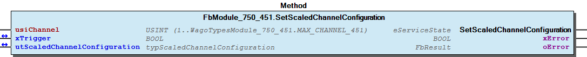 Graphical Interface of FbModule_750_451.SetScaledChannelConfiguration Example for ST For get the scaled configuration of the first channel and after this change some parameters before it write back to the module. Note You have to call the method cyclic until the method returns with DONE or ABORT.

## FbModule_750_451_dynConfig.GetDiagnosis (METH)


| Scope | Name | Type |
| --- | --- | --- |
| Return | GetDiagnosis | BYTE |
| Input | usiChannel | USINT (1..WagoTypesModule_750_451.MAX_CHANNEL_451) |

| Bit | Value | Description |
| --- | --- | --- |
| 0 | TRUE | overflow or underflow |
| 1 | TRUE | short circuit or broken wire |
| 2 |  | not used |
| 3 |  | not used |
| 4 |  | not used |
| 5 |  | not used |
| 6 | TRUE | diagnostic not available -> xS5FB250Format not set |
| 7 | TRUE | invalid channel |

```
VAR
    bDiagnostic :   BYTE;
END_VAR

bDiagnostic := my451.GetDiagnosis(1); // here is the diagnostic byte
```

To work with this method the module mode setting xS5FB250Format must be set to TRUE. In other cases there is no access to module diagnosis at this time.

xS5FB250Format must be set ...

Graphical Illustration

Graphical Interface of FbModule_750_451_dynConfig.GetDiagnosis

Interface variables Function To work with this method the module mode setting xS5FB250Format must be set to TRUE. In other cases there is no access to module diagnosis at this time. Note xS5FB250Format must be set ... Graphical Illustration 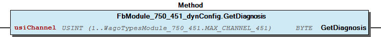 Graphical Interface of FbModule_750_451_dynConfig.GetDiagnosis Example For get the diagnostic byte from first channel of the module.

## FbModule_750_451_dynConfig.GetModuleInputSize (METH)


| Scope | Name | Type |
| --- | --- | --- |
| Return | GetModuleInputSize | UINT |

Returns the byte size of input data

Interface variables Returns the byte size of input data

## FbModule_750_451_dynConfig.GetProcessInBit (METH)


| Scope | Name | Type | Comment |
| --- | --- | --- | --- |
| Return | GetProcessInBit | BOOL |  |
| Input | ByteNo | UINT | range 0..(_uiInputSize - 1) |
| BitNo | USINT | range 0..7 |

## FbModule_750_451_dynConfig.GetProcessInByte (METH)


| Scope | Name | Type | Comment |
| --- | --- | --- | --- |
| Return | GetProcessInByte | BYTE |  |
| Input | ByteNo | UINT | range 0..(_uiInputSize - 1) |

## FbModule_750_451_dynConfig.GetProcessInData (METH)


| Scope | Name | Type | Comment |
| --- | --- | --- | --- |
| Return | GetProcessInData | UINT |  |
| Input | pInData | POINTER TO BYTE | pointer to the area where the process data should store |
| uiNInData | UINT | SIZEOF(Buffer) |

## FbModule_750_451_dynConfig.GetProcessInDword (METH)


| Scope | Name | Type | Comment |
| --- | --- | --- | --- |
| Return | GetProcessInDword | DWORD |  |
| Input | ByteNo | UINT | range 0..(_uiInputSize - 4) |

Graphical Illustration

Graphical Interface of FbModule_750_451_dynConfig.GetProcessInDword

Interface variables Function Get the process input dword specified by ByteNo of this module. Graphical Illustration 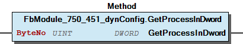 Graphical Interface of FbModule_750_451_dynConfig.GetProcessInDword

## FbModule_750_451_dynConfig.GetProcessInWord (METH)


| Scope | Name | Type | Comment |
| --- | --- | --- | --- |
| Return | GetProcessInWord | WORD |  |
| Input | ByteNo | UINT | range 0..(_uiInputSize - 2) |

Graphical Illustration

Graphical Interface of FbModule_750_451_dynConfig.GetProcessInWord

Interface variables Function Get the process input word specified by ByteNo of this module. Graphical Illustration 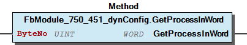 Graphical Interface of FbModule_750_451_dynConfig.GetProcessInWord

## FbModule_750_451_dynConfig.GetRawProcessValue (METH)


| Scope | Name | Type |
| --- | --- | --- |
| Return | GetRawProcessValue | INT |
| Input | usiChannel | USINT (1..WagoTypesModule_750_451.MAX_CHANNEL_451) |

```
VAR
    myiProcessValue :   INT;
END_VAR

myiProcessValue := my451.GetProcessValue(1); // here is the process raw value as INT
```

Get the raw process value of the wanted channel. The return value is unscaled in the range -32768 .. 37767.

In case of error (e.g. an invalid channel number is given) it returns 0.

Graphical Illustration

Graphical Interface of FbModule_750_451_dynConfig.GetRawProcessValue

Interface variables Function Get the raw process value of the wanted channel. The return value is unscaled in the range -32768 .. 37767. In case of error (e.g. an invalid channel number is given) it returns 0. Graphical Illustration 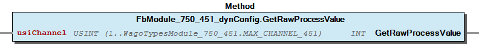 Graphical Interface of FbModule_750_451_dynConfig.GetRawProcessValue Example For get the process value from first channel of the module.

## FbModule_750_451_dynConfig.GetScaledProcessValue (METH)


| Scope | Name | Type |
| --- | --- | --- |
| Return | GetScaledProcessValue | REAL |
| Input | usiChannel | USINT (1..WagoTypesModule_750_451.MAX_CHANNEL_451) |

```
VAR
    mydiProcessValue    :   DINT;
END_VAR

mydiProcessValue := my451.GetProcessValue(1); // here is the process value
```

Graphical Illustration

Graphical Interface of FbModule_750_451_dynConfig.GetScaledProcessValue

Interface variables Function Get the scaled process value of the wanted channel. The range of the value depends on the configured sensortype. Graphical Illustration 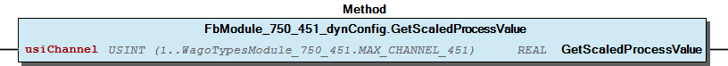 Graphical Interface of FbModule_750_451_dynConfig.GetScaledProcessValue Example For get the process value from first channel of the module.

## Settings


- FbModule_750_451.GetSettingsChannel (METH)

### Program Organization


## 20 Program Organization Units


- FbModule_750_451 (FB) I_Module_750_451 Channel FbModule_750_451.GetRawChannelCalibration (METH) - FbModule_750_451.GetRawChannelScaling (METH) - FbModule_750_451.GetRawChannelSettings (METH) - FbModule_750_451.SetRawChannelCalibration (METH) - FbModule_750_451.SetRawChannelScaling (METH) - FbModule_750_451.SetRawChannelSettings (METH) FbModule_750_451.GetRawChannelConfiguration (METH) FbModule_750_451.GetScaledChannelConfiguration (METH) Module - FbModule_750_451.GetModuleSettings (METH) - FbModule_750_451.SetModuleSettings (METH) FbModule_750_451.SetRawChannelConfiguration (METH) FbModule_750_451.SetScaledChannelConfiguration (METH) private - Configuration raw Settings FbModule_750_451.GetSettingsChannel (METH) FbModule_750_451_dynConfig (FB) - I_ModuleProcessInputsExtended FbModule_750_451_dynConfig.GetModuleInputSize (METH) - FbModule_750_451_dynConfig.GetProcessInBit (METH) - FbModule_750_451_dynConfig.GetProcessInByte (METH) - FbModule_750_451_dynConfig.GetProcessInData (METH) - FbModule_750_451_dynConfig.GetProcessInDword (METH) - FbModule_750_451_dynConfig.GetProcessInWord (METH) ProcessValues - FbModule_750_451_dynConfig.GetDiagnosis (METH) - FbModule_750_451_dynConfig.GetRawProcessValue (METH) - FbModule_750_451_dynConfig.GetScaledProcessValue (METH)

### Global Variable Lists


## Error_451 (GVL)


| Scope | Name | Type |
| --- | --- | --- |
| Constant | ERROR_451 | ARRAY [0..15] OF WagoTypesErrorBase.typResultItem |

| Value | Level | Description |
| --- | --- | --- |
| eError_451.OK | WagoTypesErrorBase.eSeverity.none | ‘OK’ |
| eError_451.INVALID_CHANNEL | WagoTypesErrorBase.eSeverity.error | ‘The wanted channel number is not allowed’ |
| eError_451.LINE_RESISTANCE_TO_SMALL | WagoTypesErrorBase.eSeverity.error | ‘The line resistance is to small (Range 0 .. 65.535’ |
| eError_451.LINE_RESISTANCE_TO_BIG | WagoTypesErrorBase.eSeverity.error | ‘The line resistance is to big (Range 0 .. 65.535’ |
| eError_451.LOWER_USER_LIMIT_TO_SMALL | WagoTypesErrorBase.eSeverity.error | ‘The lower user limit value is to small (Range depends on sensor type’ |
| eError_451.LOWER_USER_LIMIT_TO_BIG | WagoTypesErrorBase.eSeverity.error | ‘The lower user limit value is to big (Range depends on sensor type’ |
| eError_451.UPPER_USER_LIMIT_TO_SMALL | WagoTypesErrorBase.eSeverity.error | ‘The upper user limit value is to small (Range depends on sensor type’ |
| eError_451.UPPER_USER_LIMIT_TO_BIG | WagoTypesErrorBase.eSeverity.error | ‘The upper user limit value is to big (Range depends on sensor type’ |
| eError_451.LOWER_LIMIT_BIGGER_THAN_UPPER | WagoTypesErrorBase.eSeverity.error | ‘The lower user limit value s bigger than the upper user limit value’ |
| eError_451.UNKNOWN_SENSOR_TYPE | WagoTypesErrorBase.eSeverity.error | ‘Not supported sensor type’ |
| eError_451.USER_SCALING_OFFSET_TO_SMALL | WagoTypesErrorBase.eSeverity.error | ‘The user scaling offset is to small (Range depends on sensor type’ |
| eError_451.USER_SCALING_OFFSET_TO_BIG | WagoTypesErrorBase.eSeverity.error | ‘The user scaling offset is to big (Range depends on sensor type’ |
| eError_451.USER_CALIBRATION_GAIN_TO_SMALL | WagoTypesErrorBase.eSeverity.error | ‘The user calibration gain is to small (Range 0 .. 1.9999)’ |
| eError_451.USER_CALIBRATION_GAIN_TO_BIG | WagoTypesErrorBase.eSeverity.error | ‘The user calibration gain is to big (Range 0 .. 1.9999)’ |
| eError_451.USER_CALIBRATION_OFFSET_TO_SMALL | WagoTypesErrorBase.eSeverity.error | ‘The user calibration offset is to small (Range -262144 .. 262136)’ |
| eError_451.USER_CALIBRATION_OFFSET_TO_BIG | WagoTypesErrorBase.eSeverity.error | ‘The user calibration offset is to big (Range -262144 .. 262136)’ |

## VersionHistory (GVL)


| Name | Type |
| --- | --- |
| Info | ProjectInfo |

| date | version | author | change |
| 28.08.2024 | 1.9.4.3 | u0103719 | WAT36092: add missing sensor PT100_EN60751 (context: sensor type) |
| 30.08.2019 | 1.9.4.2 | u010545 | Bugfix Byteorder I_ModuleProcessInputsExtended |
| 16.08.2019 | 1.9.4.1 | u010545 | Update documentation WAT30406 |
| 06.08.2019 | 1.9.4.0 | u010545 | Interface for dyn config pa access added |
| 16.07.2019 | 1.9.3.0 | u010545 | Interface for dyn config added |
| 08.01.2019 | 1.9.2.0 | u015842 | Properties: free placeholder added |
| 06.02.2018 | 1.9.1.0 | u010545 | bugfix limit write order |
| 09.10.2017 | 1.9.0.1 | u010545 | channel quantity modified |
| 29.07.2017 | 1.9.0.0 | u010545 | changed for compability with old WagoSysModuleBase |
| 24.07.2017 | 1.8.0.1 | u010545 | FbModule_750_451_dynConfig implemented |
| 21.07.2017 | 1.8.0.0 | u010545 | new concept for configuration and mapping |
| 31.05.2017 | 1.7.0.0 | u010545 | First release |
| 30.05.2017 | 0.0.0.2 | u010545 | Interfaces modyfied |

WagoSysModule_750_451.library

Release Notes:

WagoSysModule_750_451.library Release Notes:

### Other Components


## 80 Status ¶


- Error_451 (GVL) - eError_451 (ENUM)

## Channel


- FbModule_750_451.GetRawChannelCalibration (METH) - FbModule_750_451.GetRawChannelScaling (METH) - FbModule_750_451.GetRawChannelSettings (METH) - FbModule_750_451.SetRawChannelCalibration (METH) - FbModule_750_451.SetRawChannelScaling (METH) - FbModule_750_451.SetRawChannelSettings (METH)

## Configuration


- raw Settings FbModule_750_451.GetSettingsChannel (METH)

## I_ModuleProcessInputsExtended


- FbModule_750_451_dynConfig.GetModuleInputSize (METH) - FbModule_750_451_dynConfig.GetProcessInBit (METH) - FbModule_750_451_dynConfig.GetProcessInByte (METH) - FbModule_750_451_dynConfig.GetProcessInData (METH) - FbModule_750_451_dynConfig.GetProcessInDword (METH) - FbModule_750_451_dynConfig.GetProcessInWord (METH)

## I_Module_750_451


- Channel FbModule_750_451.GetRawChannelCalibration (METH) - FbModule_750_451.GetRawChannelScaling (METH) - FbModule_750_451.GetRawChannelSettings (METH) - FbModule_750_451.SetRawChannelCalibration (METH) - FbModule_750_451.SetRawChannelScaling (METH) - FbModule_750_451.SetRawChannelSettings (METH) FbModule_750_451.GetRawChannelConfiguration (METH) FbModule_750_451.GetScaledChannelConfiguration (METH) Module - FbModule_750_451.GetModuleSettings (METH) - FbModule_750_451.SetModuleSettings (METH) FbModule_750_451.SetRawChannelConfiguration (METH) FbModule_750_451.SetScaledChannelConfiguration (METH)

## Module


- FbModule_750_451.GetModuleSettings (METH) - FbModule_750_451.SetModuleSettings (METH)

## ProcessValues


- FbModule_750_451_dynConfig.GetDiagnosis (METH) - FbModule_750_451_dynConfig.GetRawProcessValue (METH) - FbModule_750_451_dynConfig.GetScaledProcessValue (METH)

## eError_451 (ENUM)


| Name | Initial | Comment |
| --- | --- | --- |
| OK | 0 | all is well |
| INVALID_CHANNEL | 1 | invalid channel number |
| LINE_RESISTANCE_TO_SMALL | 2 |  |
| LINE_RESISTANCE_TO_BIG | 3 |  |
| LOWER_USER_LIMIT_TO_SMALL | 4 |  |
| LOWER_USER_LIMIT_TO_BIG | 5 |  |
| UPPER_USER_LIMIT_TO_SMALL | 6 |  |
| UPPER_USER_LIMIT_TO_BIG | 7 |  |
| LOWER_LIMIT_BIGGER_THAN_UPPER | 8 |  |
| UNKNOWN_SENSOR_TYPE | 9 |  |
| USER_SCALING_OFFSET_TO_SMALL | 10 |  |
| USER_SCALING_OFFSET_TO_BIG | 11 |  |
| USER_CALIBRATION_GAIN_TO_SMALL | 12 |  |
| USER_CALIBRATION_GAIN_TO_BIG | 13 |  |
| USER_CALIBRATION_OFFSET_TO_SMALL | 14 |  |
| USER_CALIBRATION_OFFSET_TO_BIG | 15 |  |

## private


- Configuration raw Settings FbModule_750_451.GetSettingsChannel (METH)

## raw


- Settings FbModule_750_451.GetSettingsChannel (METH)