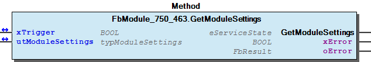
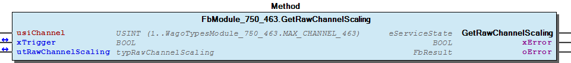
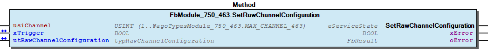
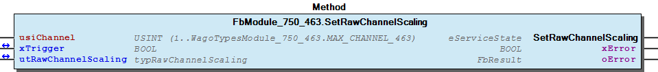
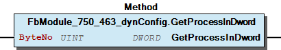
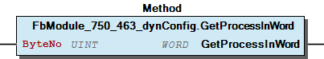
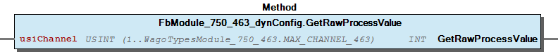

# WagoSysModule_750_463 v1.9.4.1 (WAGO) - Complete Documentation


## 📋 Library Information

- **Company:** WAGO
- **Title:** WagoSysModule_750_463
- **Version:** 1.9.4.1
- **Categories:** WAGO LayerView|Sys; Application
- **Author:** WAGO
- **Placeholder:** WagoSysModule_750_463

### Description ¶


This document is automatically generated. Because of this, the chapter 30 Visualization is not shown in this document. If you are interested in getting to know more about visualization, we refer to the library manager of e!Cockpit.

Handling modules 750-463 [1]

This document is automatically generated. Because of this, the chapter 30 Visualization is not shown in this document. If you are interested in getting to know more about visualization, we refer to the library manager of e!Cockpit. Handling modules 750-463 [1]

### Contents: ¶


Contents: - Documentation Index - Project Information - Library Information - Function Blocks FbModule_750_463 (FB) - FbModule_750_463_dynConfig (FB) Methods - FbModule_750_463.GetModuleSettings (METH) - FbModule_750_463.GetRawChannelCalibration (METH) - FbModule_750_463.GetRawChannelConfiguration (METH) - FbModule_750_463.GetRawChannelScaling (METH) - FbModule_750_463.GetRawChannelSettings (METH) - FbModule_750_463.SetModuleSettings (METH) - FbModule_750_463.SetRawChannelCalibration (METH) - FbModule_750_463.SetRawChannelConfiguration (METH) - FbModule_750_463.SetRawChannelScaling (METH) - FbModule_750_463.SetRawChannelSettings (METH) - ... and 7 more Program Organization Global Variable Lists - Error_463 (GVL) - VersionHistory (GVL) Other Components - 80 Status - Channel - I_ModuleProcessInputsExtended - I_Module_750_463 - Module - eError_463 (ENUM)

### Indices and tables ¶


| [1] | Based on WagoSysModule_750_463.library, last modified 05.11.2019, 20:31:02. The content of this file was automatically generated with None on 05.11.2019, 20:31:08 |

© WAGO Kontakttechnik GmbH & Co. KG, Germany 2018 – All rights reserved. For the avoidance of doubt, this copyright notice does not only apply to the information above but also and primarily to the described library itself. Please note that third-party products are always mentioned without reference to intellectual property rights, including patents, utility models, designs and trademarks, accordingly the existence of such rights cannot be excluded. WAGO is a registered trademark of WAGO Verwaltungsgesellschaft mbH.

- File and Project Information - Library Reference © WAGO Kontakttechnik GmbH & Co. KG, Germany 2018 – All rights reserved. For the avoidance of doubt, this copyright notice does not only apply to the information above but also and primarily to the described library itself. Please note that third-party products are always mentioned without reference to intellectual property rights, including patents, utility models, designs and trademarks, accordingly the existence of such rights cannot be excluded. WAGO is a registered trademark of WAGO Verwaltungsgesellschaft mbH.

### Documentation Index


## WagoSysModule_750_463 Library Documentation


| Company: | WAGO |
| Title: | WagoSysModule_750_463 |
| Version: | 1.9.4.1 |
| Categories: | WAGO LayerView\|Sys; Application |
| Author: | WAGO |
| Placeholder: | WagoSysModule_750_463 |

### Description


This document is automatically generated. Because of this, the chapter 30 Visualization is not shown in this document. If you are interested in getting to know more about visualization, we refer to the library manager of e!Cockpit.

Handling modules 750-463 [1]

This document is automatically generated. Because of this, the chapter 30 Visualization is not shown in this document. If you are interested in getting to know more about visualization, we refer to the library manager of e!Cockpit. Handling modules 750-463 [1]

### Contents:


- 20 Program Organization Units FbModule_750_463 (FB) - FbModule_750_463_dynConfig (FB) 80 Status - Error_463 (GVL) - eError_463 (ENUM) VersionHistory (GVL)

### Indices and tables


| [1] | Based on WagoSysModule_750_463.library, last modified 05.11.2019, 20:31:02. The content of this file was automatically generated with None on 05.11.2019, 20:31:08 |

© WAGO Kontakttechnik GmbH & Co. KG, Germany 2018 – All rights reserved. For the avoidance of doubt, this copyright notice does not only apply to the information above but also and primarily to the described library itself. Please note that third-party products are always mentioned without reference to intellectual property rights, including patents, utility models, designs and trademarks, accordingly the existence of such rights cannot be excluded. WAGO is a registered trademark of WAGO Verwaltungsgesellschaft mbH.

- File and Project Information - Library Reference © WAGO Kontakttechnik GmbH & Co. KG, Germany 2018 – All rights reserved. For the avoidance of doubt, this copyright notice does not only apply to the information above but also and primarily to the described library itself. Please note that third-party products are always mentioned without reference to intellectual property rights, including patents, utility models, designs and trademarks, accordingly the existence of such rights cannot be excluded. WAGO is a registered trademark of WAGO Verwaltungsgesellschaft mbH.

### Project Information


## File and Project Information


| Scope | Name | Type | Content |
| --- | --- | --- | --- |
| FileHeader | libraryFile | string | WagoSysModule_750_463.library |
| contentFile | WagoSysModule_750_463_clr.json |
| productName | e!COCKPIT |
| creationDateTime | date | 05.11.2019, 20:31:08 |
| companyName | string | WAGO |
| ProjectInformation | LastModificationDateTime | date | 05.11.2019, 20:31:02 |
| Description | string | See: Description |
| Copyright | © WAGO Kontakttechnik GmbH & Co. KG, Germany 2018 – All rights reserved. |
| Author | WAGO |
| AutoResolveUnbound | bool | True |
| Placeholder | string | WagoSysModule_750_463 |
| Company | WAGO |
| DocFormat | reStructuredText |
| Project | WagoSysModule_750_463 |
| Version | version | 1.9.4.1 |
| ActivateSigning | bool | False |
| Title | string | WagoSysModule_750_463 |
| LibraryCategories | library-category-list | WAGO LayerView\|Sys; Application |
| Version string | string |  |

### Library Information


## Library Reference


| LinkAllContent: False QualifiedOnly: False | SystemLibrary: False | Optional: False |

| LinkAllContent: False QualifiedOnly: False | SystemLibrary: False | Optional: False |

| LinkAllContent: False QualifiedOnly: False | SystemLibrary: False | Optional: False |

| LinkAllContent: False Optional: False | QualifiedOnly: False SystemLibrary: False | PublishSymbolsInContainer: True |

| LinkAllContent: False Optional: False | QualifiedOnly: True SystemLibrary: False | PublishSymbolsInContainer: True |

| LinkAllContent: False QualifiedOnly: True | SystemLibrary: False PublishSymbolsInContainer: True | Optional: False |

| LinkAllContent: False Optional: False | QualifiedOnly: True SystemLibrary: False | PublishSymbolsInContainer: True |

This is a dictionary of all referenced libraries and their name spaces.

This is a dictionary of all referenced libraries and their name spaces. WagoSysErrorBase Library Identification : Placeholder: WagoSysErrorBase Default Resolution: WagoSysErrorBase, * (WAGO) Namespace: WagoSysErrorBase Library Properties : WagoSysModuleBaseProtected Library Identification : Placeholder: WagoSysModuleBaseProtected Default Resolution: WagoSysModuleBaseProtected, * (WAGO) Namespace: WagoSysModuleBaseProtected Library Properties : Library Parameter : Parameter: REGISTER_COM_TIMEOUT = TIME#5s0ms Parameter: PARAMETER_COM_TIMEOUT = TIME#5s0ms WagoSysVersion Library Identification : Name: WagoSysVersion Version: 1.0.0.0 Company: WAGO Namespace: WagoSysVersion Library Properties : WagoTypesBusServices Library Identification : Placeholder: WagoTypesBusServices Default Resolution: WagoTypesBusServices, * (WAGO) Namespace: WagoTypesBusServices Library Properties : WagoTypesCommon Library Identification : Placeholder: WagoTypesCommon Default Resolution: WagoTypesCommon, * (WAGO) Namespace: WagoTypes Library Properties : WagoTypesModuleBase Library Identification : Placeholder: WagoTypesModuleBase Default Resolution: WagoTypesModuleBase, * (WAGO) Namespace: WagoTypesModuleBase Library Properties : Library Parameter : Parameter: MAX_MBX_SIZE = 18 WagoTypesModule_750_463 Library Identification : Placeholder: WagoTypesModule_750_463 Default Resolution: WagoTypesModule_750_463, * (WAGO) Namespace: WagoTypesModule_750_463 Library Properties :

### Function Blocks


## FbModule_750_463 (FB)


| Scope | Name | Type | Inherited from |
| --- | --- | --- | --- |
| Output | oError | WagoSysErrorBase.FbResult | FbModuleBase |

Access to the module 750-463

Function description

This block is needed for each module. The instance of this function block is either automatically generated by the K-Bus configuration or has to be manually added in case of the dynamic configuration.

Interface variables Function Access to the module 750-463 Function description This block is needed for each module. The instance of this function block is either automatically generated by the K-Bus configuration or has to be manually added in case of the dynamic configuration. - I_Module_750_463 Channel FbModule_750_463.GetRawChannelCalibration (METH) - FbModule_750_463.GetRawChannelScaling (METH) - FbModule_750_463.GetRawChannelSettings (METH) - FbModule_750_463.SetRawChannelCalibration (METH) - FbModule_750_463.SetRawChannelScaling (METH) - FbModule_750_463.SetRawChannelSettings (METH) FbModule_750_463.GetRawChannelConfiguration (METH) Module - FbModule_750_463.GetModuleSettings (METH) - FbModule_750_463.SetModuleSettings (METH) FbModule_750_463.SetRawChannelConfiguration (METH)

## FbModule_750_463_dynConfig (FB)


| Scope | Name | Type | Inherited from |
| --- | --- | --- | --- |
| Output | oError | WagoSysErrorBase.FbResult | FbModuleBase |

Function description

Interface variables Function Access to the module 750-464 with PA-Access In case of dynamic configuration the FB provides additional the PA-Access. Function description This block is needed for each module. The instance of this function block has to be manually added in case of the dynamic configuration. - FbModule_750_463_dynConfig.GetRawProcessValue (METH) - I_ModuleProcessInputsExtended FbModule_750_463_dynConfig.GetModuleInputSize (METH) - FbModule_750_463_dynConfig.GetProcessInBit (METH) - FbModule_750_463_dynConfig.GetProcessInByte (METH) - FbModule_750_463_dynConfig.GetProcessInData (METH) - FbModule_750_463_dynConfig.GetProcessInDword (METH) - FbModule_750_463_dynConfig.GetProcessInWord (METH)

### Methods


## FbModule_750_463.GetModuleSettings (METH)


| Scope | Name | Type |
| --- | --- | --- |
| Return | GetModuleSettings | WagoTypesModuleBase.eServiceState |
| Inout | xTrigger | BOOL |
| utModuleSettings | WagoTypesModule_750_463.typModuleSettings |
| Output | xError | BOOL |
| oError | WagoSysErrorBase.FbResult |

| Struct member | Value | Description |
| --- | --- | --- |
| ePSRMode | ENABLED_50HZ | Noise filter optimized for 50 Hz |
| ENABLED_60HZ | Noise filter optimized for 60 Hz |
| ENABLED_50_60HZ | Noise filter optimized for 50/60 Hz but lower attenuation |

| Return Value | Description |
| --- | --- |
| WagoTypesModuleBase.eServiceState.DONE | successful |
| WagoTypesModuleBase.eServiceState.ABORT | error -> see oError |
| WagoTypesModuleBase.eServiceState.NO_DATA | call while xTrigger is reset |

```
VAR
    //--- Module Mode Settings ------------------------------
    utModuleSettings    :   WagoTypesModule_750_463.typModuleSettings;
    xGetModuleSettings  :   BOOL;  // triggers the function
    oError              :   WagoSysErrorBase.FbResult;
END_VAR

//--- M O D U L E    S E T T I N G S -----------------------
CASE my463.GetModuleSettings(xGetModuleSettings, utModuleSettings, oError => oError) OF

    eServiceState.DONE : // OK
            ;// process here your utModuleSettings

    eServiceState.ABORT : // Error
            ;// process here your error handling -> see oError for more information

END_CASE
```

Get the common settings of the module at a struct.

Return Values

It is not allowed to reset the xTrigger by the application. This must done by the method.

Graphical Illustration

Graphical Interface of FbModule_750_463.GetModuleSettings

For get the settings from the module.

You have to call the method cyclic until the method returns with DONE or ABORT.

Interface variables Function Get the common settings of the module at a struct. Return Values Warning It is not allowed to reset the xTrigger by the application. This must done by the method. Graphical Illustration  Graphical Interface of FbModule_750_463.GetModuleSettings Example For get the settings from the module. Note You have to call the method cyclic until the method returns with DONE or ABORT.

## FbModule_750_463.GetRawChannelCalibration (METH)


| Scope | Name | Type |
| --- | --- | --- |
| Return | GetRawChannelCalibration | WagoTypesModuleBase.eServiceState |
| Input | usiChannel | USINT (1..WagoTypesModule_750_463.MAX_CHANNEL_463) |
| Inout | xTrigger | BOOL |
| utRawChannelCalibration | WagoTypesModule_750_463.typRawChannelCalibration |
| Output | xError | BOOL |
| oError | WagoSysErrorBase.FbResult |

| Struct member | Value | Description |
| --- | --- | --- |
| xUserCalibration | FALSE | The user scaling is switched off |
| TRUE | The user scaling is switched on |
| iUserCalibrationOffset |  |
| uiUserCalibrationGain |  |

```
VAR
    //--- Channel Calibration ---------------------------------
    utChannelCalibration    :   WagoTypesModule_750_464.typRawChannelCalibration;;
    xGetChannelCalibration  :   BOOL;
    oError                  :   WagoSysErrorBase.FbResult;
END_VAR

//--- C H A N N E L    C A L I B R A T I O N -----------------------
CASE my464.GetRawChannelCalibration(    usiChannel              := 1,
                                        xTrigger                := xGetChannelCalibration,
                                        utRawChannelCalibration := utChannelCalibration,
                                        oError                  => oError
                                    ) OF

    eServiceState.DONE : // OK
            ;// process here your utModuleSettings

    eServiceState.ABORT : // Error
            ;// process here your error handling -> see oError for more information

END_CASE
```

Get the calibration of a channel at a struct.

Graphical Illustration

Graphical Interface of FbModule_750_463.GetRawChannelCalibration

For get the calibration from channel one

You have to call the method cyclic until the method returns with DONE or ABORT.

Interface variables Function Get the calibration of a channel at a struct. Graphical Illustration  Graphical Interface of FbModule_750_463.GetRawChannelCalibration Example For get the calibration from channel one Note You have to call the method cyclic until the method returns with DONE or ABORT.

## FbModule_750_463.GetRawChannelConfiguration (METH)


| Scope | Name | Type |
| --- | --- | --- |
| Return | GetRawChannelConfiguration | WagoTypesModuleBase.eServiceState |
| Input | usiChannel | USINT (1..WagoTypesModule_750_463.MAX_CHANNEL_463) |
| Inout | xTrigger | BOOL |
| utRawChannelConfiguration | WagoTypesModule_750_463.typRawChannelConfiguration |
| Output | xError | BOOL |
| oError | WagoSysErrorBase.FbResult |

| Return Value | Description |
| --- | --- |
| WagoTypesModuleBase.eServiceState.DONE | successful |
| WagoTypesModuleBase.eServiceState.ABORT | error -> see oError |
| WagoTypesModuleBase.eServiceState.NO_DATA | call while xTrigger is reset |

```
VAR
    //--- Channel Configuration -------------------------------------------------------
    utRawChannelConfiguration   :   WagoTypesModule_750_463.typRawChannelConfiguration;
    oError                      :   WagoSysErrorBase.FbResult;
    xGetRawChannelConfiguration :   BOOL;
END_VAR

//--- R A W   C H A N N E L   C O N F I G U R A T I O N ----------------------
CASE my463.GetRawChannelConfiguration(1, xGetRawChannelConfiguration, utRawChannelConfiguration, oError => oError) OF

    eServiceState.DONE : // OK
            ;// process here your utRawChannelConfiguration

    eServiceState.ABORT : // Error
            ;// process here your error handling -> see oError for more information

END_CASE
```

Return Values

It is not allowed to reset the xTrigger by the application. This must done by the method.

Graphical Illustration

Graphical Interface of FbModule_750_463.GetRawChannelConfiguration

Example for ST

For get the raw configuration of the first channel

You have to call the method cyclic until the method returns with DONE or ABORT.

Interface variables Function Get the complete raw configuration of one channel, specified by usiChannel in a struct. This struct contains the three components Settings , Scaling and Calibration for holding the raw values. Return Values Warning It is not allowed to reset the xTrigger by the application. This must done by the method. Graphical Illustration  Graphical Interface of FbModule_750_463.GetRawChannelConfiguration Example for ST For get the raw configuration of the first channel Note You have to call the method cyclic until the method returns with DONE or ABORT.

## FbModule_750_463.GetRawChannelScaling (METH)


| Scope | Name | Type |
| --- | --- | --- |
| Return | GetRawChannelScaling | WagoTypesModuleBase.eServiceState |
| Input | usiChannel | USINT (1..WagoTypesModule_750_463.MAX_CHANNEL_463) |
| Inout | xTrigger | BOOL |
| utRawChannelScaling | WagoTypesModule_750_463.typRawChannelScaling |
| Output | xError | BOOL |
| oError | WagoSysErrorBase.FbResult |

| Struct member | Value | Description |
| --- | --- | --- |
| xUserScaling | FALSE | The user scaling is switched off |
| TRUE | The user scaling is switched on |
| xManufacturerScaling | FALSE | The manufacturer scaling is switched off |
| TRUE | The manufacturer scaling is switched on |
| iUserScalingOffset |  |
| uiUserScalingGain |  |
| uiUserScalingWireResistor |  |

```
VAR
    //--- Channel Settings ---------------------------------
    utChannelScaling    :   WagoTypesModule_750_463.typRawChannelScaling;;
    xGetChannelScaling  :   BOOL;
    oError              :   WagoSysErrorBase.FbResult;
END_VAR

//--- C H A N N E L   S C A L I N G ------------------------
CASE my463.GetRawChannelScaling(    usiChannel           := 1,
                                    xTrigger             := xGetChannelScaling,
                                    utRawChannelScaling  := utChannelScaling,
                                    oError               => oError
                                ) OF

    eServiceState.DONE : // OK
            ;// process here your utModuleSettings

    eServiceState.ABORT : // Error
            ;// process here your error handling -> see oError for more information

END_CASE
```

Get the scaling of a channel at a struct.

Graphical Illustration

Graphical Interface of FbModule_750_463.GetRawChannelScaling

For get the scaling from channel one

You have to call the method cyclic until the method returns with DONE or ABORT.

Interface variables Function Get the scaling of a channel at a struct. Graphical Illustration  Graphical Interface of FbModule_750_463.GetRawChannelScaling Example For get the scaling from channel one Note You have to call the method cyclic until the method returns with DONE or ABORT.

## FbModule_750_463.GetRawChannelSettings (METH)


| Scope | Name | Type |
| --- | --- | --- |
| Return | GetRawChannelSettings | WagoTypesModuleBase.eServiceState |
| Input | usiChannel | USINT (1..WagoTypesModule_750_463.MAX_CHANNEL_463) |
| Inout | xTrigger | BOOL |
| utRawChannelSettings | WagoTypesModule_750_463.typRawChannelSettings |
| Output | xError | BOOL |
| oError | WagoSysErrorBase.FbResult |

| Struct member | Value | Description |
| --- | --- | --- |
| eSensorType | Pt1000_IEC751 | IEC 751 | -200 °C...850 °C |
| Ni1000_DIN43760 | DIN 43760 | -60 °C...250 °C |
| Ni1000_TK5000 | TK 5000 | -60 °C...250 °C |
| KTY_81_110 | KTY 81 110 | -30 °C...150 °C |
| KTY_81_210 | KTY 81 210 | -30 °C...150 °C |
| xEnableWatchdog | FALSE | Watchdog timer is not active |
| TRUE | Watchdog timer is active (terminal box) |
| xEnableAverageFilter | FALSE | The mean value filter is switched off |
| TRUE | The mean value filter is switched on |
| xAmountSignFormat | FALSE | Numeric values appear in two’s complement |
| TRUE | Numeric values appear in amount / sign format |
| xS5FB250Format | FALSE | Numeric values appear in default format |
| TRUE | Numeric values appear in S5-FB250 format |
| xEnableDiag | FALSE | Wire break / short circuit diagnostics disabled |
| TRUE | Wire break / short circuit diagnostics enabled |
| xEnableOverrangeProtection | FALSE | The overflow limit is switched off |
| TRUE | Numeric values are limited to values in R50, R51 |
| iUserUnderrange |  |
| iUserOverrange |  |

```
VAR
    //--- Channel Settings ---------------------------------
    utChannelSettings   :   WagoTypesModule_750_463.typRawChannelSettings;;
    xGetChannelSettings :   BOOL;
    oError              :   WagoSysErrorBase.FbResult;
END_VAR

//--- C H A N N E L   S E T T I N G S ----------------------
CASE my463.GetRawChannelSettings(   usiChannel           := 1,
                                    xTrigger             := xGetChannelSettings,
                                    utRawChannelSettings := utChannelSettings,
                                    oError               => oError
                                ) OF

    eServiceState.DONE : // OK
        ;// process here your utModuleSettings

    eServiceState.ABORT : // Error
        ;// process here your error handling -> see oError for more information

END_CASE
```

Get the settings of a channel at a struct.

Graphical Illustration

Graphical Interface of FbModule_750_463.GetRawChannelSettings

For get the settings from channel one

You have to call the method cyclic until the method returns with DONE or ABORT.

Interface variables Function Get the settings of a channel at a struct. Graphical Illustration  Graphical Interface of FbModule_750_463.GetRawChannelSettings Example For get the settings from channel one Note You have to call the method cyclic until the method returns with DONE or ABORT.

## FbModule_750_463.SetModuleSettings (METH)


| Scope | Name | Type |
| --- | --- | --- |
| Return | SetModuleSettings | WagoTypesModuleBase.eServiceState |
| Inout | xTrigger | BOOL |
| utModuleSettings | WagoTypesModule_750_463.typModuleSettings |
| Output | xError | BOOL |
| oError | WagoSysErrorBase.FbResult |

| Struct member | Value | Description |
| --- | --- | --- |
| ePSRMode | ENABLED_50HZ | Noise filter optimized for 50 Hz |
| ENABLED_60HZ | Noise filter optimized for 60 Hz |
| ENABLED_50_60HZ | Noise filter optimized for 50/60 Hz but lower attenuation |

| Return Value | Description |
| --- | --- |
| WagoTypesModuleBase.eServiceState.DONE | successful |
| WagoTypesModuleBase.eServiceState.ABORT | error -> see oError |
| WagoTypesModuleBase.eServiceState.NO_DATA | call while xTrigger is reset |

```
VAR
    //--- Module Mode Settings ------------------------------
    utModuleSettings    :   WagoTypesModule_750_463.typModuleSettings;
    xSetModuleSettings  :   BOOL;  // triggers the function
    oError              :   WagoSysErrorBase.FbResult;
END_VAR

//--- S E T   M O D U L E    S E T T I N G S ---------------
CASE my463.SetModuleSettings(xSetModuleSettings, utModuleSettings, oError => oError) OF

    eServiceState.DONE : // OK

    eServiceState.ABORT : // Error
            ;// process here your error handling -> see oError for more information

END_CASE
```

Set the common settings of the module from a struct.

Return Values

It is not allowed to reset the xTrigger by the application. This must done by the method.

Graphical Illustration

Graphical Interface of FbModule_750_463.SetModuleSettings

For set the settings from the module.

You have to call the method cyclic until the method returns with DONE or ABORT.

Interface variables Function Set the common settings of the module from a struct. Return Values Warning It is not allowed to reset the xTrigger by the application. This must done by the method. Graphical Illustration  Graphical Interface of FbModule_750_463.SetModuleSettings Example For set the settings from the module. Note You have to call the method cyclic until the method returns with DONE or ABORT.

## FbModule_750_463.SetRawChannelCalibration (METH)


| Scope | Name | Type |
| --- | --- | --- |
| Return | SetRawChannelCalibration | WagoTypesModuleBase.eServiceState |
| Input | usiChannel | USINT (1..WagoTypesModule_750_463.MAX_CHANNEL_463) |
| Inout | xTrigger | BOOL |
| utRawChannelCalibration | WagoTypesModule_750_463.typRawChannelCalibration |
| Output | xError | BOOL |
| oError | WagoSysErrorBase.FbResult |

| Struct member | Value | Description |
| --- | --- | --- |
| xUserCalibration | FALSE | The user scaling is switched off |
| TRUE | The user scaling is switched on |
| iUserCalibrationOffset |  |
| uiUserCalibrationGain |  |

```
VAR
    //--- Channel Calibration ---------------------------------
    utChannelCalibration    :   WagoTypesModule_750_463.typRawChannelCalibration;;
    xSetChannelCalibration  :   BOOL;
    oError                  :   WagoSysErrorBase.FbResult;
END_VAR

//--- C H A N N E L    C A L I B R A T I O N -----------------------
CASE my463.SetRawChannelCalibration(    usiChannel              := 1,
                                        xTrigger                := xSetChannelCalibration,
                                        utRawChannelCalibration := utChannelCalibration,
                                        oError                  => oError
                                   ) OF

    eServiceState.DONE : // OK
            ;// process here your utModuleSettings

    eServiceState.ABORT : // Error
            ;// process here your error handling -> see oError for more information

END_CASE
```

Set the calibration of a channel by a struct.

Graphical Illustration

Graphical Interface of FbModule_750_463.SetRawChannelCalibration

For set the calibration of channel one

You have to call the method cyclic until the method returns with DONE or ABORT.

Interface variables Function Set the calibration of a channel by a struct. Graphical Illustration  Graphical Interface of FbModule_750_463.SetRawChannelCalibration Example For set the calibration of channel one Note You have to call the method cyclic until the method returns with DONE or ABORT.

## FbModule_750_463.SetRawChannelConfiguration (METH)


| Scope | Name | Type |
| --- | --- | --- |
| Return | SetRawChannelConfiguration | WagoTypesModuleBase.eServiceState |
| Input | usiChannel | USINT (1..WagoTypesModule_750_463.MAX_CHANNEL_463) |
| Inout | xTrigger | BOOL |
| utRawChannelConfiguration | WagoTypesModule_750_463.typRawChannelConfiguration |
| Output | xError | BOOL |
| oError | WagoSysErrorBase.FbResult |

| Return Value | Description |
| --- | --- |
| WagoTypesModuleBase.eServiceState.DONE | successful |
| WagoTypesModuleBase.eServiceState.ABORT | error -> see oError |
| WagoTypesModuleBase.eServiceState.NO_DATA | call while xTrigger is reset |

```
VAR
    //--- Channel Configuration -------------------------------------------------------
    xStartProcess               :   BOOL; // set this variable once to start the process -> this varibale will be automatic reset
    utRawChannelConfiguration   :   WagoTypesModule_750_463.typRawChannelConfiguration;
    oError                      :   WagoSysErrorBase.FbResult;
    xSetRawChannelConfiguration :   BOOL;
END_VAR

//--- R A W   C H A N N E L   C O N F I G U R A T I O N ----------------------

//--- READ BEFORE WRITE --------------------------------------------------------------
CASE my463.GetRawChannelConfiguration( 1, xStartProcess, utRawChannelConfiguration, oError => oError) OF

    eServiceState.DONE : // OK -> actual configuration is successful read
        // change here your configuration
        // utRawChannelConfiguration... :=
        xSetRawChannelConfiguration := TRUE; // trigger write

    eServiceState.ABORT : // Error -> not able to read -> see oError
            ;// process here your error handling for read -> see oError for more information

END_CASE

//--- WRITE MODYFIED CONFIGURATION ---------------------------------------------------
CASE my463.SetRawChannelConfiguration( 1, xSetRawChannelConfiguration, utRawChannelConfiguration, oError => oError) OF

    eServiceState.DONE : // OK -> new configuration is written

    eServiceState.ABORT : // Error -> not able to write -> see oError
            ;// process here your error handling for write -> see oError for more information

END_CASE
```

Set the complete raw configuration of one channel, specified by usiChannel and the struct utRawChannelConfiguration . This struct have to contain all configuration parameters.

Recommendation : You should read out all raw configuration in this struct before you write the raw configuration. So you have to change only the needed paramneters between read and write.

Return Values

It is not allowed to reset the xTrigger by the application. This must done by the method.

Graphical Illustration

Graphical Interface of FbModule_750_463.SetRawChannelConfiguration

Example for ST

For get the raw configuration of the first channel and after this change some parameters before it write back to the module.

You have to call the method cyclic until the method returns with DONE or ABORT.

Interface variables Function Set the complete raw configuration of one channel, specified by usiChannel and the struct utRawChannelConfiguration . This struct have to contain all configuration parameters. Note Recommendation : You should read out all raw configuration in this struct before you write the raw configuration. So you have to change only the needed paramneters between read and write. Return Values Warning It is not allowed to reset the xTrigger by the application. This must done by the method. Graphical Illustration  Graphical Interface of FbModule_750_463.SetRawChannelConfiguration Example for ST For get the raw configuration of the first channel and after this change some parameters before it write back to the module. Note You have to call the method cyclic until the method returns with DONE or ABORT.

## FbModule_750_463.SetRawChannelScaling (METH)


| Scope | Name | Type |
| --- | --- | --- |
| Return | SetRawChannelScaling | WagoTypesModuleBase.eServiceState |
| Input | usiChannel | USINT (1..WagoTypesModule_750_463.MAX_CHANNEL_463) |
| Inout | xTrigger | BOOL |
| utRawChannelScaling | WagoTypesModule_750_463.typRawChannelScaling |
| Output | xError | BOOL |
| oError | WagoSysErrorBase.FbResult |

| Struct member | Value | Description |
| --- | --- | --- |
| xUserScaling | FALSE | The user scaling is switched off |
| TRUE | The user scaling is switched on |
| xManufacturerScaling | FALSE | The manufacturer scaling is switched off |
| TRUE | The manufacturer scaling is switched on |
| iUserScalingOffset |  |
| uiUserScalingGain |  |
| uiUserScalingWireResistor |  |

```
VAR
    //--- Channel Settings ---------------------------------
    utChannelScaling    :   WagoTypesModule_750_463.typRawChannelScaling;;
    xSetChannelScaling  :   BOOL;
    oError              :   WagoSysErrorBase.FbResult;
END_VAR

//--- C H A N N E L   S C A L I N G ------------------------
CASE my463.SetRawChannelScaling(    usiChannel          := 1,
                                    xTrigger            := xSetChannelScaling,
                                    utRawChannelScaling := utChannelScaling,
                                    oError              => oError
                                ) OF

    eServiceState.DONE : // OK
            ;// process here your utModuleSettings

    eServiceState.ABORT : // Error
            ;// process here your error handling -> see oError for more information

END_CASE
```

Set the scaling of a channel by a struct.

Graphical Illustration

Graphical Interface of FbModule_750_463.SetRawChannelScaling

For set the scaling of channel one

You have to call the method cyclic until the method returns with DONE or ABORT.

Interface variables Function Set the scaling of a channel by a struct. Graphical Illustration  Graphical Interface of FbModule_750_463.SetRawChannelScaling Example For set the scaling of channel one Note You have to call the method cyclic until the method returns with DONE or ABORT.

## FbModule_750_463.SetRawChannelSettings (METH)


| Scope | Name | Type |
| --- | --- | --- |
| Return | SetRawChannelSettings | WagoTypesModuleBase.eServiceState |
| Input | usiChannel | USINT (1..WagoTypesModule_750_463.MAX_CHANNEL_463) |
| Inout | xTrigger | BOOL |
| utRawChannelSettings | WagoTypesModule_750_463.typRawChannelSettings |
| Output | xError | BOOL |
| oError | WagoSysErrorBase.FbResult |

| Struct member | Value | Description |
| --- | --- | --- |
| eSensorType | Pt1000_IEC751 | IEC 751 | -200 °C...850 °C |
| Ni1000_DIN43760 | DIN 43760 | -60 °C...250 °C |
| Ni1000_TK5000 | TK 5000 | -60 °C...250 °C |
| KTY_81_110 | KTY 81 110 | -30 °C...150 °C |
| KTY_81_210 | KTY 81 210 | -30 °C...150 °C |
| xEnableWatchdog | FALSE | Watchdog timer is not active |
| TRUE | Watchdog timer is active (terminal box) |
| xEnableAverageFilter | FALSE | The mean value filter is switched off |
| TRUE | The mean value filter is switched on |
| xAmountSignFormat | FALSE | Numeric values appear in two’s complement |
| TRUE | Numeric values appear in amount / sign format |
| xS5FB250Format | FALSE | Numeric values appear in default format |
| TRUE | Numeric values appear in S5-FB250 format |
| xEnableDiag | FALSE | Wire break / short circuit diagnostics disabled |
| TRUE | Wire break / short circuit diagnostics enabled |
| xEnableOverrangeProtection | FALSE | The overflow limit is switched off |
| TRUE | Numeric values are limited to values in R50, R51 |
| iUserUnderrange |  |
| iUserOverrange |  |

```
VAR
    //--- Channel Settings ---------------------------------
    utChannelSettings   :   WagoTypesModule_750_463.typRawChannelSettings;;
    xSetChannelSettings :   BOOL;
    oError              :   WagoSysErrorBase.FbResult;
END_VAR

//--- C H A N N E L   S E T T I N G S ----------------------
CASE my463.SetRawChannelSettings(   usiChannel           := 1,
                                    xTrigger             := xSetChannelSettings,
                                    utRawChannelSettings := utChannelSettings,
                                    oError               => oError
                                ) OF

    eServiceState.DONE : // OK
        ;// process here your utModuleSettings

    eServiceState.ABORT : // Error
        ;// process here your error handling -> see oError for more information

END_CASE
```

Set the settings for a channel by a struct.

Graphical Illustration

Graphical Interface of FbModule_750_463.SetRawChannelSettings

For set the settings of channel one

You have to call the method cyclic until the method returns with DONE or ABORT.

Interface variables Function Set the settings for a channel by a struct. Graphical Illustration  Graphical Interface of FbModule_750_463.SetRawChannelSettings Example For set the settings of channel one Note You have to call the method cyclic until the method returns with DONE or ABORT.

## FbModule_750_463_dynConfig.GetModuleInputSize (METH)


| Scope | Name | Type |
| --- | --- | --- |
| Return | GetModuleInputSize | UINT |

Returns the byte size of input data

Interface variables Returns the byte size of input data

## FbModule_750_463_dynConfig.GetProcessInBit (METH)


| Scope | Name | Type | Comment |
| --- | --- | --- | --- |
| Return | GetProcessInBit | BOOL |  |
| Input | ByteNo | UINT | range 0..(_uiInputSize - 1) |
| BitNo | USINT | range 0..7 |

## FbModule_750_463_dynConfig.GetProcessInByte (METH)


| Scope | Name | Type | Comment |
| --- | --- | --- | --- |
| Return | GetProcessInByte | BYTE |  |
| Input | ByteNo | UINT | range 0..(_uiInputSize - 1) |

## FbModule_750_463_dynConfig.GetProcessInData (METH)


| Scope | Name | Type | Comment |
| --- | --- | --- | --- |
| Return | GetProcessInData | UINT |  |
| Input | pInData | POINTER TO BYTE | pointer to the area where the process data should store |
| uiNInData | UINT | SIZEOF(Buffer) |

## FbModule_750_463_dynConfig.GetProcessInDword (METH)


| Scope | Name | Type | Comment |
| --- | --- | --- | --- |
| Return | GetProcessInDword | DWORD |  |
| Input | ByteNo | UINT | range 0..(_uiInputSize - 4) |

Graphical Illustration

Graphical Interface of FbModule_750_463_dynConfig.GetProcessInDword

Interface variables Function Get the process input dword specified by ByteNo of this module. Graphical Illustration  Graphical Interface of FbModule_750_463_dynConfig.GetProcessInDword

## FbModule_750_463_dynConfig.GetProcessInWord (METH)


| Scope | Name | Type | Comment |
| --- | --- | --- | --- |
| Return | GetProcessInWord | WORD |  |
| Input | ByteNo | UINT | range 0..(_uiInputSize - 2) |

Graphical Illustration

Graphical Interface of FbModule_750_463_dynConfig.GetProcessInWord

Interface variables Function Get the process input word specified by ByteNo of this module. Graphical Illustration  Graphical Interface of FbModule_750_463_dynConfig.GetProcessInWord

## FbModule_750_463_dynConfig.GetRawProcessValue (METH)


| Scope | Name | Type |
| --- | --- | --- |
| Return | GetRawProcessValue | INT |
| Input | usiChannel | USINT (1..WagoTypesModule_750_463.MAX_CHANNEL_463) |

```
VAR
    myiProcessValue :   INT;
END_VAR

myiProcessValue := my451.GetProcessValue(1); // here is the process raw value as INT
```

Get the raw process value of the wanted channel.

In case of error (e.g. an invalid channel number is given) it returns -32768.

Graphical Illustration

Graphical Interface of FbModule_750_463_dynConfig.GetRawProcessValue

Interface variables Function Get the raw process value of the wanted channel. In case of error (e.g. an invalid channel number is given) it returns -32768. Graphical Illustration  Graphical Interface of FbModule_750_463_dynConfig.GetRawProcessValue Example For get the process value from first channel of the module.

### Program Organization


## 20 Program Organization Units


- FbModule_750_463 (FB) I_Module_750_463 Channel FbModule_750_463.GetRawChannelCalibration (METH) - FbModule_750_463.GetRawChannelScaling (METH) - FbModule_750_463.GetRawChannelSettings (METH) - FbModule_750_463.SetRawChannelCalibration (METH) - FbModule_750_463.SetRawChannelScaling (METH) - FbModule_750_463.SetRawChannelSettings (METH) FbModule_750_463.GetRawChannelConfiguration (METH) Module - FbModule_750_463.GetModuleSettings (METH) - FbModule_750_463.SetModuleSettings (METH) FbModule_750_463.SetRawChannelConfiguration (METH) FbModule_750_463_dynConfig (FB) - FbModule_750_463_dynConfig.GetRawProcessValue (METH) - I_ModuleProcessInputsExtended FbModule_750_463_dynConfig.GetModuleInputSize (METH) - FbModule_750_463_dynConfig.GetProcessInBit (METH) - FbModule_750_463_dynConfig.GetProcessInByte (METH) - FbModule_750_463_dynConfig.GetProcessInData (METH) - FbModule_750_463_dynConfig.GetProcessInDword (METH) - FbModule_750_463_dynConfig.GetProcessInWord (METH)

### Global Variable Lists


## Error_463 (GVL)


| Scope | Name | Type |
| --- | --- | --- |
| Constant | ERROR_463 | ARRAY [0..17] OF WagoTypesErrorBase.typResultItem |

| Value | Level | Description |
| --- | --- | --- |
| eError_463.OK | WagoTypesErrorBase.eSeverity.none | ‘OK’ |
| eError_463.INVALID_CHANNEL | WagoTypesErrorBase.eSeverity.error | ‘The wanted channel number is not allowed’ |
| eError_463.LINE_RESISTANCE_TO_SMALL | WagoTypesErrorBase.eSeverity.error | ‘The line resistance is to small (Range 0 .. 65.535’ |
| eError_463.LINE_RESISTANCE_TO_BIG | WagoTypesErrorBase.eSeverity.error | ‘The line resistance is to big (Range 0 .. 65.535’ |
| eError_463.LOWER_USER_LIMIT_TO_SMALL | WagoTypesErrorBase.eSeverity.error | ‘The lower user limit value is to small (Range depends on sensor type’ |
| eError_463.LOWER_USER_LIMIT_TO_BIG | WagoTypesErrorBase.eSeverity.error | ‘The lower user limit value is to big (Range depends on sensor type’ |
| eError_463.UPPER_USER_LIMIT_TO_SMALL | WagoTypesErrorBase.eSeverity.error | ‘The upper user limit value is to small (Range depends on sensor type’ |
| eError_463.UPPER_USER_LIMIT_TO_BIG | WagoTypesErrorBase.eSeverity.error | ‘The upper user limit value is to big (Range depends on sensor type’ |
| eError_463.LOWER_LIMIT_BIGGER_THAN_UPPER | WagoTypesErrorBase.eSeverity.error | ‘The lower user limit value s bigger than the upper user limit value’ |
| eError_463.UNKNOWN_SENSOR_TYPE | WagoTypesErrorBase.eSeverity.error | ‘Not supported sensor type’ |
| eError_463.USER_SCALING_OFFSET_TO_SMALL | WagoTypesErrorBase.eSeverity.error | ‘The user scaling offset is to small (Range depends on sensor type’ |
| eError_463.USER_SCALING_OFFSET_TO_BIG | WagoTypesErrorBase.eSeverity.error | ‘The user scaling offset is to big (Range depends on sensor type’ |
| eError_463.USER_CALIBRATION_GAIN_TO_SMALL | WagoTypesErrorBase.eSeverity.error | ‘The user calibration gain is to small (Range 0 .. 1.9999)’ |
| eError_463.USER_CALIBRATION_GAIN_TO_BIG | WagoTypesErrorBase.eSeverity.error | ‘The user calibration gain is to big (Range 0 .. 1.9999)’ |
| eError_463.USER_CALIBRATION_OFFSET_TO_SMALL | WagoTypesErrorBase.eSeverity.error | ‘The user calibration offset is to small (Range -262144 .. 262136)’ |
| eError_463.USER_CALIBRATION_OFFSET_TO_BIG | WagoTypesErrorBase.eSeverity.error | ‘The user calibration offset is to big (Range -262144 .. 262136)’ |
| eError_463.UNKNOWN_TERMINAL | WagoTypesErrorBase.eSeverity.error | ‘Unknown Terminal’ |
| eError_463.NOT_ALLOWED_SENSOR_TYPE | WagoTypesErrorBase.eSeverity.error | ‘The sensor type is not allowed for this terminal order number’ |

## VersionHistory (GVL)


| Name | Type |
| --- | --- |
| Info | ProjectInfo |

| date | version | author | change |
| 30.08.2019 | 1.9.4.1 | u010545 | Bugfix Byteorder I_ModuleProcessInputsExtended |
| 06.08.2019 | 1.9.4.0 | u010545 | Interface for dyn config pa access added |
| 16.07.2019 | 1.9.3.0 | u010545 | Interface for dyn config added |
| 08.01.2019 | 1.9.2.0 | u015842 | Properties: free placeholder added |
| 07.02.2018 | 1.9.1.0 | u010545 | bugfix limit write order |
| 11.01.2018 | 1.9.0.1 | u010663 | bugfix |
| 29.07.2017 | 1.9.0.0 | u010545 | changed for compability with old WagoSysModuleBase |
| 25.09.2017 | 0.0.0.1 | u010545 | Init |

WagoSysModule_750_463.library

Release Notes:

WagoSysModule_750_463.library Release Notes:

### Other Components


## 80 Status ¶


- Error_463 (GVL) - eError_463 (ENUM)

## Channel


- FbModule_750_463.GetRawChannelCalibration (METH) - FbModule_750_463.GetRawChannelScaling (METH) - FbModule_750_463.GetRawChannelSettings (METH) - FbModule_750_463.SetRawChannelCalibration (METH) - FbModule_750_463.SetRawChannelScaling (METH) - FbModule_750_463.SetRawChannelSettings (METH)

## I_ModuleProcessInputsExtended


- FbModule_750_463_dynConfig.GetModuleInputSize (METH) - FbModule_750_463_dynConfig.GetProcessInBit (METH) - FbModule_750_463_dynConfig.GetProcessInByte (METH) - FbModule_750_463_dynConfig.GetProcessInData (METH) - FbModule_750_463_dynConfig.GetProcessInDword (METH) - FbModule_750_463_dynConfig.GetProcessInWord (METH)

## I_Module_750_463


- Channel FbModule_750_463.GetRawChannelCalibration (METH) - FbModule_750_463.GetRawChannelScaling (METH) - FbModule_750_463.GetRawChannelSettings (METH) - FbModule_750_463.SetRawChannelCalibration (METH) - FbModule_750_463.SetRawChannelScaling (METH) - FbModule_750_463.SetRawChannelSettings (METH) FbModule_750_463.GetRawChannelConfiguration (METH) Module - FbModule_750_463.GetModuleSettings (METH) - FbModule_750_463.SetModuleSettings (METH) FbModule_750_463.SetRawChannelConfiguration (METH)

## Module


- FbModule_750_463.GetModuleSettings (METH) - FbModule_750_463.SetModuleSettings (METH)

## eError_463 (ENUM)


| Name | Initial | Comment |
| --- | --- | --- |
| OK | 0 | all is well |
| INVALID_CHANNEL | 1 | invalid channel number |
| LINE_RESISTANCE_TO_SMALL | 2 |  |
| LINE_RESISTANCE_TO_BIG | 3 |  |
| LOWER_USER_LIMIT_TO_SMALL | 4 |  |
| LOWER_USER_LIMIT_TO_BIG | 5 |  |
| UPPER_USER_LIMIT_TO_SMALL | 6 |  |
| UPPER_USER_LIMIT_TO_BIG | 7 |  |
| LOWER_LIMIT_BIGGER_THAN_UPPER | 8 |  |
| UNKNOWN_SENSOR_TYPE | 9 |  |
| USER_SCALING_OFFSET_TO_SMALL | 10 |  |
| USER_SCALING_OFFSET_TO_BIG | 11 |  |
| USER_CALIBRATION_GAIN_TO_SMALL | 12 |  |
| USER_CALIBRATION_GAIN_TO_BIG | 13 |  |
| USER_CALIBRATION_OFFSET_TO_SMALL | 14 |  |
| USER_CALIBRATION_OFFSET_TO_BIG | 15 |  |
| UNKNOWN_TERMINAL | 16 |  |
| NOT_ALLOWED_SENSOR_TYPE | 17 |  |