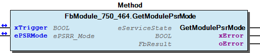
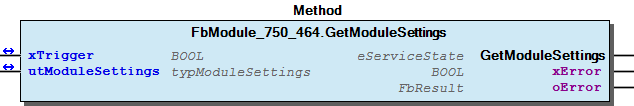
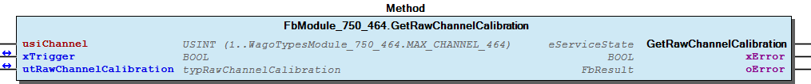
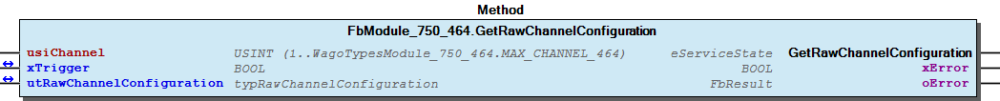
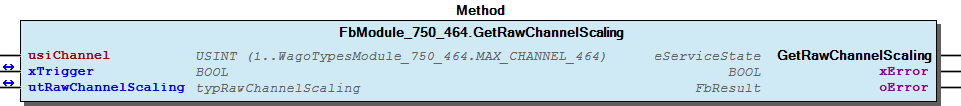
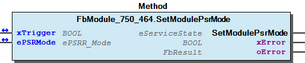
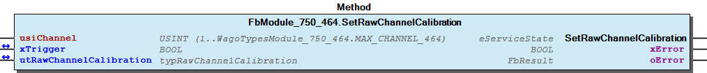
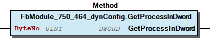
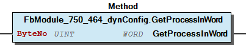
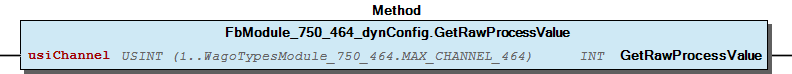

# WagoSysModule_750_464 v1.9.4.2 (WAGO) - Complete Documentation


## 📋 Library Information

- **Company:** WAGO
- **Title:** WagoSysModule_750_464
- **Version:** 1.9.4.2
- **Categories:** WAGO LayerView|Sys; Application
- **Author:** WAGO
- **Placeholder:** WagoSysModule_750_464

### Description ¶


This document is automatically generated. Because of this, the chapter 30 Visualization is not shown in this document. If you are interested in getting to know more about visualization, we refer to the library manager of e!Cockpit.

Handling modules 750-464 [1]

This document is automatically generated. Because of this, the chapter 30 Visualization is not shown in this document. If you are interested in getting to know more about visualization, we refer to the library manager of e!Cockpit. Handling modules 750-464 [1]

### Contents: ¶


Contents: - Documentation Index - Project Information - Library Information - Function Blocks FbModule_750_464 (FB) - FbModule_750_464_dynConfig (FB) Methods - FbModule_750_464.GetModulePsrMode (METH) - FbModule_750_464.GetModuleSettings (METH) - FbModule_750_464.GetRawChannelCalibration (METH) - FbModule_750_464.GetRawChannelConfiguration (METH) - FbModule_750_464.GetRawChannelScaling (METH) - FbModule_750_464.GetRawChannelSettings (METH) - FbModule_750_464.SetModulePsrMode (METH) - FbModule_750_464.SetRawChannelCalibration (METH) - FbModule_750_464.SetRawChannelConfiguration (METH) - FbModule_750_464.SetRawChannelScaling (METH) - ... and 8 more Program Organization Global Variable Lists - Error_464 (GVL) - VersionHistory (GVL) Other Components - 80 Status - Channel - Configuration - I_ModuleProcessInputsExtended - I_Module_750_464 - Module - eError_464 (ENUM)

### Indices and tables ¶


| [1] | Based on WagoSysModule_750_464.library, last modified 25.05.2021, 14:02:38. LibDoc 3.5.15.30 |

© WAGO Kontakttechnik GmbH & Co. KG, Germany 2018 – All rights reserved. For the avoidance of doubt, this copyright notice does not only apply to the information above but also and primarily to the described library itself. Please note that third-party products are always mentioned without reference to intellectual property rights, including patents, utility models, designs and trademarks, accordingly the existence of such rights cannot be excluded. WAGO is a registered trademark of WAGO Verwaltungsgesellschaft mbH.

- File and Project Information - Library Reference © WAGO Kontakttechnik GmbH & Co. KG, Germany 2018 – All rights reserved. For the avoidance of doubt, this copyright notice does not only apply to the information above but also and primarily to the described library itself. Please note that third-party products are always mentioned without reference to intellectual property rights, including patents, utility models, designs and trademarks, accordingly the existence of such rights cannot be excluded. WAGO is a registered trademark of WAGO Verwaltungsgesellschaft mbH.

### Documentation Index


## WagoSysModule_750_464 Library Documentation


| Company: | WAGO |
| Title: | WagoSysModule_750_464 |
| Version: | 1.9.4.2 |
| Categories: | WAGO LayerView\|Sys; Application |
| Author: | WAGO |
| Placeholder: | WagoSysModule_750_464 |

### Description


This document is automatically generated. Because of this, the chapter 30 Visualization is not shown in this document. If you are interested in getting to know more about visualization, we refer to the library manager of e!Cockpit.

Handling modules 750-464 [1]

This document is automatically generated. Because of this, the chapter 30 Visualization is not shown in this document. If you are interested in getting to know more about visualization, we refer to the library manager of e!Cockpit. Handling modules 750-464 [1]

### Contents:


- 20 Program Organization Units FbModule_750_464 (FB) - FbModule_750_464_dynConfig (FB) 80 Status - Error_464 (GVL) - eError_464 (ENUM) VersionHistory (GVL)

### Indices and tables


| [1] | Based on WagoSysModule_750_464.library, last modified 25.05.2021, 14:02:38. LibDoc 3.5.15.30 |

© WAGO Kontakttechnik GmbH & Co. KG, Germany 2018 – All rights reserved. For the avoidance of doubt, this copyright notice does not only apply to the information above but also and primarily to the described library itself. Please note that third-party products are always mentioned without reference to intellectual property rights, including patents, utility models, designs and trademarks, accordingly the existence of such rights cannot be excluded. WAGO is a registered trademark of WAGO Verwaltungsgesellschaft mbH.

- File and Project Information - Library Reference © WAGO Kontakttechnik GmbH & Co. KG, Germany 2018 – All rights reserved. For the avoidance of doubt, this copyright notice does not only apply to the information above but also and primarily to the described library itself. Please note that third-party products are always mentioned without reference to intellectual property rights, including patents, utility models, designs and trademarks, accordingly the existence of such rights cannot be excluded. WAGO is a registered trademark of WAGO Verwaltungsgesellschaft mbH.

### Project Information


## File and Project Information


| Scope | Name | Type | Content |
| --- | --- | --- | --- |
| FileHeader | libraryFile | string | WagoSysModule_750_464.library |
| contentFile | WagoSysModule_750_464_clr.json |
| productName | e!COCKPIT |
| creationDateTime | date | 25.05.2021, 14:02:43 |
| companyName | string | WAGO |
| ProjectInformation | LastModificationDateTime | date | 25.05.2021, 14:02:38 |
| Description | string | See: Description |
| Copyright | © WAGO Kontakttechnik GmbH & Co. KG, Germany 2018 – All rights reserved. |
| Author | WAGO |
| AutoResolveUnbound | bool | True |
| Placeholder | string | WagoSysModule_750_464 |
| Company | WAGO |
| DocFormat | reStructuredText |
| Project | WagoSysModule_750_464 |
| Version string |  |
| Version | version | 1.9.4.2 |
| ActivateSigning | bool | False |
| Title | string | WagoSysModule_750_464 |
| LibraryCategories | library-category-list | WAGO LayerView\|Sys; Application |
| CompiledLibraryCompatibilityVersion | string | CODESYS V3.5 SP16 Patch 3 |

### Library Information


## Library Reference


This is a dictionary of all referenced libraries and their name spaces.

This is a dictionary of all referenced libraries and their name spaces.

### WagoSysErrorBase


#### Library Identification


Placeholder: WagoSysErrorBase Default Resolution: WagoSysErrorBase, * (WAGO) Namespace: WagoSysErrorBase

#### Library Properties


| LinkAllContent: False QualifiedOnly: False | Key: WagoSysErrorBase SystemLibrary: False | Optional: False |

### WagoSysModuleBaseProtected


#### Library Identification


Placeholder: WagoSysModuleBaseProtected Default Resolution: WagoSysModuleBaseProtected, * (WAGO) Namespace: WagoSysModuleBaseProtected

#### Library Properties


| LinkAllContent: False QualifiedOnly: False | Key: WagoSysModuleBaseProtected SystemLibrary: False | Optional: False |

#### Library Parameter


Parameter: REGISTER_COM_TIMEOUT = TIME#5s0ms Parameter: PARAMETER_COM_TIMEOUT = TIME#5s0ms

### WagoSysVersion


#### Library Identification


Name: WagoSysVersion Version: 1.0.0.0 Company: WAGO Namespace: WagoSysVersion

#### Library Properties


| LinkAllContent: False QualifiedOnly: False | Key: WagoSysVersion, 1.0.0.0 (WAGO) SystemLibrary: False | Optional: False |

### WagoTypesBusServices


#### Library Identification


Placeholder: WagoTypesBusServices Default Resolution: WagoTypesBusServices, * (WAGO) Namespace: WagoTypesBusServices

#### Library Properties


| LinkAllContent: False Optional: False | QualifiedOnly: False Key: WagoTypesBusServices | SystemLibrary: False PublishSymbolsInContainer: True |

### WagoTypesCommon


#### Library Identification


Placeholder: WagoTypesCommon Default Resolution: WagoTypesCommon, * (WAGO) Namespace: WagoTypes

#### Library Properties


| LinkAllContent: False Optional: False | QualifiedOnly: True Key: WagoTypesCommon | SystemLibrary: False PublishSymbolsInContainer: True |

### WagoTypesModuleBase


#### Library Identification


Placeholder: WagoTypesModuleBase Default Resolution: WagoTypesModuleBase, * (WAGO) Namespace: WagoTypesModuleBase

#### Library Properties


| LinkAllContent: False QualifiedOnly: True | Key: WagoTypesModuleBase SystemLibrary: False | PublishSymbolsInContainer: True Optional: False |

#### Library Parameter


Parameter: MAX_MBX_SIZE = 18

### WagoTypesModule_750_464


#### Library Identification


Placeholder: WagoTypesModule_750_464 Default Resolution: WagoTypesModule_750_464, * (WAGO) Namespace: WagoTypesModule_750_464

#### Library Properties


| LinkAllContent: False Optional: False | QualifiedOnly: True Key: WagoTypesModule_750_464 | SystemLibrary: False PublishSymbolsInContainer: True |

### Function Blocks


## FbModule_750_464 (FB)


| Scope | Name | Type | Inherited from |
| --- | --- | --- | --- |
| Output | oError | WagoSysErrorBase.FbResult | FbModuleBase |

Access to the module 750-451

Function description

This block is needed for each module. The instance of this function block is either automatically generated by the K-Bus configuration or has to be manually added in case of the dynamic configuration.

Interface variables Function Access to the module 750-451 Function description This block is needed for each module. The instance of this function block is either automatically generated by the K-Bus configuration or has to be manually added in case of the dynamic configuration. - I_Module_750_464 Configuration Channel FbModule_750_464.GetRawChannelCalibration (METH) - FbModule_750_464.GetRawChannelScaling (METH) - FbModule_750_464.GetRawChannelSettings (METH) - FbModule_750_464.SetRawChannelCalibration (METH) - FbModule_750_464.SetRawChannelScaling (METH) - FbModule_750_464.SetRawChannelSettings (METH) Module - FbModule_750_464.GetModulePsrMode (METH) - FbModule_750_464.GetModuleSettings (METH) - FbModule_750_464.SetModulePsrMode (METH) FbModule_750_464.GetRawChannelConfiguration (METH) FbModule_750_464.SetRawChannelConfiguration (METH)

## FbModule_750_464_dynConfig (FB)


| Scope | Name | Type | Inherited from |
| --- | --- | --- | --- |
| Output | oError | WagoSysErrorBase.FbResult | FbModuleBase |

Function description

Interface variables Function Access to the module 750-464 with PA-Access In case of dynamic configuration the FB provides additional the PA-Access. Function description This block is needed for each module. The instance of this function block has to be manually added in case of the dynamic configuration. - FbModule_750_464_dynConfig.GetRawProcessValue (METH) - I_ModuleProcessInputsExtended FbModule_750_464_dynConfig.GetModuleInputSize (METH) - FbModule_750_464_dynConfig.GetProcessInBit (METH) - FbModule_750_464_dynConfig.GetProcessInByte (METH) - FbModule_750_464_dynConfig.GetProcessInData (METH) - FbModule_750_464_dynConfig.GetProcessInDword (METH) - FbModule_750_464_dynConfig.GetProcessInWord (METH)

### Methods


## FbModule_750_464.GetModulePsrMode (METH)


| Scope | Name | Type |
| --- | --- | --- |
| Return | GetModulePsrMode | WagoTypesModuleBase.eServiceState |
| Inout | xTrigger | BOOL |
| ePSRMode | WagoTypesModule_750_464.ePSRR_Mode |
| Output | xError | BOOL |
| oError | WagoSysErrorBase.FbResult |

| Parameter | Value | Description |
| --- | --- | --- |
| ePSRMode | ENABLED_50HZ | Noise filter optimized for 50 Hz |
| ENABLED_60HZ | Noise filter optimized for 60 Hz |
| ENABLED_50_60HZ | Noise filter optimized for 50/60 Hz but lower attenuation |

| Return Value | Description |
| --- | --- |
| WagoTypesModuleBase.eServiceState.DONE | successful |
| WagoTypesModuleBase.eServiceState.ABORT | error -> see oError |
| WagoTypesModuleBase.eServiceState.NO_DATA | call while xTrigger is reset |

```
VAR
    //--- Module Mode Settings ------------------------------
    myPsrMode           :   WagoTypesModule_750_464.ePSRR_Mode;
    xGetModulePsrMode   :   BOOL;  // triggers the function
    oError              :   WagoSysErrorBase.FbResult;
END_VAR

//--- M O D U L E    S E T T I N G S -----------------------
CASE my464.GetModulePsrMode(xGetModulePsrMode, myPsrMode, oError => oError) OF

    eServiceState.DONE : // OK
            ;// process here your myPsrMode

    eServiceState.ABORT : // Error
            ;// process here your error handling -> see oError for more information

END_CASE
```

Get the psr mode of the module.

Return Values

It is not allowed to reset the xTrigger by the application. This must done by the method.

Graphical Illustration

Graphical Interface of FbModule_750_464.GetModulePsrMode

For get the psr mode from the module.

You have to call the method cyclic until the method returns with DONE or ABORT.

Interface variables Function Get the psr mode of the module. Return Values Warning It is not allowed to reset the xTrigger by the application. This must done by the method. Graphical Illustration  Graphical Interface of FbModule_750_464.GetModulePsrMode Example For get the psr mode from the module. Note You have to call the method cyclic until the method returns with DONE or ABORT.

## FbModule_750_464.GetModuleSettings (METH)


| Scope | Name | Type |
| --- | --- | --- |
| Return | GetModuleSettings | WagoTypesModuleBase.eServiceState |
| Inout | xTrigger | BOOL |
| utModuleSettings | WagoTypesModule_750_464.typModuleSettings |
| Output | xError | BOOL |
| oError | WagoSysErrorBase.FbResult |

| Struct member | Value | Description |
| --- | --- | --- |
| xTwoChannel | FALSE | 4 channels -> 2-wire only |
| TRUE | 2 channels -> 3-wire possible |
| ePSRMode | ENABLED_50HZ | Noise filter optimized for 50 Hz |
| ENABLED_60HZ | Noise filter optimized for 60 Hz |
| ENABLED_50_60HZ | Noise filter optimized for 50/60 Hz but lower attenuation |

| Return Value | Description |
| --- | --- |
| WagoTypesModuleBase.eServiceState.DONE | successful |
| WagoTypesModuleBase.eServiceState.ABORT | error -> see oError |
| WagoTypesModuleBase.eServiceState.NO_DATA | call while xTrigger is reset |

```
VAR
    //--- Module Mode Settings ------------------------------
    utModuleSettings    :   WagoTypesModule_750_464.typModuleSettings;
    xGetModuleSettings  :   BOOL;  // triggers the function
    oError              :   WagoSysErrorBase.FbResult;
END_VAR

//--- M O D U L E    S E T T I N G S -----------------------
CASE my451.GetModuleSettings(xGetModuleSettings, utModuleSettings, oError => oError) OF

    eServiceState.DONE : // OK
            ;// process here your utModuleSettings

    eServiceState.ABORT : // Error
            ;// process here your error handling -> see oError for more information

END_CASE
```

Get the common settings of the module at a struct.

Return Values

It is not allowed to reset the xTrigger by the application. This must done by the method.

Graphical Illustration

Graphical Interface of FbModule_750_464.GetModuleSettings

For get the settings from the module.

You have to call the method cyclic until the method returns with DONE or ABORT.

Interface variables Function Get the common settings of the module at a struct. Return Values Warning It is not allowed to reset the xTrigger by the application. This must done by the method. Graphical Illustration  Graphical Interface of FbModule_750_464.GetModuleSettings Example For get the settings from the module. Note You have to call the method cyclic until the method returns with DONE or ABORT.

## FbModule_750_464.GetRawChannelCalibration (METH)


| Scope | Name | Type |
| --- | --- | --- |
| Return | GetRawChannelCalibration | WagoTypesModuleBase.eServiceState |
| Input | usiChannel | USINT (1..WagoTypesModule_750_464.MAX_CHANNEL_464) |
| Inout | xTrigger | BOOL |
| utRawChannelCalibration | WagoTypesModule_750_464.typRawChannelCalibration |
| Output | xError | BOOL |
| oError | WagoSysErrorBase.FbResult |

| Struct member | Value | Description |
| --- | --- | --- |
| xUserCalibration | FALSE | The user scaling is switched off |
| TRUE | The user scaling is switched on |
| iUserCalibrationOffset |  |
| uiUserCalibrationGain |  |

```
VAR
    //--- Channel Calibration ---------------------------------
    utChannelCalibration    :   WagoTypesModule_750_464.typRawChannelCalibration;;
    xGetChannelCalibration  :   BOOL;
    oError                  :   WagoSysErrorBase.FbResult;
END_VAR

//--- C H A N N E L    C A L I B R A T I O N -----------------------
CASE my464.GetRawChannelCalibration(    usiChannel              := 1,
                                        xTrigger                := xGetChannelCalibration,
                                        utRawChannelCalibration := utChannelCalibration,
                                        oError                  => oError
                                    ) OF

    eServiceState.DONE : // OK
            ;// process here your utModuleSettings

    eServiceState.ABORT : // Error
            ;// process here your error handling -> see oError for more information

END_CASE
```

Get the calibration of a channel at a struct.

Graphical Illustration

Graphical Interface of FbModule_750_464.GetRawChannelCalibration

For get the calibration from channel one

You have to call the method cyclic until the method returns with DONE or ABORT.

Interface variables Function Get the calibration of a channel at a struct. Graphical Illustration  Graphical Interface of FbModule_750_464.GetRawChannelCalibration Example For get the calibration from channel one Note You have to call the method cyclic until the method returns with DONE or ABORT.

## FbModule_750_464.GetRawChannelConfiguration (METH)


| Scope | Name | Type |
| --- | --- | --- |
| Return | GetRawChannelConfiguration | WagoTypesModuleBase.eServiceState |
| Input | usiChannel | USINT (1..WagoTypesModule_750_464.MAX_CHANNEL_464) |
| Inout | xTrigger | BOOL |
| utRawChannelConfiguration | WagoTypesModule_750_464.typRawChannelConfiguration |
| Output | xError | BOOL |
| oError | WagoSysErrorBase.FbResult |

| Return Value | Description |
| --- | --- |
| WagoTypesModuleBase.eServiceState.DONE | successful |
| WagoTypesModuleBase.eServiceState.ABORT | error -> see oError |
| WagoTypesModuleBase.eServiceState.NO_DATA | call while xTrigger is reset |

```
VAR
    //--- Channel Configuration -------------------------------------------------------
    utRawChannelConfiguration   :   WagoTypesModule_750_464.typRawChannelConfiguration;
    oError                      :   WagoSysErrorBase.FbResult;
    xGetRawChannelConfiguration :   BOOL;
END_VAR

//--- R A W   C H A N N E L   C O N F I G U R A T I O N ----------------------
CASE my464.GetRawChannelConfiguration(1, xGetRawChannelConfiguration, utRawChannelConfiguration, oError => oError) OF

    eServiceState.DONE : // OK
            ;// process here your utRawChannelConfiguration

    eServiceState.ABORT : // Error
            ;// process here your error handling -> see oError for more information

END_CASE
```

Return Values

It is not allowed to reset the xTrigger by the application. This must done by the method.

Graphical Illustration

Graphical Interface of FbModule_750_464.GetRawChannelConfiguration

Example for ST

For get the raw configuration of the first channel

You have to call the method cyclic until the method returns with DONE or ABORT.

Interface variables Function Get the complete raw configuration of one channel, specified by usiChannel in a struct. This struct contains the three components Settings , Scaling and Calibration for holding the raw values. Return Values Warning It is not allowed to reset the xTrigger by the application. This must done by the method. Graphical Illustration  Graphical Interface of FbModule_750_464.GetRawChannelConfiguration Example for ST For get the raw configuration of the first channel Note You have to call the method cyclic until the method returns with DONE or ABORT.

## FbModule_750_464.GetRawChannelScaling (METH)


| Scope | Name | Type |
| --- | --- | --- |
| Return | GetRawChannelScaling | WagoTypesModuleBase.eServiceState |
| Input | usiChannel | USINT (1..WagoTypesModule_750_464.MAX_CHANNEL_464) |
| Inout | xTrigger | BOOL |
| utRawChannelScaling | WagoTypesModule_750_464.typRawChannelScaling |
| Output | xError | BOOL |
| oError | WagoSysErrorBase.FbResult |

| Struct member | Value | Description |
| --- | --- | --- |
| xUserScaling | FALSE | The user scaling is switched off |
| TRUE | The user scaling is switched on |
| xManufacturerScaling | FALSE | The manufacturer scaling is switched off |
| TRUE | The manufacturer scaling is switched on |
| iUserScalingOffset |  |
| uiUserScalingGain |  |
| uiUserScalingWireResistor |  |

```
VAR
    //--- Channel Settings ---------------------------------
    utChannelScaling    :   WagoTypesModule_750_464.typRawChannelScaling;;
    xGetChannelScaling  :   BOOL;
    oError              :   WagoSysErrorBase.FbResult;
END_VAR

//--- C H A N N E L   S C A L I N G ------------------------
CASE my464.GetRawChannelScaling(    usiChannel           := 1,
                                    xTrigger             := xGetChannelScaling,
                                    utRawChannelScaling  := utChannelScaling,
                                    oError               => oError
                                ) OF

    eServiceState.DONE : // OK
            ;// process here your utModuleSettings

    eServiceState.ABORT : // Error
            ;// process here your error handling -> see oError for more information

END_CASE
```

Get the scaling of a channel at a struct.

Graphical Illustration

Graphical Interface of FbModule_750_464.GetRawChannelScaling

For get the scaling from channel one

You have to call the method cyclic until the method returns with DONE or ABORT.

Interface variables Function Get the scaling of a channel at a struct. Graphical Illustration  Graphical Interface of FbModule_750_464.GetRawChannelScaling Example For get the scaling from channel one Note You have to call the method cyclic until the method returns with DONE or ABORT.

## FbModule_750_464.GetRawChannelSettings (METH)


| Scope | Name | Type |
| --- | --- | --- |
| Return | GetRawChannelSettings | WagoTypesModuleBase.eServiceState |
| Input | usiChannel | USINT (1..WagoTypesModule_750_464.MAX_CHANNEL_464) |
| Inout | xTrigger | BOOL |
| utRawChannelSettings | WagoTypesModule_750_464.typRawChannelSettings |
| Output | xError | BOOL |
| oError | WagoSysErrorBase.FbResult |

| Struct member | Value | Description |
| --- | --- | --- |
| eSensorType | Sensor types of the 750-464 (RTD) version |
| Pt100_IEC751 | IEC 751 | -200 °C...850 °C |
| Ni100_DIN43760 | DIN 43760 | -60 °C...250 °C |
| Pt1000_IEC751 | IEC 751 | -200 °C...850 °C |
| Pt500_IEC751 | IEC 751 | -200 °C...850 °C |
| Pt200_IEC751 | IEC 751 | -200 °C...850 °C |
| Ni1000_DIN43760 | DIN 43760 | -60 °C...250 °C |
| Ni120_MINCO | Minco | -80 °C...260 °C |
| Ni1000_TK5000 | TK 5000 | -60 °C...250 °C |
| Sensor types of the 750-464/000-002 (NTC) version |
| NTC_10K |  |
| NTC_20K |  |
| NTC_10K_THERMOKON |  |
| xEnable3Wire | FALSE | 2-wire |
| TRUE | 3-wire |
| xEnableWatchdog | FALSE | Watchdog timer is not active |
| TRUE | Watchdog timer is active (terminal box) |
| xEnableAverageFilter | FALSE | The mean value filter is switched off |
| TRUE | The mean value filter is switched on |
| xAmountSignFormat | FALSE | Numeric values appear in two’s complement |
| TRUE | Numeric values appear in amount / sign format |
| xS5FB250Format | FALSE | Numeric values appear in default format |
| TRUE | Numeric values appear in S5-FB250 format |
| xEnableDiag | FALSE | Wire break / short circuit diagnostics disabled |
| TRUE | Wire break / short circuit diagnostics enabled |
| xEnableOverrangeProtection | FALSE | The overflow limit is switched off |
| TRUE | Numeric values are limited to values in R50, R51 |
| iUserUnderrange |  |
| iUserOverrange |  |

```
VAR
    //--- Channel Settings ---------------------------------
    utChannelSettings   :   WagoTypesModule_750_464.typRawChannelSettings;;
    xGetChannelSettings :   BOOL;
    oError              :   WagoSysErrorBase.FbResult;
END_VAR

//--- C H A N N E L   S E T T I N G S ----------------------
CASE my464.GetRawChannelSettings(   usiChannel           := 1,
                                    xTrigger             := xGetChannelSettings,
                                    utRawChannelSettings := utChannelSettings,
                                    oError               => oError
                                ) OF

    eServiceState.DONE : // OK
        ;// process here your utModuleSettings

    eServiceState.ABORT : // Error
        ;// process here your error handling -> see oError for more information

END_CASE
```

Get the settings of a channel at a struct.

Graphical Illustration

Graphical Interface of FbModule_750_464.GetRawChannelSettings

For get the settings from channel one

You have to call the method cyclic until the method returns with DONE or ABORT.

Interface variables Function Get the settings of a channel at a struct. Graphical Illustration  Graphical Interface of FbModule_750_464.GetRawChannelSettings Example For get the settings from channel one Note You have to call the method cyclic until the method returns with DONE or ABORT.

## FbModule_750_464.SetModulePsrMode (METH)


| Scope | Name | Type |
| --- | --- | --- |
| Return | SetModulePsrMode | WagoTypesModuleBase.eServiceState |
| Inout | xTrigger | BOOL |
| ePSRMode | WagoTypesModule_750_464.ePSRR_Mode |
| Output | xError | BOOL |
| oError | WagoSysErrorBase.FbResult |

| Parameter | Value | Description |
| --- | --- | --- |
| ePSRMode | ENABLED_50HZ | Noise filter optimized for 50 Hz |
| ENABLED_60HZ | Noise filter optimized for 60 Hz |
| ENABLED_50_60HZ | Noise filter optimized for 50/60 Hz but lower attenuation |

| Return Value | Description |
| --- | --- |
| WagoTypesModuleBase.eServiceState.DONE | successful |
| WagoTypesModuleBase.eServiceState.ABORT | error -> see oError |
| WagoTypesModuleBase.eServiceState.NO_DATA | call while xTrigger is reset |

```
VAR
    myPsrMode           :   WagoTypesModule_750_464.ePSRR_Mode;
    xSetModulePsrMode   :   BOOL;  // triggers the function
    oError              :   WagoSysErrorBase.FbResult;
END_VAR

//--- S E T   M O D U L E    P S R   M O D E ---------------
myPsrMode := WagoTypesModule_750_464.ePSRR_Mode.ENABLED_50HZ; // set my value
CASE my464.SetModulePsrMode(xSetModulePsrMode, myPsrMode, oError => oError) OF

    eServiceState.DONE : // OK

    eServiceState.ABORT : // Error
            ;// process here your error handling -> see oError for more information

END_CASE
```

Set the psr mode of the module.

Return Values

It is not allowed to reset the xTrigger by the application. This must done by the method.

Graphical Illustration

Graphical Interface of FbModule_750_464.SetModulePsrMode

For set the settings from the module.

You have to call the method cyclic until the method returns with DONE or ABORT.

Interface variables Function Set the psr mode of the module. Return Values Warning It is not allowed to reset the xTrigger by the application. This must done by the method. Graphical Illustration  Graphical Interface of FbModule_750_464.SetModulePsrMode Example For set the settings from the module. Note You have to call the method cyclic until the method returns with DONE or ABORT.

## FbModule_750_464.SetRawChannelCalibration (METH)


| Scope | Name | Type |
| --- | --- | --- |
| Return | SetRawChannelCalibration | WagoTypesModuleBase.eServiceState |
| Input | usiChannel | USINT (1..WagoTypesModule_750_464.MAX_CHANNEL_464) |
| Inout | xTrigger | BOOL |
| utRawChannelCalibration | WagoTypesModule_750_464.typRawChannelCalibration |
| Output | xError | BOOL |
| oError | WagoSysErrorBase.FbResult |

| Struct member | Value | Description |
| --- | --- | --- |
| xUserCalibration | FALSE | The user scaling is switched off |
| TRUE | The user scaling is switched on |
| iUserCalibrationOffset |  |
| uiUserCalibrationGain |  |

```
VAR
    //--- Channel Calibration ---------------------------------
    utChannelCalibration    :   WagoTypesModule_750_464.typRawChannelCalibration;;
    xSetChannelCalibration  :   BOOL;
    oError                  :   WagoSysErrorBase.FbResult;
END_VAR

//--- C H A N N E L    C A L I B R A T I O N -----------------------
CASE my464.SetRawChannelCalibration(    usiChannel              := 1,
                                        xTrigger                := xSetChannelCalibration,
                                        utRawChannelCalibration := utChannelCalibration,
                                        oError                  => oError
                                   ) OF

    eServiceState.DONE : // OK
            ;// process here your utModuleSettings

    eServiceState.ABORT : // Error
            ;// process here your error handling -> see oError for more information

END_CASE
```

Set the calibration of a channel by a struct.

Graphical Illustration

Graphical Interface of FbModule_750_464.SetRawChannelCalibration

For set the calibration of channel one

You have to call the method cyclic until the method returns with DONE or ABORT.

Interface variables Function Set the calibration of a channel by a struct. Graphical Illustration  Graphical Interface of FbModule_750_464.SetRawChannelCalibration Example For set the calibration of channel one Note You have to call the method cyclic until the method returns with DONE or ABORT.

## FbModule_750_464.SetRawChannelConfiguration (METH)


| Scope | Name | Type |
| --- | --- | --- |
| Return | SetRawChannelConfiguration | WagoTypesModuleBase.eServiceState |
| Input | usiChannel | USINT (1..WagoTypesModule_750_464.MAX_CHANNEL_464) |
| Inout | xTrigger | BOOL |
| utRawChannelConfiguration | WagoTypesModule_750_464.typRawChannelConfiguration |
| Output | xError | BOOL |
| oError | WagoSysErrorBase.FbResult |

| Return Value | Description |
| --- | --- |
| WagoTypesModuleBase.eServiceState.DONE | successful |
| WagoTypesModuleBase.eServiceState.ABORT | error -> see oError |
| WagoTypesModuleBase.eServiceState.NO_DATA | call while xTrigger is reset |

```
VAR
    //--- Channel Configuration -------------------------------------------------------
    xStartProcess               :   BOOL; // set this variable once to start the process -> this varibale will be automatic reset
    utRawChannelConfiguration   :   WagoTypesModule_750_464.typRawChannelConfiguration;
    oError                      :   WagoSysErrorBase.FbResult;
    xSetRawChannelConfiguration :   BOOL;
END_VAR

//--- R A W   C H A N N E L   C O N F I G U R A T I O N ----------------------

//--- READ BEFORE WRITE --------------------------------------------------------------
CASE my464.GetRawChannelConfiguration( 1, xStartProcess, utRawChannelConfiguration, oError => oError) OF

    eServiceState.DONE : // OK -> actual configuration is successful read
        // change here your configuration
        // utRawChannelConfiguration... :=
        xSetRawChannelConfiguration := TRUE; // trigger write

    eServiceState.ABORT : // Error -> not able to read -> see oError
            ;// process here your error handling for read -> see oError for more information

END_CASE

//--- WRITE MODYFIED CONFIGURATION ---------------------------------------------------
CASE my464.SetRawChannelConfiguration( 1, xSetRawChannelConfiguration, utRawChannelConfiguration, oError => oError) OF

    eServiceState.DONE : // OK -> new configuration is written

    eServiceState.ABORT : // Error -> not able to write -> see oError
            ;// process here your error handling for write -> see oError for more information

END_CASE
```

Set the complete raw configuration of one channel, specified by usiChannel and the struct utRawChannelConfiguration . This struct have to contain all configuration parameters.

Recommendation : You should read out all raw configuration in this struct before you write the raw configuration. So you have to change only the needed paramneters between read and write.

Return Values

It is not allowed to reset the xTrigger by the application. This must done by the method.

Graphical Illustration

Graphical Interface of FbModule_750_464.SetRawChannelConfiguration

Example for ST

For get the raw configuration of the first channel and after this change some parameters before it write back to the module.

You have to call the method cyclic until the method returns with DONE or ABORT.

Interface variables Function Set the complete raw configuration of one channel, specified by usiChannel and the struct utRawChannelConfiguration . This struct have to contain all configuration parameters. Note Recommendation : You should read out all raw configuration in this struct before you write the raw configuration. So you have to change only the needed paramneters between read and write. Return Values Warning It is not allowed to reset the xTrigger by the application. This must done by the method. Graphical Illustration  Graphical Interface of FbModule_750_464.SetRawChannelConfiguration Example for ST For get the raw configuration of the first channel and after this change some parameters before it write back to the module. Note You have to call the method cyclic until the method returns with DONE or ABORT.

## FbModule_750_464.SetRawChannelScaling (METH)


| Scope | Name | Type |
| --- | --- | --- |
| Return | SetRawChannelScaling | WagoTypesModuleBase.eServiceState |
| Input | usiChannel | USINT (1..WagoTypesModule_750_464.MAX_CHANNEL_464) |
| Inout | xTrigger | BOOL |
| utRawChannelScaling | WagoTypesModule_750_464.typRawChannelScaling |
| Output | xError | BOOL |
| oError | WagoSysErrorBase.FbResult |

| Struct member | Value | Description |
| --- | --- | --- |
| xUserScaling | FALSE | The user scaling is switched off |
| TRUE | The user scaling is switched on |
| xManufacturerScaling | FALSE | The manufacturer scaling is switched off |
| TRUE | The manufacturer scaling is switched on |
| iUserScalingOffset |  |
| uiUserScalingGain |  |
| uiUserScalingWireResistor |  |

```
VAR
    //--- Channel Settings ---------------------------------
    utChannelScaling    :   WagoTypesModule_750_464.typRawChannelScaling;;
    xSetChannelScaling  :   BOOL;
    oError              :   WagoSysErrorBase.FbResult;
END_VAR

//--- C H A N N E L   S C A L I N G ------------------------
CASE my464.SetRawChannelScaling(    usiChannel          := 1,
                                    xTrigger            := xSetChannelScaling,
                                    utRawChannelScaling := utChannelScaling,
                                    oError              => oError
                                ) OF

    eServiceState.DONE : // OK
            ;// process here your utModuleSettings

    eServiceState.ABORT : // Error
            ;// process here your error handling -> see oError for more information

END_CASE
```

Set the scaling of a channel by a struct.

Graphical Illustration

Graphical Interface of FbModule_750_464.SetRawChannelScaling

For set the scaling of channel one

You have to call the method cyclic until the method returns with DONE or ABORT.

Interface variables Function Set the scaling of a channel by a struct. Graphical Illustration  Graphical Interface of FbModule_750_464.SetRawChannelScaling Example For set the scaling of channel one Note You have to call the method cyclic until the method returns with DONE or ABORT.

## FbModule_750_464.SetRawChannelSettings (METH)


| Scope | Name | Type |
| --- | --- | --- |
| Return | SetRawChannelSettings | WagoTypesModuleBase.eServiceState |
| Input | usiChannel | USINT (1..WagoTypesModule_750_464.MAX_CHANNEL_464) |
| Inout | xTrigger | BOOL |
| utRawChannelSettings | WagoTypesModule_750_464.typRawChannelSettings |
| Output | xError | BOOL |
| oError | WagoSysErrorBase.FbResult |

| Struct member | Value | Description |
| --- | --- | --- |
| eSensorType | Sensor types of the 750-464 (RTD) version |
| Pt100_IEC751 | IEC 751 | -200 °C...850 °C |
| Ni100_DIN43760 | DIN 43760 | -60 °C...250 °C |
| Pt1000_IEC751 | IEC 751 | -200 °C...850 °C |
| Pt500_IEC751 | IEC 751 | -200 °C...850 °C |
| Pt200_IEC751 | IEC 751 | -200 °C...850 °C |
| Ni1000_DIN43760 | DIN 43760 | -60 °C...250 °C |
| Ni120_MINCO | Minco | -80 °C...260 °C |
| Ni1000_TK5000 | TK 5000 | -60 °C...250 °C |
| Sensor types of the 750-464/000-002 (NTC) version |
| NTC_10K |  |
| NTC_20K |  |
| NTC_10K_THERMOKON |  |
| xEnable3Wire | FALSE | 2-wire |
| TRUE | 3-wire |
| xEnableWatchdog | FALSE | Watchdog timer is not active |
| TRUE | Watchdog timer is active (terminal box) |
| xEnableAverageFilter | FALSE | The mean value filter is switched off |
| TRUE | The mean value filter is switched on |
| xAmountSignFormat | FALSE | Numeric values appear in two’s complement |
| TRUE | Numeric values appear in amount / sign format |
| xS5FB250Format | FALSE | Numeric values appear in default format |
| TRUE | Numeric values appear in S5-FB250 format |
| xEnableDiag | FALSE | Wire break / short circuit diagnostics disabled |
| TRUE | Wire break / short circuit diagnostics enabled |
| xEnableOverrangeProtection | FALSE | The overflow limit is switched off |
| TRUE | Numeric values are limited to values in R50, R51 |
| iUserUnderrange |  |
| iUserOverrange |  |

```
VAR
    //--- Channel Settings ---------------------------------
    utChannelSettings   :   WagoTypesModule_750_464.typRawChannelSettings;;
    xSetChannelSettings :   BOOL;
    oError              :   WagoSysErrorBase.FbResult;
END_VAR

//--- C H A N N E L   S E T T I N G S ----------------------
CASE my464.SetRawChannelSettings(   usiChannel           := 1,
                                    xTrigger             := xSetChannelSettings,
                                    utRawChannelSettings := utChannelSettings,
                                    oError               => oError
                                ) OF

    eServiceState.DONE : // OK
        ;// process here your utModuleSettings

    eServiceState.ABORT : // Error
        ;// process here your error handling -> see oError for more information

END_CASE
```

Set the settings for a channel by a struct.

Graphical Illustration

Graphical Interface of FbModule_750_464.SetRawChannelSettings

For set the settings of channel one

You have to call the method cyclic until the method returns with DONE or ABORT.

Interface variables Function Set the settings for a channel by a struct. Graphical Illustration  Graphical Interface of FbModule_750_464.SetRawChannelSettings Example For set the settings of channel one Note You have to call the method cyclic until the method returns with DONE or ABORT.

## FbModule_750_464_dynConfig.GetModuleInputSize (METH)


| Scope | Name | Type |
| --- | --- | --- |
| Return | GetModuleInputSize | UINT |

Returns the byte size of input data

Interface variables Returns the byte size of input data

## FbModule_750_464_dynConfig.GetProcessInBit (METH)


| Scope | Name | Type | Comment |
| --- | --- | --- | --- |
| Return | GetProcessInBit | BOOL |  |
| Input | ByteNo | UINT | range 0..(_uiInputSize - 1) |
| BitNo | USINT | range 0..7 |

## FbModule_750_464_dynConfig.GetProcessInByte (METH)


| Scope | Name | Type | Comment |
| --- | --- | --- | --- |
| Return | GetProcessInByte | BYTE |  |
| Input | ByteNo | UINT | range 0..(_uiInputSize - 1) |

## FbModule_750_464_dynConfig.GetProcessInData (METH)


| Scope | Name | Type | Comment |
| --- | --- | --- | --- |
| Return | GetProcessInData | UINT |  |
| Input | pInData | POINTER TO BYTE | pointer to the area where the process data should store |
| uiNInData | UINT | SIZEOF(Buffer) |

## FbModule_750_464_dynConfig.GetProcessInDword (METH)


| Scope | Name | Type | Comment |
| --- | --- | --- | --- |
| Return | GetProcessInDword | DWORD |  |
| Input | ByteNo | UINT | range 0..(_uiInputSize - 4) |

Graphical Illustration

Graphical Interface of FbModule_750_464_dynConfig.GetProcessInDword

Interface variables Function Get the process input dword specified by ByteNo of this module. Graphical Illustration  Graphical Interface of FbModule_750_464_dynConfig.GetProcessInDword

## FbModule_750_464_dynConfig.GetProcessInWord (METH)


| Scope | Name | Type | Comment |
| --- | --- | --- | --- |
| Return | GetProcessInWord | WORD |  |
| Input | ByteNo | UINT | range 0..(_uiInputSize - 2) |

Graphical Illustration

Graphical Interface of FbModule_750_464_dynConfig.GetProcessInWord

Interface variables Function Get the process input word specified by ByteNo of this module. Graphical Illustration  Graphical Interface of FbModule_750_464_dynConfig.GetProcessInWord

## FbModule_750_464_dynConfig.GetRawProcessValue (METH)


| Scope | Name | Type |
| --- | --- | --- |
| Return | GetRawProcessValue | INT |
| Input | usiChannel | USINT (1..WagoTypesModule_750_464.MAX_CHANNEL_464) |

```
VAR
    myiProcessValue :   INT;
END_VAR

myiProcessValue := my451.GetProcessValue(1); // here is the process raw value as INT
```

Get the raw process value of the wanted channel.

In case of error (e.g. an invalid channel number is given) it returns -32768.

Graphical Illustration

Graphical Interface of FbModule_750_464_dynConfig.GetRawProcessValue

Interface variables Function Get the raw process value of the wanted channel. In case of error (e.g. an invalid channel number is given) it returns -32768. Graphical Illustration  Graphical Interface of FbModule_750_464_dynConfig.GetRawProcessValue Example For get the process value from first channel of the module.

### Program Organization


## 20 Program Organization Units


- FbModule_750_464 (FB) I_Module_750_464 Configuration Channel FbModule_750_464.GetRawChannelCalibration (METH) - FbModule_750_464.GetRawChannelScaling (METH) - FbModule_750_464.GetRawChannelSettings (METH) - FbModule_750_464.SetRawChannelCalibration (METH) - FbModule_750_464.SetRawChannelScaling (METH) - FbModule_750_464.SetRawChannelSettings (METH) Module - FbModule_750_464.GetModulePsrMode (METH) - FbModule_750_464.GetModuleSettings (METH) - FbModule_750_464.SetModulePsrMode (METH) FbModule_750_464.GetRawChannelConfiguration (METH) FbModule_750_464.SetRawChannelConfiguration (METH) FbModule_750_464_dynConfig (FB) - FbModule_750_464_dynConfig.GetRawProcessValue (METH) - I_ModuleProcessInputsExtended FbModule_750_464_dynConfig.GetModuleInputSize (METH) - FbModule_750_464_dynConfig.GetProcessInBit (METH) - FbModule_750_464_dynConfig.GetProcessInByte (METH) - FbModule_750_464_dynConfig.GetProcessInData (METH) - FbModule_750_464_dynConfig.GetProcessInDword (METH) - FbModule_750_464_dynConfig.GetProcessInWord (METH)

### Global Variable Lists


## Error_464 (GVL)


| Value | Level | Description |
| --- | --- | --- |
| eError_464.OK | WagoTypesErrorBase.eSeverity.none | ‘OK’ |
| eError_464.INVALID_CHANNEL | WagoTypesErrorBase.eSeverity.error | ‘The wanted channel number is not allowed’ |
| eError_464.LINE_RESISTANCE_TO_SMALL | WagoTypesErrorBase.eSeverity.error | ‘The line resistance is to small (Range 0 .. 65.535’ |
| eError_464.LINE_RESISTANCE_TO_BIG | WagoTypesErrorBase.eSeverity.error | ‘The line resistance is to big (Range 0 .. 65.535’ |
| eError_464.LOWER_USER_LIMIT_TO_SMALL | WagoTypesErrorBase.eSeverity.error | ‘The lower user limit value is to small (Range depends on sensor type’ |
| eError_464.LOWER_USER_LIMIT_TO_BIG | WagoTypesErrorBase.eSeverity.error | ‘The lower user limit value is to big (Range depends on sensor type’ |
| eError_464.UPPER_USER_LIMIT_TO_SMALL | WagoTypesErrorBase.eSeverity.error | ‘The upper user limit value is to small (Range depends on sensor type’ |
| eError_464.UPPER_USER_LIMIT_TO_BIG | WagoTypesErrorBase.eSeverity.error | ‘The upper user limit value is to big (Range depends on sensor type’ |
| eError_464.LOWER_LIMIT_BIGGER_THAN_UPPER | WagoTypesErrorBase.eSeverity.error | ‘The lower user limit value s bigger than the upper user limit value’ |
| eError_464.UNKNOWN_SENSOR_TYPE | WagoTypesErrorBase.eSeverity.error | ‘Not supported sensor type’ |
| eError_464.USER_SCALING_OFFSET_TO_SMALL | WagoTypesErrorBase.eSeverity.error | ‘The user scaling offset is to small (Range depends on sensor type’ |
| eError_464.USER_SCALING_OFFSET_TO_BIG | WagoTypesErrorBase.eSeverity.error | ‘The user scaling offset is to big (Range depends on sensor type’ |
| eError_464.USER_CALIBRATION_GAIN_TO_SMALL | WagoTypesErrorBase.eSeverity.error | ‘The user calibration gain is to small (Range 0 .. 1.9999)’ |
| eError_464.USER_CALIBRATION_GAIN_TO_BIG | WagoTypesErrorBase.eSeverity.error | ‘The user calibration gain is to big (Range 0 .. 1.9999)’ |
| eError_464.USER_CALIBRATION_OFFSET_TO_SMALL | WagoTypesErrorBase.eSeverity.error | ‘The user calibration offset is to small (Range -262144 .. 262136)’ |
| eError_464.USER_CALIBRATION_OFFSET_TO_BIG | WagoTypesErrorBase.eSeverity.error | ‘The user calibration offset is to big (Range -262144 .. 262136)’ |
| eError_464.UNKNOWN_TERMINAL | WagoTypesErrorBase.eSeverity.error | ‘Unknown Terminal’ |
| eError_464.NOT_ALLOWED_SENSOR_TYPE | WagoTypesErrorBase.eSeverity.error | ‘The sensor type is not allowed for this terminal order number’ |
| eError_464.NOT_SUPPORTED_BY_OLD_WAGOSYSMODULEBASE | WagoTypesErrorBase.eSeverity.error | ‘Not supported service by this version of WagoSysModuleBase’ |

## VersionHistory (GVL)


| date | version | author | change |
| 20.01.2020 | 1.9.4.2 | u010545 | Get / Set Psr mode implemented |
| 30.08.2019 | 1.9.4.1 | u010545 | Bugfix Byteorder I_ModuleProcessInputsExtended |
| 06.08.2019 | 1.9.4.0 | u010545 | Interface for dyn config pa access added |
| 16.07.2019 | 1.9.3.0 | u010545 | Interface for dyn config added |
| 08.01.2019 | 1.9.2.0 | u015842 | Properties: free placeholder added |
| 07.02.2018 | 1.9.1.2 | u010545 | bugfix limit write order |
| 03.01.2018 | 1.9.1.1 | u010545 | bugfix |
| 13.11.2017 | 1.9.1.0 | u010545 | update resize module PA |
| 09.10.2017 | 1.9.0.2 | u010545 | channel quantity modified |
| 04.10.2017 | 1.9.0.1 | u010545 | Error message for not supported by old WagoSysModuleBase |
| 29.07.2017 | 1.9.0.0 | u010545 | changed for compability with old WagoSysModuleBase |
| 18.08.2017 | 1.8.0.1 | u010545 | autom. change module PA size |
| 27.07.2017 | 1.8.0.0 | u010545 | Fist release |
| 13.07.2017 | 0.0.0.1 | u010545 | Init |

WagoSysModule_750_464.library

Release Notes:

WagoSysModule_750_464.library Release Notes:

### Other Components


## 80 Status ¶


- Error_464 (GVL) - eError_464 (ENUM)

## Channel


- FbModule_750_464.GetRawChannelCalibration (METH) - FbModule_750_464.GetRawChannelScaling (METH) - FbModule_750_464.GetRawChannelSettings (METH) - FbModule_750_464.SetRawChannelCalibration (METH) - FbModule_750_464.SetRawChannelScaling (METH) - FbModule_750_464.SetRawChannelSettings (METH)

## Configuration


- Channel FbModule_750_464.GetRawChannelCalibration (METH) - FbModule_750_464.GetRawChannelScaling (METH) - FbModule_750_464.GetRawChannelSettings (METH) - FbModule_750_464.SetRawChannelCalibration (METH) - FbModule_750_464.SetRawChannelScaling (METH) - FbModule_750_464.SetRawChannelSettings (METH) Module - FbModule_750_464.GetModulePsrMode (METH) - FbModule_750_464.GetModuleSettings (METH) - FbModule_750_464.SetModulePsrMode (METH)

## I_ModuleProcessInputsExtended


- FbModule_750_464_dynConfig.GetModuleInputSize (METH) - FbModule_750_464_dynConfig.GetProcessInBit (METH) - FbModule_750_464_dynConfig.GetProcessInByte (METH) - FbModule_750_464_dynConfig.GetProcessInData (METH) - FbModule_750_464_dynConfig.GetProcessInDword (METH) - FbModule_750_464_dynConfig.GetProcessInWord (METH)

## I_Module_750_464


- Configuration Channel FbModule_750_464.GetRawChannelCalibration (METH) - FbModule_750_464.GetRawChannelScaling (METH) - FbModule_750_464.GetRawChannelSettings (METH) - FbModule_750_464.SetRawChannelCalibration (METH) - FbModule_750_464.SetRawChannelScaling (METH) - FbModule_750_464.SetRawChannelSettings (METH) Module - FbModule_750_464.GetModulePsrMode (METH) - FbModule_750_464.GetModuleSettings (METH) - FbModule_750_464.SetModulePsrMode (METH) FbModule_750_464.GetRawChannelConfiguration (METH) FbModule_750_464.SetRawChannelConfiguration (METH)

## Module


- FbModule_750_464.GetModulePsrMode (METH) - FbModule_750_464.GetModuleSettings (METH) - FbModule_750_464.SetModulePsrMode (METH)

## eError_464 (ENUM)


| Name | Initial | Comment |
| --- | --- | --- |
| OK | 0 | all is well |
| INVALID_CHANNEL | 1 | invalid channel number |
| LINE_RESISTANCE_TO_SMALL | 2 |  |
| LINE_RESISTANCE_TO_BIG | 3 |  |
| LOWER_USER_LIMIT_TO_SMALL | 4 |  |
| LOWER_USER_LIMIT_TO_BIG | 5 |  |
| UPPER_USER_LIMIT_TO_SMALL | 6 |  |
| UPPER_USER_LIMIT_TO_BIG | 7 |  |
| LOWER_LIMIT_BIGGER_THAN_UPPER | 8 |  |
| UNKNOWN_SENSOR_TYPE | 9 |  |
| USER_SCALING_OFFSET_TO_SMALL | 10 |  |
| USER_SCALING_OFFSET_TO_BIG | 11 |  |
| USER_CALIBRATION_GAIN_TO_SMALL | 12 |  |
| USER_CALIBRATION_GAIN_TO_BIG | 13 |  |
| USER_CALIBRATION_OFFSET_TO_SMALL | 14 |  |
| USER_CALIBRATION_OFFSET_TO_BIG | 15 |  |
| UNKNOWN_TERMINAL | 16 |  |
| NOT_ALLOWED_SENSOR_TYPE | 17 |  |
| NOT_SUPPORTED_BY_OLD_WAGOSYSMODULEBASE | 256 | Not supported service by this version of WagoSysModuleBase |