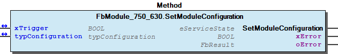
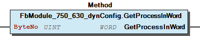
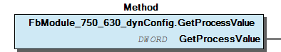
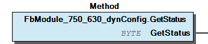

# WagoSysModule_750_630 v1.9.9.0 (WAGO) - Complete Documentation


## 📋 Library Information

- **Company:** WAGO
- **Title:** WagoSysModule_750_630
- **Version:** 1.9.9.0
- **Categories:** WAGO LayerView|Sys; Application
- **Author:** WAGO
- **Placeholder:** WagoSysModule_750_630

### Description ¶


This document is automatically generated. Because of this, the chapter 30 Visualization is not shown in this document. If you are interested in getting to know more about visualization, we refer to the library manager of e!Cockpit.

Handling module 750-630/003-000 [1]

This document is automatically generated. Because of this, the chapter 30 Visualization is not shown in this document. If you are interested in getting to know more about visualization, we refer to the library manager of e!Cockpit. Handling module 750-630/003-000 [1]

### Contents: ¶


Contents: - Documentation Index - Project Information - Library Information - Function Blocks FbModule_750_630 (FB) - FbModule_750_630_dynConfig (FB) Methods - FbModule_750_630.GetModuleConfiguration (METH) - FbModule_750_630.SetModuleConfiguration (METH) - FbModule_750_630_dynConfig.GetModuleInputSize (METH) - FbModule_750_630_dynConfig.GetProcessInBit (METH) - FbModule_750_630_dynConfig.GetProcessInByte (METH) - FbModule_750_630_dynConfig.GetProcessInData (METH) - FbModule_750_630_dynConfig.GetProcessInDword (METH) - FbModule_750_630_dynConfig.GetProcessInWord (METH) - FbModule_750_630_dynConfig.GetProcessValue (METH) - FbModule_750_630_dynConfig.GetStatus (METH) Program Organization Global Variable Lists - Error_630 (GVL) - VersionHistory (GVL) Other Components - 80 Status - I_ModuleProcessInputsExtended - eError_630 (ENUM)

### Indices and tables ¶


| [1] | Based on WagoSysModule_750_630.library, last modified 19.06.2020, 17:59:02. The content of this file was automatically generated with None on 19.06.2020, 17:59:04 |

© WAGO Kontakttechnik GmbH & Co. KG, Germany 2018 – All rights reserved. For the avoidance of doubt, this copyright notice does not only apply to the information above but also and primarily to the described library itself. Please note that third-party products are always mentioned without reference to intellectual property rights, including patents, utility models, designs and trademarks, accordingly the existence of such rights cannot be excluded. WAGO is a registered trademark of WAGO Verwaltungsgesellschaft mbH.

- File and Project Information - Library Reference © WAGO Kontakttechnik GmbH & Co. KG, Germany 2018 – All rights reserved. For the avoidance of doubt, this copyright notice does not only apply to the information above but also and primarily to the described library itself. Please note that third-party products are always mentioned without reference to intellectual property rights, including patents, utility models, designs and trademarks, accordingly the existence of such rights cannot be excluded. WAGO is a registered trademark of WAGO Verwaltungsgesellschaft mbH.

### Documentation Index


## WagoSysModule_750_630 Library Documentation


| Company: | WAGO |
| Title: | WagoSysModule_750_630 |
| Version: | 1.9.9.0 |
| Categories: | WAGO LayerView\|Sys; Application |
| Author: | WAGO |
| Placeholder: | WagoSysModule_750_630 |

### Description


This document is automatically generated. Because of this, the chapter 30 Visualization is not shown in this document. If you are interested in getting to know more about visualization, we refer to the library manager of e!Cockpit.

Handling module 750-630/003-000 [1]

This document is automatically generated. Because of this, the chapter 30 Visualization is not shown in this document. If you are interested in getting to know more about visualization, we refer to the library manager of e!Cockpit. Handling module 750-630/003-000 [1]

### Contents:


- 20 Program Organization Units FbModule_750_630 (FB) - FbModule_750_630_dynConfig (FB) 80 Status - Error_630 (GVL) - eError_630 (ENUM) VersionHistory (GVL)

### Indices and tables


| [1] | Based on WagoSysModule_750_630.library, last modified 19.06.2020, 17:59:02. The content of this file was automatically generated with None on 19.06.2020, 17:59:04 |

© WAGO Kontakttechnik GmbH & Co. KG, Germany 2018 – All rights reserved. For the avoidance of doubt, this copyright notice does not only apply to the information above but also and primarily to the described library itself. Please note that third-party products are always mentioned without reference to intellectual property rights, including patents, utility models, designs and trademarks, accordingly the existence of such rights cannot be excluded. WAGO is a registered trademark of WAGO Verwaltungsgesellschaft mbH.

- File and Project Information - Library Reference © WAGO Kontakttechnik GmbH & Co. KG, Germany 2018 – All rights reserved. For the avoidance of doubt, this copyright notice does not only apply to the information above but also and primarily to the described library itself. Please note that third-party products are always mentioned without reference to intellectual property rights, including patents, utility models, designs and trademarks, accordingly the existence of such rights cannot be excluded. WAGO is a registered trademark of WAGO Verwaltungsgesellschaft mbH.

### Project Information


## File and Project Information


| Scope | Name | Type | Content |
| --- | --- | --- | --- |
| FileHeader | libraryFile | string | WagoSysModule_750_630.library |
| contentFile | WagoSysModule_750_630_clr.json |
| productName | e!COCKPIT |
| creationDateTime | date | 19.06.2020, 17:59:04 |
| companyName | string | WAGO |
| ProjectInformation | LastModificationDateTime | date | 19.06.2020, 17:59:02 |
| Description | string | See: Description |
| Copyright | © WAGO Kontakttechnik GmbH & Co. KG, Germany 2018 – All rights reserved. |
| Author | WAGO |
| AutoResolveUnbound | bool | True |
| Placeholder | string | WagoSysModule_750_630 |
| Company | WAGO |
| DocFormat | reStructuredText |
| Project | WagoSysModule_750_630 |
| Version | version | 1.9.9.0 |
| ActivateSigning | bool | False |
| Title | string | WagoSysModule_750_630 |
| LibraryCategories | library-category-list | WAGO LayerView\|Sys; Application |
| Version string | string |  |

### Library Information


## Library Reference


| LinkAllContent: False QualifiedOnly: False | SystemLibrary: False | Optional: False |

| LinkAllContent: False QualifiedOnly: False | SystemLibrary: False | Optional: False |

| LinkAllContent: False QualifiedOnly: False | SystemLibrary: False | Optional: False |

| LinkAllContent: False Optional: False | QualifiedOnly: True SystemLibrary: False | PublishSymbolsInContainer: True |

| LinkAllContent: False QualifiedOnly: True | SystemLibrary: False PublishSymbolsInContainer: True | Optional: False |

| LinkAllContent: False Optional: False | QualifiedOnly: True SystemLibrary: False | PublishSymbolsInContainer: True |

This is a dictionary of all referenced libraries and their name spaces.

This is a dictionary of all referenced libraries and their name spaces. WagoSysErrorBase Library Identification : Placeholder: WagoSysErrorBase Default Resolution: WagoSysErrorBase, * (WAGO) Namespace: WagoSysErrorBase Library Properties : WagoSysModuleBaseProtected Library Identification : Placeholder: WagoSysModuleBaseProtected Default Resolution: WagoSysModuleBaseProtected, * (WAGO) Namespace: WagoSysModuleBaseProtected Library Properties : Library Parameter : Parameter: REGISTER_COM_TIMEOUT = TIME#5s0ms Parameter: PARAMETER_COM_TIMEOUT = TIME#5s0ms WagoSysVersion Library Identification : Name: WagoSysVersion Version: 1.0.0.0 Company: WAGO Namespace: WagoSysVersion Library Properties : WagoTypesCommon Library Identification : Placeholder: WagoTypesCommon Default Resolution: WagoTypesCommon, * (WAGO) Namespace: WagoTypes Library Properties : WagoTypesModuleBase Library Identification : Placeholder: WagoTypesModuleBase Default Resolution: WagoTypesModuleBase, * (WAGO) Namespace: WagoTypesModuleBase Library Properties : Library Parameter : Parameter: MAX_MODULE_OUTPUT_SIZE = 48 Parameter: MAX_MODULE_INPUT_SIZE = 48 Parameter: MBX_PIPE_SIZE = 1024 Parameter: MAX_MBX_SIZE = 18 Parameter: MAX_MBX1_SIZE = 18 Parameter: MAX_MBX_OUTPUT_SIZE = 47 Parameter: MAX_MBX_INPUT_SIZE = 47 WagoTypesModule_750_630 Library Identification : Placeholder: WagoTypesModule_750_630 Default Resolution: WagoTypesModule_750_630, * (WAGO) Namespace: WagoTypesModule_750_630 Library Properties :

### Function Blocks


## FbModule_750_630 (FB)


| Scope | Name | Type | Inherited from |
| --- | --- | --- | --- |
| Output | oError | WagoSysErrorBase.FbResult | FbModuleBase |

Access to the module 750-630/003-000

Function description

This block is needed for each module. The instance of this function block is either automatically generated by the K-Bus configuration or has to be manually added in case of the dynamic configuration.

Interface variables Function Access to the module 750-630/003-000 Function description This block is needed for each module. The instance of this function block is either automatically generated by the K-Bus configuration or has to be manually added in case of the dynamic configuration. - FbModule_750_630.GetModuleConfiguration (METH) - FbModule_750_630.SetModuleConfiguration (METH)

## FbModule_750_630_dynConfig (FB)


| Scope | Name | Type | Inherited from |
| --- | --- | --- | --- |
| Output | oError | WagoSysErrorBase.FbResult | FbModuleBase |

Access to the module 750-630

Function description

This block is needed for each module. It must be manually added in case of the dynamic configuration.

Interface variables Function Access to the module 750-630 Function description This block is needed for each module. It must be manually added in case of the dynamic configuration. - FbModule_750_630_dynConfig.GetProcessValue (METH) - FbModule_750_630_dynConfig.GetStatus (METH) - I_ModuleProcessInputsExtended FbModule_750_630_dynConfig.GetModuleInputSize (METH) - FbModule_750_630_dynConfig.GetProcessInBit (METH) - FbModule_750_630_dynConfig.GetProcessInByte (METH) - FbModule_750_630_dynConfig.GetProcessInData (METH) - FbModule_750_630_dynConfig.GetProcessInDword (METH) - FbModule_750_630_dynConfig.GetProcessInWord (METH)

### Methods


## FbModule_750_630.GetModuleConfiguration (METH)


| Scope | Name | Type |
| --- | --- | --- |
| Return | GetModuleConfiguration | WagoTypesModuleBase.eServiceState |
| Inout | xTrigger | BOOL |
| typConfiguration | WagoTypesModule_750_630.typConfiguration |
| Output | xError | BOOL |
| oError | WagoSysErrorBase.FbResult |

| Return Value | Description |
| --- | --- |
| WagoTypesModuleBase.eServiceState.DONE | successful |
| WagoTypesModuleBase.eServiceState.ABORT | error -> see oError |
| WagoTypesModuleBase.eServiceState.NO_DATA | call while xTrigger is reset |

```
VAR
    //--- Configuration -------------------------------------------------------
    typConfiguration    : WagoTypesModule_750_630.typConfiguration;
    oError              :   WagoSysErrorBase.FbResult;
    xGetConfiguration   :   BOOL;
END_VAR

//---  C O N F I G U R A T I O N ----------------------
CASE my630.GetModuleConfiguration( xGetConfiguration, typConfiguration, oError => oError) OF

    eServiceState.DONE : // OK
            ;// process here your typConfiguration

    eServiceState.ABORT : // Error
            ;// process here your error handling -> see oError for more information

END_CASE
```

Return Values

It is not allowed to reset the xTrigger by the application. This must done by the method.

Graphical Illustration

Graphical Interface of FbModule_750_630.GetModuleConfiguration

Example for ST

Reading the raw configuration of the first channel

You have to call the method cyclic until the method returns with DONE or ABORT.

Interface variables Function Get the configuration Return Values Warning It is not allowed to reset the xTrigger by the application. This must done by the method. Graphical Illustration  Graphical Interface of FbModule_750_630.GetModuleConfiguration Example for ST Reading the raw configuration of the first channel Note You have to call the method cyclic until the method returns with DONE or ABORT.

## FbModule_750_630.SetModuleConfiguration (METH)


| Scope | Name | Type |
| --- | --- | --- |
| Return | SetModuleConfiguration | WagoTypesModuleBase.eServiceState |
| Inout | xTrigger | BOOL |
| typConfiguration | WagoTypesModule_750_630.typConfiguration |
| Output | xError | BOOL |
| oError | WagoSysErrorBase.FbResult |

| Return Value | Description |
| --- | --- |
| WagoTypesModuleBase.eServiceState.DONE | successful |
| WagoTypesModuleBase.eServiceState.ABORT | error -> see oError |
| WagoTypesModuleBase.eServiceState.NO_DATA | call while xTrigger is reset |

```
VAR
    //--- Channel Configuration -------------------------------------------------------
    xStartProcess       :   BOOL; // set this variable once to start the process -> this varibale will be automatic reset
    typConfiguration    :   WagoTypesModule_750_630.typConfiguration;
    oError              :   WagoSysErrorBase.FbResult;
    xSetConfiguration   :   BOOL;
END_VAR

//--- R A W   C H A N N E L   C O N F I G U R A T I O N ----------------------

//--- READ BEFORE WRITE --------------------------------------------------------------
CASE my630.GetModuleConfiguration( xStartProcess, typConfiguration, oError => oError) OF

    eServiceState.DONE : // OK -> actual configuration is successful read
        // change here your configuration
        // typConfiguration... :=
        xSetConfiguration := TRUE; // trigger write

    eServiceState.ABORT : // Error -> not able to read -> see oError
            ;// process here your error handling for read -> see oError for more information

END_CASE

//--- WRITE MODYFIED CONFIGURATION ---------------------------------------------------
CASE my630.SetModuleConfiguration( xSetConfiguration, typConfiguration, oError => oError) OF

    eServiceState.DONE : // OK -> new configuration is written

    eServiceState.ABORT : // Error -> not able to write -> see oError
            ;// process here your error handling for write -> see oError for more information

END_CASE
```

Set the configuration specified by typConfiguration . This struct has to contain all configuration parameters.

Recommendation : You should read the configuration in this struct before you write the configuration. The advantage is, you only have to change the needed parameters between read and write.

Return Values

It is not allowed to reset the xTrigger by the application. This must done by the method.

Graphical Illustration

Graphical Interface of FbModule_750_630.SetModuleConfiguration

Example for ST

Start with reading the configuration, change some parameters before writing back to the module.

You have to call the method cyclic until the method returns with DONE or ABORT.

Interface variables Function Set the configuration specified by typConfiguration . This struct has to contain all configuration parameters. Note Recommendation : You should read the configuration in this struct before you write the configuration. The advantage is, you only have to change the needed parameters between read and write. Return Values Warning It is not allowed to reset the xTrigger by the application. This must done by the method. Graphical Illustration  Graphical Interface of FbModule_750_630.SetModuleConfiguration Example for ST Start with reading the configuration, change some parameters before writing back to the module. Note You have to call the method cyclic until the method returns with DONE or ABORT.

## FbModule_750_630_dynConfig.GetModuleInputSize (METH)


| Scope | Name | Type |
| --- | --- | --- |
| Return | GetModuleInputSize | UINT |

Returns the byte size of input data

Interface variables Returns the byte size of input data

## FbModule_750_630_dynConfig.GetProcessInBit (METH)


| Scope | Name | Type | Comment |
| --- | --- | --- | --- |
| Return | GetProcessInBit | BOOL |  |
| Input | ByteNo | UINT | range 0..(_uiInputSize - 1) |
| BitNo | USINT | range 0..7 |

## FbModule_750_630_dynConfig.GetProcessInByte (METH)


| Scope | Name | Type | Comment |
| --- | --- | --- | --- |
| Return | GetProcessInByte | BYTE |  |
| Input | ByteNo | UINT | range 0..(_uiInputSize - 1) |

## FbModule_750_630_dynConfig.GetProcessInData (METH)


| Scope | Name | Type | Comment |
| --- | --- | --- | --- |
| Return | GetProcessInData | UINT |  |
| Input | pInData | POINTER TO BYTE | pointer to the area where the process data should store |
| uiNInData | UINT | SIZEOF(Buffer) |

## FbModule_750_630_dynConfig.GetProcessInDword (METH)


| Scope | Name | Type | Comment |
| --- | --- | --- | --- |
| Return | GetProcessInDword | DWORD |  |
| Input | ByteNo | UINT | range 0..(_uiInputSize - 4) |

Graphical Illustration

Graphical Interface of FbModule_750_630_dynConfig.GetProcessInDword

Interface variables Function Get the process input dword specified by ByteNo of this module. Graphical Illustration  Graphical Interface of FbModule_750_630_dynConfig.GetProcessInDword

## FbModule_750_630_dynConfig.GetProcessInWord (METH)


| Scope | Name | Type | Comment |
| --- | --- | --- | --- |
| Return | GetProcessInWord | WORD |  |
| Input | ByteNo | UINT | range 0..(_uiInputSize - 2) |

Graphical Illustration

Graphical Interface of FbModule_750_630_dynConfig.GetProcessInWord

Interface variables Function Get the process input word specified by ByteNo of this module. Graphical Illustration  Graphical Interface of FbModule_750_630_dynConfig.GetProcessInWord

## FbModule_750_630_dynConfig.GetProcessValue (METH)


| Scope | Name | Type |
| --- | --- | --- |
| Return | GetProcessValue | DWORD |

```
VAR
    myProcessValue  :   dword;
END_VAR

myProcessValue:=my630.GetProcessValue();
```

Graphical Illustration

Graphical Interface of FbModule_750_630_dynConfig.GetProcessValue

Interface variables Function Get the process value Graphical Illustration  Graphical Interface of FbModule_750_630_dynConfig.GetProcessValue Example Get the process value

## FbModule_750_630_dynConfig.GetStatus (METH)


| Scope | Name | Type |
| --- | --- | --- |
| Return | GetStatus | BYTE |

```
VAR
    myStatus    :   byte;
END_VAR

myStatus:=my630.GetStatus();
```

Graphical Illustration

Graphical Interface of FbModule_750_630_dynConfig.GetStatus

Interface variables Function Get the status byte Graphical Illustration  Graphical Interface of FbModule_750_630_dynConfig.GetStatus Example Get the status byte

### Program Organization


## 20 Program Organization Units


- FbModule_750_630 (FB) FbModule_750_630.GetModuleConfiguration (METH) - FbModule_750_630.SetModuleConfiguration (METH) FbModule_750_630_dynConfig (FB) - FbModule_750_630_dynConfig.GetProcessValue (METH) - FbModule_750_630_dynConfig.GetStatus (METH) - I_ModuleProcessInputsExtended FbModule_750_630_dynConfig.GetModuleInputSize (METH) - FbModule_750_630_dynConfig.GetProcessInBit (METH) - FbModule_750_630_dynConfig.GetProcessInByte (METH) - FbModule_750_630_dynConfig.GetProcessInData (METH) - FbModule_750_630_dynConfig.GetProcessInDword (METH) - FbModule_750_630_dynConfig.GetProcessInWord (METH)

### Global Variable Lists


## Error_630 (GVL)


| Scope | Name | Type |
| --- | --- | --- |
| Constant | ERROR_630 | ARRAY [0..3] OF WagoTypesErrorBase.typResultItem |

| Value | Level | Description |
| --- | --- | --- |
| eError_630.OK | WagoTypesErrorBase.eSeverity.none | ‘OK’ |
| eError_630.INVALID_CHANNEL | WagoTypesErrorBase.eSeverity.error | ‘The wanted channel number is not allowed’ |

## VersionHistory (GVL)


| Name | Type |
| --- | --- |
| Info | ProjectInfo |

| date | version | author | change |
| 05.06.2020 | 1.9.9.0 | u010545 | change to WagoSysModuleBaseProtected 1.9.9.0 |
| 30.08.2019 | 1.9.4.1 | u010545 | Bugfix Byteorder I_ModuleProcessInputsExtended |
| 06.08.2019 | 1.9.4.0 | u010545 | Interface for dyn config pa access added |
| 16.07.2019 | 1.9.3.0 | u010545 | Interface for dyn config added |
| 08.01.2019 | 1.9.2.0 | u015842 | Properties: free placeholder added |
| 03.01.2018 | 1.9.1.1 | u010545 | bugfix |
| 01.12.2017 | 1.9.1.0 | u010545 | check for ordernumber implemented |
| 29.07.2017 | 1.9.0.0 | u010545 | changed for compability with old WagoSysModuleBase |
| 04.09.2017 | 1.0.0.0 | u010663 | released |

WagoSysModule_750_630.library

Release Notes:

WagoSysModule_750_630.library Release Notes:

### Other Components


## 80 Status ¶


- Error_630 (GVL) - eError_630 (ENUM)

## I_ModuleProcessInputsExtended


- FbModule_750_630_dynConfig.GetModuleInputSize (METH) - FbModule_750_630_dynConfig.GetProcessInBit (METH) - FbModule_750_630_dynConfig.GetProcessInByte (METH) - FbModule_750_630_dynConfig.GetProcessInData (METH) - FbModule_750_630_dynConfig.GetProcessInDword (METH) - FbModule_750_630_dynConfig.GetProcessInWord (METH)

## eError_630 (ENUM)


| Name | Initial | Comment |
| --- | --- | --- |
| OK | 0 | all is well |
| INVALID_CHANNEL | 1 | invalid channel number |