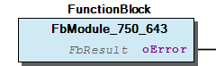

# WagoSysModule_750_643 v1.0.1.0 (WAGO) - Complete Documentation

## 📋 Library Information

- **Company:** WAGO
- **Title:** WagoSysModule_750_643
- **Version:** 1.0.1.0
- **Categories:** WAGO LayerView|Sys
- **Namespace:** WagoSysModule_750_643
- **Author:** WAGO / u014521
- **Placeholder:** WagoSysModule_750_643

### Description ¶

This document is automatically generated. Because of this, the chapter 30 Visualization is not shown in this document. If you are interested in getting to know more about visualization, we refer to the library manager of e!Cockpit.

System libray for Mp-Bus Module 750-643 [1]

This document is automatically generated. Because of this, the chapter 30 Visualization is not shown in this document. If you are interested in getting to know more about visualization, we refer to the library manager of e!Cockpit. System libray for Mp-Bus Module 750-643 [1]

### Contents: ¶

Contents: - Documentation Index - Project Information - Library Information - Function Blocks - Program Organization - Global Variable Lists

### Indices and tables ¶

| [1] | Based on WagoSysModule_750_643.library, last modified 14.01.2019, 18:27:15. The content of this file was automatically generated with None on 14.01.2019, 18:27:17 |

© WAGO Kontakttechnik GmbH & Co. KG, Germany 2018 – All rights reserved. For the avoidance of doubt, this copyright notice does not only apply to the information above but also and primarily to the described library itself. Please note that third-party products are always mentioned without reference to intellectual property rights, including patents, utility models, designs and trademarks, accordingly the existence of such rights cannot be excluded. WAGO is a registered trademark of WAGO Verwaltungsgesellschaft mbH.

- File and Project Information - Library Reference © WAGO Kontakttechnik GmbH & Co. KG, Germany 2018 – All rights reserved. For the avoidance of doubt, this copyright notice does not only apply to the information above but also and primarily to the described library itself. Please note that third-party products are always mentioned without reference to intellectual property rights, including patents, utility models, designs and trademarks, accordingly the existence of such rights cannot be excluded. WAGO is a registered trademark of WAGO Verwaltungsgesellschaft mbH.

### Documentation Index

## WagoSysModule_750_643 Library Documentation

| Company: | WAGO |
| Title: | WagoSysModule_750_643 |
| Version: | 1.0.1.0 |
| Categories: | WAGO LayerView\|Sys |
| Namespace: | WagoSysModule_750_643 |
| Author: | WAGO / u014521 |
| Placeholder: | WagoSysModule_750_643 |

### Description

This document is automatically generated. Because of this, the chapter 30 Visualization is not shown in this document. If you are interested in getting to know more about visualization, we refer to the library manager of e!Cockpit.

System libray for Mp-Bus Module 750-643 [1]

This document is automatically generated. Because of this, the chapter 30 Visualization is not shown in this document. If you are interested in getting to know more about visualization, we refer to the library manager of e!Cockpit. System libray for Mp-Bus Module 750-643 [1]

### Contents:

- 20 Program Organization Units FbModule_750_643 (FB) VersionHistory (GVL)

### Indices and tables

| [1] | Based on WagoSysModule_750_643.library, last modified 14.01.2019, 18:27:15. The content of this file was automatically generated with None on 14.01.2019, 18:27:17 |

© WAGO Kontakttechnik GmbH & Co. KG, Germany 2018 – All rights reserved. For the avoidance of doubt, this copyright notice does not only apply to the information above but also and primarily to the described library itself. Please note that third-party products are always mentioned without reference to intellectual property rights, including patents, utility models, designs and trademarks, accordingly the existence of such rights cannot be excluded. WAGO is a registered trademark of WAGO Verwaltungsgesellschaft mbH.

- File and Project Information - Library Reference © WAGO Kontakttechnik GmbH & Co. KG, Germany 2018 – All rights reserved. For the avoidance of doubt, this copyright notice does not only apply to the information above but also and primarily to the described library itself. Please note that third-party products are always mentioned without reference to intellectual property rights, including patents, utility models, designs and trademarks, accordingly the existence of such rights cannot be excluded. WAGO is a registered trademark of WAGO Verwaltungsgesellschaft mbH.

### Project Information

## File and Project Information

| Scope | Name | Type | Content |
| --- | --- | --- | --- |
| FileHeader | libraryFile | string | WagoSysModule_750_643.library |
| contentFile | WagoSysModule_750_643_clr.json |
| productName | e!COCKPIT |
| creationDateTime | date | 14.01.2019, 18:27:17 |
| companyName | string | WAGO |
| ProjectInformation | LastModificationDateTime | date | 14.01.2019, 18:27:15 |
| NoPlaceholder | string |  |
| Description | See: Description |
| Copyright | © WAGO Kontakttechnik GmbH & Co. KG, Germany 2018 – All rights reserved. |
| Author | WAGO / u014521 |
| AutoResolveUnbound | bool | True |
| Placeholder | string | WagoSysModule_750_643 |
| Company | WAGO |
| DocFormat | reStructuredText |
| Project | WagoSysModule_750_643 |
| DefaultNamespace | WagoSysModule_750_643 |
| Version | version | 1.0.1.0 |
| Title | string | WagoSysModule_750_643 |
| LibraryCategories | library-category-list | WAGO LayerView\|Sys |

### Library Information

## Library Reference

| LinkAllContent: False QualifiedOnly: False | SystemLibrary: False | Optional: False |

| LinkAllContent: False QualifiedOnly: False | SystemLibrary: False | Optional: False |

| LinkAllContent: False QualifiedOnly: False | SystemLibrary: False | Optional: False |

| LinkAllContent: False QualifiedOnly: False | SystemLibrary: False | Optional: False |

This is a dictionary of all referenced libraries and their name spaces.

This is a dictionary of all referenced libraries and their name spaces. Standard Library Identification : Placeholder: Standard Default Resolution: Standard, 3.5.7.0 (System) Namespace: Standard Library Properties : WagoSysModuleBase Library Identification : Placeholder: WagoSysModuleBase Default Resolution: WagoSysModuleBase, * (WAGO) Namespace: WagoSysModuleBase Library Properties : WagoSysVersion Library Identification : Name: WagoSysVersion Version: 1.0.0.0 Company: WAGO Namespace: WagoSysVersion Library Properties : WagoTypesModule_750_643 Library Identification : Placeholder: WagoTypesModule_750_643 Default Resolution: WagoTypesModule_750_643, * (WAGO) Namespace: WagoTypesModule_750_643 Library Properties :

### Function Blocks

## FbModule_750_643 (FB)

| Scope | Name | Type | Inherited from |
| --- | --- | --- | --- |
| Output | oError | WagoSysErrorBase.FbResult | FbModuleBase |

System Function block for communicating with WAGO MP-Bus Module 750-643

Graphical Illustration

Interface variables Function System Function block for communicating with WAGO MP-Bus Module 750-643 Graphical Illustration 

### Program Organization

## 20 Program Organization Units

- FbModule_750_643 (FB)

### Global Variable Lists

## VersionHistory (GVL)

| Name | Type |
| --- | --- |
| Info | ProjectInfo |

| date | version | author | change |
| 08.01.2019 | 1.0.1.0 | u015842 | Properties: free placeholder added |
| 12.04.2017 | 1.0.0.2 | U15842 | version changed |
| 12.04.2017 | 1.0.0.1 | U10545 | License changed |
| 27.10.2016 | 1.0.0.0 | U014521 | R4 |

WagoSysModule_750_643.library

Description: System library for Mp-Bus Module 750-463

WagoSysModule_750_643.library Description: System library for Mp-Bus Module 750-463 Release Notes: Known Bugs To-Do’s