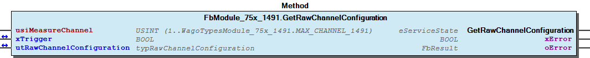
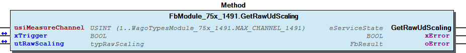
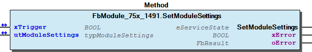
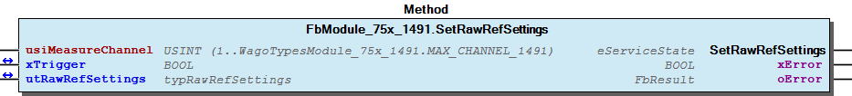
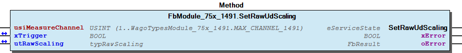
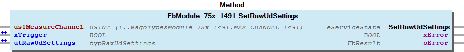
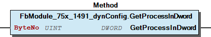
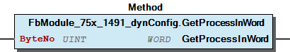
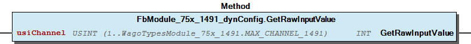
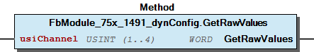

# WagoSysModule_75x_1491 v1.0.0.4 (WAGO) - Complete Documentation


## 📋 Library Information

- **Company:** WAGO
- **Title:** WagoSysModule_75x_1491
- **Version:** 1.0.0.4
- **Categories:** WAGO LayerView|Sys; Application
- **Author:** WAGO
- **Placeholder:** WagoSysModule_75x_1491

### Description ¶


This document is automatically generated.

Handling modules 75x-1491

This document is automatically generated. Handling modules 75x-1491

### Contents: ¶


Contents: - Documentation Index - Project Information - Library Information - Function Blocks FbModule_75x_1491 (FB) - FbModule_75x_1491_dynConfig (FB) Methods - FbModule_75x_1491.GetModuleSettings (METH) - FbModule_75x_1491.GetRawChannelConfiguration (METH) - FbModule_75x_1491.GetRawRefScaling (METH) - FbModule_75x_1491.GetRawRefSettings (METH) - FbModule_75x_1491.GetRawUdScaling (METH) - FbModule_75x_1491.GetRawUdSettings (METH) - FbModule_75x_1491.SetModuleSettings (METH) - FbModule_75x_1491.SetRawChannelConfiguration (METH) - FbModule_75x_1491.SetRawRefScaling (METH) - FbModule_75x_1491.SetRawRefSettings (METH) - ... and 11 more Program Organization Global Variable Lists - Error_1491 (GVL) - VersionHistory (GVL) Other Components - 80 Status - Channel - I_ModuleProcessInputsExtended - I_Module_75x_1491 - Module - Obsolete - Scaling - eError_1491 (ENUM)

### Indices and tables ¶


Based on WagoSysModule_75x_1491.library, last modified 20.09.2024, 21:40:24. LibDoc 3.5.16.10

© WAGO GmbH & Co. KG, Germany 2018 – All rights reserved. For the avoidance of doubt, this copyright notice does not only apply to the information above but also and primarily to the described library itself. Please note that third-party products are always mentioned without reference to intellectual property rights, including patents, utility models, designs and trademarks, accordingly the existence of such rights cannot be excluded. WAGO is a registered trademark of WAGO Verwaltungsgesellschaft mbH.

- File and Project Information - Library Reference Based on WagoSysModule_75x_1491.library, last modified 20.09.2024, 21:40:24. LibDoc 3.5.16.10 © WAGO GmbH & Co. KG, Germany 2018 – All rights reserved. For the avoidance of doubt, this copyright notice does not only apply to the information above but also and primarily to the described library itself. Please note that third-party products are always mentioned without reference to intellectual property rights, including patents, utility models, designs and trademarks, accordingly the existence of such rights cannot be excluded. WAGO is a registered trademark of WAGO Verwaltungsgesellschaft mbH.

### Documentation Index


## WagoSysModule_75x_1491 Library Documentation


| Company: | WAGO |
| Title: | WagoSysModule_75x_1491 |
| Version: | 1.0.0.4 |
| Categories: | WAGO LayerView\|Sys; Application |
| Author: | WAGO |
| Placeholder: | WagoSysModule_75x_1491 |

### Description


This document is automatically generated.

Handling modules 75x-1491

This document is automatically generated. Handling modules 75x-1491

### Contents:


- 20 Program Organization Units FbModule_75x_1491 (FB) - FbModule_75x_1491_dynConfig (FB) 80 Status - Error_1491 (GVL) - eError_1491 (ENUM) VersionHistory (GVL)

### Indices and tables


Based on WagoSysModule_75x_1491.library, last modified 20.09.2024, 21:40:24. LibDoc 3.5.16.10

© WAGO GmbH & Co. KG, Germany 2018 – All rights reserved. For the avoidance of doubt, this copyright notice does not only apply to the information above but also and primarily to the described library itself. Please note that third-party products are always mentioned without reference to intellectual property rights, including patents, utility models, designs and trademarks, accordingly the existence of such rights cannot be excluded. WAGO is a registered trademark of WAGO Verwaltungsgesellschaft mbH.

- File and Project Information - Library Reference Based on WagoSysModule_75x_1491.library, last modified 20.09.2024, 21:40:24. LibDoc 3.5.16.10 © WAGO GmbH & Co. KG, Germany 2018 – All rights reserved. For the avoidance of doubt, this copyright notice does not only apply to the information above but also and primarily to the described library itself. Please note that third-party products are always mentioned without reference to intellectual property rights, including patents, utility models, designs and trademarks, accordingly the existence of such rights cannot be excluded. WAGO is a registered trademark of WAGO Verwaltungsgesellschaft mbH.

### Project Information


## File and Project Information


| Scope | Name | Type | Content |
| --- | --- | --- | --- |
| FileHeader | libraryFile | string | WagoSysModule_75x_1491.library |
| contentFile | doc.clean.json |
| productName | e!COCKPIT |
| creationDateTime | date | 20.09.2024, 21:40:25 |
| companyName | string | WAGO |
| ProjectInformation | LastModificationDateTime | date | 20.09.2024, 21:40:24 |
| Description | string | See: Description |
| Copyright | © WAGO Kontakttechnik GmbH & Co. KG, Germany 2018 – All rights reserved. |
| Author | WAGO |
| AutoResolveUnbound | bool | True |
| Placeholder | string | WagoSysModule_75x_1491 |
| Company | WAGO |
| DocFormat | reStructuredText |
| Project | WagoSysModule_75x_1491 |
| Version string |  |
| Version | version | 1.0.0.4 |
| ActivateSigning | bool | False |
| Title | string | WagoSysModule_75x_1491 |
| LibraryCategories | library-category-list | WAGO LayerView\|Sys; Application |
| CompiledLibraryCompatibilityVersion | string | CODESYS V3.5 SP16 Patch 3 |

### Library Information


## Library Reference


| LinkAllContent: False QualifiedOnly: False | SystemLibrary: False | Optional: False |

| LinkAllContent: False QualifiedOnly: False | SystemLibrary: False | Optional: False |

| LinkAllContent: False QualifiedOnly: False | SystemLibrary: False | Optional: False |

| LinkAllContent: False Optional: False | QualifiedOnly: True SystemLibrary: False | PublishSymbolsInContainer: True |

| LinkAllContent: False QualifiedOnly: True | SystemLibrary: False PublishSymbolsInContainer: True | Optional: False |

| LinkAllContent: False Optional: False | QualifiedOnly: True SystemLibrary: False | PublishSymbolsInContainer: True |

This is a dictionary of all referenced libraries and their name spaces.

This is a dictionary of all referenced libraries and their name spaces. WagoSysErrorBase Library Identification : Placeholder: WagoSysErrorBase Default Resolution: WagoSysErrorBase, * (WAGO) Namespace: WagoSysErrorBase Library Properties : WagoSysModuleBaseProtected Library Identification : Placeholder: WagoSysModuleBaseProtected Default Resolution: WagoSysModuleBaseProtected, * (WAGO) Namespace: WagoSysModuleBaseProtected Library Properties : Library Parameter : Parameter: REGISTER_COM_TIMEOUT = TIME#5s0ms Parameter: PARAMETER_COM_TIMEOUT = TIME#5s0ms WagoSysVersion Library Identification : Name: WagoSysVersion Version: 1.0.0.0 Company: WAGO Namespace: WagoSysVersion Library Properties : WagoTypesCommon Library Identification : Placeholder: WagoTypesCommon Default Resolution: WagoTypesCommon, * (WAGO) Namespace: WagoTypes Library Properties : WagoTypesModuleBase Library Identification : Placeholder: WagoTypesModuleBase Default Resolution: WagoTypesModuleBase, * (WAGO) Namespace: WagoTypesModuleBase Library Properties : Library Parameter : Parameter: MAX_MBX_SIZE = 18 WagoTypesModule_75x_1491 Library Identification : Placeholder: WagoTypesModule_75x_1491 Default Resolution: WagoTypesModule_75x_1491, * (WAGO) Namespace: WagoTypesModule_75x_1491 Library Properties :

### Function Blocks


## FbModule_75x_1491 (FB)


| Scope | Name | Type | Inherited from |
| --- | --- | --- | --- |
| Output | oError | WagoSysErrorBase.FbResult | FbModuleBase |

Access to the module 75x-1491.

2-channel analog input Resistor bridges (strain gauge)

Function description

Interface variables Function Access to the module 75x-1491. 2-channel analog input Resistor bridges (strain gauge) Function description This block is needed for each module. The instance of this function block is either automatically generated by the K-Bus configuration. - I_Module_75x_1491 Channel Scaling FbModule_75x_1491.GetRawRefScaling (METH) - FbModule_75x_1491.GetRawUdScaling (METH) - FbModule_75x_1491.SetRawRefScaling (METH) - FbModule_75x_1491.SetRawUdScaling (METH) Settings - FbModule_75x_1491.GetRawRefSettings (METH) - FbModule_75x_1491.GetRawUdSettings (METH) - FbModule_75x_1491.SetRawRefSettings (METH) - FbModule_75x_1491.SetRawUdSettings (METH) FbModule_75x_1491.GetRawChannelConfiguration (METH) Module - FbModule_75x_1491.GetModuleSettings (METH) - FbModule_75x_1491.SetModuleSettings (METH) FbModule_75x_1491.SetRawChannelConfiguration (METH)

## FbModule_75x_1491_dynConfig (FB)


| Scope | Name | Type | Inherited from |
| --- | --- | --- | --- |
| Output | oError | WagoSysErrorBase.FbResult | FbModuleBase |

Function description

Interface variables Function Access to the module 750-1491 with PA-Access In case of dynamic configuration the FB provides additional the PA-Access. Function description This block is needed for each module. The instance of this function block has to be manually added in case of the dynamic configuration. - FbModule_75x_1491_dynConfig.GetRawValues (METH) - I_ModuleProcessInputsExtended FbModule_75x_1491_dynConfig.GetModuleInputSize (METH) - FbModule_75x_1491_dynConfig.GetProcessInBit (METH) - FbModule_75x_1491_dynConfig.GetProcessInByte (METH) - FbModule_75x_1491_dynConfig.GetProcessInData (METH) - FbModule_75x_1491_dynConfig.GetProcessInDword (METH) - FbModule_75x_1491_dynConfig.GetProcessInWord (METH) Obsolete - FbModule_75x_1491_dynConfig.GetRawInputValue (METH)

### Methods


## FbModule_75x_1491.GetModuleSettings (METH)


| Scope | Name | Type | Comment |
| --- | --- | --- | --- |
| Return | GetModuleSettings | WagoTypesModuleBase.eServiceState |  |
| Inout | xTrigger | BOOL | set this variable once to start the process. It will be reset by the Method automatic. |
| utModuleSettings | WagoTypesModule_75x_1491.typModuleSettings |  |
| Output | xError | BOOL |  |
| oError | WagoSysErrorBase.FbResult |  |

| Struct member | Value | Description |
| --- | --- | --- |
| eInterferenceFrequency | _10HZ | 10 HZ Interference Frequency Suppression |
| _50HZ | 50 HZ Interference Frequency Suppression |
| _60HZ | 60 HZ Interference Frequency Suppression |
| _200HZ | 200 HZ Interference Frequency Suppression |
| _400HZ | 400 HZ Interference Frequency Suppression |
| eFilterMode | PRECISE_MODE | Precise Mode |
| FAST_MODE | Fast Mode |

```
VAR
    //--- Module Mode Settings ------------------------------
    utModuleSettings    :   WagoTypesModule_75x_1491.typModuleSettings;
    xGetModuleSettings  :   BOOL; // set this variable once to start the process. It will be reset by the Method automatic.
    oError              :   WagoSysErrorBase.FbResult;
END_VAR

//--- M O D U L E    S E T T I N G S -----------------------
CASE my1491.GetModuleSettings(xGetModuleSettings, utModuleSettings, oError => oError) OF

    eServiceState.DONE : // OK
            ;// process here your utModuleSettings

    eServiceState.ABORT : // Error
            ;// process here your error handling -> see oError for more information

END_CASE
```

typModuleSettings

Graphical Illustration

Graphical Interface of FbModule_75x_1491.GetModuleSettings

For get the settings from the module.

You have to call the method cyclic until the method returns with DONE or ABORT.

Interface variables Function Get the common settings of the module at a struct. typModuleSettings Graphical Illustration  Graphical Interface of FbModule_75x_1491.GetModuleSettings Example For get the settings from the module. Note You have to call the method cyclic until the method returns with DONE or ABORT.

## FbModule_75x_1491.GetRawChannelConfiguration (METH)


| Scope | Name | Type |
| --- | --- | --- |
| Return | GetRawChannelConfiguration | WagoTypesModuleBase.eServiceState |
| Input | usiMeasureChannel | USINT (1..WagoTypesModule_75x_1491.MAX_CHANNEL_1491) |
| Inout | xTrigger | BOOL |
| utRawChannelConfiguration | WagoTypesModule_75x_1491.typRawChannelConfiguration |
| Output | xError | BOOL |
| oError | WagoSysErrorBase.FbResult |

| Struct member | Value | Description |
| --- | --- | --- |
| UdSettings | eBridgeVoltage | DEACTIVATED |  |
| PLUS_MINUS_15mV |  |
| PLUS_MINUS_30mV |  |
| PLUS_MINUS_60mV |  |
| PLUS_MINUS_120mV |  |
| PLUS_MINUS_240mV |  |
| PLUS_MINUS_360mV |  |
| eSmoothing | DEACTIVATED |  |
| WEAK |  |
| MEDIUM |  |
| STRONG |  |
| eNumberFormat | TWOS_COMPLEMENT |  |
| SIGN_MAGNITUDE |  |
| xEnableDiagGlobal | FALSE | Channel diagnostic disabled |
| TRUE | Channel diagnostic enabled |
| xEnableDiagOverflow | FALSE | Diagnostis overflow disabled |
| TRUE | Diagnostis overflow enabled |
| xEnableDiagUnderflow | FALSE | Diagnostis underflow disabled |
| TRUE | Diagnostis underflow enabled |
| xEnableDiagMeasuringUnderflow | FALSE | Diagnostis measuring value underflow disabled |
| TRUE | Diagnostis measuring value underflow enabled |
| xEnableDiagMeasuringOverflow | FALSE | Diagnostis measuring value overflow disabled |
| TRUE | Diagnostis measuring value overflow enabled |
| xEnableDiagLowerUserLimit | FALSE | Diagnostis user limiting value underflow disabled |
| TRUE | Diagnostis user limiting value underflow enabled |
| xEnableDiagUpperUserLimit | FALSE | Diagnostis user limiting value overflow disabled |
| TRUE | Diagnostis user limiting value overflow enabled |
| iLowerUserLimitValue | -32768 ... 32767 | Lower user limit value |
| iUpperUserLimitValue | -32768 ... 32767 | Upper user limit value |
| RefSettings | eReferenceVoltage | DEACTIVATED |  |
| PLUS_5V_INTERNAL |  |
| PLUS_MINUS_5V_EXTERNAL |  |
| PLUS_MINUS_10V_EXTERNAL |  |
| PLUS_MINUS_15V_EXTERNAL |  |
| eSmoothing | DEACTIVATED |  |
| WEAK |  |
| MEDIUM |  |
| STRONG |  |
| eNumberFormat | TWOS_COMPLEMENT |  |
| SIGN_MAGNITUDE |  |
| xEnableDiagGlobal | FALSE | Channel diagnostic disabled |
| TRUE | Channel diagnostic enabled |
| xEnableDiagOverflow | FALSE | Diagnostis overflow disabled |
| TRUE | Diagnostis overflow enabled |
| xEnableDiagUnderflow | FALSE | Diagnostis underflow disabled |
| TRUE | Diagnostis underflow enabled |
| xEnableDiagMeasuringUnderflow | FALSE | Diagnostis measuring value underflow disabled |
| TRUE | Diagnostis measuring value underflow enabled |
| xEnableDiagMeasuringOverflow | FALSE | Diagnostis measuring value overflow disabled |
| TRUE | Diagnostis measuring value overflow enabled |
| xEnableDiagLowerUserLimit | FALSE | Diagnostis user limiting value underflow disabled |
| TRUE | Diagnostis user limiting value underflow enabled |
| xEnableDiagUpperUserLimit | FALSE | Diagnostis user limiting value overflow disabled |
| TRUE | Diagnostis user limiting value overflow enabled |
| iLowerUserLimitValue | -32768 ... 32767 | Lower user limit value |
| iUpperUserLimitValue | -32768 ... 32767 | Upper user limit value |
| UdScaling | xUserScaling | FALSE | User scaling disabled -> use manufacturer scaling |
| TRUE | User scaling enabled |
| iUserScalingOffset | -32768 ... 32767 | User scaling Offset |
| iUserScalingGain | -32768 ... 32767 | User scaling Gain -> scaled value / 0x4000 |
| RefScaling | xUserScaling | FALSE | User scaling disabled -> use manufacturer scaling |
| TRUE | User scaling enabled |
| iUserScalingOffset | -32768 ... 32767 | User scaling Offset |
| iUserScalingGain | -32768 ... 32767 | User scaling Gain -> scaled value / 0x4000 |

```
VAR
    //--- Channel Configuration ---------------------------------
    utRawChannelConfiguration   :   WagoTypesModule_75x_1491.typRawChannelConfiguration;
    xGetRawChannelConfiguration :   BOOL;
    oError                      :   WagoSysErrorBase.FbResult;
END_VAR

//--- C H A N N E L    C O N F I G U R A T I O N -----------------------
CASE my1491.GetRawChannelConfiguration( usiMeasureChannel           := 1, // measure channel 1
                                        xTrigger                    := xGetRawChannelConfiguration,
                                        utRawChannelConfiguration   := utRawChannelConfiguration,
                                        oError                      => oError
                                    ) OF

    eServiceState.DONE : // OK
            ;// process here your utChannelConfiguration

    eServiceState.ABORT : // Error
            ;// process here your error handling -> see oError for more information

END_CASE
```

typRawChannelConfiguration

Graphical Illustration

Graphical Interface of FbModule_75x_1491.GetRawChannelConfiguration

For get the configuration from channel one

You have to call the method cyclic until the method returns with DONE or ABORT.

Interface variables Function Get the complete raw configuration of a channel. typRawChannelConfiguration Graphical Illustration  Graphical Interface of FbModule_75x_1491.GetRawChannelConfiguration Example For get the configuration from channel one Note You have to call the method cyclic until the method returns with DONE or ABORT.

## FbModule_75x_1491.GetRawRefScaling (METH)


| Scope | Name | Type |
| --- | --- | --- |
| Return | GetRawRefScaling | WagoTypesModuleBase.eServiceState |
| Input | usiMeasureChannel | USINT (1..WagoTypesModule_75x_1491.MAX_CHANNEL_1491) |
| Inout | xTrigger | BOOL |
| utRawScaling | WagoTypesModule_75x_1491.typRawScaling |
| Output | xError | BOOL |
| oError | WagoSysErrorBase.FbResult |

| Struct member | Value | Description |
| --- | --- | --- |
| xUserScaling | FALSE | User scaling disabled -> use manufacturer scaling |
| TRUE | User scaling enabled |
| iUserScalingOffset | -32768 ... 32767 | User scaling Offset |
| iUserScalingGain | -32768 ... 32767 | User scaling Gain -> scaled value / 0x4000 |

```
VAR
    //--- reference voltage Settings ---------------------------------
    utRawScaling    :   WagoTypesModule_75x_1491.typRawScaling;
    xGetScaling     :   BOOL;
    oError          :   WagoSysErrorBase.FbResult;
END_VAR

//--- R E F E R E N C E   V O L T A G E   S C A L I N G ------------------------
CASE my1491.GetRawRefScaling(   usiMeasureChannel   := 1, // measure channel 1
                                xTrigger            := xGetScaling,
                                utRawScaling        := utRawScaling,
                                oError              => oError
                            ) OF

    eServiceState.DONE : // OK
            ;// process here your utRawScaling

    eServiceState.ABORT : // Error
            ;// process here your error handling -> see oError for more information

END_CASE
```

typRawScaling

Graphical Illustration

Graphical Interface of FbModule_75x_1491.GetRawRefScaling

For get the reference voltage scaling from channel one

You have to call the method cyclic until the method returns with DONE or ABORT.

Interface variables Function Get the reference voltage scaling of a channel at a struct. typRawScaling Graphical Illustration  Graphical Interface of FbModule_75x_1491.GetRawRefScaling Example For get the reference voltage scaling from channel one Note You have to call the method cyclic until the method returns with DONE or ABORT.

## FbModule_75x_1491.GetRawRefSettings (METH)


| Scope | Name | Type |
| --- | --- | --- |
| Return | GetRawRefSettings | WagoTypesModuleBase.eServiceState |
| Input | usiMeasureChannel | USINT (1..WagoTypesModule_75x_1491.MAX_CHANNEL_1491) |
| Inout | xTrigger | BOOL |
| utRawRefSettings | WagoTypesModule_75x_1491.typRawRefSettings |
| Output | xError | BOOL |
| oError | WagoSysErrorBase.FbResult |

| Struct member | Value | Description |
| --- | --- | --- |
| eReferenceVoltage | DEACTIVATED |  |
| PLUS_5V_INTERNAL |  |
| PLUS_MINUS_5V_EXTERNAL |  |
| PLUS_MINUS_10V_EXTERNAL |  |
| PLUS_MINUS_15V_EXTERNAL |  |
| eSmoothing | DEACTIVATED |  |
| WEAK |  |
| MEDIUM |  |
| STRONG |  |
| eNumberFormat | TWOS_COMPLEMENT |  |
| SIGN_MAGNITUDE |  |
| xEnableDiagGlobal | FALSE | Channel diagnostic disabled |
| TRUE | Channel diagnostic enabled |
| xEnableDiagOverflow | FALSE | Diagnostis overflow disabled |
| TRUE | Diagnostis overflow enabled |
| xEnableDiagUnderflow | FALSE | Diagnostis underflow disabled |
| TRUE | Diagnostis underflow enabled |
| xEnableDiagMeasuringUnderflow | FALSE | Diagnostis measuring value underflow disabled |
| TRUE | Diagnostis measuring value underflow enabled |
| xEnableDiagMeasuringOverflow | FALSE | Diagnostis measuring value overflow disabled |
| TRUE | Diagnostis measuring value overflow enabled |
| xEnableDiagLowerUserLimit | FALSE | Diagnostis user limiting value underflow disabled |
| TRUE | Diagnostis user limiting value underflow enabled |
| xEnableDiagUpperUserLimit | FALSE | Diagnostis user limiting value overflow disabled |
| TRUE | Diagnostis user limiting value overflow enabled |
| iLowerUserLimitValue | -32768 ... 32767 | Lower user limit value |
| iUpperUserLimitValue | -32768 ... 32767 | Upper user limit value |

```
VAR
    //--- Channel Settings ---------------------------------
    utRefSettings   :   WagoTypesModule_75x_1491.typRawRefSettings;
    xGetRefSettings :   BOOL;
    oError          :   WagoSysErrorBase.FbResult;
END_VAR

//--- C H A N N E L   S E T T I N G S ----------------------
CASE my1491.GetRawRefSettings(  usiMeasureChannel   := 1, // measure channel 1
                                xTrigger            := xGetRefSettings,
                                utRawRefSettings    := utRefSettings,
                                oError              => oError
                            ) OF

    eServiceState.DONE : // OK
        ;// process here your utRefSettings

    eServiceState.ABORT : // Error
        ;// process here your error handling -> see oError for more information

END_CASE
```

typRawRefSettings

Graphical Illustration

Graphical Interface of FbModule_75x_1491.GetRawRefSettings

For get the reference voltage settings from channel one

You have to call the method cyclic until the method returns with DONE or ABORT.

Interface variables Function Get the reference voltage settings of a channel at a struct. typRawRefSettings Graphical Illustration  Graphical Interface of FbModule_75x_1491.GetRawRefSettings Example For get the reference voltage settings from channel one Note You have to call the method cyclic until the method returns with DONE or ABORT.

## FbModule_75x_1491.GetRawUdScaling (METH)


| Scope | Name | Type |
| --- | --- | --- |
| Return | GetRawUdScaling | WagoTypesModuleBase.eServiceState |
| Input | usiMeasureChannel | USINT (1..WagoTypesModule_75x_1491.MAX_CHANNEL_1491) |
| Inout | xTrigger | BOOL |
| utRawScaling | WagoTypesModule_75x_1491.typRawScaling |
| Output | xError | BOOL |
| oError | WagoSysErrorBase.FbResult |

| Struct member | Value | Description |
| --- | --- | --- |
| xUserScaling | FALSE | User scaling disabled -> use manufacturer scaling |
| TRUE | User scaling enabled |
| iUserScalingOffset | -32768 ... 32767 | User scaling Offset |
| iUserScalingGain | -32768 ... 32767 | User scaling Gain -> scaled value / 0x4000 |

```
VAR
    //--- Channel Settings ---------------------------------
    utRawScaling    :   WagoTypesModule_75x_1491.typRawScaling;
    xGetScaling     :   BOOL;
    oError          :   WagoSysErrorBase.FbResult;
END_VAR

//--- Ud   S C A L I N G ------------------------
CASE my1491.GetRawUdScaling(    usiMeasureChannel   := 1, // measure channel 1
                                xTrigger            := xGetScaling,
                                utRawScaling        := utRawScaling,
                                oError              => oError
                            ) OF

    eServiceState.DONE : // OK
            ;// process here your utRawScaling

    eServiceState.ABORT : // Error
            ;// process here your error handling -> see oError for more information

END_CASE
```

typRawScaling

Graphical Illustration

Graphical Interface of FbModule_75x_1491.GetRawUdScaling

For get the scaling from measure channel one

You have to call the method cyclic until the method returns with DONE or ABORT.

Interface variables Function Get the Ud scaling of a channel at a struct. typRawScaling Graphical Illustration  Graphical Interface of FbModule_75x_1491.GetRawUdScaling Example For get the scaling from measure channel one Note You have to call the method cyclic until the method returns with DONE or ABORT.

## FbModule_75x_1491.GetRawUdSettings (METH)


| Scope | Name | Type |
| --- | --- | --- |
| Return | GetRawUdSettings | WagoTypesModuleBase.eServiceState |
| Input | usiMeasureChannel | USINT (1..WagoTypesModule_75x_1491.MAX_CHANNEL_1491) |
| Inout | xTrigger | BOOL |
| utRawUdSettings | WagoTypesModule_75x_1491.typRawUdSettings |
| Output | xError | BOOL |
| oError | WagoSysErrorBase.FbResult |

| Struct member | Value | Description |
| --- | --- | --- |
| eBridgeVoltage | DEACTIVATED |  |
| PLUS_MINUS_15mV |  |
| PLUS_MINUS_30mV |  |
| PLUS_MINUS_60mV |  |
| PLUS_MINUS_120mV |  |
| PLUS_MINUS_240mV |  |
| PLUS_MINUS_360mV |  |
| eSmoothing | DEACTIVATED |  |
| WEAK |  |
| MEDIUM |  |
| STRONG |  |
| eNumberFormat | TWOS_COMPLEMENT |  |
| SIGN_MAGNITUDE |  |
| xEnableDiagGlobal | FALSE | Channel diagnostic disabled |
| TRUE | Channel diagnostic enabled |
| xEnableDiagOverflow | FALSE | Diagnostis overflow disabled |
| TRUE | Diagnostis overflow enabled |
| xEnableDiagUnderflow | FALSE | Diagnostis underflow disabled |
| TRUE | Diagnostis underflow enabled |
| xEnableDiagMeasuringUnderflow | FALSE | Diagnostis measuring value underflow disabled |
| TRUE | Diagnostis measuring value underflow enabled |
| xEnableDiagMeasuringOverflow | FALSE | Diagnostis measuring value overflow disabled |
| TRUE | Diagnostis measuring value overflow enabled |
| xEnableDiagLowerUserLimit | FALSE | Diagnostis user limiting value underflow disabled |
| TRUE | Diagnostis user limiting value underflow enabled |
| xEnableDiagUpperUserLimit | FALSE | Diagnostis user limiting value overflow disabled |
| TRUE | Diagnostis user limiting value overflow enabled |
| iLowerUserLimitValue | -32768 ... 32767 | Lower user limit value |
| iUpperUserLimitValue | -32768 ... 32767 | Upper user limit value |

```
VAR
    //--- Channel Settings ---------------------------------
    utUdSettings    :   WagoTypesModule_75x_1491.typRawUdSettings;
    xGetUdSettings  :   BOOL;
    oError          :   WagoSysErrorBase.FbResult;
END_VAR

//--- C H A N N E L   S E T T I N G S ----------------------
CASE my1491.GetRawUdSettings(   usiMeasureChannel   := 1, // measure channel 1
                                xTrigger            := xGetUdSettings,
                                utRawUdSettings     := utUdSettings,
                                oError              => oError
                            ) OF

    eServiceState.DONE : // OK
        ;// process here your utUdSettings

    eServiceState.ABORT : // Error
        ;// process here your error handling -> see oError for more information

END_CASE
```

typRawUdSettings

Graphical Illustration

Graphical Interface of FbModule_75x_1491.GetRawUdSettings

For get the settings from channel one

You have to call the method cyclic until the method returns with DONE or ABORT.

Interface variables Function Get the Ud settings of a channel at a struct. typRawUdSettings Graphical Illustration  Graphical Interface of FbModule_75x_1491.GetRawUdSettings Example For get the settings from channel one Note You have to call the method cyclic until the method returns with DONE or ABORT.

## FbModule_75x_1491.SetModuleSettings (METH)


| Scope | Name | Type | Comment |
| --- | --- | --- | --- |
| Return | SetModuleSettings | WagoTypesModuleBase.eServiceState |  |
| Inout | xTrigger | BOOL | set this variable once to start the process. It will be automatic reset by this Method. |
| utModuleSettings | WagoTypesModule_75x_1491.typModuleSettings |  |
| Output | xError | BOOL |  |
| oError | WagoSysErrorBase.FbResult |  |

| Struct member | Value | Description |
| --- | --- | --- |
| eInterferenceFrequency | _10HZ | 10 HZ Interference Frequency Suppression |
| _50HZ | 50 HZ Interference Frequency Suppression |
| _60HZ | 60 HZ Interference Frequency Suppression |
| _200HZ | 200 HZ Interference Frequency Suppression |
| _400HZ | 400 HZ Interference Frequency Suppression |
| eFilterMode | PRECISE_MODE | Precise Mode |
| FAST_MODE | Fast Mode |

```
VAR
    //--- Module Mode Settings ------------------------------
    utModuleSettings    :   WagoTypesModule_75x_1491.typModuleSettings;
    xSetModuleSettings  :   BOOL; // set this variable once to start the process. It will be reset by the Method automatic.
    oError              :   WagoSysErrorBase.FbResult;
END_VAR

//--- S E T   M O D U L E    S E T T I N G S ---------------
CASE my1491.SetModuleSettings(xSetModuleSettings, utModuleSettings, oError => oError) OF

    eServiceState.DONE : // OK

    eServiceState.ABORT : // Error
            ;// process here your error handling -> see oError for more information

END_CASE
```

typModuleSettings

Graphical Illustration

Graphical Interface of FbModule_75x_1491.SetModuleSettings

For set the settings from the module.

You have to call the method cyclic until the method returns with DONE or ABORT.

Interface variables Function Set the common settings of the module from a struct. typModuleSettings Graphical Illustration  Graphical Interface of FbModule_75x_1491.SetModuleSettings Example For set the settings from the module. Note You have to call the method cyclic until the method returns with DONE or ABORT.

## FbModule_75x_1491.SetRawChannelConfiguration (METH)


| Scope | Name | Type |
| --- | --- | --- |
| Return | SetRawChannelConfiguration | WagoTypesModuleBase.eServiceState |
| Input | usiMeasureChannel | USINT (1..WagoTypesModule_75x_1491.MAX_CHANNEL_1491) |
| Inout | xTrigger | BOOL |
| utRawChannelConfiguration | WagoTypesModule_75x_1491.typRawChannelConfiguration |
| Output | xError | BOOL |
| oError | WagoSysErrorBase.FbResult |

| Struct member | Value | Description |
| --- | --- | --- |
| UdSettings | eBridgeVoltage | DEACTIVATED |  |
| PLUS_MINUS_15mV |  |
| PLUS_MINUS_30mV |  |
| PLUS_MINUS_60mV |  |
| PLUS_MINUS_120mV |  |
| PLUS_MINUS_240mV |  |
| PLUS_MINUS_360mV |  |
| eSmoothing | DEACTIVATED |  |
| WEAK |  |
| MEDIUM |  |
| STRONG |  |
| eNumberFormat | TWOS_COMPLEMENT |  |
| SIGN_MAGNITUDE |  |
| xEnableDiagGlobal | FALSE | Channel diagnostic disabled |
| TRUE | Channel diagnostic enabled |
| xEnableDiagOverflow | FALSE | Diagnostis overflow disabled |
| TRUE | Diagnostis overflow enabled |
| xEnableDiagUnderflow | FALSE | Diagnostis underflow disabled |
| TRUE | Diagnostis underflow enabled |
| xEnableDiagMeasuringUnderflow | FALSE | Diagnostis measuring value underflow disabled |
| TRUE | Diagnostis measuring value underflow enabled |
| xEnableDiagMeasuringOverflow | FALSE | Diagnostis measuring value overflow disabled |
| TRUE | Diagnostis measuring value overflow enabled |
| xEnableDiagLowerUserLimit | FALSE | Diagnostis user limiting value underflow disabled |
| TRUE | Diagnostis user limiting value underflow enabled |
| xEnableDiagUpperUserLimit | FALSE | Diagnostis user limiting value overflow disabled |
| TRUE | Diagnostis user limiting value overflow enabled |
| iLowerUserLimitValue | -32768 ... 32767 | Lower user limit value |
| iUpperUserLimitValue | -32768 ... 32767 | Upper user limit value |
| RefSettings | eReferenceVoltage | DEACTIVATED |  |
| PLUS_5V_INTERNAL |  |
| PLUS_MINUS_5V_EXTERNAL |  |
| PLUS_MINUS_10V_EXTERNAL |  |
| PLUS_MINUS_15V_EXTERNAL |  |
| eSmoothing | DEACTIVATED |  |
| WEAK |  |
| MEDIUM |  |
| STRONG |  |
| eNumberFormat | TWOS_COMPLEMENT |  |
| SIGN_MAGNITUDE |  |
| xEnableDiagGlobal | FALSE | Channel diagnostic disabled |
| TRUE | Channel diagnostic enabled |
| xEnableDiagOverflow | FALSE | Diagnostis overflow disabled |
| TRUE | Diagnostis overflow enabled |
| xEnableDiagUnderflow | FALSE | Diagnostis underflow disabled |
| TRUE | Diagnostis underflow enabled |
| xEnableDiagMeasuringUnderflow | FALSE | Diagnostis measuring value underflow disabled |
| TRUE | Diagnostis measuring value underflow enabled |
| xEnableDiagMeasuringOverflow | FALSE | Diagnostis measuring value overflow disabled |
| TRUE | Diagnostis measuring value overflow enabled |
| xEnableDiagLowerUserLimit | FALSE | Diagnostis user limiting value underflow disabled |
| TRUE | Diagnostis user limiting value underflow enabled |
| xEnableDiagUpperUserLimit | FALSE | Diagnostis user limiting value overflow disabled |
| TRUE | Diagnostis user limiting value overflow enabled |
| iLowerUserLimitValue | -32768 ... 32767 | Lower user limit value |
| iUpperUserLimitValue | -32768 ... 32767 | Upper user limit value |
| UdScaling | xUserScaling | FALSE | User scaling disabled -> use manufacturer scaling |
| TRUE | User scaling enabled |
| iUserScalingOffset | -32768 ... 32767 | User scaling Offset |
| iUserScalingGain | -32768 ... 32767 | User scaling Gain -> scaled value / 0x4000 |
| RefScaling | xUserScaling | FALSE | User scaling disabled -> use manufacturer scaling |
| TRUE | User scaling enabled |
| iUserScalingOffset | -32768 ... 32767 | User scaling Offset |
| iUserScalingGain | -32768 ... 32767 | User scaling Gain -> scaled value / 0x4000 |

```
VAR
    //--- Channel Configuration -------------------------------------------------------
    xStartProcess               :   BOOL; // set this variable once to start the process -> this varibale will be automatic reset
    utRawChannelConfiguration   :   WagoTypesModule_75x_1491.typRawChannelConfiguration;
    oError                      :   WagoSysErrorBase.FbResult;
    xSetRawChannelConfiguration :   BOOL;
END_VAR

//--- C H A N N E L    C O N F I G U R A T I O N -----------------------
//--- READ BEFORE WRITE --------------------------------------------------------------
CASE my1491.GetRawChannelConfiguration( 1, xStartProcess, utRawChannelConfiguration, oError => oError) OF

    eServiceState.DONE : // OK -> actual configuration is successful read
        // change here your configuration
        // utRawChannelConfiguration... :=
        xSetRawChannelConfiguration := TRUE; // trigger write

    eServiceState.ABORT : // Error -> not able to read -> see oError
            ;// process here your error handling for read -> see oError for more information

END_CASE

//--- WRITE MODYFIED CONFIGURATION ---------------------------------------------------
CASE my1491.SetRawChannelConfiguration( 1, xSetRawChannelConfiguration, utRawChannelConfiguration, oError => oError) OF

    eServiceState.DONE : // OK -> new configuration is written

    eServiceState.ABORT : // Error -> not able to write -> see oError
            ;// process here your error handling for write -> see oError for more information

END_CASE
```

typRawChannelConfiguration

Graphical Illustration

Graphical Interface of FbModule_75x_1491.SetRawChannelConfiguration

For get the configuration from channel one and after read write the configuration

You have to call the method cyclic until the method returns with DONE or ABORT.

Interface variables Function Set the complete raw configuration of a channel. typRawChannelConfiguration Graphical Illustration  Graphical Interface of FbModule_75x_1491.SetRawChannelConfiguration Example For get the configuration from channel one and after read write the configuration Note You have to call the method cyclic until the method returns with DONE or ABORT.

## FbModule_75x_1491.SetRawRefScaling (METH)


| Scope | Name | Type |
| --- | --- | --- |
| Return | SetRawRefScaling | WagoTypesModuleBase.eServiceState |
| Input | usiMeasureChannel | USINT (1..WagoTypesModule_75x_1491.MAX_CHANNEL_1491) |
| Inout | xTrigger | BOOL |
| utRawScaling | WagoTypesModule_75x_1491.typRawScaling |
| Output | xError | BOOL |
| oError | WagoSysErrorBase.FbResult |

| Struct member | Value | Description |
| --- | --- | --- |
| xUserScaling | FALSE | User scaling disabled -> use manufacturer scaling |
| TRUE | User scaling enabled |
| iUserScalingOffset | -32768 ... 32767 | User scaling Offset |
| iUserScalingGain | -32768 ... 32767 | User scaling Gain -> scaled value / 0x4000 |

```
VAR
    //--- Channel Settings ---------------------------------
    utRawScaling    :   WagoTypesModule_75x_1491.typRawScaling;
    xSetScaling     :   BOOL;
    oError          :   WagoSysErrorBase.FbResult;
END_VAR

//--- Ud   S C A L I N G ------------------------
CASE my1491.SetRawRefScaling(   usiMeasureChannel   := 1, // measure channel 1
                                xTrigger            := xSetScaling,
                                utRawScaling        := utRawScaling,
                                oError              => oError
                            ) OF

    eServiceState.DONE : // OK
            ;// process here your utRawScaling

    eServiceState.ABORT : // Error
            ;// process here your error handling -> see oError for more information

END_CASE
```

typRawScaling

Graphical Illustration

Graphical Interface of FbModule_75x_1491.SetRawRefScaling

For set the reference voltage scaling of measure channel one

You have to call the method cyclic until the method returns with DONE or ABORT.

Interface variables Function Set the reference voltage scaling of a channel by a struct. typRawScaling Graphical Illustration  Graphical Interface of FbModule_75x_1491.SetRawRefScaling Example For set the reference voltage scaling of measure channel one Note You have to call the method cyclic until the method returns with DONE or ABORT.

## FbModule_75x_1491.SetRawRefSettings (METH)


| Scope | Name | Type |
| --- | --- | --- |
| Return | SetRawRefSettings | WagoTypesModuleBase.eServiceState |
| Input | usiMeasureChannel | USINT (1..WagoTypesModule_75x_1491.MAX_CHANNEL_1491) |
| Inout | xTrigger | BOOL |
| utRawRefSettings | WagoTypesModule_75x_1491.typRawRefSettings |
| Output | xError | BOOL |
| oError | WagoSysErrorBase.FbResult |

| Struct member | Value | Description |
| --- | --- | --- |
| eReferenceVoltage | DEACTIVATED |  |
| PLUS_5V_INTERNAL |  |
| PLUS_MINUS_5V_EXTERNAL |  |
| PLUS_MINUS_10V_EXTERNAL |  |
| PLUS_MINUS_15V_EXTERNAL |  |
| eSmoothing | DEACTIVATED |  |
| WEAK |  |
| MEDIUM |  |
| STRONG |  |
| eNumberFormat | TWOS_COMPLEMENT |  |
| SIGN_MAGNITUDE |  |
| xEnableDiagGlobal | FALSE | Channel diagnostic disabled |
| TRUE | Channel diagnostic enabled |
| xEnableDiagOverflow | FALSE | Diagnostis overflow disabled |
| TRUE | Diagnostis overflow enabled |
| xEnableDiagUnderflow | FALSE | Diagnostis underflow disabled |
| TRUE | Diagnostis underflow enabled |
| xEnableDiagMeasuringUnderflow | FALSE | Diagnostis measuring value underflow disabled |
| TRUE | Diagnostis measuring value underflow enabled |
| xEnableDiagMeasuringOverflow | FALSE | Diagnostis measuring value overflow disabled |
| TRUE | Diagnostis measuring value overflow enabled |
| xEnableDiagLowerUserLimit | FALSE | Diagnostis user limiting value underflow disabled |
| TRUE | Diagnostis user limiting value underflow enabled |
| xEnableDiagUpperUserLimit | FALSE | Diagnostis user limiting value overflow disabled |
| TRUE | Diagnostis user limiting value overflow enabled |
| iLowerUserLimitValue | -32768 ... 32767 | Lower user limit value |
| iUpperUserLimitValue | -32768 ... 32767 | Upper user limit value |

```
VAR
    //--- Channel Settings ---------------------------------
    utRefSettings   :   WagoTypesModule_75x_1491.typRawRefSettings;
    xSetRefSettings :   BOOL;
    oError          :   WagoSysErrorBase.FbResult;
END_VAR

//--- Ud  C H A N N E L   S E T T I N G S ----------------------
CASE my1491.SetRawRefSettings(  usiMeasureChannel   := 1, // measure channel 1
                                xTrigger            := xSetRefSettings,
                                utRawRefSettings    := utRefSettings,
                                oError              => oError
                            ) OF

    eServiceState.DONE : // OK
        ;// process here your utRefSettings

    eServiceState.ABORT : // Error
        ;// process here your error handling -> see oError for more information

END_CASE
```

typRawRefSettings

Graphical Illustration

Graphical Interface of FbModule_75x_1491.SetRawRefSettings

For set the reference voltage settings of channel one

You have to call the method cyclic until the method returns with DONE or ABORT.

Interface variables Function Set the reference voltage settings for a channel by a struct. typRawRefSettings Graphical Illustration  Graphical Interface of FbModule_75x_1491.SetRawRefSettings Example For set the reference voltage settings of channel one Note You have to call the method cyclic until the method returns with DONE or ABORT.

## FbModule_75x_1491.SetRawUdScaling (METH)


| Scope | Name | Type |
| --- | --- | --- |
| Return | SetRawUdScaling | WagoTypesModuleBase.eServiceState |
| Input | usiMeasureChannel | USINT (1..WagoTypesModule_75x_1491.MAX_CHANNEL_1491) |
| Inout | xTrigger | BOOL |
| utRawScaling | WagoTypesModule_75x_1491.typRawScaling |
| Output | xError | BOOL |
| oError | WagoSysErrorBase.FbResult |

| Struct member | Value | Description |
| --- | --- | --- |
| xUserScaling | FALSE | User scaling disabled -> use manufacturer scaling |
| TRUE | User scaling enabled |
| iUserScalingOffset | -32768 ... 32767 | User scaling Offset |
| iUserScalingGain | -32768 ... 32767 | User scaling Gain -> scaled value / 0x4000 |

```
VAR
    //--- Channel Settings ---------------------------------
    utRawScaling    :   WagoTypesModule_75x_1491.typRawScaling;
    xSetScaling     :   BOOL;
    oError          :   WagoSysErrorBase.FbResult;
END_VAR

//--- Ud   S C A L I N G ------------------------
CASE my1491.SetRawUdScaling(    usiMeasureChannel   := 1, // measure channel 1
                                xTrigger            := xSetScaling,
                                utRawScaling        := utRawScaling,
                                oError              => oError
                            ) OF

    eServiceState.DONE : // OK
            ;// process here your utRawScaling

    eServiceState.ABORT : // Error
            ;// process here your error handling -> see oError for more information

END_CASE
```

typRawScaling

Graphical Illustration

Graphical Interface of FbModule_75x_1491.SetRawUdScaling

For set the Ud scaling of measure channel one

You have to call the method cyclic until the method returns with DONE or ABORT.

Interface variables Function Set the Ud scaling of a channel by a struct. typRawScaling Graphical Illustration  Graphical Interface of FbModule_75x_1491.SetRawUdScaling Example For set the Ud scaling of measure channel one Note You have to call the method cyclic until the method returns with DONE or ABORT.

## FbModule_75x_1491.SetRawUdSettings (METH)


| Scope | Name | Type |
| --- | --- | --- |
| Return | SetRawUdSettings | WagoTypesModuleBase.eServiceState |
| Input | usiMeasureChannel | USINT (1..WagoTypesModule_75x_1491.MAX_CHANNEL_1491) |
| Inout | xTrigger | BOOL |
| utRawUdSettings | WagoTypesModule_75x_1491.typRawUdSettings |
| Output | xError | BOOL |
| oError | WagoSysErrorBase.FbResult |

| Struct member | Value | Description |
| --- | --- | --- |
| eBridgeVoltage | DEACTIVATED |  |
| PLUS_MINUS_15mV |  |
| PLUS_MINUS_30mV |  |
| PLUS_MINUS_60mV |  |
| PLUS_MINUS_120mV |  |
| PLUS_MINUS_240mV |  |
| PLUS_MINUS_360mV |  |
| eSmoothing | DEACTIVATED |  |
| WEAK |  |
| MEDIUM |  |
| STRONG |  |
| eNumberFormat | TWOS_COMPLEMENT |  |
| SIGN_MAGNITUDE |  |
| xEnableDiagGlobal | FALSE | Channel diagnostic disabled |
| TRUE | Channel diagnostic enabled |
| xEnableDiagOverflow | FALSE | Diagnostis overflow disabled |
| TRUE | Diagnostis overflow enabled |
| xEnableDiagUnderflow | FALSE | Diagnostis underflow disabled |
| TRUE | Diagnostis underflow enabled |
| xEnableDiagMeasuringUnderflow | FALSE | Diagnostis measuring value underflow disabled |
| TRUE | Diagnostis measuring value underflow enabled |
| xEnableDiagMeasuringOverflow | FALSE | Diagnostis measuring value overflow disabled |
| TRUE | Diagnostis measuring value overflow enabled |
| xEnableDiagLowerUserLimit | FALSE | Diagnostis user limiting value underflow disabled |
| TRUE | Diagnostis user limiting value underflow enabled |
| xEnableDiagUpperUserLimit | FALSE | Diagnostis user limiting value overflow disabled |
| TRUE | Diagnostis user limiting value overflow enabled |
| iLowerUserLimitValue | -32768 ... 32767 | Lower user limit value |
| iUpperUserLimitValue | -32768 ... 32767 | Upper user limit value |

```
VAR
    //--- Channel Settings ---------------------------------
    utUdSettings    :   WagoTypesModule_75x_1491.typRawUdSettings;
    xSetUdSettings  :   BOOL;
    oError          :   WagoSysErrorBase.FbResult;
END_VAR

//--- Ud  C H A N N E L   S E T T I N G S ----------------------
CASE my1491.SetRawUdSettings(   usiMeasureChannel   := 1, // measure channel 1
                                xTrigger            := xSetUdSettings,
                                utRawUdSettings     := utUdSettings,
                                oError              => oError
                            ) OF

    eServiceState.DONE : // OK
        ;// process here your utUdSettings

    eServiceState.ABORT : // Error
        ;// process here your error handling -> see oError for more information

END_CASE
```

typRawUdSettings

Graphical Illustration

Graphical Interface of FbModule_75x_1491.SetRawUdSettings

For set the Ud settings of channel one

You have to call the method cyclic until the method returns with DONE or ABORT.

Interface variables Function Set the Ud settings for a channel by a struct. typRawUdSettings Graphical Illustration  Graphical Interface of FbModule_75x_1491.SetRawUdSettings Example For set the Ud settings of channel one Note You have to call the method cyclic until the method returns with DONE or ABORT.

## FbModule_75x_1491_dynConfig.GetModuleInputSize (METH)


| Scope | Name | Type |
| --- | --- | --- |
| Return | GetModuleInputSize | UINT |

Returns the byte size of input data

Interface variables Returns the byte size of input data

## FbModule_75x_1491_dynConfig.GetProcessInBit (METH)


| Scope | Name | Type | Comment |
| --- | --- | --- | --- |
| Return | GetProcessInBit | BOOL |  |
| Input | ByteNo | UINT | range 0..(_uiInputSize - 1) |
| BitNo | USINT | range 0..7 |

## FbModule_75x_1491_dynConfig.GetProcessInByte (METH)


| Scope | Name | Type | Comment |
| --- | --- | --- | --- |
| Return | GetProcessInByte | BYTE |  |
| Input | ByteNo | UINT | range 0..(_uiInputSize - 1) |

## FbModule_75x_1491_dynConfig.GetProcessInData (METH)


| Scope | Name | Type | Comment |
| --- | --- | --- | --- |
| Return | GetProcessInData | UINT |  |
| Input | pInData | POINTER TO BYTE | pointer to the area where the process data should store |
| uiNInData | UINT | SIZEOF(Buffer) |

## FbModule_75x_1491_dynConfig.GetProcessInDword (METH)


| Scope | Name | Type | Comment |
| --- | --- | --- | --- |
| Return | GetProcessInDword | DWORD |  |
| Input | ByteNo | UINT | range 0..(_uiInputSize - 4) |

Graphical Illustration

Graphical Interface of FbModule_75x_1491_dynConfig.GetProcessInDword

Interface variables Function Get the process input dword specified by ByteNo of this module. Graphical Illustration  Graphical Interface of FbModule_75x_1491_dynConfig.GetProcessInDword

## FbModule_75x_1491_dynConfig.GetProcessInWord (METH)


| Scope | Name | Type | Comment |
| --- | --- | --- | --- |
| Return | GetProcessInWord | WORD |  |
| Input | ByteNo | UINT | range 0..(_uiInputSize - 2) |

Graphical Illustration

Graphical Interface of FbModule_75x_1491_dynConfig.GetProcessInWord

Interface variables Function Get the process input word specified by ByteNo of this module. Graphical Illustration  Graphical Interface of FbModule_75x_1491_dynConfig.GetProcessInWord

## FbModule_75x_1491_dynConfig.GetRawInputValue (METH)


| Scope | Name | Type |
| --- | --- | --- |
| Return | GetRawInputValue | INT |
| Input | usiChannel | USINT (1..WagoTypesModule_75x_1491.MAX_CHANNEL_1491) |

| Channel | Description | Resistor Bridge |
| --- | --- | --- |
| 1 | Ud | first Bridge |
| 2 | Uref | first Bridge |
| 3 | Ud | second Bridge |
| 4 | Uref | second Bridge |

```
VAR
    myiUdValue  :   INT;
END_VAR

myiUdValue := my1491.GetRawInputValue(1); // here is the raw Ud value as INT of the first resistor bridge
```

Get the raw process input value of the wanted channel (1..4).

In case of error (e.g. an invalid channel number is given) it returns -32768.

Graphical Illustration

Graphical Interface of FbModule_75x_1491_dynConfig.GetRawInputValue

For get the raw process input value from first channel (Ud) of the module.

Interface variables Function Get the raw process input value of the wanted channel (1..4). In case of error (e.g. an invalid channel number is given) it returns -32768. Graphical Illustration  Graphical Interface of FbModule_75x_1491_dynConfig.GetRawInputValue Example For get the raw process input value from first channel (Ud) of the module.

## FbModule_75x_1491_dynConfig.GetRawValues (METH)


| Scope | Name | Type |
| --- | --- | --- |
| Return | GetRawValues | WORD |
| Input | usiChannel | USINT (1..4) |

| Channel | Description | Resistor Bridge |
| --- | --- | --- |
| 1 | Ud | first Bridge |
| 2 | Uref | first Bridge |
| 3 | Ud | second Bridge |
| 4 | Uref | second Bridge |

```
VAR
    myiUdValue  :   WORD;
END_VAR

myiUdValue := my1491.GetRawInputValue(1); // here is the raw Ud value as INT of the first resistor bridge
```

Get the raw process input value of the wanted channel (1..4).

In case of error (e.g. an invalid channel number is given) it returns -32768.

Graphical Illustration

Graphical Interface of FbModule_75x_1491_dynConfig.GetRawValues

Get the raw process input value from first channel (Ud) of the module.

Interface variables Function Get the raw process input value of the wanted channel (1..4). In case of error (e.g. an invalid channel number is given) it returns -32768. Graphical Illustration  Graphical Interface of FbModule_75x_1491_dynConfig.GetRawValues Example Get the raw process input value from first channel (Ud) of the module.

## Settings


- FbModule_75x_1491.GetRawRefSettings (METH) - FbModule_75x_1491.GetRawUdSettings (METH) - FbModule_75x_1491.SetRawRefSettings (METH) - FbModule_75x_1491.SetRawUdSettings (METH)

### Program Organization


## 20 Program Organization Units


- FbModule_75x_1491 (FB) I_Module_75x_1491 Channel Scaling FbModule_75x_1491.GetRawRefScaling (METH) - FbModule_75x_1491.GetRawUdScaling (METH) - FbModule_75x_1491.SetRawRefScaling (METH) - FbModule_75x_1491.SetRawUdScaling (METH) Settings - FbModule_75x_1491.GetRawRefSettings (METH) - FbModule_75x_1491.GetRawUdSettings (METH) - FbModule_75x_1491.SetRawRefSettings (METH) - FbModule_75x_1491.SetRawUdSettings (METH) FbModule_75x_1491.GetRawChannelConfiguration (METH) Module - FbModule_75x_1491.GetModuleSettings (METH) - FbModule_75x_1491.SetModuleSettings (METH) FbModule_75x_1491.SetRawChannelConfiguration (METH) FbModule_75x_1491_dynConfig (FB) - FbModule_75x_1491_dynConfig.GetRawValues (METH) - I_ModuleProcessInputsExtended FbModule_75x_1491_dynConfig.GetModuleInputSize (METH) - FbModule_75x_1491_dynConfig.GetProcessInBit (METH) - FbModule_75x_1491_dynConfig.GetProcessInByte (METH) - FbModule_75x_1491_dynConfig.GetProcessInData (METH) - FbModule_75x_1491_dynConfig.GetProcessInDword (METH) - FbModule_75x_1491_dynConfig.GetProcessInWord (METH) Obsolete - FbModule_75x_1491_dynConfig.GetRawInputValue (METH)

### Global Variable Lists


## Error_1491 (GVL)


| Scope | Name | Type |
| --- | --- | --- |
| Constant | ERROR_1491 | ARRAY [0..5] OF WagoTypesErrorBase.typResultItem |

| Value | Level | Description |
| --- | --- | --- |
| eError_1491.OK | WagoTypesErrorBase.eSeverity.none | ‘OK’ |
| eError_1491.INVALID_CHANNEL | WagoTypesErrorBase.eSeverity.error | ‘The wanted channel number is not allowed’ |
| eError_1491.UNKNOWN_BRIDGE_VOLTAGE | WagoTypesErrorBase.eSeverity.error | ‘Not supported bridge voltage’ |
| eError_1491.UNKNOWN_SMOOTHING | WagoTypesErrorBase.eSeverity.error | ‘Not supported smoothing’ |
| eError_1491.UNDERRANGE_GT_OVERRANGE | WagoTypesErrorBase.eSeverity.error | ‘Underrange value greater than overrange value’ |
| eError_1491.UNKNOWN_NUMBER_FORMAT | WagoTypesErrorBase.eSeverity.error | ‘Not supported number format’ |

## VersionHistory (GVL)


| Name | Type |
| --- | --- |
| Info | ProjectInfo |

| date | version | author | change |
| 07.08.2024 | 1.0.0.4 | u0103719 | WAT-36860: modified register process (context: typRegisterReadStruct) |
| 29.01.2024 | 1.0.0.3 | u010663 | Add method GetRawValues |
| 12.02.2021 | 1.0.0.2 | u010545 | bugfix |
| 06.02.2021 | 1.0.0.1 | u010545 | bugfix |
| 01.02.2021 | 1.0.0.0 | u010545 | first release |

WagoSysModule_75x_1491.library

Release Notes:

WagoSysModule_75x_1491.library Release Notes:

### Other Components


## 80 Status ¶


- Error_1491 (GVL) - eError_1491 (ENUM)

## Channel


- Scaling FbModule_75x_1491.GetRawRefScaling (METH) - FbModule_75x_1491.GetRawUdScaling (METH) - FbModule_75x_1491.SetRawRefScaling (METH) - FbModule_75x_1491.SetRawUdScaling (METH) Settings - FbModule_75x_1491.GetRawRefSettings (METH) - FbModule_75x_1491.GetRawUdSettings (METH) - FbModule_75x_1491.SetRawRefSettings (METH) - FbModule_75x_1491.SetRawUdSettings (METH)

## I_ModuleProcessInputsExtended


- FbModule_75x_1491_dynConfig.GetModuleInputSize (METH) - FbModule_75x_1491_dynConfig.GetProcessInBit (METH) - FbModule_75x_1491_dynConfig.GetProcessInByte (METH) - FbModule_75x_1491_dynConfig.GetProcessInData (METH) - FbModule_75x_1491_dynConfig.GetProcessInDword (METH) - FbModule_75x_1491_dynConfig.GetProcessInWord (METH)

## I_Module_75x_1491


- Channel Scaling FbModule_75x_1491.GetRawRefScaling (METH) - FbModule_75x_1491.GetRawUdScaling (METH) - FbModule_75x_1491.SetRawRefScaling (METH) - FbModule_75x_1491.SetRawUdScaling (METH) Settings - FbModule_75x_1491.GetRawRefSettings (METH) - FbModule_75x_1491.GetRawUdSettings (METH) - FbModule_75x_1491.SetRawRefSettings (METH) - FbModule_75x_1491.SetRawUdSettings (METH) FbModule_75x_1491.GetRawChannelConfiguration (METH) Module - FbModule_75x_1491.GetModuleSettings (METH) - FbModule_75x_1491.SetModuleSettings (METH) FbModule_75x_1491.SetRawChannelConfiguration (METH)

## Module


- FbModule_75x_1491.GetModuleSettings (METH) - FbModule_75x_1491.SetModuleSettings (METH)

## Obsolete


- FbModule_75x_1491_dynConfig.GetRawInputValue (METH)

## Scaling


- FbModule_75x_1491.GetRawRefScaling (METH) - FbModule_75x_1491.GetRawUdScaling (METH) - FbModule_75x_1491.SetRawRefScaling (METH) - FbModule_75x_1491.SetRawUdScaling (METH)

## eError_1491 (ENUM)


| Name | Initial | Comment |
| --- | --- | --- |
| OK | 0 | all is well |
| INVALID_CHANNEL | 1 | invalid channel number |
| UNKNOWN_BRIDGE_VOLTAGE | 2 |  |
| UNKNOWN_SMOOTHING | 3 |  |
| UNDERRANGE_GT_OVERRANGE | 4 |  |
| UNKNOWN_NUMBER_FORMAT | 5 |  |