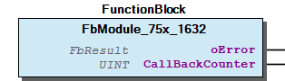

# WagoSysModule_75x_1632 v1.0.0.0 (WAGO) - Complete Documentation

## 📋 Library Information

- **Company:** WAGO
- **Title:** WagoSysModule_75x_1632
- **Version:** 1.0.0.0
- **Categories:** WAGO LayerView|Sys; Application
- **Author:** WAGO/u010663
- **Placeholder:** WagoSysModule_75x_1632

### Description ¶

This document is automatically generated. Because of this, the chapter 30 Visualization is not shown in this document. If you are interested in getting to know more about visualization, we refer to the library manager of e!Cockpit.

Handling module 750-1632 [1]

This document is automatically generated. Because of this, the chapter 30 Visualization is not shown in this document. If you are interested in getting to know more about visualization, we refer to the library manager of e!Cockpit. Handling module 750-1632 [1]

### Contents: ¶

Contents: - Documentation Index - Project Information - Library Information - Function Blocks - Program Organization - Global Variable Lists

### Indices and tables ¶

| [1] | Based on WagoSysModule_75x_1632.library, last modified 19.07.2022, 21:26:47. LibDoc 3.5.15.30 |

© WAGO Kontakttechnik GmbH & Co. KG, Germany 2018 – All rights reserved. For the avoidance of doubt, this copyright notice does not only apply to the information above but also and primarily to the described library itself. Please note that third-party products are always mentioned without reference to intellectual property rights, including patents, utility models, designs and trademarks, accordingly the existence of such rights cannot be excluded. WAGO is a registered trademark of WAGO Verwaltungsgesellschaft mbH.

- File and Project Information - Library Reference © WAGO Kontakttechnik GmbH & Co. KG, Germany 2018 – All rights reserved. For the avoidance of doubt, this copyright notice does not only apply to the information above but also and primarily to the described library itself. Please note that third-party products are always mentioned without reference to intellectual property rights, including patents, utility models, designs and trademarks, accordingly the existence of such rights cannot be excluded. WAGO is a registered trademark of WAGO Verwaltungsgesellschaft mbH.

### Documentation Index

## WagoSysModule_75x_1632 Library Documentation

| Company: | WAGO |
| Title: | WagoSysModule_75x_1632 |
| Version: | 1.0.0.0 |
| Categories: | WAGO LayerView\|Sys; Application |
| Author: | WAGO/u010663 |
| Placeholder: | WagoSysModule_75x_1632 |

### Description

This document is automatically generated. Because of this, the chapter 30 Visualization is not shown in this document. If you are interested in getting to know more about visualization, we refer to the library manager of e!Cockpit.

Handling module 750-1632 [1]

This document is automatically generated. Because of this, the chapter 30 Visualization is not shown in this document. If you are interested in getting to know more about visualization, we refer to the library manager of e!Cockpit. Handling module 750-1632 [1]

### Contents:

- 20 Program Organization Units FbModule_75x_1632 (FB) VersionHistory (GVL)

### Indices and tables

| [1] | Based on WagoSysModule_75x_1632.library, last modified 19.07.2022, 21:26:47. LibDoc 3.5.15.30 |

© WAGO Kontakttechnik GmbH & Co. KG, Germany 2018 – All rights reserved. For the avoidance of doubt, this copyright notice does not only apply to the information above but also and primarily to the described library itself. Please note that third-party products are always mentioned without reference to intellectual property rights, including patents, utility models, designs and trademarks, accordingly the existence of such rights cannot be excluded. WAGO is a registered trademark of WAGO Verwaltungsgesellschaft mbH.

- File and Project Information - Library Reference © WAGO Kontakttechnik GmbH & Co. KG, Germany 2018 – All rights reserved. For the avoidance of doubt, this copyright notice does not only apply to the information above but also and primarily to the described library itself. Please note that third-party products are always mentioned without reference to intellectual property rights, including patents, utility models, designs and trademarks, accordingly the existence of such rights cannot be excluded. WAGO is a registered trademark of WAGO Verwaltungsgesellschaft mbH.

### Project Information

## File and Project Information

| Scope | Name | Type | Content |
| --- | --- | --- | --- |
| FileHeader | libraryFile | string | WagoSysModule_75x_1632.library |
| contentFile | WagoSysModule_75x_1632_clr.json |
| productName | e!COCKPIT |
| creationDateTime | date | 19.07.2022, 21:26:51 |
| companyName | string | WAGO |
| ProjectInformation | LastModificationDateTime | date | 19.07.2022, 21:26:47 |
| Description | string | See: Description |
| Copyright | © WAGO Kontakttechnik GmbH & Co. KG, Germany 2018 – All rights reserved. |
| Author | WAGO/u010663 |
| AutoResolveUnbound | bool | True |
| Placeholder | string | WagoSysModule_75x_1632 |
| Company | WAGO |
| DocFormat | reStructuredText |
| Project | WagoSysModule_75x_1632 |
| Version | version | 1.0.0.0 |
| Version string | string |  |
| Title | WagoSysModule_75x_1632 |
| LibraryCategories | library-category-list | WAGO LayerView\|Sys; Application |
| CompiledLibraryCompatibilityVersion | string | CODESYS V3.5 SP16 Patch 3 |

### Library Information

## Library Reference

This is a dictionary of all referenced libraries and their name spaces.

This is a dictionary of all referenced libraries and their name spaces.

### WagoSysModuleBase

#### Library Identification

Placeholder: WagoSysModuleBase Default Resolution: WagoSysModuleBase, * (WAGO) Namespace: WagoSysModuleBase

#### Library Properties

| LinkAllContent: False QualifiedOnly: False | Key: WagoSysModuleBase SystemLibrary: False | Optional: False |

#### Library Parameter

Parameter: REGISTER_COM_TIMEOUT = TIME#5s0ms Parameter: PARAMETER_COM_TIMEOUT = TIME#5s0ms

### WagoSysVersion

#### Library Identification

Name: WagoSysVersion Version: 1.0.0.0 Company: WAGO Namespace: WagoSysVersion

#### Library Properties

| LinkAllContent: False QualifiedOnly: False | Key: WagoSysVersion, 1.0.0.0 (WAGO) SystemLibrary: False | Optional: False |

### WagoTypesBusServices

#### Library Identification

Placeholder: WagoTypesBusServices Default Resolution: WagoTypesBusServices, * (WAGO) Namespace: WagoTypesBusServices

#### Library Properties

| LinkAllContent: False QualifiedOnly: False | Key: WagoTypesBusServices SystemLibrary: False | Optional: False |

#### Library Parameter

Parameter: MAX_RUNNABLES = MAX_MODULE_QUANTITY Parameter: MAX_MODULE_QUANTITY = 250

### WagoTypesModuleBase

#### Library Identification

Placeholder: WagoTypesModuleBase Default Resolution: WagoTypesModuleBase, * (WAGO) Namespace: WagoTypesModuleBase

#### Library Properties

| LinkAllContent: False QualifiedOnly: True | Key: WagoTypesModuleBase SystemLibrary: False | Optional: False |

#### Library Parameter

Parameter: MAX_MBX_SIZE = 18

### WagoTypesModule_75x_1632

#### Library Identification

Placeholder: WagoTypesModule_75x_1632 Default Resolution: WagoTypesModule_75x_1632, * (WAGO) Namespace: WagoTypesModule_75x_1632

#### Library Properties

| LinkAllContent: False QualifiedOnly: False | Key: WagoTypesModule_75x_1632 SystemLibrary: False | Optional: False |

### Function Blocks

## FbModule_75x_1632 (FB)

| Scope | Name | Type | Comment | Inherited from |
| --- | --- | --- | --- | --- |
| Output | oError | WagoSysErrorBase.FbResult |  | FbModuleBase |
| CallBackCounter | UINT | callbacks from cycle control point | FbModuleMbx2 |

Access to the proportional valve module 750-1632 This block is needed for each module. The instance of this function block is either automatically generated by the K-Bus configuration or has to be manually added in case of the dynamic configuration.

Graphical Illustration

Interface variables Function Access to the proportional valve module 750-1632 This block is needed for each module. The instance of this function block is either automatically generated by the K-Bus configuration or has to be manually added in case of the dynamic configuration. Graphical Illustration 

### Program Organization

## 20 Program Organization Units

- FbModule_75x_1632 (FB)

### Global Variable Lists

## VersionHistory (GVL)

| date | version | author | change |
| 27.01.2021 | 1.0.0.0 | u010663 | WagoSysModuleBase >=1.9.11.0 needed |

WagoSysModule_75x_1632.library

Release Notes:

WagoSysModuleBase >=1.9.11.0 needed

WagoSysModule_75x_1632.library Release Notes: WagoSysModuleBase >=1.9.11.0 needed