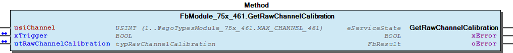
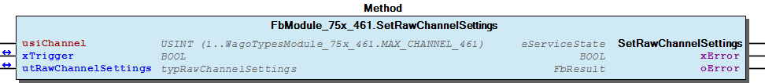
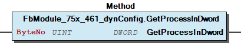
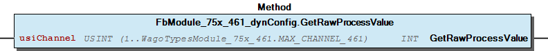

# WagoSysModule_75x_461 v1.9.9.0 (WAGO) - Complete Documentation


## 📋 Library Information

- **Company:** WAGO
- **Title:** WagoSysModule_75x_461
- **Version:** 1.9.9.0
- **Categories:** WAGO LayerView|Sys; Application
- **Author:** WAGO
- **Placeholder:** WagoSysModule_75x_461

### Description ¶


This document is automatically generated. Because of this, the chapter 30 Visualization is not shown in this document. If you are interested in getting to know more about visualization, we refer to the library manager of e!Cockpit.

Handling modules 75x-461 [1]

This document is automatically generated. Because of this, the chapter 30 Visualization is not shown in this document. If you are interested in getting to know more about visualization, we refer to the library manager of e!Cockpit. Handling modules 75x-461 [1]

### Contents: ¶


Contents: - Documentation Index - Project Information - Library Information - Function Blocks FbModule_75x_461 (FB) - FbModule_75x_461_dynConfig (FB) Methods - FbModule_75x_461.GetRawChannelCalibration (METH) - FbModule_75x_461.GetRawChannelConfiguration (METH) - FbModule_75x_461.GetRawChannelScaling (METH) - FbModule_75x_461.GetRawChannelSettings (METH) - FbModule_75x_461.SetRawChannelCalibration (METH) - FbModule_75x_461.SetRawChannelConfiguration (METH) - FbModule_75x_461.SetRawChannelScaling (METH) - FbModule_75x_461.SetRawChannelSettings (METH) - FbModule_75x_461_dynConfig.GetModuleInputSize (METH) - FbModule_75x_461_dynConfig.GetProcessInBit (METH) - ... and 5 more Program Organization Global Variable Lists - Error_461 (GVL) - VersionHistory (GVL) Other Components - 80 Status - Channel - I_ModuleProcessInputsExtended - I_Module_75x_461 - ProcessValues - eError_461 (ENUM)

### Indices and tables ¶


| [1] | Based on WagoSysModule_75x_461.library, last modified 19.06.2020, 17:30:26. The content of this file was automatically generated with None on 19.06.2020, 17:30:30 |

© WAGO Kontakttechnik GmbH & Co. KG, Germany 2018 – All rights reserved. For the avoidance of doubt, this copyright notice does not only apply to the information above but also and primarily to the described library itself. Please note that third-party products are always mentioned without reference to intellectual property rights, including patents, utility models, designs and trademarks, accordingly the existence of such rights cannot be excluded. WAGO is a registered trademark of WAGO Verwaltungsgesellschaft mbH.

- File and Project Information - Library Reference © WAGO Kontakttechnik GmbH & Co. KG, Germany 2018 – All rights reserved. For the avoidance of doubt, this copyright notice does not only apply to the information above but also and primarily to the described library itself. Please note that third-party products are always mentioned without reference to intellectual property rights, including patents, utility models, designs and trademarks, accordingly the existence of such rights cannot be excluded. WAGO is a registered trademark of WAGO Verwaltungsgesellschaft mbH.

### Documentation Index


## WagoSysModule_75x_461 Library Documentation


| Company: | WAGO |
| Title: | WagoSysModule_75x_461 |
| Version: | 1.9.9.0 |
| Categories: | WAGO LayerView\|Sys; Application |
| Author: | WAGO |
| Placeholder: | WagoSysModule_75x_461 |

### Description


This document is automatically generated. Because of this, the chapter 30 Visualization is not shown in this document. If you are interested in getting to know more about visualization, we refer to the library manager of e!Cockpit.

Handling modules 75x-461 [1]

This document is automatically generated. Because of this, the chapter 30 Visualization is not shown in this document. If you are interested in getting to know more about visualization, we refer to the library manager of e!Cockpit. Handling modules 75x-461 [1]

### Contents:


- 20 Program Organization Units FbModule_75x_461 (FB) - FbModule_75x_461_dynConfig (FB) 80 Status - Error_461 (GVL) - eError_461 (ENUM) VersionHistory (GVL)

### Indices and tables


| [1] | Based on WagoSysModule_75x_461.library, last modified 19.06.2020, 17:30:26. The content of this file was automatically generated with None on 19.06.2020, 17:30:30 |

© WAGO Kontakttechnik GmbH & Co. KG, Germany 2018 – All rights reserved. For the avoidance of doubt, this copyright notice does not only apply to the information above but also and primarily to the described library itself. Please note that third-party products are always mentioned without reference to intellectual property rights, including patents, utility models, designs and trademarks, accordingly the existence of such rights cannot be excluded. WAGO is a registered trademark of WAGO Verwaltungsgesellschaft mbH.

- File and Project Information - Library Reference © WAGO Kontakttechnik GmbH & Co. KG, Germany 2018 – All rights reserved. For the avoidance of doubt, this copyright notice does not only apply to the information above but also and primarily to the described library itself. Please note that third-party products are always mentioned without reference to intellectual property rights, including patents, utility models, designs and trademarks, accordingly the existence of such rights cannot be excluded. WAGO is a registered trademark of WAGO Verwaltungsgesellschaft mbH.

### Project Information


## File and Project Information


| Scope | Name | Type | Content |
| --- | --- | --- | --- |
| FileHeader | libraryFile | string | WagoSysModule_75x_461.library |
| contentFile | WagoSysModule_75x_461_clr.json |
| productName | e!COCKPIT |
| creationDateTime | date | 19.06.2020, 17:30:30 |
| companyName | string | WAGO |
| ProjectInformation | LastModificationDateTime | date | 19.06.2020, 17:30:26 |
| Description | string | See: Description |
| Copyright | © WAGO Kontakttechnik GmbH & Co. KG, Germany 2018 – All rights reserved. |
| Author | WAGO |
| AutoResolveUnbound | bool | True |
| Placeholder | string | WagoSysModule_75x_461 |
| Company | WAGO |
| DocFormat | reStructuredText |
| Project | WagoSysModule_75x_461 |
| Version | version | 1.9.9.0 |
| ActivateSigning | bool | False |
| Title | string | WagoSysModule_75x_461 |
| LibraryCategories | library-category-list | WAGO LayerView\|Sys; Application |
| Version string | string |  |

### Library Information


## Library Reference


| LinkAllContent: False QualifiedOnly: False | SystemLibrary: False | Optional: False |

| LinkAllContent: False QualifiedOnly: False | SystemLibrary: False | Optional: False |

| LinkAllContent: False QualifiedOnly: False | SystemLibrary: False | Optional: False |

| LinkAllContent: False Optional: False | QualifiedOnly: True SystemLibrary: False | PublishSymbolsInContainer: True |

| LinkAllContent: False QualifiedOnly: True | SystemLibrary: False PublishSymbolsInContainer: True | Optional: False |

| LinkAllContent: False Optional: False | QualifiedOnly: True SystemLibrary: False | PublishSymbolsInContainer: True |

This is a dictionary of all referenced libraries and their name spaces.

This is a dictionary of all referenced libraries and their name spaces. WagoSysErrorBase Library Identification : Placeholder: WagoSysErrorBase Default Resolution: WagoSysErrorBase, * (WAGO) Namespace: WagoSysErrorBase Library Properties : WagoSysModuleBaseProtected Library Identification : Placeholder: WagoSysModuleBaseProtected Default Resolution: WagoSysModuleBaseProtected, * (WAGO) Namespace: WagoSysModuleBaseProtected Library Properties : Library Parameter : Parameter: REGISTER_COM_TIMEOUT = TIME#5s0ms Parameter: PARAMETER_COM_TIMEOUT = TIME#5s0ms WagoSysVersion Library Identification : Name: WagoSysVersion Version: 1.0.0.0 Company: WAGO Namespace: WagoSysVersion Library Properties : WagoTypesCommon Library Identification : Placeholder: WagoTypesCommon Default Resolution: WagoTypesCommon, * (WAGO) Namespace: WagoTypes Library Properties : WagoTypesModuleBase Library Identification : Placeholder: WagoTypesModuleBase Default Resolution: WagoTypesModuleBase, * (WAGO) Namespace: WagoTypesModuleBase Library Properties : Library Parameter : Parameter: MAX_MBX_SIZE = 18 WagoTypesModule_75x_461 Library Identification : Placeholder: WagoTypesModule_75x_461 Default Resolution: WagoTypesModule_75x_461, * (WAGO) Namespace: WagoTypesModule_75x_461 Library Properties :

### Function Blocks


## FbModule_75x_461 (FB)


| Scope | Name | Type | Inherited from |
| --- | --- | --- | --- |
| Output | oError | WagoSysErrorBase.FbResult | FbModuleBase |

Function description

Interface variables Function Access to the module 750-451 without PA-Access. For the PA-Acces you have to made the mapping. Function description This block is needed for each module. The instance of this function block is either automatically generated by the K-Bus configuration. - I_Module_75x_461 Channel FbModule_75x_461.GetRawChannelCalibration (METH) - FbModule_75x_461.GetRawChannelScaling (METH) - FbModule_75x_461.GetRawChannelSettings (METH) - FbModule_75x_461.SetRawChannelCalibration (METH) - FbModule_75x_461.SetRawChannelScaling (METH) - FbModule_75x_461.SetRawChannelSettings (METH) FbModule_75x_461.GetRawChannelConfiguration (METH) FbModule_75x_461.SetRawChannelConfiguration (METH)

## FbModule_75x_461_dynConfig (FB)


| Scope | Name | Type | Inherited from |
| --- | --- | --- | --- |
| Output | oError | WagoSysErrorBase.FbResult | FbModuleBase |

Function description

Interface variables Function Access to the module 750-451 with PA-Access. In case of dynamic configuration the FB provides additional the PA-Access. Function description This block is needed for each module. The instance of this function block has to be manually added in case of the dynamic configuration. - I_ModuleProcessInputsExtended FbModule_75x_461_dynConfig.GetModuleInputSize (METH) - FbModule_75x_461_dynConfig.GetProcessInBit (METH) - FbModule_75x_461_dynConfig.GetProcessInByte (METH) - FbModule_75x_461_dynConfig.GetProcessInData (METH) - FbModule_75x_461_dynConfig.GetProcessInDword (METH) - FbModule_75x_461_dynConfig.GetProcessInWord (METH) ProcessValues - FbModule_75x_461_dynConfig.GetRawProcessValue (METH)

### Methods


## FbModule_75x_461.GetRawChannelCalibration (METH)


| Scope | Name | Type |
| --- | --- | --- |
| Return | GetRawChannelCalibration | WagoTypesModuleBase.eServiceState |
| Input | usiChannel | USINT (1..WagoTypesModule_75x_461.MAX_CHANNEL_461) |
| Inout | xTrigger | BOOL |
| utRawChannelCalibration | WagoTypesModule_75x_461.typRawChannelCalibration |
| Output | xError | BOOL |
| oError | WagoSysErrorBase.FbResult |

| Struct member | Value | Description |
| --- | --- | --- |
| iCalibrationOffset | -32768 ... 32767 |  |
| uiCalibrationGain | 0 ... 65535 |  |
| iTwoWireOffset | -32768 ... 32767 |  |

```
VAR
    //--- Channel Calibration ---------------------------------
    utChannelCalibration    :   WagoTypesModule_75x_461.typRawChannelCalibration;
    xGetChannelCalibration  :   BOOL;
    oError                  :   WagoSysErrorBase.FbResult;
END_VAR

//--- C H A N N E L    C A L I B R A T I O N -----------------------
CASE my461.GetRawChannelCalibration(    usiChannel              := 1,
                                        xTrigger                := xGetChannelCalibration,
                                        utRawChannelCalibration := utChannelCalibration,
                                        oError                  => oError
                                    ) OF

    eServiceState.DONE : // OK
            ;// process here your utModuleSettings

    eServiceState.ABORT : // Error
            ;// process here your error handling -> see oError for more information

END_CASE
```

Get the complete raw channel calibration of one channel, specified by usiChannel in a struct.

WagoTypesModule_75x_461.typRawChannelCalibration

Graphical Illustration

Graphical Interface of FbModule_75x_461.GetRawChannelCalibration

For get the raw calibration from first channel of the module.

You have to call the method cyclic until the method returns with DONE or ABORT.

Interface variables Function Get the complete raw channel calibration of one channel, specified by usiChannel in a struct. WagoTypesModule_75x_461.typRawChannelCalibration Graphical Illustration  Graphical Interface of FbModule_75x_461.GetRawChannelCalibration Example For get the raw calibration from first channel of the module. Note You have to call the method cyclic until the method returns with DONE or ABORT.

## FbModule_75x_461.GetRawChannelConfiguration (METH)


| Scope | Name | Type |
| --- | --- | --- |
| Return | GetRawChannelConfiguration | WagoTypesModuleBase.eServiceState |
| Input | usiChannel | USINT (1..WagoTypesModule_75x_461.MAX_CHANNEL_461) |
| Inout | xTrigger | BOOL |
| utRawChannelConfiguration | WagoTypesModule_75x_461.typRawChannelConfiguration |
| Output | xError | BOOL |
| oError | WagoSysErrorBase.FbResult |

| Struct member | Value | Description |
| --- | --- | --- |
| eSensorType | Pt100 | -200 °C...850 °C |
| Ni100 | -60 °C...250 °C |
| Pt1000 | -200 °C...850 °C |
| Pt500 | -200 °C...850 °C |
| Pt200 | -200 °C...850 °C |
| Ni1000 | -60 °C...250 °C |
| Ni120 | -80 °C...260 °C |
| Resistor_1 | 10 Ω...5 kΩ |
| Resistor_2 | 10 Ω...1.2 kΩ |
| eWireMode | TWO_WIRE | 2-Wire Connection |
| THREE_WIRE | 3-Wire Connection |
| xEnableStatusBits | FALSE | Statusbits disabled |
| TRUE | Statusbits enabled |
| xEnableWatchdog | FALSE | Watchdog disabled |
| TRUE | Watchdog enabled |
| xAmountSignFormat | FALSE | Numeric values appear in two’s complement |
| TRUE | Numeric values appear in amount / sign format |
| eNotchFilter | ENABLED_12_5HZ | 12.5Hz -> 500ms |
| ENABLED_25HZ | 25Hz -> 250ms |
| ENABLED_50HZ | 50Hz -> 125ms |
| ENABLED_60HZ | 60Hz -> 110ms |
| ENABLED_100HZ | 100Hz -> 65ms |
| ENABLED_200HZ | 200Hz -> 32ms |
| ENABLED_400HZ | 400Hz -> 150ms |
| xEnableOverrangeProtection | FALSE | Overrange Protection disabled |
| TRUE | Overrange Protection enabled |
| xUserScaling | FALSE | User Scaling disabled -> Manufacturer Scaling ON |
| TRUE | User Scaling enabled -> Manufacturer Scaling OFF |
| iUserScalingOffset | -32768 ... 32767 | User Scaling Offset |
| iUserScalingGain | -32768 ... 32767 | User Scaling Gain * 0.00391 |

| Return Value | Description |
| --- | --- |
| WagoTypesModuleBase.eServiceState.DONE | successful |
| WagoTypesModuleBase.eServiceState.ABORT | error -> see oError |
| WagoTypesModuleBase.eServiceState.NO_DATA | call while xTrigger is reset |

```
VAR
    //--- Channel Configuration -------------------------------------------------------
    utRawChannelConfiguration   :   WagoTypesModule_75x_461.typRawChannelConfiguration;
    oError                      :   WagoSysErrorBase.FbResult;
    xGetRawChannelConfiguration :   BOOL;
END_VAR

//--- R A W   C H A N N E L   C O N F I G U R A T I O N ----------------------
CASE my461.RawGetChannelConfiguration(1, xGetRawChannelConfiguration, utRawChannelConfiguration, oError => oError) OF

    eServiceState.DONE : // OK
            ;// process here your utRawChannelConfiguration

    eServiceState.ABORT : // Error
            ;// process here your error handling -> see oError for more information

END_CASE
```

Get the complete raw configuration of one channel, specified by usiChannel in a struct.

WagoTypesModule_75x_461.typRawChannelConfiguration

Return Values

It is not allowed to reset the xTrigger by the application. This must done by the method.

Graphical Illustration

Graphical Interface of FbModule_75x_461.GetRawChannelConfiguration

Example for ST

For get the raw configuration of the first channel

You have to call the method cyclic until the method returns with DONE or ABORT.

Interface variables Function Get the complete raw configuration of one channel, specified by usiChannel in a struct. WagoTypesModule_75x_461.typRawChannelConfiguration Return Values Warning It is not allowed to reset the xTrigger by the application. This must done by the method. Graphical Illustration  Graphical Interface of FbModule_75x_461.GetRawChannelConfiguration Example for ST For get the raw configuration of the first channel Note You have to call the method cyclic until the method returns with DONE or ABORT.

## FbModule_75x_461.GetRawChannelScaling (METH)


| Scope | Name | Type |
| --- | --- | --- |
| Return | GetRawChannelScaling | WagoTypesModuleBase.eServiceState |
| Input | usiChannel | USINT (1..WagoTypesModule_75x_461.MAX_CHANNEL_461) |
| Inout | xTrigger | BOOL |
| utRawChannelScaling | WagoTypesModule_75x_461.typRawChannelScaling |
| Output | xError | BOOL |
| oError | WagoSysErrorBase.FbResult |

| Struct member | Value | Description |
| --- | --- | --- |
| xUserScaling | FALSE | User scaling disabled -> use manufacturer scaling |
| TRUE | User scaling enabled |
| iUserScalingOffset | -32768 ... 32767 | User scaling Offset |
| uiUserScalingGain | 0 ... 65535 | User scaling Gain |

```
VAR
    //--- Channel Settings ---------------------------------
    utChannelScaling    :   WagoTypesModule_75x_461.typRawChannelScaling;
    xGetChannelScaling  :   BOOL;
    oError              :   WagoSysErrorBase.FbResult;
END_VAR

//--- C H A N N E L   S C A L I N G ------------------------
CASE my461.GetRawChannelScaling(    usiChannel           := 1,
                                    xTrigger             := xGetChannelScaling,
                                    utRawChannelScaling  := utChannelScaling,
                                    oError               => oError
                                ) OF

    eServiceState.DONE : // OK
            ;// process here your utModuleSettings

    eServiceState.ABORT : // Error
            ;// process here your error handling -> see oError for more information

END_CASE
```

Get the scaling of a channel at a struct.

WagoTypesModule_75x_461.typRawChannelScaling

Graphical Illustration

Graphical Interface of FbModule_75x_461.GetRawChannelScaling

For get the scaling from channel one

You have to call the method cyclic until the method returns with DONE or ABORT.

Interface variables Function Get the scaling of a channel at a struct. WagoTypesModule_75x_461.typRawChannelScaling Graphical Illustration  Graphical Interface of FbModule_75x_461.GetRawChannelScaling Example For get the scaling from channel one Note You have to call the method cyclic until the method returns with DONE or ABORT.

## FbModule_75x_461.GetRawChannelSettings (METH)


| Scope | Name | Type |
| --- | --- | --- |
| Return | GetRawChannelSettings | WagoTypesModuleBase.eServiceState |
| Input | usiChannel | USINT (1..WagoTypesModule_75x_461.MAX_CHANNEL_461) |
| Inout | xTrigger | BOOL |
| utRawChannelSettings | WagoTypesModule_75x_461.typRawChannelSettings |
| Output | xError | BOOL |
| oError | WagoSysErrorBase.FbResult |

| Struct member | Value | Description |
| --- | --- | --- |
| eSensorType | Pt100 | -200 °C...850 °C |
| Ni100 | -60 °C...250 °C |
| Pt1000 | -200 °C...850 °C |
| Pt500 | -200 °C...850 °C |
| Pt200 | -200 °C...850 °C |
| Ni1000 | -60 °C...250 °C |
| Ni120 | -80 °C...260 °C |
| Resistor_1 | 10 Ω...5 kΩ |
| Resistor_2 | 10 Ω...1.2 kΩ |
| eWireMode | TWO_WIRE | 2-Wire Connection |
| THREE_WIRE | 3-Wire Connection |
| xEnableStatusBits | FALSE | Statusbits disabled |
| TRUE | Statusbits enabled |
| xEnableWatchdog | FALSE | Watchdog disabled |
| TRUE | Watchdog enabled |
| xAmountSignFormat | FALSE | Numeric values appear in two’s complement |
| TRUE | Numeric values appear in amount / sign format |
| eNotchFilter | ENABLED_12_5HZ | 12.5Hz -> 500ms |
| ENABLED_25HZ | 25Hz -> 250ms |
| ENABLED_50HZ | 50Hz -> 125ms |
| ENABLED_60HZ | 60Hz -> 110ms |
| ENABLED_100HZ | 100Hz -> 65ms |
| ENABLED_200HZ | 200Hz -> 32ms |
| ENABLED_400HZ | 400Hz -> 150ms |
| xEnableOverrangeProtection | FALSE | Overrange Protection disabled |
| TRUE | Overrange Protection enabled |

```
VAR
    //--- Channel Settings ---------------------------------
    utChannelSettings   :   WagoTypesModule_75x_461.typRawChannelSettings;
    xGetChannelSettings :   BOOL;
    oError              :   WagoSysErrorBase.FbResult;
END_VAR

//--- C H A N N E L   S E T T I N G S ----------------------
CASE my461.GetRawChannelSettings(   usiChannel           := 1,
                                    xTrigger             := xGetChannelSettings,
                                    utRawChannelSettings := utChannelSettings,
                                    oError               => oError
                                ) OF

    eServiceState.DONE : // OK
        ;// process here your utModuleSettings

    eServiceState.ABORT : // Error
        ;// process here your error handling -> see oError for more information

END_CASE
```

Get the settings of a channel at a struct.

WagoTypesModule_75x_461.typRawChannelSettings

Graphical Illustration

Graphical Interface of FbModule_75x_461.GetRawChannelSettings

For get the settings from channel one

You have to call the method cyclic until the method returns with DONE or ABORT.

Interface variables Function Get the settings of a channel at a struct. WagoTypesModule_75x_461.typRawChannelSettings Graphical Illustration  Graphical Interface of FbModule_75x_461.GetRawChannelSettings Example For get the settings from channel one Note You have to call the method cyclic until the method returns with DONE or ABORT.

## FbModule_75x_461.SetRawChannelCalibration (METH)


| Scope | Name | Type |
| --- | --- | --- |
| Return | SetRawChannelCalibration | WagoTypesModuleBase.eServiceState |
| Input | usiChannel | USINT (1..WagoTypesModule_75x_461.MAX_CHANNEL_461) |
| Inout | xTrigger | BOOL |
| utRawChannelCalibration | WagoTypesModule_75x_461.typRawChannelCalibration |
| Output | xError | BOOL |
| oError | WagoSysErrorBase.FbResult |

| Struct member | Value | Description |
| --- | --- | --- |
| iCalibrationOffset | -32768 ... 32767 |  |
| uiCalibrationGain | 0 ... 65535 |  |
| iTwoWireOffset | -32768 ... 32767 |  |

```
VAR
    //--- Channel Calibration ---------------------------------
    utChannelCalibration    :   WagoTypesModule_75x_461.typRawChannelCalibration;
    xSetChannelCalibration  :   BOOL;
    oError                  :   WagoSysErrorBase.FbResult;
END_VAR

//--- C H A N N E L    C A L I B R A T I O N -----------------------
CASE my461.SetRawChannelCalibration(    usiChannel              := 1,
                                        xTrigger                := xSetChannelCalibration,
                                        utRawChannelCalibration := utChannelCalibration,
                                        oError                  => oError
                                   ) OF

    eServiceState.DONE : // OK
            ;// process here your utModuleSettings

    eServiceState.ABORT : // Error
            ;// process here your error handling -> see oError for more information

END_CASE
```

Set the calibration of a channel by a struct.

WagoTypesModule_75x_461.typRawChannelCalibration

Graphical Illustration

Graphical Interface of FbModule_75x_461.SetRawChannelCalibration

For set the calibration of channel one

You have to call the method cyclic until the method returns with DONE or ABORT.

Interface variables Function Set the calibration of a channel by a struct. WagoTypesModule_75x_461.typRawChannelCalibration Graphical Illustration  Graphical Interface of FbModule_75x_461.SetRawChannelCalibration Example For set the calibration of channel one Note You have to call the method cyclic until the method returns with DONE or ABORT.

## FbModule_75x_461.SetRawChannelConfiguration (METH)


| Scope | Name | Type |
| --- | --- | --- |
| Return | SetRawChannelConfiguration | WagoTypesModuleBase.eServiceState |
| Input | usiChannel | USINT (1..WagoTypesModule_75x_461.MAX_CHANNEL_461) |
| Inout | xTrigger | BOOL |
| utRawChannelConfiguration | WagoTypesModule_75x_461.typRawChannelConfiguration |
| Output | xError | BOOL |
| oError | WagoSysErrorBase.FbResult |

| Struct member | Value | Description |
| --- | --- | --- |
| eSensorType | Pt100 | -200 °C...850 °C |
| Ni100 | -60 °C...250 °C |
| Pt1000 | -200 °C...850 °C |
| Pt500 | -200 °C...850 °C |
| Pt200 | -200 °C...850 °C |
| Ni1000 | -60 °C...250 °C |
| Ni120 | -80 °C...260 °C |
| Resistor_1 | 10 Ω...5 kΩ |
| Resistor_2 | 10 Ω...1.2 kΩ |
| eWireMode | TWO_WIRE | 2-Wire Connection |
| THREE_WIRE | 3-Wire Connection |
| xEnableStatusBits | FALSE | Statusbits disabled |
| TRUE | Statusbits enabled |
| xEnableWatchdog | FALSE | Watchdog disabled |
| TRUE | Watchdog enabled |
| xAmountSignFormat | FALSE | Numeric values appear in two’s complement |
| TRUE | Numeric values appear in amount / sign format |
| eNotchFilter | ENABLED_12_5HZ | 12.5Hz -> 500ms |
| ENABLED_25HZ | 25Hz -> 250ms |
| ENABLED_50HZ | 50Hz -> 125ms |
| ENABLED_60HZ | 60Hz -> 110ms |
| ENABLED_100HZ | 100Hz -> 65ms |
| ENABLED_200HZ | 200Hz -> 32ms |
| ENABLED_400HZ | 400Hz -> 150ms |
| xEnableOverrangeProtection | FALSE | Overrange Protection disabled |
| TRUE | Overrange Protection enabled |
| xUserScaling | FALSE | User Scaling disabled -> Manufacturer Scaling ON |
| TRUE | User Scaling enabled -> Manufacturer Scaling OFF |
| iUserScalingOffset | -32768 ... 32767 | User Scaling Offset |
| iUserScalingGain | -32768 ... 32767 | User Scaling Gain * 0.00391 |

| Return Value | Description |
| --- | --- |
| WagoTypesModuleBase.eServiceState.DONE | successful |
| WagoTypesModuleBase.eServiceState.ABORT | error -> see oError |
| WagoTypesModuleBase.eServiceState.NO_DATA | call while xTrigger is reset |

```
VAR
    //--- Channel Configuration -------------------------------------------------------
    xStartProcess               :   BOOL; // set this variable once to start the process -> this varibale will be automatic reset
    utRawChannelConfiguration   :   WagoTypesModule_75x_461.typRawChannelConfiguration;
    oError                      :   WagoSysErrorBase.FbResult;
    xSetRawChannelConfiguration :   BOOL;
END_VAR

//--- R A W   C H A N N E L   C O N F I G U R A T I O N ----------------------

//--- READ BEFORE WRITE --------------------------------------------------------------
CASE my461.RawGetChannelConfiguration( 1, xStartProcess, utRawChannelConfiguration, oError => oError) OF

    eServiceState.DONE : // OK -> actual configuration is successful read
        // change here your configuration
        // utRawChannelConfiguration... :=
        xSetRawChannelConfiguration := TRUE; // trigger write

    eServiceState.ABORT : // Error -> not able to read -> see oError
            ;// process here your error handling for read -> see oError for more information

END_CASE

//--- WRITE MODYFIED CONFIGURATION ---------------------------------------------------
CASE my461.RawSetChannelConfiguration( 1, xSetRawChannelConfiguration, utRawChannelConfiguration, oError => oError) OF

    eServiceState.DONE : // OK -> new configuration is written

    eServiceState.ABORT : // Error -> not able to write -> see oError
            ;// process here your error handling for write -> see oError for more information

END_CASE
```

Set the complete raw configuration of one channel, specified by usiChannel and the struct utRawChannelConfiguration . This struct have to contain all configuration parameters.

Recommendation : You should read out all raw configuration in this struct before you write the raw configuration. So you have to change only the needed paramneters between read and write.

WagoTypesModule_75x_461.typRawChannelConfiguration

Return Values

It is not allowed to reset the xTrigger by the application. This must done by the method.

Graphical Illustration

Graphical Interface of FbModule_75x_461.SetRawChannelConfiguration

Example for ST

For get the raw configuration of the first channel and after this change some parameters before it write back to the module.

You have to call the method cyclic until the method returns with DONE or ABORT.

Interface variables Function Set the complete raw configuration of one channel, specified by usiChannel and the struct utRawChannelConfiguration . This struct have to contain all configuration parameters. Note Recommendation : You should read out all raw configuration in this struct before you write the raw configuration. So you have to change only the needed paramneters between read and write. WagoTypesModule_75x_461.typRawChannelConfiguration Return Values Warning It is not allowed to reset the xTrigger by the application. This must done by the method. Graphical Illustration  Graphical Interface of FbModule_75x_461.SetRawChannelConfiguration Example for ST For get the raw configuration of the first channel and after this change some parameters before it write back to the module. Note You have to call the method cyclic until the method returns with DONE or ABORT.

## FbModule_75x_461.SetRawChannelScaling (METH)


| Scope | Name | Type |
| --- | --- | --- |
| Return | SetRawChannelScaling | WagoTypesModuleBase.eServiceState |
| Input | usiChannel | USINT (1..WagoTypesModule_75x_461.MAX_CHANNEL_461) |
| Inout | xTrigger | BOOL |
| utRawChannelScaling | WagoTypesModule_75x_461.typRawChannelScaling |
| Output | xError | BOOL |
| oError | WagoSysErrorBase.FbResult |

| Struct member | Value | Description |
| --- | --- | --- |
| xUserScaling | FALSE | User scaling disabled -> use manufacturer scaling |
| TRUE | User scaling enabled |
| iUserScalingOffset | -32768 ... 32767 | User scaling Offset |
| uiUserScalingGain | 0 ... 65535 | User scaling Gain |

```
VAR
    //--- Channel Settings ---------------------------------
    utChannelScaling    :   WagoTypesModule_75x_461.typRawChannelScaling;
    xSetChannelScaling  :   BOOL;
    oError              :   WagoSysErrorBase.FbResult;
END_VAR

//--- C H A N N E L   S C A L I N G ------------------------
CASE my461.SetRawChannelScaling(    usiChannel          := 1,
                                    xTrigger            := xSetChannelScaling,
                                    utRawChannelScaling := utChannelScaling,
                                    oError              => oError
                                ) OF

    eServiceState.DONE : // OK
            ;// process here your utModuleSettings

    eServiceState.ABORT : // Error
            ;// process here your error handling -> see oError for more information

END_CASE
```

Set the scaling of a channel by a struct.

WagoTypesModule_75x_461.typRawChannelScaling

Graphical Illustration

Graphical Interface of FbModule_75x_461.SetRawChannelScaling

For set the scaling of channel one

You have to call the method cyclic until the method returns with DONE or ABORT.

Interface variables Function Set the scaling of a channel by a struct. WagoTypesModule_75x_461.typRawChannelScaling Graphical Illustration  Graphical Interface of FbModule_75x_461.SetRawChannelScaling Example For set the scaling of channel one Note You have to call the method cyclic until the method returns with DONE or ABORT.

## FbModule_75x_461.SetRawChannelSettings (METH)


| Scope | Name | Type |
| --- | --- | --- |
| Return | SetRawChannelSettings | WagoTypesModuleBase.eServiceState |
| Input | usiChannel | USINT (1..WagoTypesModule_75x_461.MAX_CHANNEL_461) |
| Inout | xTrigger | BOOL |
| utRawChannelSettings | WagoTypesModule_75x_461.typRawChannelSettings |
| Output | xError | BOOL |
| oError | WagoSysErrorBase.FbResult |

| Struct member | Value | Description |
| --- | --- | --- |
| eSensorType | Pt100 | -200 °C...850 °C |
| Ni100 | -60 °C...250 °C |
| Pt1000 | -200 °C...850 °C |
| Pt500 | -200 °C...850 °C |
| Pt200 | -200 °C...850 °C |
| Ni1000 | -60 °C...250 °C |
| Ni120 | -80 °C...260 °C |
| Resistor_1 | 10 Ω...5 kΩ |
| Resistor_2 | 10 Ω...1.2 kΩ |
| eWireMode | TWO_WIRE | 2-Wire Connection |
| THREE_WIRE | 3-Wire Connection |
| xEnableStatusBits | FALSE | Statusbits disabled |
| TRUE | Statusbits enabled |
| xEnableWatchdog | FALSE | Watchdog disabled |
| TRUE | Watchdog enabled |
| xAmountSignFormat | FALSE | Numeric values appear in two’s complement |
| TRUE | Numeric values appear in amount / sign format |
| eNotchFilter | ENABLED_12_5HZ | 12.5Hz -> 500ms |
| ENABLED_25HZ | 25Hz -> 250ms |
| ENABLED_50HZ | 50Hz -> 125ms |
| ENABLED_60HZ | 60Hz -> 110ms |
| ENABLED_100HZ | 100Hz -> 65ms |
| ENABLED_200HZ | 200Hz -> 32ms |
| ENABLED_400HZ | 400Hz -> 150ms |
| xEnableOverrangeProtection | FALSE | Overrange Protection disabled |
| TRUE | Overrange Protection enabled |

```
VAR
    //--- Channel Settings ---------------------------------
    utChannelSettings   :   WagoTypesModule_75x_461.typRawChannelSettings;
    xSetChannelSettings :   BOOL;
    oError              :   WagoSysErrorBase.FbResult;
END_VAR

//--- C H A N N E L   S E T T I N G S ----------------------
CASE my461.SetRawChannelSettings(   usiChannel           := 1,
                                    xTrigger             := xSetChannelSettings,
                                    utRawChannelSettings := utChannelSettings,
                                    oError               => oError
                                ) OF

    eServiceState.DONE : // OK
        ;// process here your utModuleSettings

    eServiceState.ABORT : // Error
        ;// process here your error handling -> see oError for more information

END_CASE
```

Set the settings for a channel by a struct.

WagoTypesModule_75x_461.typRawChannelSettings

Graphical Illustration

Graphical Interface of FbModule_75x_461.SetRawChannelSettings

For set the settings of channel one

You have to call the method cyclic until the method returns with DONE or ABORT.

Interface variables Function Set the settings for a channel by a struct. WagoTypesModule_75x_461.typRawChannelSettings Graphical Illustration  Graphical Interface of FbModule_75x_461.SetRawChannelSettings Example For set the settings of channel one Note You have to call the method cyclic until the method returns with DONE or ABORT.

## FbModule_75x_461_dynConfig.GetModuleInputSize (METH)


| Scope | Name | Type |
| --- | --- | --- |
| Return | GetModuleInputSize | UINT |

Returns the byte size of input data

Interface variables Returns the byte size of input data

## FbModule_75x_461_dynConfig.GetProcessInBit (METH)


| Scope | Name | Type | Comment |
| --- | --- | --- | --- |
| Return | GetProcessInBit | BOOL |  |
| Input | ByteNo | UINT | range 0..(_uiInputSize - 1) |
| BitNo | USINT | range 0..7 |

## FbModule_75x_461_dynConfig.GetProcessInByte (METH)


| Scope | Name | Type | Comment |
| --- | --- | --- | --- |
| Return | GetProcessInByte | BYTE |  |
| Input | ByteNo | UINT | range 0..(_uiInputSize - 1) |

## FbModule_75x_461_dynConfig.GetProcessInData (METH)


| Scope | Name | Type | Comment |
| --- | --- | --- | --- |
| Return | GetProcessInData | UINT |  |
| Input | pInData | POINTER TO BYTE | pointer to the area where the process data should store |
| uiNInData | UINT | SIZEOF(Buffer) |

## FbModule_75x_461_dynConfig.GetProcessInDword (METH)


| Scope | Name | Type | Comment |
| --- | --- | --- | --- |
| Return | GetProcessInDword | DWORD |  |
| Input | ByteNo | UINT | range 0..(_uiInputSize - 4) |

Graphical Illustration

Graphical Interface of FbModule_75x_461_dynConfig.GetProcessInDword

Interface variables Function Get the process input dword specified by ByteNo of this module. Graphical Illustration  Graphical Interface of FbModule_75x_461_dynConfig.GetProcessInDword

## FbModule_75x_461_dynConfig.GetProcessInWord (METH)


| Scope | Name | Type | Comment |
| --- | --- | --- | --- |
| Return | GetProcessInWord | WORD |  |
| Input | ByteNo | UINT | range 0..(_uiInputSize - 2) |

Graphical Illustration

Graphical Interface of FbModule_75x_461_dynConfig.GetProcessInWord

Interface variables Function Get the process input word specified by ByteNo of this module. Graphical Illustration  Graphical Interface of FbModule_75x_461_dynConfig.GetProcessInWord

## FbModule_75x_461_dynConfig.GetRawProcessValue (METH)


| Scope | Name | Type |
| --- | --- | --- |
| Return | GetRawProcessValue | INT |
| Input | usiChannel | USINT (1..WagoTypesModule_75x_461.MAX_CHANNEL_461) |

```
VAR
    myiProcessValue :   INT;
END_VAR

myiProcessValue := my461.GetProcessValue(1); // here is the process raw value as INT
```

Get the raw process value of the wanted channel. The return value is unscaled in the range -32768 .. 37767.

In case of error (e.g. an invalid channel number is given) it returns 0.

Graphical Illustration

Graphical Interface of FbModule_75x_461_dynConfig.GetRawProcessValue

Interface variables Function Get the raw process value of the wanted channel. The return value is unscaled in the range -32768 .. 37767. In case of error (e.g. an invalid channel number is given) it returns 0. Graphical Illustration  Graphical Interface of FbModule_75x_461_dynConfig.GetRawProcessValue Example For get the process value from first channel of the module.

### Program Organization


## 20 Program Organization Units


- FbModule_75x_461 (FB) I_Module_75x_461 Channel FbModule_75x_461.GetRawChannelCalibration (METH) - FbModule_75x_461.GetRawChannelScaling (METH) - FbModule_75x_461.GetRawChannelSettings (METH) - FbModule_75x_461.SetRawChannelCalibration (METH) - FbModule_75x_461.SetRawChannelScaling (METH) - FbModule_75x_461.SetRawChannelSettings (METH) FbModule_75x_461.GetRawChannelConfiguration (METH) FbModule_75x_461.SetRawChannelConfiguration (METH) FbModule_75x_461_dynConfig (FB) - I_ModuleProcessInputsExtended FbModule_75x_461_dynConfig.GetModuleInputSize (METH) - FbModule_75x_461_dynConfig.GetProcessInBit (METH) - FbModule_75x_461_dynConfig.GetProcessInByte (METH) - FbModule_75x_461_dynConfig.GetProcessInData (METH) - FbModule_75x_461_dynConfig.GetProcessInDword (METH) - FbModule_75x_461_dynConfig.GetProcessInWord (METH) ProcessValues - FbModule_75x_461_dynConfig.GetRawProcessValue (METH)

### Global Variable Lists


## Error_461 (GVL)


| Scope | Name | Type |
| --- | --- | --- |
| Constant | ERROR_461 | ARRAY [0..3] OF WagoTypesErrorBase.typResultItem |

| Value | Level | Description |
| --- | --- | --- |
| eError_461.OK | WagoTypesErrorBase.eSeverity.none | ‘OK’ |
| eError_461.INVALID_CHANNEL | WagoTypesErrorBase.eSeverity.error | ‘The wanted channel number is not allowed’ |
| eError_461.UNKNOWN_SENSOR_TYPE | WagoTypesErrorBase.eSeverity.error | ‘Not supported sensor type’ |
| eError_461.UNKNOWN_NOTCH_FILTER | WagoTypesErrorBase.eSeverity.error | ‘Not supported notch filter’ |

## VersionHistory (GVL)


| Name | Type |
| --- | --- |
| Info | ProjectInfo |

| date | version | author | change |
| 05.06.2020 | 1.9.9.0 | u010545 | change to WagoSysModuleBaseProtected 1.9.9.0 |
| 30.08.2019 | 1.9.4.1 | u010545 | Bugfix Byteorder I_ModuleProcessInputsExtended |
| 06.08.2019 | 1.9.4.0 | u010545 | Interface for dyn config pa access added |
| 16.07.2019 | 1.9.3.0 | u010545 | Interface for dyn config added |
| 08.01.2019 | 1.9.2.0 | u015842 | Properties: free placeholder added |
| 23.04.2018 | 1.9.1.3 | u010545 | update documentation |
| 16.02.2018 | 1.9.1.2 | u010545 | allow 750-461/025-000 to change parameter |
| 03.01.2018 | 1.9.1.1 | u010545 | bugfix |
| 24.11.2017 | 1.9.1.0 | u010545 | check for ordernumber implemented |
| 12.10.2017 | 1.9.0.2 | u010545 | unifications |
| 09.10.2017 | 1.9.0.1 | u010545 | channel quantity modified |
| 29.07.2017 | 1.9.0.0 | u010545 | changed for compability with old WagoSysModuleBase |
| 26.09.2017 | 1.0.0.0 | u010545 | first release |
| 20.09.2017 | 0.0.0.1 | u010545 | created |

WagoSysModule_75x_461.library

Release Notes:

WagoSysModule_75x_461.library Release Notes:

### Other Components


## 80 Status ¶


- Error_461 (GVL) - eError_461 (ENUM)

## Channel


- FbModule_75x_461.GetRawChannelCalibration (METH) - FbModule_75x_461.GetRawChannelScaling (METH) - FbModule_75x_461.GetRawChannelSettings (METH) - FbModule_75x_461.SetRawChannelCalibration (METH) - FbModule_75x_461.SetRawChannelScaling (METH) - FbModule_75x_461.SetRawChannelSettings (METH)

## I_ModuleProcessInputsExtended


- FbModule_75x_461_dynConfig.GetModuleInputSize (METH) - FbModule_75x_461_dynConfig.GetProcessInBit (METH) - FbModule_75x_461_dynConfig.GetProcessInByte (METH) - FbModule_75x_461_dynConfig.GetProcessInData (METH) - FbModule_75x_461_dynConfig.GetProcessInDword (METH) - FbModule_75x_461_dynConfig.GetProcessInWord (METH)

## I_Module_75x_461


- Channel FbModule_75x_461.GetRawChannelCalibration (METH) - FbModule_75x_461.GetRawChannelScaling (METH) - FbModule_75x_461.GetRawChannelSettings (METH) - FbModule_75x_461.SetRawChannelCalibration (METH) - FbModule_75x_461.SetRawChannelScaling (METH) - FbModule_75x_461.SetRawChannelSettings (METH) FbModule_75x_461.GetRawChannelConfiguration (METH) FbModule_75x_461.SetRawChannelConfiguration (METH)

## ProcessValues


- FbModule_75x_461_dynConfig.GetRawProcessValue (METH)

## eError_461 (ENUM)


| Name | Initial | Comment |
| --- | --- | --- |
| OK | 0 | all is well |
| INVALID_CHANNEL | 1 | invalid channel number |
| UNKNOWN_SENSOR_TYPE | 2 |  |
| UNKNOWN_NOTCH_FILTER | 3 |  |