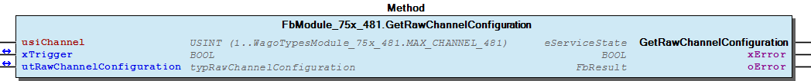
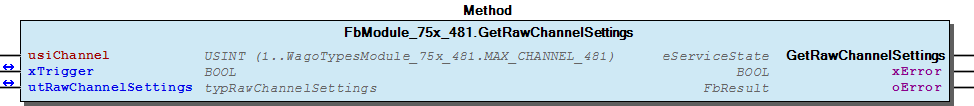
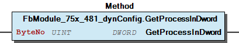
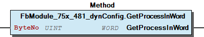
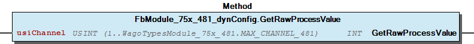

# WagoSysModule_75x_481 v1.9.9.0 (WAGO) - Complete Documentation


## 📋 Library Information

- **Company:** WAGO
- **Title:** WagoSysModule_75x_481
- **Version:** 1.9.9.0
- **Categories:** WAGO LayerView|Sys; Application
- **Author:** WAGO
- **Placeholder:** WagoSysModule_75x_481

### Description ¶


This document is automatically generated. Because of this, the chapter 30 Visualization is not shown in this document. If you are interested in getting to know more about visualization, we refer to the library manager of e!Cockpit.

Handling modules 75x-481 [1]

This document is automatically generated. Because of this, the chapter 30 Visualization is not shown in this document. If you are interested in getting to know more about visualization, we refer to the library manager of e!Cockpit. Handling modules 75x-481 [1]

### Contents: ¶


Contents: - Documentation Index - Project Information - Library Information - Function Blocks FbModule_75x_481 (FB) - FbModule_75x_481_dynConfig (FB) Methods - FbModule_75x_481.GetRawChannelCalibration (METH) - FbModule_75x_481.GetRawChannelConfiguration (METH) - FbModule_75x_481.GetRawChannelScaling (METH) - FbModule_75x_481.GetRawChannelSettings (METH) - FbModule_75x_481.SetRawChannelCalibration (METH) - FbModule_75x_481.SetRawChannelConfiguration (METH) - FbModule_75x_481.SetRawChannelScaling (METH) - FbModule_75x_481.SetRawChannelSettings (METH) - FbModule_75x_481_dynConfig.GetModuleInputSize (METH) - FbModule_75x_481_dynConfig.GetProcessInBit (METH) - ... and 5 more Program Organization Global Variable Lists - Error_481 (GVL) - VersionHistory (GVL) Other Components - 80 Status - Channel - I_ModuleProcessInputsExtended - I_Module_75x_481 - ProcessValues - eError_481 (ENUM)

### Indices and tables ¶


| [1] | Based on WagoSysModule_75x_481.library, last modified 19.06.2020, 17:37:36. The content of this file was automatically generated with None on 19.06.2020, 17:37:40 |

© WAGO Kontakttechnik GmbH & Co. KG, Germany 2018 – All rights reserved. For the avoidance of doubt, this copyright notice does not only apply to the information above but also and primarily to the described library itself. Please note that third-party products are always mentioned without reference to intellectual property rights, including patents, utility models, designs and trademarks, accordingly the existence of such rights cannot be excluded. WAGO is a registered trademark of WAGO Verwaltungsgesellschaft mbH.

- File and Project Information - Library Reference © WAGO Kontakttechnik GmbH & Co. KG, Germany 2018 – All rights reserved. For the avoidance of doubt, this copyright notice does not only apply to the information above but also and primarily to the described library itself. Please note that third-party products are always mentioned without reference to intellectual property rights, including patents, utility models, designs and trademarks, accordingly the existence of such rights cannot be excluded. WAGO is a registered trademark of WAGO Verwaltungsgesellschaft mbH.

### Documentation Index


## WagoSysModule_75x_481 Library Documentation


| Company: | WAGO |
| Title: | WagoSysModule_75x_481 |
| Version: | 1.9.9.0 |
| Categories: | WAGO LayerView\|Sys; Application |
| Author: | WAGO |
| Placeholder: | WagoSysModule_75x_481 |

### Description


This document is automatically generated. Because of this, the chapter 30 Visualization is not shown in this document. If you are interested in getting to know more about visualization, we refer to the library manager of e!Cockpit.

Handling modules 75x-481 [1]

This document is automatically generated. Because of this, the chapter 30 Visualization is not shown in this document. If you are interested in getting to know more about visualization, we refer to the library manager of e!Cockpit. Handling modules 75x-481 [1]

### Contents:


- 20 Program Organization Units FbModule_75x_481 (FB) - FbModule_75x_481_dynConfig (FB) 80 Status - Error_481 (GVL) - eError_481 (ENUM) VersionHistory (GVL)

### Indices and tables


| [1] | Based on WagoSysModule_75x_481.library, last modified 19.06.2020, 17:37:36. The content of this file was automatically generated with None on 19.06.2020, 17:37:40 |

© WAGO Kontakttechnik GmbH & Co. KG, Germany 2018 – All rights reserved. For the avoidance of doubt, this copyright notice does not only apply to the information above but also and primarily to the described library itself. Please note that third-party products are always mentioned without reference to intellectual property rights, including patents, utility models, designs and trademarks, accordingly the existence of such rights cannot be excluded. WAGO is a registered trademark of WAGO Verwaltungsgesellschaft mbH.

- File and Project Information - Library Reference © WAGO Kontakttechnik GmbH & Co. KG, Germany 2018 – All rights reserved. For the avoidance of doubt, this copyright notice does not only apply to the information above but also and primarily to the described library itself. Please note that third-party products are always mentioned without reference to intellectual property rights, including patents, utility models, designs and trademarks, accordingly the existence of such rights cannot be excluded. WAGO is a registered trademark of WAGO Verwaltungsgesellschaft mbH.

### Project Information


## File and Project Information


| Scope | Name | Type | Content |
| --- | --- | --- | --- |
| FileHeader | libraryFile | string | WagoSysModule_75x_481.library |
| contentFile | WagoSysModule_75x_481_clr.json |
| productName | e!COCKPIT |
| creationDateTime | date | 19.06.2020, 17:37:40 |
| companyName | string | WAGO |
| ProjectInformation | LastModificationDateTime | date | 19.06.2020, 17:37:36 |
| Description | string | See: Description |
| Copyright | © WAGO Kontakttechnik GmbH & Co. KG, Germany 2018 – All rights reserved. |
| Author | WAGO |
| AutoResolveUnbound | bool | True |
| Placeholder | string | WagoSysModule_75x_481 |
| Company | WAGO |
| DocFormat | reStructuredText |
| Project | WagoSysModule_75x_481 |
| Version | version | 1.9.9.0 |
| ActivateSigning | bool | False |
| Title | string | WagoSysModule_75x_481 |
| LibraryCategories | library-category-list | WAGO LayerView\|Sys; Application |
| Version string | string |  |

### Library Information


## Library Reference


| LinkAllContent: False QualifiedOnly: False | SystemLibrary: False | Optional: False |

| LinkAllContent: False QualifiedOnly: False | SystemLibrary: False | Optional: False |

| LinkAllContent: False QualifiedOnly: False | SystemLibrary: False | Optional: False |

| LinkAllContent: False Optional: False | QualifiedOnly: True SystemLibrary: False | PublishSymbolsInContainer: True |

| LinkAllContent: False QualifiedOnly: True | SystemLibrary: False PublishSymbolsInContainer: True | Optional: False |

| LinkAllContent: False Optional: False | QualifiedOnly: True SystemLibrary: False | PublishSymbolsInContainer: True |

This is a dictionary of all referenced libraries and their name spaces.

This is a dictionary of all referenced libraries and their name spaces. WagoSysErrorBase Library Identification : Placeholder: WagoSysErrorBase Default Resolution: WagoSysErrorBase, * (WAGO) Namespace: WagoSysErrorBase Library Properties : WagoSysModuleBaseProtected Library Identification : Placeholder: WagoSysModuleBaseProtected Default Resolution: WagoSysModuleBaseProtected, * (WAGO) Namespace: WagoSysModuleBaseProtected Library Properties : Library Parameter : Parameter: REGISTER_COM_TIMEOUT = TIME#5s0ms Parameter: PARAMETER_COM_TIMEOUT = TIME#5s0ms WagoSysVersion Library Identification : Name: WagoSysVersion Version: 1.0.0.0 Company: WAGO Namespace: WagoSysVersion Library Properties : WagoTypesCommon Library Identification : Placeholder: WagoTypesCommon Default Resolution: WagoTypesCommon, * (WAGO) Namespace: WagoTypes Library Properties : WagoTypesModuleBase Library Identification : Placeholder: WagoTypesModuleBase Default Resolution: WagoTypesModuleBase, * (WAGO) Namespace: WagoTypesModuleBase Library Properties : Library Parameter : Parameter: MAX_MBX_SIZE = 18 WagoTypesModule_75x_481 Library Identification : Placeholder: WagoTypesModule_75x_481 Default Resolution: WagoTypesModule_75x_481, * (WAGO) Namespace: WagoTypesModule_75x_481 Library Properties :

### Function Blocks


## FbModule_75x_481 (FB)


Function description

Function Access to the module 750-481 without PA-Access. For the PA-Acces you have to made the mapping. Function description This block is needed for each module. The instance of this function block is either automatically generated by the K-Bus configuration. - I_Module_75x_481 Channel FbModule_75x_481.GetRawChannelCalibration (METH) - FbModule_75x_481.GetRawChannelScaling (METH) - FbModule_75x_481.GetRawChannelSettings (METH) - FbModule_75x_481.SetRawChannelCalibration (METH) - FbModule_75x_481.SetRawChannelScaling (METH) - FbModule_75x_481.SetRawChannelSettings (METH) FbModule_75x_481.GetRawChannelConfiguration (METH) FbModule_75x_481.SetRawChannelConfiguration (METH)

## FbModule_75x_481_dynConfig (FB)


Function description

Function Access to the module 750-451 with PA-Access. In case of dynamic configuration the FB provides additional the PA-Access. Function description This block is needed for each module. The instance of this function block has to be manually added in case of the dynamic configuration. - I_ModuleProcessInputsExtended FbModule_75x_481_dynConfig.GetModuleInputSize (METH) - FbModule_75x_481_dynConfig.GetProcessInBit (METH) - FbModule_75x_481_dynConfig.GetProcessInByte (METH) - FbModule_75x_481_dynConfig.GetProcessInData (METH) - FbModule_75x_481_dynConfig.GetProcessInDword (METH) - FbModule_75x_481_dynConfig.GetProcessInWord (METH) ProcessValues - FbModule_75x_481_dynConfig.GetRawProcessValue (METH)

### Methods


## FbModule_75x_481.GetRawChannelCalibration (METH)


| Scope | Name | Type |
| --- | --- | --- |
| Return | GetRawChannelCalibration | WagoTypesModuleBase.eServiceState |
| Input | usiChannel | USINT (1..WagoTypesModule_75x_481.MAX_CHANNEL_481) |
| Inout | xTrigger | BOOL |
| utRawChannelCalibration | WagoTypesModule_75x_481.typRawChannelCalibration |
| Output | xError | BOOL |
| oError | WagoSysErrorBase.FbResult |

| Struct member | Value | Description |
| --- | --- | --- |
| iCalibrationOffset | -32768 ... 32767 |  |
| uiCalibrationGain | 0 ... 65535 |  |
| iTwoWireOffset | -32768 ... 32767 |  |

```
VAR
    //--- Channel Calibration ---------------------------------
    utChannelCalibration    :   WagoTypesModule_75x_481.typRawChannelCalibration;
    xGetChannelCalibration  :   BOOL;
    oError                  :   WagoSysErrorBase.FbResult;
END_VAR

//--- C H A N N E L    C A L I B R A T I O N -----------------------
CASE my481.GetRawChannelCalibration(    usiChannel              := 1,
                                        xTrigger                := xGetChannelCalibration,
                                        utRawChannelCalibration := utChannelCalibration,
                                        oError                  => oError
                                    ) OF

    eServiceState.DONE : // OK
            ;// process here your utModuleSettings

    eServiceState.ABORT : // Error
            ;// process here your error handling -> see oError for more information

END_CASE
```

Get the calibration of a channel at a struct.

WagoTypesModule_75x_481.typRawChannelCalibration

Graphical Illustration

Graphical Interface of FbModule_75x_481.GetRawChannelCalibration

For get the calibration from channel one

You have to call the method cyclic until the method returns with DONE or ABORT.

Interface variables Function Get the calibration of a channel at a struct. WagoTypesModule_75x_481.typRawChannelCalibration Graphical Illustration  Graphical Interface of FbModule_75x_481.GetRawChannelCalibration Example For get the calibration from channel one Note You have to call the method cyclic until the method returns with DONE or ABORT.

## FbModule_75x_481.GetRawChannelConfiguration (METH)


| Scope | Name | Type |
| --- | --- | --- |
| Return | GetRawChannelConfiguration | WagoTypesModuleBase.eServiceState |
| Input | usiChannel | USINT (1..WagoTypesModule_75x_481.MAX_CHANNEL_481) |
| Inout | xTrigger | BOOL |
| utRawChannelConfiguration | WagoTypesModule_75x_481.typRawChannelConfiguration |
| Output | xError | BOOL |
| oError | WagoSysErrorBase.FbResult |

| Struct member | Value | Description |
| --- | --- | --- |
| Settings Scaling Calibration | eSensorType | Pt100 | -200 °C...850 °C |
| Ni100 | -60 °C...250 °C |
| Pt1000 | -200 °C...850 °C |
| Pt500 | -200 °C...850 °C |
| Pt200 | -200 °C...850 °C |
| Ni1000 | -60 °C...250 °C |
| Ni120 | -80 °C...260 °C |
| Poti_1K2 | Potentiometer 1.2 kΩ |
| Poti_5K | Potentiometer 5.0 kΩ |
| Resistor_1 | 10 Ω...5 kΩ |
| Resistor_2 | 10 Ω...1.2 kΩ |
| eWireMode | TWO_WIRE | 2-Wire Connection |
| THREE_WIRE | 3-Wire Connection |
| xEnableStatusBits | FALSE | Statusbits disabled |
| TRUE | Statusbits enabled |
| xEnableWatchdog | FALSE | Watchdog disabled |
| TRUE | Watchdog enabled |
| xAmountSignFormat | FALSE | Numeric values appear in two’s complement |
| TRUE | Numeric values appear in amount / sign format |
| eNotchFilter | ENABLED_25HZ | 25Hz -> 640ms |
| ENABLED_50HZ | 50Hz -> 320ms |
| ENABLED_60HZ | 60Hz -> 270ms |
| ENABLED_100HZ | 100Hz ->160ms |
| ENABLED_200HZ | 200Hz -> 80ms |
| ENABLED_400HZ | 400Hz -> 40ms |
| ENABLED_1000HZ | 1000Hz -> 16ms |
| xEnableOverrangeProtection | FALSE | Overrange Protection disabled |
| TRUE | Overrange Protection enabled |
| xUserScaling | FALSE | User scaling disabled -> use manufacturer scaling |
| TRUE | User scaling enabled |
| iUserScalingOffset | -32768 ... 32767 | User scaling Offset |
| uiUserScalingGain | 0 ... 65535 | User scaling Gain |
| iCalibrationOffset | -32768 ... 32767 |  |
| uiCalibrationGain | 0 ... 65535 |  |
| iTwoWireOffset | -32768 ... 32767 |  |

```
VAR
    //--- Channel Configuration ---------------------------------
    utRawChannelConfiguration   :   WagoTypesModule_75x_481.typRawChannelConfiguration;
    xGetRawChannelConfiguration :   BOOL;
    oError                      :   WagoSysErrorBase.FbResult;
END_VAR

//--- C H A N N E L    C O N F I G U R A T I O N -----------------------
CASE my481.GetRawChannelConfiguration(  usiChannel                  := 1,
                                        xTrigger                    := xGetRawChannelConfiguration,
                                        utRawChannelConfiguration   := utRawChannelConfiguration,
                                        oError                      => oError
                                    ) OF

    eServiceState.DONE : // OK
            ;// process here your utChannelConfiguration

    eServiceState.ABORT : // Error
            ;// process here your error handling -> see oError for more information

END_CASE
```

Get the complete raw configuration of a channel.

WagoTypesModule_75x_481.typRawChannelConfiguration

Graphical Illustration

Graphical Interface of FbModule_75x_481.GetRawChannelConfiguration

For get the configuration from channel one

You have to call the method cyclic until the method returns with DONE or ABORT.

Interface variables Function Get the complete raw configuration of a channel. WagoTypesModule_75x_481.typRawChannelConfiguration Graphical Illustration  Graphical Interface of FbModule_75x_481.GetRawChannelConfiguration Example For get the configuration from channel one Note You have to call the method cyclic until the method returns with DONE or ABORT.

## FbModule_75x_481.GetRawChannelScaling (METH)


| Scope | Name | Type |
| --- | --- | --- |
| Return | GetRawChannelScaling | WagoTypesModuleBase.eServiceState |
| Input | usiChannel | USINT (1..WagoTypesModule_75x_481.MAX_CHANNEL_481) |
| Inout | xTrigger | BOOL |
| utRawChannelScaling | WagoTypesModule_75x_481.typRawChannelScaling |
| Output | xError | BOOL |
| oError | WagoSysErrorBase.FbResult |

| Struct member | Value | Description |
| --- | --- | --- |
| xUserScaling | FALSE | User scaling disabled -> use manufacturer scaling |
| TRUE | User scaling enabled |
| iUserScalingOffset | -32768 ... 32767 | User scaling Offset |
| uiUserScalingGain | 0 ... 65535 | User scaling Gain |

```
VAR
    //--- Channel Settings ---------------------------------
    utChannelScaling    :   WagoTypesModule_75x_481.typRawChannelScaling;
    xGetChannelScaling  :   BOOL;
    oError              :   WagoSysErrorBase.FbResult;
END_VAR

//--- C H A N N E L   S C A L I N G ------------------------
CASE my481.GetRawChannelScaling(    usiChannel           := 1,
                                    xTrigger             := xGetChannelScaling,
                                    utRawChannelScaling  := utChannelScaling,
                                    oError               => oError
                                ) OF

    eServiceState.DONE : // OK
            ;// process here your utModuleSettings

    eServiceState.ABORT : // Error
            ;// process here your error handling -> see oError for more information

END_CASE
```

Get the scaling of a channel at a struct.

WagoTypesModule_75x_481.typRawChannelScaling

Graphical Illustration

Graphical Interface of FbModule_75x_481.GetRawChannelScaling

For get the scaling from channel one

You have to call the method cyclic until the method returns with DONE or ABORT.

Interface variables Function Get the scaling of a channel at a struct. WagoTypesModule_75x_481.typRawChannelScaling Graphical Illustration  Graphical Interface of FbModule_75x_481.GetRawChannelScaling Example For get the scaling from channel one Note You have to call the method cyclic until the method returns with DONE or ABORT.

## FbModule_75x_481.GetRawChannelSettings (METH)


| Scope | Name | Type |
| --- | --- | --- |
| Return | GetRawChannelSettings | WagoTypesModuleBase.eServiceState |
| Input | usiChannel | USINT (1..WagoTypesModule_75x_481.MAX_CHANNEL_481) |
| Inout | xTrigger | BOOL |
| utRawChannelSettings | WagoTypesModule_75x_481.typRawChannelSettings |
| Output | xError | BOOL |
| oError | WagoSysErrorBase.FbResult |

| Struct member | Value | Description |
| --- | --- | --- |
| eSensorType | Pt100 | -200 °C...850 °C |
| Ni100 | -60 °C...250 °C |
| Pt1000 | -200 °C...850 °C |
| Pt500 | -200 °C...850 °C |
| Pt200 | -200 °C...850 °C |
| Ni1000 | -60 °C...250 °C |
| Ni120 | -80 °C...260 °C |
| Poti_1K2 | Potentiometer 1.2 kΩ |
| Poti_5K | Potentiometer 5.0 kΩ |
| Resistor_1 | 10 Ω...5 kΩ |
| Resistor_2 | 10 Ω...1.2 kΩ |
| eWireMode | TWO_WIRE | 2-Wire Connection |
| THREE_WIRE | 3-Wire Connection |
| xEnableStatusBits | FALSE | Statusbits disabled |
| TRUE | Statusbits enabled |
| xEnableWatchdog | FALSE | Watchdog disabled |
| TRUE | Watchdog enabled |
| xAmountSignFormat | FALSE | Numeric values appear in two’s complement |
| TRUE | Numeric values appear in amount / sign format |
| eNotchFilter | ENABLED_25HZ | 25Hz -> 640ms |
| ENABLED_50HZ | 50Hz -> 320ms |
| ENABLED_60HZ | 60Hz -> 270ms |
| ENABLED_100HZ | 100Hz ->160ms |
| ENABLED_200HZ | 200Hz -> 80ms |
| ENABLED_400HZ | 400Hz -> 40ms |
| ENABLED_1000HZ | 1000Hz -> 16ms |
| xEnableOverrangeProtection | FALSE | Overrange Protection disabled |
| TRUE | Overrange Protection enabled |

```
VAR
    //--- Channel Settings ---------------------------------
    utChannelSettings   :   WagoTypesModule_75x_481.typRawChannelSettings;
    xGetChannelSettings :   BOOL;
    oError              :   WagoSysErrorBase.FbResult;
END_VAR

//--- C H A N N E L   S E T T I N G S ----------------------
CASE my481.GetRawChannelSettings(   usiChannel           := 1,
                                    xTrigger             := xGetChannelSettings,
                                    utRawChannelSettings := utChannelSettings,
                                    oError               => oError
                                ) OF

    eServiceState.DONE : // OK
        ;// process here your utModuleSettings

    eServiceState.ABORT : // Error
        ;// process here your error handling -> see oError for more information

END_CASE
```

Get the settings of a channel at a struct.

WagoTypesModule_75x_481.typRawChannelSettings

Graphical Illustration

Graphical Interface of FbModule_75x_481.GetRawChannelSettings

For get the settings from channel one

You have to call the method cyclic until the method returns with DONE or ABORT.

Interface variables Function Get the settings of a channel at a struct. WagoTypesModule_75x_481.typRawChannelSettings Graphical Illustration  Graphical Interface of FbModule_75x_481.GetRawChannelSettings Example For get the settings from channel one Note You have to call the method cyclic until the method returns with DONE or ABORT.

## FbModule_75x_481.SetRawChannelCalibration (METH)


| Scope | Name | Type |
| --- | --- | --- |
| Return | SetRawChannelCalibration | WagoTypesModuleBase.eServiceState |
| Input | usiChannel | USINT (1..WagoTypesModule_75x_481.MAX_CHANNEL_481) |
| Inout | xTrigger | BOOL |
| utRawChannelCalibration | WagoTypesModule_75x_481.typRawChannelCalibration |
| Output | xError | BOOL |
| oError | WagoSysErrorBase.FbResult |

| Struct member | Value | Description |
| --- | --- | --- |
| iCalibrationOffset | -32768 ... 32767 |  |
| uiCalibrationGain | 0 ... 65535 |  |
| iTwoWireOffset | -32768 ... 32767 |  |

```
VAR
    //--- Channel Calibration ---------------------------------
    utChannelCalibration    :   WagoTypesModule_75x_481.typRawChannelCalibration;
    xSetChannelCalibration  :   BOOL;
    oError                  :   WagoSysErrorBase.FbResult;
END_VAR

//--- C H A N N E L    C A L I B R A T I O N -----------------------
CASE my481.SetRawChannelCalibration(    usiChannel              := 1,
                                        xTrigger                := xSetChannelCalibration,
                                        utRawChannelCalibration := utChannelCalibration,
                                        oError                  => oError
                                   ) OF

    eServiceState.DONE : // OK
            ;// process here your utModuleSettings

    eServiceState.ABORT : // Error
            ;// process here your error handling -> see oError for more information

END_CASE
```

Set the calibration of a channel by a struct.

WagoTypesModule_75x_481.typRawChannelCalibration

Graphical Illustration

Graphical Interface of FbModule_75x_481.SetRawChannelCalibration

For set the calibration of channel one

You have to call the method cyclic until the method returns with DONE or ABORT.

Interface variables Function Set the calibration of a channel by a struct. WagoTypesModule_75x_481.typRawChannelCalibration Graphical Illustration  Graphical Interface of FbModule_75x_481.SetRawChannelCalibration Example For set the calibration of channel one Note You have to call the method cyclic until the method returns with DONE or ABORT.

## FbModule_75x_481.SetRawChannelConfiguration (METH)


| Scope | Name | Type |
| --- | --- | --- |
| Return | SetRawChannelConfiguration | WagoTypesModuleBase.eServiceState |
| Input | usiChannel | USINT (1..WagoTypesModule_75x_481.MAX_CHANNEL_481) |
| Inout | xTrigger | BOOL |
| utRawChannelConfiguration | WagoTypesModule_75x_481.typRawChannelConfiguration |
| Output | xError | BOOL |
| oError | WagoSysErrorBase.FbResult |

| Struct member | Value | Description |
| --- | --- | --- |
| Settings Scaling Calibration | eSensorType | Pt100 | -200 °C...850 °C |
| Ni100 | -60 °C...250 °C |
| Pt1000 | -200 °C...850 °C |
| Pt500 | -200 °C...850 °C |
| Pt200 | -200 °C...850 °C |
| Ni1000 | -60 °C...250 °C |
| Ni120 | -80 °C...260 °C |
| Poti_1K2 | Potentiometer 1.2 kΩ |
| Poti_5K | Potentiometer 5.0 kΩ |
| Resistor_1 | 10 Ω...5 kΩ |
| Resistor_2 | 10 Ω...1.2 kΩ |
| eWireMode | TWO_WIRE | 2-Wire Connection |
| THREE_WIRE | 3-Wire Connection |
| xEnableStatusBits | FALSE | Statusbits disabled |
| TRUE | Statusbits enabled |
| xEnableWatchdog | FALSE | Watchdog disabled |
| TRUE | Watchdog enabled |
| xAmountSignFormat | FALSE | Numeric values appear in two’s complement |
| TRUE | Numeric values appear in amount / sign format |
| eNotchFilter | ENABLED_25HZ | 25Hz -> 640ms |
| ENABLED_50HZ | 50Hz -> 320ms |
| ENABLED_60HZ | 60Hz -> 270ms |
| ENABLED_100HZ | 100Hz ->160ms |
| ENABLED_200HZ | 200Hz -> 80ms |
| ENABLED_400HZ | 400Hz -> 40ms |
| ENABLED_1000HZ | 1000Hz -> 16ms |
| xEnableOverrangeProtection | FALSE | Overrange Protection disabled |
| TRUE | Overrange Protection enabled |
| xUserScaling | FALSE | User scaling disabled -> use manufacturer scaling |
| TRUE | User scaling enabled |
| iUserScalingOffset | -32768 ... 32767 | User scaling Offset |
| uiUserScalingGain | 0 ... 65535 | User scaling Gain |
| iCalibrationOffset | -32768 ... 32767 |  |
| uiCalibrationGain | 0 ... 65535 |  |
| iTwoWireOffset | -32768 ... 32767 |  |

```
VAR
    //--- Channel Configuration -------------------------------------------------------
    xStartProcess               :   BOOL; // set this variable once to start the process -> this varibale will be automatic reset
    utRawChannelConfiguration   :   WagoTypesModule_75x_481.typRawChannelConfiguration;
    oError                      :   WagoSysErrorBase.FbResult;
    xSetRawChannelConfiguration :   BOOL;
END_VAR

//--- C H A N N E L    C O N F I G U R A T I O N -----------------------
//--- READ BEFORE WRITE --------------------------------------------------------------
CASE my481.GetRawChannelConfiguration( 1, xStartProcess, utRawChannelConfiguration, oError => oError) OF

    eServiceState.DONE : // OK -> actual configuration is successful read
        // change here your configuration
        // utRawChannelConfiguration... :=
        xSetRawChannelConfiguration := TRUE; // trigger write

    eServiceState.ABORT : // Error -> not able to read -> see oError
            ;// process here your error handling for read -> see oError for more information

END_CASE

//--- WRITE MODYFIED CONFIGURATION ---------------------------------------------------
CASE my481.SetRawChannelConfiguration( 1, xSetRawChannelConfiguration, utRawChannelConfiguration, oError => oError) OF

    eServiceState.DONE : // OK -> new configuration is written

    eServiceState.ABORT : // Error -> not able to write -> see oError
            ;// process here your error handling for write -> see oError for more information

END_CASE
```

Set the complete raw configuration of a channel.

WagoTypesModule_75x_481.typRawChannelConfiguration

Graphical Illustration

Graphical Interface of FbModule_75x_481.SetRawChannelConfiguration

For get the configuration from channel one and after read write the configuration

You have to call the method cyclic until the method returns with DONE or ABORT.

Interface variables Function Set the complete raw configuration of a channel. WagoTypesModule_75x_481.typRawChannelConfiguration Graphical Illustration  Graphical Interface of FbModule_75x_481.SetRawChannelConfiguration Example For get the configuration from channel one and after read write the configuration Note You have to call the method cyclic until the method returns with DONE or ABORT.

## FbModule_75x_481.SetRawChannelScaling (METH)


| Scope | Name | Type |
| --- | --- | --- |
| Return | SetRawChannelScaling | WagoTypesModuleBase.eServiceState |
| Input | usiChannel | USINT (1..WagoTypesModule_75x_481.MAX_CHANNEL_481) |
| Inout | xTrigger | BOOL |
| utRawChannelScaling | WagoTypesModule_75x_481.typRawChannelScaling |
| Output | xError | BOOL |
| oError | WagoSysErrorBase.FbResult |

| Struct member | Value | Description |
| --- | --- | --- |
| xUserScaling | FALSE | User scaling disabled -> use manufacturer scaling |
| TRUE | User scaling enabled |
| iUserScalingOffset | -32768 ... 32767 | User scaling Offset |
| uiUserScalingGain | 0 ... 65535 | User scaling Gain |

```
VAR
    //--- Channel Settings ---------------------------------
    utChannelScaling    :   WagoTypesModule_75x_481.typRawChannelScaling;
    xSetChannelScaling  :   BOOL;
    oError              :   WagoSysErrorBase.FbResult;
END_VAR

//--- C H A N N E L   S C A L I N G ------------------------
CASE my481.SetRawChannelScaling(    usiChannel          := 1,
                                    xTrigger            := xSetChannelScaling,
                                    utRawChannelScaling := utChannelScaling,
                                    oError              => oError
                                ) OF

    eServiceState.DONE : // OK
            ;// process here your utModuleSettings

    eServiceState.ABORT : // Error
            ;// process here your error handling -> see oError for more information

END_CASE
```

Set the scaling of a channel by a struct.

WagoTypesModule_75x_481.typRawChannelScaling

Graphical Illustration

Graphical Interface of FbModule_75x_481.SetRawChannelScaling

For set the scaling of channel one

You have to call the method cyclic until the method returns with DONE or ABORT.

Interface variables Function Set the scaling of a channel by a struct. WagoTypesModule_75x_481.typRawChannelScaling Graphical Illustration  Graphical Interface of FbModule_75x_481.SetRawChannelScaling Example For set the scaling of channel one Note You have to call the method cyclic until the method returns with DONE or ABORT.

## FbModule_75x_481.SetRawChannelSettings (METH)


| Scope | Name | Type |
| --- | --- | --- |
| Return | SetRawChannelSettings | WagoTypesModuleBase.eServiceState |
| Input | usiChannel | USINT (1..WagoTypesModule_75x_481.MAX_CHANNEL_481) |
| Inout | xTrigger | BOOL |
| utRawChannelSettings | WagoTypesModule_75x_481.typRawChannelSettings |
| Output | xError | BOOL |
| oError | WagoSysErrorBase.FbResult |

| Struct member | Value | Description |
| --- | --- | --- |
| eSensorType | Pt100 | -200 °C...850 °C |
| Ni100 | -60 °C...250 °C |
| Pt1000 | -200 °C...850 °C |
| Pt500 | -200 °C...850 °C |
| Pt200 | -200 °C...850 °C |
| Ni1000 | -60 °C...250 °C |
| Ni120 | -80 °C...260 °C |
| Poti_1K2 | Potentiometer 1.2 kΩ |
| Poti_5K | Potentiometer 5.0 kΩ |
| Resistor_1 | 10 Ω...5 kΩ |
| Resistor_2 | 10 Ω...1.2 kΩ |
| eWireMode | TWO_WIRE | 2-Wire Connection |
| THREE_WIRE | 3-Wire Connection |
| xEnableStatusBits | FALSE | Statusbits disabled |
| TRUE | Statusbits enabled |
| xEnableWatchdog | FALSE | Watchdog disabled |
| TRUE | Watchdog enabled |
| xAmountSignFormat | FALSE | Numeric values appear in two’s complement |
| TRUE | Numeric values appear in amount / sign format |
| eNotchFilter | ENABLED_25HZ | 25Hz -> 640ms |
| ENABLED_50HZ | 50Hz -> 320ms |
| ENABLED_60HZ | 60Hz -> 270ms |
| ENABLED_100HZ | 100Hz ->160ms |
| ENABLED_200HZ | 200Hz -> 80ms |
| ENABLED_400HZ | 400Hz -> 40ms |
| ENABLED_1000HZ | 1000Hz -> 16ms |
| xEnableOverrangeProtection | FALSE | Overrange Protection disabled |
| TRUE | Overrange Protection enabled |

```
VAR
    //--- Channel Settings ---------------------------------
    utChannelSettings   :   WagoTypesModule_75x_481.typRawChannelSettings;
    xSetChannelSettings :   BOOL;
    oError              :   WagoSysErrorBase.FbResult;
END_VAR

//--- C H A N N E L   S E T T I N G S ----------------------
CASE my481.SetRawChannelSettings(   usiChannel           := 1,
                                    xTrigger             := xSetChannelSettings,
                                    utRawChannelSettings := utChannelSettings,
                                    oError               => oError
                                ) OF

    eServiceState.DONE : // OK
        ;// process here your utModuleSettings

    eServiceState.ABORT : // Error
        ;// process here your error handling -> see oError for more information

END_CASE
```

Set the settings for a channel by a struct.

WagoTypesModule_75x_481.typRawChannelSettings

Graphical Illustration

Graphical Interface of FbModule_75x_481.SetRawChannelSettings

For set the settings of channel one

You have to call the method cyclic until the method returns with DONE or ABORT.

Interface variables Function Set the settings for a channel by a struct. WagoTypesModule_75x_481.typRawChannelSettings Graphical Illustration  Graphical Interface of FbModule_75x_481.SetRawChannelSettings Example For set the settings of channel one Note You have to call the method cyclic until the method returns with DONE or ABORT.

## FbModule_75x_481_dynConfig.GetModuleInputSize (METH)


| Scope | Name | Type |
| --- | --- | --- |
| Return | GetModuleInputSize | UINT |

Returns the byte size of input data

Interface variables Returns the byte size of input data

## FbModule_75x_481_dynConfig.GetProcessInBit (METH)


| Scope | Name | Type | Comment |
| --- | --- | --- | --- |
| Return | GetProcessInBit | BOOL |  |
| Input | ByteNo | UINT | range 0..(_uiInputSize - 1) |
| BitNo | USINT | range 0..7 |

## FbModule_75x_481_dynConfig.GetProcessInByte (METH)


| Scope | Name | Type | Comment |
| --- | --- | --- | --- |
| Return | GetProcessInByte | BYTE |  |
| Input | ByteNo | UINT | range 0..(_uiInputSize - 1) |

## FbModule_75x_481_dynConfig.GetProcessInData (METH)


| Scope | Name | Type | Comment |
| --- | --- | --- | --- |
| Return | GetProcessInData | UINT |  |
| Input | pInData | POINTER TO BYTE | pointer to the area where the process data should store |
| uiNInData | UINT | SIZEOF(Buffer) |

## FbModule_75x_481_dynConfig.GetProcessInDword (METH)


| Scope | Name | Type | Comment |
| --- | --- | --- | --- |
| Return | GetProcessInDword | DWORD |  |
| Input | ByteNo | UINT | range 0..(_uiInputSize - 4) |

Graphical Illustration

Graphical Interface of FbModule_75x_481_dynConfig.GetProcessInDword

Interface variables Function Get the process input dword specified by ByteNo of this module. Graphical Illustration  Graphical Interface of FbModule_75x_481_dynConfig.GetProcessInDword

## FbModule_75x_481_dynConfig.GetProcessInWord (METH)


| Scope | Name | Type | Comment |
| --- | --- | --- | --- |
| Return | GetProcessInWord | WORD |  |
| Input | ByteNo | UINT | range 0..(_uiInputSize - 2) |

Graphical Illustration

Graphical Interface of FbModule_75x_481_dynConfig.GetProcessInWord

Interface variables Function Get the process input word specified by ByteNo of this module. Graphical Illustration  Graphical Interface of FbModule_75x_481_dynConfig.GetProcessInWord

## FbModule_75x_481_dynConfig.GetRawProcessValue (METH)


| Scope | Name | Type |
| --- | --- | --- |
| Return | GetRawProcessValue | INT |
| Input | usiChannel | USINT (1..WagoTypesModule_75x_481.MAX_CHANNEL_481) |

```
VAR
    myiRawProcessValue  :   INT;
END_VAR

myiRawProcessValue := my451.GetRawProcessValue(1); // here is the process raw value as INT
```

Get the raw process value of the wanted channel. The return value is unscaled in the range -32768 .. 37767.

In case of error (e.g. an invalid channel number is given) it returns 0.

Graphical Illustration

Graphical Interface of FbModule_75x_481_dynConfig.GetRawProcessValue

Interface variables Function Get the raw process value of the wanted channel. The return value is unscaled in the range -32768 .. 37767. In case of error (e.g. an invalid channel number is given) it returns 0. Graphical Illustration  Graphical Interface of FbModule_75x_481_dynConfig.GetRawProcessValue Example For get the raw process value from first channel of the module.

### Program Organization


## 20 Program Organization Units


- FbModule_75x_481 (FB) I_Module_75x_481 Channel FbModule_75x_481.GetRawChannelCalibration (METH) - FbModule_75x_481.GetRawChannelScaling (METH) - FbModule_75x_481.GetRawChannelSettings (METH) - FbModule_75x_481.SetRawChannelCalibration (METH) - FbModule_75x_481.SetRawChannelScaling (METH) - FbModule_75x_481.SetRawChannelSettings (METH) FbModule_75x_481.GetRawChannelConfiguration (METH) FbModule_75x_481.SetRawChannelConfiguration (METH) FbModule_75x_481_dynConfig (FB) - I_ModuleProcessInputsExtended FbModule_75x_481_dynConfig.GetModuleInputSize (METH) - FbModule_75x_481_dynConfig.GetProcessInBit (METH) - FbModule_75x_481_dynConfig.GetProcessInByte (METH) - FbModule_75x_481_dynConfig.GetProcessInData (METH) - FbModule_75x_481_dynConfig.GetProcessInDword (METH) - FbModule_75x_481_dynConfig.GetProcessInWord (METH) ProcessValues - FbModule_75x_481_dynConfig.GetRawProcessValue (METH)

### Global Variable Lists


## Error_481 (GVL)


| Scope | Name | Type |
| --- | --- | --- |
| Constant | ERROR_481 | ARRAY [0..3] OF WagoTypesErrorBase.typResultItem |

| Value | Level | Description |
| --- | --- | --- |
| eError_481.OK | WagoTypesErrorBase.eSeverity.none | ‘OK’ |
| eError_481.INVALID_CHANNEL | WagoTypesErrorBase.eSeverity.error | ‘The wanted channel number is not allowed’ |
| eError_481.UNKNOWN_SENSOR_TYPE | WagoTypesErrorBase.eSeverity.error | ‘Not supported sensor type’ |
| eError_481.UNKNOWN_NOTCH_FILTER | WagoTypesErrorBase.eSeverity.error | ‘Not supported notch filter’ |

## VersionHistory (GVL)


| Name | Type |
| --- | --- |
| Info | ProjectInfo |

| date | version | author | change |
| 05.06.2020 | 1.9.9.0 | u010545 | change to WagoSysModuleBaseProtected 1.9.9.0 |
| 30.08.2019 | 1.9.4.1 | u010545 | Bugfix Byteorder I_ModuleProcessInputsExtended |
| 06.08.2019 | 1.9.4.0 | u010545 | Interface for dyn config pa access added |
| 16.07.2019 | 1.9.3.0 | u010545 | Interface for dyn config added |
| 08.01.2019 | 1.9.2.0 | u015842 | Properties: free placeholder added |
| 21.02.2018 | 1.9.1.2 | u010545 | update documentation |
| 03.01.2018 | 1.9.1.1 | u010545 | bugfix |
| 01.12.2017 | 1.9.1.0 | u010545 | check for ordernumber implemented |
| 17.10.2017 | 1.9.0.0 | u010545 | first release |
| 06.10.2017 | 0.0.0.1 | u010545 | created |

WagoSysModule_75x_481.library

Release Notes:

WagoSysModule_75x_481.library Release Notes:

### Other Components


## 80 Status ¶


- Error_481 (GVL) - eError_481 (ENUM)

## Channel


- FbModule_75x_481.GetRawChannelCalibration (METH) - FbModule_75x_481.GetRawChannelScaling (METH) - FbModule_75x_481.GetRawChannelSettings (METH) - FbModule_75x_481.SetRawChannelCalibration (METH) - FbModule_75x_481.SetRawChannelScaling (METH) - FbModule_75x_481.SetRawChannelSettings (METH)

## I_ModuleProcessInputsExtended


- FbModule_75x_481_dynConfig.GetModuleInputSize (METH) - FbModule_75x_481_dynConfig.GetProcessInBit (METH) - FbModule_75x_481_dynConfig.GetProcessInByte (METH) - FbModule_75x_481_dynConfig.GetProcessInData (METH) - FbModule_75x_481_dynConfig.GetProcessInDword (METH) - FbModule_75x_481_dynConfig.GetProcessInWord (METH)

## I_Module_75x_481


- Channel FbModule_75x_481.GetRawChannelCalibration (METH) - FbModule_75x_481.GetRawChannelScaling (METH) - FbModule_75x_481.GetRawChannelSettings (METH) - FbModule_75x_481.SetRawChannelCalibration (METH) - FbModule_75x_481.SetRawChannelScaling (METH) - FbModule_75x_481.SetRawChannelSettings (METH) FbModule_75x_481.GetRawChannelConfiguration (METH) FbModule_75x_481.SetRawChannelConfiguration (METH)

## ProcessValues


- FbModule_75x_481_dynConfig.GetRawProcessValue (METH)

## eError_481 (ENUM)


| Name | Initial | Comment |
| --- | --- | --- |
| OK | 0 | all is well |
| INVALID_CHANNEL | 1 | invalid channel number |
| UNKNOWN_SENSOR_TYPE | 2 |  |
| UNKNOWN_NOTCH_FILTER | 3 |  |